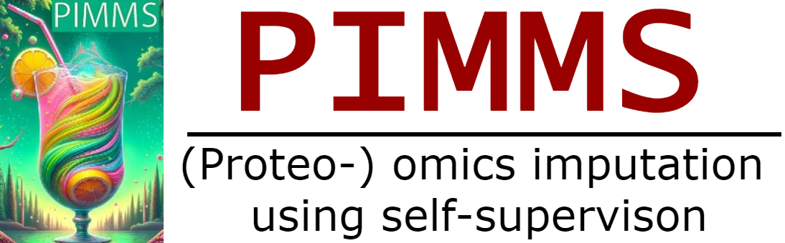

[](https://readthedocs.org/projects/pimms/) [](https://github.com/RasmussenLab/pimms/actions) [](https://pimms.readthedocs.io/en/latest/?badge=latest)

PIMMS stands for Proteomics Imputation Modeling Mass Spectrometry 
and is a hommage to our dear British friends 
who are missing as part of the EU for far too long already
(Pimms is a British summer drink).

We published the [work](https://www.nature.com/articles/s41467-024-48711-5) in Nature Communications as open access: 

> Webel, H., Niu, L., Nielsen, A.B. et al.  
> Imputation of label-free quantitative mass spectrometry-based proteomics data using self-supervised deep learning.  
> Nat Commun 15, 5405 (2024).  
> https://doi.org/10.1038/s41467-024-48711-5

We provide new functionality as a python package for simple use (in notebooks) and a workflow for comparsion with other methdos.

For any questions, please [open an issue](https://github.com/RasmussenLab/pimms/issues) or contact me directly.

## Getting started

The models can be used with the scikit-learn interface in the spirit of other scikit-learn imputers. You can try this using our tutorial in colab:

[](https://colab.research.google.com/github/RasmussenLab/pimms/blob/HEAD/project/04_1_train_pimms_models.ipynb)

It uses the scikit-learn interface. The PIMMS models in the scikit-learn interface
can be executed on the entire data or by specifying a valdiation split for checking training process.
In our experiments overfitting wasn't a big issue, but it's easy to check.

## Install Python package

For interactive use of the models provided in PIMMS, you can use our
[python package `pimms-learn`](https://pypi.org/project/pimms-learn/).
The interface is similar to scikit-learn. The package is then availabe as `pimmslearn`
for import in your Python session.

```
pip install pimms-learn
# import pimmslearn # in your python script
```

The most basic use for imputation is using a DataFrame.

```python
import numpy as np
import pandas as pd
from pimmslearn.sklearn.ae_transformer import AETransformer
from pimmslearn.sklearn.cf_transformer import CollaborativeFilteringTransformer

fn_intensities = ('https://raw.githubusercontent.com/RasmussenLab/pimms/main/'
                  'project/data/dev_datasets/HeLa_6070/protein_groups_wide_N50.csv')
index_name = 'Sample ID'
column_name = 'protein group'
value_name = 'intensity'

df = pd.read_csv(fn_intensities, index_col=0)
df = np.log2(df + 1)

df.index.name = index_name  # already set
df.columns.name = column_name  # not set due to csv disk file format

# df # see details below to see a preview of the DataFrame

# use the Denoising or Variational Autoencoder
model = AETransformer(
    model='DAE', # or 'VAE'
    hidden_layers=[512,],
    latent_dim=50, # dimension of joint sample and item embedding
    batch_size=10,
)
model.fit(df,
          cuda=False,
          epochs_max=100,
          )
df_imputed = model.transform(df)

# or use the collaborative filtering model
series = df.stack()
series.name = value_name  # ! important
model = CollaborativeFilteringTransformer(
    target_column=value_name,
    sample_column=index_name,
    item_column=column_name,
    n_factors=30, # dimension of separate sample and item embedding
    batch_size = 4096
)
model.fit(series, cuda=False, epochs_max=20)
df_imputed = model.transform(series).unstack()
```

<details>
  <summary>🔍 see log2 transformed DataFrame</summary>
  
  First 10 rows and 10 columns. notice that the indices are named:

  | Sample ID                                      |    AAAS |     AACS |    AAMDC |     AAMP |     AAR2 |    AARS |    AARS2 |   AASDHPPT |    AATF |   ABCB10 |
  |:-----------------------------------------------|--------:|---------:|---------:|---------:|---------:|--------:|---------:|-----------:|--------:|---------:|
  protein group | 
  | 2019_12_18_14_35_Q-Exactive-HF-X-Orbitrap_6070 | 28.3493 |  26.1332 | nan      |  26.7769 |  27.2478 | 32.1949 |  27.1526 |    27.8721 | 28.6025 |  26.1103 |
  | 2019_12_19_19_48_Q-Exactive-HF-X-Orbitrap_6070 | 27.6574 |  25.0186 |  24.2362 |  26.2707 |  27.2107 | 31.9792 |  26.5302 |    28.1915 | 27.9419 |  25.7349 |
  | 2019_12_20_14_15_Q-Exactive-HF-X-Orbitrap_6070 | 28.3522 |  23.7405 | nan      |  27.0979 |  27.3774 | 32.8845 |  27.5145 |    28.4756 | 28.7709 |  26.7868 |
  | 2019_12_27_12_29_Q-Exactive-HF-X-Orbitrap_6070 | 26.8255 | nan      | nan      |  26.2563 | nan      | 31.9264 |  26.1569 |    27.6349 | 27.8508 |  25.346  |
  | 2019_12_29_15_06_Q-Exactive-HF-X-Orbitrap_6070 | 27.4037 |  26.9485 |  23.8644 |  26.9816 |  26.5198 | 31.8438 |  25.3421 |    27.4164 | 27.4741 | nan      |
  | 2019_12_29_18_18_Q-Exactive-HF-X-Orbitrap_6070 | 27.8913 |  26.481  |  26.3475 |  27.8494 |  26.917  | 32.2737 | nan      |    27.4041 | 28.0811 | nan      |
  | 2020_01_02_17_38_Q-Exactive-HF-X-Orbitrap_6070 | 25.4983 | nan      | nan      | nan      | nan      | 30.2256 | nan      |    23.8013 | 25.1304 | nan      |
  | 2020_01_03_11_17_Q-Exactive-HF-X-Orbitrap_6070 | 27.3519 | nan      |  24.4331 |  25.2752 |  24.8459 | 30.9793 | nan      |    24.893  | 25.3238 | nan      |
  | 2020_01_03_16_58_Q-Exactive-HF-X-Orbitrap_6070 | 27.6197 |  25.6238 |  23.5204 |  27.1356 |  25.9713 | 31.4154 |  25.3596 |    25.1191 | 25.75   | nan      |
  | 2020_01_03_20_10_Q-Exactive-HF-X-Orbitrap_6070 | 27.2998 | nan      |  25.6604 |  27.7328 |  26.8965 | 31.4546 |  25.4369 |    26.8135 | 26.2008 | nan      |
  ...

</details>


For hints on how to add validation (and potentially test data) to use early stopping,
see the tutorial: [](https://colab.research.google.com/github/RasmussenLab/pimms/blob/HEAD/project/04_1_train_pimms_models.ipynb)


## PIMMS comparison workflow and differential analysis workflow

The PIMMS comparison workflow is a snakemake workflow that runs the all selected PIMMS models and R-models on 
a user-provided dataset and compares the results. An example for a publickly available Alzheimer dataset on the 
protein groups level is re-built regularly and available at: [rasmussenlab.org/pimms](https://www.rasmussenlab.org/pimms/)

It is built on top of
  - the [Snakefile_v2.smk](https://github.com/RasmussenLab/pimms/blob/HEAD/project/workflow/Snakefile_v2.smk) (v2 of imputation workflow), specified in on configuration
  - the [Snakefile_ald_comparision](https://github.com/RasmussenLab/pimms/blob/HEAD/project/workflow/Snakefile_ald_comparison.smk) workflow for differential analysis

The associated notebooks are index with `01_*` for the comparsion workflow and `10_*` for the differential analysis workflow. The `project` folder can be copied separately to any location if the package is installed. It's standalone folder. It's main folders are:

```bash
# project folder:
project
│   README.md # see description of notebooks and hints on execution in project folder
|---config # configuration files for experiments ("workflows")
|---data # data for experiments
|---runs # results of experiments
|---src # source code or binaries for some R packges
|---tutorials # some tutorials for libraries used in the project
|---workflow # snakemake workflows
```

To re-execute the entire workflow locally, have a look at the [configuration files](https://github.com/RasmussenLab/pimms/tree/HEAD/project/config/alzheimer_study) for the published Alzheimer workflow:

- [`config/alzheimer_study/config.yaml`](https://github.com/RasmussenLab/pimms/blob/HEAD/project/config/alzheimer_study/comparison.yaml)
- [`config/alzheimer_study/comparsion.yaml`](https://github.com/RasmussenLab/pimms/blob/HEAD/project/config/alzheimer_study/config.yaml)

To execute that workflow, follow the Setup instructions below and run the following commands
in the project folder:

```bash
# being in the project folder
snakemake -s workflow/Snakefile_v2.smk --configfile config/alzheimer_study/config.yaml -p -c1 -n # one core/process, dry-run
snakemake -s workflow/Snakefile_v2.smk --configfile config/alzheimer_study/config.yaml -p -c2 # two cores/process, execute
# after imputation workflow, execute the comparison workflow
snakemake -s workflow/Snakefile_ald_comparison.smk --configfile config/alzheimer_study/comparison.yaml -p -c1
# If you want to build the website locally: https://www.rasmussenlab.org/pimms/
pip install .[docs]
pimms-setup-imputation-comparison -f project/runs/alzheimer_study/
pimms-add-diff-comp -f project/runs/alzheimer_study/ -sf_cp project/runs/alzheimer_study/diff_analysis/AD
cd project/runs/alzheimer_study/
sphinx-build -n --keep-going -b html ./ ./_build/
# open ./_build/index.html
```

## Notebooks as scripts using papermill

The above workflow is based on notebooks as scripts, which can then be rendered as html files.'Using jupytext also python percentage script versions are saved.

If you want to run a specific model on your data, you can run notebooks prefixed with 
`01_`, i.e. [`project/01_*.ipynb`](https://github.com/RasmussenLab/pimms/tree/HEAD/project) after
creating hte appropriate data split. Start by cloning the repository. 

```bash
# navigat to your desired folder
git clone https://github.com/RasmussenLab/pimms.git # get all notebooks
cd project # project folder as pwd
# pip install pimms-learn papermill # if not already installed
papermill 01_0_split_data.ipynb --help-notebook
papermill 01_1_train_vae.ipynb --help-notebook
```
> ⚠️ Mistyped argument names won't throw an error when using papermill, but a warning is printed on the console thanks to my contributions:)

## Setup workflow and development environment

Either (1) install one big conda environment based on an environment file, 
or (2) install packages using a mix of conda and pip,
or (3) use snakemake separately with rule specific conda environments.

### Setup comparison workflow (1)

The core funtionality is available as a standalone software on PyPI under the name `pimms-learn`. However, running the entire snakemake workflow in enabled using 
conda (or mamba) and pip to setup an analysis environment. For a detailed description of setting up
conda (or mamba), see [instructions on setting up a virtual environment](https://github.com/RasmussenLab/pimms/blob/HEAD/docs/venv_setup.md).

Download the repository:

```
git clone https://github.com/RasmussenLab/pimms.git
cd pimms
```

Using conda (or mamba), install the dependencies and the package in editable mode

```
# from main folder of repository (containing environment.yml)
conda env create -n pimms -f environment.yml # slower
mamba env create -n pimms -f environment.yml # faster, less then 5mins
```

If on Mac M1, M2 or having otherwise issue using your accelerator (e.g. GPUs): Install the pytorch dependencies first, then the rest of the environment:

### Install pytorch first (2)

> ⚠️ We currently see issues with some installations on M1 chips. A dependency
> for one workflow is polars, which causes the issue. This should be [fixed now](https://github.com/RasmussenLab/njab/pull/13) 
> for general use by delayed import 
> of `mrmr-selection` in `njab`. If you encounter issues, please open an issue.

Check how to install pytorch for your system [here](https://pytorch.org/get-started).

- select the version compatible with your cuda version if you have an nvidia gpu or a Mac M-chip.

```bash
conda create -n pimms python=3.9 pip
conda activate pimms
# Follow instructions on https://pytorch.org/get-started: 
# CUDA is not available on MacOS, please use default package
# pip3 install torch torchvision torchaudio --index-url https://download.pytorch.org/whl/cpu
conda install pytorch::pytorch torchvision torchaudio fastai -c pytorch -c fastai -y
pip install pimms-learn
pip install jupyterlab papermill # use run notebook interactively or as a script

cd project
# choose one of the following to test the code
jupyter lab # open 04_1_train_pimms_models.ipynb
papermill 04_1_train_pimms_models.ipynb 04_1_train_pimms_models_test.ipynb # second notebook is output
python 04_1_train_pimms_models.py # just execute the code
```

### Let Snakemake handle installation (3)

If you only want to execute the workflow, you can use snakemake to build the environments for you:

Install snakemake e.g. using the provided [`snakemake_env.yml`](https://github.com/RasmussenLab/pimms/blob/HEAD/snakemake_env.yml)
file as used in 
[this workflow](https://github.com/RasmussenLab/pimms/blob/HEAD/.github/workflows/ci_workflow.yaml).

> ⚠️ Snakefile workflow for imputation v1 only support that atm.

```bash
snakemake -p -c1 --configfile config/single_dev_dataset/example/config.yaml --use-conda -n # dry-run
snakemake -p -c1 --configfile config/single_dev_dataset/example/config.yaml --use-conda # execute with one core
```

### Troubleshooting

Trouble shoot your R installation by opening jupyter lab

```
# in projects folder
jupyter lab # open 01_1_train_NAGuideR.ipynb
```

## Run example on HeLa data

Change to the [`project` folder](./project) and see it's [README](project/README.md)
You can subselect models by editing the config file:  [`config.yaml`](https://github.com/RasmussenLab/pimms/tree/HEAD/project/config/single_dev_dataset/proteinGroups_N50) file.

```
conda activate pimms # activate virtual environment
cd project # go to project folder
pwd # so be in ./pimms/project
snakemake -c1 -p -n # dryrun demo workflow, potentiall add --use-conda
snakemake -c1 -p
```

The demo will run an example on a small data set of 50 HeLa samples (protein groups):
  1. it describes the data and does create the splits based on the [example data](project/data/dev_datasets/HeLa_6070/README.md)
     - see `01_0_split_data.ipynb`
  2. it runs the three semi-supervised models next to some default heuristic methods
     - see `01_1_train_collab.ipynb`, `01_1_train_dae.ipynb`, `01_1_train_vae.ipynb`
  3. it creates an comparison
     - see `01_2_performance_plots.ipynb`

The results are written to `./pimms/project/runs/example`, including `html` versions of the 
notebooks for inspection, having the following structure:

```
│   01_0_split_data.html
│   01_0_split_data.ipynb
│   01_1_train_collab.html
│   01_1_train_collab.ipynb
│   01_1_train_dae.html
│   01_1_train_dae.ipynb
│   01_1_train_vae.html
│   01_1_train_vae.ipynb
│   01_2_performance_plots.html
│   01_2_performance_plots.ipynb
│   data_config.yaml
│   tree_folder.txt
|---data
|---figures
|---metrics
|---models
|---preds
```

The predictions of the three semi-supervised models can be found under `./pimms/project/runs/example/preds`.
To combine them with the observed data you can run

```python
# ipython or python session
# be in ./pimms/project
folder_data = 'runs/example/data'
data = pimmslearn.io.datasplits.DataSplits.from_folder(
    folder_data, file_format='pkl')
observed = pd.concat([data.train_X, data.val_y, data.test_y])
# load predictions for missing values of a certain model
model = 'vae'
fpath_pred = f'runs/example/preds/pred_real_na_{model}.csv '
pred = pd.read_csv(fpath_pred, index_col=[0, 1]).squeeze()
df_imputed = pd.concat([observed, pred]).unstack()
# assert no missing values for retained features
assert df_imputed.isna().sum().sum() == 0
df_imputed
```

> :warning: The imputation is simpler if you use the provide scikit-learn Transformer
> interface (see [Tutorial](https://colab.research.google.com/github/RasmussenLab/pimms/blob/HEAD/project/04_1_train_pimms_models.ipynb)).

## Available imputation methods

Packages either are based on this repository, were referenced by NAGuideR or released recently.
From the brief description in this table the exact procedure is not always clear.

| Method        | Package           | source       | links  | name              |
| ------------- | ----------------- | ------       | ------ |------------------ | 
| CF            | pimms             | pip          | [paper](https://doi.org/10.1038/s41467-024-48711-5) | Collaborative Filtering |
| DAE           | pimms             | pip          | [paper](https://doi.org/10.1038/s41467-024-48711-5) | Denoising Autoencoder   |
| VAE           | pimms             | pip          | [paper](https://doi.org/10.1038/s41467-024-48711-5) | Variational Autoencoder |     
|  |   | | | 
| ZERO          | -                 | -            | - | replace NA with 0 |
| MINIMUM       | -                 | -            | - | replace NA with global minimum    |
| COLMEDIAN     | e1071             | CRAN         | - | replace NA with column median  |
| ROWMEDIAN     | e1071             | CRAN         | - | replace NA with row median     |
| KNN_IMPUTE    | impute            | BIOCONDUCTOR | [docs](https://bioconductor.org/packages/release/bioc/html/impute.html) | k nearest neighbor imputation   |
| SEQKNN        | SeqKnn            | tar file     | [paper](https://bmcbioinformatics.biomedcentral.com/articles/10.1186/1471-2105-5-160) | Sequential k- nearest neighbor imputation <br> starts with feature with least missing values and re-use imputed values for not yet imputed features
| BPCA          | pcaMethods        | BIOCONDUCTOR | [paper](https://doi.org/10.1093/bioinformatics/btm069) | Bayesian PCA missing value imputation
| SVDMETHOD     | pcaMethods        | BIOCONDUCTOR | [paper](https://doi.org/10.1093/bioinformatics/btm069) | replace NA initially with zero, use k most significant eigenvalues using Singular Value Decomposition for imputation until convergence
| LLS           | pcaMethods        | BIOCONDUCTOR | [paper](https://doi.org/10.1093/bioinformatics/btm069) | Local least squares imputation of a feature based on k most correlated features
| MLE           | norm              | CRAN         | | Maximum likelihood estimation
| QRILC         | imputeLCMD        | CRAN         | [paper](https://doi.org/10.1021/acs.jproteome.5b00981)| quantile regression imputation of left-censored data, i.e. by random draws from a truncated distribution which parameters were estimated by quantile regression
| MINDET        | imputeLCMD        | CRAN         | [paper](https://doi.org/10.1021/acs.jproteome.5b00981) | replace NA with q-quantile minimum in a sample
| MINPROB       | imputeLCMD        | CRAN         | [paper](https://doi.org/10.1021/acs.jproteome.5b00981) | replace NA by random draws from q-quantile minimum centered distribution
| IRM           | VIM               | CRAN         | [paper](https://doi.org/10.18637/jss.v074.i07) | iterativ robust model-based imputation (one feature at at time)
| IMPSEQ        | rrcovNA           | CRAN         | [paper](https://doi.org/10.1007/s11634-010-0075-2) | Sequential imputation of missing values by minimizing the determinant of the covariance matrix with imputed values
| IMPSEQROB     | rrcovNA           | CRAN         | [paper](https://doi.org/10.1007/s11634-010-0075-2) | Sequential imputation of missing values using robust estimators
| MICE-NORM     | mice              | CRAN         | [paper](https://doi.org/10.1002%2Fmpr.329)| Multivariate Imputation by Chained Equations (MICE) using Bayesian linear regression
| MICE-CART     | mice              | CRAN         | [paper](https://doi.org/10.1002%2Fmpr.329)| Multivariate Imputation by Chained Equations (MICE) using regression trees
| TRKNN         | -                 | script       | [paper](https://doi.org/10.1186/s12859-017-1547-6) | truncation k-nearest neighbor imputation 
| RF            | missForest        | CRAN         | [paper](https://doi.org/10.1093/bioinformatics/btr597) | Random Forest imputation (one feature at a time)
| PI            | -                 | -            | | Downshifted normal distribution (per sample)
| GSIMP         | -                 | script       | [paper](https://doi.org/10.1371/journal.pcbi.1005973) | QRILC initialization and iterative Gibbs sampling with generalized linear models (glmnet) - slow
| MSIMPUTE      | msImpute          | BIOCONDUCTOR | [paper](https://doi.org/10.1016/j.mcpro.2023.100558) | Missing at random algorithm using low rank approximation
| MSIMPUTE_MNAR | msImpute          | BIOCONDUCTOR | [paper](https://doi.org/10.1016/j.mcpro.2023.100558) | Missing not at random algorithm using low rank approximation


DreamAI and GMSimpute are not available for installation on Windows or failed to install.
