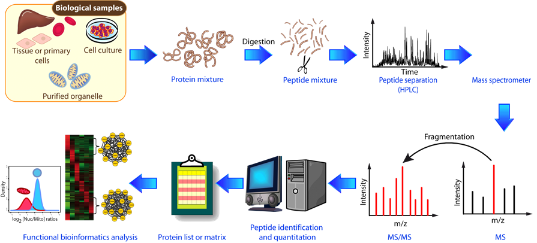
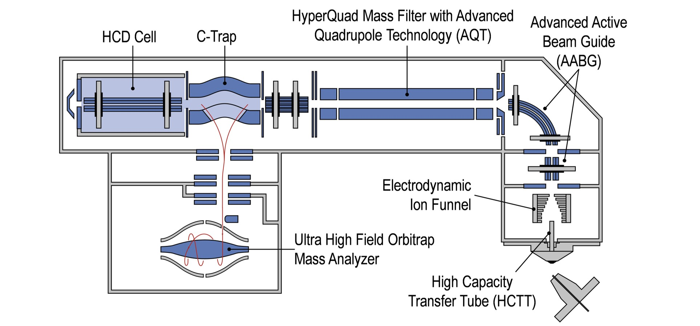

# Proteomics Introductions

## Lennart Martens - Introduction to Proteomics 
> [lecture videos on youtube](https://www.youtube.com/watch?v=Wy1SwrMzhYk&list=PLXxp6nsBenSX_W8DiOocKJ0laNauYNdYl)
- Digitalizer: Transform an analog signal into a digital signal

- Ionization Types
  - MALDI: Analyte (peptide) is charged by matrix molecules by *one* ion only (mechanism is not so clear)
    - three common matrix molecules in proteomics (CHCA, SA, DHB): Benzeme group taking up laser energy. 
      Inherent bias to three amino-acids by MALDI due to three amino-acids sharing conformational similarity with benzeme group
  - Electrospray ionization (ESI): Acid is added to the liquid in order to obtain charged peptides. 
    - temperature of the needle
    - peptides can take more than one ion

- roughly 150.000 possible peptides if 5000 genes are expressed in a tissue (without any PTMs)

- Detectors get worse over time. In the maintence sample one should see a spike when a new 
  detector is replaced for the old one.

- Fragmentation of peptides
  - collision-induced dissociation (CID): b and y ions
    - ergodic process, continously stronger vibration of peptide cleaves PSMs
  - electron-capture dissociation (ECD): c and z ions 
    - preserves PTMs as the fracturing is non- ergodic (vibration induced)

## Intro (OpenMS from Tübingen)
> [Recording on youtube](https://www.youtube.com/watch?v=tnS-w8ggEAA&list=PL_6fafgzU1nHd13qqjm3uNvyHh62JpPcB&index=2&t=0s)
- *Ion mobility* as a way to identify number of charges (ions), adding another dimension to the data
- predict MS2 peptide itensities in order to better identify peptides ([MS2PIP](https://iomics.ugent.be/ms2pip/), [DeepMass: Prism](https://github.com/verilylifesciences/deepmass), Prosit)- 
    - Question: Does this take amino-acid sequences and provides spectra?
- number of mappings from peptides to protein (How many peptides per peptide?)
- absoute quantification siscpa, aqua
- feature-based label-free quantification
    - does scale to (100?)
    - quantification of isotopes (3D integral: intensity over retention time and m/z )
- [SWATH-MS](https://imsb.ethz.ch/research/aebersold/research/swath-ms.html): DIA in DDA setting?
- [pyOpenMS](https://pyopenms.readthedocs.io/en/latest/)
- HUGO PSI Standards Formats: Machines do not provide all the same standardized dataset.
- KNIME is popular for custom machines. `Nextflow` for cloud providers

## Mass Spectrometry
- Unbiased analysis that does not require prior knowledge of the sample composition 
- Analytical technique which identifies molecules based on their mass and charge (m/z)
- Proteomics: the large-scale study of proteins.

## Pipeline 

### Liquid Chromatorgraphy (LC)
- Peptide separation by hydrophobicity
    - hydrophilic vs hydrophobic liquids (Acetonitrile)

### Column
- reverse phase (chromatography)
  (also called RPC, reverse-phase chromatography, or hydrophobic chromatography) 
  includes any chromatographic method that uses a hydrophobic stationary phase. 
  RPC refers to liquid (rather than gas) chromatography.)
    > Reversed-phase chromatography (also called RPC, reverse-phase chromatography, or hydrophobic chromatography) includes any chromatographic method that uses a hydrophobic stationary phase. RPC refers to liquid (rather than gas) chromatography.
    > (...) Reversed-phase chromatography is a technique using alkyl chains covalently bonded to the stationary phase particles in order to create a hydrophobic stationary phase, which has a stronger affinity for hydrophobic or less polar compounds. The use of a hydrophobic stationary phase is essentially the reverse of normal phase chromatography, since the polarity of the mobile and stationary phases have been inverted – hence the term reversed-phase chromatography.

- 75um ID packed with 3um/1.9um reverse phase C18 beads. Pulled fused silica
- Column performance is very important for your experiments.
    - If the column is not packed perfectly you will have dead volumes and peak tailing. 
    - You will pick the same peptides for identification 

### Mass Specometry
> "One of the most significant differences between transcriptomics and proteomics is in the dynamic range of mRNA and protein concentrations inside the cell. While the protein abundances stretch over at least seven orders of magnitude, from one copy per cell to ten million copies per cell, the mRNA dynamic range covers only three or four orders of magnitude." (https://doi.org/10.1002/pmic.201200451)

Claim: Around 5000 proteins should be identified for each sample.

#### Data Dependent Acquistion (DDA)
Orbitrap specific steps:
1. MS1: mix of peptides to identify most candidates for MS2 scan
2. MS2: one peptide (z/m ratio) which is then fragmented and scanned

> Default: 12 MS2 and 1MS1 scan in parallel

### Peptide Identification
- How do we get from acquired spectra to protein and peptide identifications?
- some peptides have the same mass
- To identify peptides the mass spectrometer performs a fragment (MS2) scan on an isolated peptide ion
    - peptides with the same m/z ratio are fragmented and then analyzed ("de novo" sequencing)

## Amino Acids and residuals

Name            | abr | code | Residue Mass
---             | --- | ---  | ---
Alanine         | Ala | A    |  71.03711
Arginine        | Arg | R    | 156.10111
Aspartic Acid   | Asn | N    | 114.04293
Cysteine        | Cys | C    | 103.00919
Glutamic Acid   | Glu | E    | 129.04259
Glutamine       | Gln | Q    | 128.05858
Glycine         | Gly | G    |  57.02146
Histidine       | His | H    | 137.05891
Isoleucine      | Ile | I    | 113.08406
Leucine         | Leu | L    | 113.08406
Lysine          | Lys | K    | 128.09496
Methionine      | Met | M    | 131.04049
Phenyalanine    | Phe | F    | 147.06841
Proline         | Pro | P    |  97.05276
Serine          | Ser | S    |  87.03203
Threonine       | Thr | T    | 101.04768
Trypthophan     | Trp | W    | 186.07931
Tyrosine        | Tyr | Y    | 163.06333
Valine          | Val | V    |  99.06841

- Residue mass is referring to the mass in an peptide of a amino acid

## Confunding Factors (or Hyperparameters)
> Critical parameters for DDA methods. Recommendation for machines at CPR

- Max Injection Time
    - The maximum time which the instrument will use to reach the target amount of ions in the C-trap
    - Low max injection times gives faster scans speed.
    - High max injection times gives better intensity and dynamic range

- Automatic Gain Control (AGC) Target
    - The target ion amount which will be accumulated in the C- trap
    - A higher AGC target will give higher intensity

- Dynamic Exclusion Time
    - The time which the instrument will exclude precursors already selected for MS2.
    - Exclusion time is dependent on the length of your gradient.
    - For 145 minutes, we usually have 30 seconds
- Number of MS2 scans (Top N)
    - More MS2 scans gives deeper protein coverage but slower speed.

- sample overloading (too much liquid) messes up scan (relation to _Dynamic Range_?)
- dwell time
    - the time a particular ion (m/z) signal is monitored
- cycle time

## Techniques
- TOF
- ORBITRAP
- PASEF
- FAIMS
- HCD Cell

### Orbitrap

## Amino Acid weights
- fragments of peptides are identified on their weights

## Glossar

Term   | meaning
----   | ---
c-Trap | Meaning of c? collects one million particles before forwarding them
elute  | remove (an adsorbed substance) by washing with a solvent, especially in chromatography
HCD    | 
XIC    | Extracted Ion  Current
