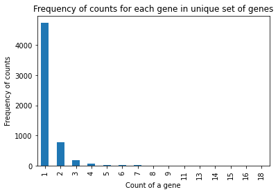
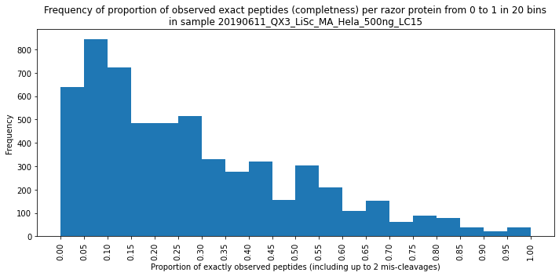

# Explore MaxQuant (MQ) output files of single runs

The `project/10_training_data.ipynb` notebook does extract information to be used as training data. File specific one could also use the retention time analysis to identify _valid_ co-occurring peptides to be use during training. Potentially this preprocessing step can be used at inference time.

This notebook contains some relevant analysis for a specific `txt` output-folder in the current project

##### Analysis overview

> Report for example data

- relation between `peptides.txt` and `evidence.txt`


```python
import logging
import os
from pathlib import Path
import random

import ipywidgets as widgets
import pandas as pd
# pd.options.display.float_format = '{:,.1f}'.format

from vaep.io.mq import FASTA_KEYS, MaxQuantOutput, MaxQuantOutputDynamic
from vaep.io import search_files, search_subfolders

##################
##### CONFIG #####
##################

from src.src.config import FIGUREFOLDER
from src.src.config import FOLDER_RAW_DATA
from src.src.config import FOLDER_KEY  # defines how filenames are parsed for use as indices
from src.src.config import FOLDER_DATA  # project folder for storing the data

print(f"Search Raw-Files on path: {FOLDER_RAW_DATA}")
```

    Search Raw-Files on path: data\mq_out
    


```python
from datetime import datetime

#Delete Jupyter notebook root logger handler
logger = logging.getLogger()
logger.handlers = []

# logger = logging.getLogger(mq_output.folder.stem)
logger = logging.getLogger('vaep')
logger.setLevel(logging.INFO)

c_handler = logging.StreamHandler()
c_handler.setLevel(logging.INFO)


date_log_file = "{:%y%m%d_%H%M}".format(datetime.now())
f_handler = logging.FileHandler(f"log_01_explore_raw_MQ_{date_log_file}.txt")
f_handler.setLevel(logging.INFO)

c_format = logging.Formatter(
    f'%(name)s - %(levelname)-8s %(message)s ')

c_handler.setFormatter(c_format)
f_handler.setFormatter(c_format)

logger.handlers = []  #remove any handler in case you reexecute the cell
logger.addHandler(c_handler)
logger.addHandler(f_handler)
```


```python
logger.handlers
```


    [<StreamHandler stderr (INFO)>,
     <FileHandler C:\Users\kzl465\OneDrive - University of Copenhagen\vaep\project\log_01_explore_raw_MQ_210202_2246.txt (INFO)>]


```python
folders = search_subfolders(path=FOLDER_RAW_DATA, depth=1, exclude_root=True)
w_folder = widgets.Dropdown(options=folders, description='Select a folder')
w_folder
```


    Dropdown(description='Select a folder', options=(WindowsPath('data/mq_out/20190611_QX3_LiSc_MA_Hela_500ng_LC15…


```python
mq_output = MaxQuantOutput(folder=w_folder.value)
```

## Some important columns

Grouped by a namedtuple allowing attribute access


```python
from vaep.io.mq import mq_col
mq_col
```


    MqColumns(GENE_NAMES='Gene names', INTENSITY='Intensity', RETENTION_TIME='Retention time', CALIBRATED_RETENTION_TIME='Calibrated retention time', SEQUENCE='Sequence', LEADING_RAZOR_PROTEIN='Leading razor protein', PROTEINS='Proteins')


## `peptides.txt`

> For reference on final "result"


```python
pd.options.display.max_columns = len(mq_output.peptides.columns)
mq_output.peptides
```


<div>
<style scoped>
    .dataframe tbody tr th:only-of-type {
        vertical-align: middle;
    }

    .dataframe tbody tr th {
        vertical-align: top;
    }

    .dataframe thead th {
        text-align: right;
    }
</style>
<table border="1" class="dataframe">
  <thead>
    <tr style="text-align: right;">
      <th></th>
      <th>N-term cleavage window</th>
      <th>C-term cleavage window</th>
      <th>Amino acid before</th>
      <th>First amino acid</th>
      <th>Second amino acid</th>
      <th>Second last amino acid</th>
      <th>Last amino acid</th>
      <th>Amino acid after</th>
      <th>A Count</th>
      <th>R Count</th>
      <th>N Count</th>
      <th>D Count</th>
      <th>C Count</th>
      <th>Q Count</th>
      <th>E Count</th>
      <th>G Count</th>
      <th>H Count</th>
      <th>I Count</th>
      <th>L Count</th>
      <th>K Count</th>
      <th>M Count</th>
      <th>F Count</th>
      <th>P Count</th>
      <th>S Count</th>
      <th>T Count</th>
      <th>W Count</th>
      <th>Y Count</th>
      <th>V Count</th>
      <th>U Count</th>
      <th>O Count</th>
      <th>Length</th>
      <th>Missed cleavages</th>
      <th>Mass</th>
      <th>Proteins</th>
      <th>Leading razor protein</th>
      <th>Start position</th>
      <th>End position</th>
      <th>Gene names</th>
      <th>Protein names</th>
      <th>Unique (Groups)</th>
      <th>Unique (Proteins)</th>
      <th>Charges</th>
      <th>PEP</th>
      <th>Score</th>
      <th>Intensity</th>
      <th>Reverse</th>
      <th>Potential contaminant</th>
      <th>id</th>
      <th>Protein group IDs</th>
      <th>Mod. peptide IDs</th>
      <th>Evidence IDs</th>
      <th>MS/MS IDs</th>
      <th>Best MS/MS</th>
      <th>Oxidation (M) site IDs</th>
      <th>Taxonomy IDs</th>
      <th>MS/MS Count</th>
    </tr>
    <tr>
      <th>Sequence</th>
      <th></th>
      <th></th>
      <th></th>
      <th></th>
      <th></th>
      <th></th>
      <th></th>
      <th></th>
      <th></th>
      <th></th>
      <th></th>
      <th></th>
      <th></th>
      <th></th>
      <th></th>
      <th></th>
      <th></th>
      <th></th>
      <th></th>
      <th></th>
      <th></th>
      <th></th>
      <th></th>
      <th></th>
      <th></th>
      <th></th>
      <th></th>
      <th></th>
      <th></th>
      <th></th>
      <th></th>
      <th></th>
      <th></th>
      <th></th>
      <th></th>
      <th></th>
      <th></th>
      <th></th>
      <th></th>
      <th></th>
      <th></th>
      <th></th>
      <th></th>
      <th></th>
      <th></th>
      <th></th>
      <th></th>
      <th></th>
      <th></th>
      <th></th>
      <th></th>
      <th></th>
      <th></th>
      <th></th>
      <th></th>
      <th></th>
    </tr>
  </thead>
  <tbody>
    <tr>
      <th>AAAAAAAAAAAATGTEAGPGTAGGSENGSEVAAQPAGLSGPAEVGPGAVGER</th>
      <td>______________________________</td>
      <td>LSGPAEVGPGAVGERTPRKKEPPRASPPGG</td>
      <td>K</td>
      <td>A</td>
      <td>A</td>
      <td>E</td>
      <td>R</td>
      <td>T</td>
      <td>19</td>
      <td>1</td>
      <td>1</td>
      <td>0</td>
      <td>0</td>
      <td>1</td>
      <td>5</td>
      <td>11</td>
      <td>0</td>
      <td>0</td>
      <td>1</td>
      <td>0</td>
      <td>0</td>
      <td>0</td>
      <td>4</td>
      <td>3</td>
      <td>3</td>
      <td>0</td>
      <td>0</td>
      <td>3</td>
      <td>0</td>
      <td>0</td>
      <td>52</td>
      <td>0</td>
      <td>4,401.1</td>
      <td>R4GMQ1;O60341;O60341-2</td>
      <td>R4GMQ1</td>
      <td>7.0</td>
      <td>58.0</td>
      <td>KDM1A</td>
      <td>Lysine-specific histone demethylase 1A</td>
      <td>yes</td>
      <td>no</td>
      <td>4</td>
      <td>0.0</td>
      <td>102.7</td>
      <td>57,739,000</td>
      <td>NaN</td>
      <td>NaN</td>
      <td>0</td>
      <td>1774</td>
      <td>0</td>
      <td>0</td>
      <td>0</td>
      <td>0.0</td>
      <td>NaN</td>
      <td>9606</td>
      <td>1</td>
    </tr>
    <tr>
      <th>AAAAAAAAAVSR</th>
      <td>TTSSRVLRGGRDRGRAAAAAAAAAVSRRRK</td>
      <td>RGRAAAAAAAAAVSRRRKAEYPRRRRSSPS</td>
      <td>R</td>
      <td>A</td>
      <td>A</td>
      <td>S</td>
      <td>R</td>
      <td>R</td>
      <td>9</td>
      <td>1</td>
      <td>0</td>
      <td>0</td>
      <td>0</td>
      <td>0</td>
      <td>0</td>
      <td>0</td>
      <td>0</td>
      <td>0</td>
      <td>0</td>
      <td>0</td>
      <td>0</td>
      <td>0</td>
      <td>0</td>
      <td>1</td>
      <td>0</td>
      <td>0</td>
      <td>0</td>
      <td>1</td>
      <td>0</td>
      <td>0</td>
      <td>12</td>
      <td>0</td>
      <td>999.5</td>
      <td>A0A0A6YYC7;Q96JP5-2;Q96JP5</td>
      <td>A0A0A6YYC7</td>
      <td>59.0</td>
      <td>70.0</td>
      <td>ZFP91-CNTF;ZFP91</td>
      <td>E3 ubiquitin-protein ligase ZFP91</td>
      <td>yes</td>
      <td>no</td>
      <td>2</td>
      <td>0.0</td>
      <td>68.6</td>
      <td>87,575,000</td>
      <td>NaN</td>
      <td>NaN</td>
      <td>1</td>
      <td>231</td>
      <td>1</td>
      <td>1</td>
      <td>1</td>
      <td>1.0</td>
      <td>NaN</td>
      <td>9606</td>
      <td>1</td>
    </tr>
    <tr>
      <th>AAAAAAAGDSDSWDADAFSVEDPVRK</th>
      <td>______________________________</td>
      <td>SWDADAFSVEDPVRKVGGGGTAGGDRWEGE</td>
      <td>M</td>
      <td>A</td>
      <td>A</td>
      <td>R</td>
      <td>K</td>
      <td>V</td>
      <td>9</td>
      <td>1</td>
      <td>0</td>
      <td>5</td>
      <td>0</td>
      <td>0</td>
      <td>1</td>
      <td>1</td>
      <td>0</td>
      <td>0</td>
      <td>0</td>
      <td>1</td>
      <td>0</td>
      <td>1</td>
      <td>1</td>
      <td>3</td>
      <td>0</td>
      <td>1</td>
      <td>0</td>
      <td>2</td>
      <td>0</td>
      <td>0</td>
      <td>26</td>
      <td>1</td>
      <td>2,592.2</td>
      <td>O75822;O75822-3;O75822-2</td>
      <td>O75822</td>
      <td>2.0</td>
      <td>27.0</td>
      <td>EIF3J</td>
      <td>Eukaryotic translation initiation factor 3 sub...</td>
      <td>yes</td>
      <td>no</td>
      <td>3</td>
      <td>0.0</td>
      <td>157.9</td>
      <td>442,780,000</td>
      <td>NaN</td>
      <td>NaN</td>
      <td>2</td>
      <td>1877</td>
      <td>2</td>
      <td>2</td>
      <td>2</td>
      <td>2.0</td>
      <td>NaN</td>
      <td>9606</td>
      <td>1</td>
    </tr>
    <tr>
      <th>AAAAAAALQAK</th>
      <td>TILRQARNHKLRVDKAAAAAAALQAKSDEK</td>
      <td>RVDKAAAAAAALQAKSDEKAAVAGKKPVVG</td>
      <td>K</td>
      <td>A</td>
      <td>A</td>
      <td>A</td>
      <td>K</td>
      <td>S</td>
      <td>8</td>
      <td>0</td>
      <td>0</td>
      <td>0</td>
      <td>0</td>
      <td>1</td>
      <td>0</td>
      <td>0</td>
      <td>0</td>
      <td>0</td>
      <td>1</td>
      <td>1</td>
      <td>0</td>
      <td>0</td>
      <td>0</td>
      <td>0</td>
      <td>0</td>
      <td>0</td>
      <td>0</td>
      <td>0</td>
      <td>0</td>
      <td>0</td>
      <td>11</td>
      <td>0</td>
      <td>955.5</td>
      <td>P36578;H3BM89;H3BU31</td>
      <td>P36578</td>
      <td>354.0</td>
      <td>364.0</td>
      <td>RPL4</td>
      <td>60S ribosomal protein L4</td>
      <td>yes</td>
      <td>no</td>
      <td>2</td>
      <td>0.0</td>
      <td>144.4</td>
      <td>3,166,700,000</td>
      <td>NaN</td>
      <td>NaN</td>
      <td>3</td>
      <td>2461</td>
      <td>3</td>
      <td>3</td>
      <td>3;4</td>
      <td>4.0</td>
      <td>NaN</td>
      <td>9606</td>
      <td>2</td>
    </tr>
    <tr>
      <th>AAAAAAGAASGLPGPVAQGLK</th>
      <td>______________________________</td>
      <td>GAASGLPGPVAQGLKEALVDTLTGILSPVQ</td>
      <td>M</td>
      <td>A</td>
      <td>A</td>
      <td>L</td>
      <td>K</td>
      <td>E</td>
      <td>9</td>
      <td>0</td>
      <td>0</td>
      <td>0</td>
      <td>0</td>
      <td>1</td>
      <td>0</td>
      <td>4</td>
      <td>0</td>
      <td>0</td>
      <td>2</td>
      <td>1</td>
      <td>0</td>
      <td>0</td>
      <td>2</td>
      <td>1</td>
      <td>0</td>
      <td>0</td>
      <td>0</td>
      <td>1</td>
      <td>0</td>
      <td>0</td>
      <td>21</td>
      <td>0</td>
      <td>1,748.0</td>
      <td>Q96P70</td>
      <td>Q96P70</td>
      <td>2.0</td>
      <td>22.0</td>
      <td>IPO9</td>
      <td>Importin-9</td>
      <td>yes</td>
      <td>yes</td>
      <td>2;3</td>
      <td>0.0</td>
      <td>119.7</td>
      <td>93,181,000</td>
      <td>NaN</td>
      <td>NaN</td>
      <td>4</td>
      <td>4162</td>
      <td>4</td>
      <td>4;5</td>
      <td>5;6</td>
      <td>6.0</td>
      <td>NaN</td>
      <td>9606</td>
      <td>2</td>
    </tr>
    <tr>
      <th>...</th>
      <td>...</td>
      <td>...</td>
      <td>...</td>
      <td>...</td>
      <td>...</td>
      <td>...</td>
      <td>...</td>
      <td>...</td>
      <td>...</td>
      <td>...</td>
      <td>...</td>
      <td>...</td>
      <td>...</td>
      <td>...</td>
      <td>...</td>
      <td>...</td>
      <td>...</td>
      <td>...</td>
      <td>...</td>
      <td>...</td>
      <td>...</td>
      <td>...</td>
      <td>...</td>
      <td>...</td>
      <td>...</td>
      <td>...</td>
      <td>...</td>
      <td>...</td>
      <td>...</td>
      <td>...</td>
      <td>...</td>
      <td>...</td>
      <td>...</td>
      <td>...</td>
      <td>...</td>
      <td>...</td>
      <td>...</td>
      <td>...</td>
      <td>...</td>
      <td>...</td>
      <td>...</td>
      <td>...</td>
      <td>...</td>
      <td>...</td>
      <td>...</td>
      <td>...</td>
      <td>...</td>
      <td>...</td>
      <td>...</td>
      <td>...</td>
      <td>...</td>
      <td>...</td>
      <td>...</td>
      <td>...</td>
      <td>...</td>
      <td>...</td>
    </tr>
    <tr>
      <th>YYTSASGDEMVSLK</th>
      <td>HEDSQNRKKLSELLRYYTSASGDEMVSLKD</td>
      <td>RYYTSASGDEMVSLKDYCTRMKENQKHIYY</td>
      <td>R</td>
      <td>Y</td>
      <td>Y</td>
      <td>L</td>
      <td>K</td>
      <td>D</td>
      <td>1</td>
      <td>0</td>
      <td>0</td>
      <td>1</td>
      <td>0</td>
      <td>0</td>
      <td>1</td>
      <td>1</td>
      <td>0</td>
      <td>0</td>
      <td>1</td>
      <td>1</td>
      <td>1</td>
      <td>0</td>
      <td>0</td>
      <td>3</td>
      <td>1</td>
      <td>0</td>
      <td>2</td>
      <td>1</td>
      <td>0</td>
      <td>0</td>
      <td>14</td>
      <td>0</td>
      <td>1,549.7</td>
      <td>P07900;P07900-2</td>
      <td>P07900</td>
      <td>465.0</td>
      <td>478.0</td>
      <td>HSP90AA1</td>
      <td>Heat shock protein HSP 90-alpha</td>
      <td>yes</td>
      <td>no</td>
      <td>2</td>
      <td>0.0</td>
      <td>192.3</td>
      <td>2,132,200,000</td>
      <td>NaN</td>
      <td>NaN</td>
      <td>38,783</td>
      <td>2077</td>
      <td>40966;40967</td>
      <td>49202;49203;49204;49205;49206;49207;49208;49209</td>
      <td>54670;54671;54672;54673;54674;54675;54676;5467...</td>
      <td>54,679.0</td>
      <td>1311</td>
      <td>9606</td>
      <td>10</td>
    </tr>
    <tr>
      <th>YYTVFDRDNNR</th>
      <td>PSGPLWILGDVFIGRYYTVFDRDNNRVGFA</td>
      <td>FIGRYYTVFDRDNNRVGFAEAARL______</td>
      <td>R</td>
      <td>Y</td>
      <td>Y</td>
      <td>N</td>
      <td>R</td>
      <td>V</td>
      <td>0</td>
      <td>2</td>
      <td>2</td>
      <td>2</td>
      <td>0</td>
      <td>0</td>
      <td>0</td>
      <td>0</td>
      <td>0</td>
      <td>0</td>
      <td>0</td>
      <td>0</td>
      <td>0</td>
      <td>1</td>
      <td>0</td>
      <td>0</td>
      <td>1</td>
      <td>0</td>
      <td>2</td>
      <td>1</td>
      <td>0</td>
      <td>0</td>
      <td>11</td>
      <td>1</td>
      <td>1,461.7</td>
      <td>A0A1B0GVD5;A0A1B0GWE8;P07339;A0A1B0GW44;A0A1B0...</td>
      <td>A0A1B0GVD5</td>
      <td>390.0</td>
      <td>400.0</td>
      <td>CTSD</td>
      <td>Cathepsin D;Cathepsin D light chain;Cathepsin ...</td>
      <td>yes</td>
      <td>no</td>
      <td>3</td>
      <td>0.0</td>
      <td>73.8</td>
      <td>139,230,000</td>
      <td>NaN</td>
      <td>NaN</td>
      <td>38,784</td>
      <td>379</td>
      <td>40968</td>
      <td>49210</td>
      <td>54680</td>
      <td>54,680.0</td>
      <td>NaN</td>
      <td>9606</td>
      <td>1</td>
    </tr>
    <tr>
      <th>YYVLNALK</th>
      <td>GQPVKVRVSYQKLLKYYVLNALKHRPPKAQ</td>
      <td>SYQKLLKYYVLNALKHRPPKAQKKRYLFRS</td>
      <td>K</td>
      <td>Y</td>
      <td>Y</td>
      <td>L</td>
      <td>K</td>
      <td>H</td>
      <td>1</td>
      <td>0</td>
      <td>1</td>
      <td>0</td>
      <td>0</td>
      <td>0</td>
      <td>0</td>
      <td>0</td>
      <td>0</td>
      <td>0</td>
      <td>2</td>
      <td>1</td>
      <td>0</td>
      <td>0</td>
      <td>0</td>
      <td>0</td>
      <td>0</td>
      <td>0</td>
      <td>2</td>
      <td>1</td>
      <td>0</td>
      <td>0</td>
      <td>8</td>
      <td>0</td>
      <td>982.5</td>
      <td>Q6P2Q9;I3L0J9</td>
      <td>Q6P2Q9</td>
      <td>453.0</td>
      <td>460.0</td>
      <td>PRPF8</td>
      <td>Pre-mRNA-processing-splicing factor 8</td>
      <td>yes</td>
      <td>no</td>
      <td>2</td>
      <td>0.0</td>
      <td>58.7</td>
      <td>147,430,000</td>
      <td>NaN</td>
      <td>NaN</td>
      <td>38,785</td>
      <td>3521</td>
      <td>40969</td>
      <td>49211</td>
      <td>54681</td>
      <td>54,681.0</td>
      <td>NaN</td>
      <td>9606</td>
      <td>1</td>
    </tr>
    <tr>
      <th>YYVTIIDAPGHR</th>
      <td>GITIDISLWKFETSKYYVTIIDAPGHRDFI</td>
      <td>TSKYYVTIIDAPGHRDFIKNMITGTSQADC</td>
      <td>K</td>
      <td>Y</td>
      <td>Y</td>
      <td>H</td>
      <td>R</td>
      <td>D</td>
      <td>1</td>
      <td>1</td>
      <td>0</td>
      <td>1</td>
      <td>0</td>
      <td>0</td>
      <td>0</td>
      <td>1</td>
      <td>1</td>
      <td>2</td>
      <td>0</td>
      <td>0</td>
      <td>0</td>
      <td>0</td>
      <td>1</td>
      <td>0</td>
      <td>1</td>
      <td>0</td>
      <td>2</td>
      <td>1</td>
      <td>0</td>
      <td>0</td>
      <td>12</td>
      <td>0</td>
      <td>1,403.7</td>
      <td>P68104;Q5VTE0;A0A087WVQ9;P68104-2;A0A087WV01;Q...</td>
      <td>P68104</td>
      <td>85.0</td>
      <td>96.0</td>
      <td>EEF1A1;EEF1A1P5</td>
      <td>Elongation factor 1-alpha 1;Putative elongatio...</td>
      <td>yes</td>
      <td>no</td>
      <td>2;3</td>
      <td>0.0</td>
      <td>131.8</td>
      <td>11,192,000,000</td>
      <td>NaN</td>
      <td>NaN</td>
      <td>38,786</td>
      <td>2873</td>
      <td>40970</td>
      <td>49212;49213;49214</td>
      <td>54682;54683;54684;54685;54686</td>
      <td>54,683.0</td>
      <td>NaN</td>
      <td>9606</td>
      <td>5</td>
    </tr>
    <tr>
      <th>YYYIPQYK</th>
      <td>REVKEHVGTDQFGNKYYYIPQYKNWRGQTI</td>
      <td>TDQFGNKYYYIPQYKNWRGQTIREKRIVEA</td>
      <td>K</td>
      <td>Y</td>
      <td>Y</td>
      <td>Y</td>
      <td>K</td>
      <td>N</td>
      <td>0</td>
      <td>0</td>
      <td>0</td>
      <td>0</td>
      <td>0</td>
      <td>1</td>
      <td>0</td>
      <td>0</td>
      <td>0</td>
      <td>1</td>
      <td>0</td>
      <td>1</td>
      <td>0</td>
      <td>0</td>
      <td>1</td>
      <td>0</td>
      <td>0</td>
      <td>0</td>
      <td>4</td>
      <td>0</td>
      <td>0</td>
      <td>0</td>
      <td>8</td>
      <td>0</td>
      <td>1,136.6</td>
      <td>Q8N183;D6RA56;H0YA50</td>
      <td>Q8N183</td>
      <td>32.0</td>
      <td>39.0</td>
      <td>NDUFAF2</td>
      <td>Mimitin, mitochondrial</td>
      <td>yes</td>
      <td>no</td>
      <td>2</td>
      <td>0.0</td>
      <td>83.8</td>
      <td>147,680,000</td>
      <td>NaN</td>
      <td>NaN</td>
      <td>38,787</td>
      <td>3745</td>
      <td>40971</td>
      <td>49215</td>
      <td>54687</td>
      <td>54,687.0</td>
      <td>NaN</td>
      <td>9606</td>
      <td>1</td>
    </tr>
  </tbody>
</table>
<p>38788 rows × 56 columns</p>
</div>


`peptides.txt` contains aggregated peptides


```python
intensities = mq_output.peptides.Intensity
intensities
```


    Sequence
    AAAAAAAAAAAATGTEAGPGTAGGSENGSEVAAQPAGLSGPAEVGPGAVGER       57,739,000
    AAAAAAAAAVSR                                               87,575,000
    AAAAAAAGDSDSWDADAFSVEDPVRK                                442,780,000
    AAAAAAALQAK                                             3,166,700,000
    AAAAAAGAASGLPGPVAQGLK                                      93,181,000
                                                                ...      
    YYTSASGDEMVSLK                                          2,132,200,000
    YYTVFDRDNNR                                               139,230,000
    YYVLNALK                                                  147,430,000
    YYVTIIDAPGHR                                           11,192,000,000
    YYYIPQYK                                                  147,680,000
    Name: Intensity, Length: 38788, dtype: int64


Not all peptides are associated with a Protein or Gene by MQ, although there is evidence for the peptide. This is due to potential `CON_`taminants in the medium which is encouded by default by MQ.


```python
mq_output.peptides[FASTA_KEYS].isna().sum()
```


    Proteins      85
    Gene names   337
    dtype: int64


## `evidence.txt` 

contains
- retention time for peptides
- has repeated measures of the same sequences, which are all aggregated in `peptides.txt`


```python
pd.options.display.max_columns = len(mq_output.evidence.columns)
mq_output.evidence
```

    c:\users\kzl465\onedrive - university of copenhagen\vaep\vaep\io\mq.py:87: DtypeWarning: Columns (50,53,58) have mixed types.Specify dtype option on import or set low_memory=False.
      return cls.find_attribute(f'_{filename}')
    


<div>
<style scoped>
    .dataframe tbody tr th:only-of-type {
        vertical-align: middle;
    }

    .dataframe tbody tr th {
        vertical-align: top;
    }

    .dataframe thead th {
        text-align: right;
    }
</style>
<table border="1" class="dataframe">
  <thead>
    <tr style="text-align: right;">
      <th></th>
      <th>Length</th>
      <th>Modifications</th>
      <th>Modified sequence</th>
      <th>Oxidation (M) Probabilities</th>
      <th>Oxidation (M) Score Diffs</th>
      <th>Acetyl (Protein N-term)</th>
      <th>Oxidation (M)</th>
      <th>Missed cleavages</th>
      <th>Proteins</th>
      <th>Leading proteins</th>
      <th>Leading razor protein</th>
      <th>Gene names</th>
      <th>Protein names</th>
      <th>Type</th>
      <th>Raw file</th>
      <th>MS/MS m/z</th>
      <th>Charge</th>
      <th>m/z</th>
      <th>Mass</th>
      <th>Uncalibrated - Calibrated m/z [ppm]</th>
      <th>Uncalibrated - Calibrated m/z [Da]</th>
      <th>Mass error [ppm]</th>
      <th>Mass error [Da]</th>
      <th>Uncalibrated mass error [ppm]</th>
      <th>Uncalibrated mass error [Da]</th>
      <th>Max intensity m/z 0</th>
      <th>Retention time</th>
      <th>Retention length</th>
      <th>Calibrated retention time</th>
      <th>Calibrated retention time start</th>
      <th>Calibrated retention time finish</th>
      <th>Retention time calibration</th>
      <th>Match time difference</th>
      <th>Match m/z difference</th>
      <th>Match q-value</th>
      <th>Match score</th>
      <th>Number of data points</th>
      <th>Number of scans</th>
      <th>Number of isotopic peaks</th>
      <th>PIF</th>
      <th>Fraction of total spectrum</th>
      <th>Base peak fraction</th>
      <th>PEP</th>
      <th>MS/MS count</th>
      <th>MS/MS scan number</th>
      <th>Score</th>
      <th>Delta score</th>
      <th>Combinatorics</th>
      <th>Intensity</th>
      <th>Reverse</th>
      <th>Potential contaminant</th>
      <th>id</th>
      <th>Protein group IDs</th>
      <th>Peptide ID</th>
      <th>Mod. peptide ID</th>
      <th>MS/MS IDs</th>
      <th>Best MS/MS</th>
      <th>Oxidation (M) site IDs</th>
      <th>Taxonomy IDs</th>
    </tr>
    <tr>
      <th>Sequence</th>
      <th></th>
      <th></th>
      <th></th>
      <th></th>
      <th></th>
      <th></th>
      <th></th>
      <th></th>
      <th></th>
      <th></th>
      <th></th>
      <th></th>
      <th></th>
      <th></th>
      <th></th>
      <th></th>
      <th></th>
      <th></th>
      <th></th>
      <th></th>
      <th></th>
      <th></th>
      <th></th>
      <th></th>
      <th></th>
      <th></th>
      <th></th>
      <th></th>
      <th></th>
      <th></th>
      <th></th>
      <th></th>
      <th></th>
      <th></th>
      <th></th>
      <th></th>
      <th></th>
      <th></th>
      <th></th>
      <th></th>
      <th></th>
      <th></th>
      <th></th>
      <th></th>
      <th></th>
      <th></th>
      <th></th>
      <th></th>
      <th></th>
      <th></th>
      <th></th>
      <th></th>
      <th></th>
      <th></th>
      <th></th>
      <th></th>
      <th></th>
      <th></th>
      <th></th>
    </tr>
  </thead>
  <tbody>
    <tr>
      <th>AAAAAAAAAAAATGTEAGPGTAGGSENGSEVAAQPAGLSGPAEVGPGAVGER</th>
      <td>52</td>
      <td>Unmodified</td>
      <td>_AAAAAAAAAAAATGTEAGPGTAGGSENGSEVAAQPAGLSGPAEVG...</td>
      <td>NaN</td>
      <td>NaN</td>
      <td>0</td>
      <td>0</td>
      <td>0</td>
      <td>R4GMQ1;O60341;O60341-2</td>
      <td>R4GMQ1</td>
      <td>R4GMQ1</td>
      <td>KDM1A</td>
      <td>Lysine-specific histone demethylase 1A</td>
      <td>MULTI-MSMS</td>
      <td>20190611_QX3_LiSc_MA_Hela_500ng_LC15</td>
      <td>1,101.8</td>
      <td>4</td>
      <td>1,101.3</td>
      <td>4,401.1</td>
      <td>2.4</td>
      <td>0.0</td>
      <td>0.2</td>
      <td>0.0</td>
      <td>2.6</td>
      <td>0.0</td>
      <td>1,101.8</td>
      <td>85.6</td>
      <td>0.3</td>
      <td>85.6</td>
      <td>85.5</td>
      <td>85.8</td>
      <td>0.0</td>
      <td>nan</td>
      <td>nan</td>
      <td>nan</td>
      <td>nan</td>
      <td>84.0</td>
      <td>22.0</td>
      <td>5.0</td>
      <td>0</td>
      <td>0</td>
      <td>0</td>
      <td>0.0</td>
      <td>1</td>
      <td>106,834</td>
      <td>102.7</td>
      <td>91.3</td>
      <td>1</td>
      <td>57,739,000.0</td>
      <td>NaN</td>
      <td>NaN</td>
      <td>0</td>
      <td>1774</td>
      <td>0</td>
      <td>0</td>
      <td>0</td>
      <td>0</td>
      <td>NaN</td>
      <td>9606</td>
    </tr>
    <tr>
      <th>AAAAAAAAAVSR</th>
      <td>12</td>
      <td>Unmodified</td>
      <td>_AAAAAAAAAVSR_</td>
      <td>NaN</td>
      <td>NaN</td>
      <td>0</td>
      <td>0</td>
      <td>0</td>
      <td>A0A0A6YYC7;Q96JP5-2;Q96JP5</td>
      <td>A0A0A6YYC7</td>
      <td>A0A0A6YYC7</td>
      <td>ZFP91-CNTF;ZFP91</td>
      <td>E3 ubiquitin-protein ligase ZFP91</td>
      <td>MULTI-MSMS</td>
      <td>20190611_QX3_LiSc_MA_Hela_500ng_LC15</td>
      <td>500.8</td>
      <td>2</td>
      <td>500.8</td>
      <td>999.5</td>
      <td>1.4</td>
      <td>0.0</td>
      <td>0.5</td>
      <td>0.0</td>
      <td>2.0</td>
      <td>0.0</td>
      <td>500.8</td>
      <td>25.6</td>
      <td>0.2</td>
      <td>25.6</td>
      <td>25.4</td>
      <td>25.6</td>
      <td>0.0</td>
      <td>nan</td>
      <td>nan</td>
      <td>nan</td>
      <td>nan</td>
      <td>37.0</td>
      <td>16.0</td>
      <td>3.0</td>
      <td>0</td>
      <td>0</td>
      <td>0</td>
      <td>0.0</td>
      <td>1</td>
      <td>30,184</td>
      <td>68.6</td>
      <td>46.9</td>
      <td>1</td>
      <td>87,575,000.0</td>
      <td>NaN</td>
      <td>NaN</td>
      <td>1</td>
      <td>231</td>
      <td>1</td>
      <td>1</td>
      <td>1</td>
      <td>1</td>
      <td>NaN</td>
      <td>9606</td>
    </tr>
    <tr>
      <th>AAAAAAAGDSDSWDADAFSVEDPVRK</th>
      <td>26</td>
      <td>Acetyl (Protein N-term)</td>
      <td>_(Acetyl (Protein N-term))AAAAAAAGDSDSWDADAFSV...</td>
      <td>NaN</td>
      <td>NaN</td>
      <td>1</td>
      <td>0</td>
      <td>1</td>
      <td>O75822;O75822-3;O75822-2</td>
      <td>O75822</td>
      <td>O75822</td>
      <td>EIF3J</td>
      <td>Eukaryotic translation initiation factor 3 sub...</td>
      <td>MULTI-MSMS</td>
      <td>20190611_QX3_LiSc_MA_Hela_500ng_LC15</td>
      <td>879.4</td>
      <td>3</td>
      <td>879.1</td>
      <td>2,634.2</td>
      <td>2.2</td>
      <td>0.0</td>
      <td>-0.8</td>
      <td>-0.0</td>
      <td>1.4</td>
      <td>0.0</td>
      <td>879.4</td>
      <td>95.0</td>
      <td>0.6</td>
      <td>95.0</td>
      <td>94.7</td>
      <td>95.3</td>
      <td>0.0</td>
      <td>nan</td>
      <td>nan</td>
      <td>nan</td>
      <td>nan</td>
      <td>157.0</td>
      <td>47.0</td>
      <td>5.0</td>
      <td>0</td>
      <td>0</td>
      <td>0</td>
      <td>0.0</td>
      <td>1</td>
      <td>118,493</td>
      <td>157.9</td>
      <td>144.3</td>
      <td>1</td>
      <td>442,780,000.0</td>
      <td>NaN</td>
      <td>NaN</td>
      <td>2</td>
      <td>1877</td>
      <td>2</td>
      <td>2</td>
      <td>2</td>
      <td>2</td>
      <td>NaN</td>
      <td>9606</td>
    </tr>
    <tr>
      <th>AAAAAAALQAK</th>
      <td>11</td>
      <td>Unmodified</td>
      <td>_AAAAAAALQAK_</td>
      <td>NaN</td>
      <td>NaN</td>
      <td>0</td>
      <td>0</td>
      <td>0</td>
      <td>P36578;H3BM89;H3BU31</td>
      <td>P36578</td>
      <td>P36578</td>
      <td>RPL4</td>
      <td>60S ribosomal protein L4</td>
      <td>MULTI-MSMS</td>
      <td>20190611_QX3_LiSc_MA_Hela_500ng_LC15</td>
      <td>479.3</td>
      <td>2</td>
      <td>478.8</td>
      <td>955.5</td>
      <td>1.9</td>
      <td>0.0</td>
      <td>-0.3</td>
      <td>-0.0</td>
      <td>1.6</td>
      <td>0.0</td>
      <td>478.8</td>
      <td>26.7</td>
      <td>0.6</td>
      <td>26.7</td>
      <td>26.5</td>
      <td>27.1</td>
      <td>0.0</td>
      <td>nan</td>
      <td>nan</td>
      <td>nan</td>
      <td>nan</td>
      <td>163.0</td>
      <td>46.0</td>
      <td>5.0</td>
      <td>0</td>
      <td>0</td>
      <td>0</td>
      <td>0.0</td>
      <td>2</td>
      <td>31,655</td>
      <td>144.4</td>
      <td>106.8</td>
      <td>1</td>
      <td>3,166,700,000.0</td>
      <td>NaN</td>
      <td>NaN</td>
      <td>3</td>
      <td>2461</td>
      <td>3</td>
      <td>3</td>
      <td>3;4</td>
      <td>4</td>
      <td>NaN</td>
      <td>9606</td>
    </tr>
    <tr>
      <th>AAAAAAGAASGLPGPVAQGLK</th>
      <td>21</td>
      <td>Acetyl (Protein N-term)</td>
      <td>_(Acetyl (Protein N-term))AAAAAAGAASGLPGPVAQGLK_</td>
      <td>NaN</td>
      <td>NaN</td>
      <td>1</td>
      <td>0</td>
      <td>0</td>
      <td>Q96P70</td>
      <td>Q96P70</td>
      <td>Q96P70</td>
      <td>IPO9</td>
      <td>Importin-9</td>
      <td>MULTI-MSMS</td>
      <td>20190611_QX3_LiSc_MA_Hela_500ng_LC15</td>
      <td>598.0</td>
      <td>3</td>
      <td>597.7</td>
      <td>1,790.0</td>
      <td>2.4</td>
      <td>0.0</td>
      <td>-0.7</td>
      <td>-0.0</td>
      <td>1.8</td>
      <td>0.0</td>
      <td>597.7</td>
      <td>96.9</td>
      <td>0.5</td>
      <td>96.9</td>
      <td>96.6</td>
      <td>97.1</td>
      <td>0.0</td>
      <td>nan</td>
      <td>nan</td>
      <td>nan</td>
      <td>nan</td>
      <td>85.0</td>
      <td>34.0</td>
      <td>3.0</td>
      <td>0</td>
      <td>0</td>
      <td>0</td>
      <td>0.0</td>
      <td>1</td>
      <td>120,706</td>
      <td>46.6</td>
      <td>36.8</td>
      <td>1</td>
      <td>40,166,000.0</td>
      <td>NaN</td>
      <td>NaN</td>
      <td>4</td>
      <td>4162</td>
      <td>4</td>
      <td>4</td>
      <td>5</td>
      <td>5</td>
      <td>NaN</td>
      <td>9606</td>
    </tr>
    <tr>
      <th>...</th>
      <td>...</td>
      <td>...</td>
      <td>...</td>
      <td>...</td>
      <td>...</td>
      <td>...</td>
      <td>...</td>
      <td>...</td>
      <td>...</td>
      <td>...</td>
      <td>...</td>
      <td>...</td>
      <td>...</td>
      <td>...</td>
      <td>...</td>
      <td>...</td>
      <td>...</td>
      <td>...</td>
      <td>...</td>
      <td>...</td>
      <td>...</td>
      <td>...</td>
      <td>...</td>
      <td>...</td>
      <td>...</td>
      <td>...</td>
      <td>...</td>
      <td>...</td>
      <td>...</td>
      <td>...</td>
      <td>...</td>
      <td>...</td>
      <td>...</td>
      <td>...</td>
      <td>...</td>
      <td>...</td>
      <td>...</td>
      <td>...</td>
      <td>...</td>
      <td>...</td>
      <td>...</td>
      <td>...</td>
      <td>...</td>
      <td>...</td>
      <td>...</td>
      <td>...</td>
      <td>...</td>
      <td>...</td>
      <td>...</td>
      <td>...</td>
      <td>...</td>
      <td>...</td>
      <td>...</td>
      <td>...</td>
      <td>...</td>
      <td>...</td>
      <td>...</td>
      <td>...</td>
      <td>...</td>
    </tr>
    <tr>
      <th>YYVLNALK</th>
      <td>8</td>
      <td>Unmodified</td>
      <td>_YYVLNALK_</td>
      <td>NaN</td>
      <td>NaN</td>
      <td>0</td>
      <td>0</td>
      <td>0</td>
      <td>Q6P2Q9;I3L0J9</td>
      <td>Q6P2Q9</td>
      <td>Q6P2Q9</td>
      <td>PRPF8</td>
      <td>Pre-mRNA-processing-splicing factor 8</td>
      <td>MULTI-MSMS</td>
      <td>20190611_QX3_LiSc_MA_Hela_500ng_LC15</td>
      <td>492.3</td>
      <td>2</td>
      <td>492.3</td>
      <td>982.5</td>
      <td>1.7</td>
      <td>0.0</td>
      <td>-0.1</td>
      <td>-0.0</td>
      <td>1.6</td>
      <td>0.0</td>
      <td>492.3</td>
      <td>70.5</td>
      <td>0.4</td>
      <td>70.5</td>
      <td>70.3</td>
      <td>70.7</td>
      <td>0.0</td>
      <td>nan</td>
      <td>nan</td>
      <td>nan</td>
      <td>nan</td>
      <td>87.0</td>
      <td>30.0</td>
      <td>4.0</td>
      <td>0</td>
      <td>0</td>
      <td>0</td>
      <td>0.0</td>
      <td>1</td>
      <td>87,764</td>
      <td>58.7</td>
      <td>37.0</td>
      <td>1</td>
      <td>147,430,000.0</td>
      <td>NaN</td>
      <td>NaN</td>
      <td>49,211</td>
      <td>3521</td>
      <td>38,785</td>
      <td>40,969</td>
      <td>54681</td>
      <td>54,681</td>
      <td>NaN</td>
      <td>9606</td>
    </tr>
    <tr>
      <th>YYVTIIDAPGHR</th>
      <td>12</td>
      <td>Unmodified</td>
      <td>_YYVTIIDAPGHR_</td>
      <td>NaN</td>
      <td>NaN</td>
      <td>0</td>
      <td>0</td>
      <td>0</td>
      <td>P68104;Q5VTE0;A0A087WVQ9;P68104-2;A0A087WV01;Q...</td>
      <td>P68104</td>
      <td>P68104</td>
      <td>EEF1A1;EEF1A1P5</td>
      <td>Elongation factor 1-alpha 1;Putative elongatio...</td>
      <td>MULTI-MSMS</td>
      <td>20190611_QX3_LiSc_MA_Hela_500ng_LC15</td>
      <td>468.9</td>
      <td>3</td>
      <td>468.9</td>
      <td>1,403.7</td>
      <td>0.8</td>
      <td>0.0</td>
      <td>0.1</td>
      <td>0.0</td>
      <td>1.0</td>
      <td>0.0</td>
      <td>468.9</td>
      <td>66.4</td>
      <td>0.7</td>
      <td>66.4</td>
      <td>66.2</td>
      <td>66.9</td>
      <td>0.0</td>
      <td>nan</td>
      <td>nan</td>
      <td>nan</td>
      <td>nan</td>
      <td>267.0</td>
      <td>57.0</td>
      <td>6.0</td>
      <td>0</td>
      <td>0</td>
      <td>0</td>
      <td>0.0</td>
      <td>2</td>
      <td>83,132</td>
      <td>131.8</td>
      <td>101.3</td>
      <td>1</td>
      <td>8,630,000,000.0</td>
      <td>NaN</td>
      <td>NaN</td>
      <td>49,212</td>
      <td>2873</td>
      <td>38,786</td>
      <td>40,970</td>
      <td>54682;54683</td>
      <td>54,683</td>
      <td>NaN</td>
      <td>9606</td>
    </tr>
    <tr>
      <th>YYVTIIDAPGHR</th>
      <td>12</td>
      <td>Unmodified</td>
      <td>_YYVTIIDAPGHR_</td>
      <td>NaN</td>
      <td>NaN</td>
      <td>0</td>
      <td>0</td>
      <td>0</td>
      <td>P68104;Q5VTE0;A0A087WVQ9;P68104-2;A0A087WV01;Q...</td>
      <td>P68104</td>
      <td>P68104</td>
      <td>EEF1A1;EEF1A1P5</td>
      <td>Elongation factor 1-alpha 1;Putative elongatio...</td>
      <td>MULTI-MSMS</td>
      <td>20190611_QX3_LiSc_MA_Hela_500ng_LC15</td>
      <td>702.9</td>
      <td>2</td>
      <td>702.9</td>
      <td>1,403.7</td>
      <td>1.4</td>
      <td>0.0</td>
      <td>-0.3</td>
      <td>-0.0</td>
      <td>1.1</td>
      <td>0.0</td>
      <td>702.9</td>
      <td>66.4</td>
      <td>0.6</td>
      <td>66.4</td>
      <td>66.2</td>
      <td>66.8</td>
      <td>0.0</td>
      <td>nan</td>
      <td>nan</td>
      <td>nan</td>
      <td>nan</td>
      <td>183.0</td>
      <td>46.0</td>
      <td>5.0</td>
      <td>0</td>
      <td>0</td>
      <td>0</td>
      <td>0.0</td>
      <td>1</td>
      <td>83,147</td>
      <td>70.0</td>
      <td>45.1</td>
      <td>1</td>
      <td>2,458,400,000.0</td>
      <td>NaN</td>
      <td>NaN</td>
      <td>49,213</td>
      <td>2873</td>
      <td>38,786</td>
      <td>40,970</td>
      <td>54684</td>
      <td>54,684</td>
      <td>NaN</td>
      <td>9606</td>
    </tr>
    <tr>
      <th>YYVTIIDAPGHR</th>
      <td>12</td>
      <td>Unmodified</td>
      <td>_YYVTIIDAPGHR_</td>
      <td>NaN</td>
      <td>NaN</td>
      <td>0</td>
      <td>0</td>
      <td>0</td>
      <td>P68104;Q5VTE0;A0A087WVQ9;P68104-2;A0A087WV01;Q...</td>
      <td>P68104</td>
      <td>P68104</td>
      <td>EEF1A1;EEF1A1P5</td>
      <td>Elongation factor 1-alpha 1;Putative elongatio...</td>
      <td>MULTI-MSMS</td>
      <td>20190611_QX3_LiSc_MA_Hela_500ng_LC15</td>
      <td>468.9</td>
      <td>3</td>
      <td>468.9</td>
      <td>1,403.7</td>
      <td>1.2</td>
      <td>0.0</td>
      <td>2.2</td>
      <td>0.0</td>
      <td>3.4</td>
      <td>0.0</td>
      <td>468.9</td>
      <td>67.1</td>
      <td>1.1</td>
      <td>67.1</td>
      <td>66.9</td>
      <td>68.0</td>
      <td>0.0</td>
      <td>nan</td>
      <td>nan</td>
      <td>nan</td>
      <td>nan</td>
      <td>172.0</td>
      <td>89.0</td>
      <td>3.0</td>
      <td>0</td>
      <td>0</td>
      <td>0</td>
      <td>0.0</td>
      <td>2</td>
      <td>83,772</td>
      <td>94.8</td>
      <td>81.4</td>
      <td>1</td>
      <td>103,490,000.0</td>
      <td>NaN</td>
      <td>NaN</td>
      <td>49,214</td>
      <td>2873</td>
      <td>38,786</td>
      <td>40,970</td>
      <td>54685;54686</td>
      <td>54,685</td>
      <td>NaN</td>
      <td>9606</td>
    </tr>
    <tr>
      <th>YYYIPQYK</th>
      <td>8</td>
      <td>Unmodified</td>
      <td>_YYYIPQYK_</td>
      <td>NaN</td>
      <td>NaN</td>
      <td>0</td>
      <td>0</td>
      <td>0</td>
      <td>Q8N183;D6RA56;H0YA50</td>
      <td>Q8N183</td>
      <td>Q8N183</td>
      <td>NDUFAF2</td>
      <td>Mimitin, mitochondrial</td>
      <td>MULTI-MSMS</td>
      <td>20190611_QX3_LiSc_MA_Hela_500ng_LC15</td>
      <td>569.3</td>
      <td>2</td>
      <td>569.3</td>
      <td>1,136.6</td>
      <td>1.6</td>
      <td>0.0</td>
      <td>0.6</td>
      <td>0.0</td>
      <td>2.2</td>
      <td>0.0</td>
      <td>569.3</td>
      <td>62.7</td>
      <td>0.8</td>
      <td>62.7</td>
      <td>62.2</td>
      <td>63.0</td>
      <td>0.0</td>
      <td>nan</td>
      <td>nan</td>
      <td>nan</td>
      <td>nan</td>
      <td>151.0</td>
      <td>64.0</td>
      <td>4.0</td>
      <td>0</td>
      <td>0</td>
      <td>0</td>
      <td>0.0</td>
      <td>1</td>
      <td>78,043</td>
      <td>83.8</td>
      <td>56.7</td>
      <td>1</td>
      <td>147,680,000.0</td>
      <td>NaN</td>
      <td>NaN</td>
      <td>49,215</td>
      <td>3745</td>
      <td>38,787</td>
      <td>40,971</td>
      <td>54687</td>
      <td>54,687</td>
      <td>NaN</td>
      <td>9606</td>
    </tr>
  </tbody>
</table>
<p>49216 rows × 59 columns</p>
</div>


```python
mq_output.evidence.Charge.value_counts().sort_index()
```


    1       39
    2   30,290
    3   16,193
    4    2,429
    5      255
    6        9
    7        1
    Name: Charge, dtype: int64


```python
mask = mq_output.evidence[mq_col.RETENTION_TIME] != mq_output.evidence[mq_col.CALIBRATED_RETENTION_TIME]
print("Number of non-matching retention times between calibrated and non-calibrated column:", mask.sum())

# try:
#     assert mask.sum() == 0, "More than one replica?"
# except AssertionError as e:
#     logger.warning(e)
assert mask.sum() == 0, "More than one replica?"
```

    Number of non-matching retention times between calibrated and non-calibrated column: 0
    

Using only one quality control sample, leaves the initial retention time as is.


```python
rt = mq_output.evidence[mq_col.CALIBRATED_RETENTION_TIME]
```


```python
pep_measured_freq_in_evidence = rt.index.value_counts()
pep_measured_freq_in_evidence.iloc[:10]  # top10 repeatedly measured peptides
```


    EGMNIVEAMER      40
    VVDLMAHMASK      34
    HQGVMVGMGQK      29
    LMIEMDGTENK      26
    DNSTMGYMMAK      26
    GEMMDLQHGSLFLR   24
    EVDEQMLNVQNK     21
    NMMAACDPR        20
    TLNDELEIIEGMK    18
    VVDLMAHMASKE     18
    Name: Sequence, dtype: int64


```python
max_observed_pep_evidence = pep_measured_freq_in_evidence.index[0]
mq_output.evidence.loc[
    max_observed_pep_evidence,
    :
]
```


<div>
<style scoped>
    .dataframe tbody tr th:only-of-type {
        vertical-align: middle;
    }

    .dataframe tbody tr th {
        vertical-align: top;
    }

    .dataframe thead th {
        text-align: right;
    }
</style>
<table border="1" class="dataframe">
  <thead>
    <tr style="text-align: right;">
      <th></th>
      <th>Length</th>
      <th>Modifications</th>
      <th>Modified sequence</th>
      <th>Oxidation (M) Probabilities</th>
      <th>Oxidation (M) Score Diffs</th>
      <th>Acetyl (Protein N-term)</th>
      <th>Oxidation (M)</th>
      <th>Missed cleavages</th>
      <th>Proteins</th>
      <th>Leading proteins</th>
      <th>Leading razor protein</th>
      <th>Gene names</th>
      <th>Protein names</th>
      <th>Type</th>
      <th>Raw file</th>
      <th>MS/MS m/z</th>
      <th>Charge</th>
      <th>m/z</th>
      <th>Mass</th>
      <th>Uncalibrated - Calibrated m/z [ppm]</th>
      <th>Uncalibrated - Calibrated m/z [Da]</th>
      <th>Mass error [ppm]</th>
      <th>Mass error [Da]</th>
      <th>Uncalibrated mass error [ppm]</th>
      <th>Uncalibrated mass error [Da]</th>
      <th>Max intensity m/z 0</th>
      <th>Retention time</th>
      <th>Retention length</th>
      <th>Calibrated retention time</th>
      <th>Calibrated retention time start</th>
      <th>Calibrated retention time finish</th>
      <th>Retention time calibration</th>
      <th>Match time difference</th>
      <th>Match m/z difference</th>
      <th>Match q-value</th>
      <th>Match score</th>
      <th>Number of data points</th>
      <th>Number of scans</th>
      <th>Number of isotopic peaks</th>
      <th>PIF</th>
      <th>Fraction of total spectrum</th>
      <th>Base peak fraction</th>
      <th>PEP</th>
      <th>MS/MS count</th>
      <th>MS/MS scan number</th>
      <th>Score</th>
      <th>Delta score</th>
      <th>Combinatorics</th>
      <th>Intensity</th>
      <th>Reverse</th>
      <th>Potential contaminant</th>
      <th>id</th>
      <th>Protein group IDs</th>
      <th>Peptide ID</th>
      <th>Mod. peptide ID</th>
      <th>MS/MS IDs</th>
      <th>Best MS/MS</th>
      <th>Oxidation (M) site IDs</th>
      <th>Taxonomy IDs</th>
    </tr>
    <tr>
      <th>Sequence</th>
      <th></th>
      <th></th>
      <th></th>
      <th></th>
      <th></th>
      <th></th>
      <th></th>
      <th></th>
      <th></th>
      <th></th>
      <th></th>
      <th></th>
      <th></th>
      <th></th>
      <th></th>
      <th></th>
      <th></th>
      <th></th>
      <th></th>
      <th></th>
      <th></th>
      <th></th>
      <th></th>
      <th></th>
      <th></th>
      <th></th>
      <th></th>
      <th></th>
      <th></th>
      <th></th>
      <th></th>
      <th></th>
      <th></th>
      <th></th>
      <th></th>
      <th></th>
      <th></th>
      <th></th>
      <th></th>
      <th></th>
      <th></th>
      <th></th>
      <th></th>
      <th></th>
      <th></th>
      <th></th>
      <th></th>
      <th></th>
      <th></th>
      <th></th>
      <th></th>
      <th></th>
      <th></th>
      <th></th>
      <th></th>
      <th></th>
      <th></th>
      <th></th>
      <th></th>
    </tr>
  </thead>
  <tbody>
    <tr>
      <th>EGMNIVEAMER</th>
      <td>11</td>
      <td>2 Oxidation (M)</td>
      <td>_EGM(Oxidation (M))NIVEAM(Oxidation (M))ER_</td>
      <td>EGM(1)NIVEAM(1)ER</td>
      <td>EGM(75)NIVEAM(75)ER</td>
      <td>0</td>
      <td>2</td>
      <td>0</td>
      <td>P62937;P62937-2</td>
      <td>P62937;P62937-2</td>
      <td>P62937</td>
      <td>PPIA</td>
      <td>Peptidyl-prolyl cis-trans isomerase A;Peptidyl...</td>
      <td>MULTI-MSMS</td>
      <td>20190611_QX3_LiSc_MA_Hela_500ng_LC15</td>
      <td>655.8</td>
      <td>2</td>
      <td>655.8</td>
      <td>1,309.6</td>
      <td>1.5</td>
      <td>0.0</td>
      <td>0.4</td>
      <td>0.0</td>
      <td>1.9</td>
      <td>0.0</td>
      <td>655.8</td>
      <td>38.7</td>
      <td>0.8</td>
      <td>38.7</td>
      <td>38.4</td>
      <td>39.1</td>
      <td>0.0</td>
      <td>nan</td>
      <td>nan</td>
      <td>nan</td>
      <td>nan</td>
      <td>83.0</td>
      <td>61.0</td>
      <td>2.0</td>
      <td>0</td>
      <td>0</td>
      <td>0</td>
      <td>0.0</td>
      <td>1</td>
      <td>47,215</td>
      <td>75.2</td>
      <td>55.4</td>
      <td>1</td>
      <td>73,297,000.0</td>
      <td>NaN</td>
      <td>NaN</td>
      <td>9,495</td>
      <td>2846;2847</td>
      <td>7,487</td>
      <td>7,878</td>
      <td>10421</td>
      <td>10,421</td>
      <td>2623;2624</td>
      <td>9606</td>
    </tr>
    <tr>
      <th>EGMNIVEAMER</th>
      <td>11</td>
      <td>2 Oxidation (M)</td>
      <td>_EGM(Oxidation (M))NIVEAM(Oxidation (M))ER_</td>
      <td>EGM(1)NIVEAM(1)ER</td>
      <td>EGM(75)NIVEAM(75)ER</td>
      <td>0</td>
      <td>2</td>
      <td>0</td>
      <td>P62937;P62937-2</td>
      <td>P62937;P62937-2</td>
      <td>P62937</td>
      <td>PPIA</td>
      <td>Peptidyl-prolyl cis-trans isomerase A;Peptidyl...</td>
      <td>MULTI-MSMS</td>
      <td>20190611_QX3_LiSc_MA_Hela_500ng_LC15</td>
      <td>655.8</td>
      <td>2</td>
      <td>655.8</td>
      <td>1,309.6</td>
      <td>1.8</td>
      <td>0.0</td>
      <td>-1.2</td>
      <td>-0.0</td>
      <td>0.6</td>
      <td>0.0</td>
      <td>655.8</td>
      <td>40.2</td>
      <td>1.3</td>
      <td>40.2</td>
      <td>39.2</td>
      <td>40.6</td>
      <td>0.0</td>
      <td>nan</td>
      <td>nan</td>
      <td>nan</td>
      <td>nan</td>
      <td>187.0</td>
      <td>106.0</td>
      <td>2.0</td>
      <td>0</td>
      <td>0</td>
      <td>0</td>
      <td>0.0</td>
      <td>2</td>
      <td>48,751</td>
      <td>75.4</td>
      <td>56.9</td>
      <td>1</td>
      <td>64,737,000.0</td>
      <td>NaN</td>
      <td>NaN</td>
      <td>9,496</td>
      <td>2846;2847</td>
      <td>7,487</td>
      <td>7,878</td>
      <td>10422;10423</td>
      <td>10,422</td>
      <td>2623;2624</td>
      <td>9606</td>
    </tr>
    <tr>
      <th>EGMNIVEAMER</th>
      <td>11</td>
      <td>2 Oxidation (M)</td>
      <td>_EGM(Oxidation (M))NIVEAM(Oxidation (M))ER_</td>
      <td>EGM(1)NIVEAM(1)ER</td>
      <td>EGM(80)NIVEAM(80)ER</td>
      <td>0</td>
      <td>2</td>
      <td>0</td>
      <td>P62937;P62937-2</td>
      <td>P62937;P62937-2</td>
      <td>P62937</td>
      <td>PPIA</td>
      <td>Peptidyl-prolyl cis-trans isomerase A;Peptidyl...</td>
      <td>MULTI-MSMS</td>
      <td>20190611_QX3_LiSc_MA_Hela_500ng_LC15</td>
      <td>655.8</td>
      <td>2</td>
      <td>655.8</td>
      <td>1,309.6</td>
      <td>1.8</td>
      <td>0.0</td>
      <td>-0.4</td>
      <td>-0.0</td>
      <td>1.4</td>
      <td>0.0</td>
      <td>655.8</td>
      <td>43.2</td>
      <td>0.9</td>
      <td>43.2</td>
      <td>42.5</td>
      <td>43.4</td>
      <td>0.0</td>
      <td>nan</td>
      <td>nan</td>
      <td>nan</td>
      <td>nan</td>
      <td>103.0</td>
      <td>69.0</td>
      <td>2.0</td>
      <td>0</td>
      <td>0</td>
      <td>0</td>
      <td>0.0</td>
      <td>1</td>
      <td>52,656</td>
      <td>80.0</td>
      <td>58.6</td>
      <td>1</td>
      <td>77,980,000.0</td>
      <td>NaN</td>
      <td>NaN</td>
      <td>9,497</td>
      <td>2846;2847</td>
      <td>7,487</td>
      <td>7,878</td>
      <td>10424</td>
      <td>10,424</td>
      <td>2623;2624</td>
      <td>9606</td>
    </tr>
    <tr>
      <th>EGMNIVEAMER</th>
      <td>11</td>
      <td>2 Oxidation (M)</td>
      <td>_EGM(Oxidation (M))NIVEAM(Oxidation (M))ER_</td>
      <td>EGM(1)NIVEAM(1)ER</td>
      <td>EGM(70)NIVEAM(70)ER</td>
      <td>0</td>
      <td>2</td>
      <td>0</td>
      <td>P62937;P62937-2</td>
      <td>P62937;P62937-2</td>
      <td>P62937</td>
      <td>PPIA</td>
      <td>Peptidyl-prolyl cis-trans isomerase A;Peptidyl...</td>
      <td>MULTI-MSMS</td>
      <td>20190611_QX3_LiSc_MA_Hela_500ng_LC15</td>
      <td>655.8</td>
      <td>2</td>
      <td>655.8</td>
      <td>1,309.6</td>
      <td>1.7</td>
      <td>0.0</td>
      <td>1.0</td>
      <td>0.0</td>
      <td>2.7</td>
      <td>0.0</td>
      <td>655.8</td>
      <td>47.3</td>
      <td>1.0</td>
      <td>47.3</td>
      <td>46.9</td>
      <td>47.9</td>
      <td>0.0</td>
      <td>nan</td>
      <td>nan</td>
      <td>nan</td>
      <td>nan</td>
      <td>114.0</td>
      <td>79.0</td>
      <td>2.0</td>
      <td>0</td>
      <td>0</td>
      <td>0</td>
      <td>0.0</td>
      <td>2</td>
      <td>59,007</td>
      <td>70.0</td>
      <td>50.2</td>
      <td>1</td>
      <td>41,367,000.0</td>
      <td>NaN</td>
      <td>NaN</td>
      <td>9,498</td>
      <td>2846;2847</td>
      <td>7,487</td>
      <td>7,878</td>
      <td>10425;10426</td>
      <td>10,426</td>
      <td>2623;2624</td>
      <td>9606</td>
    </tr>
    <tr>
      <th>EGMNIVEAMER</th>
      <td>11</td>
      <td>2 Oxidation (M)</td>
      <td>_EGM(Oxidation (M))NIVEAM(Oxidation (M))ER_</td>
      <td>EGM(1)NIVEAM(1)ER</td>
      <td>EGM(70)NIVEAM(70)ER</td>
      <td>0</td>
      <td>2</td>
      <td>0</td>
      <td>P62937;P62937-2</td>
      <td>P62937;P62937-2</td>
      <td>P62937</td>
      <td>PPIA</td>
      <td>Peptidyl-prolyl cis-trans isomerase A;Peptidyl...</td>
      <td>MULTI-MSMS</td>
      <td>20190611_QX3_LiSc_MA_Hela_500ng_LC15</td>
      <td>655.8</td>
      <td>2</td>
      <td>655.8</td>
      <td>1,309.6</td>
      <td>1.8</td>
      <td>0.0</td>
      <td>0.6</td>
      <td>0.0</td>
      <td>2.4</td>
      <td>0.0</td>
      <td>655.8</td>
      <td>49.3</td>
      <td>1.2</td>
      <td>49.3</td>
      <td>49.0</td>
      <td>50.2</td>
      <td>0.0</td>
      <td>nan</td>
      <td>nan</td>
      <td>nan</td>
      <td>nan</td>
      <td>184.0</td>
      <td>95.0</td>
      <td>3.0</td>
      <td>0</td>
      <td>0</td>
      <td>0</td>
      <td>0.0</td>
      <td>1</td>
      <td>60,975</td>
      <td>70.1</td>
      <td>43.7</td>
      <td>1</td>
      <td>48,211,000.0</td>
      <td>NaN</td>
      <td>NaN</td>
      <td>9,499</td>
      <td>2846;2847</td>
      <td>7,487</td>
      <td>7,878</td>
      <td>10427</td>
      <td>10,427</td>
      <td>2623;2624</td>
      <td>9606</td>
    </tr>
    <tr>
      <th>EGMNIVEAMER</th>
      <td>11</td>
      <td>2 Oxidation (M)</td>
      <td>_EGM(Oxidation (M))NIVEAM(Oxidation (M))ER_</td>
      <td>EGM(1)NIVEAM(1)ER</td>
      <td>EGM(51)NIVEAM(51)ER</td>
      <td>0</td>
      <td>2</td>
      <td>0</td>
      <td>P62937;P62937-2</td>
      <td>P62937;P62937-2</td>
      <td>P62937</td>
      <td>PPIA</td>
      <td>Peptidyl-prolyl cis-trans isomerase A;Peptidyl...</td>
      <td>MULTI-MSMS</td>
      <td>20190611_QX3_LiSc_MA_Hela_500ng_LC15</td>
      <td>655.8</td>
      <td>2</td>
      <td>655.8</td>
      <td>1,309.6</td>
      <td>2.0</td>
      <td>0.0</td>
      <td>0.0</td>
      <td>0.0</td>
      <td>2.0</td>
      <td>0.0</td>
      <td>655.8</td>
      <td>50.8</td>
      <td>1.1</td>
      <td>50.8</td>
      <td>50.2</td>
      <td>51.3</td>
      <td>0.0</td>
      <td>nan</td>
      <td>nan</td>
      <td>nan</td>
      <td>nan</td>
      <td>196.0</td>
      <td>87.0</td>
      <td>3.0</td>
      <td>0</td>
      <td>0</td>
      <td>0</td>
      <td>0.0</td>
      <td>2</td>
      <td>62,284</td>
      <td>51.1</td>
      <td>36.7</td>
      <td>1</td>
      <td>38,053,000.0</td>
      <td>NaN</td>
      <td>NaN</td>
      <td>9,500</td>
      <td>2846;2847</td>
      <td>7,487</td>
      <td>7,878</td>
      <td>10428;10429</td>
      <td>10,428</td>
      <td>2623;2624</td>
      <td>9606</td>
    </tr>
    <tr>
      <th>EGMNIVEAMER</th>
      <td>11</td>
      <td>2 Oxidation (M)</td>
      <td>_EGM(Oxidation (M))NIVEAM(Oxidation (M))ER_</td>
      <td>EGM(1)NIVEAM(1)ER</td>
      <td>EGM(76)NIVEAM(76)ER</td>
      <td>0</td>
      <td>2</td>
      <td>0</td>
      <td>P62937;P62937-2</td>
      <td>P62937;P62937-2</td>
      <td>P62937</td>
      <td>PPIA</td>
      <td>Peptidyl-prolyl cis-trans isomerase A;Peptidyl...</td>
      <td>MULTI-MSMS</td>
      <td>20190611_QX3_LiSc_MA_Hela_500ng_LC15</td>
      <td>655.8</td>
      <td>2</td>
      <td>655.8</td>
      <td>1,309.6</td>
      <td>1.6</td>
      <td>0.0</td>
      <td>-0.7</td>
      <td>-0.0</td>
      <td>0.9</td>
      <td>0.0</td>
      <td>655.8</td>
      <td>53.2</td>
      <td>1.2</td>
      <td>53.2</td>
      <td>52.2</td>
      <td>53.4</td>
      <td>0.0</td>
      <td>nan</td>
      <td>nan</td>
      <td>nan</td>
      <td>nan</td>
      <td>186.0</td>
      <td>95.0</td>
      <td>2.0</td>
      <td>0</td>
      <td>0</td>
      <td>0</td>
      <td>0.0</td>
      <td>3</td>
      <td>65,436</td>
      <td>76.2</td>
      <td>57.0</td>
      <td>1</td>
      <td>37,506,000.0</td>
      <td>NaN</td>
      <td>NaN</td>
      <td>9,501</td>
      <td>2846;2847</td>
      <td>7,487</td>
      <td>7,878</td>
      <td>10430;10431;10432</td>
      <td>10,431</td>
      <td>2623;2624</td>
      <td>9606</td>
    </tr>
    <tr>
      <th>EGMNIVEAMER</th>
      <td>11</td>
      <td>2 Oxidation (M)</td>
      <td>_EGM(Oxidation (M))NIVEAM(Oxidation (M))ER_</td>
      <td>EGM(1)NIVEAM(1)ER</td>
      <td>EGM(81)NIVEAM(81)ER</td>
      <td>0</td>
      <td>2</td>
      <td>0</td>
      <td>P62937;P62937-2</td>
      <td>P62937;P62937-2</td>
      <td>P62937</td>
      <td>PPIA</td>
      <td>Peptidyl-prolyl cis-trans isomerase A;Peptidyl...</td>
      <td>MSMS</td>
      <td>20190611_QX3_LiSc_MA_Hela_500ng_LC15</td>
      <td>655.8</td>
      <td>2</td>
      <td>655.8</td>
      <td>1,309.6</td>
      <td>nan</td>
      <td>nan</td>
      <td>nan</td>
      <td>nan</td>
      <td>nan</td>
      <td>nan</td>
      <td>nan</td>
      <td>29.4</td>
      <td>1.0</td>
      <td>29.4</td>
      <td>28.9</td>
      <td>29.9</td>
      <td>0.0</td>
      <td>nan</td>
      <td>nan</td>
      <td>nan</td>
      <td>nan</td>
      <td>nan</td>
      <td>nan</td>
      <td>nan</td>
      <td>0</td>
      <td>0</td>
      <td>0</td>
      <td>0.0</td>
      <td>1</td>
      <td>35,277</td>
      <td>80.9</td>
      <td>58.3</td>
      <td>1</td>
      <td>nan</td>
      <td>NaN</td>
      <td>NaN</td>
      <td>9,502</td>
      <td>2846;2847</td>
      <td>7,487</td>
      <td>7,878</td>
      <td>10433</td>
      <td>10,433</td>
      <td>2623;2624</td>
      <td>9606</td>
    </tr>
    <tr>
      <th>EGMNIVEAMER</th>
      <td>11</td>
      <td>2 Oxidation (M)</td>
      <td>_EGM(Oxidation (M))NIVEAM(Oxidation (M))ER_</td>
      <td>EGM(1)NIVEAM(1)ER</td>
      <td>EGM(82)NIVEAM(82)ER</td>
      <td>0</td>
      <td>2</td>
      <td>0</td>
      <td>P62937;P62937-2</td>
      <td>P62937;P62937-2</td>
      <td>P62937</td>
      <td>PPIA</td>
      <td>Peptidyl-prolyl cis-trans isomerase A;Peptidyl...</td>
      <td>MSMS</td>
      <td>20190611_QX3_LiSc_MA_Hela_500ng_LC15</td>
      <td>655.8</td>
      <td>2</td>
      <td>655.8</td>
      <td>1,309.6</td>
      <td>nan</td>
      <td>nan</td>
      <td>nan</td>
      <td>nan</td>
      <td>nan</td>
      <td>nan</td>
      <td>nan</td>
      <td>30.2</td>
      <td>1.0</td>
      <td>30.2</td>
      <td>29.7</td>
      <td>30.7</td>
      <td>0.0</td>
      <td>nan</td>
      <td>nan</td>
      <td>nan</td>
      <td>nan</td>
      <td>nan</td>
      <td>nan</td>
      <td>nan</td>
      <td>0</td>
      <td>0</td>
      <td>0</td>
      <td>0.0</td>
      <td>1</td>
      <td>36,302</td>
      <td>82.3</td>
      <td>62.5</td>
      <td>1</td>
      <td>nan</td>
      <td>NaN</td>
      <td>NaN</td>
      <td>9,503</td>
      <td>2846;2847</td>
      <td>7,487</td>
      <td>7,878</td>
      <td>10434</td>
      <td>10,434</td>
      <td>2623;2624</td>
      <td>9606</td>
    </tr>
    <tr>
      <th>EGMNIVEAMER</th>
      <td>11</td>
      <td>2 Oxidation (M)</td>
      <td>_EGM(Oxidation (M))NIVEAM(Oxidation (M))ER_</td>
      <td>EGM(1)NIVEAM(1)ER</td>
      <td>EGM(82)NIVEAM(82)ER</td>
      <td>0</td>
      <td>2</td>
      <td>0</td>
      <td>P62937;P62937-2</td>
      <td>P62937;P62937-2</td>
      <td>P62937</td>
      <td>PPIA</td>
      <td>Peptidyl-prolyl cis-trans isomerase A;Peptidyl...</td>
      <td>MSMS</td>
      <td>20190611_QX3_LiSc_MA_Hela_500ng_LC15</td>
      <td>655.8</td>
      <td>2</td>
      <td>655.8</td>
      <td>1,309.6</td>
      <td>nan</td>
      <td>nan</td>
      <td>nan</td>
      <td>nan</td>
      <td>nan</td>
      <td>nan</td>
      <td>nan</td>
      <td>30.9</td>
      <td>1.0</td>
      <td>30.9</td>
      <td>30.4</td>
      <td>31.4</td>
      <td>0.0</td>
      <td>nan</td>
      <td>nan</td>
      <td>nan</td>
      <td>nan</td>
      <td>nan</td>
      <td>nan</td>
      <td>nan</td>
      <td>0</td>
      <td>0</td>
      <td>0</td>
      <td>0.0</td>
      <td>1</td>
      <td>37,198</td>
      <td>82.0</td>
      <td>66.9</td>
      <td>1</td>
      <td>nan</td>
      <td>NaN</td>
      <td>NaN</td>
      <td>9,504</td>
      <td>2846;2847</td>
      <td>7,487</td>
      <td>7,878</td>
      <td>10435</td>
      <td>10,435</td>
      <td>2623;2624</td>
      <td>9606</td>
    </tr>
    <tr>
      <th>EGMNIVEAMER</th>
      <td>11</td>
      <td>2 Oxidation (M)</td>
      <td>_EGM(Oxidation (M))NIVEAM(Oxidation (M))ER_</td>
      <td>EGM(1)NIVEAM(1)ER</td>
      <td>EGM(83)NIVEAM(83)ER</td>
      <td>0</td>
      <td>2</td>
      <td>0</td>
      <td>P62937;P62937-2</td>
      <td>P62937;P62937-2</td>
      <td>P62937</td>
      <td>PPIA</td>
      <td>Peptidyl-prolyl cis-trans isomerase A;Peptidyl...</td>
      <td>MSMS</td>
      <td>20190611_QX3_LiSc_MA_Hela_500ng_LC15</td>
      <td>655.8</td>
      <td>2</td>
      <td>655.8</td>
      <td>1,309.6</td>
      <td>nan</td>
      <td>nan</td>
      <td>nan</td>
      <td>nan</td>
      <td>nan</td>
      <td>nan</td>
      <td>nan</td>
      <td>31.7</td>
      <td>1.0</td>
      <td>31.7</td>
      <td>31.2</td>
      <td>32.2</td>
      <td>0.0</td>
      <td>nan</td>
      <td>nan</td>
      <td>nan</td>
      <td>nan</td>
      <td>nan</td>
      <td>nan</td>
      <td>nan</td>
      <td>0</td>
      <td>0</td>
      <td>0</td>
      <td>0.0</td>
      <td>1</td>
      <td>38,229</td>
      <td>82.9</td>
      <td>64.1</td>
      <td>1</td>
      <td>nan</td>
      <td>NaN</td>
      <td>NaN</td>
      <td>9,505</td>
      <td>2846;2847</td>
      <td>7,487</td>
      <td>7,878</td>
      <td>10436</td>
      <td>10,436</td>
      <td>2623;2624</td>
      <td>9606</td>
    </tr>
    <tr>
      <th>EGMNIVEAMER</th>
      <td>11</td>
      <td>2 Oxidation (M)</td>
      <td>_EGM(Oxidation (M))NIVEAM(Oxidation (M))ER_</td>
      <td>EGM(1)NIVEAM(1)ER</td>
      <td>EGM(64)NIVEAM(64)ER</td>
      <td>0</td>
      <td>2</td>
      <td>0</td>
      <td>P62937;P62937-2</td>
      <td>P62937;P62937-2</td>
      <td>P62937</td>
      <td>PPIA</td>
      <td>Peptidyl-prolyl cis-trans isomerase A;Peptidyl...</td>
      <td>MSMS</td>
      <td>20190611_QX3_LiSc_MA_Hela_500ng_LC15</td>
      <td>655.8</td>
      <td>2</td>
      <td>655.8</td>
      <td>1,309.6</td>
      <td>nan</td>
      <td>nan</td>
      <td>nan</td>
      <td>nan</td>
      <td>nan</td>
      <td>nan</td>
      <td>nan</td>
      <td>32.2</td>
      <td>1.0</td>
      <td>32.2</td>
      <td>31.7</td>
      <td>32.7</td>
      <td>0.0</td>
      <td>nan</td>
      <td>nan</td>
      <td>nan</td>
      <td>nan</td>
      <td>nan</td>
      <td>nan</td>
      <td>nan</td>
      <td>0</td>
      <td>0</td>
      <td>0</td>
      <td>0.0</td>
      <td>1</td>
      <td>38,904</td>
      <td>64.1</td>
      <td>50.5</td>
      <td>1</td>
      <td>nan</td>
      <td>NaN</td>
      <td>NaN</td>
      <td>9,506</td>
      <td>2846;2847</td>
      <td>7,487</td>
      <td>7,878</td>
      <td>10437</td>
      <td>10,437</td>
      <td>2623;2624</td>
      <td>9606</td>
    </tr>
    <tr>
      <th>EGMNIVEAMER</th>
      <td>11</td>
      <td>2 Oxidation (M)</td>
      <td>_EGM(Oxidation (M))NIVEAM(Oxidation (M))ER_</td>
      <td>EGM(1)NIVEAM(1)ER</td>
      <td>EGM(83)NIVEAM(83)ER</td>
      <td>0</td>
      <td>2</td>
      <td>0</td>
      <td>P62937;P62937-2</td>
      <td>P62937;P62937-2</td>
      <td>P62937</td>
      <td>PPIA</td>
      <td>Peptidyl-prolyl cis-trans isomerase A;Peptidyl...</td>
      <td>MSMS</td>
      <td>20190611_QX3_LiSc_MA_Hela_500ng_LC15</td>
      <td>655.8</td>
      <td>2</td>
      <td>655.8</td>
      <td>1,309.6</td>
      <td>nan</td>
      <td>nan</td>
      <td>nan</td>
      <td>nan</td>
      <td>nan</td>
      <td>nan</td>
      <td>nan</td>
      <td>32.7</td>
      <td>1.0</td>
      <td>32.7</td>
      <td>32.2</td>
      <td>33.2</td>
      <td>0.0</td>
      <td>nan</td>
      <td>nan</td>
      <td>nan</td>
      <td>nan</td>
      <td>nan</td>
      <td>nan</td>
      <td>nan</td>
      <td>0</td>
      <td>0</td>
      <td>0</td>
      <td>0.0</td>
      <td>1</td>
      <td>39,646</td>
      <td>82.8</td>
      <td>63.0</td>
      <td>1</td>
      <td>nan</td>
      <td>NaN</td>
      <td>NaN</td>
      <td>9,507</td>
      <td>2846;2847</td>
      <td>7,487</td>
      <td>7,878</td>
      <td>10438</td>
      <td>10,438</td>
      <td>2623;2624</td>
      <td>9606</td>
    </tr>
    <tr>
      <th>EGMNIVEAMER</th>
      <td>11</td>
      <td>2 Oxidation (M)</td>
      <td>_EGM(Oxidation (M))NIVEAM(Oxidation (M))ER_</td>
      <td>EGM(1)NIVEAM(1)ER</td>
      <td>EGM(70)NIVEAM(70)ER</td>
      <td>0</td>
      <td>2</td>
      <td>0</td>
      <td>P62937;P62937-2</td>
      <td>P62937;P62937-2</td>
      <td>P62937</td>
      <td>PPIA</td>
      <td>Peptidyl-prolyl cis-trans isomerase A;Peptidyl...</td>
      <td>MSMS</td>
      <td>20190611_QX3_LiSc_MA_Hela_500ng_LC15</td>
      <td>655.8</td>
      <td>2</td>
      <td>655.8</td>
      <td>1,309.6</td>
      <td>nan</td>
      <td>nan</td>
      <td>nan</td>
      <td>nan</td>
      <td>nan</td>
      <td>nan</td>
      <td>nan</td>
      <td>35.0</td>
      <td>1.0</td>
      <td>35.0</td>
      <td>34.5</td>
      <td>35.5</td>
      <td>0.0</td>
      <td>nan</td>
      <td>nan</td>
      <td>nan</td>
      <td>nan</td>
      <td>nan</td>
      <td>nan</td>
      <td>nan</td>
      <td>0</td>
      <td>0</td>
      <td>0</td>
      <td>0.0</td>
      <td>1</td>
      <td>42,525</td>
      <td>70.4</td>
      <td>52.6</td>
      <td>1</td>
      <td>nan</td>
      <td>NaN</td>
      <td>NaN</td>
      <td>9,508</td>
      <td>2846;2847</td>
      <td>7,487</td>
      <td>7,878</td>
      <td>10439</td>
      <td>10,439</td>
      <td>2623;2624</td>
      <td>9606</td>
    </tr>
    <tr>
      <th>EGMNIVEAMER</th>
      <td>11</td>
      <td>2 Oxidation (M)</td>
      <td>_EGM(Oxidation (M))NIVEAM(Oxidation (M))ER_</td>
      <td>EGM(1)NIVEAM(1)ER</td>
      <td>EGM(84)NIVEAM(84)ER</td>
      <td>0</td>
      <td>2</td>
      <td>0</td>
      <td>P62937;P62937-2</td>
      <td>P62937;P62937-2</td>
      <td>P62937</td>
      <td>PPIA</td>
      <td>Peptidyl-prolyl cis-trans isomerase A;Peptidyl...</td>
      <td>MSMS</td>
      <td>20190611_QX3_LiSc_MA_Hela_500ng_LC15</td>
      <td>655.8</td>
      <td>2</td>
      <td>655.8</td>
      <td>1,309.6</td>
      <td>nan</td>
      <td>nan</td>
      <td>nan</td>
      <td>nan</td>
      <td>nan</td>
      <td>nan</td>
      <td>nan</td>
      <td>41.1</td>
      <td>1.0</td>
      <td>41.1</td>
      <td>40.6</td>
      <td>41.6</td>
      <td>0.0</td>
      <td>nan</td>
      <td>nan</td>
      <td>nan</td>
      <td>nan</td>
      <td>nan</td>
      <td>nan</td>
      <td>nan</td>
      <td>0</td>
      <td>0</td>
      <td>0</td>
      <td>0.0</td>
      <td>1</td>
      <td>50,382</td>
      <td>84.1</td>
      <td>69.4</td>
      <td>1</td>
      <td>nan</td>
      <td>NaN</td>
      <td>NaN</td>
      <td>9,509</td>
      <td>2846;2847</td>
      <td>7,487</td>
      <td>7,878</td>
      <td>10440</td>
      <td>10,440</td>
      <td>2623;2624</td>
      <td>9606</td>
    </tr>
    <tr>
      <th>EGMNIVEAMER</th>
      <td>11</td>
      <td>2 Oxidation (M)</td>
      <td>_EGM(Oxidation (M))NIVEAM(Oxidation (M))ER_</td>
      <td>EGM(1)NIVEAM(1)ER</td>
      <td>EGM(72)NIVEAM(72)ER</td>
      <td>0</td>
      <td>2</td>
      <td>0</td>
      <td>P62937;P62937-2</td>
      <td>P62937;P62937-2</td>
      <td>P62937</td>
      <td>PPIA</td>
      <td>Peptidyl-prolyl cis-trans isomerase A;Peptidyl...</td>
      <td>MSMS</td>
      <td>20190611_QX3_LiSc_MA_Hela_500ng_LC15</td>
      <td>655.8</td>
      <td>2</td>
      <td>655.8</td>
      <td>1,309.6</td>
      <td>nan</td>
      <td>nan</td>
      <td>nan</td>
      <td>nan</td>
      <td>nan</td>
      <td>nan</td>
      <td>nan</td>
      <td>41.8</td>
      <td>1.0</td>
      <td>41.8</td>
      <td>41.2</td>
      <td>42.2</td>
      <td>0.0</td>
      <td>nan</td>
      <td>nan</td>
      <td>nan</td>
      <td>nan</td>
      <td>nan</td>
      <td>nan</td>
      <td>nan</td>
      <td>0</td>
      <td>0</td>
      <td>0</td>
      <td>0.0</td>
      <td>1</td>
      <td>51,261</td>
      <td>72.0</td>
      <td>52.2</td>
      <td>1</td>
      <td>nan</td>
      <td>NaN</td>
      <td>NaN</td>
      <td>9,510</td>
      <td>2846;2847</td>
      <td>7,487</td>
      <td>7,878</td>
      <td>10441</td>
      <td>10,441</td>
      <td>2623;2624</td>
      <td>9606</td>
    </tr>
    <tr>
      <th>EGMNIVEAMER</th>
      <td>11</td>
      <td>2 Oxidation (M)</td>
      <td>_EGM(Oxidation (M))NIVEAM(Oxidation (M))ER_</td>
      <td>EGM(1)NIVEAM(1)ER</td>
      <td>EGM(88)NIVEAM(88)ER</td>
      <td>0</td>
      <td>2</td>
      <td>0</td>
      <td>P62937;P62937-2</td>
      <td>P62937;P62937-2</td>
      <td>P62937</td>
      <td>PPIA</td>
      <td>Peptidyl-prolyl cis-trans isomerase A;Peptidyl...</td>
      <td>MSMS</td>
      <td>20190611_QX3_LiSc_MA_Hela_500ng_LC15</td>
      <td>655.8</td>
      <td>2</td>
      <td>655.8</td>
      <td>1,309.6</td>
      <td>nan</td>
      <td>nan</td>
      <td>nan</td>
      <td>nan</td>
      <td>nan</td>
      <td>nan</td>
      <td>nan</td>
      <td>42.3</td>
      <td>1.0</td>
      <td>42.3</td>
      <td>41.8</td>
      <td>42.8</td>
      <td>0.0</td>
      <td>nan</td>
      <td>nan</td>
      <td>nan</td>
      <td>nan</td>
      <td>nan</td>
      <td>nan</td>
      <td>nan</td>
      <td>0</td>
      <td>0</td>
      <td>0</td>
      <td>0.0</td>
      <td>1</td>
      <td>51,916</td>
      <td>88.1</td>
      <td>69.7</td>
      <td>1</td>
      <td>nan</td>
      <td>NaN</td>
      <td>NaN</td>
      <td>9,511</td>
      <td>2846;2847</td>
      <td>7,487</td>
      <td>7,878</td>
      <td>10442</td>
      <td>10,442</td>
      <td>2623;2624</td>
      <td>9606</td>
    </tr>
    <tr>
      <th>EGMNIVEAMER</th>
      <td>11</td>
      <td>2 Oxidation (M)</td>
      <td>_EGM(Oxidation (M))NIVEAM(Oxidation (M))ER_</td>
      <td>EGM(1)NIVEAM(1)ER</td>
      <td>EGM(59)NIVEAM(59)ER</td>
      <td>0</td>
      <td>2</td>
      <td>0</td>
      <td>P62937;P62937-2</td>
      <td>P62937;P62937-2</td>
      <td>P62937</td>
      <td>PPIA</td>
      <td>Peptidyl-prolyl cis-trans isomerase A;Peptidyl...</td>
      <td>MSMS</td>
      <td>20190611_QX3_LiSc_MA_Hela_500ng_LC15</td>
      <td>655.8</td>
      <td>2</td>
      <td>655.8</td>
      <td>1,309.6</td>
      <td>nan</td>
      <td>nan</td>
      <td>nan</td>
      <td>nan</td>
      <td>nan</td>
      <td>nan</td>
      <td>nan</td>
      <td>43.9</td>
      <td>1.0</td>
      <td>43.9</td>
      <td>43.4</td>
      <td>44.4</td>
      <td>0.0</td>
      <td>nan</td>
      <td>nan</td>
      <td>nan</td>
      <td>nan</td>
      <td>nan</td>
      <td>nan</td>
      <td>nan</td>
      <td>0</td>
      <td>0</td>
      <td>0</td>
      <td>0.0</td>
      <td>1</td>
      <td>54,016</td>
      <td>58.6</td>
      <td>34.6</td>
      <td>1</td>
      <td>nan</td>
      <td>NaN</td>
      <td>NaN</td>
      <td>9,512</td>
      <td>2846;2847</td>
      <td>7,487</td>
      <td>7,878</td>
      <td>10443</td>
      <td>10,443</td>
      <td>2623;2624</td>
      <td>9606</td>
    </tr>
    <tr>
      <th>EGMNIVEAMER</th>
      <td>11</td>
      <td>2 Oxidation (M)</td>
      <td>_EGM(Oxidation (M))NIVEAM(Oxidation (M))ER_</td>
      <td>EGM(1)NIVEAM(1)ER</td>
      <td>EGM(84)NIVEAM(84)ER</td>
      <td>0</td>
      <td>2</td>
      <td>0</td>
      <td>P62937;P62937-2</td>
      <td>P62937;P62937-2</td>
      <td>P62937</td>
      <td>PPIA</td>
      <td>Peptidyl-prolyl cis-trans isomerase A;Peptidyl...</td>
      <td>MSMS</td>
      <td>20190611_QX3_LiSc_MA_Hela_500ng_LC15</td>
      <td>655.8</td>
      <td>2</td>
      <td>655.8</td>
      <td>1,309.6</td>
      <td>nan</td>
      <td>nan</td>
      <td>nan</td>
      <td>nan</td>
      <td>nan</td>
      <td>nan</td>
      <td>nan</td>
      <td>44.5</td>
      <td>1.0</td>
      <td>44.5</td>
      <td>44.0</td>
      <td>45.0</td>
      <td>0.0</td>
      <td>nan</td>
      <td>nan</td>
      <td>nan</td>
      <td>nan</td>
      <td>nan</td>
      <td>nan</td>
      <td>nan</td>
      <td>0</td>
      <td>0</td>
      <td>0</td>
      <td>0.0</td>
      <td>1</td>
      <td>54,799</td>
      <td>84.1</td>
      <td>64.3</td>
      <td>1</td>
      <td>nan</td>
      <td>NaN</td>
      <td>NaN</td>
      <td>9,513</td>
      <td>2846;2847</td>
      <td>7,487</td>
      <td>7,878</td>
      <td>10444</td>
      <td>10,444</td>
      <td>2623;2624</td>
      <td>9606</td>
    </tr>
    <tr>
      <th>EGMNIVEAMER</th>
      <td>11</td>
      <td>2 Oxidation (M)</td>
      <td>_EGM(Oxidation (M))NIVEAM(Oxidation (M))ER_</td>
      <td>EGM(1)NIVEAM(1)ER</td>
      <td>EGM(82)NIVEAM(82)ER</td>
      <td>0</td>
      <td>2</td>
      <td>0</td>
      <td>P62937;P62937-2</td>
      <td>P62937;P62937-2</td>
      <td>P62937</td>
      <td>PPIA</td>
      <td>Peptidyl-prolyl cis-trans isomerase A;Peptidyl...</td>
      <td>MSMS</td>
      <td>20190611_QX3_LiSc_MA_Hela_500ng_LC15</td>
      <td>655.8</td>
      <td>2</td>
      <td>655.8</td>
      <td>1,309.6</td>
      <td>nan</td>
      <td>nan</td>
      <td>nan</td>
      <td>nan</td>
      <td>nan</td>
      <td>nan</td>
      <td>nan</td>
      <td>45.1</td>
      <td>1.0</td>
      <td>45.1</td>
      <td>44.6</td>
      <td>45.6</td>
      <td>0.0</td>
      <td>nan</td>
      <td>nan</td>
      <td>nan</td>
      <td>nan</td>
      <td>nan</td>
      <td>nan</td>
      <td>nan</td>
      <td>0</td>
      <td>0</td>
      <td>0</td>
      <td>0.0</td>
      <td>1</td>
      <td>55,582</td>
      <td>82.3</td>
      <td>63.0</td>
      <td>1</td>
      <td>nan</td>
      <td>NaN</td>
      <td>NaN</td>
      <td>9,514</td>
      <td>2846;2847</td>
      <td>7,487</td>
      <td>7,878</td>
      <td>10445</td>
      <td>10,445</td>
      <td>2623;2624</td>
      <td>9606</td>
    </tr>
    <tr>
      <th>EGMNIVEAMER</th>
      <td>11</td>
      <td>2 Oxidation (M)</td>
      <td>_EGM(Oxidation (M))NIVEAM(Oxidation (M))ER_</td>
      <td>EGM(1)NIVEAM(1)ER</td>
      <td>EGM(64)NIVEAM(64)ER</td>
      <td>0</td>
      <td>2</td>
      <td>0</td>
      <td>P62937;P62937-2</td>
      <td>P62937;P62937-2</td>
      <td>P62937</td>
      <td>PPIA</td>
      <td>Peptidyl-prolyl cis-trans isomerase A;Peptidyl...</td>
      <td>MSMS</td>
      <td>20190611_QX3_LiSc_MA_Hela_500ng_LC15</td>
      <td>655.8</td>
      <td>2</td>
      <td>655.8</td>
      <td>1,309.6</td>
      <td>nan</td>
      <td>nan</td>
      <td>nan</td>
      <td>nan</td>
      <td>nan</td>
      <td>nan</td>
      <td>nan</td>
      <td>46.2</td>
      <td>1.0</td>
      <td>46.2</td>
      <td>45.7</td>
      <td>46.7</td>
      <td>0.0</td>
      <td>nan</td>
      <td>nan</td>
      <td>nan</td>
      <td>nan</td>
      <td>nan</td>
      <td>nan</td>
      <td>nan</td>
      <td>0</td>
      <td>0</td>
      <td>0</td>
      <td>0.0</td>
      <td>1</td>
      <td>56,939</td>
      <td>64.1</td>
      <td>50.1</td>
      <td>1</td>
      <td>nan</td>
      <td>NaN</td>
      <td>NaN</td>
      <td>9,515</td>
      <td>2846;2847</td>
      <td>7,487</td>
      <td>7,878</td>
      <td>10446</td>
      <td>10,446</td>
      <td>2623;2624</td>
      <td>9606</td>
    </tr>
    <tr>
      <th>EGMNIVEAMER</th>
      <td>11</td>
      <td>2 Oxidation (M)</td>
      <td>_EGM(Oxidation (M))NIVEAM(Oxidation (M))ER_</td>
      <td>EGM(1)NIVEAM(1)ER</td>
      <td>EGM(50)NIVEAM(50)ER</td>
      <td>0</td>
      <td>2</td>
      <td>0</td>
      <td>P62937;P62937-2</td>
      <td>P62937;P62937-2</td>
      <td>P62937</td>
      <td>PPIA</td>
      <td>Peptidyl-prolyl cis-trans isomerase A;Peptidyl...</td>
      <td>MSMS</td>
      <td>20190611_QX3_LiSc_MA_Hela_500ng_LC15</td>
      <td>655.8</td>
      <td>2</td>
      <td>655.8</td>
      <td>1,309.6</td>
      <td>nan</td>
      <td>nan</td>
      <td>nan</td>
      <td>nan</td>
      <td>nan</td>
      <td>nan</td>
      <td>nan</td>
      <td>46.7</td>
      <td>1.0</td>
      <td>46.7</td>
      <td>46.2</td>
      <td>47.2</td>
      <td>0.0</td>
      <td>nan</td>
      <td>nan</td>
      <td>nan</td>
      <td>nan</td>
      <td>nan</td>
      <td>nan</td>
      <td>nan</td>
      <td>0</td>
      <td>0</td>
      <td>0</td>
      <td>0.0</td>
      <td>1</td>
      <td>57,629</td>
      <td>50.1</td>
      <td>25.2</td>
      <td>1</td>
      <td>nan</td>
      <td>NaN</td>
      <td>NaN</td>
      <td>9,516</td>
      <td>2846;2847</td>
      <td>7,487</td>
      <td>7,878</td>
      <td>10447</td>
      <td>10,447</td>
      <td>2623;2624</td>
      <td>9606</td>
    </tr>
    <tr>
      <th>EGMNIVEAMER</th>
      <td>11</td>
      <td>2 Oxidation (M)</td>
      <td>_EGM(Oxidation (M))NIVEAM(Oxidation (M))ER_</td>
      <td>EGM(1)NIVEAM(1)ER</td>
      <td>EGM(48)NIVEAM(48)ER</td>
      <td>0</td>
      <td>2</td>
      <td>0</td>
      <td>P62937;P62937-2</td>
      <td>P62937;P62937-2</td>
      <td>P62937</td>
      <td>PPIA</td>
      <td>Peptidyl-prolyl cis-trans isomerase A;Peptidyl...</td>
      <td>MSMS</td>
      <td>20190611_QX3_LiSc_MA_Hela_500ng_LC15</td>
      <td>655.8</td>
      <td>2</td>
      <td>655.8</td>
      <td>1,309.6</td>
      <td>nan</td>
      <td>nan</td>
      <td>nan</td>
      <td>nan</td>
      <td>nan</td>
      <td>nan</td>
      <td>nan</td>
      <td>48.8</td>
      <td>1.0</td>
      <td>48.8</td>
      <td>48.3</td>
      <td>49.3</td>
      <td>0.0</td>
      <td>nan</td>
      <td>nan</td>
      <td>nan</td>
      <td>nan</td>
      <td>nan</td>
      <td>nan</td>
      <td>nan</td>
      <td>0</td>
      <td>0</td>
      <td>0</td>
      <td>0.0</td>
      <td>1</td>
      <td>60,304</td>
      <td>47.6</td>
      <td>28.3</td>
      <td>1</td>
      <td>nan</td>
      <td>NaN</td>
      <td>NaN</td>
      <td>9,517</td>
      <td>2846;2847</td>
      <td>7,487</td>
      <td>7,878</td>
      <td>10448</td>
      <td>10,448</td>
      <td>2623;2624</td>
      <td>9606</td>
    </tr>
    <tr>
      <th>EGMNIVEAMER</th>
      <td>11</td>
      <td>2 Oxidation (M)</td>
      <td>_EGM(Oxidation (M))NIVEAM(Oxidation (M))ER_</td>
      <td>EGM(1)NIVEAM(1)ER</td>
      <td>EGM(53)NIVEAM(53)ER</td>
      <td>0</td>
      <td>2</td>
      <td>0</td>
      <td>P62937;P62937-2</td>
      <td>P62937;P62937-2</td>
      <td>P62937</td>
      <td>PPIA</td>
      <td>Peptidyl-prolyl cis-trans isomerase A;Peptidyl...</td>
      <td>MSMS</td>
      <td>20190611_QX3_LiSc_MA_Hela_500ng_LC15</td>
      <td>655.8</td>
      <td>2</td>
      <td>655.8</td>
      <td>1,309.6</td>
      <td>nan</td>
      <td>nan</td>
      <td>nan</td>
      <td>nan</td>
      <td>nan</td>
      <td>nan</td>
      <td>nan</td>
      <td>53.8</td>
      <td>1.0</td>
      <td>53.8</td>
      <td>53.3</td>
      <td>54.3</td>
      <td>0.0</td>
      <td>nan</td>
      <td>nan</td>
      <td>nan</td>
      <td>nan</td>
      <td>nan</td>
      <td>nan</td>
      <td>nan</td>
      <td>0</td>
      <td>0</td>
      <td>0</td>
      <td>0.0</td>
      <td>1</td>
      <td>66,751</td>
      <td>53.0</td>
      <td>38.9</td>
      <td>1</td>
      <td>nan</td>
      <td>NaN</td>
      <td>NaN</td>
      <td>9,518</td>
      <td>2846;2847</td>
      <td>7,487</td>
      <td>7,878</td>
      <td>10449</td>
      <td>10,449</td>
      <td>2623;2624</td>
      <td>9606</td>
    </tr>
    <tr>
      <th>EGMNIVEAMER</th>
      <td>11</td>
      <td>2 Oxidation (M)</td>
      <td>_EGM(Oxidation (M))NIVEAM(Oxidation (M))ER_</td>
      <td>EGM(1)NIVEAM(1)ER</td>
      <td>EGM(55)NIVEAM(55)ER</td>
      <td>0</td>
      <td>2</td>
      <td>0</td>
      <td>P62937;P62937-2</td>
      <td>P62937;P62937-2</td>
      <td>P62937</td>
      <td>PPIA</td>
      <td>Peptidyl-prolyl cis-trans isomerase A;Peptidyl...</td>
      <td>MULTI-SECPEP</td>
      <td>20190611_QX3_LiSc_MA_Hela_500ng_LC15</td>
      <td>656.3</td>
      <td>2</td>
      <td>655.8</td>
      <td>1,309.6</td>
      <td>1.5</td>
      <td>0.0</td>
      <td>-1.4</td>
      <td>-0.0</td>
      <td>0.1</td>
      <td>0.0</td>
      <td>655.8</td>
      <td>34.8</td>
      <td>0.3</td>
      <td>34.8</td>
      <td>34.7</td>
      <td>35.0</td>
      <td>0.0</td>
      <td>nan</td>
      <td>nan</td>
      <td>nan</td>
      <td>nan</td>
      <td>44.0</td>
      <td>26.0</td>
      <td>2.0</td>
      <td>0</td>
      <td>0</td>
      <td>0</td>
      <td>0.0</td>
      <td>1</td>
      <td>42,142</td>
      <td>55.4</td>
      <td>40.7</td>
      <td>1</td>
      <td>77,147,000.0</td>
      <td>NaN</td>
      <td>NaN</td>
      <td>9,519</td>
      <td>2846;2847</td>
      <td>7,487</td>
      <td>7,878</td>
      <td>10450</td>
      <td>10,450</td>
      <td>2623;2624</td>
      <td>9606</td>
    </tr>
    <tr>
      <th>EGMNIVEAMER</th>
      <td>11</td>
      <td>2 Oxidation (M)</td>
      <td>_EGM(Oxidation (M))NIVEAM(Oxidation (M))ER_</td>
      <td>EGM(1)NIVEAM(1)ER</td>
      <td>EGM(79)NIVEAM(79)ER</td>
      <td>0</td>
      <td>2</td>
      <td>0</td>
      <td>P62937;P62937-2</td>
      <td>P62937;P62937-2</td>
      <td>P62937</td>
      <td>PPIA</td>
      <td>Peptidyl-prolyl cis-trans isomerase A;Peptidyl...</td>
      <td>MULTI-SECPEP</td>
      <td>20190611_QX3_LiSc_MA_Hela_500ng_LC15</td>
      <td>656.3</td>
      <td>2</td>
      <td>655.8</td>
      <td>1,309.6</td>
      <td>1.7</td>
      <td>0.0</td>
      <td>0.5</td>
      <td>0.0</td>
      <td>2.2</td>
      <td>0.0</td>
      <td>655.8</td>
      <td>54.8</td>
      <td>1.3</td>
      <td>54.8</td>
      <td>54.0</td>
      <td>55.3</td>
      <td>0.0</td>
      <td>nan</td>
      <td>nan</td>
      <td>nan</td>
      <td>nan</td>
      <td>233.0</td>
      <td>101.0</td>
      <td>3.0</td>
      <td>0</td>
      <td>0</td>
      <td>0</td>
      <td>0.0</td>
      <td>1</td>
      <td>67,273</td>
      <td>78.8</td>
      <td>63.6</td>
      <td>1</td>
      <td>40,065,000.0</td>
      <td>NaN</td>
      <td>NaN</td>
      <td>9,520</td>
      <td>2846;2847</td>
      <td>7,487</td>
      <td>7,878</td>
      <td>10451</td>
      <td>10,451</td>
      <td>2623;2624</td>
      <td>9606</td>
    </tr>
    <tr>
      <th>EGMNIVEAMER</th>
      <td>11</td>
      <td>Oxidation (M)</td>
      <td>_EGMNIVEAM(Oxidation (M))ER_</td>
      <td>EGMNIVEAM(1)ER</td>
      <td>EGM(-76)NIVEAM(76)ER</td>
      <td>0</td>
      <td>1</td>
      <td>0</td>
      <td>P62937;P62937-2</td>
      <td>P62937;P62937-2</td>
      <td>P62937</td>
      <td>PPIA</td>
      <td>Peptidyl-prolyl cis-trans isomerase A;Peptidyl...</td>
      <td>MULTI-MSMS</td>
      <td>20190611_QX3_LiSc_MA_Hela_500ng_LC15</td>
      <td>647.8</td>
      <td>2</td>
      <td>647.8</td>
      <td>1,293.6</td>
      <td>1.9</td>
      <td>0.0</td>
      <td>0.4</td>
      <td>0.0</td>
      <td>2.3</td>
      <td>0.0</td>
      <td>647.8</td>
      <td>47.1</td>
      <td>0.6</td>
      <td>47.1</td>
      <td>46.9</td>
      <td>47.4</td>
      <td>0.0</td>
      <td>nan</td>
      <td>nan</td>
      <td>nan</td>
      <td>nan</td>
      <td>168.0</td>
      <td>44.0</td>
      <td>6.0</td>
      <td>0</td>
      <td>0</td>
      <td>0</td>
      <td>0.0</td>
      <td>1</td>
      <td>58,091</td>
      <td>84.1</td>
      <td>72.3</td>
      <td>2</td>
      <td>320,290,000.0</td>
      <td>NaN</td>
      <td>NaN</td>
      <td>9,521</td>
      <td>2846;2847</td>
      <td>7,487</td>
      <td>7,879</td>
      <td>10452</td>
      <td>10,452</td>
      <td>2623;2624</td>
      <td>9606</td>
    </tr>
    <tr>
      <th>EGMNIVEAMER</th>
      <td>11</td>
      <td>Oxidation (M)</td>
      <td>_EGMNIVEAM(Oxidation (M))ER_</td>
      <td>EGMNIVEAM(1)ER</td>
      <td>EGM(-100)NIVEAM(100)ER</td>
      <td>0</td>
      <td>1</td>
      <td>0</td>
      <td>P62937;P62937-2</td>
      <td>P62937;P62937-2</td>
      <td>P62937</td>
      <td>PPIA</td>
      <td>Peptidyl-prolyl cis-trans isomerase A;Peptidyl...</td>
      <td>MULTI-MSMS</td>
      <td>20190611_QX3_LiSc_MA_Hela_500ng_LC15</td>
      <td>647.8</td>
      <td>2</td>
      <td>647.8</td>
      <td>1,293.6</td>
      <td>2.1</td>
      <td>0.0</td>
      <td>-0.8</td>
      <td>-0.0</td>
      <td>1.2</td>
      <td>0.0</td>
      <td>647.8</td>
      <td>47.6</td>
      <td>1.5</td>
      <td>47.6</td>
      <td>47.3</td>
      <td>48.7</td>
      <td>0.0</td>
      <td>nan</td>
      <td>nan</td>
      <td>nan</td>
      <td>nan</td>
      <td>235.0</td>
      <td>116.0</td>
      <td>5.0</td>
      <td>0</td>
      <td>0</td>
      <td>0</td>
      <td>0.0</td>
      <td>3</td>
      <td>58,731</td>
      <td>112.7</td>
      <td>101.0</td>
      <td>2</td>
      <td>507,440,000.0</td>
      <td>NaN</td>
      <td>NaN</td>
      <td>9,522</td>
      <td>2846;2847</td>
      <td>7,487</td>
      <td>7,879</td>
      <td>10453;10454;10455</td>
      <td>10,453</td>
      <td>2623;2624</td>
      <td>9606</td>
    </tr>
    <tr>
      <th>EGMNIVEAMER</th>
      <td>11</td>
      <td>Oxidation (M)</td>
      <td>_EGMNIVEAM(Oxidation (M))ER_</td>
      <td>EGMNIVEAM(1)ER</td>
      <td>EGM(-53)NIVEAM(53)ER</td>
      <td>0</td>
      <td>1</td>
      <td>0</td>
      <td>P62937;P62937-2</td>
      <td>P62937;P62937-2</td>
      <td>P62937</td>
      <td>PPIA</td>
      <td>Peptidyl-prolyl cis-trans isomerase A;Peptidyl...</td>
      <td>MULTI-MSMS</td>
      <td>20190611_QX3_LiSc_MA_Hela_500ng_LC15</td>
      <td>648.3</td>
      <td>2</td>
      <td>647.8</td>
      <td>1,293.6</td>
      <td>1.7</td>
      <td>0.0</td>
      <td>0.7</td>
      <td>0.0</td>
      <td>2.4</td>
      <td>0.0</td>
      <td>647.8</td>
      <td>51.6</td>
      <td>0.3</td>
      <td>51.6</td>
      <td>51.3</td>
      <td>51.7</td>
      <td>0.0</td>
      <td>nan</td>
      <td>nan</td>
      <td>nan</td>
      <td>nan</td>
      <td>41.0</td>
      <td>25.0</td>
      <td>2.0</td>
      <td>0</td>
      <td>0</td>
      <td>0</td>
      <td>0.0</td>
      <td>1</td>
      <td>63,827</td>
      <td>57.1</td>
      <td>48.9</td>
      <td>2</td>
      <td>35,035,000.0</td>
      <td>NaN</td>
      <td>NaN</td>
      <td>9,523</td>
      <td>2846;2847</td>
      <td>7,487</td>
      <td>7,879</td>
      <td>10456</td>
      <td>10,456</td>
      <td>2623;2624</td>
      <td>9606</td>
    </tr>
    <tr>
      <th>EGMNIVEAMER</th>
      <td>11</td>
      <td>Oxidation (M)</td>
      <td>_EGM(Oxidation (M))NIVEAMER_</td>
      <td>EGM(1)NIVEAMER</td>
      <td>EGM(120)NIVEAM(-120)ER</td>
      <td>0</td>
      <td>1</td>
      <td>0</td>
      <td>P62937;P62937-2</td>
      <td>P62937;P62937-2</td>
      <td>P62937</td>
      <td>PPIA</td>
      <td>Peptidyl-prolyl cis-trans isomerase A;Peptidyl...</td>
      <td>MULTI-MSMS</td>
      <td>20190611_QX3_LiSc_MA_Hela_500ng_LC15</td>
      <td>647.8</td>
      <td>2</td>
      <td>647.8</td>
      <td>1,293.6</td>
      <td>1.6</td>
      <td>0.0</td>
      <td>-0.7</td>
      <td>-0.0</td>
      <td>0.9</td>
      <td>0.0</td>
      <td>647.8</td>
      <td>56.4</td>
      <td>4.2</td>
      <td>56.4</td>
      <td>55.7</td>
      <td>59.9</td>
      <td>0.0</td>
      <td>nan</td>
      <td>nan</td>
      <td>nan</td>
      <td>nan</td>
      <td>856.0</td>
      <td>332.0</td>
      <td>5.0</td>
      <td>0</td>
      <td>0</td>
      <td>0</td>
      <td>0.0</td>
      <td>6</td>
      <td>69,899</td>
      <td>137.9</td>
      <td>104.6</td>
      <td>2</td>
      <td>1,263,300,000.0</td>
      <td>NaN</td>
      <td>NaN</td>
      <td>9,524</td>
      <td>2846;2847</td>
      <td>7,487</td>
      <td>7,879</td>
      <td>10457;10458;10459;10460;10461;10462</td>
      <td>10,457</td>
      <td>2623;2624</td>
      <td>9606</td>
    </tr>
    <tr>
      <th>EGMNIVEAMER</th>
      <td>11</td>
      <td>Oxidation (M)</td>
      <td>_EGM(Oxidation (M))NIVEAMER_</td>
      <td>EGM(0.999)NIVEAM(0.001)ER</td>
      <td>EGM(29)NIVEAM(-29)ER</td>
      <td>0</td>
      <td>1</td>
      <td>0</td>
      <td>P62937;P62937-2</td>
      <td>P62937;P62937-2</td>
      <td>P62937</td>
      <td>PPIA</td>
      <td>Peptidyl-prolyl cis-trans isomerase A;Peptidyl...</td>
      <td>MULTI-MSMS</td>
      <td>20190611_QX3_LiSc_MA_Hela_500ng_LC15</td>
      <td>647.8</td>
      <td>2</td>
      <td>647.8</td>
      <td>1,293.6</td>
      <td>2.4</td>
      <td>0.0</td>
      <td>-2.7</td>
      <td>-0.0</td>
      <td>-0.3</td>
      <td>-0.0</td>
      <td>647.8</td>
      <td>64.2</td>
      <td>0.3</td>
      <td>64.2</td>
      <td>64.1</td>
      <td>64.4</td>
      <td>0.0</td>
      <td>nan</td>
      <td>nan</td>
      <td>nan</td>
      <td>nan</td>
      <td>38.0</td>
      <td>25.0</td>
      <td>2.0</td>
      <td>0</td>
      <td>0</td>
      <td>0</td>
      <td>0.0</td>
      <td>1</td>
      <td>80,108</td>
      <td>51.1</td>
      <td>37.1</td>
      <td>2</td>
      <td>15,466,000.0</td>
      <td>NaN</td>
      <td>NaN</td>
      <td>9,525</td>
      <td>2846;2847</td>
      <td>7,487</td>
      <td>7,879</td>
      <td>10463</td>
      <td>10,463</td>
      <td>2623;2624</td>
      <td>9606</td>
    </tr>
    <tr>
      <th>EGMNIVEAMER</th>
      <td>11</td>
      <td>Oxidation (M)</td>
      <td>_EGMNIVEAM(Oxidation (M))ER_</td>
      <td>EGMNIVEAM(1)ER</td>
      <td>EGM(-48)NIVEAM(48)ER</td>
      <td>0</td>
      <td>1</td>
      <td>0</td>
      <td>P62937;P62937-2</td>
      <td>P62937;P62937-2</td>
      <td>P62937</td>
      <td>PPIA</td>
      <td>Peptidyl-prolyl cis-trans isomerase A;Peptidyl...</td>
      <td>MSMS</td>
      <td>20190611_QX3_LiSc_MA_Hela_500ng_LC15</td>
      <td>647.8</td>
      <td>2</td>
      <td>647.8</td>
      <td>1,293.6</td>
      <td>nan</td>
      <td>nan</td>
      <td>nan</td>
      <td>nan</td>
      <td>nan</td>
      <td>nan</td>
      <td>nan</td>
      <td>53.6</td>
      <td>1.0</td>
      <td>53.6</td>
      <td>53.1</td>
      <td>54.1</td>
      <td>0.0</td>
      <td>nan</td>
      <td>nan</td>
      <td>nan</td>
      <td>nan</td>
      <td>nan</td>
      <td>nan</td>
      <td>nan</td>
      <td>0</td>
      <td>0</td>
      <td>0</td>
      <td>0.0</td>
      <td>1</td>
      <td>66,437</td>
      <td>51.8</td>
      <td>37.1</td>
      <td>2</td>
      <td>nan</td>
      <td>NaN</td>
      <td>NaN</td>
      <td>9,526</td>
      <td>2846;2847</td>
      <td>7,487</td>
      <td>7,879</td>
      <td>10464</td>
      <td>10,464</td>
      <td>2623;2624</td>
      <td>9606</td>
    </tr>
    <tr>
      <th>EGMNIVEAMER</th>
      <td>11</td>
      <td>Oxidation (M)</td>
      <td>_EGM(Oxidation (M))NIVEAMER_</td>
      <td>EGM(0.999)NIVEAM(0.001)ER</td>
      <td>EGM(31)NIVEAM(-31)ER</td>
      <td>0</td>
      <td>1</td>
      <td>0</td>
      <td>P62937;P62937-2</td>
      <td>P62937;P62937-2</td>
      <td>P62937</td>
      <td>PPIA</td>
      <td>Peptidyl-prolyl cis-trans isomerase A;Peptidyl...</td>
      <td>MSMS</td>
      <td>20190611_QX3_LiSc_MA_Hela_500ng_LC15</td>
      <td>647.8</td>
      <td>2</td>
      <td>647.8</td>
      <td>1,293.6</td>
      <td>nan</td>
      <td>nan</td>
      <td>nan</td>
      <td>nan</td>
      <td>nan</td>
      <td>nan</td>
      <td>nan</td>
      <td>63.1</td>
      <td>1.0</td>
      <td>63.1</td>
      <td>62.6</td>
      <td>63.6</td>
      <td>0.0</td>
      <td>nan</td>
      <td>nan</td>
      <td>nan</td>
      <td>nan</td>
      <td>nan</td>
      <td>nan</td>
      <td>nan</td>
      <td>0</td>
      <td>0</td>
      <td>0</td>
      <td>0.0</td>
      <td>1</td>
      <td>78,583</td>
      <td>41.5</td>
      <td>30.7</td>
      <td>2</td>
      <td>nan</td>
      <td>NaN</td>
      <td>NaN</td>
      <td>9,527</td>
      <td>2846;2847</td>
      <td>7,487</td>
      <td>7,879</td>
      <td>10465</td>
      <td>10,465</td>
      <td>2623;2624</td>
      <td>9606</td>
    </tr>
    <tr>
      <th>EGMNIVEAMER</th>
      <td>11</td>
      <td>Oxidation (M)</td>
      <td>_EGM(Oxidation (M))NIVEAMER_</td>
      <td>EGM(0.999)NIVEAM(0.001)ER</td>
      <td>EGM(28)NIVEAM(-28)ER</td>
      <td>0</td>
      <td>1</td>
      <td>0</td>
      <td>P62937;P62937-2</td>
      <td>P62937;P62937-2</td>
      <td>P62937</td>
      <td>PPIA</td>
      <td>Peptidyl-prolyl cis-trans isomerase A;Peptidyl...</td>
      <td>MSMS</td>
      <td>20190611_QX3_LiSc_MA_Hela_500ng_LC15</td>
      <td>647.8</td>
      <td>2</td>
      <td>647.8</td>
      <td>1,293.6</td>
      <td>nan</td>
      <td>nan</td>
      <td>nan</td>
      <td>nan</td>
      <td>nan</td>
      <td>nan</td>
      <td>nan</td>
      <td>69.3</td>
      <td>1.0</td>
      <td>69.3</td>
      <td>68.8</td>
      <td>69.8</td>
      <td>0.0</td>
      <td>nan</td>
      <td>nan</td>
      <td>nan</td>
      <td>nan</td>
      <td>nan</td>
      <td>nan</td>
      <td>nan</td>
      <td>0</td>
      <td>0</td>
      <td>0</td>
      <td>0.0</td>
      <td>1</td>
      <td>86,452</td>
      <td>49.3</td>
      <td>36.2</td>
      <td>2</td>
      <td>nan</td>
      <td>NaN</td>
      <td>NaN</td>
      <td>9,528</td>
      <td>2846;2847</td>
      <td>7,487</td>
      <td>7,879</td>
      <td>10466</td>
      <td>10,466</td>
      <td>2623;2624</td>
      <td>9606</td>
    </tr>
    <tr>
      <th>EGMNIVEAMER</th>
      <td>11</td>
      <td>Oxidation (M)</td>
      <td>_EGM(Oxidation (M))NIVEAMER_</td>
      <td>EGM(1)NIVEAMER</td>
      <td>EGM(37)NIVEAM(-37)ER</td>
      <td>0</td>
      <td>1</td>
      <td>0</td>
      <td>P62937;P62937-2</td>
      <td>P62937;P62937-2</td>
      <td>P62937</td>
      <td>PPIA</td>
      <td>Peptidyl-prolyl cis-trans isomerase A;Peptidyl...</td>
      <td>MSMS</td>
      <td>20190611_QX3_LiSc_MA_Hela_500ng_LC15</td>
      <td>647.8</td>
      <td>2</td>
      <td>647.8</td>
      <td>1,293.6</td>
      <td>nan</td>
      <td>nan</td>
      <td>nan</td>
      <td>nan</td>
      <td>nan</td>
      <td>nan</td>
      <td>nan</td>
      <td>72.3</td>
      <td>1.0</td>
      <td>72.3</td>
      <td>71.8</td>
      <td>72.8</td>
      <td>0.0</td>
      <td>nan</td>
      <td>nan</td>
      <td>nan</td>
      <td>nan</td>
      <td>nan</td>
      <td>nan</td>
      <td>nan</td>
      <td>0</td>
      <td>0</td>
      <td>0</td>
      <td>0.0</td>
      <td>1</td>
      <td>90,144</td>
      <td>47.6</td>
      <td>27.3</td>
      <td>2</td>
      <td>nan</td>
      <td>NaN</td>
      <td>NaN</td>
      <td>9,529</td>
      <td>2846;2847</td>
      <td>7,487</td>
      <td>7,879</td>
      <td>10467</td>
      <td>10,467</td>
      <td>2623;2624</td>
      <td>9606</td>
    </tr>
    <tr>
      <th>EGMNIVEAMER</th>
      <td>11</td>
      <td>Oxidation (M)</td>
      <td>_EGMNIVEAM(Oxidation (M))ER_</td>
      <td>EGMNIVEAM(1)ER</td>
      <td>EGM(-94)NIVEAM(94)ER</td>
      <td>0</td>
      <td>1</td>
      <td>0</td>
      <td>P62937;P62937-2</td>
      <td>P62937;P62937-2</td>
      <td>P62937</td>
      <td>PPIA</td>
      <td>Peptidyl-prolyl cis-trans isomerase A;Peptidyl...</td>
      <td>MULTI-SECPEP</td>
      <td>20190611_QX3_LiSc_MA_Hela_500ng_LC15</td>
      <td>647.7</td>
      <td>2</td>
      <td>647.8</td>
      <td>1,293.6</td>
      <td>2.0</td>
      <td>0.0</td>
      <td>-0.3</td>
      <td>-0.0</td>
      <td>1.6</td>
      <td>0.0</td>
      <td>647.8</td>
      <td>49.1</td>
      <td>2.6</td>
      <td>49.1</td>
      <td>48.7</td>
      <td>51.3</td>
      <td>-0.0</td>
      <td>nan</td>
      <td>nan</td>
      <td>nan</td>
      <td>nan</td>
      <td>275.0</td>
      <td>209.0</td>
      <td>2.0</td>
      <td>0</td>
      <td>0</td>
      <td>0</td>
      <td>0.0</td>
      <td>1</td>
      <td>61,683</td>
      <td>103.3</td>
      <td>89.0</td>
      <td>2</td>
      <td>126,220,000.0</td>
      <td>NaN</td>
      <td>NaN</td>
      <td>9,530</td>
      <td>2846;2847</td>
      <td>7,487</td>
      <td>7,879</td>
      <td>10468</td>
      <td>10,468</td>
      <td>2623;2624</td>
      <td>9606</td>
    </tr>
    <tr>
      <th>EGMNIVEAMER</th>
      <td>11</td>
      <td>Oxidation (M)</td>
      <td>_EGMNIVEAM(Oxidation (M))ER_</td>
      <td>EGMNIVEAM(1)ER</td>
      <td>EGM(-53)NIVEAM(53)ER</td>
      <td>0</td>
      <td>1</td>
      <td>0</td>
      <td>P62937;P62937-2</td>
      <td>P62937;P62937-2</td>
      <td>P62937</td>
      <td>PPIA</td>
      <td>Peptidyl-prolyl cis-trans isomerase A;Peptidyl...</td>
      <td>MULTI-SECPEP</td>
      <td>20190611_QX3_LiSc_MA_Hela_500ng_LC15</td>
      <td>648.3</td>
      <td>2</td>
      <td>647.8</td>
      <td>1,293.6</td>
      <td>1.7</td>
      <td>0.0</td>
      <td>0.1</td>
      <td>0.0</td>
      <td>1.8</td>
      <td>0.0</td>
      <td>647.8</td>
      <td>51.7</td>
      <td>0.2</td>
      <td>51.7</td>
      <td>51.7</td>
      <td>51.9</td>
      <td>0.0</td>
      <td>nan</td>
      <td>nan</td>
      <td>nan</td>
      <td>nan</td>
      <td>29.0</td>
      <td>18.0</td>
      <td>2.0</td>
      <td>0</td>
      <td>0</td>
      <td>0</td>
      <td>0.0</td>
      <td>1</td>
      <td>63,983</td>
      <td>57.3</td>
      <td>46.2</td>
      <td>2</td>
      <td>31,675,000.0</td>
      <td>NaN</td>
      <td>NaN</td>
      <td>9,531</td>
      <td>2846;2847</td>
      <td>7,487</td>
      <td>7,879</td>
      <td>10469</td>
      <td>10,469</td>
      <td>2623;2624</td>
      <td>9606</td>
    </tr>
    <tr>
      <th>EGMNIVEAMER</th>
      <td>11</td>
      <td>Oxidation (M)</td>
      <td>_EGM(Oxidation (M))NIVEAMER_</td>
      <td>EGM(0.999)NIVEAM(0.001)ER</td>
      <td>EGM(30)NIVEAM(-30)ER</td>
      <td>0</td>
      <td>1</td>
      <td>0</td>
      <td>P62937;P62937-2</td>
      <td>P62937;P62937-2</td>
      <td>P62937</td>
      <td>PPIA</td>
      <td>Peptidyl-prolyl cis-trans isomerase A;Peptidyl...</td>
      <td>MULTI-SECPEP</td>
      <td>20190611_QX3_LiSc_MA_Hela_500ng_LC15</td>
      <td>647.4</td>
      <td>2</td>
      <td>647.8</td>
      <td>1,293.6</td>
      <td>2.2</td>
      <td>0.0</td>
      <td>-1.5</td>
      <td>-0.0</td>
      <td>0.8</td>
      <td>0.0</td>
      <td>647.8</td>
      <td>65.5</td>
      <td>0.8</td>
      <td>65.5</td>
      <td>64.9</td>
      <td>65.7</td>
      <td>0.0</td>
      <td>nan</td>
      <td>nan</td>
      <td>nan</td>
      <td>nan</td>
      <td>127.0</td>
      <td>59.0</td>
      <td>3.0</td>
      <td>0</td>
      <td>0</td>
      <td>0</td>
      <td>0.0</td>
      <td>1</td>
      <td>81,300</td>
      <td>51.1</td>
      <td>40.3</td>
      <td>2</td>
      <td>23,725,000.0</td>
      <td>NaN</td>
      <td>NaN</td>
      <td>9,532</td>
      <td>2846;2847</td>
      <td>7,487</td>
      <td>7,879</td>
      <td>10470</td>
      <td>10,470</td>
      <td>2623;2624</td>
      <td>9606</td>
    </tr>
    <tr>
      <th>EGMNIVEAMER</th>
      <td>11</td>
      <td>Oxidation (M)</td>
      <td>_EGM(Oxidation (M))NIVEAMER_</td>
      <td>EGM(1)NIVEAMER</td>
      <td>EGM(34)NIVEAM(-34)ER</td>
      <td>0</td>
      <td>1</td>
      <td>0</td>
      <td>P62937;P62937-2</td>
      <td>P62937;P62937-2</td>
      <td>P62937</td>
      <td>PPIA</td>
      <td>Peptidyl-prolyl cis-trans isomerase A;Peptidyl...</td>
      <td>MULTI-SECPEP</td>
      <td>20190611_QX3_LiSc_MA_Hela_500ng_LC15</td>
      <td>647.6</td>
      <td>2</td>
      <td>647.8</td>
      <td>1,293.6</td>
      <td>2.3</td>
      <td>0.0</td>
      <td>-2.7</td>
      <td>-0.0</td>
      <td>-0.4</td>
      <td>-0.0</td>
      <td>648.3</td>
      <td>71.6</td>
      <td>1.0</td>
      <td>71.6</td>
      <td>70.9</td>
      <td>71.9</td>
      <td>0.0</td>
      <td>nan</td>
      <td>nan</td>
      <td>nan</td>
      <td>nan</td>
      <td>150.0</td>
      <td>80.0</td>
      <td>3.0</td>
      <td>0</td>
      <td>0</td>
      <td>0</td>
      <td>0.0</td>
      <td>1</td>
      <td>89,225</td>
      <td>60.4</td>
      <td>46.2</td>
      <td>2</td>
      <td>43,865,000.0</td>
      <td>NaN</td>
      <td>NaN</td>
      <td>9,533</td>
      <td>2846;2847</td>
      <td>7,487</td>
      <td>7,879</td>
      <td>10471</td>
      <td>10,471</td>
      <td>2623;2624</td>
      <td>9606</td>
    </tr>
    <tr>
      <th>EGMNIVEAMER</th>
      <td>11</td>
      <td>Unmodified</td>
      <td>_EGMNIVEAMER_</td>
      <td>NaN</td>
      <td>NaN</td>
      <td>0</td>
      <td>0</td>
      <td>0</td>
      <td>P62937;P62937-2</td>
      <td>P62937;P62937-2</td>
      <td>P62937</td>
      <td>PPIA</td>
      <td>Peptidyl-prolyl cis-trans isomerase A;Peptidyl...</td>
      <td>MULTI-MSMS</td>
      <td>20190611_QX3_LiSc_MA_Hela_500ng_LC15</td>
      <td>640.3</td>
      <td>2</td>
      <td>639.8</td>
      <td>1,277.6</td>
      <td>2.2</td>
      <td>0.0</td>
      <td>-0.3</td>
      <td>-0.0</td>
      <td>2.0</td>
      <td>0.0</td>
      <td>639.8</td>
      <td>75.7</td>
      <td>0.9</td>
      <td>75.7</td>
      <td>75.2</td>
      <td>76.1</td>
      <td>0.0</td>
      <td>nan</td>
      <td>nan</td>
      <td>nan</td>
      <td>nan</td>
      <td>283.0</td>
      <td>69.0</td>
      <td>7.0</td>
      <td>0</td>
      <td>0</td>
      <td>0</td>
      <td>0.0</td>
      <td>3</td>
      <td>94,309</td>
      <td>156.2</td>
      <td>129.8</td>
      <td>1</td>
      <td>782,440,000.0</td>
      <td>NaN</td>
      <td>NaN</td>
      <td>9,534</td>
      <td>2846;2847</td>
      <td>7,487</td>
      <td>7,880</td>
      <td>10472;10473;10474</td>
      <td>10,473</td>
      <td>NaN</td>
      <td>9606</td>
    </tr>
  </tbody>
</table>
</div>


The retention time index is non-unique.


```python
print('The retention time index is unique: {}'.format(rt.index.is_unique))
```

    The retention time index is unique: False
    

Peptides observed more than once at different times.


```python
mask_duplicated = rt.index.duplicated(keep=False)
rt_duplicates = rt.loc[mask_duplicated]
rt_duplicates
```


    Sequence
    AAAAAAGAASGLPGPVAQGLK       96.9
    AAAAAAGAASGLPGPVAQGLK       96.9
    AAAAMAK                      9.0
    AAAAMAK                      9.0
    AAAASAAEAGIATTGTEDSDDALLK   72.0
                                ... 
    YYTSASGDEMVSLK              57.6
    YYTSASGDEMVSLK              58.6
    YYVTIIDAPGHR                66.4
    YYVTIIDAPGHR                66.4
    YYVTIIDAPGHR                67.1
    Name: Calibrated retention time, Length: 17960, dtype: float64


```python
mq_output.evidence.loc[mask_duplicated, [
    'Charge', 'Calibrated retention time', 'Intensity']]
```


<div>
<style scoped>
    .dataframe tbody tr th:only-of-type {
        vertical-align: middle;
    }

    .dataframe tbody tr th {
        vertical-align: top;
    }

    .dataframe thead th {
        text-align: right;
    }
</style>
<table border="1" class="dataframe">
  <thead>
    <tr style="text-align: right;">
      <th></th>
      <th>Charge</th>
      <th>Calibrated retention time</th>
      <th>Intensity</th>
    </tr>
    <tr>
      <th>Sequence</th>
      <th></th>
      <th></th>
      <th></th>
    </tr>
  </thead>
  <tbody>
    <tr>
      <th>AAAAAAGAASGLPGPVAQGLK</th>
      <td>3</td>
      <td>96.9</td>
      <td>40,166,000.0</td>
    </tr>
    <tr>
      <th>AAAAAAGAASGLPGPVAQGLK</th>
      <td>2</td>
      <td>96.9</td>
      <td>53,015,000.0</td>
    </tr>
    <tr>
      <th>AAAAMAK</th>
      <td>2</td>
      <td>9.0</td>
      <td>961,050,000.0</td>
    </tr>
    <tr>
      <th>AAAAMAK</th>
      <td>2</td>
      <td>9.0</td>
      <td>961,050,000.0</td>
    </tr>
    <tr>
      <th>AAAASAAEAGIATTGTEDSDDALLK</th>
      <td>2</td>
      <td>72.0</td>
      <td>49,613,000.0</td>
    </tr>
    <tr>
      <th>...</th>
      <td>...</td>
      <td>...</td>
      <td>...</td>
    </tr>
    <tr>
      <th>YYTSASGDEMVSLK</th>
      <td>2</td>
      <td>57.6</td>
      <td>nan</td>
    </tr>
    <tr>
      <th>YYTSASGDEMVSLK</th>
      <td>2</td>
      <td>58.6</td>
      <td>790,360,000.0</td>
    </tr>
    <tr>
      <th>YYVTIIDAPGHR</th>
      <td>3</td>
      <td>66.4</td>
      <td>8,630,000,000.0</td>
    </tr>
    <tr>
      <th>YYVTIIDAPGHR</th>
      <td>2</td>
      <td>66.4</td>
      <td>2,458,400,000.0</td>
    </tr>
    <tr>
      <th>YYVTIIDAPGHR</th>
      <td>3</td>
      <td>67.1</td>
      <td>103,490,000.0</td>
    </tr>
  </tbody>
</table>
<p>17960 rows × 3 columns</p>
</div>


Calculate median intensity and calculate standard deviation


```python
_agg_functions = ['median', 'std']

rt_summary = rt.groupby(level=0).agg(_agg_functions)
rt_summary
```


<div>
<style scoped>
    .dataframe tbody tr th:only-of-type {
        vertical-align: middle;
    }

    .dataframe tbody tr th {
        vertical-align: top;
    }

    .dataframe thead th {
        text-align: right;
    }
</style>
<table border="1" class="dataframe">
  <thead>
    <tr style="text-align: right;">
      <th></th>
      <th>median</th>
      <th>std</th>
    </tr>
    <tr>
      <th>Sequence</th>
      <th></th>
      <th></th>
    </tr>
  </thead>
  <tbody>
    <tr>
      <th>AAAAAAAAAAAATGTEAGPGTAGGSENGSEVAAQPAGLSGPAEVGPGAVGER</th>
      <td>85.6</td>
      <td>nan</td>
    </tr>
    <tr>
      <th>AAAAAAAAAVSR</th>
      <td>25.6</td>
      <td>nan</td>
    </tr>
    <tr>
      <th>AAAAAAAGDSDSWDADAFSVEDPVRK</th>
      <td>95.0</td>
      <td>nan</td>
    </tr>
    <tr>
      <th>AAAAAAALQAK</th>
      <td>26.7</td>
      <td>nan</td>
    </tr>
    <tr>
      <th>AAAAAAGAASGLPGPVAQGLK</th>
      <td>96.9</td>
      <td>0.0</td>
    </tr>
    <tr>
      <th>...</th>
      <td>...</td>
      <td>...</td>
    </tr>
    <tr>
      <th>YYTSASGDEMVSLK</th>
      <td>51.2</td>
      <td>4.6</td>
    </tr>
    <tr>
      <th>YYTVFDRDNNR</th>
      <td>43.1</td>
      <td>nan</td>
    </tr>
    <tr>
      <th>YYVLNALK</th>
      <td>70.5</td>
      <td>nan</td>
    </tr>
    <tr>
      <th>YYVTIIDAPGHR</th>
      <td>66.4</td>
      <td>0.4</td>
    </tr>
    <tr>
      <th>YYYIPQYK</th>
      <td>62.7</td>
      <td>nan</td>
    </tr>
  </tbody>
</table>
<p>38787 rows × 2 columns</p>
</div>


Let's see several quartiles for both median and standard deviation (the columns are independent from each other) for the retention time


```python
rt_summary.describe(percentiles=[0.8, 0.9, 0.95, 0.96, 0.97, 0.98, 0.99])
```


<div>
<style scoped>
    .dataframe tbody tr th:only-of-type {
        vertical-align: middle;
    }

    .dataframe tbody tr th {
        vertical-align: top;
    }

    .dataframe thead th {
        text-align: right;
    }
</style>
<table border="1" class="dataframe">
  <thead>
    <tr style="text-align: right;">
      <th></th>
      <th>median</th>
      <th>std</th>
    </tr>
  </thead>
  <tbody>
    <tr>
      <th>count</th>
      <td>38,787.0</td>
      <td>7,531.0</td>
    </tr>
    <tr>
      <th>mean</th>
      <td>61.3</td>
      <td>2.2</td>
    </tr>
    <tr>
      <th>std</th>
      <td>28.8</td>
      <td>4.0</td>
    </tr>
    <tr>
      <th>min</th>
      <td>0.0</td>
      <td>0.0</td>
    </tr>
    <tr>
      <th>50%</th>
      <td>62.1</td>
      <td>0.0</td>
    </tr>
    <tr>
      <th>80%</th>
      <td>90.7</td>
      <td>5.4</td>
    </tr>
    <tr>
      <th>90%</th>
      <td>101.2</td>
      <td>8.3</td>
    </tr>
    <tr>
      <th>95%</th>
      <td>105.5</td>
      <td>10.5</td>
    </tr>
    <tr>
      <th>96%</th>
      <td>105.9</td>
      <td>11.1</td>
    </tr>
    <tr>
      <th>97%</th>
      <td>106.4</td>
      <td>11.8</td>
    </tr>
    <tr>
      <th>98%</th>
      <td>106.8</td>
      <td>12.7</td>
    </tr>
    <tr>
      <th>99%</th>
      <td>107.4</td>
      <td>14.5</td>
    </tr>
    <tr>
      <th>max</th>
      <td>109.8</td>
      <td>67.2</td>
    </tr>
  </tbody>
</table>
</div>


```python
rt_summary['median']
```


    Sequence
    AAAAAAAAAAAATGTEAGPGTAGGSENGSEVAAQPAGLSGPAEVGPGAVGER   85.6
    AAAAAAAAAVSR                                           25.6
    AAAAAAAGDSDSWDADAFSVEDPVRK                             95.0
    AAAAAAALQAK                                            26.7
    AAAAAAGAASGLPGPVAQGLK                                  96.9
                                                           ... 
    YYTSASGDEMVSLK                                         51.2
    YYTVFDRDNNR                                            43.1
    YYVLNALK                                               70.5
    YYVTIIDAPGHR                                           66.4
    YYYIPQYK                                               62.7
    Name: median, Length: 38787, dtype: float64


A large standard-deviation indicates that the intensity values originate from time points (in min) widely spread.

### Peptides observed several times a different points of experimental run


```python
mask = rt_summary['std'] > 40.0
mask_indices = mask[mask].index
rt.loc[mask_indices]
```


    Sequence
    HFELGGDKK           16.3
    HFELGGDKK          106.5
    SYTLNAVSFHFLGEQK    97.3
    SYTLNAVSFHFLGEQK     2.2
    TVQGSGHQEHINIHK     14.3
    TVQGSGHQEHINIHK     14.3
    TVQGSGHQEHINIHK     88.8
    Name: Calibrated retention time, dtype: float64


Peptides with differen RT have different charges.


```python
mq_output.evidence.loc[mask_indices]
```


<div>
<style scoped>
    .dataframe tbody tr th:only-of-type {
        vertical-align: middle;
    }

    .dataframe tbody tr th {
        vertical-align: top;
    }

    .dataframe thead th {
        text-align: right;
    }
</style>
<table border="1" class="dataframe">
  <thead>
    <tr style="text-align: right;">
      <th></th>
      <th>Length</th>
      <th>Modifications</th>
      <th>Modified sequence</th>
      <th>Oxidation (M) Probabilities</th>
      <th>Oxidation (M) Score Diffs</th>
      <th>Acetyl (Protein N-term)</th>
      <th>Oxidation (M)</th>
      <th>Missed cleavages</th>
      <th>Proteins</th>
      <th>Leading proteins</th>
      <th>Leading razor protein</th>
      <th>Gene names</th>
      <th>Protein names</th>
      <th>Type</th>
      <th>Raw file</th>
      <th>MS/MS m/z</th>
      <th>Charge</th>
      <th>m/z</th>
      <th>Mass</th>
      <th>Uncalibrated - Calibrated m/z [ppm]</th>
      <th>Uncalibrated - Calibrated m/z [Da]</th>
      <th>Mass error [ppm]</th>
      <th>Mass error [Da]</th>
      <th>Uncalibrated mass error [ppm]</th>
      <th>Uncalibrated mass error [Da]</th>
      <th>Max intensity m/z 0</th>
      <th>Retention time</th>
      <th>Retention length</th>
      <th>Calibrated retention time</th>
      <th>Calibrated retention time start</th>
      <th>Calibrated retention time finish</th>
      <th>Retention time calibration</th>
      <th>Match time difference</th>
      <th>Match m/z difference</th>
      <th>Match q-value</th>
      <th>Match score</th>
      <th>Number of data points</th>
      <th>Number of scans</th>
      <th>Number of isotopic peaks</th>
      <th>PIF</th>
      <th>Fraction of total spectrum</th>
      <th>Base peak fraction</th>
      <th>PEP</th>
      <th>MS/MS count</th>
      <th>MS/MS scan number</th>
      <th>Score</th>
      <th>Delta score</th>
      <th>Combinatorics</th>
      <th>Intensity</th>
      <th>Reverse</th>
      <th>Potential contaminant</th>
      <th>id</th>
      <th>Protein group IDs</th>
      <th>Peptide ID</th>
      <th>Mod. peptide ID</th>
      <th>MS/MS IDs</th>
      <th>Best MS/MS</th>
      <th>Oxidation (M) site IDs</th>
      <th>Taxonomy IDs</th>
    </tr>
    <tr>
      <th>Sequence</th>
      <th></th>
      <th></th>
      <th></th>
      <th></th>
      <th></th>
      <th></th>
      <th></th>
      <th></th>
      <th></th>
      <th></th>
      <th></th>
      <th></th>
      <th></th>
      <th></th>
      <th></th>
      <th></th>
      <th></th>
      <th></th>
      <th></th>
      <th></th>
      <th></th>
      <th></th>
      <th></th>
      <th></th>
      <th></th>
      <th></th>
      <th></th>
      <th></th>
      <th></th>
      <th></th>
      <th></th>
      <th></th>
      <th></th>
      <th></th>
      <th></th>
      <th></th>
      <th></th>
      <th></th>
      <th></th>
      <th></th>
      <th></th>
      <th></th>
      <th></th>
      <th></th>
      <th></th>
      <th></th>
      <th></th>
      <th></th>
      <th></th>
      <th></th>
      <th></th>
      <th></th>
      <th></th>
      <th></th>
      <th></th>
      <th></th>
      <th></th>
      <th></th>
      <th></th>
    </tr>
  </thead>
  <tbody>
    <tr>
      <th>HFELGGDKK</th>
      <td>9</td>
      <td>Unmodified</td>
      <td>_HFELGGDKK_</td>
      <td>NaN</td>
      <td>NaN</td>
      <td>0</td>
      <td>0</td>
      <td>1</td>
      <td>H0Y5B4;H7BZ11;J3KQN4;P83881;R4GN19;Q969Q0</td>
      <td>H0Y5B4;Q969Q0</td>
      <td>Q969Q0</td>
      <td>RPL36A;RPL36A-HNRNPH2;RPL36AL</td>
      <td>60S ribosomal protein L36a;60S ribosomal prote...</td>
      <td>MULTI-SECPEP</td>
      <td>20190611_QX3_LiSc_MA_Hela_500ng_LC15</td>
      <td>515.7</td>
      <td>2</td>
      <td>515.8</td>
      <td>1,029.5</td>
      <td>1.7</td>
      <td>0.0</td>
      <td>-2.9</td>
      <td>-0.0</td>
      <td>-1.2</td>
      <td>-0.0</td>
      <td>515.8</td>
      <td>16.3</td>
      <td>0.3</td>
      <td>16.3</td>
      <td>16.1</td>
      <td>16.4</td>
      <td>0.0</td>
      <td>nan</td>
      <td>nan</td>
      <td>nan</td>
      <td>nan</td>
      <td>56.0</td>
      <td>22.0</td>
      <td>3.0</td>
      <td>0</td>
      <td>0</td>
      <td>0</td>
      <td>0.0</td>
      <td>1</td>
      <td>18,124</td>
      <td>110.4</td>
      <td>80.2</td>
      <td>1</td>
      <td>74,456,000.0</td>
      <td>NaN</td>
      <td>NaN</td>
      <td>17,881</td>
      <td>1271;4004</td>
      <td>14,161</td>
      <td>14,878</td>
      <td>19783</td>
      <td>19,783</td>
      <td>NaN</td>
      <td>9606</td>
    </tr>
    <tr>
      <th>HFELGGDKK</th>
      <td>9</td>
      <td>Unmodified</td>
      <td>_HFELGGDKK_</td>
      <td>NaN</td>
      <td>NaN</td>
      <td>0</td>
      <td>0</td>
      <td>1</td>
      <td>H0Y5B4;H7BZ11;J3KQN4;P83881;R4GN19;Q969Q0</td>
      <td>H0Y5B4;Q969Q0</td>
      <td>Q969Q0</td>
      <td>RPL36A;RPL36A-HNRNPH2;RPL36AL</td>
      <td>60S ribosomal protein L36a;60S ribosomal prote...</td>
      <td>MULTI-SECPEP</td>
      <td>20190611_QX3_LiSc_MA_Hela_500ng_LC15</td>
      <td>1,030.6</td>
      <td>1</td>
      <td>1,030.5</td>
      <td>1,029.5</td>
      <td>1.4</td>
      <td>0.0</td>
      <td>2.2</td>
      <td>0.0</td>
      <td>3.6</td>
      <td>0.0</td>
      <td>1,030.5</td>
      <td>106.5</td>
      <td>0.1</td>
      <td>106.5</td>
      <td>106.5</td>
      <td>106.5</td>
      <td>0.0</td>
      <td>nan</td>
      <td>nan</td>
      <td>nan</td>
      <td>nan</td>
      <td>9.0</td>
      <td>4.0</td>
      <td>3.0</td>
      <td>0</td>
      <td>0</td>
      <td>0</td>
      <td>0.0</td>
      <td>1</td>
      <td>132,867</td>
      <td>7.9</td>
      <td>1.8</td>
      <td>1</td>
      <td>26,935,000.0</td>
      <td>NaN</td>
      <td>NaN</td>
      <td>17,882</td>
      <td>1271;4004</td>
      <td>14,161</td>
      <td>14,878</td>
      <td>19784</td>
      <td>19,784</td>
      <td>NaN</td>
      <td>9606</td>
    </tr>
    <tr>
      <th>SYTLNAVSFHFLGEQK</th>
      <td>16</td>
      <td>Unmodified</td>
      <td>_SYTLNAVSFHFLGEQK_</td>
      <td>NaN</td>
      <td>NaN</td>
      <td>0</td>
      <td>0</td>
      <td>0</td>
      <td>M0R2B7;P28340;M0QZR8;A0A2R8Y7K6;A0A2R8Y705</td>
      <td>M0R2B7</td>
      <td>M0R2B7</td>
      <td>POLD1</td>
      <td>DNA polymerase;DNA polymerase delta catalytic ...</td>
      <td>MULTI-MSMS</td>
      <td>20190611_QX3_LiSc_MA_Hela_500ng_LC15</td>
      <td>614.3</td>
      <td>3</td>
      <td>614.3</td>
      <td>1,839.9</td>
      <td>1.9</td>
      <td>0.0</td>
      <td>-2.3</td>
      <td>-0.0</td>
      <td>-0.3</td>
      <td>-0.0</td>
      <td>614.3</td>
      <td>97.3</td>
      <td>0.5</td>
      <td>97.3</td>
      <td>97.0</td>
      <td>97.5</td>
      <td>0.0</td>
      <td>nan</td>
      <td>nan</td>
      <td>nan</td>
      <td>nan</td>
      <td>143.0</td>
      <td>37.0</td>
      <td>6.0</td>
      <td>0</td>
      <td>0</td>
      <td>0</td>
      <td>0.0</td>
      <td>2</td>
      <td>121,497</td>
      <td>127.9</td>
      <td>110.4</td>
      <td>1</td>
      <td>61,218,000.0</td>
      <td>NaN</td>
      <td>NaN</td>
      <td>39,963</td>
      <td>1569</td>
      <td>31,464</td>
      <td>33,259</td>
      <td>44367;44368</td>
      <td>44,368</td>
      <td>NaN</td>
      <td>9606</td>
    </tr>
    <tr>
      <th>SYTLNAVSFHFLGEQK</th>
      <td>16</td>
      <td>Unmodified</td>
      <td>_SYTLNAVSFHFLGEQK_</td>
      <td>NaN</td>
      <td>NaN</td>
      <td>0</td>
      <td>0</td>
      <td>0</td>
      <td>M0R2B7;P28340;M0QZR8;A0A2R8Y7K6;A0A2R8Y705</td>
      <td>M0R2B7</td>
      <td>M0R2B7</td>
      <td>POLD1</td>
      <td>DNA polymerase;DNA polymerase delta catalytic ...</td>
      <td>MULTI-SECPEP</td>
      <td>20190611_QX3_LiSc_MA_Hela_500ng_LC15</td>
      <td>308.2</td>
      <td>6</td>
      <td>307.7</td>
      <td>1,839.9</td>
      <td>-0.0</td>
      <td>-0.0</td>
      <td>1.7</td>
      <td>0.0</td>
      <td>1.7</td>
      <td>0.0</td>
      <td>307.7</td>
      <td>2.2</td>
      <td>0.1</td>
      <td>2.2</td>
      <td>2.1</td>
      <td>2.3</td>
      <td>0.0</td>
      <td>nan</td>
      <td>nan</td>
      <td>nan</td>
      <td>nan</td>
      <td>32.0</td>
      <td>23.0</td>
      <td>2.0</td>
      <td>0</td>
      <td>0</td>
      <td>0</td>
      <td>0.0</td>
      <td>1</td>
      <td>2,102</td>
      <td>16.4</td>
      <td>5.4</td>
      <td>1</td>
      <td>13,276,000.0</td>
      <td>NaN</td>
      <td>NaN</td>
      <td>39,964</td>
      <td>1569</td>
      <td>31,464</td>
      <td>33,259</td>
      <td>44369</td>
      <td>44,369</td>
      <td>NaN</td>
      <td>9606</td>
    </tr>
    <tr>
      <th>TVQGSGHQEHINIHK</th>
      <td>15</td>
      <td>Unmodified</td>
      <td>_TVQGSGHQEHINIHK_</td>
      <td>NaN</td>
      <td>NaN</td>
      <td>0</td>
      <td>0</td>
      <td>0</td>
      <td>Q14247;Q14247-3;Q14247-2</td>
      <td>Q14247</td>
      <td>Q14247</td>
      <td>CTTN</td>
      <td>Src substrate cortactin</td>
      <td>MULTI-MSMS</td>
      <td>20190611_QX3_LiSc_MA_Hela_500ng_LC15</td>
      <td>562.6</td>
      <td>3</td>
      <td>562.3</td>
      <td>1,683.8</td>
      <td>1.3</td>
      <td>0.0</td>
      <td>-0.0</td>
      <td>-0.0</td>
      <td>1.2</td>
      <td>0.0</td>
      <td>562.3</td>
      <td>14.3</td>
      <td>0.2</td>
      <td>14.3</td>
      <td>14.3</td>
      <td>14.5</td>
      <td>-0.0</td>
      <td>nan</td>
      <td>nan</td>
      <td>nan</td>
      <td>nan</td>
      <td>56.0</td>
      <td>17.0</td>
      <td>5.0</td>
      <td>0</td>
      <td>0</td>
      <td>0</td>
      <td>0.0</td>
      <td>1</td>
      <td>15,516</td>
      <td>97.2</td>
      <td>77.1</td>
      <td>1</td>
      <td>1,575,100,000.0</td>
      <td>NaN</td>
      <td>NaN</td>
      <td>42,769</td>
      <td>3155</td>
      <td>33,653</td>
      <td>35,565</td>
      <td>47484</td>
      <td>47,484</td>
      <td>NaN</td>
      <td>9606</td>
    </tr>
    <tr>
      <th>TVQGSGHQEHINIHK</th>
      <td>15</td>
      <td>Unmodified</td>
      <td>_TVQGSGHQEHINIHK_</td>
      <td>NaN</td>
      <td>NaN</td>
      <td>0</td>
      <td>0</td>
      <td>0</td>
      <td>Q14247;Q14247-3;Q14247-2</td>
      <td>Q14247</td>
      <td>Q14247</td>
      <td>CTTN</td>
      <td>Src substrate cortactin</td>
      <td>MULTI-MSMS</td>
      <td>20190611_QX3_LiSc_MA_Hela_500ng_LC15</td>
      <td>422.0</td>
      <td>4</td>
      <td>422.0</td>
      <td>1,683.8</td>
      <td>0.9</td>
      <td>0.0</td>
      <td>-0.3</td>
      <td>-0.0</td>
      <td>0.7</td>
      <td>0.0</td>
      <td>422.0</td>
      <td>14.3</td>
      <td>0.3</td>
      <td>14.3</td>
      <td>14.3</td>
      <td>14.6</td>
      <td>0.0</td>
      <td>nan</td>
      <td>nan</td>
      <td>nan</td>
      <td>nan</td>
      <td>80.0</td>
      <td>24.0</td>
      <td>6.0</td>
      <td>0</td>
      <td>0</td>
      <td>0</td>
      <td>0.0</td>
      <td>1</td>
      <td>15,611</td>
      <td>24.1</td>
      <td>11.3</td>
      <td>1</td>
      <td>2,937,200,000.0</td>
      <td>NaN</td>
      <td>NaN</td>
      <td>42,770</td>
      <td>3155</td>
      <td>33,653</td>
      <td>35,565</td>
      <td>47485</td>
      <td>47,485</td>
      <td>NaN</td>
      <td>9606</td>
    </tr>
    <tr>
      <th>TVQGSGHQEHINIHK</th>
      <td>15</td>
      <td>Unmodified</td>
      <td>_TVQGSGHQEHINIHK_</td>
      <td>NaN</td>
      <td>NaN</td>
      <td>0</td>
      <td>0</td>
      <td>0</td>
      <td>Q14247;Q14247-3;Q14247-2</td>
      <td>Q14247</td>
      <td>Q14247</td>
      <td>CTTN</td>
      <td>Src substrate cortactin</td>
      <td>MULTI-MSMS</td>
      <td>20190611_QX3_LiSc_MA_Hela_500ng_LC15</td>
      <td>842.9</td>
      <td>2</td>
      <td>842.9</td>
      <td>1,683.8</td>
      <td>2.0</td>
      <td>0.0</td>
      <td>2.2</td>
      <td>0.0</td>
      <td>4.2</td>
      <td>0.0</td>
      <td>842.9</td>
      <td>88.8</td>
      <td>0.3</td>
      <td>88.8</td>
      <td>88.7</td>
      <td>89.0</td>
      <td>0.0</td>
      <td>nan</td>
      <td>nan</td>
      <td>nan</td>
      <td>nan</td>
      <td>62.0</td>
      <td>25.0</td>
      <td>3.0</td>
      <td>0</td>
      <td>0</td>
      <td>0</td>
      <td>0.0</td>
      <td>1</td>
      <td>110,889</td>
      <td>62.5</td>
      <td>4.1</td>
      <td>1</td>
      <td>29,400,000.0</td>
      <td>NaN</td>
      <td>NaN</td>
      <td>42,771</td>
      <td>3155</td>
      <td>33,653</td>
      <td>35,565</td>
      <td>47486</td>
      <td>47,486</td>
      <td>NaN</td>
      <td>9606</td>
    </tr>
  </tbody>
</table>
</div>


Model evaluation possibility: Discard samples with several measurements from an experiment and predict value. See which intensity measurement corresponds more closely. 


```python
from numpy import random
_peptide = random.choice(mask_indices)
```


```python
mq_output.evidence.loc[_peptide]
```


<div>
<style scoped>
    .dataframe tbody tr th:only-of-type {
        vertical-align: middle;
    }

    .dataframe tbody tr th {
        vertical-align: top;
    }

    .dataframe thead th {
        text-align: right;
    }
</style>
<table border="1" class="dataframe">
  <thead>
    <tr style="text-align: right;">
      <th></th>
      <th>Length</th>
      <th>Modifications</th>
      <th>Modified sequence</th>
      <th>Oxidation (M) Probabilities</th>
      <th>Oxidation (M) Score Diffs</th>
      <th>Acetyl (Protein N-term)</th>
      <th>Oxidation (M)</th>
      <th>Missed cleavages</th>
      <th>Proteins</th>
      <th>Leading proteins</th>
      <th>Leading razor protein</th>
      <th>Gene names</th>
      <th>Protein names</th>
      <th>Type</th>
      <th>Raw file</th>
      <th>MS/MS m/z</th>
      <th>Charge</th>
      <th>m/z</th>
      <th>Mass</th>
      <th>Uncalibrated - Calibrated m/z [ppm]</th>
      <th>Uncalibrated - Calibrated m/z [Da]</th>
      <th>Mass error [ppm]</th>
      <th>Mass error [Da]</th>
      <th>Uncalibrated mass error [ppm]</th>
      <th>Uncalibrated mass error [Da]</th>
      <th>Max intensity m/z 0</th>
      <th>Retention time</th>
      <th>Retention length</th>
      <th>Calibrated retention time</th>
      <th>Calibrated retention time start</th>
      <th>Calibrated retention time finish</th>
      <th>Retention time calibration</th>
      <th>Match time difference</th>
      <th>Match m/z difference</th>
      <th>Match q-value</th>
      <th>Match score</th>
      <th>Number of data points</th>
      <th>Number of scans</th>
      <th>Number of isotopic peaks</th>
      <th>PIF</th>
      <th>Fraction of total spectrum</th>
      <th>Base peak fraction</th>
      <th>PEP</th>
      <th>MS/MS count</th>
      <th>MS/MS scan number</th>
      <th>Score</th>
      <th>Delta score</th>
      <th>Combinatorics</th>
      <th>Intensity</th>
      <th>Reverse</th>
      <th>Potential contaminant</th>
      <th>id</th>
      <th>Protein group IDs</th>
      <th>Peptide ID</th>
      <th>Mod. peptide ID</th>
      <th>MS/MS IDs</th>
      <th>Best MS/MS</th>
      <th>Oxidation (M) site IDs</th>
      <th>Taxonomy IDs</th>
    </tr>
    <tr>
      <th>Sequence</th>
      <th></th>
      <th></th>
      <th></th>
      <th></th>
      <th></th>
      <th></th>
      <th></th>
      <th></th>
      <th></th>
      <th></th>
      <th></th>
      <th></th>
      <th></th>
      <th></th>
      <th></th>
      <th></th>
      <th></th>
      <th></th>
      <th></th>
      <th></th>
      <th></th>
      <th></th>
      <th></th>
      <th></th>
      <th></th>
      <th></th>
      <th></th>
      <th></th>
      <th></th>
      <th></th>
      <th></th>
      <th></th>
      <th></th>
      <th></th>
      <th></th>
      <th></th>
      <th></th>
      <th></th>
      <th></th>
      <th></th>
      <th></th>
      <th></th>
      <th></th>
      <th></th>
      <th></th>
      <th></th>
      <th></th>
      <th></th>
      <th></th>
      <th></th>
      <th></th>
      <th></th>
      <th></th>
      <th></th>
      <th></th>
      <th></th>
      <th></th>
      <th></th>
      <th></th>
    </tr>
  </thead>
  <tbody>
    <tr>
      <th>HFELGGDKK</th>
      <td>9</td>
      <td>Unmodified</td>
      <td>_HFELGGDKK_</td>
      <td>NaN</td>
      <td>NaN</td>
      <td>0</td>
      <td>0</td>
      <td>1</td>
      <td>H0Y5B4;H7BZ11;J3KQN4;P83881;R4GN19;Q969Q0</td>
      <td>H0Y5B4;Q969Q0</td>
      <td>Q969Q0</td>
      <td>RPL36A;RPL36A-HNRNPH2;RPL36AL</td>
      <td>60S ribosomal protein L36a;60S ribosomal prote...</td>
      <td>MULTI-SECPEP</td>
      <td>20190611_QX3_LiSc_MA_Hela_500ng_LC15</td>
      <td>515.7</td>
      <td>2</td>
      <td>515.8</td>
      <td>1,029.5</td>
      <td>1.7</td>
      <td>0.0</td>
      <td>-2.9</td>
      <td>-0.0</td>
      <td>-1.2</td>
      <td>-0.0</td>
      <td>515.8</td>
      <td>16.3</td>
      <td>0.3</td>
      <td>16.3</td>
      <td>16.1</td>
      <td>16.4</td>
      <td>0.0</td>
      <td>nan</td>
      <td>nan</td>
      <td>nan</td>
      <td>nan</td>
      <td>56.0</td>
      <td>22.0</td>
      <td>3.0</td>
      <td>0</td>
      <td>0</td>
      <td>0</td>
      <td>0.0</td>
      <td>1</td>
      <td>18,124</td>
      <td>110.4</td>
      <td>80.2</td>
      <td>1</td>
      <td>74,456,000.0</td>
      <td>NaN</td>
      <td>NaN</td>
      <td>17,881</td>
      <td>1271;4004</td>
      <td>14,161</td>
      <td>14,878</td>
      <td>19783</td>
      <td>19,783</td>
      <td>NaN</td>
      <td>9606</td>
    </tr>
    <tr>
      <th>HFELGGDKK</th>
      <td>9</td>
      <td>Unmodified</td>
      <td>_HFELGGDKK_</td>
      <td>NaN</td>
      <td>NaN</td>
      <td>0</td>
      <td>0</td>
      <td>1</td>
      <td>H0Y5B4;H7BZ11;J3KQN4;P83881;R4GN19;Q969Q0</td>
      <td>H0Y5B4;Q969Q0</td>
      <td>Q969Q0</td>
      <td>RPL36A;RPL36A-HNRNPH2;RPL36AL</td>
      <td>60S ribosomal protein L36a;60S ribosomal prote...</td>
      <td>MULTI-SECPEP</td>
      <td>20190611_QX3_LiSc_MA_Hela_500ng_LC15</td>
      <td>1,030.6</td>
      <td>1</td>
      <td>1,030.5</td>
      <td>1,029.5</td>
      <td>1.4</td>
      <td>0.0</td>
      <td>2.2</td>
      <td>0.0</td>
      <td>3.6</td>
      <td>0.0</td>
      <td>1,030.5</td>
      <td>106.5</td>
      <td>0.1</td>
      <td>106.5</td>
      <td>106.5</td>
      <td>106.5</td>
      <td>0.0</td>
      <td>nan</td>
      <td>nan</td>
      <td>nan</td>
      <td>nan</td>
      <td>9.0</td>
      <td>4.0</td>
      <td>3.0</td>
      <td>0</td>
      <td>0</td>
      <td>0</td>
      <td>0.0</td>
      <td>1</td>
      <td>132,867</td>
      <td>7.9</td>
      <td>1.8</td>
      <td>1</td>
      <td>26,935,000.0</td>
      <td>NaN</td>
      <td>NaN</td>
      <td>17,882</td>
      <td>1271;4004</td>
      <td>14,161</td>
      <td>14,878</td>
      <td>19784</td>
      <td>19,784</td>
      <td>NaN</td>
      <td>9606</td>
    </tr>
  </tbody>
</table>
</div>


`Type` column indicates if peptide is based on one or more MS-MS spectra.


```python
mq_output.peptides.loc[_peptide].to_frame().T
```


<div>
<style scoped>
    .dataframe tbody tr th:only-of-type {
        vertical-align: middle;
    }

    .dataframe tbody tr th {
        vertical-align: top;
    }

    .dataframe thead th {
        text-align: right;
    }
</style>
<table border="1" class="dataframe">
  <thead>
    <tr style="text-align: right;">
      <th></th>
      <th>N-term cleavage window</th>
      <th>C-term cleavage window</th>
      <th>Amino acid before</th>
      <th>First amino acid</th>
      <th>Second amino acid</th>
      <th>Second last amino acid</th>
      <th>Last amino acid</th>
      <th>Amino acid after</th>
      <th>A Count</th>
      <th>R Count</th>
      <th>N Count</th>
      <th>D Count</th>
      <th>C Count</th>
      <th>Q Count</th>
      <th>E Count</th>
      <th>G Count</th>
      <th>H Count</th>
      <th>I Count</th>
      <th>L Count</th>
      <th>K Count</th>
      <th>M Count</th>
      <th>F Count</th>
      <th>P Count</th>
      <th>S Count</th>
      <th>T Count</th>
      <th>W Count</th>
      <th>Y Count</th>
      <th>V Count</th>
      <th>U Count</th>
      <th>O Count</th>
      <th>Length</th>
      <th>Missed cleavages</th>
      <th>Mass</th>
      <th>Proteins</th>
      <th>Leading razor protein</th>
      <th>Start position</th>
      <th>End position</th>
      <th>Gene names</th>
      <th>Protein names</th>
      <th>Unique (Groups)</th>
      <th>Unique (Proteins)</th>
      <th>Charges</th>
      <th>PEP</th>
      <th>Score</th>
      <th>Intensity</th>
      <th>Reverse</th>
      <th>Potential contaminant</th>
      <th>id</th>
      <th>Protein group IDs</th>
      <th>Mod. peptide IDs</th>
      <th>Evidence IDs</th>
      <th>MS/MS IDs</th>
      <th>Best MS/MS</th>
      <th>Oxidation (M) site IDs</th>
      <th>Taxonomy IDs</th>
      <th>MS/MS Count</th>
    </tr>
  </thead>
  <tbody>
    <tr>
      <th>HFELGGDKK</th>
      <td>PNCRSKRMLAIKRCKHFELGGDKKRKGQVI</td>
      <td>AIKRCKHFELGGDKKRKGQVIQF_______</td>
      <td>K</td>
      <td>H</td>
      <td>F</td>
      <td>K</td>
      <td>K</td>
      <td>R</td>
      <td>0</td>
      <td>0</td>
      <td>0</td>
      <td>1</td>
      <td>0</td>
      <td>0</td>
      <td>1</td>
      <td>2</td>
      <td>1</td>
      <td>0</td>
      <td>1</td>
      <td>2</td>
      <td>0</td>
      <td>1</td>
      <td>0</td>
      <td>0</td>
      <td>0</td>
      <td>0</td>
      <td>0</td>
      <td>0</td>
      <td>0</td>
      <td>0</td>
      <td>9</td>
      <td>1</td>
      <td>1,029.5</td>
      <td>H0Y5B4;H7BZ11;J3KQN4;P83881;R4GN19;Q969Q0</td>
      <td>Q969Q0</td>
      <td>90.0</td>
      <td>98.0</td>
      <td>RPL36A;RPL36A-HNRNPH2;RPL36AL</td>
      <td>60S ribosomal protein L36a;60S ribosomal prote...</td>
      <td>no</td>
      <td>no</td>
      <td>1;2</td>
      <td>0.0</td>
      <td>110.4</td>
      <td>101390000</td>
      <td>NaN</td>
      <td>NaN</td>
      <td>14161</td>
      <td>1271;4004</td>
      <td>14878</td>
      <td>17881;17882</td>
      <td>19783;19784</td>
      <td>19,783.0</td>
      <td>NaN</td>
      <td>9606</td>
      <td>0</td>
    </tr>
  </tbody>
</table>
</div>


## Differences in intensities b/w peptides.txt and evidence.txt


The intensity reported in `peptides.txt` corresponds to roughly to the sum of the intensities found in different scans:


```python
from numpy.testing import assert_almost_equal

col_intensity = mq_col.INTENSITY
try:

    assert_almost_equal(
        _pep_int_evidence := mq_output.evidence.loc[_peptide, col_intensity].sum(),
        _pep_int_peptides := mq_output.peptides.loc[_peptide, col_intensity],
        err_msg='Mismatch between evidence.txt summed peptide intensities to reported peptide intensities in peptides.txt')
except AssertionError as e:
    logging.error(
        f"{e}\n Difference: {_pep_int_evidence - _pep_int_peptides:,.2f}")
```

    ERROR:root:
    Arrays are not almost equal to 7 decimals
    Mismatch between evidence.txt summed peptide intensities to reported peptide intensities in peptides.txt
     ACTUAL: 101391000.0
     DESIRED: 101390000
     Difference: 1,000.00
    


```python
mq_output.evidence.loc[_peptide, col_intensity]
```


    Sequence
    HFELGGDKK   74,456,000.0
    HFELGGDKK   26,935,000.0
    Name: Intensity, dtype: float64


```python
mq_output.peptides.loc[_peptide, col_intensity]
```


    101390000


Make this comparison for all peptides


```python
_pep_int_evidence = mq_output.evidence.groupby(
    level=0).agg({col_intensity: [sum, len]})
_pep_int_evidence.columns = [col_intensity, 'count']
_pep_int_evidence
```


<div>
<style scoped>
    .dataframe tbody tr th:only-of-type {
        vertical-align: middle;
    }

    .dataframe tbody tr th {
        vertical-align: top;
    }

    .dataframe thead th {
        text-align: right;
    }
</style>
<table border="1" class="dataframe">
  <thead>
    <tr style="text-align: right;">
      <th></th>
      <th>Intensity</th>
      <th>count</th>
    </tr>
    <tr>
      <th>Sequence</th>
      <th></th>
      <th></th>
    </tr>
  </thead>
  <tbody>
    <tr>
      <th>AAAAAAAAAAAATGTEAGPGTAGGSENGSEVAAQPAGLSGPAEVGPGAVGER</th>
      <td>57,739,000.0</td>
      <td>1.0</td>
    </tr>
    <tr>
      <th>AAAAAAAAAVSR</th>
      <td>87,575,000.0</td>
      <td>1.0</td>
    </tr>
    <tr>
      <th>AAAAAAAGDSDSWDADAFSVEDPVRK</th>
      <td>442,780,000.0</td>
      <td>1.0</td>
    </tr>
    <tr>
      <th>AAAAAAALQAK</th>
      <td>3,166,700,000.0</td>
      <td>1.0</td>
    </tr>
    <tr>
      <th>AAAAAAGAASGLPGPVAQGLK</th>
      <td>93,181,000.0</td>
      <td>2.0</td>
    </tr>
    <tr>
      <th>...</th>
      <td>...</td>
      <td>...</td>
    </tr>
    <tr>
      <th>YYTSASGDEMVSLK</th>
      <td>2,132,209,000.0</td>
      <td>8.0</td>
    </tr>
    <tr>
      <th>YYTVFDRDNNR</th>
      <td>139,230,000.0</td>
      <td>1.0</td>
    </tr>
    <tr>
      <th>YYVLNALK</th>
      <td>147,430,000.0</td>
      <td>1.0</td>
    </tr>
    <tr>
      <th>YYVTIIDAPGHR</th>
      <td>11,191,890,000.0</td>
      <td>3.0</td>
    </tr>
    <tr>
      <th>YYYIPQYK</th>
      <td>147,680,000.0</td>
      <td>1.0</td>
    </tr>
  </tbody>
</table>
<p>38787 rows × 2 columns</p>
</div>


```python
_diff = _pep_int_evidence[col_intensity] - \
    mq_output.peptides[col_intensity].astype(float)
mask_diff = _diff != 0.0
_pep_int_evidence.loc[mask_diff].describe()
```


<div>
<style scoped>
    .dataframe tbody tr th:only-of-type {
        vertical-align: middle;
    }

    .dataframe tbody tr th {
        vertical-align: top;
    }

    .dataframe thead th {
        text-align: right;
    }
</style>
<table border="1" class="dataframe">
  <thead>
    <tr style="text-align: right;">
      <th></th>
      <th>Intensity</th>
      <th>count</th>
    </tr>
  </thead>
  <tbody>
    <tr>
      <th>count</th>
      <td>4,910.0</td>
      <td>4,910.0</td>
    </tr>
    <tr>
      <th>mean</th>
      <td>1,107,382,829.3</td>
      <td>2.5</td>
    </tr>
    <tr>
      <th>std</th>
      <td>2,536,359,037.3</td>
      <td>1.7</td>
    </tr>
    <tr>
      <th>min</th>
      <td>12,305,100.0</td>
      <td>2.0</td>
    </tr>
    <tr>
      <th>25%</th>
      <td>167,462,500.0</td>
      <td>2.0</td>
    </tr>
    <tr>
      <th>50%</th>
      <td>324,814,500.0</td>
      <td>2.0</td>
    </tr>
    <tr>
      <th>75%</th>
      <td>1,026,113,000.0</td>
      <td>2.0</td>
    </tr>
    <tr>
      <th>max</th>
      <td>57,964,490,000.0</td>
      <td>40.0</td>
    </tr>
  </tbody>
</table>
</div>


```python
_diff.loc[mask_diff]
```


    Sequence
    AAAASAAEAGIATTGTEDSDDALLK         3,000.0
    AAAIGIDLGTTYSCVGVFQHGK           40,000.0
    AAALEFLNRFEEAK                  -90,000.0
    AAAPAPEEEMDECEQALAAEPK           21,000.0
    AAASLAAVSGTAAASLGSAQPTDLGAHK     -8,000.0
                                      ...    
    YYLHDDREGEGSDK                    1,000.0
    YYPTEDVPRK                       60,000.0
    YYQTIGNHASYYK                    -1,000.0
    YYTSASGDEMVSLK                    9,000.0
    YYVTIIDAPGHR                   -110,000.0
    Name: Intensity, Length: 4911, dtype: float64


```python
_diff[mask_diff].describe()
```


    count      4,910.0
    mean         -38.9
    std       49,225.3
    min     -800,000.0
    25%       -4,000.0
    50%        1,000.0
    75%        4,000.0
    max      620,000.0
    Name: Intensity, dtype: float64


Several smaller and larger differences in an intensity range way below the detection limit arise for some sequences. 

### Ideas on source of difference
 - Are all peptides (sequences) which are based on single observations in `evidence.txt` represented as is in `peptides.txt`?
 - how many peptides with more than one PTM have non-zero differences between the sum of intensity values in `evidence.txt` and the respective value in `peptides.txt`?
 - maybe some peptides are filtered based on assignment as contaminent (`CON__`)?


```python
# ToDo see above
```


```python
_diff_indices = _diff[mask_diff].index
# some pep-seq in peptides.txt not in evidence.txt
_diff_indices = _diff_indices.intersection(mq_output.evidence.index.unique())
```


```python
from numpy import random
sample_index = random.choice(_diff_indices)
```


```python
mq_output.evidence.loc[sample_index]
```


<div>
<style scoped>
    .dataframe tbody tr th:only-of-type {
        vertical-align: middle;
    }

    .dataframe tbody tr th {
        vertical-align: top;
    }

    .dataframe thead th {
        text-align: right;
    }
</style>
<table border="1" class="dataframe">
  <thead>
    <tr style="text-align: right;">
      <th></th>
      <th>Length</th>
      <th>Modifications</th>
      <th>Modified sequence</th>
      <th>Oxidation (M) Probabilities</th>
      <th>Oxidation (M) Score Diffs</th>
      <th>Acetyl (Protein N-term)</th>
      <th>Oxidation (M)</th>
      <th>Missed cleavages</th>
      <th>Proteins</th>
      <th>Leading proteins</th>
      <th>Leading razor protein</th>
      <th>Gene names</th>
      <th>Protein names</th>
      <th>Type</th>
      <th>Raw file</th>
      <th>MS/MS m/z</th>
      <th>Charge</th>
      <th>m/z</th>
      <th>Mass</th>
      <th>Uncalibrated - Calibrated m/z [ppm]</th>
      <th>Uncalibrated - Calibrated m/z [Da]</th>
      <th>Mass error [ppm]</th>
      <th>Mass error [Da]</th>
      <th>Uncalibrated mass error [ppm]</th>
      <th>Uncalibrated mass error [Da]</th>
      <th>Max intensity m/z 0</th>
      <th>Retention time</th>
      <th>Retention length</th>
      <th>Calibrated retention time</th>
      <th>Calibrated retention time start</th>
      <th>Calibrated retention time finish</th>
      <th>Retention time calibration</th>
      <th>Match time difference</th>
      <th>Match m/z difference</th>
      <th>Match q-value</th>
      <th>Match score</th>
      <th>Number of data points</th>
      <th>Number of scans</th>
      <th>Number of isotopic peaks</th>
      <th>PIF</th>
      <th>Fraction of total spectrum</th>
      <th>Base peak fraction</th>
      <th>PEP</th>
      <th>MS/MS count</th>
      <th>MS/MS scan number</th>
      <th>Score</th>
      <th>Delta score</th>
      <th>Combinatorics</th>
      <th>Intensity</th>
      <th>Reverse</th>
      <th>Potential contaminant</th>
      <th>id</th>
      <th>Protein group IDs</th>
      <th>Peptide ID</th>
      <th>Mod. peptide ID</th>
      <th>MS/MS IDs</th>
      <th>Best MS/MS</th>
      <th>Oxidation (M) site IDs</th>
      <th>Taxonomy IDs</th>
    </tr>
    <tr>
      <th>Sequence</th>
      <th></th>
      <th></th>
      <th></th>
      <th></th>
      <th></th>
      <th></th>
      <th></th>
      <th></th>
      <th></th>
      <th></th>
      <th></th>
      <th></th>
      <th></th>
      <th></th>
      <th></th>
      <th></th>
      <th></th>
      <th></th>
      <th></th>
      <th></th>
      <th></th>
      <th></th>
      <th></th>
      <th></th>
      <th></th>
      <th></th>
      <th></th>
      <th></th>
      <th></th>
      <th></th>
      <th></th>
      <th></th>
      <th></th>
      <th></th>
      <th></th>
      <th></th>
      <th></th>
      <th></th>
      <th></th>
      <th></th>
      <th></th>
      <th></th>
      <th></th>
      <th></th>
      <th></th>
      <th></th>
      <th></th>
      <th></th>
      <th></th>
      <th></th>
      <th></th>
      <th></th>
      <th></th>
      <th></th>
      <th></th>
      <th></th>
      <th></th>
      <th></th>
      <th></th>
    </tr>
  </thead>
  <tbody>
    <tr>
      <th>DTSFEQHVLWHTGGK</th>
      <td>15</td>
      <td>Unmodified</td>
      <td>_DTSFEQHVLWHTGGK_</td>
      <td>NaN</td>
      <td>NaN</td>
      <td>0</td>
      <td>0</td>
      <td>0</td>
      <td>P49327;A0A0U1RQF0</td>
      <td>P49327</td>
      <td>P49327</td>
      <td>FASN</td>
      <td>Fatty acid synthase;[Acyl-carrier-protein] S-a...</td>
      <td>MULTI-MSMS</td>
      <td>20190611_QX3_LiSc_MA_Hela_500ng_LC15</td>
      <td>581.3</td>
      <td>3</td>
      <td>581.3</td>
      <td>1,740.8</td>
      <td>1.2</td>
      <td>0.0</td>
      <td>-0.3</td>
      <td>-0.0</td>
      <td>0.9</td>
      <td>0.0</td>
      <td>581.3</td>
      <td>61.2</td>
      <td>0.6</td>
      <td>61.2</td>
      <td>61.0</td>
      <td>61.6</td>
      <td>0.0</td>
      <td>nan</td>
      <td>nan</td>
      <td>nan</td>
      <td>nan</td>
      <td>172.0</td>
      <td>46.0</td>
      <td>5.0</td>
      <td>0</td>
      <td>0</td>
      <td>0</td>
      <td>0.0</td>
      <td>2</td>
      <td>76,227</td>
      <td>100.5</td>
      <td>81.7</td>
      <td>1</td>
      <td>853,650,000.0</td>
      <td>NaN</td>
      <td>NaN</td>
      <td>7,684</td>
      <td>2589</td>
      <td>6,011</td>
      <td>6,338</td>
      <td>8473;8474</td>
      <td>8,474</td>
      <td>NaN</td>
      <td>9606</td>
    </tr>
    <tr>
      <th>DTSFEQHVLWHTGGK</th>
      <td>15</td>
      <td>Unmodified</td>
      <td>_DTSFEQHVLWHTGGK_</td>
      <td>NaN</td>
      <td>NaN</td>
      <td>0</td>
      <td>0</td>
      <td>0</td>
      <td>P49327;A0A0U1RQF0</td>
      <td>P49327</td>
      <td>P49327</td>
      <td>FASN</td>
      <td>Fatty acid synthase;[Acyl-carrier-protein] S-a...</td>
      <td>MULTI-MSMS</td>
      <td>20190611_QX3_LiSc_MA_Hela_500ng_LC15</td>
      <td>436.2</td>
      <td>4</td>
      <td>436.2</td>
      <td>1,740.8</td>
      <td>1.0</td>
      <td>0.0</td>
      <td>-0.1</td>
      <td>-0.0</td>
      <td>0.9</td>
      <td>0.0</td>
      <td>436.2</td>
      <td>61.2</td>
      <td>0.4</td>
      <td>61.2</td>
      <td>61.1</td>
      <td>61.5</td>
      <td>0.0</td>
      <td>nan</td>
      <td>nan</td>
      <td>nan</td>
      <td>nan</td>
      <td>82.0</td>
      <td>34.0</td>
      <td>3.0</td>
      <td>0</td>
      <td>0</td>
      <td>0</td>
      <td>0.0</td>
      <td>1</td>
      <td>76,024</td>
      <td>35.3</td>
      <td>30.2</td>
      <td>1</td>
      <td>109,010,000.0</td>
      <td>NaN</td>
      <td>NaN</td>
      <td>7,685</td>
      <td>2589</td>
      <td>6,011</td>
      <td>6,338</td>
      <td>8475</td>
      <td>8,475</td>
      <td>NaN</td>
      <td>9606</td>
    </tr>
    <tr>
      <th>DTSFEQHVLWHTGGK</th>
      <td>15</td>
      <td>Unmodified</td>
      <td>_DTSFEQHVLWHTGGK_</td>
      <td>NaN</td>
      <td>NaN</td>
      <td>0</td>
      <td>0</td>
      <td>0</td>
      <td>P49327;A0A0U1RQF0</td>
      <td>P49327</td>
      <td>P49327</td>
      <td>FASN</td>
      <td>Fatty acid synthase;[Acyl-carrier-protein] S-a...</td>
      <td>MULTI-MSMS</td>
      <td>20190611_QX3_LiSc_MA_Hela_500ng_LC15</td>
      <td>871.9</td>
      <td>2</td>
      <td>871.4</td>
      <td>1,740.8</td>
      <td>1.7</td>
      <td>0.0</td>
      <td>-0.1</td>
      <td>-0.0</td>
      <td>1.6</td>
      <td>0.0</td>
      <td>871.4</td>
      <td>61.2</td>
      <td>0.3</td>
      <td>61.2</td>
      <td>61.1</td>
      <td>61.3</td>
      <td>0.0</td>
      <td>nan</td>
      <td>nan</td>
      <td>nan</td>
      <td>nan</td>
      <td>45.0</td>
      <td>20.0</td>
      <td>3.0</td>
      <td>0</td>
      <td>0</td>
      <td>0</td>
      <td>0.0</td>
      <td>1</td>
      <td>76,100</td>
      <td>232.5</td>
      <td>208.7</td>
      <td>1</td>
      <td>30,095,000.0</td>
      <td>NaN</td>
      <td>NaN</td>
      <td>7,686</td>
      <td>2589</td>
      <td>6,011</td>
      <td>6,338</td>
      <td>8476</td>
      <td>8,476</td>
      <td>NaN</td>
      <td>9606</td>
    </tr>
  </tbody>
</table>
</div>


```python
mq_output.peptides.loc[sample_index].to_frame().T
```


<div>
<style scoped>
    .dataframe tbody tr th:only-of-type {
        vertical-align: middle;
    }

    .dataframe tbody tr th {
        vertical-align: top;
    }

    .dataframe thead th {
        text-align: right;
    }
</style>
<table border="1" class="dataframe">
  <thead>
    <tr style="text-align: right;">
      <th></th>
      <th>N-term cleavage window</th>
      <th>C-term cleavage window</th>
      <th>Amino acid before</th>
      <th>First amino acid</th>
      <th>Second amino acid</th>
      <th>Second last amino acid</th>
      <th>Last amino acid</th>
      <th>Amino acid after</th>
      <th>A Count</th>
      <th>R Count</th>
      <th>N Count</th>
      <th>D Count</th>
      <th>C Count</th>
      <th>Q Count</th>
      <th>E Count</th>
      <th>G Count</th>
      <th>H Count</th>
      <th>I Count</th>
      <th>L Count</th>
      <th>K Count</th>
      <th>M Count</th>
      <th>F Count</th>
      <th>P Count</th>
      <th>S Count</th>
      <th>T Count</th>
      <th>W Count</th>
      <th>Y Count</th>
      <th>V Count</th>
      <th>U Count</th>
      <th>O Count</th>
      <th>Length</th>
      <th>Missed cleavages</th>
      <th>Mass</th>
      <th>Proteins</th>
      <th>Leading razor protein</th>
      <th>Start position</th>
      <th>End position</th>
      <th>Gene names</th>
      <th>Protein names</th>
      <th>Unique (Groups)</th>
      <th>Unique (Proteins)</th>
      <th>Charges</th>
      <th>PEP</th>
      <th>Score</th>
      <th>Intensity</th>
      <th>Reverse</th>
      <th>Potential contaminant</th>
      <th>id</th>
      <th>Protein group IDs</th>
      <th>Mod. peptide IDs</th>
      <th>Evidence IDs</th>
      <th>MS/MS IDs</th>
      <th>Best MS/MS</th>
      <th>Oxidation (M) site IDs</th>
      <th>Taxonomy IDs</th>
      <th>MS/MS Count</th>
    </tr>
  </thead>
  <tbody>
    <tr>
      <th>DTSFEQHVLWHTGGK</th>
      <td>ARFPQLDSTSFANSRDTSFEQHVLWHTGGK</td>
      <td>DTSFEQHVLWHTGGKGVDLVLNSLAEEKLQ</td>
      <td>R</td>
      <td>D</td>
      <td>T</td>
      <td>G</td>
      <td>K</td>
      <td>G</td>
      <td>0</td>
      <td>0</td>
      <td>0</td>
      <td>1</td>
      <td>0</td>
      <td>1</td>
      <td>1</td>
      <td>2</td>
      <td>2</td>
      <td>0</td>
      <td>1</td>
      <td>1</td>
      <td>0</td>
      <td>1</td>
      <td>0</td>
      <td>1</td>
      <td>2</td>
      <td>1</td>
      <td>0</td>
      <td>1</td>
      <td>0</td>
      <td>0</td>
      <td>15</td>
      <td>0</td>
      <td>1,740.8</td>
      <td>P49327;A0A0U1RQF0</td>
      <td>P49327</td>
      <td>1,725.0</td>
      <td>1,739.0</td>
      <td>FASN</td>
      <td>Fatty acid synthase;[Acyl-carrier-protein] S-a...</td>
      <td>yes</td>
      <td>no</td>
      <td>2;3;4</td>
      <td>0.0</td>
      <td>232.5</td>
      <td>992760000</td>
      <td>NaN</td>
      <td>NaN</td>
      <td>6011</td>
      <td>2589</td>
      <td>6338</td>
      <td>7684;7685;7686</td>
      <td>8473;8474;8475;8476</td>
      <td>8,476.0</td>
      <td>NaN</td>
      <td>9606</td>
      <td>4</td>
    </tr>
  </tbody>
</table>
</div>


### Modifications


```python
mq_output.evidence.Modifications.value_counts()
```


    Unmodified                                42,587
    Oxidation (M)                              5,740
    2 Oxidation (M)                              405
    Acetyl (Protein N-term)                      367
    Acetyl (Protein N-term),Oxidation (M)         96
    3 Oxidation (M)                               12
    Acetyl (Protein N-term),2 Oxidation (M)        9
    Name: Modifications, dtype: int64


### Potential contaminant peptides

The `CON__` entries are possible contaminations resulting from sample preparation using a e.g. a serum:

```python
data_fasta['ENSEMBL:ENSBTAP00000024146']
data_fasta['P12763'] # bovine serum protein -> present in cell cultures and in list of default contaminant in MQ
data_fasta['P00735'] # also bovin serum protein
```


```python
mask = mq_output.peptides['Potential contaminant'].notna()
mq_output.peptides.loc[mask]
```


<div>
<style scoped>
    .dataframe tbody tr th:only-of-type {
        vertical-align: middle;
    }

    .dataframe tbody tr th {
        vertical-align: top;
    }

    .dataframe thead th {
        text-align: right;
    }
</style>
<table border="1" class="dataframe">
  <thead>
    <tr style="text-align: right;">
      <th></th>
      <th>N-term cleavage window</th>
      <th>C-term cleavage window</th>
      <th>Amino acid before</th>
      <th>First amino acid</th>
      <th>Second amino acid</th>
      <th>Second last amino acid</th>
      <th>Last amino acid</th>
      <th>Amino acid after</th>
      <th>A Count</th>
      <th>R Count</th>
      <th>N Count</th>
      <th>D Count</th>
      <th>C Count</th>
      <th>Q Count</th>
      <th>E Count</th>
      <th>G Count</th>
      <th>H Count</th>
      <th>I Count</th>
      <th>L Count</th>
      <th>K Count</th>
      <th>M Count</th>
      <th>F Count</th>
      <th>P Count</th>
      <th>S Count</th>
      <th>T Count</th>
      <th>W Count</th>
      <th>Y Count</th>
      <th>V Count</th>
      <th>U Count</th>
      <th>O Count</th>
      <th>Length</th>
      <th>Missed cleavages</th>
      <th>Mass</th>
      <th>Proteins</th>
      <th>Leading razor protein</th>
      <th>Start position</th>
      <th>End position</th>
      <th>Gene names</th>
      <th>Protein names</th>
      <th>Unique (Groups)</th>
      <th>Unique (Proteins)</th>
      <th>Charges</th>
      <th>PEP</th>
      <th>Score</th>
      <th>Intensity</th>
      <th>Reverse</th>
      <th>Potential contaminant</th>
      <th>id</th>
      <th>Protein group IDs</th>
      <th>Mod. peptide IDs</th>
      <th>Evidence IDs</th>
      <th>MS/MS IDs</th>
      <th>Best MS/MS</th>
      <th>Oxidation (M) site IDs</th>
      <th>Taxonomy IDs</th>
      <th>MS/MS Count</th>
    </tr>
    <tr>
      <th>Sequence</th>
      <th></th>
      <th></th>
      <th></th>
      <th></th>
      <th></th>
      <th></th>
      <th></th>
      <th></th>
      <th></th>
      <th></th>
      <th></th>
      <th></th>
      <th></th>
      <th></th>
      <th></th>
      <th></th>
      <th></th>
      <th></th>
      <th></th>
      <th></th>
      <th></th>
      <th></th>
      <th></th>
      <th></th>
      <th></th>
      <th></th>
      <th></th>
      <th></th>
      <th></th>
      <th></th>
      <th></th>
      <th></th>
      <th></th>
      <th></th>
      <th></th>
      <th></th>
      <th></th>
      <th></th>
      <th></th>
      <th></th>
      <th></th>
      <th></th>
      <th></th>
      <th></th>
      <th></th>
      <th></th>
      <th></th>
      <th></th>
      <th></th>
      <th></th>
      <th></th>
      <th></th>
      <th></th>
      <th></th>
      <th></th>
      <th></th>
    </tr>
  </thead>
  <tbody>
    <tr>
      <th>AAANFFSASCVPCADQSSFPK</th>
      <td>KLYKELPDPQESIQRAAANFFSASCVPCAD</td>
      <td>SASCVPCADQSSFPKLCQLCAGKGTDKCAC</td>
      <td>R</td>
      <td>A</td>
      <td>A</td>
      <td>P</td>
      <td>K</td>
      <td>L</td>
      <td>5</td>
      <td>0</td>
      <td>1</td>
      <td>1</td>
      <td>2</td>
      <td>1</td>
      <td>0</td>
      <td>0</td>
      <td>0</td>
      <td>0</td>
      <td>0</td>
      <td>1</td>
      <td>0</td>
      <td>3</td>
      <td>2</td>
      <td>4</td>
      <td>0</td>
      <td>0</td>
      <td>0</td>
      <td>1</td>
      <td>0</td>
      <td>0</td>
      <td>21</td>
      <td>0</td>
      <td>2,261.0</td>
      <td>CON__Q29443;CON__Q0IIK2</td>
      <td>CON__Q29443</td>
      <td>148.0</td>
      <td>168.0</td>
      <td>NaN</td>
      <td>NaN</td>
      <td>yes</td>
      <td>no</td>
      <td>2</td>
      <td>0.0</td>
      <td>186.4</td>
      <td>42,902,000</td>
      <td>NaN</td>
      <td>+</td>
      <td>50</td>
      <td>856</td>
      <td>53</td>
      <td>59</td>
      <td>63</td>
      <td>63.0</td>
      <td>NaN</td>
      <td>-1;9606</td>
      <td>1</td>
    </tr>
    <tr>
      <th>AATLSTLAGQPLLER</th>
      <td>IRERFGPLVEQGQSRAATLSTLAGQPLLER</td>
      <td>AATLSTLAGQPLLERAEAWRQKLHGRLEEV</td>
      <td>R</td>
      <td>A</td>
      <td>A</td>
      <td>E</td>
      <td>R</td>
      <td>A</td>
      <td>3</td>
      <td>1</td>
      <td>0</td>
      <td>0</td>
      <td>0</td>
      <td>1</td>
      <td>1</td>
      <td>1</td>
      <td>0</td>
      <td>0</td>
      <td>4</td>
      <td>0</td>
      <td>0</td>
      <td>0</td>
      <td>1</td>
      <td>1</td>
      <td>2</td>
      <td>0</td>
      <td>0</td>
      <td>0</td>
      <td>0</td>
      <td>0</td>
      <td>15</td>
      <td>0</td>
      <td>1,539.9</td>
      <td>CON__Q03247</td>
      <td>CON__Q03247</td>
      <td>209.0</td>
      <td>223.0</td>
      <td>NaN</td>
      <td>NaN</td>
      <td>yes</td>
      <td>yes</td>
      <td>2</td>
      <td>0.0</td>
      <td>47.0</td>
      <td>108,820,000</td>
      <td>NaN</td>
      <td>+</td>
      <td>352</td>
      <td>854</td>
      <td>372</td>
      <td>442</td>
      <td>475</td>
      <td>475.0</td>
      <td>NaN</td>
      <td>-1</td>
      <td>1</td>
    </tr>
    <tr>
      <th>AAVTSLFAK</th>
      <td>LATTQTDTMLSAEEKAAVTSLFAKVKVDEV</td>
      <td>LSAEEKAAVTSLFAKVKVDEVGGEALGRLL</td>
      <td>K</td>
      <td>A</td>
      <td>A</td>
      <td>A</td>
      <td>K</td>
      <td>V</td>
      <td>3</td>
      <td>0</td>
      <td>0</td>
      <td>0</td>
      <td>0</td>
      <td>0</td>
      <td>0</td>
      <td>0</td>
      <td>0</td>
      <td>0</td>
      <td>1</td>
      <td>1</td>
      <td>0</td>
      <td>1</td>
      <td>0</td>
      <td>1</td>
      <td>1</td>
      <td>0</td>
      <td>0</td>
      <td>1</td>
      <td>0</td>
      <td>0</td>
      <td>9</td>
      <td>0</td>
      <td>906.5</td>
      <td>CON__Q3SX09</td>
      <td>CON__Q3SX09</td>
      <td>64.0</td>
      <td>72.0</td>
      <td>NaN</td>
      <td>NaN</td>
      <td>yes</td>
      <td>yes</td>
      <td>1;2</td>
      <td>0.0</td>
      <td>152.5</td>
      <td>1,661,000,000</td>
      <td>NaN</td>
      <td>+</td>
      <td>390</td>
      <td>862</td>
      <td>413</td>
      <td>492;493</td>
      <td>535;536</td>
      <td>535.0</td>
      <td>NaN</td>
      <td>-1;9606</td>
      <td>1</td>
    </tr>
    <tr>
      <th>ADLEMQIENLK</th>
      <td>INGLRRVLDELTLARADLEMQIENLKEELA</td>
      <td>TLARADLEMQIENLKEELAYLKKNHEEEMN</td>
      <td>R</td>
      <td>A</td>
      <td>D</td>
      <td>L</td>
      <td>K</td>
      <td>E</td>
      <td>1</td>
      <td>0</td>
      <td>1</td>
      <td>1</td>
      <td>0</td>
      <td>1</td>
      <td>2</td>
      <td>0</td>
      <td>0</td>
      <td>1</td>
      <td>2</td>
      <td>1</td>
      <td>1</td>
      <td>0</td>
      <td>0</td>
      <td>0</td>
      <td>0</td>
      <td>0</td>
      <td>0</td>
      <td>0</td>
      <td>0</td>
      <td>0</td>
      <td>11</td>
      <td>0</td>
      <td>1,302.6</td>
      <td>Q04695;CON__Q04695;F5GWP8;CON__Q9QWL7;K7EPJ9</td>
      <td>Q04695</td>
      <td>202.0</td>
      <td>212.0</td>
      <td>KRT17</td>
      <td>Keratin, type I cytoskeletal 17</td>
      <td>yes</td>
      <td>no</td>
      <td>2</td>
      <td>0.0</td>
      <td>147.2</td>
      <td>403,820,000</td>
      <td>NaN</td>
      <td>+</td>
      <td>545</td>
      <td>855</td>
      <td>581</td>
      <td>701</td>
      <td>768</td>
      <td>768.0</td>
      <td>NaN</td>
      <td>9606;-1</td>
      <td>0</td>
    </tr>
    <tr>
      <th>AEAEAWYQTK</th>
      <td>AEVKAQYEEMAKCSRAEAEAWYQTKFETLQ</td>
      <td>AKCSRAEAEAWYQTKFETLQAQAGKHGDDL</td>
      <td>R</td>
      <td>A</td>
      <td>E</td>
      <td>T</td>
      <td>K</td>
      <td>F</td>
      <td>3</td>
      <td>0</td>
      <td>0</td>
      <td>0</td>
      <td>0</td>
      <td>1</td>
      <td>2</td>
      <td>0</td>
      <td>0</td>
      <td>0</td>
      <td>0</td>
      <td>1</td>
      <td>0</td>
      <td>0</td>
      <td>0</td>
      <td>0</td>
      <td>1</td>
      <td>1</td>
      <td>1</td>
      <td>0</td>
      <td>0</td>
      <td>0</td>
      <td>10</td>
      <td>0</td>
      <td>1,195.6</td>
      <td>CON__P08729;A0A1W2PRP1;CON__Q9DCV7;CON__Q3KNV1...</td>
      <td>CON__P08729</td>
      <td>277.0</td>
      <td>286.0</td>
      <td>KRT7</td>
      <td>Keratin, type II cytoskeletal 7</td>
      <td>no</td>
      <td>no</td>
      <td>2</td>
      <td>0.0</td>
      <td>128.4</td>
      <td>612,390,000</td>
      <td>NaN</td>
      <td>+</td>
      <td>631</td>
      <td>848;861</td>
      <td>670</td>
      <td>802</td>
      <td>880</td>
      <td>880.0</td>
      <td>NaN</td>
      <td>-1;9606</td>
      <td>1</td>
    </tr>
    <tr>
      <th>...</th>
      <td>...</td>
      <td>...</td>
      <td>...</td>
      <td>...</td>
      <td>...</td>
      <td>...</td>
      <td>...</td>
      <td>...</td>
      <td>...</td>
      <td>...</td>
      <td>...</td>
      <td>...</td>
      <td>...</td>
      <td>...</td>
      <td>...</td>
      <td>...</td>
      <td>...</td>
      <td>...</td>
      <td>...</td>
      <td>...</td>
      <td>...</td>
      <td>...</td>
      <td>...</td>
      <td>...</td>
      <td>...</td>
      <td>...</td>
      <td>...</td>
      <td>...</td>
      <td>...</td>
      <td>...</td>
      <td>...</td>
      <td>...</td>
      <td>...</td>
      <td>...</td>
      <td>...</td>
      <td>...</td>
      <td>...</td>
      <td>...</td>
      <td>...</td>
      <td>...</td>
      <td>...</td>
      <td>...</td>
      <td>...</td>
      <td>...</td>
      <td>...</td>
      <td>...</td>
      <td>...</td>
      <td>...</td>
      <td>...</td>
      <td>...</td>
      <td>...</td>
      <td>...</td>
      <td>...</td>
      <td>...</td>
      <td>...</td>
      <td>...</td>
    </tr>
    <tr>
      <th>YGFYTHVFR</th>
      <td>MGIVSWGEGCDRDGKYGFYTHVFRLKKWIQ</td>
      <td>CDRDGKYGFYTHVFRLKKWIQKVIDRLGS_</td>
      <td>K</td>
      <td>Y</td>
      <td>G</td>
      <td>F</td>
      <td>R</td>
      <td>L</td>
      <td>0</td>
      <td>1</td>
      <td>0</td>
      <td>0</td>
      <td>0</td>
      <td>0</td>
      <td>0</td>
      <td>1</td>
      <td>1</td>
      <td>0</td>
      <td>0</td>
      <td>0</td>
      <td>0</td>
      <td>2</td>
      <td>0</td>
      <td>0</td>
      <td>1</td>
      <td>0</td>
      <td>2</td>
      <td>1</td>
      <td>0</td>
      <td>0</td>
      <td>9</td>
      <td>0</td>
      <td>1,188.6</td>
      <td>CON__P00735;E9PIT3;P00734</td>
      <td>CON__P00735</td>
      <td>603.0</td>
      <td>611.0</td>
      <td>F2</td>
      <td>Prothrombin;Activation peptide fragment 1;Acti...</td>
      <td>yes</td>
      <td>no</td>
      <td>2;3</td>
      <td>0.0</td>
      <td>55.4</td>
      <td>95,689,000</td>
      <td>NaN</td>
      <td>+</td>
      <td>37,902</td>
      <td>839</td>
      <td>40041</td>
      <td>48124;48125</td>
      <td>53466;53467</td>
      <td>53,467.0</td>
      <td>NaN</td>
      <td>-1;9606</td>
      <td>2</td>
    </tr>
    <tr>
      <th>YICDNQDTISSK</th>
      <td>GDLLECADDRADLAKYICDNQDTISSKLKE</td>
      <td>LAKYICDNQDTISSKLKECCDKPLLEKSHC</td>
      <td>K</td>
      <td>Y</td>
      <td>I</td>
      <td>S</td>
      <td>K</td>
      <td>L</td>
      <td>0</td>
      <td>0</td>
      <td>1</td>
      <td>2</td>
      <td>1</td>
      <td>1</td>
      <td>0</td>
      <td>0</td>
      <td>0</td>
      <td>2</td>
      <td>0</td>
      <td>1</td>
      <td>0</td>
      <td>0</td>
      <td>0</td>
      <td>2</td>
      <td>1</td>
      <td>0</td>
      <td>1</td>
      <td>0</td>
      <td>0</td>
      <td>0</td>
      <td>12</td>
      <td>0</td>
      <td>1,442.6</td>
      <td>CON__P02769</td>
      <td>CON__P02769</td>
      <td>286.0</td>
      <td>297.0</td>
      <td>NaN</td>
      <td>NaN</td>
      <td>yes</td>
      <td>yes</td>
      <td>2</td>
      <td>0.0</td>
      <td>133.2</td>
      <td>31,554,000</td>
      <td>NaN</td>
      <td>+</td>
      <td>38,027</td>
      <td>844</td>
      <td>40177</td>
      <td>48299</td>
      <td>53660</td>
      <td>53,660.0</td>
      <td>NaN</td>
      <td>-1;9606</td>
      <td>1</td>
    </tr>
    <tr>
      <th>YLDSTFTK</th>
      <td>YVPEDTVYKKVVFRKYLDSTFTKLDPQGEY</td>
      <td>KKVVFRKYLDSTFTKLDPQGEYEEHLGILG</td>
      <td>K</td>
      <td>Y</td>
      <td>L</td>
      <td>T</td>
      <td>K</td>
      <td>L</td>
      <td>0</td>
      <td>0</td>
      <td>0</td>
      <td>1</td>
      <td>0</td>
      <td>0</td>
      <td>0</td>
      <td>0</td>
      <td>0</td>
      <td>0</td>
      <td>1</td>
      <td>1</td>
      <td>0</td>
      <td>1</td>
      <td>0</td>
      <td>1</td>
      <td>2</td>
      <td>0</td>
      <td>1</td>
      <td>0</td>
      <td>0</td>
      <td>0</td>
      <td>8</td>
      <td>0</td>
      <td>973.5</td>
      <td>CON__Q28107;A0A0A0MRJ7;P12259</td>
      <td>CON__Q28107</td>
      <td>1,610.0</td>
      <td>1,617.0</td>
      <td>F5</td>
      <td>Coagulation factor V;Coagulation factor V heav...</td>
      <td>yes</td>
      <td>no</td>
      <td>2</td>
      <td>0.1</td>
      <td>54.8</td>
      <td>36,050,000</td>
      <td>NaN</td>
      <td>+</td>
      <td>38,130</td>
      <td>859</td>
      <td>40283</td>
      <td>48424</td>
      <td>53803</td>
      <td>53,803.0</td>
      <td>NaN</td>
      <td>-1;9606</td>
      <td>1</td>
    </tr>
    <tr>
      <th>YVYNYEAESSSGVPGTADSR</th>
      <td>PSCPKDAVRFKHLRKYVYNYEAESSSGVPG</td>
      <td>EAESSSGVPGTADSRSATKINCKVELEVPQ</td>
      <td>K</td>
      <td>Y</td>
      <td>V</td>
      <td>S</td>
      <td>R</td>
      <td>S</td>
      <td>2</td>
      <td>1</td>
      <td>1</td>
      <td>1</td>
      <td>0</td>
      <td>0</td>
      <td>2</td>
      <td>2</td>
      <td>0</td>
      <td>0</td>
      <td>0</td>
      <td>0</td>
      <td>0</td>
      <td>0</td>
      <td>1</td>
      <td>4</td>
      <td>1</td>
      <td>0</td>
      <td>3</td>
      <td>2</td>
      <td>0</td>
      <td>0</td>
      <td>20</td>
      <td>0</td>
      <td>2,150.9</td>
      <td>CON__ENSEMBL:ENSBTAP00000032840</td>
      <td>CON__ENSEMBL:ENSBTAP00000032840</td>
      <td>49.0</td>
      <td>68.0</td>
      <td>NaN</td>
      <td>NaN</td>
      <td>yes</td>
      <td>yes</td>
      <td>2;3</td>
      <td>0.0</td>
      <td>209.1</td>
      <td>302,140,000</td>
      <td>NaN</td>
      <td>+</td>
      <td>38,727</td>
      <td>837</td>
      <td>40907</td>
      <td>49134;49135</td>
      <td>54598;54599</td>
      <td>54,598.0</td>
      <td>NaN</td>
      <td>-1;9606</td>
      <td>2</td>
    </tr>
    <tr>
      <th>YYGYTGAFR</th>
      <td>EKGTGKECVPNSNERYYGYTGAFRCLVEKG</td>
      <td>PNSNERYYGYTGAFRCLVEKGDVAFVKDQT</td>
      <td>R</td>
      <td>Y</td>
      <td>Y</td>
      <td>F</td>
      <td>R</td>
      <td>C</td>
      <td>1</td>
      <td>1</td>
      <td>0</td>
      <td>0</td>
      <td>0</td>
      <td>0</td>
      <td>0</td>
      <td>2</td>
      <td>0</td>
      <td>0</td>
      <td>0</td>
      <td>0</td>
      <td>0</td>
      <td>1</td>
      <td>0</td>
      <td>0</td>
      <td>1</td>
      <td>0</td>
      <td>3</td>
      <td>0</td>
      <td>0</td>
      <td>0</td>
      <td>9</td>
      <td>0</td>
      <td>1,096.5</td>
      <td>CON__Q29443;CON__Q0IIK2;E7EQB2;E7ER44;P02788-2...</td>
      <td>CON__Q29443</td>
      <td>521.0</td>
      <td>529.0</td>
      <td>LTF</td>
      <td>Lactotransferrin;Lactoferricin-H;Kaliocin-1;La...</td>
      <td>yes</td>
      <td>no</td>
      <td>2</td>
      <td>0.0</td>
      <td>75.1</td>
      <td>177,510,000</td>
      <td>NaN</td>
      <td>+</td>
      <td>38,755</td>
      <td>856</td>
      <td>40937</td>
      <td>49168</td>
      <td>54634</td>
      <td>54,634.0</td>
      <td>NaN</td>
      <td>-1;9606</td>
      <td>1</td>
    </tr>
  </tbody>
</table>
<p>348 rows × 56 columns</p>
</div>


```python

```

### Aggregate identifiers in evidence.txt


```python
fasta_keys = ["Proteins", "Leading proteins",
              "Leading razor protein", "Gene names"]
mq_output.evidence[fasta_keys]
```


<div>
<style scoped>
    .dataframe tbody tr th:only-of-type {
        vertical-align: middle;
    }

    .dataframe tbody tr th {
        vertical-align: top;
    }

    .dataframe thead th {
        text-align: right;
    }
</style>
<table border="1" class="dataframe">
  <thead>
    <tr style="text-align: right;">
      <th></th>
      <th>Proteins</th>
      <th>Leading proteins</th>
      <th>Leading razor protein</th>
      <th>Gene names</th>
    </tr>
    <tr>
      <th>Sequence</th>
      <th></th>
      <th></th>
      <th></th>
      <th></th>
    </tr>
  </thead>
  <tbody>
    <tr>
      <th>AAAAAAAAAAAATGTEAGPGTAGGSENGSEVAAQPAGLSGPAEVGPGAVGER</th>
      <td>R4GMQ1;O60341;O60341-2</td>
      <td>R4GMQ1</td>
      <td>R4GMQ1</td>
      <td>KDM1A</td>
    </tr>
    <tr>
      <th>AAAAAAAAAVSR</th>
      <td>A0A0A6YYC7;Q96JP5-2;Q96JP5</td>
      <td>A0A0A6YYC7</td>
      <td>A0A0A6YYC7</td>
      <td>ZFP91-CNTF;ZFP91</td>
    </tr>
    <tr>
      <th>AAAAAAAGDSDSWDADAFSVEDPVRK</th>
      <td>O75822;O75822-3;O75822-2</td>
      <td>O75822</td>
      <td>O75822</td>
      <td>EIF3J</td>
    </tr>
    <tr>
      <th>AAAAAAALQAK</th>
      <td>P36578;H3BM89;H3BU31</td>
      <td>P36578</td>
      <td>P36578</td>
      <td>RPL4</td>
    </tr>
    <tr>
      <th>AAAAAAGAASGLPGPVAQGLK</th>
      <td>Q96P70</td>
      <td>Q96P70</td>
      <td>Q96P70</td>
      <td>IPO9</td>
    </tr>
    <tr>
      <th>...</th>
      <td>...</td>
      <td>...</td>
      <td>...</td>
      <td>...</td>
    </tr>
    <tr>
      <th>YYVLNALK</th>
      <td>Q6P2Q9;I3L0J9</td>
      <td>Q6P2Q9</td>
      <td>Q6P2Q9</td>
      <td>PRPF8</td>
    </tr>
    <tr>
      <th>YYVTIIDAPGHR</th>
      <td>P68104;Q5VTE0;A0A087WVQ9;P68104-2;A0A087WV01;Q...</td>
      <td>P68104</td>
      <td>P68104</td>
      <td>EEF1A1;EEF1A1P5</td>
    </tr>
    <tr>
      <th>YYVTIIDAPGHR</th>
      <td>P68104;Q5VTE0;A0A087WVQ9;P68104-2;A0A087WV01;Q...</td>
      <td>P68104</td>
      <td>P68104</td>
      <td>EEF1A1;EEF1A1P5</td>
    </tr>
    <tr>
      <th>YYVTIIDAPGHR</th>
      <td>P68104;Q5VTE0;A0A087WVQ9;P68104-2;A0A087WV01;Q...</td>
      <td>P68104</td>
      <td>P68104</td>
      <td>EEF1A1;EEF1A1P5</td>
    </tr>
    <tr>
      <th>YYYIPQYK</th>
      <td>Q8N183;D6RA56;H0YA50</td>
      <td>Q8N183</td>
      <td>Q8N183</td>
      <td>NDUFAF2</td>
    </tr>
  </tbody>
</table>
<p>49216 rows × 4 columns</p>
</div>


The protein assignment information is not entirely unique for each group of peptides.

## align intensities and retention time (RT) for peptides

- intensities are values reported in `peptides.txt`
- some (few) peptides in `peptides.txt` are not in `evidence.txt`, but then probably zero


```python
intensities.index
```


    Index(['AAAAAAAAAAAATGTEAGPGTAGGSENGSEVAAQPAGLSGPAEVGPGAVGER', 'AAAAAAAAAVSR',
           'AAAAAAAGDSDSWDADAFSVEDPVRK', 'AAAAAAALQAK', 'AAAAAAGAASGLPGPVAQGLK',
           'AAAAAATAAAAASIR', 'AAAAADLANR', 'AAAAAEQQQFYLLLGNLLSPDNVVR',
           'AAAAASAAGPGGLVAGK', 'AAAAASHLNLDALR',
           ...
           'YYTEFPTVLDITAEDPSK', 'YYTGNYDQYVK', 'YYTLFGR', 'YYTPTISR',
           'YYTPVPCESATAK', 'YYTSASGDEMVSLK', 'YYTVFDRDNNR', 'YYVLNALK',
           'YYVTIIDAPGHR', 'YYYIPQYK'],
          dtype='object', name='Sequence', length=38788)


```python
seq_w_summed_intensities = intensities.to_frame().merge(
    rt_summary, left_index=True, right_index=True, how='left')
```


```python
seq_w_summed_intensities
```


<div>
<style scoped>
    .dataframe tbody tr th:only-of-type {
        vertical-align: middle;
    }

    .dataframe tbody tr th {
        vertical-align: top;
    }

    .dataframe thead th {
        text-align: right;
    }
</style>
<table border="1" class="dataframe">
  <thead>
    <tr style="text-align: right;">
      <th></th>
      <th>Intensity</th>
      <th>median</th>
      <th>std</th>
    </tr>
    <tr>
      <th>Sequence</th>
      <th></th>
      <th></th>
      <th></th>
    </tr>
  </thead>
  <tbody>
    <tr>
      <th>AAAAAAAAAAAATGTEAGPGTAGGSENGSEVAAQPAGLSGPAEVGPGAVGER</th>
      <td>57,739,000</td>
      <td>85.6</td>
      <td>nan</td>
    </tr>
    <tr>
      <th>AAAAAAAAAVSR</th>
      <td>87,575,000</td>
      <td>25.6</td>
      <td>nan</td>
    </tr>
    <tr>
      <th>AAAAAAAGDSDSWDADAFSVEDPVRK</th>
      <td>442,780,000</td>
      <td>95.0</td>
      <td>nan</td>
    </tr>
    <tr>
      <th>AAAAAAALQAK</th>
      <td>3,166,700,000</td>
      <td>26.7</td>
      <td>nan</td>
    </tr>
    <tr>
      <th>AAAAAAGAASGLPGPVAQGLK</th>
      <td>93,181,000</td>
      <td>96.9</td>
      <td>0.0</td>
    </tr>
    <tr>
      <th>...</th>
      <td>...</td>
      <td>...</td>
      <td>...</td>
    </tr>
    <tr>
      <th>YYTSASGDEMVSLK</th>
      <td>2,132,200,000</td>
      <td>51.2</td>
      <td>4.6</td>
    </tr>
    <tr>
      <th>YYTVFDRDNNR</th>
      <td>139,230,000</td>
      <td>43.1</td>
      <td>nan</td>
    </tr>
    <tr>
      <th>YYVLNALK</th>
      <td>147,430,000</td>
      <td>70.5</td>
      <td>nan</td>
    </tr>
    <tr>
      <th>YYVTIIDAPGHR</th>
      <td>11,192,000,000</td>
      <td>66.4</td>
      <td>0.4</td>
    </tr>
    <tr>
      <th>YYYIPQYK</th>
      <td>147,680,000</td>
      <td>62.7</td>
      <td>nan</td>
    </tr>
  </tbody>
</table>
<p>38788 rows × 3 columns</p>
</div>


```python
mask = ~mq_output.evidence.reset_index(
)[["Sequence", "Proteins", "Gene names"]].duplicated()
mask.index = mq_output.evidence.index
```


```python
diff_ = seq_w_summed_intensities.index.unique().difference(mask.index.unique())
diff_.to_list()
```


    ['GIPNMLLSEEETES']


```python
# mq_output.msms.set_index('Sequence').loc['GIPNMLLSEEETES']
```


```python
# There is no evidence, but then it is reported in peptides?!
# Is this the case for more than one MQ-RUN (last or first not written to file?)
try:
    if len(diff_) > 0:
        mq_output.evidence.loc[diff_]
except KeyError as e:
    logging.error(e)
```

    ERROR:root:"None of [Index(['GIPNMLLSEEETES'], dtype='object', name='Sequence')] are in the [index]"
    


```python
mq_output.peptides.loc[diff_]
```


<div>
<style scoped>
    .dataframe tbody tr th:only-of-type {
        vertical-align: middle;
    }

    .dataframe tbody tr th {
        vertical-align: top;
    }

    .dataframe thead th {
        text-align: right;
    }
</style>
<table border="1" class="dataframe">
  <thead>
    <tr style="text-align: right;">
      <th></th>
      <th>N-term cleavage window</th>
      <th>C-term cleavage window</th>
      <th>Amino acid before</th>
      <th>First amino acid</th>
      <th>Second amino acid</th>
      <th>Second last amino acid</th>
      <th>Last amino acid</th>
      <th>Amino acid after</th>
      <th>A Count</th>
      <th>R Count</th>
      <th>N Count</th>
      <th>D Count</th>
      <th>C Count</th>
      <th>Q Count</th>
      <th>E Count</th>
      <th>G Count</th>
      <th>H Count</th>
      <th>I Count</th>
      <th>L Count</th>
      <th>K Count</th>
      <th>M Count</th>
      <th>F Count</th>
      <th>P Count</th>
      <th>S Count</th>
      <th>T Count</th>
      <th>W Count</th>
      <th>Y Count</th>
      <th>V Count</th>
      <th>U Count</th>
      <th>O Count</th>
      <th>Length</th>
      <th>Missed cleavages</th>
      <th>Mass</th>
      <th>Proteins</th>
      <th>Leading razor protein</th>
      <th>Start position</th>
      <th>End position</th>
      <th>Gene names</th>
      <th>Protein names</th>
      <th>Unique (Groups)</th>
      <th>Unique (Proteins)</th>
      <th>Charges</th>
      <th>PEP</th>
      <th>Score</th>
      <th>Intensity</th>
      <th>Reverse</th>
      <th>Potential contaminant</th>
      <th>id</th>
      <th>Protein group IDs</th>
      <th>Mod. peptide IDs</th>
      <th>Evidence IDs</th>
      <th>MS/MS IDs</th>
      <th>Best MS/MS</th>
      <th>Oxidation (M) site IDs</th>
      <th>Taxonomy IDs</th>
      <th>MS/MS Count</th>
    </tr>
    <tr>
      <th>Sequence</th>
      <th></th>
      <th></th>
      <th></th>
      <th></th>
      <th></th>
      <th></th>
      <th></th>
      <th></th>
      <th></th>
      <th></th>
      <th></th>
      <th></th>
      <th></th>
      <th></th>
      <th></th>
      <th></th>
      <th></th>
      <th></th>
      <th></th>
      <th></th>
      <th></th>
      <th></th>
      <th></th>
      <th></th>
      <th></th>
      <th></th>
      <th></th>
      <th></th>
      <th></th>
      <th></th>
      <th></th>
      <th></th>
      <th></th>
      <th></th>
      <th></th>
      <th></th>
      <th></th>
      <th></th>
      <th></th>
      <th></th>
      <th></th>
      <th></th>
      <th></th>
      <th></th>
      <th></th>
      <th></th>
      <th></th>
      <th></th>
      <th></th>
      <th></th>
      <th></th>
      <th></th>
      <th></th>
      <th></th>
      <th></th>
      <th></th>
    </tr>
  </thead>
  <tbody>
    <tr>
      <th>GIPNMLLSEEETES</th>
      <td>TLQCPESGRMFPISRGIPNMLLSEEETES_</td>
      <td>RGIPNMLLSEEETES_______________</td>
      <td>R</td>
      <td>G</td>
      <td>I</td>
      <td>E</td>
      <td>S</td>
      <td>-</td>
      <td>0</td>
      <td>0</td>
      <td>1</td>
      <td>0</td>
      <td>0</td>
      <td>0</td>
      <td>4</td>
      <td>1</td>
      <td>0</td>
      <td>1</td>
      <td>2</td>
      <td>0</td>
      <td>1</td>
      <td>0</td>
      <td>1</td>
      <td>2</td>
      <td>1</td>
      <td>0</td>
      <td>0</td>
      <td>0</td>
      <td>0</td>
      <td>0</td>
      <td>14</td>
      <td>0</td>
      <td>1,547.7</td>
      <td>Q9UI30-2;Q9UI30;F5GYQ2</td>
      <td>Q9UI30-2</td>
      <td>107.0</td>
      <td>120.0</td>
      <td>TRMT112</td>
      <td>Multifunctional methyltransferase subunit TRM1...</td>
      <td>no</td>
      <td>no</td>
      <td>NaN</td>
      <td>1.0</td>
      <td>nan</td>
      <td>0</td>
      <td>NaN</td>
      <td>NaN</td>
      <td>12,431</td>
      <td>4858</td>
      <td>NaN</td>
      <td>NaN</td>
      <td>NaN</td>
      <td>nan</td>
      <td>NaN</td>
      <td>9606</td>
      <td>0</td>
    </tr>
  </tbody>
</table>
</div>


### Option: Peptide scan with highest score for repeatedly measured peptides

- only select one of repeated peptide scans, namely the one with the highest score
- discards information, no summation of peptide intensities
- yields unique retention time per peptide, by discarding additional information


```python
COL_SCORE = 'Score'
mq_output.evidence.groupby(level=0)[COL_SCORE].max()
```


    Sequence
    AAAAAAAAAAAATGTEAGPGTAGGSENGSEVAAQPAGLSGPAEVGPGAVGER   102.7
    AAAAAAAAAVSR                                            68.6
    AAAAAAAGDSDSWDADAFSVEDPVRK                             157.9
    AAAAAAALQAK                                            144.4
    AAAAAAGAASGLPGPVAQGLK                                  119.7
                                                            ... 
    YYTSASGDEMVSLK                                         192.3
    YYTVFDRDNNR                                             73.8
    YYVLNALK                                                58.7
    YYVTIIDAPGHR                                           131.8
    YYYIPQYK                                                83.8
    Name: Score, Length: 38787, dtype: float64


```python
mask_max_per_seq = mq_output.evidence.groupby(
    level=0)[COL_SCORE].transform("max").eq(mq_output.evidence[COL_SCORE])
mask_intensity_not_na = mq_output.evidence.Intensity.notna()
mask = mask_max_per_seq & mask_intensity_not_na
```

This leads to a non-unique mapping, as some scores are exactly the same for two peptides.


```python
mask_duplicates = mq_output.evidence.loc[mask].sort_values(
    mq_col.INTENSITY).index.duplicated()
sequences_duplicated = mq_output.evidence.loc[mask].index[mask_duplicates]
mq_output.evidence.loc[mask].loc[sequences_duplicated, [
    COL_SCORE, mq_col.INTENSITY, mq_col.RETENTION_TIME]]  # .groupby(level=0).agg({mq_col.INTENSITY : max})
```


<div>
<style scoped>
    .dataframe tbody tr th:only-of-type {
        vertical-align: middle;
    }

    .dataframe tbody tr th {
        vertical-align: top;
    }

    .dataframe thead th {
        text-align: right;
    }
</style>
<table border="1" class="dataframe">
  <thead>
    <tr style="text-align: right;">
      <th></th>
      <th>Score</th>
      <th>Intensity</th>
      <th>Retention time</th>
    </tr>
    <tr>
      <th>Sequence</th>
      <th></th>
      <th></th>
      <th></th>
    </tr>
  </thead>
  <tbody>
    <tr>
      <th>EFTNVYIK</th>
      <td>78.6</td>
      <td>1,466,400,000.0</td>
      <td>56.1</td>
    </tr>
    <tr>
      <th>EYFGGFGEVESIELPMDNK</th>
      <td>286.0</td>
      <td>207,640,000.0</td>
      <td>105.5</td>
    </tr>
    <tr>
      <th>GPALELVATVAK</th>
      <td>45.9</td>
      <td>24,976,000.0</td>
      <td>86.8</td>
    </tr>
    <tr>
      <th>KVEELEGEITTLNHK</th>
      <td>110.3</td>
      <td>339,210,000.0</td>
      <td>55.6</td>
    </tr>
    <tr>
      <th>LANCHLDLVR</th>
      <td>29.3</td>
      <td>28,709,000.0</td>
      <td>48.1</td>
    </tr>
    <tr>
      <th>LDDDSERK</th>
      <td>56.4</td>
      <td>45,506,000.0</td>
      <td>2.1</td>
    </tr>
    <tr>
      <th>LGASPLHVDLATLR</th>
      <td>93.5</td>
      <td>115,420,000.0</td>
      <td>88.1</td>
    </tr>
    <tr>
      <th>LQIPEEER</th>
      <td>94.1</td>
      <td>62,826,000.0</td>
      <td>43.5</td>
    </tr>
    <tr>
      <th>LRDNGLLAK</th>
      <td>41.0</td>
      <td>15,599,000.0</td>
      <td>28.3</td>
    </tr>
    <tr>
      <th>LVGPEEALSPGEAR</th>
      <td>45.9</td>
      <td>259,180,000.0</td>
      <td>60.0</td>
    </tr>
    <tr>
      <th>LYTAWAYQHELEETTVPEIQR</th>
      <td>109.9</td>
      <td>36,863,000.0</td>
      <td>95.4</td>
    </tr>
    <tr>
      <th>NFGEDMDDER</th>
      <td>81.3</td>
      <td>38,630,000.0</td>
      <td>17.7</td>
    </tr>
    <tr>
      <th>NNPDIPELHRPVVK</th>
      <td>31.0</td>
      <td>27,234,000.0</td>
      <td>53.5</td>
    </tr>
    <tr>
      <th>PLSAVPK</th>
      <td>77.7</td>
      <td>18,672,000.0</td>
      <td>61.9</td>
    </tr>
    <tr>
      <th>QLAVAEGKPPEAPK</th>
      <td>88.2</td>
      <td>21,723,000.0</td>
      <td>40.9</td>
    </tr>
    <tr>
      <th>QVFGTHTTQK</th>
      <td>31.8</td>
      <td>87,260,000.0</td>
      <td>14.3</td>
    </tr>
    <tr>
      <th>RDFAPPGQQK</th>
      <td>99.9</td>
      <td>108,060,000.0</td>
      <td>20.5</td>
    </tr>
    <tr>
      <th>SSGGSEHSTEGSVSLGDGQLNR</th>
      <td>90.7</td>
      <td>218,500,000.0</td>
      <td>40.1</td>
    </tr>
    <tr>
      <th>SVMAAAQVAGLNCLR</th>
      <td>181.9</td>
      <td>51,002,000.0</td>
      <td>83.2</td>
    </tr>
    <tr>
      <th>THFDYQFGYR</th>
      <td>29.5</td>
      <td>66,199,000.0</td>
      <td>58.0</td>
    </tr>
    <tr>
      <th>TKPQDMISAGGESVAGITAISGKPGDK</th>
      <td>107.2</td>
      <td>39,795,000.0</td>
      <td>78.3</td>
    </tr>
    <tr>
      <th>YEIDLDTSDHAHLEHITR</th>
      <td>150.6</td>
      <td>589,160,000.0</td>
      <td>62.1</td>
    </tr>
    <tr>
      <th>YSPTSPTYSPTSPK</th>
      <td>118.9</td>
      <td>37,969,000.0</td>
      <td>40.4</td>
    </tr>
  </tbody>
</table>
</div>


```python
mask = mq_output.evidence.reset_index().sort_values(
    by=["Sequence", "Score", mq_col.INTENSITY]).duplicated(subset=["Sequence", "Score"], keep='last')
_sequences = mq_output.evidence.index[mask]
mq_output.evidence.loc[_sequences, [
    "Score", "Retention time", mq_col.INTENSITY, "Proteins"]]
```


<div>
<style scoped>
    .dataframe tbody tr th:only-of-type {
        vertical-align: middle;
    }

    .dataframe tbody tr th {
        vertical-align: top;
    }

    .dataframe thead th {
        text-align: right;
    }
</style>
<table border="1" class="dataframe">
  <thead>
    <tr style="text-align: right;">
      <th></th>
      <th>Score</th>
      <th>Retention time</th>
      <th>Intensity</th>
      <th>Proteins</th>
    </tr>
    <tr>
      <th>Sequence</th>
      <th></th>
      <th></th>
      <th></th>
      <th></th>
    </tr>
  </thead>
  <tbody>
    <tr>
      <th>ADLEEYMSKPMK</th>
      <td>57.6</td>
      <td>54.9</td>
      <td>nan</td>
      <td>NaN</td>
    </tr>
    <tr>
      <th>ADLEEYMSKPMK</th>
      <td>57.6</td>
      <td>54.9</td>
      <td>46,217,000.0</td>
      <td>NaN</td>
    </tr>
    <tr>
      <th>AGEGTYALDSESCMEK</th>
      <td>165.7</td>
      <td>35.3</td>
      <td>37,690,000.0</td>
      <td>B5MCF9;O00541-2;O00541;B3KXD6</td>
    </tr>
    <tr>
      <th>AGEGTYALDSESCMEK</th>
      <td>165.7</td>
      <td>46.2</td>
      <td>27,125,000.0</td>
      <td>B5MCF9;O00541-2;O00541;B3KXD6</td>
    </tr>
    <tr>
      <th>ASINMLR</th>
      <td>75.3</td>
      <td>25.7</td>
      <td>318,790,000.0</td>
      <td>P18124;A8MUD9;C9JIJ5</td>
    </tr>
    <tr>
      <th>...</th>
      <td>...</td>
      <td>...</td>
      <td>...</td>
      <td>...</td>
    </tr>
    <tr>
      <th>YYTSASGDEMVSLK</th>
      <td>109.6</td>
      <td>52.0</td>
      <td>24,332,000.0</td>
      <td>P07900;P07900-2</td>
    </tr>
    <tr>
      <th>YYTSASGDEMVSLK</th>
      <td>61.4</td>
      <td>52.8</td>
      <td>16,513,000.0</td>
      <td>P07900;P07900-2</td>
    </tr>
    <tr>
      <th>YYTSASGDEMVSLK</th>
      <td>85.3</td>
      <td>48.9</td>
      <td>nan</td>
      <td>P07900;P07900-2</td>
    </tr>
    <tr>
      <th>YYTSASGDEMVSLK</th>
      <td>45.3</td>
      <td>57.6</td>
      <td>nan</td>
      <td>P07900;P07900-2</td>
    </tr>
    <tr>
      <th>YYTSASGDEMVSLK</th>
      <td>192.3</td>
      <td>58.6</td>
      <td>790,360,000.0</td>
      <td>P07900;P07900-2</td>
    </tr>
  </tbody>
</table>
<p>1050 rows × 4 columns</p>
</div>


- random, non missing intensity?


```python
aggregators = ["Sequence", "Score", mq_col.INTENSITY]
mask_intensity_not_na = mq_output.evidence.Intensity.notna()
seq_max_score_max_intensity = mq_output.evidence.loc[mask_intensity_not_na].reset_index(
)[aggregators+["Proteins", "Gene names"]].sort_values(by=aggregators).set_index("Sequence").groupby(level=0).last()
seq_max_score_max_intensity
```


<div>
<style scoped>
    .dataframe tbody tr th:only-of-type {
        vertical-align: middle;
    }

    .dataframe tbody tr th {
        vertical-align: top;
    }

    .dataframe thead th {
        text-align: right;
    }
</style>
<table border="1" class="dataframe">
  <thead>
    <tr style="text-align: right;">
      <th></th>
      <th>Score</th>
      <th>Intensity</th>
      <th>Proteins</th>
      <th>Gene names</th>
    </tr>
    <tr>
      <th>Sequence</th>
      <th></th>
      <th></th>
      <th></th>
      <th></th>
    </tr>
  </thead>
  <tbody>
    <tr>
      <th>AAAAAAAAAAAATGTEAGPGTAGGSENGSEVAAQPAGLSGPAEVGPGAVGER</th>
      <td>102.7</td>
      <td>57,739,000.0</td>
      <td>R4GMQ1;O60341;O60341-2</td>
      <td>KDM1A</td>
    </tr>
    <tr>
      <th>AAAAAAAAAVSR</th>
      <td>68.6</td>
      <td>87,575,000.0</td>
      <td>A0A0A6YYC7;Q96JP5-2;Q96JP5</td>
      <td>ZFP91-CNTF;ZFP91</td>
    </tr>
    <tr>
      <th>AAAAAAAGDSDSWDADAFSVEDPVRK</th>
      <td>157.9</td>
      <td>442,780,000.0</td>
      <td>O75822;O75822-3;O75822-2</td>
      <td>EIF3J</td>
    </tr>
    <tr>
      <th>AAAAAAALQAK</th>
      <td>144.4</td>
      <td>3,166,700,000.0</td>
      <td>P36578;H3BM89;H3BU31</td>
      <td>RPL4</td>
    </tr>
    <tr>
      <th>AAAAAAGAASGLPGPVAQGLK</th>
      <td>119.7</td>
      <td>53,015,000.0</td>
      <td>Q96P70</td>
      <td>IPO9</td>
    </tr>
    <tr>
      <th>...</th>
      <td>...</td>
      <td>...</td>
      <td>...</td>
      <td>...</td>
    </tr>
    <tr>
      <th>YYTSASGDEMVSLK</th>
      <td>192.3</td>
      <td>790,360,000.0</td>
      <td>P07900;P07900-2</td>
      <td>HSP90AA1</td>
    </tr>
    <tr>
      <th>YYTVFDRDNNR</th>
      <td>73.8</td>
      <td>139,230,000.0</td>
      <td>A0A1B0GVD5;A0A1B0GWE8;P07339;A0A1B0GW44;A0A1B0...</td>
      <td>CTSD</td>
    </tr>
    <tr>
      <th>YYVLNALK</th>
      <td>58.7</td>
      <td>147,430,000.0</td>
      <td>Q6P2Q9;I3L0J9</td>
      <td>PRPF8</td>
    </tr>
    <tr>
      <th>YYVTIIDAPGHR</th>
      <td>131.8</td>
      <td>8,630,000,000.0</td>
      <td>P68104;Q5VTE0;A0A087WVQ9;P68104-2;A0A087WV01;Q...</td>
      <td>EEF1A1;EEF1A1P5</td>
    </tr>
    <tr>
      <th>YYYIPQYK</th>
      <td>83.8</td>
      <td>147,680,000.0</td>
      <td>Q8N183;D6RA56;H0YA50</td>
      <td>NDUFAF2</td>
    </tr>
  </tbody>
</table>
<p>36899 rows × 4 columns</p>
</div>


```python
# drop NA intensities first.
assert seq_max_score_max_intensity.Intensity.isna().sum() == 0
```

Certain peptides have no Protein or gene assigned.


```python
seq_max_score_max_intensity.isna().sum()
```


    Score          0
    Intensity      0
    Proteins      74
    Gene names   310
    dtype: int64


```python
mask_seq_selected_not_assigned = seq_max_score_max_intensity.Proteins.isna(
) | seq_max_score_max_intensity["Gene names"].isna()
seq_max_score_max_intensity.loc[mask_seq_selected_not_assigned]
```


<div>
<style scoped>
    .dataframe tbody tr th:only-of-type {
        vertical-align: middle;
    }

    .dataframe tbody tr th {
        vertical-align: top;
    }

    .dataframe thead th {
        text-align: right;
    }
</style>
<table border="1" class="dataframe">
  <thead>
    <tr style="text-align: right;">
      <th></th>
      <th>Score</th>
      <th>Intensity</th>
      <th>Proteins</th>
      <th>Gene names</th>
    </tr>
    <tr>
      <th>Sequence</th>
      <th></th>
      <th></th>
      <th></th>
      <th></th>
    </tr>
  </thead>
  <tbody>
    <tr>
      <th>AAAAMAK</th>
      <td>67.4</td>
      <td>961,050,000.0</td>
      <td>NaN</td>
      <td>NaN</td>
    </tr>
    <tr>
      <th>AAANFFSASCVPCADQSSFPK</th>
      <td>186.4</td>
      <td>42,902,000.0</td>
      <td>CON__Q29443;CON__Q0IIK2</td>
      <td>NaN</td>
    </tr>
    <tr>
      <th>AALLDQALSNAR</th>
      <td>59.0</td>
      <td>21,232,000.0</td>
      <td>Q9UPN3-3;Q9UPN3-2</td>
      <td>NaN</td>
    </tr>
    <tr>
      <th>AATLSTLAGQPLLER</th>
      <td>47.0</td>
      <td>108,820,000.0</td>
      <td>CON__Q03247</td>
      <td>NaN</td>
    </tr>
    <tr>
      <th>AAVTSLFAK</th>
      <td>152.5</td>
      <td>1,616,000,000.0</td>
      <td>CON__Q3SX09</td>
      <td>NaN</td>
    </tr>
    <tr>
      <th>...</th>
      <td>...</td>
      <td>...</td>
      <td>...</td>
      <td>...</td>
    </tr>
    <tr>
      <th>YEDEINRR</th>
      <td>123.7</td>
      <td>632,990,000.0</td>
      <td>CON__P08729</td>
      <td>NaN</td>
    </tr>
    <tr>
      <th>YICDNQDTISSK</th>
      <td>133.2</td>
      <td>31,554,000.0</td>
      <td>CON__P02769</td>
      <td>NaN</td>
    </tr>
    <tr>
      <th>YLDISMTPDVSNK</th>
      <td>68.0</td>
      <td>70,850,000.0</td>
      <td>NaN</td>
      <td>NaN</td>
    </tr>
    <tr>
      <th>YLQSVFVQVAAATTYR</th>
      <td>54.8</td>
      <td>23,021,000.0</td>
      <td>NaN</td>
      <td>NaN</td>
    </tr>
    <tr>
      <th>YVYNYEAESSSGVPGTADSR</th>
      <td>209.1</td>
      <td>195,420,000.0</td>
      <td>CON__ENSEMBL:ENSBTAP00000032840</td>
      <td>NaN</td>
    </tr>
  </tbody>
</table>
<p>310 rows × 4 columns</p>
</div>


These might be a candiate for evaluating predictions, as the information is measured, but unknown. If they cannot be assigned, the closest fit on different genes with model predictions could be a criterion for selection

## Create dumps of intensities in `peptides.txt`


```python
# mq_output.evidence.loc["AAAGGGGGGAAAAGR"]
```


```python
# ToDo: dump this?
mq_output.dump_intensity(folder='data/peptides_txt_intensities/')
```

    vaep.io.mq - INFO     Dumped intensities in peptides.txt: data\peptides_txt_intensities\20190611_QX3_LiSc_MA_Hela_500ng_LC15.json. 
    INFO:vaep.io.mq:Dumped intensities in peptides.txt: data\peptides_txt_intensities\20190611_QX3_LiSc_MA_Hela_500ng_LC15.json.
    

## Create dumps per gene

Some hundred peptides map to more than two genes 


```python
def length_(x):
    """Len function which return 0 if object (probably np.nan) has no length.
    Otherwise return length of list, pandas.Series, numpy.array, dict, etc."""
    try:
        return len(x)
    except:
        return 0


seq_max_score_max_intensity[mq_col.GENE_NAMES].str.split(";"
                                                         ).apply(lambda x: length_(x)
                                                                 ).value_counts(
).sort_index()
```


    0       310
    1    34,310
    2     1,735
    3       322
    4        91
    5        42
    6        21
    7        30
    8         7
    9        10
    10        4
    11        2
    12        2
    13        1
    14        4
    15        4
    16        1
    17        2
    67        1
    Name: Gene names, dtype: int64


Mostly unique genes associated with a peptide.

### Select sensible training data per gene
- sequence coverage information?
- minimal number or minimal sequence coverage, otherwise discared
- multiple genes:
    - select first and add reference in others
    - split and dump repeatedly
    
Load fasta-file information


```python
import json

import src.config

with open(src.config.FN_FASTA_DB) as f:
    data_fasta = json.load(f)
print(f'Number of proteins in fasta file DB: {len(data_fasta)}')
```

    Number of proteins in fasta file DB: 96418
    


```python
# schema validation? Load class with schema?
# -> Fasta-File creation should save schema with it
```

### Fasta Entries considered as contaminants by MQ


```python
mask_potential_contaminant = mq_output.peptides['Potential contaminant'] == '+'
contaminants = mq_output.peptides.loc[mask_potential_contaminant, [mq_col.PROTEINS, mq_col.LEADING_RAZOR_PROTEIN]]
contaminants.head()
```


<div>
<style scoped>
    .dataframe tbody tr th:only-of-type {
        vertical-align: middle;
    }

    .dataframe tbody tr th {
        vertical-align: top;
    }

    .dataframe thead th {
        text-align: right;
    }
</style>
<table border="1" class="dataframe">
  <thead>
    <tr style="text-align: right;">
      <th></th>
      <th>Proteins</th>
      <th>Leading razor protein</th>
    </tr>
    <tr>
      <th>Sequence</th>
      <th></th>
      <th></th>
    </tr>
  </thead>
  <tbody>
    <tr>
      <th>AAANFFSASCVPCADQSSFPK</th>
      <td>CON__Q29443;CON__Q0IIK2</td>
      <td>CON__Q29443</td>
    </tr>
    <tr>
      <th>AATLSTLAGQPLLER</th>
      <td>CON__Q03247</td>
      <td>CON__Q03247</td>
    </tr>
    <tr>
      <th>AAVTSLFAK</th>
      <td>CON__Q3SX09</td>
      <td>CON__Q3SX09</td>
    </tr>
    <tr>
      <th>ADLEMQIENLK</th>
      <td>Q04695;CON__Q04695;F5GWP8;CON__Q9QWL7;K7EPJ9</td>
      <td>Q04695</td>
    </tr>
    <tr>
      <th>AEAEAWYQTK</th>
      <td>CON__P08729;A0A1W2PRP1;CON__Q9DCV7;CON__Q3KNV1...</td>
      <td>CON__P08729</td>
    </tr>
  </tbody>
</table>
</div>


```python
unique_cont = contaminants[mq_col.PROTEINS].str.split(';').to_list()
set_all = set().union(*unique_cont)
set_cont = {x.split('CON__')[-1] for x in set_all if 'CON__' in x}
set_proteins_to_remove = set_all.intersection(set_cont)
set_proteins_to_remove
```


    {'O43790',
     'O76013',
     'O76014',
     'O76015',
     'O95678',
     'P02533',
     'P02538',
     'P04259',
     'P04264',
     'P05787',
     'P08729',
     'P08779',
     'P12035',
     'P13645',
     'P13647',
     'P19012',
     'P19013',
     'P35900',
     'P35908',
     'P48668',
     'P78385',
     'P78386',
     'Q01546',
     'Q04695',
     'Q14525',
     'Q14532',
     'Q14533',
     'Q15323',
     'Q2M2I5',
     'Q3SY84',
     'Q7RTS7',
     'Q7Z3Y7',
     'Q7Z794',
     'Q8N1A0',
     'Q8N1N4-2',
     'Q92764',
     'Q9C075',
     'Q9NSB2'}


List of proteins which are both in the fasta file and potential contaminants


```python
mask = mq_output.peptides[mq_col.LEADING_RAZOR_PROTEIN].isin(set_proteins_to_remove)
mq_output.peptides.loc[mask, 'Potential contaminant'].value_counts() # ToDo: Remove potential contaminants, check evidence.txt
```


    +   63
    Name: Potential contaminant, dtype: int64


### `id_map`: Find genes based on fasta file

Using `ID_MAP`, all protein entries for that gene are queried and combined.


```python
# # slow! discarded for now

# from src.src.config import FN_ID_MAP

# with open(FN_ID_MAP) as f:
#     id_map = json.load(f)
# id_map = pd.read_json(FN_ID_MAP, orient="split")

# protein_groups_per_gene = id_map.groupby(by="gene")
# gene_found = []
# for name, gene_data in protein_groups_per_gene:

#     _peptides = set()
#     for protein_id in gene_data.index:
#         _peptides = _peptides.union(p for p_list in data_fasta[protein_id]['peptides']
#                                       for p in p_list)

#     # select intersection of theoretical peptides for gene with observed peptides
#     _matched = mq_output.peptides.index.intersection(_peptides)
#     # add completness?
#     if not _matched.empty and len(_matched) > 3:
#         gene_found.append(name)
#         #
#         if not len(gene_found) % 500 :
#             print(f"Found {len(gene_found):6}")
# print(f"Total: {len(gene_found):5}")
```

Compare this with the entries in the `Gene names` column of `peptides.txt`

> Mapping is non-unique. MQ has no treshold on number of identified peptides. (How many (unique) peptides does MQ need?)

### `peptides.txt`: Multiple Genes per peptides

- can gene name be collapsed meaningfully?
- some gene groups share common stem -> can this be used?


```python
mq_output.peptides[mq_col.GENE_NAMES].head(10)
```


    Sequence
    AAAAAAAAAAAATGTEAGPGTAGGSENGSEVAAQPAGLSGPAEVGPGAVGER               KDM1A
    AAAAAAAAAVSR                                            ZFP91-CNTF;ZFP91
    AAAAAAAGDSDSWDADAFSVEDPVRK                                         EIF3J
    AAAAAAALQAK                                                         RPL4
    AAAAAAGAASGLPGPVAQGLK                                               IPO9
    AAAAAATAAAAASIR                                                    SCFD1
    AAAAADLANR                                                          CLPX
    AAAAAEQQQFYLLLGNLLSPDNVVR                                           IPO5
    AAAAASAAGPGGLVAGK                                                UNC119B
    AAAAASHLNLDALR                                                    TRIM32
    Name: Gene names, dtype: object


```python
import vaep.io.mq as mq

gene_sets_unique = mq_output.peptides["Gene names"].unique()

N_GENE_SETS = len(gene_sets_unique)
print(f'There are {N_GENE_SETS} unique sets of genes.')
assert N_GENE_SETS != 0, 'No genes?'

genes_single_unique = mq.get_set_of_genes(gene_sets_unique)
N_GENE_SINGLE_UNIQUE = len(genes_single_unique)

mq.validate_gene_set(N_GENE_SINGLE_UNIQUE, N_GENE_SETS)
```

    There are 5953 unique sets of genes.
    There are however less unique-single genes 5876 than sets.
    

How often do genes names appear in unique sets?


```python
genes_counted_each_in_unique_sets = pd.Series(mq.count_genes_in_sets(
    gene_sets=gene_sets_unique))

title_ = 'Frequency of counts for each gene in unique set of genes'

ax = genes_counted_each_in_unique_sets.value_counts().sort_index().plot(
    kind='bar',
    title=title_,
    xlabel='Count of a gene',
    ylabel='Frequency of counts',
    ax=None,
)
fig = ax.get_figure()

fig_folder = FIGUREFOLDER / mq_output.folder.stem
fig_folder.mkdir(exist_ok=True)
fig.savefig(fig_folder / f'{title_}.pdf')
```





Unique gene sets with more than one gene:


```python
gene_sets_unique = pd.Series(gene_sets_unique).dropna()

mask_more_than_one_gene = gene_sets_unique.str.contains(';')
gene_sets_unique.loc[mask_more_than_one_gene]
```


    1                  ZFP91-CNTF;ZFP91
    12            EEF1E1;EEF1E1-BLOC1S5
    42                    HSPA1B;HSPA1A
    98          HNRNPUL2;HNRNPUL2-BSCL2
    111      GALNT2;POC1B-GALNT4;GALNT4
                        ...            
    5,944                   RIC8A;RIC8B
    5,945                RFX1;RFX3;RFX2
    5,947                     SNX1;SNX2
    5,949                   STAG2;STAG1
    5,951                 FERMT2;FERMT1
    Length: 1019, dtype: object


### Long format for genes - `peptides_with_single_gene`

Expand the rows for sets of genes using [`pandas.DataFrame.explode`](https://pandas.pydata.org/pandas-docs/stable/reference/api/pandas.DataFrame.explode.html).

Does a group of peptide only assigns unique set of genes? Genes can have more than one protein.
  - first build groups
  - then see matches (see further below)
  


```python
peptides_with_single_gene = mq.get_peptides_with_single_gene(
    peptides=mq_output.peptides)
peptides_with_single_gene
```


<div>
<style scoped>
    .dataframe tbody tr th:only-of-type {
        vertical-align: middle;
    }

    .dataframe tbody tr th {
        vertical-align: top;
    }

    .dataframe thead th {
        text-align: right;
    }
</style>
<table border="1" class="dataframe">
  <thead>
    <tr style="text-align: right;">
      <th></th>
      <th>Intensity</th>
      <th>Leading razor protein</th>
      <th>Proteins</th>
      <th>Gene names</th>
    </tr>
    <tr>
      <th>Sequence</th>
      <th></th>
      <th></th>
      <th></th>
      <th></th>
    </tr>
  </thead>
  <tbody>
    <tr>
      <th>AAAAAAAAAAAATGTEAGPGTAGGSENGSEVAAQPAGLSGPAEVGPGAVGER</th>
      <td>57,739,000</td>
      <td>R4GMQ1</td>
      <td>R4GMQ1;O60341;O60341-2</td>
      <td>KDM1A</td>
    </tr>
    <tr>
      <th>AAAAAAAAAVSR</th>
      <td>87,575,000</td>
      <td>A0A0A6YYC7</td>
      <td>A0A0A6YYC7;Q96JP5-2;Q96JP5</td>
      <td>ZFP91-CNTF</td>
    </tr>
    <tr>
      <th>AAAAAAAAAVSR</th>
      <td>87,575,000</td>
      <td>A0A0A6YYC7</td>
      <td>A0A0A6YYC7;Q96JP5-2;Q96JP5</td>
      <td>ZFP91</td>
    </tr>
    <tr>
      <th>AAAAAAAGDSDSWDADAFSVEDPVRK</th>
      <td>442,780,000</td>
      <td>O75822</td>
      <td>O75822;O75822-3;O75822-2</td>
      <td>EIF3J</td>
    </tr>
    <tr>
      <th>AAAAAAALQAK</th>
      <td>3,166,700,000</td>
      <td>P36578</td>
      <td>P36578;H3BM89;H3BU31</td>
      <td>RPL4</td>
    </tr>
    <tr>
      <th>...</th>
      <td>...</td>
      <td>...</td>
      <td>...</td>
      <td>...</td>
    </tr>
    <tr>
      <th>YYTVFDRDNNR</th>
      <td>139,230,000</td>
      <td>A0A1B0GVD5</td>
      <td>A0A1B0GVD5;A0A1B0GWE8;P07339;A0A1B0GW44;A0A1B0...</td>
      <td>CTSD</td>
    </tr>
    <tr>
      <th>YYVLNALK</th>
      <td>147,430,000</td>
      <td>Q6P2Q9</td>
      <td>Q6P2Q9;I3L0J9</td>
      <td>PRPF8</td>
    </tr>
    <tr>
      <th>YYVTIIDAPGHR</th>
      <td>11,192,000,000</td>
      <td>P68104</td>
      <td>P68104;Q5VTE0;A0A087WVQ9;P68104-2;A0A087WV01;Q...</td>
      <td>EEF1A1</td>
    </tr>
    <tr>
      <th>YYVTIIDAPGHR</th>
      <td>11,192,000,000</td>
      <td>P68104</td>
      <td>P68104;Q5VTE0;A0A087WVQ9;P68104-2;A0A087WV01;Q...</td>
      <td>EEF1A1P5</td>
    </tr>
    <tr>
      <th>YYYIPQYK</th>
      <td>147,680,000</td>
      <td>Q8N183</td>
      <td>Q8N183;D6RA56;H0YA50</td>
      <td>NDUFAF2</td>
    </tr>
  </tbody>
</table>
<p>42131 rows × 4 columns</p>
</div>


```python
peptides_with_single_gene.dtypes
```


    Intensity                 int64
    Leading razor protein    object
    Proteins                 object
    Gene names               object
    dtype: object


```python
print(
    f"DataFrame has due to unfolding now {len(peptides_with_single_gene)} instead of {len(mq_output.peptides)} rows")
```

    DataFrame has due to unfolding now 42131 instead of 38788 rows
    

Should peptides from potential contaminants be considered?


```python
mask = peptides_with_single_gene['Proteins'].str.contains('CON__')
peptides_with_single_gene.loc[mask]
```


<div>
<style scoped>
    .dataframe tbody tr th:only-of-type {
        vertical-align: middle;
    }

    .dataframe tbody tr th {
        vertical-align: top;
    }

    .dataframe thead th {
        text-align: right;
    }
</style>
<table border="1" class="dataframe">
  <thead>
    <tr style="text-align: right;">
      <th></th>
      <th>Intensity</th>
      <th>Leading razor protein</th>
      <th>Proteins</th>
      <th>Gene names</th>
    </tr>
    <tr>
      <th>Sequence</th>
      <th></th>
      <th></th>
      <th></th>
      <th></th>
    </tr>
  </thead>
  <tbody>
    <tr>
      <th>ADLEMQIENLK</th>
      <td>403,820,000</td>
      <td>Q04695</td>
      <td>Q04695;CON__Q04695;F5GWP8;CON__Q9QWL7;K7EPJ9</td>
      <td>KRT17</td>
    </tr>
    <tr>
      <th>AEAEAWYQTK</th>
      <td>612,390,000</td>
      <td>CON__P08729</td>
      <td>CON__P08729;A0A1W2PRP1;CON__Q9DCV7;CON__Q3KNV1...</td>
      <td>KRT7</td>
    </tr>
    <tr>
      <th>AEAESMYQIK</th>
      <td>624,330,000</td>
      <td>P05787</td>
      <td>P05787;CON__P05787;P05787-2;CON__H-INV:HIT0002...</td>
      <td>KRT8</td>
    </tr>
    <tr>
      <th>AGWNAYIDNLMADGTCQDAAIVGYK</th>
      <td>1,810,900,000</td>
      <td>P07737</td>
      <td>P07737;CON__P02584</td>
      <td>PFN1</td>
    </tr>
    <tr>
      <th>AKQEELEAALQR</th>
      <td>562,380,000</td>
      <td>CON__P08729</td>
      <td>CON__P08729;CON__Q3KNV1;P08729</td>
      <td>KRT7</td>
    </tr>
    <tr>
      <th>...</th>
      <td>...</td>
      <td>...</td>
      <td>...</td>
      <td>...</td>
    </tr>
    <tr>
      <th>YETELAMR</th>
      <td>1,442,600,000</td>
      <td>P05783</td>
      <td>P05783;F8VZY9;CON__P05784</td>
      <td>KRT18</td>
    </tr>
    <tr>
      <th>YGFYTHVFR</th>
      <td>95,689,000</td>
      <td>CON__P00735</td>
      <td>CON__P00735;E9PIT3;P00734</td>
      <td>F2</td>
    </tr>
    <tr>
      <th>YLDSTFTK</th>
      <td>36,050,000</td>
      <td>CON__Q28107</td>
      <td>CON__Q28107;A0A0A0MRJ7;P12259</td>
      <td>F5</td>
    </tr>
    <tr>
      <th>YPNCPTDVR</th>
      <td>0</td>
      <td>O43929</td>
      <td>O43929;O43929-2;O43929-3;CON__Q2YDI2</td>
      <td>ORC4</td>
    </tr>
    <tr>
      <th>YYGYTGAFR</th>
      <td>177,510,000</td>
      <td>CON__Q29443</td>
      <td>CON__Q29443;CON__Q0IIK2;E7EQB2;E7ER44;P02788-2...</td>
      <td>LTF</td>
    </tr>
  </tbody>
</table>
<p>351 rows × 4 columns</p>
</div>


```python
_mask_con = peptides_with_single_gene.loc[mask, mq_col.PROTEINS].str.split(";"
                                                                           ).apply(lambda x: [True if "CON_" in item else False for item in x]
                                                                                   ).apply(all)

assert _mask_con.sum() == 0, "There are peptides resulting only from possible confounders: {}".format(
    ", ".join(str(x) for x in peptides_with_single_gene.loc[mask, mq_col.PROTEINS].loc[_mask_con].index))
```


```python
peptides_per_gene = peptides_with_single_gene.value_counts(mq_col.GENE_NAMES)
peptides_per_gene
```


    Gene names
    PLEC      195
    AHNAK     164
    DYNC1H1   140
    PRKDC     121
    FLNB      106
               ..
    COMMD3      1
    NDFIP2      1
    COMMD6      1
    COMMD8      1
    A1CF        1
    Length: 5876, dtype: int64


#### Find genes based on `Gene names` column in elonged data-set

More efficient as it does not query unnecessary data or data twice.


```python
protein_groups_per_gene = peptides_with_single_gene.groupby(
    by=mq_col.GENE_NAMES, dropna=True)

gene_data = protein_groups_per_gene.get_group(peptides_per_gene.index[3])
gene_data
```


<div>
<style scoped>
    .dataframe tbody tr th:only-of-type {
        vertical-align: middle;
    }

    .dataframe tbody tr th {
        vertical-align: top;
    }

    .dataframe thead th {
        text-align: right;
    }
</style>
<table border="1" class="dataframe">
  <thead>
    <tr style="text-align: right;">
      <th></th>
      <th>Intensity</th>
      <th>Leading razor protein</th>
      <th>Proteins</th>
      <th>Gene names</th>
    </tr>
    <tr>
      <th>Sequence</th>
      <th></th>
      <th></th>
      <th></th>
      <th></th>
    </tr>
  </thead>
  <tbody>
    <tr>
      <th>AALSALESFLK</th>
      <td>781,140,000</td>
      <td>P78527</td>
      <td>P78527;P78527-2</td>
      <td>PRKDC</td>
    </tr>
    <tr>
      <th>AFLGELK</th>
      <td>356,860,000</td>
      <td>P78527</td>
      <td>P78527;P78527-2</td>
      <td>PRKDC</td>
    </tr>
    <tr>
      <th>AGLLHNILPSQSTDLHHSVGTELLSLVYK</th>
      <td>1,136,800,000</td>
      <td>P78527</td>
      <td>P78527;P78527-2</td>
      <td>PRKDC</td>
    </tr>
    <tr>
      <th>AIRPQIDLK</th>
      <td>350,810,000</td>
      <td>P78527</td>
      <td>P78527;P78527-2</td>
      <td>PRKDC</td>
    </tr>
    <tr>
      <th>AMHGELQK</th>
      <td>115,600,000</td>
      <td>P78527</td>
      <td>P78527;P78527-2</td>
      <td>PRKDC</td>
    </tr>
    <tr>
      <th>...</th>
      <td>...</td>
      <td>...</td>
      <td>...</td>
      <td>...</td>
    </tr>
    <tr>
      <th>VVQMLGSLGGQINK</th>
      <td>92,400,000</td>
      <td>P78527</td>
      <td>P78527;P78527-2</td>
      <td>PRKDC</td>
    </tr>
    <tr>
      <th>WCAHTNVELK</th>
      <td>30,859,000</td>
      <td>P78527</td>
      <td>P78527;P78527-2</td>
      <td>PRKDC</td>
    </tr>
    <tr>
      <th>YFEGVSPK</th>
      <td>377,530,000</td>
      <td>P78527</td>
      <td>P78527;P78527-2</td>
      <td>PRKDC</td>
    </tr>
    <tr>
      <th>YNFPVEVEVPMER</th>
      <td>229,970,000</td>
      <td>P78527</td>
      <td>P78527;P78527-2</td>
      <td>PRKDC</td>
    </tr>
    <tr>
      <th>YPEETLSLMTK</th>
      <td>0</td>
      <td>P78527</td>
      <td>P78527;P78527-2</td>
      <td>PRKDC</td>
    </tr>
  </tbody>
</table>
<p>121 rows × 4 columns</p>
</div>


```python
list_of_proteins = gene_data[mq_col.PROTEINS].str.split(';').to_list()
set_of_proteins = set().union(*list_of_proteins)
set_of_proteins = {x for x in set_of_proteins if 'CON__' not in x}
set_of_proteins
```


    {'F5GX40', 'H0YG84', 'P78527', 'P78527-2'}


```python
gene_data[mq_col.PROTEINS].value_counts() # combine? select first in case of a CON_ as leading razor protein?
```


    P78527;P78527-2          114
    P78527;P78527-2;F5GX40     4
    P78527                     2
    P78527;P78527-2;H0YG84     1
    Name: Proteins, dtype: int64


```python
protein_id = set_of_proteins.pop()
print(protein_id)
data_fasta[protein_id]['seq']
```

    F5GX40
    


    'MGQKIAPYSVEIKNTCTSVYTKDRAAKCKIPALDLLIKLLQTFRSSRLMDEFKIGELFSKFYGELALKKK'


```python
data_fasta[protein_id]
```


    {'meta': '>tr|F5GX40|F5GX40_HUMAN Isoform of P78527, DNA-dependent protein kinase catalytic subunit (Fragment) OS=Homo sapiens OX=9606 GN=PRKDC PE=1 SV=1',
     'gene': 'PRKDC',
     'seq': 'MGQKIAPYSVEIKNTCTSVYTKDRAAKCKIPALDLLIKLLQTFRSSRLMDEFKIGELFSKFYGELALKKK',
     'peptides': [['IAPYSVEIK', 'NTCTSVYTK', 'IPALDLLIK', 'IGELFSK', 'FYGELALK'],
      ['MGQKIAPYSVEIK',
       'IAPYSVEIKNTCTSVYTK',
       'NTCTSVYTKDR',
       'CKIPALDLLIK',
       'IPALDLLIKLLQTFR',
       'LLQTFRSSR',
       'SSRLMDEFK',
       'LMDEFKIGELFSK',
       'IGELFSKFYGELALK',
       'FYGELALKK'],
      ['MGQKIAPYSVEIKNTCTSVYTK',
       'IAPYSVEIKNTCTSVYTKDR',
       'NTCTSVYTKDRAAK',
       'DRAAKCK',
       'AAKCKIPALDLLIK',
       'CKIPALDLLIKLLQTFR',
       'IPALDLLIKLLQTFRSSR',
       'LLQTFRSSRLMDEFK',
       'SSRLMDEFKIGELFSK',
       'LMDEFKIGELFSKFYGELALK',
       'IGELFSKFYGELALKK',
       'FYGELALKKK']]}


### Sample completeness
Find a sample with a certain completeness level:


```python
peps_exact_cleaved = mq.find_exact_cleaved_peptides_for_razor_protein(
    gene_data, fasta_db=data_fasta)
peps_exact_cleaved[:10]
```


    ['MAGSGAGVR',
     'LQETLSAADR',
     'CGAALAGHQLIR',
     'GLGQECVLSSSPAVLALQTSLVFSR',
     'DFGLLVFVR',
     'SLNSIEFR',
     'FLCIFLEK',
     'IAPYSVEIK',
     'NTCTSVYTK',
     'IPALDLLIK']


Then search the list of possible peptides originating from the fasta files assuming no miscleavages to the set of found peptides.

- How many unique exact-cleaved peptides can be mapped to any peptide found in the sample (**completness**)?


```python
peps_in_data = gene_data.index

mq.calculate_completness_for_sample(
    peps_exact_cleaved=peps_exact_cleaved, 
    peps_in_data=peps_in_data)
```


    0.4978723404255319


The number of peptides found can be then used to calculate the completeness

Select candidates by completeness of training data in single samples and save by experiment name


```python
mq_output.folder.stem  # needs to go to root?
```


    '20190611_QX3_LiSc_MA_Hela_500ng_LC15'


### GeneData accessor?

- [Registering custom accessors tutorial](https://pandas.pydata.org/pandas-docs/stable/development/extending.html#registering-custom-accessors)


```python
# @pd.api.extensions.register_dataframe_accessor('gene')
# class GeneDataAccessor:

#     COL_INTENSITY  = mq_col.INTENSITY
#     COL_RAZOR_PROT = 'Leading razor protein'
#     COL_PROTEINS   = 'Proteins'
#     COL_GENE_NAME  = 'Gene names'

#     COLS_EXPECTED = {COL_INTENSITY, COL_RAZOR_PROT, COL_PROTEINS, COL_GENE_NAME}

#     def __init__(self, pandas_df):
#         self._validate(df=pandas_df)

#     @classmethod
#     def _validate(cls, df):
#         """Verify if expected columns and layout apply to panda.DataFrame (view)"""
#         _found_columns = cls.COLS_EXPECTED.intersection(df.columns)
#         if not _found_columns == cls.COLS_EXPECTED:
#             raise AttributeError("Expected columns not in DataFrame: {}".format(
#                     list(cls.COLS_EXPECTED - _found_columns)))
#         if not len(df[COL_RAZOR_PROT].unique()) != 1:


# # GeneDataAccessor(gene_data.drop(mq_col.INTENSITY, axis=1))
# # GeneDataAccessor(gene_data)
# # gene_data.drop(mq_col.INTENSITY, axis=1).gene
# gene_data.gene
```

### Gene Data Mapper?


```python
class GeneDataMapper:

    COL_INTENSITY = mq_col.INTENSITY
    COL_RAZOR_PROT = mq_col.LEADING_RAZOR_PROTEIN
    COL_PROTEINS = mq_col.PROTEINS
    COL_GENE_NAME = mq_col.GENE_NAMES

    COLS_EXPECTED = {COL_INTENSITY, COL_RAZOR_PROT,
                     COL_PROTEINS, COL_GENE_NAME}

    def __init__(self, pandas_df, fasta_dict):
        self._validate(df=pandas_df)
        self._df = pandas_df
        self._fasta_dict = fasta_dict

        # self.log?

    @classmethod
    def _validate(cls, df):
        """Verify if expected columns and layout apply to panda.DataFrame (view)"""
        _found_columns = cls.COLS_EXPECTED.intersection(df.columns)
        if not _found_columns == cls.COLS_EXPECTED:
            raise AttributeError("Expected columns not in DataFrame: {}".format(
                list(cls.COLS_EXPECTED - _found_columns)))
        if len(df[cls.COL_RAZOR_PROT].unique()) != 1:
            raise ValueError(
                "Non-unique razor-protein in DataFrame: ", df[cls.COL_RAZOR_PROT].unique())

    def __repr__(self):
        return f"{self.__class__.__name__} at {id(self)}"


GeneDataMapper(gene_data, data_fasta)
```


    GeneDataMapper at 2431469223024


### Dump samples as json

- select unique gene-names in set (have to be shared by all peptides)
- dump peptide intensities as json from `peptides.txt`


```python
peptides_with_single_gene  # long-format with repeated peptide information by gene
```


<div>
<style scoped>
    .dataframe tbody tr th:only-of-type {
        vertical-align: middle;
    }

    .dataframe tbody tr th {
        vertical-align: top;
    }

    .dataframe thead th {
        text-align: right;
    }
</style>
<table border="1" class="dataframe">
  <thead>
    <tr style="text-align: right;">
      <th></th>
      <th>Intensity</th>
      <th>Leading razor protein</th>
      <th>Proteins</th>
      <th>Gene names</th>
    </tr>
    <tr>
      <th>Sequence</th>
      <th></th>
      <th></th>
      <th></th>
      <th></th>
    </tr>
  </thead>
  <tbody>
    <tr>
      <th>AAAAAAAAAAAATGTEAGPGTAGGSENGSEVAAQPAGLSGPAEVGPGAVGER</th>
      <td>57,739,000</td>
      <td>R4GMQ1</td>
      <td>R4GMQ1;O60341;O60341-2</td>
      <td>KDM1A</td>
    </tr>
    <tr>
      <th>AAAAAAAAAVSR</th>
      <td>87,575,000</td>
      <td>A0A0A6YYC7</td>
      <td>A0A0A6YYC7;Q96JP5-2;Q96JP5</td>
      <td>ZFP91-CNTF</td>
    </tr>
    <tr>
      <th>AAAAAAAAAVSR</th>
      <td>87,575,000</td>
      <td>A0A0A6YYC7</td>
      <td>A0A0A6YYC7;Q96JP5-2;Q96JP5</td>
      <td>ZFP91</td>
    </tr>
    <tr>
      <th>AAAAAAAGDSDSWDADAFSVEDPVRK</th>
      <td>442,780,000</td>
      <td>O75822</td>
      <td>O75822;O75822-3;O75822-2</td>
      <td>EIF3J</td>
    </tr>
    <tr>
      <th>AAAAAAALQAK</th>
      <td>3,166,700,000</td>
      <td>P36578</td>
      <td>P36578;H3BM89;H3BU31</td>
      <td>RPL4</td>
    </tr>
    <tr>
      <th>...</th>
      <td>...</td>
      <td>...</td>
      <td>...</td>
      <td>...</td>
    </tr>
    <tr>
      <th>YYTVFDRDNNR</th>
      <td>139,230,000</td>
      <td>A0A1B0GVD5</td>
      <td>A0A1B0GVD5;A0A1B0GWE8;P07339;A0A1B0GW44;A0A1B0...</td>
      <td>CTSD</td>
    </tr>
    <tr>
      <th>YYVLNALK</th>
      <td>147,430,000</td>
      <td>Q6P2Q9</td>
      <td>Q6P2Q9;I3L0J9</td>
      <td>PRPF8</td>
    </tr>
    <tr>
      <th>YYVTIIDAPGHR</th>
      <td>11,192,000,000</td>
      <td>P68104</td>
      <td>P68104;Q5VTE0;A0A087WVQ9;P68104-2;A0A087WV01;Q...</td>
      <td>EEF1A1</td>
    </tr>
    <tr>
      <th>YYVTIIDAPGHR</th>
      <td>11,192,000,000</td>
      <td>P68104</td>
      <td>P68104;Q5VTE0;A0A087WVQ9;P68104-2;A0A087WV01;Q...</td>
      <td>EEF1A1P5</td>
    </tr>
    <tr>
      <th>YYYIPQYK</th>
      <td>147,680,000</td>
      <td>Q8N183</td>
      <td>Q8N183;D6RA56;H0YA50</td>
      <td>NDUFAF2</td>
    </tr>
  </tbody>
</table>
<p>42131 rows × 4 columns</p>
</div>


```python
root_logger = logging.getLogger()
root_logger.handlers = []
root_logger.handlers
```


    []


```python
genes_counted_each_in_unique_sets = pd.Series(mq.count_genes_in_sets(
    gene_sets=gene_sets_unique))

# # ToDo: Develop
# class MaxQuantTrainingDataExtractor():
#     """Class to extract training data from `MaxQuantOutput`."""

#     def __init__(self, out_folder):
#         self.out_folder = Path(out_folder)
#         self.out_folder.mkdir(exist_ok=True)
#         self.fname_template = '{gene}.json'

completeness_per_gene = mq.ExtractFromPeptidesTxt(
    out_folder='train', mq_output_object=mq_output, fasta_db=data_fasta)()
```

    vaep.io.mq - INFO     - Gene: A2M     : Potential contaminent protein is leading razor protein: CON__ENSEMBL:ENSBTAP00000024146 (Gene: A2M) 
    vaep.io.mq - WARNING  - Gene: ABR     : More than one razor protein (try first): B7Z683, P11274 (Gene: ABR)  
    vaep.io.mq - WARNING  - Gene: ACSL4   : More than one razor protein (try first): O60488-2, O95573 (Gene: ACSL4)  
    vaep.io.mq - WARNING  - Gene: ACTA1   : More than one razor protein (try first): P63261, P68133 (Gene: ACTA1)  
    vaep.io.mq - WARNING  - Gene: ACTA2   : More than one razor protein (try first): P63261, P68133 (Gene: ACTA2)  
    vaep.io.mq - WARNING  - Gene: ACTB    : More than one razor protein (try first): P63261, P60709 (Gene: ACTB)  
    vaep.io.mq - WARNING  - Gene: ACTC1   : More than one razor protein (try first): P63261, P68133 (Gene: ACTC1)  
    vaep.io.mq - WARNING  - Gene: ACTG2   : More than one razor protein (try first): P63261, P68133 (Gene: ACTG2)  
    vaep.io.mq - WARNING  - Gene: ACTN1   : More than one razor protein (try first): P12814, O43707 (Gene: ACTN1)  
    vaep.io.mq - WARNING  - Gene: ACTN2   : More than one razor protein (try first): P12814, O43707 (Gene: ACTN2)  
    vaep.io.mq - WARNING  - Gene: ACTN3   : More than one razor protein (try first): O43707, P12814 (Gene: ACTN3)  
    vaep.io.mq - WARNING  - Gene: ACTR1B  : More than one razor protein (try first): P61163, P42025 (Gene: ACTR1B)  
    vaep.io.mq - WARNING  - Gene: AHCYL2  : More than one razor protein (try first): O43865, Q96HN2-2 (Gene: AHCYL2)  
    vaep.io.mq - WARNING  - Gene: AHNAK2  : More than one razor protein (try first): Q09666, Q8IVF2-3 (Gene: AHNAK2)  
    vaep.io.mq - INFO     - Gene: AHSG    : Potential contaminent protein is leading razor protein: CON__P12763 (Gene: AHSG) 
    vaep.io.mq - WARNING  More than one set of genes: ['CON__P12763;P02765' 'CON__P12763;P02765;C9JV77'] 
    vaep.io.mq - INFO     - Gene: ALB     : Potential contaminent protein is leading razor protein: CON__P02769 (Gene: ALB) 
    vaep.io.mq - WARNING  More than one set of genes: ['CON__P02769;C9JKR2;H0YA55;D6RHD5;B7WNR0;A0A0C4DGB6;CON__P02768-1;P02768-2;P02768;A0A087WWT3;P02768-3'
     'CON__P02769;C9JKR2;H0YA55;D6RHD5;B7WNR0;A0A0C4DGB6;CON__P02768-1;P02768-2;P02768'] 
    vaep.io.mq - WARNING  - Gene: ALB     : Non-unique other protein set found (select first): D6RHD5, P02768, B7WNR0, P02768-2, A0A0C4DGB6, H0YA55, C9JKR2 
    vaep.io.mq - WARNING  - Gene: ALDOC   : More than one razor protein (try first): P09972, P04075 (Gene: ALDOC)  
    vaep.io.mq - WARNING  - Gene: ANKRD17 : More than one razor protein (try first): Q8IWZ3-6, H0YM23 (Gene: ANKRD17)  
    vaep.io.mq - WARNING  - Gene: ANP32B  : More than one razor protein (try first): Q92688-2, P39687 (Gene: ANP32B)  
    vaep.io.mq - WARNING  - Gene: AP1B1   : More than one razor protein (try first): Q10567-3, P63010 (Gene: AP1B1)  
    vaep.io.mq - WARNING  - Gene: AP2A2   : More than one razor protein (try first): O95782-2, O94973 (Gene: AP2A2)  
    vaep.io.mq - WARNING  - Gene: APOB    : More than one razor protein (try first): P04114, CON__ENSEMBL:ENSBTAP00000032840 (Gene: APOB)  
    vaep.io.mq - WARNING  - Gene: APOE    : More than one razor protein (try first): P02649, CON__Q03247 (Gene: APOE)  
    vaep.io.mq - WARNING  - Gene: ARF4    : More than one razor protein (try first): P84077, P18085 (Gene: ARF4)  
    vaep.io.mq - WARNING  - Gene: ARF5    : More than one razor protein (try first): P84077, P84085 (Gene: ARF5)  
    vaep.io.mq - WARNING  - Gene: ARFGEF1 : More than one razor protein (try first): Q9Y6D5, Q9Y6D6 (Gene: ARFGEF1)  
    vaep.io.mq - WARNING  - Gene: ARPC1A  : More than one razor protein (try first): A0A1W2PNV4, Q92747 (Gene: ARPC1A)  
    vaep.io.mq - WARNING  - Gene: ARPC1B  : More than one razor protein (try first): A0A1W2PNV4, C9JEY1 (Gene: ARPC1B)  
    vaep.io.mq - WARNING  - Gene: ATAD2B  : More than one razor protein (try first): Q6PL18, Q9ULI0 (Gene: ATAD2B)  
    vaep.io.mq - WARNING  - Gene: ATAD3B  : More than one razor protein (try first): Q9NVI7-2, Q5T9A4 (Gene: ATAD3B)  
    vaep.io.mq - WARNING  - Gene: ATAD3C  : More than one razor protein (try first): Q5T9A4, Q9NVI7-2 (Gene: ATAD3C)  
    vaep.io.mq - WARNING  - Gene: ATF1    : More than one razor protein (try first): P18846-2, P16220-3 (Gene: ATF1)  
    vaep.io.mq - WARNING  - Gene: ATP12A  : More than one razor protein (try first): P54707, P05023 (Gene: ATP12A)  
    vaep.io.mq - WARNING  - Gene: ATP2B4  : More than one razor protein (try first): P23634-5, P20020-1 (Gene: ATP2B4)  
    vaep.io.mq - WARNING  - Gene: ATP6V0A2: More than one razor protein (try first): Q9Y487, Q93050-1 (Gene: ATP6V0A2)  
    vaep.io.mq - WARNING  - Gene: AURKA   : More than one razor protein (try first): Q96GD4, O14965 (Gene: AURKA)  
    vaep.io.mq - WARNING  - Gene: BCLAF1  : More than one razor protein (try first): Q9NYF8, Q9Y2W1, E9PK91 (Gene: BCLAF1)  
    vaep.io.mq - WARNING  - Gene: BRAF    : More than one razor protein (try first): Q96II5, H7C560 (Gene: BRAF)  
    vaep.io.mq - WARNING  - Gene: BRD2    : More than one razor protein (try first): P25440-2, O60885 (Gene: BRD2)  
    vaep.io.mq - WARNING  - Gene: BRD3    : More than one razor protein (try first): Q15059, O60885 (Gene: BRD3)  
    vaep.io.mq - WARNING  - Gene: BZW1    : More than one razor protein (try first): Q7L1Q6, E7ETZ4 (Gene: BZW1)  
    vaep.io.mq - WARNING  - Gene: C3      : More than one razor protein (try first): P01024, CON__Q2UVX4 (Gene: C3)  
    vaep.io.mq - WARNING  - Gene: CAD     : More than one razor protein (try first): F8VPD4, P31327 (Gene: CAD)  
    vaep.io.mq - WARNING  - Gene: CAPZA2  : More than one razor protein (try first): P47755, P52907 (Gene: CAPZA2)  
    vaep.io.mq - WARNING  - Gene: CBR3    : More than one razor protein (try first): O75828, P16152 (Gene: CBR3)  
    vaep.io.mq - WARNING  - Gene: CBX1    : More than one razor protein (try first): P83916, Q13185 (Gene: CBX1)  
    vaep.io.mq - WARNING  - Gene: CBX5    : More than one razor protein (try first): Q13185, P45973 (Gene: CBX5)  
    vaep.io.mq - WARNING  - Gene: CCT6B   : More than one razor protein (try first): P40227, Q92526 (Gene: CCT6B)  
    vaep.io.mq - WARNING  - Gene: CDC34   : More than one razor protein (try first): P49427, Q712K3 (Gene: CDC34)  
    vaep.io.mq - WARNING  - Gene: CDK12   : More than one razor protein (try first): Q9NYV4-2, P06493 (Gene: CDK12)  
    vaep.io.mq - WARNING  - Gene: CDK13   : More than one razor protein (try first): A0A2R8Y7W5, P06493 (Gene: CDK13)  
    vaep.io.mq - WARNING  - Gene: CDK16   : More than one razor protein (try first): E5RGN0, P06493 (Gene: CDK16)  
    vaep.io.mq - WARNING  - Gene: CDK2    : More than one razor protein (try first): G3V5T9, P06493 (Gene: CDK2)  
    vaep.io.mq - WARNING  - Gene: CDK4    : More than one razor protein (try first): P11802, P06493 (Gene: CDK4)  
    vaep.io.mq - WARNING  - Gene: CDK5    : More than one razor protein (try first): Q00535, P06493 (Gene: CDK5)  
    vaep.io.mq - WARNING  - Gene: CDK6    : More than one razor protein (try first): Q00534, P06493 (Gene: CDK6)  
    vaep.io.mq - WARNING  - Gene: CDK9    : More than one razor protein (try first): P50750-2, P06493 (Gene: CDK9)  
    vaep.io.mq - WARNING  - Gene: CDKN2A  : More than one razor protein (try first): J3QRG6, Q8N726 (Gene: CDKN2A)  
    vaep.io.mq - WARNING  - Gene: CFL2    : More than one razor protein (try first): Q9Y281, G3V1A4 (Gene: CFL2)  
    vaep.io.mq - WARNING  - Gene: CHD2    : More than one razor protein (try first): O14647-2, O14646-2 (Gene: CHD2)  
    vaep.io.mq - WARNING  - Gene: CHD3    : More than one razor protein (try first): A0A2R8Y425, Q12873-2 (Gene: CHD3)  
    vaep.io.mq - WARNING  - Gene: CHD6    : More than one razor protein (try first): Q9HCK8, O14646-2 (Gene: CHD6)  
    vaep.io.mq - WARNING  - Gene: CHD7    : More than one razor protein (try first): Q9P2D1, Q9HCK8, O14646-2 (Gene: CHD7)  
    vaep.io.mq - WARNING  - Gene: CHD8    : More than one razor protein (try first): Q9HCK8, O14646-2 (Gene: CHD8)  
    vaep.io.mq - WARNING  - Gene: CHD9    : More than one razor protein (try first): Q9HCK8, O14646-2 (Gene: CHD9)  
    vaep.io.mq - WARNING  - Gene: CHMP2B  : More than one razor protein (try first): C9J0A7, Q92828 (Gene: CHMP2B)  
    vaep.io.mq - WARNING  - Gene: CHMP4A  : More than one razor protein (try first): E9PSI1, Q9BY43-2 (Gene: CHMP4A)  
    vaep.io.mq - WARNING  - Gene: CHTF18  : More than one razor protein (try first): E7EXA6, Q15813-2 (Gene: CHTF18)  
    vaep.io.mq - WARNING  - Gene: CLASP1  : More than one razor protein (try first): F8WA11, E3W994 (Gene: CLASP1)  
    vaep.io.mq - WARNING  - Gene: CLTCL1  : More than one razor protein (try first): A0A087WVQ6, A0A087WX41 (Gene: CLTCL1)  
    vaep.io.mq - WARNING  - Gene: CLUH    : More than one razor protein (try first): A0A494C0R8, O75153 (Gene: CLUH)  
    vaep.io.mq - WARNING  - Gene: CNBP    : More than one razor protein (try first): P62633-7, P62633-8 (Gene: CNBP)  
    vaep.io.mq - WARNING  - Gene: CNNM4   : More than one razor protein (try first): Q6P4Q7, Q8NE01 (Gene: CNNM4)  
    vaep.io.mq - WARNING  - Gene: CNPY2   : More than one razor protein (try first): F8W031, Q9Y2B0 (Gene: CNPY2)  
    vaep.io.mq - WARNING  - Gene: COPG2   : More than one razor protein (try first): Q9UBF2, Q9Y678 (Gene: COPG2)  
    vaep.io.mq - WARNING  - Gene: CPNE3   : More than one razor protein (try first): Q86YQ8, O75131 (Gene: CPNE3)  
    vaep.io.mq - WARNING  - Gene: CREM    : More than one razor protein (try first): E9PAR2, P16220-3 (Gene: CREM)  
    vaep.io.mq - WARNING  - Gene: CSNK1E  : More than one razor protein (try first): P49674, H7BYT1 (Gene: CSNK1E)  
    vaep.io.mq - WARNING  - Gene: CSTF2T  : More than one razor protein (try first): E7EWR4, Q9H0L4 (Gene: CSTF2T)  
    vaep.io.mq - WARNING  - Gene: CTBP2   : More than one razor protein (try first): Q13363-2, Q5SQP8 (Gene: CTBP2)  
    vaep.io.mq - WARNING  - Gene: CTPS2   : More than one razor protein (try first): P17812, Q9NRF8 (Gene: CTPS2)  
    vaep.io.mq - WARNING  - Gene: CUL4B   : More than one razor protein (try first): K4DI93, Q13619 (Gene: CUL4B)  
    vaep.io.mq - WARNING  - Gene: CYFIP2  : More than one razor protein (try first): Q7L576, H7C229 (Gene: CYFIP2)  
    vaep.io.mq - WARNING  - Gene: DDX17   : More than one razor protein (try first): J3KTA4, A0A1X7SBZ2, A0A2R8YF78 (Gene: DDX17)  
    vaep.io.mq - WARNING  - Gene: DDX39A  : More than one razor protein (try first): O00148, Q13838-2 (Gene: DDX39A)  
    vaep.io.mq - WARNING  - Gene: DDX5    : More than one razor protein (try first): J3KTA4, A0A2R8YF78 (Gene: DDX5)  
    vaep.io.mq - WARNING  - Gene: DDX50   : More than one razor protein (try first): Q9NR30, Q9BQ39 (Gene: DDX50)  
    vaep.io.mq - WARNING  - Gene: DHX16   : More than one razor protein (try first): O60231, O43143 (Gene: DHX16)  
    vaep.io.mq - WARNING  - Gene: DHX57   : More than one razor protein (try first): Q6P158, Q9H2U1-2, Q7Z478 (Gene: DHX57)  
    vaep.io.mq - WARNING  - Gene: DHX8    : More than one razor protein (try first): F5H658, O43143 (Gene: DHX8)  
    vaep.io.mq - WARNING  - Gene: DNAJB4  : More than one razor protein (try first): Q9UDY4, P25685 (Gene: DNAJB4)  
    vaep.io.mq - WARNING  - Gene: EEF1A2  : More than one razor protein (try first): P68104, A0A2U3TZH3 (Gene: EEF1A2)  
    vaep.io.mq - WARNING  - Gene: EEF1B2  : More than one razor protein (try first): P29692, P24534 (Gene: EEF1B2)  
    vaep.io.mq - WARNING  - Gene: EEF1D   : More than one razor protein (try first): P29692, E9PRY8, P29692-4 (Gene: EEF1D)  
    vaep.io.mq - WARNING  - Gene: EFTUD2  : More than one razor protein (try first): Q15029-2, P13639 (Gene: EFTUD2)  
    vaep.io.mq - WARNING  - Gene: EHD2    : More than one razor protein (try first): Q9NZN4, A0A024R571, Q9H223 (Gene: EHD2)  
    vaep.io.mq - WARNING  - Gene: EHD4    : More than one razor protein (try first): Q9H223, A0A024R571 (Gene: EHD4)  
    vaep.io.mq - WARNING  - Gene: EHMT2   : More than one razor protein (try first): A0A1B0GV09, A0A0G2JRR0 (Gene: EHMT2)  
    vaep.io.mq - WARNING  - Gene: EIF4A2  : More than one razor protein (try first): Q14240, P60842 (Gene: EIF4A2)  
    vaep.io.mq - WARNING  - Gene: EIF4A3  : More than one razor protein (try first): P38919, P60842 (Gene: EIF4A3)  
    vaep.io.mq - WARNING  - Gene: EIF4G1  : More than one razor protein (try first): E7EX73, Q04637-5 (Gene: EIF4G1)  
    vaep.io.mq - WARNING  - Gene: EIF4G3  : More than one razor protein (try first): A0A0A0MSA7, E7EX73, P48506 (Gene: EIF4G3)  
    vaep.io.mq - WARNING  - Gene: EMC3    : More than one razor protein (try first): Q9P0I2, C9JLM9 (Gene: EMC3)  
    vaep.io.mq - WARNING  - Gene: ENO2    : More than one razor protein (try first): P06733, P09104-2 (Gene: ENO2)  
    vaep.io.mq - WARNING  - Gene: ENO3    : More than one razor protein (try first): P06733, P09104-2, P13929-3 (Gene: ENO3)  
    vaep.io.mq - WARNING  - Gene: EPB41L2 : More than one razor protein (try first): E9PHY5, O43491 (Gene: EPB41L2)  
    vaep.io.mq - WARNING  - Gene: EPHA2   : More than one razor protein (try first): Q96L35, P29317 (Gene: EPHA2)  
    vaep.io.mq - WARNING  - Gene: EPPK1   : More than one razor protein (try first): A0A075B730, Q15149 (Gene: EPPK1)  
    vaep.io.mq - WARNING  - Gene: EPS15L1 : More than one razor protein (try first): M0R165, M0QY01 (Gene: EPS15L1)  
    vaep.io.mq - WARNING  - Gene: ERLIN1  : More than one razor protein (try first): O75477, E5RHW4 (Gene: ERLIN1)  
    vaep.io.mq - WARNING  - Gene: EXOC5   : More than one razor protein (try first): A0A0A0MSI8, Q14980-2 (Gene: EXOC5)  
    vaep.io.mq - WARNING  - Gene: EZR     : More than one razor protein (try first): E7EQR4, P26038, A0A2R8Y5S7 (Gene: EZR)  
    vaep.io.mq - INFO     - Gene: F2      : Potential contaminent protein is leading razor protein: CON__P00735 (Gene: F2) 
    vaep.io.mq - WARNING  - Gene: F2      : Non-unique other protein set found (select first): P00734, E9PIT3 
    vaep.io.mq - INFO     - Gene: F5      : Potential contaminent protein is leading razor protein: CON__Q28107 (Gene: F5) 
    vaep.io.mq - WARNING  - Gene: F5      : Non-unique other protein set found (select first): A0A0A0MRJ7, P12259 
    vaep.io.mq - WARNING  - Gene: FAM120C : More than one razor protein (try first): Q9NZB2, F8W881 (Gene: FAM120C)  
    vaep.io.mq - WARNING  - Gene: FAM98B  : More than one razor protein (try first): Q8NCA5-2, Q52LJ0 (Gene: FAM98B)  
    vaep.io.mq - WARNING  - Gene: FBLL1   : More than one razor protein (try first): P22087, A6NHQ2 (Gene: FBLL1)  
    vaep.io.mq - WARNING  - Gene: FIGNL1  : More than one razor protein (try first): O75351, Q6PIW4-2 (Gene: FIGNL1)  
    vaep.io.mq - WARNING  - Gene: FLII    : More than one razor protein (try first): Q13045, Q13045-2 (Gene: FLII)  
    vaep.io.mq - WARNING  - Gene: FLNA    : More than one razor protein (try first): Q60FE5, O75369-8 (Gene: FLNA)  
    vaep.io.mq - WARNING  - Gene: FLYWCH1 : More than one razor protein (try first): Q4VC44-2, Q96CP2 (Gene: FLYWCH1)  
    vaep.io.mq - WARNING  - Gene: FMNL2   : More than one razor protein (try first): Q96PY5-3, O95466 (Gene: FMNL2)  
    vaep.io.mq - WARNING  - Gene: FMR1    : More than one razor protein (try first): A8MQB8, B4DXZ6 (Gene: FMR1)  
    vaep.io.mq - WARNING  - Gene: FOCAD   : More than one razor protein (try first): Q5VW36, S4R400 (Gene: FOCAD)  
    vaep.io.mq - WARNING  - Gene: FUBP1   : More than one razor protein (try first): Q96AE4, Q96AE4-2 (Gene: FUBP1)  
    vaep.io.mq - WARNING  - Gene: FUBP3   : More than one razor protein (try first): Q96I24, Q96AE4 (Gene: FUBP3)  
    vaep.io.mq - WARNING  - Gene: FUS     : More than one razor protein (try first): Q92804-2, P35637 (Gene: FUS)  
    vaep.io.mq - WARNING  - Gene: FXR2    : More than one razor protein (try first): P51116, A8MQB8, B4DXZ6 (Gene: FXR2)  
    vaep.io.mq - WARNING  - Gene: FYN     : More than one razor protein (try first): J3QRU1, P06241-3 (Gene: FYN)  
    vaep.io.mq - WARNING  - Gene: G3BP2   : More than one razor protein (try first): Q9UN86-2, Q13283 (Gene: G3BP2)  
    vaep.io.mq - WARNING  - Gene: GABPB1  : More than one razor protein (try first): H9ZYI9, Q06547 (Gene: GABPB1)  
    vaep.io.mq - WARNING  - Gene: GANAB   : More than one razor protein (try first): Q14697, Q14697-2 (Gene: GANAB)  
    vaep.io.mq - WARNING  - Gene: GATAD2A : More than one razor protein (try first): Q86YP4-2, A0A0U1RRM1 (Gene: GATAD2A)  
    vaep.io.mq - WARNING  - Gene: GDI1    : More than one razor protein (try first): P50395, P31150 (Gene: GDI1)  
    vaep.io.mq - WARNING  - Gene: GFAP    : More than one razor protein (try first): P08670, P05787 (Gene: GFAP)  
    vaep.io.mq - WARNING  - Gene: GIT2    : More than one razor protein (try first): F8VXI9, J3QRU8 (Gene: GIT2)  
    vaep.io.mq - WARNING  - Gene: GNAI1   : More than one razor protein (try first): P08754, P63096 (Gene: GNAI1)  
    vaep.io.mq - WARNING  - Gene: GNAI2   : More than one razor protein (try first): P08754, P04899-4 (Gene: GNAI2)  
    vaep.io.mq - WARNING  - Gene: GNAL    : More than one razor protein (try first): P63092-3, P08754 (Gene: GNAL)  
    vaep.io.mq - WARNING  - Gene: GNAS    : More than one razor protein (try first): P63092-3, P08754 (Gene: GNAS)  
    vaep.io.mq - WARNING  - Gene: GNB2    : More than one razor protein (try first): P62879, P62873-2 (Gene: GNB2)  
    vaep.io.mq - WARNING  - Gene: GNB4    : More than one razor protein (try first): P62873-2, P62879, Q9HAV0 (Gene: GNB4)  
    vaep.io.mq - WARNING  - Gene: GOLGA4  : More than one razor protein (try first): Q13439-3, E7EVX2 (Gene: GOLGA4)  
    vaep.io.mq - WARNING  - Gene: GOLPH3L : More than one razor protein (try first): Q9H4A6, Q5T5I6 (Gene: GOLPH3L)  
    vaep.io.mq - WARNING  - Gene: GSK3A   : More than one razor protein (try first): A0A3B3ITW1, P49840 (Gene: GSK3A)  
    vaep.io.mq - WARNING  - Gene: H2AFJ   : More than one razor protein (try first): Q96QV6, Q96KK5 (Gene: H2AFJ)  
    vaep.io.mq - WARNING  - Gene: H2AFV   : More than one razor protein (try first): Q96QV6, Q71UI9 (Gene: H2AFV)  
    vaep.io.mq - WARNING  - Gene: H2AFZ   : More than one razor protein (try first): Q96QV6, Q71UI9 (Gene: H2AFZ)  
    vaep.io.mq - WARNING  - Gene: H3F3A   : More than one razor protein (try first): Q71DI3, K7EK07 (Gene: H3F3A)  
    vaep.io.mq - WARNING  - Gene: H3F3B   : More than one razor protein (try first): Q71DI3, K7EK07 (Gene: H3F3B)  
    vaep.io.mq - WARNING  - Gene: HARS2   : More than one razor protein (try first): P12081-4, A0A2R8Y6I1 (Gene: HARS2)  
    vaep.io.mq - WARNING  - Gene: HBA1    : More than one razor protein (try first): G3V1N2, CON__P01966 (Gene: HBA1)  
    vaep.io.mq - WARNING  - Gene: HBA2    : More than one razor protein (try first): G3V1N2, CON__P01966 (Gene: HBA2)  
    vaep.io.mq - INFO     - Gene: HBB     : Potential contaminent protein is leading razor protein: CON__Q3SX09 (Gene: HBB) 
    vaep.io.mq - WARNING  More than one set of genes: ['CON__Q3SX09;A0A2R8Y7R2;E9PFT6;P68871;P02042'
     'CON__P02070;A8MUF7;F8W6P5;E9PEW8;A0A2R8Y7X9;P69892;P69891;P02100;CON__Q3SX09;A0A2R8Y7R2;E9PFT6;P68871;P02042'] 
    vaep.io.mq - WARNING  - Gene: HBB     : Non-unique other protein set found (select first): A0A2R8Y7R2, P68871, E9PFT6, P02042 
    vaep.io.mq - INFO     - Gene: HBD     : Potential contaminent protein is leading razor protein: CON__Q3SX09 (Gene: HBD) 
    vaep.io.mq - WARNING  More than one set of genes: ['CON__Q3SX09;A0A2R8Y7R2;E9PFT6;P68871;P02042'
     'CON__P02070;A8MUF7;F8W6P5;E9PEW8;A0A2R8Y7X9;P69892;P69891;P02100;CON__Q3SX09;A0A2R8Y7R2;E9PFT6;P68871;P02042'] 
    vaep.io.mq - WARNING  - Gene: HBD     : Non-unique other protein set found (select first): A0A2R8Y7R2, P68871, E9PFT6, P02042 
    vaep.io.mq - INFO     - Gene: HBE1    : Potential contaminent protein is leading razor protein: CON__Q3SX09 (Gene: HBE1) 
    vaep.io.mq - WARNING  - Gene: HBE1    : Non-unique other protein set found (select first): A0A2R8Y7R2, P68871, A0A2R8Y7X9, E9PEW8, P69892, F8W6P5, P69891, E9PFT6, A8MUF7, P02100, P02042 
    vaep.io.mq - INFO     - Gene: HBG1    : Potential contaminent protein is leading razor protein: CON__Q3SX09 (Gene: HBG1) 
    vaep.io.mq - WARNING  - Gene: HBG1    : Non-unique other protein set found (select first): A0A2R8Y7R2, P68871, A0A2R8Y7X9, E9PEW8, P69892, F8W6P5, P69891, E9PFT6, A8MUF7, P02100, P02042 
    vaep.io.mq - INFO     - Gene: HBG2    : Potential contaminent protein is leading razor protein: CON__Q3SX09 (Gene: HBG2) 
    vaep.io.mq - WARNING  - Gene: HBG2    : Non-unique other protein set found (select first): A0A2R8Y7R2, P68871, A0A2R8Y7X9, E9PEW8, P69892, F8W6P5, P69891, E9PFT6, A8MUF7, P02100, P02042 
    vaep.io.mq - INFO     - Gene: HBZ     : Potential contaminent protein is leading razor protein: CON__P01966 (Gene: HBZ) 
    vaep.io.mq - WARNING  - Gene: HBZ     : Non-unique other protein set found (select first): P69905, P02008, A0A2R8Y7C0, G3V1N2 
    vaep.io.mq - WARNING  - Gene: HDAC1   : More than one razor protein (try first): Q13547, Q92769 (Gene: HDAC1)  
    vaep.io.mq - WARNING  - Gene: HDGFRP2 : More than one razor protein (try first): Q7Z4V5-2, P51858 (Gene: HDGFRP2)  
    vaep.io.mq - WARNING  - Gene: HIP1    : More than one razor protein (try first): O75146, O00291-3 (Gene: HIP1)  
    vaep.io.mq - WARNING  - Gene: HIST1H1E: More than one razor protein (try first): P16403, P10412 (Gene: HIST1H1E)  
    vaep.io.mq - WARNING  - Gene: HIST1H2AB: More than one razor protein (try first): Q96QV6, Q96KK5 (Gene: HIST1H2AB)  
    vaep.io.mq - WARNING  - Gene: HIST1H2AC: More than one razor protein (try first): Q96QV6, Q96KK5 (Gene: HIST1H2AC)  
    vaep.io.mq - WARNING  - Gene: HIST1H2AD: More than one razor protein (try first): Q96QV6, Q96KK5 (Gene: HIST1H2AD)  
    vaep.io.mq - WARNING  - Gene: HIST1H2AG: More than one razor protein (try first): Q96QV6, Q96KK5 (Gene: HIST1H2AG)  
    vaep.io.mq - WARNING  - Gene: HIST1H2AH: More than one razor protein (try first): Q96QV6, Q96KK5 (Gene: HIST1H2AH)  
    vaep.io.mq - WARNING  - Gene: HIST1H2AJ: More than one razor protein (try first): Q96QV6, Q96KK5 (Gene: HIST1H2AJ)  
    vaep.io.mq - WARNING  - Gene: HIST1H2BB: More than one razor protein (try first): U3KQK0, Q16778 (Gene: HIST1H2BB)  
    vaep.io.mq - WARNING  - Gene: HIST1H2BJ: More than one razor protein (try first): U3KQK0, Q16778 (Gene: HIST1H2BJ)  
    vaep.io.mq - WARNING  - Gene: HIST1H2BO: More than one razor protein (try first): U3KQK0, Q16778 (Gene: HIST1H2BO)  
    vaep.io.mq - WARNING  - Gene: HIST1H3A: More than one razor protein (try first): Q71DI3, P68431 (Gene: HIST1H3A)  
    vaep.io.mq - WARNING  - Gene: HIST2H2AA3: More than one razor protein (try first): Q96QV6, Q96KK5 (Gene: HIST2H2AA3)  
    vaep.io.mq - WARNING  - Gene: HIST2H2AB: More than one razor protein (try first): Q96QV6, Q8IUE6 (Gene: HIST2H2AB)  
    vaep.io.mq - WARNING  - Gene: HIST2H2AC: More than one razor protein (try first): Q96QV6, Q96KK5 (Gene: HIST2H2AC)  
    vaep.io.mq - WARNING  - Gene: HIST2H2BC: More than one razor protein (try first): Q16778, U3KQK0 (Gene: HIST2H2BC)  
    vaep.io.mq - WARNING  - Gene: HIST2H2BD: More than one razor protein (try first): Q16778, U3KQK0 (Gene: HIST2H2BD)  
    vaep.io.mq - WARNING  - Gene: HIST2H2BE: More than one razor protein (try first): U3KQK0, Q16778 (Gene: HIST2H2BE)  
    vaep.io.mq - WARNING  - Gene: HIST2H3PS2: More than one razor protein (try first): Q5TEC6, Q71DI3 (Gene: HIST2H3PS2)  
    vaep.io.mq - WARNING  - Gene: HIST3H2A: More than one razor protein (try first): Q96QV6, Q96KK5 (Gene: HIST3H2A)  
    vaep.io.mq - WARNING  - Gene: HIST3H2BB: More than one razor protein (try first): U3KQK0, Q16778 (Gene: HIST3H2BB)  
    vaep.io.mq - WARNING  - Gene: HK1     : More than one razor protein (try first): P19367-4, E9PB90 (Gene: HK1)  
    vaep.io.mq - WARNING  - Gene: HLA-A   : More than one razor protein (try first): P01891, P10316 (Gene: HLA-A)  
    vaep.io.mq - WARNING  - Gene: HLA-B   : More than one razor protein (try first): P01891, P30508, A0A140T9M0, P30484 (Gene: HLA-B)  
    vaep.io.mq - WARNING  - Gene: HLA-C   : More than one razor protein (try first): P30508, P01891, A0A140T9M0 (Gene: HLA-C)  
    vaep.io.mq - WARNING  - Gene: HLA-G   : More than one razor protein (try first): Q8MH48, P30508 (Gene: HLA-G)  
    vaep.io.mq - WARNING  - Gene: HLA-H   : More than one razor protein (try first): P01891, P30508 (Gene: HLA-H)  
    vaep.io.mq - WARNING  - Gene: HMGA1   : More than one razor protein (try first): P17096, P17096-2 (Gene: HMGA1)  
    vaep.io.mq - WARNING  - Gene: HMGB2   : More than one razor protein (try first): P26583, Q5T7C4 (Gene: HMGB2)  
    vaep.io.mq - WARNING  - Gene: HNRNPA1 : More than one razor protein (try first): P09651-2, P22626 (Gene: HNRNPA1)  
    vaep.io.mq - WARNING  - Gene: HNRNPA1L2: More than one razor protein (try first): P09651-2, P22626 (Gene: HNRNPA1L2)  
    vaep.io.mq - WARNING  - Gene: HNRNPA3 : More than one razor protein (try first): P51991, P09651-2 (Gene: HNRNPA3)  
    vaep.io.mq - WARNING  - Gene: HNRNPAB : More than one razor protein (try first): Q14103-3, Q99729-3 (Gene: HNRNPAB)  
    vaep.io.mq - WARNING  - Gene: HNRNPDL : More than one razor protein (try first): A0A087WUK2, Q14103-3 (Gene: HNRNPDL)  
    vaep.io.mq - WARNING  - Gene: HNRNPF  : More than one razor protein (try first): P31943, P52597 (Gene: HNRNPF)  
    vaep.io.mq - WARNING  - Gene: HNRNPH2 : More than one razor protein (try first): P31943, P55795 (Gene: HNRNPH2)  
    vaep.io.mq - WARNING  - Gene: HNRNPK  : More than one razor protein (try first): P61978, P61978-3 (Gene: HNRNPK)  
    vaep.io.mq - WARNING  - Gene: HNRNPM  : More than one razor protein (try first): A0A087X0X3, M0QZM1 (Gene: HNRNPM)  
    vaep.io.mq - WARNING  - Gene: HNRNPR  : More than one razor protein (try first): O60506-2, O43390 (Gene: HNRNPR)  
    vaep.io.mq - WARNING  - Gene: HNRNPU  : More than one razor protein (try first): Q00839, Q5RI18 (Gene: HNRNPU)  
    vaep.io.mq - WARNING  - Gene: HSP90AA1: More than one razor protein (try first): P08238, P07900 (Gene: HSP90AA1)  
    vaep.io.mq - WARNING  - Gene: HSP90AA2P: More than one razor protein (try first): P08238, P07900 (Gene: HSP90AA2P)  
    vaep.io.mq - WARNING  - Gene: HSP90AA5P: More than one razor protein (try first): P08238, P07900 (Gene: HSP90AA5P)  
    vaep.io.mq - WARNING  - Gene: HSP90AB2P: More than one razor protein (try first): P08238, Q58FF8 (Gene: HSP90AB2P)  
    vaep.io.mq - WARNING  - Gene: HSP90AB4P: More than one razor protein (try first): P08238, Q58FF6 (Gene: HSP90AB4P)  
    vaep.io.mq - WARNING  - Gene: HSP90B1 : More than one razor protein (try first): P14625, P08238 (Gene: HSP90B1)  
    vaep.io.mq - WARNING  - Gene: HSPA1A  : More than one razor protein (try first): A0A0G2JIW1, P11142 (Gene: HSPA1A)  
    vaep.io.mq - WARNING  - Gene: HSPA1B  : More than one razor protein (try first): A0A0G2JIW1, P11142 (Gene: HSPA1B)  
    vaep.io.mq - WARNING  - Gene: HSPA4L  : More than one razor protein (try first): O95757, Q92598, P34932 (Gene: HSPA4L)  
    vaep.io.mq - WARNING  - Gene: HSPA5   : More than one razor protein (try first): P11021, P11142 (Gene: HSPA5)  
    vaep.io.mq - WARNING  - Gene: HSPA6   : More than one razor protein (try first): A0A0G2JIW1, P11142, P17066 (Gene: HSPA6)  
    vaep.io.mq - WARNING  - Gene: HSPA7   : More than one razor protein (try first): A0A0G2JIW1, P11142, P17066 (Gene: HSPA7)  
    vaep.io.mq - WARNING  - Gene: HSPA9   : More than one razor protein (try first): P38646, P11142 (Gene: HSPA9)  
    vaep.io.mq - WARNING  - Gene: HSPE1-MOB4: More than one razor protein (try first): P61604, S4R3N1 (Gene: HSPE1-MOB4)  
    vaep.io.mq - WARNING  - Gene: HSPH1   : More than one razor protein (try first): Q92598, P34932 (Gene: HSPH1)  
    vaep.io.mq - WARNING  - Gene: HUWE1   : More than one razor protein (try first): Q7Z6Z7-2, A0A087X1S3 (Gene: HUWE1)  
    vaep.io.mq - WARNING  - Gene: IDH2    : More than one razor protein (try first): P48735, O75874 (Gene: IDH2)  
    vaep.io.mq - WARNING  - Gene: IFITM2  : More than one razor protein (try first): Q01629, E9PS44 (Gene: IFITM2)  
    vaep.io.mq - WARNING  - Gene: IGF2BP1 : More than one razor protein (try first): Q9NZI8, O00425 (Gene: IGF2BP1)  
    vaep.io.mq - WARNING  - Gene: IKBIP   : More than one razor protein (try first): Q70UQ0-4, Q70UQ0 (Gene: IKBIP)  
    vaep.io.mq - WARNING  - Gene: IMMT    : More than one razor protein (try first): C9J406, Q16891-2 (Gene: IMMT)  
    vaep.io.mq - WARNING  - Gene: IMPDH1  : More than one razor protein (try first): C9J381, P12268 (Gene: IMPDH1)  
    vaep.io.mq - WARNING  - Gene: IPO8    : More than one razor protein (try first): O15397, O95373 (Gene: IPO8)  
    vaep.io.mq - WARNING  - Gene: IQGAP2  : More than one razor protein (try first): P46940, E7EWC2 (Gene: IQGAP2)  
    vaep.io.mq - INFO     - Gene: ITIH2   : Potential contaminent protein is leading razor protein: CON__Q9TRI1 (Gene: ITIH2) 
    vaep.io.mq - WARNING  - Gene: ITIH2   : Non-unique other protein set found (select first): P19823, Q5T987, Q5T985 
    vaep.io.mq - WARNING  - Gene: ITPR1   : More than one razor protein (try first): Q14643, Q14573 (Gene: ITPR1)  
    vaep.io.mq - WARNING  - Gene: ITPR2   : More than one razor protein (try first): Q14573, Q14571 (Gene: ITPR2)  
    vaep.io.mq - WARNING  - Gene: ITSN2   : More than one razor protein (try first): A0A087WVF7, Q15811 (Gene: ITSN2)  
    vaep.io.mq - WARNING  - Gene: KHSRP   : More than one razor protein (try first): Q96AE4, Q92945 (Gene: KHSRP)  
    vaep.io.mq - WARNING  - Gene: KIF1B   : More than one razor protein (try first): A0A087WWA3, O43896 (Gene: KIF1B)  
    vaep.io.mq - WARNING  - Gene: KIF1Bbeta: More than one razor protein (try first): A0A087WWA3, O43896 (Gene: KIF1Bbeta)  
    vaep.io.mq - WARNING  - Gene: KLC1    : More than one razor protein (try first): Q07866-4, Q9H0B6 (Gene: KLC1)  
    vaep.io.mq - WARNING  - Gene: KLC4    : More than one razor protein (try first): C9J8T5, Q9H0B6 (Gene: KLC4)  
    vaep.io.mq - WARNING  - Gene: KPNA1   : More than one razor protein (try first): P52294, O60684 (Gene: KPNA1)  
    vaep.io.mq - WARNING  - Gene: KPNA3   : More than one razor protein (try first): O00505, O00629 (Gene: KPNA3)  
    vaep.io.mq - WARNING  - Gene: KRAS    : More than one razor protein (try first): P01116-2, P01111 (Gene: KRAS)  
    vaep.io.mq - WARNING  - Gene: KRT1    : More than one razor protein (try first): CON__P04264, P05787 (Gene: KRT1)  
    vaep.io.mq - INFO     - Gene: KRT1    : Potential contaminent protein is leading razor protein: CON__P04264 (Gene: KRT1) 
    vaep.io.mq - WARNING  More than one set of genes: ['CON__P04264;P04264'
     'P05787;CON__P05787;P05787-2;F8VUG2;F8W1U3;CON__H-INV:HIT000292931;F8VP67;CON__Q9H552;P04259;CON__P02538;CON__P48668;CON__P04259;P48668;P02538;CON__Q922U2;CON__Q5XQN5;CON__H-INV:HIT000016045;F8W0C6;CON__Q8VED5;CON__P13647;P13647;CON__Q6IFZ6;CON__P04264;P04264'
     'P05787;CON__P05787;P05787-2;F8VUG2;F8W1U3;F8VP67;P04259;CON__P02538;CON__P48668;CON__P04259;P48668;P02538;CON__Q922U2;CON__Q5XQN5;CON__H-INV:HIT000016045;F8W0C6;CON__Q8VED5;CON__P13647;P13647;CON__Q6IFZ6;CON__P04264;P04264'
     'P05787;CON__P05787;P05787-2;F8VUG2;F8W1U3;F8VP67;P04259;CON__P02538;CON__P48668;CON__P04259;P48668;P02538;CON__Q922U2;CON__Q5XQN5;CON__H-INV:HIT000016045;F8W0C6;CON__Q8VED5;CON__P13647;P13647;CON__Q8BGZ7;CON__P50446;CON__O95678;CON__Q6IFZ6;O95678;Q01546;CON__P12035;CON__Q01546;P12035;CON__Q3TTY5;CON__Q7Z794;P35908;CON__P35908v2;CON__P35908;Q7Z794;H0YIN9;CON__ENSEMBL:ENSBTAP00000038253;CON__P04264;P04264'] 
    vaep.io.mq - WARNING  - Gene: KRT13   : More than one razor protein (try first): P05783, Q04695 (Gene: KRT13)  
    vaep.io.mq - WARNING  - Gene: KRT14   : More than one razor protein (try first): Q04695, P05783 (Gene: KRT14)  
    vaep.io.mq - WARNING  - Gene: KRT15   : More than one razor protein (try first): P05783, Q04695 (Gene: KRT15)  
    vaep.io.mq - WARNING  - Gene: KRT16   : More than one razor protein (try first): Q04695, P05783 (Gene: KRT16)  
    vaep.io.mq - WARNING  - Gene: KRT17   : More than one razor protein (try first): Q04695, P05783 (Gene: KRT17)  
    vaep.io.mq - WARNING  - Gene: KRT3    : More than one razor protein (try first): P05787, P08670 (Gene: KRT3)  
    vaep.io.mq - WARNING  - Gene: KRT4    : More than one razor protein (try first): CON__P08729, P05787 (Gene: KRT4)  
    vaep.io.mq - INFO     - Gene: KRT4    : Potential contaminent protein is leading razor protein: CON__P08729 (Gene: KRT4) 
    vaep.io.mq - WARNING  More than one set of genes: ['CON__P08729;CON__P19013;P19013;CON__Q3KNV1;P08729'
     'P05787;CON__P05787;P05787-2;F8VUG2;F8W1U3;CON__Q9H552;P04259;CON__P02538;CON__P48668;CON__P04259;P48668;P02538;CON__Q922U2;CON__Q5XQN5;F8W0C6;CON__Q8VED5;CON__P13647;P13647;CON__Q8BGZ7;CON__P50446;CON__O95678;CON__Q6IFZ6;O95678;CON__Q6ISB0;CON__Q9NSB2;Q01546;Q9NSB2;CON__P12035;CON__Q01546;P12035;CON__Q3TTY5;CON__Q7Z794;P35908;CON__P35908v2;CON__P35908;CON__P07744;Q7Z794;CON__Q3SY84;CON__Q7RTS7;F8W1S1;Q7RTS7;Q86Y46-2;Q3SY84;CON__Q9R0H5;H0YHD9;CON__Q32MB2;Q86Y46;CON__P08729;CON__Q9DCV7;CON__Q14CN4-1;CON__Q6IME9;CON__Q6NXH9;CON__P19013;Q14CN4-3;Q14CN4-2;Q14CN4;P19013;CON__Q3KNV1;P08729'
     'P05787;CON__P05787;P05787-2;CON__H-INV:HIT000292931;A0A1X7SCE1;K7EJU1;K7EPI4;A0A1W2PS58;A0A1W2PQU7;CON__P08729;CON__Q9DCV7;CON__Q6NXH9;CON__P19013;P19013;CON__Q3KNV1;P08729;CON__Q6KB66-1;Q6KB66-2;Q6KB66;Q6KB66-3'] 
    vaep.io.mq - WARNING  - Gene: KRT4    : Non-unique other protein set found (select first): P19013, P08729 
    vaep.io.mq - WARNING  - Gene: KRT5    : More than one razor protein (try first): P05787, P08670 (Gene: KRT5)  
    vaep.io.mq - WARNING  - Gene: KRT6A   : More than one razor protein (try first): P05787, P08670 (Gene: KRT6A)  
    vaep.io.mq - WARNING  - Gene: KRT6B   : More than one razor protein (try first): P05787, P08670 (Gene: KRT6B)  
    vaep.io.mq - WARNING  - Gene: KRT6C   : More than one razor protein (try first): P05787, P08670 (Gene: KRT6C)  
    vaep.io.mq - WARNING  - Gene: KRT7    : More than one razor protein (try first): CON__P08729, P05787, P08670, CON__Q3KNV1 (Gene: KRT7)  
    vaep.io.mq - INFO     - Gene: KRT7    : Potential contaminent protein is leading razor protein: CON__P08729 (Gene: KRT7) 
    vaep.io.mq - WARNING  More than one set of genes: ['CON__P08729;A0A1W2PRP1;CON__Q9DCV7;CON__Q3KNV1;P08729'
     'CON__P08729;CON__Q3KNV1;P08729'
     'CON__P08729;A0A1W2PRP1;CON__Q3KNV1;P08729'
     'CON__P08729;CON__Q6NXH9;CON__Q3KNV1;P08729'
     'CON__P08729;CON__P19013;P19013;CON__Q3KNV1;P08729'
     'P05787;CON__P05787;P05787-2;F8VUG2;F8W1U3;CON__Q9H552;P04259;CON__P02538;CON__P48668;CON__P04259;P48668;P02538;CON__Q922U2;CON__Q5XQN5;F8W0C6;CON__Q8VED5;CON__P13647;P13647;CON__Q8BGZ7;CON__P50446;CON__O95678;CON__Q6IFZ6;O95678;CON__Q6ISB0;CON__Q9NSB2;Q01546;Q9NSB2;CON__P12035;CON__Q01546;P12035;CON__Q3TTY5;CON__Q7Z794;P35908;CON__P35908v2;CON__P35908;CON__P07744;Q7Z794;CON__Q3SY84;CON__Q7RTS7;F8W1S1;Q7RTS7;Q86Y46-2;Q3SY84;CON__Q9R0H5;H0YHD9;CON__Q32MB2;Q86Y46;CON__P08729;CON__Q9DCV7;CON__Q14CN4-1;CON__Q6IME9;CON__Q6NXH9;CON__P19013;Q14CN4-3;Q14CN4-2;Q14CN4;P19013;CON__Q3KNV1;P08729'
     'P05787;CON__P05787;P05787-2;F8VUG2;F8W1U3;CON__H-INV:HIT000292931;P04259;CON__P02538;CON__P48668;CON__P04259;P48668;P02538;CON__Q922U2;CON__Q5XQN5;F8W0C6;CON__Q8VED5;CON__P13647;P13647;CON__Q8BGZ7;CON__P50446;CON__O95678;O95678;CON__Q6ISB0;CON__Q9NSB2;Q01546;Q9NSB2;CON__P12035;CON__Q01546;P12035;Q8IWY7;A0A1X7SCE1;CON__P07744;K7EJU1;CON__Q61726;CON__P78386;Q14533;K7EKH9;CON__Q6NT21;CON__O43790;CON__Q7RTT2;CON__Q8N1N4-2;O43790;Q8N1N4-2;P78385;Q8N1N4;B4DIR1;K7ELP4;P78386;CON__Q14533;U3KPR1;A0A087X106;CON__P78385;P08670;B0YJC4;A0A1B0GTT5;CON__P08729;CON__Q9DCV7;CON__Q3KNV1;P08729'
     'CON__Q3KNV1;P08729'
     'P05787;CON__P05787;P05787-2;CON__H-INV:HIT000292931;A0A1X7SCE1;K7EJU1;K7EPI4;A0A1W2PS58;A0A1W2PQU7;CON__P08729;CON__Q9DCV7;CON__Q6NXH9;CON__P19013;P19013;CON__Q3KNV1;P08729;CON__Q6KB66-1;Q6KB66-2;Q6KB66;Q6KB66-3'
     'P05787;CON__P05787;P05787-2;CON__Q9H552;CON__Q6ISB0;CON__Q9NSB2;Q9NSB2;P08670;B0YJC4;B0YJC5;P41219;P17661;P41219-2;H7C5W5;CON__P08729;CON__Q9DCV7;CON__Q3KNV1;P08729'
     'CON__P08729;CON__Q14CN4-1;CON__Q6IME9;Q14CN4-3;Q14CN4-2;Q14CN4;CON__Q3KNV1;P08729'] 
    vaep.io.mq - WARNING  - Gene: KRT72   : More than one razor protein (try first): P05787, CON__P08729 (Gene: KRT72)  
    vaep.io.mq - WARNING  - Gene: KRT75   : More than one razor protein (try first): P05787, P08670 (Gene: KRT75)  
    vaep.io.mq - WARNING  - Gene: KRT76   : More than one razor protein (try first): P05787, P08670 (Gene: KRT76)  
    vaep.io.mq - WARNING  - Gene: KRT8    : More than one razor protein (try first): P05787, P08670 (Gene: KRT8)  
    vaep.io.mq - WARNING  - Gene: KRT80   : More than one razor protein (try first): CON__Q6KB66-1, P05787 (Gene: KRT80)  
    vaep.io.mq - INFO     - Gene: KRT80   : Potential contaminent protein is leading razor protein: CON__Q6KB66-1 (Gene: KRT80) 
    vaep.io.mq - WARNING  More than one set of genes: ['CON__Q6KB66-1;Q6KB66-2;Q6KB66'
     'CON__Q6KB66-1;Q6KB66-2;Q6KB66;CON__Q0VBK2'
     'CON__Q6KB66-1;Q6KB66-2;Q6KB66;Q6KB66-3'
     'P05787;CON__P05787;P05787-2;CON__H-INV:HIT000292931;A0A1X7SCE1;K7EJU1;K7EPI4;A0A1W2PS58;A0A1W2PQU7;CON__P08729;CON__Q9DCV7;CON__Q6NXH9;CON__P19013;P19013;CON__Q3KNV1;P08729;CON__Q6KB66-1;Q6KB66-2;Q6KB66;Q6KB66-3'] 
    vaep.io.mq - WARNING  - Gene: KRT80   : Non-unique other protein set found (select first): Q6KB66-2, Q6KB66 
    vaep.io.mq - WARNING  - Gene: KRT84   : More than one razor protein (try first): P05787, P08670 (Gene: KRT84)  
    vaep.io.mq - WARNING  - Gene: LARP1B  : More than one razor protein (try first): Q6PKG0, A0A3B3ISF0 (Gene: LARP1B)  
    vaep.io.mq - WARNING  - Gene: LDHB    : More than one razor protein (try first): P07195, P00338-3 (Gene: LDHB)  
    vaep.io.mq - WARNING  - Gene: LMNA    : More than one razor protein (try first): P02545, P02545-2 (Gene: LMNA)  
    vaep.io.mq - WARNING  - Gene: LMNB1   : More than one razor protein (try first): P20700, P02545 (Gene: LMNB1)  
    vaep.io.mq - WARNING  - Gene: LMNB2   : More than one razor protein (try first): Q03252, P20700, P02545 (Gene: LMNB2)  
    vaep.io.mq - WARNING  - Gene: LRRFIP2 : More than one razor protein (try first): Q32MZ4-3, Q9Y608-4 (Gene: LRRFIP2)  
    vaep.io.mq - INFO     - Gene: LTF     : Potential contaminent protein is leading razor protein: CON__Q29443 (Gene: LTF) 
    vaep.io.mq - WARNING  - Gene: LTF     : Non-unique other protein set found (select first): P02788-2, E7EQB2, E7ER44, P02788 
    vaep.io.mq - WARNING  - Gene: LUC7L   : More than one razor protein (try first): Q9Y383, Q9NQ29-2 (Gene: LUC7L)  
    vaep.io.mq - WARNING  - Gene: LUC7L2  : More than one razor protein (try first): Q9Y383, Q9Y383-3 (Gene: LUC7L2)  
    vaep.io.mq - WARNING  - Gene: MAP2K2  : More than one razor protein (try first): P36507, Q02750 (Gene: MAP2K2)  
    vaep.io.mq - WARNING  - Gene: MAP2K6  : More than one razor protein (try first): P52564, P46734-2 (Gene: MAP2K6)  
    vaep.io.mq - WARNING  - Gene: MAPKAPK2: More than one razor protein (try first): Q16644, P49137-2 (Gene: MAPKAPK2)  
    vaep.io.mq - WARNING  - Gene: MAPRE2  : More than one razor protein (try first): Q15555-4, Q15691 (Gene: MAPRE2)  
    vaep.io.mq - WARNING  - Gene: MARC2   : More than one razor protein (try first): Q5VT66, F6V6Z1 (Gene: MARC2)  
    vaep.io.mq - WARNING  - Gene: MARK1   : More than one razor protein (try first): B4DIB3, Q7KZI7 (Gene: MARK1)  
    vaep.io.mq - WARNING  - Gene: MARK3   : More than one razor protein (try first): P27448-6, B4DIB3, Q7KZI7 (Gene: MARK3)  
    vaep.io.mq - WARNING  - Gene: MASTL   : More than one razor protein (try first): Q96GX5-2, E9PGT3 (Gene: MASTL)  
    vaep.io.mq - WARNING  - Gene: MBNL3   : More than one razor protein (try first): Q9NR56, B1AKI6 (Gene: MBNL3)  
    vaep.io.mq - WARNING  - Gene: MOCS2   : More than one razor protein (try first): E9PKT9, O96007 (Gene: MOCS2)  
    vaep.io.mq - WARNING  - Gene: MORF4L2 : More than one razor protein (try first): Q15014, B3KTM8 (Gene: MORF4L2)  
    vaep.io.mq - WARNING  - Gene: MRPL12  : More than one razor protein (try first): P52815, B4DLN1 (Gene: MRPL12)  
    vaep.io.mq - WARNING  - Gene: MRPS28  : More than one razor protein (try first): Q9Y2Q9, H0YC42 (Gene: MRPS28)  
    vaep.io.mq - WARNING  - Gene: MTA1    : More than one razor protein (try first): E7ESY4, O94776 (Gene: MTA1)  
    vaep.io.mq - WARNING  - Gene: MTCH2   : More than one razor protein (try first): Q9Y6C9, E9PIE4 (Gene: MTCH2)  
    vaep.io.mq - WARNING  - Gene: MTHFD1L : More than one razor protein (try first): B7ZM99, P11586 (Gene: MTHFD1L)  
    vaep.io.mq - WARNING  - Gene: MYL9    : More than one razor protein (try first): J3QRS3, P24844 (Gene: MYL9)  
    vaep.io.mq - WARNING  - Gene: NAP1L4  : More than one razor protein (try first): E9PNW0, P55209 (Gene: NAP1L4)  
    vaep.io.mq - WARNING  - Gene: NARS    : More than one razor protein (try first): O43776, K7ENF0 (Gene: NARS)  
    vaep.io.mq - WARNING  - Gene: NEDD4L  : More than one razor protein (try first): P46934-4, Q96PU5-3 (Gene: NEDD4L)  
    vaep.io.mq - WARNING  - Gene: NIPSNAP1: More than one razor protein (try first): F8WCR5, F8WBI5 (Gene: NIPSNAP1)  
    vaep.io.mq - WARNING  - Gene: NME1    : More than one razor protein (try first): Q32Q12, P15531 (Gene: NME1)  
    vaep.io.mq - WARNING  - Gene: NOMO2   : More than one razor protein (try first): A0A0G2JN29, J3KN36 (Gene: NOMO2)  
    vaep.io.mq - WARNING  - Gene: NOMO3   : More than one razor protein (try first): A0A0G2JN29, J3KN36 (Gene: NOMO3)  
    vaep.io.mq - WARNING  - Gene: NONO    : More than one razor protein (try first): Q15233, P23246 (Gene: NONO)  
    vaep.io.mq - WARNING  - Gene: NPM1    : More than one razor protein (try first): P06748-2, P06748, E5RI98 (Gene: NPM1)  
    vaep.io.mq - WARNING  - Gene: ORC3    : More than one razor protein (try first): Q9UBD5, O75330-2 (Gene: ORC3)  
    vaep.io.mq - WARNING  - Gene: OSBPL11 : More than one razor protein (try first): Q9BXB4, Q9BXB5 (Gene: OSBPL11)  
    vaep.io.mq - WARNING  - Gene: PABPC4  : More than one razor protein (try first): Q13310-3, P11940 (Gene: PABPC4)  
    vaep.io.mq - WARNING  - Gene: PAK1    : More than one razor protein (try first): Q13177, Q13153 (Gene: PAK1)  
    vaep.io.mq - WARNING  - Gene: PARP12  : More than one razor protein (try first): Q9H0J9, Q7Z2W4 (Gene: PARP12)  
    vaep.io.mq - WARNING  - Gene: PCBP2   : More than one razor protein (try first): Q15365, Q15366-6, F8VZX2 (Gene: PCBP2)  
    vaep.io.mq - WARNING  - Gene: PCBP3   : More than one razor protein (try first): Q15365, Q15366-6 (Gene: PCBP3)  
    vaep.io.mq - WARNING  - Gene: PDE3B   : More than one razor protein (try first): Q14432, Q13370-2 (Gene: PDE3B)  
    vaep.io.mq - WARNING  - Gene: PDIA3   : More than one razor protein (try first): P30101, H7BZJ3 (Gene: PDIA3)  
    vaep.io.mq - WARNING  - Gene: PDS5B   : More than one razor protein (try first): Q29RF7, Q9NTI5-2 (Gene: PDS5B)  
    vaep.io.mq - WARNING  - Gene: PEX19   : More than one razor protein (try first): Q5QNY5, G3V3G9 (Gene: PEX19)  
    vaep.io.mq - WARNING  - Gene: PFKL    : More than one razor protein (try first): Q01813, P17858, P08237-3 (Gene: PFKL)  
    vaep.io.mq - WARNING  - Gene: PFKM    : More than one razor protein (try first): P08237-3, Q01813 (Gene: PFKM)  
    vaep.io.mq - WARNING  - Gene: PGRMC2  : More than one razor protein (try first): O15173-2, O00264 (Gene: PGRMC2)  
    vaep.io.mq - WARNING  - Gene: PITPNA  : More than one razor protein (try first): P48739, F5GWE5 (Gene: PITPNA)  
    vaep.io.mq - WARNING  - Gene: PLEC    : More than one razor protein (try first): Q15149, Q15149-8, Q15149-4 (Gene: PLEC)  
    vaep.io.mq - WARNING  - Gene: PLS1    : More than one razor protein (try first): P13797, Q14651 (Gene: PLS1)  
    vaep.io.mq - WARNING  - Gene: POLR3A  : More than one razor protein (try first): O14802, B9ZVN9 (Gene: POLR3A)  
    vaep.io.mq - INFO     - Gene: POSTN   : Potential contaminent protein is leading razor protein: CON__Q2KJC7 (Gene: POSTN) 
    vaep.io.mq - WARNING  - Gene: POSTN   : Non-unique other protein set found (select first): Q15063-7, Q15063-5, Q15063-4, B1ALD9, Q15063-3, Q15063-6, Q15063, Q15063-2 
    vaep.io.mq - WARNING  - Gene: POTEE   : More than one razor protein (try first): P63261, Q6S8J3 (Gene: POTEE)  
    vaep.io.mq - WARNING  - Gene: POTEF   : More than one razor protein (try first): P63261, Q6S8J3 (Gene: POTEF)  
    vaep.io.mq - WARNING  - Gene: POTEI   : More than one razor protein (try first): P63261, Q6S8J3 (Gene: POTEI)  
    vaep.io.mq - WARNING  - Gene: POTEJ   : More than one razor protein (try first): P63261, Q6S8J3 (Gene: POTEJ)  
    vaep.io.mq - WARNING  - Gene: PPIA    : More than one razor protein (try first): P62937, P62937-2 (Gene: PPIA)  
    vaep.io.mq - WARNING  - Gene: PPP1CB  : More than one razor protein (try first): P62140, P62136 (Gene: PPP1CB)  
    vaep.io.mq - WARNING  - Gene: PPP1CC  : More than one razor protein (try first): P62136, F8VYE8 (Gene: PPP1CC)  
    vaep.io.mq - WARNING  - Gene: PPP2CB  : More than one razor protein (try first): P67775, P62714 (Gene: PPP2CB)  
    vaep.io.mq - WARNING  - Gene: PPP2R1B : More than one razor protein (try first): P30154, P30153 (Gene: PPP2R1B)  
    vaep.io.mq - WARNING  - Gene: PPP2R5C : More than one razor protein (try first): H0YJ75, E9PFR3 (Gene: PPP2R5C)  
    vaep.io.mq - WARNING  - Gene: PPP2R5E : More than one razor protein (try first): Q16537-3, Q15172 (Gene: PPP2R5E)  
    vaep.io.mq - WARNING  - Gene: PPP4C   : More than one razor protein (try first): H3BV22, P67775 (Gene: PPP4C)  
    vaep.io.mq - WARNING  - Gene: PRDX2   : More than one razor protein (try first): P32119, Q06830 (Gene: PRDX2)  
    vaep.io.mq - WARNING  - Gene: PRDX4   : More than one razor protein (try first): Q13162, Q06830 (Gene: PRDX4)  
    vaep.io.mq - WARNING  - Gene: PRPS1   : More than one razor protein (try first): P11908, B1ALA9 (Gene: PRPS1)  
    vaep.io.mq - WARNING  - Gene: PRPSAP2 : More than one razor protein (try first): O60256, Q14558 (Gene: PRPSAP2)  
    vaep.io.mq - WARNING  - Gene: PRRC2A  : More than one razor protein (try first): P48634, E7EPN9 (Gene: PRRC2A)  
    vaep.io.mq - WARNING  - Gene: PRRC2B  : More than one razor protein (try first): E7EPN9, Q5JSZ5, Q8NE71 (Gene: PRRC2B)  
    vaep.io.mq - WARNING  - Gene: PSIP1   : More than one razor protein (try first): O75475, P51858 (Gene: PSIP1)  
    vaep.io.mq - WARNING  - Gene: PSMD4   : More than one razor protein (try first): P55036, Q5VWC4 (Gene: PSMD4)  
    vaep.io.mq - WARNING  - Gene: PSPC1   : More than one razor protein (try first): Q8WXF1, Q15233 (Gene: PSPC1)  
    vaep.io.mq - WARNING  - Gene: PTBP3   : More than one razor protein (try first): O95758-1, A0A0U1RRM4 (Gene: PTBP3)  
    vaep.io.mq - WARNING  - Gene: PUM2    : More than one razor protein (try first): A0A0C4DG68, H0YEH2 (Gene: PUM2)  
    vaep.io.mq - WARNING  - Gene: PYCR1   : More than one razor protein (try first): P32322, Q96C36 (Gene: PYCR1)  
    vaep.io.mq - WARNING  - Gene: PYGB    : More than one razor protein (try first): P11216, P06737 (Gene: PYGB)  
    vaep.io.mq - WARNING  - Gene: QARS    : More than one razor protein (try first): P47897, P07814 (Gene: QARS)  
    vaep.io.mq - WARNING  - Gene: RAB10   : More than one razor protein (try first): P61026, P62820 (Gene: RAB10)  
    vaep.io.mq - WARNING  - Gene: RAB13   : More than one razor protein (try first): P62820, P51153 (Gene: RAB13)  
    vaep.io.mq - WARNING  - Gene: RAB1B   : More than one razor protein (try first): P62820, Q9H0U4 (Gene: RAB1B)  
    vaep.io.mq - WARNING  - Gene: RAB1C   : More than one razor protein (try first): P62820, Q9H0U4 (Gene: RAB1C)  
    vaep.io.mq - WARNING  - Gene: RAB34   : More than one razor protein (try first): Q9BZG1, A0A1C7CYW6 (Gene: RAB34)  
    vaep.io.mq - WARNING  - Gene: RAB5A   : More than one razor protein (try first): P51148, P20339-2 (Gene: RAB5A)  
    vaep.io.mq - WARNING  - Gene: RAB5B   : More than one razor protein (try first): P51148, P61020 (Gene: RAB5B)  
    vaep.io.mq - WARNING  - Gene: RAB8A   : More than one razor protein (try first): P61006, P62820 (Gene: RAB8A)  
    vaep.io.mq - WARNING  - Gene: RAB8B   : More than one razor protein (try first): P62820, P61006 (Gene: RAB8B)  
    vaep.io.mq - WARNING  - Gene: RABGAP1L: More than one razor protein (try first): A0A0C4DG54, Q9Y3P9 (Gene: RABGAP1L)  
    vaep.io.mq - WARNING  - Gene: RAC1    : More than one razor protein (try first): P63000, P60953 (Gene: RAC1)  
    vaep.io.mq - WARNING  - Gene: RAC2    : More than one razor protein (try first): P60953, P63000 (Gene: RAC2)  
    vaep.io.mq - WARNING  - Gene: RAC3    : More than one razor protein (try first): P63000, P60953 (Gene: RAC3)  
    vaep.io.mq - WARNING  - Gene: RAD23A  : More than one razor protein (try first): P54727, P54725-3 (Gene: RAD23A)  
    vaep.io.mq - WARNING  - Gene: RAF1    : More than one razor protein (try first): H7C155, Q96II5 (Gene: RAF1)  
    vaep.io.mq - WARNING  - Gene: RALB    : More than one razor protein (try first): P11234, P11233 (Gene: RALB)  
    vaep.io.mq - WARNING  - Gene: RANBP6  : More than one razor protein (try first): O00410, O60518 (Gene: RANBP6)  
    vaep.io.mq - WARNING  - Gene: RAP1A   : More than one razor protein (try first): P61224, P62834 (Gene: RAP1A)  
    vaep.io.mq - WARNING  - Gene: RAP2B   : More than one razor protein (try first): P61225, Q9Y3L5 (Gene: RAP2B)  
    vaep.io.mq - WARNING  - Gene: RBBP4   : More than one razor protein (try first): Q09028-3, Q16576 (Gene: RBBP4)  
    vaep.io.mq - WARNING  - Gene: RBM27   : More than one razor protein (try first): Q5T8P6-2, Q9P2N5 (Gene: RBM27)  
    vaep.io.mq - WARNING  - Gene: RBM4B   : More than one razor protein (try first): E9PB51, Q9BQ04 (Gene: RBM4B)  
    vaep.io.mq - WARNING  - Gene: RBM5    : More than one razor protein (try first): P52756, P98175-2 (Gene: RBM5)  
    vaep.io.mq - WARNING  - Gene: RBMS2   : More than one razor protein (try first): E7ETU5, F8VV01 (Gene: RBMS2)  
    vaep.io.mq - WARNING  - Gene: RBMXL1  : More than one razor protein (try first): P38159, Q96E39 (Gene: RBMXL1)  
    vaep.io.mq - WARNING  - Gene: RCOR3   : More than one razor protein (try first): Q9P2K3-4, Q9UKL0 (Gene: RCOR3)  
    vaep.io.mq - WARNING  - Gene: RDX     : More than one razor protein (try first): A0A2R8Y5S7, P26038 (Gene: RDX)  
    vaep.io.mq - WARNING  - Gene: RHOB    : More than one razor protein (try first): P62745, P61586 (Gene: RHOB)  
    vaep.io.mq - WARNING  - Gene: RHOC    : More than one razor protein (try first): Q5JR08, P61586 (Gene: RHOC)  
    vaep.io.mq - WARNING  - Gene: RHOG    : More than one razor protein (try first): P60953, P84095 (Gene: RHOG)  
    vaep.io.mq - WARNING  - Gene: RHOT2   : More than one razor protein (try first): H7BXZ6, I3L2C6 (Gene: RHOT2)  
    vaep.io.mq - WARNING  - Gene: RNF20   : More than one razor protein (try first): Q5VTR2, O75150 (Gene: RNF20)  
    vaep.io.mq - WARNING  - Gene: ROCK1   : More than one razor protein (try first): A0A0U1RQV4, O75116 (Gene: ROCK1)  
    vaep.io.mq - WARNING  - Gene: RPL10   : More than one razor protein (try first): X1WI28, F8W7C6 (Gene: RPL10)  
    vaep.io.mq - WARNING  - Gene: RPL26L1 : More than one razor protein (try first): P61254, Q9UNX3 (Gene: RPL26L1)  
    vaep.io.mq - WARNING  - Gene: RPL36A  : More than one razor protein (try first): H0Y5B4, Q969Q0 (Gene: RPL36A)  
    vaep.io.mq - WARNING  - Gene: RPL36A-HNRNPH2: More than one razor protein (try first): H0Y5B4, Q969Q0 (Gene: RPL36A-HNRNPH2)  
    vaep.io.mq - WARNING  - Gene: RPS10   : More than one razor protein (try first): P46783, A0A1W2PQS6, Q15149 (Gene: RPS10)  
    vaep.io.mq - WARNING  - Gene: RPS10P5 : More than one razor protein (try first): P46783, Q15149, A0A1W2PQS6 (Gene: RPS10P5)  
    vaep.io.mq - WARNING  - Gene: RPS27L  : More than one razor protein (try first): H0YMV8, P42677 (Gene: RPS27L)  
    vaep.io.mq - WARNING  - Gene: RPS6KA3 : More than one razor protein (try first): P51812, E9PGT3 (Gene: RPS6KA3)  
    vaep.io.mq - WARNING  - Gene: RPS6KA6 : More than one razor protein (try first): P51812, E9PGT3 (Gene: RPS6KA6)  
    vaep.io.mq - WARNING  - Gene: RPS6KB1 : More than one razor protein (try first): Q9UBS0, P23443-4 (Gene: RPS6KB1)  
    vaep.io.mq - WARNING  - Gene: RRAS    : More than one razor protein (try first): P10301, E9PK85 (Gene: RRAS)  
    vaep.io.mq - WARNING  - Gene: RUFY2   : More than one razor protein (try first): H0YD93, Q96T51 (Gene: RUFY2)  
    vaep.io.mq - WARNING  - Gene: SAFB2   : More than one razor protein (try first): Q15424, Q14151 (Gene: SAFB2)  
    vaep.io.mq - WARNING  - Gene: SAR1B   : More than one razor protein (try first): D6RD69, Q9NR31 (Gene: SAR1B)  
    vaep.io.mq - WARNING  - Gene: SART3   : More than one razor protein (try first): Q15020, F8VV04 (Gene: SART3)  
    vaep.io.mq - WARNING  - Gene: SCAF4   : More than one razor protein (try first): O95104-3, A0A0A0MT33 (Gene: SCAF4)  
    vaep.io.mq - WARNING  - Gene: SDCBP   : More than one razor protein (try first): G5EA09, O00560-3 (Gene: SDCBP)  
    vaep.io.mq - WARNING  - Gene: SEC23A  : More than one razor protein (try first): F5H365, A0A2R8YFH5 (Gene: SEC23A)  
    vaep.io.mq - WARNING  - Gene: SERBP1  : More than one razor protein (try first): Q8NC51-3, Q8NC51 (Gene: SERBP1)  
    vaep.io.mq - WARNING  - Gene: SERPINB8: More than one razor protein (try first): P50452, P30740 (Gene: SERPINB8)  
    vaep.io.mq - WARNING  - Gene: SF1     : More than one razor protein (try first): Q15637-4, Q15637-5, H7C561 (Gene: SF1)  
    vaep.io.mq - WARNING  - Gene: SFN     : More than one razor protein (try first): P62258, P31947-2 (Gene: SFN)  
    vaep.io.mq - WARNING  - Gene: SLC25A12: More than one razor protein (try first): Q9UJS0-2, O75746 (Gene: SLC25A12)  
    vaep.io.mq - WARNING  - Gene: SLC25A4 : More than one razor protein (try first): P12236, P05141 (Gene: SLC25A4)  
    vaep.io.mq - WARNING  - Gene: SLC25A6 : More than one razor protein (try first): P12236, P05141 (Gene: SLC25A6)  
    vaep.io.mq - WARNING  - Gene: SLC3A2  : More than one razor protein (try first): F5GZS6, F5H867 (Gene: SLC3A2)  
    vaep.io.mq - WARNING  - Gene: SLC6A15 : More than one razor protein (try first): F8VSG1, F8VX16 (Gene: SLC6A15)  
    vaep.io.mq - WARNING  - Gene: SLK     : More than one razor protein (try first): Q9H2G2-2, Q9H2G2 (Gene: SLK)  
    vaep.io.mq - WARNING  - Gene: SMARCA2 : More than one razor protein (try first): P51531-2, P51532 (Gene: SMARCA2)  
    vaep.io.mq - WARNING  - Gene: SMARCC1 : More than one razor protein (try first): Q92922, F8VXC8 (Gene: SMARCC1)  
    vaep.io.mq - WARNING  - Gene: SMEK2   : More than one razor protein (try first): G3V5Z3, Q5MIZ7-3 (Gene: SMEK2)  
    vaep.io.mq - WARNING  - Gene: SMPD4   : More than one razor protein (try first): F8WF03, Q9NXE4-2 (Gene: SMPD4)  
    vaep.io.mq - WARNING  - Gene: SNRPB2  : More than one razor protein (try first): P09012, P08579 (Gene: SNRPB2)  
    vaep.io.mq - WARNING  - Gene: SNX12   : More than one razor protein (try first): A0A087X0R6, O60493 (Gene: SNX12)  
    vaep.io.mq - WARNING  - Gene: SNX2    : More than one razor protein (try first): O60749, Q13596-2 (Gene: SNX2)  
    vaep.io.mq - WARNING  - Gene: SNX6    : More than one razor protein (try first): A0A0A0MRI2, Q9Y5X3 (Gene: SNX6)  
    vaep.io.mq - WARNING  - Gene: SP100   : More than one razor protein (try first): Q5T7C4, P23497 (Gene: SP100)  
    vaep.io.mq - WARNING  - Gene: SPATA5  : More than one razor protein (try first): Q8NB90, P62195-2 (Gene: SPATA5)  
    vaep.io.mq - WARNING  - Gene: SPECC1L : More than one razor protein (try first): A0A2R8Y5S7, A0A494C1J1 (Gene: SPECC1L)  
    vaep.io.mq - WARNING  - Gene: SPECC1L-ADORA2A: More than one razor protein (try first): A0A2R8Y5S7, A0A494C1J1 (Gene: SPECC1L-ADORA2A)  
    vaep.io.mq - WARNING  - Gene: SPTBN1  : More than one razor protein (try first): Q01082, Q01082-3 (Gene: SPTBN1)  
    vaep.io.mq - WARNING  - Gene: SPTBN2  : More than one razor protein (try first): O15020, Q01082 (Gene: SPTBN2)  
    vaep.io.mq - WARNING  - Gene: SRPK2   : More than one razor protein (try first): P78362-2, Q96SB4 (Gene: SRPK2)  
    vaep.io.mq - WARNING  - Gene: SRSF4   : More than one razor protein (try first): Q08170, Q13247 (Gene: SRSF4)  
    vaep.io.mq - WARNING  - Gene: SRSF5   : More than one razor protein (try first): Q13247, Q13243-3 (Gene: SRSF5)  
    vaep.io.mq - WARNING  - Gene: SRSF7   : More than one razor protein (try first): A0A0B4J1Z1, P84103 (Gene: SRSF7)  
    vaep.io.mq - WARNING  - Gene: STAM2   : More than one razor protein (try first): O75886, Q92783-2 (Gene: STAM2)  
    vaep.io.mq - WARNING  - Gene: STAT5B  : More than one razor protein (try first): K7EK35, P51692 (Gene: STAT5B)  
    vaep.io.mq - WARNING  - Gene: STK10   : More than one razor protein (try first): O94804, Q9H2G2-2 (Gene: STK10)  
    vaep.io.mq - WARNING  - Gene: STK24   : More than one razor protein (try first): B4DR80, Q8NBY1 (Gene: STK24)  
    vaep.io.mq - WARNING  - Gene: STMN2   : More than one razor protein (try first): E5RGX5, P16949 (Gene: STMN2)  
    vaep.io.mq - WARNING  - Gene: STRBP   : More than one razor protein (try first): Q96SI9-2, Q12906-7 (Gene: STRBP)  
    vaep.io.mq - WARNING  - Gene: STT3B   : More than one razor protein (try first): P46977, Q8TCJ2 (Gene: STT3B)  
    vaep.io.mq - WARNING  - Gene: SUGT1   : More than one razor protein (try first): Q9Y2Z0, Q9Y2Z0-2 (Gene: SUGT1)  
    vaep.io.mq - WARNING  - Gene: SUMO3   : More than one razor protein (try first): A8MUA9, P61956-2 (Gene: SUMO3)  
    vaep.io.mq - WARNING  - Gene: TACC1   : More than one razor protein (try first): O75410-2, Q4VXL4 (Gene: TACC1)  
    vaep.io.mq - WARNING  - Gene: TAF9    : More than one razor protein (try first): A0A087WVD7, D6RGK3 (Gene: TAF9)  
    vaep.io.mq - WARNING  - Gene: TAP2    : More than one razor protein (try first): A0A0G2JLV0, Q9NRK6 (Gene: TAP2)  
    vaep.io.mq - WARNING  - Gene: TBL1X   : More than one razor protein (try first): Q9BZK7, O60907-2 (Gene: TBL1X)  
    vaep.io.mq - WARNING  - Gene: TCOF1   : More than one razor protein (try first): Q13428-8, A0A3B3IS06 (Gene: TCOF1)  
    vaep.io.mq - WARNING  - Gene: TCP1    : More than one razor protein (try first): F5H136, P17987 (Gene: TCP1)  
    vaep.io.mq - WARNING  - Gene: TIAL1   : More than one razor protein (try first): Q01085, F8W8I6 (Gene: TIAL1)  
    vaep.io.mq - WARNING  - Gene: TLN2    : More than one razor protein (try first): Q9Y4G6, Q9Y490 (Gene: TLN2)  
    vaep.io.mq - WARNING  - Gene: TMPO    : More than one razor protein (try first): P42166, P42167 (Gene: TMPO)  
    vaep.io.mq - WARNING  - Gene: TMSB4X  : More than one razor protein (try first): P63313, P62328 (Gene: TMSB4X)  
    vaep.io.mq - WARNING  - Gene: TNPO2   : More than one razor protein (try first): Q92973-2, O14787-2 (Gene: TNPO2)  
    vaep.io.mq - WARNING  - Gene: TOP2B   : More than one razor protein (try first): Q02880-2, P11388 (Gene: TOP2B)  
    vaep.io.mq - WARNING  - Gene: TOR1AIP2: More than one razor protein (try first): Q9H496, Q8NFQ8, A0A0A0MSK5 (Gene: TOR1AIP2)  
    vaep.io.mq - WARNING  - Gene: TPM1    : More than one razor protein (try first): F5H7S3, P07951-2, P09493, A0A087WWU8 (Gene: TPM1)  
    vaep.io.mq - WARNING  - Gene: TPM2b   : More than one razor protein (try first): P07951-2, A0A087WWU8, P67936 (Gene: TPM2b)  
    vaep.io.mq - WARNING  - Gene: TPM4    : More than one razor protein (try first): P67936, A0A087WWU8 (Gene: TPM4)  
    vaep.io.mq - WARNING  - Gene: TRA2A   : More than one razor protein (try first): P62995-3, Q13595-2 (Gene: TRA2A)  
    vaep.io.mq - WARNING  - Gene: TRIM24  : More than one razor protein (try first): O15164-2, Q9UPN9 (Gene: TRIM24)  
    vaep.io.mq - WARNING  - Gene: TSC22D1 : More than one razor protein (try first): Q9Y3Q8, Q15714-2 (Gene: TSC22D1)  
    vaep.io.mq - WARNING  - Gene: TSC22D2 : More than one razor protein (try first): O75157-2, Q9Y3Q8 (Gene: TSC22D2)  
    vaep.io.mq - WARNING  - Gene: TUBA1C  : More than one razor protein (try first): P68363, F5H5D3 (Gene: TUBA1C)  
    vaep.io.mq - WARNING  - Gene: TUBA4A  : More than one razor protein (try first): P68363, P68366-2 (Gene: TUBA4A)  
    vaep.io.mq - WARNING  - Gene: TUBA8   : More than one razor protein (try first): P68363, Q9NY65-2, F5H5D3 (Gene: TUBA8)  
    vaep.io.mq - WARNING  - Gene: TUBAL3  : More than one razor protein (try first): P68363, A6NHL2-2 (Gene: TUBAL3)  
    vaep.io.mq - WARNING  - Gene: TUBB1   : More than one razor protein (try first): Q5JP53, Q13509 (Gene: TUBB1)  
    vaep.io.mq - WARNING  - Gene: TUBB2A  : More than one razor protein (try first): Q5JP53, Q9BVA1 (Gene: TUBB2A)  
    vaep.io.mq - WARNING  - Gene: TUBB2B  : More than one razor protein (try first): Q5JP53, Q9BVA1 (Gene: TUBB2B)  
    vaep.io.mq - WARNING  - Gene: TUBB3   : More than one razor protein (try first): Q5JP53, P68371, Q13509 (Gene: TUBB3)  
    vaep.io.mq - WARNING  - Gene: TUBB4A  : More than one razor protein (try first): P68371, Q5JP53 (Gene: TUBB4A)  
    vaep.io.mq - WARNING  - Gene: TUBB4B  : More than one razor protein (try first): P68371, Q5JP53 (Gene: TUBB4B)  
    vaep.io.mq - WARNING  - Gene: TUBB6   : More than one razor protein (try first): Q9BUF5, Q13509, Q5JP53, Q9BVA1 (Gene: TUBB6)  
    vaep.io.mq - WARNING  - Gene: TUBB8   : More than one razor protein (try first): P68371, Q3ZCM7, Q5JP53 (Gene: TUBB8)  
    vaep.io.mq - WARNING  - Gene: TWF2    : More than one razor protein (try first): Q6IBS0, Q12792 (Gene: TWF2)  
    vaep.io.mq - WARNING  - Gene: TXNRD2  : More than one razor protein (try first): A0A182DWF2, Q16881 (Gene: TXNRD2)  
    vaep.io.mq - WARNING  - Gene: UBE2B   : More than one razor protein (try first): H0YA80, A0A0D9SG71 (Gene: UBE2B)  
    vaep.io.mq - WARNING  - Gene: UBE2E2  : More than one razor protein (try first): R4GND1, C9J2P0 (Gene: UBE2E2)  
    vaep.io.mq - WARNING  - Gene: UBE2E3  : More than one razor protein (try first): R4GND1, C9J2P0 (Gene: UBE2E3)  
    vaep.io.mq - WARNING  - Gene: UBE2V2  : More than one razor protein (try first): I3L0A0, Q15819 (Gene: UBE2V2)  
    vaep.io.mq - WARNING  - Gene: UBP1    : More than one razor protein (try first): Q9NZI7, Q12800-4 (Gene: UBP1)  
    vaep.io.mq - WARNING  - Gene: UBQLN2  : More than one razor protein (try first): Q9UHD9, Q9UMX0-2 (Gene: UBQLN2)  
    vaep.io.mq - WARNING  - Gene: UBQLN4  : More than one razor protein (try first): Q9NRR5, Q9UMX0-2 (Gene: UBQLN4)  
    vaep.io.mq - WARNING  - Gene: UBR4    : More than one razor protein (try first): Q5T4S7-3, X6R960 (Gene: UBR4)  
    vaep.io.mq - WARNING  - Gene: USP13   : More than one razor protein (try first): Q92995, P45974 (Gene: USP13)  
    vaep.io.mq - WARNING  - Gene: USP4    : More than one razor protein (try first): Q13107-2, Q9Y4E8 (Gene: USP4)  
    vaep.io.mq - WARNING  - Gene: VAPB    : More than one razor protein (try first): O95292, Q9P0L0 (Gene: VAPB)  
    vaep.io.mq - WARNING  - Gene: VEZF1   : More than one razor protein (try first): I3L2Z5, Q14119 (Gene: VEZF1)  
    vaep.io.mq - WARNING  - Gene: VPS4A   : More than one razor protein (try first): O75351, Q9UN37 (Gene: VPS4A)  
    vaep.io.mq - INFO     - Gene: VTN     : Potential contaminent protein is leading razor protein: CON__Q3ZBS7 (Gene: VTN) 
    vaep.io.mq - WARNING  - Gene: YBX3    : More than one razor protein (try first): P16989-2, P67809, P16989 (Gene: YBX3)  
    vaep.io.mq - WARNING  - Gene: YTHDF1  : More than one razor protein (try first): Q9Y5A9, Q9BYJ9, Q7Z739 (Gene: YTHDF1)  
    vaep.io.mq - WARNING  - Gene: YTHDF3  : More than one razor protein (try first): Q7Z739, Q9Y5A9 (Gene: YTHDF3)  
    vaep.io.mq - WARNING  - Gene: YWHAB   : More than one razor protein (try first): P31946-2, P62258, P63104, P61981 (Gene: YWHAB)  
    vaep.io.mq - WARNING  - Gene: YWHAG   : More than one razor protein (try first): P61981, P62258 (Gene: YWHAG)  
    vaep.io.mq - WARNING  - Gene: YWHAH   : More than one razor protein (try first): Q04917, P62258 (Gene: YWHAH)  
    vaep.io.mq - WARNING  - Gene: YWHAQ   : More than one razor protein (try first): P27348, P62258, P63104 (Gene: YWHAQ)  
    vaep.io.mq - WARNING  - Gene: YWHAZ   : More than one razor protein (try first): P63104, P62258 (Gene: YWHAZ)  
    vaep.io.mq - WARNING  - Gene: ZC3H7B  : More than one razor protein (try first): Q8IWR0, Q9UGR2 (Gene: ZC3H7B)  
    vaep.io.mq - INFO     Dumped 646 genes from 20190611_QX3_LiSc_MA_Hela_500ng_LC15 
    


```python
# same code fails in `vaep.io.mq`, ABC needed?
isinstance(mq_output, MaxQuantOutput), type(mq_output)
```


    (True, vaep.io.mq.MaxQuantOutput)


#### Descriptics


```python
s_completeness = pd.Series(completeness_per_gene,  name='completenes_by_gene')
s_completeness.describe()
```


    count   5,876.0
    mean        0.3
    std         0.2
    min         0.0
    25%         0.1
    50%         0.2
    75%         0.4
    max         1.0
    Name: completenes_by_gene, dtype: float64


```python
N_BINS = 20
ax = s_completeness.plot(kind='hist',
                         bins=N_BINS,
                         xticks=[x/100 for x in range(0, 101, 5)],
                         figsize=(10, 5),
                         rot=90,
                         title=f"Frequency of proportion of observed exact peptides (completness) per razor protein from 0 to 1 in {N_BINS} bins"
                               f"\nin sample {mq_output.folder.stem}")

_ = ax.set_xlabel(
    "Proportion of exactly observed peptides (including up to 2 mis-cleavages)")

fig = ax.get_figure()
fig.tight_layout()
fig.savefig(FIGUREFOLDER / mq_output.folder.stem / 'freq_completeness.png')
```





based on completeness, select valid training data


```python
# continously decrease this number in the scope of the project
mask = s_completeness > .6
s_completeness.loc[mask]
```


    ACOT13   0.8
    ACTB     0.8
    ACTG1    0.8
    ACTN1    0.6
    ACTN4    0.7
              ..
    YWHAE    0.9
    YWHAG    0.8
    YWHAQ    0.8
    YWHAZ    0.9
    ZYX      0.6
    Name: completenes_by_gene, Length: 590, dtype: float64


