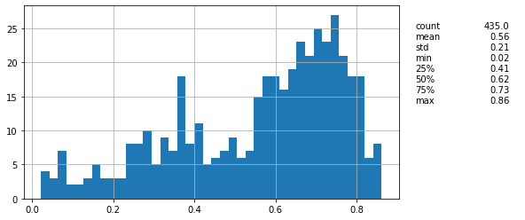
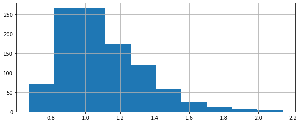
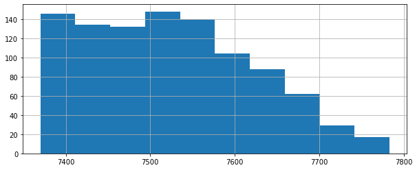
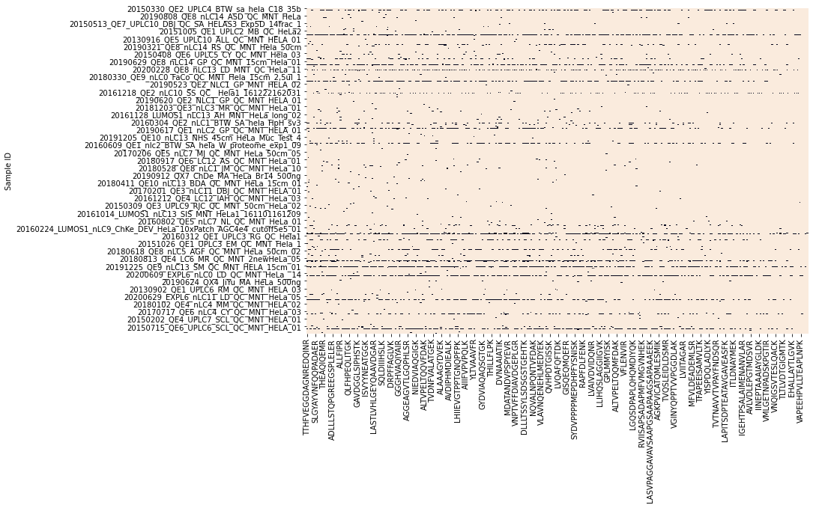
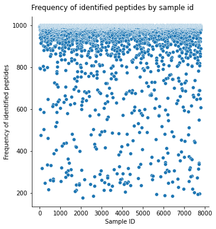
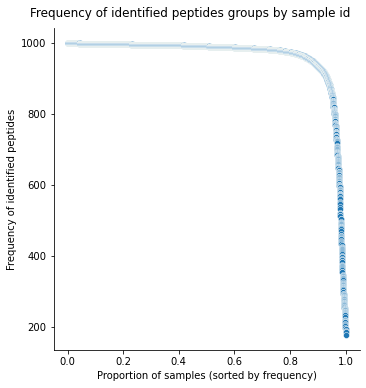
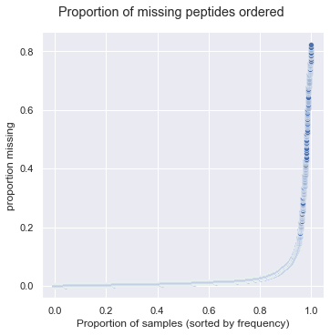
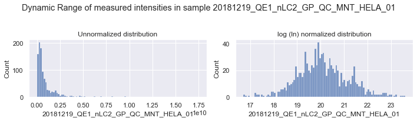
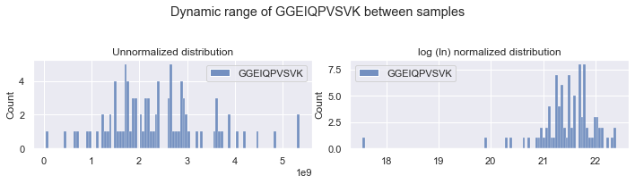

# Peptides

Load peptides selected for training


```python
import numpy as np
import pandas as pd
import matplotlib.pyplot as plt

from src import config
from src import analyzers

# from sklearn import preprocessing
# from sklearn.decomposition import PCA
import seaborn as sns

import vaep

pd.options.display.max_columns = 100
pd.options.display.min_rows = 30
```

    FOLDER_MQ_TXT_DATA = data\mq_out
    

## Descriptive Statistics (Linear case)

- spread of peptide quantifications between samples
- spread of quantifications within samples
- correlation analysis: can linear correlation be picked up?


### Peptides


```python
FNAME = 'df_intensities_N_07813_M01000'
FN_PEPTIDE_INTENSITIES = config.FOLDER_DATA / FNAME
FIGUREFOLDER = config.FIGUREFOLDER / FNAME
FIGUREFOLDER.mkdir(exist_ok=True)
```


```python
N_FIRST_ROWS = None # possibility to select N first rows
analysis = analyzers.AnalyzePeptides(fname=FN_PEPTIDE_INTENSITIES, nrows=N_FIRST_ROWS)
analysis.describe_peptides(sample_n=30)
```


<div>
<style scoped>
    .dataframe tbody tr th:only-of-type {
        vertical-align: middle;
    }

    .dataframe tbody tr th {
        vertical-align: top;
    }

    .dataframe thead th {
        text-align: right;
    }
</style>
<table border="1" class="dataframe">
  <thead>
    <tr style="text-align: right;">
      <th></th>
      <th>TALIHDGLAR</th>
      <th>FNEEHIPDSPFVVPVASPSGDAR</th>
      <th>SGAQASSTPLSPTR</th>
      <th>EQISDIDDAVR</th>
      <th>SPYTVTVGQACNPSACR</th>
      <th>SLTNDWEDHLAVK</th>
      <th>GGMGSGGLATGIAGGLAGMGGIQNEK</th>
      <th>YGDGGSTFQSTTGHCVHMR</th>
      <th>LVLVGDGGTGK</th>
      <th>WSGPLSLQEVDEQPQHPLHVTYAGAAVDELGK</th>
      <th>DLLHPSPEEEK</th>
      <th>TLQIFNIEMK</th>
      <th>AGAIAPCEVTVPAQNTGLGPEK</th>
      <th>TAVVVGTITDDVR</th>
      <th>YTVQDESHSEWVSCVR</th>
      <th>GVDEVTIVNILTNR</th>
      <th>SAEFLLHMLK</th>
      <th>TAFDEAIAELDTLNEDSYK</th>
      <th>GAGTDDHTLIR</th>
      <th>LSVLGAITSVQQR</th>
      <th>NQVALNPQNTVFDAK</th>
      <th>LAPITSDPTEATAVGAVEASFK</th>
      <th>LSPPYSSPQEFAQDVGR</th>
      <th>LQLWDTAGQER</th>
      <th>STAGDTHLGGEDFDNR</th>
      <th>SHTILLVQPTK</th>
      <th>MDATANDVPSPYEVR</th>
      <th>SYCAEIAHNVSSK</th>
      <th>VLLPEYGGTK</th>
      <th>VLAVNQENEQLMEDYEK</th>
    </tr>
  </thead>
  <tbody>
    <tr>
      <th>count</th>
      <td>7,600.000</td>
      <td>7,506.000</td>
      <td>7,411.000</td>
      <td>7,391.000</td>
      <td>7,430.000</td>
      <td>7,728.000</td>
      <td>7,478.000</td>
      <td>7,414.000</td>
      <td>7,555.000</td>
      <td>7,474.000</td>
      <td>7,519.000</td>
      <td>7,403.000</td>
      <td>7,556.000</td>
      <td>7,429.000</td>
      <td>7,385.000</td>
      <td>7,616.000</td>
      <td>7,687.000</td>
      <td>7,424.000</td>
      <td>7,395.000</td>
      <td>7,500.000</td>
      <td>7,627.000</td>
      <td>7,698.000</td>
      <td>7,451.000</td>
      <td>7,496.000</td>
      <td>7,677.000</td>
      <td>7,521.000</td>
      <td>7,622.000</td>
      <td>7,545.000</td>
      <td>7,528.000</td>
      <td>7,434.000</td>
    </tr>
    <tr>
      <th>mean</th>
      <td>1,421,973,967.249</td>
      <td>786,460,387.144</td>
      <td>505,834,649.143</td>
      <td>966,069,353.741</td>
      <td>372,199,024.441</td>
      <td>3,689,931,536.982</td>
      <td>672,170,734.020</td>
      <td>918,210,755.152</td>
      <td>2,199,479,881.602</td>
      <td>1,408,685,203.532</td>
      <td>976,539,830.164</td>
      <td>317,222,216.431</td>
      <td>981,323,585.521</td>
      <td>920,763,307.484</td>
      <td>518,797,230.968</td>
      <td>3,320,534,026.968</td>
      <td>1,113,957,436.633</td>
      <td>1,166,961,953.043</td>
      <td>953,373,943.442</td>
      <td>236,175,349.093</td>
      <td>1,266,474,449.141</td>
      <td>3,668,408,443.336</td>
      <td>143,961,101.745</td>
      <td>552,575,572.479</td>
      <td>3,075,420,507.646</td>
      <td>644,848,827.539</td>
      <td>469,675,591.026</td>
      <td>1,049,845,729.172</td>
      <td>2,385,589,155.393</td>
      <td>191,500,056.255</td>
    </tr>
    <tr>
      <th>std</th>
      <td>1,723,677,276.987</td>
      <td>693,990,474.250</td>
      <td>432,014,085.657</td>
      <td>982,542,709.391</td>
      <td>399,614,425.343</td>
      <td>3,778,115,570.341</td>
      <td>1,227,907,038.039</td>
      <td>1,334,548,721.820</td>
      <td>1,979,222,398.880</td>
      <td>1,730,125,115.577</td>
      <td>1,250,215,495.514</td>
      <td>293,766,401.106</td>
      <td>1,051,915,582.660</td>
      <td>1,258,672,916.699</td>
      <td>702,924,312.699</td>
      <td>2,835,176,216.346</td>
      <td>1,050,930,838.005</td>
      <td>1,062,125,567.075</td>
      <td>897,715,467.357</td>
      <td>242,849,890.284</td>
      <td>1,777,775,210.976</td>
      <td>2,885,008,198.807</td>
      <td>192,839,191.009</td>
      <td>523,967,080.563</td>
      <td>3,603,302,812.275</td>
      <td>771,401,925.316</td>
      <td>564,039,333.325</td>
      <td>976,058,017.737</td>
      <td>2,179,108,146.628</td>
      <td>211,872,794.823</td>
    </tr>
    <tr>
      <th>min</th>
      <td>708,840.000</td>
      <td>1,506,400.000</td>
      <td>1,739,600.000</td>
      <td>1,010,300.000</td>
      <td>1,838,900.000</td>
      <td>2,733,500.000</td>
      <td>1,713,700.000</td>
      <td>1,250,900.000</td>
      <td>1,448,500.000</td>
      <td>1,626,800.000</td>
      <td>1,931,200.000</td>
      <td>796,680.000</td>
      <td>2,620,400.000</td>
      <td>1,468,800.000</td>
      <td>1,500,800.000</td>
      <td>401,110.000</td>
      <td>1,022,400.000</td>
      <td>708,790.000</td>
      <td>664,550.000</td>
      <td>1,185,000.000</td>
      <td>2,048,400.000</td>
      <td>1,154,900.000</td>
      <td>1,815,200.000</td>
      <td>2,167,500.000</td>
      <td>1,437,000.000</td>
      <td>677,200.000</td>
      <td>2,277,200.000</td>
      <td>2,231,700.000</td>
      <td>1,492,300.000</td>
      <td>1,217,500.000</td>
    </tr>
    <tr>
      <th>25%</th>
      <td>473,762,500.000</td>
      <td>323,900,000.000</td>
      <td>236,125,000.000</td>
      <td>387,005,000.000</td>
      <td>114,452,500.000</td>
      <td>1,389,025,000.000</td>
      <td>139,342,500.000</td>
      <td>164,297,500.000</td>
      <td>973,775,000.000</td>
      <td>477,245,000.000</td>
      <td>306,175,000.000</td>
      <td>131,065,000.000</td>
      <td>333,887,500.000</td>
      <td>249,730,000.000</td>
      <td>141,610,000.000</td>
      <td>1,288,525,000.000</td>
      <td>431,820,000.000</td>
      <td>367,077,500.000</td>
      <td>332,780,000.000</td>
      <td>90,517,500.000</td>
      <td>424,120,000.000</td>
      <td>1,617,975,000.000</td>
      <td>46,024,500.000</td>
      <td>210,735,000.000</td>
      <td>1,163,200,000.000</td>
      <td>234,880,000.000</td>
      <td>178,510,000.000</td>
      <td>389,480,000.000</td>
      <td>1,049,950,000.000</td>
      <td>67,820,500.000</td>
    </tr>
    <tr>
      <th>50%</th>
      <td>892,095,000.000</td>
      <td>609,095,000.000</td>
      <td>374,590,000.000</td>
      <td>704,060,000.000</td>
      <td>251,575,000.000</td>
      <td>2,551,200,000.000</td>
      <td>350,125,000.000</td>
      <td>444,175,000.000</td>
      <td>1,670,600,000.000</td>
      <td>878,415,000.000</td>
      <td>600,110,000.000</td>
      <td>237,600,000.000</td>
      <td>661,100,000.000</td>
      <td>536,980,000.000</td>
      <td>292,240,000.000</td>
      <td>2,487,100,000.000</td>
      <td>816,800,000.000</td>
      <td>893,925,000.000</td>
      <td>705,530,000.000</td>
      <td>165,010,000.000</td>
      <td>709,240,000.000</td>
      <td>2,911,750,000.000</td>
      <td>80,197,000.000</td>
      <td>384,255,000.000</td>
      <td>1,997,900,000.000</td>
      <td>425,810,000.000</td>
      <td>295,410,000.000</td>
      <td>765,100,000.000</td>
      <td>1,737,650,000.000</td>
      <td>125,005,000.000</td>
    </tr>
    <tr>
      <th>75%</th>
      <td>1,606,900,000.000</td>
      <td>1,049,450,000.000</td>
      <td>623,395,000.000</td>
      <td>1,194,450,000.000</td>
      <td>486,015,000.000</td>
      <td>4,511,925,000.000</td>
      <td>708,510,000.000</td>
      <td>1,058,650,000.000</td>
      <td>2,711,550,000.000</td>
      <td>1,557,225,000.000</td>
      <td>1,056,500,000.000</td>
      <td>427,025,000.000</td>
      <td>1,240,000,000.000</td>
      <td>988,290,000.000</td>
      <td>593,650,000.000</td>
      <td>4,660,825,000.000</td>
      <td>1,468,050,000.000</td>
      <td>1,658,950,000.000</td>
      <td>1,264,350,000.000</td>
      <td>281,177,500.000</td>
      <td>1,252,950,000.000</td>
      <td>4,933,250,000.000</td>
      <td>154,490,000.000</td>
      <td>706,912,500.000</td>
      <td>3,293,600,000.000</td>
      <td>725,330,000.000</td>
      <td>512,512,500.000</td>
      <td>1,389,700,000.000</td>
      <td>2,931,000,000.000</td>
      <td>246,677,500.000</td>
    </tr>
    <tr>
      <th>max</th>
      <td>17,680,000,000.000</td>
      <td>10,892,000,000.000</td>
      <td>6,664,800,000.000</td>
      <td>20,812,000,000.000</td>
      <td>5,618,700,000.000</td>
      <td>45,946,000,000.000</td>
      <td>27,939,000,000.000</td>
      <td>12,833,000,000.000</td>
      <td>27,228,000,000.000</td>
      <td>16,413,000,000.000</td>
      <td>11,896,000,000.000</td>
      <td>6,808,600,000.000</td>
      <td>12,396,000,000.000</td>
      <td>14,025,000,000.000</td>
      <td>7,758,600,000.000</td>
      <td>25,866,000,000.000</td>
      <td>16,165,000,000.000</td>
      <td>13,087,000,000.000</td>
      <td>11,123,000,000.000</td>
      <td>3,813,700,000.000</td>
      <td>17,397,000,000.000</td>
      <td>30,067,000,000.000</td>
      <td>2,933,400,000.000</td>
      <td>7,092,500,000.000</td>
      <td>26,607,000,000.000</td>
      <td>13,662,000,000.000</td>
      <td>6,576,800,000.000</td>
      <td>12,680,000,000.000</td>
      <td>18,192,000,000.000</td>
      <td>5,457,200,000.000</td>
    </tr>
    <tr>
      <th>CV</th>
      <td>1.212</td>
      <td>0.882</td>
      <td>0.854</td>
      <td>1.017</td>
      <td>1.074</td>
      <td>1.024</td>
      <td>1.827</td>
      <td>1.453</td>
      <td>0.900</td>
      <td>1.228</td>
      <td>1.280</td>
      <td>0.926</td>
      <td>1.072</td>
      <td>1.367</td>
      <td>1.355</td>
      <td>0.854</td>
      <td>0.943</td>
      <td>0.910</td>
      <td>0.942</td>
      <td>1.028</td>
      <td>1.404</td>
      <td>0.786</td>
      <td>1.340</td>
      <td>0.948</td>
      <td>1.172</td>
      <td>1.196</td>
      <td>1.201</td>
      <td>0.930</td>
      <td>0.913</td>
      <td>1.106</td>
    </tr>
  </tbody>
</table>
</div>


```python
sample = analysis.df.sample(n=30, axis=1)
# ToDo func is assigned to df
corr_lower_triangle = analyzers.corr_lower_triangle(sample)
corr_lower_triangle
```


<div>
<style scoped>
    .dataframe tbody tr th:only-of-type {
        vertical-align: middle;
    }

    .dataframe tbody tr th {
        vertical-align: top;
    }

    .dataframe thead th {
        text-align: right;
    }
</style>
<table border="1" class="dataframe">
  <thead>
    <tr style="text-align: right;">
      <th></th>
      <th>SYELPDGQVITIGNER</th>
      <th>EITALAPSTMK</th>
      <th>TINEVENQILTR</th>
      <th>HIADLAGNSEVILPVPAFNVINGGSHAGNK</th>
      <th>TPLHEIALSIK</th>
      <th>VFLENVIR</th>
      <th>TANDMIHAENMR</th>
      <th>EQIVPKPEEEVAQK</th>
      <th>LATQSNEITIPVTFESR</th>
      <th>YGDGGSTFQSTTGHCVHMR</th>
      <th>KVEEAEPEEFVVEK</th>
      <th>YNEQHVPGSPFTAR</th>
      <th>HNQLPLVIEFTEQTAPK</th>
      <th>EHDPVGQMVNNPK</th>
      <th>DLSHIGDAVVISCAK</th>
      <th>VANVSLLALYK</th>
      <th>SYSPYDMLESIRK</th>
      <th>VLSGTIHAGQPVK</th>
      <th>NRPTSISWDGLDSGK</th>
      <th>STTTGHLIYK</th>
      <th>MVSDINNGWQHLEQAEK</th>
      <th>AMGIMNSFVNDIFER</th>
      <th>VVVLMGSTSDLGHCEK</th>
      <th>GYSFTTTAER</th>
      <th>AQTAHIVLEDGTK</th>
      <th>SGDAAIVDMVPGKPMCVESFSDYPPLGR</th>
      <th>VEFMDDTSR</th>
      <th>YLTVAAVFR</th>
      <th>NIPGITLLNVSK</th>
      <th>ARFEELNADLFR</th>
    </tr>
  </thead>
  <tbody>
    <tr>
      <th>SYELPDGQVITIGNER</th>
      <td>NaN</td>
      <td>NaN</td>
      <td>NaN</td>
      <td>NaN</td>
      <td>NaN</td>
      <td>NaN</td>
      <td>NaN</td>
      <td>NaN</td>
      <td>NaN</td>
      <td>NaN</td>
      <td>NaN</td>
      <td>NaN</td>
      <td>NaN</td>
      <td>NaN</td>
      <td>NaN</td>
      <td>NaN</td>
      <td>NaN</td>
      <td>NaN</td>
      <td>NaN</td>
      <td>NaN</td>
      <td>NaN</td>
      <td>NaN</td>
      <td>NaN</td>
      <td>NaN</td>
      <td>NaN</td>
      <td>NaN</td>
      <td>NaN</td>
      <td>NaN</td>
      <td>NaN</td>
      <td>NaN</td>
    </tr>
    <tr>
      <th>EITALAPSTMK</th>
      <td>0.743</td>
      <td>NaN</td>
      <td>NaN</td>
      <td>NaN</td>
      <td>NaN</td>
      <td>NaN</td>
      <td>NaN</td>
      <td>NaN</td>
      <td>NaN</td>
      <td>NaN</td>
      <td>NaN</td>
      <td>NaN</td>
      <td>NaN</td>
      <td>NaN</td>
      <td>NaN</td>
      <td>NaN</td>
      <td>NaN</td>
      <td>NaN</td>
      <td>NaN</td>
      <td>NaN</td>
      <td>NaN</td>
      <td>NaN</td>
      <td>NaN</td>
      <td>NaN</td>
      <td>NaN</td>
      <td>NaN</td>
      <td>NaN</td>
      <td>NaN</td>
      <td>NaN</td>
      <td>NaN</td>
    </tr>
    <tr>
      <th>TINEVENQILTR</th>
      <td>0.626</td>
      <td>0.690</td>
      <td>NaN</td>
      <td>NaN</td>
      <td>NaN</td>
      <td>NaN</td>
      <td>NaN</td>
      <td>NaN</td>
      <td>NaN</td>
      <td>NaN</td>
      <td>NaN</td>
      <td>NaN</td>
      <td>NaN</td>
      <td>NaN</td>
      <td>NaN</td>
      <td>NaN</td>
      <td>NaN</td>
      <td>NaN</td>
      <td>NaN</td>
      <td>NaN</td>
      <td>NaN</td>
      <td>NaN</td>
      <td>NaN</td>
      <td>NaN</td>
      <td>NaN</td>
      <td>NaN</td>
      <td>NaN</td>
      <td>NaN</td>
      <td>NaN</td>
      <td>NaN</td>
    </tr>
    <tr>
      <th>HIADLAGNSEVILPVPAFNVINGGSHAGNK</th>
      <td>0.654</td>
      <td>0.589</td>
      <td>0.414</td>
      <td>NaN</td>
      <td>NaN</td>
      <td>NaN</td>
      <td>NaN</td>
      <td>NaN</td>
      <td>NaN</td>
      <td>NaN</td>
      <td>NaN</td>
      <td>NaN</td>
      <td>NaN</td>
      <td>NaN</td>
      <td>NaN</td>
      <td>NaN</td>
      <td>NaN</td>
      <td>NaN</td>
      <td>NaN</td>
      <td>NaN</td>
      <td>NaN</td>
      <td>NaN</td>
      <td>NaN</td>
      <td>NaN</td>
      <td>NaN</td>
      <td>NaN</td>
      <td>NaN</td>
      <td>NaN</td>
      <td>NaN</td>
      <td>NaN</td>
    </tr>
    <tr>
      <th>TPLHEIALSIK</th>
      <td>0.579</td>
      <td>0.601</td>
      <td>0.343</td>
      <td>0.688</td>
      <td>NaN</td>
      <td>NaN</td>
      <td>NaN</td>
      <td>NaN</td>
      <td>NaN</td>
      <td>NaN</td>
      <td>NaN</td>
      <td>NaN</td>
      <td>NaN</td>
      <td>NaN</td>
      <td>NaN</td>
      <td>NaN</td>
      <td>NaN</td>
      <td>NaN</td>
      <td>NaN</td>
      <td>NaN</td>
      <td>NaN</td>
      <td>NaN</td>
      <td>NaN</td>
      <td>NaN</td>
      <td>NaN</td>
      <td>NaN</td>
      <td>NaN</td>
      <td>NaN</td>
      <td>NaN</td>
      <td>NaN</td>
    </tr>
    <tr>
      <th>VFLENVIR</th>
      <td>0.737</td>
      <td>0.764</td>
      <td>0.513</td>
      <td>0.594</td>
      <td>0.665</td>
      <td>NaN</td>
      <td>NaN</td>
      <td>NaN</td>
      <td>NaN</td>
      <td>NaN</td>
      <td>NaN</td>
      <td>NaN</td>
      <td>NaN</td>
      <td>NaN</td>
      <td>NaN</td>
      <td>NaN</td>
      <td>NaN</td>
      <td>NaN</td>
      <td>NaN</td>
      <td>NaN</td>
      <td>NaN</td>
      <td>NaN</td>
      <td>NaN</td>
      <td>NaN</td>
      <td>NaN</td>
      <td>NaN</td>
      <td>NaN</td>
      <td>NaN</td>
      <td>NaN</td>
      <td>NaN</td>
    </tr>
    <tr>
      <th>TANDMIHAENMR</th>
      <td>0.447</td>
      <td>0.548</td>
      <td>0.580</td>
      <td>0.410</td>
      <td>0.366</td>
      <td>0.442</td>
      <td>NaN</td>
      <td>NaN</td>
      <td>NaN</td>
      <td>NaN</td>
      <td>NaN</td>
      <td>NaN</td>
      <td>NaN</td>
      <td>NaN</td>
      <td>NaN</td>
      <td>NaN</td>
      <td>NaN</td>
      <td>NaN</td>
      <td>NaN</td>
      <td>NaN</td>
      <td>NaN</td>
      <td>NaN</td>
      <td>NaN</td>
      <td>NaN</td>
      <td>NaN</td>
      <td>NaN</td>
      <td>NaN</td>
      <td>NaN</td>
      <td>NaN</td>
      <td>NaN</td>
    </tr>
    <tr>
      <th>EQIVPKPEEEVAQK</th>
      <td>0.584</td>
      <td>0.601</td>
      <td>0.279</td>
      <td>0.669</td>
      <td>0.791</td>
      <td>0.618</td>
      <td>0.328</td>
      <td>NaN</td>
      <td>NaN</td>
      <td>NaN</td>
      <td>NaN</td>
      <td>NaN</td>
      <td>NaN</td>
      <td>NaN</td>
      <td>NaN</td>
      <td>NaN</td>
      <td>NaN</td>
      <td>NaN</td>
      <td>NaN</td>
      <td>NaN</td>
      <td>NaN</td>
      <td>NaN</td>
      <td>NaN</td>
      <td>NaN</td>
      <td>NaN</td>
      <td>NaN</td>
      <td>NaN</td>
      <td>NaN</td>
      <td>NaN</td>
      <td>NaN</td>
    </tr>
    <tr>
      <th>LATQSNEITIPVTFESR</th>
      <td>0.733</td>
      <td>0.670</td>
      <td>0.416</td>
      <td>0.749</td>
      <td>0.767</td>
      <td>0.667</td>
      <td>0.352</td>
      <td>0.798</td>
      <td>NaN</td>
      <td>NaN</td>
      <td>NaN</td>
      <td>NaN</td>
      <td>NaN</td>
      <td>NaN</td>
      <td>NaN</td>
      <td>NaN</td>
      <td>NaN</td>
      <td>NaN</td>
      <td>NaN</td>
      <td>NaN</td>
      <td>NaN</td>
      <td>NaN</td>
      <td>NaN</td>
      <td>NaN</td>
      <td>NaN</td>
      <td>NaN</td>
      <td>NaN</td>
      <td>NaN</td>
      <td>NaN</td>
      <td>NaN</td>
    </tr>
    <tr>
      <th>YGDGGSTFQSTTGHCVHMR</th>
      <td>0.562</td>
      <td>0.607</td>
      <td>0.396</td>
      <td>0.670</td>
      <td>0.783</td>
      <td>0.640</td>
      <td>0.474</td>
      <td>0.744</td>
      <td>0.730</td>
      <td>NaN</td>
      <td>NaN</td>
      <td>NaN</td>
      <td>NaN</td>
      <td>NaN</td>
      <td>NaN</td>
      <td>NaN</td>
      <td>NaN</td>
      <td>NaN</td>
      <td>NaN</td>
      <td>NaN</td>
      <td>NaN</td>
      <td>NaN</td>
      <td>NaN</td>
      <td>NaN</td>
      <td>NaN</td>
      <td>NaN</td>
      <td>NaN</td>
      <td>NaN</td>
      <td>NaN</td>
      <td>NaN</td>
    </tr>
    <tr>
      <th>KVEEAEPEEFVVEK</th>
      <td>0.636</td>
      <td>0.664</td>
      <td>0.348</td>
      <td>0.699</td>
      <td>0.856</td>
      <td>0.673</td>
      <td>0.373</td>
      <td>0.848</td>
      <td>0.845</td>
      <td>0.801</td>
      <td>NaN</td>
      <td>NaN</td>
      <td>NaN</td>
      <td>NaN</td>
      <td>NaN</td>
      <td>NaN</td>
      <td>NaN</td>
      <td>NaN</td>
      <td>NaN</td>
      <td>NaN</td>
      <td>NaN</td>
      <td>NaN</td>
      <td>NaN</td>
      <td>NaN</td>
      <td>NaN</td>
      <td>NaN</td>
      <td>NaN</td>
      <td>NaN</td>
      <td>NaN</td>
      <td>NaN</td>
    </tr>
    <tr>
      <th>YNEQHVPGSPFTAR</th>
      <td>0.393</td>
      <td>0.554</td>
      <td>0.707</td>
      <td>0.202</td>
      <td>0.069</td>
      <td>0.312</td>
      <td>0.571</td>
      <td>0.046</td>
      <td>0.154</td>
      <td>0.132</td>
      <td>0.086</td>
      <td>NaN</td>
      <td>NaN</td>
      <td>NaN</td>
      <td>NaN</td>
      <td>NaN</td>
      <td>NaN</td>
      <td>NaN</td>
      <td>NaN</td>
      <td>NaN</td>
      <td>NaN</td>
      <td>NaN</td>
      <td>NaN</td>
      <td>NaN</td>
      <td>NaN</td>
      <td>NaN</td>
      <td>NaN</td>
      <td>NaN</td>
      <td>NaN</td>
      <td>NaN</td>
    </tr>
    <tr>
      <th>HNQLPLVIEFTEQTAPK</th>
      <td>0.627</td>
      <td>0.571</td>
      <td>0.364</td>
      <td>0.696</td>
      <td>0.771</td>
      <td>0.647</td>
      <td>0.355</td>
      <td>0.774</td>
      <td>0.773</td>
      <td>0.635</td>
      <td>0.798</td>
      <td>0.146</td>
      <td>NaN</td>
      <td>NaN</td>
      <td>NaN</td>
      <td>NaN</td>
      <td>NaN</td>
      <td>NaN</td>
      <td>NaN</td>
      <td>NaN</td>
      <td>NaN</td>
      <td>NaN</td>
      <td>NaN</td>
      <td>NaN</td>
      <td>NaN</td>
      <td>NaN</td>
      <td>NaN</td>
      <td>NaN</td>
      <td>NaN</td>
      <td>NaN</td>
    </tr>
    <tr>
      <th>EHDPVGQMVNNPK</th>
      <td>0.543</td>
      <td>0.569</td>
      <td>0.316</td>
      <td>0.607</td>
      <td>0.729</td>
      <td>0.563</td>
      <td>0.323</td>
      <td>0.741</td>
      <td>0.734</td>
      <td>0.725</td>
      <td>0.785</td>
      <td>0.070</td>
      <td>0.687</td>
      <td>NaN</td>
      <td>NaN</td>
      <td>NaN</td>
      <td>NaN</td>
      <td>NaN</td>
      <td>NaN</td>
      <td>NaN</td>
      <td>NaN</td>
      <td>NaN</td>
      <td>NaN</td>
      <td>NaN</td>
      <td>NaN</td>
      <td>NaN</td>
      <td>NaN</td>
      <td>NaN</td>
      <td>NaN</td>
      <td>NaN</td>
    </tr>
    <tr>
      <th>DLSHIGDAVVISCAK</th>
      <td>0.581</td>
      <td>0.585</td>
      <td>0.333</td>
      <td>0.667</td>
      <td>0.862</td>
      <td>0.648</td>
      <td>0.372</td>
      <td>0.792</td>
      <td>0.758</td>
      <td>0.812</td>
      <td>0.861</td>
      <td>0.053</td>
      <td>0.750</td>
      <td>0.750</td>
      <td>NaN</td>
      <td>NaN</td>
      <td>NaN</td>
      <td>NaN</td>
      <td>NaN</td>
      <td>NaN</td>
      <td>NaN</td>
      <td>NaN</td>
      <td>NaN</td>
      <td>NaN</td>
      <td>NaN</td>
      <td>NaN</td>
      <td>NaN</td>
      <td>NaN</td>
      <td>NaN</td>
      <td>NaN</td>
    </tr>
    <tr>
      <th>VANVSLLALYK</th>
      <td>0.702</td>
      <td>0.695</td>
      <td>0.601</td>
      <td>0.528</td>
      <td>0.538</td>
      <td>0.642</td>
      <td>0.531</td>
      <td>0.523</td>
      <td>0.611</td>
      <td>0.527</td>
      <td>0.563</td>
      <td>0.451</td>
      <td>0.612</td>
      <td>0.488</td>
      <td>0.547</td>
      <td>NaN</td>
      <td>NaN</td>
      <td>NaN</td>
      <td>NaN</td>
      <td>NaN</td>
      <td>NaN</td>
      <td>NaN</td>
      <td>NaN</td>
      <td>NaN</td>
      <td>NaN</td>
      <td>NaN</td>
      <td>NaN</td>
      <td>NaN</td>
      <td>NaN</td>
      <td>NaN</td>
    </tr>
    <tr>
      <th>SYSPYDMLESIRK</th>
      <td>0.480</td>
      <td>0.574</td>
      <td>0.691</td>
      <td>0.163</td>
      <td>0.069</td>
      <td>0.383</td>
      <td>0.452</td>
      <td>0.038</td>
      <td>0.150</td>
      <td>0.085</td>
      <td>0.078</td>
      <td>0.709</td>
      <td>0.160</td>
      <td>0.071</td>
      <td>0.047</td>
      <td>0.548</td>
      <td>NaN</td>
      <td>NaN</td>
      <td>NaN</td>
      <td>NaN</td>
      <td>NaN</td>
      <td>NaN</td>
      <td>NaN</td>
      <td>NaN</td>
      <td>NaN</td>
      <td>NaN</td>
      <td>NaN</td>
      <td>NaN</td>
      <td>NaN</td>
      <td>NaN</td>
    </tr>
    <tr>
      <th>VLSGTIHAGQPVK</th>
      <td>0.571</td>
      <td>0.610</td>
      <td>0.330</td>
      <td>0.652</td>
      <td>0.800</td>
      <td>0.615</td>
      <td>0.365</td>
      <td>0.790</td>
      <td>0.769</td>
      <td>0.780</td>
      <td>0.839</td>
      <td>0.075</td>
      <td>0.727</td>
      <td>0.751</td>
      <td>0.794</td>
      <td>0.527</td>
      <td>0.090</td>
      <td>NaN</td>
      <td>NaN</td>
      <td>NaN</td>
      <td>NaN</td>
      <td>NaN</td>
      <td>NaN</td>
      <td>NaN</td>
      <td>NaN</td>
      <td>NaN</td>
      <td>NaN</td>
      <td>NaN</td>
      <td>NaN</td>
      <td>NaN</td>
    </tr>
    <tr>
      <th>NRPTSISWDGLDSGK</th>
      <td>0.614</td>
      <td>0.636</td>
      <td>0.408</td>
      <td>0.679</td>
      <td>0.749</td>
      <td>0.615</td>
      <td>0.469</td>
      <td>0.751</td>
      <td>0.769</td>
      <td>0.780</td>
      <td>0.848</td>
      <td>0.184</td>
      <td>0.743</td>
      <td>0.722</td>
      <td>0.805</td>
      <td>0.608</td>
      <td>0.142</td>
      <td>0.767</td>
      <td>NaN</td>
      <td>NaN</td>
      <td>NaN</td>
      <td>NaN</td>
      <td>NaN</td>
      <td>NaN</td>
      <td>NaN</td>
      <td>NaN</td>
      <td>NaN</td>
      <td>NaN</td>
      <td>NaN</td>
      <td>NaN</td>
    </tr>
    <tr>
      <th>STTTGHLIYK</th>
      <td>0.676</td>
      <td>0.733</td>
      <td>0.475</td>
      <td>0.671</td>
      <td>0.726</td>
      <td>0.707</td>
      <td>0.485</td>
      <td>0.759</td>
      <td>0.753</td>
      <td>0.762</td>
      <td>0.792</td>
      <td>0.264</td>
      <td>0.664</td>
      <td>0.696</td>
      <td>0.733</td>
      <td>0.631</td>
      <td>0.242</td>
      <td>0.754</td>
      <td>0.749</td>
      <td>NaN</td>
      <td>NaN</td>
      <td>NaN</td>
      <td>NaN</td>
      <td>NaN</td>
      <td>NaN</td>
      <td>NaN</td>
      <td>NaN</td>
      <td>NaN</td>
      <td>NaN</td>
      <td>NaN</td>
    </tr>
    <tr>
      <th>MVSDINNGWQHLEQAEK</th>
      <td>0.487</td>
      <td>0.559</td>
      <td>0.791</td>
      <td>0.376</td>
      <td>0.260</td>
      <td>0.375</td>
      <td>0.558</td>
      <td>0.209</td>
      <td>0.339</td>
      <td>0.359</td>
      <td>0.257</td>
      <td>0.676</td>
      <td>0.240</td>
      <td>0.245</td>
      <td>0.259</td>
      <td>0.479</td>
      <td>0.580</td>
      <td>0.251</td>
      <td>0.362</td>
      <td>0.374</td>
      <td>NaN</td>
      <td>NaN</td>
      <td>NaN</td>
      <td>NaN</td>
      <td>NaN</td>
      <td>NaN</td>
      <td>NaN</td>
      <td>NaN</td>
      <td>NaN</td>
      <td>NaN</td>
    </tr>
    <tr>
      <th>AMGIMNSFVNDIFER</th>
      <td>0.535</td>
      <td>0.571</td>
      <td>0.493</td>
      <td>0.416</td>
      <td>0.273</td>
      <td>0.548</td>
      <td>0.380</td>
      <td>0.239</td>
      <td>0.359</td>
      <td>0.277</td>
      <td>0.280</td>
      <td>0.455</td>
      <td>0.337</td>
      <td>0.218</td>
      <td>0.251</td>
      <td>0.556</td>
      <td>0.569</td>
      <td>0.268</td>
      <td>0.288</td>
      <td>0.383</td>
      <td>0.379</td>
      <td>NaN</td>
      <td>NaN</td>
      <td>NaN</td>
      <td>NaN</td>
      <td>NaN</td>
      <td>NaN</td>
      <td>NaN</td>
      <td>NaN</td>
      <td>NaN</td>
    </tr>
    <tr>
      <th>VVVLMGSTSDLGHCEK</th>
      <td>0.614</td>
      <td>0.707</td>
      <td>0.563</td>
      <td>0.593</td>
      <td>0.701</td>
      <td>0.665</td>
      <td>0.515</td>
      <td>0.632</td>
      <td>0.653</td>
      <td>0.728</td>
      <td>0.703</td>
      <td>0.390</td>
      <td>0.640</td>
      <td>0.599</td>
      <td>0.725</td>
      <td>0.638</td>
      <td>0.361</td>
      <td>0.677</td>
      <td>0.670</td>
      <td>0.698</td>
      <td>0.515</td>
      <td>0.421</td>
      <td>NaN</td>
      <td>NaN</td>
      <td>NaN</td>
      <td>NaN</td>
      <td>NaN</td>
      <td>NaN</td>
      <td>NaN</td>
      <td>NaN</td>
    </tr>
    <tr>
      <th>GYSFTTTAER</th>
      <td>0.682</td>
      <td>0.749</td>
      <td>0.491</td>
      <td>0.671</td>
      <td>0.728</td>
      <td>0.764</td>
      <td>0.514</td>
      <td>0.730</td>
      <td>0.743</td>
      <td>0.802</td>
      <td>0.770</td>
      <td>0.289</td>
      <td>0.669</td>
      <td>0.645</td>
      <td>0.784</td>
      <td>0.593</td>
      <td>0.228</td>
      <td>0.699</td>
      <td>0.738</td>
      <td>0.800</td>
      <td>0.418</td>
      <td>0.376</td>
      <td>0.715</td>
      <td>NaN</td>
      <td>NaN</td>
      <td>NaN</td>
      <td>NaN</td>
      <td>NaN</td>
      <td>NaN</td>
      <td>NaN</td>
    </tr>
    <tr>
      <th>AQTAHIVLEDGTK</th>
      <td>0.559</td>
      <td>0.577</td>
      <td>0.272</td>
      <td>0.623</td>
      <td>0.816</td>
      <td>0.635</td>
      <td>0.375</td>
      <td>0.811</td>
      <td>0.744</td>
      <td>0.812</td>
      <td>0.855</td>
      <td>0.038</td>
      <td>0.756</td>
      <td>0.762</td>
      <td>0.840</td>
      <td>0.499</td>
      <td>0.022</td>
      <td>0.816</td>
      <td>0.808</td>
      <td>0.770</td>
      <td>0.173</td>
      <td>0.245</td>
      <td>0.666</td>
      <td>0.749</td>
      <td>NaN</td>
      <td>NaN</td>
      <td>NaN</td>
      <td>NaN</td>
      <td>NaN</td>
      <td>NaN</td>
    </tr>
    <tr>
      <th>SGDAAIVDMVPGKPMCVESFSDYPPLGR</th>
      <td>0.596</td>
      <td>0.617</td>
      <td>0.660</td>
      <td>0.457</td>
      <td>0.291</td>
      <td>0.465</td>
      <td>0.403</td>
      <td>0.274</td>
      <td>0.421</td>
      <td>0.345</td>
      <td>0.312</td>
      <td>0.591</td>
      <td>0.362</td>
      <td>0.286</td>
      <td>0.275</td>
      <td>0.526</td>
      <td>0.624</td>
      <td>0.280</td>
      <td>0.332</td>
      <td>0.425</td>
      <td>0.590</td>
      <td>0.594</td>
      <td>0.489</td>
      <td>0.434</td>
      <td>0.231</td>
      <td>NaN</td>
      <td>NaN</td>
      <td>NaN</td>
      <td>NaN</td>
      <td>NaN</td>
    </tr>
    <tr>
      <th>VEFMDDTSR</th>
      <td>0.574</td>
      <td>0.623</td>
      <td>0.365</td>
      <td>0.677</td>
      <td>0.831</td>
      <td>0.656</td>
      <td>0.483</td>
      <td>0.792</td>
      <td>0.778</td>
      <td>0.825</td>
      <td>0.835</td>
      <td>0.120</td>
      <td>0.763</td>
      <td>0.747</td>
      <td>0.847</td>
      <td>0.595</td>
      <td>0.036</td>
      <td>0.808</td>
      <td>0.763</td>
      <td>0.788</td>
      <td>0.304</td>
      <td>0.253</td>
      <td>0.729</td>
      <td>0.815</td>
      <td>0.806</td>
      <td>0.288</td>
      <td>NaN</td>
      <td>NaN</td>
      <td>NaN</td>
      <td>NaN</td>
    </tr>
    <tr>
      <th>YLTVAAVFR</th>
      <td>0.665</td>
      <td>0.692</td>
      <td>0.560</td>
      <td>0.637</td>
      <td>0.685</td>
      <td>0.696</td>
      <td>0.579</td>
      <td>0.630</td>
      <td>0.686</td>
      <td>0.744</td>
      <td>0.694</td>
      <td>0.381</td>
      <td>0.679</td>
      <td>0.576</td>
      <td>0.732</td>
      <td>0.650</td>
      <td>0.327</td>
      <td>0.635</td>
      <td>0.727</td>
      <td>0.700</td>
      <td>0.501</td>
      <td>0.413</td>
      <td>0.715</td>
      <td>0.800</td>
      <td>0.682</td>
      <td>0.453</td>
      <td>0.738</td>
      <td>NaN</td>
      <td>NaN</td>
      <td>NaN</td>
    </tr>
    <tr>
      <th>NIPGITLLNVSK</th>
      <td>0.661</td>
      <td>0.590</td>
      <td>0.395</td>
      <td>0.633</td>
      <td>0.715</td>
      <td>0.715</td>
      <td>0.419</td>
      <td>0.711</td>
      <td>0.771</td>
      <td>0.673</td>
      <td>0.753</td>
      <td>0.169</td>
      <td>0.757</td>
      <td>0.645</td>
      <td>0.749</td>
      <td>0.687</td>
      <td>0.189</td>
      <td>0.672</td>
      <td>0.720</td>
      <td>0.701</td>
      <td>0.297</td>
      <td>0.346</td>
      <td>0.661</td>
      <td>0.716</td>
      <td>0.709</td>
      <td>0.368</td>
      <td>0.741</td>
      <td>0.686</td>
      <td>NaN</td>
      <td>NaN</td>
    </tr>
    <tr>
      <th>ARFEELNADLFR</th>
      <td>0.610</td>
      <td>0.598</td>
      <td>0.437</td>
      <td>0.693</td>
      <td>0.789</td>
      <td>0.683</td>
      <td>0.497</td>
      <td>0.704</td>
      <td>0.731</td>
      <td>0.831</td>
      <td>0.783</td>
      <td>0.208</td>
      <td>0.704</td>
      <td>0.633</td>
      <td>0.819</td>
      <td>0.555</td>
      <td>0.127</td>
      <td>0.723</td>
      <td>0.757</td>
      <td>0.718</td>
      <td>0.411</td>
      <td>0.302</td>
      <td>0.705</td>
      <td>0.791</td>
      <td>0.753</td>
      <td>0.335</td>
      <td>0.799</td>
      <td>0.807</td>
      <td>0.695</td>
      <td>NaN</td>
    </tr>
  </tbody>
</table>
</div>


```python
fig, axes = analyzers.plot_corr_histogram(corr_lower_triangle, bins=40)
```





### Samples


```python
analysis.df.sample(30, axis=0).T.describe()
```


<div>
<style scoped>
    .dataframe tbody tr th:only-of-type {
        vertical-align: middle;
    }

    .dataframe tbody tr th {
        vertical-align: top;
    }

    .dataframe thead th {
        text-align: right;
    }
</style>
<table border="1" class="dataframe">
  <thead>
    <tr style="text-align: right;">
      <th></th>
      <th>20180424_QE1_nLC10_EM_QC_HELA_02_250</th>
      <th>20190619_QX7_IgPa_MA_HeLa_Br14_500ng</th>
      <th>20170117_QE1_nLC1_EM_QC_MNT_hela</th>
      <th>20180519_QE5_Evo2_DBJ_LFQprot_HeLa_500ng_44min_15000_03</th>
      <th>20190710_QE10_nLC0_LiNi_QC_45cm_HeLa_MUC_01</th>
      <th>20190614_QE4_nLC12_MM_QC_MNT_HELA_02</th>
      <th>20180412_QE9_nLC13_AnMu_QC_MNT_HELA_02</th>
      <th>20160923_QE1_nlc1_EM_QC_MNT_hela</th>
      <th>20181012_QE9_nLC13_FaCo_Hela_MNT_50cm_155min_1_20181012220618</th>
      <th>20190207_QE8_nLC0_ASD_QC_HeLa_43cm3</th>
      <th>20160629_QE4_nLC4_SCL_QC_MNT_HeLa_02</th>
      <th>20151008_LUMOS1_LCE_ChKe_DEV_HELA_FTms2_RelaxedPrecursor_03</th>
      <th>20190709_QX6_MaTa_MA_HeLa_500ng_LC09</th>
      <th>20180924_QE1_nLC10_GP_QC_HELA_02</th>
      <th>20190408_QE7_nLC3_OOE_QC_MNT_HeLa_250ng_RO-006</th>
      <th>20160628_QE1_nlc2_BTW_qc_hela2</th>
      <th>20191205_QE10_nLC13_NHS_45cm_HeLa_Muc_Test_5</th>
      <th>20180419_QE1_nlc10_GP_QC_HELA_250_01</th>
      <th>20160704_QE4_LC4_IAH_QC_MNT_HeLa_02</th>
      <th>20190627_QX3_MaMu_MA_Hela_500ng_LC15</th>
      <th>20180315_QE6_nLC12_MR_QC_MNT_HELA_250ng_new_02</th>
      <th>20170406_QE4_LC12_MPL_QC_MNT_HeLa_02</th>
      <th>20151216_QE1_UPLC3_BTW_SA_hela_proteome_1-1_SCX_04</th>
      <th>20150901_QE4_UPLC5_KBS_QC_MNT_HeLa_01</th>
      <th>20180524_QE7_nLC7_MEM_QC_MNT_HeLa_250ng_04</th>
      <th>20180805_QE8_nLC13_BDA_QC_MNT_HeLa_50cm_02</th>
      <th>20150722_QE6_UPLC6_SCL_QC_MNT_HELA_01</th>
      <th>20160117_QE3_UPLC8_LVS_MNT_HELA_01</th>
      <th>20180718_QE6_nLC6_CSC_QC_HeLa_02</th>
      <th>20180219_QE6_LC12_AS_QC_MNT_HeLa_500ng_01</th>
    </tr>
  </thead>
  <tbody>
    <tr>
      <th>count</th>
      <td>996.000</td>
      <td>985.000</td>
      <td>993.000</td>
      <td>938.000</td>
      <td>996.000</td>
      <td>999.000</td>
      <td>924.000</td>
      <td>997.000</td>
      <td>908.000</td>
      <td>998.000</td>
      <td>995.000</td>
      <td>932.000</td>
      <td>763.000</td>
      <td>995.000</td>
      <td>998.000</td>
      <td>997.000</td>
      <td>990.000</td>
      <td>991.000</td>
      <td>993.000</td>
      <td>985.000</td>
      <td>993.000</td>
      <td>990.000</td>
      <td>607.000</td>
      <td>986.000</td>
      <td>999.000</td>
      <td>987.000</td>
      <td>989.000</td>
      <td>987.000</td>
      <td>999.000</td>
      <td>998.000</td>
    </tr>
    <tr>
      <th>mean</th>
      <td>1,392,712,958.835</td>
      <td>5,373,476,844.670</td>
      <td>962,586,302.115</td>
      <td>2,541,550,101.279</td>
      <td>4,301,161,032.129</td>
      <td>1,816,145,523.524</td>
      <td>1,989,111,673.160</td>
      <td>937,092,972.116</td>
      <td>232,203,800.000</td>
      <td>1,992,806,884.770</td>
      <td>769,075,250.251</td>
      <td>320,385,632.296</td>
      <td>3,815,680,347.313</td>
      <td>516,493,794.673</td>
      <td>2,421,345,111.222</td>
      <td>593,688,419.559</td>
      <td>1,598,086,296.566</td>
      <td>1,641,802,313.824</td>
      <td>943,439,841.893</td>
      <td>3,105,161,114.213</td>
      <td>1,879,992,276.939</td>
      <td>916,228,116.970</td>
      <td>896,553,706.590</td>
      <td>685,768,706.795</td>
      <td>2,970,362,540.541</td>
      <td>1,719,667,728.470</td>
      <td>553,156,694.135</td>
      <td>549,030,982.472</td>
      <td>2,117,272,242.242</td>
      <td>3,709,578,405.812</td>
    </tr>
    <tr>
      <th>std</th>
      <td>2,242,982,517.063</td>
      <td>6,745,097,875.358</td>
      <td>1,312,016,794.619</td>
      <td>4,420,039,110.679</td>
      <td>4,916,861,423.940</td>
      <td>3,209,273,798.516</td>
      <td>3,070,578,820.714</td>
      <td>1,452,733,147.020</td>
      <td>459,185,985.494</td>
      <td>3,679,890,769.777</td>
      <td>1,380,656,104.155</td>
      <td>714,312,784.887</td>
      <td>4,152,393,239.322</td>
      <td>892,398,431.545</td>
      <td>4,079,306,624.733</td>
      <td>942,540,467.353</td>
      <td>2,356,756,656.441</td>
      <td>2,784,782,476.725</td>
      <td>1,525,905,025.982</td>
      <td>4,195,656,179.884</td>
      <td>3,023,162,035.540</td>
      <td>1,421,681,261.205</td>
      <td>1,689,550,716.100</td>
      <td>1,210,309,371.723</td>
      <td>4,655,439,980.805</td>
      <td>3,044,974,253.469</td>
      <td>924,147,202.199</td>
      <td>950,693,505.368</td>
      <td>2,966,082,934.436</td>
      <td>5,052,111,439.322</td>
    </tr>
    <tr>
      <th>min</th>
      <td>18,194,000.000</td>
      <td>17,275,000.000</td>
      <td>12,917,000.000</td>
      <td>10,593,000.000</td>
      <td>45,973,000.000</td>
      <td>19,634,000.000</td>
      <td>12,706,000.000</td>
      <td>8,361,200.000</td>
      <td>1,707,200.000</td>
      <td>20,438,000.000</td>
      <td>4,565,200.000</td>
      <td>6,370,400.000</td>
      <td>18,108,000.000</td>
      <td>6,500,700.000</td>
      <td>34,927,000.000</td>
      <td>4,499,700.000</td>
      <td>9,439,600.000</td>
      <td>23,242,000.000</td>
      <td>12,832,000.000</td>
      <td>2,236,800.000</td>
      <td>16,468,000.000</td>
      <td>9,433,800.000</td>
      <td>3,790,800.000</td>
      <td>8,075,900.000</td>
      <td>32,390,000.000</td>
      <td>10,755,000.000</td>
      <td>4,912,100.000</td>
      <td>4,497,100.000</td>
      <td>20,440,000.000</td>
      <td>78,939,000.000</td>
    </tr>
    <tr>
      <th>25%</th>
      <td>325,887,500.000</td>
      <td>1,456,900,000.000</td>
      <td>309,410,000.000</td>
      <td>496,900,000.000</td>
      <td>1,274,600,000.000</td>
      <td>431,820,000.000</td>
      <td>410,887,500.000</td>
      <td>245,110,000.000</td>
      <td>44,293,000.000</td>
      <td>444,457,500.000</td>
      <td>202,990,000.000</td>
      <td>60,375,500.000</td>
      <td>1,035,100,000.000</td>
      <td>122,800,000.000</td>
      <td>610,137,500.000</td>
      <td>148,610,000.000</td>
      <td>341,875,000.000</td>
      <td>381,635,000.000</td>
      <td>250,680,000.000</td>
      <td>731,660,000.000</td>
      <td>452,680,000.000</td>
      <td>269,167,500.000</td>
      <td>63,576,000.000</td>
      <td>141,055,000.000</td>
      <td>788,835,000.000</td>
      <td>330,590,000.000</td>
      <td>112,510,000.000</td>
      <td>133,835,000.000</td>
      <td>627,670,000.000</td>
      <td>1,043,325,000.000</td>
    </tr>
    <tr>
      <th>50%</th>
      <td>696,145,000.000</td>
      <td>3,209,800,000.000</td>
      <td>562,140,000.000</td>
      <td>1,154,750,000.000</td>
      <td>2,694,450,000.000</td>
      <td>893,340,000.000</td>
      <td>987,740,000.000</td>
      <td>492,880,000.000</td>
      <td>95,928,000.000</td>
      <td>920,540,000.000</td>
      <td>383,260,000.000</td>
      <td>128,540,000.000</td>
      <td>2,470,500,000.000</td>
      <td>243,820,000.000</td>
      <td>1,193,750,000.000</td>
      <td>301,090,000.000</td>
      <td>778,745,000.000</td>
      <td>769,930,000.000</td>
      <td>490,260,000.000</td>
      <td>1,724,600,000.000</td>
      <td>932,080,000.000</td>
      <td>490,675,000.000</td>
      <td>289,250,000.000</td>
      <td>314,150,000.000</td>
      <td>1,495,900,000.000</td>
      <td>762,520,000.000</td>
      <td>251,910,000.000</td>
      <td>265,830,000.000</td>
      <td>1,149,200,000.000</td>
      <td>2,069,950,000.000</td>
    </tr>
    <tr>
      <th>75%</th>
      <td>1,444,200,000.000</td>
      <td>6,575,800,000.000</td>
      <td>1,096,000,000.000</td>
      <td>2,633,750,000.000</td>
      <td>5,434,400,000.000</td>
      <td>1,824,450,000.000</td>
      <td>2,064,475,000.000</td>
      <td>1,028,900,000.000</td>
      <td>210,355,000.000</td>
      <td>1,829,600,000.000</td>
      <td>789,355,000.000</td>
      <td>297,082,500.000</td>
      <td>5,001,500,000.000</td>
      <td>527,675,000.000</td>
      <td>2,443,775,000.000</td>
      <td>651,220,000.000</td>
      <td>1,758,800,000.000</td>
      <td>1,724,450,000.000</td>
      <td>991,460,000.000</td>
      <td>3,765,900,000.000</td>
      <td>1,965,400,000.000</td>
      <td>947,270,000.000</td>
      <td>1,031,000,000.000</td>
      <td>703,440,000.000</td>
      <td>3,162,400,000.000</td>
      <td>1,706,250,000.000</td>
      <td>565,400,000.000</td>
      <td>543,040,000.000</td>
      <td>2,357,600,000.000</td>
      <td>4,090,225,000.000</td>
    </tr>
    <tr>
      <th>max</th>
      <td>22,482,000,000.000</td>
      <td>77,523,000,000.000</td>
      <td>16,331,000,000.000</td>
      <td>51,248,000,000.000</td>
      <td>44,903,000,000.000</td>
      <td>36,166,000,000.000</td>
      <td>25,499,000,000.000</td>
      <td>16,561,000,000.000</td>
      <td>5,309,300,000.000</td>
      <td>47,214,000,000.000</td>
      <td>18,560,000,000.000</td>
      <td>11,148,000,000.000</td>
      <td>25,813,000,000.000</td>
      <td>10,282,000,000.000</td>
      <td>56,563,000,000.000</td>
      <td>10,532,000,000.000</td>
      <td>20,075,000,000.000</td>
      <td>42,175,000,000.000</td>
      <td>18,265,000,000.000</td>
      <td>49,217,000,000.000</td>
      <td>38,549,000,000.000</td>
      <td>15,485,000,000.000</td>
      <td>20,139,000,000.000</td>
      <td>12,966,000,000.000</td>
      <td>46,644,000,000.000</td>
      <td>31,612,000,000.000</td>
      <td>8,905,000,000.000</td>
      <td>12,113,000,000.000</td>
      <td>31,098,000,000.000</td>
      <td>45,647,000,000.000</td>
    </tr>
  </tbody>
</table>
</div>


### Peptides (all)


```python
stats = analysis.describe_peptides()
```


```python
_ = stats.loc['CV'].hist(figsize=(10, 4)) # biological coefficient of variation: standard deviation (variation) w.r.t mean
```





```python
_ = stats.loc['count'].hist(figsize=(10,4))
```





```python
X = analysis.df
INDEX_NAME = 'Sample ID'
analysis.df.index.name = INDEX_NAME
```


```python
analysis.df
```


<div>
<style scoped>
    .dataframe tbody tr th:only-of-type {
        vertical-align: middle;
    }

    .dataframe tbody tr th {
        vertical-align: top;
    }

    .dataframe thead th {
        text-align: right;
    }
</style>
<table border="1" class="dataframe">
  <thead>
    <tr style="text-align: right;">
      <th></th>
      <th>AAAAAAALQAK</th>
      <th>AAFDDAIAELDTLSEESYK</th>
      <th>AAHSEGNTTAGLDMR</th>
      <th>AAVATFLQSVQVPEFTPK</th>
      <th>AAVEEGIVLGGGCALLR</th>
      <th>AAVPSGASTGIYEALELR</th>
      <th>AAVPSGASTGIYEALELRDNDK</th>
      <th>ACANPAAGSVILLENLR</th>
      <th>ACGLVASNLNLKPGECLR</th>
      <th>ADLINNLGTIAK</th>
      <th>ADLLLSTQPGREEGSPLELER</th>
      <th>ADRDESSPYAAMLAAQDVAQR</th>
      <th>AEEYEFLTPVEEAPK</th>
      <th>AFDSGIIPMEFVNK</th>
      <th>AFGYYGPLR</th>
      <th>AFYPEEISSMVLTK</th>
      <th>AGAGSATLSMAYAGAR</th>
      <th>AGFAGDDAPR</th>
      <th>AGGAAVVITEPEHTK</th>
      <th>AGGEAGVTLGQPHLSR</th>
      <th>AGKPVICATQMLESMIK</th>
      <th>AGLQFPVGR</th>
      <th>AGNLGGGVVTIER</th>
      <th>AGVNTVTTLVENKK</th>
      <th>AHGPGLEGGLVGKPAEFTIDTK</th>
      <th>AHQVVEDGYEFFAK</th>
      <th>AHSSMVGVNLPQK</th>
      <th>AIADTGANVVVTGGK</th>
      <th>AIAELGIYPAVDPLDSTSR</th>
      <th>AIGVLTSGGDAQGMNAAVR</th>
      <th>AIIIFVPVPQLK</th>
      <th>AILVDLEPGTMDSVR</th>
      <th>AIPQLQGYLR</th>
      <th>AITGASLADIMAK</th>
      <th>AIVAIENPADVSVISSR</th>
      <th>ALAAAGYDVEK</th>
      <th>ALANVNIGSLICNVGAGGPAPAAGAAPAGGPAPSTAAAPAEEK</th>
      <th>ALDIAENEMPGLMR</th>
      <th>ALDTMNFDVIK</th>
      <th>ALDVMVSTFHK</th>
      <th>ALEHFTDLYDIK</th>
      <th>ALESPERPFLAILGGAK</th>
      <th>ALIAAQYSGAQVR</th>
      <th>ALIVLAHSER</th>
      <th>ALLFIPR</th>
      <th>ALLFVPR</th>
      <th>ALLVTASQCQQPAENK</th>
      <th>ALMLQGVDLLADAVAVTMGPK</th>
      <th>ALPFWNEEIVPQIK</th>
      <th>ALQSGQCAGAALDVFTEEPPRDR</th>
      <th>...</th>
      <th>SPFEVQVGPEAGMQK</th>
      <th>SPYQEFTDHLVK</th>
      <th>SPYTVTVGQACNPSACR</th>
      <th>STGGAPTFNVTVTK</th>
      <th>STVHEILCK</th>
      <th>SYGRPPPDVEGMTSLK</th>
      <th>TANDMIHAENMR</th>
      <th>TFSYAGFEMQPK</th>
      <th>TGAAPIIDVVR</th>
      <th>TGVAVNKPAEFTVDAK</th>
      <th>TINEVENQILTR</th>
      <th>TLQALQIPAAK</th>
      <th>TLSDYNIQK</th>
      <th>TTPSVVAFTADGER</th>
      <th>TVPEELVKPEELSK</th>
      <th>VACIGAWHPAR</th>
      <th>VAHSFNCTPIEGMLSHQLK</th>
      <th>VALVYGQMNEPPGAR</th>
      <th>VDFNVPMK</th>
      <th>VEFMDDTSR</th>
      <th>VELVPPTPAEIPR</th>
      <th>VEPGLGADNSVVR</th>
      <th>VFQFLNAK</th>
      <th>VGDAIPAVEVFEGEPGNK</th>
      <th>VGLQVVAVK</th>
      <th>VGQEIEVRPGIVSK</th>
      <th>VIDPATATSVDLR</th>
      <th>VIMVTGDHPITAK</th>
      <th>VITIMQNPR</th>
      <th>VIVVGNPANTNCLTASK</th>
      <th>VLALPEPSPAAPTLR</th>
      <th>VLAMSGDPNYLHR</th>
      <th>VLQALEGLK</th>
      <th>VNGRPLEMIEPR</th>
      <th>VNNSSLIGLGYTQTLKPGIK</th>
      <th>VNVPVIGGHAGK</th>
      <th>VPPAINQFTQALDR</th>
      <th>VSQEHPVVLTK</th>
      <th>VSVADHSLHLSK</th>
      <th>VTAQGPGLEPSGNIANK</th>
      <th>VVFVFGPDK</th>
      <th>VVFVFGPDKK</th>
      <th>VYALPEDLVEVKPK</th>
      <th>YADLTEDQLPSCESLK</th>
      <th>YDDMAAAMK</th>
      <th>YDDMAACMK</th>
      <th>YDDMATCMK</th>
      <th>YLAEVACGDDRK</th>
      <th>YLDEDTIYHLQPSGR</th>
      <th>YRVPDVLVADPPIAR</th>
    </tr>
    <tr>
      <th>Sample ID</th>
      <th></th>
      <th></th>
      <th></th>
      <th></th>
      <th></th>
      <th></th>
      <th></th>
      <th></th>
      <th></th>
      <th></th>
      <th></th>
      <th></th>
      <th></th>
      <th></th>
      <th></th>
      <th></th>
      <th></th>
      <th></th>
      <th></th>
      <th></th>
      <th></th>
      <th></th>
      <th></th>
      <th></th>
      <th></th>
      <th></th>
      <th></th>
      <th></th>
      <th></th>
      <th></th>
      <th></th>
      <th></th>
      <th></th>
      <th></th>
      <th></th>
      <th></th>
      <th></th>
      <th></th>
      <th></th>
      <th></th>
      <th></th>
      <th></th>
      <th></th>
      <th></th>
      <th></th>
      <th></th>
      <th></th>
      <th></th>
      <th></th>
      <th></th>
      <th></th>
      <th></th>
      <th></th>
      <th></th>
      <th></th>
      <th></th>
      <th></th>
      <th></th>
      <th></th>
      <th></th>
      <th></th>
      <th></th>
      <th></th>
      <th></th>
      <th></th>
      <th></th>
      <th></th>
      <th></th>
      <th></th>
      <th></th>
      <th></th>
      <th></th>
      <th></th>
      <th></th>
      <th></th>
      <th></th>
      <th></th>
      <th></th>
      <th></th>
      <th></th>
      <th></th>
      <th></th>
      <th></th>
      <th></th>
      <th></th>
      <th></th>
      <th></th>
      <th></th>
      <th></th>
      <th></th>
      <th></th>
      <th></th>
      <th></th>
      <th></th>
      <th></th>
      <th></th>
      <th></th>
      <th></th>
      <th></th>
      <th></th>
      <th></th>
    </tr>
  </thead>
  <tbody>
    <tr>
      <th>20150330_QE2_UPLC4_BTW_sa_hela_C18_35b</th>
      <td>368,350,000.000</td>
      <td>2,978,300,000.000</td>
      <td>447,870,000.000</td>
      <td>329,590,000.000</td>
      <td>2,052,900,000.000</td>
      <td>5,346,500,000.000</td>
      <td>5,538,600,000.000</td>
      <td>315,280,000.000</td>
      <td>225,940,000.000</td>
      <td>86,896,000.000</td>
      <td>172,400,000.000</td>
      <td>60,875,000.000</td>
      <td>55,623,000.000</td>
      <td>230,700,000.000</td>
      <td>28,325,000.000</td>
      <td>394,320,000.000</td>
      <td>974,330,000.000</td>
      <td>70,024,000.000</td>
      <td>128,060,000.000</td>
      <td>43,064,000.000</td>
      <td>2,207,600,000.000</td>
      <td>181,550,000.000</td>
      <td>483,150,000.000</td>
      <td>124,710,000.000</td>
      <td>108,700,000.000</td>
      <td>89,397,000.000</td>
      <td>53,419,000.000</td>
      <td>347,860,000.000</td>
      <td>444,000,000.000</td>
      <td>20,867,000.000</td>
      <td>2,909,600,000.000</td>
      <td>2,199,200,000.000</td>
      <td>18,084,000.000</td>
      <td>248,090,000.000</td>
      <td>89,239,000.000</td>
      <td>2,256,600,000.000</td>
      <td>413,850,000.000</td>
      <td>18,635,000.000</td>
      <td>35,506,000.000</td>
      <td>3,724,600,000.000</td>
      <td>92,645,000.000</td>
      <td>2,720,400,000.000</td>
      <td>1,972,400,000.000</td>
      <td>1,952,400,000.000</td>
      <td>287,410,000.000</td>
      <td>83,841,000.000</td>
      <td>51,588,000.000</td>
      <td>1,024,000,000.000</td>
      <td>1,397,700,000.000</td>
      <td>131,250,000.000</td>
      <td>...</td>
      <td>NaN</td>
      <td>NaN</td>
      <td>NaN</td>
      <td>NaN</td>
      <td>NaN</td>
      <td>NaN</td>
      <td>NaN</td>
      <td>NaN</td>
      <td>NaN</td>
      <td>NaN</td>
      <td>NaN</td>
      <td>NaN</td>
      <td>NaN</td>
      <td>NaN</td>
      <td>NaN</td>
      <td>NaN</td>
      <td>NaN</td>
      <td>NaN</td>
      <td>NaN</td>
      <td>NaN</td>
      <td>NaN</td>
      <td>NaN</td>
      <td>NaN</td>
      <td>NaN</td>
      <td>NaN</td>
      <td>NaN</td>
      <td>NaN</td>
      <td>NaN</td>
      <td>NaN</td>
      <td>NaN</td>
      <td>NaN</td>
      <td>NaN</td>
      <td>NaN</td>
      <td>NaN</td>
      <td>NaN</td>
      <td>NaN</td>
      <td>NaN</td>
      <td>NaN</td>
      <td>NaN</td>
      <td>NaN</td>
      <td>NaN</td>
      <td>NaN</td>
      <td>NaN</td>
      <td>NaN</td>
      <td>NaN</td>
      <td>NaN</td>
      <td>NaN</td>
      <td>NaN</td>
      <td>NaN</td>
      <td>NaN</td>
    </tr>
    <tr>
      <th>20190108_QE1_nLC2_MB_QC_MNT_HELA_new_01</th>
      <td>2,120,200,000.000</td>
      <td>1,541,700,000.000</td>
      <td>225,130,000.000</td>
      <td>346,330,000.000</td>
      <td>836,740,000.000</td>
      <td>NaN</td>
      <td>2,130,300,000.000</td>
      <td>941,980,000.000</td>
      <td>1,306,000,000.000</td>
      <td>2,351,200,000.000</td>
      <td>430,070,000.000</td>
      <td>319,080,000.000</td>
      <td>NaN</td>
      <td>554,990,000.000</td>
      <td>290,570,000.000</td>
      <td>514,890,000.000</td>
      <td>294,180,000.000</td>
      <td>7,117,300,000.000</td>
      <td>329,630,000.000</td>
      <td>91,194,000.000</td>
      <td>2,666,700,000.000</td>
      <td>6,983,100,000.000</td>
      <td>715,940,000.000</td>
      <td>826,660,000.000</td>
      <td>324,460,000.000</td>
      <td>250,010,000.000</td>
      <td>753,870,000.000</td>
      <td>331,430,000.000</td>
      <td>237,370,000.000</td>
      <td>130,370,000.000</td>
      <td>953,210,000.000</td>
      <td>2,160,000,000.000</td>
      <td>469,400,000.000</td>
      <td>905,390,000.000</td>
      <td>482,890,000.000</td>
      <td>3,170,400,000.000</td>
      <td>536,330,000.000</td>
      <td>229,350,000.000</td>
      <td>374,100,000.000</td>
      <td>2,425,900,000.000</td>
      <td>500,900,000.000</td>
      <td>1,523,400,000.000</td>
      <td>691,710,000.000</td>
      <td>484,580,000.000</td>
      <td>1,458,100,000.000</td>
      <td>911,950,000.000</td>
      <td>426,180,000.000</td>
      <td>1,241,500,000.000</td>
      <td>893,960,000.000</td>
      <td>41,924,000.000</td>
      <td>...</td>
      <td>132,470,000.000</td>
      <td>561,510,000.000</td>
      <td>136,050,000.000</td>
      <td>2,574,200,000.000</td>
      <td>2,206,500,000.000</td>
      <td>41,269,000.000</td>
      <td>570,850,000.000</td>
      <td>354,160,000.000</td>
      <td>662,960,000.000</td>
      <td>822,760,000.000</td>
      <td>673,190,000.000</td>
      <td>116,680,000.000</td>
      <td>1,582,300,000.000</td>
      <td>205,630,000.000</td>
      <td>162,050,000.000</td>
      <td>958,260,000.000</td>
      <td>824,820,000.000</td>
      <td>98,044,000.000</td>
      <td>729,670,000.000</td>
      <td>181,150,000.000</td>
      <td>69,166,000.000</td>
      <td>432,140,000.000</td>
      <td>665,260,000.000</td>
      <td>150,890,000.000</td>
      <td>2,881,900,000.000</td>
      <td>369,370,000.000</td>
      <td>70,220,000.000</td>
      <td>266,810,000.000</td>
      <td>639,230,000.000</td>
      <td>279,710,000.000</td>
      <td>104,350,000.000</td>
      <td>304,800,000.000</td>
      <td>250,500,000.000</td>
      <td>394,930,000.000</td>
      <td>390,350,000.000</td>
      <td>72,787,000.000</td>
      <td>195,100,000.000</td>
      <td>469,560,000.000</td>
      <td>205,290,000.000</td>
      <td>779,340,000.000</td>
      <td>520,620,000.000</td>
      <td>546,910,000.000</td>
      <td>287,240,000.000</td>
      <td>428,720,000.000</td>
      <td>430,640,000.000</td>
      <td>446,460,000.000</td>
      <td>212,690,000.000</td>
      <td>453,100,000.000</td>
      <td>109,250,000.000</td>
      <td>281,660,000.000</td>
    </tr>
    <tr>
      <th>20190422_QE4_LC12_JE-IAH_QC_MNT_HeLa_01b</th>
      <td>1,884,100,000.000</td>
      <td>3,770,700,000.000</td>
      <td>263,090,000.000</td>
      <td>591,560,000.000</td>
      <td>1,704,400,000.000</td>
      <td>561,130,000.000</td>
      <td>3,633,200,000.000</td>
      <td>2,042,400,000.000</td>
      <td>2,974,900,000.000</td>
      <td>4,060,300,000.000</td>
      <td>1,946,400,000.000</td>
      <td>591,070,000.000</td>
      <td>282,450,000.000</td>
      <td>857,540,000.000</td>
      <td>690,610,000.000</td>
      <td>839,550,000.000</td>
      <td>344,620,000.000</td>
      <td>8,610,700,000.000</td>
      <td>398,970,000.000</td>
      <td>123,500,000.000</td>
      <td>4,171,800,000.000</td>
      <td>9,473,200,000.000</td>
      <td>1,342,800,000.000</td>
      <td>1,474,700,000.000</td>
      <td>660,890,000.000</td>
      <td>464,310,000.000</td>
      <td>1,405,600,000.000</td>
      <td>422,570,000.000</td>
      <td>1,082,400,000.000</td>
      <td>246,560,000.000</td>
      <td>1,386,100,000.000</td>
      <td>3,962,500,000.000</td>
      <td>821,470,000.000</td>
      <td>1,117,300,000.000</td>
      <td>828,960,000.000</td>
      <td>6,477,200,000.000</td>
      <td>1,619,900,000.000</td>
      <td>390,380,000.000</td>
      <td>688,140,000.000</td>
      <td>1,874,500,000.000</td>
      <td>366,990,000.000</td>
      <td>2,600,400,000.000</td>
      <td>1,046,400,000.000</td>
      <td>586,540,000.000</td>
      <td>1,348,000,000.000</td>
      <td>967,890,000.000</td>
      <td>804,410,000.000</td>
      <td>11,279,000,000.000</td>
      <td>1,950,900,000.000</td>
      <td>156,140,000.000</td>
      <td>...</td>
      <td>417,330,000.000</td>
      <td>1,003,200,000.000</td>
      <td>670,310,000.000</td>
      <td>3,694,000,000.000</td>
      <td>5,340,600,000.000</td>
      <td>123,840,000.000</td>
      <td>570,440,000.000</td>
      <td>296,360,000.000</td>
      <td>1,250,800,000.000</td>
      <td>2,099,500,000.000</td>
      <td>1,138,900,000.000</td>
      <td>175,610,000.000</td>
      <td>2,196,200,000.000</td>
      <td>434,370,000.000</td>
      <td>220,370,000.000</td>
      <td>883,140,000.000</td>
      <td>726,710,000.000</td>
      <td>165,020,000.000</td>
      <td>834,220,000.000</td>
      <td>256,340,000.000</td>
      <td>126,530,000.000</td>
      <td>565,670,000.000</td>
      <td>671,060,000.000</td>
      <td>359,370,000.000</td>
      <td>1,871,700,000.000</td>
      <td>671,190,000.000</td>
      <td>122,440,000.000</td>
      <td>479,110,000.000</td>
      <td>913,080,000.000</td>
      <td>552,080,000.000</td>
      <td>161,420,000.000</td>
      <td>671,660,000.000</td>
      <td>380,520,000.000</td>
      <td>601,110,000.000</td>
      <td>1,417,100,000.000</td>
      <td>125,740,000.000</td>
      <td>301,600,000.000</td>
      <td>431,340,000.000</td>
      <td>346,100,000.000</td>
      <td>1,563,600,000.000</td>
      <td>596,660,000.000</td>
      <td>570,070,000.000</td>
      <td>488,160,000.000</td>
      <td>692,360,000.000</td>
      <td>493,690,000.000</td>
      <td>543,140,000.000</td>
      <td>223,520,000.000</td>
      <td>712,380,000.000</td>
      <td>270,370,000.000</td>
      <td>504,450,000.000</td>
    </tr>
    <tr>
      <th>20191217_QE2_NLC0_GP_QC_MNT_HELA_01</th>
      <td>3,843,200,000.000</td>
      <td>2,332,300,000.000</td>
      <td>44,942,000.000</td>
      <td>671,390,000.000</td>
      <td>1,579,900,000.000</td>
      <td>431,240,000.000</td>
      <td>8,998,200,000.000</td>
      <td>2,782,000,000.000</td>
      <td>2,632,500,000.000</td>
      <td>6,855,900,000.000</td>
      <td>1,216,100,000.000</td>
      <td>796,530,000.000</td>
      <td>262,810,000.000</td>
      <td>1,422,900,000.000</td>
      <td>576,010,000.000</td>
      <td>1,275,300,000.000</td>
      <td>451,550,000.000</td>
      <td>17,391,000,000.000</td>
      <td>718,170,000.000</td>
      <td>96,927,000.000</td>
      <td>4,826,300,000.000</td>
      <td>15,025,000,000.000</td>
      <td>1,678,400,000.000</td>
      <td>1,384,200,000.000</td>
      <td>615,190,000.000</td>
      <td>472,280,000.000</td>
      <td>1,375,300,000.000</td>
      <td>458,760,000.000</td>
      <td>1,313,600,000.000</td>
      <td>277,790,000.000</td>
      <td>2,122,400,000.000</td>
      <td>4,254,000,000.000</td>
      <td>1,176,900,000.000</td>
      <td>1,407,700,000.000</td>
      <td>904,550,000.000</td>
      <td>8,652,200,000.000</td>
      <td>2,552,100,000.000</td>
      <td>363,940,000.000</td>
      <td>771,890,000.000</td>
      <td>4,305,500,000.000</td>
      <td>660,830,000.000</td>
      <td>3,012,100,000.000</td>
      <td>1,435,000,000.000</td>
      <td>813,650,000.000</td>
      <td>2,505,800,000.000</td>
      <td>1,724,200,000.000</td>
      <td>767,680,000.000</td>
      <td>6,946,900,000.000</td>
      <td>2,430,700,000.000</td>
      <td>197,720,000.000</td>
      <td>...</td>
      <td>346,130,000.000</td>
      <td>1,343,600,000.000</td>
      <td>462,060,000.000</td>
      <td>7,615,700,000.000</td>
      <td>6,855,500,000.000</td>
      <td>226,490,000.000</td>
      <td>123,800,000.000</td>
      <td>482,020,000.000</td>
      <td>1,631,900,000.000</td>
      <td>2,513,300,000.000</td>
      <td>1,618,300,000.000</td>
      <td>210,160,000.000</td>
      <td>2,282,300,000.000</td>
      <td>388,330,000.000</td>
      <td>253,810,000.000</td>
      <td>1,563,600,000.000</td>
      <td>1,424,000,000.000</td>
      <td>206,870,000.000</td>
      <td>1,113,600,000.000</td>
      <td>293,320,000.000</td>
      <td>128,980,000.000</td>
      <td>975,910,000.000</td>
      <td>1,077,100,000.000</td>
      <td>422,580,000.000</td>
      <td>3,064,200,000.000</td>
      <td>866,180,000.000</td>
      <td>91,263,000.000</td>
      <td>504,810,000.000</td>
      <td>840,040,000.000</td>
      <td>533,820,000.000</td>
      <td>156,300,000.000</td>
      <td>466,450,000.000</td>
      <td>415,020,000.000</td>
      <td>662,800,000.000</td>
      <td>1,964,900,000.000</td>
      <td>89,326,000.000</td>
      <td>292,080,000.000</td>
      <td>534,910,000.000</td>
      <td>602,180,000.000</td>
      <td>1,741,500,000.000</td>
      <td>941,900,000.000</td>
      <td>829,820,000.000</td>
      <td>410,690,000.000</td>
      <td>1,062,800,000.000</td>
      <td>772,130,000.000</td>
      <td>656,540,000.000</td>
      <td>381,010,000.000</td>
      <td>1,200,700,000.000</td>
      <td>233,190,000.000</td>
      <td>662,210,000.000</td>
    </tr>
    <tr>
      <th>20180307_QE1_nlc10_GP_QC_HeLa_250</th>
      <td>1,195,300,000.000</td>
      <td>1,925,300,000.000</td>
      <td>400,460,000.000</td>
      <td>404,550,000.000</td>
      <td>1,657,500,000.000</td>
      <td>NaN</td>
      <td>2,472,200,000.000</td>
      <td>1,094,200,000.000</td>
      <td>732,080,000.000</td>
      <td>2,715,900,000.000</td>
      <td>621,840,000.000</td>
      <td>567,820,000.000</td>
      <td>222,210,000.000</td>
      <td>625,840,000.000</td>
      <td>301,760,000.000</td>
      <td>475,050,000.000</td>
      <td>321,500,000.000</td>
      <td>NaN</td>
      <td>219,150,000.000</td>
      <td>198,160,000.000</td>
      <td>7,167,200,000.000</td>
      <td>8,823,000,000.000</td>
      <td>739,590,000.000</td>
      <td>847,290,000.000</td>
      <td>342,210,000.000</td>
      <td>216,400,000.000</td>
      <td>1,272,500,000.000</td>
      <td>399,140,000.000</td>
      <td>688,720,000.000</td>
      <td>184,300,000.000</td>
      <td>1,020,000,000.000</td>
      <td>3,846,000,000.000</td>
      <td>440,000,000.000</td>
      <td>590,060,000.000</td>
      <td>566,060,000.000</td>
      <td>NaN</td>
      <td>1,513,300,000.000</td>
      <td>244,940,000.000</td>
      <td>373,600,000.000</td>
      <td>1,688,500,000.000</td>
      <td>171,210,000.000</td>
      <td>1,545,600,000.000</td>
      <td>725,340,000.000</td>
      <td>182,160,000.000</td>
      <td>1,357,900,000.000</td>
      <td>570,870,000.000</td>
      <td>539,140,000.000</td>
      <td>3,863,500,000.000</td>
      <td>835,450,000.000</td>
      <td>55,858,000.000</td>
      <td>...</td>
      <td>242,130,000.000</td>
      <td>378,530,000.000</td>
      <td>825,710,000.000</td>
      <td>4,129,600,000.000</td>
      <td>5,201,600,000.000</td>
      <td>120,540,000.000</td>
      <td>533,460,000.000</td>
      <td>201,960,000.000</td>
      <td>856,300,000.000</td>
      <td>1,760,800,000.000</td>
      <td>1,664,000,000.000</td>
      <td>156,210,000.000</td>
      <td>3,589,700,000.000</td>
      <td>359,180,000.000</td>
      <td>101,060,000.000</td>
      <td>675,530,000.000</td>
      <td>548,740,000.000</td>
      <td>115,010,000.000</td>
      <td>641,680,000.000</td>
      <td>525,170,000.000</td>
      <td>61,357,000.000</td>
      <td>765,510,000.000</td>
      <td>NaN</td>
      <td>240,070,000.000</td>
      <td>1,597,200,000.000</td>
      <td>418,490,000.000</td>
      <td>195,360,000.000</td>
      <td>251,040,000.000</td>
      <td>853,200,000.000</td>
      <td>268,120,000.000</td>
      <td>205,370,000.000</td>
      <td>199,640,000.000</td>
      <td>217,750,000.000</td>
      <td>331,100,000.000</td>
      <td>771,670,000.000</td>
      <td>120,840,000.000</td>
      <td>714,590,000.000</td>
      <td>71,063,000.000</td>
      <td>108,690,000.000</td>
      <td>1,114,800,000.000</td>
      <td>265,310,000.000</td>
      <td>308,450,000.000</td>
      <td>223,450,000.000</td>
      <td>719,850,000.000</td>
      <td>646,430,000.000</td>
      <td>741,350,000.000</td>
      <td>306,250,000.000</td>
      <td>563,720,000.000</td>
      <td>134,650,000.000</td>
      <td>112,510,000.000</td>
    </tr>
    <tr>
      <th>20180413_QE2_nLC1_MB_QC_HeLa_250_02</th>
      <td>1,421,900,000.000</td>
      <td>3,293,300,000.000</td>
      <td>805,130,000.000</td>
      <td>782,910,000.000</td>
      <td>1,077,200,000.000</td>
      <td>1,237,900,000.000</td>
      <td>3,160,200,000.000</td>
      <td>1,920,400,000.000</td>
      <td>3,075,900,000.000</td>
      <td>4,426,300,000.000</td>
      <td>1,535,100,000.000</td>
      <td>1,285,700,000.000</td>
      <td>538,170,000.000</td>
      <td>977,760,000.000</td>
      <td>506,080,000.000</td>
      <td>256,860,000.000</td>
      <td>383,590,000.000</td>
      <td>16,276,000,000.000</td>
      <td>328,470,000.000</td>
      <td>367,310,000.000</td>
      <td>9,465,500,000.000</td>
      <td>8,751,200,000.000</td>
      <td>1,327,100,000.000</td>
      <td>908,240,000.000</td>
      <td>1,039,700,000.000</td>
      <td>378,180,000.000</td>
      <td>2,241,400,000.000</td>
      <td>579,510,000.000</td>
      <td>1,034,300,000.000</td>
      <td>272,610,000.000</td>
      <td>1,781,200,000.000</td>
      <td>3,405,600,000.000</td>
      <td>810,820,000.000</td>
      <td>1,410,200,000.000</td>
      <td>1,079,100,000.000</td>
      <td>4,404,000,000.000</td>
      <td>2,237,800,000.000</td>
      <td>311,630,000.000</td>
      <td>788,900,000.000</td>
      <td>4,712,400,000.000</td>
      <td>456,950,000.000</td>
      <td>2,603,000,000.000</td>
      <td>1,988,300,000.000</td>
      <td>588,530,000.000</td>
      <td>2,228,000,000.000</td>
      <td>1,106,800,000.000</td>
      <td>868,840,000.000</td>
      <td>2,572,300,000.000</td>
      <td>1,778,000,000.000</td>
      <td>104,720,000.000</td>
      <td>...</td>
      <td>329,460,000.000</td>
      <td>940,260,000.000</td>
      <td>989,330,000.000</td>
      <td>4,715,300,000.000</td>
      <td>2,282,900,000.000</td>
      <td>178,440,000.000</td>
      <td>1,047,600,000.000</td>
      <td>336,170,000.000</td>
      <td>1,167,900,000.000</td>
      <td>2,885,000,000.000</td>
      <td>1,788,600,000.000</td>
      <td>262,720,000.000</td>
      <td>5,587,900,000.000</td>
      <td>477,980,000.000</td>
      <td>241,500,000.000</td>
      <td>1,631,800,000.000</td>
      <td>940,950,000.000</td>
      <td>79,304,000.000</td>
      <td>843,730,000.000</td>
      <td>983,690,000.000</td>
      <td>106,420,000.000</td>
      <td>846,240,000.000</td>
      <td>932,960,000.000</td>
      <td>234,950,000.000</td>
      <td>2,288,200,000.000</td>
      <td>803,090,000.000</td>
      <td>296,970,000.000</td>
      <td>396,450,000.000</td>
      <td>1,200,300,000.000</td>
      <td>560,540,000.000</td>
      <td>391,520,000.000</td>
      <td>450,300,000.000</td>
      <td>378,890,000.000</td>
      <td>478,140,000.000</td>
      <td>1,336,000,000.000</td>
      <td>274,820,000.000</td>
      <td>501,910,000.000</td>
      <td>1,666,900,000.000</td>
      <td>572,540,000.000</td>
      <td>1,809,500,000.000</td>
      <td>530,300,000.000</td>
      <td>954,000,000.000</td>
      <td>812,200,000.000</td>
      <td>598,430,000.000</td>
      <td>1,164,300,000.000</td>
      <td>1,354,900,000.000</td>
      <td>62,762,000.000</td>
      <td>1,460,300,000.000</td>
      <td>281,560,000.000</td>
      <td>399,110,000.000</td>
    </tr>
    <tr>
      <th>20190103_QE8_nLC0_LiNi_QC_MNT_15cm_Hela_02</th>
      <td>3,149,100,000.000</td>
      <td>2,203,400,000.000</td>
      <td>71,513,000.000</td>
      <td>1,459,800,000.000</td>
      <td>1,930,000,000.000</td>
      <td>632,430,000.000</td>
      <td>5,167,000,000.000</td>
      <td>2,656,300,000.000</td>
      <td>2,748,100,000.000</td>
      <td>6,823,000,000.000</td>
      <td>1,008,400,000.000</td>
      <td>527,220,000.000</td>
      <td>393,800,000.000</td>
      <td>NaN</td>
      <td>NaN</td>
      <td>1,618,900,000.000</td>
      <td>NaN</td>
      <td>12,396,000,000.000</td>
      <td>76,376,000.000</td>
      <td>31,483,000.000</td>
      <td>710,910,000.000</td>
      <td>13,760,000,000.000</td>
      <td>1,842,000,000.000</td>
      <td>NaN</td>
      <td>110,950,000.000</td>
      <td>327,270,000.000</td>
      <td>1,243,500,000.000</td>
      <td>640,000,000.000</td>
      <td>1,740,800,000.000</td>
      <td>194,940,000.000</td>
      <td>4,127,300,000.000</td>
      <td>4,102,100,000.000</td>
      <td>NaN</td>
      <td>35,455,000.000</td>
      <td>1,481,000,000.000</td>
      <td>6,652,500,000.000</td>
      <td>3,723,300,000.000</td>
      <td>393,520,000.000</td>
      <td>867,450,000.000</td>
      <td>843,580,000.000</td>
      <td>166,760,000.000</td>
      <td>3,428,800,000.000</td>
      <td>1,462,000,000.000</td>
      <td>213,240,000.000</td>
      <td>2,838,100,000.000</td>
      <td>2,673,300,000.000</td>
      <td>978,540,000.000</td>
      <td>7,175,600,000.000</td>
      <td>3,016,300,000.000</td>
      <td>NaN</td>
      <td>...</td>
      <td>339,530,000.000</td>
      <td>166,360,000.000</td>
      <td>491,790,000.000</td>
      <td>NaN</td>
      <td>NaN</td>
      <td>NaN</td>
      <td>92,085,000.000</td>
      <td>448,260,000.000</td>
      <td>1,645,400,000.000</td>
      <td>174,670,000.000</td>
      <td>1,172,900,000.000</td>
      <td>317,180,000.000</td>
      <td>NaN</td>
      <td>503,120,000.000</td>
      <td>361,060,000.000</td>
      <td>119,750,000.000</td>
      <td>152,680,000.000</td>
      <td>521,140,000.000</td>
      <td>NaN</td>
      <td>349,610,000.000</td>
      <td>NaN</td>
      <td>1,205,400,000.000</td>
      <td>NaN</td>
      <td>660,570,000.000</td>
      <td>4,247,000,000.000</td>
      <td>70,908,000.000</td>
      <td>NaN</td>
      <td>NaN</td>
      <td>NaN</td>
      <td>764,590,000.000</td>
      <td>285,050,000.000</td>
      <td>57,243,000.000</td>
      <td>537,100,000.000</td>
      <td>NaN</td>
      <td>3,398,700,000.000</td>
      <td>NaN</td>
      <td>189,930,000.000</td>
      <td>NaN</td>
      <td>NaN</td>
      <td>1,908,300,000.000</td>
      <td>NaN</td>
      <td>193,710,000.000</td>
      <td>NaN</td>
      <td>1,075,400,000.000</td>
      <td>NaN</td>
      <td>658,260,000.000</td>
      <td>373,460,000.000</td>
      <td>857,530,000.000</td>
      <td>193,360,000.000</td>
      <td>NaN</td>
    </tr>
    <tr>
      <th>20181016_QE10_nLC14_KS_QC_MNT_HeLa_15cm_01</th>
      <td>1,238,300,000.000</td>
      <td>5,610,500,000.000</td>
      <td>316,930,000.000</td>
      <td>996,640,000.000</td>
      <td>3,351,200,000.000</td>
      <td>3,548,600,000.000</td>
      <td>5,249,200,000.000</td>
      <td>2,983,900,000.000</td>
      <td>1,737,200,000.000</td>
      <td>4,036,400,000.000</td>
      <td>974,900,000.000</td>
      <td>940,330,000.000</td>
      <td>531,460,000.000</td>
      <td>1,318,900,000.000</td>
      <td>606,430,000.000</td>
      <td>416,480,000.000</td>
      <td>731,480,000.000</td>
      <td>12,645,000,000.000</td>
      <td>472,070,000.000</td>
      <td>233,340,000.000</td>
      <td>5,204,600,000.000</td>
      <td>14,861,000,000.000</td>
      <td>1,574,400,000.000</td>
      <td>483,170,000.000</td>
      <td>256,110,000.000</td>
      <td>324,680,000.000</td>
      <td>1,896,100,000.000</td>
      <td>448,350,000.000</td>
      <td>1,815,600,000.000</td>
      <td>175,770,000.000</td>
      <td>1,871,700,000.000</td>
      <td>3,963,400,000.000</td>
      <td>604,720,000.000</td>
      <td>840,530,000.000</td>
      <td>1,067,500,000.000</td>
      <td>6,548,000,000.000</td>
      <td>1,385,200,000.000</td>
      <td>387,000,000.000</td>
      <td>666,550,000.000</td>
      <td>4,557,500,000.000</td>
      <td>560,900,000.000</td>
      <td>881,610,000.000</td>
      <td>1,184,400,000.000</td>
      <td>757,250,000.000</td>
      <td>1,761,700,000.000</td>
      <td>1,178,600,000.000</td>
      <td>226,820,000.000</td>
      <td>7,517,200,000.000</td>
      <td>1,670,300,000.000</td>
      <td>118,590,000.000</td>
      <td>...</td>
      <td>160,560,000.000</td>
      <td>857,450,000.000</td>
      <td>461,610,000.000</td>
      <td>5,412,300,000.000</td>
      <td>3,454,600,000.000</td>
      <td>141,290,000.000</td>
      <td>818,420,000.000</td>
      <td>367,580,000.000</td>
      <td>1,254,600,000.000</td>
      <td>990,720,000.000</td>
      <td>798,310,000.000</td>
      <td>183,350,000.000</td>
      <td>6,096,600,000.000</td>
      <td>1,024,500,000.000</td>
      <td>210,610,000.000</td>
      <td>736,950,000.000</td>
      <td>540,100,000.000</td>
      <td>286,810,000.000</td>
      <td>1,416,100,000.000</td>
      <td>772,540,000.000</td>
      <td>160,280,000.000</td>
      <td>878,430,000.000</td>
      <td>773,070,000.000</td>
      <td>522,690,000.000</td>
      <td>3,132,200,000.000</td>
      <td>500,800,000.000</td>
      <td>317,540,000.000</td>
      <td>266,060,000.000</td>
      <td>1,205,400,000.000</td>
      <td>414,500,000.000</td>
      <td>328,280,000.000</td>
      <td>231,710,000.000</td>
      <td>390,780,000.000</td>
      <td>577,290,000.000</td>
      <td>1,468,900,000.000</td>
      <td>316,630,000.000</td>
      <td>1,130,700,000.000</td>
      <td>978,800,000.000</td>
      <td>648,310,000.000</td>
      <td>929,050,000.000</td>
      <td>1,010,600,000.000</td>
      <td>252,610,000.000</td>
      <td>218,310,000.000</td>
      <td>678,100,000.000</td>
      <td>548,480,000.000</td>
      <td>989,260,000.000</td>
      <td>370,180,000.000</td>
      <td>729,110,000.000</td>
      <td>361,660,000.000</td>
      <td>410,430,000.000</td>
    </tr>
    <tr>
      <th>20180711_QE10_nLC14_RS_QC_MNT_HeLa_02</th>
      <td>499,010,000.000</td>
      <td>2,253,300,000.000</td>
      <td>141,790,000.000</td>
      <td>508,900,000.000</td>
      <td>550,190,000.000</td>
      <td>499,670,000.000</td>
      <td>2,077,800,000.000</td>
      <td>697,760,000.000</td>
      <td>393,640,000.000</td>
      <td>2,106,900,000.000</td>
      <td>559,490,000.000</td>
      <td>315,310,000.000</td>
      <td>243,920,000.000</td>
      <td>193,190,000.000</td>
      <td>340,980,000.000</td>
      <td>248,790,000.000</td>
      <td>526,470,000.000</td>
      <td>3,501,600,000.000</td>
      <td>234,420,000.000</td>
      <td>179,450,000.000</td>
      <td>2,483,500,000.000</td>
      <td>8,510,400,000.000</td>
      <td>943,860,000.000</td>
      <td>313,530,000.000</td>
      <td>227,940,000.000</td>
      <td>181,800,000.000</td>
      <td>934,590,000.000</td>
      <td>228,710,000.000</td>
      <td>338,710,000.000</td>
      <td>110,600,000.000</td>
      <td>1,409,900,000.000</td>
      <td>1,098,900,000.000</td>
      <td>381,590,000.000</td>
      <td>497,700,000.000</td>
      <td>454,630,000.000</td>
      <td>1,994,600,000.000</td>
      <td>871,770,000.000</td>
      <td>81,480,000.000</td>
      <td>179,640,000.000</td>
      <td>728,070,000.000</td>
      <td>360,950,000.000</td>
      <td>1,166,100,000.000</td>
      <td>525,540,000.000</td>
      <td>396,230,000.000</td>
      <td>1,048,000,000.000</td>
      <td>1,162,800,000.000</td>
      <td>140,320,000.000</td>
      <td>3,385,100,000.000</td>
      <td>1,484,300,000.000</td>
      <td>85,883,000.000</td>
      <td>...</td>
      <td>91,176,000.000</td>
      <td>688,390,000.000</td>
      <td>216,750,000.000</td>
      <td>2,467,800,000.000</td>
      <td>1,523,200,000.000</td>
      <td>127,230,000.000</td>
      <td>281,920,000.000</td>
      <td>152,050,000.000</td>
      <td>724,370,000.000</td>
      <td>486,120,000.000</td>
      <td>357,010,000.000</td>
      <td>131,860,000.000</td>
      <td>2,531,700,000.000</td>
      <td>425,680,000.000</td>
      <td>237,380,000.000</td>
      <td>376,140,000.000</td>
      <td>59,747,000.000</td>
      <td>165,290,000.000</td>
      <td>845,160,000.000</td>
      <td>350,150,000.000</td>
      <td>163,970,000.000</td>
      <td>559,890,000.000</td>
      <td>428,150,000.000</td>
      <td>314,870,000.000</td>
      <td>2,072,100,000.000</td>
      <td>331,580,000.000</td>
      <td>169,860,000.000</td>
      <td>305,190,000.000</td>
      <td>371,780,000.000</td>
      <td>245,350,000.000</td>
      <td>172,980,000.000</td>
      <td>124,690,000.000</td>
      <td>171,230,000.000</td>
      <td>408,160,000.000</td>
      <td>896,540,000.000</td>
      <td>436,860,000.000</td>
      <td>396,020,000.000</td>
      <td>578,750,000.000</td>
      <td>277,300,000.000</td>
      <td>680,250,000.000</td>
      <td>682,000,000.000</td>
      <td>165,750,000.000</td>
      <td>145,320,000.000</td>
      <td>316,010,000.000</td>
      <td>258,690,000.000</td>
      <td>238,610,000.000</td>
      <td>133,660,000.000</td>
      <td>446,300,000.000</td>
      <td>142,190,000.000</td>
      <td>192,690,000.000</td>
    </tr>
    <tr>
      <th>20190530_QE2_NLC1_GP_QC_MNT_HELA_01</th>
      <td>396,620,000.000</td>
      <td>322,060,000.000</td>
      <td>75,722,000.000</td>
      <td>73,915,000.000</td>
      <td>200,290,000.000</td>
      <td>71,269,000.000</td>
      <td>929,360,000.000</td>
      <td>326,530,000.000</td>
      <td>403,170,000.000</td>
      <td>713,800,000.000</td>
      <td>157,610,000.000</td>
      <td>106,020,000.000</td>
      <td>43,616,000.000</td>
      <td>119,040,000.000</td>
      <td>117,250,000.000</td>
      <td>144,650,000.000</td>
      <td>84,069,000.000</td>
      <td>1,951,500,000.000</td>
      <td>56,819,000.000</td>
      <td>28,166,000.000</td>
      <td>335,190,000.000</td>
      <td>1,485,800,000.000</td>
      <td>201,820,000.000</td>
      <td>164,070,000.000</td>
      <td>113,230,000.000</td>
      <td>57,270,000.000</td>
      <td>196,540,000.000</td>
      <td>95,254,000.000</td>
      <td>130,190,000.000</td>
      <td>29,423,000.000</td>
      <td>244,970,000.000</td>
      <td>727,250,000.000</td>
      <td>126,420,000.000</td>
      <td>193,760,000.000</td>
      <td>136,630,000.000</td>
      <td>1,110,700,000.000</td>
      <td>112,990,000.000</td>
      <td>37,144,000.000</td>
      <td>139,600,000.000</td>
      <td>589,850,000.000</td>
      <td>91,860,000.000</td>
      <td>305,940,000.000</td>
      <td>213,420,000.000</td>
      <td>177,410,000.000</td>
      <td>380,450,000.000</td>
      <td>365,920,000.000</td>
      <td>62,660,000.000</td>
      <td>555,660,000.000</td>
      <td>194,980,000.000</td>
      <td>27,477,000.000</td>
      <td>...</td>
      <td>57,186,000.000</td>
      <td>88,652,000.000</td>
      <td>61,249,000.000</td>
      <td>1,006,200,000.000</td>
      <td>352,180,000.000</td>
      <td>31,343,000.000</td>
      <td>67,251,000.000</td>
      <td>92,373,000.000</td>
      <td>186,540,000.000</td>
      <td>175,650,000.000</td>
      <td>245,530,000.000</td>
      <td>24,801,000.000</td>
      <td>325,350,000.000</td>
      <td>62,083,000.000</td>
      <td>41,239,000.000</td>
      <td>109,320,000.000</td>
      <td>147,600,000.000</td>
      <td>37,950,000.000</td>
      <td>219,350,000.000</td>
      <td>62,256,000.000</td>
      <td>32,070,000.000</td>
      <td>113,940,000.000</td>
      <td>173,640,000.000</td>
      <td>60,368,000.000</td>
      <td>277,740,000.000</td>
      <td>112,090,000.000</td>
      <td>26,231,000.000</td>
      <td>53,656,000.000</td>
      <td>142,940,000.000</td>
      <td>84,084,000.000</td>
      <td>27,560,000.000</td>
      <td>44,032,000.000</td>
      <td>56,535,000.000</td>
      <td>43,451,000.000</td>
      <td>265,490,000.000</td>
      <td>16,221,000.000</td>
      <td>42,583,000.000</td>
      <td>124,300,000.000</td>
      <td>20,395,000.000</td>
      <td>184,430,000.000</td>
      <td>113,620,000.000</td>
      <td>122,130,000.000</td>
      <td>44,283,000.000</td>
      <td>157,880,000.000</td>
      <td>130,350,000.000</td>
      <td>94,170,000.000</td>
      <td>70,228,000.000</td>
      <td>203,520,000.000</td>
      <td>55,411,000.000</td>
      <td>80,090,000.000</td>
    </tr>
    <tr>
      <th>20160401_QE6_nLC6_ASD_QC_HELA_02_160414170220</th>
      <td>642,640,000.000</td>
      <td>1,640,900,000.000</td>
      <td>254,240,000.000</td>
      <td>402,560,000.000</td>
      <td>399,820,000.000</td>
      <td>706,400,000.000</td>
      <td>1,137,300,000.000</td>
      <td>747,360,000.000</td>
      <td>317,610,000.000</td>
      <td>1,820,900,000.000</td>
      <td>715,580,000.000</td>
      <td>752,430,000.000</td>
      <td>237,390,000.000</td>
      <td>47,627,000.000</td>
      <td>310,740,000.000</td>
      <td>567,150,000.000</td>
      <td>201,290,000.000</td>
      <td>5,786,200,000.000</td>
      <td>32,862,000.000</td>
      <td>104,990,000.000</td>
      <td>2,248,200,000.000</td>
      <td>5,504,500,000.000</td>
      <td>1,074,300,000.000</td>
      <td>104,250,000.000</td>
      <td>186,320,000.000</td>
      <td>187,940,000.000</td>
      <td>1,181,900,000.000</td>
      <td>201,470,000.000</td>
      <td>682,280,000.000</td>
      <td>23,892,000.000</td>
      <td>927,060,000.000</td>
      <td>1,752,100,000.000</td>
      <td>536,770,000.000</td>
      <td>499,050,000.000</td>
      <td>512,720,000.000</td>
      <td>1,564,900,000.000</td>
      <td>729,600,000.000</td>
      <td>172,170,000.000</td>
      <td>351,950,000.000</td>
      <td>1,052,400,000.000</td>
      <td>313,890,000.000</td>
      <td>2,148,900,000.000</td>
      <td>228,950,000.000</td>
      <td>186,320,000.000</td>
      <td>1,413,800,000.000</td>
      <td>1,208,700,000.000</td>
      <td>178,040,000.000</td>
      <td>1,420,900,000.000</td>
      <td>1,239,500,000.000</td>
      <td>41,001,000.000</td>
      <td>...</td>
      <td>78,029,000.000</td>
      <td>802,710,000.000</td>
      <td>83,655,000.000</td>
      <td>8,704,300.000</td>
      <td>768,360,000.000</td>
      <td>90,731,000.000</td>
      <td>454,890,000.000</td>
      <td>156,210,000.000</td>
      <td>637,690,000.000</td>
      <td>566,070,000.000</td>
      <td>482,230,000.000</td>
      <td>119,740,000.000</td>
      <td>3,292,400,000.000</td>
      <td>403,900,000.000</td>
      <td>160,170,000.000</td>
      <td>376,390,000.000</td>
      <td>193,900,000.000</td>
      <td>93,188,000.000</td>
      <td>665,110,000.000</td>
      <td>353,140,000.000</td>
      <td>88,372,000.000</td>
      <td>351,900,000.000</td>
      <td>471,740,000.000</td>
      <td>94,743,000.000</td>
      <td>2,128,200,000.000</td>
      <td>285,980,000.000</td>
      <td>159,250,000.000</td>
      <td>202,640,000.000</td>
      <td>756,730,000.000</td>
      <td>201,200,000.000</td>
      <td>159,710,000.000</td>
      <td>221,920,000.000</td>
      <td>140,860,000.000</td>
      <td>349,100,000.000</td>
      <td>471,940,000.000</td>
      <td>204,800,000.000</td>
      <td>386,680,000.000</td>
      <td>643,070,000.000</td>
      <td>250,670,000.000</td>
      <td>686,200,000.000</td>
      <td>650,860,000.000</td>
      <td>31,042,000.000</td>
      <td>170,940,000.000</td>
      <td>276,020,000.000</td>
      <td>389,080,000.000</td>
      <td>245,760,000.000</td>
      <td>110,700,000.000</td>
      <td>215,840,000.000</td>
      <td>137,840,000.000</td>
      <td>327,740,000.000</td>
    </tr>
    <tr>
      <th>20170509_QE2_nlc10_BKH_QC_MNT_HeLa01</th>
      <td>1,286,900,000.000</td>
      <td>792,040,000.000</td>
      <td>348,880,000.000</td>
      <td>255,970,000.000</td>
      <td>226,600,000.000</td>
      <td>1,141,900,000.000</td>
      <td>1,159,300,000.000</td>
      <td>668,740,000.000</td>
      <td>234,340,000.000</td>
      <td>1,582,400,000.000</td>
      <td>476,140,000.000</td>
      <td>425,820,000.000</td>
      <td>141,870,000.000</td>
      <td>18,350,000.000</td>
      <td>220,370,000.000</td>
      <td>457,960,000.000</td>
      <td>139,340,000.000</td>
      <td>5,661,800,000.000</td>
      <td>263,290,000.000</td>
      <td>84,332,000.000</td>
      <td>1,339,100,000.000</td>
      <td>6,712,300,000.000</td>
      <td>842,000,000.000</td>
      <td>160,330,000.000</td>
      <td>124,310,000.000</td>
      <td>48,907,000.000</td>
      <td>1,208,100,000.000</td>
      <td>221,410,000.000</td>
      <td>542,510,000.000</td>
      <td>23,878,000.000</td>
      <td>509,980,000.000</td>
      <td>843,980,000.000</td>
      <td>275,180,000.000</td>
      <td>310,300,000.000</td>
      <td>262,150,000.000</td>
      <td>1,596,100,000.000</td>
      <td>837,440,000.000</td>
      <td>163,100,000.000</td>
      <td>204,960,000.000</td>
      <td>1,109,600,000.000</td>
      <td>199,860,000.000</td>
      <td>1,561,000,000.000</td>
      <td>448,470,000.000</td>
      <td>203,890,000.000</td>
      <td>983,220,000.000</td>
      <td>1,143,300,000.000</td>
      <td>90,790,000.000</td>
      <td>335,440,000.000</td>
      <td>600,260,000.000</td>
      <td>33,043,000.000</td>
      <td>...</td>
      <td>59,991,000.000</td>
      <td>305,710,000.000</td>
      <td>108,420,000.000</td>
      <td>2,162,400,000.000</td>
      <td>809,980,000.000</td>
      <td>54,686,000.000</td>
      <td>481,380,000.000</td>
      <td>95,814,000.000</td>
      <td>398,060,000.000</td>
      <td>438,630,000.000</td>
      <td>288,610,000.000</td>
      <td>52,531,000.000</td>
      <td>2,309,600,000.000</td>
      <td>316,180,000.000</td>
      <td>119,270,000.000</td>
      <td>346,940,000.000</td>
      <td>10,416,000.000</td>
      <td>77,059,000.000</td>
      <td>588,100,000.000</td>
      <td>186,650,000.000</td>
      <td>46,661,000.000</td>
      <td>386,450,000.000</td>
      <td>318,970,000.000</td>
      <td>73,229,000.000</td>
      <td>1,616,300,000.000</td>
      <td>319,160,000.000</td>
      <td>160,160,000.000</td>
      <td>151,450,000.000</td>
      <td>489,050,000.000</td>
      <td>161,890,000.000</td>
      <td>124,520,000.000</td>
      <td>120,670,000.000</td>
      <td>248,000,000.000</td>
      <td>334,290,000.000</td>
      <td>390,400,000.000</td>
      <td>149,910,000.000</td>
      <td>231,630,000.000</td>
      <td>789,490,000.000</td>
      <td>293,440,000.000</td>
      <td>393,090,000.000</td>
      <td>388,750,000.000</td>
      <td>66,577,000.000</td>
      <td>93,201,000.000</td>
      <td>187,040,000.000</td>
      <td>55,440,000.000</td>
      <td>167,580,000.000</td>
      <td>100,310,000.000</td>
      <td>140,020,000.000</td>
      <td>84,219,000.000</td>
      <td>NaN</td>
    </tr>
    <tr>
      <th>20180601_QE8_nLC5_JM_QC_MNT_HeLa_7</th>
      <td>506,150,000.000</td>
      <td>1,852,700,000.000</td>
      <td>272,890,000.000</td>
      <td>601,260,000.000</td>
      <td>619,760,000.000</td>
      <td>864,770,000.000</td>
      <td>2,081,900,000.000</td>
      <td>1,527,500,000.000</td>
      <td>439,170,000.000</td>
      <td>1,316,400,000.000</td>
      <td>480,990,000.000</td>
      <td>604,480,000.000</td>
      <td>279,380,000.000</td>
      <td>524,820,000.000</td>
      <td>191,540,000.000</td>
      <td>77,975,000.000</td>
      <td>359,930,000.000</td>
      <td>6,833,100,000.000</td>
      <td>70,627,000.000</td>
      <td>122,070,000.000</td>
      <td>1,845,900,000.000</td>
      <td>4,855,500,000.000</td>
      <td>NaN</td>
      <td>193,730,000.000</td>
      <td>139,990,000.000</td>
      <td>88,478,000.000</td>
      <td>835,280,000.000</td>
      <td>183,130,000.000</td>
      <td>779,950,000.000</td>
      <td>91,652,000.000</td>
      <td>391,760,000.000</td>
      <td>1,235,500,000.000</td>
      <td>363,950,000.000</td>
      <td>323,680,000.000</td>
      <td>483,990,000.000</td>
      <td>2,235,300,000.000</td>
      <td>1,080,800,000.000</td>
      <td>146,310,000.000</td>
      <td>236,660,000.000</td>
      <td>755,400,000.000</td>
      <td>133,940,000.000</td>
      <td>1,444,100,000.000</td>
      <td>NaN</td>
      <td>297,760,000.000</td>
      <td>503,830,000.000</td>
      <td>283,210,000.000</td>
      <td>141,870,000.000</td>
      <td>771,810,000.000</td>
      <td>665,910,000.000</td>
      <td>96,771,000.000</td>
      <td>...</td>
      <td>83,443,000.000</td>
      <td>327,320,000.000</td>
      <td>251,150,000.000</td>
      <td>2,503,800,000.000</td>
      <td>1,391,900,000.000</td>
      <td>98,016,000.000</td>
      <td>379,390,000.000</td>
      <td>187,740,000.000</td>
      <td>509,410,000.000</td>
      <td>452,460,000.000</td>
      <td>357,550,000.000</td>
      <td>80,368,000.000</td>
      <td>2,585,500,000.000</td>
      <td>516,910,000.000</td>
      <td>109,810,000.000</td>
      <td>247,510,000.000</td>
      <td>185,270,000.000</td>
      <td>189,510,000.000</td>
      <td>518,360,000.000</td>
      <td>326,130,000.000</td>
      <td>88,715,000.000</td>
      <td>489,770,000.000</td>
      <td>232,100,000.000</td>
      <td>226,770,000.000</td>
      <td>1,166,000,000.000</td>
      <td>149,240,000.000</td>
      <td>137,330,000.000</td>
      <td>139,910,000.000</td>
      <td>449,430,000.000</td>
      <td>190,240,000.000</td>
      <td>136,250,000.000</td>
      <td>100,590,000.000</td>
      <td>88,725,000.000</td>
      <td>142,750,000.000</td>
      <td>564,210,000.000</td>
      <td>236,610,000.000</td>
      <td>248,830,000.000</td>
      <td>181,540,000.000</td>
      <td>256,000,000.000</td>
      <td>426,320,000.000</td>
      <td>382,690,000.000</td>
      <td>91,954,000.000</td>
      <td>90,708,000.000</td>
      <td>327,510,000.000</td>
      <td>593,010,000.000</td>
      <td>595,470,000.000</td>
      <td>213,300,000.000</td>
      <td>380,440,000.000</td>
      <td>131,930,000.000</td>
      <td>113,270,000.000</td>
    </tr>
    <tr>
      <th>20180813_QE4_LC6_MR_QC_MNT_2newHeLa_06</th>
      <td>928,030,000.000</td>
      <td>3,708,700,000.000</td>
      <td>51,508,000.000</td>
      <td>686,140,000.000</td>
      <td>1,061,800,000.000</td>
      <td>1,021,400,000.000</td>
      <td>3,704,100,000.000</td>
      <td>2,041,200,000.000</td>
      <td>1,300,100,000.000</td>
      <td>4,552,100,000.000</td>
      <td>1,096,300,000.000</td>
      <td>900,600,000.000</td>
      <td>462,560,000.000</td>
      <td>NaN</td>
      <td>662,230,000.000</td>
      <td>843,700,000.000</td>
      <td>380,920,000.000</td>
      <td>11,138,000,000.000</td>
      <td>315,870,000.000</td>
      <td>286,290,000.000</td>
      <td>2,891,300,000.000</td>
      <td>11,942,000,000.000</td>
      <td>1,083,400,000.000</td>
      <td>449,160,000.000</td>
      <td>449,270,000.000</td>
      <td>320,630,000.000</td>
      <td>2,338,200,000.000</td>
      <td>326,780,000.000</td>
      <td>1,107,100,000.000</td>
      <td>188,040,000.000</td>
      <td>1,315,700,000.000</td>
      <td>3,087,700,000.000</td>
      <td>731,300,000.000</td>
      <td>979,350,000.000</td>
      <td>1,054,900,000.000</td>
      <td>4,245,400,000.000</td>
      <td>1,363,500,000.000</td>
      <td>349,240,000.000</td>
      <td>535,980,000.000</td>
      <td>4,424,000,000.000</td>
      <td>595,210,000.000</td>
      <td>2,347,300,000.000</td>
      <td>888,470,000.000</td>
      <td>569,940,000.000</td>
      <td>1,987,600,000.000</td>
      <td>1,449,000,000.000</td>
      <td>276,630,000.000</td>
      <td>4,838,400,000.000</td>
      <td>958,190,000.000</td>
      <td>107,190,000.000</td>
      <td>...</td>
      <td>151,130,000.000</td>
      <td>1,041,000,000.000</td>
      <td>414,370,000.000</td>
      <td>3,796,600,000.000</td>
      <td>3,021,900,000.000</td>
      <td>104,690,000.000</td>
      <td>840,500,000.000</td>
      <td>339,250,000.000</td>
      <td>1,207,300,000.000</td>
      <td>1,090,200,000.000</td>
      <td>831,280,000.000</td>
      <td>162,990,000.000</td>
      <td>4,453,900,000.000</td>
      <td>983,090,000.000</td>
      <td>214,650,000.000</td>
      <td>858,400,000.000</td>
      <td>874,240,000.000</td>
      <td>143,040,000.000</td>
      <td>521,780,000.000</td>
      <td>743,610,000.000</td>
      <td>146,060,000.000</td>
      <td>685,540,000.000</td>
      <td>1,033,000,000.000</td>
      <td>351,580,000.000</td>
      <td>3,187,400,000.000</td>
      <td>47,692,000.000</td>
      <td>240,100,000.000</td>
      <td>365,010,000.000</td>
      <td>996,990,000.000</td>
      <td>349,230,000.000</td>
      <td>333,980,000.000</td>
      <td>286,780,000.000</td>
      <td>351,570,000.000</td>
      <td>493,880,000.000</td>
      <td>1,095,700,000.000</td>
      <td>343,800,000.000</td>
      <td>362,850,000.000</td>
      <td>1,201,500,000.000</td>
      <td>698,760,000.000</td>
      <td>1,008,100,000.000</td>
      <td>NaN</td>
      <td>182,020,000.000</td>
      <td>210,690,000.000</td>
      <td>571,530,000.000</td>
      <td>530,240,000.000</td>
      <td>901,750,000.000</td>
      <td>349,120,000.000</td>
      <td>846,250,000.000</td>
      <td>390,180,000.000</td>
      <td>485,390,000.000</td>
    </tr>
    <tr>
      <th>20180518_QE4_nLC6_MR_QC_MNT_HeLa_34</th>
      <td>708,070,000.000</td>
      <td>1,986,000,000.000</td>
      <td>371,780,000.000</td>
      <td>567,700,000.000</td>
      <td>680,990,000.000</td>
      <td>1,172,000,000.000</td>
      <td>2,345,200,000.000</td>
      <td>1,754,400,000.000</td>
      <td>1,252,600,000.000</td>
      <td>3,266,100,000.000</td>
      <td>593,110,000.000</td>
      <td>480,830,000.000</td>
      <td>280,170,000.000</td>
      <td>692,440,000.000</td>
      <td>302,820,000.000</td>
      <td>251,240,000.000</td>
      <td>143,340,000.000</td>
      <td>9,832,900,000.000</td>
      <td>170,740,000.000</td>
      <td>129,740,000.000</td>
      <td>5,766,600,000.000</td>
      <td>8,582,300,000.000</td>
      <td>550,890,000.000</td>
      <td>569,480,000.000</td>
      <td>577,460,000.000</td>
      <td>229,540,000.000</td>
      <td>801,850,000.000</td>
      <td>261,230,000.000</td>
      <td>626,530,000.000</td>
      <td>126,480,000.000</td>
      <td>1,381,800,000.000</td>
      <td>1,660,400,000.000</td>
      <td>501,980,000.000</td>
      <td>446,390,000.000</td>
      <td>498,870,000.000</td>
      <td>2,716,700,000.000</td>
      <td>1,979,000,000.000</td>
      <td>154,490,000.000</td>
      <td>233,360,000.000</td>
      <td>2,011,600,000.000</td>
      <td>291,580,000.000</td>
      <td>2,645,900,000.000</td>
      <td>562,750,000.000</td>
      <td>265,090,000.000</td>
      <td>1,300,000,000.000</td>
      <td>761,850,000.000</td>
      <td>291,060,000.000</td>
      <td>3,951,900,000.000</td>
      <td>723,120,000.000</td>
      <td>55,051,000.000</td>
      <td>...</td>
      <td>31,402,000.000</td>
      <td>673,080,000.000</td>
      <td>409,320,000.000</td>
      <td>2,823,200,000.000</td>
      <td>5,932,400,000.000</td>
      <td>65,115,000.000</td>
      <td>430,950,000.000</td>
      <td>201,960,000.000</td>
      <td>840,190,000.000</td>
      <td>1,005,100,000.000</td>
      <td>1,068,100,000.000</td>
      <td>136,490,000.000</td>
      <td>2,819,900,000.000</td>
      <td>395,000,000.000</td>
      <td>130,500,000.000</td>
      <td>425,780,000.000</td>
      <td>320,520,000.000</td>
      <td>112,610,000.000</td>
      <td>566,790,000.000</td>
      <td>554,210,000.000</td>
      <td>50,409,000.000</td>
      <td>528,380,000.000</td>
      <td>571,520,000.000</td>
      <td>146,540,000.000</td>
      <td>NaN</td>
      <td>343,250,000.000</td>
      <td>162,690,000.000</td>
      <td>167,790,000.000</td>
      <td>854,640,000.000</td>
      <td>170,640,000.000</td>
      <td>152,300,000.000</td>
      <td>152,920,000.000</td>
      <td>219,380,000.000</td>
      <td>467,870,000.000</td>
      <td>587,300,000.000</td>
      <td>181,180,000.000</td>
      <td>326,840,000.000</td>
      <td>144,210,000.000</td>
      <td>259,680,000.000</td>
      <td>466,680,000.000</td>
      <td>596,720,000.000</td>
      <td>305,250,000.000</td>
      <td>173,440,000.000</td>
      <td>350,160,000.000</td>
      <td>593,140,000.000</td>
      <td>757,250,000.000</td>
      <td>227,890,000.000</td>
      <td>483,650,000.000</td>
      <td>182,040,000.000</td>
      <td>256,180,000.000</td>
    </tr>
    <tr>
      <th>...</th>
      <td>...</td>
      <td>...</td>
      <td>...</td>
      <td>...</td>
      <td>...</td>
      <td>...</td>
      <td>...</td>
      <td>...</td>
      <td>...</td>
      <td>...</td>
      <td>...</td>
      <td>...</td>
      <td>...</td>
      <td>...</td>
      <td>...</td>
      <td>...</td>
      <td>...</td>
      <td>...</td>
      <td>...</td>
      <td>...</td>
      <td>...</td>
      <td>...</td>
      <td>...</td>
      <td>...</td>
      <td>...</td>
      <td>...</td>
      <td>...</td>
      <td>...</td>
      <td>...</td>
      <td>...</td>
      <td>...</td>
      <td>...</td>
      <td>...</td>
      <td>...</td>
      <td>...</td>
      <td>...</td>
      <td>...</td>
      <td>...</td>
      <td>...</td>
      <td>...</td>
      <td>...</td>
      <td>...</td>
      <td>...</td>
      <td>...</td>
      <td>...</td>
      <td>...</td>
      <td>...</td>
      <td>...</td>
      <td>...</td>
      <td>...</td>
      <td>...</td>
      <td>...</td>
      <td>...</td>
      <td>...</td>
      <td>...</td>
      <td>...</td>
      <td>...</td>
      <td>...</td>
      <td>...</td>
      <td>...</td>
      <td>...</td>
      <td>...</td>
      <td>...</td>
      <td>...</td>
      <td>...</td>
      <td>...</td>
      <td>...</td>
      <td>...</td>
      <td>...</td>
      <td>...</td>
      <td>...</td>
      <td>...</td>
      <td>...</td>
      <td>...</td>
      <td>...</td>
      <td>...</td>
      <td>...</td>
      <td>...</td>
      <td>...</td>
      <td>...</td>
      <td>...</td>
      <td>...</td>
      <td>...</td>
      <td>...</td>
      <td>...</td>
      <td>...</td>
      <td>...</td>
      <td>...</td>
      <td>...</td>
      <td>...</td>
      <td>...</td>
      <td>...</td>
      <td>...</td>
      <td>...</td>
      <td>...</td>
      <td>...</td>
      <td>...</td>
      <td>...</td>
      <td>...</td>
      <td>...</td>
      <td>...</td>
    </tr>
    <tr>
      <th>20150619_QE1_UPLC_BTW_QC_MNT_HELA01</th>
      <td>1,139,600,000.000</td>
      <td>495,650,000.000</td>
      <td>163,260,000.000</td>
      <td>139,090,000.000</td>
      <td>882,620,000.000</td>
      <td>NaN</td>
      <td>1,726,000,000.000</td>
      <td>1,204,400,000.000</td>
      <td>1,710,300,000.000</td>
      <td>1,749,100,000.000</td>
      <td>206,160,000.000</td>
      <td>97,986,000.000</td>
      <td>196,680,000.000</td>
      <td>24,819,000.000</td>
      <td>331,370,000.000</td>
      <td>574,400,000.000</td>
      <td>124,000,000.000</td>
      <td>5,360,200,000.000</td>
      <td>16,276,000.000</td>
      <td>61,690,000.000</td>
      <td>2,209,800,000.000</td>
      <td>5,669,400,000.000</td>
      <td>944,020,000.000</td>
      <td>306,850,000.000</td>
      <td>350,900,000.000</td>
      <td>314,510,000.000</td>
      <td>275,130,000.000</td>
      <td>194,310,000.000</td>
      <td>679,340,000.000</td>
      <td>131,510,000.000</td>
      <td>828,320,000.000</td>
      <td>1,941,000,000.000</td>
      <td>311,320,000.000</td>
      <td>462,210,000.000</td>
      <td>583,410,000.000</td>
      <td>1,417,200,000.000</td>
      <td>510,410,000.000</td>
      <td>232,330,000.000</td>
      <td>134,130,000.000</td>
      <td>1,346,500,000.000</td>
      <td>156,780,000.000</td>
      <td>2,520,100,000.000</td>
      <td>424,900,000.000</td>
      <td>496,500,000.000</td>
      <td>1,210,000,000.000</td>
      <td>754,650,000.000</td>
      <td>159,600,000.000</td>
      <td>2,397,700,000.000</td>
      <td>873,130,000.000</td>
      <td>84,552,000.000</td>
      <td>...</td>
      <td>164,760,000.000</td>
      <td>384,590,000.000</td>
      <td>282,140,000.000</td>
      <td>1,640,600,000.000</td>
      <td>3,540,000,000.000</td>
      <td>NaN</td>
      <td>395,260,000.000</td>
      <td>136,270,000.000</td>
      <td>508,750,000.000</td>
      <td>992,480,000.000</td>
      <td>50,196,000.000</td>
      <td>43,280,000.000</td>
      <td>955,520,000.000</td>
      <td>180,680,000.000</td>
      <td>106,070,000.000</td>
      <td>472,000,000.000</td>
      <td>187,560,000.000</td>
      <td>219,180,000.000</td>
      <td>527,200,000.000</td>
      <td>163,840,000.000</td>
      <td>71,624,000.000</td>
      <td>98,617,000.000</td>
      <td>286,210,000.000</td>
      <td>69,378,000.000</td>
      <td>770,640,000.000</td>
      <td>201,130,000.000</td>
      <td>65,194,000.000</td>
      <td>29,953,000.000</td>
      <td>439,280,000.000</td>
      <td>213,160,000.000</td>
      <td>102,390,000.000</td>
      <td>217,520,000.000</td>
      <td>223,530,000.000</td>
      <td>175,580,000.000</td>
      <td>84,358,000.000</td>
      <td>110,820,000.000</td>
      <td>20,459,000.000</td>
      <td>162,530,000.000</td>
      <td>163,140,000.000</td>
      <td>413,410,000.000</td>
      <td>351,800,000.000</td>
      <td>393,960,000.000</td>
      <td>307,040,000.000</td>
      <td>189,720,000.000</td>
      <td>270,540,000.000</td>
      <td>291,610,000.000</td>
      <td>117,450,000.000</td>
      <td>174,250,000.000</td>
      <td>26,459,000.000</td>
      <td>342,170,000.000</td>
    </tr>
    <tr>
      <th>20180427_QE9_nLC14_FaCo_QC_MNT_Hela_50cm_2,5ul_2</th>
      <td>499,610,000.000</td>
      <td>586,330,000.000</td>
      <td>68,463,000.000</td>
      <td>344,140,000.000</td>
      <td>557,170,000.000</td>
      <td>664,800,000.000</td>
      <td>1,203,600,000.000</td>
      <td>516,600,000.000</td>
      <td>501,160,000.000</td>
      <td>2,170,900,000.000</td>
      <td>464,110,000.000</td>
      <td>211,530,000.000</td>
      <td>145,340,000.000</td>
      <td>189,130,000.000</td>
      <td>227,910,000.000</td>
      <td>157,780,000.000</td>
      <td>210,970,000.000</td>
      <td>5,246,000,000.000</td>
      <td>234,190,000.000</td>
      <td>150,620,000.000</td>
      <td>771,290,000.000</td>
      <td>8,674,200,000.000</td>
      <td>905,600,000.000</td>
      <td>493,190,000.000</td>
      <td>145,110,000.000</td>
      <td>98,770,000.000</td>
      <td>702,600,000.000</td>
      <td>259,810,000.000</td>
      <td>198,630,000.000</td>
      <td>51,305,000.000</td>
      <td>427,810,000.000</td>
      <td>644,520,000.000</td>
      <td>342,750,000.000</td>
      <td>377,610,000.000</td>
      <td>570,870,000.000</td>
      <td>3,144,300,000.000</td>
      <td>750,110,000.000</td>
      <td>60,400,000.000</td>
      <td>137,520,000.000</td>
      <td>1,252,100,000.000</td>
      <td>156,490,000.000</td>
      <td>1,658,500,000.000</td>
      <td>591,550,000.000</td>
      <td>463,440,000.000</td>
      <td>1,133,100,000.000</td>
      <td>785,470,000.000</td>
      <td>181,850,000.000</td>
      <td>944,600,000.000</td>
      <td>311,500,000.000</td>
      <td>88,557,000.000</td>
      <td>...</td>
      <td>49,880,000.000</td>
      <td>623,180,000.000</td>
      <td>194,410,000.000</td>
      <td>2,167,600,000.000</td>
      <td>38,689,000.000</td>
      <td>68,295,000.000</td>
      <td>71,226,000.000</td>
      <td>46,623,000.000</td>
      <td>612,680,000.000</td>
      <td>522,130,000.000</td>
      <td>486,660,000.000</td>
      <td>91,995,000.000</td>
      <td>2,364,100,000.000</td>
      <td>421,540,000.000</td>
      <td>184,490,000.000</td>
      <td>330,660,000.000</td>
      <td>139,170,000.000</td>
      <td>177,960,000.000</td>
      <td>793,020,000.000</td>
      <td>167,150,000.000</td>
      <td>196,270,000.000</td>
      <td>569,290,000.000</td>
      <td>474,600,000.000</td>
      <td>266,320,000.000</td>
      <td>1,583,900,000.000</td>
      <td>303,890,000.000</td>
      <td>151,110,000.000</td>
      <td>108,970,000.000</td>
      <td>454,410,000.000</td>
      <td>237,840,000.000</td>
      <td>162,690,000.000</td>
      <td>78,556,000.000</td>
      <td>NaN</td>
      <td>105,760,000.000</td>
      <td>695,760,000.000</td>
      <td>475,450,000.000</td>
      <td>435,100,000.000</td>
      <td>495,590,000.000</td>
      <td>448,910,000.000</td>
      <td>601,330,000.000</td>
      <td>399,930,000.000</td>
      <td>132,690,000.000</td>
      <td>145,760,000.000</td>
      <td>242,430,000.000</td>
      <td>43,591,000.000</td>
      <td>77,826,000.000</td>
      <td>27,784,000.000</td>
      <td>234,320,000.000</td>
      <td>NaN</td>
      <td>231,320,000.000</td>
    </tr>
    <tr>
      <th>20161111_QE6_nLC4_SCL_QC_HeLa_06</th>
      <td>1,161,600,000.000</td>
      <td>2,541,500,000.000</td>
      <td>439,210,000.000</td>
      <td>463,030,000.000</td>
      <td>1,023,000,000.000</td>
      <td>2,139,600,000.000</td>
      <td>1,827,400,000.000</td>
      <td>1,193,200,000.000</td>
      <td>676,140,000.000</td>
      <td>11,687,000.000</td>
      <td>759,970,000.000</td>
      <td>439,660,000.000</td>
      <td>276,580,000.000</td>
      <td>818,480,000.000</td>
      <td>259,160,000.000</td>
      <td>676,620,000.000</td>
      <td>246,850,000.000</td>
      <td>6,852,600,000.000</td>
      <td>197,400,000.000</td>
      <td>185,290,000.000</td>
      <td>562,990,000.000</td>
      <td>6,822,500,000.000</td>
      <td>358,270,000.000</td>
      <td>194,990,000.000</td>
      <td>254,520,000.000</td>
      <td>174,540,000.000</td>
      <td>1,244,200,000.000</td>
      <td>204,020,000.000</td>
      <td>965,160,000.000</td>
      <td>65,191,000.000</td>
      <td>930,320,000.000</td>
      <td>2,510,100,000.000</td>
      <td>311,350,000.000</td>
      <td>599,770,000.000</td>
      <td>652,830,000.000</td>
      <td>2,351,800,000.000</td>
      <td>1,345,300,000.000</td>
      <td>207,060,000.000</td>
      <td>439,740,000.000</td>
      <td>1,876,500,000.000</td>
      <td>242,090,000.000</td>
      <td>2,472,500,000.000</td>
      <td>454,780,000.000</td>
      <td>290,480,000.000</td>
      <td>1,368,800,000.000</td>
      <td>942,260,000.000</td>
      <td>196,290,000.000</td>
      <td>709,990,000.000</td>
      <td>884,260,000.000</td>
      <td>36,725,000.000</td>
      <td>...</td>
      <td>70,091,000.000</td>
      <td>246,930,000.000</td>
      <td>118,900,000.000</td>
      <td>2,506,100,000.000</td>
      <td>488,320,000.000</td>
      <td>85,128,000.000</td>
      <td>727,820,000.000</td>
      <td>201,560,000.000</td>
      <td>776,300,000.000</td>
      <td>665,010,000.000</td>
      <td>505,280,000.000</td>
      <td>92,481,000.000</td>
      <td>2,877,200,000.000</td>
      <td>402,970,000.000</td>
      <td>118,750,000.000</td>
      <td>380,750,000.000</td>
      <td>181,670,000.000</td>
      <td>93,525,000.000</td>
      <td>608,140,000.000</td>
      <td>424,820,000.000</td>
      <td>70,983,000.000</td>
      <td>611,390,000.000</td>
      <td>450,750,000.000</td>
      <td>201,910,000.000</td>
      <td>2,909,300,000.000</td>
      <td>313,590,000.000</td>
      <td>150,350,000.000</td>
      <td>263,500,000.000</td>
      <td>582,830,000.000</td>
      <td>140,390,000.000</td>
      <td>201,400,000.000</td>
      <td>146,620,000.000</td>
      <td>445,070,000.000</td>
      <td>840,960,000.000</td>
      <td>447,050,000.000</td>
      <td>101,330,000.000</td>
      <td>1,079,700,000.000</td>
      <td>1,176,400,000.000</td>
      <td>136,340,000.000</td>
      <td>837,170,000.000</td>
      <td>609,310,000.000</td>
      <td>52,019,000.000</td>
      <td>89,408,000.000</td>
      <td>309,690,000.000</td>
      <td>789,510,000.000</td>
      <td>279,640,000.000</td>
      <td>191,690,000.000</td>
      <td>178,400,000.000</td>
      <td>176,450,000.000</td>
      <td>239,390,000.000</td>
    </tr>
    <tr>
      <th>20190607_QX4_JiYu_MA_HeLa_500ng</th>
      <td>3,195,800,000.000</td>
      <td>3,090,300,000.000</td>
      <td>1,679,000,000.000</td>
      <td>NaN</td>
      <td>4,487,000,000.000</td>
      <td>6,633,100,000.000</td>
      <td>2,635,500,000.000</td>
      <td>1,505,400,000.000</td>
      <td>138,080,000.000</td>
      <td>10,876,000,000.000</td>
      <td>3,256,600,000.000</td>
      <td>2,138,900,000.000</td>
      <td>704,530,000.000</td>
      <td>389,200,000.000</td>
      <td>1,448,700,000.000</td>
      <td>2,838,800,000.000</td>
      <td>418,730,000.000</td>
      <td>23,496,000,000.000</td>
      <td>869,930,000.000</td>
      <td>914,410,000.000</td>
      <td>3,375,800,000.000</td>
      <td>20,309,000,000.000</td>
      <td>1,695,600,000.000</td>
      <td>783,310,000.000</td>
      <td>169,150,000.000</td>
      <td>636,510,000.000</td>
      <td>3,253,300,000.000</td>
      <td>1,101,500,000.000</td>
      <td>1,635,800,000.000</td>
      <td>448,600,000.000</td>
      <td>2,092,900,000.000</td>
      <td>8,271,800,000.000</td>
      <td>2,729,600,000.000</td>
      <td>2,746,000,000.000</td>
      <td>1,759,000,000.000</td>
      <td>9,938,100,000.000</td>
      <td>3,662,300,000.000</td>
      <td>843,470,000.000</td>
      <td>1,595,200,000.000</td>
      <td>4,463,300,000.000</td>
      <td>415,750,000.000</td>
      <td>2,073,100,000.000</td>
      <td>2,067,300,000.000</td>
      <td>730,770,000.000</td>
      <td>6,174,600,000.000</td>
      <td>2,981,700,000.000</td>
      <td>593,710,000.000</td>
      <td>3,994,000,000.000</td>
      <td>3,962,800,000.000</td>
      <td>227,910,000.000</td>
      <td>...</td>
      <td>231,370,000.000</td>
      <td>3,426,100,000.000</td>
      <td>159,240,000.000</td>
      <td>3,103,800,000.000</td>
      <td>5,739,400,000.000</td>
      <td>677,560,000.000</td>
      <td>813,280,000.000</td>
      <td>636,160,000.000</td>
      <td>3,252,100,000.000</td>
      <td>103,830,000.000</td>
      <td>986,860,000.000</td>
      <td>421,870,000.000</td>
      <td>9,442,400,000.000</td>
      <td>2,200,100,000.000</td>
      <td>1,668,800,000.000</td>
      <td>2,132,100,000.000</td>
      <td>3,826,900,000.000</td>
      <td>741,710,000.000</td>
      <td>1,630,700,000.000</td>
      <td>1,820,700,000.000</td>
      <td>456,380,000.000</td>
      <td>387,070,000.000</td>
      <td>1,839,800,000.000</td>
      <td>1,314,800,000.000</td>
      <td>5,414,700,000.000</td>
      <td>1,531,900,000.000</td>
      <td>1,935,000,000.000</td>
      <td>605,400,000.000</td>
      <td>2,923,200,000.000</td>
      <td>856,220,000.000</td>
      <td>486,400,000.000</td>
      <td>907,560,000.000</td>
      <td>2,790,600,000.000</td>
      <td>1,251,800,000.000</td>
      <td>23,855,000.000</td>
      <td>1,951,100,000.000</td>
      <td>1,784,300,000.000</td>
      <td>4,081,200,000.000</td>
      <td>638,910,000.000</td>
      <td>276,770,000.000</td>
      <td>3,243,200,000.000</td>
      <td>535,960,000.000</td>
      <td>1,133,500,000.000</td>
      <td>1,757,500,000.000</td>
      <td>2,134,800,000.000</td>
      <td>1,190,900,000.000</td>
      <td>803,690,000.000</td>
      <td>1,644,400,000.000</td>
      <td>1,316,600,000.000</td>
      <td>141,390,000.000</td>
    </tr>
    <tr>
      <th>20180812_QE9_nLC02_FaCo_QC_Hela_50cm_01</th>
      <td>1,182,300,000.000</td>
      <td>390,770,000.000</td>
      <td>407,310,000.000</td>
      <td>681,450,000.000</td>
      <td>1,229,600,000.000</td>
      <td>1,839,000,000.000</td>
      <td>4,355,200,000.000</td>
      <td>1,952,200,000.000</td>
      <td>1,230,100,000.000</td>
      <td>3,578,100,000.000</td>
      <td>983,930,000.000</td>
      <td>529,650,000.000</td>
      <td>433,430,000.000</td>
      <td>166,760,000.000</td>
      <td>581,200,000.000</td>
      <td>786,680,000.000</td>
      <td>680,310,000.000</td>
      <td>10,860,000,000.000</td>
      <td>521,870,000.000</td>
      <td>259,090,000.000</td>
      <td>3,581,500,000.000</td>
      <td>9,811,300,000.000</td>
      <td>1,179,700,000.000</td>
      <td>495,810,000.000</td>
      <td>250,490,000.000</td>
      <td>284,070,000.000</td>
      <td>1,918,000,000.000</td>
      <td>483,090,000.000</td>
      <td>619,590,000.000</td>
      <td>140,650,000.000</td>
      <td>1,276,500,000.000</td>
      <td>1,902,000,000.000</td>
      <td>1,164,600,000.000</td>
      <td>692,170,000.000</td>
      <td>735,520,000.000</td>
      <td>6,268,700,000.000</td>
      <td>223,740,000.000</td>
      <td>215,990,000.000</td>
      <td>184,640,000.000</td>
      <td>2,909,700,000.000</td>
      <td>532,520,000.000</td>
      <td>2,994,300,000.000</td>
      <td>1,125,400,000.000</td>
      <td>655,510,000.000</td>
      <td>1,690,200,000.000</td>
      <td>1,072,500,000.000</td>
      <td>304,420,000.000</td>
      <td>2,138,300,000.000</td>
      <td>882,120,000.000</td>
      <td>190,360,000.000</td>
      <td>...</td>
      <td>123,030,000.000</td>
      <td>1,358,400,000.000</td>
      <td>286,610,000.000</td>
      <td>3,359,800,000.000</td>
      <td>2,807,000,000.000</td>
      <td>146,740,000.000</td>
      <td>433,940,000.000</td>
      <td>261,940,000.000</td>
      <td>1,100,200,000.000</td>
      <td>1,006,200,000.000</td>
      <td>548,800,000.000</td>
      <td>191,650,000.000</td>
      <td>4,287,800,000.000</td>
      <td>806,650,000.000</td>
      <td>273,980,000.000</td>
      <td>1,203,700,000.000</td>
      <td>465,940,000.000</td>
      <td>288,700,000.000</td>
      <td>1,205,000,000.000</td>
      <td>690,900,000.000</td>
      <td>265,810,000.000</td>
      <td>932,560,000.000</td>
      <td>743,140,000.000</td>
      <td>492,370,000.000</td>
      <td>3,701,300,000.000</td>
      <td>567,820,000.000</td>
      <td>298,110,000.000</td>
      <td>149,750,000.000</td>
      <td>1,049,900,000.000</td>
      <td>303,380,000.000</td>
      <td>241,680,000.000</td>
      <td>68,874,000.000</td>
      <td>356,030,000.000</td>
      <td>431,790,000.000</td>
      <td>1,189,700,000.000</td>
      <td>463,200,000.000</td>
      <td>777,070,000.000</td>
      <td>926,000,000.000</td>
      <td>342,860,000.000</td>
      <td>781,690,000.000</td>
      <td>618,680,000.000</td>
      <td>229,460,000.000</td>
      <td>175,250,000.000</td>
      <td>524,190,000.000</td>
      <td>755,530,000.000</td>
      <td>737,950,000.000</td>
      <td>244,100,000.000</td>
      <td>849,740,000.000</td>
      <td>342,250,000.000</td>
      <td>42,221,000.000</td>
    </tr>
    <tr>
      <th>20170808_QE7_nLC11_MEM_QC_MNT_HeLa_02</th>
      <td>579,360,000.000</td>
      <td>1,690,200,000.000</td>
      <td>259,710,000.000</td>
      <td>458,000,000.000</td>
      <td>1,507,500,000.000</td>
      <td>1,059,300,000.000</td>
      <td>3,101,000,000.000</td>
      <td>834,030,000.000</td>
      <td>2,081,600,000.000</td>
      <td>2,232,000,000.000</td>
      <td>716,500,000.000</td>
      <td>626,350,000.000</td>
      <td>192,820,000.000</td>
      <td>56,879,000.000</td>
      <td>313,250,000.000</td>
      <td>535,070,000.000</td>
      <td>344,890,000.000</td>
      <td>8,800,100,000.000</td>
      <td>32,016,000.000</td>
      <td>152,330,000.000</td>
      <td>6,589,400,000.000</td>
      <td>6,605,600,000.000</td>
      <td>638,880,000.000</td>
      <td>468,060,000.000</td>
      <td>342,890,000.000</td>
      <td>203,330,000.000</td>
      <td>773,070,000.000</td>
      <td>243,230,000.000</td>
      <td>475,530,000.000</td>
      <td>157,010,000.000</td>
      <td>1,444,600,000.000</td>
      <td>2,166,100,000.000</td>
      <td>412,820,000.000</td>
      <td>491,930,000.000</td>
      <td>539,860,000.000</td>
      <td>2,854,000,000.000</td>
      <td>1,113,900,000.000</td>
      <td>118,150,000.000</td>
      <td>378,260,000.000</td>
      <td>1,912,900,000.000</td>
      <td>131,100,000.000</td>
      <td>979,980,000.000</td>
      <td>624,470,000.000</td>
      <td>282,170,000.000</td>
      <td>1,364,200,000.000</td>
      <td>654,660,000.000</td>
      <td>326,010,000.000</td>
      <td>2,863,600,000.000</td>
      <td>1,268,000,000.000</td>
      <td>96,547,000.000</td>
      <td>...</td>
      <td>223,840,000.000</td>
      <td>599,890,000.000</td>
      <td>688,880,000.000</td>
      <td>2,470,200,000.000</td>
      <td>1,897,800,000.000</td>
      <td>79,382,000.000</td>
      <td>378,400,000.000</td>
      <td>168,910,000.000</td>
      <td>545,050,000.000</td>
      <td>1,154,800,000.000</td>
      <td>1,144,000,000.000</td>
      <td>156,050,000.000</td>
      <td>2,882,300,000.000</td>
      <td>NaN</td>
      <td>NaN</td>
      <td>387,580,000.000</td>
      <td>348,990,000.000</td>
      <td>24,983,000.000</td>
      <td>545,320,000.000</td>
      <td>377,380,000.000</td>
      <td>68,044,000.000</td>
      <td>NaN</td>
      <td>459,460,000.000</td>
      <td>174,260,000.000</td>
      <td>1,074,000,000.000</td>
      <td>188,440,000.000</td>
      <td>209,120,000.000</td>
      <td>104,020,000.000</td>
      <td>591,890,000.000</td>
      <td>251,440,000.000</td>
      <td>194,720,000.000</td>
      <td>164,530,000.000</td>
      <td>157,140,000.000</td>
      <td>30,683,000.000</td>
      <td>21,617,000.000</td>
      <td>149,380,000.000</td>
      <td>336,790,000.000</td>
      <td>297,090,000.000</td>
      <td>169,710,000.000</td>
      <td>751,650,000.000</td>
      <td>261,600,000.000</td>
      <td>309,840,000.000</td>
      <td>346,980,000.000</td>
      <td>450,220,000.000</td>
      <td>511,480,000.000</td>
      <td>765,440,000.000</td>
      <td>328,010,000.000</td>
      <td>599,030,000.000</td>
      <td>174,020,000.000</td>
      <td>NaN</td>
    </tr>
    <tr>
      <th>20180822_QE7_nLC7_AL_QC_HeLa_03_20180826033504</th>
      <td>848,800,000.000</td>
      <td>6,180,300,000.000</td>
      <td>NaN</td>
      <td>690,820,000.000</td>
      <td>775,950,000.000</td>
      <td>827,280,000.000</td>
      <td>3,516,900,000.000</td>
      <td>2,008,400,000.000</td>
      <td>1,575,300,000.000</td>
      <td>4,461,400,000.000</td>
      <td>695,110,000.000</td>
      <td>721,930,000.000</td>
      <td>360,190,000.000</td>
      <td>1,204,500,000.000</td>
      <td>360,220,000.000</td>
      <td>913,400,000.000</td>
      <td>172,280,000.000</td>
      <td>5,040,000,000.000</td>
      <td>133,100,000.000</td>
      <td>14,783,000.000</td>
      <td>3,188,600,000.000</td>
      <td>7,764,800,000.000</td>
      <td>819,340,000.000</td>
      <td>77,255,000.000</td>
      <td>158,940,000.000</td>
      <td>181,410,000.000</td>
      <td>319,400,000.000</td>
      <td>76,177,000.000</td>
      <td>914,730,000.000</td>
      <td>36,715,000.000</td>
      <td>707,820,000.000</td>
      <td>1,828,800,000.000</td>
      <td>921,060,000.000</td>
      <td>1,152,500,000.000</td>
      <td>1,017,200,000.000</td>
      <td>2,539,000,000.000</td>
      <td>1,657,900,000.000</td>
      <td>376,000,000.000</td>
      <td>377,670,000.000</td>
      <td>1,062,300,000.000</td>
      <td>471,380,000.000</td>
      <td>2,699,200,000.000</td>
      <td>222,920,000.000</td>
      <td>352,220,000.000</td>
      <td>2,409,800,000.000</td>
      <td>718,030,000.000</td>
      <td>64,164,000.000</td>
      <td>2,274,400,000.000</td>
      <td>1,060,500,000.000</td>
      <td>87,769,000.000</td>
      <td>...</td>
      <td>53,683,000.000</td>
      <td>426,460,000.000</td>
      <td>234,120,000.000</td>
      <td>1,867,500,000.000</td>
      <td>1,018,200,000.000</td>
      <td>85,858,000.000</td>
      <td>515,310,000.000</td>
      <td>291,910,000.000</td>
      <td>1,241,300,000.000</td>
      <td>301,000,000.000</td>
      <td>445,840,000.000</td>
      <td>82,363,000.000</td>
      <td>1,568,400,000.000</td>
      <td>661,080,000.000</td>
      <td>130,220,000.000</td>
      <td>210,230,000.000</td>
      <td>412,660,000.000</td>
      <td>209,470,000.000</td>
      <td>547,100,000.000</td>
      <td>252,100,000.000</td>
      <td>125,700,000.000</td>
      <td>NaN</td>
      <td>NaN</td>
      <td>382,990,000.000</td>
      <td>532,870,000.000</td>
      <td>213,220,000.000</td>
      <td>103,110,000.000</td>
      <td>140,700,000.000</td>
      <td>344,960,000.000</td>
      <td>36,488,000.000</td>
      <td>495,960,000.000</td>
      <td>82,557,000.000</td>
      <td>118,410,000.000</td>
      <td>181,860,000.000</td>
      <td>1,519,000,000.000</td>
      <td>91,685,000.000</td>
      <td>533,020,000.000</td>
      <td>509,410,000.000</td>
      <td>110,030,000.000</td>
      <td>475,380,000.000</td>
      <td>631,950,000.000</td>
      <td>234,200,000.000</td>
      <td>NaN</td>
      <td>517,120,000.000</td>
      <td>422,810,000.000</td>
      <td>532,170,000.000</td>
      <td>191,460,000.000</td>
      <td>295,150,000.000</td>
      <td>185,970,000.000</td>
      <td>493,090,000.000</td>
    </tr>
    <tr>
      <th>20190604_QE10_nLC13_LiNi_QC_MNT_15cm_HeLa_02</th>
      <td>990,650,000.000</td>
      <td>991,840,000.000</td>
      <td>186,350,000.000</td>
      <td>407,450,000.000</td>
      <td>828,060,000.000</td>
      <td>422,350,000.000</td>
      <td>2,583,500,000.000</td>
      <td>1,483,000,000.000</td>
      <td>1,029,600,000.000</td>
      <td>2,294,900,000.000</td>
      <td>359,630,000.000</td>
      <td>298,450,000.000</td>
      <td>147,720,000.000</td>
      <td>512,480,000.000</td>
      <td>354,520,000.000</td>
      <td>766,050,000.000</td>
      <td>214,740,000.000</td>
      <td>9,036,200,000.000</td>
      <td>399,650,000.000</td>
      <td>82,758,000.000</td>
      <td>2,638,700,000.000</td>
      <td>8,799,700,000.000</td>
      <td>832,470,000.000</td>
      <td>702,050,000.000</td>
      <td>204,500,000.000</td>
      <td>150,910,000.000</td>
      <td>689,760,000.000</td>
      <td>312,820,000.000</td>
      <td>453,720,000.000</td>
      <td>124,690,000.000</td>
      <td>1,275,200,000.000</td>
      <td>1,478,200,000.000</td>
      <td>839,120,000.000</td>
      <td>539,480,000.000</td>
      <td>342,810,000.000</td>
      <td>3,028,600,000.000</td>
      <td>705,740,000.000</td>
      <td>92,918,000.000</td>
      <td>313,530,000.000</td>
      <td>2,223,000,000.000</td>
      <td>317,090,000.000</td>
      <td>2,008,700,000.000</td>
      <td>766,620,000.000</td>
      <td>513,590,000.000</td>
      <td>1,622,600,000.000</td>
      <td>1,539,900,000.000</td>
      <td>335,340,000.000</td>
      <td>2,035,300,000.000</td>
      <td>1,200,900,000.000</td>
      <td>66,880,000.000</td>
      <td>...</td>
      <td>172,530,000.000</td>
      <td>859,550,000.000</td>
      <td>322,280,000.000</td>
      <td>3,119,300,000.000</td>
      <td>2,672,000,000.000</td>
      <td>182,160,000.000</td>
      <td>391,210,000.000</td>
      <td>208,180,000.000</td>
      <td>902,970,000.000</td>
      <td>1,076,000,000.000</td>
      <td>543,290,000.000</td>
      <td>112,840,000.000</td>
      <td>1,080,100,000.000</td>
      <td>147,160,000.000</td>
      <td>304,810,000.000</td>
      <td>881,200,000.000</td>
      <td>397,460,000.000</td>
      <td>248,420,000.000</td>
      <td>819,200,000.000</td>
      <td>214,460,000.000</td>
      <td>114,220,000.000</td>
      <td>513,930,000.000</td>
      <td>623,310,000.000</td>
      <td>196,000,000.000</td>
      <td>2,080,000,000.000</td>
      <td>53,993,000.000</td>
      <td>62,614,000.000</td>
      <td>NaN</td>
      <td>480,100,000.000</td>
      <td>303,360,000.000</td>
      <td>100,090,000.000</td>
      <td>245,730,000.000</td>
      <td>236,980,000.000</td>
      <td>676,200,000.000</td>
      <td>914,770,000.000</td>
      <td>158,660,000.000</td>
      <td>202,870,000.000</td>
      <td>444,670,000.000</td>
      <td>192,650,000.000</td>
      <td>609,020,000.000</td>
      <td>585,050,000.000</td>
      <td>712,380,000.000</td>
      <td>359,550,000.000</td>
      <td>326,650,000.000</td>
      <td>459,340,000.000</td>
      <td>360,050,000.000</td>
      <td>199,070,000.000</td>
      <td>639,420,000.000</td>
      <td>133,710,000.000</td>
      <td>399,000,000.000</td>
    </tr>
    <tr>
      <th>20180131_QE1_nlc10_TW_QC_HeLa_1</th>
      <td>1,866,100,000.000</td>
      <td>2,386,300,000.000</td>
      <td>541,290,000.000</td>
      <td>464,790,000.000</td>
      <td>2,532,800,000.000</td>
      <td>2,176,900,000.000</td>
      <td>3,321,300,000.000</td>
      <td>1,175,600,000.000</td>
      <td>3,078,000,000.000</td>
      <td>4,674,000,000.000</td>
      <td>1,096,700,000.000</td>
      <td>920,180,000.000</td>
      <td>417,330,000.000</td>
      <td>743,380,000.000</td>
      <td>421,860,000.000</td>
      <td>486,970,000.000</td>
      <td>322,930,000.000</td>
      <td>17,063,000,000.000</td>
      <td>260,170,000.000</td>
      <td>397,620,000.000</td>
      <td>2,670,700,000.000</td>
      <td>10,580,000,000.000</td>
      <td>13,361,000.000</td>
      <td>1,796,900,000.000</td>
      <td>773,680,000.000</td>
      <td>494,030,000.000</td>
      <td>1,106,700,000.000</td>
      <td>479,940,000.000</td>
      <td>548,080,000.000</td>
      <td>316,770,000.000</td>
      <td>1,147,700,000.000</td>
      <td>2,913,300,000.000</td>
      <td>519,590,000.000</td>
      <td>1,540,200,000.000</td>
      <td>721,530,000.000</td>
      <td>5,530,000,000.000</td>
      <td>1,337,000,000.000</td>
      <td>271,060,000.000</td>
      <td>795,050,000.000</td>
      <td>3,768,100,000.000</td>
      <td>529,710,000.000</td>
      <td>1,751,800,000.000</td>
      <td>1,594,200,000.000</td>
      <td>723,330,000.000</td>
      <td>2,734,300,000.000</td>
      <td>1,374,300,000.000</td>
      <td>670,090,000.000</td>
      <td>2,453,300,000.000</td>
      <td>985,300,000.000</td>
      <td>59,624,000.000</td>
      <td>...</td>
      <td>230,050,000.000</td>
      <td>699,900,000.000</td>
      <td>581,890,000.000</td>
      <td>3,250,700,000.000</td>
      <td>2,448,200,000.000</td>
      <td>183,890,000.000</td>
      <td>1,138,000,000.000</td>
      <td>333,930,000.000</td>
      <td>1,229,000,000.000</td>
      <td>2,002,600,000.000</td>
      <td>1,782,300,000.000</td>
      <td>174,660,000.000</td>
      <td>4,611,700,000.000</td>
      <td>532,020,000.000</td>
      <td>171,380,000.000</td>
      <td>1,359,800,000.000</td>
      <td>1,099,400,000.000</td>
      <td>184,580,000.000</td>
      <td>931,800,000.000</td>
      <td>645,540,000.000</td>
      <td>83,631,000.000</td>
      <td>832,400,000.000</td>
      <td>938,820,000.000</td>
      <td>220,920,000.000</td>
      <td>3,425,300,000.000</td>
      <td>838,350,000.000</td>
      <td>226,280,000.000</td>
      <td>425,940,000.000</td>
      <td>1,428,900,000.000</td>
      <td>311,510,000.000</td>
      <td>271,340,000.000</td>
      <td>375,970,000.000</td>
      <td>506,940,000.000</td>
      <td>586,420,000.000</td>
      <td>1,414,900,000.000</td>
      <td>237,670,000.000</td>
      <td>751,710,000.000</td>
      <td>424,950,000.000</td>
      <td>709,600,000.000</td>
      <td>1,641,100,000.000</td>
      <td>581,270,000.000</td>
      <td>589,300,000.000</td>
      <td>415,380,000.000</td>
      <td>724,400,000.000</td>
      <td>887,530,000.000</td>
      <td>1,433,200,000.000</td>
      <td>67,046,000.000</td>
      <td>1,069,800,000.000</td>
      <td>205,290,000.000</td>
      <td>371,180,000.000</td>
    </tr>
    <tr>
      <th>20180529_QE9_nLC13_QC_ASD_Hela</th>
      <td>4,140,300,000.000</td>
      <td>5,678,800,000.000</td>
      <td>888,310,000.000</td>
      <td>1,669,500,000.000</td>
      <td>2,690,500,000.000</td>
      <td>4,521,200,000.000</td>
      <td>8,971,600,000.000</td>
      <td>4,944,400,000.000</td>
      <td>2,524,100,000.000</td>
      <td>6,875,200,000.000</td>
      <td>2,217,800,000.000</td>
      <td>1,524,200,000.000</td>
      <td>899,930,000.000</td>
      <td>1,943,200,000.000</td>
      <td>959,920,000.000</td>
      <td>1,861,100,000.000</td>
      <td>1,414,900,000.000</td>
      <td>19,237,000,000.000</td>
      <td>1,779,800,000.000</td>
      <td>718,330,000.000</td>
      <td>9,007,300,000.000</td>
      <td>18,514,000,000.000</td>
      <td>3,075,600,000.000</td>
      <td>678,460,000.000</td>
      <td>773,210,000.000</td>
      <td>642,540,000.000</td>
      <td>2,586,100,000.000</td>
      <td>806,210,000.000</td>
      <td>1,955,000,000.000</td>
      <td>314,060,000.000</td>
      <td>2,880,200,000.000</td>
      <td>5,425,600,000.000</td>
      <td>1,260,500,000.000</td>
      <td>1,848,100,000.000</td>
      <td>1,649,300,000.000</td>
      <td>9,189,100,000.000</td>
      <td>2,416,700,000.000</td>
      <td>794,590,000.000</td>
      <td>1,205,300,000.000</td>
      <td>5,362,300,000.000</td>
      <td>1,255,200,000.000</td>
      <td>1,505,400,000.000</td>
      <td>2,435,700,000.000</td>
      <td>1,351,700,000.000</td>
      <td>3,249,500,000.000</td>
      <td>2,897,800,000.000</td>
      <td>506,430,000.000</td>
      <td>6,748,200,000.000</td>
      <td>3,617,300,000.000</td>
      <td>481,450,000.000</td>
      <td>...</td>
      <td>371,510,000.000</td>
      <td>2,111,800,000.000</td>
      <td>865,390,000.000</td>
      <td>7,881,500,000.000</td>
      <td>7,287,700,000.000</td>
      <td>374,780,000.000</td>
      <td>2,253,500,000.000</td>
      <td>887,860,000.000</td>
      <td>2,585,400,000.000</td>
      <td>1,714,600,000.000</td>
      <td>1,914,400,000.000</td>
      <td>380,490,000.000</td>
      <td>7,314,300,000.000</td>
      <td>1,784,800,000.000</td>
      <td>554,880,000.000</td>
      <td>286,680,000.000</td>
      <td>740,780,000.000</td>
      <td>464,570,000.000</td>
      <td>3,719,000,000.000</td>
      <td>1,754,900,000.000</td>
      <td>284,620,000.000</td>
      <td>2,535,700,000.000</td>
      <td>1,840,800,000.000</td>
      <td>828,410,000.000</td>
      <td>5,089,700,000.000</td>
      <td>1,376,300,000.000</td>
      <td>1,000,100,000.000</td>
      <td>815,610,000.000</td>
      <td>2,487,100,000.000</td>
      <td>1,257,700,000.000</td>
      <td>559,490,000.000</td>
      <td>431,470,000.000</td>
      <td>805,680,000.000</td>
      <td>1,784,400,000.000</td>
      <td>2,579,900,000.000</td>
      <td>567,270,000.000</td>
      <td>1,084,100,000.000</td>
      <td>1,952,800,000.000</td>
      <td>1,267,800,000.000</td>
      <td>1,574,900,000.000</td>
      <td>2,074,300,000.000</td>
      <td>1,145,100,000.000</td>
      <td>554,680,000.000</td>
      <td>1,366,900,000.000</td>
      <td>2,420,200,000.000</td>
      <td>2,068,300,000.000</td>
      <td>905,000,000.000</td>
      <td>1,355,300,000.000</td>
      <td>818,890,000.000</td>
      <td>825,010,000.000</td>
    </tr>
    <tr>
      <th>20160809_QE1_nlc2_MB_QC_Hela1</th>
      <td>680,870,000.000</td>
      <td>746,850,000.000</td>
      <td>528,910,000.000</td>
      <td>323,580,000.000</td>
      <td>221,150,000.000</td>
      <td>1,027,100,000.000</td>
      <td>2,118,800,000.000</td>
      <td>680,960,000.000</td>
      <td>267,410,000.000</td>
      <td>1,623,200,000.000</td>
      <td>649,120,000.000</td>
      <td>463,180,000.000</td>
      <td>271,590,000.000</td>
      <td>732,530,000.000</td>
      <td>245,810,000.000</td>
      <td>468,720,000.000</td>
      <td>116,480,000.000</td>
      <td>4,281,100,000.000</td>
      <td>125,860,000.000</td>
      <td>60,419,000.000</td>
      <td>1,035,000,000.000</td>
      <td>3,042,900,000.000</td>
      <td>481,030,000.000</td>
      <td>96,983,000.000</td>
      <td>92,001,000.000</td>
      <td>144,480,000.000</td>
      <td>639,500,000.000</td>
      <td>169,120,000.000</td>
      <td>314,880,000.000</td>
      <td>35,910,000.000</td>
      <td>428,170,000.000</td>
      <td>1,521,900,000.000</td>
      <td>289,390,000.000</td>
      <td>367,670,000.000</td>
      <td>517,110,000.000</td>
      <td>2,937,100,000.000</td>
      <td>752,970,000.000</td>
      <td>118,650,000.000</td>
      <td>309,480,000.000</td>
      <td>1,148,000,000.000</td>
      <td>174,030,000.000</td>
      <td>1,184,300,000.000</td>
      <td>361,020,000.000</td>
      <td>119,630,000.000</td>
      <td>815,010,000.000</td>
      <td>653,960,000.000</td>
      <td>148,590,000.000</td>
      <td>324,420,000.000</td>
      <td>85,457,000.000</td>
      <td>116,030,000.000</td>
      <td>...</td>
      <td>62,307,000.000</td>
      <td>358,500,000.000</td>
      <td>126,740,000.000</td>
      <td>1,322,200,000.000</td>
      <td>469,570,000.000</td>
      <td>117,210,000.000</td>
      <td>696,530,000.000</td>
      <td>154,480,000.000</td>
      <td>375,610,000.000</td>
      <td>355,940,000.000</td>
      <td>649,690,000.000</td>
      <td>61,704,000.000</td>
      <td>3,047,900,000.000</td>
      <td>238,740,000.000</td>
      <td>89,794,000.000</td>
      <td>223,020,000.000</td>
      <td>61,645,000.000</td>
      <td>69,401,000.000</td>
      <td>483,380,000.000</td>
      <td>559,300,000.000</td>
      <td>67,966,000.000</td>
      <td>454,140,000.000</td>
      <td>367,690,000.000</td>
      <td>186,050,000.000</td>
      <td>1,100,900,000.000</td>
      <td>189,890,000.000</td>
      <td>140,780,000.000</td>
      <td>113,890,000.000</td>
      <td>503,320,000.000</td>
      <td>161,490,000.000</td>
      <td>173,030,000.000</td>
      <td>NaN</td>
      <td>226,590,000.000</td>
      <td>145,400,000.000</td>
      <td>570,380,000.000</td>
      <td>126,030,000.000</td>
      <td>289,200,000.000</td>
      <td>400,940,000.000</td>
      <td>69,549,000.000</td>
      <td>996,660,000.000</td>
      <td>269,650,000.000</td>
      <td>29,535,000.000</td>
      <td>67,927,000.000</td>
      <td>326,680,000.000</td>
      <td>455,560,000.000</td>
      <td>245,990,000.000</td>
      <td>104,550,000.000</td>
      <td>167,210,000.000</td>
      <td>167,020,000.000</td>
      <td>147,580,000.000</td>
    </tr>
    <tr>
      <th>20180427_QE2_nLC1_GP_QC_MNT_HeLa_250_01</th>
      <td>1,925,300,000.000</td>
      <td>1,313,200,000.000</td>
      <td>384,280,000.000</td>
      <td>456,150,000.000</td>
      <td>519,800,000.000</td>
      <td>887,210,000.000</td>
      <td>2,750,100,000.000</td>
      <td>1,428,400,000.000</td>
      <td>1,770,700,000.000</td>
      <td>2,643,300,000.000</td>
      <td>897,860,000.000</td>
      <td>474,390,000.000</td>
      <td>238,010,000.000</td>
      <td>540,680,000.000</td>
      <td>181,330,000.000</td>
      <td>550,790,000.000</td>
      <td>150,790,000.000</td>
      <td>10,364,000,000.000</td>
      <td>204,880,000.000</td>
      <td>79,986,000.000</td>
      <td>1,313,800,000.000</td>
      <td>4,937,600,000.000</td>
      <td>780,870,000.000</td>
      <td>411,240,000.000</td>
      <td>178,760,000.000</td>
      <td>124,020,000.000</td>
      <td>656,720,000.000</td>
      <td>140,010,000.000</td>
      <td>440,760,000.000</td>
      <td>116,750,000.000</td>
      <td>960,960,000.000</td>
      <td>2,174,100,000.000</td>
      <td>389,080,000.000</td>
      <td>552,360,000.000</td>
      <td>836,900,000.000</td>
      <td>2,626,000,000.000</td>
      <td>1,815,400,000.000</td>
      <td>126,830,000.000</td>
      <td>310,520,000.000</td>
      <td>1,684,400,000.000</td>
      <td>131,210,000.000</td>
      <td>1,728,400,000.000</td>
      <td>860,120,000.000</td>
      <td>221,470,000.000</td>
      <td>1,364,000,000.000</td>
      <td>494,420,000.000</td>
      <td>322,940,000.000</td>
      <td>3,767,100,000.000</td>
      <td>882,800,000.000</td>
      <td>53,662,000.000</td>
      <td>...</td>
      <td>159,340,000.000</td>
      <td>460,500,000.000</td>
      <td>444,070,000.000</td>
      <td>2,728,800,000.000</td>
      <td>2,376,400,000.000</td>
      <td>44,645,000.000</td>
      <td>462,380,000.000</td>
      <td>201,900,000.000</td>
      <td>431,880,000.000</td>
      <td>949,890,000.000</td>
      <td>782,010,000.000</td>
      <td>85,566,000.000</td>
      <td>3,151,900,000.000</td>
      <td>223,250,000.000</td>
      <td>85,386,000.000</td>
      <td>355,720,000.000</td>
      <td>450,820,000.000</td>
      <td>90,110,000.000</td>
      <td>533,350,000.000</td>
      <td>33,854,000.000</td>
      <td>72,593,000.000</td>
      <td>554,750,000.000</td>
      <td>385,940,000.000</td>
      <td>179,040,000.000</td>
      <td>1,093,400,000.000</td>
      <td>209,490,000.000</td>
      <td>157,920,000.000</td>
      <td>161,170,000.000</td>
      <td>555,570,000.000</td>
      <td>147,640,000.000</td>
      <td>196,300,000.000</td>
      <td>171,080,000.000</td>
      <td>143,800,000.000</td>
      <td>419,140,000.000</td>
      <td>725,540,000.000</td>
      <td>118,560,000.000</td>
      <td>319,960,000.000</td>
      <td>282,360,000.000</td>
      <td>71,862,000.000</td>
      <td>765,170,000.000</td>
      <td>193,810,000.000</td>
      <td>262,830,000.000</td>
      <td>301,830,000.000</td>
      <td>264,970,000.000</td>
      <td>421,620,000.000</td>
      <td>558,680,000.000</td>
      <td>263,760,000.000</td>
      <td>542,070,000.000</td>
      <td>101,690,000.000</td>
      <td>192,770,000.000</td>
    </tr>
    <tr>
      <th>20190701_QE4_LC12_IAH_QC_MNT_HeLa_02</th>
      <td>1,737,700,000.000</td>
      <td>4,570,900,000.000</td>
      <td>536,730,000.000</td>
      <td>369,860,000.000</td>
      <td>1,542,200,000.000</td>
      <td>423,840,000.000</td>
      <td>7,232,600,000.000</td>
      <td>2,820,200,000.000</td>
      <td>3,148,500,000.000</td>
      <td>6,539,100,000.000</td>
      <td>1,642,100,000.000</td>
      <td>563,240,000.000</td>
      <td>336,320,000.000</td>
      <td>1,723,400,000.000</td>
      <td>939,890,000.000</td>
      <td>1,628,100,000.000</td>
      <td>521,670,000.000</td>
      <td>17,776,000,000.000</td>
      <td>773,250,000.000</td>
      <td>148,400,000.000</td>
      <td>6,518,600,000.000</td>
      <td>16,288,000,000.000</td>
      <td>1,789,600,000.000</td>
      <td>1,844,200,000.000</td>
      <td>971,510,000.000</td>
      <td>424,160,000.000</td>
      <td>1,350,000,000.000</td>
      <td>489,910,000.000</td>
      <td>1,527,300,000.000</td>
      <td>314,660,000.000</td>
      <td>2,163,400,000.000</td>
      <td>5,990,400,000.000</td>
      <td>1,367,600,000.000</td>
      <td>1,743,300,000.000</td>
      <td>1,429,500,000.000</td>
      <td>8,352,500,000.000</td>
      <td>1,992,600,000.000</td>
      <td>465,080,000.000</td>
      <td>65,549,000.000</td>
      <td>6,696,400,000.000</td>
      <td>902,990,000.000</td>
      <td>4,770,100,000.000</td>
      <td>1,493,700,000.000</td>
      <td>1,023,800,000.000</td>
      <td>3,021,500,000.000</td>
      <td>2,531,200,000.000</td>
      <td>704,410,000.000</td>
      <td>16,697,000,000.000</td>
      <td>2,254,800,000.000</td>
      <td>105,870,000.000</td>
      <td>...</td>
      <td>390,450,000.000</td>
      <td>2,565,500,000.000</td>
      <td>486,850,000.000</td>
      <td>6,478,400,000.000</td>
      <td>NaN</td>
      <td>196,040,000.000</td>
      <td>1,018,700,000.000</td>
      <td>471,040,000.000</td>
      <td>1,780,500,000.000</td>
      <td>2,875,900,000.000</td>
      <td>1,484,500,000.000</td>
      <td>276,620,000.000</td>
      <td>3,429,300,000.000</td>
      <td>507,350,000.000</td>
      <td>381,600,000.000</td>
      <td>2,129,700,000.000</td>
      <td>1,221,000,000.000</td>
      <td>259,000,000.000</td>
      <td>1,823,000,000.000</td>
      <td>347,420,000.000</td>
      <td>157,280,000.000</td>
      <td>939,750,000.000</td>
      <td>2,271,100,000.000</td>
      <td>469,270,000.000</td>
      <td>4,077,400,000.000</td>
      <td>66,826,000.000</td>
      <td>129,830,000.000</td>
      <td>573,770,000.000</td>
      <td>1,540,700,000.000</td>
      <td>629,470,000.000</td>
      <td>183,840,000.000</td>
      <td>564,080,000.000</td>
      <td>427,860,000.000</td>
      <td>64,565,000.000</td>
      <td>2,160,100,000.000</td>
      <td>189,120,000.000</td>
      <td>387,970,000.000</td>
      <td>810,990,000.000</td>
      <td>976,980,000.000</td>
      <td>2,159,000,000.000</td>
      <td>935,780,000.000</td>
      <td>1,130,000,000.000</td>
      <td>600,610,000.000</td>
      <td>1,034,200,000.000</td>
      <td>1,010,700,000.000</td>
      <td>862,560,000.000</td>
      <td>413,650,000.000</td>
      <td>1,500,500,000.000</td>
      <td>354,690,000.000</td>
      <td>991,000,000.000</td>
    </tr>
    <tr>
      <th>20190821_QE8_nLC14_ASD_QC_MNT_HeLa_4</th>
      <td>3,997,000,000.000</td>
      <td>3,587,800,000.000</td>
      <td>1,908,400,000.000</td>
      <td>1,587,500,000.000</td>
      <td>7,903,400,000.000</td>
      <td>14,233,000,000.000</td>
      <td>3,056,500,000.000</td>
      <td>3,151,700,000.000</td>
      <td>148,430,000.000</td>
      <td>15,386,000,000.000</td>
      <td>2,675,200,000.000</td>
      <td>1,587,300,000.000</td>
      <td>746,200,000.000</td>
      <td>NaN</td>
      <td>1,631,000,000.000</td>
      <td>7,588,900,000.000</td>
      <td>624,070,000.000</td>
      <td>25,318,000,000.000</td>
      <td>965,780,000.000</td>
      <td>1,059,900,000.000</td>
      <td>6,741,900,000.000</td>
      <td>25,993,000,000.000</td>
      <td>3,647,400,000.000</td>
      <td>575,140,000.000</td>
      <td>292,450,000.000</td>
      <td>459,030,000.000</td>
      <td>2,421,200,000.000</td>
      <td>1,339,100,000.000</td>
      <td>3,424,700,000.000</td>
      <td>391,430,000.000</td>
      <td>997,020,000.000</td>
      <td>12,049,000,000.000</td>
      <td>2,362,100,000.000</td>
      <td>2,184,800,000.000</td>
      <td>3,274,900,000.000</td>
      <td>13,292,000,000.000</td>
      <td>6,374,700,000.000</td>
      <td>988,980,000.000</td>
      <td>2,005,300,000.000</td>
      <td>3,609,000,000.000</td>
      <td>603,290,000.000</td>
      <td>5,514,400,000.000</td>
      <td>2,988,500,000.000</td>
      <td>1,557,300,000.000</td>
      <td>7,565,800,000.000</td>
      <td>3,699,400,000.000</td>
      <td>570,160,000.000</td>
      <td>1,308,600,000.000</td>
      <td>5,131,700,000.000</td>
      <td>232,830,000.000</td>
      <td>...</td>
      <td>232,450,000.000</td>
      <td>3,401,900,000.000</td>
      <td>190,660,000.000</td>
      <td>5,460,800,000.000</td>
      <td>5,393,700,000.000</td>
      <td>550,600,000.000</td>
      <td>462,650,000.000</td>
      <td>573,850,000.000</td>
      <td>3,515,000,000.000</td>
      <td>118,150,000.000</td>
      <td>870,400,000.000</td>
      <td>678,810,000.000</td>
      <td>9,947,900,000.000</td>
      <td>2,385,200,000.000</td>
      <td>1,520,800,000.000</td>
      <td>2,408,800,000.000</td>
      <td>1,907,900,000.000</td>
      <td>652,040,000.000</td>
      <td>1,964,500,000.000</td>
      <td>2,092,100,000.000</td>
      <td>29,336,000.000</td>
      <td>435,130,000.000</td>
      <td>2,018,000,000.000</td>
      <td>1,683,800,000.000</td>
      <td>8,161,300,000.000</td>
      <td>1,617,700,000.000</td>
      <td>2,588,500,000.000</td>
      <td>129,320,000.000</td>
      <td>3,189,100,000.000</td>
      <td>948,350,000.000</td>
      <td>463,130,000.000</td>
      <td>674,680,000.000</td>
      <td>1,587,000,000.000</td>
      <td>1,136,000,000.000</td>
      <td>586,460,000.000</td>
      <td>1,715,100,000.000</td>
      <td>3,110,200,000.000</td>
      <td>4,427,500,000.000</td>
      <td>1,387,000,000.000</td>
      <td>292,830,000.000</td>
      <td>3,103,300,000.000</td>
      <td>366,750,000.000</td>
      <td>1,039,400,000.000</td>
      <td>1,747,800,000.000</td>
      <td>1,742,000,000.000</td>
      <td>104,780,000.000</td>
      <td>868,520,000.000</td>
      <td>2,327,200,000.000</td>
      <td>1,029,200,000.000</td>
      <td>831,320,000.000</td>
    </tr>
    <tr>
      <th>20191028_QX3_LiSc_MA_Hela_500ng_LC15_1</th>
      <td>3,885,000,000.000</td>
      <td>3,379,700,000.000</td>
      <td>292,270,000.000</td>
      <td>2,134,500,000.000</td>
      <td>7,589,700,000.000</td>
      <td>10,846,000,000.000</td>
      <td>9,238,500,000.000</td>
      <td>764,970,000.000</td>
      <td>239,100,000.000</td>
      <td>17,170,000,000.000</td>
      <td>4,077,300,000.000</td>
      <td>4,165,000,000.000</td>
      <td>925,600,000.000</td>
      <td>828,060,000.000</td>
      <td>2,661,400,000.000</td>
      <td>87,183,000.000</td>
      <td>1,253,200,000.000</td>
      <td>30,693,000,000.000</td>
      <td>306,340,000.000</td>
      <td>1,820,800,000.000</td>
      <td>6,113,200,000.000</td>
      <td>27,014,000,000.000</td>
      <td>4,056,800,000.000</td>
      <td>93,257,000.000</td>
      <td>269,340,000.000</td>
      <td>543,950,000.000</td>
      <td>3,111,700,000.000</td>
      <td>NaN</td>
      <td>NaN</td>
      <td>788,430,000.000</td>
      <td>1,635,600,000.000</td>
      <td>1,548,600,000.000</td>
      <td>4,639,400,000.000</td>
      <td>4,576,400,000.000</td>
      <td>3,098,500,000.000</td>
      <td>13,577,000,000.000</td>
      <td>771,330,000.000</td>
      <td>1,695,700,000.000</td>
      <td>2,405,400,000.000</td>
      <td>4,251,500,000.000</td>
      <td>2,368,700,000.000</td>
      <td>3,198,900,000.000</td>
      <td>3,651,300,000.000</td>
      <td>1,545,100,000.000</td>
      <td>7,252,500,000.000</td>
      <td>5,061,700,000.000</td>
      <td>1,036,300,000.000</td>
      <td>16,418,000,000.000</td>
      <td>5,053,500,000.000</td>
      <td>574,380,000.000</td>
      <td>...</td>
      <td>644,270,000.000</td>
      <td>4,442,000,000.000</td>
      <td>253,100,000.000</td>
      <td>7,092,000,000.000</td>
      <td>7,122,800,000.000</td>
      <td>1,046,900,000.000</td>
      <td>854,110,000.000</td>
      <td>766,060,000.000</td>
      <td>5,188,500,000.000</td>
      <td>124,530,000.000</td>
      <td>1,872,700,000.000</td>
      <td>940,030,000.000</td>
      <td>11,206,000,000.000</td>
      <td>3,701,700,000.000</td>
      <td>2,001,800,000.000</td>
      <td>3,273,900,000.000</td>
      <td>4,675,800,000.000</td>
      <td>904,450,000.000</td>
      <td>1,915,900,000.000</td>
      <td>2,534,900,000.000</td>
      <td>460,220,000.000</td>
      <td>512,860,000.000</td>
      <td>2,554,900,000.000</td>
      <td>1,515,900,000.000</td>
      <td>6,054,700,000.000</td>
      <td>2,276,500,000.000</td>
      <td>2,813,200,000.000</td>
      <td>1,079,200,000.000</td>
      <td>4,016,500,000.000</td>
      <td>903,660,000.000</td>
      <td>632,630,000.000</td>
      <td>1,316,200,000.000</td>
      <td>4,082,700,000.000</td>
      <td>2,819,900,000.000</td>
      <td>1,067,900,000.000</td>
      <td>2,298,100,000.000</td>
      <td>2,751,800,000.000</td>
      <td>5,743,700,000.000</td>
      <td>1,380,500,000.000</td>
      <td>NaN</td>
      <td>4,048,100,000.000</td>
      <td>517,170,000.000</td>
      <td>157,810,000.000</td>
      <td>2,928,800,000.000</td>
      <td>3,124,200,000.000</td>
      <td>2,215,300,000.000</td>
      <td>1,111,100,000.000</td>
      <td>2,893,900,000.000</td>
      <td>2,000,300,000.000</td>
      <td>1,279,100,000.000</td>
    </tr>
  </tbody>
</table>
<p>7813 rows × 1000 columns</p>
</div>


```python
N_MIN_OBS = 800 # here: present in 80% of the samples
mask_min_obsevation = analysis.df.notna().sum() >= N_MIN_OBS
mask_min_obsevation.sum()
```


    1000


Reference analysis.df as `X`


```python
X = analysis.df
```

## Peptitome is spares


```python
def get_sorted_not_missing(X: pd.DataFrame):
    """Return a Dataframe with missing values. Order columns by degree of completness 
    over columns from variables least to most shared among observations."""
    X = X.notna().astype(int)
    return X[X.mean().sort_values().index]
```


```python
%time not_missing = get_sorted_not_missing(X)
not_missing.iloc[:, -10:].describe()
```

    Wall time: 31 ms
    


<div>
<style scoped>
    .dataframe tbody tr th:only-of-type {
        vertical-align: middle;
    }

    .dataframe tbody tr th {
        vertical-align: top;
    }

    .dataframe thead th {
        text-align: right;
    }
</style>
<table border="1" class="dataframe">
  <thead>
    <tr style="text-align: right;">
      <th></th>
      <th>EHALLAYTLGVK</th>
      <th>TFIAIKPDGVQR</th>
      <th>DLYANTVLSGGTTMYPGIADR</th>
      <th>IIPGFMCQGGDFTR</th>
      <th>SYELPDGQVITIGNER</th>
      <th>VAPEEHPVLLTEAPLNPK</th>
      <th>EITALAPSTMK</th>
      <th>IISNASCTTNCLAPLAK</th>
      <th>HQGVMVGMGQK</th>
      <th>TVTAMDVVYALK</th>
    </tr>
  </thead>
  <tbody>
    <tr>
      <th>count</th>
      <td>7,813.000</td>
      <td>7,813.000</td>
      <td>7,813.000</td>
      <td>7,813.000</td>
      <td>7,813.000</td>
      <td>7,813.000</td>
      <td>7,813.000</td>
      <td>7,813.000</td>
      <td>7,813.000</td>
      <td>7,813.000</td>
    </tr>
    <tr>
      <th>mean</th>
      <td>0.992</td>
      <td>0.993</td>
      <td>0.993</td>
      <td>0.993</td>
      <td>0.993</td>
      <td>0.994</td>
      <td>0.994</td>
      <td>0.994</td>
      <td>0.995</td>
      <td>0.996</td>
    </tr>
    <tr>
      <th>std</th>
      <td>0.088</td>
      <td>0.084</td>
      <td>0.083</td>
      <td>0.081</td>
      <td>0.081</td>
      <td>0.079</td>
      <td>0.077</td>
      <td>0.076</td>
      <td>0.070</td>
      <td>0.062</td>
    </tr>
    <tr>
      <th>min</th>
      <td>0.000</td>
      <td>0.000</td>
      <td>0.000</td>
      <td>0.000</td>
      <td>0.000</td>
      <td>0.000</td>
      <td>0.000</td>
      <td>0.000</td>
      <td>0.000</td>
      <td>0.000</td>
    </tr>
    <tr>
      <th>25%</th>
      <td>1.000</td>
      <td>1.000</td>
      <td>1.000</td>
      <td>1.000</td>
      <td>1.000</td>
      <td>1.000</td>
      <td>1.000</td>
      <td>1.000</td>
      <td>1.000</td>
      <td>1.000</td>
    </tr>
    <tr>
      <th>50%</th>
      <td>1.000</td>
      <td>1.000</td>
      <td>1.000</td>
      <td>1.000</td>
      <td>1.000</td>
      <td>1.000</td>
      <td>1.000</td>
      <td>1.000</td>
      <td>1.000</td>
      <td>1.000</td>
    </tr>
    <tr>
      <th>75%</th>
      <td>1.000</td>
      <td>1.000</td>
      <td>1.000</td>
      <td>1.000</td>
      <td>1.000</td>
      <td>1.000</td>
      <td>1.000</td>
      <td>1.000</td>
      <td>1.000</td>
      <td>1.000</td>
    </tr>
    <tr>
      <th>max</th>
      <td>1.000</td>
      <td>1.000</td>
      <td>1.000</td>
      <td>1.000</td>
      <td>1.000</td>
      <td>1.000</td>
      <td>1.000</td>
      <td>1.000</td>
      <td>1.000</td>
      <td>1.000</td>
    </tr>
  </tbody>
</table>
</div>


```python
not_missing.iloc[:10, -10:]
```


<div>
<style scoped>
    .dataframe tbody tr th:only-of-type {
        vertical-align: middle;
    }

    .dataframe tbody tr th {
        vertical-align: top;
    }

    .dataframe thead th {
        text-align: right;
    }
</style>
<table border="1" class="dataframe">
  <thead>
    <tr style="text-align: right;">
      <th></th>
      <th>EHALLAYTLGVK</th>
      <th>TFIAIKPDGVQR</th>
      <th>DLYANTVLSGGTTMYPGIADR</th>
      <th>IIPGFMCQGGDFTR</th>
      <th>SYELPDGQVITIGNER</th>
      <th>VAPEEHPVLLTEAPLNPK</th>
      <th>EITALAPSTMK</th>
      <th>IISNASCTTNCLAPLAK</th>
      <th>HQGVMVGMGQK</th>
      <th>TVTAMDVVYALK</th>
    </tr>
    <tr>
      <th>Sample ID</th>
      <th></th>
      <th></th>
      <th></th>
      <th></th>
      <th></th>
      <th></th>
      <th></th>
      <th></th>
      <th></th>
      <th></th>
    </tr>
  </thead>
  <tbody>
    <tr>
      <th>20150330_QE2_UPLC4_BTW_sa_hela_C18_35b</th>
      <td>1</td>
      <td>1</td>
      <td>1</td>
      <td>1</td>
      <td>1</td>
      <td>1</td>
      <td>1</td>
      <td>1</td>
      <td>1</td>
      <td>1</td>
    </tr>
    <tr>
      <th>20190108_QE1_nLC2_MB_QC_MNT_HELA_new_01</th>
      <td>1</td>
      <td>1</td>
      <td>1</td>
      <td>1</td>
      <td>1</td>
      <td>1</td>
      <td>1</td>
      <td>1</td>
      <td>1</td>
      <td>1</td>
    </tr>
    <tr>
      <th>20190422_QE4_LC12_JE-IAH_QC_MNT_HeLa_01b</th>
      <td>1</td>
      <td>1</td>
      <td>1</td>
      <td>1</td>
      <td>1</td>
      <td>1</td>
      <td>1</td>
      <td>1</td>
      <td>1</td>
      <td>1</td>
    </tr>
    <tr>
      <th>20191217_QE2_NLC0_GP_QC_MNT_HELA_01</th>
      <td>1</td>
      <td>1</td>
      <td>1</td>
      <td>1</td>
      <td>1</td>
      <td>1</td>
      <td>1</td>
      <td>1</td>
      <td>1</td>
      <td>1</td>
    </tr>
    <tr>
      <th>20180307_QE1_nlc10_GP_QC_HeLa_250</th>
      <td>1</td>
      <td>1</td>
      <td>1</td>
      <td>1</td>
      <td>1</td>
      <td>1</td>
      <td>1</td>
      <td>1</td>
      <td>1</td>
      <td>1</td>
    </tr>
    <tr>
      <th>20180413_QE2_nLC1_MB_QC_HeLa_250_02</th>
      <td>1</td>
      <td>1</td>
      <td>1</td>
      <td>1</td>
      <td>1</td>
      <td>1</td>
      <td>1</td>
      <td>1</td>
      <td>1</td>
      <td>1</td>
    </tr>
    <tr>
      <th>20190103_QE8_nLC0_LiNi_QC_MNT_15cm_Hela_02</th>
      <td>1</td>
      <td>1</td>
      <td>1</td>
      <td>1</td>
      <td>1</td>
      <td>1</td>
      <td>1</td>
      <td>1</td>
      <td>1</td>
      <td>1</td>
    </tr>
    <tr>
      <th>20181016_QE10_nLC14_KS_QC_MNT_HeLa_15cm_01</th>
      <td>1</td>
      <td>1</td>
      <td>1</td>
      <td>1</td>
      <td>1</td>
      <td>1</td>
      <td>1</td>
      <td>1</td>
      <td>1</td>
      <td>1</td>
    </tr>
    <tr>
      <th>20180711_QE10_nLC14_RS_QC_MNT_HeLa_02</th>
      <td>1</td>
      <td>1</td>
      <td>1</td>
      <td>1</td>
      <td>1</td>
      <td>1</td>
      <td>1</td>
      <td>1</td>
      <td>1</td>
      <td>1</td>
    </tr>
    <tr>
      <th>20190530_QE2_NLC1_GP_QC_MNT_HELA_01</th>
      <td>1</td>
      <td>1</td>
      <td>1</td>
      <td>1</td>
      <td>1</td>
      <td>1</td>
      <td>1</td>
      <td>1</td>
      <td>1</td>
      <td>1</td>
    </tr>
  </tbody>
</table>
</div>


```python
N_MOST_COMMON_PEPTIDES = 300
data_to_visualize = not_missing.iloc[:, -N_MOST_COMMON_PEPTIDES:]
print(f"Look at missingness pattern of {N_MOST_COMMON_PEPTIDES} most common peptides across sample.\n"
      f"Data matrix dimension used for printing: { data_to_visualize.shape}")


# grid_kws = {"width_ratios": (.9, .05), "hspace": 0.5}
# fig_heatmap_missing, (axes_heatmap_missing, cbar_ax) = plt.subplots(
#     1, 1, gridspec_kw=grid_kws, figsize=(12, 8))
# USE_CBAR = True

fig_heatmap_missing, axes_heatmap_missing = plt.subplots(
    1, 1, figsize=(12, 8))
USE_CBAR = False

axes_heatmap_missing = sns.heatmap(data_to_visualize,
                                   ax=axes_heatmap_missing,
                                   cbar = USE_CBAR,
#                                    cbar_ax=cbar_ax,
#                                    cbar_kws={"orientation": "vertical"}, 
                                  )
```

    Look at missingness pattern of 300 most common peptides across sample.
    Data matrix dimension used for printing: (7813, 300)
    





White patches indicates that a peptide has been measured, black means it was not measured. Some samples (rows) have few of the most common peptides. This suggests to set a minimum of total peptides in a sample, which is common pratice. 

> An algorithm should work with the most common peptides and base it's inference capabilities after training on these.


```python
data_to_visualize.sum(axis=1).nsmallest(20) # Samplest with the fewest measurements out of the seletion
```


    Sample ID
    20150513_QE7_UPLC10_DBJ_QC_SA_HELAS3_Exp5D_19frac_12         81
    20190826_QX7_AnBr_MA_HeLa_Br14_500ng_01_190827114215         81
    20180920_QE9_nLC13_LiNi_QC_Hela2                             85
    20150513_QE7_UPLC10_DBJ_QC_SA_HELAS3_Exp5D_19frac_8          85
    20150513_QE7_UPLC10_DBJ_QC_SA_HELAS3_Exp5D_19frac_7          86
    20150513_QE7_UPLC10_DBJ_QC_SA_HELAS3_Exp5D_19frac_14         86
    20150513_QE7_UPLC10_DBJ_QC_SA_HELAS3_Exp5D_19frac_17         87
    20160609_QE2_nLC1_BTW_SA_hela_W_proteome_exp2_10             89
    20150513_QE7_UPLC10_DBJ_QC_SA_HELAS3_Exp5D_14frac_7          91
    20160609_QE1_nlc2_BTW_SA_hela_W_proteome_exp1_14             92
    20150513_QE7_UPLC10_DBJ_QC_SA_HELAS3_Exp5D_19frac_15         93
    20160609_QE2_nLC1_BTW_SA_hela_W_proteome_exp2_09             93
    20150513_QE7_UPLC10_DBJ_QC_SA_HELAS3_Exp5D_14frac_5          93
    20160714_QE2_nLC0_SS_SA_hela_L_1Gy_M_10Gy_H_2hrs_50mM_pH11   94
    20150513_QE7_UPLC10_DBJ_QC_SA_HELAS3_Exp5D_14frac_8          94
    20190806_QX6_MaTa_MA_HeLa_500ng_LC09                         95
    20160609_QE1_nlc2_BTW_SA_hela_W_proteome_exp1_11             95
    20160609_QE1_nlc2_BTW_SA_hela_W_proteome_exp1_13             96
    20181128_QE8_nLC0_RSR_QC_HeLa_Newprep_15cm_01                96
    20160609_QE1_nlc2_BTW_SA_hela_W_proteome_exp1_10             97
    dtype: int64


```python
# # This currently crashes if you want to have a pdf
from vaep.io_images import _savefig
from datetime import datetime
datetime_now = datetime.now()

from functools import partial
_savefig = partial(_savefig, folder=FIGUREFOLDER)


_savefig(fig_heatmap_missing,
         f'peptides_heatmap_missing_{datetime_now:%y%m%d}', pdf=False)
```

## Sample stats


```python
TYPE = 'peptides'
COL_NO_MISSING, COL_NO_IDENTIFIED = f'no_missing_{TYPE}', f'no_identified_{TYPE}'
COL_PROP_SAMPLES = 'prop_samples'


def compute_stats_missing(X):
    """Dataset of repeated samples indicating if an observation
    has the variables observed or missing x\in\{0,1\}"""
    sample_stats = X.index.to_frame(index=False).reset_index()
    sample_stats.columns = ['SampleID_int', 'INDEX']
    sample_stats.set_index('INDEX', inplace=True)

    sample_stats[COL_NO_IDENTIFIED] = X.sum(axis=1)
    sample_stats[COL_NO_MISSING] = (X == 0).sum(axis=1)

    assert all(sample_stats[[COL_NO_IDENTIFIED, COL_NO_MISSING]].sum(
        axis=1) == X.shape[1])
    sample_stats = sample_stats.sort_values(
        by=COL_NO_IDENTIFIED, ascending=False)
    sample_stats[COL_PROP_SAMPLES] = np.array(
        range(1, len(sample_stats)+1)) / len(sample_stats)
    return sample_stats


sample_stats = compute_stats_missing(not_missing)
```


```python
sample_stats
```


<div>
<style scoped>
    .dataframe tbody tr th:only-of-type {
        vertical-align: middle;
    }

    .dataframe tbody tr th {
        vertical-align: top;
    }

    .dataframe thead th {
        text-align: right;
    }
</style>
<table border="1" class="dataframe">
  <thead>
    <tr style="text-align: right;">
      <th></th>
      <th>SampleID_int</th>
      <th>no_identified_peptides</th>
      <th>no_missing_peptides</th>
      <th>prop_samples</th>
    </tr>
    <tr>
      <th>INDEX</th>
      <th></th>
      <th></th>
      <th></th>
      <th></th>
    </tr>
  </thead>
  <tbody>
    <tr>
      <th>20180911_QE6_LC12_SCL_MVM_QC_MNT_Hela_03</th>
      <td>5,977</td>
      <td>1,000</td>
      <td>0</td>
      <td>0.000</td>
    </tr>
    <tr>
      <th>20180601_QE8_nLC1_JM_QC_MNT_HeLa_12</th>
      <td>7,655</td>
      <td>1,000</td>
      <td>0</td>
      <td>0.000</td>
    </tr>
    <tr>
      <th>20180827_QE1_nLC10_EM_QC_HELA_new_02</th>
      <td>6,780</td>
      <td>1,000</td>
      <td>0</td>
      <td>0.000</td>
    </tr>
    <tr>
      <th>20180831_QE3_nLC3_AL_UL_QC_MNT_HeLa_01_20181008130130</th>
      <td>5,224</td>
      <td>1,000</td>
      <td>0</td>
      <td>0.001</td>
    </tr>
    <tr>
      <th>20190701_QE4_LC12_IAH_QC_MNT_HeLa_03</th>
      <td>6,769</td>
      <td>1,000</td>
      <td>0</td>
      <td>0.001</td>
    </tr>
    <tr>
      <th>20181112_QE7_nLC11_MEM_QC_HeLa_02</th>
      <td>360</td>
      <td>1,000</td>
      <td>0</td>
      <td>0.001</td>
    </tr>
    <tr>
      <th>20190708_QE6_nLC4_JE_QC_MNT_HeLa_01</th>
      <td>3,292</td>
      <td>1,000</td>
      <td>0</td>
      <td>0.001</td>
    </tr>
    <tr>
      <th>20180219_QE6_LC12_AS_QC_MNT_HeLa_01</th>
      <td>2,040</td>
      <td>1,000</td>
      <td>0</td>
      <td>0.001</td>
    </tr>
    <tr>
      <th>20180802_QE5_nLC11_AP_QC_MNT_HeLa_2</th>
      <td>3,308</td>
      <td>1,000</td>
      <td>0</td>
      <td>0.001</td>
    </tr>
    <tr>
      <th>20160820_QE4_nLC4_SCL_QC_HeLa_04</th>
      <td>5,264</td>
      <td>1,000</td>
      <td>0</td>
      <td>0.001</td>
    </tr>
    <tr>
      <th>20180813_QE7_nLC7_KBE_QC_MNT_HELA_02</th>
      <td>7,231</td>
      <td>1,000</td>
      <td>0</td>
      <td>0.001</td>
    </tr>
    <tr>
      <th>20180926_QE7_nLC11_AL_QC_HeLa_08</th>
      <td>7,239</td>
      <td>1,000</td>
      <td>0</td>
      <td>0.002</td>
    </tr>
    <tr>
      <th>20160812_QE6_nLC12_MM_QC_MNT_HELA_02_160814012653</th>
      <td>7,261</td>
      <td>1,000</td>
      <td>0</td>
      <td>0.002</td>
    </tr>
    <tr>
      <th>20180601_QE8_nLC1_JM_QC_MNT_HeLa_13</th>
      <td>3,356</td>
      <td>1,000</td>
      <td>0</td>
      <td>0.002</td>
    </tr>
    <tr>
      <th>20181205_QE5_nLC7_RJC_QC_MNT_HeLa_2</th>
      <td>1,819</td>
      <td>1,000</td>
      <td>0</td>
      <td>0.002</td>
    </tr>
    <tr>
      <th>...</th>
      <td>...</td>
      <td>...</td>
      <td>...</td>
      <td>...</td>
    </tr>
    <tr>
      <th>20150513_QE7_UPLC10_DBJ_QC_SA_HELAS3_Exp5D_19frac_16</th>
      <td>7,409</td>
      <td>219</td>
      <td>781</td>
      <td>0.998</td>
    </tr>
    <tr>
      <th>20150513_QE7_UPLC10_DBJ_QC_SA_HELAS3_Exp5D_14frac_6</th>
      <td>428</td>
      <td>217</td>
      <td>783</td>
      <td>0.998</td>
    </tr>
    <tr>
      <th>20150513_QE7_UPLC10_DBJ_QC_SA_HELAS3_Exp5D_14frac_10</th>
      <td>1,774</td>
      <td>215</td>
      <td>785</td>
      <td>0.998</td>
    </tr>
    <tr>
      <th>20160826_QE3_nLC5_DBJ_SA_HELA_12frac_concat_100ug_8</th>
      <td>3,102</td>
      <td>215</td>
      <td>785</td>
      <td>0.999</td>
    </tr>
    <tr>
      <th>20150513_QE7_UPLC10_DBJ_QC_SA_HELAS3_Exp5D_14frac_9</th>
      <td>3,429</td>
      <td>213</td>
      <td>787</td>
      <td>0.999</td>
    </tr>
    <tr>
      <th>20150513_QE7_UPLC10_DBJ_QC_SA_HELAS3_Exp5D_19frac_15</th>
      <td>1,716</td>
      <td>209</td>
      <td>791</td>
      <td>0.999</td>
    </tr>
    <tr>
      <th>20150513_QE7_UPLC10_DBJ_QC_SA_HELAS3_Exp5D_14frac_5</th>
      <td>4,147</td>
      <td>205</td>
      <td>795</td>
      <td>0.999</td>
    </tr>
    <tr>
      <th>20150513_QE7_UPLC10_DBJ_QC_SA_HELAS3_Exp5D_14frac_7</th>
      <td>7,471</td>
      <td>204</td>
      <td>796</td>
      <td>0.999</td>
    </tr>
    <tr>
      <th>20150513_QE7_UPLC10_DBJ_QC_SA_HELAS3_Exp5D_19frac_10</th>
      <td>7,736</td>
      <td>197</td>
      <td>803</td>
      <td>0.999</td>
    </tr>
    <tr>
      <th>20150513_QE7_UPLC10_DBJ_QC_SA_HELAS3_Exp5D_14frac_8</th>
      <td>7,660</td>
      <td>195</td>
      <td>805</td>
      <td>0.999</td>
    </tr>
    <tr>
      <th>20150513_QE7_UPLC10_DBJ_QC_SA_HELAS3_Exp5D_19frac_7</th>
      <td>5,649</td>
      <td>194</td>
      <td>806</td>
      <td>0.999</td>
    </tr>
    <tr>
      <th>20150513_QE7_UPLC10_DBJ_QC_SA_HELAS3_Exp5D_19frac_14</th>
      <td>6,056</td>
      <td>189</td>
      <td>811</td>
      <td>1.000</td>
    </tr>
    <tr>
      <th>20150513_QE7_UPLC10_DBJ_QC_SA_HELAS3_Exp5D_19frac_8</th>
      <td>6,415</td>
      <td>187</td>
      <td>813</td>
      <td>1.000</td>
    </tr>
    <tr>
      <th>20150513_QE7_UPLC10_DBJ_QC_SA_HELAS3_Exp5D_19frac_17</th>
      <td>2,606</td>
      <td>185</td>
      <td>815</td>
      <td>1.000</td>
    </tr>
    <tr>
      <th>20150513_QE7_UPLC10_DBJ_QC_SA_HELAS3_Exp5D_19frac_12</th>
      <td>2,086</td>
      <td>177</td>
      <td>823</td>
      <td>1.000</td>
    </tr>
  </tbody>
</table>
<p>7813 rows × 4 columns</p>
</div>


```python
fig_ident = sns.relplot(
    x='SampleID_int', y=COL_NO_IDENTIFIED, data=sample_stats)
fig_ident.set_axis_labels('Sample ID', f'Frequency of identified {TYPE}')
fig_ident.fig.suptitle(f'Frequency of identified {TYPE} by sample id', y=1.03)
_savefig(fig_ident, f'identified_{TYPE}_by_sample', folder=FIGUREFOLDER)

fig_ident_dist = sns.relplot(
    x=COL_PROP_SAMPLES, y=COL_NO_IDENTIFIED, data=sample_stats)
fig_ident_dist.set_axis_labels(
    'Proportion of samples (sorted by frequency)', f'Frequency of identified {TYPE}')
fig_ident_dist.fig.suptitle(
    f'Frequency of identified {TYPE} groups by sample id', y=1.03)
_savefig(fig_ident_dist, f'identified_{TYPE}_ordered', folder=FIGUREFOLDER)
```








```python
COL_NO_MISSING_PROP = COL_NO_MISSING + '_PROP'
sample_stats[COL_NO_MISSING_PROP] = sample_stats[COL_NO_MISSING] / \
    float(X.shape[1])

# from ggplot import *
# ggplot(aes(x='nan_proc'), data = nonnan) + geom_histogram(binwidth = 0.005) #+ ylim(0,0.025)
sns.set(style="darkgrid")
g = sns.relplot(x='prop_samples', y=COL_NO_MISSING_PROP, data=sample_stats)
plt.subplots_adjust(top=0.9)
g.set_axis_labels(
    "Proportion of samples (sorted by frequency)", "proportion missing")
g.fig.suptitle(f'Proportion of missing {TYPE} ordered')
_savefig(g, "proportion_proteins_missing")
```





## Look at sequences


```python
class SequenceAnalyser():

    def __init__(self, sequences: pd.Series):
        if not isinstance(sequences, pd.Series):
            raise ValueError(
                "Please provide a pandas.Series, not {}".format(type(sequences)))
        self.sequences = sequences

    def calc_counts(self, n_characters):
        return self.sequences.str[:n_characters].value_counts()

    def length(self):
        return self.sequences.str.len().sort_values()
```


```python
sequences = SequenceAnalyser(X.columns.to_series())
sequences.length()
```


    IGIEIIK                                        7
    LMVALAK                                        7
    FDLMYAK                                        7
    LTGMAFR                                        7
    ALLFIPR                                        7
    ALLFVPR                                        7
    STELLIR                                        7
    HLQLAIR                                        7
    DPFAHLPK                                       8
    LAHEVGWK                                       8
    IIAPPERK                                       8
    GFGFGLVK                                       8
    IVEVLLMK                                       8
    AMVSEFLK                                       8
    DLTDYLMK                                       8
                                                  ..
    ELASQPDVDGFLVGGASLKPEFVDIINAK                 29
    LNSVQSSERPLFLVHPIEGSTTVFHSLASR                30
    YTLPPGVDPTQVSSSLSPEGTLTVEAPMPK                30
    HIADLAGNSEVILPVPAFNVINGGSHAGNK                30
    TTGIVMDSGDGVTHTVPIYEGYALPHAILR                30
    LHQLAMQQSHFPMTHGNTGFSGIESSSPEVK               31
    SYIEGYVPSQADVAVFEAVSSPPPADLCHALR              32
    EAESCDCLQGFQLTHSLGGGTGSGMGTLLLSK              32
    WSGPLSLQEVDEQPQHPLHVTYAGAAVDELGK              32
    LQAALDDEEAGGRPAMEPGNGSLDLGGDSAGR              32
    LASVPAGGAVAVSAAPGSAAPAAGSAPAAAEEK             33
    LVQAFQYTDEHGEVCPAGWKPGSDTIKPNVDDSK            34
    VISHAISEHVEDAGVHSGDATLMLPTQTISQGAIEK          36
    GILGYTEHQVVSSDFNSDTHSSTFDAGAGIALNDHFVK        38
    ALANVNIGSLICNVGAGGPAPAAGAAPAGGPAPSTAAAPAEEK   43
    Length: 1000, dtype: int64


```python
import ipywidgets as w
_ = w.interact(sequences.calc_counts,
           n_characters=w.IntSlider(value=4, min=1, max=55))
```


    interactive(children=(IntSlider(value=4, description='n_characters', max=55, min=1), Output()), _dom_classes=(…


```python
sequences_p4 = sequences.calc_counts(4)
display(sequences_p4.head())
sequences_p4.loc[sequences_p4.isin(('CON_', 'REV_'))].sort_index()
```


    SLHD   3
    GFGF   3
    YLAE   3
    ISMP   3
    TAFD   3
    dtype: int64


    Series([], dtype: int64)


What to do when 


```
AAAAAAAAAAGAAGGRGSGPGR
AAAAAAAAAAGAAGGRGSGPGRR

AAAANSGSSLPLFDCPTWAGKPPPGLHLDVVK
AAAANSGSSLPLFDCPTWAGKPPPGLHLDVVKGDK
```


## Select Proteins

### Minumum required sample quality
First define the minum requirement of a sample to be kept in 


```python
import ipywidgets as w
MIN_DEPTH_SAMPLE = 1500
w_min_depth_sample = w.IntSlider(
    value=MIN_DEPTH_SAMPLE, min=0, max=max(sample_stats[COL_NO_IDENTIFIED]))
print(f'Minimum {TYPE} per sample observed:')
w_min_depth_sample
```

    Minimum peptides per sample observed:
    


    IntSlider(value=1000, max=1000)


```python
mask_samples = sample_stats[COL_NO_IDENTIFIED] >= w_min_depth_sample.value
print(f"Selected {mask_samples.sum()} samples")
```

    Selected 90 samples
    


```python
from vaep.data_handling import coverage
x_50 = coverage(X.loc[mask_samples], coverage_col=0.5, coverage_row=0.2)
# x_50_pca = log_z_zeroone_na(x_50) # there is a huge difference if NA is set to low value or mean!!
x_90 = coverage(X.loc[mask_samples], 0.9, 0.9)
```


```python
x_50.shape, x_90.shape
```


    ((90, 1000), (90, 1000))


```python
x_90.sample()
```


<div>
<style scoped>
    .dataframe tbody tr th:only-of-type {
        vertical-align: middle;
    }

    .dataframe tbody tr th {
        vertical-align: top;
    }

    .dataframe thead th {
        text-align: right;
    }
</style>
<table border="1" class="dataframe">
  <thead>
    <tr style="text-align: right;">
      <th></th>
      <th>AAAAAAALQAK</th>
      <th>AAFDDAIAELDTLSEESYK</th>
      <th>AAHSEGNTTAGLDMR</th>
      <th>AAVATFLQSVQVPEFTPK</th>
      <th>AAVEEGIVLGGGCALLR</th>
      <th>AAVPSGASTGIYEALELR</th>
      <th>AAVPSGASTGIYEALELRDNDK</th>
      <th>ACANPAAGSVILLENLR</th>
      <th>ACGLVASNLNLKPGECLR</th>
      <th>ADLINNLGTIAK</th>
      <th>ADLLLSTQPGREEGSPLELER</th>
      <th>ADRDESSPYAAMLAAQDVAQR</th>
      <th>AEEYEFLTPVEEAPK</th>
      <th>AFDSGIIPMEFVNK</th>
      <th>AFGYYGPLR</th>
      <th>AFYPEEISSMVLTK</th>
      <th>AGAGSATLSMAYAGAR</th>
      <th>AGFAGDDAPR</th>
      <th>AGGAAVVITEPEHTK</th>
      <th>AGGEAGVTLGQPHLSR</th>
      <th>AGKPVICATQMLESMIK</th>
      <th>AGLQFPVGR</th>
      <th>AGNLGGGVVTIER</th>
      <th>AGVNTVTTLVENKK</th>
      <th>AHGPGLEGGLVGKPAEFTIDTK</th>
      <th>AHQVVEDGYEFFAK</th>
      <th>AHSSMVGVNLPQK</th>
      <th>AIADTGANVVVTGGK</th>
      <th>AIAELGIYPAVDPLDSTSR</th>
      <th>AIGVLTSGGDAQGMNAAVR</th>
      <th>AIIIFVPVPQLK</th>
      <th>AILVDLEPGTMDSVR</th>
      <th>AIPQLQGYLR</th>
      <th>AITGASLADIMAK</th>
      <th>AIVAIENPADVSVISSR</th>
      <th>ALAAAGYDVEK</th>
      <th>ALANVNIGSLICNVGAGGPAPAAGAAPAGGPAPSTAAAPAEEK</th>
      <th>ALDIAENEMPGLMR</th>
      <th>ALDTMNFDVIK</th>
      <th>ALDVMVSTFHK</th>
      <th>ALEHFTDLYDIK</th>
      <th>ALESPERPFLAILGGAK</th>
      <th>ALIAAQYSGAQVR</th>
      <th>ALIVLAHSER</th>
      <th>ALLFIPR</th>
      <th>ALLFVPR</th>
      <th>ALLVTASQCQQPAENK</th>
      <th>ALMLQGVDLLADAVAVTMGPK</th>
      <th>ALPFWNEEIVPQIK</th>
      <th>ALQSGQCAGAALDVFTEEPPRDR</th>
      <th>...</th>
      <th>SPFEVQVGPEAGMQK</th>
      <th>SPYQEFTDHLVK</th>
      <th>SPYTVTVGQACNPSACR</th>
      <th>STGGAPTFNVTVTK</th>
      <th>STVHEILCK</th>
      <th>SYGRPPPDVEGMTSLK</th>
      <th>TANDMIHAENMR</th>
      <th>TFSYAGFEMQPK</th>
      <th>TGAAPIIDVVR</th>
      <th>TGVAVNKPAEFTVDAK</th>
      <th>TINEVENQILTR</th>
      <th>TLQALQIPAAK</th>
      <th>TLSDYNIQK</th>
      <th>TTPSVVAFTADGER</th>
      <th>TVPEELVKPEELSK</th>
      <th>VACIGAWHPAR</th>
      <th>VAHSFNCTPIEGMLSHQLK</th>
      <th>VALVYGQMNEPPGAR</th>
      <th>VDFNVPMK</th>
      <th>VEFMDDTSR</th>
      <th>VELVPPTPAEIPR</th>
      <th>VEPGLGADNSVVR</th>
      <th>VFQFLNAK</th>
      <th>VGDAIPAVEVFEGEPGNK</th>
      <th>VGLQVVAVK</th>
      <th>VGQEIEVRPGIVSK</th>
      <th>VIDPATATSVDLR</th>
      <th>VIMVTGDHPITAK</th>
      <th>VITIMQNPR</th>
      <th>VIVVGNPANTNCLTASK</th>
      <th>VLALPEPSPAAPTLR</th>
      <th>VLAMSGDPNYLHR</th>
      <th>VLQALEGLK</th>
      <th>VNGRPLEMIEPR</th>
      <th>VNNSSLIGLGYTQTLKPGIK</th>
      <th>VNVPVIGGHAGK</th>
      <th>VPPAINQFTQALDR</th>
      <th>VSQEHPVVLTK</th>
      <th>VSVADHSLHLSK</th>
      <th>VTAQGPGLEPSGNIANK</th>
      <th>VVFVFGPDK</th>
      <th>VVFVFGPDKK</th>
      <th>VYALPEDLVEVKPK</th>
      <th>YADLTEDQLPSCESLK</th>
      <th>YDDMAAAMK</th>
      <th>YDDMAACMK</th>
      <th>YDDMATCMK</th>
      <th>YLAEVACGDDRK</th>
      <th>YLDEDTIYHLQPSGR</th>
      <th>YRVPDVLVADPPIAR</th>
    </tr>
    <tr>
      <th>Sample ID</th>
      <th></th>
      <th></th>
      <th></th>
      <th></th>
      <th></th>
      <th></th>
      <th></th>
      <th></th>
      <th></th>
      <th></th>
      <th></th>
      <th></th>
      <th></th>
      <th></th>
      <th></th>
      <th></th>
      <th></th>
      <th></th>
      <th></th>
      <th></th>
      <th></th>
      <th></th>
      <th></th>
      <th></th>
      <th></th>
      <th></th>
      <th></th>
      <th></th>
      <th></th>
      <th></th>
      <th></th>
      <th></th>
      <th></th>
      <th></th>
      <th></th>
      <th></th>
      <th></th>
      <th></th>
      <th></th>
      <th></th>
      <th></th>
      <th></th>
      <th></th>
      <th></th>
      <th></th>
      <th></th>
      <th></th>
      <th></th>
      <th></th>
      <th></th>
      <th></th>
      <th></th>
      <th></th>
      <th></th>
      <th></th>
      <th></th>
      <th></th>
      <th></th>
      <th></th>
      <th></th>
      <th></th>
      <th></th>
      <th></th>
      <th></th>
      <th></th>
      <th></th>
      <th></th>
      <th></th>
      <th></th>
      <th></th>
      <th></th>
      <th></th>
      <th></th>
      <th></th>
      <th></th>
      <th></th>
      <th></th>
      <th></th>
      <th></th>
      <th></th>
      <th></th>
      <th></th>
      <th></th>
      <th></th>
      <th></th>
      <th></th>
      <th></th>
      <th></th>
      <th></th>
      <th></th>
      <th></th>
      <th></th>
      <th></th>
      <th></th>
      <th></th>
      <th></th>
      <th></th>
      <th></th>
      <th></th>
      <th></th>
      <th></th>
    </tr>
  </thead>
  <tbody>
    <tr>
      <th>20181019_QE4_nLC12_MR_QC_MNT_Hela_1</th>
      <td>1,033,000,000.000</td>
      <td>2,622,700,000.000</td>
      <td>314,650,000.000</td>
      <td>565,470,000.000</td>
      <td>1,231,000,000.000</td>
      <td>1,435,300,000.000</td>
      <td>2,709,300,000.000</td>
      <td>1,432,700,000.000</td>
      <td>988,990,000.000</td>
      <td>2,825,000,000.000</td>
      <td>688,310,000.000</td>
      <td>569,430,000.000</td>
      <td>288,380,000.000</td>
      <td>137,850,000.000</td>
      <td>432,210,000.000</td>
      <td>158,030,000.000</td>
      <td>399,140,000.000</td>
      <td>10,036,000,000.000</td>
      <td>395,940,000.000</td>
      <td>201,120,000.000</td>
      <td>2,285,500,000.000</td>
      <td>9,550,400,000.000</td>
      <td>715,800,000.000</td>
      <td>411,970,000.000</td>
      <td>287,610,000.000</td>
      <td>237,830,000.000</td>
      <td>1,485,400,000.000</td>
      <td>262,930,000.000</td>
      <td>820,480,000.000</td>
      <td>153,500,000.000</td>
      <td>1,296,300,000.000</td>
      <td>2,452,200,000.000</td>
      <td>530,810,000.000</td>
      <td>764,720,000.000</td>
      <td>723,410,000.000</td>
      <td>4,848,700,000.000</td>
      <td>990,760,000.000</td>
      <td>266,930,000.000</td>
      <td>476,540,000.000</td>
      <td>3,643,200,000.000</td>
      <td>351,260,000.000</td>
      <td>287,170,000.000</td>
      <td>647,320,000.000</td>
      <td>550,750,000.000</td>
      <td>1,585,300,000.000</td>
      <td>1,376,100,000.000</td>
      <td>243,460,000.000</td>
      <td>3,986,000,000.000</td>
      <td>818,730,000.000</td>
      <td>64,242,000.000</td>
      <td>...</td>
      <td>115,440,000.000</td>
      <td>551,300,000.000</td>
      <td>296,100,000.000</td>
      <td>2,814,700,000.000</td>
      <td>2,659,600,000.000</td>
      <td>79,571,000.000</td>
      <td>736,280,000.000</td>
      <td>243,420,000.000</td>
      <td>987,870,000.000</td>
      <td>830,090,000.000</td>
      <td>630,080,000.000</td>
      <td>130,150,000.000</td>
      <td>3,691,600,000.000</td>
      <td>569,410,000.000</td>
      <td>176,000,000.000</td>
      <td>713,990,000.000</td>
      <td>582,350,000.000</td>
      <td>141,150,000.000</td>
      <td>1,193,500,000.000</td>
      <td>574,890,000.000</td>
      <td>117,830,000.000</td>
      <td>576,950,000.000</td>
      <td>709,160,000.000</td>
      <td>271,680,000.000</td>
      <td>2,414,600,000.000</td>
      <td>478,860,000.000</td>
      <td>204,810,000.000</td>
      <td>284,000,000.000</td>
      <td>908,970,000.000</td>
      <td>230,890,000.000</td>
      <td>221,390,000.000</td>
      <td>163,470,000.000</td>
      <td>280,060,000.000</td>
      <td>343,890,000.000</td>
      <td>688,220,000.000</td>
      <td>312,110,000.000</td>
      <td>359,970,000.000</td>
      <td>540,770,000.000</td>
      <td>576,730,000.000</td>
      <td>713,550,000.000</td>
      <td>698,020,000.000</td>
      <td>236,850,000.000</td>
      <td>147,940,000.000</td>
      <td>437,870,000.000</td>
      <td>405,720,000.000</td>
      <td>297,210,000.000</td>
      <td>290,220,000.000</td>
      <td>600,990,000.000</td>
      <td>240,050,000.000</td>
      <td>322,910,000.000</td>
    </tr>
  </tbody>
</table>
<p>1 rows × 1000 columns</p>
</div>


### Distribution of Intensity values
- comparing non-transformed to $\log_{10}$ transformed


```python
from vaep.transform import log
from random import sample
sample = x_50.sample().iloc[0]
sample_id = sample.name 
print("Sample ID:", sample_id)
sns.set(style="darkgrid")

fig, axes = plt.subplots(1, 2, figsize=(12, 5))
sns.histplot(sample, bins=100, ax=axes[0])
axes[0].set_title("Unnormalized distribution")

# natural logarithm, could also be base_2, base_10 logarithm
sample_log = log(sample)
sns.histplot(sample_log, bins=100, ax=axes[1])
axes[1].set_title('log (ln) normalized distribution')

_ = fig.suptitle(
    f"Dynamic Range of measured intensities in sample {sample_id}")
fig.tight_layout(rect=[0, 0.03, 1, 0.95])
_savefig(fig, 'distribution_peptides_sample_' + str(sample_id))
```

    Sample ID: 20181219_QE1_nLC2_GP_QC_MNT_HELA_01
    





```python
from vaep.transform import log
from random import sample
sample = x_50.sample(axis=1)
sample_id = sample.columns[0]
print("Sample ID:", sample_id)
sns.set(style="darkgrid")
fig, axes = plt.subplots(1, 2, figsize=(12, 5))
sns.histplot(sample, bins=100, ax=axes[0])
axes[0].set_title("Unnormalized distribution")

# natural logarithm, could also be base_2, base_10 logarithm
sample_log = log(sample)
sns.histplot(sample_log, bins=100, ax=axes[1])
axes[1].set_title('log (ln) normalized distribution')

fig.suptitle(f"Dynamic range of {sample_id} between samples")
fig.tight_layout(rect=[0, 0.03, 1, 0.95])
_savefig(fig, 'distribution_peptides_sample_' + str(sample_id))
```

    Sample ID: GGEIQPVSVK
    





### Reference table intensities (natural logarithm)

14 to 23 spans a dynamic range of 3 orders of base 10


```python
pd.set_option('precision', 2)

dynamic_range = pd.DataFrame(range(14, 24), columns=['x'])
dynamic_range['$e^x$'] = dynamic_range.x.apply(np.exp)
dynamic_range.set_index('x', inplace=True)
dynamic_range.index.name = ''
dynamic_range.T
```


<div>
<style scoped>
    .dataframe tbody tr th:only-of-type {
        vertical-align: middle;
    }

    .dataframe tbody tr th {
        vertical-align: top;
    }

    .dataframe thead th {
        text-align: right;
    }
</style>
<table border="1" class="dataframe">
  <thead>
    <tr style="text-align: right;">
      <th></th>
      <th>14</th>
      <th>15</th>
      <th>16</th>
      <th>17</th>
      <th>18</th>
      <th>19</th>
      <th>20</th>
      <th>21</th>
      <th>22</th>
      <th>23</th>
    </tr>
  </thead>
  <tbody>
    <tr>
      <th>$e^x$</th>
      <td>1,202,604.284</td>
      <td>3,269,017.372</td>
      <td>8,886,110.521</td>
      <td>24,154,952.754</td>
      <td>65,659,969.137</td>
      <td>178,482,300.963</td>
      <td>485,165,195.410</td>
      <td>1,318,815,734.483</td>
      <td>3,584,912,846.132</td>
      <td>9,744,803,446.249</td>
    </tr>
  </tbody>
</table>
</div>


## Next UP

### Find Protein of Peptides
- check with some reference list of peptides: This is created in `project\FASTA_tryptic_digest.ipynb` 


```python

```
