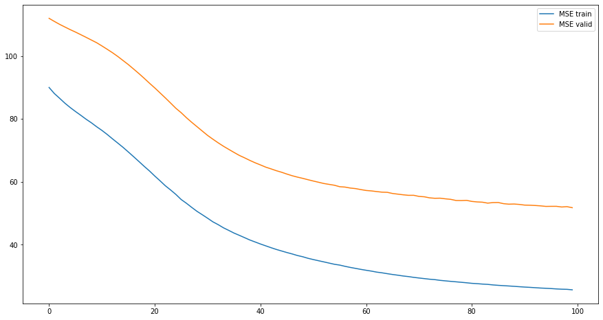
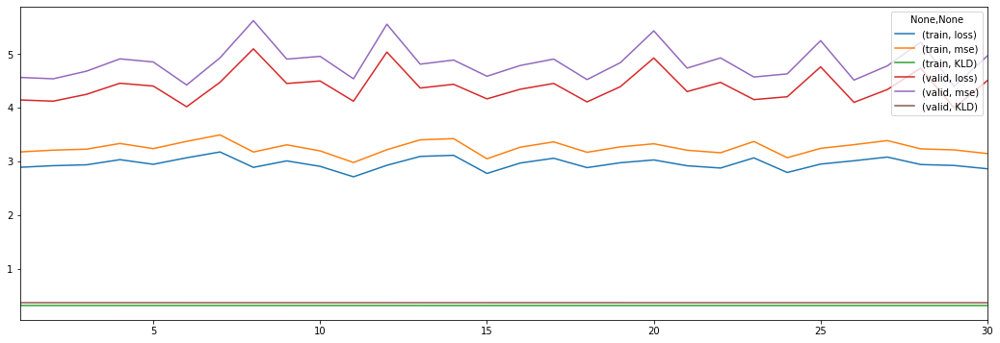
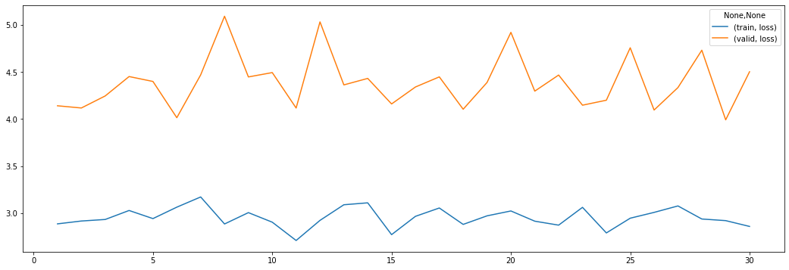

# Experiment 1


```python
import numpy as np
import torch

from src import config
from src.analyzers import *
from vaep.transform import StandardScaler, get_df_fitted_mean_std
```

    FOLDER_MQ_TXT_DATA = data\mq_out
    


```python
import logging
from src.logging import setup_logger

logger = logging.getLogger()  # returns root-logger
logger.setLevel(logging.CRITICAL)  # silence for everything else
logger.handlers = []


logger = setup_logger(logger=logging.getLogger('vaep'))
logger.info("Experiment 01")
```

    vaep - INFO     Experiment 01
    

## Load data

- 1000 features (most abundant peptides)
- later a subset of samples is selected


```python
N_SAMPLES_TO_LOAD = None
FN_PEPTIDE_INTENSITIES = config.FOLDER_DATA / 'df_intensities_N_07813_M01000'
FN_PEPTIDE_INTENSITIES = config.FOLDER_DATA / 'df_intensities_N_00090_M01000'

analysis = AnalyzePeptides(
    fname=FN_PEPTIDE_INTENSITIES, nrows=N_SAMPLES_TO_LOAD)
analysis.df = analysis.df.sort_index()  # sort by date
assert analysis.df.index.is_unique, "Non-unique training samples"
analysis
```


    AnalyzePeptides with attributes: df, stats


### Select consecutives samples for training


```python
import random
from vaep.utils import sample_iterable

N_SAMPLES = min(len(analysis.df), 1000)
logger.info(f"Selected {N_SAMPLES}")
analysis.N_SAMPLES = N_SAMPLES

M = 10

columns_selected = sorted(sample_iterable(list(analysis.df.columns), n=M))
analysis.df = analysis.df.loc[:, columns_selected]


def get_consecutive_data_indices(index, n_samples=N_SAMPLES):
    start_sample = len(index) - n_samples
    start_sample = random.randint(0, start_sample)
    return index[start_sample:start_sample+n_samples]


indices_selected = get_consecutive_data_indices(analysis.df.index)
analysis.samples = indices_selected
analysis.df = analysis.df.loc[indices_selected]

LOG_TRANSFORM = None
if LOG_TRANSFORM:
    analysis.df = LOG_TRANSFORM(analysis.df)

FRACTION = 0.8

class Indices(SimpleNamespace):
    pass


indices = Indices()
indices.train, indices.valid = indices_selected[:int(
    FRACTION*N_SAMPLES)], indices_selected[int(FRACTION*N_SAMPLES):]
analysis.indices = indices

analysis.df_train = analysis.df.loc[indices.train]
analysis.df_valid = analysis.df.loc[indices.valid]

# analysis.df
```

    vaep - INFO     Selected 90
    

### Training and Validation datasets


```python
n_samples, n_features = analysis.df.shape
msg = "Total:\nN samples: {:10,d} - N Peptides: {:10,d}\n".format(n_samples, n_features)
n_train, n_valid = len(analysis.df_train), len(analysis.df_valid)
msg += "N train set: {:8,d} - N valid set: {:9,d}".format(n_train, n_valid)
print(msg)
```

    Total:
    N samples:         90 - N Peptides:         10
    N train set:       72 - N valid set:        18
    


```python
detection_limit = analysis.df.min().min() if LOG_TRANSFORM else np.log10(analysis.df).min().min() # all zeros become nan.
"Detection limit: {:6.3f}, corresponding to intensity value of {:,d}".format(
    detection_limit,
    int(10 ** detection_limit)
)
```


    'Detection limit:  6.885, corresponding to intensity value of 7,669,899'


### Create meta data from filename


```python
from src import metadata

data_meta = metadata.get_metadata_from_filenames(indices_selected)
analysis.df_meta = pd.DataFrame.from_dict(
    data_meta, orient='index')
# analysis.df_meta['date'] = pd.to_datetime(analysis.df_meta['date'])
analysis.df_meta
```


<div>
<style scoped>
    .dataframe tbody tr th:only-of-type {
        vertical-align: middle;
    }

    .dataframe tbody tr th {
        vertical-align: top;
    }

    .dataframe thead th {
        text-align: right;
    }
</style>
<table border="1" class="dataframe">
  <thead>
    <tr style="text-align: right;">
      <th></th>
      <th>date</th>
      <th>ms_instrument</th>
      <th>researcher</th>
      <th>lc_instrument</th>
      <th>rest</th>
    </tr>
  </thead>
  <tbody>
    <tr>
      <th>20151128_QE7_UPLC11_RJC_DEV_columnsTest_HeLa_01</th>
      <td>20151128</td>
      <td>QE7</td>
      <td>RJC</td>
      <td>LC11</td>
      <td>UPDEV_columnsTest_HeLa_01</td>
    </tr>
    <tr>
      <th>20160105_QE6_nLC4_MM_QC_MNT_HELA_01_170106201806</th>
      <td>20160105</td>
      <td>QE6</td>
      <td>MM</td>
      <td>nLC4</td>
      <td>QC_MNT_HELA_01_170106201806</td>
    </tr>
    <tr>
      <th>20160311_QE6_LC6_SCL_QC_MNT_HeLa_01</th>
      <td>20160311</td>
      <td>QE6</td>
      <td>SCL</td>
      <td>LC6</td>
      <td>QC_MNT_HeLa_01</td>
    </tr>
    <tr>
      <th>20160401_QE6_nLC6_ASD_QC_HELA_03</th>
      <td>20160401</td>
      <td>QE6</td>
      <td>ASD</td>
      <td>nLC6</td>
      <td>QC_HELA_03</td>
    </tr>
    <tr>
      <th>20160404_QE2_nlc1_QC_hela_160404210125</th>
      <td>20160404</td>
      <td>QE2</td>
      <td>QC</td>
      <td>nlc1</td>
      <td>hela_160404210125</td>
    </tr>
    <tr>
      <th>...</th>
      <td>...</td>
      <td>...</td>
      <td>...</td>
      <td>...</td>
      <td>...</td>
    </tr>
    <tr>
      <th>20190527_QE4_LC12_AS_QC_MNT_HeLa_02</th>
      <td>20190527</td>
      <td>QE4</td>
      <td>AS</td>
      <td>LC12</td>
      <td>QC_MNT_HeLa_02</td>
    </tr>
    <tr>
      <th>20190701_QE4_LC12_IAH_QC_MNT_HeLa_03</th>
      <td>20190701</td>
      <td>QE4</td>
      <td>IAH</td>
      <td>LC12</td>
      <td>QC_MNT_HeLa_03</td>
    </tr>
    <tr>
      <th>20190708_QE6_nLC4_JE_QC_MNT_HeLa_01</th>
      <td>20190708</td>
      <td>QE6</td>
      <td>JE</td>
      <td>nLC4</td>
      <td>QC_MNT_HeLa_01</td>
    </tr>
    <tr>
      <th>20191128_QE8_nLC9_ASD_QC_HeLa_1</th>
      <td>20191128</td>
      <td>QE8</td>
      <td>ASD</td>
      <td>nLC9</td>
      <td>QC_HeLa_1</td>
    </tr>
    <tr>
      <th>20191128_QE8_nLC9_ASD_QC_HeLa_1_20191128165313</th>
      <td>20191128</td>
      <td>QE8</td>
      <td>ASD</td>
      <td>nLC9</td>
      <td>QC_HeLa_1_20191128165313</td>
    </tr>
  </tbody>
</table>
<p>90 rows × 5 columns</p>
</div>


- possibility to group data in time along `(machine, lc)` pairs


```python
analysis.df_meta.loc[indices.train].describe(datetime_is_numeric=False)
```


<div>
<style scoped>
    .dataframe tbody tr th:only-of-type {
        vertical-align: middle;
    }

    .dataframe tbody tr th {
        vertical-align: top;
    }

    .dataframe thead th {
        text-align: right;
    }
</style>
<table border="1" class="dataframe">
  <thead>
    <tr style="text-align: right;">
      <th></th>
      <th>date</th>
      <th>ms_instrument</th>
      <th>researcher</th>
      <th>lc_instrument</th>
      <th>rest</th>
    </tr>
  </thead>
  <tbody>
    <tr>
      <th>count</th>
      <td>72</td>
      <td>72</td>
      <td>72</td>
      <td>72</td>
      <td>72</td>
    </tr>
    <tr>
      <th>unique</th>
      <td>51</td>
      <td>11</td>
      <td>27</td>
      <td>17</td>
      <td>58</td>
    </tr>
    <tr>
      <th>top</th>
      <td>20180601</td>
      <td>QE4</td>
      <td>MR</td>
      <td>nLC1</td>
      <td>QC_MNT_HeLa_01</td>
    </tr>
    <tr>
      <th>freq</th>
      <td>7</td>
      <td>10</td>
      <td>15</td>
      <td>9</td>
      <td>5</td>
    </tr>
  </tbody>
</table>
</div>


```python
# This becomes part of analysis
def compare_meta_data_for_splits(meta, indices):

    _indices = vars(indices)
    logger.info('Found vars: {}'.format(', '.join(str(x)
                                                  for x in _indices.keys())))

    for key_split, split in _indices.items():
        print(f"{key_split:8} - split description:")
        display(
            meta.loc[split].describe(datetime_is_numeric=True)
        )

    _meta_features = list(meta.columns)

    for _column in _meta_features:
        display(
            _=pd.DataFrame({
                key_split: meta.loc[split, _column].value_counts(normalize=True) for key_split, split in _indices.items()
            }).sort_index().plot(kind='line', rot=90, figsize=(10, 5), title=f"{_column} value Counts for different splits")
        )


compare_meta_data_for_splits(analysis.df_meta.iloc[:, :2], indices)
```

    vaep - INFO     Found vars: train, valid
    train    - split description:
    


<div>
<style scoped>
    .dataframe tbody tr th:only-of-type {
        vertical-align: middle;
    }

    .dataframe tbody tr th {
        vertical-align: top;
    }

    .dataframe thead th {
        text-align: right;
    }
</style>
<table border="1" class="dataframe">
  <thead>
    <tr style="text-align: right;">
      <th></th>
      <th>date</th>
      <th>ms_instrument</th>
    </tr>
  </thead>
  <tbody>
    <tr>
      <th>count</th>
      <td>72</td>
      <td>72</td>
    </tr>
    <tr>
      <th>unique</th>
      <td>51</td>
      <td>11</td>
    </tr>
    <tr>
      <th>top</th>
      <td>20180601</td>
      <td>QE4</td>
    </tr>
    <tr>
      <th>freq</th>
      <td>7</td>
      <td>10</td>
    </tr>
  </tbody>
</table>
</div>


    valid    - split description:
    


<div>
<style scoped>
    .dataframe tbody tr th:only-of-type {
        vertical-align: middle;
    }

    .dataframe tbody tr th {
        vertical-align: top;
    }

    .dataframe thead th {
        text-align: right;
    }
</style>
<table border="1" class="dataframe">
  <thead>
    <tr style="text-align: right;">
      <th></th>
      <th>date</th>
      <th>ms_instrument</th>
    </tr>
  </thead>
  <tbody>
    <tr>
      <th>count</th>
      <td>18</td>
      <td>18</td>
    </tr>
    <tr>
      <th>unique</th>
      <td>16</td>
      <td>8</td>
    </tr>
    <tr>
      <th>top</th>
      <td>20190527</td>
      <td>QE5</td>
    </tr>
    <tr>
      <th>freq</th>
      <td>2</td>
      <td>4</td>
    </tr>
  </tbody>
</table>
</div>


### Analysis state so far


```python
analysis
```


    AnalyzePeptides with attributes: N_SAMPLES, df, df_meta, df_train, df_valid, indices, samples, stats


### Correlation


```python
corr_lower_triangle(analysis.df)
```


<div>
<style scoped>
    .dataframe tbody tr th:only-of-type {
        vertical-align: middle;
    }

    .dataframe tbody tr th {
        vertical-align: top;
    }

    .dataframe thead th {
        text-align: right;
    }
</style>
<table border="1" class="dataframe">
  <thead>
    <tr style="text-align: right;">
      <th></th>
      <th>ALPFWNEEIVPQIK</th>
      <th>AQQEQELAADAFK</th>
      <th>EGPYDVVVLPGGNLGAQNLSESAAVK</th>
      <th>FGYVDFESAEDLEK</th>
      <th>GGPGSAVSPYPTFNPSSDVAALHK</th>
      <th>IGEHTPSALAIMENANVLAR</th>
      <th>LSGSNPYTTVTPQIINSK</th>
      <th>REDLVVAPAGITLK</th>
      <th>TTHFVEGGDAGNREDQINR</th>
      <th>VDFNVPMK</th>
    </tr>
  </thead>
  <tbody>
    <tr>
      <th>ALPFWNEEIVPQIK</th>
      <td>NaN</td>
      <td>NaN</td>
      <td>NaN</td>
      <td>NaN</td>
      <td>NaN</td>
      <td>NaN</td>
      <td>NaN</td>
      <td>NaN</td>
      <td>NaN</td>
      <td>NaN</td>
    </tr>
    <tr>
      <th>AQQEQELAADAFK</th>
      <td>0.609</td>
      <td>NaN</td>
      <td>NaN</td>
      <td>NaN</td>
      <td>NaN</td>
      <td>NaN</td>
      <td>NaN</td>
      <td>NaN</td>
      <td>NaN</td>
      <td>NaN</td>
    </tr>
    <tr>
      <th>EGPYDVVVLPGGNLGAQNLSESAAVK</th>
      <td>0.745</td>
      <td>0.772</td>
      <td>NaN</td>
      <td>NaN</td>
      <td>NaN</td>
      <td>NaN</td>
      <td>NaN</td>
      <td>NaN</td>
      <td>NaN</td>
      <td>NaN</td>
    </tr>
    <tr>
      <th>FGYVDFESAEDLEK</th>
      <td>0.728</td>
      <td>0.757</td>
      <td>0.737</td>
      <td>NaN</td>
      <td>NaN</td>
      <td>NaN</td>
      <td>NaN</td>
      <td>NaN</td>
      <td>NaN</td>
      <td>NaN</td>
    </tr>
    <tr>
      <th>GGPGSAVSPYPTFNPSSDVAALHK</th>
      <td>0.739</td>
      <td>0.854</td>
      <td>0.873</td>
      <td>0.792</td>
      <td>NaN</td>
      <td>NaN</td>
      <td>NaN</td>
      <td>NaN</td>
      <td>NaN</td>
      <td>NaN</td>
    </tr>
    <tr>
      <th>IGEHTPSALAIMENANVLAR</th>
      <td>0.457</td>
      <td>0.643</td>
      <td>0.656</td>
      <td>0.547</td>
      <td>0.642</td>
      <td>NaN</td>
      <td>NaN</td>
      <td>NaN</td>
      <td>NaN</td>
      <td>NaN</td>
    </tr>
    <tr>
      <th>LSGSNPYTTVTPQIINSK</th>
      <td>0.515</td>
      <td>0.491</td>
      <td>0.638</td>
      <td>0.481</td>
      <td>0.635</td>
      <td>0.615</td>
      <td>NaN</td>
      <td>NaN</td>
      <td>NaN</td>
      <td>NaN</td>
    </tr>
    <tr>
      <th>REDLVVAPAGITLK</th>
      <td>0.537</td>
      <td>0.619</td>
      <td>0.568</td>
      <td>0.692</td>
      <td>0.688</td>
      <td>0.302</td>
      <td>0.249</td>
      <td>NaN</td>
      <td>NaN</td>
      <td>NaN</td>
    </tr>
    <tr>
      <th>TTHFVEGGDAGNREDQINR</th>
      <td>0.347</td>
      <td>0.600</td>
      <td>0.453</td>
      <td>0.520</td>
      <td>0.600</td>
      <td>0.549</td>
      <td>0.464</td>
      <td>0.451</td>
      <td>NaN</td>
      <td>NaN</td>
    </tr>
    <tr>
      <th>VDFNVPMK</th>
      <td>0.502</td>
      <td>0.632</td>
      <td>0.625</td>
      <td>0.666</td>
      <td>0.693</td>
      <td>0.547</td>
      <td>0.470</td>
      <td>0.772</td>
      <td>0.406</td>
      <td>NaN</td>
    </tr>
  </tbody>
</table>
</div>


## Baseline supervised RF models

- M RandomForest baseline models, each predicting one feature based on the M-1 other features
- get an idea of a possible baseline performance
    - could be used together with imputation of inputs
    - with some effort this could be scaled to predict only missing peptides


```python
from sklearn.ensemble import RandomForestRegressor
from sklearn.metrics import mean_squared_error
metrics = {}


peptides = list(analysis.df_train.columns)
metrics = {}
pred_valid = {}

for i in range(M):
    train_columns = list(range(M))
    test_column = i
    train_columns.remove(i)
    train_columns = [peptides[i] for i in train_columns]
    test_column = peptides[test_column]
    logger.debug(
        f"Train columns: {', '.join(train_columns)}\nTest column: {test_column}")
    _df_train, _y_train = analysis.df_train[train_columns], analysis.df_train[test_column]
    _df_valid, _y_valid = analysis.df_valid[train_columns], analysis.df_valid[test_column]
    rf_reg = RandomForestRegressor()
    rf_reg.fit(X=_df_train, y=_y_train)
    # metrics
    _metrics = {}
    _metrics[('MSE', 'train')] = mean_squared_error(
        y_true=_y_train, y_pred=rf_reg.predict(_df_train))
    y_pred_valid = rf_reg.predict(_df_valid)
    _metrics[('MSE', 'valid')] = mean_squared_error(
        y_true=_y_valid, y_pred=y_pred_valid)
    metrics[test_column] = _metrics
    # predictions
    pred_valid[test_column] = y_pred_valid
pd.DataFrame(metrics)
```


<div>
<style scoped>
    .dataframe tbody tr th:only-of-type {
        vertical-align: middle;
    }

    .dataframe tbody tr th {
        vertical-align: top;
    }

    .dataframe thead th {
        text-align: right;
    }
</style>
<table border="1" class="dataframe">
  <thead>
    <tr style="text-align: right;">
      <th></th>
      <th></th>
      <th>ALPFWNEEIVPQIK</th>
      <th>AQQEQELAADAFK</th>
      <th>EGPYDVVVLPGGNLGAQNLSESAAVK</th>
      <th>FGYVDFESAEDLEK</th>
      <th>GGPGSAVSPYPTFNPSSDVAALHK</th>
      <th>IGEHTPSALAIMENANVLAR</th>
      <th>LSGSNPYTTVTPQIINSK</th>
      <th>REDLVVAPAGITLK</th>
      <th>TTHFVEGGDAGNREDQINR</th>
      <th>VDFNVPMK</th>
    </tr>
  </thead>
  <tbody>
    <tr>
      <th rowspan="2" valign="top">MSE</th>
      <th>train</th>
      <td>38,418,782,581,427,544.000</td>
      <td>2,303,440,965,277,442.500</td>
      <td>5,201,716,585,788,333.000</td>
      <td>3,644,639,772,961,388.500</td>
      <td>9,009,243,230,418,888.000</td>
      <td>435,645,117,706,502,848.000</td>
      <td>16,459,622,986,202,218.000</td>
      <td>4,081,732,123,308,953.000</td>
      <td>71,112,304,857,963,152.000</td>
      <td>19,989,604,626,531,948.000</td>
    </tr>
    <tr>
      <th>valid</th>
      <td>1,038,526,868,311,069,568.000</td>
      <td>43,397,875,691,010,320.000</td>
      <td>38,997,795,651,662,776.000</td>
      <td>140,355,193,831,291,104.000</td>
      <td>97,977,154,853,686,672.000</td>
      <td>4,253,580,917,322,822,144.000</td>
      <td>276,763,320,450,499,424.000</td>
      <td>41,663,032,395,379,480.000</td>
      <td>3,220,450,830,247,168,000.000</td>
      <td>515,988,016,863,178,304.000</td>
    </tr>
  </tbody>
</table>
</div>


```python
pd.DataFrame(pred_valid, index=analysis.df_valid.index)
```


<div>
<style scoped>
    .dataframe tbody tr th:only-of-type {
        vertical-align: middle;
    }

    .dataframe tbody tr th {
        vertical-align: top;
    }

    .dataframe thead th {
        text-align: right;
    }
</style>
<table border="1" class="dataframe">
  <thead>
    <tr style="text-align: right;">
      <th></th>
      <th>ALPFWNEEIVPQIK</th>
      <th>AQQEQELAADAFK</th>
      <th>EGPYDVVVLPGGNLGAQNLSESAAVK</th>
      <th>FGYVDFESAEDLEK</th>
      <th>GGPGSAVSPYPTFNPSSDVAALHK</th>
      <th>IGEHTPSALAIMENANVLAR</th>
      <th>LSGSNPYTTVTPQIINSK</th>
      <th>REDLVVAPAGITLK</th>
      <th>TTHFVEGGDAGNREDQINR</th>
      <th>VDFNVPMK</th>
    </tr>
    <tr>
      <th>Sample ID</th>
      <th></th>
      <th></th>
      <th></th>
      <th></th>
      <th></th>
      <th></th>
      <th></th>
      <th></th>
      <th></th>
      <th></th>
    </tr>
  </thead>
  <tbody>
    <tr>
      <th>20181029_QE3_nLC3_KBE_QC_MNT_HELA_02</th>
      <td>601,308,150.000</td>
      <td>215,796,026.000</td>
      <td>339,470,900.000</td>
      <td>251,550,000.000</td>
      <td>452,953,500.000</td>
      <td>1,195,350,900.000</td>
      <td>183,615,100.000</td>
      <td>221,513,400.000</td>
      <td>749,443,860.000</td>
      <td>638,110,100.000</td>
    </tr>
    <tr>
      <th>20181102_QE2_NLC10_MR_QC_MNT_HELA_01</th>
      <td>1,946,136,260.000</td>
      <td>661,329,610.000</td>
      <td>1,226,277,500.000</td>
      <td>1,035,203,100.000</td>
      <td>1,462,723,000.000</td>
      <td>4,173,797,000.000</td>
      <td>833,900,500.000</td>
      <td>689,091,700.000</td>
      <td>2,909,592,000.000</td>
      <td>1,826,352,000.000</td>
    </tr>
    <tr>
      <th>20181107_QE6_nLC12_MR_QC_MNT_HELA_New_01</th>
      <td>1,418,144,440.000</td>
      <td>449,690,799.000</td>
      <td>574,146,900.000</td>
      <td>859,254,700.000</td>
      <td>748,167,300.000</td>
      <td>3,698,524,700.000</td>
      <td>682,767,700.000</td>
      <td>579,038,100.000</td>
      <td>2,509,452,400.000</td>
      <td>1,009,826,200.000</td>
    </tr>
    <tr>
      <th>20181110_QE5_nLC5_OOE_QC_MNT_HELA_15cm_250ng_RO-003</th>
      <td>414,779,480.000</td>
      <td>159,629,995.000</td>
      <td>192,798,400.000</td>
      <td>227,282,800.000</td>
      <td>351,377,700.000</td>
      <td>869,154,900.000</td>
      <td>141,404,800.000</td>
      <td>212,204,500.000</td>
      <td>785,834,060.000</td>
      <td>625,968,900.000</td>
    </tr>
    <tr>
      <th>20181112_QE7_nLC11_MEM_QC_HeLa_02</th>
      <td>1,906,048,840.000</td>
      <td>391,469,490.000</td>
      <td>819,897,700.000</td>
      <td>1,000,803,800.000</td>
      <td>1,458,499,100.000</td>
      <td>4,581,040,700.000</td>
      <td>652,981,900.000</td>
      <td>582,971,900.000</td>
      <td>1,573,350,300.000</td>
      <td>1,554,654,500.000</td>
    </tr>
    <tr>
      <th>20181119_QE1_nLC2_TW_QC_HeLa_1</th>
      <td>1,030,712,320.000</td>
      <td>448,517,500.000</td>
      <td>634,092,000.000</td>
      <td>862,025,800.000</td>
      <td>734,767,800.000</td>
      <td>2,875,044,000.000</td>
      <td>426,489,400.000</td>
      <td>519,117,300.000</td>
      <td>1,677,255,800.000</td>
      <td>1,124,855,600.000</td>
    </tr>
    <tr>
      <th>20181120_QE5_nLC7_AP_HeLa_2</th>
      <td>989,279,930.000</td>
      <td>442,629,210.000</td>
      <td>512,833,300.000</td>
      <td>679,553,600.000</td>
      <td>783,403,000.000</td>
      <td>2,610,950,600.000</td>
      <td>428,075,900.000</td>
      <td>550,811,400.000</td>
      <td>1,649,239,200.000</td>
      <td>1,182,987,600.000</td>
    </tr>
    <tr>
      <th>20181126_QE2_NLC10_MN_QC_HELA_02</th>
      <td>920,461,400.000</td>
      <td>338,160,696.000</td>
      <td>487,124,200.000</td>
      <td>574,205,800.000</td>
      <td>655,411,300.000</td>
      <td>1,735,030,300.000</td>
      <td>365,562,600.000</td>
      <td>341,875,390.000</td>
      <td>1,676,324,700.000</td>
      <td>1,202,346,500.000</td>
    </tr>
    <tr>
      <th>20181205_QE5_nLC7_RJC_QC_MNT_HeLa_2</th>
      <td>418,162,080.000</td>
      <td>131,045,134.000</td>
      <td>236,648,300.000</td>
      <td>225,709,900.000</td>
      <td>342,240,200.000</td>
      <td>1,154,731,200.000</td>
      <td>147,828,600.000</td>
      <td>201,123,500.000</td>
      <td>628,968,800.000</td>
      <td>496,456,400.000</td>
    </tr>
    <tr>
      <th>20181215_QE2_NLC10_ANHO_QC_MNT_HELA_04</th>
      <td>1,132,361,500.000</td>
      <td>399,321,893.000</td>
      <td>805,963,900.000</td>
      <td>895,371,500.000</td>
      <td>1,024,762,600.000</td>
      <td>2,739,054,200.000</td>
      <td>600,720,000.000</td>
      <td>571,166,000.000</td>
      <td>1,899,356,100.000</td>
      <td>1,282,469,400.000</td>
    </tr>
    <tr>
      <th>20181219_QE1_nLC2_GP_QC_MNT_HELA_01</th>
      <td>674,394,840.000</td>
      <td>228,698,999.000</td>
      <td>354,668,500.000</td>
      <td>389,548,500.000</td>
      <td>628,626,100.000</td>
      <td>1,218,672,000.000</td>
      <td>198,370,700.000</td>
      <td>334,749,400.000</td>
      <td>1,196,511,400.000</td>
      <td>711,325,600.000</td>
    </tr>
    <tr>
      <th>20190107_QE5_nLC5_DS_QC_MNT_HeLa_FlashPack_02</th>
      <td>1,221,480,140.000</td>
      <td>382,460,097.000</td>
      <td>1,032,855,900.000</td>
      <td>845,769,700.000</td>
      <td>1,015,963,400.000</td>
      <td>3,286,852,100.000</td>
      <td>744,740,800.000</td>
      <td>472,358,480.000</td>
      <td>1,653,540,900.000</td>
      <td>1,038,331,500.000</td>
    </tr>
    <tr>
      <th>20190527_QE4_LC12_AS_QC_MNT_HeLa_01</th>
      <td>1,851,377,340.000</td>
      <td>503,727,650.000</td>
      <td>1,238,981,300.000</td>
      <td>1,010,027,700.000</td>
      <td>1,677,454,600.000</td>
      <td>4,488,957,600.000</td>
      <td>1,274,299,000.000</td>
      <td>773,436,600.000</td>
      <td>2,193,371,600.000</td>
      <td>2,790,491,000.000</td>
    </tr>
    <tr>
      <th>20190527_QE4_LC12_AS_QC_MNT_HeLa_02</th>
      <td>1,999,479,000.000</td>
      <td>461,637,040.000</td>
      <td>1,248,003,700.000</td>
      <td>1,047,670,100.000</td>
      <td>1,979,002,500.000</td>
      <td>4,248,021,600.000</td>
      <td>1,334,294,000.000</td>
      <td>780,138,500.000</td>
      <td>2,278,664,800.000</td>
      <td>2,714,324,000.000</td>
    </tr>
    <tr>
      <th>20190701_QE4_LC12_IAH_QC_MNT_HeLa_03</th>
      <td>1,349,078,100.000</td>
      <td>599,004,699.000</td>
      <td>1,230,517,600.000</td>
      <td>928,145,600.000</td>
      <td>1,255,336,600.000</td>
      <td>3,954,111,700.000</td>
      <td>944,144,100.000</td>
      <td>718,038,600.000</td>
      <td>2,955,754,200.000</td>
      <td>1,679,702,000.000</td>
    </tr>
    <tr>
      <th>20190708_QE6_nLC4_JE_QC_MNT_HeLa_01</th>
      <td>1,853,244,740.000</td>
      <td>730,059,720.000</td>
      <td>1,335,812,000.000</td>
      <td>1,163,292,600.000</td>
      <td>2,288,244,000.000</td>
      <td>7,701,120,500.000</td>
      <td>1,689,271,600.000</td>
      <td>788,230,100.000</td>
      <td>3,991,924,800.000</td>
      <td>2,431,169,000.000</td>
    </tr>
    <tr>
      <th>20191128_QE8_nLC9_ASD_QC_HeLa_1</th>
      <td>1,952,486,400.000</td>
      <td>692,647,820.000</td>
      <td>1,275,459,300.000</td>
      <td>1,062,693,200.000</td>
      <td>1,775,764,200.000</td>
      <td>7,899,082,000.000</td>
      <td>1,551,545,800.000</td>
      <td>411,787,490.000</td>
      <td>2,863,629,400.000</td>
      <td>2,477,203,000.000</td>
    </tr>
    <tr>
      <th>20191128_QE8_nLC9_ASD_QC_HeLa_1_20191128165313</th>
      <td>1,757,651,520.000</td>
      <td>607,593,340.000</td>
      <td>1,258,195,300.000</td>
      <td>1,105,461,400.000</td>
      <td>1,539,285,100.000</td>
      <td>7,129,705,000.000</td>
      <td>1,012,717,600.000</td>
      <td>411,127,590.000</td>
      <td>2,448,907,600.000</td>
      <td>2,712,902,000.000</td>
    </tr>
  </tbody>
</table>
</div>


Overfits to training data as it should.


```python
analysis.df_valid
```


<div>
<style scoped>
    .dataframe tbody tr th:only-of-type {
        vertical-align: middle;
    }

    .dataframe tbody tr th {
        vertical-align: top;
    }

    .dataframe thead th {
        text-align: right;
    }
</style>
<table border="1" class="dataframe">
  <thead>
    <tr style="text-align: right;">
      <th></th>
      <th>ALPFWNEEIVPQIK</th>
      <th>AQQEQELAADAFK</th>
      <th>EGPYDVVVLPGGNLGAQNLSESAAVK</th>
      <th>FGYVDFESAEDLEK</th>
      <th>GGPGSAVSPYPTFNPSSDVAALHK</th>
      <th>IGEHTPSALAIMENANVLAR</th>
      <th>LSGSNPYTTVTPQIINSK</th>
      <th>REDLVVAPAGITLK</th>
      <th>TTHFVEGGDAGNREDQINR</th>
      <th>VDFNVPMK</th>
    </tr>
    <tr>
      <th>Sample ID</th>
      <th></th>
      <th></th>
      <th></th>
      <th></th>
      <th></th>
      <th></th>
      <th></th>
      <th></th>
      <th></th>
      <th></th>
    </tr>
  </thead>
  <tbody>
    <tr>
      <th>20181029_QE3_nLC3_KBE_QC_MNT_HELA_02</th>
      <td>503,280,000.000</td>
      <td>149,610,000.000</td>
      <td>259,450,000.000</td>
      <td>406,200,000.000</td>
      <td>460,070,000.000</td>
      <td>395,380,000.000</td>
      <td>213,690,000.000</td>
      <td>203,750,000.000</td>
      <td>684,680,000.000</td>
      <td>713,600,000.000</td>
    </tr>
    <tr>
      <th>20181102_QE2_NLC10_MR_QC_MNT_HELA_01</th>
      <td>2,325,100,000.000</td>
      <td>449,130,000.000</td>
      <td>1,074,200,000.000</td>
      <td>986,900,000.000</td>
      <td>1,869,300,000.000</td>
      <td>7,284,500,000.000</td>
      <td>580,400,000.000</td>
      <td>855,690,000.000</td>
      <td>2,155,700,000.000</td>
      <td>1,888,300,000.000</td>
    </tr>
    <tr>
      <th>20181107_QE6_nLC12_MR_QC_MNT_HELA_New_01</th>
      <td>1,306,500,000.000</td>
      <td>403,620,000.000</td>
      <td>839,710,000.000</td>
      <td>843,310,000.000</td>
      <td>990,820,000.000</td>
      <td>5,777,300,000.000</td>
      <td>292,090,000.000</td>
      <td>81,292,000.000</td>
      <td>2,098,700,000.000</td>
      <td>1,859,100,000.000</td>
    </tr>
    <tr>
      <th>20181110_QE5_nLC5_OOE_QC_MNT_HELA_15cm_250ng_RO-003</th>
      <td>372,230,000.000</td>
      <td>117,240,000.000</td>
      <td>199,240,000.000</td>
      <td>267,750,000.000</td>
      <td>356,680,000.000</td>
      <td>1,184,400,000.000</td>
      <td>141,570,000.000</td>
      <td>220,500,000.000</td>
      <td>709,410,000.000</td>
      <td>645,040,000.000</td>
    </tr>
    <tr>
      <th>20181112_QE7_nLC11_MEM_QC_HeLa_02</th>
      <td>87,196,000.000</td>
      <td>717,710,000.000</td>
      <td>1,108,500,000.000</td>
      <td>13,692,000.000</td>
      <td>1,360,300,000.000</td>
      <td>3,521,400,000.000</td>
      <td>571,180,000.000</td>
      <td>461,960,000.000</td>
      <td>2,410,100,000.000</td>
      <td>1,612,800,000.000</td>
    </tr>
    <tr>
      <th>20181119_QE1_nLC2_TW_QC_HeLa_1</th>
      <td>1,050,400,000.000</td>
      <td>495,380,000.000</td>
      <td>642,980,000.000</td>
      <td>602,610,000.000</td>
      <td>885,590,000.000</td>
      <td>4,186,100,000.000</td>
      <td>258,160,000.000</td>
      <td>456,020,000.000</td>
      <td>1,482,900,000.000</td>
      <td>1,756,400,000.000</td>
    </tr>
    <tr>
      <th>20181120_QE5_nLC7_AP_HeLa_2</th>
      <td>1,100,100,000.000</td>
      <td>412,480,000.000</td>
      <td>526,570,000.000</td>
      <td>657,620,000.000</td>
      <td>810,150,000.000</td>
      <td>3,362,500,000.000</td>
      <td>306,100,000.000</td>
      <td>390,410,000.000</td>
      <td>1,549,500,000.000</td>
      <td>2,154,500,000.000</td>
    </tr>
    <tr>
      <th>20181126_QE2_NLC10_MN_QC_HELA_02</th>
      <td>850,850,000.000</td>
      <td>238,150,000.000</td>
      <td>407,220,000.000</td>
      <td>590,710,000.000</td>
      <td>801,160,000.000</td>
      <td>2,337,100,000.000</td>
      <td>335,380,000.000</td>
      <td>459,420,000.000</td>
      <td>1,390,400,000.000</td>
      <td>1,159,100,000.000</td>
    </tr>
    <tr>
      <th>20181205_QE5_nLC7_RJC_QC_MNT_HeLa_2</th>
      <td>399,770,000.000</td>
      <td>181,700,000.000</td>
      <td>283,340,000.000</td>
      <td>305,990,000.000</td>
      <td>188,640,000.000</td>
      <td>1,657,100,000.000</td>
      <td>143,700,000.000</td>
      <td>63,812,000.000</td>
      <td>684,800,000.000</td>
      <td>572,660,000.000</td>
    </tr>
    <tr>
      <th>20181215_QE2_NLC10_ANHO_QC_MNT_HELA_04</th>
      <td>1,403,600,000.000</td>
      <td>425,940,000.000</td>
      <td>622,250,000.000</td>
      <td>782,080,000.000</td>
      <td>1,132,900,000.000</td>
      <td>2,990,000,000.000</td>
      <td>425,900,000.000</td>
      <td>566,700,000.000</td>
      <td>1,600,900,000.000</td>
      <td>1,680,800,000.000</td>
    </tr>
    <tr>
      <th>20181219_QE1_nLC2_GP_QC_MNT_HELA_01</th>
      <td>560,860,000.000</td>
      <td>271,530,000.000</td>
      <td>256,160,000.000</td>
      <td>355,150,000.000</td>
      <td>515,890,000.000</td>
      <td>1,968,400,000.000</td>
      <td>198,630,000.000</td>
      <td>258,250,000.000</td>
      <td>835,950,000.000</td>
      <td>1,135,700,000.000</td>
    </tr>
    <tr>
      <th>20190107_QE5_nLC5_DS_QC_MNT_HeLa_FlashPack_02</th>
      <td>1,937,100,000.000</td>
      <td>498,750,000.000</td>
      <td>747,470,000.000</td>
      <td>647,160,000.000</td>
      <td>1,241,400,000.000</td>
      <td>4,555,600,000.000</td>
      <td>436,220,000.000</td>
      <td>448,110,000.000</td>
      <td>1,057,700,000.000</td>
      <td>1,402,700,000.000</td>
    </tr>
    <tr>
      <th>20190527_QE4_LC12_AS_QC_MNT_HeLa_01</th>
      <td>3,160,600,000.000</td>
      <td>706,220,000.000</td>
      <td>1,281,000,000.000</td>
      <td>1,519,900,000.000</td>
      <td>2,110,900,000.000</td>
      <td>1,239,800,000.000</td>
      <td>379,710,000.000</td>
      <td>865,550,000.000</td>
      <td>312,310,000.000</td>
      <td>1,788,800,000.000</td>
    </tr>
    <tr>
      <th>20190527_QE4_LC12_AS_QC_MNT_HeLa_02</th>
      <td>3,469,700,000.000</td>
      <td>817,360,000.000</td>
      <td>1,316,100,000.000</td>
      <td>1,584,000,000.000</td>
      <td>1,920,500,000.000</td>
      <td>1,374,800,000.000</td>
      <td>766,310,000.000</td>
      <td>848,340,000.000</td>
      <td>324,920,000.000</td>
      <td>1,662,300,000.000</td>
    </tr>
    <tr>
      <th>20190701_QE4_LC12_IAH_QC_MNT_HeLa_03</th>
      <td>2,771,900,000.000</td>
      <td>478,060,000.000</td>
      <td>726,540,000.000</td>
      <td>956,810,000.000</td>
      <td>1,663,200,000.000</td>
      <td>7,003,300,000.000</td>
      <td>461,900,000.000</td>
      <td>688,650,000.000</td>
      <td>1,298,100,000.000</td>
      <td>1,959,000,000.000</td>
    </tr>
    <tr>
      <th>20190708_QE6_nLC4_JE_QC_MNT_HeLa_01</th>
      <td>4,407,700,000.000</td>
      <td>1,096,700,000.000</td>
      <td>1,580,100,000.000</td>
      <td>1,881,000,000.000</td>
      <td>2,267,400,000.000</td>
      <td>8,900,100,000.000</td>
      <td>486,050,000.000</td>
      <td>678,860,000.000</td>
      <td>1,133,100,000.000</td>
      <td>2,561,500,000.000</td>
    </tr>
    <tr>
      <th>20191128_QE8_nLC9_ASD_QC_HeLa_1</th>
      <td>3,422,600,000.000</td>
      <td>944,780,000.000</td>
      <td>1,148,900,000.000</td>
      <td>1,562,200,000.000</td>
      <td>2,574,000,000.000</td>
      <td>4,035,400,000.000</td>
      <td>389,500,000.000</td>
      <td>790,300,000.000</td>
      <td>7,475,800,000.000</td>
      <td>1,076,700,000.000</td>
    </tr>
    <tr>
      <th>20191128_QE8_nLC9_ASD_QC_HeLa_1_20191128165313</th>
      <td>1,635,900,000.000</td>
      <td>1,065,300,000.000</td>
      <td>1,037,400,000.000</td>
      <td>1,393,300,000.000</td>
      <td>2,164,500,000.000</td>
      <td>3,798,700,000.000</td>
      <td>354,070,000.000</td>
      <td>881,580,000.000</td>
      <td>6,482,000,000.000</td>
      <td>1,111,400,000.000</td>
    </tr>
  </tbody>
</table>
</div>


## DL Setup


```python
from vaep.cmd import get_args

BATCH_SIZE, EPOCHS = 8, 30
args = get_args(batch_size=BATCH_SIZE, epochs=EPOCHS, no_cuda=True)  # data transfer to GPU seems slow
kwargs = {'num_workers': 2, 'pin_memory': True} if args.cuda else {}

# torch.manual_seed(args.seed)
device = torch.device("cuda" if args.cuda else "cpu")
device

print(args, device)
```

    Namespace(batch_size=8, cuda=False, epochs=30, log_interval=10, no_cuda=True, seed=43) cpu
    

## Plain AE
- should also heavily overfit the training data


```python
scaler = StandardScaler().fit(analysis.df_train)
# # five examples from validation dataset
scaler.transform(analysis.df_valid.iloc[:5])
```


<div>
<style scoped>
    .dataframe tbody tr th:only-of-type {
        vertical-align: middle;
    }

    .dataframe tbody tr th {
        vertical-align: top;
    }

    .dataframe thead th {
        text-align: right;
    }
</style>
<table border="1" class="dataframe">
  <thead>
    <tr style="text-align: right;">
      <th></th>
      <th>ALPFWNEEIVPQIK</th>
      <th>AQQEQELAADAFK</th>
      <th>EGPYDVVVLPGGNLGAQNLSESAAVK</th>
      <th>FGYVDFESAEDLEK</th>
      <th>GGPGSAVSPYPTFNPSSDVAALHK</th>
      <th>IGEHTPSALAIMENANVLAR</th>
      <th>LSGSNPYTTVTPQIINSK</th>
      <th>REDLVVAPAGITLK</th>
      <th>TTHFVEGGDAGNREDQINR</th>
      <th>VDFNVPMK</th>
    </tr>
    <tr>
      <th>Sample ID</th>
      <th></th>
      <th></th>
      <th></th>
      <th></th>
      <th></th>
      <th></th>
      <th></th>
      <th></th>
      <th></th>
      <th></th>
    </tr>
  </thead>
  <tbody>
    <tr>
      <th>20181029_QE3_nLC3_KBE_QC_MNT_HELA_02</th>
      <td>-1.057</td>
      <td>-1.127</td>
      <td>-1.109</td>
      <td>-0.939</td>
      <td>-0.971</td>
      <td>-1.050</td>
      <td>-0.764</td>
      <td>-0.919</td>
      <td>-1.057</td>
      <td>-0.852</td>
    </tr>
    <tr>
      <th>20181102_QE2_NLC10_MR_QC_MNT_HELA_01</th>
      <td>1.470</td>
      <td>0.323</td>
      <td>1.055</td>
      <td>0.876</td>
      <td>1.573</td>
      <td>1.669</td>
      <td>0.034</td>
      <td>1.817</td>
      <td>0.392</td>
      <td>0.885</td>
    </tr>
    <tr>
      <th>20181107_QE6_nLC12_MR_QC_MNT_HELA_New_01</th>
      <td>0.057</td>
      <td>0.103</td>
      <td>0.432</td>
      <td>0.427</td>
      <td>-0.013</td>
      <td>1.074</td>
      <td>-0.593</td>
      <td>-1.433</td>
      <td>0.336</td>
      <td>0.841</td>
    </tr>
    <tr>
      <th>20181110_QE5_nLC5_OOE_QC_MNT_HELA_15cm_250ng_RO-003</th>
      <td>-1.239</td>
      <td>-1.284</td>
      <td>-1.269</td>
      <td>-1.371</td>
      <td>-1.158</td>
      <td>-0.739</td>
      <td>-0.921</td>
      <td>-0.849</td>
      <td>-1.033</td>
      <td>-0.954</td>
    </tr>
    <tr>
      <th>20181112_QE7_nLC11_MEM_QC_HeLa_02</th>
      <td>-1.634</td>
      <td>1.623</td>
      <td>1.147</td>
      <td>-2.165</td>
      <td>0.654</td>
      <td>0.184</td>
      <td>0.014</td>
      <td>0.164</td>
      <td>0.643</td>
      <td>0.477</td>
    </tr>
  </tbody>
</table>
</div>


```python
from torchvision import transforms
from torch.utils.data import DataLoader
from vaep.io.datasets import PeptideDatasetInMemoryNoMissings

tf_norm = None # replace with Normalizer

dataset_train = PeptideDatasetInMemoryNoMissings(data=scaler.transform(analysis.df_train), transform=tf_norm)
dataset_valid = PeptideDatasetInMemoryNoMissings(data=scaler.transform(analysis.df_valid), transform=tf_norm)
dl_train = DataLoader(dataset_train, batch_size=args.batch_size, shuffle=True)
dl_valid = DataLoader(dataset_valid, batch_size=args.batch_size, shuffle=False)
```


```python
from vaep.model import Autoencoder

model = Autoencoder(n_features=M, n_neurons=int(M/2), last_activation=None, dim_latent=3).double()
criterion = torch.nn.MSELoss(reduction='sum')

learning_rate = 1e-3

optimizer = torch.optim.Adam(
    model.parameters(),
    lr=learning_rate,
)
```


```python
# Train standard or denoising autoencoder (AE)

train_losses, valid_losses = [], []
num_epochs = 100
# do = nn.Dropout()  # comment out for standard AE
for epoch in range(num_epochs):
    # ===================train==========================
    total_loss = 0
    for data in dl_train:
        model.train()
        data = data.to(device)
        # noise = do(torch.ones(img.shape)).to(device)
        # img_bad = (img * noise).to(device)  # comment out for standard AE
        # ===================forward=====================
        output = model(data)  # feed  (for std AE) or <img_bad> (for denoising AE)
        loss = criterion(output, data)
        # ===================backward====================
        optimizer.zero_grad()
        loss.backward()
        optimizer.step()
        total_loss += loss.item()
    train_losses.append(total_loss/ len(dl_train))
    # ===================validate========================
    total_loss = 0
    for data in dl_valid:
        model.eval()
        data = data.to(device)
        output = model(data)
        loss = criterion(output, data)
        total_loss += loss.item()
    valid_losses.append(total_loss/len(dl_valid))
    
    # ===================log=============================
    print(f'epoch [{epoch + 1}/{num_epochs}], train-loss:{train_losses[-1]:.4f}, valid-loss{valid_losses[-1]:.4f}')
        
```

    epoch [1/100], train-loss:90.0026, valid-loss111.9819
    epoch [2/100], train-loss:88.0704, valid-loss111.0008
    epoch [3/100], train-loss:86.5540, valid-loss110.0642
    epoch [4/100], train-loss:84.9955, valid-loss109.2204
    epoch [5/100], train-loss:83.6179, valid-loss108.3850
    epoch [6/100], train-loss:82.3551, valid-loss107.6115
    epoch [7/100], train-loss:81.1570, valid-loss106.7826
    epoch [8/100], train-loss:79.9104, valid-loss105.9457
    epoch [9/100], train-loss:78.7746, valid-loss105.0846
    epoch [10/100], train-loss:77.5161, valid-loss104.2313
    epoch [11/100], train-loss:76.3487, valid-loss103.2058
    epoch [12/100], train-loss:75.0609, valid-loss102.1425
    epoch [13/100], train-loss:73.6693, valid-loss101.0499
    epoch [14/100], train-loss:72.3241, valid-loss99.8589
    epoch [15/100], train-loss:70.9596, valid-loss98.5667
    epoch [16/100], train-loss:69.4884, valid-loss97.2752
    epoch [17/100], train-loss:67.9886, valid-loss95.8582
    epoch [18/100], train-loss:66.4687, valid-loss94.4214
    epoch [19/100], train-loss:64.9235, valid-loss92.9171
    epoch [20/100], train-loss:63.4557, valid-loss91.3547
    epoch [21/100], train-loss:61.8465, valid-loss89.8610
    epoch [22/100], train-loss:60.3254, valid-loss88.2731
    epoch [23/100], train-loss:58.7503, valid-loss86.6849
    epoch [24/100], train-loss:57.4058, valid-loss85.0389
    epoch [25/100], train-loss:55.9878, valid-loss83.3728
    epoch [26/100], train-loss:54.3728, valid-loss81.9722
    epoch [27/100], train-loss:53.1742, valid-loss80.3742
    epoch [28/100], train-loss:51.8634, valid-loss78.9125
    epoch [29/100], train-loss:50.6092, valid-loss77.5249
    epoch [30/100], train-loss:49.5319, valid-loss76.1329
    epoch [31/100], train-loss:48.4268, valid-loss74.7505
    epoch [32/100], train-loss:47.2796, valid-loss73.5536
    epoch [33/100], train-loss:46.3844, valid-loss72.3985
    epoch [34/100], train-loss:45.3818, valid-loss71.3124
    epoch [35/100], train-loss:44.5575, valid-loss70.3212
    epoch [36/100], train-loss:43.7061, valid-loss69.3455
    epoch [37/100], train-loss:42.9891, valid-loss68.4012
    epoch [38/100], train-loss:42.2478, valid-loss67.6268
    epoch [39/100], train-loss:41.5009, valid-loss66.8048
    epoch [40/100], train-loss:40.8716, valid-loss66.0503
    epoch [41/100], train-loss:40.2339, valid-loss65.3735
    epoch [42/100], train-loss:39.6464, valid-loss64.6690
    epoch [43/100], train-loss:39.0617, valid-loss64.1187
    epoch [44/100], train-loss:38.5054, valid-loss63.5401
    epoch [45/100], train-loss:38.0126, valid-loss63.0431
    epoch [46/100], train-loss:37.5226, valid-loss62.4685
    epoch [47/100], train-loss:37.0734, valid-loss61.9393
    epoch [48/100], train-loss:36.5691, valid-loss61.4976
    epoch [49/100], train-loss:36.1818, valid-loss61.1060
    epoch [50/100], train-loss:35.6864, valid-loss60.6701
    epoch [51/100], train-loss:35.2868, valid-loss60.2540
    epoch [52/100], train-loss:34.9106, valid-loss59.8618
    epoch [53/100], train-loss:34.5428, valid-loss59.4647
    epoch [54/100], train-loss:34.1621, valid-loss59.1843
    epoch [55/100], train-loss:33.7835, valid-loss58.9109
    epoch [56/100], train-loss:33.5279, valid-loss58.4458
    epoch [57/100], train-loss:33.1363, valid-loss58.3297
    epoch [58/100], train-loss:32.7872, valid-loss58.0220
    epoch [59/100], train-loss:32.4782, valid-loss57.8456
    epoch [60/100], train-loss:32.1628, valid-loss57.5311
    epoch [61/100], train-loss:31.8812, valid-loss57.2490
    epoch [62/100], train-loss:31.6126, valid-loss57.1105
    epoch [63/100], train-loss:31.2940, valid-loss56.9010
    epoch [64/100], train-loss:31.0707, valid-loss56.7139
    epoch [65/100], train-loss:30.7965, valid-loss56.6615
    epoch [66/100], train-loss:30.5375, valid-loss56.2943
    epoch [67/100], train-loss:30.3134, valid-loss56.0840
    epoch [68/100], train-loss:30.0630, valid-loss55.8777
    epoch [69/100], train-loss:29.8732, valid-loss55.7113
    epoch [70/100], train-loss:29.6264, valid-loss55.7189
    epoch [71/100], train-loss:29.4233, valid-loss55.3638
    epoch [72/100], train-loss:29.2326, valid-loss55.2449
    epoch [73/100], train-loss:29.0394, valid-loss54.9074
    epoch [74/100], train-loss:28.9029, valid-loss54.7673
    epoch [75/100], train-loss:28.6741, valid-loss54.8008
    epoch [76/100], train-loss:28.5125, valid-loss54.5941
    epoch [77/100], train-loss:28.3542, valid-loss54.4277
    epoch [78/100], train-loss:28.2116, valid-loss54.0702
    epoch [79/100], train-loss:28.0574, valid-loss54.0432
    epoch [80/100], train-loss:27.9052, valid-loss54.1073
    epoch [81/100], train-loss:27.7297, valid-loss53.7725
    epoch [82/100], train-loss:27.6253, valid-loss53.6108
    epoch [83/100], train-loss:27.4896, valid-loss53.5269
    epoch [84/100], train-loss:27.3956, valid-loss53.2273
    epoch [85/100], train-loss:27.2206, valid-loss53.4004
    epoch [86/100], train-loss:27.0935, valid-loss53.4245
    epoch [87/100], train-loss:26.9872, valid-loss53.0536
    epoch [88/100], train-loss:26.8855, valid-loss52.8967
    epoch [89/100], train-loss:26.7752, valid-loss52.9422
    epoch [90/100], train-loss:26.6520, valid-loss52.8119
    epoch [91/100], train-loss:26.5387, valid-loss52.6001
    epoch [92/100], train-loss:26.4491, valid-loss52.5637
    epoch [93/100], train-loss:26.3404, valid-loss52.4731
    epoch [94/100], train-loss:26.2306, valid-loss52.3562
    epoch [95/100], train-loss:26.1541, valid-loss52.1877
    epoch [96/100], train-loss:26.0641, valid-loss52.2095
    epoch [97/100], train-loss:25.9477, valid-loss52.2140
    epoch [98/100], train-loss:25.8633, valid-loss51.9994
    epoch [99/100], train-loss:25.8199, valid-loss52.1052
    epoch [100/100], train-loss:25.6684, valid-loss51.7805
    


```python
_ = pd.DataFrame({'MSE train': train_losses, 'MSE valid': valid_losses}).plot(figsize=(15,8))
```





```python
from vaep.model import build_df_from_pred_batches


pred = []

model.eval()
for data in dl_valid:
    data = data.to(device)
    output = model(data)
    pred.append(output.detach().numpy())
build_df_from_pred_batches(pred, scaler, index=analysis.df_valid.index, columns=analysis.df_valid.columns)
```


<div>
<style scoped>
    .dataframe tbody tr th:only-of-type {
        vertical-align: middle;
    }

    .dataframe tbody tr th {
        vertical-align: top;
    }

    .dataframe thead th {
        text-align: right;
    }
</style>
<table border="1" class="dataframe">
  <thead>
    <tr style="text-align: right;">
      <th></th>
      <th>ALPFWNEEIVPQIK</th>
      <th>AQQEQELAADAFK</th>
      <th>EGPYDVVVLPGGNLGAQNLSESAAVK</th>
      <th>FGYVDFESAEDLEK</th>
      <th>GGPGSAVSPYPTFNPSSDVAALHK</th>
      <th>IGEHTPSALAIMENANVLAR</th>
      <th>LSGSNPYTTVTPQIINSK</th>
      <th>REDLVVAPAGITLK</th>
      <th>TTHFVEGGDAGNREDQINR</th>
      <th>VDFNVPMK</th>
    </tr>
    <tr>
      <th>Sample ID</th>
      <th></th>
      <th></th>
      <th></th>
      <th></th>
      <th></th>
      <th></th>
      <th></th>
      <th></th>
      <th></th>
      <th></th>
    </tr>
  </thead>
  <tbody>
    <tr>
      <th>20181029_QE3_nLC3_KBE_QC_MNT_HELA_02</th>
      <td>495,689,428.859</td>
      <td>174,648,026.448</td>
      <td>244,438,695.366</td>
      <td>331,601,743.637</td>
      <td>412,010,550.333</td>
      <td>728,731,877.671</td>
      <td>100,493,069.020</td>
      <td>228,488,125.928</td>
      <td>815,485,355.195</td>
      <td>642,556,804.222</td>
    </tr>
    <tr>
      <th>20181102_QE2_NLC10_MR_QC_MNT_HELA_01</th>
      <td>1,987,471,723.267</td>
      <td>631,702,214.597</td>
      <td>1,117,784,955.196</td>
      <td>1,145,323,021.013</td>
      <td>1,770,494,646.439</td>
      <td>5,668,765,527.469</td>
      <td>1,011,586,140.024</td>
      <td>662,534,897.888</td>
      <td>2,669,100,762.701</td>
      <td>2,109,337,563.324</td>
    </tr>
    <tr>
      <th>20181107_QE6_nLC12_MR_QC_MNT_HELA_New_01</th>
      <td>1,496,465,524.430</td>
      <td>466,505,357.023</td>
      <td>840,084,674.309</td>
      <td>858,131,756.504</td>
      <td>1,218,733,403.088</td>
      <td>3,846,414,094.870</td>
      <td>681,512,489.637</td>
      <td>480,976,426.067</td>
      <td>1,961,512,307.091</td>
      <td>1,516,892,162.959</td>
    </tr>
    <tr>
      <th>20181110_QE5_nLC5_OOE_QC_MNT_HELA_15cm_250ng_RO-003</th>
      <td>471,324,033.377</td>
      <td>161,447,231.515</td>
      <td>225,367,929.908</td>
      <td>311,156,468.547</td>
      <td>383,027,241.596</td>
      <td>623,433,878.115</td>
      <td>88,166,996.228</td>
      <td>221,136,126.279</td>
      <td>806,944,445.875</td>
      <td>616,385,853.156</td>
    </tr>
    <tr>
      <th>20181112_QE7_nLC11_MEM_QC_HeLa_02</th>
      <td>1,519,464,424.611</td>
      <td>482,681,481.089</td>
      <td>860,009,263.881</td>
      <td>884,733,935.641</td>
      <td>1,266,804,701.877</td>
      <td>3,980,595,418.058</td>
      <td>696,622,785.509</td>
      <td>494,335,210.989</td>
      <td>1,980,362,502.576</td>
      <td>1,566,343,282.566</td>
    </tr>
    <tr>
      <th>20181119_QE1_nLC2_TW_QC_HeLa_1</th>
      <td>1,197,500,004.402</td>
      <td>470,553,253.946</td>
      <td>723,081,592.022</td>
      <td>818,686,773.127</td>
      <td>1,181,302,503.903</td>
      <td>3,500,920,410.122</td>
      <td>542,365,045.067</td>
      <td>456,257,122.460</td>
      <td>1,498,824,537.544</td>
      <td>1,424,881,013.779</td>
    </tr>
    <tr>
      <th>20181120_QE5_nLC7_AP_HeLa_2</th>
      <td>1,191,526,753.174</td>
      <td>448,227,324.956</td>
      <td>704,752,774.581</td>
      <td>785,273,440.580</td>
      <td>1,120,301,034.579</td>
      <td>3,349,644,769.690</td>
      <td>533,595,828.799</td>
      <td>440,764,579.649</td>
      <td>1,513,778,265.156</td>
      <td>1,365,518,438.913</td>
    </tr>
    <tr>
      <th>20181126_QE2_NLC10_MN_QC_HELA_02</th>
      <td>824,720,515.343</td>
      <td>279,496,898.392</td>
      <td>444,815,372.310</td>
      <td>507,384,531.079</td>
      <td>666,940,033.305</td>
      <td>1,796,326,388.849</td>
      <td>295,282,822.831</td>
      <td>307,396,056.897</td>
      <td>1,152,607,101.079</td>
      <td>900,410,198.590</td>
    </tr>
    <tr>
      <th>20181205_QE5_nLC7_RJC_QC_MNT_HeLa_2</th>
      <td>472,906,916.160</td>
      <td>161,457,475.773</td>
      <td>226,604,519.001</td>
      <td>312,183,542.439</td>
      <td>383,989,017.044</td>
      <td>623,138,051.058</td>
      <td>87,667,450.881</td>
      <td>221,158,472.303</td>
      <td>807,705,057.185</td>
      <td>618,531,421.525</td>
    </tr>
    <tr>
      <th>20181215_QE2_NLC10_ANHO_QC_MNT_HELA_04</th>
      <td>1,282,651,131.272</td>
      <td>472,765,005.142</td>
      <td>758,870,972.016</td>
      <td>834,641,102.949</td>
      <td>1,200,828,207.865</td>
      <td>3,623,610,727.977</td>
      <td>584,564,217.167</td>
      <td>465,791,752.916</td>
      <td>1,629,645,568.233</td>
      <td>1,459,909,542.992</td>
    </tr>
    <tr>
      <th>20181219_QE1_nLC2_GP_QC_MNT_HELA_01</th>
      <td>617,487,419.408</td>
      <td>240,696,260.255</td>
      <td>335,040,428.779</td>
      <td>428,621,578.503</td>
      <td>557,028,361.014</td>
      <td>1,284,084,942.962</td>
      <td>176,263,000.205</td>
      <td>268,779,333.940</td>
      <td>883,746,816.191</td>
      <td>769,718,394.177</td>
    </tr>
    <tr>
      <th>20190107_QE5_nLC5_DS_QC_MNT_HeLa_FlashPack_02</th>
      <td>1,353,264,203.602</td>
      <td>501,631,611.567</td>
      <td>809,183,463.825</td>
      <td>890,149,383.520</td>
      <td>1,294,570,670.204</td>
      <td>3,891,125,168.826</td>
      <td>620,975,533.948</td>
      <td>491,977,673.169</td>
      <td>1,703,252,401.022</td>
      <td>1,566,141,787.188</td>
    </tr>
    <tr>
      <th>20190527_QE4_LC12_AS_QC_MNT_HeLa_01</th>
      <td>1,573,554,844.359</td>
      <td>624,662,432.927</td>
      <td>975,802,208.748</td>
      <td>1,103,386,428.516</td>
      <td>1,702,215,246.495</td>
      <td>5,026,947,138.924</td>
      <td>779,017,766.421</td>
      <td>613,175,936.713</td>
      <td>1,988,010,577.078</td>
      <td>2,008,914,681.325</td>
    </tr>
    <tr>
      <th>20190527_QE4_LC12_AS_QC_MNT_HeLa_02</th>
      <td>1,593,093,014.496</td>
      <td>626,960,799.564</td>
      <td>984,186,953.975</td>
      <td>1,108,997,689.662</td>
      <td>1,712,588,990.649</td>
      <td>5,069,483,932.018</td>
      <td>789,823,286.310</td>
      <td>617,220,583.176</td>
      <td>2,018,553,161.171</td>
      <td>2,021,683,901.292</td>
    </tr>
    <tr>
      <th>20190701_QE4_LC12_IAH_QC_MNT_HeLa_03</th>
      <td>1,648,801,505.045</td>
      <td>599,292,374.190</td>
      <td>982,029,935.847</td>
      <td>1,067,140,615.481</td>
      <td>1,626,297,806.011</td>
      <td>4,969,064,949.486</td>
      <td>817,648,715.667</td>
      <td>599,874,690.619</td>
      <td>2,130,687,013.947</td>
      <td>1,934,268,824.957</td>
    </tr>
    <tr>
      <th>20190708_QE6_nLC4_JE_QC_MNT_HeLa_01</th>
      <td>1,653,485,437.059</td>
      <td>643,032,929.891</td>
      <td>1,016,218,266.403</td>
      <td>1,140,538,170.856</td>
      <td>1,774,507,039.179</td>
      <td>5,263,764,568.634</td>
      <td>826,541,619.732</td>
      <td>637,734,787.642</td>
      <td>2,110,466,993.002</td>
      <td>2,092,375,687.131</td>
    </tr>
    <tr>
      <th>20191128_QE8_nLC9_ASD_QC_HeLa_1</th>
      <td>2,370,855,942.538</td>
      <td>627,507,354.825</td>
      <td>1,242,031,380.029</td>
      <td>1,169,014,633.297</td>
      <td>1,798,991,840.944</td>
      <td>6,165,165,532.021</td>
      <td>1,208,914,116.114</td>
      <td>696,330,846.027</td>
      <td>3,279,539,314.387</td>
      <td>2,163,401,448.291</td>
    </tr>
    <tr>
      <th>20191128_QE8_nLC9_ASD_QC_HeLa_1_20191128165313</th>
      <td>2,308,297,291.278</td>
      <td>679,519,196.213</td>
      <td>1,248,646,870.238</td>
      <td>1,235,918,791.116</td>
      <td>1,957,307,218.716</td>
      <td>6,480,666,019.190</td>
      <td>1,215,421,759.161</td>
      <td>739,374,035.272</td>
      <td>3,194,241,298.717</td>
      <td>2,314,356,246.410</td>
    </tr>
  </tbody>
</table>
</div>


## Collaborative Filtering setup

- each sample has an embedding
- each peptide has an embedding
- scalar product of embeddings should yield predictions


```python

```

## VAE

### Transform: Non-log transformed data (Single run)

Scale samples according to training data


```python
from sklearn.preprocessing import MinMaxScaler
# select initial data: transformed vs not log transformed
scaler = MinMaxScaler().fit(analysis.df_train)
# five examples from validation dataset
scaler.transform(analysis.df_valid.iloc[:5])
```


    array([[ 0.14049548,  0.1307324 ,  0.08228755,  0.18666352,  0.1123346 ,
             0.0181262 ,  0.04769316,  0.1073988 ,  0.11092301,  0.13571915],
           [ 0.66195948,  0.40660206,  0.61315923,  0.60249773,  0.65853507,
             0.50209489,  0.2066747 ,  0.55556579,  0.35680016,  0.45932172],
           [ 0.37040311,  0.36468557,  0.46037114,  0.49967418,  0.31804687,
             0.39621234,  0.08168229,  0.02321677,  0.34727276,  0.4512778 ],
           [ 0.10298472,  0.10091836,  0.04305615,  0.08752068,  0.07226189,
             0.07355578,  0.01642663,  0.11891336,  0.11505657,  0.11683246],
           [ 0.02139874,  0.65397478,  0.63550829, -0.09440804,  0.46125284,
             0.23773274,  0.20267751,  0.28490164,  0.39932245,  0.38342787]])


### Dataloaders


```python
from vaep.io.datasets import PeptideDatasetInMemoryNoMissings
from vaep.io.dataloaders import get_dataloaders

dl_train, dl_valid = get_dataloaders(
    df_train=analysis.df_train,
    df_valid=analysis.df_valid,
    scaler=scaler,
    DataSetClass=PeptideDatasetInMemoryNoMissings,
    batch_size=args.batch_size)

logger.info(
    "N train: {:5,d} \nN valid: {:5,d}".format(
        len(dl_train.dataset), len(dl_valid.dataset))
)

```

    vaep - INFO     N train:    72 
    N valid:    18
    

### Model


```python
from vaep.model import VAE

n_neurons = 5
logger.info(f'Latent layer neurons: {n_neurons}')

model = VAE(n_features=n_features, n_neurons=n_neurons, dim_vae_latent=2)
model = model.to(device)

logger.info(model)
```

    vaep - INFO     Latent layer neurons: 5
    vaep - INFO     VAE(
      (encoder): Linear(in_features=10, out_features=5, bias=True)
      (mean): Linear(in_features=5, out_features=2, bias=True)
      (std): Linear(in_features=5, out_features=2, bias=True)
      (decoder): Linear(in_features=2, out_features=5, bias=True)
      (out): Linear(in_features=5, out_features=10, bias=True)
    )
    

### Optimizers


```python
from torch import optim
optimizer = optim.Adam(model.parameters(), lr=1e-6)
```

### Tensorboard


```python
# tensorboard_model_namer = TensorboardModelNamer(prefix_folder='experiment_01')
# writer = tensorboard_model_namer.get_writer(1, [n_neurons], 'scaler')
# logger.info(f"Logging to: {writer.get_logdir()}")

# data, mask = next(iter(dl_train))
# data = next(iter(dl_train))

# writer.add_image(
#     f'{len(data)} batch of sampled data (as heatmap)', data, dataformats='HW')
# writer.add_image(
#     f'{len(mask)} mask for this batch of samples', mask, dataformats='HW')


# ToDo: compiler warning: error or tracer error?
# writer.add_graph(model, input_to_model=data.to(device))  # try to add after training?
# writer.flush()
```

### Training Loop


```python
from collections import defaultdict
import torch

import vaep; import importlib; importlib.reload(vaep.model)
from vaep.model import train, evaluate
from vaep.model import VAE
from vaep.model import loss_function
from vaep.tf_board import TensorboardModelNamer

def run_experiment(model, dls, writer, args):
    metrics = defaultdict(dict)
    dl_train, dl_valid = dls
    msg_eval_epoch = "Validation Set - Epoch: {:3d} - loss: {:7.3f} - mse: {:5.3f} - KLD: {:5.3f}"
    
    for epoch in range(1, args.epochs+1):
        _batch_metrics = train(model=model, train_loader=dl_train,
                                                                 optimizer=optimizer, device=device)
        n_batches = len(dl_train)
        
        metrics[('train', 'loss')][epoch] = np.mean([d['loss']
                                             for d in _batch_metrics.values()])
        metrics[('train', 'mse')][epoch] = np.mean([d['MSE']
                                             for d in _batch_metrics.values()])
        metrics[('train', 'KLD')][epoch] = np.mean([d['KLD']
                                             for d in _batch_metrics.values()])
        # if epoch % 25 == 0:
        #     logger.info('====> Epoch: {epoch:3} Average loss: {avg_loss:10.4f}'.format(
        #         epoch=epoch, avg_loss=avg_loss))
        # if writer is not None:
        #     writer.add_scalar('avg training loss',
        #                       avg_loss,
        #                       epoch)

        _epoch_metric_valid = evaluate(
            model=model, data_loader=dl_valid, device=device)
        n_batches = len(dl_valid)
        if writer:
            writer.add_scalar('avg validation loss',
                          _epoch_metric_valid['loss'] / n_batches,
                          epoch)
        metrics[('valid', 'loss')][epoch] = np.mean([d['loss']
                                             for d in _epoch_metric_valid.values()])
        metrics[('valid', 'mse')][epoch] = np.mean([d['MSE']
                                             for d in _epoch_metric_valid.values()])
        metrics[('valid', 'KLD')][epoch] = np.mean([d['KLD']
                                             for d in _epoch_metric_valid.values()])
#         if not epoch % 10:
#             logger.info(msg_eval_epoch.format(
#                 epoch, *_epoch_metric_valid.values()))
#     writer.flush()
#     writer.close()  # closes all internal writers of SummaryWriter
    return metrics
```


```python
metrics = run_experiment(model=model, dls=(
    dl_train, dl_valid), writer=None, args=args)  # decide about format
```

### One epoch


```python
logger.setLevel(logging.DEBUG)
batch_metrics = train(model=model, train_loader=dl_train,
                      optimizer=optimizer, device=device)
```


```python
pd.DataFrame.from_dict(batch_metrics, orient='index')
```


<div>
<style scoped>
    .dataframe tbody tr th:only-of-type {
        vertical-align: middle;
    }

    .dataframe tbody tr th {
        vertical-align: top;
    }

    .dataframe thead th {
        text-align: right;
    }
</style>
<table border="1" class="dataframe">
  <thead>
    <tr style="text-align: right;">
      <th></th>
      <th>loss</th>
      <th>MSE</th>
      <th>KLD</th>
    </tr>
  </thead>
  <tbody>
    <tr>
      <th>0</th>
      <td>2.568</td>
      <td>2.820</td>
      <td>0.299</td>
    </tr>
    <tr>
      <th>1</th>
      <td>3.210</td>
      <td>3.530</td>
      <td>0.335</td>
    </tr>
    <tr>
      <th>2</th>
      <td>4.155</td>
      <td>4.580</td>
      <td>0.325</td>
    </tr>
    <tr>
      <th>3</th>
      <td>2.136</td>
      <td>2.341</td>
      <td>0.291</td>
    </tr>
    <tr>
      <th>4</th>
      <td>2.874</td>
      <td>3.159</td>
      <td>0.309</td>
    </tr>
    <tr>
      <th>5</th>
      <td>3.373</td>
      <td>3.712</td>
      <td>0.325</td>
    </tr>
    <tr>
      <th>6</th>
      <td>3.374</td>
      <td>3.712</td>
      <td>0.331</td>
    </tr>
    <tr>
      <th>7</th>
      <td>2.343</td>
      <td>2.573</td>
      <td>0.279</td>
    </tr>
    <tr>
      <th>8</th>
      <td>3.157</td>
      <td>3.471</td>
      <td>0.333</td>
    </tr>
  </tbody>
</table>
</div>


Currently: No improvements

#### Performance plots


```python
metrics = pd.DataFrame(metrics)
_ = metrics.plot(
    figsize=(18, 6), xlim=(1, args.epochs))
```





```python
metrics
```


<div>
<style scoped>
    .dataframe tbody tr th:only-of-type {
        vertical-align: middle;
    }

    .dataframe tbody tr th {
        vertical-align: top;
    }

    .dataframe thead tr th {
        text-align: left;
    }
</style>
<table border="1" class="dataframe">
  <thead>
    <tr>
      <th></th>
      <th colspan="3" halign="left">train</th>
      <th colspan="3" halign="left">valid</th>
    </tr>
    <tr>
      <th></th>
      <th>loss</th>
      <th>mse</th>
      <th>KLD</th>
      <th>loss</th>
      <th>mse</th>
      <th>KLD</th>
    </tr>
  </thead>
  <tbody>
    <tr>
      <th>1</th>
      <td>2.887</td>
      <td>3.172</td>
      <td>0.315</td>
      <td>4.141</td>
      <td>4.560</td>
      <td>0.367</td>
    </tr>
    <tr>
      <th>2</th>
      <td>2.917</td>
      <td>3.206</td>
      <td>0.315</td>
      <td>4.117</td>
      <td>4.534</td>
      <td>0.367</td>
    </tr>
    <tr>
      <th>3</th>
      <td>2.933</td>
      <td>3.224</td>
      <td>0.315</td>
      <td>4.245</td>
      <td>4.676</td>
      <td>0.367</td>
    </tr>
    <tr>
      <th>4</th>
      <td>3.029</td>
      <td>3.330</td>
      <td>0.315</td>
      <td>4.451</td>
      <td>4.905</td>
      <td>0.367</td>
    </tr>
    <tr>
      <th>5</th>
      <td>2.942</td>
      <td>3.234</td>
      <td>0.315</td>
      <td>4.399</td>
      <td>4.847</td>
      <td>0.367</td>
    </tr>
    <tr>
      <th>6</th>
      <td>3.064</td>
      <td>3.369</td>
      <td>0.315</td>
      <td>4.014</td>
      <td>4.419</td>
      <td>0.367</td>
    </tr>
    <tr>
      <th>7</th>
      <td>3.172</td>
      <td>3.490</td>
      <td>0.315</td>
      <td>4.469</td>
      <td>4.925</td>
      <td>0.367</td>
    </tr>
    <tr>
      <th>8</th>
      <td>2.885</td>
      <td>3.171</td>
      <td>0.315</td>
      <td>5.092</td>
      <td>5.617</td>
      <td>0.367</td>
    </tr>
    <tr>
      <th>9</th>
      <td>3.006</td>
      <td>3.305</td>
      <td>0.315</td>
      <td>4.447</td>
      <td>4.900</td>
      <td>0.366</td>
    </tr>
    <tr>
      <th>10</th>
      <td>2.904</td>
      <td>3.192</td>
      <td>0.314</td>
      <td>4.493</td>
      <td>4.952</td>
      <td>0.366</td>
    </tr>
    <tr>
      <th>11</th>
      <td>2.710</td>
      <td>2.976</td>
      <td>0.314</td>
      <td>4.117</td>
      <td>4.533</td>
      <td>0.366</td>
    </tr>
    <tr>
      <th>12</th>
      <td>2.923</td>
      <td>3.213</td>
      <td>0.314</td>
      <td>5.032</td>
      <td>5.550</td>
      <td>0.366</td>
    </tr>
    <tr>
      <th>13</th>
      <td>3.089</td>
      <td>3.398</td>
      <td>0.314</td>
      <td>4.362</td>
      <td>4.806</td>
      <td>0.366</td>
    </tr>
    <tr>
      <th>14</th>
      <td>3.110</td>
      <td>3.420</td>
      <td>0.314</td>
      <td>4.431</td>
      <td>4.883</td>
      <td>0.366</td>
    </tr>
    <tr>
      <th>15</th>
      <td>2.772</td>
      <td>3.045</td>
      <td>0.314</td>
      <td>4.160</td>
      <td>4.582</td>
      <td>0.366</td>
    </tr>
    <tr>
      <th>16</th>
      <td>2.966</td>
      <td>3.261</td>
      <td>0.314</td>
      <td>4.340</td>
      <td>4.782</td>
      <td>0.366</td>
    </tr>
    <tr>
      <th>17</th>
      <td>3.055</td>
      <td>3.360</td>
      <td>0.314</td>
      <td>4.447</td>
      <td>4.901</td>
      <td>0.366</td>
    </tr>
    <tr>
      <th>18</th>
      <td>2.881</td>
      <td>3.166</td>
      <td>0.314</td>
      <td>4.104</td>
      <td>4.519</td>
      <td>0.366</td>
    </tr>
    <tr>
      <th>19</th>
      <td>2.972</td>
      <td>3.267</td>
      <td>0.314</td>
      <td>4.388</td>
      <td>4.835</td>
      <td>0.366</td>
    </tr>
    <tr>
      <th>20</th>
      <td>3.024</td>
      <td>3.325</td>
      <td>0.314</td>
      <td>4.920</td>
      <td>5.426</td>
      <td>0.366</td>
    </tr>
    <tr>
      <th>21</th>
      <td>2.915</td>
      <td>3.204</td>
      <td>0.314</td>
      <td>4.296</td>
      <td>4.733</td>
      <td>0.366</td>
    </tr>
    <tr>
      <th>22</th>
      <td>2.873</td>
      <td>3.157</td>
      <td>0.314</td>
      <td>4.467</td>
      <td>4.923</td>
      <td>0.366</td>
    </tr>
    <tr>
      <th>23</th>
      <td>3.062</td>
      <td>3.367</td>
      <td>0.314</td>
      <td>4.147</td>
      <td>4.567</td>
      <td>0.366</td>
    </tr>
    <tr>
      <th>24</th>
      <td>2.790</td>
      <td>3.065</td>
      <td>0.314</td>
      <td>4.200</td>
      <td>4.626</td>
      <td>0.366</td>
    </tr>
    <tr>
      <th>25</th>
      <td>2.947</td>
      <td>3.239</td>
      <td>0.314</td>
      <td>4.756</td>
      <td>5.244</td>
      <td>0.366</td>
    </tr>
    <tr>
      <th>26</th>
      <td>3.008</td>
      <td>3.308</td>
      <td>0.314</td>
      <td>4.095</td>
      <td>4.510</td>
      <td>0.366</td>
    </tr>
    <tr>
      <th>27</th>
      <td>3.077</td>
      <td>3.384</td>
      <td>0.314</td>
      <td>4.334</td>
      <td>4.775</td>
      <td>0.366</td>
    </tr>
    <tr>
      <th>28</th>
      <td>2.938</td>
      <td>3.230</td>
      <td>0.314</td>
      <td>4.731</td>
      <td>5.216</td>
      <td>0.366</td>
    </tr>
    <tr>
      <th>29</th>
      <td>2.921</td>
      <td>3.210</td>
      <td>0.314</td>
      <td>3.991</td>
      <td>4.394</td>
      <td>0.366</td>
    </tr>
    <tr>
      <th>30</th>
      <td>2.859</td>
      <td>3.142</td>
      <td>0.314</td>
      <td>4.502</td>
      <td>4.961</td>
      <td>0.366</td>
    </tr>
  </tbody>
</table>
</div>


```python
selected = [(_split, _metric)
            for _split in ['train', 'valid']
            for _metric in ['loss']
            ]
_ = metrics[selected].plot(
    figsize=(18, 6))
```





## Predictions validation set


```python
# integrate label in dataloader
_epoch_metric_valid, pred = evaluate(model=model, data_loader=dl_valid, device=device, return_pred=True)
build_df_from_pred_batches(pred, scaler, index=analysis.df_valid.index, columns=analysis.df_valid.columns)
```


<div>
<style scoped>
    .dataframe tbody tr th:only-of-type {
        vertical-align: middle;
    }

    .dataframe tbody tr th {
        vertical-align: top;
    }

    .dataframe thead th {
        text-align: right;
    }
</style>
<table border="1" class="dataframe">
  <thead>
    <tr style="text-align: right;">
      <th></th>
      <th>ALPFWNEEIVPQIK</th>
      <th>AQQEQELAADAFK</th>
      <th>EGPYDVVVLPGGNLGAQNLSESAAVK</th>
      <th>FGYVDFESAEDLEK</th>
      <th>GGPGSAVSPYPTFNPSSDVAALHK</th>
      <th>IGEHTPSALAIMENANVLAR</th>
      <th>LSGSNPYTTVTPQIINSK</th>
      <th>REDLVVAPAGITLK</th>
      <th>TTHFVEGGDAGNREDQINR</th>
      <th>VDFNVPMK</th>
    </tr>
    <tr>
      <th>Sample ID</th>
      <th></th>
      <th></th>
      <th></th>
      <th></th>
      <th></th>
      <th></th>
      <th></th>
      <th></th>
      <th></th>
      <th></th>
    </tr>
  </thead>
  <tbody>
    <tr>
      <th>20181029_QE3_nLC3_KBE_QC_MNT_HELA_02</th>
      <td>-1,373,843,918.051</td>
      <td>450,539,584.676</td>
      <td>-10,667,998.567</td>
      <td>-276,517,711.302</td>
      <td>1,156,243,525.421</td>
      <td>465,250,199.630</td>
      <td>-886,316,330.190</td>
      <td>-330,762,325.204</td>
      <td>-1,636,199,154.347</td>
      <td>2,495,574,815.816</td>
    </tr>
    <tr>
      <th>20181102_QE2_NLC10_MR_QC_MNT_HELA_01</th>
      <td>-1,508,935,405.952</td>
      <td>527,142,841.783</td>
      <td>-70,378,895.524</td>
      <td>-324,604,282.682</td>
      <td>1,206,330,033.576</td>
      <td>-163,221,288.765</td>
      <td>-1,050,597,257.779</td>
      <td>-453,192,394.022</td>
      <td>-1,820,545,947.592</td>
      <td>2,640,869,307.299</td>
    </tr>
    <tr>
      <th>20181107_QE6_nLC12_MR_QC_MNT_HELA_New_01</th>
      <td>-1,497,265,453.105</td>
      <td>489,993,415.561</td>
      <td>-38,215,883.062</td>
      <td>-451,172,463.219</td>
      <td>1,579,876,140.449</td>
      <td>579,342,198.949</td>
      <td>-1,103,111,519.210</td>
      <td>-439,886,070.739</td>
      <td>-1,847,859,139.277</td>
      <td>2,849,303,729.840</td>
    </tr>
    <tr>
      <th>20181110_QE5_nLC5_OOE_QC_MNT_HELA_15cm_250ng_RO-003</th>
      <td>-957,427,380.378</td>
      <td>276,958,650.852</td>
      <td>432,413,967.120</td>
      <td>-441,879,848.637</td>
      <td>1,590,707,508.783</td>
      <td>10,132,875,753.257</td>
      <td>784,964,848.368</td>
      <td>845,651,067.303</td>
      <td>-89,335,706.031</td>
      <td>1,938,124,776.064</td>
    </tr>
    <tr>
      <th>20181112_QE7_nLC11_MEM_QC_HeLa_02</th>
      <td>-1,361,473,847.731</td>
      <td>339,150,286.735</td>
      <td>-51,845,393.891</td>
      <td>-253,131,275.732</td>
      <td>1,160,076,545.146</td>
      <td>534,219,242.033</td>
      <td>-886,310,326.023</td>
      <td>-396,656,127.673</td>
      <td>-794,849,095.249</td>
      <td>2,896,591,040.133</td>
    </tr>
    <tr>
      <th>20181119_QE1_nLC2_TW_QC_HeLa_1</th>
      <td>-1,445,363,399.584</td>
      <td>428,449,432.861</td>
      <td>2,507,298.318</td>
      <td>-514,098,037.794</td>
      <td>1,794,028,299.730</td>
      <td>1,247,791,630.797</td>
      <td>-1,064,856,818.315</td>
      <td>-374,460,040.418</td>
      <td>-1,772,829,345.181</td>
      <td>2,948,434,001.657</td>
    </tr>
    <tr>
      <th>20181120_QE5_nLC7_AP_HeLa_2</th>
      <td>-1,255,135,119.886</td>
      <td>361,144,886.208</td>
      <td>157,582,653.748</td>
      <td>-492,670,878.952</td>
      <td>1,757,042,106.002</td>
      <td>4,318,613,504.051</td>
      <td>-444,293,240.018</td>
      <td>41,739,200.659</td>
      <td>-1,201,997,084.065</td>
      <td>2,607,209,284.480</td>
    </tr>
    <tr>
      <th>20181126_QE2_NLC10_MN_QC_HELA_02</th>
      <td>-1,671,516,754.492</td>
      <td>330,701,095.678</td>
      <td>252,178,714.050</td>
      <td>-1,162,136,541.775</td>
      <td>3,132,402,872.251</td>
      <td>9,865,579,949.366</td>
      <td>142,912,843.646</td>
      <td>617,280,628.750</td>
      <td>-496,105,371.881</td>
      <td>3,767,048,996.967</td>
    </tr>
    <tr>
      <th>20181205_QE5_nLC7_RJC_QC_MNT_HeLa_2</th>
      <td>-1,560,773,211.117</td>
      <td>335,686,548.969</td>
      <td>237,658,057.676</td>
      <td>-997,321,847.529</td>
      <td>2,791,823,164.062</td>
      <td>8,694,529,774.792</td>
      <td>37,945,573.388</td>
      <td>501,856,257.946</td>
      <td>-633,829,824.470</td>
      <td>3,463,186,485.514</td>
    </tr>
    <tr>
      <th>20181215_QE2_NLC10_ANHO_QC_MNT_HELA_04</th>
      <td>-1,482,119,689.935</td>
      <td>463,978,927.005</td>
      <td>-22,741,844.251</td>
      <td>-485,358,553.857</td>
      <td>1,687,475,170.036</td>
      <td>857,187,925.129</td>
      <td>-1,094,474,010.904</td>
      <td>-414,910,316.127</td>
      <td>-1,820,840,406.199</td>
      <td>2,910,752,480.175</td>
    </tr>
    <tr>
      <th>20181219_QE1_nLC2_GP_QC_MNT_HELA_01</th>
      <td>-1,527,946,302.348</td>
      <td>536,673,919.839</td>
      <td>-66,879,653.161</td>
      <td>-393,741,759.960</td>
      <td>1,395,606,904.972</td>
      <td>78,347,697.088</td>
      <td>-1,122,495,319.558</td>
      <td>-486,084,580.276</td>
      <td>-1,898,763,498.728</td>
      <td>2,749,120,112.362</td>
    </tr>
    <tr>
      <th>20190107_QE5_nLC5_DS_QC_MNT_HeLa_FlashPack_02</th>
      <td>-1,163,526,310.623</td>
      <td>383,233,759.104</td>
      <td>94,145,559.950</td>
      <td>-284,489,336.493</td>
      <td>1,328,083,951.576</td>
      <td>1,888,508,275.567</td>
      <td>-763,582,082.882</td>
      <td>-229,253,725.091</td>
      <td>-1,546,012,566.681</td>
      <td>2,315,005,531.342</td>
    </tr>
    <tr>
      <th>20190527_QE4_LC12_AS_QC_MNT_HeLa_01</th>
      <td>-1,934,997,361.241</td>
      <td>710,586,275.916</td>
      <td>-248,634,395.142</td>
      <td>-506,764,189.096</td>
      <td>1,445,042,801.392</td>
      <td>-1,990,963,450.658</td>
      <td>-1,519,329,025.840</td>
      <td>-773,680,607.539</td>
      <td>-2,290,792,413.641</td>
      <td>3,218,233,285.134</td>
    </tr>
    <tr>
      <th>20190527_QE4_LC12_AS_QC_MNT_HeLa_02</th>
      <td>-1,690,575,094.957</td>
      <td>428,358,740.943</td>
      <td>-60,245,012.737</td>
      <td>-788,167,094.678</td>
      <td>2,410,983,042.130</td>
      <td>1,078,843,764.279</td>
      <td>-1,336,792,693.074</td>
      <td>-471,122,071.205</td>
      <td>-1,942,290,121.860</td>
      <td>3,654,377,627.647</td>
    </tr>
    <tr>
      <th>20190701_QE4_LC12_IAH_QC_MNT_HeLa_03</th>
      <td>-1,559,077,513.546</td>
      <td>473,717,623.791</td>
      <td>-78,373,769.974</td>
      <td>-385,385,966.057</td>
      <td>1,338,580,051.546</td>
      <td>-179,184,902.246</td>
      <td>-1,042,051,447.625</td>
      <td>-406,237,474.003</td>
      <td>-1,732,498,863.207</td>
      <td>2,862,477,728.445</td>
    </tr>
    <tr>
      <th>20190708_QE6_nLC4_JE_QC_MNT_HeLa_01</th>
      <td>-1,144,568,789.710</td>
      <td>359,214,600.255</td>
      <td>166,703,429.088</td>
      <td>-357,514,587.123</td>
      <td>1,472,996,587.661</td>
      <td>3,824,893,983.128</td>
      <td>-435,405,560.135</td>
      <td>10,084,108.968</td>
      <td>-1,228,457,742.624</td>
      <td>2,314,080,493.299</td>
    </tr>
    <tr>
      <th>20191128_QE8_nLC9_ASD_QC_HeLa_1</th>
      <td>-1,719,472,232.435</td>
      <td>514,729,201.454</td>
      <td>-106,143,235.860</td>
      <td>-650,776,510.586</td>
      <td>1,999,975,986.534</td>
      <td>171,188,247.567</td>
      <td>-1,341,753,344.079</td>
      <td>-545,606,883.207</td>
      <td>-2,017,208,807.790</td>
      <td>3,388,819,421.250</td>
    </tr>
    <tr>
      <th>20191128_QE8_nLC9_ASD_QC_HeLa_1_20191128165313</th>
      <td>-1,535,069,793.968</td>
      <td>527,882,831.652</td>
      <td>-64,785,306.539</td>
      <td>-418,967,740.115</td>
      <td>1,462,742,780.440</td>
      <td>163,759,315.245</td>
      <td>-1,133,150,880.604</td>
      <td>-482,473,478.661</td>
      <td>-1,898,095,918.190</td>
      <td>2,805,110,069.593</td>
    </tr>
  </tbody>
</table>
</div>


```python
# still need to to bound prediction between 0 and 1 using sigmoid -> change objective
pd.DataFrame(np.vstack(pred), index=analysis.df_valid.index, columns=analysis.df_valid.columns)
```


<div>
<style scoped>
    .dataframe tbody tr th:only-of-type {
        vertical-align: middle;
    }

    .dataframe tbody tr th {
        vertical-align: top;
    }

    .dataframe thead th {
        text-align: right;
    }
</style>
<table border="1" class="dataframe">
  <thead>
    <tr style="text-align: right;">
      <th></th>
      <th>ALPFWNEEIVPQIK</th>
      <th>AQQEQELAADAFK</th>
      <th>EGPYDVVVLPGGNLGAQNLSESAAVK</th>
      <th>FGYVDFESAEDLEK</th>
      <th>GGPGSAVSPYPTFNPSSDVAALHK</th>
      <th>IGEHTPSALAIMENANVLAR</th>
      <th>LSGSNPYTTVTPQIINSK</th>
      <th>REDLVVAPAGITLK</th>
      <th>TTHFVEGGDAGNREDQINR</th>
      <th>VDFNVPMK</th>
    </tr>
    <tr>
      <th>Sample ID</th>
      <th></th>
      <th></th>
      <th></th>
      <th></th>
      <th></th>
      <th></th>
      <th></th>
      <th></th>
      <th></th>
      <th></th>
    </tr>
  </thead>
  <tbody>
    <tr>
      <th>20181029_QE3_nLC3_KBE_QC_MNT_HELA_02</th>
      <td>-0.397</td>
      <td>0.408</td>
      <td>-0.094</td>
      <td>-0.302</td>
      <td>0.382</td>
      <td>0.023</td>
      <td>-0.429</td>
      <td>-0.260</td>
      <td>-0.277</td>
      <td>0.627</td>
    </tr>
    <tr>
      <th>20181102_QE2_NLC10_MR_QC_MNT_HELA_01</th>
      <td>-0.435</td>
      <td>0.478</td>
      <td>-0.133</td>
      <td>-0.337</td>
      <td>0.402</td>
      <td>-0.021</td>
      <td>-0.500</td>
      <td>-0.344</td>
      <td>-0.308</td>
      <td>0.667</td>
    </tr>
    <tr>
      <th>20181107_QE6_nLC12_MR_QC_MNT_HELA_New_01</th>
      <td>-0.432</td>
      <td>0.444</td>
      <td>-0.112</td>
      <td>-0.427</td>
      <td>0.546</td>
      <td>0.031</td>
      <td>-0.523</td>
      <td>-0.335</td>
      <td>-0.312</td>
      <td>0.724</td>
    </tr>
    <tr>
      <th>20181110_QE5_nLC5_OOE_QC_MNT_HELA_15cm_250ng_RO-003</th>
      <td>-0.278</td>
      <td>0.248</td>
      <td>0.195</td>
      <td>-0.421</td>
      <td>0.551</td>
      <td>0.702</td>
      <td>0.295</td>
      <td>0.549</td>
      <td>-0.018</td>
      <td>0.473</td>
    </tr>
    <tr>
      <th>20181112_QE7_nLC11_MEM_QC_HeLa_02</th>
      <td>-0.393</td>
      <td>0.305</td>
      <td>-0.121</td>
      <td>-0.285</td>
      <td>0.384</td>
      <td>0.028</td>
      <td>-0.429</td>
      <td>-0.305</td>
      <td>-0.136</td>
      <td>0.737</td>
    </tr>
    <tr>
      <th>20181119_QE1_nLC2_TW_QC_HeLa_1</th>
      <td>-0.417</td>
      <td>0.388</td>
      <td>-0.085</td>
      <td>-0.472</td>
      <td>0.629</td>
      <td>0.078</td>
      <td>-0.507</td>
      <td>-0.290</td>
      <td>-0.300</td>
      <td>0.751</td>
    </tr>
    <tr>
      <th>20181120_QE5_nLC7_AP_HeLa_2</th>
      <td>-0.363</td>
      <td>0.326</td>
      <td>0.016</td>
      <td>-0.457</td>
      <td>0.615</td>
      <td>0.294</td>
      <td>-0.238</td>
      <td>-0.004</td>
      <td>-0.204</td>
      <td>0.657</td>
    </tr>
    <tr>
      <th>20181126_QE2_NLC10_MN_QC_HELA_02</th>
      <td>-0.482</td>
      <td>0.298</td>
      <td>0.078</td>
      <td>-0.936</td>
      <td>1.148</td>
      <td>0.683</td>
      <td>0.017</td>
      <td>0.392</td>
      <td>-0.086</td>
      <td>0.977</td>
    </tr>
    <tr>
      <th>20181205_QE5_nLC7_RJC_QC_MNT_HeLa_2</th>
      <td>-0.450</td>
      <td>0.302</td>
      <td>0.068</td>
      <td>-0.818</td>
      <td>1.016</td>
      <td>0.601</td>
      <td>-0.028</td>
      <td>0.312</td>
      <td>-0.109</td>
      <td>0.893</td>
    </tr>
    <tr>
      <th>20181215_QE2_NLC10_ANHO_QC_MNT_HELA_04</th>
      <td>-0.428</td>
      <td>0.420</td>
      <td>-0.102</td>
      <td>-0.452</td>
      <td>0.588</td>
      <td>0.051</td>
      <td>-0.519</td>
      <td>-0.318</td>
      <td>-0.308</td>
      <td>0.741</td>
    </tr>
    <tr>
      <th>20181219_QE1_nLC2_GP_QC_MNT_HELA_01</th>
      <td>-0.441</td>
      <td>0.487</td>
      <td>-0.130</td>
      <td>-0.386</td>
      <td>0.475</td>
      <td>-0.004</td>
      <td>-0.532</td>
      <td>-0.367</td>
      <td>-0.321</td>
      <td>0.696</td>
    </tr>
    <tr>
      <th>20190107_QE5_nLC5_DS_QC_MNT_HeLa_FlashPack_02</th>
      <td>-0.337</td>
      <td>0.346</td>
      <td>-0.025</td>
      <td>-0.308</td>
      <td>0.449</td>
      <td>0.123</td>
      <td>-0.376</td>
      <td>-0.190</td>
      <td>-0.262</td>
      <td>0.577</td>
    </tr>
    <tr>
      <th>20190527_QE4_LC12_AS_QC_MNT_HeLa_01</th>
      <td>-0.557</td>
      <td>0.647</td>
      <td>-0.249</td>
      <td>-0.467</td>
      <td>0.494</td>
      <td>-0.150</td>
      <td>-0.704</td>
      <td>-0.565</td>
      <td>-0.386</td>
      <td>0.826</td>
    </tr>
    <tr>
      <th>20190527_QE4_LC12_AS_QC_MNT_HeLa_02</th>
      <td>-0.487</td>
      <td>0.387</td>
      <td>-0.126</td>
      <td>-0.669</td>
      <td>0.868</td>
      <td>0.066</td>
      <td>-0.624</td>
      <td>-0.357</td>
      <td>-0.328</td>
      <td>0.946</td>
    </tr>
    <tr>
      <th>20190701_QE4_LC12_IAH_QC_MNT_HeLa_03</th>
      <td>-0.450</td>
      <td>0.429</td>
      <td>-0.138</td>
      <td>-0.380</td>
      <td>0.453</td>
      <td>-0.022</td>
      <td>-0.497</td>
      <td>-0.312</td>
      <td>-0.293</td>
      <td>0.728</td>
    </tr>
    <tr>
      <th>20190708_QE6_nLC4_JE_QC_MNT_HeLa_01</th>
      <td>-0.331</td>
      <td>0.324</td>
      <td>0.022</td>
      <td>-0.360</td>
      <td>0.505</td>
      <td>0.259</td>
      <td>-0.234</td>
      <td>-0.026</td>
      <td>-0.209</td>
      <td>0.577</td>
    </tr>
    <tr>
      <th>20191128_QE8_nLC9_ASD_QC_HeLa_1</th>
      <td>-0.496</td>
      <td>0.467</td>
      <td>-0.156</td>
      <td>-0.570</td>
      <td>0.709</td>
      <td>0.002</td>
      <td>-0.627</td>
      <td>-0.408</td>
      <td>-0.341</td>
      <td>0.873</td>
    </tr>
    <tr>
      <th>20191128_QE8_nLC9_ASD_QC_HeLa_1_20191128165313</th>
      <td>-0.443</td>
      <td>0.479</td>
      <td>-0.129</td>
      <td>-0.404</td>
      <td>0.501</td>
      <td>0.002</td>
      <td>-0.536</td>
      <td>-0.364</td>
      <td>-0.321</td>
      <td>0.712</td>
    </tr>
  </tbody>
</table>
</div>


### Tensorboard

- can be run from notebook
- or in a separate process to inspect currently running training loops


```python
# print(
#     f"Run to see updates: \n\n\ttensorboard --logdir {tensorboard_model_namer.folder.absolute()}")
```

## Hyperparameter comparison

- [x] order data by date: consecutive samples from training to validation
- [x] check stratification based on machine and column length between splits
    - Do validation and training data have same proportion of machine types? -> generally no, would need to be added
       - not (all) machines are running continously or are continously checked
- [x] complete meta data reading based on filenames
- [x] compare performance regarding data normalization
    - in original intensity space (non-log-transformed) - > 
- [ ] compare performance regarding several hyperparameters of VAE (layers, activation, etc)
    - plot different losses in one plot as validation data set is the same
- [ ] increase number of samples in training set and create result plot
- [ ] increase the number of peptides (features)
- [ ] mask some values in the validation set missing (Quality Assessment)
- [ ] write main function which trains an entire model (including data transformations)

Debug
- [ ] Check reporting of loss again: average sample loss or average peptide loss?
- [ ] take a close look at VAE tutorial of PyTorch (data normalization, etc)
- [ ] reduce the features size to fewer samples

VAE
- original inputs between 0 and 1 as decoder outputs are transformed originally using the sigmoid fct
- original model use `tanh` activations
- think about the definition of `MSE` in a mini-batch. Should be peptide wise?
    - VAMB does sum over a sample and then takes the mean of the sum (alternative?)
    - multi-output regression?
- learning requires active masking: Mask inputs which should be learned to be recovered. Feed original, 
  not masked image as target to loss.

- [ ] Run MNIST example with MSE loss. Does it still work?
- [ ] Normalize inputs to zero and one, use MNIST VAE. Does it work?
- [ ] Regress M peptide intensities on 1 other peptide intensity. Does it work? (Reference performance)
- [ ] Build a normal AE without probabilistic bottleneck. Does this work?

Refactoring

- [ ] get epoch out of train, eval etc


Ideas
  - combine 1000 most abundant peptides as guidance for different sets of low abundant peptides
  - show the difference between original and reconstruction using a cm in an Image? batch-wise?

- Current optimum for comparision is zero

> The comparison where relatively low abundant, but not super low-abundant peptides will be masked, could skew the comparison.


```python
# writer # new writer
# dls = get_dls(data_in_memory, scaler)
# model = VAE()
# writer =  # new writer for each setup
# metrics = run_experiment(model, dls, writer)
# overview['experiment_name'] = metrics
```

### Inspect batches of the trained model


```python
index_valid = analysis.df_valid.index
index_train = analysis.df_train.index
columns_ = analysis.df_train.columns

model.eval()
```


    VAE(
      (encoder): Linear(in_features=10, out_features=5, bias=True)
      (mean): Linear(in_features=5, out_features=2, bias=True)
      (std): Linear(in_features=5, out_features=2, bias=True)
      (decoder): Linear(in_features=2, out_features=5, bias=True)
      (out): Linear(in_features=5, out_features=10, bias=True)
    )


#### Training batch example


```python
model.to('cpu')
iter_dl_train = iter(dl_train)
batch = next(iter_dl_train)
batch_mask = None
try:
    batch, batch_mask = batch
    batch_masked = batch * batch_mask
except ValueError:
    batch = batch
batch_recon, mu, logvar = model(batch)
```


```python
batch_recon
```


    tensor([[-0.4768,  0.5639, -0.1754, -0.3694,  0.4165, -0.0703, -0.5805, -0.4426,
             -0.3442,  0.7033],
            [-0.4451,  0.4761, -0.1399, -0.3534,  0.4181, -0.0281, -0.5102, -0.3484,
             -0.3086,  0.6889],
            [-0.4241,  0.3608, -0.0725, -0.5393,  0.7198,  0.1237, -0.4914, -0.2490,
             -0.2886,  0.7997],
            [-0.3799,  0.3140, -0.0751, -0.3052,  0.4028,  0.0524, -0.3793, -0.1895,
             -0.2266,  0.6557],
            [-0.4194,  0.4851, -0.1196, -0.3148,  0.3838, -0.0063, -0.4887, -0.3414,
             -0.3090,  0.6318],
            [-0.3228,  0.3088,  0.0586, -0.3829,  0.5256,  0.3585, -0.1199,  0.1000,
             -0.1675,  0.5618],
            [-0.3275,  0.2768,  0.1358, -0.5039,  0.6519,  0.6041,  0.1293,  0.3945,
             -0.0728,  0.5881],
            [-0.4923,  0.5799, -0.1895, -0.3881,  0.4314, -0.0855, -0.6042, -0.4660,
             -0.3523,  0.7268]], dtype=torch.float64, grad_fn=<AddmmBackward>)


```python
_batch_metrics = loss_function(batch_recon, batch, mu, logvar)
_batch_metrics
```


    {'loss': tensor(20.7168, dtype=torch.float64, grad_fn=<AddBackward0>),
     'MSE': tensor(22.7429, dtype=torch.float64, grad_fn=<MseLossBackward>),
     'KLD': tensor(2.4820, dtype=torch.float64, grad_fn=<MulBackward0>)}


```python
if batch_mask:
    _mse = ((batch * batch_mask) - (batch_recon * batch_mask)).pow(2).sum()  # avg per peptide loss -> should be close to zero (ref: std=1)
else:
    _mse = (batch - batch_recon).pow(2).sum()
_mse
```


    tensor(22.7429, dtype=torch.float64, grad_fn=<SumBackward0>)


```python
from torch import nn

loss = nn.MSELoss(reduction='sum')
if batch_mask:
    _mse = loss(input=batch_recon*batch_mask, target=batch * batch_mask)
else:
    _mse = loss(input=batch_recon, target=batch)
_mse
```


    tensor(22.7429, dtype=torch.float64, grad_fn=<MseLossBackward>)


```python
from torch.nn import functional as F
if batch_mask:
    batch_sse = F.mse_loss(input=batch_recon*batch_mask,
                       target=batch * batch_mask, reduction='sum')
else:
    batch_sse = F.mse_loss(input=batch_recon,
                       target=batch, reduction='sum')
batch_sse
```


    tensor(22.7429, dtype=torch.float64, grad_fn=<MseLossBackward>)


####  Validation batch example


```python
# validation data loader is not shuffled
N_valid = len(dl_valid.dataset)

model.eval()

iter_dl_valid = iter(dl_valid)

batch = next(iter_dl_valid)
batch_mask = None
try:
    batch, batch_mask = batch
    batch_masked = batch * batch_mask
except ValueError:
    batch = batch

batch_recon, mu, logvar = model(batch)
```


```python
batch_recon
```


    tensor([[-0.4021,  0.4397, -0.0927, -0.3503,  0.4548,  0.0398, -0.4734, -0.3041,
             -0.2997,  0.6463],
            [-0.0748, -0.2448,  0.0143,  0.2383, -0.0224,  0.3048, -0.0488, -0.2159,
              0.5569,  0.6266],
            [-0.4809,  0.3079,  0.0524, -0.8983,  1.1085,  0.6040, -0.0641,  0.2962,
             -0.1172,  0.9694],
            [-0.2451,  0.0759, -0.0270, -0.0736,  0.2219,  0.1664, -0.2266, -0.1780,
              0.0927,  0.6249],
            [-0.4710,  0.2612,  0.1660, -1.0209,  1.2316,  0.9378,  0.2951,  0.7067,
              0.0162,  0.9646],
            [-0.4586,  0.4803, -0.1509, -0.3737,  0.4367, -0.0393, -0.5268, -0.3605,
             -0.3122,  0.7153],
            [-0.5304,  0.6038, -0.2223, -0.4407,  0.4772, -0.1198, -0.6561, -0.5105,
             -0.3669,  0.7942],
            [-0.5146,  0.6031, -0.2098, -0.4152,  0.4529, -0.1075, -0.6383, -0.4998,
             -0.3640,  0.7607]], dtype=torch.float64, grad_fn=<AddmmBackward>)


```python
_batch_metrics = loss_function(batch_recon, batch, mu, logvar)
_batch_metrics
```


    {'loss': tensor(19.6367, dtype=torch.float64, grad_fn=<AddBackward0>),
     'MSE': tensor(21.5559, dtype=torch.float64, grad_fn=<MseLossBackward>),
     'KLD': tensor(2.3638, dtype=torch.float64, grad_fn=<MulBackward0>)}


```python
if batch_mask:
    _mse = ((batch * batch_mask) - (batch_recon * batch_mask)).pow(2).sum()  # avg per peptide loss -> should be close to zero (ref: std=1)
else:
    _mse = (batch - batch_recon).pow(2).sum()
_mse
```


    tensor(21.5559, dtype=torch.float64, grad_fn=<SumBackward0>)


```python
from torch import nn

loss = nn.MSELoss(reduction='sum')
if batch_mask:
    _mse = loss(input=batch_recon*batch_mask, target=batch * batch_mask)
else:
    _mse = loss(input=batch_recon, target=batch)
_mse
```


    tensor(21.5559, dtype=torch.float64, grad_fn=<MseLossBackward>)


```python
from torch.nn import functional as F
if batch_mask:
    batch_sse = F.mse_loss(input=batch_recon*batch_mask,
                       target=batch * batch_mask, reduction='sum')
else:
    batch_sse = F.mse_loss(input=batch_recon,
                       target=batch, reduction='sum')
batch_sse
```


    tensor(21.5559, dtype=torch.float64, grad_fn=<MseLossBackward>)


### Inspect Validation data

- VAMB training epoch normalizes by number of batches, [see](https://github.com/RasmussenLab/vamb/blob/734b741b85296377937de54166b7db274bc7ba9c/vamb/encode.py#L284-L335)


```python
# validation data loader is not shuffled
iter_dl_valid = iter(dl_valid)

batch = next(iter_dl_valid)
batch_mask = None
try:
    batch, batch_mask = batch
    batch_masked = batch * batch_mask
except ValueError:
    batch = batch

M = batch.shape[-1]
batch_recon, _, _ = model(batch)

data = batch.detach().numpy()
if batch_mask: mask = batch_mask.detach().numpy()
pred = batch_recon.detach().numpy()

for batch in iter_dl_valid:
    try:
        # ToDo: Test if this works
        if not type(batch) == torch.Tensor:
            batch, batch_mask = batch
            batch_masked = batch * batch_mask
    except ValueError:
        batch = batch
    batch_recon, _, _ = model(batch)
    data = np.append(data, batch.view([-1, M]), axis=0)
    
    if batch_mask: mask = np.append(mask, batch_mask, axis=0)
    pred = np.append(pred, batch_recon.detach().numpy().reshape(-1, M), axis=0)

expected_shape = analysis.df_valid.shape
assert data.shape == expected_shape
assert pred.shape == expected_shape
if batch_mask: assert mask.shape == expected_shape

data = pd.DataFrame(data, index=index_valid,
                    columns=columns_).replace(0.0, np.nan)
pred = pd.DataFrame(pred, index=index_valid, columns=columns_)
mask = pd.DataFrame(mask, index=index_valid, columns=columns_) if batch_mask else None
```


```python
pd.DataFrame(
    scaler.inverse_transform(pred),
    index=index_valid,
    columns=columns_
)
```


<div>
<style scoped>
    .dataframe tbody tr th:only-of-type {
        vertical-align: middle;
    }

    .dataframe tbody tr th {
        vertical-align: top;
    }

    .dataframe thead th {
        text-align: right;
    }
</style>
<table border="1" class="dataframe">
  <thead>
    <tr style="text-align: right;">
      <th></th>
      <th>ALPFWNEEIVPQIK</th>
      <th>AQQEQELAADAFK</th>
      <th>EGPYDVVVLPGGNLGAQNLSESAAVK</th>
      <th>FGYVDFESAEDLEK</th>
      <th>GGPGSAVSPYPTFNPSSDVAALHK</th>
      <th>IGEHTPSALAIMENANVLAR</th>
      <th>LSGSNPYTTVTPQIINSK</th>
      <th>REDLVVAPAGITLK</th>
      <th>TTHFVEGGDAGNREDQINR</th>
      <th>VDFNVPMK</th>
    </tr>
    <tr>
      <th>Sample ID</th>
      <th></th>
      <th></th>
      <th></th>
      <th></th>
      <th></th>
      <th></th>
      <th></th>
      <th></th>
      <th></th>
      <th></th>
    </tr>
  </thead>
  <tbody>
    <tr>
      <th>20181029_QE3_nLC3_KBE_QC_MNT_HELA_02</th>
      <td>-1,462,124,079.848</td>
      <td>483,362,522.099</td>
      <td>-46,704,888.106</td>
      <td>-316,981,585.183</td>
      <td>1,212,906,423.166</td>
      <td>100,310,231.740</td>
      <td>-979,032,709.554</td>
      <td>-391,313,202.420</td>
      <td>-1,723,720,214.819</td>
      <td>2,625,829,086.514</td>
    </tr>
    <tr>
      <th>20181102_QE2_NLC10_MR_QC_MNT_HELA_01</th>
      <td>-1,441,596,147.861</td>
      <td>499,783,554.663</td>
      <td>-28,324,142.963</td>
      <td>-369,760,349.782</td>
      <td>1,385,104,689.298</td>
      <td>517,295,252.868</td>
      <td>-1,038,311,787.915</td>
      <td>-425,077,097.628</td>
      <td>-1,815,601,794.423</td>
      <td>2,649,593,476.980</td>
    </tr>
    <tr>
      <th>20181107_QE6_nLC12_MR_QC_MNT_HELA_New_01</th>
      <td>-1,562,434,065.714</td>
      <td>531,814,505.478</td>
      <td>-89,583,424.946</td>
      <td>-357,108,111.696</td>
      <td>1,261,800,268.159</td>
      <td>-343,976,039.762</td>
      <td>-1,093,858,491.028</td>
      <td>-472,707,960.165</td>
      <td>-1,844,492,866.507</td>
      <td>2,750,980,225.953</td>
    </tr>
    <tr>
      <th>20181110_QE5_nLC5_OOE_QC_MNT_HELA_15cm_250ng_RO-003</th>
      <td>-1,650,306,975.642</td>
      <td>345,729,370.611</td>
      <td>201,279,419.886</td>
      <td>-1,070,684,070.235</td>
      <td>2,953,105,537.081</td>
      <td>8,265,164,120.152</td>
      <td>-108,809,592.491</td>
      <td>424,884,240.276</td>
      <td>-748,715,657.452</td>
      <td>3,687,975,183.793</td>
    </tr>
    <tr>
      <th>20181112_QE7_nLC11_MEM_QC_HeLa_02</th>
      <td>-1,330,172,912.359</td>
      <td>466,890,448.165</td>
      <td>10,546,871.339</td>
      <td>-287,088,640.408</td>
      <td>1,222,410,305.285</td>
      <td>811,667,346.528</td>
      <td>-906,633,031.268</td>
      <td>-350,782,354.240</td>
      <td>-1,697,426,217.263</td>
      <td>2,430,244,871.822</td>
    </tr>
    <tr>
      <th>20181119_QE1_nLC2_TW_QC_HeLa_1</th>
      <td>-1,528,064,715.274</td>
      <td>344,384,732.175</td>
      <td>208,664,036.403</td>
      <td>-917,895,604.792</td>
      <td>2,632,665,485.686</td>
      <td>7,642,109,321.744</td>
      <td>-111,976,646.052</td>
      <td>380,333,455.543</td>
      <td>-790,661,740.109</td>
      <td>3,362,720,475.164</td>
    </tr>
    <tr>
      <th>20181120_QE5_nLC7_AP_HeLa_2</th>
      <td>-1,262,134,811.746</td>
      <td>348,199,678.627</td>
      <td>201,683,769.603</td>
      <td>-556,833,176.024</td>
      <td>1,880,939,080.106</td>
      <td>5,627,630,912.056</td>
      <td>-229,794,286.038</td>
      <td>201,860,115.308</td>
      <td>-990,261,159.573</td>
      <td>2,645,151,717.696</td>
    </tr>
    <tr>
      <th>20181126_QE2_NLC10_MN_QC_HELA_02</th>
      <td>-1,366,560,082.186</td>
      <td>427,443,027.938</td>
      <td>-4,165,812.581</td>
      <td>-283,872,503.641</td>
      <td>1,179,877,479.836</td>
      <td>549,485,363.638</td>
      <td>-861,350,588.606</td>
      <td>-302,752,963.312</td>
      <td>-1,590,005,661.751</td>
      <td>2,526,591,608.858</td>
    </tr>
    <tr>
      <th>20181205_QE5_nLC7_RJC_QC_MNT_HeLa_2</th>
      <td>-1,425,636,292.212</td>
      <td>451,771,258.133</td>
      <td>-28,690,410.129</td>
      <td>-309,710,937.298</td>
      <td>1,214,514,106.662</td>
      <td>298,996,963.859</td>
      <td>-925,402,747.739</td>
      <td>-345,940,751.831</td>
      <td>-1,653,091,599.765</td>
      <td>2,608,915,166.503</td>
    </tr>
    <tr>
      <th>20181215_QE2_NLC10_ANHO_QC_MNT_HELA_04</th>
      <td>-1,735,554,374.926</td>
      <td>470,539,607.512</td>
      <td>-90,564,614.508</td>
      <td>-755,546,279.100</td>
      <td>2,287,855,997.671</td>
      <td>614,186,594.653</td>
      <td>-1,373,442,481.574</td>
      <td>-519,674,282.236</td>
      <td>-2,000,216,904.270</td>
      <td>3,613,503,221.706</td>
    </tr>
    <tr>
      <th>20181219_QE1_nLC2_GP_QC_MNT_HELA_01</th>
      <td>-1,320,808,098.519</td>
      <td>464,919,299.612</td>
      <td>15,489,735.109</td>
      <td>-289,299,921.909</td>
      <td>1,235,640,084.114</td>
      <td>884,992,271.526</td>
      <td>-903,972,858.029</td>
      <td>-348,082,694.896</td>
      <td>-1,697,491,959.274</td>
      <td>2,423,410,667.339</td>
    </tr>
    <tr>
      <th>20190107_QE5_nLC5_DS_QC_MNT_HeLa_FlashPack_02</th>
      <td>-1,451,434,199.895</td>
      <td>374,090,787.858</td>
      <td>108,843,844.174</td>
      <td>-692,121,115.785</td>
      <td>2,184,182,567.565</td>
      <td>4,264,383,694.279</td>
      <td>-616,732,780.910</td>
      <td>-17,239,802.848</td>
      <td>-1,308,036,467.820</td>
      <td>3,113,508,129.244</td>
    </tr>
    <tr>
      <th>20190527_QE4_LC12_AS_QC_MNT_HeLa_01</th>
      <td>-1,613,863,178.971</td>
      <td>316,678,623.960</td>
      <td>301,437,212.236</td>
      <td>-1,147,047,685.110</td>
      <td>3,089,788,115.663</td>
      <td>10,880,864,390.051</td>
      <td>361,761,854.432</td>
      <td>758,268,625.775</td>
      <td>-300,669,510.501</td>
      <td>3,633,509,069.612</td>
    </tr>
    <tr>
      <th>20190527_QE4_LC12_AS_QC_MNT_HeLa_02</th>
      <td>-1,452,610,305.027</td>
      <td>366,971,889.637</td>
      <td>133,157,117.605</td>
      <td>-723,939,275.749</td>
      <td>2,245,070,918.503</td>
      <td>4,967,745,327.632</td>
      <td>-499,327,556.875</td>
      <td>69,484,713.149</td>
      <td>-1,192,987,473.549</td>
      <td>3,127,217,320.500</td>
    </tr>
    <tr>
      <th>20190701_QE4_LC12_IAH_QC_MNT_HeLa_03</th>
      <td>-1,296,727,158.649</td>
      <td>368,405,686.723</td>
      <td>131,809,068.353</td>
      <td>-515,705,905.906</td>
      <td>1,810,927,020.441</td>
      <td>3,865,361,402.833</td>
      <td>-555,183,393.050</td>
      <td>-25,423,265.909</td>
      <td>-1,297,089,358.451</td>
      <td>2,707,782,324.531</td>
    </tr>
    <tr>
      <th>20190708_QE6_nLC4_JE_QC_MNT_HeLa_01</th>
      <td>-1,073,889,358.494</td>
      <td>299,396,160.666</td>
      <td>145,630,355.325</td>
      <td>-256,489,259.312</td>
      <td>1,287,122,127.789</td>
      <td>2,580,116,809.080</td>
      <td>-551,994,571.902</td>
      <td>-65,975,370.567</td>
      <td>-1,288,947,834.057</td>
      <td>2,248,130,324.822</td>
    </tr>
    <tr>
      <th>20191128_QE8_nLC9_ASD_QC_HeLa_1</th>
      <td>-1,418,070,700.853</td>
      <td>399,057,206.866</td>
      <td>24,242,342.288</td>
      <td>-542,619,156.407</td>
      <td>1,891,391,246.404</td>
      <td>1,617,174,925.964</td>
      <td>-1,034,530,916.233</td>
      <td>-335,935,710.987</td>
      <td>-1,726,723,536.143</td>
      <td>2,987,155,154.261</td>
    </tr>
    <tr>
      <th>20191128_QE8_nLC9_ASD_QC_HeLa_1_20191128165313</th>
      <td>-1,818,204,143.088</td>
      <td>609,690,510.500</td>
      <td>-173,753,686.678</td>
      <td>-574,512,366.656</td>
      <td>1,716,422,618.973</td>
      <td>-873,136,832.251</td>
      <td>-1,421,457,789.675</td>
      <td>-653,914,145.940</td>
      <td>-2,145,870,083.814</td>
      <td>3,289,521,081.195</td>
    </tr>
  </tbody>
</table>
</div>


```python
metrics.iloc[-1]  # mse loss get's most weight in combined loss
```


    train  loss   2.859
           mse    3.142
           KLD    0.314
    valid  loss   4.502
           mse    4.961
           KLD    0.366
    Name: 30, dtype: float64


```python
metrics.iloc[-1].loc[('valid', 'mse')]
```


    4.961486679850494


Average prediction error per peptides:

-  std. dev is one, so a prediction


```python
# check that losses reported match loss calculated form predictions
((pred - data)**2).sum().sum() / data.notna().sum().sum()
```


    0.39791914151663516


```python
(pred - data).iloc[:10, :5]
```


<div>
<style scoped>
    .dataframe tbody tr th:only-of-type {
        vertical-align: middle;
    }

    .dataframe tbody tr th {
        vertical-align: top;
    }

    .dataframe thead th {
        text-align: right;
    }
</style>
<table border="1" class="dataframe">
  <thead>
    <tr style="text-align: right;">
      <th></th>
      <th>ALPFWNEEIVPQIK</th>
      <th>AQQEQELAADAFK</th>
      <th>EGPYDVVVLPGGNLGAQNLSESAAVK</th>
      <th>FGYVDFESAEDLEK</th>
      <th>GGPGSAVSPYPTFNPSSDVAALHK</th>
    </tr>
    <tr>
      <th>Sample ID</th>
      <th></th>
      <th></th>
      <th></th>
      <th></th>
      <th></th>
    </tr>
  </thead>
  <tbody>
    <tr>
      <th>20181029_QE3_nLC3_KBE_QC_MNT_HELA_02</th>
      <td>-0.563</td>
      <td>0.307</td>
      <td>-0.199</td>
      <td>-0.518</td>
      <td>0.292</td>
    </tr>
    <tr>
      <th>20181102_QE2_NLC10_MR_QC_MNT_HELA_01</th>
      <td>-1.078</td>
      <td>0.047</td>
      <td>-0.718</td>
      <td>-0.971</td>
      <td>-0.188</td>
    </tr>
    <tr>
      <th>20181107_QE6_nLC12_MR_QC_MNT_HELA_New_01</th>
      <td>-0.821</td>
      <td>0.118</td>
      <td>-0.606</td>
      <td>-0.860</td>
      <td>0.105</td>
    </tr>
    <tr>
      <th>20181110_QE5_nLC5_OOE_QC_MNT_HELA_15cm_250ng_RO-003</th>
      <td>-0.579</td>
      <td>0.210</td>
      <td>0.001</td>
      <td>-0.958</td>
      <td>1.006</td>
    </tr>
    <tr>
      <th>20181112_QE7_nLC11_MEM_QC_HeLa_02</th>
      <td>-0.406</td>
      <td>-0.231</td>
      <td>-0.715</td>
      <td>-0.215</td>
      <td>-0.053</td>
    </tr>
    <tr>
      <th>20181119_QE1_nLC2_TW_QC_HeLa_1</th>
      <td>-0.738</td>
      <td>-0.139</td>
      <td>-0.283</td>
      <td>-1.089</td>
      <td>0.677</td>
    </tr>
    <tr>
      <th>20181120_QE5_nLC7_AP_HeLa_2</th>
      <td>-0.676</td>
      <td>-0.059</td>
      <td>-0.212</td>
      <td>-0.870</td>
      <td>0.415</td>
    </tr>
    <tr>
      <th>20181126_QE2_NLC10_MN_QC_HELA_02</th>
      <td>-0.635</td>
      <td>0.174</td>
      <td>-0.268</td>
      <td>-0.626</td>
      <td>0.147</td>
    </tr>
    <tr>
      <th>20181205_QE5_nLC7_RJC_QC_MNT_HeLa_2</th>
      <td>-0.522</td>
      <td>0.249</td>
      <td>-0.203</td>
      <td>-0.441</td>
      <td>0.398</td>
    </tr>
    <tr>
      <th>20181215_QE2_NLC10_ANHO_QC_MNT_HELA_04</th>
      <td>-0.899</td>
      <td>0.041</td>
      <td>-0.464</td>
      <td>-1.101</td>
      <td>0.448</td>
    </tr>
  </tbody>
</table>
</div>


```python
((pred - data).iloc[:10, :5])**2
```


<div>
<style scoped>
    .dataframe tbody tr th:only-of-type {
        vertical-align: middle;
    }

    .dataframe tbody tr th {
        vertical-align: top;
    }

    .dataframe thead th {
        text-align: right;
    }
</style>
<table border="1" class="dataframe">
  <thead>
    <tr style="text-align: right;">
      <th></th>
      <th>ALPFWNEEIVPQIK</th>
      <th>AQQEQELAADAFK</th>
      <th>EGPYDVVVLPGGNLGAQNLSESAAVK</th>
      <th>FGYVDFESAEDLEK</th>
      <th>GGPGSAVSPYPTFNPSSDVAALHK</th>
    </tr>
    <tr>
      <th>Sample ID</th>
      <th></th>
      <th></th>
      <th></th>
      <th></th>
      <th></th>
    </tr>
  </thead>
  <tbody>
    <tr>
      <th>20181029_QE3_nLC3_KBE_QC_MNT_HELA_02</th>
      <td>0.316</td>
      <td>0.094</td>
      <td>0.040</td>
      <td>0.268</td>
      <td>0.085</td>
    </tr>
    <tr>
      <th>20181102_QE2_NLC10_MR_QC_MNT_HELA_01</th>
      <td>1.162</td>
      <td>0.002</td>
      <td>0.516</td>
      <td>0.944</td>
      <td>0.035</td>
    </tr>
    <tr>
      <th>20181107_QE6_nLC12_MR_QC_MNT_HELA_New_01</th>
      <td>0.674</td>
      <td>0.014</td>
      <td>0.367</td>
      <td>0.739</td>
      <td>0.011</td>
    </tr>
    <tr>
      <th>20181110_QE5_nLC5_OOE_QC_MNT_HELA_15cm_250ng_RO-003</th>
      <td>0.335</td>
      <td>0.044</td>
      <td>0.000</td>
      <td>0.919</td>
      <td>1.013</td>
    </tr>
    <tr>
      <th>20181112_QE7_nLC11_MEM_QC_HeLa_02</th>
      <td>0.165</td>
      <td>0.053</td>
      <td>0.512</td>
      <td>0.046</td>
      <td>0.003</td>
    </tr>
    <tr>
      <th>20181119_QE1_nLC2_TW_QC_HeLa_1</th>
      <td>0.545</td>
      <td>0.019</td>
      <td>0.080</td>
      <td>1.186</td>
      <td>0.459</td>
    </tr>
    <tr>
      <th>20181120_QE5_nLC7_AP_HeLa_2</th>
      <td>0.457</td>
      <td>0.004</td>
      <td>0.045</td>
      <td>0.756</td>
      <td>0.172</td>
    </tr>
    <tr>
      <th>20181126_QE2_NLC10_MN_QC_HELA_02</th>
      <td>0.403</td>
      <td>0.030</td>
      <td>0.072</td>
      <td>0.392</td>
      <td>0.022</td>
    </tr>
    <tr>
      <th>20181205_QE5_nLC7_RJC_QC_MNT_HeLa_2</th>
      <td>0.273</td>
      <td>0.062</td>
      <td>0.041</td>
      <td>0.194</td>
      <td>0.158</td>
    </tr>
    <tr>
      <th>20181215_QE2_NLC10_ANHO_QC_MNT_HELA_04</th>
      <td>0.807</td>
      <td>0.002</td>
      <td>0.216</td>
      <td>1.212</td>
      <td>0.200</td>
    </tr>
  </tbody>
</table>
</div>


```python
(pred - data).notna().sum().sum()
```


    180


```python
N, M = data.shape
data.isna().sum().sum() / (N*M)  # only few missings
```


    0.0


```python

```


```python

```
