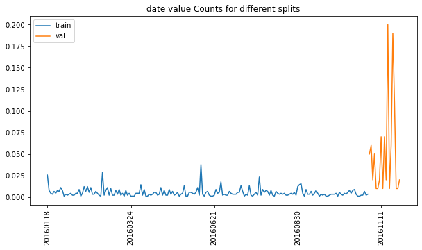
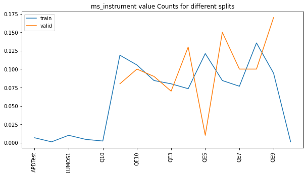
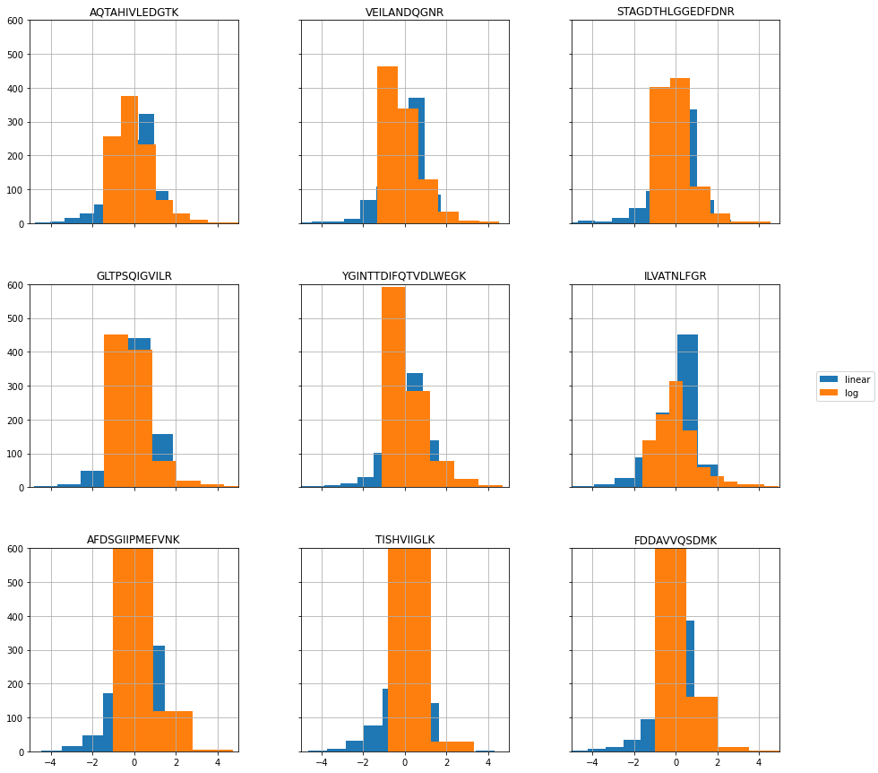

# Experiment 1


```python
from src import config
from src.analyzers import *
from vaep.transform import StandardScaler, get_df_fitted_mean_std
```

    FOLDER_MQ_TXT_DATA = data\mq_out
    


```python
import logging
from src.logging import setup_logger
logger = setup_logger(logger=logging.getLogger('vaep'))
logger.info("Experiment 01")
```

    vaep - INFO     Experiment 01
    

## Load data

- 1000 features (most abundant peptides)
- later a subset of samples is selected


```python
N_SAMPLES_TO_LOAD = None
FN_PEPTIDE_INTENSITIES = config.FOLDER_DATA / 'df_intensities_N_07813_M01000'
analysis = AnalyzePeptides(fname=FN_PEPTIDE_INTENSITIES, nrows=N_SAMPLES_TO_LOAD)
analysis.df = analysis.df.sort_index()  # sort by date
assert analysis.df.index.is_unique, "Non-unique training samples"
```

### Select consecutives samples for training


```python
import random

N_SAMPLES = 1000
logging.info(f"Selected {N_SAMPLES}")
analysis.N_SAMPLES = N_SAMPLES

def get_consecutive_data_indices(index, n_samples=N_SAMPLES):
    start_sample = len(index) - n_samples
    start_sample = random.randint(0, start_sample)
    return index[start_sample:start_sample+n_samples]


indices_selected = get_consecutive_data_indices(analysis.df.index)
analysis.df = analysis.df.loc[indices_selected]
analysis.df
```


<div>
<style scoped>
    .dataframe tbody tr th:only-of-type {
        vertical-align: middle;
    }

    .dataframe tbody tr th {
        vertical-align: top;
    }

    .dataframe thead th {
        text-align: right;
    }
</style>
<table border="1" class="dataframe">
  <thead>
    <tr style="text-align: right;">
      <th></th>
      <th>AAAAAAALQAK</th>
      <th>AAFDDAIAELDTLSEESYK</th>
      <th>AAHSEGNTTAGLDMR</th>
      <th>AAVATFLQSVQVPEFTPK</th>
      <th>AAVEEGIVLGGGCALLR</th>
      <th>AAVPSGASTGIYEALELR</th>
      <th>AAVPSGASTGIYEALELRDNDK</th>
      <th>ACANPAAGSVILLENLR</th>
      <th>ACGLVASNLNLKPGECLR</th>
      <th>ADLINNLGTIAK</th>
      <th>...</th>
      <th>VVFVFGPDK</th>
      <th>VVFVFGPDKK</th>
      <th>VYALPEDLVEVKPK</th>
      <th>YADLTEDQLPSCESLK</th>
      <th>YDDMAAAMK</th>
      <th>YDDMAACMK</th>
      <th>YDDMATCMK</th>
      <th>YLAEVACGDDRK</th>
      <th>YLDEDTIYHLQPSGR</th>
      <th>YRVPDVLVADPPIAR</th>
    </tr>
  </thead>
  <tbody>
    <tr>
      <th>20160118_QE1_UPLC3_EM_QC_MNT_hela-1</th>
      <td>468,580,000.000</td>
      <td>1,203,500,000.000</td>
      <td>236,180,000.000</td>
      <td>424,460,000.000</td>
      <td>713,750,000.000</td>
      <td>2,097,900,000.000</td>
      <td>2,104,700,000.000</td>
      <td>873,390,000.000</td>
      <td>282,680,000.000</td>
      <td>2,088,700,000.000</td>
      <td>...</td>
      <td>683,390,000.000</td>
      <td>60,393,000.000</td>
      <td>133,190,000.000</td>
      <td>275,540,000.000</td>
      <td>356,080,000.000</td>
      <td>188,540,000.000</td>
      <td>67,087,000.000</td>
      <td>99,084,000.000</td>
      <td>180,810,000.000</td>
      <td>202,050,000.000</td>
    </tr>
    <tr>
      <th>20160118_QE1_UPLC3_EM_QC_MNT_hela-2</th>
      <td>827,810,000.000</td>
      <td>1,120,200,000.000</td>
      <td>324,560,000.000</td>
      <td>396,710,000.000</td>
      <td>454,120,000.000</td>
      <td>1,370,300,000.000</td>
      <td>1,185,200,000.000</td>
      <td>698,000,000.000</td>
      <td>304,180,000.000</td>
      <td>2,194,000,000.000</td>
      <td>...</td>
      <td>616,900,000.000</td>
      <td>75,310,000.000</td>
      <td>113,940,000.000</td>
      <td>257,130,000.000</td>
      <td>462,490,000.000</td>
      <td>301,190,000.000</td>
      <td>158,940,000.000</td>
      <td>155,450,000.000</td>
      <td>154,010,000.000</td>
      <td>223,730,000.000</td>
    </tr>
    <tr>
      <th>20160118_QE2_UPLC4_BTW_QC_HELA01</th>
      <td>810,890,000.000</td>
      <td>808,640,000.000</td>
      <td>163,070,000.000</td>
      <td>386,480,000.000</td>
      <td>160,080,000.000</td>
      <td>594,090,000.000</td>
      <td>760,980,000.000</td>
      <td>826,220,000.000</td>
      <td>229,940,000.000</td>
      <td>1,367,600,000.000</td>
      <td>...</td>
      <td>321,260,000.000</td>
      <td>46,549,000.000</td>
      <td>105,770,000.000</td>
      <td>193,240,000.000</td>
      <td>250,510,000.000</td>
      <td>118,730,000.000</td>
      <td>55,703,000.000</td>
      <td>144,390,000.000</td>
      <td>69,054,000.000</td>
      <td>174,660,000.000</td>
    </tr>
    <tr>
      <th>20160118_QE4_UPLC5_SCL_QC_MNT_HELA_01</th>
      <td>830,940,000.000</td>
      <td>495,180,000.000</td>
      <td>101,540,000.000</td>
      <td>372,050,000.000</td>
      <td>441,900,000.000</td>
      <td>1,068,900,000.000</td>
      <td>713,050,000.000</td>
      <td>815,190,000.000</td>
      <td>345,670,000.000</td>
      <td>1,518,200,000.000</td>
      <td>...</td>
      <td>307,180,000.000</td>
      <td>58,229,000.000</td>
      <td>78,055,000.000</td>
      <td>296,320,000.000</td>
      <td>314,750,000.000</td>
      <td>175,910,000.000</td>
      <td>92,136,000.000</td>
      <td>182,320,000.000</td>
      <td>95,693,000.000</td>
      <td>195,750,000.000</td>
    </tr>
    <tr>
      <th>20160118_QE4_UPLC5_SCL_QC_MNT_HELA_02</th>
      <td>954,080,000.000</td>
      <td>649,830,000.000</td>
      <td>105,260,000.000</td>
      <td>287,460,000.000</td>
      <td>434,000,000.000</td>
      <td>985,820,000.000</td>
      <td>1,045,900,000.000</td>
      <td>690,240,000.000</td>
      <td>331,390,000.000</td>
      <td>1,457,900,000.000</td>
      <td>...</td>
      <td>338,100,000.000</td>
      <td>55,009,000.000</td>
      <td>75,134,000.000</td>
      <td>274,260,000.000</td>
      <td>341,280,000.000</td>
      <td>194,530,000.000</td>
      <td>86,909,000.000</td>
      <td>168,240,000.000</td>
      <td>148,490,000.000</td>
      <td>189,600,000.000</td>
    </tr>
    <tr>
      <th>...</th>
      <td>...</td>
      <td>...</td>
      <td>...</td>
      <td>...</td>
      <td>...</td>
      <td>...</td>
      <td>...</td>
      <td>...</td>
      <td>...</td>
      <td>...</td>
      <td>...</td>
      <td>...</td>
      <td>...</td>
      <td>...</td>
      <td>...</td>
      <td>...</td>
      <td>...</td>
      <td>...</td>
      <td>...</td>
      <td>...</td>
      <td>...</td>
    </tr>
    <tr>
      <th>20161122_QE6_nLC4_MM_QC_MNT_HELA_02_161123183328</th>
      <td>533,810,000.000</td>
      <td>1,503,300,000.000</td>
      <td>39,502,000.000</td>
      <td>518,710,000.000</td>
      <td>885,940,000.000</td>
      <td>1,963,000,000.000</td>
      <td>1,351,500,000.000</td>
      <td>1,839,900,000.000</td>
      <td>814,990,000.000</td>
      <td>2,312,700,000.000</td>
      <td>...</td>
      <td>524,530,000.000</td>
      <td>96,563,000.000</td>
      <td>126,990,000.000</td>
      <td>325,990,000.000</td>
      <td>586,960,000.000</td>
      <td>351,330,000.000</td>
      <td>248,060,000.000</td>
      <td>166,810,000.000</td>
      <td>219,200,000.000</td>
      <td>496,110,000.000</td>
    </tr>
    <tr>
      <th>20161123_QE1_nlc1_EM_QC_Hela</th>
      <td>919,580,000.000</td>
      <td>1,414,900,000.000</td>
      <td>160,380,000.000</td>
      <td>380,280,000.000</td>
      <td>237,690,000.000</td>
      <td>676,720,000.000</td>
      <td>1,570,200,000.000</td>
      <td>456,260,000.000</td>
      <td>344,600,000.000</td>
      <td>1,922,800,000.000</td>
      <td>...</td>
      <td>778,250,000.000</td>
      <td>108,440,000.000</td>
      <td>124,210,000.000</td>
      <td>308,450,000.000</td>
      <td>572,500,000.000</td>
      <td>213,600,000.000</td>
      <td>124,680,000.000</td>
      <td>582,540,000.000</td>
      <td>183,020,000.000</td>
      <td>32,557,000.000</td>
    </tr>
    <tr>
      <th>20161124_QE2_nLC10_SS_QC_MNT_HeLa1</th>
      <td>82,862,000.000</td>
      <td>44,888,000.000</td>
      <td>36,177,000.000</td>
      <td>3,931,000.000</td>
      <td>60,431,000.000</td>
      <td>102,890,000.000</td>
      <td>95,668,000.000</td>
      <td>81,397,000.000</td>
      <td>33,359,000.000</td>
      <td>186,460,000.000</td>
      <td>...</td>
      <td>29,215,000.000</td>
      <td>4,776,900.000</td>
      <td>8,913,400.000</td>
      <td>17,637,000.000</td>
      <td>37,034,000.000</td>
      <td>16,519,000.000</td>
      <td>9,378,000.000</td>
      <td>13,508,000.000</td>
      <td>12,044,000.000</td>
      <td>14,569,000.000</td>
    </tr>
    <tr>
      <th>20161125_LUMOS1_nLC13_ss_QC_HELA02_161125201030</th>
      <td>1,387,200,000.000</td>
      <td>4,823,300,000.000</td>
      <td>286,260,000.000</td>
      <td>969,170,000.000</td>
      <td>1,119,500,000.000</td>
      <td>3,243,800,000.000</td>
      <td>3,191,600,000.000</td>
      <td>2,062,900,000.000</td>
      <td>867,630,000.000</td>
      <td>4,176,800,000.000</td>
      <td>...</td>
      <td>785,460,000.000</td>
      <td>123,510,000.000</td>
      <td>178,430,000.000</td>
      <td>343,870,000.000</td>
      <td>678,800,000.000</td>
      <td>495,310,000.000</td>
      <td>157,360,000.000</td>
      <td>241,620,000.000</td>
      <td>448,750,000.000</td>
      <td>429,840,000.000</td>
    </tr>
    <tr>
      <th>20161125_LUMOS1_nLC13_ss_QC_HELA02_161127134923</th>
      <td>1,741,600,000.000</td>
      <td>6,768,300,000.000</td>
      <td>281,980,000.000</td>
      <td>1,676,700,000.000</td>
      <td>1,904,500,000.000</td>
      <td>5,703,500,000.000</td>
      <td>6,815,800,000.000</td>
      <td>3,234,300,000.000</td>
      <td>1,264,300,000.000</td>
      <td>5,855,100,000.000</td>
      <td>...</td>
      <td>1,430,500,000.000</td>
      <td>135,240,000.000</td>
      <td>261,840,000.000</td>
      <td>1,057,300,000.000</td>
      <td>966,630,000.000</td>
      <td>1,056,000,000.000</td>
      <td>287,280,000.000</td>
      <td>410,960,000.000</td>
      <td>351,170,000.000</td>
      <td>648,460,000.000</td>
    </tr>
  </tbody>
</table>
<p>1000 rows × 1000 columns</p>
</div>


### Create meta data from filename


```python
from collections import namedtuple

columns = 'date ms_instrument columntype researcher rest'.split()

RunMetaData = namedtuple('RunMetaData', columns)
data_meta = {}
for filename in indices_selected:
    # ToDo: this approach is too easy for the moment. The first two fields are in order, the rest needs matching.
    _meta_filename = filename.split('_', maxsplit=4)
    data_meta[filename] = _meta_filename
    # print(RunMetaData(*_meta_filename[:6]))

analysis.df_meta = pd.DataFrame.from_dict(
    data_meta, orient='index', columns=columns)
# analysis.df_meta['date'] = pd.to_datetime(analysis.df_meta['date'])
analysis.df_meta
```


<div>
<style scoped>
    .dataframe tbody tr th:only-of-type {
        vertical-align: middle;
    }

    .dataframe tbody tr th {
        vertical-align: top;
    }

    .dataframe thead th {
        text-align: right;
    }
</style>
<table border="1" class="dataframe">
  <thead>
    <tr style="text-align: right;">
      <th></th>
      <th>date</th>
      <th>ms_instrument</th>
      <th>columntype</th>
      <th>researcher</th>
      <th>rest</th>
    </tr>
  </thead>
  <tbody>
    <tr>
      <th>20160118_QE1_UPLC3_EM_QC_MNT_hela-1</th>
      <td>20160118</td>
      <td>QE1</td>
      <td>UPLC3</td>
      <td>EM</td>
      <td>QC_MNT_hela-1</td>
    </tr>
    <tr>
      <th>20160118_QE1_UPLC3_EM_QC_MNT_hela-2</th>
      <td>20160118</td>
      <td>QE1</td>
      <td>UPLC3</td>
      <td>EM</td>
      <td>QC_MNT_hela-2</td>
    </tr>
    <tr>
      <th>20160118_QE2_UPLC4_BTW_QC_HELA01</th>
      <td>20160118</td>
      <td>QE2</td>
      <td>UPLC4</td>
      <td>BTW</td>
      <td>QC_HELA01</td>
    </tr>
    <tr>
      <th>20160118_QE4_UPLC5_SCL_QC_MNT_HELA_01</th>
      <td>20160118</td>
      <td>QE4</td>
      <td>UPLC5</td>
      <td>SCL</td>
      <td>QC_MNT_HELA_01</td>
    </tr>
    <tr>
      <th>20160118_QE4_UPLC5_SCL_QC_MNT_HELA_02</th>
      <td>20160118</td>
      <td>QE4</td>
      <td>UPLC5</td>
      <td>SCL</td>
      <td>QC_MNT_HELA_02</td>
    </tr>
    <tr>
      <th>...</th>
      <td>...</td>
      <td>...</td>
      <td>...</td>
      <td>...</td>
      <td>...</td>
    </tr>
    <tr>
      <th>20161122_QE6_nLC4_MM_QC_MNT_HELA_02_161123183328</th>
      <td>20161122</td>
      <td>QE6</td>
      <td>nLC4</td>
      <td>MM</td>
      <td>QC_MNT_HELA_02_161123183328</td>
    </tr>
    <tr>
      <th>20161123_QE1_nlc1_EM_QC_Hela</th>
      <td>20161123</td>
      <td>QE1</td>
      <td>nlc1</td>
      <td>EM</td>
      <td>QC_Hela</td>
    </tr>
    <tr>
      <th>20161124_QE2_nLC10_SS_QC_MNT_HeLa1</th>
      <td>20161124</td>
      <td>QE2</td>
      <td>nLC10</td>
      <td>SS</td>
      <td>QC_MNT_HeLa1</td>
    </tr>
    <tr>
      <th>20161125_LUMOS1_nLC13_ss_QC_HELA02_161125201030</th>
      <td>20161125</td>
      <td>LUMOS1</td>
      <td>nLC13</td>
      <td>ss</td>
      <td>QC_HELA02_161125201030</td>
    </tr>
    <tr>
      <th>20161125_LUMOS1_nLC13_ss_QC_HELA02_161127134923</th>
      <td>20161125</td>
      <td>LUMOS1</td>
      <td>nLC13</td>
      <td>ss</td>
      <td>QC_HELA02_161127134923</td>
    </tr>
  </tbody>
</table>
<p>1000 rows × 5 columns</p>
</div>


```python
FRACTION = 0.9

class Indices(SimpleNamespace):
    pass

indices = Indices()
indices.train, indices.val = indices_selected[:int(
    FRACTION*N_SAMPLES)], indices_selected[int(FRACTION*N_SAMPLES):]
analysis.indices = indices

analysis.df_meta.loc[indices.train].describe(datetime_is_numeric=False)
```


<div>
<style scoped>
    .dataframe tbody tr th:only-of-type {
        vertical-align: middle;
    }

    .dataframe tbody tr th {
        vertical-align: top;
    }

    .dataframe thead th {
        text-align: right;
    }
</style>
<table border="1" class="dataframe">
  <thead>
    <tr style="text-align: right;">
      <th></th>
      <th>date</th>
      <th>ms_instrument</th>
      <th>columntype</th>
      <th>researcher</th>
      <th>rest</th>
    </tr>
  </thead>
  <tbody>
    <tr>
      <th>count</th>
      <td>900</td>
      <td>900</td>
      <td>900</td>
      <td>900</td>
      <td>899</td>
    </tr>
    <tr>
      <th>unique</th>
      <td>193</td>
      <td>9</td>
      <td>31</td>
      <td>33</td>
      <td>393</td>
    </tr>
    <tr>
      <th>top</th>
      <td>20160609</td>
      <td>QE2</td>
      <td>nLC4</td>
      <td>SCL</td>
      <td>QC_MNT_HeLa_01</td>
    </tr>
    <tr>
      <th>freq</th>
      <td>34</td>
      <td>166</td>
      <td>103</td>
      <td>102</td>
      <td>60</td>
    </tr>
  </tbody>
</table>
</div>


```python
# This becomes part of analysis
def compare_meta_data_for_splits(meta, indices):

    _indices = vars(indices)
    logging.info('Found vars: {}'.format(', '.join(str(x)
                                                   for x in _indices.keys())))

    for key_split, split in _indices.items():
        print(f"{key_split:8} - split description:")
        display(
            meta.loc[split].describe(datetime_is_numeric=True)
        )

    _meta_features = list(meta.columns)

    for _column in _meta_features:
        display(
            _ = pd.DataFrame({
                key_split: meta.loc[split, _column].value_counts(normalize=True) for key_split, split in _indices.items()
            }).sort_index().plot(kind='line', rot=90, figsize=(10,5), title=f"{_column} value Counts for different splits")
        )
compare_meta_data_for_splits(analysis.df_meta.iloc[:,:2], indices)
```

    train    - split description:
    


<div>
<style scoped>
    .dataframe tbody tr th:only-of-type {
        vertical-align: middle;
    }

    .dataframe tbody tr th {
        vertical-align: top;
    }

    .dataframe thead th {
        text-align: right;
    }
</style>
<table border="1" class="dataframe">
  <thead>
    <tr style="text-align: right;">
      <th></th>
      <th>date</th>
      <th>ms_instrument</th>
    </tr>
  </thead>
  <tbody>
    <tr>
      <th>count</th>
      <td>900</td>
      <td>900</td>
    </tr>
    <tr>
      <th>unique</th>
      <td>193</td>
      <td>9</td>
    </tr>
    <tr>
      <th>top</th>
      <td>20160609</td>
      <td>QE2</td>
    </tr>
    <tr>
      <th>freq</th>
      <td>34</td>
      <td>166</td>
    </tr>
  </tbody>
</table>
</div>


    val      - split description:
    


<div>
<style scoped>
    .dataframe tbody tr th:only-of-type {
        vertical-align: middle;
    }

    .dataframe tbody tr th {
        vertical-align: top;
    }

    .dataframe thead th {
        text-align: right;
    }
</style>
<table border="1" class="dataframe">
  <thead>
    <tr style="text-align: right;">
      <th></th>
      <th>date</th>
      <th>ms_instrument</th>
    </tr>
  </thead>
  <tbody>
    <tr>
      <th>count</th>
      <td>100</td>
      <td>100</td>
    </tr>
    <tr>
      <th>unique</th>
      <td>19</td>
      <td>8</td>
    </tr>
    <tr>
      <th>top</th>
      <td>20161116</td>
      <td>LUMOS1</td>
    </tr>
    <tr>
      <th>freq</th>
      <td>20</td>
      <td>27</td>
    </tr>
  </tbody>
</table>
</div>








## Transforms

### Custom Transforms

- illustrate using adapted scikit-learn [`StandardScaler`](https://scikit-learn.org/stable/modules/preprocessing.html)


```python
N, M = 10, 10  # Samples, Features
analysis.df.iloc[:N, :M]
```


<div>
<style scoped>
    .dataframe tbody tr th:only-of-type {
        vertical-align: middle;
    }

    .dataframe tbody tr th {
        vertical-align: top;
    }

    .dataframe thead th {
        text-align: right;
    }
</style>
<table border="1" class="dataframe">
  <thead>
    <tr style="text-align: right;">
      <th></th>
      <th>AAAAAAALQAK</th>
      <th>AAFDDAIAELDTLSEESYK</th>
      <th>AAHSEGNTTAGLDMR</th>
      <th>AAVATFLQSVQVPEFTPK</th>
      <th>AAVEEGIVLGGGCALLR</th>
      <th>AAVPSGASTGIYEALELR</th>
      <th>AAVPSGASTGIYEALELRDNDK</th>
      <th>ACANPAAGSVILLENLR</th>
      <th>ACGLVASNLNLKPGECLR</th>
      <th>ADLINNLGTIAK</th>
    </tr>
  </thead>
  <tbody>
    <tr>
      <th>20160118_QE1_UPLC3_EM_QC_MNT_hela-1</th>
      <td>468,580,000.000</td>
      <td>1,203,500,000.000</td>
      <td>236,180,000.000</td>
      <td>424,460,000.000</td>
      <td>713,750,000.000</td>
      <td>2,097,900,000.000</td>
      <td>2,104,700,000.000</td>
      <td>873,390,000.000</td>
      <td>282,680,000.000</td>
      <td>2,088,700,000.000</td>
    </tr>
    <tr>
      <th>20160118_QE1_UPLC3_EM_QC_MNT_hela-2</th>
      <td>827,810,000.000</td>
      <td>1,120,200,000.000</td>
      <td>324,560,000.000</td>
      <td>396,710,000.000</td>
      <td>454,120,000.000</td>
      <td>1,370,300,000.000</td>
      <td>1,185,200,000.000</td>
      <td>698,000,000.000</td>
      <td>304,180,000.000</td>
      <td>2,194,000,000.000</td>
    </tr>
    <tr>
      <th>20160118_QE2_UPLC4_BTW_QC_HELA01</th>
      <td>810,890,000.000</td>
      <td>808,640,000.000</td>
      <td>163,070,000.000</td>
      <td>386,480,000.000</td>
      <td>160,080,000.000</td>
      <td>594,090,000.000</td>
      <td>760,980,000.000</td>
      <td>826,220,000.000</td>
      <td>229,940,000.000</td>
      <td>1,367,600,000.000</td>
    </tr>
    <tr>
      <th>20160118_QE4_UPLC5_SCL_QC_MNT_HELA_01</th>
      <td>830,940,000.000</td>
      <td>495,180,000.000</td>
      <td>101,540,000.000</td>
      <td>372,050,000.000</td>
      <td>441,900,000.000</td>
      <td>1,068,900,000.000</td>
      <td>713,050,000.000</td>
      <td>815,190,000.000</td>
      <td>345,670,000.000</td>
      <td>1,518,200,000.000</td>
    </tr>
    <tr>
      <th>20160118_QE4_UPLC5_SCL_QC_MNT_HELA_02</th>
      <td>954,080,000.000</td>
      <td>649,830,000.000</td>
      <td>105,260,000.000</td>
      <td>287,460,000.000</td>
      <td>434,000,000.000</td>
      <td>985,820,000.000</td>
      <td>1,045,900,000.000</td>
      <td>690,240,000.000</td>
      <td>331,390,000.000</td>
      <td>1,457,900,000.000</td>
    </tr>
    <tr>
      <th>20160118_QE4_UPLC5_SCL_QC_MNT_HELA_03</th>
      <td>924,460,000.000</td>
      <td>919,160,000.000</td>
      <td>126,060,000.000</td>
      <td>315,660,000.000</td>
      <td>452,760,000.000</td>
      <td>1,101,200,000.000</td>
      <td>1,536,500,000.000</td>
      <td>434,870,000.000</td>
      <td>318,560,000.000</td>
      <td>1,536,300,000.000</td>
    </tr>
    <tr>
      <th>20160118_QE5_UPLC1_AKP_QC_Hela_01</th>
      <td>707,520,000.000</td>
      <td>2,617,200,000.000</td>
      <td>183,510,000.000</td>
      <td>193,580,000.000</td>
      <td>661,920,000.000</td>
      <td>1,792,000,000.000</td>
      <td>1,727,900,000.000</td>
      <td>1,324,800,000.000</td>
      <td>223,480,000.000</td>
      <td>NaN</td>
    </tr>
    <tr>
      <th>20160118_QE6_UPLC6_SCL_QC_MNT_Hela_01</th>
      <td>447,680,000.000</td>
      <td>97,574,000.000</td>
      <td>27,704,000.000</td>
      <td>229,110,000.000</td>
      <td>140,810,000.000</td>
      <td>481,270,000.000</td>
      <td>311,600,000.000</td>
      <td>628,530,000.000</td>
      <td>164,780,000.000</td>
      <td>1,342,200,000.000</td>
    </tr>
    <tr>
      <th>20160118_QE6_UPLC6_SCL_QC_MNT_Hela_02</th>
      <td>424,370,000.000</td>
      <td>1,390,100,000.000</td>
      <td>38,356,000.000</td>
      <td>337,880,000.000</td>
      <td>248,350,000.000</td>
      <td>686,550,000.000</td>
      <td>647,780,000.000</td>
      <td>751,420,000.000</td>
      <td>208,080,000.000</td>
      <td>1,634,200,000.000</td>
    </tr>
    <tr>
      <th>20160118_QE6_UPLC6_SCL_QC_MNT_Hela_03</th>
      <td>373,230,000.000</td>
      <td>1,910,500,000.000</td>
      <td>125,010,000.000</td>
      <td>484,080,000.000</td>
      <td>304,520,000.000</td>
      <td>786,830,000.000</td>
      <td>1,369,600,000.000</td>
      <td>954,720,000.000</td>
      <td>277,960,000.000</td>
      <td>2,069,300,000.000</td>
    </tr>
  </tbody>
</table>
</div>


```python
analysis.df.iloc[:, :M].describe()
```


<div>
<style scoped>
    .dataframe tbody tr th:only-of-type {
        vertical-align: middle;
    }

    .dataframe tbody tr th {
        vertical-align: top;
    }

    .dataframe thead th {
        text-align: right;
    }
</style>
<table border="1" class="dataframe">
  <thead>
    <tr style="text-align: right;">
      <th></th>
      <th>AAAAAAALQAK</th>
      <th>AAFDDAIAELDTLSEESYK</th>
      <th>AAHSEGNTTAGLDMR</th>
      <th>AAVATFLQSVQVPEFTPK</th>
      <th>AAVEEGIVLGGGCALLR</th>
      <th>AAVPSGASTGIYEALELR</th>
      <th>AAVPSGASTGIYEALELRDNDK</th>
      <th>ACANPAAGSVILLENLR</th>
      <th>ACGLVASNLNLKPGECLR</th>
      <th>ADLINNLGTIAK</th>
    </tr>
  </thead>
  <tbody>
    <tr>
      <th>count</th>
      <td>917.000</td>
      <td>912.000</td>
      <td>914.000</td>
      <td>933.000</td>
      <td>934.000</td>
      <td>927.000</td>
      <td>950.000</td>
      <td>925.000</td>
      <td>942.000</td>
      <td>936.000</td>
    </tr>
    <tr>
      <th>mean</th>
      <td>816,286,339.706</td>
      <td>1,654,119,991.667</td>
      <td>298,778,878.446</td>
      <td>505,793,856.377</td>
      <td>649,152,239.829</td>
      <td>1,408,572,091.694</td>
      <td>1,666,930,722.526</td>
      <td>1,039,560,915.676</td>
      <td>557,721,348.301</td>
      <td>2,315,041,620.513</td>
    </tr>
    <tr>
      <th>std</th>
      <td>811,851,947.199</td>
      <td>1,665,033,920.654</td>
      <td>542,084,349.872</td>
      <td>976,387,388.356</td>
      <td>719,068,823.365</td>
      <td>1,277,975,808.207</td>
      <td>1,706,043,337.132</td>
      <td>1,240,631,586.944</td>
      <td>866,719,906.935</td>
      <td>1,960,684,284.872</td>
    </tr>
    <tr>
      <th>min</th>
      <td>884,510.000</td>
      <td>3,035,400.000</td>
      <td>2,754,700.000</td>
      <td>3,931,000.000</td>
      <td>1,107,000.000</td>
      <td>2,845,200.000</td>
      <td>3,625,700.000</td>
      <td>10,096,000.000</td>
      <td>3,220,600.000</td>
      <td>3,569,700.000</td>
    </tr>
    <tr>
      <th>25%</th>
      <td>440,780,000.000</td>
      <td>755,625,000.000</td>
      <td>142,695,000.000</td>
      <td>234,070,000.000</td>
      <td>279,117,500.000</td>
      <td>679,800,000.000</td>
      <td>885,340,000.000</td>
      <td>530,590,000.000</td>
      <td>242,635,000.000</td>
      <td>1,461,575,000.000</td>
    </tr>
    <tr>
      <th>50%</th>
      <td>656,080,000.000</td>
      <td>1,377,300,000.000</td>
      <td>225,000,000.000</td>
      <td>362,360,000.000</td>
      <td>465,765,000.000</td>
      <td>1,139,800,000.000</td>
      <td>1,391,850,000.000</td>
      <td>805,770,000.000</td>
      <td>372,385,000.000</td>
      <td>1,969,550,000.000</td>
    </tr>
    <tr>
      <th>75%</th>
      <td>956,360,000.000</td>
      <td>2,104,800,000.000</td>
      <td>322,375,000.000</td>
      <td>509,090,000.000</td>
      <td>791,497,500.000</td>
      <td>1,823,700,000.000</td>
      <td>2,011,800,000.000</td>
      <td>1,173,300,000.000</td>
      <td>574,357,500.000</td>
      <td>2,633,250,000.000</td>
    </tr>
    <tr>
      <th>max</th>
      <td>9,260,800,000.000</td>
      <td>23,295,000,000.000</td>
      <td>9,030,200,000.000</td>
      <td>20,550,000,000.000</td>
      <td>11,173,000,000.000</td>
      <td>20,196,000,000.000</td>
      <td>30,857,000,000.000</td>
      <td>22,804,000,000.000</td>
      <td>10,409,000,000.000</td>
      <td>19,681,000,000.000</td>
    </tr>
  </tbody>
</table>
</div>


### StandardScaler on raw data


```python
scaler = StandardScaler().fit(analysis.df)
scaler_df = get_df_fitted_mean_std(scaler, index=analysis.df.columns)
scaler_df.head(N)
```


<div>
<style scoped>
    .dataframe tbody tr th:only-of-type {
        vertical-align: middle;
    }

    .dataframe tbody tr th {
        vertical-align: top;
    }

    .dataframe thead th {
        text-align: right;
    }
</style>
<table border="1" class="dataframe">
  <thead>
    <tr style="text-align: right;">
      <th></th>
      <th>mean</th>
      <th>stddev</th>
    </tr>
  </thead>
  <tbody>
    <tr>
      <th>AAAAAAALQAK</th>
      <td>816,286,339.706</td>
      <td>811,409,159.085</td>
    </tr>
    <tr>
      <th>AAFDDAIAELDTLSEESYK</th>
      <td>1,654,119,991.667</td>
      <td>1,664,120,822.740</td>
    </tr>
    <tr>
      <th>AAHSEGNTTAGLDMR</th>
      <td>298,778,878.446</td>
      <td>541,787,723.666</td>
    </tr>
    <tr>
      <th>AAVATFLQSVQVPEFTPK</th>
      <td>505,793,856.377</td>
      <td>975,863,996.526</td>
    </tr>
    <tr>
      <th>AAVEEGIVLGGGCALLR</th>
      <td>649,152,239.829</td>
      <td>718,683,779.791</td>
    </tr>
    <tr>
      <th>AAVPSGASTGIYEALELR</th>
      <td>1,408,572,091.694</td>
      <td>1,277,286,314.870</td>
    </tr>
    <tr>
      <th>AAVPSGASTGIYEALELRDNDK</th>
      <td>1,666,930,722.526</td>
      <td>1,705,145,183.167</td>
    </tr>
    <tr>
      <th>ACANPAAGSVILLENLR</th>
      <td>1,039,560,915.676</td>
      <td>1,239,960,793.931</td>
    </tr>
    <tr>
      <th>ACGLVASNLNLKPGECLR</th>
      <td>557,721,348.301</td>
      <td>866,259,742.365</td>
    </tr>
    <tr>
      <th>ADLINNLGTIAK</th>
      <td>2,315,041,620.513</td>
      <td>1,959,636,630.891</td>
    </tr>
  </tbody>
</table>
</div>


```python
sample = scaler.transform(analysis.df.iloc[:N])
sample.iloc[:, :M]
```


<div>
<style scoped>
    .dataframe tbody tr th:only-of-type {
        vertical-align: middle;
    }

    .dataframe tbody tr th {
        vertical-align: top;
    }

    .dataframe thead th {
        text-align: right;
    }
</style>
<table border="1" class="dataframe">
  <thead>
    <tr style="text-align: right;">
      <th></th>
      <th>AAAAAAALQAK</th>
      <th>AAFDDAIAELDTLSEESYK</th>
      <th>AAHSEGNTTAGLDMR</th>
      <th>AAVATFLQSVQVPEFTPK</th>
      <th>AAVEEGIVLGGGCALLR</th>
      <th>AAVPSGASTGIYEALELR</th>
      <th>AAVPSGASTGIYEALELRDNDK</th>
      <th>ACANPAAGSVILLENLR</th>
      <th>ACGLVASNLNLKPGECLR</th>
      <th>ADLINNLGTIAK</th>
    </tr>
  </thead>
  <tbody>
    <tr>
      <th>20160118_QE1_UPLC3_EM_QC_MNT_hela-1</th>
      <td>-0.429</td>
      <td>-0.271</td>
      <td>-0.116</td>
      <td>-0.083</td>
      <td>0.090</td>
      <td>0.540</td>
      <td>0.257</td>
      <td>-0.134</td>
      <td>-0.318</td>
      <td>-0.116</td>
    </tr>
    <tr>
      <th>20160118_QE1_UPLC3_EM_QC_MNT_hela-2</th>
      <td>0.014</td>
      <td>-0.321</td>
      <td>0.048</td>
      <td>-0.112</td>
      <td>-0.271</td>
      <td>-0.030</td>
      <td>-0.283</td>
      <td>-0.275</td>
      <td>-0.293</td>
      <td>-0.062</td>
    </tr>
    <tr>
      <th>20160118_QE2_UPLC4_BTW_QC_HELA01</th>
      <td>-0.007</td>
      <td>-0.508</td>
      <td>-0.250</td>
      <td>-0.122</td>
      <td>-0.681</td>
      <td>-0.638</td>
      <td>-0.531</td>
      <td>-0.172</td>
      <td>-0.378</td>
      <td>-0.483</td>
    </tr>
    <tr>
      <th>20160118_QE4_UPLC5_SCL_QC_MNT_HELA_01</th>
      <td>0.018</td>
      <td>-0.696</td>
      <td>-0.364</td>
      <td>-0.137</td>
      <td>-0.288</td>
      <td>-0.266</td>
      <td>-0.559</td>
      <td>-0.181</td>
      <td>-0.245</td>
      <td>-0.407</td>
    </tr>
    <tr>
      <th>20160118_QE4_UPLC5_SCL_QC_MNT_HELA_02</th>
      <td>0.170</td>
      <td>-0.603</td>
      <td>-0.357</td>
      <td>-0.224</td>
      <td>-0.299</td>
      <td>-0.331</td>
      <td>-0.364</td>
      <td>-0.282</td>
      <td>-0.261</td>
      <td>-0.437</td>
    </tr>
    <tr>
      <th>20160118_QE4_UPLC5_SCL_QC_MNT_HELA_03</th>
      <td>0.133</td>
      <td>-0.442</td>
      <td>-0.319</td>
      <td>-0.195</td>
      <td>-0.273</td>
      <td>-0.241</td>
      <td>-0.076</td>
      <td>-0.488</td>
      <td>-0.276</td>
      <td>-0.397</td>
    </tr>
    <tr>
      <th>20160118_QE5_UPLC1_AKP_QC_Hela_01</th>
      <td>-0.134</td>
      <td>0.579</td>
      <td>-0.213</td>
      <td>-0.320</td>
      <td>0.018</td>
      <td>0.300</td>
      <td>0.036</td>
      <td>0.230</td>
      <td>-0.386</td>
      <td>NaN</td>
    </tr>
    <tr>
      <th>20160118_QE6_UPLC6_SCL_QC_MNT_Hela_01</th>
      <td>-0.454</td>
      <td>-0.935</td>
      <td>-0.500</td>
      <td>-0.284</td>
      <td>-0.707</td>
      <td>-0.726</td>
      <td>-0.795</td>
      <td>-0.331</td>
      <td>-0.454</td>
      <td>-0.496</td>
    </tr>
    <tr>
      <th>20160118_QE6_UPLC6_SCL_QC_MNT_Hela_02</th>
      <td>-0.483</td>
      <td>-0.159</td>
      <td>-0.481</td>
      <td>-0.172</td>
      <td>-0.558</td>
      <td>-0.565</td>
      <td>-0.598</td>
      <td>-0.232</td>
      <td>-0.404</td>
      <td>-0.347</td>
    </tr>
    <tr>
      <th>20160118_QE6_UPLC6_SCL_QC_MNT_Hela_03</th>
      <td>-0.546</td>
      <td>0.154</td>
      <td>-0.321</td>
      <td>-0.022</td>
      <td>-0.480</td>
      <td>-0.487</td>
      <td>-0.174</td>
      <td>-0.068</td>
      <td>-0.323</td>
      <td>-0.125</td>
    </tr>
  </tbody>
</table>
</div>


```python
sample = scaler.inverse_transform(sample)
sample.iloc[:, :M]
```


<div>
<style scoped>
    .dataframe tbody tr th:only-of-type {
        vertical-align: middle;
    }

    .dataframe tbody tr th {
        vertical-align: top;
    }

    .dataframe thead th {
        text-align: right;
    }
</style>
<table border="1" class="dataframe">
  <thead>
    <tr style="text-align: right;">
      <th></th>
      <th>AAAAAAALQAK</th>
      <th>AAFDDAIAELDTLSEESYK</th>
      <th>AAHSEGNTTAGLDMR</th>
      <th>AAVATFLQSVQVPEFTPK</th>
      <th>AAVEEGIVLGGGCALLR</th>
      <th>AAVPSGASTGIYEALELR</th>
      <th>AAVPSGASTGIYEALELRDNDK</th>
      <th>ACANPAAGSVILLENLR</th>
      <th>ACGLVASNLNLKPGECLR</th>
      <th>ADLINNLGTIAK</th>
    </tr>
  </thead>
  <tbody>
    <tr>
      <th>20160118_QE1_UPLC3_EM_QC_MNT_hela-1</th>
      <td>468,580,000.000</td>
      <td>1,203,500,000.000</td>
      <td>236,180,000.000</td>
      <td>424,460,000.000</td>
      <td>713,750,000.000</td>
      <td>2,097,900,000.000</td>
      <td>2,104,700,000.000</td>
      <td>873,390,000.000</td>
      <td>282,680,000.000</td>
      <td>2,088,700,000.000</td>
    </tr>
    <tr>
      <th>20160118_QE1_UPLC3_EM_QC_MNT_hela-2</th>
      <td>827,810,000.000</td>
      <td>1,120,200,000.000</td>
      <td>324,560,000.000</td>
      <td>396,710,000.000</td>
      <td>454,120,000.000</td>
      <td>1,370,300,000.000</td>
      <td>1,185,200,000.000</td>
      <td>698,000,000.000</td>
      <td>304,180,000.000</td>
      <td>2,194,000,000.000</td>
    </tr>
    <tr>
      <th>20160118_QE2_UPLC4_BTW_QC_HELA01</th>
      <td>810,890,000.000</td>
      <td>808,640,000.000</td>
      <td>163,070,000.000</td>
      <td>386,480,000.000</td>
      <td>160,080,000.000</td>
      <td>594,090,000.000</td>
      <td>760,980,000.000</td>
      <td>826,220,000.000</td>
      <td>229,940,000.000</td>
      <td>1,367,600,000.000</td>
    </tr>
    <tr>
      <th>20160118_QE4_UPLC5_SCL_QC_MNT_HELA_01</th>
      <td>830,940,000.000</td>
      <td>495,180,000.000</td>
      <td>101,540,000.000</td>
      <td>372,050,000.000</td>
      <td>441,900,000.000</td>
      <td>1,068,900,000.000</td>
      <td>713,050,000.000</td>
      <td>815,190,000.000</td>
      <td>345,670,000.000</td>
      <td>1,518,200,000.000</td>
    </tr>
    <tr>
      <th>20160118_QE4_UPLC5_SCL_QC_MNT_HELA_02</th>
      <td>954,080,000.000</td>
      <td>649,830,000.000</td>
      <td>105,260,000.000</td>
      <td>287,460,000.000</td>
      <td>434,000,000.000</td>
      <td>985,820,000.000</td>
      <td>1,045,900,000.000</td>
      <td>690,240,000.000</td>
      <td>331,390,000.000</td>
      <td>1,457,900,000.000</td>
    </tr>
    <tr>
      <th>20160118_QE4_UPLC5_SCL_QC_MNT_HELA_03</th>
      <td>924,460,000.000</td>
      <td>919,160,000.000</td>
      <td>126,060,000.000</td>
      <td>315,660,000.000</td>
      <td>452,760,000.000</td>
      <td>1,101,200,000.000</td>
      <td>1,536,500,000.000</td>
      <td>434,870,000.000</td>
      <td>318,560,000.000</td>
      <td>1,536,300,000.000</td>
    </tr>
    <tr>
      <th>20160118_QE5_UPLC1_AKP_QC_Hela_01</th>
      <td>707,520,000.000</td>
      <td>2,617,200,000.000</td>
      <td>183,510,000.000</td>
      <td>193,580,000.000</td>
      <td>661,920,000.000</td>
      <td>1,792,000,000.000</td>
      <td>1,727,900,000.000</td>
      <td>1,324,800,000.000</td>
      <td>223,480,000.000</td>
      <td>NaN</td>
    </tr>
    <tr>
      <th>20160118_QE6_UPLC6_SCL_QC_MNT_Hela_01</th>
      <td>447,680,000.000</td>
      <td>97,574,000.000</td>
      <td>27,704,000.000</td>
      <td>229,110,000.000</td>
      <td>140,810,000.000</td>
      <td>481,270,000.000</td>
      <td>311,600,000.000</td>
      <td>628,530,000.000</td>
      <td>164,780,000.000</td>
      <td>1,342,200,000.000</td>
    </tr>
    <tr>
      <th>20160118_QE6_UPLC6_SCL_QC_MNT_Hela_02</th>
      <td>424,370,000.000</td>
      <td>1,390,100,000.000</td>
      <td>38,356,000.000</td>
      <td>337,880,000.000</td>
      <td>248,350,000.000</td>
      <td>686,550,000.000</td>
      <td>647,780,000.000</td>
      <td>751,420,000.000</td>
      <td>208,080,000.000</td>
      <td>1,634,200,000.000</td>
    </tr>
    <tr>
      <th>20160118_QE6_UPLC6_SCL_QC_MNT_Hela_03</th>
      <td>373,230,000.000</td>
      <td>1,910,500,000.000</td>
      <td>125,010,000.000</td>
      <td>484,080,000.000</td>
      <td>304,520,000.000</td>
      <td>786,830,000.000</td>
      <td>1,369,600,000.000</td>
      <td>954,720,000.000</td>
      <td>277,960,000.000</td>
      <td>2,069,300,000.000</td>
    </tr>
  </tbody>
</table>
</div>


### StandardScaler on log10 transformed data


```python
X_log10 = np.log10(analysis.df)
X_log10.iloc[:N, :M]
```


<div>
<style scoped>
    .dataframe tbody tr th:only-of-type {
        vertical-align: middle;
    }

    .dataframe tbody tr th {
        vertical-align: top;
    }

    .dataframe thead th {
        text-align: right;
    }
</style>
<table border="1" class="dataframe">
  <thead>
    <tr style="text-align: right;">
      <th></th>
      <th>AAAAAAALQAK</th>
      <th>AAFDDAIAELDTLSEESYK</th>
      <th>AAHSEGNTTAGLDMR</th>
      <th>AAVATFLQSVQVPEFTPK</th>
      <th>AAVEEGIVLGGGCALLR</th>
      <th>AAVPSGASTGIYEALELR</th>
      <th>AAVPSGASTGIYEALELRDNDK</th>
      <th>ACANPAAGSVILLENLR</th>
      <th>ACGLVASNLNLKPGECLR</th>
      <th>ADLINNLGTIAK</th>
    </tr>
  </thead>
  <tbody>
    <tr>
      <th>20160118_QE1_UPLC3_EM_QC_MNT_hela-1</th>
      <td>8.671</td>
      <td>9.080</td>
      <td>8.373</td>
      <td>8.628</td>
      <td>8.854</td>
      <td>9.322</td>
      <td>9.323</td>
      <td>8.941</td>
      <td>8.451</td>
      <td>9.320</td>
    </tr>
    <tr>
      <th>20160118_QE1_UPLC3_EM_QC_MNT_hela-2</th>
      <td>8.918</td>
      <td>9.049</td>
      <td>8.511</td>
      <td>8.598</td>
      <td>8.657</td>
      <td>9.137</td>
      <td>9.074</td>
      <td>8.844</td>
      <td>8.483</td>
      <td>9.341</td>
    </tr>
    <tr>
      <th>20160118_QE2_UPLC4_BTW_QC_HELA01</th>
      <td>8.909</td>
      <td>8.908</td>
      <td>8.212</td>
      <td>8.587</td>
      <td>8.204</td>
      <td>8.774</td>
      <td>8.881</td>
      <td>8.917</td>
      <td>8.362</td>
      <td>9.136</td>
    </tr>
    <tr>
      <th>20160118_QE4_UPLC5_SCL_QC_MNT_HELA_01</th>
      <td>8.920</td>
      <td>8.695</td>
      <td>8.007</td>
      <td>8.571</td>
      <td>8.645</td>
      <td>9.029</td>
      <td>8.853</td>
      <td>8.911</td>
      <td>8.539</td>
      <td>9.181</td>
    </tr>
    <tr>
      <th>20160118_QE4_UPLC5_SCL_QC_MNT_HELA_02</th>
      <td>8.980</td>
      <td>8.813</td>
      <td>8.022</td>
      <td>8.459</td>
      <td>8.637</td>
      <td>8.994</td>
      <td>9.019</td>
      <td>8.839</td>
      <td>8.520</td>
      <td>9.164</td>
    </tr>
    <tr>
      <th>20160118_QE4_UPLC5_SCL_QC_MNT_HELA_03</th>
      <td>8.966</td>
      <td>8.963</td>
      <td>8.101</td>
      <td>8.499</td>
      <td>8.656</td>
      <td>9.042</td>
      <td>9.187</td>
      <td>8.638</td>
      <td>8.503</td>
      <td>9.186</td>
    </tr>
    <tr>
      <th>20160118_QE5_UPLC1_AKP_QC_Hela_01</th>
      <td>8.850</td>
      <td>9.418</td>
      <td>8.264</td>
      <td>8.287</td>
      <td>8.821</td>
      <td>9.253</td>
      <td>9.238</td>
      <td>9.122</td>
      <td>8.349</td>
      <td>NaN</td>
    </tr>
    <tr>
      <th>20160118_QE6_UPLC6_SCL_QC_MNT_Hela_01</th>
      <td>8.651</td>
      <td>7.989</td>
      <td>7.443</td>
      <td>8.360</td>
      <td>8.149</td>
      <td>8.682</td>
      <td>8.494</td>
      <td>8.798</td>
      <td>8.217</td>
      <td>9.128</td>
    </tr>
    <tr>
      <th>20160118_QE6_UPLC6_SCL_QC_MNT_Hela_02</th>
      <td>8.628</td>
      <td>9.143</td>
      <td>7.584</td>
      <td>8.529</td>
      <td>8.395</td>
      <td>8.837</td>
      <td>8.811</td>
      <td>8.876</td>
      <td>8.318</td>
      <td>9.213</td>
    </tr>
    <tr>
      <th>20160118_QE6_UPLC6_SCL_QC_MNT_Hela_03</th>
      <td>8.572</td>
      <td>9.281</td>
      <td>8.097</td>
      <td>8.685</td>
      <td>8.484</td>
      <td>8.896</td>
      <td>9.137</td>
      <td>8.980</td>
      <td>8.444</td>
      <td>9.316</td>
    </tr>
  </tbody>
</table>
</div>


```python
scaler_log = StandardScaler(
).fit(X=X_log10)
scaler_log_df = get_df_fitted_mean_std(scaler_log, index=analysis.df.index)
scaler_log_df.head(N)
```


<div>
<style scoped>
    .dataframe tbody tr th:only-of-type {
        vertical-align: middle;
    }

    .dataframe tbody tr th {
        vertical-align: top;
    }

    .dataframe thead th {
        text-align: right;
    }
</style>
<table border="1" class="dataframe">
  <thead>
    <tr style="text-align: right;">
      <th></th>
      <th>mean</th>
      <th>stddev</th>
    </tr>
  </thead>
  <tbody>
    <tr>
      <th>20160118_QE1_UPLC3_EM_QC_MNT_hela-1</th>
      <td>8.774</td>
      <td>0.389</td>
    </tr>
    <tr>
      <th>20160118_QE1_UPLC3_EM_QC_MNT_hela-2</th>
      <td>9.064</td>
      <td>0.417</td>
    </tr>
    <tr>
      <th>20160118_QE2_UPLC4_BTW_QC_HELA01</th>
      <td>8.297</td>
      <td>0.399</td>
    </tr>
    <tr>
      <th>20160118_QE4_UPLC5_SCL_QC_MNT_HELA_01</th>
      <td>8.537</td>
      <td>0.345</td>
    </tr>
    <tr>
      <th>20160118_QE4_UPLC5_SCL_QC_MNT_HELA_02</th>
      <td>8.652</td>
      <td>0.398</td>
    </tr>
    <tr>
      <th>20160118_QE4_UPLC5_SCL_QC_MNT_HELA_03</th>
      <td>9.014</td>
      <td>0.383</td>
    </tr>
    <tr>
      <th>20160118_QE5_UPLC1_AKP_QC_Hela_01</th>
      <td>9.041</td>
      <td>0.499</td>
    </tr>
    <tr>
      <th>20160118_QE6_UPLC6_SCL_QC_MNT_Hela_01</th>
      <td>8.865</td>
      <td>0.384</td>
    </tr>
    <tr>
      <th>20160118_QE6_UPLC6_SCL_QC_MNT_Hela_02</th>
      <td>8.559</td>
      <td>0.400</td>
    </tr>
    <tr>
      <th>20160118_QE6_UPLC6_SCL_QC_MNT_Hela_03</th>
      <td>9.214</td>
      <td>0.475</td>
    </tr>
  </tbody>
</table>
</div>


```python
sample_log10 = scaler_log.transform(X_log10.iloc[:N])
sample_log10.iloc[:, :M]
```


<div>
<style scoped>
    .dataframe tbody tr th:only-of-type {
        vertical-align: middle;
    }

    .dataframe tbody tr th {
        vertical-align: top;
    }

    .dataframe thead th {
        text-align: right;
    }
</style>
<table border="1" class="dataframe">
  <thead>
    <tr style="text-align: right;">
      <th></th>
      <th>AAAAAAALQAK</th>
      <th>AAFDDAIAELDTLSEESYK</th>
      <th>AAHSEGNTTAGLDMR</th>
      <th>AAVATFLQSVQVPEFTPK</th>
      <th>AAVEEGIVLGGGCALLR</th>
      <th>AAVPSGASTGIYEALELR</th>
      <th>AAVPSGASTGIYEALELRDNDK</th>
      <th>ACANPAAGSVILLENLR</th>
      <th>ACGLVASNLNLKPGECLR</th>
      <th>ADLINNLGTIAK</th>
    </tr>
  </thead>
  <tbody>
    <tr>
      <th>20160118_QE1_UPLC3_EM_QC_MNT_hela-1</th>
      <td>-0.265</td>
      <td>0.040</td>
      <td>0.190</td>
      <td>0.262</td>
      <td>0.507</td>
      <td>0.803</td>
      <td>0.566</td>
      <td>0.197</td>
      <td>-0.268</td>
      <td>0.222</td>
    </tr>
    <tr>
      <th>20160118_QE1_UPLC3_EM_QC_MNT_hela-2</th>
      <td>0.371</td>
      <td>-0.035</td>
      <td>0.536</td>
      <td>0.177</td>
      <td>0.014</td>
      <td>0.321</td>
      <td>0.066</td>
      <td>-0.056</td>
      <td>-0.189</td>
      <td>0.267</td>
    </tr>
    <tr>
      <th>20160118_QE2_UPLC4_BTW_QC_HELA01</th>
      <td>0.348</td>
      <td>-0.374</td>
      <td>-0.213</td>
      <td>0.144</td>
      <td>-1.123</td>
      <td>-0.626</td>
      <td>-0.320</td>
      <td>0.134</td>
      <td>-0.492</td>
      <td>-0.165</td>
    </tr>
    <tr>
      <th>20160118_QE4_UPLC5_SCL_QC_MNT_HELA_01</th>
      <td>0.375</td>
      <td>-0.884</td>
      <td>-0.729</td>
      <td>0.096</td>
      <td>-0.016</td>
      <td>0.040</td>
      <td>-0.376</td>
      <td>0.119</td>
      <td>-0.050</td>
      <td>-0.069</td>
    </tr>
    <tr>
      <th>20160118_QE4_UPLC5_SCL_QC_MNT_HELA_02</th>
      <td>0.529</td>
      <td>-0.601</td>
      <td>-0.690</td>
      <td>-0.228</td>
      <td>-0.035</td>
      <td>-0.052</td>
      <td>-0.043</td>
      <td>-0.069</td>
      <td>-0.096</td>
      <td>-0.106</td>
    </tr>
    <tr>
      <th>20160118_QE4_UPLC5_SCL_QC_MNT_HELA_03</th>
      <td>0.494</td>
      <td>-0.241</td>
      <td>-0.494</td>
      <td>-0.110</td>
      <td>0.011</td>
      <td>0.073</td>
      <td>0.292</td>
      <td>-0.592</td>
      <td>-0.139</td>
      <td>-0.059</td>
    </tr>
    <tr>
      <th>20160118_QE5_UPLC1_AKP_QC_Hela_01</th>
      <td>0.195</td>
      <td>0.848</td>
      <td>-0.085</td>
      <td>-0.725</td>
      <td>0.425</td>
      <td>0.625</td>
      <td>0.394</td>
      <td>0.669</td>
      <td>-0.523</td>
      <td>NaN</td>
    </tr>
    <tr>
      <th>20160118_QE6_UPLC6_SCL_QC_MNT_Hela_01</th>
      <td>-0.316</td>
      <td>-2.574</td>
      <td>-2.144</td>
      <td>-0.513</td>
      <td>-1.263</td>
      <td>-0.864</td>
      <td>-1.097</td>
      <td>-0.175</td>
      <td>-0.854</td>
      <td>-0.182</td>
    </tr>
    <tr>
      <th>20160118_QE6_UPLC6_SCL_QC_MNT_Hela_02</th>
      <td>-0.376</td>
      <td>0.190</td>
      <td>-1.790</td>
      <td>-0.025</td>
      <td>-0.644</td>
      <td>-0.462</td>
      <td>-0.460</td>
      <td>0.027</td>
      <td>-0.601</td>
      <td>-0.002</td>
    </tr>
    <tr>
      <th>20160118_QE6_UPLC6_SCL_QC_MNT_Hela_03</th>
      <td>-0.519</td>
      <td>0.520</td>
      <td>-0.503</td>
      <td>0.427</td>
      <td>-0.422</td>
      <td>-0.307</td>
      <td>0.192</td>
      <td>0.298</td>
      <td>-0.287</td>
      <td>0.213</td>
    </tr>
  </tbody>
</table>
</div>


```python
scaler_log.inverse_transform(sample_log10).iloc[:, :M]
```


<div>
<style scoped>
    .dataframe tbody tr th:only-of-type {
        vertical-align: middle;
    }

    .dataframe tbody tr th {
        vertical-align: top;
    }

    .dataframe thead th {
        text-align: right;
    }
</style>
<table border="1" class="dataframe">
  <thead>
    <tr style="text-align: right;">
      <th></th>
      <th>AAAAAAALQAK</th>
      <th>AAFDDAIAELDTLSEESYK</th>
      <th>AAHSEGNTTAGLDMR</th>
      <th>AAVATFLQSVQVPEFTPK</th>
      <th>AAVEEGIVLGGGCALLR</th>
      <th>AAVPSGASTGIYEALELR</th>
      <th>AAVPSGASTGIYEALELRDNDK</th>
      <th>ACANPAAGSVILLENLR</th>
      <th>ACGLVASNLNLKPGECLR</th>
      <th>ADLINNLGTIAK</th>
    </tr>
  </thead>
  <tbody>
    <tr>
      <th>20160118_QE1_UPLC3_EM_QC_MNT_hela-1</th>
      <td>8.671</td>
      <td>9.080</td>
      <td>8.373</td>
      <td>8.628</td>
      <td>8.854</td>
      <td>9.322</td>
      <td>9.323</td>
      <td>8.941</td>
      <td>8.451</td>
      <td>9.320</td>
    </tr>
    <tr>
      <th>20160118_QE1_UPLC3_EM_QC_MNT_hela-2</th>
      <td>8.918</td>
      <td>9.049</td>
      <td>8.511</td>
      <td>8.598</td>
      <td>8.657</td>
      <td>9.137</td>
      <td>9.074</td>
      <td>8.844</td>
      <td>8.483</td>
      <td>9.341</td>
    </tr>
    <tr>
      <th>20160118_QE2_UPLC4_BTW_QC_HELA01</th>
      <td>8.909</td>
      <td>8.908</td>
      <td>8.212</td>
      <td>8.587</td>
      <td>8.204</td>
      <td>8.774</td>
      <td>8.881</td>
      <td>8.917</td>
      <td>8.362</td>
      <td>9.136</td>
    </tr>
    <tr>
      <th>20160118_QE4_UPLC5_SCL_QC_MNT_HELA_01</th>
      <td>8.920</td>
      <td>8.695</td>
      <td>8.007</td>
      <td>8.571</td>
      <td>8.645</td>
      <td>9.029</td>
      <td>8.853</td>
      <td>8.911</td>
      <td>8.539</td>
      <td>9.181</td>
    </tr>
    <tr>
      <th>20160118_QE4_UPLC5_SCL_QC_MNT_HELA_02</th>
      <td>8.980</td>
      <td>8.813</td>
      <td>8.022</td>
      <td>8.459</td>
      <td>8.637</td>
      <td>8.994</td>
      <td>9.019</td>
      <td>8.839</td>
      <td>8.520</td>
      <td>9.164</td>
    </tr>
    <tr>
      <th>20160118_QE4_UPLC5_SCL_QC_MNT_HELA_03</th>
      <td>8.966</td>
      <td>8.963</td>
      <td>8.101</td>
      <td>8.499</td>
      <td>8.656</td>
      <td>9.042</td>
      <td>9.187</td>
      <td>8.638</td>
      <td>8.503</td>
      <td>9.186</td>
    </tr>
    <tr>
      <th>20160118_QE5_UPLC1_AKP_QC_Hela_01</th>
      <td>8.850</td>
      <td>9.418</td>
      <td>8.264</td>
      <td>8.287</td>
      <td>8.821</td>
      <td>9.253</td>
      <td>9.238</td>
      <td>9.122</td>
      <td>8.349</td>
      <td>NaN</td>
    </tr>
    <tr>
      <th>20160118_QE6_UPLC6_SCL_QC_MNT_Hela_01</th>
      <td>8.651</td>
      <td>7.989</td>
      <td>7.443</td>
      <td>8.360</td>
      <td>8.149</td>
      <td>8.682</td>
      <td>8.494</td>
      <td>8.798</td>
      <td>8.217</td>
      <td>9.128</td>
    </tr>
    <tr>
      <th>20160118_QE6_UPLC6_SCL_QC_MNT_Hela_02</th>
      <td>8.628</td>
      <td>9.143</td>
      <td>7.584</td>
      <td>8.529</td>
      <td>8.395</td>
      <td>8.837</td>
      <td>8.811</td>
      <td>8.876</td>
      <td>8.318</td>
      <td>9.213</td>
    </tr>
    <tr>
      <th>20160118_QE6_UPLC6_SCL_QC_MNT_Hela_03</th>
      <td>8.572</td>
      <td>9.281</td>
      <td>8.097</td>
      <td>8.685</td>
      <td>8.484</td>
      <td>8.896</td>
      <td>9.137</td>
      <td>8.980</td>
      <td>8.444</td>
      <td>9.316</td>
    </tr>
  </tbody>
</table>
</div>


### Sanity checks

#### Correlation

- Correlation between the computed `means_` should be nearly perfect
- Correlation between peptide intensities should be high
- As taking the logarithm is a monoton, but non-linear transformation, the linear Pearson correlation can change substantially. [[link]](https://stats.stackexchange.com/questions/127121/do-logs-modify-the-correlation-between-two-variables)


```python
print("Correlation between mean values of linear vs. log-transformed values:",
      f"{np.corrcoef(scaler.mean_, scaler_log.mean_)[1,0]:.4f}", sep='\n')
```

    Correlation between mean values of linear vs. log-transformed values:
    0.7760
    


```python
pd.options.display.float_format = '{:,.3f}'.format

analysis.corr_linear_vs_log = scaler.transform(X=analysis.df).corrwith(
    other=scaler_log.transform(X_log10),
    axis=0)
analysis.corr_linear_vs_log.describe()
```


    count   1,000.000
    mean        0.643
    std         0.072
    min         0.446
    25%         0.592
    50%         0.644
    75%         0.693
    max         0.845
    dtype: float64


```python
# own implemention could be slightly faster as data is already demeanded and standardized.
# pd.DataFrame.corrwith?
```

#### Distribution


```python
import seaborn as sns
from vaep.utils import sample_iterable

columns_sampled = sample_iterable(list(analysis.df.columns), n=12)
print(columns_sampled)
```

    ['GCITIIGGGDTATCCAK', 'LAPDYDALDVANK', 'YRPGTVALR', 'VHVIFNYK', 'DSLLQDGEFSMDLR', 'AMGIMNSFVNDIFER', 'YLMEEDEDAYKK', 'YAPSEAGLHEMDIR', 'KIEPELDGSAQVTSHDASTNGLINFIK', 'FWEVISDEHGIDPTGTYHGDSDLQLDR', 'DHENIVIAK', 'HIDSAHLYNNEEQVGLAIR']
    


```python
def plot_scaled_sample(columns_sampled: list, scaler, df: pd.DataFrame = analysis.df):
    _scaled = scaler.transform(df)
    display(_scaled.describe())
    _min, _max = _scaled.min().min(), _scaled.max().max()
    return _min, _max
    print(list(range(_min, _max, step=0.5)))


_min, _max = plot_scaled_sample(columns_sampled=columns_sampled, scaler=scaler)
```


<div>
<style scoped>
    .dataframe tbody tr th:only-of-type {
        vertical-align: middle;
    }

    .dataframe tbody tr th {
        vertical-align: top;
    }

    .dataframe thead th {
        text-align: right;
    }
</style>
<table border="1" class="dataframe">
  <thead>
    <tr style="text-align: right;">
      <th></th>
      <th>AAAAAAALQAK</th>
      <th>AAFDDAIAELDTLSEESYK</th>
      <th>AAHSEGNTTAGLDMR</th>
      <th>AAVATFLQSVQVPEFTPK</th>
      <th>AAVEEGIVLGGGCALLR</th>
      <th>AAVPSGASTGIYEALELR</th>
      <th>AAVPSGASTGIYEALELRDNDK</th>
      <th>ACANPAAGSVILLENLR</th>
      <th>ACGLVASNLNLKPGECLR</th>
      <th>ADLINNLGTIAK</th>
      <th>...</th>
      <th>VVFVFGPDK</th>
      <th>VVFVFGPDKK</th>
      <th>VYALPEDLVEVKPK</th>
      <th>YADLTEDQLPSCESLK</th>
      <th>YDDMAAAMK</th>
      <th>YDDMAACMK</th>
      <th>YDDMATCMK</th>
      <th>YLAEVACGDDRK</th>
      <th>YLDEDTIYHLQPSGR</th>
      <th>YRVPDVLVADPPIAR</th>
    </tr>
  </thead>
  <tbody>
    <tr>
      <th>count</th>
      <td>917.000</td>
      <td>912.000</td>
      <td>914.000</td>
      <td>933.000</td>
      <td>934.000</td>
      <td>927.000</td>
      <td>950.000</td>
      <td>925.000</td>
      <td>942.000</td>
      <td>936.000</td>
      <td>...</td>
      <td>889.000</td>
      <td>903.000</td>
      <td>925.000</td>
      <td>922.000</td>
      <td>917.000</td>
      <td>918.000</td>
      <td>905.000</td>
      <td>918.000</td>
      <td>916.000</td>
      <td>921.000</td>
    </tr>
    <tr>
      <th>mean</th>
      <td>-0.000</td>
      <td>-0.000</td>
      <td>0.000</td>
      <td>-0.000</td>
      <td>0.000</td>
      <td>-0.000</td>
      <td>0.000</td>
      <td>0.000</td>
      <td>-0.000</td>
      <td>-0.000</td>
      <td>...</td>
      <td>-0.000</td>
      <td>0.000</td>
      <td>-0.000</td>
      <td>0.000</td>
      <td>0.000</td>
      <td>0.000</td>
      <td>-0.000</td>
      <td>0.000</td>
      <td>0.000</td>
      <td>-0.000</td>
    </tr>
    <tr>
      <th>std</th>
      <td>1.001</td>
      <td>1.001</td>
      <td>1.001</td>
      <td>1.001</td>
      <td>1.001</td>
      <td>1.001</td>
      <td>1.001</td>
      <td>1.001</td>
      <td>1.001</td>
      <td>1.001</td>
      <td>...</td>
      <td>1.001</td>
      <td>1.001</td>
      <td>1.001</td>
      <td>1.001</td>
      <td>1.001</td>
      <td>1.001</td>
      <td>1.001</td>
      <td>1.001</td>
      <td>1.001</td>
      <td>1.001</td>
    </tr>
    <tr>
      <th>min</th>
      <td>-1.005</td>
      <td>-0.992</td>
      <td>-0.546</td>
      <td>-0.514</td>
      <td>-0.902</td>
      <td>-1.101</td>
      <td>-0.975</td>
      <td>-0.830</td>
      <td>-0.640</td>
      <td>-1.180</td>
      <td>...</td>
      <td>-1.186</td>
      <td>-0.317</td>
      <td>-0.393</td>
      <td>-0.680</td>
      <td>-0.803</td>
      <td>-0.542</td>
      <td>-0.431</td>
      <td>-0.420</td>
      <td>-0.509</td>
      <td>-0.960</td>
    </tr>
    <tr>
      <th>25%</th>
      <td>-0.463</td>
      <td>-0.540</td>
      <td>-0.288</td>
      <td>-0.278</td>
      <td>-0.515</td>
      <td>-0.571</td>
      <td>-0.458</td>
      <td>-0.410</td>
      <td>-0.364</td>
      <td>-0.436</td>
      <td>...</td>
      <td>-0.442</td>
      <td>-0.187</td>
      <td>-0.219</td>
      <td>-0.315</td>
      <td>-0.325</td>
      <td>-0.250</td>
      <td>-0.224</td>
      <td>-0.231</td>
      <td>-0.241</td>
      <td>-0.398</td>
    </tr>
    <tr>
      <th>50%</th>
      <td>-0.197</td>
      <td>-0.166</td>
      <td>-0.136</td>
      <td>-0.147</td>
      <td>-0.255</td>
      <td>-0.210</td>
      <td>-0.161</td>
      <td>-0.189</td>
      <td>-0.214</td>
      <td>-0.176</td>
      <td>...</td>
      <td>-0.162</td>
      <td>-0.125</td>
      <td>-0.153</td>
      <td>-0.162</td>
      <td>-0.115</td>
      <td>-0.127</td>
      <td>-0.116</td>
      <td>-0.116</td>
      <td>-0.108</td>
      <td>-0.153</td>
    </tr>
    <tr>
      <th>75%</th>
      <td>0.173</td>
      <td>0.271</td>
      <td>0.044</td>
      <td>0.003</td>
      <td>0.198</td>
      <td>0.325</td>
      <td>0.202</td>
      <td>0.108</td>
      <td>0.019</td>
      <td>0.162</td>
      <td>...</td>
      <td>0.209</td>
      <td>-0.045</td>
      <td>-0.058</td>
      <td>0.051</td>
      <td>0.129</td>
      <td>0.053</td>
      <td>0.022</td>
      <td>0.036</td>
      <td>0.045</td>
      <td>0.124</td>
    </tr>
    <tr>
      <th>max</th>
      <td>10.407</td>
      <td>13.004</td>
      <td>16.116</td>
      <td>20.540</td>
      <td>14.643</td>
      <td>14.709</td>
      <td>17.119</td>
      <td>17.553</td>
      <td>11.372</td>
      <td>8.862</td>
      <td>...</td>
      <td>14.160</td>
      <td>15.225</td>
      <td>16.275</td>
      <td>18.077</td>
      <td>17.861</td>
      <td>22.376</td>
      <td>23.045</td>
      <td>18.714</td>
      <td>20.704</td>
      <td>13.412</td>
    </tr>
  </tbody>
</table>
<p>8 rows × 1000 columns</p>
</div>


```python
# if bins should be equal between plots
# addon
import math
xlim = [-5, 5]
FACTOR = 1
[x/FACTOR for x in range(math.floor(xlim[0])*FACTOR,
                         math.ceil(xlim[1])*FACTOR+1)]
```


    [-5.0, -4.0, -3.0, -2.0, -1.0, 0.0, 1.0, 2.0, 3.0, 4.0, 5.0]


```python
import matplotlib.pyplot as plt

columns_sampled = sample_iterable(list(analysis.df.columns), n=9)
subplot_kw = {'xlim': [-5, 5], 'ylim': [0, 600]}
fig, axes = plt.subplots(nrows=3, ncols=3, figsize=(
    15, 15), sharey=True, sharex=True, subplot_kw=subplot_kw)
_ = scaler_log.transform(X_log10)[columns_sampled].hist(
    figsize=(15, 15), ax=axes)
axes = scaler.transform(analysis.df)[columns_sampled].hist(
    figsize=(15, 15), ax=axes)
_ = fig.legend(('linear', 'log'), loc=5)
```





```python
caption = (f"Frequencies are capped at {subplot_kw['ylim'][1]} and "
           "their standardized intensity values plotted between {} and {}.".format(
               *subplot_kw['xlim'])
           )
print(caption)
```

    Frequencies are capped at 600 and their standardized intensity values plotted between -5 and 5.
    

## Fastai Dataloader

> fastai includes a replacement for Pytorch's DataLoader which is largely API-compatible, and adds a lot of useful functionality and flexibility. Before we look at the class, there are a couple of helpers we'll need to define. [[link](https://docs.fast.ai/data.load.html)]


```python
import fastai.tabular.all as tab
```


```python
from fastai.tabular.data import TabularDataLoaders
```

Create dataloaders using an appropriate factory method from `TabularDataLoaders` class, here [`from_df`](https://docs.fast.ai/tabular.data.html#TabularDataLoaders.from_df)


```python
# DataFrame is shuffled
N_VAL = 100
valid_idx = list(range(N_VAL))
dls = TabularDataLoaders.from_df(df=analysis.df, valid_idx=valid_idx, bs=64)
analysis.dls = dls
```


```python
dls.show_batch()  # loses object index attribute
```


<table border="1" class="dataframe">
  <thead>
    <tr style="text-align: right;">
      <th></th>
      <th>GANDFMCDEMER</th>
      <th>FNEEHIPDSPFVVPVASPSGDAR</th>
      <th>GGPGSAVSPYPTFNPSSDVAALHK</th>
      <th>LSVLGAITSVQQR</th>
      <th>VNTLIRPDGEK</th>
      <th>VTAQGPGLEPSGNIANK</th>
      <th>GPDGLTAFEATDNQAIK</th>
      <th>FAQPGSFEYEYAMR</th>
      <th>ATAVMPDGQFK</th>
      <th>AFDSGIIPMEFVNK</th>
      <th>IIGLDQVAGMSETALPGAFK</th>
      <th>LVGQGASAVLLDLPNSGGEAQAK</th>
      <th>ADEGISFR</th>
      <th>YRVPDVLVADPPIAR</th>
      <th>MMDYLQGSGETPQTDVR</th>
      <th>ITLQDVVSHSK</th>
      <th>LFPLIQAMHPTLAGK</th>
      <th>SSGPTSLFAVTVAPPGAR</th>
      <th>LQIVEMPLAHK</th>
      <th>MIVDPVEPHGEMK</th>
      <th>FEDENFILK</th>
      <th>RVIISAPSADAPMFVMGVNHEK</th>
      <th>ELGITALHIK</th>
      <th>VTIAQGGVLPNIQAVLLPK</th>
      <th>VGLQVVAVK</th>
      <th>VIHLSNLPHSGYSDSAVLK</th>
      <th>VLAVNQENEHLMEDYEK</th>
      <th>HLIPAANTGESK</th>
      <th>GVVEVTHDLQK</th>
      <th>ASMGTLAFDEYGRPFLIIK</th>
      <th>LYSPSQIGAFVLMK</th>
      <th>TLSDYNIQK</th>
      <th>NPDDITQEEYGEFYK</th>
      <th>VFQFLNAK</th>
      <th>VGLTNYAAAYCTGLLLAR</th>
      <th>QSLGELIGTLNAAK</th>
      <th>DYGNSPLHR</th>
      <th>LNSNTQVVLLSATMPSDVLEVTK</th>
      <th>VVVLMGSTSDLGHCEK</th>
      <th>AAQGEPQVQFK</th>
      <th>VDATEESDLAQQYGVR</th>
      <th>MDDREDLVYQAK</th>
      <th>TQEQLALEMAELTAR</th>
      <th>IISNASCTTNCLAPLAK</th>
      <th>SPFSVAVSPSLDLSK</th>
      <th>DSIVHQAGMLK</th>
      <th>LLLQVQHASK</th>
      <th>LSPEELLLR</th>
      <th>AVFPSIVGRPR</th>
      <th>MLVLDEADEMLNK</th>
      <th>TISHVIIGLK</th>
      <th>EAESCDCLQGFQLTHSLGGGTGSGMGTLLLSK</th>
      <th>NMGGPYGGGNYGPGGSGGSGGYGGR</th>
      <th>TLTAVHDAILEDLVFPSEIVGK</th>
      <th>LVVPATQCGSLIGK</th>
      <th>RQQEQQVPILEK</th>
      <th>TVDNFVALATGEK</th>
      <th>EAATLEVERPLPMEVEK</th>
      <th>IGIEIIK</th>
      <th>GADFLVTEVENGGSLGSK</th>
      <th>ALLVTASQCQQPAENK</th>
      <th>KTEAPAAPAAQETK</th>
      <th>NMSVHLSPCFR</th>
      <th>AAAAAAALQAK</th>
      <th>HFVGMLPEK</th>
      <th>DAGTIAGLNVMR</th>
      <th>HGSLGFLPR</th>
      <th>ILQDGGLQVVEK</th>
      <th>SLADELALVDVLEDK</th>
      <th>VNFAMNVGK</th>
      <th>LDGLVETPTGYIESLPR</th>
      <th>LQVTNVLSQPLTQATVK</th>
      <th>IPSAVGYQPTLATDMGTMQER</th>
      <th>IALGIPLPEIK</th>
      <th>NFGSYVTHETK</th>
      <th>HVVQSISTQQEK</th>
      <th>ALTGGIAHLFK</th>
      <th>NIYVLQELDNPGAK</th>
      <th>FAAATGATPIAGR</th>
      <th>SGGLGGSHALLLLR</th>
      <th>SQIHDIVLVGGSTR</th>
      <th>TGVELGKPTHFTVNAK</th>
      <th>RLAPEYEAAATR</th>
      <th>DLSHIGDAVVISCAK</th>
      <th>HELLQPFNVLYEK</th>
      <th>IQLINNMLDK</th>
      <th>IVSRPEELREDDVGTGAGLLEIK</th>
      <th>NIEDVIAQGIGK</th>
      <th>AGAIAPCEVTVPAQNTGLGPEK</th>
      <th>THILLFLPK</th>
      <th>ALLFVPR</th>
      <th>KLDEAVAEAHLGK</th>
      <th>EQFLDGDGWTSR</th>
      <th>MDSTANEVEAVK</th>
      <th>VAYVSFGPHAGK</th>
      <th>VGGTSDVEVNEK</th>
      <th>DATNVGDEGGFAPNILENK</th>
      <th>IYVDDGLISLQVK</th>
      <th>VNPTVFFDIAVDGEPLGR</th>
      <th>WSGPLSLQEVDEQPQHPLHVTYAGAAVDELGK</th>
      <th>VVHIMDFQR</th>
      <th>TITLEVEPSDTIENVK</th>
      <th>FGEVVDCTLK</th>
      <th>RGEAHLAVNDFELAR</th>
      <th>HQEGEIFDTEK</th>
      <th>LGQSDPAPLQHQMDIYQK</th>
      <th>AVTEQGHELSNEER</th>
      <th>HSGNITFDEIVNIAR</th>
      <th>AGGEAGVTLGQPHLSR</th>
      <th>LDIDSPPITAR</th>
      <th>AQIFANTVDNAR</th>
      <th>QEYDESGPSIVHR</th>
      <th>HYGPGWVSMANAGK</th>
      <th>ILTFDQLALDSPK</th>
      <th>YYTSASGDEMVSLK</th>
      <th>ALPAVQQNNLDEDLIRK</th>
      <th>VACIGAWHPAR</th>
      <th>VMLGETNPADSKPGTIR</th>
      <th>VLQALEGLK</th>
      <th>VWLDPNETNEIANANSR</th>
      <th>MESYHKPDQQK</th>
      <th>HQPTAIIAK</th>
      <th>QLFHPEQLITGK</th>
      <th>TTGIVMDSGDGVTHTVPIYEGYALPHAILR</th>
      <th>GNPTVEVDLFTSK</th>
      <th>LGDVYVNDAFGTAHR</th>
      <th>AAYLQETGKPLDETLK</th>
      <th>NSNLVGAAHEELQQSR</th>
      <th>TTPSYVAFTDTER</th>
      <th>MIAGQVLDINLAAEPK</th>
      <th>GFGFVDFNSEEDAK</th>
      <th>YNILGTNTIMDK</th>
      <th>YRPGTVALR</th>
      <th>VVDLLAPYAK</th>
      <th>DYGVYLEDSGHTLR</th>
      <th>RGFAFVTFDDHDSVDK</th>
      <th>DVNAAIATIK</th>
      <th>ASASGSGAQVGGPISSGSSASSVTVTR</th>
      <th>TAFQEALDAAGDK</th>
      <th>IVSQLLTLMDGLK</th>
      <th>IIALDGDTK</th>
      <th>VNGRPLEMIEPR</th>
      <th>TIAMDGTEGLVR</th>
      <th>YISPDQLADLYK</th>
      <th>NCLTNFHGMDLTR</th>
      <th>AIIIFVPVPQLK</th>
      <th>AYTNFDAERDALNIETAIK</th>
      <th>TFSYAGFEMQPK</th>
      <th>TSRPENAIIYNNNEDFQVGQAK</th>
      <th>TLTLVDTGIGMTK</th>
      <th>AQAAAPASVPAQAPK</th>
      <th>TLMNLGGLAVAR</th>
      <th>DHENIVIAK</th>
      <th>GPLMMYISK</th>
      <th>ALIVLAHSER</th>
      <th>VLTEDEMGHPEIGDAIAR</th>
      <th>YVVVTGITPTPLGEGK</th>
      <th>ESTLHLVLR</th>
      <th>EAEAAIYHLQLFEELRR</th>
      <th>EGALCEENMR</th>
      <th>QITVNDLPVGR</th>
      <th>ERVEAVNMAEGIIHDTETK</th>
      <th>LVIITAGAR</th>
      <th>ARFEELNADLFR</th>
      <th>LISWYDNEFGYSNR</th>
      <th>LSFQHDPETSVLVLR</th>
      <th>TYFSCTSAHTSTGDGTAMITR</th>
      <th>GAGTGGLGLAVEGPSEAK</th>
      <th>VELVPPTPAEIPR</th>
      <th>IFAPNHVVAK</th>
      <th>DCGATWVVLGHSER</th>
      <th>LAHEVGWK</th>
      <th>FITIFGTR</th>
      <th>KYEDICPSTHNMDVPNIK</th>
      <th>APAMFNIR</th>
      <th>ICDQWDALGSLTHSR</th>
      <th>VNFTVDQIR</th>
      <th>MVSDINNGWQHLEQAEK</th>
      <th>NSLESYAFNMK</th>
      <th>TIIPLISQCTPK</th>
      <th>GEMMDLQHGSLFLR</th>
      <th>GGEIQPVSVK</th>
      <th>SLGYAYVNFQQPADAER</th>
      <th>AFGPGLQGGSAGSPAR</th>
      <th>LLEVEHPAAK</th>
      <th>LTNSMMMHGR</th>
      <th>VNNSSLIGVGYTQTLRPGVK</th>
      <th>DGQAMLWDLNEGK</th>
      <th>TLQALQIPAAK</th>
      <th>VFDAIMNFK</th>
      <th>AITIAGVPQSVTECVK</th>
      <th>SVGGSGGGSFGDNLVTR</th>
      <th>ESEPQAAAEPAEAK</th>
      <th>FIQENIFGICPHMTEDNK</th>
      <th>GLGTDEDSLIEIICSR</th>
      <th>INISEGNCPER</th>
      <th>AIADTGANVVVTGGK</th>
      <th>IMLPWDPTGK</th>
      <th>VTAEVVLAHLGGGSTSR</th>
      <th>NSSYFVEWIPNNVK</th>
      <th>GILADEDSSRPVWLK</th>
      <th>DSTLIMQLLR</th>
      <th>FYPEDVSEELIQDITQR</th>
      <th>SDVLELTDDNFESR</th>
      <th>NLDIERPTYTNLNR</th>
      <th>VGDAIPAVEVFEGEPGNK</th>
      <th>VVVQVLAEEPEAVLK</th>
      <th>EGVHGGLINK</th>
      <th>VQASLAANTFTITGHAETK</th>
      <th>YLDEDTIYHLQPSGR</th>
      <th>SAYDSTMETMNYAQIR</th>
      <th>HVVFIAQR</th>
      <th>SLTNDWEDHLAVK</th>
      <th>ATQALVLAPTR</th>
      <th>ALELTGLK</th>
      <th>LNNLVLFDK</th>
      <th>LLLIGDSGVGK</th>
      <th>LGIHEDSTNR</th>
      <th>HVLVTLGEK</th>
      <th>EILVGDVGQTVDDPYATFVK</th>
      <th>IGEEQSAEDAEDGPPELLFIHGGHTAK</th>
      <th>THSDQFLVAFK</th>
      <th>NQLTSNPENTVFDAK</th>
      <th>VYALPEDLVEVKPK</th>
      <th>DIDIHEVR</th>
      <th>GYDVIAQAQSGTGK</th>
      <th>KLEEEQIILEDQNCK</th>
      <th>IAFAITAIK</th>
      <th>MEGPLSVFGDR</th>
      <th>ALPFWNEEIVPQIK</th>
      <th>MIPCDFLIPVQTQHPIRK</th>
      <th>VNIIPLIAK</th>
      <th>IVLLDSSLEYK</th>
      <th>IIDVVYNASNNELVR</th>
      <th>ALTSEIALLQSR</th>
      <th>GISQEQMQEFR</th>
      <th>ALAAAGYDVEK</th>
      <th>FGDPVVQSDMK</th>
      <th>TGVHHYSGNNIELGTACGK</th>
      <th>LASVPAGGAVAVSAAPGSAAPAAGSAPAAAEEK</th>
      <th>FQSSHHPTDITSLDQYVER</th>
      <th>TTFDEAMADLHTLSEDSYK</th>
      <th>DILLRPELEELR</th>
      <th>AFGYYGPLR</th>
      <th>MLISILTER</th>
      <th>FLSQPFQVAEVFTGHMGK</th>
      <th>TNQELQEINR</th>
      <th>IHFPLATYAPVISAEK</th>
      <th>LTLSALLDGK</th>
      <th>NLQYYDISAK</th>
      <th>MFGIDRDAIAQAVR</th>
      <th>EIRPALELLEPIEQK</th>
      <th>LYGSAGPPPTGEEDTAEK</th>
      <th>SLEDQVEMLR</th>
      <th>GVTFNVTTVDTK</th>
      <th>GQHVPGSPFQFTVGPLGEGGAHK</th>
      <th>QTQTFTTYSDNQPGVLIQVYEGER</th>
      <th>LVSSPCCIVTSTYGWTANMER</th>
      <th>IINEPTAAAIAYGLDR</th>
      <th>GVVDSEDLPLNISR</th>
      <th>HIADLAGNSEVILPVPAFNVINGGSHAGNK</th>
      <th>ALANVNIGSLICNVGAGGPAPAAGAAPAGGPAPSTAAAPAEEK</th>
      <th>LVAIVDPHIK</th>
      <th>NNQFQALLQYADPVSAQHAK</th>
      <th>LHIIEVGTPPTGNQPFPK</th>
      <th>GAGTDDHTLIR</th>
      <th>GLDVDSLVIEHIQVNK</th>
      <th>RAPFDLFENK</th>
      <th>VAPEEHPVLLTEAPLNPK</th>
      <th>LVYLVENPGGYVAYSK</th>
      <th>QEMQEVQSSR</th>
      <th>VGQEIEVRPGIVSK</th>
      <th>VPADTEVVCAPPTAYIDFAR</th>
      <th>HGYIGEFEIIDDHR</th>
      <th>HNQLPLVIEFTEQTAPK</th>
      <th>LQAALDDEEAGGRPAMEPGNGSLDLGGDSAGR</th>
      <th>SSILLDVKPWDDETDMAK</th>
      <th>TALIHDGLAR</th>
      <th>FGYVDFESAEDLEK</th>
      <th>GIGMGNIGPAGMGMEGIGFGINK</th>
      <th>TIAPALVSK</th>
      <th>VHIGQVIMSIR</th>
      <th>YLAEFATGNDRK</th>
      <th>YYPTEDVPRK</th>
      <th>LQMEAPHIIVGTPGR</th>
      <th>HLSVNDLPVGR</th>
      <th>DSNNLCLHFNPR</th>
      <th>DGLAFNALIHR</th>
      <th>EAAENSLVAYK</th>
      <th>NVIGLQMGTNR</th>
      <th>NALESYAFNMK</th>
      <th>AVNTLNEALEFAK</th>
      <th>EDGLAQQQTQLNLR</th>
      <th>THAVLVALK</th>
      <th>DSYVGDEAQSK</th>
      <th>FVPAEMGTHTVSVK</th>
      <th>HIYYITGETK</th>
      <th>YVEPIEDVPCGNIVGLVGVDQFLVK</th>
      <th>DRVTDALNATR</th>
      <th>SLAGSSGPGASSGTSGDHGELVVR</th>
      <th>ADRDESSPYAAMLAAQDVAQR</th>
      <th>EGLELPEDEEEK</th>
      <th>DFAAEVVHPGDLK</th>
      <th>GHYTEGAELVDSVLDVVR</th>
      <th>EFHLNESGDPSSK</th>
      <th>SVPTSTVFYPSDGVATEK</th>
      <th>LTPEEEEILNK</th>
      <th>DAGQISGLNVLR</th>
      <th>GLNSESMTEETLK</th>
      <th>LVQAFQYTDEHGEVCPAGWKPGSDTIKPNVDDSK</th>
      <th>LDPHLVLDQLR</th>
      <th>PMFIVNTNVPR</th>
      <th>TCTTVAFTQVNSEDK</th>
      <th>TVPEELVKPEELSK</th>
      <th>YALYDATYETK</th>
      <th>ILATPPQEDAPSVDIANIR</th>
      <th>YNEQHVPGSPFTAR</th>
      <th>YLAEVAAGDDKK</th>
      <th>ISMPDFDLHLK</th>
      <th>ELAPYDENWFYTR</th>
      <th>FNADEFEDMVAEK</th>
      <th>LVAIVDVIDQNR</th>
      <th>DFLLQQTMLR</th>
      <th>ALDVMVSTFHK</th>
      <th>LIALLEVLSQK</th>
      <th>AVFVDLEPTVIDEVR</th>
      <th>TGVAVNKPAEFTVDAK</th>
      <th>RFPGYDSESK</th>
      <th>LFDQAFGLPR</th>
      <th>YSLEPVAVELK</th>
      <th>FLGVAEQLHNEGFK</th>
      <th>VLTVINQTQK</th>
      <th>MGPLGLDHMASSIER</th>
      <th>FGGEHVPNSPFQVTALAGDQPSVQPPLR</th>
      <th>EAMEDGEIDGNK</th>
      <th>ESSETPDQFMTADETR</th>
      <th>LLGQFTLIGIPPAPR</th>
      <th>TELEDTLDSTAAQQELR</th>
      <th>TFVNITPAEVGVLVGK</th>
      <th>MVNHFIAEFK</th>
      <th>SLHDAIMIVR</th>
      <th>GVDEVTIVNILTNR</th>
      <th>TFCQLILDPIFK</th>
      <th>IGEHTPSALAIMENANVLAR</th>
      <th>SQLDIIIHSLK</th>
      <th>VHVIFNYK</th>
      <th>IAILTCPFEPPKPK</th>
      <th>LIEEVMIGEDK</th>
      <th>NFSDNQLQEGK</th>
      <th>VLGTSVESIMATEDR</th>
      <th>GHLENNPALEK</th>
      <th>AAEAAAAPAESAAPAAGEEPSK</th>
      <th>AHQVVEDGYEFFAK</th>
      <th>SLHDALCVLAQTVK</th>
      <th>LGGSAVISLEGKPL</th>
      <th>SYDVPPPPMEPDHPFYSNISK</th>
      <th>FTASAGIQVVGDDLTVTNPK</th>
      <th>ATESGAQSAPLPMEGVDISPK</th>
      <th>DDDIAALVVDNGSGMCK</th>
      <th>AVDIPHMDIEALK</th>
      <th>LLEPVLLLGK</th>
      <th>HGEVCPAGWKPGSDTIKPDVQK</th>
      <th>ELVYPPDYNPEGK</th>
      <th>LALVTGGEIASTFDHPELVK</th>
      <th>EHALLAYTLGVK</th>
      <th>YDDMAACMK</th>
      <th>EIIDLVLDR</th>
      <th>GHFGPINSVAFHPDGK</th>
      <th>NTDEMVELR</th>
      <th>SEHPGLSIGDTAK</th>
      <th>TLNDELEIIEGMK</th>
      <th>SLHDALCVIR</th>
      <th>ILLTEPPMNPTK</th>
      <th>ATAGDTHLGGEDFDNR</th>
      <th>GHYTEGAELVDSVLDVVRK</th>
      <th>TATPQQAQEVHEK</th>
      <th>TLGILGLGR</th>
      <th>YMACCLLYR</th>
      <th>PLRLPLQDVYK</th>
      <th>KQELEEICHDLEAR</th>
      <th>VDFNVPMK</th>
      <th>FVDGLMIHSGDPVNYYVDTAVR</th>
      <th>THIQDNHDGTYTVAYVPDVTGR</th>
      <th>HGESAWNLENR</th>
      <th>WLHNEDQMAVEK</th>
      <th>LAPDYDALDVANK</th>
      <th>STVHEILCK</th>
      <th>AYLPVNESFGFTADLR</th>
      <th>VFVGGLSPDTSEEQIK</th>
      <th>NIIHGSDSVESAEK</th>
      <th>DAGTIAGLNVLR</th>
      <th>FIIPQIVK</th>
      <th>TLAQLNPESSLFIIASK</th>
      <th>VEPGLGADNSVVR</th>
      <th>LQFHDVAGDIFHQQCK</th>
      <th>VITIMQNPR</th>
      <th>NMDPLNDNIATLLHQSSDK</th>
      <th>FGQAATMEGIGAIGGTPPAFNR</th>
      <th>AAVATFLQSVQVPEFTPK</th>
      <th>FMQTFVLAPEGSVANK</th>
      <th>GFAFVQYVNER</th>
      <th>HVSPAGAAVGIPLSEDEAK</th>
      <th>DLISHDEMFSDIYK</th>
      <th>GQAAVQQLQAEGLSPR</th>
      <th>GVNLPGAAVDLPAVSEK</th>
      <th>AVAEQIPLLVQGVR</th>
      <th>DIVVQETMEDIDK</th>
      <th>DRPFFAGLVK</th>
      <th>SDALETLGFLNHYQMK</th>
      <th>THEAQIQEMR</th>
      <th>FDASFFGVHPK</th>
      <th>AVCMLSNTTAVAEAWAR</th>
      <th>AAVPSGASTGIYEALELR</th>
      <th>VSASPLLYTLIEK</th>
      <th>LLCGLLAER</th>
      <th>ILPTLEAVAALGNK</th>
      <th>LFIGGLNTETNEK</th>
      <th>ATAVVDGAFK</th>
      <th>NAGVEGSLIVEK</th>
      <th>ESTGAQVQVAGDMLPNSTER</th>
      <th>HALIIYDDLSK</th>
      <th>LVNHFVEEFK</th>
      <th>HLQLAIR</th>
      <th>VATAQDDITGDGTTSNVLIIGELLK</th>
      <th>RFDDAVVQSDMK</th>
      <th>YLMEEDEDAYKK</th>
      <th>VSVADHSLHLSK</th>
      <th>AAVEEGIVLGGGCALLR</th>
      <th>AHGPGLEGGLVGKPAEFTIDTK</th>
      <th>LVSIGAEEIVDGNAK</th>
      <th>AGFAGDDAPR</th>
      <th>FATEAAITILR</th>
      <th>ASIHEAWTDGK</th>
      <th>VLTPELYAELR</th>
      <th>ADLINNLGTIAK</th>
      <th>NIPGITLLNVSK</th>
      <th>SNFAEALAAHK</th>
      <th>TYDATTHFETTCDDIK</th>
      <th>SGPFGQIFRPDNFVFGQSGAGNNWAK</th>
      <th>VPPAINQFTQALDR</th>
      <th>VSHLLGINVTDFTR</th>
      <th>KHPDASVNFSEFSK</th>
      <th>IAQLEEQLDNETK</th>
      <th>REDLVVAPAGITLK</th>
      <th>TDYNASVSVPDSSGPER</th>
      <th>VSFELFADK</th>
      <th>DYAFVHFEDR</th>
      <th>ILYSQCGDVMR</th>
      <th>ISSDLDGHPVPK</th>
      <th>HFSVEGQLEFR</th>
      <th>ISMPDVDLHLK</th>
      <th>TGAAPIIDVVR</th>
      <th>SGDAAIVDMVPGKPMCVESFSDYPPLGR</th>
      <th>DPFAHLPK</th>
      <th>IGEEQSPEDAEDGPPELLFIHGGHTAK</th>
      <th>GYSFTTTAER</th>
      <th>TILSNQTVDIPENVDITLK</th>
      <th>LNSVQSSERPLFLVHPIEGSTTVFHSLASR</th>
      <th>ALDIAENEMPGLMR</th>
      <th>YTVQDESHSEWVSCVR</th>
      <th>IDEPLEGSEDR</th>
      <th>HIMGQNVADYMR</th>
      <th>TVLIMELINNVAK</th>
      <th>STELLIR</th>
      <th>HSQFIGYPITLFVEK</th>
      <th>IGLFGGAGVGK</th>
      <th>NMAEQIIQEIYSQIQSK</th>
      <th>TVVTGIEMFHK</th>
      <th>ELSDIAHR</th>
      <th>VLITTDLLAR</th>
      <th>YTLPPGVDPTQVSSSLSPEGTLTVEAPMPK</th>
      <th>GVVPLAGTDGETTTQGLDGLSER</th>
      <th>HWPFMVVNDAGRPK</th>
      <th>GLAPDLPEDLYHLIK</th>
      <th>NMMAACDPR</th>
      <th>VLALPEPSPAAPTLR</th>
      <th>KSDIDEIVLVGGSTR</th>
      <th>SAGQGEVLVYVEDPAGHQEEAK</th>
      <th>IIETLTQQLQAK</th>
      <th>ACANPAAGSVILLENLR</th>
      <th>NQVALNPQNTVFDAK</th>
      <th>SGAQASSTPLSPTR</th>
      <th>SQIFSTASDNQPTVTIK</th>
      <th>EALLSSAVDHGSDEVK</th>
      <th>SYGRPPPDVEGMTSLK</th>
      <th>FDDAVVQSDMK</th>
      <th>DIELVMSQANVSR</th>
      <th>GDLGIEIPAEK</th>
      <th>PGGLLLGDVAPNFEANTTVGR</th>
      <th>GGGHVAQIYAIR</th>
      <th>VIVVGNPANTNCLTASK</th>
      <th>SLLVIPNTLAVNAAQDSTDLVAK</th>
      <th>SADTLWGIQK</th>
      <th>GIHPTIISESFQK</th>
      <th>LAPITSDPTEATAVGAVEASFK</th>
      <th>EEASDYLELDTIK</th>
      <th>LAAVALINAAIQK</th>
      <th>DIISDTSGDFRK</th>
      <th>DLEEDHACIPIK</th>
      <th>TICSHVQNMIK</th>
      <th>AVCMLSNTTAIAEAWAR</th>
      <th>EMNDAAMFYTNR</th>
      <th>IAAAILNTPDLRK</th>
      <th>AQLLQPTLEINPR</th>
      <th>LLETTDRPDGHQNNLR</th>
      <th>AAFDDAIAELDTLSEESYK</th>
      <th>MELQEIQLK</th>
      <th>FYVHNDIFR</th>
      <th>GQYISPFHDIPIYADK</th>
      <th>NFATSLYSMIK</th>
      <th>AGKPVICATQMLESMIK</th>
      <th>MGESDDSILR</th>
      <th>TINEVENQILTR</th>
      <th>ATENDIYNFFSPLNPVR</th>
      <th>EITALAPSTMK</th>
      <th>IGNTGGMLDNILASK</th>
      <th>NSVTPDMMEEMYK</th>
      <th>DGNVLLHEMQIQHPTASLIAK</th>
      <th>DWILPSDYDHAEAEAR</th>
      <th>SYSPYDMLESIRK</th>
      <th>TKPYIQVDIGGGQTK</th>
      <th>VLAVNQENEQLMEDYEK</th>
      <th>VLSAPPHFHFGQTNR</th>
      <th>LMDVGLIAIR</th>
      <th>SKPGAAMVEMADGYAVDR</th>
      <th>LMELHGEGSSSGK</th>
      <th>KFDQLLAEEK</th>
      <th>AIDDNMSLDEIEK</th>
      <th>FVNVVPTFGK</th>
      <th>SGDSEVYQLGDVSQK</th>
      <th>TVTAMDVVYALK</th>
      <th>EMEAELEDERK</th>
      <th>IITLTGPTNAIFK</th>
      <th>IHVSDQELQSANASVDDSRLEELK</th>
      <th>GSYGDLGGPIITTQVTIPK</th>
      <th>VLNNMEIGTSLFDEEGAK</th>
      <th>SPYQEFTDHLVK</th>
      <th>VICILSHPIK</th>
      <th>ELHINLIPNK</th>
      <th>EQTADGVAVIPVLQR</th>
      <th>LSDGVAVLK</th>
      <th>IMDPNIVGSEHYDVAR</th>
      <th>EIGNIISDAMK</th>
      <th>SNVSDAVAQSTR</th>
      <th>TGTAEMSSILEER</th>
      <th>VHSFPTLK</th>
      <th>GAVDGGLSIPHSTK</th>
      <th>TPLHEIALSIK</th>
      <th>GILAADESTGSIAK</th>
      <th>ALMLQGVDLLADAVAVTMGPK</th>
      <th>VYNVTQHAVGIVVNK</th>
      <th>VAHSFNCTPIEGMLSHQLK</th>
      <th>MFVLDEADEMLSR</th>
      <th>VEILANDQGNR</th>
      <th>ELISNSSDALDK</th>
      <th>LITPAVVSER</th>
      <th>GIPHLVTHDAR</th>
      <th>VSQEHPVVLTK</th>
      <th>VLEQLTGQTPVFSK</th>
      <th>AAVPSGASTGIYEALELRDNDK</th>
      <th>GLTPSQIGVILR</th>
      <th>IIPGFMCQGGDFTR</th>
      <th>EGHLSPDIVAEQK</th>
      <th>LVQDVANNTNEEAGDGTTTATVLAR</th>
      <th>EGIPPDQQR</th>
      <th>TVLMNPNIASVQTNEVGLK</th>
      <th>YTPVQQGPVGVNVTYGGDPIPK</th>
      <th>VHLVGIDIFTGK</th>
      <th>NIIHGSDSVK</th>
      <th>RAPFDLFENR</th>
      <th>LLLGAGAVAYGVR</th>
      <th>VLAMSGDPNYLHR</th>
      <th>KVEAQLQELQVK</th>
      <th>LAAVDATVNQVLASR</th>
      <th>ALQSGQCAGAALDVFTEEPPRDR</th>
      <th>DNLAEDIMR</th>
      <th>IFTSIGEDYDER</th>
      <th>AGLQFPVGR</th>
      <th>AHSSMVGVNLPQK</th>
      <th>EHDPVGQMVNNPK</th>
      <th>KYDAFLASESLIK</th>
      <th>AIGVLTSGGDAQGMNAAVR</th>
      <th>VVFVFGPDK</th>
      <th>FGAVWTGDNTAEWDHLK</th>
      <th>SPFEVQVGPEAGMQK</th>
      <th>TADGIVSHLK</th>
      <th>TVFAEHISDECK</th>
      <th>GEMMDLQHGSLFLQTPK</th>
      <th>VTVLFAGQHIAK</th>
      <th>KYEQGFITDPVVLSPK</th>
      <th>LLLPGELAK</th>
      <th>DALSDLALHFLNK</th>
      <th>SSEHINEGETAMLVCK</th>
      <th>YTPSGQAGAAASESLFVSNHAY</th>
      <th>IKGEHPGLSIGDVAK</th>
      <th>EAYPGDVFYLHSR</th>
      <th>ALTVPELTQQMFDAK</th>
      <th>TIGGGDDSFTTFFCETGAGK</th>
      <th>EYFSWEGAFQHVGK</th>
      <th>IIYGGSVTGATCK</th>
      <th>LCYVALDFEQEMATAASSSSLEK</th>
      <th>SEMEVQDAELK</th>
      <th>IGGVQQDTILAEGLHFR</th>
      <th>SQEQLAAELAEYTAK</th>
      <th>VVLAYEPVWAIGTGK</th>
      <th>SFYPEEVSSMVLTK</th>
      <th>VDEAVAVLQAHQAK</th>
      <th>SNEDQSMGNWQIK</th>
      <th>VVSQYSSLLSPMSVNAVMK</th>
      <th>GSGNLEAIHIIK</th>
      <th>IINEPTAAAIAYGLDK</th>
      <th>VLAQNSGFDLQETLVK</th>
      <th>FWEVISDEHGIDPTGTYHGDSDLQLER</th>
      <th>SEIDLFNIRK</th>
      <th>FDLMYAK</th>
      <th>DDEFTHLYTLIVRPDNTYEVK</th>
      <th>YGDGGSTFQSTTGHCVHMR</th>
      <th>NRPTSISWDGLDSGK</th>
      <th>ALEHFTDLYDIK</th>
      <th>IEDLSQQAQLAAAEK</th>
      <th>FVINYDYPNSSEDYIHR</th>
      <th>TLFGLHLSQK</th>
      <th>LATLLGLQAPPTR</th>
      <th>VALVYGQMNEPPGAR</th>
      <th>IAGYVTHLMK</th>
      <th>DLYANTVLSGGTTMYPGIADR</th>
      <th>HTNYTMEHIR</th>
      <th>AALQELLSK</th>
      <th>AGAGSATLSMAYAGAR</th>
      <th>STGGAPTFNVTVTK</th>
      <th>ATCIGNNSAAAVSMLK</th>
      <th>SDSFENPVLQQHFR</th>
      <th>LVRPPVQVYGIEGR</th>
      <th>EDQTEYLEER</th>
      <th>GFGFITFTNPEHASVAMR</th>
      <th>VGINYQPPTVVPGGDLAK</th>
      <th>SLESLHSFVAAATK</th>
      <th>DETVSDCSPHIANIGR</th>
      <th>ILVATNLFGR</th>
      <th>TEFLSFMNTELAAFTK</th>
      <th>LAMQEFMILPVGAANFR</th>
      <th>DSLLQDGEFSMDLR</th>
      <th>IHPVSTMVK</th>
      <th>GYISPYFINTSK</th>
      <th>HSQAVEELAEQLEQTK</th>
      <th>YVASYLLAALGGNSSPSAK</th>
      <th>KQELLEALTK</th>
      <th>ACGLVASNLNLKPGECLR</th>
      <th>NAVITVPAYFNDSQR</th>
      <th>AGGAAVVITEPEHTK</th>
      <th>FWEVISDEHGIDPTGTYHGDSDLQLDR</th>
      <th>ITLDNAYMEK</th>
      <th>FVMQEEFSR</th>
      <th>LVLEVAQHLGESTVR</th>
      <th>HLEINPDHPIVETLR</th>
      <th>STAGDTHLGGEDFDNR</th>
      <th>VINEPTAAALAYGLDK</th>
      <th>IIQLLDDYPK</th>
      <th>YPIEHGIITNWDDMEK</th>
      <th>DLADELALVDVIEDK</th>
      <th>ELVTQQLPHLLK</th>
      <th>SPYTVTVGQACNPSACR</th>
      <th>AGVNTVTTLVENKK</th>
      <th>AQTAHIVLEDGTK</th>
      <th>AAHSEGNTTAGLDMR</th>
      <th>QVHPDTGISSK</th>
      <th>LHQLAMQQSHFPMTHGNTGFSGIESSSPEVK</th>
      <th>PSQMEHAMETMMFTFHK</th>
      <th>LMIEMDGTENK</th>
      <th>GDGPVQGIINFEQK</th>
      <th>ALDTMNFDVIK</th>
      <th>VIHDNFGIVEGLMTTVHAITATQK</th>
      <th>AGTQIENIDEDFRDGLK</th>
      <th>GILGYTEHQVVSSDFNSDTHSSTFDAGAGIALNDHFVK</th>
      <th>GLCAIAQAESLR</th>
      <th>ELAEDGYSGVEVR</th>
      <th>HTGPGILSMANAGPNTNGSQFFICTAK</th>
      <th>MDATANDVPSPYEVR</th>
      <th>TTHFVEGGDAGNREDQINR</th>
      <th>YYVTIIDAPGHR</th>
      <th>LLQDFFNGK</th>
      <th>LSGSNPYTTVTPQIINSK</th>
      <th>GLFIIDDK</th>
      <th>HGVVPLATYMR</th>
      <th>FNAHGDANTIVCNSK</th>
      <th>GLFIIDGK</th>
      <th>AVLSAEQLRDEEVHAGLGELLR</th>
      <th>SGGMSNELNNIISR</th>
      <th>SHTILLVQPTK</th>
      <th>DTGIFLDLMHLK</th>
      <th>GAEEMETVIPVDVMR</th>
      <th>GFGFGLVK</th>
      <th>SLGDDISSETSGDFRK</th>
      <th>STGEAFVQFASQEIAEK</th>
      <th>VFLENVIR</th>
      <th>LLGASELPIVTPALR</th>
      <th>TAFDEAIAELDTLNEDSYK</th>
      <th>TTPSVVAFTADGER</th>
      <th>ANLQIDQINTDLNLER</th>
      <th>HRDYETATLSDIK</th>
      <th>VETGVLKPGMVVTFAPVNVTTEVK</th>
      <th>LLEDGEDFNLGDALDSSNSMQTIQK</th>
      <th>SEIEYYAMLAK</th>
      <th>IKDPDASKPEDWDER</th>
      <th>ELISNASDALDK</th>
      <th>EQISDIDDAVR</th>
      <th>ALLFIPR</th>
      <th>MAPYQGPDAVPGALDYK</th>
      <th>VSHVSTGGGASLELLEGK</th>
      <th>VLQATVVAVGSGSK</th>
      <th>VIDPATATSVDLR</th>
      <th>LLIHQSLAGGIIGVK</th>
      <th>MTNGFSGADLTEICQR</th>
      <th>VDFPQDQLTALTGR</th>
      <th>AQIHDLVLVGGSTR</th>
      <th>ISSLLEEQFQQGK</th>
      <th>AYFHLLNQIAPK</th>
      <th>GLVEPVDVVDNADGTQTVNYVPSR</th>
      <th>AEEYEFLTPVEEAPK</th>
      <th>AMVSEFLK</th>
      <th>LVSNHSLHETSSVFVDSLTK</th>
      <th>DNHLLGTFDLTGIPPAPR</th>
      <th>IFVGGLSPDTPEEK</th>
      <th>IGDLQAFQGHGAGNLAGLK</th>
      <th>AITGASLADIMAK</th>
      <th>TNHIGHTGYLNTVTVSPDGSLCASGGK</th>
      <th>ERESLQQMAEVTR</th>
      <th>TTGFGMIYDSLDYAK</th>
      <th>ATIAGGGVIPHIHK</th>
      <th>LEQQVPVNQVFGQDEMIDVIGVTK</th>
      <th>IDIIPNPQER</th>
      <th>HELQANCYEEVK</th>
      <th>STNGDTFLGGEDFDQALLR</th>
      <th>FDTGNLCMVTGGANLGR</th>
      <th>HLAGLGLTEAIDK</th>
      <th>EVDEQMLNVQNK</th>
      <th>TVQSLEIDLDSMR</th>
      <th>VVVAENFDEIVNNENK</th>
      <th>HYGGLTGLNK</th>
      <th>TVYFAEEVQCEGNSFHK</th>
      <th>HLNEIDLFHCIDPNDSK</th>
      <th>VLDFEHFLPMLQTVAK</th>
      <th>HIDSAHLYNNEEQVGLAIR</th>
      <th>LQLWDTAGQER</th>
      <th>FSHEEIAMATVTALRR</th>
      <th>ILGADTSVDLEETGR</th>
      <th>DFTVSAMHGDMDQK</th>
      <th>FHQLDIDDLQSIR</th>
      <th>IGGIGTVPVGR</th>
      <th>TAVVVGTITDDVR</th>
      <th>TGTITTFEHAHNMR</th>
      <th>EALTYDGALLGDR</th>
      <th>YADLTEDQLPSCESLK</th>
      <th>LVARPEPATGYTLEFR</th>
      <th>KIEPELDGSAQVTSHDASTNGLINFIK</th>
      <th>TAFDEAIAELDTLNEESYK</th>
      <th>ILNIFGVIK</th>
      <th>KVEEAEPEEFVVEK</th>
      <th>VVVLGLLPR</th>
      <th>NPDDITNEEYGEFYK</th>
      <th>VSVHVIEGDHR</th>
      <th>IEWLESHQDADIEDFK</th>
      <th>VLATVTKPVGGDK</th>
      <th>VLLPEYGGTK</th>
      <th>ISMPDLDLNLK</th>
      <th>TAFDDAIAELDTLNEDSYK</th>
      <th>ASNGDAWVEAHGK</th>
      <th>GASQAGMTGYGMPR</th>
      <th>YGFIEGHVVIPR</th>
      <th>RFDEILEASDGIMVAR</th>
      <th>RTIAQDYGVLK</th>
      <th>MSVQPTVSLGGFEITPPVVLR</th>
      <th>GALQNIIPASTGAAK</th>
      <th>AVAQALEVIPR</th>
      <th>IVVVTAGVR</th>
      <th>DAGEGLLAVQITDPEGKPK</th>
      <th>IGHPAPNFK</th>
      <th>ADDGRPFPQVIK</th>
      <th>GVVPLAGTNGETTTQGLDGLSER</th>
      <th>MAVTFIGNSTAIQELFK</th>
      <th>TAVETAVLLLR</th>
      <th>GYSLVSGGTDNHLVLVDLRPK</th>
      <th>VNQIGSVTESLQACK</th>
      <th>RAGELTEDEVER</th>
      <th>YAPSEAGLHEMDIR</th>
      <th>QGGLGPMNIPLVSDPK</th>
      <th>DRPFFPGLVK</th>
      <th>VSLDVNHFAPDELTVK</th>
      <th>SYELPDGQVITIGNER</th>
      <th>NIDNPALADIYTEHAHQVVVAK</th>
      <th>EGNDLYHEMIESGVINLK</th>
      <th>ILDSVGIEADDDRLNK</th>
      <th>ETTDTDTADQVIASFK</th>
      <th>VFSGLVSTGLK</th>
      <th>NMSVIAHVDHGK</th>
      <th>HLEINPDHSIIETLR</th>
      <th>VFIGNLNTLVVK</th>
      <th>DHGGALGPEEFK</th>
      <th>GGAEQFMEETER</th>
      <th>LATQSNEITIPVTFESR</th>
      <th>YDDMAAAMK</th>
      <th>LMVALAK</th>
      <th>HQGVMVGMGQK</th>
      <th>RISGLIYEETR</th>
      <th>SYCAEIAHNVSSK</th>
      <th>VVIGMDVAASEFFR</th>
      <th>VNVPVIGGHAGK</th>
      <th>ALESPERPFLAILGGAK</th>
      <th>VDNDENEHQLSLR</th>
      <th>LLDFGSLSNLQVTQPTVGMNFK</th>
      <th>VTNGAFTGEISPGMIK</th>
      <th>ATCAPQHGAPGPGPADASK</th>
      <th>YDDMATCMK</th>
      <th>YGINTTDIFQTVDLWEGK</th>
      <th>TLQIFNIEMK</th>
      <th>VTLTSEEEAR</th>
      <th>DPVQEAWAEDVDLR</th>
      <th>ILLAELEQLK</th>
      <th>MVVESAYEVIK</th>
      <th>YLTVAAVFR</th>
      <th>VNNSSLIGLGYTQTLKPGIK</th>
      <th>FLIVAHDDGR</th>
      <th>VEFMDDTSR</th>
      <th>DGQVINETSQHHDDLE</th>
      <th>AFYPEEISSMVLTK</th>
      <th>EGMNIVEAMER</th>
      <th>IPEISIQDMTAQVTSPSGK</th>
      <th>GCITIIGGGDTATCCAK</th>
      <th>YHTSQSGDEMTSLSEYVSR</th>
      <th>ELEEIVQPIISK</th>
      <th>DNSTMGYMAAK</th>
      <th>DNSTMGYMMAK</th>
      <th>VLSGTIHAGQPVK</th>
      <th>VHVGDEDFVHLR</th>
      <th>YLAEVACGDDRK</th>
      <th>PFFHSLSEK</th>
      <th>RGFGFVTFDDHDPVDK</th>
      <th>DLLLTSSYLSDSGSTGEHTK</th>
      <th>TIVITSHPGQIVK</th>
      <th>EQIVPKPEEEVAQK</th>
      <th>LSLEGDHSTPPSAYGSVK</th>
      <th>TPELNLDQFHDK</th>
      <th>LSSLIILMPHHVEPLER</th>
      <th>RLIDLHSPSEIVK</th>
      <th>SVTEQGAELSNEER</th>
      <th>LVLVGDGGTGK</th>
      <th>MLDMGFEPQIR</th>
      <th>VSSDNVADLHEK</th>
      <th>SCNCLLLK</th>
      <th>GNDISSGTVLSDYVGSGPPK</th>
      <th>TFAPEEISAMVLTK</th>
      <th>APILIATDVASR</th>
      <th>GAEAANVTGPGGVPVQGSK</th>
      <th>AILVDLEPGTMDSVR</th>
      <th>AGNLGGGVVTIER</th>
      <th>LTGMAFR</th>
      <th>IGAEVYHNLK</th>
      <th>ELASQPDVDGFLVGGASLKPEFVDIINAK</th>
      <th>HEQNIDCGGGYVK</th>
      <th>LVEALCAEHQINLIK</th>
      <th>NILFVITKPDVYK</th>
      <th>HSQFLGYPITLYLEK</th>
      <th>VVDLMAHMASK</th>
      <th>VMTIAPGLFGTPLLTSLPEK</th>
      <th>VIQCFAETGQVQK</th>
      <th>ALVDHENVISCPHLGASTK</th>
      <th>FYEQMNGPVAGASR</th>
      <th>NTGIICTIGPASR</th>
      <th>SAEFLLHMLK</th>
      <th>TSIAIDTIINQK</th>
      <th>WGDAGAEYVVESTGVFTTMEK</th>
      <th>LSPPYSSPQEFAQDVGR</th>
      <th>ASGPGLNTTGVPASLPVEFTIDAK</th>
      <th>IYELAAGGTAVGTGLNTR</th>
      <th>EEEIAALVIDNGSGMCK</th>
      <th>LAQANGWGVMVSHR</th>
      <th>HRPELIEYDK</th>
      <th>MPSLPSYK</th>
      <th>VAVLGASGGIGQPLSLLLK</th>
      <th>VFITDDFHDMMPK</th>
      <th>QAQIEVVPSASALIIK</th>
      <th>VPTANVSVVDLTCR</th>
      <th>ISVYYNEATGGK</th>
      <th>LHFFMPGFAPLTSR</th>
      <th>TFIAIKPDGVQR</th>
      <th>GGMGSGGLATGIAGGLAGMGGIQNEK</th>
      <th>YQAVTATLEEK</th>
      <th>LIEVDDERK</th>
      <th>EGFLDTLVVLHR</th>
      <th>LVQAFQFTDK</th>
      <th>IWHHTFYNELR</th>
      <th>LISQIVSSITASLR</th>
      <th>SVVLMSHLGRPDGVPMPDK</th>
      <th>IMNTFSVVPSPK</th>
      <th>TVTNAVVTVPAYFNDSQR</th>
      <th>HEQILVLDPPTDLK</th>
      <th>NLQEAEEWYK</th>
      <th>ANIVHLMLSSPEQIQK</th>
      <th>GLVLGPIHK</th>
      <th>DVQIGDIVTVGECRPLSK</th>
      <th>EQVANSAFVER</th>
      <th>AIAELGIYPAVDPLDSTSR</th>
      <th>MLDAEDIVNTARPDEK</th>
      <th>TIGTGLVTNTLAMTEEEK</th>
      <th>VIQYLAYVASSHK</th>
      <th>ETNLDSLPLVDTHSK</th>
      <th>AVLVDLEPGTMDSVR</th>
      <th>VISHAISEHVEDAGVHSGDATLMLPTQTISQGAIEK</th>
      <th>HFVALSTNTTK</th>
      <th>GITINAAHVEYSTAAR</th>
      <th>LLTSFLPAQLLR</th>
      <th>AVTEQGAELSNEER</th>
      <th>RVCEEIAIIPSK</th>
      <th>MGPAMGPALGAGIER</th>
      <th>HLPTLDHPIIPADYVAIK</th>
      <th>SDIGEVILVGGMTR</th>
      <th>EMEENFAVEAANYQDTIGR</th>
      <th>IFGVTTLDIVR</th>
      <th>SLLVNPEGPTLMR</th>
      <th>DVFHMVVEVPR</th>
      <th>QEYDESGPSIVHRK</th>
      <th>DAVTYTEHAK</th>
      <th>QAFTDVATGSLGQGLGAACGMAYTGK</th>
      <th>STTTGHLIYK</th>
      <th>DLTDYLMK</th>
      <th>EIVVIHQDPEALK</th>
      <th>VANVSLLALYK</th>
      <th>FMQASEDLLK</th>
      <th>TANDMIHAENMR</th>
      <th>LGGLTQAPGNPVLAVQINQDK</th>
      <th>LNDGHFMPVLGFGTYAPPEVPR</th>
      <th>VVFVFGPDKK</th>
      <th>NYIQGINLVQAK</th>
      <th>LASTLVHLGEYQAAVDGAR</th>
      <th>THLPGFVEQAEALK</th>
      <th>EAPPMEKPEVVK</th>
      <th>HSGPNSADSANDGFVR</th>
      <th>FIIPNVVK</th>
      <th>AIVAIENPADVSVISSR</th>
      <th>IEGDMIVCAAYAHELPK</th>
      <th>LATQLTGPVMPVR</th>
      <th>HVFGESDELIGQK</th>
      <th>DLLHPSPEEEK</th>
      <th>IAIPGLAGAGNSVLLVSNLNPER</th>
      <th>LAALNPESNTAGLDIFAK</th>
      <th>IVEVLLMK</th>
      <th>ALTVPELTQQVFDAK</th>
      <th>GDAMIMEETGK</th>
      <th>AVLFCLSEDK</th>
      <th>AIPQLQGYLR</th>
      <th>VTEGLTDVILYHQPDDK</th>
      <th>IAVYSCPFDGMITETK</th>
      <th>ADLLLSTQPGREEGSPLELER</th>
      <th>LNFSHGTHEYHAETIK</th>
      <th>TIGGGDDSFNTFFSETGAGK</th>
      <th>SNMGHPEPASGLAALAK</th>
      <th>LAGTQPLEVLEAVQR</th>
      <th>VIMVTGDHPITAK</th>
      <th>TVAGGAWTYNTTSAVTVK</th>
      <th>MTDQEAIQDLWQWR</th>
      <th>TPAQYDASELK</th>
      <th>DMFQETMEAMR</th>
      <th>LPNLTHLNLSGNK</th>
      <th>SCMLTGTPESVQSAK</th>
      <th>SLYASSPGGVYATR</th>
      <th>LVINGNPITIFQERDPSK</th>
      <th>ITENIGCVMTGMTADSR</th>
      <th>ARFEELCSDLFR</th>
      <th>FEELNMDLFR</th>
      <th>IRYESLTDPSK</th>
      <th>GLTSVINQK</th>
      <th>LYSVSYLLK</th>
      <th>GYLGPEQLPDCLK</th>
      <th>HSSVYPTQEELEAVQNMVSHTER</th>
      <th>MQQQLDEYQELLDIK</th>
      <th>ESYSVYVYK</th>
      <th>LLDSSTVTHLFK</th>
      <th>SYIEGYVPSQADVAVFEAVSSPPPADLCHALR</th>
      <th>EGPYDVVVLPGGNLGAQNLSESAAVK</th>
      <th>MALIGLGVSHPVLK</th>
      <th>EMDRETLIDVAR</th>
      <th>TFSHELSDFGLESTAGEIPVVAIR</th>
      <th>DQLIYNLLK</th>
      <th>NQVAMNPTNTVFDAK</th>
      <th>GISDLAQHYLMR</th>
      <th>ASGNYATVISHNPETK</th>
      <th>LIAPVAEEEATVPNNK</th>
      <th>AMGIMNSFVNDIFER</th>
      <th>STESLQANVQR</th>
      <th>AYHEQLSVAEITNACFEPANQMVK</th>
      <th>ILDQGEDFPASEMTR</th>
      <th>HTGPNSPDTANDGFVR</th>
      <th>TATESFASDPILYRPVAVALDTK</th>
      <th>ALIAAQYSGAQVR</th>
      <th>AQQEQELAADAFK</th>
      <th>TLHPDLGTDK</th>
      <th>LTDCVVMRDPASK</th>
      <th>IMQSSSEVGYDAMAGDFVNMVEK</th>
      <th>IIAPPERK</th>
      <th>LGADAVGMSTVPEVIVAR</th>
    </tr>
  </thead>
  <tbody>
    <tr>
      <th>0</th>
      <td>71,483,000.000</td>
      <td>590,369,984.000</td>
      <td>634,040,000.000</td>
      <td>162,120,000.000</td>
      <td>569,350,016.000</td>
      <td>559,609,984.000</td>
      <td>113,700,000.000</td>
      <td>14,084,000.000</td>
      <td>1,408,300,032.000</td>
      <td>352,150,016.000</td>
      <td>458,590,016.000</td>
      <td>264,740,000.000</td>
      <td>1,406,800,000.000</td>
      <td>318,689,984.000</td>
      <td>100,430,000.000</td>
      <td>198,780,000.000</td>
      <td>210,800,000.000</td>
      <td>709,430,016.000</td>
      <td>353,910,016.000</td>
      <td>89,326,000.000</td>
      <td>2,565,400,064.000</td>
      <td>5,354,399,744.000</td>
      <td>481,560,000.000</td>
      <td>24,967,999,488.000</td>
      <td>1,542,700,032.000</td>
      <td>259,680,000.000</td>
      <td>689,420,032.000</td>
      <td>450,889,984.000</td>
      <td>164,790,000.000</td>
      <td>76,293,000.000</td>
      <td>273,929,984.000</td>
      <td>2,037,200,000.000</td>
      <td>186,840,000.000</td>
      <td>433,240,000.000</td>
      <td>316,249,984.000</td>
      <td>330,849,984.000</td>
      <td>268,010,000.000</td>
      <td>231,990,000.000</td>
      <td>204,860,000.000</td>
      <td>260,390,000.000</td>
      <td>276,249,984.000</td>
      <td>649,790,016.000</td>
      <td>397,300,000.000</td>
      <td>2,249,900,032.000</td>
      <td>NaN</td>
      <td>94,293,000.000</td>
      <td>793,240,000.000</td>
      <td>90,306,000.000</td>
      <td>6,122,100,224.000</td>
      <td>165,020,000.000</td>
      <td>34,388,000.000</td>
      <td>1,143,900,032.000</td>
      <td>310,660,000.000</td>
      <td>372,769,984.000</td>
      <td>299,729,984.000</td>
      <td>65,556,000.000</td>
      <td>63,432,000.000</td>
      <td>195,850,000.000</td>
      <td>1,165,600,000.000</td>
      <td>2,775,399,936.000</td>
      <td>168,460,000.000</td>
      <td>157,760,000.000</td>
      <td>365,830,016.000</td>
      <td>474,169,984.000</td>
      <td>407,600,000.000</td>
      <td>7,659,000.000</td>
      <td>448,289,984.000</td>
      <td>321,009,984.000</td>
      <td>2,201,499,904.000</td>
      <td>2,579,699,968.000</td>
      <td>45,530,000.000</td>
      <td>168,870,000.000</td>
      <td>237,760,000.000</td>
      <td>339,390,016.000</td>
      <td>290,830,016.000</td>
      <td>209,590,000.000</td>
      <td>163,150,000.000</td>
      <td>315,780,000.000</td>
      <td>707,049,984.000</td>
      <td>97,002,000.000</td>
      <td>969,280,000.000</td>
      <td>275,480,000.000</td>
      <td>395,680,000.000</td>
      <td>41,584,000.000</td>
      <td>176,400,000.000</td>
      <td>1,116,899,968.000</td>
      <td>487,990,016.000</td>
      <td>1,339,000,064.000</td>
      <td>360,750,016.000</td>
      <td>157,290,000.000</td>
      <td>955,249,984.000</td>
      <td>308,870,016.000</td>
      <td>187,210,000.000</td>
      <td>461,390,016.000</td>
      <td>561,580,032.000</td>
      <td>1,641,100,032.000</td>
      <td>3,637,600,000.000</td>
      <td>794,400,000.000</td>
      <td>409,460,000.000</td>
      <td>439,889,984.000</td>
      <td>160,180,000.000</td>
      <td>3,792,399,872.000</td>
      <td>419,049,984.000</td>
      <td>165,710,000.000</td>
      <td>389,500,000.000</td>
      <td>1,425,799,936.000</td>
      <td>689,670,016.000</td>
      <td>243,320,000.000</td>
      <td>109,010,000.000</td>
      <td>1,086,700,032.000</td>
      <td>1,062,000,000.000</td>
      <td>580,329,984.000</td>
      <td>339,700,000.000</td>
      <td>1,039,000,000.000</td>
      <td>359,440,000.000</td>
      <td>278,489,984.000</td>
      <td>302,670,016.000</td>
      <td>1,487,000,064.000</td>
      <td>281,900,000.000</td>
      <td>300,750,016.000</td>
      <td>897,240,000.000</td>
      <td>2,047,000,064.000</td>
      <td>1,302,300,032.000</td>
      <td>5,737,399,808.000</td>
      <td>1,996,499,968.000</td>
      <td>1,722,599,936.000</td>
      <td>25,279,000.000</td>
      <td>599,350,016.000</td>
      <td>1,436,300,032.000</td>
      <td>505,400,000.000</td>
      <td>625,369,984.000</td>
      <td>597,169,984.000</td>
      <td>4,883,999,744.000</td>
      <td>513,249,984.000</td>
      <td>122,000,000.000</td>
      <td>338,120,000.000</td>
      <td>2,064,999,936.000</td>
      <td>152,500,000.000</td>
      <td>1,439,500,032.000</td>
      <td>154,970,000.000</td>
      <td>1,243,299,968.000</td>
      <td>534,510,016.000</td>
      <td>417,740,000.000</td>
      <td>3,728,800,000.000</td>
      <td>431,020,000.000</td>
      <td>945,230,016.000</td>
      <td>938,940,032.000</td>
      <td>186,870,000.000</td>
      <td>1,224,600,064.000</td>
      <td>2,582,500,096.000</td>
      <td>463,720,000.000</td>
      <td>1,317,900,032.000</td>
      <td>905,689,984.000</td>
      <td>208,040,000.000</td>
      <td>219,140,000.000</td>
      <td>249,680,000.000</td>
      <td>176,930,000.000</td>
      <td>2,219,899,904.000</td>
      <td>227,350,000.000</td>
      <td>544,339,968.000</td>
      <td>2,128,700,032.000</td>
      <td>462,569,984.000</td>
      <td>1,875,800,064.000</td>
      <td>1,097,100,032.000</td>
      <td>2,752,399,872.000</td>
      <td>675,660,032.000</td>
      <td>109,570,000.000</td>
      <td>331,860,000.000</td>
      <td>56,579,000.000</td>
      <td>626,369,984.000</td>
      <td>289,300,000.000</td>
      <td>195,040,000.000</td>
      <td>569,840,000.000</td>
      <td>1,411,399,936.000</td>
      <td>481,950,016.000</td>
      <td>341,470,016.000</td>
      <td>712,310,016.000</td>
      <td>344,600,000.000</td>
      <td>849,520,000.000</td>
      <td>246,100,000.000</td>
      <td>2,568,100,096.000</td>
      <td>1,925,100,032.000</td>
      <td>242,120,000.000</td>
      <td>460,020,000.000</td>
      <td>310,929,984.000</td>
      <td>497,560,000.000</td>
      <td>350,300,000.000</td>
      <td>313,529,984.000</td>
      <td>NaN</td>
      <td>1,114,499,968.000</td>
      <td>194,590,000.000</td>
      <td>187,460,000.000</td>
      <td>282,660,000.000</td>
      <td>73,680,000.000</td>
      <td>609,470,016.000</td>
      <td>279,360,000.000</td>
      <td>163,510,000.000</td>
      <td>376,440,000.000</td>
      <td>73,598,000.000</td>
      <td>1,306,599,936.000</td>
      <td>310,700,000.000</td>
      <td>3,428,699,904.000</td>
      <td>169,770,000.000</td>
      <td>332,110,016.000</td>
      <td>1,688,199,936.000</td>
      <td>165,980,000.000</td>
      <td>252,070,000.000</td>
      <td>1,439,299,968.000</td>
      <td>261,710,000.000</td>
      <td>96,434,000.000</td>
      <td>122,350,000.000</td>
      <td>331,220,000.000</td>
      <td>1,538,200,064.000</td>
      <td>311,760,000.000</td>
      <td>578,089,984.000</td>
      <td>NaN</td>
      <td>208,130,000.000</td>
      <td>573,590,016.000</td>
      <td>717,750,016.000</td>
      <td>1,655,299,968.000</td>
      <td>173,730,000.000</td>
      <td>137,690,000.000</td>
      <td>608,579,968.000</td>
      <td>130,100,000.000</td>
      <td>819,990,016.000</td>
      <td>617,219,968.000</td>
      <td>219,100,000.000</td>
      <td>677,420,032.000</td>
      <td>14,523,000.000</td>
      <td>409,900,000.000</td>
      <td>354,070,016.000</td>
      <td>255,050,000.000</td>
      <td>245,770,000.000</td>
      <td>150,550,000.000</td>
      <td>214,250,000.000</td>
      <td>347,110,016.000</td>
      <td>2,091,699,968.000</td>
      <td>655,390,016.000</td>
      <td>167,050,000.000</td>
      <td>614,560,000.000</td>
      <td>441,720,000.000</td>
      <td>251,170,000.000</td>
      <td>343,300,000.000</td>
      <td>251,850,000.000</td>
      <td>118,710,000.000</td>
      <td>739,640,000.000</td>
      <td>782,710,016.000</td>
      <td>1,270,599,936.000</td>
      <td>679,379,968.000</td>
      <td>619,729,984.000</td>
      <td>1,262,400,000.000</td>
      <td>207,220,000.000</td>
      <td>113,280,000.000</td>
      <td>201,970,000.000</td>
      <td>131,180,000.000</td>
      <td>699,889,984.000</td>
      <td>119,300,000.000</td>
      <td>215,820,000.000</td>
      <td>1,085,600,000.000</td>
      <td>2,436,900,096.000</td>
      <td>3,456,999,936.000</td>
      <td>591,649,984.000</td>
      <td>284,760,000.000</td>
      <td>503,960,000.000</td>
      <td>403,430,016.000</td>
      <td>561,580,032.000</td>
      <td>277,169,984.000</td>
      <td>622,769,984.000</td>
      <td>6,935,199,744.000</td>
      <td>98,591,000.000</td>
      <td>335,150,016.000</td>
      <td>26,247,000.000</td>
      <td>508,910,016.000</td>
      <td>153,950,000.000</td>
      <td>259,220,000.000</td>
      <td>420,750,016.000</td>
      <td>191,890,000.000</td>
      <td>692,419,968.000</td>
      <td>645,889,984.000</td>
      <td>118,990,000.000</td>
      <td>2,783,200,000.000</td>
      <td>53,494,000.000</td>
      <td>751,299,968.000</td>
      <td>602,860,032.000</td>
      <td>375,310,016.000</td>
      <td>82,712,000.000</td>
      <td>563,750,016.000</td>
      <td>780,600,000.000</td>
      <td>602,310,016.000</td>
      <td>438,689,984.000</td>
      <td>629,880,000.000</td>
      <td>555,230,016.000</td>
      <td>150,330,000.000</td>
      <td>58,539,000.000</td>
      <td>4,090,400,000.000</td>
      <td>694,099,968.000</td>
      <td>305,649,984.000</td>
      <td>454,070,016.000</td>
      <td>1,468,300,032.000</td>
      <td>727,560,000.000</td>
      <td>463,590,016.000</td>
      <td>588,040,000.000</td>
      <td>86,051,000.000</td>
      <td>218,250,000.000</td>
      <td>540,419,968.000</td>
      <td>530,670,016.000</td>
      <td>352,060,000.000</td>
      <td>407,120,000.000</td>
      <td>320,270,016.000</td>
      <td>801,430,016.000</td>
      <td>223,500,000.000</td>
      <td>1,386,899,968.000</td>
      <td>303,200,000.000</td>
      <td>132,490,000.000</td>
      <td>941,059,968.000</td>
      <td>2,103,000,064.000</td>
      <td>735,089,984.000</td>
      <td>17,783,000.000</td>
      <td>454,710,016.000</td>
      <td>273,880,000.000</td>
      <td>359,460,000.000</td>
      <td>502,209,984.000</td>
      <td>155,490,000.000</td>
      <td>1,196,099,968.000</td>
      <td>189,280,000.000</td>
      <td>3,091,099,904.000</td>
      <td>534,969,984.000</td>
      <td>189,300,000.000</td>
      <td>1,619,200,000.000</td>
      <td>1,079,800,064.000</td>
      <td>400,400,000.000</td>
      <td>715,800,000.000</td>
      <td>232,740,000.000</td>
      <td>516,700,000.000</td>
      <td>421,550,016.000</td>
      <td>114,350,000.000</td>
      <td>20,346,000.000</td>
      <td>247,840,000.000</td>
      <td>1,914,800,000.000</td>
      <td>582,880,000.000</td>
      <td>94,073,000.000</td>
      <td>1,149,100,032.000</td>
      <td>1,497,600,000.000</td>
      <td>2,573,700,096.000</td>
      <td>691,139,968.000</td>
      <td>256,450,000.000</td>
      <td>162,690,000.000</td>
      <td>128,870,000.000</td>
      <td>900,670,016.000</td>
      <td>431,120,000.000</td>
      <td>564,830,016.000</td>
      <td>902,860,032.000</td>
      <td>54,567,000.000</td>
      <td>296,630,016.000</td>
      <td>285,220,000.000</td>
      <td>273,910,016.000</td>
      <td>565,150,016.000</td>
      <td>87,759,000.000</td>
      <td>1,468,400,000.000</td>
      <td>812,169,984.000</td>
      <td>1,097,699,968.000</td>
      <td>1,894,300,032.000</td>
      <td>32,779,000.000</td>
      <td>386,280,000.000</td>
      <td>1,037,900,032.000</td>
      <td>226,640,000.000</td>
      <td>2,536,000,000.000</td>
      <td>137,470,000.000</td>
      <td>602,670,016.000</td>
      <td>206,070,000.000</td>
      <td>488,540,000.000</td>
      <td>112,190,000.000</td>
      <td>80,232,000.000</td>
      <td>890,419,968.000</td>
      <td>587,139,968.000</td>
      <td>1,335,200,000.000</td>
      <td>260,720,000.000</td>
      <td>248,130,000.000</td>
      <td>3,420,699,904.000</td>
      <td>242,220,000.000</td>
      <td>416,880,000.000</td>
      <td>34,746,000.000</td>
      <td>428,769,984.000</td>
      <td>311,870,016.000</td>
      <td>154,830,000.000</td>
      <td>424,209,984.000</td>
      <td>1,089,799,936.000</td>
      <td>251,660,000.000</td>
      <td>317,449,984.000</td>
      <td>1,038,800,000.000</td>
      <td>1,674,599,936.000</td>
      <td>1,698,800,000.000</td>
      <td>838,579,968.000</td>
      <td>338,289,984.000</td>
      <td>100,540,000.000</td>
      <td>617,110,016.000</td>
      <td>613,539,968.000</td>
      <td>106,880,000.000</td>
      <td>165,480,000.000</td>
      <td>246,340,000.000</td>
      <td>675,020,032.000</td>
      <td>144,630,000.000</td>
      <td>631,180,032.000</td>
      <td>83,712,000.000</td>
      <td>2,361,700,096.000</td>
      <td>134,950,000.000</td>
      <td>158,420,000.000</td>
      <td>1,847,600,000.000</td>
      <td>472,420,000.000</td>
      <td>472,960,000.000</td>
      <td>448,160,000.000</td>
      <td>35,110,000.000</td>
      <td>937,569,984.000</td>
      <td>141,810,000.000</td>
      <td>1,447,299,968.000</td>
      <td>349,540,000.000</td>
      <td>332,840,000.000</td>
      <td>533,700,000.000</td>
      <td>898,520,000.000</td>
      <td>199,140,000.000</td>
      <td>151,000,000.000</td>
      <td>954,190,016.000</td>
      <td>2,546,099,968.000</td>
      <td>225,390,000.000</td>
      <td>899,619,968.000</td>
      <td>150,260,000.000</td>
      <td>340,980,000.000</td>
      <td>948,569,984.000</td>
      <td>119,850,000.000</td>
      <td>192,900,000.000</td>
      <td>5,375,099,904.000</td>
      <td>171,880,000.000</td>
      <td>371,340,000.000</td>
      <td>398,140,000.000</td>
      <td>4,323,800,064.000</td>
      <td>733,710,016.000</td>
      <td>612,430,016.000</td>
      <td>222,780,000.000</td>
      <td>1,445,400,064.000</td>
      <td>604,560,000.000</td>
      <td>107,720,000.000</td>
      <td>369,080,000.000</td>
      <td>354,489,984.000</td>
      <td>380,449,984.000</td>
      <td>286,700,000.000</td>
      <td>3,386,599,936.000</td>
      <td>92,024,000.000</td>
      <td>403,550,016.000</td>
      <td>1,594,400,000.000</td>
      <td>38,650,000.000</td>
      <td>847,910,016.000</td>
      <td>557,880,000.000</td>
      <td>1,140,199,936.000</td>
      <td>390,550,016.000</td>
      <td>294,609,984.000</td>
      <td>3,240,499,968.000</td>
      <td>302,169,984.000</td>
      <td>317,000,000.000</td>
      <td>213,610,000.000</td>
      <td>183,100,000.000</td>
      <td>297,800,000.000</td>
      <td>365,120,000.000</td>
      <td>389,340,000.000</td>
      <td>4,129,600,000.000</td>
      <td>386,200,000.000</td>
      <td>469,569,984.000</td>
      <td>157,720,000.000</td>
      <td>181,860,000.000</td>
      <td>1,416,000,000.000</td>
      <td>941,720,000.000</td>
      <td>101,920,000.000</td>
      <td>80,755,000.000</td>
      <td>507,710,016.000</td>
      <td>558,060,032.000</td>
      <td>773,560,000.000</td>
      <td>202,840,000.000</td>
      <td>67,967,000.000</td>
      <td>245,670,000.000</td>
      <td>110,190,000.000</td>
      <td>666,510,016.000</td>
      <td>452,409,984.000</td>
      <td>255,420,000.000</td>
      <td>238,160,000.000</td>
      <td>358,380,000.000</td>
      <td>47,956,000.000</td>
      <td>365,560,000.000</td>
      <td>204,520,000.000</td>
      <td>1,501,100,032.000</td>
      <td>682,230,016.000</td>
      <td>483,260,000.000</td>
      <td>144,050,000.000</td>
      <td>260,380,000.000</td>
      <td>739,089,984.000</td>
      <td>284,040,000.000</td>
      <td>2,621,499,904.000</td>
      <td>308,480,000.000</td>
      <td>65,241,000.000</td>
      <td>2,078,099,968.000</td>
      <td>541,260,032.000</td>
      <td>248,130,000.000</td>
      <td>283,720,000.000</td>
      <td>82,215,000.000</td>
      <td>237,610,000.000</td>
      <td>204,640,000.000</td>
      <td>245,960,000.000</td>
      <td>973,520,000.000</td>
      <td>341,110,016.000</td>
      <td>275,609,984.000</td>
      <td>433,280,000.000</td>
      <td>445,849,984.000</td>
      <td>1,430,800,000.000</td>
      <td>179,260,000.000</td>
      <td>409,640,000.000</td>
      <td>1,183,100,032.000</td>
      <td>1,276,899,968.000</td>
      <td>104,260,000.000</td>
      <td>296,630,016.000</td>
      <td>690,979,968.000</td>
      <td>30,902,000.000</td>
      <td>1,085,799,936.000</td>
      <td>291,860,000.000</td>
      <td>72,990,000.000</td>
      <td>101,460,000.000</td>
      <td>338,670,016.000</td>
      <td>216,880,000.000</td>
      <td>1,028,000,000.000</td>
      <td>151,590,000.000</td>
      <td>219,380,000.000</td>
      <td>507,209,984.000</td>
      <td>80,089,000.000</td>
      <td>10,346,000,384.000</td>
      <td>461,780,000.000</td>
      <td>603,529,984.000</td>
      <td>134,860,000.000</td>
      <td>905,009,984.000</td>
      <td>718,289,984.000</td>
      <td>396,990,016.000</td>
      <td>211,870,000.000</td>
      <td>861,030,016.000</td>
      <td>73,585,000.000</td>
      <td>1,439,200,000.000</td>
      <td>651,870,016.000</td>
      <td>1,163,600,000.000</td>
      <td>984,310,016.000</td>
      <td>370,180,000.000</td>
      <td>271,880,000.000</td>
      <td>673,230,016.000</td>
      <td>59,305,000.000</td>
      <td>1,132,700,032.000</td>
      <td>161,370,000.000</td>
      <td>361,200,000.000</td>
      <td>93,054,000.000</td>
      <td>605,110,016.000</td>
      <td>1,828,999,936.000</td>
      <td>745,070,016.000</td>
      <td>435,820,000.000</td>
      <td>417,540,000.000</td>
      <td>436,480,000.000</td>
      <td>671,510,016.000</td>
      <td>2,392,999,936.000</td>
      <td>856,310,016.000</td>
      <td>3,517,799,936.000</td>
      <td>489,830,016.000</td>
      <td>1,399,100,032.000</td>
      <td>423,320,000.000</td>
      <td>463,360,000.000</td>
      <td>445,289,984.000</td>
      <td>1,054,899,968.000</td>
      <td>790,019,968.000</td>
      <td>94,741,000.000</td>
      <td>211,880,000.000</td>
      <td>95,440,000.000</td>
      <td>185,510,000.000</td>
      <td>411,809,984.000</td>
      <td>82,334,000.000</td>
      <td>506,140,000.000</td>
      <td>99,141,000.000</td>
      <td>4,835,100,160.000</td>
      <td>1,080,300,032.000</td>
      <td>153,080,000.000</td>
      <td>794,609,984.000</td>
      <td>26,687,000.000</td>
      <td>491,720,000.000</td>
      <td>329,360,000.000</td>
      <td>64,847,000.000</td>
      <td>500,520,000.000</td>
      <td>400,560,000.000</td>
      <td>1,160,199,936.000</td>
      <td>441,400,000.000</td>
      <td>237,220,000.000</td>
      <td>7,117,700,096.000</td>
      <td>1,256,700,032.000</td>
      <td>224,690,000.000</td>
      <td>203,520,000.000</td>
      <td>754,830,016.000</td>
      <td>237,880,000.000</td>
      <td>812,220,032.000</td>
      <td>148,860,000.000</td>
      <td>624,350,016.000</td>
      <td>760,950,016.000</td>
      <td>1,101,799,936.000</td>
      <td>211,120,000.000</td>
      <td>416,820,000.000</td>
      <td>148,080,000.000</td>
      <td>1,912,300,032.000</td>
      <td>854,780,032.000</td>
      <td>314,740,000.000</td>
      <td>22,981,000.000</td>
      <td>186,720,000.000</td>
      <td>323,800,000.000</td>
      <td>3,907,200,000.000</td>
      <td>268,820,000.000</td>
      <td>886,590,016.000</td>
      <td>320,550,016.000</td>
      <td>1,336,499,968.000</td>
      <td>769,289,984.000</td>
      <td>472,640,000.000</td>
      <td>215,230,000.000</td>
      <td>445,300,000.000</td>
      <td>332,520,000.000</td>
      <td>224,110,000.000</td>
      <td>120,090,000.000</td>
      <td>29,226,000.000</td>
      <td>72,191,000.000</td>
      <td>1,389,299,968.000</td>
      <td>5,658,100,224.000</td>
      <td>214,900,000.000</td>
      <td>588,220,032.000</td>
      <td>224,860,000.000</td>
      <td>1,563,800,064.000</td>
      <td>104,860,000.000</td>
      <td>436,360,000.000</td>
      <td>98,662,000.000</td>
      <td>1,183,600,000.000</td>
      <td>324,620,000.000</td>
      <td>2,652,100,096.000</td>
      <td>236,430,000.000</td>
      <td>102,790,000.000</td>
      <td>530,720,000.000</td>
      <td>NaN</td>
      <td>7,482,899,968.000</td>
      <td>594,200,000.000</td>
      <td>1,227,299,968.000</td>
      <td>NaN</td>
      <td>231,220,000.000</td>
      <td>150,540,000.000</td>
      <td>256,260,000.000</td>
      <td>714,990,016.000</td>
      <td>NaN</td>
      <td>202,550,000.000</td>
      <td>956,089,984.000</td>
      <td>1,451,399,936.000</td>
      <td>420,360,000.000</td>
      <td>550,700,032.000</td>
      <td>1,450,099,968.000</td>
      <td>1,753,299,968.000</td>
      <td>491,900,000.000</td>
      <td>422,100,000.000</td>
      <td>9,747,099,648.000</td>
      <td>1,652,000,000.000</td>
      <td>131,040,000.000</td>
      <td>100,040,000.000</td>
      <td>100,220,000.000</td>
      <td>321,360,000.000</td>
      <td>169,060,000.000</td>
      <td>4,194,500,096.000</td>
      <td>203,610,000.000</td>
      <td>164,280,000.000</td>
      <td>2,453,600,000.000</td>
      <td>374,460,000.000</td>
      <td>54,302,000.000</td>
      <td>2,507,099,904.000</td>
      <td>688,649,984.000</td>
      <td>133,720,000.000</td>
      <td>291,929,984.000</td>
      <td>316,520,000.000</td>
      <td>5,226,100,224.000</td>
      <td>146,190,000.000</td>
      <td>784,889,984.000</td>
      <td>1,426,200,064.000</td>
      <td>2,023,000,064.000</td>
      <td>208,810,000.000</td>
      <td>1,825,600,000.000</td>
      <td>355,409,984.000</td>
      <td>905,820,032.000</td>
      <td>417,889,984.000</td>
      <td>690,480,000.000</td>
      <td>212,690,000.000</td>
      <td>295,140,000.000</td>
      <td>224,570,000.000</td>
      <td>611,489,984.000</td>
      <td>307,289,984.000</td>
      <td>196,870,000.000</td>
      <td>432,960,000.000</td>
      <td>8,174,700,032.000</td>
      <td>172,450,000.000</td>
      <td>905,280,000.000</td>
      <td>302,150,016.000</td>
      <td>335,200,000.000</td>
      <td>316,630,016.000</td>
      <td>5,879,600,128.000</td>
      <td>474,740,000.000</td>
      <td>392,390,016.000</td>
      <td>698,110,016.000</td>
      <td>1,916,499,968.000</td>
      <td>404,209,984.000</td>
      <td>1,793,699,968.000</td>
      <td>194,960,000.000</td>
      <td>479,280,000.000</td>
      <td>889,809,984.000</td>
      <td>160,960,000.000</td>
      <td>341,200,000.000</td>
      <td>168,440,000.000</td>
      <td>99,138,000.000</td>
      <td>445,409,984.000</td>
      <td>391,390,016.000</td>
      <td>260,370,000.000</td>
      <td>388,489,984.000</td>
      <td>NaN</td>
      <td>113,270,000.000</td>
      <td>243,060,000.000</td>
      <td>121,500,000.000</td>
      <td>467,540,000.000</td>
      <td>832,270,016.000</td>
      <td>654,819,968.000</td>
      <td>287,100,000.000</td>
      <td>327,120,000.000</td>
      <td>474,300,000.000</td>
      <td>707,790,016.000</td>
      <td>240,710,000.000</td>
      <td>573,139,968.000</td>
      <td>807,329,984.000</td>
      <td>381,800,000.000</td>
      <td>413,230,016.000</td>
      <td>88,998,000.000</td>
      <td>1,722,700,032.000</td>
      <td>531,080,000.000</td>
      <td>708,960,000.000</td>
      <td>338,889,984.000</td>
      <td>169,810,000.000</td>
      <td>317,350,016.000</td>
      <td>114,160,000.000</td>
      <td>159,990,000.000</td>
      <td>179,370,000.000</td>
      <td>362,769,984.000</td>
      <td>292,910,016.000</td>
      <td>393,420,000.000</td>
      <td>94,624,000.000</td>
      <td>5,155,200,000.000</td>
      <td>NaN</td>
      <td>1,044,400,000.000</td>
      <td>130,030,000.000</td>
      <td>244,780,000.000</td>
      <td>205,340,000.000</td>
      <td>773,470,016.000</td>
      <td>763,249,984.000</td>
      <td>114,950,000.000</td>
      <td>306,140,000.000</td>
      <td>63,560,000.000</td>
      <td>174,080,000.000</td>
      <td>144,010,000.000</td>
      <td>514,060,000.000</td>
      <td>NaN</td>
      <td>953,880,000.000</td>
      <td>325,500,000.000</td>
      <td>445,129,984.000</td>
      <td>46,261,000.000</td>
      <td>484,680,000.000</td>
      <td>450,230,016.000</td>
      <td>765,360,000.000</td>
      <td>1,682,300,032.000</td>
      <td>1,930,800,000.000</td>
      <td>2,713,600,000.000</td>
      <td>21,774,000.000</td>
      <td>1,043,900,032.000</td>
      <td>336,969,984.000</td>
      <td>1,467,900,032.000</td>
      <td>3,026,700,032.000</td>
      <td>820,800,000.000</td>
      <td>151,500,000.000</td>
      <td>302,280,000.000</td>
      <td>138,350,000.000</td>
      <td>1,618,200,064.000</td>
      <td>1,004,800,000.000</td>
      <td>501,800,000.000</td>
      <td>1,246,000,000.000</td>
      <td>940,129,984.000</td>
      <td>2,582,500,096.000</td>
      <td>7,355,200,000.000</td>
      <td>374,209,984.000</td>
      <td>198,540,000.000</td>
      <td>886,360,000.000</td>
      <td>373,480,000.000</td>
      <td>767,340,032.000</td>
      <td>600,969,984.000</td>
      <td>877,910,016.000</td>
      <td>1,352,300,032.000</td>
      <td>221,200,000.000</td>
      <td>249,480,000.000</td>
      <td>1,543,299,968.000</td>
      <td>468,340,000.000</td>
      <td>992,640,000.000</td>
      <td>6,098,800,128.000</td>
      <td>2,693,799,936.000</td>
      <td>477,569,984.000</td>
      <td>193,890,000.000</td>
      <td>129,200,000.000</td>
      <td>1,282,599,936.000</td>
      <td>1,055,400,000.000</td>
      <td>651,960,000.000</td>
      <td>1,028,600,000.000</td>
      <td>423,550,016.000</td>
      <td>129,610,000.000</td>
      <td>620,680,000.000</td>
      <td>133,130,000.000</td>
      <td>1,521,200,000.000</td>
      <td>869,000,000.000</td>
      <td>1,782,200,064.000</td>
      <td>1,060,499,968.000</td>
      <td>1,280,199,936.000</td>
      <td>76,331,000.000</td>
      <td>256,730,000.000</td>
      <td>393,670,016.000</td>
      <td>1,200,199,936.000</td>
      <td>131,780,000.000</td>
      <td>2,440,199,936.000</td>
      <td>420,830,016.000</td>
      <td>134,850,000.000</td>
      <td>874,150,016.000</td>
      <td>624,920,000.000</td>
      <td>222,270,000.000</td>
      <td>255,950,000.000</td>
      <td>80,999,000.000</td>
      <td>356,550,016.000</td>
      <td>163,220,000.000</td>
      <td>1,669,400,064.000</td>
      <td>1,095,699,968.000</td>
      <td>481,400,000.000</td>
      <td>369,929,984.000</td>
      <td>518,300,000.000</td>
      <td>967,889,984.000</td>
      <td>498,680,000.000</td>
      <td>198,690,000.000</td>
      <td>215,400,000.000</td>
      <td>659,089,984.000</td>
      <td>1,411,800,064.000</td>
      <td>347,929,984.000</td>
      <td>205,240,000.000</td>
      <td>1,689,500,032.000</td>
      <td>257,290,000.000</td>
      <td>673,329,984.000</td>
      <td>486,409,984.000</td>
      <td>235,660,000.000</td>
      <td>2,112,999,936.000</td>
      <td>754,720,000.000</td>
      <td>2,471,399,936.000</td>
      <td>2,926,500,096.000</td>
      <td>2,127,299,968.000</td>
      <td>437,820,000.000</td>
      <td>719,969,984.000</td>
      <td>438,729,984.000</td>
      <td>619,160,000.000</td>
      <td>6,967,699,968.000</td>
      <td>128,770,000.000</td>
      <td>86,617,000.000</td>
      <td>337,649,984.000</td>
      <td>171,050,000.000</td>
      <td>1,384,999,936.000</td>
      <td>756,659,968.000</td>
      <td>276,240,000.000</td>
      <td>453,729,984.000</td>
      <td>76,472,000.000</td>
      <td>432,230,016.000</td>
      <td>37,785,000.000</td>
      <td>891,100,032.000</td>
      <td>1,798,800,000.000</td>
      <td>193,610,000.000</td>
      <td>629,550,016.000</td>
      <td>882,840,000.000</td>
      <td>203,620,000.000</td>
      <td>469,200,000.000</td>
      <td>1,513,100,032.000</td>
      <td>972,360,000.000</td>
      <td>3,088,600,064.000</td>
      <td>1,037,500,032.000</td>
      <td>306,329,984.000</td>
      <td>396,529,984.000</td>
      <td>600,590,016.000</td>
      <td>101,980,000.000</td>
      <td>2,007,699,968.000</td>
      <td>150,330,000.000</td>
      <td>829,489,984.000</td>
      <td>854,739,968.000</td>
      <td>1,292,300,032.000</td>
      <td>1,191,600,000.000</td>
      <td>54,633,000.000</td>
      <td>587,449,984.000</td>
      <td>301,329,984.000</td>
      <td>326,470,016.000</td>
      <td>94,208,000.000</td>
      <td>995,409,984.000</td>
      <td>531,480,000.000</td>
      <td>286,190,016.000</td>
      <td>319,129,984.000</td>
      <td>151,910,000.000</td>
      <td>588,150,016.000</td>
      <td>1,359,299,968.000</td>
      <td>562,369,984.000</td>
      <td>379,840,000.000</td>
      <td>82,583,000.000</td>
      <td>533,100,000.000</td>
      <td>485,510,016.000</td>
      <td>232,610,000.000</td>
      <td>195,690,000.000</td>
      <td>462,560,000.000</td>
      <td>266,220,000.000</td>
      <td>497,360,000.000</td>
      <td>403,340,000.000</td>
      <td>189,190,000.000</td>
      <td>196,510,000.000</td>
      <td>2,885,100,032.000</td>
      <td>7,511,300,096.000</td>
      <td>733,769,984.000</td>
      <td>3,113,400,064.000</td>
      <td>4,383,600,128.000</td>
      <td>71,037,000.000</td>
      <td>582,009,984.000</td>
      <td>638,409,984.000</td>
      <td>370,190,016.000</td>
      <td>168,230,000.000</td>
      <td>222,300,000.000</td>
      <td>65,201,000.000</td>
      <td>122,790,000.000</td>
      <td>529,430,016.000</td>
      <td>336,809,984.000</td>
      <td>348,470,016.000</td>
      <td>260,030,000.000</td>
      <td>3,172,300,032.000</td>
      <td>638,270,016.000</td>
      <td>461,140,000.000</td>
      <td>352,080,000.000</td>
      <td>418,910,016.000</td>
      <td>399,220,000.000</td>
      <td>654,960,000.000</td>
      <td>484,769,984.000</td>
      <td>198,940,000.000</td>
      <td>1,076,099,968.000</td>
      <td>179,660,000.000</td>
      <td>1,083,800,064.000</td>
      <td>685,120,000.000</td>
      <td>321,500,000.000</td>
      <td>186,410,000.000</td>
      <td>930,649,984.000</td>
      <td>64,138,000.000</td>
      <td>3,010,800,128.000</td>
      <td>183,800,000.000</td>
      <td>359,260,000.000</td>
      <td>158,120,000.000</td>
      <td>60,459,000.000</td>
      <td>430,510,016.000</td>
      <td>1,028,899,968.000</td>
      <td>260,260,000.000</td>
      <td>102,210,000.000</td>
      <td>77,199,000.000</td>
      <td>780,320,000.000</td>
      <td>7,704,399,872.000</td>
      <td>91,095,000.000</td>
      <td>557,539,968.000</td>
      <td>633,510,016.000</td>
      <td>1,403,600,000.000</td>
      <td>1,100,999,936.000</td>
      <td>494,320,000.000</td>
      <td>164,770,000.000</td>
      <td>99,802,000.000</td>
      <td>285,460,000.000</td>
      <td>2,012,600,064.000</td>
      <td>369,369,984.000</td>
      <td>80,223,000.000</td>
      <td>306,150,016.000</td>
      <td>230,230,000.000</td>
      <td>213,930,000.000</td>
      <td>467,089,984.000</td>
      <td>1,699,200,000.000</td>
      <td>976,089,984.000</td>
      <td>450,580,000.000</td>
      <td>531,889,984.000</td>
      <td>960,769,984.000</td>
      <td>11,448,000,512.000</td>
      <td>508,289,984.000</td>
      <td>616,929,984.000</td>
      <td>39,355,000.000</td>
      <td>713,040,000.000</td>
      <td>4,020,999,936.000</td>
      <td>471,460,000.000</td>
      <td>301,889,984.000</td>
      <td>1,737,299,968.000</td>
      <td>98,720,000.000</td>
      <td>508,900,000.000</td>
      <td>6,197,300,224.000</td>
      <td>295,550,016.000</td>
    </tr>
    <tr>
      <th>1</th>
      <td>35,712,000.000</td>
      <td>153,330,000.000</td>
      <td>138,430,000.000</td>
      <td>25,277,000.000</td>
      <td>73,113,000.000</td>
      <td>195,260,000.000</td>
      <td>70,320,000.000</td>
      <td>51,919,000.000</td>
      <td>47,572,000.000</td>
      <td>60,955,000.000</td>
      <td>193,200,000.000</td>
      <td>72,792,000.000</td>
      <td>182,090,000.000</td>
      <td>28,512,000.000</td>
      <td>59,129,000.000</td>
      <td>16,129,000.000</td>
      <td>17,300,000.000</td>
      <td>153,680,000.000</td>
      <td>41,875,000.000</td>
      <td>23,472,000.000</td>
      <td>630,780,032.000</td>
      <td>1,248,300,032.000</td>
      <td>58,075,000.000</td>
      <td>5,927,600,128.000</td>
      <td>220,090,000.000</td>
      <td>26,243,000.000</td>
      <td>216,940,000.000</td>
      <td>205,080,000.000</td>
      <td>51,008,000.000</td>
      <td>26,937,000.000</td>
      <td>48,059,000.000</td>
      <td>642,120,000.000</td>
      <td>141,150,000.000</td>
      <td>58,407,000.000</td>
      <td>47,453,000.000</td>
      <td>29,701,000.000</td>
      <td>38,585,000.000</td>
      <td>166,610,000.000</td>
      <td>47,797,000.000</td>
      <td>94,315,000.000</td>
      <td>120,750,000.000</td>
      <td>239,310,000.000</td>
      <td>52,929,000.000</td>
      <td>1,421,500,032.000</td>
      <td>126,960,000.000</td>
      <td>12,485,000.000</td>
      <td>178,850,000.000</td>
      <td>13,604,000.000</td>
      <td>2,271,600,128.000</td>
      <td>41,887,000.000</td>
      <td>8,397,900.000</td>
      <td>276,209,984.000</td>
      <td>249,110,000.000</td>
      <td>83,280,000.000</td>
      <td>109,430,000.000</td>
      <td>16,448,000.000</td>
      <td>147,300,000.000</td>
      <td>63,793,000.000</td>
      <td>158,080,000.000</td>
      <td>23,039,000.000</td>
      <td>54,579,000.000</td>
      <td>448,049,984.000</td>
      <td>28,028,000.000</td>
      <td>91,975,000.000</td>
      <td>NaN</td>
      <td>87,702,000.000</td>
      <td>24,443,000.000</td>
      <td>69,876,000.000</td>
      <td>186,420,000.000</td>
      <td>2,396,700.000</td>
      <td>47,308,000.000</td>
      <td>30,665,000.000</td>
      <td>93,617,000.000</td>
      <td>38,362,000.000</td>
      <td>27,741,000.000</td>
      <td>80,570,000.000</td>
      <td>4,140,800.000</td>
      <td>66,859,000.000</td>
      <td>142,190,000.000</td>
      <td>6,495,100.000</td>
      <td>97,365,000.000</td>
      <td>90,149,000.000</td>
      <td>75,674,000.000</td>
      <td>18,940,000.000</td>
      <td>38,450,000.000</td>
      <td>149,880,000.000</td>
      <td>90,546,000.000</td>
      <td>1,681,600.000</td>
      <td>186,640,000.000</td>
      <td>4,476,400.000</td>
      <td>93,532,000.000</td>
      <td>5,063,000.000</td>
      <td>45,085,000.000</td>
      <td>193,490,000.000</td>
      <td>77,438,000.000</td>
      <td>NaN</td>
      <td>1,586,000,000.000</td>
      <td>133,610,000.000</td>
      <td>48,952,000.000</td>
      <td>16,971,000.000</td>
      <td>21,816,000.000</td>
      <td>1,996,199,936.000</td>
      <td>103,410,000.000</td>
      <td>15,485,000.000</td>
      <td>109,060,000.000</td>
      <td>558,369,984.000</td>
      <td>280,780,000.000</td>
      <td>12,006,000.000</td>
      <td>40,987,000.000</td>
      <td>299,350,016.000</td>
      <td>229,860,000.000</td>
      <td>100,630,000.000</td>
      <td>32,777,000.000</td>
      <td>211,280,000.000</td>
      <td>86,943,000.000</td>
      <td>66,678,000.000</td>
      <td>30,628,000.000</td>
      <td>380,920,000.000</td>
      <td>23,623,000.000</td>
      <td>170,740,000.000</td>
      <td>210,870,000.000</td>
      <td>365,680,000.000</td>
      <td>318,910,016.000</td>
      <td>653,379,968.000</td>
      <td>475,630,016.000</td>
      <td>34,677,000.000</td>
      <td>53,199,000.000</td>
      <td>107,100,000.000</td>
      <td>468,249,984.000</td>
      <td>114,420,000.000</td>
      <td>130,690,000.000</td>
      <td>119,910,000.000</td>
      <td>391,470,016.000</td>
      <td>59,041,000.000</td>
      <td>18,305,000.000</td>
      <td>92,678,000.000</td>
      <td>275,980,000.000</td>
      <td>94,215,000.000</td>
      <td>553,169,984.000</td>
      <td>6,698,000.000</td>
      <td>195,760,000.000</td>
      <td>59,429,000.000</td>
      <td>78,261,000.000</td>
      <td>744,449,984.000</td>
      <td>58,961,000.000</td>
      <td>104,830,000.000</td>
      <td>64,495,000.000</td>
      <td>38,913,000.000</td>
      <td>659,219,968.000</td>
      <td>396,590,016.000</td>
      <td>261,200,000.000</td>
      <td>130,400,000.000</td>
      <td>51,620,000.000</td>
      <td>59,819,000.000</td>
      <td>21,010,000.000</td>
      <td>51,824,000.000</td>
      <td>55,922,000.000</td>
      <td>351,860,000.000</td>
      <td>2,350,900.000</td>
      <td>146,710,000.000</td>
      <td>280,360,000.000</td>
      <td>32,392,000.000</td>
      <td>196,190,000.000</td>
      <td>148,280,000.000</td>
      <td>713,619,968.000</td>
      <td>49,127,000.000</td>
      <td>33,167,000.000</td>
      <td>148,410,000.000</td>
      <td>16,713,000.000</td>
      <td>130,320,000.000</td>
      <td>39,565,000.000</td>
      <td>10,339,000.000</td>
      <td>45,312,000.000</td>
      <td>324,030,016.000</td>
      <td>76,319,000.000</td>
      <td>28,340,000.000</td>
      <td>NaN</td>
      <td>98,168,000.000</td>
      <td>187,510,000.000</td>
      <td>39,740,000.000</td>
      <td>150,200,000.000</td>
      <td>NaN</td>
      <td>61,636,000.000</td>
      <td>163,360,000.000</td>
      <td>60,573,000.000</td>
      <td>72,350,000.000</td>
      <td>92,954,000.000</td>
      <td>53,321,000.000</td>
      <td>14,340,000.000</td>
      <td>125,720,000.000</td>
      <td>76,569,000.000</td>
      <td>80,589,000.000</td>
      <td>173,120,000.000</td>
      <td>78,346,000.000</td>
      <td>190,570,000.000</td>
      <td>149,680,000.000</td>
      <td>51,969,000.000</td>
      <td>43,024,000.000</td>
      <td>3,715,800.000</td>
      <td>315,809,984.000</td>
      <td>17,987,000.000</td>
      <td>477,110,016.000</td>
      <td>31,494,000.000</td>
      <td>111,480,000.000</td>
      <td>459,310,016.000</td>
      <td>72,959,000.000</td>
      <td>53,551,000.000</td>
      <td>158,420,000.000</td>
      <td>43,507,000.000</td>
      <td>26,209,000.000</td>
      <td>10,896,000.000</td>
      <td>53,217,000.000</td>
      <td>276,800,000.000</td>
      <td>92,729,000.000</td>
      <td>64,069,000.000</td>
      <td>59,879,000.000</td>
      <td>32,645,000.000</td>
      <td>NaN</td>
      <td>86,245,000.000</td>
      <td>537,889,984.000</td>
      <td>62,339,000.000</td>
      <td>6,593,600.000</td>
      <td>283,129,984.000</td>
      <td>15,133,000.000</td>
      <td>34,516,000.000</td>
      <td>147,260,000.000</td>
      <td>47,737,000.000</td>
      <td>46,725,000.000</td>
      <td>15,104,000.000</td>
      <td>155,640,000.000</td>
      <td>46,537,000.000</td>
      <td>27,238,000.000</td>
      <td>30,361,000.000</td>
      <td>57,398,000.000</td>
      <td>21,424,000.000</td>
      <td>112,730,000.000</td>
      <td>530,720,000.000</td>
      <td>166,470,000.000</td>
      <td>NaN</td>
      <td>911,609,984.000</td>
      <td>29,744,000.000</td>
      <td>8,030,400.000</td>
      <td>22,560,000.000</td>
      <td>28,295,000.000</td>
      <td>10,086,000.000</td>
      <td>35,872,000.000</td>
      <td>371,190,016.000</td>
      <td>167,610,000.000</td>
      <td>66,644,000.000</td>
      <td>120,600,000.000</td>
      <td>114,480,000.000</td>
      <td>24,162,000.000</td>
      <td>130,560,000.000</td>
      <td>34,365,000.000</td>
      <td>43,333,000.000</td>
      <td>111,550,000.000</td>
      <td>69,504,000.000</td>
      <td>NaN</td>
      <td>196,300,000.000</td>
      <td>828,270,016.000</td>
      <td>9,612,000.000</td>
      <td>384,860,000.000</td>
      <td>27,946,000.000</td>
      <td>54,769,000.000</td>
      <td>61,018,000.000</td>
      <td>80,098,000.000</td>
      <td>24,462,000.000</td>
      <td>82,309,000.000</td>
      <td>4,364,400,128.000</td>
      <td>34,379,000.000</td>
      <td>NaN</td>
      <td>9,074,300.000</td>
      <td>138,310,000.000</td>
      <td>5,334,900.000</td>
      <td>37,612,000.000</td>
      <td>404,680,000.000</td>
      <td>53,141,000.000</td>
      <td>99,968,000.000</td>
      <td>107,680,000.000</td>
      <td>47,998,000.000</td>
      <td>492,230,016.000</td>
      <td>2,057,000.000</td>
      <td>147,810,000.000</td>
      <td>101,640,000.000</td>
      <td>73,971,000.000</td>
      <td>23,987,000.000</td>
      <td>80,749,000.000</td>
      <td>44,695,000.000</td>
      <td>105,470,000.000</td>
      <td>98,983,000.000</td>
      <td>85,756,000.000</td>
      <td>65,389,000.000</td>
      <td>40,197,000.000</td>
      <td>NaN</td>
      <td>1,966,499,968.000</td>
      <td>150,350,000.000</td>
      <td>168,230,000.000</td>
      <td>117,530,000.000</td>
      <td>305,420,000.000</td>
      <td>232,950,000.000</td>
      <td>146,500,000.000</td>
      <td>460,769,984.000</td>
      <td>17,481,000.000</td>
      <td>37,333,000.000</td>
      <td>184,210,000.000</td>
      <td>395,960,000.000</td>
      <td>149,450,000.000</td>
      <td>57,813,000.000</td>
      <td>85,844,000.000</td>
      <td>181,790,000.000</td>
      <td>21,937,000.000</td>
      <td>397,060,000.000</td>
      <td>103,920,000.000</td>
      <td>20,474,000.000</td>
      <td>320,870,016.000</td>
      <td>830,569,984.000</td>
      <td>81,972,000.000</td>
      <td>5,009,800.000</td>
      <td>31,909,000.000</td>
      <td>54,643,000.000</td>
      <td>85,951,000.000</td>
      <td>61,958,000.000</td>
      <td>27,811,000.000</td>
      <td>140,400,000.000</td>
      <td>54,771,000.000</td>
      <td>814,289,984.000</td>
      <td>90,450,000.000</td>
      <td>36,081,000.000</td>
      <td>180,380,000.000</td>
      <td>185,700,000.000</td>
      <td>65,920,000.000</td>
      <td>172,680,000.000</td>
      <td>31,232,000.000</td>
      <td>159,770,000.000</td>
      <td>151,940,000.000</td>
      <td>70,167,000.000</td>
      <td>27,855,000.000</td>
      <td>116,460,000.000</td>
      <td>495,630,016.000</td>
      <td>80,752,000.000</td>
      <td>7,514,100.000</td>
      <td>218,520,000.000</td>
      <td>110,960,000.000</td>
      <td>242,220,000.000</td>
      <td>27,788,000.000</td>
      <td>6,198,700.000</td>
      <td>21,287,000.000</td>
      <td>26,393,000.000</td>
      <td>197,150,000.000</td>
      <td>77,401,000.000</td>
      <td>119,330,000.000</td>
      <td>700,310,016.000</td>
      <td>19,859,000.000</td>
      <td>17,770,000.000</td>
      <td>46,588,000.000</td>
      <td>111,500,000.000</td>
      <td>155,990,000.000</td>
      <td>96,315,000.000</td>
      <td>783,859,968.000</td>
      <td>78,691,000.000</td>
      <td>103,190,000.000</td>
      <td>400,600,000.000</td>
      <td>18,958,000.000</td>
      <td>22,916,000.000</td>
      <td>144,420,000.000</td>
      <td>49,058,000.000</td>
      <td>298,580,000.000</td>
      <td>13,728,000.000</td>
      <td>73,740,000.000</td>
      <td>34,588,000.000</td>
      <td>284,080,000.000</td>
      <td>12,362,000.000</td>
      <td>27,646,000.000</td>
      <td>269,649,984.000</td>
      <td>109,560,000.000</td>
      <td>692,990,016.000</td>
      <td>23,440,000.000</td>
      <td>44,839,000.000</td>
      <td>532,840,000.000</td>
      <td>36,651,000.000</td>
      <td>106,330,000.000</td>
      <td>65,947,000.000</td>
      <td>92,724,000.000</td>
      <td>23,886,000.000</td>
      <td>23,690,000.000</td>
      <td>145,870,000.000</td>
      <td>109,610,000.000</td>
      <td>38,386,000.000</td>
      <td>180,180,000.000</td>
      <td>213,930,000.000</td>
      <td>218,440,000.000</td>
      <td>162,180,000.000</td>
      <td>232,860,000.000</td>
      <td>108,990,000.000</td>
      <td>12,265,000.000</td>
      <td>102,490,000.000</td>
      <td>93,431,000.000</td>
      <td>27,619,000.000</td>
      <td>70,874,000.000</td>
      <td>74,575,000.000</td>
      <td>78,501,000.000</td>
      <td>41,567,000.000</td>
      <td>36,748,000.000</td>
      <td>35,284,000.000</td>
      <td>636,120,000.000</td>
      <td>18,489,000.000</td>
      <td>44,518,000.000</td>
      <td>28,279,000.000</td>
      <td>35,616,000.000</td>
      <td>38,787,000.000</td>
      <td>29,525,000.000</td>
      <td>3,273,700.000</td>
      <td>385,740,000.000</td>
      <td>21,680,000.000</td>
      <td>153,720,000.000</td>
      <td>32,011,000.000</td>
      <td>97,207,000.000</td>
      <td>67,074,000.000</td>
      <td>132,300,000.000</td>
      <td>93,432,000.000</td>
      <td>43,752,000.000</td>
      <td>116,770,000.000</td>
      <td>859,790,016.000</td>
      <td>NaN</td>
      <td>154,060,000.000</td>
      <td>24,480,000.000</td>
      <td>6,526,000.000</td>
      <td>175,810,000.000</td>
      <td>24,413,000.000</td>
      <td>56,603,000.000</td>
      <td>NaN</td>
      <td>17,464,000.000</td>
      <td>47,046,000.000</td>
      <td>48,638,000.000</td>
      <td>431,910,016.000</td>
      <td>86,103,000.000</td>
      <td>63,188,000.000</td>
      <td>36,925,000.000</td>
      <td>230,470,000.000</td>
      <td>97,107,000.000</td>
      <td>31,724,000.000</td>
      <td>44,126,000.000</td>
      <td>119,010,000.000</td>
      <td>33,560,000.000</td>
      <td>125,910,000.000</td>
      <td>426,889,984.000</td>
      <td>5,985,800.000</td>
      <td>102,170,000.000</td>
      <td>353,760,000.000</td>
      <td>3,074,900.000</td>
      <td>50,110,000.000</td>
      <td>87,358,000.000</td>
      <td>107,530,000.000</td>
      <td>30,734,000.000</td>
      <td>55,991,000.000</td>
      <td>1,138,000,000.000</td>
      <td>111,100,000.000</td>
      <td>22,015,000.000</td>
      <td>55,204,000.000</td>
      <td>30,835,000.000</td>
      <td>NaN</td>
      <td>24,578,000.000</td>
      <td>22,591,000.000</td>
      <td>NaN</td>
      <td>24,263,000.000</td>
      <td>59,862,000.000</td>
      <td>20,320,000.000</td>
      <td>31,350,000.000</td>
      <td>72,403,000.000</td>
      <td>107,960,000.000</td>
      <td>132,270,000.000</td>
      <td>20,930,000.000</td>
      <td>20,945,000.000</td>
      <td>19,519,000.000</td>
      <td>172,710,000.000</td>
      <td>48,055,000.000</td>
      <td>4,704,800.000</td>
      <td>3,600,200.000</td>
      <td>30,984,000.000</td>
      <td>141,680,000.000</td>
      <td>271,689,984.000</td>
      <td>118,440,000.000</td>
      <td>226,760,000.000</td>
      <td>62,098,000.000</td>
      <td>36,882,000.000</td>
      <td>93,611,000.000</td>
      <td>79,991,000.000</td>
      <td>287,060,000.000</td>
      <td>166,550,000.000</td>
      <td>57,648,000.000</td>
      <td>72,941,000.000</td>
      <td>86,672,000.000</td>
      <td>102,690,000.000</td>
      <td>20,541,000.000</td>
      <td>468,489,984.000</td>
      <td>55,528,000.000</td>
      <td>4,165,500.000</td>
      <td>265,490,000.000</td>
      <td>81,576,000.000</td>
      <td>53,193,000.000</td>
      <td>48,529,000.000</td>
      <td>20,425,000.000</td>
      <td>26,408,000.000</td>
      <td>34,519,000.000</td>
      <td>47,355,000.000</td>
      <td>156,520,000.000</td>
      <td>56,826,000.000</td>
      <td>15,772,000.000</td>
      <td>24,803,000.000</td>
      <td>27,509,000.000</td>
      <td>29,788,000.000</td>
      <td>36,043,000.000</td>
      <td>120,300,000.000</td>
      <td>151,350,000.000</td>
      <td>2,038,599,936.000</td>
      <td>8,817,200.000</td>
      <td>114,580,000.000</td>
      <td>72,897,000.000</td>
      <td>19,837,000.000</td>
      <td>86,640,000.000</td>
      <td>35,634,000.000</td>
      <td>42,300,000.000</td>
      <td>13,379,000.000</td>
      <td>29,095,000.000</td>
      <td>36,858,000.000</td>
      <td>127,290,000.000</td>
      <td>55,321,000.000</td>
      <td>72,116,000.000</td>
      <td>61,727,000.000</td>
      <td>30,613,000.000</td>
      <td>1,632,800,000.000</td>
      <td>46,726,000.000</td>
      <td>85,676,000.000</td>
      <td>42,684,000.000</td>
      <td>209,230,000.000</td>
      <td>265,000,000.000</td>
      <td>62,910,000.000</td>
      <td>8,082,900.000</td>
      <td>96,389,000.000</td>
      <td>24,566,000.000</td>
      <td>145,390,000.000</td>
      <td>30,124,000.000</td>
      <td>184,140,000.000</td>
      <td>302,020,000.000</td>
      <td>131,570,000.000</td>
      <td>NaN</td>
      <td>83,639,000.000</td>
      <td>6,271,500.000</td>
      <td>393,120,000.000</td>
      <td>NaN</td>
      <td>93,515,000.000</td>
      <td>12,895,000.000</td>
      <td>147,360,000.000</td>
      <td>680,409,984.000</td>
      <td>NaN</td>
      <td>84,575,000.000</td>
      <td>23,509,000.000</td>
      <td>76,901,000.000</td>
      <td>210,800,000.000</td>
      <td>610,689,984.000</td>
      <td>88,990,000.000</td>
      <td>1,285,699,968.000</td>
      <td>73,438,000.000</td>
      <td>1,166,899,968.000</td>
      <td>123,460,000.000</td>
      <td>140,490,000.000</td>
      <td>161,560,000.000</td>
      <td>46,368,000.000</td>
      <td>273,630,016.000</td>
      <td>17,702,000.000</td>
      <td>20,015,000.000</td>
      <td>12,360,000.000</td>
      <td>38,040,000.000</td>
      <td>6,647,500.000</td>
      <td>23,949,000.000</td>
      <td>67,523,000.000</td>
      <td>36,784,000.000</td>
      <td>1,956,700,032.000</td>
      <td>137,140,000.000</td>
      <td>12,505,000.000</td>
      <td>73,947,000.000</td>
      <td>16,715,000.000</td>
      <td>77,363,000.000</td>
      <td>22,837,000.000</td>
      <td>28,433,000.000</td>
      <td>NaN</td>
      <td>82,691,000.000</td>
      <td>132,930,000.000</td>
      <td>55,421,000.000</td>
      <td>26,437,000.000</td>
      <td>2,720,000,000.000</td>
      <td>28,320,000.000</td>
      <td>40,551,000.000</td>
      <td>122,420,000.000</td>
      <td>90,127,000.000</td>
      <td>24,173,000.000</td>
      <td>162,630,000.000</td>
      <td>40,368,000.000</td>
      <td>22,814,000.000</td>
      <td>163,050,000.000</td>
      <td>117,720,000.000</td>
      <td>55,153,000.000</td>
      <td>35,489,000.000</td>
      <td>35,146,000.000</td>
      <td>264,870,000.000</td>
      <td>199,390,000.000</td>
      <td>59,851,000.000</td>
      <td>69,897,000.000</td>
      <td>46,618,000.000</td>
      <td>35,923,000.000</td>
      <td>701,280,000.000</td>
      <td>71,231,000.000</td>
      <td>62,189,000.000</td>
      <td>50,350,000.000</td>
      <td>192,380,000.000</td>
      <td>77,230,000.000</td>
      <td>78,662,000.000</td>
      <td>29,848,000.000</td>
      <td>8,939,700.000</td>
      <td>156,450,000.000</td>
      <td>36,047,000.000</td>
      <td>5,106,100.000</td>
      <td>4,669,900.000</td>
      <td>33,307,000.000</td>
      <td>83,907,000.000</td>
      <td>1,700,999,936.000</td>
      <td>22,362,000.000</td>
      <td>NaN</td>
      <td>52,675,000.000</td>
      <td>688,140,032.000</td>
      <td>36,963,000.000</td>
      <td>72,875,000.000</td>
      <td>19,688,000.000</td>
      <td>525,249,984.000</td>
      <td>32,959,000.000</td>
      <td>766,590,016.000</td>
      <td>20,080,000.000</td>
      <td>30,512,000.000</td>
      <td>52,115,000.000</td>
      <td>27,811,000.000</td>
      <td>761,329,984.000</td>
      <td>94,691,000.000</td>
      <td>88,676,000.000</td>
      <td>167,390,000.000</td>
      <td>65,581,000.000</td>
      <td>82,915,000.000</td>
      <td>29,041,000.000</td>
      <td>104,780,000.000</td>
      <td>72,503,000.000</td>
      <td>39,642,000.000</td>
      <td>96,700,000.000</td>
      <td>299,320,000.000</td>
      <td>70,525,000.000</td>
      <td>103,120,000.000</td>
      <td>271,430,016.000</td>
      <td>556,979,968.000</td>
      <td>120,680,000.000</td>
      <td>73,208,000.000</td>
      <td>2,268,499,968.000</td>
      <td>301,380,000.000</td>
      <td>13,261,000.000</td>
      <td>42,210,000.000</td>
      <td>3,841,900.000</td>
      <td>67,617,000.000</td>
      <td>33,062,000.000</td>
      <td>4,429,899,776.000</td>
      <td>42,333,000.000</td>
      <td>1,626,800.000</td>
      <td>563,390,016.000</td>
      <td>82,714,000.000</td>
      <td>55,334,000.000</td>
      <td>14,299,000.000</td>
      <td>75,164,000.000</td>
      <td>57,180,000.000</td>
      <td>71,814,000.000</td>
      <td>85,986,000.000</td>
      <td>1,515,000,064.000</td>
      <td>84,908,000.000</td>
      <td>102,490,000.000</td>
      <td>239,080,000.000</td>
      <td>196,620,000.000</td>
      <td>118,620,000.000</td>
      <td>206,700,000.000</td>
      <td>42,186,000.000</td>
      <td>162,990,000.000</td>
      <td>36,256,000.000</td>
      <td>NaN</td>
      <td>67,833,000.000</td>
      <td>71,219,000.000</td>
      <td>31,952,000.000</td>
      <td>103,140,000.000</td>
      <td>19,210,000.000</td>
      <td>30,652,000.000</td>
      <td>2,799,300.000</td>
      <td>2,266,800,128.000</td>
      <td>38,020,000.000</td>
      <td>54,357,000.000</td>
      <td>108,040,000.000</td>
      <td>88,279,000.000</td>
      <td>14,151,000.000</td>
      <td>1,416,700,032.000</td>
      <td>214,660,000.000</td>
      <td>41,341,000.000</td>
      <td>238,010,000.000</td>
      <td>452,080,000.000</td>
      <td>NaN</td>
      <td>139,210,000.000</td>
      <td>107,490,000.000</td>
      <td>65,715,000.000</td>
      <td>238,950,000.000</td>
      <td>68,376,000.000</td>
      <td>24,410,000.000</td>
      <td>60,566,000.000</td>
      <td>26,582,000.000</td>
      <td>54,639,000.000</td>
      <td>201,940,000.000</td>
      <td>12,377,000.000</td>
      <td>178,280,000.000</td>
      <td>84,681,000.000</td>
      <td>21,546,000.000</td>
      <td>46,209,000.000</td>
      <td>18,526,000.000</td>
      <td>170,590,000.000</td>
      <td>117,880,000.000</td>
      <td>88,245,000.000</td>
      <td>89,371,000.000</td>
      <td>48,611,000.000</td>
      <td>80,263,000.000</td>
      <td>73,672,000.000</td>
      <td>211,270,000.000</td>
      <td>162,770,000.000</td>
      <td>126,700,000.000</td>
      <td>100,690,000.000</td>
      <td>113,530,000.000</td>
      <td>38,800,000.000</td>
      <td>685,920,000.000</td>
      <td>77,891,000.000</td>
      <td>171,450,000.000</td>
      <td>44,923,000.000</td>
      <td>37,920,000.000</td>
      <td>35,676,000.000</td>
      <td>117,340,000.000</td>
      <td>25,833,000.000</td>
      <td>40,774,000.000</td>
      <td>28,840,000.000</td>
      <td>114,860,000.000</td>
      <td>68,620,000.000</td>
      <td>15,821,000.000</td>
      <td>843,750,016.000</td>
      <td>94,676,000.000</td>
      <td>192,960,000.000</td>
      <td>34,493,000.000</td>
      <td>145,970,000.000</td>
      <td>69,801,000.000</td>
      <td>105,430,000.000</td>
      <td>73,479,000.000</td>
      <td>12,352,000.000</td>
      <td>74,373,000.000</td>
      <td>5,875,900.000</td>
      <td>89,914,000.000</td>
      <td>9,474,100.000</td>
      <td>70,952,000.000</td>
      <td>100,770,000.000</td>
      <td>208,290,000.000</td>
      <td>48,598,000.000</td>
      <td>76,348,000.000</td>
      <td>32,753,000.000</td>
      <td>122,550,000.000</td>
      <td>28,893,000.000</td>
      <td>70,891,000.000</td>
      <td>303,620,000.000</td>
      <td>244,140,000.000</td>
      <td>1,206,200,064.000</td>
      <td>62,301,000.000</td>
      <td>116,870,000.000</td>
      <td>51,633,000.000</td>
      <td>102,150,000.000</td>
      <td>231,990,000.000</td>
      <td>623,270,016.000</td>
      <td>60,489,000.000</td>
      <td>NaN</td>
      <td>17,568,000.000</td>
      <td>814,160,000.000</td>
      <td>120,520,000.000</td>
      <td>98,652,000.000</td>
      <td>264,830,000.000</td>
      <td>108,260,000.000</td>
      <td>275,880,000.000</td>
      <td>2,217,799,936.000</td>
      <td>53,940,000.000</td>
      <td>16,357,000.000</td>
      <td>248,910,000.000</td>
      <td>100,490,000.000</td>
      <td>138,760,000.000</td>
      <td>71,568,000.000</td>
      <td>149,050,000.000</td>
      <td>177,450,000.000</td>
      <td>47,214,000.000</td>
      <td>66,911,000.000</td>
      <td>406,580,000.000</td>
      <td>66,591,000.000</td>
      <td>123,600,000.000</td>
      <td>1,488,899,968.000</td>
      <td>617,840,000.000</td>
      <td>56,491,000.000</td>
      <td>27,838,000.000</td>
      <td>19,124,000.000</td>
      <td>144,090,000.000</td>
      <td>333,800,000.000</td>
      <td>86,271,000.000</td>
      <td>365,710,016.000</td>
      <td>280,790,016.000</td>
      <td>29,661,000.000</td>
      <td>39,057,000.000</td>
      <td>19,498,000.000</td>
      <td>444,409,984.000</td>
      <td>194,220,000.000</td>
      <td>315,120,000.000</td>
      <td>199,760,000.000</td>
      <td>86,581,000.000</td>
      <td>166,720,000.000</td>
      <td>32,016,000.000</td>
      <td>62,594,000.000</td>
      <td>606,550,016.000</td>
      <td>81,690,000.000</td>
      <td>479,660,000.000</td>
      <td>159,940,000.000</td>
      <td>67,576,000.000</td>
      <td>241,880,000.000</td>
      <td>109,690,000.000</td>
      <td>50,051,000.000</td>
      <td>59,610,000.000</td>
      <td>20,817,000.000</td>
      <td>16,654,000.000</td>
      <td>27,306,000.000</td>
      <td>227,190,000.000</td>
      <td>196,260,000.000</td>
      <td>84,038,000.000</td>
      <td>54,626,000.000</td>
      <td>133,650,000.000</td>
      <td>292,500,000.000</td>
      <td>76,682,000.000</td>
      <td>8,678,600.000</td>
      <td>66,881,000.000</td>
      <td>402,480,000.000</td>
      <td>162,640,000.000</td>
      <td>47,871,000.000</td>
      <td>NaN</td>
      <td>243,570,000.000</td>
      <td>94,834,000.000</td>
      <td>111,870,000.000</td>
      <td>104,160,000.000</td>
      <td>217,400,000.000</td>
      <td>580,550,016.000</td>
      <td>119,420,000.000</td>
      <td>272,529,984.000</td>
      <td>1,290,200,064.000</td>
      <td>323,100,000.000</td>
      <td>101,300,000.000</td>
      <td>97,474,000.000</td>
      <td>55,881,000.000</td>
      <td>47,948,000.000</td>
      <td>1,228,300,032.000</td>
      <td>38,217,000.000</td>
      <td>25,717,000.000</td>
      <td>79,486,000.000</td>
      <td>62,055,000.000</td>
      <td>418,209,984.000</td>
      <td>52,970,000.000</td>
      <td>51,042,000.000</td>
      <td>77,171,000.000</td>
      <td>24,584,000.000</td>
      <td>135,540,000.000</td>
      <td>26,055,000.000</td>
      <td>886,929,984.000</td>
      <td>365,580,000.000</td>
      <td>23,658,000.000</td>
      <td>94,994,000.000</td>
      <td>81,876,000.000</td>
      <td>16,006,000.000</td>
      <td>84,440,000.000</td>
      <td>47,269,000.000</td>
      <td>243,490,000.000</td>
      <td>55,508,000.000</td>
      <td>278,089,984.000</td>
      <td>116,140,000.000</td>
      <td>81,941,000.000</td>
      <td>62,476,000.000</td>
      <td>12,622,000.000</td>
      <td>460,320,000.000</td>
      <td>NaN</td>
      <td>21,227,000.000</td>
      <td>218,190,000.000</td>
      <td>469,249,984.000</td>
      <td>318,480,000.000</td>
      <td>14,004,000.000</td>
      <td>90,662,000.000</td>
      <td>3,478,100.000</td>
      <td>27,002,000.000</td>
      <td>53,182,000.000</td>
      <td>428,620,000.000</td>
      <td>141,280,000.000</td>
      <td>98,153,000.000</td>
      <td>84,623,000.000</td>
      <td>13,190,000.000</td>
      <td>144,470,000.000</td>
      <td>380,020,000.000</td>
      <td>64,782,000.000</td>
      <td>112,850,000.000</td>
      <td>2,916,000.000</td>
      <td>102,700,000.000</td>
      <td>144,620,000.000</td>
      <td>32,713,000.000</td>
      <td>22,869,000.000</td>
      <td>56,979,000.000</td>
      <td>39,583,000.000</td>
      <td>143,830,000.000</td>
      <td>49,968,000.000</td>
      <td>42,038,000.000</td>
      <td>15,894,000.000</td>
      <td>678,550,016.000</td>
      <td>6,474,400.000</td>
      <td>177,950,000.000</td>
      <td>660,169,984.000</td>
      <td>500,560,000.000</td>
      <td>8,852,700.000</td>
      <td>63,249,000.000</td>
      <td>134,310,000.000</td>
      <td>92,395,000.000</td>
      <td>48,706,000.000</td>
      <td>22,905,000.000</td>
      <td>4,331,700.000</td>
      <td>22,272,000.000</td>
      <td>49,952,000.000</td>
      <td>25,820,000.000</td>
      <td>70,722,000.000</td>
      <td>56,740,000.000</td>
      <td>313,940,000.000</td>
      <td>206,590,000.000</td>
      <td>35,578,000.000</td>
      <td>119,490,000.000</td>
      <td>97,500,000.000</td>
      <td>70,183,000.000</td>
      <td>110,700,000.000</td>
      <td>97,375,000.000</td>
      <td>25,175,000.000</td>
      <td>NaN</td>
      <td>42,723,000.000</td>
      <td>155,430,000.000</td>
      <td>NaN</td>
      <td>49,333,000.000</td>
      <td>3,893,400.000</td>
      <td>192,860,000.000</td>
      <td>34,923,000.000</td>
      <td>861,379,968.000</td>
      <td>27,154,000.000</td>
      <td>65,445,000.000</td>
      <td>16,588,000.000</td>
      <td>25,704,000.000</td>
      <td>75,438,000.000</td>
      <td>NaN</td>
      <td>43,355,000.000</td>
      <td>16,565,000.000</td>
      <td>NaN</td>
      <td>354,950,016.000</td>
      <td>1,962,200,064.000</td>
      <td>22,380,000.000</td>
      <td>18,038,000.000</td>
      <td>73,041,000.000</td>
      <td>473,300,000.000</td>
      <td>154,240,000.000</td>
      <td>35,034,000.000</td>
      <td>42,972,000.000</td>
      <td>7,915,200.000</td>
      <td>52,264,000.000</td>
      <td>649,640,000.000</td>
      <td>36,155,000.000</td>
      <td>34,647,000.000</td>
      <td>117,700,000.000</td>
      <td>18,100,000.000</td>
      <td>27,495,000.000</td>
      <td>72,828,000.000</td>
      <td>169,890,000.000</td>
      <td>615,600,000.000</td>
      <td>24,730,000.000</td>
      <td>169,860,000.000</td>
      <td>673,000,000.000</td>
      <td>1,734,599,936.000</td>
      <td>135,330,000.000</td>
      <td>131,250,000.000</td>
      <td>20,448,000.000</td>
      <td>196,500,000.000</td>
      <td>512,529,984.000</td>
      <td>142,260,000.000</td>
      <td>72,684,000.000</td>
      <td>381,540,000.000</td>
      <td>155,960,000.000</td>
      <td>121,040,000.000</td>
      <td>845,590,016.000</td>
      <td>50,956,000.000</td>
    </tr>
    <tr>
      <th>2</th>
      <td>64,001,000.000</td>
      <td>365,329,984.000</td>
      <td>417,460,000.000</td>
      <td>135,540,000.000</td>
      <td>472,760,000.000</td>
      <td>392,920,000.000</td>
      <td>135,670,000.000</td>
      <td>151,680,000.000</td>
      <td>970,129,984.000</td>
      <td>325,860,000.000</td>
      <td>622,400,000.000</td>
      <td>132,850,000.000</td>
      <td>790,579,968.000</td>
      <td>167,250,000.000</td>
      <td>87,756,000.000</td>
      <td>72,752,000.000</td>
      <td>132,640,000.000</td>
      <td>252,040,000.000</td>
      <td>245,380,000.000</td>
      <td>134,950,000.000</td>
      <td>1,657,699,968.000</td>
      <td>1,203,699,968.000</td>
      <td>484,400,000.000</td>
      <td>9,548,900,352.000</td>
      <td>944,760,000.000</td>
      <td>246,630,000.000</td>
      <td>558,940,032.000</td>
      <td>498,680,000.000</td>
      <td>399,300,000.000</td>
      <td>92,124,000.000</td>
      <td>308,729,984.000</td>
      <td>1,353,600,000.000</td>
      <td>183,920,000.000</td>
      <td>270,630,016.000</td>
      <td>239,950,000.000</td>
      <td>105,540,000.000</td>
      <td>175,480,000.000</td>
      <td>187,470,000.000</td>
      <td>148,370,000.000</td>
      <td>264,450,000.000</td>
      <td>231,400,000.000</td>
      <td>565,180,032.000</td>
      <td>141,140,000.000</td>
      <td>1,942,000,000.000</td>
      <td>270,660,000.000</td>
      <td>25,913,000.000</td>
      <td>836,600,000.000</td>
      <td>49,950,000.000</td>
      <td>3,296,699,904.000</td>
      <td>130,860,000.000</td>
      <td>19,743,000.000</td>
      <td>1,059,000,000.000</td>
      <td>418,649,984.000</td>
      <td>408,609,984.000</td>
      <td>235,240,000.000</td>
      <td>61,378,000.000</td>
      <td>437,710,016.000</td>
      <td>208,520,000.000</td>
      <td>849,020,032.000</td>
      <td>922,899,968.000</td>
      <td>119,050,000.000</td>
      <td>427,430,016.000</td>
      <td>113,210,000.000</td>
      <td>391,060,000.000</td>
      <td>128,990,000.000</td>
      <td>241,680,000.000</td>
      <td>302,009,984.000</td>
      <td>217,720,000.000</td>
      <td>1,571,200,000.000</td>
      <td>1,398,499,968.000</td>
      <td>162,180,000.000</td>
      <td>30,377,000.000</td>
      <td>196,640,000.000</td>
      <td>256,350,000.000</td>
      <td>63,873,000.000</td>
      <td>198,250,000.000</td>
      <td>93,143,000.000</td>
      <td>195,660,000.000</td>
      <td>491,270,016.000</td>
      <td>46,030,000.000</td>
      <td>430,790,016.000</td>
      <td>528,180,000.000</td>
      <td>244,030,000.000</td>
      <td>108,310,000.000</td>
      <td>189,150,000.000</td>
      <td>270,550,016.000</td>
      <td>308,980,000.000</td>
      <td>624,870,016.000</td>
      <td>350,129,984.000</td>
      <td>98,295,000.000</td>
      <td>673,379,968.000</td>
      <td>246,260,000.000</td>
      <td>164,790,000.000</td>
      <td>283,070,016.000</td>
      <td>288,550,016.000</td>
      <td>875,929,984.000</td>
      <td>1,816,199,936.000</td>
      <td>236,500,000.000</td>
      <td>129,370,000.000</td>
      <td>246,360,000.000</td>
      <td>173,410,000.000</td>
      <td>2,078,300,032.000</td>
      <td>391,800,000.000</td>
      <td>166,010,000.000</td>
      <td>253,130,000.000</td>
      <td>1,144,800,000.000</td>
      <td>472,560,000.000</td>
      <td>73,296,000.000</td>
      <td>117,980,000.000</td>
      <td>802,529,984.000</td>
      <td>486,289,984.000</td>
      <td>279,520,000.000</td>
      <td>371,660,000.000</td>
      <td>872,569,984.000</td>
      <td>162,240,000.000</td>
      <td>229,280,000.000</td>
      <td>191,600,000.000</td>
      <td>1,342,099,968.000</td>
      <td>154,340,000.000</td>
      <td>288,070,016.000</td>
      <td>710,169,984.000</td>
      <td>786,129,984.000</td>
      <td>587,350,016.000</td>
      <td>2,032,999,936.000</td>
      <td>945,240,000.000</td>
      <td>50,213,000.000</td>
      <td>120,990,000.000</td>
      <td>276,900,000.000</td>
      <td>1,032,300,032.000</td>
      <td>120,470,000.000</td>
      <td>221,130,000.000</td>
      <td>219,490,000.000</td>
      <td>2,654,899,968.000</td>
      <td>225,360,000.000</td>
      <td>100,620,000.000</td>
      <td>544,670,016.000</td>
      <td>1,285,200,000.000</td>
      <td>115,650,000.000</td>
      <td>1,319,200,000.000</td>
      <td>321,060,000.000</td>
      <td>901,400,000.000</td>
      <td>229,790,000.000</td>
      <td>288,630,016.000</td>
      <td>1,465,799,936.000</td>
      <td>164,400,000.000</td>
      <td>470,510,016.000</td>
      <td>349,540,000.000</td>
      <td>105,780,000.000</td>
      <td>942,240,000.000</td>
      <td>1,240,099,968.000</td>
      <td>351,710,016.000</td>
      <td>528,240,000.000</td>
      <td>281,540,000.000</td>
      <td>364,569,984.000</td>
      <td>134,520,000.000</td>
      <td>268,520,000.000</td>
      <td>110,610,000.000</td>
      <td>1,344,099,968.000</td>
      <td>117,300,000.000</td>
      <td>331,969,984.000</td>
      <td>981,779,968.000</td>
      <td>260,580,000.000</td>
      <td>868,550,016.000</td>
      <td>851,609,984.000</td>
      <td>1,025,600,000.000</td>
      <td>276,009,984.000</td>
      <td>74,587,000.000</td>
      <td>232,230,000.000</td>
      <td>42,438,000.000</td>
      <td>82,237,000.000</td>
      <td>234,370,000.000</td>
      <td>109,820,000.000</td>
      <td>254,400,000.000</td>
      <td>929,500,032.000</td>
      <td>263,430,000.000</td>
      <td>169,250,000.000</td>
      <td>516,630,016.000</td>
      <td>268,640,000.000</td>
      <td>529,000,000.000</td>
      <td>124,010,000.000</td>
      <td>1,250,000,000.000</td>
      <td>506,300,000.000</td>
      <td>107,150,000.000</td>
      <td>443,460,000.000</td>
      <td>157,690,000.000</td>
      <td>144,970,000.000</td>
      <td>248,750,000.000</td>
      <td>190,810,000.000</td>
      <td>49,495,000.000</td>
      <td>425,160,000.000</td>
      <td>147,310,000.000</td>
      <td>98,898,000.000</td>
      <td>277,340,000.000</td>
      <td>229,880,000.000</td>
      <td>1,091,600,000.000</td>
      <td>264,570,000.000</td>
      <td>3,237,700.000</td>
      <td>158,720,000.000</td>
      <td>77,775,000.000</td>
      <td>787,289,984.000</td>
      <td>14,248,000.000</td>
      <td>2,601,600,000.000</td>
      <td>129,350,000.000</td>
      <td>216,340,000.000</td>
      <td>1,738,400,000.000</td>
      <td>71,219,000.000</td>
      <td>98,639,000.000</td>
      <td>836,560,000.000</td>
      <td>55,797,000.000</td>
      <td>81,792,000.000</td>
      <td>116,510,000.000</td>
      <td>122,240,000.000</td>
      <td>815,630,016.000</td>
      <td>377,950,016.000</td>
      <td>349,929,984.000</td>
      <td>452,329,984.000</td>
      <td>113,860,000.000</td>
      <td>1,184,899,968.000</td>
      <td>298,540,000.000</td>
      <td>1,875,500,032.000</td>
      <td>170,840,000.000</td>
      <td>43,554,000.000</td>
      <td>564,780,032.000</td>
      <td>62,984,000.000</td>
      <td>305,430,016.000</td>
      <td>415,540,000.000</td>
      <td>210,920,000.000</td>
      <td>289,500,000.000</td>
      <td>47,065,000.000</td>
      <td>639,169,984.000</td>
      <td>200,790,000.000</td>
      <td>110,610,000.000</td>
      <td>77,054,000.000</td>
      <td>145,430,000.000</td>
      <td>70,379,000.000</td>
      <td>318,200,000.000</td>
      <td>891,889,984.000</td>
      <td>443,150,016.000</td>
      <td>96,576,000.000</td>
      <td>1,086,000,000.000</td>
      <td>406,540,000.000</td>
      <td>193,990,000.000</td>
      <td>110,640,000.000</td>
      <td>NaN</td>
      <td>51,725,000.000</td>
      <td>961,720,000.000</td>
      <td>668,800,000.000</td>
      <td>528,129,984.000</td>
      <td>221,030,000.000</td>
      <td>497,760,000.000</td>
      <td>723,950,016.000</td>
      <td>168,070,000.000</td>
      <td>120,380,000.000</td>
      <td>122,580,000.000</td>
      <td>131,510,000.000</td>
      <td>465,640,000.000</td>
      <td>74,834,000.000</td>
      <td>168,310,000.000</td>
      <td>383,150,016.000</td>
      <td>1,674,800,000.000</td>
      <td>1,142,099,968.000</td>
      <td>702,540,032.000</td>
      <td>234,050,000.000</td>
      <td>251,250,000.000</td>
      <td>234,550,000.000</td>
      <td>378,809,984.000</td>
      <td>59,874,000.000</td>
      <td>345,550,016.000</td>
      <td>478,160,000.000</td>
      <td>51,763,000.000</td>
      <td>322,680,000.000</td>
      <td>277,580,000.000</td>
      <td>270,849,984.000</td>
      <td>136,210,000.000</td>
      <td>109,590,000.000</td>
      <td>447,929,984.000</td>
      <td>225,610,000.000</td>
      <td>260,970,000.000</td>
      <td>203,170,000.000</td>
      <td>161,790,000.000</td>
      <td>1,197,600,000.000</td>
      <td>NaN</td>
      <td>237,390,000.000</td>
      <td>229,920,000.000</td>
      <td>414,460,000.000</td>
      <td>143,980,000.000</td>
      <td>546,689,984.000</td>
      <td>358,460,000.000</td>
      <td>367,180,000.000</td>
      <td>294,110,016.000</td>
      <td>330,800,000.000</td>
      <td>198,540,000.000</td>
      <td>82,834,000.000</td>
      <td>31,695,000.000</td>
      <td>3,829,100,032.000</td>
      <td>464,430,016.000</td>
      <td>315,320,000.000</td>
      <td>306,169,984.000</td>
      <td>1,191,900,032.000</td>
      <td>553,510,016.000</td>
      <td>496,990,016.000</td>
      <td>1,020,700,032.000</td>
      <td>73,165,000.000</td>
      <td>1,136,999,936.000</td>
      <td>407,340,000.000</td>
      <td>636,390,016.000</td>
      <td>350,180,000.000</td>
      <td>172,940,000.000</td>
      <td>203,070,000.000</td>
      <td>399,440,000.000</td>
      <td>270,920,000.000</td>
      <td>826,329,984.000</td>
      <td>277,900,000.000</td>
      <td>93,326,000.000</td>
      <td>654,390,016.000</td>
      <td>1,217,299,968.000</td>
      <td>501,740,000.000</td>
      <td>48,373,000.000</td>
      <td>164,700,000.000</td>
      <td>158,900,000.000</td>
      <td>226,410,000.000</td>
      <td>168,680,000.000</td>
      <td>80,552,000.000</td>
      <td>577,670,016.000</td>
      <td>223,730,000.000</td>
      <td>2,508,600,064.000</td>
      <td>370,080,000.000</td>
      <td>126,670,000.000</td>
      <td>697,139,968.000</td>
      <td>386,580,000.000</td>
      <td>73,843,000.000</td>
      <td>456,380,000.000</td>
      <td>156,830,000.000</td>
      <td>323,200,000.000</td>
      <td>304,460,000.000</td>
      <td>90,921,000.000</td>
      <td>98,512,000.000</td>
      <td>273,670,016.000</td>
      <td>2,152,300,032.000</td>
      <td>633,550,016.000</td>
      <td>136,910,000.000</td>
      <td>913,369,984.000</td>
      <td>582,969,984.000</td>
      <td>1,173,799,936.000</td>
      <td>185,400,000.000</td>
      <td>106,720,000.000</td>
      <td>81,919,000.000</td>
      <td>100,220,000.000</td>
      <td>354,630,016.000</td>
      <td>198,610,000.000</td>
      <td>352,950,016.000</td>
      <td>677,670,016.000</td>
      <td>104,090,000.000</td>
      <td>104,050,000.000</td>
      <td>67,677,000.000</td>
      <td>239,300,000.000</td>
      <td>55,953,000.000</td>
      <td>129,260,000.000</td>
      <td>1,134,000,000.000</td>
      <td>412,289,984.000</td>
      <td>719,320,000.000</td>
      <td>1,362,700,032.000</td>
      <td>55,290,000.000</td>
      <td>248,480,000.000</td>
      <td>994,339,968.000</td>
      <td>127,130,000.000</td>
      <td>1,046,800,000.000</td>
      <td>111,400,000.000</td>
      <td>403,409,984.000</td>
      <td>196,750,000.000</td>
      <td>1,244,899,968.000</td>
      <td>91,259,000.000</td>
      <td>64,122,000.000</td>
      <td>521,390,016.000</td>
      <td>2,081,699,968.000</td>
      <td>791,150,016.000</td>
      <td>107,960,000.000</td>
      <td>228,590,000.000</td>
      <td>1,964,000,000.000</td>
      <td>69,110,000.000</td>
      <td>372,140,000.000</td>
      <td>439,420,000.000</td>
      <td>174,440,000.000</td>
      <td>149,730,000.000</td>
      <td>118,490,000.000</td>
      <td>320,460,000.000</td>
      <td>694,640,000.000</td>
      <td>93,784,000.000</td>
      <td>256,450,000.000</td>
      <td>635,289,984.000</td>
      <td>643,480,000.000</td>
      <td>731,030,016.000</td>
      <td>656,249,984.000</td>
      <td>285,980,000.000</td>
      <td>96,228,000.000</td>
      <td>386,820,000.000</td>
      <td>329,190,016.000</td>
      <td>42,265,000.000</td>
      <td>214,200,000.000</td>
      <td>NaN</td>
      <td>412,760,000.000</td>
      <td>137,330,000.000</td>
      <td>372,720,000.000</td>
      <td>125,800,000.000</td>
      <td>1,239,399,936.000</td>
      <td>62,208,000.000</td>
      <td>85,167,000.000</td>
      <td>566,140,032.000</td>
      <td>278,080,000.000</td>
      <td>244,440,000.000</td>
      <td>81,154,000.000</td>
      <td>7,031,400.000</td>
      <td>640,950,016.000</td>
      <td>146,810,000.000</td>
      <td>560,620,032.000</td>
      <td>151,240,000.000</td>
      <td>243,180,000.000</td>
      <td>391,289,984.000</td>
      <td>391,860,000.000</td>
      <td>180,950,000.000</td>
      <td>217,270,000.000</td>
      <td>426,340,000.000</td>
      <td>1,444,000,000.000</td>
      <td>62,979,000.000</td>
      <td>574,169,984.000</td>
      <td>89,312,000.000</td>
      <td>96,499,000.000</td>
      <td>231,150,000.000</td>
      <td>41,395,000.000</td>
      <td>92,727,000.000</td>
      <td>2,371,099,904.000</td>
      <td>37,285,000.000</td>
      <td>323,209,984.000</td>
      <td>188,140,000.000</td>
      <td>1,576,899,968.000</td>
      <td>302,480,000.000</td>
      <td>268,170,000.000</td>
      <td>83,901,000.000</td>
      <td>1,961,500,032.000</td>
      <td>206,740,000.000</td>
      <td>286,080,000.000</td>
      <td>357,300,000.000</td>
      <td>198,700,000.000</td>
      <td>122,450,000.000</td>
      <td>161,900,000.000</td>
      <td>1,246,300,032.000</td>
      <td>79,350,000.000</td>
      <td>199,500,000.000</td>
      <td>883,360,000.000</td>
      <td>28,256,000.000</td>
      <td>352,750,016.000</td>
      <td>359,040,000.000</td>
      <td>1,778,700,032.000</td>
      <td>247,190,000.000</td>
      <td>154,490,000.000</td>
      <td>1,866,899,968.000</td>
      <td>153,720,000.000</td>
      <td>319,569,984.000</td>
      <td>136,460,000.000</td>
      <td>85,376,000.000</td>
      <td>202,910,000.000</td>
      <td>321,760,000.000</td>
      <td>174,490,000.000</td>
      <td>2,221,299,968.000</td>
      <td>435,160,000.000</td>
      <td>289,489,984.000</td>
      <td>207,200,000.000</td>
      <td>161,160,000.000</td>
      <td>837,289,984.000</td>
      <td>438,600,000.000</td>
      <td>214,940,000.000</td>
      <td>66,523,000.000</td>
      <td>286,169,984.000</td>
      <td>1,102,599,936.000</td>
      <td>513,790,016.000</td>
      <td>105,220,000.000</td>
      <td>14,801,000.000</td>
      <td>178,120,000.000</td>
      <td>66,173,000.000</td>
      <td>252,640,000.000</td>
      <td>482,910,016.000</td>
      <td>172,180,000.000</td>
      <td>438,350,016.000</td>
      <td>180,340,000.000</td>
      <td>58,334,000.000</td>
      <td>264,990,000.000</td>
      <td>166,020,000.000</td>
      <td>1,072,499,968.000</td>
      <td>592,120,000.000</td>
      <td>370,380,000.000</td>
      <td>108,300,000.000</td>
      <td>436,049,984.000</td>
      <td>330,670,016.000</td>
      <td>138,380,000.000</td>
      <td>970,289,984.000</td>
      <td>162,260,000.000</td>
      <td>14,575,000.000</td>
      <td>910,870,016.000</td>
      <td>276,169,984.000</td>
      <td>260,480,000.000</td>
      <td>113,570,000.000</td>
      <td>59,535,000.000</td>
      <td>215,810,000.000</td>
      <td>84,197,000.000</td>
      <td>180,530,000.000</td>
      <td>1,143,699,968.000</td>
      <td>159,410,000.000</td>
      <td>161,060,000.000</td>
      <td>103,150,000.000</td>
      <td>390,900,000.000</td>
      <td>1,165,600,000.000</td>
      <td>134,030,000.000</td>
      <td>300,060,000.000</td>
      <td>692,380,032.000</td>
      <td>4,223,899,904.000</td>
      <td>268,270,000.000</td>
      <td>282,100,000.000</td>
      <td>288,360,000.000</td>
      <td>156,720,000.000</td>
      <td>742,220,032.000</td>
      <td>257,950,000.000</td>
      <td>69,902,000.000</td>
      <td>52,202,000.000</td>
      <td>106,790,000.000</td>
      <td>98,744,000.000</td>
      <td>613,740,032.000</td>
      <td>268,250,000.000</td>
      <td>196,210,000.000</td>
      <td>258,020,000.000</td>
      <td>47,761,000.000</td>
      <td>4,220,600,064.000</td>
      <td>200,150,000.000</td>
      <td>221,510,000.000</td>
      <td>66,059,000.000</td>
      <td>291,340,000.000</td>
      <td>418,929,984.000</td>
      <td>243,350,000.000</td>
      <td>86,233,000.000</td>
      <td>500,700,000.000</td>
      <td>51,302,000.000</td>
      <td>654,289,984.000</td>
      <td>36,310,000.000</td>
      <td>799,619,968.000</td>
      <td>422,000,000.000</td>
      <td>312,990,016.000</td>
      <td>95,439,000.000</td>
      <td>340,860,000.000</td>
      <td>43,506,000.000</td>
      <td>640,640,000.000</td>
      <td>259,770,000.000</td>
      <td>385,180,000.000</td>
      <td>79,374,000.000</td>
      <td>641,219,968.000</td>
      <td>1,083,299,968.000</td>
      <td>547,230,016.000</td>
      <td>319,729,984.000</td>
      <td>199,340,000.000</td>
      <td>335,040,000.000</td>
      <td>434,980,000.000</td>
      <td>1,112,199,936.000</td>
      <td>281,900,000.000</td>
      <td>1,998,099,968.000</td>
      <td>278,440,000.000</td>
      <td>1,166,200,064.000</td>
      <td>286,910,016.000</td>
      <td>246,140,000.000</td>
      <td>333,460,000.000</td>
      <td>472,390,016.000</td>
      <td>467,820,000.000</td>
      <td>52,345,000.000</td>
      <td>96,008,000.000</td>
      <td>83,544,000.000</td>
      <td>251,630,000.000</td>
      <td>110,210,000.000</td>
      <td>33,885,000.000</td>
      <td>364,480,000.000</td>
      <td>66,775,000.000</td>
      <td>3,504,600,064.000</td>
      <td>685,430,016.000</td>
      <td>65,199,000.000</td>
      <td>369,420,000.000</td>
      <td>31,810,000.000</td>
      <td>246,040,000.000</td>
      <td>142,070,000.000</td>
      <td>40,307,000.000</td>
      <td>103,070,000.000</td>
      <td>237,430,000.000</td>
      <td>633,520,000.000</td>
      <td>323,089,984.000</td>
      <td>140,030,000.000</td>
      <td>4,548,899,840.000</td>
      <td>803,660,032.000</td>
      <td>27,263,000.000</td>
      <td>79,853,000.000</td>
      <td>531,560,000.000</td>
      <td>281,060,000.000</td>
      <td>754,590,016.000</td>
      <td>65,029,000.000</td>
      <td>206,340,000.000</td>
      <td>403,049,984.000</td>
      <td>143,590,000.000</td>
      <td>180,890,000.000</td>
      <td>156,440,000.000</td>
      <td>142,100,000.000</td>
      <td>766,569,984.000</td>
      <td>442,380,000.000</td>
      <td>266,220,000.000</td>
      <td>129,160,000.000</td>
      <td>97,229,000.000</td>
      <td>230,670,000.000</td>
      <td>1,338,300,032.000</td>
      <td>143,550,000.000</td>
      <td>351,089,984.000</td>
      <td>302,089,984.000</td>
      <td>910,150,016.000</td>
      <td>586,700,032.000</td>
      <td>261,160,000.000</td>
      <td>208,930,000.000</td>
      <td>173,210,000.000</td>
      <td>329,340,000.000</td>
      <td>131,110,000.000</td>
      <td>70,270,000.000</td>
      <td>10,382,000.000</td>
      <td>39,798,000.000</td>
      <td>304,830,016.000</td>
      <td>1,717,500,032.000</td>
      <td>204,550,000.000</td>
      <td>286,929,984.000</td>
      <td>146,130,000.000</td>
      <td>1,389,799,936.000</td>
      <td>66,190,000.000</td>
      <td>231,840,000.000</td>
      <td>75,138,000.000</td>
      <td>984,819,968.000</td>
      <td>152,090,000.000</td>
      <td>872,529,984.000</td>
      <td>79,249,000.000</td>
      <td>129,560,000.000</td>
      <td>247,480,000.000</td>
      <td>32,142,000.000</td>
      <td>4,171,800,064.000</td>
      <td>191,620,000.000</td>
      <td>724,520,000.000</td>
      <td>520,460,000.000</td>
      <td>310,860,000.000</td>
      <td>460,080,000.000</td>
      <td>170,560,000.000</td>
      <td>226,940,000.000</td>
      <td>113,670,000.000</td>
      <td>73,102,000.000</td>
      <td>531,270,016.000</td>
      <td>1,023,200,000.000</td>
      <td>186,300,000.000</td>
      <td>250,790,000.000</td>
      <td>1,296,999,936.000</td>
      <td>1,014,400,000.000</td>
      <td>373,560,000.000</td>
      <td>269,600,000.000</td>
      <td>1,445,500,032.000</td>
      <td>1,192,199,936.000</td>
      <td>66,526,000.000</td>
      <td>79,177,000.000</td>
      <td>103,720,000.000</td>
      <td>184,100,000.000</td>
      <td>112,640,000.000</td>
      <td>2,669,199,872.000</td>
      <td>220,580,000.000</td>
      <td>18,482,000.000</td>
      <td>1,511,200,000.000</td>
      <td>194,110,000.000</td>
      <td>213,840,000.000</td>
      <td>666,070,016.000</td>
      <td>382,100,000.000</td>
      <td>52,853,000.000</td>
      <td>184,880,000.000</td>
      <td>123,230,000.000</td>
      <td>2,771,899,904.000</td>
      <td>123,210,000.000</td>
      <td>842,240,000.000</td>
      <td>747,139,968.000</td>
      <td>391,190,016.000</td>
      <td>154,400,000.000</td>
      <td>931,420,032.000</td>
      <td>263,340,000.000</td>
      <td>120,670,000.000</td>
      <td>280,510,016.000</td>
      <td>350,480,000.000</td>
      <td>176,950,000.000</td>
      <td>178,250,000.000</td>
      <td>262,850,000.000</td>
      <td>259,740,000.000</td>
      <td>72,523,000.000</td>
      <td>141,040,000.000</td>
      <td>114,960,000.000</td>
      <td>3,667,200,000.000</td>
      <td>205,480,000.000</td>
      <td>286,080,000.000</td>
      <td>236,090,000.000</td>
      <td>141,410,000.000</td>
      <td>304,510,016.000</td>
      <td>4,600,600,064.000</td>
      <td>353,870,016.000</td>
      <td>159,830,000.000</td>
      <td>634,200,000.000</td>
      <td>940,659,968.000</td>
      <td>418,409,984.000</td>
      <td>691,929,984.000</td>
      <td>160,250,000.000</td>
      <td>328,800,000.000</td>
      <td>786,960,000.000</td>
      <td>92,593,000.000</td>
      <td>124,520,000.000</td>
      <td>107,190,000.000</td>
      <td>48,161,000.000</td>
      <td>212,720,000.000</td>
      <td>291,449,984.000</td>
      <td>94,271,000.000</td>
      <td>235,620,000.000</td>
      <td>183,190,000.000</td>
      <td>132,570,000.000</td>
      <td>223,520,000.000</td>
      <td>109,630,000.000</td>
      <td>532,569,984.000</td>
      <td>403,729,984.000</td>
      <td>346,480,000.000</td>
      <td>NaN</td>
      <td>175,400,000.000</td>
      <td>279,809,984.000</td>
      <td>639,219,968.000</td>
      <td>508,560,000.000</td>
      <td>559,089,984.000</td>
      <td>440,310,016.000</td>
      <td>335,460,000.000</td>
      <td>197,770,000.000</td>
      <td>168,680,000.000</td>
      <td>1,252,099,968.000</td>
      <td>252,420,000.000</td>
      <td>323,329,984.000</td>
      <td>72,231,000.000</td>
      <td>8,213,700.000</td>
      <td>221,570,000.000</td>
      <td>951,980,032.000</td>
      <td>38,960,000.000</td>
      <td>127,840,000.000</td>
      <td>227,050,000.000</td>
      <td>125,560,000.000</td>
      <td>402,310,016.000</td>
      <td>114,870,000.000</td>
      <td>1,654,000,000.000</td>
      <td>113,450,000.000</td>
      <td>487,310,016.000</td>
      <td>97,105,000.000</td>
      <td>223,450,000.000</td>
      <td>360,620,000.000</td>
      <td>306,670,016.000</td>
      <td>539,830,016.000</td>
      <td>85,077,000.000</td>
      <td>274,089,984.000</td>
      <td>29,125,000.000</td>
      <td>159,440,000.000</td>
      <td>153,440,000.000</td>
      <td>271,590,016.000</td>
      <td>511,350,016.000</td>
      <td>857,270,016.000</td>
      <td>146,450,000.000</td>
      <td>354,110,016.000</td>
      <td>166,600,000.000</td>
      <td>214,960,000.000</td>
      <td>215,760,000.000</td>
      <td>234,730,000.000</td>
      <td>1,262,700,032.000</td>
      <td>564,630,016.000</td>
      <td>2,181,100,032.000</td>
      <td>89,683,000.000</td>
      <td>578,860,032.000</td>
      <td>158,730,000.000</td>
      <td>977,660,032.000</td>
      <td>492,990,016.000</td>
      <td>568,030,016.000</td>
      <td>310,080,000.000</td>
      <td>111,460,000.000</td>
      <td>108,480,000.000</td>
      <td>982,560,000.000</td>
      <td>399,200,000.000</td>
      <td>418,780,000.000</td>
      <td>609,249,984.000</td>
      <td>729,670,016.000</td>
      <td>1,008,000,000.000</td>
      <td>2,838,599,936.000</td>
      <td>252,200,000.000</td>
      <td>127,370,000.000</td>
      <td>824,680,000.000</td>
      <td>207,430,000.000</td>
      <td>651,120,000.000</td>
      <td>409,809,984.000</td>
      <td>1,003,000,000.000</td>
      <td>346,910,016.000</td>
      <td>198,430,000.000</td>
      <td>174,300,000.000</td>
      <td>1,152,099,968.000</td>
      <td>237,080,000.000</td>
      <td>689,550,016.000</td>
      <td>4,738,500,096.000</td>
      <td>2,160,399,872.000</td>
      <td>108,960,000.000</td>
      <td>64,237,000.000</td>
      <td>89,892,000.000</td>
      <td>1,006,099,968.000</td>
      <td>490,849,984.000</td>
      <td>386,340,000.000</td>
      <td>691,729,984.000</td>
      <td>330,790,016.000</td>
      <td>62,546,000.000</td>
      <td>51,164,000.000</td>
      <td>14,194,000.000</td>
      <td>742,009,984.000</td>
      <td>562,480,000.000</td>
      <td>882,449,984.000</td>
      <td>888,969,984.000</td>
      <td>256,830,000.000</td>
      <td>275,190,016.000</td>
      <td>185,200,000.000</td>
      <td>152,980,000.000</td>
      <td>945,900,032.000</td>
      <td>425,860,000.000</td>
      <td>1,595,800,064.000</td>
      <td>221,050,000.000</td>
      <td>63,454,000.000</td>
      <td>722,209,984.000</td>
      <td>320,470,016.000</td>
      <td>95,163,000.000</td>
      <td>213,650,000.000</td>
      <td>48,564,000.000</td>
      <td>284,470,016.000</td>
      <td>121,410,000.000</td>
      <td>834,700,032.000</td>
      <td>1,129,500,032.000</td>
      <td>244,650,000.000</td>
      <td>283,169,984.000</td>
      <td>383,830,016.000</td>
      <td>920,440,000.000</td>
      <td>492,070,016.000</td>
      <td>98,772,000.000</td>
      <td>209,460,000.000</td>
      <td>589,939,968.000</td>
      <td>471,110,016.000</td>
      <td>87,678,000.000</td>
      <td>112,830,000.000</td>
      <td>613,350,016.000</td>
      <td>209,610,000.000</td>
      <td>524,169,984.000</td>
      <td>321,689,984.000</td>
      <td>364,080,000.000</td>
      <td>1,093,200,000.000</td>
      <td>513,049,984.000</td>
      <td>963,560,000.000</td>
      <td>1,575,800,064.000</td>
      <td>1,180,400,000.000</td>
      <td>299,520,000.000</td>
      <td>284,310,016.000</td>
      <td>309,100,000.000</td>
      <td>772,270,016.000</td>
      <td>3,358,700,032.000</td>
      <td>195,600,000.000</td>
      <td>42,968,000.000</td>
      <td>330,400,000.000</td>
      <td>108,930,000.000</td>
      <td>1,024,200,000.000</td>
      <td>541,660,032.000</td>
      <td>119,770,000.000</td>
      <td>126,080,000.000</td>
      <td>33,509,000.000</td>
      <td>400,220,000.000</td>
      <td>38,471,000.000</td>
      <td>952,339,968.000</td>
      <td>1,309,600,000.000</td>
      <td>159,740,000.000</td>
      <td>261,700,000.000</td>
      <td>248,570,000.000</td>
      <td>95,817,000.000</td>
      <td>142,240,000.000</td>
      <td>1,252,899,968.000</td>
      <td>814,049,984.000</td>
      <td>3,658,200,064.000</td>
      <td>2,119,800,064.000</td>
      <td>156,970,000.000</td>
      <td>246,330,000.000</td>
      <td>231,580,000.000</td>
      <td>143,520,000.000</td>
      <td>1,588,199,936.000</td>
      <td>129,090,000.000</td>
      <td>266,230,000.000</td>
      <td>1,148,700,032.000</td>
      <td>1,069,500,032.000</td>
      <td>517,030,016.000</td>
      <td>61,104,000.000</td>
      <td>365,940,000.000</td>
      <td>86,915,000.000</td>
      <td>315,689,984.000</td>
      <td>209,780,000.000</td>
      <td>750,889,984.000</td>
      <td>467,230,016.000</td>
      <td>443,900,000.000</td>
      <td>143,070,000.000</td>
      <td>176,420,000.000</td>
      <td>524,660,000.000</td>
      <td>632,880,000.000</td>
      <td>433,420,000.000</td>
      <td>316,969,984.000</td>
      <td>81,348,000.000</td>
      <td>571,560,000.000</td>
      <td>265,350,000.000</td>
      <td>87,568,000.000</td>
      <td>169,160,000.000</td>
      <td>326,569,984.000</td>
      <td>57,566,000.000</td>
      <td>198,090,000.000</td>
      <td>222,460,000.000</td>
      <td>157,390,000.000</td>
      <td>75,792,000.000</td>
      <td>2,077,500,032.000</td>
      <td>4,219,500,032.000</td>
      <td>303,220,000.000</td>
      <td>1,880,999,936.000</td>
      <td>1,879,200,000.000</td>
      <td>64,174,000.000</td>
      <td>270,150,016.000</td>
      <td>398,910,016.000</td>
      <td>207,820,000.000</td>
      <td>88,872,000.000</td>
      <td>315,140,000.000</td>
      <td>49,753,000.000</td>
      <td>54,505,000.000</td>
      <td>220,980,000.000</td>
      <td>158,180,000.000</td>
      <td>159,030,000.000</td>
      <td>152,940,000.000</td>
      <td>1,092,899,968.000</td>
      <td>308,569,984.000</td>
      <td>116,440,000.000</td>
      <td>393,720,000.000</td>
      <td>486,660,000.000</td>
      <td>397,220,000.000</td>
      <td>190,130,000.000</td>
      <td>140,440,000.000</td>
      <td>126,130,000.000</td>
      <td>1,019,699,968.000</td>
      <td>175,180,000.000</td>
      <td>751,760,000.000</td>
      <td>194,220,000.000</td>
      <td>234,430,000.000</td>
      <td>99,351,000.000</td>
      <td>512,590,016.000</td>
      <td>176,540,000.000</td>
      <td>821,849,984.000</td>
      <td>110,160,000.000</td>
      <td>143,070,000.000</td>
      <td>93,310,000.000</td>
      <td>15,655,000.000</td>
      <td>618,470,016.000</td>
      <td>659,920,000.000</td>
      <td>83,224,000.000</td>
      <td>88,307,000.000</td>
      <td>65,218,000.000</td>
      <td>737,299,968.000</td>
      <td>116,610,000.000</td>
      <td>38,195,000.000</td>
      <td>234,920,000.000</td>
      <td>224,170,000.000</td>
      <td>1,330,000,000.000</td>
      <td>566,380,032.000</td>
      <td>193,550,000.000</td>
      <td>118,300,000.000</td>
      <td>102,780,000.000</td>
      <td>170,140,000.000</td>
      <td>1,706,400,000.000</td>
      <td>146,770,000.000</td>
      <td>117,510,000.000</td>
      <td>182,820,000.000</td>
      <td>89,969,000.000</td>
      <td>158,690,000.000</td>
      <td>720,320,000.000</td>
      <td>717,390,016.000</td>
      <td>947,280,000.000</td>
      <td>236,500,000.000</td>
      <td>281,169,984.000</td>
      <td>1,563,600,000.000</td>
      <td>8,172,499,968.000</td>
      <td>229,860,000.000</td>
      <td>145,650,000.000</td>
      <td>38,402,000.000</td>
      <td>422,280,000.000</td>
      <td>132,770,000.000</td>
      <td>268,680,000.000</td>
      <td>156,680,000.000</td>
      <td>1,906,300,032.000</td>
      <td>592,840,000.000</td>
      <td>242,090,000.000</td>
      <td>4,947,500,032.000</td>
      <td>88,068,000.000</td>
    </tr>
    <tr>
      <th>3</th>
      <td>108,850,000.000</td>
      <td>379,220,000.000</td>
      <td>333,040,000.000</td>
      <td>NaN</td>
      <td>138,340,000.000</td>
      <td>710,739,968.000</td>
      <td>164,320,000.000</td>
      <td>212,300,000.000</td>
      <td>1,134,300,032.000</td>
      <td>357,200,000.000</td>
      <td>268,710,016.000</td>
      <td>92,799,000.000</td>
      <td>886,160,000.000</td>
      <td>283,620,000.000</td>
      <td>50,807,000.000</td>
      <td>126,920,000.000</td>
      <td>128,600,000.000</td>
      <td>327,160,000.000</td>
      <td>326,980,000.000</td>
      <td>204,960,000.000</td>
      <td>1,725,900,032.000</td>
      <td>4,416,300,032.000</td>
      <td>350,100,000.000</td>
      <td>7,004,400,128.000</td>
      <td>771,529,984.000</td>
      <td>375,070,016.000</td>
      <td>578,160,000.000</td>
      <td>936,800,000.000</td>
      <td>332,110,016.000</td>
      <td>109,140,000.000</td>
      <td>326,990,016.000</td>
      <td>2,697,900,032.000</td>
      <td>333,820,000.000</td>
      <td>372,220,000.000</td>
      <td>157,370,000.000</td>
      <td>187,980,000.000</td>
      <td>320,580,000.000</td>
      <td>296,230,016.000</td>
      <td>162,350,000.000</td>
      <td>212,190,000.000</td>
      <td>507,449,984.000</td>
      <td>490,649,984.000</td>
      <td>186,580,000.000</td>
      <td>1,551,299,968.000</td>
      <td>336,750,016.000</td>
      <td>78,013,000.000</td>
      <td>846,550,016.000</td>
      <td>51,750,000.000</td>
      <td>2,380,300,032.000</td>
      <td>160,110,000.000</td>
      <td>63,576,000.000</td>
      <td>937,320,000.000</td>
      <td>423,449,984.000</td>
      <td>355,169,984.000</td>
      <td>512,460,000.000</td>
      <td>78,382,000.000</td>
      <td>618,310,016.000</td>
      <td>391,830,016.000</td>
      <td>1,130,000,000.000</td>
      <td>1,198,300,032.000</td>
      <td>98,311,000.000</td>
      <td>1,224,499,968.000</td>
      <td>210,270,000.000</td>
      <td>1,000,400,000.000</td>
      <td>198,960,000.000</td>
      <td>414,040,000.000</td>
      <td>87,821,000.000</td>
      <td>261,450,000.000</td>
      <td>1,233,900,032.000</td>
      <td>1,326,899,968.000</td>
      <td>39,849,000.000</td>
      <td>26,598,000.000</td>
      <td>223,530,000.000</td>
      <td>220,210,000.000</td>
      <td>126,030,000.000</td>
      <td>315,000,000.000</td>
      <td>58,782,000.000</td>
      <td>219,170,000.000</td>
      <td>621,990,016.000</td>
      <td>62,178,000.000</td>
      <td>200,330,000.000</td>
      <td>911,809,984.000</td>
      <td>413,009,984.000</td>
      <td>93,757,000.000</td>
      <td>243,080,000.000</td>
      <td>546,729,984.000</td>
      <td>139,360,000.000</td>
      <td>882,320,000.000</td>
      <td>285,950,016.000</td>
      <td>83,806,000.000</td>
      <td>620,070,016.000</td>
      <td>320,990,016.000</td>
      <td>277,649,984.000</td>
      <td>238,290,000.000</td>
      <td>287,670,016.000</td>
      <td>1,360,600,064.000</td>
      <td>1,898,899,968.000</td>
      <td>491,600,000.000</td>
      <td>348,160,000.000</td>
      <td>286,689,984.000</td>
      <td>89,124,000.000</td>
      <td>1,727,100,032.000</td>
      <td>500,489,984.000</td>
      <td>208,970,000.000</td>
      <td>213,330,000.000</td>
      <td>3,175,300,096.000</td>
      <td>1,054,300,032.000</td>
      <td>79,649,000.000</td>
      <td>141,580,000.000</td>
      <td>807,000,000.000</td>
      <td>809,360,000.000</td>
      <td>699,600,000.000</td>
      <td>200,720,000.000</td>
      <td>619,630,016.000</td>
      <td>81,330,000.000</td>
      <td>364,369,984.000</td>
      <td>303,880,000.000</td>
      <td>1,005,600,000.000</td>
      <td>128,030,000.000</td>
      <td>323,089,984.000</td>
      <td>1,941,299,968.000</td>
      <td>2,030,400,000.000</td>
      <td>634,259,968.000</td>
      <td>8,175,699,968.000</td>
      <td>1,079,600,000.000</td>
      <td>1,089,699,968.000</td>
      <td>201,490,000.000</td>
      <td>695,480,000.000</td>
      <td>1,776,899,968.000</td>
      <td>166,360,000.000</td>
      <td>235,990,000.000</td>
      <td>508,900,000.000</td>
      <td>3,152,999,936.000</td>
      <td>288,960,000.000</td>
      <td>70,409,000.000</td>
      <td>659,150,016.000</td>
      <td>1,278,700,032.000</td>
      <td>237,560,000.000</td>
      <td>1,630,499,968.000</td>
      <td>311,449,984.000</td>
      <td>1,112,199,936.000</td>
      <td>221,920,000.000</td>
      <td>238,640,000.000</td>
      <td>1,572,099,968.000</td>
      <td>520,600,000.000</td>
      <td>427,729,984.000</td>
      <td>225,550,000.000</td>
      <td>143,340,000.000</td>
      <td>898,460,032.000</td>
      <td>1,341,100,032.000</td>
      <td>535,860,000.000</td>
      <td>54,673,000.000</td>
      <td>726,280,000.000</td>
      <td>389,960,000.000</td>
      <td>192,950,000.000</td>
      <td>405,100,000.000</td>
      <td>92,481,000.000</td>
      <td>1,803,000,064.000</td>
      <td>146,930,000.000</td>
      <td>634,950,016.000</td>
      <td>1,780,700,032.000</td>
      <td>321,780,000.000</td>
      <td>474,270,016.000</td>
      <td>1,044,800,000.000</td>
      <td>2,162,500,096.000</td>
      <td>281,870,016.000</td>
      <td>151,970,000.000</td>
      <td>234,350,000.000</td>
      <td>46,735,000.000</td>
      <td>714,809,984.000</td>
      <td>387,660,000.000</td>
      <td>444,769,984.000</td>
      <td>287,620,000.000</td>
      <td>1,185,500,032.000</td>
      <td>267,280,000.000</td>
      <td>183,990,000.000</td>
      <td>1,234,000,000.000</td>
      <td>432,030,016.000</td>
      <td>1,185,100,032.000</td>
      <td>118,970,000.000</td>
      <td>1,498,499,968.000</td>
      <td>1,804,000,000.000</td>
      <td>137,580,000.000</td>
      <td>348,430,016.000</td>
      <td>178,860,000.000</td>
      <td>515,350,016.000</td>
      <td>260,000,000.000</td>
      <td>224,330,000.000</td>
      <td>80,191,000.000</td>
      <td>520,600,000.000</td>
      <td>109,990,000.000</td>
      <td>159,210,000.000</td>
      <td>565,750,016.000</td>
      <td>311,840,000.000</td>
      <td>979,100,032.000</td>
      <td>466,540,000.000</td>
      <td>81,793,000.000</td>
      <td>216,980,000.000</td>
      <td>55,769,000.000</td>
      <td>1,616,899,968.000</td>
      <td>234,290,000.000</td>
      <td>2,830,400,000.000</td>
      <td>133,980,000.000</td>
      <td>268,330,000.000</td>
      <td>344,329,984.000</td>
      <td>83,087,000.000</td>
      <td>156,900,000.000</td>
      <td>1,318,400,000.000</td>
      <td>59,228,000.000</td>
      <td>213,290,000.000</td>
      <td>136,630,000.000</td>
      <td>273,040,000.000</td>
      <td>1,164,199,936.000</td>
      <td>427,089,984.000</td>
      <td>498,329,984.000</td>
      <td>285,750,016.000</td>
      <td>145,170,000.000</td>
      <td>2,598,000,128.000</td>
      <td>255,510,000.000</td>
      <td>1,994,899,968.000</td>
      <td>150,300,000.000</td>
      <td>87,265,000.000</td>
      <td>694,510,016.000</td>
      <td>122,150,000.000</td>
      <td>816,990,016.000</td>
      <td>409,460,000.000</td>
      <td>357,809,984.000</td>
      <td>349,300,000.000</td>
      <td>47,012,000.000</td>
      <td>585,769,984.000</td>
      <td>174,520,000.000</td>
      <td>145,900,000.000</td>
      <td>233,340,000.000</td>
      <td>91,172,000.000</td>
      <td>109,070,000.000</td>
      <td>353,300,000.000</td>
      <td>1,594,700,032.000</td>
      <td>667,129,984.000</td>
      <td>93,157,000.000</td>
      <td>660,830,016.000</td>
      <td>567,430,016.000</td>
      <td>182,420,000.000</td>
      <td>234,990,000.000</td>
      <td>184,750,000.000</td>
      <td>61,535,000.000</td>
      <td>922,659,968.000</td>
      <td>949,820,032.000</td>
      <td>662,049,984.000</td>
      <td>214,740,000.000</td>
      <td>803,160,000.000</td>
      <td>654,899,968.000</td>
      <td>9,859,600.000</td>
      <td>99,388,000.000</td>
      <td>219,540,000.000</td>
      <td>240,220,000.000</td>
      <td>585,020,032.000</td>
      <td>111,220,000.000</td>
      <td>239,460,000.000</td>
      <td>392,040,000.000</td>
      <td>1,472,199,936.000</td>
      <td>3,195,800,064.000</td>
      <td>320,740,000.000</td>
      <td>386,780,000.000</td>
      <td>549,070,016.000</td>
      <td>257,260,000.000</td>
      <td>223,440,000.000</td>
      <td>77,919,000.000</td>
      <td>672,390,016.000</td>
      <td>9,429,300,224.000</td>
      <td>59,562,000.000</td>
      <td>579,830,016.000</td>
      <td>537,640,000.000</td>
      <td>457,849,984.000</td>
      <td>78,888,000.000</td>
      <td>156,900,000.000</td>
      <td>259,710,000.000</td>
      <td>242,920,000.000</td>
      <td>259,170,000.000</td>
      <td>374,070,016.000</td>
      <td>112,890,000.000</td>
      <td>1,546,300,032.000</td>
      <td>50,236,000.000</td>
      <td>1,402,700,032.000</td>
      <td>647,859,968.000</td>
      <td>461,860,000.000</td>
      <td>648,880,000.000</td>
      <td>370,369,984.000</td>
      <td>335,769,984.000</td>
      <td>682,470,016.000</td>
      <td>476,760,000.000</td>
      <td>645,420,032.000</td>
      <td>282,350,016.000</td>
      <td>150,880,000.000</td>
      <td>87,338,000.000</td>
      <td>5,411,299,840.000</td>
      <td>497,969,984.000</td>
      <td>577,640,000.000</td>
      <td>163,730,000.000</td>
      <td>858,430,016.000</td>
      <td>618,460,032.000</td>
      <td>462,720,000.000</td>
      <td>1,536,300,032.000</td>
      <td>162,510,000.000</td>
      <td>678,830,016.000</td>
      <td>878,430,016.000</td>
      <td>868,240,000.000</td>
      <td>299,249,984.000</td>
      <td>323,070,016.000</td>
      <td>210,360,000.000</td>
      <td>744,720,000.000</td>
      <td>438,190,016.000</td>
      <td>892,449,984.000</td>
      <td>171,020,000.000</td>
      <td>33,090,000.000</td>
      <td>672,680,000.000</td>
      <td>1,158,899,968.000</td>
      <td>853,340,032.000</td>
      <td>80,065,000.000</td>
      <td>165,840,000.000</td>
      <td>345,510,016.000</td>
      <td>167,220,000.000</td>
      <td>181,430,000.000</td>
      <td>134,120,000.000</td>
      <td>1,119,500,032.000</td>
      <td>285,729,984.000</td>
      <td>2,661,700,096.000</td>
      <td>336,980,000.000</td>
      <td>166,320,000.000</td>
      <td>747,379,968.000</td>
      <td>769,459,968.000</td>
      <td>405,209,984.000</td>
      <td>658,190,016.000</td>
      <td>283,160,000.000</td>
      <td>436,620,000.000</td>
      <td>769,980,032.000</td>
      <td>171,780,000.000</td>
      <td>77,155,000.000</td>
      <td>228,630,000.000</td>
      <td>1,521,799,936.000</td>
      <td>627,769,984.000</td>
      <td>232,840,000.000</td>
      <td>1,033,800,000.000</td>
      <td>1,089,100,032.000</td>
      <td>182,030,000.000</td>
      <td>259,520,000.000</td>
      <td>115,030,000.000</td>
      <td>56,259,000.000</td>
      <td>92,784,000.000</td>
      <td>431,009,984.000</td>
      <td>234,710,000.000</td>
      <td>246,720,000.000</td>
      <td>1,316,600,064.000</td>
      <td>89,711,000.000</td>
      <td>160,780,000.000</td>
      <td>85,192,000.000</td>
      <td>214,230,000.000</td>
      <td>87,545,000.000</td>
      <td>104,210,000.000</td>
      <td>1,382,300,032.000</td>
      <td>368,670,016.000</td>
      <td>655,609,984.000</td>
      <td>1,655,699,968.000</td>
      <td>63,473,000.000</td>
      <td>229,500,000.000</td>
      <td>1,145,100,032.000</td>
      <td>242,500,000.000</td>
      <td>1,736,700,032.000</td>
      <td>15,791,000.000</td>
      <td>376,040,000.000</td>
      <td>315,350,016.000</td>
      <td>2,492,499,968.000</td>
      <td>73,828,000.000</td>
      <td>81,228,000.000</td>
      <td>146,610,000.000</td>
      <td>1,542,300,032.000</td>
      <td>1,606,400,000.000</td>
      <td>205,980,000.000</td>
      <td>326,940,000.000</td>
      <td>1,725,600,000.000</td>
      <td>247,400,000.000</td>
      <td>571,510,016.000</td>
      <td>570,550,016.000</td>
      <td>416,920,000.000</td>
      <td>351,049,984.000</td>
      <td>53,400,000.000</td>
      <td>508,030,016.000</td>
      <td>965,420,032.000</td>
      <td>61,948,000.000</td>
      <td>219,270,000.000</td>
      <td>1,363,800,064.000</td>
      <td>884,129,984.000</td>
      <td>824,929,984.000</td>
      <td>739,360,000.000</td>
      <td>390,129,984.000</td>
      <td>149,740,000.000</td>
      <td>519,560,000.000</td>
      <td>418,500,000.000</td>
      <td>87,886,000.000</td>
      <td>213,210,000.000</td>
      <td>132,220,000.000</td>
      <td>437,329,984.000</td>
      <td>274,270,016.000</td>
      <td>574,790,016.000</td>
      <td>39,533,000.000</td>
      <td>724,480,000.000</td>
      <td>44,298,000.000</td>
      <td>102,420,000.000</td>
      <td>527,020,000.000</td>
      <td>476,990,016.000</td>
      <td>421,080,000.000</td>
      <td>286,500,000.000</td>
      <td>10,548,000.000</td>
      <td>557,190,016.000</td>
      <td>142,430,000.000</td>
      <td>915,449,984.000</td>
      <td>172,950,000.000</td>
      <td>266,880,000.000</td>
      <td>498,790,016.000</td>
      <td>336,409,984.000</td>
      <td>101,010,000.000</td>
      <td>89,384,000.000</td>
      <td>757,929,984.000</td>
      <td>2,207,000,064.000</td>
      <td>33,917,000.000</td>
      <td>1,018,700,032.000</td>
      <td>14,574,000.000</td>
      <td>163,420,000.000</td>
      <td>118,760,000.000</td>
      <td>108,370,000.000</td>
      <td>42,670,000.000</td>
      <td>2,924,499,968.000</td>
      <td>75,253,000.000</td>
      <td>381,160,000.000</td>
      <td>245,910,000.000</td>
      <td>1,936,899,968.000</td>
      <td>408,550,016.000</td>
      <td>530,500,000.000</td>
      <td>95,479,000.000</td>
      <td>1,409,100,032.000</td>
      <td>189,430,000.000</td>
      <td>19,514,000.000</td>
      <td>313,360,000.000</td>
      <td>186,110,000.000</td>
      <td>172,830,000.000</td>
      <td>290,310,016.000</td>
      <td>1,400,999,936.000</td>
      <td>74,082,000.000</td>
      <td>224,470,000.000</td>
      <td>1,477,600,000.000</td>
      <td>8,191,400.000</td>
      <td>359,380,000.000</td>
      <td>299,260,000.000</td>
      <td>1,205,900,032.000</td>
      <td>255,820,000.000</td>
      <td>248,690,000.000</td>
      <td>3,130,299,904.000</td>
      <td>393,560,000.000</td>
      <td>351,300,000.000</td>
      <td>128,730,000.000</td>
      <td>131,250,000.000</td>
      <td>446,400,000.000</td>
      <td>349,740,000.000</td>
      <td>275,329,984.000</td>
      <td>2,126,000,000.000</td>
      <td>288,400,000.000</td>
      <td>326,070,016.000</td>
      <td>174,980,000.000</td>
      <td>155,000,000.000</td>
      <td>527,740,000.000</td>
      <td>529,940,000.000</td>
      <td>105,590,000.000</td>
      <td>44,439,000.000</td>
      <td>149,190,000.000</td>
      <td>1,101,100,032.000</td>
      <td>1,005,299,968.000</td>
      <td>197,740,000.000</td>
      <td>159,250,000.000</td>
      <td>298,680,000.000</td>
      <td>107,940,000.000</td>
      <td>526,120,000.000</td>
      <td>654,579,968.000</td>
      <td>379,969,984.000</td>
      <td>623,529,984.000</td>
      <td>NaN</td>
      <td>110,550,000.000</td>
      <td>261,650,000.000</td>
      <td>106,510,000.000</td>
      <td>1,228,600,064.000</td>
      <td>366,350,016.000</td>
      <td>623,500,032.000</td>
      <td>235,840,000.000</td>
      <td>465,940,000.000</td>
      <td>716,040,000.000</td>
      <td>415,900,000.000</td>
      <td>589,320,000.000</td>
      <td>149,690,000.000</td>
      <td>7,931,000.000</td>
      <td>1,916,499,968.000</td>
      <td>669,670,016.000</td>
      <td>265,060,000.000</td>
      <td>121,720,000.000</td>
      <td>66,033,000.000</td>
      <td>332,360,000.000</td>
      <td>92,054,000.000</td>
      <td>508,880,000.000</td>
      <td>872,649,984.000</td>
      <td>304,340,000.000</td>
      <td>203,530,000.000</td>
      <td>143,280,000.000</td>
      <td>351,340,000.000</td>
      <td>907,139,968.000</td>
      <td>265,610,000.000</td>
      <td>210,390,000.000</td>
      <td>502,380,000.000</td>
      <td>4,140,900,096.000</td>
      <td>NaN</td>
      <td>314,110,016.000</td>
      <td>218,520,000.000</td>
      <td>23,545,000.000</td>
      <td>560,529,984.000</td>
      <td>251,720,000.000</td>
      <td>99,486,000.000</td>
      <td>47,361,000.000</td>
      <td>136,300,000.000</td>
      <td>248,440,000.000</td>
      <td>1,086,099,968.000</td>
      <td>499,660,000.000</td>
      <td>13,700,000.000</td>
      <td>227,810,000.000</td>
      <td>108,240,000.000</td>
      <td>4,542,700,032.000</td>
      <td>596,510,016.000</td>
      <td>188,010,000.000</td>
      <td>65,779,000.000</td>
      <td>631,520,000.000</td>
      <td>485,070,016.000</td>
      <td>347,080,000.000</td>
      <td>75,668,000.000</td>
      <td>906,569,984.000</td>
      <td>77,693,000.000</td>
      <td>856,499,968.000</td>
      <td>1,134,200,064.000</td>
      <td>1,032,800,000.000</td>
      <td>337,409,984.000</td>
      <td>662,310,016.000</td>
      <td>129,770,000.000</td>
      <td>552,600,000.000</td>
      <td>70,323,000.000</td>
      <td>786,070,016.000</td>
      <td>330,950,016.000</td>
      <td>847,539,968.000</td>
      <td>125,320,000.000</td>
      <td>83,313,000.000</td>
      <td>NaN</td>
      <td>468,329,984.000</td>
      <td>470,769,984.000</td>
      <td>52,588,000.000</td>
      <td>423,529,984.000</td>
      <td>657,150,016.000</td>
      <td>1,025,400,000.000</td>
      <td>263,620,000.000</td>
      <td>1,926,099,968.000</td>
      <td>349,000,000.000</td>
      <td>1,774,000,000.000</td>
      <td>683,630,016.000</td>
      <td>215,810,000.000</td>
      <td>368,620,000.000</td>
      <td>471,000,000.000</td>
      <td>1,569,799,936.000</td>
      <td>38,552,000.000</td>
      <td>59,454,000.000</td>
      <td>130,800,000.000</td>
      <td>378,540,000.000</td>
      <td>160,240,000.000</td>
      <td>28,863,000.000</td>
      <td>461,480,000.000</td>
      <td>108,840,000.000</td>
      <td>4,691,899,904.000</td>
      <td>627,910,016.000</td>
      <td>41,112,000.000</td>
      <td>305,710,016.000</td>
      <td>32,726,000.000</td>
      <td>395,600,000.000</td>
      <td>191,830,000.000</td>
      <td>93,107,000.000</td>
      <td>NaN</td>
      <td>672,320,000.000</td>
      <td>502,049,984.000</td>
      <td>313,440,000.000</td>
      <td>123,400,000.000</td>
      <td>5,306,299,904.000</td>
      <td>565,539,968.000</td>
      <td>224,980,000.000</td>
      <td>62,185,000.000</td>
      <td>253,150,000.000</td>
      <td>194,300,000.000</td>
      <td>557,449,984.000</td>
      <td>51,803,000.000</td>
      <td>596,609,984.000</td>
      <td>1,008,800,000.000</td>
      <td>97,670,000.000</td>
      <td>180,770,000.000</td>
      <td>92,952,000.000</td>
      <td>80,911,000.000</td>
      <td>1,580,800,000.000</td>
      <td>938,080,000.000</td>
      <td>384,169,984.000</td>
      <td>178,600,000.000</td>
      <td>188,680,000.000</td>
      <td>343,729,984.000</td>
      <td>2,255,500,032.000</td>
      <td>161,790,000.000</td>
      <td>487,400,000.000</td>
      <td>311,929,984.000</td>
      <td>1,315,100,032.000</td>
      <td>529,169,984.000</td>
      <td>454,060,000.000</td>
      <td>386,849,984.000</td>
      <td>132,100,000.000</td>
      <td>601,729,984.000</td>
      <td>157,470,000.000</td>
      <td>45,434,000.000</td>
      <td>16,600,000.000</td>
      <td>90,605,000.000</td>
      <td>345,560,000.000</td>
      <td>2,911,699,968.000</td>
      <td>647,680,000.000</td>
      <td>378,270,016.000</td>
      <td>114,450,000.000</td>
      <td>1,586,300,032.000</td>
      <td>105,370,000.000</td>
      <td>428,000,000.000</td>
      <td>72,454,000.000</td>
      <td>2,168,000,000.000</td>
      <td>312,740,000.000</td>
      <td>2,363,200,000.000</td>
      <td>186,850,000.000</td>
      <td>74,236,000.000</td>
      <td>287,760,000.000</td>
      <td>29,342,000.000</td>
      <td>4,136,199,936.000</td>
      <td>144,400,000.000</td>
      <td>1,047,200,000.000</td>
      <td>746,780,032.000</td>
      <td>201,270,000.000</td>
      <td>306,190,016.000</td>
      <td>212,010,000.000</td>
      <td>356,280,000.000</td>
      <td>169,580,000.000</td>
      <td>105,130,000.000</td>
      <td>534,470,016.000</td>
      <td>762,300,032.000</td>
      <td>194,550,000.000</td>
      <td>305,540,000.000</td>
      <td>2,827,200,000.000</td>
      <td>2,273,600,000.000</td>
      <td>530,120,000.000</td>
      <td>420,640,000.000</td>
      <td>7,043,899,904.000</td>
      <td>1,032,600,000.000</td>
      <td>72,918,000.000</td>
      <td>124,540,000.000</td>
      <td>65,414,000.000</td>
      <td>411,209,984.000</td>
      <td>224,900,000.000</td>
      <td>2,402,099,968.000</td>
      <td>119,630,000.000</td>
      <td>85,430,000.000</td>
      <td>1,640,899,968.000</td>
      <td>182,760,000.000</td>
      <td>315,590,016.000</td>
      <td>1,298,200,064.000</td>
      <td>433,790,016.000</td>
      <td>NaN</td>
      <td>360,140,000.000</td>
      <td>228,580,000.000</td>
      <td>482,129,984.000</td>
      <td>263,570,000.000</td>
      <td>1,905,799,936.000</td>
      <td>2,210,400,000.000</td>
      <td>872,670,016.000</td>
      <td>356,630,016.000</td>
      <td>971,980,032.000</td>
      <td>481,740,000.000</td>
      <td>1,214,499,968.000</td>
      <td>436,670,016.000</td>
      <td>777,080,000.000</td>
      <td>211,000,000.000</td>
      <td>399,230,016.000</td>
      <td>432,600,000.000</td>
      <td>495,070,016.000</td>
      <td>148,040,000.000</td>
      <td>148,500,000.000</td>
      <td>197,990,000.000</td>
      <td>4,019,300,096.000</td>
      <td>221,820,000.000</td>
      <td>359,720,000.000</td>
      <td>237,290,000.000</td>
      <td>213,570,000.000</td>
      <td>NaN</td>
      <td>3,104,699,904.000</td>
      <td>547,449,984.000</td>
      <td>228,490,000.000</td>
      <td>1,272,800,000.000</td>
      <td>1,323,200,000.000</td>
      <td>653,260,032.000</td>
      <td>781,340,032.000</td>
      <td>339,630,016.000</td>
      <td>288,980,000.000</td>
      <td>531,569,984.000</td>
      <td>144,910,000.000</td>
      <td>247,060,000.000</td>
      <td>180,140,000.000</td>
      <td>57,971,000.000</td>
      <td>459,400,000.000</td>
      <td>486,260,000.000</td>
      <td>78,787,000.000</td>
      <td>210,260,000.000</td>
      <td>252,580,000.000</td>
      <td>206,710,000.000</td>
      <td>62,477,000.000</td>
      <td>216,550,000.000</td>
      <td>561,900,032.000</td>
      <td>680,910,016.000</td>
      <td>394,960,000.000</td>
      <td>521,980,000.000</td>
      <td>167,650,000.000</td>
      <td>497,969,984.000</td>
      <td>773,169,984.000</td>
      <td>287,860,000.000</td>
      <td>351,089,984.000</td>
      <td>1,097,299,968.000</td>
      <td>380,110,016.000</td>
      <td>293,790,016.000</td>
      <td>149,280,000.000</td>
      <td>2,140,000,000.000</td>
      <td>221,410,000.000</td>
      <td>268,720,000.000</td>
      <td>491,510,016.000</td>
      <td>230,860,000.000</td>
      <td>295,889,984.000</td>
      <td>639,280,000.000</td>
      <td>215,170,000.000</td>
      <td>242,090,000.000</td>
      <td>139,420,000.000</td>
      <td>166,840,000.000</td>
      <td>691,270,016.000</td>
      <td>174,750,000.000</td>
      <td>3,627,699,968.000</td>
      <td>249,910,000.000</td>
      <td>344,990,016.000</td>
      <td>218,510,000.000</td>
      <td>143,040,000.000</td>
      <td>451,230,016.000</td>
      <td>292,710,016.000</td>
      <td>269,600,000.000</td>
      <td>84,684,000.000</td>
      <td>444,240,000.000</td>
      <td>35,981,000.000</td>
      <td>172,440,000.000</td>
      <td>315,440,000.000</td>
      <td>296,340,000.000</td>
      <td>239,640,000.000</td>
      <td>991,480,000.000</td>
      <td>222,790,000.000</td>
      <td>296,849,984.000</td>
      <td>208,980,000.000</td>
      <td>448,580,000.000</td>
      <td>242,130,000.000</td>
      <td>230,100,000.000</td>
      <td>1,200,600,064.000</td>
      <td>397,870,016.000</td>
      <td>3,192,199,936.000</td>
      <td>327,740,000.000</td>
      <td>306,289,984.000</td>
      <td>21,866,000.000</td>
      <td>2,541,700,096.000</td>
      <td>506,000,000.000</td>
      <td>924,630,016.000</td>
      <td>285,449,984.000</td>
      <td>112,470,000.000</td>
      <td>144,230,000.000</td>
      <td>1,648,499,968.000</td>
      <td>898,940,032.000</td>
      <td>498,280,000.000</td>
      <td>386,569,984.000</td>
      <td>452,630,016.000</td>
      <td>1,319,600,000.000</td>
      <td>4,227,200,000.000</td>
      <td>321,430,016.000</td>
      <td>248,080,000.000</td>
      <td>2,021,400,064.000</td>
      <td>277,800,000.000</td>
      <td>408,720,000.000</td>
      <td>768,830,016.000</td>
      <td>653,790,016.000</td>
      <td>329,880,000.000</td>
      <td>355,329,984.000</td>
      <td>146,560,000.000</td>
      <td>614,760,000.000</td>
      <td>500,249,984.000</td>
      <td>706,889,984.000</td>
      <td>9,096,999,936.000</td>
      <td>2,154,200,064.000</td>
      <td>489,849,984.000</td>
      <td>43,917,000.000</td>
      <td>123,460,000.000</td>
      <td>1,297,400,064.000</td>
      <td>1,103,800,064.000</td>
      <td>361,750,016.000</td>
      <td>1,120,899,968.000</td>
      <td>422,529,984.000</td>
      <td>163,290,000.000</td>
      <td>187,150,000.000</td>
      <td>135,470,000.000</td>
      <td>1,143,699,968.000</td>
      <td>722,750,016.000</td>
      <td>1,495,200,000.000</td>
      <td>763,740,032.000</td>
      <td>517,860,000.000</td>
      <td>250,660,000.000</td>
      <td>169,060,000.000</td>
      <td>407,209,984.000</td>
      <td>1,781,299,968.000</td>
      <td>438,510,016.000</td>
      <td>1,652,000,000.000</td>
      <td>431,920,000.000</td>
      <td>58,820,000.000</td>
      <td>656,480,000.000</td>
      <td>288,320,000.000</td>
      <td>175,200,000.000</td>
      <td>353,830,016.000</td>
      <td>57,837,000.000</td>
      <td>338,020,000.000</td>
      <td>238,630,000.000</td>
      <td>1,272,499,968.000</td>
      <td>2,046,400,000.000</td>
      <td>278,380,000.000</td>
      <td>451,510,016.000</td>
      <td>100,860,000.000</td>
      <td>2,313,900,032.000</td>
      <td>671,150,016.000</td>
      <td>148,830,000.000</td>
      <td>481,929,984.000</td>
      <td>856,800,000.000</td>
      <td>977,779,968.000</td>
      <td>221,370,000.000</td>
      <td>342,000,000.000</td>
      <td>1,388,300,032.000</td>
      <td>124,770,000.000</td>
      <td>888,760,000.000</td>
      <td>494,240,000.000</td>
      <td>612,209,984.000</td>
      <td>1,215,299,968.000</td>
      <td>296,380,000.000</td>
      <td>1,577,900,032.000</td>
      <td>1,170,599,936.000</td>
      <td>538,289,984.000</td>
      <td>673,870,016.000</td>
      <td>602,390,016.000</td>
      <td>345,220,000.000</td>
      <td>744,200,000.000</td>
      <td>2,465,200,128.000</td>
      <td>218,450,000.000</td>
      <td>69,116,000.000</td>
      <td>145,720,000.000</td>
      <td>158,660,000.000</td>
      <td>713,360,000.000</td>
      <td>508,390,016.000</td>
      <td>135,130,000.000</td>
      <td>53,732,000.000</td>
      <td>40,294,000.000</td>
      <td>324,529,984.000</td>
      <td>28,202,000.000</td>
      <td>1,393,200,000.000</td>
      <td>1,402,099,968.000</td>
      <td>63,379,000.000</td>
      <td>551,900,032.000</td>
      <td>254,420,000.000</td>
      <td>133,410,000.000</td>
      <td>353,329,984.000</td>
      <td>2,603,800,064.000</td>
      <td>1,371,900,032.000</td>
      <td>2,894,899,968.000</td>
      <td>1,623,399,936.000</td>
      <td>90,006,000.000</td>
      <td>309,470,016.000</td>
      <td>585,020,032.000</td>
      <td>202,190,000.000</td>
      <td>1,882,300,032.000</td>
      <td>200,860,000.000</td>
      <td>331,980,000.000</td>
      <td>1,194,099,968.000</td>
      <td>862,150,016.000</td>
      <td>679,560,000.000</td>
      <td>49,955,000.000</td>
      <td>724,910,016.000</td>
      <td>96,669,000.000</td>
      <td>233,550,000.000</td>
      <td>283,009,984.000</td>
      <td>1,317,799,936.000</td>
      <td>400,820,000.000</td>
      <td>502,049,984.000</td>
      <td>174,240,000.000</td>
      <td>203,880,000.000</td>
      <td>693,400,000.000</td>
      <td>1,208,199,936.000</td>
      <td>428,230,016.000</td>
      <td>943,649,984.000</td>
      <td>132,490,000.000</td>
      <td>607,080,000.000</td>
      <td>522,670,016.000</td>
      <td>294,630,016.000</td>
      <td>222,580,000.000</td>
      <td>349,760,000.000</td>
      <td>77,696,000.000</td>
      <td>193,210,000.000</td>
      <td>376,569,984.000</td>
      <td>122,380,000.000</td>
      <td>68,974,000.000</td>
      <td>4,752,999,936.000</td>
      <td>6,660,400,128.000</td>
      <td>260,810,000.000</td>
      <td>2,959,899,904.000</td>
      <td>3,659,500,032.000</td>
      <td>107,820,000.000</td>
      <td>268,700,000.000</td>
      <td>671,769,984.000</td>
      <td>282,910,016.000</td>
      <td>123,510,000.000</td>
      <td>238,920,000.000</td>
      <td>48,140,000.000</td>
      <td>187,970,000.000</td>
      <td>329,169,984.000</td>
      <td>137,660,000.000</td>
      <td>222,640,000.000</td>
      <td>79,376,000.000</td>
      <td>1,258,300,032.000</td>
      <td>223,630,000.000</td>
      <td>146,750,000.000</td>
      <td>344,680,000.000</td>
      <td>445,030,016.000</td>
      <td>702,649,984.000</td>
      <td>207,980,000.000</td>
      <td>293,540,000.000</td>
      <td>119,740,000.000</td>
      <td>1,202,400,000.000</td>
      <td>158,670,000.000</td>
      <td>506,400,000.000</td>
      <td>287,980,000.000</td>
      <td>304,009,984.000</td>
      <td>190,500,000.000</td>
      <td>395,860,000.000</td>
      <td>286,449,984.000</td>
      <td>1,094,000,000.000</td>
      <td>163,090,000.000</td>
      <td>329,310,016.000</td>
      <td>77,123,000.000</td>
      <td>3,388,700.000</td>
      <td>590,680,000.000</td>
      <td>1,369,100,032.000</td>
      <td>115,960,000.000</td>
      <td>211,700,000.000</td>
      <td>42,003,000.000</td>
      <td>855,760,000.000</td>
      <td>3,934,700,032.000</td>
      <td>57,910,000.000</td>
      <td>175,700,000.000</td>
      <td>523,550,016.000</td>
      <td>275,260,000.000</td>
      <td>853,350,016.000</td>
      <td>258,630,000.000</td>
      <td>NaN</td>
      <td>129,690,000.000</td>
      <td>90,455,000.000</td>
      <td>2,407,300,096.000</td>
      <td>182,640,000.000</td>
      <td>40,498,000.000</td>
      <td>285,620,000.000</td>
      <td>131,160,000.000</td>
      <td>244,650,000.000</td>
      <td>533,120,000.000</td>
      <td>1,192,400,000.000</td>
      <td>1,660,800,000.000</td>
      <td>166,450,000.000</td>
      <td>687,489,984.000</td>
      <td>1,677,200,000.000</td>
      <td>7,596,100,096.000</td>
      <td>537,670,016.000</td>
      <td>145,730,000.000</td>
      <td>32,596,000.000</td>
      <td>447,969,984.000</td>
      <td>236,800,000.000</td>
      <td>522,089,984.000</td>
      <td>251,190,000.000</td>
      <td>1,334,700,032.000</td>
      <td>785,609,984.000</td>
      <td>339,630,016.000</td>
      <td>4,603,500,032.000</td>
      <td>94,079,000.000</td>
    </tr>
    <tr>
      <th>4</th>
      <td>75,407,000.000</td>
      <td>773,080,000.000</td>
      <td>406,780,000.000</td>
      <td>89,690,000.000</td>
      <td>529,000,000.000</td>
      <td>542,880,000.000</td>
      <td>116,590,000.000</td>
      <td>148,770,000.000</td>
      <td>1,217,200,000.000</td>
      <td>285,550,016.000</td>
      <td>228,390,000.000</td>
      <td>221,160,000.000</td>
      <td>1,210,499,968.000</td>
      <td>238,910,000.000</td>
      <td>85,635,000.000</td>
      <td>93,037,000.000</td>
      <td>189,550,000.000</td>
      <td>590,449,984.000</td>
      <td>140,100,000.000</td>
      <td>103,840,000.000</td>
      <td>2,016,800,000.000</td>
      <td>2,995,000,064.000</td>
      <td>317,889,984.000</td>
      <td>NaN</td>
      <td>1,124,999,936.000</td>
      <td>200,570,000.000</td>
      <td>676,910,016.000</td>
      <td>1,213,900,032.000</td>
      <td>389,860,000.000</td>
      <td>82,227,000.000</td>
      <td>338,880,000.000</td>
      <td>9,884,800.000</td>
      <td>250,340,000.000</td>
      <td>419,089,984.000</td>
      <td>292,120,000.000</td>
      <td>135,360,000.000</td>
      <td>294,720,000.000</td>
      <td>190,990,000.000</td>
      <td>149,710,000.000</td>
      <td>392,660,000.000</td>
      <td>333,680,000.000</td>
      <td>602,590,016.000</td>
      <td>193,320,000.000</td>
      <td>554,710,016.000</td>
      <td>537,369,984.000</td>
      <td>NaN</td>
      <td>771,420,032.000</td>
      <td>75,472,000.000</td>
      <td>310,060,000.000</td>
      <td>154,250,000.000</td>
      <td>24,068,000.000</td>
      <td>1,084,400,000.000</td>
      <td>917,260,032.000</td>
      <td>192,750,000.000</td>
      <td>215,250,000.000</td>
      <td>94,977,000.000</td>
      <td>439,889,984.000</td>
      <td>295,350,016.000</td>
      <td>829,590,016.000</td>
      <td>1,997,200,000.000</td>
      <td>131,500,000.000</td>
      <td>NaN</td>
      <td>214,340,000.000</td>
      <td>538,480,000.000</td>
      <td>91,988,000.000</td>
      <td>345,820,000.000</td>
      <td>115,070,000.000</td>
      <td>316,160,000.000</td>
      <td>477,760,000.000</td>
      <td>1,378,899,968.000</td>
      <td>147,530,000.000</td>
      <td>61,665,000.000</td>
      <td>219,400,000.000</td>
      <td>352,630,016.000</td>
      <td>176,060,000.000</td>
      <td>158,100,000.000</td>
      <td>57,756,000.000</td>
      <td>224,420,000.000</td>
      <td>445,710,016.000</td>
      <td>53,095,000.000</td>
      <td>414,760,000.000</td>
      <td>277,880,000.000</td>
      <td>245,230,000.000</td>
      <td>109,280,000.000</td>
      <td>267,530,000.000</td>
      <td>741,849,984.000</td>
      <td>188,140,000.000</td>
      <td>818,350,016.000</td>
      <td>311,680,000.000</td>
      <td>83,186,000.000</td>
      <td>560,270,016.000</td>
      <td>101,280,000.000</td>
      <td>282,820,000.000</td>
      <td>319,980,000.000</td>
      <td>510,649,984.000</td>
      <td>6,137,100.000</td>
      <td>14,842,000.000</td>
      <td>1,122,400,000.000</td>
      <td>129,130,000.000</td>
      <td>676,080,000.000</td>
      <td>155,980,000.000</td>
      <td>8,800,900.000</td>
      <td>499,329,984.000</td>
      <td>62,401,000.000</td>
      <td>267,350,000.000</td>
      <td>1,644,199,936.000</td>
      <td>688,670,016.000</td>
      <td>172,360,000.000</td>
      <td>118,580,000.000</td>
      <td>1,270,899,968.000</td>
      <td>645,960,000.000</td>
      <td>644,889,984.000</td>
      <td>227,690,000.000</td>
      <td>911,480,000.000</td>
      <td>394,550,016.000</td>
      <td>279,190,016.000</td>
      <td>313,600,000.000</td>
      <td>1,358,599,936.000</td>
      <td>220,300,000.000</td>
      <td>416,660,000.000</td>
      <td>470,520,000.000</td>
      <td>721,990,016.000</td>
      <td>994,120,000.000</td>
      <td>3,721,100,032.000</td>
      <td>1,065,800,000.000</td>
      <td>1,223,699,968.000</td>
      <td>258,640,000.000</td>
      <td>472,100,000.000</td>
      <td>1,623,699,968.000</td>
      <td>411,769,984.000</td>
      <td>428,550,016.000</td>
      <td>367,880,000.000</td>
      <td>3,290,500,096.000</td>
      <td>NaN</td>
      <td>145,910,000.000</td>
      <td>424,320,000.000</td>
      <td>1,762,099,968.000</td>
      <td>154,160,000.000</td>
      <td>1,205,400,064.000</td>
      <td>54,516,000.000</td>
      <td>1,050,200,000.000</td>
      <td>303,830,016.000</td>
      <td>297,990,016.000</td>
      <td>8,880,800.000</td>
      <td>336,329,984.000</td>
      <td>247,040,000.000</td>
      <td>657,510,016.000</td>
      <td>106,840,000.000</td>
      <td>23,634,000.000</td>
      <td>1,015,000,000.000</td>
      <td>506,329,984.000</td>
      <td>604,369,984.000</td>
      <td>271,720,000.000</td>
      <td>461,840,000.000</td>
      <td>159,440,000.000</td>
      <td>176,590,000.000</td>
      <td>102,860,000.000</td>
      <td>1,090,099,968.000</td>
      <td>341,720,000.000</td>
      <td>359,769,984.000</td>
      <td>1,225,299,968.000</td>
      <td>160,350,000.000</td>
      <td>1,137,100,032.000</td>
      <td>433,200,000.000</td>
      <td>358,740,000.000</td>
      <td>240,120,000.000</td>
      <td>94,170,000.000</td>
      <td>383,380,000.000</td>
      <td>48,331,000.000</td>
      <td>426,030,016.000</td>
      <td>470,609,984.000</td>
      <td>335,089,984.000</td>
      <td>280,280,000.000</td>
      <td>1,127,699,968.000</td>
      <td>293,340,000.000</td>
      <td>207,640,000.000</td>
      <td>714,470,016.000</td>
      <td>404,550,016.000</td>
      <td>671,849,984.000</td>
      <td>98,901,000.000</td>
      <td>1,185,699,968.000</td>
      <td>1,044,200,000.000</td>
      <td>155,870,000.000</td>
      <td>473,480,000.000</td>
      <td>143,770,000.000</td>
      <td>418,289,984.000</td>
      <td>378,920,000.000</td>
      <td>190,910,000.000</td>
      <td>67,534,000.000</td>
      <td>739,449,984.000</td>
      <td>124,360,000.000</td>
      <td>216,210,000.000</td>
      <td>432,969,984.000</td>
      <td>355,700,000.000</td>
      <td>436,390,016.000</td>
      <td>359,550,016.000</td>
      <td>198,490,000.000</td>
      <td>338,120,000.000</td>
      <td>NaN</td>
      <td>2,517,299,968.000</td>
      <td>177,620,000.000</td>
      <td>298,500,000.000</td>
      <td>135,630,000.000</td>
      <td>214,500,000.000</td>
      <td>1,999,100,032.000</td>
      <td>238,630,000.000</td>
      <td>214,480,000.000</td>
      <td>1,221,200,000.000</td>
      <td>239,010,000.000</td>
      <td>164,210,000.000</td>
      <td>129,460,000.000</td>
      <td>215,600,000.000</td>
      <td>1,491,100,032.000</td>
      <td>396,500,000.000</td>
      <td>501,350,016.000</td>
      <td>342,070,016.000</td>
      <td>136,070,000.000</td>
      <td>1,513,799,936.000</td>
      <td>183,890,000.000</td>
      <td>1,137,799,936.000</td>
      <td>155,590,000.000</td>
      <td>55,925,000.000</td>
      <td>495,929,984.000</td>
      <td>89,811,000.000</td>
      <td>395,280,000.000</td>
      <td>431,200,000.000</td>
      <td>144,270,000.000</td>
      <td>276,480,000.000</td>
      <td>56,378,000.000</td>
      <td>646,280,000.000</td>
      <td>243,970,000.000</td>
      <td>171,020,000.000</td>
      <td>127,150,000.000</td>
      <td>219,260,000.000</td>
      <td>92,984,000.000</td>
      <td>328,880,000.000</td>
      <td>NaN</td>
      <td>486,260,000.000</td>
      <td>108,570,000.000</td>
      <td>1,024,600,000.000</td>
      <td>399,070,016.000</td>
      <td>321,660,000.000</td>
      <td>92,031,000.000</td>
      <td>263,150,000.000</td>
      <td>75,226,000.000</td>
      <td>722,899,968.000</td>
      <td>783,619,968.000</td>
      <td>1,628,199,936.000</td>
      <td>572,809,984.000</td>
      <td>674,979,968.000</td>
      <td>473,870,016.000</td>
      <td>235,350,000.000</td>
      <td>181,810,000.000</td>
      <td>194,460,000.000</td>
      <td>113,110,000.000</td>
      <td>413,460,000.000</td>
      <td>299,089,984.000</td>
      <td>448,540,000.000</td>
      <td>814,800,000.000</td>
      <td>1,797,200,000.000</td>
      <td>254,920,000.000</td>
      <td>627,550,016.000</td>
      <td>212,190,000.000</td>
      <td>752,590,016.000</td>
      <td>135,950,000.000</td>
      <td>303,070,016.000</td>
      <td>254,520,000.000</td>
      <td>465,009,984.000</td>
      <td>200,230,000.000</td>
      <td>81,171,000.000</td>
      <td>477,110,016.000</td>
      <td>224,710,000.000</td>
      <td>670,080,000.000</td>
      <td>96,823,000.000</td>
      <td>236,690,000.000</td>
      <td>557,969,984.000</td>
      <td>483,260,000.000</td>
      <td>483,520,000.000</td>
      <td>609,169,984.000</td>
      <td>105,770,000.000</td>
      <td>2,304,699,904.000</td>
      <td>14,856,000.000</td>
      <td>543,720,000.000</td>
      <td>702,070,016.000</td>
      <td>676,480,000.000</td>
      <td>296,830,016.000</td>
      <td>540,920,000.000</td>
      <td>319,270,016.000</td>
      <td>547,900,032.000</td>
      <td>378,200,000.000</td>
      <td>328,249,984.000</td>
      <td>249,840,000.000</td>
      <td>104,940,000.000</td>
      <td>23,819,000.000</td>
      <td>8,756,600.000</td>
      <td>557,440,000.000</td>
      <td>363,110,016.000</td>
      <td>312,100,000.000</td>
      <td>1,448,600,064.000</td>
      <td>632,700,032.000</td>
      <td>770,460,032.000</td>
      <td>904,910,016.000</td>
      <td>98,033,000.000</td>
      <td>418,110,016.000</td>
      <td>617,729,984.000</td>
      <td>728,940,032.000</td>
      <td>447,009,984.000</td>
      <td>266,810,000.000</td>
      <td>191,500,000.000</td>
      <td>728,849,984.000</td>
      <td>419,329,984.000</td>
      <td>972,700,032.000</td>
      <td>202,980,000.000</td>
      <td>163,300,000.000</td>
      <td>1,468,600,064.000</td>
      <td>1,795,200,000.000</td>
      <td>425,390,016.000</td>
      <td>19,043,000.000</td>
      <td>309,590,016.000</td>
      <td>372,000,000.000</td>
      <td>320,369,984.000</td>
      <td>300,649,984.000</td>
      <td>133,540,000.000</td>
      <td>944,200,000.000</td>
      <td>89,068,000.000</td>
      <td>2,981,100,032.000</td>
      <td>346,740,000.000</td>
      <td>188,640,000.000</td>
      <td>1,107,299,968.000</td>
      <td>583,420,032.000</td>
      <td>204,440,000.000</td>
      <td>508,940,000.000</td>
      <td>193,390,000.000</td>
      <td>507,209,984.000</td>
      <td>35,475,000.000</td>
      <td>106,360,000.000</td>
      <td>102,740,000.000</td>
      <td>297,270,016.000</td>
      <td>2,265,299,968.000</td>
      <td>317,110,016.000</td>
      <td>75,272,000.000</td>
      <td>907,449,984.000</td>
      <td>533,880,000.000</td>
      <td>1,969,600,000.000</td>
      <td>258,820,000.000</td>
      <td>76,582,000.000</td>
      <td>83,223,000.000</td>
      <td>107,660,000.000</td>
      <td>473,209,984.000</td>
      <td>190,640,000.000</td>
      <td>399,400,000.000</td>
      <td>966,179,968.000</td>
      <td>118,170,000.000</td>
      <td>263,620,000.000</td>
      <td>170,680,000.000</td>
      <td>271,360,000.000</td>
      <td>657,360,000.000</td>
      <td>154,450,000.000</td>
      <td>221,530,000.000</td>
      <td>436,980,000.000</td>
      <td>928,329,984.000</td>
      <td>1,136,600,064.000</td>
      <td>71,446,000.000</td>
      <td>298,180,000.000</td>
      <td>553,270,016.000</td>
      <td>171,880,000.000</td>
      <td>2,365,600,000.000</td>
      <td>54,295,000.000</td>
      <td>380,000,000.000</td>
      <td>260,030,000.000</td>
      <td>1,623,500,032.000</td>
      <td>66,810,000.000</td>
      <td>67,326,000.000</td>
      <td>740,670,016.000</td>
      <td>1,333,500,032.000</td>
      <td>988,179,968.000</td>
      <td>121,300,000.000</td>
      <td>228,780,000.000</td>
      <td>111,210,000.000</td>
      <td>196,970,000.000</td>
      <td>652,550,016.000</td>
      <td>651,379,968.000</td>
      <td>428,760,000.000</td>
      <td>280,040,000.000</td>
      <td>119,310,000.000</td>
      <td>531,380,000.000</td>
      <td>NaN</td>
      <td>279,420,000.000</td>
      <td>266,500,000.000</td>
      <td>918,160,000.000</td>
      <td>4,812,100.000</td>
      <td>1,206,599,936.000</td>
      <td>541,400,000.000</td>
      <td>347,830,016.000</td>
      <td>90,674,000.000</td>
      <td>328,560,000.000</td>
      <td>563,310,016.000</td>
      <td>62,959,000.000</td>
      <td>245,080,000.000</td>
      <td>161,960,000.000</td>
      <td>322,609,984.000</td>
      <td>183,850,000.000</td>
      <td>102,850,000.000</td>
      <td>64,065,000.000</td>
      <td>2,117,799,936.000</td>
      <td>164,790,000.000</td>
      <td>119,670,000.000</td>
      <td>509,280,000.000</td>
      <td>514,040,000.000</td>
      <td>252,940,000.000</td>
      <td>166,170,000.000</td>
      <td>40,692,000.000</td>
      <td>1,940,199,936.000</td>
      <td>144,710,000.000</td>
      <td>592,270,016.000</td>
      <td>247,720,000.000</td>
      <td>251,030,000.000</td>
      <td>431,110,016.000</td>
      <td>784,889,984.000</td>
      <td>6,595,900.000</td>
      <td>121,010,000.000</td>
      <td>260,520,000.000</td>
      <td>1,282,499,968.000</td>
      <td>5,964,200.000</td>
      <td>595,790,016.000</td>
      <td>163,340,000.000</td>
      <td>109,000,000.000</td>
      <td>718,419,968.000</td>
      <td>30,247,000.000</td>
      <td>163,570,000.000</td>
      <td>NaN</td>
      <td>81,920,000.000</td>
      <td>314,409,984.000</td>
      <td>217,010,000.000</td>
      <td>1,855,399,936.000</td>
      <td>628,169,984.000</td>
      <td>356,440,000.000</td>
      <td>154,120,000.000</td>
      <td>12,632,000.000</td>
      <td>425,300,000.000</td>
      <td>360,800,000.000</td>
      <td>169,270,000.000</td>
      <td>258,480,000.000</td>
      <td>201,040,000.000</td>
      <td>238,760,000.000</td>
      <td>2,195,200,000.000</td>
      <td>115,950,000.000</td>
      <td>242,690,000.000</td>
      <td>1,290,300,032.000</td>
      <td>30,338,000.000</td>
      <td>324,809,984.000</td>
      <td>393,430,016.000</td>
      <td>2,022,300,032.000</td>
      <td>376,270,016.000</td>
      <td>189,140,000.000</td>
      <td>NaN</td>
      <td>226,600,000.000</td>
      <td>244,590,000.000</td>
      <td>125,670,000.000</td>
      <td>301,649,984.000</td>
      <td>385,110,016.000</td>
      <td>218,490,000.000</td>
      <td>16,033,000.000</td>
      <td>NaN</td>
      <td>430,700,000.000</td>
      <td>458,000,000.000</td>
      <td>39,115,000.000</td>
      <td>148,040,000.000</td>
      <td>823,990,016.000</td>
      <td>683,820,032.000</td>
      <td>235,920,000.000</td>
      <td>42,294,000.000</td>
      <td>206,470,000.000</td>
      <td>971,660,032.000</td>
      <td>177,720,000.000</td>
      <td>121,710,000.000</td>
      <td>98,212,000.000</td>
      <td>378,040,000.000</td>
      <td>53,969,000.000</td>
      <td>814,560,000.000</td>
      <td>396,840,000.000</td>
      <td>317,129,984.000</td>
      <td>418,929,984.000</td>
      <td>282,529,984.000</td>
      <td>6,818,000.000</td>
      <td>269,569,984.000</td>
      <td>215,200,000.000</td>
      <td>1,339,900,032.000</td>
      <td>621,009,984.000</td>
      <td>297,060,000.000</td>
      <td>115,250,000.000</td>
      <td>92,771,000.000</td>
      <td>1,267,000,064.000</td>
      <td>215,130,000.000</td>
      <td>1,690,899,968.000</td>
      <td>177,670,000.000</td>
      <td>38,284,000.000</td>
      <td>1,259,399,936.000</td>
      <td>406,950,016.000</td>
      <td>186,260,000.000</td>
      <td>186,980,000.000</td>
      <td>83,607,000.000</td>
      <td>216,310,000.000</td>
      <td>91,942,000.000</td>
      <td>293,100,000.000</td>
      <td>1,029,699,968.000</td>
      <td>79,450,000.000</td>
      <td>119,490,000.000</td>
      <td>290,260,000.000</td>
      <td>524,750,016.000</td>
      <td>1,006,600,000.000</td>
      <td>150,150,000.000</td>
      <td>238,400,000.000</td>
      <td>325,200,000.000</td>
      <td>664,390,016.000</td>
      <td>325,289,984.000</td>
      <td>270,630,016.000</td>
      <td>348,689,984.000</td>
      <td>239,560,000.000</td>
      <td>1,040,099,968.000</td>
      <td>250,720,000.000</td>
      <td>71,270,000.000</td>
      <td>86,377,000.000</td>
      <td>198,450,000.000</td>
      <td>283,430,016.000</td>
      <td>505,310,016.000</td>
      <td>136,330,000.000</td>
      <td>187,330,000.000</td>
      <td>334,500,000.000</td>
      <td>74,496,000.000</td>
      <td>943,880,000.000</td>
      <td>275,129,984.000</td>
      <td>497,369,984.000</td>
      <td>146,370,000.000</td>
      <td>531,860,000.000</td>
      <td>662,099,968.000</td>
      <td>385,380,000.000</td>
      <td>106,000,000.000</td>
      <td>425,140,000.000</td>
      <td>69,944,000.000</td>
      <td>939,480,000.000</td>
      <td>689,830,016.000</td>
      <td>790,249,984.000</td>
      <td>950,739,968.000</td>
      <td>274,740,000.000</td>
      <td>181,500,000.000</td>
      <td>507,880,000.000</td>
      <td>30,940,000.000</td>
      <td>1,105,500,032.000</td>
      <td>130,480,000.000</td>
      <td>467,000,000.000</td>
      <td>119,140,000.000</td>
      <td>656,670,016.000</td>
      <td>17,932,000.000</td>
      <td>688,659,968.000</td>
      <td>379,320,000.000</td>
      <td>219,470,000.000</td>
      <td>341,880,000.000</td>
      <td>479,910,016.000</td>
      <td>7,391,100.000</td>
      <td>551,729,984.000</td>
      <td>391,680,000.000</td>
      <td>306,760,000.000</td>
      <td>1,890,400,000.000</td>
      <td>245,650,000.000</td>
      <td>294,080,000.000</td>
      <td>207,590,000.000</td>
      <td>442,489,984.000</td>
      <td>512,569,984.000</td>
      <td>41,897,000.000</td>
      <td>85,081,000.000</td>
      <td>97,864,000.000</td>
      <td>174,590,000.000</td>
      <td>271,289,984.000</td>
      <td>69,139,000.000</td>
      <td>441,860,000.000</td>
      <td>128,030,000.000</td>
      <td>NaN</td>
      <td>443,529,984.000</td>
      <td>108,100,000.000</td>
      <td>256,100,000.000</td>
      <td>24,035,000.000</td>
      <td>287,400,000.000</td>
      <td>317,720,000.000</td>
      <td>58,549,000.000</td>
      <td>281,080,000.000</td>
      <td>273,560,000.000</td>
      <td>688,680,000.000</td>
      <td>250,530,000.000</td>
      <td>167,300,000.000</td>
      <td>5,954,700.000</td>
      <td>357,790,016.000</td>
      <td>171,910,000.000</td>
      <td>520,420,000.000</td>
      <td>276,209,984.000</td>
      <td>264,250,000.000</td>
      <td>825,150,016.000</td>
      <td>120,510,000.000</td>
      <td>550,320,000.000</td>
      <td>573,539,968.000</td>
      <td>700,430,016.000</td>
      <td>163,660,000.000</td>
      <td>321,960,000.000</td>
      <td>145,410,000.000</td>
      <td>1,663,900,032.000</td>
      <td>971,320,000.000</td>
      <td>289,120,000.000</td>
      <td>18,990,000.000</td>
      <td>101,590,000.000</td>
      <td>205,250,000.000</td>
      <td>469,129,984.000</td>
      <td>160,620,000.000</td>
      <td>993,240,000.000</td>
      <td>226,930,000.000</td>
      <td>1,128,199,936.000</td>
      <td>1,025,000,000.000</td>
      <td>264,070,000.000</td>
      <td>164,660,000.000</td>
      <td>181,860,000.000</td>
      <td>315,920,000.000</td>
      <td>226,150,000.000</td>
      <td>19,223,000.000</td>
      <td>23,785,000.000</td>
      <td>121,240,000.000</td>
      <td>217,930,000.000</td>
      <td>1,153,500,032.000</td>
      <td>194,460,000.000</td>
      <td>415,089,984.000</td>
      <td>167,970,000.000</td>
      <td>NaN</td>
      <td>59,957,000.000</td>
      <td>484,009,984.000</td>
      <td>95,207,000.000</td>
      <td>1,570,499,968.000</td>
      <td>389,929,984.000</td>
      <td>281,880,000.000</td>
      <td>100,060,000.000</td>
      <td>130,170,000.000</td>
      <td>297,289,984.000</td>
      <td>74,074,000.000</td>
      <td>1,302,899,968.000</td>
      <td>667,080,000.000</td>
      <td>552,230,016.000</td>
      <td>775,089,984.000</td>
      <td>198,590,000.000</td>
      <td>393,409,984.000</td>
      <td>166,860,000.000</td>
      <td>546,929,984.000</td>
      <td>222,290,000.000</td>
      <td>167,800,000.000</td>
      <td>1,139,900,032.000</td>
      <td>1,640,499,968.000</td>
      <td>15,930,000.000</td>
      <td>223,110,000.000</td>
      <td>563,390,016.000</td>
      <td>1,914,099,968.000</td>
      <td>451,560,000.000</td>
      <td>309,630,016.000</td>
      <td>1,948,899,968.000</td>
      <td>536,649,984.000</td>
      <td>91,014,000.000</td>
      <td>78,846,000.000</td>
      <td>59,455,000.000</td>
      <td>293,689,984.000</td>
      <td>199,000,000.000</td>
      <td>718,960,000.000</td>
      <td>98,855,000.000</td>
      <td>96,575,000.000</td>
      <td>275,350,016.000</td>
      <td>200,570,000.000</td>
      <td>253,390,000.000</td>
      <td>528,760,000.000</td>
      <td>335,910,016.000</td>
      <td>223,590,000.000</td>
      <td>223,760,000.000</td>
      <td>367,720,000.000</td>
      <td>530,430,016.000</td>
      <td>190,020,000.000</td>
      <td>731,369,984.000</td>
      <td>116,780,000.000</td>
      <td>901,580,032.000</td>
      <td>275,460,000.000</td>
      <td>1,291,000,064.000</td>
      <td>200,470,000.000</td>
      <td>547,960,000.000</td>
      <td>316,880,000.000</td>
      <td>191,670,000.000</td>
      <td>197,140,000.000</td>
      <td>242,420,000.000</td>
      <td>191,530,000.000</td>
      <td>389,320,000.000</td>
      <td>126,920,000.000</td>
      <td>177,340,000.000</td>
      <td>306,670,016.000</td>
      <td>26,741,000.000</td>
      <td>196,600,000.000</td>
      <td>555,049,984.000</td>
      <td>302,870,016.000</td>
      <td>273,740,000.000</td>
      <td>NaN</td>
      <td>1,061,600,000.000</td>
      <td>687,779,968.000</td>
      <td>298,529,984.000</td>
      <td>1,092,400,000.000</td>
      <td>1,407,399,936.000</td>
      <td>484,240,000.000</td>
      <td>736,609,984.000</td>
      <td>222,250,000.000</td>
      <td>297,520,000.000</td>
      <td>613,520,000.000</td>
      <td>153,530,000.000</td>
      <td>207,130,000.000</td>
      <td>93,389,000.000</td>
      <td>129,510,000.000</td>
      <td>706,099,968.000</td>
      <td>440,460,000.000</td>
      <td>89,353,000.000</td>
      <td>630,380,032.000</td>
      <td>240,970,000.000</td>
      <td>151,150,000.000</td>
      <td>129,060,000.000</td>
      <td>172,720,000.000</td>
      <td>373,120,000.000</td>
      <td>11,498,000.000</td>
      <td>327,060,000.000</td>
      <td>202,610,000.000</td>
      <td>181,780,000.000</td>
      <td>444,540,000.000</td>
      <td>444,070,016.000</td>
      <td>369,520,000.000</td>
      <td>649,960,000.000</td>
      <td>491,009,984.000</td>
      <td>372,649,984.000</td>
      <td>174,980,000.000</td>
      <td>154,760,000.000</td>
      <td>179,940,000.000</td>
      <td>333,630,016.000</td>
      <td>302,870,016.000</td>
      <td>140,830,000.000</td>
      <td>176,150,000.000</td>
      <td>191,700,000.000</td>
      <td>506,800,000.000</td>
      <td>59,558,000.000</td>
      <td>220,370,000.000</td>
      <td>188,220,000.000</td>
      <td>300,729,984.000</td>
      <td>456,000,000.000</td>
      <td>101,020,000.000</td>
      <td>NaN</td>
      <td>244,090,000.000</td>
      <td>400,470,016.000</td>
      <td>139,250,000.000</td>
      <td>313,480,000.000</td>
      <td>303,249,984.000</td>
      <td>604,710,016.000</td>
      <td>388,260,000.000</td>
      <td>84,246,000.000</td>
      <td>277,569,984.000</td>
      <td>52,936,000.000</td>
      <td>202,060,000.000</td>
      <td>115,120,000.000</td>
      <td>500,350,016.000</td>
      <td>353,470,016.000</td>
      <td>1,216,600,064.000</td>
      <td>385,660,000.000</td>
      <td>373,030,016.000</td>
      <td>483,089,984.000</td>
      <td>435,020,000.000</td>
      <td>138,470,000.000</td>
      <td>580,449,984.000</td>
      <td>783,960,000.000</td>
      <td>431,889,984.000</td>
      <td>123,300,000.000</td>
      <td>193,270,000.000</td>
      <td>636,499,968.000</td>
      <td>192,590,000.000</td>
      <td>1,567,200,000.000</td>
      <td>965,580,032.000</td>
      <td>807,640,000.000</td>
      <td>148,010,000.000</td>
      <td>183,750,000.000</td>
      <td>157,010,000.000</td>
      <td>178,520,000.000</td>
      <td>498,940,000.000</td>
      <td>493,620,000.000</td>
      <td>107,700,000.000</td>
      <td>546,110,016.000</td>
      <td>37,555,000.000</td>
      <td>68,915,000.000</td>
      <td>295,200,000.000</td>
      <td>204,910,000.000</td>
      <td>1,092,099,968.000</td>
      <td>262,040,000.000</td>
      <td>628,529,984.000</td>
      <td>273,310,016.000</td>
      <td>349,580,000.000</td>
      <td>1,240,000,000.000</td>
      <td>258,650,000.000</td>
      <td>179,340,000.000</td>
      <td>1,139,200,000.000</td>
      <td>294,140,000.000</td>
      <td>789,910,016.000</td>
      <td>4,024,000,000.000</td>
      <td>1,138,800,000.000</td>
      <td>343,710,016.000</td>
      <td>342,820,000.000</td>
      <td>201,570,000.000</td>
      <td>93,414,000.000</td>
      <td>1,149,799,936.000</td>
      <td>81,870,000.000</td>
      <td>620,150,016.000</td>
      <td>582,179,968.000</td>
      <td>84,324,000.000</td>
      <td>113,560,000.000</td>
      <td>106,520,000.000</td>
      <td>1,994,700,032.000</td>
      <td>1,226,000,000.000</td>
      <td>NaN</td>
      <td>742,489,984.000</td>
      <td>682,579,968.000</td>
      <td>452,740,000.000</td>
      <td>154,640,000.000</td>
      <td>15,703,000.000</td>
      <td>1,279,399,936.000</td>
      <td>643,619,968.000</td>
      <td>340,440,000.000</td>
      <td>344,340,000.000</td>
      <td>130,840,000.000</td>
      <td>824,409,984.000</td>
      <td>317,360,000.000</td>
      <td>215,270,000.000</td>
      <td>231,600,000.000</td>
      <td>65,004,000.000</td>
      <td>142,610,000.000</td>
      <td>152,950,000.000</td>
      <td>407,400,000.000</td>
      <td>635,020,032.000</td>
      <td>258,030,000.000</td>
      <td>184,020,000.000</td>
      <td>496,180,000.000</td>
      <td>1,264,300,032.000</td>
      <td>422,200,000.000</td>
      <td>103,420,000.000</td>
      <td>189,870,000.000</td>
      <td>734,460,032.000</td>
      <td>990,579,968.000</td>
      <td>26,136,000.000</td>
      <td>166,060,000.000</td>
      <td>NaN</td>
      <td>213,730,000.000</td>
      <td>528,040,000.000</td>
      <td>261,950,000.000</td>
      <td>365,190,016.000</td>
      <td>111,430,000.000</td>
      <td>465,460,000.000</td>
      <td>1,628,199,936.000</td>
      <td>1,897,699,968.000</td>
      <td>13,536,000.000</td>
      <td>556,270,016.000</td>
      <td>384,140,000.000</td>
      <td>248,550,000.000</td>
      <td>701,420,032.000</td>
      <td>756,950,016.000</td>
      <td>85,449,000.000</td>
      <td>76,895,000.000</td>
      <td>246,400,000.000</td>
      <td>160,230,000.000</td>
      <td>1,029,299,968.000</td>
      <td>389,820,000.000</td>
      <td>178,590,000.000</td>
      <td>830,220,032.000</td>
      <td>75,269,000.000</td>
      <td>390,120,000.000</td>
      <td>36,238,000.000</td>
      <td>240,690,000.000</td>
      <td>423,760,000.000</td>
      <td>132,770,000.000</td>
      <td>828,000,000.000</td>
      <td>152,650,000.000</td>
      <td>153,330,000.000</td>
      <td>322,480,000.000</td>
      <td>1,824,600,064.000</td>
      <td>1,067,000,000.000</td>
      <td>550,080,000.000</td>
      <td>881,409,984.000</td>
      <td>463,710,016.000</td>
      <td>321,240,000.000</td>
      <td>83,869,000.000</td>
      <td>103,310,000.000</td>
      <td>1,816,600,064.000</td>
      <td>26,342,000.000</td>
      <td>60,576,000.000</td>
      <td>710,499,968.000</td>
      <td>1,822,499,968.000</td>
      <td>773,160,000.000</td>
      <td>50,404,000.000</td>
      <td>382,569,984.000</td>
      <td>169,890,000.000</td>
      <td>399,310,016.000</td>
      <td>499,460,000.000</td>
      <td>1,099,600,000.000</td>
      <td>586,129,984.000</td>
      <td>492,860,000.000</td>
      <td>192,150,000.000</td>
      <td>154,950,000.000</td>
      <td>645,740,032.000</td>
      <td>864,720,000.000</td>
      <td>331,960,000.000</td>
      <td>205,010,000.000</td>
      <td>81,828,000.000</td>
      <td>248,820,000.000</td>
      <td>370,609,984.000</td>
      <td>49,500,000.000</td>
      <td>108,920,000.000</td>
      <td>95,073,000.000</td>
      <td>181,240,000.000</td>
      <td>383,289,984.000</td>
      <td>308,680,000.000</td>
      <td>109,360,000.000</td>
      <td>89,753,000.000</td>
      <td>2,150,099,968.000</td>
      <td>4,843,200,000.000</td>
      <td>510,460,000.000</td>
      <td>2,401,200,128.000</td>
      <td>690,369,984.000</td>
      <td>76,318,000.000</td>
      <td>530,569,984.000</td>
      <td>441,940,000.000</td>
      <td>306,590,016.000</td>
      <td>158,340,000.000</td>
      <td>310,310,016.000</td>
      <td>35,698,000.000</td>
      <td>88,457,000.000</td>
      <td>163,310,000.000</td>
      <td>223,410,000.000</td>
      <td>12,853,000.000</td>
      <td>146,610,000.000</td>
      <td>1,184,700,032.000</td>
      <td>607,489,984.000</td>
      <td>183,490,000.000</td>
      <td>304,190,016.000</td>
      <td>263,120,000.000</td>
      <td>388,350,016.000</td>
      <td>68,691,000.000</td>
      <td>326,680,000.000</td>
      <td>83,738,000.000</td>
      <td>1,588,800,000.000</td>
      <td>143,260,000.000</td>
      <td>812,910,016.000</td>
      <td>399,320,000.000</td>
      <td>193,860,000.000</td>
      <td>139,870,000.000</td>
      <td>496,449,984.000</td>
      <td>7,990,500.000</td>
      <td>1,838,800,000.000</td>
      <td>130,280,000.000</td>
      <td>314,080,000.000</td>
      <td>21,134,000.000</td>
      <td>98,994,000.000</td>
      <td>891,100,032.000</td>
      <td>NaN</td>
      <td>170,170,000.000</td>
      <td>154,980,000.000</td>
      <td>62,419,000.000</td>
      <td>916,510,016.000</td>
      <td>221,830,000.000</td>
      <td>41,598,000.000</td>
      <td>220,630,000.000</td>
      <td>527,489,984.000</td>
      <td>1,176,099,968.000</td>
      <td>982,230,016.000</td>
      <td>261,400,000.000</td>
      <td>132,260,000.000</td>
      <td>178,260,000.000</td>
      <td>372,800,000.000</td>
      <td>NaN</td>
      <td>179,290,000.000</td>
      <td>140,690,000.000</td>
      <td>571,420,032.000</td>
      <td>101,110,000.000</td>
      <td>218,980,000.000</td>
      <td>529,860,000.000</td>
      <td>1,939,900,032.000</td>
      <td>922,809,984.000</td>
      <td>168,760,000.000</td>
      <td>625,560,000.000</td>
      <td>1,307,500,032.000</td>
      <td>857,209,984.000</td>
      <td>417,870,016.000</td>
      <td>865,440,000.000</td>
      <td>40,307,000.000</td>
      <td>502,729,984.000</td>
      <td>58,785,000.000</td>
      <td>565,800,000.000</td>
      <td>257,000,000.000</td>
      <td>1,015,100,032.000</td>
      <td>909,489,984.000</td>
      <td>660,609,984.000</td>
      <td>642,819,968.000</td>
      <td>119,210,000.000</td>
    </tr>
    <tr>
      <th>5</th>
      <td>139,160,000.000</td>
      <td>1,539,500,032.000</td>
      <td>928,630,016.000</td>
      <td>230,410,000.000</td>
      <td>985,510,016.000</td>
      <td>749,000,000.000</td>
      <td>199,770,000.000</td>
      <td>322,000,000.000</td>
      <td>3,113,799,936.000</td>
      <td>767,520,000.000</td>
      <td>823,529,984.000</td>
      <td>477,800,000.000</td>
      <td>2,938,599,936.000</td>
      <td>NaN</td>
      <td>180,360,000.000</td>
      <td>244,870,000.000</td>
      <td>617,030,016.000</td>
      <td>1,469,600,000.000</td>
      <td>783,889,984.000</td>
      <td>87,741,000.000</td>
      <td>5,378,299,904.000</td>
      <td>7,083,200,000.000</td>
      <td>980,510,016.000</td>
      <td>20,831,000,576.000</td>
      <td>2,231,000,064.000</td>
      <td>744,240,000.000</td>
      <td>1,295,699,968.000</td>
      <td>1,787,500,032.000</td>
      <td>906,030,016.000</td>
      <td>351,320,000.000</td>
      <td>767,900,032.000</td>
      <td>4,493,100,032.000</td>
      <td>514,900,000.000</td>
      <td>870,200,000.000</td>
      <td>563,240,000.000</td>
      <td>393,289,984.000</td>
      <td>606,780,032.000</td>
      <td>824,240,000.000</td>
      <td>411,289,984.000</td>
      <td>919,230,016.000</td>
      <td>780,380,032.000</td>
      <td>788,979,968.000</td>
      <td>724,529,984.000</td>
      <td>4,896,099,840.000</td>
      <td>1,284,199,936.000</td>
      <td>210,300,000.000</td>
      <td>1,893,600,000.000</td>
      <td>181,670,000.000</td>
      <td>10,003,999,744.000</td>
      <td>255,440,000.000</td>
      <td>43,611,000.000</td>
      <td>3,228,400,128.000</td>
      <td>880,640,000.000</td>
      <td>1,066,200,000.000</td>
      <td>614,360,000.000</td>
      <td>127,220,000.000</td>
      <td>1,250,899,968.000</td>
      <td>864,190,016.000</td>
      <td>2,542,700,032.000</td>
      <td>3,373,100,032.000</td>
      <td>351,550,016.000</td>
      <td>2,787,200,000.000</td>
      <td>556,070,016.000</td>
      <td>1,124,099,968.000</td>
      <td>263,620,000.000</td>
      <td>812,289,984.000</td>
      <td>393,820,000.000</td>
      <td>470,340,000.000</td>
      <td>2,740,800,000.000</td>
      <td>2,715,200,000.000</td>
      <td>69,365,000.000</td>
      <td>275,400,000.000</td>
      <td>329,689,984.000</td>
      <td>773,870,016.000</td>
      <td>455,060,000.000</td>
      <td>381,529,984.000</td>
      <td>141,770,000.000</td>
      <td>465,240,000.000</td>
      <td>255,700,000.000</td>
      <td>105,050,000.000</td>
      <td>1,238,000,000.000</td>
      <td>1,142,899,968.000</td>
      <td>784,870,016.000</td>
      <td>260,960,000.000</td>
      <td>516,340,000.000</td>
      <td>1,525,699,968.000</td>
      <td>148,970,000.000</td>
      <td>1,975,800,064.000</td>
      <td>655,409,984.000</td>
      <td>143,090,000.000</td>
      <td>1,354,300,032.000</td>
      <td>544,800,000.000</td>
      <td>5,681,200.000</td>
      <td>697,440,000.000</td>
      <td>1,132,499,968.000</td>
      <td>3,781,700,096.000</td>
      <td>5,357,899,776.000</td>
      <td>2,182,400,000.000</td>
      <td>1,112,899,968.000</td>
      <td>1,327,299,968.000</td>
      <td>486,700,000.000</td>
      <td>5,069,400,064.000</td>
      <td>1,332,999,936.000</td>
      <td>312,460,000.000</td>
      <td>793,699,968.000</td>
      <td>3,582,599,936.000</td>
      <td>1,575,000,064.000</td>
      <td>327,809,984.000</td>
      <td>329,880,000.000</td>
      <td>20,993,000.000</td>
      <td>1,636,600,064.000</td>
      <td>1,008,400,000.000</td>
      <td>656,560,000.000</td>
      <td>1,568,400,000.000</td>
      <td>781,049,984.000</td>
      <td>767,750,016.000</td>
      <td>1,009,100,032.000</td>
      <td>3,636,499,968.000</td>
      <td>319,200,000.000</td>
      <td>534,100,000.000</td>
      <td>3,225,100,032.000</td>
      <td>3,706,899,968.000</td>
      <td>2,727,399,936.000</td>
      <td>6,944,200,192.000</td>
      <td>3,416,100,096.000</td>
      <td>2,395,500,032.000</td>
      <td>854,720,000.000</td>
      <td>1,441,600,000.000</td>
      <td>2,505,600,000.000</td>
      <td>1,242,099,968.000</td>
      <td>948,390,016.000</td>
      <td>985,920,000.000</td>
      <td>9,840,199,680.000</td>
      <td>977,710,016.000</td>
      <td>220,720,000.000</td>
      <td>1,145,500,032.000</td>
      <td>3,831,399,936.000</td>
      <td>441,040,000.000</td>
      <td>3,832,800,000.000</td>
      <td>560,380,032.000</td>
      <td>2,965,499,904.000</td>
      <td>838,280,000.000</td>
      <td>850,569,984.000</td>
      <td>7,167,300,096.000</td>
      <td>815,000,000.000</td>
      <td>1,628,700,032.000</td>
      <td>1,532,600,064.000</td>
      <td>215,040,000.000</td>
      <td>3,163,500,032.000</td>
      <td>3,277,900,032.000</td>
      <td>1,036,499,968.000</td>
      <td>1,557,500,032.000</td>
      <td>786,860,032.000</td>
      <td>1,014,600,000.000</td>
      <td>413,790,016.000</td>
      <td>528,529,984.000</td>
      <td>209,380,000.000</td>
      <td>1,184,300,032.000</td>
      <td>496,840,000.000</td>
      <td>819,000,000.000</td>
      <td>2,412,499,968.000</td>
      <td>316,880,000.000</td>
      <td>3,176,000,000.000</td>
      <td>NaN</td>
      <td>4,545,999,872.000</td>
      <td>690,230,016.000</td>
      <td>190,680,000.000</td>
      <td>605,880,000.000</td>
      <td>143,450,000.000</td>
      <td>103,330,000.000</td>
      <td>665,830,016.000</td>
      <td>610,969,984.000</td>
      <td>647,990,016.000</td>
      <td>3,301,100,032.000</td>
      <td>768,230,016.000</td>
      <td>457,220,000.000</td>
      <td>1,279,800,064.000</td>
      <td>730,760,000.000</td>
      <td>1,651,200,000.000</td>
      <td>306,849,984.000</td>
      <td>1,063,500,032.000</td>
      <td>2,290,400,000.000</td>
      <td>259,490,000.000</td>
      <td>817,459,968.000</td>
      <td>381,369,984.000</td>
      <td>390,980,000.000</td>
      <td>723,420,032.000</td>
      <td>332,920,000.000</td>
      <td>176,780,000.000</td>
      <td>1,602,800,000.000</td>
      <td>394,910,016.000</td>
      <td>250,700,000.000</td>
      <td>974,550,016.000</td>
      <td>838,499,968.000</td>
      <td>1,585,400,064.000</td>
      <td>613,980,032.000</td>
      <td>436,200,000.000</td>
      <td>658,849,984.000</td>
      <td>240,550,000.000</td>
      <td>3,775,899,904.000</td>
      <td>347,100,000.000</td>
      <td>6,166,799,872.000</td>
      <td>649,400,000.000</td>
      <td>462,340,000.000</td>
      <td>5,653,300,224.000</td>
      <td>465,710,016.000</td>
      <td>687,619,968.000</td>
      <td>3,138,099,968.000</td>
      <td>502,720,000.000</td>
      <td>25,332,000.000</td>
      <td>173,660,000.000</td>
      <td>289,649,984.000</td>
      <td>3,344,000,000.000</td>
      <td>895,910,016.000</td>
      <td>989,900,032.000</td>
      <td>823,449,984.000</td>
      <td>383,870,016.000</td>
      <td>3,257,100,032.000</td>
      <td>699,569,984.000</td>
      <td>2,036,400,000.000</td>
      <td>408,329,984.000</td>
      <td>228,590,000.000</td>
      <td>910,280,000.000</td>
      <td>205,130,000.000</td>
      <td>915,360,000.000</td>
      <td>946,649,984.000</td>
      <td>254,820,000.000</td>
      <td>767,619,968.000</td>
      <td>154,160,000.000</td>
      <td>115,420,000.000</td>
      <td>544,430,016.000</td>
      <td>354,990,016.000</td>
      <td>401,600,000.000</td>
      <td>187,940,000.000</td>
      <td>250,860,000.000</td>
      <td>612,419,968.000</td>
      <td>5,533,899,776.000</td>
      <td>1,098,899,968.000</td>
      <td>100,300,000.000</td>
      <td>2,113,799,936.000</td>
      <td>1,034,000,000.000</td>
      <td>556,550,016.000</td>
      <td>340,420,000.000</td>
      <td>684,369,984.000</td>
      <td>177,130,000.000</td>
      <td>1,984,999,936.000</td>
      <td>2,422,200,064.000</td>
      <td>3,368,900,096.000</td>
      <td>1,192,899,968.000</td>
      <td>1,551,399,936.000</td>
      <td>1,971,299,968.000</td>
      <td>437,440,000.000</td>
      <td>329,929,984.000</td>
      <td>54,585,000.000</td>
      <td>359,169,984.000</td>
      <td>1,196,300,032.000</td>
      <td>569,139,968.000</td>
      <td>582,200,000.000</td>
      <td>1,728,099,968.000</td>
      <td>5,303,600,128.000</td>
      <td>2,148,699,904.000</td>
      <td>835,350,016.000</td>
      <td>893,980,032.000</td>
      <td>1,278,899,968.000</td>
      <td>543,000,000.000</td>
      <td>1,011,000,000.000</td>
      <td>744,649,984.000</td>
      <td>862,729,984.000</td>
      <td>876,080,000.000</td>
      <td>155,050,000.000</td>
      <td>817,910,016.000</td>
      <td>399,329,984.000</td>
      <td>1,104,199,936.000</td>
      <td>100,350,000.000</td>
      <td>726,430,016.000</td>
      <td>795,500,032.000</td>
      <td>922,769,984.000</td>
      <td>1,148,499,968.000</td>
      <td>915,560,000.000</td>
      <td>313,489,984.000</td>
      <td>6,000,900,096.000</td>
      <td>39,987,000.000</td>
      <td>1,562,499,968.000</td>
      <td>169,010,000.000</td>
      <td>1,798,300,032.000</td>
      <td>341,689,984.000</td>
      <td>1,118,599,936.000</td>
      <td>672,819,968.000</td>
      <td>1,192,800,000.000</td>
      <td>1,128,300,032.000</td>
      <td>1,052,200,000.000</td>
      <td>15,175,000.000</td>
      <td>208,180,000.000</td>
      <td>109,220,000.000</td>
      <td>7,999,399,936.000</td>
      <td>1,608,000,000.000</td>
      <td>1,013,800,000.000</td>
      <td>33,739,000.000</td>
      <td>2,858,800,128.000</td>
      <td>1,493,100,032.000</td>
      <td>1,238,899,968.000</td>
      <td>2,770,200,064.000</td>
      <td>247,710,000.000</td>
      <td>45,614,000.000</td>
      <td>1,488,199,936.000</td>
      <td>1,447,600,000.000</td>
      <td>805,569,984.000</td>
      <td>695,120,000.000</td>
      <td>414,260,000.000</td>
      <td>343,150,016.000</td>
      <td>806,009,984.000</td>
      <td>2,553,299,968.000</td>
      <td>561,020,032.000</td>
      <td>315,280,000.000</td>
      <td>2,501,199,872.000</td>
      <td>2,876,499,968.000</td>
      <td>1,124,899,968.000</td>
      <td>130,000,000.000</td>
      <td>827,340,032.000</td>
      <td>500,289,984.000</td>
      <td>768,129,984.000</td>
      <td>1,017,299,968.000</td>
      <td>315,940,000.000</td>
      <td>2,285,199,872.000</td>
      <td>564,739,968.000</td>
      <td>7,925,000,192.000</td>
      <td>1,001,200,000.000</td>
      <td>485,680,000.000</td>
      <td>20,067,000.000</td>
      <td>1,497,699,968.000</td>
      <td>750,529,984.000</td>
      <td>1,321,799,936.000</td>
      <td>502,800,000.000</td>
      <td>1,138,200,064.000</td>
      <td>803,779,968.000</td>
      <td>245,850,000.000</td>
      <td>252,370,000.000</td>
      <td>554,040,000.000</td>
      <td>6,460,400,128.000</td>
      <td>936,440,000.000</td>
      <td>131,100,000.000</td>
      <td>2,069,400,064.000</td>
      <td>2,273,999,872.000</td>
      <td>711,929,984.000</td>
      <td>487,940,000.000</td>
      <td>309,409,984.000</td>
      <td>226,090,000.000</td>
      <td>295,960,000.000</td>
      <td>1,070,899,968.000</td>
      <td>547,480,000.000</td>
      <td>1,345,699,968.000</td>
      <td>1,497,200,000.000</td>
      <td>245,090,000.000</td>
      <td>542,470,016.000</td>
      <td>551,830,016.000</td>
      <td>647,830,016.000</td>
      <td>1,821,600,000.000</td>
      <td>333,329,984.000</td>
      <td>2,646,200,064.000</td>
      <td>60,410,000.000</td>
      <td>1,752,300,032.000</td>
      <td>619,009,984.000</td>
      <td>150,810,000.000</td>
      <td>789,049,984.000</td>
      <td>3,210,299,904.000</td>
      <td>458,860,000.000</td>
      <td>5,428,499,968.000</td>
      <td>81,434,000.000</td>
      <td>907,760,000.000</td>
      <td>531,620,000.000</td>
      <td>3,631,399,936.000</td>
      <td>214,760,000.000</td>
      <td>217,600,000.000</td>
      <td>1,435,100,032.000</td>
      <td>1,936,300,032.000</td>
      <td>3,667,599,872.000</td>
      <td>306,449,984.000</td>
      <td>120,970,000.000</td>
      <td>5,504,799,744.000</td>
      <td>657,049,984.000</td>
      <td>1,081,799,936.000</td>
      <td>1,508,300,032.000</td>
      <td>871,470,016.000</td>
      <td>419,240,000.000</td>
      <td>261,000,000.000</td>
      <td>1,190,700,032.000</td>
      <td>1,812,899,968.000</td>
      <td>1,254,300,032.000</td>
      <td>666,880,000.000</td>
      <td>2,212,900,096.000</td>
      <td>2,279,800,064.000</td>
      <td>3,262,899,968.000</td>
      <td>966,099,968.000</td>
      <td>NaN</td>
      <td>429,800,000.000</td>
      <td>814,280,000.000</td>
      <td>1,391,500,032.000</td>
      <td>185,200,000.000</td>
      <td>550,620,032.000</td>
      <td>479,760,000.000</td>
      <td>836,380,032.000</td>
      <td>203,920,000.000</td>
      <td>184,630,000.000</td>
      <td>201,480,000.000</td>
      <td>4,300,299,776.000</td>
      <td>271,600,000.000</td>
      <td>34,924,000.000</td>
      <td>1,372,400,000.000</td>
      <td>1,101,200,000.000</td>
      <td>1,085,299,968.000</td>
      <td>350,089,984.000</td>
      <td>6,099,300.000</td>
      <td>3,370,099,968.000</td>
      <td>361,760,000.000</td>
      <td>1,826,800,000.000</td>
      <td>504,510,016.000</td>
      <td>653,920,000.000</td>
      <td>1,011,299,968.000</td>
      <td>2,179,800,064.000</td>
      <td>481,840,000.000</td>
      <td>518,310,016.000</td>
      <td>977,939,968.000</td>
      <td>5,209,600,000.000</td>
      <td>207,940,000.000</td>
      <td>1,502,899,968.000</td>
      <td>290,750,016.000</td>
      <td>302,820,000.000</td>
      <td>2,089,200,000.000</td>
      <td>306,420,000.000</td>
      <td>331,260,000.000</td>
      <td>11,544,000,512.000</td>
      <td>306,560,000.000</td>
      <td>654,289,984.000</td>
      <td>509,529,984.000</td>
      <td>3,362,899,968.000</td>
      <td>1,567,600,000.000</td>
      <td>824,339,968.000</td>
      <td>333,780,000.000</td>
      <td>85,134,000.000</td>
      <td>1,112,400,000.000</td>
      <td>797,449,984.000</td>
      <td>609,350,016.000</td>
      <td>449,860,000.000</td>
      <td>490,580,000.000</td>
      <td>483,620,000.000</td>
      <td>4,501,700,096.000</td>
      <td>192,740,000.000</td>
      <td>613,150,016.000</td>
      <td>3,146,500,096.000</td>
      <td>222,340,000.000</td>
      <td>963,209,984.000</td>
      <td>1,099,299,968.000</td>
      <td>4,051,200,000.000</td>
      <td>889,420,032.000</td>
      <td>412,390,016.000</td>
      <td>8,556,899,840.000</td>
      <td>1,164,700,032.000</td>
      <td>979,710,016.000</td>
      <td>331,040,000.000</td>
      <td>386,320,000.000</td>
      <td>774,790,016.000</td>
      <td>543,289,984.000</td>
      <td>302,740,000.000</td>
      <td>7,410,200,064.000</td>
      <td>1,102,099,968.000</td>
      <td>1,603,800,064.000</td>
      <td>1,022,600,000.000</td>
      <td>532,030,016.000</td>
      <td>3,041,299,968.000</td>
      <td>1,470,599,936.000</td>
      <td>413,700,000.000</td>
      <td>96,786,000.000</td>
      <td>604,700,032.000</td>
      <td>1,872,700,032.000</td>
      <td>1,887,600,000.000</td>
      <td>264,880,000.000</td>
      <td>234,770,000.000</td>
      <td>716,670,016.000</td>
      <td>146,620,000.000</td>
      <td>1,535,500,032.000</td>
      <td>994,249,984.000</td>
      <td>651,590,016.000</td>
      <td>1,166,099,968.000</td>
      <td>702,830,016.000</td>
      <td>9,819,600.000</td>
      <td>768,579,968.000</td>
      <td>441,969,984.000</td>
      <td>2,616,100,096.000</td>
      <td>1,655,600,000.000</td>
      <td>732,739,968.000</td>
      <td>246,900,000.000</td>
      <td>660,760,000.000</td>
      <td>1,550,200,064.000</td>
      <td>579,969,984.000</td>
      <td>3,900,900,096.000</td>
      <td>407,920,000.000</td>
      <td>108,400,000.000</td>
      <td>2,798,899,968.000</td>
      <td>865,000,000.000</td>
      <td>798,950,016.000</td>
      <td>680,750,016.000</td>
      <td>135,450,000.000</td>
      <td>388,140,000.000</td>
      <td>190,040,000.000</td>
      <td>659,209,984.000</td>
      <td>2,174,599,936.000</td>
      <td>653,070,016.000</td>
      <td>404,590,016.000</td>
      <td>361,369,984.000</td>
      <td>983,990,016.000</td>
      <td>401,460,000.000</td>
      <td>384,449,984.000</td>
      <td>784,120,000.000</td>
      <td>1,497,100,032.000</td>
      <td>11,733,999,616.000</td>
      <td>703,870,016.000</td>
      <td>497,569,984.000</td>
      <td>334,089,984.000</td>
      <td>353,640,000.000</td>
      <td>2,113,200,000.000</td>
      <td>719,000,000.000</td>
      <td>118,050,000.000</td>
      <td>238,230,000.000</td>
      <td>586,609,984.000</td>
      <td>492,809,984.000</td>
      <td>1,720,499,968.000</td>
      <td>500,960,000.000</td>
      <td>404,769,984.000</td>
      <td>660,360,000.000</td>
      <td>135,320,000.000</td>
      <td>20,740,999,168.000</td>
      <td>638,169,984.000</td>
      <td>1,039,400,000.000</td>
      <td>326,860,000.000</td>
      <td>1,448,400,000.000</td>
      <td>1,748,199,936.000</td>
      <td>1,002,000,000.000</td>
      <td>400,700,000.000</td>
      <td>1,563,800,064.000</td>
      <td>153,430,000.000</td>
      <td>2,320,100,096.000</td>
      <td>1,547,200,000.000</td>
      <td>1,992,400,000.000</td>
      <td>1,779,699,968.000</td>
      <td>850,979,968.000</td>
      <td>545,769,984.000</td>
      <td>1,516,000,000.000</td>
      <td>91,023,000.000</td>
      <td>3,047,500,032.000</td>
      <td>981,889,984.000</td>
      <td>1,011,400,000.000</td>
      <td>371,910,016.000</td>
      <td>1,312,800,000.000</td>
      <td>3,806,099,968.000</td>
      <td>1,776,499,968.000</td>
      <td>1,307,000,064.000</td>
      <td>527,390,016.000</td>
      <td>1,190,099,968.000</td>
      <td>1,130,000,000.000</td>
      <td>91,164,000.000</td>
      <td>1,247,600,000.000</td>
      <td>5,634,899,968.000</td>
      <td>1,008,000,000.000</td>
      <td>2,811,500,032.000</td>
      <td>1,388,700,032.000</td>
      <td>522,800,000.000</td>
      <td>598,099,968.000</td>
      <td>1,079,900,032.000</td>
      <td>2,214,500,096.000</td>
      <td>212,990,000.000</td>
      <td>245,390,000.000</td>
      <td>35,135,000.000</td>
      <td>445,320,000.000</td>
      <td>393,129,984.000</td>
      <td>126,080,000.000</td>
      <td>169,140,000.000</td>
      <td>255,230,000.000</td>
      <td>8,715,200,512.000</td>
      <td>2,687,500,032.000</td>
      <td>246,350,000.000</td>
      <td>651,249,984.000</td>
      <td>74,516,000.000</td>
      <td>854,620,032.000</td>
      <td>517,590,016.000</td>
      <td>130,590,000.000</td>
      <td>182,320,000.000</td>
      <td>641,209,984.000</td>
      <td>1,507,699,968.000</td>
      <td>828,620,032.000</td>
      <td>318,540,000.000</td>
      <td>13,630,999,552.000</td>
      <td>1,074,000,000.000</td>
      <td>326,340,000.000</td>
      <td>695,449,984.000</td>
      <td>1,345,699,968.000</td>
      <td>547,320,000.000</td>
      <td>1,582,599,936.000</td>
      <td>216,720,000.000</td>
      <td>896,310,016.000</td>
      <td>1,069,299,968.000</td>
      <td>1,745,100,032.000</td>
      <td>NaN</td>
      <td>760,579,968.000</td>
      <td>263,540,000.000</td>
      <td>3,172,000,000.000</td>
      <td>2,207,500,032.000</td>
      <td>636,590,016.000</td>
      <td>456,209,984.000</td>
      <td>235,560,000.000</td>
      <td>526,840,000.000</td>
      <td>4,218,200,064.000</td>
      <td>414,300,000.000</td>
      <td>2,309,499,904.000</td>
      <td>1,034,700,032.000</td>
      <td>2,970,299,904.000</td>
      <td>2,524,300,032.000</td>
      <td>86,498,000.000</td>
      <td>515,990,016.000</td>
      <td>297,249,984.000</td>
      <td>833,230,016.000</td>
      <td>398,270,016.000</td>
      <td>111,960,000.000</td>
      <td>50,826,000.000</td>
      <td>244,940,000.000</td>
      <td>736,739,968.000</td>
      <td>6,538,699,776.000</td>
      <td>471,720,000.000</td>
      <td>1,076,800,000.000</td>
      <td>383,430,016.000</td>
      <td>4,167,000,064.000</td>
      <td>131,490,000.000</td>
      <td>1,115,100,032.000</td>
      <td>308,000,000.000</td>
      <td>2,785,900,032.000</td>
      <td>751,849,984.000</td>
      <td>2,843,099,904.000</td>
      <td>181,150,000.000</td>
      <td>25,752,000.000</td>
      <td>668,190,016.000</td>
      <td>125,160,000.000</td>
      <td>5,336,500,224.000</td>
      <td>1,220,000,000.000</td>
      <td>1,691,699,968.000</td>
      <td>1,322,000,000.000</td>
      <td>461,280,000.000</td>
      <td>925,929,984.000</td>
      <td>652,649,984.000</td>
      <td>1,377,500,032.000</td>
      <td>374,110,016.000</td>
      <td>321,500,000.000</td>
      <td>3,073,700,096.000</td>
      <td>2,294,400,000.000</td>
      <td>488,880,000.000</td>
      <td>849,040,000.000</td>
      <td>3,118,000,128.000</td>
      <td>2,827,599,872.000</td>
      <td>536,960,000.000</td>
      <td>780,550,016.000</td>
      <td>4,350,799,872.000</td>
      <td>1,709,200,000.000</td>
      <td>223,490,000.000</td>
      <td>190,060,000.000</td>
      <td>230,660,000.000</td>
      <td>540,720,000.000</td>
      <td>637,889,984.000</td>
      <td>13,795,000,320.000</td>
      <td>490,110,016.000</td>
      <td>286,820,000.000</td>
      <td>4,993,099,776.000</td>
      <td>512,470,016.000</td>
      <td>628,320,000.000</td>
      <td>1,053,699,968.000</td>
      <td>978,750,016.000</td>
      <td>1,214,800,000.000</td>
      <td>52,051,000.000</td>
      <td>711,500,032.000</td>
      <td>1,487,200,000.000</td>
      <td>452,670,016.000</td>
      <td>2,008,899,968.000</td>
      <td>2,856,100,096.000</td>
      <td>1,825,100,032.000</td>
      <td>540,809,984.000</td>
      <td>3,041,299,968.000</td>
      <td>833,880,000.000</td>
      <td>1,596,300,032.000</td>
      <td>644,430,016.000</td>
      <td>400,350,016.000</td>
      <td>438,320,000.000</td>
      <td>611,350,016.000</td>
      <td>772,350,016.000</td>
      <td>732,380,032.000</td>
      <td>315,169,984.000</td>
      <td>320,740,000.000</td>
      <td>732,800,000.000</td>
      <td>12,284,000,256.000</td>
      <td>356,420,000.000</td>
      <td>893,020,032.000</td>
      <td>535,710,016.000</td>
      <td>748,289,984.000</td>
      <td>391,329,984.000</td>
      <td>2,855,300,096.000</td>
      <td>279,790,016.000</td>
      <td>NaN</td>
      <td>1,829,299,968.000</td>
      <td>3,758,099,968.000</td>
      <td>963,969,984.000</td>
      <td>2,380,100,096.000</td>
      <td>476,740,000.000</td>
      <td>1,280,300,032.000</td>
      <td>2,560,600,064.000</td>
      <td>365,880,000.000</td>
      <td>546,860,032.000</td>
      <td>244,780,000.000</td>
      <td>252,220,000.000</td>
      <td>2,026,099,968.000</td>
      <td>835,040,000.000</td>
      <td>259,570,000.000</td>
      <td>824,920,000.000</td>
      <td>397,940,000.000</td>
      <td>426,950,016.000</td>
      <td>495,889,984.000</td>
      <td>356,480,000.000</td>
      <td>871,859,968.000</td>
      <td>43,847,000.000</td>
      <td>887,209,984.000</td>
      <td>796,870,016.000</td>
      <td>517,440,000.000</td>
      <td>640,289,984.000</td>
      <td>1,533,400,064.000</td>
      <td>678,049,984.000</td>
      <td>1,560,899,968.000</td>
      <td>1,756,999,936.000</td>
      <td>683,800,000.000</td>
      <td>512,790,016.000</td>
      <td>248,770,000.000</td>
      <td>3,367,699,968.000</td>
      <td>885,960,000.000</td>
      <td>885,169,984.000</td>
      <td>619,340,032.000</td>
      <td>446,920,000.000</td>
      <td>422,500,000.000</td>
      <td>292,049,984.000</td>
      <td>327,860,000.000</td>
      <td>396,870,016.000</td>
      <td>616,569,984.000</td>
      <td>637,350,016.000</td>
      <td>1,251,000,064.000</td>
      <td>118,930,000.000</td>
      <td>5,879,099,904.000</td>
      <td>654,659,968.000</td>
      <td>911,320,000.000</td>
      <td>319,169,984.000</td>
      <td>436,790,016.000</td>
      <td>911,040,000.000</td>
      <td>1,451,699,968.000</td>
      <td>799,329,984.000</td>
      <td>274,990,016.000</td>
      <td>698,099,968.000</td>
      <td>125,440,000.000</td>
      <td>318,620,000.000</td>
      <td>301,849,984.000</td>
      <td>49,206,000.000</td>
      <td>781,440,000.000</td>
      <td>2,482,400,000.000</td>
      <td>1,027,100,032.000</td>
      <td>630,270,016.000</td>
      <td>973,809,984.000</td>
      <td>748,380,032.000</td>
      <td>369,720,000.000</td>
      <td>1,870,200,064.000</td>
      <td>3,309,299,968.000</td>
      <td>736,460,032.000</td>
      <td>5,429,799,936.000</td>
      <td>384,929,984.000</td>
      <td>2,198,200,064.000</td>
      <td>562,209,984.000</td>
      <td>4,664,300,032.000</td>
      <td>2,209,799,936.000</td>
      <td>1,742,599,936.000</td>
      <td>1,300,099,968.000</td>
      <td>10,251,000.000</td>
      <td>213,740,000.000</td>
      <td>3,258,899,968.000</td>
      <td>1,597,900,032.000</td>
      <td>1,287,800,064.000</td>
      <td>1,801,200,000.000</td>
      <td>1,661,699,968.000</td>
      <td>3,326,400,000.000</td>
      <td>10,346,000,384.000</td>
      <td>686,520,000.000</td>
      <td>400,720,000.000</td>
      <td>2,190,299,904.000</td>
      <td>438,329,984.000</td>
      <td>1,747,100,032.000</td>
      <td>1,587,299,968.000</td>
      <td>1,872,199,936.000</td>
      <td>2,663,600,128.000</td>
      <td>739,129,984.000</td>
      <td>328,940,000.000</td>
      <td>2,319,800,064.000</td>
      <td>629,920,000.000</td>
      <td>2,297,499,904.000</td>
      <td>17,884,999,680.000</td>
      <td>6,264,000,000.000</td>
      <td>975,830,016.000</td>
      <td>1,203,100,032.000</td>
      <td>364,049,984.000</td>
      <td>3,990,500,096.000</td>
      <td>2,920,000,000.000</td>
      <td>1,141,900,032.000</td>
      <td>2,059,600,000.000</td>
      <td>1,111,399,936.000</td>
      <td>193,890,000.000</td>
      <td>623,870,016.000</td>
      <td>280,510,016.000</td>
      <td>3,001,100,032.000</td>
      <td>2,129,400,064.000</td>
      <td>1,857,600,000.000</td>
      <td>2,084,499,968.000</td>
      <td>1,716,099,968.000</td>
      <td>1,179,399,936.000</td>
      <td>359,390,016.000</td>
      <td>734,150,016.000</td>
      <td>2,541,199,872.000</td>
      <td>1,351,900,032.000</td>
      <td>4,294,400,000.000</td>
      <td>1,079,299,968.000</td>
      <td>257,200,000.000</td>
      <td>1,915,600,000.000</td>
      <td>700,089,984.000</td>
      <td>334,809,984.000</td>
      <td>479,220,000.000</td>
      <td>198,150,000.000</td>
      <td>326,420,000.000</td>
      <td>482,729,984.000</td>
      <td>2,511,899,904.000</td>
      <td>1,724,199,936.000</td>
      <td>650,920,000.000</td>
      <td>687,200,000.000</td>
      <td>1,230,000,000.000</td>
      <td>2,352,300,032.000</td>
      <td>925,390,016.000</td>
      <td>217,470,000.000</td>
      <td>822,550,016.000</td>
      <td>1,292,800,000.000</td>
      <td>1,825,699,968.000</td>
      <td>360,929,984.000</td>
      <td>464,310,016.000</td>
      <td>2,969,499,904.000</td>
      <td>354,230,016.000</td>
      <td>1,626,499,968.000</td>
      <td>615,980,032.000</td>
      <td>813,390,016.000</td>
      <td>3,489,499,904.000</td>
      <td>1,246,700,032.000</td>
      <td>4,592,799,744.000</td>
      <td>5,859,700,224.000</td>
      <td>2,079,000,064.000</td>
      <td>1,164,999,936.000</td>
      <td>1,062,099,968.000</td>
      <td>945,150,016.000</td>
      <td>2,223,399,936.000</td>
      <td>8,383,699,968.000</td>
      <td>299,590,016.000</td>
      <td>183,700,000.000</td>
      <td>968,910,016.000</td>
      <td>280,020,000.000</td>
      <td>2,304,800,000.000</td>
      <td>779,910,016.000</td>
      <td>527,409,984.000</td>
      <td>512,200,000.000</td>
      <td>101,360,000.000</td>
      <td>896,160,000.000</td>
      <td>108,490,000.000</td>
      <td>1,724,000,000.000</td>
      <td>4,980,599,808.000</td>
      <td>120,960,000.000</td>
      <td>1,614,899,968.000</td>
      <td>856,240,000.000</td>
      <td>398,100,000.000</td>
      <td>746,249,984.000</td>
      <td>3,822,000,128.000</td>
      <td>2,252,499,968.000</td>
      <td>6,975,000,064.000</td>
      <td>2,756,100,096.000</td>
      <td>919,280,000.000</td>
      <td>760,000,000.000</td>
      <td>567,350,016.000</td>
      <td>407,620,000.000</td>
      <td>4,418,899,968.000</td>
      <td>42,132,000.000</td>
      <td>816,070,016.000</td>
      <td>2,390,799,872.000</td>
      <td>3,220,900,096.000</td>
      <td>1,478,700,032.000</td>
      <td>142,690,000.000</td>
      <td>1,378,000,000.000</td>
      <td>381,889,984.000</td>
      <td>711,470,016.000</td>
      <td>607,969,984.000</td>
      <td>2,310,099,968.000</td>
      <td>960,920,000.000</td>
      <td>1,065,500,032.000</td>
      <td>317,110,016.000</td>
      <td>228,990,000.000</td>
      <td>1,440,099,968.000</td>
      <td>1,777,699,968.000</td>
      <td>559,539,968.000</td>
      <td>704,670,016.000</td>
      <td>176,880,000.000</td>
      <td>957,950,016.000</td>
      <td>605,260,032.000</td>
      <td>572,419,968.000</td>
      <td>378,910,016.000</td>
      <td>1,356,800,000.000</td>
      <td>477,120,000.000</td>
      <td>716,080,000.000</td>
      <td>931,030,016.000</td>
      <td>54,122,000.000</td>
      <td>304,790,016.000</td>
      <td>8,473,800,192.000</td>
      <td>12,768,000,000.000</td>
      <td>1,183,299,968.000</td>
      <td>7,737,500,160.000</td>
      <td>5,158,700,032.000</td>
      <td>174,720,000.000</td>
      <td>1,028,300,032.000</td>
      <td>1,359,699,968.000</td>
      <td>821,000,000.000</td>
      <td>359,820,000.000</td>
      <td>679,249,984.000</td>
      <td>111,720,000.000</td>
      <td>188,010,000.000</td>
      <td>378,649,984.000</td>
      <td>542,809,984.000</td>
      <td>650,929,984.000</td>
      <td>466,809,984.000</td>
      <td>5,789,199,872.000</td>
      <td>1,322,300,032.000</td>
      <td>668,099,968.000</td>
      <td>760,780,032.000</td>
      <td>1,054,099,968.000</td>
      <td>995,800,000.000</td>
      <td>735,920,000.000</td>
      <td>698,110,016.000</td>
      <td>299,350,016.000</td>
      <td>3,132,900,096.000</td>
      <td>317,180,000.000</td>
      <td>2,124,099,968.000</td>
      <td>843,240,000.000</td>
      <td>556,969,984.000</td>
      <td>323,860,000.000</td>
      <td>1,248,999,936.000</td>
      <td>241,750,000.000</td>
      <td>3,377,299,968.000</td>
      <td>496,929,984.000</td>
      <td>762,659,968.000</td>
      <td>232,340,000.000</td>
      <td>180,590,000.000</td>
      <td>1,131,800,064.000</td>
      <td>1,977,400,064.000</td>
      <td>342,260,000.000</td>
      <td>448,580,000.000</td>
      <td>152,130,000.000</td>
      <td>1,383,100,032.000</td>
      <td>793,710,016.000</td>
      <td>89,663,000.000</td>
      <td>658,499,968.000</td>
      <td>956,550,016.000</td>
      <td>3,821,100,032.000</td>
      <td>1,909,200,000.000</td>
      <td>564,129,984.000</td>
      <td>254,080,000.000</td>
      <td>301,729,984.000</td>
      <td>543,000,000.000</td>
      <td>5,859,500,032.000</td>
      <td>503,590,016.000</td>
      <td>342,329,984.000</td>
      <td>760,030,016.000</td>
      <td>221,880,000.000</td>
      <td>419,329,984.000</td>
      <td>1,114,899,968.000</td>
      <td>3,807,600,128.000</td>
      <td>1,976,899,968.000</td>
      <td>433,190,016.000</td>
      <td>1,156,199,936.000</td>
      <td>2,513,900,032.000</td>
      <td>8,079,699,968.000</td>
      <td>1,053,500,032.000</td>
      <td>1,852,700,032.000</td>
      <td>100,930,000.000</td>
      <td>1,712,099,968.000</td>
      <td>257,850,000.000</td>
      <td>763,939,968.000</td>
      <td>434,729,984.000</td>
      <td>3,214,899,968.000</td>
      <td>206,430,000.000</td>
      <td>1,197,699,968.000</td>
      <td>11,664,000,000.000</td>
      <td>367,500,000.000</td>
    </tr>
    <tr>
      <th>6</th>
      <td>91,661,000.000</td>
      <td>304,729,984.000</td>
      <td>269,060,000.000</td>
      <td>109,680,000.000</td>
      <td>331,190,016.000</td>
      <td>499,800,000.000</td>
      <td>137,910,000.000</td>
      <td>129,610,000.000</td>
      <td>1,375,900,032.000</td>
      <td>166,400,000.000</td>
      <td>579,640,000.000</td>
      <td>103,070,000.000</td>
      <td>920,700,032.000</td>
      <td>204,560,000.000</td>
      <td>75,584,000.000</td>
      <td>107,560,000.000</td>
      <td>120,290,000.000</td>
      <td>336,790,016.000</td>
      <td>223,650,000.000</td>
      <td>155,200,000.000</td>
      <td>2,430,599,936.000</td>
      <td>2,925,100,032.000</td>
      <td>484,409,984.000</td>
      <td>11,253,999,616.000</td>
      <td>979,769,984.000</td>
      <td>198,860,000.000</td>
      <td>562,120,000.000</td>
      <td>520,220,000.000</td>
      <td>472,129,984.000</td>
      <td>176,600,000.000</td>
      <td>271,640,000.000</td>
      <td>1,845,600,000.000</td>
      <td>151,030,000.000</td>
      <td>372,260,000.000</td>
      <td>142,620,000.000</td>
      <td>155,290,000.000</td>
      <td>199,120,000.000</td>
      <td>259,500,000.000</td>
      <td>121,680,000.000</td>
      <td>263,100,000.000</td>
      <td>240,500,000.000</td>
      <td>519,740,000.000</td>
      <td>219,140,000.000</td>
      <td>1,442,499,968.000</td>
      <td>301,990,016.000</td>
      <td>84,622,000.000</td>
      <td>1,011,900,032.000</td>
      <td>61,057,000.000</td>
      <td>3,911,500,032.000</td>
      <td>85,338,000.000</td>
      <td>94,620,000.000</td>
      <td>646,259,968.000</td>
      <td>345,889,984.000</td>
      <td>339,649,984.000</td>
      <td>216,670,000.000</td>
      <td>50,761,000.000</td>
      <td>563,929,984.000</td>
      <td>278,750,016.000</td>
      <td>866,409,984.000</td>
      <td>1,322,899,968.000</td>
      <td>150,580,000.000</td>
      <td>846,070,016.000</td>
      <td>130,050,000.000</td>
      <td>668,049,984.000</td>
      <td>209,490,000.000</td>
      <td>299,040,000.000</td>
      <td>236,270,000.000</td>
      <td>183,430,000.000</td>
      <td>1,635,699,968.000</td>
      <td>1,292,499,968.000</td>
      <td>66,061,000.000</td>
      <td>32,570,000.000</td>
      <td>133,520,000.000</td>
      <td>187,160,000.000</td>
      <td>161,690,000.000</td>
      <td>385,649,984.000</td>
      <td>73,372,000.000</td>
      <td>199,400,000.000</td>
      <td>699,870,016.000</td>
      <td>107,710,000.000</td>
      <td>495,020,000.000</td>
      <td>462,870,016.000</td>
      <td>210,830,000.000</td>
      <td>108,820,000.000</td>
      <td>167,100,000.000</td>
      <td>429,960,000.000</td>
      <td>347,030,016.000</td>
      <td>909,169,984.000</td>
      <td>302,569,984.000</td>
      <td>66,616,000.000</td>
      <td>1,039,699,968.000</td>
      <td>NaN</td>
      <td>165,000,000.000</td>
      <td>346,020,000.000</td>
      <td>342,750,016.000</td>
      <td>NaN</td>
      <td>3,112,100,096.000</td>
      <td>450,840,000.000</td>
      <td>382,310,016.000</td>
      <td>127,330,000.000</td>
      <td>202,160,000.000</td>
      <td>2,417,600,000.000</td>
      <td>471,430,016.000</td>
      <td>NaN</td>
      <td>550,480,000.000</td>
      <td>1,488,400,000.000</td>
      <td>930,129,984.000</td>
      <td>86,988,000.000</td>
      <td>123,630,000.000</td>
      <td>1,017,800,000.000</td>
      <td>887,299,968.000</td>
      <td>432,440,000.000</td>
      <td>196,320,000.000</td>
      <td>461,800,000.000</td>
      <td>227,400,000.000</td>
      <td>356,720,000.000</td>
      <td>214,970,000.000</td>
      <td>1,877,299,968.000</td>
      <td>176,110,000.000</td>
      <td>153,480,000.000</td>
      <td>1,439,100,032.000</td>
      <td>2,295,699,968.000</td>
      <td>740,350,016.000</td>
      <td>1,067,900,032.000</td>
      <td>1,227,100,032.000</td>
      <td>925,390,016.000</td>
      <td>184,860,000.000</td>
      <td>419,609,984.000</td>
      <td>600,720,000.000</td>
      <td>149,220,000.000</td>
      <td>258,120,000.000</td>
      <td>331,340,000.000</td>
      <td>3,504,900,096.000</td>
      <td>197,350,000.000</td>
      <td>73,567,000.000</td>
      <td>457,409,984.000</td>
      <td>1,612,099,968.000</td>
      <td>149,170,000.000</td>
      <td>1,344,099,968.000</td>
      <td>381,409,984.000</td>
      <td>1,339,100,032.000</td>
      <td>249,430,000.000</td>
      <td>315,160,000.000</td>
      <td>1,504,099,968.000</td>
      <td>352,329,984.000</td>
      <td>665,910,016.000</td>
      <td>329,300,000.000</td>
      <td>104,880,000.000</td>
      <td>1,198,800,000.000</td>
      <td>2,023,699,968.000</td>
      <td>358,089,984.000</td>
      <td>571,180,032.000</td>
      <td>371,280,000.000</td>
      <td>415,700,000.000</td>
      <td>134,840,000.000</td>
      <td>242,630,000.000</td>
      <td>120,240,000.000</td>
      <td>3,319,099,904.000</td>
      <td>71,381,000.000</td>
      <td>674,979,968.000</td>
      <td>1,206,499,968.000</td>
      <td>233,410,000.000</td>
      <td>1,269,299,968.000</td>
      <td>1,176,899,968.000</td>
      <td>653,990,016.000</td>
      <td>301,950,016.000</td>
      <td>94,274,000.000</td>
      <td>333,929,984.000</td>
      <td>40,114,000.000</td>
      <td>515,169,984.000</td>
      <td>433,910,016.000</td>
      <td>68,930,000.000</td>
      <td>325,040,000.000</td>
      <td>1,037,600,000.000</td>
      <td>346,660,000.000</td>
      <td>148,590,000.000</td>
      <td>618,649,984.000</td>
      <td>274,129,984.000</td>
      <td>482,040,000.000</td>
      <td>93,583,000.000</td>
      <td>1,092,600,064.000</td>
      <td>1,098,000,000.000</td>
      <td>104,430,000.000</td>
      <td>608,289,984.000</td>
      <td>256,030,000.000</td>
      <td>613,980,032.000</td>
      <td>223,780,000.000</td>
      <td>112,200,000.000</td>
      <td>75,039,000.000</td>
      <td>526,200,000.000</td>
      <td>150,580,000.000</td>
      <td>153,930,000.000</td>
      <td>317,260,000.000</td>
      <td>270,809,984.000</td>
      <td>998,979,968.000</td>
      <td>341,240,000.000</td>
      <td>188,020,000.000</td>
      <td>150,800,000.000</td>
      <td>48,011,000.000</td>
      <td>478,150,016.000</td>
      <td>127,130,000.000</td>
      <td>2,640,499,968.000</td>
      <td>135,090,000.000</td>
      <td>172,750,000.000</td>
      <td>1,507,800,064.000</td>
      <td>111,050,000.000</td>
      <td>109,990,000.000</td>
      <td>2,163,500,032.000</td>
      <td>183,340,000.000</td>
      <td>102,190,000.000</td>
      <td>84,411,000.000</td>
      <td>284,129,984.000</td>
      <td>1,020,600,000.000</td>
      <td>585,960,000.000</td>
      <td>444,900,000.000</td>
      <td>356,449,984.000</td>
      <td>165,280,000.000</td>
      <td>1,941,100,032.000</td>
      <td>515,720,000.000</td>
      <td>1,049,100,032.000</td>
      <td>320,220,000.000</td>
      <td>51,894,000.000</td>
      <td>541,980,032.000</td>
      <td>57,359,000.000</td>
      <td>471,840,000.000</td>
      <td>373,480,000.000</td>
      <td>175,750,000.000</td>
      <td>269,360,000.000</td>
      <td>54,542,000.000</td>
      <td>539,980,032.000</td>
      <td>199,640,000.000</td>
      <td>136,980,000.000</td>
      <td>92,351,000.000</td>
      <td>108,160,000.000</td>
      <td>97,001,000.000</td>
      <td>351,769,984.000</td>
      <td>2,093,699,968.000</td>
      <td>605,569,984.000</td>
      <td>87,224,000.000</td>
      <td>788,960,000.000</td>
      <td>348,800,000.000</td>
      <td>125,160,000.000</td>
      <td>159,150,000.000</td>
      <td>117,970,000.000</td>
      <td>69,390,000.000</td>
      <td>76,789,000.000</td>
      <td>1,002,200,000.000</td>
      <td>683,219,968.000</td>
      <td>335,880,000.000</td>
      <td>410,460,000.000</td>
      <td>702,240,000.000</td>
      <td>185,330,000.000</td>
      <td>132,360,000.000</td>
      <td>120,370,000.000</td>
      <td>NaN</td>
      <td>409,200,000.000</td>
      <td>71,399,000.000</td>
      <td>48,754,000.000</td>
      <td>480,449,984.000</td>
      <td>1,458,200,064.000</td>
      <td>545,529,984.000</td>
      <td>416,640,000.000</td>
      <td>266,660,000.000</td>
      <td>291,630,016.000</td>
      <td>219,900,000.000</td>
      <td>583,569,984.000</td>
      <td>96,081,000.000</td>
      <td>504,750,016.000</td>
      <td>363,809,984.000</td>
      <td>42,609,000.000</td>
      <td>854,300,032.000</td>
      <td>207,880,000.000</td>
      <td>167,270,000.000</td>
      <td>22,309,000.000</td>
      <td>120,340,000.000</td>
      <td>401,940,000.000</td>
      <td>181,210,000.000</td>
      <td>450,950,016.000</td>
      <td>172,030,000.000</td>
      <td>169,820,000.000</td>
      <td>2,121,200,000.000</td>
      <td>20,713,000.000</td>
      <td>892,540,032.000</td>
      <td>388,700,000.000</td>
      <td>363,649,984.000</td>
      <td>106,880,000.000</td>
      <td>1,168,300,032.000</td>
      <td>367,070,016.000</td>
      <td>392,940,000.000</td>
      <td>487,520,000.000</td>
      <td>371,009,984.000</td>
      <td>189,040,000.000</td>
      <td>88,498,000.000</td>
      <td>72,571,000.000</td>
      <td>4,931,599,872.000</td>
      <td>629,089,984.000</td>
      <td>484,769,984.000</td>
      <td>301,560,000.000</td>
      <td>1,156,700,032.000</td>
      <td>748,409,984.000</td>
      <td>434,150,016.000</td>
      <td>820,889,984.000</td>
      <td>98,493,000.000</td>
      <td>72,041,000.000</td>
      <td>439,860,000.000</td>
      <td>582,920,000.000</td>
      <td>581,270,016.000</td>
      <td>222,160,000.000</td>
      <td>254,260,000.000</td>
      <td>310,320,000.000</td>
      <td>349,600,000.000</td>
      <td>1,082,499,968.000</td>
      <td>280,329,984.000</td>
      <td>56,163,000.000</td>
      <td>1,067,400,000.000</td>
      <td>951,089,984.000</td>
      <td>557,720,000.000</td>
      <td>14,860,000.000</td>
      <td>151,520,000.000</td>
      <td>55,365,000.000</td>
      <td>174,570,000.000</td>
      <td>232,490,000.000</td>
      <td>126,120,000.000</td>
      <td>875,150,016.000</td>
      <td>353,049,984.000</td>
      <td>2,929,499,904.000</td>
      <td>386,529,984.000</td>
      <td>91,488,000.000</td>
      <td>607,520,000.000</td>
      <td>615,900,032.000</td>
      <td>61,276,000.000</td>
      <td>470,640,000.000</td>
      <td>203,070,000.000</td>
      <td>267,780,000.000</td>
      <td>476,689,984.000</td>
      <td>118,670,000.000</td>
      <td>104,600,000.000</td>
      <td>240,130,000.000</td>
      <td>2,368,499,968.000</td>
      <td>790,000,000.000</td>
      <td>111,820,000.000</td>
      <td>972,780,032.000</td>
      <td>1,825,699,968.000</td>
      <td>125,600,000.000</td>
      <td>284,620,000.000</td>
      <td>147,560,000.000</td>
      <td>79,510,000.000</td>
      <td>103,030,000.000</td>
      <td>367,260,000.000</td>
      <td>240,880,000.000</td>
      <td>646,560,000.000</td>
      <td>826,520,000.000</td>
      <td>104,740,000.000</td>
      <td>107,950,000.000</td>
      <td>81,193,000.000</td>
      <td>217,760,000.000</td>
      <td>59,221,000.000</td>
      <td>150,360,000.000</td>
      <td>1,313,200,000.000</td>
      <td>333,369,984.000</td>
      <td>514,929,984.000</td>
      <td>1,100,099,968.000</td>
      <td>29,259,000.000</td>
      <td>93,766,000.000</td>
      <td>1,001,000,000.000</td>
      <td>264,850,000.000</td>
      <td>1,306,200,064.000</td>
      <td>23,158,000.000</td>
      <td>450,489,984.000</td>
      <td>270,049,984.000</td>
      <td>1,421,500,032.000</td>
      <td>104,380,000.000</td>
      <td>93,937,000.000</td>
      <td>722,680,000.000</td>
      <td>255,790,000.000</td>
      <td>1,430,300,032.000</td>
      <td>232,990,000.000</td>
      <td>235,070,000.000</td>
      <td>1,575,399,936.000</td>
      <td>316,720,000.000</td>
      <td>536,830,016.000</td>
      <td>243,510,000.000</td>
      <td>237,360,000.000</td>
      <td>170,510,000.000</td>
      <td>102,890,000.000</td>
      <td>481,969,984.000</td>
      <td>1,080,199,936.000</td>
      <td>122,340,000.000</td>
      <td>242,060,000.000</td>
      <td>835,720,000.000</td>
      <td>1,051,000,000.000</td>
      <td>935,459,968.000</td>
      <td>1,007,699,968.000</td>
      <td>310,430,016.000</td>
      <td>177,570,000.000</td>
      <td>501,360,000.000</td>
      <td>367,950,016.000</td>
      <td>32,775,000.000</td>
      <td>252,580,000.000</td>
      <td>144,860,000.000</td>
      <td>269,310,016.000</td>
      <td>122,440,000.000</td>
      <td>286,980,000.000</td>
      <td>140,360,000.000</td>
      <td>943,059,968.000</td>
      <td>66,997,000.000</td>
      <td>97,513,000.000</td>
      <td>737,040,000.000</td>
      <td>230,260,000.000</td>
      <td>439,729,984.000</td>
      <td>224,950,000.000</td>
      <td>14,741,000.000</td>
      <td>439,470,016.000</td>
      <td>76,465,000.000</td>
      <td>889,139,968.000</td>
      <td>141,800,000.000</td>
      <td>159,430,000.000</td>
      <td>430,289,984.000</td>
      <td>478,340,000.000</td>
      <td>141,610,000.000</td>
      <td>154,800,000.000</td>
      <td>467,049,984.000</td>
      <td>3,892,800,000.000</td>
      <td>119,610,000.000</td>
      <td>896,150,016.000</td>
      <td>NaN</td>
      <td>152,000,000.000</td>
      <td>326,040,000.000</td>
      <td>86,548,000.000</td>
      <td>64,147,000.000</td>
      <td>4,796,199,936.000</td>
      <td>84,211,000.000</td>
      <td>38,507,000.000</td>
      <td>211,290,000.000</td>
      <td>1,445,900,032.000</td>
      <td>400,070,016.000</td>
      <td>477,489,984.000</td>
      <td>128,990,000.000</td>
      <td>1,317,799,936.000</td>
      <td>248,220,000.000</td>
      <td>358,840,000.000</td>
      <td>283,369,984.000</td>
      <td>262,040,000.000</td>
      <td>160,140,000.000</td>
      <td>144,620,000.000</td>
      <td>1,408,000,000.000</td>
      <td>77,026,000.000</td>
      <td>220,410,000.000</td>
      <td>1,080,300,032.000</td>
      <td>21,954,000.000</td>
      <td>378,289,984.000</td>
      <td>428,609,984.000</td>
      <td>1,124,000,000.000</td>
      <td>303,590,016.000</td>
      <td>162,320,000.000</td>
      <td>2,735,600,128.000</td>
      <td>106,680,000.000</td>
      <td>104,300,000.000</td>
      <td>122,080,000.000</td>
      <td>86,615,000.000</td>
      <td>326,940,000.000</td>
      <td>233,520,000.000</td>
      <td>236,230,000.000</td>
      <td>3,150,000,128.000</td>
      <td>242,500,000.000</td>
      <td>395,640,000.000</td>
      <td>170,290,000.000</td>
      <td>160,740,000.000</td>
      <td>1,043,400,000.000</td>
      <td>442,590,016.000</td>
      <td>206,330,000.000</td>
      <td>26,459,000.000</td>
      <td>158,030,000.000</td>
      <td>638,230,016.000</td>
      <td>911,459,968.000</td>
      <td>97,179,000.000</td>
      <td>93,609,000.000</td>
      <td>185,460,000.000</td>
      <td>61,126,000.000</td>
      <td>326,609,984.000</td>
      <td>559,670,016.000</td>
      <td>395,049,984.000</td>
      <td>448,000,000.000</td>
      <td>228,970,000.000</td>
      <td>43,571,000.000</td>
      <td>386,289,984.000</td>
      <td>177,120,000.000</td>
      <td>1,235,100,032.000</td>
      <td>259,300,000.000</td>
      <td>394,150,016.000</td>
      <td>177,510,000.000</td>
      <td>399,860,000.000</td>
      <td>420,449,984.000</td>
      <td>203,330,000.000</td>
      <td>859,769,984.000</td>
      <td>126,150,000.000</td>
      <td>19,602,000.000</td>
      <td>1,296,700,032.000</td>
      <td>543,350,016.000</td>
      <td>387,340,000.000</td>
      <td>82,169,000.000</td>
      <td>51,113,000.000</td>
      <td>148,000,000.000</td>
      <td>89,193,000.000</td>
      <td>241,900,000.000</td>
      <td>868,780,032.000</td>
      <td>390,889,984.000</td>
      <td>124,290,000.000</td>
      <td>103,650,000.000</td>
      <td>387,590,016.000</td>
      <td>1,051,400,000.000</td>
      <td>200,010,000.000</td>
      <td>411,500,000.000</td>
      <td>534,209,984.000</td>
      <td>6,192,799,744.000</td>
      <td>244,560,000.000</td>
      <td>199,120,000.000</td>
      <td>376,110,016.000</td>
      <td>108,520,000.000</td>
      <td>840,550,016.000</td>
      <td>203,130,000.000</td>
      <td>51,186,000.000</td>
      <td>86,688,000.000</td>
      <td>133,490,000.000</td>
      <td>162,680,000.000</td>
      <td>645,500,032.000</td>
      <td>268,050,000.000</td>
      <td>203,220,000.000</td>
      <td>300,780,000.000</td>
      <td>79,624,000.000</td>
      <td>4,133,900,032.000</td>
      <td>98,119,000.000</td>
      <td>240,180,000.000</td>
      <td>70,152,000.000</td>
      <td>282,320,000.000</td>
      <td>414,590,016.000</td>
      <td>289,289,984.000</td>
      <td>141,280,000.000</td>
      <td>419,329,984.000</td>
      <td>57,882,000.000</td>
      <td>871,139,968.000</td>
      <td>596,449,984.000</td>
      <td>739,040,000.000</td>
      <td>841,110,016.000</td>
      <td>460,110,016.000</td>
      <td>238,460,000.000</td>
      <td>431,110,016.000</td>
      <td>51,334,000.000</td>
      <td>890,270,016.000</td>
      <td>310,160,000.000</td>
      <td>531,340,000.000</td>
      <td>98,906,000.000</td>
      <td>503,500,000.000</td>
      <td>1,508,099,968.000</td>
      <td>706,000,000.000</td>
      <td>286,110,016.000</td>
      <td>193,010,000.000</td>
      <td>969,910,016.000</td>
      <td>430,240,000.000</td>
      <td>747,950,016.000</td>
      <td>394,400,000.000</td>
      <td>2,151,699,968.000</td>
      <td>390,489,984.000</td>
      <td>1,664,800,000.000</td>
      <td>344,360,000.000</td>
      <td>269,120,000.000</td>
      <td>140,040,000.000</td>
      <td>528,150,016.000</td>
      <td>1,094,200,064.000</td>
      <td>43,618,000.000</td>
      <td>66,106,000.000</td>
      <td>81,431,000.000</td>
      <td>153,220,000.000</td>
      <td>245,490,000.000</td>
      <td>53,044,000.000</td>
      <td>521,940,000.000</td>
      <td>47,080,000.000</td>
      <td>5,019,599,872.000</td>
      <td>942,019,968.000</td>
      <td>91,701,000.000</td>
      <td>360,980,000.000</td>
      <td>29,944,000.000</td>
      <td>415,830,016.000</td>
      <td>55,181,000.000</td>
      <td>70,631,000.000</td>
      <td>413,209,984.000</td>
      <td>424,240,000.000</td>
      <td>536,790,016.000</td>
      <td>262,000,000.000</td>
      <td>113,340,000.000</td>
      <td>4,948,599,808.000</td>
      <td>511,030,016.000</td>
      <td>141,600,000.000</td>
      <td>85,870,000.000</td>
      <td>565,260,032.000</td>
      <td>161,670,000.000</td>
      <td>452,870,016.000</td>
      <td>38,768,000.000</td>
      <td>140,290,000.000</td>
      <td>622,529,984.000</td>
      <td>375,300,000.000</td>
      <td>290,070,016.000</td>
      <td>165,960,000.000</td>
      <td>110,620,000.000</td>
      <td>299,950,016.000</td>
      <td>401,420,000.000</td>
      <td>308,689,984.000</td>
      <td>133,870,000.000</td>
      <td>94,730,000.000</td>
      <td>186,710,000.000</td>
      <td>1,517,400,064.000</td>
      <td>182,270,000.000</td>
      <td>142,780,000.000</td>
      <td>368,820,000.000</td>
      <td>1,075,800,064.000</td>
      <td>591,289,984.000</td>
      <td>200,110,000.000</td>
      <td>127,070,000.000</td>
      <td>110,580,000.000</td>
      <td>451,870,016.000</td>
      <td>100,320,000.000</td>
      <td>54,287,000.000</td>
      <td>17,119,000.000</td>
      <td>56,672,000.000</td>
      <td>275,200,000.000</td>
      <td>2,065,799,936.000</td>
      <td>265,390,000.000</td>
      <td>414,340,000.000</td>
      <td>166,080,000.000</td>
      <td>1,785,799,936.000</td>
      <td>77,569,000.000</td>
      <td>529,609,984.000</td>
      <td>89,567,000.000</td>
      <td>919,000,000.000</td>
      <td>310,020,000.000</td>
      <td>912,270,016.000</td>
      <td>105,080,000.000</td>
      <td>107,190,000.000</td>
      <td>206,750,000.000</td>
      <td>34,285,000.000</td>
      <td>6,420,700,160.000</td>
      <td>178,130,000.000</td>
      <td>846,440,000.000</td>
      <td>404,950,016.000</td>
      <td>207,190,000.000</td>
      <td>111,130,000.000</td>
      <td>158,530,000.000</td>
      <td>349,190,016.000</td>
      <td>127,650,000.000</td>
      <td>155,070,000.000</td>
      <td>163,570,000.000</td>
      <td>1,107,699,968.000</td>
      <td>345,300,000.000</td>
      <td>258,280,000.000</td>
      <td>905,980,032.000</td>
      <td>1,080,600,064.000</td>
      <td>251,640,000.000</td>
      <td>295,070,016.000</td>
      <td>1,752,899,968.000</td>
      <td>735,040,000.000</td>
      <td>58,876,000.000</td>
      <td>98,280,000.000</td>
      <td>88,166,000.000</td>
      <td>276,070,016.000</td>
      <td>238,580,000.000</td>
      <td>1,622,499,968.000</td>
      <td>163,290,000.000</td>
      <td>51,827,000.000</td>
      <td>1,371,699,968.000</td>
      <td>224,590,000.000</td>
      <td>231,940,000.000</td>
      <td>451,340,000.000</td>
      <td>388,809,984.000</td>
      <td>39,970,000.000</td>
      <td>298,710,016.000</td>
      <td>215,370,000.000</td>
      <td>732,620,032.000</td>
      <td>146,120,000.000</td>
      <td>828,249,984.000</td>
      <td>151,320,000.000</td>
      <td>874,540,032.000</td>
      <td>139,690,000.000</td>
      <td>1,118,400,000.000</td>
      <td>251,190,000.000</td>
      <td>650,190,016.000</td>
      <td>274,240,000.000</td>
      <td>287,950,016.000</td>
      <td>122,550,000.000</td>
      <td>169,700,000.000</td>
      <td>335,840,000.000</td>
      <td>359,880,000.000</td>
      <td>156,640,000.000</td>
      <td>158,750,000.000</td>
      <td>120,220,000.000</td>
      <td>4,158,700,032.000</td>
      <td>107,280,000.000</td>
      <td>263,780,000.000</td>
      <td>366,660,000.000</td>
      <td>216,270,000.000</td>
      <td>97,960,000.000</td>
      <td>605,920,000.000</td>
      <td>313,580,000.000</td>
      <td>181,940,000.000</td>
      <td>371,710,016.000</td>
      <td>1,258,599,936.000</td>
      <td>352,609,984.000</td>
      <td>805,849,984.000</td>
      <td>148,410,000.000</td>
      <td>462,020,000.000</td>
      <td>726,190,016.000</td>
      <td>122,280,000.000</td>
      <td>141,030,000.000</td>
      <td>117,670,000.000</td>
      <td>58,672,000.000</td>
      <td>370,340,000.000</td>
      <td>270,200,000.000</td>
      <td>120,320,000.000</td>
      <td>169,240,000.000</td>
      <td>152,410,000.000</td>
      <td>178,140,000.000</td>
      <td>131,580,000.000</td>
      <td>80,200,000.000</td>
      <td>441,929,984.000</td>
      <td>550,689,984.000</td>
      <td>359,620,000.000</td>
      <td>209,430,000.000</td>
      <td>193,730,000.000</td>
      <td>207,040,000.000</td>
      <td>626,889,984.000</td>
      <td>307,660,000.000</td>
      <td>626,840,000.000</td>
      <td>418,849,984.000</td>
      <td>163,900,000.000</td>
      <td>162,020,000.000</td>
      <td>147,920,000.000</td>
      <td>1,964,099,968.000</td>
      <td>255,040,000.000</td>
      <td>270,680,000.000</td>
      <td>407,220,000.000</td>
      <td>146,860,000.000</td>
      <td>120,440,000.000</td>
      <td>756,830,016.000</td>
      <td>92,369,000.000</td>
      <td>127,960,000.000</td>
      <td>180,890,000.000</td>
      <td>175,190,000.000</td>
      <td>546,339,968.000</td>
      <td>40,420,000.000</td>
      <td>3,004,000,000.000</td>
      <td>147,990,000.000</td>
      <td>536,100,000.000</td>
      <td>107,090,000.000</td>
      <td>207,950,000.000</td>
      <td>389,729,984.000</td>
      <td>295,680,000.000</td>
      <td>290,849,984.000</td>
      <td>76,969,000.000</td>
      <td>348,100,000.000</td>
      <td>32,022,000.000</td>
      <td>114,190,000.000</td>
      <td>228,920,000.000</td>
      <td>118,830,000.000</td>
      <td>248,340,000.000</td>
      <td>637,630,016.000</td>
      <td>215,400,000.000</td>
      <td>394,529,984.000</td>
      <td>356,060,000.000</td>
      <td>333,569,984.000</td>
      <td>149,060,000.000</td>
      <td>219,260,000.000</td>
      <td>931,859,968.000</td>
      <td>754,940,032.000</td>
      <td>2,546,899,968.000</td>
      <td>319,320,000.000</td>
      <td>601,590,016.000</td>
      <td>198,190,000.000</td>
      <td>1,808,800,000.000</td>
      <td>769,699,968.000</td>
      <td>894,510,016.000</td>
      <td>509,940,000.000</td>
      <td>124,880,000.000</td>
      <td>63,710,000.000</td>
      <td>1,322,099,968.000</td>
      <td>625,649,984.000</td>
      <td>521,529,984.000</td>
      <td>558,049,984.000</td>
      <td>628,849,984.000</td>
      <td>906,739,968.000</td>
      <td>3,790,899,968.000</td>
      <td>222,140,000.000</td>
      <td>50,455,000.000</td>
      <td>908,680,000.000</td>
      <td>256,280,000.000</td>
      <td>816,220,032.000</td>
      <td>648,700,032.000</td>
      <td>447,560,000.000</td>
      <td>515,310,016.000</td>
      <td>245,600,000.000</td>
      <td>134,640,000.000</td>
      <td>752,840,000.000</td>
      <td>324,529,984.000</td>
      <td>859,020,032.000</td>
      <td>10,579,999,744.000</td>
      <td>2,333,100,032.000</td>
      <td>424,580,000.000</td>
      <td>109,100,000.000</td>
      <td>114,010,000.000</td>
      <td>904,460,032.000</td>
      <td>911,569,984.000</td>
      <td>683,280,000.000</td>
      <td>882,449,984.000</td>
      <td>552,630,016.000</td>
      <td>108,250,000.000</td>
      <td>86,703,000.000</td>
      <td>120,740,000.000</td>
      <td>1,417,299,968.000</td>
      <td>444,369,984.000</td>
      <td>1,400,999,936.000</td>
      <td>799,459,968.000</td>
      <td>531,680,000.000</td>
      <td>260,750,000.000</td>
      <td>171,450,000.000</td>
      <td>388,929,984.000</td>
      <td>1,318,000,000.000</td>
      <td>248,830,000.000</td>
      <td>1,869,299,968.000</td>
      <td>295,300,000.000</td>
      <td>102,290,000.000</td>
      <td>517,820,000.000</td>
      <td>353,510,016.000</td>
      <td>182,230,000.000</td>
      <td>255,060,000.000</td>
      <td>82,949,000.000</td>
      <td>119,460,000.000</td>
      <td>172,880,000.000</td>
      <td>1,176,400,000.000</td>
      <td>807,750,016.000</td>
      <td>207,240,000.000</td>
      <td>257,530,000.000</td>
      <td>449,800,000.000</td>
      <td>939,240,000.000</td>
      <td>438,880,000.000</td>
      <td>51,016,000.000</td>
      <td>280,080,000.000</td>
      <td>754,659,968.000</td>
      <td>964,569,984.000</td>
      <td>143,410,000.000</td>
      <td>228,050,000.000</td>
      <td>1,112,199,936.000</td>
      <td>125,910,000.000</td>
      <td>254,780,000.000</td>
      <td>423,689,984.000</td>
      <td>331,910,016.000</td>
      <td>1,417,799,936.000</td>
      <td>522,520,000.000</td>
      <td>1,148,400,000.000</td>
      <td>2,260,199,936.000</td>
      <td>657,740,032.000</td>
      <td>546,510,016.000</td>
      <td>356,540,000.000</td>
      <td>250,800,000.000</td>
      <td>398,520,000.000</td>
      <td>4,673,399,808.000</td>
      <td>245,950,000.000</td>
      <td>58,936,000.000</td>
      <td>337,920,000.000</td>
      <td>142,970,000.000</td>
      <td>1,232,600,064.000</td>
      <td>269,190,016.000</td>
      <td>116,740,000.000</td>
      <td>131,710,000.000</td>
      <td>26,043,000.000</td>
      <td>446,660,000.000</td>
      <td>28,755,000.000</td>
      <td>1,700,300,032.000</td>
      <td>1,007,500,032.000</td>
      <td>32,229,000.000</td>
      <td>367,070,016.000</td>
      <td>397,929,984.000</td>
      <td>102,540,000.000</td>
      <td>240,250,000.000</td>
      <td>1,650,300,032.000</td>
      <td>913,240,000.000</td>
      <td>2,056,800,000.000</td>
      <td>3,011,899,904.000</td>
      <td>225,990,000.000</td>
      <td>278,400,000.000</td>
      <td>607,420,032.000</td>
      <td>90,346,000.000</td>
      <td>1,980,600,064.000</td>
      <td>NaN</td>
      <td>411,920,000.000</td>
      <td>1,039,600,000.000</td>
      <td>987,880,000.000</td>
      <td>504,500,000.000</td>
      <td>45,043,000.000</td>
      <td>231,040,000.000</td>
      <td>106,620,000.000</td>
      <td>349,760,000.000</td>
      <td>201,430,000.000</td>
      <td>1,178,499,968.000</td>
      <td>223,410,000.000</td>
      <td>474,270,016.000</td>
      <td>142,830,000.000</td>
      <td>115,040,000.000</td>
      <td>471,520,000.000</td>
      <td>561,670,016.000</td>
      <td>173,990,000.000</td>
      <td>316,590,016.000</td>
      <td>54,260,000.000</td>
      <td>685,009,984.000</td>
      <td>373,320,000.000</td>
      <td>122,730,000.000</td>
      <td>121,140,000.000</td>
      <td>211,780,000.000</td>
      <td>100,620,000.000</td>
      <td>173,540,000.000</td>
      <td>204,030,000.000</td>
      <td>138,980,000.000</td>
      <td>80,088,000.000</td>
      <td>2,207,800,064.000</td>
      <td>8,167,000,064.000</td>
      <td>184,080,000.000</td>
      <td>4,133,799,936.000</td>
      <td>2,419,099,904.000</td>
      <td>54,761,000.000</td>
      <td>276,190,016.000</td>
      <td>475,470,016.000</td>
      <td>403,129,984.000</td>
      <td>90,030,000.000</td>
      <td>226,990,000.000</td>
      <td>53,192,000.000</td>
      <td>64,211,000.000</td>
      <td>302,760,000.000</td>
      <td>175,680,000.000</td>
      <td>282,750,016.000</td>
      <td>158,360,000.000</td>
      <td>1,244,400,000.000</td>
      <td>417,190,016.000</td>
      <td>132,630,000.000</td>
      <td>460,300,000.000</td>
      <td>449,400,000.000</td>
      <td>584,600,000.000</td>
      <td>338,060,000.000</td>
      <td>176,360,000.000</td>
      <td>130,890,000.000</td>
      <td>522,190,016.000</td>
      <td>244,260,000.000</td>
      <td>708,960,000.000</td>
      <td>226,710,000.000</td>
      <td>168,910,000.000</td>
      <td>112,570,000.000</td>
      <td>312,369,984.000</td>
      <td>44,437,000.000</td>
      <td>1,486,899,968.000</td>
      <td>49,659,000.000</td>
      <td>139,020,000.000</td>
      <td>139,000,000.000</td>
      <td>17,162,000.000</td>
      <td>262,710,000.000</td>
      <td>995,910,016.000</td>
      <td>127,340,000.000</td>
      <td>109,120,000.000</td>
      <td>95,371,000.000</td>
      <td>12,515,000.000</td>
      <td>141,280,000.000</td>
      <td>42,380,000.000</td>
      <td>291,129,984.000</td>
      <td>268,550,016.000</td>
      <td>1,229,900,032.000</td>
      <td>1,069,900,032.000</td>
      <td>214,210,000.000</td>
      <td>100,030,000.000</td>
      <td>61,097,000.000</td>
      <td>151,330,000.000</td>
      <td>1,666,700,032.000</td>
      <td>151,880,000.000</td>
      <td>89,683,000.000</td>
      <td>146,890,000.000</td>
      <td>98,282,000.000</td>
      <td>127,870,000.000</td>
      <td>419,409,984.000</td>
      <td>615,539,968.000</td>
      <td>827,820,032.000</td>
      <td>188,760,000.000</td>
      <td>448,140,000.000</td>
      <td>1,233,900,032.000</td>
      <td>8,245,100,032.000</td>
      <td>568,179,968.000</td>
      <td>233,860,000.000</td>
      <td>32,828,000.000</td>
      <td>585,270,016.000</td>
      <td>2,177,400,064.000</td>
      <td>307,200,000.000</td>
      <td>10,328,000.000</td>
      <td>2,414,899,968.000</td>
      <td>906,009,984.000</td>
      <td>531,289,984.000</td>
      <td>8,317,499,904.000</td>
      <td>72,333,000.000</td>
    </tr>
    <tr>
      <th>7</th>
      <td>18,860,000.000</td>
      <td>25,366,000.000</td>
      <td>9,342,699,520.000</td>
      <td>NaN</td>
      <td>NaN</td>
      <td>27,084,000.000</td>
      <td>NaN</td>
      <td>NaN</td>
      <td>240,790,000.000</td>
      <td>18,456,000.000</td>
      <td>NaN</td>
      <td>7,893,799,936.000</td>
      <td>NaN</td>
      <td>678,310,016.000</td>
      <td>NaN</td>
      <td>8,369,600,000.000</td>
      <td>NaN</td>
      <td>NaN</td>
      <td>NaN</td>
      <td>NaN</td>
      <td>NaN</td>
      <td>10,094,000,128.000</td>
      <td>200,640,000.000</td>
      <td>NaN</td>
      <td>46,646,000.000</td>
      <td>31,603,000.000</td>
      <td>NaN</td>
      <td>59,992,000.000</td>
      <td>NaN</td>
      <td>602,659,968.000</td>
      <td>NaN</td>
      <td>116,250,000.000</td>
      <td>NaN</td>
      <td>NaN</td>
      <td>NaN</td>
      <td>8,677,500.000</td>
      <td>NaN</td>
      <td>NaN</td>
      <td>NaN</td>
      <td>18,444,000.000</td>
      <td>NaN</td>
      <td>NaN</td>
      <td>NaN</td>
      <td>41,076,000.000</td>
      <td>17,583,000.000</td>
      <td>NaN</td>
      <td>383,460,000.000</td>
      <td>NaN</td>
      <td>NaN</td>
      <td>NaN</td>
      <td>NaN</td>
      <td>NaN</td>
      <td>NaN</td>
      <td>139,470,000.000</td>
      <td>25,390,000.000</td>
      <td>NaN</td>
      <td>NaN</td>
      <td>NaN</td>
      <td>123,840,000.000</td>
      <td>NaN</td>
      <td>803,529,984.000</td>
      <td>NaN</td>
      <td>NaN</td>
      <td>NaN</td>
      <td>24,106,000.000</td>
      <td>397,340,000.000</td>
      <td>NaN</td>
      <td>39,896,000.000</td>
      <td>48,910,000.000</td>
      <td>98,989,000.000</td>
      <td>NaN</td>
      <td>910,120,000.000</td>
      <td>25,708,000.000</td>
      <td>43,374,000.000</td>
      <td>NaN</td>
      <td>14,693,000.000</td>
      <td>NaN</td>
      <td>NaN</td>
      <td>NaN</td>
      <td>NaN</td>
      <td>23,026,999,296.000</td>
      <td>NaN</td>
      <td>38,402,000.000</td>
      <td>NaN</td>
      <td>NaN</td>
      <td>77,319,000.000</td>
      <td>NaN</td>
      <td>7,085,300,224.000</td>
      <td>19,174,000.000</td>
      <td>NaN</td>
      <td>NaN</td>
      <td>268,180,000.000</td>
      <td>NaN</td>
      <td>NaN</td>
      <td>79,091,000.000</td>
      <td>241,080,000.000</td>
      <td>90,630,000.000</td>
      <td>158,830,000.000</td>
      <td>378,780,000.000</td>
      <td>NaN</td>
      <td>NaN</td>
      <td>102,430,000.000</td>
      <td>NaN</td>
      <td>NaN</td>
      <td>294,440,000.000</td>
      <td>213,730,000.000</td>
      <td>64,579,000.000</td>
      <td>280,340,000.000</td>
      <td>6,003,100,160.000</td>
      <td>NaN</td>
      <td>NaN</td>
      <td>NaN</td>
      <td>38,271,000.000</td>
      <td>NaN</td>
      <td>66,847,000.000</td>
      <td>NaN</td>
      <td>NaN</td>
      <td>14,682,999,808.000</td>
      <td>NaN</td>
      <td>NaN</td>
      <td>NaN</td>
      <td>24,154,000.000</td>
      <td>218,280,000.000</td>
      <td>95,544,000.000</td>
      <td>39,180,000.000</td>
      <td>18,421,999,616.000</td>
      <td>NaN</td>
      <td>NaN</td>
      <td>17,859,999,744.000</td>
      <td>5,304,699,904.000</td>
      <td>41,770,000.000</td>
      <td>2,049,900,032.000</td>
      <td>NaN</td>
      <td>NaN</td>
      <td>NaN</td>
      <td>NaN</td>
      <td>20,781,000,704.000</td>
      <td>NaN</td>
      <td>106,690,000.000</td>
      <td>30,685,000.000</td>
      <td>14,037,000,192.000</td>
      <td>NaN</td>
      <td>NaN</td>
      <td>340,550,016.000</td>
      <td>NaN</td>
      <td>NaN</td>
      <td>66,311,000.000</td>
      <td>128,280,000.000</td>
      <td>NaN</td>
      <td>6,644,800,000.000</td>
      <td>72,352,000.000</td>
      <td>NaN</td>
      <td>NaN</td>
      <td>526,809,984.000</td>
      <td>NaN</td>
      <td>NaN</td>
      <td>NaN</td>
      <td>103,660,000.000</td>
      <td>27,089,000.000</td>
      <td>1,213,699,968.000</td>
      <td>110,480,000.000</td>
      <td>15,850,000.000</td>
      <td>24,424,000.000</td>
      <td>NaN</td>
      <td>1,112,600,064.000</td>
      <td>45,255,000.000</td>
      <td>NaN</td>
      <td>NaN</td>
      <td>256,780,000.000</td>
      <td>33,999,000.000</td>
      <td>NaN</td>
      <td>25,309,000.000</td>
      <td>NaN</td>
      <td>65,719,000.000</td>
      <td>NaN</td>
      <td>6,770,200,064.000</td>
      <td>NaN</td>
      <td>NaN</td>
      <td>NaN</td>
      <td>3,788,300,032.000</td>
      <td>NaN</td>
      <td>NaN</td>
      <td>146,610,000.000</td>
      <td>NaN</td>
      <td>14,762,000.000</td>
      <td>5,420,899,840.000</td>
      <td>NaN</td>
      <td>15,135,000.000</td>
      <td>6,987,700,224.000</td>
      <td>NaN</td>
      <td>NaN</td>
      <td>1,623,900,032.000</td>
      <td>2,571,399,936.000</td>
      <td>NaN</td>
      <td>NaN</td>
      <td>12,154,000.000</td>
      <td>NaN</td>
      <td>NaN</td>
      <td>NaN</td>
      <td>30,564,000.000</td>
      <td>NaN</td>
      <td>NaN</td>
      <td>9,888,199,680.000</td>
      <td>NaN</td>
      <td>NaN</td>
      <td>26,261,000.000</td>
      <td>NaN</td>
      <td>10,314,999,808.000</td>
      <td>25,474,000.000</td>
      <td>NaN</td>
      <td>32,520,000.000</td>
      <td>2,642,099,968.000</td>
      <td>270,929,984.000</td>
      <td>NaN</td>
      <td>35,085,000.000</td>
      <td>24,439,000.000</td>
      <td>18,474,000.000</td>
      <td>NaN</td>
      <td>37,675,000.000</td>
      <td>NaN</td>
      <td>NaN</td>
      <td>3,844,999,936.000</td>
      <td>422,300,000.000</td>
      <td>NaN</td>
      <td>NaN</td>
      <td>74,419,000.000</td>
      <td>NaN</td>
      <td>NaN</td>
      <td>NaN</td>
      <td>43,827,000.000</td>
      <td>NaN</td>
      <td>NaN</td>
      <td>NaN</td>
      <td>NaN</td>
      <td>NaN</td>
      <td>NaN</td>
      <td>NaN</td>
      <td>34,939,000.000</td>
      <td>86,080,000.000</td>
      <td>NaN</td>
      <td>71,527,000.000</td>
      <td>32,103,000.000</td>
      <td>NaN</td>
      <td>5,598,900,224.000</td>
      <td>NaN</td>
      <td>NaN</td>
      <td>NaN</td>
      <td>93,393,000.000</td>
      <td>7,697,299,968.000</td>
      <td>24,243,000.000</td>
      <td>36,326,000.000</td>
      <td>NaN</td>
      <td>NaN</td>
      <td>NaN</td>
      <td>NaN</td>
      <td>335,120,000.000</td>
      <td>NaN</td>
      <td>21,478,000.000</td>
      <td>NaN</td>
      <td>1,496,099,968.000</td>
      <td>222,530,000.000</td>
      <td>NaN</td>
      <td>NaN</td>
      <td>424,000,000.000</td>
      <td>NaN</td>
      <td>NaN</td>
      <td>NaN</td>
      <td>NaN</td>
      <td>413,310,016.000</td>
      <td>NaN</td>
      <td>NaN</td>
      <td>7,757,499,904.000</td>
      <td>9,626,099,712.000</td>
      <td>NaN</td>
      <td>24,653,000.000</td>
      <td>NaN</td>
      <td>11,958,000.000</td>
      <td>100,960,000.000</td>
      <td>NaN</td>
      <td>NaN</td>
      <td>19,079,000,064.000</td>
      <td>NaN</td>
      <td>NaN</td>
      <td>11,679,000.000</td>
      <td>NaN</td>
      <td>58,506,000.000</td>
      <td>NaN</td>
      <td>NaN</td>
      <td>NaN</td>
      <td>1,710,700,032.000</td>
      <td>43,857,000.000</td>
      <td>NaN</td>
      <td>274,729,984.000</td>
      <td>NaN</td>
      <td>29,635,999,744.000</td>
      <td>7,568,600,064.000</td>
      <td>6,387,299,840.000</td>
      <td>6,639,600,128.000</td>
      <td>NaN</td>
      <td>12,380,000,256.000</td>
      <td>NaN</td>
      <td>19,313,999,872.000</td>
      <td>NaN</td>
      <td>191,070,000.000</td>
      <td>NaN</td>
      <td>79,701,000.000</td>
      <td>NaN</td>
      <td>NaN</td>
      <td>NaN</td>
      <td>NaN</td>
      <td>2,188,999,936.000</td>
      <td>14,344,000.000</td>
      <td>57,164,000.000</td>
      <td>NaN</td>
      <td>43,313,000.000</td>
      <td>360,760,000.000</td>
      <td>NaN</td>
      <td>20,102,000.000</td>
      <td>2,493,900,032.000</td>
      <td>NaN</td>
      <td>NaN</td>
      <td>29,653,000.000</td>
      <td>33,780,000.000</td>
      <td>271,390,016.000</td>
      <td>NaN</td>
      <td>45,503,000,576.000</td>
      <td>21,615,000.000</td>
      <td>183,720,000.000</td>
      <td>32,123,000.000</td>
      <td>140,430,000.000</td>
      <td>1,098,899,968.000</td>
      <td>135,570,000.000</td>
      <td>155,810,000.000</td>
      <td>NaN</td>
      <td>5,099,400,192.000</td>
      <td>NaN</td>
      <td>NaN</td>
      <td>NaN</td>
      <td>95,946,000.000</td>
      <td>95,882,000.000</td>
      <td>501,480,000.000</td>
      <td>NaN</td>
      <td>NaN</td>
      <td>275,750,016.000</td>
      <td>NaN</td>
      <td>NaN</td>
      <td>NaN</td>
      <td>NaN</td>
      <td>NaN</td>
      <td>30,903,000.000</td>
      <td>NaN</td>
      <td>NaN</td>
      <td>58,359,000.000</td>
      <td>119,680,000.000</td>
      <td>1,674,200,064.000</td>
      <td>103,290,000.000</td>
      <td>9,658,100.000</td>
      <td>NaN</td>
      <td>NaN</td>
      <td>NaN</td>
      <td>63,358,000.000</td>
      <td>5,981,700,096.000</td>
      <td>NaN</td>
      <td>123,180,000.000</td>
      <td>140,310,000.000</td>
      <td>NaN</td>
      <td>20,244,000,768.000</td>
      <td>NaN</td>
      <td>20,047,000.000</td>
      <td>14,855,000.000</td>
      <td>31,996,000.000</td>
      <td>NaN</td>
      <td>23,568,000.000</td>
      <td>NaN</td>
      <td>789,950,016.000</td>
      <td>NaN</td>
      <td>NaN</td>
      <td>23,264,000.000</td>
      <td>NaN</td>
      <td>NaN</td>
      <td>NaN</td>
      <td>8,116,800,000.000</td>
      <td>NaN</td>
      <td>24,270,000.000</td>
      <td>NaN</td>
      <td>49,122,000.000</td>
      <td>NaN</td>
      <td>53,872,000.000</td>
      <td>11,738,000,384.000</td>
      <td>NaN</td>
      <td>97,561,000.000</td>
      <td>NaN</td>
      <td>NaN</td>
      <td>10,249,000.000</td>
      <td>NaN</td>
      <td>58,120,000.000</td>
      <td>NaN</td>
      <td>4,468,800,000.000</td>
      <td>20,550,000,640.000</td>
      <td>NaN</td>
      <td>NaN</td>
      <td>5,459,500,032.000</td>
      <td>8,162,100,224.000</td>
      <td>NaN</td>
      <td>9,457,800.000</td>
      <td>NaN</td>
      <td>NaN</td>
      <td>51,874,000.000</td>
      <td>NaN</td>
      <td>NaN</td>
      <td>6,232,500,224.000</td>
      <td>4,620,100,096.000</td>
      <td>NaN</td>
      <td>39,917,000.000</td>
      <td>NaN</td>
      <td>11,628,999,680.000</td>
      <td>NaN</td>
      <td>NaN</td>
      <td>12,221,000.000</td>
      <td>NaN</td>
      <td>30,961,000.000</td>
      <td>NaN</td>
      <td>5,001,900,032.000</td>
      <td>NaN</td>
      <td>111,860,000.000</td>
      <td>NaN</td>
      <td>NaN</td>
      <td>NaN</td>
      <td>NaN</td>
      <td>169,540,000.000</td>
      <td>58,262,000.000</td>
      <td>NaN</td>
      <td>NaN</td>
      <td>12,863,000.000</td>
      <td>62,888,000.000</td>
      <td>NaN</td>
      <td>NaN</td>
      <td>NaN</td>
      <td>NaN</td>
      <td>NaN</td>
      <td>4,029,100,032.000</td>
      <td>227,360,000.000</td>
      <td>NaN</td>
      <td>NaN</td>
      <td>NaN</td>
      <td>122,610,000.000</td>
      <td>NaN</td>
      <td>29,630,000.000</td>
      <td>160,200,000.000</td>
      <td>12,748,999,680.000</td>
      <td>22,697,000.000</td>
      <td>NaN</td>
      <td>215,200,000.000</td>
      <td>NaN</td>
      <td>NaN</td>
      <td>369,840,000.000</td>
      <td>NaN</td>
      <td>NaN</td>
      <td>15,798,000.000</td>
      <td>1,068,899,968.000</td>
      <td>11,857,999,872.000</td>
      <td>428,680,000.000</td>
      <td>NaN</td>
      <td>591,310,016.000</td>
      <td>137,620,000.000</td>
      <td>336,120,000.000</td>
      <td>150,620,000.000</td>
      <td>NaN</td>
      <td>NaN</td>
      <td>15,422,000,128.000</td>
      <td>2,917,799,936.000</td>
      <td>71,071,000.000</td>
      <td>18,323,000.000</td>
      <td>163,020,000.000</td>
      <td>18,801,999,872.000</td>
      <td>NaN</td>
      <td>NaN</td>
      <td>NaN</td>
      <td>NaN</td>
      <td>111,050,000.000</td>
      <td>NaN</td>
      <td>NaN</td>
      <td>NaN</td>
      <td>NaN</td>
      <td>4,325,400,064.000</td>
      <td>NaN</td>
      <td>NaN</td>
      <td>NaN</td>
      <td>NaN</td>
      <td>NaN</td>
      <td>18,222,000.000</td>
      <td>NaN</td>
      <td>141,860,000.000</td>
      <td>24,585,000.000</td>
      <td>14,160,000,000.000</td>
      <td>NaN</td>
      <td>NaN</td>
      <td>NaN</td>
      <td>NaN</td>
      <td>NaN</td>
      <td>NaN</td>
      <td>NaN</td>
      <td>113,600,000.000</td>
      <td>NaN</td>
      <td>NaN</td>
      <td>NaN</td>
      <td>NaN</td>
      <td>17,752,000.000</td>
      <td>NaN</td>
      <td>NaN</td>
      <td>1,295,200,000.000</td>
      <td>NaN</td>
      <td>NaN</td>
      <td>19,110,000,640.000</td>
      <td>385,260,000.000</td>
      <td>46,781,000.000</td>
      <td>NaN</td>
      <td>164,350,000.000</td>
      <td>NaN</td>
      <td>29,355,000.000</td>
      <td>78,787,000.000</td>
      <td>NaN</td>
      <td>NaN</td>
      <td>NaN</td>
      <td>320,400,000.000</td>
      <td>75,706,000.000</td>
      <td>245,020,000.000</td>
      <td>NaN</td>
      <td>NaN</td>
      <td>NaN</td>
      <td>702,369,984.000</td>
      <td>3,472,300,032.000</td>
      <td>NaN</td>
      <td>NaN</td>
      <td>NaN</td>
      <td>54,620,000.000</td>
      <td>229,250,000.000</td>
      <td>NaN</td>
      <td>16,321,000,448.000</td>
      <td>10,870,000.000</td>
      <td>354,329,984.000</td>
      <td>NaN</td>
      <td>NaN</td>
      <td>47,020,000.000</td>
      <td>NaN</td>
      <td>56,003,000.000</td>
      <td>NaN</td>
      <td>NaN</td>
      <td>289,529,984.000</td>
      <td>3,412,400,128.000</td>
      <td>NaN</td>
      <td>18,424,000.000</td>
      <td>19,332,999,168.000</td>
      <td>19,099,000.000</td>
      <td>12,699,000.000</td>
      <td>64,360,000.000</td>
      <td>NaN</td>
      <td>NaN</td>
      <td>22,799,000.000</td>
      <td>41,298,000.000</td>
      <td>6,790,799,872.000</td>
      <td>6,928,999,936.000</td>
      <td>NaN</td>
      <td>NaN</td>
      <td>8,789,600.000</td>
      <td>NaN</td>
      <td>NaN</td>
      <td>NaN</td>
      <td>116,400,000.000</td>
      <td>NaN</td>
      <td>NaN</td>
      <td>94,846,000.000</td>
      <td>NaN</td>
      <td>175,020,000.000</td>
      <td>NaN</td>
      <td>NaN</td>
      <td>NaN</td>
      <td>241,350,000.000</td>
      <td>49,674,000.000</td>
      <td>NaN</td>
      <td>65,348,000.000</td>
      <td>190,750,000.000</td>
      <td>124,070,000.000</td>
      <td>1,548,999,936.000</td>
      <td>NaN</td>
      <td>NaN</td>
      <td>NaN</td>
      <td>166,270,000.000</td>
      <td>NaN</td>
      <td>NaN</td>
      <td>497,900,000.000</td>
      <td>76,010,000.000</td>
      <td>NaN</td>
      <td>11,770,000.000</td>
      <td>NaN</td>
      <td>54,442,000.000</td>
      <td>61,302,000.000</td>
      <td>NaN</td>
      <td>7,483,800,064.000</td>
      <td>226,150,000.000</td>
      <td>6,034,899,968.000</td>
      <td>450,780,000.000</td>
      <td>17,280,000.000</td>
      <td>NaN</td>
      <td>NaN</td>
      <td>87,646,000.000</td>
      <td>132,280,000.000</td>
      <td>NaN</td>
      <td>123,610,000.000</td>
      <td>NaN</td>
      <td>175,200,000.000</td>
      <td>NaN</td>
      <td>NaN</td>
      <td>150,270,000.000</td>
      <td>NaN</td>
      <td>NaN</td>
      <td>5,446,799,872.000</td>
      <td>NaN</td>
      <td>36,856,000.000</td>
      <td>NaN</td>
      <td>18,328,000.000</td>
      <td>NaN</td>
      <td>NaN</td>
      <td>258,410,000.000</td>
      <td>1,242,700,032.000</td>
      <td>233,110,000.000</td>
      <td>NaN</td>
      <td>21,298,000.000</td>
      <td>20,761,000.000</td>
      <td>113,070,000.000</td>
      <td>NaN</td>
      <td>6,284,899,840.000</td>
      <td>NaN</td>
      <td>22,983,000,064.000</td>
      <td>29,491,000.000</td>
      <td>18,805,000,192.000</td>
      <td>NaN</td>
      <td>NaN</td>
      <td>NaN</td>
      <td>NaN</td>
      <td>2,307,599,872.000</td>
      <td>24,551,000.000</td>
      <td>NaN</td>
      <td>206,810,000.000</td>
      <td>NaN</td>
      <td>NaN</td>
      <td>21,959,000.000</td>
      <td>NaN</td>
      <td>336,240,000.000</td>
      <td>NaN</td>
      <td>NaN</td>
      <td>5,691,400,192.000</td>
      <td>NaN</td>
      <td>NaN</td>
      <td>544,510,016.000</td>
      <td>18,421,000.000</td>
      <td>NaN</td>
      <td>NaN</td>
      <td>11,276,999,680.000</td>
      <td>NaN</td>
      <td>NaN</td>
      <td>NaN</td>
      <td>8,772,299,776.000</td>
      <td>NaN</td>
      <td>NaN</td>
      <td>806,830,016.000</td>
      <td>84,602,000.000</td>
      <td>NaN</td>
      <td>NaN</td>
      <td>NaN</td>
      <td>NaN</td>
      <td>NaN</td>
      <td>NaN</td>
      <td>385,169,984.000</td>
      <td>NaN</td>
      <td>NaN</td>
      <td>NaN</td>
      <td>NaN</td>
      <td>NaN</td>
      <td>101,860,000.000</td>
      <td>NaN</td>
      <td>NaN</td>
      <td>105,180,000.000</td>
      <td>12,819,000.000</td>
      <td>156,240,000.000</td>
      <td>13,635,999,744.000</td>
      <td>242,760,000.000</td>
      <td>NaN</td>
      <td>5,829,100,032.000</td>
      <td>23,656,000.000</td>
      <td>NaN</td>
      <td>167,530,000.000</td>
      <td>NaN</td>
      <td>NaN</td>
      <td>2,104,099,968.000</td>
      <td>NaN</td>
      <td>NaN</td>
      <td>NaN</td>
      <td>NaN</td>
      <td>35,076,000.000</td>
      <td>1,309,500,032.000</td>
      <td>13,027,999,744.000</td>
      <td>18,118,000.000</td>
      <td>NaN</td>
      <td>NaN</td>
      <td>NaN</td>
      <td>NaN</td>
      <td>NaN</td>
      <td>807,369,984.000</td>
      <td>4,625,000.000</td>
      <td>40,955,000.000</td>
      <td>NaN</td>
      <td>NaN</td>
      <td>NaN</td>
      <td>NaN</td>
      <td>18,618,000.000</td>
      <td>NaN</td>
      <td>4,726,199,808.000</td>
      <td>NaN</td>
      <td>NaN</td>
      <td>NaN</td>
      <td>71,382,000.000</td>
      <td>NaN</td>
      <td>48,756,000.000</td>
      <td>NaN</td>
      <td>37,620,000.000</td>
      <td>NaN</td>
      <td>NaN</td>
      <td>160,890,000.000</td>
      <td>NaN</td>
      <td>NaN</td>
      <td>NaN</td>
      <td>NaN</td>
      <td>20,721,000.000</td>
      <td>6,697,900,032.000</td>
      <td>45,521,000.000</td>
      <td>69,986,000.000</td>
      <td>41,584,000.000</td>
      <td>134,420,000.000</td>
      <td>NaN</td>
      <td>50,176,000.000</td>
      <td>NaN</td>
      <td>NaN</td>
      <td>NaN</td>
      <td>NaN</td>
      <td>13,943,000.000</td>
      <td>NaN</td>
      <td>NaN</td>
      <td>25,809,000,448.000</td>
      <td>6,705,600,000.000</td>
      <td>NaN</td>
      <td>NaN</td>
      <td>NaN</td>
      <td>NaN</td>
      <td>NaN</td>
      <td>NaN</td>
      <td>NaN</td>
      <td>267,880,000.000</td>
      <td>NaN</td>
      <td>NaN</td>
      <td>NaN</td>
      <td>NaN</td>
      <td>24,554,000.000</td>
      <td>30,835,000.000</td>
      <td>NaN</td>
      <td>NaN</td>
      <td>NaN</td>
      <td>NaN</td>
      <td>NaN</td>
      <td>8,504,500,224.000</td>
      <td>24,024,000.000</td>
      <td>8,112,900,096.000</td>
      <td>24,018,999,296.000</td>
      <td>NaN</td>
      <td>38,763,000.000</td>
      <td>NaN</td>
      <td>969,209,984.000</td>
      <td>21,585,000,448.000</td>
      <td>NaN</td>
      <td>NaN</td>
      <td>26,147,000.000</td>
      <td>2,933,900,032.000</td>
      <td>134,280,000.000</td>
      <td>711,630,016.000</td>
      <td>NaN</td>
      <td>19,973,000.000</td>
      <td>NaN</td>
      <td>17,385,000,960.000</td>
      <td>172,130,000.000</td>
      <td>5,161,999,872.000</td>
      <td>NaN</td>
      <td>24,509,000.000</td>
      <td>NaN</td>
      <td>NaN</td>
      <td>45,738,000.000</td>
      <td>7,480,800,256.000</td>
      <td>NaN</td>
      <td>NaN</td>
      <td>137,210,000.000</td>
      <td>90,112,000.000</td>
      <td>NaN</td>
      <td>NaN</td>
      <td>5,048,900,096.000</td>
      <td>1,271,100,032.000</td>
      <td>NaN</td>
      <td>132,160,000.000</td>
      <td>39,833,000.000</td>
      <td>248,300,000.000</td>
      <td>NaN</td>
      <td>NaN</td>
      <td>14,184,999,936.000</td>
      <td>NaN</td>
      <td>NaN</td>
      <td>40,010,000.000</td>
      <td>NaN</td>
      <td>400,510,016.000</td>
      <td>NaN</td>
      <td>149,470,000.000</td>
      <td>NaN</td>
      <td>NaN</td>
      <td>NaN</td>
      <td>NaN</td>
      <td>NaN</td>
      <td>15,948,999,680.000</td>
      <td>6,879,600,128.000</td>
      <td>14,732,000.000</td>
      <td>NaN</td>
      <td>11,708,999,680.000</td>
      <td>136,060,000.000</td>
      <td>NaN</td>
      <td>NaN</td>
      <td>NaN</td>
      <td>NaN</td>
      <td>694,360,000.000</td>
      <td>61,433,000.000</td>
      <td>421,000,000.000</td>
      <td>NaN</td>
      <td>NaN</td>
      <td>34,960,000.000</td>
      <td>NaN</td>
      <td>20,430,000.000</td>
      <td>97,680,000.000</td>
      <td>2,100,899,968.000</td>
      <td>8,928,100,352.000</td>
      <td>313,670,016.000</td>
      <td>32,560,000.000</td>
      <td>NaN</td>
      <td>NaN</td>
      <td>473,420,000.000</td>
      <td>72,941,000.000</td>
      <td>65,041,000.000</td>
      <td>NaN</td>
      <td>NaN</td>
      <td>35,702,000.000</td>
      <td>250,920,000.000</td>
      <td>58,149,000.000</td>
      <td>429,729,984.000</td>
      <td>7,361,999,872.000</td>
      <td>38,512,000.000</td>
      <td>56,059,000.000</td>
      <td>NaN</td>
      <td>51,911,000.000</td>
      <td>12,547,000,320.000</td>
      <td>939,400,000.000</td>
      <td>NaN</td>
      <td>NaN</td>
      <td>NaN</td>
      <td>NaN</td>
      <td>42,783,000.000</td>
      <td>17,329,000.000</td>
      <td>NaN</td>
      <td>NaN</td>
      <td>NaN</td>
      <td>NaN</td>
      <td>NaN</td>
      <td>NaN</td>
      <td>NaN</td>
      <td>NaN</td>
      <td>NaN</td>
      <td>57,386,000.000</td>
      <td>NaN</td>
      <td>37,459,001,344.000</td>
      <td>200,780,000.000</td>
      <td>23,586,000.000</td>
      <td>193,630,000.000</td>
      <td>6,663,199,744.000</td>
      <td>NaN</td>
      <td>NaN</td>
      <td>NaN</td>
      <td>111,050,000.000</td>
      <td>34,128,000.000</td>
      <td>NaN</td>
      <td>245,440,000.000</td>
      <td>832,150,016.000</td>
      <td>20,620,000.000</td>
      <td>NaN</td>
      <td>NaN</td>
      <td>NaN</td>
      <td>11,050,999,808.000</td>
      <td>NaN</td>
      <td>NaN</td>
      <td>NaN</td>
      <td>49,697,000.000</td>
      <td>NaN</td>
      <td>NaN</td>
      <td>140,800,000.000</td>
      <td>143,000,000.000</td>
      <td>828,609,984.000</td>
      <td>109,090,000.000</td>
      <td>NaN</td>
      <td>NaN</td>
      <td>151,180,000.000</td>
      <td>7,882,899,968.000</td>
      <td>NaN</td>
      <td>14,483,000.000</td>
      <td>NaN</td>
      <td>NaN</td>
      <td>20,523,000.000</td>
      <td>NaN</td>
      <td>NaN</td>
      <td>NaN</td>
      <td>NaN</td>
      <td>169,010,000.000</td>
      <td>156,340,000.000</td>
      <td>59,692,000.000</td>
      <td>NaN</td>
      <td>NaN</td>
      <td>506,849,984.000</td>
      <td>NaN</td>
      <td>NaN</td>
      <td>NaN</td>
      <td>NaN</td>
      <td>63,658,000.000</td>
      <td>190,220,000.000</td>
      <td>4,899,200,000.000</td>
      <td>NaN</td>
      <td>NaN</td>
      <td>18,102,000.000</td>
      <td>NaN</td>
      <td>49,167,000.000</td>
      <td>NaN</td>
      <td>102,250,000.000</td>
      <td>NaN</td>
      <td>NaN</td>
      <td>NaN</td>
      <td>269,320,000.000</td>
      <td>29,575,000,064.000</td>
      <td>NaN</td>
      <td>NaN</td>
      <td>NaN</td>
      <td>NaN</td>
      <td>38,932,000.000</td>
      <td>783,760,000.000</td>
      <td>NaN</td>
      <td>223,340,000.000</td>
      <td>NaN</td>
      <td>194,610,000.000</td>
      <td>78,903,000.000</td>
      <td>69,688,000.000</td>
      <td>NaN</td>
      <td>NaN</td>
      <td>NaN</td>
      <td>6,002,699,776.000</td>
      <td>124,880,000.000</td>
      <td>NaN</td>
      <td>200,910,000.000</td>
      <td>NaN</td>
      <td>NaN</td>
      <td>10,307,000,320.000</td>
      <td>137,800,000.000</td>
      <td>48,452,000.000</td>
      <td>NaN</td>
      <td>37,667,000.000</td>
      <td>18,422,000.000</td>
      <td>NaN</td>
      <td>131,090,000.000</td>
      <td>22,022,000.000</td>
      <td>NaN</td>
      <td>NaN</td>
      <td>NaN</td>
      <td>NaN</td>
      <td>35,307,000.000</td>
      <td>NaN</td>
      <td>NaN</td>
      <td>9,531,799,552.000</td>
      <td>NaN</td>
      <td>210,790,000.000</td>
      <td>49,407,000,576.000</td>
      <td>NaN</td>
      <td>278,609,984.000</td>
      <td>NaN</td>
      <td>14,472,000.000</td>
      <td>4,141,700,096.000</td>
      <td>NaN</td>
      <td>NaN</td>
      <td>287,609,984.000</td>
      <td>22,166,999,040.000</td>
      <td>370,270,016.000</td>
      <td>24,974,000,128.000</td>
      <td>NaN</td>
    </tr>
    <tr>
      <th>8</th>
      <td>166,120,000.000</td>
      <td>730,960,000.000</td>
      <td>873,489,984.000</td>
      <td>33,837,000.000</td>
      <td>385,060,000.000</td>
      <td>650,739,968.000</td>
      <td>217,960,000.000</td>
      <td>270,390,016.000</td>
      <td>2,143,900,032.000</td>
      <td>864,350,016.000</td>
      <td>630,369,984.000</td>
      <td>238,010,000.000</td>
      <td>2,464,100,096.000</td>
      <td>335,560,000.000</td>
      <td>260,690,000.000</td>
      <td>183,730,000.000</td>
      <td>339,640,000.000</td>
      <td>610,729,984.000</td>
      <td>509,710,016.000</td>
      <td>340,409,984.000</td>
      <td>3,524,800,000.000</td>
      <td>6,014,700,032.000</td>
      <td>872,590,016.000</td>
      <td>18,068,000,768.000</td>
      <td>1,823,399,936.000</td>
      <td>427,929,984.000</td>
      <td>1,407,000,064.000</td>
      <td>612,910,016.000</td>
      <td>859,369,984.000</td>
      <td>721,160,000.000</td>
      <td>886,440,000.000</td>
      <td>2,514,200,064.000</td>
      <td>634,620,032.000</td>
      <td>643,440,000.000</td>
      <td>630,430,016.000</td>
      <td>580,979,968.000</td>
      <td>392,480,000.000</td>
      <td>806,809,984.000</td>
      <td>330,460,000.000</td>
      <td>553,139,968.000</td>
      <td>635,960,000.000</td>
      <td>1,554,400,000.000</td>
      <td>871,969,984.000</td>
      <td>3,168,199,936.000</td>
      <td>532,360,000.000</td>
      <td>201,300,000.000</td>
      <td>1,714,599,936.000</td>
      <td>88,703,000.000</td>
      <td>9,091,099,648.000</td>
      <td>597,110,016.000</td>
      <td>169,070,000.000</td>
      <td>3,425,799,936.000</td>
      <td>836,910,016.000</td>
      <td>1,528,800,000.000</td>
      <td>399,760,000.000</td>
      <td>120,380,000.000</td>
      <td>882,990,016.000</td>
      <td>416,950,016.000</td>
      <td>NaN</td>
      <td>2,931,699,968.000</td>
      <td>285,649,984.000</td>
      <td>826,080,000.000</td>
      <td>427,020,000.000</td>
      <td>821,929,984.000</td>
      <td>417,320,000.000</td>
      <td>1,012,200,000.000</td>
      <td>422,769,984.000</td>
      <td>407,820,000.000</td>
      <td>3,111,800,064.000</td>
      <td>3,213,400,064.000</td>
      <td>423,590,016.000</td>
      <td>74,484,000.000</td>
      <td>313,110,016.000</td>
      <td>641,139,968.000</td>
      <td>322,040,000.000</td>
      <td>417,169,984.000</td>
      <td>104,010,000.000</td>
      <td>418,550,016.000</td>
      <td>973,120,000.000</td>
      <td>146,720,000.000</td>
      <td>854,550,016.000</td>
      <td>752,609,984.000</td>
      <td>836,600,000.000</td>
      <td>282,110,016.000</td>
      <td>624,630,016.000</td>
      <td>968,620,032.000</td>
      <td>762,339,968.000</td>
      <td>2,002,000,000.000</td>
      <td>489,440,000.000</td>
      <td>240,140,000.000</td>
      <td>1,360,899,968.000</td>
      <td>518,920,000.000</td>
      <td>516,720,000.000</td>
      <td>665,070,016.000</td>
      <td>1,045,000,000.000</td>
      <td>1,610,200,064.000</td>
      <td>4,183,000,064.000</td>
      <td>1,796,400,000.000</td>
      <td>1,990,599,936.000</td>
      <td>1,636,899,968.000</td>
      <td>304,409,984.000</td>
      <td>4,450,299,904.000</td>
      <td>1,220,300,032.000</td>
      <td>283,700,000.000</td>
      <td>616,790,016.000</td>
      <td>2,787,000,064.000</td>
      <td>1,040,200,000.000</td>
      <td>492,169,984.000</td>
      <td>197,250,000.000</td>
      <td>2,061,699,968.000</td>
      <td>908,040,000.000</td>
      <td>855,929,984.000</td>
      <td>735,929,984.000</td>
      <td>1,116,000,000.000</td>
      <td>321,240,000.000</td>
      <td>689,120,000.000</td>
      <td>865,070,016.000</td>
      <td>2,982,500,096.000</td>
      <td>323,870,016.000</td>
      <td>713,750,016.000</td>
      <td>446,470,016.000</td>
      <td>1,509,600,000.000</td>
      <td>1,909,200,000.000</td>
      <td>23,957,999,616.000</td>
      <td>2,191,600,128.000</td>
      <td>1,810,200,064.000</td>
      <td>524,240,000.000</td>
      <td>656,409,984.000</td>
      <td>2,247,000,064.000</td>
      <td>850,449,984.000</td>
      <td>452,169,984.000</td>
      <td>812,620,032.000</td>
      <td>7,335,799,808.000</td>
      <td>508,540,000.000</td>
      <td>261,680,000.000</td>
      <td>1,498,400,000.000</td>
      <td>2,803,800,064.000</td>
      <td>270,420,000.000</td>
      <td>2,743,500,032.000</td>
      <td>833,049,984.000</td>
      <td>2,400,300,032.000</td>
      <td>291,520,000.000</td>
      <td>702,360,000.000</td>
      <td>3,482,500,096.000</td>
      <td>1,020,899,968.000</td>
      <td>1,202,700,032.000</td>
      <td>1,514,400,000.000</td>
      <td>237,910,000.000</td>
      <td>2,364,199,936.000</td>
      <td>2,921,799,936.000</td>
      <td>762,920,000.000</td>
      <td>1,167,299,968.000</td>
      <td>273,569,984.000</td>
      <td>901,800,000.000</td>
      <td>415,240,000.000</td>
      <td>484,209,984.000</td>
      <td>304,990,016.000</td>
      <td>2,612,199,936.000</td>
      <td>315,400,000.000</td>
      <td>499,680,000.000</td>
      <td>1,499,699,968.000</td>
      <td>453,640,000.000</td>
      <td>2,169,100,032.000</td>
      <td>1,959,000,064.000</td>
      <td>4,100,100,096.000</td>
      <td>678,960,000.000</td>
      <td>218,310,000.000</td>
      <td>603,529,984.000</td>
      <td>67,756,000.000</td>
      <td>892,009,984.000</td>
      <td>942,680,000.000</td>
      <td>475,840,000.000</td>
      <td>575,030,016.000</td>
      <td>2,737,400,064.000</td>
      <td>507,150,016.000</td>
      <td>420,600,000.000</td>
      <td>1,187,800,064.000</td>
      <td>877,200,000.000</td>
      <td>1,157,500,032.000</td>
      <td>240,370,000.000</td>
      <td>2,112,800,000.000</td>
      <td>1,840,000,000.000</td>
      <td>253,560,000.000</td>
      <td>791,699,968.000</td>
      <td>305,649,984.000</td>
      <td>1,181,900,032.000</td>
      <td>520,620,000.000</td>
      <td>483,889,984.000</td>
      <td>212,690,000.000</td>
      <td>1,297,600,000.000</td>
      <td>221,170,000.000</td>
      <td>245,590,000.000</td>
      <td>475,089,984.000</td>
      <td>681,830,016.000</td>
      <td>2,454,400,000.000</td>
      <td>547,720,000.000</td>
      <td>229,560,000.000</td>
      <td>118,500,000.000</td>
      <td>146,240,000.000</td>
      <td>3,072,800,000.000</td>
      <td>44,821,000.000</td>
      <td>6,822,000,128.000</td>
      <td>574,300,032.000</td>
      <td>554,360,000.000</td>
      <td>3,135,500,032.000</td>
      <td>228,090,000.000</td>
      <td>613,779,968.000</td>
      <td>2,282,800,128.000</td>
      <td>356,569,984.000</td>
      <td>270,710,016.000</td>
      <td>294,409,984.000</td>
      <td>461,500,000.000</td>
      <td>3,012,900,096.000</td>
      <td>1,212,999,936.000</td>
      <td>753,089,984.000</td>
      <td>606,920,000.000</td>
      <td>467,169,984.000</td>
      <td>1,164,300,032.000</td>
      <td>573,009,984.000</td>
      <td>5,717,499,904.000</td>
      <td>687,600,000.000</td>
      <td>144,460,000.000</td>
      <td>1,134,400,000.000</td>
      <td>122,240,000.000</td>
      <td>950,350,016.000</td>
      <td>693,729,984.000</td>
      <td>392,670,016.000</td>
      <td>573,400,000.000</td>
      <td>110,580,000.000</td>
      <td>1,296,300,032.000</td>
      <td>291,220,000.000</td>
      <td>176,320,000.000</td>
      <td>273,480,000.000</td>
      <td>271,520,000.000</td>
      <td>198,940,000.000</td>
      <td>566,899,968.000</td>
      <td>1,891,399,936.000</td>
      <td>1,326,899,968.000</td>
      <td>309,920,000.000</td>
      <td>1,554,200,064.000</td>
      <td>737,590,016.000</td>
      <td>408,449,984.000</td>
      <td>245,910,000.000</td>
      <td>426,009,984.000</td>
      <td>102,650,000.000</td>
      <td>2,870,899,968.000</td>
      <td>2,216,300,032.000</td>
      <td>2,484,800,000.000</td>
      <td>678,560,000.000</td>
      <td>1,167,299,968.000</td>
      <td>2,221,900,032.000</td>
      <td>508,440,000.000</td>
      <td>412,300,000.000</td>
      <td>432,980,000.000</td>
      <td>218,320,000.000</td>
      <td>865,430,016.000</td>
      <td>479,390,016.000</td>
      <td>321,080,000.000</td>
      <td>1,245,699,968.000</td>
      <td>2,291,099,904.000</td>
      <td>11,045,999,616.000</td>
      <td>1,041,600,000.000</td>
      <td>598,499,968.000</td>
      <td>1,706,300,032.000</td>
      <td>494,289,984.000</td>
      <td>861,470,016.000</td>
      <td>505,649,984.000</td>
      <td>1,110,000,000.000</td>
      <td>10,664,999,936.000</td>
      <td>102,310,000.000</td>
      <td>792,960,000.000</td>
      <td>373,070,016.000</td>
      <td>1,082,099,968.000</td>
      <td>305,510,016.000</td>
      <td>625,240,000.000</td>
      <td>1,036,200,000.000</td>
      <td>223,990,000.000</td>
      <td>911,680,000.000</td>
      <td>645,480,000.000</td>
      <td>252,950,000.000</td>
      <td>2,928,999,936.000</td>
      <td>65,468,000.000</td>
      <td>1,747,500,032.000</td>
      <td>431,700,000.000</td>
      <td>1,133,400,064.000</td>
      <td>1,042,099,968.000</td>
      <td>985,820,032.000</td>
      <td>613,779,968.000</td>
      <td>947,950,016.000</td>
      <td>792,689,984.000</td>
      <td>716,040,000.000</td>
      <td>302,680,000.000</td>
      <td>249,370,000.000</td>
      <td>145,740,000.000</td>
      <td>513,280,000.000</td>
      <td>1,039,800,000.000</td>
      <td>993,260,032.000</td>
      <td>1,494,000,000.000</td>
      <td>3,145,400,064.000</td>
      <td>813,110,016.000</td>
      <td>781,080,000.000</td>
      <td>2,033,400,064.000</td>
      <td>179,030,000.000</td>
      <td>2,816,000,000.000</td>
      <td>920,729,984.000</td>
      <td>1,053,800,000.000</td>
      <td>820,350,016.000</td>
      <td>490,249,984.000</td>
      <td>472,580,000.000</td>
      <td>1,537,200,000.000</td>
      <td>723,080,000.000</td>
      <td>2,668,199,936.000</td>
      <td>414,670,016.000</td>
      <td>123,150,000.000</td>
      <td>1,624,000,000.000</td>
      <td>2,233,700,096.000</td>
      <td>1,246,000,000.000</td>
      <td>96,421,000.000</td>
      <td>397,320,000.000</td>
      <td>702,470,016.000</td>
      <td>507,600,000.000</td>
      <td>424,460,000.000</td>
      <td>315,400,000.000</td>
      <td>2,197,100,032.000</td>
      <td>835,630,016.000</td>
      <td>9,488,799,744.000</td>
      <td>823,569,984.000</td>
      <td>266,710,000.000</td>
      <td>1,355,100,032.000</td>
      <td>934,640,000.000</td>
      <td>856,240,000.000</td>
      <td>732,160,000.000</td>
      <td>527,220,000.000</td>
      <td>1,363,800,064.000</td>
      <td>629,379,968.000</td>
      <td>327,750,016.000</td>
      <td>165,200,000.000</td>
      <td>364,929,984.000</td>
      <td>5,942,900,224.000</td>
      <td>1,668,700,032.000</td>
      <td>196,820,000.000</td>
      <td>2,833,200,128.000</td>
      <td>1,829,500,032.000</td>
      <td>5,673,600,000.000</td>
      <td>596,209,984.000</td>
      <td>192,680,000.000</td>
      <td>122,420,000.000</td>
      <td>202,940,000.000</td>
      <td>791,150,016.000</td>
      <td>419,980,000.000</td>
      <td>878,160,000.000</td>
      <td>1,198,599,936.000</td>
      <td>169,840,000.000</td>
      <td>385,240,000.000</td>
      <td>234,020,000.000</td>
      <td>499,009,984.000</td>
      <td>272,529,984.000</td>
      <td>365,830,016.000</td>
      <td>3,773,400,064.000</td>
      <td>776,760,000.000</td>
      <td>2,234,500,096.000</td>
      <td>3,957,799,936.000</td>
      <td>102,370,000.000</td>
      <td>860,169,984.000</td>
      <td>1,912,099,968.000</td>
      <td>488,310,016.000</td>
      <td>4,376,300,032.000</td>
      <td>235,140,000.000</td>
      <td>807,859,968.000</td>
      <td>426,849,984.000</td>
      <td>5,351,399,936.000</td>
      <td>131,560,000.000</td>
      <td>180,830,000.000</td>
      <td>1,514,700,032.000</td>
      <td>7,601,999,872.000</td>
      <td>3,305,999,872.000</td>
      <td>347,289,984.000</td>
      <td>465,910,016.000</td>
      <td>3,700,000,000.000</td>
      <td>521,580,000.000</td>
      <td>1,370,700,032.000</td>
      <td>1,944,099,968.000</td>
      <td>1,081,299,968.000</td>
      <td>654,969,984.000</td>
      <td>445,880,000.000</td>
      <td>1,138,000,000.000</td>
      <td>2,544,399,872.000</td>
      <td>812,630,016.000</td>
      <td>422,040,000.000</td>
      <td>543,550,016.000</td>
      <td>1,851,800,064.000</td>
      <td>1,275,200,000.000</td>
      <td>2,266,700,032.000</td>
      <td>756,710,016.000</td>
      <td>304,380,000.000</td>
      <td>715,320,000.000</td>
      <td>1,523,399,936.000</td>
      <td>261,260,000.000</td>
      <td>564,129,984.000</td>
      <td>36,312,000.000</td>
      <td>587,880,000.000</td>
      <td>538,720,000.000</td>
      <td>873,609,984.000</td>
      <td>70,441,000.000</td>
      <td>2,349,700,096.000</td>
      <td>147,630,000.000</td>
      <td>182,890,000.000</td>
      <td>1,590,499,968.000</td>
      <td>246,640,000.000</td>
      <td>420,529,984.000</td>
      <td>262,060,000.000</td>
      <td>135,470,000.000</td>
      <td>2,104,099,968.000</td>
      <td>439,950,016.000</td>
      <td>1,171,600,000.000</td>
      <td>655,160,000.000</td>
      <td>448,420,000.000</td>
      <td>1,100,000,000.000</td>
      <td>975,110,016.000</td>
      <td>329,060,000.000</td>
      <td>515,489,984.000</td>
      <td>753,779,968.000</td>
      <td>4,750,900,224.000</td>
      <td>217,900,000.000</td>
      <td>1,789,100,032.000</td>
      <td>282,809,984.000</td>
      <td>361,569,984.000</td>
      <td>1,095,299,968.000</td>
      <td>291,289,984.000</td>
      <td>216,850,000.000</td>
      <td>NaN</td>
      <td>83,266,000.000</td>
      <td>814,550,016.000</td>
      <td>479,840,000.000</td>
      <td>2,713,700,096.000</td>
      <td>884,380,032.000</td>
      <td>1,266,099,968.000</td>
      <td>341,900,000.000</td>
      <td>6,231,499,776.000</td>
      <td>838,880,000.000</td>
      <td>423,740,000.000</td>
      <td>591,129,984.000</td>
      <td>578,910,016.000</td>
      <td>248,570,000.000</td>
      <td>345,529,984.000</td>
      <td>2,402,500,096.000</td>
      <td>192,710,000.000</td>
      <td>498,710,016.000</td>
      <td>1,909,500,032.000</td>
      <td>147,900,000.000</td>
      <td>542,430,016.000</td>
      <td>871,449,984.000</td>
      <td>3,316,199,936.000</td>
      <td>747,400,000.000</td>
      <td>321,750,016.000</td>
      <td>86,391,000.000</td>
      <td>940,360,000.000</td>
      <td>1,150,000,000.000</td>
      <td>315,190,016.000</td>
      <td>224,410,000.000</td>
      <td>418,990,016.000</td>
      <td>816,209,984.000</td>
      <td>717,680,000.000</td>
      <td>6,111,399,936.000</td>
      <td>991,600,000.000</td>
      <td>514,089,984.000</td>
      <td>2,791,899,904.000</td>
      <td>320,380,000.000</td>
      <td>1,496,800,000.000</td>
      <td>676,620,032.000</td>
      <td>485,230,016.000</td>
      <td>84,173,000.000</td>
      <td>486,310,016.000</td>
      <td>2,151,600,128.000</td>
      <td>967,929,984.000</td>
      <td>212,920,000.000</td>
      <td>207,800,000.000</td>
      <td>426,329,984.000</td>
      <td>112,280,000.000</td>
      <td>1,140,000,000.000</td>
      <td>1,018,499,968.000</td>
      <td>624,200,000.000</td>
      <td>545,059,968.000</td>
      <td>525,270,016.000</td>
      <td>106,260,000.000</td>
      <td>624,230,016.000</td>
      <td>326,680,000.000</td>
      <td>1,865,699,968.000</td>
      <td>1,593,100,032.000</td>
      <td>906,620,032.000</td>
      <td>237,980,000.000</td>
      <td>1,037,100,032.000</td>
      <td>1,570,400,000.000</td>
      <td>494,720,000.000</td>
      <td>3,245,100,032.000</td>
      <td>287,430,016.000</td>
      <td>60,901,000.000</td>
      <td>2,719,099,904.000</td>
      <td>918,819,968.000</td>
      <td>718,430,016.000</td>
      <td>687,449,984.000</td>
      <td>166,850,000.000</td>
      <td>360,540,000.000</td>
      <td>167,610,000.000</td>
      <td>189,520,000.000</td>
      <td>2,634,200,064.000</td>
      <td>602,089,984.000</td>
      <td>568,409,984.000</td>
      <td>305,369,984.000</td>
      <td>25,477,000.000</td>
      <td>3,364,000,000.000</td>
      <td>394,249,984.000</td>
      <td>821,900,032.000</td>
      <td>1,866,599,936.000</td>
      <td>1,360,199,936.000</td>
      <td>406,820,000.000</td>
      <td>600,899,968.000</td>
      <td>708,670,016.000</td>
      <td>504,510,016.000</td>
      <td>1,309,699,968.000</td>
      <td>581,729,984.000</td>
      <td>129,580,000.000</td>
      <td>210,630,000.000</td>
      <td>337,729,984.000</td>
      <td>431,060,000.000</td>
      <td>767,480,000.000</td>
      <td>427,830,016.000</td>
      <td>343,040,000.000</td>
      <td>499,940,000.000</td>
      <td>163,010,000.000</td>
      <td>14,935,000,064.000</td>
      <td>141,250,000.000</td>
      <td>739,640,000.000</td>
      <td>119,750,000.000</td>
      <td>1,587,699,968.000</td>
      <td>1,936,499,968.000</td>
      <td>843,569,984.000</td>
      <td>148,230,000.000</td>
      <td>457,080,000.000</td>
      <td>94,610,000.000</td>
      <td>1,740,800,000.000</td>
      <td>1,220,899,968.000</td>
      <td>1,738,599,936.000</td>
      <td>1,425,200,000.000</td>
      <td>596,060,032.000</td>
      <td>524,230,016.000</td>
      <td>623,510,016.000</td>
      <td>190,900,000.000</td>
      <td>1,478,099,968.000</td>
      <td>393,980,000.000</td>
      <td>972,640,000.000</td>
      <td>240,490,000.000</td>
      <td>221,220,000.000</td>
      <td>2,368,900,096.000</td>
      <td>1,201,500,032.000</td>
      <td>805,379,968.000</td>
      <td>724,870,016.000</td>
      <td>863,929,984.000</td>
      <td>1,098,400,000.000</td>
      <td>2,152,900,096.000</td>
      <td>755,219,968.000</td>
      <td>4,759,399,936.000</td>
      <td>510,049,984.000</td>
      <td>2,651,899,904.000</td>
      <td>568,680,000.000</td>
      <td>511,640,000.000</td>
      <td>446,000,000.000</td>
      <td>986,889,984.000</td>
      <td>1,558,300,032.000</td>
      <td>58,744,000.000</td>
      <td>149,720,000.000</td>
      <td>335,209,984.000</td>
      <td>313,390,016.000</td>
      <td>791,840,000.000</td>
      <td>127,780,000.000</td>
      <td>763,660,032.000</td>
      <td>245,940,000.000</td>
      <td>8,129,900,032.000</td>
      <td>1,103,399,936.000</td>
      <td>190,460,000.000</td>
      <td>1,077,799,936.000</td>
      <td>74,858,000.000</td>
      <td>676,720,000.000</td>
      <td>355,710,016.000</td>
      <td>178,320,000.000</td>
      <td>696,819,968.000</td>
      <td>700,489,984.000</td>
      <td>1,049,100,032.000</td>
      <td>590,600,000.000</td>
      <td>267,050,000.000</td>
      <td>8,789,499,904.000</td>
      <td>1,781,299,968.000</td>
      <td>315,300,000.000</td>
      <td>373,540,000.000</td>
      <td>1,293,100,032.000</td>
      <td>550,929,984.000</td>
      <td>1,461,100,032.000</td>
      <td>357,380,000.000</td>
      <td>995,720,000.000</td>
      <td>1,395,600,000.000</td>
      <td>1,377,100,032.000</td>
      <td>452,820,000.000</td>
      <td>261,220,000.000</td>
      <td>227,830,000.000</td>
      <td>4,065,900,032.000</td>
      <td>1,482,800,000.000</td>
      <td>390,860,000.000</td>
      <td>441,420,000.000</td>
      <td>467,720,000.000</td>
      <td>565,459,968.000</td>
      <td>3,872,000,000.000</td>
      <td>469,340,000.000</td>
      <td>2,465,600,000.000</td>
      <td>571,280,000.000</td>
      <td>2,346,400,000.000</td>
      <td>3,335,399,936.000</td>
      <td>475,769,984.000</td>
      <td>483,260,000.000</td>
      <td>257,440,000.000</td>
      <td>682,099,968.000</td>
      <td>352,790,016.000</td>
      <td>173,720,000.000</td>
      <td>35,221,000.000</td>
      <td>185,140,000.000</td>
      <td>760,489,984.000</td>
      <td>10,421,000,192.000</td>
      <td>560,760,000.000</td>
      <td>855,310,016.000</td>
      <td>615,270,016.000</td>
      <td>3,731,899,904.000</td>
      <td>169,860,000.000</td>
      <td>465,760,000.000</td>
      <td>207,930,000.000</td>
      <td>2,895,800,064.000</td>
      <td>121,050,000.000</td>
      <td>1,986,800,000.000</td>
      <td>395,169,984.000</td>
      <td>210,080,000.000</td>
      <td>339,360,000.000</td>
      <td>456,240,000.000</td>
      <td>11,466,999,808.000</td>
      <td>977,939,968.000</td>
      <td>1,179,600,000.000</td>
      <td>1,187,600,000.000</td>
      <td>602,889,984.000</td>
      <td>1,191,299,968.000</td>
      <td>440,740,000.000</td>
      <td>450,120,000.000</td>
      <td>320,910,016.000</td>
      <td>192,000,000.000</td>
      <td>3,224,699,904.000</td>
      <td>2,660,699,904.000</td>
      <td>559,009,984.000</td>
      <td>752,089,984.000</td>
      <td>3,009,499,904.000</td>
      <td>2,723,899,904.000</td>
      <td>601,889,984.000</td>
      <td>845,470,016.000</td>
      <td>10,554,999,808.000</td>
      <td>3,828,499,968.000</td>
      <td>143,170,000.000</td>
      <td>183,770,000.000</td>
      <td>130,520,000.000</td>
      <td>652,390,016.000</td>
      <td>63,138,000.000</td>
      <td>5,848,800,256.000</td>
      <td>644,240,000.000</td>
      <td>331,489,984.000</td>
      <td>2,848,800,000.000</td>
      <td>413,100,000.000</td>
      <td>455,680,000.000</td>
      <td>5,388,000,256.000</td>
      <td>1,010,000,000.000</td>
      <td>494,460,000.000</td>
      <td>601,249,984.000</td>
      <td>362,840,000.000</td>
      <td>7,621,000,192.000</td>
      <td>433,390,016.000</td>
      <td>2,325,400,064.000</td>
      <td>2,173,799,936.000</td>
      <td>1,848,400,000.000</td>
      <td>430,870,016.000</td>
      <td>2,220,800,000.000</td>
      <td>598,030,016.000</td>
      <td>964,849,984.000</td>
      <td>810,049,984.000</td>
      <td>1,757,500,032.000</td>
      <td>346,060,000.000</td>
      <td>429,110,016.000</td>
      <td>880,929,984.000</td>
      <td>989,379,968.000</td>
      <td>177,060,000.000</td>
      <td>316,190,016.000</td>
      <td>730,030,016.000</td>
      <td>7,165,100,032.000</td>
      <td>432,190,016.000</td>
      <td>1,050,400,000.000</td>
      <td>704,540,032.000</td>
      <td>413,400,000.000</td>
      <td>807,910,016.000</td>
      <td>14,714,000,384.000</td>
      <td>1,030,300,032.000</td>
      <td>431,440,000.000</td>
      <td>1,508,700,032.000</td>
      <td>2,762,599,936.000</td>
      <td>897,740,032.000</td>
      <td>1,683,000,064.000</td>
      <td>462,529,984.000</td>
      <td>1,098,300,032.000</td>
      <td>1,398,300,032.000</td>
      <td>229,940,000.000</td>
      <td>317,760,000.000</td>
      <td>251,450,000.000</td>
      <td>113,380,000.000</td>
      <td>970,300,032.000</td>
      <td>829,070,016.000</td>
      <td>222,480,000.000</td>
      <td>360,329,984.000</td>
      <td>337,620,000.000</td>
      <td>417,940,000.000</td>
      <td>351,940,000.000</td>
      <td>592,670,016.000</td>
      <td>710,200,000.000</td>
      <td>1,310,400,000.000</td>
      <td>648,369,984.000</td>
      <td>434,870,016.000</td>
      <td>337,070,016.000</td>
      <td>73,917,000.000</td>
      <td>1,582,800,000.000</td>
      <td>1,102,800,000.000</td>
      <td>891,080,000.000</td>
      <td>892,380,032.000</td>
      <td>913,729,984.000</td>
      <td>639,969,984.000</td>
      <td>409,960,000.000</td>
      <td>2,894,799,872.000</td>
      <td>631,089,984.000</td>
      <td>629,390,016.000</td>
      <td>609,139,968.000</td>
      <td>332,140,000.000</td>
      <td>504,510,016.000</td>
      <td>2,088,099,968.000</td>
      <td>375,260,000.000</td>
      <td>420,489,984.000</td>
      <td>609,809,984.000</td>
      <td>439,120,000.000</td>
      <td>1,209,699,968.000</td>
      <td>319,820,000.000</td>
      <td>6,432,200,192.000</td>
      <td>444,400,000.000</td>
      <td>1,498,599,936.000</td>
      <td>252,340,000.000</td>
      <td>495,640,000.000</td>
      <td>409,169,984.000</td>
      <td>702,739,968.000</td>
      <td>1,041,100,032.000</td>
      <td>362,729,984.000</td>
      <td>479,680,000.000</td>
      <td>49,572,000.000</td>
      <td>445,980,000.000</td>
      <td>650,870,016.000</td>
      <td>798,520,000.000</td>
      <td>598,089,984.000</td>
      <td>1,660,800,000.000</td>
      <td>856,409,984.000</td>
      <td>1,062,800,000.000</td>
      <td>315,809,984.000</td>
      <td>705,329,984.000</td>
      <td>361,800,000.000</td>
      <td>249,280,000.000</td>
      <td>3,098,800,128.000</td>
      <td>1,622,700,032.000</td>
      <td>4,207,300,096.000</td>
      <td>670,510,016.000</td>
      <td>1,542,700,032.000</td>
      <td>385,960,000.000</td>
      <td>2,857,600,000.000</td>
      <td>1,743,699,968.000</td>
      <td>1,827,699,968.000</td>
      <td>1,411,600,000.000</td>
      <td>190,060,000.000</td>
      <td>254,680,000.000</td>
      <td>2,419,800,064.000</td>
      <td>844,960,000.000</td>
      <td>1,144,499,968.000</td>
      <td>1,915,500,032.000</td>
      <td>1,018,400,000.000</td>
      <td>1,951,800,064.000</td>
      <td>6,404,899,840.000</td>
      <td>596,540,032.000</td>
      <td>540,630,016.000</td>
      <td>1,813,500,032.000</td>
      <td>418,369,984.000</td>
      <td>1,345,699,968.000</td>
      <td>1,066,600,000.000</td>
      <td>2,142,899,968.000</td>
      <td>1,903,200,000.000</td>
      <td>648,729,984.000</td>
      <td>202,460,000.000</td>
      <td>1,599,699,968.000</td>
      <td>557,859,968.000</td>
      <td>366,840,000.000</td>
      <td>10,520,000,512.000</td>
      <td>5,277,199,872.000</td>
      <td>635,470,016.000</td>
      <td>963,820,032.000</td>
      <td>209,800,000.000</td>
      <td>3,438,200,064.000</td>
      <td>1,774,300,032.000</td>
      <td>1,484,700,032.000</td>
      <td>1,688,400,000.000</td>
      <td>662,979,968.000</td>
      <td>22,563,000.000</td>
      <td>1,144,700,032.000</td>
      <td>337,960,000.000</td>
      <td>2,430,599,936.000</td>
      <td>2,138,599,936.000</td>
      <td>4,428,599,808.000</td>
      <td>2,387,899,904.000</td>
      <td>2,216,900,096.000</td>
      <td>755,280,000.000</td>
      <td>366,140,000.000</td>
      <td>673,750,016.000</td>
      <td>2,587,000,064.000</td>
      <td>1,679,299,968.000</td>
      <td>3,471,300,096.000</td>
      <td>837,329,984.000</td>
      <td>186,610,000.000</td>
      <td>1,621,699,968.000</td>
      <td>630,249,984.000</td>
      <td>343,929,984.000</td>
      <td>602,280,000.000</td>
      <td>154,520,000.000</td>
      <td>568,230,016.000</td>
      <td>312,220,000.000</td>
      <td>2,446,899,968.000</td>
      <td>3,039,000,064.000</td>
      <td>650,550,016.000</td>
      <td>503,680,000.000</td>
      <td>532,110,016.000</td>
      <td>1,551,800,064.000</td>
      <td>915,270,016.000</td>
      <td>307,649,984.000</td>
      <td>1,020,499,968.000</td>
      <td>2,075,000,064.000</td>
      <td>1,863,299,968.000</td>
      <td>244,840,000.000</td>
      <td>232,710,000.000</td>
      <td>1,819,600,000.000</td>
      <td>251,840,000.000</td>
      <td>1,348,099,968.000</td>
      <td>819,649,984.000</td>
      <td>803,070,016.000</td>
      <td>1,701,299,968.000</td>
      <td>580,809,984.000</td>
      <td>3,231,300,096.000</td>
      <td>4,047,800,064.000</td>
      <td>3,983,500,032.000</td>
      <td>850,300,032.000</td>
      <td>1,151,500,032.000</td>
      <td>561,550,016.000</td>
      <td>1,315,500,032.000</td>
      <td>9,141,399,552.000</td>
      <td>569,580,032.000</td>
      <td>109,080,000.000</td>
      <td>639,129,984.000</td>
      <td>366,849,984.000</td>
      <td>1,194,000,000.000</td>
      <td>1,485,400,064.000</td>
      <td>250,710,000.000</td>
      <td>1,396,000,000.000</td>
      <td>109,590,000.000</td>
      <td>1,147,399,936.000</td>
      <td>64,425,000.000</td>
      <td>2,407,699,968.000</td>
      <td>3,483,500,032.000</td>
      <td>237,190,000.000</td>
      <td>1,067,699,968.000</td>
      <td>860,560,000.000</td>
      <td>254,880,000.000</td>
      <td>760,830,016.000</td>
      <td>3,380,199,936.000</td>
      <td>1,795,800,064.000</td>
      <td>7,608,800,256.000</td>
      <td>2,835,899,904.000</td>
      <td>883,040,000.000</td>
      <td>468,230,016.000</td>
      <td>1,297,500,032.000</td>
      <td>789,280,000.000</td>
      <td>2,178,200,064.000</td>
      <td>482,670,016.000</td>
      <td>987,830,016.000</td>
      <td>2,213,199,872.000</td>
      <td>2,273,200,128.000</td>
      <td>1,100,300,032.000</td>
      <td>77,074,000.000</td>
      <td>1,218,800,000.000</td>
      <td>263,850,000.000</td>
      <td>646,649,984.000</td>
      <td>437,080,000.000</td>
      <td>2,107,800,064.000</td>
      <td>1,646,000,000.000</td>
      <td>800,049,984.000</td>
      <td>374,140,000.000</td>
      <td>400,209,984.000</td>
      <td>1,396,300,032.000</td>
      <td>1,597,400,064.000</td>
      <td>914,060,032.000</td>
      <td>413,729,984.000</td>
      <td>176,950,000.000</td>
      <td>1,403,299,968.000</td>
      <td>562,440,000.000</td>
      <td>198,990,000.000</td>
      <td>254,060,000.000</td>
      <td>327,630,016.000</td>
      <td>182,770,000.000</td>
      <td>437,700,000.000</td>
      <td>1,172,800,000.000</td>
      <td>267,330,000.000</td>
      <td>199,610,000.000</td>
      <td>4,662,600,192.000</td>
      <td>6,658,400,256.000</td>
      <td>1,728,700,032.000</td>
      <td>4,329,299,968.000</td>
      <td>5,004,899,840.000</td>
      <td>160,340,000.000</td>
      <td>723,360,000.000</td>
      <td>1,023,000,000.000</td>
      <td>804,150,016.000</td>
      <td>162,020,000.000</td>
      <td>702,179,968.000</td>
      <td>83,921,000.000</td>
      <td>173,820,000.000</td>
      <td>512,100,000.000</td>
      <td>332,569,984.000</td>
      <td>557,420,032.000</td>
      <td>345,140,000.000</td>
      <td>3,392,199,936.000</td>
      <td>629,900,032.000</td>
      <td>336,480,000.000</td>
      <td>540,040,000.000</td>
      <td>1,255,100,032.000</td>
      <td>1,072,000,000.000</td>
      <td>713,400,000.000</td>
      <td>888,780,032.000</td>
      <td>282,380,000.000</td>
      <td>2,042,200,064.000</td>
      <td>387,400,000.000</td>
      <td>1,063,600,000.000</td>
      <td>729,809,984.000</td>
      <td>424,200,000.000</td>
      <td>202,280,000.000</td>
      <td>901,240,000.000</td>
      <td>536,870,016.000</td>
      <td>3,681,200,128.000</td>
      <td>378,440,000.000</td>
      <td>541,230,016.000</td>
      <td>75,124,000.000</td>
      <td>65,486,000.000</td>
      <td>480,940,000.000</td>
      <td>2,079,500,032.000</td>
      <td>287,140,000.000</td>
      <td>197,280,000.000</td>
      <td>136,750,000.000</td>
      <td>1,190,400,000.000</td>
      <td>9,485,200,384.000</td>
      <td>79,149,000.000</td>
      <td>542,470,016.000</td>
      <td>1,215,100,032.000</td>
      <td>3,643,800,064.000</td>
      <td>NaN</td>
      <td>463,440,000.000</td>
      <td>196,300,000.000</td>
      <td>521,860,000.000</td>
      <td>189,060,000.000</td>
      <td>2,711,200,000.000</td>
      <td>297,580,000.000</td>
      <td>290,460,000.000</td>
      <td>943,190,016.000</td>
      <td>273,880,000.000</td>
      <td>334,769,984.000</td>
      <td>1,889,699,968.000</td>
      <td>2,944,900,096.000</td>
      <td>2,275,599,872.000</td>
      <td>502,270,016.000</td>
      <td>917,390,016.000</td>
      <td>2,571,300,096.000</td>
      <td>18,539,999,232.000</td>
      <td>706,540,032.000</td>
      <td>735,900,032.000</td>
      <td>145,380,000.000</td>
      <td>1,057,699,968.000</td>
      <td>10,794,000,384.000</td>
      <td>935,369,984.000</td>
      <td>490,350,016.000</td>
      <td>1,034,499,968.000</td>
      <td>1,650,400,000.000</td>
      <td>1,846,700,032.000</td>
      <td>6,853,000,192.000</td>
      <td>332,960,000.000</td>
    </tr>
    <tr>
      <th>9</th>
      <td>54,786,000.000</td>
      <td>942,019,968.000</td>
      <td>552,489,984.000</td>
      <td>153,720,000.000</td>
      <td>616,720,000.000</td>
      <td>760,620,032.000</td>
      <td>146,930,000.000</td>
      <td>72,359,000.000</td>
      <td>1,516,400,000.000</td>
      <td>318,190,016.000</td>
      <td>261,700,000.000</td>
      <td>259,460,000.000</td>
      <td>1,266,099,968.000</td>
      <td>322,689,984.000</td>
      <td>104,870,000.000</td>
      <td>137,540,000.000</td>
      <td>219,480,000.000</td>
      <td>719,219,968.000</td>
      <td>177,490,000.000</td>
      <td>152,310,000.000</td>
      <td>2,557,100,032.000</td>
      <td>5,098,899,968.000</td>
      <td>764,440,000.000</td>
      <td>18,432,000,000.000</td>
      <td>1,156,300,032.000</td>
      <td>307,940,000.000</td>
      <td>666,940,032.000</td>
      <td>1,205,699,968.000</td>
      <td>692,160,000.000</td>
      <td>1,179,600.000</td>
      <td>194,080,000.000</td>
      <td>3,507,500,032.000</td>
      <td>245,100,000.000</td>
      <td>453,840,000.000</td>
      <td>241,090,000.000</td>
      <td>71,560,000.000</td>
      <td>385,360,000.000</td>
      <td>96,448,000.000</td>
      <td>181,410,000.000</td>
      <td>725,929,984.000</td>
      <td>377,160,000.000</td>
      <td>552,390,016.000</td>
      <td>252,080,000.000</td>
      <td>2,079,600,000.000</td>
      <td>597,009,984.000</td>
      <td>21,529,000.000</td>
      <td>647,040,000.000</td>
      <td>100,530,000.000</td>
      <td>4,654,700,032.000</td>
      <td>18,801,000.000</td>
      <td>20,689,000.000</td>
      <td>854,830,016.000</td>
      <td>575,320,000.000</td>
      <td>NaN</td>
      <td>382,849,984.000</td>
      <td>120,640,000.000</td>
      <td>546,710,016.000</td>
      <td>230,630,000.000</td>
      <td>796,780,032.000</td>
      <td>3,088,999,936.000</td>
      <td>177,610,000.000</td>
      <td>1,211,000,064.000</td>
      <td>8,313,200.000</td>
      <td>845,360,000.000</td>
      <td>281,870,016.000</td>
      <td>341,529,984.000</td>
      <td>357,980,000.000</td>
      <td>295,969,984.000</td>
      <td>1,136,400,000.000</td>
      <td>1,590,899,968.000</td>
      <td>159,790,000.000</td>
      <td>165,850,000.000</td>
      <td>243,000,000.000</td>
      <td>358,860,000.000</td>
      <td>223,310,000.000</td>
      <td>170,120,000.000</td>
      <td>67,321,000.000</td>
      <td>299,969,984.000</td>
      <td>NaN</td>
      <td>42,042,000.000</td>
      <td>671,449,984.000</td>
      <td>432,150,016.000</td>
      <td>462,540,000.000</td>
      <td>79,758,000.000</td>
      <td>356,220,000.000</td>
      <td>725,790,016.000</td>
      <td>361,180,000.000</td>
      <td>1,160,199,936.000</td>
      <td>507,070,016.000</td>
      <td>115,340,000.000</td>
      <td>744,030,016.000</td>
      <td>379,590,016.000</td>
      <td>39,121,000.000</td>
      <td>356,110,016.000</td>
      <td>490,969,984.000</td>
      <td>1,646,700,032.000</td>
      <td>2,911,500,032.000</td>
      <td>266,050,000.000</td>
      <td>NaN</td>
      <td>474,180,000.000</td>
      <td>169,630,000.000</td>
      <td>2,646,200,064.000</td>
      <td>871,070,016.000</td>
      <td>194,360,000.000</td>
      <td>595,500,032.000</td>
      <td>1,308,000,000.000</td>
      <td>838,179,968.000</td>
      <td>178,880,000.000</td>
      <td>194,970,000.000</td>
      <td>1,519,800,064.000</td>
      <td>950,070,016.000</td>
      <td>27,177,000.000</td>
      <td>324,480,000.000</td>
      <td>729,960,000.000</td>
      <td>243,840,000.000</td>
      <td>672,129,984.000</td>
      <td>181,660,000.000</td>
      <td>2,271,800,064.000</td>
      <td>173,370,000.000</td>
      <td>129,060,000.000</td>
      <td>1,126,499,968.000</td>
      <td>1,576,400,000.000</td>
      <td>843,200,000.000</td>
      <td>8,464,000,000.000</td>
      <td>1,581,900,032.000</td>
      <td>822,489,984.000</td>
      <td>255,760,000.000</td>
      <td>612,659,968.000</td>
      <td>1,641,500,032.000</td>
      <td>381,300,000.000</td>
      <td>556,150,016.000</td>
      <td>321,849,984.000</td>
      <td>3,981,600,000.000</td>
      <td>284,249,984.000</td>
      <td>94,868,000.000</td>
      <td>486,980,000.000</td>
      <td>2,103,200,000.000</td>
      <td>275,830,016.000</td>
      <td>1,631,500,032.000</td>
      <td>160,590,000.000</td>
      <td>1,781,699,968.000</td>
      <td>488,150,016.000</td>
      <td>442,969,984.000</td>
      <td>4,175,500,032.000</td>
      <td>419,910,016.000</td>
      <td>498,740,000.000</td>
      <td>987,000,000.000</td>
      <td>110,050,000.000</td>
      <td>1,737,799,936.000</td>
      <td>1,106,400,000.000</td>
      <td>554,150,016.000</td>
      <td>675,089,984.000</td>
      <td>296,110,016.000</td>
      <td>373,160,000.000</td>
      <td>172,070,000.000</td>
      <td>249,280,000.000</td>
      <td>126,540,000.000</td>
      <td>1,586,099,968.000</td>
      <td>182,950,000.000</td>
      <td>619,960,000.000</td>
      <td>992,880,000.000</td>
      <td>344,009,984.000</td>
      <td>1,535,399,936.000</td>
      <td>760,640,000.000</td>
      <td>1,867,600,000.000</td>
      <td>422,580,000.000</td>
      <td>91,711,000.000</td>
      <td>537,969,984.000</td>
      <td>98,521,000.000</td>
      <td>551,009,984.000</td>
      <td>157,800,000.000</td>
      <td>184,160,000.000</td>
      <td>312,760,000.000</td>
      <td>1,432,000,000.000</td>
      <td>595,560,000.000</td>
      <td>114,600,000.000</td>
      <td>661,100,032.000</td>
      <td>319,040,000.000</td>
      <td>566,659,968.000</td>
      <td>211,500,000.000</td>
      <td>1,052,400,000.000</td>
      <td>1,544,600,064.000</td>
      <td>100,090,000.000</td>
      <td>449,600,000.000</td>
      <td>634,849,984.000</td>
      <td>386,940,000.000</td>
      <td>462,500,000.000</td>
      <td>88,370,000.000</td>
      <td>78,216,000.000</td>
      <td>665,830,016.000</td>
      <td>203,180,000.000</td>
      <td>403,440,000.000</td>
      <td>551,489,984.000</td>
      <td>366,670,016.000</td>
      <td>299,780,000.000</td>
      <td>461,900,000.000</td>
      <td>188,040,000.000</td>
      <td>167,560,000.000</td>
      <td>73,482,000.000</td>
      <td>1,222,800,000.000</td>
      <td>110,290,000.000</td>
      <td>811,249,984.000</td>
      <td>39,851,000.000</td>
      <td>233,160,000.000</td>
      <td>1,786,000,000.000</td>
      <td>268,620,000.000</td>
      <td>273,630,016.000</td>
      <td>1,901,100,032.000</td>
      <td>176,990,000.000</td>
      <td>184,680,000.000</td>
      <td>90,132,000.000</td>
      <td>290,660,000.000</td>
      <td>1,325,799,936.000</td>
      <td>557,480,000.000</td>
      <td>564,019,968.000</td>
      <td>268,700,000.000</td>
      <td>183,290,000.000</td>
      <td>1,646,300,032.000</td>
      <td>537,160,000.000</td>
      <td>2,120,600,064.000</td>
      <td>202,550,000.000</td>
      <td>75,180,000.000</td>
      <td>644,550,016.000</td>
      <td>129,340,000.000</td>
      <td>774,230,016.000</td>
      <td>454,310,016.000</td>
      <td>239,200,000.000</td>
      <td>368,910,016.000</td>
      <td>53,449,000.000</td>
      <td>151,070,000.000</td>
      <td>335,020,000.000</td>
      <td>218,800,000.000</td>
      <td>127,920,000.000</td>
      <td>165,700,000.000</td>
      <td>119,500,000.000</td>
      <td>406,790,016.000</td>
      <td>1,490,499,968.000</td>
      <td>625,070,016.000</td>
      <td>82,195,000.000</td>
      <td>1,095,000,064.000</td>
      <td>418,489,984.000</td>
      <td>248,730,000.000</td>
      <td>287,320,000.000</td>
      <td>146,480,000.000</td>
      <td>56,163,000.000</td>
      <td>522,590,016.000</td>
      <td>1,163,900,032.000</td>
      <td>2,329,100,032.000</td>
      <td>437,880,000.000</td>
      <td>659,059,968.000</td>
      <td>1,058,899,968.000</td>
      <td>241,100,000.000</td>
      <td>239,950,000.000</td>
      <td>297,720,000.000</td>
      <td>185,680,000.000</td>
      <td>1,085,600,000.000</td>
      <td>89,746,000.000</td>
      <td>129,970,000.000</td>
      <td>727,849,984.000</td>
      <td>2,429,100,032.000</td>
      <td>4,418,800,128.000</td>
      <td>573,769,984.000</td>
      <td>394,760,000.000</td>
      <td>469,820,000.000</td>
      <td>425,060,000.000</td>
      <td>124,470,000.000</td>
      <td>206,860,000.000</td>
      <td>695,340,032.000</td>
      <td>7,214,099,968.000</td>
      <td>108,140,000.000</td>
      <td>270,820,000.000</td>
      <td>222,420,000.000</td>
      <td>622,920,000.000</td>
      <td>67,905,000.000</td>
      <td>325,630,016.000</td>
      <td>477,640,000.000</td>
      <td>288,560,000.000</td>
      <td>339,260,000.000</td>
      <td>604,700,032.000</td>
      <td>57,022,000.000</td>
      <td>3,545,499,904.000</td>
      <td>16,476,000.000</td>
      <td>543,089,984.000</td>
      <td>707,840,000.000</td>
      <td>991,910,016.000</td>
      <td>175,220,000.000</td>
      <td>686,150,016.000</td>
      <td>277,060,000.000</td>
      <td>800,960,000.000</td>
      <td>437,750,016.000</td>
      <td>440,620,000.000</td>
      <td>26,512,000.000</td>
      <td>129,670,000.000</td>
      <td>47,755,000.000</td>
      <td>6,073,500,160.000</td>
      <td>993,710,016.000</td>
      <td>572,760,000.000</td>
      <td>39,776,000.000</td>
      <td>1,976,600,064.000</td>
      <td>832,579,968.000</td>
      <td>452,089,984.000</td>
      <td>1,958,700,032.000</td>
      <td>120,560,000.000</td>
      <td>230,250,000.000</td>
      <td>1,327,000,064.000</td>
      <td>761,510,016.000</td>
      <td>664,129,984.000</td>
      <td>359,929,984.000</td>
      <td>102,870,000.000</td>
      <td>394,009,984.000</td>
      <td>612,750,016.000</td>
      <td>1,206,599,936.000</td>
      <td>258,540,000.000</td>
      <td>138,260,000.000</td>
      <td>942,590,016.000</td>
      <td>2,972,000,000.000</td>
      <td>848,209,984.000</td>
      <td>27,616,000.000</td>
      <td>334,670,016.000</td>
      <td>117,960,000.000</td>
      <td>633,470,016.000</td>
      <td>445,120,000.000</td>
      <td>105,400,000.000</td>
      <td>1,068,400,000.000</td>
      <td>151,770,000.000</td>
      <td>2,804,199,936.000</td>
      <td>487,600,000.000</td>
      <td>213,600,000.000</td>
      <td>1,462,800,000.000</td>
      <td>733,110,016.000</td>
      <td>634,460,032.000</td>
      <td>999,209,984.000</td>
      <td>165,310,000.000</td>
      <td>983,680,000.000</td>
      <td>573,660,032.000</td>
      <td>157,050,000.000</td>
      <td>41,446,000.000</td>
      <td>228,840,000.000</td>
      <td>2,557,400,064.000</td>
      <td>434,209,984.000</td>
      <td>124,580,000.000</td>
      <td>494,920,000.000</td>
      <td>20,468,000.000</td>
      <td>2,700,400,128.000</td>
      <td>337,460,000.000</td>
      <td>169,430,000.000</td>
      <td>161,170,000.000</td>
      <td>45,848,000.000</td>
      <td>832,670,016.000</td>
      <td>298,020,000.000</td>
      <td>339,140,000.000</td>
      <td>1,082,899,968.000</td>
      <td>107,100,000.000</td>
      <td>221,330,000.000</td>
      <td>210,410,000.000</td>
      <td>350,880,000.000</td>
      <td>360,060,000.000</td>
      <td>150,190,000.000</td>
      <td>1,752,600,064.000</td>
      <td>663,299,968.000</td>
      <td>920,640,000.000</td>
      <td>1,623,800,064.000</td>
      <td>125,980,000.000</td>
      <td>357,280,000.000</td>
      <td>1,330,499,968.000</td>
      <td>178,960,000.000</td>
      <td>1,466,700,032.000</td>
      <td>50,138,000.000</td>
      <td>506,430,016.000</td>
      <td>380,760,000.000</td>
      <td>1,683,000,064.000</td>
      <td>89,441,000.000</td>
      <td>104,120,000.000</td>
      <td>713,660,032.000</td>
      <td>1,386,700,032.000</td>
      <td>1,651,100,032.000</td>
      <td>151,610,000.000</td>
      <td>196,450,000.000</td>
      <td>3,589,100,032.000</td>
      <td>251,060,000.000</td>
      <td>659,430,016.000</td>
      <td>451,180,000.000</td>
      <td>429,430,016.000</td>
      <td>284,289,984.000</td>
      <td>156,020,000.000</td>
      <td>733,240,000.000</td>
      <td>782,460,032.000</td>
      <td>29,974,000.000</td>
      <td>435,200,000.000</td>
      <td>2,173,799,936.000</td>
      <td>980,520,000.000</td>
      <td>1,676,199,936.000</td>
      <td>345,369,984.000</td>
      <td>491,489,984.000</td>
      <td>214,750,000.000</td>
      <td>708,449,984.000</td>
      <td>293,569,984.000</td>
      <td>292,020,000.000</td>
      <td>134,690,000.000</td>
      <td>148,720,000.000</td>
      <td>659,360,000.000</td>
      <td>218,810,000.000</td>
      <td>486,750,016.000</td>
      <td>130,780,000.000</td>
      <td>3,222,099,968.000</td>
      <td>141,020,000.000</td>
      <td>140,940,000.000</td>
      <td>711,180,032.000</td>
      <td>372,040,000.000</td>
      <td>355,289,984.000</td>
      <td>105,160,000.000</td>
      <td>23,780,000.000</td>
      <td>1,347,800,064.000</td>
      <td>151,480,000.000</td>
      <td>695,470,016.000</td>
      <td>236,280,000.000</td>
      <td>371,400,000.000</td>
      <td>521,510,016.000</td>
      <td>1,103,699,968.000</td>
      <td>237,440,000.000</td>
      <td>213,000,000.000</td>
      <td>618,440,000.000</td>
      <td>2,411,300,096.000</td>
      <td>NaN</td>
      <td>743,030,016.000</td>
      <td>126,960,000.000</td>
      <td>201,930,000.000</td>
      <td>602,300,032.000</td>
      <td>124,040,000.000</td>
      <td>137,100,000.000</td>
      <td>6,496,999,936.000</td>
      <td>94,209,000.000</td>
      <td>127,700,000.000</td>
      <td>312,409,984.000</td>
      <td>1,854,200,064.000</td>
      <td>660,550,016.000</td>
      <td>657,489,984.000</td>
      <td>186,390,000.000</td>
      <td>1,300,499,968.000</td>
      <td>650,049,984.000</td>
      <td>325,960,000.000</td>
      <td>498,080,000.000</td>
      <td>345,889,984.000</td>
      <td>29,572,000.000</td>
      <td>231,430,000.000</td>
      <td>2,124,899,968.000</td>
      <td>69,380,000.000</td>
      <td>410,360,000.000</td>
      <td>1,533,299,968.000</td>
      <td>100,270,000.000</td>
      <td>209,770,000.000</td>
      <td>560,200,000.000</td>
      <td>1,802,400,000.000</td>
      <td>513,209,984.000</td>
      <td>277,520,000.000</td>
      <td>3,666,599,936.000</td>
      <td>66,901,000.000</td>
      <td>360,040,000.000</td>
      <td>45,730,000.000</td>
      <td>5,779,800.000</td>
      <td>588,070,016.000</td>
      <td>304,969,984.000</td>
      <td>48,026,000.000</td>
      <td>4,380,400,128.000</td>
      <td>95,996,000.000</td>
      <td>315,880,000.000</td>
      <td>NaN</td>
      <td>183,410,000.000</td>
      <td>1,132,099,968.000</td>
      <td>656,830,016.000</td>
      <td>189,030,000.000</td>
      <td>106,850,000.000</td>
      <td>437,040,000.000</td>
      <td>316,529,984.000</td>
      <td>712,849,984.000</td>
      <td>230,520,000.000</td>
      <td>156,640,000.000</td>
      <td>343,750,016.000</td>
      <td>69,646,000.000</td>
      <td>787,699,968.000</td>
      <td>589,960,000.000</td>
      <td>622,729,984.000</td>
      <td>297,449,984.000</td>
      <td>360,710,016.000</td>
      <td>93,903,000.000</td>
      <td>409,520,000.000</td>
      <td>163,010,000.000</td>
      <td>1,437,799,936.000</td>
      <td>717,740,032.000</td>
      <td>371,400,000.000</td>
      <td>163,970,000.000</td>
      <td>143,580,000.000</td>
      <td>541,680,000.000</td>
      <td>239,780,000.000</td>
      <td>1,626,499,968.000</td>
      <td>164,080,000.000</td>
      <td>11,630,000.000</td>
      <td>1,453,200,000.000</td>
      <td>369,830,016.000</td>
      <td>500,780,000.000</td>
      <td>125,430,000.000</td>
      <td>62,168,000.000</td>
      <td>229,990,000.000</td>
      <td>133,150,000.000</td>
      <td>377,620,000.000</td>
      <td>120,480,000.000</td>
      <td>203,030,000.000</td>
      <td>173,220,000.000</td>
      <td>274,969,984.000</td>
      <td>262,960,000.000</td>
      <td>1,282,000,000.000</td>
      <td>309,340,000.000</td>
      <td>770,800,000.000</td>
      <td>229,930,000.000</td>
      <td>6,926,099,968.000</td>
      <td>373,190,016.000</td>
      <td>180,940,000.000</td>
      <td>596,569,984.000</td>
      <td>62,100,000.000</td>
      <td>1,367,500,032.000</td>
      <td>218,260,000.000</td>
      <td>65,308,000.000</td>
      <td>161,650,000.000</td>
      <td>195,580,000.000</td>
      <td>146,310,000.000</td>
      <td>757,169,984.000</td>
      <td>338,020,000.000</td>
      <td>170,130,000.000</td>
      <td>386,550,016.000</td>
      <td>86,036,000.000</td>
      <td>9,755,700,224.000</td>
      <td>173,310,000.000</td>
      <td>582,929,984.000</td>
      <td>185,610,000.000</td>
      <td>682,640,000.000</td>
      <td>800,430,016.000</td>
      <td>56,887,000.000</td>
      <td>99,962,000.000</td>
      <td>656,640,000.000</td>
      <td>138,390,000.000</td>
      <td>1,167,299,968.000</td>
      <td>583,699,968.000</td>
      <td>829,900,032.000</td>
      <td>872,510,016.000</td>
      <td>375,520,000.000</td>
      <td>395,280,000.000</td>
      <td>579,299,968.000</td>
      <td>123,740,000.000</td>
      <td>1,513,400,064.000</td>
      <td>1,389,700.000</td>
      <td>211,550,000.000</td>
      <td>156,650,000.000</td>
      <td>319,480,000.000</td>
      <td>1,491,699,968.000</td>
      <td>1,035,500,032.000</td>
      <td>546,600,000.000</td>
      <td>430,569,984.000</td>
      <td>813,920,000.000</td>
      <td>406,830,016.000</td>
      <td>2,932,499,968.000</td>
      <td>689,580,032.000</td>
      <td>3,687,899,904.000</td>
      <td>553,280,000.000</td>
      <td>1,700,099,968.000</td>
      <td>1,193,600,000.000</td>
      <td>411,580,000.000</td>
      <td>333,280,000.000</td>
      <td>870,609,984.000</td>
      <td>846,990,016.000</td>
      <td>51,394,000.000</td>
      <td>87,475,000.000</td>
      <td>61,424,000.000</td>
      <td>236,140,000.000</td>
      <td>393,260,000.000</td>
      <td>67,757,000.000</td>
      <td>432,129,984.000</td>
      <td>66,429,000.000</td>
      <td>4,960,500,224.000</td>
      <td>941,889,984.000</td>
      <td>81,739,000.000</td>
      <td>596,870,016.000</td>
      <td>35,806,000.000</td>
      <td>716,110,016.000</td>
      <td>186,470,000.000</td>
      <td>89,124,000.000</td>
      <td>413,780,000.000</td>
      <td>505,150,016.000</td>
      <td>927,910,016.000</td>
      <td>606,060,032.000</td>
      <td>290,880,000.000</td>
      <td>5,856,300,032.000</td>
      <td>668,110,016.000</td>
      <td>41,073,000.000</td>
      <td>227,450,000.000</td>
      <td>393,680,000.000</td>
      <td>182,720,000.000</td>
      <td>919,150,016.000</td>
      <td>129,590,000.000</td>
      <td>266,330,000.000</td>
      <td>820,209,984.000</td>
      <td>164,130,000.000</td>
      <td>286,180,000.000</td>
      <td>345,380,000.000</td>
      <td>175,560,000.000</td>
      <td>773,870,016.000</td>
      <td>1,000,899,968.000</td>
      <td>284,590,016.000</td>
      <td>89,323,000.000</td>
      <td>138,270,000.000</td>
      <td>220,110,000.000</td>
      <td>2,083,399,936.000</td>
      <td>303,750,016.000</td>
      <td>568,329,984.000</td>
      <td>304,860,000.000</td>
      <td>1,072,700,032.000</td>
      <td>869,980,032.000</td>
      <td>262,380,000.000</td>
      <td>125,280,000.000</td>
      <td>184,100,000.000</td>
      <td>436,600,000.000</td>
      <td>176,160,000.000</td>
      <td>63,784,000.000</td>
      <td>40,760,000.000</td>
      <td>129,490,000.000</td>
      <td>265,560,000.000</td>
      <td>5,555,800,064.000</td>
      <td>285,489,984.000</td>
      <td>384,270,016.000</td>
      <td>73,365,000.000</td>
      <td>2,092,600,064.000</td>
      <td>119,170,000.000</td>
      <td>721,590,016.000</td>
      <td>137,410,000.000</td>
      <td>1,335,399,936.000</td>
      <td>259,390,000.000</td>
      <td>2,544,800,000.000</td>
      <td>162,110,000.000</td>
      <td>125,750,000.000</td>
      <td>357,670,016.000</td>
      <td>NaN</td>
      <td>1,620,300,032.000</td>
      <td>426,180,000.000</td>
      <td>1,458,700,032.000</td>
      <td>494,529,984.000</td>
      <td>439,240,000.000</td>
      <td>398,500,000.000</td>
      <td>198,700,000.000</td>
      <td>377,950,016.000</td>
      <td>252,210,000.000</td>
      <td>NaN</td>
      <td>823,889,984.000</td>
      <td>1,049,100,032.000</td>
      <td>314,060,000.000</td>
      <td>249,680,000.000</td>
      <td>1,440,000,000.000</td>
      <td>1,891,000,064.000</td>
      <td>643,280,000.000</td>
      <td>NaN</td>
      <td>5,677,799,936.000</td>
      <td>1,530,400,000.000</td>
      <td>78,231,000.000</td>
      <td>93,350,000.000</td>
      <td>159,250,000.000</td>
      <td>644,840,000.000</td>
      <td>233,770,000.000</td>
      <td>3,992,499,968.000</td>
      <td>149,430,000.000</td>
      <td>28,254,000.000</td>
      <td>2,263,600,128.000</td>
      <td>287,880,000.000</td>
      <td>256,430,000.000</td>
      <td>356,400,000.000</td>
      <td>384,129,984.000</td>
      <td>NaN</td>
      <td>384,100,000.000</td>
      <td>479,529,984.000</td>
      <td>6,246,000,128.000</td>
      <td>172,390,000.000</td>
      <td>756,480,000.000</td>
      <td>1,008,499,968.000</td>
      <td>685,769,984.000</td>
      <td>274,620,000.000</td>
      <td>1,004,300,032.000</td>
      <td>256,520,000.000</td>
      <td>1,098,400,000.000</td>
      <td>282,670,016.000</td>
      <td>682,369,984.000</td>
      <td>292,649,984.000</td>
      <td>245,940,000.000</td>
      <td>43,179,000.000</td>
      <td>349,870,016.000</td>
      <td>149,960,000.000</td>
      <td>153,900,000.000</td>
      <td>339,620,000.000</td>
      <td>4,750,900,224.000</td>
      <td>222,910,000.000</td>
      <td>61,407,000.000</td>
      <td>329,120,000.000</td>
      <td>228,140,000.000</td>
      <td>664,400,000.000</td>
      <td>8,646,500,352.000</td>
      <td>490,340,000.000</td>
      <td>115,290,000.000</td>
      <td>660,689,984.000</td>
      <td>1,853,500,032.000</td>
      <td>611,230,016.000</td>
      <td>1,028,499,968.000</td>
      <td>196,400,000.000</td>
      <td>365,780,000.000</td>
      <td>1,843,299,968.000</td>
      <td>173,310,000.000</td>
      <td>278,420,000.000</td>
      <td>79,650,000.000</td>
      <td>183,730,000.000</td>
      <td>449,920,000.000</td>
      <td>586,990,016.000</td>
      <td>120,510,000.000</td>
      <td>522,140,000.000</td>
      <td>322,790,016.000</td>
      <td>80,096,000.000</td>
      <td>186,560,000.000</td>
      <td>191,180,000.000</td>
      <td>360,740,000.000</td>
      <td>761,590,016.000</td>
      <td>582,169,984.000</td>
      <td>429,710,016.000</td>
      <td>374,630,016.000</td>
      <td>328,310,016.000</td>
      <td>1,029,900,032.000</td>
      <td>154,840,000.000</td>
      <td>542,110,016.000</td>
      <td>1,231,699,968.000</td>
      <td>429,260,000.000</td>
      <td>338,820,000.000</td>
      <td>225,220,000.000</td>
      <td>1,798,499,968.000</td>
      <td>247,550,000.000</td>
      <td>329,310,016.000</td>
      <td>587,040,000.000</td>
      <td>236,880,000.000</td>
      <td>365,889,984.000</td>
      <td>863,520,000.000</td>
      <td>162,290,000.000</td>
      <td>129,680,000.000</td>
      <td>144,580,000.000</td>
      <td>368,940,000.000</td>
      <td>461,320,000.000</td>
      <td>171,910,000.000</td>
      <td>3,244,199,936.000</td>
      <td>269,750,016.000</td>
      <td>952,870,016.000</td>
      <td>244,340,000.000</td>
      <td>380,910,016.000</td>
      <td>300,150,016.000</td>
      <td>843,160,000.000</td>
      <td>66,383,000.000</td>
      <td>74,835,000.000</td>
      <td>418,329,984.000</td>
      <td>69,516,000.000</td>
      <td>151,860,000.000</td>
      <td>357,809,984.000</td>
      <td>260,640,000.000</td>
      <td>857,699,968.000</td>
      <td>921,640,000.000</td>
      <td>334,550,016.000</td>
      <td>89,581,000.000</td>
      <td>201,680,000.000</td>
      <td>494,000,000.000</td>
      <td>161,400,000.000</td>
      <td>630,769,984.000</td>
      <td>1,440,499,968.000</td>
      <td>396,030,016.000</td>
      <td>4,978,200,064.000</td>
      <td>135,650,000.000</td>
      <td>875,820,032.000</td>
      <td>215,660,000.000</td>
      <td>2,230,200,064.000</td>
      <td>772,369,984.000</td>
      <td>1,266,400,000.000</td>
      <td>17,558,000.000</td>
      <td>236,270,000.000</td>
      <td>140,010,000.000</td>
      <td>3,522,800,128.000</td>
      <td>852,300,032.000</td>
      <td>770,700,032.000</td>
      <td>522,520,000.000</td>
      <td>521,729,984.000</td>
      <td>2,307,500,032.000</td>
      <td>7,863,300,096.000</td>
      <td>263,460,000.000</td>
      <td>157,970,000.000</td>
      <td>1,151,500,032.000</td>
      <td>433,000,000.000</td>
      <td>745,449,984.000</td>
      <td>480,049,984.000</td>
      <td>941,280,000.000</td>
      <td>1,344,700,032.000</td>
      <td>370,760,000.000</td>
      <td>227,080,000.000</td>
      <td>1,164,000,000.000</td>
      <td>343,310,016.000</td>
      <td>807,369,984.000</td>
      <td>8,496,200,192.000</td>
      <td>3,208,499,968.000</td>
      <td>482,550,016.000</td>
      <td>122,500,000.000</td>
      <td>193,110,000.000</td>
      <td>1,988,700,032.000</td>
      <td>1,482,599,936.000</td>
      <td>14,091,000.000</td>
      <td>732,840,000.000</td>
      <td>685,480,000.000</td>
      <td>86,708,000.000</td>
      <td>NaN</td>
      <td>97,061,000.000</td>
      <td>1,030,800,000.000</td>
      <td>503,150,016.000</td>
      <td>1,750,899,968.000</td>
      <td>609,760,000.000</td>
      <td>604,960,000.000</td>
      <td>663,390,016.000</td>
      <td>189,600,000.000</td>
      <td>447,240,000.000</td>
      <td>2,163,300,096.000</td>
      <td>547,200,000.000</td>
      <td>2,112,000,000.000</td>
      <td>428,889,984.000</td>
      <td>144,800,000.000</td>
      <td>801,510,016.000</td>
      <td>485,420,000.000</td>
      <td>180,860,000.000</td>
      <td>188,120,000.000</td>
      <td>21,972,000.000</td>
      <td>306,670,016.000</td>
      <td>188,680,000.000</td>
      <td>912,920,000.000</td>
      <td>954,280,000.000</td>
      <td>270,000,000.000</td>
      <td>89,044,000.000</td>
      <td>803,600,000.000</td>
      <td>1,313,600,000.000</td>
      <td>451,510,016.000</td>
      <td>145,740,000.000</td>
      <td>369,409,984.000</td>
      <td>644,339,968.000</td>
      <td>1,008,400,000.000</td>
      <td>182,970,000.000</td>
      <td>212,420,000.000</td>
      <td>2,356,999,936.000</td>
      <td>164,270,000.000</td>
      <td>709,960,000.000</td>
      <td>539,820,032.000</td>
      <td>557,740,032.000</td>
      <td>1,723,500,032.000</td>
      <td>444,929,984.000</td>
      <td>2,853,600,000.000</td>
      <td>3,091,099,904.000</td>
      <td>508,020,000.000</td>
      <td>550,849,984.000</td>
      <td>409,849,984.000</td>
      <td>526,689,984.000</td>
      <td>862,289,984.000</td>
      <td>5,188,299,776.000</td>
      <td>230,180,000.000</td>
      <td>88,116,000.000</td>
      <td>394,430,016.000</td>
      <td>179,050,000.000</td>
      <td>1,221,400,064.000</td>
      <td>295,180,000.000</td>
      <td>326,390,016.000</td>
      <td>233,160,000.000</td>
      <td>97,603,000.000</td>
      <td>419,160,000.000</td>
      <td>53,049,000.000</td>
      <td>652,369,984.000</td>
      <td>1,454,099,968.000</td>
      <td>194,260,000.000</td>
      <td>559,600,000.000</td>
      <td>355,000,000.000</td>
      <td>153,960,000.000</td>
      <td>372,020,000.000</td>
      <td>1,724,600,064.000</td>
      <td>899,400,000.000</td>
      <td>3,179,200,000.000</td>
      <td>1,337,699,968.000</td>
      <td>359,350,016.000</td>
      <td>396,750,016.000</td>
      <td>957,640,000.000</td>
      <td>132,660,000.000</td>
      <td>2,248,300,032.000</td>
      <td>460,780,000.000</td>
      <td>56,658,000.000</td>
      <td>792,880,000.000</td>
      <td>1,394,800,000.000</td>
      <td>1,331,100,032.000</td>
      <td>63,229,000.000</td>
      <td>249,920,000.000</td>
      <td>134,290,000.000</td>
      <td>419,400,000.000</td>
      <td>61,325,000.000</td>
      <td>1,712,700,032.000</td>
      <td>401,740,000.000</td>
      <td>529,160,000.000</td>
      <td>176,120,000.000</td>
      <td>177,340,000.000</td>
      <td>819,929,984.000</td>
      <td>1,078,400,000.000</td>
      <td>732,790,016.000</td>
      <td>183,500,000.000</td>
      <td>72,594,000.000</td>
      <td>523,980,000.000</td>
      <td>463,910,016.000</td>
      <td>246,340,000.000</td>
      <td>167,090,000.000</td>
      <td>639,740,032.000</td>
      <td>164,300,000.000</td>
      <td>266,130,000.000</td>
      <td>422,390,016.000</td>
      <td>178,300,000.000</td>
      <td>95,473,000.000</td>
      <td>1,662,499,968.000</td>
      <td>9,848,999,936.000</td>
      <td>231,360,000.000</td>
      <td>2,267,599,872.000</td>
      <td>1,662,599,936.000</td>
      <td>85,514,000.000</td>
      <td>432,310,016.000</td>
      <td>859,870,016.000</td>
      <td>370,729,984.000</td>
      <td>182,750,000.000</td>
      <td>228,750,000.000</td>
      <td>52,587,000.000</td>
      <td>136,140,000.000</td>
      <td>186,390,000.000</td>
      <td>210,320,000.000</td>
      <td>476,640,000.000</td>
      <td>273,380,000.000</td>
      <td>1,862,599,936.000</td>
      <td>960,630,016.000</td>
      <td>236,210,000.000</td>
      <td>346,129,984.000</td>
      <td>740,969,984.000</td>
      <td>1,120,800,000.000</td>
      <td>172,420,000.000</td>
      <td>501,289,984.000</td>
      <td>127,570,000.000</td>
      <td>1,774,400,000.000</td>
      <td>231,390,000.000</td>
      <td>668,609,984.000</td>
      <td>508,500,000.000</td>
      <td>216,220,000.000</td>
      <td>30,786,000.000</td>
      <td>938,960,000.000</td>
      <td>440,320,000.000</td>
      <td>2,968,199,936.000</td>
      <td>110,920,000.000</td>
      <td>352,849,984.000</td>
      <td>104,230,000.000</td>
      <td>29,560,000.000</td>
      <td>74,168,000.000</td>
      <td>1,161,900,032.000</td>
      <td>95,647,000.000</td>
      <td>183,760,000.000</td>
      <td>108,600,000.000</td>
      <td>1,420,600,064.000</td>
      <td>9,036,199,936.000</td>
      <td>27,400,000.000</td>
      <td>440,649,984.000</td>
      <td>428,780,000.000</td>
      <td>1,375,000,064.000</td>
      <td>1,222,899,968.000</td>
      <td>296,640,000.000</td>
      <td>138,480,000.000</td>
      <td>238,080,000.000</td>
      <td>286,649,984.000</td>
      <td>2,367,399,936.000</td>
      <td>191,470,000.000</td>
      <td>9,880,100.000</td>
      <td>407,470,016.000</td>
      <td>182,570,000.000</td>
      <td>73,932,000.000</td>
      <td>331,200,000.000</td>
      <td>1,382,400,000.000</td>
      <td>967,020,032.000</td>
      <td>210,180,000.000</td>
      <td>1,219,399,936.000</td>
      <td>803,480,000.000</td>
      <td>2,071,399,936.000</td>
      <td>962,640,000.000</td>
      <td>678,089,984.000</td>
      <td>68,973,000.000</td>
      <td>808,550,016.000</td>
      <td>4,476,499,968.000</td>
      <td>364,040,000.000</td>
      <td>174,990,000.000</td>
      <td>2,527,000,064.000</td>
      <td>802,080,000.000</td>
      <td>268,560,000.000</td>
      <td>6,571,599,872.000</td>
      <td>155,520,000.000</td>
    </tr>
  </tbody>
</table>


```python
dls.valid.show_batch()
```


<table border="1" class="dataframe">
  <thead>
    <tr style="text-align: right;">
      <th></th>
      <th>GANDFMCDEMER</th>
      <th>FNEEHIPDSPFVVPVASPSGDAR</th>
      <th>GGPGSAVSPYPTFNPSSDVAALHK</th>
      <th>LSVLGAITSVQQR</th>
      <th>VNTLIRPDGEK</th>
      <th>VTAQGPGLEPSGNIANK</th>
      <th>GPDGLTAFEATDNQAIK</th>
      <th>FAQPGSFEYEYAMR</th>
      <th>ATAVMPDGQFK</th>
      <th>AFDSGIIPMEFVNK</th>
      <th>IIGLDQVAGMSETALPGAFK</th>
      <th>LVGQGASAVLLDLPNSGGEAQAK</th>
      <th>ADEGISFR</th>
      <th>YRVPDVLVADPPIAR</th>
      <th>MMDYLQGSGETPQTDVR</th>
      <th>ITLQDVVSHSK</th>
      <th>LFPLIQAMHPTLAGK</th>
      <th>SSGPTSLFAVTVAPPGAR</th>
      <th>LQIVEMPLAHK</th>
      <th>MIVDPVEPHGEMK</th>
      <th>FEDENFILK</th>
      <th>RVIISAPSADAPMFVMGVNHEK</th>
      <th>ELGITALHIK</th>
      <th>VTIAQGGVLPNIQAVLLPK</th>
      <th>VGLQVVAVK</th>
      <th>VIHLSNLPHSGYSDSAVLK</th>
      <th>VLAVNQENEHLMEDYEK</th>
      <th>HLIPAANTGESK</th>
      <th>GVVEVTHDLQK</th>
      <th>ASMGTLAFDEYGRPFLIIK</th>
      <th>LYSPSQIGAFVLMK</th>
      <th>TLSDYNIQK</th>
      <th>NPDDITQEEYGEFYK</th>
      <th>VFQFLNAK</th>
      <th>VGLTNYAAAYCTGLLLAR</th>
      <th>QSLGELIGTLNAAK</th>
      <th>DYGNSPLHR</th>
      <th>LNSNTQVVLLSATMPSDVLEVTK</th>
      <th>VVVLMGSTSDLGHCEK</th>
      <th>AAQGEPQVQFK</th>
      <th>VDATEESDLAQQYGVR</th>
      <th>MDDREDLVYQAK</th>
      <th>TQEQLALEMAELTAR</th>
      <th>IISNASCTTNCLAPLAK</th>
      <th>SPFSVAVSPSLDLSK</th>
      <th>DSIVHQAGMLK</th>
      <th>LLLQVQHASK</th>
      <th>LSPEELLLR</th>
      <th>AVFPSIVGRPR</th>
      <th>MLVLDEADEMLNK</th>
      <th>TISHVIIGLK</th>
      <th>EAESCDCLQGFQLTHSLGGGTGSGMGTLLLSK</th>
      <th>NMGGPYGGGNYGPGGSGGSGGYGGR</th>
      <th>TLTAVHDAILEDLVFPSEIVGK</th>
      <th>LVVPATQCGSLIGK</th>
      <th>RQQEQQVPILEK</th>
      <th>TVDNFVALATGEK</th>
      <th>EAATLEVERPLPMEVEK</th>
      <th>IGIEIIK</th>
      <th>GADFLVTEVENGGSLGSK</th>
      <th>ALLVTASQCQQPAENK</th>
      <th>KTEAPAAPAAQETK</th>
      <th>NMSVHLSPCFR</th>
      <th>AAAAAAALQAK</th>
      <th>HFVGMLPEK</th>
      <th>DAGTIAGLNVMR</th>
      <th>HGSLGFLPR</th>
      <th>ILQDGGLQVVEK</th>
      <th>SLADELALVDVLEDK</th>
      <th>VNFAMNVGK</th>
      <th>LDGLVETPTGYIESLPR</th>
      <th>LQVTNVLSQPLTQATVK</th>
      <th>IPSAVGYQPTLATDMGTMQER</th>
      <th>IALGIPLPEIK</th>
      <th>NFGSYVTHETK</th>
      <th>HVVQSISTQQEK</th>
      <th>ALTGGIAHLFK</th>
      <th>NIYVLQELDNPGAK</th>
      <th>FAAATGATPIAGR</th>
      <th>SGGLGGSHALLLLR</th>
      <th>SQIHDIVLVGGSTR</th>
      <th>TGVELGKPTHFTVNAK</th>
      <th>RLAPEYEAAATR</th>
      <th>DLSHIGDAVVISCAK</th>
      <th>HELLQPFNVLYEK</th>
      <th>IQLINNMLDK</th>
      <th>IVSRPEELREDDVGTGAGLLEIK</th>
      <th>NIEDVIAQGIGK</th>
      <th>AGAIAPCEVTVPAQNTGLGPEK</th>
      <th>THILLFLPK</th>
      <th>ALLFVPR</th>
      <th>KLDEAVAEAHLGK</th>
      <th>EQFLDGDGWTSR</th>
      <th>MDSTANEVEAVK</th>
      <th>VAYVSFGPHAGK</th>
      <th>VGGTSDVEVNEK</th>
      <th>DATNVGDEGGFAPNILENK</th>
      <th>IYVDDGLISLQVK</th>
      <th>VNPTVFFDIAVDGEPLGR</th>
      <th>WSGPLSLQEVDEQPQHPLHVTYAGAAVDELGK</th>
      <th>VVHIMDFQR</th>
      <th>TITLEVEPSDTIENVK</th>
      <th>FGEVVDCTLK</th>
      <th>RGEAHLAVNDFELAR</th>
      <th>HQEGEIFDTEK</th>
      <th>LGQSDPAPLQHQMDIYQK</th>
      <th>AVTEQGHELSNEER</th>
      <th>HSGNITFDEIVNIAR</th>
      <th>AGGEAGVTLGQPHLSR</th>
      <th>LDIDSPPITAR</th>
      <th>AQIFANTVDNAR</th>
      <th>QEYDESGPSIVHR</th>
      <th>HYGPGWVSMANAGK</th>
      <th>ILTFDQLALDSPK</th>
      <th>YYTSASGDEMVSLK</th>
      <th>ALPAVQQNNLDEDLIRK</th>
      <th>VACIGAWHPAR</th>
      <th>VMLGETNPADSKPGTIR</th>
      <th>VLQALEGLK</th>
      <th>VWLDPNETNEIANANSR</th>
      <th>MESYHKPDQQK</th>
      <th>HQPTAIIAK</th>
      <th>QLFHPEQLITGK</th>
      <th>TTGIVMDSGDGVTHTVPIYEGYALPHAILR</th>
      <th>GNPTVEVDLFTSK</th>
      <th>LGDVYVNDAFGTAHR</th>
      <th>AAYLQETGKPLDETLK</th>
      <th>NSNLVGAAHEELQQSR</th>
      <th>TTPSYVAFTDTER</th>
      <th>MIAGQVLDINLAAEPK</th>
      <th>GFGFVDFNSEEDAK</th>
      <th>YNILGTNTIMDK</th>
      <th>YRPGTVALR</th>
      <th>VVDLLAPYAK</th>
      <th>DYGVYLEDSGHTLR</th>
      <th>RGFAFVTFDDHDSVDK</th>
      <th>DVNAAIATIK</th>
      <th>ASASGSGAQVGGPISSGSSASSVTVTR</th>
      <th>TAFQEALDAAGDK</th>
      <th>IVSQLLTLMDGLK</th>
      <th>IIALDGDTK</th>
      <th>VNGRPLEMIEPR</th>
      <th>TIAMDGTEGLVR</th>
      <th>YISPDQLADLYK</th>
      <th>NCLTNFHGMDLTR</th>
      <th>AIIIFVPVPQLK</th>
      <th>AYTNFDAERDALNIETAIK</th>
      <th>TFSYAGFEMQPK</th>
      <th>TSRPENAIIYNNNEDFQVGQAK</th>
      <th>TLTLVDTGIGMTK</th>
      <th>AQAAAPASVPAQAPK</th>
      <th>TLMNLGGLAVAR</th>
      <th>DHENIVIAK</th>
      <th>GPLMMYISK</th>
      <th>ALIVLAHSER</th>
      <th>VLTEDEMGHPEIGDAIAR</th>
      <th>YVVVTGITPTPLGEGK</th>
      <th>ESTLHLVLR</th>
      <th>EAEAAIYHLQLFEELRR</th>
      <th>EGALCEENMR</th>
      <th>QITVNDLPVGR</th>
      <th>ERVEAVNMAEGIIHDTETK</th>
      <th>LVIITAGAR</th>
      <th>ARFEELNADLFR</th>
      <th>LISWYDNEFGYSNR</th>
      <th>LSFQHDPETSVLVLR</th>
      <th>TYFSCTSAHTSTGDGTAMITR</th>
      <th>GAGTGGLGLAVEGPSEAK</th>
      <th>VELVPPTPAEIPR</th>
      <th>IFAPNHVVAK</th>
      <th>DCGATWVVLGHSER</th>
      <th>LAHEVGWK</th>
      <th>FITIFGTR</th>
      <th>KYEDICPSTHNMDVPNIK</th>
      <th>APAMFNIR</th>
      <th>ICDQWDALGSLTHSR</th>
      <th>VNFTVDQIR</th>
      <th>MVSDINNGWQHLEQAEK</th>
      <th>NSLESYAFNMK</th>
      <th>TIIPLISQCTPK</th>
      <th>GEMMDLQHGSLFLR</th>
      <th>GGEIQPVSVK</th>
      <th>SLGYAYVNFQQPADAER</th>
      <th>AFGPGLQGGSAGSPAR</th>
      <th>LLEVEHPAAK</th>
      <th>LTNSMMMHGR</th>
      <th>VNNSSLIGVGYTQTLRPGVK</th>
      <th>DGQAMLWDLNEGK</th>
      <th>TLQALQIPAAK</th>
      <th>VFDAIMNFK</th>
      <th>AITIAGVPQSVTECVK</th>
      <th>SVGGSGGGSFGDNLVTR</th>
      <th>ESEPQAAAEPAEAK</th>
      <th>FIQENIFGICPHMTEDNK</th>
      <th>GLGTDEDSLIEIICSR</th>
      <th>INISEGNCPER</th>
      <th>AIADTGANVVVTGGK</th>
      <th>IMLPWDPTGK</th>
      <th>VTAEVVLAHLGGGSTSR</th>
      <th>NSSYFVEWIPNNVK</th>
      <th>GILADEDSSRPVWLK</th>
      <th>DSTLIMQLLR</th>
      <th>FYPEDVSEELIQDITQR</th>
      <th>SDVLELTDDNFESR</th>
      <th>NLDIERPTYTNLNR</th>
      <th>VGDAIPAVEVFEGEPGNK</th>
      <th>VVVQVLAEEPEAVLK</th>
      <th>EGVHGGLINK</th>
      <th>VQASLAANTFTITGHAETK</th>
      <th>YLDEDTIYHLQPSGR</th>
      <th>SAYDSTMETMNYAQIR</th>
      <th>HVVFIAQR</th>
      <th>SLTNDWEDHLAVK</th>
      <th>ATQALVLAPTR</th>
      <th>ALELTGLK</th>
      <th>LNNLVLFDK</th>
      <th>LLLIGDSGVGK</th>
      <th>LGIHEDSTNR</th>
      <th>HVLVTLGEK</th>
      <th>EILVGDVGQTVDDPYATFVK</th>
      <th>IGEEQSAEDAEDGPPELLFIHGGHTAK</th>
      <th>THSDQFLVAFK</th>
      <th>NQLTSNPENTVFDAK</th>
      <th>VYALPEDLVEVKPK</th>
      <th>DIDIHEVR</th>
      <th>GYDVIAQAQSGTGK</th>
      <th>KLEEEQIILEDQNCK</th>
      <th>IAFAITAIK</th>
      <th>MEGPLSVFGDR</th>
      <th>ALPFWNEEIVPQIK</th>
      <th>MIPCDFLIPVQTQHPIRK</th>
      <th>VNIIPLIAK</th>
      <th>IVLLDSSLEYK</th>
      <th>IIDVVYNASNNELVR</th>
      <th>ALTSEIALLQSR</th>
      <th>GISQEQMQEFR</th>
      <th>ALAAAGYDVEK</th>
      <th>FGDPVVQSDMK</th>
      <th>TGVHHYSGNNIELGTACGK</th>
      <th>LASVPAGGAVAVSAAPGSAAPAAGSAPAAAEEK</th>
      <th>FQSSHHPTDITSLDQYVER</th>
      <th>TTFDEAMADLHTLSEDSYK</th>
      <th>DILLRPELEELR</th>
      <th>AFGYYGPLR</th>
      <th>MLISILTER</th>
      <th>FLSQPFQVAEVFTGHMGK</th>
      <th>TNQELQEINR</th>
      <th>IHFPLATYAPVISAEK</th>
      <th>LTLSALLDGK</th>
      <th>NLQYYDISAK</th>
      <th>MFGIDRDAIAQAVR</th>
      <th>EIRPALELLEPIEQK</th>
      <th>LYGSAGPPPTGEEDTAEK</th>
      <th>SLEDQVEMLR</th>
      <th>GVTFNVTTVDTK</th>
      <th>GQHVPGSPFQFTVGPLGEGGAHK</th>
      <th>QTQTFTTYSDNQPGVLIQVYEGER</th>
      <th>LVSSPCCIVTSTYGWTANMER</th>
      <th>IINEPTAAAIAYGLDR</th>
      <th>GVVDSEDLPLNISR</th>
      <th>HIADLAGNSEVILPVPAFNVINGGSHAGNK</th>
      <th>ALANVNIGSLICNVGAGGPAPAAGAAPAGGPAPSTAAAPAEEK</th>
      <th>LVAIVDPHIK</th>
      <th>NNQFQALLQYADPVSAQHAK</th>
      <th>LHIIEVGTPPTGNQPFPK</th>
      <th>GAGTDDHTLIR</th>
      <th>GLDVDSLVIEHIQVNK</th>
      <th>RAPFDLFENK</th>
      <th>VAPEEHPVLLTEAPLNPK</th>
      <th>LVYLVENPGGYVAYSK</th>
      <th>QEMQEVQSSR</th>
      <th>VGQEIEVRPGIVSK</th>
      <th>VPADTEVVCAPPTAYIDFAR</th>
      <th>HGYIGEFEIIDDHR</th>
      <th>HNQLPLVIEFTEQTAPK</th>
      <th>LQAALDDEEAGGRPAMEPGNGSLDLGGDSAGR</th>
      <th>SSILLDVKPWDDETDMAK</th>
      <th>TALIHDGLAR</th>
      <th>FGYVDFESAEDLEK</th>
      <th>GIGMGNIGPAGMGMEGIGFGINK</th>
      <th>TIAPALVSK</th>
      <th>VHIGQVIMSIR</th>
      <th>YLAEFATGNDRK</th>
      <th>YYPTEDVPRK</th>
      <th>LQMEAPHIIVGTPGR</th>
      <th>HLSVNDLPVGR</th>
      <th>DSNNLCLHFNPR</th>
      <th>DGLAFNALIHR</th>
      <th>EAAENSLVAYK</th>
      <th>NVIGLQMGTNR</th>
      <th>NALESYAFNMK</th>
      <th>AVNTLNEALEFAK</th>
      <th>EDGLAQQQTQLNLR</th>
      <th>THAVLVALK</th>
      <th>DSYVGDEAQSK</th>
      <th>FVPAEMGTHTVSVK</th>
      <th>HIYYITGETK</th>
      <th>YVEPIEDVPCGNIVGLVGVDQFLVK</th>
      <th>DRVTDALNATR</th>
      <th>SLAGSSGPGASSGTSGDHGELVVR</th>
      <th>ADRDESSPYAAMLAAQDVAQR</th>
      <th>EGLELPEDEEEK</th>
      <th>DFAAEVVHPGDLK</th>
      <th>GHYTEGAELVDSVLDVVR</th>
      <th>EFHLNESGDPSSK</th>
      <th>SVPTSTVFYPSDGVATEK</th>
      <th>LTPEEEEILNK</th>
      <th>DAGQISGLNVLR</th>
      <th>GLNSESMTEETLK</th>
      <th>LVQAFQYTDEHGEVCPAGWKPGSDTIKPNVDDSK</th>
      <th>LDPHLVLDQLR</th>
      <th>PMFIVNTNVPR</th>
      <th>TCTTVAFTQVNSEDK</th>
      <th>TVPEELVKPEELSK</th>
      <th>YALYDATYETK</th>
      <th>ILATPPQEDAPSVDIANIR</th>
      <th>YNEQHVPGSPFTAR</th>
      <th>YLAEVAAGDDKK</th>
      <th>ISMPDFDLHLK</th>
      <th>ELAPYDENWFYTR</th>
      <th>FNADEFEDMVAEK</th>
      <th>LVAIVDVIDQNR</th>
      <th>DFLLQQTMLR</th>
      <th>ALDVMVSTFHK</th>
      <th>LIALLEVLSQK</th>
      <th>AVFVDLEPTVIDEVR</th>
      <th>TGVAVNKPAEFTVDAK</th>
      <th>RFPGYDSESK</th>
      <th>LFDQAFGLPR</th>
      <th>YSLEPVAVELK</th>
      <th>FLGVAEQLHNEGFK</th>
      <th>VLTVINQTQK</th>
      <th>MGPLGLDHMASSIER</th>
      <th>FGGEHVPNSPFQVTALAGDQPSVQPPLR</th>
      <th>EAMEDGEIDGNK</th>
      <th>ESSETPDQFMTADETR</th>
      <th>LLGQFTLIGIPPAPR</th>
      <th>TELEDTLDSTAAQQELR</th>
      <th>TFVNITPAEVGVLVGK</th>
      <th>MVNHFIAEFK</th>
      <th>SLHDAIMIVR</th>
      <th>GVDEVTIVNILTNR</th>
      <th>TFCQLILDPIFK</th>
      <th>IGEHTPSALAIMENANVLAR</th>
      <th>SQLDIIIHSLK</th>
      <th>VHVIFNYK</th>
      <th>IAILTCPFEPPKPK</th>
      <th>LIEEVMIGEDK</th>
      <th>NFSDNQLQEGK</th>
      <th>VLGTSVESIMATEDR</th>
      <th>GHLENNPALEK</th>
      <th>AAEAAAAPAESAAPAAGEEPSK</th>
      <th>AHQVVEDGYEFFAK</th>
      <th>SLHDALCVLAQTVK</th>
      <th>LGGSAVISLEGKPL</th>
      <th>SYDVPPPPMEPDHPFYSNISK</th>
      <th>FTASAGIQVVGDDLTVTNPK</th>
      <th>ATESGAQSAPLPMEGVDISPK</th>
      <th>DDDIAALVVDNGSGMCK</th>
      <th>AVDIPHMDIEALK</th>
      <th>LLEPVLLLGK</th>
      <th>HGEVCPAGWKPGSDTIKPDVQK</th>
      <th>ELVYPPDYNPEGK</th>
      <th>LALVTGGEIASTFDHPELVK</th>
      <th>EHALLAYTLGVK</th>
      <th>YDDMAACMK</th>
      <th>EIIDLVLDR</th>
      <th>GHFGPINSVAFHPDGK</th>
      <th>NTDEMVELR</th>
      <th>SEHPGLSIGDTAK</th>
      <th>TLNDELEIIEGMK</th>
      <th>SLHDALCVIR</th>
      <th>ILLTEPPMNPTK</th>
      <th>ATAGDTHLGGEDFDNR</th>
      <th>GHYTEGAELVDSVLDVVRK</th>
      <th>TATPQQAQEVHEK</th>
      <th>TLGILGLGR</th>
      <th>YMACCLLYR</th>
      <th>PLRLPLQDVYK</th>
      <th>KQELEEICHDLEAR</th>
      <th>VDFNVPMK</th>
      <th>FVDGLMIHSGDPVNYYVDTAVR</th>
      <th>THIQDNHDGTYTVAYVPDVTGR</th>
      <th>HGESAWNLENR</th>
      <th>WLHNEDQMAVEK</th>
      <th>LAPDYDALDVANK</th>
      <th>STVHEILCK</th>
      <th>AYLPVNESFGFTADLR</th>
      <th>VFVGGLSPDTSEEQIK</th>
      <th>NIIHGSDSVESAEK</th>
      <th>DAGTIAGLNVLR</th>
      <th>FIIPQIVK</th>
      <th>TLAQLNPESSLFIIASK</th>
      <th>VEPGLGADNSVVR</th>
      <th>LQFHDVAGDIFHQQCK</th>
      <th>VITIMQNPR</th>
      <th>NMDPLNDNIATLLHQSSDK</th>
      <th>FGQAATMEGIGAIGGTPPAFNR</th>
      <th>AAVATFLQSVQVPEFTPK</th>
      <th>FMQTFVLAPEGSVANK</th>
      <th>GFAFVQYVNER</th>
      <th>HVSPAGAAVGIPLSEDEAK</th>
      <th>DLISHDEMFSDIYK</th>
      <th>GQAAVQQLQAEGLSPR</th>
      <th>GVNLPGAAVDLPAVSEK</th>
      <th>AVAEQIPLLVQGVR</th>
      <th>DIVVQETMEDIDK</th>
      <th>DRPFFAGLVK</th>
      <th>SDALETLGFLNHYQMK</th>
      <th>THEAQIQEMR</th>
      <th>FDASFFGVHPK</th>
      <th>AVCMLSNTTAVAEAWAR</th>
      <th>AAVPSGASTGIYEALELR</th>
      <th>VSASPLLYTLIEK</th>
      <th>LLCGLLAER</th>
      <th>ILPTLEAVAALGNK</th>
      <th>LFIGGLNTETNEK</th>
      <th>ATAVVDGAFK</th>
      <th>NAGVEGSLIVEK</th>
      <th>ESTGAQVQVAGDMLPNSTER</th>
      <th>HALIIYDDLSK</th>
      <th>LVNHFVEEFK</th>
      <th>HLQLAIR</th>
      <th>VATAQDDITGDGTTSNVLIIGELLK</th>
      <th>RFDDAVVQSDMK</th>
      <th>YLMEEDEDAYKK</th>
      <th>VSVADHSLHLSK</th>
      <th>AAVEEGIVLGGGCALLR</th>
      <th>AHGPGLEGGLVGKPAEFTIDTK</th>
      <th>LVSIGAEEIVDGNAK</th>
      <th>AGFAGDDAPR</th>
      <th>FATEAAITILR</th>
      <th>ASIHEAWTDGK</th>
      <th>VLTPELYAELR</th>
      <th>ADLINNLGTIAK</th>
      <th>NIPGITLLNVSK</th>
      <th>SNFAEALAAHK</th>
      <th>TYDATTHFETTCDDIK</th>
      <th>SGPFGQIFRPDNFVFGQSGAGNNWAK</th>
      <th>VPPAINQFTQALDR</th>
      <th>VSHLLGINVTDFTR</th>
      <th>KHPDASVNFSEFSK</th>
      <th>IAQLEEQLDNETK</th>
      <th>REDLVVAPAGITLK</th>
      <th>TDYNASVSVPDSSGPER</th>
      <th>VSFELFADK</th>
      <th>DYAFVHFEDR</th>
      <th>ILYSQCGDVMR</th>
      <th>ISSDLDGHPVPK</th>
      <th>HFSVEGQLEFR</th>
      <th>ISMPDVDLHLK</th>
      <th>TGAAPIIDVVR</th>
      <th>SGDAAIVDMVPGKPMCVESFSDYPPLGR</th>
      <th>DPFAHLPK</th>
      <th>IGEEQSPEDAEDGPPELLFIHGGHTAK</th>
      <th>GYSFTTTAER</th>
      <th>TILSNQTVDIPENVDITLK</th>
      <th>LNSVQSSERPLFLVHPIEGSTTVFHSLASR</th>
      <th>ALDIAENEMPGLMR</th>
      <th>YTVQDESHSEWVSCVR</th>
      <th>IDEPLEGSEDR</th>
      <th>HIMGQNVADYMR</th>
      <th>TVLIMELINNVAK</th>
      <th>STELLIR</th>
      <th>HSQFIGYPITLFVEK</th>
      <th>IGLFGGAGVGK</th>
      <th>NMAEQIIQEIYSQIQSK</th>
      <th>TVVTGIEMFHK</th>
      <th>ELSDIAHR</th>
      <th>VLITTDLLAR</th>
      <th>YTLPPGVDPTQVSSSLSPEGTLTVEAPMPK</th>
      <th>GVVPLAGTDGETTTQGLDGLSER</th>
      <th>HWPFMVVNDAGRPK</th>
      <th>GLAPDLPEDLYHLIK</th>
      <th>NMMAACDPR</th>
      <th>VLALPEPSPAAPTLR</th>
      <th>KSDIDEIVLVGGSTR</th>
      <th>SAGQGEVLVYVEDPAGHQEEAK</th>
      <th>IIETLTQQLQAK</th>
      <th>ACANPAAGSVILLENLR</th>
      <th>NQVALNPQNTVFDAK</th>
      <th>SGAQASSTPLSPTR</th>
      <th>SQIFSTASDNQPTVTIK</th>
      <th>EALLSSAVDHGSDEVK</th>
      <th>SYGRPPPDVEGMTSLK</th>
      <th>FDDAVVQSDMK</th>
      <th>DIELVMSQANVSR</th>
      <th>GDLGIEIPAEK</th>
      <th>PGGLLLGDVAPNFEANTTVGR</th>
      <th>GGGHVAQIYAIR</th>
      <th>VIVVGNPANTNCLTASK</th>
      <th>SLLVIPNTLAVNAAQDSTDLVAK</th>
      <th>SADTLWGIQK</th>
      <th>GIHPTIISESFQK</th>
      <th>LAPITSDPTEATAVGAVEASFK</th>
      <th>EEASDYLELDTIK</th>
      <th>LAAVALINAAIQK</th>
      <th>DIISDTSGDFRK</th>
      <th>DLEEDHACIPIK</th>
      <th>TICSHVQNMIK</th>
      <th>AVCMLSNTTAIAEAWAR</th>
      <th>EMNDAAMFYTNR</th>
      <th>IAAAILNTPDLRK</th>
      <th>AQLLQPTLEINPR</th>
      <th>LLETTDRPDGHQNNLR</th>
      <th>AAFDDAIAELDTLSEESYK</th>
      <th>MELQEIQLK</th>
      <th>FYVHNDIFR</th>
      <th>GQYISPFHDIPIYADK</th>
      <th>NFATSLYSMIK</th>
      <th>AGKPVICATQMLESMIK</th>
      <th>MGESDDSILR</th>
      <th>TINEVENQILTR</th>
      <th>ATENDIYNFFSPLNPVR</th>
      <th>EITALAPSTMK</th>
      <th>IGNTGGMLDNILASK</th>
      <th>NSVTPDMMEEMYK</th>
      <th>DGNVLLHEMQIQHPTASLIAK</th>
      <th>DWILPSDYDHAEAEAR</th>
      <th>SYSPYDMLESIRK</th>
      <th>TKPYIQVDIGGGQTK</th>
      <th>VLAVNQENEQLMEDYEK</th>
      <th>VLSAPPHFHFGQTNR</th>
      <th>LMDVGLIAIR</th>
      <th>SKPGAAMVEMADGYAVDR</th>
      <th>LMELHGEGSSSGK</th>
      <th>KFDQLLAEEK</th>
      <th>AIDDNMSLDEIEK</th>
      <th>FVNVVPTFGK</th>
      <th>SGDSEVYQLGDVSQK</th>
      <th>TVTAMDVVYALK</th>
      <th>EMEAELEDERK</th>
      <th>IITLTGPTNAIFK</th>
      <th>IHVSDQELQSANASVDDSRLEELK</th>
      <th>GSYGDLGGPIITTQVTIPK</th>
      <th>VLNNMEIGTSLFDEEGAK</th>
      <th>SPYQEFTDHLVK</th>
      <th>VICILSHPIK</th>
      <th>ELHINLIPNK</th>
      <th>EQTADGVAVIPVLQR</th>
      <th>LSDGVAVLK</th>
      <th>IMDPNIVGSEHYDVAR</th>
      <th>EIGNIISDAMK</th>
      <th>SNVSDAVAQSTR</th>
      <th>TGTAEMSSILEER</th>
      <th>VHSFPTLK</th>
      <th>GAVDGGLSIPHSTK</th>
      <th>TPLHEIALSIK</th>
      <th>GILAADESTGSIAK</th>
      <th>ALMLQGVDLLADAVAVTMGPK</th>
      <th>VYNVTQHAVGIVVNK</th>
      <th>VAHSFNCTPIEGMLSHQLK</th>
      <th>MFVLDEADEMLSR</th>
      <th>VEILANDQGNR</th>
      <th>ELISNSSDALDK</th>
      <th>LITPAVVSER</th>
      <th>GIPHLVTHDAR</th>
      <th>VSQEHPVVLTK</th>
      <th>VLEQLTGQTPVFSK</th>
      <th>AAVPSGASTGIYEALELRDNDK</th>
      <th>GLTPSQIGVILR</th>
      <th>IIPGFMCQGGDFTR</th>
      <th>EGHLSPDIVAEQK</th>
      <th>LVQDVANNTNEEAGDGTTTATVLAR</th>
      <th>EGIPPDQQR</th>
      <th>TVLMNPNIASVQTNEVGLK</th>
      <th>YTPVQQGPVGVNVTYGGDPIPK</th>
      <th>VHLVGIDIFTGK</th>
      <th>NIIHGSDSVK</th>
      <th>RAPFDLFENR</th>
      <th>LLLGAGAVAYGVR</th>
      <th>VLAMSGDPNYLHR</th>
      <th>KVEAQLQELQVK</th>
      <th>LAAVDATVNQVLASR</th>
      <th>ALQSGQCAGAALDVFTEEPPRDR</th>
      <th>DNLAEDIMR</th>
      <th>IFTSIGEDYDER</th>
      <th>AGLQFPVGR</th>
      <th>AHSSMVGVNLPQK</th>
      <th>EHDPVGQMVNNPK</th>
      <th>KYDAFLASESLIK</th>
      <th>AIGVLTSGGDAQGMNAAVR</th>
      <th>VVFVFGPDK</th>
      <th>FGAVWTGDNTAEWDHLK</th>
      <th>SPFEVQVGPEAGMQK</th>
      <th>TADGIVSHLK</th>
      <th>TVFAEHISDECK</th>
      <th>GEMMDLQHGSLFLQTPK</th>
      <th>VTVLFAGQHIAK</th>
      <th>KYEQGFITDPVVLSPK</th>
      <th>LLLPGELAK</th>
      <th>DALSDLALHFLNK</th>
      <th>SSEHINEGETAMLVCK</th>
      <th>YTPSGQAGAAASESLFVSNHAY</th>
      <th>IKGEHPGLSIGDVAK</th>
      <th>EAYPGDVFYLHSR</th>
      <th>ALTVPELTQQMFDAK</th>
      <th>TIGGGDDSFTTFFCETGAGK</th>
      <th>EYFSWEGAFQHVGK</th>
      <th>IIYGGSVTGATCK</th>
      <th>LCYVALDFEQEMATAASSSSLEK</th>
      <th>SEMEVQDAELK</th>
      <th>IGGVQQDTILAEGLHFR</th>
      <th>SQEQLAAELAEYTAK</th>
      <th>VVLAYEPVWAIGTGK</th>
      <th>SFYPEEVSSMVLTK</th>
      <th>VDEAVAVLQAHQAK</th>
      <th>SNEDQSMGNWQIK</th>
      <th>VVSQYSSLLSPMSVNAVMK</th>
      <th>GSGNLEAIHIIK</th>
      <th>IINEPTAAAIAYGLDK</th>
      <th>VLAQNSGFDLQETLVK</th>
      <th>FWEVISDEHGIDPTGTYHGDSDLQLER</th>
      <th>SEIDLFNIRK</th>
      <th>FDLMYAK</th>
      <th>DDEFTHLYTLIVRPDNTYEVK</th>
      <th>YGDGGSTFQSTTGHCVHMR</th>
      <th>NRPTSISWDGLDSGK</th>
      <th>ALEHFTDLYDIK</th>
      <th>IEDLSQQAQLAAAEK</th>
      <th>FVINYDYPNSSEDYIHR</th>
      <th>TLFGLHLSQK</th>
      <th>LATLLGLQAPPTR</th>
      <th>VALVYGQMNEPPGAR</th>
      <th>IAGYVTHLMK</th>
      <th>DLYANTVLSGGTTMYPGIADR</th>
      <th>HTNYTMEHIR</th>
      <th>AALQELLSK</th>
      <th>AGAGSATLSMAYAGAR</th>
      <th>STGGAPTFNVTVTK</th>
      <th>ATCIGNNSAAAVSMLK</th>
      <th>SDSFENPVLQQHFR</th>
      <th>LVRPPVQVYGIEGR</th>
      <th>EDQTEYLEER</th>
      <th>GFGFITFTNPEHASVAMR</th>
      <th>VGINYQPPTVVPGGDLAK</th>
      <th>SLESLHSFVAAATK</th>
      <th>DETVSDCSPHIANIGR</th>
      <th>ILVATNLFGR</th>
      <th>TEFLSFMNTELAAFTK</th>
      <th>LAMQEFMILPVGAANFR</th>
      <th>DSLLQDGEFSMDLR</th>
      <th>IHPVSTMVK</th>
      <th>GYISPYFINTSK</th>
      <th>HSQAVEELAEQLEQTK</th>
      <th>YVASYLLAALGGNSSPSAK</th>
      <th>KQELLEALTK</th>
      <th>ACGLVASNLNLKPGECLR</th>
      <th>NAVITVPAYFNDSQR</th>
      <th>AGGAAVVITEPEHTK</th>
      <th>FWEVISDEHGIDPTGTYHGDSDLQLDR</th>
      <th>ITLDNAYMEK</th>
      <th>FVMQEEFSR</th>
      <th>LVLEVAQHLGESTVR</th>
      <th>HLEINPDHPIVETLR</th>
      <th>STAGDTHLGGEDFDNR</th>
      <th>VINEPTAAALAYGLDK</th>
      <th>IIQLLDDYPK</th>
      <th>YPIEHGIITNWDDMEK</th>
      <th>DLADELALVDVIEDK</th>
      <th>ELVTQQLPHLLK</th>
      <th>SPYTVTVGQACNPSACR</th>
      <th>AGVNTVTTLVENKK</th>
      <th>AQTAHIVLEDGTK</th>
      <th>AAHSEGNTTAGLDMR</th>
      <th>QVHPDTGISSK</th>
      <th>LHQLAMQQSHFPMTHGNTGFSGIESSSPEVK</th>
      <th>PSQMEHAMETMMFTFHK</th>
      <th>LMIEMDGTENK</th>
      <th>GDGPVQGIINFEQK</th>
      <th>ALDTMNFDVIK</th>
      <th>VIHDNFGIVEGLMTTVHAITATQK</th>
      <th>AGTQIENIDEDFRDGLK</th>
      <th>GILGYTEHQVVSSDFNSDTHSSTFDAGAGIALNDHFVK</th>
      <th>GLCAIAQAESLR</th>
      <th>ELAEDGYSGVEVR</th>
      <th>HTGPGILSMANAGPNTNGSQFFICTAK</th>
      <th>MDATANDVPSPYEVR</th>
      <th>TTHFVEGGDAGNREDQINR</th>
      <th>YYVTIIDAPGHR</th>
      <th>LLQDFFNGK</th>
      <th>LSGSNPYTTVTPQIINSK</th>
      <th>GLFIIDDK</th>
      <th>HGVVPLATYMR</th>
      <th>FNAHGDANTIVCNSK</th>
      <th>GLFIIDGK</th>
      <th>AVLSAEQLRDEEVHAGLGELLR</th>
      <th>SGGMSNELNNIISR</th>
      <th>SHTILLVQPTK</th>
      <th>DTGIFLDLMHLK</th>
      <th>GAEEMETVIPVDVMR</th>
      <th>GFGFGLVK</th>
      <th>SLGDDISSETSGDFRK</th>
      <th>STGEAFVQFASQEIAEK</th>
      <th>VFLENVIR</th>
      <th>LLGASELPIVTPALR</th>
      <th>TAFDEAIAELDTLNEDSYK</th>
      <th>TTPSVVAFTADGER</th>
      <th>ANLQIDQINTDLNLER</th>
      <th>HRDYETATLSDIK</th>
      <th>VETGVLKPGMVVTFAPVNVTTEVK</th>
      <th>LLEDGEDFNLGDALDSSNSMQTIQK</th>
      <th>SEIEYYAMLAK</th>
      <th>IKDPDASKPEDWDER</th>
      <th>ELISNASDALDK</th>
      <th>EQISDIDDAVR</th>
      <th>ALLFIPR</th>
      <th>MAPYQGPDAVPGALDYK</th>
      <th>VSHVSTGGGASLELLEGK</th>
      <th>VLQATVVAVGSGSK</th>
      <th>VIDPATATSVDLR</th>
      <th>LLIHQSLAGGIIGVK</th>
      <th>MTNGFSGADLTEICQR</th>
      <th>VDFPQDQLTALTGR</th>
      <th>AQIHDLVLVGGSTR</th>
      <th>ISSLLEEQFQQGK</th>
      <th>AYFHLLNQIAPK</th>
      <th>GLVEPVDVVDNADGTQTVNYVPSR</th>
      <th>AEEYEFLTPVEEAPK</th>
      <th>AMVSEFLK</th>
      <th>LVSNHSLHETSSVFVDSLTK</th>
      <th>DNHLLGTFDLTGIPPAPR</th>
      <th>IFVGGLSPDTPEEK</th>
      <th>IGDLQAFQGHGAGNLAGLK</th>
      <th>AITGASLADIMAK</th>
      <th>TNHIGHTGYLNTVTVSPDGSLCASGGK</th>
      <th>ERESLQQMAEVTR</th>
      <th>TTGFGMIYDSLDYAK</th>
      <th>ATIAGGGVIPHIHK</th>
      <th>LEQQVPVNQVFGQDEMIDVIGVTK</th>
      <th>IDIIPNPQER</th>
      <th>HELQANCYEEVK</th>
      <th>STNGDTFLGGEDFDQALLR</th>
      <th>FDTGNLCMVTGGANLGR</th>
      <th>HLAGLGLTEAIDK</th>
      <th>EVDEQMLNVQNK</th>
      <th>TVQSLEIDLDSMR</th>
      <th>VVVAENFDEIVNNENK</th>
      <th>HYGGLTGLNK</th>
      <th>TVYFAEEVQCEGNSFHK</th>
      <th>HLNEIDLFHCIDPNDSK</th>
      <th>VLDFEHFLPMLQTVAK</th>
      <th>HIDSAHLYNNEEQVGLAIR</th>
      <th>LQLWDTAGQER</th>
      <th>FSHEEIAMATVTALRR</th>
      <th>ILGADTSVDLEETGR</th>
      <th>DFTVSAMHGDMDQK</th>
      <th>FHQLDIDDLQSIR</th>
      <th>IGGIGTVPVGR</th>
      <th>TAVVVGTITDDVR</th>
      <th>TGTITTFEHAHNMR</th>
      <th>EALTYDGALLGDR</th>
      <th>YADLTEDQLPSCESLK</th>
      <th>LVARPEPATGYTLEFR</th>
      <th>KIEPELDGSAQVTSHDASTNGLINFIK</th>
      <th>TAFDEAIAELDTLNEESYK</th>
      <th>ILNIFGVIK</th>
      <th>KVEEAEPEEFVVEK</th>
      <th>VVVLGLLPR</th>
      <th>NPDDITNEEYGEFYK</th>
      <th>VSVHVIEGDHR</th>
      <th>IEWLESHQDADIEDFK</th>
      <th>VLATVTKPVGGDK</th>
      <th>VLLPEYGGTK</th>
      <th>ISMPDLDLNLK</th>
      <th>TAFDDAIAELDTLNEDSYK</th>
      <th>ASNGDAWVEAHGK</th>
      <th>GASQAGMTGYGMPR</th>
      <th>YGFIEGHVVIPR</th>
      <th>RFDEILEASDGIMVAR</th>
      <th>RTIAQDYGVLK</th>
      <th>MSVQPTVSLGGFEITPPVVLR</th>
      <th>GALQNIIPASTGAAK</th>
      <th>AVAQALEVIPR</th>
      <th>IVVVTAGVR</th>
      <th>DAGEGLLAVQITDPEGKPK</th>
      <th>IGHPAPNFK</th>
      <th>ADDGRPFPQVIK</th>
      <th>GVVPLAGTNGETTTQGLDGLSER</th>
      <th>MAVTFIGNSTAIQELFK</th>
      <th>TAVETAVLLLR</th>
      <th>GYSLVSGGTDNHLVLVDLRPK</th>
      <th>VNQIGSVTESLQACK</th>
      <th>RAGELTEDEVER</th>
      <th>YAPSEAGLHEMDIR</th>
      <th>QGGLGPMNIPLVSDPK</th>
      <th>DRPFFPGLVK</th>
      <th>VSLDVNHFAPDELTVK</th>
      <th>SYELPDGQVITIGNER</th>
      <th>NIDNPALADIYTEHAHQVVVAK</th>
      <th>EGNDLYHEMIESGVINLK</th>
      <th>ILDSVGIEADDDRLNK</th>
      <th>ETTDTDTADQVIASFK</th>
      <th>VFSGLVSTGLK</th>
      <th>NMSVIAHVDHGK</th>
      <th>HLEINPDHSIIETLR</th>
      <th>VFIGNLNTLVVK</th>
      <th>DHGGALGPEEFK</th>
      <th>GGAEQFMEETER</th>
      <th>LATQSNEITIPVTFESR</th>
      <th>YDDMAAAMK</th>
      <th>LMVALAK</th>
      <th>HQGVMVGMGQK</th>
      <th>RISGLIYEETR</th>
      <th>SYCAEIAHNVSSK</th>
      <th>VVIGMDVAASEFFR</th>
      <th>VNVPVIGGHAGK</th>
      <th>ALESPERPFLAILGGAK</th>
      <th>VDNDENEHQLSLR</th>
      <th>LLDFGSLSNLQVTQPTVGMNFK</th>
      <th>VTNGAFTGEISPGMIK</th>
      <th>ATCAPQHGAPGPGPADASK</th>
      <th>YDDMATCMK</th>
      <th>YGINTTDIFQTVDLWEGK</th>
      <th>TLQIFNIEMK</th>
      <th>VTLTSEEEAR</th>
      <th>DPVQEAWAEDVDLR</th>
      <th>ILLAELEQLK</th>
      <th>MVVESAYEVIK</th>
      <th>YLTVAAVFR</th>
      <th>VNNSSLIGLGYTQTLKPGIK</th>
      <th>FLIVAHDDGR</th>
      <th>VEFMDDTSR</th>
      <th>DGQVINETSQHHDDLE</th>
      <th>AFYPEEISSMVLTK</th>
      <th>EGMNIVEAMER</th>
      <th>IPEISIQDMTAQVTSPSGK</th>
      <th>GCITIIGGGDTATCCAK</th>
      <th>YHTSQSGDEMTSLSEYVSR</th>
      <th>ELEEIVQPIISK</th>
      <th>DNSTMGYMAAK</th>
      <th>DNSTMGYMMAK</th>
      <th>VLSGTIHAGQPVK</th>
      <th>VHVGDEDFVHLR</th>
      <th>YLAEVACGDDRK</th>
      <th>PFFHSLSEK</th>
      <th>RGFGFVTFDDHDPVDK</th>
      <th>DLLLTSSYLSDSGSTGEHTK</th>
      <th>TIVITSHPGQIVK</th>
      <th>EQIVPKPEEEVAQK</th>
      <th>LSLEGDHSTPPSAYGSVK</th>
      <th>TPELNLDQFHDK</th>
      <th>LSSLIILMPHHVEPLER</th>
      <th>RLIDLHSPSEIVK</th>
      <th>SVTEQGAELSNEER</th>
      <th>LVLVGDGGTGK</th>
      <th>MLDMGFEPQIR</th>
      <th>VSSDNVADLHEK</th>
      <th>SCNCLLLK</th>
      <th>GNDISSGTVLSDYVGSGPPK</th>
      <th>TFAPEEISAMVLTK</th>
      <th>APILIATDVASR</th>
      <th>GAEAANVTGPGGVPVQGSK</th>
      <th>AILVDLEPGTMDSVR</th>
      <th>AGNLGGGVVTIER</th>
      <th>LTGMAFR</th>
      <th>IGAEVYHNLK</th>
      <th>ELASQPDVDGFLVGGASLKPEFVDIINAK</th>
      <th>HEQNIDCGGGYVK</th>
      <th>LVEALCAEHQINLIK</th>
      <th>NILFVITKPDVYK</th>
      <th>HSQFLGYPITLYLEK</th>
      <th>VVDLMAHMASK</th>
      <th>VMTIAPGLFGTPLLTSLPEK</th>
      <th>VIQCFAETGQVQK</th>
      <th>ALVDHENVISCPHLGASTK</th>
      <th>FYEQMNGPVAGASR</th>
      <th>NTGIICTIGPASR</th>
      <th>SAEFLLHMLK</th>
      <th>TSIAIDTIINQK</th>
      <th>WGDAGAEYVVESTGVFTTMEK</th>
      <th>LSPPYSSPQEFAQDVGR</th>
      <th>ASGPGLNTTGVPASLPVEFTIDAK</th>
      <th>IYELAAGGTAVGTGLNTR</th>
      <th>EEEIAALVIDNGSGMCK</th>
      <th>LAQANGWGVMVSHR</th>
      <th>HRPELIEYDK</th>
      <th>MPSLPSYK</th>
      <th>VAVLGASGGIGQPLSLLLK</th>
      <th>VFITDDFHDMMPK</th>
      <th>QAQIEVVPSASALIIK</th>
      <th>VPTANVSVVDLTCR</th>
      <th>ISVYYNEATGGK</th>
      <th>LHFFMPGFAPLTSR</th>
      <th>TFIAIKPDGVQR</th>
      <th>GGMGSGGLATGIAGGLAGMGGIQNEK</th>
      <th>YQAVTATLEEK</th>
      <th>LIEVDDERK</th>
      <th>EGFLDTLVVLHR</th>
      <th>LVQAFQFTDK</th>
      <th>IWHHTFYNELR</th>
      <th>LISQIVSSITASLR</th>
      <th>SVVLMSHLGRPDGVPMPDK</th>
      <th>IMNTFSVVPSPK</th>
      <th>TVTNAVVTVPAYFNDSQR</th>
      <th>HEQILVLDPPTDLK</th>
      <th>NLQEAEEWYK</th>
      <th>ANIVHLMLSSPEQIQK</th>
      <th>GLVLGPIHK</th>
      <th>DVQIGDIVTVGECRPLSK</th>
      <th>EQVANSAFVER</th>
      <th>AIAELGIYPAVDPLDSTSR</th>
      <th>MLDAEDIVNTARPDEK</th>
      <th>TIGTGLVTNTLAMTEEEK</th>
      <th>VIQYLAYVASSHK</th>
      <th>ETNLDSLPLVDTHSK</th>
      <th>AVLVDLEPGTMDSVR</th>
      <th>VISHAISEHVEDAGVHSGDATLMLPTQTISQGAIEK</th>
      <th>HFVALSTNTTK</th>
      <th>GITINAAHVEYSTAAR</th>
      <th>LLTSFLPAQLLR</th>
      <th>AVTEQGAELSNEER</th>
      <th>RVCEEIAIIPSK</th>
      <th>MGPAMGPALGAGIER</th>
      <th>HLPTLDHPIIPADYVAIK</th>
      <th>SDIGEVILVGGMTR</th>
      <th>EMEENFAVEAANYQDTIGR</th>
      <th>IFGVTTLDIVR</th>
      <th>SLLVNPEGPTLMR</th>
      <th>DVFHMVVEVPR</th>
      <th>QEYDESGPSIVHRK</th>
      <th>DAVTYTEHAK</th>
      <th>QAFTDVATGSLGQGLGAACGMAYTGK</th>
      <th>STTTGHLIYK</th>
      <th>DLTDYLMK</th>
      <th>EIVVIHQDPEALK</th>
      <th>VANVSLLALYK</th>
      <th>FMQASEDLLK</th>
      <th>TANDMIHAENMR</th>
      <th>LGGLTQAPGNPVLAVQINQDK</th>
      <th>LNDGHFMPVLGFGTYAPPEVPR</th>
      <th>VVFVFGPDKK</th>
      <th>NYIQGINLVQAK</th>
      <th>LASTLVHLGEYQAAVDGAR</th>
      <th>THLPGFVEQAEALK</th>
      <th>EAPPMEKPEVVK</th>
      <th>HSGPNSADSANDGFVR</th>
      <th>FIIPNVVK</th>
      <th>AIVAIENPADVSVISSR</th>
      <th>IEGDMIVCAAYAHELPK</th>
      <th>LATQLTGPVMPVR</th>
      <th>HVFGESDELIGQK</th>
      <th>DLLHPSPEEEK</th>
      <th>IAIPGLAGAGNSVLLVSNLNPER</th>
      <th>LAALNPESNTAGLDIFAK</th>
      <th>IVEVLLMK</th>
      <th>ALTVPELTQQVFDAK</th>
      <th>GDAMIMEETGK</th>
      <th>AVLFCLSEDK</th>
      <th>AIPQLQGYLR</th>
      <th>VTEGLTDVILYHQPDDK</th>
      <th>IAVYSCPFDGMITETK</th>
      <th>ADLLLSTQPGREEGSPLELER</th>
      <th>LNFSHGTHEYHAETIK</th>
      <th>TIGGGDDSFNTFFSETGAGK</th>
      <th>SNMGHPEPASGLAALAK</th>
      <th>LAGTQPLEVLEAVQR</th>
      <th>VIMVTGDHPITAK</th>
      <th>TVAGGAWTYNTTSAVTVK</th>
      <th>MTDQEAIQDLWQWR</th>
      <th>TPAQYDASELK</th>
      <th>DMFQETMEAMR</th>
      <th>LPNLTHLNLSGNK</th>
      <th>SCMLTGTPESVQSAK</th>
      <th>SLYASSPGGVYATR</th>
      <th>LVINGNPITIFQERDPSK</th>
      <th>ITENIGCVMTGMTADSR</th>
      <th>ARFEELCSDLFR</th>
      <th>FEELNMDLFR</th>
      <th>IRYESLTDPSK</th>
      <th>GLTSVINQK</th>
      <th>LYSVSYLLK</th>
      <th>GYLGPEQLPDCLK</th>
      <th>HSSVYPTQEELEAVQNMVSHTER</th>
      <th>MQQQLDEYQELLDIK</th>
      <th>ESYSVYVYK</th>
      <th>LLDSSTVTHLFK</th>
      <th>SYIEGYVPSQADVAVFEAVSSPPPADLCHALR</th>
      <th>EGPYDVVVLPGGNLGAQNLSESAAVK</th>
      <th>MALIGLGVSHPVLK</th>
      <th>EMDRETLIDVAR</th>
      <th>TFSHELSDFGLESTAGEIPVVAIR</th>
      <th>DQLIYNLLK</th>
      <th>NQVAMNPTNTVFDAK</th>
      <th>GISDLAQHYLMR</th>
      <th>ASGNYATVISHNPETK</th>
      <th>LIAPVAEEEATVPNNK</th>
      <th>AMGIMNSFVNDIFER</th>
      <th>STESLQANVQR</th>
      <th>AYHEQLSVAEITNACFEPANQMVK</th>
      <th>ILDQGEDFPASEMTR</th>
      <th>HTGPNSPDTANDGFVR</th>
      <th>TATESFASDPILYRPVAVALDTK</th>
      <th>ALIAAQYSGAQVR</th>
      <th>AQQEQELAADAFK</th>
      <th>TLHPDLGTDK</th>
      <th>LTDCVVMRDPASK</th>
      <th>IMQSSSEVGYDAMAGDFVNMVEK</th>
      <th>IIAPPERK</th>
      <th>LGADAVGMSTVPEVIVAR</th>
    </tr>
  </thead>
  <tbody>
    <tr>
      <th>0</th>
      <td>69,543,000.000</td>
      <td>408,990,016.000</td>
      <td>426,689,984.000</td>
      <td>107,980,000.000</td>
      <td>639,080,000.000</td>
      <td>443,689,984.000</td>
      <td>163,980,000.000</td>
      <td>166,730,000.000</td>
      <td>1,554,499,968.000</td>
      <td>27,244,000.000</td>
      <td>646,160,000.000</td>
      <td>24,415,000.000</td>
      <td>1,265,799,936.000</td>
      <td>202,050,000.000</td>
      <td>56,179,000.000</td>
      <td>211,860,000.000</td>
      <td>256,460,000.000</td>
      <td>353,230,016.000</td>
      <td>433,360,000.000</td>
      <td>173,040,000.000</td>
      <td>2,319,200,000.000</td>
      <td>4,798,199,808.000</td>
      <td>920,310,016.000</td>
      <td>15,239,000,064.000</td>
      <td>1,466,200,064.000</td>
      <td>305,580,000.000</td>
      <td>498,550,016.000</td>
      <td>449,620,000.000</td>
      <td>505,169,984.000</td>
      <td>221,300,000.000</td>
      <td>623,129,984.000</td>
      <td>2,379,300,096.000</td>
      <td>196,220,000.000</td>
      <td>512,409,984.000</td>
      <td>413,630,016.000</td>
      <td>311,380,000.000</td>
      <td>248,330,000.000</td>
      <td>441,240,000.000</td>
      <td>205,050,000.000</td>
      <td>417,180,000.000</td>
      <td>370,049,984.000</td>
      <td>454,480,000.000</td>
      <td>477,680,000.000</td>
      <td>3,222,099,968.000</td>
      <td>523,249,984.000</td>
      <td>101,160,000.000</td>
      <td>1,653,400,064.000</td>
      <td>80,675,000.000</td>
      <td>7,213,400,064.000</td>
      <td>165,230,000.000</td>
      <td>37,364,000.000</td>
      <td>1,468,899,968.000</td>
      <td>382,249,984.000</td>
      <td>803,329,984.000</td>
      <td>352,470,016.000</td>
      <td>70,451,000.000</td>
      <td>507,340,000.000</td>
      <td>307,969,984.000</td>
      <td>1,553,200,000.000</td>
      <td>1,520,700,032.000</td>
      <td>183,500,000.000</td>
      <td>487,649,984.000</td>
      <td>212,730,000.000</td>
      <td>468,580,000.000</td>
      <td>147,940,000.000</td>
      <td>539,809,984.000</td>
      <td>173,490,000.000</td>
      <td>306,230,016.000</td>
      <td>1,673,100,032.000</td>
      <td>1,428,899,968.000</td>
      <td>147,090,000.000</td>
      <td>111,940,000.000</td>
      <td>327,520,000.000</td>
      <td>404,500,000.000</td>
      <td>43,697,000.000</td>
      <td>94,258,000.000</td>
      <td>129,880,000.000</td>
      <td>210,520,000.000</td>
      <td>884,179,968.000</td>
      <td>86,660,000.000</td>
      <td>832,049,984.000</td>
      <td>569,219,968.000</td>
      <td>NaN</td>
      <td>163,510,000.000</td>
      <td>291,790,016.000</td>
      <td>742,670,016.000</td>
      <td>455,240,000.000</td>
      <td>745,580,032.000</td>
      <td>373,849,984.000</td>
      <td>117,340,000.000</td>
      <td>1,273,299,968.000</td>
      <td>361,950,016.000</td>
      <td>235,270,000.000</td>
      <td>452,900,000.000</td>
      <td>757,710,016.000</td>
      <td>985,260,032.000</td>
      <td>2,966,700,032.000</td>
      <td>899,080,000.000</td>
      <td>985,649,984.000</td>
      <td>902,460,032.000</td>
      <td>289,040,000.000</td>
      <td>2,199,699,968.000</td>
      <td>510,710,016.000</td>
      <td>248,120,000.000</td>
      <td>464,129,984.000</td>
      <td>1,848,000,000.000</td>
      <td>980,860,032.000</td>
      <td>165,280,000.000</td>
      <td>116,090,000.000</td>
      <td>1,523,500,032.000</td>
      <td>766,209,984.000</td>
      <td>580,120,000.000</td>
      <td>344,969,984.000</td>
      <td>1,214,700,032.000</td>
      <td>373,070,016.000</td>
      <td>375,929,984.000</td>
      <td>501,049,984.000</td>
      <td>1,984,899,968.000</td>
      <td>157,930,000.000</td>
      <td>414,230,016.000</td>
      <td>1,027,100,032.000</td>
      <td>1,003,699,968.000</td>
      <td>1,210,499,968.000</td>
      <td>15,704,000,512.000</td>
      <td>1,417,799,936.000</td>
      <td>1,337,799,936.000</td>
      <td>265,860,000.000</td>
      <td>524,750,016.000</td>
      <td>1,227,100,032.000</td>
      <td>351,350,016.000</td>
      <td>343,360,000.000</td>
      <td>482,500,000.000</td>
      <td>5,272,000,000.000</td>
      <td>537,360,000.000</td>
      <td>156,820,000.000</td>
      <td>582,120,000.000</td>
      <td>2,382,700,032.000</td>
      <td>130,100,000.000</td>
      <td>2,585,900,032.000</td>
      <td>506,649,984.000</td>
      <td>1,111,100,032.000</td>
      <td>368,980,000.000</td>
      <td>450,670,016.000</td>
      <td>3,711,500,032.000</td>
      <td>678,609,984.000</td>
      <td>917,430,016.000</td>
      <td>665,440,000.000</td>
      <td>106,870,000.000</td>
      <td>1,439,399,936.000</td>
      <td>1,568,499,968.000</td>
      <td>478,460,000.000</td>
      <td>1,007,800,000.000</td>
      <td>339,409,984.000</td>
      <td>817,720,000.000</td>
      <td>275,689,984.000</td>
      <td>309,820,000.000</td>
      <td>161,780,000.000</td>
      <td>2,132,000,000.000</td>
      <td>391,880,000.000</td>
      <td>293,480,000.000</td>
      <td>1,466,200,064.000</td>
      <td>263,460,000.000</td>
      <td>1,427,200,000.000</td>
      <td>1,377,900,032.000</td>
      <td>2,073,900,032.000</td>
      <td>328,529,984.000</td>
      <td>137,280,000.000</td>
      <td>431,600,000.000</td>
      <td>80,303,000.000</td>
      <td>659,779,968.000</td>
      <td>382,880,000.000</td>
      <td>397,649,984.000</td>
      <td>401,640,000.000</td>
      <td>1,515,900,032.000</td>
      <td>465,150,016.000</td>
      <td>206,790,000.000</td>
      <td>543,800,000.000</td>
      <td>509,100,000.000</td>
      <td>910,099,968.000</td>
      <td>134,570,000.000</td>
      <td>1,542,800,000.000</td>
      <td>1,277,600,000.000</td>
      <td>187,300,000.000</td>
      <td>646,470,016.000</td>
      <td>287,320,000.000</td>
      <td>480,100,000.000</td>
      <td>367,609,984.000</td>
      <td>253,750,000.000</td>
      <td>58,911,000.000</td>
      <td>749,500,032.000</td>
      <td>182,200,000.000</td>
      <td>195,780,000.000</td>
      <td>264,200,000.000</td>
      <td>324,569,984.000</td>
      <td>1,116,600,064.000</td>
      <td>314,580,000.000</td>
      <td>177,280,000.000</td>
      <td>333,830,016.000</td>
      <td>86,546,000.000</td>
      <td>2,312,800,000.000</td>
      <td>237,290,000.000</td>
      <td>4,017,299,968.000</td>
      <td>355,569,984.000</td>
      <td>215,990,000.000</td>
      <td>4,378,800,128.000</td>
      <td>159,360,000.000</td>
      <td>238,150,000.000</td>
      <td>947,030,016.000</td>
      <td>205,670,000.000</td>
      <td>180,810,000.000</td>
      <td>215,040,000.000</td>
      <td>176,130,000.000</td>
      <td>1,763,299,968.000</td>
      <td>466,230,016.000</td>
      <td>627,360,000.000</td>
      <td>612,750,016.000</td>
      <td>236,290,000.000</td>
      <td>905,040,000.000</td>
      <td>408,009,984.000</td>
      <td>2,942,599,936.000</td>
      <td>112,400,000.000</td>
      <td>81,770,000.000</td>
      <td>644,289,984.000</td>
      <td>133,190,000.000</td>
      <td>676,769,984.000</td>
      <td>440,310,016.000</td>
      <td>220,900,000.000</td>
      <td>477,660,000.000</td>
      <td>100,470,000.000</td>
      <td>1,064,499,968.000</td>
      <td>351,920,000.000</td>
      <td>205,470,000.000</td>
      <td>162,390,000.000</td>
      <td>79,864,000.000</td>
      <td>173,120,000.000</td>
      <td>291,340,000.000</td>
      <td>2,997,199,872.000</td>
      <td>693,859,968.000</td>
      <td>172,800,000.000</td>
      <td>1,127,100,032.000</td>
      <td>797,649,984.000</td>
      <td>374,550,016.000</td>
      <td>215,450,000.000</td>
      <td>277,260,000.000</td>
      <td>115,350,000.000</td>
      <td>1,690,599,936.000</td>
      <td>818,460,032.000</td>
      <td>1,465,400,064.000</td>
      <td>442,430,016.000</td>
      <td>820,729,984.000</td>
      <td>1,246,800,000.000</td>
      <td>220,370,000.000</td>
      <td>130,480,000.000</td>
      <td>217,050,000.000</td>
      <td>145,520,000.000</td>
      <td>591,880,000.000</td>
      <td>241,040,000.000</td>
      <td>365,529,984.000</td>
      <td>1,023,000,000.000</td>
      <td>285,740,000.000</td>
      <td>6,079,000,064.000</td>
      <td>1,242,700,032.000</td>
      <td>463,720,000.000</td>
      <td>541,580,032.000</td>
      <td>228,710,000.000</td>
      <td>363,840,000.000</td>
      <td>410,380,000.000</td>
      <td>583,120,000.000</td>
      <td>9,839,099,904.000</td>
      <td>82,888,000.000</td>
      <td>320,390,016.000</td>
      <td>271,929,984.000</td>
      <td>569,649,984.000</td>
      <td>190,170,000.000</td>
      <td>190,610,000.000</td>
      <td>363,380,000.000</td>
      <td>325,070,016.000</td>
      <td>762,419,968.000</td>
      <td>316,689,984.000</td>
      <td>198,000,000.000</td>
      <td>3,189,100,032.000</td>
      <td>19,187,000.000</td>
      <td>927,630,016.000</td>
      <td>695,110,016.000</td>
      <td>778,800,000.000</td>
      <td>156,150,000.000</td>
      <td>570,070,016.000</td>
      <td>568,480,000.000</td>
      <td>556,110,016.000</td>
      <td>516,369,984.000</td>
      <td>585,740,032.000</td>
      <td>307,960,000.000</td>
      <td>153,780,000.000</td>
      <td>NaN</td>
      <td>4,707,800,064.000</td>
      <td>886,819,968.000</td>
      <td>672,310,016.000</td>
      <td>572,739,968.000</td>
      <td>1,729,200,000.000</td>
      <td>715,459,968.000</td>
      <td>380,940,000.000</td>
      <td>1,201,900,032.000</td>
      <td>174,600,000.000</td>
      <td>1,342,000,000.000</td>
      <td>833,230,016.000</td>
      <td>798,440,000.000</td>
      <td>NaN</td>
      <td>351,089,984.000</td>
      <td>193,540,000.000</td>
      <td>562,750,016.000</td>
      <td>549,070,016.000</td>
      <td>1,510,899,968.000</td>
      <td>188,150,000.000</td>
      <td>115,170,000.000</td>
      <td>1,486,200,064.000</td>
      <td>1,879,399,936.000</td>
      <td>512,489,984.000</td>
      <td>44,293,000.000</td>
      <td>409,110,016.000</td>
      <td>NaN</td>
      <td>417,750,016.000</td>
      <td>392,980,000.000</td>
      <td>131,860,000.000</td>
      <td>1,605,900,032.000</td>
      <td>433,340,000.000</td>
      <td>6,190,199,808.000</td>
      <td>494,209,984.000</td>
      <td>106,020,000.000</td>
      <td>1,125,299,968.000</td>
      <td>776,769,984.000</td>
      <td>460,960,000.000</td>
      <td>680,729,984.000</td>
      <td>339,060,000.000</td>
      <td>652,889,984.000</td>
      <td>340,449,984.000</td>
      <td>119,040,000.000</td>
      <td>144,550,000.000</td>
      <td>284,670,016.000</td>
      <td>2,672,100,096.000</td>
      <td>867,080,000.000</td>
      <td>168,410,000.000</td>
      <td>1,771,200,000.000</td>
      <td>1,566,200,064.000</td>
      <td>348,249,984.000</td>
      <td>574,110,016.000</td>
      <td>283,640,000.000</td>
      <td>154,220,000.000</td>
      <td>163,090,000.000</td>
      <td>885,420,032.000</td>
      <td>281,120,000.000</td>
      <td>744,649,984.000</td>
      <td>948,529,984.000</td>
      <td>153,320,000.000</td>
      <td>304,510,016.000</td>
      <td>205,320,000.000</td>
      <td>278,830,016.000</td>
      <td>166,060,000.000</td>
      <td>146,130,000.000</td>
      <td>1,408,000,000.000</td>
      <td>990,710,016.000</td>
      <td>1,194,499,968.000</td>
      <td>2,058,899,968.000</td>
      <td>35,566,000.000</td>
      <td>500,009,984.000</td>
      <td>1,520,600,064.000</td>
      <td>188,540,000.000</td>
      <td>2,133,699,968.000</td>
      <td>63,063,000.000</td>
      <td>546,630,016.000</td>
      <td>288,689,984.000</td>
      <td>2,446,299,904.000</td>
      <td>115,750,000.000</td>
      <td>NaN</td>
      <td>719,280,000.000</td>
      <td>3,714,599,936.000</td>
      <td>833,129,984.000</td>
      <td>217,030,000.000</td>
      <td>441,870,016.000</td>
      <td>3,634,599,936.000</td>
      <td>743,870,016.000</td>
      <td>682,259,968.000</td>
      <td>23,013,000.000</td>
      <td>435,129,984.000</td>
      <td>263,000,000.000</td>
      <td>109,130,000.000</td>
      <td>561,680,000.000</td>
      <td>781,289,984.000</td>
      <td>461,180,000.000</td>
      <td>377,990,016.000</td>
      <td>1,082,599,936.000</td>
      <td>1,274,899,968.000</td>
      <td>1,447,500,032.000</td>
      <td>1,060,200,000.000</td>
      <td>385,060,000.000</td>
      <td>434,400,000.000</td>
      <td>677,539,968.000</td>
      <td>690,270,016.000</td>
      <td>40,219,000.000</td>
      <td>424,460,000.000</td>
      <td>123,890,000.000</td>
      <td>424,550,016.000</td>
      <td>70,502,000.000</td>
      <td>576,760,000.000</td>
      <td>64,296,000.000</td>
      <td>1,458,700,032.000</td>
      <td>95,620,000.000</td>
      <td>143,480,000.000</td>
      <td>1,148,000,000.000</td>
      <td>495,849,984.000</td>
      <td>268,700,000.000</td>
      <td>276,889,984.000</td>
      <td>52,522,000.000</td>
      <td>2,097,900,032.000</td>
      <td>249,180,000.000</td>
      <td>1,419,399,936.000</td>
      <td>290,060,000.000</td>
      <td>248,970,000.000</td>
      <td>419,840,000.000</td>
      <td>496,670,016.000</td>
      <td>198,870,000.000</td>
      <td>171,730,000.000</td>
      <td>430,070,016.000</td>
      <td>2,637,100,032.000</td>
      <td>143,900,000.000</td>
      <td>819,440,000.000</td>
      <td>135,180,000.000</td>
      <td>256,210,000.000</td>
      <td>713,750,016.000</td>
      <td>118,770,000.000</td>
      <td>71,420,000.000</td>
      <td>5,254,099,968.000</td>
      <td>99,641,000.000</td>
      <td>589,100,032.000</td>
      <td>402,820,000.000</td>
      <td>2,088,700,032.000</td>
      <td>591,340,032.000</td>
      <td>712,889,984.000</td>
      <td>93,215,000.000</td>
      <td>2,960,699,904.000</td>
      <td>313,089,984.000</td>
      <td>588,969,984.000</td>
      <td>475,409,984.000</td>
      <td>291,840,000.000</td>
      <td>220,780,000.000</td>
      <td>209,910,000.000</td>
      <td>1,959,100,032.000</td>
      <td>114,620,000.000</td>
      <td>264,040,000.000</td>
      <td>1,924,700,032.000</td>
      <td>73,130,000.000</td>
      <td>442,760,000.000</td>
      <td>618,649,984.000</td>
      <td>1,723,900,032.000</td>
      <td>619,630,016.000</td>
      <td>174,750,000.000</td>
      <td>4,281,999,872.000</td>
      <td>743,230,016.000</td>
      <td>578,840,000.000</td>
      <td>161,110,000.000</td>
      <td>157,520,000.000</td>
      <td>335,000,000.000</td>
      <td>568,200,000.000</td>
      <td>341,900,000.000</td>
      <td>3,317,700,096.000</td>
      <td>738,780,032.000</td>
      <td>514,640,000.000</td>
      <td>717,420,032.000</td>
      <td>234,640,000.000</td>
      <td>285,120,000.000</td>
      <td>1,116,300,032.000</td>
      <td>232,310,000.000</td>
      <td>74,886,000.000</td>
      <td>469,129,984.000</td>
      <td>1,850,099,968.000</td>
      <td>721,820,032.000</td>
      <td>146,410,000.000</td>
      <td>23,290,000.000</td>
      <td>310,400,000.000</td>
      <td>71,546,000.000</td>
      <td>873,390,016.000</td>
      <td>566,179,968.000</td>
      <td>273,560,000.000</td>
      <td>647,299,968.000</td>
      <td>389,780,000.000</td>
      <td>65,469,000.000</td>
      <td>421,049,984.000</td>
      <td>320,000,000.000</td>
      <td>2,009,799,936.000</td>
      <td>893,580,032.000</td>
      <td>490,640,000.000</td>
      <td>185,070,000.000</td>
      <td>508,569,984.000</td>
      <td>796,339,968.000</td>
      <td>535,009,984.000</td>
      <td>2,164,400,128.000</td>
      <td>206,820,000.000</td>
      <td>72,261,000.000</td>
      <td>2,138,700,032.000</td>
      <td>637,329,984.000</td>
      <td>276,280,000.000</td>
      <td>487,860,000.000</td>
      <td>64,939,000.000</td>
      <td>387,140,000.000</td>
      <td>111,700,000.000</td>
      <td>505,230,016.000</td>
      <td>1,203,500,032.000</td>
      <td>503,400,000.000</td>
      <td>164,440,000.000</td>
      <td>260,010,000.000</td>
      <td>866,499,968.000</td>
      <td>2,688,199,936.000</td>
      <td>158,370,000.000</td>
      <td>367,740,000.000</td>
      <td>590,969,984.000</td>
      <td>7,403,100,160.000</td>
      <td>260,240,000.000</td>
      <td>313,110,016.000</td>
      <td>573,120,000.000</td>
      <td>262,020,000.000</td>
      <td>962,689,984.000</td>
      <td>621,720,000.000</td>
      <td>91,719,000.000</td>
      <td>148,800,000.000</td>
      <td>231,760,000.000</td>
      <td>246,500,000.000</td>
      <td>403,190,016.000</td>
      <td>357,569,984.000</td>
      <td>224,300,000.000</td>
      <td>369,480,000.000</td>
      <td>81,326,000.000</td>
      <td>7,884,800,000.000</td>
      <td>447,520,000.000</td>
      <td>400,740,000.000</td>
      <td>143,000,000.000</td>
      <td>593,830,016.000</td>
      <td>601,500,032.000</td>
      <td>451,929,984.000</td>
      <td>152,580,000.000</td>
      <td>991,110,016.000</td>
      <td>48,998,000.000</td>
      <td>1,087,800,064.000</td>
      <td>1,035,100,032.000</td>
      <td>1,247,299,968.000</td>
      <td>1,300,300,032.000</td>
      <td>457,320,000.000</td>
      <td>299,969,984.000</td>
      <td>558,300,032.000</td>
      <td>54,618,000.000</td>
      <td>1,248,400,000.000</td>
      <td>487,329,984.000</td>
      <td>907,510,016.000</td>
      <td>354,569,984.000</td>
      <td>990,089,984.000</td>
      <td>1,978,000,000.000</td>
      <td>834,240,000.000</td>
      <td>529,280,000.000</td>
      <td>309,750,016.000</td>
      <td>305,400,000.000</td>
      <td>657,520,000.000</td>
      <td>2,104,700,032.000</td>
      <td>511,280,000.000</td>
      <td>2,722,899,968.000</td>
      <td>354,529,984.000</td>
      <td>1,527,100,032.000</td>
      <td>363,220,000.000</td>
      <td>244,240,000.000</td>
      <td>363,089,984.000</td>
      <td>724,579,968.000</td>
      <td>643,059,968.000</td>
      <td>101,280,000.000</td>
      <td>106,390,000.000</td>
      <td>140,980,000.000</td>
      <td>291,800,000.000</td>
      <td>317,300,000.000</td>
      <td>66,703,000.000</td>
      <td>749,230,016.000</td>
      <td>121,450,000.000</td>
      <td>5,888,699,904.000</td>
      <td>950,590,016.000</td>
      <td>100,910,000.000</td>
      <td>601,280,000.000</td>
      <td>24,943,000.000</td>
      <td>683,390,016.000</td>
      <td>306,649,984.000</td>
      <td>78,317,000.000</td>
      <td>422,160,000.000</td>
      <td>420,040,000.000</td>
      <td>744,419,968.000</td>
      <td>483,529,984.000</td>
      <td>169,490,000.000</td>
      <td>8,361,999,872.000</td>
      <td>1,055,900,032.000</td>
      <td>142,190,000.000</td>
      <td>214,050,000.000</td>
      <td>734,529,984.000</td>
      <td>517,009,984.000</td>
      <td>1,258,000,000.000</td>
      <td>136,460,000.000</td>
      <td>760,849,984.000</td>
      <td>5,077,100.000</td>
      <td>1,157,900,032.000</td>
      <td>195,410,000.000</td>
      <td>230,690,000.000</td>
      <td>200,220,000.000</td>
      <td>2,712,600,064.000</td>
      <td>809,180,032.000</td>
      <td>700,830,016.000</td>
      <td>150,830,000.000</td>
      <td>267,250,000.000</td>
      <td>344,630,016.000</td>
      <td>2,206,099,968.000</td>
      <td>307,240,000.000</td>
      <td>783,859,968.000</td>
      <td>358,070,016.000</td>
      <td>2,073,299,968.000</td>
      <td>1,638,700,032.000</td>
      <td>366,489,984.000</td>
      <td>408,900,000.000</td>
      <td>271,020,000.000</td>
      <td>434,600,000.000</td>
      <td>190,020,000.000</td>
      <td>118,440,000.000</td>
      <td>22,190,000.000</td>
      <td>89,187,000.000</td>
      <td>536,140,000.000</td>
      <td>5,922,200,064.000</td>
      <td>220,120,000.000</td>
      <td>557,609,984.000</td>
      <td>200,080,000.000</td>
      <td>2,036,999,936.000</td>
      <td>70,828,000.000</td>
      <td>508,710,016.000</td>
      <td>179,840,000.000</td>
      <td>1,174,899,968.000</td>
      <td>374,820,000.000</td>
      <td>1,539,299,968.000</td>
      <td>209,960,000.000</td>
      <td>105,400,000.000</td>
      <td>425,870,016.000</td>
      <td>167,690,000.000</td>
      <td>8,450,999,808.000</td>
      <td>329,800,000.000</td>
      <td>1,005,900,032.000</td>
      <td>760,579,968.000</td>
      <td>839,760,000.000</td>
      <td>580,129,984.000</td>
      <td>148,290,000.000</td>
      <td>282,680,000.000</td>
      <td>182,670,000.000</td>
      <td>122,900,000.000</td>
      <td>1,046,400,000.000</td>
      <td>1,956,999,936.000</td>
      <td>268,680,000.000</td>
      <td>543,550,016.000</td>
      <td>1,909,600,000.000</td>
      <td>1,306,700,032.000</td>
      <td>716,880,000.000</td>
      <td>294,360,000.000</td>
      <td>7,309,000,192.000</td>
      <td>878,960,000.000</td>
      <td>117,300,000.000</td>
      <td>62,048,000.000</td>
      <td>106,720,000.000</td>
      <td>235,270,000.000</td>
      <td>236,180,000.000</td>
      <td>3,726,599,936.000</td>
      <td>269,569,984.000</td>
      <td>225,050,000.000</td>
      <td>2,457,999,872.000</td>
      <td>206,510,000.000</td>
      <td>383,209,984.000</td>
      <td>1,704,800,000.000</td>
      <td>462,929,984.000</td>
      <td>273,760,000.000</td>
      <td>354,390,016.000</td>
      <td>164,990,000.000</td>
      <td>4,962,400,256.000</td>
      <td>162,850,000.000</td>
      <td>1,409,900,032.000</td>
      <td>1,367,000,064.000</td>
      <td>1,213,500,032.000</td>
      <td>206,150,000.000</td>
      <td>1,944,400,000.000</td>
      <td>439,100,000.000</td>
      <td>877,299,968.000</td>
      <td>450,630,016.000</td>
      <td>1,108,499,968.000</td>
      <td>269,430,016.000</td>
      <td>277,070,016.000</td>
      <td>761,080,000.000</td>
      <td>341,060,000.000</td>
      <td>161,570,000.000</td>
      <td>156,820,000.000</td>
      <td>320,160,000.000</td>
      <td>6,651,700,224.000</td>
      <td>286,950,016.000</td>
      <td>550,419,968.000</td>
      <td>372,470,016.000</td>
      <td>121,350,000.000</td>
      <td>442,249,984.000</td>
      <td>559,790,016.000</td>
      <td>512,649,984.000</td>
      <td>235,860,000.000</td>
      <td>1,035,800,000.000</td>
      <td>1,215,299,968.000</td>
      <td>270,870,016.000</td>
      <td>873,459,968.000</td>
      <td>310,230,016.000</td>
      <td>281,430,016.000</td>
      <td>843,249,984.000</td>
      <td>210,140,000.000</td>
      <td>537,320,000.000</td>
      <td>128,620,000.000</td>
      <td>92,020,000.000</td>
      <td>351,350,016.000</td>
      <td>651,449,984.000</td>
      <td>37,349,000.000</td>
      <td>304,249,984.000</td>
      <td>291,390,016.000</td>
      <td>396,220,000.000</td>
      <td>304,220,000.000</td>
      <td>241,240,000.000</td>
      <td>457,000,000.000</td>
      <td>964,440,000.000</td>
      <td>487,169,984.000</td>
      <td>425,320,000.000</td>
      <td>221,120,000.000</td>
      <td>81,714,000.000</td>
      <td>1,619,500,032.000</td>
      <td>488,289,984.000</td>
      <td>824,569,984.000</td>
      <td>755,640,000.000</td>
      <td>464,950,016.000</td>
      <td>300,190,016.000</td>
      <td>248,260,000.000</td>
      <td>1,548,899,968.000</td>
      <td>333,390,016.000</td>
      <td>310,860,000.000</td>
      <td>291,529,984.000</td>
      <td>163,020,000.000</td>
      <td>204,220,000.000</td>
      <td>1,400,600,064.000</td>
      <td>178,260,000.000</td>
      <td>233,990,000.000</td>
      <td>324,590,016.000</td>
      <td>247,300,000.000</td>
      <td>767,929,984.000</td>
      <td>106,990,000.000</td>
      <td>5,037,000,192.000</td>
      <td>292,460,000.000</td>
      <td>857,769,984.000</td>
      <td>212,880,000.000</td>
      <td>275,540,000.000</td>
      <td>502,860,000.000</td>
      <td>562,550,016.000</td>
      <td>227,500,000.000</td>
      <td>200,500,000.000</td>
      <td>349,169,984.000</td>
      <td>62,561,000.000</td>
      <td>170,280,000.000</td>
      <td>179,970,000.000</td>
      <td>391,740,000.000</td>
      <td>545,939,968.000</td>
      <td>1,298,499,968.000</td>
      <td>537,670,016.000</td>
      <td>326,630,016.000</td>
      <td>381,460,000.000</td>
      <td>405,020,000.000</td>
      <td>377,289,984.000</td>
      <td>639,219,968.000</td>
      <td>1,748,800,000.000</td>
      <td>763,049,984.000</td>
      <td>2,687,300,096.000</td>
      <td>559,550,016.000</td>
      <td>1,164,700,032.000</td>
      <td>63,651,000.000</td>
      <td>2,660,600,064.000</td>
      <td>945,480,000.000</td>
      <td>181,760,000.000</td>
      <td>913,889,984.000</td>
      <td>205,700,000.000</td>
      <td>142,810,000.000</td>
      <td>2,073,699,968.000</td>
      <td>693,129,984.000</td>
      <td>507,529,984.000</td>
      <td>597,580,032.000</td>
      <td>1,412,800,000.000</td>
      <td>2,136,999,936.000</td>
      <td>4,665,600,000.000</td>
      <td>345,329,984.000</td>
      <td>293,440,000.000</td>
      <td>1,094,099,968.000</td>
      <td>277,049,984.000</td>
      <td>775,889,984.000</td>
      <td>465,790,016.000</td>
      <td>1,693,600,000.000</td>
      <td>701,619,968.000</td>
      <td>436,009,984.000</td>
      <td>176,070,000.000</td>
      <td>842,009,984.000</td>
      <td>356,080,000.000</td>
      <td>1,210,700,032.000</td>
      <td>5,946,399,744.000</td>
      <td>3,266,800,128.000</td>
      <td>590,929,984.000</td>
      <td>457,920,000.000</td>
      <td>136,940,000.000</td>
      <td>3,410,599,936.000</td>
      <td>1,223,399,936.000</td>
      <td>1,034,099,968.000</td>
      <td>1,090,000,000.000</td>
      <td>373,920,000.000</td>
      <td>67,087,000.000</td>
      <td>230,880,000.000</td>
      <td>4,296,500.000</td>
      <td>1,372,700,032.000</td>
      <td>690,830,016.000</td>
      <td>3,046,700,032.000</td>
      <td>1,293,100,032.000</td>
      <td>1,141,100,032.000</td>
      <td>509,249,984.000</td>
      <td>293,720,000.000</td>
      <td>30,450,000.000</td>
      <td>1,353,699,968.000</td>
      <td>758,680,000.000</td>
      <td>2,460,999,936.000</td>
      <td>282,670,016.000</td>
      <td>97,891,000.000</td>
      <td>914,400,000.000</td>
      <td>380,260,000.000</td>
      <td>170,930,000.000</td>
      <td>397,529,984.000</td>
      <td>100,080,000.000</td>
      <td>311,940,000.000</td>
      <td>99,084,000.000</td>
      <td>1,618,899,968.000</td>
      <td>1,797,900,032.000</td>
      <td>241,570,000.000</td>
      <td>484,390,016.000</td>
      <td>543,180,032.000</td>
      <td>1,275,600,000.000</td>
      <td>630,270,016.000</td>
      <td>157,800,000.000</td>
      <td>364,649,984.000</td>
      <td>1,208,300,032.000</td>
      <td>983,849,984.000</td>
      <td>210,780,000.000</td>
      <td>149,770,000.000</td>
      <td>1,842,000,000.000</td>
      <td>168,900,000.000</td>
      <td>829,889,984.000</td>
      <td>434,220,000.000</td>
      <td>385,960,000.000</td>
      <td>1,926,300,032.000</td>
      <td>640,940,032.000</td>
      <td>2,265,999,872.000</td>
      <td>4,961,900,032.000</td>
      <td>274,990,016.000</td>
      <td>438,569,984.000</td>
      <td>670,609,984.000</td>
      <td>600,750,016.000</td>
      <td>1,169,500,032.000</td>
      <td>6,219,800,064.000</td>
      <td>194,370,000.000</td>
      <td>63,201,000.000</td>
      <td>340,649,984.000</td>
      <td>199,900,000.000</td>
      <td>1,229,100,032.000</td>
      <td>784,360,000.000</td>
      <td>236,280,000.000</td>
      <td>505,240,000.000</td>
      <td>50,636,000.000</td>
      <td>549,299,968.000</td>
      <td>38,712,000.000</td>
      <td>1,883,800,064.000</td>
      <td>1,726,099,968.000</td>
      <td>331,060,000.000</td>
      <td>886,259,968.000</td>
      <td>624,929,984.000</td>
      <td>159,650,000.000</td>
      <td>444,489,984.000</td>
      <td>2,204,100,096.000</td>
      <td>957,729,984.000</td>
      <td>5,628,400,128.000</td>
      <td>1,419,299,968.000</td>
      <td>478,620,000.000</td>
      <td>388,500,000.000</td>
      <td>800,339,968.000</td>
      <td>295,150,016.000</td>
      <td>2,777,200,128.000</td>
      <td>208,570,000.000</td>
      <td>1,263,299,968.000</td>
      <td>1,182,099,968.000</td>
      <td>1,741,699,968.000</td>
      <td>743,529,984.000</td>
      <td>74,965,000.000</td>
      <td>736,419,968.000</td>
      <td>189,330,000.000</td>
      <td>731,030,016.000</td>
      <td>411,320,000.000</td>
      <td>1,470,800,000.000</td>
      <td>666,049,984.000</td>
      <td>492,620,000.000</td>
      <td>158,410,000.000</td>
      <td>207,730,000.000</td>
      <td>765,430,016.000</td>
      <td>930,419,968.000</td>
      <td>642,000,000.000</td>
      <td>519,100,000.000</td>
      <td>93,897,000.000</td>
      <td>830,190,016.000</td>
      <td>398,230,016.000</td>
      <td>318,160,000.000</td>
      <td>186,290,000.000</td>
      <td>549,630,016.000</td>
      <td>140,450,000.000</td>
      <td>323,430,016.000</td>
      <td>451,180,000.000</td>
      <td>167,040,000.000</td>
      <td>183,590,000.000</td>
      <td>3,437,900,032.000</td>
      <td>4,918,099,968.000</td>
      <td>739,070,016.000</td>
      <td>2,334,400,000.000</td>
      <td>3,615,600,128.000</td>
      <td>105,680,000.000</td>
      <td>491,329,984.000</td>
      <td>633,240,000.000</td>
      <td>279,510,016.000</td>
      <td>133,730,000.000</td>
      <td>521,540,000.000</td>
      <td>60,393,000.000</td>
      <td>101,810,000.000</td>
      <td>414,520,000.000</td>
      <td>279,569,984.000</td>
      <td>325,009,984.000</td>
      <td>275,260,000.000</td>
      <td>3,251,599,872.000</td>
      <td>412,240,000.000</td>
      <td>206,610,000.000</td>
      <td>557,070,016.000</td>
      <td>877,000,000.000</td>
      <td>521,040,000.000</td>
      <td>541,720,000.000</td>
      <td>423,920,000.000</td>
      <td>272,950,016.000</td>
      <td>1,915,000,064.000</td>
      <td>195,320,000.000</td>
      <td>1,072,800,000.000</td>
      <td>443,089,984.000</td>
      <td>25,224,000.000</td>
      <td>146,740,000.000</td>
      <td>616,809,984.000</td>
      <td>NaN</td>
      <td>1,713,699,968.000</td>
      <td>128,820,000.000</td>
      <td>379,430,016.000</td>
      <td>150,440,000.000</td>
      <td>69,511,000.000</td>
      <td>1,261,100,032.000</td>
      <td>1,167,900,032.000</td>
      <td>196,860,000.000</td>
      <td>166,930,000.000</td>
      <td>65,767,000.000</td>
      <td>703,699,968.000</td>
      <td>7,158,400,000.000</td>
      <td>52,920,000.000</td>
      <td>481,440,000.000</td>
      <td>772,969,984.000</td>
      <td>1,841,500,032.000</td>
      <td>1,448,600,064.000</td>
      <td>305,630,016.000</td>
      <td>133,970,000.000</td>
      <td>76,675,000.000</td>
      <td>388,960,000.000</td>
      <td>2,943,800,064.000</td>
      <td>306,870,016.000</td>
      <td>177,920,000.000</td>
      <td>466,680,000.000</td>
      <td>199,230,000.000</td>
      <td>205,900,000.000</td>
      <td>806,360,000.000</td>
      <td>1,883,100,032.000</td>
      <td>952,870,016.000</td>
      <td>386,630,016.000</td>
      <td>521,240,000.000</td>
      <td>1,750,300,032.000</td>
      <td>15,063,000,064.000</td>
      <td>432,540,000.000</td>
      <td>423,300,000.000</td>
      <td>59,550,000.000</td>
      <td>755,560,000.000</td>
      <td>485,929,984.000</td>
      <td>487,790,016.000</td>
      <td>304,080,000.000</td>
      <td>1,959,500,032.000</td>
      <td>874,979,968.000</td>
      <td>811,510,016.000</td>
      <td>4,196,600,064.000</td>
      <td>134,050,000.000</td>
    </tr>
    <tr>
      <th>1</th>
      <td>91,339,000.000</td>
      <td>416,100,000.000</td>
      <td>463,720,000.000</td>
      <td>95,526,000.000</td>
      <td>848,809,984.000</td>
      <td>900,920,000.000</td>
      <td>141,530,000.000</td>
      <td>160,110,000.000</td>
      <td>2,067,399,936.000</td>
      <td>376,560,000.000</td>
      <td>536,950,016.000</td>
      <td>118,600,000.000</td>
      <td>1,336,400,000.000</td>
      <td>223,730,000.000</td>
      <td>76,853,000.000</td>
      <td>230,850,000.000</td>
      <td>236,370,000.000</td>
      <td>225,320,000.000</td>
      <td>474,369,984.000</td>
      <td>219,410,000.000</td>
      <td>2,620,000,000.000</td>
      <td>4,234,700,032.000</td>
      <td>1,065,600,000.000</td>
      <td>13,141,000,192.000</td>
      <td>2,172,400,128.000</td>
      <td>420,700,000.000</td>
      <td>671,070,016.000</td>
      <td>1,011,500,032.000</td>
      <td>724,729,984.000</td>
      <td>122,040,000.000</td>
      <td>526,800,000.000</td>
      <td>2,795,800,064.000</td>
      <td>191,390,000.000</td>
      <td>594,409,984.000</td>
      <td>317,460,000.000</td>
      <td>235,570,000.000</td>
      <td>384,910,016.000</td>
      <td>392,969,984.000</td>
      <td>523,929,984.000</td>
      <td>403,729,984.000</td>
      <td>346,209,984.000</td>
      <td>568,230,016.000</td>
      <td>375,609,984.000</td>
      <td>3,052,900,096.000</td>
      <td>424,070,016.000</td>
      <td>151,020,000.000</td>
      <td>1,965,400,064.000</td>
      <td>63,350,000.000</td>
      <td>7,451,500,032.000</td>
      <td>159,180,000.000</td>
      <td>47,891,000.000</td>
      <td>1,219,399,936.000</td>
      <td>402,440,000.000</td>
      <td>465,480,000.000</td>
      <td>379,660,000.000</td>
      <td>110,230,000.000</td>
      <td>493,830,016.000</td>
      <td>275,870,016.000</td>
      <td>1,894,700,032.000</td>
      <td>1,430,000,000.000</td>
      <td>207,330,000.000</td>
      <td>836,990,016.000</td>
      <td>322,089,984.000</td>
      <td>827,809,984.000</td>
      <td>320,009,984.000</td>
      <td>572,590,016.000</td>
      <td>174,370,000.000</td>
      <td>336,430,016.000</td>
      <td>1,079,600,000.000</td>
      <td>1,273,500,032.000</td>
      <td>132,560,000.000</td>
      <td>85,818,000.000</td>
      <td>226,260,000.000</td>
      <td>357,540,000.000</td>
      <td>322,609,984.000</td>
      <td>182,180,000.000</td>
      <td>128,600,000.000</td>
      <td>207,740,000.000</td>
      <td>1,003,500,032.000</td>
      <td>82,176,000.000</td>
      <td>822,969,984.000</td>
      <td>495,880,000.000</td>
      <td>443,169,984.000</td>
      <td>167,730,000.000</td>
      <td>310,710,016.000</td>
      <td>665,139,968.000</td>
      <td>356,990,016.000</td>
      <td>567,100,032.000</td>
      <td>363,460,000.000</td>
      <td>135,380,000.000</td>
      <td>34,709,000.000</td>
      <td>551,320,000.000</td>
      <td>208,200,000.000</td>
      <td>547,049,984.000</td>
      <td>1,001,000,000.000</td>
      <td>1,944,099,968.000</td>
      <td>2,272,699,904.000</td>
      <td>405,920,000.000</td>
      <td>726,819,968.000</td>
      <td>878,200,000.000</td>
      <td>267,040,000.000</td>
      <td>2,270,200,064.000</td>
      <td>750,819,968.000</td>
      <td>213,450,000.000</td>
      <td>490,769,984.000</td>
      <td>1,925,299,968.000</td>
      <td>789,489,984.000</td>
      <td>141,240,000.000</td>
      <td>137,890,000.000</td>
      <td>1,678,499,968.000</td>
      <td>991,649,984.000</td>
      <td>763,649,984.000</td>
      <td>439,070,016.000</td>
      <td>1,120,899,968.000</td>
      <td>283,140,000.000</td>
      <td>399,689,984.000</td>
      <td>521,180,000.000</td>
      <td>2,826,400,000.000</td>
      <td>258,340,000.000</td>
      <td>366,660,000.000</td>
      <td>1,403,600,000.000</td>
      <td>1,861,100,032.000</td>
      <td>1,243,200,000.000</td>
      <td>5,137,800,192.000</td>
      <td>1,990,899,968.000</td>
      <td>1,357,600,000.000</td>
      <td>268,820,000.000</td>
      <td>623,289,984.000</td>
      <td>1,654,800,000.000</td>
      <td>253,360,000.000</td>
      <td>335,980,000.000</td>
      <td>572,110,016.000</td>
      <td>6,560,399,872.000</td>
      <td>609,729,984.000</td>
      <td>167,940,000.000</td>
      <td>533,360,000.000</td>
      <td>2,243,000,064.000</td>
      <td>164,730,000.000</td>
      <td>3,809,499,904.000</td>
      <td>450,460,000.000</td>
      <td>1,791,600,000.000</td>
      <td>549,070,016.000</td>
      <td>492,240,000.000</td>
      <td>3,356,300,032.000</td>
      <td>510,249,984.000</td>
      <td>727,520,000.000</td>
      <td>504,320,000.000</td>
      <td>115,150,000.000</td>
      <td>1,777,200,000.000</td>
      <td>1,581,299,968.000</td>
      <td>546,489,984.000</td>
      <td>1,025,900,032.000</td>
      <td>306,080,000.000</td>
      <td>711,360,000.000</td>
      <td>378,870,016.000</td>
      <td>295,710,016.000</td>
      <td>159,160,000.000</td>
      <td>2,664,999,936.000</td>
      <td>195,810,000.000</td>
      <td>459,500,000.000</td>
      <td>1,854,300,032.000</td>
      <td>299,670,016.000</td>
      <td>1,549,699,968.000</td>
      <td>1,384,400,000.000</td>
      <td>1,496,300,032.000</td>
      <td>328,110,016.000</td>
      <td>103,880,000.000</td>
      <td>413,769,984.000</td>
      <td>64,774,000.000</td>
      <td>908,019,968.000</td>
      <td>408,529,984.000</td>
      <td>583,649,984.000</td>
      <td>347,860,000.000</td>
      <td>1,972,199,936.000</td>
      <td>536,620,000.000</td>
      <td>246,270,000.000</td>
      <td>910,129,984.000</td>
      <td>587,409,984.000</td>
      <td>835,299,968.000</td>
      <td>151,040,000.000</td>
      <td>1,399,699,968.000</td>
      <td>1,508,499,968.000</td>
      <td>196,190,000.000</td>
      <td>694,920,000.000</td>
      <td>374,809,984.000</td>
      <td>659,820,032.000</td>
      <td>316,100,000.000</td>
      <td>207,900,000.000</td>
      <td>60,758,000.000</td>
      <td>774,160,000.000</td>
      <td>157,340,000.000</td>
      <td>162,630,000.000</td>
      <td>471,440,000.000</td>
      <td>253,890,000.000</td>
      <td>853,180,032.000</td>
      <td>418,940,000.000</td>
      <td>188,900,000.000</td>
      <td>284,540,000.000</td>
      <td>102,110,000.000</td>
      <td>2,064,800,000.000</td>
      <td>229,970,000.000</td>
      <td>3,479,800,064.000</td>
      <td>260,710,000.000</td>
      <td>234,430,000.000</td>
      <td>2,494,500,096.000</td>
      <td>112,710,000.000</td>
      <td>254,050,000.000</td>
      <td>1,633,600,000.000</td>
      <td>260,520,000.000</td>
      <td>154,010,000.000</td>
      <td>103,520,000.000</td>
      <td>285,740,000.000</td>
      <td>1,853,400,064.000</td>
      <td>578,499,968.000</td>
      <td>721,040,000.000</td>
      <td>508,649,984.000</td>
      <td>267,340,000.000</td>
      <td>304,710,016.000</td>
      <td>464,510,016.000</td>
      <td>2,446,599,936.000</td>
      <td>91,696,000.000</td>
      <td>159,980,000.000</td>
      <td>532,169,984.000</td>
      <td>113,940,000.000</td>
      <td>808,780,032.000</td>
      <td>609,870,016.000</td>
      <td>273,720,000.000</td>
      <td>514,880,000.000</td>
      <td>81,101,000.000</td>
      <td>1,011,699,968.000</td>
      <td>317,440,000.000</td>
      <td>170,230,000.000</td>
      <td>162,550,000.000</td>
      <td>70,570,000.000</td>
      <td>158,700,000.000</td>
      <td>383,320,000.000</td>
      <td>4,002,099,968.000</td>
      <td>1,035,000,000.000</td>
      <td>272,649,984.000</td>
      <td>1,030,400,000.000</td>
      <td>622,310,016.000</td>
      <td>361,400,000.000</td>
      <td>199,500,000.000</td>
      <td>251,330,000.000</td>
      <td>80,679,000.000</td>
      <td>1,499,200,000.000</td>
      <td>906,979,968.000</td>
      <td>1,053,800,000.000</td>
      <td>421,150,016.000</td>
      <td>845,680,000.000</td>
      <td>1,478,000,000.000</td>
      <td>179,690,000.000</td>
      <td>165,880,000.000</td>
      <td>263,650,000.000</td>
      <td>215,160,000.000</td>
      <td>623,089,984.000</td>
      <td>164,210,000.000</td>
      <td>402,950,016.000</td>
      <td>695,710,016.000</td>
      <td>2,090,200,064.000</td>
      <td>5,011,700,224.000</td>
      <td>575,590,016.000</td>
      <td>516,620,000.000</td>
      <td>515,169,984.000</td>
      <td>263,970,000.000</td>
      <td>654,540,032.000</td>
      <td>302,380,000.000</td>
      <td>267,870,000.000</td>
      <td>9,237,699,584.000</td>
      <td>62,672,000.000</td>
      <td>555,440,000.000</td>
      <td>311,569,984.000</td>
      <td>576,670,016.000</td>
      <td>123,970,000.000</td>
      <td>201,950,000.000</td>
      <td>120,310,000.000</td>
      <td>263,000,000.000</td>
      <td>918,819,968.000</td>
      <td>245,990,000.000</td>
      <td>148,730,000.000</td>
      <td>3,912,199,936.000</td>
      <td>34,137,000.000</td>
      <td>1,034,499,968.000</td>
      <td>823,880,000.000</td>
      <td>750,230,016.000</td>
      <td>171,800,000.000</td>
      <td>628,920,000.000</td>
      <td>514,000,000.000</td>
      <td>703,160,000.000</td>
      <td>515,729,984.000</td>
      <td>658,540,032.000</td>
      <td>368,830,016.000</td>
      <td>99,978,000.000</td>
      <td>36,332,000.000</td>
      <td>4,830,499,840.000</td>
      <td>9,614,300.000</td>
      <td>798,880,000.000</td>
      <td>395,169,984.000</td>
      <td>2,483,899,904.000</td>
      <td>880,880,000.000</td>
      <td>409,100,000.000</td>
      <td>904,449,984.000</td>
      <td>220,640,000.000</td>
      <td>894,419,968.000</td>
      <td>1,032,400,000.000</td>
      <td>753,169,984.000</td>
      <td>676,659,968.000</td>
      <td>396,369,984.000</td>
      <td>232,520,000.000</td>
      <td>634,920,000.000</td>
      <td>560,350,016.000</td>
      <td>1,643,800,064.000</td>
      <td>298,720,000.000</td>
      <td>141,180,000.000</td>
      <td>1,098,200,064.000</td>
      <td>1,305,699,968.000</td>
      <td>646,409,984.000</td>
      <td>72,425,000.000</td>
      <td>377,670,016.000</td>
      <td>NaN</td>
      <td>215,960,000.000</td>
      <td>282,760,000.000</td>
      <td>105,660,000.000</td>
      <td>1,230,700,032.000</td>
      <td>377,900,000.000</td>
      <td>4,927,900,160.000</td>
      <td>536,740,000.000</td>
      <td>190,670,000.000</td>
      <td>920,099,968.000</td>
      <td>956,579,968.000</td>
      <td>579,200,000.000</td>
      <td>862,649,984.000</td>
      <td>284,449,984.000</td>
      <td>667,089,984.000</td>
      <td>493,100,000.000</td>
      <td>110,960,000.000</td>
      <td>125,570,000.000</td>
      <td>312,160,000.000</td>
      <td>2,579,399,936.000</td>
      <td>998,520,000.000</td>
      <td>88,431,000.000</td>
      <td>880,040,000.000</td>
      <td>1,358,700,032.000</td>
      <td>319,700,000.000</td>
      <td>458,889,984.000</td>
      <td>356,769,984.000</td>
      <td>158,680,000.000</td>
      <td>152,620,000.000</td>
      <td>1,073,600,000.000</td>
      <td>247,960,000.000</td>
      <td>600,190,016.000</td>
      <td>1,088,899,968.000</td>
      <td>155,230,000.000</td>
      <td>259,400,000.000</td>
      <td>168,660,000.000</td>
      <td>195,970,000.000</td>
      <td>42,599,000.000</td>
      <td>134,780,000.000</td>
      <td>1,025,800,000.000</td>
      <td>805,569,984.000</td>
      <td>1,242,400,000.000</td>
      <td>3,183,399,936.000</td>
      <td>50,693,000.000</td>
      <td>468,529,984.000</td>
      <td>2,157,799,936.000</td>
      <td>301,190,016.000</td>
      <td>1,938,599,936.000</td>
      <td>92,322,000.000</td>
      <td>810,860,032.000</td>
      <td>383,929,984.000</td>
      <td>1,904,700,032.000</td>
      <td>143,210,000.000</td>
      <td>147,840,000.000</td>
      <td>891,169,984.000</td>
      <td>3,040,199,936.000</td>
      <td>1,666,599,936.000</td>
      <td>208,540,000.000</td>
      <td>396,660,000.000</td>
      <td>3,631,399,936.000</td>
      <td>427,360,000.000</td>
      <td>987,009,984.000</td>
      <td>752,579,968.000</td>
      <td>522,480,000.000</td>
      <td>298,089,984.000</td>
      <td>306,220,000.000</td>
      <td>629,720,000.000</td>
      <td>944,579,968.000</td>
      <td>374,390,016.000</td>
      <td>389,070,016.000</td>
      <td>1,247,500,032.000</td>
      <td>1,052,899,968.000</td>
      <td>1,049,600,000.000</td>
      <td>950,169,984.000</td>
      <td>657,900,032.000</td>
      <td>288,960,000.000</td>
      <td>890,009,984.000</td>
      <td>547,299,968.000</td>
      <td>33,082,000.000</td>
      <td>396,710,016.000</td>
      <td>116,420,000.000</td>
      <td>373,270,016.000</td>
      <td>85,409,000.000</td>
      <td>543,340,032.000</td>
      <td>57,489,000.000</td>
      <td>1,196,700,032.000</td>
      <td>89,818,000.000</td>
      <td>113,780,000.000</td>
      <td>1,060,000,000.000</td>
      <td>495,820,000.000</td>
      <td>440,920,000.000</td>
      <td>222,330,000.000</td>
      <td>NaN</td>
      <td>1,370,300,032.000</td>
      <td>187,200,000.000</td>
      <td>1,402,300,032.000</td>
      <td>235,960,000.000</td>
      <td>286,630,016.000</td>
      <td>679,369,984.000</td>
      <td>489,140,000.000</td>
      <td>152,960,000.000</td>
      <td>272,140,000.000</td>
      <td>482,950,016.000</td>
      <td>3,276,900,096.000</td>
      <td>103,990,000.000</td>
      <td>501,880,000.000</td>
      <td>190,060,000.000</td>
      <td>309,980,000.000</td>
      <td>454,120,000.000</td>
      <td>177,060,000.000</td>
      <td>96,507,000.000</td>
      <td>8,140,199,936.000</td>
      <td>100,910,000.000</td>
      <td>595,849,984.000</td>
      <td>267,980,000.000</td>
      <td>2,193,999,872.000</td>
      <td>382,849,984.000</td>
      <td>776,620,032.000</td>
      <td>158,380,000.000</td>
      <td>2,664,499,968.000</td>
      <td>259,500,000.000</td>
      <td>514,040,000.000</td>
      <td>608,969,984.000</td>
      <td>357,009,984.000</td>
      <td>266,410,000.000</td>
      <td>211,900,000.000</td>
      <td>1,849,299,968.000</td>
      <td>123,090,000.000</td>
      <td>447,940,000.000</td>
      <td>1,943,399,936.000</td>
      <td>57,639,000.000</td>
      <td>526,660,000.000</td>
      <td>754,940,032.000</td>
      <td>1,259,200,000.000</td>
      <td>490,120,000.000</td>
      <td>171,250,000.000</td>
      <td>4,726,099,968.000</td>
      <td>476,940,000.000</td>
      <td>521,140,000.000</td>
      <td>94,583,000.000</td>
      <td>152,610,000.000</td>
      <td>333,150,016.000</td>
      <td>498,350,016.000</td>
      <td>305,020,000.000</td>
      <td>4,247,899,904.000</td>
      <td>673,950,016.000</td>
      <td>621,560,000.000</td>
      <td>435,910,016.000</td>
      <td>289,049,984.000</td>
      <td>1,568,700,032.000</td>
      <td>816,499,968.000</td>
      <td>255,960,000.000</td>
      <td>73,424,000.000</td>
      <td>522,300,000.000</td>
      <td>1,425,699,968.000</td>
      <td>1,209,600,000.000</td>
      <td>127,010,000.000</td>
      <td>114,840,000.000</td>
      <td>305,110,016.000</td>
      <td>89,112,000.000</td>
      <td>698,000,000.000</td>
      <td>503,249,984.000</td>
      <td>400,080,000.000</td>
      <td>512,409,984.000</td>
      <td>421,040,000.000</td>
      <td>71,800,000.000</td>
      <td>434,729,984.000</td>
      <td>195,570,000.000</td>
      <td>2,580,100,096.000</td>
      <td>731,289,984.000</td>
      <td>799,409,984.000</td>
      <td>172,990,000.000</td>
      <td>436,089,984.000</td>
      <td>778,320,000.000</td>
      <td>NaN</td>
      <td>2,205,199,872.000</td>
      <td>171,510,000.000</td>
      <td>56,577,000.000</td>
      <td>2,125,299,968.000</td>
      <td>660,350,016.000</td>
      <td>835,950,016.000</td>
      <td>409,220,000.000</td>
      <td>84,469,000.000</td>
      <td>389,620,000.000</td>
      <td>93,263,000.000</td>
      <td>510,550,016.000</td>
      <td>1,120,199,936.000</td>
      <td>562,830,016.000</td>
      <td>319,640,000.000</td>
      <td>221,470,000.000</td>
      <td>523,240,000.000</td>
      <td>1,459,699,968.000</td>
      <td>199,450,000.000</td>
      <td>368,680,000.000</td>
      <td>946,910,016.000</td>
      <td>8,058,599,936.000</td>
      <td>288,950,016.000</td>
      <td>413,920,000.000</td>
      <td>467,880,000.000</td>
      <td>266,550,000.000</td>
      <td>684,200,000.000</td>
      <td>851,120,000.000</td>
      <td>101,690,000.000</td>
      <td>126,650,000.000</td>
      <td>188,800,000.000</td>
      <td>250,010,000.000</td>
      <td>668,000,000.000</td>
      <td>444,420,000.000</td>
      <td>164,260,000.000</td>
      <td>355,120,000.000</td>
      <td>98,439,000.000</td>
      <td>8,130,299,904.000</td>
      <td>474,889,984.000</td>
      <td>354,480,000.000</td>
      <td>19,549,000.000</td>
      <td>444,560,000.000</td>
      <td>476,060,000.000</td>
      <td>452,249,984.000</td>
      <td>151,290,000.000</td>
      <td>936,030,016.000</td>
      <td>52,179,000.000</td>
      <td>1,405,400,064.000</td>
      <td>1,079,299,968.000</td>
      <td>1,236,800,000.000</td>
      <td>1,596,700,032.000</td>
      <td>386,270,016.000</td>
      <td>306,760,000.000</td>
      <td>758,320,000.000</td>
      <td>64,993,000.000</td>
      <td>1,314,800,000.000</td>
      <td>508,910,016.000</td>
      <td>1,182,700,032.000</td>
      <td>658,329,984.000</td>
      <td>194,960,000.000</td>
      <td>2,089,500,032.000</td>
      <td>952,120,000.000</td>
      <td>641,920,000.000</td>
      <td>367,089,984.000</td>
      <td>486,740,000.000</td>
      <td>630,889,984.000</td>
      <td>1,185,200,000.000</td>
      <td>506,470,016.000</td>
      <td>2,924,900,096.000</td>
      <td>429,540,000.000</td>
      <td>1,824,600,064.000</td>
      <td>363,960,000.000</td>
      <td>219,400,000.000</td>
      <td>429,070,016.000</td>
      <td>591,600,000.000</td>
      <td>967,089,984.000</td>
      <td>62,317,000.000</td>
      <td>127,740,000.000</td>
      <td>215,620,000.000</td>
      <td>322,300,000.000</td>
      <td>304,409,984.000</td>
      <td>43,196,000.000</td>
      <td>439,270,016.000</td>
      <td>111,880,000.000</td>
      <td>6,083,299,840.000</td>
      <td>1,150,099,968.000</td>
      <td>127,340,000.000</td>
      <td>720,550,016.000</td>
      <td>22,895,000.000</td>
      <td>616,899,968.000</td>
      <td>224,430,000.000</td>
      <td>95,688,000.000</td>
      <td>742,929,984.000</td>
      <td>462,990,016.000</td>
      <td>635,710,016.000</td>
      <td>610,440,000.000</td>
      <td>151,060,000.000</td>
      <td>8,958,199,808.000</td>
      <td>972,400,000.000</td>
      <td>162,770,000.000</td>
      <td>201,060,000.000</td>
      <td>1,057,800,000.000</td>
      <td>391,340,000.000</td>
      <td>988,019,968.000</td>
      <td>110,920,000.000</td>
      <td>592,369,984.000</td>
      <td>NaN</td>
      <td>720,019,968.000</td>
      <td>296,120,000.000</td>
      <td>191,480,000.000</td>
      <td>152,500,000.000</td>
      <td>1,876,300,032.000</td>
      <td>748,560,000.000</td>
      <td>705,699,968.000</td>
      <td>161,970,000.000</td>
      <td>220,630,000.000</td>
      <td>422,390,016.000</td>
      <td>1,928,000,000.000</td>
      <td>218,560,000.000</td>
      <td>509,649,984.000</td>
      <td>371,660,000.000</td>
      <td>2,230,599,936.000</td>
      <td>836,739,968.000</td>
      <td>415,900,000.000</td>
      <td>255,300,000.000</td>
      <td>279,420,000.000</td>
      <td>491,420,000.000</td>
      <td>201,960,000.000</td>
      <td>99,716,000.000</td>
      <td>15,194,000.000</td>
      <td>88,290,000.000</td>
      <td>773,440,000.000</td>
      <td>4,512,000,000.000</td>
      <td>375,980,000.000</td>
      <td>571,820,032.000</td>
      <td>215,780,000.000</td>
      <td>2,211,899,904.000</td>
      <td>81,366,000.000</td>
      <td>636,620,032.000</td>
      <td>226,670,000.000</td>
      <td>1,506,800,000.000</td>
      <td>355,449,984.000</td>
      <td>1,559,100,032.000</td>
      <td>174,670,000.000</td>
      <td>193,150,000.000</td>
      <td>278,220,000.000</td>
      <td>147,790,000.000</td>
      <td>6,823,499,776.000</td>
      <td>267,450,000.000</td>
      <td>1,736,600,064.000</td>
      <td>772,300,032.000</td>
      <td>494,969,984.000</td>
      <td>438,449,984.000</td>
      <td>396,030,016.000</td>
      <td>304,180,000.000</td>
      <td>139,520,000.000</td>
      <td>20,494,000.000</td>
      <td>736,369,984.000</td>
      <td>2,630,500,096.000</td>
      <td>320,740,000.000</td>
      <td>621,600,000.000</td>
      <td>2,287,800,064.000</td>
      <td>1,804,899,968.000</td>
      <td>478,000,000.000</td>
      <td>399,460,000.000</td>
      <td>9,072,400,384.000</td>
      <td>396,900,000.000</td>
      <td>113,860,000.000</td>
      <td>48,637,000.000</td>
      <td>141,480,000.000</td>
      <td>282,580,000.000</td>
      <td>324,560,000.000</td>
      <td>5,673,500,160.000</td>
      <td>225,540,000.000</td>
      <td>212,140,000.000</td>
      <td>1,679,000,064.000</td>
      <td>226,350,000.000</td>
      <td>365,960,000.000</td>
      <td>1,587,500,032.000</td>
      <td>3,527,100.000</td>
      <td>176,790,000.000</td>
      <td>392,889,984.000</td>
      <td>324,060,000.000</td>
      <td>4,028,300,032.000</td>
      <td>223,500,000.000</td>
      <td>391,310,016.000</td>
      <td>1,283,600,000.000</td>
      <td>1,294,700,032.000</td>
      <td>240,330,000.000</td>
      <td>1,938,599,936.000</td>
      <td>491,360,000.000</td>
      <td>1,060,700,032.000</td>
      <td>468,240,000.000</td>
      <td>816,649,984.000</td>
      <td>325,129,984.000</td>
      <td>343,270,016.000</td>
      <td>587,369,984.000</td>
      <td>120,490,000.000</td>
      <td>153,830,000.000</td>
      <td>183,030,000.000</td>
      <td>359,280,000.000</td>
      <td>7,071,499,776.000</td>
      <td>244,040,000.000</td>
      <td>425,470,016.000</td>
      <td>456,080,000.000</td>
      <td>173,430,000.000</td>
      <td>549,449,984.000</td>
      <td>622,760,000.000</td>
      <td>383,089,984.000</td>
      <td>215,490,000.000</td>
      <td>1,267,800,064.000</td>
      <td>2,234,599,936.000</td>
      <td>277,220,000.000</td>
      <td>1,136,600,064.000</td>
      <td>283,840,000.000</td>
      <td>351,449,984.000</td>
      <td>959,569,984.000</td>
      <td>311,110,016.000</td>
      <td>271,020,000.000</td>
      <td>122,720,000.000</td>
      <td>74,900,000.000</td>
      <td>341,849,984.000</td>
      <td>603,950,016.000</td>
      <td>187,890,000.000</td>
      <td>252,940,000.000</td>
      <td>272,470,016.000</td>
      <td>328,409,984.000</td>
      <td>161,540,000.000</td>
      <td>329,020,000.000</td>
      <td>525,900,000.000</td>
      <td>929,000,000.000</td>
      <td>518,400,000.000</td>
      <td>382,769,984.000</td>
      <td>70,805,000.000</td>
      <td>32,668,000.000</td>
      <td>1,556,199,936.000</td>
      <td>360,800,000.000</td>
      <td>806,499,968.000</td>
      <td>700,830,016.000</td>
      <td>359,840,000.000</td>
      <td>260,360,000.000</td>
      <td>295,190,016.000</td>
      <td>1,624,000,000.000</td>
      <td>223,260,000.000</td>
      <td>321,160,000.000</td>
      <td>709,510,016.000</td>
      <td>152,110,000.000</td>
      <td>242,060,000.000</td>
      <td>1,094,200,064.000</td>
      <td>281,510,016.000</td>
      <td>210,720,000.000</td>
      <td>333,089,984.000</td>
      <td>232,820,000.000</td>
      <td>660,080,000.000</td>
      <td>96,162,000.000</td>
      <td>5,558,700,032.000</td>
      <td>386,300,000.000</td>
      <td>1,486,400,000.000</td>
      <td>166,440,000.000</td>
      <td>257,130,000.000</td>
      <td>562,529,984.000</td>
      <td>499,020,000.000</td>
      <td>477,820,000.000</td>
      <td>194,100,000.000</td>
      <td>368,220,000.000</td>
      <td>48,636,000.000</td>
      <td>117,430,000.000</td>
      <td>203,740,000.000</td>
      <td>332,609,984.000</td>
      <td>685,139,968.000</td>
      <td>1,469,299,968.000</td>
      <td>361,849,984.000</td>
      <td>419,180,000.000</td>
      <td>537,180,032.000</td>
      <td>678,579,968.000</td>
      <td>393,340,000.000</td>
      <td>453,849,984.000</td>
      <td>2,041,299,968.000</td>
      <td>702,590,016.000</td>
      <td>3,680,399,872.000</td>
      <td>522,820,000.000</td>
      <td>1,461,699,968.000</td>
      <td>267,940,000.000</td>
      <td>2,303,000,064.000</td>
      <td>1,152,700,032.000</td>
      <td>184,520,000.000</td>
      <td>561,980,032.000</td>
      <td>171,510,000.000</td>
      <td>108,410,000.000</td>
      <td>1,688,499,968.000</td>
      <td>630,289,984.000</td>
      <td>762,230,016.000</td>
      <td>482,849,984.000</td>
      <td>1,330,499,968.000</td>
      <td>1,630,499,968.000</td>
      <td>3,449,400,064.000</td>
      <td>397,660,000.000</td>
      <td>222,610,000.000</td>
      <td>1,096,300,032.000</td>
      <td>245,800,000.000</td>
      <td>838,649,984.000</td>
      <td>768,449,984.000</td>
      <td>1,494,000,000.000</td>
      <td>617,550,016.000</td>
      <td>541,310,016.000</td>
      <td>186,150,000.000</td>
      <td>664,529,984.000</td>
      <td>462,489,984.000</td>
      <td>1,707,500,032.000</td>
      <td>8,762,999,808.000</td>
      <td>3,903,399,936.000</td>
      <td>635,430,016.000</td>
      <td>353,769,984.000</td>
      <td>209,700,000.000</td>
      <td>2,205,499,904.000</td>
      <td>1,643,100,032.000</td>
      <td>622,320,000.000</td>
      <td>1,216,300,032.000</td>
      <td>746,190,016.000</td>
      <td>158,940,000.000</td>
      <td>184,610,000.000</td>
      <td>NaN</td>
      <td>1,536,600,064.000</td>
      <td>511,329,984.000</td>
      <td>3,172,199,936.000</td>
      <td>1,247,699,968.000</td>
      <td>1,046,400,000.000</td>
      <td>731,560,000.000</td>
      <td>271,630,016.000</td>
      <td>441,400,000.000</td>
      <td>1,716,300,032.000</td>
      <td>609,449,984.000</td>
      <td>2,530,299,904.000</td>
      <td>217,550,000.000</td>
      <td>94,375,000.000</td>
      <td>914,320,000.000</td>
      <td>498,830,016.000</td>
      <td>242,530,000.000</td>
      <td>404,249,984.000</td>
      <td>17,212,000.000</td>
      <td>416,520,000.000</td>
      <td>155,450,000.000</td>
      <td>2,765,900,032.000</td>
      <td>1,948,800,000.000</td>
      <td>302,609,984.000</td>
      <td>518,190,016.000</td>
      <td>654,390,016.000</td>
      <td>1,695,100,032.000</td>
      <td>572,700,032.000</td>
      <td>146,160,000.000</td>
      <td>335,430,016.000</td>
      <td>1,070,800,000.000</td>
      <td>1,239,299,968.000</td>
      <td>194,910,000.000</td>
      <td>258,150,000.000</td>
      <td>2,273,299,968.000</td>
      <td>180,180,000.000</td>
      <td>762,990,016.000</td>
      <td>526,360,000.000</td>
      <td>402,660,000.000</td>
      <td>1,440,199,936.000</td>
      <td>596,060,032.000</td>
      <td>2,477,100,032.000</td>
      <td>4,707,100,160.000</td>
      <td>944,129,984.000</td>
      <td>598,750,016.000</td>
      <td>632,840,000.000</td>
      <td>562,150,016.000</td>
      <td>226,910,000.000</td>
      <td>7,607,499,776.000</td>
      <td>158,930,000.000</td>
      <td>81,438,000.000</td>
      <td>408,510,016.000</td>
      <td>192,500,000.000</td>
      <td>1,411,100,032.000</td>
      <td>640,339,968.000</td>
      <td>242,500,000.000</td>
      <td>420,070,016.000</td>
      <td>35,326,000.000</td>
      <td>420,840,000.000</td>
      <td>34,866,000.000</td>
      <td>1,408,899,968.000</td>
      <td>2,068,099,968.000</td>
      <td>343,160,000.000</td>
      <td>780,000,000.000</td>
      <td>372,769,984.000</td>
      <td>156,940,000.000</td>
      <td>325,060,000.000</td>
      <td>2,198,700,032.000</td>
      <td>1,495,900,032.000</td>
      <td>4,643,800,064.000</td>
      <td>1,848,999,936.000</td>
      <td>412,440,000.000</td>
      <td>408,049,984.000</td>
      <td>1,093,699,968.000</td>
      <td>232,810,000.000</td>
      <td>3,413,799,936.000</td>
      <td>219,940,000.000</td>
      <td>1,019,400,000.000</td>
      <td>1,194,400,000.000</td>
      <td>1,944,199,936.000</td>
      <td>710,030,016.000</td>
      <td>76,616,000.000</td>
      <td>564,609,984.000</td>
      <td>147,790,000.000</td>
      <td>479,960,000.000</td>
      <td>263,720,000.000</td>
      <td>1,618,499,968.000</td>
      <td>549,350,016.000</td>
      <td>492,040,000.000</td>
      <td>161,320,000.000</td>
      <td>207,780,000.000</td>
      <td>687,000,000.000</td>
      <td>881,720,000.000</td>
      <td>332,870,016.000</td>
      <td>552,790,016.000</td>
      <td>131,240,000.000</td>
      <td>791,859,968.000</td>
      <td>375,980,000.000</td>
      <td>352,769,984.000</td>
      <td>206,900,000.000</td>
      <td>484,670,016.000</td>
      <td>116,460,000.000</td>
      <td>244,510,000.000</td>
      <td>462,249,984.000</td>
      <td>160,100,000.000</td>
      <td>129,070,000.000</td>
      <td>3,769,900,032.000</td>
      <td>7,478,700,032.000</td>
      <td>700,700,032.000</td>
      <td>4,114,700,032.000</td>
      <td>3,214,299,904.000</td>
      <td>99,234,000.000</td>
      <td>454,820,000.000</td>
      <td>903,649,984.000</td>
      <td>583,129,984.000</td>
      <td>104,700,000.000</td>
      <td>286,729,984.000</td>
      <td>75,310,000.000</td>
      <td>119,420,000.000</td>
      <td>592,910,016.000</td>
      <td>295,830,016.000</td>
      <td>429,240,000.000</td>
      <td>241,580,000.000</td>
      <td>3,406,899,968.000</td>
      <td>413,940,000.000</td>
      <td>195,490,000.000</td>
      <td>510,840,000.000</td>
      <td>902,870,016.000</td>
      <td>528,020,000.000</td>
      <td>457,960,000.000</td>
      <td>331,950,016.000</td>
      <td>263,120,000.000</td>
      <td>1,423,500,032.000</td>
      <td>260,080,000.000</td>
      <td>1,058,300,032.000</td>
      <td>466,529,984.000</td>
      <td>258,450,000.000</td>
      <td>148,720,000.000</td>
      <td>595,209,984.000</td>
      <td>470,670,016.000</td>
      <td>1,488,600,064.000</td>
      <td>226,140,000.000</td>
      <td>344,209,984.000</td>
      <td>189,900,000.000</td>
      <td>62,874,000.000</td>
      <td>763,900,032.000</td>
      <td>1,390,599,936.000</td>
      <td>181,580,000.000</td>
      <td>144,120,000.000</td>
      <td>89,108,000.000</td>
      <td>1,270,200,064.000</td>
      <td>5,270,600,192.000</td>
      <td>68,289,000.000</td>
      <td>426,110,016.000</td>
      <td>NaN</td>
      <td>2,403,500,032.000</td>
      <td>1,515,900,032.000</td>
      <td>363,500,000.000</td>
      <td>130,000,000.000</td>
      <td>248,060,000.000</td>
      <td>238,220,000.000</td>
      <td>1,938,599,936.000</td>
      <td>326,780,000.000</td>
      <td>134,770,000.000</td>
      <td>379,060,000.000</td>
      <td>164,610,000.000</td>
      <td>297,860,000.000</td>
      <td>799,430,016.000</td>
      <td>1,538,599,936.000</td>
      <td>884,680,000.000</td>
      <td>332,100,000.000</td>
      <td>790,019,968.000</td>
      <td>1,864,300,032.000</td>
      <td>11,836,000,256.000</td>
      <td>452,040,000.000</td>
      <td>427,000,000.000</td>
      <td>44,201,000.000</td>
      <td>940,990,016.000</td>
      <td>5,270,600,192.000</td>
      <td>619,100,032.000</td>
      <td>259,430,000.000</td>
      <td>2,633,299,968.000</td>
      <td>1,124,700,032.000</td>
      <td>599,950,016.000</td>
      <td>6,097,399,808.000</td>
      <td>77,489,000.000</td>
    </tr>
    <tr>
      <th>2</th>
      <td>65,327,000.000</td>
      <td>343,630,016.000</td>
      <td>283,350,016.000</td>
      <td>76,965,000.000</td>
      <td>NaN</td>
      <td>559,710,016.000</td>
      <td>141,380,000.000</td>
      <td>NaN</td>
      <td>980,179,968.000</td>
      <td>441,960,000.000</td>
      <td>939,880,000.000</td>
      <td>110,770,000.000</td>
      <td>893,340,032.000</td>
      <td>174,660,000.000</td>
      <td>45,285,000.000</td>
      <td>128,990,000.000</td>
      <td>214,460,000.000</td>
      <td>341,190,016.000</td>
      <td>218,780,000.000</td>
      <td>86,559,000.000</td>
      <td>2,369,600,000.000</td>
      <td>880,950,016.000</td>
      <td>565,729,984.000</td>
      <td>10,119,000,064.000</td>
      <td>1,028,400,000.000</td>
      <td>185,270,000.000</td>
      <td>515,969,984.000</td>
      <td>956,019,968.000</td>
      <td>333,460,000.000</td>
      <td>175,130,000.000</td>
      <td>353,780,000.000</td>
      <td>1,460,199,936.000</td>
      <td>115,780,000.000</td>
      <td>287,280,000.000</td>
      <td>217,280,000.000</td>
      <td>43,940,000.000</td>
      <td>128,400,000.000</td>
      <td>600,800,000.000</td>
      <td>104,350,000.000</td>
      <td>292,440,000.000</td>
      <td>157,460,000.000</td>
      <td>379,430,016.000</td>
      <td>244,740,000.000</td>
      <td>2,782,299,904.000</td>
      <td>283,790,016.000</td>
      <td>38,909,000.000</td>
      <td>513,980,000.000</td>
      <td>55,967,000.000</td>
      <td>3,807,300,096.000</td>
      <td>112,030,000.000</td>
      <td>13,430,000.000</td>
      <td>1,535,000,064.000</td>
      <td>236,430,000.000</td>
      <td>467,700,000.000</td>
      <td>301,780,000.000</td>
      <td>69,132,000.000</td>
      <td>381,020,000.000</td>
      <td>256,050,000.000</td>
      <td>782,750,016.000</td>
      <td>1,377,799,936.000</td>
      <td>142,980,000.000</td>
      <td>659,849,984.000</td>
      <td>125,990,000.000</td>
      <td>810,889,984.000</td>
      <td>174,800,000.000</td>
      <td>379,920,000.000</td>
      <td>124,430,000.000</td>
      <td>206,540,000.000</td>
      <td>1,459,900,032.000</td>
      <td>1,030,300,032.000</td>
      <td>150,110,000.000</td>
      <td>122,200,000.000</td>
      <td>180,160,000.000</td>
      <td>448,100,000.000</td>
      <td>154,750,000.000</td>
      <td>83,158,000.000</td>
      <td>64,911,000.000</td>
      <td>135,390,000.000</td>
      <td>598,630,016.000</td>
      <td>20,968,000.000</td>
      <td>180,550,000.000</td>
      <td>345,750,016.000</td>
      <td>68,261,000.000</td>
      <td>30,910,000.000</td>
      <td>63,534,000.000</td>
      <td>422,780,000.000</td>
      <td>34,587,000.000</td>
      <td>543,270,016.000</td>
      <td>394,190,016.000</td>
      <td>32,424,000.000</td>
      <td>608,080,000.000</td>
      <td>202,840,000.000</td>
      <td>62,178,000.000</td>
      <td>339,660,000.000</td>
      <td>420,260,000.000</td>
      <td>1,448,400,000.000</td>
      <td>2,944,199,936.000</td>
      <td>4,710,600.000</td>
      <td>572,369,984.000</td>
      <td>202,650,000.000</td>
      <td>173,570,000.000</td>
      <td>3,086,299,904.000</td>
      <td>309,689,984.000</td>
      <td>22,380,000.000</td>
      <td>263,150,000.000</td>
      <td>1,455,100,032.000</td>
      <td>566,920,000.000</td>
      <td>21,794,000.000</td>
      <td>74,697,000.000</td>
      <td>1,326,300,032.000</td>
      <td>499,950,016.000</td>
      <td>347,800,000.000</td>
      <td>51,906,000.000</td>
      <td>666,300,032.000</td>
      <td>50,116,000.000</td>
      <td>270,889,984.000</td>
      <td>105,480,000.000</td>
      <td>1,521,299,968.000</td>
      <td>124,840,000.000</td>
      <td>170,770,000.000</td>
      <td>712,380,032.000</td>
      <td>987,609,984.000</td>
      <td>920,830,016.000</td>
      <td>8,177,200,128.000</td>
      <td>737,350,016.000</td>
      <td>599,729,984.000</td>
      <td>155,780,000.000</td>
      <td>363,129,984.000</td>
      <td>806,510,016.000</td>
      <td>159,330,000.000</td>
      <td>221,060,000.000</td>
      <td>225,610,000.000</td>
      <td>3,546,099,968.000</td>
      <td>251,020,000.000</td>
      <td>NaN</td>
      <td>106,630,000.000</td>
      <td>1,152,700,032.000</td>
      <td>142,260,000.000</td>
      <td>1,135,800,064.000</td>
      <td>276,329,984.000</td>
      <td>1,101,400,064.000</td>
      <td>268,460,000.000</td>
      <td>311,249,984.000</td>
      <td>1,870,599,936.000</td>
      <td>145,670,000.000</td>
      <td>690,870,016.000</td>
      <td>179,800,000.000</td>
      <td>59,834,000.000</td>
      <td>748,510,016.000</td>
      <td>1,037,200,000.000</td>
      <td>520,500,000.000</td>
      <td>717,809,984.000</td>
      <td>493,560,000.000</td>
      <td>270,280,000.000</td>
      <td>133,710,000.000</td>
      <td>159,390,000.000</td>
      <td>90,649,000.000</td>
      <td>1,265,400,064.000</td>
      <td>13,205,000.000</td>
      <td>392,340,000.000</td>
      <td>1,232,800,000.000</td>
      <td>109,440,000.000</td>
      <td>910,449,984.000</td>
      <td>531,729,984.000</td>
      <td>413,390,016.000</td>
      <td>258,610,000.000</td>
      <td>46,080,000.000</td>
      <td>382,200,000.000</td>
      <td>52,073,000.000</td>
      <td>NaN</td>
      <td>160,180,000.000</td>
      <td>207,120,000.000</td>
      <td>259,450,000.000</td>
      <td>674,310,016.000</td>
      <td>260,750,000.000</td>
      <td>58,063,000.000</td>
      <td>517,369,984.000</td>
      <td>115,800,000.000</td>
      <td>178,970,000.000</td>
      <td>138,710,000.000</td>
      <td>589,289,984.000</td>
      <td>1,430,300,032.000</td>
      <td>67,926,000.000</td>
      <td>540,870,016.000</td>
      <td>493,540,000.000</td>
      <td>222,180,000.000</td>
      <td>95,291,000.000</td>
      <td>79,539,000.000</td>
      <td>62,475,000.000</td>
      <td>635,880,000.000</td>
      <td>161,980,000.000</td>
      <td>118,520,000.000</td>
      <td>397,430,016.000</td>
      <td>196,350,000.000</td>
      <td>842,259,968.000</td>
      <td>350,889,984.000</td>
      <td>94,052,000.000</td>
      <td>105,410,000.000</td>
      <td>42,777,000.000</td>
      <td>669,310,016.000</td>
      <td>72,589,000.000</td>
      <td>2,459,300,096.000</td>
      <td>189,310,000.000</td>
      <td>179,880,000.000</td>
      <td>1,100,999,936.000</td>
      <td>203,500,000.000</td>
      <td>126,790,000.000</td>
      <td>1,359,699,968.000</td>
      <td>50,555,000.000</td>
      <td>69,054,000.000</td>
      <td>47,741,000.000</td>
      <td>232,770,000.000</td>
      <td>601,310,016.000</td>
      <td>479,780,000.000</td>
      <td>322,630,016.000</td>
      <td>258,770,000.000</td>
      <td>177,750,000.000</td>
      <td>261,060,000.000</td>
      <td>281,329,984.000</td>
      <td>2,109,100,032.000</td>
      <td>98,143,000.000</td>
      <td>31,139,000.000</td>
      <td>307,390,016.000</td>
      <td>105,770,000.000</td>
      <td>618,750,016.000</td>
      <td>246,260,000.000</td>
      <td>116,030,000.000</td>
      <td>350,080,000.000</td>
      <td>57,987,000.000</td>
      <td>471,710,016.000</td>
      <td>161,900,000.000</td>
      <td>132,780,000.000</td>
      <td>47,997,000.000</td>
      <td>96,841,000.000</td>
      <td>73,607,000.000</td>
      <td>301,340,000.000</td>
      <td>1,016,800,000.000</td>
      <td>481,020,000.000</td>
      <td>89,102,000.000</td>
      <td>1,594,800,000.000</td>
      <td>117,470,000.000</td>
      <td>125,670,000.000</td>
      <td>86,304,000.000</td>
      <td>103,830,000.000</td>
      <td>47,623,000.000</td>
      <td>637,569,984.000</td>
      <td>614,419,968.000</td>
      <td>806,670,016.000</td>
      <td>197,760,000.000</td>
      <td>185,270,000.000</td>
      <td>475,080,000.000</td>
      <td>183,660,000.000</td>
      <td>157,240,000.000</td>
      <td>25,953,000.000</td>
      <td>116,360,000.000</td>
      <td>318,249,984.000</td>
      <td>98,110,000.000</td>
      <td>181,260,000.000</td>
      <td>469,700,000.000</td>
      <td>1,759,000,064.000</td>
      <td>2,948,900,096.000</td>
      <td>1,239,299,968.000</td>
      <td>194,780,000.000</td>
      <td>334,630,016.000</td>
      <td>6,787,900.000</td>
      <td>528,670,016.000</td>
      <td>73,136,000.000</td>
      <td>388,460,000.000</td>
      <td>304,560,000.000</td>
      <td>39,736,000.000</td>
      <td>327,150,016.000</td>
      <td>160,340,000.000</td>
      <td>501,660,000.000</td>
      <td>3,115,100.000</td>
      <td>109,000,000.000</td>
      <td>501,729,984.000</td>
      <td>95,928,000.000</td>
      <td>460,849,984.000</td>
      <td>98,504,000.000</td>
      <td>137,260,000.000</td>
      <td>2,488,900,096.000</td>
      <td>NaN</td>
      <td>930,880,000.000</td>
      <td>381,670,016.000</td>
      <td>368,769,984.000</td>
      <td>89,181,000.000</td>
      <td>261,840,000.000</td>
      <td>264,510,000.000</td>
      <td>362,700,000.000</td>
      <td>212,910,000.000</td>
      <td>167,230,000.000</td>
      <td>209,450,000.000</td>
      <td>106,980,000.000</td>
      <td>21,788,000.000</td>
      <td>3,456,399,872.000</td>
      <td>738,720,000.000</td>
      <td>255,150,000.000</td>
      <td>329,800,000.000</td>
      <td>1,303,100,032.000</td>
      <td>640,840,000.000</td>
      <td>277,310,016.000</td>
      <td>1,645,500,032.000</td>
      <td>144,840,000.000</td>
      <td>65,852,000.000</td>
      <td>610,569,984.000</td>
      <td>587,990,016.000</td>
      <td>350,390,016.000</td>
      <td>198,740,000.000</td>
      <td>165,840,000.000</td>
      <td>222,090,000.000</td>
      <td>394,120,000.000</td>
      <td>673,569,984.000</td>
      <td>239,250,000.000</td>
      <td>83,249,000.000</td>
      <td>459,270,016.000</td>
      <td>2,069,600,000.000</td>
      <td>286,300,000.000</td>
      <td>10,683,000.000</td>
      <td>143,020,000.000</td>
      <td>34,309,000.000</td>
      <td>433,020,000.000</td>
      <td>258,950,000.000</td>
      <td>67,716,000.000</td>
      <td>1,192,300,032.000</td>
      <td>363,529,984.000</td>
      <td>4,989,000,192.000</td>
      <td>221,460,000.000</td>
      <td>148,630,000.000</td>
      <td>789,049,984.000</td>
      <td>530,200,000.000</td>
      <td>187,610,000.000</td>
      <td>665,609,984.000</td>
      <td>136,640,000.000</td>
      <td>620,880,000.000</td>
      <td>343,150,016.000</td>
      <td>89,978,000.000</td>
      <td>126,770,000.000</td>
      <td>219,100,000.000</td>
      <td>3,584,800,000.000</td>
      <td>244,770,000.000</td>
      <td>34,210,000.000</td>
      <td>1,144,600,064.000</td>
      <td>76,158,000.000</td>
      <td>1,408,999,936.000</td>
      <td>99,486,000.000</td>
      <td>45,019,000.000</td>
      <td>111,520,000.000</td>
      <td>42,051,000.000</td>
      <td>666,220,032.000</td>
      <td>214,410,000.000</td>
      <td>467,409,984.000</td>
      <td>1,123,200,000.000</td>
      <td>43,440,000.000</td>
      <td>114,030,000.000</td>
      <td>44,167,000.000</td>
      <td>178,030,000.000</td>
      <td>87,147,000.000</td>
      <td>172,730,000.000</td>
      <td>1,703,299,968.000</td>
      <td>366,000,000.000</td>
      <td>1,034,300,032.000</td>
      <td>879,779,968.000</td>
      <td>47,484,000.000</td>
      <td>207,960,000.000</td>
      <td>471,510,016.000</td>
      <td>118,730,000.000</td>
      <td>1,046,099,968.000</td>
      <td>80,949,000.000</td>
      <td>453,040,000.000</td>
      <td>326,390,016.000</td>
      <td>2,255,000,064.000</td>
      <td>84,955,000.000</td>
      <td>94,020,000.000</td>
      <td>643,870,016.000</td>
      <td>219,850,000.000</td>
      <td>1,227,299,968.000</td>
      <td>74,515,000.000</td>
      <td>84,035,000.000</td>
      <td>1,634,400,000.000</td>
      <td>181,300,000.000</td>
      <td>392,960,000.000</td>
      <td>316,129,984.000</td>
      <td>157,360,000.000</td>
      <td>103,020,000.000</td>
      <td>53,752,000.000</td>
      <td>434,430,016.000</td>
      <td>836,140,032.000</td>
      <td>79,007,000.000</td>
      <td>317,160,000.000</td>
      <td>714,520,000.000</td>
      <td>1,009,000,000.000</td>
      <td>712,880,000.000</td>
      <td>1,004,700,032.000</td>
      <td>274,740,000.000</td>
      <td>88,838,000.000</td>
      <td>491,260,000.000</td>
      <td>173,060,000.000</td>
      <td>91,830,000.000</td>
      <td>386,480,000.000</td>
      <td>75,987,000.000</td>
      <td>134,950,000.000</td>
      <td>156,830,000.000</td>
      <td>147,250,000.000</td>
      <td>82,992,000.000</td>
      <td>1,477,400,064.000</td>
      <td>75,483,000.000</td>
      <td>79,922,000.000</td>
      <td>501,990,016.000</td>
      <td>224,020,000.000</td>
      <td>220,420,000.000</td>
      <td>78,741,000.000</td>
      <td>NaN</td>
      <td>594,089,984.000</td>
      <td>165,120,000.000</td>
      <td>703,489,984.000</td>
      <td>241,780,000.000</td>
      <td>268,320,000.000</td>
      <td>NaN</td>
      <td>159,880,000.000</td>
      <td>102,640,000.000</td>
      <td>115,440,000.000</td>
      <td>207,660,000.000</td>
      <td>2,118,099,968.000</td>
      <td>164,160,000.000</td>
      <td>680,720,000.000</td>
      <td>62,382,000.000</td>
      <td>123,610,000.000</td>
      <td>160,080,000.000</td>
      <td>16,041,000.000</td>
      <td>14,959,000.000</td>
      <td>4,175,800,064.000</td>
      <td>31,054,000.000</td>
      <td>116,640,000.000</td>
      <td>131,890,000.000</td>
      <td>1,367,600,000.000</td>
      <td>304,270,016.000</td>
      <td>327,910,016.000</td>
      <td>102,820,000.000</td>
      <td>511,350,016.000</td>
      <td>332,520,000.000</td>
      <td>111,790,000.000</td>
      <td>106,610,000.000</td>
      <td>245,210,000.000</td>
      <td>11,830,000.000</td>
      <td>131,540,000.000</td>
      <td>980,369,984.000</td>
      <td>23,199,000.000</td>
      <td>154,270,000.000</td>
      <td>1,194,499,968.000</td>
      <td>NaN</td>
      <td>288,100,000.000</td>
      <td>367,900,000.000</td>
      <td>1,324,800,000.000</td>
      <td>237,570,000.000</td>
      <td>192,300,000.000</td>
      <td>2,673,999,872.000</td>
      <td>679,200,000.000</td>
      <td>202,550,000.000</td>
      <td>120,190,000.000</td>
      <td>25,545,000.000</td>
      <td>361,870,016.000</td>
      <td>116,420,000.000</td>
      <td>199,250,000.000</td>
      <td>2,991,300,096.000</td>
      <td>171,390,000.000</td>
      <td>259,580,000.000</td>
      <td>8,612,000.000</td>
      <td>151,630,000.000</td>
      <td>1,260,899,968.000</td>
      <td>397,529,984.000</td>
      <td>433,960,000.000</td>
      <td>84,228,000.000</td>
      <td>54,210,000.000</td>
      <td>599,409,984.000</td>
      <td>588,019,968.000</td>
      <td>162,890,000.000</td>
      <td>5,946,700.000</td>
      <td>102,050,000.000</td>
      <td>65,910,000.000</td>
      <td>826,220,032.000</td>
      <td>567,910,016.000</td>
      <td>306,360,000.000</td>
      <td>543,369,984.000</td>
      <td>310,620,000.000</td>
      <td>35,461,000.000</td>
      <td>203,380,000.000</td>
      <td>143,560,000.000</td>
      <td>1,376,099,968.000</td>
      <td>611,600,000.000</td>
      <td>32,762,000.000</td>
      <td>223,600,000.000</td>
      <td>563,750,016.000</td>
      <td>291,600,000.000</td>
      <td>NaN</td>
      <td>1,726,899,968.000</td>
      <td>123,180,000.000</td>
      <td>27,795,000.000</td>
      <td>1,041,100,032.000</td>
      <td>355,300,000.000</td>
      <td>157,750,000.000</td>
      <td>94,887,000.000</td>
      <td>39,680,000.000</td>
      <td>265,420,000.000</td>
      <td>70,689,000.000</td>
      <td>329,160,000.000</td>
      <td>808,640,000.000</td>
      <td>194,240,000.000</td>
      <td>45,094,000.000</td>
      <td>70,761,000.000</td>
      <td>209,940,000.000</td>
      <td>1,105,900,032.000</td>
      <td>86,129,000.000</td>
      <td>294,630,016.000</td>
      <td>330,670,016.000</td>
      <td>6,038,199,808.000</td>
      <td>198,320,000.000</td>
      <td>169,350,000.000</td>
      <td>207,810,000.000</td>
      <td>48,808,000.000</td>
      <td>463,750,016.000</td>
      <td>NaN</td>
      <td>50,652,000.000</td>
      <td>82,466,000.000</td>
      <td>113,580,000.000</td>
      <td>88,666,000.000</td>
      <td>172,800,000.000</td>
      <td>195,950,000.000</td>
      <td>207,690,000.000</td>
      <td>407,889,984.000</td>
      <td>42,837,000.000</td>
      <td>4,310,400,000.000</td>
      <td>328,329,984.000</td>
      <td>340,520,000.000</td>
      <td>37,470,000.000</td>
      <td>271,790,016.000</td>
      <td>276,350,016.000</td>
      <td>164,620,000.000</td>
      <td>85,567,000.000</td>
      <td>572,380,032.000</td>
      <td>61,086,000.000</td>
      <td>902,190,016.000</td>
      <td>438,780,000.000</td>
      <td>578,200,000.000</td>
      <td>802,569,984.000</td>
      <td>304,990,016.000</td>
      <td>351,030,016.000</td>
      <td>431,460,000.000</td>
      <td>19,165,000.000</td>
      <td>1,232,099,968.000</td>
      <td>508,060,000.000</td>
      <td>252,080,000.000</td>
      <td>82,480,000.000</td>
      <td>479,680,000.000</td>
      <td>1,627,500,032.000</td>
      <td>539,580,032.000</td>
      <td>292,409,984.000</td>
      <td>254,860,000.000</td>
      <td>404,540,000.000</td>
      <td>494,420,000.000</td>
      <td>760,979,968.000</td>
      <td>391,660,000.000</td>
      <td>2,410,500,096.000</td>
      <td>374,190,016.000</td>
      <td>1,519,000,064.000</td>
      <td>239,860,000.000</td>
      <td>287,990,016.000</td>
      <td>232,030,000.000</td>
      <td>254,210,000.000</td>
      <td>1,108,300,032.000</td>
      <td>25,775,000.000</td>
      <td>41,438,000.000</td>
      <td>51,227,000.000</td>
      <td>191,620,000.000</td>
      <td>149,010,000.000</td>
      <td>29,467,000.000</td>
      <td>242,740,000.000</td>
      <td>86,847,000.000</td>
      <td>3,402,200,064.000</td>
      <td>676,819,968.000</td>
      <td>17,302,000.000</td>
      <td>181,050,000.000</td>
      <td>17,979,000.000</td>
      <td>321,260,000.000</td>
      <td>37,122,000.000</td>
      <td>39,316,000.000</td>
      <td>334,060,000.000</td>
      <td>227,430,000.000</td>
      <td>524,700,000.000</td>
      <td>238,060,000.000</td>
      <td>104,980,000.000</td>
      <td>6,246,700,032.000</td>
      <td>271,729,984.000</td>
      <td>92,203,000.000</td>
      <td>27,561,000.000</td>
      <td>355,960,000.000</td>
      <td>15,033,000.000</td>
      <td>980,040,000.000</td>
      <td>76,555,000.000</td>
      <td>18,512,000.000</td>
      <td>382,449,984.000</td>
      <td>343,510,016.000</td>
      <td>194,190,000.000</td>
      <td>88,407,000.000</td>
      <td>91,940,000.000</td>
      <td>820,689,984.000</td>
      <td>437,060,000.000</td>
      <td>23,767,000.000</td>
      <td>74,455,000.000</td>
      <td>219,410,000.000</td>
      <td>147,240,000.000</td>
      <td>1,678,000,000.000</td>
      <td>142,890,000.000</td>
      <td>78,548,000.000</td>
      <td>187,800,000.000</td>
      <td>436,489,984.000</td>
      <td>450,649,984.000</td>
      <td>98,417,000.000</td>
      <td>60,842,000.000</td>
      <td>106,790,000.000</td>
      <td>339,320,000.000</td>
      <td>76,333,000.000</td>
      <td>42,778,000.000</td>
      <td>18,116,000.000</td>
      <td>69,870,000.000</td>
      <td>195,540,000.000</td>
      <td>2,710,000,128.000</td>
      <td>106,580,000.000</td>
      <td>362,030,016.000</td>
      <td>48,354,000.000</td>
      <td>1,442,300,032.000</td>
      <td>55,967,000.000</td>
      <td>228,720,000.000</td>
      <td>74,933,000.000</td>
      <td>786,520,000.000</td>
      <td>184,930,000.000</td>
      <td>1,389,200,000.000</td>
      <td>95,726,000.000</td>
      <td>151,840,000.000</td>
      <td>248,480,000.000</td>
      <td>36,609,000.000</td>
      <td>6,095,900,160.000</td>
      <td>195,620,000.000</td>
      <td>1,313,100,032.000</td>
      <td>341,609,984.000</td>
      <td>188,020,000.000</td>
      <td>336,830,016.000</td>
      <td>163,830,000.000</td>
      <td>229,940,000.000</td>
      <td>121,160,000.000</td>
      <td>100,190,000.000</td>
      <td>85,294,000.000</td>
      <td>766,360,000.000</td>
      <td>199,150,000.000</td>
      <td>194,560,000.000</td>
      <td>1,401,400,064.000</td>
      <td>1,168,499,968.000</td>
      <td>301,560,000.000</td>
      <td>176,460,000.000</td>
      <td>3,361,200,128.000</td>
      <td>1,393,100,032.000</td>
      <td>62,778,000.000</td>
      <td>65,974,000.000</td>
      <td>70,310,000.000</td>
      <td>288,380,000.000</td>
      <td>163,070,000.000</td>
      <td>4,016,199,936.000</td>
      <td>86,840,000.000</td>
      <td>9,986,200.000</td>
      <td>1,558,599,936.000</td>
      <td>219,170,000.000</td>
      <td>196,180,000.000</td>
      <td>610,769,984.000</td>
      <td>306,900,000.000</td>
      <td>10,186,000.000</td>
      <td>159,680,000.000</td>
      <td>105,910,000.000</td>
      <td>2,607,699,968.000</td>
      <td>95,286,000.000</td>
      <td>762,190,016.000</td>
      <td>623,619,968.000</td>
      <td>624,899,968.000</td>
      <td>180,630,000.000</td>
      <td>1,006,800,000.000</td>
      <td>147,290,000.000</td>
      <td>440,620,000.000</td>
      <td>236,350,000.000</td>
      <td>311,190,016.000</td>
      <td>127,340,000.000</td>
      <td>303,689,984.000</td>
      <td>141,670,000.000</td>
      <td>183,590,000.000</td>
      <td>101,140,000.000</td>
      <td>105,900,000.000</td>
      <td>271,169,984.000</td>
      <td>4,081,900,032.000</td>
      <td>363,000,000.000</td>
      <td>294,200,000.000</td>
      <td>302,000,000.000</td>
      <td>204,720,000.000</td>
      <td>141,580,000.000</td>
      <td>4,558,900,224.000</td>
      <td>710,489,984.000</td>
      <td>43,408,000.000</td>
      <td>393,369,984.000</td>
      <td>1,224,600,064.000</td>
      <td>283,950,016.000</td>
      <td>1,367,399,936.000</td>
      <td>104,980,000.000</td>
      <td>150,740,000.000</td>
      <td>537,219,968.000</td>
      <td>155,750,000.000</td>
      <td>99,423,000.000</td>
      <td>64,287,000.000</td>
      <td>71,183,000.000</td>
      <td>124,850,000.000</td>
      <td>242,080,000.000</td>
      <td>59,715,000.000</td>
      <td>255,320,000.000</td>
      <td>171,290,000.000</td>
      <td>174,160,000.000</td>
      <td>95,142,000.000</td>
      <td>194,120,000.000</td>
      <td>427,540,000.000</td>
      <td>531,289,984.000</td>
      <td>337,140,000.000</td>
      <td>81,547,000.000</td>
      <td>127,390,000.000</td>
      <td>168,850,000.000</td>
      <td>475,720,000.000</td>
      <td>150,430,000.000</td>
      <td>749,859,968.000</td>
      <td>304,340,000.000</td>
      <td>398,880,000.000</td>
      <td>158,420,000.000</td>
      <td>129,900,000.000</td>
      <td>1,468,000,000.000</td>
      <td>156,720,000.000</td>
      <td>288,680,000.000</td>
      <td>82,057,000.000</td>
      <td>51,706,000.000</td>
      <td>73,005,000.000</td>
      <td>822,849,984.000</td>
      <td>NaN</td>
      <td>71,489,000.000</td>
      <td>55,888,000.000</td>
      <td>91,805,000.000</td>
      <td>304,220,000.000</td>
      <td>52,786,000.000</td>
      <td>2,318,000,128.000</td>
      <td>153,680,000.000</td>
      <td>421,169,984.000</td>
      <td>49,355,000.000</td>
      <td>193,240,000.000</td>
      <td>194,940,000.000</td>
      <td>130,830,000.000</td>
      <td>329,310,016.000</td>
      <td>137,740,000.000</td>
      <td>216,550,000.000</td>
      <td>29,969,000.000</td>
      <td>73,678,000.000</td>
      <td>22,992,000.000</td>
      <td>125,990,000.000</td>
      <td>589,849,984.000</td>
      <td>582,320,000.000</td>
      <td>156,050,000.000</td>
      <td>331,700,000.000</td>
      <td>74,346,000.000</td>
      <td>217,240,000.000</td>
      <td>91,572,000.000</td>
      <td>111,350,000.000</td>
      <td>1,035,000,000.000</td>
      <td>1,445,200,000.000</td>
      <td>3,034,700,032.000</td>
      <td>24,464,000.000</td>
      <td>519,910,016.000</td>
      <td>122,200,000.000</td>
      <td>1,142,499,968.000</td>
      <td>789,180,032.000</td>
      <td>1,011,400,000.000</td>
      <td>634,369,984.000</td>
      <td>98,090,000.000</td>
      <td>43,100,000.000</td>
      <td>1,358,499,968.000</td>
      <td>453,160,000.000</td>
      <td>341,889,984.000</td>
      <td>481,329,984.000</td>
      <td>662,280,000.000</td>
      <td>1,246,099,968.000</td>
      <td>2,997,799,936.000</td>
      <td>216,600,000.000</td>
      <td>95,632,000.000</td>
      <td>785,720,000.000</td>
      <td>151,860,000.000</td>
      <td>404,609,984.000</td>
      <td>734,880,000.000</td>
      <td>405,080,000.000</td>
      <td>416,620,000.000</td>
      <td>298,950,016.000</td>
      <td>118,910,000.000</td>
      <td>797,299,968.000</td>
      <td>250,510,000.000</td>
      <td>708,620,032.000</td>
      <td>5,273,999,872.000</td>
      <td>1,213,900,032.000</td>
      <td>324,500,000.000</td>
      <td>126,040,000.000</td>
      <td>178,520,000.000</td>
      <td>1,667,800,064.000</td>
      <td>1,068,300,032.000</td>
      <td>771,820,032.000</td>
      <td>723,820,032.000</td>
      <td>422,710,016.000</td>
      <td>55,703,000.000</td>
      <td>137,170,000.000</td>
      <td>132,570,000.000</td>
      <td>1,151,500,032.000</td>
      <td>256,480,000.000</td>
      <td>1,477,799,936.000</td>
      <td>444,220,000.000</td>
      <td>149,260,000.000</td>
      <td>365,020,000.000</td>
      <td>136,280,000.000</td>
      <td>308,000,000.000</td>
      <td>965,110,016.000</td>
      <td>385,230,016.000</td>
      <td>1,357,299,968.000</td>
      <td>465,880,000.000</td>
      <td>77,815,000.000</td>
      <td>249,850,000.000</td>
      <td>327,129,984.000</td>
      <td>111,270,000.000</td>
      <td>132,870,000.000</td>
      <td>218,940,000.000</td>
      <td>147,560,000.000</td>
      <td>144,390,000.000</td>
      <td>840,110,016.000</td>
      <td>395,430,016.000</td>
      <td>149,890,000.000</td>
      <td>213,340,000.000</td>
      <td>485,049,984.000</td>
      <td>899,560,000.000</td>
      <td>766,899,968.000</td>
      <td>52,154,000.000</td>
      <td>107,520,000.000</td>
      <td>629,510,016.000</td>
      <td>1,350,400,000.000</td>
      <td>123,300,000.000</td>
      <td>172,050,000.000</td>
      <td>1,085,799,936.000</td>
      <td>136,950,000.000</td>
      <td>922,430,016.000</td>
      <td>342,630,016.000</td>
      <td>449,270,016.000</td>
      <td>1,454,800,000.000</td>
      <td>399,790,016.000</td>
      <td>1,763,800,064.000</td>
      <td>1,995,900,032.000</td>
      <td>961,089,984.000</td>
      <td>225,490,000.000</td>
      <td>332,230,016.000</td>
      <td>196,170,000.000</td>
      <td>251,540,000.000</td>
      <td>3,855,899,904.000</td>
      <td>342,670,016.000</td>
      <td>57,298,000.000</td>
      <td>317,710,016.000</td>
      <td>124,710,000.000</td>
      <td>848,060,032.000</td>
      <td>164,180,000.000</td>
      <td>94,151,000.000</td>
      <td>15,807,000.000</td>
      <td>38,641,000.000</td>
      <td>611,409,984.000</td>
      <td>17,627,000.000</td>
      <td>903,990,016.000</td>
      <td>599,769,984.000</td>
      <td>77,351,000.000</td>
      <td>350,800,000.000</td>
      <td>570,990,016.000</td>
      <td>92,469,000.000</td>
      <td>374,270,016.000</td>
      <td>2,012,899,968.000</td>
      <td>468,600,000.000</td>
      <td>1,810,899,968.000</td>
      <td>645,939,968.000</td>
      <td>214,630,000.000</td>
      <td>132,890,000.000</td>
      <td>497,430,016.000</td>
      <td>98,608,000.000</td>
      <td>1,673,799,936.000</td>
      <td>NaN</td>
      <td>251,800,000.000</td>
      <td>733,520,000.000</td>
      <td>1,485,900,032.000</td>
      <td>615,900,032.000</td>
      <td>55,674,000.000</td>
      <td>150,530,000.000</td>
      <td>52,216,000.000</td>
      <td>316,030,016.000</td>
      <td>160,870,000.000</td>
      <td>927,430,016.000</td>
      <td>474,790,016.000</td>
      <td>340,110,016.000</td>
      <td>128,350,000.000</td>
      <td>137,490,000.000</td>
      <td>539,070,016.000</td>
      <td>998,120,000.000</td>
      <td>216,750,000.000</td>
      <td>283,380,000.000</td>
      <td>38,885,000.000</td>
      <td>653,310,016.000</td>
      <td>363,640,000.000</td>
      <td>88,521,000.000</td>
      <td>147,870,000.000</td>
      <td>146,370,000.000</td>
      <td>40,563,000.000</td>
      <td>129,410,000.000</td>
      <td>294,820,000.000</td>
      <td>147,120,000.000</td>
      <td>47,705,000.000</td>
      <td>830,249,984.000</td>
      <td>4,188,100,096.000</td>
      <td>234,030,000.000</td>
      <td>1,594,700,032.000</td>
      <td>1,488,700,032.000</td>
      <td>48,633,000.000</td>
      <td>166,690,000.000</td>
      <td>558,659,968.000</td>
      <td>257,050,000.000</td>
      <td>106,120,000.000</td>
      <td>237,260,000.000</td>
      <td>46,549,000.000</td>
      <td>47,655,000.000</td>
      <td>109,220,000.000</td>
      <td>185,810,000.000</td>
      <td>263,100,000.000</td>
      <td>165,500,000.000</td>
      <td>1,346,499,968.000</td>
      <td>431,700,000.000</td>
      <td>69,109,000.000</td>
      <td>549,180,032.000</td>
      <td>290,529,984.000</td>
      <td>383,190,016.000</td>
      <td>467,840,000.000</td>
      <td>308,600,000.000</td>
      <td>111,830,000.000</td>
      <td>1,805,699,968.000</td>
      <td>38,777,000.000</td>
      <td>575,569,984.000</td>
      <td>225,530,000.000</td>
      <td>131,300,000.000</td>
      <td>80,348,000.000</td>
      <td>448,180,000.000</td>
      <td>90,160,000.000</td>
      <td>1,111,600,000.000</td>
      <td>55,818,000.000</td>
      <td>298,630,016.000</td>
      <td>98,640,000.000</td>
      <td>6,928,100.000</td>
      <td>254,790,000.000</td>
      <td>954,700,032.000</td>
      <td>79,264,000.000</td>
      <td>101,600,000.000</td>
      <td>63,158,000.000</td>
      <td>420,670,016.000</td>
      <td>150,950,000.000</td>
      <td>16,682,000.000</td>
      <td>131,020,000.000</td>
      <td>282,820,000.000</td>
      <td>1,253,799,936.000</td>
      <td>647,649,984.000</td>
      <td>129,940,000.000</td>
      <td>75,560,000.000</td>
      <td>41,873,000.000</td>
      <td>167,250,000.000</td>
      <td>1,400,499,968.000</td>
      <td>161,110,000.000</td>
      <td>35,750,000.000</td>
      <td>389,049,984.000</td>
      <td>94,340,000.000</td>
      <td>122,200,000.000</td>
      <td>379,449,984.000</td>
      <td>578,489,984.000</td>
      <td>1,306,200,064.000</td>
      <td>67,778,000.000</td>
      <td>446,870,016.000</td>
      <td>1,383,299,968.000</td>
      <td>9,534,799,872.000</td>
      <td>379,160,000.000</td>
      <td>64,630,000.000</td>
      <td>48,592,000.000</td>
      <td>592,409,984.000</td>
      <td>226,850,000.000</td>
      <td>192,970,000.000</td>
      <td>149,090,000.000</td>
      <td>2,263,899,904.000</td>
      <td>670,729,984.000</td>
      <td>480,830,016.000</td>
      <td>5,704,900,096.000</td>
      <td>97,431,000.000</td>
    </tr>
    <tr>
      <th>3</th>
      <td>72,381,000.000</td>
      <td>323,430,016.000</td>
      <td>441,790,016.000</td>
      <td>36,289,000.000</td>
      <td>513,969,984.000</td>
      <td>671,310,016.000</td>
      <td>180,440,000.000</td>
      <td>206,090,000.000</td>
      <td>1,431,800,064.000</td>
      <td>472,300,000.000</td>
      <td>837,129,984.000</td>
      <td>141,110,000.000</td>
      <td>1,842,200,064.000</td>
      <td>195,750,000.000</td>
      <td>74,293,000.000</td>
      <td>164,390,000.000</td>
      <td>225,700,000.000</td>
      <td>326,140,000.000</td>
      <td>415,969,984.000</td>
      <td>158,680,000.000</td>
      <td>1,783,900,032.000</td>
      <td>2,517,299,968.000</td>
      <td>764,230,016.000</td>
      <td>13,843,999,744.000</td>
      <td>1,386,700,032.000</td>
      <td>291,540,000.000</td>
      <td>400,070,016.000</td>
      <td>487,129,984.000</td>
      <td>309,240,000.000</td>
      <td>268,090,000.000</td>
      <td>489,390,016.000</td>
      <td>1,829,600,000.000</td>
      <td>127,020,000.000</td>
      <td>311,580,000.000</td>
      <td>408,300,000.000</td>
      <td>216,030,000.000</td>
      <td>145,240,000.000</td>
      <td>488,720,000.000</td>
      <td>170,530,000.000</td>
      <td>347,320,000.000</td>
      <td>344,270,016.000</td>
      <td>689,920,000.000</td>
      <td>200,730,000.000</td>
      <td>2,993,200,128.000</td>
      <td>412,430,016.000</td>
      <td>117,000,000.000</td>
      <td>973,870,016.000</td>
      <td>56,151,000.000</td>
      <td>4,582,099,968.000</td>
      <td>36,338,000.000</td>
      <td>29,927,000.000</td>
      <td>1,284,000,000.000</td>
      <td>521,049,984.000</td>
      <td>317,620,000.000</td>
      <td>308,360,000.000</td>
      <td>97,315,000.000</td>
      <td>579,070,016.000</td>
      <td>364,620,000.000</td>
      <td>980,940,032.000</td>
      <td>1,360,700,032.000</td>
      <td>193,810,000.000</td>
      <td>899,150,016.000</td>
      <td>241,600,000.000</td>
      <td>830,940,032.000</td>
      <td>290,990,016.000</td>
      <td>400,320,000.000</td>
      <td>163,140,000.000</td>
      <td>256,580,000.000</td>
      <td>147,830,000.000</td>
      <td>1,570,599,936.000</td>
      <td>176,730,000.000</td>
      <td>38,226,000.000</td>
      <td>260,480,000.000</td>
      <td>454,680,000.000</td>
      <td>165,360,000.000</td>
      <td>155,810,000.000</td>
      <td>64,846,000.000</td>
      <td>175,720,000.000</td>
      <td>406,710,016.000</td>
      <td>51,838,000.000</td>
      <td>395,060,000.000</td>
      <td>558,910,016.000</td>
      <td>348,569,984.000</td>
      <td>32,996,000.000</td>
      <td>163,370,000.000</td>
      <td>621,920,000.000</td>
      <td>194,300,000.000</td>
      <td>808,160,000.000</td>
      <td>307,830,016.000</td>
      <td>78,334,000.000</td>
      <td>986,430,016.000</td>
      <td>364,950,016.000</td>
      <td>129,290,000.000</td>
      <td>380,860,000.000</td>
      <td>685,379,968.000</td>
      <td>1,485,699,968.000</td>
      <td>2,398,400,000.000</td>
      <td>730,369,984.000</td>
      <td>468,320,000.000</td>
      <td>591,740,032.000</td>
      <td>141,680,000.000</td>
      <td>2,306,700,032.000</td>
      <td>626,289,984.000</td>
      <td>198,890,000.000</td>
      <td>284,220,000.000</td>
      <td>1,907,600,000.000</td>
      <td>493,409,984.000</td>
      <td>112,110,000.000</td>
      <td>145,120,000.000</td>
      <td>1,179,699,968.000</td>
      <td>735,360,000.000</td>
      <td>393,550,016.000</td>
      <td>218,560,000.000</td>
      <td>533,420,000.000</td>
      <td>276,889,984.000</td>
      <td>246,170,000.000</td>
      <td>434,080,000.000</td>
      <td>1,654,499,968.000</td>
      <td>NaN</td>
      <td>355,209,984.000</td>
      <td>773,939,968.000</td>
      <td>2,204,100,096.000</td>
      <td>894,840,000.000</td>
      <td>15,132,999,680.000</td>
      <td>1,186,899,968.000</td>
      <td>1,215,699,968.000</td>
      <td>281,129,984.000</td>
      <td>580,310,016.000</td>
      <td>1,038,899,968.000</td>
      <td>453,680,000.000</td>
      <td>133,970,000.000</td>
      <td>525,060,000.000</td>
      <td>2,891,500,032.000</td>
      <td>353,540,000.000</td>
      <td>130,680,000.000</td>
      <td>225,380,000.000</td>
      <td>1,601,500,032.000</td>
      <td>174,360,000.000</td>
      <td>1,809,200,000.000</td>
      <td>528,409,984.000</td>
      <td>1,195,000,064.000</td>
      <td>272,360,000.000</td>
      <td>373,860,000.000</td>
      <td>1,732,499,968.000</td>
      <td>479,350,016.000</td>
      <td>655,910,016.000</td>
      <td>404,240,000.000</td>
      <td>152,580,000.000</td>
      <td>1,077,500,032.000</td>
      <td>1,573,100,032.000</td>
      <td>406,710,016.000</td>
      <td>659,569,984.000</td>
      <td>166,010,000.000</td>
      <td>153,820,000.000</td>
      <td>27,911,000.000</td>
      <td>330,520,000.000</td>
      <td>129,740,000.000</td>
      <td>1,770,300,032.000</td>
      <td>146,080,000.000</td>
      <td>230,670,000.000</td>
      <td>1,329,299,968.000</td>
      <td>109,840,000.000</td>
      <td>1,406,000,000.000</td>
      <td>967,470,016.000</td>
      <td>1,579,200,000.000</td>
      <td>163,340,000.000</td>
      <td>95,091,000.000</td>
      <td>418,360,000.000</td>
      <td>49,613,000.000</td>
      <td>458,480,000.000</td>
      <td>302,080,000.000</td>
      <td>288,649,984.000</td>
      <td>320,950,016.000</td>
      <td>519,840,000.000</td>
      <td>261,480,000.000</td>
      <td>209,110,000.000</td>
      <td>648,329,984.000</td>
      <td>434,240,000.000</td>
      <td>90,959,000.000</td>
      <td>151,300,000.000</td>
      <td>1,064,800,000.000</td>
      <td>866,769,984.000</td>
      <td>167,030,000.000</td>
      <td>447,030,016.000</td>
      <td>373,020,000.000</td>
      <td>440,089,984.000</td>
      <td>341,089,984.000</td>
      <td>152,980,000.000</td>
      <td>62,399,000.000</td>
      <td>549,340,032.000</td>
      <td>197,920,000.000</td>
      <td>174,360,000.000</td>
      <td>354,049,984.000</td>
      <td>300,369,984.000</td>
      <td>117,150,000.000</td>
      <td>299,420,000.000</td>
      <td>175,490,000.000</td>
      <td>271,849,984.000</td>
      <td>50,367,000.000</td>
      <td>1,681,500,032.000</td>
      <td>61,953,000.000</td>
      <td>3,407,600,128.000</td>
      <td>153,950,000.000</td>
      <td>68,276,000.000</td>
      <td>2,029,699,968.000</td>
      <td>97,912,000.000</td>
      <td>161,290,000.000</td>
      <td>1,601,100,032.000</td>
      <td>273,830,016.000</td>
      <td>95,693,000.000</td>
      <td>165,250,000.000</td>
      <td>235,780,000.000</td>
      <td>1,089,600,000.000</td>
      <td>409,750,016.000</td>
      <td>442,960,000.000</td>
      <td>364,400,000.000</td>
      <td>140,330,000.000</td>
      <td>1,239,800,064.000</td>
      <td>385,840,000.000</td>
      <td>1,391,600,000.000</td>
      <td>57,950,000.000</td>
      <td>52,755,000.000</td>
      <td>167,630,000.000</td>
      <td>78,055,000.000</td>
      <td>410,720,000.000</td>
      <td>418,409,984.000</td>
      <td>175,520,000.000</td>
      <td>403,820,000.000</td>
      <td>64,817,000.000</td>
      <td>941,980,032.000</td>
      <td>205,180,000.000</td>
      <td>130,330,000.000</td>
      <td>136,180,000.000</td>
      <td>73,050,000.000</td>
      <td>104,300,000.000</td>
      <td>424,470,016.000</td>
      <td>1,862,800,000.000</td>
      <td>730,280,000.000</td>
      <td>134,830,000.000</td>
      <td>1,257,799,936.000</td>
      <td>481,470,016.000</td>
      <td>268,630,016.000</td>
      <td>94,133,000.000</td>
      <td>224,440,000.000</td>
      <td>65,080,000.000</td>
      <td>227,110,000.000</td>
      <td>918,089,984.000</td>
      <td>724,990,016.000</td>
      <td>322,560,000.000</td>
      <td>386,640,000.000</td>
      <td>962,560,000.000</td>
      <td>73,979,000.000</td>
      <td>172,030,000.000</td>
      <td>145,690,000.000</td>
      <td>183,690,000.000</td>
      <td>379,609,984.000</td>
      <td>243,360,000.000</td>
      <td>354,230,016.000</td>
      <td>541,400,000.000</td>
      <td>1,866,200,064.000</td>
      <td>5,538,999,808.000</td>
      <td>880,849,984.000</td>
      <td>381,289,984.000</td>
      <td>805,820,032.000</td>
      <td>286,100,000.000</td>
      <td>376,520,000.000</td>
      <td>91,114,000.000</td>
      <td>331,440,000.000</td>
      <td>4,510,600,192.000</td>
      <td>75,214,000.000</td>
      <td>475,960,000.000</td>
      <td>338,870,016.000</td>
      <td>590,529,984.000</td>
      <td>55,177,000.000</td>
      <td>173,330,000.000</td>
      <td>335,060,000.000</td>
      <td>82,733,000.000</td>
      <td>415,540,000.000</td>
      <td>31,769,000.000</td>
      <td>294,320,000.000</td>
      <td>1,960,300,032.000</td>
      <td>39,812,000.000</td>
      <td>627,939,968.000</td>
      <td>500,780,000.000</td>
      <td>585,590,016.000</td>
      <td>229,970,000.000</td>
      <td>625,449,984.000</td>
      <td>365,380,000.000</td>
      <td>499,649,984.000</td>
      <td>476,649,984.000</td>
      <td>413,089,984.000</td>
      <td>218,810,000.000</td>
      <td>92,726,000.000</td>
      <td>45,951,000.000</td>
      <td>3,370,700,032.000</td>
      <td>802,120,000.000</td>
      <td>610,579,968.000</td>
      <td>476,209,984.000</td>
      <td>1,430,599,936.000</td>
      <td>633,430,016.000</td>
      <td>416,270,016.000</td>
      <td>349,809,984.000</td>
      <td>64,376,000.000</td>
      <td>249,940,000.000</td>
      <td>561,340,032.000</td>
      <td>758,209,984.000</td>
      <td>404,590,016.000</td>
      <td>282,880,000.000</td>
      <td>249,180,000.000</td>
      <td>396,329,984.000</td>
      <td>388,980,000.000</td>
      <td>1,016,600,000.000</td>
      <td>382,040,000.000</td>
      <td>95,607,000.000</td>
      <td>739,859,968.000</td>
      <td>1,540,000,000.000</td>
      <td>657,430,016.000</td>
      <td>19,452,000.000</td>
      <td>185,090,000.000</td>
      <td>35,988,000.000</td>
      <td>59,887,000.000</td>
      <td>232,080,000.000</td>
      <td>100,020,000.000</td>
      <td>913,500,032.000</td>
      <td>393,990,016.000</td>
      <td>3,678,500,096.000</td>
      <td>466,620,000.000</td>
      <td>280,420,000.000</td>
      <td>758,889,984.000</td>
      <td>703,000,000.000</td>
      <td>392,049,984.000</td>
      <td>619,360,000.000</td>
      <td>274,400,000.000</td>
      <td>805,660,032.000</td>
      <td>160,340,000.000</td>
      <td>119,950,000.000</td>
      <td>106,080,000.000</td>
      <td>282,860,000.000</td>
      <td>4,037,700,096.000</td>
      <td>660,339,968.000</td>
      <td>114,800,000.000</td>
      <td>1,464,899,968.000</td>
      <td>1,618,499,968.000</td>
      <td>2,616,300,032.000</td>
      <td>195,440,000.000</td>
      <td>173,140,000.000</td>
      <td>168,990,000.000</td>
      <td>150,080,000.000</td>
      <td>455,049,984.000</td>
      <td>263,200,000.000</td>
      <td>329,870,016.000</td>
      <td>956,040,000.000</td>
      <td>123,320,000.000</td>
      <td>164,080,000.000</td>
      <td>183,110,000.000</td>
      <td>297,320,000.000</td>
      <td>175,710,000.000</td>
      <td>165,500,000.000</td>
      <td>576,060,032.000</td>
      <td>557,020,032.000</td>
      <td>1,018,600,000.000</td>
      <td>1,472,099,968.000</td>
      <td>64,855,000.000</td>
      <td>284,350,016.000</td>
      <td>1,284,899,968.000</td>
      <td>175,910,000.000</td>
      <td>1,091,699,968.000</td>
      <td>114,410,000.000</td>
      <td>441,460,000.000</td>
      <td>284,760,000.000</td>
      <td>535,680,000.000</td>
      <td>89,553,000.000</td>
      <td>127,790,000.000</td>
      <td>420,369,984.000</td>
      <td>1,365,600,000.000</td>
      <td>1,243,200,000.000</td>
      <td>165,630,000.000</td>
      <td>242,180,000.000</td>
      <td>2,407,500,032.000</td>
      <td>196,720,000.000</td>
      <td>611,190,016.000</td>
      <td>306,340,000.000</td>
      <td>295,710,016.000</td>
      <td>149,190,000.000</td>
      <td>146,250,000.000</td>
      <td>599,910,016.000</td>
      <td>904,819,968.000</td>
      <td>308,680,000.000</td>
      <td>472,140,000.000</td>
      <td>836,449,984.000</td>
      <td>862,140,032.000</td>
      <td>786,480,000.000</td>
      <td>1,269,299,968.000</td>
      <td>381,270,016.000</td>
      <td>250,950,000.000</td>
      <td>514,020,000.000</td>
      <td>446,769,984.000</td>
      <td>39,114,000.000</td>
      <td>372,049,984.000</td>
      <td>160,230,000.000</td>
      <td>420,950,016.000</td>
      <td>224,530,000.000</td>
      <td>283,500,000.000</td>
      <td>123,040,000.000</td>
      <td>1,249,500,032.000</td>
      <td>77,831,000.000</td>
      <td>38,027,000.000</td>
      <td>489,470,016.000</td>
      <td>473,180,000.000</td>
      <td>411,329,984.000</td>
      <td>166,590,000.000</td>
      <td>48,285,000.000</td>
      <td>1,068,899,968.000</td>
      <td>211,870,000.000</td>
      <td>970,369,984.000</td>
      <td>230,020,000.000</td>
      <td>322,009,984.000</td>
      <td>582,480,000.000</td>
      <td>451,729,984.000</td>
      <td>218,940,000.000</td>
      <td>137,540,000.000</td>
      <td>931,750,016.000</td>
      <td>2,344,100,096.000</td>
      <td>63,185,000.000</td>
      <td>640,929,984.000</td>
      <td>92,734,000.000</td>
      <td>196,690,000.000</td>
      <td>441,900,000.000</td>
      <td>40,808,000.000</td>
      <td>52,902,000.000</td>
      <td>4,362,100,224.000</td>
      <td>72,830,000.000</td>
      <td>353,670,016.000</td>
      <td>220,010,000.000</td>
      <td>1,518,200,064.000</td>
      <td>365,660,000.000</td>
      <td>369,089,984.000</td>
      <td>102,510,000.000</td>
      <td>2,878,000,128.000</td>
      <td>309,710,016.000</td>
      <td>273,849,984.000</td>
      <td>247,140,000.000</td>
      <td>248,800,000.000</td>
      <td>202,300,000.000</td>
      <td>251,620,000.000</td>
      <td>1,731,299,968.000</td>
      <td>112,300,000.000</td>
      <td>367,420,000.000</td>
      <td>951,489,984.000</td>
      <td>70,668,000.000</td>
      <td>298,280,000.000</td>
      <td>554,640,000.000</td>
      <td>1,673,699,968.000</td>
      <td>422,940,000.000</td>
      <td>135,580,000.000</td>
      <td>3,030,500,096.000</td>
      <td>441,500,000.000</td>
      <td>481,150,016.000</td>
      <td>169,380,000.000</td>
      <td>128,420,000.000</td>
      <td>270,620,000.000</td>
      <td>395,780,000.000</td>
      <td>335,340,000.000</td>
      <td>3,081,600,000.000</td>
      <td>510,520,000.000</td>
      <td>362,350,016.000</td>
      <td>175,860,000.000</td>
      <td>258,840,000.000</td>
      <td>1,138,099,968.000</td>
      <td>523,390,016.000</td>
      <td>352,660,000.000</td>
      <td>45,552,000.000</td>
      <td>329,000,000.000</td>
      <td>721,929,984.000</td>
      <td>748,080,000.000</td>
      <td>125,970,000.000</td>
      <td>22,217,000.000</td>
      <td>251,320,000.000</td>
      <td>95,471,000.000</td>
      <td>815,190,016.000</td>
      <td>442,230,016.000</td>
      <td>295,140,000.000</td>
      <td>618,840,000.000</td>
      <td>254,490,000.000</td>
      <td>57,354,000.000</td>
      <td>371,110,016.000</td>
      <td>237,290,000.000</td>
      <td>1,958,800,000.000</td>
      <td>603,929,984.000</td>
      <td>438,049,984.000</td>
      <td>276,790,016.000</td>
      <td>741,129,984.000</td>
      <td>1,019,800,000.000</td>
      <td>NaN</td>
      <td>2,379,500,032.000</td>
      <td>120,810,000.000</td>
      <td>45,125,000.000</td>
      <td>1,008,800,000.000</td>
      <td>412,630,016.000</td>
      <td>398,840,000.000</td>
      <td>266,540,000.000</td>
      <td>88,024,000.000</td>
      <td>156,610,000.000</td>
      <td>89,036,000.000</td>
      <td>359,040,000.000</td>
      <td>495,180,000.000</td>
      <td>400,249,984.000</td>
      <td>271,020,000.000</td>
      <td>193,640,000.000</td>
      <td>485,689,984.000</td>
      <td>1,432,999,936.000</td>
      <td>187,260,000.000</td>
      <td>340,700,000.000</td>
      <td>702,240,000.000</td>
      <td>5,092,299,776.000</td>
      <td>402,830,016.000</td>
      <td>305,380,000.000</td>
      <td>416,500,000.000</td>
      <td>118,710,000.000</td>
      <td>966,460,032.000</td>
      <td>355,750,016.000</td>
      <td>54,131,000.000</td>
      <td>86,686,000.000</td>
      <td>126,830,000.000</td>
      <td>198,670,000.000</td>
      <td>453,969,984.000</td>
      <td>354,369,984.000</td>
      <td>138,150,000.000</td>
      <td>283,649,984.000</td>
      <td>69,497,000.000</td>
      <td>7,453,899,776.000</td>
      <td>252,990,000.000</td>
      <td>333,660,000.000</td>
      <td>24,581,000.000</td>
      <td>595,960,000.000</td>
      <td>635,299,968.000</td>
      <td>323,740,000.000</td>
      <td>120,780,000.000</td>
      <td>828,480,000.000</td>
      <td>66,956,000.000</td>
      <td>1,364,499,968.000</td>
      <td>821,320,000.000</td>
      <td>971,020,032.000</td>
      <td>786,150,016.000</td>
      <td>481,369,984.000</td>
      <td>237,280,000.000</td>
      <td>502,840,000.000</td>
      <td>71,013,000.000</td>
      <td>894,830,016.000</td>
      <td>524,689,984.000</td>
      <td>352,230,016.000</td>
      <td>318,889,984.000</td>
      <td>112,460,000.000</td>
      <td>1,276,600,064.000</td>
      <td>666,339,968.000</td>
      <td>396,020,000.000</td>
      <td>703,219,968.000</td>
      <td>703,769,984.000</td>
      <td>548,030,016.000</td>
      <td>713,049,984.000</td>
      <td>396,089,984.000</td>
      <td>2,890,800,128.000</td>
      <td>333,889,984.000</td>
      <td>1,391,600,000.000</td>
      <td>188,240,000.000</td>
      <td>353,640,000.000</td>
      <td>342,289,984.000</td>
      <td>417,510,016.000</td>
      <td>1,157,799,936.000</td>
      <td>43,318,000.000</td>
      <td>87,869,000.000</td>
      <td>84,983,000.000</td>
      <td>260,360,000.000</td>
      <td>240,740,000.000</td>
      <td>59,617,000.000</td>
      <td>484,009,984.000</td>
      <td>66,776,000.000</td>
      <td>4,369,900,032.000</td>
      <td>790,470,016.000</td>
      <td>94,928,000.000</td>
      <td>484,150,016.000</td>
      <td>31,642,000.000</td>
      <td>307,180,000.000</td>
      <td>156,520,000.000</td>
      <td>86,969,000.000</td>
      <td>383,700,000.000</td>
      <td>234,520,000.000</td>
      <td>661,299,968.000</td>
      <td>439,089,984.000</td>
      <td>150,700,000.000</td>
      <td>5,649,099,776.000</td>
      <td>682,630,016.000</td>
      <td>149,590,000.000</td>
      <td>163,850,000.000</td>
      <td>458,080,000.000</td>
      <td>248,740,000.000</td>
      <td>911,900,032.000</td>
      <td>94,868,000.000</td>
      <td>291,169,984.000</td>
      <td>469,860,000.000</td>
      <td>583,089,984.000</td>
      <td>210,660,000.000</td>
      <td>219,050,000.000</td>
      <td>48,411,000.000</td>
      <td>1,735,600,000.000</td>
      <td>609,249,984.000</td>
      <td>310,070,016.000</td>
      <td>121,440,000.000</td>
      <td>268,030,000.000</td>
      <td>165,630,000.000</td>
      <td>2,152,100,096.000</td>
      <td>184,760,000.000</td>
      <td>182,400,000.000</td>
      <td>376,800,000.000</td>
      <td>1,182,000,000.000</td>
      <td>802,400,000.000</td>
      <td>228,700,000.000</td>
      <td>169,460,000.000</td>
      <td>121,830,000.000</td>
      <td>460,940,000.000</td>
      <td>197,940,000.000</td>
      <td>76,420,000.000</td>
      <td>11,744,000.000</td>
      <td>78,077,000.000</td>
      <td>165,650,000.000</td>
      <td>5,096,200,192.000</td>
      <td>305,380,000.000</td>
      <td>519,940,000.000</td>
      <td>123,560,000.000</td>
      <td>1,538,400,000.000</td>
      <td>104,030,000.000</td>
      <td>354,910,016.000</td>
      <td>211,930,000.000</td>
      <td>944,369,984.000</td>
      <td>333,910,016.000</td>
      <td>1,400,400,000.000</td>
      <td>78,852,000.000</td>
      <td>119,490,000.000</td>
      <td>269,550,016.000</td>
      <td>113,680,000.000</td>
      <td>6,915,500,032.000</td>
      <td>105,660,000.000</td>
      <td>910,540,032.000</td>
      <td>594,860,032.000</td>
      <td>253,830,000.000</td>
      <td>563,649,984.000</td>
      <td>180,500,000.000</td>
      <td>345,670,016.000</td>
      <td>180,700,000.000</td>
      <td>160,950,000.000</td>
      <td>271,289,984.000</td>
      <td>1,591,299,968.000</td>
      <td>381,649,984.000</td>
      <td>251,100,000.000</td>
      <td>1,460,099,968.000</td>
      <td>1,000,800,000.000</td>
      <td>376,230,016.000</td>
      <td>NaN</td>
      <td>5,935,000,064.000</td>
      <td>70,186,000.000</td>
      <td>72,976,000.000</td>
      <td>115,630,000.000</td>
      <td>127,180,000.000</td>
      <td>273,880,000.000</td>
      <td>101,540,000.000</td>
      <td>4,742,600,192.000</td>
      <td>193,940,000.000</td>
      <td>154,530,000.000</td>
      <td>1,495,600,000.000</td>
      <td>213,760,000.000</td>
      <td>205,700,000.000</td>
      <td>1,575,800,064.000</td>
      <td>162,000,000.000</td>
      <td>185,930,000.000</td>
      <td>34,038,000.000</td>
      <td>221,740,000.000</td>
      <td>3,685,900,032.000</td>
      <td>219,450,000.000</td>
      <td>793,790,016.000</td>
      <td>1,275,699,968.000</td>
      <td>1,289,799,936.000</td>
      <td>231,130,000.000</td>
      <td>680,750,016.000</td>
      <td>281,360,000.000</td>
      <td>553,779,968.000</td>
      <td>205,930,000.000</td>
      <td>757,089,984.000</td>
      <td>27,278,000.000</td>
      <td>174,530,000.000</td>
      <td>331,230,016.000</td>
      <td>269,580,000.000</td>
      <td>110,730,000.000</td>
      <td>153,620,000.000</td>
      <td>518,620,000.000</td>
      <td>4,574,199,808.000</td>
      <td>306,520,000.000</td>
      <td>342,369,984.000</td>
      <td>314,100,000.000</td>
      <td>217,030,000.000</td>
      <td>176,520,000.000</td>
      <td>7,356,299,776.000</td>
      <td>411,820,000.000</td>
      <td>150,160,000.000</td>
      <td>684,889,984.000</td>
      <td>2,028,700,032.000</td>
      <td>37,706,000.000</td>
      <td>869,769,984.000</td>
      <td>175,600,000.000</td>
      <td>509,209,984.000</td>
      <td>662,419,968.000</td>
      <td>239,240,000.000</td>
      <td>206,470,000.000</td>
      <td>134,220,000.000</td>
      <td>74,429,000.000</td>
      <td>379,870,016.000</td>
      <td>588,659,968.000</td>
      <td>100,920,000.000</td>
      <td>301,400,000.000</td>
      <td>190,090,000.000</td>
      <td>303,689,984.000</td>
      <td>215,360,000.000</td>
      <td>126,900,000.000</td>
      <td>646,049,984.000</td>
      <td>644,419,968.000</td>
      <td>382,569,984.000</td>
      <td>358,670,016.000</td>
      <td>236,370,000.000</td>
      <td>34,700,000.000</td>
      <td>908,470,016.000</td>
      <td>196,980,000.000</td>
      <td>584,830,016.000</td>
      <td>693,110,016.000</td>
      <td>378,480,000.000</td>
      <td>269,940,000.000</td>
      <td>305,449,984.000</td>
      <td>1,204,800,000.000</td>
      <td>261,930,000.000</td>
      <td>328,310,016.000</td>
      <td>487,990,016.000</td>
      <td>159,260,000.000</td>
      <td>122,280,000.000</td>
      <td>274,190,016.000</td>
      <td>75,515,000.000</td>
      <td>208,750,000.000</td>
      <td>261,450,000.000</td>
      <td>281,660,000.000</td>
      <td>257,430,000.000</td>
      <td>27,602,000.000</td>
      <td>2,807,600,128.000</td>
      <td>199,130,000.000</td>
      <td>712,369,984.000</td>
      <td>83,006,000.000</td>
      <td>296,320,000.000</td>
      <td>401,660,000.000</td>
      <td>451,790,016.000</td>
      <td>383,340,000.000</td>
      <td>157,840,000.000</td>
      <td>235,940,000.000</td>
      <td>41,488,000.000</td>
      <td>53,672,000.000</td>
      <td>467,529,984.000</td>
      <td>44,906,000.000</td>
      <td>457,060,000.000</td>
      <td>1,112,999,936.000</td>
      <td>130,440,000.000</td>
      <td>191,340,000.000</td>
      <td>491,609,984.000</td>
      <td>364,640,000.000</td>
      <td>281,380,000.000</td>
      <td>135,430,000.000</td>
      <td>1,000,700,032.000</td>
      <td>888,600,000.000</td>
      <td>2,758,500,096.000</td>
      <td>379,860,000.000</td>
      <td>946,470,016.000</td>
      <td>191,900,000.000</td>
      <td>2,708,999,936.000</td>
      <td>690,259,968.000</td>
      <td>1,044,600,000.000</td>
      <td>712,350,016.000</td>
      <td>123,690,000.000</td>
      <td>105,980,000.000</td>
      <td>1,696,700,032.000</td>
      <td>454,729,984.000</td>
      <td>495,510,016.000</td>
      <td>482,580,000.000</td>
      <td>1,026,600,000.000</td>
      <td>1,040,099,968.000</td>
      <td>3,191,899,904.000</td>
      <td>294,969,984.000</td>
      <td>89,266,000.000</td>
      <td>98,964,000.000</td>
      <td>277,920,000.000</td>
      <td>864,129,984.000</td>
      <td>668,000,000.000</td>
      <td>955,550,016.000</td>
      <td>611,040,000.000</td>
      <td>193,900,000.000</td>
      <td>171,510,000.000</td>
      <td>964,710,016.000</td>
      <td>314,750,016.000</td>
      <td>820,390,016.000</td>
      <td>6,932,299,776.000</td>
      <td>1,997,100,032.000</td>
      <td>305,980,000.000</td>
      <td>50,667,000.000</td>
      <td>110,050,000.000</td>
      <td>1,728,899,968.000</td>
      <td>860,120,000.000</td>
      <td>873,990,016.000</td>
      <td>1,019,600,000.000</td>
      <td>451,240,000.000</td>
      <td>92,136,000.000</td>
      <td>273,929,984.000</td>
      <td>168,890,000.000</td>
      <td>1,507,100,032.000</td>
      <td>166,300,000.000</td>
      <td>2,900,999,936.000</td>
      <td>1,086,899,968.000</td>
      <td>505,190,016.000</td>
      <td>466,980,000.000</td>
      <td>236,490,000.000</td>
      <td>198,140,000.000</td>
      <td>1,492,400,000.000</td>
      <td>631,390,016.000</td>
      <td>1,651,900,032.000</td>
      <td>656,550,016.000</td>
      <td>85,188,000.000</td>
      <td>693,939,968.000</td>
      <td>309,769,984.000</td>
      <td>163,310,000.000</td>
      <td>198,580,000.000</td>
      <td>51,249,000.000</td>
      <td>138,350,000.000</td>
      <td>182,320,000.000</td>
      <td>925,139,968.000</td>
      <td>895,619,968.000</td>
      <td>284,320,000.000</td>
      <td>413,060,000.000</td>
      <td>530,540,000.000</td>
      <td>1,183,200,000.000</td>
      <td>454,780,000.000</td>
      <td>134,020,000.000</td>
      <td>757,500,032.000</td>
      <td>585,699,968.000</td>
      <td>693,980,032.000</td>
      <td>216,840,000.000</td>
      <td>114,790,000.000</td>
      <td>1,866,700,032.000</td>
      <td>123,450,000.000</td>
      <td>939,390,016.000</td>
      <td>530,230,016.000</td>
      <td>444,700,000.000</td>
      <td>1,457,799,936.000</td>
      <td>614,070,016.000</td>
      <td>1,703,600,000.000</td>
      <td>2,221,199,872.000</td>
      <td>367,480,000.000</td>
      <td>375,420,000.000</td>
      <td>459,910,016.000</td>
      <td>485,510,016.000</td>
      <td>764,300,032.000</td>
      <td>3,012,100,096.000</td>
      <td>371,060,000.000</td>
      <td>81,676,000.000</td>
      <td>378,889,984.000</td>
      <td>163,030,000.000</td>
      <td>1,192,899,968.000</td>
      <td>304,049,984.000</td>
      <td>201,530,000.000</td>
      <td>212,000,000.000</td>
      <td>56,086,000.000</td>
      <td>559,600,000.000</td>
      <td>47,770,000.000</td>
      <td>1,738,200,064.000</td>
      <td>1,410,000,000.000</td>
      <td>217,240,000.000</td>
      <td>521,980,000.000</td>
      <td>580,979,968.000</td>
      <td>134,740,000.000</td>
      <td>294,289,984.000</td>
      <td>1,837,699,968.000</td>
      <td>1,051,500,032.000</td>
      <td>5,273,099,776.000</td>
      <td>2,333,799,936.000</td>
      <td>496,710,016.000</td>
      <td>418,550,016.000</td>
      <td>242,090,000.000</td>
      <td>110,670,000.000</td>
      <td>2,637,299,968.000</td>
      <td>118,950,000.000</td>
      <td>748,769,984.000</td>
      <td>1,089,500,032.000</td>
      <td>1,159,200,000.000</td>
      <td>761,390,016.000</td>
      <td>59,185,000.000</td>
      <td>544,179,968.000</td>
      <td>105,580,000.000</td>
      <td>262,310,000.000</td>
      <td>271,620,000.000</td>
      <td>1,247,699,968.000</td>
      <td>783,560,000.000</td>
      <td>395,040,000.000</td>
      <td>215,790,000.000</td>
      <td>224,900,000.000</td>
      <td>568,369,984.000</td>
      <td>1,025,600,000.000</td>
      <td>197,990,000.000</td>
      <td>412,800,000.000</td>
      <td>NaN</td>
      <td>766,480,000.000</td>
      <td>421,120,000.000</td>
      <td>45,062,000.000</td>
      <td>182,770,000.000</td>
      <td>225,010,000.000</td>
      <td>98,860,000.000</td>
      <td>247,440,000.000</td>
      <td>533,160,000.000</td>
      <td>155,320,000.000</td>
      <td>101,350,000.000</td>
      <td>2,241,200,128.000</td>
      <td>5,065,800,192.000</td>
      <td>743,379,968.000</td>
      <td>3,481,100,032.000</td>
      <td>2,449,999,872.000</td>
      <td>64,853,000.000</td>
      <td>399,049,984.000</td>
      <td>797,560,000.000</td>
      <td>530,460,000.000</td>
      <td>159,930,000.000</td>
      <td>293,569,984.000</td>
      <td>58,229,000.000</td>
      <td>80,779,000.000</td>
      <td>223,590,000.000</td>
      <td>211,490,000.000</td>
      <td>353,529,984.000</td>
      <td>257,790,000.000</td>
      <td>1,580,899,968.000</td>
      <td>416,700,000.000</td>
      <td>191,100,000.000</td>
      <td>360,449,984.000</td>
      <td>75,498,000.000</td>
      <td>330,350,016.000</td>
      <td>491,040,000.000</td>
      <td>513,160,000.000</td>
      <td>183,610,000.000</td>
      <td>1,326,499,968.000</td>
      <td>213,420,000.000</td>
      <td>917,980,032.000</td>
      <td>287,340,000.000</td>
      <td>150,610,000.000</td>
      <td>145,520,000.000</td>
      <td>381,000,000.000</td>
      <td>312,900,000.000</td>
      <td>974,720,000.000</td>
      <td>194,820,000.000</td>
      <td>463,720,000.000</td>
      <td>138,710,000.000</td>
      <td>40,775,000.000</td>
      <td>532,009,984.000</td>
      <td>825,430,016.000</td>
      <td>129,380,000.000</td>
      <td>122,470,000.000</td>
      <td>97,914,000.000</td>
      <td>22,810,000.000</td>
      <td>4,704,900,096.000</td>
      <td>60,288,000.000</td>
      <td>256,260,000.000</td>
      <td>518,969,984.000</td>
      <td>1,803,699,968.000</td>
      <td>759,560,000.000</td>
      <td>175,690,000.000</td>
      <td>137,990,000.000</td>
      <td>250,000,000.000</td>
      <td>118,670,000.000</td>
      <td>2,815,899,904.000</td>
      <td>140,710,000.000</td>
      <td>174,790,000.000</td>
      <td>446,910,016.000</td>
      <td>101,870,000.000</td>
      <td>234,670,000.000</td>
      <td>94,701,000.000</td>
      <td>1,018,000,000.000</td>
      <td>929,379,968.000</td>
      <td>204,250,000.000</td>
      <td>490,769,984.000</td>
      <td>1,617,699,968.000</td>
      <td>12,421,000,192.000</td>
      <td>445,780,000.000</td>
      <td>348,990,016.000</td>
      <td>31,508,000.000</td>
      <td>427,980,000.000</td>
      <td>3,826,599,936.000</td>
      <td>211,260,000.000</td>
      <td>154,250,000.000</td>
      <td>2,928,999,936.000</td>
      <td>1,004,600,000.000</td>
      <td>994,710,016.000</td>
      <td>5,491,500,032.000</td>
      <td>129,590,000.000</td>
    </tr>
    <tr>
      <th>4</th>
      <td>68,859,000.000</td>
      <td>318,760,000.000</td>
      <td>502,760,000.000</td>
      <td>122,580,000.000</td>
      <td>496,900,000.000</td>
      <td>155,920,000.000</td>
      <td>137,730,000.000</td>
      <td>216,730,000.000</td>
      <td>1,351,900,032.000</td>
      <td>423,860,000.000</td>
      <td>735,750,016.000</td>
      <td>121,570,000.000</td>
      <td>1,728,899,968.000</td>
      <td>189,600,000.000</td>
      <td>78,370,000.000</td>
      <td>183,210,000.000</td>
      <td>184,650,000.000</td>
      <td>299,409,984.000</td>
      <td>364,660,000.000</td>
      <td>147,870,000.000</td>
      <td>1,849,200,000.000</td>
      <td>2,696,999,936.000</td>
      <td>743,720,000.000</td>
      <td>12,062,000,128.000</td>
      <td>1,084,300,032.000</td>
      <td>198,720,000.000</td>
      <td>439,889,984.000</td>
      <td>764,609,984.000</td>
      <td>415,070,016.000</td>
      <td>142,550,000.000</td>
      <td>499,910,016.000</td>
      <td>1,836,499,968.000</td>
      <td>147,630,000.000</td>
      <td>296,329,984.000</td>
      <td>326,470,016.000</td>
      <td>185,080,000.000</td>
      <td>214,530,000.000</td>
      <td>403,460,000.000</td>
      <td>127,750,000.000</td>
      <td>370,920,000.000</td>
      <td>201,750,000.000</td>
      <td>818,230,016.000</td>
      <td>206,650,000.000</td>
      <td>2,234,500,096.000</td>
      <td>297,310,016.000</td>
      <td>101,490,000.000</td>
      <td>1,370,000,000.000</td>
      <td>50,068,000.000</td>
      <td>3,659,500,032.000</td>
      <td>67,969,000.000</td>
      <td>29,932,000.000</td>
      <td>1,059,299,968.000</td>
      <td>430,900,000.000</td>
      <td>410,780,000.000</td>
      <td>309,649,984.000</td>
      <td>106,090,000.000</td>
      <td>497,980,000.000</td>
      <td>299,420,000.000</td>
      <td>1,008,200,000.000</td>
      <td>1,153,799,936.000</td>
      <td>183,570,000.000</td>
      <td>962,569,984.000</td>
      <td>221,090,000.000</td>
      <td>954,080,000.000</td>
      <td>282,230,016.000</td>
      <td>440,790,016.000</td>
      <td>185,570,000.000</td>
      <td>248,550,000.000</td>
      <td>294,929,984.000</td>
      <td>1,326,700,032.000</td>
      <td>186,040,000.000</td>
      <td>35,089,000.000</td>
      <td>222,800,000.000</td>
      <td>425,769,984.000</td>
      <td>213,190,000.000</td>
      <td>151,720,000.000</td>
      <td>93,587,000.000</td>
      <td>156,450,000.000</td>
      <td>430,070,016.000</td>
      <td>75,047,000.000</td>
      <td>425,089,984.000</td>
      <td>575,139,968.000</td>
      <td>180,780,000.000</td>
      <td>40,271,000.000</td>
      <td>149,720,000.000</td>
      <td>566,339,968.000</td>
      <td>262,430,000.000</td>
      <td>864,419,968.000</td>
      <td>265,510,000.000</td>
      <td>91,494,000.000</td>
      <td>955,880,000.000</td>
      <td>400,129,984.000</td>
      <td>165,870,000.000</td>
      <td>100,400,000.000</td>
      <td>662,899,968.000</td>
      <td>1,247,100,032.000</td>
      <td>2,461,499,904.000</td>
      <td>735,000,000.000</td>
      <td>385,060,000.000</td>
      <td>594,169,984.000</td>
      <td>120,340,000.000</td>
      <td>2,212,499,968.000</td>
      <td>699,489,984.000</td>
      <td>128,910,000.000</td>
      <td>250,020,000.000</td>
      <td>1,460,400,000.000</td>
      <td>490,950,016.000</td>
      <td>106,680,000.000</td>
      <td>142,450,000.000</td>
      <td>1,241,200,000.000</td>
      <td>676,990,016.000</td>
      <td>482,460,000.000</td>
      <td>323,110,016.000</td>
      <td>527,110,016.000</td>
      <td>240,170,000.000</td>
      <td>263,920,000.000</td>
      <td>435,990,016.000</td>
      <td>1,651,000,064.000</td>
      <td>NaN</td>
      <td>135,450,000.000</td>
      <td>1,031,200,000.000</td>
      <td>2,139,000,064.000</td>
      <td>867,880,000.000</td>
      <td>12,344,000,512.000</td>
      <td>1,123,800,064.000</td>
      <td>1,064,700,032.000</td>
      <td>278,470,016.000</td>
      <td>566,960,000.000</td>
      <td>927,379,968.000</td>
      <td>398,590,016.000</td>
      <td>329,440,000.000</td>
      <td>459,320,000.000</td>
      <td>2,636,900,096.000</td>
      <td>377,310,016.000</td>
      <td>113,950,000.000</td>
      <td>222,560,000.000</td>
      <td>1,820,000,000.000</td>
      <td>157,670,000.000</td>
      <td>1,677,699,968.000</td>
      <td>545,779,968.000</td>
      <td>1,238,400,000.000</td>
      <td>360,940,000.000</td>
      <td>363,560,000.000</td>
      <td>1,714,300,032.000</td>
      <td>497,670,016.000</td>
      <td>589,480,000.000</td>
      <td>352,380,000.000</td>
      <td>142,550,000.000</td>
      <td>952,049,984.000</td>
      <td>1,538,499,968.000</td>
      <td>415,840,000.000</td>
      <td>680,550,016.000</td>
      <td>163,480,000.000</td>
      <td>533,360,000.000</td>
      <td>32,153,000.000</td>
      <td>301,969,984.000</td>
      <td>113,400,000.000</td>
      <td>1,697,699,968.000</td>
      <td>174,650,000.000</td>
      <td>208,070,000.000</td>
      <td>1,091,900,032.000</td>
      <td>82,950,000.000</td>
      <td>1,178,599,936.000</td>
      <td>927,920,000.000</td>
      <td>1,399,800,064.000</td>
      <td>203,500,000.000</td>
      <td>88,624,000.000</td>
      <td>321,270,016.000</td>
      <td>53,028,000.000</td>
      <td>465,760,000.000</td>
      <td>43,027,000.000</td>
      <td>289,160,000.000</td>
      <td>332,120,000.000</td>
      <td>1,177,400,064.000</td>
      <td>306,320,000.000</td>
      <td>139,900,000.000</td>
      <td>686,680,000.000</td>
      <td>491,470,016.000</td>
      <td>89,933,000.000</td>
      <td>146,860,000.000</td>
      <td>918,150,016.000</td>
      <td>769,470,016.000</td>
      <td>176,200,000.000</td>
      <td>429,480,000.000</td>
      <td>317,129,984.000</td>
      <td>353,040,000.000</td>
      <td>333,480,000.000</td>
      <td>126,330,000.000</td>
      <td>52,825,000.000</td>
      <td>527,049,984.000</td>
      <td>199,590,000.000</td>
      <td>224,290,000.000</td>
      <td>311,070,016.000</td>
      <td>238,970,000.000</td>
      <td>214,810,000.000</td>
      <td>248,470,000.000</td>
      <td>127,510,000.000</td>
      <td>265,260,000.000</td>
      <td>41,792,000.000</td>
      <td>1,662,800,000.000</td>
      <td>84,545,000.000</td>
      <td>2,853,400,064.000</td>
      <td>167,030,000.000</td>
      <td>111,710,000.000</td>
      <td>1,888,499,968.000</td>
      <td>89,377,000.000</td>
      <td>181,090,000.000</td>
      <td>1,715,699,968.000</td>
      <td>257,620,000.000</td>
      <td>148,490,000.000</td>
      <td>161,450,000.000</td>
      <td>772,760,000.000</td>
      <td>1,291,299,968.000</td>
      <td>529,160,000.000</td>
      <td>446,300,000.000</td>
      <td>346,520,000.000</td>
      <td>118,760,000.000</td>
      <td>1,209,600,000.000</td>
      <td>359,060,000.000</td>
      <td>1,230,000,000.000</td>
      <td>74,612,000.000</td>
      <td>40,953,000.000</td>
      <td>208,970,000.000</td>
      <td>75,134,000.000</td>
      <td>556,369,984.000</td>
      <td>325,009,984.000</td>
      <td>177,090,000.000</td>
      <td>356,089,984.000</td>
      <td>47,103,000.000</td>
      <td>768,590,016.000</td>
      <td>179,740,000.000</td>
      <td>120,360,000.000</td>
      <td>133,640,000.000</td>
      <td>60,144,000.000</td>
      <td>106,000,000.000</td>
      <td>423,870,016.000</td>
      <td>2,105,299,968.000</td>
      <td>690,569,984.000</td>
      <td>40,849,000.000</td>
      <td>1,103,399,936.000</td>
      <td>435,009,984.000</td>
      <td>234,140,000.000</td>
      <td>144,740,000.000</td>
      <td>207,360,000.000</td>
      <td>87,748,000.000</td>
      <td>1,457,600,000.000</td>
      <td>832,990,016.000</td>
      <td>754,569,984.000</td>
      <td>317,409,984.000</td>
      <td>364,729,984.000</td>
      <td>912,520,000.000</td>
      <td>128,030,000.000</td>
      <td>173,720,000.000</td>
      <td>205,040,000.000</td>
      <td>123,930,000.000</td>
      <td>487,740,000.000</td>
      <td>158,410,000.000</td>
      <td>301,550,016.000</td>
      <td>503,870,016.000</td>
      <td>1,690,300,032.000</td>
      <td>5,102,700,032.000</td>
      <td>742,720,000.000</td>
      <td>255,040,000.000</td>
      <td>710,070,016.000</td>
      <td>274,680,000.000</td>
      <td>433,620,000.000</td>
      <td>115,610,000.000</td>
      <td>343,320,000.000</td>
      <td>3,926,099,968.000</td>
      <td>78,837,000.000</td>
      <td>557,420,032.000</td>
      <td>273,830,016.000</td>
      <td>529,840,000.000</td>
      <td>68,245,000.000</td>
      <td>165,540,000.000</td>
      <td>438,420,000.000</td>
      <td>103,290,000.000</td>
      <td>385,300,000.000</td>
      <td>51,633,000.000</td>
      <td>243,110,000.000</td>
      <td>2,336,100,096.000</td>
      <td>26,122,000.000</td>
      <td>1,008,499,968.000</td>
      <td>541,539,968.000</td>
      <td>628,769,984.000</td>
      <td>270,449,984.000</td>
      <td>563,280,000.000</td>
      <td>366,820,000.000</td>
      <td>482,689,984.000</td>
      <td>417,100,000.000</td>
      <td>324,480,000.000</td>
      <td>220,970,000.000</td>
      <td>102,290,000.000</td>
      <td>61,120,000.000</td>
      <td>3,112,000,000.000</td>
      <td>734,689,984.000</td>
      <td>762,780,032.000</td>
      <td>388,340,000.000</td>
      <td>1,872,999,936.000</td>
      <td>675,080,000.000</td>
      <td>397,380,000.000</td>
      <td>529,100,000.000</td>
      <td>97,770,000.000</td>
      <td>377,060,000.000</td>
      <td>455,880,000.000</td>
      <td>763,649,984.000</td>
      <td>406,529,984.000</td>
      <td>284,880,000.000</td>
      <td>NaN</td>
      <td>541,249,984.000</td>
      <td>320,769,984.000</td>
      <td>959,000,000.000</td>
      <td>355,020,000.000</td>
      <td>82,323,000.000</td>
      <td>728,030,016.000</td>
      <td>1,341,299,968.000</td>
      <td>748,369,984.000</td>
      <td>19,589,000.000</td>
      <td>200,000,000.000</td>
      <td>118,210,000.000</td>
      <td>103,490,000.000</td>
      <td>211,950,000.000</td>
      <td>91,380,000.000</td>
      <td>931,030,016.000</td>
      <td>339,449,984.000</td>
      <td>3,443,899,904.000</td>
      <td>459,489,984.000</td>
      <td>182,140,000.000</td>
      <td>698,310,016.000</td>
      <td>707,640,000.000</td>
      <td>342,529,984.000</td>
      <td>623,809,984.000</td>
      <td>274,689,984.000</td>
      <td>653,230,016.000</td>
      <td>176,170,000.000</td>
      <td>104,670,000.000</td>
      <td>90,769,000.000</td>
      <td>141,390,000.000</td>
      <td>3,229,100,032.000</td>
      <td>915,779,968.000</td>
      <td>100,540,000.000</td>
      <td>1,235,399,936.000</td>
      <td>1,571,500,032.000</td>
      <td>2,499,599,872.000</td>
      <td>180,550,000.000</td>
      <td>173,810,000.000</td>
      <td>199,160,000.000</td>
      <td>150,320,000.000</td>
      <td>498,440,000.000</td>
      <td>226,970,000.000</td>
      <td>420,620,000.000</td>
      <td>984,659,968.000</td>
      <td>139,800,000.000</td>
      <td>157,040,000.000</td>
      <td>173,000,000.000</td>
      <td>179,170,000.000</td>
      <td>144,090,000.000</td>
      <td>102,200,000.000</td>
      <td>835,329,984.000</td>
      <td>518,040,000.000</td>
      <td>963,969,984.000</td>
      <td>1,657,200,000.000</td>
      <td>51,380,000.000</td>
      <td>329,120,000.000</td>
      <td>1,708,300,032.000</td>
      <td>194,530,000.000</td>
      <td>1,262,700,032.000</td>
      <td>104,870,000.000</td>
      <td>371,340,000.000</td>
      <td>229,290,000.000</td>
      <td>1,236,999,936.000</td>
      <td>105,660,000.000</td>
      <td>129,250,000.000</td>
      <td>500,700,000.000</td>
      <td>1,614,000,000.000</td>
      <td>1,429,900,032.000</td>
      <td>170,530,000.000</td>
      <td>226,740,000.000</td>
      <td>2,249,499,904.000</td>
      <td>174,900,000.000</td>
      <td>525,960,000.000</td>
      <td>251,040,000.000</td>
      <td>276,409,984.000</td>
      <td>220,500,000.000</td>
      <td>12,933,000.000</td>
      <td>580,060,032.000</td>
      <td>799,430,016.000</td>
      <td>300,960,000.000</td>
      <td>419,830,016.000</td>
      <td>1,033,800,000.000</td>
      <td>851,480,000.000</td>
      <td>752,289,984.000</td>
      <td>1,122,099,968.000</td>
      <td>404,640,000.000</td>
      <td>212,400,000.000</td>
      <td>528,840,000.000</td>
      <td>424,560,000.000</td>
      <td>23,560,000.000</td>
      <td>287,460,000.000</td>
      <td>112,730,000.000</td>
      <td>412,329,984.000</td>
      <td>214,670,000.000</td>
      <td>247,640,000.000</td>
      <td>116,560,000.000</td>
      <td>91,759,000.000</td>
      <td>80,028,000.000</td>
      <td>71,045,000.000</td>
      <td>561,120,000.000</td>
      <td>377,870,016.000</td>
      <td>292,740,000.000</td>
      <td>151,420,000.000</td>
      <td>27,831,000.000</td>
      <td>985,820,032.000</td>
      <td>180,110,000.000</td>
      <td>879,769,984.000</td>
      <td>207,190,000.000</td>
      <td>292,720,000.000</td>
      <td>636,099,968.000</td>
      <td>540,520,000.000</td>
      <td>203,560,000.000</td>
      <td>246,690,000.000</td>
      <td>958,009,984.000</td>
      <td>2,674,800,128.000</td>
      <td>75,697,000.000</td>
      <td>696,030,016.000</td>
      <td>86,869,000.000</td>
      <td>122,050,000.000</td>
      <td>434,000,000.000</td>
      <td>38,650,000.000</td>
      <td>39,334,000.000</td>
      <td>3,866,899,968.000</td>
      <td>65,788,000.000</td>
      <td>345,889,984.000</td>
      <td>238,290,000.000</td>
      <td>1,457,900,032.000</td>
      <td>325,849,984.000</td>
      <td>477,929,984.000</td>
      <td>86,523,000.000</td>
      <td>2,373,100,032.000</td>
      <td>286,340,000.000</td>
      <td>276,910,016.000</td>
      <td>212,880,000.000</td>
      <td>258,090,000.000</td>
      <td>277,969,984.000</td>
      <td>166,250,000.000</td>
      <td>1,818,300,032.000</td>
      <td>118,200,000.000</td>
      <td>314,820,000.000</td>
      <td>1,025,200,000.000</td>
      <td>74,198,000.000</td>
      <td>303,089,984.000</td>
      <td>511,609,984.000</td>
      <td>1,436,999,936.000</td>
      <td>389,510,016.000</td>
      <td>140,070,000.000</td>
      <td>3,023,699,968.000</td>
      <td>620,400,000.000</td>
      <td>517,830,016.000</td>
      <td>141,550,000.000</td>
      <td>118,220,000.000</td>
      <td>279,870,016.000</td>
      <td>278,460,000.000</td>
      <td>351,900,000.000</td>
      <td>3,137,999,872.000</td>
      <td>518,190,016.000</td>
      <td>261,250,000.000</td>
      <td>148,950,000.000</td>
      <td>265,170,000.000</td>
      <td>1,278,400,000.000</td>
      <td>563,520,000.000</td>
      <td>260,170,000.000</td>
      <td>79,702,000.000</td>
      <td>315,200,000.000</td>
      <td>950,780,032.000</td>
      <td>770,160,000.000</td>
      <td>108,980,000.000</td>
      <td>6,465,600.000</td>
      <td>267,590,000.000</td>
      <td>91,186,000.000</td>
      <td>690,240,000.000</td>
      <td>389,449,984.000</td>
      <td>319,689,984.000</td>
      <td>508,560,000.000</td>
      <td>281,849,984.000</td>
      <td>57,476,000.000</td>
      <td>343,790,016.000</td>
      <td>215,570,000.000</td>
      <td>1,640,800,000.000</td>
      <td>443,630,016.000</td>
      <td>376,849,984.000</td>
      <td>203,470,000.000</td>
      <td>608,849,984.000</td>
      <td>1,013,600,000.000</td>
      <td>246,370,000.000</td>
      <td>2,181,799,936.000</td>
      <td>114,170,000.000</td>
      <td>29,203,000.000</td>
      <td>1,192,499,968.000</td>
      <td>417,400,000.000</td>
      <td>397,030,016.000</td>
      <td>256,770,000.000</td>
      <td>101,620,000.000</td>
      <td>211,270,000.000</td>
      <td>70,706,000.000</td>
      <td>328,030,016.000</td>
      <td>649,830,016.000</td>
      <td>322,980,000.000</td>
      <td>167,300,000.000</td>
      <td>209,970,000.000</td>
      <td>465,500,000.000</td>
      <td>1,579,500,032.000</td>
      <td>170,600,000.000</td>
      <td>337,260,000.000</td>
      <td>612,080,000.000</td>
      <td>5,471,600,128.000</td>
      <td>413,969,984.000</td>
      <td>261,540,000.000</td>
      <td>372,040,000.000</td>
      <td>134,710,000.000</td>
      <td>984,480,000.000</td>
      <td>285,350,016.000</td>
      <td>90,413,000.000</td>
      <td>112,900,000.000</td>
      <td>152,370,000.000</td>
      <td>216,950,000.000</td>
      <td>615,920,000.000</td>
      <td>343,820,000.000</td>
      <td>148,440,000.000</td>
      <td>278,230,016.000</td>
      <td>86,581,000.000</td>
      <td>6,644,599,808.000</td>
      <td>265,100,000.000</td>
      <td>320,870,016.000</td>
      <td>30,681,000.000</td>
      <td>581,520,000.000</td>
      <td>641,150,016.000</td>
      <td>401,240,000.000</td>
      <td>115,250,000.000</td>
      <td>592,630,016.000</td>
      <td>65,561,000.000</td>
      <td>1,060,000,000.000</td>
      <td>747,000,000.000</td>
      <td>958,729,984.000</td>
      <td>782,979,968.000</td>
      <td>408,769,984.000</td>
      <td>257,820,000.000</td>
      <td>528,340,000.000</td>
      <td>70,141,000.000</td>
      <td>713,040,000.000</td>
      <td>119,550,000.000</td>
      <td>354,500,000.000</td>
      <td>278,300,000.000</td>
      <td>196,670,000.000</td>
      <td>1,461,900,032.000</td>
      <td>627,859,968.000</td>
      <td>593,320,000.000</td>
      <td>444,030,016.000</td>
      <td>801,040,000.000</td>
      <td>478,550,016.000</td>
      <td>1,045,900,032.000</td>
      <td>360,089,984.000</td>
      <td>2,489,299,968.000</td>
      <td>282,169,984.000</td>
      <td>1,477,799,936.000</td>
      <td>205,370,000.000</td>
      <td>343,580,000.000</td>
      <td>271,560,000.000</td>
      <td>420,289,984.000</td>
      <td>1,062,600,000.000</td>
      <td>44,572,000.000</td>
      <td>87,583,000.000</td>
      <td>123,300,000.000</td>
      <td>240,840,000.000</td>
      <td>185,220,000.000</td>
      <td>55,599,000.000</td>
      <td>493,580,000.000</td>
      <td>104,370,000.000</td>
      <td>4,459,899,904.000</td>
      <td>933,390,016.000</td>
      <td>73,721,000.000</td>
      <td>488,980,000.000</td>
      <td>33,881,000.000</td>
      <td>338,100,000.000</td>
      <td>144,280,000.000</td>
      <td>NaN</td>
      <td>384,710,016.000</td>
      <td>240,760,000.000</td>
      <td>642,649,984.000</td>
      <td>419,129,984.000</td>
      <td>140,940,000.000</td>
      <td>5,613,499,904.000</td>
      <td>680,070,016.000</td>
      <td>123,520,000.000</td>
      <td>125,640,000.000</td>
      <td>428,630,016.000</td>
      <td>303,929,984.000</td>
      <td>821,160,000.000</td>
      <td>104,270,000.000</td>
      <td>218,190,000.000</td>
      <td>740,910,016.000</td>
      <td>465,020,000.000</td>
      <td>202,980,000.000</td>
      <td>194,920,000.000</td>
      <td>59,357,000.000</td>
      <td>1,546,400,000.000</td>
      <td>647,889,984.000</td>
      <td>314,880,000.000</td>
      <td>131,850,000.000</td>
      <td>237,330,000.000</td>
      <td>177,120,000.000</td>
      <td>1,932,400,000.000</td>
      <td>150,470,000.000</td>
      <td>365,150,016.000</td>
      <td>479,220,000.000</td>
      <td>986,969,984.000</td>
      <td>917,400,000.000</td>
      <td>248,690,000.000</td>
      <td>175,370,000.000</td>
      <td>175,240,000.000</td>
      <td>358,780,000.000</td>
      <td>163,010,000.000</td>
      <td>60,933,000.000</td>
      <td>12,149,000.000</td>
      <td>62,928,000.000</td>
      <td>125,960,000.000</td>
      <td>4,251,500,032.000</td>
      <td>327,400,000.000</td>
      <td>466,020,000.000</td>
      <td>147,390,000.000</td>
      <td>1,335,900,032.000</td>
      <td>76,025,000.000</td>
      <td>37,414,000.000</td>
      <td>163,980,000.000</td>
      <td>963,180,032.000</td>
      <td>341,350,016.000</td>
      <td>1,272,400,000.000</td>
      <td>93,675,000.000</td>
      <td>98,631,000.000</td>
      <td>254,230,000.000</td>
      <td>111,210,000.000</td>
      <td>5,814,700,032.000</td>
      <td>177,000,000.000</td>
      <td>1,248,000,000.000</td>
      <td>535,020,000.000</td>
      <td>371,289,984.000</td>
      <td>433,700,000.000</td>
      <td>193,700,000.000</td>
      <td>331,390,016.000</td>
      <td>161,330,000.000</td>
      <td>130,420,000.000</td>
      <td>475,009,984.000</td>
      <td>1,433,600,000.000</td>
      <td>361,249,984.000</td>
      <td>306,280,000.000</td>
      <td>1,485,799,936.000</td>
      <td>1,135,600,000.000</td>
      <td>333,780,000.000</td>
      <td>83,136,000.000</td>
      <td>6,020,599,808.000</td>
      <td>156,150,000.000</td>
      <td>82,522,000.000</td>
      <td>87,741,000.000</td>
      <td>117,260,000.000</td>
      <td>304,060,000.000</td>
      <td>105,260,000.000</td>
      <td>4,746,800,128.000</td>
      <td>231,510,000.000</td>
      <td>161,220,000.000</td>
      <td>1,578,400,000.000</td>
      <td>172,490,000.000</td>
      <td>216,410,000.000</td>
      <td>1,468,899,968.000</td>
      <td>240,880,000.000</td>
      <td>122,640,000.000</td>
      <td>388,420,000.000</td>
      <td>178,450,000.000</td>
      <td>3,507,399,936.000</td>
      <td>200,490,000.000</td>
      <td>769,900,032.000</td>
      <td>1,028,499,968.000</td>
      <td>1,319,900,032.000</td>
      <td>164,850,000.000</td>
      <td>984,049,984.000</td>
      <td>113,050,000.000</td>
      <td>595,820,032.000</td>
      <td>243,540,000.000</td>
      <td>526,009,984.000</td>
      <td>129,130,000.000</td>
      <td>188,770,000.000</td>
      <td>338,230,016.000</td>
      <td>302,870,016.000</td>
      <td>138,760,000.000</td>
      <td>127,110,000.000</td>
      <td>388,969,984.000</td>
      <td>4,412,599,808.000</td>
      <td>284,340,000.000</td>
      <td>234,010,000.000</td>
      <td>374,800,000.000</td>
      <td>215,690,000.000</td>
      <td>236,630,000.000</td>
      <td>7,153,600,000.000</td>
      <td>438,880,000.000</td>
      <td>196,190,000.000</td>
      <td>624,470,016.000</td>
      <td>2,214,099,968.000</td>
      <td>33,304,000.000</td>
      <td>899,430,016.000</td>
      <td>180,440,000.000</td>
      <td>460,620,000.000</td>
      <td>783,320,000.000</td>
      <td>195,150,000.000</td>
      <td>155,290,000.000</td>
      <td>120,130,000.000</td>
      <td>69,257,000.000</td>
      <td>351,769,984.000</td>
      <td>505,350,016.000</td>
      <td>113,190,000.000</td>
      <td>251,600,000.000</td>
      <td>246,260,000.000</td>
      <td>281,800,000.000</td>
      <td>146,880,000.000</td>
      <td>120,490,000.000</td>
      <td>513,649,984.000</td>
      <td>595,630,016.000</td>
      <td>380,489,984.000</td>
      <td>397,369,984.000</td>
      <td>202,200,000.000</td>
      <td>542,259,968.000</td>
      <td>990,140,032.000</td>
      <td>229,260,000.000</td>
      <td>758,030,016.000</td>
      <td>478,660,000.000</td>
      <td>405,020,000.000</td>
      <td>294,620,000.000</td>
      <td>233,680,000.000</td>
      <td>1,112,000,000.000</td>
      <td>247,520,000.000</td>
      <td>346,420,000.000</td>
      <td>363,729,984.000</td>
      <td>162,560,000.000</td>
      <td>139,350,000.000</td>
      <td>1,024,499,968.000</td>
      <td>189,470,000.000</td>
      <td>149,650,000.000</td>
      <td>271,430,016.000</td>
      <td>303,190,016.000</td>
      <td>310,070,016.000</td>
      <td>12,033,000.000</td>
      <td>2,410,299,904.000</td>
      <td>198,040,000.000</td>
      <td>769,310,016.000</td>
      <td>87,039,000.000</td>
      <td>274,260,000.000</td>
      <td>455,740,000.000</td>
      <td>407,560,000.000</td>
      <td>399,249,984.000</td>
      <td>137,420,000.000</td>
      <td>NaN</td>
      <td>46,266,000.000</td>
      <td>115,340,000.000</td>
      <td>356,169,984.000</td>
      <td>89,470,000.000</td>
      <td>NaN</td>
      <td>1,351,399,936.000</td>
      <td>230,420,000.000</td>
      <td>280,360,000.000</td>
      <td>403,849,984.000</td>
      <td>342,910,016.000</td>
      <td>298,240,000.000</td>
      <td>174,850,000.000</td>
      <td>905,630,016.000</td>
      <td>727,489,984.000</td>
      <td>2,431,099,904.000</td>
      <td>325,340,000.000</td>
      <td>1,017,400,000.000</td>
      <td>218,550,000.000</td>
      <td>2,292,800,000.000</td>
      <td>623,880,000.000</td>
      <td>890,550,016.000</td>
      <td>587,729,984.000</td>
      <td>122,780,000.000</td>
      <td>99,693,000.000</td>
      <td>1,268,700,032.000</td>
      <td>504,329,984.000</td>
      <td>620,230,016.000</td>
      <td>506,420,000.000</td>
      <td>772,819,968.000</td>
      <td>1,281,799,936.000</td>
      <td>2,690,800,128.000</td>
      <td>283,940,000.000</td>
      <td>103,290,000.000</td>
      <td>156,620,000.000</td>
      <td>294,950,016.000</td>
      <td>794,019,968.000</td>
      <td>737,280,000.000</td>
      <td>926,249,984.000</td>
      <td>506,800,000.000</td>
      <td>251,820,000.000</td>
      <td>132,280,000.000</td>
      <td>768,649,984.000</td>
      <td>341,280,000.000</td>
      <td>942,969,984.000</td>
      <td>7,267,999,744.000</td>
      <td>1,949,900,032.000</td>
      <td>333,769,984.000</td>
      <td>246,940,000.000</td>
      <td>133,500,000.000</td>
      <td>1,763,000,064.000</td>
      <td>696,049,984.000</td>
      <td>664,499,968.000</td>
      <td>922,790,016.000</td>
      <td>453,200,000.000</td>
      <td>86,909,000.000</td>
      <td>224,530,000.000</td>
      <td>160,080,000.000</td>
      <td>1,002,899,968.000</td>
      <td>385,100,000.000</td>
      <td>3,103,200,000.000</td>
      <td>1,002,200,000.000</td>
      <td>501,790,016.000</td>
      <td>14,964,000.000</td>
      <td>273,049,984.000</td>
      <td>206,560,000.000</td>
      <td>1,292,300,032.000</td>
      <td>586,860,032.000</td>
      <td>2,027,699,968.000</td>
      <td>486,089,984.000</td>
      <td>70,091,000.000</td>
      <td>674,240,000.000</td>
      <td>334,300,000.000</td>
      <td>148,530,000.000</td>
      <td>193,060,000.000</td>
      <td>7,666,600.000</td>
      <td>145,510,000.000</td>
      <td>168,240,000.000</td>
      <td>1,014,099,968.000</td>
      <td>1,228,899,968.000</td>
      <td>271,580,000.000</td>
      <td>394,550,016.000</td>
      <td>620,470,016.000</td>
      <td>1,130,400,000.000</td>
      <td>543,110,016.000</td>
      <td>113,580,000.000</td>
      <td>444,870,016.000</td>
      <td>591,750,016.000</td>
      <td>774,009,984.000</td>
      <td>160,270,000.000</td>
      <td>99,594,000.000</td>
      <td>1,613,400,064.000</td>
      <td>98,573,000.000</td>
      <td>801,110,016.000</td>
      <td>614,720,000.000</td>
      <td>414,609,984.000</td>
      <td>1,318,000,000.000</td>
      <td>662,329,984.000</td>
      <td>2,023,299,968.000</td>
      <td>2,069,200,000.000</td>
      <td>629,640,000.000</td>
      <td>301,960,000.000</td>
      <td>452,590,016.000</td>
      <td>416,980,000.000</td>
      <td>609,219,968.000</td>
      <td>2,544,900,096.000</td>
      <td>318,580,000.000</td>
      <td>82,005,000.000</td>
      <td>394,790,016.000</td>
      <td>156,590,000.000</td>
      <td>1,210,599,936.000</td>
      <td>359,220,000.000</td>
      <td>209,440,000.000</td>
      <td>264,750,000.000</td>
      <td>51,355,000.000</td>
      <td>524,929,984.000</td>
      <td>38,521,000.000</td>
      <td>1,431,600,000.000</td>
      <td>1,084,899,968.000</td>
      <td>209,530,000.000</td>
      <td>528,150,016.000</td>
      <td>475,870,016.000</td>
      <td>123,090,000.000</td>
      <td>288,729,984.000</td>
      <td>1,642,499,968.000</td>
      <td>1,119,000,064.000</td>
      <td>4,236,400,128.000</td>
      <td>2,578,200,064.000</td>
      <td>409,560,000.000</td>
      <td>410,710,016.000</td>
      <td>265,330,000.000</td>
      <td>108,000,000.000</td>
      <td>2,178,899,968.000</td>
      <td>205,190,000.000</td>
      <td>584,910,016.000</td>
      <td>1,117,600,000.000</td>
      <td>1,111,900,032.000</td>
      <td>603,820,032.000</td>
      <td>69,868,000.000</td>
      <td>443,580,000.000</td>
      <td>8,246,400.000</td>
      <td>237,690,000.000</td>
      <td>250,780,000.000</td>
      <td>1,061,600,000.000</td>
      <td>625,219,968.000</td>
      <td>460,049,984.000</td>
      <td>210,210,000.000</td>
      <td>293,220,000.000</td>
      <td>625,990,016.000</td>
      <td>978,739,968.000</td>
      <td>342,860,000.000</td>
      <td>321,510,016.000</td>
      <td>72,826,000.000</td>
      <td>718,889,984.000</td>
      <td>380,660,000.000</td>
      <td>68,363,000.000</td>
      <td>209,410,000.000</td>
      <td>269,689,984.000</td>
      <td>92,954,000.000</td>
      <td>254,270,000.000</td>
      <td>509,270,016.000</td>
      <td>139,360,000.000</td>
      <td>102,040,000.000</td>
      <td>2,211,599,872.000</td>
      <td>4,998,400,000.000</td>
      <td>630,110,016.000</td>
      <td>3,296,000,000.000</td>
      <td>2,634,800,128.000</td>
      <td>82,504,000.000</td>
      <td>383,940,000.000</td>
      <td>662,140,032.000</td>
      <td>490,780,000.000</td>
      <td>123,430,000.000</td>
      <td>353,110,016.000</td>
      <td>55,009,000.000</td>
      <td>74,848,000.000</td>
      <td>5,779,400.000</td>
      <td>233,180,000.000</td>
      <td>325,070,016.000</td>
      <td>232,410,000.000</td>
      <td>1,562,200,064.000</td>
      <td>315,590,016.000</td>
      <td>223,170,000.000</td>
      <td>394,340,000.000</td>
      <td>117,870,000.000</td>
      <td>97,072,000.000</td>
      <td>430,670,016.000</td>
      <td>484,360,000.000</td>
      <td>173,080,000.000</td>
      <td>1,277,600,000.000</td>
      <td>239,700,000.000</td>
      <td>9,307,600.000</td>
      <td>292,980,000.000</td>
      <td>280,400,000.000</td>
      <td>114,220,000.000</td>
      <td>476,289,984.000</td>
      <td>317,720,000.000</td>
      <td>1,003,400,000.000</td>
      <td>206,840,000.000</td>
      <td>403,430,016.000</td>
      <td>174,230,000.000</td>
      <td>45,772,000.000</td>
      <td>392,209,984.000</td>
      <td>1,181,500,032.000</td>
      <td>139,340,000.000</td>
      <td>111,290,000.000</td>
      <td>109,590,000.000</td>
      <td>566,209,984.000</td>
      <td>4,814,499,840.000</td>
      <td>53,071,000.000</td>
      <td>230,890,000.000</td>
      <td>557,510,016.000</td>
      <td>1,791,500,032.000</td>
      <td>673,969,984.000</td>
      <td>176,440,000.000</td>
      <td>148,540,000.000</td>
      <td>220,130,000.000</td>
      <td>209,010,000.000</td>
      <td>2,626,200,064.000</td>
      <td>217,730,000.000</td>
      <td>114,090,000.000</td>
      <td>393,680,000.000</td>
      <td>93,684,000.000</td>
      <td>189,240,000.000</td>
      <td>809,150,016.000</td>
      <td>988,560,000.000</td>
      <td>850,470,016.000</td>
      <td>238,040,000.000</td>
      <td>746,750,016.000</td>
      <td>1,202,800,000.000</td>
      <td>11,674,000,384.000</td>
      <td>486,840,000.000</td>
      <td>322,249,984.000</td>
      <td>44,644,000.000</td>
      <td>419,129,984.000</td>
      <td>3,798,299,904.000</td>
      <td>214,960,000.000</td>
      <td>205,330,000.000</td>
      <td>3,381,199,872.000</td>
      <td>1,010,600,000.000</td>
      <td>779,240,000.000</td>
      <td>5,808,999,936.000</td>
      <td>116,400,000.000</td>
    </tr>
    <tr>
      <th>5</th>
      <td>89,016,000.000</td>
      <td>340,089,984.000</td>
      <td>463,230,016.000</td>
      <td>106,230,000.000</td>
      <td>519,680,000.000</td>
      <td>616,089,984.000</td>
      <td>211,700,000.000</td>
      <td>227,840,000.000</td>
      <td>1,341,400,064.000</td>
      <td>495,729,984.000</td>
      <td>912,140,032.000</td>
      <td>151,280,000.000</td>
      <td>1,749,500,032.000</td>
      <td>213,150,000.000</td>
      <td>85,567,000.000</td>
      <td>189,360,000.000</td>
      <td>222,000,000.000</td>
      <td>293,500,000.000</td>
      <td>347,400,000.000</td>
      <td>185,020,000.000</td>
      <td>1,945,400,064.000</td>
      <td>2,081,100,032.000</td>
      <td>707,569,984.000</td>
      <td>12,739,999,744.000</td>
      <td>1,286,400,000.000</td>
      <td>270,560,000.000</td>
      <td>566,990,016.000</td>
      <td>931,080,000.000</td>
      <td>477,369,984.000</td>
      <td>149,130,000.000</td>
      <td>552,689,984.000</td>
      <td>1,795,000,064.000</td>
      <td>222,780,000.000</td>
      <td>323,440,000.000</td>
      <td>368,769,984.000</td>
      <td>64,807,000.000</td>
      <td>218,650,000.000</td>
      <td>495,310,016.000</td>
      <td>187,200,000.000</td>
      <td>399,150,016.000</td>
      <td>336,390,016.000</td>
      <td>804,140,032.000</td>
      <td>207,250,000.000</td>
      <td>2,619,800,064.000</td>
      <td>316,180,000.000</td>
      <td>113,800,000.000</td>
      <td>1,230,899,968.000</td>
      <td>56,619,000.000</td>
      <td>5,115,899,904.000</td>
      <td>116,520,000.000</td>
      <td>NaN</td>
      <td>NaN</td>
      <td>533,620,000.000</td>
      <td>548,649,984.000</td>
      <td>NaN</td>
      <td>101,330,000.000</td>
      <td>547,820,032.000</td>
      <td>332,160,000.000</td>
      <td>1,003,900,032.000</td>
      <td>1,306,000,000.000</td>
      <td>173,330,000.000</td>
      <td>828,840,000.000</td>
      <td>249,880,000.000</td>
      <td>924,460,032.000</td>
      <td>262,820,000.000</td>
      <td>502,120,000.000</td>
      <td>178,820,000.000</td>
      <td>271,500,000.000</td>
      <td>644,310,016.000</td>
      <td>1,581,200,000.000</td>
      <td>235,070,000.000</td>
      <td>42,088,000.000</td>
      <td>271,830,016.000</td>
      <td>439,289,984.000</td>
      <td>215,280,000.000</td>
      <td>172,580,000.000</td>
      <td>117,880,000.000</td>
      <td>155,410,000.000</td>
      <td>485,160,000.000</td>
      <td>102,520,000.000</td>
      <td>477,540,000.000</td>
      <td>692,099,968.000</td>
      <td>193,300,000.000</td>
      <td>30,550,000.000</td>
      <td>136,750,000.000</td>
      <td>741,720,000.000</td>
      <td>266,340,000.000</td>
      <td>841,990,016.000</td>
      <td>356,809,984.000</td>
      <td>73,444,000.000</td>
      <td>984,449,984.000</td>
      <td>359,910,016.000</td>
      <td>154,380,000.000</td>
      <td>429,540,000.000</td>
      <td>584,259,968.000</td>
      <td>1,329,200,000.000</td>
      <td>2,686,000,128.000</td>
      <td>760,259,968.000</td>
      <td>322,060,000.000</td>
      <td>641,670,016.000</td>
      <td>90,006,000.000</td>
      <td>2,489,700,096.000</td>
      <td>835,740,032.000</td>
      <td>161,750,000.000</td>
      <td>250,450,000.000</td>
      <td>1,753,400,064.000</td>
      <td>530,710,016.000</td>
      <td>99,038,000.000</td>
      <td>148,180,000.000</td>
      <td>1,296,199,936.000</td>
      <td>882,809,984.000</td>
      <td>484,540,000.000</td>
      <td>384,489,984.000</td>
      <td>506,780,000.000</td>
      <td>237,630,000.000</td>
      <td>294,120,000.000</td>
      <td>379,169,984.000</td>
      <td>1,875,500,032.000</td>
      <td>209,380,000.000</td>
      <td>437,960,000.000</td>
      <td>1,090,599,936.000</td>
      <td>2,066,099,968.000</td>
      <td>787,200,000.000</td>
      <td>14,424,999,936.000</td>
      <td>1,242,099,968.000</td>
      <td>1,098,599,936.000</td>
      <td>287,760,000.000</td>
      <td>672,470,016.000</td>
      <td>1,123,900,032.000</td>
      <td>414,620,000.000</td>
      <td>306,000,000.000</td>
      <td>481,360,000.000</td>
      <td>2,991,600,128.000</td>
      <td>425,160,000.000</td>
      <td>116,690,000.000</td>
      <td>108,620,000.000</td>
      <td>1,895,000,064.000</td>
      <td>167,190,000.000</td>
      <td>1,646,700,032.000</td>
      <td>502,660,000.000</td>
      <td>1,345,500,032.000</td>
      <td>437,950,016.000</td>
      <td>401,270,016.000</td>
      <td>1,775,800,064.000</td>
      <td>475,580,000.000</td>
      <td>563,630,016.000</td>
      <td>377,500,000.000</td>
      <td>147,750,000.000</td>
      <td>1,130,700,032.000</td>
      <td>1,508,800,000.000</td>
      <td>451,150,016.000</td>
      <td>665,849,984.000</td>
      <td>355,409,984.000</td>
      <td>581,790,016.000</td>
      <td>29,641,000.000</td>
      <td>307,760,000.000</td>
      <td>118,620,000.000</td>
      <td>1,498,800,000.000</td>
      <td>171,850,000.000</td>
      <td>209,150,000.000</td>
      <td>1,274,599,936.000</td>
      <td>229,020,000.000</td>
      <td>1,648,700,032.000</td>
      <td>877,449,984.000</td>
      <td>1,514,499,968.000</td>
      <td>149,990,000.000</td>
      <td>91,479,000.000</td>
      <td>423,300,000.000</td>
      <td>53,534,000.000</td>
      <td>474,350,016.000</td>
      <td>46,765,000.000</td>
      <td>317,089,984.000</td>
      <td>334,209,984.000</td>
      <td>1,310,899,968.000</td>
      <td>327,830,016.000</td>
      <td>100,570,000.000</td>
      <td>750,750,016.000</td>
      <td>470,809,984.000</td>
      <td>108,660,000.000</td>
      <td>159,890,000.000</td>
      <td>1,031,000,000.000</td>
      <td>915,859,968.000</td>
      <td>176,630,000.000</td>
      <td>361,840,000.000</td>
      <td>327,689,984.000</td>
      <td>388,560,000.000</td>
      <td>367,500,000.000</td>
      <td>180,660,000.000</td>
      <td>64,373,000.000</td>
      <td>527,969,984.000</td>
      <td>221,480,000.000</td>
      <td>246,690,000.000</td>
      <td>319,340,000.000</td>
      <td>274,120,000.000</td>
      <td>567,849,984.000</td>
      <td>336,420,000.000</td>
      <td>128,400,000.000</td>
      <td>210,000,000.000</td>
      <td>44,697,000.000</td>
      <td>1,751,500,032.000</td>
      <td>129,380,000.000</td>
      <td>3,446,599,936.000</td>
      <td>188,050,000.000</td>
      <td>176,570,000.000</td>
      <td>1,931,699,968.000</td>
      <td>128,310,000.000</td>
      <td>265,140,000.000</td>
      <td>1,595,299,968.000</td>
      <td>281,060,000.000</td>
      <td>154,860,000.000</td>
      <td>166,500,000.000</td>
      <td>764,990,016.000</td>
      <td>1,274,499,968.000</td>
      <td>584,160,000.000</td>
      <td>509,000,000.000</td>
      <td>350,710,016.000</td>
      <td>127,230,000.000</td>
      <td>1,205,500,032.000</td>
      <td>269,929,984.000</td>
      <td>1,342,700,032.000</td>
      <td>111,890,000.000</td>
      <td>53,284,000.000</td>
      <td>274,280,000.000</td>
      <td>81,507,000.000</td>
      <td>525,280,000.000</td>
      <td>318,980,000.000</td>
      <td>258,330,000.000</td>
      <td>340,929,984.000</td>
      <td>63,628,000.000</td>
      <td>729,590,016.000</td>
      <td>206,520,000.000</td>
      <td>124,710,000.000</td>
      <td>171,170,000.000</td>
      <td>156,510,000.000</td>
      <td>116,770,000.000</td>
      <td>405,740,000.000</td>
      <td>2,198,299,904.000</td>
      <td>827,289,984.000</td>
      <td>79,891,000.000</td>
      <td>1,329,900,032.000</td>
      <td>456,049,984.000</td>
      <td>251,520,000.000</td>
      <td>159,830,000.000</td>
      <td>275,700,000.000</td>
      <td>91,295,000.000</td>
      <td>1,492,099,968.000</td>
      <td>1,002,800,000.000</td>
      <td>956,700,032.000</td>
      <td>341,630,016.000</td>
      <td>416,329,984.000</td>
      <td>927,520,000.000</td>
      <td>193,550,000.000</td>
      <td>171,190,000.000</td>
      <td>249,690,000.000</td>
      <td>142,410,000.000</td>
      <td>584,449,984.000</td>
      <td>168,990,000.000</td>
      <td>368,689,984.000</td>
      <td>536,660,000.000</td>
      <td>1,915,800,064.000</td>
      <td>5,482,999,808.000</td>
      <td>939,569,984.000</td>
      <td>415,300,000.000</td>
      <td>597,030,016.000</td>
      <td>14,079,000.000</td>
      <td>495,480,000.000</td>
      <td>120,340,000.000</td>
      <td>395,560,000.000</td>
      <td>4,362,399,744.000</td>
      <td>69,971,000.000</td>
      <td>515,630,016.000</td>
      <td>369,809,984.000</td>
      <td>483,489,984.000</td>
      <td>63,332,000.000</td>
      <td>192,710,000.000</td>
      <td>578,270,016.000</td>
      <td>236,800,000.000</td>
      <td>393,180,000.000</td>
      <td>86,486,000.000</td>
      <td>233,670,000.000</td>
      <td>2,468,800,000.000</td>
      <td>32,391,000.000</td>
      <td>1,193,600,000.000</td>
      <td>494,400,000.000</td>
      <td>556,049,984.000</td>
      <td>369,760,000.000</td>
      <td>704,929,984.000</td>
      <td>387,049,984.000</td>
      <td>553,299,968.000</td>
      <td>562,200,000.000</td>
      <td>378,760,000.000</td>
      <td>260,200,000.000</td>
      <td>108,060,000.000</td>
      <td>56,040,000.000</td>
      <td>3,444,100,096.000</td>
      <td>829,969,984.000</td>
      <td>741,969,984.000</td>
      <td>393,169,984.000</td>
      <td>1,918,200,064.000</td>
      <td>719,779,968.000</td>
      <td>554,830,016.000</td>
      <td>887,180,032.000</td>
      <td>108,590,000.000</td>
      <td>413,710,016.000</td>
      <td>456,620,000.000</td>
      <td>228,540,000.000</td>
      <td>514,620,000.000</td>
      <td>312,800,000.000</td>
      <td>278,840,000.000</td>
      <td>726,430,016.000</td>
      <td>360,580,000.000</td>
      <td>1,116,600,064.000</td>
      <td>376,900,000.000</td>
      <td>87,221,000.000</td>
      <td>844,920,000.000</td>
      <td>1,559,600,000.000</td>
      <td>720,680,000.000</td>
      <td>19,805,000.000</td>
      <td>188,420,000.000</td>
      <td>112,350,000.000</td>
      <td>212,710,000.000</td>
      <td>196,360,000.000</td>
      <td>103,240,000.000</td>
      <td>1,066,700,032.000</td>
      <td>332,400,000.000</td>
      <td>4,572,000,256.000</td>
      <td>566,409,984.000</td>
      <td>206,510,000.000</td>
      <td>734,019,968.000</td>
      <td>781,160,000.000</td>
      <td>408,169,984.000</td>
      <td>709,200,000.000</td>
      <td>304,089,984.000</td>
      <td>695,539,968.000</td>
      <td>217,590,000.000</td>
      <td>157,070,000.000</td>
      <td>102,870,000.000</td>
      <td>344,169,984.000</td>
      <td>3,551,800,064.000</td>
      <td>947,820,032.000</td>
      <td>95,092,000.000</td>
      <td>1,270,300,032.000</td>
      <td>1,563,000,064.000</td>
      <td>2,521,700,096.000</td>
      <td>170,980,000.000</td>
      <td>207,570,000.000</td>
      <td>188,300,000.000</td>
      <td>157,190,000.000</td>
      <td>540,870,016.000</td>
      <td>232,540,000.000</td>
      <td>421,360,000.000</td>
      <td>1,027,400,000.000</td>
      <td>146,240,000.000</td>
      <td>167,200,000.000</td>
      <td>199,670,000.000</td>
      <td>223,650,000.000</td>
      <td>172,410,000.000</td>
      <td>193,550,000.000</td>
      <td>1,510,400,000.000</td>
      <td>466,780,000.000</td>
      <td>877,139,968.000</td>
      <td>1,934,899,968.000</td>
      <td>51,134,000.000</td>
      <td>399,529,984.000</td>
      <td>2,027,800,064.000</td>
      <td>187,530,000.000</td>
      <td>1,365,100,032.000</td>
      <td>125,190,000.000</td>
      <td>359,220,000.000</td>
      <td>205,980,000.000</td>
      <td>2,055,800,064.000</td>
      <td>121,840,000.000</td>
      <td>141,620,000.000</td>
      <td>510,289,984.000</td>
      <td>1,674,499,968.000</td>
      <td>1,364,700,032.000</td>
      <td>169,750,000.000</td>
      <td>219,250,000.000</td>
      <td>2,663,399,936.000</td>
      <td>273,430,016.000</td>
      <td>519,800,000.000</td>
      <td>257,010,000.000</td>
      <td>339,329,984.000</td>
      <td>308,129,984.000</td>
      <td>128,320,000.000</td>
      <td>520,609,984.000</td>
      <td>981,939,968.000</td>
      <td>318,249,984.000</td>
      <td>446,240,000.000</td>
      <td>932,670,016.000</td>
      <td>762,380,032.000</td>
      <td>767,059,968.000</td>
      <td>1,211,699,968.000</td>
      <td>435,369,984.000</td>
      <td>230,140,000.000</td>
      <td>565,129,984.000</td>
      <td>413,720,000.000</td>
      <td>25,575,000.000</td>
      <td>315,660,000.000</td>
      <td>135,210,000.000</td>
      <td>465,860,000.000</td>
      <td>276,009,984.000</td>
      <td>334,150,016.000</td>
      <td>121,510,000.000</td>
      <td>119,130,000.000</td>
      <td>84,957,000.000</td>
      <td>94,583,000.000</td>
      <td>608,600,000.000</td>
      <td>512,910,016.000</td>
      <td>325,960,000.000</td>
      <td>141,820,000.000</td>
      <td>3,883,000.000</td>
      <td>1,101,200,000.000</td>
      <td>191,550,000.000</td>
      <td>924,750,016.000</td>
      <td>214,410,000.000</td>
      <td>305,480,000.000</td>
      <td>625,489,984.000</td>
      <td>632,339,968.000</td>
      <td>232,820,000.000</td>
      <td>259,400,000.000</td>
      <td>723,280,000.000</td>
      <td>2,615,600,128.000</td>
      <td>118,880,000.000</td>
      <td>647,560,000.000</td>
      <td>96,696,000.000</td>
      <td>95,573,000.000</td>
      <td>452,760,000.000</td>
      <td>137,190,000.000</td>
      <td>35,972,000.000</td>
      <td>4,208,100,096.000</td>
      <td>87,664,000.000</td>
      <td>297,929,984.000</td>
      <td>228,320,000.000</td>
      <td>1,536,300,032.000</td>
      <td>NaN</td>
      <td>504,849,984.000</td>
      <td>128,830,000.000</td>
      <td>2,364,400,128.000</td>
      <td>316,400,000.000</td>
      <td>294,500,000.000</td>
      <td>253,900,000.000</td>
      <td>299,760,000.000</td>
      <td>271,380,000.000</td>
      <td>294,640,000.000</td>
      <td>1,863,699,968.000</td>
      <td>92,618,000.000</td>
      <td>395,960,000.000</td>
      <td>1,144,199,936.000</td>
      <td>59,521,000.000</td>
      <td>359,620,000.000</td>
      <td>509,289,984.000</td>
      <td>1,869,400,064.000</td>
      <td>383,289,984.000</td>
      <td>215,560,000.000</td>
      <td>2,951,000,064.000</td>
      <td>390,120,000.000</td>
      <td>437,409,984.000</td>
      <td>172,820,000.000</td>
      <td>134,430,000.000</td>
      <td>272,460,000.000</td>
      <td>304,500,000.000</td>
      <td>324,480,000.000</td>
      <td>3,206,799,872.000</td>
      <td>552,560,000.000</td>
      <td>331,920,000.000</td>
      <td>344,400,000.000</td>
      <td>217,610,000.000</td>
      <td>1,304,400,000.000</td>
      <td>551,129,984.000</td>
      <td>270,200,000.000</td>
      <td>99,135,000.000</td>
      <td>343,790,016.000</td>
      <td>1,114,000,000.000</td>
      <td>826,780,032.000</td>
      <td>127,770,000.000</td>
      <td>131,940,000.000</td>
      <td>314,609,984.000</td>
      <td>90,921,000.000</td>
      <td>434,870,016.000</td>
      <td>449,840,000.000</td>
      <td>298,080,000.000</td>
      <td>566,609,984.000</td>
      <td>329,289,984.000</td>
      <td>62,594,000.000</td>
      <td>402,729,984.000</td>
      <td>242,840,000.000</td>
      <td>1,646,300,032.000</td>
      <td>686,960,000.000</td>
      <td>351,190,016.000</td>
      <td>279,580,000.000</td>
      <td>632,700,032.000</td>
      <td>1,097,500,032.000</td>
      <td>NaN</td>
      <td>2,380,900,096.000</td>
      <td>148,400,000.000</td>
      <td>42,828,000.000</td>
      <td>1,235,100,032.000</td>
      <td>454,200,000.000</td>
      <td>419,550,016.000</td>
      <td>284,169,984.000</td>
      <td>118,740,000.000</td>
      <td>254,700,000.000</td>
      <td>84,030,000.000</td>
      <td>318,520,000.000</td>
      <td>919,160,000.000</td>
      <td>343,300,000.000</td>
      <td>185,570,000.000</td>
      <td>240,800,000.000</td>
      <td>479,680,000.000</td>
      <td>1,575,699,968.000</td>
      <td>179,890,000.000</td>
      <td>364,140,000.000</td>
      <td>607,710,016.000</td>
      <td>5,653,499,904.000</td>
      <td>440,550,016.000</td>
      <td>331,260,000.000</td>
      <td>111,620,000.000</td>
      <td>130,420,000.000</td>
      <td>869,649,984.000</td>
      <td>329,569,984.000</td>
      <td>133,190,000.000</td>
      <td>112,100,000.000</td>
      <td>12,736,000.000</td>
      <td>261,650,000.000</td>
      <td>648,710,016.000</td>
      <td>414,950,016.000</td>
      <td>174,830,000.000</td>
      <td>294,820,000.000</td>
      <td>85,953,000.000</td>
      <td>6,359,600,128.000</td>
      <td>259,310,000.000</td>
      <td>315,689,984.000</td>
      <td>31,316,000.000</td>
      <td>606,640,000.000</td>
      <td>589,249,984.000</td>
      <td>399,590,016.000</td>
      <td>105,140,000.000</td>
      <td>597,070,016.000</td>
      <td>80,323,000.000</td>
      <td>1,078,800,000.000</td>
      <td>867,449,984.000</td>
      <td>958,640,000.000</td>
      <td>767,950,016.000</td>
      <td>415,950,016.000</td>
      <td>169,160,000.000</td>
      <td>618,720,000.000</td>
      <td>50,685,000.000</td>
      <td>968,190,016.000</td>
      <td>321,300,000.000</td>
      <td>310,110,016.000</td>
      <td>200,490,000.000</td>
      <td>349,800,000.000</td>
      <td>1,553,400,064.000</td>
      <td>594,489,984.000</td>
      <td>579,729,984.000</td>
      <td>380,120,000.000</td>
      <td>829,260,032.000</td>
      <td>540,870,016.000</td>
      <td>1,536,499,968.000</td>
      <td>370,260,000.000</td>
      <td>2,688,000,000.000</td>
      <td>257,290,000.000</td>
      <td>1,727,600,000.000</td>
      <td>311,760,000.000</td>
      <td>377,620,000.000</td>
      <td>343,020,000.000</td>
      <td>444,430,016.000</td>
      <td>1,094,700,032.000</td>
      <td>43,350,000.000</td>
      <td>97,350,000.000</td>
      <td>141,510,000.000</td>
      <td>297,500,000.000</td>
      <td>245,310,000.000</td>
      <td>46,382,000.000</td>
      <td>542,689,984.000</td>
      <td>119,860,000.000</td>
      <td>4,107,500,032.000</td>
      <td>991,769,984.000</td>
      <td>97,221,000.000</td>
      <td>516,129,984.000</td>
      <td>37,540,000.000</td>
      <td>348,409,984.000</td>
      <td>150,970,000.000</td>
      <td>NaN</td>
      <td>446,580,000.000</td>
      <td>238,680,000.000</td>
      <td>710,870,016.000</td>
      <td>559,369,984.000</td>
      <td>156,030,000.000</td>
      <td>6,266,599,936.000</td>
      <td>755,790,016.000</td>
      <td>189,290,000.000</td>
      <td>143,480,000.000</td>
      <td>439,110,016.000</td>
      <td>276,120,000.000</td>
      <td>949,920,000.000</td>
      <td>118,310,000.000</td>
      <td>245,820,000.000</td>
      <td>784,840,000.000</td>
      <td>487,849,984.000</td>
      <td>210,160,000.000</td>
      <td>190,270,000.000</td>
      <td>45,643,000.000</td>
      <td>1,555,100,032.000</td>
      <td>652,470,016.000</td>
      <td>376,100,000.000</td>
      <td>163,510,000.000</td>
      <td>274,520,000.000</td>
      <td>196,680,000.000</td>
      <td>2,232,300,032.000</td>
      <td>162,680,000.000</td>
      <td>625,089,984.000</td>
      <td>574,700,032.000</td>
      <td>1,065,000,000.000</td>
      <td>1,056,099,968.000</td>
      <td>215,940,000.000</td>
      <td>194,410,000.000</td>
      <td>191,180,000.000</td>
      <td>475,640,000.000</td>
      <td>182,190,000.000</td>
      <td>69,435,000.000</td>
      <td>15,469,000.000</td>
      <td>79,635,000.000</td>
      <td>178,180,000.000</td>
      <td>4,187,800,064.000</td>
      <td>369,220,000.000</td>
      <td>481,670,016.000</td>
      <td>183,800,000.000</td>
      <td>1,766,200,064.000</td>
      <td>90,528,000.000</td>
      <td>330,569,984.000</td>
      <td>189,750,000.000</td>
      <td>1,097,600,000.000</td>
      <td>360,590,016.000</td>
      <td>1,572,999,936.000</td>
      <td>127,040,000.000</td>
      <td>128,630,000.000</td>
      <td>308,340,000.000</td>
      <td>94,089,000.000</td>
      <td>6,063,099,904.000</td>
      <td>309,420,000.000</td>
      <td>1,559,500,032.000</td>
      <td>570,259,968.000</td>
      <td>447,550,016.000</td>
      <td>524,900,000.000</td>
      <td>230,610,000.000</td>
      <td>318,560,000.000</td>
      <td>180,650,000.000</td>
      <td>181,090,000.000</td>
      <td>756,030,016.000</td>
      <td>1,698,099,968.000</td>
      <td>375,830,016.000</td>
      <td>339,489,984.000</td>
      <td>1,359,600,000.000</td>
      <td>1,285,600,000.000</td>
      <td>361,120,000.000</td>
      <td>198,100,000.000</td>
      <td>6,440,099,840.000</td>
      <td>512,350,016.000</td>
      <td>80,887,000.000</td>
      <td>135,670,000.000</td>
      <td>137,870,000.000</td>
      <td>343,260,000.000</td>
      <td>126,060,000.000</td>
      <td>3,595,099,904.000</td>
      <td>275,550,016.000</td>
      <td>141,920,000.000</td>
      <td>1,836,899,968.000</td>
      <td>179,400,000.000</td>
      <td>253,990,000.000</td>
      <td>1,335,500,032.000</td>
      <td>18,036,000.000</td>
      <td>119,370,000.000</td>
      <td>396,630,016.000</td>
      <td>185,200,000.000</td>
      <td>4,301,100,032.000</td>
      <td>201,000,000.000</td>
      <td>695,360,000.000</td>
      <td>995,550,016.000</td>
      <td>1,468,099,968.000</td>
      <td>287,880,000.000</td>
      <td>1,193,500,032.000</td>
      <td>339,040,000.000</td>
      <td>666,889,984.000</td>
      <td>279,320,000.000</td>
      <td>748,209,984.000</td>
      <td>24,158,000.000</td>
      <td>213,830,000.000</td>
      <td>378,849,984.000</td>
      <td>424,800,000.000</td>
      <td>126,780,000.000</td>
      <td>152,380,000.000</td>
      <td>396,840,000.000</td>
      <td>4,595,100,160.000</td>
      <td>291,870,016.000</td>
      <td>415,320,000.000</td>
      <td>417,529,984.000</td>
      <td>234,180,000.000</td>
      <td>255,720,000.000</td>
      <td>1,236,099,968.000</td>
      <td>615,190,016.000</td>
      <td>207,050,000.000</td>
      <td>357,030,016.000</td>
      <td>NaN</td>
      <td>63,570,000.000</td>
      <td>867,409,984.000</td>
      <td>210,840,000.000</td>
      <td>481,260,000.000</td>
      <td>935,150,016.000</td>
      <td>202,900,000.000</td>
      <td>209,290,000.000</td>
      <td>140,470,000.000</td>
      <td>73,111,000.000</td>
      <td>422,280,000.000</td>
      <td>476,870,016.000</td>
      <td>159,070,000.000</td>
      <td>276,200,000.000</td>
      <td>203,740,000.000</td>
      <td>225,320,000.000</td>
      <td>197,740,000.000</td>
      <td>18,337,000.000</td>
      <td>584,209,984.000</td>
      <td>666,739,968.000</td>
      <td>382,920,000.000</td>
      <td>364,460,000.000</td>
      <td>259,620,000.000</td>
      <td>31,794,000.000</td>
      <td>974,140,032.000</td>
      <td>389,609,984.000</td>
      <td>848,840,000.000</td>
      <td>517,880,000.000</td>
      <td>486,390,016.000</td>
      <td>306,369,984.000</td>
      <td>305,649,984.000</td>
      <td>1,432,400,000.000</td>
      <td>314,670,016.000</td>
      <td>419,460,000.000</td>
      <td>438,160,000.000</td>
      <td>176,980,000.000</td>
      <td>180,080,000.000</td>
      <td>1,106,400,000.000</td>
      <td>217,360,000.000</td>
      <td>182,000,000.000</td>
      <td>352,800,000.000</td>
      <td>369,840,000.000</td>
      <td>389,240,000.000</td>
      <td>18,294,000.000</td>
      <td>2,981,700,096.000</td>
      <td>238,530,000.000</td>
      <td>760,590,016.000</td>
      <td>90,707,000.000</td>
      <td>355,700,000.000</td>
      <td>470,800,000.000</td>
      <td>395,540,000.000</td>
      <td>504,220,000.000</td>
      <td>149,430,000.000</td>
      <td>NaN</td>
      <td>41,461,000.000</td>
      <td>146,160,000.000</td>
      <td>316,220,000.000</td>
      <td>222,940,000.000</td>
      <td>70,614,000.000</td>
      <td>1,434,599,936.000</td>
      <td>278,230,016.000</td>
      <td>443,000,000.000</td>
      <td>432,190,016.000</td>
      <td>410,200,000.000</td>
      <td>276,080,000.000</td>
      <td>270,729,984.000</td>
      <td>1,183,500,032.000</td>
      <td>763,020,032.000</td>
      <td>2,758,599,936.000</td>
      <td>354,980,000.000</td>
      <td>971,560,000.000</td>
      <td>213,860,000.000</td>
      <td>2,281,100,032.000</td>
      <td>699,939,968.000</td>
      <td>1,077,200,000.000</td>
      <td>546,089,984.000</td>
      <td>134,280,000.000</td>
      <td>112,890,000.000</td>
      <td>1,501,400,064.000</td>
      <td>516,929,984.000</td>
      <td>693,520,000.000</td>
      <td>595,209,984.000</td>
      <td>774,230,016.000</td>
      <td>1,146,899,968.000</td>
      <td>3,188,100,096.000</td>
      <td>308,100,000.000</td>
      <td>141,110,000.000</td>
      <td>232,940,000.000</td>
      <td>236,480,000.000</td>
      <td>796,070,016.000</td>
      <td>817,560,000.000</td>
      <td>1,095,800,064.000</td>
      <td>555,680,000.000</td>
      <td>249,570,000.000</td>
      <td>167,110,000.000</td>
      <td>865,870,016.000</td>
      <td>405,400,000.000</td>
      <td>929,910,016.000</td>
      <td>7,672,800,256.000</td>
      <td>2,052,800,000.000</td>
      <td>329,489,984.000</td>
      <td>247,600,000.000</td>
      <td>127,120,000.000</td>
      <td>1,707,699,968.000</td>
      <td>631,790,016.000</td>
      <td>692,449,984.000</td>
      <td>1,033,600,000.000</td>
      <td>484,950,016.000</td>
      <td>80,893,000.000</td>
      <td>188,070,000.000</td>
      <td>149,140,000.000</td>
      <td>977,600,000.000</td>
      <td>588,670,016.000</td>
      <td>3,297,200,128.000</td>
      <td>1,135,699,968.000</td>
      <td>483,000,000.000</td>
      <td>22,670,000.000</td>
      <td>252,980,000.000</td>
      <td>206,570,000.000</td>
      <td>1,530,700,032.000</td>
      <td>629,350,016.000</td>
      <td>2,236,199,936.000</td>
      <td>557,560,000.000</td>
      <td>92,330,000.000</td>
      <td>718,300,032.000</td>
      <td>372,580,000.000</td>
      <td>160,100,000.000</td>
      <td>241,170,000.000</td>
      <td>99,440,000.000</td>
      <td>75,774,000.000</td>
      <td>148,730,000.000</td>
      <td>848,230,016.000</td>
      <td>1,264,099,968.000</td>
      <td>290,200,000.000</td>
      <td>546,360,000.000</td>
      <td>632,620,032.000</td>
      <td>1,240,999,936.000</td>
      <td>575,409,984.000</td>
      <td>104,890,000.000</td>
      <td>433,750,016.000</td>
      <td>698,990,016.000</td>
      <td>722,040,000.000</td>
      <td>209,010,000.000</td>
      <td>99,386,000.000</td>
      <td>1,574,599,936.000</td>
      <td>134,890,000.000</td>
      <td>853,920,000.000</td>
      <td>613,689,984.000</td>
      <td>469,320,000.000</td>
      <td>1,425,900,032.000</td>
      <td>839,840,000.000</td>
      <td>1,766,700,032.000</td>
      <td>2,782,299,904.000</td>
      <td>1,115,399,936.000</td>
      <td>280,540,000.000</td>
      <td>505,289,984.000</td>
      <td>254,870,000.000</td>
      <td>706,480,000.000</td>
      <td>2,443,399,936.000</td>
      <td>343,920,000.000</td>
      <td>89,444,000.000</td>
      <td>436,700,000.000</td>
      <td>192,270,000.000</td>
      <td>1,598,300,032.000</td>
      <td>417,520,000.000</td>
      <td>207,960,000.000</td>
      <td>311,500,000.000</td>
      <td>61,663,000.000</td>
      <td>560,640,000.000</td>
      <td>39,674,000.000</td>
      <td>1,671,399,936.000</td>
      <td>1,391,900,032.000</td>
      <td>253,240,000.000</td>
      <td>580,369,984.000</td>
      <td>481,110,016.000</td>
      <td>133,920,000.000</td>
      <td>300,169,984.000</td>
      <td>1,839,800,064.000</td>
      <td>1,035,699,968.000</td>
      <td>3,453,199,872.000</td>
      <td>2,714,800,128.000</td>
      <td>461,760,000.000</td>
      <td>385,929,984.000</td>
      <td>299,129,984.000</td>
      <td>190,310,000.000</td>
      <td>2,353,200,128.000</td>
      <td>225,910,000.000</td>
      <td>435,830,016.000</td>
      <td>1,206,300,032.000</td>
      <td>1,200,199,936.000</td>
      <td>713,089,984.000</td>
      <td>78,818,000.000</td>
      <td>403,500,000.000</td>
      <td>124,190,000.000</td>
      <td>264,350,000.000</td>
      <td>263,140,000.000</td>
      <td>1,150,499,968.000</td>
      <td>671,859,968.000</td>
      <td>534,409,984.000</td>
      <td>246,540,000.000</td>
      <td>305,409,984.000</td>
      <td>663,920,000.000</td>
      <td>1,054,499,968.000</td>
      <td>425,470,016.000</td>
      <td>358,800,000.000</td>
      <td>80,360,000.000</td>
      <td>699,640,000.000</td>
      <td>343,820,000.000</td>
      <td>70,083,000.000</td>
      <td>261,220,000.000</td>
      <td>313,420,000.000</td>
      <td>92,665,000.000</td>
      <td>285,830,016.000</td>
      <td>540,249,984.000</td>
      <td>167,980,000.000</td>
      <td>102,080,000.000</td>
      <td>2,024,800,000.000</td>
      <td>5,135,900,160.000</td>
      <td>731,939,968.000</td>
      <td>2,867,599,872.000</td>
      <td>2,769,200,128.000</td>
      <td>87,002,000.000</td>
      <td>397,169,984.000</td>
      <td>721,569,984.000</td>
      <td>467,670,016.000</td>
      <td>117,880,000.000</td>
      <td>339,550,016.000</td>
      <td>64,562,000.000</td>
      <td>80,775,000.000</td>
      <td>151,710,000.000</td>
      <td>254,380,000.000</td>
      <td>383,220,000.000</td>
      <td>289,680,000.000</td>
      <td>1,574,499,968.000</td>
      <td>364,750,016.000</td>
      <td>202,520,000.000</td>
      <td>463,510,016.000</td>
      <td>137,670,000.000</td>
      <td>92,319,000.000</td>
      <td>416,769,984.000</td>
      <td>491,220,000.000</td>
      <td>176,570,000.000</td>
      <td>1,417,900,032.000</td>
      <td>32,603,000.000</td>
      <td>961,120,000.000</td>
      <td>298,849,984.000</td>
      <td>321,320,000.000</td>
      <td>122,190,000.000</td>
      <td>720,880,000.000</td>
      <td>309,670,016.000</td>
      <td>1,086,400,000.000</td>
      <td>310,020,000.000</td>
      <td>121,030,000.000</td>
      <td>185,450,000.000</td>
      <td>43,828,000.000</td>
      <td>544,649,984.000</td>
      <td>1,204,700,032.000</td>
      <td>135,660,000.000</td>
      <td>116,640,000.000</td>
      <td>112,930,000.000</td>
      <td>32,997,000.000</td>
      <td>5,250,800,128.000</td>
      <td>65,761,000.000</td>
      <td>244,510,000.000</td>
      <td>608,550,016.000</td>
      <td>2,173,600,000.000</td>
      <td>625,000,000.000</td>
      <td>193,480,000.000</td>
      <td>146,340,000.000</td>
      <td>239,850,000.000</td>
      <td>289,529,984.000</td>
      <td>2,872,600,064.000</td>
      <td>219,760,000.000</td>
      <td>93,939,000.000</td>
      <td>480,590,016.000</td>
      <td>134,130,000.000</td>
      <td>277,240,000.000</td>
      <td>834,809,984.000</td>
      <td>1,023,800,000.000</td>
      <td>928,200,000.000</td>
      <td>300,969,984.000</td>
      <td>971,910,016.000</td>
      <td>1,402,499,968.000</td>
      <td>12,392,999,936.000</td>
      <td>429,030,016.000</td>
      <td>312,280,000.000</td>
      <td>55,716,000.000</td>
      <td>579,260,032.000</td>
      <td>4,131,500,032.000</td>
      <td>371,320,000.000</td>
      <td>215,000,000.000</td>
      <td>3,646,299,904.000</td>
      <td>1,066,899,968.000</td>
      <td>864,880,000.000</td>
      <td>6,038,000,128.000</td>
      <td>110,080,000.000</td>
    </tr>
    <tr>
      <th>6</th>
      <td>157,950,000.000</td>
      <td>738,880,000.000</td>
      <td>660,649,984.000</td>
      <td>206,040,000.000</td>
      <td>684,819,968.000</td>
      <td>858,590,016.000</td>
      <td>142,750,000.000</td>
      <td>239,930,000.000</td>
      <td>131,170,000.000</td>
      <td>593,289,984.000</td>
      <td>899,750,016.000</td>
      <td>275,289,984.000</td>
      <td>2,150,500,096.000</td>
      <td>521,510,016.000</td>
      <td>132,780,000.000</td>
      <td>254,510,000.000</td>
      <td>369,520,000.000</td>
      <td>627,299,968.000</td>
      <td>156,560,000.000</td>
      <td>277,390,016.000</td>
      <td>2,560,900,096.000</td>
      <td>6,502,700,032.000</td>
      <td>450,670,016.000</td>
      <td>7,948,800,000.000</td>
      <td>1,358,200,064.000</td>
      <td>637,040,000.000</td>
      <td>634,329,984.000</td>
      <td>613,689,984.000</td>
      <td>435,609,984.000</td>
      <td>433,809,984.000</td>
      <td>533,009,984.000</td>
      <td>NaN</td>
      <td>533,110,016.000</td>
      <td>465,670,016.000</td>
      <td>497,249,984.000</td>
      <td>611,470,016.000</td>
      <td>477,889,984.000</td>
      <td>679,750,016.000</td>
      <td>355,169,984.000</td>
      <td>811,180,032.000</td>
      <td>394,100,000.000</td>
      <td>957,260,032.000</td>
      <td>304,080,000.000</td>
      <td>636,240,000.000</td>
      <td>690,310,016.000</td>
      <td>167,260,000.000</td>
      <td>1,694,300,032.000</td>
      <td>127,550,000.000</td>
      <td>1,780,000,000.000</td>
      <td>146,230,000.000</td>
      <td>139,570,000.000</td>
      <td>898,990,016.000</td>
      <td>825,710,016.000</td>
      <td>930,910,016.000</td>
      <td>645,129,984.000</td>
      <td>73,314,000.000</td>
      <td>682,280,000.000</td>
      <td>294,849,984.000</td>
      <td>935,070,016.000</td>
      <td>2,401,400,064.000</td>
      <td>276,680,000.000</td>
      <td>1,181,400,064.000</td>
      <td>257,040,000.000</td>
      <td>707,520,000.000</td>
      <td>403,750,016.000</td>
      <td>569,849,984.000</td>
      <td>454,649,984.000</td>
      <td>210,830,000.000</td>
      <td>2,974,599,936.000</td>
      <td>389,129,984.000</td>
      <td>261,010,000.000</td>
      <td>189,430,000.000</td>
      <td>278,420,000.000</td>
      <td>546,620,032.000</td>
      <td>159,350,000.000</td>
      <td>415,590,016.000</td>
      <td>137,850,000.000</td>
      <td>438,660,000.000</td>
      <td>1,139,900,032.000</td>
      <td>49,210,000.000</td>
      <td>1,050,000,000.000</td>
      <td>712,720,000.000</td>
      <td>493,550,016.000</td>
      <td>291,540,000.000</td>
      <td>437,009,984.000</td>
      <td>924,889,984.000</td>
      <td>685,459,968.000</td>
      <td>806,990,016.000</td>
      <td>629,910,016.000</td>
      <td>132,570,000.000</td>
      <td>821,929,984.000</td>
      <td>508,080,000.000</td>
      <td>5,626,100.000</td>
      <td>716,190,016.000</td>
      <td>881,820,032.000</td>
      <td>1,672,400,000.000</td>
      <td>3,920,999,936.000</td>
      <td>496,870,016.000</td>
      <td>829,750,016.000</td>
      <td>843,059,968.000</td>
      <td>156,400,000.000</td>
      <td>507,000,000.000</td>
      <td>606,099,968.000</td>
      <td>306,400,000.000</td>
      <td>633,169,984.000</td>
      <td>1,313,100,032.000</td>
      <td>869,430,016.000</td>
      <td>116,370,000.000</td>
      <td>345,969,984.000</td>
      <td>1,514,599,936.000</td>
      <td>1,375,000,064.000</td>
      <td>413,809,984.000</td>
      <td>426,760,000.000</td>
      <td>643,889,984.000</td>
      <td>351,270,016.000</td>
      <td>342,260,000.000</td>
      <td>693,470,016.000</td>
      <td>2,356,199,936.000</td>
      <td>265,210,000.000</td>
      <td>712,659,968.000</td>
      <td>1,715,100,032.000</td>
      <td>1,893,799,936.000</td>
      <td>1,232,499,968.000</td>
      <td>15,153,999,872.000</td>
      <td>77,939,000.000</td>
      <td>235,650,000.000</td>
      <td>352,740,000.000</td>
      <td>718,030,016.000</td>
      <td>1,258,899,968.000</td>
      <td>271,780,000.000</td>
      <td>517,409,984.000</td>
      <td>637,840,000.000</td>
      <td>NaN</td>
      <td>548,320,000.000</td>
      <td>102,610,000.000</td>
      <td>719,139,968.000</td>
      <td>1,656,999,936.000</td>
      <td>192,460,000.000</td>
      <td>NaN</td>
      <td>231,190,000.000</td>
      <td>1,498,400,000.000</td>
      <td>1,274,700,032.000</td>
      <td>385,169,984.000</td>
      <td>69,732,000.000</td>
      <td>570,819,968.000</td>
      <td>954,750,016.000</td>
      <td>424,320,000.000</td>
      <td>192,550,000.000</td>
      <td>1,674,000,000.000</td>
      <td>1,862,099,968.000</td>
      <td>998,460,032.000</td>
      <td>922,409,984.000</td>
      <td>648,209,984.000</td>
      <td>584,670,016.000</td>
      <td>422,470,016.000</td>
      <td>380,129,984.000</td>
      <td>204,660,000.000</td>
      <td>2,701,600,000.000</td>
      <td>127,770,000.000</td>
      <td>875,379,968.000</td>
      <td>1,456,600,064.000</td>
      <td>228,550,000.000</td>
      <td>1,797,100,032.000</td>
      <td>576,160,000.000</td>
      <td>331,020,000.000</td>
      <td>512,190,016.000</td>
      <td>114,340,000.000</td>
      <td>578,769,984.000</td>
      <td>116,510,000.000</td>
      <td>1,792,099,968.000</td>
      <td>670,780,032.000</td>
      <td>827,769,984.000</td>
      <td>394,880,000.000</td>
      <td>2,071,699,968.000</td>
      <td>412,409,984.000</td>
      <td>375,860,000.000</td>
      <td>817,169,984.000</td>
      <td>552,150,016.000</td>
      <td>909,449,984.000</td>
      <td>300,960,000.000</td>
      <td>1,149,100,032.000</td>
      <td>1,868,300,032.000</td>
      <td>263,790,000.000</td>
      <td>764,630,016.000</td>
      <td>554,289,984.000</td>
      <td>354,169,984.000</td>
      <td>468,980,000.000</td>
      <td>409,510,016.000</td>
      <td>129,870,000.000</td>
      <td>871,990,016.000</td>
      <td>316,870,016.000</td>
      <td>225,880,000.000</td>
      <td>504,560,000.000</td>
      <td>350,510,016.000</td>
      <td>1,273,600,000.000</td>
      <td>646,329,984.000</td>
      <td>293,049,984.000</td>
      <td>457,120,000.000</td>
      <td>148,170,000.000</td>
      <td>1,883,100,032.000</td>
      <td>273,670,016.000</td>
      <td>574,920,000.000</td>
      <td>545,190,016.000</td>
      <td>409,070,016.000</td>
      <td>2,255,300,096.000</td>
      <td>251,940,000.000</td>
      <td>294,940,000.000</td>
      <td>2,342,299,904.000</td>
      <td>207,270,000.000</td>
      <td>234,410,000.000</td>
      <td>143,670,000.000</td>
      <td>483,980,000.000</td>
      <td>1,733,400,064.000</td>
      <td>839,390,016.000</td>
      <td>549,590,016.000</td>
      <td>515,769,984.000</td>
      <td>375,260,000.000</td>
      <td>1,073,600,000.000</td>
      <td>1,097,400,064.000</td>
      <td>2,172,999,936.000</td>
      <td>175,440,000.000</td>
      <td>64,928,000.000</td>
      <td>652,440,000.000</td>
      <td>163,550,000.000</td>
      <td>961,329,984.000</td>
      <td>653,569,984.000</td>
      <td>361,300,000.000</td>
      <td>434,140,000.000</td>
      <td>91,322,000.000</td>
      <td>1,559,600,000.000</td>
      <td>459,740,000.000</td>
      <td>237,400,000.000</td>
      <td>218,410,000.000</td>
      <td>280,280,000.000</td>
      <td>160,120,000.000</td>
      <td>442,340,000.000</td>
      <td>179,930,000.000</td>
      <td>581,590,016.000</td>
      <td>136,660,000.000</td>
      <td>1,532,099,968.000</td>
      <td>727,680,000.000</td>
      <td>284,510,016.000</td>
      <td>314,360,000.000</td>
      <td>456,110,016.000</td>
      <td>109,170,000.000</td>
      <td>1,292,300,032.000</td>
      <td>1,412,800,000.000</td>
      <td>1,528,600,064.000</td>
      <td>426,640,000.000</td>
      <td>473,520,000.000</td>
      <td>1,478,599,936.000</td>
      <td>379,640,000.000</td>
      <td>370,600,000.000</td>
      <td>207,100,000.000</td>
      <td>222,910,000.000</td>
      <td>840,860,032.000</td>
      <td>277,129,984.000</td>
      <td>605,729,984.000</td>
      <td>1,331,699,968.000</td>
      <td>2,433,700,096.000</td>
      <td>2,533,900,032.000</td>
      <td>770,190,016.000</td>
      <td>276,200,000.000</td>
      <td>511,630,016.000</td>
      <td>503,160,000.000</td>
      <td>810,689,984.000</td>
      <td>191,840,000.000</td>
      <td>609,750,016.000</td>
      <td>1,923,000,064.000</td>
      <td>142,280,000.000</td>
      <td>486,320,000.000</td>
      <td>428,270,016.000</td>
      <td>1,126,400,000.000</td>
      <td>170,450,000.000</td>
      <td>375,569,984.000</td>
      <td>786,150,016.000</td>
      <td>516,969,984.000</td>
      <td>998,960,000.000</td>
      <td>542,419,968.000</td>
      <td>134,740,000.000</td>
      <td>NaN</td>
      <td>61,296,000.000</td>
      <td>2,548,400,128.000</td>
      <td>419,830,016.000</td>
      <td>2,217,799,936.000</td>
      <td>218,840,000.000</td>
      <td>790,569,984.000</td>
      <td>524,240,000.000</td>
      <td>411,040,000.000</td>
      <td>624,209,984.000</td>
      <td>556,179,968.000</td>
      <td>21,965,000.000</td>
      <td>141,120,000.000</td>
      <td>131,470,000.000</td>
      <td>3,675,899,904.000</td>
      <td>1,325,400,064.000</td>
      <td>910,160,000.000</td>
      <td>839,800,000.000</td>
      <td>2,030,899,968.000</td>
      <td>1,018,800,000.000</td>
      <td>447,609,984.000</td>
      <td>958,560,000.000</td>
      <td>201,310,000.000</td>
      <td>1,411,500,032.000</td>
      <td>828,870,016.000</td>
      <td>1,212,099,968.000</td>
      <td>678,400,000.000</td>
      <td>383,849,984.000</td>
      <td>596,460,032.000</td>
      <td>1,157,200,000.000</td>
      <td>406,889,984.000</td>
      <td>483,400,000.000</td>
      <td>328,220,000.000</td>
      <td>187,450,000.000</td>
      <td>1,473,900,032.000</td>
      <td>2,094,099,968.000</td>
      <td>961,969,984.000</td>
      <td>135,020,000.000</td>
      <td>281,080,000.000</td>
      <td>460,760,000.000</td>
      <td>470,990,016.000</td>
      <td>444,729,984.000</td>
      <td>154,050,000.000</td>
      <td>1,220,700,032.000</td>
      <td>677,200,000.000</td>
      <td>6,403,599,872.000</td>
      <td>813,640,000.000</td>
      <td>229,690,000.000</td>
      <td>1,386,200,064.000</td>
      <td>925,379,968.000</td>
      <td>193,980,000.000</td>
      <td>871,809,984.000</td>
      <td>264,320,000.000</td>
      <td>1,059,299,968.000</td>
      <td>426,480,000.000</td>
      <td>189,990,000.000</td>
      <td>199,920,000.000</td>
      <td>222,990,000.000</td>
      <td>3,562,299,904.000</td>
      <td>750,540,032.000</td>
      <td>140,100,000.000</td>
      <td>1,835,399,936.000</td>
      <td>1,685,299,968.000</td>
      <td>809,710,016.000</td>
      <td>342,900,000.000</td>
      <td>175,570,000.000</td>
      <td>225,890,000.000</td>
      <td>76,192,000.000</td>
      <td>748,499,968.000</td>
      <td>260,080,000.000</td>
      <td>595,120,000.000</td>
      <td>1,080,099,968.000</td>
      <td>191,020,000.000</td>
      <td>157,230,000.000</td>
      <td>157,100,000.000</td>
      <td>522,780,000.000</td>
      <td>220,250,000.000</td>
      <td>230,850,000.000</td>
      <td>1,847,600,000.000</td>
      <td>733,379,968.000</td>
      <td>1,039,699,968.000</td>
      <td>2,127,600,000.000</td>
      <td>116,570,000.000</td>
      <td>383,300,000.000</td>
      <td>2,251,200,000.000</td>
      <td>287,489,984.000</td>
      <td>2,041,799,936.000</td>
      <td>220,600,000.000</td>
      <td>781,310,016.000</td>
      <td>459,990,016.000</td>
      <td>1,698,000,000.000</td>
      <td>250,340,000.000</td>
      <td>224,780,000.000</td>
      <td>998,889,984.000</td>
      <td>3,559,200,000.000</td>
      <td>1,927,000,064.000</td>
      <td>271,870,016.000</td>
      <td>315,460,000.000</td>
      <td>1,197,600,000.000</td>
      <td>389,060,000.000</td>
      <td>810,169,984.000</td>
      <td>1,022,099,968.000</td>
      <td>690,460,032.000</td>
      <td>443,289,984.000</td>
      <td>347,089,984.000</td>
      <td>664,169,984.000</td>
      <td>1,122,599,936.000</td>
      <td>467,140,000.000</td>
      <td>529,100,000.000</td>
      <td>1,406,599,936.000</td>
      <td>863,960,000.000</td>
      <td>1,393,200,000.000</td>
      <td>1,438,400,000.000</td>
      <td>672,009,984.000</td>
      <td>298,940,000.000</td>
      <td>706,259,968.000</td>
      <td>636,089,984.000</td>
      <td>208,570,000.000</td>
      <td>193,580,000.000</td>
      <td>244,580,000.000</td>
      <td>667,110,016.000</td>
      <td>319,780,000.000</td>
      <td>533,440,000.000</td>
      <td>198,070,000.000</td>
      <td>1,542,700,032.000</td>
      <td>136,890,000.000</td>
      <td>147,100,000.000</td>
      <td>894,819,968.000</td>
      <td>237,290,000.000</td>
      <td>482,460,000.000</td>
      <td>168,200,000.000</td>
      <td>68,001,000.000</td>
      <td>1,792,000,000.000</td>
      <td>230,700,000.000</td>
      <td>1,112,199,936.000</td>
      <td>364,040,000.000</td>
      <td>370,280,000.000</td>
      <td>838,380,032.000</td>
      <td>712,670,016.000</td>
      <td>245,550,000.000</td>
      <td>540,360,000.000</td>
      <td>508,030,016.000</td>
      <td>4,540,600.000</td>
      <td>177,040,000.000</td>
      <td>1,483,500,032.000</td>
      <td>260,960,000.000</td>
      <td>423,750,016.000</td>
      <td>661,920,000.000</td>
      <td>161,290,000.000</td>
      <td>201,090,000.000</td>
      <td>15,067,000.000</td>
      <td>124,120,000.000</td>
      <td>686,430,016.000</td>
      <td>350,860,000.000</td>
      <td>NaN</td>
      <td>574,360,000.000</td>
      <td>788,670,016.000</td>
      <td>185,690,000.000</td>
      <td>3,907,800,064.000</td>
      <td>631,169,984.000</td>
      <td>399,880,000.000</td>
      <td>374,070,016.000</td>
      <td>386,220,000.000</td>
      <td>400,590,016.000</td>
      <td>262,550,000.000</td>
      <td>2,278,700,032.000</td>
      <td>180,140,000.000</td>
      <td>444,540,000.000</td>
      <td>1,751,900,032.000</td>
      <td>102,230,000.000</td>
      <td>441,070,016.000</td>
      <td>638,040,000.000</td>
      <td>2,104,099,968.000</td>
      <td>585,219,968.000</td>
      <td>189,520,000.000</td>
      <td>56,066,000.000</td>
      <td>783,449,984.000</td>
      <td>465,049,984.000</td>
      <td>251,440,000.000</td>
      <td>169,120,000.000</td>
      <td>476,620,000.000</td>
      <td>553,980,032.000</td>
      <td>108,160,000.000</td>
      <td>NaN</td>
      <td>927,950,016.000</td>
      <td>NaN</td>
      <td>277,900,000.000</td>
      <td>389,689,984.000</td>
      <td>1,167,699,968.000</td>
      <td>842,910,016.000</td>
      <td>439,640,000.000</td>
      <td>46,466,000.000</td>
      <td>583,920,000.000</td>
      <td>1,877,200,000.000</td>
      <td>999,590,016.000</td>
      <td>235,610,000.000</td>
      <td>248,430,000.000</td>
      <td>370,670,016.000</td>
      <td>122,770,000.000</td>
      <td>1,324,800,000.000</td>
      <td>952,070,016.000</td>
      <td>493,880,000.000</td>
      <td>780,230,016.000</td>
      <td>440,020,000.000</td>
      <td>114,710,000.000</td>
      <td>461,180,000.000</td>
      <td>188,430,000.000</td>
      <td>1,010,899,968.000</td>
      <td>1,854,300,032.000</td>
      <td>1,019,800,000.000</td>
      <td>374,830,016.000</td>
      <td>876,460,032.000</td>
      <td>1,471,299,968.000</td>
      <td>368,510,016.000</td>
      <td>2,620,800,000.000</td>
      <td>318,929,984.000</td>
      <td>43,954,000.000</td>
      <td>1,919,200,000.000</td>
      <td>937,910,016.000</td>
      <td>267,150,000.000</td>
      <td>469,649,984.000</td>
      <td>160,320,000.000</td>
      <td>325,880,000.000</td>
      <td>31,059,000.000</td>
      <td>344,100,000.000</td>
      <td>2,617,200,128.000</td>
      <td>263,300,000.000</td>
      <td>178,250,000.000</td>
      <td>600,300,032.000</td>
      <td>439,049,984.000</td>
      <td>1,628,099,968.000</td>
      <td>273,540,000.000</td>
      <td>642,769,984.000</td>
      <td>545,950,016.000</td>
      <td>1,040,899,968.000</td>
      <td>334,289,984.000</td>
      <td>410,809,984.000</td>
      <td>355,940,000.000</td>
      <td>445,400,000.000</td>
      <td>449,689,984.000</td>
      <td>307,830,016.000</td>
      <td>163,340,000.000</td>
      <td>205,230,000.000</td>
      <td>266,280,000.000</td>
      <td>295,630,016.000</td>
      <td>692,680,000.000</td>
      <td>474,320,000.000</td>
      <td>280,060,000.000</td>
      <td>541,680,000.000</td>
      <td>114,800,000.000</td>
      <td>3,066,400,000.000</td>
      <td>286,860,000.000</td>
      <td>591,750,016.000</td>
      <td>73,326,000.000</td>
      <td>819,129,984.000</td>
      <td>728,409,984.000</td>
      <td>658,720,000.000</td>
      <td>195,060,000.000</td>
      <td>1,276,000,000.000</td>
      <td>126,190,000.000</td>
      <td>1,544,300,032.000</td>
      <td>817,699,968.000</td>
      <td>1,477,600,000.000</td>
      <td>1,191,000,064.000</td>
      <td>621,139,968.000</td>
      <td>341,350,016.000</td>
      <td>1,017,000,000.000</td>
      <td>125,020,000.000</td>
      <td>1,361,699,968.000</td>
      <td>909,600,000.000</td>
      <td>1,021,000,000.000</td>
      <td>288,089,984.000</td>
      <td>819,249,984.000</td>
      <td>2,203,000,064.000</td>
      <td>1,100,199,936.000</td>
      <td>763,299,968.000</td>
      <td>338,360,000.000</td>
      <td>275,550,016.000</td>
      <td>689,710,016.000</td>
      <td>1,727,900,032.000</td>
      <td>713,660,032.000</td>
      <td>1,175,000,064.000</td>
      <td>323,240,000.000</td>
      <td>2,091,200,000.000</td>
      <td>489,720,000.000</td>
      <td>434,729,984.000</td>
      <td>683,270,016.000</td>
      <td>540,150,016.000</td>
      <td>1,748,899,968.000</td>
      <td>76,372,000.000</td>
      <td>80,399,000.000</td>
      <td>151,830,000.000</td>
      <td>461,790,016.000</td>
      <td>275,400,000.000</td>
      <td>49,832,000.000</td>
      <td>534,900,000.000</td>
      <td>149,780,000.000</td>
      <td>24,612,000.000</td>
      <td>2,008,099,968.000</td>
      <td>185,870,000.000</td>
      <td>271,920,000.000</td>
      <td>28,562,000.000</td>
      <td>423,910,016.000</td>
      <td>258,220,000.000</td>
      <td>197,360,000.000</td>
      <td>289,849,984.000</td>
      <td>842,769,984.000</td>
      <td>1,278,599,936.000</td>
      <td>962,080,000.000</td>
      <td>158,530,000.000</td>
      <td>7,194,000.000</td>
      <td>553,270,016.000</td>
      <td>80,453,000.000</td>
      <td>310,329,984.000</td>
      <td>971,809,984.000</td>
      <td>564,520,000.000</td>
      <td>1,213,299,968.000</td>
      <td>141,570,000.000</td>
      <td>860,419,968.000</td>
      <td>715,030,016.000</td>
      <td>565,040,000.000</td>
      <td>310,080,000.000</td>
      <td>254,010,000.000</td>
      <td>160,630,000.000</td>
      <td>2,031,100,032.000</td>
      <td>775,160,000.000</td>
      <td>662,120,000.000</td>
      <td>364,790,016.000</td>
      <td>172,620,000.000</td>
      <td>319,369,984.000</td>
      <td>2,638,200,064.000</td>
      <td>363,100,000.000</td>
      <td>1,192,700,032.000</td>
      <td>416,409,984.000</td>
      <td>1,958,200,064.000</td>
      <td>2,881,700,096.000</td>
      <td>672,280,000.000</td>
      <td>319,710,016.000</td>
      <td>257,650,000.000</td>
      <td>519,780,000.000</td>
      <td>296,449,984.000</td>
      <td>89,563,000.000</td>
      <td>31,451,000.000</td>
      <td>130,740,000.000</td>
      <td>556,280,000.000</td>
      <td>6,312,800,256.000</td>
      <td>454,670,016.000</td>
      <td>609,459,968.000</td>
      <td>283,929,984.000</td>
      <td>1,752,099,968.000</td>
      <td>43,615,000.000</td>
      <td>509,329,984.000</td>
      <td>184,250,000.000</td>
      <td>1,824,899,968.000</td>
      <td>283,080,000.000</td>
      <td>2,571,099,904.000</td>
      <td>106,410,000.000</td>
      <td>218,340,000.000</td>
      <td>474,529,984.000</td>
      <td>99,512,000.000</td>
      <td>6,886,400,000.000</td>
      <td>335,260,000.000</td>
      <td>1,116,700,032.000</td>
      <td>1,025,600,000.000</td>
      <td>684,320,000.000</td>
      <td>463,220,000.000</td>
      <td>410,600,000.000</td>
      <td>223,480,000.000</td>
      <td>499,169,984.000</td>
      <td>136,020,000.000</td>
      <td>2,034,599,936.000</td>
      <td>1,927,699,968.000</td>
      <td>353,710,016.000</td>
      <td>668,710,016.000</td>
      <td>2,309,100,032.000</td>
      <td>1,902,000,000.000</td>
      <td>918,670,016.000</td>
      <td>382,910,016.000</td>
      <td>4,124,699,904.000</td>
      <td>2,889,999,872.000</td>
      <td>125,060,000.000</td>
      <td>194,700,000.000</td>
      <td>211,050,000.000</td>
      <td>359,809,984.000</td>
      <td>183,510,000.000</td>
      <td>NaN</td>
      <td>376,910,016.000</td>
      <td>36,892,000.000</td>
      <td>828,220,032.000</td>
      <td>412,950,016.000</td>
      <td>360,209,984.000</td>
      <td>2,114,400,000.000</td>
      <td>534,249,984.000</td>
      <td>68,146,000.000</td>
      <td>391,009,984.000</td>
      <td>232,780,000.000</td>
      <td>1,852,300,032.000</td>
      <td>405,340,000.000</td>
      <td>1,318,800,000.000</td>
      <td>1,553,600,000.000</td>
      <td>670,160,000.000</td>
      <td>426,449,984.000</td>
      <td>1,577,600,000.000</td>
      <td>670,129,984.000</td>
      <td>723,219,968.000</td>
      <td>339,710,016.000</td>
      <td>222,240,000.000</td>
      <td>137,680,000.000</td>
      <td>517,480,000.000</td>
      <td>500,329,984.000</td>
      <td>495,460,000.000</td>
      <td>213,240,000.000</td>
      <td>157,800,000.000</td>
      <td>308,900,000.000</td>
      <td>NaN</td>
      <td>380,470,016.000</td>
      <td>872,960,000.000</td>
      <td>502,840,000.000</td>
      <td>305,729,984.000</td>
      <td>930,400,000.000</td>
      <td>5,818,599,936.000</td>
      <td>364,680,000.000</td>
      <td>264,110,000.000</td>
      <td>1,832,800,000.000</td>
      <td>1,111,000,064.000</td>
      <td>472,900,000.000</td>
      <td>1,189,900,032.000</td>
      <td>472,350,016.000</td>
      <td>335,220,000.000</td>
      <td>1,014,400,000.000</td>
      <td>309,310,016.000</td>
      <td>301,280,000.000</td>
      <td>163,470,000.000</td>
      <td>123,980,000.000</td>
      <td>542,990,016.000</td>
      <td>513,060,000.000</td>
      <td>236,840,000.000</td>
      <td>472,150,016.000</td>
      <td>498,809,984.000</td>
      <td>340,089,984.000</td>
      <td>321,249,984.000</td>
      <td>304,110,016.000</td>
      <td>402,649,984.000</td>
      <td>958,849,984.000</td>
      <td>444,670,016.000</td>
      <td>401,769,984.000</td>
      <td>393,809,984.000</td>
      <td>400,800,000.000</td>
      <td>1,578,400,000.000</td>
      <td>671,590,016.000</td>
      <td>948,400,000.000</td>
      <td>1,089,200,000.000</td>
      <td>474,929,984.000</td>
      <td>461,120,000.000</td>
      <td>243,990,000.000</td>
      <td>463,340,000.000</td>
      <td>416,740,000.000</td>
      <td>409,580,000.000</td>
      <td>936,609,984.000</td>
      <td>310,640,000.000</td>
      <td>377,689,984.000</td>
      <td>1,198,000,000.000</td>
      <td>378,000,000.000</td>
      <td>510,600,000.000</td>
      <td>454,270,016.000</td>
      <td>294,390,016.000</td>
      <td>1,506,599,936.000</td>
      <td>225,180,000.000</td>
      <td>18,194,000.000</td>
      <td>404,830,016.000</td>
      <td>1,524,600,064.000</td>
      <td>345,040,000.000</td>
      <td>370,360,000.000</td>
      <td>673,710,016.000</td>
      <td>823,900,032.000</td>
      <td>855,190,016.000</td>
      <td>192,440,000.000</td>
      <td>455,110,016.000</td>
      <td>60,623,000.000</td>
      <td>280,369,984.000</td>
      <td>148,630,000.000</td>
      <td>666,140,032.000</td>
      <td>841,449,984.000</td>
      <td>1,096,000,000.000</td>
      <td>51,969,000.000</td>
      <td>466,350,016.000</td>
      <td>323,160,000.000</td>
      <td>708,819,968.000</td>
      <td>136,150,000.000</td>
      <td>471,790,016.000</td>
      <td>2,320,499,968.000</td>
      <td>1,587,399,936.000</td>
      <td>482,960,000.000</td>
      <td>253,140,000.000</td>
      <td>1,082,899,968.000</td>
      <td>290,920,000.000</td>
      <td>4,959,099,904.000</td>
      <td>1,181,100,032.000</td>
      <td>1,604,600,064.000</td>
      <td>603,950,016.000</td>
      <td>252,490,000.000</td>
      <td>161,000,000.000</td>
      <td>2,108,999,936.000</td>
      <td>1,238,599,936.000</td>
      <td>886,080,000.000</td>
      <td>1,355,900,032.000</td>
      <td>1,036,000,000.000</td>
      <td>2,237,700,096.000</td>
      <td>1,603,100,032.000</td>
      <td>141,440,000.000</td>
      <td>340,409,984.000</td>
      <td>1,106,099,968.000</td>
      <td>69,531,000.000</td>
      <td>873,329,984.000</td>
      <td>1,238,000,000.000</td>
      <td>1,449,200,000.000</td>
      <td>957,200,000.000</td>
      <td>393,350,016.000</td>
      <td>204,850,000.000</td>
      <td>1,119,000,064.000</td>
      <td>561,699,968.000</td>
      <td>1,198,800,000.000</td>
      <td>2,555,000,064.000</td>
      <td>2,665,600,000.000</td>
      <td>356,260,000.000</td>
      <td>277,340,000.000</td>
      <td>460,030,016.000</td>
      <td>1,438,099,968.000</td>
      <td>2,099,100,032.000</td>
      <td>558,830,016.000</td>
      <td>1,100,499,968.000</td>
      <td>NaN</td>
      <td>93,467,000.000</td>
      <td>984,190,016.000</td>
      <td>111,180,000.000</td>
      <td>1,922,099,968.000</td>
      <td>1,233,400,064.000</td>
      <td>3,337,400,064.000</td>
      <td>1,154,099,968.000</td>
      <td>799,009,984.000</td>
      <td>851,859,968.000</td>
      <td>395,300,000.000</td>
      <td>607,000,000.000</td>
      <td>2,206,000,128.000</td>
      <td>756,769,984.000</td>
      <td>502,060,000.000</td>
      <td>537,840,000.000</td>
      <td>105,660,000.000</td>
      <td>1,168,700,032.000</td>
      <td>512,480,000.000</td>
      <td>262,400,000.000</td>
      <td>565,840,000.000</td>
      <td>63,791,000.000</td>
      <td>463,470,016.000</td>
      <td>250,420,000.000</td>
      <td>713,240,000.000</td>
      <td>1,414,000,000.000</td>
      <td>479,049,984.000</td>
      <td>436,049,984.000</td>
      <td>836,540,032.000</td>
      <td>1,747,200,000.000</td>
      <td>NaN</td>
      <td>213,610,000.000</td>
      <td>694,470,016.000</td>
      <td>813,660,032.000</td>
      <td>NaN</td>
      <td>196,840,000.000</td>
      <td>170,670,000.000</td>
      <td>NaN</td>
      <td>469,230,016.000</td>
      <td>698,060,032.000</td>
      <td>487,529,984.000</td>
      <td>667,100,032.000</td>
      <td>1,650,300,032.000</td>
      <td>661,800,000.000</td>
      <td>275,030,016.000</td>
      <td>1,971,200,000.000</td>
      <td>2,599,200,000.000</td>
      <td>782,620,032.000</td>
      <td>NaN</td>
      <td>817,640,000.000</td>
      <td>1,508,999,936.000</td>
      <td>1,322,800,000.000</td>
      <td>358,369,984.000</td>
      <td>54,582,000.000</td>
      <td>473,020,000.000</td>
      <td>174,360,000.000</td>
      <td>12,206,000.000</td>
      <td>828,270,016.000</td>
      <td>251,380,000.000</td>
      <td>342,769,984.000</td>
      <td>122,520,000.000</td>
      <td>1,047,500,032.000</td>
      <td>92,328,000.000</td>
      <td>1,628,999,936.000</td>
      <td>961,800,000.000</td>
      <td>386,190,016.000</td>
      <td>906,129,984.000</td>
      <td>1,117,600,000.000</td>
      <td>194,280,000.000</td>
      <td>412,409,984.000</td>
      <td>2,526,299,904.000</td>
      <td>1,650,499,968.000</td>
      <td>4,466,999,808.000</td>
      <td>869,929,984.000</td>
      <td>342,569,984.000</td>
      <td>464,910,016.000</td>
      <td>340,929,984.000</td>
      <td>175,120,000.000</td>
      <td>1,931,800,064.000</td>
      <td>683,800,000.000</td>
      <td>667,910,016.000</td>
      <td>2,022,499,968.000</td>
      <td>2,046,700,032.000</td>
      <td>1,372,099,968.000</td>
      <td>126,810,000.000</td>
      <td>797,209,984.000</td>
      <td>183,390,000.000</td>
      <td>651,699,968.000</td>
      <td>406,500,000.000</td>
      <td>1,521,400,064.000</td>
      <td>910,760,000.000</td>
      <td>760,440,000.000</td>
      <td>240,620,000.000</td>
      <td>422,520,000.000</td>
      <td>1,055,100,032.000</td>
      <td>1,440,000,000.000</td>
      <td>713,500,032.000</td>
      <td>634,179,968.000</td>
      <td>102,500,000.000</td>
      <td>932,440,000.000</td>
      <td>408,550,016.000</td>
      <td>332,510,016.000</td>
      <td>105,980,000.000</td>
      <td>865,369,984.000</td>
      <td>15,521,000.000</td>
      <td>406,400,000.000</td>
      <td>493,660,000.000</td>
      <td>184,250,000.000</td>
      <td>97,250,000.000</td>
      <td>2,434,200,064.000</td>
      <td>279,740,000.000</td>
      <td>489,209,984.000</td>
      <td>2,246,099,968.000</td>
      <td>873,980,032.000</td>
      <td>134,440,000.000</td>
      <td>576,289,984.000</td>
      <td>430,800,000.000</td>
      <td>569,820,032.000</td>
      <td>223,260,000.000</td>
      <td>443,240,000.000</td>
      <td>145,320,000.000</td>
      <td>157,910,000.000</td>
      <td>191,780,000.000</td>
      <td>448,880,000.000</td>
      <td>794,550,016.000</td>
      <td>368,489,984.000</td>
      <td>2,133,600,000.000</td>
      <td>704,240,000.000</td>
      <td>251,750,000.000</td>
      <td>473,780,000.000</td>
      <td>645,340,032.000</td>
      <td>826,870,016.000</td>
      <td>648,409,984.000</td>
      <td>607,459,968.000</td>
      <td>261,210,000.000</td>
      <td>2,681,799,936.000</td>
      <td>214,290,000.000</td>
      <td>914,440,000.000</td>
      <td>513,689,984.000</td>
      <td>343,600,000.000</td>
      <td>189,480,000.000</td>
      <td>536,240,000.000</td>
      <td>520,550,016.000</td>
      <td>1,945,299,968.000</td>
      <td>274,940,000.000</td>
      <td>426,440,000.000</td>
      <td>315,800,000.000</td>
      <td>88,369,000.000</td>
      <td>888,520,000.000</td>
      <td>NaN</td>
      <td>181,210,000.000</td>
      <td>190,270,000.000</td>
      <td>117,640,000.000</td>
      <td>887,040,000.000</td>
      <td>1,049,200,000.000</td>
      <td>66,398,000.000</td>
      <td>248,410,000.000</td>
      <td>899,830,016.000</td>
      <td>2,269,900,032.000</td>
      <td>1,581,299,968.000</td>
      <td>343,100,000.000</td>
      <td>NaN</td>
      <td>186,050,000.000</td>
      <td>527,140,000.000</td>
      <td>31,238,000.000</td>
      <td>181,760,000.000</td>
      <td>340,520,000.000</td>
      <td>700,300,032.000</td>
      <td>180,800,000.000</td>
      <td>249,080,000.000</td>
      <td>896,460,032.000</td>
      <td>1,995,100,032.000</td>
      <td>838,140,032.000</td>
      <td>515,040,000.000</td>
      <td>1,299,100,032.000</td>
      <td>1,819,500,032.000</td>
      <td>7,248,399,872.000</td>
      <td>798,150,016.000</td>
      <td>327,000,000.000</td>
      <td>78,137,000.000</td>
      <td>962,590,016.000</td>
      <td>863,009,984.000</td>
      <td>721,340,032.000</td>
      <td>201,210,000.000</td>
      <td>2,077,900,032.000</td>
      <td>1,876,800,000.000</td>
      <td>374,270,016.000</td>
      <td>NaN</td>
      <td>158,060,000.000</td>
    </tr>
    <tr>
      <th>7</th>
      <td>11,925,000.000</td>
      <td>107,930,000.000</td>
      <td>213,140,000.000</td>
      <td>84,351,000.000</td>
      <td>153,910,000.000</td>
      <td>155,800,000.000</td>
      <td>44,126,000.000</td>
      <td>88,407,000.000</td>
      <td>618,790,016.000</td>
      <td>288,390,016.000</td>
      <td>626,819,968.000</td>
      <td>74,390,000.000</td>
      <td>413,830,016.000</td>
      <td>160,270,000.000</td>
      <td>11,963,000.000</td>
      <td>59,718,000.000</td>
      <td>170,680,000.000</td>
      <td>165,460,000.000</td>
      <td>83,728,000.000</td>
      <td>54,676,000.000</td>
      <td>1,494,099,968.000</td>
      <td>2,366,400,000.000</td>
      <td>624,670,016.000</td>
      <td>10,110,999,552.000</td>
      <td>705,110,016.000</td>
      <td>203,900,000.000</td>
      <td>109,280,000.000</td>
      <td>97,182,000.000</td>
      <td>118,000,000.000</td>
      <td>103,450,000.000</td>
      <td>345,310,016.000</td>
      <td>657,849,984.000</td>
      <td>7,857,700.000</td>
      <td>226,710,000.000</td>
      <td>190,600,000.000</td>
      <td>154,130,000.000</td>
      <td>66,683,000.000</td>
      <td>189,660,000.000</td>
      <td>59,706,000.000</td>
      <td>150,930,000.000</td>
      <td>68,858,000.000</td>
      <td>268,280,000.000</td>
      <td>75,086,000.000</td>
      <td>1,016,000,000.000</td>
      <td>230,330,000.000</td>
      <td>22,490,000.000</td>
      <td>481,440,000.000</td>
      <td>47,180,000.000</td>
      <td>3,260,000,000.000</td>
      <td>13,247,000.000</td>
      <td>21,595,000.000</td>
      <td>354,769,984.000</td>
      <td>85,328,000.000</td>
      <td>202,030,000.000</td>
      <td>157,670,000.000</td>
      <td>32,259,000.000</td>
      <td>522,369,984.000</td>
      <td>32,115,000.000</td>
      <td>680,259,968.000</td>
      <td>547,600,000.000</td>
      <td>68,094,000.000</td>
      <td>160,260,000.000</td>
      <td>87,526,000.000</td>
      <td>447,680,000.000</td>
      <td>116,930,000.000</td>
      <td>203,430,000.000</td>
      <td>65,217,000.000</td>
      <td>83,499,000.000</td>
      <td>60,490,000.000</td>
      <td>882,150,016.000</td>
      <td>120,710,000.000</td>
      <td>45,824,000.000</td>
      <td>109,210,000.000</td>
      <td>303,580,000.000</td>
      <td>90,464,000.000</td>
      <td>42,466,000.000</td>
      <td>69,319,000.000</td>
      <td>68,229,000.000</td>
      <td>313,720,000.000</td>
      <td>29,717,000.000</td>
      <td>97,718,000.000</td>
      <td>181,500,000.000</td>
      <td>95,770,000.000</td>
      <td>60,753,000.000</td>
      <td>91,460,000.000</td>
      <td>531,980,000.000</td>
      <td>56,394,000.000</td>
      <td>722,300,032.000</td>
      <td>96,306,000.000</td>
      <td>81,704,000.000</td>
      <td>NaN</td>
      <td>136,430,000.000</td>
      <td>12,417,000.000</td>
      <td>110,740,000.000</td>
      <td>327,169,984.000</td>
      <td>332,809,984.000</td>
      <td>868,840,000.000</td>
      <td>379,150,016.000</td>
      <td>192,170,000.000</td>
      <td>86,618,000.000</td>
      <td>57,831,000.000</td>
      <td>883,539,968.000</td>
      <td>363,160,000.000</td>
      <td>121,250,000.000</td>
      <td>50,047,000.000</td>
      <td>624,270,016.000</td>
      <td>228,040,000.000</td>
      <td>51,069,000.000</td>
      <td>58,426,000.000</td>
      <td>495,150,016.000</td>
      <td>601,630,016.000</td>
      <td>139,890,000.000</td>
      <td>111,560,000.000</td>
      <td>340,620,000.000</td>
      <td>59,920,000.000</td>
      <td>231,110,000.000</td>
      <td>24,102,000.000</td>
      <td>465,080,000.000</td>
      <td>153,760,000.000</td>
      <td>77,831,000.000</td>
      <td>24,170,000.000</td>
      <td>713,009,984.000</td>
      <td>333,529,984.000</td>
      <td>1,371,500,032.000</td>
      <td>678,390,016.000</td>
      <td>36,283,000.000</td>
      <td>141,820,000.000</td>
      <td>291,800,000.000</td>
      <td>338,720,000.000</td>
      <td>183,450,000.000</td>
      <td>68,684,000.000</td>
      <td>285,840,000.000</td>
      <td>1,065,600,000.000</td>
      <td>260,120,000.000</td>
      <td>11,315,000.000</td>
      <td>121,340,000.000</td>
      <td>836,809,984.000</td>
      <td>44,682,000.000</td>
      <td>747,900,032.000</td>
      <td>384,510,016.000</td>
      <td>301,440,000.000</td>
      <td>109,820,000.000</td>
      <td>205,700,000.000</td>
      <td>1,316,800,000.000</td>
      <td>302,860,000.000</td>
      <td>651,849,984.000</td>
      <td>183,790,000.000</td>
      <td>70,691,000.000</td>
      <td>427,680,000.000</td>
      <td>1,169,900,032.000</td>
      <td>135,290,000.000</td>
      <td>527,080,000.000</td>
      <td>161,390,000.000</td>
      <td>229,360,000.000</td>
      <td>82,484,000.000</td>
      <td>65,171,000.000</td>
      <td>77,957,000.000</td>
      <td>812,190,016.000</td>
      <td>112,500,000.000</td>
      <td>54,762,000.000</td>
      <td>565,209,984.000</td>
      <td>161,010,000.000</td>
      <td>1,331,500,032.000</td>
      <td>498,320,000.000</td>
      <td>446,080,000.000</td>
      <td>157,810,000.000</td>
      <td>26,722,000.000</td>
      <td>174,580,000.000</td>
      <td>25,970,000.000</td>
      <td>244,730,000.000</td>
      <td>376,180,000.000</td>
      <td>119,630,000.000</td>
      <td>225,780,000.000</td>
      <td>551,440,000.000</td>
      <td>213,460,000.000</td>
      <td>94,672,000.000</td>
      <td>358,289,984.000</td>
      <td>86,783,000.000</td>
      <td>416,289,984.000</td>
      <td>102,390,000.000</td>
      <td>650,649,984.000</td>
      <td>370,710,016.000</td>
      <td>55,016,000.000</td>
      <td>199,930,000.000</td>
      <td>111,470,000.000</td>
      <td>183,190,000.000</td>
      <td>208,790,000.000</td>
      <td>69,846,000.000</td>
      <td>41,981,000.000</td>
      <td>467,800,000.000</td>
      <td>104,410,000.000</td>
      <td>75,865,000.000</td>
      <td>60,273,000.000</td>
      <td>95,812,000.000</td>
      <td>43,023,000.000</td>
      <td>101,210,000.000</td>
      <td>99,687,000.000</td>
      <td>171,780,000.000</td>
      <td>12,761,000.000</td>
      <td>788,470,016.000</td>
      <td>48,172,000.000</td>
      <td>2,614,899,968.000</td>
      <td>25,362,000.000</td>
      <td>13,364,000.000</td>
      <td>936,289,984.000</td>
      <td>9,955,300.000</td>
      <td>121,790,000.000</td>
      <td>452,640,000.000</td>
      <td>88,227,000.000</td>
      <td>53,057,000.000</td>
      <td>42,413,000.000</td>
      <td>96,938,000.000</td>
      <td>720,929,984.000</td>
      <td>252,960,000.000</td>
      <td>320,200,000.000</td>
      <td>180,640,000.000</td>
      <td>121,510,000.000</td>
      <td>357,880,000.000</td>
      <td>301,060,000.000</td>
      <td>1,169,200,000.000</td>
      <td>NaN</td>
      <td>32,848,000.000</td>
      <td>65,210,000.000</td>
      <td>47,303,000.000</td>
      <td>229,630,000.000</td>
      <td>209,910,000.000</td>
      <td>52,001,000.000</td>
      <td>280,860,000.000</td>
      <td>33,585,000.000</td>
      <td>464,950,016.000</td>
      <td>136,360,000.000</td>
      <td>104,440,000.000</td>
      <td>136,500,000.000</td>
      <td>42,594,000.000</td>
      <td>71,460,000.000</td>
      <td>9,964,700.000</td>
      <td>647,539,968.000</td>
      <td>470,689,984.000</td>
      <td>32,769,000.000</td>
      <td>413,510,016.000</td>
      <td>263,130,000.000</td>
      <td>101,000,000.000</td>
      <td>69,737,000.000</td>
      <td>103,820,000.000</td>
      <td>34,782,000.000</td>
      <td>209,870,000.000</td>
      <td>190,960,000.000</td>
      <td>724,670,016.000</td>
      <td>282,209,984.000</td>
      <td>307,220,000.000</td>
      <td>647,219,968.000</td>
      <td>36,075,000.000</td>
      <td>22,937,000.000</td>
      <td>65,814,000.000</td>
      <td>78,677,000.000</td>
      <td>288,449,984.000</td>
      <td>49,628,000.000</td>
      <td>135,010,000.000</td>
      <td>282,270,016.000</td>
      <td>841,910,016.000</td>
      <td>1,094,899,968.000</td>
      <td>414,800,000.000</td>
      <td>154,100,000.000</td>
      <td>347,590,016.000</td>
      <td>147,810,000.000</td>
      <td>254,180,000.000</td>
      <td>100,530,000.000</td>
      <td>213,600,000.000</td>
      <td>4,435,400,192.000</td>
      <td>24,431,000.000</td>
      <td>83,151,000.000</td>
      <td>136,410,000.000</td>
      <td>259,450,000.000</td>
      <td>24,451,000.000</td>
      <td>100,430,000.000</td>
      <td>NaN</td>
      <td>22,369,000.000</td>
      <td>162,560,000.000</td>
      <td>14,096,000.000</td>
      <td>35,571,000.000</td>
      <td>1,088,199,936.000</td>
      <td>7,415,000.000</td>
      <td>508,710,016.000</td>
      <td>211,760,000.000</td>
      <td>230,480,000.000</td>
      <td>286,049,984.000</td>
      <td>353,049,984.000</td>
      <td>234,000,000.000</td>
      <td>245,870,000.000</td>
      <td>198,720,000.000</td>
      <td>217,380,000.000</td>
      <td>163,050,000.000</td>
      <td>36,225,000.000</td>
      <td>28,531,000.000</td>
      <td>652,670,016.000</td>
      <td>369,609,984.000</td>
      <td>228,720,000.000</td>
      <td>120,010,000.000</td>
      <td>872,390,016.000</td>
      <td>175,790,000.000</td>
      <td>138,560,000.000</td>
      <td>12,361,000.000</td>
      <td>49,127,000.000</td>
      <td>69,361,000.000</td>
      <td>131,490,000.000</td>
      <td>252,980,000.000</td>
      <td>294,369,984.000</td>
      <td>212,320,000.000</td>
      <td>117,840,000.000</td>
      <td>56,028,000.000</td>
      <td>305,670,016.000</td>
      <td>195,560,000.000</td>
      <td>150,210,000.000</td>
      <td>58,602,000.000</td>
      <td>384,040,000.000</td>
      <td>706,990,016.000</td>
      <td>286,929,984.000</td>
      <td>5,714,800.000</td>
      <td>126,370,000.000</td>
      <td>29,549,000.000</td>
      <td>19,850,000.000</td>
      <td>198,020,000.000</td>
      <td>58,784,000.000</td>
      <td>578,160,000.000</td>
      <td>394,380,000.000</td>
      <td>2,402,599,936.000</td>
      <td>182,550,000.000</td>
      <td>64,954,000.000</td>
      <td>773,640,000.000</td>
      <td>544,400,000.000</td>
      <td>258,380,000.000</td>
      <td>283,230,016.000</td>
      <td>125,380,000.000</td>
      <td>247,180,000.000</td>
      <td>1,620,100.000</td>
      <td>7,943,700.000</td>
      <td>74,603,000.000</td>
      <td>38,112,000.000</td>
      <td>2,645,499,904.000</td>
      <td>340,369,984.000</td>
      <td>40,522,000.000</td>
      <td>868,830,016.000</td>
      <td>1,500,899,968.000</td>
      <td>161,580,000.000</td>
      <td>178,260,000.000</td>
      <td>44,305,000.000</td>
      <td>85,849,000.000</td>
      <td>36,626,000.000</td>
      <td>108,060,000.000</td>
      <td>150,700,000.000</td>
      <td>164,720,000.000</td>
      <td>225,350,000.000</td>
      <td>38,938,000.000</td>
      <td>149,180,000.000</td>
      <td>99,073,000.000</td>
      <td>128,110,000.000</td>
      <td>59,537,000.000</td>
      <td>66,310,000.000</td>
      <td>69,953,000.000</td>
      <td>303,380,000.000</td>
      <td>846,640,000.000</td>
      <td>935,409,984.000</td>
      <td>18,179,000.000</td>
      <td>274,640,000.000</td>
      <td>1,031,299,968.000</td>
      <td>46,141,000.000</td>
      <td>901,420,032.000</td>
      <td>40,816,000.000</td>
      <td>92,394,000.000</td>
      <td>110,280,000.000</td>
      <td>119,080,000.000</td>
      <td>52,288,000.000</td>
      <td>69,185,000.000</td>
      <td>78,062,000.000</td>
      <td>405,110,016.000</td>
      <td>267,220,000.000</td>
      <td>105,070,000.000</td>
      <td>152,700,000.000</td>
      <td>1,734,800,000.000</td>
      <td>121,430,000.000</td>
      <td>337,220,000.000</td>
      <td>361,640,000.000</td>
      <td>93,572,000.000</td>
      <td>94,341,000.000</td>
      <td>23,168,000.000</td>
      <td>194,460,000.000</td>
      <td>556,320,000.000</td>
      <td>153,530,000.000</td>
      <td>221,890,000.000</td>
      <td>195,850,000.000</td>
      <td>20,721,000.000</td>
      <td>748,030,016.000</td>
      <td>793,420,032.000</td>
      <td>202,980,000.000</td>
      <td>97,407,000.000</td>
      <td>275,040,000.000</td>
      <td>245,840,000.000</td>
      <td>55,536,000.000</td>
      <td>229,110,000.000</td>
      <td>80,077,000.000</td>
      <td>430,560,000.000</td>
      <td>37,137,000.000</td>
      <td>102,770,000.000</td>
      <td>109,970,000.000</td>
      <td>582,579,968.000</td>
      <td>52,856,000.000</td>
      <td>13,696,000.000</td>
      <td>507,510,016.000</td>
      <td>164,480,000.000</td>
      <td>63,799,000.000</td>
      <td>181,770,000.000</td>
      <td>NaN</td>
      <td>481,270,016.000</td>
      <td>140,510,000.000</td>
      <td>632,259,968.000</td>
      <td>196,270,000.000</td>
      <td>95,617,000.000</td>
      <td>281,249,984.000</td>
      <td>285,590,016.000</td>
      <td>36,357,000.000</td>
      <td>128,690,000.000</td>
      <td>290,070,016.000</td>
      <td>1,349,600,000.000</td>
      <td>15,050,000.000</td>
      <td>207,440,000.000</td>
      <td>NaN</td>
      <td>49,186,000.000</td>
      <td>140,810,000.000</td>
      <td>66,859,000.000</td>
      <td>28,043,000.000</td>
      <td>2,173,499,904.000</td>
      <td>54,734,000.000</td>
      <td>115,400,000.000</td>
      <td>185,810,000.000</td>
      <td>1,342,200,064.000</td>
      <td>246,300,000.000</td>
      <td>273,489,984.000</td>
      <td>48,488,000.000</td>
      <td>1,460,800,000.000</td>
      <td>183,320,000.000</td>
      <td>226,260,000.000</td>
      <td>137,930,000.000</td>
      <td>4,006,000.000</td>
      <td>123,150,000.000</td>
      <td>42,624,000.000</td>
      <td>1,586,099,968.000</td>
      <td>34,987,000.000</td>
      <td>138,870,000.000</td>
      <td>454,049,984.000</td>
      <td>44,749,000.000</td>
      <td>171,370,000.000</td>
      <td>337,420,000.000</td>
      <td>425,420,000.000</td>
      <td>195,290,000.000</td>
      <td>NaN</td>
      <td>1,220,600,064.000</td>
      <td>171,160,000.000</td>
      <td>235,090,000.000</td>
      <td>65,739,000.000</td>
      <td>38,210,000.000</td>
      <td>24,207,000.000</td>
      <td>134,580,000.000</td>
      <td>235,700,000.000</td>
      <td>1,818,400,000.000</td>
      <td>372,680,000.000</td>
      <td>127,990,000.000</td>
      <td>386,870,016.000</td>
      <td>161,880,000.000</td>
      <td>395,820,000.000</td>
      <td>358,809,984.000</td>
      <td>114,270,000.000</td>
      <td>NaN</td>
      <td>142,080,000.000</td>
      <td>83,495,000.000</td>
      <td>177,910,000.000</td>
      <td>53,571,000.000</td>
      <td>4,900,600.000</td>
      <td>78,862,000.000</td>
      <td>43,707,000.000</td>
      <td>628,529,984.000</td>
      <td>259,860,000.000</td>
      <td>75,744,000.000</td>
      <td>247,660,000.000</td>
      <td>254,560,000.000</td>
      <td>23,624,000.000</td>
      <td>133,840,000.000</td>
      <td>74,022,000.000</td>
      <td>675,969,984.000</td>
      <td>556,200,000.000</td>
      <td>240,730,000.000</td>
      <td>98,408,000.000</td>
      <td>322,289,984.000</td>
      <td>239,250,000.000</td>
      <td>223,280,000.000</td>
      <td>1,159,100,032.000</td>
      <td>9,683,000.000</td>
      <td>32,852,000.000</td>
      <td>730,510,016.000</td>
      <td>323,430,016.000</td>
      <td>124,110,000.000</td>
      <td>177,330,000.000</td>
      <td>22,676,000.000</td>
      <td>141,880,000.000</td>
      <td>56,334,000.000</td>
      <td>118,100,000.000</td>
      <td>97,574,000.000</td>
      <td>NaN</td>
      <td>132,430,000.000</td>
      <td>89,162,000.000</td>
      <td>339,009,984.000</td>
      <td>1,326,700,032.000</td>
      <td>44,478,000.000</td>
      <td>307,140,000.000</td>
      <td>337,380,000.000</td>
      <td>3,595,000,064.000</td>
      <td>237,180,000.000</td>
      <td>86,017,000.000</td>
      <td>274,729,984.000</td>
      <td>51,432,000.000</td>
      <td>583,680,000.000</td>
      <td>85,398,000.000</td>
      <td>7,868,400.000</td>
      <td>36,402,000.000</td>
      <td>137,180,000.000</td>
      <td>67,877,000.000</td>
      <td>137,560,000.000</td>
      <td>148,690,000.000</td>
      <td>13,751,000.000</td>
      <td>349,950,016.000</td>
      <td>22,866,000.000</td>
      <td>5,033,999,872.000</td>
      <td>28,334,000.000</td>
      <td>242,960,000.000</td>
      <td>NaN</td>
      <td>209,220,000.000</td>
      <td>120,820,000.000</td>
      <td>309,180,000.000</td>
      <td>59,019,000.000</td>
      <td>401,990,016.000</td>
      <td>23,099,000.000</td>
      <td>507,360,000.000</td>
      <td>307,080,000.000</td>
      <td>620,550,016.000</td>
      <td>335,670,016.000</td>
      <td>206,910,000.000</td>
      <td>81,865,000.000</td>
      <td>188,650,000.000</td>
      <td>29,180,000.000</td>
      <td>603,369,984.000</td>
      <td>212,970,000.000</td>
      <td>395,830,016.000</td>
      <td>61,075,000.000</td>
      <td>55,505,000.000</td>
      <td>608,739,968.000</td>
      <td>275,070,016.000</td>
      <td>220,410,000.000</td>
      <td>33,940,000.000</td>
      <td>129,880,000.000</td>
      <td>349,820,000.000</td>
      <td>311,600,000.000</td>
      <td>303,449,984.000</td>
      <td>1,686,800,000.000</td>
      <td>104,480,000.000</td>
      <td>224,590,000.000</td>
      <td>118,800,000.000</td>
      <td>180,170,000.000</td>
      <td>148,460,000.000</td>
      <td>340,600,000.000</td>
      <td>274,100,000.000</td>
      <td>26,258,000.000</td>
      <td>56,107,000.000</td>
      <td>61,968,000.000</td>
      <td>140,860,000.000</td>
      <td>22,414,000.000</td>
      <td>21,948,000.000</td>
      <td>277,150,016.000</td>
      <td>25,351,000.000</td>
      <td>2,259,000,064.000</td>
      <td>480,000,000.000</td>
      <td>26,584,000.000</td>
      <td>254,190,000.000</td>
      <td>16,586,000.000</td>
      <td>263,910,000.000</td>
      <td>77,610,000.000</td>
      <td>36,108,000.000</td>
      <td>166,620,000.000</td>
      <td>147,250,000.000</td>
      <td>229,250,000.000</td>
      <td>255,250,000.000</td>
      <td>95,525,000.000</td>
      <td>5,574,000,128.000</td>
      <td>900,760,000.000</td>
      <td>37,674,000.000</td>
      <td>58,648,000.000</td>
      <td>62,453,000.000</td>
      <td>124,310,000.000</td>
      <td>474,200,000.000</td>
      <td>27,214,000.000</td>
      <td>65,036,000.000</td>
      <td>1,962,900.000</td>
      <td>189,010,000.000</td>
      <td>66,107,000.000</td>
      <td>168,850,000.000</td>
      <td>12,729,000.000</td>
      <td>1,270,099,968.000</td>
      <td>341,390,016.000</td>
      <td>154,570,000.000</td>
      <td>61,576,000.000</td>
      <td>127,630,000.000</td>
      <td>92,168,000.000</td>
      <td>1,522,300,032.000</td>
      <td>148,760,000.000</td>
      <td>NaN</td>
      <td>643,270,016.000</td>
      <td>850,230,016.000</td>
      <td>381,500,000.000</td>
      <td>109,180,000.000</td>
      <td>56,203,000.000</td>
      <td>88,825,000.000</td>
      <td>194,640,000.000</td>
      <td>79,739,000.000</td>
      <td>49,708,000.000</td>
      <td>10,622,000.000</td>
      <td>30,745,000.000</td>
      <td>152,910,000.000</td>
      <td>1,546,599,936.000</td>
      <td>98,512,000.000</td>
      <td>302,340,000.000</td>
      <td>76,388,000.000</td>
      <td>885,480,000.000</td>
      <td>44,147,000.000</td>
      <td>15,577,000.000</td>
      <td>150,940,000.000</td>
      <td>216,340,000.000</td>
      <td>56,913,000.000</td>
      <td>640,390,016.000</td>
      <td>100,030,000.000</td>
      <td>49,629,000.000</td>
      <td>191,160,000.000</td>
      <td>64,745,000.000</td>
      <td>2,987,500,032.000</td>
      <td>38,444,000.000</td>
      <td>821,280,000.000</td>
      <td>349,140,000.000</td>
      <td>28,501,000.000</td>
      <td>299,889,984.000</td>
      <td>148,080,000.000</td>
      <td>164,780,000.000</td>
      <td>52,186,000.000</td>
      <td>32,541,000.000</td>
      <td>NaN</td>
      <td>673,510,016.000</td>
      <td>138,700,000.000</td>
      <td>292,180,000.000</td>
      <td>950,380,032.000</td>
      <td>162,110,000.000</td>
      <td>248,520,000.000</td>
      <td>173,330,000.000</td>
      <td>2,382,400,000.000</td>
      <td>22,739,000.000</td>
      <td>46,351,000.000</td>
      <td>18,644,000.000</td>
      <td>71,061,000.000</td>
      <td>80,045,000.000</td>
      <td>27,704,000.000</td>
      <td>1,763,299,968.000</td>
      <td>47,206,000.000</td>
      <td>39,587,000.000</td>
      <td>450,150,016.000</td>
      <td>107,180,000.000</td>
      <td>218,400,000.000</td>
      <td>564,550,016.000</td>
      <td>NaN</td>
      <td>209,000,000.000</td>
      <td>203,970,000.000</td>
      <td>50,339,000.000</td>
      <td>1,423,299,968.000</td>
      <td>57,219,000.000</td>
      <td>317,020,000.000</td>
      <td>96,505,000.000</td>
      <td>822,089,984.000</td>
      <td>54,705,000.000</td>
      <td>916,929,984.000</td>
      <td>260,600,000.000</td>
      <td>175,710,000.000</td>
      <td>207,620,000.000</td>
      <td>298,350,016.000</td>
      <td>87,861,000.000</td>
      <td>191,740,000.000</td>
      <td>309,680,000.000</td>
      <td>46,570,000.000</td>
      <td>91,964,000.000</td>
      <td>5,091,200.000</td>
      <td>113,790,000.000</td>
      <td>3,911,600,128.000</td>
      <td>211,380,000.000</td>
      <td>23,906,000.000</td>
      <td>145,290,000.000</td>
      <td>110,780,000.000</td>
      <td>120,120,000.000</td>
      <td>842,179,968.000</td>
      <td>27,896,000.000</td>
      <td>101,890,000.000</td>
      <td>NaN</td>
      <td>535,900,000.000</td>
      <td>17,370,000.000</td>
      <td>840,809,984.000</td>
      <td>71,501,000.000</td>
      <td>305,140,000.000</td>
      <td>444,560,000.000</td>
      <td>113,630,000.000</td>
      <td>160,130,000.000</td>
      <td>50,208,000.000</td>
      <td>35,541,000.000</td>
      <td>129,800,000.000</td>
      <td>195,950,000.000</td>
      <td>78,272,000.000</td>
      <td>87,440,000.000</td>
      <td>22,143,000.000</td>
      <td>136,430,000.000</td>
      <td>119,140,000.000</td>
      <td>108,210,000.000</td>
      <td>241,220,000.000</td>
      <td>384,670,016.000</td>
      <td>366,380,000.000</td>
      <td>141,160,000.000</td>
      <td>64,658,000.000</td>
      <td>26,554,000.000</td>
      <td>409,910,016.000</td>
      <td>NaN</td>
      <td>417,990,016.000</td>
      <td>117,600,000.000</td>
      <td>53,164,000.000</td>
      <td>143,140,000.000</td>
      <td>163,380,000.000</td>
      <td>542,480,000.000</td>
      <td>116,070,000.000</td>
      <td>153,070,000.000</td>
      <td>110,870,000.000</td>
      <td>112,170,000.000</td>
      <td>58,168,000.000</td>
      <td>366,540,000.000</td>
      <td>89,594,000.000</td>
      <td>109,600,000.000</td>
      <td>202,580,000.000</td>
      <td>89,047,000.000</td>
      <td>62,571,000.000</td>
      <td>3,917,300.000</td>
      <td>2,289,200,128.000</td>
      <td>124,520,000.000</td>
      <td>265,160,000.000</td>
      <td>77,491,000.000</td>
      <td>70,659,000.000</td>
      <td>328,860,000.000</td>
      <td>173,390,000.000</td>
      <td>26,425,000.000</td>
      <td>100,360,000.000</td>
      <td>42,923,000.000</td>
      <td>28,413,000.000</td>
      <td>4,815,500.000</td>
      <td>30,417,000.000</td>
      <td>NaN</td>
      <td>110,040,000.000</td>
      <td>643,280,000.000</td>
      <td>46,109,000.000</td>
      <td>25,870,000.000</td>
      <td>118,720,000.000</td>
      <td>104,150,000.000</td>
      <td>160,220,000.000</td>
      <td>56,511,000.000</td>
      <td>511,689,984.000</td>
      <td>393,540,000.000</td>
      <td>1,300,899,968.000</td>
      <td>313,929,984.000</td>
      <td>537,510,016.000</td>
      <td>118,290,000.000</td>
      <td>1,068,499,968.000</td>
      <td>415,950,016.000</td>
      <td>361,409,984.000</td>
      <td>390,760,000.000</td>
      <td>109,590,000.000</td>
      <td>98,157,000.000</td>
      <td>573,500,032.000</td>
      <td>88,252,000.000</td>
      <td>14,386,000.000</td>
      <td>233,850,000.000</td>
      <td>512,840,000.000</td>
      <td>903,990,016.000</td>
      <td>1,744,199,936.000</td>
      <td>185,210,000.000</td>
      <td>26,904,000.000</td>
      <td>112,170,000.000</td>
      <td>63,088,000.000</td>
      <td>814,760,000.000</td>
      <td>30,621,000.000</td>
      <td>618,899,968.000</td>
      <td>431,769,984.000</td>
      <td>72,194,000.000</td>
      <td>38,057,000.000</td>
      <td>441,780,000.000</td>
      <td>86,984,000.000</td>
      <td>51,179,000.000</td>
      <td>1,746,000,000.000</td>
      <td>1,339,299,968.000</td>
      <td>149,670,000.000</td>
      <td>181,230,000.000</td>
      <td>50,268,000.000</td>
      <td>1,470,700,032.000</td>
      <td>93,816,000.000</td>
      <td>528,060,000.000</td>
      <td>388,920,000.000</td>
      <td>109,770,000.000</td>
      <td>24,248,000.000</td>
      <td>122,610,000.000</td>
      <td>85,806,000.000</td>
      <td>561,129,984.000</td>
      <td>51,615,000.000</td>
      <td>1,857,400,064.000</td>
      <td>616,350,016.000</td>
      <td>386,550,016.000</td>
      <td>269,900,000.000</td>
      <td>90,259,000.000</td>
      <td>72,834,000.000</td>
      <td>115,230,000.000</td>
      <td>328,620,000.000</td>
      <td>578,520,000.000</td>
      <td>253,710,000.000</td>
      <td>28,014,000.000</td>
      <td>238,190,000.000</td>
      <td>224,180,000.000</td>
      <td>33,842,000.000</td>
      <td>63,174,000.000</td>
      <td>35,782,000.000</td>
      <td>115,730,000.000</td>
      <td>32,281,000.000</td>
      <td>736,870,016.000</td>
      <td>479,889,984.000</td>
      <td>166,720,000.000</td>
      <td>273,240,000.000</td>
      <td>151,440,000.000</td>
      <td>503,550,016.000</td>
      <td>363,860,000.000</td>
      <td>71,433,000.000</td>
      <td>145,890,000.000</td>
      <td>156,510,000.000</td>
      <td>354,840,000.000</td>
      <td>75,356,000.000</td>
      <td>65,289,000.000</td>
      <td>705,209,984.000</td>
      <td>83,739,000.000</td>
      <td>493,670,016.000</td>
      <td>6,436,100.000</td>
      <td>116,710,000.000</td>
      <td>691,230,016.000</td>
      <td>396,929,984.000</td>
      <td>684,209,984.000</td>
      <td>837,849,984.000</td>
      <td>97,079,000.000</td>
      <td>127,640,000.000</td>
      <td>298,320,000.000</td>
      <td>457,710,016.000</td>
      <td>519,120,000.000</td>
      <td>1,555,900,032.000</td>
      <td>185,030,000.000</td>
      <td>35,121,000.000</td>
      <td>182,550,000.000</td>
      <td>65,128,000.000</td>
      <td>589,320,000.000</td>
      <td>334,240,000.000</td>
      <td>108,240,000.000</td>
      <td>83,482,000.000</td>
      <td>25,061,000.000</td>
      <td>243,810,000.000</td>
      <td>12,076,000.000</td>
      <td>601,160,000.000</td>
      <td>635,800,000.000</td>
      <td>30,781,000.000</td>
      <td>265,910,000.000</td>
      <td>329,550,016.000</td>
      <td>54,673,000.000</td>
      <td>145,420,000.000</td>
      <td>1,380,300,032.000</td>
      <td>302,009,984.000</td>
      <td>585,779,968.000</td>
      <td>781,000,000.000</td>
      <td>102,090,000.000</td>
      <td>89,671,000.000</td>
      <td>24,982,000.000</td>
      <td>146,120,000.000</td>
      <td>1,691,699,968.000</td>
      <td>59,980,000.000</td>
      <td>512,470,016.000</td>
      <td>435,489,984.000</td>
      <td>753,020,032.000</td>
      <td>348,889,984.000</td>
      <td>31,644,000.000</td>
      <td>114,390,000.000</td>
      <td>115,050,000.000</td>
      <td>222,620,000.000</td>
      <td>173,110,000.000</td>
      <td>494,920,000.000</td>
      <td>312,540,000.000</td>
      <td>115,750,000.000</td>
      <td>56,004,000.000</td>
      <td>92,797,000.000</td>
      <td>343,280,000.000</td>
      <td>389,329,984.000</td>
      <td>92,854,000.000</td>
      <td>203,250,000.000</td>
      <td>42,531,000.000</td>
      <td>564,380,032.000</td>
      <td>86,149,000.000</td>
      <td>89,155,000.000</td>
      <td>80,835,000.000</td>
      <td>185,290,000.000</td>
      <td>36,019,000.000</td>
      <td>17,926,000.000</td>
      <td>442,000,000.000</td>
      <td>83,914,000.000</td>
      <td>67,743,000.000</td>
      <td>661,529,984.000</td>
      <td>1,783,699,968.000</td>
      <td>363,110,016.000</td>
      <td>1,295,000,064.000</td>
      <td>1,744,400,000.000</td>
      <td>6,386,000.000</td>
      <td>328,209,984.000</td>
      <td>270,249,984.000</td>
      <td>118,860,000.000</td>
      <td>55,575,000.000</td>
      <td>134,920,000.000</td>
      <td>30,033,000.000</td>
      <td>56,037,000.000</td>
      <td>336,880,000.000</td>
      <td>113,650,000.000</td>
      <td>97,430,000.000</td>
      <td>54,368,000.000</td>
      <td>1,034,200,000.000</td>
      <td>274,529,984.000</td>
      <td>115,030,000.000</td>
      <td>253,710,000.000</td>
      <td>84,311,000.000</td>
      <td>100,630,000.000</td>
      <td>203,820,000.000</td>
      <td>281,120,000.000</td>
      <td>91,073,000.000</td>
      <td>1,078,200,064.000</td>
      <td>13,655,000.000</td>
      <td>606,489,984.000</td>
      <td>241,470,000.000</td>
      <td>49,031,000.000</td>
      <td>47,236,000.000</td>
      <td>83,741,000.000</td>
      <td>139,480,000.000</td>
      <td>183,130,000.000</td>
      <td>18,243,000.000</td>
      <td>222,670,000.000</td>
      <td>62,879,000.000</td>
      <td>10,866,000.000</td>
      <td>170,860,000.000</td>
      <td>478,680,000.000</td>
      <td>41,750,000.000</td>
      <td>58,018,000.000</td>
      <td>NaN</td>
      <td>311,169,984.000</td>
      <td>62,524,000.000</td>
      <td>18,977,000.000</td>
      <td>111,000,000.000</td>
      <td>225,970,000.000</td>
      <td>191,330,000.000</td>
      <td>322,329,984.000</td>
      <td>135,630,000.000</td>
      <td>68,446,000.000</td>
      <td>73,511,000.000</td>
      <td>NaN</td>
      <td>1,039,500,032.000</td>
      <td>133,350,000.000</td>
      <td>50,399,000.000</td>
      <td>185,820,000.000</td>
      <td>41,551,000.000</td>
      <td>27,157,000.000</td>
      <td>345,540,000.000</td>
      <td>604,190,016.000</td>
      <td>412,660,000.000</td>
      <td>170,250,000.000</td>
      <td>256,100,000.000</td>
      <td>626,019,968.000</td>
      <td>6,457,299,968.000</td>
      <td>181,590,000.000</td>
      <td>129,210,000.000</td>
      <td>17,260,000.000</td>
      <td>121,190,000.000</td>
      <td>147,870,000.000</td>
      <td>290,889,984.000</td>
      <td>132,120,000.000</td>
      <td>997,449,984.000</td>
      <td>391,590,016.000</td>
      <td>106,870,000.000</td>
      <td>1,955,399,936.000</td>
      <td>57,020,000.000</td>
    </tr>
    <tr>
      <th>8</th>
      <td>31,582,000.000</td>
      <td>328,300,000.000</td>
      <td>304,369,984.000</td>
      <td>77,530,000.000</td>
      <td>219,590,000.000</td>
      <td>207,560,000.000</td>
      <td>64,501,000.000</td>
      <td>125,080,000.000</td>
      <td>667,080,000.000</td>
      <td>407,480,000.000</td>
      <td>921,040,000.000</td>
      <td>129,470,000.000</td>
      <td>480,380,000.000</td>
      <td>195,500,000.000</td>
      <td>33,536,000.000</td>
      <td>70,437,000.000</td>
      <td>205,500,000.000</td>
      <td>352,089,984.000</td>
      <td>102,900,000.000</td>
      <td>73,583,000.000</td>
      <td>1,631,299,968.000</td>
      <td>3,348,800,000.000</td>
      <td>386,150,016.000</td>
      <td>13,813,000,192.000</td>
      <td>792,790,016.000</td>
      <td>265,000,000.000</td>
      <td>326,660,000.000</td>
      <td>139,820,000.000</td>
      <td>160,940,000.000</td>
      <td>126,580,000.000</td>
      <td>456,020,000.000</td>
      <td>868,780,032.000</td>
      <td>55,104,000.000</td>
      <td>277,390,016.000</td>
      <td>288,950,016.000</td>
      <td>204,850,000.000</td>
      <td>72,865,000.000</td>
      <td>398,430,016.000</td>
      <td>76,462,000.000</td>
      <td>198,660,000.000</td>
      <td>159,130,000.000</td>
      <td>441,510,016.000</td>
      <td>207,570,000.000</td>
      <td>1,067,600,000.000</td>
      <td>386,180,000.000</td>
      <td>44,730,000.000</td>
      <td>878,809,984.000</td>
      <td>65,918,000.000</td>
      <td>3,610,200,064.000</td>
      <td>85,016,000.000</td>
      <td>10,159,000.000</td>
      <td>823,969,984.000</td>
      <td>89,072,000.000</td>
      <td>723,870,016.000</td>
      <td>232,920,000.000</td>
      <td>31,967,000.000</td>
      <td>643,350,016.000</td>
      <td>145,620,000.000</td>
      <td>681,209,984.000</td>
      <td>1,135,299,968.000</td>
      <td>76,514,000.000</td>
      <td>312,380,000.000</td>
      <td>90,030,000.000</td>
      <td>424,369,984.000</td>
      <td>93,342,000.000</td>
      <td>419,120,000.000</td>
      <td>54,089,000.000</td>
      <td>124,110,000.000</td>
      <td>1,226,599,936.000</td>
      <td>768,099,968.000</td>
      <td>218,950,000.000</td>
      <td>76,401,000.000</td>
      <td>207,290,000.000</td>
      <td>314,900,000.000</td>
      <td>92,306,000.000</td>
      <td>67,624,000.000</td>
      <td>46,205,000.000</td>
      <td>139,530,000.000</td>
      <td>294,830,016.000</td>
      <td>32,180,000.000</td>
      <td>201,760,000.000</td>
      <td>308,480,000.000</td>
      <td>91,735,000.000</td>
      <td>66,549,000.000</td>
      <td>136,180,000.000</td>
      <td>814,620,032.000</td>
      <td>189,520,000.000</td>
      <td>838,099,968.000</td>
      <td>170,640,000.000</td>
      <td>91,179,000.000</td>
      <td>3,492,700.000</td>
      <td>106,910,000.000</td>
      <td>65,917,000.000</td>
      <td>167,740,000.000</td>
      <td>211,550,000.000</td>
      <td>400,249,984.000</td>
      <td>2,073,600,000.000</td>
      <td>545,409,984.000</td>
      <td>488,849,984.000</td>
      <td>369,420,000.000</td>
      <td>62,823,000.000</td>
      <td>1,659,500,032.000</td>
      <td>398,620,000.000</td>
      <td>160,960,000.000</td>
      <td>91,022,000.000</td>
      <td>785,329,984.000</td>
      <td>182,030,000.000</td>
      <td>69,949,000.000</td>
      <td>71,121,000.000</td>
      <td>844,520,000.000</td>
      <td>624,630,016.000</td>
      <td>169,240,000.000</td>
      <td>149,240,000.000</td>
      <td>521,849,984.000</td>
      <td>95,463,000.000</td>
      <td>373,790,016.000</td>
      <td>20,122,000.000</td>
      <td>855,820,032.000</td>
      <td>141,550,000.000</td>
      <td>218,010,000.000</td>
      <td>212,790,000.000</td>
      <td>773,510,016.000</td>
      <td>342,230,016.000</td>
      <td>2,535,300,096.000</td>
      <td>998,899,968.000</td>
      <td>791,720,000.000</td>
      <td>201,700,000.000</td>
      <td>371,030,016.000</td>
      <td>511,200,000.000</td>
      <td>253,010,000.000</td>
      <td>187,560,000.000</td>
      <td>421,460,000.000</td>
      <td>2,465,100,032.000</td>
      <td>336,649,984.000</td>
      <td>79,730,000.000</td>
      <td>171,060,000.000</td>
      <td>1,115,299,968.000</td>
      <td>58,452,000.000</td>
      <td>1,117,699,968.000</td>
      <td>552,400,000.000</td>
      <td>536,649,984.000</td>
      <td>57,520,000.000</td>
      <td>224,250,000.000</td>
      <td>1,817,900,032.000</td>
      <td>388,440,000.000</td>
      <td>851,569,984.000</td>
      <td>298,800,000.000</td>
      <td>86,188,000.000</td>
      <td>663,340,032.000</td>
      <td>1,462,200,064.000</td>
      <td>157,040,000.000</td>
      <td>724,840,000.000</td>
      <td>174,480,000.000</td>
      <td>270,000,000.000</td>
      <td>159,840,000.000</td>
      <td>162,770,000.000</td>
      <td>103,820,000.000</td>
      <td>1,237,600,000.000</td>
      <td>156,460,000.000</td>
      <td>92,101,000.000</td>
      <td>847,660,032.000</td>
      <td>276,929,984.000</td>
      <td>1,192,300,032.000</td>
      <td>641,169,984.000</td>
      <td>851,539,968.000</td>
      <td>155,090,000.000</td>
      <td>31,188,000.000</td>
      <td>286,169,984.000</td>
      <td>51,623,000.000</td>
      <td>234,580,000.000</td>
      <td>447,960,000.000</td>
      <td>139,890,000.000</td>
      <td>272,820,000.000</td>
      <td>661,129,984.000</td>
      <td>208,450,000.000</td>
      <td>114,170,000.000</td>
      <td>453,950,016.000</td>
      <td>112,510,000.000</td>
      <td>510,780,000.000</td>
      <td>149,050,000.000</td>
      <td>569,560,000.000</td>
      <td>366,040,000.000</td>
      <td>130,740,000.000</td>
      <td>222,670,000.000</td>
      <td>80,068,000.000</td>
      <td>70,229,000.000</td>
      <td>260,530,000.000</td>
      <td>121,660,000.000</td>
      <td>56,587,000.000</td>
      <td>597,680,000.000</td>
      <td>147,730,000.000</td>
      <td>84,579,000.000</td>
      <td>85,761,000.000</td>
      <td>189,930,000.000</td>
      <td>981,699,968.000</td>
      <td>118,200,000.000</td>
      <td>112,680,000.000</td>
      <td>210,870,000.000</td>
      <td>10,717,000.000</td>
      <td>938,150,016.000</td>
      <td>121,510,000.000</td>
      <td>3,156,400,128.000</td>
      <td>186,220,000.000</td>
      <td>77,045,000.000</td>
      <td>983,150,016.000</td>
      <td>62,732,000.000</td>
      <td>225,940,000.000</td>
      <td>474,900,000.000</td>
      <td>86,873,000.000</td>
      <td>96,130,000.000</td>
      <td>85,322,000.000</td>
      <td>104,800,000.000</td>
      <td>990,179,968.000</td>
      <td>261,750,000.000</td>
      <td>345,430,016.000</td>
      <td>245,460,000.000</td>
      <td>144,800,000.000</td>
      <td>367,409,984.000</td>
      <td>398,680,000.000</td>
      <td>2,312,399,872.000</td>
      <td>48,428,000.000</td>
      <td>35,848,000.000</td>
      <td>283,889,984.000</td>
      <td>67,686,000.000</td>
      <td>295,129,984.000</td>
      <td>211,690,000.000</td>
      <td>77,349,000.000</td>
      <td>267,880,000.000</td>
      <td>54,199,000.000</td>
      <td>763,219,968.000</td>
      <td>154,500,000.000</td>
      <td>120,030,000.000</td>
      <td>174,060,000.000</td>
      <td>46,604,000.000</td>
      <td>91,784,000.000</td>
      <td>18,569,000.000</td>
      <td>788,569,984.000</td>
      <td>449,470,016.000</td>
      <td>35,801,000.000</td>
      <td>620,579,968.000</td>
      <td>402,220,000.000</td>
      <td>249,700,000.000</td>
      <td>118,670,000.000</td>
      <td>166,950,000.000</td>
      <td>69,429,000.000</td>
      <td>1,582,000,000.000</td>
      <td>291,460,000.000</td>
      <td>972,990,016.000</td>
      <td>338,820,000.000</td>
      <td>378,270,016.000</td>
      <td>621,260,032.000</td>
      <td>203,630,000.000</td>
      <td>51,486,000.000</td>
      <td>62,458,000.000</td>
      <td>125,000,000.000</td>
      <td>391,460,000.000</td>
      <td>126,790,000.000</td>
      <td>181,660,000.000</td>
      <td>361,249,984.000</td>
      <td>1,412,700,032.000</td>
      <td>1,431,100,032.000</td>
      <td>805,190,016.000</td>
      <td>300,910,016.000</td>
      <td>397,760,000.000</td>
      <td>244,500,000.000</td>
      <td>239,360,000.000</td>
      <td>142,820,000.000</td>
      <td>323,440,000.000</td>
      <td>6,028,199,936.000</td>
      <td>36,529,000.000</td>
      <td>106,080,000.000</td>
      <td>16,071,000.000</td>
      <td>408,720,000.000</td>
      <td>54,783,000.000</td>
      <td>146,270,000.000</td>
      <td>184,580,000.000</td>
      <td>201,340,000.000</td>
      <td>214,100,000.000</td>
      <td>128,180,000.000</td>
      <td>134,780,000.000</td>
      <td>1,157,500,032.000</td>
      <td>30,348,000.000</td>
      <td>539,849,984.000</td>
      <td>222,000,000.000</td>
      <td>278,860,000.000</td>
      <td>388,710,016.000</td>
      <td>392,969,984.000</td>
      <td>317,230,016.000</td>
      <td>306,320,000.000</td>
      <td>239,190,000.000</td>
      <td>293,400,000.000</td>
      <td>253,680,000.000</td>
      <td>58,420,000.000</td>
      <td>21,300,000.000</td>
      <td>832,329,984.000</td>
      <td>365,929,984.000</td>
      <td>50,251,000.000</td>
      <td>31,440,000.000</td>
      <td>628,590,016.000</td>
      <td>192,890,000.000</td>
      <td>236,770,000.000</td>
      <td>142,070,000.000</td>
      <td>99,075,000.000</td>
      <td>680,360,000.000</td>
      <td>163,890,000.000</td>
      <td>371,120,000.000</td>
      <td>396,790,016.000</td>
      <td>254,070,000.000</td>
      <td>121,120,000.000</td>
      <td>301,750,016.000</td>
      <td>428,249,984.000</td>
      <td>1,058,200,000.000</td>
      <td>194,460,000.000</td>
      <td>63,565,000.000</td>
      <td>557,640,000.000</td>
      <td>1,271,600,000.000</td>
      <td>278,230,016.000</td>
      <td>30,863,000.000</td>
      <td>192,360,000.000</td>
      <td>75,581,000.000</td>
      <td>53,361,000.000</td>
      <td>251,050,000.000</td>
      <td>133,500,000.000</td>
      <td>818,670,016.000</td>
      <td>442,000,000.000</td>
      <td>3,386,700,032.000</td>
      <td>215,250,000.000</td>
      <td>64,198,000.000</td>
      <td>1,040,800,000.000</td>
      <td>861,870,016.000</td>
      <td>183,720,000.000</td>
      <td>326,580,000.000</td>
      <td>178,710,000.000</td>
      <td>509,609,984.000</td>
      <td>17,342,000.000</td>
      <td>49,629,000.000</td>
      <td>100,410,000.000</td>
      <td>154,440,000.000</td>
      <td>3,420,900,096.000</td>
      <td>369,520,000.000</td>
      <td>52,644,000.000</td>
      <td>1,561,500,032.000</td>
      <td>1,778,099,968.000</td>
      <td>233,590,000.000</td>
      <td>220,200,000.000</td>
      <td>53,075,000.000</td>
      <td>103,750,000.000</td>
      <td>25,151,000.000</td>
      <td>141,570,000.000</td>
      <td>232,740,000.000</td>
      <td>211,750,000.000</td>
      <td>307,100,000.000</td>
      <td>54,400,000.000</td>
      <td>182,400,000.000</td>
      <td>109,810,000.000</td>
      <td>210,610,000.000</td>
      <td>120,830,000.000</td>
      <td>49,810,000.000</td>
      <td>784,920,000.000</td>
      <td>383,270,016.000</td>
      <td>883,649,984.000</td>
      <td>888,710,016.000</td>
      <td>43,486,000.000</td>
      <td>380,609,984.000</td>
      <td>1,185,900,032.000</td>
      <td>46,028,000.000</td>
      <td>1,381,200,000.000</td>
      <td>83,536,000.000</td>
      <td>131,980,000.000</td>
      <td>102,200,000.000</td>
      <td>1,315,200,000.000</td>
      <td>43,481,000.000</td>
      <td>84,520,000.000</td>
      <td>194,770,000.000</td>
      <td>2,195,099,904.000</td>
      <td>381,590,016.000</td>
      <td>139,450,000.000</td>
      <td>256,180,000.000</td>
      <td>1,960,099,968.000</td>
      <td>211,280,000.000</td>
      <td>374,310,016.000</td>
      <td>640,150,016.000</td>
      <td>141,080,000.000</td>
      <td>166,920,000.000</td>
      <td>37,429,000.000</td>
      <td>405,020,000.000</td>
      <td>595,929,984.000</td>
      <td>240,210,000.000</td>
      <td>295,990,016.000</td>
      <td>254,630,000.000</td>
      <td>1,146,400,000.000</td>
      <td>847,449,984.000</td>
      <td>922,200,000.000</td>
      <td>246,910,000.000</td>
      <td>174,810,000.000</td>
      <td>312,310,016.000</td>
      <td>323,110,016.000</td>
      <td>23,940,000.000</td>
      <td>337,880,000.000</td>
      <td>114,730,000.000</td>
      <td>540,920,000.000</td>
      <td>36,756,000.000</td>
      <td>229,810,000.000</td>
      <td>127,680,000.000</td>
      <td>1,005,699,968.000</td>
      <td>71,734,000.000</td>
      <td>42,640,000.000</td>
      <td>593,720,000.000</td>
      <td>380,310,016.000</td>
      <td>75,834,000.000</td>
      <td>201,690,000.000</td>
      <td>3,339,000.000</td>
      <td>686,550,016.000</td>
      <td>NaN</td>
      <td>790,369,984.000</td>
      <td>218,250,000.000</td>
      <td>134,970,000.000</td>
      <td>303,790,016.000</td>
      <td>299,790,016.000</td>
      <td>71,515,000.000</td>
      <td>93,462,000.000</td>
      <td>158,680,000.000</td>
      <td>2,854,899,968.000</td>
      <td>103,660,000.000</td>
      <td>316,310,016.000</td>
      <td>NaN</td>
      <td>73,518,000.000</td>
      <td>248,350,000.000</td>
      <td>99,022,000.000</td>
      <td>33,585,000.000</td>
      <td>2,077,400,064.000</td>
      <td>64,256,000.000</td>
      <td>147,290,000.000</td>
      <td>231,170,000.000</td>
      <td>1,634,200,064.000</td>
      <td>311,340,000.000</td>
      <td>335,880,000.000</td>
      <td>74,501,000.000</td>
      <td>77,774,000.000</td>
      <td>272,880,000.000</td>
      <td>225,710,000.000</td>
      <td>247,050,000.000</td>
      <td>109,640,000.000</td>
      <td>131,980,000.000</td>
      <td>96,427,000.000</td>
      <td>1,614,400,000.000</td>
      <td>41,899,000.000</td>
      <td>146,040,000.000</td>
      <td>458,390,016.000</td>
      <td>48,119,000.000</td>
      <td>219,010,000.000</td>
      <td>424,350,016.000</td>
      <td>1,224,400,000.000</td>
      <td>205,770,000.000</td>
      <td>103,450,000.000</td>
      <td>1,167,299,968.000</td>
      <td>259,020,000.000</td>
      <td>405,190,016.000</td>
      <td>126,790,000.000</td>
      <td>66,541,000.000</td>
      <td>39,041,000.000</td>
      <td>159,880,000.000</td>
      <td>371,260,000.000</td>
      <td>1,742,800,000.000</td>
      <td>488,489,984.000</td>
      <td>281,920,000.000</td>
      <td>234,240,000.000</td>
      <td>47,282,000.000</td>
      <td>477,310,016.000</td>
      <td>368,830,016.000</td>
      <td>191,500,000.000</td>
      <td>32,038,000.000</td>
      <td>217,570,000.000</td>
      <td>1,096,199,936.000</td>
      <td>204,150,000.000</td>
      <td>114,870,000.000</td>
      <td>15,070,000.000</td>
      <td>119,580,000.000</td>
      <td>78,110,000.000</td>
      <td>751,420,032.000</td>
      <td>314,400,000.000</td>
      <td>90,460,000.000</td>
      <td>372,750,016.000</td>
      <td>191,310,000.000</td>
      <td>40,591,000.000</td>
      <td>194,250,000.000</td>
      <td>135,120,000.000</td>
      <td>925,880,000.000</td>
      <td>678,769,984.000</td>
      <td>363,280,000.000</td>
      <td>117,200,000.000</td>
      <td>511,030,016.000</td>
      <td>224,320,000.000</td>
      <td>247,910,000.000</td>
      <td>1,807,299,968.000</td>
      <td>72,268,000.000</td>
      <td>52,549,000.000</td>
      <td>847,200,000.000</td>
      <td>413,649,984.000</td>
      <td>172,970,000.000</td>
      <td>226,000,000.000</td>
      <td>33,259,000.000</td>
      <td>205,910,000.000</td>
      <td>90,673,000.000</td>
      <td>86,376,000.000</td>
      <td>1,390,099,968.000</td>
      <td>153,240,000.000</td>
      <td>153,940,000.000</td>
      <td>109,480,000.000</td>
      <td>546,550,016.000</td>
      <td>1,430,099,968.000</td>
      <td>63,402,000.000</td>
      <td>348,000,000.000</td>
      <td>678,350,016.000</td>
      <td>4,128,100,096.000</td>
      <td>354,870,016.000</td>
      <td>169,040,000.000</td>
      <td>321,860,000.000</td>
      <td>158,930,000.000</td>
      <td>570,009,984.000</td>
      <td>198,110,000.000</td>
      <td>33,480,000.000</td>
      <td>40,328,000.000</td>
      <td>206,000,000.000</td>
      <td>126,800,000.000</td>
      <td>34,072,000.000</td>
      <td>112,960,000.000</td>
      <td>76,206,000.000</td>
      <td>358,449,984.000</td>
      <td>38,683,000.000</td>
      <td>6,682,800,128.000</td>
      <td>43,349,000.000</td>
      <td>320,529,984.000</td>
      <td>74,648,000.000</td>
      <td>306,070,016.000</td>
      <td>407,020,000.000</td>
      <td>326,150,016.000</td>
      <td>96,111,000.000</td>
      <td>534,220,000.000</td>
      <td>51,622,000.000</td>
      <td>604,259,968.000</td>
      <td>507,950,016.000</td>
      <td>1,000,899,968.000</td>
      <td>438,529,984.000</td>
      <td>368,060,000.000</td>
      <td>116,660,000.000</td>
      <td>261,780,000.000</td>
      <td>39,579,000.000</td>
      <td>638,089,984.000</td>
      <td>526,640,000.000</td>
      <td>429,700,000.000</td>
      <td>118,020,000.000</td>
      <td>447,809,984.000</td>
      <td>524,680,000.000</td>
      <td>277,780,000.000</td>
      <td>292,780,000.000</td>
      <td>139,470,000.000</td>
      <td>153,000,000.000</td>
      <td>527,550,016.000</td>
      <td>647,779,968.000</td>
      <td>368,820,000.000</td>
      <td>2,346,299,904.000</td>
      <td>177,230,000.000</td>
      <td>679,000,000.000</td>
      <td>141,060,000.000</td>
      <td>258,530,000.000</td>
      <td>227,310,000.000</td>
      <td>500,720,000.000</td>
      <td>473,070,016.000</td>
      <td>37,342,000.000</td>
      <td>74,306,000.000</td>
      <td>86,558,000.000</td>
      <td>150,460,000.000</td>
      <td>156,480,000.000</td>
      <td>29,843,000.000</td>
      <td>467,630,016.000</td>
      <td>28,458,000.000</td>
      <td>2,961,200,128.000</td>
      <td>450,750,016.000</td>
      <td>34,915,000.000</td>
      <td>378,420,000.000</td>
      <td>30,403,000.000</td>
      <td>320,609,984.000</td>
      <td>121,890,000.000</td>
      <td>52,948,000.000</td>
      <td>142,760,000.000</td>
      <td>219,990,000.000</td>
      <td>352,880,000.000</td>
      <td>262,270,000.000</td>
      <td>142,990,000.000</td>
      <td>5,889,699,840.000</td>
      <td>971,129,984.000</td>
      <td>58,038,000.000</td>
      <td>100,760,000.000</td>
      <td>385,880,000.000</td>
      <td>137,520,000.000</td>
      <td>694,240,000.000</td>
      <td>70,835,000.000</td>
      <td>114,170,000.000</td>
      <td>310,880,000.000</td>
      <td>549,009,984.000</td>
      <td>81,515,000.000</td>
      <td>293,620,000.000</td>
      <td>69,966,000.000</td>
      <td>1,297,699,968.000</td>
      <td>535,460,000.000</td>
      <td>156,550,000.000</td>
      <td>104,070,000.000</td>
      <td>107,900,000.000</td>
      <td>150,220,000.000</td>
      <td>1,426,599,936.000</td>
      <td>249,910,000.000</td>
      <td>267,980,000.000</td>
      <td>613,400,000.000</td>
      <td>828,200,000.000</td>
      <td>1,321,500,032.000</td>
      <td>145,120,000.000</td>
      <td>99,467,000.000</td>
      <td>152,750,000.000</td>
      <td>242,730,000.000</td>
      <td>138,320,000.000</td>
      <td>34,588,000.000</td>
      <td>11,412,000.000</td>
      <td>56,526,000.000</td>
      <td>190,980,000.000</td>
      <td>3,142,400,000.000</td>
      <td>61,279,000.000</td>
      <td>345,830,016.000</td>
      <td>92,290,000.000</td>
      <td>1,090,400,000.000</td>
      <td>59,502,000.000</td>
      <td>270,380,000.000</td>
      <td>151,830,000.000</td>
      <td>437,660,000.000</td>
      <td>102,680,000.000</td>
      <td>1,115,000,064.000</td>
      <td>96,217,000.000</td>
      <td>64,196,000.000</td>
      <td>220,170,000.000</td>
      <td>135,460,000.000</td>
      <td>6,270,199,808.000</td>
      <td>168,680,000.000</td>
      <td>831,969,984.000</td>
      <td>483,600,000.000</td>
      <td>173,070,000.000</td>
      <td>442,710,016.000</td>
      <td>166,950,000.000</td>
      <td>208,080,000.000</td>
      <td>92,769,000.000</td>
      <td>31,319,000.000</td>
      <td>296,489,984.000</td>
      <td>710,409,984.000</td>
      <td>187,660,000.000</td>
      <td>331,249,984.000</td>
      <td>1,401,200,000.000</td>
      <td>367,700,000.000</td>
      <td>289,750,016.000</td>
      <td>314,380,000.000</td>
      <td>3,739,500,032.000</td>
      <td>443,500,000.000</td>
      <td>50,527,000.000</td>
      <td>46,471,000.000</td>
      <td>45,362,000.000</td>
      <td>63,658,000.000</td>
      <td>38,356,000.000</td>
      <td>1,938,599,936.000</td>
      <td>97,207,000.000</td>
      <td>67,850,000.000</td>
      <td>647,649,984.000</td>
      <td>154,470,000.000</td>
      <td>242,830,000.000</td>
      <td>647,480,000.000</td>
      <td>297,390,016.000</td>
      <td>340,430,016.000</td>
      <td>282,209,984.000</td>
      <td>83,407,000.000</td>
      <td>2,362,200,064.000</td>
      <td>86,229,000.000</td>
      <td>348,120,000.000</td>
      <td>690,670,016.000</td>
      <td>NaN</td>
      <td>114,340,000.000</td>
      <td>1,159,100,032.000</td>
      <td>376,889,984.000</td>
      <td>159,860,000.000</td>
      <td>278,809,984.000</td>
      <td>573,600,000.000</td>
      <td>85,362,000.000</td>
      <td>181,180,000.000</td>
      <td>379,830,016.000</td>
      <td>223,750,000.000</td>
      <td>114,210,000.000</td>
      <td>94,555,000.000</td>
      <td>281,240,000.000</td>
      <td>4,341,700,096.000</td>
      <td>280,040,000.000</td>
      <td>386,950,016.000</td>
      <td>245,800,000.000</td>
      <td>217,270,000.000</td>
      <td>196,030,000.000</td>
      <td>1,034,000,000.000</td>
      <td>399,969,984.000</td>
      <td>168,340,000.000</td>
      <td>53,719,000.000</td>
      <td>646,520,000.000</td>
      <td>38,718,000.000</td>
      <td>771,779,968.000</td>
      <td>142,530,000.000</td>
      <td>371,800,000.000</td>
      <td>533,969,984.000</td>
      <td>165,220,000.000</td>
      <td>168,100,000.000</td>
      <td>78,702,000.000</td>
      <td>68,719,000.000</td>
      <td>144,760,000.000</td>
      <td>240,380,000.000</td>
      <td>116,230,000.000</td>
      <td>216,730,000.000</td>
      <td>152,270,000.000</td>
      <td>154,400,000.000</td>
      <td>192,100,000.000</td>
      <td>153,540,000.000</td>
      <td>371,280,000.000</td>
      <td>557,480,000.000</td>
      <td>393,769,984.000</td>
      <td>170,970,000.000</td>
      <td>47,564,000.000</td>
      <td>35,877,000.000</td>
      <td>367,590,016.000</td>
      <td>488,400,000.000</td>
      <td>560,140,032.000</td>
      <td>140,020,000.000</td>
      <td>382,760,000.000</td>
      <td>252,590,000.000</td>
      <td>160,500,000.000</td>
      <td>687,569,984.000</td>
      <td>175,290,000.000</td>
      <td>198,190,000.000</td>
      <td>175,650,000.000</td>
      <td>181,220,000.000</td>
      <td>220,920,000.000</td>
      <td>456,960,000.000</td>
      <td>157,120,000.000</td>
      <td>115,010,000.000</td>
      <td>286,369,984.000</td>
      <td>156,260,000.000</td>
      <td>166,850,000.000</td>
      <td>38,259,000.000</td>
      <td>2,844,199,936.000</td>
      <td>180,820,000.000</td>
      <td>291,809,984.000</td>
      <td>146,280,000.000</td>
      <td>177,970,000.000</td>
      <td>292,950,016.000</td>
      <td>321,840,000.000</td>
      <td>507,120,000.000</td>
      <td>138,990,000.000</td>
      <td>102,790,000.000</td>
      <td>29,735,000.000</td>
      <td>40,744,000.000</td>
      <td>65,049,000.000</td>
      <td>114,320,000.000</td>
      <td>190,880,000.000</td>
      <td>659,379,968.000</td>
      <td>147,780,000.000</td>
      <td>377,750,016.000</td>
      <td>184,430,000.000</td>
      <td>130,370,000.000</td>
      <td>148,150,000.000</td>
      <td>227,500,000.000</td>
      <td>506,430,016.000</td>
      <td>655,580,032.000</td>
      <td>1,736,800,000.000</td>
      <td>356,769,984.000</td>
      <td>534,630,016.000</td>
      <td>177,060,000.000</td>
      <td>717,009,984.000</td>
      <td>298,240,000.000</td>
      <td>645,889,984.000</td>
      <td>660,579,968.000</td>
      <td>155,010,000.000</td>
      <td>120,060,000.000</td>
      <td>1,092,000,000.000</td>
      <td>163,800,000.000</td>
      <td>339,489,984.000</td>
      <td>465,769,984.000</td>
      <td>631,489,984.000</td>
      <td>79,556,000.000</td>
      <td>2,892,100,096.000</td>
      <td>217,370,000.000</td>
      <td>177,980,000.000</td>
      <td>267,390,000.000</td>
      <td>155,390,000.000</td>
      <td>919,350,016.000</td>
      <td>243,400,000.000</td>
      <td>651,350,016.000</td>
      <td>581,440,000.000</td>
      <td>100,590,000.000</td>
      <td>83,227,000.000</td>
      <td>736,390,016.000</td>
      <td>116,470,000.000</td>
      <td>487,150,016.000</td>
      <td>1,849,600,000.000</td>
      <td>1,478,400,000.000</td>
      <td>218,910,000.000</td>
      <td>244,870,000.000</td>
      <td>63,759,000.000</td>
      <td>1,787,600,000.000</td>
      <td>199,120,000.000</td>
      <td>630,579,968.000</td>
      <td>599,110,016.000</td>
      <td>84,003,000.000</td>
      <td>24,423,000.000</td>
      <td>227,220,000.000</td>
      <td>112,170,000.000</td>
      <td>373,649,984.000</td>
      <td>249,960,000.000</td>
      <td>2,020,800,000.000</td>
      <td>750,000,000.000</td>
      <td>450,169,984.000</td>
      <td>494,800,000.000</td>
      <td>91,411,000.000</td>
      <td>124,910,000.000</td>
      <td>372,110,016.000</td>
      <td>384,470,016.000</td>
      <td>1,772,400,000.000</td>
      <td>412,849,984.000</td>
      <td>45,570,000.000</td>
      <td>438,540,000.000</td>
      <td>299,380,000.000</td>
      <td>46,824,000.000</td>
      <td>92,771,000.000</td>
      <td>45,943,000.000</td>
      <td>110,930,000.000</td>
      <td>61,113,000.000</td>
      <td>780,700,032.000</td>
      <td>1,106,800,000.000</td>
      <td>207,190,000.000</td>
      <td>254,450,000.000</td>
      <td>193,760,000.000</td>
      <td>608,369,984.000</td>
      <td>474,209,984.000</td>
      <td>77,813,000.000</td>
      <td>146,620,000.000</td>
      <td>265,820,000.000</td>
      <td>371,169,984.000</td>
      <td>127,070,000.000</td>
      <td>70,029,000.000</td>
      <td>730,369,984.000</td>
      <td>89,265,000.000</td>
      <td>672,979,968.000</td>
      <td>6,777,300.000</td>
      <td>163,020,000.000</td>
      <td>1,398,099,968.000</td>
      <td>562,489,984.000</td>
      <td>959,280,000.000</td>
      <td>1,194,499,968.000</td>
      <td>1,403,100,032.000</td>
      <td>136,490,000.000</td>
      <td>404,400,000.000</td>
      <td>517,430,016.000</td>
      <td>751,960,000.000</td>
      <td>2,979,599,872.000</td>
      <td>321,680,000.000</td>
      <td>21,313,000.000</td>
      <td>228,040,000.000</td>
      <td>12,848,000.000</td>
      <td>818,800,000.000</td>
      <td>350,120,000.000</td>
      <td>155,810,000.000</td>
      <td>256,280,000.000</td>
      <td>36,993,000.000</td>
      <td>442,020,000.000</td>
      <td>28,692,000.000</td>
      <td>1,211,800,064.000</td>
      <td>808,649,984.000</td>
      <td>38,026,000.000</td>
      <td>321,910,016.000</td>
      <td>511,289,984.000</td>
      <td>102,690,000.000</td>
      <td>234,940,000.000</td>
      <td>1,822,700,032.000</td>
      <td>375,969,984.000</td>
      <td>4,542,799,872.000</td>
      <td>786,460,032.000</td>
      <td>206,390,000.000</td>
      <td>134,050,000.000</td>
      <td>223,090,000.000</td>
      <td>117,220,000.000</td>
      <td>2,196,100,096.000</td>
      <td>NaN</td>
      <td>482,590,016.000</td>
      <td>754,830,016.000</td>
      <td>987,699,968.000</td>
      <td>553,080,000.000</td>
      <td>58,213,000.000</td>
      <td>223,140,000.000</td>
      <td>206,870,000.000</td>
      <td>151,980,000.000</td>
      <td>24,142,000.000</td>
      <td>596,169,984.000</td>
      <td>487,569,984.000</td>
      <td>329,960,000.000</td>
      <td>112,300,000.000</td>
      <td>141,310,000.000</td>
      <td>482,870,016.000</td>
      <td>661,409,984.000</td>
      <td>281,009,984.000</td>
      <td>176,350,000.000</td>
      <td>46,060,000.000</td>
      <td>755,400,000.000</td>
      <td>110,740,000.000</td>
      <td>122,840,000.000</td>
      <td>25,764,000.000</td>
      <td>353,190,016.000</td>
      <td>72,490,000.000</td>
      <td>126,900,000.000</td>
      <td>497,889,984.000</td>
      <td>113,100,000.000</td>
      <td>88,001,000.000</td>
      <td>838,700,032.000</td>
      <td>1,232,700,032.000</td>
      <td>418,030,016.000</td>
      <td>1,464,899,968.000</td>
      <td>1,824,700,032.000</td>
      <td>56,630,000.000</td>
      <td>365,600,000.000</td>
      <td>359,400,000.000</td>
      <td>121,160,000.000</td>
      <td>100,040,000.000</td>
      <td>329,020,000.000</td>
      <td>43,311,000.000</td>
      <td>73,422,000.000</td>
      <td>484,280,000.000</td>
      <td>181,730,000.000</td>
      <td>97,083,000.000</td>
      <td>51,842,000.000</td>
      <td>1,214,200,064.000</td>
      <td>625,769,984.000</td>
      <td>147,000,000.000</td>
      <td>304,660,000.000</td>
      <td>156,740,000.000</td>
      <td>149,540,000.000</td>
      <td>443,580,000.000</td>
      <td>436,289,984.000</td>
      <td>121,380,000.000</td>
      <td>393,230,016.000</td>
      <td>67,576,000.000</td>
      <td>769,980,032.000</td>
      <td>264,750,000.000</td>
      <td>240,960,000.000</td>
      <td>90,812,000.000</td>
      <td>309,630,016.000</td>
      <td>156,490,000.000</td>
      <td>819,809,984.000</td>
      <td>41,572,000.000</td>
      <td>343,220,000.000</td>
      <td>63,236,000.000</td>
      <td>21,086,000.000</td>
      <td>502,000,000.000</td>
      <td>618,880,000.000</td>
      <td>67,897,000.000</td>
      <td>82,461,000.000</td>
      <td>41,561,000.000</td>
      <td>416,300,000.000</td>
      <td>124,740,000.000</td>
      <td>31,190,000.000</td>
      <td>258,880,000.000</td>
      <td>475,040,000.000</td>
      <td>230,740,000.000</td>
      <td>341,300,000.000</td>
      <td>173,110,000.000</td>
      <td>105,880,000.000</td>
      <td>146,420,000.000</td>
      <td>141,750,000.000</td>
      <td>1,242,499,968.000</td>
      <td>108,250,000.000</td>
      <td>112,070,000.000</td>
      <td>334,940,000.000</td>
      <td>23,828,000.000</td>
      <td>86,197,000.000</td>
      <td>813,120,000.000</td>
      <td>682,640,000.000</td>
      <td>676,680,000.000</td>
      <td>15,282,000.000</td>
      <td>364,660,000.000</td>
      <td>888,790,016.000</td>
      <td>7,501,100,032.000</td>
      <td>186,250,000.000</td>
      <td>210,010,000.000</td>
      <td>26,931,000.000</td>
      <td>184,000,000.000</td>
      <td>4,580,400,128.000</td>
      <td>305,929,984.000</td>
      <td>9,448,800.000</td>
      <td>1,169,699,968.000</td>
      <td>419,940,000.000</td>
      <td>410,710,016.000</td>
      <td>2,313,999,872.000</td>
      <td>99,446,000.000</td>
    </tr>
    <tr>
      <th>9</th>
      <td>98,507,000.000</td>
      <td>482,510,016.000</td>
      <td>434,240,000.000</td>
      <td>112,750,000.000</td>
      <td>371,260,000.000</td>
      <td>598,940,032.000</td>
      <td>143,700,000.000</td>
      <td>180,270,000.000</td>
      <td>1,326,400,000.000</td>
      <td>57,958,000.000</td>
      <td>994,870,016.000</td>
      <td>173,690,000.000</td>
      <td>812,569,984.000</td>
      <td>237,090,000.000</td>
      <td>117,380,000.000</td>
      <td>103,890,000.000</td>
      <td>194,640,000.000</td>
      <td>486,409,984.000</td>
      <td>136,590,000.000</td>
      <td>104,420,000.000</td>
      <td>2,343,000,064.000</td>
      <td>3,828,499,968.000</td>
      <td>429,590,016.000</td>
      <td>15,541,000,192.000</td>
      <td>1,001,600,000.000</td>
      <td>352,700,000.000</td>
      <td>568,849,984.000</td>
      <td>539,409,984.000</td>
      <td>501,000,000.000</td>
      <td>213,220,000.000</td>
      <td>593,910,016.000</td>
      <td>1,338,000,000.000</td>
      <td>215,690,000.000</td>
      <td>288,000,000.000</td>
      <td>338,620,000.000</td>
      <td>248,370,000.000</td>
      <td>102,170,000.000</td>
      <td>584,609,984.000</td>
      <td>113,540,000.000</td>
      <td>361,640,000.000</td>
      <td>303,569,984.000</td>
      <td>796,969,984.000</td>
      <td>248,190,000.000</td>
      <td>1,428,199,936.000</td>
      <td>510,100,000.000</td>
      <td>88,561,000.000</td>
      <td>830,259,968.000</td>
      <td>66,414,000.000</td>
      <td>4,340,499,968.000</td>
      <td>157,820,000.000</td>
      <td>30,207,000.000</td>
      <td>1,297,299,968.000</td>
      <td>393,400,000.000</td>
      <td>924,830,016.000</td>
      <td>362,209,984.000</td>
      <td>80,378,000.000</td>
      <td>711,100,032.000</td>
      <td>341,260,000.000</td>
      <td>939,790,016.000</td>
      <td>1,402,000,000.000</td>
      <td>68,428,000.000</td>
      <td>374,550,016.000</td>
      <td>152,620,000.000</td>
      <td>373,230,016.000</td>
      <td>160,920,000.000</td>
      <td>677,240,000.000</td>
      <td>86,046,000.000</td>
      <td>169,940,000.000</td>
      <td>2,215,300,096.000</td>
      <td>1,110,300,032.000</td>
      <td>221,490,000.000</td>
      <td>97,040,000.000</td>
      <td>328,360,000.000</td>
      <td>407,780,000.000</td>
      <td>151,510,000.000</td>
      <td>120,100,000.000</td>
      <td>56,686,000.000</td>
      <td>176,550,000.000</td>
      <td>614,880,000.000</td>
      <td>24,990,000.000</td>
      <td>247,700,000.000</td>
      <td>545,089,984.000</td>
      <td>415,800,000.000</td>
      <td>112,180,000.000</td>
      <td>177,400,000.000</td>
      <td>816,840,000.000</td>
      <td>330,200,000.000</td>
      <td>855,830,016.000</td>
      <td>311,440,000.000</td>
      <td>96,408,000.000</td>
      <td>NaN</td>
      <td>212,650,000.000</td>
      <td>182,900,000.000</td>
      <td>130,490,000.000</td>
      <td>462,310,016.000</td>
      <td>881,769,984.000</td>
      <td>3,052,300,032.000</td>
      <td>683,280,000.000</td>
      <td>506,710,016.000</td>
      <td>706,140,032.000</td>
      <td>151,930,000.000</td>
      <td>2,571,800,064.000</td>
      <td>649,580,032.000</td>
      <td>180,100,000.000</td>
      <td>412,980,000.000</td>
      <td>1,705,299,968.000</td>
      <td>356,510,016.000</td>
      <td>98,539,000.000</td>
      <td>123,980,000.000</td>
      <td>1,350,400,000.000</td>
      <td>1,370,599,936.000</td>
      <td>322,660,000.000</td>
      <td>325,230,016.000</td>
      <td>526,640,000.000</td>
      <td>139,610,000.000</td>
      <td>29,956,000.000</td>
      <td>34,150,000.000</td>
      <td>1,216,800,000.000</td>
      <td>179,540,000.000</td>
      <td>333,460,000.000</td>
      <td>495,380,000.000</td>
      <td>1,352,099,968.000</td>
      <td>563,889,984.000</td>
      <td>3,740,100,096.000</td>
      <td>1,324,099,968.000</td>
      <td>81,554,000.000</td>
      <td>335,480,000.000</td>
      <td>778,489,984.000</td>
      <td>703,670,016.000</td>
      <td>306,510,016.000</td>
      <td>291,830,016.000</td>
      <td>454,710,016.000</td>
      <td>1,923,100,032.000</td>
      <td>333,960,000.000</td>
      <td>20,555,000.000</td>
      <td>247,510,000.000</td>
      <td>1,372,199,936.000</td>
      <td>128,910,000.000</td>
      <td>1,366,200,064.000</td>
      <td>581,529,984.000</td>
      <td>1,326,800,000.000</td>
      <td>150,220,000.000</td>
      <td>79,744,000.000</td>
      <td>2,115,200,000.000</td>
      <td>404,620,000.000</td>
      <td>762,750,016.000</td>
      <td>532,220,000.000</td>
      <td>139,080,000.000</td>
      <td>1,199,500,032.000</td>
      <td>1,644,400,000.000</td>
      <td>413,390,016.000</td>
      <td>230,690,000.000</td>
      <td>312,649,984.000</td>
      <td>432,110,016.000</td>
      <td>207,690,000.000</td>
      <td>340,929,984.000</td>
      <td>145,540,000.000</td>
      <td>1,368,199,936.000</td>
      <td>117,120,000.000</td>
      <td>198,650,000.000</td>
      <td>1,162,800,000.000</td>
      <td>321,670,016.000</td>
      <td>1,455,900,032.000</td>
      <td>798,489,984.000</td>
      <td>1,285,200,000.000</td>
      <td>421,510,016.000</td>
      <td>75,491,000.000</td>
      <td>493,540,000.000</td>
      <td>56,435,000.000</td>
      <td>391,880,000.000</td>
      <td>434,440,000.000</td>
      <td>109,640,000.000</td>
      <td>301,369,984.000</td>
      <td>1,088,899,968.000</td>
      <td>226,090,000.000</td>
      <td>139,250,000.000</td>
      <td>640,160,000.000</td>
      <td>228,110,000.000</td>
      <td>599,059,968.000</td>
      <td>188,860,000.000</td>
      <td>935,840,000.000</td>
      <td>763,080,000.000</td>
      <td>182,900,000.000</td>
      <td>466,920,000.000</td>
      <td>165,000,000.000</td>
      <td>338,129,984.000</td>
      <td>318,769,984.000</td>
      <td>227,940,000.000</td>
      <td>77,178,000.000</td>
      <td>606,880,000.000</td>
      <td>187,660,000.000</td>
      <td>180,590,000.000</td>
      <td>203,470,000.000</td>
      <td>185,560,000.000</td>
      <td>1,711,000,064.000</td>
      <td>294,390,016.000</td>
      <td>128,060,000.000</td>
      <td>258,570,000.000</td>
      <td>3,531,000.000</td>
      <td>1,636,499,968.000</td>
      <td>188,740,000.000</td>
      <td>3,999,200,000.000</td>
      <td>234,700,000.000</td>
      <td>249,480,000.000</td>
      <td>1,796,400,000.000</td>
      <td>141,460,000.000</td>
      <td>217,530,000.000</td>
      <td>968,929,984.000</td>
      <td>115,480,000.000</td>
      <td>135,980,000.000</td>
      <td>92,807,000.000</td>
      <td>327,809,984.000</td>
      <td>1,112,999,936.000</td>
      <td>428,710,016.000</td>
      <td>442,880,000.000</td>
      <td>253,820,000.000</td>
      <td>151,880,000.000</td>
      <td>712,590,016.000</td>
      <td>580,689,984.000</td>
      <td>1,813,400,064.000</td>
      <td>139,040,000.000</td>
      <td>83,886,000.000</td>
      <td>587,020,032.000</td>
      <td>82,599,000.000</td>
      <td>109,770,000.000</td>
      <td>334,510,016.000</td>
      <td>159,590,000.000</td>
      <td>352,820,000.000</td>
      <td>77,456,000.000</td>
      <td>941,640,000.000</td>
      <td>192,860,000.000</td>
      <td>123,720,000.000</td>
      <td>210,440,000.000</td>
      <td>77,030,000.000</td>
      <td>118,740,000.000</td>
      <td>368,900,000.000</td>
      <td>1,200,700,032.000</td>
      <td>638,460,032.000</td>
      <td>120,030,000.000</td>
      <td>1,183,600,000.000</td>
      <td>608,720,000.000</td>
      <td>288,520,000.000</td>
      <td>167,910,000.000</td>
      <td>194,020,000.000</td>
      <td>NaN</td>
      <td>1,633,900,032.000</td>
      <td>928,750,016.000</td>
      <td>1,071,200,000.000</td>
      <td>404,889,984.000</td>
      <td>566,590,016.000</td>
      <td>830,489,984.000</td>
      <td>292,720,000.000</td>
      <td>146,280,000.000</td>
      <td>91,957,000.000</td>
      <td>234,190,000.000</td>
      <td>515,849,984.000</td>
      <td>178,450,000.000</td>
      <td>334,460,000.000</td>
      <td>467,360,000.000</td>
      <td>1,860,199,936.000</td>
      <td>1,452,800,000.000</td>
      <td>932,700,032.000</td>
      <td>451,820,000.000</td>
      <td>609,350,016.000</td>
      <td>319,900,000.000</td>
      <td>315,980,000.000</td>
      <td>191,200,000.000</td>
      <td>431,640,000.000</td>
      <td>564,249,984.000</td>
      <td>55,837,000.000</td>
      <td>235,420,000.000</td>
      <td>32,658,000.000</td>
      <td>579,880,000.000</td>
      <td>70,853,000.000</td>
      <td>178,330,000.000</td>
      <td>521,920,000.000</td>
      <td>353,590,016.000</td>
      <td>390,889,984.000</td>
      <td>328,540,000.000</td>
      <td>224,730,000.000</td>
      <td>1,924,499,968.000</td>
      <td>29,581,000.000</td>
      <td>836,780,032.000</td>
      <td>358,160,000.000</td>
      <td>271,769,984.000</td>
      <td>617,740,032.000</td>
      <td>54,842,000.000</td>
      <td>310,300,000.000</td>
      <td>442,480,000.000</td>
      <td>412,590,016.000</td>
      <td>471,670,016.000</td>
      <td>276,900,000.000</td>
      <td>131,210,000.000</td>
      <td>30,424,000.000</td>
      <td>1,975,500,032.000</td>
      <td>577,329,984.000</td>
      <td>520,180,000.000</td>
      <td>40,953,000.000</td>
      <td>2,053,400,064.000</td>
      <td>661,329,984.000</td>
      <td>381,320,000.000</td>
      <td>968,640,000.000</td>
      <td>153,980,000.000</td>
      <td>1,607,399,936.000</td>
      <td>342,000,000.000</td>
      <td>637,489,984.000</td>
      <td>483,089,984.000</td>
      <td>320,780,000.000</td>
      <td>250,580,000.000</td>
      <td>573,969,984.000</td>
      <td>602,590,016.000</td>
      <td>1,416,999,936.000</td>
      <td>560,880,000.000</td>
      <td>69,760,000.000</td>
      <td>1,178,099,968.000</td>
      <td>1,741,500,032.000</td>
      <td>711,990,016.000</td>
      <td>33,711,000.000</td>
      <td>217,160,000.000</td>
      <td>129,650,000.000</td>
      <td>214,890,000.000</td>
      <td>266,550,000.000</td>
      <td>181,260,000.000</td>
      <td>1,131,600,000.000</td>
      <td>571,340,032.000</td>
      <td>3,839,200,000.000</td>
      <td>314,769,984.000</td>
      <td>137,380,000.000</td>
      <td>1,119,699,968.000</td>
      <td>5,448,400.000</td>
      <td>281,800,000.000</td>
      <td>612,080,000.000</td>
      <td>169,070,000.000</td>
      <td>748,179,968.000</td>
      <td>205,330,000.000</td>
      <td>155,830,000.000</td>
      <td>123,460,000.000</td>
      <td>356,889,984.000</td>
      <td>3,154,800,128.000</td>
      <td>457,089,984.000</td>
      <td>127,640,000.000</td>
      <td>1,550,200,064.000</td>
      <td>2,294,299,904.000</td>
      <td>294,380,000.000</td>
      <td>241,730,000.000</td>
      <td>105,240,000.000</td>
      <td>116,880,000.000</td>
      <td>130,270,000.000</td>
      <td>502,040,000.000</td>
      <td>279,780,000.000</td>
      <td>459,960,000.000</td>
      <td>816,339,968.000</td>
      <td>76,140,000.000</td>
      <td>200,220,000.000</td>
      <td>138,090,000.000</td>
      <td>286,960,000.000</td>
      <td>163,420,000.000</td>
      <td>205,410,000.000</td>
      <td>1,951,299,968.000</td>
      <td>433,529,984.000</td>
      <td>1,107,000,064.000</td>
      <td>1,371,000,064.000</td>
      <td>35,844,000.000</td>
      <td>470,889,984.000</td>
      <td>1,906,400,000.000</td>
      <td>180,870,000.000</td>
      <td>1,592,099,968.000</td>
      <td>116,250,000.000</td>
      <td>500,520,000.000</td>
      <td>221,660,000.000</td>
      <td>1,619,500,032.000</td>
      <td>98,665,000.000</td>
      <td>139,650,000.000</td>
      <td>643,980,032.000</td>
      <td>2,700,699,904.000</td>
      <td>483,529,984.000</td>
      <td>145,640,000.000</td>
      <td>207,400,000.000</td>
      <td>2,138,300,032.000</td>
      <td>325,020,000.000</td>
      <td>523,969,984.000</td>
      <td>801,809,984.000</td>
      <td>220,370,000.000</td>
      <td>397,740,000.000</td>
      <td>110,800,000.000</td>
      <td>509,889,984.000</td>
      <td>772,499,968.000</td>
      <td>308,689,984.000</td>
      <td>518,129,984.000</td>
      <td>451,500,000.000</td>
      <td>1,311,200,000.000</td>
      <td>887,360,000.000</td>
      <td>1,414,200,064.000</td>
      <td>471,489,984.000</td>
      <td>203,410,000.000</td>
      <td>491,040,000.000</td>
      <td>449,729,984.000</td>
      <td>56,299,000.000</td>
      <td>484,080,000.000</td>
      <td>182,700,000.000</td>
      <td>591,580,032.000</td>
      <td>91,764,000.000</td>
      <td>365,689,984.000</td>
      <td>202,010,000.000</td>
      <td>1,310,700,032.000</td>
      <td>88,151,000.000</td>
      <td>129,340,000.000</td>
      <td>775,480,000.000</td>
      <td>267,960,000.000</td>
      <td>162,260,000.000</td>
      <td>184,120,000.000</td>
      <td>8,216,400.000</td>
      <td>786,830,016.000</td>
      <td>197,030,000.000</td>
      <td>1,107,299,968.000</td>
      <td>256,300,000.000</td>
      <td>227,770,000.000</td>
      <td>487,720,000.000</td>
      <td>601,779,968.000</td>
      <td>200,210,000.000</td>
      <td>197,770,000.000</td>
      <td>195,270,000.000</td>
      <td>2,746,800,128.000</td>
      <td>139,750,000.000</td>
      <td>882,889,984.000</td>
      <td>90,424,000.000</td>
      <td>117,790,000.000</td>
      <td>304,520,000.000</td>
      <td>148,940,000.000</td>
      <td>68,642,000.000</td>
      <td>2,913,799,936.000</td>
      <td>86,456,000.000</td>
      <td>269,190,016.000</td>
      <td>283,449,984.000</td>
      <td>2,069,299,968.000</td>
      <td>372,240,000.000</td>
      <td>520,070,016.000</td>
      <td>227,330,000.000</td>
      <td>2,847,000,064.000</td>
      <td>312,260,000.000</td>
      <td>234,140,000.000</td>
      <td>295,449,984.000</td>
      <td>314,720,000.000</td>
      <td>129,800,000.000</td>
      <td>200,680,000.000</td>
      <td>2,171,699,968.000</td>
      <td>62,054,000.000</td>
      <td>319,000,000.000</td>
      <td>877,240,000.000</td>
      <td>55,613,000.000</td>
      <td>293,240,000.000</td>
      <td>514,710,016.000</td>
      <td>2,068,099,968.000</td>
      <td>356,070,016.000</td>
      <td>309,760,000.000</td>
      <td>2,218,200,064.000</td>
      <td>569,310,016.000</td>
      <td>644,249,984.000</td>
      <td>208,800,000.000</td>
      <td>80,844,000.000</td>
      <td>500,940,000.000</td>
      <td>220,780,000.000</td>
      <td>453,540,000.000</td>
      <td>2,689,600,000.000</td>
      <td>522,830,016.000</td>
      <td>354,550,016.000</td>
      <td>319,790,016.000</td>
      <td>78,985,000.000</td>
      <td>794,649,984.000</td>
      <td>534,100,000.000</td>
      <td>268,410,000.000</td>
      <td>39,176,000.000</td>
      <td>309,040,000.000</td>
      <td>1,301,600,000.000</td>
      <td>421,969,984.000</td>
      <td>126,940,000.000</td>
      <td>133,550,000.000</td>
      <td>198,660,000.000</td>
      <td>96,819,000.000</td>
      <td>954,720,000.000</td>
      <td>489,129,984.000</td>
      <td>205,850,000.000</td>
      <td>530,580,000.000</td>
      <td>239,650,000.000</td>
      <td>60,127,000.000</td>
      <td>416,920,000.000</td>
      <td>209,370,000.000</td>
      <td>975,100,032.000</td>
      <td>742,409,984.000</td>
      <td>581,660,032.000</td>
      <td>191,410,000.000</td>
      <td>268,520,000.000</td>
      <td>578,320,000.000</td>
      <td>353,400,000.000</td>
      <td>2,207,099,904.000</td>
      <td>165,660,000.000</td>
      <td>45,398,000.000</td>
      <td>1,394,300,032.000</td>
      <td>668,040,000.000</td>
      <td>296,609,984.000</td>
      <td>301,270,016.000</td>
      <td>65,276,000.000</td>
      <td>261,750,000.000</td>
      <td>109,350,000.000</td>
      <td>231,160,000.000</td>
      <td>1,910,499,968.000</td>
      <td>NaN</td>
      <td>202,350,000.000</td>
      <td>147,590,000.000</td>
      <td>447,100,000.000</td>
      <td>1,427,000,064.000</td>
      <td>143,270,000.000</td>
      <td>534,270,016.000</td>
      <td>768,960,000.000</td>
      <td>6,351,399,936.000</td>
      <td>370,360,000.000</td>
      <td>261,150,000.000</td>
      <td>452,740,000.000</td>
      <td>270,580,000.000</td>
      <td>1,078,400,000.000</td>
      <td>510,369,984.000</td>
      <td>98,247,000.000</td>
      <td>64,031,000.000</td>
      <td>257,110,000.000</td>
      <td>175,490,000.000</td>
      <td>269,929,984.000</td>
      <td>229,790,000.000</td>
      <td>262,650,000.000</td>
      <td>427,580,000.000</td>
      <td>83,236,000.000</td>
      <td>6,456,999,936.000</td>
      <td>220,240,000.000</td>
      <td>417,710,016.000</td>
      <td>77,425,000.000</td>
      <td>511,849,984.000</td>
      <td>511,480,000.000</td>
      <td>421,100,000.000</td>
      <td>103,410,000.000</td>
      <td>638,590,016.000</td>
      <td>74,304,000.000</td>
      <td>915,630,016.000</td>
      <td>798,240,000.000</td>
      <td>1,344,999,936.000</td>
      <td>877,580,032.000</td>
      <td>518,760,000.000</td>
      <td>143,390,000.000</td>
      <td>510,980,000.000</td>
      <td>35,158,000.000</td>
      <td>1,041,000,000.000</td>
      <td>586,270,016.000</td>
      <td>606,950,016.000</td>
      <td>106,820,000.000</td>
      <td>845,320,000.000</td>
      <td>1,234,499,968.000</td>
      <td>577,720,000.000</td>
      <td>505,710,016.000</td>
      <td>380,009,984.000</td>
      <td>170,300,000.000</td>
      <td>721,190,016.000</td>
      <td>1,369,600,000.000</td>
      <td>435,980,000.000</td>
      <td>3,074,500,096.000</td>
      <td>450,089,984.000</td>
      <td>1,549,699,968.000</td>
      <td>314,240,000.000</td>
      <td>422,940,000.000</td>
      <td>386,180,000.000</td>
      <td>595,009,984.000</td>
      <td>948,680,000.000</td>
      <td>43,245,000.000</td>
      <td>91,539,000.000</td>
      <td>143,770,000.000</td>
      <td>237,940,000.000</td>
      <td>186,480,000.000</td>
      <td>54,789,000.000</td>
      <td>631,360,000.000</td>
      <td>60,202,000.000</td>
      <td>3,912,800,000.000</td>
      <td>895,660,032.000</td>
      <td>87,533,000.000</td>
      <td>464,960,000.000</td>
      <td>34,183,000.000</td>
      <td>377,480,000.000</td>
      <td>172,370,000.000</td>
      <td>63,885,000.000</td>
      <td>304,040,000.000</td>
      <td>382,080,000.000</td>
      <td>98,678,000.000</td>
      <td>323,750,016.000</td>
      <td>175,230,000.000</td>
      <td>5,639,799,808.000</td>
      <td>705,390,016.000</td>
      <td>170,640,000.000</td>
      <td>150,330,000.000</td>
      <td>903,059,968.000</td>
      <td>166,660,000.000</td>
      <td>1,207,100,032.000</td>
      <td>122,450,000.000</td>
      <td>311,780,000.000</td>
      <td>13,365,000.000</td>
      <td>154,980,000.000</td>
      <td>197,870,000.000</td>
      <td>330,550,016.000</td>
      <td>43,306,000.000</td>
      <td>1,690,499,968.000</td>
      <td>633,619,968.000</td>
      <td>246,210,000.000</td>
      <td>185,340,000.000</td>
      <td>305,110,016.000</td>
      <td>200,230,000.000</td>
      <td>1,569,600,000.000</td>
      <td>294,190,016.000</td>
      <td>550,099,968.000</td>
      <td>448,480,000.000</td>
      <td>1,174,700,032.000</td>
      <td>1,653,400,064.000</td>
      <td>227,720,000.000</td>
      <td>191,680,000.000</td>
      <td>186,920,000.000</td>
      <td>282,080,000.000</td>
      <td>164,060,000.000</td>
      <td>69,409,000.000</td>
      <td>13,327,000.000</td>
      <td>103,060,000.000</td>
      <td>364,190,016.000</td>
      <td>3,780,000,000.000</td>
      <td>208,260,000.000</td>
      <td>411,449,984.000</td>
      <td>164,910,000.000</td>
      <td>1,669,100,032.000</td>
      <td>72,329,000.000</td>
      <td>466,360,000.000</td>
      <td>173,040,000.000</td>
      <td>1,535,200,000.000</td>
      <td>343,480,000.000</td>
      <td>1,545,799,936.000</td>
      <td>157,560,000.000</td>
      <td>160,720,000.000</td>
      <td>270,140,000.000</td>
      <td>163,910,000.000</td>
      <td>7,881,900,032.000</td>
      <td>258,170,000.000</td>
      <td>760,609,984.000</td>
      <td>678,089,984.000</td>
      <td>333,510,016.000</td>
      <td>382,300,000.000</td>
      <td>200,630,000.000</td>
      <td>277,960,000.000</td>
      <td>135,450,000.000</td>
      <td>80,805,000.000</td>
      <td>633,929,984.000</td>
      <td>962,649,984.000</td>
      <td>351,030,016.000</td>
      <td>426,049,984.000</td>
      <td>1,903,500,032.000</td>
      <td>1,197,900,032.000</td>
      <td>310,300,000.000</td>
      <td>470,700,000.000</td>
      <td>5,908,199,936.000</td>
      <td>2,584,100,096.000</td>
      <td>67,248,000.000</td>
      <td>116,220,000.000</td>
      <td>48,114,000.000</td>
      <td>101,590,000.000</td>
      <td>125,010,000.000</td>
      <td>2,864,399,872.000</td>
      <td>191,690,000.000</td>
      <td>107,440,000.000</td>
      <td>1,122,700,032.000</td>
      <td>250,110,000.000</td>
      <td>285,440,000.000</td>
      <td>591,249,984.000</td>
      <td>529,040,000.000</td>
      <td>223,220,000.000</td>
      <td>429,700,000.000</td>
      <td>216,940,000.000</td>
      <td>1,112,600,064.000</td>
      <td>182,380,000.000</td>
      <td>1,001,400,000.000</td>
      <td>957,590,016.000</td>
      <td>1,034,899,968.000</td>
      <td>184,560,000.000</td>
      <td>1,362,099,968.000</td>
      <td>551,280,000.000</td>
      <td>492,969,984.000</td>
      <td>268,729,984.000</td>
      <td>695,390,016.000</td>
      <td>123,920,000.000</td>
      <td>339,040,000.000</td>
      <td>514,440,000.000</td>
      <td>316,270,016.000</td>
      <td>117,020,000.000</td>
      <td>136,340,000.000</td>
      <td>349,150,016.000</td>
      <td>4,676,800,000.000</td>
      <td>316,430,016.000</td>
      <td>531,420,000.000</td>
      <td>331,480,000.000</td>
      <td>247,270,000.000</td>
      <td>420,950,016.000</td>
      <td>1,061,100,032.000</td>
      <td>715,539,968.000</td>
      <td>150,210,000.000</td>
      <td>727,420,032.000</td>
      <td>1,115,500,032.000</td>
      <td>297,489,984.000</td>
      <td>917,440,000.000</td>
      <td>195,100,000.000</td>
      <td>529,910,016.000</td>
      <td>815,180,032.000</td>
      <td>198,100,000.000</td>
      <td>210,900,000.000</td>
      <td>153,360,000.000</td>
      <td>80,880,000.000</td>
      <td>215,850,000.000</td>
      <td>301,870,016.000</td>
      <td>128,140,000.000</td>
      <td>275,169,984.000</td>
      <td>247,460,000.000</td>
      <td>300,830,016.000</td>
      <td>230,030,000.000</td>
      <td>215,670,000.000</td>
      <td>516,820,000.000</td>
      <td>746,769,984.000</td>
      <td>432,180,000.000</td>
      <td>332,009,984.000</td>
      <td>157,270,000.000</td>
      <td>297,990,016.000</td>
      <td>696,659,968.000</td>
      <td>203,830,000.000</td>
      <td>787,929,984.000</td>
      <td>234,690,000.000</td>
      <td>627,139,968.000</td>
      <td>385,140,000.000</td>
      <td>109,950,000.000</td>
      <td>1,578,099,968.000</td>
      <td>233,140,000.000</td>
      <td>300,260,000.000</td>
      <td>321,689,984.000</td>
      <td>208,450,000.000</td>
      <td>294,270,016.000</td>
      <td>1,696,199,936.000</td>
      <td>208,260,000.000</td>
      <td>194,140,000.000</td>
      <td>243,140,000.000</td>
      <td>213,600,000.000</td>
      <td>381,180,000.000</td>
      <td>123,700,000.000</td>
      <td>5,269,600,256.000</td>
      <td>320,660,000.000</td>
      <td>891,059,968.000</td>
      <td>219,340,000.000</td>
      <td>317,460,000.000</td>
      <td>391,190,016.000</td>
      <td>457,300,000.000</td>
      <td>644,390,016.000</td>
      <td>146,060,000.000</td>
      <td>345,600,000.000</td>
      <td>38,455,000.000</td>
      <td>176,110,000.000</td>
      <td>94,588,000.000</td>
      <td>359,540,000.000</td>
      <td>279,060,000.000</td>
      <td>965,859,968.000</td>
      <td>221,330,000.000</td>
      <td>644,099,968.000</td>
      <td>204,120,000.000</td>
      <td>317,369,984.000</td>
      <td>216,160,000.000</td>
      <td>349,600,000.000</td>
      <td>1,464,499,968.000</td>
      <td>941,400,000.000</td>
      <td>2,553,799,936.000</td>
      <td>349,620,000.000</td>
      <td>792,140,032.000</td>
      <td>255,880,000.000</td>
      <td>1,070,400,000.000</td>
      <td>428,990,016.000</td>
      <td>1,207,399,936.000</td>
      <td>715,219,968.000</td>
      <td>159,530,000.000</td>
      <td>38,473,000.000</td>
      <td>1,810,000,000.000</td>
      <td>551,430,016.000</td>
      <td>523,310,016.000</td>
      <td>701,859,968.000</td>
      <td>870,329,984.000</td>
      <td>1,670,499,968.000</td>
      <td>3,731,899,904.000</td>
      <td>47,887,000.000</td>
      <td>242,990,000.000</td>
      <td>924,840,000.000</td>
      <td>313,950,016.000</td>
      <td>975,240,000.000</td>
      <td>248,960,000.000</td>
      <td>1,355,699,968.000</td>
      <td>664,569,984.000</td>
      <td>176,690,000.000</td>
      <td>176,070,000.000</td>
      <td>1,121,200,000.000</td>
      <td>302,600,000.000</td>
      <td>738,620,032.000</td>
      <td>5,272,800,256.000</td>
      <td>2,619,500,032.000</td>
      <td>441,449,984.000</td>
      <td>225,510,000.000</td>
      <td>142,090,000.000</td>
      <td>1,914,099,968.000</td>
      <td>846,209,984.000</td>
      <td>706,380,032.000</td>
      <td>843,160,000.000</td>
      <td>149,720,000.000</td>
      <td>38,417,000.000</td>
      <td>306,160,000.000</td>
      <td>145,150,000.000</td>
      <td>782,230,016.000</td>
      <td>625,030,016.000</td>
      <td>2,257,100,032.000</td>
      <td>920,950,016.000</td>
      <td>550,040,000.000</td>
      <td>577,539,968.000</td>
      <td>211,370,000.000</td>
      <td>303,840,000.000</td>
      <td>1,120,800,000.000</td>
      <td>519,340,000.000</td>
      <td>2,870,200,064.000</td>
      <td>657,449,984.000</td>
      <td>69,247,000.000</td>
      <td>638,350,016.000</td>
      <td>405,080,000.000</td>
      <td>83,565,000.000</td>
      <td>284,009,984.000</td>
      <td>19,861,000.000</td>
      <td>163,810,000.000</td>
      <td>142,500,000.000</td>
      <td>1,558,000,000.000</td>
      <td>1,438,300,032.000</td>
      <td>298,280,000.000</td>
      <td>544,110,016.000</td>
      <td>475,649,984.000</td>
      <td>1,071,600,000.000</td>
      <td>588,720,000.000</td>
      <td>86,910,000.000</td>
      <td>311,020,000.000</td>
      <td>556,000,000.000</td>
      <td>688,280,000.000</td>
      <td>45,218,000.000</td>
      <td>136,290,000.000</td>
      <td>1,145,799,936.000</td>
      <td>139,480,000.000</td>
      <td>931,260,032.000</td>
      <td>632,259,968.000</td>
      <td>450,310,016.000</td>
      <td>1,996,600,064.000</td>
      <td>721,889,984.000</td>
      <td>1,487,600,000.000</td>
      <td>2,037,600,000.000</td>
      <td>2,294,500,096.000</td>
      <td>122,950,000.000</td>
      <td>429,760,000.000</td>
      <td>391,030,016.000</td>
      <td>905,550,016.000</td>
      <td>4,612,800,000.000</td>
      <td>457,870,016.000</td>
      <td>60,543,000.000</td>
      <td>351,369,984.000</td>
      <td>30,023,000.000</td>
      <td>1,118,899,968.000</td>
      <td>498,560,000.000</td>
      <td>201,150,000.000</td>
      <td>323,900,000.000</td>
      <td>60,078,000.000</td>
      <td>617,350,016.000</td>
      <td>46,351,000.000</td>
      <td>1,777,799,936.000</td>
      <td>1,081,600,000.000</td>
      <td>NaN</td>
      <td>481,600,000.000</td>
      <td>625,120,000.000</td>
      <td>125,080,000.000</td>
      <td>255,090,000.000</td>
      <td>2,578,400,000.000</td>
      <td>906,220,032.000</td>
      <td>4,974,400,000.000</td>
      <td>1,064,000,000.000</td>
      <td>246,260,000.000</td>
      <td>334,800,000.000</td>
      <td>323,849,984.000</td>
      <td>155,090,000.000</td>
      <td>2,452,499,968.000</td>
      <td>39,451,000.000</td>
      <td>551,270,016.000</td>
      <td>800,830,016.000</td>
      <td>1,234,700,032.000</td>
      <td>714,520,000.000</td>
      <td>71,455,000.000</td>
      <td>374,220,000.000</td>
      <td>175,840,000.000</td>
      <td>255,200,000.000</td>
      <td>333,929,984.000</td>
      <td>1,274,700,032.000</td>
      <td>624,720,000.000</td>
      <td>586,310,016.000</td>
      <td>156,620,000.000</td>
      <td>NaN</td>
      <td>629,219,968.000</td>
      <td>1,032,899,968.000</td>
      <td>608,910,016.000</td>
      <td>559,870,016.000</td>
      <td>61,641,000.000</td>
      <td>708,520,000.000</td>
      <td>283,840,000.000</td>
      <td>202,720,000.000</td>
      <td>188,580,000.000</td>
      <td>412,560,000.000</td>
      <td>102,000,000.000</td>
      <td>213,740,000.000</td>
      <td>560,880,000.000</td>
      <td>155,720,000.000</td>
      <td>102,020,000.000</td>
      <td>1,730,700,032.000</td>
      <td>2,092,499,968.000</td>
      <td>443,270,016.000</td>
      <td>2,183,099,904.000</td>
      <td>2,951,699,968.000</td>
      <td>82,881,000.000</td>
      <td>380,070,016.000</td>
      <td>665,219,968.000</td>
      <td>309,609,984.000</td>
      <td>126,790,000.000</td>
      <td>369,649,984.000</td>
      <td>50,802,000.000</td>
      <td>112,280,000.000</td>
      <td>684,849,984.000</td>
      <td>227,350,000.000</td>
      <td>247,300,000.000</td>
      <td>97,027,000.000</td>
      <td>1,300,800,000.000</td>
      <td>877,289,984.000</td>
      <td>201,490,000.000</td>
      <td>367,560,000.000</td>
      <td>492,609,984.000</td>
      <td>411,820,000.000</td>
      <td>440,689,984.000</td>
      <td>556,099,968.000</td>
      <td>135,150,000.000</td>
      <td>2,000,400,000.000</td>
      <td>134,530,000.000</td>
      <td>833,020,032.000</td>
      <td>371,720,000.000</td>
      <td>406,080,000.000</td>
      <td>137,300,000.000</td>
      <td>416,100,000.000</td>
      <td>330,369,984.000</td>
      <td>1,355,600,000.000</td>
      <td>196,290,000.000</td>
      <td>421,649,984.000</td>
      <td>114,590,000.000</td>
      <td>23,101,000.000</td>
      <td>694,529,984.000</td>
      <td>1,074,899,968.000</td>
      <td>158,540,000.000</td>
      <td>95,277,000.000</td>
      <td>10,562,000.000</td>
      <td>738,910,016.000</td>
      <td>189,190,000.000</td>
      <td>68,730,000.000</td>
      <td>354,409,984.000</td>
      <td>524,300,000.000</td>
      <td>1,601,900,032.000</td>
      <td>530,600,000.000</td>
      <td>170,920,000.000</td>
      <td>106,990,000.000</td>
      <td>213,040,000.000</td>
      <td>288,849,984.000</td>
      <td>1,834,599,936.000</td>
      <td>160,220,000.000</td>
      <td>108,830,000.000</td>
      <td>467,200,000.000</td>
      <td>116,380,000.000</td>
      <td>221,570,000.000</td>
      <td>1,201,600,000.000</td>
      <td>928,019,968.000</td>
      <td>1,181,900,032.000</td>
      <td>331,360,000.000</td>
      <td>610,160,000.000</td>
      <td>1,018,300,032.000</td>
      <td>10,752,000,000.000</td>
      <td>335,569,984.000</td>
      <td>233,420,000.000</td>
      <td>30,633,000.000</td>
      <td>586,689,984.000</td>
      <td>518,740,000.000</td>
      <td>471,270,016.000</td>
      <td>259,870,000.000</td>
      <td>1,902,400,000.000</td>
      <td>969,340,032.000</td>
      <td>591,280,000.000</td>
      <td>3,492,900,096.000</td>
      <td>156,010,000.000</td>
    </tr>
  </tbody>
</table>


```python
for batch in dls.train:
    print(batch)
    break
```

    (tensor([], size=(64, 0), dtype=torch.int64), tensor([[1.5072e+08, 6.1771e+08, 6.4557e+08,  ..., 1.4535e+09, 7.4488e+09,
             3.5764e+08],
            [9.7877e+07, 7.1003e+08, 4.7763e+08,  ..., 1.0492e+09, 4.8139e+09,
             2.5141e+08],
            [2.7212e+08, 7.8918e+08, 1.0321e+09,  ..., 6.3858e+08, 4.8711e+09,
             1.6695e+08],
            ...,
            [       nan,        nan, 1.4077e+08,  ...,        nan, 7.3138e+08,
                    nan],
            [1.1496e+08, 5.9980e+08, 7.8140e+08,  ..., 1.2052e+09, 7.6479e+09,
             1.2243e+08],
            [4.7049e+07, 2.4528e+08, 2.7492e+08,  ..., 4.8107e+08, 8.2890e+09,
             5.6666e+07]]), tensor([], size=(64, 0)))
    


```python
# Normalize
```

So now the `loss_func` signature and the `NN_Module` forward path have to be adapted. Unsure how to do this in plain PyTorch yet. So we only use the dataloader for now.

- Callback needed to set `xb` to `yb`, see [callback-attributes](https://docs.fast.ai/callback.core.html#Attributes-available-to-callbacks) and [example](https://github.com/dhuynh95/fastai_autoencoder/blob/bc357927f26273d676dca9a41018411408b97430/fastai_autoencoder/callback.py#L16)


```python
# loss_function(recon_x=recon_batch, x=batch, mask=mask, mu=mu, logvar=logvar)
# learn = Learner(dls, NN_Module, opt_func=SGD, loss_func=mnist_loss, metrics=batch_accuracy)
```

## PyTorch

### Setup


```python
from datetime import datetime

import torch
from torch import optim
from torch.utils.tensorboard import SummaryWriter

# import importlib; importlib.reload(vaep.model)
from vaep.model import train
from vaep.model import VAE
from vaep.model import loss_function
from vaep.cmd import get_args

from vaep.io.datasets import PeptideDatasetInMemory
```


```python
args = get_args(no_cuda=True)
kwargs = {'num_workers': 2, 'pin_memory': True} if args.cuda else {}

torch.manual_seed(args.seed)
device = torch.device("cuda" if args.cuda else "cpu")
device
```


    device(type='cpu')


```python
from collections import namedtuple

# EpochAverages = namedtuple("EpochAverages", 'loss mse kld')


def eval(epoch, model, data_loader, device, writer=None):
    model.eval()
    metrics = {'loss': 0, 'mse': 0,  'kld': 0}

    for batch, mask in data_loader:
        recon_batch, mu, logvar = model(batch)
        loss, mse, kld = loss_function(
            recon_x=recon_batch, x=batch, mask=mask, mu=mu, logvar=logvar)
        metrics['loss'] += loss.item()
        metrics['mse'] += mse.item()
        metrics['kld'] += kld.item()
    if writer is not None:
        n_samples = len(data_loader.dataset)
        writer.add_scalar('avg validation loss',
                          metrics['loss'] / n_samples,
                          epoch)
    return metrics
```


```python
detection_limit = np.log10(analysis.df).min().min()  # all zeros become nan.
"Detection limit: {:6.3f}, corresponding to intensity value of {:,d}".format(
    detection_limit,
    int(10 ** detection_limit)
)
```


    'Detection limit:  5.116, corresponding to intensity value of 130,670'


### Training and Validation datasets


```python
n_samples, n_features = analysis.df.shape
"N samples: {:10,d} - N Peptides: {:10,d}".format(n_samples, n_features)
```


    'N samples:      1,000 - N Peptides:      1,000'


```python
# random sample is drawn
PROPORTION_TRAIN = 0.9

# could be a method on analysis
analysis.indices_train = analysis.df.sample(
    int(n_samples*PROPORTION_TRAIN)
).index
analysis.indices_val = analysis.df.index.difference(analysis.indices_train)

analysis.df_train = analysis.df.loc[analysis.indices_train]
analysis.df_val = analysis.df.loc[analysis.indices_val]

len(analysis.indices_val), analysis.indices_val[:5]
```


    (100,
     Index(['20160118_QE4_UPLC5_SCL_QC_MNT_HELA_02',
            '20160118_QE6_UPLC6_SCL_QC_MNT_Hela_02',
            '20160120_QE6_UPLC6_IAH_QC_MNT_Hela_01',
            '20160125_QE3_UPLC8_LVS_MNT_HELA_03', '20160205_QE1_UPLC3_RG_QC_hela2'],
           dtype='object'))


### Scaling non-log transformed data

Scale samples according to training data


```python
# select initial data: transformed vs not log transformed
scaler = scaler.fit(analysis.df_train)
# five examples from validation dataset
scaler.transform(analysis.df_val.iloc[:5])
```


<div>
<style scoped>
    .dataframe tbody tr th:only-of-type {
        vertical-align: middle;
    }

    .dataframe tbody tr th {
        vertical-align: top;
    }

    .dataframe thead th {
        text-align: right;
    }
</style>
<table border="1" class="dataframe">
  <thead>
    <tr style="text-align: right;">
      <th></th>
      <th>AAAAAAALQAK</th>
      <th>AAFDDAIAELDTLSEESYK</th>
      <th>AAHSEGNTTAGLDMR</th>
      <th>AAVATFLQSVQVPEFTPK</th>
      <th>AAVEEGIVLGGGCALLR</th>
      <th>AAVPSGASTGIYEALELR</th>
      <th>AAVPSGASTGIYEALELRDNDK</th>
      <th>ACANPAAGSVILLENLR</th>
      <th>ACGLVASNLNLKPGECLR</th>
      <th>ADLINNLGTIAK</th>
      <th>...</th>
      <th>VVFVFGPDK</th>
      <th>VVFVFGPDKK</th>
      <th>VYALPEDLVEVKPK</th>
      <th>YADLTEDQLPSCESLK</th>
      <th>YDDMAAAMK</th>
      <th>YDDMAACMK</th>
      <th>YDDMATCMK</th>
      <th>YLAEVACGDDRK</th>
      <th>YLDEDTIYHLQPSGR</th>
      <th>YRVPDVLVADPPIAR</th>
    </tr>
  </thead>
  <tbody>
    <tr>
      <th>20160118_QE4_UPLC5_SCL_QC_MNT_HELA_02</th>
      <td>0.169</td>
      <td>-0.588</td>
      <td>-0.345</td>
      <td>-0.221</td>
      <td>-0.296</td>
      <td>-0.332</td>
      <td>-0.357</td>
      <td>-0.274</td>
      <td>-0.256</td>
      <td>-0.428</td>
      <td>...</td>
      <td>-0.389</td>
      <td>-0.160</td>
      <td>-0.219</td>
      <td>-0.165</td>
      <td>-0.198</td>
      <td>-0.204</td>
      <td>-0.161</td>
      <td>-0.155</td>
      <td>-0.133</td>
      <td>-0.377</td>
    </tr>
    <tr>
      <th>20160118_QE6_UPLC6_SCL_QC_MNT_Hela_02</th>
      <td>-0.482</td>
      <td>-0.158</td>
      <td>-0.463</td>
      <td>-0.169</td>
      <td>-0.555</td>
      <td>-0.564</td>
      <td>-0.586</td>
      <td>-0.226</td>
      <td>-0.395</td>
      <td>-0.339</td>
      <td>...</td>
      <td>-0.431</td>
      <td>-0.193</td>
      <td>-0.239</td>
      <td>-0.342</td>
      <td>-0.581</td>
      <td>-0.449</td>
      <td>-0.348</td>
      <td>-0.316</td>
      <td>-0.265</td>
      <td>-0.358</td>
    </tr>
    <tr>
      <th>20160120_QE6_UPLC6_IAH_QC_MNT_Hela_01</th>
      <td>-0.404</td>
      <td>0.156</td>
      <td>-0.205</td>
      <td>0.110</td>
      <td>-0.261</td>
      <td>0.001</td>
      <td>-0.286</td>
      <td>0.066</td>
      <td>-0.266</td>
      <td>0.301</td>
      <td>...</td>
      <td>-0.019</td>
      <td>-0.106</td>
      <td>-0.200</td>
      <td>-0.240</td>
      <td>-0.312</td>
      <td>-0.183</td>
      <td>-0.228</td>
      <td>-0.291</td>
      <td>-0.168</td>
      <td>0.004</td>
    </tr>
    <tr>
      <th>20160125_QE3_UPLC8_LVS_MNT_HELA_03</th>
      <td>0.411</td>
      <td>-0.332</td>
      <td>0.268</td>
      <td>0.131</td>
      <td>1.765</td>
      <td>-0.322</td>
      <td>-0.913</td>
      <td>0.267</td>
      <td>0.377</td>
      <td>0.831</td>
      <td>...</td>
      <td>0.989</td>
      <td>NaN</td>
      <td>0.096</td>
      <td>0.284</td>
      <td>0.328</td>
      <td>0.084</td>
      <td>0.020</td>
      <td>-0.324</td>
      <td>0.139</td>
      <td>0.430</td>
    </tr>
    <tr>
      <th>20160205_QE1_UPLC3_RG_QC_hela2</th>
      <td>-0.082</td>
      <td>-0.043</td>
      <td>-0.031</td>
      <td>-0.057</td>
      <td>-0.376</td>
      <td>0.491</td>
      <td>0.076</td>
      <td>0.113</td>
      <td>-0.047</td>
      <td>-0.152</td>
      <td>...</td>
      <td>0.408</td>
      <td>0.085</td>
      <td>-0.069</td>
      <td>-0.011</td>
      <td>0.418</td>
      <td>0.017</td>
      <td>-0.025</td>
      <td>0.335</td>
      <td>0.005</td>
      <td>0.449</td>
    </tr>
  </tbody>
</table>
<p>5 rows × 1000 columns</p>
</div>


#### Dataloaders


```python
data_train = PeptideDatasetInMemory(data=scaler.transform(analysis.df_train))
data_valid = PeptideDatasetInMemory(data=scaler.transform(analysis.df_val))

dl_train = torch.utils.data.DataLoader(
    dataset=data_train,
    batch_size=args.batch_size, shuffle=True, **kwargs)

dl_val = torch.utils.data.DataLoader(
    dataset=data_valid,
    batch_size=args.batch_size, shuffle=False, **kwargs)

print(
    "N train: {:5,d} \nN valid: {:5,d}".format(
        len(dl_train.dataset), len(dl_val.dataset))
)


data, mask = next(iter(dl_train))

prefix_fn = 'experiment_01'
logdir = f'runs/{prefix_fn}_{format(datetime.now(), "%y%m%d_%H%M")}'
writer = SummaryWriter(logdir)
writer.add_image(
    f'{len(data)} batch of sampled data (as heatmap)', data, dataformats='HW')
writer.add_image(
    f'{len(mask)} mask for this batch of samples', mask, dataformats='HW')


n_neurons = max(30, int(n_features/6))
print(f'Latent layer neurons: {n_neurons}')

model = VAE(n_features=n_features, n_neurons=n_neurons).double()
# model.eval()
print(model)
model = model.to(device, non_blocking=True)
writer.add_graph(model, input_to_model=data)
optimizer = optim.Adam(model.parameters(), lr=1e-4)
```

    N train:   900 
    N valid:   100
    Latent layer neurons: 166
    VAE(
      (encoder): Linear(in_features=1000, out_features=166, bias=True)
      (mean): Linear(in_features=166, out_features=250, bias=True)
      (std): Linear(in_features=166, out_features=250, bias=True)
      (decoder): Linear(in_features=250, out_features=166, bias=True)
      (out): Linear(in_features=166, out_features=1000, bias=True)
    )
    

    C:\Users\kzl465\Anaconda3\envs\vaep\lib\site-packages\torch\jit\_trace.py:958: TracerWarning: Trace had nondeterministic nodes. Did you forget call .eval() on your model? Nodes:
    	%eps : Double(16:250, 250:1, requires_grad=0, device=cpu) = aten::randn_like(%std, %43, %44, %45, %46, %47) # c:\users\kzl465\documents\repos\vaep\vaep\model.py:57:0
    This may cause errors in trace checking. To disable trace checking, pass check_trace=False to torch.jit.trace()
      _check_trace(
    C:\Users\kzl465\Anaconda3\envs\vaep\lib\site-packages\torch\jit\_trace.py:958: TracerWarning: Output nr 1. of the traced function does not match the corresponding output of the Python function. Detailed error:
    With rtol=1e-05 and atol=1e-08, found 16000 element(s) (out of 16000) whose difference(s) exceeded the margin of error (including 0 nan comparisons). The greatest difference was 1.3279296807025878 (0.39023013495661474 vs. -0.9376995457459731), which occurred at index (7, 920).
      _check_trace(
    

#### Training Loop


```python
losses = {}
evaluation = {}
msg_eval_epoch = "Validation Set - Epoch: {:3d} - loss: {:7.3f} - mse: {:5.3f} - KLD: {:5.3f}"

# args.epochs = 10; args.epochs

for epoch in range(1, args.epochs):
    losses[epoch] = train(epoch, model=model, train_loader=dl_train,
                          optimizer=optimizer, device=device, writer=writer)
    evaluation[epoch] = eval(
        epoch, model=model, data_loader=dl_val, device=device, writer=writer)
    if not epoch % 10:
        print(msg_eval_epoch.format(epoch, *evaluation[epoch].values()))
writer.flush()
writer.close()
```

    Validation Set - Epoch:  10 - loss:  21.498 - mse: 8.608 - KLD: 137.505
    Validation Set - Epoch:  20 - loss:  18.755 - mse: 8.554 - KLD: 110.566
    

    vaep.model - INFO     ====> Epoch:  25 Average loss:     0.0749
    INFO:vaep.model:====> Epoch:  25 Average loss:     0.0749
    

    Validation Set - Epoch:  30 - loss:  17.661 - mse: 8.528 - KLD: 99.866
    Validation Set - Epoch:  40 - loss:  16.716 - mse: 8.491 - KLD: 90.739
    

    vaep.model - INFO     ====> Epoch:  50 Average loss:     0.0627
    INFO:vaep.model:====> Epoch:  50 Average loss:     0.0627
    

    Validation Set - Epoch:  50 - loss:  16.145 - mse: 8.494 - KLD: 84.999
    Validation Set - Epoch:  60 - loss:  15.510 - mse: 8.469 - KLD: 78.880
    Validation Set - Epoch:  70 - loss:  14.999 - mse: 8.470 - KLD: 73.760
    

    vaep.model - INFO     ====> Epoch:  75 Average loss:     0.0599
    INFO:vaep.model:====> Epoch:  75 Average loss:     0.0599
    

    Validation Set - Epoch:  80 - loss:  14.387 - mse: 8.458 - KLD: 67.741
    Validation Set - Epoch:  90 - loss:  13.867 - mse: 8.464 - KLD: 62.499
    

    vaep.model - INFO     ====> Epoch: 100 Average loss:     0.0609
    INFO:vaep.model:====> Epoch: 100 Average loss:     0.0609
    

    Validation Set - Epoch: 100 - loss:  13.610 - mse: 8.457 - KLD: 59.991
    Validation Set - Epoch: 110 - loss:  13.073 - mse: 8.446 - KLD: 54.711
    Validation Set - Epoch: 120 - loss:  12.754 - mse: 8.454 - KLD: 51.457
    

    vaep.model - INFO     ====> Epoch: 125 Average loss:     0.0581
    INFO:vaep.model:====> Epoch: 125 Average loss:     0.0581
    

    Validation Set - Epoch: 130 - loss:  12.460 - mse: 8.442 - KLD: 48.620
    Validation Set - Epoch: 140 - loss:  12.494 - mse: 8.446 - KLD: 48.931
    

    vaep.model - INFO     ====> Epoch: 150 Average loss:     0.0578
    INFO:vaep.model:====> Epoch: 150 Average loss:     0.0578
    

    Validation Set - Epoch: 150 - loss:  12.540 - mse: 8.434 - KLD: 49.492
    Validation Set - Epoch: 160 - loss:  12.634 - mse: 8.447 - KLD: 50.322
    Validation Set - Epoch: 170 - loss:  12.455 - mse: 8.456 - KLD: 48.445
    

    vaep.model - INFO     ====> Epoch: 175 Average loss:     0.0642
    INFO:vaep.model:====> Epoch: 175 Average loss:     0.0642
    

    Validation Set - Epoch: 180 - loss:  12.259 - mse: 8.439 - KLD: 46.643
    Validation Set - Epoch: 190 - loss:  12.135 - mse: 8.444 - KLD: 45.357
    

    vaep.model - INFO     ====> Epoch: 200 Average loss:     0.0576
    INFO:vaep.model:====> Epoch: 200 Average loss:     0.0576
    

    Validation Set - Epoch: 200 - loss:  12.170 - mse: 8.438 - KLD: 45.757
    Validation Set - Epoch: 210 - loss:  12.142 - mse: 8.443 - KLD: 45.426
    Validation Set - Epoch: 220 - loss:  12.143 - mse: 8.442 - KLD: 45.451
    

    vaep.model - INFO     ====> Epoch: 225 Average loss:     0.0577
    INFO:vaep.model:====> Epoch: 225 Average loss:     0.0577
    

    Validation Set - Epoch: 230 - loss:  12.141 - mse: 8.439 - KLD: 45.464
    Validation Set - Epoch: 240 - loss:  12.140 - mse: 8.437 - KLD: 45.466
    

    vaep.model - INFO     ====> Epoch: 250 Average loss:     0.0580
    INFO:vaep.model:====> Epoch: 250 Average loss:     0.0580
    

    Validation Set - Epoch: 250 - loss:  12.142 - mse: 8.439 - KLD: 45.468
    Validation Set - Epoch: 260 - loss:  12.145 - mse: 8.441 - KLD: 45.481
    Validation Set - Epoch: 270 - loss:  12.144 - mse: 8.440 - KLD: 45.481
    

    vaep.model - INFO     ====> Epoch: 275 Average loss:     0.0586
    INFO:vaep.model:====> Epoch: 275 Average loss:     0.0586
    

    Validation Set - Epoch: 280 - loss:  12.140 - mse: 8.436 - KLD: 45.482
    Validation Set - Epoch: 290 - loss:  12.142 - mse: 8.437 - KLD: 45.484
    

    vaep.model - INFO     ====> Epoch: 300 Average loss:     0.0591
    INFO:vaep.model:====> Epoch: 300 Average loss:     0.0591
    

    Validation Set - Epoch: 300 - loss:  12.141 - mse: 8.437 - KLD: 45.479
    Validation Set - Epoch: 310 - loss:  12.143 - mse: 8.439 - KLD: 45.481
    Validation Set - Epoch: 320 - loss:  12.139 - mse: 8.434 - KLD: 45.482
    

    vaep.model - INFO     ====> Epoch: 325 Average loss:     0.0577
    INFO:vaep.model:====> Epoch: 325 Average loss:     0.0577
    

    Validation Set - Epoch: 330 - loss:  12.143 - mse: 8.439 - KLD: 45.480
    Validation Set - Epoch: 340 - loss:  12.142 - mse: 8.438 - KLD: 45.482
    

    vaep.model - INFO     ====> Epoch: 350 Average loss:     0.0575
    INFO:vaep.model:====> Epoch: 350 Average loss:     0.0575
    

    Validation Set - Epoch: 350 - loss:  12.145 - mse: 8.441 - KLD: 45.482
    Validation Set - Epoch: 360 - loss:  12.141 - mse: 8.436 - KLD: 45.482
    Validation Set - Epoch: 370 - loss:  12.145 - mse: 8.442 - KLD: 45.477
    

    vaep.model - INFO     ====> Epoch: 375 Average loss:     0.0578
    INFO:vaep.model:====> Epoch: 375 Average loss:     0.0578
    

    Validation Set - Epoch: 380 - loss:  12.138 - mse: 8.433 - KLD: 45.481
    Validation Set - Epoch: 390 - loss:  12.143 - mse: 8.439 - KLD: 45.481
    

    vaep.model - INFO     ====> Epoch: 400 Average loss:     0.0579
    INFO:vaep.model:====> Epoch: 400 Average loss:     0.0579
    

    Validation Set - Epoch: 400 - loss:  12.144 - mse: 8.440 - KLD: 45.483
    Validation Set - Epoch: 410 - loss:  12.146 - mse: 8.442 - KLD: 45.482
    Validation Set - Epoch: 420 - loss:  12.143 - mse: 8.439 - KLD: 45.481
    

    vaep.model - INFO     ====> Epoch: 425 Average loss:     0.0574
    INFO:vaep.model:====> Epoch: 425 Average loss:     0.0574
    

    Validation Set - Epoch: 430 - loss:  12.142 - mse: 8.437 - KLD: 45.480
    Validation Set - Epoch: 440 - loss:  12.146 - mse: 8.442 - KLD: 45.483
    

    vaep.model - INFO     ====> Epoch: 450 Average loss:     0.0580
    INFO:vaep.model:====> Epoch: 450 Average loss:     0.0580
    

    Validation Set - Epoch: 450 - loss:  12.141 - mse: 8.436 - KLD: 45.482
    Validation Set - Epoch: 460 - loss:  12.140 - mse: 8.436 - KLD: 45.482
    Validation Set - Epoch: 470 - loss:  12.142 - mse: 8.438 - KLD: 45.482
    

    vaep.model - INFO     ====> Epoch: 475 Average loss:     0.0576
    INFO:vaep.model:====> Epoch: 475 Average loss:     0.0576
    

    Validation Set - Epoch: 480 - loss:  12.144 - mse: 8.440 - KLD: 45.482
    Validation Set - Epoch: 490 - loss:  12.146 - mse: 8.442 - KLD: 45.481
    

    vaep.model - INFO     ====> Epoch: 500 Average loss:     0.0584
    INFO:vaep.model:====> Epoch: 500 Average loss:     0.0584
    

    Validation Set - Epoch: 500 - loss:  12.140 - mse: 8.435 - KLD: 45.480
    Validation Set - Epoch: 510 - loss:  12.142 - mse: 8.437 - KLD: 45.482
    Validation Set - Epoch: 520 - loss:  12.146 - mse: 8.442 - KLD: 45.481
    

    vaep.model - INFO     ====> Epoch: 525 Average loss:     0.0581
    INFO:vaep.model:====> Epoch: 525 Average loss:     0.0581
    

    Validation Set - Epoch: 530 - loss:  12.148 - mse: 8.444 - KLD: 45.481
    Validation Set - Epoch: 540 - loss:  12.145 - mse: 8.441 - KLD: 45.481
    

    vaep.model - INFO     ====> Epoch: 550 Average loss:     0.0580
    INFO:vaep.model:====> Epoch: 550 Average loss:     0.0580
    

    Validation Set - Epoch: 550 - loss:  12.143 - mse: 8.439 - KLD: 45.482
    Validation Set - Epoch: 560 - loss:  12.142 - mse: 8.438 - KLD: 45.482
    Validation Set - Epoch: 570 - loss:  12.143 - mse: 8.438 - KLD: 45.481
    

    vaep.model - INFO     ====> Epoch: 575 Average loss:     0.0587
    INFO:vaep.model:====> Epoch: 575 Average loss:     0.0587
    

    Validation Set - Epoch: 580 - loss:  12.142 - mse: 8.437 - KLD: 45.482
    Validation Set - Epoch: 590 - loss:  12.144 - mse: 8.440 - KLD: 45.481
    


```python
# Load the TensorBoard notebook extension
%load_ext tensorboard
```

-


```python
# first time, it timesout, second time it starts, see https://github.com/tensorflow/tensorboard/issues/2481#issuecomment-516819768
%tensorboard --logdir {logdir} --host localhost
```


    ERROR: Timed out waiting for TensorBoard to start. It may still be running as pid 43912.


## Hyperparameter comparison

- [x] order data by date: consecutive samples from training to validation
- [ ] stratify data based on machine and column length (from filename)
- [ ] compare performance regarding data normalization
    - in original intensity space (non-log-transformed)
- [ ] compare performance regarding several hyperparameters of VAE (layers, activation, etc)
    - plot different losses in one plot as validation data set is the same
- [ ] increase number of samples in training set and create result plot


- Current optimum for comparision is zero

> The comparison where relatively low abundant, but not super low-abundant peptides will be masked, could skew the comparison.


```python

```
