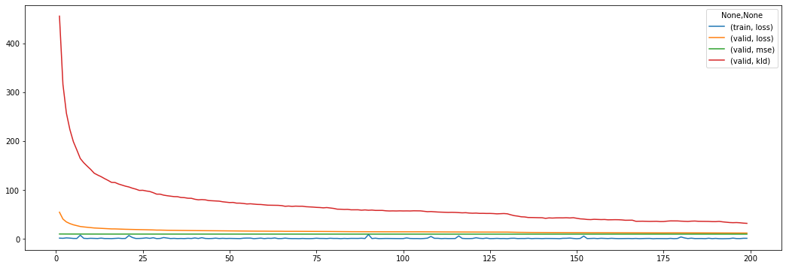
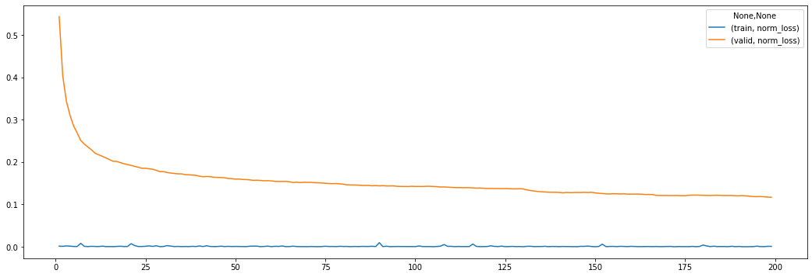

# Experiment 1


```python
from pathlib import Path

from src import config
from src.analyzers import *
from vaep.transform import StandardScaler, get_df_fitted_mean_std
```

    FOLDER_MQ_TXT_DATA = data\mq_out
    


```python
import logging
from src.logging import setup_logger

logger = logging.getLogger()  # returns root-logger
logger.setLevel(logging.CRITICAL)  # silence for everything else
logger.handlers = []


logger = setup_logger(logger=logging.getLogger('vaep'))
logger.info("Experiment 01")
```

    vaep - INFO     Experiment 01
    

## Load data

- 1000 features (most abundant peptides)
- later a subset of samples is selected


```python
N_SAMPLES_TO_LOAD = None
FN_PEPTIDE_INTENSITIES = config.FOLDER_DATA / 'df_intensities_N_07813_M01000'
analysis = AnalyzePeptides(
    fname=FN_PEPTIDE_INTENSITIES, nrows=N_SAMPLES_TO_LOAD)
analysis.df = analysis.df.sort_index()  # sort by date
assert analysis.df.index.is_unique, "Non-unique training samples"
analysis
```


    AnalyzePeptides with attributes: df, stats


### Select consecutives samples for training


```python
import random

N_SAMPLES = 1000
logger.info(f"Selected {N_SAMPLES}")
analysis.N_SAMPLES = N_SAMPLES


def get_consecutive_data_indices(index, n_samples=N_SAMPLES):
    start_sample = len(index) - n_samples
    start_sample = random.randint(0, start_sample)
    return index[start_sample:start_sample+n_samples]


indices_selected = get_consecutive_data_indices(analysis.df.index)
analysis.samples = indices_selected
analysis.df = analysis.df.loc[indices_selected]
analysis.df
```

    vaep - INFO     Selected 1000
    


<div>
<style scoped>
    .dataframe tbody tr th:only-of-type {
        vertical-align: middle;
    }

    .dataframe tbody tr th {
        vertical-align: top;
    }

    .dataframe thead th {
        text-align: right;
    }
</style>
<table border="1" class="dataframe">
  <thead>
    <tr style="text-align: right;">
      <th></th>
      <th>AAAAAAALQAK</th>
      <th>AAFDDAIAELDTLSEESYK</th>
      <th>AAHSEGNTTAGLDMR</th>
      <th>AAVATFLQSVQVPEFTPK</th>
      <th>AAVEEGIVLGGGCALLR</th>
      <th>AAVPSGASTGIYEALELR</th>
      <th>AAVPSGASTGIYEALELRDNDK</th>
      <th>ACANPAAGSVILLENLR</th>
      <th>ACGLVASNLNLKPGECLR</th>
      <th>ADLINNLGTIAK</th>
      <th>...</th>
      <th>VVFVFGPDK</th>
      <th>VVFVFGPDKK</th>
      <th>VYALPEDLVEVKPK</th>
      <th>YADLTEDQLPSCESLK</th>
      <th>YDDMAAAMK</th>
      <th>YDDMAACMK</th>
      <th>YDDMATCMK</th>
      <th>YLAEVACGDDRK</th>
      <th>YLDEDTIYHLQPSGR</th>
      <th>YRVPDVLVADPPIAR</th>
    </tr>
  </thead>
  <tbody>
    <tr>
      <th>20180711_QE2_nLC1_MB_QC_HELA_250ng_01</th>
      <td>1,586,900,000.000</td>
      <td>3,547,200,000.000</td>
      <td>447,110,000.000</td>
      <td>865,310,000.000</td>
      <td>1,182,500,000.000</td>
      <td>972,320,000.000</td>
      <td>3,353,700,000.000</td>
      <td>1,262,400,000.000</td>
      <td>1,110,800,000.000</td>
      <td>3,275,500,000.000</td>
      <td>...</td>
      <td>735,480,000.000</td>
      <td>284,390,000.000</td>
      <td>195,370,000.000</td>
      <td>512,520,000.000</td>
      <td>518,140,000.000</td>
      <td>850,600,000.000</td>
      <td>280,040,000.000</td>
      <td>695,790,000.000</td>
      <td>252,430,000.000</td>
      <td>352,870,000.000</td>
    </tr>
    <tr>
      <th>20180711_QE2_nLC1_MB_QC_HELA_250ng_02</th>
      <td>2,205,000,000.000</td>
      <td>3,074,400,000.000</td>
      <td>49,393,000.000</td>
      <td>835,970,000.000</td>
      <td>1,162,200,000.000</td>
      <td>1,040,900,000.000</td>
      <td>3,723,500,000.000</td>
      <td>1,240,500,000.000</td>
      <td>324,970,000.000</td>
      <td>3,760,500,000.000</td>
      <td>...</td>
      <td>830,790,000.000</td>
      <td>325,200,000.000</td>
      <td>192,560,000.000</td>
      <td>404,790,000.000</td>
      <td>133,370,000.000</td>
      <td>957,550,000.000</td>
      <td>391,390,000.000</td>
      <td>714,050,000.000</td>
      <td>257,010,000.000</td>
      <td>397,610,000.000</td>
    </tr>
    <tr>
      <th>20180711_QE2_nLC1_MB_QC_HELA_250ng_03</th>
      <td>2,010,700,000.000</td>
      <td>3,405,800,000.000</td>
      <td>51,195,000.000</td>
      <td>774,370,000.000</td>
      <td>1,457,800,000.000</td>
      <td>1,318,100,000.000</td>
      <td>4,454,400,000.000</td>
      <td>1,090,500,000.000</td>
      <td>319,750,000.000</td>
      <td>3,542,900,000.000</td>
      <td>...</td>
      <td>812,900,000.000</td>
      <td>315,800,000.000</td>
      <td>173,240,000.000</td>
      <td>421,230,000.000</td>
      <td>1,108,400,000.000</td>
      <td>1,003,200,000.000</td>
      <td>334,720,000.000</td>
      <td>662,200,000.000</td>
      <td>270,370,000.000</td>
      <td>355,790,000.000</td>
    </tr>
    <tr>
      <th>20180711_QE2_nLC1_MB_QC_HELA_250ng_04</th>
      <td>2,014,300,000.000</td>
      <td>3,249,800,000.000</td>
      <td>50,188,000.000</td>
      <td>808,980,000.000</td>
      <td>1,292,600,000.000</td>
      <td>1,268,400,000.000</td>
      <td>3,626,800,000.000</td>
      <td>1,199,800,000.000</td>
      <td>348,310,000.000</td>
      <td>3,696,600,000.000</td>
      <td>...</td>
      <td>829,630,000.000</td>
      <td>328,630,000.000</td>
      <td>219,820,000.000</td>
      <td>397,350,000.000</td>
      <td>712,390,000.000</td>
      <td>1,032,300,000.000</td>
      <td>345,580,000.000</td>
      <td>690,930,000.000</td>
      <td>245,790,000.000</td>
      <td>437,810,000.000</td>
    </tr>
    <tr>
      <th>20180711_QE2_nLC1_MB_QC_HELA_250ng_05</th>
      <td>2,039,600,000.000</td>
      <td>3,169,100,000.000</td>
      <td>48,779,000.000</td>
      <td>813,370,000.000</td>
      <td>1,165,100,000.000</td>
      <td>1,038,400,000.000</td>
      <td>3,407,000,000.000</td>
      <td>1,189,100,000.000</td>
      <td>330,520,000.000</td>
      <td>3,432,700,000.000</td>
      <td>...</td>
      <td>806,250,000.000</td>
      <td>251,000,000.000</td>
      <td>201,530,000.000</td>
      <td>434,620,000.000</td>
      <td>723,300,000.000</td>
      <td>991,230,000.000</td>
      <td>379,450,000.000</td>
      <td>659,830,000.000</td>
      <td>250,040,000.000</td>
      <td>392,110,000.000</td>
    </tr>
    <tr>
      <th>...</th>
      <td>...</td>
      <td>...</td>
      <td>...</td>
      <td>...</td>
      <td>...</td>
      <td>...</td>
      <td>...</td>
      <td>...</td>
      <td>...</td>
      <td>...</td>
      <td>...</td>
      <td>...</td>
      <td>...</td>
      <td>...</td>
      <td>...</td>
      <td>...</td>
      <td>...</td>
      <td>...</td>
      <td>...</td>
      <td>...</td>
      <td>...</td>
    </tr>
    <tr>
      <th>20181115_QE5_nLC5_AP_QC_MNT_HeLa_1_181115195934</th>
      <td>189,740,000.000</td>
      <td>417,240,000.000</td>
      <td>112,550,000.000</td>
      <td>98,487,000.000</td>
      <td>383,080,000.000</td>
      <td>417,610,000.000</td>
      <td>693,170,000.000</td>
      <td>262,700,000.000</td>
      <td>49,564,000.000</td>
      <td>601,660,000.000</td>
      <td>...</td>
      <td>183,830,000.000</td>
      <td>87,040,000.000</td>
      <td>33,339,000.000</td>
      <td>105,380,000.000</td>
      <td>284,080,000.000</td>
      <td>208,650,000.000</td>
      <td>97,699,000.000</td>
      <td>150,780,000.000</td>
      <td>52,781,000.000</td>
      <td>56,058,000.000</td>
    </tr>
    <tr>
      <th>20181115_QE5_nLC5_AP_QC_MNT_HeLa_2</th>
      <td>290,230,000.000</td>
      <td>610,570,000.000</td>
      <td>201,170,000.000</td>
      <td>151,980,000.000</td>
      <td>567,080,000.000</td>
      <td>483,130,000.000</td>
      <td>820,920,000.000</td>
      <td>378,160,000.000</td>
      <td>306,760,000.000</td>
      <td>1,020,500,000.000</td>
      <td>...</td>
      <td>330,700,000.000</td>
      <td>153,000,000.000</td>
      <td>65,460,000.000</td>
      <td>127,300,000.000</td>
      <td>357,250,000.000</td>
      <td>378,090,000.000</td>
      <td>62,345,000.000</td>
      <td>225,850,000.000</td>
      <td>96,574,000.000</td>
      <td>97,497,000.000</td>
    </tr>
    <tr>
      <th>20181115_QE8_nLC0_FaCo_QC_Hela</th>
      <td>1,351,900,000.000</td>
      <td>4,159,700,000.000</td>
      <td>454,990,000.000</td>
      <td>1,240,000,000.000</td>
      <td>2,843,200,000.000</td>
      <td>4,664,300,000.000</td>
      <td>4,244,400,000.000</td>
      <td>5,103,200,000.000</td>
      <td>3,704,900,000.000</td>
      <td>6,449,200,000.000</td>
      <td>...</td>
      <td>1,445,500,000.000</td>
      <td>288,020,000.000</td>
      <td>324,010,000.000</td>
      <td>583,760,000.000</td>
      <td>1,252,800,000.000</td>
      <td>1,081,800,000.000</td>
      <td>399,580,000.000</td>
      <td>740,650,000.000</td>
      <td>438,310,000.000</td>
      <td>580,070,000.000</td>
    </tr>
    <tr>
      <th>20181115_QE9_nLC13_JM_QC_HeLa_15cm_01</th>
      <td>392,100,000.000</td>
      <td>267,090,000.000</td>
      <td>11,053,000.000</td>
      <td>109,980,000.000</td>
      <td>257,440,000.000</td>
      <td>538,280,000.000</td>
      <td>806,610,000.000</td>
      <td>649,650,000.000</td>
      <td>166,980,000.000</td>
      <td>967,030,000.000</td>
      <td>...</td>
      <td>149,230,000.000</td>
      <td>75,663,000.000</td>
      <td>49,371,000.000</td>
      <td>112,010,000.000</td>
      <td>243,690,000.000</td>
      <td>254,860,000.000</td>
      <td>50,848,000.000</td>
      <td>276,210,000.000</td>
      <td>73,497,000.000</td>
      <td>92,156,000.000</td>
    </tr>
    <tr>
      <th>20181116_QE1_nLC2_GP_QC_MNT_HeLa_1</th>
      <td>2,424,500,000.000</td>
      <td>1,588,700,000.000</td>
      <td>641,800,000.000</td>
      <td>803,230,000.000</td>
      <td>1,375,500,000.000</td>
      <td>1,724,800,000.000</td>
      <td>4,002,500,000.000</td>
      <td>2,382,700,000.000</td>
      <td>974,540,000.000</td>
      <td>3,853,200,000.000</td>
      <td>...</td>
      <td>1,094,600,000.000</td>
      <td>320,910,000.000</td>
      <td>169,780,000.000</td>
      <td>473,480,000.000</td>
      <td>1,062,700,000.000</td>
      <td>489,160,000.000</td>
      <td>462,140,000.000</td>
      <td>940,930,000.000</td>
      <td>233,150,000.000</td>
      <td>371,180,000.000</td>
    </tr>
  </tbody>
</table>
<p>1000 rows × 1000 columns</p>
</div>


### Create meta data from filename


```python
from collections import namedtuple

columns = 'date ms_instrument columntype researcher rest'.split()

RunMetaData = namedtuple('RunMetaData', columns)
data_meta = {}
for filename in indices_selected:
    # ToDo: this approach is too easy for the moment. The first two fields are in order, the rest needs matching.
    _meta_filename = filename.split('_', maxsplit=4)
    data_meta[filename] = _meta_filename
    # print(RunMetaData(*_meta_filename[:6]))

analysis.df_meta = pd.DataFrame.from_dict(
    data_meta, orient='index', columns=columns)
# analysis.df_meta['date'] = pd.to_datetime(analysis.df_meta['date'])
analysis.df_meta
```


<div>
<style scoped>
    .dataframe tbody tr th:only-of-type {
        vertical-align: middle;
    }

    .dataframe tbody tr th {
        vertical-align: top;
    }

    .dataframe thead th {
        text-align: right;
    }
</style>
<table border="1" class="dataframe">
  <thead>
    <tr style="text-align: right;">
      <th></th>
      <th>date</th>
      <th>ms_instrument</th>
      <th>columntype</th>
      <th>researcher</th>
      <th>rest</th>
    </tr>
  </thead>
  <tbody>
    <tr>
      <th>20180711_QE2_nLC1_MB_QC_HELA_250ng_01</th>
      <td>20180711</td>
      <td>QE2</td>
      <td>nLC1</td>
      <td>MB</td>
      <td>QC_HELA_250ng_01</td>
    </tr>
    <tr>
      <th>20180711_QE2_nLC1_MB_QC_HELA_250ng_02</th>
      <td>20180711</td>
      <td>QE2</td>
      <td>nLC1</td>
      <td>MB</td>
      <td>QC_HELA_250ng_02</td>
    </tr>
    <tr>
      <th>20180711_QE2_nLC1_MB_QC_HELA_250ng_03</th>
      <td>20180711</td>
      <td>QE2</td>
      <td>nLC1</td>
      <td>MB</td>
      <td>QC_HELA_250ng_03</td>
    </tr>
    <tr>
      <th>20180711_QE2_nLC1_MB_QC_HELA_250ng_04</th>
      <td>20180711</td>
      <td>QE2</td>
      <td>nLC1</td>
      <td>MB</td>
      <td>QC_HELA_250ng_04</td>
    </tr>
    <tr>
      <th>20180711_QE2_nLC1_MB_QC_HELA_250ng_05</th>
      <td>20180711</td>
      <td>QE2</td>
      <td>nLC1</td>
      <td>MB</td>
      <td>QC_HELA_250ng_05</td>
    </tr>
    <tr>
      <th>...</th>
      <td>...</td>
      <td>...</td>
      <td>...</td>
      <td>...</td>
      <td>...</td>
    </tr>
    <tr>
      <th>20181115_QE5_nLC5_AP_QC_MNT_HeLa_1_181115195934</th>
      <td>20181115</td>
      <td>QE5</td>
      <td>nLC5</td>
      <td>AP</td>
      <td>QC_MNT_HeLa_1_181115195934</td>
    </tr>
    <tr>
      <th>20181115_QE5_nLC5_AP_QC_MNT_HeLa_2</th>
      <td>20181115</td>
      <td>QE5</td>
      <td>nLC5</td>
      <td>AP</td>
      <td>QC_MNT_HeLa_2</td>
    </tr>
    <tr>
      <th>20181115_QE8_nLC0_FaCo_QC_Hela</th>
      <td>20181115</td>
      <td>QE8</td>
      <td>nLC0</td>
      <td>FaCo</td>
      <td>QC_Hela</td>
    </tr>
    <tr>
      <th>20181115_QE9_nLC13_JM_QC_HeLa_15cm_01</th>
      <td>20181115</td>
      <td>QE9</td>
      <td>nLC13</td>
      <td>JM</td>
      <td>QC_HeLa_15cm_01</td>
    </tr>
    <tr>
      <th>20181116_QE1_nLC2_GP_QC_MNT_HeLa_1</th>
      <td>20181116</td>
      <td>QE1</td>
      <td>nLC2</td>
      <td>GP</td>
      <td>QC_MNT_HeLa_1</td>
    </tr>
  </tbody>
</table>
<p>1000 rows × 5 columns</p>
</div>


```python
FRACTION = 0.9


class Indices(SimpleNamespace):
    pass


indices = Indices()
indices.train, indices.valid = indices_selected[:int(
    FRACTION*N_SAMPLES)], indices_selected[int(FRACTION*N_SAMPLES):]
analysis.indices = indices

analysis.df_train = analysis.df.loc[indices.train]
analysis.df_valid = analysis.df.loc[indices.valid]

analysis.df_meta.loc[indices.train].describe(datetime_is_numeric=False)
```


<div>
<style scoped>
    .dataframe tbody tr th:only-of-type {
        vertical-align: middle;
    }

    .dataframe tbody tr th {
        vertical-align: top;
    }

    .dataframe thead th {
        text-align: right;
    }
</style>
<table border="1" class="dataframe">
  <thead>
    <tr style="text-align: right;">
      <th></th>
      <th>date</th>
      <th>ms_instrument</th>
      <th>columntype</th>
      <th>researcher</th>
      <th>rest</th>
    </tr>
  </thead>
  <tbody>
    <tr>
      <th>count</th>
      <td>900</td>
      <td>900</td>
      <td>900</td>
      <td>900</td>
      <td>900</td>
    </tr>
    <tr>
      <th>unique</th>
      <td>102</td>
      <td>13</td>
      <td>27</td>
      <td>40</td>
      <td>480</td>
    </tr>
    <tr>
      <th>top</th>
      <td>20180813</td>
      <td>QE1</td>
      <td>nLC10</td>
      <td>GP</td>
      <td>QC_MNT_HeLa_01</td>
    </tr>
    <tr>
      <th>freq</th>
      <td>66</td>
      <td>123</td>
      <td>93</td>
      <td>112</td>
      <td>43</td>
    </tr>
  </tbody>
</table>
</div>


```python
# This becomes part of analysis
def compare_meta_data_for_splits(meta, indices):

    _indices = vars(indices)
    logger.info('Found vars: {}'.format(', '.join(str(x)
                                                  for x in _indices.keys())))

    for key_split, split in _indices.items():
        print(f"{key_split:8} - split description:")
        display(
            meta.loc[split].describe(datetime_is_numeric=True)
        )

    _meta_features = list(meta.columns)

    for _column in _meta_features:
        display(
            _=pd.DataFrame({
                key_split: meta.loc[split, _column].value_counts(normalize=True) for key_split, split in _indices.items()
            }).sort_index().plot(kind='line', rot=90, figsize=(10, 5), title=f"{_column} value Counts for different splits")
        )


compare_meta_data_for_splits(analysis.df_meta.iloc[:, :2], indices)
```

    vaep - INFO     Found vars: train, valid
    train    - split description:
    


<div>
<style scoped>
    .dataframe tbody tr th:only-of-type {
        vertical-align: middle;
    }

    .dataframe tbody tr th {
        vertical-align: top;
    }

    .dataframe thead th {
        text-align: right;
    }
</style>
<table border="1" class="dataframe">
  <thead>
    <tr style="text-align: right;">
      <th></th>
      <th>date</th>
      <th>ms_instrument</th>
    </tr>
  </thead>
  <tbody>
    <tr>
      <th>count</th>
      <td>900</td>
      <td>900</td>
    </tr>
    <tr>
      <th>unique</th>
      <td>102</td>
      <td>13</td>
    </tr>
    <tr>
      <th>top</th>
      <td>20180813</td>
      <td>QE1</td>
    </tr>
    <tr>
      <th>freq</th>
      <td>66</td>
      <td>123</td>
    </tr>
  </tbody>
</table>
</div>


    valid    - split description:
    


<div>
<style scoped>
    .dataframe tbody tr th:only-of-type {
        vertical-align: middle;
    }

    .dataframe tbody tr th {
        vertical-align: top;
    }

    .dataframe thead th {
        text-align: right;
    }
</style>
<table border="1" class="dataframe">
  <thead>
    <tr style="text-align: right;">
      <th></th>
      <th>date</th>
      <th>ms_instrument</th>
    </tr>
  </thead>
  <tbody>
    <tr>
      <th>count</th>
      <td>100</td>
      <td>100</td>
    </tr>
    <tr>
      <th>unique</th>
      <td>17</td>
      <td>15</td>
    </tr>
    <tr>
      <th>top</th>
      <td>20181113</td>
      <td>QE5</td>
    </tr>
    <tr>
      <th>freq</th>
      <td>17</td>
      <td>13</td>
    </tr>
  </tbody>
</table>
</div>


    

    


    

    


## Transforms

### Custom Transforms

- illustrate using adapted scikit-learn [`StandardScaler`](https://scikit-learn.org/stable/modules/preprocessing.html)


```python
N, M = 10, 10  # Samples, Features
analysis.df_train.iloc[:N, :M]
```


<div>
<style scoped>
    .dataframe tbody tr th:only-of-type {
        vertical-align: middle;
    }

    .dataframe tbody tr th {
        vertical-align: top;
    }

    .dataframe thead th {
        text-align: right;
    }
</style>
<table border="1" class="dataframe">
  <thead>
    <tr style="text-align: right;">
      <th></th>
      <th>AAAAAAALQAK</th>
      <th>AAFDDAIAELDTLSEESYK</th>
      <th>AAHSEGNTTAGLDMR</th>
      <th>AAVATFLQSVQVPEFTPK</th>
      <th>AAVEEGIVLGGGCALLR</th>
      <th>AAVPSGASTGIYEALELR</th>
      <th>AAVPSGASTGIYEALELRDNDK</th>
      <th>ACANPAAGSVILLENLR</th>
      <th>ACGLVASNLNLKPGECLR</th>
      <th>ADLINNLGTIAK</th>
    </tr>
  </thead>
  <tbody>
    <tr>
      <th>20180711_QE2_nLC1_MB_QC_HELA_250ng_01</th>
      <td>1,586,900,000.000</td>
      <td>3,547,200,000.000</td>
      <td>447,110,000.000</td>
      <td>865,310,000.000</td>
      <td>1,182,500,000.000</td>
      <td>972,320,000.000</td>
      <td>3,353,700,000.000</td>
      <td>1,262,400,000.000</td>
      <td>1,110,800,000.000</td>
      <td>3,275,500,000.000</td>
    </tr>
    <tr>
      <th>20180711_QE2_nLC1_MB_QC_HELA_250ng_02</th>
      <td>2,205,000,000.000</td>
      <td>3,074,400,000.000</td>
      <td>49,393,000.000</td>
      <td>835,970,000.000</td>
      <td>1,162,200,000.000</td>
      <td>1,040,900,000.000</td>
      <td>3,723,500,000.000</td>
      <td>1,240,500,000.000</td>
      <td>324,970,000.000</td>
      <td>3,760,500,000.000</td>
    </tr>
    <tr>
      <th>20180711_QE2_nLC1_MB_QC_HELA_250ng_03</th>
      <td>2,010,700,000.000</td>
      <td>3,405,800,000.000</td>
      <td>51,195,000.000</td>
      <td>774,370,000.000</td>
      <td>1,457,800,000.000</td>
      <td>1,318,100,000.000</td>
      <td>4,454,400,000.000</td>
      <td>1,090,500,000.000</td>
      <td>319,750,000.000</td>
      <td>3,542,900,000.000</td>
    </tr>
    <tr>
      <th>20180711_QE2_nLC1_MB_QC_HELA_250ng_04</th>
      <td>2,014,300,000.000</td>
      <td>3,249,800,000.000</td>
      <td>50,188,000.000</td>
      <td>808,980,000.000</td>
      <td>1,292,600,000.000</td>
      <td>1,268,400,000.000</td>
      <td>3,626,800,000.000</td>
      <td>1,199,800,000.000</td>
      <td>348,310,000.000</td>
      <td>3,696,600,000.000</td>
    </tr>
    <tr>
      <th>20180711_QE2_nLC1_MB_QC_HELA_250ng_05</th>
      <td>2,039,600,000.000</td>
      <td>3,169,100,000.000</td>
      <td>48,779,000.000</td>
      <td>813,370,000.000</td>
      <td>1,165,100,000.000</td>
      <td>1,038,400,000.000</td>
      <td>3,407,000,000.000</td>
      <td>1,189,100,000.000</td>
      <td>330,520,000.000</td>
      <td>3,432,700,000.000</td>
    </tr>
    <tr>
      <th>20180711_QE2_nLC1_MB_QC_HELA_250ng_06</th>
      <td>2,058,700,000.000</td>
      <td>3,212,300,000.000</td>
      <td>54,003,000.000</td>
      <td>736,400,000.000</td>
      <td>1,138,700,000.000</td>
      <td>1,058,800,000.000</td>
      <td>3,378,600,000.000</td>
      <td>1,356,300,000.000</td>
      <td>342,380,000.000</td>
      <td>3,790,500,000.000</td>
    </tr>
    <tr>
      <th>20180711_QE8_nLC5_ASD_QC_MNT_HeLa3</th>
      <td>1,670,000,000.000</td>
      <td>5,371,400,000.000</td>
      <td>590,420,000.000</td>
      <td>1,614,900,000.000</td>
      <td>1,695,800,000.000</td>
      <td>3,238,900,000.000</td>
      <td>6,767,700,000.000</td>
      <td>3,599,600,000.000</td>
      <td>1,480,600,000.000</td>
      <td>5,743,100,000.000</td>
    </tr>
    <tr>
      <th>20180711_QE9_nLC01_NHS_QC_MNT_HeLa_01</th>
      <td>1,175,900,000.000</td>
      <td>5,330,000,000.000</td>
      <td>391,550,000.000</td>
      <td>796,450,000.000</td>
      <td>1,946,100,000.000</td>
      <td>2,191,000,000.000</td>
      <td>5,224,200,000.000</td>
      <td>3,990,000,000.000</td>
      <td>362,070,000.000</td>
      <td>4,789,300,000.000</td>
    </tr>
    <tr>
      <th>20180711_QE9_nLC01_NHS_QC_MNT_HeLa_02</th>
      <td>1,257,100,000.000</td>
      <td>5,068,700,000.000</td>
      <td>41,840,000.000</td>
      <td>NaN</td>
      <td>2,374,200,000.000</td>
      <td>2,645,700,000.000</td>
      <td>5,977,400,000.000</td>
      <td>4,334,500,000.000</td>
      <td>388,760,000.000</td>
      <td>3,210,600,000.000</td>
    </tr>
    <tr>
      <th>20180712_LUMOS1_LC4_SCL_QC_HeLa_01</th>
      <td>1,118,600,000.000</td>
      <td>2,312,400,000.000</td>
      <td>185,860,000.000</td>
      <td>585,460,000.000</td>
      <td>1,759,400,000.000</td>
      <td>1,560,200,000.000</td>
      <td>1,674,600,000.000</td>
      <td>2,267,000,000.000</td>
      <td>4,691,800,000.000</td>
      <td>3,633,700,000.000</td>
    </tr>
  </tbody>
</table>
</div>


```python
analysis.df_train.iloc[:, :M].describe()
```


<div>
<style scoped>
    .dataframe tbody tr th:only-of-type {
        vertical-align: middle;
    }

    .dataframe tbody tr th {
        vertical-align: top;
    }

    .dataframe thead th {
        text-align: right;
    }
</style>
<table border="1" class="dataframe">
  <thead>
    <tr style="text-align: right;">
      <th></th>
      <th>AAAAAAALQAK</th>
      <th>AAFDDAIAELDTLSEESYK</th>
      <th>AAHSEGNTTAGLDMR</th>
      <th>AAVATFLQSVQVPEFTPK</th>
      <th>AAVEEGIVLGGGCALLR</th>
      <th>AAVPSGASTGIYEALELR</th>
      <th>AAVPSGASTGIYEALELRDNDK</th>
      <th>ACANPAAGSVILLENLR</th>
      <th>ACGLVASNLNLKPGECLR</th>
      <th>ADLINNLGTIAK</th>
    </tr>
  </thead>
  <tbody>
    <tr>
      <th>count</th>
      <td>853.000</td>
      <td>882.000</td>
      <td>872.000</td>
      <td>860.000</td>
      <td>881.000</td>
      <td>881.000</td>
      <td>890.000</td>
      <td>887.000</td>
      <td>888.000</td>
      <td>884.000</td>
    </tr>
    <tr>
      <th>mean</th>
      <td>1,290,713,595.662</td>
      <td>2,727,804,802.154</td>
      <td>337,591,383.257</td>
      <td>656,458,965.930</td>
      <td>1,442,855,931.669</td>
      <td>1,586,032,910.329</td>
      <td>3,633,855,152.809</td>
      <td>1,922,911,050.733</td>
      <td>1,270,492,412.162</td>
      <td>3,540,357,897.851</td>
    </tr>
    <tr>
      <th>std</th>
      <td>1,454,868,592.527</td>
      <td>1,866,535,031.604</td>
      <td>281,250,407.730</td>
      <td>455,586,937.664</td>
      <td>1,013,567,996.378</td>
      <td>1,204,388,224.047</td>
      <td>2,565,218,959.118</td>
      <td>1,491,393,372.631</td>
      <td>1,553,727,822.853</td>
      <td>2,392,520,704.416</td>
    </tr>
    <tr>
      <th>min</th>
      <td>5,240,100.000</td>
      <td>6,352,500.000</td>
      <td>2,439,700.000</td>
      <td>3,345,700.000</td>
      <td>8,177,800.000</td>
      <td>15,386,000.000</td>
      <td>14,051,000.000</td>
      <td>8,527,000.000</td>
      <td>15,642,000.000</td>
      <td>9,547,700.000</td>
    </tr>
    <tr>
      <th>25%</th>
      <td>703,990,000.000</td>
      <td>1,214,150,000.000</td>
      <td>135,980,000.000</td>
      <td>328,920,000.000</td>
      <td>696,490,000.000</td>
      <td>741,750,000.000</td>
      <td>1,872,850,000.000</td>
      <td>946,750,000.000</td>
      <td>540,137,500.000</td>
      <td>1,952,175,000.000</td>
    </tr>
    <tr>
      <th>50%</th>
      <td>1,082,600,000.000</td>
      <td>2,541,150,000.000</td>
      <td>298,280,000.000</td>
      <td>594,030,000.000</td>
      <td>1,232,700,000.000</td>
      <td>1,295,300,000.000</td>
      <td>3,232,150,000.000</td>
      <td>1,658,000,000.000</td>
      <td>1,005,700,000.000</td>
      <td>3,299,000,000.000</td>
    </tr>
    <tr>
      <th>75%</th>
      <td>1,536,500,000.000</td>
      <td>3,823,425,000.000</td>
      <td>478,082,500.000</td>
      <td>868,892,500.000</td>
      <td>1,979,500,000.000</td>
      <td>2,103,500,000.000</td>
      <td>4,796,375,000.000</td>
      <td>2,483,050,000.000</td>
      <td>1,519,625,000.000</td>
      <td>4,505,300,000.000</td>
    </tr>
    <tr>
      <th>max</th>
      <td>19,537,000,000.000</td>
      <td>17,080,000,000.000</td>
      <td>2,570,100,000.000</td>
      <td>4,028,600,000.000</td>
      <td>9,388,300,000.000</td>
      <td>13,133,000,000.000</td>
      <td>23,228,000,000.000</td>
      <td>16,333,000,000.000</td>
      <td>22,298,000,000.000</td>
      <td>29,026,000,000.000</td>
    </tr>
  </tbody>
</table>
</div>


### StandardScaler on raw data


```python
scaler = StandardScaler().fit(analysis.df_train)
scaler_df = get_df_fitted_mean_std(scaler, index=analysis.df_train.columns)
scaler_df.head(N)
```


<div>
<style scoped>
    .dataframe tbody tr th:only-of-type {
        vertical-align: middle;
    }

    .dataframe tbody tr th {
        vertical-align: top;
    }

    .dataframe thead th {
        text-align: right;
    }
</style>
<table border="1" class="dataframe">
  <thead>
    <tr style="text-align: right;">
      <th></th>
      <th>mean</th>
      <th>stddev</th>
    </tr>
  </thead>
  <tbody>
    <tr>
      <th>AAAAAAALQAK</th>
      <td>1,290,713,595.662</td>
      <td>1,454,015,547.251</td>
    </tr>
    <tr>
      <th>AAFDDAIAELDTLSEESYK</th>
      <td>2,727,804,802.154</td>
      <td>1,865,476,605.076</td>
    </tr>
    <tr>
      <th>AAHSEGNTTAGLDMR</th>
      <td>337,591,383.257</td>
      <td>281,089,094.033</td>
    </tr>
    <tr>
      <th>AAVATFLQSVQVPEFTPK</th>
      <td>656,458,965.930</td>
      <td>455,321,984.494</td>
    </tr>
    <tr>
      <th>AAVEEGIVLGGGCALLR</th>
      <td>1,442,855,931.669</td>
      <td>1,012,992,595.823</td>
    </tr>
    <tr>
      <th>AAVPSGASTGIYEALELR</th>
      <td>1,586,032,910.329</td>
      <td>1,203,704,495.224</td>
    </tr>
    <tr>
      <th>AAVPSGASTGIYEALELRDNDK</th>
      <td>3,633,855,152.809</td>
      <td>2,563,777,419.831</td>
    </tr>
    <tr>
      <th>ACANPAAGSVILLENLR</th>
      <td>1,922,911,050.733</td>
      <td>1,490,552,440.299</td>
    </tr>
    <tr>
      <th>ACGLVASNLNLKPGECLR</th>
      <td>1,270,492,412.162</td>
      <td>1,552,852,729.670</td>
    </tr>
    <tr>
      <th>ADLINNLGTIAK</th>
      <td>3,540,357,897.851</td>
      <td>2,391,167,085.804</td>
    </tr>
  </tbody>
</table>
</div>


```python
sample = scaler.transform(analysis.df_train.iloc[:N])
sample.iloc[:, :M]
```


<div>
<style scoped>
    .dataframe tbody tr th:only-of-type {
        vertical-align: middle;
    }

    .dataframe tbody tr th {
        vertical-align: top;
    }

    .dataframe thead th {
        text-align: right;
    }
</style>
<table border="1" class="dataframe">
  <thead>
    <tr style="text-align: right;">
      <th></th>
      <th>AAAAAAALQAK</th>
      <th>AAFDDAIAELDTLSEESYK</th>
      <th>AAHSEGNTTAGLDMR</th>
      <th>AAVATFLQSVQVPEFTPK</th>
      <th>AAVEEGIVLGGGCALLR</th>
      <th>AAVPSGASTGIYEALELR</th>
      <th>AAVPSGASTGIYEALELRDNDK</th>
      <th>ACANPAAGSVILLENLR</th>
      <th>ACGLVASNLNLKPGECLR</th>
      <th>ADLINNLGTIAK</th>
    </tr>
  </thead>
  <tbody>
    <tr>
      <th>20180711_QE2_nLC1_MB_QC_HELA_250ng_01</th>
      <td>0.204</td>
      <td>0.439</td>
      <td>0.390</td>
      <td>0.459</td>
      <td>-0.257</td>
      <td>-0.510</td>
      <td>-0.109</td>
      <td>-0.443</td>
      <td>-0.103</td>
      <td>-0.111</td>
    </tr>
    <tr>
      <th>20180711_QE2_nLC1_MB_QC_HELA_250ng_02</th>
      <td>0.629</td>
      <td>0.186</td>
      <td>-1.025</td>
      <td>0.394</td>
      <td>-0.277</td>
      <td>-0.453</td>
      <td>0.035</td>
      <td>-0.458</td>
      <td>-0.609</td>
      <td>0.092</td>
    </tr>
    <tr>
      <th>20180711_QE2_nLC1_MB_QC_HELA_250ng_03</th>
      <td>0.495</td>
      <td>0.363</td>
      <td>-1.019</td>
      <td>0.259</td>
      <td>0.015</td>
      <td>-0.223</td>
      <td>0.320</td>
      <td>-0.558</td>
      <td>-0.612</td>
      <td>0.001</td>
    </tr>
    <tr>
      <th>20180711_QE2_nLC1_MB_QC_HELA_250ng_04</th>
      <td>0.498</td>
      <td>0.280</td>
      <td>-1.022</td>
      <td>0.335</td>
      <td>-0.148</td>
      <td>-0.264</td>
      <td>-0.003</td>
      <td>-0.485</td>
      <td>-0.594</td>
      <td>0.065</td>
    </tr>
    <tr>
      <th>20180711_QE2_nLC1_MB_QC_HELA_250ng_05</th>
      <td>0.515</td>
      <td>0.237</td>
      <td>-1.027</td>
      <td>0.345</td>
      <td>-0.274</td>
      <td>-0.455</td>
      <td>-0.088</td>
      <td>-0.492</td>
      <td>-0.605</td>
      <td>-0.045</td>
    </tr>
    <tr>
      <th>20180711_QE2_nLC1_MB_QC_HELA_250ng_06</th>
      <td>0.528</td>
      <td>0.260</td>
      <td>-1.009</td>
      <td>0.176</td>
      <td>-0.300</td>
      <td>-0.438</td>
      <td>-0.100</td>
      <td>-0.380</td>
      <td>-0.598</td>
      <td>0.105</td>
    </tr>
    <tr>
      <th>20180711_QE8_nLC5_ASD_QC_MNT_HeLa3</th>
      <td>0.261</td>
      <td>1.417</td>
      <td>0.899</td>
      <td>2.105</td>
      <td>0.250</td>
      <td>1.373</td>
      <td>1.222</td>
      <td>1.125</td>
      <td>0.135</td>
      <td>0.921</td>
    </tr>
    <tr>
      <th>20180711_QE9_nLC01_NHS_QC_MNT_HeLa_01</th>
      <td>-0.079</td>
      <td>1.395</td>
      <td>0.192</td>
      <td>0.307</td>
      <td>0.497</td>
      <td>0.503</td>
      <td>0.620</td>
      <td>1.387</td>
      <td>-0.585</td>
      <td>0.522</td>
    </tr>
    <tr>
      <th>20180711_QE9_nLC01_NHS_QC_MNT_HeLa_02</th>
      <td>-0.023</td>
      <td>1.255</td>
      <td>-1.052</td>
      <td>NaN</td>
      <td>0.919</td>
      <td>0.880</td>
      <td>0.914</td>
      <td>1.618</td>
      <td>-0.568</td>
      <td>-0.138</td>
    </tr>
    <tr>
      <th>20180712_LUMOS1_LC4_SCL_QC_HeLa_01</th>
      <td>-0.118</td>
      <td>-0.223</td>
      <td>-0.540</td>
      <td>-0.156</td>
      <td>0.312</td>
      <td>-0.021</td>
      <td>-0.764</td>
      <td>0.231</td>
      <td>2.203</td>
      <td>0.039</td>
    </tr>
  </tbody>
</table>
</div>


```python
sample = scaler.inverse_transform(sample)
sample.iloc[:, :M]
```


<div>
<style scoped>
    .dataframe tbody tr th:only-of-type {
        vertical-align: middle;
    }

    .dataframe tbody tr th {
        vertical-align: top;
    }

    .dataframe thead th {
        text-align: right;
    }
</style>
<table border="1" class="dataframe">
  <thead>
    <tr style="text-align: right;">
      <th></th>
      <th>AAAAAAALQAK</th>
      <th>AAFDDAIAELDTLSEESYK</th>
      <th>AAHSEGNTTAGLDMR</th>
      <th>AAVATFLQSVQVPEFTPK</th>
      <th>AAVEEGIVLGGGCALLR</th>
      <th>AAVPSGASTGIYEALELR</th>
      <th>AAVPSGASTGIYEALELRDNDK</th>
      <th>ACANPAAGSVILLENLR</th>
      <th>ACGLVASNLNLKPGECLR</th>
      <th>ADLINNLGTIAK</th>
    </tr>
  </thead>
  <tbody>
    <tr>
      <th>20180711_QE2_nLC1_MB_QC_HELA_250ng_01</th>
      <td>1,586,900,000.000</td>
      <td>3,547,200,000.000</td>
      <td>447,110,000.000</td>
      <td>865,310,000.000</td>
      <td>1,182,500,000.000</td>
      <td>972,320,000.000</td>
      <td>3,353,700,000.000</td>
      <td>1,262,400,000.000</td>
      <td>1,110,800,000.000</td>
      <td>3,275,500,000.000</td>
    </tr>
    <tr>
      <th>20180711_QE2_nLC1_MB_QC_HELA_250ng_02</th>
      <td>2,205,000,000.000</td>
      <td>3,074,400,000.000</td>
      <td>49,393,000.000</td>
      <td>835,970,000.000</td>
      <td>1,162,200,000.000</td>
      <td>1,040,900,000.000</td>
      <td>3,723,500,000.000</td>
      <td>1,240,500,000.000</td>
      <td>324,970,000.000</td>
      <td>3,760,500,000.000</td>
    </tr>
    <tr>
      <th>20180711_QE2_nLC1_MB_QC_HELA_250ng_03</th>
      <td>2,010,700,000.000</td>
      <td>3,405,800,000.000</td>
      <td>51,195,000.000</td>
      <td>774,370,000.000</td>
      <td>1,457,800,000.000</td>
      <td>1,318,100,000.000</td>
      <td>4,454,400,000.000</td>
      <td>1,090,500,000.000</td>
      <td>319,750,000.000</td>
      <td>3,542,900,000.000</td>
    </tr>
    <tr>
      <th>20180711_QE2_nLC1_MB_QC_HELA_250ng_04</th>
      <td>2,014,300,000.000</td>
      <td>3,249,800,000.000</td>
      <td>50,188,000.000</td>
      <td>808,980,000.000</td>
      <td>1,292,600,000.000</td>
      <td>1,268,400,000.000</td>
      <td>3,626,800,000.000</td>
      <td>1,199,800,000.000</td>
      <td>348,310,000.000</td>
      <td>3,696,600,000.000</td>
    </tr>
    <tr>
      <th>20180711_QE2_nLC1_MB_QC_HELA_250ng_05</th>
      <td>2,039,600,000.000</td>
      <td>3,169,100,000.000</td>
      <td>48,779,000.000</td>
      <td>813,370,000.000</td>
      <td>1,165,100,000.000</td>
      <td>1,038,400,000.000</td>
      <td>3,407,000,000.000</td>
      <td>1,189,100,000.000</td>
      <td>330,520,000.000</td>
      <td>3,432,700,000.000</td>
    </tr>
    <tr>
      <th>20180711_QE2_nLC1_MB_QC_HELA_250ng_06</th>
      <td>2,058,700,000.000</td>
      <td>3,212,300,000.000</td>
      <td>54,003,000.000</td>
      <td>736,400,000.000</td>
      <td>1,138,700,000.000</td>
      <td>1,058,800,000.000</td>
      <td>3,378,600,000.000</td>
      <td>1,356,300,000.000</td>
      <td>342,380,000.000</td>
      <td>3,790,500,000.000</td>
    </tr>
    <tr>
      <th>20180711_QE8_nLC5_ASD_QC_MNT_HeLa3</th>
      <td>1,670,000,000.000</td>
      <td>5,371,400,000.000</td>
      <td>590,420,000.000</td>
      <td>1,614,900,000.000</td>
      <td>1,695,800,000.000</td>
      <td>3,238,900,000.000</td>
      <td>6,767,700,000.000</td>
      <td>3,599,600,000.000</td>
      <td>1,480,600,000.000</td>
      <td>5,743,100,000.000</td>
    </tr>
    <tr>
      <th>20180711_QE9_nLC01_NHS_QC_MNT_HeLa_01</th>
      <td>1,175,900,000.000</td>
      <td>5,330,000,000.000</td>
      <td>391,550,000.000</td>
      <td>796,450,000.000</td>
      <td>1,946,100,000.000</td>
      <td>2,191,000,000.000</td>
      <td>5,224,200,000.000</td>
      <td>3,990,000,000.000</td>
      <td>362,070,000.000</td>
      <td>4,789,300,000.000</td>
    </tr>
    <tr>
      <th>20180711_QE9_nLC01_NHS_QC_MNT_HeLa_02</th>
      <td>1,257,100,000.000</td>
      <td>5,068,700,000.000</td>
      <td>41,840,000.000</td>
      <td>NaN</td>
      <td>2,374,200,000.000</td>
      <td>2,645,700,000.000</td>
      <td>5,977,400,000.000</td>
      <td>4,334,500,000.000</td>
      <td>388,760,000.000</td>
      <td>3,210,600,000.000</td>
    </tr>
    <tr>
      <th>20180712_LUMOS1_LC4_SCL_QC_HeLa_01</th>
      <td>1,118,600,000.000</td>
      <td>2,312,400,000.000</td>
      <td>185,860,000.000</td>
      <td>585,460,000.000</td>
      <td>1,759,400,000.000</td>
      <td>1,560,200,000.000</td>
      <td>1,674,600,000.000</td>
      <td>2,267,000,000.000</td>
      <td>4,691,800,000.000</td>
      <td>3,633,700,000.000</td>
    </tr>
  </tbody>
</table>
</div>


### StandardScaler on log10 transformed data


```python
X_log10 = np.log10(analysis.df_train)
X_log10.iloc[:N, :M]
```


<div>
<style scoped>
    .dataframe tbody tr th:only-of-type {
        vertical-align: middle;
    }

    .dataframe tbody tr th {
        vertical-align: top;
    }

    .dataframe thead th {
        text-align: right;
    }
</style>
<table border="1" class="dataframe">
  <thead>
    <tr style="text-align: right;">
      <th></th>
      <th>AAAAAAALQAK</th>
      <th>AAFDDAIAELDTLSEESYK</th>
      <th>AAHSEGNTTAGLDMR</th>
      <th>AAVATFLQSVQVPEFTPK</th>
      <th>AAVEEGIVLGGGCALLR</th>
      <th>AAVPSGASTGIYEALELR</th>
      <th>AAVPSGASTGIYEALELRDNDK</th>
      <th>ACANPAAGSVILLENLR</th>
      <th>ACGLVASNLNLKPGECLR</th>
      <th>ADLINNLGTIAK</th>
    </tr>
  </thead>
  <tbody>
    <tr>
      <th>20180711_QE2_nLC1_MB_QC_HELA_250ng_01</th>
      <td>9.201</td>
      <td>9.550</td>
      <td>8.650</td>
      <td>8.937</td>
      <td>9.073</td>
      <td>8.988</td>
      <td>9.526</td>
      <td>9.101</td>
      <td>9.046</td>
      <td>9.515</td>
    </tr>
    <tr>
      <th>20180711_QE2_nLC1_MB_QC_HELA_250ng_02</th>
      <td>9.343</td>
      <td>9.488</td>
      <td>7.694</td>
      <td>8.922</td>
      <td>9.065</td>
      <td>9.017</td>
      <td>9.571</td>
      <td>9.094</td>
      <td>8.512</td>
      <td>9.575</td>
    </tr>
    <tr>
      <th>20180711_QE2_nLC1_MB_QC_HELA_250ng_03</th>
      <td>9.303</td>
      <td>9.532</td>
      <td>7.709</td>
      <td>8.889</td>
      <td>9.164</td>
      <td>9.120</td>
      <td>9.649</td>
      <td>9.038</td>
      <td>8.505</td>
      <td>9.549</td>
    </tr>
    <tr>
      <th>20180711_QE2_nLC1_MB_QC_HELA_250ng_04</th>
      <td>9.304</td>
      <td>9.512</td>
      <td>7.701</td>
      <td>8.908</td>
      <td>9.111</td>
      <td>9.103</td>
      <td>9.560</td>
      <td>9.079</td>
      <td>8.542</td>
      <td>9.568</td>
    </tr>
    <tr>
      <th>20180711_QE2_nLC1_MB_QC_HELA_250ng_05</th>
      <td>9.310</td>
      <td>9.501</td>
      <td>7.688</td>
      <td>8.910</td>
      <td>9.066</td>
      <td>9.016</td>
      <td>9.532</td>
      <td>9.075</td>
      <td>8.519</td>
      <td>9.536</td>
    </tr>
    <tr>
      <th>20180711_QE2_nLC1_MB_QC_HELA_250ng_06</th>
      <td>9.314</td>
      <td>9.507</td>
      <td>7.732</td>
      <td>8.867</td>
      <td>9.056</td>
      <td>9.025</td>
      <td>9.529</td>
      <td>9.132</td>
      <td>8.535</td>
      <td>9.579</td>
    </tr>
    <tr>
      <th>20180711_QE8_nLC5_ASD_QC_MNT_HeLa3</th>
      <td>9.223</td>
      <td>9.730</td>
      <td>8.771</td>
      <td>9.208</td>
      <td>9.229</td>
      <td>9.510</td>
      <td>9.830</td>
      <td>9.556</td>
      <td>9.170</td>
      <td>9.759</td>
    </tr>
    <tr>
      <th>20180711_QE9_nLC01_NHS_QC_MNT_HeLa_01</th>
      <td>9.070</td>
      <td>9.727</td>
      <td>8.593</td>
      <td>8.901</td>
      <td>9.289</td>
      <td>9.341</td>
      <td>9.718</td>
      <td>9.601</td>
      <td>8.559</td>
      <td>9.680</td>
    </tr>
    <tr>
      <th>20180711_QE9_nLC01_NHS_QC_MNT_HeLa_02</th>
      <td>9.099</td>
      <td>9.705</td>
      <td>7.622</td>
      <td>NaN</td>
      <td>9.376</td>
      <td>9.423</td>
      <td>9.777</td>
      <td>9.637</td>
      <td>8.590</td>
      <td>9.507</td>
    </tr>
    <tr>
      <th>20180712_LUMOS1_LC4_SCL_QC_HeLa_01</th>
      <td>9.049</td>
      <td>9.364</td>
      <td>8.269</td>
      <td>8.767</td>
      <td>9.245</td>
      <td>9.193</td>
      <td>9.224</td>
      <td>9.355</td>
      <td>9.671</td>
      <td>9.560</td>
    </tr>
  </tbody>
</table>
</div>


```python
scaler_log = StandardScaler(
).fit(X=X_log10)
scaler_log_df = get_df_fitted_mean_std(scaler_log, index=analysis.df.index)
scaler_log_df.head(N)
```


<div>
<style scoped>
    .dataframe tbody tr th:only-of-type {
        vertical-align: middle;
    }

    .dataframe tbody tr th {
        vertical-align: top;
    }

    .dataframe thead th {
        text-align: right;
    }
</style>
<table border="1" class="dataframe">
  <thead>
    <tr style="text-align: right;">
      <th></th>
      <th>mean</th>
      <th>stddev</th>
    </tr>
  </thead>
  <tbody>
    <tr>
      <th>20180711_QE2_nLC1_MB_QC_HELA_250ng_01</th>
      <td>8.991</td>
      <td>0.334</td>
    </tr>
    <tr>
      <th>20180711_QE2_nLC1_MB_QC_HELA_250ng_02</th>
      <td>9.295</td>
      <td>0.421</td>
    </tr>
    <tr>
      <th>20180711_QE2_nLC1_MB_QC_HELA_250ng_03</th>
      <td>8.351</td>
      <td>0.459</td>
    </tr>
    <tr>
      <th>20180711_QE2_nLC1_MB_QC_HELA_250ng_04</th>
      <td>8.705</td>
      <td>0.349</td>
    </tr>
    <tr>
      <th>20180711_QE2_nLC1_MB_QC_HELA_250ng_05</th>
      <td>9.042</td>
      <td>0.360</td>
    </tr>
    <tr>
      <th>20180711_QE2_nLC1_MB_QC_HELA_250ng_06</th>
      <td>9.076</td>
      <td>0.364</td>
    </tr>
    <tr>
      <th>20180711_QE8_nLC5_ASD_QC_MNT_HeLa3</th>
      <td>9.430</td>
      <td>0.398</td>
    </tr>
    <tr>
      <th>20180711_QE9_nLC01_NHS_QC_MNT_HeLa_01</th>
      <td>9.163</td>
      <td>0.357</td>
    </tr>
    <tr>
      <th>20180711_QE9_nLC01_NHS_QC_MNT_HeLa_02</th>
      <td>8.940</td>
      <td>0.393</td>
    </tr>
    <tr>
      <th>20180712_LUMOS1_LC4_SCL_QC_HeLa_01</th>
      <td>9.444</td>
      <td>0.360</td>
    </tr>
  </tbody>
</table>
</div>


```python
sample_log10 = scaler_log.transform(X_log10.iloc[:N])
sample_log10.iloc[:, :M]
```


<div>
<style scoped>
    .dataframe tbody tr th:only-of-type {
        vertical-align: middle;
    }

    .dataframe tbody tr th {
        vertical-align: top;
    }

    .dataframe thead th {
        text-align: right;
    }
</style>
<table border="1" class="dataframe">
  <thead>
    <tr style="text-align: right;">
      <th></th>
      <th>AAAAAAALQAK</th>
      <th>AAFDDAIAELDTLSEESYK</th>
      <th>AAHSEGNTTAGLDMR</th>
      <th>AAVATFLQSVQVPEFTPK</th>
      <th>AAVEEGIVLGGGCALLR</th>
      <th>AAVPSGASTGIYEALELR</th>
      <th>AAVPSGASTGIYEALELRDNDK</th>
      <th>ACANPAAGSVILLENLR</th>
      <th>ACGLVASNLNLKPGECLR</th>
      <th>ADLINNLGTIAK</th>
    </tr>
  </thead>
  <tbody>
    <tr>
      <th>20180711_QE2_nLC1_MB_QC_HELA_250ng_01</th>
      <td>0.627</td>
      <td>0.605</td>
      <td>0.652</td>
      <td>0.666</td>
      <td>0.085</td>
      <td>-0.243</td>
      <td>0.239</td>
      <td>-0.174</td>
      <td>0.269</td>
      <td>0.199</td>
    </tr>
    <tr>
      <th>20180711_QE2_nLC1_MB_QC_HELA_250ng_02</th>
      <td>1.055</td>
      <td>0.457</td>
      <td>-1.431</td>
      <td>0.623</td>
      <td>0.064</td>
      <td>-0.161</td>
      <td>0.353</td>
      <td>-0.196</td>
      <td>-1.089</td>
      <td>0.366</td>
    </tr>
    <tr>
      <th>20180711_QE2_nLC1_MB_QC_HELA_250ng_03</th>
      <td>0.935</td>
      <td>0.563</td>
      <td>-1.397</td>
      <td>0.528</td>
      <td>0.338</td>
      <td>0.120</td>
      <td>0.548</td>
      <td>-0.352</td>
      <td>-1.107</td>
      <td>0.294</td>
    </tr>
    <tr>
      <th>20180711_QE2_nLC1_MB_QC_HELA_250ng_04</th>
      <td>0.937</td>
      <td>0.515</td>
      <td>-1.416</td>
      <td>0.582</td>
      <td>0.193</td>
      <td>0.074</td>
      <td>0.324</td>
      <td>-0.236</td>
      <td>-1.012</td>
      <td>0.345</td>
    </tr>
    <tr>
      <th>20180711_QE2_nLC1_MB_QC_HELA_250ng_05</th>
      <td>0.954</td>
      <td>0.489</td>
      <td>-1.443</td>
      <td>0.589</td>
      <td>0.067</td>
      <td>-0.164</td>
      <td>0.256</td>
      <td>-0.247</td>
      <td>-1.070</td>
      <td>0.256</td>
    </tr>
    <tr>
      <th>20180711_QE2_nLC1_MB_QC_HELA_250ng_06</th>
      <td>0.966</td>
      <td>0.503</td>
      <td>-1.347</td>
      <td>0.465</td>
      <td>0.039</td>
      <td>-0.141</td>
      <td>0.247</td>
      <td>-0.087</td>
      <td>-1.031</td>
      <td>0.375</td>
    </tr>
    <tr>
      <th>20180711_QE8_nLC5_ASD_QC_MNT_HeLa3</th>
      <td>0.694</td>
      <td>1.033</td>
      <td>0.915</td>
      <td>1.442</td>
      <td>0.520</td>
      <td>1.193</td>
      <td>1.004</td>
      <td>1.100</td>
      <td>0.586</td>
      <td>0.876</td>
    </tr>
    <tr>
      <th>20180711_QE9_nLC01_NHS_QC_MNT_HeLa_01</th>
      <td>0.237</td>
      <td>1.025</td>
      <td>0.527</td>
      <td>0.563</td>
      <td>0.687</td>
      <td>0.726</td>
      <td>0.722</td>
      <td>1.225</td>
      <td>-0.969</td>
      <td>0.657</td>
    </tr>
    <tr>
      <th>20180711_QE9_nLC01_NHS_QC_MNT_HeLa_02</th>
      <td>0.324</td>
      <td>0.973</td>
      <td>-1.588</td>
      <td>NaN</td>
      <td>0.927</td>
      <td>0.951</td>
      <td>0.869</td>
      <td>1.326</td>
      <td>-0.891</td>
      <td>0.175</td>
    </tr>
    <tr>
      <th>20180712_LUMOS1_LC4_SCL_QC_HeLa_01</th>
      <td>0.172</td>
      <td>0.163</td>
      <td>-0.178</td>
      <td>0.180</td>
      <td>0.565</td>
      <td>0.321</td>
      <td>-0.518</td>
      <td>0.538</td>
      <td>1.860</td>
      <td>0.324</td>
    </tr>
  </tbody>
</table>
</div>


```python
scaler_log.inverse_transform(sample_log10).iloc[:, :M]
```


<div>
<style scoped>
    .dataframe tbody tr th:only-of-type {
        vertical-align: middle;
    }

    .dataframe tbody tr th {
        vertical-align: top;
    }

    .dataframe thead th {
        text-align: right;
    }
</style>
<table border="1" class="dataframe">
  <thead>
    <tr style="text-align: right;">
      <th></th>
      <th>AAAAAAALQAK</th>
      <th>AAFDDAIAELDTLSEESYK</th>
      <th>AAHSEGNTTAGLDMR</th>
      <th>AAVATFLQSVQVPEFTPK</th>
      <th>AAVEEGIVLGGGCALLR</th>
      <th>AAVPSGASTGIYEALELR</th>
      <th>AAVPSGASTGIYEALELRDNDK</th>
      <th>ACANPAAGSVILLENLR</th>
      <th>ACGLVASNLNLKPGECLR</th>
      <th>ADLINNLGTIAK</th>
    </tr>
  </thead>
  <tbody>
    <tr>
      <th>20180711_QE2_nLC1_MB_QC_HELA_250ng_01</th>
      <td>9.201</td>
      <td>9.550</td>
      <td>8.650</td>
      <td>8.937</td>
      <td>9.073</td>
      <td>8.988</td>
      <td>9.526</td>
      <td>9.101</td>
      <td>9.046</td>
      <td>9.515</td>
    </tr>
    <tr>
      <th>20180711_QE2_nLC1_MB_QC_HELA_250ng_02</th>
      <td>9.343</td>
      <td>9.488</td>
      <td>7.694</td>
      <td>8.922</td>
      <td>9.065</td>
      <td>9.017</td>
      <td>9.571</td>
      <td>9.094</td>
      <td>8.512</td>
      <td>9.575</td>
    </tr>
    <tr>
      <th>20180711_QE2_nLC1_MB_QC_HELA_250ng_03</th>
      <td>9.303</td>
      <td>9.532</td>
      <td>7.709</td>
      <td>8.889</td>
      <td>9.164</td>
      <td>9.120</td>
      <td>9.649</td>
      <td>9.038</td>
      <td>8.505</td>
      <td>9.549</td>
    </tr>
    <tr>
      <th>20180711_QE2_nLC1_MB_QC_HELA_250ng_04</th>
      <td>9.304</td>
      <td>9.512</td>
      <td>7.701</td>
      <td>8.908</td>
      <td>9.111</td>
      <td>9.103</td>
      <td>9.560</td>
      <td>9.079</td>
      <td>8.542</td>
      <td>9.568</td>
    </tr>
    <tr>
      <th>20180711_QE2_nLC1_MB_QC_HELA_250ng_05</th>
      <td>9.310</td>
      <td>9.501</td>
      <td>7.688</td>
      <td>8.910</td>
      <td>9.066</td>
      <td>9.016</td>
      <td>9.532</td>
      <td>9.075</td>
      <td>8.519</td>
      <td>9.536</td>
    </tr>
    <tr>
      <th>20180711_QE2_nLC1_MB_QC_HELA_250ng_06</th>
      <td>9.314</td>
      <td>9.507</td>
      <td>7.732</td>
      <td>8.867</td>
      <td>9.056</td>
      <td>9.025</td>
      <td>9.529</td>
      <td>9.132</td>
      <td>8.535</td>
      <td>9.579</td>
    </tr>
    <tr>
      <th>20180711_QE8_nLC5_ASD_QC_MNT_HeLa3</th>
      <td>9.223</td>
      <td>9.730</td>
      <td>8.771</td>
      <td>9.208</td>
      <td>9.229</td>
      <td>9.510</td>
      <td>9.830</td>
      <td>9.556</td>
      <td>9.170</td>
      <td>9.759</td>
    </tr>
    <tr>
      <th>20180711_QE9_nLC01_NHS_QC_MNT_HeLa_01</th>
      <td>9.070</td>
      <td>9.727</td>
      <td>8.593</td>
      <td>8.901</td>
      <td>9.289</td>
      <td>9.341</td>
      <td>9.718</td>
      <td>9.601</td>
      <td>8.559</td>
      <td>9.680</td>
    </tr>
    <tr>
      <th>20180711_QE9_nLC01_NHS_QC_MNT_HeLa_02</th>
      <td>9.099</td>
      <td>9.705</td>
      <td>7.622</td>
      <td>NaN</td>
      <td>9.376</td>
      <td>9.423</td>
      <td>9.777</td>
      <td>9.637</td>
      <td>8.590</td>
      <td>9.507</td>
    </tr>
    <tr>
      <th>20180712_LUMOS1_LC4_SCL_QC_HeLa_01</th>
      <td>9.049</td>
      <td>9.364</td>
      <td>8.269</td>
      <td>8.767</td>
      <td>9.245</td>
      <td>9.193</td>
      <td>9.224</td>
      <td>9.355</td>
      <td>9.671</td>
      <td>9.560</td>
    </tr>
  </tbody>
</table>
</div>


### Sanity checks

#### Correlation

- Correlation between the computed `means_` should be nearly perfect
- Correlation between peptide intensities should be high
- As taking the logarithm is a monoton, but non-linear transformation, the linear Pearson correlation can change substantially. [[link]](https://stats.stackexchange.com/questions/127121/do-logs-modify-the-correlation-between-two-variables)


```python
print("Correlation between mean values of linear vs. log-transformed values:",
      f"{np.corrcoef(scaler.mean_, scaler_log.mean_)[1,0]:.4f}", sep='\n')
```

    Correlation between mean values of linear vs. log-transformed values:
    0.7867
    


```python
pd.options.display.float_format = '{:,.3f}'.format

analysis.corr_linear_vs_log = scaler.transform(X=analysis.df).corrwith(
    other=scaler_log.transform(X_log10),
    axis=0)
analysis.corr_linear_vs_log.describe()
```


    count   1,000.000
    mean        0.788
    std         0.077
    min         0.428
    25%         0.751
    50%         0.808
    75%         0.845
    max         0.906
    dtype: float64


```python
# own implemention could be slightly faster as data is already demeanded and standardized.
# pd.DataFrame.corrwith?
```

#### Distribution


```python
import seaborn as sns
from vaep.utils import sample_iterable

columns_sampled = sample_iterable(list(analysis.df.columns), n=12)
print(columns_sampled)
```

    ['TAVETAVLLLR', 'TCTTVAFTQVNSEDK', 'DLTDYLMK', 'ILLAELEQLK', 'TAFDDAIAELDTLNEDSYK', 'TATESFASDPILYRPVAVALDTK', 'SLLVNPEGPTLMR', 'HEQILVLDPPTDLK', 'ILVATNLFGR', 'VINEPTAAALAYGLDK', 'LTDCVVMRDPASK', 'KQELLEALTK']
    


```python
def plot_scaled_sample(columns_sampled: list, scaler, df: pd.DataFrame = analysis.df):
    _scaled = scaler.transform(df)
    display(_scaled.describe())
    _min, _max = _scaled.min().min(), _scaled.max().max()
    return _min, _max
    print(list(range(_min, _max, step=0.5)))


_min, _max = plot_scaled_sample(columns_sampled=columns_sampled, scaler=scaler)
```


<div>
<style scoped>
    .dataframe tbody tr th:only-of-type {
        vertical-align: middle;
    }

    .dataframe tbody tr th {
        vertical-align: top;
    }

    .dataframe thead th {
        text-align: right;
    }
</style>
<table border="1" class="dataframe">
  <thead>
    <tr style="text-align: right;">
      <th></th>
      <th>AAAAAAALQAK</th>
      <th>AAFDDAIAELDTLSEESYK</th>
      <th>AAHSEGNTTAGLDMR</th>
      <th>AAVATFLQSVQVPEFTPK</th>
      <th>AAVEEGIVLGGGCALLR</th>
      <th>AAVPSGASTGIYEALELR</th>
      <th>AAVPSGASTGIYEALELRDNDK</th>
      <th>ACANPAAGSVILLENLR</th>
      <th>ACGLVASNLNLKPGECLR</th>
      <th>ADLINNLGTIAK</th>
      <th>...</th>
      <th>VVFVFGPDK</th>
      <th>VVFVFGPDKK</th>
      <th>VYALPEDLVEVKPK</th>
      <th>YADLTEDQLPSCESLK</th>
      <th>YDDMAAAMK</th>
      <th>YDDMAACMK</th>
      <th>YDDMATCMK</th>
      <th>YLAEVACGDDRK</th>
      <th>YLDEDTIYHLQPSGR</th>
      <th>YRVPDVLVADPPIAR</th>
    </tr>
  </thead>
  <tbody>
    <tr>
      <th>count</th>
      <td>949.000</td>
      <td>981.000</td>
      <td>963.000</td>
      <td>957.000</td>
      <td>981.000</td>
      <td>981.000</td>
      <td>990.000</td>
      <td>984.000</td>
      <td>987.000</td>
      <td>984.000</td>
      <td>...</td>
      <td>949.000</td>
      <td>956.000</td>
      <td>961.000</td>
      <td>936.000</td>
      <td>983.000</td>
      <td>990.000</td>
      <td>973.000</td>
      <td>976.000</td>
      <td>964.000</td>
      <td>957.000</td>
    </tr>
    <tr>
      <th>mean</th>
      <td>-0.019</td>
      <td>-0.027</td>
      <td>-0.037</td>
      <td>-0.018</td>
      <td>-0.026</td>
      <td>-0.002</td>
      <td>-0.023</td>
      <td>-0.008</td>
      <td>-0.028</td>
      <td>-0.019</td>
      <td>...</td>
      <td>-0.001</td>
      <td>-0.028</td>
      <td>-0.026</td>
      <td>-0.026</td>
      <td>-0.027</td>
      <td>-0.028</td>
      <td>-0.026</td>
      <td>-0.023</td>
      <td>-0.025</td>
      <td>-0.025</td>
    </tr>
    <tr>
      <th>std</th>
      <td>0.961</td>
      <td>0.984</td>
      <td>0.984</td>
      <td>0.985</td>
      <td>0.984</td>
      <td>1.012</td>
      <td>0.990</td>
      <td>0.981</td>
      <td>0.961</td>
      <td>0.979</td>
      <td>...</td>
      <td>0.983</td>
      <td>0.967</td>
      <td>0.973</td>
      <td>0.969</td>
      <td>0.998</td>
      <td>0.979</td>
      <td>0.974</td>
      <td>0.974</td>
      <td>0.976</td>
      <td>0.977</td>
    </tr>
    <tr>
      <th>min</th>
      <td>-0.884</td>
      <td>-1.459</td>
      <td>-1.192</td>
      <td>-1.434</td>
      <td>-1.417</td>
      <td>-1.305</td>
      <td>-1.412</td>
      <td>-1.284</td>
      <td>-0.808</td>
      <td>-1.477</td>
      <td>...</td>
      <td>-1.435</td>
      <td>-1.117</td>
      <td>-1.102</td>
      <td>-1.175</td>
      <td>-1.490</td>
      <td>-1.205</td>
      <td>-1.078</td>
      <td>-1.013</td>
      <td>-1.241</td>
      <td>-1.242</td>
    </tr>
    <tr>
      <th>25%</th>
      <td>-0.419</td>
      <td>-0.822</td>
      <td>-0.755</td>
      <td>-0.731</td>
      <td>-0.757</td>
      <td>-0.705</td>
      <td>-0.735</td>
      <td>-0.669</td>
      <td>-0.489</td>
      <td>-0.676</td>
      <td>...</td>
      <td>-0.674</td>
      <td>-0.558</td>
      <td>-0.625</td>
      <td>-0.606</td>
      <td>-0.763</td>
      <td>-0.614</td>
      <td>-0.568</td>
      <td>-0.562</td>
      <td>-0.651</td>
      <td>-0.627</td>
    </tr>
    <tr>
      <th>50%</th>
      <td>-0.153</td>
      <td>-0.138</td>
      <td>-0.213</td>
      <td>-0.145</td>
      <td>-0.216</td>
      <td>-0.239</td>
      <td>-0.161</td>
      <td>-0.172</td>
      <td>-0.194</td>
      <td>-0.108</td>
      <td>...</td>
      <td>-0.120</td>
      <td>-0.207</td>
      <td>-0.219</td>
      <td>-0.200</td>
      <td>-0.163</td>
      <td>-0.141</td>
      <td>-0.188</td>
      <td>-0.175</td>
      <td>-0.161</td>
      <td>-0.146</td>
    </tr>
    <tr>
      <th>75%</th>
      <td>0.155</td>
      <td>0.563</td>
      <td>0.451</td>
      <td>0.452</td>
      <td>0.507</td>
      <td>0.429</td>
      <td>0.420</td>
      <td>0.376</td>
      <td>0.134</td>
      <td>0.391</td>
      <td>...</td>
      <td>0.383</td>
      <td>0.278</td>
      <td>0.248</td>
      <td>0.339</td>
      <td>0.511</td>
      <td>0.374</td>
      <td>0.280</td>
      <td>0.318</td>
      <td>0.383</td>
      <td>0.302</td>
    </tr>
    <tr>
      <th>max</th>
      <td>12.549</td>
      <td>7.694</td>
      <td>7.942</td>
      <td>7.406</td>
      <td>7.844</td>
      <td>9.593</td>
      <td>7.643</td>
      <td>9.668</td>
      <td>13.541</td>
      <td>10.658</td>
      <td>...</td>
      <td>9.193</td>
      <td>14.771</td>
      <td>11.498</td>
      <td>15.332</td>
      <td>5.264</td>
      <td>20.036</td>
      <td>15.778</td>
      <td>15.333</td>
      <td>11.877</td>
      <td>9.856</td>
    </tr>
  </tbody>
</table>
<p>8 rows × 1000 columns</p>
</div>


```python
# if bins should be equal between plots
# addon
import math
xlim = [-5, 5]
FACTOR = 1
[x/FACTOR for x in range(math.floor(xlim[0])*FACTOR,
                         math.ceil(xlim[1])*FACTOR+1)]
```


    [-5.0, -4.0, -3.0, -2.0, -1.0, 0.0, 1.0, 2.0, 3.0, 4.0, 5.0]


```python
import matplotlib.pyplot as plt

columns_sampled = sample_iterable(list(analysis.df.columns), n=9)
subplot_kw = {'xlim': [-5, 5], 'ylim': [0, 600]}
fig, axes = plt.subplots(nrows=3, ncols=3, figsize=(
    15, 15), sharey=True, sharex=True, subplot_kw=subplot_kw)
_ = scaler_log.transform(X_log10)[columns_sampled].hist(
    figsize=(15, 15), ax=axes)
axes = scaler.transform(analysis.df)[columns_sampled].hist(
    figsize=(15, 15), ax=axes)
_ = fig.legend(('linear', 'log'), loc=5)
```


    

    


```python
caption = (f"Frequencies are capped at {subplot_kw['ylim'][1]} and "
           "their standardized intensity values plotted between {} and {}.".format(
               *subplot_kw['xlim'])
           )
print(caption)
```

    Frequencies are capped at 600 and their standardized intensity values plotted between -5 and 5.
    

### Analysis state so far


```python
analysis
```


    AnalyzePeptides with attributes: N_SAMPLES, corr_linear_vs_log, df, df_meta, df_train, df_valid, indices, samples, stats


## Fastai Dataloader

> fastai includes a replacement for Pytorch's DataLoader which is largely API-compatible, and adds a lot of useful functionality and flexibility. Before we look at the class, there are a couple of helpers we'll need to define. [[link](https://docs.fast.ai/data.load.html)]


```python
# import fastai.tabular.all as tab
from fastcore.transform import Transform

from fastai.tabular.data import TabularDataLoaders
```

Create dataloaders using an appropriate factory method from `TabularDataLoaders` class, here [`from_df`](https://docs.fast.ai/tabular.data.html#TabularDataLoaders.from_df)


```python
# DataFrame is shuffled
N_VAL = 100
valid_idx = list(range(N_VAL))
dls = TabularDataLoaders.from_df(df=analysis.df, valid_idx=valid_idx, bs=64)
analysis.dls = dls
```


```python
dls.show_batch()  # loses object index attribute
```


<table border="1" class="dataframe">
  <thead>
    <tr style="text-align: right;">
      <th></th>
      <th>EAESCDCLQGFQLTHSLGGGTGSGMGTLLLSK</th>
      <th>AIIIFVPVPQLK</th>
      <th>GCITIIGGGDTATCCAK</th>
      <th>HELQANCYEEVK</th>
      <th>EGVHGGLINK</th>
      <th>ELISNASDALDK</th>
      <th>AHSSMVGVNLPQK</th>
      <th>MVVESAYEVIK</th>
      <th>VSLDVNHFAPDELTVK</th>
      <th>HLSVNDLPVGR</th>
      <th>QEYDESGPSIVHR</th>
      <th>EAEAAIYHLQLFEELRR</th>
      <th>KQELLEALTK</th>
      <th>VIVVGNPANTNCLTASK</th>
      <th>SEIDLFNIRK</th>
      <th>DAGTIAGLNVMR</th>
      <th>VVVAENFDEIVNNENK</th>
      <th>NIEDVIAQGIGK</th>
      <th>EAMEDGEIDGNK</th>
      <th>NLQEAEEWYK</th>
      <th>LATLLGLQAPPTR</th>
      <th>TVAGGAWTYNTTSAVTVK</th>
      <th>ITLQDVVSHSK</th>
      <th>LQAALDDEEAGGRPAMEPGNGSLDLGGDSAGR</th>
      <th>YGINTTDIFQTVDLWEGK</th>
      <th>RAPFDLFENR</th>
      <th>GAVDGGLSIPHSTK</th>
      <th>LATQLTGPVMPVR</th>
      <th>EDQTEYLEER</th>
      <th>LATQSNEITIPVTFESR</th>
      <th>DPVQEAWAEDVDLR</th>
      <th>HFVGMLPEK</th>
      <th>VIQCFAETGQVQK</th>
      <th>LIEVDDERK</th>
      <th>FGGEHVPNSPFQVTALAGDQPSVQPPLR</th>
      <th>VSQEHPVVLTK</th>
      <th>VLAVNQENEQLMEDYEK</th>
      <th>LAHEVGWK</th>
      <th>HTNYTMEHIR</th>
      <th>LVGQGASAVLLDLPNSGGEAQAK</th>
      <th>MDATANDVPSPYEVR</th>
      <th>HFVALSTNTTK</th>
      <th>DHGGALGPEEFK</th>
      <th>IYVDDGLISLQVK</th>
      <th>SLESLHSFVAAATK</th>
      <th>LAQANGWGVMVSHR</th>
      <th>ALPFWNEEIVPQIK</th>
      <th>DILLRPELEELR</th>
      <th>IPSAVGYQPTLATDMGTMQER</th>
      <th>TIAPALVSK</th>
      <th>FDDAVVQSDMK</th>
      <th>GVNLPGAAVDLPAVSEK</th>
      <th>ATESGAQSAPLPMEGVDISPK</th>
      <th>HGEVCPAGWKPGSDTIKPDVQK</th>
      <th>NQLTSNPENTVFDAK</th>
      <th>AAFDDAIAELDTLSEESYK</th>
      <th>VVIGMDVAASEFFR</th>
      <th>IAFAITAIK</th>
      <th>SLYASSPGGVYATR</th>
      <th>LFIGGLNTETNEK</th>
      <th>IMDPNIVGSEHYDVAR</th>
      <th>SLGYAYVNFQQPADAER</th>
      <th>AGVNTVTTLVENKK</th>
      <th>GADFLVTEVENGGSLGSK</th>
      <th>TLTAVHDAILEDLVFPSEIVGK</th>
      <th>PFFHSLSEK</th>
      <th>TIGGGDDSFNTFFSETGAGK</th>
      <th>DVQIGDIVTVGECRPLSK</th>
      <th>QAFTDVATGSLGQGLGAACGMAYTGK</th>
      <th>ATAVMPDGQFK</th>
      <th>NYIQGINLVQAK</th>
      <th>HLNEIDLFHCIDPNDSK</th>
      <th>PLRLPLQDVYK</th>
      <th>SDALETLGFLNHYQMK</th>
      <th>IGGIGTVPVGR</th>
      <th>TGAAPIIDVVR</th>
      <th>ELASQPDVDGFLVGGASLKPEFVDIINAK</th>
      <th>NLQYYDISAK</th>
      <th>AVTEQGHELSNEER</th>
      <th>FYPEDVSEELIQDITQR</th>
      <th>VEPGLGADNSVVR</th>
      <th>IIQLLDDYPK</th>
      <th>GLFIIDGK</th>
      <th>MDDREDLVYQAK</th>
      <th>AGAGSATLSMAYAGAR</th>
      <th>VEILANDQGNR</th>
      <th>ATQALVLAPTR</th>
      <th>IINEPTAAAIAYGLDK</th>
      <th>TADGIVSHLK</th>
      <th>ISMPDLDLNLK</th>
      <th>LCYVALDFEQEMATAASSSSLEK</th>
      <th>AVAQALEVIPR</th>
      <th>TINEVENQILTR</th>
      <th>RGFAFVTFDDHDSVDK</th>
      <th>ILLAELEQLK</th>
      <th>GPLMMYISK</th>
      <th>LLLIGDSGVGK</th>
      <th>VNGRPLEMIEPR</th>
      <th>TILSNQTVDIPENVDITLK</th>
      <th>LISQIVSSITASLR</th>
      <th>MMDYLQGSGETPQTDVR</th>
      <th>LLDSSTVTHLFK</th>
      <th>SLHDALCVLAQTVK</th>
      <th>EHDPVGQMVNNPK</th>
      <th>VANVSLLALYK</th>
      <th>AYLPVNESFGFTADLR</th>
      <th>VYNVTQHAVGIVVNK</th>
      <th>FAAATGATPIAGR</th>
      <th>VTAQGPGLEPSGNIANK</th>
      <th>ELEEIVQPIISK</th>
      <th>FIIPQIVK</th>
      <th>HLQLAIR</th>
      <th>LSVLGAITSVQQR</th>
      <th>MLDMGFEPQIR</th>
      <th>EQFLDGDGWTSR</th>
      <th>MQQQLDEYQELLDIK</th>
      <th>IFAPNHVVAK</th>
      <th>SSILLDVKPWDDETDMAK</th>
      <th>TLQALQIPAAK</th>
      <th>IKDPDASKPEDWDER</th>
      <th>AILVDLEPGTMDSVR</th>
      <th>HVLVTLGEK</th>
      <th>TAFDEAIAELDTLNEDSYK</th>
      <th>KQELEEICHDLEAR</th>
      <th>YDDMAACMK</th>
      <th>ASNGDAWVEAHGK</th>
      <th>DIVVQETMEDIDK</th>
      <th>YTPSGQAGAAASESLFVSNHAY</th>
      <th>ALMLQGVDLLADAVAVTMGPK</th>
      <th>VNNSSLIGLGYTQTLKPGIK</th>
      <th>VIHLSNLPHSGYSDSAVLK</th>
      <th>MIPCDFLIPVQTQHPIRK</th>
      <th>YRPGTVALR</th>
      <th>DSYVGDEAQSK</th>
      <th>AGTQIENIDEDFRDGLK</th>
      <th>GAGTDDHTLIR</th>
      <th>GISDLAQHYLMR</th>
      <th>IIETLTQQLQAK</th>
      <th>NMDPLNDNIATLLHQSSDK</th>
      <th>STELLIR</th>
      <th>TAFDDAIAELDTLNEDSYK</th>
      <th>AIADTGANVVVTGGK</th>
      <th>HRDYETATLSDIK</th>
      <th>FGDPVVQSDMK</th>
      <th>INISEGNCPER</th>
      <th>ELVTQQLPHLLK</th>
      <th>DYAFVHFEDR</th>
      <th>VVVLGLLPR</th>
      <th>ITLDNAYMEK</th>
      <th>FGYVDFESAEDLEK</th>
      <th>ALDIAENEMPGLMR</th>
      <th>EGNDLYHEMIESGVINLK</th>
      <th>LLCGLLAER</th>
      <th>EAPPMEKPEVVK</th>
      <th>AEEYEFLTPVEEAPK</th>
      <th>NMMAACDPR</th>
      <th>VIDPATATSVDLR</th>
      <th>HRPELIEYDK</th>
      <th>ASIHEAWTDGK</th>
      <th>QAQIEVVPSASALIIK</th>
      <th>DSIVHQAGMLK</th>
      <th>LQVTNVLSQPLTQATVK</th>
      <th>ALQSGQCAGAALDVFTEEPPRDR</th>
      <th>ALDTMNFDVIK</th>
      <th>EMDRETLIDVAR</th>
      <th>IGAEVYHNLK</th>
      <th>IIAPPERK</th>
      <th>SLAGSSGPGASSGTSGDHGELVVR</th>
      <th>EIVVIHQDPEALK</th>
      <th>TLQIFNIEMK</th>
      <th>YALYDATYETK</th>
      <th>LVQAFQFTDK</th>
      <th>VNPTVFFDIAVDGEPLGR</th>
      <th>SQEQLAAELAEYTAK</th>
      <th>VALVYGQMNEPPGAR</th>
      <th>EAAENSLVAYK</th>
      <th>DLLHPSPEEEK</th>
      <th>GILGYTEHQVVSSDFNSDTHSSTFDAGAGIALNDHFVK</th>
      <th>VIHDNFGIVEGLMTTVHAITATQK</th>
      <th>ELSDIAHR</th>
      <th>ASMGTLAFDEYGRPFLIIK</th>
      <th>YPIEHGIITNWDDMEK</th>
      <th>LVQDVANNTNEEAGDGTTTATVLAR</th>
      <th>ELHINLIPNK</th>
      <th>AQAAAPASVPAQAPK</th>
      <th>FIIPNVVK</th>
      <th>LEQQVPVNQVFGQDEMIDVIGVTK</th>
      <th>YTLPPGVDPTQVSSSLSPEGTLTVEAPMPK</th>
      <th>YLAEVACGDDRK</th>
      <th>VFQFLNAK</th>
      <th>GLNSESMTEETLK</th>
      <th>GYSLVSGGTDNHLVLVDLRPK</th>
      <th>TNHIGHTGYLNTVTVSPDGSLCASGGK</th>
      <th>SLHDALCVIR</th>
      <th>LLQDFFNGK</th>
      <th>AVLVDLEPGTMDSVR</th>
      <th>LMDVGLIAIR</th>
      <th>AHGPGLEGGLVGKPAEFTIDTK</th>
      <th>ILNIFGVIK</th>
      <th>VDNDENEHQLSLR</th>
      <th>VPPAINQFTQALDR</th>
      <th>EMEAELEDERK</th>
      <th>LISWYDNEFGYSNR</th>
      <th>EQIVPKPEEEVAQK</th>
      <th>QSLGELIGTLNAAK</th>
      <th>QGGLGPMNIPLVSDPK</th>
      <th>DWILPSDYDHAEAEAR</th>
      <th>GHYTEGAELVDSVLDVVR</th>
      <th>DRPFFAGLVK</th>
      <th>SYELPDGQVITIGNER</th>
      <th>TLMNLGGLAVAR</th>
      <th>TITLEVEPSDTIENVK</th>
      <th>IAVYSCPFDGMITETK</th>
      <th>GLGTDEDSLIEIICSR</th>
      <th>KLDEAVAEAHLGK</th>
      <th>SVTEQGAELSNEER</th>
      <th>YLAEVAAGDDKK</th>
      <th>ANLQIDQINTDLNLER</th>
      <th>ADLLLSTQPGREEGSPLELER</th>
      <th>AVTEQGAELSNEER</th>
      <th>ALEHFTDLYDIK</th>
      <th>AVLSAEQLRDEEVHAGLGELLR</th>
      <th>VVDLLAPYAK</th>
      <th>VSSDNVADLHEK</th>
      <th>GQHVPGSPFQFTVGPLGEGGAHK</th>
      <th>NQVALNPQNTVFDAK</th>
      <th>SPFEVQVGPEAGMQK</th>
      <th>IVSQLLTLMDGLK</th>
      <th>IYELAAGGTAVGTGLNTR</th>
      <th>IGGVQQDTILAEGLHFR</th>
      <th>MVNHFIAEFK</th>
      <th>ICDQWDALGSLTHSR</th>
      <th>ACGLVASNLNLKPGECLR</th>
      <th>GVVPLAGTNGETTTQGLDGLSER</th>
      <th>EILVGDVGQTVDDPYATFVK</th>
      <th>EITALAPSTMK</th>
      <th>RLIDLHSPSEIVK</th>
      <th>AIGVLTSGGDAQGMNAAVR</th>
      <th>AMVSEFLK</th>
      <th>FEELNMDLFR</th>
      <th>AAAAAAALQAK</th>
      <th>DGLAFNALIHR</th>
      <th>ELISNSSDALDK</th>
      <th>HWPFMVVNDAGRPK</th>
      <th>FATEAAITILR</th>
      <th>FVMQEEFSR</th>
      <th>SDVLELTDDNFESR</th>
      <th>LVSNHSLHETSSVFVDSLTK</th>
      <th>MTDQEAIQDLWQWR</th>
      <th>AAEAAAAPAESAAPAAGEEPSK</th>
      <th>DQLIYNLLK</th>
      <th>AIAELGIYPAVDPLDSTSR</th>
      <th>LVQAFQYTDEHGEVCPAGWKPGSDTIKPNVDDSK</th>
      <th>SAYDSTMETMNYAQIR</th>
      <th>FNAHGDANTIVCNSK</th>
      <th>SLGDDISSETSGDFRK</th>
      <th>LGGLTQAPGNPVLAVQINQDK</th>
      <th>LLEVEHPAAK</th>
      <th>AQIHDLVLVGGSTR</th>
      <th>HLIPAANTGESK</th>
      <th>NILFVITKPDVYK</th>
      <th>MEGPLSVFGDR</th>
      <th>VGDAIPAVEVFEGEPGNK</th>
      <th>GITINAAHVEYSTAAR</th>
      <th>FYVHNDIFR</th>
      <th>LALVTGGEIASTFDHPELVK</th>
      <th>IGNTGGMLDNILASK</th>
      <th>YVVVTGITPTPLGEGK</th>
      <th>NNQFQALLQYADPVSAQHAK</th>
      <th>ADRDESSPYAAMLAAQDVAQR</th>
      <th>SNMGHPEPASGLAALAK</th>
      <th>IPEISIQDMTAQVTSPSGK</th>
      <th>ETTDTDTADQVIASFK</th>
      <th>TGVAVNKPAEFTVDAK</th>
      <th>VLAMSGDPNYLHR</th>
      <th>ASGPGLNTTGVPASLPVEFTIDAK</th>
      <th>EVDEQMLNVQNK</th>
      <th>LLDFGSLSNLQVTQPTVGMNFK</th>
      <th>NSVTPDMMEEMYK</th>
      <th>TFCQLILDPIFK</th>
      <th>VSVHVIEGDHR</th>
      <th>YLDEDTIYHLQPSGR</th>
      <th>HVVFIAQR</th>
      <th>VVSQYSSLLSPMSVNAVMK</th>
      <th>YRVPDVLVADPPIAR</th>
      <th>NIYVLQELDNPGAK</th>
      <th>ATCIGNNSAAAVSMLK</th>
      <th>TVQSLEIDLDSMR</th>
      <th>VSASPLLYTLIEK</th>
      <th>GGPGSAVSPYPTFNPSSDVAALHK</th>
      <th>LGQSDPAPLQHQMDIYQK</th>
      <th>FDLMYAK</th>
      <th>AVFPSIVGRPR</th>
      <th>NMSVHLSPCFR</th>
      <th>TTGFGMIYDSLDYAK</th>
      <th>LHQLAMQQSHFPMTHGNTGFSGIESSSPEVK</th>
      <th>VLSAPPHFHFGQTNR</th>
      <th>GLVEPVDVVDNADGTQTVNYVPSR</th>
      <th>LQIVEMPLAHK</th>
      <th>LLEPVLLLGK</th>
      <th>ESEPQAAAEPAEAK</th>
      <th>YVASYLLAALGGNSSPSAK</th>
      <th>IVEVLLMK</th>
      <th>VICILSHPIK</th>
      <th>MGPAMGPALGAGIER</th>
      <th>HLEINPDHPIVETLR</th>
      <th>RVIISAPSADAPMFVMGVNHEK</th>
      <th>TGTITTFEHAHNMR</th>
      <th>TCTTVAFTQVNSEDK</th>
      <th>IAQLEEQLDNETK</th>
      <th>KLEEEQIILEDQNCK</th>
      <th>SLEDQVEMLR</th>
      <th>AQIFANTVDNAR</th>
      <th>VDATEESDLAQQYGVR</th>
      <th>STGGAPTFNVTVTK</th>
      <th>SSGPTSLFAVTVAPPGAR</th>
      <th>ALDVMVSTFHK</th>
      <th>YLMEEDEDAYKK</th>
      <th>EHALLAYTLGVK</th>
      <th>VDFPQDQLTALTGR</th>
      <th>ADLINNLGTIAK</th>
      <th>DNHLLGTFDLTGIPPAPR</th>
      <th>AVCMLSNTTAVAEAWAR</th>
      <th>KVEEAEPEEFVVEK</th>
      <th>AIDDNMSLDEIEK</th>
      <th>SYDVPPPPMEPDHPFYSNISK</th>
      <th>GILADEDSSRPVWLK</th>
      <th>DAGTIAGLNVLR</th>
      <th>HIYYITGETK</th>
      <th>SADTLWGIQK</th>
      <th>IAIPGLAGAGNSVLLVSNLNPER</th>
      <th>EDGLAQQQTQLNLR</th>
      <th>LVVPATQCGSLIGK</th>
      <th>LSPPYSSPQEFAQDVGR</th>
      <th>DFAAEVVHPGDLK</th>
      <th>DLSHIGDAVVISCAK</th>
      <th>HNQLPLVIEFTEQTAPK</th>
      <th>NMGGPYGGGNYGPGGSGGSGGYGGR</th>
      <th>TVYFAEEVQCEGNSFHK</th>
      <th>EALTYDGALLGDR</th>
      <th>LNDGHFMPVLGFGTYAPPEVPR</th>
      <th>VDEAVAVLQAHQAK</th>
      <th>NIIHGSDSVK</th>
      <th>ELVYPPDYNPEGK</th>
      <th>NMAEQIIQEIYSQIQSK</th>
      <th>HYGPGWVSMANAGK</th>
      <th>ALVDHENVISCPHLGASTK</th>
      <th>LFPLIQAMHPTLAGK</th>
      <th>STTTGHLIYK</th>
      <th>HGVVPLATYMR</th>
      <th>SLLVIPNTLAVNAAQDSTDLVAK</th>
      <th>TLGILGLGR</th>
      <th>ERVEAVNMAEGIIHDTETK</th>
      <th>SNFAEALAAHK</th>
      <th>AVCMLSNTTAIAEAWAR</th>
      <th>GFGFITFTNPEHASVAMR</th>
      <th>FGAVWTGDNTAEWDHLK</th>
      <th>GEMMDLQHGSLFLR</th>
      <th>RAGELTEDEVER</th>
      <th>HQGVMVGMGQK</th>
      <th>HIMGQNVADYMR</th>
      <th>HSQAVEELAEQLEQTK</th>
      <th>TVTNAVVTVPAYFNDSQR</th>
      <th>VPADTEVVCAPPTAYIDFAR</th>
      <th>VYALPEDLVEVKPK</th>
      <th>TSRPENAIIYNNNEDFQVGQAK</th>
      <th>IEGDMIVCAAYAHELPK</th>
      <th>TFAPEEISAMVLTK</th>
      <th>VFIGNLNTLVVK</th>
      <th>TLTLVDTGIGMTK</th>
      <th>HQPTAIIAK</th>
      <th>FMQASEDLLK</th>
      <th>EMEENFAVEAANYQDTIGR</th>
      <th>VNIIPLIAK</th>
      <th>ALTGGIAHLFK</th>
      <th>MAPYQGPDAVPGALDYK</th>
      <th>QLFHPEQLITGK</th>
      <th>MIVDPVEPHGEMK</th>
      <th>ALTSEIALLQSR</th>
      <th>KTEAPAAPAAQETK</th>
      <th>SLHDAIMIVR</th>
      <th>LYGSAGPPPTGEEDTAEK</th>
      <th>LIALLEVLSQK</th>
      <th>KHPDASVNFSEFSK</th>
      <th>TGVELGKPTHFTVNAK</th>
      <th>LLLPGELAK</th>
      <th>YNEQHVPGSPFTAR</th>
      <th>ILTFDQLALDSPK</th>
      <th>TAVETAVLLLR</th>
      <th>NFATSLYSMIK</th>
      <th>ALTVPELTQQVFDAK</th>
      <th>GVVEVTHDLQK</th>
      <th>DAGQISGLNVLR</th>
      <th>IGIEIIK</th>
      <th>DPFAHLPK</th>
      <th>ISMPDFDLHLK</th>
      <th>HLAGLGLTEAIDK</th>
      <th>LMIEMDGTENK</th>
      <th>LLTSFLPAQLLR</th>
      <th>NAVITVPAYFNDSQR</th>
      <th>HTGPNSPDTANDGFVR</th>
      <th>SNVSDAVAQSTR</th>
      <th>ISVYYNEATGGK</th>
      <th>TLAQLNPESSLFIIASK</th>
      <th>ERESLQQMAEVTR</th>
      <th>LQFHDVAGDIFHQQCK</th>
      <th>LTDCVVMRDPASK</th>
      <th>LQMEAPHIIVGTPGR</th>
      <th>GAEAANVTGPGGVPVQGSK</th>
      <th>ILQDGGLQVVEK</th>
      <th>RLAPEYEAAATR</th>
      <th>TTHFVEGGDAGNREDQINR</th>
      <th>GSGNLEAIHIIK</th>
      <th>KYEDICPSTHNMDVPNIK</th>
      <th>LNSVQSSERPLFLVHPIEGSTTVFHSLASR</th>
      <th>DATNVGDEGGFAPNILENK</th>
      <th>FDTGNLCMVTGGANLGR</th>
      <th>VQASLAANTFTITGHAETK</th>
      <th>VSHLLGINVTDFTR</th>
      <th>YMACCLLYR</th>
      <th>EGLELPEDEEEK</th>
      <th>LTNSMMMHGR</th>
      <th>IFVGGLSPDTPEEK</th>
      <th>TAVVVGTITDDVR</th>
      <th>THIQDNHDGTYTVAYVPDVTGR</th>
      <th>QTQTFTTYSDNQPGVLIQVYEGER</th>
      <th>NSLESYAFNMK</th>
      <th>VINEPTAAALAYGLDK</th>
      <th>SVVLMSHLGRPDGVPMPDK</th>
      <th>ADDGRPFPQVIK</th>
      <th>YYTSASGDEMVSLK</th>
      <th>GIGMGNIGPAGMGMEGIGFGINK</th>
      <th>EYFSWEGAFQHVGK</th>
      <th>LNFSHGTHEYHAETIK</th>
      <th>SPFSVAVSPSLDLSK</th>
      <th>IGDLQAFQGHGAGNLAGLK</th>
      <th>SHTILLVQPTK</th>
      <th>APAMFNIR</th>
      <th>DNLAEDIMR</th>
      <th>LASVPAGGAVAVSAAPGSAAPAAGSAPAAAEEK</th>
      <th>STGEAFVQFASQEIAEK</th>
      <th>LAALNPESNTAGLDIFAK</th>
      <th>TPLHEIALSIK</th>
      <th>GDGPVQGIINFEQK</th>
      <th>LGGSAVISLEGKPL</th>
      <th>LVAIVDVIDQNR</th>
      <th>FVINYDYPNSSEDYIHR</th>
      <th>VHLVGIDIFTGK</th>
      <th>DLTDYLMK</th>
      <th>HYGGLTGLNK</th>
      <th>GLTSVINQK</th>
      <th>SEIEYYAMLAK</th>
      <th>AITGASLADIMAK</th>
      <th>ILATPPQEDAPSVDIANIR</th>
      <th>THLPGFVEQAEALK</th>
      <th>TPELNLDQFHDK</th>
      <th>SYIEGYVPSQADVAVFEAVSSPPPADLCHALR</th>
      <th>GPDGLTAFEATDNQAIK</th>
      <th>VLQALEGLK</th>
      <th>AYFHLLNQIAPK</th>
      <th>DLISHDEMFSDIYK</th>
      <th>HGYIGEFEIIDDHR</th>
      <th>IAAAILNTPDLRK</th>
      <th>ALIAAQYSGAQVR</th>
      <th>HSGPNSADSANDGFVR</th>
      <th>VLAQNSGFDLQETLVK</th>
      <th>LMELHGEGSSSGK</th>
      <th>ESTGAQVQVAGDMLPNSTER</th>
      <th>VIMVTGDHPITAK</th>
      <th>FIQENIFGICPHMTEDNK</th>
      <th>NAGVEGSLIVEK</th>
      <th>GGGHVAQIYAIR</th>
      <th>AQTAHIVLEDGTK</th>
      <th>VEFMDDTSR</th>
      <th>VLTEDEMGHPEIGDAIAR</th>
      <th>YTPVQQGPVGVNVTYGGDPIPK</th>
      <th>VVHIMDFQR</th>
      <th>GSYGDLGGPIITTQVTIPK</th>
      <th>SYGRPPPDVEGMTSLK</th>
      <th>ARFEELNADLFR</th>
      <th>VAYVSFGPHAGK</th>
      <th>IMNTFSVVPSPK</th>
      <th>VFDAIMNFK</th>
      <th>VLSGTIHAGQPVK</th>
      <th>NRPTSISWDGLDSGK</th>
      <th>SKPGAAMVEMADGYAVDR</th>
      <th>IIDVVYNASNNELVR</th>
      <th>GDLGIEIPAEK</th>
      <th>NMSVIAHVDHGK</th>
      <th>LSLEGDHSTPPSAYGSVK</th>
      <th>LTLSALLDGK</th>
      <th>LVSIGAEEIVDGNAK</th>
      <th>YAPSEAGLHEMDIR</th>
      <th>YHTSQSGDEMTSLSEYVSR</th>
      <th>LGADAVGMSTVPEVIVAR</th>
      <th>RVCEEIAIIPSK</th>
      <th>FMQTFVLAPEGSVANK</th>
      <th>SEMEVQDAELK</th>
      <th>HLEINPDHSIIETLR</th>
      <th>YISPDQLADLYK</th>
      <th>IQLINNMLDK</th>
      <th>LSDGVAVLK</th>
      <th>THAVLVALK</th>
      <th>TTPSVVAFTADGER</th>
      <th>DFTVSAMHGDMDQK</th>
      <th>FNEEHIPDSPFVVPVASPSGDAR</th>
      <th>GHFGPINSVAFHPDGK</th>
      <th>VNTLIRPDGEK</th>
      <th>LLLQVQHASK</th>
      <th>LAMQEFMILPVGAANFR</th>
      <th>VHVGDEDFVHLR</th>
      <th>MDSTANEVEAVK</th>
      <th>NSNLVGAAHEELQQSR</th>
      <th>VTIAQGGVLPNIQAVLLPK</th>
      <th>AYTNFDAERDALNIETAIK</th>
      <th>RFPGYDSESK</th>
      <th>GVTFNVTTVDTK</th>
      <th>TVVTGIEMFHK</th>
      <th>IIALDGDTK</th>
      <th>FQSSHHPTDITSLDQYVER</th>
      <th>VAVLGASGGIGQPLSLLLK</th>
      <th>QVHPDTGISSK</th>
      <th>DLADELALVDVIEDK</th>
      <th>ALPAVQQNNLDEDLIRK</th>
      <th>LLLGAGAVAYGVR</th>
      <th>TISHVIIGLK</th>
      <th>NPDDITNEEYGEFYK</th>
      <th>SPYQEFTDHLVK</th>
      <th>NTGIICTIGPASR</th>
      <th>AVAEQIPLLVQGVR</th>
      <th>DRPFFPGLVK</th>
      <th>APILIATDVASR</th>
      <th>SQLDIIIHSLK</th>
      <th>SYCAEIAHNVSSK</th>
      <th>GQYISPFHDIPIYADK</th>
      <th>DAVTYTEHAK</th>
      <th>VPTANVSVVDLTCR</th>
      <th>ILDQGEDFPASEMTR</th>
      <th>VSVADHSLHLSK</th>
      <th>LFDQAFGLPR</th>
      <th>VLDFEHFLPMLQTVAK</th>
      <th>STAGDTHLGGEDFDNR</th>
      <th>AYHEQLSVAEITNACFEPANQMVK</th>
      <th>VGINYQPPTVVPGGDLAK</th>
      <th>EGIPPDQQR</th>
      <th>FSHEEIAMATVTALRR</th>
      <th>THSDQFLVAFK</th>
      <th>ADEGISFR</th>
      <th>SAEFLLHMLK</th>
      <th>TVFAEHISDECK</th>
      <th>TLSDYNIQK</th>
      <th>GVDEVTIVNILTNR</th>
      <th>EEASDYLELDTIK</th>
      <th>VGGTSDVEVNEK</th>
      <th>IAGYVTHLMK</th>
      <th>EGALCEENMR</th>
      <th>WLHNEDQMAVEK</th>
      <th>GAEEMETVIPVDVMR</th>
      <th>FVPAEMGTHTVSVK</th>
      <th>LAPITSDPTEATAVGAVEASFK</th>
      <th>DIISDTSGDFRK</th>
      <th>SVPTSTVFYPSDGVATEK</th>
      <th>PMFIVNTNVPR</th>
      <th>TGVHHYSGNNIELGTACGK</th>
      <th>VLNNMEIGTSLFDEEGAK</th>
      <th>VNQIGSVTESLQACK</th>
      <th>IHPVSTMVK</th>
      <th>SVGGSGGGSFGDNLVTR</th>
      <th>TVTAMDVVYALK</th>
      <th>FHQLDIDDLQSIR</th>
      <th>LIAPVAEEEATVPNNK</th>
      <th>NALESYAFNMK</th>
      <th>NPDDITQEEYGEFYK</th>
      <th>VFITDDFHDMMPK</th>
      <th>QEMQEVQSSR</th>
      <th>AFGYYGPLR</th>
      <th>LYSVSYLLK</th>
      <th>DIDIHEVR</th>
      <th>IKGEHPGLSIGDVAK</th>
      <th>STVHEILCK</th>
      <th>DHENIVIAK</th>
      <th>HTGPGILSMANAGPNTNGSQFFICTAK</th>
      <th>ALTVPELTQQMFDAK</th>
      <th>LSPEELLLR</th>
      <th>LTGMAFR</th>
      <th>VFSGLVSTGLK</th>
      <th>RGFGFVTFDDHDPVDK</th>
      <th>VVFVFGPDK</th>
      <th>FDASFFGVHPK</th>
      <th>TTPSYVAFTDTER</th>
      <th>SQIHDIVLVGGSTR</th>
      <th>HGESAWNLENR</th>
      <th>AMGIMNSFVNDIFER</th>
      <th>TFVNITPAEVGVLVGK</th>
      <th>DETVSDCSPHIANIGR</th>
      <th>ASASGSGAQVGGPISSGSSASSVTVTR</th>
      <th>IWHHTFYNELR</th>
      <th>SGGLGGSHALLLLR</th>
      <th>YGFIEGHVVIPR</th>
      <th>IGEHTPSALAIMENANVLAR</th>
      <th>ALESPERPFLAILGGAK</th>
      <th>ANIVHLMLSSPEQIQK</th>
      <th>STESLQANVQR</th>
      <th>VLQATVVAVGSGSK</th>
      <th>TFSYAGFEMQPK</th>
      <th>VAHSFNCTPIEGMLSHQLK</th>
      <th>GVVDSEDLPLNISR</th>
      <th>KVEAQLQELQVK</th>
      <th>MPSLPSYK</th>
      <th>AGGEAGVTLGQPHLSR</th>
      <th>LTPEEEEILNK</th>
      <th>TDYNASVSVPDSSGPER</th>
      <th>SPYTVTVGQACNPSACR</th>
      <th>IDEPLEGSEDR</th>
      <th>GNPTVEVDLFTSK</th>
      <th>VTVLFAGQHIAK</th>
      <th>YGDGGSTFQSTTGHCVHMR</th>
      <th>AGKPVICATQMLESMIK</th>
      <th>TAFDEAIAELDTLNEESYK</th>
      <th>MLDAEDIVNTARPDEK</th>
      <th>MLVLDEADEMLNK</th>
      <th>AQLLQPTLEINPR</th>
      <th>ILPTLEAVAALGNK</th>
      <th>TTFDEAMADLHTLSEDSYK</th>
      <th>NIPGITLLNVSK</th>
      <th>QEYDESGPSIVHRK</th>
      <th>MAVTFIGNSTAIQELFK</th>
      <th>LYSPSQIGAFVLMK</th>
      <th>VHVIFNYK</th>
      <th>DCGATWVVLGHSER</th>
      <th>TVPEELVKPEELSK</th>
      <th>TSIAIDTIINQK</th>
      <th>VVFVFGPDKK</th>
      <th>TTGIVMDSGDGVTHTVPIYEGYALPHAILR</th>
      <th>MFGIDRDAIAQAVR</th>
      <th>LSFQHDPETSVLVLR</th>
      <th>LHIIEVGTPPTGNQPFPK</th>
      <th>FAQPGSFEYEYAMR</th>
      <th>KYDAFLASESLIK</th>
      <th>YADLTEDQLPSCESLK</th>
      <th>LLIHQSLAGGIIGVK</th>
      <th>VTNGAFTGEISPGMIK</th>
      <th>IFTSIGEDYDER</th>
      <th>SQIFSTASDNQPTVTIK</th>
      <th>YYPTEDVPRK</th>
      <th>DDDIAALVVDNGSGMCK</th>
      <th>ATAGDTHLGGEDFDNR</th>
      <th>TIVITSHPGQIVK</th>
      <th>EAATLEVERPLPMEVEK</th>
      <th>SGAQASSTPLSPTR</th>
      <th>GVVPLAGTDGETTTQGLDGLSER</th>
      <th>SGGMSNELNNIISR</th>
      <th>LHFFMPGFAPLTSR</th>
      <th>ISMPDVDLHLK</th>
      <th>LAAVALINAAIQK</th>
      <th>DMFQETMEAMR</th>
      <th>FYEQMNGPVAGASR</th>
      <th>HFSVEGQLEFR</th>
      <th>FGQAATMEGIGAIGGTPPAFNR</th>
      <th>DLYANTVLSGGTTMYPGIADR</th>
      <th>IVVVTAGVR</th>
      <th>NFGSYVTHETK</th>
      <th>AIPQLQGYLR</th>
      <th>VDFNVPMK</th>
      <th>TAFQEALDAAGDK</th>
      <th>ILLTEPPMNPTK</th>
      <th>IAILTCPFEPPKPK</th>
      <th>LDGLVETPTGYIESLPR</th>
      <th>VITIMQNPR</th>
      <th>AAQGEPQVQFK</th>
      <th>IGEEQSPEDAEDGPPELLFIHGGHTAK</th>
      <th>NQVAMNPTNTVFDAK</th>
      <th>VETGVLKPGMVVTFAPVNVTTEVK</th>
      <th>DVFHMVVEVPR</th>
      <th>IVSRPEELREDDVGTGAGLLEIK</th>
      <th>IEWLESHQDADIEDFK</th>
      <th>VVDLMAHMASK</th>
      <th>GHYTEGAELVDSVLDVVRK</th>
      <th>NIDNPALADIYTEHAHQVVVAK</th>
      <th>IIGLDQVAGMSETALPGAFK</th>
      <th>VTEGLTDVILYHQPDDK</th>
      <th>VNFTVDQIR</th>
      <th>GGMGSGGLATGIAGGLAGMGGIQNEK</th>
      <th>GEMMDLQHGSLFLQTPK</th>
      <th>IHVSDQELQSANASVDDSRLEELK</th>
      <th>VLLPEYGGTK</th>
      <th>GGEIQPVSVK</th>
      <th>LGIHEDSTNR</th>
      <th>HSSVYPTQEELEAVQNMVSHTER</th>
      <th>MELQEIQLK</th>
      <th>IMQSSSEVGYDAMAGDFVNMVEK</th>
      <th>LSGSNPYTTVTPQIINSK</th>
      <th>GLVLGPIHK</th>
      <th>VMLGETNPADSKPGTIR</th>
      <th>MSVQPTVSLGGFEITPPVVLR</th>
      <th>NTDEMVELR</th>
      <th>AVDIPHMDIEALK</th>
      <th>KYEQGFITDPVVLSPK</th>
      <th>NLDIERPTYTNLNR</th>
      <th>TIAMDGTEGLVR</th>
      <th>GIHPTIISESFQK</th>
      <th>VACIGAWHPAR</th>
      <th>DLLLTSSYLSDSGSTGEHTK</th>
      <th>ALANVNIGSLICNVGAGGPAPAAGAAPAGGPAPSTAAAPAEEK</th>
      <th>GANDFMCDEMER</th>
      <th>VHSFPTLK</th>
      <th>GYDVIAQAQSGTGK</th>
      <th>IITLTGPTNAIFK</th>
      <th>HALIIYDDLSK</th>
      <th>LPNLTHLNLSGNK</th>
      <th>HVSPAGAAVGIPLSEDEAK</th>
      <th>AAYLQETGKPLDETLK</th>
      <th>ELAEDGYSGVEVR</th>
      <th>MESYHKPDQQK</th>
      <th>ELAPYDENWFYTR</th>
      <th>GDAMIMEETGK</th>
      <th>LLGASELPIVTPALR</th>
      <th>VLTVINQTQK</th>
      <th>GHLENNPALEK</th>
      <th>LIEEVMIGEDK</th>
      <th>SCNCLLLK</th>
      <th>DNSTMGYMMAK</th>
      <th>ESTLHLVLR</th>
      <th>LVLEVAQHLGESTVR</th>
      <th>LVLVGDGGTGK</th>
      <th>AAVATFLQSVQVPEFTPK</th>
      <th>DIELVMSQANVSR</th>
      <th>LDPHLVLDQLR</th>
      <th>HVFGESDELIGQK</th>
      <th>TLHPDLGTDK</th>
      <th>VLTPELYAELR</th>
      <th>GFGFVDFNSEEDAK</th>
      <th>TVLIMELINNVAK</th>
      <th>MVSDINNGWQHLEQAEK</th>
      <th>AFDSGIIPMEFVNK</th>
      <th>ALLVTASQCQQPAENK</th>
      <th>ATAVVDGAFK</th>
      <th>YDDMATCMK</th>
      <th>ACANPAAGSVILLENLR</th>
      <th>ILGADTSVDLEETGR</th>
      <th>VLATVTKPVGGDK</th>
      <th>VNNSSLIGVGYTQTLRPGVK</th>
      <th>VVLAYEPVWAIGTGK</th>
      <th>TELEDTLDSTAAQQELR</th>
      <th>IIYGGSVTGATCK</th>
      <th>DYGVYLEDSGHTLR</th>
      <th>IINEPTAAAIAYGLDR</th>
      <th>MALIGLGVSHPVLK</th>
      <th>TEFLSFMNTELAAFTK</th>
      <th>AGAIAPCEVTVPAQNTGLGPEK</th>
      <th>GLFIIDDK</th>
      <th>ATENDIYNFFSPLNPVR</th>
      <th>HSQFLGYPITLYLEK</th>
      <th>TYFSCTSAHTSTGDGTAMITR</th>
      <th>VLALPEPSPAAPTLR</th>
      <th>SGPFGQIFRPDNFVFGQSGAGNNWAK</th>
      <th>HGSLGFLPR</th>
      <th>IISNASCTTNCLAPLAK</th>
      <th>VTLTSEEEAR</th>
      <th>EIRPALELLEPIEQK</th>
      <th>GILAADESTGSIAK</th>
      <th>AFYPEEISSMVLTK</th>
      <th>FWEVISDEHGIDPTGTYHGDSDLQLDR</th>
      <th>WSGPLSLQEVDEQPQHPLHVTYAGAAVDELGK</th>
      <th>HELLQPFNVLYEK</th>
      <th>LMVALAK</th>
      <th>ITENIGCVMTGMTADSR</th>
      <th>SNEDQSMGNWQIK</th>
      <th>AAVPSGASTGIYEALELRDNDK</th>
      <th>GALQNIIPASTGAAK</th>
      <th>VMTIAPGLFGTPLLTSLPEK</th>
      <th>EQVANSAFVER</th>
      <th>MGESDDSILR</th>
      <th>DGNVLLHEMQIQHPTASLIAK</th>
      <th>TALIHDGLAR</th>
      <th>HLPTLDHPIIPADYVAIK</th>
      <th>YVEPIEDVPCGNIVGLVGVDQFLVK</th>
      <th>EEEIAALVIDNGSGMCK</th>
      <th>HVVQSISTQQEK</th>
      <th>FEDENFILK</th>
      <th>LASTLVHLGEYQAAVDGAR</th>
      <th>TGTAEMSSILEER</th>
      <th>TKPYIQVDIGGGQTK</th>
      <th>QITVNDLPVGR</th>
      <th>AHQVVEDGYEFFAK</th>
      <th>YQAVTATLEEK</th>
      <th>IFGVTTLDIVR</th>
      <th>IGEEQSAEDAEDGPPELLFIHGGHTAK</th>
      <th>SGDSEVYQLGDVSQK</th>
      <th>DAGEGLLAVQITDPEGKPK</th>
      <th>IHFPLATYAPVISAEK</th>
      <th>ATIAGGGVIPHIHK</th>
      <th>VLGTSVESIMATEDR</th>
      <th>GYLGPEQLPDCLK</th>
      <th>DGQVINETSQHHDDLE</th>
      <th>FTASAGIQVVGDDLTVTNPK</th>
      <th>ASGNYATVISHNPETK</th>
      <th>ALLFIPR</th>
      <th>TATPQQAQEVHEK</th>
      <th>GLTPSQIGVILR</th>
      <th>ISSLLEEQFQQGK</th>
      <th>AVFVDLEPTVIDEVR</th>
      <th>GLCAIAQAESLR</th>
      <th>GYSFTTTAER</th>
      <th>ALIVLAHSER</th>
      <th>FITIFGTR</th>
      <th>ILDSVGIEADDDRLNK</th>
      <th>AIVAIENPADVSVISSR</th>
      <th>IGHPAPNFK</th>
      <th>EIGNIISDAMK</th>
      <th>SLADELALVDVLEDK</th>
      <th>YTVQDESHSEWVSCVR</th>
      <th>AITIAGVPQSVTECVK</th>
      <th>GASQAGMTGYGMPR</th>
      <th>DGQAMLWDLNEGK</th>
      <th>MFVLDEADEMLSR</th>
      <th>EGHLSPDIVAEQK</th>
      <th>MGPLGLDHMASSIER</th>
      <th>LAAVDATVNQVLASR</th>
      <th>IALGIPLPEIK</th>
      <th>GIPHLVTHDAR</th>
      <th>FLSQPFQVAEVFTGHMGK</th>
      <th>FLIVAHDDGR</th>
      <th>LDIDSPPITAR</th>
      <th>ALELTGLK</th>
      <th>YLTVAAVFR</th>
      <th>DSTLIMQLLR</th>
      <th>YDDMAAAMK</th>
      <th>SAGQGEVLVYVEDPAGHQEEAK</th>
      <th>RTIAQDYGVLK</th>
      <th>EMNDAAMFYTNR</th>
      <th>VLITTDLLAR</th>
      <th>HIDSAHLYNNEEQVGLAIR</th>
      <th>WGDAGAEYVVESTGVFTTMEK</th>
      <th>TIIPLISQCTPK</th>
      <th>GLDVDSLVIEHIQVNK</th>
      <th>TFSHELSDFGLESTAGEIPVVAIR</th>
      <th>LNNLVLFDK</th>
      <th>AGLQFPVGR</th>
      <th>LVAIVDPHIK</th>
      <th>HEQILVLDPPTDLK</th>
      <th>LQLWDTAGQER</th>
      <th>LGDVYVNDAFGTAHR</th>
      <th>TFIAIKPDGVQR</th>
      <th>VHIGQVIMSIR</th>
      <th>GISQEQMQEFR</th>
      <th>DVNAAIATIK</th>
      <th>FNADEFEDMVAEK</th>
      <th>EGMNIVEAMER</th>
      <th>IRYESLTDPSK</th>
      <th>SLTNDWEDHLAVK</th>
      <th>LVRPPVQVYGIEGR</th>
      <th>SLLVNPEGPTLMR</th>
      <th>THILLFLPK</th>
      <th>SDSFENPVLQQHFR</th>
      <th>SYSPYDMLESIRK</th>
      <th>MLISILTER</th>
      <th>HQEGEIFDTEK</th>
      <th>TVDNFVALATGEK</th>
      <th>AAHSEGNTTAGLDMR</th>
      <th>IDIIPNPQER</th>
      <th>FGEVVDCTLK</th>
      <th>LLGQFTLIGIPPAPR</th>
      <th>LVIITAGAR</th>
      <th>EFHLNESGDPSSK</th>
      <th>RISGLIYEETR</th>
      <th>HSQFIGYPITLFVEK</th>
      <th>ESYSVYVYK</th>
      <th>TIGGGDDSFTTFFCETGAGK</th>
      <th>DRVTDALNATR</th>
      <th>YLAEFATGNDRK</th>
      <th>VSHVSTGGGASLELLEGK</th>
      <th>LSSLIILMPHHVEPLER</th>
      <th>LVNHFVEEFK</th>
      <th>AGNLGGGVVTIER</th>
      <th>NVIGLQMGTNR</th>
      <th>AAVEEGIVLGGGCALLR</th>
      <th>MIAGQVLDINLAAEPK</th>
      <th>VIQYLAYVASSHK</th>
      <th>ILYSQCGDVMR</th>
      <th>TATESFASDPILYRPVAVALDTK</th>
      <th>VFVGGLSPDTSEEQIK</th>
      <th>DYGNSPLHR</th>
      <th>ELGITALHIK</th>
      <th>ILVATNLFGR</th>
      <th>VVVQVLAEEPEAVLK</th>
      <th>IVLLDSSLEYK</th>
      <th>GGAEQFMEETER</th>
      <th>PSQMEHAMETMMFTFHK</th>
      <th>LVSSPCCIVTSTYGWTANMER</th>
      <th>GYISPYFINTSK</th>
      <th>AVNTLNEALEFAK</th>
      <th>FVNVVPTFGK</th>
      <th>GFAFVQYVNER</th>
      <th>IEDLSQQAQLAAAEK</th>
      <th>TICSHVQNMIK</th>
      <th>SEHPGLSIGDTAK</th>
      <th>AQQEQELAADAFK</th>
      <th>VLAVNQENEHLMEDYEK</th>
      <th>EALLSSAVDHGSDEVK</th>
      <th>LLEDGEDFNLGDALDSSNSMQTIQK</th>
      <th>RFDDAVVQSDMK</th>
      <th>VNVPVIGGHAGK</th>
      <th>AAVPSGASTGIYEALELR</th>
      <th>TNQELQEINR</th>
      <th>VISHAISEHVEDAGVHSGDATLMLPTQTISQGAIEK</th>
      <th>VWLDPNETNEIANANSR</th>
      <th>NIIHGSDSVESAEK</th>
      <th>LVINGNPITIFQERDPSK</th>
      <th>TYDATTHFETTCDDIK</th>
      <th>VLEQLTGQTPVFSK</th>
      <th>NCLTNFHGMDLTR</th>
      <th>VGLQVVAVK</th>
      <th>ATCAPQHGAPGPGPADASK</th>
      <th>ARFEELCSDLFR</th>
      <th>YYVTIIDAPGHR</th>
      <th>HIADLAGNSEVILPVPAFNVINGGSHAGNK</th>
      <th>LAGTQPLEVLEAVQR</th>
      <th>SCMLTGTPESVQSAK</th>
      <th>IMLPWDPTGK</th>
      <th>TLFGLHLSQK</th>
      <th>KSDIDEIVLVGGSTR</th>
      <th>EGPYDVVVLPGGNLGAQNLSESAAVK</th>
      <th>DDEFTHLYTLIVRPDNTYEVK</th>
      <th>DFLLQQTMLR</th>
      <th>TPAQYDASELK</th>
      <th>AGGAAVVITEPEHTK</th>
      <th>EGFLDTLVVLHR</th>
      <th>YSLEPVAVELK</th>
      <th>THEAQIQEMR</th>
      <th>EAYPGDVFYLHSR</th>
      <th>EQTADGVAVIPVLQR</th>
      <th>DLEEDHACIPIK</th>
      <th>DNSTMGYMAAK</th>
      <th>RQQEQQVPILEK</th>
      <th>MTNGFSGADLTEICQR</th>
      <th>RFDEILEASDGIMVAR</th>
      <th>VGLTNYAAAYCTGLLLAR</th>
      <th>DTGIFLDLMHLK</th>
      <th>FLGVAEQLHNEGFK</th>
      <th>ALLFVPR</th>
      <th>ESSETPDQFMTADETR</th>
      <th>TIGTGLVTNTLAMTEEEK</th>
      <th>TVLMNPNIASVQTNEVGLK</th>
      <th>GLAPDLPEDLYHLIK</th>
      <th>VSFELFADK</th>
      <th>HEQNIDCGGGYVK</th>
      <th>TQEQLALEMAELTAR</th>
      <th>AFGPGLQGGSAGSPAR</th>
      <th>VATAQDDITGDGTTSNVLIIGELLK</th>
      <th>LVEALCAEHQINLIK</th>
      <th>VGQEIEVRPGIVSK</th>
      <th>DSLLQDGEFSMDLR</th>
      <th>STNGDTFLGGEDFDQALLR</th>
      <th>YNILGTNTIMDK</th>
      <th>IIPGFMCQGGDFTR</th>
      <th>EQISDIDDAVR</th>
      <th>RGEAHLAVNDFELAR</th>
      <th>HSGNITFDEIVNIAR</th>
      <th>VFLENVIR</th>
      <th>LITPAVVSER</th>
      <th>VAPEEHPVLLTEAPLNPK</th>
      <th>VVVLMGSTSDLGHCEK</th>
      <th>FVDGLMIHSGDPVNYYVDTAVR</th>
      <th>GNDISSGTVLSDYVGSGPPK</th>
      <th>GQAAVQQLQAEGLSPR</th>
      <th>SDIGEVILVGGMTR</th>
      <th>RAPFDLFENK</th>
      <th>PGGLLLGDVAPNFEANTTVGR</th>
      <th>SFYPEEVSSMVLTK</th>
      <th>LVARPEPATGYTLEFR</th>
      <th>VNFAMNVGK</th>
      <th>DSNNLCLHFNPR</th>
      <th>KFDQLLAEEK</th>
      <th>SSEHINEGETAMLVCK</th>
      <th>GAGTGGLGLAVEGPSEAK</th>
      <th>NSSYFVEWIPNNVK</th>
      <th>SGDAAIVDMVPGKPMCVESFSDYPPLGR</th>
      <th>GFGFGLVK</th>
      <th>VTAEVVLAHLGGGSTSR</th>
      <th>ISSDLDGHPVPK</th>
      <th>ETNLDSLPLVDTHSK</th>
      <th>IGLFGGAGVGK</th>
      <th>LAPDYDALDVANK</th>
      <th>LLETTDRPDGHQNNLR</th>
      <th>ALAAAGYDVEK</th>
      <th>EIIDLVLDR</th>
      <th>TLNDELEIIEGMK</th>
      <th>REDLVVAPAGITLK</th>
      <th>AALQELLSK</th>
      <th>FWEVISDEHGIDPTGTYHGDSDLQLER</th>
      <th>TANDMIHAENMR</th>
      <th>KIEPELDGSAQVTSHDASTNGLINFIK</th>
      <th>NFSDNQLQEGK</th>
      <th>AVLFCLSEDK</th>
      <th>VELVPPTPAEIPR</th>
      <th>LNSNTQVVLLSATMPSDVLEVTK</th>
      <th>DALSDLALHFLNK</th>
      <th>LVYLVENPGGYVAYSK</th>
      <th>AGFAGDDAPR</th>
    </tr>
  </thead>
  <tbody>
    <tr>
      <th>0</th>
      <td>2,322,899,968.000</td>
      <td>1,145,799,936.000</td>
      <td>990,910,016.000</td>
      <td>3,116,400,128.000</td>
      <td>3,494,000,128.000</td>
      <td>2,927,600,128.000</td>
      <td>1,824,700,032.000</td>
      <td>2,967,099,904.000</td>
      <td>1,753,200,000.000</td>
      <td>396,649,984.000</td>
      <td>580,369,984.000</td>
      <td>3,129,299,968.000</td>
      <td>738,480,000.000</td>
      <td>475,009,984.000</td>
      <td>792,640,000.000</td>
      <td>775,240,000.000</td>
      <td>427,249,984.000</td>
      <td>1,160,600,064.000</td>
      <td>120,200,000.000</td>
      <td>986,140,032.000</td>
      <td>48,204,000.000</td>
      <td>172,560,000.000</td>
      <td>363,680,000.000</td>
      <td>309,870,016.000</td>
      <td>787,729,984.000</td>
      <td>62,348,000.000</td>
      <td>1,730,800,000.000</td>
      <td>851,190,016.000</td>
      <td>2,584,600,064.000</td>
      <td>760,470,016.000</td>
      <td>158,890,000.000</td>
      <td>469,369,984.000</td>
      <td>285,729,984.000</td>
      <td>1,141,799,936.000</td>
      <td>1,228,199,936.000</td>
      <td>1,372,700,032.000</td>
      <td>71,604,000.000</td>
      <td>638,780,032.000</td>
      <td>1,869,500,032.000</td>
      <td>264,650,000.000</td>
      <td>492,430,016.000</td>
      <td>1,179,200,000.000</td>
      <td>563,569,984.000</td>
      <td>506,329,984.000</td>
      <td>241,350,000.000</td>
      <td>4,222,400,000.000</td>
      <td>1,307,299,968.000</td>
      <td>255,120,000.000</td>
      <td>142,600,000.000</td>
      <td>5,742,400,000.000</td>
      <td>554,000,000.000</td>
      <td>2,081,400,064.000</td>
      <td>72,919,000.000</td>
      <td>6,665,699,840.000</td>
      <td>1,012,499,968.000</td>
      <td>2,726,299,904.000</td>
      <td>1,270,700,032.000</td>
      <td>688,499,968.000</td>
      <td>2,016,999,936.000</td>
      <td>615,100,032.000</td>
      <td>1,749,799,936.000</td>
      <td>130,040,000.000</td>
      <td>544,390,016.000</td>
      <td>1,331,800,064.000</td>
      <td>915,619,968.000</td>
      <td>3,131,699,968.000</td>
      <td>1,923,399,936.000</td>
      <td>396,800,000.000</td>
      <td>226,350,000.000</td>
      <td>3,487,399,936.000</td>
      <td>214,550,000.000</td>
      <td>210,700,000.000</td>
      <td>4,642,999,808.000</td>
      <td>479,510,016.000</td>
      <td>6,115,599,872.000</td>
      <td>1,162,099,968.000</td>
      <td>2,394,599,936.000</td>
      <td>1,555,800,064.000</td>
      <td>1,238,200,064.000</td>
      <td>463,820,000.000</td>
      <td>939,249,984.000</td>
      <td>568,870,016.000</td>
      <td>872,889,984.000</td>
      <td>1,445,500,032.000</td>
      <td>790,270,016.000</td>
      <td>2,831,699,968.000</td>
      <td>978,049,984.000</td>
      <td>3,740,699,904.000</td>
      <td>1,792,099,968.000</td>
      <td>191,000,000.000</td>
      <td>4,436,599,808.000</td>
      <td>377,910,016.000</td>
      <td>105,180,000.000</td>
      <td>1,632,099,968.000</td>
      <td>1,583,600,000.000</td>
      <td>875,529,984.000</td>
      <td>473,070,016.000</td>
      <td>324,900,000.000</td>
      <td>482,689,984.000</td>
      <td>2,000,199,936.000</td>
      <td>120,780,000.000</td>
      <td>485,760,000.000</td>
      <td>407,630,016.000</td>
      <td>95,201,000.000</td>
      <td>518,140,000.000</td>
      <td>458,880,000.000</td>
      <td>2,728,399,872.000</td>
      <td>1,554,200,064.000</td>
      <td>1,035,100,032.000</td>
      <td>877,459,968.000</td>
      <td>1,749,500,032.000</td>
      <td>5,929,500,160.000</td>
      <td>237,500,000.000</td>
      <td>127,010,000.000</td>
      <td>864,860,032.000</td>
      <td>191,880,000.000</td>
      <td>971,080,000.000</td>
      <td>56,118,000.000</td>
      <td>180,590,000.000</td>
      <td>688,780,032.000</td>
      <td>1,416,300,032.000</td>
      <td>800,750,016.000</td>
      <td>972,910,016.000</td>
      <td>698,620,032.000</td>
      <td>1,002,400,000.000</td>
      <td>530,350,016.000</td>
      <td>208,240,000.000</td>
      <td>312,960,000.000</td>
      <td>2,425,400,064.000</td>
      <td>904,409,984.000</td>
      <td>1,128,400,000.000</td>
      <td>471,780,000.000</td>
      <td>11,735,000,064.000</td>
      <td>9,962,000,384.000</td>
      <td>635,760,000.000</td>
      <td>910,190,016.000</td>
      <td>201,260,000.000</td>
      <td>138,900,000.000</td>
      <td>339,180,000.000</td>
      <td>7,883,400,192.000</td>
      <td>748,700,032.000</td>
      <td>613,000,000.000</td>
      <td>1,379,100,032.000</td>
      <td>912,350,016.000</td>
      <td>825,969,984.000</td>
      <td>224,530,000.000</td>
      <td>363,300,000.000</td>
      <td>74,311,000.000</td>
      <td>2,793,100,032.000</td>
      <td>18,436,000.000</td>
      <td>187,100,000.000</td>
      <td>22,095,000.000</td>
      <td>3,003,099,904.000</td>
      <td>1,124,899,968.000</td>
      <td>68,269,000.000</td>
      <td>2,397,199,872.000</td>
      <td>260,740,000.000</td>
      <td>515,769,984.000</td>
      <td>1,143,800,064.000</td>
      <td>198,080,000.000</td>
      <td>238,860,000.000</td>
      <td>128,100,000.000</td>
      <td>226,080,000.000</td>
      <td>177,790,000.000</td>
      <td>230,820,000.000</td>
      <td>6,060,599,808.000</td>
      <td>15,475,000,320.000</td>
      <td>1,400,999,936.000</td>
      <td>168,710,000.000</td>
      <td>138,640,000.000</td>
      <td>3,568,900,096.000</td>
      <td>4,067,800,064.000</td>
      <td>543,529,984.000</td>
      <td>139,100,000.000</td>
      <td>371,489,984.000</td>
      <td>1,660,800,000.000</td>
      <td>665,070,016.000</td>
      <td>1,369,900,032.000</td>
      <td>9,852,499,968.000</td>
      <td>2,197,900,032.000</td>
      <td>231,970,000.000</td>
      <td>9,373,200,384.000</td>
      <td>3,786,299,904.000</td>
      <td>1,548,800,000.000</td>
      <td>853,779,968.000</td>
      <td>2,949,799,936.000</td>
      <td>637,230,016.000</td>
      <td>409,740,000.000</td>
      <td>627,249,984.000</td>
      <td>834,670,016.000</td>
      <td>757,310,016.000</td>
      <td>325,609,984.000</td>
      <td>1,021,400,000.000</td>
      <td>224,170,000.000</td>
      <td>NaN</td>
      <td>1,004,600,000.000</td>
      <td>248,200,000.000</td>
      <td>193,960,000.000</td>
      <td>266,710,000.000</td>
      <td>2,325,400,064.000</td>
      <td>458,660,000.000</td>
      <td>521,049,984.000</td>
      <td>2,254,200,064.000</td>
      <td>823,219,968.000</td>
      <td>47,343,000.000</td>
      <td>122,730,000.000</td>
      <td>193,860,000.000</td>
      <td>1,513,799,936.000</td>
      <td>2,004,199,936.000</td>
      <td>5,266,800,128.000</td>
      <td>1,427,000,064.000</td>
      <td>3,035,699,968.000</td>
      <td>134,310,000.000</td>
      <td>2,201,299,968.000</td>
      <td>923,390,016.000</td>
      <td>1,358,800,000.000</td>
      <td>225,760,000.000</td>
      <td>200,060,000.000</td>
      <td>322,030,016.000</td>
      <td>730,179,968.000</td>
      <td>371,609,984.000</td>
      <td>618,369,984.000</td>
      <td>852,380,032.000</td>
      <td>364,009,984.000</td>
      <td>954,099,968.000</td>
      <td>805,980,032.000</td>
      <td>158,940,000.000</td>
      <td>381,910,016.000</td>
      <td>144,240,000.000</td>
      <td>534,280,000.000</td>
      <td>1,199,500,032.000</td>
      <td>298,510,016.000</td>
      <td>629,150,016.000</td>
      <td>704,640,000.000</td>
      <td>2,714,700,032.000</td>
      <td>13,566,999,552.000</td>
      <td>1,560,300,032.000</td>
      <td>191,720,000.000</td>
      <td>177,380,000.000</td>
      <td>550,240,000.000</td>
      <td>962,179,968.000</td>
      <td>540,520,000.000</td>
      <td>1,851,200,000.000</td>
      <td>1,077,699,968.000</td>
      <td>141,600,000.000</td>
      <td>669,089,984.000</td>
      <td>271,249,984.000</td>
      <td>1,279,699,968.000</td>
      <td>292,830,016.000</td>
      <td>2,365,700,096.000</td>
      <td>1,957,600,000.000</td>
      <td>734,870,016.000</td>
      <td>640,440,000.000</td>
      <td>264,760,000.000</td>
      <td>1,828,199,936.000</td>
      <td>294,340,000.000</td>
      <td>73,808,000.000</td>
      <td>137,880,000.000</td>
      <td>1,187,500,032.000</td>
      <td>1,487,200,000.000</td>
      <td>487,960,000.000</td>
      <td>91,604,000.000</td>
      <td>171,990,000.000</td>
      <td>483,560,000.000</td>
      <td>300,220,000.000</td>
      <td>990,710,016.000</td>
      <td>356,870,016.000</td>
      <td>182,770,000.000</td>
      <td>583,200,000.000</td>
      <td>599,470,016.000</td>
      <td>571,240,000.000</td>
      <td>427,809,984.000</td>
      <td>242,320,000.000</td>
      <td>946,880,000.000</td>
      <td>22,692,000.000</td>
      <td>794,840,000.000</td>
      <td>3,779,899,904.000</td>
      <td>102,520,000.000</td>
      <td>433,540,000.000</td>
      <td>2,211,399,936.000</td>
      <td>1,212,999,936.000</td>
      <td>332,449,984.000</td>
      <td>628,889,984.000</td>
      <td>62,748,000.000</td>
      <td>365,190,016.000</td>
      <td>260,160,000.000</td>
      <td>272,680,000.000</td>
      <td>296,630,016.000</td>
      <td>380,750,016.000</td>
      <td>856,819,968.000</td>
      <td>3,935,399,936.000</td>
      <td>3,520,900,096.000</td>
      <td>9,686,700,032.000</td>
      <td>771,990,016.000</td>
      <td>570,790,016.000</td>
      <td>502,940,000.000</td>
      <td>405,590,016.000</td>
      <td>284,870,016.000</td>
      <td>592,120,000.000</td>
      <td>1,925,799,936.000</td>
      <td>1,181,500,032.000</td>
      <td>921,569,984.000</td>
      <td>250,770,000.000</td>
      <td>274,929,984.000</td>
      <td>43,053,000.000</td>
      <td>3,192,800,000.000</td>
      <td>9,614,300,160.000</td>
      <td>1,667,200,000.000</td>
      <td>506,960,000.000</td>
      <td>426,849,984.000</td>
      <td>451,560,000.000</td>
      <td>528,729,984.000</td>
      <td>2,461,299,968.000</td>
      <td>738,750,016.000</td>
      <td>5,048,600,064.000</td>
      <td>667,059,968.000</td>
      <td>3,150,400,000.000</td>
      <td>397,320,000.000</td>
      <td>3,411,300,096.000</td>
      <td>140,510,000.000</td>
      <td>3,507,200,000.000</td>
      <td>565,459,968.000</td>
      <td>186,690,000.000</td>
      <td>746,969,984.000</td>
      <td>493,160,000.000</td>
      <td>673,190,016.000</td>
      <td>399,870,016.000</td>
      <td>1,552,999,936.000</td>
      <td>1,226,400,000.000</td>
      <td>1,642,899,968.000</td>
      <td>838,460,032.000</td>
      <td>253,930,000.000</td>
      <td>685,240,000.000</td>
      <td>39,488,000.000</td>
      <td>165,230,000.000</td>
      <td>323,230,016.000</td>
      <td>567,619,968.000</td>
      <td>1,117,900,032.000</td>
      <td>809,260,032.000</td>
      <td>256,080,000.000</td>
      <td>653,379,968.000</td>
      <td>103,500,000.000</td>
      <td>2,558,000,128.000</td>
      <td>391,260,000.000</td>
      <td>477,270,016.000</td>
      <td>864,339,968.000</td>
      <td>1,080,700,032.000</td>
      <td>382,580,000.000</td>
      <td>7,127,600,128.000</td>
      <td>662,300,032.000</td>
      <td>165,550,000.000</td>
      <td>NaN</td>
      <td>983,769,984.000</td>
      <td>1,045,400,000.000</td>
      <td>1,038,700,032.000</td>
      <td>156,360,000.000</td>
      <td>262,890,000.000</td>
      <td>3,071,899,904.000</td>
      <td>881,510,016.000</td>
      <td>12,753,999,872.000</td>
      <td>463,350,016.000</td>
      <td>246,020,000.000</td>
      <td>767,489,984.000</td>
      <td>1,774,599,936.000</td>
      <td>181,460,000.000</td>
      <td>3,923,699,968.000</td>
      <td>513,609,984.000</td>
      <td>1,186,800,000.000</td>
      <td>1,315,100,032.000</td>
      <td>1,899,900,032.000</td>
      <td>5,065,800,192.000</td>
      <td>1,360,700,032.000</td>
      <td>242,010,000.000</td>
      <td>298,790,016.000</td>
      <td>146,450,000.000</td>
      <td>373,769,984.000</td>
      <td>2,053,600,000.000</td>
      <td>125,210,000.000</td>
      <td>171,050,000.000</td>
      <td>2,864,300,032.000</td>
      <td>359,689,984.000</td>
      <td>475,529,984.000</td>
      <td>1,135,399,936.000</td>
      <td>1,821,699,968.000</td>
      <td>2,043,699,968.000</td>
      <td>11,902,999,552.000</td>
      <td>1,526,300,032.000</td>
      <td>962,680,000.000</td>
      <td>386,350,016.000</td>
      <td>674,590,016.000</td>
      <td>4,210,500,096.000</td>
      <td>437,929,984.000</td>
      <td>708,259,968.000</td>
      <td>2,545,499,904.000</td>
      <td>859,190,016.000</td>
      <td>257,320,000.000</td>
      <td>437,969,984.000</td>
      <td>5,193,099,776.000</td>
      <td>2,159,000,064.000</td>
      <td>206,890,000.000</td>
      <td>1,594,899,968.000</td>
      <td>1,847,800,064.000</td>
      <td>3,432,499,968.000</td>
      <td>1,521,699,968.000</td>
      <td>505,070,016.000</td>
      <td>416,380,000.000</td>
      <td>3,576,499,968.000</td>
      <td>1,025,900,032.000</td>
      <td>632,129,984.000</td>
      <td>612,070,016.000</td>
      <td>896,150,016.000</td>
      <td>1,914,000,000.000</td>
      <td>464,620,000.000</td>
      <td>3,815,899,904.000</td>
      <td>2,082,200,064.000</td>
      <td>3,065,200,128.000</td>
      <td>334,750,016.000</td>
      <td>547,740,032.000</td>
      <td>802,430,016.000</td>
      <td>976,200,000.000</td>
      <td>844,739,968.000</td>
      <td>785,459,968.000</td>
      <td>1,105,299,968.000</td>
      <td>1,079,500,032.000</td>
      <td>913,020,032.000</td>
      <td>100,220,000.000</td>
      <td>1,662,200,064.000</td>
      <td>754,529,984.000</td>
      <td>2,712,900,096.000</td>
      <td>2,289,999,872.000</td>
      <td>443,870,016.000</td>
      <td>36,838,000.000</td>
      <td>589,849,984.000</td>
      <td>6,180,199,936.000</td>
      <td>531,049,984.000</td>
      <td>745,110,016.000</td>
      <td>766,140,032.000</td>
      <td>842,700,032.000</td>
      <td>591,270,016.000</td>
      <td>904,849,984.000</td>
      <td>466,400,000.000</td>
      <td>750,659,968.000</td>
      <td>69,859,000.000</td>
      <td>347,990,016.000</td>
      <td>457,849,984.000</td>
      <td>473,049,984.000</td>
      <td>182,030,000.000</td>
      <td>1,791,800,064.000</td>
      <td>2,480,199,936.000</td>
      <td>658,830,016.000</td>
      <td>1,980,000,000.000</td>
      <td>516,049,984.000</td>
      <td>718,750,016.000</td>
      <td>2,054,700,032.000</td>
      <td>496,740,000.000</td>
      <td>1,287,600,000.000</td>
      <td>465,460,000.000</td>
      <td>195,100,000.000</td>
      <td>319,780,000.000</td>
      <td>302,089,984.000</td>
      <td>259,480,000.000</td>
      <td>818,600,000.000</td>
      <td>564,670,016.000</td>
      <td>989,729,984.000</td>
      <td>367,169,984.000</td>
      <td>187,030,000.000</td>
      <td>514,940,000.000</td>
      <td>413,889,984.000</td>
      <td>183,500,000.000</td>
      <td>427,249,984.000</td>
      <td>1,393,400,064.000</td>
      <td>1,196,999,936.000</td>
      <td>1,105,500,032.000</td>
      <td>606,200,000.000</td>
      <td>779,459,968.000</td>
      <td>271,800,000.000</td>
      <td>223,820,000.000</td>
      <td>541,180,032.000</td>
      <td>193,470,000.000</td>
      <td>1,371,100,032.000</td>
      <td>1,444,800,000.000</td>
      <td>3,358,400,000.000</td>
      <td>1,146,400,000.000</td>
      <td>228,270,000.000</td>
      <td>309,900,000.000</td>
      <td>511,380,000.000</td>
      <td>187,900,000.000</td>
      <td>3,628,800,000.000</td>
      <td>1,407,699,968.000</td>
      <td>4,208,699,904.000</td>
      <td>633,390,016.000</td>
      <td>265,580,000.000</td>
      <td>845,249,984.000</td>
      <td>2,823,099,904.000</td>
      <td>90,192,000.000</td>
      <td>1,008,099,968.000</td>
      <td>172,960,000.000</td>
      <td>627,440,000.000</td>
      <td>2,194,800,128.000</td>
      <td>3,475,599,872.000</td>
      <td>1,525,600,000.000</td>
      <td>2,690,099,968.000</td>
      <td>255,590,000.000</td>
      <td>1,259,000,064.000</td>
      <td>490,529,984.000</td>
      <td>639,560,000.000</td>
      <td>332,940,000.000</td>
      <td>1,319,200,000.000</td>
      <td>1,831,500,032.000</td>
      <td>8,602,800,128.000</td>
      <td>801,420,032.000</td>
      <td>943,190,016.000</td>
      <td>1,021,800,000.000</td>
      <td>24,423,999,488.000</td>
      <td>872,620,032.000</td>
      <td>475,700,000.000</td>
      <td>520,280,000.000</td>
      <td>876,590,016.000</td>
      <td>2,508,300,032.000</td>
      <td>1,321,900,032.000</td>
      <td>851,040,000.000</td>
      <td>11,203,999,744.000</td>
      <td>1,435,600,000.000</td>
      <td>605,649,984.000</td>
      <td>240,890,000.000</td>
      <td>386,880,000.000</td>
      <td>269,350,016.000</td>
      <td>1,434,400,000.000</td>
      <td>3,254,099,968.000</td>
      <td>86,902,000.000</td>
      <td>2,209,200,128.000</td>
      <td>658,880,000.000</td>
      <td>583,870,016.000</td>
      <td>2,051,200,000.000</td>
      <td>192,250,000.000</td>
      <td>20,654,999,552.000</td>
      <td>3,025,700,096.000</td>
      <td>152,070,000.000</td>
      <td>570,150,016.000</td>
      <td>1,770,800,000.000</td>
      <td>2,356,499,968.000</td>
      <td>3,717,700,096.000</td>
      <td>925,400,000.000</td>
      <td>2,214,500,096.000</td>
      <td>835,560,000.000</td>
      <td>3,931,899,904.000</td>
      <td>202,950,000.000</td>
      <td>2,596,800,000.000</td>
      <td>910,710,016.000</td>
      <td>1,411,000,064.000</td>
      <td>4,720,000,000.000</td>
      <td>3,874,299,904.000</td>
      <td>403,769,984.000</td>
      <td>3,268,600,064.000</td>
      <td>886,750,016.000</td>
      <td>1,044,899,968.000</td>
      <td>245,380,000.000</td>
      <td>225,120,000.000</td>
      <td>1,857,699,968.000</td>
      <td>3,007,800,064.000</td>
      <td>3,569,799,936.000</td>
      <td>2,579,599,872.000</td>
      <td>3,226,599,936.000</td>
      <td>974,270,016.000</td>
      <td>629,379,968.000</td>
      <td>4,916,499,968.000</td>
      <td>3,320,399,872.000</td>
      <td>432,129,984.000</td>
      <td>16,142,999,552.000</td>
      <td>20,864,000.000</td>
      <td>3,272,199,936.000</td>
      <td>802,510,016.000</td>
      <td>537,059,968.000</td>
      <td>181,480,000.000</td>
      <td>697,660,032.000</td>
      <td>693,880,000.000</td>
      <td>487,380,000.000</td>
      <td>961,480,000.000</td>
      <td>1,750,300,032.000</td>
      <td>3,084,199,936.000</td>
      <td>1,505,500,032.000</td>
      <td>3,387,200,000.000</td>
      <td>1,340,600,064.000</td>
      <td>156,980,000.000</td>
      <td>3,252,000,000.000</td>
      <td>1,408,600,064.000</td>
      <td>4,100,199,936.000</td>
      <td>1,450,800,000.000</td>
      <td>1,234,899,968.000</td>
      <td>2,687,000,064.000</td>
      <td>1,920,400,000.000</td>
      <td>678,830,016.000</td>
      <td>17,774,999,552.000</td>
      <td>6,367,600,128.000</td>
      <td>383,260,000.000</td>
      <td>325,140,000.000</td>
      <td>12,716,999,680.000</td>
      <td>216,970,000.000</td>
      <td>674,920,000.000</td>
      <td>3,185,200,128.000</td>
      <td>3,689,200,128.000</td>
      <td>218,070,000.000</td>
      <td>1,127,399,936.000</td>
      <td>2,756,699,904.000</td>
      <td>216,580,000.000</td>
      <td>384,480,000.000</td>
      <td>2,482,099,968.000</td>
      <td>283,420,000.000</td>
      <td>384,590,016.000</td>
      <td>227,010,000.000</td>
      <td>854,460,032.000</td>
      <td>580,729,984.000</td>
      <td>300,110,016.000</td>
      <td>300,920,000.000</td>
      <td>2,444,999,936.000</td>
      <td>1,656,199,936.000</td>
      <td>1,023,000,000.000</td>
      <td>3,402,700,032.000</td>
      <td>1,203,100,032.000</td>
      <td>546,780,032.000</td>
      <td>19,866,000.000</td>
      <td>155,170,000.000</td>
      <td>456,009,984.000</td>
      <td>442,600,000.000</td>
      <td>753,649,984.000</td>
      <td>3,109,900,032.000</td>
      <td>1,819,200,000.000</td>
      <td>311,609,984.000</td>
      <td>2,157,299,968.000</td>
      <td>1,815,399,936.000</td>
      <td>252,980,000.000</td>
      <td>342,060,000.000</td>
      <td>337,550,016.000</td>
      <td>13,628,999,680.000</td>
      <td>1,830,300,032.000</td>
      <td>369,160,000.000</td>
      <td>387,649,984.000</td>
      <td>218,470,000.000</td>
      <td>625,230,016.000</td>
      <td>636,430,016.000</td>
      <td>1,156,700,032.000</td>
      <td>734,689,984.000</td>
      <td>221,780,000.000</td>
      <td>1,158,099,968.000</td>
      <td>1,757,200,000.000</td>
      <td>1,071,299,968.000</td>
      <td>964,179,968.000</td>
      <td>510,180,000.000</td>
      <td>618,950,016.000</td>
      <td>1,062,899,968.000</td>
      <td>246,910,000.000</td>
      <td>317,580,000.000</td>
      <td>6,291,700,224.000</td>
      <td>1,047,299,968.000</td>
      <td>98,545,000.000</td>
      <td>196,560,000.000</td>
      <td>216,540,000.000</td>
      <td>441,430,016.000</td>
      <td>65,691,000.000</td>
      <td>5,186,500,096.000</td>
      <td>2,076,099,968.000</td>
      <td>682,960,000.000</td>
      <td>583,779,968.000</td>
      <td>2,421,900,032.000</td>
      <td>3,840,300,032.000</td>
      <td>154,480,000.000</td>
      <td>314,400,000.000</td>
      <td>450,780,000.000</td>
      <td>1,101,900,032.000</td>
      <td>835,400,000.000</td>
      <td>83,852,000.000</td>
      <td>1,760,800,000.000</td>
      <td>3,654,299,904.000</td>
      <td>156,430,000.000</td>
      <td>486,620,000.000</td>
      <td>143,700,000.000</td>
      <td>12,106,000,384.000</td>
      <td>4,454,199,808.000</td>
      <td>568,360,000.000</td>
      <td>1,267,900,032.000</td>
      <td>325,150,016.000</td>
      <td>1,748,199,936.000</td>
      <td>125,810,000.000</td>
      <td>1,111,699,968.000</td>
      <td>330,729,984.000</td>
      <td>2,789,199,872.000</td>
      <td>2,795,500,032.000</td>
      <td>1,451,200,000.000</td>
      <td>188,040,000.000</td>
      <td>595,270,016.000</td>
      <td>735,809,984.000</td>
      <td>186,030,000.000</td>
      <td>888,440,000.000</td>
      <td>4,156,600,064.000</td>
      <td>3,066,200,064.000</td>
      <td>904,289,984.000</td>
      <td>831,329,984.000</td>
      <td>161,570,000.000</td>
      <td>4,766,700,032.000</td>
      <td>1,044,499,968.000</td>
      <td>363,310,016.000</td>
      <td>1,445,400,064.000</td>
      <td>621,830,016.000</td>
      <td>1,824,099,968.000</td>
      <td>140,900,000.000</td>
      <td>649,600,000.000</td>
      <td>961,180,032.000</td>
      <td>648,110,016.000</td>
      <td>1,154,400,000.000</td>
      <td>324,220,000.000</td>
      <td>42,093,000.000</td>
      <td>915,049,984.000</td>
      <td>722,720,000.000</td>
      <td>1,431,800,064.000</td>
      <td>149,200,000.000</td>
      <td>148,730,000.000</td>
      <td>443,769,984.000</td>
      <td>1,446,700,032.000</td>
      <td>633,150,016.000</td>
      <td>230,870,000.000</td>
      <td>3,634,200,064.000</td>
      <td>579,920,000.000</td>
      <td>5,340,199,936.000</td>
      <td>1,058,899,968.000</td>
      <td>2,082,400,000.000</td>
      <td>811,550,016.000</td>
      <td>292,640,000.000</td>
      <td>658,899,968.000</td>
      <td>618,790,016.000</td>
      <td>4,519,300,096.000</td>
      <td>396,940,000.000</td>
      <td>452,110,016.000</td>
      <td>1,111,100,032.000</td>
      <td>511,510,016.000</td>
      <td>574,259,968.000</td>
      <td>282,600,000.000</td>
      <td>1,216,300,032.000</td>
      <td>340,600,000.000</td>
      <td>2,565,799,936.000</td>
      <td>549,960,000.000</td>
      <td>1,187,000,064.000</td>
      <td>922,179,968.000</td>
      <td>1,690,200,064.000</td>
      <td>262,890,000.000</td>
      <td>2,897,600,000.000</td>
      <td>442,369,984.000</td>
      <td>602,729,984.000</td>
      <td>280,360,000.000</td>
      <td>698,710,016.000</td>
      <td>114,200,000.000</td>
      <td>1,274,099,968.000</td>
      <td>1,639,200,000.000</td>
      <td>1,783,699,968.000</td>
      <td>450,689,984.000</td>
      <td>221,530,000.000</td>
      <td>6,122,500,096.000</td>
      <td>742,940,032.000</td>
      <td>6,757,499,904.000</td>
      <td>4,712,500,224.000</td>
      <td>283,520,000.000</td>
      <td>3,197,799,936.000</td>
      <td>604,289,984.000</td>
      <td>154,480,000.000</td>
      <td>924,470,016.000</td>
      <td>300,920,000.000</td>
      <td>2,236,199,936.000</td>
      <td>52,867,000.000</td>
      <td>342,160,000.000</td>
      <td>1,216,999,936.000</td>
      <td>6,249,299,968.000</td>
      <td>626,689,984.000</td>
      <td>4,025,499,904.000</td>
      <td>367,980,000.000</td>
      <td>372,950,016.000</td>
      <td>757,910,016.000</td>
      <td>812,840,000.000</td>
      <td>781,790,016.000</td>
      <td>2,022,099,968.000</td>
      <td>590,369,984.000</td>
      <td>4,371,100,160.000</td>
      <td>633,520,000.000</td>
      <td>1,364,499,968.000</td>
      <td>595,440,000.000</td>
      <td>1,587,100,032.000</td>
      <td>288,780,000.000</td>
      <td>1,592,199,936.000</td>
      <td>829,699,968.000</td>
      <td>135,440,000.000</td>
      <td>221,840,000.000</td>
      <td>315,640,000.000</td>
      <td>2,445,499,904.000</td>
      <td>2,554,700,032.000</td>
      <td>549,190,016.000</td>
      <td>298,470,016.000</td>
      <td>1,413,100,032.000</td>
      <td>484,700,000.000</td>
      <td>1,312,800,000.000</td>
      <td>1,555,800,064.000</td>
      <td>3,983,300,096.000</td>
      <td>738,060,032.000</td>
      <td>845,219,968.000</td>
      <td>5,249,500,160.000</td>
      <td>790,630,016.000</td>
      <td>10,241,000,448.000</td>
      <td>444,520,000.000</td>
      <td>517,630,016.000</td>
      <td>1,508,300,032.000</td>
      <td>629,200,000.000</td>
      <td>4,165,100,032.000</td>
      <td>2,524,400,128.000</td>
      <td>1,863,600,000.000</td>
      <td>719,609,984.000</td>
      <td>331,249,984.000</td>
      <td>932,009,984.000</td>
      <td>310,500,000.000</td>
      <td>413,609,984.000</td>
      <td>632,400,000.000</td>
      <td>315,000,000.000</td>
      <td>413,609,984.000</td>
      <td>1,290,300,032.000</td>
      <td>1,138,899,968.000</td>
      <td>2,991,800,064.000</td>
      <td>675,729,984.000</td>
      <td>2,987,200,000.000</td>
      <td>1,083,800,064.000</td>
      <td>1,304,800,000.000</td>
      <td>5,329,600,000.000</td>
      <td>1,028,400,000.000</td>
      <td>1,219,600,000.000</td>
      <td>3,780,000,000.000</td>
      <td>200,580,000.000</td>
      <td>1,016,700,032.000</td>
      <td>459,329,984.000</td>
      <td>1,419,000,064.000</td>
      <td>416,929,984.000</td>
      <td>569,609,984.000</td>
      <td>1,808,300,032.000</td>
      <td>525,889,984.000</td>
      <td>12,056,999,936.000</td>
      <td>721,520,000.000</td>
      <td>66,311,000.000</td>
      <td>737,969,984.000</td>
      <td>3,389,700,096.000</td>
      <td>3,538,400,000.000</td>
      <td>748,049,984.000</td>
      <td>959,270,016.000</td>
      <td>2,671,800,064.000</td>
      <td>217,840,000.000</td>
      <td>4,920,999,936.000</td>
      <td>3,068,800,000.000</td>
      <td>4,033,700,096.000</td>
      <td>548,339,968.000</td>
      <td>337,160,000.000</td>
      <td>674,870,016.000</td>
      <td>1,000,499,968.000</td>
      <td>2,588,900,096.000</td>
      <td>68,620,000.000</td>
      <td>333,609,984.000</td>
      <td>1,001,299,968.000</td>
      <td>336,390,016.000</td>
      <td>2,006,800,000.000</td>
      <td>1,692,400,000.000</td>
      <td>471,289,984.000</td>
      <td>2,940,900,096.000</td>
      <td>1,680,400,000.000</td>
      <td>14,405,999,616.000</td>
      <td>1,417,200,000.000</td>
      <td>8,504,099,840.000</td>
      <td>205,590,000.000</td>
      <td>3,236,400,128.000</td>
      <td>2,737,700,096.000</td>
      <td>1,812,000,000.000</td>
      <td>500,440,000.000</td>
      <td>826,419,968.000</td>
      <td>1,071,200,000.000</td>
      <td>1,045,500,032.000</td>
      <td>788,390,016.000</td>
      <td>354,910,016.000</td>
      <td>612,529,984.000</td>
      <td>1,075,500,032.000</td>
      <td>9,159,600,128.000</td>
      <td>531,380,000.000</td>
      <td>360,190,016.000</td>
      <td>922,089,984.000</td>
      <td>470,569,984.000</td>
      <td>286,350,016.000</td>
      <td>248,490,000.000</td>
      <td>328,840,000.000</td>
      <td>215,660,000.000</td>
      <td>167,360,000.000</td>
      <td>1,688,800,000.000</td>
      <td>555,120,000.000</td>
      <td>636,880,000.000</td>
      <td>789,600,000.000</td>
      <td>768,720,000.000</td>
      <td>932,409,984.000</td>
      <td>917,539,968.000</td>
      <td>414,540,000.000</td>
      <td>1,430,700,032.000</td>
      <td>604,220,032.000</td>
      <td>127,600,000.000</td>
      <td>1,189,100,032.000</td>
      <td>677,510,016.000</td>
      <td>785,649,984.000</td>
      <td>1,900,000,000.000</td>
      <td>193,980,000.000</td>
      <td>276,820,000.000</td>
      <td>2,087,200,000.000</td>
      <td>6,042,999,808.000</td>
      <td>430,009,984.000</td>
      <td>638,300,032.000</td>
      <td>926,320,000.000</td>
      <td>3,185,999,872.000</td>
      <td>1,350,000,000.000</td>
      <td>452,660,000.000</td>
      <td>3,314,200,064.000</td>
      <td>6,068,299,776.000</td>
      <td>616,830,016.000</td>
      <td>133,750,000.000</td>
      <td>219,130,000.000</td>
      <td>192,040,000.000</td>
      <td>334,080,000.000</td>
      <td>786,780,032.000</td>
      <td>4,373,700,096.000</td>
      <td>140,170,000.000</td>
      <td>2,890,800,128.000</td>
      <td>357,270,016.000</td>
      <td>174,040,000.000</td>
      <td>1,393,299,968.000</td>
      <td>518,160,000.000</td>
      <td>939,150,016.000</td>
      <td>88,244,000.000</td>
      <td>1,232,800,000.000</td>
      <td>362,600,000.000</td>
      <td>231,430,000.000</td>
      <td>95,261,000.000</td>
      <td>530,990,016.000</td>
      <td>949,169,984.000</td>
      <td>553,169,984.000</td>
      <td>1,427,200,000.000</td>
      <td>902,950,016.000</td>
      <td>116,900,000.000</td>
      <td>249,790,000.000</td>
      <td>345,260,000.000</td>
      <td>2,764,199,936.000</td>
      <td>3,662,299,904.000</td>
      <td>1,027,699,968.000</td>
      <td>412,080,000.000</td>
      <td>1,097,799,936.000</td>
      <td>342,729,984.000</td>
      <td>720,929,984.000</td>
      <td>532,289,984.000</td>
      <td>229,940,000.000</td>
      <td>237,850,000.000</td>
      <td>840,700,032.000</td>
      <td>4,352,600,064.000</td>
      <td>191,230,000.000</td>
      <td>79,944,000.000</td>
      <td>359,489,984.000</td>
      <td>13,473,999,872.000</td>
      <td>1,132,099,968.000</td>
      <td>914,140,032.000</td>
      <td>757,110,016.000</td>
      <td>670,889,984.000</td>
      <td>184,870,000.000</td>
      <td>176,270,000.000</td>
      <td>182,150,000.000</td>
      <td>888,409,984.000</td>
      <td>1,084,300,032.000</td>
      <td>804,430,016.000</td>
      <td>672,899,968.000</td>
      <td>3,715,399,936.000</td>
      <td>1,636,099,968.000</td>
      <td>601,390,016.000</td>
      <td>638,849,984.000</td>
      <td>630,680,000.000</td>
      <td>1,613,699,968.000</td>
      <td>4,751,399,936.000</td>
      <td>NaN</td>
      <td>303,280,000.000</td>
      <td>4,774,099,968.000</td>
      <td>1,279,500,032.000</td>
      <td>1,262,000,000.000</td>
      <td>1,296,099,968.000</td>
      <td>557,980,032.000</td>
      <td>7,572,199,936.000</td>
      <td>1,553,799,936.000</td>
      <td>1,432,199,936.000</td>
      <td>399,680,000.000</td>
      <td>1,070,899,968.000</td>
      <td>206,620,000.000</td>
      <td>801,830,016.000</td>
      <td>376,920,000.000</td>
      <td>1,312,800,000.000</td>
      <td>1,866,899,968.000</td>
      <td>171,900,000.000</td>
      <td>429,449,984.000</td>
      <td>1,425,600,000.000</td>
      <td>72,821,000.000</td>
      <td>13,541,000,192.000</td>
    </tr>
    <tr>
      <th>1</th>
      <td>610,470,016.000</td>
      <td>266,810,000.000</td>
      <td>44,266,000.000</td>
      <td>439,889,984.000</td>
      <td>626,659,968.000</td>
      <td>310,350,016.000</td>
      <td>185,500,000.000</td>
      <td>194,650,000.000</td>
      <td>116,610,000.000</td>
      <td>49,266,000.000</td>
      <td>69,064,000.000</td>
      <td>204,260,000.000</td>
      <td>15,723,000.000</td>
      <td>18,848,000.000</td>
      <td>88,248,000.000</td>
      <td>44,691,000.000</td>
      <td>46,430,000.000</td>
      <td>84,485,000.000</td>
      <td>155,940,000.000</td>
      <td>36,684,000.000</td>
      <td>3,022,800.000</td>
      <td>4,782,600.000</td>
      <td>22,386,000.000</td>
      <td>21,340,000.000</td>
      <td>131,470,000.000</td>
      <td>3,839,600.000</td>
      <td>90,250,000.000</td>
      <td>50,776,000.000</td>
      <td>241,870,000.000</td>
      <td>77,181,000.000</td>
      <td>35,050,000.000</td>
      <td>40,680,000.000</td>
      <td>22,586,000.000</td>
      <td>315,169,984.000</td>
      <td>22,649,000.000</td>
      <td>159,910,000.000</td>
      <td>3,044,800.000</td>
      <td>105,800,000.000</td>
      <td>147,850,000.000</td>
      <td>13,635,000.000</td>
      <td>27,079,000.000</td>
      <td>120,420,000.000</td>
      <td>118,060,000.000</td>
      <td>98,120,000.000</td>
      <td>16,900,000.000</td>
      <td>187,480,000.000</td>
      <td>158,870,000.000</td>
      <td>13,772,000.000</td>
      <td>19,672,000.000</td>
      <td>631,489,984.000</td>
      <td>22,547,000.000</td>
      <td>218,170,000.000</td>
      <td>12,345,000.000</td>
      <td>574,120,000.000</td>
      <td>42,383,000.000</td>
      <td>666,089,984.000</td>
      <td>280,590,016.000</td>
      <td>49,781,000.000</td>
      <td>227,070,000.000</td>
      <td>36,743,000.000</td>
      <td>62,257,000.000</td>
      <td>9,525,400.000</td>
      <td>33,537,000.000</td>
      <td>100,650,000.000</td>
      <td>261,180,000.000</td>
      <td>604,750,016.000</td>
      <td>226,830,000.000</td>
      <td>48,266,000.000</td>
      <td>36,306,000.000</td>
      <td>411,580,000.000</td>
      <td>13,777,000.000</td>
      <td>36,300,000.000</td>
      <td>448,950,016.000</td>
      <td>34,645,000.000</td>
      <td>736,960,000.000</td>
      <td>NaN</td>
      <td>516,169,984.000</td>
      <td>78,498,000.000</td>
      <td>322,340,000.000</td>
      <td>156,110,000.000</td>
      <td>76,655,000.000</td>
      <td>32,099,000.000</td>
      <td>42,930,000.000</td>
      <td>112,100,000.000</td>
      <td>34,433,000.000</td>
      <td>459,529,984.000</td>
      <td>76,770,000.000</td>
      <td>239,790,000.000</td>
      <td>170,630,000.000</td>
      <td>20,677,000.000</td>
      <td>1,395,100,032.000</td>
      <td>19,551,000.000</td>
      <td>29,827,000.000</td>
      <td>157,300,000.000</td>
      <td>182,040,000.000</td>
      <td>62,041,000.000</td>
      <td>26,353,000.000</td>
      <td>32,639,000.000</td>
      <td>75,030,000.000</td>
      <td>1,392,999,936.000</td>
      <td>4,693,000.000</td>
      <td>27,870,000.000</td>
      <td>20,367,000.000</td>
      <td>22,585,000.000</td>
      <td>50,543,000.000</td>
      <td>125,070,000.000</td>
      <td>123,960,000.000</td>
      <td>162,530,000.000</td>
      <td>98,164,000.000</td>
      <td>40,294,000.000</td>
      <td>216,290,000.000</td>
      <td>945,990,016.000</td>
      <td>7,416,900.000</td>
      <td>9,294,100.000</td>
      <td>26,956,000.000</td>
      <td>37,749,000.000</td>
      <td>158,250,000.000</td>
      <td>21,473,000.000</td>
      <td>8,613,200.000</td>
      <td>187,670,000.000</td>
      <td>172,430,000.000</td>
      <td>116,230,000.000</td>
      <td>230,860,000.000</td>
      <td>48,609,000.000</td>
      <td>122,050,000.000</td>
      <td>64,047,000.000</td>
      <td>16,151,000.000</td>
      <td>20,560,000.000</td>
      <td>1,229,299,968.000</td>
      <td>1,326,300.000</td>
      <td>37,911,000.000</td>
      <td>9,506,300.000</td>
      <td>1,647,200,000.000</td>
      <td>2,836,300,032.000</td>
      <td>59,598,000.000</td>
      <td>181,180,000.000</td>
      <td>14,577,000.000</td>
      <td>6,961,000.000</td>
      <td>21,818,000.000</td>
      <td>1,284,400,000.000</td>
      <td>138,170,000.000</td>
      <td>37,248,000.000</td>
      <td>110,200,000.000</td>
      <td>69,664,000.000</td>
      <td>130,260,000.000</td>
      <td>10,937,000.000</td>
      <td>36,042,000.000</td>
      <td>2,313,500.000</td>
      <td>244,110,000.000</td>
      <td>37,102,000.000</td>
      <td>12,466,000.000</td>
      <td>46,057,000.000</td>
      <td>144,900,000.000</td>
      <td>102,140,000.000</td>
      <td>21,212,000.000</td>
      <td>138,720,000.000</td>
      <td>13,022,000.000</td>
      <td>109,300,000.000</td>
      <td>109,460,000.000</td>
      <td>15,154,000.000</td>
      <td>12,181,000.000</td>
      <td>13,591,000.000</td>
      <td>5,199,400.000</td>
      <td>17,926,000.000</td>
      <td>52,070,000.000</td>
      <td>1,552,199,936.000</td>
      <td>4,407,699,968.000</td>
      <td>100,600,000.000</td>
      <td>13,343,000.000</td>
      <td>5,496,000.000</td>
      <td>284,649,984.000</td>
      <td>302,420,000.000</td>
      <td>394,190,016.000</td>
      <td>8,310,900.000</td>
      <td>17,537,000.000</td>
      <td>142,420,000.000</td>
      <td>102,700,000.000</td>
      <td>516,860,000.000</td>
      <td>2,047,900,032.000</td>
      <td>349,360,000.000</td>
      <td>142,470,000.000</td>
      <td>906,750,016.000</td>
      <td>172,020,000.000</td>
      <td>97,163,000.000</td>
      <td>109,740,000.000</td>
      <td>211,810,000.000</td>
      <td>108,780,000.000</td>
      <td>63,998,000.000</td>
      <td>98,149,000.000</td>
      <td>47,620,000.000</td>
      <td>81,432,000.000</td>
      <td>23,481,000.000</td>
      <td>32,733,000.000</td>
      <td>22,863,000.000</td>
      <td>44,117,000.000</td>
      <td>92,438,000.000</td>
      <td>18,107,000.000</td>
      <td>11,815,000.000</td>
      <td>65,473,000.000</td>
      <td>648,960,000.000</td>
      <td>19,804,000.000</td>
      <td>122,680,000.000</td>
      <td>299,640,000.000</td>
      <td>130,090,000.000</td>
      <td>40,592,000.000</td>
      <td>26,554,000.000</td>
      <td>18,219,000.000</td>
      <td>278,640,000.000</td>
      <td>109,880,000.000</td>
      <td>103,320,000.000</td>
      <td>72,064,000.000</td>
      <td>458,369,984.000</td>
      <td>12,209,000.000</td>
      <td>604,179,968.000</td>
      <td>57,001,000.000</td>
      <td>208,970,000.000</td>
      <td>89,900,000.000</td>
      <td>13,861,000.000</td>
      <td>46,538,000.000</td>
      <td>134,880,000.000</td>
      <td>20,554,000.000</td>
      <td>10,238,000.000</td>
      <td>58,617,000.000</td>
      <td>70,115,000.000</td>
      <td>98,966,000.000</td>
      <td>36,453,000.000</td>
      <td>7,966,800.000</td>
      <td>78,000,000.000</td>
      <td>5,888,800.000</td>
      <td>25,010,000.000</td>
      <td>209,260,000.000</td>
      <td>27,997,000.000</td>
      <td>60,774,000.000</td>
      <td>62,197,000.000</td>
      <td>413,600,000.000</td>
      <td>1,895,699,968.000</td>
      <td>80,044,000.000</td>
      <td>8,677,500.000</td>
      <td>4,878,400.000</td>
      <td>35,607,000.000</td>
      <td>220,330,000.000</td>
      <td>59,949,000.000</td>
      <td>153,250,000.000</td>
      <td>64,327,000.000</td>
      <td>10,911,000.000</td>
      <td>70,850,000.000</td>
      <td>23,156,000.000</td>
      <td>49,095,000.000</td>
      <td>53,860,000.000</td>
      <td>276,609,984.000</td>
      <td>161,840,000.000</td>
      <td>165,320,000.000</td>
      <td>12,978,000.000</td>
      <td>15,724,000.000</td>
      <td>224,620,000.000</td>
      <td>25,018,000.000</td>
      <td>8,012,100.000</td>
      <td>70,614,000.000</td>
      <td>40,477,000.000</td>
      <td>202,820,000.000</td>
      <td>51,286,000.000</td>
      <td>26,819,000.000</td>
      <td>28,699,000.000</td>
      <td>19,337,000.000</td>
      <td>29,193,000.000</td>
      <td>75,019,000.000</td>
      <td>25,630,000.000</td>
      <td>14,422,000.000</td>
      <td>NaN</td>
      <td>38,445,000.000</td>
      <td>47,015,000.000</td>
      <td>33,553,000.000</td>
      <td>31,222,000.000</td>
      <td>66,437,000.000</td>
      <td>28,678,000.000</td>
      <td>166,590,000.000</td>
      <td>501,960,000.000</td>
      <td>261,830,000.000</td>
      <td>28,622,000.000</td>
      <td>458,209,984.000</td>
      <td>157,690,000.000</td>
      <td>13,976,000.000</td>
      <td>112,000,000.000</td>
      <td>40,896,000.000</td>
      <td>22,423,000.000</td>
      <td>19,177,000.000</td>
      <td>11,340,000.000</td>
      <td>28,023,000.000</td>
      <td>57,035,000.000</td>
      <td>49,949,000.000</td>
      <td>163,180,000.000</td>
      <td>275,360,000.000</td>
      <td>1,277,100,032.000</td>
      <td>52,679,000.000</td>
      <td>75,108,000.000</td>
      <td>50,712,000.000</td>
      <td>18,080,000.000</td>
      <td>20,701,000.000</td>
      <td>23,125,000.000</td>
      <td>178,400,000.000</td>
      <td>137,980,000.000</td>
      <td>153,470,000.000</td>
      <td>21,634,000.000</td>
      <td>23,261,000.000</td>
      <td>21,026,000.000</td>
      <td>237,160,000.000</td>
      <td>917,950,016.000</td>
      <td>344,489,984.000</td>
      <td>74,242,000.000</td>
      <td>20,806,000.000</td>
      <td>30,802,000.000</td>
      <td>15,252,000.000</td>
      <td>220,980,000.000</td>
      <td>19,033,000.000</td>
      <td>224,460,000.000</td>
      <td>37,090,000.000</td>
      <td>337,120,000.000</td>
      <td>59,445,000.000</td>
      <td>301,969,984.000</td>
      <td>9,400,400.000</td>
      <td>170,530,000.000</td>
      <td>103,420,000.000</td>
      <td>6,725,400.000</td>
      <td>68,145,000.000</td>
      <td>45,419,000.000</td>
      <td>34,254,000.000</td>
      <td>26,079,000.000</td>
      <td>122,330,000.000</td>
      <td>123,800,000.000</td>
      <td>80,084,000.000</td>
      <td>149,700,000.000</td>
      <td>13,401,000.000</td>
      <td>34,428,000.000</td>
      <td>4,128,400.000</td>
      <td>21,302,000.000</td>
      <td>16,223,000.000</td>
      <td>29,860,000.000</td>
      <td>118,760,000.000</td>
      <td>19,514,000.000</td>
      <td>12,524,000.000</td>
      <td>57,682,000.000</td>
      <td>8,092,200.000</td>
      <td>372,100,000.000</td>
      <td>9,636,800.000</td>
      <td>139,640,000.000</td>
      <td>29,266,000.000</td>
      <td>85,661,000.000</td>
      <td>14,836,000.000</td>
      <td>1,233,299,968.000</td>
      <td>36,223,000.000</td>
      <td>124,480,000.000</td>
      <td>13,510,000.000</td>
      <td>87,379,000.000</td>
      <td>30,761,000.000</td>
      <td>198,720,000.000</td>
      <td>16,304,000.000</td>
      <td>18,010,000.000</td>
      <td>193,690,000.000</td>
      <td>236,700,000.000</td>
      <td>2,221,700,096.000</td>
      <td>34,827,000.000</td>
      <td>23,601,000.000</td>
      <td>49,434,000.000</td>
      <td>181,450,000.000</td>
      <td>12,112,000.000</td>
      <td>123,560,000.000</td>
      <td>39,240,000.000</td>
      <td>220,310,000.000</td>
      <td>80,630,000.000</td>
      <td>117,520,000.000</td>
      <td>706,220,032.000</td>
      <td>93,284,000.000</td>
      <td>43,346,000.000</td>
      <td>23,907,000.000</td>
      <td>17,950,000.000</td>
      <td>20,067,000.000</td>
      <td>224,580,000.000</td>
      <td>23,600,000.000</td>
      <td>11,441,000.000</td>
      <td>375,920,000.000</td>
      <td>27,674,000.000</td>
      <td>47,792,000.000</td>
      <td>347,169,984.000</td>
      <td>144,250,000.000</td>
      <td>144,000,000.000</td>
      <td>1,733,699,968.000</td>
      <td>174,070,000.000</td>
      <td>97,443,000.000</td>
      <td>27,172,000.000</td>
      <td>120,100,000.000</td>
      <td>337,320,000.000</td>
      <td>69,616,000.000</td>
      <td>40,462,000.000</td>
      <td>179,400,000.000</td>
      <td>108,530,000.000</td>
      <td>15,945,000.000</td>
      <td>28,302,000.000</td>
      <td>554,990,016.000</td>
      <td>350,750,016.000</td>
      <td>12,459,000.000</td>
      <td>185,230,000.000</td>
      <td>250,620,000.000</td>
      <td>221,100,000.000</td>
      <td>405,489,984.000</td>
      <td>55,687,000.000</td>
      <td>53,758,000.000</td>
      <td>302,720,000.000</td>
      <td>79,598,000.000</td>
      <td>58,084,000.000</td>
      <td>30,747,000.000</td>
      <td>220,620,000.000</td>
      <td>295,040,000.000</td>
      <td>51,259,000.000</td>
      <td>165,820,000.000</td>
      <td>83,587,000.000</td>
      <td>14,603,000.000</td>
      <td>30,801,000.000</td>
      <td>12,689,000.000</td>
      <td>62,053,000.000</td>
      <td>37,736,000.000</td>
      <td>162,810,000.000</td>
      <td>85,357,000.000</td>
      <td>47,876,000.000</td>
      <td>37,915,000.000</td>
      <td>45,482,000.000</td>
      <td>23,693,000.000</td>
      <td>71,506,000.000</td>
      <td>24,679,000.000</td>
      <td>219,090,000.000</td>
      <td>247,170,000.000</td>
      <td>15,030,000.000</td>
      <td>51,905,000.000</td>
      <td>42,296,000.000</td>
      <td>1,294,899,968.000</td>
      <td>49,903,000.000</td>
      <td>56,130,000.000</td>
      <td>35,559,000.000</td>
      <td>30,754,000.000</td>
      <td>97,939,000.000</td>
      <td>188,210,000.000</td>
      <td>42,254,000.000</td>
      <td>23,473,000.000</td>
      <td>20,505,000.000</td>
      <td>19,811,000.000</td>
      <td>22,385,000.000</td>
      <td>51,807,000.000</td>
      <td>9,780,300.000</td>
      <td>146,860,000.000</td>
      <td>312,180,000.000</td>
      <td>76,438,000.000</td>
      <td>336,710,016.000</td>
      <td>33,573,000.000</td>
      <td>38,580,000.000</td>
      <td>191,420,000.000</td>
      <td>30,890,000.000</td>
      <td>89,136,000.000</td>
      <td>49,974,000.000</td>
      <td>19,692,000.000</td>
      <td>22,539,000.000</td>
      <td>16,384,000.000</td>
      <td>16,786,000.000</td>
      <td>123,560,000.000</td>
      <td>30,680,000.000</td>
      <td>65,764,000.000</td>
      <td>67,190,000.000</td>
      <td>15,683,000.000</td>
      <td>202,600,000.000</td>
      <td>29,834,000.000</td>
      <td>20,122,000.000</td>
      <td>29,616,000.000</td>
      <td>110,210,000.000</td>
      <td>133,520,000.000</td>
      <td>115,230,000.000</td>
      <td>94,606,000.000</td>
      <td>21,856,000.000</td>
      <td>21,440,000.000</td>
      <td>41,852,000.000</td>
      <td>40,622,000.000</td>
      <td>6,123,300.000</td>
      <td>90,650,000.000</td>
      <td>147,310,000.000</td>
      <td>238,080,000.000</td>
      <td>119,000,000.000</td>
      <td>27,609,000.000</td>
      <td>16,290,000.000</td>
      <td>33,505,000.000</td>
      <td>7,036,300.000</td>
      <td>228,830,000.000</td>
      <td>249,180,000.000</td>
      <td>179,940,000.000</td>
      <td>42,412,000.000</td>
      <td>12,777,000.000</td>
      <td>95,386,000.000</td>
      <td>78,687,000.000</td>
      <td>10,582,000.000</td>
      <td>48,166,000.000</td>
      <td>10,257,000.000</td>
      <td>54,230,000.000</td>
      <td>117,230,000.000</td>
      <td>430,940,000.000</td>
      <td>41,588,000.000</td>
      <td>258,840,000.000</td>
      <td>25,975,000.000</td>
      <td>44,227,000.000</td>
      <td>76,692,000.000</td>
      <td>37,797,000.000</td>
      <td>18,594,000.000</td>
      <td>260,740,000.000</td>
      <td>291,020,000.000</td>
      <td>2,294,299,904.000</td>
      <td>44,941,000.000</td>
      <td>104,150,000.000</td>
      <td>68,843,000.000</td>
      <td>6,598,199,808.000</td>
      <td>70,316,000.000</td>
      <td>80,172,000.000</td>
      <td>26,498,000.000</td>
      <td>57,983,000.000</td>
      <td>298,049,984.000</td>
      <td>76,636,000.000</td>
      <td>207,160,000.000</td>
      <td>2,035,800,064.000</td>
      <td>709,320,000.000</td>
      <td>32,738,000.000</td>
      <td>16,030,000.000</td>
      <td>21,184,000.000</td>
      <td>13,160,000.000</td>
      <td>65,219,000.000</td>
      <td>216,320,000.000</td>
      <td>5,635,500.000</td>
      <td>123,360,000.000</td>
      <td>45,050,000.000</td>
      <td>48,079,000.000</td>
      <td>89,753,000.000</td>
      <td>11,159,000.000</td>
      <td>4,935,600,128.000</td>
      <td>311,569,984.000</td>
      <td>7,005,600.000</td>
      <td>77,583,000.000</td>
      <td>99,947,000.000</td>
      <td>369,889,984.000</td>
      <td>312,409,984.000</td>
      <td>27,861,000.000</td>
      <td>144,420,000.000</td>
      <td>68,985,000.000</td>
      <td>241,940,000.000</td>
      <td>19,538,000.000</td>
      <td>289,020,000.000</td>
      <td>104,640,000.000</td>
      <td>152,800,000.000</td>
      <td>524,760,000.000</td>
      <td>988,040,000.000</td>
      <td>13,233,000.000</td>
      <td>697,110,016.000</td>
      <td>82,886,000.000</td>
      <td>124,020,000.000</td>
      <td>36,647,000.000</td>
      <td>33,944,000.000</td>
      <td>211,970,000.000</td>
      <td>727,249,984.000</td>
      <td>254,020,000.000</td>
      <td>155,960,000.000</td>
      <td>178,920,000.000</td>
      <td>141,900,000.000</td>
      <td>33,476,000.000</td>
      <td>205,510,000.000</td>
      <td>408,380,000.000</td>
      <td>20,867,000.000</td>
      <td>2,111,200,000.000</td>
      <td>5,283,800.000</td>
      <td>211,590,000.000</td>
      <td>57,525,000.000</td>
      <td>20,692,000.000</td>
      <td>15,078,000.000</td>
      <td>144,940,000.000</td>
      <td>31,730,000.000</td>
      <td>16,216,000.000</td>
      <td>NaN</td>
      <td>130,820,000.000</td>
      <td>326,529,984.000</td>
      <td>131,600,000.000</td>
      <td>397,889,984.000</td>
      <td>156,590,000.000</td>
      <td>9,121,700.000</td>
      <td>344,449,984.000</td>
      <td>95,730,000.000</td>
      <td>189,850,000.000</td>
      <td>44,674,000.000</td>
      <td>56,135,000.000</td>
      <td>161,480,000.000</td>
      <td>184,160,000.000</td>
      <td>42,547,000.000</td>
      <td>5,086,199,808.000</td>
      <td>1,092,199,936.000</td>
      <td>35,282,000.000</td>
      <td>29,665,000.000</td>
      <td>1,484,099,968.000</td>
      <td>14,281,000.000</td>
      <td>62,826,000.000</td>
      <td>160,650,000.000</td>
      <td>166,260,000.000</td>
      <td>11,649,000.000</td>
      <td>127,610,000.000</td>
      <td>191,090,000.000</td>
      <td>14,635,000.000</td>
      <td>2,641,500.000</td>
      <td>238,900,000.000</td>
      <td>51,017,000.000</td>
      <td>21,429,000.000</td>
      <td>10,875,000.000</td>
      <td>55,377,000.000</td>
      <td>40,151,000.000</td>
      <td>33,742,000.000</td>
      <td>72,246,000.000</td>
      <td>265,330,000.000</td>
      <td>171,000,000.000</td>
      <td>86,407,000.000</td>
      <td>660,140,032.000</td>
      <td>236,240,000.000</td>
      <td>58,326,000.000</td>
      <td>9,733,800.000</td>
      <td>9,230,700.000</td>
      <td>49,899,000.000</td>
      <td>70,044,000.000</td>
      <td>47,705,000.000</td>
      <td>562,360,000.000</td>
      <td>773,710,016.000</td>
      <td>176,020,000.000</td>
      <td>186,160,000.000</td>
      <td>64,547,000.000</td>
      <td>20,790,000.000</td>
      <td>31,936,000.000</td>
      <td>14,373,000.000</td>
      <td>3,324,600,064.000</td>
      <td>158,190,000.000</td>
      <td>32,171,000.000</td>
      <td>27,175,000.000</td>
      <td>18,162,000.000</td>
      <td>44,840,000.000</td>
      <td>41,347,000.000</td>
      <td>76,664,000.000</td>
      <td>39,090,000.000</td>
      <td>12,034,000.000</td>
      <td>57,638,000.000</td>
      <td>170,830,000.000</td>
      <td>348,140,000.000</td>
      <td>120,730,000.000</td>
      <td>3,766,200.000</td>
      <td>44,817,000.000</td>
      <td>66,844,000.000</td>
      <td>55,303,000.000</td>
      <td>23,295,000.000</td>
      <td>2,034,000,000.000</td>
      <td>49,560,000.000</td>
      <td>4,341,000.000</td>
      <td>12,936,000.000</td>
      <td>15,860,000.000</td>
      <td>38,642,000.000</td>
      <td>2,262,900.000</td>
      <td>712,840,000.000</td>
      <td>196,520,000.000</td>
      <td>80,686,000.000</td>
      <td>21,712,000.000</td>
      <td>155,020,000.000</td>
      <td>NaN</td>
      <td>11,519,000.000</td>
      <td>22,358,000.000</td>
      <td>38,085,000.000</td>
      <td>97,150,000.000</td>
      <td>43,452,000.000</td>
      <td>19,724,000.000</td>
      <td>118,300,000.000</td>
      <td>1,518,400,000.000</td>
      <td>22,512,000.000</td>
      <td>48,051,000.000</td>
      <td>33,311,000.000</td>
      <td>1,673,400,064.000</td>
      <td>1,940,099,968.000</td>
      <td>32,262,000.000</td>
      <td>188,630,000.000</td>
      <td>23,037,000.000</td>
      <td>NaN</td>
      <td>21,207,000.000</td>
      <td>94,232,000.000</td>
      <td>12,369,000.000</td>
      <td>238,780,000.000</td>
      <td>406,990,016.000</td>
      <td>528,470,016.000</td>
      <td>13,277,000.000</td>
      <td>25,938,000.000</td>
      <td>241,790,000.000</td>
      <td>34,363,000.000</td>
      <td>82,593,000.000</td>
      <td>296,630,016.000</td>
      <td>815,139,968.000</td>
      <td>77,716,000.000</td>
      <td>83,097,000.000</td>
      <td>11,813,000.000</td>
      <td>260,050,000.000</td>
      <td>69,877,000.000</td>
      <td>26,589,000.000</td>
      <td>84,742,000.000</td>
      <td>39,553,000.000</td>
      <td>336,100,000.000</td>
      <td>11,248,000.000</td>
      <td>72,515,000.000</td>
      <td>67,495,000.000</td>
      <td>23,100,000.000</td>
      <td>40,455,000.000</td>
      <td>14,696,000.000</td>
      <td>27,111,000.000</td>
      <td>38,207,000.000</td>
      <td>37,868,000.000</td>
      <td>269,670,016.000</td>
      <td>20,963,000.000</td>
      <td>46,513,000.000</td>
      <td>43,741,000.000</td>
      <td>73,338,000.000</td>
      <td>179,640,000.000</td>
      <td>10,863,000.000</td>
      <td>441,280,000.000</td>
      <td>48,651,000.000</td>
      <td>706,030,016.000</td>
      <td>46,647,000.000</td>
      <td>197,940,000.000</td>
      <td>95,996,000.000</td>
      <td>32,611,000.000</td>
      <td>48,210,000.000</td>
      <td>65,965,000.000</td>
      <td>770,120,000.000</td>
      <td>33,982,000.000</td>
      <td>28,285,000.000</td>
      <td>391,720,000.000</td>
      <td>17,478,000.000</td>
      <td>113,260,000.000</td>
      <td>27,177,000.000</td>
      <td>128,640,000.000</td>
      <td>8,356,800.000</td>
      <td>344,289,984.000</td>
      <td>18,328,000.000</td>
      <td>141,250,000.000</td>
      <td>37,533,000.000</td>
      <td>254,160,000.000</td>
      <td>30,930,000.000</td>
      <td>195,840,000.000</td>
      <td>25,090,000.000</td>
      <td>71,681,000.000</td>
      <td>21,507,000.000</td>
      <td>186,980,000.000</td>
      <td>54,749,000.000</td>
      <td>111,550,000.000</td>
      <td>197,360,000.000</td>
      <td>199,270,000.000</td>
      <td>20,965,000.000</td>
      <td>12,804,000.000</td>
      <td>552,750,016.000</td>
      <td>39,848,000.000</td>
      <td>512,689,984.000</td>
      <td>610,440,000.000</td>
      <td>16,149,000.000</td>
      <td>251,790,000.000</td>
      <td>107,810,000.000</td>
      <td>123,340,000.000</td>
      <td>41,585,000.000</td>
      <td>20,961,000.000</td>
      <td>122,430,000.000</td>
      <td>6,546,900.000</td>
      <td>22,403,000.000</td>
      <td>197,740,000.000</td>
      <td>319,260,000.000</td>
      <td>131,770,000.000</td>
      <td>205,370,000.000</td>
      <td>7,792,400.000</td>
      <td>25,498,000.000</td>
      <td>161,780,000.000</td>
      <td>54,227,000.000</td>
      <td>344,489,984.000</td>
      <td>705,809,984.000</td>
      <td>67,848,000.000</td>
      <td>721,820,032.000</td>
      <td>33,133,000.000</td>
      <td>76,074,000.000</td>
      <td>35,340,000.000</td>
      <td>95,017,000.000</td>
      <td>16,789,000.000</td>
      <td>69,756,000.000</td>
      <td>43,128,000.000</td>
      <td>21,411,000.000</td>
      <td>7,072,400.000</td>
      <td>33,102,000.000</td>
      <td>132,170,000.000</td>
      <td>196,260,000.000</td>
      <td>31,696,000.000</td>
      <td>23,431,000.000</td>
      <td>217,260,000.000</td>
      <td>66,921,000.000</td>
      <td>165,840,000.000</td>
      <td>72,890,000.000</td>
      <td>517,390,016.000</td>
      <td>57,209,000.000</td>
      <td>58,134,000.000</td>
      <td>1,653,400,064.000</td>
      <td>52,217,000.000</td>
      <td>1,958,400,000.000</td>
      <td>52,313,000.000</td>
      <td>30,134,000.000</td>
      <td>117,610,000.000</td>
      <td>53,790,000.000</td>
      <td>1,313,400,064.000</td>
      <td>130,850,000.000</td>
      <td>753,440,000.000</td>
      <td>15,274,000.000</td>
      <td>22,696,000.000</td>
      <td>87,059,000.000</td>
      <td>18,773,000.000</td>
      <td>165,840,000.000</td>
      <td>88,666,000.000</td>
      <td>28,443,000.000</td>
      <td>12,692,000.000</td>
      <td>134,850,000.000</td>
      <td>96,939,000.000</td>
      <td>725,100,032.000</td>
      <td>97,751,000.000</td>
      <td>142,150,000.000</td>
      <td>38,679,000.000</td>
      <td>140,350,000.000</td>
      <td>1,453,100,032.000</td>
      <td>88,669,000.000</td>
      <td>34,482,000.000</td>
      <td>390,089,984.000</td>
      <td>13,532,000.000</td>
      <td>42,083,000.000</td>
      <td>21,092,000.000</td>
      <td>435,190,016.000</td>
      <td>19,973,000.000</td>
      <td>38,319,000.000</td>
      <td>315,729,984.000</td>
      <td>35,532,000.000</td>
      <td>1,651,900,032.000</td>
      <td>31,841,000.000</td>
      <td>5,200,800.000</td>
      <td>21,037,000.000</td>
      <td>149,100,000.000</td>
      <td>552,369,984.000</td>
      <td>85,686,000.000</td>
      <td>85,852,000.000</td>
      <td>277,280,000.000</td>
      <td>23,805,000.000</td>
      <td>587,169,984.000</td>
      <td>332,760,000.000</td>
      <td>202,690,000.000</td>
      <td>17,247,000.000</td>
      <td>20,769,000.000</td>
      <td>39,670,000.000</td>
      <td>64,016,000.000</td>
      <td>158,120,000.000</td>
      <td>3,730,500.000</td>
      <td>98,996,000.000</td>
      <td>76,062,000.000</td>
      <td>53,942,000.000</td>
      <td>120,810,000.000</td>
      <td>166,300,000.000</td>
      <td>53,840,000.000</td>
      <td>288,920,000.000</td>
      <td>198,090,000.000</td>
      <td>1,495,399,936.000</td>
      <td>240,200,000.000</td>
      <td>918,529,984.000</td>
      <td>15,934,000.000</td>
      <td>412,420,000.000</td>
      <td>210,510,000.000</td>
      <td>54,326,000.000</td>
      <td>84,727,000.000</td>
      <td>68,697,000.000</td>
      <td>124,290,000.000</td>
      <td>45,216,000.000</td>
      <td>16,367,000.000</td>
      <td>82,324,000.000</td>
      <td>45,648,000.000</td>
      <td>68,325,000.000</td>
      <td>944,289,984.000</td>
      <td>33,167,000.000</td>
      <td>100,320,000.000</td>
      <td>84,685,000.000</td>
      <td>31,640,000.000</td>
      <td>34,339,000.000</td>
      <td>11,290,000.000</td>
      <td>48,739,000.000</td>
      <td>58,560,000.000</td>
      <td>75,546,000.000</td>
      <td>62,547,000.000</td>
      <td>22,214,000.000</td>
      <td>31,332,000.000</td>
      <td>71,561,000.000</td>
      <td>31,445,000.000</td>
      <td>79,004,000.000</td>
      <td>98,015,000.000</td>
      <td>26,386,000.000</td>
      <td>78,243,000.000</td>
      <td>58,353,000.000</td>
      <td>95,912,000.000</td>
      <td>135,880,000.000</td>
      <td>39,229,000.000</td>
      <td>NaN</td>
      <td>275,550,016.000</td>
      <td>43,038,000.000</td>
      <td>15,940,000.000</td>
      <td>236,810,000.000</td>
      <td>497,620,000.000</td>
      <td>46,914,000.000</td>
      <td>35,752,000.000</td>
      <td>37,651,000.000</td>
      <td>243,930,000.000</td>
      <td>174,160,000.000</td>
      <td>49,152,000.000</td>
      <td>186,980,000.000</td>
      <td>1,199,100,032.000</td>
      <td>32,921,000.000</td>
      <td>9,556,600.000</td>
      <td>23,434,000.000</td>
      <td>4,809,200.000</td>
      <td>16,020,000.000</td>
      <td>92,195,000.000</td>
      <td>664,289,984.000</td>
      <td>14,327,000.000</td>
      <td>303,969,984.000</td>
      <td>3,707,600.000</td>
      <td>43,563,000.000</td>
      <td>100,790,000.000</td>
      <td>90,161,000.000</td>
      <td>61,595,000.000</td>
      <td>7,332,000.000</td>
      <td>74,903,000.000</td>
      <td>37,413,000.000</td>
      <td>21,165,000.000</td>
      <td>5,894,800.000</td>
      <td>84,207,000.000</td>
      <td>160,040,000.000</td>
      <td>167,180,000.000</td>
      <td>56,843,000.000</td>
      <td>67,286,000.000</td>
      <td>13,156,000.000</td>
      <td>21,850,000.000</td>
      <td>40,158,000.000</td>
      <td>598,910,016.000</td>
      <td>329,889,984.000</td>
      <td>204,430,000.000</td>
      <td>30,720,000.000</td>
      <td>112,730,000.000</td>
      <td>70,514,000.000</td>
      <td>50,526,000.000</td>
      <td>75,010,000.000</td>
      <td>43,113,000.000</td>
      <td>59,700,000.000</td>
      <td>39,187,000.000</td>
      <td>389,289,984.000</td>
      <td>41,591,000.000</td>
      <td>43,937,000.000</td>
      <td>27,514,000.000</td>
      <td>1,552,199,936.000</td>
      <td>72,150,000.000</td>
      <td>1,970,499,968.000</td>
      <td>52,382,000.000</td>
      <td>100,120,000.000</td>
      <td>17,305,000.000</td>
      <td>6,195,300.000</td>
      <td>23,878,000.000</td>
      <td>51,158,000.000</td>
      <td>240,530,000.000</td>
      <td>71,067,000.000</td>
      <td>38,094,000.000</td>
      <td>284,489,984.000</td>
      <td>81,721,000.000</td>
      <td>18,550,000.000</td>
      <td>10,617,000.000</td>
      <td>44,083,000.000</td>
      <td>117,850,000.000</td>
      <td>425,600,000.000</td>
      <td>NaN</td>
      <td>27,220,000.000</td>
      <td>735,440,000.000</td>
      <td>70,298,000.000</td>
      <td>50,639,000.000</td>
      <td>51,385,000.000</td>
      <td>94,957,000.000</td>
      <td>815,110,016.000</td>
      <td>304,080,000.000</td>
      <td>383,070,016.000</td>
      <td>35,490,000.000</td>
      <td>62,284,000.000</td>
      <td>50,017,000.000</td>
      <td>97,044,000.000</td>
      <td>35,426,000.000</td>
      <td>184,800,000.000</td>
      <td>147,280,000.000</td>
      <td>10,011,000.000</td>
      <td>142,450,000.000</td>
      <td>275,689,984.000</td>
      <td>6,401,400.000</td>
      <td>4,169,400,064.000</td>
    </tr>
    <tr>
      <th>2</th>
      <td>2,334,700,032.000</td>
      <td>1,316,199,936.000</td>
      <td>684,889,984.000</td>
      <td>1,998,200,064.000</td>
      <td>1,403,600,000.000</td>
      <td>3,419,699,968.000</td>
      <td>1,740,899,968.000</td>
      <td>3,333,199,872.000</td>
      <td>1,766,099,968.000</td>
      <td>587,649,984.000</td>
      <td>560,929,984.000</td>
      <td>5,789,700,096.000</td>
      <td>592,460,032.000</td>
      <td>519,790,016.000</td>
      <td>1,122,099,968.000</td>
      <td>1,133,200,000.000</td>
      <td>679,889,984.000</td>
      <td>1,376,600,064.000</td>
      <td>989,260,032.000</td>
      <td>999,960,000.000</td>
      <td>40,108,000.000</td>
      <td>127,740,000.000</td>
      <td>345,710,016.000</td>
      <td>354,150,016.000</td>
      <td>455,300,000.000</td>
      <td>65,081,000.000</td>
      <td>247,790,000.000</td>
      <td>658,230,016.000</td>
      <td>2,732,699,904.000</td>
      <td>934,590,016.000</td>
      <td>963,849,984.000</td>
      <td>548,419,968.000</td>
      <td>253,330,000.000</td>
      <td>1,497,400,064.000</td>
      <td>989,750,016.000</td>
      <td>202,140,000.000</td>
      <td>110,510,000.000</td>
      <td>541,809,984.000</td>
      <td>1,188,600,064.000</td>
      <td>251,460,000.000</td>
      <td>495,620,000.000</td>
      <td>957,699,968.000</td>
      <td>718,950,016.000</td>
      <td>863,209,984.000</td>
      <td>377,910,016.000</td>
      <td>3,381,400,064.000</td>
      <td>1,867,100,032.000</td>
      <td>268,030,000.000</td>
      <td>536,430,016.000</td>
      <td>5,075,999,744.000</td>
      <td>534,150,016.000</td>
      <td>2,102,899,968.000</td>
      <td>248,730,000.000</td>
      <td>4,654,799,872.000</td>
      <td>1,182,599,936.000</td>
      <td>2,111,200,000.000</td>
      <td>1,467,100,032.000</td>
      <td>669,180,032.000</td>
      <td>2,261,400,064.000</td>
      <td>677,889,984.000</td>
      <td>2,149,799,936.000</td>
      <td>183,490,000.000</td>
      <td>70,341,000.000</td>
      <td>1,553,699,968.000</td>
      <td>317,440,000.000</td>
      <td>2,590,400,000.000</td>
      <td>1,629,100,032.000</td>
      <td>947,769,984.000</td>
      <td>888,769,984.000</td>
      <td>3,699,500,032.000</td>
      <td>282,200,000.000</td>
      <td>713,619,968.000</td>
      <td>3,983,899,904.000</td>
      <td>725,329,984.000</td>
      <td>6,163,899,904.000</td>
      <td>1,157,400,064.000</td>
      <td>680,920,000.000</td>
      <td>1,902,700,032.000</td>
      <td>1,193,299,968.000</td>
      <td>390,830,016.000</td>
      <td>1,032,499,968.000</td>
      <td>849,569,984.000</td>
      <td>417,049,984.000</td>
      <td>1,856,999,936.000</td>
      <td>618,769,984.000</td>
      <td>2,644,999,936.000</td>
      <td>665,560,000.000</td>
      <td>4,510,799,872.000</td>
      <td>932,289,984.000</td>
      <td>634,750,016.000</td>
      <td>3,434,400,000.000</td>
      <td>571,859,968.000</td>
      <td>853,350,016.000</td>
      <td>2,616,900,096.000</td>
      <td>3,212,800,000.000</td>
      <td>1,122,899,968.000</td>
      <td>578,430,016.000</td>
      <td>505,240,000.000</td>
      <td>680,929,984.000</td>
      <td>585,449,984.000</td>
      <td>204,320,000.000</td>
      <td>320,540,000.000</td>
      <td>479,129,984.000</td>
      <td>243,160,000.000</td>
      <td>755,400,000.000</td>
      <td>612,819,968.000</td>
      <td>1,793,900,032.000</td>
      <td>1,443,500,032.000</td>
      <td>982,350,016.000</td>
      <td>1,084,600,064.000</td>
      <td>1,646,800,000.000</td>
      <td>4,943,200,256.000</td>
      <td>196,850,000.000</td>
      <td>234,200,000.000</td>
      <td>1,021,299,968.000</td>
      <td>763,529,984.000</td>
      <td>908,870,016.000</td>
      <td>514,400,000.000</td>
      <td>169,790,000.000</td>
      <td>1,368,199,936.000</td>
      <td>2,838,099,968.000</td>
      <td>1,103,900,032.000</td>
      <td>1,037,200,000.000</td>
      <td>854,400,000.000</td>
      <td>1,106,800,000.000</td>
      <td>453,700,000.000</td>
      <td>413,150,016.000</td>
      <td>401,990,016.000</td>
      <td>1,117,400,064.000</td>
      <td>1,130,000,000.000</td>
      <td>678,320,000.000</td>
      <td>692,110,016.000</td>
      <td>8,700,999,680.000</td>
      <td>9,795,200,000.000</td>
      <td>830,480,000.000</td>
      <td>878,470,016.000</td>
      <td>542,720,000.000</td>
      <td>220,230,000.000</td>
      <td>604,140,032.000</td>
      <td>7,242,200,064.000</td>
      <td>1,012,700,032.000</td>
      <td>502,969,984.000</td>
      <td>1,012,000,000.000</td>
      <td>220,780,000.000</td>
      <td>939,660,032.000</td>
      <td>242,780,000.000</td>
      <td>374,329,984.000</td>
      <td>95,912,000.000</td>
      <td>4,253,299,968.000</td>
      <td>672,190,016.000</td>
      <td>273,329,984.000</td>
      <td>493,649,984.000</td>
      <td>2,558,299,904.000</td>
      <td>129,540,000.000</td>
      <td>551,270,016.000</td>
      <td>2,466,299,904.000</td>
      <td>374,380,000.000</td>
      <td>941,360,000.000</td>
      <td>210,050,000.000</td>
      <td>371,660,000.000</td>
      <td>113,500,000.000</td>
      <td>118,370,000.000</td>
      <td>152,640,000.000</td>
      <td>610,220,032.000</td>
      <td>274,040,000.000</td>
      <td>6,997,400,064.000</td>
      <td>11,756,000,256.000</td>
      <td>1,312,499,968.000</td>
      <td>186,370,000.000</td>
      <td>304,700,000.000</td>
      <td>3,742,000,128.000</td>
      <td>4,203,599,872.000</td>
      <td>804,190,016.000</td>
      <td>235,810,000.000</td>
      <td>261,620,000.000</td>
      <td>NaN</td>
      <td>580,350,016.000</td>
      <td>857,870,016.000</td>
      <td>11,626,000,384.000</td>
      <td>1,094,000,000.000</td>
      <td>277,920,000.000</td>
      <td>10,915,999,744.000</td>
      <td>2,678,899,968.000</td>
      <td>1,356,999,936.000</td>
      <td>1,013,800,000.000</td>
      <td>2,942,200,064.000</td>
      <td>657,990,016.000</td>
      <td>329,910,016.000</td>
      <td>963,529,984.000</td>
      <td>692,489,984.000</td>
      <td>868,080,000.000</td>
      <td>407,240,000.000</td>
      <td>829,939,968.000</td>
      <td>387,620,000.000</td>
      <td>892,460,032.000</td>
      <td>1,875,699,968.000</td>
      <td>409,380,000.000</td>
      <td>260,430,000.000</td>
      <td>363,140,000.000</td>
      <td>4,179,899,904.000</td>
      <td>480,260,000.000</td>
      <td>777,120,000.000</td>
      <td>3,950,200,064.000</td>
      <td>925,910,016.000</td>
      <td>465,849,984.000</td>
      <td>447,100,000.000</td>
      <td>378,940,000.000</td>
      <td>197,040,000.000</td>
      <td>1,512,899,968.000</td>
      <td>7,350,000,128.000</td>
      <td>1,660,600,064.000</td>
      <td>4,690,899,968.000</td>
      <td>240,530,000.000</td>
      <td>3,915,699,968.000</td>
      <td>778,060,032.000</td>
      <td>1,253,299,968.000</td>
      <td>1,138,000,000.000</td>
      <td>281,990,016.000</td>
      <td>651,880,000.000</td>
      <td>820,129,984.000</td>
      <td>511,760,000.000</td>
      <td>1,847,200,000.000</td>
      <td>601,310,016.000</td>
      <td>438,449,984.000</td>
      <td>1,472,400,000.000</td>
      <td>749,680,000.000</td>
      <td>45,872,000.000</td>
      <td>266,450,000.000</td>
      <td>161,330,000.000</td>
      <td>506,740,000.000</td>
      <td>2,010,400,000.000</td>
      <td>529,320,000.000</td>
      <td>1,062,400,000.000</td>
      <td>1,171,800,064.000</td>
      <td>5,625,999,872.000</td>
      <td>13,377,999,872.000</td>
      <td>1,021,299,968.000</td>
      <td>137,070,000.000</td>
      <td>423,270,016.000</td>
      <td>1,244,499,968.000</td>
      <td>1,371,500,032.000</td>
      <td>799,249,984.000</td>
      <td>1,556,700,032.000</td>
      <td>1,358,200,064.000</td>
      <td>186,170,000.000</td>
      <td>1,052,000,000.000</td>
      <td>613,360,000.000</td>
      <td>751,020,032.000</td>
      <td>727,289,984.000</td>
      <td>1,972,700,032.000</td>
      <td>2,439,600,128.000</td>
      <td>1,472,199,936.000</td>
      <td>1,298,099,968.000</td>
      <td>342,280,000.000</td>
      <td>1,516,300,032.000</td>
      <td>324,140,000.000</td>
      <td>112,320,000.000</td>
      <td>571,569,984.000</td>
      <td>1,064,700,032.000</td>
      <td>1,431,000,064.000</td>
      <td>688,350,016.000</td>
      <td>197,470,000.000</td>
      <td>420,409,984.000</td>
      <td>535,350,016.000</td>
      <td>388,830,016.000</td>
      <td>1,048,800,000.000</td>
      <td>533,449,984.000</td>
      <td>235,130,000.000</td>
      <td>1,098,099,968.000</td>
      <td>902,680,000.000</td>
      <td>401,440,000.000</td>
      <td>990,419,968.000</td>
      <td>438,689,984.000</td>
      <td>1,017,100,032.000</td>
      <td>243,700,000.000</td>
      <td>1,059,800,000.000</td>
      <td>4,330,699,776.000</td>
      <td>827,889,984.000</td>
      <td>696,680,000.000</td>
      <td>3,422,200,064.000</td>
      <td>822,750,016.000</td>
      <td>311,209,984.000</td>
      <td>744,780,032.000</td>
      <td>396,920,000.000</td>
      <td>392,320,000.000</td>
      <td>528,990,016.000</td>
      <td>280,600,000.000</td>
      <td>1,030,300,032.000</td>
      <td>673,409,984.000</td>
      <td>1,378,800,000.000</td>
      <td>2,742,299,904.000</td>
      <td>4,120,100,096.000</td>
      <td>8,309,400,064.000</td>
      <td>861,000,000.000</td>
      <td>1,387,900,032.000</td>
      <td>545,800,000.000</td>
      <td>318,560,000.000</td>
      <td>401,980,000.000</td>
      <td>635,619,968.000</td>
      <td>2,471,699,968.000</td>
      <td>877,390,016.000</td>
      <td>1,210,599,936.000</td>
      <td>310,849,984.000</td>
      <td>291,089,984.000</td>
      <td>527,849,984.000</td>
      <td>3,596,300,032.000</td>
      <td>7,994,399,744.000</td>
      <td>1,745,100,032.000</td>
      <td>759,440,000.000</td>
      <td>456,289,984.000</td>
      <td>650,160,000.000</td>
      <td>436,840,000.000</td>
      <td>2,242,599,936.000</td>
      <td>608,510,016.000</td>
      <td>4,671,099,904.000</td>
      <td>807,980,032.000</td>
      <td>2,591,899,904.000</td>
      <td>416,540,000.000</td>
      <td>3,778,500,096.000</td>
      <td>229,570,000.000</td>
      <td>4,105,799,936.000</td>
      <td>414,260,000.000</td>
      <td>401,809,984.000</td>
      <td>655,070,016.000</td>
      <td>637,609,984.000</td>
      <td>584,030,016.000</td>
      <td>542,019,968.000</td>
      <td>1,923,600,000.000</td>
      <td>1,513,400,064.000</td>
      <td>1,274,599,936.000</td>
      <td>562,630,016.000</td>
      <td>256,290,000.000</td>
      <td>778,400,000.000</td>
      <td>88,174,000.000</td>
      <td>282,940,000.000</td>
      <td>443,809,984.000</td>
      <td>827,670,016.000</td>
      <td>897,160,000.000</td>
      <td>429,030,016.000</td>
      <td>325,929,984.000</td>
      <td>751,769,984.000</td>
      <td>844,579,968.000</td>
      <td>2,511,300,096.000</td>
      <td>209,940,000.000</td>
      <td>644,369,984.000</td>
      <td>863,720,000.000</td>
      <td>1,045,400,000.000</td>
      <td>430,270,016.000</td>
      <td>7,316,499,968.000</td>
      <td>593,020,032.000</td>
      <td>607,609,984.000</td>
      <td>NaN</td>
      <td>1,709,600,000.000</td>
      <td>1,001,200,000.000</td>
      <td>2,694,500,096.000</td>
      <td>390,470,016.000</td>
      <td>418,129,984.000</td>
      <td>2,145,400,064.000</td>
      <td>1,286,200,064.000</td>
      <td>15,121,000,448.000</td>
      <td>535,049,984.000</td>
      <td>406,740,000.000</td>
      <td>441,849,984.000</td>
      <td>2,501,700,096.000</td>
      <td>306,940,000.000</td>
      <td>2,191,800,064.000</td>
      <td>746,320,000.000</td>
      <td>2,177,600,000.000</td>
      <td>2,529,799,936.000</td>
      <td>2,753,999,872.000</td>
      <td>3,936,900,096.000</td>
      <td>1,637,900,032.000</td>
      <td>540,969,984.000</td>
      <td>318,340,000.000</td>
      <td>329,580,000.000</td>
      <td>542,179,968.000</td>
      <td>1,967,000,064.000</td>
      <td>416,780,000.000</td>
      <td>254,000,000.000</td>
      <td>1,498,200,064.000</td>
      <td>209,290,000.000</td>
      <td>397,550,016.000</td>
      <td>1,127,699,968.000</td>
      <td>2,731,800,064.000</td>
      <td>1,668,099,968.000</td>
      <td>11,582,000,128.000</td>
      <td>1,104,300,032.000</td>
      <td>1,871,200,000.000</td>
      <td>377,729,984.000</td>
      <td>1,360,300,032.000</td>
      <td>4,028,600,064.000</td>
      <td>752,449,984.000</td>
      <td>516,180,000.000</td>
      <td>2,262,200,064.000</td>
      <td>995,440,000.000</td>
      <td>509,369,984.000</td>
      <td>519,080,000.000</td>
      <td>5,946,999,808.000</td>
      <td>1,628,400,000.000</td>
      <td>368,280,000.000</td>
      <td>1,445,799,936.000</td>
      <td>1,756,999,936.000</td>
      <td>2,752,000,000.000</td>
      <td>2,123,600,000.000</td>
      <td>608,899,968.000</td>
      <td>821,080,000.000</td>
      <td>3,874,099,968.000</td>
      <td>1,326,800,000.000</td>
      <td>464,640,000.000</td>
      <td>681,289,984.000</td>
      <td>763,870,016.000</td>
      <td>1,444,099,968.000</td>
      <td>NaN</td>
      <td>2,568,100,096.000</td>
      <td>1,164,800,000.000</td>
      <td>4,509,100,032.000</td>
      <td>592,910,016.000</td>
      <td>19,563,000.000</td>
      <td>540,080,000.000</td>
      <td>1,186,400,000.000</td>
      <td>2,297,900,032.000</td>
      <td>791,699,968.000</td>
      <td>1,103,600,000.000</td>
      <td>984,320,000.000</td>
      <td>840,409,984.000</td>
      <td>158,870,000.000</td>
      <td>1,318,099,968.000</td>
      <td>1,161,799,936.000</td>
      <td>2,978,500,096.000</td>
      <td>2,473,100,032.000</td>
      <td>341,990,016.000</td>
      <td>365,710,016.000</td>
      <td>793,560,000.000</td>
      <td>3,574,299,904.000</td>
      <td>945,400,000.000</td>
      <td>1,039,600,000.000</td>
      <td>644,460,032.000</td>
      <td>1,030,200,000.000</td>
      <td>837,190,016.000</td>
      <td>1,955,000,064.000</td>
      <td>991,600,000.000</td>
      <td>1,012,700,032.000</td>
      <td>338,510,016.000</td>
      <td>540,739,968.000</td>
      <td>764,080,000.000</td>
      <td>629,500,032.000</td>
      <td>282,060,000.000</td>
      <td>1,819,500,032.000</td>
      <td>4,620,000,256.000</td>
      <td>1,001,100,032.000</td>
      <td>1,604,800,000.000</td>
      <td>845,640,000.000</td>
      <td>295,000,000.000</td>
      <td>2,387,099,904.000</td>
      <td>665,129,984.000</td>
      <td>1,409,699,968.000</td>
      <td>226,590,000.000</td>
      <td>325,470,016.000</td>
      <td>193,610,000.000</td>
      <td>301,620,000.000</td>
      <td>691,260,032.000</td>
      <td>1,764,800,000.000</td>
      <td>814,099,968.000</td>
      <td>30,514,000.000</td>
      <td>379,350,016.000</td>
      <td>320,200,000.000</td>
      <td>1,515,800,064.000</td>
      <td>268,860,000.000</td>
      <td>74,737,000.000</td>
      <td>433,820,000.000</td>
      <td>2,052,300,032.000</td>
      <td>1,099,800,064.000</td>
      <td>1,058,200,000.000</td>
      <td>563,699,968.000</td>
      <td>749,830,016.000</td>
      <td>472,300,000.000</td>
      <td>353,480,000.000</td>
      <td>1,215,399,936.000</td>
      <td>169,990,000.000</td>
      <td>1,541,799,936.000</td>
      <td>NaN</td>
      <td>3,176,699,904.000</td>
      <td>1,135,299,968.000</td>
      <td>41,573,000.000</td>
      <td>77,341,000.000</td>
      <td>346,729,984.000</td>
      <td>335,070,016.000</td>
      <td>2,902,000,128.000</td>
      <td>1,622,099,968.000</td>
      <td>3,033,200,128.000</td>
      <td>680,300,032.000</td>
      <td>279,120,000.000</td>
      <td>1,530,000,000.000</td>
      <td>1,895,600,000.000</td>
      <td>205,650,000.000</td>
      <td>554,889,984.000</td>
      <td>252,940,000.000</td>
      <td>511,249,984.000</td>
      <td>1,848,199,936.000</td>
      <td>4,442,699,776.000</td>
      <td>1,459,299,968.000</td>
      <td>2,633,100,032.000</td>
      <td>299,430,016.000</td>
      <td>763,990,016.000</td>
      <td>722,929,984.000</td>
      <td>828,049,984.000</td>
      <td>354,409,984.000</td>
      <td>1,205,299,968.000</td>
      <td>1,580,300,032.000</td>
      <td>6,405,899,776.000</td>
      <td>136,280,000.000</td>
      <td>841,740,032.000</td>
      <td>1,195,399,936.000</td>
      <td>5,711,300,096.000</td>
      <td>1,020,200,000.000</td>
      <td>419,620,000.000</td>
      <td>461,929,984.000</td>
      <td>779,720,000.000</td>
      <td>2,911,800,064.000</td>
      <td>1,711,900,032.000</td>
      <td>698,419,968.000</td>
      <td>9,756,300,288.000</td>
      <td>2,949,400,064.000</td>
      <td>616,280,000.000</td>
      <td>335,440,000.000</td>
      <td>241,000,000.000</td>
      <td>349,329,984.000</td>
      <td>NaN</td>
      <td>24,264,000.000</td>
      <td>122,290,000.000</td>
      <td>1,879,200,000.000</td>
      <td>1,001,299,968.000</td>
      <td>689,790,016.000</td>
      <td>870,729,984.000</td>
      <td>234,820,000.000</td>
      <td>16,028,999,680.000</td>
      <td>3,618,800,128.000</td>
      <td>119,910,000.000</td>
      <td>443,100,000.000</td>
      <td>1,342,099,968.000</td>
      <td>1,017,400,000.000</td>
      <td>3,015,300,096.000</td>
      <td>945,680,000.000</td>
      <td>2,968,300,032.000</td>
      <td>375,070,016.000</td>
      <td>3,735,399,936.000</td>
      <td>432,009,984.000</td>
      <td>2,390,099,968.000</td>
      <td>949,880,000.000</td>
      <td>1,264,600,064.000</td>
      <td>5,378,699,776.000</td>
      <td>5,310,000,128.000</td>
      <td>653,859,968.000</td>
      <td>4,258,299,904.000</td>
      <td>788,060,032.000</td>
      <td>788,689,984.000</td>
      <td>461,300,000.000</td>
      <td>1,031,000,000.000</td>
      <td>1,462,400,000.000</td>
      <td>4,242,099,968.000</td>
      <td>3,294,000,128.000</td>
      <td>2,243,200,000.000</td>
      <td>4,043,399,936.000</td>
      <td>1,131,100,032.000</td>
      <td>1,336,700,032.000</td>
      <td>4,362,699,776.000</td>
      <td>2,262,400,000.000</td>
      <td>338,440,000.000</td>
      <td>19,576,000,512.000</td>
      <td>194,640,000.000</td>
      <td>2,937,299,968.000</td>
      <td>838,950,016.000</td>
      <td>681,449,984.000</td>
      <td>284,449,984.000</td>
      <td>591,369,984.000</td>
      <td>636,470,016.000</td>
      <td>532,070,016.000</td>
      <td>1,276,300,032.000</td>
      <td>1,231,900,032.000</td>
      <td>3,244,900,096.000</td>
      <td>948,120,000.000</td>
      <td>4,628,299,776.000</td>
      <td>2,339,300,096.000</td>
      <td>181,120,000.000</td>
      <td>2,504,100,096.000</td>
      <td>1,386,899,968.000</td>
      <td>2,118,499,968.000</td>
      <td>840,080,000.000</td>
      <td>697,139,968.000</td>
      <td>2,703,699,968.000</td>
      <td>2,024,000,000.000</td>
      <td>369,609,984.000</td>
      <td>15,344,000,000.000</td>
      <td>6,149,199,872.000</td>
      <td>461,929,984.000</td>
      <td>291,030,016.000</td>
      <td>4,975,099,904.000</td>
      <td>129,980,000.000</td>
      <td>786,489,984.000</td>
      <td>4,798,600,192.000</td>
      <td>4,243,000,064.000</td>
      <td>79,727,000.000</td>
      <td>902,390,016.000</td>
      <td>2,500,100,096.000</td>
      <td>336,750,016.000</td>
      <td>567,740,032.000</td>
      <td>4,270,700,032.000</td>
      <td>407,990,016.000</td>
      <td>2,406,599,936.000</td>
      <td>273,940,000.000</td>
      <td>1,593,400,064.000</td>
      <td>426,800,000.000</td>
      <td>514,689,984.000</td>
      <td>645,640,000.000</td>
      <td>3,073,200,128.000</td>
      <td>1,042,200,000.000</td>
      <td>1,057,800,000.000</td>
      <td>3,752,199,936.000</td>
      <td>1,078,000,000.000</td>
      <td>1,471,900,032.000</td>
      <td>435,120,000.000</td>
      <td>324,070,016.000</td>
      <td>661,640,000.000</td>
      <td>602,300,032.000</td>
      <td>755,769,984.000</td>
      <td>3,787,300,096.000</td>
      <td>1,379,900,032.000</td>
      <td>278,209,984.000</td>
      <td>1,677,500,032.000</td>
      <td>1,326,499,968.000</td>
      <td>251,390,000.000</td>
      <td>334,670,016.000</td>
      <td>265,310,000.000</td>
      <td>19,711,000,576.000</td>
      <td>2,666,800,128.000</td>
      <td>346,700,000.000</td>
      <td>606,190,016.000</td>
      <td>322,260,000.000</td>
      <td>861,729,984.000</td>
      <td>627,110,016.000</td>
      <td>819,859,968.000</td>
      <td>1,072,300,032.000</td>
      <td>245,040,000.000</td>
      <td>684,689,984.000</td>
      <td>1,420,800,000.000</td>
      <td>4,644,400,128.000</td>
      <td>817,089,984.000</td>
      <td>302,009,984.000</td>
      <td>771,049,984.000</td>
      <td>748,750,016.000</td>
      <td>1,040,899,968.000</td>
      <td>368,590,016.000</td>
      <td>7,137,200,128.000</td>
      <td>1,030,800,000.000</td>
      <td>171,870,000.000</td>
      <td>280,889,984.000</td>
      <td>233,830,000.000</td>
      <td>964,289,984.000</td>
      <td>254,250,000.000</td>
      <td>9,469,899,776.000</td>
      <td>2,287,200,000.000</td>
      <td>722,990,016.000</td>
      <td>579,729,984.000</td>
      <td>1,375,399,936.000</td>
      <td>3,878,099,968.000</td>
      <td>310,510,016.000</td>
      <td>273,929,984.000</td>
      <td>651,420,032.000</td>
      <td>1,394,300,032.000</td>
      <td>719,470,016.000</td>
      <td>328,240,000.000</td>
      <td>1,836,899,968.000</td>
      <td>14,055,999,488.000</td>
      <td>268,929,984.000</td>
      <td>565,980,032.000</td>
      <td>722,950,016.000</td>
      <td>10,204,999,680.000</td>
      <td>6,902,600,192.000</td>
      <td>821,249,984.000</td>
      <td>1,417,299,968.000</td>
      <td>34,805,000.000</td>
      <td>1,010,400,000.000</td>
      <td>507,520,000.000</td>
      <td>2,158,899,968.000</td>
      <td>301,350,016.000</td>
      <td>3,096,999,936.000</td>
      <td>2,108,999,936.000</td>
      <td>3,684,400,128.000</td>
      <td>287,849,984.000</td>
      <td>191,720,000.000</td>
      <td>1,650,400,000.000</td>
      <td>467,860,000.000</td>
      <td>741,070,016.000</td>
      <td>3,222,500,096.000</td>
      <td>2,597,600,000.000</td>
      <td>624,400,000.000</td>
      <td>938,680,000.000</td>
      <td>220,670,000.000</td>
      <td>2,905,100,032.000</td>
      <td>1,231,500,032.000</td>
      <td>554,819,968.000</td>
      <td>845,800,000.000</td>
      <td>861,920,000.000</td>
      <td>1,533,400,064.000</td>
      <td>215,000,000.000</td>
      <td>721,169,984.000</td>
      <td>1,110,700,032.000</td>
      <td>709,990,016.000</td>
      <td>1,176,000,000.000</td>
      <td>321,380,000.000</td>
      <td>495,230,016.000</td>
      <td>652,620,032.000</td>
      <td>840,860,032.000</td>
      <td>2,575,899,904.000</td>
      <td>377,489,984.000</td>
      <td>509,609,984.000</td>
      <td>542,739,968.000</td>
      <td>1,264,099,968.000</td>
      <td>1,141,799,936.000</td>
      <td>342,860,000.000</td>
      <td>4,341,700,096.000</td>
      <td>672,339,968.000</td>
      <td>4,652,700,160.000</td>
      <td>943,110,016.000</td>
      <td>3,016,199,936.000</td>
      <td>835,000,000.000</td>
      <td>519,620,000.000</td>
      <td>629,100,032.000</td>
      <td>1,069,000,000.000</td>
      <td>3,137,400,064.000</td>
      <td>667,440,000.000</td>
      <td>739,059,968.000</td>
      <td>1,114,899,968.000</td>
      <td>284,780,000.000</td>
      <td>1,248,600,064.000</td>
      <td>343,320,000.000</td>
      <td>1,288,600,064.000</td>
      <td>407,420,000.000</td>
      <td>3,103,699,968.000</td>
      <td>470,400,000.000</td>
      <td>1,124,700,032.000</td>
      <td>816,739,968.000</td>
      <td>4,048,199,936.000</td>
      <td>587,059,968.000</td>
      <td>2,746,400,000.000</td>
      <td>110,650,000.000</td>
      <td>1,246,400,000.000</td>
      <td>228,220,000.000</td>
      <td>310,070,016.000</td>
      <td>998,419,968.000</td>
      <td>2,629,799,936.000</td>
      <td>1,444,300,032.000</td>
      <td>2,636,000,000.000</td>
      <td>305,600,000.000</td>
      <td>269,689,984.000</td>
      <td>76,803,000.000</td>
      <td>571,209,984.000</td>
      <td>6,421,799,936.000</td>
      <td>3,442,500,096.000</td>
      <td>582,339,968.000</td>
      <td>3,009,400,064.000</td>
      <td>1,302,000,000.000</td>
      <td>1,986,700,032.000</td>
      <td>727,270,016.000</td>
      <td>514,660,000.000</td>
      <td>1,955,100,032.000</td>
      <td>91,157,000.000</td>
      <td>452,380,000.000</td>
      <td>3,989,799,936.000</td>
      <td>6,220,700,160.000</td>
      <td>295,940,000.000</td>
      <td>2,506,200,064.000</td>
      <td>302,129,984.000</td>
      <td>558,409,984.000</td>
      <td>973,550,016.000</td>
      <td>1,146,899,968.000</td>
      <td>393,569,984.000</td>
      <td>4,280,000,000.000</td>
      <td>395,920,000.000</td>
      <td>5,428,199,936.000</td>
      <td>659,769,984.000</td>
      <td>1,521,100,032.000</td>
      <td>891,569,984.000</td>
      <td>1,625,799,936.000</td>
      <td>328,960,000.000</td>
      <td>749,990,016.000</td>
      <td>1,209,200,000.000</td>
      <td>435,550,016.000</td>
      <td>205,300,000.000</td>
      <td>54,820,000.000</td>
      <td>4,197,199,872.000</td>
      <td>2,756,000,000.000</td>
      <td>750,220,032.000</td>
      <td>413,460,000.000</td>
      <td>1,823,299,968.000</td>
      <td>617,289,984.000</td>
      <td>1,658,300,032.000</td>
      <td>1,652,800,000.000</td>
      <td>2,565,799,936.000</td>
      <td>784,579,968.000</td>
      <td>905,400,000.000</td>
      <td>8,171,500,032.000</td>
      <td>823,710,016.000</td>
      <td>9,421,700,096.000</td>
      <td>NaN</td>
      <td>657,560,000.000</td>
      <td>1,874,099,968.000</td>
      <td>800,179,968.000</td>
      <td>3,983,699,968.000</td>
      <td>2,324,600,064.000</td>
      <td>2,547,800,064.000</td>
      <td>629,889,984.000</td>
      <td>458,569,984.000</td>
      <td>1,043,600,000.000</td>
      <td>419,070,016.000</td>
      <td>1,701,600,000.000</td>
      <td>727,289,984.000</td>
      <td>539,729,984.000</td>
      <td>551,529,984.000</td>
      <td>1,590,300,032.000</td>
      <td>1,011,000,000.000</td>
      <td>3,519,300,096.000</td>
      <td>630,899,968.000</td>
      <td>2,790,000,128.000</td>
      <td>842,840,000.000</td>
      <td>1,440,000,000.000</td>
      <td>7,055,099,904.000</td>
      <td>1,128,899,968.000</td>
      <td>620,659,968.000</td>
      <td>3,496,999,936.000</td>
      <td>235,700,000.000</td>
      <td>880,560,000.000</td>
      <td>608,899,968.000</td>
      <td>2,304,600,064.000</td>
      <td>464,009,984.000</td>
      <td>551,059,968.000</td>
      <td>1,294,899,968.000</td>
      <td>868,220,032.000</td>
      <td>8,575,300,096.000</td>
      <td>520,940,000.000</td>
      <td>122,650,000.000</td>
      <td>554,940,032.000</td>
      <td>2,229,299,968.000</td>
      <td>3,520,199,936.000</td>
      <td>504,350,016.000</td>
      <td>776,470,016.000</td>
      <td>3,266,599,936.000</td>
      <td>467,529,984.000</td>
      <td>7,057,299,968.000</td>
      <td>2,632,600,064.000</td>
      <td>2,622,400,000.000</td>
      <td>351,960,000.000</td>
      <td>169,630,000.000</td>
      <td>550,940,032.000</td>
      <td>750,760,000.000</td>
      <td>1,219,100,032.000</td>
      <td>150,030,000.000</td>
      <td>635,449,984.000</td>
      <td>1,338,400,000.000</td>
      <td>478,649,984.000</td>
      <td>1,516,499,968.000</td>
      <td>2,407,399,936.000</td>
      <td>332,369,984.000</td>
      <td>2,945,900,032.000</td>
      <td>1,612,800,000.000</td>
      <td>7,120,300,032.000</td>
      <td>1,763,200,000.000</td>
      <td>7,226,999,808.000</td>
      <td>381,049,984.000</td>
      <td>3,486,000,128.000</td>
      <td>1,397,600,000.000</td>
      <td>1,096,999,936.000</td>
      <td>790,009,984.000</td>
      <td>592,840,000.000</td>
      <td>1,119,900,032.000</td>
      <td>1,216,800,000.000</td>
      <td>998,809,984.000</td>
      <td>1,142,099,968.000</td>
      <td>738,649,984.000</td>
      <td>1,087,399,936.000</td>
      <td>7,044,400,128.000</td>
      <td>430,950,016.000</td>
      <td>684,499,968.000</td>
      <td>1,155,000,064.000</td>
      <td>633,820,032.000</td>
      <td>673,950,016.000</td>
      <td>357,209,984.000</td>
      <td>440,880,000.000</td>
      <td>645,569,984.000</td>
      <td>1,302,700,032.000</td>
      <td>1,576,499,968.000</td>
      <td>736,320,000.000</td>
      <td>907,619,968.000</td>
      <td>966,880,000.000</td>
      <td>716,889,984.000</td>
      <td>354,800,000.000</td>
      <td>853,329,984.000</td>
      <td>445,990,016.000</td>
      <td>1,693,400,064.000</td>
      <td>914,070,016.000</td>
      <td>787,020,032.000</td>
      <td>1,260,300,032.000</td>
      <td>465,209,984.000</td>
      <td>2,270,599,936.000</td>
      <td>2,178,200,064.000</td>
      <td>649,400,000.000</td>
      <td>354,820,000.000</td>
      <td>1,568,000,000.000</td>
      <td>9,046,099,968.000</td>
      <td>433,889,984.000</td>
      <td>1,046,200,000.000</td>
      <td>953,360,000.000</td>
      <td>2,133,699,968.000</td>
      <td>944,830,016.000</td>
      <td>658,499,968.000</td>
      <td>2,590,599,936.000</td>
      <td>NaN</td>
      <td>886,680,000.000</td>
      <td>152,100,000.000</td>
      <td>616,440,000.000</td>
      <td>273,440,000.000</td>
      <td>351,169,984.000</td>
      <td>1,201,500,032.000</td>
      <td>4,268,000,000.000</td>
      <td>255,560,000.000</td>
      <td>3,013,799,936.000</td>
      <td>69,902,000.000</td>
      <td>335,660,000.000</td>
      <td>1,924,300,032.000</td>
      <td>526,220,000.000</td>
      <td>911,369,984.000</td>
      <td>181,310,000.000</td>
      <td>1,256,300,032.000</td>
      <td>463,960,000.000</td>
      <td>213,840,000.000</td>
      <td>127,910,000.000</td>
      <td>1,170,200,064.000</td>
      <td>1,296,999,936.000</td>
      <td>710,929,984.000</td>
      <td>923,139,968.000</td>
      <td>1,486,700,032.000</td>
      <td>135,290,000.000</td>
      <td>391,100,000.000</td>
      <td>655,750,016.000</td>
      <td>2,442,700,032.000</td>
      <td>3,501,799,936.000</td>
      <td>1,363,299,968.000</td>
      <td>599,830,016.000</td>
      <td>1,049,900,032.000</td>
      <td>31,651,000.000</td>
      <td>1,186,400,000.000</td>
      <td>355,030,016.000</td>
      <td>949,449,984.000</td>
      <td>418,380,000.000</td>
      <td>1,172,300,032.000</td>
      <td>6,442,999,808.000</td>
      <td>713,569,984.000</td>
      <td>582,049,984.000</td>
      <td>385,529,984.000</td>
      <td>10,896,000,000.000</td>
      <td>1,093,400,064.000</td>
      <td>13,528,999,936.000</td>
      <td>597,470,016.000</td>
      <td>1,092,199,936.000</td>
      <td>396,009,984.000</td>
      <td>156,950,000.000</td>
      <td>438,760,000.000</td>
      <td>1,135,800,064.000</td>
      <td>1,404,000,000.000</td>
      <td>1,607,900,032.000</td>
      <td>44,012,000.000</td>
      <td>2,748,199,936.000</td>
      <td>238,420,000.000</td>
      <td>702,000,000.000</td>
      <td>485,369,984.000</td>
      <td>855,500,032.000</td>
      <td>4,570,899,968.000</td>
      <td>5,412,800,000.000</td>
      <td>322,889,984.000</td>
      <td>324,510,016.000</td>
      <td>3,560,499,968.000</td>
      <td>1,388,400,000.000</td>
      <td>789,950,016.000</td>
      <td>1,341,400,064.000</td>
      <td>901,950,016.000</td>
      <td>7,893,600,256.000</td>
      <td>2,850,400,000.000</td>
      <td>4,745,500,160.000</td>
      <td>312,580,000.000</td>
      <td>1,102,800,000.000</td>
      <td>1,327,299,968.000</td>
      <td>956,230,016.000</td>
      <td>509,089,984.000</td>
      <td>1,162,499,968.000</td>
      <td>2,501,499,904.000</td>
      <td>210,580,000.000</td>
      <td>561,400,000.000</td>
      <td>904,320,000.000</td>
      <td>156,450,000.000</td>
      <td>12,186,999,808.000</td>
    </tr>
    <tr>
      <th>3</th>
      <td>2,487,899,904.000</td>
      <td>1,014,800,000.000</td>
      <td>935,569,984.000</td>
      <td>2,710,599,936.000</td>
      <td>830,049,984.000</td>
      <td>5,007,900,160.000</td>
      <td>1,771,100,032.000</td>
      <td>2,478,400,000.000</td>
      <td>1,927,000,064.000</td>
      <td>490,710,016.000</td>
      <td>285,110,016.000</td>
      <td>2,792,100,096.000</td>
      <td>744,620,032.000</td>
      <td>NaN</td>
      <td>1,018,700,032.000</td>
      <td>971,619,968.000</td>
      <td>999,870,016.000</td>
      <td>2,017,600,000.000</td>
      <td>144,560,000.000</td>
      <td>911,699,968.000</td>
      <td>46,030,000.000</td>
      <td>793,630,016.000</td>
      <td>271,220,000.000</td>
      <td>309,110,016.000</td>
      <td>1,223,200,000.000</td>
      <td>134,600,000.000</td>
      <td>1,302,800,000.000</td>
      <td>711,520,000.000</td>
      <td>1,957,600,000.000</td>
      <td>1,369,400,064.000</td>
      <td>1,034,400,000.000</td>
      <td>539,520,000.000</td>
      <td>362,720,000.000</td>
      <td>1,744,199,936.000</td>
      <td>597,420,032.000</td>
      <td>1,291,600,000.000</td>
      <td>98,271,000.000</td>
      <td>741,070,016.000</td>
      <td>880,700,032.000</td>
      <td>352,880,000.000</td>
      <td>461,489,984.000</td>
      <td>773,800,000.000</td>
      <td>619,249,984.000</td>
      <td>1,093,400,064.000</td>
      <td>256,750,000.000</td>
      <td>3,160,800,000.000</td>
      <td>1,136,999,936.000</td>
      <td>NaN</td>
      <td>392,950,016.000</td>
      <td>7,763,800,064.000</td>
      <td>496,230,016.000</td>
      <td>3,043,800,064.000</td>
      <td>280,380,000.000</td>
      <td>6,599,799,808.000</td>
      <td>1,480,999,936.000</td>
      <td>3,002,099,968.000</td>
      <td>4,000,999,936.000</td>
      <td>811,369,984.000</td>
      <td>2,373,100,032.000</td>
      <td>596,470,016.000</td>
      <td>717,160,000.000</td>
      <td>312,940,000.000</td>
      <td>591,580,032.000</td>
      <td>1,666,400,000.000</td>
      <td>1,034,400,000.000</td>
      <td>4,281,999,872.000</td>
      <td>3,369,999,872.000</td>
      <td>927,360,000.000</td>
      <td>367,969,984.000</td>
      <td>4,037,499,904.000</td>
      <td>275,350,016.000</td>
      <td>475,849,984.000</td>
      <td>9,186,700,288.000</td>
      <td>440,969,984.000</td>
      <td>9,425,300,480.000</td>
      <td>1,325,100,032.000</td>
      <td>3,522,200,064.000</td>
      <td>2,641,900,032.000</td>
      <td>1,454,800,000.000</td>
      <td>725,960,000.000</td>
      <td>985,070,016.000</td>
      <td>758,380,032.000</td>
      <td>805,600,000.000</td>
      <td>1,443,100,032.000</td>
      <td>973,550,016.000</td>
      <td>2,578,599,936.000</td>
      <td>960,300,032.000</td>
      <td>4,775,000,064.000</td>
      <td>835,270,016.000</td>
      <td>420,950,016.000</td>
      <td>12,826,999,808.000</td>
      <td>418,550,016.000</td>
      <td>814,329,984.000</td>
      <td>2,655,399,936.000</td>
      <td>1,688,899,968.000</td>
      <td>706,899,968.000</td>
      <td>NaN</td>
      <td>500,620,000.000</td>
      <td>208,440,000.000</td>
      <td>5,233,200,128.000</td>
      <td>132,520,000.000</td>
      <td>278,190,016.000</td>
      <td>424,420,000.000</td>
      <td>90,241,000.000</td>
      <td>1,069,400,000.000</td>
      <td>618,169,984.000</td>
      <td>1,989,699,968.000</td>
      <td>1,940,099,968.000</td>
      <td>1,230,200,064.000</td>
      <td>952,350,016.000</td>
      <td>1,403,200,000.000</td>
      <td>6,037,100,032.000</td>
      <td>228,370,000.000</td>
      <td>133,740,000.000</td>
      <td>807,310,016.000</td>
      <td>189,460,000.000</td>
      <td>951,120,000.000</td>
      <td>430,129,984.000</td>
      <td>249,120,000.000</td>
      <td>408,400,000.000</td>
      <td>2,833,499,904.000</td>
      <td>933,059,968.000</td>
      <td>911,670,016.000</td>
      <td>1,198,899,968.000</td>
      <td>497,369,984.000</td>
      <td>63,745,000.000</td>
      <td>328,200,000.000</td>
      <td>1,412,800,000.000</td>
      <td>1,473,699,968.000</td>
      <td>1,585,299,968.000</td>
      <td>980,760,000.000</td>
      <td>343,929,984.000</td>
      <td>17,885,999,104.000</td>
      <td>10,995,999,744.000</td>
      <td>749,020,032.000</td>
      <td>397,870,016.000</td>
      <td>67,476,000.000</td>
      <td>123,880,000.000</td>
      <td>586,300,032.000</td>
      <td>9,815,400,448.000</td>
      <td>404,900,000.000</td>
      <td>NaN</td>
      <td>1,126,400,000.000</td>
      <td>801,840,000.000</td>
      <td>875,790,016.000</td>
      <td>273,060,000.000</td>
      <td>213,650,000.000</td>
      <td>82,870,000.000</td>
      <td>4,375,600,128.000</td>
      <td>747,000,000.000</td>
      <td>213,250,000.000</td>
      <td>301,929,984.000</td>
      <td>2,374,099,968.000</td>
      <td>763,160,000.000</td>
      <td>522,009,984.000</td>
      <td>2,239,300,096.000</td>
      <td>423,160,000.000</td>
      <td>1,450,099,968.000</td>
      <td>301,449,984.000</td>
      <td>168,280,000.000</td>
      <td>266,190,000.000</td>
      <td>144,970,000.000</td>
      <td>233,470,000.000</td>
      <td>525,510,016.000</td>
      <td>341,540,000.000</td>
      <td>6,806,900,224.000</td>
      <td>14,663,000,064.000</td>
      <td>1,099,299,968.000</td>
      <td>196,030,000.000</td>
      <td>237,690,000.000</td>
      <td>4,049,299,968.000</td>
      <td>4,477,199,872.000</td>
      <td>1,068,200,000.000</td>
      <td>246,630,000.000</td>
      <td>383,969,984.000</td>
      <td>1,825,699,968.000</td>
      <td>620,489,984.000</td>
      <td>5,250,899,968.000</td>
      <td>14,421,000,192.000</td>
      <td>1,704,499,968.000</td>
      <td>466,110,016.000</td>
      <td>16,250,999,808.000</td>
      <td>4,705,999,872.000</td>
      <td>1,351,399,936.000</td>
      <td>828,400,000.000</td>
      <td>3,368,399,872.000</td>
      <td>633,470,016.000</td>
      <td>669,950,016.000</td>
      <td>639,020,032.000</td>
      <td>952,579,968.000</td>
      <td>669,760,000.000</td>
      <td>554,689,984.000</td>
      <td>1,174,400,000.000</td>
      <td>383,430,016.000</td>
      <td>1,112,700,032.000</td>
      <td>1,704,600,064.000</td>
      <td>241,510,000.000</td>
      <td>329,830,016.000</td>
      <td>193,980,000.000</td>
      <td>4,131,399,936.000</td>
      <td>676,550,016.000</td>
      <td>491,360,000.000</td>
      <td>5,115,700,224.000</td>
      <td>832,440,000.000</td>
      <td>109,860,000.000</td>
      <td>234,550,000.000</td>
      <td>308,790,016.000</td>
      <td>481,110,016.000</td>
      <td>1,612,800,000.000</td>
      <td>12,259,000,320.000</td>
      <td>1,577,600,000.000</td>
      <td>6,626,800,128.000</td>
      <td>278,270,016.000</td>
      <td>1,803,399,936.000</td>
      <td>758,640,000.000</td>
      <td>1,928,499,968.000</td>
      <td>330,860,000.000</td>
      <td>294,649,984.000</td>
      <td>1,486,400,000.000</td>
      <td>679,230,016.000</td>
      <td>356,009,984.000</td>
      <td>1,063,299,968.000</td>
      <td>889,510,016.000</td>
      <td>322,380,000.000</td>
      <td>232,060,000.000</td>
      <td>1,176,700,032.000</td>
      <td>117,390,000.000</td>
      <td>350,129,984.000</td>
      <td>251,540,000.000</td>
      <td>659,350,016.000</td>
      <td>1,270,099,968.000</td>
      <td>408,580,000.000</td>
      <td>1,007,900,032.000</td>
      <td>1,091,800,064.000</td>
      <td>5,051,200,000.000</td>
      <td>15,424,000,000.000</td>
      <td>1,296,499,968.000</td>
      <td>210,400,000.000</td>
      <td>170,380,000.000</td>
      <td>628,969,984.000</td>
      <td>NaN</td>
      <td>648,449,984.000</td>
      <td>2,164,000,000.000</td>
      <td>1,018,200,000.000</td>
      <td>230,830,000.000</td>
      <td>715,289,984.000</td>
      <td>483,980,000.000</td>
      <td>1,540,000,000.000</td>
      <td>333,700,000.000</td>
      <td>2,259,599,872.000</td>
      <td>2,021,900,032.000</td>
      <td>1,154,700,032.000</td>
      <td>1,895,100,032.000</td>
      <td>295,209,984.000</td>
      <td>1,893,799,936.000</td>
      <td>302,480,000.000</td>
      <td>115,400,000.000</td>
      <td>386,550,016.000</td>
      <td>1,353,100,032.000</td>
      <td>1,759,299,968.000</td>
      <td>918,540,032.000</td>
      <td>125,840,000.000</td>
      <td>530,009,984.000</td>
      <td>559,260,032.000</td>
      <td>358,110,016.000</td>
      <td>614,489,984.000</td>
      <td>683,969,984.000</td>
      <td>364,089,984.000</td>
      <td>324,080,000.000</td>
      <td>972,060,032.000</td>
      <td>613,209,984.000</td>
      <td>587,910,016.000</td>
      <td>565,030,016.000</td>
      <td>1,217,900,032.000</td>
      <td>313,100,000.000</td>
      <td>643,270,016.000</td>
      <td>4,241,400,064.000</td>
      <td>937,329,984.000</td>
      <td>274,750,016.000</td>
      <td>1,620,000,000.000</td>
      <td>269,769,984.000</td>
      <td>308,289,984.000</td>
      <td>646,320,000.000</td>
      <td>140,350,000.000</td>
      <td>336,009,984.000</td>
      <td>457,620,000.000</td>
      <td>237,120,000.000</td>
      <td>755,569,984.000</td>
      <td>572,300,032.000</td>
      <td>1,226,300,032.000</td>
      <td>2,244,999,936.000</td>
      <td>1,539,500,032.000</td>
      <td>14,960,000,000.000</td>
      <td>733,520,000.000</td>
      <td>656,630,016.000</td>
      <td>377,340,000.000</td>
      <td>403,160,000.000</td>
      <td>534,140,000.000</td>
      <td>297,310,016.000</td>
      <td>1,700,999,936.000</td>
      <td>978,540,032.000</td>
      <td>642,470,016.000</td>
      <td>314,830,016.000</td>
      <td>395,060,000.000</td>
      <td>355,220,000.000</td>
      <td>4,045,499,904.000</td>
      <td>9,218,299,904.000</td>
      <td>1,640,099,968.000</td>
      <td>1,022,300,032.000</td>
      <td>560,220,032.000</td>
      <td>600,150,016.000</td>
      <td>469,940,000.000</td>
      <td>2,549,700,096.000</td>
      <td>663,939,968.000</td>
      <td>6,646,000,128.000</td>
      <td>977,699,968.000</td>
      <td>3,477,400,064.000</td>
      <td>170,360,000.000</td>
      <td>4,563,400,192.000</td>
      <td>284,470,016.000</td>
      <td>5,677,899,776.000</td>
      <td>326,150,016.000</td>
      <td>378,470,016.000</td>
      <td>703,929,984.000</td>
      <td>567,969,984.000</td>
      <td>920,750,016.000</td>
      <td>809,219,968.000</td>
      <td>2,467,699,968.000</td>
      <td>1,427,000,064.000</td>
      <td>1,516,499,968.000</td>
      <td>979,129,984.000</td>
      <td>410,830,016.000</td>
      <td>602,259,968.000</td>
      <td>106,560,000.000</td>
      <td>235,320,000.000</td>
      <td>334,030,016.000</td>
      <td>371,340,000.000</td>
      <td>926,460,032.000</td>
      <td>593,240,000.000</td>
      <td>366,849,984.000</td>
      <td>346,540,000.000</td>
      <td>1,055,000,000.000</td>
      <td>2,178,800,128.000</td>
      <td>297,390,016.000</td>
      <td>692,220,032.000</td>
      <td>694,240,000.000</td>
      <td>1,378,099,968.000</td>
      <td>193,250,000.000</td>
      <td>9,997,500,416.000</td>
      <td>571,790,016.000</td>
      <td>589,939,968.000</td>
      <td>477,260,000.000</td>
      <td>1,007,500,032.000</td>
      <td>1,195,800,064.000</td>
      <td>1,769,400,064.000</td>
      <td>195,750,000.000</td>
      <td>302,070,016.000</td>
      <td>1,858,000,000.000</td>
      <td>1,139,500,032.000</td>
      <td>10,300,000,256.000</td>
      <td>469,990,016.000</td>
      <td>343,049,984.000</td>
      <td>1,524,099,968.000</td>
      <td>1,611,399,936.000</td>
      <td>185,110,000.000</td>
      <td>4,327,699,968.000</td>
      <td>1,103,000,064.000</td>
      <td>1,168,700,032.000</td>
      <td>1,621,400,064.000</td>
      <td>1,878,599,936.000</td>
      <td>5,153,999,872.000</td>
      <td>1,193,799,936.000</td>
      <td>865,150,016.000</td>
      <td>331,240,000.000</td>
      <td>197,770,000.000</td>
      <td>204,770,000.000</td>
      <td>1,779,399,936.000</td>
      <td>262,290,000.000</td>
      <td>237,720,000.000</td>
      <td>2,005,699,968.000</td>
      <td>196,170,000.000</td>
      <td>508,200,000.000</td>
      <td>1,136,999,936.000</td>
      <td>2,048,199,936.000</td>
      <td>1,827,699,968.000</td>
      <td>16,000,000,000.000</td>
      <td>1,672,000,000.000</td>
      <td>1,310,700,032.000</td>
      <td>414,649,984.000</td>
      <td>685,120,000.000</td>
      <td>2,614,899,968.000</td>
      <td>262,490,000.000</td>
      <td>836,680,000.000</td>
      <td>1,845,400,064.000</td>
      <td>1,178,499,968.000</td>
      <td>350,590,016.000</td>
      <td>502,209,984.000</td>
      <td>4,988,800,000.000</td>
      <td>1,891,500,032.000</td>
      <td>525,769,984.000</td>
      <td>1,085,600,000.000</td>
      <td>1,954,899,968.000</td>
      <td>3,579,500,032.000</td>
      <td>1,481,400,064.000</td>
      <td>406,620,000.000</td>
      <td>925,230,016.000</td>
      <td>2,399,000,064.000</td>
      <td>1,239,000,064.000</td>
      <td>720,680,000.000</td>
      <td>646,729,984.000</td>
      <td>1,232,800,000.000</td>
      <td>1,524,899,968.000</td>
      <td>453,080,000.000</td>
      <td>3,420,699,904.000</td>
      <td>679,790,016.000</td>
      <td>6,487,699,968.000</td>
      <td>694,960,000.000</td>
      <td>1,173,299,968.000</td>
      <td>722,720,000.000</td>
      <td>917,500,032.000</td>
      <td>1,291,800,064.000</td>
      <td>344,520,000.000</td>
      <td>1,319,600,000.000</td>
      <td>1,238,300,032.000</td>
      <td>889,449,984.000</td>
      <td>179,540,000.000</td>
      <td>1,150,200,064.000</td>
      <td>1,123,000,064.000</td>
      <td>2,529,499,904.000</td>
      <td>3,191,899,904.000</td>
      <td>755,960,000.000</td>
      <td>211,170,000.000</td>
      <td>600,520,000.000</td>
      <td>6,712,300,032.000</td>
      <td>938,600,000.000</td>
      <td>1,165,200,000.000</td>
      <td>628,259,968.000</td>
      <td>704,259,968.000</td>
      <td>982,800,000.000</td>
      <td>2,036,499,968.000</td>
      <td>908,760,000.000</td>
      <td>631,009,984.000</td>
      <td>285,150,016.000</td>
      <td>459,540,000.000</td>
      <td>1,014,800,000.000</td>
      <td>627,950,016.000</td>
      <td>416,260,000.000</td>
      <td>3,562,800,128.000</td>
      <td>5,698,699,776.000</td>
      <td>1,288,800,000.000</td>
      <td>1,880,999,936.000</td>
      <td>353,200,000.000</td>
      <td>1,059,000,000.000</td>
      <td>3,721,200,128.000</td>
      <td>822,320,000.000</td>
      <td>1,309,900,032.000</td>
      <td>708,560,000.000</td>
      <td>534,180,000.000</td>
      <td>306,769,984.000</td>
      <td>265,070,000.000</td>
      <td>380,510,016.000</td>
      <td>1,432,600,064.000</td>
      <td>662,419,968.000</td>
      <td>41,227,000.000</td>
      <td>389,270,016.000</td>
      <td>300,409,984.000</td>
      <td>1,176,800,000.000</td>
      <td>364,700,000.000</td>
      <td>283,449,984.000</td>
      <td>493,289,984.000</td>
      <td>2,822,400,000.000</td>
      <td>932,470,016.000</td>
      <td>704,409,984.000</td>
      <td>686,230,016.000</td>
      <td>550,540,032.000</td>
      <td>603,340,032.000</td>
      <td>111,510,000.000</td>
      <td>797,280,000.000</td>
      <td>218,150,000.000</td>
      <td>1,662,700,032.000</td>
      <td>1,799,800,064.000</td>
      <td>3,854,599,936.000</td>
      <td>1,182,200,064.000</td>
      <td>137,780,000.000</td>
      <td>405,310,016.000</td>
      <td>591,820,032.000</td>
      <td>375,400,000.000</td>
      <td>3,987,800,064.000</td>
      <td>1,550,200,064.000</td>
      <td>3,764,199,936.000</td>
      <td>1,069,900,032.000</td>
      <td>759,939,968.000</td>
      <td>1,544,199,936.000</td>
      <td>2,480,999,936.000</td>
      <td>190,280,000.000</td>
      <td>887,180,032.000</td>
      <td>198,590,000.000</td>
      <td>360,220,000.000</td>
      <td>3,027,599,872.000</td>
      <td>7,742,099,968.000</td>
      <td>1,057,400,000.000</td>
      <td>3,843,800,064.000</td>
      <td>350,860,000.000</td>
      <td>1,133,400,064.000</td>
      <td>463,460,000.000</td>
      <td>801,329,984.000</td>
      <td>411,049,984.000</td>
      <td>1,175,000,064.000</td>
      <td>1,624,600,064.000</td>
      <td>8,446,300,160.000</td>
      <td>981,280,000.000</td>
      <td>258,030,000.000</td>
      <td>749,560,000.000</td>
      <td>26,880,000,000.000</td>
      <td>1,710,599,936.000</td>
      <td>611,500,032.000</td>
      <td>578,769,984.000</td>
      <td>335,590,016.000</td>
      <td>3,081,200,128.000</td>
      <td>1,303,900,032.000</td>
      <td>1,071,800,000.000</td>
      <td>2,908,300,032.000</td>
      <td>1,752,800,000.000</td>
      <td>731,520,000.000</td>
      <td>436,300,000.000</td>
      <td>235,520,000.000</td>
      <td>281,409,984.000</td>
      <td>1,010,099,968.000</td>
      <td>4,111,000,064.000</td>
      <td>112,730,000.000</td>
      <td>1,704,000,000.000</td>
      <td>960,360,000.000</td>
      <td>572,040,000.000</td>
      <td>1,427,800,064.000</td>
      <td>366,100,000.000</td>
      <td>28,548,999,168.000</td>
      <td>409,960,000.000</td>
      <td>168,100,000.000</td>
      <td>348,580,000.000</td>
      <td>1,631,699,968.000</td>
      <td>1,085,200,000.000</td>
      <td>1,723,200,000.000</td>
      <td>3,108,000,000.000</td>
      <td>3,265,999,872.000</td>
      <td>929,009,984.000</td>
      <td>4,214,400,000.000</td>
      <td>442,600,000.000</td>
      <td>2,578,500,096.000</td>
      <td>1,010,300,032.000</td>
      <td>1,047,100,032.000</td>
      <td>4,199,200,000.000</td>
      <td>3,355,399,936.000</td>
      <td>592,840,000.000</td>
      <td>3,310,200,064.000</td>
      <td>660,280,000.000</td>
      <td>1,044,000,000.000</td>
      <td>323,740,000.000</td>
      <td>403,449,984.000</td>
      <td>1,261,100,032.000</td>
      <td>3,363,000,064.000</td>
      <td>2,880,800,000.000</td>
      <td>2,355,699,968.000</td>
      <td>3,517,900,032.000</td>
      <td>992,620,032.000</td>
      <td>1,032,499,968.000</td>
      <td>5,651,899,904.000</td>
      <td>2,089,400,064.000</td>
      <td>578,769,984.000</td>
      <td>22,033,999,872.000</td>
      <td>112,740,000.000</td>
      <td>4,613,899,776.000</td>
      <td>599,160,000.000</td>
      <td>657,980,032.000</td>
      <td>185,730,000.000</td>
      <td>446,660,000.000</td>
      <td>812,030,016.000</td>
      <td>627,550,016.000</td>
      <td>1,045,400,000.000</td>
      <td>1,220,199,936.000</td>
      <td>201,480,000.000</td>
      <td>1,282,899,968.000</td>
      <td>4,985,699,840.000</td>
      <td>1,590,599,936.000</td>
      <td>173,650,000.000</td>
      <td>2,887,500,032.000</td>
      <td>1,610,599,936.000</td>
      <td>3,204,300,032.000</td>
      <td>605,260,032.000</td>
      <td>674,600,000.000</td>
      <td>2,951,300,096.000</td>
      <td>2,390,400,000.000</td>
      <td>353,040,000.000</td>
      <td>19,765,000,192.000</td>
      <td>6,579,500,032.000</td>
      <td>457,620,000.000</td>
      <td>459,430,016.000</td>
      <td>10,666,000,384.000</td>
      <td>214,420,000.000</td>
      <td>688,860,032.000</td>
      <td>2,554,400,000.000</td>
      <td>2,169,900,032.000</td>
      <td>169,440,000.000</td>
      <td>735,920,000.000</td>
      <td>4,118,500,096.000</td>
      <td>298,230,016.000</td>
      <td>432,750,016.000</td>
      <td>5,088,900,096.000</td>
      <td>334,400,000.000</td>
      <td>2,111,699,968.000</td>
      <td>378,129,984.000</td>
      <td>1,166,200,064.000</td>
      <td>569,480,000.000</td>
      <td>690,920,000.000</td>
      <td>310,180,000.000</td>
      <td>2,082,400,000.000</td>
      <td>1,179,399,936.000</td>
      <td>740,110,016.000</td>
      <td>1,966,499,968.000</td>
      <td>1,032,300,032.000</td>
      <td>946,430,016.000</td>
      <td>99,085,000.000</td>
      <td>240,170,000.000</td>
      <td>312,160,000.000</td>
      <td>241,050,000.000</td>
      <td>1,456,999,936.000</td>
      <td>4,113,499,904.000</td>
      <td>1,939,000,064.000</td>
      <td>905,510,016.000</td>
      <td>2,256,100,096.000</td>
      <td>1,259,800,064.000</td>
      <td>260,000,000.000</td>
      <td>629,329,984.000</td>
      <td>307,960,000.000</td>
      <td>12,705,000,448.000</td>
      <td>2,582,200,064.000</td>
      <td>482,809,984.000</td>
      <td>718,600,000.000</td>
      <td>270,729,984.000</td>
      <td>1,151,299,968.000</td>
      <td>887,580,032.000</td>
      <td>1,308,499,968.000</td>
      <td>1,234,599,936.000</td>
      <td>334,230,016.000</td>
      <td>1,363,100,032.000</td>
      <td>1,270,800,000.000</td>
      <td>3,060,699,904.000</td>
      <td>491,969,984.000</td>
      <td>386,609,984.000</td>
      <td>613,190,016.000</td>
      <td>679,209,984.000</td>
      <td>942,329,984.000</td>
      <td>130,520,000.000</td>
      <td>7,377,500,160.000</td>
      <td>867,880,000.000</td>
      <td>59,174,000.000</td>
      <td>188,310,000.000</td>
      <td>158,460,000.000</td>
      <td>2,030,700,032.000</td>
      <td>362,040,000.000</td>
      <td>11,349,000,192.000</td>
      <td>2,380,000,000.000</td>
      <td>354,380,000.000</td>
      <td>676,780,032.000</td>
      <td>1,312,099,968.000</td>
      <td>4,312,500,224.000</td>
      <td>255,680,000.000</td>
      <td>344,689,984.000</td>
      <td>346,929,984.000</td>
      <td>1,093,299,968.000</td>
      <td>822,689,984.000</td>
      <td>251,220,000.000</td>
      <td>2,155,000,064.000</td>
      <td>9,136,600,064.000</td>
      <td>145,560,000.000</td>
      <td>772,670,016.000</td>
      <td>341,569,984.000</td>
      <td>7,020,299,776.000</td>
      <td>6,239,099,904.000</td>
      <td>555,160,000.000</td>
      <td>879,760,000.000</td>
      <td>562,800,000.000</td>
      <td>1,399,699,968.000</td>
      <td>520,089,984.000</td>
      <td>1,535,100,032.000</td>
      <td>547,480,000.000</td>
      <td>2,494,500,096.000</td>
      <td>1,797,500,032.000</td>
      <td>2,780,800,000.000</td>
      <td>198,150,000.000</td>
      <td>360,960,000.000</td>
      <td>1,442,099,968.000</td>
      <td>482,929,984.000</td>
      <td>234,630,000.000</td>
      <td>3,731,500,032.000</td>
      <td>3,903,500,032.000</td>
      <td>1,057,699,968.000</td>
      <td>954,840,000.000</td>
      <td>250,660,000.000</td>
      <td>4,394,399,744.000</td>
      <td>1,318,200,064.000</td>
      <td>779,689,984.000</td>
      <td>647,150,016.000</td>
      <td>920,659,968.000</td>
      <td>998,070,016.000</td>
      <td>154,990,000.000</td>
      <td>472,489,984.000</td>
      <td>1,236,300,032.000</td>
      <td>678,870,016.000</td>
      <td>1,300,499,968.000</td>
      <td>501,689,984.000</td>
      <td>434,680,000.000</td>
      <td>767,649,984.000</td>
      <td>1,089,400,064.000</td>
      <td>2,558,899,968.000</td>
      <td>349,310,016.000</td>
      <td>176,430,000.000</td>
      <td>325,220,000.000</td>
      <td>929,870,016.000</td>
      <td>715,649,984.000</td>
      <td>282,870,016.000</td>
      <td>5,568,000,000.000</td>
      <td>288,630,016.000</td>
      <td>7,818,800,128.000</td>
      <td>2,087,299,968.000</td>
      <td>3,037,400,064.000</td>
      <td>697,180,032.000</td>
      <td>442,480,000.000</td>
      <td>419,540,000.000</td>
      <td>1,022,899,968.000</td>
      <td>4,499,999,744.000</td>
      <td>774,979,968.000</td>
      <td>788,969,984.000</td>
      <td>928,190,016.000</td>
      <td>390,870,016.000</td>
      <td>647,569,984.000</td>
      <td>329,729,984.000</td>
      <td>1,410,400,000.000</td>
      <td>210,960,000.000</td>
      <td>1,391,800,064.000</td>
      <td>800,400,000.000</td>
      <td>606,680,000.000</td>
      <td>976,000,000.000</td>
      <td>2,192,900,096.000</td>
      <td>528,460,000.000</td>
      <td>2,435,699,968.000</td>
      <td>374,620,000.000</td>
      <td>1,015,200,000.000</td>
      <td>207,030,000.000</td>
      <td>853,489,984.000</td>
      <td>1,001,400,000.000</td>
      <td>1,914,499,968.000</td>
      <td>1,051,299,968.000</td>
      <td>1,328,099,968.000</td>
      <td>350,129,984.000</td>
      <td>285,950,016.000</td>
      <td>3,744,000,000.000</td>
      <td>945,340,032.000</td>
      <td>10,736,000,000.000</td>
      <td>5,044,800,000.000</td>
      <td>304,480,000.000</td>
      <td>4,336,500,224.000</td>
      <td>721,449,984.000</td>
      <td>1,045,299,968.000</td>
      <td>660,649,984.000</td>
      <td>448,449,984.000</td>
      <td>2,142,700,032.000</td>
      <td>116,810,000.000</td>
      <td>339,780,000.000</td>
      <td>6,610,100,224.000</td>
      <td>7,139,400,192.000</td>
      <td>365,780,000.000</td>
      <td>1,852,300,032.000</td>
      <td>284,929,984.000</td>
      <td>661,910,016.000</td>
      <td>966,550,016.000</td>
      <td>1,380,999,936.000</td>
      <td>1,539,200,000.000</td>
      <td>4,348,700,160.000</td>
      <td>357,160,000.000</td>
      <td>6,704,999,936.000</td>
      <td>779,520,000.000</td>
      <td>1,330,099,968.000</td>
      <td>994,209,984.000</td>
      <td>1,688,600,064.000</td>
      <td>309,100,000.000</td>
      <td>1,621,600,000.000</td>
      <td>812,520,000.000</td>
      <td>309,620,000.000</td>
      <td>242,870,000.000</td>
      <td>428,480,000.000</td>
      <td>2,743,500,032.000</td>
      <td>3,115,699,968.000</td>
      <td>934,600,000.000</td>
      <td>528,750,016.000</td>
      <td>1,450,000,000.000</td>
      <td>3,902,500,096.000</td>
      <td>1,022,400,000.000</td>
      <td>2,037,799,936.000</td>
      <td>1,872,499,968.000</td>
      <td>1,027,500,032.000</td>
      <td>1,004,099,968.000</td>
      <td>5,736,699,904.000</td>
      <td>1,062,099,968.000</td>
      <td>11,160,999,936.000</td>
      <td>664,209,984.000</td>
      <td>532,209,984.000</td>
      <td>2,001,699,968.000</td>
      <td>912,710,016.000</td>
      <td>5,780,299,776.000</td>
      <td>2,200,900,096.000</td>
      <td>2,376,499,968.000</td>
      <td>862,089,984.000</td>
      <td>473,700,000.000</td>
      <td>681,760,000.000</td>
      <td>349,260,000.000</td>
      <td>637,680,000.000</td>
      <td>808,860,032.000</td>
      <td>287,030,016.000</td>
      <td>724,929,984.000</td>
      <td>765,510,016.000</td>
      <td>867,820,032.000</td>
      <td>2,041,100,032.000</td>
      <td>609,960,000.000</td>
      <td>3,449,999,872.000</td>
      <td>1,141,299,968.000</td>
      <td>1,792,700,032.000</td>
      <td>4,265,100,032.000</td>
      <td>547,670,016.000</td>
      <td>1,180,199,936.000</td>
      <td>4,562,800,128.000</td>
      <td>117,330,000.000</td>
      <td>1,123,399,936.000</td>
      <td>548,729,984.000</td>
      <td>3,932,900,096.000</td>
      <td>438,640,000.000</td>
      <td>428,860,000.000</td>
      <td>1,330,400,000.000</td>
      <td>932,169,984.000</td>
      <td>14,449,999,872.000</td>
      <td>666,099,968.000</td>
      <td>87,373,000.000</td>
      <td>515,009,984.000</td>
      <td>3,116,699,904.000</td>
      <td>1,086,499,968.000</td>
      <td>282,430,016.000</td>
      <td>563,470,016.000</td>
      <td>4,934,900,224.000</td>
      <td>508,790,016.000</td>
      <td>5,933,300,224.000</td>
      <td>3,248,699,904.000</td>
      <td>3,741,700,096.000</td>
      <td>382,910,016.000</td>
      <td>466,720,000.000</td>
      <td>548,739,968.000</td>
      <td>1,066,000,000.000</td>
      <td>3,237,499,904.000</td>
      <td>103,620,000.000</td>
      <td>660,060,032.000</td>
      <td>1,385,500,032.000</td>
      <td>213,120,000.000</td>
      <td>2,051,600,000.000</td>
      <td>2,013,100,032.000</td>
      <td>357,990,016.000</td>
      <td>4,005,799,936.000</td>
      <td>1,134,800,000.000</td>
      <td>13,630,000,128.000</td>
      <td>1,187,699,968.000</td>
      <td>12,355,000,320.000</td>
      <td>339,209,984.000</td>
      <td>3,330,400,000.000</td>
      <td>1,846,899,968.000</td>
      <td>2,829,100,032.000</td>
      <td>584,240,000.000</td>
      <td>844,259,968.000</td>
      <td>1,552,000,000.000</td>
      <td>787,779,968.000</td>
      <td>2,316,699,904.000</td>
      <td>742,760,000.000</td>
      <td>594,480,000.000</td>
      <td>938,910,016.000</td>
      <td>5,338,999,808.000</td>
      <td>559,699,968.000</td>
      <td>272,300,000.000</td>
      <td>1,072,899,968.000</td>
      <td>583,059,968.000</td>
      <td>442,249,984.000</td>
      <td>364,600,000.000</td>
      <td>297,830,016.000</td>
      <td>308,380,000.000</td>
      <td>839,769,984.000</td>
      <td>2,149,600,000.000</td>
      <td>715,560,000.000</td>
      <td>623,449,984.000</td>
      <td>1,146,499,968.000</td>
      <td>968,560,000.000</td>
      <td>672,870,016.000</td>
      <td>401,430,016.000</td>
      <td>656,889,984.000</td>
      <td>1,522,400,000.000</td>
      <td>717,049,984.000</td>
      <td>511,710,016.000</td>
      <td>961,640,000.000</td>
      <td>551,190,016.000</td>
      <td>2,123,600,000.000</td>
      <td>2,056,899,968.000</td>
      <td>875,680,000.000</td>
      <td>427,580,000.000</td>
      <td>1,856,000,000.000</td>
      <td>4,947,999,744.000</td>
      <td>547,489,984.000</td>
      <td>908,520,000.000</td>
      <td>1,375,299,968.000</td>
      <td>5,398,199,808.000</td>
      <td>1,159,500,032.000</td>
      <td>339,760,000.000</td>
      <td>2,319,200,000.000</td>
      <td>3,372,100,096.000</td>
      <td>363,030,016.000</td>
      <td>142,800,000.000</td>
      <td>391,720,000.000</td>
      <td>492,449,984.000</td>
      <td>442,620,000.000</td>
      <td>692,140,032.000</td>
      <td>4,740,800,000.000</td>
      <td>231,280,000.000</td>
      <td>3,394,899,968.000</td>
      <td>352,969,984.000</td>
      <td>144,840,000.000</td>
      <td>2,278,700,032.000</td>
      <td>245,690,000.000</td>
      <td>942,780,032.000</td>
      <td>177,780,000.000</td>
      <td>1,673,200,000.000</td>
      <td>233,620,000.000</td>
      <td>233,250,000.000</td>
      <td>130,840,000.000</td>
      <td>1,684,999,936.000</td>
      <td>1,156,499,968.000</td>
      <td>407,110,016.000</td>
      <td>1,329,699,968.000</td>
      <td>1,327,600,000.000</td>
      <td>127,680,000.000</td>
      <td>468,670,016.000</td>
      <td>696,240,000.000</td>
      <td>1,236,999,936.000</td>
      <td>4,028,699,904.000</td>
      <td>1,475,900,032.000</td>
      <td>356,300,000.000</td>
      <td>1,349,100,032.000</td>
      <td>497,830,016.000</td>
      <td>1,072,600,000.000</td>
      <td>706,460,032.000</td>
      <td>715,969,984.000</td>
      <td>429,390,016.000</td>
      <td>1,062,800,000.000</td>
      <td>6,174,799,872.000</td>
      <td>191,960,000.000</td>
      <td>510,790,016.000</td>
      <td>793,720,000.000</td>
      <td>14,131,999,744.000</td>
      <td>1,427,800,064.000</td>
      <td>21,635,000,320.000</td>
      <td>742,550,016.000</td>
      <td>624,320,000.000</td>
      <td>497,500,000.000</td>
      <td>242,100,000.000</td>
      <td>409,500,000.000</td>
      <td>1,614,700,032.000</td>
      <td>1,128,700,032.000</td>
      <td>1,225,200,000.000</td>
      <td>774,849,984.000</td>
      <td>2,568,499,968.000</td>
      <td>1,648,400,000.000</td>
      <td>903,740,032.000</td>
      <td>218,510,000.000</td>
      <td>NaN</td>
      <td>2,460,900,096.000</td>
      <td>3,781,600,000.000</td>
      <td>318,769,984.000</td>
      <td>423,520,000.000</td>
      <td>4,327,000,064.000</td>
      <td>1,335,100,032.000</td>
      <td>1,372,099,968.000</td>
      <td>1,356,099,968.000</td>
      <td>814,700,032.000</td>
      <td>7,434,100,224.000</td>
      <td>2,020,700,032.000</td>
      <td>1,519,200,000.000</td>
      <td>579,000,000.000</td>
      <td>944,729,984.000</td>
      <td>794,929,984.000</td>
      <td>488,270,016.000</td>
      <td>485,729,984.000</td>
      <td>1,256,499,968.000</td>
      <td>2,295,099,904.000</td>
      <td>278,470,016.000</td>
      <td>348,200,000.000</td>
      <td>861,760,000.000</td>
      <td>156,910,000.000</td>
      <td>13,404,999,680.000</td>
    </tr>
    <tr>
      <th>4</th>
      <td>642,360,000.000</td>
      <td>233,940,000.000</td>
      <td>86,389,000.000</td>
      <td>187,110,000.000</td>
      <td>391,200,000.000</td>
      <td>542,659,968.000</td>
      <td>245,180,000.000</td>
      <td>409,300,000.000</td>
      <td>249,080,000.000</td>
      <td>28,029,000.000</td>
      <td>37,991,000.000</td>
      <td>54,594,000.000</td>
      <td>32,983,000.000</td>
      <td>43,091,000.000</td>
      <td>109,740,000.000</td>
      <td>133,390,000.000</td>
      <td>71,612,000.000</td>
      <td>195,360,000.000</td>
      <td>122,400,000.000</td>
      <td>97,352,000.000</td>
      <td>2,872,800.000</td>
      <td>13,873,000.000</td>
      <td>40,572,000.000</td>
      <td>39,669,000.000</td>
      <td>112,500,000.000</td>
      <td>1,854,800.000</td>
      <td>145,870,000.000</td>
      <td>88,047,000.000</td>
      <td>418,180,000.000</td>
      <td>116,170,000.000</td>
      <td>61,879,000.000</td>
      <td>29,894,000.000</td>
      <td>25,917,000.000</td>
      <td>240,510,000.000</td>
      <td>104,260,000.000</td>
      <td>157,900,000.000</td>
      <td>5,643,500.000</td>
      <td>33,941,000.000</td>
      <td>19,904,000.000</td>
      <td>39,872,000.000</td>
      <td>42,112,000.000</td>
      <td>87,412,000.000</td>
      <td>53,951,000.000</td>
      <td>329,600,000.000</td>
      <td>19,893,000.000</td>
      <td>342,049,984.000</td>
      <td>156,640,000.000</td>
      <td>16,013,000.000</td>
      <td>33,940,000.000</td>
      <td>1,196,600,064.000</td>
      <td>77,610,000.000</td>
      <td>280,230,016.000</td>
      <td>39,556,000.000</td>
      <td>12,155,000.000</td>
      <td>148,210,000.000</td>
      <td>476,020,000.000</td>
      <td>648,300,032.000</td>
      <td>115,400,000.000</td>
      <td>254,340,000.000</td>
      <td>63,907,000.000</td>
      <td>144,990,000.000</td>
      <td>21,385,000.000</td>
      <td>71,745,000.000</td>
      <td>182,100,000.000</td>
      <td>99,540,000.000</td>
      <td>330,080,000.000</td>
      <td>723,230,016.000</td>
      <td>71,949,000.000</td>
      <td>123,160,000.000</td>
      <td>556,430,016.000</td>
      <td>30,424,000.000</td>
      <td>3,590,400.000</td>
      <td>617,129,984.000</td>
      <td>102,060,000.000</td>
      <td>1,333,200,000.000</td>
      <td>141,840,000.000</td>
      <td>211,210,000.000</td>
      <td>280,750,016.000</td>
      <td>158,910,000.000</td>
      <td>81,504,000.000</td>
      <td>102,210,000.000</td>
      <td>98,277,000.000</td>
      <td>113,550,000.000</td>
      <td>173,380,000.000</td>
      <td>81,791,000.000</td>
      <td>385,540,000.000</td>
      <td>128,030,000.000</td>
      <td>475,320,000.000</td>
      <td>179,940,000.000</td>
      <td>93,887,000.000</td>
      <td>2,126,300,032.000</td>
      <td>52,995,000.000</td>
      <td>105,190,000.000</td>
      <td>30,298,000.000</td>
      <td>885,310,016.000</td>
      <td>129,770,000.000</td>
      <td>60,235,000.000</td>
      <td>33,008,000.000</td>
      <td>243,050,000.000</td>
      <td>605,950,016.000</td>
      <td>17,500,000.000</td>
      <td>38,640,000.000</td>
      <td>48,352,000.000</td>
      <td>13,308,000.000</td>
      <td>97,563,000.000</td>
      <td>143,480,000.000</td>
      <td>154,970,000.000</td>
      <td>200,960,000.000</td>
      <td>109,710,000.000</td>
      <td>129,370,000.000</td>
      <td>280,790,016.000</td>
      <td>977,600,000.000</td>
      <td>25,704,000.000</td>
      <td>26,874,000.000</td>
      <td>51,245,000.000</td>
      <td>48,878,000.000</td>
      <td>200,230,000.000</td>
      <td>31,051,000.000</td>
      <td>21,029,000.000</td>
      <td>NaN</td>
      <td>374,830,016.000</td>
      <td>94,707,000.000</td>
      <td>192,440,000.000</td>
      <td>8,640,200.000</td>
      <td>70,737,000.000</td>
      <td>32,350,000.000</td>
      <td>50,032,000.000</td>
      <td>41,997,000.000</td>
      <td>727,150,016.000</td>
      <td>139,820,000.000</td>
      <td>17,425,000.000</td>
      <td>27,273,000.000</td>
      <td>2,581,700,096.000</td>
      <td>1,778,800,000.000</td>
      <td>4,018,100.000</td>
      <td>135,250,000.000</td>
      <td>10,157,000.000</td>
      <td>21,820,000.000</td>
      <td>18,394,000.000</td>
      <td>2,123,500,032.000</td>
      <td>142,490,000.000</td>
      <td>48,276,000.000</td>
      <td>9,282,100.000</td>
      <td>145,530,000.000</td>
      <td>99,548,000.000</td>
      <td>21,683,000.000</td>
      <td>11,680,000.000</td>
      <td>11,010,000.000</td>
      <td>527,969,984.000</td>
      <td>88,473,000.000</td>
      <td>31,395,000.000</td>
      <td>22,863,000.000</td>
      <td>343,740,000.000</td>
      <td>NaN</td>
      <td>48,284,000.000</td>
      <td>387,600,000.000</td>
      <td>30,288,000.000</td>
      <td>8,423,700.000</td>
      <td>67,339,000.000</td>
      <td>50,933,000.000</td>
      <td>17,199,000.000</td>
      <td>9,429,300.000</td>
      <td>8,189,900.000</td>
      <td>48,349,000.000</td>
      <td>32,191,000.000</td>
      <td>1,084,199,936.000</td>
      <td>3,522,899,968.000</td>
      <td>158,820,000.000</td>
      <td>24,226,000.000</td>
      <td>76,085,000.000</td>
      <td>481,080,000.000</td>
      <td>571,849,984.000</td>
      <td>290,060,000.000</td>
      <td>27,378,000.000</td>
      <td>22,647,000.000</td>
      <td>290,889,984.000</td>
      <td>133,040,000.000</td>
      <td>168,170,000.000</td>
      <td>534,680,000.000</td>
      <td>387,520,000.000</td>
      <td>114,320,000.000</td>
      <td>789,180,032.000</td>
      <td>490,329,984.000</td>
      <td>112,760,000.000</td>
      <td>93,739,000.000</td>
      <td>529,500,000.000</td>
      <td>143,510,000.000</td>
      <td>45,721,000.000</td>
      <td>63,892,000.000</td>
      <td>106,600,000.000</td>
      <td>100,050,000.000</td>
      <td>5,584,200.000</td>
      <td>15,576,000.000</td>
      <td>27,625,000.000</td>
      <td>113,220,000.000</td>
      <td>219,570,000.000</td>
      <td>102,530,000.000</td>
      <td>NaN</td>
      <td>72,367,000.000</td>
      <td>384,249,984.000</td>
      <td>79,379,000.000</td>
      <td>84,679,000.000</td>
      <td>446,880,000.000</td>
      <td>115,580,000.000</td>
      <td>122,440,000.000</td>
      <td>85,532,000.000</td>
      <td>7,682,300.000</td>
      <td>4,067,100.000</td>
      <td>81,322,000.000</td>
      <td>1,179,200,000.000</td>
      <td>209,280,000.000</td>
      <td>1,143,100,032.000</td>
      <td>31,841,000.000</td>
      <td>539,500,032.000</td>
      <td>59,383,000.000</td>
      <td>201,780,000.000</td>
      <td>71,160,000.000</td>
      <td>45,601,000.000</td>
      <td>62,639,000.000</td>
      <td>106,190,000.000</td>
      <td>12,045,000.000</td>
      <td>39,707,000.000</td>
      <td>113,530,000.000</td>
      <td>56,256,000.000</td>
      <td>30,896,000.000</td>
      <td>68,426,000.000</td>
      <td>16,596,000.000</td>
      <td>101,530,000.000</td>
      <td>20,471,000.000</td>
      <td>40,125,000.000</td>
      <td>127,170,000.000</td>
      <td>19,403,000.000</td>
      <td>140,000,000.000</td>
      <td>47,488,000.000</td>
      <td>933,590,016.000</td>
      <td>2,780,199,936.000</td>
      <td>29,634,000.000</td>
      <td>25,210,000.000</td>
      <td>62,708,000.000</td>
      <td>201,530,000.000</td>
      <td>182,010,000.000</td>
      <td>61,671,000.000</td>
      <td>195,480,000.000</td>
      <td>23,723,000.000</td>
      <td>28,326,000.000</td>
      <td>97,958,000.000</td>
      <td>56,223,000.000</td>
      <td>20,103,000.000</td>
      <td>24,283,000.000</td>
      <td>249,160,000.000</td>
      <td>543,539,968.000</td>
      <td>255,940,000.000</td>
      <td>3,119,400.000</td>
      <td>37,904,000.000</td>
      <td>180,760,000.000</td>
      <td>27,881,000.000</td>
      <td>17,865,000.000</td>
      <td>82,301,000.000</td>
      <td>88,222,000.000</td>
      <td>152,390,000.000</td>
      <td>40,706,000.000</td>
      <td>22,779,000.000</td>
      <td>31,158,000.000</td>
      <td>37,093,000.000</td>
      <td>4,824,900.000</td>
      <td>242,560,000.000</td>
      <td>75,933,000.000</td>
      <td>44,538,000.000</td>
      <td>118,990,000.000</td>
      <td>40,235,000.000</td>
      <td>62,558,000.000</td>
      <td>144,650,000.000</td>
      <td>62,684,000.000</td>
      <td>156,030,000.000</td>
      <td>24,841,000.000</td>
      <td>179,790,000.000</td>
      <td>594,230,016.000</td>
      <td>251,670,000.000</td>
      <td>74,480,000.000</td>
      <td>421,009,984.000</td>
      <td>12,939,000.000</td>
      <td>13,417,000.000</td>
      <td>37,971,000.000</td>
      <td>53,462,000.000</td>
      <td>23,538,000.000</td>
      <td>51,998,000.000</td>
      <td>27,813,000.000</td>
      <td>124,780,000.000</td>
      <td>53,615,000.000</td>
      <td>102,080,000.000</td>
      <td>335,950,016.000</td>
      <td>581,430,016.000</td>
      <td>2,046,200,064.000</td>
      <td>64,039,000.000</td>
      <td>200,530,000.000</td>
      <td>NaN</td>
      <td>19,565,000.000</td>
      <td>42,771,000.000</td>
      <td>67,767,000.000</td>
      <td>339,280,000.000</td>
      <td>86,292,000.000</td>
      <td>203,120,000.000</td>
      <td>54,638,000.000</td>
      <td>13,508,000.000</td>
      <td>63,194,000.000</td>
      <td>10,994,000.000</td>
      <td>364,910,016.000</td>
      <td>36,962,000.000</td>
      <td>106,110,000.000</td>
      <td>63,756,000.000</td>
      <td>51,851,000.000</td>
      <td>37,981,000.000</td>
      <td>267,500,000.000</td>
      <td>56,745,000.000</td>
      <td>763,420,032.000</td>
      <td>133,370,000.000</td>
      <td>579,580,032.000</td>
      <td>28,634,000.000</td>
      <td>117,330,000.000</td>
      <td>12,666,000.000</td>
      <td>551,590,016.000</td>
      <td>38,025,000.000</td>
      <td>73,218,000.000</td>
      <td>80,778,000.000</td>
      <td>77,429,000.000</td>
      <td>50,270,000.000</td>
      <td>22,990,000.000</td>
      <td>239,800,000.000</td>
      <td>93,040,000.000</td>
      <td>191,650,000.000</td>
      <td>145,640,000.000</td>
      <td>27,844,000.000</td>
      <td>75,448,000.000</td>
      <td>5,697,000.000</td>
      <td>22,459,000.000</td>
      <td>45,814,000.000</td>
      <td>58,529,000.000</td>
      <td>67,168,000.000</td>
      <td>39,513,000.000</td>
      <td>36,564,000.000</td>
      <td>79,168,000.000</td>
      <td>96,303,000.000</td>
      <td>365,920,000.000</td>
      <td>14,009,000.000</td>
      <td>401,209,984.000</td>
      <td>11,492,000.000</td>
      <td>82,692,000.000</td>
      <td>59,469,000.000</td>
      <td>1,144,700,032.000</td>
      <td>36,407,000.000</td>
      <td>162,500,000.000</td>
      <td>50,472,000.000</td>
      <td>37,215,000.000</td>
      <td>42,573,000.000</td>
      <td>529,860,000.000</td>
      <td>22,491,000.000</td>
      <td>4,631,200.000</td>
      <td>189,430,000.000</td>
      <td>104,650,000.000</td>
      <td>1,703,500,032.000</td>
      <td>14,118,000.000</td>
      <td>6,416,300.000</td>
      <td>112,680,000.000</td>
      <td>315,590,016.000</td>
      <td>21,243,000.000</td>
      <td>275,260,000.000</td>
      <td>97,992,000.000</td>
      <td>324,310,016.000</td>
      <td>481,040,000.000</td>
      <td>360,569,984.000</td>
      <td>578,300,032.000</td>
      <td>204,040,000.000</td>
      <td>83,169,000.000</td>
      <td>38,333,000.000</td>
      <td>12,585,000.000</td>
      <td>54,331,000.000</td>
      <td>146,620,000.000</td>
      <td>33,044,000.000</td>
      <td>28,905,000.000</td>
      <td>204,850,000.000</td>
      <td>12,457,000.000</td>
      <td>31,521,000.000</td>
      <td>380,569,984.000</td>
      <td>42,034,000.000</td>
      <td>112,190,000.000</td>
      <td>3,481,200,128.000</td>
      <td>93,321,000.000</td>
      <td>364,360,000.000</td>
      <td>86,634,000.000</td>
      <td>247,100,000.000</td>
      <td>397,150,016.000</td>
      <td>NaN</td>
      <td>103,280,000.000</td>
      <td>387,689,984.000</td>
      <td>79,517,000.000</td>
      <td>23,587,000.000</td>
      <td>17,245,000.000</td>
      <td>754,209,984.000</td>
      <td>260,910,000.000</td>
      <td>31,713,000.000</td>
      <td>113,540,000.000</td>
      <td>297,740,000.000</td>
      <td>429,689,984.000</td>
      <td>403,110,016.000</td>
      <td>37,907,000.000</td>
      <td>6,060,900.000</td>
      <td>423,600,000.000</td>
      <td>112,460,000.000</td>
      <td>61,111,000.000</td>
      <td>83,041,000.000</td>
      <td>125,110,000.000</td>
      <td>42,765,000.000</td>
      <td>65,048,000.000</td>
      <td>95,301,000.000</td>
      <td>21,590,000.000</td>
      <td>488,529,984.000</td>
      <td>31,806,000.000</td>
      <td>35,253,000.000</td>
      <td>36,714,000.000</td>
      <td>19,378,000.000</td>
      <td>327,310,016.000</td>
      <td>107,180,000.000</td>
      <td>106,290,000.000</td>
      <td>134,900,000.000</td>
      <td>3,698,100.000</td>
      <td>46,784,000.000</td>
      <td>189,020,000.000</td>
      <td>138,940,000.000</td>
      <td>131,350,000.000</td>
      <td>308,129,984.000</td>
      <td>47,742,000.000</td>
      <td>30,521,000.000</td>
      <td>23,016,000.000</td>
      <td>148,090,000.000</td>
      <td>97,447,000.000</td>
      <td>138,840,000.000</td>
      <td>70,316,000.000</td>
      <td>105,090,000.000</td>
      <td>93,053,000.000</td>
      <td>207,880,000.000</td>
      <td>283,990,016.000</td>
      <td>146,000,000.000</td>
      <td>16,072,000.000</td>
      <td>47,470,000.000</td>
      <td>85,619,000.000</td>
      <td>135,400,000.000</td>
      <td>13,139,000.000</td>
      <td>NaN</td>
      <td>557,630,016.000</td>
      <td>34,937,000.000</td>
      <td>304,110,016.000</td>
      <td>98,084,000.000</td>
      <td>119,500,000.000</td>
      <td>324,969,984.000</td>
      <td>43,189,000.000</td>
      <td>148,630,000.000</td>
      <td>31,282,000.000</td>
      <td>29,317,000.000</td>
      <td>41,552,000.000</td>
      <td>5,789,300.000</td>
      <td>14,014,000.000</td>
      <td>2,937,500.000</td>
      <td>11,706,000.000</td>
      <td>156,550,000.000</td>
      <td>NaN</td>
      <td>41,626,000.000</td>
      <td>142,930,000.000</td>
      <td>38,729,000.000</td>
      <td>42,923,000.000</td>
      <td>24,943,000.000</td>
      <td>203,540,000.000</td>
      <td>87,654,000.000</td>
      <td>127,510,000.000</td>
      <td>99,675,000.000</td>
      <td>71,244,000.000</td>
      <td>50,182,000.000</td>
      <td>26,483,000.000</td>
      <td>198,370,000.000</td>
      <td>11,615,000.000</td>
      <td>40,846,000.000</td>
      <td>184,980,000.000</td>
      <td>415,449,984.000</td>
      <td>144,780,000.000</td>
      <td>18,798,000.000</td>
      <td>29,401,000.000</td>
      <td>19,179,000.000</td>
      <td>31,135,000.000</td>
      <td>465,220,000.000</td>
      <td>69,118,000.000</td>
      <td>329,600,000.000</td>
      <td>217,430,000.000</td>
      <td>41,091,000.000</td>
      <td>77,546,000.000</td>
      <td>40,610,000.000</td>
      <td>27,918,000.000</td>
      <td>73,736,000.000</td>
      <td>26,263,000.000</td>
      <td>72,203,000.000</td>
      <td>14,426,000.000</td>
      <td>700,160,000.000</td>
      <td>182,340,000.000</td>
      <td>492,320,000.000</td>
      <td>34,531,000.000</td>
      <td>117,250,000.000</td>
      <td>78,266,000.000</td>
      <td>42,622,000.000</td>
      <td>3,953,200.000</td>
      <td>168,620,000.000</td>
      <td>353,460,000.000</td>
      <td>2,045,200,000.000</td>
      <td>11,183,000.000</td>
      <td>139,030,000.000</td>
      <td>95,490,000.000</td>
      <td>4,918,099,968.000</td>
      <td>167,520,000.000</td>
      <td>30,037,000.000</td>
      <td>60,470,000.000</td>
      <td>100,560,000.000</td>
      <td>509,080,000.000</td>
      <td>27,004,000.000</td>
      <td>149,330,000.000</td>
      <td>1,637,400,064.000</td>
      <td>734,099,968.000</td>
      <td>72,925,000.000</td>
      <td>34,465,000.000</td>
      <td>29,191,000.000</td>
      <td>32,268,000.000</td>
      <td>74,696,000.000</td>
      <td>386,580,000.000</td>
      <td>19,213,000.000</td>
      <td>121,190,000.000</td>
      <td>102,060,000.000</td>
      <td>59,596,000.000</td>
      <td>178,030,000.000</td>
      <td>13,231,000.000</td>
      <td>4,622,700,032.000</td>
      <td>520,390,016.000</td>
      <td>9,590,000.000</td>
      <td>14,091,000.000</td>
      <td>188,200,000.000</td>
      <td>187,900,000.000</td>
      <td>257,480,000.000</td>
      <td>125,440,000.000</td>
      <td>296,040,000.000</td>
      <td>262,570,000.000</td>
      <td>72,381,000.000</td>
      <td>11,078,000.000</td>
      <td>517,880,000.000</td>
      <td>18,861,000.000</td>
      <td>220,180,000.000</td>
      <td>985,040,000.000</td>
      <td>1,112,700,032.000</td>
      <td>59,018,000.000</td>
      <td>586,809,984.000</td>
      <td>33,083,000.000</td>
      <td>149,460,000.000</td>
      <td>4,105,600.000</td>
      <td>113,060,000.000</td>
      <td>179,590,000.000</td>
      <td>855,150,016.000</td>
      <td>488,100,000.000</td>
      <td>219,190,000.000</td>
      <td>318,420,000.000</td>
      <td>35,308,000.000</td>
      <td>301,289,984.000</td>
      <td>486,980,000.000</td>
      <td>474,420,000.000</td>
      <td>43,103,000.000</td>
      <td>7,255,900,160.000</td>
      <td>NaN</td>
      <td>392,030,016.000</td>
      <td>29,357,000.000</td>
      <td>55,300,000.000</td>
      <td>13,335,000.000</td>
      <td>90,436,000.000</td>
      <td>70,072,000.000</td>
      <td>86,706,000.000</td>
      <td>131,530,000.000</td>
      <td>26,179,000.000</td>
      <td>441,790,016.000</td>
      <td>140,960,000.000</td>
      <td>624,080,000.000</td>
      <td>191,860,000.000</td>
      <td>17,454,000.000</td>
      <td>526,100,000.000</td>
      <td>205,160,000.000</td>
      <td>39,355,000.000</td>
      <td>97,580,000.000</td>
      <td>53,271,000.000</td>
      <td>351,340,000.000</td>
      <td>176,540,000.000</td>
      <td>7,795,500.000</td>
      <td>4,154,500,096.000</td>
      <td>1,256,400,000.000</td>
      <td>38,393,000.000</td>
      <td>34,127,000.000</td>
      <td>204,190,000.000</td>
      <td>10,873,000.000</td>
      <td>38,612,000.000</td>
      <td>479,220,000.000</td>
      <td>654,440,000.000</td>
      <td>5,353,900.000</td>
      <td>124,390,000.000</td>
      <td>373,960,000.000</td>
      <td>42,332,000.000</td>
      <td>7,431,600.000</td>
      <td>502,680,000.000</td>
      <td>12,395,000.000</td>
      <td>240,130,000.000</td>
      <td>23,093,000.000</td>
      <td>122,340,000.000</td>
      <td>43,523,000.000</td>
      <td>54,970,000.000</td>
      <td>77,992,000.000</td>
      <td>510,510,016.000</td>
      <td>191,350,000.000</td>
      <td>3,796,100.000</td>
      <td>118,780,000.000</td>
      <td>200,430,000.000</td>
      <td>109,140,000.000</td>
      <td>42,193,000.000</td>
      <td>26,613,000.000</td>
      <td>93,519,000.000</td>
      <td>75,413,000.000</td>
      <td>184,160,000.000</td>
      <td>191,810,000.000</td>
      <td>841,900,032.000</td>
      <td>172,870,000.000</td>
      <td>96,427,000.000</td>
      <td>27,174,000.000</td>
      <td>23,584,000.000</td>
      <td>99,711,000.000</td>
      <td>37,812,000.000</td>
      <td>523,220,000.000</td>
      <td>37,889,000.000</td>
      <td>42,389,000.000</td>
      <td>43,138,000.000</td>
      <td>30,289,000.000</td>
      <td>NaN</td>
      <td>54,428,000.000</td>
      <td>101,800,000.000</td>
      <td>156,400,000.000</td>
      <td>24,224,000.000</td>
      <td>88,024,000.000</td>
      <td>145,030,000.000</td>
      <td>964,940,032.000</td>
      <td>65,935,000.000</td>
      <td>52,019,000.000</td>
      <td>80,140,000.000</td>
      <td>81,366,000.000</td>
      <td>102,650,000.000</td>
      <td>46,510,000.000</td>
      <td>442,420,000.000</td>
      <td>77,587,000.000</td>
      <td>38,218,000.000</td>
      <td>28,283,000.000</td>
      <td>25,353,000.000</td>
      <td>30,959,000.000</td>
      <td>41,179,000.000</td>
      <td>2,378,599,936.000</td>
      <td>241,780,000.000</td>
      <td>34,607,000.000</td>
      <td>77,714,000.000</td>
      <td>243,870,000.000</td>
      <td>381,969,984.000</td>
      <td>19,431,000.000</td>
      <td>22,896,000.000</td>
      <td>97,848,000.000</td>
      <td>129,750,000.000</td>
      <td>74,245,000.000</td>
      <td>4,276,900.000</td>
      <td>207,490,000.000</td>
      <td>2,725,700,096.000</td>
      <td>17,985,000.000</td>
      <td>14,345,000.000</td>
      <td>12,513,000.000</td>
      <td>1,671,500,032.000</td>
      <td>65,377,000.000</td>
      <td>47,769,000.000</td>
      <td>215,910,000.000</td>
      <td>32,721,000.000</td>
      <td>157,210,000.000</td>
      <td>85,865,000.000</td>
      <td>193,190,000.000</td>
      <td>6,757,400.000</td>
      <td>334,390,016.000</td>
      <td>385,510,016.000</td>
      <td>386,000,000.000</td>
      <td>NaN</td>
      <td>70,341,000.000</td>
      <td>330,929,984.000</td>
      <td>30,007,000.000</td>
      <td>109,950,000.000</td>
      <td>440,500,000.000</td>
      <td>600,739,968.000</td>
      <td>157,660,000.000</td>
      <td>110,250,000.000</td>
      <td>18,350,000.000</td>
      <td>434,960,000.000</td>
      <td>134,960,000.000</td>
      <td>46,522,000.000</td>
      <td>85,330,000.000</td>
      <td>67,261,000.000</td>
      <td>293,460,000.000</td>
      <td>22,575,000.000</td>
      <td>75,221,000.000</td>
      <td>129,870,000.000</td>
      <td>126,290,000.000</td>
      <td>45,733,000.000</td>
      <td>24,215,000.000</td>
      <td>34,808,000.000</td>
      <td>74,632,000.000</td>
      <td>89,247,000.000</td>
      <td>269,560,000.000</td>
      <td>52,681,000.000</td>
      <td>48,734,000.000</td>
      <td>51,591,000.000</td>
      <td>198,080,000.000</td>
      <td>115,050,000.000</td>
      <td>34,988,000.000</td>
      <td>634,110,016.000</td>
      <td>89,313,000.000</td>
      <td>772,910,016.000</td>
      <td>114,020,000.000</td>
      <td>310,030,016.000</td>
      <td>109,260,000.000</td>
      <td>60,942,000.000</td>
      <td>52,935,000.000</td>
      <td>35,353,000.000</td>
      <td>577,180,032.000</td>
      <td>72,507,000.000</td>
      <td>71,284,000.000</td>
      <td>360,920,000.000</td>
      <td>NaN</td>
      <td>156,230,000.000</td>
      <td>23,628,000.000</td>
      <td>198,400,000.000</td>
      <td>63,015,000.000</td>
      <td>413,180,000.000</td>
      <td>60,638,000.000</td>
      <td>27,660,000.000</td>
      <td>93,774,000.000</td>
      <td>536,470,016.000</td>
      <td>56,208,000.000</td>
      <td>329,430,016.000</td>
      <td>30,891,000.000</td>
      <td>132,090,000.000</td>
      <td>34,188,000.000</td>
      <td>132,480,000.000</td>
      <td>91,488,000.000</td>
      <td>426,110,016.000</td>
      <td>172,280,000.000</td>
      <td>100,600,000.000</td>
      <td>48,298,000.000</td>
      <td>30,063,000.000</td>
      <td>19,956,000.000</td>
      <td>18,937,000.000</td>
      <td>970,969,984.000</td>
      <td>728,609,984.000</td>
      <td>28,996,000.000</td>
      <td>466,169,984.000</td>
      <td>132,920,000.000</td>
      <td>NaN</td>
      <td>10,214,000.000</td>
      <td>6,638,500.000</td>
      <td>313,190,016.000</td>
      <td>5,825,200.000</td>
      <td>40,424,000.000</td>
      <td>376,449,984.000</td>
      <td>675,640,000.000</td>
      <td>117,560,000.000</td>
      <td>394,110,016.000</td>
      <td>48,872,000.000</td>
      <td>5,508,200.000</td>
      <td>169,570,000.000</td>
      <td>22,298,000.000</td>
      <td>258,900,000.000</td>
      <td>592,760,000.000</td>
      <td>42,748,000.000</td>
      <td>1,099,699,968.000</td>
      <td>33,495,000.000</td>
      <td>135,940,000.000</td>
      <td>35,218,000.000</td>
      <td>208,340,000.000</td>
      <td>9,065,200.000</td>
      <td>106,600,000.000</td>
      <td>216,420,000.000</td>
      <td>6,638,600.000</td>
      <td>23,702,000.000</td>
      <td>56,008,000.000</td>
      <td>382,400,000.000</td>
      <td>121,740,000.000</td>
      <td>65,466,000.000</td>
      <td>45,941,000.000</td>
      <td>142,620,000.000</td>
      <td>237,170,000.000</td>
      <td>203,160,000.000</td>
      <td>260,450,000.000</td>
      <td>193,240,000.000</td>
      <td>104,910,000.000</td>
      <td>98,616,000.000</td>
      <td>2,333,799,936.000</td>
      <td>122,120,000.000</td>
      <td>2,280,100,096.000</td>
      <td>64,943,000.000</td>
      <td>88,906,000.000</td>
      <td>140,940,000.000</td>
      <td>85,834,000.000</td>
      <td>1,047,800,000.000</td>
      <td>387,510,016.000</td>
      <td>656,680,000.000</td>
      <td>23,520,000.000</td>
      <td>47,230,000.000</td>
      <td>115,830,000.000</td>
      <td>31,262,000.000</td>
      <td>252,320,000.000</td>
      <td>81,797,000.000</td>
      <td>47,118,000.000</td>
      <td>64,217,000.000</td>
      <td>174,170,000.000</td>
      <td>25,724,000.000</td>
      <td>294,270,016.000</td>
      <td>42,934,000.000</td>
      <td>297,080,000.000</td>
      <td>136,660,000.000</td>
      <td>325,529,984.000</td>
      <td>339,129,984.000</td>
      <td>49,436,000.000</td>
      <td>52,134,000.000</td>
      <td>479,350,016.000</td>
      <td>22,080,000.000</td>
      <td>174,530,000.000</td>
      <td>NaN</td>
      <td>498,840,000.000</td>
      <td>52,306,000.000</td>
      <td>178,950,000.000</td>
      <td>97,682,000.000</td>
      <td>123,760,000.000</td>
      <td>3,672,300,032.000</td>
      <td>97,372,000.000</td>
      <td>5,514,500.000</td>
      <td>58,961,000.000</td>
      <td>252,900,000.000</td>
      <td>527,920,000.000</td>
      <td>10,100,000.000</td>
      <td>103,390,000.000</td>
      <td>690,300,032.000</td>
      <td>53,994,000.000</td>
      <td>918,089,984.000</td>
      <td>359,049,984.000</td>
      <td>308,790,016.000</td>
      <td>25,806,000.000</td>
      <td>42,756,000.000</td>
      <td>19,745,000.000</td>
      <td>80,509,000.000</td>
      <td>226,490,000.000</td>
      <td>25,093,000.000</td>
      <td>40,312,000.000</td>
      <td>166,640,000.000</td>
      <td>31,142,000.000</td>
      <td>166,120,000.000</td>
      <td>301,120,000.000</td>
      <td>33,798,000.000</td>
      <td>485,920,000.000</td>
      <td>174,200,000.000</td>
      <td>706,320,000.000</td>
      <td>NaN</td>
      <td>1,592,999,936.000</td>
      <td>68,674,000.000</td>
      <td>354,080,000.000</td>
      <td>162,630,000.000</td>
      <td>105,120,000.000</td>
      <td>3,723,300.000</td>
      <td>21,512,000.000</td>
      <td>154,040,000.000</td>
      <td>144,840,000.000</td>
      <td>346,489,984.000</td>
      <td>228,000,000.000</td>
      <td>70,508,000.000</td>
      <td>123,160,000.000</td>
      <td>1,208,199,936.000</td>
      <td>52,923,000.000</td>
      <td>81,870,000.000</td>
      <td>37,020,000.000</td>
      <td>71,586,000.000</td>
      <td>176,020,000.000</td>
      <td>41,943,000.000</td>
      <td>50,593,000.000</td>
      <td>8,395,900.000</td>
      <td>127,170,000.000</td>
      <td>205,290,000.000</td>
      <td>92,941,000.000</td>
      <td>77,928,000.000</td>
      <td>197,630,000.000</td>
      <td>68,960,000.000</td>
      <td>100,620,000.000</td>
      <td>93,399,000.000</td>
      <td>48,269,000.000</td>
      <td>131,150,000.000</td>
      <td>70,969,000.000</td>
      <td>153,650,000.000</td>
      <td>165,170,000.000</td>
      <td>48,173,000.000</td>
      <td>460,230,016.000</td>
      <td>283,129,984.000</td>
      <td>NaN</td>
      <td>15,803,000.000</td>
      <td>250,200,000.000</td>
      <td>1,751,800,064.000</td>
      <td>41,817,000.000</td>
      <td>105,370,000.000</td>
      <td>53,389,000.000</td>
      <td>484,289,984.000</td>
      <td>128,140,000.000</td>
      <td>10,107,000.000</td>
      <td>NaN</td>
      <td>NaN</td>
      <td>144,160,000.000</td>
      <td>16,095,000.000</td>
      <td>84,734,000.000</td>
      <td>18,505,000.000</td>
      <td>2,944,700.000</td>
      <td>140,270,000.000</td>
      <td>52,043,000.000</td>
      <td>9,202,500.000</td>
      <td>433,489,984.000</td>
      <td>50,585,000.000</td>
      <td>20,264,000.000</td>
      <td>274,990,016.000</td>
      <td>48,763,000.000</td>
      <td>28,372,000.000</td>
      <td>9,811,100.000</td>
      <td>188,810,000.000</td>
      <td>54,297,000.000</td>
      <td>21,699,000.000</td>
      <td>18,313,000.000</td>
      <td>35,071,000.000</td>
      <td>269,260,000.000</td>
      <td>56,381,000.000</td>
      <td>49,922,000.000</td>
      <td>187,480,000.000</td>
      <td>17,073,000.000</td>
      <td>93,204,000.000</td>
      <td>78,493,000.000</td>
      <td>106,510,000.000</td>
      <td>939,110,016.000</td>
      <td>93,466,000.000</td>
      <td>167,220,000.000</td>
      <td>136,120,000.000</td>
      <td>73,615,000.000</td>
      <td>145,550,000.000</td>
      <td>64,128,000.000</td>
      <td>172,850,000.000</td>
      <td>94,439,000.000</td>
      <td>140,940,000.000</td>
      <td>749,289,984.000</td>
      <td>110,400,000.000</td>
      <td>5,268,600.000</td>
      <td>NaN</td>
      <td>2,915,000,064.000</td>
      <td>125,850,000.000</td>
      <td>3,705,100,032.000</td>
      <td>71,424,000.000</td>
      <td>114,600,000.000</td>
      <td>36,388,000.000</td>
      <td>9,354,400.000</td>
      <td>82,970,000.000</td>
      <td>59,138,000.000</td>
      <td>345,630,016.000</td>
      <td>264,580,000.000</td>
      <td>77,974,000.000</td>
      <td>540,200,000.000</td>
      <td>13,160,000.000</td>
      <td>52,046,000.000</td>
      <td>63,258,000.000</td>
      <td>78,593,000.000</td>
      <td>741,200,000.000</td>
      <td>254,890,000.000</td>
      <td>40,905,000.000</td>
      <td>3,731,900.000</td>
      <td>578,569,984.000</td>
      <td>133,890,000.000</td>
      <td>133,270,000.000</td>
      <td>120,240,000.000</td>
      <td>23,919,000.000</td>
      <td>1,299,699,968.000</td>
      <td>937,440,000.000</td>
      <td>866,640,000.000</td>
      <td>31,547,000.000</td>
      <td>136,850,000.000</td>
      <td>NaN</td>
      <td>115,190,000.000</td>
      <td>5,325,100.000</td>
      <td>159,420,000.000</td>
      <td>325,830,016.000</td>
      <td>17,862,000.000</td>
      <td>155,390,000.000</td>
      <td>90,869,000.000</td>
      <td>11,028,000.000</td>
      <td>3,245,299,968.000</td>
    </tr>
    <tr>
      <th>5</th>
      <td>3,523,000,064.000</td>
      <td>3,214,000,128.000</td>
      <td>618,110,016.000</td>
      <td>3,013,100,032.000</td>
      <td>3,102,599,936.000</td>
      <td>4,390,199,808.000</td>
      <td>1,808,800,000.000</td>
      <td>2,743,800,064.000</td>
      <td>141,280,000.000</td>
      <td>434,070,016.000</td>
      <td>318,529,984.000</td>
      <td>5,049,600,000.000</td>
      <td>309,500,000.000</td>
      <td>440,049,984.000</td>
      <td>1,097,799,936.000</td>
      <td>506,950,016.000</td>
      <td>899,049,984.000</td>
      <td>1,855,500,032.000</td>
      <td>68,395,000.000</td>
      <td>682,609,984.000</td>
      <td>85,053,000.000</td>
      <td>264,920,000.000</td>
      <td>344,280,000.000</td>
      <td>291,190,016.000</td>
      <td>416,560,000.000</td>
      <td>126,820,000.000</td>
      <td>171,170,000.000</td>
      <td>647,699,968.000</td>
      <td>2,761,499,904.000</td>
      <td>1,460,999,936.000</td>
      <td>1,269,500,032.000</td>
      <td>359,390,016.000</td>
      <td>265,580,000.000</td>
      <td>1,188,099,968.000</td>
      <td>1,454,099,968.000</td>
      <td>1,170,300,032.000</td>
      <td>72,910,000.000</td>
      <td>638,860,032.000</td>
      <td>1,529,100,032.000</td>
      <td>304,360,000.000</td>
      <td>499,420,000.000</td>
      <td>877,630,016.000</td>
      <td>659,430,016.000</td>
      <td>3,995,000,064.000</td>
      <td>372,350,016.000</td>
      <td>3,493,299,968.000</td>
      <td>2,139,500,032.000</td>
      <td>401,860,000.000</td>
      <td>445,929,984.000</td>
      <td>5,944,200,192.000</td>
      <td>350,240,000.000</td>
      <td>3,676,699,904.000</td>
      <td>236,800,000.000</td>
      <td>6,099,200,000.000</td>
      <td>900,080,000.000</td>
      <td>7,219,899,904.000</td>
      <td>3,093,799,936.000</td>
      <td>776,400,000.000</td>
      <td>1,883,800,064.000</td>
      <td>779,910,016.000</td>
      <td>1,367,299,968.000</td>
      <td>247,980,000.000</td>
      <td>517,110,016.000</td>
      <td>2,049,400,064.000</td>
      <td>1,980,499,968.000</td>
      <td>2,755,000,064.000</td>
      <td>3,212,800,000.000</td>
      <td>1,431,900,032.000</td>
      <td>371,360,000.000</td>
      <td>2,472,699,904.000</td>
      <td>299,700,000.000</td>
      <td>616,089,984.000</td>
      <td>9,550,300,160.000</td>
      <td>1,022,800,000.000</td>
      <td>7,227,899,904.000</td>
      <td>1,353,200,000.000</td>
      <td>5,880,699,904.000</td>
      <td>1,752,999,936.000</td>
      <td>923,459,968.000</td>
      <td>1,102,400,000.000</td>
      <td>923,409,984.000</td>
      <td>1,083,100,032.000</td>
      <td>929,560,000.000</td>
      <td>1,298,000,000.000</td>
      <td>590,300,032.000</td>
      <td>2,337,799,936.000</td>
      <td>NaN</td>
      <td>5,486,400,000.000</td>
      <td>1,129,699,968.000</td>
      <td>502,070,016.000</td>
      <td>8,195,999,744.000</td>
      <td>558,899,968.000</td>
      <td>641,590,016.000</td>
      <td>2,617,900,032.000</td>
      <td>4,211,399,936.000</td>
      <td>930,550,016.000</td>
      <td>582,860,032.000</td>
      <td>134,250,000.000</td>
      <td>431,780,000.000</td>
      <td>10,010,000,384.000</td>
      <td>135,070,000.000</td>
      <td>441,790,016.000</td>
      <td>782,710,016.000</td>
      <td>168,020,000.000</td>
      <td>863,209,984.000</td>
      <td>1,119,299,968.000</td>
      <td>1,591,900,032.000</td>
      <td>1,222,099,968.000</td>
      <td>795,539,968.000</td>
      <td>1,374,300,032.000</td>
      <td>2,636,999,936.000</td>
      <td>7,029,700,096.000</td>
      <td>281,630,016.000</td>
      <td>104,780,000.000</td>
      <td>873,870,016.000</td>
      <td>465,180,000.000</td>
      <td>1,162,099,968.000</td>
      <td>455,980,000.000</td>
      <td>187,200,000.000</td>
      <td>534,489,984.000</td>
      <td>2,238,500,096.000</td>
      <td>848,680,000.000</td>
      <td>1,914,499,968.000</td>
      <td>655,740,032.000</td>
      <td>564,099,968.000</td>
      <td>467,060,000.000</td>
      <td>258,070,000.000</td>
      <td>829,200,000.000</td>
      <td>2,652,400,128.000</td>
      <td>1,224,000,000.000</td>
      <td>209,150,000.000</td>
      <td>791,859,968.000</td>
      <td>13,594,999,808.000</td>
      <td>11,619,000,320.000</td>
      <td>1,007,699,968.000</td>
      <td>179,200,000.000</td>
      <td>500,449,984.000</td>
      <td>155,570,000.000</td>
      <td>686,289,984.000</td>
      <td>10,247,999,488.000</td>
      <td>1,625,400,064.000</td>
      <td>358,769,984.000</td>
      <td>1,003,800,000.000</td>
      <td>662,360,000.000</td>
      <td>647,600,000.000</td>
      <td>351,260,000.000</td>
      <td>244,660,000.000</td>
      <td>96,267,000.000</td>
      <td>2,911,300,096.000</td>
      <td>555,400,000.000</td>
      <td>251,210,000.000</td>
      <td>427,030,016.000</td>
      <td>3,299,099,904.000</td>
      <td>374,670,016.000</td>
      <td>468,380,000.000</td>
      <td>1,601,400,064.000</td>
      <td>363,390,016.000</td>
      <td>1,460,499,968.000</td>
      <td>907,569,984.000</td>
      <td>387,560,000.000</td>
      <td>34,826,000.000</td>
      <td>252,610,000.000</td>
      <td>334,800,000.000</td>
      <td>533,990,016.000</td>
      <td>141,380,000.000</td>
      <td>9,623,300,096.000</td>
      <td>21,016,000,512.000</td>
      <td>1,314,499,968.000</td>
      <td>146,270,000.000</td>
      <td>318,880,000.000</td>
      <td>3,942,400,000.000</td>
      <td>4,896,099,840.000</td>
      <td>2,170,500,096.000</td>
      <td>248,500,000.000</td>
      <td>365,649,984.000</td>
      <td>1,474,400,000.000</td>
      <td>758,019,968.000</td>
      <td>4,289,499,904.000</td>
      <td>15,639,000,064.000</td>
      <td>2,387,399,936.000</td>
      <td>739,480,000.000</td>
      <td>10,293,999,616.000</td>
      <td>3,461,400,064.000</td>
      <td>1,643,399,936.000</td>
      <td>930,259,968.000</td>
      <td>5,502,499,840.000</td>
      <td>972,649,984.000</td>
      <td>714,190,016.000</td>
      <td>634,449,984.000</td>
      <td>825,180,032.000</td>
      <td>591,889,984.000</td>
      <td>368,460,000.000</td>
      <td>1,152,600,064.000</td>
      <td>315,760,000.000</td>
      <td>1,062,400,000.000</td>
      <td>2,317,799,936.000</td>
      <td>391,369,984.000</td>
      <td>265,940,000.000</td>
      <td>451,940,000.000</td>
      <td>2,620,400,128.000</td>
      <td>699,420,032.000</td>
      <td>366,820,000.000</td>
      <td>5,823,099,904.000</td>
      <td>1,144,099,968.000</td>
      <td>317,529,984.000</td>
      <td>72,838,000.000</td>
      <td>492,350,016.000</td>
      <td>3,636,499,968.000</td>
      <td>1,517,699,968.000</td>
      <td>17,068,000,256.000</td>
      <td>1,757,100,032.000</td>
      <td>8,474,299,904.000</td>
      <td>246,850,000.000</td>
      <td>6,610,699,776.000</td>
      <td>1,009,900,032.000</td>
      <td>1,281,699,968.000</td>
      <td>492,340,000.000</td>
      <td>191,720,000.000</td>
      <td>1,072,200,000.000</td>
      <td>725,529,984.000</td>
      <td>501,500,000.000</td>
      <td>363,889,984.000</td>
      <td>1,118,800,000.000</td>
      <td>226,090,000.000</td>
      <td>1,324,199,936.000</td>
      <td>676,489,984.000</td>
      <td>153,590,000.000</td>
      <td>989,800,000.000</td>
      <td>201,200,000.000</td>
      <td>625,379,968.000</td>
      <td>929,750,016.000</td>
      <td>615,920,000.000</td>
      <td>1,469,799,936.000</td>
      <td>1,724,499,968.000</td>
      <td>9,549,100,032.000</td>
      <td>13,274,000,384.000</td>
      <td>1,514,499,968.000</td>
      <td>188,190,000.000</td>
      <td>428,180,000.000</td>
      <td>952,080,000.000</td>
      <td>1,047,500,032.000</td>
      <td>803,020,032.000</td>
      <td>1,274,300,032.000</td>
      <td>1,521,699,968.000</td>
      <td>274,849,984.000</td>
      <td>673,500,032.000</td>
      <td>473,830,016.000</td>
      <td>1,159,800,064.000</td>
      <td>361,660,000.000</td>
      <td>1,868,199,936.000</td>
      <td>5,771,899,904.000</td>
      <td>1,417,500,032.000</td>
      <td>1,670,300,032.000</td>
      <td>179,510,000.000</td>
      <td>2,097,799,936.000</td>
      <td>176,830,000.000</td>
      <td>112,150,000.000</td>
      <td>650,849,984.000</td>
      <td>1,255,600,000.000</td>
      <td>1,602,000,000.000</td>
      <td>991,910,016.000</td>
      <td>232,180,000.000</td>
      <td>667,009,984.000</td>
      <td>395,969,984.000</td>
      <td>533,249,984.000</td>
      <td>1,470,000,000.000</td>
      <td>860,409,984.000</td>
      <td>440,980,000.000</td>
      <td>590,259,968.000</td>
      <td>850,870,016.000</td>
      <td>263,580,000.000</td>
      <td>976,969,984.000</td>
      <td>608,409,984.000</td>
      <td>844,760,000.000</td>
      <td>200,160,000.000</td>
      <td>1,340,099,968.000</td>
      <td>3,439,300,096.000</td>
      <td>1,280,800,000.000</td>
      <td>460,920,000.000</td>
      <td>2,407,099,904.000</td>
      <td>1,215,100,032.000</td>
      <td>366,049,984.000</td>
      <td>672,739,968.000</td>
      <td>181,700,000.000</td>
      <td>590,780,032.000</td>
      <td>681,740,032.000</td>
      <td>172,950,000.000</td>
      <td>578,320,000.000</td>
      <td>686,889,984.000</td>
      <td>2,111,699,968.000</td>
      <td>2,997,799,936.000</td>
      <td>2,406,000,128.000</td>
      <td>13,246,000,128.000</td>
      <td>599,200,000.000</td>
      <td>845,020,032.000</td>
      <td>670,739,968.000</td>
      <td>394,049,984.000</td>
      <td>633,790,016.000</td>
      <td>640,409,984.000</td>
      <td>2,020,999,936.000</td>
      <td>1,117,900,032.000</td>
      <td>1,566,499,968.000</td>
      <td>341,620,000.000</td>
      <td>401,390,016.000</td>
      <td>482,510,016.000</td>
      <td>3,551,399,936.000</td>
      <td>8,909,100,032.000</td>
      <td>1,883,200,000.000</td>
      <td>627,920,000.000</td>
      <td>350,849,984.000</td>
      <td>557,299,968.000</td>
      <td>269,880,000.000</td>
      <td>1,859,800,064.000</td>
      <td>567,230,016.000</td>
      <td>5,565,000,192.000</td>
      <td>1,490,499,968.000</td>
      <td>3,465,400,064.000</td>
      <td>149,950,000.000</td>
      <td>4,600,500,224.000</td>
      <td>299,470,016.000</td>
      <td>5,831,000,064.000</td>
      <td>811,740,032.000</td>
      <td>290,860,000.000</td>
      <td>624,729,984.000</td>
      <td>404,440,000.000</td>
      <td>1,080,800,000.000</td>
      <td>454,470,016.000</td>
      <td>2,101,500,032.000</td>
      <td>1,461,600,000.000</td>
      <td>1,262,000,000.000</td>
      <td>1,845,500,032.000</td>
      <td>358,380,000.000</td>
      <td>681,600,000.000</td>
      <td>137,570,000.000</td>
      <td>277,200,000.000</td>
      <td>477,060,000.000</td>
      <td>995,329,984.000</td>
      <td>861,169,984.000</td>
      <td>426,710,016.000</td>
      <td>348,220,000.000</td>
      <td>762,990,016.000</td>
      <td>643,200,000.000</td>
      <td>1,468,700,032.000</td>
      <td>281,430,016.000</td>
      <td>5,139,400,192.000</td>
      <td>393,940,000.000</td>
      <td>1,487,699,968.000</td>
      <td>469,940,000.000</td>
      <td>10,181,000,192.000</td>
      <td>646,419,968.000</td>
      <td>637,600,000.000</td>
      <td>527,980,000.000</td>
      <td>1,264,099,968.000</td>
      <td>1,048,700,032.000</td>
      <td>2,129,400,064.000</td>
      <td>302,480,000.000</td>
      <td>598,720,000.000</td>
      <td>3,285,600,000.000</td>
      <td>749,030,016.000</td>
      <td>15,306,000,384.000</td>
      <td>401,070,016.000</td>
      <td>393,420,000.000</td>
      <td>1,452,600,064.000</td>
      <td>2,763,599,872.000</td>
      <td>395,529,984.000</td>
      <td>3,725,900,032.000</td>
      <td>1,441,500,032.000</td>
      <td>1,583,699,968.000</td>
      <td>3,256,399,872.000</td>
      <td>1,772,499,968.000</td>
      <td>3,738,700,032.000</td>
      <td>1,148,800,000.000</td>
      <td>636,700,032.000</td>
      <td>368,420,000.000</td>
      <td>244,070,000.000</td>
      <td>599,470,016.000</td>
      <td>1,916,499,968.000</td>
      <td>249,940,000.000</td>
      <td>277,460,000.000</td>
      <td>1,190,800,000.000</td>
      <td>142,690,000.000</td>
      <td>530,510,016.000</td>
      <td>2,920,699,904.000</td>
      <td>1,642,700,032.000</td>
      <td>1,686,099,968.000</td>
      <td>19,391,000,576.000</td>
      <td>1,322,300,032.000</td>
      <td>1,922,400,000.000</td>
      <td>522,550,016.000</td>
      <td>1,516,499,968.000</td>
      <td>6,794,800,128.000</td>
      <td>360,500,000.000</td>
      <td>775,600,000.000</td>
      <td>3,059,300,096.000</td>
      <td>959,600,000.000</td>
      <td>425,460,000.000</td>
      <td>133,100,000.000</td>
      <td>3,371,800,064.000</td>
      <td>2,187,699,968.000</td>
      <td>590,360,000.000</td>
      <td>1,404,099,968.000</td>
      <td>2,303,099,904.000</td>
      <td>2,648,499,968.000</td>
      <td>2,244,699,904.000</td>
      <td>546,969,984.000</td>
      <td>576,860,032.000</td>
      <td>2,758,500,096.000</td>
      <td>958,099,968.000</td>
      <td>584,470,016.000</td>
      <td>737,960,000.000</td>
      <td>1,103,399,936.000</td>
      <td>1,197,500,032.000</td>
      <td>584,419,968.000</td>
      <td>2,931,099,904.000</td>
      <td>1,538,599,936.000</td>
      <td>5,680,999,936.000</td>
      <td>799,040,000.000</td>
      <td>NaN</td>
      <td>1,252,000,000.000</td>
      <td>630,280,000.000</td>
      <td>863,939,968.000</td>
      <td>267,010,000.000</td>
      <td>1,075,900,032.000</td>
      <td>873,729,984.000</td>
      <td>1,120,400,000.000</td>
      <td>232,970,000.000</td>
      <td>1,255,500,032.000</td>
      <td>1,099,100,032.000</td>
      <td>3,249,100,032.000</td>
      <td>2,127,699,968.000</td>
      <td>399,660,000.000</td>
      <td>389,070,016.000</td>
      <td>1,066,300,032.000</td>
      <td>8,149,499,904.000</td>
      <td>633,609,984.000</td>
      <td>909,550,016.000</td>
      <td>773,910,016.000</td>
      <td>833,900,032.000</td>
      <td>793,529,984.000</td>
      <td>2,411,200,000.000</td>
      <td>708,540,032.000</td>
      <td>95,478,000.000</td>
      <td>27,152,000.000</td>
      <td>768,620,032.000</td>
      <td>771,760,000.000</td>
      <td>501,960,000.000</td>
      <td>375,480,000.000</td>
      <td>774,620,032.000</td>
      <td>4,195,500,032.000</td>
      <td>584,099,968.000</td>
      <td>1,961,100,032.000</td>
      <td>763,190,016.000</td>
      <td>739,280,000.000</td>
      <td>4,299,899,904.000</td>
      <td>815,360,000.000</td>
      <td>1,577,900,032.000</td>
      <td>1,780,199,936.000</td>
      <td>389,470,016.000</td>
      <td>354,910,016.000</td>
      <td>448,270,016.000</td>
      <td>439,960,000.000</td>
      <td>996,620,032.000</td>
      <td>508,220,000.000</td>
      <td>945,710,016.000</td>
      <td>313,569,984.000</td>
      <td>447,680,000.000</td>
      <td>986,510,016.000</td>
      <td>368,580,000.000</td>
      <td>254,610,000.000</td>
      <td>658,830,016.000</td>
      <td>1,801,500,032.000</td>
      <td>1,115,299,968.000</td>
      <td>818,409,984.000</td>
      <td>540,929,984.000</td>
      <td>514,089,984.000</td>
      <td>586,489,984.000</td>
      <td>299,320,000.000</td>
      <td>1,623,500,032.000</td>
      <td>203,920,000.000</td>
      <td>1,704,999,936.000</td>
      <td>1,530,099,968.000</td>
      <td>3,471,099,904.000</td>
      <td>1,298,300,032.000</td>
      <td>166,190,000.000</td>
      <td>545,600,000.000</td>
      <td>592,689,984.000</td>
      <td>515,790,016.000</td>
      <td>3,443,599,872.000</td>
      <td>971,440,000.000</td>
      <td>3,154,200,064.000</td>
      <td>864,729,984.000</td>
      <td>365,620,000.000</td>
      <td>1,218,099,968.000</td>
      <td>1,879,299,968.000</td>
      <td>228,130,000.000</td>
      <td>899,920,000.000</td>
      <td>222,150,000.000</td>
      <td>347,310,016.000</td>
      <td>1,953,799,936.000</td>
      <td>6,340,199,936.000</td>
      <td>1,730,200,064.000</td>
      <td>2,779,099,904.000</td>
      <td>292,750,016.000</td>
      <td>777,950,016.000</td>
      <td>376,310,016.000</td>
      <td>1,028,000,000.000</td>
      <td>312,609,984.000</td>
      <td>1,309,600,000.000</td>
      <td>1,769,400,064.000</td>
      <td>15,845,999,616.000</td>
      <td>663,120,000.000</td>
      <td>695,030,016.000</td>
      <td>809,680,000.000</td>
      <td>53,361,000,448.000</td>
      <td>1,851,800,064.000</td>
      <td>716,689,984.000</td>
      <td>377,840,000.000</td>
      <td>643,049,984.000</td>
      <td>47,238,000.000</td>
      <td>1,560,999,936.000</td>
      <td>1,679,299,968.000</td>
      <td>11,516,000,256.000</td>
      <td>3,093,499,904.000</td>
      <td>767,249,984.000</td>
      <td>399,760,000.000</td>
      <td>265,480,000.000</td>
      <td>253,650,000.000</td>
      <td>1,129,400,064.000</td>
      <td>4,387,500,032.000</td>
      <td>204,030,000.000</td>
      <td>2,353,100,032.000</td>
      <td>663,000,000.000</td>
      <td>1,185,799,936.000</td>
      <td>769,020,032.000</td>
      <td>586,209,984.000</td>
      <td>27,015,999,488.000</td>
      <td>5,781,600,256.000</td>
      <td>127,910,000.000</td>
      <td>518,700,000.000</td>
      <td>1,683,800,064.000</td>
      <td>2,837,199,872.000</td>
      <td>2,164,000,000.000</td>
      <td>2,519,899,904.000</td>
      <td>4,441,900,032.000</td>
      <td>1,200,499,968.000</td>
      <td>3,689,100,032.000</td>
      <td>332,230,016.000</td>
      <td>2,664,999,936.000</td>
      <td>1,226,800,000.000</td>
      <td>1,027,299,968.000</td>
      <td>6,157,300,224.000</td>
      <td>5,962,599,936.000</td>
      <td>674,739,968.000</td>
      <td>3,671,000,064.000</td>
      <td>757,020,032.000</td>
      <td>816,120,000.000</td>
      <td>255,990,000.000</td>
      <td>666,540,032.000</td>
      <td>1,337,799,936.000</td>
      <td>4,522,899,968.000</td>
      <td>1,248,199,936.000</td>
      <td>2,773,700,096.000</td>
      <td>3,611,399,936.000</td>
      <td>1,129,900,032.000</td>
      <td>985,209,984.000</td>
      <td>5,072,799,744.000</td>
      <td>1,852,400,000.000</td>
      <td>298,220,000.000</td>
      <td>26,289,000,448.000</td>
      <td>124,400,000.000</td>
      <td>2,853,700,096.000</td>
      <td>627,809,984.000</td>
      <td>423,840,000.000</td>
      <td>413,590,016.000</td>
      <td>300,880,000.000</td>
      <td>692,769,984.000</td>
      <td>643,480,000.000</td>
      <td>859,180,032.000</td>
      <td>1,394,599,936.000</td>
      <td>2,809,700,096.000</td>
      <td>785,379,968.000</td>
      <td>7,845,400,064.000</td>
      <td>2,005,799,936.000</td>
      <td>235,700,000.000</td>
      <td>2,884,100,096.000</td>
      <td>1,723,200,000.000</td>
      <td>3,977,499,904.000</td>
      <td>860,310,016.000</td>
      <td>558,590,016.000</td>
      <td>2,611,200,000.000</td>
      <td>2,209,700,096.000</td>
      <td>536,600,000.000</td>
      <td>36,849,000,448.000</td>
      <td>9,597,299,712.000</td>
      <td>440,030,016.000</td>
      <td>237,390,000.000</td>
      <td>8,878,399,488.000</td>
      <td>263,970,000.000</td>
      <td>736,729,984.000</td>
      <td>4,366,400,000.000</td>
      <td>3,962,700,032.000</td>
      <td>117,470,000.000</td>
      <td>1,002,200,000.000</td>
      <td>2,698,899,968.000</td>
      <td>269,590,016.000</td>
      <td>610,489,984.000</td>
      <td>6,047,399,936.000</td>
      <td>320,870,016.000</td>
      <td>2,027,500,032.000</td>
      <td>241,680,000.000</td>
      <td>1,023,400,000.000</td>
      <td>452,160,000.000</td>
      <td>386,729,984.000</td>
      <td>334,720,000.000</td>
      <td>1,307,699,968.000</td>
      <td>1,223,200,000.000</td>
      <td>965,040,000.000</td>
      <td>4,342,300,160.000</td>
      <td>1,643,500,032.000</td>
      <td>1,016,400,000.000</td>
      <td>277,120,000.000</td>
      <td>230,960,000.000</td>
      <td>943,630,016.000</td>
      <td>638,089,984.000</td>
      <td>1,211,100,032.000</td>
      <td>3,907,899,904.000</td>
      <td>4,519,199,744.000</td>
      <td>1,438,800,000.000</td>
      <td>2,099,900,032.000</td>
      <td>1,229,600,000.000</td>
      <td>335,030,016.000</td>
      <td>484,489,984.000</td>
      <td>295,710,016.000</td>
      <td>6,387,400,192.000</td>
      <td>2,760,600,064.000</td>
      <td>452,710,016.000</td>
      <td>690,270,016.000</td>
      <td>253,950,000.000</td>
      <td>673,550,016.000</td>
      <td>705,030,016.000</td>
      <td>141,830,000.000</td>
      <td>1,154,800,000.000</td>
      <td>330,070,016.000</td>
      <td>1,316,899,968.000</td>
      <td>1,353,600,000.000</td>
      <td>2,931,399,936.000</td>
      <td>589,580,032.000</td>
      <td>392,230,016.000</td>
      <td>568,230,016.000</td>
      <td>568,569,984.000</td>
      <td>1,071,900,032.000</td>
      <td>337,220,000.000</td>
      <td>7,889,699,840.000</td>
      <td>848,630,016.000</td>
      <td>229,000,000.000</td>
      <td>149,680,000.000</td>
      <td>142,960,000.000</td>
      <td>906,259,968.000</td>
      <td>344,150,016.000</td>
      <td>14,561,999,872.000</td>
      <td>1,675,299,968.000</td>
      <td>765,350,016.000</td>
      <td>1,185,299,968.000</td>
      <td>1,654,499,968.000</td>
      <td>3,742,400,000.000</td>
      <td>274,670,016.000</td>
      <td>383,790,016.000</td>
      <td>930,940,032.000</td>
      <td>792,000,000.000</td>
      <td>728,339,968.000</td>
      <td>287,680,000.000</td>
      <td>1,703,000,064.000</td>
      <td>5,716,199,936.000</td>
      <td>189,200,000.000</td>
      <td>687,929,984.000</td>
      <td>653,929,984.000</td>
      <td>6,558,199,808.000</td>
      <td>12,622,000,128.000</td>
      <td>522,880,000.000</td>
      <td>1,925,900,032.000</td>
      <td>523,800,000.000</td>
      <td>1,327,699,968.000</td>
      <td>568,920,000.000</td>
      <td>1,161,900,032.000</td>
      <td>245,530,000.000</td>
      <td>2,993,299,968.000</td>
      <td>2,620,000,000.000</td>
      <td>2,056,899,968.000</td>
      <td>284,620,000.000</td>
      <td>394,260,000.000</td>
      <td>1,590,400,000.000</td>
      <td>506,200,000.000</td>
      <td>825,790,016.000</td>
      <td>2,874,200,064.000</td>
      <td>7,990,600,192.000</td>
      <td>858,390,016.000</td>
      <td>1,059,600,000.000</td>
      <td>309,249,984.000</td>
      <td>5,063,900,160.000</td>
      <td>950,840,000.000</td>
      <td>671,230,016.000</td>
      <td>952,889,984.000</td>
      <td>854,080,000.000</td>
      <td>1,911,100,032.000</td>
      <td>105,360,000.000</td>
      <td>645,980,032.000</td>
      <td>901,849,984.000</td>
      <td>717,369,984.000</td>
      <td>822,950,016.000</td>
      <td>575,260,032.000</td>
      <td>386,860,000.000</td>
      <td>713,840,000.000</td>
      <td>723,209,984.000</td>
      <td>1,799,900,032.000</td>
      <td>475,980,000.000</td>
      <td>152,020,000.000</td>
      <td>473,969,984.000</td>
      <td>813,520,000.000</td>
      <td>672,040,000.000</td>
      <td>226,470,000.000</td>
      <td>3,663,000,064.000</td>
      <td>305,800,000.000</td>
      <td>4,772,499,968.000</td>
      <td>1,115,800,064.000</td>
      <td>2,240,800,000.000</td>
      <td>1,642,200,064.000</td>
      <td>411,369,984.000</td>
      <td>543,409,984.000</td>
      <td>651,920,000.000</td>
      <td>5,087,799,808.000</td>
      <td>789,560,000.000</td>
      <td>698,760,000.000</td>
      <td>2,251,800,064.000</td>
      <td>497,369,984.000</td>
      <td>946,840,000.000</td>
      <td>290,190,016.000</td>
      <td>1,019,699,968.000</td>
      <td>242,230,000.000</td>
      <td>3,799,500,032.000</td>
      <td>662,400,000.000</td>
      <td>886,419,968.000</td>
      <td>1,030,600,000.000</td>
      <td>4,522,699,776.000</td>
      <td>418,760,000.000</td>
      <td>2,245,299,968.000</td>
      <td>441,760,000.000</td>
      <td>1,255,600,000.000</td>
      <td>256,060,000.000</td>
      <td>1,340,800,000.000</td>
      <td>945,539,968.000</td>
      <td>3,332,400,128.000</td>
      <td>1,717,299,968.000</td>
      <td>3,684,000,000.000</td>
      <td>453,120,000.000</td>
      <td>421,049,984.000</td>
      <td>328,350,016.000</td>
      <td>649,310,016.000</td>
      <td>9,642,900,480.000</td>
      <td>4,355,200,000.000</td>
      <td>378,710,016.000</td>
      <td>2,760,100,096.000</td>
      <td>1,534,300,032.000</td>
      <td>1,248,300,032.000</td>
      <td>2,019,200,000.000</td>
      <td>513,600,000.000</td>
      <td>2,446,000,128.000</td>
      <td>81,247,000.000</td>
      <td>271,860,000.000</td>
      <td>5,048,500,224.000</td>
      <td>8,015,399,936.000</td>
      <td>959,800,000.000</td>
      <td>1,937,799,936.000</td>
      <td>242,810,000.000</td>
      <td>626,040,000.000</td>
      <td>1,175,699,968.000</td>
      <td>1,678,800,000.000</td>
      <td>3,467,699,968.000</td>
      <td>3,120,300,032.000</td>
      <td>320,809,984.000</td>
      <td>6,479,799,808.000</td>
      <td>696,169,984.000</td>
      <td>995,830,016.000</td>
      <td>596,510,016.000</td>
      <td>1,368,099,968.000</td>
      <td>424,049,984.000</td>
      <td>705,369,984.000</td>
      <td>1,326,099,968.000</td>
      <td>315,270,016.000</td>
      <td>186,380,000.000</td>
      <td>696,990,016.000</td>
      <td>5,081,999,872.000</td>
      <td>2,866,899,968.000</td>
      <td>716,920,000.000</td>
      <td>497,209,984.000</td>
      <td>1,732,000,000.000</td>
      <td>925,720,000.000</td>
      <td>1,005,200,000.000</td>
      <td>2,095,699,968.000</td>
      <td>3,529,200,128.000</td>
      <td>763,070,016.000</td>
      <td>NaN</td>
      <td>10,851,000,320.000</td>
      <td>776,300,032.000</td>
      <td>13,676,999,680.000</td>
      <td>480,790,016.000</td>
      <td>958,579,968.000</td>
      <td>1,454,400,000.000</td>
      <td>1,296,899,968.000</td>
      <td>5,806,199,808.000</td>
      <td>2,836,100,096.000</td>
      <td>2,498,299,904.000</td>
      <td>592,320,000.000</td>
      <td>508,150,016.000</td>
      <td>675,990,016.000</td>
      <td>349,729,984.000</td>
      <td>1,493,200,000.000</td>
      <td>674,950,016.000</td>
      <td>451,430,016.000</td>
      <td>630,220,032.000</td>
      <td>2,924,100,096.000</td>
      <td>1,214,400,000.000</td>
      <td>3,135,899,904.000</td>
      <td>487,660,000.000</td>
      <td>3,422,599,936.000</td>
      <td>995,840,000.000</td>
      <td>2,633,600,000.000</td>
      <td>9,467,899,904.000</td>
      <td>352,009,984.000</td>
      <td>692,790,016.000</td>
      <td>4,320,900,096.000</td>
      <td>134,060,000.000</td>
      <td>1,829,500,032.000</td>
      <td>396,129,984.000</td>
      <td>3,643,200,000.000</td>
      <td>574,030,016.000</td>
      <td>1,185,400,064.000</td>
      <td>152,150,000.000</td>
      <td>798,870,016.000</td>
      <td>15,608,000,512.000</td>
      <td>506,440,000.000</td>
      <td>108,310,000.000</td>
      <td>474,320,000.000</td>
      <td>2,896,100,096.000</td>
      <td>3,189,100,032.000</td>
      <td>601,230,016.000</td>
      <td>513,409,984.000</td>
      <td>3,750,700,032.000</td>
      <td>420,110,016.000</td>
      <td>5,734,499,840.000</td>
      <td>3,325,100,032.000</td>
      <td>4,546,599,936.000</td>
      <td>596,689,984.000</td>
      <td>507,769,984.000</td>
      <td>847,360,000.000</td>
      <td>945,230,016.000</td>
      <td>2,548,699,904.000</td>
      <td>105,660,000.000</td>
      <td>455,720,000.000</td>
      <td>1,200,400,000.000</td>
      <td>363,340,000.000</td>
      <td>1,752,800,000.000</td>
      <td>1,778,099,968.000</td>
      <td>747,350,016.000</td>
      <td>2,979,000,064.000</td>
      <td>1,002,000,000.000</td>
      <td>16,504,000,512.000</td>
      <td>2,277,799,936.000</td>
      <td>10,245,000,192.000</td>
      <td>404,009,984.000</td>
      <td>3,022,799,872.000</td>
      <td>1,919,000,064.000</td>
      <td>1,652,600,064.000</td>
      <td>980,339,968.000</td>
      <td>883,550,016.000</td>
      <td>960,860,032.000</td>
      <td>1,064,000,000.000</td>
      <td>1,935,600,000.000</td>
      <td>1,185,100,032.000</td>
      <td>1,059,699,968.000</td>
      <td>617,870,016.000</td>
      <td>9,164,800,000.000</td>
      <td>552,920,000.000</td>
      <td>716,140,032.000</td>
      <td>1,440,300,032.000</td>
      <td>769,390,016.000</td>
      <td>603,880,000.000</td>
      <td>322,390,016.000</td>
      <td>209,820,000.000</td>
      <td>180,210,000.000</td>
      <td>567,950,016.000</td>
      <td>1,738,400,000.000</td>
      <td>779,710,016.000</td>
      <td>854,659,968.000</td>
      <td>1,710,300,032.000</td>
      <td>450,760,000.000</td>
      <td>676,729,984.000</td>
      <td>624,990,016.000</td>
      <td>386,009,984.000</td>
      <td>1,250,400,000.000</td>
      <td>481,980,000.000</td>
      <td>966,460,032.000</td>
      <td>1,027,500,032.000</td>
      <td>493,940,000.000</td>
      <td>3,524,400,128.000</td>
      <td>1,490,400,000.000</td>
      <td>532,720,000.000</td>
      <td>442,830,016.000</td>
      <td>1,544,800,000.000</td>
      <td>6,966,799,872.000</td>
      <td>495,520,000.000</td>
      <td>1,021,000,000.000</td>
      <td>1,359,299,968.000</td>
      <td>3,451,699,968.000</td>
      <td>2,011,800,064.000</td>
      <td>702,960,000.000</td>
      <td>3,008,300,032.000</td>
      <td>7,336,300,032.000</td>
      <td>919,390,016.000</td>
      <td>105,320,000.000</td>
      <td>617,990,016.000</td>
      <td>141,550,000.000</td>
      <td>404,870,016.000</td>
      <td>1,409,100,032.000</td>
      <td>5,003,500,032.000</td>
      <td>53,869,000.000</td>
      <td>23,780,000.000</td>
      <td>30,991,000.000</td>
      <td>495,620,000.000</td>
      <td>1,628,600,064.000</td>
      <td>104,650,000.000</td>
      <td>779,520,000.000</td>
      <td>179,600,000.000</td>
      <td>1,097,299,968.000</td>
      <td>286,649,984.000</td>
      <td>264,810,000.000</td>
      <td>123,310,000.000</td>
      <td>1,610,000,000.000</td>
      <td>1,460,000,000.000</td>
      <td>874,640,000.000</td>
      <td>909,280,000.000</td>
      <td>1,701,500,032.000</td>
      <td>89,628,000.000</td>
      <td>511,140,000.000</td>
      <td>758,360,000.000</td>
      <td>4,101,299,968.000</td>
      <td>4,275,200,000.000</td>
      <td>995,320,000.000</td>
      <td>737,820,032.000</td>
      <td>959,110,016.000</td>
      <td>624,760,000.000</td>
      <td>1,127,100,032.000</td>
      <td>566,489,984.000</td>
      <td>698,220,032.000</td>
      <td>632,540,032.000</td>
      <td>823,020,032.000</td>
      <td>7,346,599,936.000</td>
      <td>89,268,000.000</td>
      <td>534,449,984.000</td>
      <td>601,249,984.000</td>
      <td>17,047,000,064.000</td>
      <td>1,373,100,032.000</td>
      <td>22,204,000,256.000</td>
      <td>521,550,016.000</td>
      <td>1,287,500,032.000</td>
      <td>414,200,000.000</td>
      <td>81,470,000.000</td>
      <td>371,940,000.000</td>
      <td>1,495,500,032.000</td>
      <td>2,340,699,904.000</td>
      <td>1,332,700,032.000</td>
      <td>1,236,700,032.000</td>
      <td>2,384,399,872.000</td>
      <td>2,345,400,064.000</td>
      <td>216,240,000.000</td>
      <td>514,289,984.000</td>
      <td>655,110,016.000</td>
      <td>6,675,500,032.000</td>
      <td>6,967,399,936.000</td>
      <td>530,180,000.000</td>
      <td>342,630,016.000</td>
      <td>3,383,099,904.000</td>
      <td>1,466,099,968.000</td>
      <td>1,355,399,936.000</td>
      <td>1,197,799,936.000</td>
      <td>472,329,984.000</td>
      <td>7,139,500,032.000</td>
      <td>3,349,299,968.000</td>
      <td>3,288,100,096.000</td>
      <td>402,870,016.000</td>
      <td>885,310,016.000</td>
      <td>1,089,600,000.000</td>
      <td>370,200,000.000</td>
      <td>871,580,032.000</td>
      <td>1,416,999,936.000</td>
      <td>2,078,700,032.000</td>
      <td>232,360,000.000</td>
      <td>765,800,000.000</td>
      <td>2,835,399,936.000</td>
      <td>173,180,000.000</td>
      <td>22,592,999,424.000</td>
    </tr>
    <tr>
      <th>6</th>
      <td>5,021,599,744.000</td>
      <td>3,633,700,096.000</td>
      <td>1,212,700,032.000</td>
      <td>3,577,999,872.000</td>
      <td>8,566,900,224.000</td>
      <td>7,952,500,224.000</td>
      <td>5,213,300,224.000</td>
      <td>6,681,999,872.000</td>
      <td>4,982,799,872.000</td>
      <td>1,848,300,032.000</td>
      <td>1,232,300,032.000</td>
      <td>9,668,500,480.000</td>
      <td>1,112,199,936.000</td>
      <td>737,289,984.000</td>
      <td>1,763,800,064.000</td>
      <td>2,533,700,096.000</td>
      <td>1,235,200,000.000</td>
      <td>4,833,299,968.000</td>
      <td>1,906,599,936.000</td>
      <td>930,870,016.000</td>
      <td>59,885,000.000</td>
      <td>82,858,000.000</td>
      <td>957,849,984.000</td>
      <td>1,012,099,968.000</td>
      <td>975,809,984.000</td>
      <td>153,400,000.000</td>
      <td>2,968,800,000.000</td>
      <td>1,551,200,000.000</td>
      <td>NaN</td>
      <td>2,779,500,032.000</td>
      <td>1,322,800,000.000</td>
      <td>1,842,599,936.000</td>
      <td>580,840,000.000</td>
      <td>5,046,900,224.000</td>
      <td>1,505,500,032.000</td>
      <td>1,750,400,000.000</td>
      <td>129,500,000.000</td>
      <td>857,200,000.000</td>
      <td>4,136,800,000.000</td>
      <td>623,539,968.000</td>
      <td>722,910,016.000</td>
      <td>2,508,699,904.000</td>
      <td>1,265,200,000.000</td>
      <td>3,676,600,064.000</td>
      <td>612,819,968.000</td>
      <td>1,140,000,000.000</td>
      <td>1,467,000,064.000</td>
      <td>917,760,000.000</td>
      <td>929,779,968.000</td>
      <td>8,826,800,128.000</td>
      <td>975,280,000.000</td>
      <td>5,277,100,032.000</td>
      <td>737,840,000.000</td>
      <td>6,418,100,224.000</td>
      <td>1,773,200,000.000</td>
      <td>8,922,900,480.000</td>
      <td>5,333,300,224.000</td>
      <td>1,740,300,032.000</td>
      <td>3,864,199,936.000</td>
      <td>1,375,000,064.000</td>
      <td>4,397,799,936.000</td>
      <td>566,569,984.000</td>
      <td>1,095,600,000.000</td>
      <td>3,198,799,872.000</td>
      <td>4,367,699,968.000</td>
      <td>7,178,299,904.000</td>
      <td>5,980,000,256.000</td>
      <td>2,029,799,936.000</td>
      <td>1,392,000,000.000</td>
      <td>7,177,099,776.000</td>
      <td>632,780,032.000</td>
      <td>1,756,199,936.000</td>
      <td>11,365,999,616.000</td>
      <td>1,137,100,032.000</td>
      <td>12,492,999,680.000</td>
      <td>1,755,800,064.000</td>
      <td>6,382,099,968.000</td>
      <td>3,051,500,032.000</td>
      <td>2,421,400,064.000</td>
      <td>1,894,499,968.000</td>
      <td>2,023,000,064.000</td>
      <td>2,082,599,936.000</td>
      <td>2,225,400,064.000</td>
      <td>3,230,400,000.000</td>
      <td>1,519,399,936.000</td>
      <td>6,508,000,256.000</td>
      <td>2,486,000,128.000</td>
      <td>7,391,799,808.000</td>
      <td>3,354,599,936.000</td>
      <td>1,049,200,000.000</td>
      <td>8,227,999,744.000</td>
      <td>998,259,968.000</td>
      <td>1,831,800,064.000</td>
      <td>4,735,200,256.000</td>
      <td>6,883,100,160.000</td>
      <td>2,189,100,032.000</td>
      <td>1,045,699,968.000</td>
      <td>1,220,000,000.000</td>
      <td>2,118,000,000.000</td>
      <td>12,888,000,512.000</td>
      <td>295,760,000.000</td>
      <td>1,361,299,968.000</td>
      <td>1,359,800,064.000</td>
      <td>521,100,000.000</td>
      <td>1,936,600,064.000</td>
      <td>1,231,100,032.000</td>
      <td>4,245,499,904.000</td>
      <td>3,197,900,032.000</td>
      <td>2,263,600,128.000</td>
      <td>2,688,600,064.000</td>
      <td>4,418,200,064.000</td>
      <td>15,479,000,064.000</td>
      <td>447,820,000.000</td>
      <td>595,459,968.000</td>
      <td>706,940,032.000</td>
      <td>1,575,399,936.000</td>
      <td>1,999,299,968.000</td>
      <td>1,015,800,000.000</td>
      <td>454,969,984.000</td>
      <td>2,396,699,904.000</td>
      <td>6,822,000,128.000</td>
      <td>2,707,300,096.000</td>
      <td>3,265,999,872.000</td>
      <td>1,873,100,032.000</td>
      <td>1,911,699,968.000</td>
      <td>656,910,016.000</td>
      <td>811,420,032.000</td>
      <td>639,889,984.000</td>
      <td>11,408,000,000.000</td>
      <td>2,955,399,936.000</td>
      <td>1,940,899,968.000</td>
      <td>1,332,499,968.000</td>
      <td>13,057,000,448.000</td>
      <td>17,508,999,168.000</td>
      <td>2,456,699,904.000</td>
      <td>625,929,984.000</td>
      <td>870,089,984.000</td>
      <td>335,740,000.000</td>
      <td>1,481,400,064.000</td>
      <td>13,441,000,448.000</td>
      <td>1,322,800,000.000</td>
      <td>704,030,016.000</td>
      <td>3,577,600,000.000</td>
      <td>1,768,999,936.000</td>
      <td>1,770,700,032.000</td>
      <td>614,529,984.000</td>
      <td>634,849,984.000</td>
      <td>160,880,000.000</td>
      <td>5,774,400,000.000</td>
      <td>1,974,599,936.000</td>
      <td>650,129,984.000</td>
      <td>978,300,032.000</td>
      <td>6,053,899,776.000</td>
      <td>517,390,016.000</td>
      <td>1,344,800,000.000</td>
      <td>4,889,900,032.000</td>
      <td>653,200,000.000</td>
      <td>698,550,016.000</td>
      <td>533,910,016.000</td>
      <td>563,440,000.000</td>
      <td>298,070,016.000</td>
      <td>470,540,000.000</td>
      <td>233,050,000.000</td>
      <td>1,621,600,000.000</td>
      <td>1,392,499,968.000</td>
      <td>13,207,000,064.000</td>
      <td>24,598,999,040.000</td>
      <td>2,860,300,032.000</td>
      <td>524,870,016.000</td>
      <td>799,689,984.000</td>
      <td>6,237,499,904.000</td>
      <td>7,077,000,192.000</td>
      <td>4,300,199,936.000</td>
      <td>297,020,000.000</td>
      <td>390,660,000.000</td>
      <td>2,706,400,000.000</td>
      <td>467,760,000.000</td>
      <td>10,951,000,064.000</td>
      <td>74,316,996,608.000</td>
      <td>5,146,500,096.000</td>
      <td>1,840,600,064.000</td>
      <td>19,773,999,104.000</td>
      <td>6,210,699,776.000</td>
      <td>2,959,800,064.000</td>
      <td>1,341,600,000.000</td>
      <td>7,071,399,936.000</td>
      <td>910,220,032.000</td>
      <td>415,289,984.000</td>
      <td>2,279,099,904.000</td>
      <td>2,752,100,096.000</td>
      <td>1,520,199,936.000</td>
      <td>1,261,600,000.000</td>
      <td>2,107,500,032.000</td>
      <td>707,240,000.000</td>
      <td>2,836,499,968.000</td>
      <td>4,544,900,096.000</td>
      <td>1,252,400,000.000</td>
      <td>1,175,399,936.000</td>
      <td>895,950,016.000</td>
      <td>9,510,099,968.000</td>
      <td>1,064,800,000.000</td>
      <td>782,960,000.000</td>
      <td>4,786,400,256.000</td>
      <td>1,343,800,064.000</td>
      <td>1,294,200,064.000</td>
      <td>296,310,016.000</td>
      <td>529,150,016.000</td>
      <td>6,011,299,840.000</td>
      <td>3,875,399,936.000</td>
      <td>18,296,000,512.000</td>
      <td>5,097,600,000.000</td>
      <td>10,465,000,448.000</td>
      <td>741,329,984.000</td>
      <td>9,515,100,160.000</td>
      <td>1,963,600,000.000</td>
      <td>2,948,800,000.000</td>
      <td>651,950,016.000</td>
      <td>760,240,000.000</td>
      <td>2,797,499,904.000</td>
      <td>1,790,700,032.000</td>
      <td>1,004,000,000.000</td>
      <td>4,116,400,128.000</td>
      <td>2,439,300,096.000</td>
      <td>686,030,016.000</td>
      <td>3,257,999,872.000</td>
      <td>1,504,199,936.000</td>
      <td>388,680,000.000</td>
      <td>1,483,800,064.000</td>
      <td>373,630,016.000</td>
      <td>982,329,984.000</td>
      <td>4,453,199,872.000</td>
      <td>663,059,968.000</td>
      <td>3,593,700,096.000</td>
      <td>2,740,300,032.000</td>
      <td>11,029,999,616.000</td>
      <td>24,889,999,360.000</td>
      <td>3,269,100,032.000</td>
      <td>473,340,000.000</td>
      <td>1,026,099,968.000</td>
      <td>2,978,299,904.000</td>
      <td>1,939,800,064.000</td>
      <td>2,320,100,096.000</td>
      <td>3,366,500,096.000</td>
      <td>1,627,699,968.000</td>
      <td>516,769,984.000</td>
      <td>1,798,499,968.000</td>
      <td>1,548,700,032.000</td>
      <td>2,513,799,936.000</td>
      <td>232,650,000.000</td>
      <td>4,472,999,936.000</td>
      <td>6,981,300,224.000</td>
      <td>2,636,100,096.000</td>
      <td>2,526,400,000.000</td>
      <td>599,350,016.000</td>
      <td>3,404,499,968.000</td>
      <td>1,019,400,000.000</td>
      <td>372,140,000.000</td>
      <td>1,195,500,032.000</td>
      <td>2,196,400,128.000</td>
      <td>2,242,599,936.000</td>
      <td>2,496,100,096.000</td>
      <td>305,270,016.000</td>
      <td>887,240,000.000</td>
      <td>1,003,699,968.000</td>
      <td>948,320,000.000</td>
      <td>2,672,100,096.000</td>
      <td>1,735,800,064.000</td>
      <td>813,230,016.000</td>
      <td>1,840,400,000.000</td>
      <td>1,891,500,032.000</td>
      <td>1,248,300,032.000</td>
      <td>1,069,400,000.000</td>
      <td>1,103,800,064.000</td>
      <td>2,671,200,000.000</td>
      <td>706,380,032.000</td>
      <td>1,894,700,032.000</td>
      <td>8,787,699,712.000</td>
      <td>3,235,699,968.000</td>
      <td>1,197,799,936.000</td>
      <td>4,734,700,032.000</td>
      <td>3,107,699,968.000</td>
      <td>767,760,000.000</td>
      <td>1,267,100,032.000</td>
      <td>611,000,000.000</td>
      <td>1,073,200,000.000</td>
      <td>1,348,300,032.000</td>
      <td>515,620,000.000</td>
      <td>1,662,300,032.000</td>
      <td>845,740,032.000</td>
      <td>2,216,699,904.000</td>
      <td>5,166,900,224.000</td>
      <td>3,432,699,904.000</td>
      <td>19,054,999,552.000</td>
      <td>1,582,800,000.000</td>
      <td>2,643,399,936.000</td>
      <td>1,590,700,032.000</td>
      <td>560,720,000.000</td>
      <td>811,280,000.000</td>
      <td>1,287,900,032.000</td>
      <td>3,752,699,904.000</td>
      <td>1,507,299,968.000</td>
      <td>2,467,699,968.000</td>
      <td>1,009,699,968.000</td>
      <td>689,009,984.000</td>
      <td>1,180,999,936.000</td>
      <td>7,693,100,032.000</td>
      <td>32,408,000,512.000</td>
      <td>3,890,200,064.000</td>
      <td>1,628,400,000.000</td>
      <td>1,333,299,968.000</td>
      <td>1,315,299,968.000</td>
      <td>1,142,899,968.000</td>
      <td>2,996,999,936.000</td>
      <td>967,379,968.000</td>
      <td>8,077,899,776.000</td>
      <td>2,044,899,968.000</td>
      <td>8,062,000,128.000</td>
      <td>1,589,500,032.000</td>
      <td>9,557,900,288.000</td>
      <td>381,550,016.000</td>
      <td>8,027,400,192.000</td>
      <td>645,190,016.000</td>
      <td>269,350,016.000</td>
      <td>1,290,899,968.000</td>
      <td>1,568,999,936.000</td>
      <td>1,320,899,968.000</td>
      <td>497,849,984.000</td>
      <td>4,122,700,032.000</td>
      <td>2,797,199,872.000</td>
      <td>1,243,299,968.000</td>
      <td>2,210,299,904.000</td>
      <td>528,750,016.000</td>
      <td>1,324,300,032.000</td>
      <td>167,800,000.000</td>
      <td>689,699,968.000</td>
      <td>1,169,299,968.000</td>
      <td>1,055,500,032.000</td>
      <td>2,082,200,064.000</td>
      <td>1,010,200,000.000</td>
      <td>834,400,000.000</td>
      <td>1,325,500,032.000</td>
      <td>1,677,600,000.000</td>
      <td>4,511,399,936.000</td>
      <td>294,360,000.000</td>
      <td>7,927,300,096.000</td>
      <td>269,580,000.000</td>
      <td>2,760,199,936.000</td>
      <td>1,107,699,968.000</td>
      <td>13,032,999,936.000</td>
      <td>2,307,200,000.000</td>
      <td>578,040,000.000</td>
      <td>1,144,400,000.000</td>
      <td>4,314,800,128.000</td>
      <td>1,788,499,968.000</td>
      <td>2,930,200,064.000</td>
      <td>367,750,016.000</td>
      <td>284,540,000.000</td>
      <td>8,916,700,160.000</td>
      <td>3,188,999,936.000</td>
      <td>37,629,001,728.000</td>
      <td>1,396,800,000.000</td>
      <td>1,602,200,064.000</td>
      <td>2,622,000,128.000</td>
      <td>3,647,699,968.000</td>
      <td>503,020,000.000</td>
      <td>3,111,699,968.000</td>
      <td>2,806,200,064.000</td>
      <td>3,766,500,096.000</td>
      <td>3,610,599,936.000</td>
      <td>5,472,999,936.000</td>
      <td>9,068,000,256.000</td>
      <td>3,853,299,968.000</td>
      <td>1,465,299,968.000</td>
      <td>736,440,000.000</td>
      <td>641,379,968.000</td>
      <td>1,186,099,968.000</td>
      <td>3,799,800,064.000</td>
      <td>1,072,099,968.000</td>
      <td>615,089,984.000</td>
      <td>4,687,799,808.000</td>
      <td>1,157,699,968.000</td>
      <td>638,540,032.000</td>
      <td>5,161,399,808.000</td>
      <td>5,004,100,096.000</td>
      <td>3,012,300,032.000</td>
      <td>25,115,000,832.000</td>
      <td>2,648,199,936.000</td>
      <td>2,521,600,000.000</td>
      <td>1,216,899,968.000</td>
      <td>2,581,700,096.000</td>
      <td>5,484,100,096.000</td>
      <td>1,753,600,000.000</td>
      <td>1,196,800,000.000</td>
      <td>6,244,800,000.000</td>
      <td>1,452,300,032.000</td>
      <td>2,466,800,128.000</td>
      <td>1,687,800,064.000</td>
      <td>11,493,999,616.000</td>
      <td>4,267,699,968.000</td>
      <td>910,590,016.000</td>
      <td>2,365,299,968.000</td>
      <td>4,379,899,904.000</td>
      <td>5,532,599,808.000</td>
      <td>5,414,900,224.000</td>
      <td>1,647,299,968.000</td>
      <td>1,000,600,000.000</td>
      <td>3,145,400,064.000</td>
      <td>2,634,500,096.000</td>
      <td>1,033,800,000.000</td>
      <td>1,406,300,032.000</td>
      <td>2,494,099,968.000</td>
      <td>6,029,100,032.000</td>
      <td>1,314,300,032.000</td>
      <td>8,719,500,288.000</td>
      <td>5,041,200,128.000</td>
      <td>11,422,999,552.000</td>
      <td>1,018,700,032.000</td>
      <td>1,462,400,000.000</td>
      <td>2,349,600,000.000</td>
      <td>2,879,399,936.000</td>
      <td>5,923,999,744.000</td>
      <td>1,613,400,064.000</td>
      <td>2,042,000,000.000</td>
      <td>2,228,300,032.000</td>
      <td>1,274,599,936.000</td>
      <td>279,729,984.000</td>
      <td>3,342,500,096.000</td>
      <td>1,697,500,032.000</td>
      <td>7,741,799,936.000</td>
      <td>4,344,900,096.000</td>
      <td>672,369,984.000</td>
      <td>346,020,000.000</td>
      <td>1,431,000,064.000</td>
      <td>12,376,000,512.000</td>
      <td>2,051,200,000.000</td>
      <td>3,065,299,968.000</td>
      <td>1,523,100,032.000</td>
      <td>1,888,499,968.000</td>
      <td>2,483,500,032.000</td>
      <td>3,391,200,000.000</td>
      <td>2,149,799,936.000</td>
      <td>1,948,700,032.000</td>
      <td>528,830,016.000</td>
      <td>1,519,399,936.000</td>
      <td>1,525,699,968.000</td>
      <td>1,861,699,968.000</td>
      <td>620,480,000.000</td>
      <td>4,614,700,032.000</td>
      <td>13,550,999,552.000</td>
      <td>2,045,400,064.000</td>
      <td>3,455,699,968.000</td>
      <td>1,429,600,000.000</td>
      <td>1,888,199,936.000</td>
      <td>4,299,599,872.000</td>
      <td>1,540,099,968.000</td>
      <td>3,157,499,904.000</td>
      <td>719,729,984.000</td>
      <td>646,800,000.000</td>
      <td>769,750,016.000</td>
      <td>799,840,000.000</td>
      <td>2,432,999,936.000</td>
      <td>3,466,299,904.000</td>
      <td>1,683,900,032.000</td>
      <td>2,366,899,968.000</td>
      <td>886,320,000.000</td>
      <td>619,169,984.000</td>
      <td>3,838,099,968.000</td>
      <td>710,760,000.000</td>
      <td>282,550,016.000</td>
      <td>1,327,100,032.000</td>
      <td>3,030,299,904.000</td>
      <td>2,348,400,128.000</td>
      <td>1,926,099,968.000</td>
      <td>1,990,700,032.000</td>
      <td>1,825,699,968.000</td>
      <td>1,424,600,064.000</td>
      <td>475,980,000.000</td>
      <td>2,195,099,904.000</td>
      <td>232,130,000.000</td>
      <td>4,223,899,904.000</td>
      <td>3,395,899,904.000</td>
      <td>7,826,599,936.000</td>
      <td>3,619,000,064.000</td>
      <td>354,310,016.000</td>
      <td>481,230,016.000</td>
      <td>1,767,399,936.000</td>
      <td>557,680,000.000</td>
      <td>4,979,400,192.000</td>
      <td>2,817,999,872.000</td>
      <td>4,814,400,000.000</td>
      <td>2,281,499,904.000</td>
      <td>402,360,000.000</td>
      <td>3,736,800,000.000</td>
      <td>3,175,300,096.000</td>
      <td>370,409,984.000</td>
      <td>1,795,800,064.000</td>
      <td>442,460,000.000</td>
      <td>1,147,500,032.000</td>
      <td>5,118,799,872.000</td>
      <td>11,598,000,128.000</td>
      <td>3,516,999,936.000</td>
      <td>5,033,500,160.000</td>
      <td>932,339,968.000</td>
      <td>1,987,000,064.000</td>
      <td>1,868,400,000.000</td>
      <td>1,840,899,968.000</td>
      <td>628,880,000.000</td>
      <td>1,658,200,064.000</td>
      <td>5,488,200,192.000</td>
      <td>32,088,999,936.000</td>
      <td>1,842,899,968.000</td>
      <td>2,256,300,032.000</td>
      <td>3,291,800,064.000</td>
      <td>50,560,999,424.000</td>
      <td>4,694,099,968.000</td>
      <td>724,320,000.000</td>
      <td>844,640,000.000</td>
      <td>2,364,699,904.000</td>
      <td>6,940,700,160.000</td>
      <td>2,814,899,968.000</td>
      <td>3,105,499,904.000</td>
      <td>14,894,000,128.000</td>
      <td>15,687,000,064.000</td>
      <td>1,636,300,032.000</td>
      <td>714,160,000.000</td>
      <td>1,227,500,032.000</td>
      <td>949,910,016.000</td>
      <td>2,098,300,032.000</td>
      <td>7,825,399,808.000</td>
      <td>292,160,000.000</td>
      <td>4,957,000,192.000</td>
      <td>2,002,599,936.000</td>
      <td>2,447,099,904.000</td>
      <td>2,297,600,000.000</td>
      <td>953,779,968.000</td>
      <td>22,756,999,168.000</td>
      <td>8,877,500,416.000</td>
      <td>234,970,000.000</td>
      <td>1,515,399,936.000</td>
      <td>4,228,100,096.000</td>
      <td>4,588,899,840.000</td>
      <td>5,083,899,904.000</td>
      <td>2,921,799,936.000</td>
      <td>6,026,699,776.000</td>
      <td>1,438,400,000.000</td>
      <td>10,471,000,064.000</td>
      <td>1,115,299,968.000</td>
      <td>5,794,699,776.000</td>
      <td>3,363,899,904.000</td>
      <td>2,489,600,000.000</td>
      <td>8,238,600,192.000</td>
      <td>10,951,000,064.000</td>
      <td>1,547,000,064.000</td>
      <td>5,421,300,224.000</td>
      <td>2,368,499,968.000</td>
      <td>2,278,500,096.000</td>
      <td>844,920,000.000</td>
      <td>2,220,100,096.000</td>
      <td>1,495,800,064.000</td>
      <td>5,858,999,808.000</td>
      <td>7,870,300,160.000</td>
      <td>4,424,399,872.000</td>
      <td>6,227,599,872.000</td>
      <td>2,761,100,032.000</td>
      <td>2,900,600,064.000</td>
      <td>6,774,300,160.000</td>
      <td>6,546,699,776.000</td>
      <td>647,990,016.000</td>
      <td>46,843,998,208.000</td>
      <td>890,480,000.000</td>
      <td>5,874,200,064.000</td>
      <td>2,056,800,000.000</td>
      <td>1,257,900,032.000</td>
      <td>1,125,400,064.000</td>
      <td>1,396,400,000.000</td>
      <td>1,383,699,968.000</td>
      <td>1,397,200,000.000</td>
      <td>2,848,399,872.000</td>
      <td>3,429,100,032.000</td>
      <td>7,397,300,224.000</td>
      <td>2,035,299,968.000</td>
      <td>11,322,999,808.000</td>
      <td>2,968,600,064.000</td>
      <td>360,529,984.000</td>
      <td>10,320,000,000.000</td>
      <td>3,712,199,936.000</td>
      <td>7,507,599,872.000</td>
      <td>1,964,600,064.000</td>
      <td>1,443,200,000.000</td>
      <td>6,566,900,224.000</td>
      <td>5,221,300,224.000</td>
      <td>832,969,984.000</td>
      <td>57,216,000,000.000</td>
      <td>14,222,999,552.000</td>
      <td>847,980,032.000</td>
      <td>664,920,000.000</td>
      <td>13,683,000,320.000</td>
      <td>519,489,984.000</td>
      <td>1,684,300,032.000</td>
      <td>3,935,699,968.000</td>
      <td>1,017,100,032.000</td>
      <td>553,100,032.000</td>
      <td>1,631,399,936.000</td>
      <td>4,497,299,968.000</td>
      <td>682,809,984.000</td>
      <td>1,807,900,032.000</td>
      <td>8,751,200,256.000</td>
      <td>1,305,500,032.000</td>
      <td>3,710,599,936.000</td>
      <td>592,280,000.000</td>
      <td>3,977,499,904.000</td>
      <td>631,240,000.000</td>
      <td>975,379,968.000</td>
      <td>1,431,600,000.000</td>
      <td>8,141,599,744.000</td>
      <td>2,626,500,096.000</td>
      <td>2,232,499,968.000</td>
      <td>6,503,300,096.000</td>
      <td>3,978,200,064.000</td>
      <td>2,445,600,000.000</td>
      <td>808,729,984.000</td>
      <td>521,849,984.000</td>
      <td>1,160,199,936.000</td>
      <td>940,809,984.000</td>
      <td>2,568,100,096.000</td>
      <td>6,963,299,840.000</td>
      <td>9,083,499,520.000</td>
      <td>2,126,300,032.000</td>
      <td>4,253,900,032.000</td>
      <td>1,163,100,032.000</td>
      <td>650,089,984.000</td>
      <td>1,125,100,032.000</td>
      <td>510,910,016.000</td>
      <td>48,674,000,896.000</td>
      <td>9,671,999,488.000</td>
      <td>88,375,000.000</td>
      <td>1,194,000,000.000</td>
      <td>544,569,984.000</td>
      <td>2,895,800,064.000</td>
      <td>1,669,600,000.000</td>
      <td>3,545,600,000.000</td>
      <td>2,538,599,936.000</td>
      <td>769,820,032.000</td>
      <td>1,444,800,000.000</td>
      <td>2,878,500,096.000</td>
      <td>9,436,800,000.000</td>
      <td>2,063,500,032.000</td>
      <td>1,603,299,968.000</td>
      <td>1,187,500,032.000</td>
      <td>1,457,299,968.000</td>
      <td>2,742,000,128.000</td>
      <td>963,459,968.000</td>
      <td>20,106,000,384.000</td>
      <td>2,537,799,936.000</td>
      <td>251,530,000.000</td>
      <td>850,700,032.000</td>
      <td>140,170,000.000</td>
      <td>2,698,700,032.000</td>
      <td>555,240,000.000</td>
      <td>20,938,999,808.000</td>
      <td>3,172,800,000.000</td>
      <td>1,215,000,064.000</td>
      <td>1,649,699,968.000</td>
      <td>3,787,699,968.000</td>
      <td>8,573,799,936.000</td>
      <td>448,649,984.000</td>
      <td>548,259,968.000</td>
      <td>1,147,200,000.000</td>
      <td>2,841,400,064.000</td>
      <td>1,381,200,000.000</td>
      <td>957,320,000.000</td>
      <td>3,277,499,904.000</td>
      <td>10,108,999,680.000</td>
      <td>783,249,984.000</td>
      <td>2,268,300,032.000</td>
      <td>1,392,600,064.000</td>
      <td>23,822,000,128.000</td>
      <td>26,587,000,832.000</td>
      <td>2,036,700,032.000</td>
      <td>3,127,300,096.000</td>
      <td>1,445,799,936.000</td>
      <td>2,815,200,000.000</td>
      <td>699,900,032.000</td>
      <td>4,672,000,000.000</td>
      <td>410,529,984.000</td>
      <td>4,733,199,872.000</td>
      <td>4,751,200,256.000</td>
      <td>6,946,699,776.000</td>
      <td>395,369,984.000</td>
      <td>1,225,500,032.000</td>
      <td>3,492,100,096.000</td>
      <td>902,880,000.000</td>
      <td>2,237,700,096.000</td>
      <td>7,564,299,776.000</td>
      <td>9,534,000,128.000</td>
      <td>3,002,899,968.000</td>
      <td>2,852,699,904.000</td>
      <td>700,860,032.000</td>
      <td>8,509,799,936.000</td>
      <td>1,550,599,936.000</td>
      <td>1,449,100,032.000</td>
      <td>1,149,200,000.000</td>
      <td>1,831,399,936.000</td>
      <td>3,387,300,096.000</td>
      <td>470,880,000.000</td>
      <td>1,524,400,000.000</td>
      <td>2,154,500,096.000</td>
      <td>1,452,999,936.000</td>
      <td>2,068,099,968.000</td>
      <td>460,070,016.000</td>
      <td>928,350,016.000</td>
      <td>1,278,700,032.000</td>
      <td>1,075,500,032.000</td>
      <td>3,257,400,064.000</td>
      <td>613,969,984.000</td>
      <td>784,960,000.000</td>
      <td>624,470,016.000</td>
      <td>2,796,999,936.000</td>
      <td>1,822,599,936.000</td>
      <td>535,260,000.000</td>
      <td>5,749,000,192.000</td>
      <td>1,391,500,032.000</td>
      <td>11,973,999,616.000</td>
      <td>2,596,600,064.000</td>
      <td>5,447,399,936.000</td>
      <td>1,541,699,968.000</td>
      <td>1,091,200,000.000</td>
      <td>1,359,600,000.000</td>
      <td>2,747,399,936.000</td>
      <td>8,474,299,904.000</td>
      <td>2,111,000,064.000</td>
      <td>1,170,200,064.000</td>
      <td>4,828,899,840.000</td>
      <td>571,750,016.000</td>
      <td>2,180,600,064.000</td>
      <td>743,030,016.000</td>
      <td>2,513,700,096.000</td>
      <td>771,920,000.000</td>
      <td>4,702,499,840.000</td>
      <td>655,129,984.000</td>
      <td>1,368,999,936.000</td>
      <td>2,364,000,000.000</td>
      <td>66,823,000.000</td>
      <td>1,025,200,000.000</td>
      <td>4,038,899,968.000</td>
      <td>852,550,016.000</td>
      <td>2,397,900,032.000</td>
      <td>974,510,016.000</td>
      <td>2,550,099,968.000</td>
      <td>1,610,300,032.000</td>
      <td>6,424,800,256.000</td>
      <td>3,648,300,032.000</td>
      <td>4,229,199,872.000</td>
      <td>955,939,968.000</td>
      <td>625,100,032.000</td>
      <td>199,480,000.000</td>
      <td>1,836,899,968.000</td>
      <td>11,301,000,192.000</td>
      <td>5,818,500,096.000</td>
      <td>1,198,700,032.000</td>
      <td>4,985,999,872.000</td>
      <td>1,841,500,032.000</td>
      <td>2,991,500,032.000</td>
      <td>2,327,099,904.000</td>
      <td>1,773,799,936.000</td>
      <td>5,953,699,840.000</td>
      <td>240,270,000.000</td>
      <td>340,249,984.000</td>
      <td>7,666,800,128.000</td>
      <td>11,230,999,552.000</td>
      <td>2,205,100,032.000</td>
      <td>6,371,100,160.000</td>
      <td>868,910,016.000</td>
      <td>831,840,000.000</td>
      <td>3,031,699,968.000</td>
      <td>2,453,299,968.000</td>
      <td>5,485,599,744.000</td>
      <td>9,537,899,520.000</td>
      <td>1,432,899,968.000</td>
      <td>11,347,000,320.000</td>
      <td>1,743,800,064.000</td>
      <td>3,005,900,032.000</td>
      <td>1,566,400,000.000</td>
      <td>3,088,699,904.000</td>
      <td>530,870,016.000</td>
      <td>2,226,200,064.000</td>
      <td>2,759,500,032.000</td>
      <td>1,182,300,032.000</td>
      <td>393,089,984.000</td>
      <td>1,291,200,000.000</td>
      <td>5,478,799,872.000</td>
      <td>4,378,999,808.000</td>
      <td>1,574,200,064.000</td>
      <td>1,060,099,968.000</td>
      <td>5,163,299,840.000</td>
      <td>785,040,000.000</td>
      <td>2,811,099,904.000</td>
      <td>4,731,599,872.000</td>
      <td>4,915,999,744.000</td>
      <td>1,758,099,968.000</td>
      <td>1,903,900,032.000</td>
      <td>18,659,000,320.000</td>
      <td>1,909,600,000.000</td>
      <td>11,719,999,488.000</td>
      <td>978,049,984.000</td>
      <td>2,077,500,032.000</td>
      <td>5,464,000,000.000</td>
      <td>2,348,699,904.000</td>
      <td>9,784,200,192.000</td>
      <td>8,698,600,448.000</td>
      <td>13,544,999,936.000</td>
      <td>NaN</td>
      <td>1,062,099,968.000</td>
      <td>1,715,699,968.000</td>
      <td>444,089,984.000</td>
      <td>3,763,800,064.000</td>
      <td>1,075,100,032.000</td>
      <td>1,795,000,064.000</td>
      <td>1,567,500,032.000</td>
      <td>1,891,399,936.000</td>
      <td>4,564,599,808.000</td>
      <td>8,375,600,128.000</td>
      <td>1,828,300,032.000</td>
      <td>5,651,800,064.000</td>
      <td>2,131,299,968.000</td>
      <td>6,289,399,808.000</td>
      <td>18,232,999,936.000</td>
      <td>2,211,399,936.000</td>
      <td>1,065,400,000.000</td>
      <td>10,547,000,320.000</td>
      <td>405,110,016.000</td>
      <td>1,810,599,936.000</td>
      <td>1,164,600,064.000</td>
      <td>3,404,000,000.000</td>
      <td>1,350,599,936.000</td>
      <td>1,846,300,032.000</td>
      <td>5,883,500,032.000</td>
      <td>1,629,200,000.000</td>
      <td>19,555,000,320.000</td>
      <td>1,721,799,936.000</td>
      <td>284,209,984.000</td>
      <td>696,169,984.000</td>
      <td>5,243,899,904.000</td>
      <td>9,937,200,128.000</td>
      <td>2,512,000,000.000</td>
      <td>1,374,300,032.000</td>
      <td>9,946,099,712.000</td>
      <td>2,651,000,064.000</td>
      <td>17,276,000,256.000</td>
      <td>2,008,199,936.000</td>
      <td>3,999,000,064.000</td>
      <td>786,920,000.000</td>
      <td>1,327,500,032.000</td>
      <td>1,130,800,000.000</td>
      <td>2,488,800,000.000</td>
      <td>6,596,499,968.000</td>
      <td>415,280,000.000</td>
      <td>1,799,100,032.000</td>
      <td>3,147,800,064.000</td>
      <td>497,700,000.000</td>
      <td>2,831,000,064.000</td>
      <td>4,897,699,840.000</td>
      <td>453,100,000.000</td>
      <td>8,236,199,936.000</td>
      <td>3,096,499,968.000</td>
      <td>19,855,998,976.000</td>
      <td>2,852,400,128.000</td>
      <td>14,481,999,872.000</td>
      <td>895,320,000.000</td>
      <td>7,099,299,840.000</td>
      <td>5,338,699,776.000</td>
      <td>2,461,100,032.000</td>
      <td>1,868,199,936.000</td>
      <td>2,013,699,968.000</td>
      <td>2,465,700,096.000</td>
      <td>2,372,900,096.000</td>
      <td>2,656,000,000.000</td>
      <td>1,341,799,936.000</td>
      <td>1,947,100,032.000</td>
      <td>2,128,199,936.000</td>
      <td>16,638,999,552.000</td>
      <td>1,169,100,032.000</td>
      <td>1,056,700,032.000</td>
      <td>2,328,000,000.000</td>
      <td>1,221,600,000.000</td>
      <td>1,520,499,968.000</td>
      <td>867,920,000.000</td>
      <td>835,240,000.000</td>
      <td>686,780,032.000</td>
      <td>787,560,000.000</td>
      <td>4,123,099,904.000</td>
      <td>2,010,400,000.000</td>
      <td>1,461,699,968.000</td>
      <td>3,197,700,096.000</td>
      <td>1,210,200,064.000</td>
      <td>3,087,399,936.000</td>
      <td>1,623,800,064.000</td>
      <td>1,015,400,000.000</td>
      <td>3,488,600,064.000</td>
      <td>1,560,700,032.000</td>
      <td>1,427,600,000.000</td>
      <td>2,672,999,936.000</td>
      <td>900,780,032.000</td>
      <td>3,157,799,936.000</td>
      <td>3,891,200,000.000</td>
      <td>2,236,499,968.000</td>
      <td>536,920,000.000</td>
      <td>3,939,099,904.000</td>
      <td>13,265,999,872.000</td>
      <td>994,880,000.000</td>
      <td>1,928,000,000.000</td>
      <td>1,514,800,000.000</td>
      <td>5,556,100,096.000</td>
      <td>1,838,599,936.000</td>
      <td>3,337,499,904.000</td>
      <td>4,374,000,128.000</td>
      <td>10,181,000,192.000</td>
      <td>403,440,000.000</td>
      <td>273,969,984.000</td>
      <td>768,310,016.000</td>
      <td>979,289,984.000</td>
      <td>969,859,968.000</td>
      <td>1,534,300,032.000</td>
      <td>12,506,999,808.000</td>
      <td>1,005,100,032.000</td>
      <td>5,677,899,776.000</td>
      <td>535,270,016.000</td>
      <td>695,760,000.000</td>
      <td>3,378,599,936.000</td>
      <td>1,441,699,968.000</td>
      <td>1,908,700,032.000</td>
      <td>366,880,000.000</td>
      <td>3,229,900,032.000</td>
      <td>1,039,699,968.000</td>
      <td>502,960,000.000</td>
      <td>321,329,984.000</td>
      <td>4,144,499,968.000</td>
      <td>1,899,299,968.000</td>
      <td>1,931,699,968.000</td>
      <td>2,995,899,904.000</td>
      <td>3,121,200,128.000</td>
      <td>376,740,000.000</td>
      <td>1,063,100,032.000</td>
      <td>1,850,800,000.000</td>
      <td>986,880,000.000</td>
      <td>10,531,999,744.000</td>
      <td>4,160,800,000.000</td>
      <td>1,318,599,936.000</td>
      <td>2,272,199,936.000</td>
      <td>1,189,900,032.000</td>
      <td>2,657,400,064.000</td>
      <td>1,355,000,064.000</td>
      <td>1,850,899,968.000</td>
      <td>1,141,299,968.000</td>
      <td>1,211,200,000.000</td>
      <td>16,216,999,936.000</td>
      <td>2,417,600,000.000</td>
      <td>2,046,700,032.000</td>
      <td>1,329,799,936.000</td>
      <td>23,064,000,512.000</td>
      <td>1,861,299,968.000</td>
      <td>28,092,000,256.000</td>
      <td>1,644,099,968.000</td>
      <td>3,496,199,936.000</td>
      <td>570,240,000.000</td>
      <td>357,590,016.000</td>
      <td>1,204,999,936.000</td>
      <td>2,097,699,968.000</td>
      <td>2,966,700,032.000</td>
      <td>3,002,800,128.000</td>
      <td>2,490,899,968.000</td>
      <td>5,694,199,808.000</td>
      <td>4,368,600,064.000</td>
      <td>687,660,032.000</td>
      <td>1,222,800,000.000</td>
      <td>1,563,500,032.000</td>
      <td>5,436,800,000.000</td>
      <td>5,619,899,904.000</td>
      <td>481,880,000.000</td>
      <td>715,040,000.000</td>
      <td>6,836,499,968.000</td>
      <td>2,694,899,968.000</td>
      <td>2,431,600,128.000</td>
      <td>2,497,299,968.000</td>
      <td>1,513,299,968.000</td>
      <td>7,973,199,872.000</td>
      <td>9,789,599,744.000</td>
      <td>4,082,400,000.000</td>
      <td>718,200,000.000</td>
      <td>2,495,300,096.000</td>
      <td>2,198,500,096.000</td>
      <td>1,666,700,032.000</td>
      <td>1,570,599,936.000</td>
      <td>1,664,999,936.000</td>
      <td>5,441,999,872.000</td>
      <td>322,700,000.000</td>
      <td>1,133,500,032.000</td>
      <td>4,384,900,096.000</td>
      <td>282,510,016.000</td>
      <td>20,696,999,936.000</td>
    </tr>
    <tr>
      <th>7</th>
      <td>2,286,599,936.000</td>
      <td>1,256,600,064.000</td>
      <td>484,409,984.000</td>
      <td>2,173,400,064.000</td>
      <td>569,590,016.000</td>
      <td>2,611,899,904.000</td>
      <td>1,694,099,968.000</td>
      <td>2,294,599,936.000</td>
      <td>1,692,700,032.000</td>
      <td>623,640,000.000</td>
      <td>297,990,016.000</td>
      <td>4,434,800,128.000</td>
      <td>434,580,000.000</td>
      <td>221,030,000.000</td>
      <td>748,400,000.000</td>
      <td>1,186,800,000.000</td>
      <td>478,449,984.000</td>
      <td>1,334,899,968.000</td>
      <td>754,480,000.000</td>
      <td>362,710,016.000</td>
      <td>25,122,000.000</td>
      <td>77,531,000.000</td>
      <td>307,100,000.000</td>
      <td>313,980,000.000</td>
      <td>800,800,000.000</td>
      <td>56,315,000.000</td>
      <td>963,510,016.000</td>
      <td>620,640,000.000</td>
      <td>2,094,499,968.000</td>
      <td>1,139,800,064.000</td>
      <td>630,240,000.000</td>
      <td>445,529,984.000</td>
      <td>156,140,000.000</td>
      <td>2,266,099,968.000</td>
      <td>418,620,000.000</td>
      <td>884,369,984.000</td>
      <td>52,396,000.000</td>
      <td>480,100,000.000</td>
      <td>1,708,800,000.000</td>
      <td>304,289,984.000</td>
      <td>264,580,000.000</td>
      <td>866,190,016.000</td>
      <td>313,710,016.000</td>
      <td>2,721,900,032.000</td>
      <td>276,329,984.000</td>
      <td>1,656,899,968.000</td>
      <td>814,320,000.000</td>
      <td>310,380,000.000</td>
      <td>312,769,984.000</td>
      <td>4,840,500,224.000</td>
      <td>387,720,000.000</td>
      <td>1,735,000,064.000</td>
      <td>220,570,000.000</td>
      <td>4,518,499,840.000</td>
      <td>778,320,000.000</td>
      <td>3,274,299,904.000</td>
      <td>2,297,799,936.000</td>
      <td>811,240,000.000</td>
      <td>1,255,399,936.000</td>
      <td>420,670,016.000</td>
      <td>1,357,299,968.000</td>
      <td>140,910,000.000</td>
      <td>395,649,984.000</td>
      <td>1,524,300,032.000</td>
      <td>1,277,699,968.000</td>
      <td>3,655,200,000.000</td>
      <td>2,988,900,096.000</td>
      <td>886,780,032.000</td>
      <td>660,270,016.000</td>
      <td>2,731,399,936.000</td>
      <td>203,420,000.000</td>
      <td>570,070,016.000</td>
      <td>4,423,399,936.000</td>
      <td>329,990,016.000</td>
      <td>5,230,000,128.000</td>
      <td>940,819,968.000</td>
      <td>1,922,400,000.000</td>
      <td>1,115,699,968.000</td>
      <td>1,095,200,000.000</td>
      <td>622,200,000.000</td>
      <td>577,340,032.000</td>
      <td>634,089,984.000</td>
      <td>967,560,000.000</td>
      <td>1,241,200,000.000</td>
      <td>476,200,000.000</td>
      <td>2,369,400,064.000</td>
      <td>710,080,000.000</td>
      <td>2,805,799,936.000</td>
      <td>941,809,984.000</td>
      <td>709,590,016.000</td>
      <td>4,398,499,840.000</td>
      <td>389,340,000.000</td>
      <td>551,529,984.000</td>
      <td>1,039,600,000.000</td>
      <td>4,393,500,160.000</td>
      <td>973,920,000.000</td>
      <td>352,240,000.000</td>
      <td>476,049,984.000</td>
      <td>807,409,984.000</td>
      <td>4,845,899,776.000</td>
      <td>115,300,000.000</td>
      <td>532,000,000.000</td>
      <td>531,300,000.000</td>
      <td>164,000,000.000</td>
      <td>823,880,000.000</td>
      <td>705,240,000.000</td>
      <td>1,347,600,000.000</td>
      <td>916,920,000.000</td>
      <td>726,230,016.000</td>
      <td>947,689,984.000</td>
      <td>1,664,600,064.000</td>
      <td>6,376,399,872.000</td>
      <td>187,210,000.000</td>
      <td>202,590,000.000</td>
      <td>553,489,984.000</td>
      <td>269,240,000.000</td>
      <td>1,315,800,064.000</td>
      <td>639,910,016.000</td>
      <td>151,090,000.000</td>
      <td>530,860,000.000</td>
      <td>3,031,699,968.000</td>
      <td>17,048,000.000</td>
      <td>1,192,300,032.000</td>
      <td>488,910,016.000</td>
      <td>850,979,968.000</td>
      <td>330,560,000.000</td>
      <td>287,840,000.000</td>
      <td>216,760,000.000</td>
      <td>5,499,700,224.000</td>
      <td>846,430,016.000</td>
      <td>722,150,016.000</td>
      <td>538,120,000.000</td>
      <td>7,493,700,096.000</td>
      <td>9,142,299,648.000</td>
      <td>828,350,016.000</td>
      <td>170,140,000.000</td>
      <td>497,889,984.000</td>
      <td>110,300,000.000</td>
      <td>544,550,016.000</td>
      <td>7,893,899,776.000</td>
      <td>789,169,984.000</td>
      <td>357,929,984.000</td>
      <td>1,262,700,032.000</td>
      <td>578,630,016.000</td>
      <td>587,260,032.000</td>
      <td>182,900,000.000</td>
      <td>299,700,000.000</td>
      <td>94,260,000.000</td>
      <td>2,652,600,064.000</td>
      <td>741,459,968.000</td>
      <td>95,324,000.000</td>
      <td>358,409,984.000</td>
      <td>3,169,400,064.000</td>
      <td>725,249,984.000</td>
      <td>377,240,000.000</td>
      <td>2,174,099,968.000</td>
      <td>193,890,000.000</td>
      <td>953,260,032.000</td>
      <td>672,710,016.000</td>
      <td>289,150,016.000</td>
      <td>139,950,000.000</td>
      <td>152,950,000.000</td>
      <td>65,843,000.000</td>
      <td>455,750,016.000</td>
      <td>638,049,984.000</td>
      <td>6,848,999,936.000</td>
      <td>10,565,999,616.000</td>
      <td>781,449,984.000</td>
      <td>179,120,000.000</td>
      <td>363,760,000.000</td>
      <td>2,456,100,096.000</td>
      <td>3,338,899,968.000</td>
      <td>1,683,500,032.000</td>
      <td>201,760,000.000</td>
      <td>103,490,000.000</td>
      <td>1,108,999,936.000</td>
      <td>928,259,968.000</td>
      <td>3,692,900,096.000</td>
      <td>33,425,999,872.000</td>
      <td>2,200,300,032.000</td>
      <td>692,889,984.000</td>
      <td>10,288,000,000.000</td>
      <td>2,028,999,936.000</td>
      <td>1,335,800,064.000</td>
      <td>607,889,984.000</td>
      <td>2,961,700,096.000</td>
      <td>388,070,016.000</td>
      <td>152,220,000.000</td>
      <td>920,860,032.000</td>
      <td>938,409,984.000</td>
      <td>512,660,000.000</td>
      <td>407,329,984.000</td>
      <td>541,379,968.000</td>
      <td>306,700,000.000</td>
      <td>830,360,000.000</td>
      <td>1,372,099,968.000</td>
      <td>566,049,984.000</td>
      <td>338,620,000.000</td>
      <td>337,040,000.000</td>
      <td>4,650,200,064.000</td>
      <td>543,240,000.000</td>
      <td>690,209,984.000</td>
      <td>3,038,099,968.000</td>
      <td>756,000,000.000</td>
      <td>640,019,968.000</td>
      <td>142,770,000.000</td>
      <td>283,160,000.000</td>
      <td>2,407,800,064.000</td>
      <td>1,369,299,968.000</td>
      <td>8,054,099,968.000</td>
      <td>1,601,200,000.000</td>
      <td>4,824,600,064.000</td>
      <td>220,690,000.000</td>
      <td>3,418,800,128.000</td>
      <td>974,929,984.000</td>
      <td>1,071,200,000.000</td>
      <td>268,060,000.000</td>
      <td>399,540,000.000</td>
      <td>797,910,016.000</td>
      <td>674,480,000.000</td>
      <td>495,720,000.000</td>
      <td>1,666,700,032.000</td>
      <td>889,769,984.000</td>
      <td>358,070,016.000</td>
      <td>1,030,000,000.000</td>
      <td>447,350,016.000</td>
      <td>125,130,000.000</td>
      <td>607,619,968.000</td>
      <td>87,554,000.000</td>
      <td>539,080,000.000</td>
      <td>1,666,300,032.000</td>
      <td>376,969,984.000</td>
      <td>1,449,400,064.000</td>
      <td>808,360,000.000</td>
      <td>3,951,200,000.000</td>
      <td>10,657,999,872.000</td>
      <td>1,205,200,000.000</td>
      <td>143,230,000.000</td>
      <td>246,480,000.000</td>
      <td>1,223,100,032.000</td>
      <td>1,222,300,032.000</td>
      <td>892,230,016.000</td>
      <td>1,047,500,032.000</td>
      <td>575,500,032.000</td>
      <td>235,110,000.000</td>
      <td>667,689,984.000</td>
      <td>492,769,984.000</td>
      <td>1,021,900,032.000</td>
      <td>379,209,984.000</td>
      <td>1,406,899,968.000</td>
      <td>2,771,800,064.000</td>
      <td>1,044,499,968.000</td>
      <td>1,066,000,000.000</td>
      <td>209,110,000.000</td>
      <td>1,304,899,968.000</td>
      <td>261,750,000.000</td>
      <td>40,368,000.000</td>
      <td>545,040,000.000</td>
      <td>682,870,016.000</td>
      <td>1,192,000,000.000</td>
      <td>832,390,016.000</td>
      <td>114,760,000.000</td>
      <td>354,590,016.000</td>
      <td>455,500,000.000</td>
      <td>303,830,016.000</td>
      <td>1,162,499,968.000</td>
      <td>606,819,968.000</td>
      <td>321,150,016.000</td>
      <td>504,000,000.000</td>
      <td>566,780,032.000</td>
      <td>366,270,016.000</td>
      <td>389,840,000.000</td>
      <td>447,830,016.000</td>
      <td>1,025,800,000.000</td>
      <td>186,860,000.000</td>
      <td>705,950,016.000</td>
      <td>3,254,599,936.000</td>
      <td>1,086,700,032.000</td>
      <td>439,660,000.000</td>
      <td>2,951,200,000.000</td>
      <td>645,040,000.000</td>
      <td>237,850,000.000</td>
      <td>615,310,016.000</td>
      <td>315,200,000.000</td>
      <td>319,889,984.000</td>
      <td>427,820,000.000</td>
      <td>163,510,000.000</td>
      <td>811,049,984.000</td>
      <td>305,700,000.000</td>
      <td>605,600,000.000</td>
      <td>1,612,600,064.000</td>
      <td>3,518,899,968.000</td>
      <td>10,337,999,872.000</td>
      <td>520,380,000.000</td>
      <td>954,150,016.000</td>
      <td>522,009,984.000</td>
      <td>237,230,000.000</td>
      <td>314,529,984.000</td>
      <td>547,820,032.000</td>
      <td>1,663,699,968.000</td>
      <td>580,329,984.000</td>
      <td>997,609,984.000</td>
      <td>419,000,000.000</td>
      <td>259,570,000.000</td>
      <td>354,340,000.000</td>
      <td>3,105,999,872.000</td>
      <td>14,088,999,936.000</td>
      <td>2,325,199,872.000</td>
      <td>543,769,984.000</td>
      <td>387,209,984.000</td>
      <td>402,070,016.000</td>
      <td>388,020,000.000</td>
      <td>1,228,099,968.000</td>
      <td>362,280,000.000</td>
      <td>2,901,700,096.000</td>
      <td>825,409,984.000</td>
      <td>3,680,000,000.000</td>
      <td>471,529,984.000</td>
      <td>4,098,800,128.000</td>
      <td>112,750,000.000</td>
      <td>3,462,299,904.000</td>
      <td>382,150,016.000</td>
      <td>183,460,000.000</td>
      <td>565,120,000.000</td>
      <td>511,620,000.000</td>
      <td>302,929,984.000</td>
      <td>394,680,000.000</td>
      <td>1,575,299,968.000</td>
      <td>1,005,900,032.000</td>
      <td>584,310,016.000</td>
      <td>693,310,016.000</td>
      <td>203,360,000.000</td>
      <td>423,040,000.000</td>
      <td>41,623,000.000</td>
      <td>224,640,000.000</td>
      <td>399,040,000.000</td>
      <td>541,480,000.000</td>
      <td>462,110,016.000</td>
      <td>388,489,984.000</td>
      <td>322,340,000.000</td>
      <td>356,340,000.000</td>
      <td>447,480,000.000</td>
      <td>2,127,900,032.000</td>
      <td>80,786,000.000</td>
      <td>4,397,899,776.000</td>
      <td>675,449,984.000</td>
      <td>222,800,000.000</td>
      <td>307,249,984.000</td>
      <td>6,677,000,192.000</td>
      <td>614,440,000.000</td>
      <td>700,000,000.000</td>
      <td>446,110,016.000</td>
      <td>1,578,499,968.000</td>
      <td>1,101,200,000.000</td>
      <td>1,221,699,968.000</td>
      <td>216,950,000.000</td>
      <td>185,310,000.000</td>
      <td>3,088,199,936.000</td>
      <td>1,240,800,000.000</td>
      <td>15,336,999,936.000</td>
      <td>484,140,000.000</td>
      <td>545,640,000.000</td>
      <td>854,200,000.000</td>
      <td>1,276,899,968.000</td>
      <td>162,100,000.000</td>
      <td>1,290,200,064.000</td>
      <td>899,000,000.000</td>
      <td>1,347,299,968.000</td>
      <td>2,215,899,904.000</td>
      <td>2,415,399,936.000</td>
      <td>2,875,300,096.000</td>
      <td>1,420,099,968.000</td>
      <td>481,849,984.000</td>
      <td>264,400,000.000</td>
      <td>279,809,984.000</td>
      <td>345,460,000.000</td>
      <td>1,246,099,968.000</td>
      <td>334,940,000.000</td>
      <td>245,080,000.000</td>
      <td>1,828,499,968.000</td>
      <td>329,240,000.000</td>
      <td>198,610,000.000</td>
      <td>1,821,500,032.000</td>
      <td>1,228,400,000.000</td>
      <td>1,872,499,968.000</td>
      <td>12,746,999,808.000</td>
      <td>1,033,800,000.000</td>
      <td>1,039,500,032.000</td>
      <td>555,270,016.000</td>
      <td>276,600,000.000</td>
      <td>2,053,600,000.000</td>
      <td>450,620,000.000</td>
      <td>718,670,016.000</td>
      <td>2,295,800,064.000</td>
      <td>523,820,000.000</td>
      <td>741,689,984.000</td>
      <td>469,900,000.000</td>
      <td>3,931,399,936.000</td>
      <td>1,725,200,000.000</td>
      <td>251,480,000.000</td>
      <td>980,179,968.000</td>
      <td>1,470,899,968.000</td>
      <td>1,804,600,064.000</td>
      <td>1,677,200,000.000</td>
      <td>498,230,016.000</td>
      <td>591,510,016.000</td>
      <td>750,409,984.000</td>
      <td>736,540,032.000</td>
      <td>337,020,000.000</td>
      <td>448,000,000.000</td>
      <td>1,082,899,968.000</td>
      <td>1,845,699,968.000</td>
      <td>716,220,032.000</td>
      <td>2,710,899,968.000</td>
      <td>1,716,400,000.000</td>
      <td>3,928,000,000.000</td>
      <td>70,182,000.000</td>
      <td>544,649,984.000</td>
      <td>972,289,984.000</td>
      <td>820,419,968.000</td>
      <td>1,767,399,936.000</td>
      <td>1,046,099,968.000</td>
      <td>769,000,000.000</td>
      <td>711,790,016.000</td>
      <td>513,540,000.000</td>
      <td>74,371,000.000</td>
      <td>1,186,800,000.000</td>
      <td>509,080,000.000</td>
      <td>2,576,900,096.000</td>
      <td>1,837,100,032.000</td>
      <td>227,650,000.000</td>
      <td>190,170,000.000</td>
      <td>1,046,000,000.000</td>
      <td>7,167,000,064.000</td>
      <td>885,249,984.000</td>
      <td>1,112,199,936.000</td>
      <td>540,940,032.000</td>
      <td>707,340,032.000</td>
      <td>767,550,016.000</td>
      <td>1,451,600,000.000</td>
      <td>843,180,032.000</td>
      <td>658,390,016.000</td>
      <td>289,809,984.000</td>
      <td>348,910,016.000</td>
      <td>540,899,968.000</td>
      <td>930,440,000.000</td>
      <td>180,230,000.000</td>
      <td>3,459,300,096.000</td>
      <td>4,911,499,776.000</td>
      <td>667,459,968.000</td>
      <td>1,279,699,968.000</td>
      <td>614,830,016.000</td>
      <td>698,960,000.000</td>
      <td>2,483,399,936.000</td>
      <td>525,289,984.000</td>
      <td>1,122,700,032.000</td>
      <td>230,780,000.000</td>
      <td>261,590,000.000</td>
      <td>295,089,984.000</td>
      <td>325,420,000.000</td>
      <td>505,620,000.000</td>
      <td>772,600,000.000</td>
      <td>512,420,000.000</td>
      <td>846,249,984.000</td>
      <td>270,230,016.000</td>
      <td>190,090,000.000</td>
      <td>1,939,800,064.000</td>
      <td>171,940,000.000</td>
      <td>332,150,016.000</td>
      <td>358,590,016.000</td>
      <td>1,043,500,032.000</td>
      <td>959,840,000.000</td>
      <td>823,280,000.000</td>
      <td>618,620,032.000</td>
      <td>606,780,032.000</td>
      <td>410,270,016.000</td>
      <td>318,180,000.000</td>
      <td>1,062,800,000.000</td>
      <td>86,673,000.000</td>
      <td>1,827,299,968.000</td>
      <td>1,052,099,968.000</td>
      <td>1,975,200,000.000</td>
      <td>1,114,499,968.000</td>
      <td>150,860,000.000</td>
      <td>281,169,984.000</td>
      <td>477,889,984.000</td>
      <td>203,530,000.000</td>
      <td>2,325,299,968.000</td>
      <td>1,638,700,032.000</td>
      <td>1,669,100,032.000</td>
      <td>1,123,299,968.000</td>
      <td>176,030,000.000</td>
      <td>985,459,968.000</td>
      <td>811,190,016.000</td>
      <td>196,240,000.000</td>
      <td>664,369,984.000</td>
      <td>196,650,000.000</td>
      <td>340,560,000.000</td>
      <td>2,345,200,128.000</td>
      <td>5,377,900,032.000</td>
      <td>1,354,800,000.000</td>
      <td>2,521,499,904.000</td>
      <td>258,680,000.000</td>
      <td>636,129,984.000</td>
      <td>1,019,800,000.000</td>
      <td>11,631,000.000</td>
      <td>201,100,000.000</td>
      <td>838,249,984.000</td>
      <td>2,152,000,000.000</td>
      <td>13,635,999,744.000</td>
      <td>760,470,016.000</td>
      <td>752,329,984.000</td>
      <td>735,920,000.000</td>
      <td>19,139,000,320.000</td>
      <td>1,872,000,000.000</td>
      <td>258,430,000.000</td>
      <td>363,740,000.000</td>
      <td>666,220,032.000</td>
      <td>3,452,000,000.000</td>
      <td>1,220,600,064.000</td>
      <td>976,819,968.000</td>
      <td>9,924,100,096.000</td>
      <td>5,425,500,160.000</td>
      <td>597,969,984.000</td>
      <td>259,840,000.000</td>
      <td>491,550,016.000</td>
      <td>241,470,000.000</td>
      <td>734,889,984.000</td>
      <td>1,992,300,032.000</td>
      <td>103,120,000.000</td>
      <td>2,727,300,096.000</td>
      <td>751,420,032.000</td>
      <td>696,689,984.000</td>
      <td>938,620,032.000</td>
      <td>280,100,000.000</td>
      <td>16,595,999,744.000</td>
      <td>3,182,400,000.000</td>
      <td>66,159,000.000</td>
      <td>812,460,032.000</td>
      <td>1,258,599,936.000</td>
      <td>1,629,100,032.000</td>
      <td>2,505,100,032.000</td>
      <td>1,055,500,032.000</td>
      <td>1,866,800,000.000</td>
      <td>485,980,000.000</td>
      <td>4,171,500,032.000</td>
      <td>228,320,000.000</td>
      <td>2,231,899,904.000</td>
      <td>1,175,800,064.000</td>
      <td>1,266,300,032.000</td>
      <td>4,041,100,032.000</td>
      <td>4,579,500,032.000</td>
      <td>474,540,000.000</td>
      <td>2,856,999,936.000</td>
      <td>831,000,000.000</td>
      <td>918,000,000.000</td>
      <td>236,230,000.000</td>
      <td>798,720,000.000</td>
      <td>138,170,000.000</td>
      <td>2,652,499,968.000</td>
      <td>3,263,000,064.000</td>
      <td>1,576,099,968.000</td>
      <td>2,288,399,872.000</td>
      <td>970,040,000.000</td>
      <td>1,098,899,968.000</td>
      <td>3,109,799,936.000</td>
      <td>2,076,199,936.000</td>
      <td>217,250,000.000</td>
      <td>21,315,999,744.000</td>
      <td>269,620,000.000</td>
      <td>2,271,899,904.000</td>
      <td>708,369,984.000</td>
      <td>434,920,000.000</td>
      <td>369,110,016.000</td>
      <td>570,969,984.000</td>
      <td>498,470,016.000</td>
      <td>457,089,984.000</td>
      <td>1,739,000,064.000</td>
      <td>1,263,200,000.000</td>
      <td>2,708,300,032.000</td>
      <td>1,042,499,968.000</td>
      <td>5,019,400,192.000</td>
      <td>1,064,800,000.000</td>
      <td>112,510,000.000</td>
      <td>3,963,800,064.000</td>
      <td>1,548,000,000.000</td>
      <td>3,923,800,064.000</td>
      <td>772,860,032.000</td>
      <td>174,070,000.000</td>
      <td>1,986,400,000.000</td>
      <td>1,545,100,032.000</td>
      <td>378,590,016.000</td>
      <td>22,671,998,976.000</td>
      <td>4,929,200,128.000</td>
      <td>250,390,000.000</td>
      <td>186,150,000.000</td>
      <td>7,295,600,128.000</td>
      <td>231,040,000.000</td>
      <td>786,310,016.000</td>
      <td>2,519,000,064.000</td>
      <td>330,980,000.000</td>
      <td>240,760,000.000</td>
      <td>706,000,000.000</td>
      <td>1,985,600,000.000</td>
      <td>222,950,000.000</td>
      <td>579,420,032.000</td>
      <td>3,347,099,904.000</td>
      <td>311,200,000.000</td>
      <td>1,228,600,064.000</td>
      <td>245,920,000.000</td>
      <td>884,209,984.000</td>
      <td>303,809,984.000</td>
      <td>286,790,016.000</td>
      <td>493,360,000.000</td>
      <td>2,914,599,936.000</td>
      <td>1,543,500,032.000</td>
      <td>924,300,032.000</td>
      <td>2,766,599,936.000</td>
      <td>1,195,299,968.000</td>
      <td>953,449,984.000</td>
      <td>304,790,016.000</td>
      <td>188,750,000.000</td>
      <td>25,142,000.000</td>
      <td>440,769,984.000</td>
      <td>1,008,300,032.000</td>
      <td>2,955,300,096.000</td>
      <td>3,374,700,032.000</td>
      <td>879,920,000.000</td>
      <td>1,447,200,000.000</td>
      <td>939,150,016.000</td>
      <td>163,010,000.000</td>
      <td>590,030,016.000</td>
      <td>183,070,000.000</td>
      <td>19,535,998,976.000</td>
      <td>3,510,700,032.000</td>
      <td>449,560,000.000</td>
      <td>403,950,016.000</td>
      <td>191,620,000.000</td>
      <td>1,085,699,968.000</td>
      <td>472,449,984.000</td>
      <td>1,244,499,968.000</td>
      <td>712,329,984.000</td>
      <td>188,500,000.000</td>
      <td>635,590,016.000</td>
      <td>1,284,099,968.000</td>
      <td>4,071,500,032.000</td>
      <td>741,870,016.000</td>
      <td>379,710,016.000</td>
      <td>499,180,000.000</td>
      <td>410,520,000.000</td>
      <td>762,910,016.000</td>
      <td>371,310,016.000</td>
      <td>2,834,700,032.000</td>
      <td>902,880,000.000</td>
      <td>141,550,000.000</td>
      <td>275,150,016.000</td>
      <td>130,300,000.000</td>
      <td>802,280,000.000</td>
      <td>291,529,984.000</td>
      <td>6,234,999,808.000</td>
      <td>1,583,500,032.000</td>
      <td>223,420,000.000</td>
      <td>501,800,000.000</td>
      <td>1,250,300,032.000</td>
      <td>2,807,399,936.000</td>
      <td>34,374,000.000</td>
      <td>219,450,000.000</td>
      <td>414,620,000.000</td>
      <td>750,899,968.000</td>
      <td>455,870,016.000</td>
      <td>268,220,000.000</td>
      <td>1,269,500,032.000</td>
      <td>12,003,999,744.000</td>
      <td>365,240,000.000</td>
      <td>781,900,032.000</td>
      <td>488,440,000.000</td>
      <td>11,287,000,064.000</td>
      <td>10,044,999,680.000</td>
      <td>696,230,016.000</td>
      <td>1,006,000,000.000</td>
      <td>439,740,000.000</td>
      <td>1,093,600,000.000</td>
      <td>322,430,016.000</td>
      <td>1,501,500,032.000</td>
      <td>160,790,000.000</td>
      <td>1,746,000,000.000</td>
      <td>1,715,100,032.000</td>
      <td>3,566,099,968.000</td>
      <td>257,710,000.000</td>
      <td>168,460,000.000</td>
      <td>1,014,700,032.000</td>
      <td>233,890,000.000</td>
      <td>657,000,000.000</td>
      <td>2,579,599,872.000</td>
      <td>3,158,000,128.000</td>
      <td>956,289,984.000</td>
      <td>911,920,000.000</td>
      <td>251,620,000.000</td>
      <td>2,908,400,128.000</td>
      <td>691,310,016.000</td>
      <td>581,139,968.000</td>
      <td>718,099,968.000</td>
      <td>795,600,000.000</td>
      <td>976,800,000.000</td>
      <td>182,900,000.000</td>
      <td>433,560,000.000</td>
      <td>699,950,016.000</td>
      <td>740,129,984.000</td>
      <td>659,870,016.000</td>
      <td>207,020,000.000</td>
      <td>345,360,000.000</td>
      <td>475,390,016.000</td>
      <td>424,689,984.000</td>
      <td>2,522,299,904.000</td>
      <td>375,700,000.000</td>
      <td>339,089,984.000</td>
      <td>216,840,000.000</td>
      <td>933,910,016.000</td>
      <td>202,710,000.000</td>
      <td>236,690,000.000</td>
      <td>3,455,300,096.000</td>
      <td>497,520,000.000</td>
      <td>5,067,100,160.000</td>
      <td>1,380,199,936.000</td>
      <td>1,836,000,000.000</td>
      <td>613,660,032.000</td>
      <td>438,920,000.000</td>
      <td>522,060,000.000</td>
      <td>933,480,000.000</td>
      <td>3,676,900,096.000</td>
      <td>611,569,984.000</td>
      <td>644,440,000.000</td>
      <td>2,602,299,904.000</td>
      <td>228,460,000.000</td>
      <td>902,120,000.000</td>
      <td>225,340,000.000</td>
      <td>917,200,000.000</td>
      <td>291,409,984.000</td>
      <td>1,779,800,064.000</td>
      <td>327,220,000.000</td>
      <td>672,019,968.000</td>
      <td>790,630,016.000</td>
      <td>55,485,000.000</td>
      <td>329,110,016.000</td>
      <td>1,294,000,000.000</td>
      <td>279,140,000.000</td>
      <td>1,239,500,032.000</td>
      <td>328,480,000.000</td>
      <td>1,741,900,032.000</td>
      <td>533,240,000.000</td>
      <td>3,178,200,064.000</td>
      <td>482,209,984.000</td>
      <td>1,764,099,968.000</td>
      <td>268,670,016.000</td>
      <td>226,730,000.000</td>
      <td>1,419,900,032.000</td>
      <td>676,750,016.000</td>
      <td>4,557,499,904.000</td>
      <td>2,441,799,936.000</td>
      <td>634,600,000.000</td>
      <td>2,034,099,968.000</td>
      <td>575,870,016.000</td>
      <td>2,452,199,936.000</td>
      <td>592,830,016.000</td>
      <td>655,689,984.000</td>
      <td>2,563,800,064.000</td>
      <td>84,100,000.000</td>
      <td>205,000,000.000</td>
      <td>2,788,600,064.000</td>
      <td>3,557,100,032.000</td>
      <td>517,680,000.000</td>
      <td>1,780,800,000.000</td>
      <td>332,070,016.000</td>
      <td>561,969,984.000</td>
      <td>1,349,799,936.000</td>
      <td>1,177,200,000.000</td>
      <td>2,318,799,872.000</td>
      <td>4,118,099,968.000</td>
      <td>682,329,984.000</td>
      <td>5,963,800,064.000</td>
      <td>39,876,000.000</td>
      <td>910,470,016.000</td>
      <td>673,750,016.000</td>
      <td>1,418,099,968.000</td>
      <td>270,350,016.000</td>
      <td>687,630,016.000</td>
      <td>1,434,800,000.000</td>
      <td>196,250,000.000</td>
      <td>128,510,000.000</td>
      <td>552,910,016.000</td>
      <td>2,399,500,032.000</td>
      <td>1,653,400,064.000</td>
      <td>468,760,000.000</td>
      <td>312,750,016.000</td>
      <td>1,515,600,000.000</td>
      <td>942,540,032.000</td>
      <td>837,489,984.000</td>
      <td>1,664,800,000.000</td>
      <td>2,336,800,000.000</td>
      <td>638,259,968.000</td>
      <td>687,089,984.000</td>
      <td>9,062,599,680.000</td>
      <td>675,689,984.000</td>
      <td>7,666,200,064.000</td>
      <td>463,080,000.000</td>
      <td>593,980,032.000</td>
      <td>2,144,499,968.000</td>
      <td>662,339,968.000</td>
      <td>4,351,900,160.000</td>
      <td>2,703,699,968.000</td>
      <td>5,538,400,256.000</td>
      <td>219,250,000.000</td>
      <td>331,350,016.000</td>
      <td>546,049,984.000</td>
      <td>207,470,000.000</td>
      <td>1,718,300,032.000</td>
      <td>476,590,016.000</td>
      <td>641,449,984.000</td>
      <td>382,870,016.000</td>
      <td>904,830,016.000</td>
      <td>1,400,999,936.000</td>
      <td>2,795,699,968.000</td>
      <td>667,340,032.000</td>
      <td>1,663,900,032.000</td>
      <td>903,489,984.000</td>
      <td>1,973,600,000.000</td>
      <td>7,106,500,096.000</td>
      <td>976,019,968.000</td>
      <td>361,560,000.000</td>
      <td>2,903,399,936.000</td>
      <td>153,060,000.000</td>
      <td>838,169,984.000</td>
      <td>400,510,016.000</td>
      <td>1,729,500,032.000</td>
      <td>351,550,016.000</td>
      <td>976,040,000.000</td>
      <td>73,045,000.000</td>
      <td>718,670,016.000</td>
      <td>9,413,199,872.000</td>
      <td>640,320,000.000</td>
      <td>89,847,000.000</td>
      <td>317,049,984.000</td>
      <td>2,358,899,968.000</td>
      <td>3,165,400,064.000</td>
      <td>965,500,032.000</td>
      <td>473,750,016.000</td>
      <td>3,412,300,032.000</td>
      <td>581,980,032.000</td>
      <td>6,201,999,872.000</td>
      <td>2,927,200,000.000</td>
      <td>2,383,899,904.000</td>
      <td>273,030,016.000</td>
      <td>422,240,000.000</td>
      <td>504,820,000.000</td>
      <td>775,190,016.000</td>
      <td>2,268,699,904.000</td>
      <td>200,520,000.000</td>
      <td>668,070,016.000</td>
      <td>1,111,100,032.000</td>
      <td>364,220,000.000</td>
      <td>818,729,984.000</td>
      <td>1,514,499,968.000</td>
      <td>199,520,000.000</td>
      <td>2,655,699,968.000</td>
      <td>1,285,699,968.000</td>
      <td>12,392,999,936.000</td>
      <td>895,900,032.000</td>
      <td>6,106,999,808.000</td>
      <td>254,770,000.000</td>
      <td>3,053,499,904.000</td>
      <td>2,066,599,936.000</td>
      <td>901,110,016.000</td>
      <td>1,001,699,968.000</td>
      <td>466,000,000.000</td>
      <td>788,700,032.000</td>
      <td>981,230,016.000</td>
      <td>1,944,899,968.000</td>
      <td>858,430,016.000</td>
      <td>849,820,032.000</td>
      <td>586,360,000.000</td>
      <td>5,133,899,776.000</td>
      <td>428,560,000.000</td>
      <td>498,180,000.000</td>
      <td>1,395,399,936.000</td>
      <td>451,190,016.000</td>
      <td>822,569,984.000</td>
      <td>304,420,000.000</td>
      <td>268,609,984.000</td>
      <td>735,969,984.000</td>
      <td>443,480,000.000</td>
      <td>1,348,099,968.000</td>
      <td>765,729,984.000</td>
      <td>566,960,000.000</td>
      <td>998,280,000.000</td>
      <td>415,380,000.000</td>
      <td>585,660,032.000</td>
      <td>546,499,968.000</td>
      <td>340,240,000.000</td>
      <td>882,080,000.000</td>
      <td>84,432,000.000</td>
      <td>583,420,032.000</td>
      <td>1,143,600,000.000</td>
      <td>316,480,000.000</td>
      <td>1,675,699,968.000</td>
      <td>1,463,500,032.000</td>
      <td>407,809,984.000</td>
      <td>425,180,000.000</td>
      <td>1,986,400,000.000</td>
      <td>7,876,899,840.000</td>
      <td>306,680,000.000</td>
      <td>740,910,016.000</td>
      <td>1,046,700,032.000</td>
      <td>2,046,000,000.000</td>
      <td>905,920,000.000</td>
      <td>702,259,968.000</td>
      <td>1,816,499,968.000</td>
      <td>4,805,600,256.000</td>
      <td>650,310,016.000</td>
      <td>88,148,000.000</td>
      <td>365,680,000.000</td>
      <td>372,169,984.000</td>
      <td>312,960,000.000</td>
      <td>419,740,000.000</td>
      <td>3,630,599,936.000</td>
      <td>356,630,016.000</td>
      <td>2,372,400,128.000</td>
      <td>275,620,000.000</td>
      <td>311,809,984.000</td>
      <td>1,574,099,968.000</td>
      <td>869,240,000.000</td>
      <td>682,000,000.000</td>
      <td>93,906,000.000</td>
      <td>950,259,968.000</td>
      <td>338,430,016.000</td>
      <td>137,600,000.000</td>
      <td>118,220,000.000</td>
      <td>2,279,000,064.000</td>
      <td>902,510,016.000</td>
      <td>474,910,016.000</td>
      <td>1,194,099,968.000</td>
      <td>1,588,000,000.000</td>
      <td>111,490,000.000</td>
      <td>469,580,000.000</td>
      <td>582,070,016.000</td>
      <td>2,453,400,064.000</td>
      <td>4,599,399,936.000</td>
      <td>1,487,900,032.000</td>
      <td>733,420,032.000</td>
      <td>714,760,000.000</td>
      <td>291,990,016.000</td>
      <td>957,969,984.000</td>
      <td>545,459,968.000</td>
      <td>756,230,016.000</td>
      <td>446,590,016.000</td>
      <td>910,489,984.000</td>
      <td>4,701,899,776.000</td>
      <td>850,030,016.000</td>
      <td>598,200,000.000</td>
      <td>616,620,032.000</td>
      <td>12,225,999,872.000</td>
      <td>780,339,968.000</td>
      <td>12,728,999,936.000</td>
      <td>595,849,984.000</td>
      <td>1,177,799,936.000</td>
      <td>270,880,000.000</td>
      <td>99,494,000.000</td>
      <td>182,580,000.000</td>
      <td>621,649,984.000</td>
      <td>1,303,500,032.000</td>
      <td>1,192,999,936.000</td>
      <td>667,859,968.000</td>
      <td>1,822,099,968.000</td>
      <td>1,537,699,968.000</td>
      <td>592,689,984.000</td>
      <td>181,770,000.000</td>
      <td>412,510,016.000</td>
      <td>218,020,000.000</td>
      <td>2,151,899,904.000</td>
      <td>289,120,000.000</td>
      <td>227,310,000.000</td>
      <td>3,803,500,032.000</td>
      <td>942,499,968.000</td>
      <td>933,110,016.000</td>
      <td>835,900,032.000</td>
      <td>527,760,000.000</td>
      <td>4,047,699,968.000</td>
      <td>5,533,700,096.000</td>
      <td>3,887,899,904.000</td>
      <td>587,809,984.000</td>
      <td>719,510,016.000</td>
      <td>1,760,099,968.000</td>
      <td>707,619,968.000</td>
      <td>679,500,032.000</td>
      <td>899,190,016.000</td>
      <td>2,414,200,064.000</td>
      <td>111,770,000.000</td>
      <td>609,350,016.000</td>
      <td>1,294,499,968.000</td>
      <td>77,942,000.000</td>
      <td>11,736,000,512.000</td>
    </tr>
    <tr>
      <th>8</th>
      <td>1,121,200,000.000</td>
      <td>846,760,000.000</td>
      <td>370,409,984.000</td>
      <td>2,233,499,904.000</td>
      <td>841,200,000.000</td>
      <td>1,628,199,936.000</td>
      <td>1,084,700,032.000</td>
      <td>1,407,399,936.000</td>
      <td>1,855,100,032.000</td>
      <td>245,020,000.000</td>
      <td>265,140,000.000</td>
      <td>3,267,399,936.000</td>
      <td>343,249,984.000</td>
      <td>241,880,000.000</td>
      <td>546,129,984.000</td>
      <td>649,379,968.000</td>
      <td>408,260,000.000</td>
      <td>1,150,000,000.000</td>
      <td>560,430,016.000</td>
      <td>594,550,016.000</td>
      <td>51,558,000.000</td>
      <td>95,978,000.000</td>
      <td>156,260,000.000</td>
      <td>228,460,000.000</td>
      <td>510,980,000.000</td>
      <td>107,440,000.000</td>
      <td>718,830,016.000</td>
      <td>386,670,016.000</td>
      <td>2,536,800,000.000</td>
      <td>910,249,984.000</td>
      <td>794,080,000.000</td>
      <td>42,430,000.000</td>
      <td>173,490,000.000</td>
      <td>730,670,016.000</td>
      <td>376,340,000.000</td>
      <td>658,070,016.000</td>
      <td>49,788,000.000</td>
      <td>301,630,016.000</td>
      <td>729,929,984.000</td>
      <td>126,420,000.000</td>
      <td>276,089,984.000</td>
      <td>284,230,016.000</td>
      <td>392,460,000.000</td>
      <td>687,280,000.000</td>
      <td>160,360,000.000</td>
      <td>2,085,900,032.000</td>
      <td>NaN</td>
      <td>228,880,000.000</td>
      <td>237,070,000.000</td>
      <td>2,825,400,064.000</td>
      <td>253,590,000.000</td>
      <td>2,252,000,000.000</td>
      <td>120,040,000.000</td>
      <td>271,889,984.000</td>
      <td>822,419,968.000</td>
      <td>863,379,968.000</td>
      <td>1,948,499,968.000</td>
      <td>394,700,000.000</td>
      <td>NaN</td>
      <td>361,649,984.000</td>
      <td>982,540,032.000</td>
      <td>121,570,000.000</td>
      <td>159,220,000.000</td>
      <td>NaN</td>
      <td>473,430,016.000</td>
      <td>1,157,600,000.000</td>
      <td>1,949,500,032.000</td>
      <td>128,440,000.000</td>
      <td>403,049,984.000</td>
      <td>1,732,000,000.000</td>
      <td>136,240,000.000</td>
      <td>522,350,016.000</td>
      <td>2,798,000,128.000</td>
      <td>296,590,016.000</td>
      <td>4,414,199,808.000</td>
      <td>NaN</td>
      <td>1,132,300,032.000</td>
      <td>1,136,600,064.000</td>
      <td>842,329,984.000</td>
      <td>278,640,000.000</td>
      <td>577,110,016.000</td>
      <td>439,420,000.000</td>
      <td>364,310,016.000</td>
      <td>881,089,984.000</td>
      <td>432,280,000.000</td>
      <td>1,540,300,032.000</td>
      <td>575,190,016.000</td>
      <td>2,406,799,872.000</td>
      <td>518,929,984.000</td>
      <td>246,030,000.000</td>
      <td>2,052,499,968.000</td>
      <td>181,730,000.000</td>
      <td>483,249,984.000</td>
      <td>1,591,200,000.000</td>
      <td>1,687,500,032.000</td>
      <td>456,380,000.000</td>
      <td>259,950,000.000</td>
      <td>153,530,000.000</td>
      <td>183,940,000.000</td>
      <td>778,140,032.000</td>
      <td>102,690,000.000</td>
      <td>146,000,000.000</td>
      <td>230,050,000.000</td>
      <td>135,270,000.000</td>
      <td>665,769,984.000</td>
      <td>472,729,984.000</td>
      <td>777,150,016.000</td>
      <td>759,840,000.000</td>
      <td>538,870,016.000</td>
      <td>1,005,299,968.000</td>
      <td>1,288,999,936.000</td>
      <td>2,971,200,000.000</td>
      <td>143,490,000.000</td>
      <td>116,870,000.000</td>
      <td>434,100,000.000</td>
      <td>358,150,016.000</td>
      <td>467,680,000.000</td>
      <td>353,190,016.000</td>
      <td>108,290,000.000</td>
      <td>877,969,984.000</td>
      <td>1,715,500,032.000</td>
      <td>498,660,000.000</td>
      <td>320,620,000.000</td>
      <td>651,420,032.000</td>
      <td>378,140,000.000</td>
      <td>342,600,000.000</td>
      <td>259,290,000.000</td>
      <td>147,060,000.000</td>
      <td>994,380,032.000</td>
      <td>NaN</td>
      <td>326,510,016.000</td>
      <td>617,920,000.000</td>
      <td>5,561,900,032.000</td>
      <td>9,468,499,968.000</td>
      <td>611,100,032.000</td>
      <td>673,320,000.000</td>
      <td>174,130,000.000</td>
      <td>79,497,000.000</td>
      <td>210,600,000.000</td>
      <td>4,882,500,096.000</td>
      <td>238,180,000.000</td>
      <td>235,250,000.000</td>
      <td>901,600,000.000</td>
      <td>441,380,000.000</td>
      <td>NaN</td>
      <td>72,332,000.000</td>
      <td>180,760,000.000</td>
      <td>51,083,000.000</td>
      <td>2,266,400,000.000</td>
      <td>585,100,032.000</td>
      <td>47,932,000.000</td>
      <td>146,800,000.000</td>
      <td>1,565,900,032.000</td>
      <td>476,449,984.000</td>
      <td>370,580,000.000</td>
      <td>816,929,984.000</td>
      <td>196,350,000.000</td>
      <td>403,110,016.000</td>
      <td>337,120,000.000</td>
      <td>168,930,000.000</td>
      <td>127,000,000.000</td>
      <td>90,424,000.000</td>
      <td>125,530,000.000</td>
      <td>339,550,016.000</td>
      <td>229,050,000.000</td>
      <td>4,790,799,872.000</td>
      <td>4,541,199,872.000</td>
      <td>932,160,000.000</td>
      <td>94,268,000.000</td>
      <td>172,980,000.000</td>
      <td>2,445,499,904.000</td>
      <td>2,045,500,032.000</td>
      <td>295,200,000.000</td>
      <td>191,930,000.000</td>
      <td>204,300,000.000</td>
      <td>892,440,000.000</td>
      <td>562,200,000.000</td>
      <td>1,437,299,968.000</td>
      <td>9,621,399,552.000</td>
      <td>872,249,984.000</td>
      <td>229,320,000.000</td>
      <td>8,635,599,872.000</td>
      <td>1,291,100,032.000</td>
      <td>986,169,984.000</td>
      <td>680,739,968.000</td>
      <td>NaN</td>
      <td>174,480,000.000</td>
      <td>90,290,000.000</td>
      <td>584,009,984.000</td>
      <td>402,310,016.000</td>
      <td>305,520,000.000</td>
      <td>529,880,000.000</td>
      <td>404,849,984.000</td>
      <td>171,650,000.000</td>
      <td>521,800,000.000</td>
      <td>384,470,016.000</td>
      <td>192,430,000.000</td>
      <td>177,220,000.000</td>
      <td>119,100,000.000</td>
      <td>3,312,199,936.000</td>
      <td>NaN</td>
      <td>447,750,016.000</td>
      <td>48,086,000.000</td>
      <td>765,200,000.000</td>
      <td>285,849,984.000</td>
      <td>328,590,016.000</td>
      <td>150,440,000.000</td>
      <td>515,030,016.000</td>
      <td>37,288,000.000</td>
      <td>529,560,000.000</td>
      <td>307,110,016.000</td>
      <td>3,429,299,968.000</td>
      <td>147,010,000.000</td>
      <td>1,554,800,000.000</td>
      <td>369,289,984.000</td>
      <td>1,000,300,032.000</td>
      <td>331,100,000.000</td>
      <td>NaN</td>
      <td>823,740,032.000</td>
      <td>509,830,016.000</td>
      <td>274,630,016.000</td>
      <td>414,880,000.000</td>
      <td>465,480,000.000</td>
      <td>239,230,000.000</td>
      <td>1,378,400,000.000</td>
      <td>460,030,016.000</td>
      <td>25,166,000.000</td>
      <td>194,430,000.000</td>
      <td>102,220,000.000</td>
      <td>401,480,000.000</td>
      <td>625,230,016.000</td>
      <td>233,450,000.000</td>
      <td>514,240,000.000</td>
      <td>390,540,000.000</td>
      <td>1,337,699,968.000</td>
      <td>7,309,499,904.000</td>
      <td>667,350,016.000</td>
      <td>86,147,000.000</td>
      <td>NaN</td>
      <td>588,409,984.000</td>
      <td>651,160,000.000</td>
      <td>224,820,000.000</td>
      <td>924,249,984.000</td>
      <td>500,780,000.000</td>
      <td>201,310,000.000</td>
      <td>54,657,000.000</td>
      <td>NaN</td>
      <td>309,800,000.000</td>
      <td>46,026,000.000</td>
      <td>1,362,899,968.000</td>
      <td>1,401,299,968.000</td>
      <td>NaN</td>
      <td>227,520,000.000</td>
      <td>147,650,000.000</td>
      <td>1,119,100,032.000</td>
      <td>206,560,000.000</td>
      <td>68,742,000.000</td>
      <td>306,260,000.000</td>
      <td>476,769,984.000</td>
      <td>1,167,600,000.000</td>
      <td>572,720,000.000</td>
      <td>88,703,000.000</td>
      <td>412,790,016.000</td>
      <td>304,880,000.000</td>
      <td>127,240,000.000</td>
      <td>492,129,984.000</td>
      <td>437,040,000.000</td>
      <td>216,490,000.000</td>
      <td>373,700,000.000</td>
      <td>584,060,032.000</td>
      <td>212,820,000.000</td>
      <td>301,030,016.000</td>
      <td>252,140,000.000</td>
      <td>469,969,984.000</td>
      <td>125,670,000.000</td>
      <td>244,770,000.000</td>
      <td>2,584,199,936.000</td>
      <td>162,440,000.000</td>
      <td>223,160,000.000</td>
      <td>862,089,984.000</td>
      <td>472,300,000.000</td>
      <td>18,991,000.000</td>
      <td>348,190,016.000</td>
      <td>101,810,000.000</td>
      <td>347,529,984.000</td>
      <td>309,020,000.000</td>
      <td>88,802,000.000</td>
      <td>488,449,984.000</td>
      <td>206,690,000.000</td>
      <td>536,009,984.000</td>
      <td>1,664,099,968.000</td>
      <td>1,712,499,968.000</td>
      <td>5,565,499,904.000</td>
      <td>404,129,984.000</td>
      <td>100,530,000.000</td>
      <td>208,070,000.000</td>
      <td>194,670,000.000</td>
      <td>167,860,000.000</td>
      <td>262,240,000.000</td>
      <td>860,670,016.000</td>
      <td>1,081,200,000.000</td>
      <td>349,150,016.000</td>
      <td>30,380,000.000</td>
      <td>185,410,000.000</td>
      <td>113,510,000.000</td>
      <td>1,835,500,032.000</td>
      <td>7,169,900,032.000</td>
      <td>1,180,400,000.000</td>
      <td>455,240,000.000</td>
      <td>253,190,000.000</td>
      <td>308,449,984.000</td>
      <td>228,980,000.000</td>
      <td>1,312,999,936.000</td>
      <td>247,750,000.000</td>
      <td>2,700,499,968.000</td>
      <td>690,089,984.000</td>
      <td>1,212,099,968.000</td>
      <td>182,830,000.000</td>
      <td>1,786,899,968.000</td>
      <td>197,490,000.000</td>
      <td>2,488,300,032.000</td>
      <td>201,270,000.000</td>
      <td>151,750,000.000</td>
      <td>352,320,000.000</td>
      <td>363,129,984.000</td>
      <td>247,660,000.000</td>
      <td>459,230,016.000</td>
      <td>967,080,000.000</td>
      <td>662,510,016.000</td>
      <td>765,440,000.000</td>
      <td>301,600,000.000</td>
      <td>189,430,000.000</td>
      <td>364,470,016.000</td>
      <td>56,885,000.000</td>
      <td>75,118,000.000</td>
      <td>231,090,000.000</td>
      <td>527,860,000.000</td>
      <td>660,339,968.000</td>
      <td>295,580,000.000</td>
      <td>178,040,000.000</td>
      <td>245,890,000.000</td>
      <td>553,510,016.000</td>
      <td>745,000,000.000</td>
      <td>183,080,000.000</td>
      <td>656,179,968.000</td>
      <td>217,890,000.000</td>
      <td>243,360,000.000</td>
      <td>190,830,000.000</td>
      <td>3,853,799,936.000</td>
      <td>322,020,000.000</td>
      <td>152,010,000.000</td>
      <td>237,000,000.000</td>
      <td>956,080,000.000</td>
      <td>624,289,984.000</td>
      <td>1,085,200,000.000</td>
      <td>159,930,000.000</td>
      <td>329,489,984.000</td>
      <td>1,498,800,000.000</td>
      <td>772,220,032.000</td>
      <td>6,358,700,032.000</td>
      <td>245,730,000.000</td>
      <td>238,350,000.000</td>
      <td>675,470,016.000</td>
      <td>716,259,968.000</td>
      <td>NaN</td>
      <td>1,456,899,968.000</td>
      <td>603,289,984.000</td>
      <td>828,969,984.000</td>
      <td>1,481,299,968.000</td>
      <td>1,152,999,936.000</td>
      <td>2,028,400,000.000</td>
      <td>752,200,000.000</td>
      <td>403,240,000.000</td>
      <td>75,426,000.000</td>
      <td>164,870,000.000</td>
      <td>264,300,000.000</td>
      <td>1,080,499,968.000</td>
      <td>135,250,000.000</td>
      <td>235,520,000.000</td>
      <td>1,333,500,032.000</td>
      <td>75,391,000.000</td>
      <td>397,390,016.000</td>
      <td>563,489,984.000</td>
      <td>984,840,000.000</td>
      <td>456,750,016.000</td>
      <td>6,401,299,968.000</td>
      <td>780,860,032.000</td>
      <td>848,289,984.000</td>
      <td>323,329,984.000</td>
      <td>562,739,968.000</td>
      <td>2,141,900,032.000</td>
      <td>463,830,016.000</td>
      <td>434,220,000.000</td>
      <td>1,282,200,064.000</td>
      <td>540,390,016.000</td>
      <td>303,140,000.000</td>
      <td>287,390,016.000</td>
      <td>2,435,300,096.000</td>
      <td>476,480,000.000</td>
      <td>331,849,984.000</td>
      <td>834,929,984.000</td>
      <td>1,494,300,032.000</td>
      <td>2,020,499,968.000</td>
      <td>847,200,000.000</td>
      <td>185,310,000.000</td>
      <td>304,990,016.000</td>
      <td>1,304,899,968.000</td>
      <td>527,030,016.000</td>
      <td>377,129,984.000</td>
      <td>299,320,000.000</td>
      <td>613,900,032.000</td>
      <td>1,157,299,968.000</td>
      <td>280,110,016.000</td>
      <td>2,285,600,000.000</td>
      <td>962,160,000.000</td>
      <td>2,727,099,904.000</td>
      <td>414,320,000.000</td>
      <td>564,910,016.000</td>
      <td>458,640,000.000</td>
      <td>380,480,000.000</td>
      <td>2,150,200,064.000</td>
      <td>235,480,000.000</td>
      <td>526,680,000.000</td>
      <td>659,830,016.000</td>
      <td>571,100,032.000</td>
      <td>NaN</td>
      <td>788,689,984.000</td>
      <td>695,750,016.000</td>
      <td>1,026,099,968.000</td>
      <td>426,460,000.000</td>
      <td>203,810,000.000</td>
      <td>72,841,000.000</td>
      <td>488,740,000.000</td>
      <td>2,908,800,000.000</td>
      <td>619,840,000.000</td>
      <td>668,590,016.000</td>
      <td>396,129,984.000</td>
      <td>61,774,000.000</td>
      <td>570,169,984.000</td>
      <td>746,230,016.000</td>
      <td>NaN</td>
      <td>404,310,016.000</td>
      <td>190,850,000.000</td>
      <td>398,190,016.000</td>
      <td>778,609,984.000</td>
      <td>566,040,000.000</td>
      <td>175,800,000.000</td>
      <td>1,420,300,032.000</td>
      <td>2,470,500,096.000</td>
      <td>596,259,968.000</td>
      <td>1,132,600,064.000</td>
      <td>475,400,000.000</td>
      <td>125,780,000.000</td>
      <td>1,916,800,000.000</td>
      <td>537,390,016.000</td>
      <td>854,569,984.000</td>
      <td>231,460,000.000</td>
      <td>173,970,000.000</td>
      <td>244,430,000.000</td>
      <td>156,050,000.000</td>
      <td>142,800,000.000</td>
      <td>635,740,032.000</td>
      <td>353,780,000.000</td>
      <td>632,510,016.000</td>
      <td>246,240,000.000</td>
      <td>243,710,000.000</td>
      <td>426,140,000.000</td>
      <td>122,430,000.000</td>
      <td>NaN</td>
      <td>396,430,016.000</td>
      <td>1,216,099,968.000</td>
      <td>631,539,968.000</td>
      <td>472,929,984.000</td>
      <td>347,400,000.000</td>
      <td>289,950,016.000</td>
      <td>335,809,984.000</td>
      <td>140,220,000.000</td>
      <td>490,169,984.000</td>
      <td>113,890,000.000</td>
      <td>479,670,016.000</td>
      <td>845,840,000.000</td>
      <td>1,903,600,000.000</td>
      <td>555,740,032.000</td>
      <td>20,213,000.000</td>
      <td>291,460,000.000</td>
      <td>243,800,000.000</td>
      <td>143,790,000.000</td>
      <td>1,952,800,000.000</td>
      <td>422,280,000.000</td>
      <td>2,144,000,000.000</td>
      <td>390,590,016.000</td>
      <td>230,050,000.000</td>
      <td>478,380,000.000</td>
      <td>1,264,000,000.000</td>
      <td>127,830,000.000</td>
      <td>334,750,016.000</td>
      <td>157,450,000.000</td>
      <td>270,870,016.000</td>
      <td>1,368,600,064.000</td>
      <td>4,727,900,160.000</td>
      <td>572,569,984.000</td>
      <td>1,497,299,968.000</td>
      <td>193,470,000.000</td>
      <td>527,760,000.000</td>
      <td>101,180,000.000</td>
      <td>NaN</td>
      <td>206,660,000.000</td>
      <td>339,460,000.000</td>
      <td>1,282,800,000.000</td>
      <td>4,909,899,776.000</td>
      <td>322,580,000.000</td>
      <td>510,689,984.000</td>
      <td>337,360,000.000</td>
      <td>8,424,099,840.000</td>
      <td>1,331,399,936.000</td>
      <td>436,009,984.000</td>
      <td>287,760,000.000</td>
      <td>262,240,000.000</td>
      <td>1,588,300,032.000</td>
      <td>440,649,984.000</td>
      <td>552,089,984.000</td>
      <td>5,107,800,064.000</td>
      <td>NaN</td>
      <td>368,340,000.000</td>
      <td>142,060,000.000</td>
      <td>129,220,000.000</td>
      <td>189,060,000.000</td>
      <td>632,179,968.000</td>
      <td>1,771,100,032.000</td>
      <td>92,309,000.000</td>
      <td>1,026,800,000.000</td>
      <td>353,089,984.000</td>
      <td>364,980,000.000</td>
      <td>751,230,016.000</td>
      <td>259,590,000.000</td>
      <td>12,005,000,192.000</td>
      <td>2,311,399,936.000</td>
      <td>108,720,000.000</td>
      <td>291,550,016.000</td>
      <td>1,243,500,032.000</td>
      <td>1,009,699,968.000</td>
      <td>1,571,600,000.000</td>
      <td>1,584,800,000.000</td>
      <td>3,290,899,968.000</td>
      <td>450,720,000.000</td>
      <td>1,854,800,000.000</td>
      <td>177,620,000.000</td>
      <td>1,714,000,000.000</td>
      <td>620,769,984.000</td>
      <td>629,670,016.000</td>
      <td>2,841,499,904.000</td>
      <td>1,931,699,968.000</td>
      <td>314,270,016.000</td>
      <td>2,465,700,096.000</td>
      <td>744,160,000.000</td>
      <td>615,849,984.000</td>
      <td>151,870,000.000</td>
      <td>489,320,000.000</td>
      <td>573,830,016.000</td>
      <td>1,367,900,032.000</td>
      <td>1,847,100,032.000</td>
      <td>1,354,000,000.000</td>
      <td>1,732,999,936.000</td>
      <td>683,320,000.000</td>
      <td>661,800,000.000</td>
      <td>2,181,600,000.000</td>
      <td>194,680,000.000</td>
      <td>NaN</td>
      <td>12,883,000,320.000</td>
      <td>91,780,000.000</td>
      <td>1,489,699,968.000</td>
      <td>459,750,016.000</td>
      <td>317,809,984.000</td>
      <td>122,620,000.000</td>
      <td>396,529,984.000</td>
      <td>385,420,000.000</td>
      <td>436,080,000.000</td>
      <td>806,040,000.000</td>
      <td>637,529,984.000</td>
      <td>2,613,499,904.000</td>
      <td>545,400,000.000</td>
      <td>1,027,900,032.000</td>
      <td>995,920,000.000</td>
      <td>117,130,000.000</td>
      <td>1,207,100,032.000</td>
      <td>747,920,000.000</td>
      <td>2,047,100,032.000</td>
      <td>309,920,000.000</td>
      <td>355,340,000.000</td>
      <td>1,872,300,032.000</td>
      <td>1,538,899,968.000</td>
      <td>220,550,000.000</td>
      <td>10,988,000,256.000</td>
      <td>3,884,100,096.000</td>
      <td>236,970,000.000</td>
      <td>175,450,000.000</td>
      <td>2,767,399,936.000</td>
      <td>150,310,000.000</td>
      <td>317,030,016.000</td>
      <td>513,710,016.000</td>
      <td>1,664,999,936.000</td>
      <td>215,550,000.000</td>
      <td>678,040,000.000</td>
      <td>1,522,099,968.000</td>
      <td>111,490,000.000</td>
      <td>372,249,984.000</td>
      <td>2,855,800,064.000</td>
      <td>186,290,000.000</td>
      <td>765,910,016.000</td>
      <td>164,160,000.000</td>
      <td>945,750,016.000</td>
      <td>312,449,984.000</td>
      <td>209,450,000.000</td>
      <td>445,340,000.000</td>
      <td>1,591,200,000.000</td>
      <td>359,150,016.000</td>
      <td>548,990,016.000</td>
      <td>2,090,300,032.000</td>
      <td>345,710,016.000</td>
      <td>244,870,000.000</td>
      <td>115,910,000.000</td>
      <td>217,450,000.000</td>
      <td>215,740,000.000</td>
      <td>171,290,000.000</td>
      <td>796,480,000.000</td>
      <td>1,329,200,000.000</td>
      <td>1,085,699,968.000</td>
      <td>577,169,984.000</td>
      <td>520,300,000.000</td>
      <td>705,329,984.000</td>
      <td>185,570,000.000</td>
      <td>395,310,016.000</td>
      <td>162,110,000.000</td>
      <td>4,198,599,936.000</td>
      <td>1,138,099,968.000</td>
      <td>235,210,000.000</td>
      <td>285,080,000.000</td>
      <td>137,510,000.000</td>
      <td>499,180,000.000</td>
      <td>325,500,000.000</td>
      <td>1,029,699,968.000</td>
      <td>552,689,984.000</td>
      <td>220,360,000.000</td>
      <td>624,659,968.000</td>
      <td>836,579,968.000</td>
      <td>608,849,984.000</td>
      <td>466,720,000.000</td>
      <td>224,250,000.000</td>
      <td>307,310,016.000</td>
      <td>465,800,000.000</td>
      <td>503,880,000.000</td>
      <td>196,130,000.000</td>
      <td>4,273,600,000.000</td>
      <td>522,860,000.000</td>
      <td>87,622,000.000</td>
      <td>121,830,000.000</td>
      <td>94,509,000.000</td>
      <td>423,580,000.000</td>
      <td>185,260,000.000</td>
      <td>4,323,500,032.000</td>
      <td>1,068,099,968.000</td>
      <td>402,390,016.000</td>
      <td>464,820,000.000</td>
      <td>826,560,000.000</td>
      <td>1,686,200,064.000</td>
      <td>101,630,000.000</td>
      <td>280,280,000.000</td>
      <td>220,130,000.000</td>
      <td>533,900,000.000</td>
      <td>671,020,032.000</td>
      <td>252,600,000.000</td>
      <td>1,041,800,000.000</td>
      <td>858,190,016.000</td>
      <td>205,730,000.000</td>
      <td>512,089,984.000</td>
      <td>470,750,016.000</td>
      <td>3,392,100,096.000</td>
      <td>241,780,000.000</td>
      <td>289,680,000.000</td>
      <td>315,100,000.000</td>
      <td>198,330,000.000</td>
      <td>586,400,000.000</td>
      <td>310,849,984.000</td>
      <td>1,474,200,064.000</td>
      <td>270,590,016.000</td>
      <td>1,183,900,032.000</td>
      <td>1,546,000,000.000</td>
      <td>721,049,984.000</td>
      <td>208,320,000.000</td>
      <td>337,289,984.000</td>
      <td>308,409,984.000</td>
      <td>248,870,000.000</td>
      <td>338,200,000.000</td>
      <td>1,232,400,000.000</td>
      <td>1,877,299,968.000</td>
      <td>589,400,000.000</td>
      <td>768,739,968.000</td>
      <td>137,560,000.000</td>
      <td>2,250,599,936.000</td>
      <td>582,889,984.000</td>
      <td>83,216,000.000</td>
      <td>88,732,000.000</td>
      <td>337,700,000.000</td>
      <td>156,900,000.000</td>
      <td>126,260,000.000</td>
      <td>278,420,000.000</td>
      <td>598,440,000.000</td>
      <td>494,150,016.000</td>
      <td>550,400,000.000</td>
      <td>NaN</td>
      <td>262,520,000.000</td>
      <td>376,420,000.000</td>
      <td>580,380,032.000</td>
      <td>766,289,984.000</td>
      <td>279,740,000.000</td>
      <td>221,070,000.000</td>
      <td>174,000,000.000</td>
      <td>702,110,016.000</td>
      <td>559,059,968.000</td>
      <td>130,300,000.000</td>
      <td>2,228,699,904.000</td>
      <td>230,090,000.000</td>
      <td>4,187,399,936.000</td>
      <td>606,819,968.000</td>
      <td>1,182,700,032.000</td>
      <td>334,140,000.000</td>
      <td>251,910,000.000</td>
      <td>408,590,016.000</td>
      <td>285,760,000.000</td>
      <td>1,207,399,936.000</td>
      <td>445,070,016.000</td>
      <td>595,779,968.000</td>
      <td>821,960,000.000</td>
      <td>218,740,000.000</td>
      <td>322,500,000.000</td>
      <td>132,780,000.000</td>
      <td>701,009,984.000</td>
      <td>236,060,000.000</td>
      <td>1,479,000,064.000</td>
      <td>412,440,000.000</td>
      <td>531,660,000.000</td>
      <td>458,720,000.000</td>
      <td>1,066,099,968.000</td>
      <td>230,760,000.000</td>
      <td>1,385,200,000.000</td>
      <td>238,180,000.000</td>
      <td>648,920,000.000</td>
      <td>210,220,000.000</td>
      <td>486,940,000.000</td>
      <td>264,530,000.000</td>
      <td>1,521,500,032.000</td>
      <td>492,329,984.000</td>
      <td>1,394,099,968.000</td>
      <td>125,820,000.000</td>
      <td>229,010,000.000</td>
      <td>1,167,600,000.000</td>
      <td>319,889,984.000</td>
      <td>3,360,399,872.000</td>
      <td>2,859,800,064.000</td>
      <td>225,490,000.000</td>
      <td>2,151,399,936.000</td>
      <td>573,480,000.000</td>
      <td>1,542,599,936.000</td>
      <td>391,390,016.000</td>
      <td>376,840,000.000</td>
      <td>597,310,016.000</td>
      <td>40,440,000.000</td>
      <td>195,250,000.000</td>
      <td>3,679,500,032.000</td>
      <td>3,504,399,872.000</td>
      <td>315,609,984.000</td>
      <td>1,783,200,000.000</td>
      <td>235,130,000.000</td>
      <td>317,020,000.000</td>
      <td>44,680,000.000</td>
      <td>912,670,016.000</td>
      <td>720,329,984.000</td>
      <td>843,900,032.000</td>
      <td>244,750,000.000</td>
      <td>3,616,699,904.000</td>
      <td>324,780,000.000</td>
      <td>676,080,000.000</td>
      <td>441,270,016.000</td>
      <td>100,080,000.000</td>
      <td>182,960,000.000</td>
      <td>604,969,984.000</td>
      <td>603,870,016.000</td>
      <td>266,830,000.000</td>
      <td>139,090,000.000</td>
      <td>351,129,984.000</td>
      <td>2,568,999,936.000</td>
      <td>1,345,799,936.000</td>
      <td>298,769,984.000</td>
      <td>301,990,016.000</td>
      <td>1,180,300,032.000</td>
      <td>1,058,800,000.000</td>
      <td>807,200,000.000</td>
      <td>936,809,984.000</td>
      <td>2,318,000,128.000</td>
      <td>589,550,016.000</td>
      <td>549,190,016.000</td>
      <td>NaN</td>
      <td>599,489,984.000</td>
      <td>6,074,500,096.000</td>
      <td>362,640,000.000</td>
      <td>420,609,984.000</td>
      <td>1,230,899,968.000</td>
      <td>NaN</td>
      <td>2,233,499,904.000</td>
      <td>350,260,000.000</td>
      <td>1,898,300,032.000</td>
      <td>293,540,000.000</td>
      <td>206,580,000.000</td>
      <td>547,169,984.000</td>
      <td>155,530,000.000</td>
      <td>550,200,000.000</td>
      <td>110,960,000.000</td>
      <td>152,260,000.000</td>
      <td>356,800,000.000</td>
      <td>493,880,000.000</td>
      <td>722,179,968.000</td>
      <td>911,270,016.000</td>
      <td>278,900,000.000</td>
      <td>1,811,399,936.000</td>
      <td>600,969,984.000</td>
      <td>1,828,499,968.000</td>
      <td>2,325,700,096.000</td>
      <td>489,310,016.000</td>
      <td>384,689,984.000</td>
      <td>2,375,000,064.000</td>
      <td>107,030,000.000</td>
      <td>633,859,968.000</td>
      <td>206,210,000.000</td>
      <td>1,024,499,968.000</td>
      <td>362,209,984.000</td>
      <td>571,169,984.000</td>
      <td>525,289,984.000</td>
      <td>447,350,016.000</td>
      <td>7,331,299,840.000</td>
      <td>326,640,000.000</td>
      <td>78,811,000.000</td>
      <td>317,760,000.000</td>
      <td>1,773,200,000.000</td>
      <td>1,907,000,064.000</td>
      <td>353,609,984.000</td>
      <td>393,849,984.000</td>
      <td>1,972,300,032.000</td>
      <td>378,180,000.000</td>
      <td>3,711,699,968.000</td>
      <td>2,074,400,000.000</td>
      <td>2,502,700,032.000</td>
      <td>191,940,000.000</td>
      <td>129,430,000.000</td>
      <td>512,889,984.000</td>
      <td>401,769,984.000</td>
      <td>1,569,699,968.000</td>
      <td>20,704,000.000</td>
      <td>458,720,000.000</td>
      <td>NaN</td>
      <td>162,830,000.000</td>
      <td>1,228,999,936.000</td>
      <td>1,049,299,968.000</td>
      <td>188,750,000.000</td>
      <td>1,655,600,000.000</td>
      <td>887,779,968.000</td>
      <td>4,816,999,936.000</td>
      <td>872,510,016.000</td>
      <td>5,061,499,904.000</td>
      <td>146,160,000.000</td>
      <td>2,019,200,000.000</td>
      <td>1,189,299,968.000</td>
      <td>782,960,000.000</td>
      <td>436,990,016.000</td>
      <td>329,209,984.000</td>
      <td>724,990,016.000</td>
      <td>681,489,984.000</td>
      <td>1,394,200,064.000</td>
      <td>773,390,016.000</td>
      <td>256,430,000.000</td>
      <td>420,249,984.000</td>
      <td>2,683,899,904.000</td>
      <td>352,440,000.000</td>
      <td>382,400,000.000</td>
      <td>681,280,000.000</td>
      <td>378,020,000.000</td>
      <td>448,249,984.000</td>
      <td>237,850,000.000</td>
      <td>250,870,000.000</td>
      <td>390,289,984.000</td>
      <td>351,049,984.000</td>
      <td>958,659,968.000</td>
      <td>NaN</td>
      <td>520,560,000.000</td>
      <td>1,065,600,000.000</td>
      <td>333,740,000.000</td>
      <td>364,870,016.000</td>
      <td>317,760,000.000</td>
      <td>262,160,000.000</td>
      <td>884,760,000.000</td>
      <td>NaN</td>
      <td>54,213,000.000</td>
      <td>1,018,499,968.000</td>
      <td>377,489,984.000</td>
      <td>1,257,799,936.000</td>
      <td>1,517,299,968.000</td>
      <td>511,649,984.000</td>
      <td>168,910,000.000</td>
      <td>1,336,899,968.000</td>
      <td>275,969,984.000</td>
      <td>282,900,000.000</td>
      <td>402,940,000.000</td>
      <td>410,580,000.000</td>
      <td>1,923,000,064.000</td>
      <td>956,400,000.000</td>
      <td>715,030,016.000</td>
      <td>1,422,300,032.000</td>
      <td>405,129,984.000</td>
      <td>NaN</td>
      <td>84,268,000.000</td>
      <td>206,710,000.000</td>
      <td>NaN</td>
      <td>215,690,000.000</td>
      <td>249,040,000.000</td>
      <td>1,706,800,000.000</td>
      <td>177,370,000.000</td>
      <td>1,741,699,968.000</td>
      <td>221,750,000.000</td>
      <td>112,840,000.000</td>
      <td>1,098,400,000.000</td>
      <td>244,300,000.000</td>
      <td>450,729,984.000</td>
      <td>156,770,000.000</td>
      <td>714,440,000.000</td>
      <td>189,790,000.000</td>
      <td>180,970,000.000</td>
      <td>84,714,000.000</td>
      <td>1,273,400,064.000</td>
      <td>374,449,984.000</td>
      <td>467,529,984.000</td>
      <td>386,009,984.000</td>
      <td>656,880,000.000</td>
      <td>100,790,000.000</td>
      <td>248,780,000.000</td>
      <td>325,660,000.000</td>
      <td>703,150,016.000</td>
      <td>2,933,400,064.000</td>
      <td>836,240,000.000</td>
      <td>410,670,016.000</td>
      <td>597,750,016.000</td>
      <td>83,340,000.000</td>
      <td>583,889,984.000</td>
      <td>20,174,000.000</td>
      <td>565,710,016.000</td>
      <td>164,250,000.000</td>
      <td>533,030,016.000</td>
      <td>3,631,800,064.000</td>
      <td>529,600,000.000</td>
      <td>397,920,000.000</td>
      <td>607,939,968.000</td>
      <td>6,099,100,160.000</td>
      <td>629,600,000.000</td>
      <td>8,619,100,160.000</td>
      <td>273,009,984.000</td>
      <td>334,510,016.000</td>
      <td>230,320,000.000</td>
      <td>85,745,000.000</td>
      <td>366,430,016.000</td>
      <td>958,009,984.000</td>
      <td>575,529,984.000</td>
      <td>1,016,000,000.000</td>
      <td>425,969,984.000</td>
      <td>1,466,000,000.000</td>
      <td>1,301,200,000.000</td>
      <td>481,649,984.000</td>
      <td>67,696,000.000</td>
      <td>575,960,000.000</td>
      <td>NaN</td>
      <td>2,311,000,064.000</td>
      <td>146,850,000.000</td>
      <td>163,060,000.000</td>
      <td>2,939,200,000.000</td>
      <td>954,760,000.000</td>
      <td>419,720,000.000</td>
      <td>NaN</td>
      <td>423,960,000.000</td>
      <td>4,046,500,096.000</td>
      <td>1,935,100,032.000</td>
      <td>2,051,500,032.000</td>
      <td>190,920,000.000</td>
      <td>535,520,000.000</td>
      <td>918,920,000.000</td>
      <td>69,130,000.000</td>
      <td>659,630,016.000</td>
      <td>870,360,000.000</td>
      <td>1,304,300,032.000</td>
      <td>170,480,000.000</td>
      <td>273,510,016.000</td>
      <td>101,320,000.000</td>
      <td>72,850,000.000</td>
      <td>7,203,400,192.000</td>
    </tr>
    <tr>
      <th>9</th>
      <td>8,393,099,776.000</td>
      <td>3,191,800,064.000</td>
      <td>1,515,699,968.000</td>
      <td>5,121,500,160.000</td>
      <td>8,490,100,224.000</td>
      <td>6,869,400,064.000</td>
      <td>3,684,000,000.000</td>
      <td>4,898,800,128.000</td>
      <td>4,112,900,096.000</td>
      <td>979,500,032.000</td>
      <td>659,729,984.000</td>
      <td>5,416,900,096.000</td>
      <td>1,316,499,968.000</td>
      <td>1,021,699,968.000</td>
      <td>2,084,600,064.000</td>
      <td>2,219,800,064.000</td>
      <td>1,304,899,968.000</td>
      <td>2,319,500,032.000</td>
      <td>2,381,900,032.000</td>
      <td>1,873,699,968.000</td>
      <td>100,150,000.000</td>
      <td>167,110,000.000</td>
      <td>664,659,968.000</td>
      <td>1,011,000,000.000</td>
      <td>1,494,700,032.000</td>
      <td>275,990,016.000</td>
      <td>2,320,300,032.000</td>
      <td>1,445,699,968.000</td>
      <td>5,849,900,032.000</td>
      <td>1,764,999,936.000</td>
      <td>1,292,700,032.000</td>
      <td>1,719,800,064.000</td>
      <td>598,390,016.000</td>
      <td>2,449,999,872.000</td>
      <td>1,973,500,032.000</td>
      <td>2,614,400,000.000</td>
      <td>206,920,000.000</td>
      <td>1,139,399,936.000</td>
      <td>1,325,500,032.000</td>
      <td>518,580,000.000</td>
      <td>1,152,700,032.000</td>
      <td>2,930,800,128.000</td>
      <td>1,298,000,000.000</td>
      <td>636,430,016.000</td>
      <td>633,400,000.000</td>
      <td>5,829,300,224.000</td>
      <td>2,768,499,968.000</td>
      <td>397,190,016.000</td>
      <td>943,910,016.000</td>
      <td>7,779,599,872.000</td>
      <td>993,160,000.000</td>
      <td>5,589,799,936.000</td>
      <td>634,710,016.000</td>
      <td>8,550,400,000.000</td>
      <td>2,099,900,032.000</td>
      <td>6,352,600,064.000</td>
      <td>2,830,400,000.000</td>
      <td>1,440,700,032.000</td>
      <td>3,653,799,936.000</td>
      <td>1,095,900,032.000</td>
      <td>3,348,000,000.000</td>
      <td>469,969,984.000</td>
      <td>677,040,000.000</td>
      <td>2,694,899,968.000</td>
      <td>1,969,600,000.000</td>
      <td>5,765,799,936.000</td>
      <td>4,109,100,032.000</td>
      <td>1,476,700,032.000</td>
      <td>798,920,000.000</td>
      <td>6,158,099,968.000</td>
      <td>502,700,000.000</td>
      <td>1,335,900,032.000</td>
      <td>10,211,000,320.000</td>
      <td>812,809,984.000</td>
      <td>8,582,400,000.000</td>
      <td>2,331,699,968.000</td>
      <td>7,038,499,840.000</td>
      <td>3,415,899,904.000</td>
      <td>2,519,899,904.000</td>
      <td>869,089,984.000</td>
      <td>1,912,899,968.000</td>
      <td>1,392,600,064.000</td>
      <td>1,616,600,064.000</td>
      <td>4,236,300,032.000</td>
      <td>1,127,399,936.000</td>
      <td>3,556,000,000.000</td>
      <td>1,819,600,000.000</td>
      <td>5,640,200,192.000</td>
      <td>2,078,700,032.000</td>
      <td>612,409,984.000</td>
      <td>9,580,800,000.000</td>
      <td>1,182,099,968.000</td>
      <td>1,623,500,032.000</td>
      <td>5,815,900,160.000</td>
      <td>2,835,200,000.000</td>
      <td>2,168,000,000.000</td>
      <td>62,785,000.000</td>
      <td>1,539,299,968.000</td>
      <td>952,329,984.000</td>
      <td>2,866,400,000.000</td>
      <td>505,710,016.000</td>
      <td>725,139,968.000</td>
      <td>505,260,000.000</td>
      <td>505,800,000.000</td>
      <td>1,015,699,968.000</td>
      <td>901,950,016.000</td>
      <td>3,022,899,968.000</td>
      <td>2,265,499,904.000</td>
      <td>3,027,200,000.000</td>
      <td>2,264,900,096.000</td>
      <td>3,357,100,032.000</td>
      <td>12,231,000,064.000</td>
      <td>341,340,000.000</td>
      <td>431,049,984.000</td>
      <td>1,348,999,936.000</td>
      <td>665,910,016.000</td>
      <td>2,301,299,968.000</td>
      <td>1,197,500,032.000</td>
      <td>338,649,984.000</td>
      <td>4,112,800,000.000</td>
      <td>4,716,899,840.000</td>
      <td>2,391,800,064.000</td>
      <td>1,984,099,968.000</td>
      <td>2,619,699,968.000</td>
      <td>1,935,699,968.000</td>
      <td>925,409,984.000</td>
      <td>456,070,016.000</td>
      <td>552,809,984.000</td>
      <td>2,079,800,064.000</td>
      <td>2,199,300,096.000</td>
      <td>1,744,600,064.000</td>
      <td>1,024,000,000.000</td>
      <td>15,674,000,384.000</td>
      <td>22,890,999,808.000</td>
      <td>2,437,700,096.000</td>
      <td>4,060,199,936.000</td>
      <td>1,107,100,032.000</td>
      <td>313,209,984.000</td>
      <td>927,920,000.000</td>
      <td>12,224,000,000.000</td>
      <td>1,473,699,968.000</td>
      <td>870,499,968.000</td>
      <td>3,075,500,032.000</td>
      <td>1,764,099,968.000</td>
      <td>1,895,100,032.000</td>
      <td>461,020,000.000</td>
      <td>628,840,000.000</td>
      <td>157,780,000.000</td>
      <td>6,856,000,000.000</td>
      <td>1,138,800,000.000</td>
      <td>335,160,000.000</td>
      <td>670,240,000.000</td>
      <td>6,951,399,936.000</td>
      <td>1,913,799,936.000</td>
      <td>1,091,800,064.000</td>
      <td>5,087,600,128.000</td>
      <td>605,209,984.000</td>
      <td>2,783,899,904.000</td>
      <td>1,555,000,064.000</td>
      <td>296,529,984.000</td>
      <td>647,870,016.000</td>
      <td>246,950,000.000</td>
      <td>272,110,016.000</td>
      <td>1,092,400,000.000</td>
      <td>743,910,016.000</td>
      <td>9,970,299,904.000</td>
      <td>20,853,999,616.000</td>
      <td>2,767,699,968.000</td>
      <td>409,600,000.000</td>
      <td>371,849,984.000</td>
      <td>6,592,600,064.000</td>
      <td>7,165,700,096.000</td>
      <td>1,194,200,064.000</td>
      <td>578,289,984.000</td>
      <td>716,209,984.000</td>
      <td>2,232,699,904.000</td>
      <td>1,268,099,968.000</td>
      <td>2,350,099,968.000</td>
      <td>23,232,999,424.000</td>
      <td>4,902,000,128.000</td>
      <td>919,929,984.000</td>
      <td>2,484,900,096.000</td>
      <td>6,917,000,192.000</td>
      <td>1,946,000,000.000</td>
      <td>2,138,899,968.000</td>
      <td>5,452,499,968.000</td>
      <td>1,590,800,000.000</td>
      <td>976,200,000.000</td>
      <td>1,936,899,968.000</td>
      <td>1,950,499,968.000</td>
      <td>1,971,699,968.000</td>
      <td>676,540,032.000</td>
      <td>1,788,899,968.000</td>
      <td>744,259,968.000</td>
      <td>1,944,000,000.000</td>
      <td>4,225,499,904.000</td>
      <td>625,420,032.000</td>
      <td>712,209,984.000</td>
      <td>519,350,016.000</td>
      <td>11,091,999,744.000</td>
      <td>1,211,100,032.000</td>
      <td>1,699,500,032.000</td>
      <td>6,776,800,256.000</td>
      <td>2,197,199,872.000</td>
      <td>37,760,000.000</td>
      <td>575,660,032.000</td>
      <td>579,040,000.000</td>
      <td>4,758,199,808.000</td>
      <td>5,368,600,064.000</td>
      <td>15,671,000,064.000</td>
      <td>2,863,800,064.000</td>
      <td>10,204,999,680.000</td>
      <td>652,179,968.000</td>
      <td>5,024,000,000.000</td>
      <td>1,016,700,032.000</td>
      <td>2,760,600,064.000</td>
      <td>1,414,599,936.000</td>
      <td>607,939,968.000</td>
      <td>2,026,099,968.000</td>
      <td>1,660,199,936.000</td>
      <td>818,819,968.000</td>
      <td>1,303,200,000.000</td>
      <td>1,971,800,064.000</td>
      <td>847,569,984.000</td>
      <td>2,092,899,968.000</td>
      <td>1,551,200,000.000</td>
      <td>364,910,016.000</td>
      <td>594,220,032.000</td>
      <td>285,140,000.000</td>
      <td>937,030,016.000</td>
      <td>3,799,200,000.000</td>
      <td>949,180,032.000</td>
      <td>1,920,300,032.000</td>
      <td>2,059,399,936.000</td>
      <td>6,295,900,160.000</td>
      <td>25,725,999,104.000</td>
      <td>3,020,000,000.000</td>
      <td>343,700,000.000</td>
      <td>479,500,000.000</td>
      <td>1,379,800,064.000</td>
      <td>2,593,700,096.000</td>
      <td>1,370,499,968.000</td>
      <td>3,400,499,968.000</td>
      <td>3,067,000,064.000</td>
      <td>354,110,016.000</td>
      <td>1,342,599,936.000</td>
      <td>956,819,968.000</td>
      <td>1,655,399,936.000</td>
      <td>934,560,000.000</td>
      <td>4,671,699,968.000</td>
      <td>3,947,500,032.000</td>
      <td>2,676,100,096.000</td>
      <td>3,266,899,968.000</td>
      <td>674,689,984.000</td>
      <td>4,317,499,904.000</td>
      <td>636,430,016.000</td>
      <td>202,490,000.000</td>
      <td>1,316,300,032.000</td>
      <td>1,023,900,032.000</td>
      <td>2,817,200,128.000</td>
      <td>1,382,800,000.000</td>
      <td>370,140,000.000</td>
      <td>960,600,000.000</td>
      <td>1,009,500,032.000</td>
      <td>1,028,600,000.000</td>
      <td>1,478,200,064.000</td>
      <td>1,399,900,032.000</td>
      <td>603,009,984.000</td>
      <td>803,340,032.000</td>
      <td>2,306,299,904.000</td>
      <td>892,780,032.000</td>
      <td>904,739,968.000</td>
      <td>998,920,000.000</td>
      <td>2,217,799,936.000</td>
      <td>548,569,984.000</td>
      <td>2,333,900,032.000</td>
      <td>8,699,899,904.000</td>
      <td>1,558,599,936.000</td>
      <td>1,436,099,968.000</td>
      <td>5,369,800,192.000</td>
      <td>1,968,000,000.000</td>
      <td>597,059,968.000</td>
      <td>1,583,500,032.000</td>
      <td>368,240,000.000</td>
      <td>722,739,968.000</td>
      <td>1,044,600,000.000</td>
      <td>530,820,000.000</td>
      <td>1,677,400,064.000</td>
      <td>774,649,984.000</td>
      <td>2,167,099,904.000</td>
      <td>5,943,900,160.000</td>
      <td>7,171,599,872.000</td>
      <td>15,041,000,448.000</td>
      <td>1,341,699,968.000</td>
      <td>1,089,200,000.000</td>
      <td>811,129,984.000</td>
      <td>983,379,968.000</td>
      <td>740,040,000.000</td>
      <td>1,012,700,032.000</td>
      <td>3,524,600,064.000</td>
      <td>2,817,799,936.000</td>
      <td>1,612,099,968.000</td>
      <td>872,440,000.000</td>
      <td>715,960,000.000</td>
      <td>702,620,032.000</td>
      <td>8,797,599,744.000</td>
      <td>16,826,999,808.000</td>
      <td>4,353,299,968.000</td>
      <td>2,652,900,096.000</td>
      <td>1,269,400,064.000</td>
      <td>1,336,700,032.000</td>
      <td>891,190,016.000</td>
      <td>3,878,099,968.000</td>
      <td>989,120,000.000</td>
      <td>NaN</td>
      <td>2,486,299,904.000</td>
      <td>4,383,900,160.000</td>
      <td>1,012,400,000.000</td>
      <td>6,913,699,840.000</td>
      <td>425,009,984.000</td>
      <td>6,242,999,808.000</td>
      <td>850,070,016.000</td>
      <td>343,689,984.000</td>
      <td>1,752,000,000.000</td>
      <td>510,400,000.000</td>
      <td>1,355,600,000.000</td>
      <td>728,950,016.000</td>
      <td>3,139,399,936.000</td>
      <td>2,948,600,064.000</td>
      <td>2,985,200,128.000</td>
      <td>1,894,099,968.000</td>
      <td>655,760,000.000</td>
      <td>1,562,700,032.000</td>
      <td>173,540,000.000</td>
      <td>629,630,016.000</td>
      <td>812,780,032.000</td>
      <td>913,040,000.000</td>
      <td>2,880,499,968.000</td>
      <td>1,327,900,032.000</td>
      <td>591,139,968.000</td>
      <td>1,280,300,032.000</td>
      <td>1,092,899,968.000</td>
      <td>4,522,899,968.000</td>
      <td>563,230,016.000</td>
      <td>1,914,599,936.000</td>
      <td>2,182,099,968.000</td>
      <td>2,583,300,096.000</td>
      <td>647,409,984.000</td>
      <td>21,073,000,448.000</td>
      <td>1,834,499,968.000</td>
      <td>572,540,032.000</td>
      <td>828,360,000.000</td>
      <td>2,762,299,904.000</td>
      <td>1,970,499,968.000</td>
      <td>3,077,499,904.000</td>
      <td>363,240,000.000</td>
      <td>604,520,000.000</td>
      <td>7,412,499,968.000</td>
      <td>1,757,699,968.000</td>
      <td>33,934,000,128.000</td>
      <td>1,544,600,064.000</td>
      <td>1,459,800,064.000</td>
      <td>2,537,999,872.000</td>
      <td>3,242,800,128.000</td>
      <td>529,340,000.000</td>
      <td>6,338,999,808.000</td>
      <td>1,996,600,064.000</td>
      <td>3,338,400,000.000</td>
      <td>NaN</td>
      <td>4,959,900,160.000</td>
      <td>8,876,999,680.000</td>
      <td>2,777,200,128.000</td>
      <td>843,289,984.000</td>
      <td>538,769,984.000</td>
      <td>379,390,016.000</td>
      <td>1,226,599,936.000</td>
      <td>2,851,800,064.000</td>
      <td>672,400,000.000</td>
      <td>434,140,000.000</td>
      <td>5,028,800,000.000</td>
      <td>637,900,032.000</td>
      <td>1,072,400,000.000</td>
      <td>1,831,299,968.000</td>
      <td>7,659,800,064.000</td>
      <td>70,594,000.000</td>
      <td>20,838,000,640.000</td>
      <td>2,791,600,128.000</td>
      <td>1,615,600,000.000</td>
      <td>634,140,032.000</td>
      <td>1,683,000,064.000</td>
      <td>5,070,900,224.000</td>
      <td>1,569,200,000.000</td>
      <td>1,487,900,032.000</td>
      <td>4,008,999,936.000</td>
      <td>1,946,099,968.000</td>
      <td>718,710,016.000</td>
      <td>812,099,968.000</td>
      <td>8,847,500,288.000</td>
      <td>3,689,400,064.000</td>
      <td>951,000,000.000</td>
      <td>2,815,800,064.000</td>
      <td>4,268,000,000.000</td>
      <td>5,602,400,256.000</td>
      <td>4,004,400,128.000</td>
      <td>801,139,968.000</td>
      <td>1,119,800,064.000</td>
      <td>6,350,300,160.000</td>
      <td>2,214,799,872.000</td>
      <td>1,331,299,968.000</td>
      <td>925,209,984.000</td>
      <td>1,716,000,000.000</td>
      <td>6,889,200,128.000</td>
      <td>1,825,699,968.000</td>
      <td>7,640,600,064.000</td>
      <td>2,156,400,128.000</td>
      <td>10,433,999,872.000</td>
      <td>442,680,000.000</td>
      <td>787,660,032.000</td>
      <td>1,813,900,032.000</td>
      <td>1,920,400,000.000</td>
      <td>7,418,100,224.000</td>
      <td>1,680,700,032.000</td>
      <td>2,078,800,000.000</td>
      <td>1,382,200,064.000</td>
      <td>1,608,000,000.000</td>
      <td>199,150,000.000</td>
      <td>3,874,299,904.000</td>
      <td>1,920,400,000.000</td>
      <td>6,025,099,776.000</td>
      <td>4,363,400,192.000</td>
      <td>552,190,016.000</td>
      <td>570,449,984.000</td>
      <td>1,431,500,032.000</td>
      <td>13,729,000,448.000</td>
      <td>1,223,399,936.000</td>
      <td>1,814,499,968.000</td>
      <td>1,214,099,968.000</td>
      <td>1,665,799,936.000</td>
      <td>813,920,000.000</td>
      <td>4,446,400,000.000</td>
      <td>1,202,099,968.000</td>
      <td>1,200,800,000.000</td>
      <td>565,420,032.000</td>
      <td>1,034,400,000.000</td>
      <td>1,119,500,032.000</td>
      <td>909,680,000.000</td>
      <td>604,739,968.000</td>
      <td>3,903,000,064.000</td>
      <td>9,641,400,320.000</td>
      <td>1,946,800,000.000</td>
      <td>3,257,499,904.000</td>
      <td>1,457,400,064.000</td>
      <td>1,819,000,064.000</td>
      <td>5,116,400,128.000</td>
      <td>1,380,499,968.000</td>
      <td>2,767,899,904.000</td>
      <td>1,315,800,064.000</td>
      <td>825,929,984.000</td>
      <td>503,470,016.000</td>
      <td>563,500,032.000</td>
      <td>736,220,032.000</td>
      <td>2,860,900,096.000</td>
      <td>1,476,300,032.000</td>
      <td>2,205,600,000.000</td>
      <td>232,450,000.000</td>
      <td>524,940,000.000</td>
      <td>3,564,000,000.000</td>
      <td>608,670,016.000</td>
      <td>61,965,000.000</td>
      <td>1,532,499,968.000</td>
      <td>2,454,700,032.000</td>
      <td>2,393,400,064.000</td>
      <td>1,973,600,000.000</td>
      <td>1,457,900,032.000</td>
      <td>1,144,499,968.000</td>
      <td>1,041,900,032.000</td>
      <td>794,849,984.000</td>
      <td>976,009,984.000</td>
      <td>392,649,984.000</td>
      <td>2,211,800,064.000</td>
      <td>2,696,900,096.000</td>
      <td>7,333,700,096.000</td>
      <td>1,767,000,064.000</td>
      <td>77,134,000.000</td>
      <td>228,720,000.000</td>
      <td>1,310,599,936.000</td>
      <td>360,569,984.000</td>
      <td>7,035,200,000.000</td>
      <td>1,233,900,032.000</td>
      <td>5,089,399,808.000</td>
      <td>1,267,000,064.000</td>
      <td>420,360,000.000</td>
      <td>2,397,199,872.000</td>
      <td>4,292,400,128.000</td>
      <td>354,780,000.000</td>
      <td>1,989,200,000.000</td>
      <td>500,470,016.000</td>
      <td>1,472,700,032.000</td>
      <td>5,405,000,192.000</td>
      <td>10,044,999,680.000</td>
      <td>3,836,999,936.000</td>
      <td>3,836,499,968.000</td>
      <td>796,540,032.000</td>
      <td>1,790,099,968.000</td>
      <td>1,759,399,936.000</td>
      <td>1,778,400,000.000</td>
      <td>715,859,968.000</td>
      <td>2,470,500,096.000</td>
      <td>3,619,899,904.000</td>
      <td>23,744,000,000.000</td>
      <td>956,760,000.000</td>
      <td>1,860,999,936.000</td>
      <td>2,717,499,904.000</td>
      <td>57,997,000,704.000</td>
      <td>1,961,900,032.000</td>
      <td>1,225,200,000.000</td>
      <td>823,390,016.000</td>
      <td>1,955,200,000.000</td>
      <td>4,982,900,224.000</td>
      <td>2,490,400,000.000</td>
      <td>1,946,800,000.000</td>
      <td>19,353,999,360.000</td>
      <td>4,622,700,032.000</td>
      <td>1,381,400,064.000</td>
      <td>528,380,000.000</td>
      <td>396,860,000.000</td>
      <td>968,560,000.000</td>
      <td>2,397,600,000.000</td>
      <td>6,832,500,224.000</td>
      <td>276,470,016.000</td>
      <td>2,254,899,968.000</td>
      <td>1,244,499,968.000</td>
      <td>1,300,899,968.000</td>
      <td>2,180,100,096.000</td>
      <td>689,489,984.000</td>
      <td>41,642,000,384.000</td>
      <td>8,124,299,776.000</td>
      <td>372,310,016.000</td>
      <td>2,054,599,936.000</td>
      <td>2,935,600,128.000</td>
      <td>3,772,300,032.000</td>
      <td>5,736,999,936.000</td>
      <td>2,701,600,000.000</td>
      <td>6,820,299,776.000</td>
      <td>1,061,000,000.000</td>
      <td>7,382,099,968.000</td>
      <td>652,569,984.000</td>
      <td>5,816,200,192.000</td>
      <td>2,516,300,032.000</td>
      <td>2,211,000,064.000</td>
      <td>12,119,000,064.000</td>
      <td>6,260,599,808.000</td>
      <td>1,104,099,968.000</td>
      <td>10,117,000,192.000</td>
      <td>2,364,499,968.000</td>
      <td>2,350,899,968.000</td>
      <td>606,400,000.000</td>
      <td>1,341,400,064.000</td>
      <td>3,287,200,000.000</td>
      <td>5,576,300,032.000</td>
      <td>6,215,799,808.000</td>
      <td>5,617,099,776.000</td>
      <td>6,293,700,096.000</td>
      <td>1,698,300,032.000</td>
      <td>1,862,700,032.000</td>
      <td>7,495,799,808.000</td>
      <td>913,910,016.000</td>
      <td>995,369,984.000</td>
      <td>27,832,999,936.000</td>
      <td>383,580,000.000</td>
      <td>5,356,299,776.000</td>
      <td>2,089,600,000.000</td>
      <td>1,281,699,968.000</td>
      <td>661,480,000.000</td>
      <td>1,402,400,000.000</td>
      <td>1,679,699,968.000</td>
      <td>1,150,700,032.000</td>
      <td>1,643,699,968.000</td>
      <td>3,245,100,032.000</td>
      <td>8,041,699,840.000</td>
      <td>1,617,200,000.000</td>
      <td>9,074,199,552.000</td>
      <td>3,616,399,872.000</td>
      <td>348,760,000.000</td>
      <td>4,658,500,096.000</td>
      <td>2,646,899,968.000</td>
      <td>7,356,000,256.000</td>
      <td>1,532,600,064.000</td>
      <td>1,283,399,936.000</td>
      <td>4,856,699,904.000</td>
      <td>3,697,900,032.000</td>
      <td>1,026,800,000.000</td>
      <td>45,707,001,856.000</td>
      <td>12,517,999,616.000</td>
      <td>722,640,000.000</td>
      <td>702,950,016.000</td>
      <td>13,845,000,192.000</td>
      <td>632,489,984.000</td>
      <td>1,294,499,968.000</td>
      <td>4,886,400,000.000</td>
      <td>5,891,700,224.000</td>
      <td>400,150,016.000</td>
      <td>2,134,099,968.000</td>
      <td>4,772,400,128.000</td>
      <td>316,920,000.000</td>
      <td>1,071,400,000.000</td>
      <td>7,152,200,192.000</td>
      <td>1,018,800,000.000</td>
      <td>4,437,100,032.000</td>
      <td>520,640,000.000</td>
      <td>2,649,499,904.000</td>
      <td>954,409,984.000</td>
      <td>1,110,300,032.000</td>
      <td>1,422,000,000.000</td>
      <td>6,233,600,000.000</td>
      <td>3,103,099,904.000</td>
      <td>2,382,500,096.000</td>
      <td>6,822,499,840.000</td>
      <td>2,427,099,904.000</td>
      <td>2,342,599,936.000</td>
      <td>375,550,016.000</td>
      <td>459,929,984.000</td>
      <td>598,600,000.000</td>
      <td>198,300,000.000</td>
      <td>1,614,499,968.000</td>
      <td>8,435,700,224.000</td>
      <td>4,648,200,192.000</td>
      <td>2,345,299,968.000</td>
      <td>2,836,400,128.000</td>
      <td>2,018,300,032.000</td>
      <td>538,400,000.000</td>
      <td>NaN</td>
      <td>743,110,016.000</td>
      <td>9,157,900,288.000</td>
      <td>5,770,899,968.000</td>
      <td>771,470,016.000</td>
      <td>1,274,400,000.000</td>
      <td>923,270,016.000</td>
      <td>1,606,499,968.000</td>
      <td>1,504,000,000.000</td>
      <td>2,265,700,096.000</td>
      <td>2,654,099,968.000</td>
      <td>908,560,000.000</td>
      <td>2,523,599,872.000</td>
      <td>3,196,000,000.000</td>
      <td>5,451,500,032.000</td>
      <td>1,765,799,936.000</td>
      <td>705,110,016.000</td>
      <td>1,771,800,064.000</td>
      <td>2,381,199,872.000</td>
      <td>1,716,899,968.000</td>
      <td>581,310,016.000</td>
      <td>14,414,000,128.000</td>
      <td>1,493,500,032.000</td>
      <td>94,364,000.000</td>
      <td>403,300,000.000</td>
      <td>407,020,000.000</td>
      <td>1,259,200,000.000</td>
      <td>564,430,016.000</td>
      <td>12,581,000,192.000</td>
      <td>2,401,799,936.000</td>
      <td>1,727,699,968.000</td>
      <td>1,270,700,032.000</td>
      <td>2,831,600,128.000</td>
      <td>6,153,600,000.000</td>
      <td>427,409,984.000</td>
      <td>521,049,984.000</td>
      <td>842,780,032.000</td>
      <td>2,029,699,968.000</td>
      <td>1,469,600,000.000</td>
      <td>686,060,032.000</td>
      <td>3,816,300,032.000</td>
      <td>4,901,400,064.000</td>
      <td>574,510,016.000</td>
      <td>1,525,699,968.000</td>
      <td>1,264,499,968.000</td>
      <td>10,462,999,552.000</td>
      <td>16,216,000,512.000</td>
      <td>1,448,400,000.000</td>
      <td>3,019,699,968.000</td>
      <td>891,560,000.000</td>
      <td>1,936,899,968.000</td>
      <td>664,590,016.000</td>
      <td>3,633,100,032.000</td>
      <td>630,360,000.000</td>
      <td>3,930,099,968.000</td>
      <td>6,973,300,224.000</td>
      <td>4,599,099,904.000</td>
      <td>344,049,984.000</td>
      <td>1,280,800,000.000</td>
      <td>2,719,800,064.000</td>
      <td>724,840,000.000</td>
      <td>1,416,499,968.000</td>
      <td>8,106,599,936.000</td>
      <td>8,225,200,128.000</td>
      <td>2,256,499,968.000</td>
      <td>2,157,700,096.000</td>
      <td>472,609,984.000</td>
      <td>9,523,999,744.000</td>
      <td>2,383,600,128.000</td>
      <td>852,470,016.000</td>
      <td>1,794,200,064.000</td>
      <td>1,747,500,032.000</td>
      <td>3,224,199,936.000</td>
      <td>484,769,984.000</td>
      <td>906,910,016.000</td>
      <td>1,944,099,968.000</td>
      <td>1,602,599,936.000</td>
      <td>1,872,300,032.000</td>
      <td>817,360,000.000</td>
      <td>844,979,968.000</td>
      <td>1,408,400,000.000</td>
      <td>1,104,400,000.000</td>
      <td>7,416,000,000.000</td>
      <td>602,449,984.000</td>
      <td>645,529,984.000</td>
      <td>828,140,032.000</td>
      <td>2,044,499,968.000</td>
      <td>2,028,400,000.000</td>
      <td>585,670,016.000</td>
      <td>6,857,399,808.000</td>
      <td>1,292,199,936.000</td>
      <td>9,541,699,584.000</td>
      <td>1,636,499,968.000</td>
      <td>3,559,399,936.000</td>
      <td>2,097,400,064.000</td>
      <td>723,110,016.000</td>
      <td>1,093,900,032.000</td>
      <td>1,947,100,032.000</td>
      <td>7,413,799,936.000</td>
      <td>1,052,600,000.000</td>
      <td>1,475,600,000.000</td>
      <td>2,124,999,936.000</td>
      <td>879,150,016.000</td>
      <td>1,664,000,000.000</td>
      <td>827,270,016.000</td>
      <td>1,890,599,936.000</td>
      <td>730,390,016.000</td>
      <td>3,350,099,968.000</td>
      <td>798,030,016.000</td>
      <td>1,907,500,032.000</td>
      <td>1,757,799,936.000</td>
      <td>4,345,699,840.000</td>
      <td>881,020,032.000</td>
      <td>3,630,099,968.000</td>
      <td>598,800,000.000</td>
      <td>1,482,300,032.000</td>
      <td>855,240,000.000</td>
      <td>583,529,984.000</td>
      <td>1,571,900,032.000</td>
      <td>5,241,900,032.000</td>
      <td>1,266,899,968.000</td>
      <td>3,980,499,968.000</td>
      <td>1,267,800,064.000</td>
      <td>535,809,984.000</td>
      <td>10,513,000,448.000</td>
      <td>1,758,000,000.000</td>
      <td>14,990,999,552.000</td>
      <td>6,880,699,904.000</td>
      <td>604,750,016.000</td>
      <td>4,555,500,032.000</td>
      <td>2,041,299,968.000</td>
      <td>2,959,899,904.000</td>
      <td>1,290,200,064.000</td>
      <td>766,600,000.000</td>
      <td>4,379,400,192.000</td>
      <td>228,840,000.000</td>
      <td>850,000,000.000</td>
      <td>7,102,900,224.000</td>
      <td>9,563,799,552.000</td>
      <td>1,142,599,936.000</td>
      <td>4,909,499,904.000</td>
      <td>1,032,000,000.000</td>
      <td>1,313,799,936.000</td>
      <td>2,018,400,000.000</td>
      <td>1,933,799,936.000</td>
      <td>1,644,700,032.000</td>
      <td>6,793,800,192.000</td>
      <td>1,042,200,000.000</td>
      <td>11,383,000,064.000</td>
      <td>695,870,016.000</td>
      <td>2,872,300,032.000</td>
      <td>1,390,099,968.000</td>
      <td>2,845,799,936.000</td>
      <td>795,720,000.000</td>
      <td>2,257,799,936.000</td>
      <td>1,320,899,968.000</td>
      <td>812,320,000.000</td>
      <td>450,329,984.000</td>
      <td>1,143,900,032.000</td>
      <td>4,139,800,064.000</td>
      <td>4,307,299,840.000</td>
      <td>1,319,000,064.000</td>
      <td>995,390,016.000</td>
      <td>4,600,999,936.000</td>
      <td>1,270,499,968.000</td>
      <td>354,070,016.000</td>
      <td>2,810,200,064.000</td>
      <td>6,808,800,256.000</td>
      <td>1,359,299,968.000</td>
      <td>1,803,800,064.000</td>
      <td>11,934,999,552.000</td>
      <td>1,636,099,968.000</td>
      <td>15,020,000,256.000</td>
      <td>1,056,899,968.000</td>
      <td>1,249,500,032.000</td>
      <td>4,316,599,808.000</td>
      <td>1,909,900,032.000</td>
      <td>7,059,599,872.000</td>
      <td>4,758,499,840.000</td>
      <td>6,163,500,032.000</td>
      <td>658,870,016.000</td>
      <td>883,500,032.000</td>
      <td>1,961,500,032.000</td>
      <td>647,830,016.000</td>
      <td>2,517,799,936.000</td>
      <td>1,530,899,968.000</td>
      <td>1,496,700,032.000</td>
      <td>831,080,000.000</td>
      <td>2,845,100,032.000</td>
      <td>1,859,800,064.000</td>
      <td>6,518,499,840.000</td>
      <td>1,138,899,968.000</td>
      <td>6,176,600,064.000</td>
      <td>1,426,200,064.000</td>
      <td>2,793,900,032.000</td>
      <td>11,347,999,744.000</td>
      <td>1,360,999,936.000</td>
      <td>1,253,400,064.000</td>
      <td>9,223,499,776.000</td>
      <td>502,020,000.000</td>
      <td>1,804,400,000.000</td>
      <td>537,710,016.000</td>
      <td>4,968,099,840.000</td>
      <td>929,020,032.000</td>
      <td>551,750,016.000</td>
      <td>5,784,200,192.000</td>
      <td>1,763,100,032.000</td>
      <td>23,017,000,960.000</td>
      <td>1,263,500,032.000</td>
      <td>218,690,000.000</td>
      <td>833,070,016.000</td>
      <td>4,928,200,192.000</td>
      <td>5,870,400,000.000</td>
      <td>1,419,600,000.000</td>
      <td>2,051,699,968.000</td>
      <td>5,932,000,256.000</td>
      <td>1,203,699,968.000</td>
      <td>16,499,000,320.000</td>
      <td>5,814,199,808.000</td>
      <td>5,914,399,744.000</td>
      <td>845,769,984.000</td>
      <td>1,064,499,968.000</td>
      <td>1,839,100,032.000</td>
      <td>1,966,000,000.000</td>
      <td>5,054,099,968.000</td>
      <td>226,170,000.000</td>
      <td>1,595,000,064.000</td>
      <td>2,526,299,904.000</td>
      <td>1,136,400,000.000</td>
      <td>3,497,400,064.000</td>
      <td>3,776,699,904.000</td>
      <td>915,880,000.000</td>
      <td>4,787,400,192.000</td>
      <td>2,505,600,000.000</td>
      <td>19,452,999,680.000</td>
      <td>2,992,000,000.000</td>
      <td>13,084,999,680.000</td>
      <td>432,200,000.000</td>
      <td>8,036,199,936.000</td>
      <td>4,825,099,776.000</td>
      <td>2,512,699,904.000</td>
      <td>1,159,100,032.000</td>
      <td>995,590,016.000</td>
      <td>2,179,599,872.000</td>
      <td>2,281,999,872.000</td>
      <td>2,117,500,032.000</td>
      <td>1,075,100,032.000</td>
      <td>1,356,999,936.000</td>
      <td>2,143,699,968.000</td>
      <td>17,075,000,320.000</td>
      <td>1,169,100,032.000</td>
      <td>1,495,399,936.000</td>
      <td>1,471,000,064.000</td>
      <td>898,160,000.000</td>
      <td>698,160,000.000</td>
      <td>535,100,000.000</td>
      <td>524,870,016.000</td>
      <td>1,101,699,968.000</td>
      <td>1,524,899,968.000</td>
      <td>3,247,000,064.000</td>
      <td>1,186,000,000.000</td>
      <td>1,164,899,968.000</td>
      <td>2,337,100,032.000</td>
      <td>1,138,700,032.000</td>
      <td>2,415,500,032.000</td>
      <td>1,259,200,000.000</td>
      <td>1,372,400,000.000</td>
      <td>2,746,200,064.000</td>
      <td>1,630,599,936.000</td>
      <td>1,112,499,968.000</td>
      <td>1,980,800,000.000</td>
      <td>792,870,016.000</td>
      <td>2,101,600,000.000</td>
      <td>2,883,399,936.000</td>
      <td>1,814,000,000.000</td>
      <td>714,160,000.000</td>
      <td>4,974,799,872.000</td>
      <td>9,482,999,808.000</td>
      <td>902,940,032.000</td>
      <td>1,956,400,000.000</td>
      <td>2,484,400,128.000</td>
      <td>4,834,100,224.000</td>
      <td>2,701,299,968.000</td>
      <td>863,510,016.000</td>
      <td>780,419,968.000</td>
      <td>13,118,999,552.000</td>
      <td>741,609,984.000</td>
      <td>47,946,000.000</td>
      <td>865,270,016.000</td>
      <td>224,350,000.000</td>
      <td>926,400,000.000</td>
      <td>1,779,900,032.000</td>
      <td>11,827,000,320.000</td>
      <td>555,240,000.000</td>
      <td>6,772,700,160.000</td>
      <td>122,380,000.000</td>
      <td>318,020,000.000</td>
      <td>3,683,099,904.000</td>
      <td>1,370,000,000.000</td>
      <td>257,220,000.000</td>
      <td>342,910,016.000</td>
      <td>2,196,600,064.000</td>
      <td>1,072,200,000.000</td>
      <td>465,960,000.000</td>
      <td>363,350,016.000</td>
      <td>1,931,500,032.000</td>
      <td>2,105,900,032.000</td>
      <td>1,464,300,032.000</td>
      <td>373,320,000.000</td>
      <td>2,155,200,000.000</td>
      <td>386,009,984.000</td>
      <td>856,540,032.000</td>
      <td>1,181,299,968.000</td>
      <td>4,830,000,128.000</td>
      <td>7,054,300,160.000</td>
      <td>1,122,700,032.000</td>
      <td>774,310,016.000</td>
      <td>2,133,400,064.000</td>
      <td>677,649,984.000</td>
      <td>1,821,900,032.000</td>
      <td>985,270,016.000</td>
      <td>789,900,032.000</td>
      <td>926,380,032.000</td>
      <td>2,561,999,872.000</td>
      <td>11,384,999,936.000</td>
      <td>1,357,400,064.000</td>
      <td>1,579,800,064.000</td>
      <td>722,129,984.000</td>
      <td>20,356,999,168.000</td>
      <td>2,066,700,032.000</td>
      <td>2,422,799,872.000</td>
      <td>1,349,799,936.000</td>
      <td>2,208,100,096.000</td>
      <td>797,249,984.000</td>
      <td>425,449,984.000</td>
      <td>542,110,016.000</td>
      <td>2,924,499,968.000</td>
      <td>2,580,000,000.000</td>
      <td>2,580,000,000.000</td>
      <td>1,647,399,936.000</td>
      <td>4,982,300,160.000</td>
      <td>4,051,000,064.000</td>
      <td>999,000,000.000</td>
      <td>460,710,016.000</td>
      <td>1,708,800,000.000</td>
      <td>3,660,600,064.000</td>
      <td>12,993,000,448.000</td>
      <td>902,729,984.000</td>
      <td>548,339,968.000</td>
      <td>5,793,800,192.000</td>
      <td>2,880,199,936.000</td>
      <td>1,916,800,000.000</td>
      <td>2,400,999,936.000</td>
      <td>1,121,100,032.000</td>
      <td>9,513,600,000.000</td>
      <td>4,269,400,064.000</td>
      <td>3,675,399,936.000</td>
      <td>174,030,000.000</td>
      <td>1,335,399,936.000</td>
      <td>2,008,300,032.000</td>
      <td>1,986,400,000.000</td>
      <td>1,332,499,968.000</td>
      <td>2,333,700,096.000</td>
      <td>3,791,200,000.000</td>
      <td>435,049,984.000</td>
      <td>1,006,300,032.000</td>
      <td>1,695,000,064.000</td>
      <td>273,120,000.000</td>
      <td>25,194,999,808.000</td>
    </tr>
  </tbody>
</table>


```python
dls.valid.show_batch()
```


<table border="1" class="dataframe">
  <thead>
    <tr style="text-align: right;">
      <th></th>
      <th>EAESCDCLQGFQLTHSLGGGTGSGMGTLLLSK</th>
      <th>AIIIFVPVPQLK</th>
      <th>GCITIIGGGDTATCCAK</th>
      <th>HELQANCYEEVK</th>
      <th>EGVHGGLINK</th>
      <th>ELISNASDALDK</th>
      <th>AHSSMVGVNLPQK</th>
      <th>MVVESAYEVIK</th>
      <th>VSLDVNHFAPDELTVK</th>
      <th>HLSVNDLPVGR</th>
      <th>QEYDESGPSIVHR</th>
      <th>EAEAAIYHLQLFEELRR</th>
      <th>KQELLEALTK</th>
      <th>VIVVGNPANTNCLTASK</th>
      <th>SEIDLFNIRK</th>
      <th>DAGTIAGLNVMR</th>
      <th>VVVAENFDEIVNNENK</th>
      <th>NIEDVIAQGIGK</th>
      <th>EAMEDGEIDGNK</th>
      <th>NLQEAEEWYK</th>
      <th>LATLLGLQAPPTR</th>
      <th>TVAGGAWTYNTTSAVTVK</th>
      <th>ITLQDVVSHSK</th>
      <th>LQAALDDEEAGGRPAMEPGNGSLDLGGDSAGR</th>
      <th>YGINTTDIFQTVDLWEGK</th>
      <th>RAPFDLFENR</th>
      <th>GAVDGGLSIPHSTK</th>
      <th>LATQLTGPVMPVR</th>
      <th>EDQTEYLEER</th>
      <th>LATQSNEITIPVTFESR</th>
      <th>DPVQEAWAEDVDLR</th>
      <th>HFVGMLPEK</th>
      <th>VIQCFAETGQVQK</th>
      <th>LIEVDDERK</th>
      <th>FGGEHVPNSPFQVTALAGDQPSVQPPLR</th>
      <th>VSQEHPVVLTK</th>
      <th>VLAVNQENEQLMEDYEK</th>
      <th>LAHEVGWK</th>
      <th>HTNYTMEHIR</th>
      <th>LVGQGASAVLLDLPNSGGEAQAK</th>
      <th>MDATANDVPSPYEVR</th>
      <th>HFVALSTNTTK</th>
      <th>DHGGALGPEEFK</th>
      <th>IYVDDGLISLQVK</th>
      <th>SLESLHSFVAAATK</th>
      <th>LAQANGWGVMVSHR</th>
      <th>ALPFWNEEIVPQIK</th>
      <th>DILLRPELEELR</th>
      <th>IPSAVGYQPTLATDMGTMQER</th>
      <th>TIAPALVSK</th>
      <th>FDDAVVQSDMK</th>
      <th>GVNLPGAAVDLPAVSEK</th>
      <th>ATESGAQSAPLPMEGVDISPK</th>
      <th>HGEVCPAGWKPGSDTIKPDVQK</th>
      <th>NQLTSNPENTVFDAK</th>
      <th>AAFDDAIAELDTLSEESYK</th>
      <th>VVIGMDVAASEFFR</th>
      <th>IAFAITAIK</th>
      <th>SLYASSPGGVYATR</th>
      <th>LFIGGLNTETNEK</th>
      <th>IMDPNIVGSEHYDVAR</th>
      <th>SLGYAYVNFQQPADAER</th>
      <th>AGVNTVTTLVENKK</th>
      <th>GADFLVTEVENGGSLGSK</th>
      <th>TLTAVHDAILEDLVFPSEIVGK</th>
      <th>PFFHSLSEK</th>
      <th>TIGGGDDSFNTFFSETGAGK</th>
      <th>DVQIGDIVTVGECRPLSK</th>
      <th>QAFTDVATGSLGQGLGAACGMAYTGK</th>
      <th>ATAVMPDGQFK</th>
      <th>NYIQGINLVQAK</th>
      <th>HLNEIDLFHCIDPNDSK</th>
      <th>PLRLPLQDVYK</th>
      <th>SDALETLGFLNHYQMK</th>
      <th>IGGIGTVPVGR</th>
      <th>TGAAPIIDVVR</th>
      <th>ELASQPDVDGFLVGGASLKPEFVDIINAK</th>
      <th>NLQYYDISAK</th>
      <th>AVTEQGHELSNEER</th>
      <th>FYPEDVSEELIQDITQR</th>
      <th>VEPGLGADNSVVR</th>
      <th>IIQLLDDYPK</th>
      <th>GLFIIDGK</th>
      <th>MDDREDLVYQAK</th>
      <th>AGAGSATLSMAYAGAR</th>
      <th>VEILANDQGNR</th>
      <th>ATQALVLAPTR</th>
      <th>IINEPTAAAIAYGLDK</th>
      <th>TADGIVSHLK</th>
      <th>ISMPDLDLNLK</th>
      <th>LCYVALDFEQEMATAASSSSLEK</th>
      <th>AVAQALEVIPR</th>
      <th>TINEVENQILTR</th>
      <th>RGFAFVTFDDHDSVDK</th>
      <th>ILLAELEQLK</th>
      <th>GPLMMYISK</th>
      <th>LLLIGDSGVGK</th>
      <th>VNGRPLEMIEPR</th>
      <th>TILSNQTVDIPENVDITLK</th>
      <th>LISQIVSSITASLR</th>
      <th>MMDYLQGSGETPQTDVR</th>
      <th>LLDSSTVTHLFK</th>
      <th>SLHDALCVLAQTVK</th>
      <th>EHDPVGQMVNNPK</th>
      <th>VANVSLLALYK</th>
      <th>AYLPVNESFGFTADLR</th>
      <th>VYNVTQHAVGIVVNK</th>
      <th>FAAATGATPIAGR</th>
      <th>VTAQGPGLEPSGNIANK</th>
      <th>ELEEIVQPIISK</th>
      <th>FIIPQIVK</th>
      <th>HLQLAIR</th>
      <th>LSVLGAITSVQQR</th>
      <th>MLDMGFEPQIR</th>
      <th>EQFLDGDGWTSR</th>
      <th>MQQQLDEYQELLDIK</th>
      <th>IFAPNHVVAK</th>
      <th>SSILLDVKPWDDETDMAK</th>
      <th>TLQALQIPAAK</th>
      <th>IKDPDASKPEDWDER</th>
      <th>AILVDLEPGTMDSVR</th>
      <th>HVLVTLGEK</th>
      <th>TAFDEAIAELDTLNEDSYK</th>
      <th>KQELEEICHDLEAR</th>
      <th>YDDMAACMK</th>
      <th>ASNGDAWVEAHGK</th>
      <th>DIVVQETMEDIDK</th>
      <th>YTPSGQAGAAASESLFVSNHAY</th>
      <th>ALMLQGVDLLADAVAVTMGPK</th>
      <th>VNNSSLIGLGYTQTLKPGIK</th>
      <th>VIHLSNLPHSGYSDSAVLK</th>
      <th>MIPCDFLIPVQTQHPIRK</th>
      <th>YRPGTVALR</th>
      <th>DSYVGDEAQSK</th>
      <th>AGTQIENIDEDFRDGLK</th>
      <th>GAGTDDHTLIR</th>
      <th>GISDLAQHYLMR</th>
      <th>IIETLTQQLQAK</th>
      <th>NMDPLNDNIATLLHQSSDK</th>
      <th>STELLIR</th>
      <th>TAFDDAIAELDTLNEDSYK</th>
      <th>AIADTGANVVVTGGK</th>
      <th>HRDYETATLSDIK</th>
      <th>FGDPVVQSDMK</th>
      <th>INISEGNCPER</th>
      <th>ELVTQQLPHLLK</th>
      <th>DYAFVHFEDR</th>
      <th>VVVLGLLPR</th>
      <th>ITLDNAYMEK</th>
      <th>FGYVDFESAEDLEK</th>
      <th>ALDIAENEMPGLMR</th>
      <th>EGNDLYHEMIESGVINLK</th>
      <th>LLCGLLAER</th>
      <th>EAPPMEKPEVVK</th>
      <th>AEEYEFLTPVEEAPK</th>
      <th>NMMAACDPR</th>
      <th>VIDPATATSVDLR</th>
      <th>HRPELIEYDK</th>
      <th>ASIHEAWTDGK</th>
      <th>QAQIEVVPSASALIIK</th>
      <th>DSIVHQAGMLK</th>
      <th>LQVTNVLSQPLTQATVK</th>
      <th>ALQSGQCAGAALDVFTEEPPRDR</th>
      <th>ALDTMNFDVIK</th>
      <th>EMDRETLIDVAR</th>
      <th>IGAEVYHNLK</th>
      <th>IIAPPERK</th>
      <th>SLAGSSGPGASSGTSGDHGELVVR</th>
      <th>EIVVIHQDPEALK</th>
      <th>TLQIFNIEMK</th>
      <th>YALYDATYETK</th>
      <th>LVQAFQFTDK</th>
      <th>VNPTVFFDIAVDGEPLGR</th>
      <th>SQEQLAAELAEYTAK</th>
      <th>VALVYGQMNEPPGAR</th>
      <th>EAAENSLVAYK</th>
      <th>DLLHPSPEEEK</th>
      <th>GILGYTEHQVVSSDFNSDTHSSTFDAGAGIALNDHFVK</th>
      <th>VIHDNFGIVEGLMTTVHAITATQK</th>
      <th>ELSDIAHR</th>
      <th>ASMGTLAFDEYGRPFLIIK</th>
      <th>YPIEHGIITNWDDMEK</th>
      <th>LVQDVANNTNEEAGDGTTTATVLAR</th>
      <th>ELHINLIPNK</th>
      <th>AQAAAPASVPAQAPK</th>
      <th>FIIPNVVK</th>
      <th>LEQQVPVNQVFGQDEMIDVIGVTK</th>
      <th>YTLPPGVDPTQVSSSLSPEGTLTVEAPMPK</th>
      <th>YLAEVACGDDRK</th>
      <th>VFQFLNAK</th>
      <th>GLNSESMTEETLK</th>
      <th>GYSLVSGGTDNHLVLVDLRPK</th>
      <th>TNHIGHTGYLNTVTVSPDGSLCASGGK</th>
      <th>SLHDALCVIR</th>
      <th>LLQDFFNGK</th>
      <th>AVLVDLEPGTMDSVR</th>
      <th>LMDVGLIAIR</th>
      <th>AHGPGLEGGLVGKPAEFTIDTK</th>
      <th>ILNIFGVIK</th>
      <th>VDNDENEHQLSLR</th>
      <th>VPPAINQFTQALDR</th>
      <th>EMEAELEDERK</th>
      <th>LISWYDNEFGYSNR</th>
      <th>EQIVPKPEEEVAQK</th>
      <th>QSLGELIGTLNAAK</th>
      <th>QGGLGPMNIPLVSDPK</th>
      <th>DWILPSDYDHAEAEAR</th>
      <th>GHYTEGAELVDSVLDVVR</th>
      <th>DRPFFAGLVK</th>
      <th>SYELPDGQVITIGNER</th>
      <th>TLMNLGGLAVAR</th>
      <th>TITLEVEPSDTIENVK</th>
      <th>IAVYSCPFDGMITETK</th>
      <th>GLGTDEDSLIEIICSR</th>
      <th>KLDEAVAEAHLGK</th>
      <th>SVTEQGAELSNEER</th>
      <th>YLAEVAAGDDKK</th>
      <th>ANLQIDQINTDLNLER</th>
      <th>ADLLLSTQPGREEGSPLELER</th>
      <th>AVTEQGAELSNEER</th>
      <th>ALEHFTDLYDIK</th>
      <th>AVLSAEQLRDEEVHAGLGELLR</th>
      <th>VVDLLAPYAK</th>
      <th>VSSDNVADLHEK</th>
      <th>GQHVPGSPFQFTVGPLGEGGAHK</th>
      <th>NQVALNPQNTVFDAK</th>
      <th>SPFEVQVGPEAGMQK</th>
      <th>IVSQLLTLMDGLK</th>
      <th>IYELAAGGTAVGTGLNTR</th>
      <th>IGGVQQDTILAEGLHFR</th>
      <th>MVNHFIAEFK</th>
      <th>ICDQWDALGSLTHSR</th>
      <th>ACGLVASNLNLKPGECLR</th>
      <th>GVVPLAGTNGETTTQGLDGLSER</th>
      <th>EILVGDVGQTVDDPYATFVK</th>
      <th>EITALAPSTMK</th>
      <th>RLIDLHSPSEIVK</th>
      <th>AIGVLTSGGDAQGMNAAVR</th>
      <th>AMVSEFLK</th>
      <th>FEELNMDLFR</th>
      <th>AAAAAAALQAK</th>
      <th>DGLAFNALIHR</th>
      <th>ELISNSSDALDK</th>
      <th>HWPFMVVNDAGRPK</th>
      <th>FATEAAITILR</th>
      <th>FVMQEEFSR</th>
      <th>SDVLELTDDNFESR</th>
      <th>LVSNHSLHETSSVFVDSLTK</th>
      <th>MTDQEAIQDLWQWR</th>
      <th>AAEAAAAPAESAAPAAGEEPSK</th>
      <th>DQLIYNLLK</th>
      <th>AIAELGIYPAVDPLDSTSR</th>
      <th>LVQAFQYTDEHGEVCPAGWKPGSDTIKPNVDDSK</th>
      <th>SAYDSTMETMNYAQIR</th>
      <th>FNAHGDANTIVCNSK</th>
      <th>SLGDDISSETSGDFRK</th>
      <th>LGGLTQAPGNPVLAVQINQDK</th>
      <th>LLEVEHPAAK</th>
      <th>AQIHDLVLVGGSTR</th>
      <th>HLIPAANTGESK</th>
      <th>NILFVITKPDVYK</th>
      <th>MEGPLSVFGDR</th>
      <th>VGDAIPAVEVFEGEPGNK</th>
      <th>GITINAAHVEYSTAAR</th>
      <th>FYVHNDIFR</th>
      <th>LALVTGGEIASTFDHPELVK</th>
      <th>IGNTGGMLDNILASK</th>
      <th>YVVVTGITPTPLGEGK</th>
      <th>NNQFQALLQYADPVSAQHAK</th>
      <th>ADRDESSPYAAMLAAQDVAQR</th>
      <th>SNMGHPEPASGLAALAK</th>
      <th>IPEISIQDMTAQVTSPSGK</th>
      <th>ETTDTDTADQVIASFK</th>
      <th>TGVAVNKPAEFTVDAK</th>
      <th>VLAMSGDPNYLHR</th>
      <th>ASGPGLNTTGVPASLPVEFTIDAK</th>
      <th>EVDEQMLNVQNK</th>
      <th>LLDFGSLSNLQVTQPTVGMNFK</th>
      <th>NSVTPDMMEEMYK</th>
      <th>TFCQLILDPIFK</th>
      <th>VSVHVIEGDHR</th>
      <th>YLDEDTIYHLQPSGR</th>
      <th>HVVFIAQR</th>
      <th>VVSQYSSLLSPMSVNAVMK</th>
      <th>YRVPDVLVADPPIAR</th>
      <th>NIYVLQELDNPGAK</th>
      <th>ATCIGNNSAAAVSMLK</th>
      <th>TVQSLEIDLDSMR</th>
      <th>VSASPLLYTLIEK</th>
      <th>GGPGSAVSPYPTFNPSSDVAALHK</th>
      <th>LGQSDPAPLQHQMDIYQK</th>
      <th>FDLMYAK</th>
      <th>AVFPSIVGRPR</th>
      <th>NMSVHLSPCFR</th>
      <th>TTGFGMIYDSLDYAK</th>
      <th>LHQLAMQQSHFPMTHGNTGFSGIESSSPEVK</th>
      <th>VLSAPPHFHFGQTNR</th>
      <th>GLVEPVDVVDNADGTQTVNYVPSR</th>
      <th>LQIVEMPLAHK</th>
      <th>LLEPVLLLGK</th>
      <th>ESEPQAAAEPAEAK</th>
      <th>YVASYLLAALGGNSSPSAK</th>
      <th>IVEVLLMK</th>
      <th>VICILSHPIK</th>
      <th>MGPAMGPALGAGIER</th>
      <th>HLEINPDHPIVETLR</th>
      <th>RVIISAPSADAPMFVMGVNHEK</th>
      <th>TGTITTFEHAHNMR</th>
      <th>TCTTVAFTQVNSEDK</th>
      <th>IAQLEEQLDNETK</th>
      <th>KLEEEQIILEDQNCK</th>
      <th>SLEDQVEMLR</th>
      <th>AQIFANTVDNAR</th>
      <th>VDATEESDLAQQYGVR</th>
      <th>STGGAPTFNVTVTK</th>
      <th>SSGPTSLFAVTVAPPGAR</th>
      <th>ALDVMVSTFHK</th>
      <th>YLMEEDEDAYKK</th>
      <th>EHALLAYTLGVK</th>
      <th>VDFPQDQLTALTGR</th>
      <th>ADLINNLGTIAK</th>
      <th>DNHLLGTFDLTGIPPAPR</th>
      <th>AVCMLSNTTAVAEAWAR</th>
      <th>KVEEAEPEEFVVEK</th>
      <th>AIDDNMSLDEIEK</th>
      <th>SYDVPPPPMEPDHPFYSNISK</th>
      <th>GILADEDSSRPVWLK</th>
      <th>DAGTIAGLNVLR</th>
      <th>HIYYITGETK</th>
      <th>SADTLWGIQK</th>
      <th>IAIPGLAGAGNSVLLVSNLNPER</th>
      <th>EDGLAQQQTQLNLR</th>
      <th>LVVPATQCGSLIGK</th>
      <th>LSPPYSSPQEFAQDVGR</th>
      <th>DFAAEVVHPGDLK</th>
      <th>DLSHIGDAVVISCAK</th>
      <th>HNQLPLVIEFTEQTAPK</th>
      <th>NMGGPYGGGNYGPGGSGGSGGYGGR</th>
      <th>TVYFAEEVQCEGNSFHK</th>
      <th>EALTYDGALLGDR</th>
      <th>LNDGHFMPVLGFGTYAPPEVPR</th>
      <th>VDEAVAVLQAHQAK</th>
      <th>NIIHGSDSVK</th>
      <th>ELVYPPDYNPEGK</th>
      <th>NMAEQIIQEIYSQIQSK</th>
      <th>HYGPGWVSMANAGK</th>
      <th>ALVDHENVISCPHLGASTK</th>
      <th>LFPLIQAMHPTLAGK</th>
      <th>STTTGHLIYK</th>
      <th>HGVVPLATYMR</th>
      <th>SLLVIPNTLAVNAAQDSTDLVAK</th>
      <th>TLGILGLGR</th>
      <th>ERVEAVNMAEGIIHDTETK</th>
      <th>SNFAEALAAHK</th>
      <th>AVCMLSNTTAIAEAWAR</th>
      <th>GFGFITFTNPEHASVAMR</th>
      <th>FGAVWTGDNTAEWDHLK</th>
      <th>GEMMDLQHGSLFLR</th>
      <th>RAGELTEDEVER</th>
      <th>HQGVMVGMGQK</th>
      <th>HIMGQNVADYMR</th>
      <th>HSQAVEELAEQLEQTK</th>
      <th>TVTNAVVTVPAYFNDSQR</th>
      <th>VPADTEVVCAPPTAYIDFAR</th>
      <th>VYALPEDLVEVKPK</th>
      <th>TSRPENAIIYNNNEDFQVGQAK</th>
      <th>IEGDMIVCAAYAHELPK</th>
      <th>TFAPEEISAMVLTK</th>
      <th>VFIGNLNTLVVK</th>
      <th>TLTLVDTGIGMTK</th>
      <th>HQPTAIIAK</th>
      <th>FMQASEDLLK</th>
      <th>EMEENFAVEAANYQDTIGR</th>
      <th>VNIIPLIAK</th>
      <th>ALTGGIAHLFK</th>
      <th>MAPYQGPDAVPGALDYK</th>
      <th>QLFHPEQLITGK</th>
      <th>MIVDPVEPHGEMK</th>
      <th>ALTSEIALLQSR</th>
      <th>KTEAPAAPAAQETK</th>
      <th>SLHDAIMIVR</th>
      <th>LYGSAGPPPTGEEDTAEK</th>
      <th>LIALLEVLSQK</th>
      <th>KHPDASVNFSEFSK</th>
      <th>TGVELGKPTHFTVNAK</th>
      <th>LLLPGELAK</th>
      <th>YNEQHVPGSPFTAR</th>
      <th>ILTFDQLALDSPK</th>
      <th>TAVETAVLLLR</th>
      <th>NFATSLYSMIK</th>
      <th>ALTVPELTQQVFDAK</th>
      <th>GVVEVTHDLQK</th>
      <th>DAGQISGLNVLR</th>
      <th>IGIEIIK</th>
      <th>DPFAHLPK</th>
      <th>ISMPDFDLHLK</th>
      <th>HLAGLGLTEAIDK</th>
      <th>LMIEMDGTENK</th>
      <th>LLTSFLPAQLLR</th>
      <th>NAVITVPAYFNDSQR</th>
      <th>HTGPNSPDTANDGFVR</th>
      <th>SNVSDAVAQSTR</th>
      <th>ISVYYNEATGGK</th>
      <th>TLAQLNPESSLFIIASK</th>
      <th>ERESLQQMAEVTR</th>
      <th>LQFHDVAGDIFHQQCK</th>
      <th>LTDCVVMRDPASK</th>
      <th>LQMEAPHIIVGTPGR</th>
      <th>GAEAANVTGPGGVPVQGSK</th>
      <th>ILQDGGLQVVEK</th>
      <th>RLAPEYEAAATR</th>
      <th>TTHFVEGGDAGNREDQINR</th>
      <th>GSGNLEAIHIIK</th>
      <th>KYEDICPSTHNMDVPNIK</th>
      <th>LNSVQSSERPLFLVHPIEGSTTVFHSLASR</th>
      <th>DATNVGDEGGFAPNILENK</th>
      <th>FDTGNLCMVTGGANLGR</th>
      <th>VQASLAANTFTITGHAETK</th>
      <th>VSHLLGINVTDFTR</th>
      <th>YMACCLLYR</th>
      <th>EGLELPEDEEEK</th>
      <th>LTNSMMMHGR</th>
      <th>IFVGGLSPDTPEEK</th>
      <th>TAVVVGTITDDVR</th>
      <th>THIQDNHDGTYTVAYVPDVTGR</th>
      <th>QTQTFTTYSDNQPGVLIQVYEGER</th>
      <th>NSLESYAFNMK</th>
      <th>VINEPTAAALAYGLDK</th>
      <th>SVVLMSHLGRPDGVPMPDK</th>
      <th>ADDGRPFPQVIK</th>
      <th>YYTSASGDEMVSLK</th>
      <th>GIGMGNIGPAGMGMEGIGFGINK</th>
      <th>EYFSWEGAFQHVGK</th>
      <th>LNFSHGTHEYHAETIK</th>
      <th>SPFSVAVSPSLDLSK</th>
      <th>IGDLQAFQGHGAGNLAGLK</th>
      <th>SHTILLVQPTK</th>
      <th>APAMFNIR</th>
      <th>DNLAEDIMR</th>
      <th>LASVPAGGAVAVSAAPGSAAPAAGSAPAAAEEK</th>
      <th>STGEAFVQFASQEIAEK</th>
      <th>LAALNPESNTAGLDIFAK</th>
      <th>TPLHEIALSIK</th>
      <th>GDGPVQGIINFEQK</th>
      <th>LGGSAVISLEGKPL</th>
      <th>LVAIVDVIDQNR</th>
      <th>FVINYDYPNSSEDYIHR</th>
      <th>VHLVGIDIFTGK</th>
      <th>DLTDYLMK</th>
      <th>HYGGLTGLNK</th>
      <th>GLTSVINQK</th>
      <th>SEIEYYAMLAK</th>
      <th>AITGASLADIMAK</th>
      <th>ILATPPQEDAPSVDIANIR</th>
      <th>THLPGFVEQAEALK</th>
      <th>TPELNLDQFHDK</th>
      <th>SYIEGYVPSQADVAVFEAVSSPPPADLCHALR</th>
      <th>GPDGLTAFEATDNQAIK</th>
      <th>VLQALEGLK</th>
      <th>AYFHLLNQIAPK</th>
      <th>DLISHDEMFSDIYK</th>
      <th>HGYIGEFEIIDDHR</th>
      <th>IAAAILNTPDLRK</th>
      <th>ALIAAQYSGAQVR</th>
      <th>HSGPNSADSANDGFVR</th>
      <th>VLAQNSGFDLQETLVK</th>
      <th>LMELHGEGSSSGK</th>
      <th>ESTGAQVQVAGDMLPNSTER</th>
      <th>VIMVTGDHPITAK</th>
      <th>FIQENIFGICPHMTEDNK</th>
      <th>NAGVEGSLIVEK</th>
      <th>GGGHVAQIYAIR</th>
      <th>AQTAHIVLEDGTK</th>
      <th>VEFMDDTSR</th>
      <th>VLTEDEMGHPEIGDAIAR</th>
      <th>YTPVQQGPVGVNVTYGGDPIPK</th>
      <th>VVHIMDFQR</th>
      <th>GSYGDLGGPIITTQVTIPK</th>
      <th>SYGRPPPDVEGMTSLK</th>
      <th>ARFEELNADLFR</th>
      <th>VAYVSFGPHAGK</th>
      <th>IMNTFSVVPSPK</th>
      <th>VFDAIMNFK</th>
      <th>VLSGTIHAGQPVK</th>
      <th>NRPTSISWDGLDSGK</th>
      <th>SKPGAAMVEMADGYAVDR</th>
      <th>IIDVVYNASNNELVR</th>
      <th>GDLGIEIPAEK</th>
      <th>NMSVIAHVDHGK</th>
      <th>LSLEGDHSTPPSAYGSVK</th>
      <th>LTLSALLDGK</th>
      <th>LVSIGAEEIVDGNAK</th>
      <th>YAPSEAGLHEMDIR</th>
      <th>YHTSQSGDEMTSLSEYVSR</th>
      <th>LGADAVGMSTVPEVIVAR</th>
      <th>RVCEEIAIIPSK</th>
      <th>FMQTFVLAPEGSVANK</th>
      <th>SEMEVQDAELK</th>
      <th>HLEINPDHSIIETLR</th>
      <th>YISPDQLADLYK</th>
      <th>IQLINNMLDK</th>
      <th>LSDGVAVLK</th>
      <th>THAVLVALK</th>
      <th>TTPSVVAFTADGER</th>
      <th>DFTVSAMHGDMDQK</th>
      <th>FNEEHIPDSPFVVPVASPSGDAR</th>
      <th>GHFGPINSVAFHPDGK</th>
      <th>VNTLIRPDGEK</th>
      <th>LLLQVQHASK</th>
      <th>LAMQEFMILPVGAANFR</th>
      <th>VHVGDEDFVHLR</th>
      <th>MDSTANEVEAVK</th>
      <th>NSNLVGAAHEELQQSR</th>
      <th>VTIAQGGVLPNIQAVLLPK</th>
      <th>AYTNFDAERDALNIETAIK</th>
      <th>RFPGYDSESK</th>
      <th>GVTFNVTTVDTK</th>
      <th>TVVTGIEMFHK</th>
      <th>IIALDGDTK</th>
      <th>FQSSHHPTDITSLDQYVER</th>
      <th>VAVLGASGGIGQPLSLLLK</th>
      <th>QVHPDTGISSK</th>
      <th>DLADELALVDVIEDK</th>
      <th>ALPAVQQNNLDEDLIRK</th>
      <th>LLLGAGAVAYGVR</th>
      <th>TISHVIIGLK</th>
      <th>NPDDITNEEYGEFYK</th>
      <th>SPYQEFTDHLVK</th>
      <th>NTGIICTIGPASR</th>
      <th>AVAEQIPLLVQGVR</th>
      <th>DRPFFPGLVK</th>
      <th>APILIATDVASR</th>
      <th>SQLDIIIHSLK</th>
      <th>SYCAEIAHNVSSK</th>
      <th>GQYISPFHDIPIYADK</th>
      <th>DAVTYTEHAK</th>
      <th>VPTANVSVVDLTCR</th>
      <th>ILDQGEDFPASEMTR</th>
      <th>VSVADHSLHLSK</th>
      <th>LFDQAFGLPR</th>
      <th>VLDFEHFLPMLQTVAK</th>
      <th>STAGDTHLGGEDFDNR</th>
      <th>AYHEQLSVAEITNACFEPANQMVK</th>
      <th>VGINYQPPTVVPGGDLAK</th>
      <th>EGIPPDQQR</th>
      <th>FSHEEIAMATVTALRR</th>
      <th>THSDQFLVAFK</th>
      <th>ADEGISFR</th>
      <th>SAEFLLHMLK</th>
      <th>TVFAEHISDECK</th>
      <th>TLSDYNIQK</th>
      <th>GVDEVTIVNILTNR</th>
      <th>EEASDYLELDTIK</th>
      <th>VGGTSDVEVNEK</th>
      <th>IAGYVTHLMK</th>
      <th>EGALCEENMR</th>
      <th>WLHNEDQMAVEK</th>
      <th>GAEEMETVIPVDVMR</th>
      <th>FVPAEMGTHTVSVK</th>
      <th>LAPITSDPTEATAVGAVEASFK</th>
      <th>DIISDTSGDFRK</th>
      <th>SVPTSTVFYPSDGVATEK</th>
      <th>PMFIVNTNVPR</th>
      <th>TGVHHYSGNNIELGTACGK</th>
      <th>VLNNMEIGTSLFDEEGAK</th>
      <th>VNQIGSVTESLQACK</th>
      <th>IHPVSTMVK</th>
      <th>SVGGSGGGSFGDNLVTR</th>
      <th>TVTAMDVVYALK</th>
      <th>FHQLDIDDLQSIR</th>
      <th>LIAPVAEEEATVPNNK</th>
      <th>NALESYAFNMK</th>
      <th>NPDDITQEEYGEFYK</th>
      <th>VFITDDFHDMMPK</th>
      <th>QEMQEVQSSR</th>
      <th>AFGYYGPLR</th>
      <th>LYSVSYLLK</th>
      <th>DIDIHEVR</th>
      <th>IKGEHPGLSIGDVAK</th>
      <th>STVHEILCK</th>
      <th>DHENIVIAK</th>
      <th>HTGPGILSMANAGPNTNGSQFFICTAK</th>
      <th>ALTVPELTQQMFDAK</th>
      <th>LSPEELLLR</th>
      <th>LTGMAFR</th>
      <th>VFSGLVSTGLK</th>
      <th>RGFGFVTFDDHDPVDK</th>
      <th>VVFVFGPDK</th>
      <th>FDASFFGVHPK</th>
      <th>TTPSYVAFTDTER</th>
      <th>SQIHDIVLVGGSTR</th>
      <th>HGESAWNLENR</th>
      <th>AMGIMNSFVNDIFER</th>
      <th>TFVNITPAEVGVLVGK</th>
      <th>DETVSDCSPHIANIGR</th>
      <th>ASASGSGAQVGGPISSGSSASSVTVTR</th>
      <th>IWHHTFYNELR</th>
      <th>SGGLGGSHALLLLR</th>
      <th>YGFIEGHVVIPR</th>
      <th>IGEHTPSALAIMENANVLAR</th>
      <th>ALESPERPFLAILGGAK</th>
      <th>ANIVHLMLSSPEQIQK</th>
      <th>STESLQANVQR</th>
      <th>VLQATVVAVGSGSK</th>
      <th>TFSYAGFEMQPK</th>
      <th>VAHSFNCTPIEGMLSHQLK</th>
      <th>GVVDSEDLPLNISR</th>
      <th>KVEAQLQELQVK</th>
      <th>MPSLPSYK</th>
      <th>AGGEAGVTLGQPHLSR</th>
      <th>LTPEEEEILNK</th>
      <th>TDYNASVSVPDSSGPER</th>
      <th>SPYTVTVGQACNPSACR</th>
      <th>IDEPLEGSEDR</th>
      <th>GNPTVEVDLFTSK</th>
      <th>VTVLFAGQHIAK</th>
      <th>YGDGGSTFQSTTGHCVHMR</th>
      <th>AGKPVICATQMLESMIK</th>
      <th>TAFDEAIAELDTLNEESYK</th>
      <th>MLDAEDIVNTARPDEK</th>
      <th>MLVLDEADEMLNK</th>
      <th>AQLLQPTLEINPR</th>
      <th>ILPTLEAVAALGNK</th>
      <th>TTFDEAMADLHTLSEDSYK</th>
      <th>NIPGITLLNVSK</th>
      <th>QEYDESGPSIVHRK</th>
      <th>MAVTFIGNSTAIQELFK</th>
      <th>LYSPSQIGAFVLMK</th>
      <th>VHVIFNYK</th>
      <th>DCGATWVVLGHSER</th>
      <th>TVPEELVKPEELSK</th>
      <th>TSIAIDTIINQK</th>
      <th>VVFVFGPDKK</th>
      <th>TTGIVMDSGDGVTHTVPIYEGYALPHAILR</th>
      <th>MFGIDRDAIAQAVR</th>
      <th>LSFQHDPETSVLVLR</th>
      <th>LHIIEVGTPPTGNQPFPK</th>
      <th>FAQPGSFEYEYAMR</th>
      <th>KYDAFLASESLIK</th>
      <th>YADLTEDQLPSCESLK</th>
      <th>LLIHQSLAGGIIGVK</th>
      <th>VTNGAFTGEISPGMIK</th>
      <th>IFTSIGEDYDER</th>
      <th>SQIFSTASDNQPTVTIK</th>
      <th>YYPTEDVPRK</th>
      <th>DDDIAALVVDNGSGMCK</th>
      <th>ATAGDTHLGGEDFDNR</th>
      <th>TIVITSHPGQIVK</th>
      <th>EAATLEVERPLPMEVEK</th>
      <th>SGAQASSTPLSPTR</th>
      <th>GVVPLAGTDGETTTQGLDGLSER</th>
      <th>SGGMSNELNNIISR</th>
      <th>LHFFMPGFAPLTSR</th>
      <th>ISMPDVDLHLK</th>
      <th>LAAVALINAAIQK</th>
      <th>DMFQETMEAMR</th>
      <th>FYEQMNGPVAGASR</th>
      <th>HFSVEGQLEFR</th>
      <th>FGQAATMEGIGAIGGTPPAFNR</th>
      <th>DLYANTVLSGGTTMYPGIADR</th>
      <th>IVVVTAGVR</th>
      <th>NFGSYVTHETK</th>
      <th>AIPQLQGYLR</th>
      <th>VDFNVPMK</th>
      <th>TAFQEALDAAGDK</th>
      <th>ILLTEPPMNPTK</th>
      <th>IAILTCPFEPPKPK</th>
      <th>LDGLVETPTGYIESLPR</th>
      <th>VITIMQNPR</th>
      <th>AAQGEPQVQFK</th>
      <th>IGEEQSPEDAEDGPPELLFIHGGHTAK</th>
      <th>NQVAMNPTNTVFDAK</th>
      <th>VETGVLKPGMVVTFAPVNVTTEVK</th>
      <th>DVFHMVVEVPR</th>
      <th>IVSRPEELREDDVGTGAGLLEIK</th>
      <th>IEWLESHQDADIEDFK</th>
      <th>VVDLMAHMASK</th>
      <th>GHYTEGAELVDSVLDVVRK</th>
      <th>NIDNPALADIYTEHAHQVVVAK</th>
      <th>IIGLDQVAGMSETALPGAFK</th>
      <th>VTEGLTDVILYHQPDDK</th>
      <th>VNFTVDQIR</th>
      <th>GGMGSGGLATGIAGGLAGMGGIQNEK</th>
      <th>GEMMDLQHGSLFLQTPK</th>
      <th>IHVSDQELQSANASVDDSRLEELK</th>
      <th>VLLPEYGGTK</th>
      <th>GGEIQPVSVK</th>
      <th>LGIHEDSTNR</th>
      <th>HSSVYPTQEELEAVQNMVSHTER</th>
      <th>MELQEIQLK</th>
      <th>IMQSSSEVGYDAMAGDFVNMVEK</th>
      <th>LSGSNPYTTVTPQIINSK</th>
      <th>GLVLGPIHK</th>
      <th>VMLGETNPADSKPGTIR</th>
      <th>MSVQPTVSLGGFEITPPVVLR</th>
      <th>NTDEMVELR</th>
      <th>AVDIPHMDIEALK</th>
      <th>KYEQGFITDPVVLSPK</th>
      <th>NLDIERPTYTNLNR</th>
      <th>TIAMDGTEGLVR</th>
      <th>GIHPTIISESFQK</th>
      <th>VACIGAWHPAR</th>
      <th>DLLLTSSYLSDSGSTGEHTK</th>
      <th>ALANVNIGSLICNVGAGGPAPAAGAAPAGGPAPSTAAAPAEEK</th>
      <th>GANDFMCDEMER</th>
      <th>VHSFPTLK</th>
      <th>GYDVIAQAQSGTGK</th>
      <th>IITLTGPTNAIFK</th>
      <th>HALIIYDDLSK</th>
      <th>LPNLTHLNLSGNK</th>
      <th>HVSPAGAAVGIPLSEDEAK</th>
      <th>AAYLQETGKPLDETLK</th>
      <th>ELAEDGYSGVEVR</th>
      <th>MESYHKPDQQK</th>
      <th>ELAPYDENWFYTR</th>
      <th>GDAMIMEETGK</th>
      <th>LLGASELPIVTPALR</th>
      <th>VLTVINQTQK</th>
      <th>GHLENNPALEK</th>
      <th>LIEEVMIGEDK</th>
      <th>SCNCLLLK</th>
      <th>DNSTMGYMMAK</th>
      <th>ESTLHLVLR</th>
      <th>LVLEVAQHLGESTVR</th>
      <th>LVLVGDGGTGK</th>
      <th>AAVATFLQSVQVPEFTPK</th>
      <th>DIELVMSQANVSR</th>
      <th>LDPHLVLDQLR</th>
      <th>HVFGESDELIGQK</th>
      <th>TLHPDLGTDK</th>
      <th>VLTPELYAELR</th>
      <th>GFGFVDFNSEEDAK</th>
      <th>TVLIMELINNVAK</th>
      <th>MVSDINNGWQHLEQAEK</th>
      <th>AFDSGIIPMEFVNK</th>
      <th>ALLVTASQCQQPAENK</th>
      <th>ATAVVDGAFK</th>
      <th>YDDMATCMK</th>
      <th>ACANPAAGSVILLENLR</th>
      <th>ILGADTSVDLEETGR</th>
      <th>VLATVTKPVGGDK</th>
      <th>VNNSSLIGVGYTQTLRPGVK</th>
      <th>VVLAYEPVWAIGTGK</th>
      <th>TELEDTLDSTAAQQELR</th>
      <th>IIYGGSVTGATCK</th>
      <th>DYGVYLEDSGHTLR</th>
      <th>IINEPTAAAIAYGLDR</th>
      <th>MALIGLGVSHPVLK</th>
      <th>TEFLSFMNTELAAFTK</th>
      <th>AGAIAPCEVTVPAQNTGLGPEK</th>
      <th>GLFIIDDK</th>
      <th>ATENDIYNFFSPLNPVR</th>
      <th>HSQFLGYPITLYLEK</th>
      <th>TYFSCTSAHTSTGDGTAMITR</th>
      <th>VLALPEPSPAAPTLR</th>
      <th>SGPFGQIFRPDNFVFGQSGAGNNWAK</th>
      <th>HGSLGFLPR</th>
      <th>IISNASCTTNCLAPLAK</th>
      <th>VTLTSEEEAR</th>
      <th>EIRPALELLEPIEQK</th>
      <th>GILAADESTGSIAK</th>
      <th>AFYPEEISSMVLTK</th>
      <th>FWEVISDEHGIDPTGTYHGDSDLQLDR</th>
      <th>WSGPLSLQEVDEQPQHPLHVTYAGAAVDELGK</th>
      <th>HELLQPFNVLYEK</th>
      <th>LMVALAK</th>
      <th>ITENIGCVMTGMTADSR</th>
      <th>SNEDQSMGNWQIK</th>
      <th>AAVPSGASTGIYEALELRDNDK</th>
      <th>GALQNIIPASTGAAK</th>
      <th>VMTIAPGLFGTPLLTSLPEK</th>
      <th>EQVANSAFVER</th>
      <th>MGESDDSILR</th>
      <th>DGNVLLHEMQIQHPTASLIAK</th>
      <th>TALIHDGLAR</th>
      <th>HLPTLDHPIIPADYVAIK</th>
      <th>YVEPIEDVPCGNIVGLVGVDQFLVK</th>
      <th>EEEIAALVIDNGSGMCK</th>
      <th>HVVQSISTQQEK</th>
      <th>FEDENFILK</th>
      <th>LASTLVHLGEYQAAVDGAR</th>
      <th>TGTAEMSSILEER</th>
      <th>TKPYIQVDIGGGQTK</th>
      <th>QITVNDLPVGR</th>
      <th>AHQVVEDGYEFFAK</th>
      <th>YQAVTATLEEK</th>
      <th>IFGVTTLDIVR</th>
      <th>IGEEQSAEDAEDGPPELLFIHGGHTAK</th>
      <th>SGDSEVYQLGDVSQK</th>
      <th>DAGEGLLAVQITDPEGKPK</th>
      <th>IHFPLATYAPVISAEK</th>
      <th>ATIAGGGVIPHIHK</th>
      <th>VLGTSVESIMATEDR</th>
      <th>GYLGPEQLPDCLK</th>
      <th>DGQVINETSQHHDDLE</th>
      <th>FTASAGIQVVGDDLTVTNPK</th>
      <th>ASGNYATVISHNPETK</th>
      <th>ALLFIPR</th>
      <th>TATPQQAQEVHEK</th>
      <th>GLTPSQIGVILR</th>
      <th>ISSLLEEQFQQGK</th>
      <th>AVFVDLEPTVIDEVR</th>
      <th>GLCAIAQAESLR</th>
      <th>GYSFTTTAER</th>
      <th>ALIVLAHSER</th>
      <th>FITIFGTR</th>
      <th>ILDSVGIEADDDRLNK</th>
      <th>AIVAIENPADVSVISSR</th>
      <th>IGHPAPNFK</th>
      <th>EIGNIISDAMK</th>
      <th>SLADELALVDVLEDK</th>
      <th>YTVQDESHSEWVSCVR</th>
      <th>AITIAGVPQSVTECVK</th>
      <th>GASQAGMTGYGMPR</th>
      <th>DGQAMLWDLNEGK</th>
      <th>MFVLDEADEMLSR</th>
      <th>EGHLSPDIVAEQK</th>
      <th>MGPLGLDHMASSIER</th>
      <th>LAAVDATVNQVLASR</th>
      <th>IALGIPLPEIK</th>
      <th>GIPHLVTHDAR</th>
      <th>FLSQPFQVAEVFTGHMGK</th>
      <th>FLIVAHDDGR</th>
      <th>LDIDSPPITAR</th>
      <th>ALELTGLK</th>
      <th>YLTVAAVFR</th>
      <th>DSTLIMQLLR</th>
      <th>YDDMAAAMK</th>
      <th>SAGQGEVLVYVEDPAGHQEEAK</th>
      <th>RTIAQDYGVLK</th>
      <th>EMNDAAMFYTNR</th>
      <th>VLITTDLLAR</th>
      <th>HIDSAHLYNNEEQVGLAIR</th>
      <th>WGDAGAEYVVESTGVFTTMEK</th>
      <th>TIIPLISQCTPK</th>
      <th>GLDVDSLVIEHIQVNK</th>
      <th>TFSHELSDFGLESTAGEIPVVAIR</th>
      <th>LNNLVLFDK</th>
      <th>AGLQFPVGR</th>
      <th>LVAIVDPHIK</th>
      <th>HEQILVLDPPTDLK</th>
      <th>LQLWDTAGQER</th>
      <th>LGDVYVNDAFGTAHR</th>
      <th>TFIAIKPDGVQR</th>
      <th>VHIGQVIMSIR</th>
      <th>GISQEQMQEFR</th>
      <th>DVNAAIATIK</th>
      <th>FNADEFEDMVAEK</th>
      <th>EGMNIVEAMER</th>
      <th>IRYESLTDPSK</th>
      <th>SLTNDWEDHLAVK</th>
      <th>LVRPPVQVYGIEGR</th>
      <th>SLLVNPEGPTLMR</th>
      <th>THILLFLPK</th>
      <th>SDSFENPVLQQHFR</th>
      <th>SYSPYDMLESIRK</th>
      <th>MLISILTER</th>
      <th>HQEGEIFDTEK</th>
      <th>TVDNFVALATGEK</th>
      <th>AAHSEGNTTAGLDMR</th>
      <th>IDIIPNPQER</th>
      <th>FGEVVDCTLK</th>
      <th>LLGQFTLIGIPPAPR</th>
      <th>LVIITAGAR</th>
      <th>EFHLNESGDPSSK</th>
      <th>RISGLIYEETR</th>
      <th>HSQFIGYPITLFVEK</th>
      <th>ESYSVYVYK</th>
      <th>TIGGGDDSFTTFFCETGAGK</th>
      <th>DRVTDALNATR</th>
      <th>YLAEFATGNDRK</th>
      <th>VSHVSTGGGASLELLEGK</th>
      <th>LSSLIILMPHHVEPLER</th>
      <th>LVNHFVEEFK</th>
      <th>AGNLGGGVVTIER</th>
      <th>NVIGLQMGTNR</th>
      <th>AAVEEGIVLGGGCALLR</th>
      <th>MIAGQVLDINLAAEPK</th>
      <th>VIQYLAYVASSHK</th>
      <th>ILYSQCGDVMR</th>
      <th>TATESFASDPILYRPVAVALDTK</th>
      <th>VFVGGLSPDTSEEQIK</th>
      <th>DYGNSPLHR</th>
      <th>ELGITALHIK</th>
      <th>ILVATNLFGR</th>
      <th>VVVQVLAEEPEAVLK</th>
      <th>IVLLDSSLEYK</th>
      <th>GGAEQFMEETER</th>
      <th>PSQMEHAMETMMFTFHK</th>
      <th>LVSSPCCIVTSTYGWTANMER</th>
      <th>GYISPYFINTSK</th>
      <th>AVNTLNEALEFAK</th>
      <th>FVNVVPTFGK</th>
      <th>GFAFVQYVNER</th>
      <th>IEDLSQQAQLAAAEK</th>
      <th>TICSHVQNMIK</th>
      <th>SEHPGLSIGDTAK</th>
      <th>AQQEQELAADAFK</th>
      <th>VLAVNQENEHLMEDYEK</th>
      <th>EALLSSAVDHGSDEVK</th>
      <th>LLEDGEDFNLGDALDSSNSMQTIQK</th>
      <th>RFDDAVVQSDMK</th>
      <th>VNVPVIGGHAGK</th>
      <th>AAVPSGASTGIYEALELR</th>
      <th>TNQELQEINR</th>
      <th>VISHAISEHVEDAGVHSGDATLMLPTQTISQGAIEK</th>
      <th>VWLDPNETNEIANANSR</th>
      <th>NIIHGSDSVESAEK</th>
      <th>LVINGNPITIFQERDPSK</th>
      <th>TYDATTHFETTCDDIK</th>
      <th>VLEQLTGQTPVFSK</th>
      <th>NCLTNFHGMDLTR</th>
      <th>VGLQVVAVK</th>
      <th>ATCAPQHGAPGPGPADASK</th>
      <th>ARFEELCSDLFR</th>
      <th>YYVTIIDAPGHR</th>
      <th>HIADLAGNSEVILPVPAFNVINGGSHAGNK</th>
      <th>LAGTQPLEVLEAVQR</th>
      <th>SCMLTGTPESVQSAK</th>
      <th>IMLPWDPTGK</th>
      <th>TLFGLHLSQK</th>
      <th>KSDIDEIVLVGGSTR</th>
      <th>EGPYDVVVLPGGNLGAQNLSESAAVK</th>
      <th>DDEFTHLYTLIVRPDNTYEVK</th>
      <th>DFLLQQTMLR</th>
      <th>TPAQYDASELK</th>
      <th>AGGAAVVITEPEHTK</th>
      <th>EGFLDTLVVLHR</th>
      <th>YSLEPVAVELK</th>
      <th>THEAQIQEMR</th>
      <th>EAYPGDVFYLHSR</th>
      <th>EQTADGVAVIPVLQR</th>
      <th>DLEEDHACIPIK</th>
      <th>DNSTMGYMAAK</th>
      <th>RQQEQQVPILEK</th>
      <th>MTNGFSGADLTEICQR</th>
      <th>RFDEILEASDGIMVAR</th>
      <th>VGLTNYAAAYCTGLLLAR</th>
      <th>DTGIFLDLMHLK</th>
      <th>FLGVAEQLHNEGFK</th>
      <th>ALLFVPR</th>
      <th>ESSETPDQFMTADETR</th>
      <th>TIGTGLVTNTLAMTEEEK</th>
      <th>TVLMNPNIASVQTNEVGLK</th>
      <th>GLAPDLPEDLYHLIK</th>
      <th>VSFELFADK</th>
      <th>HEQNIDCGGGYVK</th>
      <th>TQEQLALEMAELTAR</th>
      <th>AFGPGLQGGSAGSPAR</th>
      <th>VATAQDDITGDGTTSNVLIIGELLK</th>
      <th>LVEALCAEHQINLIK</th>
      <th>VGQEIEVRPGIVSK</th>
      <th>DSLLQDGEFSMDLR</th>
      <th>STNGDTFLGGEDFDQALLR</th>
      <th>YNILGTNTIMDK</th>
      <th>IIPGFMCQGGDFTR</th>
      <th>EQISDIDDAVR</th>
      <th>RGEAHLAVNDFELAR</th>
      <th>HSGNITFDEIVNIAR</th>
      <th>VFLENVIR</th>
      <th>LITPAVVSER</th>
      <th>VAPEEHPVLLTEAPLNPK</th>
      <th>VVVLMGSTSDLGHCEK</th>
      <th>FVDGLMIHSGDPVNYYVDTAVR</th>
      <th>GNDISSGTVLSDYVGSGPPK</th>
      <th>GQAAVQQLQAEGLSPR</th>
      <th>SDIGEVILVGGMTR</th>
      <th>RAPFDLFENK</th>
      <th>PGGLLLGDVAPNFEANTTVGR</th>
      <th>SFYPEEVSSMVLTK</th>
      <th>LVARPEPATGYTLEFR</th>
      <th>VNFAMNVGK</th>
      <th>DSNNLCLHFNPR</th>
      <th>KFDQLLAEEK</th>
      <th>SSEHINEGETAMLVCK</th>
      <th>GAGTGGLGLAVEGPSEAK</th>
      <th>NSSYFVEWIPNNVK</th>
      <th>SGDAAIVDMVPGKPMCVESFSDYPPLGR</th>
      <th>GFGFGLVK</th>
      <th>VTAEVVLAHLGGGSTSR</th>
      <th>ISSDLDGHPVPK</th>
      <th>ETNLDSLPLVDTHSK</th>
      <th>IGLFGGAGVGK</th>
      <th>LAPDYDALDVANK</th>
      <th>LLETTDRPDGHQNNLR</th>
      <th>ALAAAGYDVEK</th>
      <th>EIIDLVLDR</th>
      <th>TLNDELEIIEGMK</th>
      <th>REDLVVAPAGITLK</th>
      <th>AALQELLSK</th>
      <th>FWEVISDEHGIDPTGTYHGDSDLQLER</th>
      <th>TANDMIHAENMR</th>
      <th>KIEPELDGSAQVTSHDASTNGLINFIK</th>
      <th>NFSDNQLQEGK</th>
      <th>AVLFCLSEDK</th>
      <th>VELVPPTPAEIPR</th>
      <th>LNSNTQVVLLSATMPSDVLEVTK</th>
      <th>DALSDLALHFLNK</th>
      <th>LVYLVENPGGYVAYSK</th>
      <th>AGFAGDDAPR</th>
    </tr>
  </thead>
  <tbody>
    <tr>
      <th>0</th>
      <td>2,228,600,064.000</td>
      <td>1,514,899,968.000</td>
      <td>579,710,016.000</td>
      <td>2,456,900,096.000</td>
      <td>1,384,600,064.000</td>
      <td>3,296,300,032.000</td>
      <td>2,125,799,936.000</td>
      <td>2,676,100,096.000</td>
      <td>118,390,000.000</td>
      <td>507,600,000.000</td>
      <td>432,169,984.000</td>
      <td>2,873,299,968.000</td>
      <td>610,750,016.000</td>
      <td>273,750,016.000</td>
      <td>1,044,899,968.000</td>
      <td>1,238,200,064.000</td>
      <td>479,480,000.000</td>
      <td>1,896,600,064.000</td>
      <td>777,510,016.000</td>
      <td>660,790,016.000</td>
      <td>20,805,000.000</td>
      <td>101,180,000.000</td>
      <td>344,169,984.000</td>
      <td>369,190,016.000</td>
      <td>702,659,968.000</td>
      <td>81,931,000.000</td>
      <td>1,241,299,968.000</td>
      <td>810,750,016.000</td>
      <td>2,601,299,968.000</td>
      <td>1,335,299,968.000</td>
      <td>763,640,000.000</td>
      <td>494,160,000.000</td>
      <td>199,380,000.000</td>
      <td>NaN</td>
      <td>305,780,000.000</td>
      <td>138,280,000.000</td>
      <td>46,418,000.000</td>
      <td>735,790,016.000</td>
      <td>1,438,800,000.000</td>
      <td>277,840,000.000</td>
      <td>257,130,000.000</td>
      <td>1,005,200,000.000</td>
      <td>763,889,984.000</td>
      <td>715,360,000.000</td>
      <td>57,830,000.000</td>
      <td>1,756,700,032.000</td>
      <td>1,045,600,000.000</td>
      <td>363,980,000.000</td>
      <td>279,800,000.000</td>
      <td>4,645,300,224.000</td>
      <td>476,950,016.000</td>
      <td>2,162,500,096.000</td>
      <td>113,060,000.000</td>
      <td>5,681,999,872.000</td>
      <td>1,001,699,968.000</td>
      <td>3,547,200,000.000</td>
      <td>1,100,700,032.000</td>
      <td>882,800,000.000</td>
      <td>1,326,899,968.000</td>
      <td>487,000,000.000</td>
      <td>1,810,800,000.000</td>
      <td>153,430,000.000</td>
      <td>290,489,984.000</td>
      <td>1,751,500,032.000</td>
      <td>1,065,800,000.000</td>
      <td>3,665,400,064.000</td>
      <td>2,295,099,904.000</td>
      <td>857,640,000.000</td>
      <td>520,800,000.000</td>
      <td>3,504,999,936.000</td>
      <td>188,880,000.000</td>
      <td>648,249,984.000</td>
      <td>3,671,699,968.000</td>
      <td>45,400,000.000</td>
      <td>6,342,700,032.000</td>
      <td>1,138,099,968.000</td>
      <td>2,301,199,872.000</td>
      <td>1,136,099,968.000</td>
      <td>1,634,300,032.000</td>
      <td>559,920,000.000</td>
      <td>768,000,000.000</td>
      <td>660,790,016.000</td>
      <td>872,819,968.000</td>
      <td>1,410,400,000.000</td>
      <td>317,950,016.000</td>
      <td>2,576,699,904.000</td>
      <td>1,053,100,032.000</td>
      <td>3,261,799,936.000</td>
      <td>367,110,016.000</td>
      <td>466,040,000.000</td>
      <td>3,596,699,904.000</td>
      <td>444,929,984.000</td>
      <td>887,950,016.000</td>
      <td>2,920,900,096.000</td>
      <td>3,143,600,128.000</td>
      <td>955,350,016.000</td>
      <td>463,529,984.000</td>
      <td>375,340,000.000</td>
      <td>320,310,016.000</td>
      <td>3,112,800,000.000</td>
      <td>123,210,000.000</td>
      <td>761,619,968.000</td>
      <td>328,249,984.000</td>
      <td>223,260,000.000</td>
      <td>666,540,032.000</td>
      <td>320,520,000.000</td>
      <td>1,455,299,968.000</td>
      <td>1,260,499,968.000</td>
      <td>652,600,000.000</td>
      <td>1,178,899,968.000</td>
      <td>1,835,000,064.000</td>
      <td>7,169,600,000.000</td>
      <td>233,710,000.000</td>
      <td>246,320,000.000</td>
      <td>587,779,968.000</td>
      <td>95,882,000.000</td>
      <td>1,555,900,032.000</td>
      <td>467,740,000.000</td>
      <td>133,820,000.000</td>
      <td>1,441,400,064.000</td>
      <td>2,752,499,968.000</td>
      <td>1,391,600,000.000</td>
      <td>1,238,499,968.000</td>
      <td>802,609,984.000</td>
      <td>850,600,000.000</td>
      <td>60,201,000.000</td>
      <td>429,080,000.000</td>
      <td>311,270,016.000</td>
      <td>830,350,016.000</td>
      <td>1,259,699,968.000</td>
      <td>840,209,984.000</td>
      <td>590,760,000.000</td>
      <td>6,705,399,808.000</td>
      <td>7,238,600,192.000</td>
      <td>1,379,200,000.000</td>
      <td>361,150,016.000</td>
      <td>410,340,000.000</td>
      <td>150,020,000.000</td>
      <td>546,510,016.000</td>
      <td>7,224,000,000.000</td>
      <td>1,060,099,968.000</td>
      <td>441,489,984.000</td>
      <td>1,464,400,000.000</td>
      <td>892,510,016.000</td>
      <td>731,500,032.000</td>
      <td>226,000,000.000</td>
      <td>350,350,016.000</td>
      <td>76,066,000.000</td>
      <td>3,002,700,032.000</td>
      <td>638,220,032.000</td>
      <td>300,790,016.000</td>
      <td>10,903,000.000</td>
      <td>2,621,100,032.000</td>
      <td>572,620,032.000</td>
      <td>386,840,000.000</td>
      <td>2,483,300,096.000</td>
      <td>273,940,000.000</td>
      <td>901,440,000.000</td>
      <td>178,160,000.000</td>
      <td>NaN</td>
      <td>238,570,000.000</td>
      <td>186,330,000.000</td>
      <td>90,362,000.000</td>
      <td>400,880,000.000</td>
      <td>NaN</td>
      <td>7,977,099,776.000</td>
      <td>10,796,999,680.000</td>
      <td>1,255,800,064.000</td>
      <td>24,134,000.000</td>
      <td>262,130,000.000</td>
      <td>2,377,100,032.000</td>
      <td>3,481,299,968.000</td>
      <td>1,111,500,032.000</td>
      <td>146,140,000.000</td>
      <td>105,070,000.000</td>
      <td>NaN</td>
      <td>342,300,000.000</td>
      <td>675,840,000.000</td>
      <td>8,685,299,712.000</td>
      <td>3,310,899,968.000</td>
      <td>316,529,984.000</td>
      <td>7,993,699,840.000</td>
      <td>2,992,999,936.000</td>
      <td>1,141,900,032.000</td>
      <td>581,100,032.000</td>
      <td>3,872,100,096.000</td>
      <td>671,950,016.000</td>
      <td>195,440,000.000</td>
      <td>695,790,016.000</td>
      <td>818,190,016.000</td>
      <td>705,689,984.000</td>
      <td>481,300,000.000</td>
      <td>844,910,016.000</td>
      <td>441,209,984.000</td>
      <td>855,110,016.000</td>
      <td>1,938,800,000.000</td>
      <td>428,960,000.000</td>
      <td>372,680,000.000</td>
      <td>215,090,000.000</td>
      <td>5,022,600,192.000</td>
      <td>412,500,000.000</td>
      <td>595,240,000.000</td>
      <td>2,441,999,872.000</td>
      <td>1,019,000,000.000</td>
      <td>445,950,016.000</td>
      <td>477,270,016.000</td>
      <td>25,882,000.000</td>
      <td>2,904,600,064.000</td>
      <td>356,430,016.000</td>
      <td>7,268,199,936.000</td>
      <td>1,743,000,064.000</td>
      <td>5,996,100,096.000</td>
      <td>181,360,000.000</td>
      <td>4,636,599,808.000</td>
      <td>27,837,000.000</td>
      <td>1,200,000,000.000</td>
      <td>349,870,016.000</td>
      <td>311,880,000.000</td>
      <td>1,124,700,032.000</td>
      <td>638,129,984.000</td>
      <td>414,320,000.000</td>
      <td>283,800,000.000</td>
      <td>707,840,000.000</td>
      <td>534,209,984.000</td>
      <td>1,111,800,064.000</td>
      <td>572,790,016.000</td>
      <td>136,730,000.000</td>
      <td>161,510,000.000</td>
      <td>129,200,000.000</td>
      <td>502,049,984.000</td>
      <td>1,941,400,064.000</td>
      <td>547,310,016.000</td>
      <td>1,110,800,000.000</td>
      <td>794,809,984.000</td>
      <td>1,060,899,968.000</td>
      <td>12,428,999,680.000</td>
      <td>1,384,000,000.000</td>
      <td>149,260,000.000</td>
      <td>302,620,000.000</td>
      <td>900,280,000.000</td>
      <td>1,586,899,968.000</td>
      <td>971,720,000.000</td>
      <td>1,542,200,064.000</td>
      <td>790,569,984.000</td>
      <td>187,350,000.000</td>
      <td>698,889,984.000</td>
      <td>646,360,000.000</td>
      <td>1,272,099,968.000</td>
      <td>516,620,000.000</td>
      <td>1,555,399,936.000</td>
      <td>1,847,100,032.000</td>
      <td>589,480,000.000</td>
      <td>1,246,499,968.000</td>
      <td>260,810,000.000</td>
      <td>2,131,900,032.000</td>
      <td>368,289,984.000</td>
      <td>150,060,000.000</td>
      <td>97,569,000.000</td>
      <td>592,929,984.000</td>
      <td>1,466,800,000.000</td>
      <td>828,510,016.000</td>
      <td>180,540,000.000</td>
      <td>364,009,984.000</td>
      <td>434,889,984.000</td>
      <td>414,880,000.000</td>
      <td>456,300,000.000</td>
      <td>759,420,032.000</td>
      <td>255,700,000.000</td>
      <td>418,649,984.000</td>
      <td>806,480,000.000</td>
      <td>526,060,000.000</td>
      <td>445,190,016.000</td>
      <td>524,190,016.000</td>
      <td>788,380,032.000</td>
      <td>267,780,000.000</td>
      <td>952,169,984.000</td>
      <td>3,288,399,872.000</td>
      <td>722,430,016.000</td>
      <td>363,500,000.000</td>
      <td>2,672,499,968.000</td>
      <td>1,029,299,968.000</td>
      <td>252,430,000.000</td>
      <td>886,350,016.000</td>
      <td>202,020,000.000</td>
      <td>352,870,016.000</td>
      <td>462,910,016.000</td>
      <td>219,060,000.000</td>
      <td>932,140,032.000</td>
      <td>222,450,000.000</td>
      <td>946,700,032.000</td>
      <td>1,974,000,000.000</td>
      <td>2,672,800,000.000</td>
      <td>9,962,200,064.000</td>
      <td>576,280,000.000</td>
      <td>433,729,984.000</td>
      <td>139,620,000.000</td>
      <td>223,110,000.000</td>
      <td>260,310,000.000</td>
      <td>480,540,000.000</td>
      <td>1,196,400,000.000</td>
      <td>546,070,016.000</td>
      <td>680,400,000.000</td>
      <td>456,630,016.000</td>
      <td>360,840,000.000</td>
      <td>575,219,968.000</td>
      <td>4,253,199,872.000</td>
      <td>9,558,099,968.000</td>
      <td>1,205,100,032.000</td>
      <td>464,120,000.000</td>
      <td>456,430,016.000</td>
      <td>676,190,016.000</td>
      <td>489,860,000.000</td>
      <td>1,606,700,032.000</td>
      <td>249,870,000.000</td>
      <td>3,892,300,032.000</td>
      <td>726,880,000.000</td>
      <td>1,971,699,968.000</td>
      <td>94,556,000.000</td>
      <td>4,782,600,192.000</td>
      <td>125,180,000.000</td>
      <td>3,275,500,032.000</td>
      <td>177,400,000.000</td>
      <td>161,180,000.000</td>
      <td>170,290,000.000</td>
      <td>610,150,016.000</td>
      <td>398,609,984.000</td>
      <td>291,190,016.000</td>
      <td>1,687,699,968.000</td>
      <td>1,019,800,000.000</td>
      <td>834,169,984.000</td>
      <td>758,910,016.000</td>
      <td>234,180,000.000</td>
      <td>718,950,016.000</td>
      <td>47,755,000.000</td>
      <td>256,390,000.000</td>
      <td>496,560,000.000</td>
      <td>380,689,984.000</td>
      <td>506,009,984.000</td>
      <td>432,030,016.000</td>
      <td>316,329,984.000</td>
      <td>434,110,016.000</td>
      <td>754,560,000.000</td>
      <td>3,094,200,064.000</td>
      <td>93,181,000.000</td>
      <td>899,800,000.000</td>
      <td>183,000,000.000</td>
      <td>318,180,000.000</td>
      <td>125,640,000.000</td>
      <td>3,424,900,096.000</td>
      <td>1,005,500,032.000</td>
      <td>844,220,032.000</td>
      <td>428,649,984.000</td>
      <td>1,390,300,032.000</td>
      <td>1,312,999,936.000</td>
      <td>1,050,200,000.000</td>
      <td>227,530,000.000</td>
      <td>273,150,016.000</td>
      <td>3,788,600,064.000</td>
      <td>1,409,699,968.000</td>
      <td>15,461,999,616.000</td>
      <td>146,330,000.000</td>
      <td>719,900,032.000</td>
      <td>812,809,984.000</td>
      <td>801,939,968.000</td>
      <td>195,370,000.000</td>
      <td>1,776,600,064.000</td>
      <td>850,440,000.000</td>
      <td>1,123,600,000.000</td>
      <td>1,385,699,968.000</td>
      <td>2,764,300,032.000</td>
      <td>5,967,499,776.000</td>
      <td>1,115,600,000.000</td>
      <td>434,840,000.000</td>
      <td>304,950,016.000</td>
      <td>370,609,984.000</td>
      <td>329,070,016.000</td>
      <td>2,120,400,000.000</td>
      <td>22,108,000.000</td>
      <td>276,100,000.000</td>
      <td>2,080,400,000.000</td>
      <td>101,110,000.000</td>
      <td>186,860,000.000</td>
      <td>1,541,699,968.000</td>
      <td>1,440,000,000.000</td>
      <td>1,955,699,968.000</td>
      <td>13,866,999,808.000</td>
      <td>1,008,000,000.000</td>
      <td>1,727,600,000.000</td>
      <td>373,729,984.000</td>
      <td>961,129,984.000</td>
      <td>1,572,000,000.000</td>
      <td>670,249,984.000</td>
      <td>731,880,000.000</td>
      <td>2,209,700,096.000</td>
      <td>746,419,968.000</td>
      <td>441,200,000.000</td>
      <td>536,929,984.000</td>
      <td>4,966,000,128.000</td>
      <td>2,194,500,096.000</td>
      <td>243,830,000.000</td>
      <td>1,339,399,936.000</td>
      <td>1,825,799,936.000</td>
      <td>2,204,100,096.000</td>
      <td>1,988,199,936.000</td>
      <td>679,510,016.000</td>
      <td>NaN</td>
      <td>182,270,000.000</td>
      <td>843,670,016.000</td>
      <td>387,529,984.000</td>
      <td>650,019,968.000</td>
      <td>1,003,400,000.000</td>
      <td>1,873,900,032.000</td>
      <td>NaN</td>
      <td>1,574,000,000.000</td>
      <td>968,209,984.000</td>
      <td>3,984,100,096.000</td>
      <td>188,220,000.000</td>
      <td>25,337,000.000</td>
      <td>912,179,968.000</td>
      <td>824,670,016.000</td>
      <td>2,087,600,000.000</td>
      <td>257,530,000.000</td>
      <td>954,489,984.000</td>
      <td>1,160,099,968.000</td>
      <td>667,260,032.000</td>
      <td>80,170,000.000</td>
      <td>868,880,000.000</td>
      <td>653,310,016.000</td>
      <td>2,179,099,904.000</td>
      <td>282,580,000.000</td>
      <td>261,690,000.000</td>
      <td>103,670,000.000</td>
      <td>590,550,016.000</td>
      <td>715,209,984.000</td>
      <td>826,550,016.000</td>
      <td>1,311,900,032.000</td>
      <td>482,990,016.000</td>
      <td>1,060,300,032.000</td>
      <td>908,760,000.000</td>
      <td>1,629,900,032.000</td>
      <td>650,940,032.000</td>
      <td>564,160,000.000</td>
      <td>295,950,016.000</td>
      <td>513,100,000.000</td>
      <td>716,030,016.000</td>
      <td>536,420,000.000</td>
      <td>200,330,000.000</td>
      <td>2,838,599,936.000</td>
      <td>3,408,100,096.000</td>
      <td>705,329,984.000</td>
      <td>1,791,299,968.000</td>
      <td>445,040,000.000</td>
      <td>801,110,016.000</td>
      <td>2,508,000,000.000</td>
      <td>602,380,032.000</td>
      <td>1,377,699,968.000</td>
      <td>226,050,000.000</td>
      <td>281,169,984.000</td>
      <td>341,369,984.000</td>
      <td>314,329,984.000</td>
      <td>426,240,000.000</td>
      <td>1,255,399,936.000</td>
      <td>645,510,016.000</td>
      <td>889,969,984.000</td>
      <td>438,329,984.000</td>
      <td>252,760,000.000</td>
      <td>489,689,984.000</td>
      <td>186,180,000.000</td>
      <td>361,790,016.000</td>
      <td>551,209,984.000</td>
      <td>1,343,100,032.000</td>
      <td>1,161,699,968.000</td>
      <td>906,009,984.000</td>
      <td>835,800,000.000</td>
      <td>515,520,000.000</td>
      <td>118,920,000.000</td>
      <td>321,680,000.000</td>
      <td>446,609,984.000</td>
      <td>81,541,000.000</td>
      <td>2,199,099,904.000</td>
      <td>155,250,000.000</td>
      <td>3,334,400,000.000</td>
      <td>1,222,899,968.000</td>
      <td>25,529,000.000</td>
      <td>324,089,984.000</td>
      <td>446,420,000.000</td>
      <td>137,580,000.000</td>
      <td>3,782,500,096.000</td>
      <td>2,233,100,032.000</td>
      <td>2,076,400,000.000</td>
      <td>970,860,032.000</td>
      <td>197,040,000.000</td>
      <td>136,430,000.000</td>
      <td>1,338,700,032.000</td>
      <td>198,230,000.000</td>
      <td>916,289,984.000</td>
      <td>NaN</td>
      <td>585,240,000.000</td>
      <td>2,233,100,032.000</td>
      <td>3,985,200,128.000</td>
      <td>2,054,599,936.000</td>
      <td>2,974,099,968.000</td>
      <td>275,600,000.000</td>
      <td>851,960,000.000</td>
      <td>669,670,016.000</td>
      <td>634,809,984.000</td>
      <td>329,480,000.000</td>
      <td>265,510,000.000</td>
      <td>1,681,799,936.000</td>
      <td>15,511,000,064.000</td>
      <td>966,590,016.000</td>
      <td>898,739,968.000</td>
      <td>1,403,900,032.000</td>
      <td>24,701,999,104.000</td>
      <td>1,105,299,968.000</td>
      <td>220,390,000.000</td>
      <td>463,230,016.000</td>
      <td>93,793,000.000</td>
      <td>3,368,699,904.000</td>
      <td>729,089,984.000</td>
      <td>925,340,032.000</td>
      <td>11,425,000,448.000</td>
      <td>6,538,299,904.000</td>
      <td>657,340,032.000</td>
      <td>205,190,000.000</td>
      <td>225,210,000.000</td>
      <td>211,350,000.000</td>
      <td>95,460,000.000</td>
      <td>3,279,200,000.000</td>
      <td>100,610,000.000</td>
      <td>3,146,299,904.000</td>
      <td>NaN</td>
      <td>999,150,016.000</td>
      <td>323,120,000.000</td>
      <td>285,200,000.000</td>
      <td>15,036,999,680.000</td>
      <td>4,112,100,096.000</td>
      <td>84,099,000.000</td>
      <td>502,120,000.000</td>
      <td>1,394,400,000.000</td>
      <td>2,342,099,968.000</td>
      <td>2,791,099,904.000</td>
      <td>1,073,500,032.000</td>
      <td>1,955,500,032.000</td>
      <td>668,249,984.000</td>
      <td>3,635,699,968.000</td>
      <td>446,150,016.000</td>
      <td>2,354,200,064.000</td>
      <td>1,143,500,032.000</td>
      <td>1,333,600,000.000</td>
      <td>4,508,000,256.000</td>
      <td>5,296,999,936.000</td>
      <td>598,160,000.000</td>
      <td>4,230,099,968.000</td>
      <td>934,529,984.000</td>
      <td>821,249,984.000</td>
      <td>21,843,000.000</td>
      <td>608,940,032.000</td>
      <td>1,062,200,000.000</td>
      <td>2,196,499,968.000</td>
      <td>3,398,899,968.000</td>
      <td>1,381,500,032.000</td>
      <td>2,824,399,872.000</td>
      <td>1,164,999,936.000</td>
      <td>919,520,000.000</td>
      <td>3,070,599,936.000</td>
      <td>670,120,000.000</td>
      <td>266,340,000.000</td>
      <td>16,021,999,616.000</td>
      <td>375,630,016.000</td>
      <td>2,622,299,904.000</td>
      <td>821,870,016.000</td>
      <td>383,470,016.000</td>
      <td>130,040,000.000</td>
      <td>557,880,000.000</td>
      <td>394,809,984.000</td>
      <td>503,340,000.000</td>
      <td>1,613,699,968.000</td>
      <td>1,075,299,968.000</td>
      <td>2,280,499,968.000</td>
      <td>143,740,000.000</td>
      <td>4,621,400,064.000</td>
      <td>904,579,968.000</td>
      <td>133,450,000.000</td>
      <td>2,694,299,904.000</td>
      <td>1,487,200,000.000</td>
      <td>4,558,700,032.000</td>
      <td>735,480,000.000</td>
      <td>214,020,000.000</td>
      <td>1,788,899,968.000</td>
      <td>2,160,199,936.000</td>
      <td>506,310,016.000</td>
      <td>24,668,000,256.000</td>
      <td>5,939,899,904.000</td>
      <td>375,969,984.000</td>
      <td>242,960,000.000</td>
      <td>6,986,299,904.000</td>
      <td>187,910,000.000</td>
      <td>654,529,984.000</td>
      <td>2,283,200,000.000</td>
      <td>2,222,000,128.000</td>
      <td>231,990,000.000</td>
      <td>906,080,000.000</td>
      <td>2,172,000,000.000</td>
      <td>224,010,000.000</td>
      <td>447,820,000.000</td>
      <td>3,958,000,128.000</td>
      <td>379,249,984.000</td>
      <td>1,209,699,968.000</td>
      <td>267,560,000.000</td>
      <td>1,025,200,000.000</td>
      <td>258,750,000.000</td>
      <td>345,600,000.000</td>
      <td>555,350,016.000</td>
      <td>3,696,000,000.000</td>
      <td>356,249,984.000</td>
      <td>158,720,000.000</td>
      <td>2,884,999,936.000</td>
      <td>1,460,400,000.000</td>
      <td>94,671,000.000</td>
      <td>96,716,000.000</td>
      <td>227,610,000.000</td>
      <td>204,460,000.000</td>
      <td>434,760,000.000</td>
      <td>956,000,000.000</td>
      <td>3,559,399,936.000</td>
      <td>2,726,500,096.000</td>
      <td>793,299,968.000</td>
      <td>1,591,600,000.000</td>
      <td>866,889,984.000</td>
      <td>217,070,000.000</td>
      <td>459,849,984.000</td>
      <td>284,390,016.000</td>
      <td>5,027,800,064.000</td>
      <td>2,454,599,936.000</td>
      <td>407,680,000.000</td>
      <td>525,569,984.000</td>
      <td>207,170,000.000</td>
      <td>995,089,984.000</td>
      <td>512,520,000.000</td>
      <td>1,341,400,064.000</td>
      <td>968,689,984.000</td>
      <td>242,670,000.000</td>
      <td>901,260,032.000</td>
      <td>1,205,299,968.000</td>
      <td>3,728,900,096.000</td>
      <td>822,620,032.000</td>
      <td>317,169,984.000</td>
      <td>675,950,016.000</td>
      <td>546,240,000.000</td>
      <td>934,220,032.000</td>
      <td>324,449,984.000</td>
      <td>8,494,199,808.000</td>
      <td>918,089,984.000</td>
      <td>69,438,000.000</td>
      <td>226,740,000.000</td>
      <td>149,420,000.000</td>
      <td>351,680,000.000</td>
      <td>213,210,000.000</td>
      <td>5,324,700,160.000</td>
      <td>2,210,099,968.000</td>
      <td>205,050,000.000</td>
      <td>536,760,000.000</td>
      <td>729,779,968.000</td>
      <td>3,092,000,000.000</td>
      <td>203,980,000.000</td>
      <td>216,250,000.000</td>
      <td>328,089,984.000</td>
      <td>1,063,200,000.000</td>
      <td>554,670,016.000</td>
      <td>345,950,016.000</td>
      <td>1,525,799,936.000</td>
      <td>1,340,899,968.000</td>
      <td>306,280,000.000</td>
      <td>712,579,968.000</td>
      <td>1,088,600,064.000</td>
      <td>5,237,600,256.000</td>
      <td>8,260,800,000.000</td>
      <td>748,560,000.000</td>
      <td>1,209,600,000.000</td>
      <td>413,720,000.000</td>
      <td>1,272,800,000.000</td>
      <td>382,040,000.000</td>
      <td>784,220,032.000</td>
      <td>56,742,000.000</td>
      <td>1,955,900,032.000</td>
      <td>3,141,499,904.000</td>
      <td>4,468,299,776.000</td>
      <td>154,610,000.000</td>
      <td>412,600,000.000</td>
      <td>1,229,699,968.000</td>
      <td>247,940,000.000</td>
      <td>709,209,984.000</td>
      <td>3,493,100,032.000</td>
      <td>3,178,099,968.000</td>
      <td>1,272,199,936.000</td>
      <td>855,310,016.000</td>
      <td>202,650,000.000</td>
      <td>3,906,099,968.000</td>
      <td>884,339,968.000</td>
      <td>515,649,984.000</td>
      <td>626,579,968.000</td>
      <td>853,830,016.000</td>
      <td>1,205,100,032.000</td>
      <td>184,110,000.000</td>
      <td>389,929,984.000</td>
      <td>654,369,984.000</td>
      <td>542,499,968.000</td>
      <td>677,680,000.000</td>
      <td>189,920,000.000</td>
      <td>594,460,032.000</td>
      <td>43,043,000.000</td>
      <td>420,809,984.000</td>
      <td>241,610,000.000</td>
      <td>244,020,000.000</td>
      <td>176,310,000.000</td>
      <td>216,940,000.000</td>
      <td>979,830,016.000</td>
      <td>812,300,032.000</td>
      <td>295,840,000.000</td>
      <td>3,752,499,968.000</td>
      <td>429,080,000.000</td>
      <td>6,275,800,064.000</td>
      <td>1,087,399,936.000</td>
      <td>1,893,900,032.000</td>
      <td>865,310,016.000</td>
      <td>536,300,000.000</td>
      <td>684,990,016.000</td>
      <td>842,540,032.000</td>
      <td>1,566,599,936.000</td>
      <td>625,510,016.000</td>
      <td>624,969,984.000</td>
      <td>2,155,500,032.000</td>
      <td>271,120,000.000</td>
      <td>820,680,000.000</td>
      <td>258,710,000.000</td>
      <td>1,312,999,936.000</td>
      <td>280,040,000.000</td>
      <td>1,262,400,000.000</td>
      <td>399,980,000.000</td>
      <td>2,047,100,032.000</td>
      <td>843,539,968.000</td>
      <td>1,106,300,032.000</td>
      <td>411,150,016.000</td>
      <td>1,881,900,032.000</td>
      <td>388,980,000.000</td>
      <td>882,209,984.000</td>
      <td>382,329,984.000</td>
      <td>396,969,984.000</td>
      <td>659,870,016.000</td>
      <td>3,050,700,032.000</td>
      <td>1,198,700,032.000</td>
      <td>1,245,900,032.000</td>
      <td>249,970,000.000</td>
      <td>293,369,984.000</td>
      <td>2,716,999,936.000</td>
      <td>758,720,000.000</td>
      <td>5,957,400,064.000</td>
      <td>5,663,099,904.000</td>
      <td>26,345,000.000</td>
      <td>2,552,499,968.000</td>
      <td>450,140,000.000</td>
      <td>1,716,899,968.000</td>
      <td>450,270,016.000</td>
      <td>314,329,984.000</td>
      <td>414,960,000.000</td>
      <td>108,550,000.000</td>
      <td>226,330,000.000</td>
      <td>3,353,700,096.000</td>
      <td>4,980,599,808.000</td>
      <td>963,500,032.000</td>
      <td>2,533,900,032.000</td>
      <td>440,880,000.000</td>
      <td>180,940,000.000</td>
      <td>1,193,600,000.000</td>
      <td>740,760,000.000</td>
      <td>1,110,499,968.000</td>
      <td>3,865,400,064.000</td>
      <td>576,950,016.000</td>
      <td>5,561,200,128.000</td>
      <td>676,350,016.000</td>
      <td>1,410,899,968.000</td>
      <td>887,710,016.000</td>
      <td>1,528,300,032.000</td>
      <td>336,030,016.000</td>
      <td>965,580,032.000</td>
      <td>714,360,000.000</td>
      <td>433,840,000.000</td>
      <td>132,730,000.000</td>
      <td>622,310,016.000</td>
      <td>1,696,199,936.000</td>
      <td>2,481,600,000.000</td>
      <td>164,440,000.000</td>
      <td>406,689,984.000</td>
      <td>207,730,000.000</td>
      <td>511,040,000.000</td>
      <td>960,040,000.000</td>
      <td>1,888,600,064.000</td>
      <td>2,365,700,096.000</td>
      <td>943,750,016.000</td>
      <td>790,769,984.000</td>
      <td>6,191,499,776.000</td>
      <td>901,750,016.000</td>
      <td>6,430,700,032.000</td>
      <td>632,070,016.000</td>
      <td>699,340,032.000</td>
      <td>2,601,999,872.000</td>
      <td>711,539,968.000</td>
      <td>899,430,016.000</td>
      <td>2,916,999,936.000</td>
      <td>5,806,799,872.000</td>
      <td>407,360,000.000</td>
      <td>395,100,000.000</td>
      <td>562,670,016.000</td>
      <td>254,650,000.000</td>
      <td>1,851,800,064.000</td>
      <td>608,800,000.000</td>
      <td>NaN</td>
      <td>492,929,984.000</td>
      <td>725,470,016.000</td>
      <td>572,300,032.000</td>
      <td>2,907,800,064.000</td>
      <td>807,470,016.000</td>
      <td>2,254,200,064.000</td>
      <td>899,230,016.000</td>
      <td>1,715,200,000.000</td>
      <td>7,419,899,904.000</td>
      <td>518,140,000.000</td>
      <td>548,960,000.000</td>
      <td>3,609,299,968.000</td>
      <td>157,250,000.000</td>
      <td>956,990,016.000</td>
      <td>556,480,000.000</td>
      <td>1,753,600,000.000</td>
      <td>535,550,016.000</td>
      <td>529,540,000.000</td>
      <td>2,555,099,904.000</td>
      <td>854,950,016.000</td>
      <td>10,483,000,320.000</td>
      <td>516,230,016.000</td>
      <td>118,750,000.000</td>
      <td>367,969,984.000</td>
      <td>2,934,899,968.000</td>
      <td>3,125,400,064.000</td>
      <td>917,680,000.000</td>
      <td>767,240,000.000</td>
      <td>3,618,899,968.000</td>
      <td>708,520,000.000</td>
      <td>5,134,700,032.000</td>
      <td>2,240,800,000.000</td>
      <td>1,960,400,000.000</td>
      <td>218,290,000.000</td>
      <td>300,489,984.000</td>
      <td>1,044,600,000.000</td>
      <td>836,129,984.000</td>
      <td>1,521,799,936.000</td>
      <td>35,751,000.000</td>
      <td>660,230,016.000</td>
      <td>1,309,799,936.000</td>
      <td>447,110,016.000</td>
      <td>1,361,699,968.000</td>
      <td>1,916,499,968.000</td>
      <td>243,630,000.000</td>
      <td>2,716,199,936.000</td>
      <td>219,330,000.000</td>
      <td>10,099,999,744.000</td>
      <td>982,390,016.000</td>
      <td>6,437,799,936.000</td>
      <td>194,540,000.000</td>
      <td>1,864,700,032.000</td>
      <td>2,851,899,904.000</td>
      <td>1,200,099,968.000</td>
      <td>676,200,000.000</td>
      <td>1,097,600,000.000</td>
      <td>1,226,000,000.000</td>
      <td>1,081,200,000.000</td>
      <td>1,182,499,968.000</td>
      <td>644,480,000.000</td>
      <td>628,520,000.000</td>
      <td>652,289,984.000</td>
      <td>4,824,000,000.000</td>
      <td>491,860,000.000</td>
      <td>375,480,000.000</td>
      <td>1,437,500,032.000</td>
      <td>NaN</td>
      <td>435,940,000.000</td>
      <td>246,490,000.000</td>
      <td>308,820,000.000</td>
      <td>412,200,000.000</td>
      <td>242,450,000.000</td>
      <td>1,303,299,968.000</td>
      <td>817,699,968.000</td>
      <td>738,800,000.000</td>
      <td>1,788,600,064.000</td>
      <td>611,880,000.000</td>
      <td>30,162,000.000</td>
      <td>840,120,000.000</td>
      <td>343,590,016.000</td>
      <td>1,162,499,968.000</td>
      <td>786,550,016.000</td>
      <td>406,070,016.000</td>
      <td>1,249,900,032.000</td>
      <td>359,520,000.000</td>
      <td>972,320,000.000</td>
      <td>1,974,200,064.000</td>
      <td>734,929,984.000</td>
      <td>259,180,000.000</td>
      <td>2,501,499,904.000</td>
      <td>7,017,699,840.000</td>
      <td>399,910,016.000</td>
      <td>854,060,032.000</td>
      <td>1,054,400,000.000</td>
      <td>3,001,100,032.000</td>
      <td>880,710,016.000</td>
      <td>224,920,000.000</td>
      <td>1,691,100,032.000</td>
      <td>5,576,500,224.000</td>
      <td>329,270,016.000</td>
      <td>117,860,000.000</td>
      <td>301,870,016.000</td>
      <td>402,910,016.000</td>
      <td>392,249,984.000</td>
      <td>379,870,016.000</td>
      <td>5,386,599,936.000</td>
      <td>278,849,984.000</td>
      <td>2,416,800,000.000</td>
      <td>658,499,968.000</td>
      <td>248,890,000.000</td>
      <td>1,765,400,064.000</td>
      <td>724,339,968.000</td>
      <td>807,449,984.000</td>
      <td>122,460,000.000</td>
      <td>976,019,968.000</td>
      <td>290,500,000.000</td>
      <td>190,920,000.000</td>
      <td>142,190,000.000</td>
      <td>1,579,500,032.000</td>
      <td>736,419,968.000</td>
      <td>523,420,000.000</td>
      <td>1,203,500,032.000</td>
      <td>1,806,000,000.000</td>
      <td>129,720,000.000</td>
      <td>383,350,016.000</td>
      <td>641,769,984.000</td>
      <td>2,709,700,096.000</td>
      <td>4,134,200,064.000</td>
      <td>408,200,000.000</td>
      <td>465,620,000.000</td>
      <td>874,540,032.000</td>
      <td>340,240,000.000</td>
      <td>1,110,700,032.000</td>
      <td>345,249,984.000</td>
      <td>540,320,000.000</td>
      <td>254,770,000.000</td>
      <td>1,186,200,064.000</td>
      <td>6,903,300,096.000</td>
      <td>1,166,200,064.000</td>
      <td>902,819,968.000</td>
      <td>538,150,016.000</td>
      <td>10,151,999,488.000</td>
      <td>845,000,000.000</td>
      <td>13,242,999,808.000</td>
      <td>732,979,968.000</td>
      <td>656,590,016.000</td>
      <td>241,290,000.000</td>
      <td>76,068,000.000</td>
      <td>428,430,016.000</td>
      <td>894,329,984.000</td>
      <td>752,769,984.000</td>
      <td>853,710,016.000</td>
      <td>957,840,000.000</td>
      <td>3,119,899,904.000</td>
      <td>1,983,699,968.000</td>
      <td>741,219,968.000</td>
      <td>443,689,984.000</td>
      <td>761,510,016.000</td>
      <td>1,687,699,968.000</td>
      <td>2,487,600,128.000</td>
      <td>309,740,000.000</td>
      <td>362,150,016.000</td>
      <td>3,712,399,872.000</td>
      <td>1,195,699,968.000</td>
      <td>913,689,984.000</td>
      <td>905,969,984.000</td>
      <td>731,230,016.000</td>
      <td>5,039,200,256.000</td>
      <td>3,868,600,064.000</td>
      <td>2,646,099,968.000</td>
      <td>455,670,016.000</td>
      <td>994,460,032.000</td>
      <td>1,094,599,936.000</td>
      <td>905,190,016.000</td>
      <td>481,390,016.000</td>
      <td>1,023,900,032.000</td>
      <td>2,201,100,032.000</td>
      <td>155,220,000.000</td>
      <td>543,360,000.000</td>
      <td>2,442,299,904.000</td>
      <td>87,607,000.000</td>
      <td>13,918,999,552.000</td>
    </tr>
    <tr>
      <th>1</th>
      <td>2,974,200,064.000</td>
      <td>1,509,299,968.000</td>
      <td>582,819,968.000</td>
      <td>2,534,700,032.000</td>
      <td>898,819,968.000</td>
      <td>3,876,900,096.000</td>
      <td>1,663,399,936.000</td>
      <td>2,663,600,128.000</td>
      <td>2,097,299,968.000</td>
      <td>623,849,984.000</td>
      <td>501,310,016.000</td>
      <td>2,879,500,032.000</td>
      <td>730,579,968.000</td>
      <td>323,140,000.000</td>
      <td>1,088,000,000.000</td>
      <td>905,520,000.000</td>
      <td>611,110,016.000</td>
      <td>1,603,800,064.000</td>
      <td>1,112,700,032.000</td>
      <td>596,910,016.000</td>
      <td>26,559,000.000</td>
      <td>104,530,000.000</td>
      <td>60,678,000.000</td>
      <td>356,340,000.000</td>
      <td>868,760,000.000</td>
      <td>87,870,000.000</td>
      <td>1,126,200,064.000</td>
      <td>812,150,016.000</td>
      <td>2,725,600,000.000</td>
      <td>1,089,400,064.000</td>
      <td>717,089,984.000</td>
      <td>659,760,000.000</td>
      <td>221,740,000.000</td>
      <td>2,097,200,000.000</td>
      <td>397,880,000.000</td>
      <td>158,550,000.000</td>
      <td>83,553,000.000</td>
      <td>718,200,000.000</td>
      <td>1,441,799,936.000</td>
      <td>288,270,016.000</td>
      <td>338,620,000.000</td>
      <td>1,731,500,032.000</td>
      <td>764,540,032.000</td>
      <td>773,100,032.000</td>
      <td>59,368,000.000</td>
      <td>1,944,999,936.000</td>
      <td>1,053,299,968.000</td>
      <td>380,489,984.000</td>
      <td>235,590,000.000</td>
      <td>5,573,799,936.000</td>
      <td>643,840,000.000</td>
      <td>2,193,400,064.000</td>
      <td>146,680,000.000</td>
      <td>6,601,299,968.000</td>
      <td>1,068,099,968.000</td>
      <td>3,074,400,000.000</td>
      <td>1,245,900,032.000</td>
      <td>1,013,200,000.000</td>
      <td>1,622,899,968.000</td>
      <td>515,860,000.000</td>
      <td>1,437,799,936.000</td>
      <td>169,690,000.000</td>
      <td>354,230,016.000</td>
      <td>1,906,599,936.000</td>
      <td>1,237,299,968.000</td>
      <td>730,390,016.000</td>
      <td>2,335,300,096.000</td>
      <td>965,990,016.000</td>
      <td>466,150,016.000</td>
      <td>3,525,700,096.000</td>
      <td>251,150,000.000</td>
      <td>762,520,000.000</td>
      <td>4,212,400,128.000</td>
      <td>434,209,984.000</td>
      <td>6,658,800,128.000</td>
      <td>1,249,400,064.000</td>
      <td>3,292,800,000.000</td>
      <td>1,368,199,936.000</td>
      <td>2,012,099,968.000</td>
      <td>615,400,000.000</td>
      <td>707,769,984.000</td>
      <td>693,720,000.000</td>
      <td>844,369,984.000</td>
      <td>1,494,000,000.000</td>
      <td>543,820,032.000</td>
      <td>2,736,499,968.000</td>
      <td>1,071,200,000.000</td>
      <td>3,726,200,064.000</td>
      <td>1,353,100,032.000</td>
      <td>623,009,984.000</td>
      <td>4,391,699,968.000</td>
      <td>437,489,984.000</td>
      <td>864,310,016.000</td>
      <td>2,580,900,096.000</td>
      <td>3,204,900,096.000</td>
      <td>1,078,400,000.000</td>
      <td>414,560,000.000</td>
      <td>428,150,016.000</td>
      <td>374,550,016.000</td>
      <td>3,160,900,096.000</td>
      <td>149,950,000.000</td>
      <td>308,209,984.000</td>
      <td>105,920,000.000</td>
      <td>128,420,000.000</td>
      <td>689,640,000.000</td>
      <td>269,260,000.000</td>
      <td>1,914,099,968.000</td>
      <td>1,697,699,968.000</td>
      <td>837,000,000.000</td>
      <td>1,191,000,064.000</td>
      <td>1,796,700,032.000</td>
      <td>6,542,000,128.000</td>
      <td>294,729,984.000</td>
      <td>291,040,000.000</td>
      <td>724,440,000.000</td>
      <td>311,390,016.000</td>
      <td>1,230,400,000.000</td>
      <td>674,220,032.000</td>
      <td>NaN</td>
      <td>1,765,200,000.000</td>
      <td>3,069,600,000.000</td>
      <td>1,363,299,968.000</td>
      <td>1,224,400,000.000</td>
      <td>967,960,000.000</td>
      <td>957,550,016.000</td>
      <td>63,316,000.000</td>
      <td>373,489,984.000</td>
      <td>263,250,000.000</td>
      <td>1,934,400,000.000</td>
      <td>1,319,299,968.000</td>
      <td>871,160,000.000</td>
      <td>486,929,984.000</td>
      <td>7,430,799,872.000</td>
      <td>11,729,999,872.000</td>
      <td>1,299,800,064.000</td>
      <td>1,836,600,064.000</td>
      <td>446,689,984.000</td>
      <td>NaN</td>
      <td>612,289,984.000</td>
      <td>8,128,999,936.000</td>
      <td>869,110,016.000</td>
      <td>475,600,000.000</td>
      <td>1,667,699,968.000</td>
      <td>277,249,984.000</td>
      <td>1,054,700,032.000</td>
      <td>208,190,000.000</td>
      <td>304,600,000.000</td>
      <td>76,501,000.000</td>
      <td>3,400,699,904.000</td>
      <td>647,950,016.000</td>
      <td>343,580,000.000</td>
      <td>11,924,000.000</td>
      <td>2,110,200,064.000</td>
      <td>565,430,016.000</td>
      <td>439,280,000.000</td>
      <td>2,553,100,032.000</td>
      <td>289,280,000.000</td>
      <td>76,260,000.000</td>
      <td>171,920,000.000</td>
      <td>215,060,000.000</td>
      <td>271,240,000.000</td>
      <td>155,550,000.000</td>
      <td>83,064,000.000</td>
      <td>593,360,000.000</td>
      <td>200,170,000.000</td>
      <td>1,286,599,936.000</td>
      <td>12,279,000,064.000</td>
      <td>1,201,699,968.000</td>
      <td>36,377,000.000</td>
      <td>318,110,016.000</td>
      <td>2,692,000,000.000</td>
      <td>3,517,700,096.000</td>
      <td>989,100,032.000</td>
      <td>272,340,000.000</td>
      <td>165,570,000.000</td>
      <td>1,485,600,000.000</td>
      <td>411,270,016.000</td>
      <td>1,581,299,968.000</td>
      <td>16,387,999,744.000</td>
      <td>2,925,100,032.000</td>
      <td>275,470,016.000</td>
      <td>8,182,900,224.000</td>
      <td>3,005,100,032.000</td>
      <td>1,565,600,000.000</td>
      <td>778,830,016.000</td>
      <td>3,911,399,936.000</td>
      <td>735,420,032.000</td>
      <td>192,230,000.000</td>
      <td>714,049,984.000</td>
      <td>869,120,000.000</td>
      <td>684,099,968.000</td>
      <td>434,950,016.000</td>
      <td>1,080,800,000.000</td>
      <td>498,270,016.000</td>
      <td>964,249,984.000</td>
      <td>1,261,600,000.000</td>
      <td>469,900,000.000</td>
      <td>440,120,000.000</td>
      <td>234,380,000.000</td>
      <td>5,645,400,064.000</td>
      <td>452,260,000.000</td>
      <td>638,520,000.000</td>
      <td>2,313,900,032.000</td>
      <td>997,449,984.000</td>
      <td>398,140,000.000</td>
      <td>519,480,000.000</td>
      <td>32,986,000.000</td>
      <td>19,154,000.000</td>
      <td>385,720,000.000</td>
      <td>7,840,900,096.000</td>
      <td>1,867,800,064.000</td>
      <td>6,321,200,128.000</td>
      <td>168,580,000.000</td>
      <td>4,062,400,000.000</td>
      <td>1,144,000,000.000</td>
      <td>1,386,099,968.000</td>
      <td>855,430,016.000</td>
      <td>273,529,984.000</td>
      <td>1,285,600,000.000</td>
      <td>1,001,800,000.000</td>
      <td>471,460,000.000</td>
      <td>971,720,000.000</td>
      <td>810,499,968.000</td>
      <td>496,729,984.000</td>
      <td>252,450,000.000</td>
      <td>653,760,000.000</td>
      <td>132,360,000.000</td>
      <td>147,660,000.000</td>
      <td>122,670,000.000</td>
      <td>416,769,984.000</td>
      <td>2,953,100,032.000</td>
      <td>501,600,000.000</td>
      <td>324,969,984.000</td>
      <td>965,000,000.000</td>
      <td>2,591,200,000.000</td>
      <td>8,623,899,648.000</td>
      <td>1,693,900,032.000</td>
      <td>213,740,000.000</td>
      <td>319,470,016.000</td>
      <td>769,110,016.000</td>
      <td>2,204,999,936.000</td>
      <td>1,062,400,000.000</td>
      <td>1,334,200,064.000</td>
      <td>915,240,000.000</td>
      <td>159,680,000.000</td>
      <td>821,310,016.000</td>
      <td>695,230,016.000</td>
      <td>1,192,600,064.000</td>
      <td>627,939,968.000</td>
      <td>1,832,400,000.000</td>
      <td>1,878,300,032.000</td>
      <td>590,590,016.000</td>
      <td>1,346,200,064.000</td>
      <td>248,850,000.000</td>
      <td>2,024,899,968.000</td>
      <td>38,306,000.000</td>
      <td>157,140,000.000</td>
      <td>115,140,000.000</td>
      <td>653,750,016.000</td>
      <td>1,238,899,968.000</td>
      <td>1,371,000,064.000</td>
      <td>190,560,000.000</td>
      <td>420,480,000.000</td>
      <td>471,460,000.000</td>
      <td>458,420,000.000</td>
      <td>505,580,000.000</td>
      <td>784,019,968.000</td>
      <td>290,020,000.000</td>
      <td>NaN</td>
      <td>953,699,968.000</td>
      <td>138,510,000.000</td>
      <td>478,980,000.000</td>
      <td>555,379,968.000</td>
      <td>1,278,800,000.000</td>
      <td>184,300,000.000</td>
      <td>893,009,984.000</td>
      <td>4,904,999,936.000</td>
      <td>1,167,399,936.000</td>
      <td>537,200,000.000</td>
      <td>2,676,999,936.000</td>
      <td>1,037,400,000.000</td>
      <td>257,010,000.000</td>
      <td>628,300,032.000</td>
      <td>184,380,000.000</td>
      <td>397,609,984.000</td>
      <td>561,440,000.000</td>
      <td>263,960,000.000</td>
      <td>1,150,800,000.000</td>
      <td>187,110,000.000</td>
      <td>977,680,000.000</td>
      <td>2,463,600,128.000</td>
      <td>3,329,100,032.000</td>
      <td>10,705,999,872.000</td>
      <td>72,886,000.000</td>
      <td>548,809,984.000</td>
      <td>435,489,984.000</td>
      <td>196,230,000.000</td>
      <td>259,120,000.000</td>
      <td>456,169,984.000</td>
      <td>1,167,800,064.000</td>
      <td>782,009,984.000</td>
      <td>709,030,016.000</td>
      <td>381,289,984.000</td>
      <td>475,670,016.000</td>
      <td>247,890,000.000</td>
      <td>4,656,399,872.000</td>
      <td>11,047,999,488.000</td>
      <td>1,761,299,968.000</td>
      <td>546,600,000.000</td>
      <td>474,460,000.000</td>
      <td>858,670,016.000</td>
      <td>447,760,000.000</td>
      <td>2,324,999,936.000</td>
      <td>428,260,000.000</td>
      <td>4,563,800,064.000</td>
      <td>774,179,968.000</td>
      <td>2,531,300,096.000</td>
      <td>359,380,000.000</td>
      <td>3,232,100,096.000</td>
      <td>135,140,000.000</td>
      <td>3,760,499,968.000</td>
      <td>162,750,000.000</td>
      <td>169,300,000.000</td>
      <td>560,910,016.000</td>
      <td>727,889,984.000</td>
      <td>449,900,000.000</td>
      <td>391,620,000.000</td>
      <td>2,043,900,032.000</td>
      <td>891,750,016.000</td>
      <td>1,054,099,968.000</td>
      <td>738,969,984.000</td>
      <td>228,590,000.000</td>
      <td>677,539,968.000</td>
      <td>48,413,000.000</td>
      <td>263,420,000.000</td>
      <td>511,089,984.000</td>
      <td>327,070,016.000</td>
      <td>616,089,984.000</td>
      <td>558,350,016.000</td>
      <td>284,230,016.000</td>
      <td>459,120,000.000</td>
      <td>150,670,000.000</td>
      <td>2,950,899,968.000</td>
      <td>109,920,000.000</td>
      <td>1,874,099,968.000</td>
      <td>485,200,000.000</td>
      <td>297,449,984.000</td>
      <td>170,150,000.000</td>
      <td>3,392,699,904.000</td>
      <td>758,689,984.000</td>
      <td>821,910,016.000</td>
      <td>395,369,984.000</td>
      <td>1,285,200,000.000</td>
      <td>1,277,799,936.000</td>
      <td>1,095,100,032.000</td>
      <td>10,349,000.000</td>
      <td>11,321,000.000</td>
      <td>3,662,299,904.000</td>
      <td>1,385,500,032.000</td>
      <td>18,488,999,936.000</td>
      <td>925,510,016.000</td>
      <td>712,819,968.000</td>
      <td>909,459,968.000</td>
      <td>882,270,016.000</td>
      <td>192,560,000.000</td>
      <td>1,867,200,000.000</td>
      <td>655,939,968.000</td>
      <td>1,425,200,000.000</td>
      <td>1,511,699,968.000</td>
      <td>2,936,999,936.000</td>
      <td>5,571,100,160.000</td>
      <td>1,636,099,968.000</td>
      <td>516,649,984.000</td>
      <td>303,449,984.000</td>
      <td>364,289,984.000</td>
      <td>447,840,000.000</td>
      <td>1,784,600,064.000</td>
      <td>NaN</td>
      <td>19,032,000.000</td>
      <td>2,523,000,064.000</td>
      <td>311,009,984.000</td>
      <td>237,750,000.000</td>
      <td>1,443,800,064.000</td>
      <td>1,461,200,000.000</td>
      <td>25,891,000.000</td>
      <td>13,546,000,384.000</td>
      <td>930,819,968.000</td>
      <td>1,467,500,032.000</td>
      <td>406,800,000.000</td>
      <td>990,409,984.000</td>
      <td>1,655,100,032.000</td>
      <td>450,649,984.000</td>
      <td>849,320,000.000</td>
      <td>2,321,799,936.000</td>
      <td>805,110,016.000</td>
      <td>555,569,984.000</td>
      <td>691,390,016.000</td>
      <td>4,594,599,936.000</td>
      <td>1,958,800,000.000</td>
      <td>274,400,000.000</td>
      <td>1,573,900,032.000</td>
      <td>2,218,099,968.000</td>
      <td>1,968,600,064.000</td>
      <td>2,262,200,064.000</td>
      <td>571,640,000.000</td>
      <td>NaN</td>
      <td>214,120,000.000</td>
      <td>822,060,032.000</td>
      <td>443,689,984.000</td>
      <td>879,409,984.000</td>
      <td>1,159,399,936.000</td>
      <td>2,321,400,064.000</td>
      <td>177,520,000.000</td>
      <td>2,832,000,000.000</td>
      <td>1,096,899,968.000</td>
      <td>4,897,200,128.000</td>
      <td>251,980,000.000</td>
      <td>730,910,016.000</td>
      <td>1,035,900,032.000</td>
      <td>816,630,016.000</td>
      <td>2,507,800,064.000</td>
      <td>705,539,968.000</td>
      <td>1,122,499,968.000</td>
      <td>901,169,984.000</td>
      <td>789,329,984.000</td>
      <td>72,165,000.000</td>
      <td>1,508,800,000.000</td>
      <td>900,350,016.000</td>
      <td>1,404,199,936.000</td>
      <td>341,860,000.000</td>
      <td>324,670,016.000</td>
      <td>262,300,000.000</td>
      <td>577,539,968.000</td>
      <td>796,710,016.000</td>
      <td>970,729,984.000</td>
      <td>1,083,200,000.000</td>
      <td>560,630,016.000</td>
      <td>993,580,032.000</td>
      <td>1,411,299,968.000</td>
      <td>1,866,200,064.000</td>
      <td>642,659,968.000</td>
      <td>530,729,984.000</td>
      <td>367,500,000.000</td>
      <td>531,340,000.000</td>
      <td>723,680,000.000</td>
      <td>559,820,032.000</td>
      <td>203,020,000.000</td>
      <td>3,082,099,968.000</td>
      <td>3,816,999,936.000</td>
      <td>1,345,299,968.000</td>
      <td>2,726,200,064.000</td>
      <td>480,750,016.000</td>
      <td>887,760,000.000</td>
      <td>3,326,799,872.000</td>
      <td>743,009,984.000</td>
      <td>1,504,899,968.000</td>
      <td>212,600,000.000</td>
      <td>366,310,016.000</td>
      <td>354,920,000.000</td>
      <td>387,120,000.000</td>
      <td>584,360,000.000</td>
      <td>1,138,800,000.000</td>
      <td>734,940,032.000</td>
      <td>1,138,800,000.000</td>
      <td>514,400,000.000</td>
      <td>247,390,000.000</td>
      <td>1,550,899,968.000</td>
      <td>160,570,000.000</td>
      <td>23,496,000.000</td>
      <td>602,969,984.000</td>
      <td>1,651,200,000.000</td>
      <td>1,213,200,000.000</td>
      <td>1,079,900,032.000</td>
      <td>830,720,000.000</td>
      <td>675,750,016.000</td>
      <td>469,200,000.000</td>
      <td>440,670,016.000</td>
      <td>719,030,016.000</td>
      <td>90,367,000.000</td>
      <td>2,318,099,968.000</td>
      <td>170,160,000.000</td>
      <td>3,137,100,032.000</td>
      <td>1,235,000,064.000</td>
      <td>222,690,000.000</td>
      <td>287,510,016.000</td>
      <td>445,670,016.000</td>
      <td>149,510,000.000</td>
      <td>3,366,200,064.000</td>
      <td>649,150,016.000</td>
      <td>2,529,499,904.000</td>
      <td>970,480,000.000</td>
      <td>173,850,000.000</td>
      <td>1,288,000,000.000</td>
      <td>1,382,599,936.000</td>
      <td>227,530,000.000</td>
      <td>627,379,968.000</td>
      <td>307,980,000.000</td>
      <td>460,329,984.000</td>
      <td>3,027,500,032.000</td>
      <td>4,283,500,032.000</td>
      <td>2,034,400,000.000</td>
      <td>2,978,099,968.000</td>
      <td>89,544,000.000</td>
      <td>940,169,984.000</td>
      <td>529,720,000.000</td>
      <td>653,360,000.000</td>
      <td>364,240,000.000</td>
      <td>1,380,300,032.000</td>
      <td>2,878,400,000.000</td>
      <td>15,338,999,808.000</td>
      <td>1,069,699,968.000</td>
      <td>862,200,000.000</td>
      <td>986,979,968.000</td>
      <td>26,441,000,960.000</td>
      <td>1,455,100,032.000</td>
      <td>311,449,984.000</td>
      <td>485,360,000.000</td>
      <td>624,030,016.000</td>
      <td>3,043,000,064.000</td>
      <td>330,369,984.000</td>
      <td>848,329,984.000</td>
      <td>11,532,000,256.000</td>
      <td>6,496,000,000.000</td>
      <td>772,369,984.000</td>
      <td>197,110,000.000</td>
      <td>399,889,984.000</td>
      <td>277,740,000.000</td>
      <td>798,520,000.000</td>
      <td>3,361,799,936.000</td>
      <td>114,360,000.000</td>
      <td>1,742,700,032.000</td>
      <td>780,489,984.000</td>
      <td>979,920,000.000</td>
      <td>1,482,300,032.000</td>
      <td>316,769,984.000</td>
      <td>19,382,999,040.000</td>
      <td>4,164,400,128.000</td>
      <td>106,490,000.000</td>
      <td>25,411,000.000</td>
      <td>1,452,000,000.000</td>
      <td>1,659,900,032.000</td>
      <td>2,718,099,968.000</td>
      <td>1,187,900,032.000</td>
      <td>1,878,099,968.000</td>
      <td>278,329,984.000</td>
      <td>3,520,800,000.000</td>
      <td>521,750,016.000</td>
      <td>2,427,899,904.000</td>
      <td>1,190,400,000.000</td>
      <td>1,345,699,968.000</td>
      <td>4,252,100,096.000</td>
      <td>4,871,199,744.000</td>
      <td>635,100,032.000</td>
      <td>4,312,300,032.000</td>
      <td>1,366,599,936.000</td>
      <td>1,207,800,064.000</td>
      <td>265,810,000.000</td>
      <td>923,969,984.000</td>
      <td>155,840,000.000</td>
      <td>2,198,000,128.000</td>
      <td>3,746,500,096.000</td>
      <td>1,571,600,000.000</td>
      <td>2,908,999,936.000</td>
      <td>1,257,299,968.000</td>
      <td>735,340,032.000</td>
      <td>3,602,899,968.000</td>
      <td>NaN</td>
      <td>307,120,000.000</td>
      <td>16,721,000,448.000</td>
      <td>320,660,000.000</td>
      <td>3,033,499,904.000</td>
      <td>819,040,000.000</td>
      <td>501,840,000.000</td>
      <td>162,840,000.000</td>
      <td>1,021,400,000.000</td>
      <td>477,809,984.000</td>
      <td>560,800,000.000</td>
      <td>1,847,299,968.000</td>
      <td>1,954,400,000.000</td>
      <td>2,124,700,032.000</td>
      <td>204,990,000.000</td>
      <td>5,653,600,256.000</td>
      <td>1,190,400,000.000</td>
      <td>128,920,000.000</td>
      <td>3,087,300,096.000</td>
      <td>1,628,999,936.000</td>
      <td>3,113,200,128.000</td>
      <td>830,790,016.000</td>
      <td>458,900,000.000</td>
      <td>2,435,899,904.000</td>
      <td>2,215,399,936.000</td>
      <td>222,230,000.000</td>
      <td>25,777,000,448.000</td>
      <td>5,836,400,128.000</td>
      <td>376,160,000.000</td>
      <td>269,969,984.000</td>
      <td>4,952,500,224.000</td>
      <td>276,230,016.000</td>
      <td>937,720,000.000</td>
      <td>2,603,099,904.000</td>
      <td>2,150,500,096.000</td>
      <td>63,852,000.000</td>
      <td>1,030,800,000.000</td>
      <td>2,331,500,032.000</td>
      <td>356,440,000.000</td>
      <td>443,660,000.000</td>
      <td>4,665,500,160.000</td>
      <td>504,720,000.000</td>
      <td>1,274,200,064.000</td>
      <td>232,780,000.000</td>
      <td>1,063,200,000.000</td>
      <td>281,910,016.000</td>
      <td>375,200,000.000</td>
      <td>645,089,984.000</td>
      <td>3,191,399,936.000</td>
      <td>1,461,900,032.000</td>
      <td>945,360,000.000</td>
      <td>3,270,200,064.000</td>
      <td>1,370,099,968.000</td>
      <td>973,840,000.000</td>
      <td>244,160,000.000</td>
      <td>276,200,000.000</td>
      <td>219,370,000.000</td>
      <td>407,660,000.000</td>
      <td>975,249,984.000</td>
      <td>4,054,299,904.000</td>
      <td>2,876,400,128.000</td>
      <td>818,259,968.000</td>
      <td>2,197,499,904.000</td>
      <td>940,110,016.000</td>
      <td>202,520,000.000</td>
      <td>528,140,000.000</td>
      <td>325,200,000.000</td>
      <td>2,721,900,032.000</td>
      <td>2,734,899,968.000</td>
      <td>510,380,000.000</td>
      <td>511,790,016.000</td>
      <td>252,020,000.000</td>
      <td>1,141,699,968.000</td>
      <td>404,790,016.000</td>
      <td>1,571,200,000.000</td>
      <td>790,040,000.000</td>
      <td>263,020,000.000</td>
      <td>960,360,000.000</td>
      <td>1,378,700,032.000</td>
      <td>3,503,899,904.000</td>
      <td>96,786,000.000</td>
      <td>389,220,000.000</td>
      <td>848,710,016.000</td>
      <td>673,430,016.000</td>
      <td>994,689,984.000</td>
      <td>390,129,984.000</td>
      <td>9,648,700,416.000</td>
      <td>782,380,032.000</td>
      <td>67,985,000.000</td>
      <td>176,420,000.000</td>
      <td>169,940,000.000</td>
      <td>917,649,984.000</td>
      <td>270,460,000.000</td>
      <td>5,207,000,064.000</td>
      <td>2,089,200,000.000</td>
      <td>182,120,000.000</td>
      <td>583,180,032.000</td>
      <td>1,234,899,968.000</td>
      <td>3,723,200,000.000</td>
      <td>223,620,000.000</td>
      <td>221,200,000.000</td>
      <td>242,980,000.000</td>
      <td>1,328,999,936.000</td>
      <td>608,209,984.000</td>
      <td>317,169,984.000</td>
      <td>1,587,299,968.000</td>
      <td>6,561,200,128.000</td>
      <td>373,649,984.000</td>
      <td>793,790,016.000</td>
      <td>899,569,984.000</td>
      <td>6,367,200,256.000</td>
      <td>8,940,199,936.000</td>
      <td>883,369,984.000</td>
      <td>572,320,000.000</td>
      <td>471,340,000.000</td>
      <td>1,305,100,032.000</td>
      <td>355,560,000.000</td>
      <td>2,193,400,064.000</td>
      <td>65,915,000.000</td>
      <td>1,726,200,064.000</td>
      <td>2,999,200,000.000</td>
      <td>5,138,400,256.000</td>
      <td>182,750,000.000</td>
      <td>424,710,016.000</td>
      <td>1,360,000,000.000</td>
      <td>285,350,016.000</td>
      <td>1,002,700,032.000</td>
      <td>2,795,399,936.000</td>
      <td>3,397,299,968.000</td>
      <td>1,338,599,936.000</td>
      <td>1,080,000,000.000</td>
      <td>263,090,000.000</td>
      <td>4,126,000,128.000</td>
      <td>980,940,032.000</td>
      <td>719,289,984.000</td>
      <td>978,280,000.000</td>
      <td>1,068,899,968.000</td>
      <td>1,159,100,032.000</td>
      <td>283,720,000.000</td>
      <td>404,280,000.000</td>
      <td>924,120,000.000</td>
      <td>613,880,000.000</td>
      <td>886,889,984.000</td>
      <td>238,900,000.000</td>
      <td>578,200,000.000</td>
      <td>36,283,000.000</td>
      <td>509,000,000.000</td>
      <td>1,964,499,968.000</td>
      <td>349,950,016.000</td>
      <td>561,190,016.000</td>
      <td>192,030,000.000</td>
      <td>1,033,100,032.000</td>
      <td>1,119,699,968.000</td>
      <td>258,540,000.000</td>
      <td>3,558,899,968.000</td>
      <td>225,360,000.000</td>
      <td>6,503,399,936.000</td>
      <td>1,149,600,000.000</td>
      <td>1,953,500,032.000</td>
      <td>835,969,984.000</td>
      <td>578,689,984.000</td>
      <td>556,700,032.000</td>
      <td>989,500,032.000</td>
      <td>5,030,799,872.000</td>
      <td>694,809,984.000</td>
      <td>692,860,032.000</td>
      <td>2,194,500,096.000</td>
      <td>254,180,000.000</td>
      <td>734,209,984.000</td>
      <td>301,449,984.000</td>
      <td>1,362,000,000.000</td>
      <td>391,390,016.000</td>
      <td>1,240,499,968.000</td>
      <td>356,800,000.000</td>
      <td>1,622,800,000.000</td>
      <td>931,960,000.000</td>
      <td>1,456,199,936.000</td>
      <td>515,860,000.000</td>
      <td>1,622,599,936.000</td>
      <td>375,630,016.000</td>
      <td>840,310,016.000</td>
      <td>349,300,000.000</td>
      <td>760,760,000.000</td>
      <td>799,070,016.000</td>
      <td>3,455,800,064.000</td>
      <td>1,306,300,032.000</td>
      <td>1,282,899,968.000</td>
      <td>320,889,984.000</td>
      <td>252,480,000.000</td>
      <td>2,856,000,000.000</td>
      <td>578,080,000.000</td>
      <td>6,413,899,776.000</td>
      <td>NaN</td>
      <td>571,809,984.000</td>
      <td>3,112,300,032.000</td>
      <td>405,350,016.000</td>
      <td>1,664,300,032.000</td>
      <td>568,000,000.000</td>
      <td>615,520,000.000</td>
      <td>818,190,016.000</td>
      <td>117,710,000.000</td>
      <td>261,970,000.000</td>
      <td>3,723,500,032.000</td>
      <td>5,390,000,128.000</td>
      <td>1,081,299,968.000</td>
      <td>3,313,799,936.000</td>
      <td>474,510,016.000</td>
      <td>NaN</td>
      <td>1,396,300,032.000</td>
      <td>864,070,016.000</td>
      <td>1,473,200,000.000</td>
      <td>4,263,000,064.000</td>
      <td>518,190,016.000</td>
      <td>7,629,300,224.000</td>
      <td>617,139,968.000</td>
      <td>1,339,100,032.000</td>
      <td>98,708,000.000</td>
      <td>1,716,000,000.000</td>
      <td>320,230,016.000</td>
      <td>989,350,016.000</td>
      <td>708,390,016.000</td>
      <td>504,990,016.000</td>
      <td>135,950,000.000</td>
      <td>670,809,984.000</td>
      <td>1,495,900,032.000</td>
      <td>2,014,000,000.000</td>
      <td>652,710,016.000</td>
      <td>386,230,016.000</td>
      <td>363,649,984.000</td>
      <td>571,049,984.000</td>
      <td>931,539,968.000</td>
      <td>2,076,700,032.000</td>
      <td>2,787,599,872.000</td>
      <td>866,209,984.000</td>
      <td>928,270,016.000</td>
      <td>5,957,899,776.000</td>
      <td>888,230,016.000</td>
      <td>6,670,000,128.000</td>
      <td>787,900,032.000</td>
      <td>773,480,000.000</td>
      <td>2,912,699,904.000</td>
      <td>920,470,016.000</td>
      <td>3,498,899,968.000</td>
      <td>3,689,499,904.000</td>
      <td>5,765,899,776.000</td>
      <td>380,369,984.000</td>
      <td>455,710,016.000</td>
      <td>638,220,032.000</td>
      <td>261,520,000.000</td>
      <td>1,425,400,064.000</td>
      <td>806,579,968.000</td>
      <td>386,140,000.000</td>
      <td>468,240,000.000</td>
      <td>790,070,016.000</td>
      <td>777,820,032.000</td>
      <td>2,951,699,968.000</td>
      <td>715,660,032.000</td>
      <td>2,525,299,968.000</td>
      <td>811,440,000.000</td>
      <td>1,542,000,000.000</td>
      <td>6,473,200,128.000</td>
      <td>133,370,000.000</td>
      <td>665,089,984.000</td>
      <td>3,449,700,096.000</td>
      <td>215,810,000.000</td>
      <td>1,027,299,968.000</td>
      <td>606,220,032.000</td>
      <td>1,899,299,968.000</td>
      <td>596,430,016.000</td>
      <td>454,630,016.000</td>
      <td>2,408,600,064.000</td>
      <td>962,190,016.000</td>
      <td>11,763,999,744.000</td>
      <td>722,470,016.000</td>
      <td>98,262,000.000</td>
      <td>434,310,016.000</td>
      <td>2,469,499,904.000</td>
      <td>3,809,799,936.000</td>
      <td>1,233,799,936.000</td>
      <td>749,820,032.000</td>
      <td>3,891,200,000.000</td>
      <td>846,280,000.000</td>
      <td>6,854,700,032.000</td>
      <td>3,290,599,936.000</td>
      <td>2,222,599,936.000</td>
      <td>254,780,000.000</td>
      <td>565,969,984.000</td>
      <td>845,640,000.000</td>
      <td>938,880,000.000</td>
      <td>2,092,400,000.000</td>
      <td>178,970,000.000</td>
      <td>869,249,984.000</td>
      <td>1,349,900,032.000</td>
      <td>49,393,000.000</td>
      <td>1,635,800,064.000</td>
      <td>1,867,000,064.000</td>
      <td>240,430,000.000</td>
      <td>2,866,700,032.000</td>
      <td>1,986,099,968.000</td>
      <td>9,093,799,936.000</td>
      <td>935,289,984.000</td>
      <td>8,055,099,904.000</td>
      <td>188,100,000.000</td>
      <td>1,648,000,000.000</td>
      <td>3,457,999,872.000</td>
      <td>1,425,600,000.000</td>
      <td>668,790,016.000</td>
      <td>1,229,699,968.000</td>
      <td>1,205,100,032.000</td>
      <td>1,283,100,032.000</td>
      <td>1,162,200,064.000</td>
      <td>628,380,032.000</td>
      <td>778,590,016.000</td>
      <td>777,950,016.000</td>
      <td>5,459,800,064.000</td>
      <td>503,220,000.000</td>
      <td>469,200,000.000</td>
      <td>1,403,600,000.000</td>
      <td>553,369,984.000</td>
      <td>495,120,000.000</td>
      <td>247,100,000.000</td>
      <td>363,420,000.000</td>
      <td>555,849,984.000</td>
      <td>292,180,000.000</td>
      <td>1,601,699,968.000</td>
      <td>871,670,016.000</td>
      <td>761,190,016.000</td>
      <td>1,831,699,968.000</td>
      <td>651,710,016.000</td>
      <td>41,646,000.000</td>
      <td>841,000,000.000</td>
      <td>446,030,016.000</td>
      <td>1,154,000,000.000</td>
      <td>767,240,000.000</td>
      <td>542,259,968.000</td>
      <td>1,571,000,064.000</td>
      <td>387,910,016.000</td>
      <td>1,040,899,968.000</td>
      <td>2,315,099,904.000</td>
      <td>623,720,000.000</td>
      <td>240,170,000.000</td>
      <td>2,149,100,032.000</td>
      <td>7,282,500,096.000</td>
      <td>390,209,984.000</td>
      <td>88,010,000.000</td>
      <td>1,320,400,000.000</td>
      <td>NaN</td>
      <td>1,155,299,968.000</td>
      <td>948,289,984.000</td>
      <td>2,359,300,096.000</td>
      <td>4,628,800,000.000</td>
      <td>479,580,000.000</td>
      <td>24,790,000.000</td>
      <td>366,270,016.000</td>
      <td>212,790,000.000</td>
      <td>409,790,016.000</td>
      <td>453,329,984.000</td>
      <td>2,363,599,872.000</td>
      <td>265,400,000.000</td>
      <td>2,195,000,064.000</td>
      <td>544,899,968.000</td>
      <td>45,424,000.000</td>
      <td>1,807,500,032.000</td>
      <td>541,539,968.000</td>
      <td>768,019,968.000</td>
      <td>135,840,000.000</td>
      <td>1,525,699,968.000</td>
      <td>402,550,016.000</td>
      <td>167,430,000.000</td>
      <td>177,810,000.000</td>
      <td>1,455,900,032.000</td>
      <td>822,019,968.000</td>
      <td>1,068,800,000.000</td>
      <td>1,331,600,000.000</td>
      <td>1,735,699,968.000</td>
      <td>152,690,000.000</td>
      <td>382,689,984.000</td>
      <td>592,790,016.000</td>
      <td>2,988,100,096.000</td>
      <td>3,762,299,904.000</td>
      <td>1,176,600,064.000</td>
      <td>495,990,016.000</td>
      <td>1,004,300,032.000</td>
      <td>356,580,000.000</td>
      <td>106,580,000.000</td>
      <td>522,209,984.000</td>
      <td>489,830,016.000</td>
      <td>384,409,984.000</td>
      <td>1,057,100,032.000</td>
      <td>7,147,200,000.000</td>
      <td>1,271,100,032.000</td>
      <td>396,270,016.000</td>
      <td>616,240,000.000</td>
      <td>10,353,999,872.000</td>
      <td>776,680,000.000</td>
      <td>15,955,000,320.000</td>
      <td>757,710,016.000</td>
      <td>673,510,016.000</td>
      <td>323,830,016.000</td>
      <td>160,220,000.000</td>
      <td>327,420,000.000</td>
      <td>1,020,000,000.000</td>
      <td>833,769,984.000</td>
      <td>960,099,968.000</td>
      <td>1,075,100,032.000</td>
      <td>3,459,800,064.000</td>
      <td>1,962,000,000.000</td>
      <td>737,169,984.000</td>
      <td>512,280,000.000</td>
      <td>881,270,016.000</td>
      <td>1,840,899,968.000</td>
      <td>3,009,200,128.000</td>
      <td>311,760,000.000</td>
      <td>403,760,000.000</td>
      <td>588,600,000.000</td>
      <td>1,299,699,968.000</td>
      <td>1,129,799,936.000</td>
      <td>986,960,000.000</td>
      <td>189,560,000.000</td>
      <td>5,759,000,064.000</td>
      <td>3,601,900,032.000</td>
      <td>2,974,200,064.000</td>
      <td>472,840,000.000</td>
      <td>1,049,800,000.000</td>
      <td>1,092,700,032.000</td>
      <td>711,219,968.000</td>
      <td>569,280,000.000</td>
      <td>1,295,000,064.000</td>
      <td>2,400,900,096.000</td>
      <td>154,730,000.000</td>
      <td>474,750,016.000</td>
      <td>2,340,400,128.000</td>
      <td>77,297,000.000</td>
      <td>13,854,000,128.000</td>
    </tr>
    <tr>
      <th>2</th>
      <td>3,139,200,000.000</td>
      <td>1,424,899,968.000</td>
      <td>605,459,968.000</td>
      <td>2,438,899,968.000</td>
      <td>1,048,300,032.000</td>
      <td>3,961,900,032.000</td>
      <td>1,881,500,032.000</td>
      <td>2,349,400,064.000</td>
      <td>134,640,000.000</td>
      <td>601,030,016.000</td>
      <td>481,249,984.000</td>
      <td>3,258,099,968.000</td>
      <td>742,259,968.000</td>
      <td>312,550,016.000</td>
      <td>1,369,200,000.000</td>
      <td>714,880,000.000</td>
      <td>636,489,984.000</td>
      <td>1,677,400,064.000</td>
      <td>1,133,600,000.000</td>
      <td>743,180,032.000</td>
      <td>25,455,000.000</td>
      <td>98,563,000.000</td>
      <td>279,169,984.000</td>
      <td>440,329,984.000</td>
      <td>976,849,984.000</td>
      <td>81,672,000.000</td>
      <td>235,180,000.000</td>
      <td>785,340,032.000</td>
      <td>2,634,899,968.000</td>
      <td>1,125,100,032.000</td>
      <td>772,689,984.000</td>
      <td>470,609,984.000</td>
      <td>213,020,000.000</td>
      <td>1,949,900,032.000</td>
      <td>343,710,016.000</td>
      <td>1,274,400,000.000</td>
      <td>86,417,000.000</td>
      <td>612,080,000.000</td>
      <td>985,500,032.000</td>
      <td>274,160,000.000</td>
      <td>320,500,000.000</td>
      <td>1,673,500,032.000</td>
      <td>800,300,032.000</td>
      <td>842,889,984.000</td>
      <td>331,990,016.000</td>
      <td>2,189,799,936.000</td>
      <td>1,207,100,032.000</td>
      <td>310,520,000.000</td>
      <td>309,940,000.000</td>
      <td>5,275,800,064.000</td>
      <td>647,190,016.000</td>
      <td>2,563,000,064.000</td>
      <td>155,390,000.000</td>
      <td>769,790,016.000</td>
      <td>1,049,800,000.000</td>
      <td>3,405,799,936.000</td>
      <td>1,251,500,032.000</td>
      <td>934,979,968.000</td>
      <td>1,704,600,064.000</td>
      <td>612,089,984.000</td>
      <td>1,378,400,000.000</td>
      <td>204,570,000.000</td>
      <td>330,020,000.000</td>
      <td>1,650,899,968.000</td>
      <td>1,296,899,968.000</td>
      <td>5,099,700,224.000</td>
      <td>2,446,799,872.000</td>
      <td>1,053,299,968.000</td>
      <td>640,529,984.000</td>
      <td>3,594,800,128.000</td>
      <td>185,560,000.000</td>
      <td>716,270,016.000</td>
      <td>4,216,900,096.000</td>
      <td>317,350,016.000</td>
      <td>6,816,300,032.000</td>
      <td>1,104,199,936.000</td>
      <td>2,992,999,936.000</td>
      <td>1,519,299,968.000</td>
      <td>1,998,599,936.000</td>
      <td>630,769,984.000</td>
      <td>742,120,000.000</td>
      <td>622,520,000.000</td>
      <td>896,560,000.000</td>
      <td>1,546,099,968.000</td>
      <td>596,169,984.000</td>
      <td>2,829,900,032.000</td>
      <td>1,063,100,032.000</td>
      <td>3,437,799,936.000</td>
      <td>84,805,000.000</td>
      <td>459,969,984.000</td>
      <td>5,088,799,744.000</td>
      <td>496,750,016.000</td>
      <td>820,329,984.000</td>
      <td>2,835,300,096.000</td>
      <td>3,052,400,128.000</td>
      <td>783,089,984.000</td>
      <td>466,340,000.000</td>
      <td>32,902,000.000</td>
      <td>357,910,016.000</td>
      <td>2,930,200,064.000</td>
      <td>187,150,000.000</td>
      <td>441,969,984.000</td>
      <td>376,940,000.000</td>
      <td>161,160,000.000</td>
      <td>684,150,016.000</td>
      <td>295,169,984.000</td>
      <td>1,755,000,064.000</td>
      <td>1,674,200,064.000</td>
      <td>819,609,984.000</td>
      <td>1,373,100,032.000</td>
      <td>1,999,100,032.000</td>
      <td>6,456,500,224.000</td>
      <td>251,630,000.000</td>
      <td>194,970,000.000</td>
      <td>796,769,984.000</td>
      <td>367,920,000.000</td>
      <td>1,226,099,968.000</td>
      <td>666,680,000.000</td>
      <td>NaN</td>
      <td>1,853,100,032.000</td>
      <td>2,800,499,968.000</td>
      <td>1,503,200,000.000</td>
      <td>1,259,000,064.000</td>
      <td>859,430,016.000</td>
      <td>1,003,200,000.000</td>
      <td>496,430,016.000</td>
      <td>463,350,016.000</td>
      <td>329,649,984.000</td>
      <td>1,729,200,000.000</td>
      <td>1,147,200,000.000</td>
      <td>803,240,000.000</td>
      <td>578,409,984.000</td>
      <td>10,480,000,000.000</td>
      <td>11,292,000,256.000</td>
      <td>1,213,200,000.000</td>
      <td>1,757,100,032.000</td>
      <td>409,870,016.000</td>
      <td>148,350,000.000</td>
      <td>14,198,000.000</td>
      <td>7,828,100,096.000</td>
      <td>834,860,032.000</td>
      <td>462,889,984.000</td>
      <td>1,731,000,064.000</td>
      <td>1,024,000,000.000</td>
      <td>1,065,000,000.000</td>
      <td>251,370,000.000</td>
      <td>221,240,000.000</td>
      <td>87,975,000.000</td>
      <td>3,256,699,904.000</td>
      <td>661,929,984.000</td>
      <td>320,729,984.000</td>
      <td>232,430,000.000</td>
      <td>2,377,999,872.000</td>
      <td>587,080,000.000</td>
      <td>431,860,000.000</td>
      <td>2,733,799,936.000</td>
      <td>298,070,016.000</td>
      <td>97,845,000.000</td>
      <td>179,440,000.000</td>
      <td>189,060,000.000</td>
      <td>261,280,000.000</td>
      <td>162,590,000.000</td>
      <td>108,210,000.000</td>
      <td>553,750,016.000</td>
      <td>265,600,000.000</td>
      <td>1,514,700,032.000</td>
      <td>15,877,999,616.000</td>
      <td>1,114,300,032.000</td>
      <td>265,270,000.000</td>
      <td>361,289,984.000</td>
      <td>2,947,300,096.000</td>
      <td>4,304,399,872.000</td>
      <td>388,750,016.000</td>
      <td>296,489,984.000</td>
      <td>133,090,000.000</td>
      <td>1,552,899,968.000</td>
      <td>397,529,984.000</td>
      <td>1,696,300,032.000</td>
      <td>13,072,000,000.000</td>
      <td>3,307,000,064.000</td>
      <td>331,510,016.000</td>
      <td>6,332,499,968.000</td>
      <td>3,222,299,904.000</td>
      <td>1,514,300,032.000</td>
      <td>730,150,016.000</td>
      <td>3,709,700,096.000</td>
      <td>701,200,000.000</td>
      <td>181,730,000.000</td>
      <td>662,200,000.000</td>
      <td>843,800,000.000</td>
      <td>657,560,000.000</td>
      <td>578,499,968.000</td>
      <td>1,085,500,032.000</td>
      <td>486,529,984.000</td>
      <td>986,280,000.000</td>
      <td>1,800,499,968.000</td>
      <td>411,969,984.000</td>
      <td>433,790,016.000</td>
      <td>223,920,000.000</td>
      <td>6,100,100,096.000</td>
      <td>481,169,984.000</td>
      <td>826,369,984.000</td>
      <td>2,662,799,872.000</td>
      <td>110,270,000.000</td>
      <td>496,000,000.000</td>
      <td>470,609,984.000</td>
      <td>358,780,000.000</td>
      <td>3,055,399,936.000</td>
      <td>1,771,500,032.000</td>
      <td>8,604,000,256.000</td>
      <td>1,703,399,936.000</td>
      <td>6,618,200,064.000</td>
      <td>310,360,000.000</td>
      <td>3,684,699,904.000</td>
      <td>1,145,299,968.000</td>
      <td>1,332,999,936.000</td>
      <td>403,510,016.000</td>
      <td>295,569,984.000</td>
      <td>1,362,300,032.000</td>
      <td>956,460,032.000</td>
      <td>575,630,016.000</td>
      <td>1,028,499,968.000</td>
      <td>702,440,000.000</td>
      <td>561,000,000.000</td>
      <td>1,586,700,032.000</td>
      <td>613,880,000.000</td>
      <td>166,710,000.000</td>
      <td>548,529,984.000</td>
      <td>121,100,000.000</td>
      <td>635,020,032.000</td>
      <td>3,349,799,936.000</td>
      <td>407,390,016.000</td>
      <td>319,750,016.000</td>
      <td>1,051,900,032.000</td>
      <td>2,768,600,064.000</td>
      <td>13,210,999,808.000</td>
      <td>1,550,599,936.000</td>
      <td>131,810,000.000</td>
      <td>323,160,000.000</td>
      <td>791,139,968.000</td>
      <td>2,010,700,032.000</td>
      <td>1,224,899,968.000</td>
      <td>1,330,700,032.000</td>
      <td>976,729,984.000</td>
      <td>225,220,000.000</td>
      <td>798,230,016.000</td>
      <td>668,249,984.000</td>
      <td>953,169,984.000</td>
      <td>543,889,984.000</td>
      <td>1,819,699,968.000</td>
      <td>1,932,400,000.000</td>
      <td>565,800,000.000</td>
      <td>1,472,700,032.000</td>
      <td>269,430,016.000</td>
      <td>1,801,900,032.000</td>
      <td>357,969,984.000</td>
      <td>152,980,000.000</td>
      <td>125,700,000.000</td>
      <td>623,539,968.000</td>
      <td>1,299,399,936.000</td>
      <td>815,369,984.000</td>
      <td>170,970,000.000</td>
      <td>416,600,000.000</td>
      <td>501,060,000.000</td>
      <td>426,670,016.000</td>
      <td>571,440,000.000</td>
      <td>730,520,000.000</td>
      <td>276,809,984.000</td>
      <td>490,560,000.000</td>
      <td>995,080,000.000</td>
      <td>354,889,984.000</td>
      <td>475,470,016.000</td>
      <td>628,070,016.000</td>
      <td>1,227,200,000.000</td>
      <td>21,121,000.000</td>
      <td>895,760,000.000</td>
      <td>4,886,700,032.000</td>
      <td>758,160,000.000</td>
      <td>493,260,000.000</td>
      <td>2,748,100,096.000</td>
      <td>585,619,968.000</td>
      <td>270,369,984.000</td>
      <td>654,060,032.000</td>
      <td>167,920,000.000</td>
      <td>355,790,016.000</td>
      <td>580,190,016.000</td>
      <td>255,720,000.000</td>
      <td>1,120,400,000.000</td>
      <td>185,200,000.000</td>
      <td>987,360,000.000</td>
      <td>2,520,100,096.000</td>
      <td>3,288,699,904.000</td>
      <td>11,281,999,872.000</td>
      <td>790,289,984.000</td>
      <td>535,590,016.000</td>
      <td>503,060,000.000</td>
      <td>267,710,000.000</td>
      <td>290,420,000.000</td>
      <td>469,600,000.000</td>
      <td>1,082,099,968.000</td>
      <td>753,430,016.000</td>
      <td>743,750,016.000</td>
      <td>408,620,000.000</td>
      <td>85,574,000.000</td>
      <td>419,329,984.000</td>
      <td>4,519,199,744.000</td>
      <td>12,821,000,192.000</td>
      <td>1,808,000,000.000</td>
      <td>698,700,032.000</td>
      <td>503,220,000.000</td>
      <td>819,270,016.000</td>
      <td>NaN</td>
      <td>2,377,200,128.000</td>
      <td>435,960,000.000</td>
      <td>4,454,600,192.000</td>
      <td>631,409,984.000</td>
      <td>2,586,899,968.000</td>
      <td>400,440,000.000</td>
      <td>2,399,899,904.000</td>
      <td>138,710,000.000</td>
      <td>3,542,899,968.000</td>
      <td>190,590,000.000</td>
      <td>200,720,000.000</td>
      <td>156,610,000.000</td>
      <td>238,120,000.000</td>
      <td>458,409,984.000</td>
      <td>308,609,984.000</td>
      <td>1,840,700,032.000</td>
      <td>930,329,984.000</td>
      <td>1,034,600,000.000</td>
      <td>722,110,016.000</td>
      <td>223,160,000.000</td>
      <td>589,449,984.000</td>
      <td>50,410,000.000</td>
      <td>321,520,000.000</td>
      <td>356,310,016.000</td>
      <td>368,680,000.000</td>
      <td>628,049,984.000</td>
      <td>404,929,984.000</td>
      <td>228,850,000.000</td>
      <td>493,060,000.000</td>
      <td>145,210,000.000</td>
      <td>3,313,100,032.000</td>
      <td>121,580,000.000</td>
      <td>1,186,800,000.000</td>
      <td>565,180,032.000</td>
      <td>1,498,800,000.000</td>
      <td>171,440,000.000</td>
      <td>4,865,800,192.000</td>
      <td>775,710,016.000</td>
      <td>886,609,984.000</td>
      <td>441,169,984.000</td>
      <td>1,607,699,968.000</td>
      <td>1,537,500,032.000</td>
      <td>853,680,000.000</td>
      <td>12,823,000.000</td>
      <td>334,720,000.000</td>
      <td>4,543,300,096.000</td>
      <td>1,539,399,936.000</td>
      <td>17,400,999,936.000</td>
      <td>644,369,984.000</td>
      <td>794,659,968.000</td>
      <td>970,350,016.000</td>
      <td>856,110,016.000</td>
      <td>173,240,000.000</td>
      <td>1,991,900,032.000</td>
      <td>934,529,984.000</td>
      <td>1,250,099,968.000</td>
      <td>1,507,900,032.000</td>
      <td>2,786,099,968.000</td>
      <td>6,514,200,064.000</td>
      <td>1,544,700,032.000</td>
      <td>556,390,016.000</td>
      <td>353,880,000.000</td>
      <td>317,550,016.000</td>
      <td>434,249,984.000</td>
      <td>2,104,600,064.000</td>
      <td>NaN</td>
      <td>311,630,016.000</td>
      <td>552,889,984.000</td>
      <td>311,790,016.000</td>
      <td>238,750,000.000</td>
      <td>1,440,999,936.000</td>
      <td>1,612,300,032.000</td>
      <td>28,402,000.000</td>
      <td>13,116,999,680.000</td>
      <td>875,340,032.000</td>
      <td>2,117,100,032.000</td>
      <td>413,729,984.000</td>
      <td>1,039,400,000.000</td>
      <td>1,646,300,032.000</td>
      <td>NaN</td>
      <td>894,790,016.000</td>
      <td>2,374,599,936.000</td>
      <td>877,660,032.000</td>
      <td>453,680,000.000</td>
      <td>686,480,000.000</td>
      <td>4,994,999,808.000</td>
      <td>2,013,299,968.000</td>
      <td>273,289,984.000</td>
      <td>1,547,699,968.000</td>
      <td>2,253,600,000.000</td>
      <td>2,017,100,032.000</td>
      <td>2,379,899,904.000</td>
      <td>696,230,016.000</td>
      <td>715,449,984.000</td>
      <td>2,239,200,000.000</td>
      <td>1,016,300,032.000</td>
      <td>406,990,016.000</td>
      <td>908,480,000.000</td>
      <td>1,287,000,064.000</td>
      <td>2,382,899,968.000</td>
      <td>NaN</td>
      <td>1,649,799,936.000</td>
      <td>1,028,300,032.000</td>
      <td>4,170,200,064.000</td>
      <td>263,200,000.000</td>
      <td>682,310,016.000</td>
      <td>1,126,499,968.000</td>
      <td>972,120,000.000</td>
      <td>2,506,700,032.000</td>
      <td>736,600,000.000</td>
      <td>1,009,800,000.000</td>
      <td>1,067,600,000.000</td>
      <td>852,339,968.000</td>
      <td>81,722,000.000</td>
      <td>1,189,400,064.000</td>
      <td>931,110,016.000</td>
      <td>1,275,100,032.000</td>
      <td>453,080,000.000</td>
      <td>273,889,984.000</td>
      <td>247,840,000.000</td>
      <td>717,830,016.000</td>
      <td>5,998,499,840.000</td>
      <td>795,070,016.000</td>
      <td>1,320,899,968.000</td>
      <td>606,760,000.000</td>
      <td>947,649,984.000</td>
      <td>1,554,599,936.000</td>
      <td>1,544,300,032.000</td>
      <td>608,750,016.000</td>
      <td>493,209,984.000</td>
      <td>395,880,000.000</td>
      <td>594,510,016.000</td>
      <td>834,710,016.000</td>
      <td>580,040,000.000</td>
      <td>212,450,000.000</td>
      <td>3,116,199,936.000</td>
      <td>3,576,399,872.000</td>
      <td>1,489,299,968.000</td>
      <td>2,636,400,128.000</td>
      <td>580,630,016.000</td>
      <td>860,849,984.000</td>
      <td>2,917,100,032.000</td>
      <td>617,049,984.000</td>
      <td>1,509,299,968.000</td>
      <td>204,550,000.000</td>
      <td>329,640,000.000</td>
      <td>308,140,000.000</td>
      <td>325,720,000.000</td>
      <td>497,660,000.000</td>
      <td>912,440,000.000</td>
      <td>811,969,984.000</td>
      <td>1,144,000,000.000</td>
      <td>529,760,000.000</td>
      <td>299,830,016.000</td>
      <td>1,537,400,064.000</td>
      <td>243,930,000.000</td>
      <td>292,740,000.000</td>
      <td>606,670,016.000</td>
      <td>1,562,099,968.000</td>
      <td>1,183,299,968.000</td>
      <td>1,093,299,968.000</td>
      <td>865,859,968.000</td>
      <td>606,140,032.000</td>
      <td>347,980,000.000</td>
      <td>391,940,000.000</td>
      <td>700,270,016.000</td>
      <td>93,056,000.000</td>
      <td>2,160,199,936.000</td>
      <td>1,397,900,032.000</td>
      <td>3,205,900,032.000</td>
      <td>1,327,299,968.000</td>
      <td>237,760,000.000</td>
      <td>299,630,016.000</td>
      <td>338,110,016.000</td>
      <td>169,960,000.000</td>
      <td>3,340,900,096.000</td>
      <td>2,146,300,032.000</td>
      <td>2,330,500,096.000</td>
      <td>958,259,968.000</td>
      <td>195,850,000.000</td>
      <td>1,285,600,000.000</td>
      <td>1,277,600,000.000</td>
      <td>198,170,000.000</td>
      <td>636,310,016.000</td>
      <td>242,150,000.000</td>
      <td>473,409,984.000</td>
      <td>2,869,299,968.000</td>
      <td>4,546,699,776.000</td>
      <td>1,997,100,032.000</td>
      <td>3,081,200,128.000</td>
      <td>87,987,000.000</td>
      <td>926,800,000.000</td>
      <td>836,270,016.000</td>
      <td>701,390,016.000</td>
      <td>350,100,000.000</td>
      <td>305,870,016.000</td>
      <td>2,884,400,128.000</td>
      <td>15,544,999,936.000</td>
      <td>281,980,000.000</td>
      <td>927,809,984.000</td>
      <td>942,019,968.000</td>
      <td>26,734,000,128.000</td>
      <td>1,527,100,032.000</td>
      <td>358,180,000.000</td>
      <td>468,929,984.000</td>
      <td>765,630,016.000</td>
      <td>3,273,600,000.000</td>
      <td>1,132,600,064.000</td>
      <td>916,400,000.000</td>
      <td>13,256,999,936.000</td>
      <td>7,628,899,840.000</td>
      <td>759,939,968.000</td>
      <td>233,000,000.000</td>
      <td>437,150,016.000</td>
      <td>304,660,000.000</td>
      <td>608,700,032.000</td>
      <td>3,463,099,904.000</td>
      <td>124,450,000.000</td>
      <td>1,840,700,032.000</td>
      <td>849,600,000.000</td>
      <td>1,107,399,936.000</td>
      <td>364,449,984.000</td>
      <td>23,724,000.000</td>
      <td>20,672,000,000.000</td>
      <td>4,683,400,192.000</td>
      <td>107,330,000.000</td>
      <td>23,172,000.000</td>
      <td>1,547,699,968.000</td>
      <td>750,179,968.000</td>
      <td>2,505,999,872.000</td>
      <td>1,550,899,968.000</td>
      <td>2,215,699,968.000</td>
      <td>456,740,000.000</td>
      <td>3,654,299,904.000</td>
      <td>441,969,984.000</td>
      <td>2,274,299,904.000</td>
      <td>1,251,000,064.000</td>
      <td>1,377,900,032.000</td>
      <td>4,203,000,064.000</td>
      <td>5,247,200,256.000</td>
      <td>602,920,000.000</td>
      <td>4,202,800,128.000</td>
      <td>492,350,016.000</td>
      <td>1,213,900,032.000</td>
      <td>41,041,000.000</td>
      <td>720,169,984.000</td>
      <td>172,450,000.000</td>
      <td>2,247,600,128.000</td>
      <td>4,228,300,032.000</td>
      <td>1,526,099,968.000</td>
      <td>2,745,999,872.000</td>
      <td>1,250,499,968.000</td>
      <td>815,619,968.000</td>
      <td>3,451,399,936.000</td>
      <td>970,360,000.000</td>
      <td>324,560,000.000</td>
      <td>16,757,999,616.000</td>
      <td>315,169,984.000</td>
      <td>2,378,599,936.000</td>
      <td>886,689,984.000</td>
      <td>445,390,016.000</td>
      <td>291,969,984.000</td>
      <td>961,649,984.000</td>
      <td>501,860,000.000</td>
      <td>542,140,032.000</td>
      <td>1,695,299,968.000</td>
      <td>2,002,599,936.000</td>
      <td>2,249,700,096.000</td>
      <td>1,359,699,968.000</td>
      <td>5,641,600,000.000</td>
      <td>959,120,000.000</td>
      <td>143,830,000.000</td>
      <td>774,860,032.000</td>
      <td>1,863,900,032.000</td>
      <td>5,446,000,128.000</td>
      <td>812,899,968.000</td>
      <td>452,329,984.000</td>
      <td>2,836,800,000.000</td>
      <td>2,344,000,000.000</td>
      <td>614,400,000.000</td>
      <td>25,661,999,104.000</td>
      <td>5,580,599,808.000</td>
      <td>397,780,000.000</td>
      <td>278,580,000.000</td>
      <td>6,609,900,032.000</td>
      <td>308,260,000.000</td>
      <td>920,800,000.000</td>
      <td>2,817,999,872.000</td>
      <td>2,330,200,064.000</td>
      <td>212,660,000.000</td>
      <td>961,299,968.000</td>
      <td>2,437,900,032.000</td>
      <td>233,950,000.000</td>
      <td>335,270,016.000</td>
      <td>4,717,799,936.000</td>
      <td>497,620,000.000</td>
      <td>1,202,899,968.000</td>
      <td>330,569,984.000</td>
      <td>1,090,499,968.000</td>
      <td>317,310,016.000</td>
      <td>375,889,984.000</td>
      <td>657,329,984.000</td>
      <td>3,412,400,128.000</td>
      <td>1,417,299,968.000</td>
      <td>943,660,032.000</td>
      <td>2,625,200,128.000</td>
      <td>1,396,400,000.000</td>
      <td>945,350,016.000</td>
      <td>224,760,000.000</td>
      <td>255,640,000.000</td>
      <td>245,670,000.000</td>
      <td>415,440,000.000</td>
      <td>932,659,968.000</td>
      <td>4,509,499,904.000</td>
      <td>2,961,999,872.000</td>
      <td>881,430,016.000</td>
      <td>2,064,400,000.000</td>
      <td>885,089,984.000</td>
      <td>205,780,000.000</td>
      <td>479,350,016.000</td>
      <td>315,800,000.000</td>
      <td>4,676,800,000.000</td>
      <td>3,176,100,096.000</td>
      <td>477,489,984.000</td>
      <td>564,070,016.000</td>
      <td>282,009,984.000</td>
      <td>360,769,984.000</td>
      <td>421,230,016.000</td>
      <td>1,496,499,968.000</td>
      <td>1,170,599,936.000</td>
      <td>219,850,000.000</td>
      <td>702,080,000.000</td>
      <td>1,341,299,968.000</td>
      <td>3,585,400,064.000</td>
      <td>86,706,000.000</td>
      <td>71,839,000.000</td>
      <td>737,020,032.000</td>
      <td>603,889,984.000</td>
      <td>1,023,200,000.000</td>
      <td>537,600,000.000</td>
      <td>7,692,000,256.000</td>
      <td>906,230,016.000</td>
      <td>84,836,000.000</td>
      <td>177,060,000.000</td>
      <td>26,574,000.000</td>
      <td>1,111,200,000.000</td>
      <td>307,120,000.000</td>
      <td>5,874,699,776.000</td>
      <td>2,081,900,032.000</td>
      <td>219,370,000.000</td>
      <td>524,350,016.000</td>
      <td>746,220,032.000</td>
      <td>3,334,899,968.000</td>
      <td>199,370,000.000</td>
      <td>203,360,000.000</td>
      <td>219,580,000.000</td>
      <td>1,263,399,936.000</td>
      <td>608,710,016.000</td>
      <td>45,515,000.000</td>
      <td>1,594,300,032.000</td>
      <td>134,670,000.000</td>
      <td>421,609,984.000</td>
      <td>1,060,300,032.000</td>
      <td>1,022,099,968.000</td>
      <td>6,665,699,840.000</td>
      <td>9,956,100,096.000</td>
      <td>778,640,000.000</td>
      <td>771,240,000.000</td>
      <td>487,940,000.000</td>
      <td>1,322,200,064.000</td>
      <td>399,409,984.000</td>
      <td>2,571,599,872.000</td>
      <td>83,484,000.000</td>
      <td>1,912,400,000.000</td>
      <td>2,774,099,968.000</td>
      <td>4,850,899,968.000</td>
      <td>170,960,000.000</td>
      <td>459,990,016.000</td>
      <td>1,214,300,032.000</td>
      <td>395,710,016.000</td>
      <td>990,150,016.000</td>
      <td>2,621,700,096.000</td>
      <td>3,139,200,000.000</td>
      <td>1,277,900,032.000</td>
      <td>1,187,299,968.000</td>
      <td>293,990,016.000</td>
      <td>4,190,599,936.000</td>
      <td>940,060,032.000</td>
      <td>797,840,000.000</td>
      <td>1,044,400,000.000</td>
      <td>920,320,000.000</td>
      <td>1,031,000,000.000</td>
      <td>330,620,000.000</td>
      <td>360,240,000.000</td>
      <td>983,720,000.000</td>
      <td>669,420,032.000</td>
      <td>843,270,016.000</td>
      <td>250,760,000.000</td>
      <td>629,889,984.000</td>
      <td>581,580,032.000</td>
      <td>464,080,000.000</td>
      <td>371,400,000.000</td>
      <td>387,430,016.000</td>
      <td>247,780,000.000</td>
      <td>207,470,000.000</td>
      <td>997,049,984.000</td>
      <td>1,374,899,968.000</td>
      <td>283,740,000.000</td>
      <td>3,520,999,936.000</td>
      <td>544,809,984.000</td>
      <td>6,457,600,000.000</td>
      <td>1,233,299,968.000</td>
      <td>1,606,700,032.000</td>
      <td>774,369,984.000</td>
      <td>514,430,016.000</td>
      <td>452,600,000.000</td>
      <td>1,042,400,000.000</td>
      <td>5,318,199,808.000</td>
      <td>637,350,016.000</td>
      <td>818,409,984.000</td>
      <td>2,187,899,904.000</td>
      <td>309,649,984.000</td>
      <td>700,849,984.000</td>
      <td>278,209,984.000</td>
      <td>1,349,699,968.000</td>
      <td>334,720,000.000</td>
      <td>1,090,499,968.000</td>
      <td>403,129,984.000</td>
      <td>1,797,500,032.000</td>
      <td>1,038,499,968.000</td>
      <td>1,336,800,000.000</td>
      <td>425,400,000.000</td>
      <td>1,507,800,064.000</td>
      <td>96,446,000.000</td>
      <td>708,460,032.000</td>
      <td>416,680,000.000</td>
      <td>702,969,984.000</td>
      <td>838,630,016.000</td>
      <td>3,352,000,000.000</td>
      <td>1,357,400,064.000</td>
      <td>1,309,299,968.000</td>
      <td>285,680,000.000</td>
      <td>242,760,000.000</td>
      <td>2,740,400,128.000</td>
      <td>47,863,000.000</td>
      <td>6,705,800,192.000</td>
      <td>4,407,199,744.000</td>
      <td>598,419,968.000</td>
      <td>2,942,799,872.000</td>
      <td>486,849,984.000</td>
      <td>1,906,800,000.000</td>
      <td>542,289,984.000</td>
      <td>505,260,000.000</td>
      <td>2,520,100,096.000</td>
      <td>88,747,000.000</td>
      <td>279,030,016.000</td>
      <td>4,454,400,000.000</td>
      <td>5,214,099,968.000</td>
      <td>680,070,016.000</td>
      <td>3,435,800,064.000</td>
      <td>436,710,016.000</td>
      <td>NaN</td>
      <td>1,316,400,000.000</td>
      <td>880,230,016.000</td>
      <td>1,383,600,000.000</td>
      <td>4,591,399,936.000</td>
      <td>610,230,016.000</td>
      <td>8,267,500,032.000</td>
      <td>801,320,000.000</td>
      <td>1,457,699,968.000</td>
      <td>101,430,000.000</td>
      <td>1,704,000,000.000</td>
      <td>270,620,000.000</td>
      <td>940,969,984.000</td>
      <td>723,779,968.000</td>
      <td>413,590,016.000</td>
      <td>126,060,000.000</td>
      <td>750,480,000.000</td>
      <td>1,517,699,968.000</td>
      <td>2,013,100,032.000</td>
      <td>875,630,016.000</td>
      <td>400,260,000.000</td>
      <td>412,060,000.000</td>
      <td>695,520,000.000</td>
      <td>1,054,499,968.000</td>
      <td>2,073,100,032.000</td>
      <td>2,705,799,936.000</td>
      <td>876,940,032.000</td>
      <td>828,710,016.000</td>
      <td>6,272,200,192.000</td>
      <td>940,489,984.000</td>
      <td>6,816,200,192.000</td>
      <td>751,500,032.000</td>
      <td>763,030,016.000</td>
      <td>3,131,800,064.000</td>
      <td>917,849,984.000</td>
      <td>3,858,800,128.000</td>
      <td>3,534,200,064.000</td>
      <td>5,839,099,904.000</td>
      <td>393,689,984.000</td>
      <td>460,849,984.000</td>
      <td>655,539,968.000</td>
      <td>361,289,984.000</td>
      <td>1,738,099,968.000</td>
      <td>828,440,000.000</td>
      <td>401,240,000.000</td>
      <td>501,289,984.000</td>
      <td>732,419,968.000</td>
      <td>769,049,984.000</td>
      <td>3,240,100,096.000</td>
      <td>911,529,984.000</td>
      <td>2,207,699,968.000</td>
      <td>851,480,000.000</td>
      <td>1,820,899,968.000</td>
      <td>5,894,499,840.000</td>
      <td>1,108,400,000.000</td>
      <td>709,980,032.000</td>
      <td>3,781,499,904.000</td>
      <td>159,240,000.000</td>
      <td>852,659,968.000</td>
      <td>440,840,000.000</td>
      <td>2,274,099,968.000</td>
      <td>517,609,984.000</td>
      <td>518,500,000.000</td>
      <td>2,401,600,000.000</td>
      <td>1,027,900,032.000</td>
      <td>10,922,000,384.000</td>
      <td>739,100,032.000</td>
      <td>110,660,000.000</td>
      <td>473,529,984.000</td>
      <td>2,644,199,936.000</td>
      <td>872,120,000.000</td>
      <td>1,226,700,032.000</td>
      <td>816,310,016.000</td>
      <td>3,779,099,904.000</td>
      <td>645,670,016.000</td>
      <td>6,350,799,872.000</td>
      <td>3,255,600,128.000</td>
      <td>3,148,699,904.000</td>
      <td>230,260,000.000</td>
      <td>589,580,032.000</td>
      <td>1,093,600,000.000</td>
      <td>794,060,032.000</td>
      <td>2,090,000,000.000</td>
      <td>186,660,000.000</td>
      <td>768,259,968.000</td>
      <td>1,109,400,064.000</td>
      <td>51,195,000.000</td>
      <td>1,706,300,032.000</td>
      <td>1,976,700,032.000</td>
      <td>236,670,000.000</td>
      <td>2,870,200,064.000</td>
      <td>1,919,900,032.000</td>
      <td>8,602,099,712.000</td>
      <td>993,740,032.000</td>
      <td>8,245,400,064.000</td>
      <td>218,680,000.000</td>
      <td>3,490,599,936.000</td>
      <td>2,838,200,064.000</td>
      <td>1,405,699,968.000</td>
      <td>759,190,016.000</td>
      <td>1,126,599,936.000</td>
      <td>1,255,000,064.000</td>
      <td>952,960,000.000</td>
      <td>1,457,799,936.000</td>
      <td>239,730,000.000</td>
      <td>730,449,984.000</td>
      <td>819,160,000.000</td>
      <td>4,660,899,840.000</td>
      <td>533,230,016.000</td>
      <td>539,590,016.000</td>
      <td>2,029,500,032.000</td>
      <td>NaN</td>
      <td>531,900,000.000</td>
      <td>261,860,000.000</td>
      <td>326,089,984.000</td>
      <td>544,060,032.000</td>
      <td>377,070,016.000</td>
      <td>1,551,000,064.000</td>
      <td>1,015,500,032.000</td>
      <td>872,360,000.000</td>
      <td>1,865,299,968.000</td>
      <td>600,209,984.000</td>
      <td>NaN</td>
      <td>802,969,984.000</td>
      <td>450,230,016.000</td>
      <td>1,424,800,000.000</td>
      <td>750,689,984.000</td>
      <td>367,689,984.000</td>
      <td>1,612,499,968.000</td>
      <td>397,169,984.000</td>
      <td>1,318,099,968.000</td>
      <td>2,361,900,032.000</td>
      <td>937,699,968.000</td>
      <td>291,440,000.000</td>
      <td>2,343,899,904.000</td>
      <td>6,537,299,968.000</td>
      <td>439,720,000.000</td>
      <td>865,790,016.000</td>
      <td>1,399,299,968.000</td>
      <td>3,738,500,096.000</td>
      <td>1,084,199,936.000</td>
      <td>611,080,000.000</td>
      <td>2,697,400,064.000</td>
      <td>829,900,032.000</td>
      <td>480,190,016.000</td>
      <td>151,110,000.000</td>
      <td>406,260,000.000</td>
      <td>234,220,000.000</td>
      <td>439,860,000.000</td>
      <td>397,030,016.000</td>
      <td>5,470,099,968.000</td>
      <td>243,530,000.000</td>
      <td>2,072,600,064.000</td>
      <td>589,720,000.000</td>
      <td>198,470,000.000</td>
      <td>1,933,100,032.000</td>
      <td>495,830,016.000</td>
      <td>827,089,984.000</td>
      <td>114,130,000.000</td>
      <td>1,528,199,936.000</td>
      <td>380,060,000.000</td>
      <td>196,740,000.000</td>
      <td>146,890,000.000</td>
      <td>1,874,899,968.000</td>
      <td>689,100,032.000</td>
      <td>436,880,000.000</td>
      <td>207,920,000.000</td>
      <td>1,710,400,000.000</td>
      <td>156,990,000.000</td>
      <td>409,830,016.000</td>
      <td>714,910,016.000</td>
      <td>3,085,600,000.000</td>
      <td>4,294,599,936.000</td>
      <td>1,489,900,032.000</td>
      <td>510,300,000.000</td>
      <td>994,860,032.000</td>
      <td>356,460,000.000</td>
      <td>119,600,000.000</td>
      <td>483,169,984.000</td>
      <td>688,739,968.000</td>
      <td>272,049,984.000</td>
      <td>902,649,984.000</td>
      <td>7,343,900,160.000</td>
      <td>1,246,899,968.000</td>
      <td>326,740,000.000</td>
      <td>743,580,032.000</td>
      <td>10,549,999,616.000</td>
      <td>781,779,968.000</td>
      <td>15,143,000,064.000</td>
      <td>622,609,984.000</td>
      <td>720,320,000.000</td>
      <td>348,470,016.000</td>
      <td>93,190,000.000</td>
      <td>416,209,984.000</td>
      <td>942,419,968.000</td>
      <td>783,939,968.000</td>
      <td>958,209,984.000</td>
      <td>926,630,016.000</td>
      <td>3,534,099,968.000</td>
      <td>2,254,599,936.000</td>
      <td>842,860,032.000</td>
      <td>587,590,016.000</td>
      <td>877,350,016.000</td>
      <td>1,890,200,064.000</td>
      <td>2,763,099,904.000</td>
      <td>327,369,984.000</td>
      <td>305,270,016.000</td>
      <td>718,080,000.000</td>
      <td>1,349,200,000.000</td>
      <td>1,197,900,032.000</td>
      <td>965,059,968.000</td>
      <td>717,470,016.000</td>
      <td>5,807,200,256.000</td>
      <td>3,504,399,872.000</td>
      <td>3,048,900,096.000</td>
      <td>524,870,016.000</td>
      <td>990,979,968.000</td>
      <td>1,251,800,064.000</td>
      <td>695,809,984.000</td>
      <td>85,867,000.000</td>
      <td>1,304,300,032.000</td>
      <td>2,293,100,032.000</td>
      <td>148,120,000.000</td>
      <td>609,960,000.000</td>
      <td>2,159,099,904.000</td>
      <td>79,700,000.000</td>
      <td>14,023,999,488.000</td>
    </tr>
    <tr>
      <th>3</th>
      <td>3,037,299,968.000</td>
      <td>1,413,100,032.000</td>
      <td>640,920,000.000</td>
      <td>2,333,499,904.000</td>
      <td>4,116,699,904.000</td>
      <td>4,019,599,872.000</td>
      <td>1,970,499,968.000</td>
      <td>2,387,500,032.000</td>
      <td>2,313,999,872.000</td>
      <td>684,470,016.000</td>
      <td>516,140,000.000</td>
      <td>3,216,600,064.000</td>
      <td>751,160,000.000</td>
      <td>316,200,000.000</td>
      <td>1,420,800,000.000</td>
      <td>856,060,032.000</td>
      <td>521,230,016.000</td>
      <td>1,531,299,968.000</td>
      <td>1,158,800,000.000</td>
      <td>744,110,016.000</td>
      <td>24,892,000.000</td>
      <td>102,100,000.000</td>
      <td>316,100,000.000</td>
      <td>408,100,000.000</td>
      <td>849,969,984.000</td>
      <td>82,023,000.000</td>
      <td>1,137,400,064.000</td>
      <td>802,440,000.000</td>
      <td>2,988,499,968.000</td>
      <td>1,439,900,032.000</td>
      <td>755,729,984.000</td>
      <td>504,489,984.000</td>
      <td>233,370,000.000</td>
      <td>2,024,700,032.000</td>
      <td>389,550,016.000</td>
      <td>199,070,000.000</td>
      <td>69,356,000.000</td>
      <td>466,220,000.000</td>
      <td>1,213,100,032.000</td>
      <td>259,750,000.000</td>
      <td>366,249,984.000</td>
      <td>1,551,800,064.000</td>
      <td>766,739,968.000</td>
      <td>733,180,032.000</td>
      <td>63,765,000.000</td>
      <td>2,111,800,064.000</td>
      <td>1,080,899,968.000</td>
      <td>382,600,000.000</td>
      <td>258,670,000.000</td>
      <td>5,340,800,000.000</td>
      <td>686,120,000.000</td>
      <td>2,741,799,936.000</td>
      <td>150,920,000.000</td>
      <td>653,720,000.000</td>
      <td>1,122,400,000.000</td>
      <td>3,249,799,936.000</td>
      <td>1,162,700,032.000</td>
      <td>940,849,984.000</td>
      <td>1,721,699,968.000</td>
      <td>509,270,016.000</td>
      <td>1,603,000,064.000</td>
      <td>169,450,000.000</td>
      <td>428,689,984.000</td>
      <td>1,782,700,032.000</td>
      <td>39,030,000.000</td>
      <td>5,602,100,224.000</td>
      <td>2,481,999,872.000</td>
      <td>1,036,600,000.000</td>
      <td>496,449,984.000</td>
      <td>3,804,900,096.000</td>
      <td>260,510,000.000</td>
      <td>814,819,968.000</td>
      <td>4,764,599,808.000</td>
      <td>418,080,000.000</td>
      <td>7,085,300,224.000</td>
      <td>1,256,099,968.000</td>
      <td>2,994,500,096.000</td>
      <td>1,519,900,032.000</td>
      <td>1,852,400,000.000</td>
      <td>603,520,000.000</td>
      <td>704,929,984.000</td>
      <td>708,249,984.000</td>
      <td>861,100,032.000</td>
      <td>1,176,999,936.000</td>
      <td>591,590,016.000</td>
      <td>2,999,200,000.000</td>
      <td>1,124,700,032.000</td>
      <td>2,762,500,096.000</td>
      <td>516,920,000.000</td>
      <td>588,019,968.000</td>
      <td>4,594,200,064.000</td>
      <td>497,670,016.000</td>
      <td>849,990,016.000</td>
      <td>3,110,099,968.000</td>
      <td>3,226,200,064.000</td>
      <td>828,129,984.000</td>
      <td>441,110,016.000</td>
      <td>410,110,016.000</td>
      <td>198,370,000.000</td>
      <td>3,076,300,032.000</td>
      <td>152,700,000.000</td>
      <td>300,649,984.000</td>
      <td>499,249,984.000</td>
      <td>159,580,000.000</td>
      <td>665,000,000.000</td>
      <td>245,910,000.000</td>
      <td>1,931,299,968.000</td>
      <td>1,624,700,032.000</td>
      <td>879,430,016.000</td>
      <td>1,427,399,936.000</td>
      <td>2,130,599,936.000</td>
      <td>6,359,799,808.000</td>
      <td>284,430,016.000</td>
      <td>281,990,016.000</td>
      <td>726,540,032.000</td>
      <td>354,700,000.000</td>
      <td>1,332,899,968.000</td>
      <td>49,858,000.000</td>
      <td>167,180,000.000</td>
      <td>796,659,968.000</td>
      <td>3,004,699,904.000</td>
      <td>1,538,700,032.000</td>
      <td>1,237,500,032.000</td>
      <td>1,104,300,032.000</td>
      <td>1,032,300,032.000</td>
      <td>74,203,000.000</td>
      <td>407,790,016.000</td>
      <td>266,040,000.000</td>
      <td>1,651,299,968.000</td>
      <td>1,337,299,968.000</td>
      <td>1,047,200,000.000</td>
      <td>625,800,000.000</td>
      <td>10,833,999,872.000</td>
      <td>11,564,999,680.000</td>
      <td>1,268,800,000.000</td>
      <td>1,749,400,064.000</td>
      <td>448,830,016.000</td>
      <td>NaN</td>
      <td>188,210,000.000</td>
      <td>8,532,299,776.000</td>
      <td>935,089,984.000</td>
      <td>502,110,016.000</td>
      <td>1,725,200,000.000</td>
      <td>278,990,016.000</td>
      <td>1,048,300,032.000</td>
      <td>238,560,000.000</td>
      <td>341,000,000.000</td>
      <td>98,770,000.000</td>
      <td>3,448,699,904.000</td>
      <td>667,769,984.000</td>
      <td>370,700,000.000</td>
      <td>251,580,000.000</td>
      <td>2,223,600,128.000</td>
      <td>579,329,984.000</td>
      <td>447,640,000.000</td>
      <td>2,869,799,936.000</td>
      <td>264,210,000.000</td>
      <td>1,586,400,000.000</td>
      <td>170,290,000.000</td>
      <td>221,600,000.000</td>
      <td>126,060,000.000</td>
      <td>173,100,000.000</td>
      <td>119,220,000.000</td>
      <td>642,289,984.000</td>
      <td>309,929,984.000</td>
      <td>7,700,800,000.000</td>
      <td>11,934,000,128.000</td>
      <td>1,148,400,000.000</td>
      <td>34,403,000.000</td>
      <td>320,990,016.000</td>
      <td>2,926,200,064.000</td>
      <td>3,828,600,064.000</td>
      <td>835,390,016.000</td>
      <td>346,580,000.000</td>
      <td>134,200,000.000</td>
      <td>1,596,800,000.000</td>
      <td>407,740,000.000</td>
      <td>1,429,600,000.000</td>
      <td>14,771,000,320.000</td>
      <td>3,028,199,936.000</td>
      <td>329,969,984.000</td>
      <td>8,124,499,968.000</td>
      <td>3,068,900,096.000</td>
      <td>1,574,499,968.000</td>
      <td>756,470,016.000</td>
      <td>4,039,399,936.000</td>
      <td>739,289,984.000</td>
      <td>199,270,000.000</td>
      <td>690,929,984.000</td>
      <td>865,929,984.000</td>
      <td>728,990,016.000</td>
      <td>436,350,016.000</td>
      <td>1,079,600,000.000</td>
      <td>544,739,968.000</td>
      <td>945,500,032.000</td>
      <td>1,428,199,936.000</td>
      <td>488,129,984.000</td>
      <td>136,100,000.000</td>
      <td>254,030,000.000</td>
      <td>6,386,400,256.000</td>
      <td>466,169,984.000</td>
      <td>727,150,016.000</td>
      <td>2,512,199,936.000</td>
      <td>1,050,000,000.000</td>
      <td>462,089,984.000</td>
      <td>541,569,984.000</td>
      <td>403,220,000.000</td>
      <td>3,011,200,000.000</td>
      <td>372,590,016.000</td>
      <td>8,087,399,936.000</td>
      <td>1,684,999,936.000</td>
      <td>7,178,800,128.000</td>
      <td>239,410,000.000</td>
      <td>4,489,500,160.000</td>
      <td>46,156,000.000</td>
      <td>1,512,999,936.000</td>
      <td>361,529,984.000</td>
      <td>308,230,016.000</td>
      <td>1,268,600,064.000</td>
      <td>944,960,000.000</td>
      <td>486,710,016.000</td>
      <td>1,078,300,032.000</td>
      <td>749,040,000.000</td>
      <td>512,870,016.000</td>
      <td>1,457,200,000.000</td>
      <td>654,129,984.000</td>
      <td>147,750,000.000</td>
      <td>147,300,000.000</td>
      <td>134,220,000.000</td>
      <td>498,550,016.000</td>
      <td>3,226,899,968.000</td>
      <td>516,289,984.000</td>
      <td>348,310,016.000</td>
      <td>901,110,016.000</td>
      <td>3,041,499,904.000</td>
      <td>8,353,699,840.000</td>
      <td>1,697,699,968.000</td>
      <td>201,060,000.000</td>
      <td>256,770,000.000</td>
      <td>788,400,000.000</td>
      <td>2,014,300,032.000</td>
      <td>391,080,000.000</td>
      <td>1,408,300,032.000</td>
      <td>907,390,016.000</td>
      <td>NaN</td>
      <td>908,150,016.000</td>
      <td>677,529,984.000</td>
      <td>732,830,016.000</td>
      <td>168,380,000.000</td>
      <td>1,860,800,000.000</td>
      <td>1,952,999,936.000</td>
      <td>682,360,000.000</td>
      <td>1,485,699,968.000</td>
      <td>260,700,000.000</td>
      <td>1,808,400,000.000</td>
      <td>378,640,000.000</td>
      <td>156,240,000.000</td>
      <td>119,500,000.000</td>
      <td>644,769,984.000</td>
      <td>789,849,984.000</td>
      <td>1,531,299,968.000</td>
      <td>189,470,000.000</td>
      <td>426,510,016.000</td>
      <td>530,670,016.000</td>
      <td>448,569,984.000</td>
      <td>542,329,984.000</td>
      <td>811,379,968.000</td>
      <td>337,000,000.000</td>
      <td>NaN</td>
      <td>1,037,200,000.000</td>
      <td>175,100,000.000</td>
      <td>492,680,000.000</td>
      <td>594,689,984.000</td>
      <td>1,323,000,064.000</td>
      <td>283,830,016.000</td>
      <td>850,780,032.000</td>
      <td>5,081,299,968.000</td>
      <td>263,370,000.000</td>
      <td>548,860,032.000</td>
      <td>2,786,700,032.000</td>
      <td>1,047,100,032.000</td>
      <td>245,790,000.000</td>
      <td>12,709,000.000</td>
      <td>173,050,000.000</td>
      <td>437,809,984.000</td>
      <td>528,600,000.000</td>
      <td>270,910,016.000</td>
      <td>1,124,600,064.000</td>
      <td>193,490,000.000</td>
      <td>984,089,984.000</td>
      <td>2,697,100,032.000</td>
      <td>3,381,600,000.000</td>
      <td>10,999,000,064.000</td>
      <td>778,200,000.000</td>
      <td>505,329,984.000</td>
      <td>473,430,016.000</td>
      <td>257,410,000.000</td>
      <td>299,420,000.000</td>
      <td>485,529,984.000</td>
      <td>1,197,100,032.000</td>
      <td>789,340,032.000</td>
      <td>692,049,984.000</td>
      <td>378,840,000.000</td>
      <td>485,320,000.000</td>
      <td>576,480,000.000</td>
      <td>4,986,899,968.000</td>
      <td>10,360,999,936.000</td>
      <td>2,267,599,872.000</td>
      <td>800,280,000.000</td>
      <td>529,860,000.000</td>
      <td>790,430,016.000</td>
      <td>486,150,016.000</td>
      <td>2,136,700,032.000</td>
      <td>511,990,016.000</td>
      <td>5,029,000,192.000</td>
      <td>793,000,000.000</td>
      <td>2,664,100,096.000</td>
      <td>351,550,016.000</td>
      <td>3,190,799,872.000</td>
      <td>149,250,000.000</td>
      <td>3,696,600,064.000</td>
      <td>170,000,000.000</td>
      <td>146,900,000.000</td>
      <td>NaN</td>
      <td>746,659,968.000</td>
      <td>448,510,016.000</td>
      <td>405,670,016.000</td>
      <td>1,991,800,064.000</td>
      <td>864,080,000.000</td>
      <td>1,045,500,032.000</td>
      <td>717,190,016.000</td>
      <td>226,760,000.000</td>
      <td>715,449,984.000</td>
      <td>53,309,000.000</td>
      <td>75,628,000.000</td>
      <td>519,200,000.000</td>
      <td>361,969,984.000</td>
      <td>692,520,000.000</td>
      <td>593,230,016.000</td>
      <td>299,620,000.000</td>
      <td>490,180,000.000</td>
      <td>147,820,000.000</td>
      <td>3,969,299,968.000</td>
      <td>123,610,000.000</td>
      <td>1,874,000,000.000</td>
      <td>547,790,016.000</td>
      <td>322,310,016.000</td>
      <td>150,070,000.000</td>
      <td>3,535,899,904.000</td>
      <td>822,790,016.000</td>
      <td>778,840,000.000</td>
      <td>421,710,016.000</td>
      <td>1,568,700,032.000</td>
      <td>1,366,000,000.000</td>
      <td>1,211,600,000.000</td>
      <td>82,356,000.000</td>
      <td>403,550,016.000</td>
      <td>3,557,799,936.000</td>
      <td>1,633,500,032.000</td>
      <td>19,581,999,104.000</td>
      <td>832,819,968.000</td>
      <td>788,339,968.000</td>
      <td>903,710,016.000</td>
      <td>837,150,016.000</td>
      <td>219,820,000.000</td>
      <td>2,013,600,000.000</td>
      <td>598,040,000.000</td>
      <td>1,155,399,936.000</td>
      <td>1,503,399,936.000</td>
      <td>3,001,700,096.000</td>
      <td>6,760,999,936.000</td>
      <td>1,183,399,936.000</td>
      <td>421,800,000.000</td>
      <td>326,529,984.000</td>
      <td>544,310,016.000</td>
      <td>432,289,984.000</td>
      <td>1,868,600,064.000</td>
      <td>NaN</td>
      <td>360,580,000.000</td>
      <td>616,419,968.000</td>
      <td>337,700,000.000</td>
      <td>245,920,000.000</td>
      <td>1,318,099,968.000</td>
      <td>1,527,100,032.000</td>
      <td>31,557,000.000</td>
      <td>13,763,000,320.000</td>
      <td>1,007,400,000.000</td>
      <td>1,569,500,032.000</td>
      <td>428,680,000.000</td>
      <td>1,097,299,968.000</td>
      <td>1,599,500,032.000</td>
      <td>424,960,000.000</td>
      <td>874,200,000.000</td>
      <td>2,447,800,064.000</td>
      <td>816,360,000.000</td>
      <td>479,520,000.000</td>
      <td>688,969,984.000</td>
      <td>5,093,000,192.000</td>
      <td>2,059,299,968.000</td>
      <td>259,320,000.000</td>
      <td>1,544,300,032.000</td>
      <td>2,203,099,904.000</td>
      <td>2,361,700,096.000</td>
      <td>2,276,400,128.000</td>
      <td>570,140,032.000</td>
      <td>NaN</td>
      <td>2,265,100,032.000</td>
      <td>847,529,984.000</td>
      <td>437,220,000.000</td>
      <td>1,021,600,000.000</td>
      <td>1,204,300,032.000</td>
      <td>2,804,699,904.000</td>
      <td>192,590,000.000</td>
      <td>3,312,600,064.000</td>
      <td>1,014,099,968.000</td>
      <td>4,910,900,224.000</td>
      <td>183,690,000.000</td>
      <td>715,299,968.000</td>
      <td>1,092,800,000.000</td>
      <td>870,070,016.000</td>
      <td>2,655,600,128.000</td>
      <td>670,409,984.000</td>
      <td>1,120,400,000.000</td>
      <td>1,057,200,000.000</td>
      <td>742,080,000.000</td>
      <td>70,982,000.000</td>
      <td>1,490,700,032.000</td>
      <td>901,030,016.000</td>
      <td>1,847,299,968.000</td>
      <td>511,910,016.000</td>
      <td>297,510,016.000</td>
      <td>329,300,000.000</td>
      <td>85,295,000.000</td>
      <td>966,790,016.000</td>
      <td>1,024,700,032.000</td>
      <td>1,020,300,032.000</td>
      <td>591,430,016.000</td>
      <td>1,061,000,000.000</td>
      <td>1,464,000,000.000</td>
      <td>1,745,900,032.000</td>
      <td>673,340,032.000</td>
      <td>581,209,984.000</td>
      <td>404,969,984.000</td>
      <td>548,070,016.000</td>
      <td>746,609,984.000</td>
      <td>560,840,000.000</td>
      <td>222,890,000.000</td>
      <td>2,967,399,936.000</td>
      <td>4,731,800,064.000</td>
      <td>1,631,200,000.000</td>
      <td>2,733,600,000.000</td>
      <td>461,689,984.000</td>
      <td>939,379,968.000</td>
      <td>3,539,399,936.000</td>
      <td>787,880,000.000</td>
      <td>1,416,000,000.000</td>
      <td>178,380,000.000</td>
      <td>389,870,016.000</td>
      <td>398,710,016.000</td>
      <td>371,480,000.000</td>
      <td>529,910,016.000</td>
      <td>1,085,900,032.000</td>
      <td>796,830,016.000</td>
      <td>1,296,000,000.000</td>
      <td>543,740,032.000</td>
      <td>258,540,000.000</td>
      <td>1,881,900,032.000</td>
      <td>184,470,000.000</td>
      <td>27,960,000.000</td>
      <td>607,030,016.000</td>
      <td>1,734,899,968.000</td>
      <td>1,294,700,032.000</td>
      <td>1,051,900,032.000</td>
      <td>903,180,032.000</td>
      <td>634,569,984.000</td>
      <td>449,049,984.000</td>
      <td>561,969,984.000</td>
      <td>661,430,016.000</td>
      <td>94,948,000.000</td>
      <td>2,411,899,904.000</td>
      <td>1,377,699,968.000</td>
      <td>3,388,699,904.000</td>
      <td>1,001,600,000.000</td>
      <td>32,338,000.000</td>
      <td>299,880,000.000</td>
      <td>412,529,984.000</td>
      <td>144,950,000.000</td>
      <td>3,371,500,032.000</td>
      <td>2,029,100,032.000</td>
      <td>2,486,899,968.000</td>
      <td>739,160,000.000</td>
      <td>167,860,000.000</td>
      <td>165,030,000.000</td>
      <td>1,390,899,968.000</td>
      <td>228,100,000.000</td>
      <td>687,820,032.000</td>
      <td>291,620,000.000</td>
      <td>500,040,000.000</td>
      <td>3,009,999,872.000</td>
      <td>4,588,100,096.000</td>
      <td>2,027,399,936.000</td>
      <td>3,211,200,000.000</td>
      <td>88,128,000.000</td>
      <td>1,179,100,032.000</td>
      <td>818,240,000.000</td>
      <td>712,849,984.000</td>
      <td>362,609,984.000</td>
      <td>1,810,200,064.000</td>
      <td>2,826,700,032.000</td>
      <td>15,754,999,808.000</td>
      <td>1,017,900,032.000</td>
      <td>1,017,800,000.000</td>
      <td>1,036,000,000.000</td>
      <td>25,302,999,040.000</td>
      <td>1,457,500,032.000</td>
      <td>287,550,016.000</td>
      <td>515,590,016.000</td>
      <td>702,360,000.000</td>
      <td>3,351,500,032.000</td>
      <td>NaN</td>
      <td>885,939,968.000</td>
      <td>9,938,100,224.000</td>
      <td>7,803,299,840.000</td>
      <td>737,089,984.000</td>
      <td>205,520,000.000</td>
      <td>409,340,000.000</td>
      <td>276,710,016.000</td>
      <td>757,129,984.000</td>
      <td>3,570,400,000.000</td>
      <td>110,500,000.000</td>
      <td>2,071,100,032.000</td>
      <td>754,289,984.000</td>
      <td>1,044,300,032.000</td>
      <td>1,215,600,000.000</td>
      <td>303,640,000.000</td>
      <td>19,545,999,360.000</td>
      <td>4,300,599,808.000</td>
      <td>92,117,000.000</td>
      <td>NaN</td>
      <td>1,691,000,064.000</td>
      <td>2,477,299,968.000</td>
      <td>2,727,600,128.000</td>
      <td>1,099,500,032.000</td>
      <td>1,889,200,000.000</td>
      <td>326,440,000.000</td>
      <td>4,530,200,064.000</td>
      <td>543,180,032.000</td>
      <td>2,311,899,904.000</td>
      <td>1,222,800,000.000</td>
      <td>1,313,900,032.000</td>
      <td>4,326,099,968.000</td>
      <td>4,767,200,256.000</td>
      <td>651,990,016.000</td>
      <td>4,352,600,064.000</td>
      <td>1,392,899,968.000</td>
      <td>1,158,499,968.000</td>
      <td>32,463,000.000</td>
      <td>994,920,000.000</td>
      <td>155,700,000.000</td>
      <td>2,161,600,000.000</td>
      <td>4,572,800,000.000</td>
      <td>1,578,200,064.000</td>
      <td>2,985,100,032.000</td>
      <td>1,363,100,032.000</td>
      <td>785,529,984.000</td>
      <td>3,630,299,904.000</td>
      <td>991,009,984.000</td>
      <td>310,390,016.000</td>
      <td>19,469,000,704.000</td>
      <td>339,049,984.000</td>
      <td>2,486,200,064.000</td>
      <td>853,740,032.000</td>
      <td>468,480,000.000</td>
      <td>196,290,000.000</td>
      <td>955,849,984.000</td>
      <td>433,400,000.000</td>
      <td>558,289,984.000</td>
      <td>1,843,800,064.000</td>
      <td>598,300,032.000</td>
      <td>2,057,900,032.000</td>
      <td>200,920,000.000</td>
      <td>5,692,599,808.000</td>
      <td>1,010,499,968.000</td>
      <td>144,720,000.000</td>
      <td>2,369,999,872.000</td>
      <td>1,579,600,000.000</td>
      <td>3,506,800,128.000</td>
      <td>829,630,016.000</td>
      <td>NaN</td>
      <td>2,531,300,096.000</td>
      <td>2,384,300,032.000</td>
      <td>621,379,968.000</td>
      <td>29,564,000,256.000</td>
      <td>5,834,599,936.000</td>
      <td>444,740,000.000</td>
      <td>299,020,000.000</td>
      <td>6,636,299,776.000</td>
      <td>338,700,000.000</td>
      <td>864,150,016.000</td>
      <td>2,658,200,064.000</td>
      <td>2,116,700,032.000</td>
      <td>15,238,000.000</td>
      <td>966,040,000.000</td>
      <td>2,393,700,096.000</td>
      <td>364,550,016.000</td>
      <td>657,369,984.000</td>
      <td>4,903,399,936.000</td>
      <td>598,480,000.000</td>
      <td>1,256,899,968.000</td>
      <td>339,420,000.000</td>
      <td>1,183,000,064.000</td>
      <td>330,460,000.000</td>
      <td>410,550,016.000</td>
      <td>642,230,016.000</td>
      <td>3,542,599,936.000</td>
      <td>1,567,299,968.000</td>
      <td>931,520,000.000</td>
      <td>2,840,100,096.000</td>
      <td>1,404,400,000.000</td>
      <td>1,185,900,032.000</td>
      <td>278,430,016.000</td>
      <td>262,150,000.000</td>
      <td>246,320,000.000</td>
      <td>469,020,000.000</td>
      <td>952,979,968.000</td>
      <td>4,433,999,872.000</td>
      <td>2,359,600,128.000</td>
      <td>884,620,032.000</td>
      <td>2,207,899,904.000</td>
      <td>1,095,299,968.000</td>
      <td>25,001,000.000</td>
      <td>520,460,000.000</td>
      <td>328,630,016.000</td>
      <td>2,410,200,064.000</td>
      <td>3,079,500,032.000</td>
      <td>541,379,968.000</td>
      <td>559,329,984.000</td>
      <td>304,740,000.000</td>
      <td>1,245,400,064.000</td>
      <td>397,350,016.000</td>
      <td>1,672,700,032.000</td>
      <td>760,520,000.000</td>
      <td>310,440,000.000</td>
      <td>1,008,200,000.000</td>
      <td>1,278,099,968.000</td>
      <td>3,859,500,032.000</td>
      <td>93,131,000.000</td>
      <td>444,780,000.000</td>
      <td>724,339,968.000</td>
      <td>638,790,016.000</td>
      <td>1,078,099,968.000</td>
      <td>454,449,984.000</td>
      <td>8,739,800,064.000</td>
      <td>765,689,984.000</td>
      <td>69,506,000.000</td>
      <td>242,140,000.000</td>
      <td>30,900,000.000</td>
      <td>826,950,016.000</td>
      <td>173,200,000.000</td>
      <td>5,677,599,744.000</td>
      <td>2,128,499,968.000</td>
      <td>241,060,000.000</td>
      <td>617,030,016.000</td>
      <td>1,244,199,936.000</td>
      <td>3,646,599,936.000</td>
      <td>196,620,000.000</td>
      <td>237,950,000.000</td>
      <td>271,790,016.000</td>
      <td>1,437,699,968.000</td>
      <td>626,809,984.000</td>
      <td>339,620,000.000</td>
      <td>1,697,900,032.000</td>
      <td>6,581,000,192.000</td>
      <td>373,569,984.000</td>
      <td>172,760,000.000</td>
      <td>876,049,984.000</td>
      <td>7,361,399,808.000</td>
      <td>8,493,000,192.000</td>
      <td>791,379,968.000</td>
      <td>478,830,016.000</td>
      <td>507,849,984.000</td>
      <td>1,277,799,936.000</td>
      <td>136,880,000.000</td>
      <td>996,009,984.000</td>
      <td>292,110,016.000</td>
      <td>2,011,299,968.000</td>
      <td>2,946,200,064.000</td>
      <td>5,395,200,000.000</td>
      <td>178,180,000.000</td>
      <td>600,510,016.000</td>
      <td>1,277,600,000.000</td>
      <td>314,369,984.000</td>
      <td>1,026,499,968.000</td>
      <td>2,617,100,032.000</td>
      <td>3,488,399,872.000</td>
      <td>1,382,000,000.000</td>
      <td>885,960,000.000</td>
      <td>241,640,000.000</td>
      <td>4,476,800,000.000</td>
      <td>1,033,000,000.000</td>
      <td>686,099,968.000</td>
      <td>1,081,500,032.000</td>
      <td>939,470,016.000</td>
      <td>1,154,099,968.000</td>
      <td>312,020,000.000</td>
      <td>399,140,000.000</td>
      <td>981,200,000.000</td>
      <td>681,760,000.000</td>
      <td>967,539,968.000</td>
      <td>254,310,000.000</td>
      <td>603,539,968.000</td>
      <td>553,180,032.000</td>
      <td>461,560,000.000</td>
      <td>1,992,300,032.000</td>
      <td>371,280,000.000</td>
      <td>605,590,016.000</td>
      <td>193,240,000.000</td>
      <td>1,029,900,032.000</td>
      <td>1,440,899,968.000</td>
      <td>290,740,000.000</td>
      <td>3,533,100,032.000</td>
      <td>221,510,000.000</td>
      <td>6,184,699,904.000</td>
      <td>1,264,700,032.000</td>
      <td>1,773,799,936.000</td>
      <td>808,979,968.000</td>
      <td>557,080,000.000</td>
      <td>576,259,968.000</td>
      <td>1,138,599,936.000</td>
      <td>5,442,299,904.000</td>
      <td>676,569,984.000</td>
      <td>709,870,016.000</td>
      <td>2,432,999,936.000</td>
      <td>301,310,016.000</td>
      <td>581,569,984.000</td>
      <td>307,870,016.000</td>
      <td>1,365,500,032.000</td>
      <td>345,580,000.000</td>
      <td>1,199,800,064.000</td>
      <td>382,710,016.000</td>
      <td>1,604,999,936.000</td>
      <td>906,529,984.000</td>
      <td>1,322,499,968.000</td>
      <td>233,920,000.000</td>
      <td>1,725,799,936.000</td>
      <td>442,270,016.000</td>
      <td>913,299,968.000</td>
      <td>444,009,984.000</td>
      <td>733,750,016.000</td>
      <td>858,179,968.000</td>
      <td>3,354,899,968.000</td>
      <td>1,188,800,000.000</td>
      <td>1,485,900,032.000</td>
      <td>302,049,984.000</td>
      <td>234,840,000.000</td>
      <td>2,764,400,128.000</td>
      <td>674,339,968.000</td>
      <td>7,098,100,224.000</td>
      <td>4,512,699,904.000</td>
      <td>616,609,984.000</td>
      <td>3,131,899,904.000</td>
      <td>518,670,016.000</td>
      <td>1,818,499,968.000</td>
      <td>557,859,968.000</td>
      <td>593,489,984.000</td>
      <td>2,475,500,032.000</td>
      <td>148,640,000.000</td>
      <td>284,240,000.000</td>
      <td>3,626,800,128.000</td>
      <td>5,338,399,744.000</td>
      <td>1,046,600,000.000</td>
      <td>3,479,899,904.000</td>
      <td>460,929,984.000</td>
      <td>366,420,000.000</td>
      <td>1,719,699,968.000</td>
      <td>938,019,968.000</td>
      <td>1,298,599,936.000</td>
      <td>1,291,600,000.000</td>
      <td>349,180,000.000</td>
      <td>7,679,099,904.000</td>
      <td>633,630,016.000</td>
      <td>1,278,700,032.000</td>
      <td>971,030,016.000</td>
      <td>1,832,199,936.000</td>
      <td>319,000,000.000</td>
      <td>1,055,400,000.000</td>
      <td>715,569,984.000</td>
      <td>528,320,000.000</td>
      <td>157,510,000.000</td>
      <td>672,099,968.000</td>
      <td>1,584,600,064.000</td>
      <td>2,936,699,904.000</td>
      <td>710,259,968.000</td>
      <td>433,820,000.000</td>
      <td>374,070,016.000</td>
      <td>547,820,032.000</td>
      <td>902,209,984.000</td>
      <td>1,902,899,968.000</td>
      <td>2,655,399,936.000</td>
      <td>863,800,000.000</td>
      <td>945,270,016.000</td>
      <td>6,384,799,744.000</td>
      <td>919,080,000.000</td>
      <td>6,637,599,744.000</td>
      <td>738,000,000.000</td>
      <td>750,489,984.000</td>
      <td>3,145,200,128.000</td>
      <td>906,960,000.000</td>
      <td>5,066,999,808.000</td>
      <td>4,138,500,096.000</td>
      <td>6,195,100,160.000</td>
      <td>389,230,016.000</td>
      <td>432,169,984.000</td>
      <td>710,969,984.000</td>
      <td>319,030,016.000</td>
      <td>1,814,300,032.000</td>
      <td>777,560,000.000</td>
      <td>443,600,000.000</td>
      <td>498,969,984.000</td>
      <td>789,379,968.000</td>
      <td>769,740,032.000</td>
      <td>3,014,899,968.000</td>
      <td>724,190,016.000</td>
      <td>2,505,799,936.000</td>
      <td>849,009,984.000</td>
      <td>1,718,400,000.000</td>
      <td>6,597,400,064.000</td>
      <td>712,390,016.000</td>
      <td>609,169,984.000</td>
      <td>3,830,599,936.000</td>
      <td>222,250,000.000</td>
      <td>1,055,100,032.000</td>
      <td>584,489,984.000</td>
      <td>1,926,800,000.000</td>
      <td>612,979,968.000</td>
      <td>465,280,000.000</td>
      <td>2,475,399,936.000</td>
      <td>1,006,700,032.000</td>
      <td>12,257,000,448.000</td>
      <td>792,150,016.000</td>
      <td>116,160,000.000</td>
      <td>456,660,000.000</td>
      <td>2,621,799,936.000</td>
      <td>3,572,000,000.000</td>
      <td>1,110,499,968.000</td>
      <td>789,219,968.000</td>
      <td>3,909,600,000.000</td>
      <td>879,350,016.000</td>
      <td>7,456,000,000.000</td>
      <td>3,441,600,000.000</td>
      <td>2,560,199,936.000</td>
      <td>254,980,000.000</td>
      <td>548,230,016.000</td>
      <td>1,006,700,032.000</td>
      <td>857,590,016.000</td>
      <td>2,214,700,032.000</td>
      <td>176,200,000.000</td>
      <td>749,950,016.000</td>
      <td>1,319,399,936.000</td>
      <td>50,188,000.000</td>
      <td>1,718,200,064.000</td>
      <td>1,920,199,936.000</td>
      <td>248,070,000.000</td>
      <td>2,930,599,936.000</td>
      <td>1,926,800,000.000</td>
      <td>9,251,600,384.000</td>
      <td>1,011,000,000.000</td>
      <td>7,807,799,808.000</td>
      <td>199,590,000.000</td>
      <td>1,573,699,968.000</td>
      <td>2,952,300,032.000</td>
      <td>1,404,099,968.000</td>
      <td>762,129,984.000</td>
      <td>1,218,099,968.000</td>
      <td>1,181,299,968.000</td>
      <td>1,294,400,000.000</td>
      <td>1,292,600,064.000</td>
      <td>241,440,000.000</td>
      <td>817,820,032.000</td>
      <td>776,400,000.000</td>
      <td>5,464,000,000.000</td>
      <td>507,249,984.000</td>
      <td>530,560,000.000</td>
      <td>1,308,000,000.000</td>
      <td>NaN</td>
      <td>556,430,016.000</td>
      <td>269,449,984.000</td>
      <td>407,249,984.000</td>
      <td>565,849,984.000</td>
      <td>271,830,016.000</td>
      <td>1,580,600,064.000</td>
      <td>928,840,000.000</td>
      <td>757,219,968.000</td>
      <td>1,792,800,000.000</td>
      <td>669,129,984.000</td>
      <td>38,530,000.000</td>
      <td>819,219,968.000</td>
      <td>425,420,000.000</td>
      <td>1,118,000,000.000</td>
      <td>773,809,984.000</td>
      <td>583,449,984.000</td>
      <td>2,114,700,032.000</td>
      <td>401,820,000.000</td>
      <td>1,268,400,000.000</td>
      <td>2,567,800,064.000</td>
      <td>1,012,099,968.000</td>
      <td>272,649,984.000</td>
      <td>2,490,800,128.000</td>
      <td>7,592,999,936.000</td>
      <td>428,860,000.000</td>
      <td>NaN</td>
      <td>1,422,800,000.000</td>
      <td>3,612,000,000.000</td>
      <td>1,196,700,032.000</td>
      <td>NaN</td>
      <td>2,404,300,032.000</td>
      <td>4,923,400,192.000</td>
      <td>491,380,000.000</td>
      <td>161,250,000.000</td>
      <td>290,849,984.000</td>
      <td>192,470,000.000</td>
      <td>449,060,000.000</td>
      <td>427,280,000.000</td>
      <td>2,617,799,936.000</td>
      <td>225,160,000.000</td>
      <td>2,237,199,872.000</td>
      <td>595,230,016.000</td>
      <td>230,630,000.000</td>
      <td>1,824,099,968.000</td>
      <td>754,110,016.000</td>
      <td>747,539,968.000</td>
      <td>141,490,000.000</td>
      <td>1,627,000,064.000</td>
      <td>126,630,000.000</td>
      <td>211,710,000.000</td>
      <td>189,080,000.000</td>
      <td>1,768,899,968.000</td>
      <td>727,910,016.000</td>
      <td>989,820,032.000</td>
      <td>1,046,800,000.000</td>
      <td>1,723,100,032.000</td>
      <td>164,330,000.000</td>
      <td>343,620,000.000</td>
      <td>584,700,032.000</td>
      <td>2,815,600,128.000</td>
      <td>4,305,200,128.000</td>
      <td>1,672,499,968.000</td>
      <td>471,040,000.000</td>
      <td>1,094,800,000.000</td>
      <td>339,289,984.000</td>
      <td>133,040,000.000</td>
      <td>581,020,032.000</td>
      <td>607,310,016.000</td>
      <td>353,790,016.000</td>
      <td>1,143,699,968.000</td>
      <td>7,122,699,776.000</td>
      <td>1,246,899,968.000</td>
      <td>351,100,000.000</td>
      <td>631,670,016.000</td>
      <td>10,506,000,384.000</td>
      <td>786,569,984.000</td>
      <td>15,738,000,384.000</td>
      <td>832,880,000.000</td>
      <td>795,720,000.000</td>
      <td>321,240,000.000</td>
      <td>159,840,000.000</td>
      <td>419,849,984.000</td>
      <td>1,088,000,000.000</td>
      <td>773,390,016.000</td>
      <td>915,600,000.000</td>
      <td>1,059,100,032.000</td>
      <td>2,266,099,968.000</td>
      <td>1,990,099,968.000</td>
      <td>788,659,968.000</td>
      <td>599,390,016.000</td>
      <td>891,689,984.000</td>
      <td>1,717,299,968.000</td>
      <td>2,718,500,096.000</td>
      <td>323,289,984.000</td>
      <td>418,520,000.000</td>
      <td>4,056,399,872.000</td>
      <td>1,346,499,968.000</td>
      <td>1,297,299,968.000</td>
      <td>1,023,100,032.000</td>
      <td>773,980,032.000</td>
      <td>6,237,499,904.000</td>
      <td>3,961,799,936.000</td>
      <td>2,890,200,064.000</td>
      <td>501,310,016.000</td>
      <td>987,409,984.000</td>
      <td>1,235,800,064.000</td>
      <td>620,739,968.000</td>
      <td>591,400,000.000</td>
      <td>1,345,200,000.000</td>
      <td>2,527,000,064.000</td>
      <td>155,860,000.000</td>
      <td>532,729,984.000</td>
      <td>2,261,299,968.000</td>
      <td>75,016,000.000</td>
      <td>NaN</td>
    </tr>
    <tr>
      <th>4</th>
      <td>2,653,700,096.000</td>
      <td>1,334,200,064.000</td>
      <td>601,420,032.000</td>
      <td>2,351,300,096.000</td>
      <td>1,227,500,032.000</td>
      <td>3,897,900,032.000</td>
      <td>1,870,700,032.000</td>
      <td>2,300,300,032.000</td>
      <td>2,144,899,968.000</td>
      <td>566,230,016.000</td>
      <td>489,150,016.000</td>
      <td>2,861,600,000.000</td>
      <td>729,710,016.000</td>
      <td>296,660,000.000</td>
      <td>1,367,399,936.000</td>
      <td>1,159,100,032.000</td>
      <td>490,569,984.000</td>
      <td>1,435,699,968.000</td>
      <td>1,096,600,064.000</td>
      <td>737,969,984.000</td>
      <td>26,241,000.000</td>
      <td>93,657,000.000</td>
      <td>274,400,000.000</td>
      <td>414,729,984.000</td>
      <td>765,539,968.000</td>
      <td>88,069,000.000</td>
      <td>1,068,200,000.000</td>
      <td>821,110,016.000</td>
      <td>2,685,799,936.000</td>
      <td>1,332,199,936.000</td>
      <td>743,150,016.000</td>
      <td>444,929,984.000</td>
      <td>217,130,000.000</td>
      <td>2,136,099,968.000</td>
      <td>328,350,016.000</td>
      <td>172,630,000.000</td>
      <td>62,353,000.000</td>
      <td>NaN</td>
      <td>376,720,000.000</td>
      <td>265,380,000.000</td>
      <td>321,900,000.000</td>
      <td>1,615,500,032.000</td>
      <td>659,840,000.000</td>
      <td>660,499,968.000</td>
      <td>60,330,000.000</td>
      <td>1,838,700,032.000</td>
      <td>1,116,099,968.000</td>
      <td>383,440,000.000</td>
      <td>256,270,000.000</td>
      <td>5,145,800,192.000</td>
      <td>574,689,984.000</td>
      <td>2,450,899,968.000</td>
      <td>133,870,000.000</td>
      <td>5,695,099,904.000</td>
      <td>1,160,800,000.000</td>
      <td>3,169,100,032.000</td>
      <td>1,165,299,968.000</td>
      <td>896,910,016.000</td>
      <td>1,695,800,064.000</td>
      <td>453,300,000.000</td>
      <td>1,430,000,000.000</td>
      <td>180,040,000.000</td>
      <td>407,300,000.000</td>
      <td>1,837,600,000.000</td>
      <td>1,199,399,936.000</td>
      <td>4,684,199,936.000</td>
      <td>2,513,600,000.000</td>
      <td>1,081,600,000.000</td>
      <td>575,590,016.000</td>
      <td>3,430,799,872.000</td>
      <td>259,500,000.000</td>
      <td>745,699,968.000</td>
      <td>4,387,500,032.000</td>
      <td>407,120,000.000</td>
      <td>6,992,500,224.000</td>
      <td>1,238,800,000.000</td>
      <td>2,926,099,968.000</td>
      <td>1,287,000,064.000</td>
      <td>1,896,199,936.000</td>
      <td>517,950,016.000</td>
      <td>654,140,032.000</td>
      <td>763,449,984.000</td>
      <td>824,550,016.000</td>
      <td>1,395,500,032.000</td>
      <td>511,969,984.000</td>
      <td>2,682,299,904.000</td>
      <td>997,569,984.000</td>
      <td>2,751,200,000.000</td>
      <td>526,820,000.000</td>
      <td>520,630,016.000</td>
      <td>4,484,199,936.000</td>
      <td>407,849,984.000</td>
      <td>902,920,000.000</td>
      <td>2,917,799,936.000</td>
      <td>3,416,000,000.000</td>
      <td>807,409,984.000</td>
      <td>446,820,000.000</td>
      <td>408,840,000.000</td>
      <td>313,820,000.000</td>
      <td>3,156,400,128.000</td>
      <td>132,280,000.000</td>
      <td>388,089,984.000</td>
      <td>337,140,000.000</td>
      <td>178,640,000.000</td>
      <td>658,200,000.000</td>
      <td>208,810,000.000</td>
      <td>1,765,799,936.000</td>
      <td>1,445,900,032.000</td>
      <td>751,209,984.000</td>
      <td>1,232,700,032.000</td>
      <td>2,045,799,936.000</td>
      <td>6,301,499,904.000</td>
      <td>279,840,000.000</td>
      <td>168,350,000.000</td>
      <td>711,470,016.000</td>
      <td>316,670,016.000</td>
      <td>1,251,600,000.000</td>
      <td>685,920,000.000</td>
      <td>NaN</td>
      <td>705,340,032.000</td>
      <td>2,877,299,968.000</td>
      <td>1,338,899,968.000</td>
      <td>1,189,600,000.000</td>
      <td>1,129,500,032.000</td>
      <td>991,230,016.000</td>
      <td>497,620,000.000</td>
      <td>410,769,984.000</td>
      <td>259,370,000.000</td>
      <td>1,570,899,968.000</td>
      <td>1,368,199,936.000</td>
      <td>289,700,000.000</td>
      <td>671,100,032.000</td>
      <td>7,448,099,840.000</td>
      <td>10,849,999,872.000</td>
      <td>1,377,500,032.000</td>
      <td>1,717,100,032.000</td>
      <td>428,270,016.000</td>
      <td>NaN</td>
      <td>687,040,000.000</td>
      <td>7,104,999,936.000</td>
      <td>989,699,968.000</td>
      <td>418,980,000.000</td>
      <td>1,392,800,000.000</td>
      <td>768,449,984.000</td>
      <td>1,008,899,968.000</td>
      <td>199,820,000.000</td>
      <td>348,700,000.000</td>
      <td>93,105,000.000</td>
      <td>3,180,300,032.000</td>
      <td>651,849,984.000</td>
      <td>360,990,016.000</td>
      <td>222,530,000.000</td>
      <td>2,609,700,096.000</td>
      <td>601,580,032.000</td>
      <td>410,049,984.000</td>
      <td>1,124,000,000.000</td>
      <td>277,020,000.000</td>
      <td>81,662,000.000</td>
      <td>203,030,000.000</td>
      <td>NaN</td>
      <td>267,400,000.000</td>
      <td>174,740,000.000</td>
      <td>108,950,000.000</td>
      <td>650,860,032.000</td>
      <td>259,310,000.000</td>
      <td>1,607,800,064.000</td>
      <td>12,298,000,384.000</td>
      <td>1,061,900,032.000</td>
      <td>38,217,000.000</td>
      <td>310,449,984.000</td>
      <td>2,901,100,032.000</td>
      <td>4,016,999,936.000</td>
      <td>702,169,984.000</td>
      <td>295,220,000.000</td>
      <td>167,280,000.000</td>
      <td>1,452,400,000.000</td>
      <td>431,360,000.000</td>
      <td>1,314,200,064.000</td>
      <td>12,689,000,448.000</td>
      <td>3,112,000,000.000</td>
      <td>304,550,016.000</td>
      <td>8,552,000,000.000</td>
      <td>3,098,099,968.000</td>
      <td>1,489,799,936.000</td>
      <td>784,380,032.000</td>
      <td>3,417,900,032.000</td>
      <td>706,200,000.000</td>
      <td>160,060,000.000</td>
      <td>659,830,016.000</td>
      <td>828,480,000.000</td>
      <td>651,769,984.000</td>
      <td>476,480,000.000</td>
      <td>979,820,032.000</td>
      <td>481,700,000.000</td>
      <td>987,120,000.000</td>
      <td>1,340,700,032.000</td>
      <td>433,620,000.000</td>
      <td>456,200,000.000</td>
      <td>266,460,000.000</td>
      <td>5,801,800,192.000</td>
      <td>425,480,000.000</td>
      <td>911,680,000.000</td>
      <td>2,464,000,000.000</td>
      <td>961,480,000.000</td>
      <td>443,380,000.000</td>
      <td>526,550,016.000</td>
      <td>365,440,000.000</td>
      <td>2,845,900,032.000</td>
      <td>1,953,100,032.000</td>
      <td>7,467,299,840.000</td>
      <td>1,984,099,968.000</td>
      <td>6,572,800,000.000</td>
      <td>238,100,000.000</td>
      <td>4,073,200,128.000</td>
      <td>37,565,000.000</td>
      <td>1,540,400,000.000</td>
      <td>897,219,968.000</td>
      <td>313,920,000.000</td>
      <td>1,383,900,032.000</td>
      <td>975,489,984.000</td>
      <td>508,340,000.000</td>
      <td>1,206,099,968.000</td>
      <td>779,260,032.000</td>
      <td>494,729,984.000</td>
      <td>1,436,099,968.000</td>
      <td>720,179,968.000</td>
      <td>137,590,000.000</td>
      <td>138,810,000.000</td>
      <td>114,140,000.000</td>
      <td>463,990,016.000</td>
      <td>3,019,099,904.000</td>
      <td>462,640,000.000</td>
      <td>330,520,000.000</td>
      <td>914,209,984.000</td>
      <td>2,743,500,032.000</td>
      <td>12,328,999,936.000</td>
      <td>1,643,600,000.000</td>
      <td>197,460,000.000</td>
      <td>317,040,000.000</td>
      <td>632,600,000.000</td>
      <td>2,039,600,000.000</td>
      <td>1,055,600,000.000</td>
      <td>1,362,300,032.000</td>
      <td>862,369,984.000</td>
      <td>150,590,000.000</td>
      <td>888,089,984.000</td>
      <td>755,360,000.000</td>
      <td>758,889,984.000</td>
      <td>516,020,000.000</td>
      <td>1,813,200,000.000</td>
      <td>1,967,299,968.000</td>
      <td>574,270,016.000</td>
      <td>1,382,499,968.000</td>
      <td>237,580,000.000</td>
      <td>1,987,699,968.000</td>
      <td>361,980,000.000</td>
      <td>145,030,000.000</td>
      <td>127,620,000.000</td>
      <td>640,310,016.000</td>
      <td>1,245,500,032.000</td>
      <td>1,573,400,064.000</td>
      <td>176,500,000.000</td>
      <td>456,969,984.000</td>
      <td>498,470,016.000</td>
      <td>367,380,000.000</td>
      <td>471,030,016.000</td>
      <td>825,859,968.000</td>
      <td>312,529,984.000</td>
      <td>503,260,000.000</td>
      <td>1,039,200,000.000</td>
      <td>174,470,000.000</td>
      <td>515,420,000.000</td>
      <td>506,840,000.000</td>
      <td>1,118,700,032.000</td>
      <td>268,060,000.000</td>
      <td>928,600,000.000</td>
      <td>4,651,700,224.000</td>
      <td>717,619,968.000</td>
      <td>514,129,984.000</td>
      <td>3,239,200,000.000</td>
      <td>1,045,000,000.000</td>
      <td>250,040,000.000</td>
      <td>695,580,032.000</td>
      <td>172,940,000.000</td>
      <td>392,110,016.000</td>
      <td>481,409,984.000</td>
      <td>255,170,000.000</td>
      <td>933,600,000.000</td>
      <td>191,080,000.000</td>
      <td>955,580,032.000</td>
      <td>2,479,300,096.000</td>
      <td>3,170,400,000.000</td>
      <td>10,366,999,552.000</td>
      <td>773,299,968.000</td>
      <td>507,710,016.000</td>
      <td>464,670,016.000</td>
      <td>260,830,000.000</td>
      <td>283,430,016.000</td>
      <td>71,019,000.000</td>
      <td>1,177,900,032.000</td>
      <td>770,529,984.000</td>
      <td>652,030,016.000</td>
      <td>438,049,984.000</td>
      <td>92,894,000.000</td>
      <td>413,689,984.000</td>
      <td>5,164,599,808.000</td>
      <td>11,898,999,808.000</td>
      <td>1,726,099,968.000</td>
      <td>639,180,032.000</td>
      <td>459,310,016.000</td>
      <td>714,169,984.000</td>
      <td>125,020,000.000</td>
      <td>2,134,499,968.000</td>
      <td>385,270,016.000</td>
      <td>4,478,799,872.000</td>
      <td>618,329,984.000</td>
      <td>2,369,100,032.000</td>
      <td>324,900,000.000</td>
      <td>3,387,000,064.000</td>
      <td>133,440,000.000</td>
      <td>3,432,699,904.000</td>
      <td>153,640,000.000</td>
      <td>178,540,000.000</td>
      <td>143,970,000.000</td>
      <td>684,569,984.000</td>
      <td>456,640,000.000</td>
      <td>381,230,016.000</td>
      <td>1,928,199,936.000</td>
      <td>771,270,016.000</td>
      <td>1,001,900,032.000</td>
      <td>728,640,000.000</td>
      <td>217,360,000.000</td>
      <td>658,870,016.000</td>
      <td>52,017,000.000</td>
      <td>242,670,000.000</td>
      <td>489,040,000.000</td>
      <td>351,070,016.000</td>
      <td>594,649,984.000</td>
      <td>28,518,000.000</td>
      <td>310,470,016.000</td>
      <td>546,310,016.000</td>
      <td>118,220,000.000</td>
      <td>3,685,600,000.000</td>
      <td>115,980,000.000</td>
      <td>1,600,000,000.000</td>
      <td>508,969,984.000</td>
      <td>340,880,000.000</td>
      <td>156,010,000.000</td>
      <td>3,430,400,000.000</td>
      <td>676,390,016.000</td>
      <td>694,289,984.000</td>
      <td>452,780,000.000</td>
      <td>1,367,299,968.000</td>
      <td>1,195,699,968.000</td>
      <td>979,139,968.000</td>
      <td>73,307,000.000</td>
      <td>357,750,016.000</td>
      <td>3,541,199,872.000</td>
      <td>1,752,700,032.000</td>
      <td>20,220,999,680.000</td>
      <td>420,790,016.000</td>
      <td>745,180,032.000</td>
      <td>884,360,000.000</td>
      <td>869,270,016.000</td>
      <td>201,530,000.000</td>
      <td>1,801,799,936.000</td>
      <td>662,620,032.000</td>
      <td>1,161,400,064.000</td>
      <td>1,444,899,968.000</td>
      <td>3,219,200,000.000</td>
      <td>6,689,299,968.000</td>
      <td>1,513,799,936.000</td>
      <td>561,590,016.000</td>
      <td>328,390,016.000</td>
      <td>375,710,016.000</td>
      <td>433,360,000.000</td>
      <td>1,738,800,000.000</td>
      <td>42,082,000.000</td>
      <td>294,740,000.000</td>
      <td>2,434,299,904.000</td>
      <td>377,289,984.000</td>
      <td>226,430,000.000</td>
      <td>27,717,000.000</td>
      <td>1,480,400,000.000</td>
      <td>33,679,000.000</td>
      <td>13,749,999,616.000</td>
      <td>993,350,016.000</td>
      <td>1,506,899,968.000</td>
      <td>437,880,000.000</td>
      <td>228,700,000.000</td>
      <td>1,547,200,000.000</td>
      <td>751,740,032.000</td>
      <td>941,310,016.000</td>
      <td>2,322,500,096.000</td>
      <td>844,940,032.000</td>
      <td>435,449,984.000</td>
      <td>621,200,000.000</td>
      <td>4,801,900,032.000</td>
      <td>2,311,600,128.000</td>
      <td>289,409,984.000</td>
      <td>1,446,800,000.000</td>
      <td>2,190,799,872.000</td>
      <td>1,925,799,936.000</td>
      <td>2,045,600,000.000</td>
      <td>601,889,984.000</td>
      <td>317,660,000.000</td>
      <td>267,320,000.000</td>
      <td>671,449,984.000</td>
      <td>422,390,016.000</td>
      <td>874,700,032.000</td>
      <td>1,142,400,000.000</td>
      <td>2,313,900,032.000</td>
      <td>NaN</td>
      <td>3,040,800,000.000</td>
      <td>1,078,000,000.000</td>
      <td>5,218,400,256.000</td>
      <td>318,489,984.000</td>
      <td>688,390,016.000</td>
      <td>986,910,016.000</td>
      <td>816,910,016.000</td>
      <td>2,511,099,904.000</td>
      <td>767,969,984.000</td>
      <td>1,149,299,968.000</td>
      <td>947,160,000.000</td>
      <td>670,030,016.000</td>
      <td>68,436,000.000</td>
      <td>1,146,800,000.000</td>
      <td>872,230,016.000</td>
      <td>1,358,200,064.000</td>
      <td>2,657,600,000.000</td>
      <td>261,330,000.000</td>
      <td>260,440,000.000</td>
      <td>599,969,984.000</td>
      <td>970,510,016.000</td>
      <td>845,249,984.000</td>
      <td>1,040,200,000.000</td>
      <td>524,369,984.000</td>
      <td>994,910,016.000</td>
      <td>1,265,299,968.000</td>
      <td>1,589,299,968.000</td>
      <td>626,880,000.000</td>
      <td>536,529,984.000</td>
      <td>428,640,000.000</td>
      <td>559,400,000.000</td>
      <td>755,160,000.000</td>
      <td>564,480,000.000</td>
      <td>226,960,000.000</td>
      <td>3,110,500,096.000</td>
      <td>3,784,399,872.000</td>
      <td>1,507,000,064.000</td>
      <td>2,101,200,000.000</td>
      <td>593,960,000.000</td>
      <td>898,120,000.000</td>
      <td>3,490,200,064.000</td>
      <td>786,369,984.000</td>
      <td>1,300,199,936.000</td>
      <td>248,360,000.000</td>
      <td>302,880,000.000</td>
      <td>372,289,984.000</td>
      <td>372,430,016.000</td>
      <td>556,620,032.000</td>
      <td>1,115,299,968.000</td>
      <td>685,900,032.000</td>
      <td>1,175,699,968.000</td>
      <td>555,030,016.000</td>
      <td>242,680,000.000</td>
      <td>1,915,100,032.000</td>
      <td>254,790,000.000</td>
      <td>267,870,000.000</td>
      <td>639,689,984.000</td>
      <td>2,017,100,032.000</td>
      <td>1,164,400,000.000</td>
      <td>1,144,700,032.000</td>
      <td>857,360,000.000</td>
      <td>545,880,000.000</td>
      <td>458,560,000.000</td>
      <td>401,609,984.000</td>
      <td>723,230,016.000</td>
      <td>94,022,000.000</td>
      <td>2,521,999,872.000</td>
      <td>NaN</td>
      <td>3,443,399,936.000</td>
      <td>1,332,800,000.000</td>
      <td>37,905,000.000</td>
      <td>322,649,984.000</td>
      <td>381,710,016.000</td>
      <td>146,140,000.000</td>
      <td>3,515,500,032.000</td>
      <td>679,169,984.000</td>
      <td>2,288,000,000.000</td>
      <td>814,729,984.000</td>
      <td>144,150,000.000</td>
      <td>140,560,000.000</td>
      <td>1,334,899,968.000</td>
      <td>248,100,000.000</td>
      <td>680,360,000.000</td>
      <td>221,460,000.000</td>
      <td>418,680,000.000</td>
      <td>2,958,200,064.000</td>
      <td>4,434,899,968.000</td>
      <td>2,121,299,968.000</td>
      <td>2,863,000,064.000</td>
      <td>419,480,000.000</td>
      <td>1,044,800,000.000</td>
      <td>767,830,016.000</td>
      <td>760,000,000.000</td>
      <td>338,310,016.000</td>
      <td>13,957,000.000</td>
      <td>2,410,599,936.000</td>
      <td>14,167,000,064.000</td>
      <td>911,939,968.000</td>
      <td>809,049,984.000</td>
      <td>956,659,968.000</td>
      <td>24,327,000,064.000</td>
      <td>1,482,899,968.000</td>
      <td>359,140,000.000</td>
      <td>481,529,984.000</td>
      <td>686,419,968.000</td>
      <td>2,607,600,128.000</td>
      <td>397,820,000.000</td>
      <td>829,630,016.000</td>
      <td>13,994,000,384.000</td>
      <td>6,771,299,840.000</td>
      <td>759,139,968.000</td>
      <td>214,470,000.000</td>
      <td>383,560,000.000</td>
      <td>259,930,000.000</td>
      <td>769,249,984.000</td>
      <td>3,131,599,872.000</td>
      <td>123,940,000.000</td>
      <td>1,935,699,968.000</td>
      <td>641,120,000.000</td>
      <td>1,049,200,000.000</td>
      <td>364,540,000.000</td>
      <td>296,070,016.000</td>
      <td>18,794,999,808.000</td>
      <td>4,506,399,744.000</td>
      <td>103,390,000.000</td>
      <td>25,983,000.000</td>
      <td>1,519,800,064.000</td>
      <td>1,861,299,968.000</td>
      <td>2,546,500,096.000</td>
      <td>1,235,000,064.000</td>
      <td>1,985,500,032.000</td>
      <td>291,670,016.000</td>
      <td>4,242,599,936.000</td>
      <td>492,289,984.000</td>
      <td>1,969,699,968.000</td>
      <td>1,126,599,936.000</td>
      <td>1,169,600,000.000</td>
      <td>3,984,600,064.000</td>
      <td>5,002,100,224.000</td>
      <td>692,060,032.000</td>
      <td>4,420,499,968.000</td>
      <td>483,510,016.000</td>
      <td>1,270,099,968.000</td>
      <td>391,680,000.000</td>
      <td>697,480,000.000</td>
      <td>161,130,000.000</td>
      <td>2,207,500,032.000</td>
      <td>3,959,600,128.000</td>
      <td>1,544,199,936.000</td>
      <td>2,806,099,968.000</td>
      <td>1,324,400,000.000</td>
      <td>716,140,032.000</td>
      <td>3,619,399,936.000</td>
      <td>1,143,699,968.000</td>
      <td>298,620,000.000</td>
      <td>18,339,999,744.000</td>
      <td>391,190,016.000</td>
      <td>2,460,300,032.000</td>
      <td>732,819,968.000</td>
      <td>498,900,000.000</td>
      <td>147,040,000.000</td>
      <td>904,270,016.000</td>
      <td>370,569,984.000</td>
      <td>581,400,000.000</td>
      <td>1,561,799,936.000</td>
      <td>1,817,400,064.000</td>
      <td>2,880,399,872.000</td>
      <td>194,650,000.000</td>
      <td>5,199,300,096.000</td>
      <td>925,929,984.000</td>
      <td>135,300,000.000</td>
      <td>2,301,400,064.000</td>
      <td>1,737,200,000.000</td>
      <td>3,123,599,872.000</td>
      <td>806,249,984.000</td>
      <td>510,220,000.000</td>
      <td>2,349,900,032.000</td>
      <td>2,153,100,032.000</td>
      <td>531,560,000.000</td>
      <td>10,965,000,192.000</td>
      <td>5,184,300,032.000</td>
      <td>392,849,984.000</td>
      <td>261,930,000.000</td>
      <td>6,555,100,160.000</td>
      <td>NaN</td>
      <td>967,110,016.000</td>
      <td>2,755,099,904.000</td>
      <td>2,181,199,872.000</td>
      <td>13,491,000.000</td>
      <td>949,200,000.000</td>
      <td>2,220,000,000.000</td>
      <td>287,910,016.000</td>
      <td>396,840,000.000</td>
      <td>4,801,299,968.000</td>
      <td>509,060,000.000</td>
      <td>213,580,000.000</td>
      <td>214,150,000.000</td>
      <td>1,121,799,936.000</td>
      <td>306,270,016.000</td>
      <td>255,030,000.000</td>
      <td>581,409,984.000</td>
      <td>3,241,900,032.000</td>
      <td>1,443,500,032.000</td>
      <td>165,700,000.000</td>
      <td>2,951,899,904.000</td>
      <td>1,357,400,064.000</td>
      <td>1,094,000,000.000</td>
      <td>289,969,984.000</td>
      <td>265,340,000.000</td>
      <td>216,540,000.000</td>
      <td>352,600,000.000</td>
      <td>1,065,800,000.000</td>
      <td>3,774,500,096.000</td>
      <td>2,216,199,936.000</td>
      <td>844,409,984.000</td>
      <td>1,916,400,000.000</td>
      <td>959,750,016.000</td>
      <td>25,003,000.000</td>
      <td>503,980,000.000</td>
      <td>251,000,000.000</td>
      <td>2,937,600,000.000</td>
      <td>2,912,999,936.000</td>
      <td>560,440,000.000</td>
      <td>507,689,984.000</td>
      <td>257,180,000.000</td>
      <td>969,320,000.000</td>
      <td>434,620,000.000</td>
      <td>1,461,100,032.000</td>
      <td>961,840,000.000</td>
      <td>275,609,984.000</td>
      <td>1,084,199,936.000</td>
      <td>1,365,200,000.000</td>
      <td>3,647,000,064.000</td>
      <td>91,671,000.000</td>
      <td>403,249,984.000</td>
      <td>679,430,016.000</td>
      <td>654,380,032.000</td>
      <td>1,123,299,968.000</td>
      <td>396,809,984.000</td>
      <td>10,151,000,064.000</td>
      <td>741,550,016.000</td>
      <td>63,918,000.000</td>
      <td>196,900,000.000</td>
      <td>146,380,000.000</td>
      <td>734,560,000.000</td>
      <td>186,120,000.000</td>
      <td>5,542,499,840.000</td>
      <td>1,990,599,936.000</td>
      <td>198,310,000.000</td>
      <td>625,590,016.000</td>
      <td>827,820,032.000</td>
      <td>3,388,699,904.000</td>
      <td>197,690,000.000</td>
      <td>215,880,000.000</td>
      <td>236,860,000.000</td>
      <td>1,159,699,968.000</td>
      <td>611,209,984.000</td>
      <td>326,640,000.000</td>
      <td>1,532,999,936.000</td>
      <td>353,910,016.000</td>
      <td>385,150,016.000</td>
      <td>865,009,984.000</td>
      <td>942,110,016.000</td>
      <td>8,229,700,096.000</td>
      <td>9,744,100,352.000</td>
      <td>792,780,032.000</td>
      <td>620,870,016.000</td>
      <td>455,580,000.000</td>
      <td>1,248,800,000.000</td>
      <td>333,230,016.000</td>
      <td>909,939,968.000</td>
      <td>301,480,000.000</td>
      <td>1,887,100,032.000</td>
      <td>2,951,300,096.000</td>
      <td>5,097,399,808.000</td>
      <td>205,430,000.000</td>
      <td>473,880,000.000</td>
      <td>1,202,300,032.000</td>
      <td>247,210,000.000</td>
      <td>940,760,000.000</td>
      <td>3,592,499,968.000</td>
      <td>3,050,800,128.000</td>
      <td>1,362,899,968.000</td>
      <td>1,033,400,000.000</td>
      <td>223,910,000.000</td>
      <td>4,285,199,872.000</td>
      <td>990,089,984.000</td>
      <td>656,870,016.000</td>
      <td>872,129,984.000</td>
      <td>958,809,984.000</td>
      <td>1,062,099,968.000</td>
      <td>198,480,000.000</td>
      <td>401,209,984.000</td>
      <td>933,049,984.000</td>
      <td>574,840,000.000</td>
      <td>822,369,984.000</td>
      <td>242,620,000.000</td>
      <td>573,180,032.000</td>
      <td>595,630,016.000</td>
      <td>462,280,000.000</td>
      <td>392,660,000.000</td>
      <td>366,960,000.000</td>
      <td>489,920,000.000</td>
      <td>220,470,000.000</td>
      <td>970,960,000.000</td>
      <td>1,213,900,032.000</td>
      <td>265,300,000.000</td>
      <td>3,465,100,032.000</td>
      <td>436,220,000.000</td>
      <td>6,849,900,032.000</td>
      <td>1,050,499,968.000</td>
      <td>1,720,199,936.000</td>
      <td>813,369,984.000</td>
      <td>550,409,984.000</td>
      <td>606,440,000.000</td>
      <td>1,095,100,032.000</td>
      <td>5,096,800,256.000</td>
      <td>669,350,016.000</td>
      <td>684,910,016.000</td>
      <td>2,327,600,128.000</td>
      <td>287,600,000.000</td>
      <td>808,979,968.000</td>
      <td>285,940,000.000</td>
      <td>1,192,999,936.000</td>
      <td>379,449,984.000</td>
      <td>1,189,100,032.000</td>
      <td>344,049,984.000</td>
      <td>1,707,500,032.000</td>
      <td>826,540,032.000</td>
      <td>1,250,800,000.000</td>
      <td>390,380,000.000</td>
      <td>1,564,899,968.000</td>
      <td>427,670,016.000</td>
      <td>559,500,032.000</td>
      <td>423,140,000.000</td>
      <td>610,449,984.000</td>
      <td>818,430,016.000</td>
      <td>3,161,100,032.000</td>
      <td>568,640,000.000</td>
      <td>1,311,800,064.000</td>
      <td>240,800,000.000</td>
      <td>267,840,000.000</td>
      <td>2,890,599,936.000</td>
      <td>600,089,984.000</td>
      <td>6,395,599,872.000</td>
      <td>4,452,299,776.000</td>
      <td>659,489,984.000</td>
      <td>2,899,500,032.000</td>
      <td>488,990,016.000</td>
      <td>1,818,400,000.000</td>
      <td>527,609,984.000</td>
      <td>567,459,968.000</td>
      <td>2,633,100,032.000</td>
      <td>118,250,000.000</td>
      <td>262,320,000.000</td>
      <td>3,407,000,064.000</td>
      <td>5,293,300,224.000</td>
      <td>995,430,016.000</td>
      <td>2,642,200,064.000</td>
      <td>409,209,984.000</td>
      <td>253,480,000.000</td>
      <td>1,160,700,032.000</td>
      <td>900,720,000.000</td>
      <td>1,416,999,936.000</td>
      <td>3,899,899,904.000</td>
      <td>597,990,016.000</td>
      <td>7,627,200,000.000</td>
      <td>652,499,968.000</td>
      <td>1,354,899,968.000</td>
      <td>119,950,000.000</td>
      <td>1,720,600,064.000</td>
      <td>346,920,000.000</td>
      <td>808,249,984.000</td>
      <td>705,660,032.000</td>
      <td>515,300,000.000</td>
      <td>125,160,000.000</td>
      <td>659,150,016.000</td>
      <td>1,579,699,968.000</td>
      <td>2,040,700,032.000</td>
      <td>689,420,032.000</td>
      <td>415,080,000.000</td>
      <td>346,900,000.000</td>
      <td>499,540,000.000</td>
      <td>865,729,984.000</td>
      <td>1,969,299,968.000</td>
      <td>2,611,500,032.000</td>
      <td>814,870,016.000</td>
      <td>862,380,032.000</td>
      <td>5,589,199,872.000</td>
      <td>857,360,000.000</td>
      <td>7,524,499,968.000</td>
      <td>646,929,984.000</td>
      <td>712,080,000.000</td>
      <td>2,860,300,032.000</td>
      <td>800,849,984.000</td>
      <td>3,891,399,936.000</td>
      <td>4,109,100,032.000</td>
      <td>5,714,999,808.000</td>
      <td>395,400,000.000</td>
      <td>415,760,000.000</td>
      <td>621,660,032.000</td>
      <td>332,510,016.000</td>
      <td>1,712,400,000.000</td>
      <td>729,280,000.000</td>
      <td>545,880,000.000</td>
      <td>615,040,000.000</td>
      <td>763,320,000.000</td>
      <td>825,950,016.000</td>
      <td>3,076,300,032.000</td>
      <td>599,110,016.000</td>
      <td>2,619,899,904.000</td>
      <td>783,209,984.000</td>
      <td>1,583,500,032.000</td>
      <td>6,432,500,224.000</td>
      <td>723,299,968.000</td>
      <td>608,150,016.000</td>
      <td>3,493,100,032.000</td>
      <td>184,270,000.000</td>
      <td>1,074,599,936.000</td>
      <td>589,670,016.000</td>
      <td>1,811,600,000.000</td>
      <td>571,400,000.000</td>
      <td>471,100,000.000</td>
      <td>2,437,299,968.000</td>
      <td>946,840,000.000</td>
      <td>11,333,999,616.000</td>
      <td>805,539,968.000</td>
      <td>132,580,000.000</td>
      <td>457,260,000.000</td>
      <td>2,829,299,968.000</td>
      <td>3,289,700,096.000</td>
      <td>954,360,000.000</td>
      <td>709,990,016.000</td>
      <td>3,651,500,032.000</td>
      <td>910,009,984.000</td>
      <td>5,905,399,808.000</td>
      <td>2,806,799,872.000</td>
      <td>2,950,299,904.000</td>
      <td>221,150,000.000</td>
      <td>552,870,016.000</td>
      <td>997,400,000.000</td>
      <td>868,049,984.000</td>
      <td>1,791,000,064.000</td>
      <td>176,800,000.000</td>
      <td>770,460,032.000</td>
      <td>1,430,700,032.000</td>
      <td>48,779,000.000</td>
      <td>1,557,200,000.000</td>
      <td>1,824,099,968.000</td>
      <td>234,700,000.000</td>
      <td>3,196,800,000.000</td>
      <td>2,057,699,968.000</td>
      <td>8,583,600,128.000</td>
      <td>955,779,968.000</td>
      <td>NaN</td>
      <td>212,830,000.000</td>
      <td>3,555,500,032.000</td>
      <td>2,366,200,064.000</td>
      <td>1,419,500,032.000</td>
      <td>701,049,984.000</td>
      <td>878,830,016.000</td>
      <td>1,216,999,936.000</td>
      <td>1,140,999,936.000</td>
      <td>1,165,100,032.000</td>
      <td>220,620,000.000</td>
      <td>779,840,000.000</td>
      <td>500,230,016.000</td>
      <td>5,054,099,968.000</td>
      <td>535,680,000.000</td>
      <td>502,660,000.000</td>
      <td>1,275,399,936.000</td>
      <td>NaN</td>
      <td>571,040,000.000</td>
      <td>253,700,000.000</td>
      <td>371,940,000.000</td>
      <td>439,500,000.000</td>
      <td>246,480,000.000</td>
      <td>1,591,200,000.000</td>
      <td>865,449,984.000</td>
      <td>723,590,016.000</td>
      <td>1,794,499,968.000</td>
      <td>592,800,000.000</td>
      <td>NaN</td>
      <td>750,000,000.000</td>
      <td>405,849,984.000</td>
      <td>975,990,016.000</td>
      <td>817,939,968.000</td>
      <td>372,520,000.000</td>
      <td>1,467,200,000.000</td>
      <td>376,889,984.000</td>
      <td>1,038,400,000.000</td>
      <td>2,257,299,968.000</td>
      <td>724,870,016.000</td>
      <td>282,769,984.000</td>
      <td>2,358,700,032.000</td>
      <td>7,161,299,968.000</td>
      <td>363,740,000.000</td>
      <td>910,649,984.000</td>
      <td>1,288,199,936.000</td>
      <td>NaN</td>
      <td>1,360,499,968.000</td>
      <td>866,840,000.000</td>
      <td>2,152,900,096.000</td>
      <td>4,913,800,192.000</td>
      <td>501,020,000.000</td>
      <td>134,020,000.000</td>
      <td>378,560,000.000</td>
      <td>189,800,000.000</td>
      <td>408,110,016.000</td>
      <td>407,940,000.000</td>
      <td>2,786,599,936.000</td>
      <td>206,930,000.000</td>
      <td>2,012,899,968.000</td>
      <td>468,740,000.000</td>
      <td>41,389,000.000</td>
      <td>1,702,599,936.000</td>
      <td>504,520,000.000</td>
      <td>755,529,984.000</td>
      <td>133,430,000.000</td>
      <td>1,558,400,000.000</td>
      <td>359,780,000.000</td>
      <td>168,160,000.000</td>
      <td>169,000,000.000</td>
      <td>1,293,799,936.000</td>
      <td>485,990,016.000</td>
      <td>985,809,984.000</td>
      <td>1,019,900,032.000</td>
      <td>1,756,700,032.000</td>
      <td>136,170,000.000</td>
      <td>395,910,016.000</td>
      <td>606,579,968.000</td>
      <td>3,059,899,904.000</td>
      <td>4,354,699,776.000</td>
      <td>531,780,000.000</td>
      <td>576,620,032.000</td>
      <td>926,230,016.000</td>
      <td>254,240,000.000</td>
      <td>120,690,000.000</td>
      <td>61,907,000.000</td>
      <td>610,729,984.000</td>
      <td>359,520,000.000</td>
      <td>1,360,400,000.000</td>
      <td>6,938,299,904.000</td>
      <td>1,051,000,000.000</td>
      <td>332,340,000.000</td>
      <td>624,929,984.000</td>
      <td>11,120,000,000.000</td>
      <td>802,289,984.000</td>
      <td>15,640,999,936.000</td>
      <td>895,089,984.000</td>
      <td>707,049,984.000</td>
      <td>354,950,016.000</td>
      <td>142,280,000.000</td>
      <td>417,520,000.000</td>
      <td>1,012,899,968.000</td>
      <td>753,590,016.000</td>
      <td>857,969,984.000</td>
      <td>1,117,299,968.000</td>
      <td>1,938,700,032.000</td>
      <td>2,089,500,032.000</td>
      <td>713,580,032.000</td>
      <td>545,369,984.000</td>
      <td>808,710,016.000</td>
      <td>1,930,000,000.000</td>
      <td>2,804,300,032.000</td>
      <td>308,560,000.000</td>
      <td>370,030,016.000</td>
      <td>4,469,700,096.000</td>
      <td>1,355,100,032.000</td>
      <td>1,213,699,968.000</td>
      <td>1,062,899,968.000</td>
      <td>748,120,000.000</td>
      <td>4,877,700,096.000</td>
      <td>3,720,399,872.000</td>
      <td>2,300,400,128.000</td>
      <td>507,000,000.000</td>
      <td>963,590,016.000</td>
      <td>1,155,800,064.000</td>
      <td>698,969,984.000</td>
      <td>525,670,016.000</td>
      <td>1,292,800,000.000</td>
      <td>2,436,000,000.000</td>
      <td>161,770,000.000</td>
      <td>170,400,000.000</td>
      <td>2,361,900,032.000</td>
      <td>83,509,000.000</td>
      <td>14,391,000,064.000</td>
    </tr>
    <tr>
      <th>5</th>
      <td>3,037,799,936.000</td>
      <td>1,423,200,000.000</td>
      <td>616,449,984.000</td>
      <td>2,542,299,904.000</td>
      <td>4,152,999,936.000</td>
      <td>3,552,999,936.000</td>
      <td>1,925,400,064.000</td>
      <td>2,342,299,904.000</td>
      <td>2,289,299,968.000</td>
      <td>670,350,016.000</td>
      <td>481,049,984.000</td>
      <td>2,776,199,936.000</td>
      <td>681,299,968.000</td>
      <td>297,140,000.000</td>
      <td>1,152,400,000.000</td>
      <td>1,221,900,032.000</td>
      <td>469,200,000.000</td>
      <td>1,509,500,032.000</td>
      <td>1,032,200,000.000</td>
      <td>748,190,016.000</td>
      <td>25,781,000.000</td>
      <td>89,934,000.000</td>
      <td>53,121,000.000</td>
      <td>308,960,000.000</td>
      <td>628,320,000.000</td>
      <td>83,287,000.000</td>
      <td>1,101,799,936.000</td>
      <td>795,670,016.000</td>
      <td>2,871,500,032.000</td>
      <td>1,053,400,000.000</td>
      <td>744,990,016.000</td>
      <td>472,070,016.000</td>
      <td>217,240,000.000</td>
      <td>NaN</td>
      <td>356,870,016.000</td>
      <td>1,256,600,064.000</td>
      <td>96,223,000.000</td>
      <td>550,689,984.000</td>
      <td>1,232,400,000.000</td>
      <td>291,169,984.000</td>
      <td>313,710,016.000</td>
      <td>1,513,900,032.000</td>
      <td>858,339,968.000</td>
      <td>566,489,984.000</td>
      <td>57,149,000.000</td>
      <td>1,972,999,936.000</td>
      <td>1,229,299,968.000</td>
      <td>282,920,000.000</td>
      <td>305,150,016.000</td>
      <td>5,437,300,224.000</td>
      <td>652,150,016.000</td>
      <td>2,609,600,000.000</td>
      <td>140,370,000.000</td>
      <td>841,729,984.000</td>
      <td>1,176,199,936.000</td>
      <td>3,212,300,032.000</td>
      <td>1,162,099,968.000</td>
      <td>892,169,984.000</td>
      <td>1,651,200,000.000</td>
      <td>488,310,016.000</td>
      <td>1,374,400,000.000</td>
      <td>186,330,000.000</td>
      <td>30,041,000.000</td>
      <td>1,843,299,968.000</td>
      <td>34,758,000.000</td>
      <td>5,317,400,064.000</td>
      <td>2,291,099,904.000</td>
      <td>992,000,000.000</td>
      <td>518,740,000.000</td>
      <td>3,834,500,096.000</td>
      <td>249,620,000.000</td>
      <td>743,820,032.000</td>
      <td>4,513,699,840.000</td>
      <td>383,500,000.000</td>
      <td>7,136,500,224.000</td>
      <td>1,239,500,032.000</td>
      <td>2,358,700,032.000</td>
      <td>1,446,000,000.000</td>
      <td>1,855,299,968.000</td>
      <td>507,420,000.000</td>
      <td>NaN</td>
      <td>743,440,000.000</td>
      <td>828,390,016.000</td>
      <td>1,555,800,064.000</td>
      <td>559,400,000.000</td>
      <td>2,772,499,968.000</td>
      <td>1,011,299,968.000</td>
      <td>3,790,799,872.000</td>
      <td>1,328,899,968.000</td>
      <td>491,860,000.000</td>
      <td>4,063,899,904.000</td>
      <td>451,720,000.000</td>
      <td>844,659,968.000</td>
      <td>2,751,500,032.000</td>
      <td>3,504,800,000.000</td>
      <td>834,729,984.000</td>
      <td>461,430,016.000</td>
      <td>435,440,000.000</td>
      <td>298,420,000.000</td>
      <td>2,688,199,936.000</td>
      <td>169,820,000.000</td>
      <td>392,820,000.000</td>
      <td>539,969,984.000</td>
      <td>171,440,000.000</td>
      <td>666,809,984.000</td>
      <td>232,680,000.000</td>
      <td>191,650,000.000</td>
      <td>1,581,299,968.000</td>
      <td>738,150,016.000</td>
      <td>1,274,499,968.000</td>
      <td>2,153,299,968.000</td>
      <td>6,007,499,776.000</td>
      <td>264,150,000.000</td>
      <td>202,460,000.000</td>
      <td>746,739,968.000</td>
      <td>335,400,000.000</td>
      <td>1,294,599,936.000</td>
      <td>573,320,000.000</td>
      <td>NaN</td>
      <td>NaN</td>
      <td>2,880,999,936.000</td>
      <td>1,633,699,968.000</td>
      <td>1,326,599,936.000</td>
      <td>995,590,016.000</td>
      <td>1,019,699,968.000</td>
      <td>68,351,000.000</td>
      <td>375,840,000.000</td>
      <td>231,400,000.000</td>
      <td>1,183,299,968.000</td>
      <td>1,326,499,968.000</td>
      <td>968,390,016.000</td>
      <td>644,169,984.000</td>
      <td>7,998,400,000.000</td>
      <td>11,029,999,616.000</td>
      <td>1,312,600,064.000</td>
      <td>1,562,099,968.000</td>
      <td>398,489,984.000</td>
      <td>NaN</td>
      <td>629,100,032.000</td>
      <td>9,276,399,616.000</td>
      <td>1,166,700,032.000</td>
      <td>469,600,000.000</td>
      <td>1,504,999,936.000</td>
      <td>1,005,600,000.000</td>
      <td>890,310,016.000</td>
      <td>195,010,000.000</td>
      <td>354,849,984.000</td>
      <td>87,302,000.000</td>
      <td>3,144,800,000.000</td>
      <td>602,590,016.000</td>
      <td>351,040,000.000</td>
      <td>272,100,000.000</td>
      <td>2,320,699,904.000</td>
      <td>598,819,968.000</td>
      <td>388,740,000.000</td>
      <td>2,740,699,904.000</td>
      <td>272,230,016.000</td>
      <td>87,113,000.000</td>
      <td>900,640,000.000</td>
      <td>36,065,000.000</td>
      <td>276,440,000.000</td>
      <td>180,040,000.000</td>
      <td>124,810,000.000</td>
      <td>394,020,000.000</td>
      <td>241,220,000.000</td>
      <td>7,093,300,224.000</td>
      <td>16,357,000,192.000</td>
      <td>1,244,300,032.000</td>
      <td>34,995,000.000</td>
      <td>311,790,016.000</td>
      <td>2,808,499,968.000</td>
      <td>3,928,300,032.000</td>
      <td>591,289,984.000</td>
      <td>287,070,016.000</td>
      <td>136,680,000.000</td>
      <td>1,440,800,000.000</td>
      <td>456,280,000.000</td>
      <td>962,560,000.000</td>
      <td>9,810,799,616.000</td>
      <td>3,078,700,032.000</td>
      <td>194,160,000.000</td>
      <td>7,752,800,256.000</td>
      <td>3,069,299,968.000</td>
      <td>1,654,400,000.000</td>
      <td>752,419,968.000</td>
      <td>3,367,699,968.000</td>
      <td>727,270,016.000</td>
      <td>183,770,000.000</td>
      <td>640,700,032.000</td>
      <td>751,430,016.000</td>
      <td>234,070,000.000</td>
      <td>436,280,000.000</td>
      <td>1,054,700,032.000</td>
      <td>540,920,000.000</td>
      <td>959,750,016.000</td>
      <td>1,876,199,936.000</td>
      <td>437,470,016.000</td>
      <td>429,929,984.000</td>
      <td>252,510,000.000</td>
      <td>6,186,100,224.000</td>
      <td>476,640,000.000</td>
      <td>869,510,016.000</td>
      <td>2,480,100,096.000</td>
      <td>1,009,400,000.000</td>
      <td>485,960,000.000</td>
      <td>580,449,984.000</td>
      <td>397,449,984.000</td>
      <td>3,043,899,904.000</td>
      <td>2,222,400,000.000</td>
      <td>7,115,899,904.000</td>
      <td>1,360,099,968.000</td>
      <td>6,397,599,744.000</td>
      <td>160,610,000.000</td>
      <td>4,645,199,872.000</td>
      <td>39,248,000.000</td>
      <td>1,540,000,000.000</td>
      <td>928,350,016.000</td>
      <td>285,809,984.000</td>
      <td>1,227,500,032.000</td>
      <td>930,140,032.000</td>
      <td>502,190,016.000</td>
      <td>1,012,800,000.000</td>
      <td>800,860,032.000</td>
      <td>507,320,000.000</td>
      <td>1,462,400,000.000</td>
      <td>646,400,000.000</td>
      <td>131,780,000.000</td>
      <td>109,180,000.000</td>
      <td>132,180,000.000</td>
      <td>397,369,984.000</td>
      <td>2,800,800,000.000</td>
      <td>503,409,984.000</td>
      <td>342,380,000.000</td>
      <td>908,289,984.000</td>
      <td>3,086,599,936.000</td>
      <td>12,741,000,192.000</td>
      <td>1,541,500,032.000</td>
      <td>193,690,000.000</td>
      <td>377,960,000.000</td>
      <td>657,340,032.000</td>
      <td>2,058,700,032.000</td>
      <td>993,760,000.000</td>
      <td>1,429,299,968.000</td>
      <td>997,329,984.000</td>
      <td>NaN</td>
      <td>931,840,000.000</td>
      <td>720,169,984.000</td>
      <td>667,609,984.000</td>
      <td>135,840,000.000</td>
      <td>1,907,100,032.000</td>
      <td>2,118,700,032.000</td>
      <td>730,550,016.000</td>
      <td>1,363,200,000.000</td>
      <td>241,540,000.000</td>
      <td>1,856,300,032.000</td>
      <td>350,110,016.000</td>
      <td>158,540,000.000</td>
      <td>138,190,000.000</td>
      <td>611,830,016.000</td>
      <td>1,205,299,968.000</td>
      <td>723,750,016.000</td>
      <td>194,440,000.000</td>
      <td>449,929,984.000</td>
      <td>520,089,984.000</td>
      <td>428,049,984.000</td>
      <td>448,440,000.000</td>
      <td>798,499,968.000</td>
      <td>313,960,000.000</td>
      <td>456,489,984.000</td>
      <td>1,023,800,000.000</td>
      <td>176,480,000.000</td>
      <td>517,520,000.000</td>
      <td>466,840,000.000</td>
      <td>1,244,000,000.000</td>
      <td>270,230,016.000</td>
      <td>857,340,032.000</td>
      <td>4,822,499,840.000</td>
      <td>718,209,984.000</td>
      <td>562,830,016.000</td>
      <td>3,096,999,936.000</td>
      <td>1,023,200,000.000</td>
      <td>260,060,000.000</td>
      <td>778,419,968.000</td>
      <td>210,920,000.000</td>
      <td>402,220,000.000</td>
      <td>502,590,016.000</td>
      <td>257,660,000.000</td>
      <td>956,440,000.000</td>
      <td>212,030,000.000</td>
      <td>980,750,016.000</td>
      <td>2,151,899,904.000</td>
      <td>3,104,399,872.000</td>
      <td>11,409,000,448.000</td>
      <td>79,312,000.000</td>
      <td>548,720,000.000</td>
      <td>439,800,000.000</td>
      <td>203,500,000.000</td>
      <td>298,720,000.000</td>
      <td>70,327,000.000</td>
      <td>1,227,200,000.000</td>
      <td>720,729,984.000</td>
      <td>698,409,984.000</td>
      <td>447,440,000.000</td>
      <td>85,913,000.000</td>
      <td>554,769,984.000</td>
      <td>5,025,099,776.000</td>
      <td>11,857,000,448.000</td>
      <td>2,050,599,936.000</td>
      <td>696,750,016.000</td>
      <td>409,080,000.000</td>
      <td>729,649,984.000</td>
      <td>455,630,016.000</td>
      <td>2,358,000,128.000</td>
      <td>355,680,000.000</td>
      <td>4,551,699,968.000</td>
      <td>776,830,016.000</td>
      <td>444,000,000.000</td>
      <td>341,760,000.000</td>
      <td>3,477,600,000.000</td>
      <td>131,850,000.000</td>
      <td>3,790,500,096.000</td>
      <td>175,740,000.000</td>
      <td>114,530,000.000</td>
      <td>NaN</td>
      <td>688,739,968.000</td>
      <td>415,920,000.000</td>
      <td>402,009,984.000</td>
      <td>2,050,400,000.000</td>
      <td>872,339,968.000</td>
      <td>1,043,900,032.000</td>
      <td>715,340,032.000</td>
      <td>203,230,000.000</td>
      <td>701,030,016.000</td>
      <td>49,159,000.000</td>
      <td>271,750,016.000</td>
      <td>540,120,000.000</td>
      <td>328,809,984.000</td>
      <td>612,390,016.000</td>
      <td>641,520,000.000</td>
      <td>306,520,000.000</td>
      <td>510,990,016.000</td>
      <td>1,007,600,000.000</td>
      <td>3,758,299,904.000</td>
      <td>111,490,000.000</td>
      <td>1,251,299,968.000</td>
      <td>595,990,016.000</td>
      <td>343,569,984.000</td>
      <td>145,430,000.000</td>
      <td>5,136,300,032.000</td>
      <td>737,400,000.000</td>
      <td>226,050,000.000</td>
      <td>439,420,000.000</td>
      <td>1,339,000,064.000</td>
      <td>1,362,700,032.000</td>
      <td>1,228,499,968.000</td>
      <td>77,088,000.000</td>
      <td>343,520,000.000</td>
      <td>3,887,600,128.000</td>
      <td>1,507,000,064.000</td>
      <td>19,040,999,424.000</td>
      <td>285,140,000.000</td>
      <td>662,889,984.000</td>
      <td>848,390,016.000</td>
      <td>898,849,984.000</td>
      <td>215,710,000.000</td>
      <td>1,847,900,032.000</td>
      <td>873,369,984.000</td>
      <td>1,298,700,032.000</td>
      <td>1,435,100,032.000</td>
      <td>3,156,100,096.000</td>
      <td>6,862,600,192.000</td>
      <td>1,568,899,968.000</td>
      <td>486,240,000.000</td>
      <td>340,710,016.000</td>
      <td>596,270,016.000</td>
      <td>421,000,000.000</td>
      <td>1,885,400,064.000</td>
      <td>358,790,016.000</td>
      <td>304,480,000.000</td>
      <td>2,518,599,936.000</td>
      <td>197,980,000.000</td>
      <td>253,700,000.000</td>
      <td>1,261,200,000.000</td>
      <td>1,952,600,064.000</td>
      <td>NaN</td>
      <td>12,771,999,744.000</td>
      <td>1,107,100,032.000</td>
      <td>1,370,099,968.000</td>
      <td>456,830,016.000</td>
      <td>1,024,200,000.000</td>
      <td>1,674,200,064.000</td>
      <td>267,390,000.000</td>
      <td>889,809,984.000</td>
      <td>2,362,700,032.000</td>
      <td>834,160,000.000</td>
      <td>408,150,016.000</td>
      <td>682,950,016.000</td>
      <td>4,959,200,256.000</td>
      <td>1,905,400,064.000</td>
      <td>247,170,000.000</td>
      <td>1,541,299,968.000</td>
      <td>2,371,899,904.000</td>
      <td>2,187,200,000.000</td>
      <td>2,241,999,872.000</td>
      <td>764,320,000.000</td>
      <td>340,489,984.000</td>
      <td>2,348,999,936.000</td>
      <td>655,369,984.000</td>
      <td>433,380,000.000</td>
      <td>937,800,000.000</td>
      <td>1,200,300,032.000</td>
      <td>2,523,899,904.000</td>
      <td>175,430,000.000</td>
      <td>2,577,600,000.000</td>
      <td>1,014,099,968.000</td>
      <td>4,955,899,904.000</td>
      <td>246,880,000.000</td>
      <td>648,809,984.000</td>
      <td>1,104,000,000.000</td>
      <td>898,470,016.000</td>
      <td>2,704,699,904.000</td>
      <td>694,659,968.000</td>
      <td>1,146,700,032.000</td>
      <td>993,880,000.000</td>
      <td>735,320,000.000</td>
      <td>58,125,000.000</td>
      <td>1,500,400,000.000</td>
      <td>843,059,968.000</td>
      <td>1,547,600,000.000</td>
      <td>416,729,984.000</td>
      <td>267,960,000.000</td>
      <td>118,140,000.000</td>
      <td>575,980,032.000</td>
      <td>6,861,199,872.000</td>
      <td>972,969,984.000</td>
      <td>1,052,600,000.000</td>
      <td>512,310,016.000</td>
      <td>920,720,000.000</td>
      <td>1,224,199,936.000</td>
      <td>1,400,899,968.000</td>
      <td>543,009,984.000</td>
      <td>541,840,000.000</td>
      <td>397,420,000.000</td>
      <td>538,860,032.000</td>
      <td>700,560,000.000</td>
      <td>584,600,000.000</td>
      <td>218,150,000.000</td>
      <td>3,206,899,968.000</td>
      <td>3,791,600,128.000</td>
      <td>1,664,499,968.000</td>
      <td>2,721,799,936.000</td>
      <td>593,459,968.000</td>
      <td>781,120,000.000</td>
      <td>3,382,000,128.000</td>
      <td>729,680,000.000</td>
      <td>1,412,400,000.000</td>
      <td>141,560,000.000</td>
      <td>344,649,984.000</td>
      <td>363,390,016.000</td>
      <td>341,390,016.000</td>
      <td>518,300,000.000</td>
      <td>1,078,899,968.000</td>
      <td>840,950,016.000</td>
      <td>1,176,000,000.000</td>
      <td>554,360,000.000</td>
      <td>241,330,000.000</td>
      <td>616,849,984.000</td>
      <td>173,460,000.000</td>
      <td>305,700,000.000</td>
      <td>649,470,016.000</td>
      <td>2,188,699,904.000</td>
      <td>1,398,400,000.000</td>
      <td>1,128,400,000.000</td>
      <td>885,470,016.000</td>
      <td>41,635,000.000</td>
      <td>451,590,016.000</td>
      <td>493,009,984.000</td>
      <td>721,400,000.000</td>
      <td>88,782,000.000</td>
      <td>2,469,799,936.000</td>
      <td>192,030,000.000</td>
      <td>3,323,500,032.000</td>
      <td>1,320,899,968.000</td>
      <td>211,890,000.000</td>
      <td>303,500,000.000</td>
      <td>396,910,016.000</td>
      <td>131,290,000.000</td>
      <td>3,355,300,096.000</td>
      <td>2,352,100,096.000</td>
      <td>2,487,899,904.000</td>
      <td>857,720,000.000</td>
      <td>158,370,000.000</td>
      <td>112,630,000.000</td>
      <td>1,513,799,936.000</td>
      <td>224,370,000.000</td>
      <td>416,560,000.000</td>
      <td>248,570,000.000</td>
      <td>469,089,984.000</td>
      <td>2,970,500,096.000</td>
      <td>4,599,699,968.000</td>
      <td>1,462,899,968.000</td>
      <td>2,829,499,904.000</td>
      <td>407,560,000.000</td>
      <td>1,017,500,032.000</td>
      <td>690,259,968.000</td>
      <td>654,780,032.000</td>
      <td>355,950,016.000</td>
      <td>NaN</td>
      <td>2,511,800,064.000</td>
      <td>14,696,999,936.000</td>
      <td>956,819,968.000</td>
      <td>840,849,984.000</td>
      <td>950,649,984.000</td>
      <td>26,068,000,768.000</td>
      <td>1,213,100,032.000</td>
      <td>271,740,000.000</td>
      <td>543,699,968.000</td>
      <td>687,729,984.000</td>
      <td>3,107,500,032.000</td>
      <td>383,760,000.000</td>
      <td>788,889,984.000</td>
      <td>13,262,999,552.000</td>
      <td>7,161,500,160.000</td>
      <td>740,190,016.000</td>
      <td>230,000,000.000</td>
      <td>458,940,000.000</td>
      <td>272,520,000.000</td>
      <td>748,430,016.000</td>
      <td>3,289,799,936.000</td>
      <td>111,960,000.000</td>
      <td>2,095,100,032.000</td>
      <td>702,259,968.000</td>
      <td>1,067,299,968.000</td>
      <td>438,020,000.000</td>
      <td>353,100,000.000</td>
      <td>19,331,999,744.000</td>
      <td>4,061,799,936.000</td>
      <td>94,643,000.000</td>
      <td>459,900,000.000</td>
      <td>1,392,600,064.000</td>
      <td>2,285,100,032.000</td>
      <td>2,828,499,968.000</td>
      <td>1,029,699,968.000</td>
      <td>1,962,800,000.000</td>
      <td>278,889,984.000</td>
      <td>3,469,799,936.000</td>
      <td>582,240,000.000</td>
      <td>2,628,400,128.000</td>
      <td>1,178,000,000.000</td>
      <td>1,293,500,032.000</td>
      <td>4,387,800,064.000</td>
      <td>5,153,500,160.000</td>
      <td>657,020,032.000</td>
      <td>4,541,700,096.000</td>
      <td>1,340,199,936.000</td>
      <td>1,294,599,936.000</td>
      <td>44,283,000.000</td>
      <td>977,760,000.000</td>
      <td>168,790,000.000</td>
      <td>2,494,099,968.000</td>
      <td>4,018,200,064.000</td>
      <td>1,537,900,032.000</td>
      <td>2,837,900,032.000</td>
      <td>1,122,200,064.000</td>
      <td>634,190,016.000</td>
      <td>3,487,800,064.000</td>
      <td>1,976,800,000.000</td>
      <td>284,470,016.000</td>
      <td>18,339,000,320.000</td>
      <td>359,009,984.000</td>
      <td>2,798,599,936.000</td>
      <td>756,899,968.000</td>
      <td>448,600,000.000</td>
      <td>188,950,000.000</td>
      <td>865,270,016.000</td>
      <td>433,470,016.000</td>
      <td>572,670,016.000</td>
      <td>1,696,300,032.000</td>
      <td>2,181,299,968.000</td>
      <td>2,037,200,000.000</td>
      <td>207,860,000.000</td>
      <td>5,307,400,192.000</td>
      <td>1,085,200,000.000</td>
      <td>155,950,000.000</td>
      <td>2,482,599,936.000</td>
      <td>1,631,399,936.000</td>
      <td>3,859,399,936.000</td>
      <td>886,960,000.000</td>
      <td>NaN</td>
      <td>2,274,800,128.000</td>
      <td>2,182,200,064.000</td>
      <td>622,089,984.000</td>
      <td>10,789,000,192.000</td>
      <td>5,457,399,808.000</td>
      <td>400,929,984.000</td>
      <td>269,640,000.000</td>
      <td>5,106,599,936.000</td>
      <td>258,180,000.000</td>
      <td>959,980,032.000</td>
      <td>2,711,500,032.000</td>
      <td>2,209,100,032.000</td>
      <td>38,058,000.000</td>
      <td>1,007,800,000.000</td>
      <td>2,584,199,936.000</td>
      <td>395,080,000.000</td>
      <td>521,249,984.000</td>
      <td>4,269,700,096.000</td>
      <td>548,099,968.000</td>
      <td>224,410,000.000</td>
      <td>282,160,000.000</td>
      <td>1,114,300,032.000</td>
      <td>333,190,016.000</td>
      <td>438,750,016.000</td>
      <td>651,889,984.000</td>
      <td>3,192,199,936.000</td>
      <td>1,868,300,032.000</td>
      <td>960,979,968.000</td>
      <td>3,759,399,936.000</td>
      <td>1,358,700,032.000</td>
      <td>1,080,700,032.000</td>
      <td>315,340,000.000</td>
      <td>277,120,000.000</td>
      <td>234,950,000.000</td>
      <td>365,009,984.000</td>
      <td>1,029,500,032.000</td>
      <td>1,871,600,000.000</td>
      <td>2,032,099,968.000</td>
      <td>227,270,000.000</td>
      <td>1,981,900,032.000</td>
      <td>1,010,300,032.000</td>
      <td>222,110,000.000</td>
      <td>511,329,984.000</td>
      <td>336,760,000.000</td>
      <td>3,170,899,968.000</td>
      <td>3,064,999,936.000</td>
      <td>530,409,984.000</td>
      <td>514,100,000.000</td>
      <td>286,369,984.000</td>
      <td>950,860,032.000</td>
      <td>408,780,000.000</td>
      <td>1,612,400,000.000</td>
      <td>993,070,016.000</td>
      <td>320,689,984.000</td>
      <td>1,082,300,032.000</td>
      <td>1,352,400,000.000</td>
      <td>4,091,300,096.000</td>
      <td>89,592,000.000</td>
      <td>431,600,000.000</td>
      <td>713,329,984.000</td>
      <td>678,659,968.000</td>
      <td>1,019,800,000.000</td>
      <td>420,609,984.000</td>
      <td>10,762,999,808.000</td>
      <td>956,910,016.000</td>
      <td>73,786,000.000</td>
      <td>279,710,016.000</td>
      <td>35,710,000.000</td>
      <td>666,990,016.000</td>
      <td>298,270,016.000</td>
      <td>5,315,299,840.000</td>
      <td>2,016,000,000.000</td>
      <td>221,750,000.000</td>
      <td>548,070,016.000</td>
      <td>1,143,200,000.000</td>
      <td>3,513,600,000.000</td>
      <td>195,410,000.000</td>
      <td>209,330,000.000</td>
      <td>243,890,000.000</td>
      <td>1,318,000,000.000</td>
      <td>606,550,016.000</td>
      <td>335,240,000.000</td>
      <td>1,542,000,000.000</td>
      <td>7,397,499,904.000</td>
      <td>387,220,000.000</td>
      <td>796,220,032.000</td>
      <td>929,920,000.000</td>
      <td>6,551,699,968.000</td>
      <td>9,189,900,288.000</td>
      <td>808,129,984.000</td>
      <td>1,392,300,032.000</td>
      <td>459,169,984.000</td>
      <td>1,338,300,032.000</td>
      <td>346,260,000.000</td>
      <td>2,209,900,032.000</td>
      <td>285,140,000.000</td>
      <td>1,862,099,968.000</td>
      <td>3,070,599,936.000</td>
      <td>1,300,400,000.000</td>
      <td>213,900,000.000</td>
      <td>408,889,984.000</td>
      <td>1,245,900,032.000</td>
      <td>256,370,000.000</td>
      <td>816,979,968.000</td>
      <td>3,986,299,904.000</td>
      <td>3,169,100,032.000</td>
      <td>1,608,700,032.000</td>
      <td>1,023,400,000.000</td>
      <td>231,560,000.000</td>
      <td>4,335,900,160.000</td>
      <td>953,619,968.000</td>
      <td>538,470,016.000</td>
      <td>1,053,699,968.000</td>
      <td>940,800,000.000</td>
      <td>984,049,984.000</td>
      <td>219,310,000.000</td>
      <td>672,040,000.000</td>
      <td>1,116,700,032.000</td>
      <td>621,249,984.000</td>
      <td>779,900,032.000</td>
      <td>234,290,000.000</td>
      <td>564,899,968.000</td>
      <td>42,550,000.000</td>
      <td>439,680,000.000</td>
      <td>411,750,016.000</td>
      <td>309,950,016.000</td>
      <td>608,190,016.000</td>
      <td>261,620,000.000</td>
      <td>1,115,000,064.000</td>
      <td>774,979,968.000</td>
      <td>277,160,000.000</td>
      <td>3,602,899,968.000</td>
      <td>379,060,000.000</td>
      <td>6,510,000,128.000</td>
      <td>1,097,600,000.000</td>
      <td>1,881,799,936.000</td>
      <td>736,400,000.000</td>
      <td>542,800,000.000</td>
      <td>624,720,000.000</td>
      <td>1,086,499,968.000</td>
      <td>1,828,000,000.000</td>
      <td>657,480,000.000</td>
      <td>741,040,000.000</td>
      <td>2,311,699,968.000</td>
      <td>276,529,984.000</td>
      <td>941,289,984.000</td>
      <td>336,430,016.000</td>
      <td>1,299,200,000.000</td>
      <td>312,830,016.000</td>
      <td>1,356,300,032.000</td>
      <td>375,110,016.000</td>
      <td>1,635,800,064.000</td>
      <td>1,025,900,032.000</td>
      <td>1,467,900,032.000</td>
      <td>229,580,000.000</td>
      <td>1,804,499,968.000</td>
      <td>395,480,000.000</td>
      <td>978,430,016.000</td>
      <td>451,510,016.000</td>
      <td>599,420,032.000</td>
      <td>753,020,032.000</td>
      <td>3,402,400,000.000</td>
      <td>1,240,899,968.000</td>
      <td>1,483,800,064.000</td>
      <td>401,969,984.000</td>
      <td>250,890,000.000</td>
      <td>2,570,099,968.000</td>
      <td>688,630,016.000</td>
      <td>6,382,099,968.000</td>
      <td>4,484,199,936.000</td>
      <td>599,110,016.000</td>
      <td>2,837,199,872.000</td>
      <td>474,750,016.000</td>
      <td>1,623,000,064.000</td>
      <td>554,169,984.000</td>
      <td>564,529,984.000</td>
      <td>549,049,984.000</td>
      <td>140,520,000.000</td>
      <td>261,360,000.000</td>
      <td>3,378,599,936.000</td>
      <td>5,635,700,224.000</td>
      <td>924,289,984.000</td>
      <td>3,516,800,000.000</td>
      <td>438,320,000.000</td>
      <td>NaN</td>
      <td>64,581,000.000</td>
      <td>940,659,968.000</td>
      <td>1,229,299,968.000</td>
      <td>3,612,600,064.000</td>
      <td>335,920,000.000</td>
      <td>7,444,800,000.000</td>
      <td>693,360,000.000</td>
      <td>1,262,499,968.000</td>
      <td>1,085,400,064.000</td>
      <td>1,727,299,968.000</td>
      <td>330,860,000.000</td>
      <td>890,990,016.000</td>
      <td>684,419,968.000</td>
      <td>537,960,000.000</td>
      <td>150,530,000.000</td>
      <td>662,369,984.000</td>
      <td>1,616,099,968.000</td>
      <td>2,132,499,968.000</td>
      <td>703,820,032.000</td>
      <td>378,649,984.000</td>
      <td>481,950,016.000</td>
      <td>532,080,000.000</td>
      <td>858,899,968.000</td>
      <td>2,089,699,968.000</td>
      <td>NaN</td>
      <td>871,110,016.000</td>
      <td>956,670,016.000</td>
      <td>6,057,099,776.000</td>
      <td>908,270,016.000</td>
      <td>6,688,099,840.000</td>
      <td>684,179,968.000</td>
      <td>740,809,984.000</td>
      <td>3,022,299,904.000</td>
      <td>874,129,984.000</td>
      <td>4,025,999,872.000</td>
      <td>3,369,400,064.000</td>
      <td>5,144,200,192.000</td>
      <td>471,080,000.000</td>
      <td>406,630,016.000</td>
      <td>801,510,016.000</td>
      <td>281,100,000.000</td>
      <td>1,761,799,936.000</td>
      <td>825,500,032.000</td>
      <td>436,260,000.000</td>
      <td>533,160,000.000</td>
      <td>937,539,968.000</td>
      <td>806,910,016.000</td>
      <td>2,731,200,000.000</td>
      <td>899,790,016.000</td>
      <td>2,464,399,872.000</td>
      <td>836,569,984.000</td>
      <td>1,592,199,936.000</td>
      <td>6,716,599,808.000</td>
      <td>704,209,984.000</td>
      <td>600,899,968.000</td>
      <td>3,841,999,872.000</td>
      <td>217,400,000.000</td>
      <td>1,081,200,000.000</td>
      <td>247,080,000.000</td>
      <td>2,127,100,032.000</td>
      <td>648,300,032.000</td>
      <td>478,320,000.000</td>
      <td>2,187,000,064.000</td>
      <td>1,051,299,968.000</td>
      <td>11,068,999,680.000</td>
      <td>781,000,000.000</td>
      <td>142,260,000.000</td>
      <td>447,129,984.000</td>
      <td>2,737,400,064.000</td>
      <td>3,267,000,064.000</td>
      <td>1,080,600,064.000</td>
      <td>746,249,984.000</td>
      <td>4,170,899,968.000</td>
      <td>892,910,016.000</td>
      <td>6,589,599,744.000</td>
      <td>3,868,699,904.000</td>
      <td>2,856,199,936.000</td>
      <td>240,890,000.000</td>
      <td>574,270,016.000</td>
      <td>679,699,968.000</td>
      <td>873,000,000.000</td>
      <td>2,078,899,968.000</td>
      <td>193,790,000.000</td>
      <td>805,900,032.000</td>
      <td>1,346,400,000.000</td>
      <td>54,003,000.000</td>
      <td>1,699,600,000.000</td>
      <td>1,912,700,032.000</td>
      <td>212,120,000.000</td>
      <td>2,801,600,000.000</td>
      <td>2,086,400,000.000</td>
      <td>8,658,799,616.000</td>
      <td>938,710,016.000</td>
      <td>8,143,900,160.000</td>
      <td>204,620,000.000</td>
      <td>2,259,699,968.000</td>
      <td>2,968,300,032.000</td>
      <td>1,199,000,064.000</td>
      <td>706,720,000.000</td>
      <td>304,870,016.000</td>
      <td>1,282,099,968.000</td>
      <td>987,830,016.000</td>
      <td>1,138,700,032.000</td>
      <td>246,690,000.000</td>
      <td>866,739,968.000</td>
      <td>797,720,000.000</td>
      <td>5,849,699,840.000</td>
      <td>479,830,016.000</td>
      <td>513,830,016.000</td>
      <td>1,124,499,968.000</td>
      <td>604,220,032.000</td>
      <td>499,080,000.000</td>
      <td>255,040,000.000</td>
      <td>414,200,000.000</td>
      <td>87,109,000.000</td>
      <td>310,820,000.000</td>
      <td>1,619,699,968.000</td>
      <td>877,200,000.000</td>
      <td>699,080,000.000</td>
      <td>1,631,000,064.000</td>
      <td>576,590,016.000</td>
      <td>42,559,000.000</td>
      <td>786,600,000.000</td>
      <td>444,649,984.000</td>
      <td>1,020,400,000.000</td>
      <td>847,219,968.000</td>
      <td>557,430,016.000</td>
      <td>1,568,499,968.000</td>
      <td>385,140,000.000</td>
      <td>1,058,800,000.000</td>
      <td>2,592,000,000.000</td>
      <td>971,070,016.000</td>
      <td>295,270,016.000</td>
      <td>2,577,900,032.000</td>
      <td>6,815,600,128.000</td>
      <td>447,689,984.000</td>
      <td>994,460,032.000</td>
      <td>851,150,016.000</td>
      <td>3,769,499,904.000</td>
      <td>1,423,600,000.000</td>
      <td>913,939,968.000</td>
      <td>2,515,399,936.000</td>
      <td>753,320,000.000</td>
      <td>505,240,000.000</td>
      <td>143,740,000.000</td>
      <td>390,620,000.000</td>
      <td>421,350,016.000</td>
      <td>447,620,000.000</td>
      <td>434,300,000.000</td>
      <td>2,550,000,128.000</td>
      <td>209,350,000.000</td>
      <td>2,525,600,000.000</td>
      <td>520,249,984.000</td>
      <td>50,249,000.000</td>
      <td>1,706,200,064.000</td>
      <td>689,249,984.000</td>
      <td>761,009,984.000</td>
      <td>150,590,000.000</td>
      <td>1,176,400,000.000</td>
      <td>144,860,000.000</td>
      <td>214,280,000.000</td>
      <td>164,530,000.000</td>
      <td>1,254,300,032.000</td>
      <td>819,729,984.000</td>
      <td>936,609,984.000</td>
      <td>1,254,300,032.000</td>
      <td>1,707,000,064.000</td>
      <td>158,490,000.000</td>
      <td>436,600,000.000</td>
      <td>654,209,984.000</td>
      <td>3,236,499,968.000</td>
      <td>4,393,699,840.000</td>
      <td>1,891,600,000.000</td>
      <td>477,880,000.000</td>
      <td>1,049,100,032.000</td>
      <td>299,889,984.000</td>
      <td>1,254,599,936.000</td>
      <td>562,409,984.000</td>
      <td>580,200,000.000</td>
      <td>392,480,000.000</td>
      <td>1,300,999,936.000</td>
      <td>6,992,999,936.000</td>
      <td>1,195,500,032.000</td>
      <td>325,049,984.000</td>
      <td>607,600,000.000</td>
      <td>11,246,999,552.000</td>
      <td>797,699,968.000</td>
      <td>15,619,999,744.000</td>
      <td>979,070,016.000</td>
      <td>711,680,000.000</td>
      <td>343,369,984.000</td>
      <td>157,540,000.000</td>
      <td>421,550,016.000</td>
      <td>1,004,899,968.000</td>
      <td>902,750,016.000</td>
      <td>929,990,016.000</td>
      <td>984,569,984.000</td>
      <td>3,443,099,904.000</td>
      <td>1,983,399,936.000</td>
      <td>808,320,000.000</td>
      <td>577,110,016.000</td>
      <td>879,960,000.000</td>
      <td>1,806,400,000.000</td>
      <td>2,722,400,000.000</td>
      <td>315,580,000.000</td>
      <td>372,360,000.000</td>
      <td>4,626,299,904.000</td>
      <td>1,250,400,000.000</td>
      <td>1,153,900,032.000</td>
      <td>1,058,300,032.000</td>
      <td>749,939,968.000</td>
      <td>5,579,100,160.000</td>
      <td>3,675,399,936.000</td>
      <td>2,666,700,032.000</td>
      <td>505,249,984.000</td>
      <td>936,910,016.000</td>
      <td>955,880,000.000</td>
      <td>941,969,984.000</td>
      <td>450,849,984.000</td>
      <td>1,327,399,936.000</td>
      <td>2,364,900,096.000</td>
      <td>149,890,000.000</td>
      <td>546,300,032.000</td>
      <td>2,234,299,904.000</td>
      <td>73,840,000.000</td>
      <td>15,162,999,808.000</td>
    </tr>
    <tr>
      <th>6</th>
      <td>4,925,599,744.000</td>
      <td>1,892,000,000.000</td>
      <td>1,194,200,064.000</td>
      <td>2,352,199,936.000</td>
      <td>2,949,299,968.000</td>
      <td>4,768,699,904.000</td>
      <td>2,207,699,968.000</td>
      <td>3,886,700,032.000</td>
      <td>2,902,299,904.000</td>
      <td>531,400,000.000</td>
      <td>501,460,000.000</td>
      <td>9,091,000,320.000</td>
      <td>1,233,400,064.000</td>
      <td>441,780,000.000</td>
      <td>1,109,500,032.000</td>
      <td>1,572,700,032.000</td>
      <td>1,108,400,000.000</td>
      <td>2,482,700,032.000</td>
      <td>1,173,799,936.000</td>
      <td>1,156,499,968.000</td>
      <td>42,881,000.000</td>
      <td>315,009,984.000</td>
      <td>390,870,016.000</td>
      <td>730,360,000.000</td>
      <td>726,449,984.000</td>
      <td>96,062,000.000</td>
      <td>1,445,600,000.000</td>
      <td>1,335,399,936.000</td>
      <td>4,546,200,064.000</td>
      <td>1,584,600,064.000</td>
      <td>1,530,599,936.000</td>
      <td>713,480,000.000</td>
      <td>400,860,000.000</td>
      <td>1,897,900,032.000</td>
      <td>196,740,000.000</td>
      <td>1,102,400,000.000</td>
      <td>175,160,000.000</td>
      <td>648,920,000.000</td>
      <td>1,890,000,000.000</td>
      <td>141,130,000.000</td>
      <td>624,700,032.000</td>
      <td>1,204,600,064.000</td>
      <td>780,099,968.000</td>
      <td>1,111,000,064.000</td>
      <td>460,420,000.000</td>
      <td>4,166,000,128.000</td>
      <td>90,288,000.000</td>
      <td>478,329,984.000</td>
      <td>766,380,032.000</td>
      <td>5,992,999,936.000</td>
      <td>858,310,016.000</td>
      <td>3,346,400,000.000</td>
      <td>268,640,000.000</td>
      <td>9,201,699,840.000</td>
      <td>1,525,900,032.000</td>
      <td>5,371,400,192.000</td>
      <td>2,568,000,000.000</td>
      <td>1,186,800,000.000</td>
      <td>3,697,400,064.000</td>
      <td>880,000,000.000</td>
      <td>2,816,800,000.000</td>
      <td>381,889,984.000</td>
      <td>600,470,016.000</td>
      <td>2,757,400,064.000</td>
      <td>676,600,000.000</td>
      <td>3,671,099,904.000</td>
      <td>4,772,899,840.000</td>
      <td>1,317,900,032.000</td>
      <td>1,561,699,968.000</td>
      <td>5,014,199,808.000</td>
      <td>341,480,000.000</td>
      <td>1,031,200,000.000</td>
      <td>7,797,300,224.000</td>
      <td>1,475,399,936.000</td>
      <td>7,580,599,808.000</td>
      <td>1,653,600,000.000</td>
      <td>2,023,500,032.000</td>
      <td>2,283,099,904.000</td>
      <td>2,068,600,064.000</td>
      <td>484,329,984.000</td>
      <td>1,007,400,000.000</td>
      <td>1,182,700,032.000</td>
      <td>1,023,900,032.000</td>
      <td>2,497,400,064.000</td>
      <td>964,369,984.000</td>
      <td>3,573,299,968.000</td>
      <td>1,327,500,032.000</td>
      <td>6,480,099,840.000</td>
      <td>1,156,300,032.000</td>
      <td>1,093,100,032.000</td>
      <td>6,279,900,160.000</td>
      <td>513,140,000.000</td>
      <td>1,168,800,000.000</td>
      <td>3,855,399,936.000</td>
      <td>9,185,699,840.000</td>
      <td>1,612,400,000.000</td>
      <td>470,489,984.000</td>
      <td>663,049,984.000</td>
      <td>817,760,000.000</td>
      <td>1,407,100,032.000</td>
      <td>266,120,000.000</td>
      <td>829,870,016.000</td>
      <td>931,299,968.000</td>
      <td>116,580,000.000</td>
      <td>1,967,200,000.000</td>
      <td>950,940,032.000</td>
      <td>2,477,900,032.000</td>
      <td>1,755,399,936.000</td>
      <td>1,433,900,032.000</td>
      <td>1,924,999,936.000</td>
      <td>2,830,099,968.000</td>
      <td>6,524,299,776.000</td>
      <td>294,380,000.000</td>
      <td>182,660,000.000</td>
      <td>1,363,299,968.000</td>
      <td>1,475,100,032.000</td>
      <td>742,350,016.000</td>
      <td>812,289,984.000</td>
      <td>242,090,000.000</td>
      <td>1,016,300,032.000</td>
      <td>4,172,300,032.000</td>
      <td>1,439,299,968.000</td>
      <td>2,189,600,000.000</td>
      <td>1,050,200,000.000</td>
      <td>1,263,800,064.000</td>
      <td>547,680,000.000</td>
      <td>693,420,032.000</td>
      <td>1,017,100,032.000</td>
      <td>1,143,500,032.000</td>
      <td>2,064,499,968.000</td>
      <td>1,162,700,032.000</td>
      <td>582,620,032.000</td>
      <td>8,534,099,968.000</td>
      <td>12,604,000,256.000</td>
      <td>1,863,100,032.000</td>
      <td>1,564,400,000.000</td>
      <td>630,950,016.000</td>
      <td>174,150,000.000</td>
      <td>945,230,016.000</td>
      <td>9,872,300,032.000</td>
      <td>1,934,300,032.000</td>
      <td>835,960,000.000</td>
      <td>1,567,299,968.000</td>
      <td>1,760,700,032.000</td>
      <td>1,032,099,968.000</td>
      <td>327,500,000.000</td>
      <td>281,720,000.000</td>
      <td>103,470,000.000</td>
      <td>5,450,999,808.000</td>
      <td>1,397,900,032.000</td>
      <td>542,750,016.000</td>
      <td>900,780,032.000</td>
      <td>4,871,000,064.000</td>
      <td>721,830,016.000</td>
      <td>807,619,968.000</td>
      <td>2,733,400,064.000</td>
      <td>360,209,984.000</td>
      <td>909,790,016.000</td>
      <td>813,569,984.000</td>
      <td>385,510,016.000</td>
      <td>289,089,984.000</td>
      <td>206,600,000.000</td>
      <td>210,600,000.000</td>
      <td>862,940,032.000</td>
      <td>717,310,016.000</td>
      <td>8,846,900,224.000</td>
      <td>13,436,999,680.000</td>
      <td>1,862,000,000.000</td>
      <td>35,187,000.000</td>
      <td>621,969,984.000</td>
      <td>5,492,700,160.000</td>
      <td>5,190,000,128.000</td>
      <td>750,000,000.000</td>
      <td>516,249,984.000</td>
      <td>294,980,000.000</td>
      <td>2,188,499,968.000</td>
      <td>460,240,000.000</td>
      <td>2,136,099,968.000</td>
      <td>30,057,000,960.000</td>
      <td>2,595,300,096.000</td>
      <td>431,560,000.000</td>
      <td>22,804,000,768.000</td>
      <td>5,313,299,968.000</td>
      <td>1,616,400,000.000</td>
      <td>792,990,016.000</td>
      <td>4,698,200,064.000</td>
      <td>618,080,000.000</td>
      <td>402,969,984.000</td>
      <td>1,026,300,032.000</td>
      <td>920,280,000.000</td>
      <td>1,225,100,032.000</td>
      <td>667,630,016.000</td>
      <td>1,317,299,968.000</td>
      <td>581,230,016.000</td>
      <td>1,672,000,000.000</td>
      <td>2,589,600,000.000</td>
      <td>186,780,000.000</td>
      <td>491,760,000.000</td>
      <td>599,689,984.000</td>
      <td>5,292,299,776.000</td>
      <td>630,369,984.000</td>
      <td>827,859,968.000</td>
      <td>9,304,399,872.000</td>
      <td>1,055,200,000.000</td>
      <td>1,010,200,000.000</td>
      <td>726,680,000.000</td>
      <td>757,409,984.000</td>
      <td>3,560,100,096.000</td>
      <td>2,199,000,064.000</td>
      <td>13,127,999,488.000</td>
      <td>2,636,300,032.000</td>
      <td>10,808,000,512.000</td>
      <td>453,070,016.000</td>
      <td>8,217,299,968.000</td>
      <td>1,065,100,032.000</td>
      <td>1,779,100,032.000</td>
      <td>619,769,984.000</td>
      <td>555,120,000.000</td>
      <td>1,899,600,000.000</td>
      <td>844,720,000.000</td>
      <td>829,900,032.000</td>
      <td>2,342,500,096.000</td>
      <td>1,300,099,968.000</td>
      <td>345,500,000.000</td>
      <td>2,086,200,064.000</td>
      <td>840,430,016.000</td>
      <td>231,200,000.000</td>
      <td>645,230,016.000</td>
      <td>282,240,000.000</td>
      <td>592,680,000.000</td>
      <td>3,135,600,128.000</td>
      <td>773,139,968.000</td>
      <td>1,480,600,064.000</td>
      <td>1,732,700,032.000</td>
      <td>10,552,999,936.000</td>
      <td>18,766,999,552.000</td>
      <td>1,691,100,032.000</td>
      <td>239,270,000.000</td>
      <td>625,539,968.000</td>
      <td>2,147,100,032.000</td>
      <td>1,670,000,000.000</td>
      <td>1,231,600,000.000</td>
      <td>2,589,199,872.000</td>
      <td>1,346,899,968.000</td>
      <td>363,089,984.000</td>
      <td>1,223,000,064.000</td>
      <td>1,180,400,000.000</td>
      <td>1,954,700,032.000</td>
      <td>1,276,199,936.000</td>
      <td>2,432,999,936.000</td>
      <td>4,119,600,128.000</td>
      <td>2,487,099,904.000</td>
      <td>2,691,300,096.000</td>
      <td>614,870,016.000</td>
      <td>3,007,899,904.000</td>
      <td>499,120,000.000</td>
      <td>244,680,000.000</td>
      <td>360,870,016.000</td>
      <td>1,031,900,032.000</td>
      <td>1,542,400,000.000</td>
      <td>1,200,999,936.000</td>
      <td>265,090,000.000</td>
      <td>579,969,984.000</td>
      <td>838,089,984.000</td>
      <td>565,030,016.000</td>
      <td>1,670,499,968.000</td>
      <td>1,036,400,000.000</td>
      <td>582,000,000.000</td>
      <td>1,242,800,000.000</td>
      <td>2,001,699,968.000</td>
      <td>715,910,016.000</td>
      <td>1,347,699,968.000</td>
      <td>890,259,968.000</td>
      <td>1,569,500,032.000</td>
      <td>345,520,000.000</td>
      <td>1,530,400,000.000</td>
      <td>6,745,800,192.000</td>
      <td>1,548,000,000.000</td>
      <td>825,070,016.000</td>
      <td>5,118,799,872.000</td>
      <td>623,150,016.000</td>
      <td>472,780,000.000</td>
      <td>989,990,016.000</td>
      <td>515,449,984.000</td>
      <td>481,540,000.000</td>
      <td>816,409,984.000</td>
      <td>419,390,016.000</td>
      <td>1,324,199,936.000</td>
      <td>706,140,032.000</td>
      <td>1,847,900,032.000</td>
      <td>4,899,299,840.000</td>
      <td>6,106,500,096.000</td>
      <td>13,020,999,680.000</td>
      <td>862,899,968.000</td>
      <td>2,356,199,936.000</td>
      <td>961,680,000.000</td>
      <td>189,580,000.000</td>
      <td>585,849,984.000</td>
      <td>672,329,984.000</td>
      <td>3,184,800,000.000</td>
      <td>1,028,400,000.000</td>
      <td>2,089,500,032.000</td>
      <td>549,489,984.000</td>
      <td>366,550,016.000</td>
      <td>168,250,000.000</td>
      <td>5,139,599,872.000</td>
      <td>20,260,999,168.000</td>
      <td>2,879,300,096.000</td>
      <td>1,022,800,000.000</td>
      <td>811,609,984.000</td>
      <td>880,380,032.000</td>
      <td>825,459,968.000</td>
      <td>4,926,099,968.000</td>
      <td>843,710,016.000</td>
      <td>7,536,900,096.000</td>
      <td>1,107,800,064.000</td>
      <td>4,275,399,936.000</td>
      <td>144,530,000.000</td>
      <td>6,173,700,096.000</td>
      <td>259,700,000.000</td>
      <td>5,743,099,904.000</td>
      <td>524,280,000.000</td>
      <td>618,240,000.000</td>
      <td>1,218,000,000.000</td>
      <td>1,093,200,000.000</td>
      <td>885,219,968.000</td>
      <td>836,110,016.000</td>
      <td>3,407,300,096.000</td>
      <td>106,830,000.000</td>
      <td>1,477,299,968.000</td>
      <td>907,520,000.000</td>
      <td>410,320,000.000</td>
      <td>905,630,016.000</td>
      <td>103,030,000.000</td>
      <td>365,100,000.000</td>
      <td>806,030,016.000</td>
      <td>614,899,968.000</td>
      <td>1,594,499,968.000</td>
      <td>811,960,000.000</td>
      <td>505,470,016.000</td>
      <td>1,186,800,000.000</td>
      <td>1,285,799,936.000</td>
      <td>4,225,999,872.000</td>
      <td>200,820,000.000</td>
      <td>735,320,000.000</td>
      <td>972,579,968.000</td>
      <td>1,918,800,000.000</td>
      <td>516,060,000.000</td>
      <td>5,725,300,224.000</td>
      <td>1,415,699,968.000</td>
      <td>365,449,984.000</td>
      <td>543,619,968.000</td>
      <td>2,198,400,000.000</td>
      <td>1,897,299,968.000</td>
      <td>3,745,200,128.000</td>
      <td>280,630,016.000</td>
      <td>699,820,032.000</td>
      <td>6,126,600,192.000</td>
      <td>1,704,300,032.000</td>
      <td>17,422,000,128.000</td>
      <td>717,569,984.000</td>
      <td>829,830,016.000</td>
      <td>1,408,800,000.000</td>
      <td>2,785,700,096.000</td>
      <td>251,580,000.000</td>
      <td>4,379,500,032.000</td>
      <td>1,354,499,968.000</td>
      <td>3,076,900,096.000</td>
      <td>2,334,500,096.000</td>
      <td>4,523,700,224.000</td>
      <td>4,373,799,936.000</td>
      <td>2,531,399,936.000</td>
      <td>1,158,700,032.000</td>
      <td>234,030,000.000</td>
      <td>459,790,016.000</td>
      <td>765,249,984.000</td>
      <td>1,718,099,968.000</td>
      <td>169,670,000.000</td>
      <td>412,080,000.000</td>
      <td>1,989,799,936.000</td>
      <td>457,420,000.000</td>
      <td>421,460,000.000</td>
      <td>2,020,499,968.000</td>
      <td>3,005,400,064.000</td>
      <td>1,637,600,000.000</td>
      <td>19,414,999,040.000</td>
      <td>1,840,099,968.000</td>
      <td>2,902,899,968.000</td>
      <td>628,440,000.000</td>
      <td>2,312,600,064.000</td>
      <td>4,600,600,064.000</td>
      <td>1,120,099,968.000</td>
      <td>1,217,600,000.000</td>
      <td>3,800,499,968.000</td>
      <td>928,760,000.000</td>
      <td>910,540,032.000</td>
      <td>931,489,984.000</td>
      <td>7,215,200,256.000</td>
      <td>3,320,100,096.000</td>
      <td>636,649,984.000</td>
      <td>1,462,000,000.000</td>
      <td>2,386,200,064.000</td>
      <td>5,669,899,776.000</td>
      <td>3,858,200,064.000</td>
      <td>740,350,016.000</td>
      <td>1,221,400,064.000</td>
      <td>3,456,100,096.000</td>
      <td>987,750,016.000</td>
      <td>562,300,032.000</td>
      <td>744,750,016.000</td>
      <td>784,729,984.000</td>
      <td>2,055,699,968.000</td>
      <td>617,880,000.000</td>
      <td>5,032,399,872.000</td>
      <td>3,390,200,064.000</td>
      <td>6,796,899,840.000</td>
      <td>1,347,100,032.000</td>
      <td>1,113,500,032.000</td>
      <td>1,610,599,936.000</td>
      <td>1,970,499,968.000</td>
      <td>3,475,300,096.000</td>
      <td>687,920,000.000</td>
      <td>1,551,800,064.000</td>
      <td>1,467,600,000.000</td>
      <td>1,284,499,968.000</td>
      <td>245,550,000.000</td>
      <td>2,602,500,096.000</td>
      <td>1,401,400,064.000</td>
      <td>3,498,400,000.000</td>
      <td>2,966,899,968.000</td>
      <td>534,670,016.000</td>
      <td>430,750,016.000</td>
      <td>1,424,899,968.000</td>
      <td>8,800,799,744.000</td>
      <td>1,158,499,968.000</td>
      <td>1,873,699,968.000</td>
      <td>873,760,000.000</td>
      <td>1,213,299,968.000</td>
      <td>2,005,900,032.000</td>
      <td>2,086,400,000.000</td>
      <td>2,318,200,064.000</td>
      <td>1,436,800,000.000</td>
      <td>384,089,984.000</td>
      <td>781,430,016.000</td>
      <td>992,390,016.000</td>
      <td>807,529,984.000</td>
      <td>425,910,016.000</td>
      <td>4,364,000,256.000</td>
      <td>9,243,100,160.000</td>
      <td>1,170,499,968.000</td>
      <td>1,730,899,968.000</td>
      <td>1,374,599,936.000</td>
      <td>1,474,899,968.000</td>
      <td>4,711,900,160.000</td>
      <td>778,579,968.000</td>
      <td>2,101,900,032.000</td>
      <td>420,070,016.000</td>
      <td>488,169,984.000</td>
      <td>482,280,000.000</td>
      <td>395,140,000.000</td>
      <td>1,312,300,032.000</td>
      <td>1,840,499,968.000</td>
      <td>862,129,984.000</td>
      <td>1,743,200,000.000</td>
      <td>453,440,000.000</td>
      <td>484,360,000.000</td>
      <td>816,270,016.000</td>
      <td>426,960,000.000</td>
      <td>363,169,984.000</td>
      <td>1,251,000,064.000</td>
      <td>2,725,499,904.000</td>
      <td>1,257,600,000.000</td>
      <td>862,780,032.000</td>
      <td>752,099,968.000</td>
      <td>1,172,499,968.000</td>
      <td>771,289,984.000</td>
      <td>389,560,000.000</td>
      <td>1,442,700,032.000</td>
      <td>185,050,000.000</td>
      <td>3,021,299,968.000</td>
      <td>1,595,500,032.000</td>
      <td>3,986,400,000.000</td>
      <td>1,821,200,000.000</td>
      <td>147,330,000.000</td>
      <td>689,350,016.000</td>
      <td>1,174,400,000.000</td>
      <td>260,420,000.000</td>
      <td>5,608,099,840.000</td>
      <td>1,713,200,000.000</td>
      <td>4,073,999,872.000</td>
      <td>1,475,100,032.000</td>
      <td>389,129,984.000</td>
      <td>2,664,399,872.000</td>
      <td>2,967,500,032.000</td>
      <td>299,080,000.000</td>
      <td>1,243,299,968.000</td>
      <td>312,609,984.000</td>
      <td>710,030,016.000</td>
      <td>3,525,499,904.000</td>
      <td>8,143,200,256.000</td>
      <td>3,296,999,936.000</td>
      <td>3,783,399,936.000</td>
      <td>405,540,000.000</td>
      <td>1,041,400,000.000</td>
      <td>1,504,899,968.000</td>
      <td>1,034,499,968.000</td>
      <td>412,680,000.000</td>
      <td>382,209,984.000</td>
      <td>2,030,200,064.000</td>
      <td>16,245,000,192.000</td>
      <td>1,109,500,032.000</td>
      <td>1,235,600,000.000</td>
      <td>1,464,899,968.000</td>
      <td>11,015,000,064.000</td>
      <td>2,184,199,936.000</td>
      <td>451,510,016.000</td>
      <td>640,819,968.000</td>
      <td>1,112,099,968.000</td>
      <td>3,682,500,096.000</td>
      <td>1,878,599,936.000</td>
      <td>894,390,016.000</td>
      <td>10,531,000,320.000</td>
      <td>5,706,500,096.000</td>
      <td>845,920,000.000</td>
      <td>444,310,016.000</td>
      <td>207,070,000.000</td>
      <td>647,539,968.000</td>
      <td>1,151,100,032.000</td>
      <td>5,127,000,064.000</td>
      <td>149,010,000.000</td>
      <td>3,292,900,096.000</td>
      <td>1,100,000,000.000</td>
      <td>1,059,400,000.000</td>
      <td>329,849,984.000</td>
      <td>631,129,984.000</td>
      <td>14,526,999,552.000</td>
      <td>6,009,600,000.000</td>
      <td>163,210,000.000</td>
      <td>570,060,032.000</td>
      <td>2,546,400,000.000</td>
      <td>2,885,400,064.000</td>
      <td>470,780,000.000</td>
      <td>2,516,300,032.000</td>
      <td>4,092,300,032.000</td>
      <td>311,840,000.000</td>
      <td>6,664,099,840.000</td>
      <td>246,880,000.000</td>
      <td>2,354,800,128.000</td>
      <td>2,225,600,000.000</td>
      <td>1,523,200,000.000</td>
      <td>7,211,800,064.000</td>
      <td>8,779,100,160.000</td>
      <td>1,077,699,968.000</td>
      <td>4,789,499,904.000</td>
      <td>1,180,700,032.000</td>
      <td>1,232,000,000.000</td>
      <td>529,529,984.000</td>
      <td>869,020,032.000</td>
      <td>240,560,000.000</td>
      <td>7,447,099,904.000</td>
      <td>6,528,900,096.000</td>
      <td>3,213,900,032.000</td>
      <td>4,233,400,064.000</td>
      <td>1,455,000,064.000</td>
      <td>2,147,000,064.000</td>
      <td>6,276,100,096.000</td>
      <td>1,651,100,032.000</td>
      <td>583,929,984.000</td>
      <td>35,561,000,960.000</td>
      <td>436,340,000.000</td>
      <td>4,924,499,968.000</td>
      <td>1,511,399,936.000</td>
      <td>1,013,299,968.000</td>
      <td>516,350,016.000</td>
      <td>856,889,984.000</td>
      <td>941,480,000.000</td>
      <td>1,136,999,936.000</td>
      <td>NaN</td>
      <td>1,675,200,000.000</td>
      <td>5,182,700,032.000</td>
      <td>1,112,600,064.000</td>
      <td>10,380,999,680.000</td>
      <td>2,421,299,968.000</td>
      <td>236,930,000.000</td>
      <td>3,582,299,904.000</td>
      <td>2,357,199,872.000</td>
      <td>6,062,000,128.000</td>
      <td>1,134,300,032.000</td>
      <td>839,020,032.000</td>
      <td>4,931,999,744.000</td>
      <td>2,909,600,000.000</td>
      <td>972,000,000.000</td>
      <td>32,661,000,192.000</td>
      <td>8,876,800,000.000</td>
      <td>469,180,000.000</td>
      <td>491,560,000.000</td>
      <td>10,133,000,192.000</td>
      <td>377,280,000.000</td>
      <td>907,630,016.000</td>
      <td>6,794,699,776.000</td>
      <td>6,195,700,224.000</td>
      <td>360,340,000.000</td>
      <td>1,090,300,032.000</td>
      <td>3,274,200,064.000</td>
      <td>513,040,000.000</td>
      <td>901,950,016.000</td>
      <td>493,140,000.000</td>
      <td>525,049,984.000</td>
      <td>2,374,400,000.000</td>
      <td>497,449,984.000</td>
      <td>2,325,900,032.000</td>
      <td>596,209,984.000</td>
      <td>704,019,968.000</td>
      <td>827,590,016.000</td>
      <td>4,940,299,776.000</td>
      <td>2,028,899,968.000</td>
      <td>1,542,400,000.000</td>
      <td>6,495,900,160.000</td>
      <td>2,215,399,936.000</td>
      <td>1,443,000,064.000</td>
      <td>516,880,000.000</td>
      <td>350,040,000.000</td>
      <td>722,579,968.000</td>
      <td>1,037,900,032.000</td>
      <td>1,368,899,968.000</td>
      <td>4,832,900,096.000</td>
      <td>2,773,299,968.000</td>
      <td>1,823,200,000.000</td>
      <td>2,219,699,968.000</td>
      <td>2,540,199,936.000</td>
      <td>265,770,000.000</td>
      <td>675,969,984.000</td>
      <td>209,300,000.000</td>
      <td>40,507,998,208.000</td>
      <td>4,180,100,096.000</td>
      <td>728,670,016.000</td>
      <td>749,059,968.000</td>
      <td>609,720,000.000</td>
      <td>1,739,000,064.000</td>
      <td>832,860,032.000</td>
      <td>1,727,399,936.000</td>
      <td>1,633,699,968.000</td>
      <td>478,660,000.000</td>
      <td>1,287,600,000.000</td>
      <td>1,642,400,000.000</td>
      <td>9,274,600,448.000</td>
      <td>1,272,300,032.000</td>
      <td>499,609,984.000</td>
      <td>937,299,968.000</td>
      <td>608,560,000.000</td>
      <td>1,599,000,064.000</td>
      <td>572,419,968.000</td>
      <td>13,205,999,616.000</td>
      <td>868,009,984.000</td>
      <td>202,030,000.000</td>
      <td>515,440,000.000</td>
      <td>293,510,016.000</td>
      <td>993,340,032.000</td>
      <td>479,560,000.000</td>
      <td>18,428,000,256.000</td>
      <td>2,569,999,872.000</td>
      <td>890,809,984.000</td>
      <td>1,017,000,000.000</td>
      <td>1,877,799,936.000</td>
      <td>5,202,200,064.000</td>
      <td>300,900,000.000</td>
      <td>316,480,000.000</td>
      <td>1,096,099,968.000</td>
      <td>1,287,800,064.000</td>
      <td>772,169,984.000</td>
      <td>526,220,000.000</td>
      <td>2,835,000,064.000</td>
      <td>20,650,999,808.000</td>
      <td>519,220,000.000</td>
      <td>1,082,899,968.000</td>
      <td>2,648,399,872.000</td>
      <td>8,742,500,352.000</td>
      <td>16,211,000,320.000</td>
      <td>1,018,000,000.000</td>
      <td>1,291,900,032.000</td>
      <td>731,849,984.000</td>
      <td>1,791,800,064.000</td>
      <td>943,729,984.000</td>
      <td>2,879,899,904.000</td>
      <td>421,720,000.000</td>
      <td>4,493,000,192.000</td>
      <td>2,712,100,096.000</td>
      <td>3,109,100,032.000</td>
      <td>430,289,984.000</td>
      <td>971,590,016.000</td>
      <td>3,606,200,064.000</td>
      <td>516,960,000.000</td>
      <td>1,070,200,000.000</td>
      <td>5,081,299,968.000</td>
      <td>3,599,600,128.000</td>
      <td>2,080,999,936.000</td>
      <td>1,273,400,064.000</td>
      <td>354,870,016.000</td>
      <td>6,266,500,096.000</td>
      <td>1,389,900,032.000</td>
      <td>795,459,968.000</td>
      <td>1,092,199,936.000</td>
      <td>1,726,899,968.000</td>
      <td>2,635,800,064.000</td>
      <td>327,470,016.000</td>
      <td>252,910,000.000</td>
      <td>1,299,699,968.000</td>
      <td>911,009,984.000</td>
      <td>1,450,700,032.000</td>
      <td>274,630,016.000</td>
      <td>64,426,000.000</td>
      <td>66,119,000.000</td>
      <td>1,026,200,000.000</td>
      <td>2,427,500,032.000</td>
      <td>815,550,016.000</td>
      <td>542,390,016.000</td>
      <td>615,820,032.000</td>
      <td>1,312,600,064.000</td>
      <td>941,510,016.000</td>
      <td>507,129,984.000</td>
      <td>4,745,500,160.000</td>
      <td>515,820,000.000</td>
      <td>7,394,299,904.000</td>
      <td>1,443,699,968.000</td>
      <td>2,752,100,096.000</td>
      <td>1,614,899,968.000</td>
      <td>777,249,984.000</td>
      <td>745,139,968.000</td>
      <td>1,863,699,968.000</td>
      <td>3,710,500,096.000</td>
      <td>1,166,700,032.000</td>
      <td>1,490,499,968.000</td>
      <td>2,800,399,872.000</td>
      <td>692,609,984.000</td>
      <td>1,808,700,032.000</td>
      <td>381,620,000.000</td>
      <td>1,580,499,968.000</td>
      <td>271,780,000.000</td>
      <td>3,599,600,128.000</td>
      <td>811,120,000.000</td>
      <td>730,329,984.000</td>
      <td>1,448,800,000.000</td>
      <td>6,742,799,872.000</td>
      <td>228,320,000.000</td>
      <td>3,212,400,128.000</td>
      <td>685,420,032.000</td>
      <td>2,341,499,904.000</td>
      <td>584,000,000.000</td>
      <td>203,240,000.000</td>
      <td>1,073,000,000.000</td>
      <td>4,248,300,032.000</td>
      <td>2,418,700,032.000</td>
      <td>3,695,500,032.000</td>
      <td>718,870,016.000</td>
      <td>347,840,000.000</td>
      <td>6,568,500,224.000</td>
      <td>1,122,800,000.000</td>
      <td>7,885,899,776.000</td>
      <td>5,570,299,904.000</td>
      <td>531,649,984.000</td>
      <td>4,616,300,032.000</td>
      <td>1,558,899,968.000</td>
      <td>4,664,300,032.000</td>
      <td>2,283,699,968.000</td>
      <td>700,550,016.000</td>
      <td>2,848,000,000.000</td>
      <td>153,710,000.000</td>
      <td>657,110,016.000</td>
      <td>6,767,699,968.000</td>
      <td>6,480,099,840.000</td>
      <td>1,088,199,936.000</td>
      <td>3,400,699,904.000</td>
      <td>463,649,984.000</td>
      <td>559,030,016.000</td>
      <td>869,680,000.000</td>
      <td>1,449,100,032.000</td>
      <td>727,740,032.000</td>
      <td>6,761,800,192.000</td>
      <td>925,420,032.000</td>
      <td>10,373,999,616.000</td>
      <td>1,036,499,968.000</td>
      <td>1,825,699,968.000</td>
      <td>1,982,300,032.000</td>
      <td>2,559,399,936.000</td>
      <td>605,870,016.000</td>
      <td>1,837,699,968.000</td>
      <td>2,030,599,936.000</td>
      <td>484,230,016.000</td>
      <td>358,030,016.000</td>
      <td>801,670,016.000</td>
      <td>3,172,999,936.000</td>
      <td>2,636,600,064.000</td>
      <td>1,093,699,968.000</td>
      <td>607,769,984.000</td>
      <td>64,682,000.000</td>
      <td>903,969,984.000</td>
      <td>1,456,499,968.000</td>
      <td>2,424,600,064.000</td>
      <td>3,047,399,936.000</td>
      <td>1,087,100,032.000</td>
      <td>1,335,699,968.000</td>
      <td>11,242,000,384.000</td>
      <td>1,407,200,000.000</td>
      <td>14,769,000,448.000</td>
      <td>845,350,016.000</td>
      <td>1,039,299,968.000</td>
      <td>4,291,699,968.000</td>
      <td>1,506,200,064.000</td>
      <td>5,317,799,936.000</td>
      <td>5,121,999,872.000</td>
      <td>6,588,899,840.000</td>
      <td>806,160,000.000</td>
      <td>616,640,000.000</td>
      <td>1,318,400,000.000</td>
      <td>718,380,032.000</td>
      <td>3,477,400,064.000</td>
      <td>920,729,984.000</td>
      <td>759,209,984.000</td>
      <td>796,129,984.000</td>
      <td>1,783,200,000.000</td>
      <td>1,265,900,032.000</td>
      <td>5,032,800,256.000</td>
      <td>850,609,984.000</td>
      <td>3,490,400,000.000</td>
      <td>1,330,099,968.000</td>
      <td>3,045,100,032.000</td>
      <td>15,504,000,000.000</td>
      <td>440,640,000.000</td>
      <td>1,182,899,968.000</td>
      <td>6,320,900,096.000</td>
      <td>412,320,000.000</td>
      <td>1,279,699,968.000</td>
      <td>751,710,016.000</td>
      <td>4,914,899,968.000</td>
      <td>726,769,984.000</td>
      <td>1,069,800,000.000</td>
      <td>3,506,299,904.000</td>
      <td>1,272,999,936.000</td>
      <td>18,421,999,616.000</td>
      <td>739,980,032.000</td>
      <td>135,840,000.000</td>
      <td>823,070,016.000</td>
      <td>4,535,300,096.000</td>
      <td>4,906,899,968.000</td>
      <td>1,500,700,032.000</td>
      <td>1,241,500,032.000</td>
      <td>6,042,899,968.000</td>
      <td>1,082,800,000.000</td>
      <td>10,599,000,064.000</td>
      <td>3,113,200,128.000</td>
      <td>4,716,499,968.000</td>
      <td>420,910,016.000</td>
      <td>825,110,016.000</td>
      <td>1,205,699,968.000</td>
      <td>1,407,500,032.000</td>
      <td>3,950,700,032.000</td>
      <td>187,120,000.000</td>
      <td>835,880,000.000</td>
      <td>2,386,700,032.000</td>
      <td>590,419,968.000</td>
      <td>1,674,499,968.000</td>
      <td>2,834,200,064.000</td>
      <td>429,320,000.000</td>
      <td>5,210,599,936.000</td>
      <td>1,941,400,064.000</td>
      <td>14,472,999,936.000</td>
      <td>1,990,099,968.000</td>
      <td>10,584,999,936.000</td>
      <td>669,280,000.000</td>
      <td>6,229,199,872.000</td>
      <td>3,020,499,968.000</td>
      <td>2,021,699,968.000</td>
      <td>743,670,016.000</td>
      <td>1,246,800,000.000</td>
      <td>1,796,800,000.000</td>
      <td>262,560,000.000</td>
      <td>1,695,800,064.000</td>
      <td>1,267,500,032.000</td>
      <td>663,180,032.000</td>
      <td>1,746,499,968.000</td>
      <td>15,527,000,064.000</td>
      <td>751,640,000.000</td>
      <td>579,760,000.000</td>
      <td>1,798,700,032.000</td>
      <td>801,180,032.000</td>
      <td>648,630,016.000</td>
      <td>462,480,000.000</td>
      <td>676,929,984.000</td>
      <td>1,386,599,936.000</td>
      <td>1,239,500,032.000</td>
      <td>2,788,300,032.000</td>
      <td>1,055,000,000.000</td>
      <td>1,030,499,968.000</td>
      <td>2,672,300,032.000</td>
      <td>946,000,000.000</td>
      <td>1,397,600,000.000</td>
      <td>768,670,016.000</td>
      <td>751,009,984.000</td>
      <td>2,485,600,000.000</td>
      <td>843,699,968.000</td>
      <td>1,454,899,968.000</td>
      <td>2,356,000,000.000</td>
      <td>423,120,000.000</td>
      <td>3,238,899,968.000</td>
      <td>2,768,800,000.000</td>
      <td>1,568,899,968.000</td>
      <td>623,310,016.000</td>
      <td>2,794,700,032.000</td>
      <td>10,183,999,488.000</td>
      <td>706,560,000.000</td>
      <td>1,395,900,032.000</td>
      <td>2,001,500,032.000</td>
      <td>3,757,299,968.000</td>
      <td>1,009,100,032.000</td>
      <td>1,384,199,936.000</td>
      <td>916,320,000.000</td>
      <td>8,959,599,616.000</td>
      <td>1,537,400,064.000</td>
      <td>169,160,000.000</td>
      <td>852,920,000.000</td>
      <td>439,240,000.000</td>
      <td>425,540,000.000</td>
      <td>1,479,000,064.000</td>
      <td>9,382,099,968.000</td>
      <td>81,367,000.000</td>
      <td>NaN</td>
      <td>382,280,000.000</td>
      <td>468,350,016.000</td>
      <td>3,428,300,032.000</td>
      <td>596,339,968.000</td>
      <td>1,166,400,000.000</td>
      <td>232,490,000.000</td>
      <td>2,002,099,968.000</td>
      <td>489,729,984.000</td>
      <td>196,830,000.000</td>
      <td>231,390,000.000</td>
      <td>2,236,800,000.000</td>
      <td>2,289,999,872.000</td>
      <td>702,729,984.000</td>
      <td>1,395,900,032.000</td>
      <td>1,790,000,000.000</td>
      <td>194,780,000.000</td>
      <td>745,070,016.000</td>
      <td>1,114,899,968.000</td>
      <td>5,313,200,128.000</td>
      <td>6,994,599,936.000</td>
      <td>2,073,200,000.000</td>
      <td>1,129,600,000.000</td>
      <td>1,746,899,968.000</td>
      <td>431,080,000.000</td>
      <td>1,495,000,064.000</td>
      <td>799,430,016.000</td>
      <td>1,453,299,968.000</td>
      <td>1,084,800,000.000</td>
      <td>1,788,999,936.000</td>
      <td>10,231,000,064.000</td>
      <td>1,690,800,000.000</td>
      <td>808,809,984.000</td>
      <td>784,670,016.000</td>
      <td>19,608,999,936.000</td>
      <td>1,085,799,936.000</td>
      <td>22,922,000,384.000</td>
      <td>1,413,699,968.000</td>
      <td>2,128,000,000.000</td>
      <td>581,120,000.000</td>
      <td>115,940,000.000</td>
      <td>1,030,700,032.000</td>
      <td>1,213,600,000.000</td>
      <td>2,179,800,064.000</td>
      <td>2,383,500,032.000</td>
      <td>1,605,500,032.000</td>
      <td>3,094,200,064.000</td>
      <td>2,969,299,968.000</td>
      <td>1,116,000,000.000</td>
      <td>1,003,400,000.000</td>
      <td>972,520,000.000</td>
      <td>7,954,999,808.000</td>
      <td>6,273,900,032.000</td>
      <td>393,320,000.000</td>
      <td>312,369,984.000</td>
      <td>3,606,599,936.000</td>
      <td>1,860,400,000.000</td>
      <td>1,464,899,968.000</td>
      <td>1,781,500,032.000</td>
      <td>530,510,016.000</td>
      <td>5,904,399,872.000</td>
      <td>5,189,000,192.000</td>
      <td>8,490,100,224.000</td>
      <td>575,059,968.000</td>
      <td>1,482,599,936.000</td>
      <td>2,285,700,096.000</td>
      <td>893,609,984.000</td>
      <td>712,609,984.000</td>
      <td>2,272,600,064.000</td>
      <td>3,380,000,000.000</td>
      <td>239,580,000.000</td>
      <td>664,300,032.000</td>
      <td>2,927,399,936.000</td>
      <td>169,330,000.000</td>
      <td>15,738,999,808.000</td>
    </tr>
    <tr>
      <th>7</th>
      <td>6,389,700,096.000</td>
      <td>2,822,899,968.000</td>
      <td>853,779,968.000</td>
      <td>3,120,399,872.000</td>
      <td>1,057,200,000.000</td>
      <td>3,662,299,904.000</td>
      <td>2,091,900,032.000</td>
      <td>2,839,000,064.000</td>
      <td>2,826,599,936.000</td>
      <td>687,369,984.000</td>
      <td>467,360,000.000</td>
      <td>3,036,100,096.000</td>
      <td>737,990,016.000</td>
      <td>464,249,984.000</td>
      <td>1,501,299,968.000</td>
      <td>1,535,800,064.000</td>
      <td>1,104,000,000.000</td>
      <td>2,425,200,128.000</td>
      <td>1,135,699,968.000</td>
      <td>954,769,984.000</td>
      <td>71,650,000.000</td>
      <td>136,330,000.000</td>
      <td>432,380,000.000</td>
      <td>541,779,968.000</td>
      <td>2,406,899,968.000</td>
      <td>182,920,000.000</td>
      <td>1,352,600,064.000</td>
      <td>1,095,200,000.000</td>
      <td>2,586,899,968.000</td>
      <td>1,155,500,032.000</td>
      <td>1,429,100,032.000</td>
      <td>993,609,984.000</td>
      <td>309,560,000.000</td>
      <td>1,126,400,000.000</td>
      <td>1,696,199,936.000</td>
      <td>1,767,500,032.000</td>
      <td>105,100,000.000</td>
      <td>332,729,984.000</td>
      <td>1,346,099,968.000</td>
      <td>545,160,000.000</td>
      <td>542,990,016.000</td>
      <td>968,729,984.000</td>
      <td>867,750,016.000</td>
      <td>1,201,100,032.000</td>
      <td>328,089,984.000</td>
      <td>2,339,300,096.000</td>
      <td>2,583,899,904.000</td>
      <td>278,870,016.000</td>
      <td>642,249,984.000</td>
      <td>5,030,600,192.000</td>
      <td>190,210,000.000</td>
      <td>3,943,699,968.000</td>
      <td>414,620,000.000</td>
      <td>734,620,032.000</td>
      <td>1,364,099,968.000</td>
      <td>5,329,999,872.000</td>
      <td>2,692,000,000.000</td>
      <td>918,449,984.000</td>
      <td>1,941,200,000.000</td>
      <td>725,699,968.000</td>
      <td>2,093,699,968.000</td>
      <td>261,890,000.000</td>
      <td>733,769,984.000</td>
      <td>1,709,100,032.000</td>
      <td>2,463,300,096.000</td>
      <td>2,353,799,936.000</td>
      <td>4,022,500,096.000</td>
      <td>113,060,000.000</td>
      <td>867,750,016.000</td>
      <td>3,625,600,000.000</td>
      <td>384,230,016.000</td>
      <td>1,012,600,000.000</td>
      <td>6,670,900,224.000</td>
      <td>790,489,984.000</td>
      <td>5,628,800,000.000</td>
      <td>1,435,200,000.000</td>
      <td>4,097,200,128.000</td>
      <td>2,732,199,936.000</td>
      <td>1,558,400,000.000</td>
      <td>1,098,800,000.000</td>
      <td>1,056,300,032.000</td>
      <td>NaN</td>
      <td>493,520,000.000</td>
      <td>1,673,400,064.000</td>
      <td>649,510,016.000</td>
      <td>3,382,700,032.000</td>
      <td>906,329,984.000</td>
      <td>7,298,699,776.000</td>
      <td>899,859,968.000</td>
      <td>812,910,016.000</td>
      <td>9,535,099,904.000</td>
      <td>682,259,968.000</td>
      <td>950,300,032.000</td>
      <td>2,776,699,904.000</td>
      <td>3,017,400,064.000</td>
      <td>1,220,700,032.000</td>
      <td>579,219,968.000</td>
      <td>539,910,016.000</td>
      <td>1,113,900,032.000</td>
      <td>31,958,000.000</td>
      <td>195,030,000.000</td>
      <td>712,060,032.000</td>
      <td>492,760,000.000</td>
      <td>313,670,016.000</td>
      <td>976,489,984.000</td>
      <td>1,032,899,968.000</td>
      <td>1,511,699,968.000</td>
      <td>1,504,700,032.000</td>
      <td>1,000,600,000.000</td>
      <td>1,987,000,064.000</td>
      <td>3,493,400,064.000</td>
      <td>5,449,399,808.000</td>
      <td>347,260,000.000</td>
      <td>290,310,016.000</td>
      <td>829,689,984.000</td>
      <td>811,080,000.000</td>
      <td>1,121,299,968.000</td>
      <td>575,120,000.000</td>
      <td>245,520,000.000</td>
      <td>1,715,299,968.000</td>
      <td>4,190,200,064.000</td>
      <td>1,466,000,000.000</td>
      <td>2,515,200,000.000</td>
      <td>1,039,900,032.000</td>
      <td>917,329,984.000</td>
      <td>308,030,016.000</td>
      <td>376,630,016.000</td>
      <td>546,689,984.000</td>
      <td>3,551,200,000.000</td>
      <td>2,323,699,968.000</td>
      <td>891,369,984.000</td>
      <td>1,061,299,968.000</td>
      <td>5,735,000,064.000</td>
      <td>12,892,000,256.000</td>
      <td>1,264,400,000.000</td>
      <td>239,640,000.000</td>
      <td>468,080,000.000</td>
      <td>195,000,000.000</td>
      <td>861,750,016.000</td>
      <td>7,859,500,032.000</td>
      <td>1,588,400,000.000</td>
      <td>NaN</td>
      <td>1,026,600,000.000</td>
      <td>1,064,800,000.000</td>
      <td>1,130,599,936.000</td>
      <td>237,950,000.000</td>
      <td>358,990,016.000</td>
      <td>117,150,000.000</td>
      <td>3,335,899,904.000</td>
      <td>989,089,984.000</td>
      <td>490,489,984.000</td>
      <td>748,430,016.000</td>
      <td>4,717,100,032.000</td>
      <td>769,209,984.000</td>
      <td>610,630,016.000</td>
      <td>3,247,800,064.000</td>
      <td>458,580,000.000</td>
      <td>741,939,968.000</td>
      <td>143,410,000.000</td>
      <td>450,360,000.000</td>
      <td>105,960,000.000</td>
      <td>206,160,000.000</td>
      <td>228,750,000.000</td>
      <td>421,070,016.000</td>
      <td>611,929,984.000</td>
      <td>5,710,600,192.000</td>
      <td>10,684,000,256.000</td>
      <td>1,613,299,968.000</td>
      <td>224,570,000.000</td>
      <td>390,849,984.000</td>
      <td>3,325,299,968.000</td>
      <td>4,388,299,776.000</td>
      <td>1,135,800,064.000</td>
      <td>192,710,000.000</td>
      <td>449,920,000.000</td>
      <td>1,550,099,968.000</td>
      <td>739,980,032.000</td>
      <td>5,696,099,840.000</td>
      <td>8,256,000,000.000</td>
      <td>1,898,700,032.000</td>
      <td>980,760,000.000</td>
      <td>891,569,984.000</td>
      <td>3,901,400,064.000</td>
      <td>1,242,000,000.000</td>
      <td>1,254,300,032.000</td>
      <td>4,469,799,936.000</td>
      <td>1,521,900,032.000</td>
      <td>755,260,032.000</td>
      <td>1,008,099,968.000</td>
      <td>1,196,400,000.000</td>
      <td>203,100,000.000</td>
      <td>447,750,016.000</td>
      <td>1,135,299,968.000</td>
      <td>380,760,000.000</td>
      <td>1,508,600,064.000</td>
      <td>2,730,500,096.000</td>
      <td>554,880,000.000</td>
      <td>470,760,000.000</td>
      <td>446,369,984.000</td>
      <td>4,748,800,000.000</td>
      <td>1,012,800,000.000</td>
      <td>254,450,000.000</td>
      <td>6,226,100,224.000</td>
      <td>1,148,999,936.000</td>
      <td>434,820,000.000</td>
      <td>421,500,000.000</td>
      <td>564,870,016.000</td>
      <td>3,149,600,000.000</td>
      <td>396,350,016.000</td>
      <td>12,188,000,256.000</td>
      <td>2,703,000,064.000</td>
      <td>5,873,800,192.000</td>
      <td>466,640,000.000</td>
      <td>5,120,799,744.000</td>
      <td>408,310,016.000</td>
      <td>2,057,500,032.000</td>
      <td>398,360,000.000</td>
      <td>403,380,000.000</td>
      <td>1,432,300,032.000</td>
      <td>970,000,000.000</td>
      <td>613,299,968.000</td>
      <td>1,928,800,000.000</td>
      <td>1,426,700,032.000</td>
      <td>327,449,984.000</td>
      <td>1,575,600,000.000</td>
      <td>950,060,032.000</td>
      <td>167,270,000.000</td>
      <td>1,316,800,000.000</td>
      <td>209,430,000.000</td>
      <td>866,009,984.000</td>
      <td>2,064,199,936.000</td>
      <td>679,030,016.000</td>
      <td>362,070,016.000</td>
      <td>1,399,399,936.000</td>
      <td>4,686,700,032.000</td>
      <td>14,855,999,488.000</td>
      <td>1,501,699,968.000</td>
      <td>115,680,000.000</td>
      <td>700,750,016.000</td>
      <td>1,611,500,032.000</td>
      <td>1,175,900,032.000</td>
      <td>981,750,016.000</td>
      <td>1,479,699,968.000</td>
      <td>1,655,699,968.000</td>
      <td>344,700,000.000</td>
      <td>849,750,016.000</td>
      <td>757,729,984.000</td>
      <td>1,120,800,000.000</td>
      <td>1,375,000,064.000</td>
      <td>2,408,000,000.000</td>
      <td>2,610,599,936.000</td>
      <td>1,977,500,032.000</td>
      <td>2,686,400,000.000</td>
      <td>382,310,016.000</td>
      <td>1,905,900,032.000</td>
      <td>345,369,984.000</td>
      <td>199,100,000.000</td>
      <td>958,630,016.000</td>
      <td>856,009,984.000</td>
      <td>1,412,099,968.000</td>
      <td>1,070,899,968.000</td>
      <td>311,080,000.000</td>
      <td>639,270,016.000</td>
      <td>590,089,984.000</td>
      <td>683,020,032.000</td>
      <td>1,567,200,000.000</td>
      <td>650,540,032.000</td>
      <td>464,249,984.000</td>
      <td>1,394,499,968.000</td>
      <td>1,291,399,936.000</td>
      <td>635,790,016.000</td>
      <td>1,285,699,968.000</td>
      <td>609,160,000.000</td>
      <td>1,140,600,064.000</td>
      <td>322,590,016.000</td>
      <td>2,000,800,000.000</td>
      <td>4,331,200,000.000</td>
      <td>2,464,100,096.000</td>
      <td>699,180,032.000</td>
      <td>4,882,599,936.000</td>
      <td>399,390,016.000</td>
      <td>363,700,000.000</td>
      <td>1,000,499,968.000</td>
      <td>563,920,000.000</td>
      <td>658,990,016.000</td>
      <td>756,339,968.000</td>
      <td>306,920,000.000</td>
      <td>951,059,968.000</td>
      <td>677,910,016.000</td>
      <td>2,096,999,936.000</td>
      <td>3,006,299,904.000</td>
      <td>3,296,499,968.000</td>
      <td>10,664,999,936.000</td>
      <td>73,807,000.000</td>
      <td>1,818,700,032.000</td>
      <td>882,369,984.000</td>
      <td>363,300,000.000</td>
      <td>621,000,000.000</td>
      <td>857,480,000.000</td>
      <td>3,020,800,000.000</td>
      <td>NaN</td>
      <td>1,691,200,000.000</td>
      <td>503,489,984.000</td>
      <td>401,520,000.000</td>
      <td>314,929,984.000</td>
      <td>5,293,899,776.000</td>
      <td>8,999,900,160.000</td>
      <td>1,082,700,032.000</td>
      <td>1,136,499,968.000</td>
      <td>NaN</td>
      <td>717,420,032.000</td>
      <td>699,809,984.000</td>
      <td>1,965,200,000.000</td>
      <td>689,350,016.000</td>
      <td>6,976,000,000.000</td>
      <td>1,614,899,968.000</td>
      <td>2,092,400,000.000</td>
      <td>557,260,032.000</td>
      <td>4,658,899,968.000</td>
      <td>351,270,016.000</td>
      <td>4,789,300,224.000</td>
      <td>753,760,000.000</td>
      <td>282,270,016.000</td>
      <td>993,550,016.000</td>
      <td>717,150,016.000</td>
      <td>1,071,699,968.000</td>
      <td>621,489,984.000</td>
      <td>1,862,800,000.000</td>
      <td>1,820,800,000.000</td>
      <td>1,794,200,064.000</td>
      <td>1,834,400,000.000</td>
      <td>341,280,000.000</td>
      <td>883,430,016.000</td>
      <td>125,540,000.000</td>
      <td>357,120,000.000</td>
      <td>535,849,984.000</td>
      <td>1,037,600,000.000</td>
      <td>1,277,200,000.000</td>
      <td>587,310,016.000</td>
      <td>450,000,000.000</td>
      <td>1,230,000,000.000</td>
      <td>799,580,032.000</td>
      <td>2,316,699,904.000</td>
      <td>353,120,000.000</td>
      <td>932,979,968.000</td>
      <td>493,249,984.000</td>
      <td>1,376,899,968.000</td>
      <td>533,889,984.000</td>
      <td>6,456,200,192.000</td>
      <td>669,809,984.000</td>
      <td>1,444,600,064.000</td>
      <td>724,760,000.000</td>
      <td>1,577,600,000.000</td>
      <td>1,101,500,032.000</td>
      <td>3,447,600,128.000</td>
      <td>334,550,016.000</td>
      <td>680,860,032.000</td>
      <td>4,406,600,192.000</td>
      <td>870,449,984.000</td>
      <td>11,020,999,680.000</td>
      <td>678,259,968.000</td>
      <td>757,080,000.000</td>
      <td>1,905,200,000.000</td>
      <td>3,714,400,000.000</td>
      <td>366,630,016.000</td>
      <td>2,641,400,064.000</td>
      <td>781,880,000.000</td>
      <td>2,662,500,096.000</td>
      <td>2,498,400,000.000</td>
      <td>3,598,400,000.000</td>
      <td>4,249,100,032.000</td>
      <td>1,326,200,064.000</td>
      <td>794,019,968.000</td>
      <td>389,280,000.000</td>
      <td>219,380,000.000</td>
      <td>705,440,000.000</td>
      <td>2,231,699,968.000</td>
      <td>17,729,000.000</td>
      <td>352,600,000.000</td>
      <td>1,947,000,064.000</td>
      <td>116,930,000.000</td>
      <td>506,190,016.000</td>
      <td>2,099,399,936.000</td>
      <td>2,194,200,064.000</td>
      <td>1,920,499,968.000</td>
      <td>13,479,000,064.000</td>
      <td>1,306,800,000.000</td>
      <td>1,913,400,064.000</td>
      <td>548,200,000.000</td>
      <td>1,857,799,936.000</td>
      <td>4,975,000,064.000</td>
      <td>870,300,032.000</td>
      <td>946,129,984.000</td>
      <td>2,317,100,032.000</td>
      <td>1,034,000,000.000</td>
      <td>497,790,016.000</td>
      <td>609,740,032.000</td>
      <td>7,463,300,096.000</td>
      <td>2,859,800,064.000</td>
      <td>509,120,000.000</td>
      <td>1,805,400,064.000</td>
      <td>1,903,000,064.000</td>
      <td>2,856,000,000.000</td>
      <td>3,631,200,000.000</td>
      <td>879,340,032.000</td>
      <td>989,310,016.000</td>
      <td>2,151,300,096.000</td>
      <td>1,531,000,064.000</td>
      <td>594,280,000.000</td>
      <td>826,380,032.000</td>
      <td>1,142,300,032.000</td>
      <td>2,516,800,000.000</td>
      <td>509,760,000.000</td>
      <td>2,575,800,064.000</td>
      <td>3,447,000,064.000</td>
      <td>7,273,399,808.000</td>
      <td>1,076,499,968.000</td>
      <td>550,659,968.000</td>
      <td>1,118,700,032.000</td>
      <td>1,024,800,000.000</td>
      <td>2,669,199,872.000</td>
      <td>568,670,016.000</td>
      <td>1,362,700,032.000</td>
      <td>1,145,400,064.000</td>
      <td>937,990,016.000</td>
      <td>314,680,000.000</td>
      <td>1,536,700,032.000</td>
      <td>1,157,900,032.000</td>
      <td>2,612,300,032.000</td>
      <td>478,100,000.000</td>
      <td>395,169,984.000</td>
      <td>525,200,000.000</td>
      <td>1,293,400,064.000</td>
      <td>560,310,016.000</td>
      <td>1,245,600,000.000</td>
      <td>2,078,000,000.000</td>
      <td>776,129,984.000</td>
      <td>946,849,984.000</td>
      <td>1,063,900,032.000</td>
      <td>2,913,400,064.000</td>
      <td>1,353,100,032.000</td>
      <td>1,011,600,000.000</td>
      <td>NaN</td>
      <td>772,449,984.000</td>
      <td>982,499,968.000</td>
      <td>835,649,984.000</td>
      <td>408,129,984.000</td>
      <td>2,784,800,000.000</td>
      <td>4,899,899,904.000</td>
      <td>1,044,200,000.000</td>
      <td>1,813,200,000.000</td>
      <td>859,320,000.000</td>
      <td>1,080,000,000.000</td>
      <td>4,472,399,872.000</td>
      <td>812,070,016.000</td>
      <td>1,685,600,000.000</td>
      <td>1,006,800,000.000</td>
      <td>525,980,000.000</td>
      <td>265,860,000.000</td>
      <td>376,740,000.000</td>
      <td>599,539,968.000</td>
      <td>1,731,800,064.000</td>
      <td>1,008,099,968.000</td>
      <td>832,990,016.000</td>
      <td>625,990,016.000</td>
      <td>485,670,016.000</td>
      <td>2,217,900,032.000</td>
      <td>425,689,984.000</td>
      <td>260,710,000.000</td>
      <td>876,060,032.000</td>
      <td>1,776,600,064.000</td>
      <td>1,214,899,968.000</td>
      <td>197,650,000.000</td>
      <td>586,920,000.000</td>
      <td>24,104,000.000</td>
      <td>797,459,968.000</td>
      <td>314,329,984.000</td>
      <td>1,232,999,936.000</td>
      <td>237,270,000.000</td>
      <td>2,193,900,032.000</td>
      <td>994,529,984.000</td>
      <td>4,830,099,968.000</td>
      <td>2,046,000,000.000</td>
      <td>32,670,000.000</td>
      <td>550,609,984.000</td>
      <td>513,390,016.000</td>
      <td>297,310,016.000</td>
      <td>3,294,299,904.000</td>
      <td>2,382,899,968.000</td>
      <td>3,251,500,032.000</td>
      <td>1,063,500,032.000</td>
      <td>332,600,000.000</td>
      <td>1,117,799,936.000</td>
      <td>2,453,799,936.000</td>
      <td>250,300,000.000</td>
      <td>1,665,500,032.000</td>
      <td>342,249,984.000</td>
      <td>871,129,984.000</td>
      <td>2,650,299,904.000</td>
      <td>7,936,399,872.000</td>
      <td>1,860,700,032.000</td>
      <td>2,229,799,936.000</td>
      <td>298,640,000.000</td>
      <td>936,220,032.000</td>
      <td>777,040,000.000</td>
      <td>1,421,299,968.000</td>
      <td>408,889,984.000</td>
      <td>373,540,000.000</td>
      <td>2,588,100,096.000</td>
      <td>21,404,000,256.000</td>
      <td>698,409,984.000</td>
      <td>1,272,199,936.000</td>
      <td>897,849,984.000</td>
      <td>40,059,998,208.000</td>
      <td>1,616,000,000.000</td>
      <td>428,960,000.000</td>
      <td>NaN</td>
      <td>721,139,968.000</td>
      <td>2,435,699,968.000</td>
      <td>1,496,899,968.000</td>
      <td>2,011,900,032.000</td>
      <td>8,721,999,872.000</td>
      <td>5,644,899,840.000</td>
      <td>1,010,800,000.000</td>
      <td>351,140,000.000</td>
      <td>260,890,000.000</td>
      <td>340,460,000.000</td>
      <td>1,415,800,064.000</td>
      <td>4,267,300,096.000</td>
      <td>199,950,000.000</td>
      <td>2,747,000,064.000</td>
      <td>928,609,984.000</td>
      <td>965,219,968.000</td>
      <td>422,689,984.000</td>
      <td>429,680,000.000</td>
      <td>17,091,000,320.000</td>
      <td>6,434,500,096.000</td>
      <td>169,040,000.000</td>
      <td>289,510,016.000</td>
      <td>2,010,800,000.000</td>
      <td>4,618,100,224.000</td>
      <td>3,682,200,064.000</td>
      <td>2,425,900,032.000</td>
      <td>4,405,700,096.000</td>
      <td>592,940,032.000</td>
      <td>3,328,300,032.000</td>
      <td>394,400,000.000</td>
      <td>2,211,300,096.000</td>
      <td>1,552,600,064.000</td>
      <td>1,413,500,032.000</td>
      <td>4,674,100,224.000</td>
      <td>8,670,000,128.000</td>
      <td>789,360,000.000</td>
      <td>4,115,599,872.000</td>
      <td>731,809,984.000</td>
      <td>1,291,500,032.000</td>
      <td>268,809,984.000</td>
      <td>1,297,299,968.000</td>
      <td>1,717,600,000.000</td>
      <td>6,409,600,000.000</td>
      <td>4,561,600,000.000</td>
      <td>3,130,099,968.000</td>
      <td>4,520,999,936.000</td>
      <td>1,149,799,936.000</td>
      <td>1,207,000,064.000</td>
      <td>4,439,499,776.000</td>
      <td>1,675,500,032.000</td>
      <td>436,409,984.000</td>
      <td>21,745,000,448.000</td>
      <td>270,049,984.000</td>
      <td>3,901,600,000.000</td>
      <td>258,980,000.000</td>
      <td>603,150,016.000</td>
      <td>502,020,000.000</td>
      <td>757,980,032.000</td>
      <td>726,630,016.000</td>
      <td>825,960,000.000</td>
      <td>824,750,016.000</td>
      <td>1,294,000,000.000</td>
      <td>4,382,300,160.000</td>
      <td>1,359,200,000.000</td>
      <td>7,911,900,160.000</td>
      <td>2,845,199,872.000</td>
      <td>250,770,000.000</td>
      <td>2,091,800,064.000</td>
      <td>2,064,499,968.000</td>
      <td>4,836,499,968.000</td>
      <td>2,786,700,032.000</td>
      <td>1,008,899,968.000</td>
      <td>2,980,400,128.000</td>
      <td>2,197,400,064.000</td>
      <td>449,710,016.000</td>
      <td>22,094,000,128.000</td>
      <td>11,111,999,488.000</td>
      <td>442,369,984.000</td>
      <td>320,660,000.000</td>
      <td>11,760,000,000.000</td>
      <td>252,720,000.000</td>
      <td>1,122,300,032.000</td>
      <td>5,721,800,192.000</td>
      <td>5,641,299,968.000</td>
      <td>239,110,000.000</td>
      <td>1,030,600,000.000</td>
      <td>3,574,799,872.000</td>
      <td>523,120,000.000</td>
      <td>387,969,984.000</td>
      <td>5,155,100,160.000</td>
      <td>402,830,016.000</td>
      <td>2,088,000,000.000</td>
      <td>308,020,000.000</td>
      <td>1,054,099,968.000</td>
      <td>450,040,000.000</td>
      <td>311,449,984.000</td>
      <td>938,910,016.000</td>
      <td>4,008,499,968.000</td>
      <td>2,156,400,128.000</td>
      <td>864,990,016.000</td>
      <td>5,935,000,064.000</td>
      <td>2,535,000,064.000</td>
      <td>1,588,600,064.000</td>
      <td>353,700,000.000</td>
      <td>327,900,000.000</td>
      <td>877,529,984.000</td>
      <td>794,240,000.000</td>
      <td>1,458,400,000.000</td>
      <td>4,264,100,096.000</td>
      <td>5,058,200,064.000</td>
      <td>2,212,800,000.000</td>
      <td>1,398,200,064.000</td>
      <td>191,070,000.000</td>
      <td>356,750,016.000</td>
      <td>864,190,016.000</td>
      <td>379,350,016.000</td>
      <td>7,901,599,744.000</td>
      <td>3,454,200,064.000</td>
      <td>1,015,100,032.000</td>
      <td>1,019,500,032.000</td>
      <td>381,400,000.000</td>
      <td>803,750,016.000</td>
      <td>591,880,000.000</td>
      <td>2,039,600,000.000</td>
      <td>1,334,099,968.000</td>
      <td>428,249,984.000</td>
      <td>1,276,800,000.000</td>
      <td>1,568,700,032.000</td>
      <td>6,806,799,872.000</td>
      <td>52,749,000.000</td>
      <td>535,700,000.000</td>
      <td>847,689,984.000</td>
      <td>842,569,984.000</td>
      <td>1,209,699,968.000</td>
      <td>464,100,000.000</td>
      <td>13,799,000,064.000</td>
      <td>1,219,100,032.000</td>
      <td>149,130,000.000</td>
      <td>328,200,000.000</td>
      <td>199,130,000.000</td>
      <td>657,240,000.000</td>
      <td>298,289,984.000</td>
      <td>14,828,000,256.000</td>
      <td>2,355,800,064.000</td>
      <td>807,400,000.000</td>
      <td>814,700,032.000</td>
      <td>1,052,600,000.000</td>
      <td>3,989,700,096.000</td>
      <td>223,140,000.000</td>
      <td>637,969,984.000</td>
      <td>895,880,000.000</td>
      <td>1,139,299,968.000</td>
      <td>898,289,984.000</td>
      <td>500,249,984.000</td>
      <td>2,368,000,000.000</td>
      <td>5,618,800,128.000</td>
      <td>342,929,984.000</td>
      <td>823,000,000.000</td>
      <td>925,929,984.000</td>
      <td>5,176,900,096.000</td>
      <td>11,975,999,488.000</td>
      <td>1,188,099,968.000</td>
      <td>2,483,800,064.000</td>
      <td>772,979,968.000</td>
      <td>1,033,800,000.000</td>
      <td>645,240,000.000</td>
      <td>2,549,700,096.000</td>
      <td>256,180,000.000</td>
      <td>2,321,499,904.000</td>
      <td>2,515,500,032.000</td>
      <td>1,128,700,032.000</td>
      <td>326,049,984.000</td>
      <td>798,840,000.000</td>
      <td>2,631,099,904.000</td>
      <td>462,060,000.000</td>
      <td>838,680,000.000</td>
      <td>2,674,500,096.000</td>
      <td>3,727,300,096.000</td>
      <td>862,670,016.000</td>
      <td>1,289,799,936.000</td>
      <td>438,190,016.000</td>
      <td>4,216,699,904.000</td>
      <td>1,519,699,968.000</td>
      <td>621,030,016.000</td>
      <td>581,600,000.000</td>
      <td>1,273,500,032.000</td>
      <td>3,068,999,936.000</td>
      <td>309,809,984.000</td>
      <td>717,420,032.000</td>
      <td>1,127,500,032.000</td>
      <td>1,253,400,064.000</td>
      <td>1,018,700,032.000</td>
      <td>458,350,016.000</td>
      <td>422,500,000.000</td>
      <td>48,467,000.000</td>
      <td>1,060,200,000.000</td>
      <td>1,660,400,000.000</td>
      <td>604,800,000.000</td>
      <td>529,710,016.000</td>
      <td>694,560,000.000</td>
      <td>1,175,299,968.000</td>
      <td>1,225,699,968.000</td>
      <td>438,049,984.000</td>
      <td>NaN</td>
      <td>597,480,000.000</td>
      <td>4,997,799,936.000</td>
      <td>1,254,200,064.000</td>
      <td>2,714,800,128.000</td>
      <td>796,449,984.000</td>
      <td>531,329,984.000</td>
      <td>831,139,968.000</td>
      <td>919,299,968.000</td>
      <td>4,554,100,224.000</td>
      <td>835,920,000.000</td>
      <td>1,361,500,032.000</td>
      <td>3,214,099,968.000</td>
      <td>406,060,000.000</td>
      <td>1,623,600,000.000</td>
      <td>386,350,016.000</td>
      <td>896,889,984.000</td>
      <td>484,440,000.000</td>
      <td>3,990,000,128.000</td>
      <td>818,129,984.000</td>
      <td>1,331,500,032.000</td>
      <td>1,472,700,032.000</td>
      <td>4,631,000,064.000</td>
      <td>651,219,968.000</td>
      <td>2,256,900,096.000</td>
      <td>82,037,000.000</td>
      <td>1,354,200,064.000</td>
      <td>348,630,016.000</td>
      <td>1,779,500,032.000</td>
      <td>1,328,700,032.000</td>
      <td>3,805,499,904.000</td>
      <td>1,251,000,064.000</td>
      <td>3,797,199,872.000</td>
      <td>464,809,984.000</td>
      <td>419,929,984.000</td>
      <td>9,349,900,288.000</td>
      <td>51,643,000.000</td>
      <td>6,280,500,224.000</td>
      <td>4,099,899,904.000</td>
      <td>623,900,032.000</td>
      <td>3,090,299,904.000</td>
      <td>1,755,500,032.000</td>
      <td>2,611,500,032.000</td>
      <td>2,174,599,936.000</td>
      <td>540,270,016.000</td>
      <td>1,709,799,936.000</td>
      <td>151,240,000.000</td>
      <td>461,340,000.000</td>
      <td>5,224,200,192.000</td>
      <td>6,673,500,160.000</td>
      <td>998,960,000.000</td>
      <td>3,108,300,032.000</td>
      <td>462,950,016.000</td>
      <td>369,030,016.000</td>
      <td>1,025,299,968.000</td>
      <td>1,494,000,000.000</td>
      <td>2,691,699,968.000</td>
      <td>7,026,999,808.000</td>
      <td>386,140,000.000</td>
      <td>6,265,699,840.000</td>
      <td>689,910,016.000</td>
      <td>1,807,100,032.000</td>
      <td>615,720,000.000</td>
      <td>1,905,799,936.000</td>
      <td>508,380,000.000</td>
      <td>1,391,100,032.000</td>
      <td>1,752,400,000.000</td>
      <td>682,470,016.000</td>
      <td>181,670,000.000</td>
      <td>1,016,200,000.000</td>
      <td>4,291,399,936.000</td>
      <td>1,816,099,968.000</td>
      <td>1,157,799,936.000</td>
      <td>611,350,016.000</td>
      <td>209,780,000.000</td>
      <td>918,769,984.000</td>
      <td>1,233,299,968.000</td>
      <td>2,243,500,032.000</td>
      <td>2,562,899,968.000</td>
      <td>1,278,099,968.000</td>
      <td>940,659,968.000</td>
      <td>12,277,999,616.000</td>
      <td>1,129,299,968.000</td>
      <td>7,405,100,032.000</td>
      <td>910,729,984.000</td>
      <td>1,023,299,968.000</td>
      <td>2,675,800,064.000</td>
      <td>1,262,099,968.000</td>
      <td>3,953,400,064.000</td>
      <td>3,954,299,904.000</td>
      <td>7,433,699,840.000</td>
      <td>534,420,000.000</td>
      <td>521,350,016.000</td>
      <td>1,008,499,968.000</td>
      <td>531,100,000.000</td>
      <td>2,880,100,096.000</td>
      <td>812,350,016.000</td>
      <td>44,310,000.000</td>
      <td>662,540,032.000</td>
      <td>2,416,999,936.000</td>
      <td>1,282,800,000.000</td>
      <td>4,793,500,160.000</td>
      <td>633,489,984.000</td>
      <td>3,663,300,096.000</td>
      <td>932,470,016.000</td>
      <td>2,943,000,064.000</td>
      <td>1,868,600,064.000</td>
      <td>1,119,600,000.000</td>
      <td>1,003,699,968.000</td>
      <td>3,409,299,968.000</td>
      <td>204,500,000.000</td>
      <td>1,467,900,032.000</td>
      <td>553,859,968.000</td>
      <td>5,102,600,192.000</td>
      <td>805,100,032.000</td>
      <td>1,027,100,032.000</td>
      <td>118,480,000.000</td>
      <td>1,107,000,064.000</td>
      <td>9,386,600,448.000</td>
      <td>661,280,000.000</td>
      <td>171,950,000.000</td>
      <td>554,979,968.000</td>
      <td>NaN</td>
      <td>3,298,400,000.000</td>
      <td>931,169,984.000</td>
      <td>717,870,016.000</td>
      <td>3,622,899,968.000</td>
      <td>943,100,032.000</td>
      <td>6,905,999,872.000</td>
      <td>2,890,599,936.000</td>
      <td>3,472,300,032.000</td>
      <td>459,009,984.000</td>
      <td>249,260,000.000</td>
      <td>855,990,016.000</td>
      <td>1,262,400,000.000</td>
      <td>3,468,600,064.000</td>
      <td>174,410,000.000</td>
      <td>662,380,032.000</td>
      <td>1,767,900,032.000</td>
      <td>391,550,016.000</td>
      <td>2,065,100,032.000</td>
      <td>2,038,300,032.000</td>
      <td>767,059,968.000</td>
      <td>2,681,200,128.000</td>
      <td>NaN</td>
      <td>9,276,099,584.000</td>
      <td>2,590,099,968.000</td>
      <td>7,198,400,000.000</td>
      <td>407,540,000.000</td>
      <td>3,777,100,032.000</td>
      <td>1,527,399,936.000</td>
      <td>2,021,900,032.000</td>
      <td>945,740,032.000</td>
      <td>1,813,200,000.000</td>
      <td>1,284,600,064.000</td>
      <td>215,610,000.000</td>
      <td>1,946,099,968.000</td>
      <td>1,386,300,032.000</td>
      <td>1,324,300,032.000</td>
      <td>951,470,016.000</td>
      <td>13,464,000,512.000</td>
      <td>690,449,984.000</td>
      <td>611,320,000.000</td>
      <td>1,459,600,000.000</td>
      <td>674,780,032.000</td>
      <td>826,579,968.000</td>
      <td>358,590,016.000</td>
      <td>132,480,000.000</td>
      <td>589,230,016.000</td>
      <td>1,622,000,000.000</td>
      <td>2,049,400,064.000</td>
      <td>1,071,400,000.000</td>
      <td>947,240,000.000</td>
      <td>1,646,300,032.000</td>
      <td>605,769,984.000</td>
      <td>121,700,000.000</td>
      <td>833,939,968.000</td>
      <td>690,550,016.000</td>
      <td>1,822,800,000.000</td>
      <td>888,230,016.000</td>
      <td>1,103,200,000.000</td>
      <td>1,463,500,032.000</td>
      <td>574,480,000.000</td>
      <td>2,191,000,064.000</td>
      <td>2,486,899,968.000</td>
      <td>1,299,500,032.000</td>
      <td>409,990,016.000</td>
      <td>3,468,999,936.000</td>
      <td>7,675,899,904.000</td>
      <td>437,760,000.000</td>
      <td>1,625,900,032.000</td>
      <td>1,063,000,000.000</td>
      <td>2,912,900,096.000</td>
      <td>1,479,600,000.000</td>
      <td>1,530,200,064.000</td>
      <td>3,149,400,064.000</td>
      <td>1,943,900,032.000</td>
      <td>1,280,300,032.000</td>
      <td>123,230,000.000</td>
      <td>696,659,968.000</td>
      <td>303,300,000.000</td>
      <td>414,350,016.000</td>
      <td>1,771,600,000.000</td>
      <td>8,315,599,872.000</td>
      <td>379,630,016.000</td>
      <td>2,653,400,064.000</td>
      <td>76,449,000.000</td>
      <td>437,560,000.000</td>
      <td>2,395,699,968.000</td>
      <td>676,320,000.000</td>
      <td>840,790,016.000</td>
      <td>238,040,000.000</td>
      <td>1,054,300,032.000</td>
      <td>415,880,000.000</td>
      <td>305,110,016.000</td>
      <td>198,230,000.000</td>
      <td>2,184,300,032.000</td>
      <td>1,719,699,968.000</td>
      <td>1,261,100,032.000</td>
      <td>1,498,099,968.000</td>
      <td>1,494,400,000.000</td>
      <td>187,930,000.000</td>
      <td>579,180,032.000</td>
      <td>846,649,984.000</td>
      <td>4,817,200,128.000</td>
      <td>5,383,199,744.000</td>
      <td>2,101,699,968.000</td>
      <td>743,409,984.000</td>
      <td>1,116,499,968.000</td>
      <td>773,249,984.000</td>
      <td>1,571,100,032.000</td>
      <td>547,830,016.000</td>
      <td>1,000,499,968.000</td>
      <td>738,320,000.000</td>
      <td>1,512,600,064.000</td>
      <td>10,387,999,744.000</td>
      <td>645,180,032.000</td>
      <td>404,880,000.000</td>
      <td>751,180,032.000</td>
      <td>13,971,000,320.000</td>
      <td>1,093,500,032.000</td>
      <td>17,208,000,512.000</td>
      <td>956,329,984.000</td>
      <td>2,623,600,128.000</td>
      <td>418,180,000.000</td>
      <td>176,970,000.000</td>
      <td>877,790,016.000</td>
      <td>1,667,100,032.000</td>
      <td>2,607,699,968.000</td>
      <td>1,827,000,064.000</td>
      <td>1,120,700,032.000</td>
      <td>2,628,300,032.000</td>
      <td>1,675,100,032.000</td>
      <td>676,300,032.000</td>
      <td>128,860,000.000</td>
      <td>997,129,984.000</td>
      <td>5,278,600,192.000</td>
      <td>10,903,000,064.000</td>
      <td>680,360,000.000</td>
      <td>905,619,968.000</td>
      <td>4,155,000,064.000</td>
      <td>1,996,000,000.000</td>
      <td>1,194,899,968.000</td>
      <td>1,330,599,936.000</td>
      <td>357,870,016.000</td>
      <td>5,861,100,032.000</td>
      <td>3,884,800,000.000</td>
      <td>4,618,899,968.000</td>
      <td>651,689,984.000</td>
      <td>872,620,032.000</td>
      <td>2,130,200,064.000</td>
      <td>877,900,032.000</td>
      <td>866,390,016.000</td>
      <td>1,301,500,032.000</td>
      <td>3,537,299,968.000</td>
      <td>382,920,000.000</td>
      <td>1,205,299,968.000</td>
      <td>2,374,099,968.000</td>
      <td>147,790,000.000</td>
      <td>14,913,999,872.000</td>
    </tr>
    <tr>
      <th>8</th>
      <td>7,390,099,968.000</td>
      <td>2,851,399,936.000</td>
      <td>1,120,600,064.000</td>
      <td>2,219,599,872.000</td>
      <td>1,103,100,032.000</td>
      <td>4,528,000,000.000</td>
      <td>2,096,199,936.000</td>
      <td>2,926,000,128.000</td>
      <td>3,336,699,904.000</td>
      <td>792,179,968.000</td>
      <td>504,390,016.000</td>
      <td>3,356,499,968.000</td>
      <td>1,020,800,000.000</td>
      <td>541,889,984.000</td>
      <td>1,257,299,968.000</td>
      <td>1,237,299,968.000</td>
      <td>1,410,499,968.000</td>
      <td>2,412,600,064.000</td>
      <td>1,544,000,000.000</td>
      <td>1,256,000,000.000</td>
      <td>86,920,000.000</td>
      <td>174,760,000.000</td>
      <td>459,820,000.000</td>
      <td>423,400,000.000</td>
      <td>2,415,899,904.000</td>
      <td>199,860,000.000</td>
      <td>1,175,200,000.000</td>
      <td>1,000,400,000.000</td>
      <td>3,311,600,128.000</td>
      <td>1,828,300,032.000</td>
      <td>1,600,700,032.000</td>
      <td>743,740,032.000</td>
      <td>302,740,000.000</td>
      <td>1,577,900,032.000</td>
      <td>2,066,200,064.000</td>
      <td>1,693,600,000.000</td>
      <td>117,170,000.000</td>
      <td>317,689,984.000</td>
      <td>38,398,000.000</td>
      <td>608,739,968.000</td>
      <td>806,209,984.000</td>
      <td>1,288,899,968.000</td>
      <td>1,014,499,968.000</td>
      <td>928,080,000.000</td>
      <td>349,300,000.000</td>
      <td>2,505,900,032.000</td>
      <td>2,830,400,000.000</td>
      <td>261,220,000.000</td>
      <td>589,790,016.000</td>
      <td>NaN</td>
      <td>163,510,000.000</td>
      <td>3,990,099,968.000</td>
      <td>451,000,000.000</td>
      <td>994,040,000.000</td>
      <td>1,447,699,968.000</td>
      <td>5,068,700,160.000</td>
      <td>2,959,300,096.000</td>
      <td>906,550,016.000</td>
      <td>1,888,400,000.000</td>
      <td>660,049,984.000</td>
      <td>2,582,700,032.000</td>
      <td>263,540,000.000</td>
      <td>992,019,968.000</td>
      <td>1,802,599,936.000</td>
      <td>2,749,100,032.000</td>
      <td>2,523,399,936.000</td>
      <td>3,837,299,968.000</td>
      <td>1,631,800,064.000</td>
      <td>878,480,000.000</td>
      <td>4,576,300,032.000</td>
      <td>357,030,016.000</td>
      <td>1,079,500,032.000</td>
      <td>5,201,699,840.000</td>
      <td>836,400,000.000</td>
      <td>6,646,199,808.000</td>
      <td>1,414,899,968.000</td>
      <td>6,047,499,776.000</td>
      <td>3,350,599,936.000</td>
      <td>1,948,199,936.000</td>
      <td>1,485,100,032.000</td>
      <td>1,008,800,000.000</td>
      <td>1,400,000,000.000</td>
      <td>524,260,000.000</td>
      <td>1,827,299,968.000</td>
      <td>45,710,000.000</td>
      <td>2,791,399,936.000</td>
      <td>974,120,000.000</td>
      <td>6,792,099,840.000</td>
      <td>898,550,016.000</td>
      <td>156,970,000.000</td>
      <td>9,928,399,872.000</td>
      <td>576,040,000.000</td>
      <td>1,000,600,000.000</td>
      <td>3,414,099,968.000</td>
      <td>2,573,400,064.000</td>
      <td>955,470,016.000</td>
      <td>550,800,000.000</td>
      <td>625,580,032.000</td>
      <td>1,281,400,064.000</td>
      <td>4,202,200,064.000</td>
      <td>246,440,000.000</td>
      <td>609,049,984.000</td>
      <td>586,129,984.000</td>
      <td>84,025,000.000</td>
      <td>917,129,984.000</td>
      <td>1,089,699,968.000</td>
      <td>1,299,000,064.000</td>
      <td>1,635,399,936.000</td>
      <td>1,092,899,968.000</td>
      <td>1,987,900,032.000</td>
      <td>2,859,599,872.000</td>
      <td>5,666,200,064.000</td>
      <td>334,310,016.000</td>
      <td>379,689,984.000</td>
      <td>939,720,000.000</td>
      <td>931,289,984.000</td>
      <td>1,565,600,000.000</td>
      <td>679,040,000.000</td>
      <td>233,410,000.000</td>
      <td>1,305,200,000.000</td>
      <td>4,468,599,808.000</td>
      <td>1,542,499,968.000</td>
      <td>2,557,600,000.000</td>
      <td>1,224,899,968.000</td>
      <td>886,009,984.000</td>
      <td>88,960,000.000</td>
      <td>521,840,000.000</td>
      <td>479,809,984.000</td>
      <td>5,041,500,160.000</td>
      <td>2,081,900,032.000</td>
      <td>599,680,000.000</td>
      <td>1,314,099,968.000</td>
      <td>5,066,899,968.000</td>
      <td>12,899,000,320.000</td>
      <td>1,786,200,064.000</td>
      <td>330,969,984.000</td>
      <td>507,169,984.000</td>
      <td>187,790,000.000</td>
      <td>1,085,400,064.000</td>
      <td>7,649,399,808.000</td>
      <td>1,897,500,032.000</td>
      <td>630,089,984.000</td>
      <td>1,665,100,032.000</td>
      <td>1,200,600,064.000</td>
      <td>1,299,600,000.000</td>
      <td>254,010,000.000</td>
      <td>423,070,016.000</td>
      <td>110,110,000.000</td>
      <td>5,129,299,968.000</td>
      <td>1,213,600,000.000</td>
      <td>481,769,984.000</td>
      <td>821,150,016.000</td>
      <td>4,886,400,000.000</td>
      <td>NaN</td>
      <td>713,230,016.000</td>
      <td>4,024,399,872.000</td>
      <td>419,590,016.000</td>
      <td>646,060,032.000</td>
      <td>153,310,000.000</td>
      <td>529,449,984.000</td>
      <td>251,620,000.000</td>
      <td>127,330,000.000</td>
      <td>275,449,984.000</td>
      <td>425,980,000.000</td>
      <td>595,920,000.000</td>
      <td>5,903,600,128.000</td>
      <td>11,207,999,488.000</td>
      <td>1,619,100,032.000</td>
      <td>254,020,000.000</td>
      <td>422,780,000.000</td>
      <td>3,306,599,936.000</td>
      <td>4,863,000,064.000</td>
      <td>1,276,400,000.000</td>
      <td>207,040,000.000</td>
      <td>501,300,000.000</td>
      <td>1,503,699,968.000</td>
      <td>708,310,016.000</td>
      <td>4,805,899,776.000</td>
      <td>25,099,999,232.000</td>
      <td>1,848,800,000.000</td>
      <td>942,649,984.000</td>
      <td>2,470,599,936.000</td>
      <td>4,442,999,808.000</td>
      <td>1,187,699,968.000</td>
      <td>1,243,699,968.000</td>
      <td>4,696,399,872.000</td>
      <td>1,758,499,968.000</td>
      <td>824,489,984.000</td>
      <td>917,400,000.000</td>
      <td>1,173,400,064.000</td>
      <td>1,010,800,000.000</td>
      <td>415,969,984.000</td>
      <td>238,880,000.000</td>
      <td>398,840,000.000</td>
      <td>1,239,100,032.000</td>
      <td>3,167,000,064.000</td>
      <td>559,360,000.000</td>
      <td>391,329,984.000</td>
      <td>472,020,000.000</td>
      <td>4,781,400,064.000</td>
      <td>932,070,016.000</td>
      <td>191,980,000.000</td>
      <td>5,767,300,096.000</td>
      <td>1,193,200,000.000</td>
      <td>448,500,000.000</td>
      <td>692,560,000.000</td>
      <td>543,910,016.000</td>
      <td>4,351,499,776.000</td>
      <td>307,430,016.000</td>
      <td>12,835,999,744.000</td>
      <td>1,951,299,968.000</td>
      <td>6,013,799,936.000</td>
      <td>476,320,000.000</td>
      <td>6,327,000,064.000</td>
      <td>382,980,000.000</td>
      <td>2,092,600,064.000</td>
      <td>914,150,016.000</td>
      <td>399,769,984.000</td>
      <td>1,608,999,936.000</td>
      <td>861,280,000.000</td>
      <td>725,270,016.000</td>
      <td>1,200,199,936.000</td>
      <td>1,518,099,968.000</td>
      <td>466,200,000.000</td>
      <td>1,756,199,936.000</td>
      <td>1,041,600,000.000</td>
      <td>176,350,000.000</td>
      <td>1,204,499,968.000</td>
      <td>222,530,000.000</td>
      <td>681,280,000.000</td>
      <td>2,505,999,872.000</td>
      <td>706,950,016.000</td>
      <td>388,760,000.000</td>
      <td>1,573,200,000.000</td>
      <td>3,362,500,096.000</td>
      <td>13,984,000,000.000</td>
      <td>1,729,900,032.000</td>
      <td>104,190,000.000</td>
      <td>685,089,984.000</td>
      <td>1,643,600,000.000</td>
      <td>1,257,100,032.000</td>
      <td>1,111,699,968.000</td>
      <td>1,978,000,000.000</td>
      <td>1,811,900,032.000</td>
      <td>391,500,000.000</td>
      <td>1,118,499,968.000</td>
      <td>1,096,000,000.000</td>
      <td>961,980,032.000</td>
      <td>1,627,200,000.000</td>
      <td>2,371,699,968.000</td>
      <td>2,676,800,000.000</td>
      <td>2,156,999,936.000</td>
      <td>2,422,200,064.000</td>
      <td>460,440,000.000</td>
      <td>1,817,299,968.000</td>
      <td>313,300,000.000</td>
      <td>44,721,000.000</td>
      <td>799,740,032.000</td>
      <td>905,670,016.000</td>
      <td>1,787,500,032.000</td>
      <td>533,009,984.000</td>
      <td>77,466,000.000</td>
      <td>589,849,984.000</td>
      <td>543,120,000.000</td>
      <td>192,220,000.000</td>
      <td>1,643,600,000.000</td>
      <td>734,000,000.000</td>
      <td>549,289,984.000</td>
      <td>1,376,199,936.000</td>
      <td>1,162,499,968.000</td>
      <td>350,960,000.000</td>
      <td>1,593,100,032.000</td>
      <td>796,460,032.000</td>
      <td>1,292,600,064.000</td>
      <td>420,889,984.000</td>
      <td>1,660,099,968.000</td>
      <td>4,853,499,904.000</td>
      <td>2,204,999,936.000</td>
      <td>811,710,016.000</td>
      <td>4,934,799,872.000</td>
      <td>574,030,016.000</td>
      <td>24,299,000.000</td>
      <td>613,859,968.000</td>
      <td>567,550,016.000</td>
      <td>624,259,968.000</td>
      <td>1,156,700,032.000</td>
      <td>298,849,984.000</td>
      <td>1,081,500,032.000</td>
      <td>657,219,968.000</td>
      <td>1,994,000,000.000</td>
      <td>3,536,499,968.000</td>
      <td>3,845,100,032.000</td>
      <td>12,748,999,680.000</td>
      <td>739,320,000.000</td>
      <td>1,770,700,032.000</td>
      <td>578,510,016.000</td>
      <td>421,400,000.000</td>
      <td>736,840,000.000</td>
      <td>797,710,016.000</td>
      <td>3,252,400,128.000</td>
      <td>1,632,199,936.000</td>
      <td>1,730,200,064.000</td>
      <td>496,590,016.000</td>
      <td>415,230,016.000</td>
      <td>390,390,016.000</td>
      <td>5,180,800,000.000</td>
      <td>18,083,000,320.000</td>
      <td>1,305,799,936.000</td>
      <td>1,205,900,032.000</td>
      <td>NaN</td>
      <td>715,420,032.000</td>
      <td>855,480,000.000</td>
      <td>2,006,599,936.000</td>
      <td>971,609,984.000</td>
      <td>6,472,399,872.000</td>
      <td>1,595,800,064.000</td>
      <td>3,260,999,936.000</td>
      <td>167,900,000.000</td>
      <td>3,246,599,936.000</td>
      <td>395,409,984.000</td>
      <td>3,210,599,936.000</td>
      <td>745,160,000.000</td>
      <td>302,240,000.000</td>
      <td>1,084,300,032.000</td>
      <td>331,489,984.000</td>
      <td>1,215,100,032.000</td>
      <td>629,350,016.000</td>
      <td>2,103,500,032.000</td>
      <td>1,872,899,968.000</td>
      <td>1,909,900,032.000</td>
      <td>2,095,699,968.000</td>
      <td>371,640,000.000</td>
      <td>892,190,016.000</td>
      <td>176,080,000.000</td>
      <td>369,100,000.000</td>
      <td>464,360,000.000</td>
      <td>996,710,016.000</td>
      <td>1,380,400,000.000</td>
      <td>878,920,000.000</td>
      <td>398,020,000.000</td>
      <td>1,212,000,000.000</td>
      <td>783,020,032.000</td>
      <td>2,732,400,128.000</td>
      <td>409,830,016.000</td>
      <td>1,031,400,000.000</td>
      <td>832,099,968.000</td>
      <td>1,547,299,968.000</td>
      <td>696,480,000.000</td>
      <td>5,761,200,128.000</td>
      <td>1,053,299,968.000</td>
      <td>1,462,599,936.000</td>
      <td>805,619,968.000</td>
      <td>1,836,199,936.000</td>
      <td>1,140,199,936.000</td>
      <td>3,453,199,872.000</td>
      <td>437,590,016.000</td>
      <td>795,990,016.000</td>
      <td>4,437,100,032.000</td>
      <td>1,784,899,968.000</td>
      <td>9,345,399,808.000</td>
      <td>794,760,000.000</td>
      <td>830,300,032.000</td>
      <td>2,055,399,936.000</td>
      <td>3,823,200,000.000</td>
      <td>468,640,000.000</td>
      <td>2,748,400,128.000</td>
      <td>947,379,968.000</td>
      <td>3,157,900,032.000</td>
      <td>2,239,300,096.000</td>
      <td>3,647,000,064.000</td>
      <td>4,621,400,064.000</td>
      <td>1,356,600,064.000</td>
      <td>796,230,016.000</td>
      <td>409,680,000.000</td>
      <td>204,750,000.000</td>
      <td>812,430,016.000</td>
      <td>2,178,800,128.000</td>
      <td>184,200,000.000</td>
      <td>20,084,000.000</td>
      <td>2,380,999,936.000</td>
      <td>114,950,000.000</td>
      <td>588,579,968.000</td>
      <td>45,945,000.000</td>
      <td>2,569,999,872.000</td>
      <td>1,721,299,968.000</td>
      <td>12,476,000,256.000</td>
      <td>1,420,400,000.000</td>
      <td>2,212,100,096.000</td>
      <td>540,070,016.000</td>
      <td>1,818,899,968.000</td>
      <td>5,235,899,904.000</td>
      <td>641,960,000.000</td>
      <td>1,118,400,000.000</td>
      <td>2,184,999,936.000</td>
      <td>1,027,600,000.000</td>
      <td>581,980,032.000</td>
      <td>587,560,000.000</td>
      <td>7,096,999,936.000</td>
      <td>3,112,800,000.000</td>
      <td>669,390,016.000</td>
      <td>1,448,899,968.000</td>
      <td>2,388,100,096.000</td>
      <td>2,809,700,096.000</td>
      <td>3,831,500,032.000</td>
      <td>934,979,968.000</td>
      <td>828,360,000.000</td>
      <td>2,936,399,872.000</td>
      <td>1,316,899,968.000</td>
      <td>747,459,968.000</td>
      <td>987,689,984.000</td>
      <td>696,579,968.000</td>
      <td>2,140,800,000.000</td>
      <td>452,150,016.000</td>
      <td>4,406,099,968.000</td>
      <td>3,768,499,968.000</td>
      <td>7,479,499,776.000</td>
      <td>1,116,999,936.000</td>
      <td>669,880,000.000</td>
      <td>951,350,016.000</td>
      <td>847,230,016.000</td>
      <td>3,707,899,904.000</td>
      <td>765,750,016.000</td>
      <td>1,338,000,000.000</td>
      <td>1,008,000,000.000</td>
      <td>1,157,299,968.000</td>
      <td>345,670,016.000</td>
      <td>2,023,600,000.000</td>
      <td>1,433,900,032.000</td>
      <td>2,027,699,968.000</td>
      <td>541,449,984.000</td>
      <td>588,480,000.000</td>
      <td>618,470,016.000</td>
      <td>1,522,899,968.000</td>
      <td>6,347,800,064.000</td>
      <td>1,321,900,032.000</td>
      <td>1,641,400,064.000</td>
      <td>928,670,016.000</td>
      <td>1,050,499,968.000</td>
      <td>390,720,000.000</td>
      <td>2,747,300,096.000</td>
      <td>1,030,300,032.000</td>
      <td>1,421,200,000.000</td>
      <td>56,954,000.000</td>
      <td>866,849,984.000</td>
      <td>1,195,600,000.000</td>
      <td>836,350,016.000</td>
      <td>495,940,000.000</td>
      <td>2,318,099,968.000</td>
      <td>5,426,800,128.000</td>
      <td>900,990,016.000</td>
      <td>1,980,999,936.000</td>
      <td>1,049,500,032.000</td>
      <td>1,339,399,936.000</td>
      <td>4,553,800,192.000</td>
      <td>877,369,984.000</td>
      <td>1,871,800,064.000</td>
      <td>1,005,900,032.000</td>
      <td>380,009,984.000</td>
      <td>277,740,000.000</td>
      <td>498,489,984.000</td>
      <td>960,889,984.000</td>
      <td>1,802,899,968.000</td>
      <td>1,019,400,000.000</td>
      <td>976,640,000.000</td>
      <td>676,179,968.000</td>
      <td>658,540,032.000</td>
      <td>745,609,984.000</td>
      <td>352,209,984.000</td>
      <td>257,820,000.000</td>
      <td>898,579,968.000</td>
      <td>2,231,000,064.000</td>
      <td>902,350,016.000</td>
      <td>961,409,984.000</td>
      <td>634,320,000.000</td>
      <td>752,160,000.000</td>
      <td>897,480,000.000</td>
      <td>NaN</td>
      <td>1,436,300,032.000</td>
      <td>246,450,000.000</td>
      <td>3,195,599,872.000</td>
      <td>200,900,000.000</td>
      <td>4,813,799,936.000</td>
      <td>1,953,900,032.000</td>
      <td>27,311,000.000</td>
      <td>592,520,000.000</td>
      <td>762,470,016.000</td>
      <td>317,540,000.000</td>
      <td>3,630,000,128.000</td>
      <td>1,497,699,968.000</td>
      <td>3,520,800,000.000</td>
      <td>1,134,400,000.000</td>
      <td>320,980,000.000</td>
      <td>1,906,099,968.000</td>
      <td>3,354,700,032.000</td>
      <td>277,969,984.000</td>
      <td>2,159,800,064.000</td>
      <td>365,360,000.000</td>
      <td>627,200,000.000</td>
      <td>3,096,100,096.000</td>
      <td>6,932,700,160.000</td>
      <td>2,025,900,032.000</td>
      <td>1,983,399,936.000</td>
      <td>252,350,000.000</td>
      <td>1,192,800,000.000</td>
      <td>580,499,968.000</td>
      <td>1,567,000,064.000</td>
      <td>538,760,000.000</td>
      <td>389,150,016.000</td>
      <td>2,346,400,000.000</td>
      <td>20,949,000,192.000</td>
      <td>863,820,032.000</td>
      <td>1,229,400,064.000</td>
      <td>1,078,899,968.000</td>
      <td>42,527,997,952.000</td>
      <td>2,498,200,064.000</td>
      <td>463,880,000.000</td>
      <td>NaN</td>
      <td>570,449,984.000</td>
      <td>2,680,499,968.000</td>
      <td>1,378,000,000.000</td>
      <td>2,302,200,064.000</td>
      <td>11,326,999,552.000</td>
      <td>7,564,199,936.000</td>
      <td>1,066,400,000.000</td>
      <td>441,750,016.000</td>
      <td>288,849,984.000</td>
      <td>411,110,016.000</td>
      <td>1,205,400,064.000</td>
      <td>4,238,200,064.000</td>
      <td>180,220,000.000</td>
      <td>1,075,299,968.000</td>
      <td>776,190,016.000</td>
      <td>868,630,016.000</td>
      <td>1,646,300,032.000</td>
      <td>409,150,016.000</td>
      <td>20,764,999,680.000</td>
      <td>5,499,700,224.000</td>
      <td>197,020,000.000</td>
      <td>582,209,984.000</td>
      <td>2,130,099,968.000</td>
      <td>4,913,500,160.000</td>
      <td>4,773,400,064.000</td>
      <td>2,689,600,000.000</td>
      <td>4,907,100,160.000</td>
      <td>770,760,000.000</td>
      <td>3,324,300,032.000</td>
      <td>257,380,000.000</td>
      <td>2,726,799,872.000</td>
      <td>1,804,700,032.000</td>
      <td>1,594,899,968.000</td>
      <td>4,704,699,904.000</td>
      <td>7,522,100,224.000</td>
      <td>903,809,984.000</td>
      <td>4,071,300,096.000</td>
      <td>572,240,000.000</td>
      <td>1,424,000,000.000</td>
      <td>368,700,000.000</td>
      <td>1,444,499,968.000</td>
      <td>416,560,000.000</td>
      <td>6,773,700,096.000</td>
      <td>5,060,800,000.000</td>
      <td>3,325,199,872.000</td>
      <td>5,071,699,968.000</td>
      <td>912,200,000.000</td>
      <td>1,441,500,032.000</td>
      <td>4,696,000,000.000</td>
      <td>1,501,600,000.000</td>
      <td>544,390,016.000</td>
      <td>20,930,000,896.000</td>
      <td>411,940,000.000</td>
      <td>3,896,499,968.000</td>
      <td>339,220,000.000</td>
      <td>711,449,984.000</td>
      <td>326,470,016.000</td>
      <td>790,430,016.000</td>
      <td>743,680,000.000</td>
      <td>982,240,000.000</td>
      <td>885,150,016.000</td>
      <td>343,060,000.000</td>
      <td>4,027,500,032.000</td>
      <td>792,019,968.000</td>
      <td>8,684,800,000.000</td>
      <td>3,100,999,936.000</td>
      <td>214,170,000.000</td>
      <td>2,800,199,936.000</td>
      <td>2,061,799,936.000</td>
      <td>3,961,600,000.000</td>
      <td>2,287,000,064.000</td>
      <td>1,007,500,032.000</td>
      <td>3,238,400,000.000</td>
      <td>2,699,800,064.000</td>
      <td>550,739,968.000</td>
      <td>25,213,999,104.000</td>
      <td>11,818,000,384.000</td>
      <td>542,579,968.000</td>
      <td>423,790,016.000</td>
      <td>7,869,799,936.000</td>
      <td>299,540,000.000</td>
      <td>1,018,499,968.000</td>
      <td>6,441,500,160.000</td>
      <td>6,592,600,064.000</td>
      <td>302,900,000.000</td>
      <td>1,079,100,032.000</td>
      <td>3,345,499,904.000</td>
      <td>419,009,984.000</td>
      <td>407,200,000.000</td>
      <td>6,423,799,808.000</td>
      <td>506,569,984.000</td>
      <td>2,662,899,968.000</td>
      <td>354,889,984.000</td>
      <td>1,464,099,968.000</td>
      <td>545,569,984.000</td>
      <td>416,550,016.000</td>
      <td>978,240,000.000</td>
      <td>4,398,400,000.000</td>
      <td>1,792,000,000.000</td>
      <td>1,027,400,000.000</td>
      <td>6,633,999,872.000</td>
      <td>2,895,500,032.000</td>
      <td>1,297,699,968.000</td>
      <td>481,800,000.000</td>
      <td>410,510,016.000</td>
      <td>770,120,000.000</td>
      <td>965,139,968.000</td>
      <td>1,539,699,968.000</td>
      <td>5,416,600,064.000</td>
      <td>5,376,300,032.000</td>
      <td>2,163,099,904.000</td>
      <td>1,960,800,000.000</td>
      <td>230,710,000.000</td>
      <td>395,049,984.000</td>
      <td>825,539,968.000</td>
      <td>399,420,000.000</td>
      <td>6,017,200,128.000</td>
      <td>4,082,899,968.000</td>
      <td>991,219,968.000</td>
      <td>1,053,600,000.000</td>
      <td>490,820,000.000</td>
      <td>1,388,800,000.000</td>
      <td>616,000,000.000</td>
      <td>2,685,799,936.000</td>
      <td>1,290,700,032.000</td>
      <td>583,560,000.000</td>
      <td>1,049,299,968.000</td>
      <td>1,043,600,000.000</td>
      <td>7,578,800,128.000</td>
      <td>1,019,600,000.000</td>
      <td>556,190,016.000</td>
      <td>135,560,000.000</td>
      <td>NaN</td>
      <td>1,335,399,936.000</td>
      <td>610,220,032.000</td>
      <td>12,556,999,680.000</td>
      <td>1,038,899,968.000</td>
      <td>181,020,000.000</td>
      <td>460,550,016.000</td>
      <td>250,630,000.000</td>
      <td>883,539,968.000</td>
      <td>383,110,016.000</td>
      <td>14,526,000,128.000</td>
      <td>1,925,600,000.000</td>
      <td>575,529,984.000</td>
      <td>906,499,968.000</td>
      <td>1,513,600,000.000</td>
      <td>3,995,300,096.000</td>
      <td>72,053,000.000</td>
      <td>405,380,000.000</td>
      <td>860,620,032.000</td>
      <td>1,079,500,032.000</td>
      <td>1,000,300,032.000</td>
      <td>566,940,032.000</td>
      <td>2,737,999,872.000</td>
      <td>3,421,600,000.000</td>
      <td>434,200,000.000</td>
      <td>1,318,899,968.000</td>
      <td>1,367,000,064.000</td>
      <td>3,366,400,000.000</td>
      <td>16,231,999,488.000</td>
      <td>1,120,499,968.000</td>
      <td>492,980,000.000</td>
      <td>716,560,000.000</td>
      <td>1,218,000,000.000</td>
      <td>835,500,032.000</td>
      <td>3,613,900,032.000</td>
      <td>250,170,000.000</td>
      <td>2,562,299,904.000</td>
      <td>2,455,500,032.000</td>
      <td>1,512,899,968.000</td>
      <td>395,110,016.000</td>
      <td>719,110,016.000</td>
      <td>3,286,400,000.000</td>
      <td>844,630,016.000</td>
      <td>753,040,000.000</td>
      <td>3,556,999,936.000</td>
      <td>4,815,799,808.000</td>
      <td>1,139,600,000.000</td>
      <td>1,152,000,000.000</td>
      <td>441,340,000.000</td>
      <td>4,708,800,000.000</td>
      <td>1,313,500,032.000</td>
      <td>505,929,984.000</td>
      <td>722,940,032.000</td>
      <td>1,365,500,032.000</td>
      <td>2,629,400,064.000</td>
      <td>348,809,984.000</td>
      <td>335,889,984.000</td>
      <td>1,267,900,032.000</td>
      <td>838,320,000.000</td>
      <td>1,244,999,936.000</td>
      <td>430,750,016.000</td>
      <td>65,725,000.000</td>
      <td>665,400,000.000</td>
      <td>1,287,299,968.000</td>
      <td>2,023,200,000.000</td>
      <td>801,510,016.000</td>
      <td>587,180,032.000</td>
      <td>722,270,016.000</td>
      <td>1,252,700,032.000</td>
      <td>1,236,700,032.000</td>
      <td>513,910,016.000</td>
      <td>4,230,799,872.000</td>
      <td>704,230,016.000</td>
      <td>1,750,599,936.000</td>
      <td>1,075,299,968.000</td>
      <td>2,725,700,096.000</td>
      <td>NaN</td>
      <td>635,379,968.000</td>
      <td>1,105,699,968.000</td>
      <td>1,153,900,032.000</td>
      <td>5,352,500,224.000</td>
      <td>926,390,016.000</td>
      <td>1,581,600,000.000</td>
      <td>3,251,200,000.000</td>
      <td>572,880,000.000</td>
      <td>1,747,299,968.000</td>
      <td>206,850,000.000</td>
      <td>1,108,099,968.000</td>
      <td>118,430,000.000</td>
      <td>4,334,499,840.000</td>
      <td>482,430,016.000</td>
      <td>1,073,900,032.000</td>
      <td>1,235,399,936.000</td>
      <td>5,429,899,776.000</td>
      <td>490,840,000.000</td>
      <td>2,183,399,936.000</td>
      <td>515,369,984.000</td>
      <td>1,302,000,000.000</td>
      <td>496,320,000.000</td>
      <td>1,940,400,000.000</td>
      <td>1,171,800,064.000</td>
      <td>3,943,399,936.000</td>
      <td>1,209,600,000.000</td>
      <td>4,844,199,936.000</td>
      <td>485,449,984.000</td>
      <td>368,150,016.000</td>
      <td>265,500,000.000</td>
      <td>657,169,984.000</td>
      <td>6,030,400,000.000</td>
      <td>3,613,700,096.000</td>
      <td>43,672,000.000</td>
      <td>3,410,299,904.000</td>
      <td>1,748,800,000.000</td>
      <td>3,254,200,064.000</td>
      <td>2,337,200,128.000</td>
      <td>584,380,032.000</td>
      <td>744,870,016.000</td>
      <td>163,830,000.000</td>
      <td>522,689,984.000</td>
      <td>5,977,399,808.000</td>
      <td>6,777,099,776.000</td>
      <td>1,073,600,000.000</td>
      <td>3,685,900,032.000</td>
      <td>457,830,016.000</td>
      <td>425,089,984.000</td>
      <td>279,600,000.000</td>
      <td>1,564,000,000.000</td>
      <td>3,046,099,968.000</td>
      <td>8,685,100,032.000</td>
      <td>167,470,000.000</td>
      <td>6,259,299,840.000</td>
      <td>581,849,984.000</td>
      <td>1,420,300,032.000</td>
      <td>992,680,000.000</td>
      <td>2,091,800,064.000</td>
      <td>435,209,984.000</td>
      <td>1,182,700,032.000</td>
      <td>1,948,099,968.000</td>
      <td>741,580,032.000</td>
      <td>216,760,000.000</td>
      <td>1,078,300,032.000</td>
      <td>4,821,799,936.000</td>
      <td>2,682,200,064.000</td>
      <td>1,323,699,968.000</td>
      <td>654,940,032.000</td>
      <td>292,200,000.000</td>
      <td>1,039,500,032.000</td>
      <td>1,300,199,936.000</td>
      <td>2,259,000,064.000</td>
      <td>3,060,499,968.000</td>
      <td>1,182,400,000.000</td>
      <td>1,284,600,064.000</td>
      <td>10,737,999,872.000</td>
      <td>1,135,100,032.000</td>
      <td>7,215,099,904.000</td>
      <td>799,470,016.000</td>
      <td>1,260,800,000.000</td>
      <td>3,314,899,968.000</td>
      <td>1,649,799,936.000</td>
      <td>4,839,699,968.000</td>
      <td>4,200,499,968.000</td>
      <td>7,123,700,224.000</td>
      <td>920,360,000.000</td>
      <td>635,110,016.000</td>
      <td>1,214,400,000.000</td>
      <td>650,609,984.000</td>
      <td>3,641,700,096.000</td>
      <td>820,220,032.000</td>
      <td>36,952,000.000</td>
      <td>748,200,000.000</td>
      <td>2,334,899,968.000</td>
      <td>1,022,899,968.000</td>
      <td>5,308,899,840.000</td>
      <td>724,470,016.000</td>
      <td>3,701,600,000.000</td>
      <td>969,040,000.000</td>
      <td>3,435,699,968.000</td>
      <td>10,641,999,872.000</td>
      <td>1,296,600,064.000</td>
      <td>1,201,500,032.000</td>
      <td>4,482,699,776.000</td>
      <td>261,440,000.000</td>
      <td>1,534,200,064.000</td>
      <td>422,889,984.000</td>
      <td>5,108,899,840.000</td>
      <td>827,420,032.000</td>
      <td>1,181,600,000.000</td>
      <td>131,190,000.000</td>
      <td>1,025,100,032.000</td>
      <td>10,487,000,064.000</td>
      <td>717,500,032.000</td>
      <td>151,040,000.000</td>
      <td>513,700,000.000</td>
      <td>2,865,799,936.000</td>
      <td>3,931,800,064.000</td>
      <td>876,350,016.000</td>
      <td>860,720,000.000</td>
      <td>4,381,199,872.000</td>
      <td>1,233,500,032.000</td>
      <td>10,197,000,192.000</td>
      <td>2,812,300,032.000</td>
      <td>2,908,900,096.000</td>
      <td>444,910,016.000</td>
      <td>NaN</td>
      <td>948,840,000.000</td>
      <td>1,318,000,000.000</td>
      <td>3,563,099,904.000</td>
      <td>160,460,000.000</td>
      <td>604,240,000.000</td>
      <td>1,833,299,968.000</td>
      <td>41,840,000.000</td>
      <td>2,504,499,968.000</td>
      <td>2,501,799,936.000</td>
      <td>761,100,032.000</td>
      <td>2,680,100,096.000</td>
      <td>1,553,500,032.000</td>
      <td>10,103,000,064.000</td>
      <td>526,620,000.000</td>
      <td>7,491,100,160.000</td>
      <td>498,980,000.000</td>
      <td>4,022,700,032.000</td>
      <td>1,700,999,936.000</td>
      <td>154,390,000.000</td>
      <td>1,359,500,032.000</td>
      <td>1,454,800,000.000</td>
      <td>1,372,700,032.000</td>
      <td>1,375,299,968.000</td>
      <td>2,374,200,064.000</td>
      <td>1,672,400,000.000</td>
      <td>1,563,100,032.000</td>
      <td>1,030,099,968.000</td>
      <td>12,593,999,872.000</td>
      <td>667,470,016.000</td>
      <td>577,070,016.000</td>
      <td>1,071,200,000.000</td>
      <td>683,900,032.000</td>
      <td>827,539,968.000</td>
      <td>406,800,000.000</td>
      <td>200,860,000.000</td>
      <td>654,640,000.000</td>
      <td>1,697,900,032.000</td>
      <td>2,163,000,064.000</td>
      <td>914,120,000.000</td>
      <td>1,064,099,968.000</td>
      <td>1,897,200,000.000</td>
      <td>796,070,016.000</td>
      <td>255,660,000.000</td>
      <td>804,849,984.000</td>
      <td>NaN</td>
      <td>1,908,099,968.000</td>
      <td>896,540,032.000</td>
      <td>1,403,000,064.000</td>
      <td>1,729,200,000.000</td>
      <td>561,859,968.000</td>
      <td>2,645,700,096.000</td>
      <td>2,369,900,032.000</td>
      <td>1,751,800,064.000</td>
      <td>363,740,000.000</td>
      <td>2,902,299,904.000</td>
      <td>8,591,800,320.000</td>
      <td>510,190,016.000</td>
      <td>1,550,800,000.000</td>
      <td>1,026,300,032.000</td>
      <td>2,962,500,096.000</td>
      <td>1,299,299,968.000</td>
      <td>1,280,099,968.000</td>
      <td>3,070,400,000.000</td>
      <td>1,711,699,968.000</td>
      <td>1,240,700,032.000</td>
      <td>142,740,000.000</td>
      <td>751,150,016.000</td>
      <td>NaN</td>
      <td>371,470,016.000</td>
      <td>1,879,600,000.000</td>
      <td>8,626,799,616.000</td>
      <td>378,289,984.000</td>
      <td>2,866,200,064.000</td>
      <td>487,249,984.000</td>
      <td>408,249,984.000</td>
      <td>2,594,099,968.000</td>
      <td>669,169,984.000</td>
      <td>877,590,016.000</td>
      <td>264,630,000.000</td>
      <td>1,639,200,000.000</td>
      <td>422,550,016.000</td>
      <td>326,249,984.000</td>
      <td>196,240,000.000</td>
      <td>2,172,100,096.000</td>
      <td>658,780,032.000</td>
      <td>1,273,200,000.000</td>
      <td>1,376,300,032.000</td>
      <td>1,127,500,032.000</td>
      <td>197,120,000.000</td>
      <td>552,780,032.000</td>
      <td>829,920,000.000</td>
      <td>4,865,900,032.000</td>
      <td>6,272,799,744.000</td>
      <td>689,760,000.000</td>
      <td>751,660,032.000</td>
      <td>1,375,800,064.000</td>
      <td>702,280,000.000</td>
      <td>1,376,600,064.000</td>
      <td>649,200,000.000</td>
      <td>1,191,100,032.000</td>
      <td>772,120,000.000</td>
      <td>1,459,100,032.000</td>
      <td>10,451,000,320.000</td>
      <td>1,054,099,968.000</td>
      <td>1,174,000,000.000</td>
      <td>763,329,984.000</td>
      <td>12,110,999,552.000</td>
      <td>1,304,999,936.000</td>
      <td>16,778,999,808.000</td>
      <td>763,830,016.000</td>
      <td>3,101,299,968.000</td>
      <td>366,630,016.000</td>
      <td>254,920,000.000</td>
      <td>758,400,000.000</td>
      <td>88,539,000.000</td>
      <td>2,618,299,904.000</td>
      <td>1,857,500,032.000</td>
      <td>841,680,000.000</td>
      <td>2,688,999,936.000</td>
      <td>2,102,099,968.000</td>
      <td>211,220,000.000</td>
      <td>434,209,984.000</td>
      <td>1,060,000,000.000</td>
      <td>4,944,500,224.000</td>
      <td>11,546,000,384.000</td>
      <td>517,980,000.000</td>
      <td>646,720,000.000</td>
      <td>3,682,700,032.000</td>
      <td>1,856,700,032.000</td>
      <td>1,114,400,000.000</td>
      <td>1,408,000,000.000</td>
      <td>791,849,984.000</td>
      <td>6,831,499,776.000</td>
      <td>4,198,099,968.000</td>
      <td>6,075,299,840.000</td>
      <td>694,809,984.000</td>
      <td>896,600,000.000</td>
      <td>2,872,199,936.000</td>
      <td>993,960,000.000</td>
      <td>980,289,984.000</td>
      <td>1,325,500,032.000</td>
      <td>2,517,299,968.000</td>
      <td>NaN</td>
      <td>1,156,999,936.000</td>
      <td>2,213,400,064.000</td>
      <td>178,930,000.000</td>
      <td>16,076,999,680.000</td>
    </tr>
    <tr>
      <th>9</th>
      <td>14,389,999,616.000</td>
      <td>1,488,300,032.000</td>
      <td>704,070,016.000</td>
      <td>926,430,016.000</td>
      <td>1,218,700,032.000</td>
      <td>2,911,200,000.000</td>
      <td>1,485,799,936.000</td>
      <td>2,808,399,872.000</td>
      <td>2,704,800,000.000</td>
      <td>210,990,000.000</td>
      <td>1,322,899,968.000</td>
      <td>6,420,499,968.000</td>
      <td>300,340,000.000</td>
      <td>476,809,984.000</td>
      <td>646,560,000.000</td>
      <td>1,083,200,000.000</td>
      <td>510,940,000.000</td>
      <td>2,554,899,968.000</td>
      <td>113,140,000.000</td>
      <td>2,836,900,096.000</td>
      <td>34,267,000.000</td>
      <td>78,811,000.000</td>
      <td>323,310,016.000</td>
      <td>325,470,016.000</td>
      <td>2,261,299,968.000</td>
      <td>85,626,000.000</td>
      <td>1,322,700,032.000</td>
      <td>540,990,016.000</td>
      <td>1,482,499,968.000</td>
      <td>1,851,000,064.000</td>
      <td>590,329,984.000</td>
      <td>502,409,984.000</td>
      <td>264,990,000.000</td>
      <td>819,459,968.000</td>
      <td>1,943,800,064.000</td>
      <td>528,150,016.000</td>
      <td>361,140,000.000</td>
      <td>177,510,000.000</td>
      <td>1,259,699,968.000</td>
      <td>329,169,984.000</td>
      <td>416,289,984.000</td>
      <td>624,680,000.000</td>
      <td>823,219,968.000</td>
      <td>1,805,900,032.000</td>
      <td>424,020,000.000</td>
      <td>2,434,099,968.000</td>
      <td>1,867,900,032.000</td>
      <td>376,380,000.000</td>
      <td>380,910,016.000</td>
      <td>3,084,000,000.000</td>
      <td>373,060,000.000</td>
      <td>5,459,100,160.000</td>
      <td>317,380,000.000</td>
      <td>6,156,599,808.000</td>
      <td>203,600,000.000</td>
      <td>2,312,399,872.000</td>
      <td>837,030,016.000</td>
      <td>631,640,000.000</td>
      <td>1,924,199,936.000</td>
      <td>426,840,000.000</td>
      <td>1,783,800,064.000</td>
      <td>290,300,000.000</td>
      <td>513,520,000.000</td>
      <td>2,739,000,064.000</td>
      <td>720,259,968.000</td>
      <td>1,688,099,968.000</td>
      <td>NaN</td>
      <td>863,889,984.000</td>
      <td>2,696,399,872.000</td>
      <td>2,497,700,096.000</td>
      <td>214,000,000.000</td>
      <td>769,289,984.000</td>
      <td>885,699,968.000</td>
      <td>1,396,300,032.000</td>
      <td>4,487,900,160.000</td>
      <td>817,600,000.000</td>
      <td>1,512,999,936.000</td>
      <td>1,004,700,032.000</td>
      <td>861,489,984.000</td>
      <td>734,560,000.000</td>
      <td>593,340,032.000</td>
      <td>240,870,000.000</td>
      <td>374,510,016.000</td>
      <td>648,089,984.000</td>
      <td>457,889,984.000</td>
      <td>2,574,200,064.000</td>
      <td>654,990,016.000</td>
      <td>3,400,499,968.000</td>
      <td>437,540,000.000</td>
      <td>838,230,016.000</td>
      <td>8,268,299,776.000</td>
      <td>742,409,984.000</td>
      <td>1,579,800,064.000</td>
      <td>969,820,032.000</td>
      <td>6,448,300,032.000</td>
      <td>1,260,800,000.000</td>
      <td>485,649,984.000</td>
      <td>301,990,016.000</td>
      <td>952,419,968.000</td>
      <td>2,784,999,936.000</td>
      <td>300,200,000.000</td>
      <td>313,270,016.000</td>
      <td>717,939,968.000</td>
      <td>130,340,000.000</td>
      <td>597,180,032.000</td>
      <td>1,017,299,968.000</td>
      <td>1,723,500,032.000</td>
      <td>845,299,968.000</td>
      <td>949,340,032.000</td>
      <td>1,015,400,000.000</td>
      <td>1,620,800,000.000</td>
      <td>5,754,100,224.000</td>
      <td>333,560,000.000</td>
      <td>141,820,000.000</td>
      <td>539,779,968.000</td>
      <td>938,000,000.000</td>
      <td>664,140,032.000</td>
      <td>1,064,499,968.000</td>
      <td>167,980,000.000</td>
      <td>789,689,984.000</td>
      <td>3,881,100,032.000</td>
      <td>1,260,999,936.000</td>
      <td>1,484,800,000.000</td>
      <td>1,894,499,968.000</td>
      <td>838,550,016.000</td>
      <td>243,700,000.000</td>
      <td>75,057,000.000</td>
      <td>459,840,000.000</td>
      <td>8,210,699,776.000</td>
      <td>1,439,000,064.000</td>
      <td>507,920,000.000</td>
      <td>608,099,968.000</td>
      <td>3,786,500,096.000</td>
      <td>6,620,299,776.000</td>
      <td>1,625,600,000.000</td>
      <td>225,430,000.000</td>
      <td>421,209,984.000</td>
      <td>132,730,000.000</td>
      <td>2,625,400,064.000</td>
      <td>2,778,099,968.000</td>
      <td>1,088,700,032.000</td>
      <td>338,369,984.000</td>
      <td>2,465,299,968.000</td>
      <td>877,590,016.000</td>
      <td>821,360,000.000</td>
      <td>268,360,000.000</td>
      <td>148,740,000.000</td>
      <td>37,539,000.000</td>
      <td>4,547,700,224.000</td>
      <td>209,530,000.000</td>
      <td>308,740,000.000</td>
      <td>274,190,016.000</td>
      <td>2,033,799,936.000</td>
      <td>484,830,016.000</td>
      <td>303,310,016.000</td>
      <td>1,761,600,000.000</td>
      <td>338,889,984.000</td>
      <td>1,049,900,032.000</td>
      <td>1,485,799,936.000</td>
      <td>1,020,400,000.000</td>
      <td>127,850,000.000</td>
      <td>104,350,000.000</td>
      <td>148,410,000.000</td>
      <td>376,710,016.000</td>
      <td>212,160,000.000</td>
      <td>4,690,400,256.000</td>
      <td>8,706,400,256.000</td>
      <td>1,143,600,000.000</td>
      <td>130,630,000.000</td>
      <td>346,780,000.000</td>
      <td>3,983,399,936.000</td>
      <td>2,892,400,128.000</td>
      <td>3,013,700,096.000</td>
      <td>366,289,984.000</td>
      <td>193,120,000.000</td>
      <td>651,139,968.000</td>
      <td>277,520,000.000</td>
      <td>6,321,500,160.000</td>
      <td>32,061,999,104.000</td>
      <td>1,923,800,064.000</td>
      <td>968,680,000.000</td>
      <td>14,099,000,320.000</td>
      <td>1,689,200,000.000</td>
      <td>406,470,016.000</td>
      <td>656,910,016.000</td>
      <td>1,930,800,000.000</td>
      <td>597,720,000.000</td>
      <td>656,670,016.000</td>
      <td>613,969,984.000</td>
      <td>851,950,016.000</td>
      <td>53,877,000.000</td>
      <td>254,660,000.000</td>
      <td>821,710,016.000</td>
      <td>391,689,984.000</td>
      <td>1,529,500,032.000</td>
      <td>1,596,400,000.000</td>
      <td>366,760,000.000</td>
      <td>739,089,984.000</td>
      <td>254,990,000.000</td>
      <td>293,390,016.000</td>
      <td>803,680,000.000</td>
      <td>674,520,000.000</td>
      <td>6,423,099,904.000</td>
      <td>808,289,984.000</td>
      <td>923,230,016.000</td>
      <td>843,830,016.000</td>
      <td>298,020,000.000</td>
      <td>2,145,200,000.000</td>
      <td>814,460,032.000</td>
      <td>12,071,000,064.000</td>
      <td>1,550,800,000.000</td>
      <td>5,715,200,000.000</td>
      <td>833,089,984.000</td>
      <td>1,310,200,064.000</td>
      <td>NaN</td>
      <td>1,331,000,064.000</td>
      <td>803,369,984.000</td>
      <td>710,529,984.000</td>
      <td>1,084,300,032.000</td>
      <td>462,049,984.000</td>
      <td>387,320,000.000</td>
      <td>2,559,000,064.000</td>
      <td>486,000,000.000</td>
      <td>180,440,000.000</td>
      <td>1,209,500,032.000</td>
      <td>877,369,984.000</td>
      <td>365,080,000.000</td>
      <td>56,453,000.000</td>
      <td>104,270,000.000</td>
      <td>539,910,016.000</td>
      <td>2,418,899,968.000</td>
      <td>1,317,799,936.000</td>
      <td>4,691,800,064.000</td>
      <td>2,085,900,032.000</td>
      <td>6,865,800,192.000</td>
      <td>15,006,999,552.000</td>
      <td>449,230,016.000</td>
      <td>310,900,000.000</td>
      <td>269,950,016.000</td>
      <td>1,116,999,936.000</td>
      <td>1,118,599,936.000</td>
      <td>924,409,984.000</td>
      <td>973,630,016.000</td>
      <td>1,505,200,000.000</td>
      <td>225,500,000.000</td>
      <td>360,060,000.000</td>
      <td>147,570,000.000</td>
      <td>1,504,700,032.000</td>
      <td>2,034,599,936.000</td>
      <td>475,920,000.000</td>
      <td>3,749,299,968.000</td>
      <td>1,130,599,936.000</td>
      <td>1,447,299,968.000</td>
      <td>330,560,000.000</td>
      <td>1,229,400,064.000</td>
      <td>499,840,000.000</td>
      <td>152,560,000.000</td>
      <td>98,347,000.000</td>
      <td>495,020,000.000</td>
      <td>1,234,700,032.000</td>
      <td>1,345,200,000.000</td>
      <td>128,520,000.000</td>
      <td>226,880,000.000</td>
      <td>222,760,000.000</td>
      <td>288,630,016.000</td>
      <td>943,950,016.000</td>
      <td>670,659,968.000</td>
      <td>323,880,000.000</td>
      <td>1,280,300,032.000</td>
      <td>1,157,200,000.000</td>
      <td>304,000,000.000</td>
      <td>2,009,600,000.000</td>
      <td>1,510,599,936.000</td>
      <td>1,553,100,032.000</td>
      <td>347,190,016.000</td>
      <td>1,640,000,000.000</td>
      <td>5,573,199,872.000</td>
      <td>1,563,500,032.000</td>
      <td>823,030,016.000</td>
      <td>2,910,899,968.000</td>
      <td>324,329,984.000</td>
      <td>262,980,000.000</td>
      <td>438,070,016.000</td>
      <td>751,489,984.000</td>
      <td>180,190,000.000</td>
      <td>415,569,984.000</td>
      <td>332,440,000.000</td>
      <td>677,270,016.000</td>
      <td>339,220,000.000</td>
      <td>801,630,016.000</td>
      <td>1,972,099,968.000</td>
      <td>1,792,099,968.000</td>
      <td>11,776,000,000.000</td>
      <td>558,710,016.000</td>
      <td>1,133,299,968.000</td>
      <td>1,116,800,000.000</td>
      <td>288,790,016.000</td>
      <td>796,760,000.000</td>
      <td>1,268,300,032.000</td>
      <td>1,691,900,032.000</td>
      <td>369,140,000.000</td>
      <td>1,324,300,032.000</td>
      <td>233,860,000.000</td>
      <td>262,050,000.000</td>
      <td>537,169,984.000</td>
      <td>3,283,000,064.000</td>
      <td>12,410,999,808.000</td>
      <td>1,840,700,032.000</td>
      <td>319,040,000.000</td>
      <td>621,889,984.000</td>
      <td>623,449,984.000</td>
      <td>219,050,000.000</td>
      <td>2,721,600,000.000</td>
      <td>350,820,000.000</td>
      <td>4,697,500,160.000</td>
      <td>901,160,000.000</td>
      <td>2,445,499,904.000</td>
      <td>285,980,000.000</td>
      <td>5,716,599,808.000</td>
      <td>130,840,000.000</td>
      <td>3,633,700,096.000</td>
      <td>459,860,000.000</td>
      <td>461,609,984.000</td>
      <td>566,449,984.000</td>
      <td>150,450,000.000</td>
      <td>431,790,016.000</td>
      <td>212,830,000.000</td>
      <td>1,880,400,000.000</td>
      <td>71,495,000.000</td>
      <td>1,634,200,064.000</td>
      <td>1,100,700,032.000</td>
      <td>172,520,000.000</td>
      <td>928,990,016.000</td>
      <td>102,330,000.000</td>
      <td>113,930,000.000</td>
      <td>373,500,000.000</td>
      <td>585,539,968.000</td>
      <td>974,529,984.000</td>
      <td>1,518,499,968.000</td>
      <td>330,110,016.000</td>
      <td>513,520,000.000</td>
      <td>798,659,968.000</td>
      <td>645,740,032.000</td>
      <td>106,290,000.000</td>
      <td>5,926,199,808.000</td>
      <td>1,499,299,968.000</td>
      <td>532,169,984.000</td>
      <td>407,540,000.000</td>
      <td>5,243,500,032.000</td>
      <td>1,214,200,064.000</td>
      <td>1,122,800,000.000</td>
      <td>185,720,000.000</td>
      <td>1,412,700,032.000</td>
      <td>789,289,984.000</td>
      <td>3,612,900,096.000</td>
      <td>1,070,000,000.000</td>
      <td>531,280,000.000</td>
      <td>631,270,016.000</td>
      <td>691,720,000.000</td>
      <td>9,095,000,064.000</td>
      <td>982,720,000.000</td>
      <td>1,034,700,032.000</td>
      <td>1,433,400,064.000</td>
      <td>3,444,300,032.000</td>
      <td>401,169,984.000</td>
      <td>2,033,100,032.000</td>
      <td>950,129,984.000</td>
      <td>1,362,099,968.000</td>
      <td>1,487,900,032.000</td>
      <td>4,367,900,160.000</td>
      <td>2,546,500,096.000</td>
      <td>707,870,016.000</td>
      <td>913,649,984.000</td>
      <td>240,340,000.000</td>
      <td>211,380,000.000</td>
      <td>1,315,699,968.000</td>
      <td>962,960,000.000</td>
      <td>236,800,000.000</td>
      <td>184,700,000.000</td>
      <td>520,550,016.000</td>
      <td>354,680,000.000</td>
      <td>223,510,000.000</td>
      <td>1,863,699,968.000</td>
      <td>1,171,600,000.000</td>
      <td>1,560,999,936.000</td>
      <td>7,922,200,064.000</td>
      <td>1,779,600,000.000</td>
      <td>1,423,900,032.000</td>
      <td>448,220,000.000</td>
      <td>1,228,000,000.000</td>
      <td>3,189,499,904.000</td>
      <td>1,021,100,032.000</td>
      <td>475,880,000.000</td>
      <td>1,001,100,032.000</td>
      <td>296,840,000.000</td>
      <td>1,136,400,000.000</td>
      <td>405,600,000.000</td>
      <td>2,335,399,936.000</td>
      <td>1,763,299,968.000</td>
      <td>242,560,000.000</td>
      <td>1,313,900,032.000</td>
      <td>1,738,599,936.000</td>
      <td>2,459,300,096.000</td>
      <td>2,326,200,064.000</td>
      <td>547,440,000.000</td>
      <td>521,990,016.000</td>
      <td>2,523,000,064.000</td>
      <td>372,580,000.000</td>
      <td>549,350,016.000</td>
      <td>358,000,000.000</td>
      <td>593,889,984.000</td>
      <td>1,705,299,968.000</td>
      <td>645,710,016.000</td>
      <td>2,793,200,128.000</td>
      <td>2,338,200,064.000</td>
      <td>5,376,999,936.000</td>
      <td>1,120,600,064.000</td>
      <td>1,081,799,936.000</td>
      <td>820,120,000.000</td>
      <td>1,782,400,000.000</td>
      <td>403,230,016.000</td>
      <td>1,738,300,032.000</td>
      <td>841,689,984.000</td>
      <td>663,329,984.000</td>
      <td>607,560,000.000</td>
      <td>675,750,016.000</td>
      <td>2,414,200,064.000</td>
      <td>465,900,000.000</td>
      <td>1,672,099,968.000</td>
      <td>2,112,099,968.000</td>
      <td>300,649,984.000</td>
      <td>676,830,016.000</td>
      <td>1,388,099,968.000</td>
      <td>7,581,799,936.000</td>
      <td>1,112,600,064.000</td>
      <td>1,029,699,968.000</td>
      <td>415,360,000.000</td>
      <td>514,729,984.000</td>
      <td>1,390,000,000.000</td>
      <td>2,438,000,128.000</td>
      <td>1,100,199,936.000</td>
      <td>1,623,900,032.000</td>
      <td>321,640,000.000</td>
      <td>379,100,000.000</td>
      <td>1,287,699,968.000</td>
      <td>700,929,984.000</td>
      <td>296,720,000.000</td>
      <td>895,070,016.000</td>
      <td>4,708,299,776.000</td>
      <td>636,360,000.000</td>
      <td>1,095,100,032.000</td>
      <td>863,569,984.000</td>
      <td>916,729,984.000</td>
      <td>2,911,200,000.000</td>
      <td>366,550,016.000</td>
      <td>849,310,016.000</td>
      <td>656,510,016.000</td>
      <td>302,649,984.000</td>
      <td>212,430,000.000</td>
      <td>438,840,000.000</td>
      <td>1,543,699,968.000</td>
      <td>1,174,599,936.000</td>
      <td>413,049,984.000</td>
      <td>1,560,600,064.000</td>
      <td>304,440,000.000</td>
      <td>985,059,968.000</td>
      <td>499,350,016.000</td>
      <td>217,770,000.000</td>
      <td>180,140,000.000</td>
      <td>283,809,984.000</td>
      <td>1,386,400,000.000</td>
      <td>446,600,000.000</td>
      <td>183,840,000.000</td>
      <td>526,889,984.000</td>
      <td>573,609,984.000</td>
      <td>1,045,299,968.000</td>
      <td>319,110,016.000</td>
      <td>1,346,400,000.000</td>
      <td>170,940,000.000</td>
      <td>1,539,299,968.000</td>
      <td>712,470,016.000</td>
      <td>2,177,499,904.000</td>
      <td>596,409,984.000</td>
      <td>29,617,000.000</td>
      <td>713,299,968.000</td>
      <td>502,860,000.000</td>
      <td>128,080,000.000</td>
      <td>2,033,699,968.000</td>
      <td>874,819,968.000</td>
      <td>2,539,599,872.000</td>
      <td>584,569,984.000</td>
      <td>289,040,000.000</td>
      <td>1,320,800,000.000</td>
      <td>1,907,500,032.000</td>
      <td>349,609,984.000</td>
      <td>426,240,000.000</td>
      <td>193,790,000.000</td>
      <td>482,600,000.000</td>
      <td>1,630,200,064.000</td>
      <td>4,088,300,032.000</td>
      <td>1,259,000,064.000</td>
      <td>1,598,899,968.000</td>
      <td>218,710,000.000</td>
      <td>624,150,016.000</td>
      <td>655,070,016.000</td>
      <td>1,739,100,032.000</td>
      <td>269,900,000.000</td>
      <td>472,950,016.000</td>
      <td>1,531,000,064.000</td>
      <td>12,398,999,552.000</td>
      <td>758,400,000.000</td>
      <td>531,260,000.000</td>
      <td>1,082,700,032.000</td>
      <td>24,938,999,808.000</td>
      <td>3,669,499,904.000</td>
      <td>258,140,000.000</td>
      <td>393,960,000.000</td>
      <td>383,230,016.000</td>
      <td>923,609,984.000</td>
      <td>1,205,400,064.000</td>
      <td>905,000,000.000</td>
      <td>4,505,999,872.000</td>
      <td>767,769,984.000</td>
      <td>458,990,016.000</td>
      <td>122,700,000.000</td>
      <td>99,488,000.000</td>
      <td>102,640,000.000</td>
      <td>1,029,800,000.000</td>
      <td>2,677,700,096.000</td>
      <td>147,110,000.000</td>
      <td>1,734,400,000.000</td>
      <td>971,960,000.000</td>
      <td>404,320,000.000</td>
      <td>1,022,400,000.000</td>
      <td>239,730,000.000</td>
      <td>5,511,499,776.000</td>
      <td>4,562,599,936.000</td>
      <td>50,125,000.000</td>
      <td>318,480,000.000</td>
      <td>1,488,099,968.000</td>
      <td>3,333,900,032.000</td>
      <td>1,545,400,064.000</td>
      <td>2,981,600,000.000</td>
      <td>3,444,499,968.000</td>
      <td>653,329,984.000</td>
      <td>4,156,100,096.000</td>
      <td>181,830,000.000</td>
      <td>1,174,700,032.000</td>
      <td>1,334,800,000.000</td>
      <td>1,165,299,968.000</td>
      <td>3,129,999,872.000</td>
      <td>8,408,600,064.000</td>
      <td>206,220,000.000</td>
      <td>1,040,600,000.000</td>
      <td>718,099,968.000</td>
      <td>794,240,000.000</td>
      <td>358,910,016.000</td>
      <td>776,649,984.000</td>
      <td>1,910,000,000.000</td>
      <td>3,735,500,032.000</td>
      <td>3,039,200,000.000</td>
      <td>2,130,800,000.000</td>
      <td>2,003,600,000.000</td>
      <td>848,089,984.000</td>
      <td>1,235,299,968.000</td>
      <td>3,361,799,936.000</td>
      <td>3,425,900,032.000</td>
      <td>262,980,000.000</td>
      <td>22,495,000,576.000</td>
      <td>16,636,000.000</td>
      <td>2,360,100,096.000</td>
      <td>1,232,499,968.000</td>
      <td>321,960,000.000</td>
      <td>261,620,000.000</td>
      <td>614,809,984.000</td>
      <td>354,160,000.000</td>
      <td>627,699,968.000</td>
      <td>727,740,032.000</td>
      <td>1,640,899,968.000</td>
      <td>4,665,699,840.000</td>
      <td>144,060,000.000</td>
      <td>12,481,999,872.000</td>
      <td>2,342,799,872.000</td>
      <td>249,930,000.000</td>
      <td>1,921,500,032.000</td>
      <td>2,713,900,032.000</td>
      <td>2,131,699,968.000</td>
      <td>322,929,984.000</td>
      <td>171,860,000.000</td>
      <td>1,775,000,064.000</td>
      <td>1,515,800,064.000</td>
      <td>507,600,000.000</td>
      <td>24,106,999,808.000</td>
      <td>7,505,800,192.000</td>
      <td>402,280,000.000</td>
      <td>281,260,000.000</td>
      <td>18,530,000,896.000</td>
      <td>54,695,000.000</td>
      <td>891,569,984.000</td>
      <td>1,101,799,936.000</td>
      <td>2,742,400,000.000</td>
      <td>412,040,000.000</td>
      <td>437,670,016.000</td>
      <td>1,887,500,032.000</td>
      <td>276,000,000.000</td>
      <td>981,209,984.000</td>
      <td>3,505,900,032.000</td>
      <td>963,120,000.000</td>
      <td>1,068,400,000.000</td>
      <td>195,350,000.000</td>
      <td>733,849,984.000</td>
      <td>290,569,984.000</td>
      <td>934,499,968.000</td>
      <td>240,560,000.000</td>
      <td>2,707,500,032.000</td>
      <td>1,220,999,936.000</td>
      <td>1,268,000,000.000</td>
      <td>9,130,399,744.000</td>
      <td>1,469,400,064.000</td>
      <td>2,352,499,968.000</td>
      <td>117,470,000.000</td>
      <td>118,280,000.000</td>
      <td>537,779,968.000</td>
      <td>958,169,984.000</td>
      <td>956,449,984.000</td>
      <td>8,331,700,224.000</td>
      <td>4,022,599,936.000</td>
      <td>784,099,968.000</td>
      <td>532,820,000.000</td>
      <td>1,276,800,000.000</td>
      <td>107,280,000.000</td>
      <td>339,440,000.000</td>
      <td>323,240,000.000</td>
      <td>33,951,000,576.000</td>
      <td>1,784,800,000.000</td>
      <td>1,043,000,000.000</td>
      <td>423,070,016.000</td>
      <td>325,529,984.000</td>
      <td>1,101,100,032.000</td>
      <td>848,160,000.000</td>
      <td>1,032,899,968.000</td>
      <td>1,254,800,000.000</td>
      <td>129,180,000.000</td>
      <td>905,150,016.000</td>
      <td>1,058,099,968.000</td>
      <td>5,573,899,776.000</td>
      <td>365,129,984.000</td>
      <td>763,049,984.000</td>
      <td>445,510,016.000</td>
      <td>525,520,000.000</td>
      <td>652,129,984.000</td>
      <td>785,710,016.000</td>
      <td>12,920,000,512.000</td>
      <td>690,000,000.000</td>
      <td>145,400,000.000</td>
      <td>555,929,984.000</td>
      <td>290,960,000.000</td>
      <td>756,720,000.000</td>
      <td>156,970,000.000</td>
      <td>15,137,000,448.000</td>
      <td>872,390,016.000</td>
      <td>499,940,000.000</td>
      <td>826,870,016.000</td>
      <td>894,000,000.000</td>
      <td>3,087,800,064.000</td>
      <td>322,129,984.000</td>
      <td>280,300,000.000</td>
      <td>813,960,000.000</td>
      <td>905,449,984.000</td>
      <td>587,809,984.000</td>
      <td>178,190,000.000</td>
      <td>3,096,800,000.000</td>
      <td>18,986,000,384.000</td>
      <td>139,940,000.000</td>
      <td>246,620,000.000</td>
      <td>124,470,000.000</td>
      <td>4,498,800,128.000</td>
      <td>8,412,400,128.000</td>
      <td>825,720,000.000</td>
      <td>2,518,400,000.000</td>
      <td>356,800,000.000</td>
      <td>1,013,299,968.000</td>
      <td>469,140,000.000</td>
      <td>274,009,984.000</td>
      <td>174,620,000.000</td>
      <td>1,266,899,968.000</td>
      <td>1,054,400,000.000</td>
      <td>1,077,200,000.000</td>
      <td>601,900,032.000</td>
      <td>1,902,400,000.000</td>
      <td>1,767,000,064.000</td>
      <td>945,880,000.000</td>
      <td>636,289,984.000</td>
      <td>3,994,400,000.000</td>
      <td>1,502,099,968.000</td>
      <td>287,320,000.000</td>
      <td>430,630,016.000</td>
      <td>219,440,000.000</td>
      <td>2,249,700,096.000</td>
      <td>52,160,000.000</td>
      <td>673,190,016.000</td>
      <td>907,390,016.000</td>
      <td>806,369,984.000</td>
      <td>2,440,000,000.000</td>
      <td>258,040,000.000</td>
      <td>237,590,000.000</td>
      <td>970,720,000.000</td>
      <td>885,900,032.000</td>
      <td>384,800,000.000</td>
      <td>127,300,000.000</td>
      <td>178,530,000.000</td>
      <td>499,240,000.000</td>
      <td>329,369,984.000</td>
      <td>1,794,400,000.000</td>
      <td>780,630,016.000</td>
      <td>181,900,000.000</td>
      <td>512,740,000.000</td>
      <td>1,209,900,032.000</td>
      <td>671,590,016.000</td>
      <td>245,610,000.000</td>
      <td>2,129,400,064.000</td>
      <td>503,569,984.000</td>
      <td>2,921,799,936.000</td>
      <td>590,289,984.000</td>
      <td>1,219,399,936.000</td>
      <td>585,459,968.000</td>
      <td>420,740,000.000</td>
      <td>363,580,000.000</td>
      <td>20,155,000.000</td>
      <td>4,543,900,160.000</td>
      <td>489,960,000.000</td>
      <td>288,729,984.000</td>
      <td>1,311,900,032.000</td>
      <td>1,425,900,032.000</td>
      <td>1,194,599,936.000</td>
      <td>381,289,984.000</td>
      <td>449,689,984.000</td>
      <td>300,209,984.000</td>
      <td>2,267,000,064.000</td>
      <td>175,030,000.000</td>
      <td>564,689,984.000</td>
      <td>817,219,968.000</td>
      <td>3,278,700,032.000</td>
      <td>664,270,016.000</td>
      <td>1,214,300,032.000</td>
      <td>241,880,000.000</td>
      <td>832,449,984.000</td>
      <td>181,130,000.000</td>
      <td>2,651,699,968.000</td>
      <td>998,270,016.000</td>
      <td>1,729,799,936.000</td>
      <td>835,619,968.000</td>
      <td>2,935,000,064.000</td>
      <td>204,930,000.000</td>
      <td>354,980,000.000</td>
      <td>10,449,000,448.000</td>
      <td>367,980,000.000</td>
      <td>6,810,800,128.000</td>
      <td>1,457,500,032.000</td>
      <td>398,950,016.000</td>
      <td>1,872,499,968.000</td>
      <td>1,046,600,000.000</td>
      <td>2,890,200,064.000</td>
      <td>2,007,800,064.000</td>
      <td>422,520,000.000</td>
      <td>1,882,200,064.000</td>
      <td>132,840,000.000</td>
      <td>818,019,968.000</td>
      <td>1,674,599,936.000</td>
      <td>4,491,500,032.000</td>
      <td>558,689,984.000</td>
      <td>3,355,300,096.000</td>
      <td>248,810,000.000</td>
      <td>334,880,000.000</td>
      <td>1,002,099,968.000</td>
      <td>537,670,016.000</td>
      <td>2,492,199,936.000</td>
      <td>11,203,000,320.000</td>
      <td>121,050,000.000</td>
      <td>3,541,700,096.000</td>
      <td>936,960,000.000</td>
      <td>750,409,984.000</td>
      <td>619,929,984.000</td>
      <td>2,107,100,032.000</td>
      <td>362,630,016.000</td>
      <td>890,470,016.000</td>
      <td>1,034,000,000.000</td>
      <td>87,587,000.000</td>
      <td>199,790,000.000</td>
      <td>950,579,968.000</td>
      <td>3,099,500,032.000</td>
      <td>1,537,500,032.000</td>
      <td>266,950,000.000</td>
      <td>311,400,000.000</td>
      <td>2,100,899,968.000</td>
      <td>879,360,000.000</td>
      <td>800,790,016.000</td>
      <td>1,210,300,032.000</td>
      <td>1,307,399,936.000</td>
      <td>414,929,984.000</td>
      <td>626,540,032.000</td>
      <td>8,344,800,256.000</td>
      <td>782,409,984.000</td>
      <td>5,820,499,968.000</td>
      <td>282,440,000.000</td>
      <td>461,200,000.000</td>
      <td>375,720,000.000</td>
      <td>800,560,000.000</td>
      <td>2,824,000,000.000</td>
      <td>1,253,200,000.000</td>
      <td>587,360,000.000</td>
      <td>437,710,016.000</td>
      <td>434,580,000.000</td>
      <td>943,390,016.000</td>
      <td>560,369,984.000</td>
      <td>444,200,000.000</td>
      <td>648,640,000.000</td>
      <td>424,209,984.000</td>
      <td>594,529,984.000</td>
      <td>277,969,984.000</td>
      <td>464,630,016.000</td>
      <td>2,818,400,000.000</td>
      <td>768,419,968.000</td>
      <td>1,458,599,936.000</td>
      <td>559,480,000.000</td>
      <td>1,522,300,032.000</td>
      <td>7,627,500,032.000</td>
      <td>777,649,984.000</td>
      <td>796,460,032.000</td>
      <td>3,417,600,000.000</td>
      <td>429,670,016.000</td>
      <td>651,889,984.000</td>
      <td>372,190,016.000</td>
      <td>2,446,200,064.000</td>
      <td>583,790,016.000</td>
      <td>468,440,000.000</td>
      <td>3,058,200,064.000</td>
      <td>496,230,016.000</td>
      <td>5,668,599,808.000</td>
      <td>908,760,000.000</td>
      <td>134,220,000.000</td>
      <td>880,600,000.000</td>
      <td>1,995,699,968.000</td>
      <td>1,493,200,000.000</td>
      <td>336,540,000.000</td>
      <td>761,350,016.000</td>
      <td>2,292,400,128.000</td>
      <td>252,410,000.000</td>
      <td>4,885,100,032.000</td>
      <td>1,179,900,032.000</td>
      <td>3,245,100,032.000</td>
      <td>219,690,000.000</td>
      <td>397,249,984.000</td>
      <td>401,980,000.000</td>
      <td>506,230,016.000</td>
      <td>3,415,099,904.000</td>
      <td>250,380,000.000</td>
      <td>549,449,984.000</td>
      <td>1,045,299,968.000</td>
      <td>185,860,000.000</td>
      <td>1,249,400,064.000</td>
      <td>1,465,799,936.000</td>
      <td>132,700,000.000</td>
      <td>1,669,299,968.000</td>
      <td>559,880,000.000</td>
      <td>8,152,600,064.000</td>
      <td>1,340,199,936.000</td>
      <td>4,316,299,776.000</td>
      <td>517,960,000.000</td>
      <td>2,484,999,936.000</td>
      <td>2,927,000,064.000</td>
      <td>864,960,000.000</td>
      <td>1,475,600,000.000</td>
      <td>828,790,016.000</td>
      <td>823,369,984.000</td>
      <td>1,126,599,936.000</td>
      <td>1,759,399,936.000</td>
      <td>801,569,984.000</td>
      <td>1,418,599,936.000</td>
      <td>1,128,000,000.000</td>
      <td>11,777,999,872.000</td>
      <td>782,230,016.000</td>
      <td>347,200,000.000</td>
      <td>1,108,199,936.000</td>
      <td>451,009,984.000</td>
      <td>450,790,016.000</td>
      <td>222,180,000.000</td>
      <td>210,600,000.000</td>
      <td>73,756,000.000</td>
      <td>1,680,099,968.000</td>
      <td>1,517,600,000.000</td>
      <td>355,609,984.000</td>
      <td>372,340,000.000</td>
      <td>841,369,984.000</td>
      <td>806,659,968.000</td>
      <td>761,400,000.000</td>
      <td>260,450,000.000</td>
      <td>432,310,016.000</td>
      <td>2,493,900,032.000</td>
      <td>542,049,984.000</td>
      <td>1,061,100,032.000</td>
      <td>1,283,399,936.000</td>
      <td>271,609,984.000</td>
      <td>1,560,199,936.000</td>
      <td>1,264,000,000.000</td>
      <td>273,780,000.000</td>
      <td>518,110,016.000</td>
      <td>867,369,984.000</td>
      <td>8,090,500,096.000</td>
      <td>363,360,000.000</td>
      <td>880,929,984.000</td>
      <td>1,286,300,032.000</td>
      <td>1,403,000,064.000</td>
      <td>957,070,016.000</td>
      <td>518,830,016.000</td>
      <td>1,666,400,000.000</td>
      <td>5,132,800,000.000</td>
      <td>655,649,984.000</td>
      <td>170,210,000.000</td>
      <td>692,899,968.000</td>
      <td>184,850,000.000</td>
      <td>307,040,000.000</td>
      <td>791,609,984.000</td>
      <td>3,238,200,064.000</td>
      <td>270,529,984.000</td>
      <td>4,175,500,032.000</td>
      <td>265,970,000.000</td>
      <td>311,009,984.000</td>
      <td>1,013,900,032.000</td>
      <td>720,380,032.000</td>
      <td>418,569,984.000</td>
      <td>153,010,000.000</td>
      <td>665,969,984.000</td>
      <td>193,270,000.000</td>
      <td>209,910,000.000</td>
      <td>207,470,000.000</td>
      <td>929,889,984.000</td>
      <td>1,412,899,968.000</td>
      <td>398,080,000.000</td>
      <td>324,409,984.000</td>
      <td>846,620,032.000</td>
      <td>175,940,000.000</td>
      <td>411,990,016.000</td>
      <td>486,880,000.000</td>
      <td>2,091,500,032.000</td>
      <td>1,337,900,032.000</td>
      <td>1,380,700,032.000</td>
      <td>702,430,016.000</td>
      <td>1,387,699,968.000</td>
      <td>364,680,000.000</td>
      <td>1,371,800,064.000</td>
      <td>675,369,984.000</td>
      <td>519,350,016.000</td>
      <td>433,729,984.000</td>
      <td>991,150,016.000</td>
      <td>6,472,200,192.000</td>
      <td>35,073,000.000</td>
      <td>755,440,000.000</td>
      <td>495,260,000.000</td>
      <td>6,539,599,872.000</td>
      <td>544,710,016.000</td>
      <td>23,928,999,936.000</td>
      <td>437,260,000.000</td>
      <td>2,112,199,936.000</td>
      <td>216,960,000.000</td>
      <td>288,750,016.000</td>
      <td>264,260,000.000</td>
      <td>455,000,000.000</td>
      <td>775,480,000.000</td>
      <td>2,792,900,096.000</td>
      <td>766,689,984.000</td>
      <td>2,805,700,096.000</td>
      <td>1,231,600,000.000</td>
      <td>757,500,032.000</td>
      <td>725,980,032.000</td>
      <td>939,459,968.000</td>
      <td>6,351,600,128.000</td>
      <td>3,144,000,000.000</td>
      <td>150,770,000.000</td>
      <td>179,650,000.000</td>
      <td>1,990,200,064.000</td>
      <td>319,980,000.000</td>
      <td>610,300,032.000</td>
      <td>685,459,968.000</td>
      <td>559,800,000.000</td>
      <td>2,699,800,064.000</td>
      <td>3,743,600,128.000</td>
      <td>9,227,000.000</td>
      <td>301,070,016.000</td>
      <td>1,019,000,000.000</td>
      <td>1,602,700,032.000</td>
      <td>797,270,016.000</td>
      <td>985,390,016.000</td>
      <td>884,249,984.000</td>
      <td>991,390,016.000</td>
      <td>93,526,000.000</td>
      <td>838,870,016.000</td>
      <td>1,855,600,000.000</td>
      <td>416,369,984.000</td>
      <td>7,108,100,096.000</td>
    </tr>
  </tbody>
</table>


```python
for batch in dls.train:
    print(batch)
    break
```

    (tensor([], size=(64, 0), dtype=torch.int64), tensor([[2.4536e+09, 1.4532e+09, 4.9484e+08,  ..., 1.5778e+09, 6.8688e+07,
             1.1510e+10],
            [9.2874e+08, 9.6464e+08, 4.0827e+08,  ..., 1.0087e+08, 8.1735e+07,
             8.4014e+09],
            [6.2993e+09, 1.9347e+09, 1.0279e+09,  ..., 1.2195e+09, 1.7892e+08,
             1.5489e+10],
            ...,
            [1.2936e+09, 5.0613e+08, 3.2188e+08,  ..., 5.9468e+08, 3.2157e+07,
             9.2851e+09],
            [2.0942e+09, 1.4083e+09, 4.8285e+08,  ..., 1.3032e+09, 6.3218e+07,
             1.6681e+10],
            [3.8324e+09, 1.4447e+09, 4.5786e+08,  ..., 1.8785e+09, 1.1617e+08,
             1.0829e+10]]), tensor([], size=(64, 0)))
    


```python
class Normalize(Transform):
    def setup(self, array):
        self.mean = array.mean()  # this assumes tensor, numpy arrays and alike
        # should be applied along axis 0 (over the samples)
        self.std = array.std()  # ddof=0 in scikit-learn

    def encodes(self, x):
        x_enc = (x - self.mean) / self.std
        return x_enc

    def decodes(self, x_enc):
        x = (self.std * x_enc) + self.mean
        return x


tf_norm = Normalize()
tf_norm.setup(analysis.df_train)
```

Compare results to scikit learn implementation of [StandardScaler](https://scikit-learn.org/stable/modules/generated/sklearn.preprocessing.StandardScaler.html).

Differences seem to arrive due to iterative computation of mean and standard-deviation in scikit-learn, see [`_incremental_mean_and_var`](https://github.com/scikit-learn/scikit-learn/blob/15a949460dbf19e5e196b8ef48f9712b72a3b3c3/sklearn/utils/extmath.py#L792)


```python
M = 5

pd.DataFrame(
    {
        ('Transform', 'mean'): tf_norm.mean[:M],
        ('Transform', 'std'): tf_norm.std[:M],
        ('StandardScaler', 'mean'): scaler.mean_[:M],
        ('StandardScaler', 'std'): scaler.scale_[:M]
    }
)
```


<div>
<style scoped>
    .dataframe tbody tr th:only-of-type {
        vertical-align: middle;
    }

    .dataframe tbody tr th {
        vertical-align: top;
    }

    .dataframe thead tr th {
        text-align: left;
    }
</style>
<table border="1" class="dataframe">
  <thead>
    <tr>
      <th></th>
      <th colspan="2" halign="left">Transform</th>
      <th colspan="2" halign="left">StandardScaler</th>
    </tr>
    <tr>
      <th></th>
      <th>mean</th>
      <th>std</th>
      <th>mean</th>
      <th>std</th>
    </tr>
  </thead>
  <tbody>
    <tr>
      <th>AAAAAAALQAK</th>
      <td>1,290,713,595.662</td>
      <td>1,454,868,592.527</td>
      <td>1,290,713,595.662</td>
      <td>1,454,015,547.251</td>
    </tr>
    <tr>
      <th>AAFDDAIAELDTLSEESYK</th>
      <td>2,727,804,802.154</td>
      <td>1,866,535,031.604</td>
      <td>2,727,804,802.154</td>
      <td>1,865,476,605.076</td>
    </tr>
    <tr>
      <th>AAHSEGNTTAGLDMR</th>
      <td>337,591,383.257</td>
      <td>281,250,407.730</td>
      <td>337,591,383.257</td>
      <td>281,089,094.033</td>
    </tr>
    <tr>
      <th>AAVATFLQSVQVPEFTPK</th>
      <td>656,458,965.930</td>
      <td>455,586,937.664</td>
      <td>656,458,965.930</td>
      <td>455,321,984.494</td>
    </tr>
    <tr>
      <th>AAVEEGIVLGGGCALLR</th>
      <td>1,442,855,931.669</td>
      <td>1,013,567,996.378</td>
      <td>1,442,855,931.669</td>
      <td>1,012,992,595.823</td>
    </tr>
  </tbody>
</table>
</div>


```python
N = 10
tf_norm(analysis.df_train.iloc[:N]).iloc[:, :M]
```


<div>
<style scoped>
    .dataframe tbody tr th:only-of-type {
        vertical-align: middle;
    }

    .dataframe tbody tr th {
        vertical-align: top;
    }

    .dataframe thead th {
        text-align: right;
    }
</style>
<table border="1" class="dataframe">
  <thead>
    <tr style="text-align: right;">
      <th></th>
      <th>AAAAAAALQAK</th>
      <th>AAFDDAIAELDTLSEESYK</th>
      <th>AAHSEGNTTAGLDMR</th>
      <th>AAVATFLQSVQVPEFTPK</th>
      <th>AAVEEGIVLGGGCALLR</th>
    </tr>
  </thead>
  <tbody>
    <tr>
      <th>20180711_QE2_nLC1_MB_QC_HELA_250ng_01</th>
      <td>0.204</td>
      <td>0.439</td>
      <td>0.389</td>
      <td>0.458</td>
      <td>-0.257</td>
    </tr>
    <tr>
      <th>20180711_QE2_nLC1_MB_QC_HELA_250ng_02</th>
      <td>0.628</td>
      <td>0.186</td>
      <td>-1.025</td>
      <td>0.394</td>
      <td>-0.277</td>
    </tr>
    <tr>
      <th>20180711_QE2_nLC1_MB_QC_HELA_250ng_03</th>
      <td>0.495</td>
      <td>0.363</td>
      <td>-1.018</td>
      <td>0.259</td>
      <td>0.015</td>
    </tr>
    <tr>
      <th>20180711_QE2_nLC1_MB_QC_HELA_250ng_04</th>
      <td>0.497</td>
      <td>0.280</td>
      <td>-1.022</td>
      <td>0.335</td>
      <td>-0.148</td>
    </tr>
    <tr>
      <th>20180711_QE2_nLC1_MB_QC_HELA_250ng_05</th>
      <td>0.515</td>
      <td>0.236</td>
      <td>-1.027</td>
      <td>0.344</td>
      <td>-0.274</td>
    </tr>
    <tr>
      <th>20180711_QE2_nLC1_MB_QC_HELA_250ng_06</th>
      <td>0.528</td>
      <td>0.260</td>
      <td>-1.008</td>
      <td>0.175</td>
      <td>-0.300</td>
    </tr>
    <tr>
      <th>20180711_QE8_nLC5_ASD_QC_MNT_HeLa3</th>
      <td>0.261</td>
      <td>1.416</td>
      <td>0.899</td>
      <td>2.104</td>
      <td>0.250</td>
    </tr>
    <tr>
      <th>20180711_QE9_nLC01_NHS_QC_MNT_HeLa_01</th>
      <td>-0.079</td>
      <td>1.394</td>
      <td>0.192</td>
      <td>0.307</td>
      <td>0.497</td>
    </tr>
    <tr>
      <th>20180711_QE9_nLC01_NHS_QC_MNT_HeLa_02</th>
      <td>-0.023</td>
      <td>1.254</td>
      <td>-1.052</td>
      <td>NaN</td>
      <td>0.919</td>
    </tr>
    <tr>
      <th>20180712_LUMOS1_LC4_SCL_QC_HeLa_01</th>
      <td>-0.118</td>
      <td>-0.223</td>
      <td>-0.539</td>
      <td>-0.156</td>
      <td>0.312</td>
    </tr>
  </tbody>
</table>
</div>


```python
scaler.transform(analysis.df_train.iloc[:N]).iloc[:, :M]
```


<div>
<style scoped>
    .dataframe tbody tr th:only-of-type {
        vertical-align: middle;
    }

    .dataframe tbody tr th {
        vertical-align: top;
    }

    .dataframe thead th {
        text-align: right;
    }
</style>
<table border="1" class="dataframe">
  <thead>
    <tr style="text-align: right;">
      <th></th>
      <th>AAAAAAALQAK</th>
      <th>AAFDDAIAELDTLSEESYK</th>
      <th>AAHSEGNTTAGLDMR</th>
      <th>AAVATFLQSVQVPEFTPK</th>
      <th>AAVEEGIVLGGGCALLR</th>
    </tr>
  </thead>
  <tbody>
    <tr>
      <th>20180711_QE2_nLC1_MB_QC_HELA_250ng_01</th>
      <td>0.204</td>
      <td>0.439</td>
      <td>0.390</td>
      <td>0.459</td>
      <td>-0.257</td>
    </tr>
    <tr>
      <th>20180711_QE2_nLC1_MB_QC_HELA_250ng_02</th>
      <td>0.629</td>
      <td>0.186</td>
      <td>-1.025</td>
      <td>0.394</td>
      <td>-0.277</td>
    </tr>
    <tr>
      <th>20180711_QE2_nLC1_MB_QC_HELA_250ng_03</th>
      <td>0.495</td>
      <td>0.363</td>
      <td>-1.019</td>
      <td>0.259</td>
      <td>0.015</td>
    </tr>
    <tr>
      <th>20180711_QE2_nLC1_MB_QC_HELA_250ng_04</th>
      <td>0.498</td>
      <td>0.280</td>
      <td>-1.022</td>
      <td>0.335</td>
      <td>-0.148</td>
    </tr>
    <tr>
      <th>20180711_QE2_nLC1_MB_QC_HELA_250ng_05</th>
      <td>0.515</td>
      <td>0.237</td>
      <td>-1.027</td>
      <td>0.345</td>
      <td>-0.274</td>
    </tr>
    <tr>
      <th>20180711_QE2_nLC1_MB_QC_HELA_250ng_06</th>
      <td>0.528</td>
      <td>0.260</td>
      <td>-1.009</td>
      <td>0.176</td>
      <td>-0.300</td>
    </tr>
    <tr>
      <th>20180711_QE8_nLC5_ASD_QC_MNT_HeLa3</th>
      <td>0.261</td>
      <td>1.417</td>
      <td>0.899</td>
      <td>2.105</td>
      <td>0.250</td>
    </tr>
    <tr>
      <th>20180711_QE9_nLC01_NHS_QC_MNT_HeLa_01</th>
      <td>-0.079</td>
      <td>1.395</td>
      <td>0.192</td>
      <td>0.307</td>
      <td>0.497</td>
    </tr>
    <tr>
      <th>20180711_QE9_nLC01_NHS_QC_MNT_HeLa_02</th>
      <td>-0.023</td>
      <td>1.255</td>
      <td>-1.052</td>
      <td>NaN</td>
      <td>0.919</td>
    </tr>
    <tr>
      <th>20180712_LUMOS1_LC4_SCL_QC_HeLa_01</th>
      <td>-0.118</td>
      <td>-0.223</td>
      <td>-0.540</td>
      <td>-0.156</td>
      <td>0.312</td>
    </tr>
  </tbody>
</table>
</div>


### DataLoader


```python

```

### loss function

So now the `loss_func` signature and the `NN_Module` forward path have to be adapted. Unsure how to do this in plain PyTorch yet. So we only use the dataloader for now.

- Callback needed to set `xb` to `yb`, see [callback-attributes](https://docs.fast.ai/callback.core.html#Attributes-available-to-callbacks) and [example](https://github.com/dhuynh95/fastai_autoencoder/blob/bc357927f26273d676dca9a41018411408b97430/fastai_autoencoder/callback.py#L16)


```python
# loss_function(recon_x=recon_batch, x=batch, mask=mask, mu=mu, logvar=logvar)
# learn = Learner(dls, NN_Module, opt_func=SGD, loss_func=mnist_loss, metrics=batch_accuracy)
```

## PyTorch

### Setup


```python
from datetime import datetime

import torch
from torch import optim
from torch.utils.tensorboard import SummaryWriter

# import importlib; importlib.reload(vaep.model)
from vaep.model import train
from vaep.model import VAE
from vaep.model import loss_function
from vaep.cmd import get_args

from vaep.io.datasets import PeptideDatasetInMemory
```


```python
args = get_args(no_cuda=True)
kwargs = {'num_workers': 2, 'pin_memory': True} if args.cuda else {}

torch.manual_seed(args.seed)
device = torch.device("cuda" if args.cuda else "cpu")
device
```


    device(type='cpu')


```python
from collections import namedtuple

# EpochAverages = namedtuple("EpochAverages", 'loss mse kld')


def eval(epoch, model, data_loader, device, writer=None):
    model.eval()
    metrics = {'loss': 0, 'mse': 0,  'kld': 0}

    for batch, mask in data_loader:
        recon_batch, mu, logvar = model(batch)
        loss, mse, kld = loss_function(
            recon_x=recon_batch, x=batch, mask=mask, mu=mu, logvar=logvar)
        metrics['loss'] += loss.item()
        metrics['mse'] += mse.item()
        metrics['kld'] += kld.item()
    if writer is not None:
        n_samples = len(data_loader.dataset)
        writer.add_scalar('avg validation loss',
                          metrics['loss'] / n_samples,
                          epoch)
    return metrics
```


```python
detection_limit = np.log10(analysis.df).min().min()  # all zeros become nan.
"Detection limit: {:6.3f}, corresponding to intensity value of {:,d}".format(
    detection_limit,
    int(10 ** detection_limit)
)
```


    'Detection limit:  5.185, corresponding to intensity value of 153,009'


### Training and Validation datasets


```python
n_samples, n_features = analysis.df.shape
"N samples: {:10,d} - N Peptides: {:10,d}".format(n_samples, n_features)
```


    'N samples:      1,000 - N Peptides:      1,000'


```python
# random sample is drawn
PROPORTION_TRAIN = 0.9

# could be a method on analysis
analysis.indices_train = analysis.df.sample(
    int(n_samples*PROPORTION_TRAIN)
).index
analysis.indices_val = analysis.df.index.difference(analysis.indices_train)

analysis.df_train = analysis.df.loc[analysis.indices_train]
analysis.df_val = analysis.df.loc[analysis.indices_val]

len(analysis.indices_val), analysis.indices_val[:5]
```


    (100,
     Index(['20180711_QE8_nLC5_ASD_QC_MNT_HeLa3',
            '20180713_QE1_nLC10_MB_QC_HeLa_250_02',
            '20180714_LUMOS1_LC4_CSC_QC_HeLa_03',
            '20180716_QE10_nLC13_QC_50CM_ASD_Hela_20180716152152',
            '20180720_QE2_nlc1_MB_QC_Hela_250_01'],
           dtype='object'))


### Scaling non-log transformed data

Scale samples according to training data


```python
# select initial data: transformed vs not log transformed
scaler = scaler.fit(analysis.df_train)
# five examples from validation dataset
scaler.transform(analysis.df_val.iloc[:5])
```


<div>
<style scoped>
    .dataframe tbody tr th:only-of-type {
        vertical-align: middle;
    }

    .dataframe tbody tr th {
        vertical-align: top;
    }

    .dataframe thead th {
        text-align: right;
    }
</style>
<table border="1" class="dataframe">
  <thead>
    <tr style="text-align: right;">
      <th></th>
      <th>AAAAAAALQAK</th>
      <th>AAFDDAIAELDTLSEESYK</th>
      <th>AAHSEGNTTAGLDMR</th>
      <th>AAVATFLQSVQVPEFTPK</th>
      <th>AAVEEGIVLGGGCALLR</th>
      <th>AAVPSGASTGIYEALELR</th>
      <th>AAVPSGASTGIYEALELRDNDK</th>
      <th>ACANPAAGSVILLENLR</th>
      <th>ACGLVASNLNLKPGECLR</th>
      <th>ADLINNLGTIAK</th>
      <th>...</th>
      <th>VVFVFGPDK</th>
      <th>VVFVFGPDKK</th>
      <th>VYALPEDLVEVKPK</th>
      <th>YADLTEDQLPSCESLK</th>
      <th>YDDMAAAMK</th>
      <th>YDDMAACMK</th>
      <th>YDDMATCMK</th>
      <th>YLAEVACGDDRK</th>
      <th>YLDEDTIYHLQPSGR</th>
      <th>YRVPDVLVADPPIAR</th>
    </tr>
  </thead>
  <tbody>
    <tr>
      <th>20180711_QE8_nLC5_ASD_QC_MNT_HeLa3</th>
      <td>0.297</td>
      <td>1.482</td>
      <td>0.965</td>
      <td>2.154</td>
      <td>0.270</td>
      <td>1.327</td>
      <td>1.239</td>
      <td>1.211</td>
      <td>0.203</td>
      <td>0.965</td>
      <td>...</td>
      <td>0.759</td>
      <td>-0.259</td>
      <td>0.232</td>
      <td>0.610</td>
      <td>-0.609</td>
      <td>0.800</td>
      <td>-0.208</td>
      <td>0.380</td>
      <td>1.040</td>
      <td>0.393</td>
    </tr>
    <tr>
      <th>20180713_QE1_nLC10_MB_QC_HeLa_250_02</th>
      <td>0.715</td>
      <td>0.593</td>
      <td>0.408</td>
      <td>0.529</td>
      <td>0.806</td>
      <td>0.940</td>
      <td>0.221</td>
      <td>0.339</td>
      <td>1.552</td>
      <td>0.620</td>
      <td>...</td>
      <td>-0.511</td>
      <td>1.648</td>
      <td>2.840</td>
      <td>1.510</td>
      <td>0.847</td>
      <td>0.839</td>
      <td>1.671</td>
      <td>0.377</td>
      <td>0.345</td>
      <td>0.544</td>
    </tr>
    <tr>
      <th>20180714_LUMOS1_LC4_CSC_QC_HeLa_03</th>
      <td>-0.311</td>
      <td>-0.807</td>
      <td>-0.587</td>
      <td>-0.690</td>
      <td>-0.506</td>
      <td>-0.239</td>
      <td>-0.927</td>
      <td>-0.194</td>
      <td>1.008</td>
      <td>-0.524</td>
      <td>...</td>
      <td>-1.066</td>
      <td>-0.366</td>
      <td>0.325</td>
      <td>-0.266</td>
      <td>-0.565</td>
      <td>-0.395</td>
      <td>-0.600</td>
      <td>-0.611</td>
      <td>-0.530</td>
      <td>-0.770</td>
    </tr>
    <tr>
      <th>20180716_QE10_nLC13_QC_50CM_ASD_Hela_20180716152152</th>
      <td>-0.023</td>
      <td>0.735</td>
      <td>-0.028</td>
      <td>1.079</td>
      <td>0.925</td>
      <td>1.439</td>
      <td>0.755</td>
      <td>3.556</td>
      <td>2.891</td>
      <td>0.871</td>
      <td>...</td>
      <td>0.060</td>
      <td>2.545</td>
      <td>2.754</td>
      <td>1.843</td>
      <td>-0.377</td>
      <td>-0.304</td>
      <td>0.203</td>
      <td>-0.113</td>
      <td>0.976</td>
      <td>1.654</td>
    </tr>
    <tr>
      <th>20180720_QE2_nlc1_MB_QC_Hela_250_01</th>
      <td>-0.090</td>
      <td>0.109</td>
      <td>-0.203</td>
      <td>0.022</td>
      <td>-0.097</td>
      <td>-0.446</td>
      <td>-0.150</td>
      <td>-0.164</td>
      <td>-0.186</td>
      <td>0.220</td>
      <td>...</td>
      <td>0.205</td>
      <td>0.516</td>
      <td>-0.187</td>
      <td>-0.092</td>
      <td>0.632</td>
      <td>-0.165</td>
      <td>0.380</td>
      <td>0.225</td>
      <td>-0.313</td>
      <td>0.029</td>
    </tr>
  </tbody>
</table>
<p>5 rows × 1000 columns</p>
</div>


#### Dataloaders


```python
def get_dataloaders(analysis, scaler):
    data_train = PeptideDatasetInMemory(
        data=scaler.transform(analysis.df_train))
    data_valid = PeptideDatasetInMemory(data=scaler.transform(analysis.df_val))

    dl_train = torch.utils.data.DataLoader(
        dataset=data_train,
        batch_size=args.batch_size, shuffle=True, **kwargs)

    dl_valid = torch.utils.data.DataLoader(
        dataset=data_valid,
        batch_size=args.batch_size, shuffle=False, **kwargs)

    return dl_train, dl_valid
```


```python
class TensorboardModelNamer():
    def __init__(self, prefix_folder, root_dir=Path('runs')):
        self.prefix_folder = prefix_folder
        self.root_logdir = Path(root_dir)
        self.folder = (self.root_logdir /
                       f'{self.prefix_folder}_{format(datetime.now(), "%y%m%d_%H%M")}')

    def get_model_name(self, hidden_layers: int,
                       neurons: list,
                       scaler: str,
                       ):
        name = 'model_'
        name += f'hl{hidden_layers:02d}'

        if type(neurons) == str:
            neurons = neurons.split()
        elif not type(neurons) in [list, tuple]:
            raise TypeError(
                "Provide expected format for neurons: [12, 13, 14], '12 13 14' or '12_13_14'")

        for x in neurons:
            name += f'_{x}'

        if type(scaler) == str:
            name += f'_{scaler}'
        else:
            name += f'_{scaler!r}'
        return name

    def get_writer(self, hidden_layers: int,
                   neurons: list,
                   scaler: str,
                   ):
        model_name = self.get_model_name(hidden_layers=hidden_layers,
                                         neurons=neurons,
                                         scaler=scaler)
        return SummaryWriter(log_dir = self.folder / model_name)


expected = 'model_hl01_12_13_14_scaler'

tensorboard_model_namer = TensorboardModelNamer(prefix_folder='experiment_01')

assert tensorboard_model_namer.get_model_name(
    hidden_layers=1, neurons=[12, 13, 14], scaler='scaler') == expected
assert tensorboard_model_namer.get_model_name(
    hidden_layers=1, neurons='12 13 14', scaler='scaler') == expected
assert tensorboard_model_namer.get_model_name(
    hidden_layers=1, neurons='12_13_14', scaler='scaler') == expected
assert tensorboard_model_namer.get_model_name(
    hidden_layers=1, neurons='12_13_14', scaler=scaler) == 'model_hl01_12_13_14_StandardScaler()'
# assert get_writer(hidden_layers=1, neurons=1, scaler=scaler) == TypeError
```


```python
n_neurons = max(30, int(n_features/6))
logger.info(f'Latent layer neurons: {n_neurons}')

writer = tensorboard_model_namer.get_writer(1, [n_neurons], 'scaler')
logger.info(f"Logging to: {writer.get_logdir()}")


dl_train, dl_valid = get_dataloaders(analysis=analysis, scaler=scaler)

logger.info(
    "N train: {:5,d} \nN valid: {:5,d}".format(
        len(dl_train.dataset), len(dl_valid.dataset))
)

data, mask = next(iter(dl_train))

writer.add_image(
    f'{len(data)} batch of sampled data (as heatmap)', data, dataformats='HW')
writer.add_image(
    f'{len(mask)} mask for this batch of samples', mask, dataformats='HW')


model = VAE(n_features=n_features, n_neurons=n_neurons)

logger.info(model)
# model = model.to(device, non_blocking=True)

# ToDo: compiler warning: error or tracer error?
writer.add_graph(model, input_to_model=data)  # try to add after training?
writer.flush()

optimizer = optim.Adam(model.parameters(), lr=1e-4)
```

    vaep - INFO     Latent layer neurons: 166
    vaep - INFO     Logging to: runs\experiment_01_210515_2007\model_hl01_166_scaler
    vaep - INFO     N train:   900 
    N valid:   100
    vaep - INFO     VAE(
      (encoder): Linear(in_features=1000, out_features=166, bias=True)
      (mean): Linear(in_features=166, out_features=250, bias=True)
      (std): Linear(in_features=166, out_features=250, bias=True)
      (decoder): Linear(in_features=250, out_features=166, bias=True)
      (out): Linear(in_features=166, out_features=1000, bias=True)
    )
    

    C:\Users\kzl465\Anaconda3\envs\vaep\lib\site-packages\torch\jit\_trace.py:958: TracerWarning: Trace had nondeterministic nodes. Did you forget call .eval() on your model? Nodes:
    	%eps : Double(16:250, 250:1, requires_grad=0, device=cpu) = aten::randn_like(%std, %43, %44, %45, %46, %47) # c:\users\kzl465\documents\repos\vaep\vaep\model.py:57:0
    This may cause errors in trace checking. To disable trace checking, pass check_trace=False to torch.jit.trace()
      _check_trace(
    C:\Users\kzl465\Anaconda3\envs\vaep\lib\site-packages\torch\jit\_trace.py:958: TracerWarning: Output nr 1. of the traced function does not match the corresponding output of the Python function. Detailed error:
    With rtol=1e-05 and atol=1e-08, found 16000 element(s) (out of 16000) whose difference(s) exceeded the margin of error (including 0 nan comparisons). The greatest difference was 1.139988976148551 (0.476374946365159 vs. -0.6636140297833921), which occurred at index (4, 894).
      _check_trace(
    

#### Training Loop


```python
from collections import defaultdict


def run_experiment(model, dls, writer, args):
    metrics = defaultdict(dict)
    dl_train, dl_valid = dls
    msg_eval_epoch = "Validation Set - Epoch: {:3d} - loss: {:7.3f} - mse: {:5.3f} - KLD: {:5.3f}"

    for epoch in range(1, args.epochs):
        metrics[('train', 'loss')][epoch] = float(train(epoch, model=model, train_loader=dl_train,
                                                        optimizer=optimizer, device=device, writer=writer))
        # ToDo: Pull out writer from eval function
        _epoch_metric_valid = eval(
            epoch, model=model, data_loader=dl_valid, device=device, writer=writer)
        metrics[('valid', 'loss')][epoch] = _epoch_metric_valid['loss']
        metrics[('valid', 'mse')][epoch] = _epoch_metric_valid['mse']
        metrics[('valid', 'kld')][epoch] = _epoch_metric_valid['kld']
        if not epoch % 10:
            logger.info(msg_eval_epoch.format(
                epoch, *_epoch_metric_valid.values()))
    writer.flush()
    writer.close()  # closes all internal writers of SummaryWriter
    return metrics


args.epochs = 200
metrics = run_experiment(model=model, dls=(
    dl_train, dl_valid), writer=writer, args=args)  # decide about format
```

    vaep - INFO     Validation Set - Epoch:  10 - loss:  22.884 - mse: 9.668 - KLD: 141.830
    vaep - INFO     Validation Set - Epoch:  20 - loss:  19.410 - mse: 9.608 - KLD: 107.626
    vaep.model - INFO     ====> Epoch:  25 Average loss:     0.0757
    vaep - INFO     Validation Set - Epoch:  30 - loss:  17.752 - mse: 9.584 - KLD: 91.267
    vaep - INFO     Validation Set - Epoch:  40 - loss:  16.674 - mse: 9.544 - KLD: 80.844
    vaep.model - INFO     ====> Epoch:  50 Average loss:     0.0630
    vaep - INFO     Validation Set - Epoch:  50 - loss:  15.976 - mse: 9.516 - KLD: 74.116
    vaep - INFO     Validation Set - Epoch:  60 - loss:  15.554 - mse: 9.566 - KLD: 69.442
    vaep - INFO     Validation Set - Epoch:  70 - loss:  15.203 - mse: 9.498 - KLD: 66.552
    vaep.model - INFO     ====> Epoch:  75 Average loss:     0.0597
    vaep - INFO     Validation Set - Epoch:  80 - loss:  14.783 - mse: 9.527 - KLD: 62.088
    vaep - INFO     Validation Set - Epoch:  90 - loss:  14.389 - mse: 9.503 - KLD: 58.362
    vaep.model - INFO     ====> Epoch: 100 Average loss:     0.0579
    vaep - INFO     Validation Set - Epoch: 100 - loss:  14.248 - mse: 9.506 - KLD: 56.920
    vaep - INFO     Validation Set - Epoch: 110 - loss:  14.036 - mse: 9.519 - KLD: 54.693
    vaep - INFO     Validation Set - Epoch: 120 - loss:  13.770 - mse: 9.491 - KLD: 52.279
    vaep.model - INFO     ====> Epoch: 125 Average loss:     0.0575
    vaep - INFO     Validation Set - Epoch: 130 - loss:  13.659 - mse: 9.501 - KLD: 51.083
    vaep - INFO     Validation Set - Epoch: 140 - loss:  12.836 - mse: 9.482 - KLD: 43.025
    vaep.model - INFO     ====> Epoch: 150 Average loss:     0.0573
    vaep - INFO     Validation Set - Epoch: 150 - loss:  12.730 - mse: 9.489 - KLD: 41.897
    vaep - INFO     Validation Set - Epoch: 160 - loss:  12.441 - mse: 9.493 - KLD: 38.975
    vaep - INFO     Validation Set - Epoch: 170 - loss:  12.121 - mse: 9.500 - KLD: 35.716
    vaep.model - INFO     ====> Epoch: 175 Average loss:     0.0572
    vaep - INFO     Validation Set - Epoch: 180 - loss:  12.157 - mse: 9.503 - KLD: 36.048
    vaep - INFO     Validation Set - Epoch: 190 - loss:  12.050 - mse: 9.490 - KLD: 35.090
    


```python
metrics = pd.DataFrame(metrics)
metrics.plot(
    figsize=(18, 6))
```


    <AxesSubplot:>


    

    


```python
metrics[('valid', 'norm_loss')] = metrics[(
    'valid', 'loss')] / len(dl_valid.dataset)
metrics[('train', 'norm_loss')] = metrics[(
    'train', 'loss')] / len(dl_train.dataset)

selected = [(_split, _metric)
            for _split in ['train', 'valid']
            for _metric in ['norm_loss']
            ]
_ = metrics[selected].plot(
    figsize=(18, 6))
```


    

    


-


```python
# Load the TensorBoard notebook extension
# %load_ext tensorboard
```


```python
# # first time, it timesout, second time it starts, see https://github.com/tensorflow/tensorboard/issues/2481#issuecomment-516819768
# %tensorboard --logdir {tensorboard_model_namer.folder} --host localhost
```


```python
print(f"Run to see updates: \n\n\ttensorboard --logdir {tensorboard_model_namer.folder}")
```

    Run to see updates: 
    
    	tensorboard --logdir runs\experiment_01_210515_2007
    

## Hyperparameter comparison

- [x] order data by date: consecutive samples from training to validation
- [ ] check stratification based on machine and column length between splits
- [ ] complete meta data reading based on filenames
- [ ] compare performance regarding data normalization
    - in original intensity space (non-log-transformed)
- [ ] compare performance regarding several hyperparameters of VAE (layers, activation, etc)
    - plot different losses in one plot as validation data set is the same
- [ ] increase number of samples in training set and create result plot


- Current optimum for comparision is zero

> The comparison where relatively low abundant, but not super low-abundant peptides will be masked, could skew the comparison.


```python
# writer # new writer
# dls = get_dls(data_in_memory, scaler)
# model = VAE()
# writer =  # new writer for each setup
# metrics = run_experiment(model, dls, writer)
# overview['experiment_name'] = metrics
```
