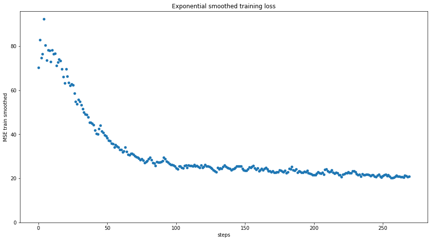
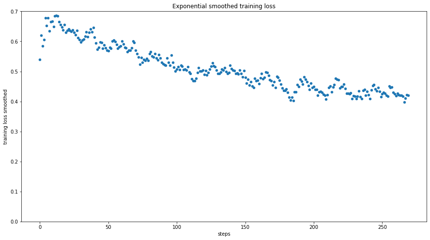
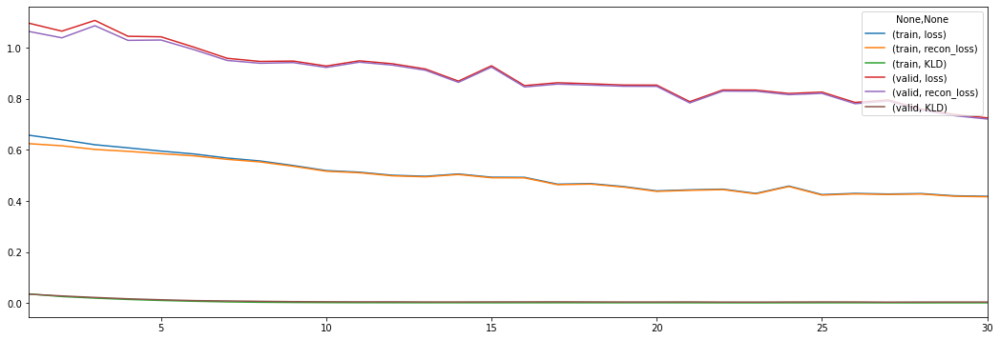
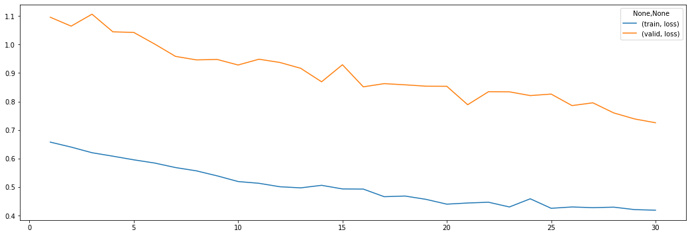

# Experiment 1


```python
import numpy as np
import torch

from src import config
from src.analyzers import *
from vaep.transform import StandardScaler, get_df_fitted_mean_std
```

    FOLDER_MQ_TXT_DATA = data\mq_out
    


```python
import logging
from src.logging import setup_logger

logger = logging.getLogger()  # returns root-logger
logger.setLevel(logging.CRITICAL)  # silence for everything else
logger.handlers = []


logger = setup_logger(logger=logging.getLogger('vaep'))
logger.info("Experiment 01")
```

    vaep - INFO     Experiment 01
    

## Load data

- 1000 features (most abundant peptides)
- later a subset of samples is selected


```python
N_SAMPLES_TO_LOAD = None
FN_PEPTIDE_INTENSITIES = config.FOLDER_DATA / 'df_intensities_N_07813_M01000'
FN_PEPTIDE_INTENSITIES = config.FOLDER_DATA / 'df_intensities_N_00090_M01000'

analysis = AnalyzePeptides(
    fname=FN_PEPTIDE_INTENSITIES, nrows=N_SAMPLES_TO_LOAD)
analysis.df = analysis.df.sort_index()  # sort by date
assert analysis.df.index.is_unique, "Non-unique training samples"
analysis
```


    AnalyzePeptides with attributes: df, stats


### Select consecutives samples for training


```python
import random
from vaep.utils import sample_iterable

N_SAMPLES = min(len(analysis.df), 1000)
logger.info(f"Selected {N_SAMPLES}")
analysis.N_SAMPLES = N_SAMPLES

M = 10

columns_selected = sorted(sample_iterable(list(analysis.df.columns), n=M))
analysis.df = analysis.df.loc[:, columns_selected]


def get_consecutive_data_indices(index, n_samples=N_SAMPLES):
    start_sample = len(index) - n_samples
    start_sample = random.randint(0, start_sample)
    return index[start_sample:start_sample+n_samples]


indices_selected = get_consecutive_data_indices(analysis.df.index)
analysis.samples = indices_selected
analysis.df = analysis.df.loc[indices_selected]

from numpy import log2
LOG_TRANSFORM = log2 # None
if LOG_TRANSFORM:
    analysis.df = LOG_TRANSFORM(analysis.df)

FRACTION = 0.8

class Indices(SimpleNamespace):
    pass


indices = Indices()
indices.train, indices.valid = indices_selected[:int(
    FRACTION*N_SAMPLES)], indices_selected[int(FRACTION*N_SAMPLES):]
analysis.indices = indices

analysis.df_train = analysis.df.loc[indices.train]
analysis.df_valid = analysis.df.loc[indices.valid]

# analysis.df
```

    vaep - INFO     Selected 90
    

### Training and Validation datasets


```python
n_samples, n_features = analysis.df.shape
msg = "Total:\nN samples: {:10,d} - N Peptides: {:10,d}\n".format(n_samples, n_features)
n_train, n_valid = len(analysis.df_train), len(analysis.df_valid)
msg += "N train set: {:8,d} - N valid set: {:9,d}".format(n_train, n_valid)
print(msg)
```

    Total:
    N samples:         90 - N Peptides:         10
    N train set:       72 - N valid set:        18
    


```python
detection_limit = analysis.df.min().min() if LOG_TRANSFORM else np.log10(analysis.df).min().min() # all zeros become nan.
"Detection limit: {:6.3f}, corresponding to intensity value of {:,d}".format(
    detection_limit,
    int(10 ** detection_limit)
)
```


    'Detection limit: 23.835, corresponding to intensity value of 683,899,892,098,778,800,324,608'


### Create meta data from filename


```python
from src import metadata

data_meta = metadata.get_metadata_from_filenames(indices_selected)
analysis.df_meta = pd.DataFrame.from_dict(
    data_meta, orient='index')
# analysis.df_meta['date'] = pd.to_datetime(analysis.df_meta['date'])
analysis.df_meta
```


<div>

<table border="1" class="dataframe">
  <thead>
    <tr style="text-align: right;">
      <th></th>
      <th>date</th>
      <th>ms_instrument</th>
      <th>researcher</th>
      <th>lc_instrument</th>
      <th>rest</th>
    </tr>
  </thead>
  <tbody>
    <tr>
      <th>20151128_QE7_UPLC11_RJC_DEV_columnsTest_HeLa_01</th>
      <td>20151128</td>
      <td>QE7</td>
      <td>RJC</td>
      <td>LC11</td>
      <td>UPDEV_columnsTest_HeLa_01</td>
    </tr>
    <tr>
      <th>20160105_QE6_nLC4_MM_QC_MNT_HELA_01_170106201806</th>
      <td>20160105</td>
      <td>QE6</td>
      <td>MM</td>
      <td>nLC4</td>
      <td>QC_MNT_HELA_01_170106201806</td>
    </tr>
    <tr>
      <th>20160311_QE6_LC6_SCL_QC_MNT_HeLa_01</th>
      <td>20160311</td>
      <td>QE6</td>
      <td>SCL</td>
      <td>LC6</td>
      <td>QC_MNT_HeLa_01</td>
    </tr>
    <tr>
      <th>20160401_QE6_nLC6_ASD_QC_HELA_03</th>
      <td>20160401</td>
      <td>QE6</td>
      <td>ASD</td>
      <td>nLC6</td>
      <td>QC_HELA_03</td>
    </tr>
    <tr>
      <th>20160404_QE2_nlc1_QC_hela_160404210125</th>
      <td>20160404</td>
      <td>QE2</td>
      <td>QC</td>
      <td>nlc1</td>
      <td>hela_160404210125</td>
    </tr>
    <tr>
      <th>...</th>
      <td>...</td>
      <td>...</td>
      <td>...</td>
      <td>...</td>
      <td>...</td>
    </tr>
    <tr>
      <th>20190527_QE4_LC12_AS_QC_MNT_HeLa_02</th>
      <td>20190527</td>
      <td>QE4</td>
      <td>AS</td>
      <td>LC12</td>
      <td>QC_MNT_HeLa_02</td>
    </tr>
    <tr>
      <th>20190701_QE4_LC12_IAH_QC_MNT_HeLa_03</th>
      <td>20190701</td>
      <td>QE4</td>
      <td>IAH</td>
      <td>LC12</td>
      <td>QC_MNT_HeLa_03</td>
    </tr>
    <tr>
      <th>20190708_QE6_nLC4_JE_QC_MNT_HeLa_01</th>
      <td>20190708</td>
      <td>QE6</td>
      <td>JE</td>
      <td>nLC4</td>
      <td>QC_MNT_HeLa_01</td>
    </tr>
    <tr>
      <th>20191128_QE8_nLC9_ASD_QC_HeLa_1</th>
      <td>20191128</td>
      <td>QE8</td>
      <td>ASD</td>
      <td>nLC9</td>
      <td>QC_HeLa_1</td>
    </tr>
    <tr>
      <th>20191128_QE8_nLC9_ASD_QC_HeLa_1_20191128165313</th>
      <td>20191128</td>
      <td>QE8</td>
      <td>ASD</td>
      <td>nLC9</td>
      <td>QC_HeLa_1_20191128165313</td>
    </tr>
  </tbody>
</table>
<p>90 rows × 5 columns</p>
</div>


- possibility to group data in time along `(machine, lc)` pairs


```python
analysis.df_meta.loc[indices.train].describe(datetime_is_numeric=False)
```


<div>

<table border="1" class="dataframe">
  <thead>
    <tr style="text-align: right;">
      <th></th>
      <th>date</th>
      <th>ms_instrument</th>
      <th>researcher</th>
      <th>lc_instrument</th>
      <th>rest</th>
    </tr>
  </thead>
  <tbody>
    <tr>
      <th>count</th>
      <td>72</td>
      <td>72</td>
      <td>72</td>
      <td>72</td>
      <td>72</td>
    </tr>
    <tr>
      <th>unique</th>
      <td>51</td>
      <td>11</td>
      <td>27</td>
      <td>17</td>
      <td>58</td>
    </tr>
    <tr>
      <th>top</th>
      <td>20180601</td>
      <td>QE7</td>
      <td>MR</td>
      <td>nLC1</td>
      <td>QC_MNT_HeLa_01</td>
    </tr>
    <tr>
      <th>freq</th>
      <td>7</td>
      <td>10</td>
      <td>15</td>
      <td>9</td>
      <td>5</td>
    </tr>
  </tbody>
</table>
</div>


```python
# This becomes part of analysis
def compare_meta_data_for_splits(meta, indices):

    _indices = vars(indices)
    logger.info('Found vars: {}'.format(', '.join(str(x)
                                                  for x in _indices.keys())))

    for key_split, split in _indices.items():
        print(f"{key_split:8} - split description:")
        display(
            meta.loc[split].describe(datetime_is_numeric=True)
        )

    _meta_features = list(meta.columns)

    for _column in _meta_features:
        display(
            _=pd.DataFrame({
                key_split: meta.loc[split, _column].value_counts(normalize=True) for key_split, split in _indices.items()
            }).sort_index().plot(kind='line', rot=90, figsize=(10, 5), title=f"{_column} value Counts for different splits")
        )


compare_meta_data_for_splits(analysis.df_meta.iloc[:, :2], indices)
```

    vaep - INFO     Found vars: train, valid
    train    - split description:
    


<div>

<table border="1" class="dataframe">
  <thead>
    <tr style="text-align: right;">
      <th></th>
      <th>date</th>
      <th>ms_instrument</th>
    </tr>
  </thead>
  <tbody>
    <tr>
      <th>count</th>
      <td>72</td>
      <td>72</td>
    </tr>
    <tr>
      <th>unique</th>
      <td>51</td>
      <td>11</td>
    </tr>
    <tr>
      <th>top</th>
      <td>20180601</td>
      <td>QE7</td>
    </tr>
    <tr>
      <th>freq</th>
      <td>7</td>
      <td>10</td>
    </tr>
  </tbody>
</table>
</div>


    valid    - split description:
    


<div>

<table border="1" class="dataframe">
  <thead>
    <tr style="text-align: right;">
      <th></th>
      <th>date</th>
      <th>ms_instrument</th>
    </tr>
  </thead>
  <tbody>
    <tr>
      <th>count</th>
      <td>18</td>
      <td>18</td>
    </tr>
    <tr>
      <th>unique</th>
      <td>16</td>
      <td>8</td>
    </tr>
    <tr>
      <th>top</th>
      <td>20190527</td>
      <td>QE5</td>
    </tr>
    <tr>
      <th>freq</th>
      <td>2</td>
      <td>4</td>
    </tr>
  </tbody>
</table>
</div>


    

    


    

    


### Analysis state so far


```python
analysis
```


    AnalyzePeptides with attributes: N_SAMPLES, df, df_meta, df_train, df_valid, indices, samples, stats


### Correlation


```python
corr_lower_triangle(analysis.df)
```


<div>

<table border="1" class="dataframe">
  <thead>
    <tr style="text-align: right;">
      <th></th>
      <th>AAHSEGNTTAGLDMR</th>
      <th>AQIFANTVDNAR</th>
      <th>EFHLNESGDPSSK</th>
      <th>FNADEFEDMVAEK</th>
      <th>GFGFGLVK</th>
      <th>GHFGPINSVAFHPDGK</th>
      <th>IITLTGPTNAIFK</th>
      <th>LVQDVANNTNEEAGDGTTTATVLAR</th>
      <th>VIHDNFGIVEGLMTTVHAITATQK</th>
      <th>VVVAENFDEIVNNENK</th>
    </tr>
  </thead>
  <tbody>
    <tr>
      <th>AAHSEGNTTAGLDMR</th>
      <td>NaN</td>
      <td>NaN</td>
      <td>NaN</td>
      <td>NaN</td>
      <td>NaN</td>
      <td>NaN</td>
      <td>NaN</td>
      <td>NaN</td>
      <td>NaN</td>
      <td>NaN</td>
    </tr>
    <tr>
      <th>AQIFANTVDNAR</th>
      <td>0.362</td>
      <td>NaN</td>
      <td>NaN</td>
      <td>NaN</td>
      <td>NaN</td>
      <td>NaN</td>
      <td>NaN</td>
      <td>NaN</td>
      <td>NaN</td>
      <td>NaN</td>
    </tr>
    <tr>
      <th>EFHLNESGDPSSK</th>
      <td>0.517</td>
      <td>0.725</td>
      <td>NaN</td>
      <td>NaN</td>
      <td>NaN</td>
      <td>NaN</td>
      <td>NaN</td>
      <td>NaN</td>
      <td>NaN</td>
      <td>NaN</td>
    </tr>
    <tr>
      <th>FNADEFEDMVAEK</th>
      <td>0.454</td>
      <td>0.768</td>
      <td>0.825</td>
      <td>NaN</td>
      <td>NaN</td>
      <td>NaN</td>
      <td>NaN</td>
      <td>NaN</td>
      <td>NaN</td>
      <td>NaN</td>
    </tr>
    <tr>
      <th>GFGFGLVK</th>
      <td>0.286</td>
      <td>0.636</td>
      <td>0.770</td>
      <td>0.718</td>
      <td>NaN</td>
      <td>NaN</td>
      <td>NaN</td>
      <td>NaN</td>
      <td>NaN</td>
      <td>NaN</td>
    </tr>
    <tr>
      <th>GHFGPINSVAFHPDGK</th>
      <td>0.319</td>
      <td>0.662</td>
      <td>0.659</td>
      <td>0.704</td>
      <td>0.626</td>
      <td>NaN</td>
      <td>NaN</td>
      <td>NaN</td>
      <td>NaN</td>
      <td>NaN</td>
    </tr>
    <tr>
      <th>IITLTGPTNAIFK</th>
      <td>0.517</td>
      <td>0.511</td>
      <td>0.660</td>
      <td>0.669</td>
      <td>0.539</td>
      <td>0.472</td>
      <td>NaN</td>
      <td>NaN</td>
      <td>NaN</td>
      <td>NaN</td>
    </tr>
    <tr>
      <th>LVQDVANNTNEEAGDGTTTATVLAR</th>
      <td>0.266</td>
      <td>0.400</td>
      <td>0.609</td>
      <td>0.552</td>
      <td>0.599</td>
      <td>0.422</td>
      <td>0.520</td>
      <td>NaN</td>
      <td>NaN</td>
      <td>NaN</td>
    </tr>
    <tr>
      <th>VIHDNFGIVEGLMTTVHAITATQK</th>
      <td>0.194</td>
      <td>0.563</td>
      <td>0.598</td>
      <td>0.607</td>
      <td>0.610</td>
      <td>0.512</td>
      <td>0.415</td>
      <td>0.357</td>
      <td>NaN</td>
      <td>NaN</td>
    </tr>
    <tr>
      <th>VVVAENFDEIVNNENK</th>
      <td>0.463</td>
      <td>0.799</td>
      <td>0.794</td>
      <td>0.865</td>
      <td>0.695</td>
      <td>0.630</td>
      <td>0.687</td>
      <td>0.645</td>
      <td>0.524</td>
      <td>NaN</td>
    </tr>
  </tbody>
</table>
</div>


### Results

Helper function and results dictionary


```python
analysis.results = {}
def describe_abs_diff(y_true: pd.DataFrame, y_pred: pd.DataFrame):
    _abs_diff = y_true - y_pred
    return _abs_diff.abs().describe().to_dict()
```

## Baseline supervised RF models

- M RandomForest baseline models, each predicting one feature based on the M-1 other features
- get an idea of a possible baseline performance
    - could be used together with imputation of inputs
    - with some effort this could be scaled to predict only missing peptides


```python
from sklearn.ensemble import RandomForestRegressor
from sklearn.metrics import mean_squared_error
metrics = {}


peptides = list(analysis.df_train.columns)
metrics = {}
pred_valid = {}

for i in range(M):
    train_columns = list(range(M))
    test_column = i
    train_columns.remove(i)
    train_columns = [peptides[i] for i in train_columns]
    test_column = peptides[test_column]
    logger.debug(
        f"Train columns: {', '.join(train_columns)}\nTest column: {test_column}")
    _df_train, _y_train = analysis.df_train[train_columns], analysis.df_train[test_column]
    _df_valid, _y_valid = analysis.df_valid[train_columns], analysis.df_valid[test_column]
    rf_reg = RandomForestRegressor()
    rf_reg.fit(X=_df_train, y=_y_train)
    # metrics
    _metrics = {}
    _metrics[('MSE', 'train')] = mean_squared_error(
        y_true=_y_train, y_pred=rf_reg.predict(_df_train))
    y_pred_valid = rf_reg.predict(_df_valid)
    _metrics[('MSE', 'valid')] = mean_squared_error(
        y_true=_y_valid, y_pred=y_pred_valid)
    metrics[test_column] = _metrics
    # predictions
    pred_valid[test_column] = y_pred_valid
pd.DataFrame(metrics)
```


<div>

<table border="1" class="dataframe">
  <thead>
    <tr style="text-align: right;">
      <th></th>
      <th></th>
      <th>AAHSEGNTTAGLDMR</th>
      <th>AQIFANTVDNAR</th>
      <th>EFHLNESGDPSSK</th>
      <th>FNADEFEDMVAEK</th>
      <th>GFGFGLVK</th>
      <th>GHFGPINSVAFHPDGK</th>
      <th>IITLTGPTNAIFK</th>
      <th>LVQDVANNTNEEAGDGTTTATVLAR</th>
      <th>VIHDNFGIVEGLMTTVHAITATQK</th>
      <th>VVVAENFDEIVNNENK</th>
    </tr>
  </thead>
  <tbody>
    <tr>
      <th rowspan="2" valign="top">MSE</th>
      <th>train</th>
      <td>0.125</td>
      <td>0.027</td>
      <td>0.021</td>
      <td>0.025</td>
      <td>0.037</td>
      <td>0.055</td>
      <td>0.017</td>
      <td>0.096</td>
      <td>0.178</td>
      <td>0.015</td>
    </tr>
    <tr>
      <th>valid</th>
      <td>3.182</td>
      <td>0.255</td>
      <td>0.191</td>
      <td>0.101</td>
      <td>0.230</td>
      <td>0.668</td>
      <td>1.213</td>
      <td>0.489</td>
      <td>2.053</td>
      <td>0.067</td>
    </tr>
  </tbody>
</table>
</div>


```python
analysis.pred_rf = pd.DataFrame(pred_valid, index=analysis.df_valid.index)
analysis.pred_rf
```


<div>

<table border="1" class="dataframe">
  <thead>
    <tr style="text-align: right;">
      <th></th>
      <th>AAHSEGNTTAGLDMR</th>
      <th>AQIFANTVDNAR</th>
      <th>EFHLNESGDPSSK</th>
      <th>FNADEFEDMVAEK</th>
      <th>GFGFGLVK</th>
      <th>GHFGPINSVAFHPDGK</th>
      <th>IITLTGPTNAIFK</th>
      <th>LVQDVANNTNEEAGDGTTTATVLAR</th>
      <th>VIHDNFGIVEGLMTTVHAITATQK</th>
      <th>VVVAENFDEIVNNENK</th>
    </tr>
    <tr>
      <th>Sample ID</th>
      <th></th>
      <th></th>
      <th></th>
      <th></th>
      <th></th>
      <th></th>
      <th></th>
      <th></th>
      <th></th>
      <th></th>
    </tr>
  </thead>
  <tbody>
    <tr>
      <th>20181029_QE3_nLC3_KBE_QC_MNT_HELA_02</th>
      <td>26.915</td>
      <td>29.705</td>
      <td>29.098</td>
      <td>28.012</td>
      <td>27.274</td>
      <td>27.085</td>
      <td>28.207</td>
      <td>30.311</td>
      <td>30.942</td>
      <td>28.311</td>
    </tr>
    <tr>
      <th>20181102_QE2_NLC10_MR_QC_MNT_HELA_01</th>
      <td>27.241</td>
      <td>30.733</td>
      <td>30.551</td>
      <td>29.433</td>
      <td>27.991</td>
      <td>28.510</td>
      <td>29.523</td>
      <td>29.322</td>
      <td>34.613</td>
      <td>29.685</td>
    </tr>
    <tr>
      <th>20181107_QE6_nLC12_MR_QC_MNT_HELA_New_01</th>
      <td>28.418</td>
      <td>30.700</td>
      <td>30.721</td>
      <td>29.313</td>
      <td>28.393</td>
      <td>28.453</td>
      <td>29.378</td>
      <td>31.374</td>
      <td>34.353</td>
      <td>29.597</td>
    </tr>
    <tr>
      <th>20181110_QE5_nLC5_OOE_QC_MNT_HELA_15cm_250ng_RO-003</th>
      <td>26.593</td>
      <td>29.625</td>
      <td>28.869</td>
      <td>27.712</td>
      <td>26.849</td>
      <td>27.073</td>
      <td>28.105</td>
      <td>30.147</td>
      <td>31.463</td>
      <td>28.193</td>
    </tr>
    <tr>
      <th>20181112_QE7_nLC11_MEM_QC_HeLa_02</th>
      <td>28.061</td>
      <td>30.790</td>
      <td>30.793</td>
      <td>29.787</td>
      <td>28.509</td>
      <td>28.612</td>
      <td>29.608</td>
      <td>31.981</td>
      <td>34.670</td>
      <td>29.476</td>
    </tr>
    <tr>
      <th>20181119_QE1_nLC2_TW_QC_HeLa_1</th>
      <td>27.747</td>
      <td>30.879</td>
      <td>30.538</td>
      <td>29.320</td>
      <td>28.192</td>
      <td>28.258</td>
      <td>29.366</td>
      <td>31.062</td>
      <td>34.198</td>
      <td>29.216</td>
    </tr>
    <tr>
      <th>20181120_QE5_nLC7_AP_HeLa_2</th>
      <td>28.305</td>
      <td>30.344</td>
      <td>30.076</td>
      <td>29.039</td>
      <td>28.221</td>
      <td>28.239</td>
      <td>29.324</td>
      <td>31.123</td>
      <td>33.471</td>
      <td>28.921</td>
    </tr>
    <tr>
      <th>20181126_QE2_NLC10_MN_QC_HELA_02</th>
      <td>28.482</td>
      <td>30.821</td>
      <td>30.347</td>
      <td>29.080</td>
      <td>28.037</td>
      <td>28.020</td>
      <td>29.180</td>
      <td>30.990</td>
      <td>34.282</td>
      <td>29.127</td>
    </tr>
    <tr>
      <th>20181205_QE5_nLC7_RJC_QC_MNT_HeLa_2</th>
      <td>27.412</td>
      <td>29.433</td>
      <td>28.939</td>
      <td>27.620</td>
      <td>27.120</td>
      <td>27.064</td>
      <td>28.031</td>
      <td>30.096</td>
      <td>31.551</td>
      <td>27.871</td>
    </tr>
    <tr>
      <th>20181215_QE2_NLC10_ANHO_QC_MNT_HELA_04</th>
      <td>27.863</td>
      <td>31.524</td>
      <td>30.548</td>
      <td>29.232</td>
      <td>28.462</td>
      <td>28.326</td>
      <td>29.323</td>
      <td>31.432</td>
      <td>33.323</td>
      <td>29.288</td>
    </tr>
    <tr>
      <th>20181219_QE1_nLC2_GP_QC_MNT_HELA_01</th>
      <td>28.039</td>
      <td>30.527</td>
      <td>29.953</td>
      <td>28.437</td>
      <td>27.508</td>
      <td>27.610</td>
      <td>29.006</td>
      <td>30.509</td>
      <td>33.337</td>
      <td>28.799</td>
    </tr>
    <tr>
      <th>20190107_QE5_nLC5_DS_QC_MNT_HeLa_FlashPack_02</th>
      <td>28.314</td>
      <td>30.632</td>
      <td>30.445</td>
      <td>29.517</td>
      <td>28.317</td>
      <td>27.951</td>
      <td>29.680</td>
      <td>31.643</td>
      <td>34.337</td>
      <td>29.212</td>
    </tr>
    <tr>
      <th>20190527_QE4_LC12_AS_QC_MNT_HeLa_01</th>
      <td>27.910</td>
      <td>31.592</td>
      <td>30.974</td>
      <td>30.097</td>
      <td>28.597</td>
      <td>28.327</td>
      <td>29.912</td>
      <td>31.739</td>
      <td>34.154</td>
      <td>29.534</td>
    </tr>
    <tr>
      <th>20190527_QE4_LC12_AS_QC_MNT_HeLa_02</th>
      <td>27.931</td>
      <td>31.539</td>
      <td>31.055</td>
      <td>30.099</td>
      <td>28.628</td>
      <td>28.606</td>
      <td>29.925</td>
      <td>31.891</td>
      <td>34.460</td>
      <td>29.605</td>
    </tr>
    <tr>
      <th>20190701_QE4_LC12_IAH_QC_MNT_HeLa_03</th>
      <td>27.683</td>
      <td>31.340</td>
      <td>30.804</td>
      <td>29.993</td>
      <td>28.673</td>
      <td>28.424</td>
      <td>29.964</td>
      <td>31.884</td>
      <td>34.106</td>
      <td>29.758</td>
    </tr>
    <tr>
      <th>20190708_QE6_nLC4_JE_QC_MNT_HeLa_01</th>
      <td>29.778</td>
      <td>31.631</td>
      <td>31.071</td>
      <td>30.287</td>
      <td>28.797</td>
      <td>28.917</td>
      <td>30.201</td>
      <td>31.955</td>
      <td>35.153</td>
      <td>30.243</td>
    </tr>
    <tr>
      <th>20191128_QE8_nLC9_ASD_QC_HeLa_1</th>
      <td>29.078</td>
      <td>31.707</td>
      <td>31.268</td>
      <td>30.424</td>
      <td>28.664</td>
      <td>28.545</td>
      <td>30.391</td>
      <td>31.818</td>
      <td>34.575</td>
      <td>30.213</td>
    </tr>
    <tr>
      <th>20191128_QE8_nLC9_ASD_QC_HeLa_1_20191128165313</th>
      <td>29.027</td>
      <td>31.614</td>
      <td>31.244</td>
      <td>30.412</td>
      <td>28.524</td>
      <td>28.221</td>
      <td>30.246</td>
      <td>31.800</td>
      <td>34.691</td>
      <td>30.259</td>
    </tr>
  </tbody>
</table>
</div>


Overfits to training data as it should.


```python
analysis.df_valid
```


<div>

<table border="1" class="dataframe">
  <thead>
    <tr style="text-align: right;">
      <th></th>
      <th>AAHSEGNTTAGLDMR</th>
      <th>AQIFANTVDNAR</th>
      <th>EFHLNESGDPSSK</th>
      <th>FNADEFEDMVAEK</th>
      <th>GFGFGLVK</th>
      <th>GHFGPINSVAFHPDGK</th>
      <th>IITLTGPTNAIFK</th>
      <th>LVQDVANNTNEEAGDGTTTATVLAR</th>
      <th>VIHDNFGIVEGLMTTVHAITATQK</th>
      <th>VVVAENFDEIVNNENK</th>
    </tr>
    <tr>
      <th>Sample ID</th>
      <th></th>
      <th></th>
      <th></th>
      <th></th>
      <th></th>
      <th></th>
      <th></th>
      <th></th>
      <th></th>
      <th></th>
    </tr>
  </thead>
  <tbody>
    <tr>
      <th>20181029_QE3_nLC3_KBE_QC_MNT_HELA_02</th>
      <td>27.956</td>
      <td>29.817</td>
      <td>29.456</td>
      <td>27.656</td>
      <td>27.132</td>
      <td>27.241</td>
      <td>28.236</td>
      <td>30.481</td>
      <td>33.591</td>
      <td>28.224</td>
    </tr>
    <tr>
      <th>20181102_QE2_NLC10_MR_QC_MNT_HELA_01</th>
      <td>25.400</td>
      <td>31.561</td>
      <td>30.700</td>
      <td>29.704</td>
      <td>29.378</td>
      <td>28.823</td>
      <td>25.014</td>
      <td>31.743</td>
      <td>34.523</td>
      <td>29.635</td>
    </tr>
    <tr>
      <th>20181107_QE6_nLC12_MR_QC_MNT_HELA_New_01</th>
      <td>24.494</td>
      <td>31.351</td>
      <td>30.458</td>
      <td>29.707</td>
      <td>28.484</td>
      <td>28.636</td>
      <td>29.766</td>
      <td>31.257</td>
      <td>35.195</td>
      <td>29.434</td>
    </tr>
    <tr>
      <th>20181110_QE5_nLC5_OOE_QC_MNT_HELA_15cm_250ng_RO-003</th>
      <td>26.772</td>
      <td>29.680</td>
      <td>29.020</td>
      <td>27.594</td>
      <td>27.499</td>
      <td>26.780</td>
      <td>28.326</td>
      <td>29.906</td>
      <td>33.474</td>
      <td>27.585</td>
    </tr>
    <tr>
      <th>20181112_QE7_nLC11_MEM_QC_HeLa_02</th>
      <td>28.447</td>
      <td>31.510</td>
      <td>30.794</td>
      <td>29.653</td>
      <td>29.150</td>
      <td>28.478</td>
      <td>29.747</td>
      <td>32.064</td>
      <td>34.095</td>
      <td>29.635</td>
    </tr>
    <tr>
      <th>20181119_QE1_nLC2_TW_QC_HeLa_1</th>
      <td>24.904</td>
      <td>30.993</td>
      <td>30.107</td>
      <td>29.459</td>
      <td>28.101</td>
      <td>28.707</td>
      <td>29.228</td>
      <td>31.348</td>
      <td>33.712</td>
      <td>29.428</td>
    </tr>
    <tr>
      <th>20181120_QE5_nLC7_AP_HeLa_2</th>
      <td>28.346</td>
      <td>30.528</td>
      <td>30.361</td>
      <td>29.028</td>
      <td>28.730</td>
      <td>27.195</td>
      <td>29.827</td>
      <td>30.812</td>
      <td>34.918</td>
      <td>29.011</td>
    </tr>
    <tr>
      <th>20181126_QE2_NLC10_MN_QC_HELA_02</th>
      <td>26.306</td>
      <td>30.465</td>
      <td>29.782</td>
      <td>29.125</td>
      <td>28.164</td>
      <td>28.206</td>
      <td>29.117</td>
      <td>31.243</td>
      <td>33.639</td>
      <td>29.216</td>
    </tr>
    <tr>
      <th>20181205_QE5_nLC7_RJC_QC_MNT_HeLa_2</th>
      <td>27.179</td>
      <td>29.451</td>
      <td>29.358</td>
      <td>27.915</td>
      <td>26.798</td>
      <td>26.028</td>
      <td>28.032</td>
      <td>29.596</td>
      <td>33.680</td>
      <td>27.838</td>
    </tr>
    <tr>
      <th>20181215_QE2_NLC10_ANHO_QC_MNT_HELA_04</th>
      <td>28.494</td>
      <td>30.809</td>
      <td>30.328</td>
      <td>29.676</td>
      <td>27.857</td>
      <td>27.121</td>
      <td>29.708</td>
      <td>31.590</td>
      <td>34.334</td>
      <td>29.797</td>
    </tr>
    <tr>
      <th>20181219_QE1_nLC2_GP_QC_MNT_HELA_01</th>
      <td>27.464</td>
      <td>29.905</td>
      <td>29.728</td>
      <td>28.934</td>
      <td>28.086</td>
      <td>27.706</td>
      <td>28.678</td>
      <td>30.378</td>
      <td>32.684</td>
      <td>28.532</td>
    </tr>
    <tr>
      <th>20190107_QE5_nLC5_DS_QC_MNT_HeLa_FlashPack_02</th>
      <td>28.212</td>
      <td>30.430</td>
      <td>31.207</td>
      <td>29.135</td>
      <td>28.272</td>
      <td>28.608</td>
      <td>28.994</td>
      <td>31.456</td>
      <td>34.572</td>
      <td>29.358</td>
    </tr>
    <tr>
      <th>20190527_QE4_LC12_AS_QC_MNT_HeLa_01</th>
      <td>29.119</td>
      <td>30.834</td>
      <td>31.474</td>
      <td>29.512</td>
      <td>28.716</td>
      <td>28.425</td>
      <td>30.139</td>
      <td>32.092</td>
      <td>35.631</td>
      <td>29.874</td>
    </tr>
    <tr>
      <th>20190527_QE4_LC12_AS_QC_MNT_HeLa_02</th>
      <td>28.943</td>
      <td>30.723</td>
      <td>31.434</td>
      <td>29.677</td>
      <td>28.734</td>
      <td>28.442</td>
      <td>30.203</td>
      <td>32.164</td>
      <td>35.590</td>
      <td>29.924</td>
    </tr>
    <tr>
      <th>20190701_QE4_LC12_IAH_QC_MNT_HeLa_03</th>
      <td>28.880</td>
      <td>31.047</td>
      <td>31.376</td>
      <td>29.957</td>
      <td>29.013</td>
      <td>26.288</td>
      <td>29.736</td>
      <td>32.056</td>
      <td>34.686</td>
      <td>29.746</td>
    </tr>
    <tr>
      <th>20190708_QE6_nLC4_JE_QC_MNT_HeLa_01</th>
      <td>26.021</td>
      <td>31.040</td>
      <td>31.480</td>
      <td>30.707</td>
      <td>29.119</td>
      <td>29.521</td>
      <td>29.988</td>
      <td>32.563</td>
      <td>35.320</td>
      <td>29.909</td>
    </tr>
    <tr>
      <th>20191128_QE8_nLC9_ASD_QC_HeLa_1</th>
      <td>30.657</td>
      <td>31.328</td>
      <td>31.653</td>
      <td>30.269</td>
      <td>28.629</td>
      <td>29.571</td>
      <td>30.154</td>
      <td>32.489</td>
      <td>33.541</td>
      <td>30.359</td>
    </tr>
    <tr>
      <th>20191128_QE8_nLC9_ASD_QC_HeLa_1_20191128165313</th>
      <td>30.785</td>
      <td>31.465</td>
      <td>32.088</td>
      <td>30.373</td>
      <td>28.640</td>
      <td>29.429</td>
      <td>30.350</td>
      <td>32.901</td>
      <td>31.347</td>
      <td>30.213</td>
    </tr>
  </tbody>
</table>
</div>


```python
analysis.results['RF baseline'] = describe_abs_diff(y_true=analysis.df_valid, y_pred=analysis.pred_rf)
pd.DataFrame(analysis.results['RF baseline'])
```


<div>

<table border="1" class="dataframe">
  <thead>
    <tr style="text-align: right;">
      <th></th>
      <th>AAHSEGNTTAGLDMR</th>
      <th>AQIFANTVDNAR</th>
      <th>EFHLNESGDPSSK</th>
      <th>FNADEFEDMVAEK</th>
      <th>GFGFGLVK</th>
      <th>GHFGPINSVAFHPDGK</th>
      <th>IITLTGPTNAIFK</th>
      <th>LVQDVANNTNEEAGDGTTTATVLAR</th>
      <th>VIHDNFGIVEGLMTTVHAITATQK</th>
      <th>VVVAENFDEIVNNENK</th>
    </tr>
  </thead>
  <tbody>
    <tr>
      <th>count</th>
      <td>18.000</td>
      <td>18.000</td>
      <td>18.000</td>
      <td>18.000</td>
      <td>18.000</td>
      <td>18.000</td>
      <td>18.000</td>
      <td>18.000</td>
      <td>18.000</td>
      <td>18.000</td>
    </tr>
    <tr>
      <th>mean</th>
      <td>1.360</td>
      <td>0.420</td>
      <td>0.384</td>
      <td>0.264</td>
      <td>0.346</td>
      <td>0.610</td>
      <td>0.482</td>
      <td>0.446</td>
      <td>1.139</td>
      <td>0.201</td>
    </tr>
    <tr>
      <th>std</th>
      <td>1.188</td>
      <td>0.289</td>
      <td>0.213</td>
      <td>0.182</td>
      <td>0.341</td>
      <td>0.559</td>
      <td>1.019</td>
      <td>0.554</td>
      <td>0.895</td>
      <td>0.167</td>
    </tr>
    <tr>
      <th>min</th>
      <td>0.041</td>
      <td>0.018</td>
      <td>0.001</td>
      <td>0.011</td>
      <td>0.035</td>
      <td>0.096</td>
      <td>0.001</td>
      <td>0.083</td>
      <td>0.090</td>
      <td>0.012</td>
    </tr>
    <tr>
      <th>25%</th>
      <td>0.434</td>
      <td>0.157</td>
      <td>0.235</td>
      <td>0.122</td>
      <td>0.109</td>
      <td>0.169</td>
      <td>0.138</td>
      <td>0.171</td>
      <td>0.577</td>
      <td>0.087</td>
    </tr>
    <tr>
      <th>50%</th>
      <td>1.119</td>
      <td>0.367</td>
      <td>0.382</td>
      <td>0.283</td>
      <td>0.232</td>
      <td>0.380</td>
      <td>0.227</td>
      <td>0.263</td>
      <td>0.926</td>
      <td>0.152</td>
    </tr>
    <tr>
      <th>75%</th>
      <td>1.820</td>
      <td>0.699</td>
      <td>0.482</td>
      <td>0.414</td>
      <td>0.560</td>
      <td>1.033</td>
      <td>0.370</td>
      <td>0.463</td>
      <td>1.469</td>
      <td>0.306</td>
    </tr>
    <tr>
      <th>max</th>
      <td>3.924</td>
      <td>0.828</td>
      <td>0.844</td>
      <td>0.586</td>
      <td>1.387</td>
      <td>2.136</td>
      <td>4.509</td>
      <td>2.421</td>
      <td>3.344</td>
      <td>0.608</td>
    </tr>
  </tbody>
</table>
</div>


Could a model help in identifying extraordinar differences in samples? Something to focus on?

## DL Setup


```python
from vaep.cmd import get_args

BATCH_SIZE, EPOCHS = 8, 30
args = get_args(batch_size=BATCH_SIZE, epochs=EPOCHS, no_cuda=True)  # data transfer to GPU seems slow
kwargs = {'num_workers': 2, 'pin_memory': True} if args.cuda else {}

# torch.manual_seed(args.seed)
device = torch.device("cuda" if args.cuda else "cpu")
device

print(args, device)
```

    Namespace(batch_size=8, cuda=False, epochs=30, log_interval=10, no_cuda=True, seed=43) cpu
    

## Simple AE
- should also heavily overfit the training data


```python
scaler = StandardScaler().fit(analysis.df_train)
# # five examples from validation dataset
scaler.transform(analysis.df_valid.iloc[:5])
```


<div>

<table border="1" class="dataframe">
  <thead>
    <tr style="text-align: right;">
      <th></th>
      <th>AAHSEGNTTAGLDMR</th>
      <th>AQIFANTVDNAR</th>
      <th>EFHLNESGDPSSK</th>
      <th>FNADEFEDMVAEK</th>
      <th>GFGFGLVK</th>
      <th>GHFGPINSVAFHPDGK</th>
      <th>IITLTGPTNAIFK</th>
      <th>LVQDVANNTNEEAGDGTTTATVLAR</th>
      <th>VIHDNFGIVEGLMTTVHAITATQK</th>
      <th>VVVAENFDEIVNNENK</th>
    </tr>
    <tr>
      <th>Sample ID</th>
      <th></th>
      <th></th>
      <th></th>
      <th></th>
      <th></th>
      <th></th>
      <th></th>
      <th></th>
      <th></th>
      <th></th>
    </tr>
  </thead>
  <tbody>
    <tr>
      <th>20181029_QE3_nLC3_KBE_QC_MNT_HELA_02</th>
      <td>-0.253</td>
      <td>-1.136</td>
      <td>-0.890</td>
      <td>-1.662</td>
      <td>-1.166</td>
      <td>-0.979</td>
      <td>-1.332</td>
      <td>-0.447</td>
      <td>-0.019</td>
      <td>-1.310</td>
    </tr>
    <tr>
      <th>20181102_QE2_NLC10_MR_QC_MNT_HELA_01</th>
      <td>-2.537</td>
      <td>1.216</td>
      <td>0.723</td>
      <td>0.677</td>
      <td>1.833</td>
      <td>1.003</td>
      <td>-5.866</td>
      <td>0.796</td>
      <td>0.617</td>
      <td>0.695</td>
    </tr>
    <tr>
      <th>20181107_QE6_nLC12_MR_QC_MNT_HELA_New_01</th>
      <td>-3.346</td>
      <td>0.932</td>
      <td>0.410</td>
      <td>0.681</td>
      <td>0.640</td>
      <td>0.769</td>
      <td>0.822</td>
      <td>0.318</td>
      <td>1.075</td>
      <td>0.409</td>
    </tr>
    <tr>
      <th>20181110_QE5_nLC5_OOE_QC_MNT_HELA_15cm_250ng_RO-003</th>
      <td>-1.311</td>
      <td>-1.321</td>
      <td>-1.455</td>
      <td>-1.733</td>
      <td>-0.676</td>
      <td>-1.557</td>
      <td>-1.206</td>
      <td>-1.013</td>
      <td>-0.100</td>
      <td>-2.217</td>
    </tr>
    <tr>
      <th>20181112_QE7_nLC11_MEM_QC_HeLa_02</th>
      <td>0.186</td>
      <td>1.147</td>
      <td>0.844</td>
      <td>0.620</td>
      <td>1.529</td>
      <td>0.571</td>
      <td>0.795</td>
      <td>1.112</td>
      <td>0.324</td>
      <td>0.694</td>
    </tr>
  </tbody>
</table>
</div>


```python
from torchvision import transforms
from torch.utils.data import DataLoader
from vaep.io.datasets import PeptideDatasetInMemoryNoMissings

tf_norm = None # replace with Normalizer

dataset_train = PeptideDatasetInMemoryNoMissings(data=scaler.transform(analysis.df_train), transform=tf_norm)
dataset_valid = PeptideDatasetInMemoryNoMissings(data=scaler.transform(analysis.df_valid), transform=tf_norm)
dl_train = DataLoader(dataset_train, batch_size=args.batch_size, shuffle=True)
dl_valid = DataLoader(dataset_valid, batch_size=args.batch_size, shuffle=False)
```

### Without Noise


```python
import vaep.model as vaep_model

model = vaep_model.Autoencoder(n_features=M, n_neurons=int(M/2), last_activation=None, dim_latent=3).double()
criterion = torch.nn.MSELoss(reduction='sum')

learning_rate = 1e-2

optimizer = torch.optim.Adam(
    model.parameters(),
    lr=learning_rate,
)

# Train standard autoencoder (AE)

train_losses, valid_losses = [], []

# do = nn.Dropout()  # for denoising AE
for epoch in range(args.epochs):
    # ===================train==========================
    for data in dl_train:
        model.train()
        data = data.to(device)
        # noise = do(torch.ones(data.shape)).to(device) # for denoising AE
        # data_corrupted = (data * noise).to(device)    # for denoising AE
        # ===================forward=====================
        output = model(data) 
        loss = criterion(output, data)
        # ===================backward====================
        optimizer.zero_grad()
        loss.backward()
        optimizer.step()
        train_losses.append(loss.item())
    # ===================validate========================
    for data in dl_valid:
        model.eval()
        data = data.to(device)
        output = model(data)
        loss = criterion(output, data)
        valid_losses.append(loss.item())
    
    # ===================log=============================
    print(f'epoch [{epoch + 1:03d}/{args.epochs}], '
          f'train-loss: {np.mean(train_losses[-len(dl_train):]):.4f},'
          f'valid-loss: {np.mean(valid_losses[-len(dl_valid):]):.4f}')
        
```

    epoch [001/30], train-loss: 78.5058,valid-loss: 82.5542
    epoch [002/30], train-loss: 67.6384,valid-loss: 71.3391
    epoch [003/30], train-loss: 53.8778,valid-loss: 59.2136
    epoch [004/30], train-loss: 43.2942,valid-loss: 52.2529
    epoch [005/30], train-loss: 37.4082,valid-loss: 47.6269
    epoch [006/30], train-loss: 32.7489,valid-loss: 45.5247
    epoch [007/30], train-loss: 30.1827,valid-loss: 44.7830
    epoch [008/30], train-loss: 28.6132,valid-loss: 44.4244
    epoch [009/30], train-loss: 27.4272,valid-loss: 43.8531
    epoch [010/30], train-loss: 26.3073,valid-loss: 43.0869
    epoch [011/30], train-loss: 25.6836,valid-loss: 42.5099
    epoch [012/30], train-loss: 25.3607,valid-loss: 43.3594
    epoch [013/30], train-loss: 24.9995,valid-loss: 42.8146
    epoch [014/30], train-loss: 24.8996,valid-loss: 42.7076
    epoch [015/30], train-loss: 24.6478,valid-loss: 41.9275
    epoch [016/30], train-loss: 24.2502,valid-loss: 41.8516
    epoch [017/30], train-loss: 24.0901,valid-loss: 42.5185
    epoch [018/30], train-loss: 24.2147,valid-loss: 40.4843
    epoch [019/30], train-loss: 23.3791,valid-loss: 40.2340
    epoch [020/30], train-loss: 23.3408,valid-loss: 39.6740
    epoch [021/30], train-loss: 22.7550,valid-loss: 39.7555
    epoch [022/30], train-loss: 22.4188,valid-loss: 39.2352
    epoch [023/30], train-loss: 22.6385,valid-loss: 40.6576
    epoch [024/30], train-loss: 22.7274,valid-loss: 39.5189
    epoch [025/30], train-loss: 22.2081,valid-loss: 40.4234
    epoch [026/30], train-loss: 21.9349,valid-loss: 38.8588
    epoch [027/30], train-loss: 21.3045,valid-loss: 38.7876
    epoch [028/30], train-loss: 21.0173,valid-loss: 39.4267
    epoch [029/30], train-loss: 20.7649,valid-loss: 39.1706
    epoch [030/30], train-loss: 20.5270,valid-loss: 39.2550
    


```python
df_train_losses = vaep_model.process_train_loss({'MSE train': train_losses})

# Plotting is boilerplate code:
_ = df_train_losses.plot(kind='scatter', x='steps', y='MSE train smoothed', figsize=(15,8),  title='Exponential smoothed training loss', ylim=(0,None))
df_train_losses.tail()
```


<div>

<table border="1" class="dataframe">
  <thead>
    <tr style="text-align: right;">
      <th></th>
      <th>steps</th>
      <th>MSE train</th>
      <th>MSE train smoothed</th>
    </tr>
  </thead>
  <tbody>
    <tr>
      <th>265</th>
      <td>265</td>
      <td>19.336</td>
      <td>20.488</td>
    </tr>
    <tr>
      <th>266</th>
      <td>266</td>
      <td>28.133</td>
      <td>21.252</td>
    </tr>
    <tr>
      <th>267</th>
      <td>267</td>
      <td>19.110</td>
      <td>21.038</td>
    </tr>
    <tr>
      <th>268</th>
      <td>268</td>
      <td>17.984</td>
      <td>20.733</td>
    </tr>
    <tr>
      <th>269</th>
      <td>269</td>
      <td>23.119</td>
      <td>20.971</td>
    </tr>
  </tbody>
</table>
</div>


    

    


```python
def get_pred(model, dataloader):
    pred = []
    model.eval()
    for data in dataloader:
        data = data.to(device)
        output = model(data)
        pred.append(output.detach().numpy())
    return pred

pred = get_pred(model, dl_valid)
analysis.pred_aa_simple = vaep_model.build_df_from_pred_batches(pred, scaler, index=analysis.df_valid.index, columns=analysis.df_valid.columns)
analysis.pred_aa_simple
```


<div>

<table border="1" class="dataframe">
  <thead>
    <tr style="text-align: right;">
      <th></th>
      <th>AAHSEGNTTAGLDMR</th>
      <th>AQIFANTVDNAR</th>
      <th>EFHLNESGDPSSK</th>
      <th>FNADEFEDMVAEK</th>
      <th>GFGFGLVK</th>
      <th>GHFGPINSVAFHPDGK</th>
      <th>IITLTGPTNAIFK</th>
      <th>LVQDVANNTNEEAGDGTTTATVLAR</th>
      <th>VIHDNFGIVEGLMTTVHAITATQK</th>
      <th>VVVAENFDEIVNNENK</th>
    </tr>
    <tr>
      <th>Sample ID</th>
      <th></th>
      <th></th>
      <th></th>
      <th></th>
      <th></th>
      <th></th>
      <th></th>
      <th></th>
      <th></th>
      <th></th>
    </tr>
  </thead>
  <tbody>
    <tr>
      <th>20181029_QE3_nLC3_KBE_QC_MNT_HELA_02</th>
      <td>27.520</td>
      <td>30.036</td>
      <td>29.472</td>
      <td>28.294</td>
      <td>27.373</td>
      <td>27.410</td>
      <td>28.514</td>
      <td>30.168</td>
      <td>32.614</td>
      <td>28.386</td>
    </tr>
    <tr>
      <th>20181102_QE2_NLC10_MR_QC_MNT_HELA_01</th>
      <td>26.965</td>
      <td>30.105</td>
      <td>29.714</td>
      <td>28.566</td>
      <td>27.978</td>
      <td>27.512</td>
      <td>28.846</td>
      <td>31.157</td>
      <td>33.634</td>
      <td>28.686</td>
    </tr>
    <tr>
      <th>20181107_QE6_nLC12_MR_QC_MNT_HELA_New_01</th>
      <td>27.442</td>
      <td>30.613</td>
      <td>30.300</td>
      <td>29.288</td>
      <td>28.634</td>
      <td>28.065</td>
      <td>29.524</td>
      <td>32.171</td>
      <td>34.649</td>
      <td>29.454</td>
    </tr>
    <tr>
      <th>20181110_QE5_nLC5_OOE_QC_MNT_HELA_15cm_250ng_RO-003</th>
      <td>27.004</td>
      <td>29.819</td>
      <td>29.307</td>
      <td>28.089</td>
      <td>27.378</td>
      <td>27.209</td>
      <td>28.398</td>
      <td>30.299</td>
      <td>32.611</td>
      <td>28.230</td>
    </tr>
    <tr>
      <th>20181112_QE7_nLC11_MEM_QC_HeLa_02</th>
      <td>28.583</td>
      <td>31.218</td>
      <td>30.845</td>
      <td>29.938</td>
      <td>28.881</td>
      <td>28.656</td>
      <td>29.929</td>
      <td>32.104</td>
      <td>35.096</td>
      <td>29.929</td>
    </tr>
    <tr>
      <th>20181119_QE1_nLC2_TW_QC_HeLa_1</th>
      <td>27.173</td>
      <td>30.394</td>
      <td>30.033</td>
      <td>28.996</td>
      <td>28.414</td>
      <td>27.823</td>
      <td>29.304</td>
      <td>32.008</td>
      <td>34.242</td>
      <td>29.279</td>
    </tr>
    <tr>
      <th>20181120_QE5_nLC7_AP_HeLa_2</th>
      <td>28.016</td>
      <td>30.751</td>
      <td>30.358</td>
      <td>29.331</td>
      <td>28.400</td>
      <td>28.173</td>
      <td>29.410</td>
      <td>31.464</td>
      <td>34.354</td>
      <td>29.302</td>
    </tr>
    <tr>
      <th>20181126_QE2_NLC10_MN_QC_HELA_02</th>
      <td>27.077</td>
      <td>30.267</td>
      <td>29.879</td>
      <td>28.807</td>
      <td>28.231</td>
      <td>27.684</td>
      <td>29.122</td>
      <td>31.716</td>
      <td>33.955</td>
      <td>29.079</td>
    </tr>
    <tr>
      <th>20181205_QE5_nLC7_RJC_QC_MNT_HeLa_2</th>
      <td>27.318</td>
      <td>29.780</td>
      <td>29.161</td>
      <td>27.934</td>
      <td>27.046</td>
      <td>27.155</td>
      <td>28.219</td>
      <td>29.782</td>
      <td>32.014</td>
      <td>28.100</td>
    </tr>
    <tr>
      <th>20181215_QE2_NLC10_ANHO_QC_MNT_HELA_04</th>
      <td>28.337</td>
      <td>30.904</td>
      <td>30.416</td>
      <td>29.477</td>
      <td>28.429</td>
      <td>28.282</td>
      <td>29.566</td>
      <td>31.715</td>
      <td>34.304</td>
      <td>29.655</td>
    </tr>
    <tr>
      <th>20181219_QE1_nLC2_GP_QC_MNT_HELA_01</th>
      <td>27.679</td>
      <td>30.213</td>
      <td>29.684</td>
      <td>28.538</td>
      <td>27.588</td>
      <td>27.591</td>
      <td>28.710</td>
      <td>30.405</td>
      <td>33.002</td>
      <td>28.578</td>
    </tr>
    <tr>
      <th>20190107_QE5_nLC5_DS_QC_MNT_HeLa_FlashPack_02</th>
      <td>28.282</td>
      <td>30.861</td>
      <td>30.449</td>
      <td>29.434</td>
      <td>28.395</td>
      <td>28.280</td>
      <td>29.453</td>
      <td>31.338</td>
      <td>34.367</td>
      <td>29.343</td>
    </tr>
    <tr>
      <th>20190527_QE4_LC12_AS_QC_MNT_HeLa_01</th>
      <td>28.882</td>
      <td>31.370</td>
      <td>30.986</td>
      <td>30.099</td>
      <td>28.935</td>
      <td>28.811</td>
      <td>30.019</td>
      <td>32.036</td>
      <td>35.201</td>
      <td>30.020</td>
    </tr>
    <tr>
      <th>20190527_QE4_LC12_AS_QC_MNT_HeLa_02</th>
      <td>28.828</td>
      <td>31.358</td>
      <td>30.982</td>
      <td>30.097</td>
      <td>28.960</td>
      <td>28.802</td>
      <td>30.032</td>
      <td>32.107</td>
      <td>35.234</td>
      <td>30.037</td>
    </tr>
    <tr>
      <th>20190701_QE4_LC12_IAH_QC_MNT_HeLa_03</th>
      <td>28.308</td>
      <td>31.024</td>
      <td>30.607</td>
      <td>29.692</td>
      <td>28.708</td>
      <td>28.430</td>
      <td>29.774</td>
      <td>32.102</td>
      <td>34.768</td>
      <td>29.842</td>
    </tr>
    <tr>
      <th>20190708_QE6_nLC4_JE_QC_MNT_HeLa_01</th>
      <td>28.141</td>
      <td>31.051</td>
      <td>30.747</td>
      <td>29.812</td>
      <td>28.940</td>
      <td>28.524</td>
      <td>29.901</td>
      <td>32.354</td>
      <td>35.169</td>
      <td>29.850</td>
    </tr>
    <tr>
      <th>20191128_QE8_nLC9_ASD_QC_HeLa_1</th>
      <td>29.727</td>
      <td>31.648</td>
      <td>31.122</td>
      <td>30.295</td>
      <td>28.751</td>
      <td>29.029</td>
      <td>30.079</td>
      <td>31.621</td>
      <td>34.914</td>
      <td>30.191</td>
    </tr>
    <tr>
      <th>20191128_QE8_nLC9_ASD_QC_HeLa_1_20191128165313</th>
      <td>29.677</td>
      <td>31.481</td>
      <td>30.871</td>
      <td>30.030</td>
      <td>28.440</td>
      <td>28.823</td>
      <td>29.866</td>
      <td>31.337</td>
      <td>34.373</td>
      <td>30.035</td>
    </tr>
  </tbody>
</table>
</div>


```python
display(analysis.df_valid) # true values
```


<div>

<table border="1" class="dataframe">
  <thead>
    <tr style="text-align: right;">
      <th></th>
      <th>AAHSEGNTTAGLDMR</th>
      <th>AQIFANTVDNAR</th>
      <th>EFHLNESGDPSSK</th>
      <th>FNADEFEDMVAEK</th>
      <th>GFGFGLVK</th>
      <th>GHFGPINSVAFHPDGK</th>
      <th>IITLTGPTNAIFK</th>
      <th>LVQDVANNTNEEAGDGTTTATVLAR</th>
      <th>VIHDNFGIVEGLMTTVHAITATQK</th>
      <th>VVVAENFDEIVNNENK</th>
    </tr>
    <tr>
      <th>Sample ID</th>
      <th></th>
      <th></th>
      <th></th>
      <th></th>
      <th></th>
      <th></th>
      <th></th>
      <th></th>
      <th></th>
      <th></th>
    </tr>
  </thead>
  <tbody>
    <tr>
      <th>20181029_QE3_nLC3_KBE_QC_MNT_HELA_02</th>
      <td>27.956</td>
      <td>29.817</td>
      <td>29.456</td>
      <td>27.656</td>
      <td>27.132</td>
      <td>27.241</td>
      <td>28.236</td>
      <td>30.481</td>
      <td>33.591</td>
      <td>28.224</td>
    </tr>
    <tr>
      <th>20181102_QE2_NLC10_MR_QC_MNT_HELA_01</th>
      <td>25.400</td>
      <td>31.561</td>
      <td>30.700</td>
      <td>29.704</td>
      <td>29.378</td>
      <td>28.823</td>
      <td>25.014</td>
      <td>31.743</td>
      <td>34.523</td>
      <td>29.635</td>
    </tr>
    <tr>
      <th>20181107_QE6_nLC12_MR_QC_MNT_HELA_New_01</th>
      <td>24.494</td>
      <td>31.351</td>
      <td>30.458</td>
      <td>29.707</td>
      <td>28.484</td>
      <td>28.636</td>
      <td>29.766</td>
      <td>31.257</td>
      <td>35.195</td>
      <td>29.434</td>
    </tr>
    <tr>
      <th>20181110_QE5_nLC5_OOE_QC_MNT_HELA_15cm_250ng_RO-003</th>
      <td>26.772</td>
      <td>29.680</td>
      <td>29.020</td>
      <td>27.594</td>
      <td>27.499</td>
      <td>26.780</td>
      <td>28.326</td>
      <td>29.906</td>
      <td>33.474</td>
      <td>27.585</td>
    </tr>
    <tr>
      <th>20181112_QE7_nLC11_MEM_QC_HeLa_02</th>
      <td>28.447</td>
      <td>31.510</td>
      <td>30.794</td>
      <td>29.653</td>
      <td>29.150</td>
      <td>28.478</td>
      <td>29.747</td>
      <td>32.064</td>
      <td>34.095</td>
      <td>29.635</td>
    </tr>
    <tr>
      <th>20181119_QE1_nLC2_TW_QC_HeLa_1</th>
      <td>24.904</td>
      <td>30.993</td>
      <td>30.107</td>
      <td>29.459</td>
      <td>28.101</td>
      <td>28.707</td>
      <td>29.228</td>
      <td>31.348</td>
      <td>33.712</td>
      <td>29.428</td>
    </tr>
    <tr>
      <th>20181120_QE5_nLC7_AP_HeLa_2</th>
      <td>28.346</td>
      <td>30.528</td>
      <td>30.361</td>
      <td>29.028</td>
      <td>28.730</td>
      <td>27.195</td>
      <td>29.827</td>
      <td>30.812</td>
      <td>34.918</td>
      <td>29.011</td>
    </tr>
    <tr>
      <th>20181126_QE2_NLC10_MN_QC_HELA_02</th>
      <td>26.306</td>
      <td>30.465</td>
      <td>29.782</td>
      <td>29.125</td>
      <td>28.164</td>
      <td>28.206</td>
      <td>29.117</td>
      <td>31.243</td>
      <td>33.639</td>
      <td>29.216</td>
    </tr>
    <tr>
      <th>20181205_QE5_nLC7_RJC_QC_MNT_HeLa_2</th>
      <td>27.179</td>
      <td>29.451</td>
      <td>29.358</td>
      <td>27.915</td>
      <td>26.798</td>
      <td>26.028</td>
      <td>28.032</td>
      <td>29.596</td>
      <td>33.680</td>
      <td>27.838</td>
    </tr>
    <tr>
      <th>20181215_QE2_NLC10_ANHO_QC_MNT_HELA_04</th>
      <td>28.494</td>
      <td>30.809</td>
      <td>30.328</td>
      <td>29.676</td>
      <td>27.857</td>
      <td>27.121</td>
      <td>29.708</td>
      <td>31.590</td>
      <td>34.334</td>
      <td>29.797</td>
    </tr>
    <tr>
      <th>20181219_QE1_nLC2_GP_QC_MNT_HELA_01</th>
      <td>27.464</td>
      <td>29.905</td>
      <td>29.728</td>
      <td>28.934</td>
      <td>28.086</td>
      <td>27.706</td>
      <td>28.678</td>
      <td>30.378</td>
      <td>32.684</td>
      <td>28.532</td>
    </tr>
    <tr>
      <th>20190107_QE5_nLC5_DS_QC_MNT_HeLa_FlashPack_02</th>
      <td>28.212</td>
      <td>30.430</td>
      <td>31.207</td>
      <td>29.135</td>
      <td>28.272</td>
      <td>28.608</td>
      <td>28.994</td>
      <td>31.456</td>
      <td>34.572</td>
      <td>29.358</td>
    </tr>
    <tr>
      <th>20190527_QE4_LC12_AS_QC_MNT_HeLa_01</th>
      <td>29.119</td>
      <td>30.834</td>
      <td>31.474</td>
      <td>29.512</td>
      <td>28.716</td>
      <td>28.425</td>
      <td>30.139</td>
      <td>32.092</td>
      <td>35.631</td>
      <td>29.874</td>
    </tr>
    <tr>
      <th>20190527_QE4_LC12_AS_QC_MNT_HeLa_02</th>
      <td>28.943</td>
      <td>30.723</td>
      <td>31.434</td>
      <td>29.677</td>
      <td>28.734</td>
      <td>28.442</td>
      <td>30.203</td>
      <td>32.164</td>
      <td>35.590</td>
      <td>29.924</td>
    </tr>
    <tr>
      <th>20190701_QE4_LC12_IAH_QC_MNT_HeLa_03</th>
      <td>28.880</td>
      <td>31.047</td>
      <td>31.376</td>
      <td>29.957</td>
      <td>29.013</td>
      <td>26.288</td>
      <td>29.736</td>
      <td>32.056</td>
      <td>34.686</td>
      <td>29.746</td>
    </tr>
    <tr>
      <th>20190708_QE6_nLC4_JE_QC_MNT_HeLa_01</th>
      <td>26.021</td>
      <td>31.040</td>
      <td>31.480</td>
      <td>30.707</td>
      <td>29.119</td>
      <td>29.521</td>
      <td>29.988</td>
      <td>32.563</td>
      <td>35.320</td>
      <td>29.909</td>
    </tr>
    <tr>
      <th>20191128_QE8_nLC9_ASD_QC_HeLa_1</th>
      <td>30.657</td>
      <td>31.328</td>
      <td>31.653</td>
      <td>30.269</td>
      <td>28.629</td>
      <td>29.571</td>
      <td>30.154</td>
      <td>32.489</td>
      <td>33.541</td>
      <td>30.359</td>
    </tr>
    <tr>
      <th>20191128_QE8_nLC9_ASD_QC_HeLa_1_20191128165313</th>
      <td>30.785</td>
      <td>31.465</td>
      <td>32.088</td>
      <td>30.373</td>
      <td>28.640</td>
      <td>29.429</td>
      <td>30.350</td>
      <td>32.901</td>
      <td>31.347</td>
      <td>30.213</td>
    </tr>
  </tbody>
</table>
</div>


```python
analysis.results['Simple AA'] = describe_abs_diff(y_true=analysis.df_valid, y_pred=analysis.pred_aa_simple)
pd.DataFrame(analysis.results['Simple AA'])
```


<div>

<table border="1" class="dataframe">
  <thead>
    <tr style="text-align: right;">
      <th></th>
      <th>AAHSEGNTTAGLDMR</th>
      <th>AQIFANTVDNAR</th>
      <th>EFHLNESGDPSSK</th>
      <th>FNADEFEDMVAEK</th>
      <th>GFGFGLVK</th>
      <th>GHFGPINSVAFHPDGK</th>
      <th>IITLTGPTNAIFK</th>
      <th>LVQDVANNTNEEAGDGTTTATVLAR</th>
      <th>VIHDNFGIVEGLMTTVHAITATQK</th>
      <th>VVVAENFDEIVNNENK</th>
    </tr>
  </thead>
  <tbody>
    <tr>
      <th>count</th>
      <td>18.000</td>
      <td>18.000</td>
      <td>18.000</td>
      <td>18.000</td>
      <td>18.000</td>
      <td>18.000</td>
      <td>18.000</td>
      <td>18.000</td>
      <td>18.000</td>
      <td>18.000</td>
    </tr>
    <tr>
      <th>mean</th>
      <td>0.797</td>
      <td>0.365</td>
      <td>0.386</td>
      <td>0.417</td>
      <td>0.310</td>
      <td>0.711</td>
      <td>0.383</td>
      <td>0.405</td>
      <td>0.740</td>
      <td>0.215</td>
    </tr>
    <tr>
      <th>std</th>
      <td>0.871</td>
      <td>0.348</td>
      <td>0.373</td>
      <td>0.274</td>
      <td>0.301</td>
      <td>0.512</td>
      <td>0.873</td>
      <td>0.412</td>
      <td>0.725</td>
      <td>0.233</td>
    </tr>
    <tr>
      <th>min</th>
      <td>0.070</td>
      <td>0.011</td>
      <td>0.004</td>
      <td>0.020</td>
      <td>0.067</td>
      <td>0.115</td>
      <td>0.005</td>
      <td>0.027</td>
      <td>0.030</td>
      <td>0.015</td>
    </tr>
    <tr>
      <th>25%</th>
      <td>0.172</td>
      <td>0.154</td>
      <td>0.078</td>
      <td>0.288</td>
      <td>0.157</td>
      <td>0.366</td>
      <td>0.076</td>
      <td>0.072</td>
      <td>0.316</td>
      <td>0.101</td>
    </tr>
    <tr>
      <th>50%</th>
      <td>0.383</td>
      <td>0.300</td>
      <td>0.243</td>
      <td>0.370</td>
      <td>0.233</td>
      <td>0.556</td>
      <td>0.157</td>
      <td>0.261</td>
      <td>0.538</td>
      <td>0.148</td>
    </tr>
    <tr>
      <th>75%</th>
      <td>1.064</td>
      <td>0.509</td>
      <td>0.683</td>
      <td>0.487</td>
      <td>0.311</td>
      <td>0.993</td>
      <td>0.269</td>
      <td>0.635</td>
      <td>0.956</td>
      <td>0.240</td>
    </tr>
    <tr>
      <th>max</th>
      <td>2.948</td>
      <td>1.456</td>
      <td>1.217</td>
      <td>1.138</td>
      <td>1.400</td>
      <td>2.143</td>
      <td>3.832</td>
      <td>1.564</td>
      <td>3.026</td>
      <td>0.949</td>
    </tr>
  </tbody>
</table>
</div>


### With noise: Denoising AE

- noise is added during training: some values are set to zero (which is the center for standard normalized intensities)
- noise model could be adapted to reflect the observed noise in the training data - > extrapolation to near future should hold


```python
model = vaep_model.Autoencoder(n_features=M, n_neurons=int(M/2), last_activation=None, dim_latent=3).double()
criterion = torch.nn.MSELoss(reduction='sum')

learning_rate = 1e-3

optimizer = torch.optim.Adam(
    model.parameters(),
    lr=learning_rate,
)

# Train denoising autoencoder (AE)

train_losses, valid_losses = [], []

do = torch.nn.Dropout()  # for denoising AE
for epoch in range(args.epochs):
    # ===================train==========================
    for data in dl_train:
        model.train()
        data = data.to(device)
        noise = do(torch.ones(data.shape)).to(device) # for denoising AE
        data_corrupted = (data * noise).to(device)    # for denoising AE
        # ===================forward=====================
        output = model(data) 
        loss = criterion(output, data)
        # ===================backward====================
        optimizer.zero_grad()
        loss.backward()
        optimizer.step()
        train_losses.append(loss.item())
    # ===================validate========================
    for data in dl_valid:
        model.eval()
        data = data.to(device)
        output = model(data)
        loss = criterion(output, data)
        valid_losses.append(loss.item())
    
    # ===================log=============================
    print(f'epoch [{epoch + 1:03d}/{args.epochs}], '
          f'train-loss: {np.mean(train_losses[-len(dl_train):]):.4f},'
          f'valid-loss: {np.mean(valid_losses[-len(dl_valid):]):.4f}')
        
```

    epoch [001/30], train-loss: 89.8043,valid-loss: 95.5491
    epoch [002/30], train-loss: 88.5946,valid-loss: 94.6490
    epoch [003/30], train-loss: 87.5243,valid-loss: 93.8161
    epoch [004/30], train-loss: 86.5398,valid-loss: 93.0442
    epoch [005/30], train-loss: 85.5000,valid-loss: 92.3734
    epoch [006/30], train-loss: 84.6924,valid-loss: 91.6571
    epoch [007/30], train-loss: 83.7070,valid-loss: 90.9480
    epoch [008/30], train-loss: 82.7581,valid-loss: 90.3131
    epoch [009/30], train-loss: 81.8574,valid-loss: 89.5823
    epoch [010/30], train-loss: 80.8722,valid-loss: 88.7709
    epoch [011/30], train-loss: 79.8039,valid-loss: 87.9265
    epoch [012/30], train-loss: 78.7059,valid-loss: 86.9786
    epoch [013/30], train-loss: 77.5274,valid-loss: 85.9934
    epoch [014/30], train-loss: 76.1957,valid-loss: 84.8848
    epoch [015/30], train-loss: 74.7322,valid-loss: 83.7327
    epoch [016/30], train-loss: 73.3444,valid-loss: 82.3355
    epoch [017/30], train-loss: 71.6939,valid-loss: 80.8277
    epoch [018/30], train-loss: 69.9137,valid-loss: 79.3060
    epoch [019/30], train-loss: 68.1237,valid-loss: 77.6209
    epoch [020/30], train-loss: 66.2098,valid-loss: 75.8276
    epoch [021/30], train-loss: 64.3099,valid-loss: 73.9922
    epoch [022/30], train-loss: 62.3770,valid-loss: 72.1223
    epoch [023/30], train-loss: 60.5114,valid-loss: 70.2331
    epoch [024/30], train-loss: 58.5319,valid-loss: 68.4391
    epoch [025/30], train-loss: 56.7203,valid-loss: 66.7242
    epoch [026/30], train-loss: 54.9797,valid-loss: 65.1043
    epoch [027/30], train-loss: 53.3721,valid-loss: 63.5570
    epoch [028/30], train-loss: 51.9604,valid-loss: 62.1090
    epoch [029/30], train-loss: 50.5277,valid-loss: 60.7503
    epoch [030/30], train-loss: 49.2118,valid-loss: 59.5472
    


```python
df_train_losses = vaep_model.process_train_loss({'MSE train': train_losses})

# Plotting is boilerplate code:
_ = df_train_losses.plot(kind='scatter', x='steps', y='MSE train smoothed', figsize=(15,8),  title='Exponential smoothed training loss', ylim=(0,None))
df_train_losses.tail()
```


<div>

<table border="1" class="dataframe">
  <thead>
    <tr style="text-align: right;">
      <th></th>
      <th>steps</th>
      <th>MSE train</th>
      <th>MSE train smoothed</th>
    </tr>
  </thead>
  <tbody>
    <tr>
      <th>265</th>
      <td>265</td>
      <td>46.791</td>
      <td>50.565</td>
    </tr>
    <tr>
      <th>266</th>
      <td>266</td>
      <td>50.418</td>
      <td>50.550</td>
    </tr>
    <tr>
      <th>267</th>
      <td>267</td>
      <td>35.912</td>
      <td>49.087</td>
    </tr>
    <tr>
      <th>268</th>
      <td>268</td>
      <td>65.076</td>
      <td>50.686</td>
    </tr>
    <tr>
      <th>269</th>
      <td>269</td>
      <td>43.808</td>
      <td>49.998</td>
    </tr>
  </tbody>
</table>
</div>


    

    


```python
pred = get_pred(model, dl_valid)
analysis.pred_aa_denoised = vaep_model.build_df_from_pred_batches(pred, scaler, index=analysis.df_valid.index, columns=analysis.df_valid.columns)
analysis.results['denoising AA'] = describe_abs_diff(y_true=analysis.df_valid, y_pred=analysis.pred_aa_denoised)
pd.DataFrame(analysis.results['denoising AA'])
```


<div>

<table border="1" class="dataframe">
  <thead>
    <tr style="text-align: right;">
      <th></th>
      <th>AAHSEGNTTAGLDMR</th>
      <th>AQIFANTVDNAR</th>
      <th>EFHLNESGDPSSK</th>
      <th>FNADEFEDMVAEK</th>
      <th>GFGFGLVK</th>
      <th>GHFGPINSVAFHPDGK</th>
      <th>IITLTGPTNAIFK</th>
      <th>LVQDVANNTNEEAGDGTTTATVLAR</th>
      <th>VIHDNFGIVEGLMTTVHAITATQK</th>
      <th>VVVAENFDEIVNNENK</th>
    </tr>
  </thead>
  <tbody>
    <tr>
      <th>count</th>
      <td>18.000</td>
      <td>18.000</td>
      <td>18.000</td>
      <td>18.000</td>
      <td>18.000</td>
      <td>18.000</td>
      <td>18.000</td>
      <td>18.000</td>
      <td>18.000</td>
      <td>18.000</td>
    </tr>
    <tr>
      <th>mean</th>
      <td>1.196</td>
      <td>0.374</td>
      <td>0.684</td>
      <td>0.601</td>
      <td>0.532</td>
      <td>0.787</td>
      <td>0.393</td>
      <td>0.524</td>
      <td>0.783</td>
      <td>0.487</td>
    </tr>
    <tr>
      <th>std</th>
      <td>1.284</td>
      <td>0.281</td>
      <td>0.519</td>
      <td>0.383</td>
      <td>0.373</td>
      <td>0.547</td>
      <td>0.827</td>
      <td>0.378</td>
      <td>0.720</td>
      <td>0.285</td>
    </tr>
    <tr>
      <th>min</th>
      <td>0.024</td>
      <td>0.045</td>
      <td>0.016</td>
      <td>0.062</td>
      <td>0.085</td>
      <td>0.057</td>
      <td>0.019</td>
      <td>0.053</td>
      <td>0.002</td>
      <td>0.063</td>
    </tr>
    <tr>
      <th>25%</th>
      <td>0.226</td>
      <td>0.248</td>
      <td>0.229</td>
      <td>0.301</td>
      <td>0.351</td>
      <td>0.359</td>
      <td>0.149</td>
      <td>0.276</td>
      <td>0.147</td>
      <td>0.279</td>
    </tr>
    <tr>
      <th>50%</th>
      <td>0.571</td>
      <td>0.345</td>
      <td>0.634</td>
      <td>0.496</td>
      <td>0.457</td>
      <td>0.771</td>
      <td>0.173</td>
      <td>0.491</td>
      <td>0.690</td>
      <td>0.456</td>
    </tr>
    <tr>
      <th>75%</th>
      <td>1.706</td>
      <td>0.425</td>
      <td>1.112</td>
      <td>0.968</td>
      <td>0.720</td>
      <td>1.134</td>
      <td>0.232</td>
      <td>0.581</td>
      <td>1.238</td>
      <td>0.653</td>
    </tr>
    <tr>
      <th>max</th>
      <td>4.228</td>
      <td>1.300</td>
      <td>1.773</td>
      <td>1.393</td>
      <td>1.674</td>
      <td>1.979</td>
      <td>3.648</td>
      <td>1.302</td>
      <td>2.641</td>
      <td>0.968</td>
    </tr>
  </tbody>
</table>
</div>


## Collaborative Filtering setup

- each sample has an embedding
- each peptide has an embedding
- scalar product of embeddings should yield predictions


```python

```

## VAE

### Transform: Non-log transformed data (Single run)

Scale samples according to training data


```python
from sklearn.preprocessing import MinMaxScaler
# select initial data: transformed vs not log transformed
scaler = MinMaxScaler().fit(analysis.df_train)
# five examples from validation dataset
scaler.transform(analysis.df_valid.iloc[:5])
```


    array([[ 0.5925961 ,  0.369967  ,  0.52245834,  0.20926498,  0.38421256,
             0.4002751 ,  0.22785938,  0.57891581,  0.68262995,  0.24748365],
           [ 0.22513514,  0.80182328,  0.81051902,  0.6441257 ,  0.91388469,
             0.78218994, -0.77102995,  0.85918971,  0.80219574,  0.70865655],
           [ 0.09484438,  0.74968027,  0.75454218,  0.64489935,  0.7031302 ,
             0.737137  ,  0.70233881,  0.75136518,  0.88845529,  0.64286254],
           [ 0.42237141,  0.33598028,  0.4215099 ,  0.19597205,  0.47075274,
             0.2888424 ,  0.2557095 ,  0.45125992,  0.66748685,  0.03867875],
           [ 0.66334156,  0.78921203,  0.83214507,  0.63345113,  0.86019715,
             0.69895842,  0.69643227,  0.93047198,  0.74726077,  0.70845291]])


### Dataloaders


```python
from vaep.io.datasets import PeptideDatasetInMemoryNoMissings
from vaep.io.dataloaders import get_dataloaders

dl_train, dl_valid = get_dataloaders(
    df_train=analysis.df_train,
    df_valid=analysis.df_valid,
    scaler=scaler,
    DataSetClass=PeptideDatasetInMemoryNoMissings,
    batch_size=args.batch_size)

logger.info(
    "N train: {:5,d} \nN valid: {:5,d}".format(
        len(dl_train.dataset), len(dl_valid.dataset))
)

```

    vaep - INFO     N train:    72 
    N valid:    18
    

### Model


```python
from vaep.model import VAE

n_neurons = 5
logger.info(f'Latent layer neurons: {n_neurons}')

model = vaep_model.VAE(n_features=n_features, n_neurons=n_neurons, dim_vae_latent=2)
model = model.to(device)

logger.info(model)
```

    vaep - INFO     Latent layer neurons: 5
    vaep - INFO     VAE(
      (encoder): Linear(in_features=10, out_features=5, bias=True)
      (mean): Linear(in_features=5, out_features=2, bias=True)
      (std): Linear(in_features=5, out_features=2, bias=True)
      (decoder): Linear(in_features=2, out_features=5, bias=True)
      (out): Linear(in_features=5, out_features=10, bias=True)
    )
    

### Optimizers


```python
from torch import optim
optimizer = optim.Adam(params=model.parameters(),
                       lr=1e-3)
```

### Tensorboard


```python
# tensorboard_model_namer = TensorboardModelNamer(prefix_folder='experiment_01')
# writer = tensorboard_model_namer.get_writer(1, [n_neurons], 'scaler')
# logger.info(f"Logging to: {writer.get_logdir()}")

# # data, mask = next(iter(dl_train))
# # writer.add_image(
# #     f'{len(mask)} mask for this batch of samples', mask, dataformats='HW')

# data = next(iter(dl_train))
# writer.add_image(
#     f'{len(data)} batch of sampled data (as heatmap)', data, dataformats='HW')


# # ToDo: compiler warning: error or tracer error?
# writer.add_graph(model, input_to_model=data.to(device))  # try to add after training?
# writer.flush()
```

### Training Loop


```python
from collections import defaultdict
from functools import partial

import torch


def run_experiment(model, dls, writer, args):
    metrics = defaultdict(dict)
    metrics_per_batch = defaultdict(list)
    dl_train, dl_valid = dls
    msg_eval_epoch = "Validation Set - Epoch: {:3d} - loss: {:7.3f} - mse: {:5.3f} - KLD: {:5.3f}"

    
    def _append_batch_metrics(batch_metrics_epoch, d_metrics=metrics_per_batch, dataset_name='train'):
        """Append single batch metrics to global dictionary."""
        for d in batch_metrics_epoch.values():
            for key, value in d.items():
                d_metrics[(dataset_name, key)].append(d[key])
        return None  # Signal in-place operation
    
    def _agg_metric_per_epoch(batch_metrics_epoch, epoch, d_metrics=metrics, dataset_name='train'):
        keys = next(iter(batch_metrics_epoch.values())).keys()
        for key in keys:
            d_metrics[(dataset_name, key)][epoch] = np.mean([d[key]
                                             for d in batch_metrics_epoch.values()])
        return None # Signal in-place operation
    
    for epoch in range(1, args.epochs+1):
        _epoch_metrics = vaep_model.train(model=model, train_loader=dl_train,
                                                                 optimizer=optimizer, device=device)
        n_batches = len(dl_train)
        
        _append_batch_metrics(_epoch_metrics)
        
        _agg_metric_per_epoch(_epoch_metrics, epoch)
#         metrics[('train', 'loss')][epoch] = np.mean([d['loss']
#                                              for d in _epoch_metrics.values()])
#         metrics[('train', 'mse')][epoch] = np.mean([d['MSE']
#                                              for d in _epoch_metrics.values()])
#         metrics[('train', 'KLD')][epoch] = np.mean([d['KLD']
#                                              for d in _epoch_metrics.values()])
        # if epoch % 25 == 0:
        #     logger.info('====> Epoch: {epoch:3} Average loss: {avg_loss:10.4f}'.format(
        #         epoch=epoch, avg_loss=avg_loss))
        # if writer is not None:
        #     writer.add_scalar('avg training loss',
        #                       avg_loss,
        #                       epoch)

        _epoch_metrics_valid = vaep_model.evaluate(
            model=model, data_loader=dl_valid, device=device)
        n_batches = len(dl_valid)
        _append_batch_metrics(_epoch_metrics_valid, dataset_name='valid')
        _agg_metric_per_epoch(_epoch_metrics_valid, epoch, dataset_name='valid')
        
        if writer:
            writer.add_scalar('avg validation loss',
                          _epoch_metric_valid['loss'] / n_batchnes,
                          epoch)

            
#         metrics[('valid', 'loss')][epoch] = np.mean([d['loss']
#                                              for d in _epoch_metrics_valid.values()])
#         metrics[('valid', 'mse')][epoch] = np.mean([d['MSE']
#                                              for d in _epoch_metrics_valid.values()])
#         metrics[('valid', 'KLD')][epoch] = np.mean([d['KLD']
#                                              for d in _epoch_metrics_valid.values()])
#         if not epoch % 10:
#             logger.info(msg_eval_epoch.format(
#                 epoch, *_epoch_metric_valid.values()))
#     writer.flush()
#     writer.close()  # closes all internal writers of SummaryWriter
    return dict(metrics), dict(metrics_per_batch)
```


```python
metrics, metrics_per_batch = run_experiment(model=model, dls=(
    dl_train, dl_valid), writer=None, args=args)  # decide about format
```


```python
df_train_losses = vaep_model.process_train_loss({'training loss': metrics_per_batch[('train', 'loss')]})

# Plotting is boilerplate code:
_ = df_train_losses.plot(kind='scatter', x='steps', y='training loss smoothed', figsize=(15,8),  title='Exponential smoothed training loss', ylim=(0,None))
df_train_losses
```


<div>

<table border="1" class="dataframe">
  <thead>
    <tr style="text-align: right;">
      <th></th>
      <th>steps</th>
      <th>training loss</th>
      <th>training loss smoothed</th>
    </tr>
  </thead>
  <tbody>
    <tr>
      <th>0</th>
      <td>0</td>
      <td>0.539</td>
      <td>0.539</td>
    </tr>
    <tr>
      <th>1</th>
      <td>1</td>
      <td>0.694</td>
      <td>0.621</td>
    </tr>
    <tr>
      <th>2</th>
      <td>2</td>
      <td>0.524</td>
      <td>0.585</td>
    </tr>
    <tr>
      <th>3</th>
      <td>3</td>
      <td>0.653</td>
      <td>0.605</td>
    </tr>
    <tr>
      <th>4</th>
      <td>4</td>
      <td>0.904</td>
      <td>0.678</td>
    </tr>
    <tr>
      <th>...</th>
      <td>...</td>
      <td>...</td>
      <td>...</td>
    </tr>
    <tr>
      <th>265</th>
      <td>265</td>
      <td>0.386</td>
      <td>0.418</td>
    </tr>
    <tr>
      <th>266</th>
      <td>266</td>
      <td>0.215</td>
      <td>0.397</td>
    </tr>
    <tr>
      <th>267</th>
      <td>267</td>
      <td>0.528</td>
      <td>0.410</td>
    </tr>
    <tr>
      <th>268</th>
      <td>268</td>
      <td>0.529</td>
      <td>0.422</td>
    </tr>
    <tr>
      <th>269</th>
      <td>269</td>
      <td>0.398</td>
      <td>0.420</td>
    </tr>
  </tbody>
</table>
<p>270 rows × 3 columns</p>
</div>


    

    


```python
metrics_per_batch.keys()
```


    dict_keys([('train', 'loss'), ('train', 'recon_loss'), ('train', 'KLD'), ('valid', 'loss'), ('valid', 'recon_loss'), ('valid', 'KLD')])


### One epoch


```python
logger.setLevel(logging.DEBUG)
batch_metrics_last_epoch = vaep_model.train(model=model, train_loader=dl_train,
                      optimizer=optimizer, device=device)
pd.DataFrame.from_dict(batch_metrics_last_epoch, orient='index')
```


<div>

<table border="1" class="dataframe">
  <thead>
    <tr style="text-align: right;">
      <th></th>
      <th>loss</th>
      <th>recon_loss</th>
      <th>KLD</th>
    </tr>
  </thead>
  <tbody>
    <tr>
      <th>0</th>
      <td>0.398</td>
      <td>0.396</td>
      <td>0.002</td>
    </tr>
    <tr>
      <th>1</th>
      <td>0.223</td>
      <td>0.221</td>
      <td>0.001</td>
    </tr>
    <tr>
      <th>2</th>
      <td>0.360</td>
      <td>0.358</td>
      <td>0.002</td>
    </tr>
    <tr>
      <th>3</th>
      <td>0.401</td>
      <td>0.399</td>
      <td>0.003</td>
    </tr>
    <tr>
      <th>4</th>
      <td>0.887</td>
      <td>0.885</td>
      <td>0.002</td>
    </tr>
    <tr>
      <th>5</th>
      <td>0.298</td>
      <td>0.296</td>
      <td>0.002</td>
    </tr>
    <tr>
      <th>6</th>
      <td>0.174</td>
      <td>0.172</td>
      <td>0.002</td>
    </tr>
    <tr>
      <th>7</th>
      <td>0.429</td>
      <td>0.427</td>
      <td>0.002</td>
    </tr>
    <tr>
      <th>8</th>
      <td>0.526</td>
      <td>0.523</td>
      <td>0.003</td>
    </tr>
  </tbody>
</table>
</div>


Currently: No improvements

#### Performance plots


```python
metrics = pd.DataFrame(metrics)
_ = metrics.plot(
    figsize=(18, 6), xlim=(1, args.epochs))
```


    

    


```python
metrics
```


<div>

<table border="1" class="dataframe">
  <thead>
    <tr>
      <th></th>
      <th colspan="3" halign="left">train</th>
      <th colspan="3" halign="left">valid</th>
    </tr>
    <tr>
      <th></th>
      <th>loss</th>
      <th>recon_loss</th>
      <th>KLD</th>
      <th>loss</th>
      <th>recon_loss</th>
      <th>KLD</th>
    </tr>
  </thead>
  <tbody>
    <tr>
      <th>1</th>
      <td>0.657</td>
      <td>0.624</td>
      <td>0.037</td>
      <td>1.096</td>
      <td>1.063</td>
      <td>0.036</td>
    </tr>
    <tr>
      <th>2</th>
      <td>0.640</td>
      <td>0.616</td>
      <td>0.026</td>
      <td>1.064</td>
      <td>1.038</td>
      <td>0.029</td>
    </tr>
    <tr>
      <th>3</th>
      <td>0.620</td>
      <td>0.602</td>
      <td>0.020</td>
      <td>1.106</td>
      <td>1.086</td>
      <td>0.023</td>
    </tr>
    <tr>
      <th>4</th>
      <td>0.608</td>
      <td>0.594</td>
      <td>0.015</td>
      <td>1.044</td>
      <td>1.028</td>
      <td>0.018</td>
    </tr>
    <tr>
      <th>5</th>
      <td>0.595</td>
      <td>0.585</td>
      <td>0.011</td>
      <td>1.042</td>
      <td>1.030</td>
      <td>0.014</td>
    </tr>
    <tr>
      <th>6</th>
      <td>0.584</td>
      <td>0.577</td>
      <td>0.008</td>
      <td>1.002</td>
      <td>0.992</td>
      <td>0.011</td>
    </tr>
    <tr>
      <th>7</th>
      <td>0.568</td>
      <td>0.563</td>
      <td>0.006</td>
      <td>0.958</td>
      <td>0.950</td>
      <td>0.009</td>
    </tr>
    <tr>
      <th>8</th>
      <td>0.557</td>
      <td>0.553</td>
      <td>0.004</td>
      <td>0.946</td>
      <td>0.939</td>
      <td>0.008</td>
    </tr>
    <tr>
      <th>9</th>
      <td>0.539</td>
      <td>0.536</td>
      <td>0.003</td>
      <td>0.947</td>
      <td>0.941</td>
      <td>0.007</td>
    </tr>
    <tr>
      <th>10</th>
      <td>0.519</td>
      <td>0.517</td>
      <td>0.003</td>
      <td>0.928</td>
      <td>0.923</td>
      <td>0.006</td>
    </tr>
    <tr>
      <th>11</th>
      <td>0.513</td>
      <td>0.511</td>
      <td>0.002</td>
      <td>0.948</td>
      <td>0.943</td>
      <td>0.006</td>
    </tr>
    <tr>
      <th>12</th>
      <td>0.501</td>
      <td>0.499</td>
      <td>0.002</td>
      <td>0.937</td>
      <td>0.932</td>
      <td>0.006</td>
    </tr>
    <tr>
      <th>13</th>
      <td>0.497</td>
      <td>0.495</td>
      <td>0.002</td>
      <td>0.916</td>
      <td>0.912</td>
      <td>0.005</td>
    </tr>
    <tr>
      <th>14</th>
      <td>0.506</td>
      <td>0.504</td>
      <td>0.002</td>
      <td>0.869</td>
      <td>0.864</td>
      <td>0.005</td>
    </tr>
    <tr>
      <th>15</th>
      <td>0.493</td>
      <td>0.491</td>
      <td>0.002</td>
      <td>0.929</td>
      <td>0.924</td>
      <td>0.006</td>
    </tr>
    <tr>
      <th>16</th>
      <td>0.493</td>
      <td>0.491</td>
      <td>0.002</td>
      <td>0.851</td>
      <td>0.846</td>
      <td>0.006</td>
    </tr>
    <tr>
      <th>17</th>
      <td>0.466</td>
      <td>0.464</td>
      <td>0.002</td>
      <td>0.863</td>
      <td>0.857</td>
      <td>0.006</td>
    </tr>
    <tr>
      <th>18</th>
      <td>0.468</td>
      <td>0.466</td>
      <td>0.002</td>
      <td>0.858</td>
      <td>0.853</td>
      <td>0.006</td>
    </tr>
    <tr>
      <th>19</th>
      <td>0.457</td>
      <td>0.455</td>
      <td>0.002</td>
      <td>0.854</td>
      <td>0.849</td>
      <td>0.005</td>
    </tr>
    <tr>
      <th>20</th>
      <td>0.440</td>
      <td>0.438</td>
      <td>0.002</td>
      <td>0.853</td>
      <td>0.849</td>
      <td>0.005</td>
    </tr>
    <tr>
      <th>21</th>
      <td>0.444</td>
      <td>0.442</td>
      <td>0.002</td>
      <td>0.789</td>
      <td>0.784</td>
      <td>0.005</td>
    </tr>
    <tr>
      <th>22</th>
      <td>0.446</td>
      <td>0.445</td>
      <td>0.002</td>
      <td>0.834</td>
      <td>0.830</td>
      <td>0.005</td>
    </tr>
    <tr>
      <th>23</th>
      <td>0.430</td>
      <td>0.428</td>
      <td>0.002</td>
      <td>0.834</td>
      <td>0.830</td>
      <td>0.005</td>
    </tr>
    <tr>
      <th>24</th>
      <td>0.459</td>
      <td>0.457</td>
      <td>0.002</td>
      <td>0.821</td>
      <td>0.816</td>
      <td>0.005</td>
    </tr>
    <tr>
      <th>25</th>
      <td>0.425</td>
      <td>0.423</td>
      <td>0.002</td>
      <td>0.826</td>
      <td>0.821</td>
      <td>0.005</td>
    </tr>
    <tr>
      <th>26</th>
      <td>0.430</td>
      <td>0.428</td>
      <td>0.002</td>
      <td>0.786</td>
      <td>0.781</td>
      <td>0.005</td>
    </tr>
    <tr>
      <th>27</th>
      <td>0.427</td>
      <td>0.426</td>
      <td>0.002</td>
      <td>0.795</td>
      <td>0.791</td>
      <td>0.005</td>
    </tr>
    <tr>
      <th>28</th>
      <td>0.429</td>
      <td>0.428</td>
      <td>0.002</td>
      <td>0.760</td>
      <td>0.755</td>
      <td>0.005</td>
    </tr>
    <tr>
      <th>29</th>
      <td>0.421</td>
      <td>0.419</td>
      <td>0.002</td>
      <td>0.739</td>
      <td>0.734</td>
      <td>0.005</td>
    </tr>
    <tr>
      <th>30</th>
      <td>0.419</td>
      <td>0.417</td>
      <td>0.002</td>
      <td>0.725</td>
      <td>0.721</td>
      <td>0.005</td>
    </tr>
  </tbody>
</table>
</div>


```python
selected = [(_split, _metric)
            for _split in ['train', 'valid']
            for _metric in ['loss']
            ]
_ = metrics[selected].plot(
    figsize=(18, 6))
```


    

    


## Predictions validation set


```python
_epoch_metric_valid, pred = vaep_model.evaluate(model=model, data_loader=dl_valid, device=device, return_pred=True)
# raw predictions
pd.DataFrame(np.vstack(pred), index=analysis.df_valid.index, columns=analysis.df_valid.columns)
```


<div>

<table border="1" class="dataframe">
  <thead>
    <tr style="text-align: right;">
      <th></th>
      <th>AAHSEGNTTAGLDMR</th>
      <th>AQIFANTVDNAR</th>
      <th>EFHLNESGDPSSK</th>
      <th>FNADEFEDMVAEK</th>
      <th>GFGFGLVK</th>
      <th>GHFGPINSVAFHPDGK</th>
      <th>IITLTGPTNAIFK</th>
      <th>LVQDVANNTNEEAGDGTTTATVLAR</th>
      <th>VIHDNFGIVEGLMTTVHAITATQK</th>
      <th>VVVAENFDEIVNNENK</th>
    </tr>
    <tr>
      <th>Sample ID</th>
      <th></th>
      <th></th>
      <th></th>
      <th></th>
      <th></th>
      <th></th>
      <th></th>
      <th></th>
      <th></th>
      <th></th>
    </tr>
  </thead>
  <tbody>
    <tr>
      <th>20181029_QE3_nLC3_KBE_QC_MNT_HELA_02</th>
      <td>0.550</td>
      <td>0.569</td>
      <td>0.678</td>
      <td>0.536</td>
      <td>0.542</td>
      <td>0.531</td>
      <td>0.518</td>
      <td>0.573</td>
      <td>0.602</td>
      <td>0.544</td>
    </tr>
    <tr>
      <th>20181102_QE2_NLC10_MR_QC_MNT_HELA_01</th>
      <td>0.538</td>
      <td>0.636</td>
      <td>0.639</td>
      <td>0.549</td>
      <td>0.560</td>
      <td>0.507</td>
      <td>0.559</td>
      <td>0.648</td>
      <td>0.626</td>
      <td>0.549</td>
    </tr>
    <tr>
      <th>20181107_QE6_nLC12_MR_QC_MNT_HELA_New_01</th>
      <td>0.600</td>
      <td>0.580</td>
      <td>0.701</td>
      <td>0.536</td>
      <td>0.518</td>
      <td>0.560</td>
      <td>0.526</td>
      <td>0.581</td>
      <td>0.659</td>
      <td>0.539</td>
    </tr>
    <tr>
      <th>20181110_QE5_nLC5_OOE_QC_MNT_HELA_15cm_250ng_RO-003</th>
      <td>0.606</td>
      <td>0.616</td>
      <td>0.688</td>
      <td>0.542</td>
      <td>0.523</td>
      <td>0.555</td>
      <td>0.548</td>
      <td>0.618</td>
      <td>0.680</td>
      <td>0.540</td>
    </tr>
    <tr>
      <th>20181112_QE7_nLC11_MEM_QC_HeLa_02</th>
      <td>0.604</td>
      <td>0.529</td>
      <td>0.701</td>
      <td>0.519</td>
      <td>0.503</td>
      <td>0.553</td>
      <td>0.490</td>
      <td>0.589</td>
      <td>0.681</td>
      <td>0.549</td>
    </tr>
    <tr>
      <th>20181119_QE1_nLC2_TW_QC_HeLa_1</th>
      <td>0.605</td>
      <td>0.582</td>
      <td>0.702</td>
      <td>0.536</td>
      <td>0.516</td>
      <td>0.562</td>
      <td>0.527</td>
      <td>0.584</td>
      <td>0.665</td>
      <td>0.539</td>
    </tr>
    <tr>
      <th>20181120_QE5_nLC7_AP_HeLa_2</th>
      <td>0.631</td>
      <td>0.572</td>
      <td>0.707</td>
      <td>0.528</td>
      <td>0.496</td>
      <td>0.571</td>
      <td>0.519</td>
      <td>0.606</td>
      <td>0.709</td>
      <td>0.542</td>
    </tr>
    <tr>
      <th>20181126_QE2_NLC10_MN_QC_HELA_02</th>
      <td>0.537</td>
      <td>0.632</td>
      <td>0.640</td>
      <td>0.547</td>
      <td>0.563</td>
      <td>0.505</td>
      <td>0.555</td>
      <td>0.644</td>
      <td>0.623</td>
      <td>0.548</td>
    </tr>
    <tr>
      <th>20181205_QE5_nLC7_RJC_QC_MNT_HeLa_2</th>
      <td>0.529</td>
      <td>0.559</td>
      <td>0.671</td>
      <td>0.531</td>
      <td>0.575</td>
      <td>0.505</td>
      <td>0.500</td>
      <td>0.565</td>
      <td>0.586</td>
      <td>0.533</td>
    </tr>
    <tr>
      <th>20181215_QE2_NLC10_ANHO_QC_MNT_HELA_04</th>
      <td>0.535</td>
      <td>0.557</td>
      <td>0.675</td>
      <td>0.535</td>
      <td>0.547</td>
      <td>0.525</td>
      <td>0.511</td>
      <td>0.562</td>
      <td>0.581</td>
      <td>0.546</td>
    </tr>
    <tr>
      <th>20181219_QE1_nLC2_GP_QC_MNT_HELA_01</th>
      <td>0.564</td>
      <td>0.494</td>
      <td>0.732</td>
      <td>0.512</td>
      <td>0.636</td>
      <td>0.470</td>
      <td>0.419</td>
      <td>0.480</td>
      <td>0.568</td>
      <td>0.535</td>
    </tr>
    <tr>
      <th>20190107_QE5_nLC5_DS_QC_MNT_HeLa_FlashPack_02</th>
      <td>0.612</td>
      <td>0.558</td>
      <td>0.703</td>
      <td>0.527</td>
      <td>0.504</td>
      <td>0.562</td>
      <td>0.511</td>
      <td>0.591</td>
      <td>0.683</td>
      <td>0.543</td>
    </tr>
    <tr>
      <th>20190527_QE4_LC12_AS_QC_MNT_HeLa_01</th>
      <td>0.538</td>
      <td>0.507</td>
      <td>0.686</td>
      <td>0.519</td>
      <td>0.557</td>
      <td>0.505</td>
      <td>0.467</td>
      <td>0.549</td>
      <td>0.585</td>
      <td>0.553</td>
    </tr>
    <tr>
      <th>20190527_QE4_LC12_AS_QC_MNT_HeLa_02</th>
      <td>0.624</td>
      <td>0.561</td>
      <td>0.706</td>
      <td>0.526</td>
      <td>0.497</td>
      <td>0.567</td>
      <td>0.512</td>
      <td>0.601</td>
      <td>0.702</td>
      <td>0.544</td>
    </tr>
    <tr>
      <th>20190701_QE4_LC12_IAH_QC_MNT_HeLa_03</th>
      <td>0.536</td>
      <td>0.567</td>
      <td>0.672</td>
      <td>0.530</td>
      <td>0.589</td>
      <td>0.497</td>
      <td>0.497</td>
      <td>0.572</td>
      <td>0.600</td>
      <td>0.528</td>
    </tr>
    <tr>
      <th>20190708_QE6_nLC4_JE_QC_MNT_HeLa_01</th>
      <td>0.575</td>
      <td>0.595</td>
      <td>0.681</td>
      <td>0.540</td>
      <td>0.534</td>
      <td>0.541</td>
      <td>0.534</td>
      <td>0.598</td>
      <td>0.640</td>
      <td>0.542</td>
    </tr>
    <tr>
      <th>20191128_QE8_nLC9_ASD_QC_HeLa_1</th>
      <td>0.606</td>
      <td>0.521</td>
      <td>0.701</td>
      <td>0.514</td>
      <td>0.510</td>
      <td>0.542</td>
      <td>0.479</td>
      <td>0.597</td>
      <td>0.690</td>
      <td>0.552</td>
    </tr>
    <tr>
      <th>20191128_QE8_nLC9_ASD_QC_HeLa_1_20191128165313</th>
      <td>0.647</td>
      <td>0.533</td>
      <td>0.710</td>
      <td>0.513</td>
      <td>0.477</td>
      <td>0.570</td>
      <td>0.491</td>
      <td>0.624</td>
      <td>0.745</td>
      <td>0.551</td>
    </tr>
  </tbody>
</table>
</div>


```python
# integrate label in dataloader
analysis.pred_vae = vaep_model.build_df_from_pred_batches(pred, scaler, index=analysis.df_valid.index, columns=analysis.df_valid.columns)
analysis.pred_vae
```


<div>

<table border="1" class="dataframe">
  <thead>
    <tr style="text-align: right;">
      <th></th>
      <th>AAHSEGNTTAGLDMR</th>
      <th>AQIFANTVDNAR</th>
      <th>EFHLNESGDPSSK</th>
      <th>FNADEFEDMVAEK</th>
      <th>GFGFGLVK</th>
      <th>GHFGPINSVAFHPDGK</th>
      <th>IITLTGPTNAIFK</th>
      <th>LVQDVANNTNEEAGDGTTTATVLAR</th>
      <th>VIHDNFGIVEGLMTTVHAITATQK</th>
      <th>VVVAENFDEIVNNENK</th>
    </tr>
    <tr>
      <th>Sample ID</th>
      <th></th>
      <th></th>
      <th></th>
      <th></th>
      <th></th>
      <th></th>
      <th></th>
      <th></th>
      <th></th>
      <th></th>
    </tr>
  </thead>
  <tbody>
    <tr>
      <th>20181029_QE3_nLC3_KBE_QC_MNT_HELA_02</th>
      <td>27.661</td>
      <td>30.622</td>
      <td>30.130</td>
      <td>29.196</td>
      <td>27.799</td>
      <td>27.784</td>
      <td>29.173</td>
      <td>30.454</td>
      <td>32.964</td>
      <td>29.132</td>
    </tr>
    <tr>
      <th>20181102_QE2_NLC10_MR_QC_MNT_HELA_01</th>
      <td>27.578</td>
      <td>30.893</td>
      <td>29.959</td>
      <td>29.254</td>
      <td>27.879</td>
      <td>27.682</td>
      <td>29.303</td>
      <td>30.792</td>
      <td>33.150</td>
      <td>29.147</td>
    </tr>
    <tr>
      <th>20181107_QE6_nLC12_MR_QC_MNT_HELA_New_01</th>
      <td>28.010</td>
      <td>30.667</td>
      <td>30.227</td>
      <td>29.195</td>
      <td>27.701</td>
      <td>27.904</td>
      <td>29.198</td>
      <td>30.489</td>
      <td>33.405</td>
      <td>29.116</td>
    </tr>
    <tr>
      <th>20181110_QE5_nLC5_OOE_QC_MNT_HELA_15cm_250ng_RO-003</th>
      <td>28.046</td>
      <td>30.812</td>
      <td>30.171</td>
      <td>29.224</td>
      <td>27.720</td>
      <td>27.883</td>
      <td>29.268</td>
      <td>30.657</td>
      <td>33.573</td>
      <td>29.118</td>
    </tr>
    <tr>
      <th>20181112_QE7_nLC11_MEM_QC_HeLa_02</th>
      <td>28.032</td>
      <td>30.460</td>
      <td>30.227</td>
      <td>29.113</td>
      <td>27.637</td>
      <td>27.873</td>
      <td>29.082</td>
      <td>30.526</td>
      <td>33.576</td>
      <td>29.146</td>
    </tr>
    <tr>
      <th>20181119_QE1_nLC2_TW_QC_HeLa_1</th>
      <td>28.040</td>
      <td>30.674</td>
      <td>30.230</td>
      <td>29.194</td>
      <td>27.692</td>
      <td>27.912</td>
      <td>29.201</td>
      <td>30.504</td>
      <td>33.455</td>
      <td>29.115</td>
    </tr>
    <tr>
      <th>20181120_QE5_nLC7_AP_HeLa_2</th>
      <td>28.222</td>
      <td>30.632</td>
      <td>30.253</td>
      <td>29.159</td>
      <td>27.607</td>
      <td>27.949</td>
      <td>29.175</td>
      <td>30.603</td>
      <td>33.800</td>
      <td>29.126</td>
    </tr>
    <tr>
      <th>20181126_QE2_NLC10_MN_QC_HELA_02</th>
      <td>27.566</td>
      <td>30.876</td>
      <td>29.964</td>
      <td>29.248</td>
      <td>27.891</td>
      <td>27.675</td>
      <td>29.290</td>
      <td>30.772</td>
      <td>33.128</td>
      <td>29.142</td>
    </tr>
    <tr>
      <th>20181205_QE5_nLC7_RJC_QC_MNT_HeLa_2</th>
      <td>27.514</td>
      <td>30.581</td>
      <td>30.097</td>
      <td>29.172</td>
      <td>27.943</td>
      <td>27.676</td>
      <td>29.114</td>
      <td>30.417</td>
      <td>32.837</td>
      <td>29.099</td>
    </tr>
    <tr>
      <th>20181215_QE2_NLC10_ANHO_QC_MNT_HELA_04</th>
      <td>27.557</td>
      <td>30.574</td>
      <td>30.116</td>
      <td>29.189</td>
      <td>27.821</td>
      <td>27.756</td>
      <td>29.150</td>
      <td>30.404</td>
      <td>32.797</td>
      <td>29.136</td>
    </tr>
    <tr>
      <th>20181219_QE1_nLC2_GP_QC_MNT_HELA_01</th>
      <td>27.756</td>
      <td>30.316</td>
      <td>30.362</td>
      <td>29.079</td>
      <td>28.200</td>
      <td>27.529</td>
      <td>28.852</td>
      <td>30.036</td>
      <td>32.699</td>
      <td>29.105</td>
    </tr>
    <tr>
      <th>20190107_QE5_nLC5_DS_QC_MNT_HeLa_FlashPack_02</th>
      <td>28.087</td>
      <td>30.577</td>
      <td>30.236</td>
      <td>29.153</td>
      <td>27.640</td>
      <td>27.913</td>
      <td>29.149</td>
      <td>30.537</td>
      <td>33.597</td>
      <td>29.130</td>
    </tr>
    <tr>
      <th>20190527_QE4_LC12_AS_QC_MNT_HeLa_01</th>
      <td>27.573</td>
      <td>30.372</td>
      <td>30.161</td>
      <td>29.113</td>
      <td>27.866</td>
      <td>27.675</td>
      <td>29.007</td>
      <td>30.345</td>
      <td>32.833</td>
      <td>29.158</td>
    </tr>
    <tr>
      <th>20190527_QE4_LC12_AS_QC_MNT_HeLa_02</th>
      <td>28.174</td>
      <td>30.588</td>
      <td>30.247</td>
      <td>29.148</td>
      <td>27.610</td>
      <td>27.934</td>
      <td>29.153</td>
      <td>30.581</td>
      <td>33.742</td>
      <td>29.131</td>
    </tr>
    <tr>
      <th>20190701_QE4_LC12_IAH_QC_MNT_HeLa_03</th>
      <td>27.564</td>
      <td>30.614</td>
      <td>30.101</td>
      <td>29.167</td>
      <td>27.999</td>
      <td>27.644</td>
      <td>29.106</td>
      <td>30.452</td>
      <td>32.951</td>
      <td>29.083</td>
    </tr>
    <tr>
      <th>20190708_QE6_nLC4_JE_QC_MNT_HeLa_01</th>
      <td>27.833</td>
      <td>30.725</td>
      <td>30.139</td>
      <td>29.212</td>
      <td>27.768</td>
      <td>27.823</td>
      <td>29.224</td>
      <td>30.567</td>
      <td>33.259</td>
      <td>29.127</td>
    </tr>
    <tr>
      <th>20191128_QE8_nLC9_ASD_QC_HeLa_1</th>
      <td>28.051</td>
      <td>30.427</td>
      <td>30.225</td>
      <td>29.091</td>
      <td>27.664</td>
      <td>27.829</td>
      <td>29.045</td>
      <td>30.564</td>
      <td>33.650</td>
      <td>29.157</td>
    </tr>
    <tr>
      <th>20191128_QE8_nLC9_ASD_QC_HeLa_1_20191128165313</th>
      <td>28.334</td>
      <td>30.476</td>
      <td>30.265</td>
      <td>29.086</td>
      <td>27.524</td>
      <td>27.945</td>
      <td>29.084</td>
      <td>30.684</td>
      <td>34.078</td>
      <td>29.152</td>
    </tr>
  </tbody>
</table>
</div>


```python
analysis.df_valid
```


<div>

<table border="1" class="dataframe">
  <thead>
    <tr style="text-align: right;">
      <th></th>
      <th>AAHSEGNTTAGLDMR</th>
      <th>AQIFANTVDNAR</th>
      <th>EFHLNESGDPSSK</th>
      <th>FNADEFEDMVAEK</th>
      <th>GFGFGLVK</th>
      <th>GHFGPINSVAFHPDGK</th>
      <th>IITLTGPTNAIFK</th>
      <th>LVQDVANNTNEEAGDGTTTATVLAR</th>
      <th>VIHDNFGIVEGLMTTVHAITATQK</th>
      <th>VVVAENFDEIVNNENK</th>
    </tr>
    <tr>
      <th>Sample ID</th>
      <th></th>
      <th></th>
      <th></th>
      <th></th>
      <th></th>
      <th></th>
      <th></th>
      <th></th>
      <th></th>
      <th></th>
    </tr>
  </thead>
  <tbody>
    <tr>
      <th>20181029_QE3_nLC3_KBE_QC_MNT_HELA_02</th>
      <td>27.956</td>
      <td>29.817</td>
      <td>29.456</td>
      <td>27.656</td>
      <td>27.132</td>
      <td>27.241</td>
      <td>28.236</td>
      <td>30.481</td>
      <td>33.591</td>
      <td>28.224</td>
    </tr>
    <tr>
      <th>20181102_QE2_NLC10_MR_QC_MNT_HELA_01</th>
      <td>25.400</td>
      <td>31.561</td>
      <td>30.700</td>
      <td>29.704</td>
      <td>29.378</td>
      <td>28.823</td>
      <td>25.014</td>
      <td>31.743</td>
      <td>34.523</td>
      <td>29.635</td>
    </tr>
    <tr>
      <th>20181107_QE6_nLC12_MR_QC_MNT_HELA_New_01</th>
      <td>24.494</td>
      <td>31.351</td>
      <td>30.458</td>
      <td>29.707</td>
      <td>28.484</td>
      <td>28.636</td>
      <td>29.766</td>
      <td>31.257</td>
      <td>35.195</td>
      <td>29.434</td>
    </tr>
    <tr>
      <th>20181110_QE5_nLC5_OOE_QC_MNT_HELA_15cm_250ng_RO-003</th>
      <td>26.772</td>
      <td>29.680</td>
      <td>29.020</td>
      <td>27.594</td>
      <td>27.499</td>
      <td>26.780</td>
      <td>28.326</td>
      <td>29.906</td>
      <td>33.474</td>
      <td>27.585</td>
    </tr>
    <tr>
      <th>20181112_QE7_nLC11_MEM_QC_HeLa_02</th>
      <td>28.447</td>
      <td>31.510</td>
      <td>30.794</td>
      <td>29.653</td>
      <td>29.150</td>
      <td>28.478</td>
      <td>29.747</td>
      <td>32.064</td>
      <td>34.095</td>
      <td>29.635</td>
    </tr>
    <tr>
      <th>20181119_QE1_nLC2_TW_QC_HeLa_1</th>
      <td>24.904</td>
      <td>30.993</td>
      <td>30.107</td>
      <td>29.459</td>
      <td>28.101</td>
      <td>28.707</td>
      <td>29.228</td>
      <td>31.348</td>
      <td>33.712</td>
      <td>29.428</td>
    </tr>
    <tr>
      <th>20181120_QE5_nLC7_AP_HeLa_2</th>
      <td>28.346</td>
      <td>30.528</td>
      <td>30.361</td>
      <td>29.028</td>
      <td>28.730</td>
      <td>27.195</td>
      <td>29.827</td>
      <td>30.812</td>
      <td>34.918</td>
      <td>29.011</td>
    </tr>
    <tr>
      <th>20181126_QE2_NLC10_MN_QC_HELA_02</th>
      <td>26.306</td>
      <td>30.465</td>
      <td>29.782</td>
      <td>29.125</td>
      <td>28.164</td>
      <td>28.206</td>
      <td>29.117</td>
      <td>31.243</td>
      <td>33.639</td>
      <td>29.216</td>
    </tr>
    <tr>
      <th>20181205_QE5_nLC7_RJC_QC_MNT_HeLa_2</th>
      <td>27.179</td>
      <td>29.451</td>
      <td>29.358</td>
      <td>27.915</td>
      <td>26.798</td>
      <td>26.028</td>
      <td>28.032</td>
      <td>29.596</td>
      <td>33.680</td>
      <td>27.838</td>
    </tr>
    <tr>
      <th>20181215_QE2_NLC10_ANHO_QC_MNT_HELA_04</th>
      <td>28.494</td>
      <td>30.809</td>
      <td>30.328</td>
      <td>29.676</td>
      <td>27.857</td>
      <td>27.121</td>
      <td>29.708</td>
      <td>31.590</td>
      <td>34.334</td>
      <td>29.797</td>
    </tr>
    <tr>
      <th>20181219_QE1_nLC2_GP_QC_MNT_HELA_01</th>
      <td>27.464</td>
      <td>29.905</td>
      <td>29.728</td>
      <td>28.934</td>
      <td>28.086</td>
      <td>27.706</td>
      <td>28.678</td>
      <td>30.378</td>
      <td>32.684</td>
      <td>28.532</td>
    </tr>
    <tr>
      <th>20190107_QE5_nLC5_DS_QC_MNT_HeLa_FlashPack_02</th>
      <td>28.212</td>
      <td>30.430</td>
      <td>31.207</td>
      <td>29.135</td>
      <td>28.272</td>
      <td>28.608</td>
      <td>28.994</td>
      <td>31.456</td>
      <td>34.572</td>
      <td>29.358</td>
    </tr>
    <tr>
      <th>20190527_QE4_LC12_AS_QC_MNT_HeLa_01</th>
      <td>29.119</td>
      <td>30.834</td>
      <td>31.474</td>
      <td>29.512</td>
      <td>28.716</td>
      <td>28.425</td>
      <td>30.139</td>
      <td>32.092</td>
      <td>35.631</td>
      <td>29.874</td>
    </tr>
    <tr>
      <th>20190527_QE4_LC12_AS_QC_MNT_HeLa_02</th>
      <td>28.943</td>
      <td>30.723</td>
      <td>31.434</td>
      <td>29.677</td>
      <td>28.734</td>
      <td>28.442</td>
      <td>30.203</td>
      <td>32.164</td>
      <td>35.590</td>
      <td>29.924</td>
    </tr>
    <tr>
      <th>20190701_QE4_LC12_IAH_QC_MNT_HeLa_03</th>
      <td>28.880</td>
      <td>31.047</td>
      <td>31.376</td>
      <td>29.957</td>
      <td>29.013</td>
      <td>26.288</td>
      <td>29.736</td>
      <td>32.056</td>
      <td>34.686</td>
      <td>29.746</td>
    </tr>
    <tr>
      <th>20190708_QE6_nLC4_JE_QC_MNT_HeLa_01</th>
      <td>26.021</td>
      <td>31.040</td>
      <td>31.480</td>
      <td>30.707</td>
      <td>29.119</td>
      <td>29.521</td>
      <td>29.988</td>
      <td>32.563</td>
      <td>35.320</td>
      <td>29.909</td>
    </tr>
    <tr>
      <th>20191128_QE8_nLC9_ASD_QC_HeLa_1</th>
      <td>30.657</td>
      <td>31.328</td>
      <td>31.653</td>
      <td>30.269</td>
      <td>28.629</td>
      <td>29.571</td>
      <td>30.154</td>
      <td>32.489</td>
      <td>33.541</td>
      <td>30.359</td>
    </tr>
    <tr>
      <th>20191128_QE8_nLC9_ASD_QC_HeLa_1_20191128165313</th>
      <td>30.785</td>
      <td>31.465</td>
      <td>32.088</td>
      <td>30.373</td>
      <td>28.640</td>
      <td>29.429</td>
      <td>30.350</td>
      <td>32.901</td>
      <td>31.347</td>
      <td>30.213</td>
    </tr>
  </tbody>
</table>
</div>


```python
analysis.results['VAE'] = describe_abs_diff(y_true=analysis.df_valid, y_pred=analysis.pred_vae)
pd.DataFrame(analysis.results['VAE'])
```


<div>

<table border="1" class="dataframe">
  <thead>
    <tr style="text-align: right;">
      <th></th>
      <th>AAHSEGNTTAGLDMR</th>
      <th>AQIFANTVDNAR</th>
      <th>EFHLNESGDPSSK</th>
      <th>FNADEFEDMVAEK</th>
      <th>GFGFGLVK</th>
      <th>GHFGPINSVAFHPDGK</th>
      <th>IITLTGPTNAIFK</th>
      <th>LVQDVANNTNEEAGDGTTTATVLAR</th>
      <th>VIHDNFGIVEGLMTTVHAITATQK</th>
      <th>VVVAENFDEIVNNENK</th>
    </tr>
  </thead>
  <tbody>
    <tr>
      <th>count</th>
      <td>18.000</td>
      <td>18.000</td>
      <td>18.000</td>
      <td>18.000</td>
      <td>18.000</td>
      <td>18.000</td>
      <td>18.000</td>
      <td>18.000</td>
      <td>18.000</td>
      <td>18.000</td>
    </tr>
    <tr>
      <th>mean</th>
      <td>1.355</td>
      <td>0.574</td>
      <td>0.817</td>
      <td>0.710</td>
      <td>0.824</td>
      <td>0.939</td>
      <td>0.899</td>
      <td>1.106</td>
      <td>1.164</td>
      <td>0.677</td>
    </tr>
    <tr>
      <th>std</th>
      <td>1.065</td>
      <td>0.354</td>
      <td>0.521</td>
      <td>0.542</td>
      <td>0.464</td>
      <td>0.470</td>
      <td>0.926</td>
      <td>0.650</td>
      <td>0.873</td>
      <td>0.406</td>
    </tr>
    <tr>
      <th>min</th>
      <td>0.125</td>
      <td>0.104</td>
      <td>0.108</td>
      <td>0.018</td>
      <td>0.035</td>
      <td>0.177</td>
      <td>0.028</td>
      <td>0.027</td>
      <td>0.015</td>
      <td>0.074</td>
    </tr>
    <tr>
      <th>25%</th>
      <td>0.355</td>
      <td>0.317</td>
      <td>0.315</td>
      <td>0.298</td>
      <td>0.465</td>
      <td>0.612</td>
      <td>0.561</td>
      <td>0.755</td>
      <td>0.513</td>
      <td>0.361</td>
    </tr>
    <tr>
      <th>50%</th>
      <td>1.267</td>
      <td>0.447</td>
      <td>0.740</td>
      <td>0.521</td>
      <td>0.907</td>
      <td>0.752</td>
      <td>0.715</td>
      <td>0.935</td>
      <td>1.047</td>
      <td>0.662</td>
    </tr>
    <tr>
      <th>75%</th>
      <td>2.086</td>
      <td>0.876</td>
      <td>1.253</td>
      <td>1.238</td>
      <td>1.124</td>
      <td>1.302</td>
      <td>1.074</td>
      <td>1.599</td>
      <td>1.776</td>
      <td>0.879</td>
    </tr>
    <tr>
      <th>max</th>
      <td>3.516</td>
      <td>1.131</td>
      <td>1.823</td>
      <td>1.630</td>
      <td>1.514</td>
      <td>1.742</td>
      <td>4.289</td>
      <td>2.218</td>
      <td>2.798</td>
      <td>1.533</td>
    </tr>
  </tbody>
</table>
</div>


### Tensorboard

- can be run from notebook
- or in a separate process to inspect currently running training loops


```python
# print(
#     f"Run to see updates: \n\n\ttensorboard --logdir {tensorboard_model_namer.folder.absolute()}")
```

## Compare metrics


```python
analysis.results.keys()
```


    dict_keys(['RF baseline', 'Simple AA', 'denoising AA', 'VAE'])


```python
print("Choose from list of keys: ",
", ".join(list(next(iter(next(iter(analysis.results.values())).values())).keys()))
)
_selected_metric = "50%" # median
print("Currently selected:", _selected_metric)
```

    Choose from list of keys:  count, mean, std, min, 25%, 50%, 75%, max
    Currently selected: 50%
    


```python
# comparison = {(peptide, model_name): stats[_selected_metric] for model_name, description in analysis.results.items() for peptide, stats in description.items()}
# pd.Series(comparison).sort_index()
```


```python
comparison = {}
for model_name, description in analysis.results.items():    
    comparison[model_name] = {peptide : stats[_selected_metric] for peptide, stats in description.items()}
    

def highlight_min(s):
    '''
    highlight the min in a Series yellow.
    '''
    to_highlight = s == s.min()
    return ['background-color: yellow' if v else '' for v in to_highlight]    
    
pd.DataFrame(comparison).style.apply(highlight_min, axis=1)
```


<style  type="text/css" >
#T_81e0e_row0_col1,#T_81e0e_row1_col1,#T_81e0e_row2_col1,#T_81e0e_row3_col0,#T_81e0e_row4_col0,#T_81e0e_row5_col0,#T_81e0e_row6_col1,#T_81e0e_row7_col1,#T_81e0e_row8_col1,#T_81e0e_row9_col1{
            background-color:  yellow;
        }
</style>
<table id="T_81e0e_" ><thead>    <tr>        <th class="blank level0" ></th>        <th class="col_heading level0 col0" >RF baseline</th>        <th class="col_heading level0 col1" >Simple AA</th>        <th class="col_heading level0 col2" >denoising AA</th>        <th class="col_heading level0 col3" >VAE</th>    </tr></thead><tbody>
                <tr>
                        <th id="T_81e0e_level0_row0" class="row_heading level0 row0" >AAHSEGNTTAGLDMR</th>
                        <td id="T_81e0e_row0_col0" class="data row0 col0" >1.118711</td>
                        <td id="T_81e0e_row0_col1" class="data row0 col1" >0.383031</td>
                        <td id="T_81e0e_row0_col2" class="data row0 col2" >0.570810</td>
                        <td id="T_81e0e_row0_col3" class="data row0 col3" >1.266843</td>
            </tr>
            <tr>
                        <th id="T_81e0e_level0_row1" class="row_heading level0 row1" >AQIFANTVDNAR</th>
                        <td id="T_81e0e_row1_col0" class="data row1 col0" >0.367432</td>
                        <td id="T_81e0e_row1_col1" class="data row1 col1" >0.300325</td>
                        <td id="T_81e0e_row1_col2" class="data row1 col2" >0.345486</td>
                        <td id="T_81e0e_row1_col3" class="data row1 col3" >0.447178</td>
            </tr>
            <tr>
                        <th id="T_81e0e_level0_row2" class="row_heading level0 row2" >EFHLNESGDPSSK</th>
                        <td id="T_81e0e_row2_col0" class="data row2 col0" >0.382069</td>
                        <td id="T_81e0e_row2_col1" class="data row2 col1" >0.242537</td>
                        <td id="T_81e0e_row2_col2" class="data row2 col2" >0.633909</td>
                        <td id="T_81e0e_row2_col3" class="data row2 col3" >0.739775</td>
            </tr>
            <tr>
                        <th id="T_81e0e_level0_row3" class="row_heading level0 row3" >FNADEFEDMVAEK</th>
                        <td id="T_81e0e_row3_col0" class="data row3 col0" >0.282505</td>
                        <td id="T_81e0e_row3_col1" class="data row3 col1" >0.369723</td>
                        <td id="T_81e0e_row3_col2" class="data row3 col2" >0.496450</td>
                        <td id="T_81e0e_row3_col3" class="data row3 col3" >0.520635</td>
            </tr>
            <tr>
                        <th id="T_81e0e_level0_row4" class="row_heading level0 row4" >GFGFGLVK</th>
                        <td id="T_81e0e_row4_col0" class="data row4 col0" >0.231780</td>
                        <td id="T_81e0e_row4_col1" class="data row4 col1" >0.233379</td>
                        <td id="T_81e0e_row4_col2" class="data row4 col2" >0.457317</td>
                        <td id="T_81e0e_row4_col3" class="data row4 col3" >0.907318</td>
            </tr>
            <tr>
                        <th id="T_81e0e_level0_row5" class="row_heading level0 row5" >GHFGPINSVAFHPDGK</th>
                        <td id="T_81e0e_row5_col0" class="data row5 col0" >0.380451</td>
                        <td id="T_81e0e_row5_col1" class="data row5 col1" >0.556251</td>
                        <td id="T_81e0e_row5_col2" class="data row5 col2" >0.771040</td>
                        <td id="T_81e0e_row5_col3" class="data row5 col3" >0.751779</td>
            </tr>
            <tr>
                        <th id="T_81e0e_level0_row6" class="row_heading level0 row6" >IITLTGPTNAIFK</th>
                        <td id="T_81e0e_row6_col0" class="data row6 col0" >0.227499</td>
                        <td id="T_81e0e_row6_col1" class="data row6 col1" >0.156963</td>
                        <td id="T_81e0e_row6_col2" class="data row6 col2" >0.173207</td>
                        <td id="T_81e0e_row6_col3" class="data row6 col3" >0.715137</td>
            </tr>
            <tr>
                        <th id="T_81e0e_level0_row7" class="row_heading level0 row7" >LVQDVANNTNEEAGDGTTTATVLAR</th>
                        <td id="T_81e0e_row7_col0" class="data row7 col0" >0.262761</td>
                        <td id="T_81e0e_row7_col1" class="data row7 col1" >0.260878</td>
                        <td id="T_81e0e_row7_col2" class="data row7 col2" >0.490701</td>
                        <td id="T_81e0e_row7_col3" class="data row7 col3" >0.934846</td>
            </tr>
            <tr>
                        <th id="T_81e0e_level0_row8" class="row_heading level0 row8" >VIHDNFGIVEGLMTTVHAITATQK</th>
                        <td id="T_81e0e_row8_col0" class="data row8 col0" >0.926145</td>
                        <td id="T_81e0e_row8_col1" class="data row8 col1" >0.537861</td>
                        <td id="T_81e0e_row8_col2" class="data row8 col2" >0.690129</td>
                        <td id="T_81e0e_row8_col3" class="data row8 col3" >1.046782</td>
            </tr>
            <tr>
                        <th id="T_81e0e_level0_row9" class="row_heading level0 row9" >VVVAENFDEIVNNENK</th>
                        <td id="T_81e0e_row9_col0" class="data row9 col0" >0.152291</td>
                        <td id="T_81e0e_row9_col1" class="data row9 col1" >0.147598</td>
                        <td id="T_81e0e_row9_col2" class="data row9 col2" >0.455994</td>
                        <td id="T_81e0e_row9_col3" class="data row9 col3" >0.661972</td>
            </tr>
    </tbody></table>


## Hyperparameter comparison

- [x] order data by date: consecutive samples from training to validation
- [x] check stratification based on machine and column length between splits
    - Do validation and training data have same proportion of machine types? -> generally no, would need to be added
       - not (all) machines are running continously or are continously checked
- [x] complete meta data reading based on filenames
- [x] compare performance regarding data normalization
    - in original intensity space (non-log-transformed) - > 
- [ ] compare performance regarding several hyperparameters of VAE (layers, activation, etc)
    - plot different losses in one plot as validation data set is the same
- [ ] increase number of samples in training set and create result plot
- [ ] increase the number of peptides (features)
- [ ] mask some values in the validation set missing (Quality Assessment)
- [ ] write main function which trains an entire model (including data transformations)

Debug
- [ ] Check reporting of loss again: average sample loss or average peptide loss?
- [ ] take a close look at VAE tutorial of PyTorch (data normalization, etc)
- [ ] reduce the features size to fewer samples

VAE
- original inputs between 0 and 1 as decoder outputs are transformed originally using the sigmoid fct
- original model use `tanh` activations
- think about the definition of `MSE` in a mini-batch. Should be peptide wise?
    - VAMB does sum over a sample and then takes the mean of the sum (alternative?)
    - multi-output regression?
- learning requires active masking: Mask inputs which should be learned to be recovered. Feed original, 
  not masked image as target to loss.

- [ ] Run MNIST example with MSE loss. Does it still work?
- [ ] Normalize inputs to zero and one, use MNIST VAE. Does it work?
- [ ] Regress M peptide intensities on 1 other peptide intensity. Does it work? (Reference performance)
- [ ] Build a normal AE without probabilistic bottleneck. Does this work?

Refactoring

- [ ] get epoch out of train, eval etc


Ideas
  - combine 1000 most abundant peptides as guidance for different sets of low abundant peptides
  - show the difference between original and reconstruction using a cm in an Image? batch-wise?

- Current optimum for comparision is zero

> The comparison where relatively low abundant, but not super low-abundant peptides will be masked, could skew the comparison.


```python
# writer # new writer
# dls = get_dls(data_in_memory, scaler)
# model = VAE()
# writer =  # new writer for each setup
# metrics = run_experiment(model, dls, writer)
# overview['experiment_name'] = metrics
```

### Inspect batches of the trained model


```python
index_valid = analysis.df_valid.index
index_train = analysis.df_train.index
columns_ = analysis.df_train.columns

model.eval()
```


    VAE(
      (encoder): Linear(in_features=10, out_features=5, bias=True)
      (mean): Linear(in_features=5, out_features=2, bias=True)
      (std): Linear(in_features=5, out_features=2, bias=True)
      (decoder): Linear(in_features=2, out_features=5, bias=True)
      (out): Linear(in_features=5, out_features=10, bias=True)
    )


#### Training batch example


```python
model.to('cpu')
iter_dl_train = iter(dl_train)
batch = next(iter_dl_train)
batch_mask = None
try:
    batch, batch_mask = batch
    batch_masked = batch * batch_mask
except ValueError:
    batch = batch
batch_recon, mu, logvar = model(batch)
```


```python
batch_recon
```


    tensor([[0.5250, 0.5603, 0.6681, 0.5340, 0.5631, 0.5110, 0.5076, 0.5664, 0.5762,
             0.5414],
            [0.5298, 0.5138, 0.6851, 0.5234, 0.5548, 0.5121, 0.4765, 0.5372, 0.5672,
             0.5496],
            [0.6071, 0.5323, 0.7020, 0.5198, 0.4984, 0.5582, 0.4939, 0.5896, 0.6843,
             0.5479],
            [0.5275, 0.4767, 0.6992, 0.5054, 0.6263, 0.4521, 0.4148, 0.5174, 0.5629,
             0.5460],
            [0.5434, 0.5106, 0.6873, 0.5194, 0.5513, 0.5110, 0.4707, 0.5513, 0.5932,
             0.5519],
            [0.5263, 0.5438, 0.6763, 0.5286, 0.5743, 0.5069, 0.4907, 0.5482, 0.5749,
             0.5327],
            [0.5222, 0.5602, 0.6667, 0.5357, 0.5549, 0.5149, 0.5121, 0.5666, 0.5693,
             0.5466],
            [0.5232, 0.5467, 0.6733, 0.5313, 0.5639, 0.5116, 0.4984, 0.5516, 0.5681,
             0.5397]], dtype=torch.float64, grad_fn=<SigmoidBackward>)


```python
_batch_metrics = vaep_model.loss_function(batch_recon, batch, mu, logvar)
_batch_metrics
```


    {'loss': tensor(4.7276, dtype=torch.float64, grad_fn=<AddBackward0>),
     'recon_loss': tensor(4.7163, dtype=torch.float64, grad_fn=<MseLossBackward>),
     'KLD': tensor(0.0126, dtype=torch.float64, grad_fn=<MulBackward0>)}


```python
if batch_mask:
    _mse = ((batch * batch_mask) - (batch_recon * batch_mask)).pow(2).sum()  # avg per peptide loss -> should be close to zero (ref: std=1)
else:
    _mse = (batch - batch_recon).pow(2).sum()
_mse
```


    tensor(4.7163, dtype=torch.float64, grad_fn=<SumBackward0>)


```python
from torch import nn

loss = nn.MSELoss(reduction='sum')
if batch_mask:
    _mse = loss(input=batch_recon*batch_mask, target=batch * batch_mask)
else:
    _mse = loss(input=batch_recon, target=batch)
_mse
```


    tensor(4.7163, dtype=torch.float64, grad_fn=<MseLossBackward>)


```python
from torch.nn import functional as F
if batch_mask:
    batch_sse = F.mse_loss(input=batch_recon*batch_mask,
                       target=batch * batch_mask, reduction='sum')
else:
    batch_sse = F.mse_loss(input=batch_recon,
                       target=batch, reduction='sum')
batch_sse
```


    tensor(4.7163, dtype=torch.float64, grad_fn=<MseLossBackward>)


####  Validation batch example


```python
# validation data loader is not shuffled
N_valid = len(dl_valid.dataset)

model.eval()

iter_dl_valid = iter(dl_valid)

batch = next(iter_dl_valid)
batch_mask = None
try:
    batch, batch_mask = batch
    batch_masked = batch * batch_mask
except ValueError:
    batch = batch

batch_recon, mu, logvar = model(batch)
```


```python
batch_recon
```


    tensor([[0.5153, 0.5120, 0.6821, 0.5249, 0.5636, 0.5057, 0.4753, 0.5262, 0.5432,
             0.5492],
            [0.5303, 0.5406, 0.6807, 0.5264, 0.5836, 0.5021, 0.4832, 0.5438, 0.5791,
             0.5290],
            [0.5957, 0.6147, 0.6831, 0.5425, 0.5276, 0.5491, 0.5466, 0.6177, 0.6702,
             0.5408],
            [0.5411, 0.5429, 0.6852, 0.5322, 0.5412, 0.5318, 0.5028, 0.5451, 0.5790,
             0.5441],
            [0.5316, 0.5866, 0.6595, 0.5373, 0.5702, 0.5054, 0.5206, 0.5945, 0.5991,
             0.5390],
            [0.5290, 0.5901, 0.6565, 0.5407, 0.5560, 0.5125, 0.5304, 0.5985, 0.5918,
             0.5478],
            [0.5823, 0.6717, 0.6495, 0.5522, 0.5619, 0.5125, 0.5743, 0.6804, 0.6835,
             0.5476],
            [0.6155, 0.5751, 0.7039, 0.5320, 0.5071, 0.5656, 0.5219, 0.5932, 0.6845,
             0.5406]], dtype=torch.float64, grad_fn=<SigmoidBackward>)


```python
_batch_metrics = vaep_model.loss_function(batch_recon, batch, mu, logvar)
_batch_metrics
```


    {'loss': tensor(4.5463, dtype=torch.float64, grad_fn=<AddBackward0>),
     'recon_loss': tensor(4.5279, dtype=torch.float64, grad_fn=<MseLossBackward>),
     'KLD': tensor(0.0204, dtype=torch.float64, grad_fn=<MulBackward0>)}


```python
if batch_mask:
    _mse = ((batch * batch_mask) - (batch_recon * batch_mask)).pow(2).sum()  # avg per peptide loss -> should be close to zero (ref: std=1)
else:
    _mse = (batch - batch_recon).pow(2).sum()
_mse
```


    tensor(4.5279, dtype=torch.float64, grad_fn=<SumBackward0>)


```python
from torch import nn

loss = nn.MSELoss(reduction='sum')
if batch_mask:
    _mse = loss(input=batch_recon*batch_mask, target=batch * batch_mask)
else:
    _mse = loss(input=batch_recon, target=batch)
_mse
```


    tensor(4.5279, dtype=torch.float64, grad_fn=<MseLossBackward>)


```python
from torch.nn import functional as F
if batch_mask:
    batch_sse = F.mse_loss(input=batch_recon*batch_mask,
                       target=batch * batch_mask, reduction='sum')
else:
    batch_sse = F.mse_loss(input=batch_recon,
                       target=batch, reduction='sum')
batch_sse
```


    tensor(4.5279, dtype=torch.float64, grad_fn=<MseLossBackward>)


### Inspect Validation data

- VAMB training epoch normalizes by number of batches, [see](https://github.com/RasmussenLab/vamb/blob/734b741b85296377937de54166b7db274bc7ba9c/vamb/encode.py#L284-L335)


```python
# validation data loader is not shuffled
iter_dl_valid = iter(dl_valid)

batch = next(iter_dl_valid)
batch_mask = None
try:
    batch, batch_mask = batch
    batch_masked = batch * batch_mask
except ValueError:
    batch = batch

M = batch.shape[-1]
batch_recon, _, _ = model(batch)

data = batch.detach().numpy()
if batch_mask: mask = batch_mask.detach().numpy()
pred = batch_recon.detach().numpy()

for batch in iter_dl_valid:
    try:
        # ToDo: Test if this works
        if not type(batch) == torch.Tensor:
            batch, batch_mask = batch
            batch_masked = batch * batch_mask
    except ValueError:
        batch = batch
    batch_recon, _, _ = model(batch)
    data = np.append(data, batch.view([-1, M]), axis=0)
    
    if batch_mask: mask = np.append(mask, batch_mask, axis=0)
    pred = np.append(pred, batch_recon.detach().numpy().reshape(-1, M), axis=0)

expected_shape = analysis.df_valid.shape
assert data.shape == expected_shape
assert pred.shape == expected_shape
if batch_mask: assert mask.shape == expected_shape

data = pd.DataFrame(data, index=index_valid,
                    columns=columns_).replace(0.0, np.nan)
pred = pd.DataFrame(pred, index=index_valid, columns=columns_)
mask = pd.DataFrame(mask, index=index_valid, columns=columns_) if batch_mask else None
```


```python
pd.DataFrame(
    scaler.inverse_transform(pred),
    index=index_valid,
    columns=columns_
)
```


<div>

<table border="1" class="dataframe">
  <thead>
    <tr style="text-align: right;">
      <th></th>
      <th>AAHSEGNTTAGLDMR</th>
      <th>AQIFANTVDNAR</th>
      <th>EFHLNESGDPSSK</th>
      <th>FNADEFEDMVAEK</th>
      <th>GFGFGLVK</th>
      <th>GHFGPINSVAFHPDGK</th>
      <th>IITLTGPTNAIFK</th>
      <th>LVQDVANNTNEEAGDGTTTATVLAR</th>
      <th>VIHDNFGIVEGLMTTVHAITATQK</th>
      <th>VVVAENFDEIVNNENK</th>
    </tr>
    <tr>
      <th>Sample ID</th>
      <th></th>
      <th></th>
      <th></th>
      <th></th>
      <th></th>
      <th></th>
      <th></th>
      <th></th>
      <th></th>
      <th></th>
    </tr>
  </thead>
  <tbody>
    <tr>
      <th>20181029_QE3_nLC3_KBE_QC_MNT_HELA_02</th>
      <td>28.270</td>
      <td>30.861</td>
      <td>30.226</td>
      <td>29.228</td>
      <td>27.659</td>
      <td>27.958</td>
      <td>29.294</td>
      <td>30.701</td>
      <td>33.854</td>
      <td>29.107</td>
    </tr>
    <tr>
      <th>20181102_QE2_NLC10_MR_QC_MNT_HELA_01</th>
      <td>28.058</td>
      <td>30.715</td>
      <td>30.222</td>
      <td>29.204</td>
      <td>27.696</td>
      <td>27.912</td>
      <td>29.221</td>
      <td>30.538</td>
      <td>33.494</td>
      <td>29.114</td>
    </tr>
    <tr>
      <th>20181107_QE6_nLC12_MR_QC_MNT_HELA_New_01</th>
      <td>27.796</td>
      <td>30.736</td>
      <td>30.120</td>
      <td>29.216</td>
      <td>27.782</td>
      <td>27.806</td>
      <td>29.229</td>
      <td>30.584</td>
      <td>33.229</td>
      <td>29.129</td>
    </tr>
    <tr>
      <th>20181110_QE5_nLC5_OOE_QC_MNT_HELA_15cm_250ng_RO-003</th>
      <td>27.445</td>
      <td>30.410</td>
      <td>30.160</td>
      <td>29.152</td>
      <td>27.883</td>
      <td>27.707</td>
      <td>29.049</td>
      <td>30.217</td>
      <td>32.508</td>
      <td>29.135</td>
    </tr>
    <tr>
      <th>20181112_QE7_nLC11_MEM_QC_HeLa_02</th>
      <td>27.566</td>
      <td>30.367</td>
      <td>30.160</td>
      <td>29.110</td>
      <td>27.873</td>
      <td>27.666</td>
      <td>29.001</td>
      <td>30.346</td>
      <td>32.827</td>
      <td>29.160</td>
    </tr>
    <tr>
      <th>20181119_QE1_nLC2_TW_QC_HeLa_1</th>
      <td>28.665</td>
      <td>30.929</td>
      <td>30.318</td>
      <td>29.222</td>
      <td>27.543</td>
      <td>28.079</td>
      <td>29.325</td>
      <td>30.809</td>
      <td>34.358</td>
      <td>29.095</td>
    </tr>
    <tr>
      <th>20181120_QE5_nLC7_AP_HeLa_2</th>
      <td>27.674</td>
      <td>30.880</td>
      <td>30.005</td>
      <td>29.212</td>
      <td>28.056</td>
      <td>27.593</td>
      <td>29.221</td>
      <td>30.769</td>
      <td>33.359</td>
      <td>29.076</td>
    </tr>
    <tr>
      <th>20181126_QE2_NLC10_MN_QC_HELA_02</th>
      <td>27.491</td>
      <td>30.545</td>
      <td>30.107</td>
      <td>29.170</td>
      <td>27.920</td>
      <td>27.690</td>
      <td>29.105</td>
      <td>30.374</td>
      <td>32.756</td>
      <td>29.107</td>
    </tr>
    <tr>
      <th>20181205_QE5_nLC7_RJC_QC_MNT_HeLa_2</th>
      <td>28.159</td>
      <td>31.025</td>
      <td>30.112</td>
      <td>29.261</td>
      <td>27.796</td>
      <td>27.818</td>
      <td>29.351</td>
      <td>30.905</td>
      <td>33.869</td>
      <td>29.126</td>
    </tr>
    <tr>
      <th>20181215_QE2_NLC10_ANHO_QC_MNT_HELA_04</th>
      <td>27.573</td>
      <td>30.737</td>
      <td>30.039</td>
      <td>29.198</td>
      <td>27.972</td>
      <td>27.649</td>
      <td>29.182</td>
      <td>30.603</td>
      <td>33.073</td>
      <td>29.095</td>
    </tr>
    <tr>
      <th>20181219_QE1_nLC2_GP_QC_MNT_HELA_01</th>
      <td>27.488</td>
      <td>30.423</td>
      <td>30.167</td>
      <td>29.136</td>
      <td>27.959</td>
      <td>27.679</td>
      <td>29.025</td>
      <td>30.223</td>
      <td>32.655</td>
      <td>29.087</td>
    </tr>
    <tr>
      <th>20190107_QE5_nLC5_DS_QC_MNT_HeLa_FlashPack_02</th>
      <td>27.636</td>
      <td>30.807</td>
      <td>30.028</td>
      <td>29.200</td>
      <td>28.034</td>
      <td>27.612</td>
      <td>29.192</td>
      <td>30.683</td>
      <td>33.242</td>
      <td>29.078</td>
    </tr>
    <tr>
      <th>20190527_QE4_LC12_AS_QC_MNT_HeLa_01</th>
      <td>27.522</td>
      <td>30.758</td>
      <td>30.011</td>
      <td>29.227</td>
      <td>27.871</td>
      <td>27.694</td>
      <td>29.235</td>
      <td>30.632</td>
      <td>32.949</td>
      <td>29.144</td>
    </tr>
    <tr>
      <th>20190527_QE4_LC12_AS_QC_MNT_HeLa_02</th>
      <td>27.776</td>
      <td>30.747</td>
      <td>30.108</td>
      <td>29.218</td>
      <td>27.790</td>
      <td>27.796</td>
      <td>29.234</td>
      <td>30.599</td>
      <td>33.218</td>
      <td>29.131</td>
    </tr>
    <tr>
      <th>20190701_QE4_LC12_IAH_QC_MNT_HeLa_03</th>
      <td>27.626</td>
      <td>30.780</td>
      <td>30.037</td>
      <td>29.229</td>
      <td>27.842</td>
      <td>27.730</td>
      <td>29.248</td>
      <td>30.651</td>
      <td>33.086</td>
      <td>29.140</td>
    </tr>
    <tr>
      <th>20190708_QE6_nLC4_JE_QC_MNT_HeLa_01</th>
      <td>28.092</td>
      <td>30.448</td>
      <td>30.232</td>
      <td>29.098</td>
      <td>27.631</td>
      <td>27.865</td>
      <td>29.065</td>
      <td>30.570</td>
      <td>33.698</td>
      <td>29.152</td>
    </tr>
    <tr>
      <th>20191128_QE8_nLC9_ASD_QC_HeLa_1</th>
      <td>27.582</td>
      <td>30.842</td>
      <td>29.988</td>
      <td>29.243</td>
      <td>27.868</td>
      <td>27.697</td>
      <td>29.278</td>
      <td>30.730</td>
      <td>33.102</td>
      <td>29.145</td>
    </tr>
    <tr>
      <th>20191128_QE8_nLC9_ASD_QC_HeLa_1_20191128165313</th>
      <td>27.590</td>
      <td>30.884</td>
      <td>29.968</td>
      <td>29.241</td>
      <td>27.929</td>
      <td>27.657</td>
      <td>29.279</td>
      <td>30.781</td>
      <td>33.194</td>
      <td>29.125</td>
    </tr>
  </tbody>
</table>
</div>


```python
metrics.iloc[-1]  # mse loss get's most weight in combined loss
```


    train  loss         0.419
           recon_loss   0.417
           KLD          0.002
    valid  loss         0.725
           recon_loss   0.721
           KLD          0.005
    Name: 30, dtype: float64


```python
metrics.iloc[-1].loc[('valid', 'recon_loss')]
```


    0.7208266132706461


Average prediction error per peptides:

-  std. dev is one, so a prediction


```python
# check that losses reported match loss calculated form predictions
((pred - data)**2).sum().sum() / data.notna().sum().sum()
```


    0.0629551172007101


```python
(pred - data).iloc[:10, :5]
```


<div>

<table border="1" class="dataframe">
  <thead>
    <tr style="text-align: right;">
      <th></th>
      <th>AAHSEGNTTAGLDMR</th>
      <th>AQIFANTVDNAR</th>
      <th>EFHLNESGDPSSK</th>
      <th>FNADEFEDMVAEK</th>
      <th>GFGFGLVK</th>
    </tr>
    <tr>
      <th>Sample ID</th>
      <th></th>
      <th></th>
      <th></th>
      <th></th>
      <th></th>
    </tr>
  </thead>
  <tbody>
    <tr>
      <th>20181029_QE3_nLC3_KBE_QC_MNT_HELA_02</th>
      <td>0.045</td>
      <td>0.259</td>
      <td>0.178</td>
      <td>0.334</td>
      <td>0.124</td>
    </tr>
    <tr>
      <th>20181102_QE2_NLC10_MR_QC_MNT_HELA_01</th>
      <td>0.382</td>
      <td>-0.210</td>
      <td>-0.111</td>
      <td>-0.106</td>
      <td>-0.397</td>
    </tr>
    <tr>
      <th>20181107_QE6_nLC12_MR_QC_MNT_HELA_New_01</th>
      <td>0.475</td>
      <td>-0.152</td>
      <td>-0.078</td>
      <td>-0.104</td>
      <td>-0.166</td>
    </tr>
    <tr>
      <th>20181110_QE5_nLC5_OOE_QC_MNT_HELA_15cm_250ng_RO-003</th>
      <td>0.097</td>
      <td>0.181</td>
      <td>0.264</td>
      <td>0.331</td>
      <td>0.091</td>
    </tr>
    <tr>
      <th>20181112_QE7_nLC11_MEM_QC_HeLa_02</th>
      <td>-0.127</td>
      <td>-0.283</td>
      <td>-0.147</td>
      <td>-0.115</td>
      <td>-0.301</td>
    </tr>
    <tr>
      <th>20181119_QE1_nLC2_TW_QC_HeLa_1</th>
      <td>0.541</td>
      <td>-0.016</td>
      <td>0.049</td>
      <td>-0.050</td>
      <td>-0.131</td>
    </tr>
    <tr>
      <th>20181120_QE5_nLC7_AP_HeLa_2</th>
      <td>-0.097</td>
      <td>0.087</td>
      <td>-0.083</td>
      <td>0.039</td>
      <td>-0.159</td>
    </tr>
    <tr>
      <th>20181126_QE2_NLC10_MN_QC_HELA_02</th>
      <td>0.170</td>
      <td>0.020</td>
      <td>0.075</td>
      <td>0.009</td>
      <td>-0.058</td>
    </tr>
    <tr>
      <th>20181205_QE5_nLC7_RJC_QC_MNT_HeLa_2</th>
      <td>0.141</td>
      <td>0.390</td>
      <td>0.175</td>
      <td>0.286</td>
      <td>0.235</td>
    </tr>
    <tr>
      <th>20181215_QE2_NLC10_ANHO_QC_MNT_HELA_04</th>
      <td>-0.132</td>
      <td>-0.018</td>
      <td>-0.067</td>
      <td>-0.102</td>
      <td>0.027</td>
    </tr>
  </tbody>
</table>
</div>


```python
((pred - data).iloc[:10, :5])**2
```


<div>

<table border="1" class="dataframe">
  <thead>
    <tr style="text-align: right;">
      <th></th>
      <th>AAHSEGNTTAGLDMR</th>
      <th>AQIFANTVDNAR</th>
      <th>EFHLNESGDPSSK</th>
      <th>FNADEFEDMVAEK</th>
      <th>GFGFGLVK</th>
    </tr>
    <tr>
      <th>Sample ID</th>
      <th></th>
      <th></th>
      <th></th>
      <th></th>
      <th></th>
    </tr>
  </thead>
  <tbody>
    <tr>
      <th>20181029_QE3_nLC3_KBE_QC_MNT_HELA_02</th>
      <td>0.002</td>
      <td>0.067</td>
      <td>0.032</td>
      <td>0.112</td>
      <td>0.015</td>
    </tr>
    <tr>
      <th>20181102_QE2_NLC10_MR_QC_MNT_HELA_01</th>
      <td>0.146</td>
      <td>0.044</td>
      <td>0.012</td>
      <td>0.011</td>
      <td>0.157</td>
    </tr>
    <tr>
      <th>20181107_QE6_nLC12_MR_QC_MNT_HELA_New_01</th>
      <td>0.225</td>
      <td>0.023</td>
      <td>0.006</td>
      <td>0.011</td>
      <td>0.027</td>
    </tr>
    <tr>
      <th>20181110_QE5_nLC5_OOE_QC_MNT_HELA_15cm_250ng_RO-003</th>
      <td>0.009</td>
      <td>0.033</td>
      <td>0.070</td>
      <td>0.110</td>
      <td>0.008</td>
    </tr>
    <tr>
      <th>20181112_QE7_nLC11_MEM_QC_HeLa_02</th>
      <td>0.016</td>
      <td>0.080</td>
      <td>0.022</td>
      <td>0.013</td>
      <td>0.091</td>
    </tr>
    <tr>
      <th>20181119_QE1_nLC2_TW_QC_HeLa_1</th>
      <td>0.293</td>
      <td>0.000</td>
      <td>0.002</td>
      <td>0.003</td>
      <td>0.017</td>
    </tr>
    <tr>
      <th>20181120_QE5_nLC7_AP_HeLa_2</th>
      <td>0.009</td>
      <td>0.008</td>
      <td>0.007</td>
      <td>0.002</td>
      <td>0.025</td>
    </tr>
    <tr>
      <th>20181126_QE2_NLC10_MN_QC_HELA_02</th>
      <td>0.029</td>
      <td>0.000</td>
      <td>0.006</td>
      <td>0.000</td>
      <td>0.003</td>
    </tr>
    <tr>
      <th>20181205_QE5_nLC7_RJC_QC_MNT_HeLa_2</th>
      <td>0.020</td>
      <td>0.152</td>
      <td>0.030</td>
      <td>0.082</td>
      <td>0.055</td>
    </tr>
    <tr>
      <th>20181215_QE2_NLC10_ANHO_QC_MNT_HELA_04</th>
      <td>0.018</td>
      <td>0.000</td>
      <td>0.004</td>
      <td>0.010</td>
      <td>0.001</td>
    </tr>
  </tbody>
</table>
</div>


```python
(pred - data).notna().sum().sum()
```


    180


```python
N, M = data.shape
data.isna().sum().sum() / (N*M)  # only few missings
```


    0.0


```python

```
