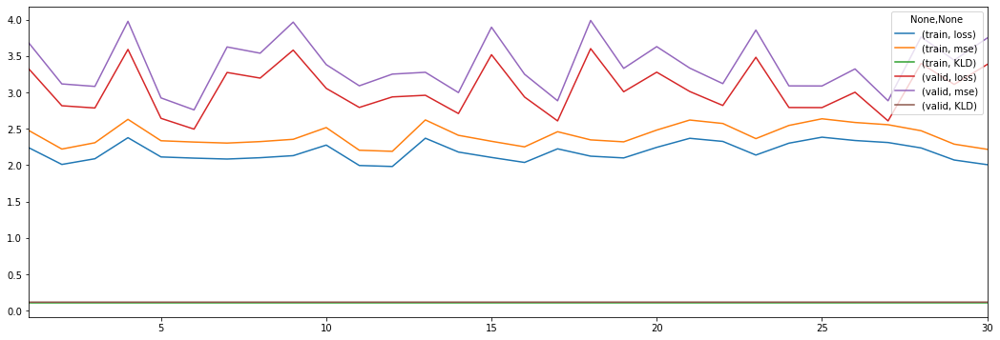

# Experiment 1


```python
import numpy as np
import torch

from src import config
from src.analyzers import *
from vaep.transform import StandardScaler, get_df_fitted_mean_std
```

    FOLDER_MQ_TXT_DATA = data\mq_out
    


```python
import logging
from src.logging import setup_logger

logger = logging.getLogger()  # returns root-logger
logger.setLevel(logging.CRITICAL)  # silence for everything else
logger.handlers = []


logger = setup_logger(logger=logging.getLogger('vaep'))
logger.info("Experiment 01")
```

    vaep - INFO     Experiment 01
    

## Load data

- 1000 features (most abundant peptides)
- later a subset of samples is selected


```python
N_SAMPLES_TO_LOAD = None
FN_PEPTIDE_INTENSITIES = config.FOLDER_DATA / 'df_intensities_N_07813_M01000'
FN_PEPTIDE_INTENSITIES = config.FOLDER_DATA / 'df_intensities_N_00090_M01000'

analysis = AnalyzePeptides(
    fname=FN_PEPTIDE_INTENSITIES, nrows=N_SAMPLES_TO_LOAD)
analysis.df = analysis.df.sort_index()  # sort by date
assert analysis.df.index.is_unique, "Non-unique training samples"
analysis
```


    AnalyzePeptides with attributes: df, stats


### Select consecutives samples for training


```python
import random
from vaep.utils import sample_iterable

N_SAMPLES = min(len(analysis.df), 1000)
logger.info(f"Selected {N_SAMPLES}")
analysis.N_SAMPLES = N_SAMPLES

M = 10

columns_selected = sorted(sample_iterable(list(analysis.df.columns), n=M))
analysis.df = analysis.df.loc[:, columns_selected]


def get_consecutive_data_indices(index, n_samples=N_SAMPLES):
    start_sample = len(index) - n_samples
    start_sample = random.randint(0, start_sample)
    return index[start_sample:start_sample+n_samples]


indices_selected = get_consecutive_data_indices(analysis.df.index)
analysis.samples = indices_selected
analysis.df = analysis.df.loc[indices_selected]

FRACTION = 0.8


class Indices(SimpleNamespace):
    pass


indices = Indices()
indices.train, indices.valid = indices_selected[:int(
    FRACTION*N_SAMPLES)], indices_selected[int(FRACTION*N_SAMPLES):]
analysis.indices = indices

analysis.df_train = analysis.df.loc[indices.train]
analysis.df_valid = analysis.df.loc[indices.valid]

# analysis.df
```

    vaep - INFO     Selected 90
    

### Training and Validation datasets


```python
n_samples, n_features = analysis.df.shape
msg = "Total:\nN samples: {:10,d} - N Peptides: {:10,d}\n".format(n_samples, n_features)
n_train, n_valid = len(analysis.df_train), len(analysis.df_valid)
msg += "N train set: {:8,d} - N valid set: {:9,d}".format(n_train, n_valid)
print(msg)
```

    Total:
    N samples:         90 - N Peptides:         10
    N train set:       72 - N valid set:        18
    


```python
detection_limit = np.log10(analysis.df).min().min()  # all zeros become nan.
"Detection limit: {:6.3f}, corresponding to intensity value of {:,d}".format(
    detection_limit,
    int(10 ** detection_limit)
)
```


    'Detection limit:  7.681, corresponding to intensity value of 47,926,999'


### Create meta data from filename


```python
from src import metadata

data_meta = metadata.get_metadata_from_filenames(indices_selected)
analysis.df_meta = pd.DataFrame.from_dict(
    data_meta, orient='index')
# analysis.df_meta['date'] = pd.to_datetime(analysis.df_meta['date'])
analysis.df_meta
```


<div>
<style scoped>
    .dataframe tbody tr th:only-of-type {
        vertical-align: middle;
    }

    .dataframe tbody tr th {
        vertical-align: top;
    }

    .dataframe thead th {
        text-align: right;
    }
</style>
<table border="1" class="dataframe">
  <thead>
    <tr style="text-align: right;">
      <th></th>
      <th>date</th>
      <th>ms_instrument</th>
      <th>researcher</th>
      <th>lc_instrument</th>
      <th>rest</th>
    </tr>
  </thead>
  <tbody>
    <tr>
      <th>20151128_QE7_UPLC11_RJC_DEV_columnsTest_HeLa_01</th>
      <td>20151128</td>
      <td>QE7</td>
      <td>RJC</td>
      <td>LC11</td>
      <td>UPDEV_columnsTest_HeLa_01</td>
    </tr>
    <tr>
      <th>20160105_QE6_nLC4_MM_QC_MNT_HELA_01_170106201806</th>
      <td>20160105</td>
      <td>QE6</td>
      <td>MM</td>
      <td>nLC4</td>
      <td>QC_MNT_HELA_01_170106201806</td>
    </tr>
    <tr>
      <th>20160311_QE6_LC6_SCL_QC_MNT_HeLa_01</th>
      <td>20160311</td>
      <td>QE6</td>
      <td>SCL</td>
      <td>LC6</td>
      <td>QC_MNT_HeLa_01</td>
    </tr>
    <tr>
      <th>20160401_QE6_nLC6_ASD_QC_HELA_03</th>
      <td>20160401</td>
      <td>QE6</td>
      <td>ASD</td>
      <td>nLC6</td>
      <td>QC_HELA_03</td>
    </tr>
    <tr>
      <th>20160404_QE2_nlc1_QC_hela_160404210125</th>
      <td>20160404</td>
      <td>QE2</td>
      <td>QC</td>
      <td>nlc1</td>
      <td>hela_160404210125</td>
    </tr>
    <tr>
      <th>...</th>
      <td>...</td>
      <td>...</td>
      <td>...</td>
      <td>...</td>
      <td>...</td>
    </tr>
    <tr>
      <th>20190527_QE4_LC12_AS_QC_MNT_HeLa_02</th>
      <td>20190527</td>
      <td>QE4</td>
      <td>AS</td>
      <td>LC12</td>
      <td>QC_MNT_HeLa_02</td>
    </tr>
    <tr>
      <th>20190701_QE4_LC12_IAH_QC_MNT_HeLa_03</th>
      <td>20190701</td>
      <td>QE4</td>
      <td>IAH</td>
      <td>LC12</td>
      <td>QC_MNT_HeLa_03</td>
    </tr>
    <tr>
      <th>20190708_QE6_nLC4_JE_QC_MNT_HeLa_01</th>
      <td>20190708</td>
      <td>QE6</td>
      <td>JE</td>
      <td>nLC4</td>
      <td>QC_MNT_HeLa_01</td>
    </tr>
    <tr>
      <th>20191128_QE8_nLC9_ASD_QC_HeLa_1</th>
      <td>20191128</td>
      <td>QE8</td>
      <td>ASD</td>
      <td>nLC9</td>
      <td>QC_HeLa_1</td>
    </tr>
    <tr>
      <th>20191128_QE8_nLC9_ASD_QC_HeLa_1_20191128165313</th>
      <td>20191128</td>
      <td>QE8</td>
      <td>ASD</td>
      <td>nLC9</td>
      <td>QC_HeLa_1_20191128165313</td>
    </tr>
  </tbody>
</table>
<p>90 rows × 5 columns</p>
</div>


- possibility to group data in time along `(machine, lc)` pairs


```python
analysis.df_meta.loc[indices.train].describe(datetime_is_numeric=False)
```


<div>
<style scoped>
    .dataframe tbody tr th:only-of-type {
        vertical-align: middle;
    }

    .dataframe tbody tr th {
        vertical-align: top;
    }

    .dataframe thead th {
        text-align: right;
    }
</style>
<table border="1" class="dataframe">
  <thead>
    <tr style="text-align: right;">
      <th></th>
      <th>date</th>
      <th>ms_instrument</th>
      <th>researcher</th>
      <th>lc_instrument</th>
      <th>rest</th>
    </tr>
  </thead>
  <tbody>
    <tr>
      <th>count</th>
      <td>72</td>
      <td>72</td>
      <td>72</td>
      <td>72</td>
      <td>72</td>
    </tr>
    <tr>
      <th>unique</th>
      <td>51</td>
      <td>11</td>
      <td>27</td>
      <td>17</td>
      <td>58</td>
    </tr>
    <tr>
      <th>top</th>
      <td>20180601</td>
      <td>QE6</td>
      <td>MR</td>
      <td>nLC1</td>
      <td>QC_MNT_HeLa_01</td>
    </tr>
    <tr>
      <th>freq</th>
      <td>7</td>
      <td>10</td>
      <td>15</td>
      <td>9</td>
      <td>5</td>
    </tr>
  </tbody>
</table>
</div>


```python
# This becomes part of analysis
def compare_meta_data_for_splits(meta, indices):

    _indices = vars(indices)
    logger.info('Found vars: {}'.format(', '.join(str(x)
                                                  for x in _indices.keys())))

    for key_split, split in _indices.items():
        print(f"{key_split:8} - split description:")
        display(
            meta.loc[split].describe(datetime_is_numeric=True)
        )

    _meta_features = list(meta.columns)

    for _column in _meta_features:
        display(
            _=pd.DataFrame({
                key_split: meta.loc[split, _column].value_counts(normalize=True) for key_split, split in _indices.items()
            }).sort_index().plot(kind='line', rot=90, figsize=(10, 5), title=f"{_column} value Counts for different splits")
        )


compare_meta_data_for_splits(analysis.df_meta.iloc[:, :2], indices)
```

    vaep - INFO     Found vars: train, valid
    train    - split description:
    


<div>
<style scoped>
    .dataframe tbody tr th:only-of-type {
        vertical-align: middle;
    }

    .dataframe tbody tr th {
        vertical-align: top;
    }

    .dataframe thead th {
        text-align: right;
    }
</style>
<table border="1" class="dataframe">
  <thead>
    <tr style="text-align: right;">
      <th></th>
      <th>date</th>
      <th>ms_instrument</th>
    </tr>
  </thead>
  <tbody>
    <tr>
      <th>count</th>
      <td>72</td>
      <td>72</td>
    </tr>
    <tr>
      <th>unique</th>
      <td>51</td>
      <td>11</td>
    </tr>
    <tr>
      <th>top</th>
      <td>20180601</td>
      <td>QE6</td>
    </tr>
    <tr>
      <th>freq</th>
      <td>7</td>
      <td>10</td>
    </tr>
  </tbody>
</table>
</div>


    valid    - split description:
    


<div>
<style scoped>
    .dataframe tbody tr th:only-of-type {
        vertical-align: middle;
    }

    .dataframe tbody tr th {
        vertical-align: top;
    }

    .dataframe thead th {
        text-align: right;
    }
</style>
<table border="1" class="dataframe">
  <thead>
    <tr style="text-align: right;">
      <th></th>
      <th>date</th>
      <th>ms_instrument</th>
    </tr>
  </thead>
  <tbody>
    <tr>
      <th>count</th>
      <td>18</td>
      <td>18</td>
    </tr>
    <tr>
      <th>unique</th>
      <td>16</td>
      <td>8</td>
    </tr>
    <tr>
      <th>top</th>
      <td>20191128</td>
      <td>QE5</td>
    </tr>
    <tr>
      <th>freq</th>
      <td>2</td>
      <td>4</td>
    </tr>
  </tbody>
</table>
</div>


### Analysis state so far


```python
analysis
```


    AnalyzePeptides with attributes: N_SAMPLES, df, df_meta, df_train, df_valid, indices, samples, stats


### Correlation


```python
analysis.df_log10 = np.log10(analysis.df)
corr_lower_triangle(analysis.df_log10)
```


<div>
<style scoped>
    .dataframe tbody tr th:only-of-type {
        vertical-align: middle;
    }

    .dataframe tbody tr th {
        vertical-align: top;
    }

    .dataframe thead th {
        text-align: right;
    }
</style>
<table border="1" class="dataframe">
  <thead>
    <tr style="text-align: right;">
      <th></th>
      <th>DDDIAALVVDNGSGMCK</th>
      <th>EAAENSLVAYK</th>
      <th>IEWLESHQDADIEDFK</th>
      <th>LAALNPESNTAGLDIFAK</th>
      <th>LFDQAFGLPR</th>
      <th>LQFHDVAGDIFHQQCK</th>
      <th>TVFAEHISDECK</th>
      <th>VNFAMNVGK</th>
      <th>VNIIPLIAK</th>
      <th>VSFELFADK</th>
    </tr>
  </thead>
  <tbody>
    <tr>
      <th>DDDIAALVVDNGSGMCK</th>
      <td>NaN</td>
      <td>NaN</td>
      <td>NaN</td>
      <td>NaN</td>
      <td>NaN</td>
      <td>NaN</td>
      <td>NaN</td>
      <td>NaN</td>
      <td>NaN</td>
      <td>NaN</td>
    </tr>
    <tr>
      <th>EAAENSLVAYK</th>
      <td>0.660</td>
      <td>NaN</td>
      <td>NaN</td>
      <td>NaN</td>
      <td>NaN</td>
      <td>NaN</td>
      <td>NaN</td>
      <td>NaN</td>
      <td>NaN</td>
      <td>NaN</td>
    </tr>
    <tr>
      <th>IEWLESHQDADIEDFK</th>
      <td>0.694</td>
      <td>0.825</td>
      <td>NaN</td>
      <td>NaN</td>
      <td>NaN</td>
      <td>NaN</td>
      <td>NaN</td>
      <td>NaN</td>
      <td>NaN</td>
      <td>NaN</td>
    </tr>
    <tr>
      <th>LAALNPESNTAGLDIFAK</th>
      <td>0.850</td>
      <td>0.553</td>
      <td>0.588</td>
      <td>NaN</td>
      <td>NaN</td>
      <td>NaN</td>
      <td>NaN</td>
      <td>NaN</td>
      <td>NaN</td>
      <td>NaN</td>
    </tr>
    <tr>
      <th>LFDQAFGLPR</th>
      <td>0.695</td>
      <td>0.743</td>
      <td>0.794</td>
      <td>0.691</td>
      <td>NaN</td>
      <td>NaN</td>
      <td>NaN</td>
      <td>NaN</td>
      <td>NaN</td>
      <td>NaN</td>
    </tr>
    <tr>
      <th>LQFHDVAGDIFHQQCK</th>
      <td>0.520</td>
      <td>0.775</td>
      <td>0.780</td>
      <td>0.453</td>
      <td>0.687</td>
      <td>NaN</td>
      <td>NaN</td>
      <td>NaN</td>
      <td>NaN</td>
      <td>NaN</td>
    </tr>
    <tr>
      <th>TVFAEHISDECK</th>
      <td>0.650</td>
      <td>0.863</td>
      <td>0.747</td>
      <td>0.537</td>
      <td>0.763</td>
      <td>0.799</td>
      <td>NaN</td>
      <td>NaN</td>
      <td>NaN</td>
      <td>NaN</td>
    </tr>
    <tr>
      <th>VNFAMNVGK</th>
      <td>0.369</td>
      <td>0.326</td>
      <td>0.355</td>
      <td>0.340</td>
      <td>0.508</td>
      <td>0.228</td>
      <td>0.409</td>
      <td>NaN</td>
      <td>NaN</td>
      <td>NaN</td>
    </tr>
    <tr>
      <th>VNIIPLIAK</th>
      <td>0.558</td>
      <td>0.722</td>
      <td>0.686</td>
      <td>0.549</td>
      <td>0.693</td>
      <td>0.804</td>
      <td>0.731</td>
      <td>0.299</td>
      <td>NaN</td>
      <td>NaN</td>
    </tr>
    <tr>
      <th>VSFELFADK</th>
      <td>0.093</td>
      <td>0.548</td>
      <td>0.485</td>
      <td>0.175</td>
      <td>0.498</td>
      <td>0.637</td>
      <td>0.502</td>
      <td>0.333</td>
      <td>0.579</td>
      <td>NaN</td>
    </tr>
  </tbody>
</table>
</div>


## Baseline supervised RF models

- M RandomForest baseline models, each predicting one feature based on the M-1 other features
- get an idea of a possible baseline performance
    - could be used together with imputation of inputs
    - with some effort this could be scaled to predict only missing peptides


```python
from sklearn.ensemble import RandomForestRegressor
from sklearn.metrics import mean_squared_error
metrics = {}


peptides = list(analysis.df_train.columns)
metrics = {}
pred_valid = {}

for i in range(M):
    train_columns = list(range(M))
    test_column = i
    train_columns.remove(i)
    train_columns = [peptides[i] for i in train_columns]
    test_column = peptides[test_column]
    logger.debug(
        f"Train columns: {', '.join(train_columns)}\nTest column: {test_column}")
    _df_train_log10, _y_train_log10 = np.log10(
        analysis.df_train[train_columns]), np.log10(analysis.df_train[test_column])
    _df_valid_log10, _y_valid_log10 = np.log10(
        analysis.df_valid[train_columns]), np.log10(analysis.df_valid[test_column])
    rf_reg = RandomForestRegressor()
    rf_reg.fit(X=_df_train_log10, y=_y_train_log10)
    # metrics
    _metrics = {}
    _metrics[('MSE', 'train')] = mean_squared_error(
        y_true=_y_train_log10, y_pred=rf_reg.predict(_df_train_log10))
    y_pred_valid = rf_reg.predict(_df_valid_log10)
    _metrics[('MSE', 'valid')] = mean_squared_error(
        y_true=_y_valid_log10, y_pred=y_pred_valid)
    metrics[test_column] = _metrics
    # predictions
    pred_valid[test_column] = y_pred_valid
pd.DataFrame(metrics)
```


<div>
<style scoped>
    .dataframe tbody tr th:only-of-type {
        vertical-align: middle;
    }

    .dataframe tbody tr th {
        vertical-align: top;
    }

    .dataframe thead th {
        text-align: right;
    }
</style>
<table border="1" class="dataframe">
  <thead>
    <tr style="text-align: right;">
      <th></th>
      <th></th>
      <th>DDDIAALVVDNGSGMCK</th>
      <th>EAAENSLVAYK</th>
      <th>IEWLESHQDADIEDFK</th>
      <th>LAALNPESNTAGLDIFAK</th>
      <th>LFDQAFGLPR</th>
      <th>LQFHDVAGDIFHQQCK</th>
      <th>TVFAEHISDECK</th>
      <th>VNFAMNVGK</th>
      <th>VNIIPLIAK</th>
      <th>VSFELFADK</th>
    </tr>
  </thead>
  <tbody>
    <tr>
      <th rowspan="2" valign="top">MSE</th>
      <th>train</th>
      <td>0.003</td>
      <td>0.002</td>
      <td>0.003</td>
      <td>0.004</td>
      <td>0.001</td>
      <td>0.002</td>
      <td>0.003</td>
      <td>0.007</td>
      <td>0.002</td>
      <td>0.004</td>
    </tr>
    <tr>
      <th>valid</th>
      <td>0.029</td>
      <td>0.017</td>
      <td>0.046</td>
      <td>0.032</td>
      <td>0.029</td>
      <td>0.049</td>
      <td>0.013</td>
      <td>0.156</td>
      <td>0.021</td>
      <td>0.039</td>
    </tr>
  </tbody>
</table>
</div>


```python
pd.DataFrame(pred_valid, index=analysis.df_valid.index)
```


<div>
<style scoped>
    .dataframe tbody tr th:only-of-type {
        vertical-align: middle;
    }

    .dataframe tbody tr th {
        vertical-align: top;
    }

    .dataframe thead th {
        text-align: right;
    }
</style>
<table border="1" class="dataframe">
  <thead>
    <tr style="text-align: right;">
      <th></th>
      <th>DDDIAALVVDNGSGMCK</th>
      <th>EAAENSLVAYK</th>
      <th>IEWLESHQDADIEDFK</th>
      <th>LAALNPESNTAGLDIFAK</th>
      <th>LFDQAFGLPR</th>
      <th>LQFHDVAGDIFHQQCK</th>
      <th>TVFAEHISDECK</th>
      <th>VNFAMNVGK</th>
      <th>VNIIPLIAK</th>
      <th>VSFELFADK</th>
    </tr>
    <tr>
      <th>Sample ID</th>
      <th></th>
      <th></th>
      <th></th>
      <th></th>
      <th></th>
      <th></th>
      <th></th>
      <th></th>
      <th></th>
      <th></th>
    </tr>
  </thead>
  <tbody>
    <tr>
      <th>20181029_QE3_nLC3_KBE_QC_MNT_HELA_02</th>
      <td>9.293</td>
      <td>8.828</td>
      <td>8.678</td>
      <td>8.489</td>
      <td>8.902</td>
      <td>8.580</td>
      <td>8.815</td>
      <td>9.197</td>
      <td>8.127</td>
      <td>9.271</td>
    </tr>
    <tr>
      <th>20181102_QE2_NLC10_MR_QC_MNT_HELA_01</th>
      <td>9.807</td>
      <td>9.152</td>
      <td>9.101</td>
      <td>9.067</td>
      <td>9.184</td>
      <td>8.951</td>
      <td>9.186</td>
      <td>9.604</td>
      <td>8.612</td>
      <td>9.755</td>
    </tr>
    <tr>
      <th>20181107_QE6_nLC12_MR_QC_MNT_HELA_New_01</th>
      <td>9.747</td>
      <td>9.108</td>
      <td>8.944</td>
      <td>8.879</td>
      <td>9.303</td>
      <td>8.875</td>
      <td>9.136</td>
      <td>9.375</td>
      <td>8.525</td>
      <td>9.638</td>
    </tr>
    <tr>
      <th>20181110_QE5_nLC5_OOE_QC_MNT_HELA_15cm_250ng_RO-003</th>
      <td>9.197</td>
      <td>8.711</td>
      <td>8.498</td>
      <td>8.350</td>
      <td>8.893</td>
      <td>8.401</td>
      <td>8.735</td>
      <td>9.006</td>
      <td>8.117</td>
      <td>9.327</td>
    </tr>
    <tr>
      <th>20181112_QE7_nLC11_MEM_QC_HeLa_02</th>
      <td>9.741</td>
      <td>9.228</td>
      <td>9.166</td>
      <td>9.028</td>
      <td>9.395</td>
      <td>8.941</td>
      <td>9.227</td>
      <td>9.603</td>
      <td>8.524</td>
      <td>9.794</td>
    </tr>
    <tr>
      <th>20181119_QE1_nLC2_TW_QC_HeLa_1</th>
      <td>9.593</td>
      <td>9.075</td>
      <td>8.883</td>
      <td>8.834</td>
      <td>9.309</td>
      <td>8.721</td>
      <td>9.061</td>
      <td>9.495</td>
      <td>8.391</td>
      <td>9.585</td>
    </tr>
    <tr>
      <th>20181120_QE5_nLC7_AP_HeLa_2</th>
      <td>9.657</td>
      <td>9.065</td>
      <td>8.896</td>
      <td>8.465</td>
      <td>9.188</td>
      <td>8.863</td>
      <td>9.114</td>
      <td>9.374</td>
      <td>8.437</td>
      <td>9.635</td>
    </tr>
    <tr>
      <th>20181126_QE2_NLC10_MN_QC_HELA_02</th>
      <td>9.436</td>
      <td>9.042</td>
      <td>8.837</td>
      <td>8.587</td>
      <td>9.103</td>
      <td>8.746</td>
      <td>9.046</td>
      <td>9.297</td>
      <td>8.395</td>
      <td>9.560</td>
    </tr>
    <tr>
      <th>20181205_QE5_nLC7_RJC_QC_MNT_HeLa_2</th>
      <td>9.189</td>
      <td>8.608</td>
      <td>8.409</td>
      <td>8.337</td>
      <td>8.881</td>
      <td>8.255</td>
      <td>8.684</td>
      <td>8.879</td>
      <td>8.102</td>
      <td>8.932</td>
    </tr>
    <tr>
      <th>20181215_QE2_NLC10_ANHO_QC_MNT_HELA_04</th>
      <td>9.521</td>
      <td>9.035</td>
      <td>8.917</td>
      <td>8.862</td>
      <td>9.188</td>
      <td>8.868</td>
      <td>9.138</td>
      <td>9.302</td>
      <td>8.498</td>
      <td>9.623</td>
    </tr>
    <tr>
      <th>20181219_QE1_nLC2_GP_QC_MNT_HELA_01</th>
      <td>9.336</td>
      <td>9.005</td>
      <td>8.698</td>
      <td>8.460</td>
      <td>9.000</td>
      <td>8.660</td>
      <td>8.959</td>
      <td>9.239</td>
      <td>8.198</td>
      <td>9.424</td>
    </tr>
    <tr>
      <th>20190107_QE5_nLC5_DS_QC_MNT_HeLa_FlashPack_02</th>
      <td>9.741</td>
      <td>9.043</td>
      <td>8.839</td>
      <td>9.026</td>
      <td>9.157</td>
      <td>8.631</td>
      <td>8.962</td>
      <td>9.294</td>
      <td>8.393</td>
      <td>9.653</td>
    </tr>
    <tr>
      <th>20190527_QE4_LC12_AS_QC_MNT_HeLa_01</th>
      <td>9.993</td>
      <td>9.166</td>
      <td>9.042</td>
      <td>9.123</td>
      <td>9.173</td>
      <td>8.725</td>
      <td>9.242</td>
      <td>9.604</td>
      <td>8.547</td>
      <td>9.627</td>
    </tr>
    <tr>
      <th>20190527_QE4_LC12_AS_QC_MNT_HeLa_02</th>
      <td>9.998</td>
      <td>9.171</td>
      <td>9.007</td>
      <td>9.190</td>
      <td>9.174</td>
      <td>8.773</td>
      <td>9.240</td>
      <td>9.482</td>
      <td>8.542</td>
      <td>9.631</td>
    </tr>
    <tr>
      <th>20190701_QE4_LC12_IAH_QC_MNT_HeLa_03</th>
      <td>9.987</td>
      <td>9.172</td>
      <td>8.927</td>
      <td>9.079</td>
      <td>9.172</td>
      <td>8.758</td>
      <td>9.297</td>
      <td>9.478</td>
      <td>8.522</td>
      <td>9.603</td>
    </tr>
    <tr>
      <th>20190708_QE6_nLC4_JE_QC_MNT_HeLa_01</th>
      <td>9.999</td>
      <td>9.169</td>
      <td>9.006</td>
      <td>8.935</td>
      <td>9.176</td>
      <td>8.887</td>
      <td>9.477</td>
      <td>9.486</td>
      <td>8.543</td>
      <td>9.603</td>
    </tr>
    <tr>
      <th>20191128_QE8_nLC9_ASD_QC_HeLa_1</th>
      <td>9.865</td>
      <td>9.239</td>
      <td>9.065</td>
      <td>8.693</td>
      <td>9.197</td>
      <td>8.960</td>
      <td>9.320</td>
      <td>9.667</td>
      <td>8.625</td>
      <td>9.721</td>
    </tr>
    <tr>
      <th>20191128_QE8_nLC9_ASD_QC_HeLa_1_20191128165313</th>
      <td>9.838</td>
      <td>9.239</td>
      <td>9.061</td>
      <td>8.735</td>
      <td>9.203</td>
      <td>8.943</td>
      <td>9.304</td>
      <td>9.662</td>
      <td>8.655</td>
      <td>9.681</td>
    </tr>
  </tbody>
</table>
</div>


Overfits to training data as it should.


```python
np.log10(analysis.df_valid)
```


<div>
<style scoped>
    .dataframe tbody tr th:only-of-type {
        vertical-align: middle;
    }

    .dataframe tbody tr th {
        vertical-align: top;
    }

    .dataframe thead th {
        text-align: right;
    }
</style>
<table border="1" class="dataframe">
  <thead>
    <tr style="text-align: right;">
      <th></th>
      <th>DDDIAALVVDNGSGMCK</th>
      <th>EAAENSLVAYK</th>
      <th>IEWLESHQDADIEDFK</th>
      <th>LAALNPESNTAGLDIFAK</th>
      <th>LFDQAFGLPR</th>
      <th>LQFHDVAGDIFHQQCK</th>
      <th>TVFAEHISDECK</th>
      <th>VNFAMNVGK</th>
      <th>VNIIPLIAK</th>
      <th>VSFELFADK</th>
    </tr>
    <tr>
      <th>Sample ID</th>
      <th></th>
      <th></th>
      <th></th>
      <th></th>
      <th></th>
      <th></th>
      <th></th>
      <th></th>
      <th></th>
      <th></th>
    </tr>
  </thead>
  <tbody>
    <tr>
      <th>20181029_QE3_nLC3_KBE_QC_MNT_HELA_02</th>
      <td>9.256</td>
      <td>8.740</td>
      <td>8.626</td>
      <td>8.583</td>
      <td>8.972</td>
      <td>8.579</td>
      <td>8.838</td>
      <td>9.001</td>
      <td>8.002</td>
      <td>9.426</td>
    </tr>
    <tr>
      <th>20181102_QE2_NLC10_MR_QC_MNT_HELA_01</th>
      <td>9.705</td>
      <td>9.172</td>
      <td>8.891</td>
      <td>9.081</td>
      <td>9.324</td>
      <td>9.045</td>
      <td>9.357</td>
      <td>9.402</td>
      <td>8.752</td>
      <td>9.858</td>
    </tr>
    <tr>
      <th>20181107_QE6_nLC12_MR_QC_MNT_HELA_New_01</th>
      <td>9.677</td>
      <td>9.028</td>
      <td>9.098</td>
      <td>9.016</td>
      <td>9.235</td>
      <td>8.811</td>
      <td>9.164</td>
      <td>9.483</td>
      <td>8.549</td>
      <td>9.689</td>
    </tr>
    <tr>
      <th>20181110_QE5_nLC5_OOE_QC_MNT_HELA_15cm_250ng_RO-003</th>
      <td>9.144</td>
      <td>8.795</td>
      <td>8.485</td>
      <td>8.450</td>
      <td>8.763</td>
      <td>8.455</td>
      <td>8.659</td>
      <td>8.862</td>
      <td>8.190</td>
      <td>9.307</td>
    </tr>
    <tr>
      <th>20181112_QE7_nLC11_MEM_QC_HeLa_02</th>
      <td>9.751</td>
      <td>9.316</td>
      <td>9.013</td>
      <td>8.995</td>
      <td>9.378</td>
      <td>8.949</td>
      <td>9.270</td>
      <td>9.677</td>
      <td>8.678</td>
      <td>9.712</td>
    </tr>
    <tr>
      <th>20181119_QE1_nLC2_TW_QC_HeLa_1</th>
      <td>9.523</td>
      <td>8.906</td>
      <td>8.868</td>
      <td>8.870</td>
      <td>9.278</td>
      <td>8.732</td>
      <td>8.947</td>
      <td>9.553</td>
      <td>8.225</td>
      <td>9.690</td>
    </tr>
    <tr>
      <th>20181120_QE5_nLC7_AP_HeLa_2</th>
      <td>9.322</td>
      <td>9.090</td>
      <td>8.945</td>
      <td>8.923</td>
      <td>9.202</td>
      <td>8.918</td>
      <td>9.199</td>
      <td>9.286</td>
      <td>8.532</td>
      <td>9.703</td>
    </tr>
    <tr>
      <th>20181126_QE2_NLC10_MN_QC_HELA_02</th>
      <td>9.408</td>
      <td>8.919</td>
      <td>8.913</td>
      <td>8.674</td>
      <td>9.134</td>
      <td>8.776</td>
      <td>8.976</td>
      <td>9.331</td>
      <td>8.430</td>
      <td>9.587</td>
    </tr>
    <tr>
      <th>20181205_QE5_nLC7_RJC_QC_MNT_HeLa_2</th>
      <td>9.118</td>
      <td>8.742</td>
      <td>8.275</td>
      <td>8.472</td>
      <td>8.657</td>
      <td>8.121</td>
      <td>8.752</td>
      <td>9.186</td>
      <td>7.874</td>
      <td>9.047</td>
    </tr>
    <tr>
      <th>20181215_QE2_NLC10_ANHO_QC_MNT_HELA_04</th>
      <td>9.568</td>
      <td>9.057</td>
      <td>9.127</td>
      <td>8.770</td>
      <td>9.233</td>
      <td>8.953</td>
      <td>8.960</td>
      <td>9.435</td>
      <td>8.572</td>
      <td>9.533</td>
    </tr>
    <tr>
      <th>20181219_QE1_nLC2_GP_QC_MNT_HELA_01</th>
      <td>9.229</td>
      <td>8.788</td>
      <td>8.851</td>
      <td>8.594</td>
      <td>9.003</td>
      <td>8.663</td>
      <td>8.913</td>
      <td>9.288</td>
      <td>8.383</td>
      <td>9.554</td>
    </tr>
    <tr>
      <th>20190107_QE5_nLC5_DS_QC_MNT_HeLa_FlashPack_02</th>
      <td>9.865</td>
      <td>9.138</td>
      <td>8.824</td>
      <td>8.901</td>
      <td>8.942</td>
      <td>8.993</td>
      <td>9.197</td>
      <td>8.906</td>
      <td>8.616</td>
      <td>9.103</td>
    </tr>
    <tr>
      <th>20190527_QE4_LC12_AS_QC_MNT_HeLa_01</th>
      <td>10.115</td>
      <td>9.315</td>
      <td>9.295</td>
      <td>9.172</td>
      <td>9.268</td>
      <td>9.136</td>
      <td>9.392</td>
      <td>9.028</td>
      <td>8.554</td>
      <td>9.344</td>
    </tr>
    <tr>
      <th>20190527_QE4_LC12_AS_QC_MNT_HeLa_02</th>
      <td>10.145</td>
      <td>9.334</td>
      <td>9.323</td>
      <td>9.144</td>
      <td>9.247</td>
      <td>9.136</td>
      <td>9.335</td>
      <td>8.946</td>
      <td>8.783</td>
      <td>9.321</td>
    </tr>
    <tr>
      <th>20190701_QE4_LC12_IAH_QC_MNT_HeLa_03</th>
      <td>10.046</td>
      <td>9.289</td>
      <td>9.186</td>
      <td>9.069</td>
      <td>9.209</td>
      <td>9.151</td>
      <td>9.445</td>
      <td>9.041</td>
      <td>8.773</td>
      <td>9.337</td>
    </tr>
    <tr>
      <th>20190708_QE6_nLC4_JE_QC_MNT_HeLa_01</th>
      <td>10.261</td>
      <td>9.456</td>
      <td>9.432</td>
      <td>9.246</td>
      <td>9.235</td>
      <td>9.232</td>
      <td>9.387</td>
      <td>9.118</td>
      <td>8.601</td>
      <td>9.384</td>
    </tr>
    <tr>
      <th>20191128_QE8_nLC9_ASD_QC_HeLa_1</th>
      <td>9.507</td>
      <td>9.316</td>
      <td>9.352</td>
      <td>9.030</td>
      <td>9.628</td>
      <td>9.183</td>
      <td>9.372</td>
      <td>8.493</td>
      <td>8.588</td>
      <td>9.756</td>
    </tr>
    <tr>
      <th>20191128_QE8_nLC9_ASD_QC_HeLa_1_20191128165313</th>
      <td>9.510</td>
      <td>9.247</td>
      <td>9.445</td>
      <td>8.955</td>
      <td>9.612</td>
      <td>9.214</td>
      <td>9.367</td>
      <td>9.363</td>
      <td>8.579</td>
      <td>9.716</td>
    </tr>
  </tbody>
</table>
</div>


## Plain AE
- should also heavily overfit the training data


```python

```

## Collaborative Filtering setup

- each sample has an embedding
- each peptide has an embedding
- scalar product of embeddings should yield predictions


```python

```

## VAE

### Setup


```python
from vaep.cmd import get_args

BATCH_SIZE, EPOCHS = 8, 30
args = get_args(batch_size=BATCH_SIZE, epochs=EPOCHS, no_cuda=True)  # data transfer to GPU seems slow
kwargs = {'num_workers': 2, 'pin_memory': True} if args.cuda else {}

# torch.manual_seed(args.seed)
device = torch.device("cuda" if args.cuda else "cpu")
device

print(args, device)
```

    Namespace(batch_size=8, cuda=False, epochs=30, log_interval=10, no_cuda=True, seed=43) cpu
    

### Transform: Non-log transformed data (Single run)

Scale samples according to training data


```python
from sklearn.preprocessing import MinMaxScaler
# select initial data: transformed vs not log transformed
scaler = MinMaxScaler().fit(analysis.df_train)
# five examples from validation dataset
scaler.transform(analysis.df_valid.iloc[:5])
```


    array([[0.0718489 , 0.12797246, 0.11449968, 0.07686394, 0.11738642,
            0.15037337, 0.07789715, 0.16225749, 0.05943207, 0.25528669],
           [0.31329885, 0.49036421, 0.25354364, 0.34021438, 0.40911442,
            0.5532809 , 0.3094837 , 0.42087116, 0.87956465, 0.82798402],
           [0.29001045, 0.32836052, 0.43789081, 0.28671651, 0.31102303,
            0.29834218, 0.19049807, 0.50793075, 0.50685415, 0.53525552],
           [0.04145055, 0.15667844, 0.06901714, 0.04467552, 0.0284925 ,
            0.09851535, 0.04405984, 0.11537442, 0.15513421, 0.17490834],
           [0.35538944, 0.71751019, 0.35200923, 0.27076326, 0.47776595,
            0.43166852, 0.24891874, 0.79887113, 0.72325645, 0.56933594]])


### Dataloaders


```python
from vaep.io.datasets import PeptideDatasetInMemoryNoMissings
from vaep.io.dataloaders import get_dataloaders

dl_train, dl_valid = get_dataloaders(
    df_train=analysis.df_train,
    df_valid=analysis.df_valid,
    scaler=scaler,
    DataSetClass=PeptideDatasetInMemoryNoMissings,
    batch_size=args.batch_size)

logger.info(
    "N train: {:5,d} \nN valid: {:5,d}".format(
        len(dl_train.dataset), len(dl_valid.dataset))
)

```

    vaep - INFO     N train:    72 
    N valid:    18
    

### Model


```python
from vaep.model import VAE

n_neurons = 5
logger.info(f'Latent layer neurons: {n_neurons}')

model = VAE(n_features=n_features, n_neurons=n_neurons, dim_vae_latent=2)
model = model.to(device)

logger.info(model)
```

    vaep - INFO     Latent layer neurons: 5
    vaep - INFO     VAE(
      (encoder): Linear(in_features=10, out_features=5, bias=True)
      (mean): Linear(in_features=5, out_features=2, bias=True)
      (std): Linear(in_features=5, out_features=2, bias=True)
      (decoder): Linear(in_features=2, out_features=5, bias=True)
      (out): Linear(in_features=5, out_features=10, bias=True)
    )
    

### Optimizers


```python
from torch import optim
optimizer = optim.Adam(model.parameters(), lr=1e-6)
```

### Tensorboard


```python
# tensorboard_model_namer = TensorboardModelNamer(prefix_folder='experiment_01')
# writer = tensorboard_model_namer.get_writer(1, [n_neurons], 'scaler')
# logger.info(f"Logging to: {writer.get_logdir()}")

# data, mask = next(iter(dl_train))
# data = next(iter(dl_train))

# writer.add_image(
#     f'{len(data)} batch of sampled data (as heatmap)', data, dataformats='HW')
# writer.add_image(
#     f'{len(mask)} mask for this batch of samples', mask, dataformats='HW')


# ToDo: compiler warning: error or tracer error?
# writer.add_graph(model, input_to_model=data.to(device))  # try to add after training?
# writer.flush()
```

### Training Loop


```python
from collections import defaultdict
import torch

import vaep; import importlib; importlib.reload(vaep.model)
from vaep.model import train, evaluate
from vaep.model import VAE
from vaep.model import loss_function
from vaep.tf_board import TensorboardModelNamer

def run_experiment(model, dls, writer, args):
    metrics = defaultdict(dict)
    dl_train, dl_valid = dls
    msg_eval_epoch = "Validation Set - Epoch: {:3d} - loss: {:7.3f} - mse: {:5.3f} - KLD: {:5.3f}"
    
    for epoch in range(1, args.epochs+1):
        _batch_metrics = train(model=model, train_loader=dl_train,
                                                                 optimizer=optimizer, device=device)
        n_batches = len(dl_train)
        
        metrics[('train', 'loss')][epoch] = np.mean([d['loss']
                                             for d in _batch_metrics.values()])
        metrics[('train', 'mse')][epoch] = np.mean([d['MSE']
                                             for d in _batch_metrics.values()])
        metrics[('train', 'KLD')][epoch] = np.mean([d['KLD']
                                             for d in _batch_metrics.values()])
        # if epoch % 25 == 0:
        #     logger.info('====> Epoch: {epoch:3} Average loss: {avg_loss:10.4f}'.format(
        #         epoch=epoch, avg_loss=avg_loss))
        # if writer is not None:
        #     writer.add_scalar('avg training loss',
        #                       avg_loss,
        #                       epoch)

        _epoch_metric_valid = evaluate(
            model=model, data_loader=dl_valid, device=device)
        n_batches = len(dl_valid)
        if writer:
            writer.add_scalar('avg validation loss',
                          _epoch_metric_valid['loss'] / n_batches,
                          epoch)
        metrics[('valid', 'loss')][epoch] = np.mean([d['loss']
                                             for d in _epoch_metric_valid.values()])
        metrics[('valid', 'mse')][epoch] = np.mean([d['MSE']
                                             for d in _epoch_metric_valid.values()])
        metrics[('valid', 'KLD')][epoch] = np.mean([d['KLD']
                                             for d in _epoch_metric_valid.values()])
#         if not epoch % 10:
#             logger.info(msg_eval_epoch.format(
#                 epoch, *_epoch_metric_valid.values()))
#     writer.flush()
#     writer.close()  # closes all internal writers of SummaryWriter
    return metrics
```


```python
metrics = run_experiment(model=model, dls=(
    dl_train, dl_valid), writer=None, args=args)  # decide about format
```

### One epoch


```python
logger.setLevel(logging.DEBUG)
batch_metrics = train(model=model, train_loader=dl_train,
                      optimizer=optimizer, device=device)
```


```python
pd.DataFrame.from_dict(batch_metrics, orient='index')
```


<div>
<style scoped>
    .dataframe tbody tr th:only-of-type {
        vertical-align: middle;
    }

    .dataframe tbody tr th {
        vertical-align: top;
    }

    .dataframe thead th {
        text-align: right;
    }
</style>
<table border="1" class="dataframe">
  <thead>
    <tr style="text-align: right;">
      <th></th>
      <th>loss</th>
      <th>MSE</th>
      <th>KLD</th>
    </tr>
  </thead>
  <tbody>
    <tr>
      <th>0</th>
      <td>2.235</td>
      <td>2.472</td>
      <td>0.109</td>
    </tr>
    <tr>
      <th>1</th>
      <td>2.424</td>
      <td>2.682</td>
      <td>0.100</td>
    </tr>
    <tr>
      <th>2</th>
      <td>1.543</td>
      <td>1.701</td>
      <td>0.113</td>
    </tr>
    <tr>
      <th>3</th>
      <td>2.677</td>
      <td>2.962</td>
      <td>0.115</td>
    </tr>
    <tr>
      <th>4</th>
      <td>2.809</td>
      <td>3.108</td>
      <td>0.110</td>
    </tr>
    <tr>
      <th>5</th>
      <td>2.120</td>
      <td>2.345</td>
      <td>0.100</td>
    </tr>
    <tr>
      <th>6</th>
      <td>1.524</td>
      <td>1.681</td>
      <td>0.111</td>
    </tr>
    <tr>
      <th>7</th>
      <td>2.416</td>
      <td>2.672</td>
      <td>0.109</td>
    </tr>
    <tr>
      <th>8</th>
      <td>2.504</td>
      <td>2.770</td>
      <td>0.112</td>
    </tr>
  </tbody>
</table>
</div>


Currently: No improvements

#### Performance plots


```python
metrics = pd.DataFrame(metrics)
_ = metrics.plot(
    figsize=(18, 6), xlim=(1, args.epochs))
```





```python
metrics
```


<div>
<style scoped>
    .dataframe tbody tr th:only-of-type {
        vertical-align: middle;
    }

    .dataframe tbody tr th {
        vertical-align: top;
    }

    .dataframe thead tr th {
        text-align: left;
    }
</style>
<table border="1" class="dataframe">
  <thead>
    <tr>
      <th></th>
      <th colspan="3" halign="left">train</th>
      <th colspan="3" halign="left">valid</th>
    </tr>
    <tr>
      <th></th>
      <th>loss</th>
      <th>mse</th>
      <th>KLD</th>
      <th>loss</th>
      <th>mse</th>
      <th>KLD</th>
    </tr>
  </thead>
  <tbody>
    <tr>
      <th>1</th>
      <td>2.240</td>
      <td>2.476</td>
      <td>0.108</td>
      <td>3.323</td>
      <td>3.680</td>
      <td>0.118</td>
    </tr>
    <tr>
      <th>2</th>
      <td>2.010</td>
      <td>2.221</td>
      <td>0.108</td>
      <td>2.817</td>
      <td>3.116</td>
      <td>0.118</td>
    </tr>
    <tr>
      <th>3</th>
      <td>2.088</td>
      <td>2.308</td>
      <td>0.108</td>
      <td>2.786</td>
      <td>3.082</td>
      <td>0.118</td>
    </tr>
    <tr>
      <th>4</th>
      <td>2.378</td>
      <td>2.630</td>
      <td>0.108</td>
      <td>3.591</td>
      <td>3.977</td>
      <td>0.118</td>
    </tr>
    <tr>
      <th>5</th>
      <td>2.113</td>
      <td>2.336</td>
      <td>0.108</td>
      <td>2.644</td>
      <td>2.924</td>
      <td>0.118</td>
    </tr>
    <tr>
      <th>6</th>
      <td>2.097</td>
      <td>2.318</td>
      <td>0.108</td>
      <td>2.495</td>
      <td>2.759</td>
      <td>0.118</td>
    </tr>
    <tr>
      <th>7</th>
      <td>2.084</td>
      <td>2.304</td>
      <td>0.108</td>
      <td>3.274</td>
      <td>3.625</td>
      <td>0.118</td>
    </tr>
    <tr>
      <th>8</th>
      <td>2.102</td>
      <td>2.324</td>
      <td>0.108</td>
      <td>3.196</td>
      <td>3.539</td>
      <td>0.118</td>
    </tr>
    <tr>
      <th>9</th>
      <td>2.131</td>
      <td>2.355</td>
      <td>0.108</td>
      <td>3.581</td>
      <td>3.966</td>
      <td>0.118</td>
    </tr>
    <tr>
      <th>10</th>
      <td>2.276</td>
      <td>2.517</td>
      <td>0.108</td>
      <td>3.055</td>
      <td>3.382</td>
      <td>0.118</td>
    </tr>
    <tr>
      <th>11</th>
      <td>1.996</td>
      <td>2.205</td>
      <td>0.108</td>
      <td>2.793</td>
      <td>3.091</td>
      <td>0.118</td>
    </tr>
    <tr>
      <th>12</th>
      <td>1.982</td>
      <td>2.190</td>
      <td>0.108</td>
      <td>2.938</td>
      <td>3.251</td>
      <td>0.118</td>
    </tr>
    <tr>
      <th>13</th>
      <td>2.370</td>
      <td>2.622</td>
      <td>0.108</td>
      <td>2.960</td>
      <td>3.276</td>
      <td>0.118</td>
    </tr>
    <tr>
      <th>14</th>
      <td>2.180</td>
      <td>2.410</td>
      <td>0.108</td>
      <td>2.710</td>
      <td>2.997</td>
      <td>0.118</td>
    </tr>
    <tr>
      <th>15</th>
      <td>2.106</td>
      <td>2.328</td>
      <td>0.108</td>
      <td>3.518</td>
      <td>3.896</td>
      <td>0.118</td>
    </tr>
    <tr>
      <th>16</th>
      <td>2.038</td>
      <td>2.252</td>
      <td>0.108</td>
      <td>2.937</td>
      <td>3.250</td>
      <td>0.118</td>
    </tr>
    <tr>
      <th>17</th>
      <td>2.225</td>
      <td>2.460</td>
      <td>0.109</td>
      <td>2.608</td>
      <td>2.885</td>
      <td>0.118</td>
    </tr>
    <tr>
      <th>18</th>
      <td>2.124</td>
      <td>2.348</td>
      <td>0.109</td>
      <td>3.602</td>
      <td>3.989</td>
      <td>0.118</td>
    </tr>
    <tr>
      <th>19</th>
      <td>2.099</td>
      <td>2.321</td>
      <td>0.109</td>
      <td>3.009</td>
      <td>3.330</td>
      <td>0.118</td>
    </tr>
    <tr>
      <th>20</th>
      <td>2.245</td>
      <td>2.482</td>
      <td>0.109</td>
      <td>3.278</td>
      <td>3.629</td>
      <td>0.118</td>
    </tr>
    <tr>
      <th>21</th>
      <td>2.369</td>
      <td>2.620</td>
      <td>0.109</td>
      <td>3.012</td>
      <td>3.334</td>
      <td>0.118</td>
    </tr>
    <tr>
      <th>22</th>
      <td>2.326</td>
      <td>2.573</td>
      <td>0.109</td>
      <td>2.820</td>
      <td>3.121</td>
      <td>0.118</td>
    </tr>
    <tr>
      <th>23</th>
      <td>2.139</td>
      <td>2.365</td>
      <td>0.109</td>
      <td>3.483</td>
      <td>3.856</td>
      <td>0.118</td>
    </tr>
    <tr>
      <th>24</th>
      <td>2.302</td>
      <td>2.546</td>
      <td>0.109</td>
      <td>2.792</td>
      <td>3.090</td>
      <td>0.118</td>
    </tr>
    <tr>
      <th>25</th>
      <td>2.384</td>
      <td>2.637</td>
      <td>0.109</td>
      <td>2.791</td>
      <td>3.088</td>
      <td>0.118</td>
    </tr>
    <tr>
      <th>26</th>
      <td>2.339</td>
      <td>2.587</td>
      <td>0.109</td>
      <td>3.002</td>
      <td>3.323</td>
      <td>0.118</td>
    </tr>
    <tr>
      <th>27</th>
      <td>2.311</td>
      <td>2.556</td>
      <td>0.109</td>
      <td>2.608</td>
      <td>2.885</td>
      <td>0.118</td>
    </tr>
    <tr>
      <th>28</th>
      <td>2.237</td>
      <td>2.473</td>
      <td>0.109</td>
      <td>3.398</td>
      <td>3.763</td>
      <td>0.118</td>
    </tr>
    <tr>
      <th>29</th>
      <td>2.071</td>
      <td>2.289</td>
      <td>0.109</td>
      <td>3.110</td>
      <td>3.442</td>
      <td>0.118</td>
    </tr>
    <tr>
      <th>30</th>
      <td>2.007</td>
      <td>2.218</td>
      <td>0.109</td>
      <td>3.384</td>
      <td>3.747</td>
      <td>0.118</td>
    </tr>
  </tbody>
</table>
</div>


```python
selected = [(_split, _metric)
            for _split in ['train', 'valid']
            for _metric in ['loss']
            ]
_ = metrics[selected].plot(
    figsize=(18, 6))
```


## Predictions validation set


```python
# integrate label in dataloader
_epoch_metric_valid, pred = evaluate(model=model, data_loader=dl_valid, device=device, return_pred=True)
def build_df_from_pred_batches(pred, index=None, columns=None):
    pred = np.vstack(pred)
    pred = scaler.inverse_transform(pred)
    pred= pd.DataFrame(pred, index=index, columns=columns)
    return pred
build_df_from_pred_batches(pred, index=analysis.df_valid.index, columns=analysis.df_valid.columns)
```


<div>
<style scoped>
    .dataframe tbody tr th:only-of-type {
        vertical-align: middle;
    }

    .dataframe tbody tr th {
        vertical-align: top;
    }

    .dataframe thead th {
        text-align: right;
    }
</style>
<table border="1" class="dataframe">
  <thead>
    <tr style="text-align: right;">
      <th></th>
      <th>DDDIAALVVDNGSGMCK</th>
      <th>EAAENSLVAYK</th>
      <th>IEWLESHQDADIEDFK</th>
      <th>LAALNPESNTAGLDIFAK</th>
      <th>LFDQAFGLPR</th>
      <th>LQFHDVAGDIFHQQCK</th>
      <th>TVFAEHISDECK</th>
      <th>VNFAMNVGK</th>
      <th>VNIIPLIAK</th>
      <th>VSFELFADK</th>
    </tr>
    <tr>
      <th>Sample ID</th>
      <th></th>
      <th></th>
      <th></th>
      <th></th>
      <th></th>
      <th></th>
      <th></th>
      <th></th>
      <th></th>
      <th></th>
    </tr>
  </thead>
  <tbody>
    <tr>
      <th>20181029_QE3_nLC3_KBE_QC_MNT_HELA_02</th>
      <td>3,323,492,070.266</td>
      <td>297,062,950.009</td>
      <td>-576,366,258.112</td>
      <td>301,931,387.984</td>
      <td>533,172,590.299</td>
      <td>714,865,966.963</td>
      <td>3,563,901,073.311</td>
      <td>1,435,252,208.153</td>
      <td>408,258,018.594</td>
      <td>-585,893,801.366</td>
    </tr>
    <tr>
      <th>20181102_QE2_NLC10_MR_QC_MNT_HELA_01</th>
      <td>3,720,510,283.729</td>
      <td>-1,351,207,052.090</td>
      <td>630,333,446.728</td>
      <td>-1,007,409,812.560</td>
      <td>-2,729,441,398.749</td>
      <td>1,854,437,850.425</td>
      <td>2,717,619,669.437</td>
      <td>-2,053,172,739.892</td>
      <td>-3,614,057.600</td>
      <td>-5,228,298,498.975</td>
    </tr>
    <tr>
      <th>20181107_QE6_nLC12_MR_QC_MNT_HELA_New_01</th>
      <td>4,410,939,414.650</td>
      <td>-313,331,022.921</td>
      <td>-217,821,020.823</td>
      <td>214,703,773.821</td>
      <td>-149,456,855.446</td>
      <td>911,705,852.332</td>
      <td>3,228,271,192.601</td>
      <td>347,936,325.723</td>
      <td>289,515,160.299</td>
      <td>-2,945,680,523.842</td>
    </tr>
    <tr>
      <th>20181110_QE5_nLC5_OOE_QC_MNT_HELA_15cm_250ng_RO-003</th>
      <td>3,979,046,425.458</td>
      <td>-951,368,353.610</td>
      <td>-666,949,019.652</td>
      <td>-272,866,577.508</td>
      <td>-1,912,205,508.516</td>
      <td>1,120,389,461.309</td>
      <td>1,622,086,383.556</td>
      <td>-1,699,597,991.344</td>
      <td>45,273,146.580</td>
      <td>-2,111,259,557.145</td>
    </tr>
    <tr>
      <th>20181112_QE7_nLC11_MEM_QC_HeLa_02</th>
      <td>3,600,717,706.795</td>
      <td>-129,902,328.069</td>
      <td>-995,699,604.037</td>
      <td>228,651,847.671</td>
      <td>-245,850,530.278</td>
      <td>627,952,544.285</td>
      <td>2,224,523,828.521</td>
      <td>-121,377,526.086</td>
      <td>237,694,717.378</td>
      <td>-800,709,585.505</td>
    </tr>
    <tr>
      <th>20181119_QE1_nLC2_TW_QC_HeLa_1</th>
      <td>3,746,461,998.458</td>
      <td>-345,531,243.845</td>
      <td>-427,477,454.097</td>
      <td>-17,311,062.147</td>
      <td>-563,848,048.481</td>
      <td>927,817,889.165</td>
      <td>2,700,305,412.517</td>
      <td>-260,259,335.135</td>
      <td>219,074,395.972</td>
      <td>-2,333,934,329.342</td>
    </tr>
    <tr>
      <th>20181120_QE5_nLC7_AP_HeLa_2</th>
      <td>2,700,830,529.960</td>
      <td>732,391,115.997</td>
      <td>-613,249,817.000</td>
      <td>373,444,190.691</td>
      <td>959,656,576.572</td>
      <td>756,015,030.839</td>
      <td>4,430,328,655.909</td>
      <td>2,910,845,655.306</td>
      <td>559,017,860.382</td>
      <td>1,509,331,159.681</td>
    </tr>
    <tr>
      <th>20181126_QE2_NLC10_MN_QC_HELA_02</th>
      <td>3,608,175,776.650</td>
      <td>-228,584,867.001</td>
      <td>-806,933,435.832</td>
      <td>112,068,852.510</td>
      <td>-436,350,261.273</td>
      <td>748,654,617.278</td>
      <td>2,338,340,404.305</td>
      <td>-247,980,414.369</td>
      <td>221,565,886.642</td>
      <td>-1,295,466,174.605</td>
    </tr>
    <tr>
      <th>20181205_QE5_nLC7_RJC_QC_MNT_HeLa_2</th>
      <td>3,746,417,696.278</td>
      <td>388,774,982.469</td>
      <td>-532,512,297.436</td>
      <td>526,703,802.380</td>
      <td>867,616,211.679</td>
      <td>688,022,867.205</td>
      <td>4,014,162,370.069</td>
      <td>2,163,850,963.768</td>
      <td>486,920,549.701</td>
      <td>-290,863,830.004</td>
    </tr>
    <tr>
      <th>20181215_QE2_NLC10_ANHO_QC_MNT_HELA_04</th>
      <td>3,891,082,188.062</td>
      <td>-201,759,374.328</td>
      <td>-340,281,972.553</td>
      <td>115,663,561.629</td>
      <td>-152,182,467.232</td>
      <td>872,862,227.870</td>
      <td>3,065,973,289.030</td>
      <td>234,894,172.734</td>
      <td>277,666,738.470</td>
      <td>-2,474,413,168.064</td>
    </tr>
    <tr>
      <th>20181219_QE1_nLC2_GP_QC_MNT_HELA_01</th>
      <td>3,715,762,009.339</td>
      <td>-82,737,395.899</td>
      <td>-582,654,060.676</td>
      <td>194,783,493.094</td>
      <td>-31,622,739.489</td>
      <td>762,935,873.257</td>
      <td>2,910,862,947.099</td>
      <td>364,371,685.421</td>
      <td>291,779,633.421</td>
      <td>-1,633,646,434.237</td>
    </tr>
    <tr>
      <th>20190107_QE5_nLC5_DS_QC_MNT_HeLa_FlashPack_02</th>
      <td>3,493,759,208.772</td>
      <td>-81,965,174.757</td>
      <td>-1,211,731,740.614</td>
      <td>278,275,733.805</td>
      <td>-231,749,381.313</td>
      <td>540,483,425.333</td>
      <td>1,987,958,734.521</td>
      <td>-169,844,655.501</td>
      <td>232,260,308.661</td>
      <td>-199,433,892.091</td>
    </tr>
    <tr>
      <th>20190527_QE4_LC12_AS_QC_MNT_HeLa_01</th>
      <td>3,214,996,933.374</td>
      <td>313,716,852.226</td>
      <td>-1,001,876,359.129</td>
      <td>385,989,980.367</td>
      <td>459,594,173.044</td>
      <td>547,453,442.805</td>
      <td>2,965,627,132.263</td>
      <td>1,123,037,258.694</td>
      <td>374,350,671.489</td>
      <td>352,983,500.610</td>
    </tr>
    <tr>
      <th>20190527_QE4_LC12_AS_QC_MNT_HeLa_02</th>
      <td>1,814,870,416.246</td>
      <td>152,984,186.585</td>
      <td>-1,039,290,482.410</td>
      <td>486,228,965.169</td>
      <td>325,289,671.124</td>
      <td>573,435,216.973</td>
      <td>2,804,903,779.348</td>
      <td>644,045,792.178</td>
      <td>399,854,807.441</td>
      <td>764,271,557.412</td>
    </tr>
    <tr>
      <th>20190701_QE4_LC12_IAH_QC_MNT_HeLa_03</th>
      <td>2,730,194,449.174</td>
      <td>118,253,588.011</td>
      <td>-1,198,441,757.893</td>
      <td>434,135,148.033</td>
      <td>195,304,454.303</td>
      <td>493,629,553.014</td>
      <td>2,399,815,660.137</td>
      <td>385,444,563.661</td>
      <td>328,286,713.784</td>
      <td>473,823,905.388</td>
    </tr>
    <tr>
      <th>20190708_QE6_nLC4_JE_QC_MNT_HeLa_01</th>
      <td>3,362,379,800.557</td>
      <td>-982,548,681.866</td>
      <td>98,621,484.883</td>
      <td>-751,672,456.177</td>
      <td>-2,155,700,643.090</td>
      <td>1,522,586,444.178</td>
      <td>2,453,279,667.701</td>
      <td>-1,628,894,145.638</td>
      <td>48,968,268.097</td>
      <td>-3,602,493,144.415</td>
    </tr>
    <tr>
      <th>20191128_QE8_nLC9_ASD_QC_HeLa_1</th>
      <td>4,269,989,186.378</td>
      <td>-326,827,032.261</td>
      <td>-237,049,894.726</td>
      <td>153,116,216.196</td>
      <td>-229,750,283.575</td>
      <td>915,427,479.113</td>
      <td>3,108,807,623.705</td>
      <td>165,062,668.116</td>
      <td>269,798,856.930</td>
      <td>-2,981,845,332.676</td>
    </tr>
    <tr>
      <th>20191128_QE8_nLC9_ASD_QC_HeLa_1_20191128165313</th>
      <td>3,688,033,799.853</td>
      <td>-85,159,093.322</td>
      <td>-723,680,335.184</td>
      <td>220,378,056.681</td>
      <td>-67,787,730.687</td>
      <td>708,506,692.133</td>
      <td>2,699,116,913.605</td>
      <td>238,614,447.245</td>
      <td>278,118,354.182</td>
      <td>-1,344,658,786.813</td>
    </tr>
  </tbody>
</table>
</div>


```python
# still need to to bound prediction between 0 and 1 using sigmoid -> change objective
pd.DataFrame(np.vstack(pred), index=analysis.df_valid.index, columns=analysis.df_valid.columns)
```


<div>
<style scoped>
    .dataframe tbody tr th:only-of-type {
        vertical-align: middle;
    }

    .dataframe tbody tr th {
        vertical-align: top;
    }

    .dataframe thead th {
        text-align: right;
    }
</style>
<table border="1" class="dataframe">
  <thead>
    <tr style="text-align: right;">
      <th></th>
      <th>DDDIAALVVDNGSGMCK</th>
      <th>EAAENSLVAYK</th>
      <th>IEWLESHQDADIEDFK</th>
      <th>LAALNPESNTAGLDIFAK</th>
      <th>LFDQAFGLPR</th>
      <th>LQFHDVAGDIFHQQCK</th>
      <th>TVFAEHISDECK</th>
      <th>VNFAMNVGK</th>
      <th>VNIIPLIAK</th>
      <th>VSFELFADK</th>
    </tr>
    <tr>
      <th>Sample ID</th>
      <th></th>
      <th></th>
      <th></th>
      <th></th>
      <th></th>
      <th></th>
      <th></th>
      <th></th>
      <th></th>
      <th></th>
    </tr>
  </thead>
  <tbody>
    <tr>
      <th>20181029_QE3_nLC3_KBE_QC_MNT_HELA_02</th>
      <td>0.184</td>
      <td>0.030</td>
      <td>-0.275</td>
      <td>0.051</td>
      <td>0.017</td>
      <td>0.336</td>
      <td>0.497</td>
      <td>0.236</td>
      <td>0.603</td>
      <td>-0.155</td>
    </tr>
    <tr>
      <th>20181102_QE2_NLC10_MR_QC_MNT_HELA_01</th>
      <td>0.214</td>
      <td>-0.608</td>
      <td>0.196</td>
      <td>-0.368</td>
      <td>-0.794</td>
      <td>0.964</td>
      <td>0.374</td>
      <td>-0.357</td>
      <td>-0.124</td>
      <td>-0.740</td>
    </tr>
    <tr>
      <th>20181107_QE6_nLC12_MR_QC_MNT_HELA_New_01</th>
      <td>0.265</td>
      <td>-0.206</td>
      <td>-0.135</td>
      <td>0.023</td>
      <td>-0.153</td>
      <td>0.444</td>
      <td>0.448</td>
      <td>0.051</td>
      <td>0.393</td>
      <td>-0.452</td>
    </tr>
    <tr>
      <th>20181110_QE5_nLC5_OOE_QC_MNT_HELA_15cm_250ng_RO-003</th>
      <td>0.233</td>
      <td>-0.453</td>
      <td>-0.310</td>
      <td>-0.133</td>
      <td>-0.591</td>
      <td>0.559</td>
      <td>0.214</td>
      <td>-0.297</td>
      <td>-0.038</td>
      <td>-0.347</td>
    </tr>
    <tr>
      <th>20181112_QE7_nLC11_MEM_QC_HeLa_02</th>
      <td>0.205</td>
      <td>-0.135</td>
      <td>-0.438</td>
      <td>0.028</td>
      <td>-0.177</td>
      <td>0.288</td>
      <td>0.302</td>
      <td>-0.029</td>
      <td>0.302</td>
      <td>-0.182</td>
    </tr>
    <tr>
      <th>20181119_QE1_nLC2_TW_QC_HeLa_1</th>
      <td>0.215</td>
      <td>-0.218</td>
      <td>-0.217</td>
      <td>-0.051</td>
      <td>-0.256</td>
      <td>0.453</td>
      <td>0.371</td>
      <td>-0.052</td>
      <td>0.269</td>
      <td>-0.375</td>
    </tr>
    <tr>
      <th>20181120_QE5_nLC7_AP_HeLa_2</th>
      <td>0.138</td>
      <td>0.199</td>
      <td>-0.289</td>
      <td>0.074</td>
      <td>0.123</td>
      <td>0.358</td>
      <td>0.624</td>
      <td>0.486</td>
      <td>0.869</td>
      <td>0.109</td>
    </tr>
    <tr>
      <th>20181126_QE2_NLC10_MN_QC_HELA_02</th>
      <td>0.205</td>
      <td>-0.173</td>
      <td>-0.365</td>
      <td>-0.010</td>
      <td>-0.224</td>
      <td>0.354</td>
      <td>0.319</td>
      <td>-0.050</td>
      <td>0.273</td>
      <td>-0.244</td>
    </tr>
    <tr>
      <th>20181205_QE5_nLC7_RJC_QC_MNT_HeLa_2</th>
      <td>0.215</td>
      <td>0.066</td>
      <td>-0.258</td>
      <td>0.123</td>
      <td>0.100</td>
      <td>0.321</td>
      <td>0.563</td>
      <td>0.359</td>
      <td>0.742</td>
      <td>-0.118</td>
    </tr>
    <tr>
      <th>20181215_QE2_NLC10_ANHO_QC_MNT_HELA_04</th>
      <td>0.226</td>
      <td>-0.163</td>
      <td>-0.183</td>
      <td>-0.009</td>
      <td>-0.154</td>
      <td>0.423</td>
      <td>0.425</td>
      <td>0.032</td>
      <td>0.372</td>
      <td>-0.393</td>
    </tr>
    <tr>
      <th>20181219_QE1_nLC2_GP_QC_MNT_HELA_01</th>
      <td>0.213</td>
      <td>-0.117</td>
      <td>-0.277</td>
      <td>0.017</td>
      <td>-0.124</td>
      <td>0.362</td>
      <td>0.402</td>
      <td>0.054</td>
      <td>0.397</td>
      <td>-0.287</td>
    </tr>
    <tr>
      <th>20190107_QE5_nLC5_DS_QC_MNT_HeLa_FlashPack_02</th>
      <td>0.197</td>
      <td>-0.116</td>
      <td>-0.522</td>
      <td>0.043</td>
      <td>-0.173</td>
      <td>0.239</td>
      <td>0.268</td>
      <td>-0.037</td>
      <td>0.292</td>
      <td>-0.106</td>
    </tr>
    <tr>
      <th>20190527_QE4_LC12_AS_QC_MNT_HeLa_01</th>
      <td>0.176</td>
      <td>0.037</td>
      <td>-0.441</td>
      <td>0.078</td>
      <td>-0.001</td>
      <td>0.243</td>
      <td>0.410</td>
      <td>0.183</td>
      <td>0.543</td>
      <td>-0.037</td>
    </tr>
    <tr>
      <th>20190527_QE4_LC12_AS_QC_MNT_HeLa_02</th>
      <td>0.073</td>
      <td>-0.025</td>
      <td>-0.455</td>
      <td>0.110</td>
      <td>-0.035</td>
      <td>0.258</td>
      <td>0.387</td>
      <td>0.101</td>
      <td>0.588</td>
      <td>0.015</td>
    </tr>
    <tr>
      <th>20190701_QE4_LC12_IAH_QC_MNT_HeLa_03</th>
      <td>0.140</td>
      <td>-0.039</td>
      <td>-0.517</td>
      <td>0.093</td>
      <td>-0.067</td>
      <td>0.214</td>
      <td>0.328</td>
      <td>0.057</td>
      <td>0.461</td>
      <td>-0.021</td>
    </tr>
    <tr>
      <th>20190708_QE6_nLC4_JE_QC_MNT_HeLa_01</th>
      <td>0.187</td>
      <td>-0.465</td>
      <td>-0.012</td>
      <td>-0.286</td>
      <td>-0.652</td>
      <td>0.781</td>
      <td>0.335</td>
      <td>-0.285</td>
      <td>-0.032</td>
      <td>-0.535</td>
    </tr>
    <tr>
      <th>20191128_QE8_nLC9_ASD_QC_HeLa_1</th>
      <td>0.254</td>
      <td>-0.211</td>
      <td>-0.143</td>
      <td>0.003</td>
      <td>-0.173</td>
      <td>0.446</td>
      <td>0.431</td>
      <td>0.020</td>
      <td>0.358</td>
      <td>-0.457</td>
    </tr>
    <tr>
      <th>20191128_QE8_nLC9_ASD_QC_HeLa_1_20191128165313</th>
      <td>0.211</td>
      <td>-0.118</td>
      <td>-0.332</td>
      <td>0.025</td>
      <td>-0.133</td>
      <td>0.332</td>
      <td>0.371</td>
      <td>0.032</td>
      <td>0.373</td>
      <td>-0.251</td>
    </tr>
  </tbody>
</table>
</div>


### Tensorboard

- can be run from notebook
- or in a separate process to inspect currently running training loops


```python
# print(
#     f"Run to see updates: \n\n\ttensorboard --logdir {tensorboard_model_namer.folder.absolute()}")
```

## Hyperparameter comparison

- [x] order data by date: consecutive samples from training to validation
- [x] check stratification based on machine and column length between splits
    - Do validation and training data have same proportion of machine types? -> generally no, would need to be added
       - not (all) machines are running continously or are continously checked
- [x] complete meta data reading based on filenames
- [x] compare performance regarding data normalization
    - in original intensity space (non-log-transformed) - > 
- [ ] compare performance regarding several hyperparameters of VAE (layers, activation, etc)
    - plot different losses in one plot as validation data set is the same
- [ ] increase number of samples in training set and create result plot
- [ ] increase the number of peptides (features)
- [ ] mask some values in the validation set missing (Quality Assessment)
- [ ] write main function which trains an entire model (including data transformations)

Debug
- [ ] Check reporting of loss again: average sample loss or average peptide loss?
- [ ] take a close look at VAE tutorial of PyTorch (data normalization, etc)
- [ ] reduce the features size to fewer samples

VAE
- original inputs between 0 and 1 as decoder outputs are transformed originally using the sigmoid fct
- original model use `tanh` activations
- think about the definition of `MSE` in a mini-batch. Should be peptide wise?
    - VAMB does sum over a sample and then takes the mean of the sum (alternative?)
    - multi-output regression?
- learning requires active masking: Mask inputs which should be learned to be recovered. Feed original, 
  not masked image as target to loss.

- [ ] Run MNIST example with MSE loss. Does it still work?
- [ ] Normalize inputs to zero and one, use MNIST VAE. Does it work?
- [ ] Regress M peptide intensities on 1 other peptide intensity. Does it work? (Reference performance)
- [ ] Build a normal AE without probabilistic bottleneck. Does this work?

Refactoring

- [ ] get epoch out of train, eval etc


Ideas
  - combine 1000 most abundant peptides as guidance for different sets of low abundant peptides
  - show the difference between original and reconstruction using a cm in an Image? batch-wise?

- Current optimum for comparision is zero

> The comparison where relatively low abundant, but not super low-abundant peptides will be masked, could skew the comparison.


```python
# writer # new writer
# dls = get_dls(data_in_memory, scaler)
# model = VAE()
# writer =  # new writer for each setup
# metrics = run_experiment(model, dls, writer)
# overview['experiment_name'] = metrics
```

### Inspect batches of the trained model


```python
index_valid = analysis.df_valid.index
index_train = analysis.df_train.index
columns_ = analysis.df_train.columns

model.eval()
```


    VAE(
      (encoder): Linear(in_features=10, out_features=5, bias=True)
      (mean): Linear(in_features=5, out_features=2, bias=True)
      (std): Linear(in_features=5, out_features=2, bias=True)
      (decoder): Linear(in_features=2, out_features=5, bias=True)
      (out): Linear(in_features=5, out_features=10, bias=True)
    )


#### Training batch example


```python
model.to('cpu')
iter_dl_train = iter(dl_train)
batch = next(iter_dl_train)
batch_mask = None
try:
    batch, batch_mask = batch
    batch_masked = batch * batch_mask
except ValueError:
    batch = batch
batch_recon, mu, logvar = model(batch)
```


```python
batch_recon
```


    tensor([[ 0.1899, -0.1955, -0.4948, -0.0195, -0.3011,  0.3218,  0.2384, -0.1181,
              0.1882, -0.1300],
            [ 0.2180, -0.7273,  0.2979, -0.4513, -0.9535,  1.1017,  0.3650, -0.4509,
             -0.2449, -0.8384],
            [ 0.2027, -0.5334,  0.0105, -0.3029, -0.7242,  0.8244,  0.3177, -0.3340,
             -0.0931, -0.5763],
            [ 0.2216, -0.1973, -0.2166, -0.0287, -0.2132,  0.4296,  0.3846, -0.0247,
              0.3042, -0.3792],
            [ 0.2076, -0.1017, -0.3416,  0.0301, -0.1187,  0.3238,  0.3763,  0.0486,
              0.3912, -0.2297],
            [ 0.1852, -0.3260, -0.2410, -0.1589, -0.4740,  0.5586,  0.2938, -0.1974,
              0.0829, -0.3384],
            [ 0.2694, -0.1631, -0.1434,  0.0586, -0.0963,  0.4250,  0.4834,  0.1275,
              0.4791, -0.4018],
            [ 0.1441, -0.1133, -0.5605,  0.0973, -0.1200,  0.1817,  0.2507, -0.0655,
              0.3466, -0.0836]], dtype=torch.float64, grad_fn=<AddmmBackward>)


```python
_batch_metrics = loss_function(batch_recon, batch, mu, logvar)
_batch_metrics
```


    {'loss': tensor(26.9232, dtype=torch.float64, grad_fn=<AddBackward0>),
     'MSE': tensor(29.8123, dtype=torch.float64, grad_fn=<MseLossBackward>),
     'KLD': tensor(0.9215, dtype=torch.float64, grad_fn=<MulBackward0>)}


```python
if batch_mask:
    _mse = ((batch * batch_mask) - (batch_recon * batch_mask)).pow(2).sum()  # avg per peptide loss -> should be close to zero (ref: std=1)
else:
    _mse = (batch - batch_recon).pow(2).sum()
_mse
```


    tensor(29.8123, dtype=torch.float64, grad_fn=<SumBackward0>)


```python
from torch import nn

loss = nn.MSELoss(reduction='sum')
if batch_mask:
    _mse = loss(input=batch_recon*batch_mask, target=batch * batch_mask)
else:
    _mse = loss(input=batch_recon, target=batch)
_mse
```


    tensor(29.8123, dtype=torch.float64, grad_fn=<MseLossBackward>)


```python
from torch.nn import functional as F
if batch_mask:
    batch_sse = F.mse_loss(input=batch_recon*batch_mask,
                       target=batch * batch_mask, reduction='sum')
else:
    batch_sse = F.mse_loss(input=batch_recon,
                       target=batch, reduction='sum')
batch_sse
```


    tensor(29.8123, dtype=torch.float64, grad_fn=<MseLossBackward>)


####  Validation batch example


```python
# validation data loader is not shuffled
N_valid = len(dl_valid.dataset)

model.eval()

iter_dl_valid = iter(dl_valid)

batch = next(iter_dl_valid)
batch_mask = None
try:
    batch, batch_mask = batch
    batch_masked = batch * batch_mask
except ValueError:
    batch = batch

batch_recon, mu, logvar = model(batch)
```


```python
batch_recon
```


    tensor([[ 0.1518,  0.1175, -0.3791,  0.0699,  0.0443,  0.3072,  0.5124,  0.3343,
              0.7021,  0.0659],
            [ 0.2226, -0.0377, -0.2210,  0.0669, -0.0117,  0.3674,  0.5039,  0.2164,
              0.5802, -0.2433],
            [ 0.1233,  0.2457, -0.2666,  0.0715,  0.1380,  0.4022,  0.6849,  0.5868,
              0.9710,  0.2035],
            [ 0.2381, -0.2040, -0.1561, -0.0175, -0.1866,  0.4457,  0.4169, -0.0013,
              0.3341, -0.4438],
            [ 0.1574,  0.0853, -0.4205,  0.0702,  0.0110,  0.2867,  0.4676,  0.2770,
              0.6383,  0.0586],
            [ 0.2017,  0.1358, -0.2902,  0.1470,  0.1635,  0.2890,  0.5910,  0.4362,
              0.8282, -0.0315],
            [ 0.1816,  0.0725, -0.2890,  0.0743,  0.0628,  0.3168,  0.5221,  0.2947,
              0.6692, -0.1042],
            [ 0.2792, -0.2280, -0.1159,  0.0317, -0.1592,  0.4544,  0.4534,  0.0495,
              0.3911, -0.4813]], dtype=torch.float64, grad_fn=<AddmmBackward>)


```python
_batch_metrics = loss_function(batch_recon, batch, mu, logvar)
_batch_metrics
```


    {'loss': tensor(10.0934, dtype=torch.float64, grad_fn=<AddBackward0>),
     'MSE': tensor(11.1149, dtype=torch.float64, grad_fn=<MseLossBackward>),
     'KLD': tensor(0.8990, dtype=torch.float64, grad_fn=<MulBackward0>)}


```python
if batch_mask:
    _mse = ((batch * batch_mask) - (batch_recon * batch_mask)).pow(2).sum()  # avg per peptide loss -> should be close to zero (ref: std=1)
else:
    _mse = (batch - batch_recon).pow(2).sum()
_mse
```


    tensor(11.1149, dtype=torch.float64, grad_fn=<SumBackward0>)


```python
from torch import nn

loss = nn.MSELoss(reduction='sum')
if batch_mask:
    _mse = loss(input=batch_recon*batch_mask, target=batch * batch_mask)
else:
    _mse = loss(input=batch_recon, target=batch)
_mse
```


    tensor(11.1149, dtype=torch.float64, grad_fn=<MseLossBackward>)


```python
from torch.nn import functional as F
if batch_mask:
    batch_sse = F.mse_loss(input=batch_recon*batch_mask,
                       target=batch * batch_mask, reduction='sum')
else:
    batch_sse = F.mse_loss(input=batch_recon,
                       target=batch, reduction='sum')
batch_sse
```


    tensor(11.1149, dtype=torch.float64, grad_fn=<MseLossBackward>)


### Inspect Validation data

- VAMB training epoch normalizes by number of batches, [see](https://github.com/RasmussenLab/vamb/blob/734b741b85296377937de54166b7db274bc7ba9c/vamb/encode.py#L284-L335)


```python
# validation data loader is not shuffled
iter_dl_valid = iter(dl_valid)

batch = next(iter_dl_valid)
batch_mask = None
try:
    batch, batch_mask = batch
    batch_masked = batch * batch_mask
except ValueError:
    batch = batch

M = batch.shape[-1]
batch_recon, _, _ = model(batch)

data = batch.detach().numpy()
if batch_mask: mask = batch_mask.detach().numpy()
pred = batch_recon.detach().numpy()

for batch in iter_dl_valid:
    try:
        # ToDo: Test if this works
        if not type(batch) == torch.Tensor:
            batch, batch_mask = batch
            batch_masked = batch * batch_mask
    except ValueError:
        batch = batch
    batch_recon, _, _ = model(batch)
    data = np.append(data, batch.view([-1, M]), axis=0)
    
    if batch_mask: mask = np.append(mask, batch_mask, axis=0)
    pred = np.append(pred, batch_recon.detach().numpy().reshape(-1, M), axis=0)

expected_shape = analysis.df_valid.shape
assert data.shape == expected_shape
assert pred.shape == expected_shape
if batch_mask: assert mask.shape == expected_shape

data = pd.DataFrame(data, index=index_valid,
                    columns=columns_).replace(0.0, np.nan)
pred = pd.DataFrame(pred, index=index_valid, columns=columns_)
mask = pd.DataFrame(mask, index=index_valid, columns=columns_) if batch_mask else None
```


```python
pd.DataFrame(
    scaler.inverse_transform(pred),
    index=index_valid,
    columns=columns_
)
```


<div>
<style scoped>
    .dataframe tbody tr th:only-of-type {
        vertical-align: middle;
    }

    .dataframe tbody tr th {
        vertical-align: top;
    }

    .dataframe thead th {
        text-align: right;
    }
</style>
<table border="1" class="dataframe">
  <thead>
    <tr style="text-align: right;">
      <th></th>
      <th>DDDIAALVVDNGSGMCK</th>
      <th>EAAENSLVAYK</th>
      <th>IEWLESHQDADIEDFK</th>
      <th>LAALNPESNTAGLDIFAK</th>
      <th>LFDQAFGLPR</th>
      <th>LQFHDVAGDIFHQQCK</th>
      <th>TVFAEHISDECK</th>
      <th>VNFAMNVGK</th>
      <th>VNIIPLIAK</th>
      <th>VSFELFADK</th>
    </tr>
    <tr>
      <th>Sample ID</th>
      <th></th>
      <th></th>
      <th></th>
      <th></th>
      <th></th>
      <th></th>
      <th></th>
      <th></th>
      <th></th>
      <th></th>
    </tr>
  </thead>
  <tbody>
    <tr>
      <th>20181029_QE3_nLC3_KBE_QC_MNT_HELA_02</th>
      <td>4,281,335,155.551</td>
      <td>-343,682,406.676</td>
      <td>-230,252,722.177</td>
      <td>143,960,021.729</td>
      <td>-255,987,512.664</td>
      <td>920,780,085.441</td>
      <td>3,086,813,233.796</td>
      <td>117,033,607.282</td>
      <td>264,582,592.642</td>
      <td>-3,045,133,644.754</td>
    </tr>
    <tr>
      <th>20181102_QE2_NLC10_MR_QC_MNT_HELA_01</th>
      <td>3,423,193,770.181</td>
      <td>-771,479,885.503</td>
      <td>-333,803,984.832</td>
      <td>-463,736,885.702</td>
      <td>-1,713,887,870.635</td>
      <td>1,241,053,526.934</td>
      <td>2,187,550,115.632</td>
      <td>-1,340,616,089.923</td>
      <td>85,957,377.068</td>
      <td>-2,520,622,669.323</td>
    </tr>
    <tr>
      <th>20181107_QE6_nLC12_MR_QC_MNT_HELA_New_01</th>
      <td>4,087,839,398.188</td>
      <td>-97,244,025.430</td>
      <td>-334,172,510.476</td>
      <td>267,846,436.122</td>
      <td>116,711,149.496</td>
      <td>842,417,095.320</td>
      <td>3,389,645,217.824</td>
      <td>792,679,686.298</td>
      <td>337,988,766.852</td>
      <td>-2,117,140,372.600</td>
    </tr>
    <tr>
      <th>20181110_QE5_nLC5_OOE_QC_MNT_HELA_15cm_250ng_RO-003</th>
      <td>4,189,980,925.202</td>
      <td>-293,363,684.416</td>
      <td>-259,996,798.670</td>
      <td>150,507,021.099</td>
      <td>-200,374,950.628</td>
      <td>904,584,678.264</td>
      <td>3,113,450,723.978</td>
      <td>205,085,332.224</td>
      <td>274,201,109.695</td>
      <td>-2,850,638,503.916</td>
    </tr>
    <tr>
      <th>20181112_QE7_nLC11_MEM_QC_HeLa_02</th>
      <td>3,694,687,947.645</td>
      <td>-3,552,583.903</td>
      <td>-426,233,112.873</td>
      <td>199,375,135.122</td>
      <td>132,121,192.312</td>
      <td>811,423,147.855</td>
      <td>3,287,820,889.358</td>
      <td>741,926,848.775</td>
      <td>332,795,579.468</td>
      <td>-1,733,426,814.625</td>
    </tr>
    <tr>
      <th>20181119_QE1_nLC2_TW_QC_HeLa_1</th>
      <td>3,343,350,380.043</td>
      <td>-422,365,219.180</td>
      <td>-772,521,460.074</td>
      <td>-135,817,421.908</td>
      <td>-1,022,565,336.611</td>
      <td>907,688,662.552</td>
      <td>2,071,578,245.027</td>
      <td>-793,993,005.818</td>
      <td>154,007,266.535</td>
      <td>-1,290,854,134.349</td>
    </tr>
    <tr>
      <th>20181120_QE5_nLC7_AP_HeLa_2</th>
      <td>3,430,934,108.632</td>
      <td>-912,000,542.821</td>
      <td>-101,601,861.745</td>
      <td>-620,808,338.484</td>
      <td>-1,993,883,331.876</td>
      <td>1,399,867,232.969</td>
      <td>2,301,610,779.197</td>
      <td>-1,541,530,463.548</td>
      <td>60,604,678.587</td>
      <td>-3,135,220,846.241</td>
    </tr>
    <tr>
      <th>20181126_QE2_NLC10_MN_QC_HELA_02</th>
      <td>3,349,463,055.113</td>
      <td>201,194,908.734</td>
      <td>-918,624,171.125</td>
      <td>338,381,496.541</td>
      <td>311,923,608.407</td>
      <td>594,739,514.281</td>
      <td>2,897,473,923.943</td>
      <td>877,570,624.107</td>
      <td>347,641,186.896</td>
      <td>-135,928,562.651</td>
    </tr>
    <tr>
      <th>20181205_QE5_nLC7_RJC_QC_MNT_HeLa_2</th>
      <td>268,918,680.192</td>
      <td>110,641,277.841</td>
      <td>-853,461,811.832</td>
      <td>594,762,679.554</td>
      <td>447,982,234.483</td>
      <td>659,631,997.546</td>
      <td>3,166,823,562.662</td>
      <td>660,505,408.575</td>
      <td>484,800,406.547</td>
      <td>1,003,746,472.808</td>
    </tr>
    <tr>
      <th>20181215_QE2_NLC10_ANHO_QC_MNT_HELA_04</th>
      <td>4,125,009,992.443</td>
      <td>-1,422,927,449.715</td>
      <td>-26,275,860.770</td>
      <td>-713,824,111.580</td>
      <td>-2,816,622,458.146</td>
      <td>1,582,133,513.847</td>
      <td>1,848,480,820.553</td>
      <td>-2,396,195,666.508</td>
      <td>-41,613,957.796</td>
      <td>-3,910,836,569.768</td>
    </tr>
    <tr>
      <th>20181219_QE1_nLC2_GP_QC_MNT_HELA_01</th>
      <td>3,440,758,314.686</td>
      <td>-443,363,657.961</td>
      <td>-617,061,110.914</td>
      <td>-154,125,746.940</td>
      <td>-990,367,259.736</td>
      <td>960,111,158.028</td>
      <td>2,263,890,749.776</td>
      <td>-718,962,252.082</td>
      <td>162,879,626.709</td>
      <td>-1,730,821,806.319</td>
    </tr>
    <tr>
      <th>20190107_QE5_nLC5_DS_QC_MNT_HeLa_FlashPack_02</th>
      <td>3,596,342,637.055</td>
      <td>56,618,126.322</td>
      <td>-466,028,568.564</td>
      <td>212,790,690.706</td>
      <td>202,014,976.058</td>
      <td>789,680,497.215</td>
      <td>3,318,791,853.128</td>
      <td>853,730,252.460</td>
      <td>344,992,641.858</td>
      <td>-1,488,949,451.888</td>
    </tr>
    <tr>
      <th>20190527_QE4_LC12_AS_QC_MNT_HeLa_01</th>
      <td>3,767,046,988.607</td>
      <td>-149,335,890.269</td>
      <td>-665,374,775.962</td>
      <td>191,207,396.362</td>
      <td>-149,511,774.545</td>
      <td>739,678,024.868</td>
      <td>2,676,180,738.113</td>
      <td>107,742,292.993</td>
      <td>263,876,311.432</td>
      <td>-1,646,206,229.482</td>
    </tr>
    <tr>
      <th>20190527_QE4_LC12_AS_QC_MNT_HeLa_02</th>
      <td>3,448,169,283.525</td>
      <td>131,453,438.550</td>
      <td>-795,369,905.720</td>
      <td>295,518,290.101</td>
      <td>236,946,970.589</td>
      <td>651,866,235.631</td>
      <td>2,960,733,089.302</td>
      <td>785,873,649.374</td>
      <td>337,652,253.732</td>
      <td>-589,227,242.350</td>
    </tr>
    <tr>
      <th>20190701_QE4_LC12_IAH_QC_MNT_HeLa_03</th>
      <td>3,897,939,766.035</td>
      <td>-553,997,944.564</td>
      <td>-57,075,135.591</td>
      <td>-201,541,923.688</td>
      <td>-901,117,974.717</td>
      <td>1,149,753,472.366</td>
      <td>2,930,300,070.331</td>
      <td>-484,933,894.885</td>
      <td>190,767,037.230</td>
      <td>-3,391,141,644.563</td>
    </tr>
    <tr>
      <th>20190708_QE6_nLC4_JE_QC_MNT_HeLa_01</th>
      <td>3,674,948,402.415</td>
      <td>-72,234,044.894</td>
      <td>-722,235,064.297</td>
      <td>223,794,930.029</td>
      <td>-48,282,695.127</td>
      <td>707,348,846.195</td>
      <td>2,723,153,461.077</td>
      <td>276,096,415.274</td>
      <td>282,195,072.641</td>
      <td>-1,311,584,735.604</td>
    </tr>
    <tr>
      <th>20191128_QE8_nLC9_ASD_QC_HeLa_1</th>
      <td>3,295,135,598.050</td>
      <td>-925,061,571.882</td>
      <td>77,617,711.745</td>
      <td>-733,417,293.595</td>
      <td>-2,059,947,677.265</td>
      <td>1,495,640,169.976</td>
      <td>2,490,123,942.117</td>
      <td>-1,534,753,962.561</td>
      <td>60,305,894.262</td>
      <td>-3,491,452,542.059</td>
    </tr>
    <tr>
      <th>20191128_QE8_nLC9_ASD_QC_HeLa_1_20191128165313</th>
      <td>3,593,490,259.044</td>
      <td>293,082,776.039</td>
      <td>-529,662,067.144</td>
      <td>396,125,890.269</td>
      <td>632,779,670.905</td>
      <td>717,593,691.952</td>
      <td>3,741,750,184.316</td>
      <td>1,681,974,564.110</td>
      <td>434,795,654.563</td>
      <td>-629,148,531.298</td>
    </tr>
  </tbody>
</table>
</div>


```python
metrics.iloc[-1]  # mse loss get's most weight in combined loss
```


    train  loss   2.007
           mse    2.218
           KLD    0.109
    valid  loss   3.384
           mse    3.747
           KLD    0.118
    Name: 30, dtype: float64


```python
metrics.iloc[-1].loc[('valid', 'mse')]
```


    3.7471043686227254


Average prediction error per peptides:

-  std. dev is one, so a prediction


```python
# check that losses reported match loss calculated form predictions
((pred - data)**2).sum().sum() / data.notna().sum().sum()
```


    0.28869383217954414


```python
(pred - data).iloc[:10, :5]
```


<div>
<style scoped>
    .dataframe tbody tr th:only-of-type {
        vertical-align: middle;
    }

    .dataframe tbody tr th {
        vertical-align: top;
    }

    .dataframe thead th {
        text-align: right;
    }
</style>
<table border="1" class="dataframe">
  <thead>
    <tr style="text-align: right;">
      <th></th>
      <th>DDDIAALVVDNGSGMCK</th>
      <th>EAAENSLVAYK</th>
      <th>IEWLESHQDADIEDFK</th>
      <th>LAALNPESNTAGLDIFAK</th>
      <th>LFDQAFGLPR</th>
    </tr>
    <tr>
      <th>Sample ID</th>
      <th></th>
      <th></th>
      <th></th>
      <th></th>
      <th></th>
    </tr>
  </thead>
  <tbody>
    <tr>
      <th>20181029_QE3_nLC3_KBE_QC_MNT_HELA_02</th>
      <td>0.183</td>
      <td>-0.346</td>
      <td>-0.254</td>
      <td>-0.076</td>
      <td>-0.297</td>
    </tr>
    <tr>
      <th>20181102_QE2_NLC10_MR_QC_MNT_HELA_01</th>
      <td>-0.122</td>
      <td>-0.874</td>
      <td>-0.434</td>
      <td>-0.534</td>
      <td>-0.951</td>
    </tr>
    <tr>
      <th>20181107_QE6_nLC12_MR_QC_MNT_HELA_New_01</th>
      <td>-0.049</td>
      <td>-0.451</td>
      <td>-0.618</td>
      <td>-0.247</td>
      <td>-0.398</td>
    </tr>
    <tr>
      <th>20181110_QE5_nLC5_OOE_QC_MNT_HELA_15cm_250ng_RO-003</th>
      <td>0.207</td>
      <td>-0.355</td>
      <td>-0.220</td>
      <td>-0.042</td>
      <td>-0.194</td>
    </tr>
    <tr>
      <th>20181112_QE7_nLC11_MEM_QC_HeLa_02</th>
      <td>-0.144</td>
      <td>-0.804</td>
      <td>-0.568</td>
      <td>-0.253</td>
      <td>-0.561</td>
    </tr>
    <tr>
      <th>20181119_QE1_nLC2_TW_QC_HeLa_1</th>
      <td>0.000</td>
      <td>-0.475</td>
      <td>-0.589</td>
      <td>-0.281</td>
      <td>-0.726</td>
    </tr>
    <tr>
      <th>20181120_QE5_nLC7_AP_HeLa_2</th>
      <td>0.098</td>
      <td>-0.830</td>
      <td>-0.383</td>
      <td>-0.467</td>
      <td>-0.891</td>
    </tr>
    <tr>
      <th>20181126_QE2_NLC10_MN_QC_HELA_02</th>
      <td>0.059</td>
      <td>-0.243</td>
      <td>-0.677</td>
      <td>-0.043</td>
      <td>-0.261</td>
    </tr>
    <tr>
      <th>20181205_QE5_nLC7_RJC_QC_MNT_HeLa_2</th>
      <td>-0.077</td>
      <td>-0.171</td>
      <td>-0.406</td>
      <td>0.096</td>
      <td>-0.001</td>
    </tr>
    <tr>
      <th>20181215_QE2_NLC10_ANHO_QC_MNT_HELA_04</th>
      <td>0.032</td>
      <td>-0.992</td>
      <td>-0.532</td>
      <td>-0.417</td>
      <td>-1.126</td>
    </tr>
  </tbody>
</table>
</div>


```python
((pred - data).iloc[:10, :5])**2
```


<div>
<style scoped>
    .dataframe tbody tr th:only-of-type {
        vertical-align: middle;
    }

    .dataframe tbody tr th {
        vertical-align: top;
    }

    .dataframe thead th {
        text-align: right;
    }
</style>
<table border="1" class="dataframe">
  <thead>
    <tr style="text-align: right;">
      <th></th>
      <th>DDDIAALVVDNGSGMCK</th>
      <th>EAAENSLVAYK</th>
      <th>IEWLESHQDADIEDFK</th>
      <th>LAALNPESNTAGLDIFAK</th>
      <th>LFDQAFGLPR</th>
    </tr>
    <tr>
      <th>Sample ID</th>
      <th></th>
      <th></th>
      <th></th>
      <th></th>
      <th></th>
    </tr>
  </thead>
  <tbody>
    <tr>
      <th>20181029_QE3_nLC3_KBE_QC_MNT_HELA_02</th>
      <td>0.034</td>
      <td>0.120</td>
      <td>0.065</td>
      <td>0.006</td>
      <td>0.088</td>
    </tr>
    <tr>
      <th>20181102_QE2_NLC10_MR_QC_MNT_HELA_01</th>
      <td>0.015</td>
      <td>0.764</td>
      <td>0.188</td>
      <td>0.286</td>
      <td>0.904</td>
    </tr>
    <tr>
      <th>20181107_QE6_nLC12_MR_QC_MNT_HELA_New_01</th>
      <td>0.002</td>
      <td>0.203</td>
      <td>0.382</td>
      <td>0.061</td>
      <td>0.158</td>
    </tr>
    <tr>
      <th>20181110_QE5_nLC5_OOE_QC_MNT_HELA_15cm_250ng_RO-003</th>
      <td>0.043</td>
      <td>0.126</td>
      <td>0.049</td>
      <td>0.002</td>
      <td>0.038</td>
    </tr>
    <tr>
      <th>20181112_QE7_nLC11_MEM_QC_HeLa_02</th>
      <td>0.021</td>
      <td>0.646</td>
      <td>0.323</td>
      <td>0.064</td>
      <td>0.314</td>
    </tr>
    <tr>
      <th>20181119_QE1_nLC2_TW_QC_HeLa_1</th>
      <td>0.000</td>
      <td>0.226</td>
      <td>0.347</td>
      <td>0.079</td>
      <td>0.527</td>
    </tr>
    <tr>
      <th>20181120_QE5_nLC7_AP_HeLa_2</th>
      <td>0.010</td>
      <td>0.688</td>
      <td>0.147</td>
      <td>0.218</td>
      <td>0.794</td>
    </tr>
    <tr>
      <th>20181126_QE2_NLC10_MN_QC_HELA_02</th>
      <td>0.003</td>
      <td>0.059</td>
      <td>0.459</td>
      <td>0.002</td>
      <td>0.068</td>
    </tr>
    <tr>
      <th>20181205_QE5_nLC7_RJC_QC_MNT_HeLa_2</th>
      <td>0.006</td>
      <td>0.029</td>
      <td>0.165</td>
      <td>0.009</td>
      <td>0.000</td>
    </tr>
    <tr>
      <th>20181215_QE2_NLC10_ANHO_QC_MNT_HELA_04</th>
      <td>0.001</td>
      <td>0.985</td>
      <td>0.283</td>
      <td>0.174</td>
      <td>1.267</td>
    </tr>
  </tbody>
</table>
</div>


```python
(pred - data).notna().sum().sum()
```


    180


```python
N, M = data.shape
data.isna().sum().sum() / (N*M)  # only few missings
```


    0.0


```python

```
