# Experiment 1


```python
ADD_TENSORBOARD = False
```


```python
from src.nb_imports import *
```

    FOLDER_MQ_TXT_DATA = data\mq_out
    


```python
figures = {}  # collection of ax or figures
```


```python
import logging
from vaep.logging import setup_logger

logger = setup_logger(logger=logging.getLogger('vaep'))
logger.info("Experiment 01")
```

    vaep - INFO     Experiment 01
    

## Load data

- 1000 features (most abundant peptides)
- later a subset of samples is selected


```python
N_SAMPLES_TO_LOAD = None
FN_PEPTIDE_INTENSITIES = config.FOLDER_DATA / 'df_intensities_N07813_M01000'
FN_PEPTIDE_INTENSITIES = config.FOLDER_DATA / 'df_intensities_N00090_M01000'

analysis = AnalyzePeptides.from_file(
    fname=FN_PEPTIDE_INTENSITIES, nrows=N_SAMPLES_TO_LOAD)
analysis.df = analysis.df.sort_index()  # sort by date
assert analysis.df.index.is_unique, "Non-unique training samples"
analysis
```


    AnalyzePeptides with attributes: df, stats


### Select consecutives samples for training


```python
from numpy import log2
import random
from vaep.utils import sample_iterable

N_SAMPLES = min(len(analysis.df), 1000)
logger.info(f"Selected {N_SAMPLES}")
analysis.N_SAMPLES = N_SAMPLES

M = 10

columns_selected = sorted(sample_iterable(list(analysis.df.columns), n=M))
analysis.df = analysis.df.loc[:, columns_selected]


def get_consecutive_data_indices(index, n_samples=N_SAMPLES):
    start_sample = len(index) - n_samples
    start_sample = random.randint(0, start_sample)
    return index[start_sample:start_sample+n_samples]


indices_selected = get_consecutive_data_indices(analysis.df.index)
analysis.samples = indices_selected
analysis.df = analysis.df.loc[indices_selected]

LOG_TRANSFORM = log2  # None
if LOG_TRANSFORM:
    analysis.df = LOG_TRANSFORM(analysis.df)

FRACTION = 0.8


class Indices(SimpleNamespace):
    pass


indices = Indices()
indices.train, indices.valid = indices_selected[:int(
    FRACTION*N_SAMPLES)], indices_selected[int(FRACTION*N_SAMPLES):]
analysis.indices = indices

analysis.df_train = analysis.df.loc[indices.train]
analysis.df_valid = analysis.df.loc[indices.valid]

#rebuild original with multi-index
analysis.df_by_split = pd.concat((analysis.df_train, analysis.df_valid), keys=['train', 'valid'])

analysis.df_by_split.sample(n=10, axis=0).sample(n=5, axis=1).sort_index()
```

    vaep - INFO     Selected 90
    


<div>

<table border="1" class="dataframe">
  <thead>
    <tr style="text-align: right;">
      <th></th>
      <th></th>
      <th>LALVTGGEIASTFDHPELVK</th>
      <th>LLEVEHPAAK</th>
      <th>ARFEELCSDLFR</th>
      <th>VNNSSLIGLGYTQTLKPGIK</th>
      <th>AVAEQIPLLVQGVR</th>
    </tr>
    <tr>
      <th></th>
      <th>Sample ID</th>
      <th></th>
      <th></th>
      <th></th>
      <th></th>
      <th></th>
    </tr>
  </thead>
  <tbody>
    <tr>
      <th rowspan="6" valign="top">train</th>
      <th>20160812_QE6_nLC12_MM_QC_MNT_HELA_02_160814012653</th>
      <td>28.485</td>
      <td>27.461</td>
      <td>28.115</td>
      <td>28.644</td>
      <td>25.932</td>
    </tr>
    <tr>
      <th>20180126_QE7_nLC11_DBJ_QC_HELA_02</th>
      <td>30.812</td>
      <td>29.110</td>
      <td>29.465</td>
      <td>30.327</td>
      <td>27.387</td>
    </tr>
    <tr>
      <th>20180721_QE7_nLC3_KBE_QC_HeLa_01</th>
      <td>31.105</td>
      <td>28.570</td>
      <td>30.359</td>
      <td>30.419</td>
      <td>26.386</td>
    </tr>
    <tr>
      <th>20180807_QE3_nLC3_KBE_QC_MNT_HELA_01</th>
      <td>29.113</td>
      <td>28.510</td>
      <td>28.258</td>
      <td>29.281</td>
      <td>25.805</td>
    </tr>
    <tr>
      <th>20180831_QE3_nLC3_AL_UL_QC_MNT_HeLa_01_20181008130130</th>
      <td>29.451</td>
      <td>28.672</td>
      <td>29.058</td>
      <td>29.209</td>
      <td>26.265</td>
    </tr>
    <tr>
      <th>20181024_QE7_nLC11_PR_QC_HeLa_02</th>
      <td>30.434</td>
      <td>29.160</td>
      <td>30.008</td>
      <td>30.848</td>
      <td>27.211</td>
    </tr>
    <tr>
      <th rowspan="4" valign="top">valid</th>
      <th>20181102_QE2_NLC10_MR_QC_MNT_HELA_01</th>
      <td>30.565</td>
      <td>29.344</td>
      <td>29.897</td>
      <td>30.867</td>
      <td>27.728</td>
    </tr>
    <tr>
      <th>20181215_QE2_NLC10_ANHO_QC_MNT_HELA_04</th>
      <td>29.491</td>
      <td>29.422</td>
      <td>29.476</td>
      <td>30.297</td>
      <td>26.756</td>
    </tr>
    <tr>
      <th>20190708_QE6_nLC4_JE_QC_MNT_HeLa_01</th>
      <td>31.426</td>
      <td>27.000</td>
      <td>30.801</td>
      <td>31.724</td>
      <td>26.106</td>
    </tr>
    <tr>
      <th>20191128_QE8_nLC9_ASD_QC_HeLa_1_20191128165313</th>
      <td>29.195</td>
      <td>30.507</td>
      <td>30.793</td>
      <td>29.427</td>
      <td>26.552</td>
    </tr>
  </tbody>
</table>
</div>


### Training and Validation datasets


```python
n_samples, n_features = analysis.df.shape
msg = "Total:\nN samples: {:10,d} - N Peptides: {:10,d}\n".format(
    n_samples, n_features)
n_train, n_valid = len(analysis.df_train), len(analysis.df_valid)
msg += "N train set: {:8,d} - N valid set: {:9,d}".format(n_train, n_valid)
print(msg)
```

    Total:
    N samples:         90 - N Peptides:         10
    N train set:       72 - N valid set:        18
    


```python
detection_limit = analysis.df.min().min() if LOG_TRANSFORM else np.log10(
    analysis.df).min().min()  # all zeros become nan.
"Detection limit: {:6.3f}, corresponding to intensity value of {:,d}".format(
    detection_limit,
    int(10 ** detection_limit)
)
```


    'Detection limit: 24.102, corresponding to intensity value of 1,265,595,277,049,347,616,800,768'


### Create meta data from filename


```python
from vaep.analyzers import metadata

data_meta = metadata.get_metadata_from_filenames(indices_selected)
analysis.df_meta = pd.DataFrame.from_dict(
    data_meta, orient='index')
# analysis.df_meta['date'] = pd.to_datetime(analysis.df_meta['date'])
analysis.df_meta
```


<div>

<table border="1" class="dataframe">
  <thead>
    <tr style="text-align: right;">
      <th></th>
      <th>date</th>
      <th>ms_instrument</th>
      <th>researcher</th>
      <th>lc_instrument</th>
      <th>rest</th>
    </tr>
  </thead>
  <tbody>
    <tr>
      <th>20151128_QE7_UPLC11_RJC_DEV_columnsTest_HeLa_01</th>
      <td>20151128</td>
      <td>QE7</td>
      <td>RJC</td>
      <td>LC11</td>
      <td>UPDEV_columnsTest_HeLa_01</td>
    </tr>
    <tr>
      <th>20160105_QE6_nLC4_MM_QC_MNT_HELA_01_170106201806</th>
      <td>20160105</td>
      <td>QE6</td>
      <td>MM</td>
      <td>nLC4</td>
      <td>QC_MNT_HELA_01_170106201806</td>
    </tr>
    <tr>
      <th>20160311_QE6_LC6_SCL_QC_MNT_HeLa_01</th>
      <td>20160311</td>
      <td>QE6</td>
      <td>SCL</td>
      <td>LC6</td>
      <td>QC_MNT_HeLa_01</td>
    </tr>
    <tr>
      <th>20160401_QE6_nLC6_ASD_QC_HELA_03</th>
      <td>20160401</td>
      <td>QE6</td>
      <td>ASD</td>
      <td>nLC6</td>
      <td>QC_HELA_03</td>
    </tr>
    <tr>
      <th>20160404_QE2_nlc1_QC_hela_160404210125</th>
      <td>20160404</td>
      <td>QE2</td>
      <td>QC</td>
      <td>nlc1</td>
      <td>hela_160404210125</td>
    </tr>
    <tr>
      <th>...</th>
      <td>...</td>
      <td>...</td>
      <td>...</td>
      <td>...</td>
      <td>...</td>
    </tr>
    <tr>
      <th>20190527_QE4_LC12_AS_QC_MNT_HeLa_02</th>
      <td>20190527</td>
      <td>QE4</td>
      <td>AS</td>
      <td>LC12</td>
      <td>QC_MNT_HeLa_02</td>
    </tr>
    <tr>
      <th>20190701_QE4_LC12_IAH_QC_MNT_HeLa_03</th>
      <td>20190701</td>
      <td>QE4</td>
      <td>IAH</td>
      <td>LC12</td>
      <td>QC_MNT_HeLa_03</td>
    </tr>
    <tr>
      <th>20190708_QE6_nLC4_JE_QC_MNT_HeLa_01</th>
      <td>20190708</td>
      <td>QE6</td>
      <td>JE</td>
      <td>nLC4</td>
      <td>QC_MNT_HeLa_01</td>
    </tr>
    <tr>
      <th>20191128_QE8_nLC9_ASD_QC_HeLa_1</th>
      <td>20191128</td>
      <td>QE8</td>
      <td>ASD</td>
      <td>nLC9</td>
      <td>QC_HeLa_1</td>
    </tr>
    <tr>
      <th>20191128_QE8_nLC9_ASD_QC_HeLa_1_20191128165313</th>
      <td>20191128</td>
      <td>QE8</td>
      <td>ASD</td>
      <td>nLC9</td>
      <td>QC_HeLa_1_20191128165313</td>
    </tr>
  </tbody>
</table>
<p>90 rows × 5 columns</p>
</div>


- possibility to group data in time along `(machine, lc)` pairs


```python
analysis.df_meta.loc[indices.train].describe(datetime_is_numeric=False)
```


<div>

<table border="1" class="dataframe">
  <thead>
    <tr style="text-align: right;">
      <th></th>
      <th>date</th>
      <th>ms_instrument</th>
      <th>researcher</th>
      <th>lc_instrument</th>
      <th>rest</th>
    </tr>
  </thead>
  <tbody>
    <tr>
      <th>count</th>
      <td>72</td>
      <td>72</td>
      <td>72</td>
      <td>72</td>
      <td>72</td>
    </tr>
    <tr>
      <th>unique</th>
      <td>51</td>
      <td>11</td>
      <td>27</td>
      <td>17</td>
      <td>58</td>
    </tr>
    <tr>
      <th>top</th>
      <td>20180601</td>
      <td>QE4</td>
      <td>MR</td>
      <td>nLC1</td>
      <td>QC_MNT_HeLa_01</td>
    </tr>
    <tr>
      <th>freq</th>
      <td>7</td>
      <td>10</td>
      <td>15</td>
      <td>9</td>
      <td>5</td>
    </tr>
  </tbody>
</table>
</div>


```python
# This becomes part of analysis
def compare_meta_data_for_splits(meta, indices):

    _indices = vars(indices)
    logger.info('Found vars: {}'.format(', '.join(str(x)
                                                  for x in _indices.keys())))

    for key_split, split in _indices.items():
        print(f"{key_split:8} - split description:")
        display(
            meta.loc[split].describe(datetime_is_numeric=True)
        )

    _meta_features = list(meta.columns)

    for _column in _meta_features:
        display(
            _=pd.DataFrame({
                key_split: meta.loc[split, _column].value_counts(normalize=True) for key_split, split in _indices.items()
            }).sort_index().plot(kind='line', rot=90, figsize=(10, 5), title=f"{_column} value Counts for different splits")
        )


compare_meta_data_for_splits(analysis.df_meta.iloc[:, :2], indices)
```

    vaep - INFO     Found vars: train, valid
    train    - split description:
    


<div>

<table border="1" class="dataframe">
  <thead>
    <tr style="text-align: right;">
      <th></th>
      <th>date</th>
      <th>ms_instrument</th>
    </tr>
  </thead>
  <tbody>
    <tr>
      <th>count</th>
      <td>72</td>
      <td>72</td>
    </tr>
    <tr>
      <th>unique</th>
      <td>51</td>
      <td>11</td>
    </tr>
    <tr>
      <th>top</th>
      <td>20180601</td>
      <td>QE4</td>
    </tr>
    <tr>
      <th>freq</th>
      <td>7</td>
      <td>10</td>
    </tr>
  </tbody>
</table>
</div>


    valid    - split description:
    


<div>

<table border="1" class="dataframe">
  <thead>
    <tr style="text-align: right;">
      <th></th>
      <th>date</th>
      <th>ms_instrument</th>
    </tr>
  </thead>
  <tbody>
    <tr>
      <th>count</th>
      <td>18</td>
      <td>18</td>
    </tr>
    <tr>
      <th>unique</th>
      <td>16</td>
      <td>8</td>
    </tr>
    <tr>
      <th>top</th>
      <td>20190527</td>
      <td>QE5</td>
    </tr>
    <tr>
      <th>freq</th>
      <td>2</td>
      <td>4</td>
    </tr>
  </tbody>
</table>
</div>


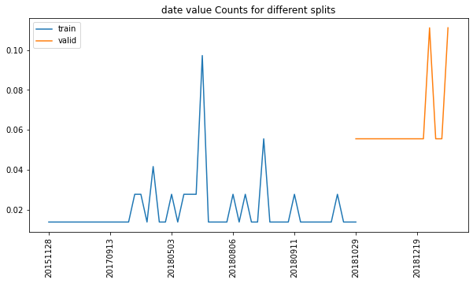


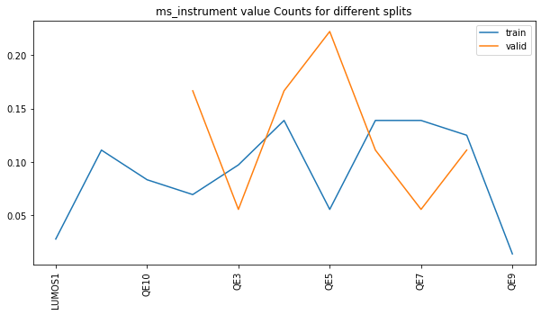


### PCA plot of original data


```python
import matplotlib.pyplot as plt
import matplotlib.dates as mdates

from sklearn.decomposition import PCA


def _add_indices(array, original_df, index_only=False):
    index = original_df.index
    columns = None
    if not index_only:
        columns = original_df.columns
    return pd.DataFrame(array, index=index, columns=columns)


def run_pca(df, n_components=2):
    """Run PCA on DataFrame.

    Returns
    -------
    pandas.DataFrame
        with same indices as in original DataFrame
    """
    pca = PCA(n_components=n_components).fit_transform(df)
    cols = [f'pc{i}' for i in range(n_components)]
    pca = pd.DataFrame(pca, index=df.index, columns=cols)
    return pca


def scatter_plot_w_dates(ax, df, dates=None):
    """plot first vs. second column in DataFrame.
    Use dates to color data."""

    cols = df.columns

    if isinstance(dates, str):
        dates = df['dates']

    ax = ax.scatter(
        x=df[cols[0]],
        y=df[cols[1]],
        c=[mdates.date2num(t) for t in pd.to_datetime(dates)
           ] if dates is not None else None
    )
    return ax


scaler = StandardScaler().fit(analysis.df)
pca = run_pca(df=scaler.transform(analysis.df_by_split, copy=None))
cols = list(pca.columns)

fig, axes = plt.subplots(ncols=2, figsize=(15, 8))

# by split
ax = axes[0]
ax = pca.loc['train'].plot.scatter(
    x=cols[0], y=cols[1], color='blue', label='train', ax=ax)
ax = pca.loc['valid'].plot.scatter(
    x=cols[0], y=cols[1], color='orange', label='valid', ax=ax)

# by dates
ax = axes[1]
ax = scatter_plot_w_dates(ax, pca, dates=analysis.df_meta.date)

loc = mdates.AutoDateLocator()
_ = fig.colorbar(ax, ticks=loc,
                 format=mdates.AutoDateFormatter(loc))

figures[('pca', 'original')] = fig
```


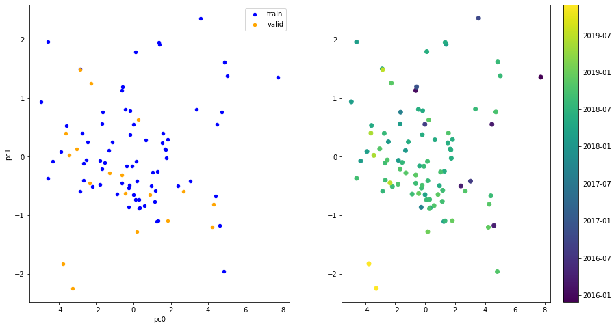


- [x] color sample by date (heatmap?)

### Analysis state so far


```python
analysis
```


    AnalyzePeptides with attributes: N_SAMPLES, df, df_by_split, df_meta, df_train, df_valid, indices, samples, stats


### Correlation


```python
analyzers.corr_lower_triangle(analysis.df)
```


<div>

<table border="1" class="dataframe">
  <thead>
    <tr style="text-align: right;">
      <th></th>
      <th>ACANPAAGSVILLENLR</th>
      <th>ARFEELCSDLFR</th>
      <th>AVAEQIPLLVQGVR</th>
      <th>EGPYDVVVLPGGNLGAQNLSESAAVK</th>
      <th>HGSLGFLPR</th>
      <th>IDIIPNPQER</th>
      <th>LALVTGGEIASTFDHPELVK</th>
      <th>LLEVEHPAAK</th>
      <th>STESLQANVQR</th>
      <th>VNNSSLIGLGYTQTLKPGIK</th>
    </tr>
  </thead>
  <tbody>
    <tr>
      <th>ACANPAAGSVILLENLR</th>
      <td>NaN</td>
      <td>NaN</td>
      <td>NaN</td>
      <td>NaN</td>
      <td>NaN</td>
      <td>NaN</td>
      <td>NaN</td>
      <td>NaN</td>
      <td>NaN</td>
      <td>NaN</td>
    </tr>
    <tr>
      <th>ARFEELCSDLFR</th>
      <td>0.705</td>
      <td>NaN</td>
      <td>NaN</td>
      <td>NaN</td>
      <td>NaN</td>
      <td>NaN</td>
      <td>NaN</td>
      <td>NaN</td>
      <td>NaN</td>
      <td>NaN</td>
    </tr>
    <tr>
      <th>AVAEQIPLLVQGVR</th>
      <td>0.736</td>
      <td>0.532</td>
      <td>NaN</td>
      <td>NaN</td>
      <td>NaN</td>
      <td>NaN</td>
      <td>NaN</td>
      <td>NaN</td>
      <td>NaN</td>
      <td>NaN</td>
    </tr>
    <tr>
      <th>EGPYDVVVLPGGNLGAQNLSESAAVK</th>
      <td>0.847</td>
      <td>0.653</td>
      <td>0.747</td>
      <td>NaN</td>
      <td>NaN</td>
      <td>NaN</td>
      <td>NaN</td>
      <td>NaN</td>
      <td>NaN</td>
      <td>NaN</td>
    </tr>
    <tr>
      <th>HGSLGFLPR</th>
      <td>0.512</td>
      <td>0.436</td>
      <td>0.456</td>
      <td>0.421</td>
      <td>NaN</td>
      <td>NaN</td>
      <td>NaN</td>
      <td>NaN</td>
      <td>NaN</td>
      <td>NaN</td>
    </tr>
    <tr>
      <th>IDIIPNPQER</th>
      <td>0.735</td>
      <td>0.682</td>
      <td>0.687</td>
      <td>0.778</td>
      <td>0.533</td>
      <td>NaN</td>
      <td>NaN</td>
      <td>NaN</td>
      <td>NaN</td>
      <td>NaN</td>
    </tr>
    <tr>
      <th>LALVTGGEIASTFDHPELVK</th>
      <td>0.758</td>
      <td>0.549</td>
      <td>0.658</td>
      <td>0.664</td>
      <td>0.446</td>
      <td>0.507</td>
      <td>NaN</td>
      <td>NaN</td>
      <td>NaN</td>
      <td>NaN</td>
    </tr>
    <tr>
      <th>LLEVEHPAAK</th>
      <td>0.603</td>
      <td>0.564</td>
      <td>0.401</td>
      <td>0.477</td>
      <td>0.475</td>
      <td>0.537</td>
      <td>0.441</td>
      <td>NaN</td>
      <td>NaN</td>
      <td>NaN</td>
    </tr>
    <tr>
      <th>STESLQANVQR</th>
      <td>0.737</td>
      <td>0.763</td>
      <td>0.689</td>
      <td>0.729</td>
      <td>0.503</td>
      <td>0.792</td>
      <td>0.613</td>
      <td>0.563</td>
      <td>NaN</td>
      <td>NaN</td>
    </tr>
    <tr>
      <th>VNNSSLIGLGYTQTLKPGIK</th>
      <td>0.797</td>
      <td>0.732</td>
      <td>0.750</td>
      <td>0.805</td>
      <td>0.450</td>
      <td>0.734</td>
      <td>0.662</td>
      <td>0.454</td>
      <td>0.805</td>
      <td>NaN</td>
    </tr>
  </tbody>
</table>
</div>


### Results

Helper function and results dictionary


```python
analysis.results = {}


def describe_abs_diff(y_true: pd.DataFrame, y_pred: pd.DataFrame):
    _abs_diff = y_true - y_pred
    return _abs_diff.abs().describe().to_dict()
```

## Baseline supervised RF models

- M RandomForest baseline models, each predicting one feature based on the M-1 other features
- get an idea of a possible baseline performance
    - could be used together with imputation of inputs
    - with some effort this could be scaled to predict only missing peptides


```python
from sklearn.ensemble import RandomForestRegressor
from sklearn.metrics import mean_squared_error
metrics = {}


peptides = list(analysis.df_train.columns)
metrics = {}
pred_valid = {}

for i in range(M):
    train_columns = list(range(M))
    test_column = i
    train_columns.remove(i)
    train_columns = [peptides[i] for i in train_columns]
    test_column = peptides[test_column]
    logger.debug(
        f"Train columns: {', '.join(train_columns)}\nTest column: {test_column}")
    _df_train, _y_train = analysis.df_train[train_columns], analysis.df_train[test_column]
    _df_valid, _y_valid = analysis.df_valid[train_columns], analysis.df_valid[test_column]
    rf_reg = RandomForestRegressor()
    rf_reg.fit(X=_df_train, y=_y_train)
    # metrics
    _metrics = {}
    _metrics[('MSE', 'train')] = mean_squared_error(
        y_true=_y_train, y_pred=rf_reg.predict(_df_train))
    y_pred_valid = rf_reg.predict(_df_valid)
    _metrics[('MSE', 'valid')] = mean_squared_error(
        y_true=_y_valid, y_pred=y_pred_valid)
    metrics[test_column] = _metrics
    # predictions
    pred_valid[test_column] = y_pred_valid
pd.DataFrame(metrics)
```


<div>

<table border="1" class="dataframe">
  <thead>
    <tr style="text-align: right;">
      <th></th>
      <th></th>
      <th>ACANPAAGSVILLENLR</th>
      <th>ARFEELCSDLFR</th>
      <th>AVAEQIPLLVQGVR</th>
      <th>EGPYDVVVLPGGNLGAQNLSESAAVK</th>
      <th>HGSLGFLPR</th>
      <th>IDIIPNPQER</th>
      <th>LALVTGGEIASTFDHPELVK</th>
      <th>LLEVEHPAAK</th>
      <th>STESLQANVQR</th>
      <th>VNNSSLIGLGYTQTLKPGIK</th>
    </tr>
  </thead>
  <tbody>
    <tr>
      <th rowspan="2" valign="top">MSE</th>
      <th>train</th>
      <td>0.016</td>
      <td>0.045</td>
      <td>0.021</td>
      <td>0.034</td>
      <td>0.164</td>
      <td>0.016</td>
      <td>0.026</td>
      <td>0.141</td>
      <td>0.033</td>
      <td>0.013</td>
    </tr>
    <tr>
      <th>valid</th>
      <td>0.321</td>
      <td>0.512</td>
      <td>0.395</td>
      <td>0.392</td>
      <td>1.206</td>
      <td>0.902</td>
      <td>1.603</td>
      <td>1.287</td>
      <td>0.329</td>
      <td>0.323</td>
    </tr>
  </tbody>
</table>
</div>


```python
analysis.pred_rf = pd.DataFrame(pred_valid, index=analysis.df_valid.index)
analysis.pred_rf
```


<div>

<table border="1" class="dataframe">
  <thead>
    <tr style="text-align: right;">
      <th></th>
      <th>ACANPAAGSVILLENLR</th>
      <th>ARFEELCSDLFR</th>
      <th>AVAEQIPLLVQGVR</th>
      <th>EGPYDVVVLPGGNLGAQNLSESAAVK</th>
      <th>HGSLGFLPR</th>
      <th>IDIIPNPQER</th>
      <th>LALVTGGEIASTFDHPELVK</th>
      <th>LLEVEHPAAK</th>
      <th>STESLQANVQR</th>
      <th>VNNSSLIGLGYTQTLKPGIK</th>
    </tr>
    <tr>
      <th>Sample ID</th>
      <th></th>
      <th></th>
      <th></th>
      <th></th>
      <th></th>
      <th></th>
      <th></th>
      <th></th>
      <th></th>
      <th></th>
    </tr>
  </thead>
  <tbody>
    <tr>
      <th>20181029_QE3_nLC3_KBE_QC_MNT_HELA_02</th>
      <td>30.307</td>
      <td>28.471</td>
      <td>25.656</td>
      <td>28.289</td>
      <td>26.672</td>
      <td>29.347</td>
      <td>28.954</td>
      <td>27.817</td>
      <td>28.784</td>
      <td>29.040</td>
    </tr>
    <tr>
      <th>20181102_QE2_NLC10_MR_QC_MNT_HELA_01</th>
      <td>31.460</td>
      <td>30.219</td>
      <td>27.544</td>
      <td>30.100</td>
      <td>29.747</td>
      <td>31.156</td>
      <td>30.455</td>
      <td>29.174</td>
      <td>30.095</td>
      <td>30.684</td>
    </tr>
    <tr>
      <th>20181107_QE6_nLC12_MR_QC_MNT_HELA_New_01</th>
      <td>31.100</td>
      <td>29.065</td>
      <td>26.967</td>
      <td>29.706</td>
      <td>29.371</td>
      <td>30.715</td>
      <td>29.986</td>
      <td>28.615</td>
      <td>29.888</td>
      <td>30.331</td>
    </tr>
    <tr>
      <th>20181110_QE5_nLC5_OOE_QC_MNT_HELA_15cm_250ng_RO-003</th>
      <td>29.496</td>
      <td>28.292</td>
      <td>25.301</td>
      <td>27.954</td>
      <td>27.301</td>
      <td>29.116</td>
      <td>28.620</td>
      <td>26.961</td>
      <td>28.321</td>
      <td>28.702</td>
    </tr>
    <tr>
      <th>20181112_QE7_nLC11_MEM_QC_HeLa_02</th>
      <td>31.386</td>
      <td>29.706</td>
      <td>27.486</td>
      <td>29.957</td>
      <td>29.690</td>
      <td>30.970</td>
      <td>30.433</td>
      <td>28.936</td>
      <td>29.840</td>
      <td>30.743</td>
    </tr>
    <tr>
      <th>20181119_QE1_nLC2_TW_QC_HeLa_1</th>
      <td>30.792</td>
      <td>29.123</td>
      <td>26.672</td>
      <td>29.106</td>
      <td>29.338</td>
      <td>30.090</td>
      <td>29.688</td>
      <td>28.292</td>
      <td>29.532</td>
      <td>29.789</td>
    </tr>
    <tr>
      <th>20181120_QE5_nLC7_AP_HeLa_2</th>
      <td>30.796</td>
      <td>29.401</td>
      <td>26.676</td>
      <td>29.459</td>
      <td>29.238</td>
      <td>30.544</td>
      <td>30.020</td>
      <td>28.499</td>
      <td>29.721</td>
      <td>30.017</td>
    </tr>
    <tr>
      <th>20181126_QE2_NLC10_MN_QC_HELA_02</th>
      <td>30.634</td>
      <td>29.151</td>
      <td>26.248</td>
      <td>28.550</td>
      <td>28.048</td>
      <td>29.864</td>
      <td>29.498</td>
      <td>28.479</td>
      <td>29.436</td>
      <td>29.607</td>
    </tr>
    <tr>
      <th>20181205_QE5_nLC7_RJC_QC_MNT_HeLa_2</th>
      <td>29.879</td>
      <td>28.236</td>
      <td>25.498</td>
      <td>27.576</td>
      <td>27.195</td>
      <td>29.018</td>
      <td>28.688</td>
      <td>26.426</td>
      <td>28.444</td>
      <td>28.919</td>
    </tr>
    <tr>
      <th>20181215_QE2_NLC10_ANHO_QC_MNT_HELA_04</th>
      <td>30.860</td>
      <td>29.642</td>
      <td>26.656</td>
      <td>28.913</td>
      <td>28.852</td>
      <td>30.259</td>
      <td>29.504</td>
      <td>28.067</td>
      <td>29.782</td>
      <td>29.767</td>
    </tr>
    <tr>
      <th>20181219_QE1_nLC2_GP_QC_MNT_HELA_01</th>
      <td>29.976</td>
      <td>29.115</td>
      <td>26.159</td>
      <td>28.618</td>
      <td>28.018</td>
      <td>29.695</td>
      <td>29.018</td>
      <td>27.986</td>
      <td>29.155</td>
      <td>29.423</td>
    </tr>
    <tr>
      <th>20190107_QE5_nLC5_DS_QC_MNT_HeLa_FlashPack_02</th>
      <td>29.647</td>
      <td>29.649</td>
      <td>27.140</td>
      <td>29.283</td>
      <td>28.711</td>
      <td>30.410</td>
      <td>30.314</td>
      <td>28.226</td>
      <td>29.745</td>
      <td>30.056</td>
    </tr>
    <tr>
      <th>20190527_QE4_LC12_AS_QC_MNT_HeLa_01</th>
      <td>31.811</td>
      <td>30.105</td>
      <td>27.619</td>
      <td>29.628</td>
      <td>29.797</td>
      <td>30.634</td>
      <td>30.627</td>
      <td>29.068</td>
      <td>30.621</td>
      <td>30.624</td>
    </tr>
    <tr>
      <th>20190527_QE4_LC12_AS_QC_MNT_HeLa_02</th>
      <td>31.839</td>
      <td>30.043</td>
      <td>27.663</td>
      <td>30.087</td>
      <td>29.867</td>
      <td>31.431</td>
      <td>30.602</td>
      <td>29.028</td>
      <td>30.688</td>
      <td>30.860</td>
    </tr>
    <tr>
      <th>20190701_QE4_LC12_IAH_QC_MNT_HeLa_03</th>
      <td>30.994</td>
      <td>30.249</td>
      <td>27.432</td>
      <td>29.583</td>
      <td>29.736</td>
      <td>30.486</td>
      <td>30.466</td>
      <td>29.015</td>
      <td>30.575</td>
      <td>30.269</td>
    </tr>
    <tr>
      <th>20190708_QE6_nLC4_JE_QC_MNT_HeLa_01</th>
      <td>31.905</td>
      <td>29.800</td>
      <td>27.672</td>
      <td>28.670</td>
      <td>29.131</td>
      <td>30.573</td>
      <td>30.776</td>
      <td>28.859</td>
      <td>30.719</td>
      <td>30.404</td>
    </tr>
    <tr>
      <th>20191128_QE8_nLC9_ASD_QC_HeLa_1</th>
      <td>31.736</td>
      <td>29.187</td>
      <td>27.247</td>
      <td>29.213</td>
      <td>29.521</td>
      <td>30.370</td>
      <td>30.415</td>
      <td>29.104</td>
      <td>29.743</td>
      <td>30.590</td>
    </tr>
    <tr>
      <th>20191128_QE8_nLC9_ASD_QC_HeLa_1_20191128165313</th>
      <td>30.789</td>
      <td>29.258</td>
      <td>27.235</td>
      <td>29.023</td>
      <td>28.288</td>
      <td>30.437</td>
      <td>30.357</td>
      <td>29.102</td>
      <td>29.690</td>
      <td>30.562</td>
    </tr>
  </tbody>
</table>
</div>


Overfits to training data as it should.


```python
analysis.df_valid
```


<div>

<table border="1" class="dataframe">
  <thead>
    <tr style="text-align: right;">
      <th></th>
      <th>ACANPAAGSVILLENLR</th>
      <th>ARFEELCSDLFR</th>
      <th>AVAEQIPLLVQGVR</th>
      <th>EGPYDVVVLPGGNLGAQNLSESAAVK</th>
      <th>HGSLGFLPR</th>
      <th>IDIIPNPQER</th>
      <th>LALVTGGEIASTFDHPELVK</th>
      <th>LLEVEHPAAK</th>
      <th>STESLQANVQR</th>
      <th>VNNSSLIGLGYTQTLKPGIK</th>
    </tr>
    <tr>
      <th>Sample ID</th>
      <th></th>
      <th></th>
      <th></th>
      <th></th>
      <th></th>
      <th></th>
      <th></th>
      <th></th>
      <th></th>
      <th></th>
    </tr>
  </thead>
  <tbody>
    <tr>
      <th>20181029_QE3_nLC3_KBE_QC_MNT_HELA_02</th>
      <td>30.157</td>
      <td>28.672</td>
      <td>26.038</td>
      <td>27.951</td>
      <td>28.610</td>
      <td>29.356</td>
      <td>29.427</td>
      <td>27.964</td>
      <td>28.615</td>
      <td>28.887</td>
    </tr>
    <tr>
      <th>20181102_QE2_NLC10_MR_QC_MNT_HELA_01</th>
      <td>31.999</td>
      <td>29.897</td>
      <td>27.728</td>
      <td>30.001</td>
      <td>29.960</td>
      <td>30.791</td>
      <td>30.565</td>
      <td>29.344</td>
      <td>29.927</td>
      <td>30.867</td>
    </tr>
    <tr>
      <th>20181107_QE6_nLC12_MR_QC_MNT_HELA_New_01</th>
      <td>31.138</td>
      <td>29.906</td>
      <td>27.071</td>
      <td>29.645</td>
      <td>29.738</td>
      <td>30.697</td>
      <td>30.526</td>
      <td>28.877</td>
      <td>29.163</td>
      <td>29.929</td>
    </tr>
    <tr>
      <th>20181110_QE5_nLC5_OOE_QC_MNT_HELA_15cm_250ng_RO-003</th>
      <td>29.478</td>
      <td>28.012</td>
      <td>25.679</td>
      <td>27.570</td>
      <td>28.119</td>
      <td>29.037</td>
      <td>28.656</td>
      <td>28.030</td>
      <td>28.082</td>
      <td>28.665</td>
    </tr>
    <tr>
      <th>20181112_QE7_nLC11_MEM_QC_HeLa_02</th>
      <td>31.430</td>
      <td>29.945</td>
      <td>27.511</td>
      <td>30.046</td>
      <td>27.138</td>
      <td>30.911</td>
      <td>30.181</td>
      <td>29.210</td>
      <td>30.590</td>
      <td>30.611</td>
    </tr>
    <tr>
      <th>20181119_QE1_nLC2_TW_QC_HeLa_1</th>
      <td>31.045</td>
      <td>29.598</td>
      <td>26.508</td>
      <td>29.260</td>
      <td>29.000</td>
      <td>30.341</td>
      <td>30.122</td>
      <td>26.896</td>
      <td>29.197</td>
      <td>29.589</td>
    </tr>
    <tr>
      <th>20181120_QE5_nLC7_AP_HeLa_2</th>
      <td>30.795</td>
      <td>28.816</td>
      <td>27.434</td>
      <td>28.972</td>
      <td>29.693</td>
      <td>30.860</td>
      <td>29.919</td>
      <td>29.017</td>
      <td>29.135</td>
      <td>30.099</td>
    </tr>
    <tr>
      <th>20181126_QE2_NLC10_MN_QC_HELA_02</th>
      <td>30.386</td>
      <td>29.247</td>
      <td>26.281</td>
      <td>28.601</td>
      <td>29.035</td>
      <td>29.999</td>
      <td>29.691</td>
      <td>28.794</td>
      <td>28.833</td>
      <td>29.895</td>
    </tr>
    <tr>
      <th>20181205_QE5_nLC7_RJC_QC_MNT_HeLa_2</th>
      <td>29.432</td>
      <td>27.398</td>
      <td>25.823</td>
      <td>28.078</td>
      <td>28.156</td>
      <td>29.238</td>
      <td>28.275</td>
      <td>28.909</td>
      <td>28.208</td>
      <td>28.280</td>
    </tr>
    <tr>
      <th>20181215_QE2_NLC10_ANHO_QC_MNT_HELA_04</th>
      <td>30.436</td>
      <td>29.476</td>
      <td>26.756</td>
      <td>29.213</td>
      <td>29.198</td>
      <td>30.505</td>
      <td>29.491</td>
      <td>29.422</td>
      <td>29.376</td>
      <td>30.297</td>
    </tr>
    <tr>
      <th>20181219_QE1_nLC2_GP_QC_MNT_HELA_01</th>
      <td>30.062</td>
      <td>28.980</td>
      <td>26.388</td>
      <td>27.932</td>
      <td>28.710</td>
      <td>29.785</td>
      <td>29.053</td>
      <td>29.076</td>
      <td>28.951</td>
      <td>29.246</td>
    </tr>
    <tr>
      <th>20190107_QE5_nLC5_DS_QC_MNT_HeLa_FlashPack_02</th>
      <td>31.315</td>
      <td>30.204</td>
      <td>25.995</td>
      <td>29.477</td>
      <td>28.720</td>
      <td>30.656</td>
      <td>25.263</td>
      <td>29.300</td>
      <td>29.706</td>
      <td>30.483</td>
    </tr>
    <tr>
      <th>20190527_QE4_LC12_AS_QC_MNT_HeLa_01</th>
      <td>32.039</td>
      <td>30.399</td>
      <td>26.777</td>
      <td>30.255</td>
      <td>29.095</td>
      <td>31.079</td>
      <td>30.906</td>
      <td>29.716</td>
      <td>30.757</td>
      <td>30.992</td>
    </tr>
    <tr>
      <th>20190527_QE4_LC12_AS_QC_MNT_HeLa_02</th>
      <td>31.996</td>
      <td>30.487</td>
      <td>27.199</td>
      <td>30.294</td>
      <td>28.742</td>
      <td>31.081</td>
      <td>30.932</td>
      <td>29.744</td>
      <td>30.684</td>
      <td>31.114</td>
    </tr>
    <tr>
      <th>20190701_QE4_LC12_IAH_QC_MNT_HeLa_03</th>
      <td>31.535</td>
      <td>30.134</td>
      <td>26.614</td>
      <td>29.436</td>
      <td>29.075</td>
      <td>30.959</td>
      <td>30.331</td>
      <td>29.946</td>
      <td>30.086</td>
      <td>31.134</td>
    </tr>
    <tr>
      <th>20190708_QE6_nLC4_JE_QC_MNT_HeLa_01</th>
      <td>30.736</td>
      <td>30.801</td>
      <td>26.106</td>
      <td>30.557</td>
      <td>28.890</td>
      <td>31.373</td>
      <td>31.426</td>
      <td>27.000</td>
      <td>30.800</td>
      <td>31.724</td>
    </tr>
    <tr>
      <th>20191128_QE8_nLC9_ASD_QC_HeLa_1</th>
      <td>31.355</td>
      <td>30.902</td>
      <td>26.815</td>
      <td>30.098</td>
      <td>30.423</td>
      <td>32.998</td>
      <td>29.817</td>
      <td>30.494</td>
      <td>30.996</td>
      <td>29.837</td>
    </tr>
    <tr>
      <th>20191128_QE8_nLC9_ASD_QC_HeLa_1_20191128165313</th>
      <td>31.316</td>
      <td>30.793</td>
      <td>26.552</td>
      <td>29.950</td>
      <td>30.457</td>
      <td>33.200</td>
      <td>29.195</td>
      <td>30.507</td>
      <td>31.036</td>
      <td>29.427</td>
    </tr>
  </tbody>
</table>
</div>


```python
analysis.results['RF baseline'] = describe_abs_diff(
    y_true=analysis.df_valid, y_pred=analysis.pred_rf)
pd.DataFrame(analysis.results['RF baseline'])
```


<div>

<table border="1" class="dataframe">
  <thead>
    <tr style="text-align: right;">
      <th></th>
      <th>ACANPAAGSVILLENLR</th>
      <th>ARFEELCSDLFR</th>
      <th>AVAEQIPLLVQGVR</th>
      <th>EGPYDVVVLPGGNLGAQNLSESAAVK</th>
      <th>HGSLGFLPR</th>
      <th>IDIIPNPQER</th>
      <th>LALVTGGEIASTFDHPELVK</th>
      <th>LLEVEHPAAK</th>
      <th>STESLQANVQR</th>
      <th>VNNSSLIGLGYTQTLKPGIK</th>
    </tr>
  </thead>
  <tbody>
    <tr>
      <th>count</th>
      <td>18.000</td>
      <td>18.000</td>
      <td>18.000</td>
      <td>18.000</td>
      <td>18.000</td>
      <td>18.000</td>
      <td>18.000</td>
      <td>18.000</td>
      <td>18.000</td>
      <td>18.000</td>
    </tr>
    <tr>
      <th>mean</th>
      <td>0.384</td>
      <td>0.546</td>
      <td>0.479</td>
      <td>0.446</td>
      <td>0.860</td>
      <td>0.527</td>
      <td>0.600</td>
      <td>0.950</td>
      <td>0.432</td>
      <td>0.441</td>
    </tr>
    <tr>
      <th>std</th>
      <td>0.428</td>
      <td>0.475</td>
      <td>0.418</td>
      <td>0.453</td>
      <td>0.703</td>
      <td>0.813</td>
      <td>1.147</td>
      <td>0.637</td>
      <td>0.389</td>
      <td>0.368</td>
    </tr>
    <tr>
      <th>min</th>
      <td>0.001</td>
      <td>0.096</td>
      <td>0.025</td>
      <td>0.051</td>
      <td>0.008</td>
      <td>0.009</td>
      <td>0.012</td>
      <td>0.147</td>
      <td>0.005</td>
      <td>0.038</td>
    </tr>
    <tr>
      <th>25%</th>
      <td>0.102</td>
      <td>0.211</td>
      <td>0.169</td>
      <td>0.148</td>
      <td>0.351</td>
      <td>0.101</td>
      <td>0.116</td>
      <td>0.366</td>
      <td>0.168</td>
      <td>0.179</td>
    </tr>
    <tr>
      <th>50%</th>
      <td>0.250</td>
      <td>0.383</td>
      <td>0.380</td>
      <td>0.319</td>
      <td>0.697</td>
      <td>0.248</td>
      <td>0.305</td>
      <td>1.000</td>
      <td>0.287</td>
      <td>0.328</td>
    </tr>
    <tr>
      <th>75%</th>
      <td>0.507</td>
      <td>0.775</td>
      <td>0.739</td>
      <td>0.596</td>
      <td>0.980</td>
      <td>0.425</td>
      <td>0.524</td>
      <td>1.381</td>
      <td>0.599</td>
      <td>0.612</td>
    </tr>
    <tr>
      <th>max</th>
      <td>1.668</td>
      <td>1.715</td>
      <td>1.566</td>
      <td>1.888</td>
      <td>2.552</td>
      <td>2.764</td>
      <td>5.051</td>
      <td>2.484</td>
      <td>1.345</td>
      <td>1.320</td>
    </tr>
  </tbody>
</table>
</div>


Could a model help in identifying extraordinar differences in samples? Something to focus on?

## DL Setup


```python
import vaep.model as vaep_model
from vaep.cmd import get_args

BATCH_SIZE, EPOCHS = 8, 30
args = get_args(batch_size=BATCH_SIZE, epochs=EPOCHS,
                no_cuda=True)  # data transfer to GPU seems slow
kwargs = {'num_workers': 2, 'pin_memory': True} if args.cuda else {}

# torch.manual_seed(args.seed)
device = torch.device("cuda" if args.cuda else "cpu")
device

print(args, device)
```

    Namespace(batch_size=8, cuda=False, epochs=30, log_interval=10, no_cuda=True, seed=43) cpu
    

## Simple AE
- should also heavily overfit the training data


```python
from vaep.transform import ShiftedStandardScaler

args_ae = {}
args_ae['SCALER'] = StandardScaler
args_ae['SCALER'] = ShiftedStandardScaler

# select initial data: transformed vs not log transformed
scaler = args_ae['SCALER'](scale_var=2).fit(analysis.df_train)
# five examples from validation dataset
scaler.transform(analysis.df_train).describe(percentiles=[0.025, 0.975])
```


<div>

<table border="1" class="dataframe">
  <thead>
    <tr style="text-align: right;">
      <th></th>
      <th>ACANPAAGSVILLENLR</th>
      <th>ARFEELCSDLFR</th>
      <th>AVAEQIPLLVQGVR</th>
      <th>EGPYDVVVLPGGNLGAQNLSESAAVK</th>
      <th>HGSLGFLPR</th>
      <th>IDIIPNPQER</th>
      <th>LALVTGGEIASTFDHPELVK</th>
      <th>LLEVEHPAAK</th>
      <th>STESLQANVQR</th>
      <th>VNNSSLIGLGYTQTLKPGIK</th>
    </tr>
  </thead>
  <tbody>
    <tr>
      <th>count</th>
      <td>72.000</td>
      <td>72.000</td>
      <td>72.000</td>
      <td>72.000</td>
      <td>72.000</td>
      <td>72.000</td>
      <td>72.000</td>
      <td>72.000</td>
      <td>72.000</td>
      <td>72.000</td>
    </tr>
    <tr>
      <th>mean</th>
      <td>0.500</td>
      <td>0.500</td>
      <td>0.500</td>
      <td>0.500</td>
      <td>0.500</td>
      <td>0.500</td>
      <td>0.500</td>
      <td>0.500</td>
      <td>0.500</td>
      <td>0.500</td>
    </tr>
    <tr>
      <th>std</th>
      <td>0.504</td>
      <td>0.504</td>
      <td>0.504</td>
      <td>0.504</td>
      <td>0.504</td>
      <td>0.504</td>
      <td>0.504</td>
      <td>0.504</td>
      <td>0.504</td>
      <td>0.504</td>
    </tr>
    <tr>
      <th>min</th>
      <td>-0.873</td>
      <td>-0.879</td>
      <td>-0.827</td>
      <td>-0.691</td>
      <td>-1.060</td>
      <td>-0.875</td>
      <td>-0.672</td>
      <td>-1.245</td>
      <td>-0.962</td>
      <td>-0.731</td>
    </tr>
    <tr>
      <th>2.5%</th>
      <td>-0.598</td>
      <td>-0.487</td>
      <td>-0.595</td>
      <td>-0.553</td>
      <td>-0.951</td>
      <td>-0.398</td>
      <td>-0.507</td>
      <td>-0.595</td>
      <td>-0.537</td>
      <td>-0.454</td>
    </tr>
    <tr>
      <th>50%</th>
      <td>0.569</td>
      <td>0.570</td>
      <td>0.501</td>
      <td>0.460</td>
      <td>0.639</td>
      <td>0.489</td>
      <td>0.591</td>
      <td>0.619</td>
      <td>0.489</td>
      <td>0.483</td>
    </tr>
    <tr>
      <th>97.5%</th>
      <td>1.345</td>
      <td>1.226</td>
      <td>1.473</td>
      <td>1.261</td>
      <td>1.039</td>
      <td>1.466</td>
      <td>1.365</td>
      <td>1.185</td>
      <td>1.540</td>
      <td>1.477</td>
    </tr>
    <tr>
      <th>max</th>
      <td>1.465</td>
      <td>1.808</td>
      <td>1.516</td>
      <td>1.376</td>
      <td>1.186</td>
      <td>1.608</td>
      <td>1.589</td>
      <td>1.317</td>
      <td>1.790</td>
      <td>1.711</td>
    </tr>
  </tbody>
</table>
</div>


```python
scaler.transform(analysis.df_valid).describe(percentiles=[0.025, 0.975])
```


<div>

<table border="1" class="dataframe">
  <thead>
    <tr style="text-align: right;">
      <th></th>
      <th>ACANPAAGSVILLENLR</th>
      <th>ARFEELCSDLFR</th>
      <th>AVAEQIPLLVQGVR</th>
      <th>EGPYDVVVLPGGNLGAQNLSESAAVK</th>
      <th>HGSLGFLPR</th>
      <th>IDIIPNPQER</th>
      <th>LALVTGGEIASTFDHPELVK</th>
      <th>LLEVEHPAAK</th>
      <th>STESLQANVQR</th>
      <th>VNNSSLIGLGYTQTLKPGIK</th>
    </tr>
  </thead>
  <tbody>
    <tr>
      <th>count</th>
      <td>18.000</td>
      <td>18.000</td>
      <td>18.000</td>
      <td>18.000</td>
      <td>18.000</td>
      <td>18.000</td>
      <td>18.000</td>
      <td>18.000</td>
      <td>18.000</td>
      <td>18.000</td>
    </tr>
    <tr>
      <th>mean</th>
      <td>0.680</td>
      <td>0.729</td>
      <td>0.447</td>
      <td>0.617</td>
      <td>0.609</td>
      <td>0.796</td>
      <td>0.539</td>
      <td>0.855</td>
      <td>0.586</td>
      <td>0.626</td>
    </tr>
    <tr>
      <th>std</th>
      <td>0.464</td>
      <td>0.633</td>
      <td>0.422</td>
      <td>0.524</td>
      <td>0.314</td>
      <td>0.748</td>
      <td>0.675</td>
      <td>0.433</td>
      <td>0.639</td>
      <td>0.672</td>
    </tr>
    <tr>
      <th>min</th>
      <td>-0.183</td>
      <td>-0.726</td>
      <td>-0.225</td>
      <td>-0.361</td>
      <td>-0.118</td>
      <td>-0.343</td>
      <td>-1.629</td>
      <td>-0.050</td>
      <td>-0.462</td>
      <td>-0.649</td>
    </tr>
    <tr>
      <th>2.5%</th>
      <td>-0.172</td>
      <td>-0.557</td>
      <td>-0.182</td>
      <td>-0.274</td>
      <td>0.041</td>
      <td>-0.285</td>
      <td>-0.997</td>
      <td>-0.031</td>
      <td>-0.427</td>
      <td>-0.532</td>
    </tr>
    <tr>
      <th>50%</th>
      <td>0.776</td>
      <td>0.893</td>
      <td>0.416</td>
      <td>0.708</td>
      <td>0.600</td>
      <td>0.816</td>
      <td>0.644</td>
      <td>0.911</td>
      <td>0.498</td>
      <td>0.594</td>
    </tr>
    <tr>
      <th>97.5%</th>
      <td>1.314</td>
      <td>1.512</td>
      <td>1.164</td>
      <td>1.268</td>
      <td>1.144</td>
      <td>2.425</td>
      <td>1.310</td>
      <td>1.492</td>
      <td>1.471</td>
      <td>1.639</td>
    </tr>
    <tr>
      <th>max</th>
      <td>1.324</td>
      <td>1.540</td>
      <td>1.229</td>
      <td>1.331</td>
      <td>1.150</td>
      <td>2.484</td>
      <td>1.413</td>
      <td>1.494</td>
      <td>1.482</td>
      <td>1.818</td>
    </tr>
  </tbody>
</table>
</div>


```python
from torchvision import transforms
from torch.utils.data import DataLoader
from vaep.io.datasets import PeptideDatasetInMemoryNoMissings

# ToDo: replace with helper class (see below)
tf_norm = None  # replace with Normalizer

dataset_train = PeptideDatasetInMemoryNoMissings(
    data=scaler.transform(analysis.df_train), transform=tf_norm)
dataset_valid = PeptideDatasetInMemoryNoMissings(
    data=scaler.transform(analysis.df_valid), transform=tf_norm)
dl_train = DataLoader(dataset_train, batch_size=args.batch_size, shuffle=True)
dl_valid = DataLoader(dataset_valid, batch_size=args.batch_size, shuffle=False)
```

### Without Noise


```python
model = vaep_model.Autoencoder(n_features=M, n_neurons=int(
    M/2), last_decoder_activation=None, dim_latent=3).double()
criterion = torch.nn.MSELoss(reduction='sum')

learning_rate = 1e-2

optimizer = torch.optim.Adam(
    model.parameters(),
    lr=learning_rate,
)

# Train standard autoencoder (AE)

train_losses, valid_losses = [], []

# do = nn.Dropout()  # for denoising AE
for epoch in range(args.epochs):
    # ===================train==========================
    for data in dl_train:
        model.train()
        data = data.to(device)
        # noise = do(torch.ones(data.shape)).to(device) # for denoising AE
        # data_corrupted = (data * noise).to(device)    # for denoising AE
        # ===================forward=====================
        output = model(data)
        loss = criterion(output, data)
        # ===================backward====================
        optimizer.zero_grad()
        loss.backward()
        optimizer.step()
        train_losses.append(loss.item())
    # ===================validate========================
    for data in dl_valid:
        model.eval()
        data = data.to(device)
        output = model(data)
        loss = criterion(output, data)
        valid_losses.append(loss.item())

    # ===================log=============================
    print(f'epoch [{epoch + 1:03d}/{args.epochs}], '
          f'train-loss: {np.mean(train_losses[-len(dl_train):]):.4f},'
          f'valid-loss: {np.mean(valid_losses[-len(dl_valid):]):.4f}')
```

    epoch [001/30], train-loss: 38.1450,valid-loss: 32.5391
    epoch [002/30], train-loss: 24.1494,valid-loss: 20.5401
    epoch [003/30], train-loss: 16.4426,valid-loss: 15.0347
    epoch [004/30], train-loss: 13.7267,valid-loss: 13.3773
    epoch [005/30], train-loss: 12.3260,valid-loss: 13.4774
    epoch [006/30], train-loss: 10.4638,valid-loss: 12.3712
    epoch [007/30], train-loss: 9.1209,valid-loss: 10.6333
    epoch [008/30], train-loss: 8.0506,valid-loss: 10.0156
    epoch [009/30], train-loss: 7.1928,valid-loss: 9.4267
    epoch [010/30], train-loss: 6.7741,valid-loss: 9.2030
    epoch [011/30], train-loss: 6.4391,valid-loss: 9.0134
    epoch [012/30], train-loss: 6.3059,valid-loss: 8.8587
    epoch [013/30], train-loss: 6.2833,valid-loss: 8.8802
    epoch [014/30], train-loss: 6.1364,valid-loss: 8.6886
    epoch [015/30], train-loss: 5.9696,valid-loss: 8.5828
    epoch [016/30], train-loss: 5.9153,valid-loss: 8.5040
    epoch [017/30], train-loss: 5.7050,valid-loss: 8.4550
    epoch [018/30], train-loss: 5.6063,valid-loss: 8.4865
    epoch [019/30], train-loss: 5.3881,valid-loss: 8.2474
    epoch [020/30], train-loss: 5.1049,valid-loss: 8.1140
    epoch [021/30], train-loss: 4.8991,valid-loss: 8.0341
    epoch [022/30], train-loss: 4.8181,valid-loss: 7.9130
    epoch [023/30], train-loss: 4.7504,valid-loss: 8.1090
    epoch [024/30], train-loss: 4.8021,valid-loss: 8.0977
    epoch [025/30], train-loss: 4.8373,valid-loss: 8.0948
    epoch [026/30], train-loss: 4.7489,valid-loss: 7.9340
    epoch [027/30], train-loss: 4.7265,valid-loss: 7.9318
    epoch [028/30], train-loss: 4.6440,valid-loss: 7.9384
    epoch [029/30], train-loss: 4.6102,valid-loss: 7.9085
    epoch [030/30], train-loss: 4.6293,valid-loss: 7.9636
    


```python
df_train_losses = vaep_model.process_train_loss({'MSE train': train_losses})

# Plotting is boilerplate code:
_ = df_train_losses.plot(kind='scatter', x='steps', y='MSE train smoothed', figsize=(
    15, 8),  title='Exponential smoothed training loss', ylim=(0, None))
df_train_losses.tail()
```


<div>

<table border="1" class="dataframe">
  <thead>
    <tr style="text-align: right;">
      <th></th>
      <th>steps</th>
      <th>MSE train</th>
      <th>MSE train smoothed</th>
    </tr>
  </thead>
  <tbody>
    <tr>
      <th>265</th>
      <td>265</td>
      <td>7.172</td>
      <td>4.920</td>
    </tr>
    <tr>
      <th>266</th>
      <td>266</td>
      <td>4.460</td>
      <td>4.874</td>
    </tr>
    <tr>
      <th>267</th>
      <td>267</td>
      <td>2.347</td>
      <td>4.621</td>
    </tr>
    <tr>
      <th>268</th>
      <td>268</td>
      <td>4.329</td>
      <td>4.592</td>
    </tr>
    <tr>
      <th>269</th>
      <td>269</td>
      <td>3.476</td>
      <td>4.480</td>
    </tr>
  </tbody>
</table>
</div>


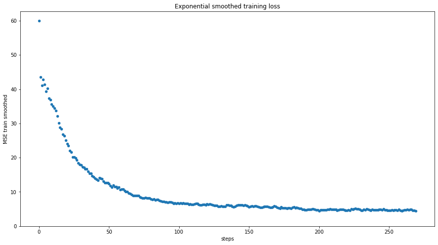


```python
def get_pred(model, dataloader):
    pred = []
    model.eval()
    for data in dataloader:
        data = data.to(device)
        output = model(data)
        pred.append(output.detach().numpy())
    return pred


pred = get_pred(model, dl_valid)
analysis.pred_aa_simple = vaep_model.build_df_from_pred_batches(
    pred, scaler, index=analysis.df_valid.index, columns=analysis.df_valid.columns)
analysis.pred_aa_simple
```


<div>

<table border="1" class="dataframe">
  <thead>
    <tr style="text-align: right;">
      <th></th>
      <th>ACANPAAGSVILLENLR</th>
      <th>ARFEELCSDLFR</th>
      <th>AVAEQIPLLVQGVR</th>
      <th>EGPYDVVVLPGGNLGAQNLSESAAVK</th>
      <th>HGSLGFLPR</th>
      <th>IDIIPNPQER</th>
      <th>LALVTGGEIASTFDHPELVK</th>
      <th>LLEVEHPAAK</th>
      <th>STESLQANVQR</th>
      <th>VNNSSLIGLGYTQTLKPGIK</th>
    </tr>
    <tr>
      <th>Sample ID</th>
      <th></th>
      <th></th>
      <th></th>
      <th></th>
      <th></th>
      <th></th>
      <th></th>
      <th></th>
      <th></th>
      <th></th>
    </tr>
  </thead>
  <tbody>
    <tr>
      <th>20181029_QE3_nLC3_KBE_QC_MNT_HELA_02</th>
      <td>29.886</td>
      <td>28.939</td>
      <td>25.854</td>
      <td>28.181</td>
      <td>28.543</td>
      <td>29.448</td>
      <td>28.927</td>
      <td>28.152</td>
      <td>28.878</td>
      <td>29.136</td>
    </tr>
    <tr>
      <th>20181102_QE2_NLC10_MR_QC_MNT_HELA_01</th>
      <td>31.714</td>
      <td>30.069</td>
      <td>27.639</td>
      <td>30.219</td>
      <td>29.777</td>
      <td>31.218</td>
      <td>30.786</td>
      <td>29.183</td>
      <td>30.473</td>
      <td>30.859</td>
    </tr>
    <tr>
      <th>20181107_QE6_nLC12_MR_QC_MNT_HELA_New_01</th>
      <td>31.210</td>
      <td>29.880</td>
      <td>26.974</td>
      <td>29.570</td>
      <td>29.696</td>
      <td>30.632</td>
      <td>30.295</td>
      <td>29.190</td>
      <td>30.035</td>
      <td>30.247</td>
    </tr>
    <tr>
      <th>20181110_QE5_nLC5_OOE_QC_MNT_HELA_15cm_250ng_RO-003</th>
      <td>29.400</td>
      <td>28.523</td>
      <td>25.517</td>
      <td>27.745</td>
      <td>27.976</td>
      <td>29.061</td>
      <td>28.410</td>
      <td>27.619</td>
      <td>28.478</td>
      <td>28.768</td>
    </tr>
    <tr>
      <th>20181112_QE7_nLC11_MEM_QC_HeLa_02</th>
      <td>31.512</td>
      <td>29.784</td>
      <td>27.713</td>
      <td>30.150</td>
      <td>29.227</td>
      <td>31.242</td>
      <td>30.464</td>
      <td>28.460</td>
      <td>30.323</td>
      <td>30.832</td>
    </tr>
    <tr>
      <th>20181119_QE1_nLC2_TW_QC_HeLa_1</th>
      <td>30.769</td>
      <td>29.459</td>
      <td>26.823</td>
      <td>29.215</td>
      <td>28.966</td>
      <td>30.445</td>
      <td>29.697</td>
      <td>28.267</td>
      <td>29.662</td>
      <td>30.003</td>
    </tr>
    <tr>
      <th>20181120_QE5_nLC7_AP_HeLa_2</th>
      <td>31.000</td>
      <td>29.558</td>
      <td>27.085</td>
      <td>29.510</td>
      <td>29.072</td>
      <td>30.671</td>
      <td>29.960</td>
      <td>28.389</td>
      <td>29.873</td>
      <td>30.252</td>
    </tr>
    <tr>
      <th>20181126_QE2_NLC10_MN_QC_HELA_02</th>
      <td>30.512</td>
      <td>29.391</td>
      <td>26.365</td>
      <td>28.830</td>
      <td>29.118</td>
      <td>29.990</td>
      <td>29.588</td>
      <td>28.694</td>
      <td>29.424</td>
      <td>29.650</td>
    </tr>
    <tr>
      <th>20181205_QE5_nLC7_RJC_QC_MNT_HeLa_2</th>
      <td>29.368</td>
      <td>28.511</td>
      <td>25.466</td>
      <td>27.698</td>
      <td>27.989</td>
      <td>29.007</td>
      <td>28.397</td>
      <td>27.665</td>
      <td>28.447</td>
      <td>28.731</td>
    </tr>
    <tr>
      <th>20181215_QE2_NLC10_ANHO_QC_MNT_HELA_04</th>
      <td>30.959</td>
      <td>29.661</td>
      <td>26.815</td>
      <td>29.343</td>
      <td>29.400</td>
      <td>30.440</td>
      <td>30.032</td>
      <td>28.905</td>
      <td>29.822</td>
      <td>30.073</td>
    </tr>
    <tr>
      <th>20181219_QE1_nLC2_GP_QC_MNT_HELA_01</th>
      <td>30.147</td>
      <td>29.137</td>
      <td>26.048</td>
      <td>28.439</td>
      <td>28.814</td>
      <td>29.657</td>
      <td>29.214</td>
      <td>28.426</td>
      <td>29.102</td>
      <td>29.341</td>
    </tr>
    <tr>
      <th>20190107_QE5_nLC5_DS_QC_MNT_HeLa_FlashPack_02</th>
      <td>30.597</td>
      <td>29.251</td>
      <td>26.762</td>
      <td>29.117</td>
      <td>28.661</td>
      <td>30.330</td>
      <td>29.524</td>
      <td>27.999</td>
      <td>29.536</td>
      <td>29.914</td>
    </tr>
    <tr>
      <th>20190527_QE4_LC12_AS_QC_MNT_HeLa_01</th>
      <td>31.813</td>
      <td>30.193</td>
      <td>27.542</td>
      <td>30.271</td>
      <td>30.059</td>
      <td>31.135</td>
      <td>30.989</td>
      <td>29.675</td>
      <td>30.570</td>
      <td>30.831</td>
    </tr>
    <tr>
      <th>20190527_QE4_LC12_AS_QC_MNT_HeLa_02</th>
      <td>31.881</td>
      <td>30.197</td>
      <td>27.698</td>
      <td>30.369</td>
      <td>29.990</td>
      <td>31.272</td>
      <td>31.018</td>
      <td>29.521</td>
      <td>30.618</td>
      <td>30.961</td>
    </tr>
    <tr>
      <th>20190701_QE4_LC12_IAH_QC_MNT_HeLa_03</th>
      <td>31.576</td>
      <td>30.040</td>
      <td>27.342</td>
      <td>30.022</td>
      <td>29.883</td>
      <td>30.938</td>
      <td>30.737</td>
      <td>29.483</td>
      <td>30.367</td>
      <td>30.621</td>
    </tr>
    <tr>
      <th>20190708_QE6_nLC4_JE_QC_MNT_HeLa_01</th>
      <td>31.816</td>
      <td>30.121</td>
      <td>27.782</td>
      <td>30.336</td>
      <td>29.797</td>
      <td>31.358</td>
      <td>30.863</td>
      <td>29.137</td>
      <td>30.552</td>
      <td>30.987</td>
    </tr>
    <tr>
      <th>20191128_QE8_nLC9_ASD_QC_HeLa_1</th>
      <td>31.635</td>
      <td>30.180</td>
      <td>27.261</td>
      <td>30.012</td>
      <td>30.122</td>
      <td>30.922</td>
      <td>30.799</td>
      <td>29.724</td>
      <td>30.417</td>
      <td>30.565</td>
    </tr>
    <tr>
      <th>20191128_QE8_nLC9_ASD_QC_HeLa_1_20191128165313</th>
      <td>31.490</td>
      <td>30.113</td>
      <td>27.102</td>
      <td>29.834</td>
      <td>30.057</td>
      <td>30.782</td>
      <td>30.639</td>
      <td>29.650</td>
      <td>30.288</td>
      <td>30.411</td>
    </tr>
  </tbody>
</table>
</div>


```python
display(analysis.df_valid)  # true values
```


<div>

<table border="1" class="dataframe">
  <thead>
    <tr style="text-align: right;">
      <th></th>
      <th>ACANPAAGSVILLENLR</th>
      <th>ARFEELCSDLFR</th>
      <th>AVAEQIPLLVQGVR</th>
      <th>EGPYDVVVLPGGNLGAQNLSESAAVK</th>
      <th>HGSLGFLPR</th>
      <th>IDIIPNPQER</th>
      <th>LALVTGGEIASTFDHPELVK</th>
      <th>LLEVEHPAAK</th>
      <th>STESLQANVQR</th>
      <th>VNNSSLIGLGYTQTLKPGIK</th>
    </tr>
    <tr>
      <th>Sample ID</th>
      <th></th>
      <th></th>
      <th></th>
      <th></th>
      <th></th>
      <th></th>
      <th></th>
      <th></th>
      <th></th>
      <th></th>
    </tr>
  </thead>
  <tbody>
    <tr>
      <th>20181029_QE3_nLC3_KBE_QC_MNT_HELA_02</th>
      <td>30.157</td>
      <td>28.672</td>
      <td>26.038</td>
      <td>27.951</td>
      <td>28.610</td>
      <td>29.356</td>
      <td>29.427</td>
      <td>27.964</td>
      <td>28.615</td>
      <td>28.887</td>
    </tr>
    <tr>
      <th>20181102_QE2_NLC10_MR_QC_MNT_HELA_01</th>
      <td>31.999</td>
      <td>29.897</td>
      <td>27.728</td>
      <td>30.001</td>
      <td>29.960</td>
      <td>30.791</td>
      <td>30.565</td>
      <td>29.344</td>
      <td>29.927</td>
      <td>30.867</td>
    </tr>
    <tr>
      <th>20181107_QE6_nLC12_MR_QC_MNT_HELA_New_01</th>
      <td>31.138</td>
      <td>29.906</td>
      <td>27.071</td>
      <td>29.645</td>
      <td>29.738</td>
      <td>30.697</td>
      <td>30.526</td>
      <td>28.877</td>
      <td>29.163</td>
      <td>29.929</td>
    </tr>
    <tr>
      <th>20181110_QE5_nLC5_OOE_QC_MNT_HELA_15cm_250ng_RO-003</th>
      <td>29.478</td>
      <td>28.012</td>
      <td>25.679</td>
      <td>27.570</td>
      <td>28.119</td>
      <td>29.037</td>
      <td>28.656</td>
      <td>28.030</td>
      <td>28.082</td>
      <td>28.665</td>
    </tr>
    <tr>
      <th>20181112_QE7_nLC11_MEM_QC_HeLa_02</th>
      <td>31.430</td>
      <td>29.945</td>
      <td>27.511</td>
      <td>30.046</td>
      <td>27.138</td>
      <td>30.911</td>
      <td>30.181</td>
      <td>29.210</td>
      <td>30.590</td>
      <td>30.611</td>
    </tr>
    <tr>
      <th>20181119_QE1_nLC2_TW_QC_HeLa_1</th>
      <td>31.045</td>
      <td>29.598</td>
      <td>26.508</td>
      <td>29.260</td>
      <td>29.000</td>
      <td>30.341</td>
      <td>30.122</td>
      <td>26.896</td>
      <td>29.197</td>
      <td>29.589</td>
    </tr>
    <tr>
      <th>20181120_QE5_nLC7_AP_HeLa_2</th>
      <td>30.795</td>
      <td>28.816</td>
      <td>27.434</td>
      <td>28.972</td>
      <td>29.693</td>
      <td>30.860</td>
      <td>29.919</td>
      <td>29.017</td>
      <td>29.135</td>
      <td>30.099</td>
    </tr>
    <tr>
      <th>20181126_QE2_NLC10_MN_QC_HELA_02</th>
      <td>30.386</td>
      <td>29.247</td>
      <td>26.281</td>
      <td>28.601</td>
      <td>29.035</td>
      <td>29.999</td>
      <td>29.691</td>
      <td>28.794</td>
      <td>28.833</td>
      <td>29.895</td>
    </tr>
    <tr>
      <th>20181205_QE5_nLC7_RJC_QC_MNT_HeLa_2</th>
      <td>29.432</td>
      <td>27.398</td>
      <td>25.823</td>
      <td>28.078</td>
      <td>28.156</td>
      <td>29.238</td>
      <td>28.275</td>
      <td>28.909</td>
      <td>28.208</td>
      <td>28.280</td>
    </tr>
    <tr>
      <th>20181215_QE2_NLC10_ANHO_QC_MNT_HELA_04</th>
      <td>30.436</td>
      <td>29.476</td>
      <td>26.756</td>
      <td>29.213</td>
      <td>29.198</td>
      <td>30.505</td>
      <td>29.491</td>
      <td>29.422</td>
      <td>29.376</td>
      <td>30.297</td>
    </tr>
    <tr>
      <th>20181219_QE1_nLC2_GP_QC_MNT_HELA_01</th>
      <td>30.062</td>
      <td>28.980</td>
      <td>26.388</td>
      <td>27.932</td>
      <td>28.710</td>
      <td>29.785</td>
      <td>29.053</td>
      <td>29.076</td>
      <td>28.951</td>
      <td>29.246</td>
    </tr>
    <tr>
      <th>20190107_QE5_nLC5_DS_QC_MNT_HeLa_FlashPack_02</th>
      <td>31.315</td>
      <td>30.204</td>
      <td>25.995</td>
      <td>29.477</td>
      <td>28.720</td>
      <td>30.656</td>
      <td>25.263</td>
      <td>29.300</td>
      <td>29.706</td>
      <td>30.483</td>
    </tr>
    <tr>
      <th>20190527_QE4_LC12_AS_QC_MNT_HeLa_01</th>
      <td>32.039</td>
      <td>30.399</td>
      <td>26.777</td>
      <td>30.255</td>
      <td>29.095</td>
      <td>31.079</td>
      <td>30.906</td>
      <td>29.716</td>
      <td>30.757</td>
      <td>30.992</td>
    </tr>
    <tr>
      <th>20190527_QE4_LC12_AS_QC_MNT_HeLa_02</th>
      <td>31.996</td>
      <td>30.487</td>
      <td>27.199</td>
      <td>30.294</td>
      <td>28.742</td>
      <td>31.081</td>
      <td>30.932</td>
      <td>29.744</td>
      <td>30.684</td>
      <td>31.114</td>
    </tr>
    <tr>
      <th>20190701_QE4_LC12_IAH_QC_MNT_HeLa_03</th>
      <td>31.535</td>
      <td>30.134</td>
      <td>26.614</td>
      <td>29.436</td>
      <td>29.075</td>
      <td>30.959</td>
      <td>30.331</td>
      <td>29.946</td>
      <td>30.086</td>
      <td>31.134</td>
    </tr>
    <tr>
      <th>20190708_QE6_nLC4_JE_QC_MNT_HeLa_01</th>
      <td>30.736</td>
      <td>30.801</td>
      <td>26.106</td>
      <td>30.557</td>
      <td>28.890</td>
      <td>31.373</td>
      <td>31.426</td>
      <td>27.000</td>
      <td>30.800</td>
      <td>31.724</td>
    </tr>
    <tr>
      <th>20191128_QE8_nLC9_ASD_QC_HeLa_1</th>
      <td>31.355</td>
      <td>30.902</td>
      <td>26.815</td>
      <td>30.098</td>
      <td>30.423</td>
      <td>32.998</td>
      <td>29.817</td>
      <td>30.494</td>
      <td>30.996</td>
      <td>29.837</td>
    </tr>
    <tr>
      <th>20191128_QE8_nLC9_ASD_QC_HeLa_1_20191128165313</th>
      <td>31.316</td>
      <td>30.793</td>
      <td>26.552</td>
      <td>29.950</td>
      <td>30.457</td>
      <td>33.200</td>
      <td>29.195</td>
      <td>30.507</td>
      <td>31.036</td>
      <td>29.427</td>
    </tr>
  </tbody>
</table>
</div>


```python
analysis.results['Simple AE'] = describe_abs_diff(
    y_true=analysis.df_valid, y_pred=analysis.pred_aa_simple)
pd.DataFrame(analysis.results['Simple AE'])
```


<div>

<table border="1" class="dataframe">
  <thead>
    <tr style="text-align: right;">
      <th></th>
      <th>ACANPAAGSVILLENLR</th>
      <th>ARFEELCSDLFR</th>
      <th>AVAEQIPLLVQGVR</th>
      <th>EGPYDVVVLPGGNLGAQNLSESAAVK</th>
      <th>HGSLGFLPR</th>
      <th>IDIIPNPQER</th>
      <th>LALVTGGEIASTFDHPELVK</th>
      <th>LLEVEHPAAK</th>
      <th>STESLQANVQR</th>
      <th>VNNSSLIGLGYTQTLKPGIK</th>
    </tr>
  </thead>
  <tbody>
    <tr>
      <th>count</th>
      <td>18.000</td>
      <td>18.000</td>
      <td>18.000</td>
      <td>18.000</td>
      <td>18.000</td>
      <td>18.000</td>
      <td>18.000</td>
      <td>18.000</td>
      <td>18.000</td>
      <td>18.000</td>
    </tr>
    <tr>
      <th>mean</th>
      <td>0.261</td>
      <td>0.402</td>
      <td>0.426</td>
      <td>0.227</td>
      <td>0.468</td>
      <td>0.376</td>
      <td>0.594</td>
      <td>0.674</td>
      <td>0.403</td>
      <td>0.351</td>
    </tr>
    <tr>
      <th>std</th>
      <td>0.268</td>
      <td>0.330</td>
      <td>0.390</td>
      <td>0.176</td>
      <td>0.552</td>
      <td>0.694</td>
      <td>0.981</td>
      <td>0.547</td>
      <td>0.233</td>
      <td>0.265</td>
    </tr>
    <tr>
      <th>min</th>
      <td>0.040</td>
      <td>0.026</td>
      <td>0.060</td>
      <td>0.016</td>
      <td>0.034</td>
      <td>0.009</td>
      <td>0.041</td>
      <td>0.041</td>
      <td>0.066</td>
      <td>0.008</td>
    </tr>
    <tr>
      <th>25%</th>
      <td>0.083</td>
      <td>0.158</td>
      <td>0.167</td>
      <td>0.091</td>
      <td>0.088</td>
      <td>0.058</td>
      <td>0.132</td>
      <td>0.245</td>
      <td>0.241</td>
      <td>0.156</td>
    </tr>
    <tr>
      <th>50%</th>
      <td>0.189</td>
      <td>0.236</td>
      <td>0.344</td>
      <td>0.197</td>
      <td>0.192</td>
      <td>0.116</td>
      <td>0.264</td>
      <td>0.573</td>
      <td>0.339</td>
      <td>0.247</td>
    </tr>
    <tr>
      <th>75%</th>
      <td>0.279</td>
      <td>0.680</td>
      <td>0.537</td>
      <td>0.328</td>
      <td>0.762</td>
      <td>0.302</td>
      <td>0.530</td>
      <td>0.836</td>
      <td>0.571</td>
      <td>0.498</td>
    </tr>
    <tr>
      <th>max</th>
      <td>1.080</td>
      <td>1.113</td>
      <td>1.676</td>
      <td>0.585</td>
      <td>2.088</td>
      <td>2.418</td>
      <td>4.260</td>
      <td>2.137</td>
      <td>0.872</td>
      <td>0.983</td>
    </tr>
  </tbody>
</table>
</div>


### With noise: Denoising AE

- noise is added during training: some values are set to zero (which is the center for standard normalized intensities)
- noise model could be adapted to reflect the observed noise in the training data - > extrapolation to near future should hold


```python
model = vaep_model.Autoencoder(n_features=M, n_neurons=int(
    M/2), last_decoder_activation=None, dim_latent=3).double()
criterion = torch.nn.MSELoss(reduction='sum')

learning_rate = 1e-3

optimizer = torch.optim.Adam(
    model.parameters(),
    lr=learning_rate,
)

# Train denoising autoencoder (AE)

train_losses, valid_losses = [], []

do = torch.nn.Dropout()  # for denoising AE
for epoch in range(args.epochs):
    # ===================train==========================
    for data in dl_train:
        model.train()
        data = data.to(device)
        noise = do(torch.ones(data.shape)).to(device)  # for denoising AE
        data_corrupted = (data * noise).to(device)    # for denoising AE
        # ===================forward=====================
        output = model(data)
        loss = criterion(output, data)
        # ===================backward====================
        optimizer.zero_grad()
        loss.backward()
        optimizer.step()
        train_losses.append(loss.item())
    # ===================validate========================
    for data in dl_valid:
        model.eval()
        data = data.to(device)
        output = model(data)
        loss = criterion(output, data)
        valid_losses.append(loss.item())

    # ===================log=============================
    print(f'epoch [{epoch + 1:03d}/{args.epochs}], '
          f'train-loss: {np.mean(train_losses[-len(dl_train):]):.4f},'
          f'valid-loss: {np.mean(valid_losses[-len(dl_valid):]):.4f}')
```

    epoch [001/30], train-loss: 51.9933,valid-loss: 50.1242
    epoch [002/30], train-loss: 48.2566,valid-loss: 47.1076
    epoch [003/30], train-loss: 44.9220,valid-loss: 44.3742
    epoch [004/30], train-loss: 41.9375,valid-loss: 41.8572
    epoch [005/30], train-loss: 39.2574,valid-loss: 39.4566
    epoch [006/30], train-loss: 36.6952,valid-loss: 37.2788
    epoch [007/30], train-loss: 34.3916,valid-loss: 35.2142
    epoch [008/30], train-loss: 32.2268,valid-loss: 33.2803
    epoch [009/30], train-loss: 30.2091,valid-loss: 31.4341
    epoch [010/30], train-loss: 28.2243,valid-loss: 29.7624
    epoch [011/30], train-loss: 26.4811,valid-loss: 28.1144
    epoch [012/30], train-loss: 24.8428,valid-loss: 26.5174
    epoch [013/30], train-loss: 23.2275,valid-loss: 25.1001
    epoch [014/30], train-loss: 21.7996,valid-loss: 23.7714
    epoch [015/30], train-loss: 20.5191,valid-loss: 22.5523
    epoch [016/30], train-loss: 19.3051,valid-loss: 21.4910
    epoch [017/30], train-loss: 18.2187,valid-loss: 20.5648
    epoch [018/30], train-loss: 17.2544,valid-loss: 19.7392
    epoch [019/30], train-loss: 16.4306,valid-loss: 18.9481
    epoch [020/30], train-loss: 15.6538,valid-loss: 18.2895
    epoch [021/30], train-loss: 14.9991,valid-loss: 17.6659
    epoch [022/30], train-loss: 14.4131,valid-loss: 17.1244
    epoch [023/30], train-loss: 13.8716,valid-loss: 16.6460
    epoch [024/30], train-loss: 13.4321,valid-loss: 16.2146
    epoch [025/30], train-loss: 13.0366,valid-loss: 15.8306
    epoch [026/30], train-loss: 12.6892,valid-loss: 15.4480
    epoch [027/30], train-loss: 12.3829,valid-loss: 15.1167
    epoch [028/30], train-loss: 12.0784,valid-loss: 14.8496
    epoch [029/30], train-loss: 11.8405,valid-loss: 14.6078
    epoch [030/30], train-loss: 11.6030,valid-loss: 14.3591
    


```python
df_train_losses = vaep_model.process_train_loss({'MSE train': train_losses})

# Plotting is boilerplate code:
_ = df_train_losses.plot(kind='scatter', x='steps', y='MSE train smoothed', figsize=(
    15, 8),  title='Exponential smoothed training loss', ylim=(0, None))
df_train_losses.tail()
```


<div>

<table border="1" class="dataframe">
  <thead>
    <tr style="text-align: right;">
      <th></th>
      <th>steps</th>
      <th>MSE train</th>
      <th>MSE train smoothed</th>
    </tr>
  </thead>
  <tbody>
    <tr>
      <th>265</th>
      <td>265</td>
      <td>12.134</td>
      <td>11.484</td>
    </tr>
    <tr>
      <th>266</th>
      <td>266</td>
      <td>12.073</td>
      <td>11.543</td>
    </tr>
    <tr>
      <th>267</th>
      <td>267</td>
      <td>21.644</td>
      <td>12.553</td>
    </tr>
    <tr>
      <th>268</th>
      <td>268</td>
      <td>8.122</td>
      <td>12.110</td>
    </tr>
    <tr>
      <th>269</th>
      <td>269</td>
      <td>9.010</td>
      <td>11.800</td>
    </tr>
  </tbody>
</table>
</div>


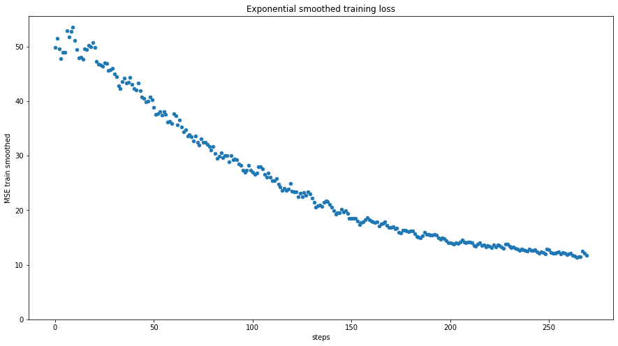


```python
pred = get_pred(model, dl_valid)
analysis.pred_aa_denoised = vaep_model.build_df_from_pred_batches(
    pred, scaler, index=analysis.df_valid.index, columns=analysis.df_valid.columns)
analysis.results['denoising AE'] = describe_abs_diff(
    y_true=analysis.df_valid, y_pred=analysis.pred_aa_denoised)
pd.DataFrame(analysis.results['denoising AE'])
```


<div>

<table border="1" class="dataframe">
  <thead>
    <tr style="text-align: right;">
      <th></th>
      <th>ACANPAAGSVILLENLR</th>
      <th>ARFEELCSDLFR</th>
      <th>AVAEQIPLLVQGVR</th>
      <th>EGPYDVVVLPGGNLGAQNLSESAAVK</th>
      <th>HGSLGFLPR</th>
      <th>IDIIPNPQER</th>
      <th>LALVTGGEIASTFDHPELVK</th>
      <th>LLEVEHPAAK</th>
      <th>STESLQANVQR</th>
      <th>VNNSSLIGLGYTQTLKPGIK</th>
    </tr>
  </thead>
  <tbody>
    <tr>
      <th>count</th>
      <td>18.000</td>
      <td>18.000</td>
      <td>18.000</td>
      <td>18.000</td>
      <td>18.000</td>
      <td>18.000</td>
      <td>18.000</td>
      <td>18.000</td>
      <td>18.000</td>
      <td>18.000</td>
    </tr>
    <tr>
      <th>mean</th>
      <td>0.588</td>
      <td>0.733</td>
      <td>0.434</td>
      <td>0.585</td>
      <td>0.683</td>
      <td>0.558</td>
      <td>0.723</td>
      <td>1.277</td>
      <td>0.584</td>
      <td>0.593</td>
    </tr>
    <tr>
      <th>std</th>
      <td>0.343</td>
      <td>0.468</td>
      <td>0.231</td>
      <td>0.365</td>
      <td>0.560</td>
      <td>0.717</td>
      <td>1.017</td>
      <td>0.509</td>
      <td>0.435</td>
      <td>0.367</td>
    </tr>
    <tr>
      <th>min</th>
      <td>0.038</td>
      <td>0.014</td>
      <td>0.079</td>
      <td>0.024</td>
      <td>0.023</td>
      <td>0.058</td>
      <td>0.040</td>
      <td>0.407</td>
      <td>0.024</td>
      <td>0.045</td>
    </tr>
    <tr>
      <th>25%</th>
      <td>0.402</td>
      <td>0.409</td>
      <td>0.273</td>
      <td>0.284</td>
      <td>0.253</td>
      <td>0.170</td>
      <td>0.281</td>
      <td>0.972</td>
      <td>0.270</td>
      <td>0.390</td>
    </tr>
    <tr>
      <th>50%</th>
      <td>0.501</td>
      <td>0.656</td>
      <td>0.396</td>
      <td>0.609</td>
      <td>0.553</td>
      <td>0.323</td>
      <td>0.391</td>
      <td>1.226</td>
      <td>0.438</td>
      <td>0.578</td>
    </tr>
    <tr>
      <th>75%</th>
      <td>0.749</td>
      <td>0.981</td>
      <td>0.496</td>
      <td>0.817</td>
      <td>1.032</td>
      <td>0.488</td>
      <td>0.719</td>
      <td>1.451</td>
      <td>0.992</td>
      <td>0.788</td>
    </tr>
    <tr>
      <th>max</th>
      <td>1.182</td>
      <td>1.700</td>
      <td>0.909</td>
      <td>1.258</td>
      <td>1.818</td>
      <td>2.564</td>
      <td>4.519</td>
      <td>2.218</td>
      <td>1.360</td>
      <td>1.518</td>
    </tr>
  </tbody>
</table>
</div>


## Collaborative Filtering setup

Components
- each sample has an embedding vector and an intercept
- each peptide has an embedding vector and an intercept
- scalar product of embeddings yields predictions


```python
from fastai.collab import CollabDataLoaders, MSELossFlat, Learner
from types import SimpleNamespace
# data format

analysis.collab = Analysis()
collab = analysis.collab
collab.columns = 'peptide,Sample ID,intensity'.split(',')
```


```python
analysis.collab
```


    Analysis(columns=['peptide', 'Sample ID', 'intensity'])


```python
collab.df = analysis.df.unstack().reset_index(drop=False).rename(
    columns={'level_0': 'peptide', 0: 'intensity'})
collab.df.head()
```


<div>

<table border="1" class="dataframe">
  <thead>
    <tr style="text-align: right;">
      <th></th>
      <th>peptide</th>
      <th>Sample ID</th>
      <th>intensity</th>
    </tr>
  </thead>
  <tbody>
    <tr>
      <th>0</th>
      <td>ACANPAAGSVILLENLR</td>
      <td>20151128_QE7_UPLC11_RJC_DEV_columnsTest_HeLa_01</td>
      <td>28.553</td>
    </tr>
    <tr>
      <th>1</th>
      <td>ACANPAAGSVILLENLR</td>
      <td>20160105_QE6_nLC4_MM_QC_MNT_HELA_01_170106201806</td>
      <td>30.451</td>
    </tr>
    <tr>
      <th>2</th>
      <td>ACANPAAGSVILLENLR</td>
      <td>20160311_QE6_LC6_SCL_QC_MNT_HeLa_01</td>
      <td>28.763</td>
    </tr>
    <tr>
      <th>3</th>
      <td>ACANPAAGSVILLENLR</td>
      <td>20160401_QE6_nLC6_ASD_QC_HELA_03</td>
      <td>29.676</td>
    </tr>
    <tr>
      <th>4</th>
      <td>ACANPAAGSVILLENLR</td>
      <td>20160404_QE2_nlc1_QC_hela_160404210125</td>
      <td>28.240</td>
    </tr>
  </tbody>
</table>
</div>


```python
dls = CollabDataLoaders.from_df(
    collab.df, user_name='Sample ID', item_name='peptide', rating_name='intensity', bs=64)
dls.show_batch()
```


<table border="1" class="dataframe">
  <thead>
    <tr style="text-align: right;">
      <th></th>
      <th>Sample ID</th>
      <th>peptide</th>
      <th>intensity</th>
    </tr>
  </thead>
  <tbody>
    <tr>
      <th>0</th>
      <td>20180906_QE5_nLC5_KBE_QC_MNT_HELA_03</td>
      <td>IDIIPNPQER</td>
      <td>30.787</td>
    </tr>
    <tr>
      <th>1</th>
      <td>20160404_QE2_nlc1_QC_hela_160404210125</td>
      <td>AVAEQIPLLVQGVR</td>
      <td>25.963</td>
    </tr>
    <tr>
      <th>2</th>
      <td>20160820_QE4_nLC4_SCL_QC_HeLa_04</td>
      <td>LALVTGGEIASTFDHPELVK</td>
      <td>29.768</td>
    </tr>
    <tr>
      <th>3</th>
      <td>20180927_QE1_nLC10_GP_QC_HELA_G8</td>
      <td>ARFEELCSDLFR</td>
      <td>29.601</td>
    </tr>
    <tr>
      <th>4</th>
      <td>20160404_QE2_nlc1_QC_hela_160404210125</td>
      <td>VNNSSLIGLGYTQTLKPGIK</td>
      <td>28.648</td>
    </tr>
    <tr>
      <th>5</th>
      <td>20180518_QE4_nLC6_MR_QC_MNT_HeLa_6</td>
      <td>EGPYDVVVLPGGNLGAQNLSESAAVK</td>
      <td>29.821</td>
    </tr>
    <tr>
      <th>6</th>
      <td>20180518_QE4_nLC6_MR_QC_MNT_HeLa_6</td>
      <td>AVAEQIPLLVQGVR</td>
      <td>26.952</td>
    </tr>
    <tr>
      <th>7</th>
      <td>20180926_QE7_nLC11_AL_QC_HeLa_08</td>
      <td>ARFEELCSDLFR</td>
      <td>30.108</td>
    </tr>
    <tr>
      <th>8</th>
      <td>20180226_QE10_nLC0_MR_QC_MNT_Hela_02</td>
      <td>EGPYDVVVLPGGNLGAQNLSESAAVK</td>
      <td>29.131</td>
    </tr>
    <tr>
      <th>9</th>
      <td>20180514_LUMOS1_LC4_SCL-IAH_QC_MNT_HeLa_01</td>
      <td>EGPYDVVVLPGGNLGAQNLSESAAVK</td>
      <td>29.584</td>
    </tr>
  </tbody>
</table>


```python
# dls.classes
```


```python
import fastai.torch_core
device = torch.device('cpu')
fastai.torch_core.defaults.device = torch.device('cpu')


collab.model_args = {}
collab.model_args['n_samples'] = len(dls.classes['Sample ID'])
collab.model_args['n_peptides'] = len(dls.classes['peptide'])
collab.model_args['dim_latent_factors'] = 5
collab.model_args['y_range'] = (
    int(collab.df['intensity'].min()), int(collab.df['intensity'].max())+1)

collab.model_args
```


    {'n_samples': 91,
     'n_peptides': 11,
     'dim_latent_factors': 5,
     'y_range': (24, 34)}


```python
model = vaep_model.DotProductBias(**collab.model_args)
learn = Learner(dls, model, loss_func=MSELossFlat())
learn.summary()
```


    DotProductBias (Input shape: 64)
    ============================================================================
    Layer (type)         Output Shape         Param #    Trainable 
    ============================================================================
                         64 x 5              
    Embedding                                 455        True      
    ____________________________________________________________________________
                         64 x 1              
    Embedding                                 91         True      
    ____________________________________________________________________________
                         64 x 5              
    Embedding                                 55         True      
    ____________________________________________________________________________
                         64 x 1              
    Embedding                                 11         True      
    ____________________________________________________________________________
    
    Total params: 612
    Total trainable params: 612
    Total non-trainable params: 0
    
    Optimizer used: <function Adam at 0x00000292FDF3A160>
    Loss function: FlattenedLoss of MSELoss()
    
    Callbacks:
      - TrainEvalCallback
      - Recorder
      - ProgressCallback


```python
learn.fit_one_cycle(args.epochs, 5e-3)
```


<table border="1" class="dataframe">
  <thead>
    <tr style="text-align: left;">
      <th>epoch</th>
      <th>train_loss</th>
      <th>valid_loss</th>
      <th>time</th>
    </tr>
  </thead>
  <tbody>
    <tr>
      <td>0</td>
      <td>2.078530</td>
      <td>2.106750</td>
      <td>00:00</td>
    </tr>
    <tr>
      <td>1</td>
      <td>2.065450</td>
      <td>2.073478</td>
      <td>00:00</td>
    </tr>
    <tr>
      <td>2</td>
      <td>2.041103</td>
      <td>2.003574</td>
      <td>00:00</td>
    </tr>
    <tr>
      <td>3</td>
      <td>1.989470</td>
      <td>1.882319</td>
      <td>00:00</td>
    </tr>
    <tr>
      <td>4</td>
      <td>1.920585</td>
      <td>1.691308</td>
      <td>00:00</td>
    </tr>
    <tr>
      <td>5</td>
      <td>1.813720</td>
      <td>1.427598</td>
      <td>00:00</td>
    </tr>
    <tr>
      <td>6</td>
      <td>1.658476</td>
      <td>1.134025</td>
      <td>00:00</td>
    </tr>
    <tr>
      <td>7</td>
      <td>1.471800</td>
      <td>0.919110</td>
      <td>00:00</td>
    </tr>
    <tr>
      <td>8</td>
      <td>1.290401</td>
      <td>0.772509</td>
      <td>00:00</td>
    </tr>
    <tr>
      <td>9</td>
      <td>1.124144</td>
      <td>0.695944</td>
      <td>00:00</td>
    </tr>
    <tr>
      <td>10</td>
      <td>0.982799</td>
      <td>0.652332</td>
      <td>00:00</td>
    </tr>
    <tr>
      <td>11</td>
      <td>0.861723</td>
      <td>0.619314</td>
      <td>00:00</td>
    </tr>
    <tr>
      <td>12</td>
      <td>0.760098</td>
      <td>0.595210</td>
      <td>00:00</td>
    </tr>
    <tr>
      <td>13</td>
      <td>0.675758</td>
      <td>0.585107</td>
      <td>00:00</td>
    </tr>
    <tr>
      <td>14</td>
      <td>0.605957</td>
      <td>0.574206</td>
      <td>00:00</td>
    </tr>
    <tr>
      <td>15</td>
      <td>0.546677</td>
      <td>0.568001</td>
      <td>00:00</td>
    </tr>
    <tr>
      <td>16</td>
      <td>0.496998</td>
      <td>0.561493</td>
      <td>00:00</td>
    </tr>
    <tr>
      <td>17</td>
      <td>0.453154</td>
      <td>0.559999</td>
      <td>00:00</td>
    </tr>
    <tr>
      <td>18</td>
      <td>0.417444</td>
      <td>0.559364</td>
      <td>00:00</td>
    </tr>
    <tr>
      <td>19</td>
      <td>0.386149</td>
      <td>0.556065</td>
      <td>00:00</td>
    </tr>
    <tr>
      <td>20</td>
      <td>0.360350</td>
      <td>0.555812</td>
      <td>00:00</td>
    </tr>
    <tr>
      <td>21</td>
      <td>0.338605</td>
      <td>0.556234</td>
      <td>00:00</td>
    </tr>
    <tr>
      <td>22</td>
      <td>0.320073</td>
      <td>0.555429</td>
      <td>00:00</td>
    </tr>
    <tr>
      <td>23</td>
      <td>0.304958</td>
      <td>0.554551</td>
      <td>00:00</td>
    </tr>
    <tr>
      <td>24</td>
      <td>0.292398</td>
      <td>0.554386</td>
      <td>00:00</td>
    </tr>
    <tr>
      <td>25</td>
      <td>0.281576</td>
      <td>0.554092</td>
      <td>00:00</td>
    </tr>
    <tr>
      <td>26</td>
      <td>0.272828</td>
      <td>0.553894</td>
      <td>00:00</td>
    </tr>
    <tr>
      <td>27</td>
      <td>0.265358</td>
      <td>0.553907</td>
      <td>00:00</td>
    </tr>
    <tr>
      <td>28</td>
      <td>0.258339</td>
      <td>0.553871</td>
      <td>00:00</td>
    </tr>
    <tr>
      <td>29</td>
      <td>0.253641</td>
      <td>0.553862</td>
      <td>00:00</td>
    </tr>
  </tbody>
</table>


```python
# this shows it along the mini-batches, no easy customization
learn.recorder.plot_loss()
```


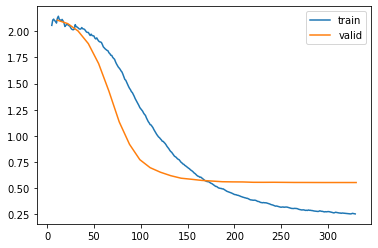


```python
# learn.recorder.plot_loss??
import matplotlib.pyplot as plt
from fastcore.foundation import L


def plot_loss(self, skip_start=5, with_valid=True, ax=None):
    if not ax:
        fig, ax = plt.subplots()
    ax.plot(list(range(skip_start, len(self.losses))),
            self.losses[skip_start:], label='train')
    if with_valid:
        idx = (np.array(self.iters) < skip_start).sum()
        ax.plot(self.iters[idx:], L(
            self.values[idx:]).itemgot(1), label='valid')
        ax.legend()


fig, ax = plt.subplots(figsize=(10, 8))
plot_loss(learn.recorder, ax=ax)
```


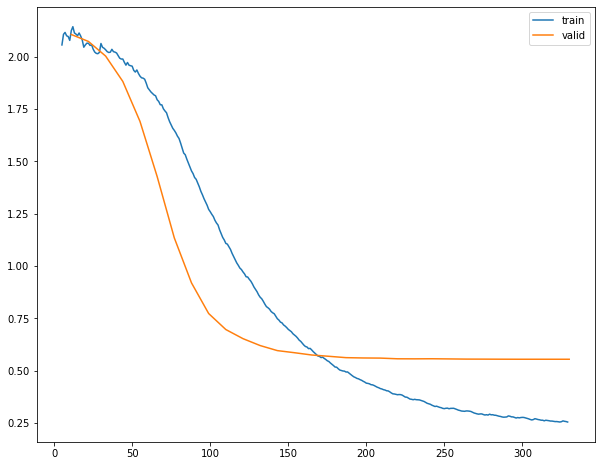


```python
# epoch values
for x in learn.recorder.values:
    print(x)
    break
```

    [2.0785300731658936, 2.106750249862671]
    


```python
# get_preds is overloaded, but hardly documented https://docs.fast.ai/learner.html#Learner.get_preds
encodings, pred, target = learn.get_preds(
    with_input=True)  # per default validation data
```


The analysis concept changes. Here only the (masked) missing peptides could be assessed - without the having entire samples as validation cohorts. Although there is no need for a complete sample, one needs at least some information of a sample to train the sample embedding, leading to a change in the setup.

 - Collaborative Filtering can be trained on all available data to infer the missing peptides


```python
pred_df = pd.DataFrame([{'Sample ID': dls.classes['Sample ID'][obs[0]], 'peptide': dls.classes['peptide']
                         [obs[1]], 'intensity': pred_intensity.item()} for obs, pred_intensity in zip(encodings, pred)])
pred_df = pred_df.pivot(index='Sample ID', columns='peptide')
pred_df
```


<div>

<table border="1" class="dataframe">
  <thead>
    <tr>
      <th></th>
      <th colspan="10" halign="left">intensity</th>
    </tr>
    <tr>
      <th>peptide</th>
      <th>ACANPAAGSVILLENLR</th>
      <th>ARFEELCSDLFR</th>
      <th>AVAEQIPLLVQGVR</th>
      <th>EGPYDVVVLPGGNLGAQNLSESAAVK</th>
      <th>HGSLGFLPR</th>
      <th>IDIIPNPQER</th>
      <th>LALVTGGEIASTFDHPELVK</th>
      <th>LLEVEHPAAK</th>
      <th>STESLQANVQR</th>
      <th>VNNSSLIGLGYTQTLKPGIK</th>
    </tr>
    <tr>
      <th>Sample ID</th>
      <th></th>
      <th></th>
      <th></th>
      <th></th>
      <th></th>
      <th></th>
      <th></th>
      <th></th>
      <th></th>
      <th></th>
    </tr>
  </thead>
  <tbody>
    <tr>
      <th>20151128_QE7_UPLC11_RJC_DEV_columnsTest_HeLa_01</th>
      <td>NaN</td>
      <td>NaN</td>
      <td>27.756</td>
      <td>NaN</td>
      <td>NaN</td>
      <td>NaN</td>
      <td>NaN</td>
      <td>NaN</td>
      <td>27.528</td>
      <td>NaN</td>
    </tr>
    <tr>
      <th>20160105_QE6_nLC4_MM_QC_MNT_HELA_01_170106201806</th>
      <td>30.812</td>
      <td>NaN</td>
      <td>NaN</td>
      <td>29.117</td>
      <td>NaN</td>
      <td>NaN</td>
      <td>29.511</td>
      <td>NaN</td>
      <td>NaN</td>
      <td>NaN</td>
    </tr>
    <tr>
      <th>20160311_QE6_LC6_SCL_QC_MNT_HeLa_01</th>
      <td>NaN</td>
      <td>28.138</td>
      <td>NaN</td>
      <td>NaN</td>
      <td>NaN</td>
      <td>29.065</td>
      <td>NaN</td>
      <td>NaN</td>
      <td>NaN</td>
      <td>28.786</td>
    </tr>
    <tr>
      <th>20160401_QE6_nLC6_ASD_QC_HELA_03</th>
      <td>NaN</td>
      <td>NaN</td>
      <td>27.595</td>
      <td>NaN</td>
      <td>NaN</td>
      <td>NaN</td>
      <td>28.767</td>
      <td>NaN</td>
      <td>NaN</td>
      <td>29.293</td>
    </tr>
    <tr>
      <th>20160404_QE2_nlc1_QC_hela_160404210125</th>
      <td>NaN</td>
      <td>NaN</td>
      <td>NaN</td>
      <td>NaN</td>
      <td>27.622</td>
      <td>NaN</td>
      <td>NaN</td>
      <td>NaN</td>
      <td>28.218</td>
      <td>NaN</td>
    </tr>
    <tr>
      <th>...</th>
      <td>...</td>
      <td>...</td>
      <td>...</td>
      <td>...</td>
      <td>...</td>
      <td>...</td>
      <td>...</td>
      <td>...</td>
      <td>...</td>
      <td>...</td>
    </tr>
    <tr>
      <th>20190527_QE4_LC12_AS_QC_MNT_HeLa_02</th>
      <td>NaN</td>
      <td>30.277</td>
      <td>NaN</td>
      <td>NaN</td>
      <td>NaN</td>
      <td>NaN</td>
      <td>NaN</td>
      <td>NaN</td>
      <td>NaN</td>
      <td>NaN</td>
    </tr>
    <tr>
      <th>20190701_QE4_LC12_IAH_QC_MNT_HeLa_03</th>
      <td>NaN</td>
      <td>NaN</td>
      <td>26.693</td>
      <td>29.811</td>
      <td>NaN</td>
      <td>NaN</td>
      <td>NaN</td>
      <td>28.875</td>
      <td>NaN</td>
      <td>NaN</td>
    </tr>
    <tr>
      <th>20190708_QE6_nLC4_JE_QC_MNT_HeLa_01</th>
      <td>NaN</td>
      <td>NaN</td>
      <td>NaN</td>
      <td>NaN</td>
      <td>NaN</td>
      <td>31.248</td>
      <td>NaN</td>
      <td>29.230</td>
      <td>30.508</td>
      <td>30.678</td>
    </tr>
    <tr>
      <th>20191128_QE8_nLC9_ASD_QC_HeLa_1</th>
      <td>NaN</td>
      <td>NaN</td>
      <td>NaN</td>
      <td>NaN</td>
      <td>NaN</td>
      <td>30.962</td>
      <td>NaN</td>
      <td>NaN</td>
      <td>NaN</td>
      <td>NaN</td>
    </tr>
    <tr>
      <th>20191128_QE8_nLC9_ASD_QC_HeLa_1_20191128165313</th>
      <td>NaN</td>
      <td>NaN</td>
      <td>26.942</td>
      <td>NaN</td>
      <td>NaN</td>
      <td>NaN</td>
      <td>NaN</td>
      <td>29.263</td>
      <td>NaN</td>
      <td>NaN</td>
    </tr>
  </tbody>
</table>
<p>81 rows × 10 columns</p>
</div>


PyTorch Model used directly:


```python
valid_dl = learn.dls.valid
model.to(device)
for X, target in valid_dl:
    print(learn.model(X[:1]))
    break
```

    tensor([[29.6450]], grad_fn=<AddBackward0>)
    

Switching from DotProduct to FNN based on embeddings as implemented in fastai


```python
from fastai.collab import collab_learner
from fastai.collab import get_emb_sz
# get_emb_sz??
```


```python
get_emb_sz(dls)  # default embedding sizes based on dataloader for NN
```


    [(91, 20), (11, 6)]


```python
collab.model_args  # from above
```


    {'n_samples': 91,
     'n_peptides': 11,
     'dim_latent_factors': 5,
     'y_range': (24, 34)}


```python
from fastai.collab import collab_learner

learn = collab_learner(
    dls, use_nn=True, y_range=collab.model_args['y_range'], layers=[20, 10])
learn.summary()
```


    EmbeddingNN (Input shape: 64)
    ============================================================================
    Layer (type)         Output Shape         Param #    Trainable 
    ============================================================================
                         64 x 20             
    Embedding                                 1820       True      
    ____________________________________________________________________________
                         64 x 6              
    Embedding                                 66         True      
    Dropout                                                        
    BatchNorm1d                               52         True      
    ____________________________________________________________________________
                         64 x 20             
    Linear                                    520        True      
    ReLU                                                           
    BatchNorm1d                               40         True      
    ____________________________________________________________________________
                         64 x 10             
    Linear                                    200        True      
    ReLU                                                           
    ____________________________________________________________________________
                         64 x 1              
    Linear                                    11         True      
    SigmoidRange                                                   
    ____________________________________________________________________________
    
    Total params: 2,709
    Total trainable params: 2,709
    Total non-trainable params: 0
    
    Optimizer used: <function Adam at 0x00000292FDF3A160>
    Loss function: FlattenedLoss of MSELoss()
    
    Callbacks:
      - TrainEvalCallback
      - Recorder
      - ProgressCallback


```python
learn.fit_one_cycle(30, 5e-3, wd=0.1)
```


<table border="1" class="dataframe">
  <thead>
    <tr style="text-align: left;">
      <th>epoch</th>
      <th>train_loss</th>
      <th>valid_loss</th>
      <th>time</th>
    </tr>
  </thead>
  <tbody>
    <tr>
      <td>0</td>
      <td>2.344168</td>
      <td>2.178735</td>
      <td>00:00</td>
    </tr>
    <tr>
      <td>1</td>
      <td>1.976307</td>
      <td>2.224594</td>
      <td>00:00</td>
    </tr>
    <tr>
      <td>2</td>
      <td>1.608646</td>
      <td>2.111446</td>
      <td>00:00</td>
    </tr>
    <tr>
      <td>3</td>
      <td>1.263372</td>
      <td>1.718637</td>
      <td>00:00</td>
    </tr>
    <tr>
      <td>4</td>
      <td>1.026990</td>
      <td>1.116411</td>
      <td>00:00</td>
    </tr>
    <tr>
      <td>5</td>
      <td>0.867741</td>
      <td>0.838682</td>
      <td>00:00</td>
    </tr>
    <tr>
      <td>6</td>
      <td>0.752132</td>
      <td>0.531026</td>
      <td>00:00</td>
    </tr>
    <tr>
      <td>7</td>
      <td>0.660134</td>
      <td>0.483023</td>
      <td>00:00</td>
    </tr>
    <tr>
      <td>8</td>
      <td>0.576040</td>
      <td>0.481642</td>
      <td>00:00</td>
    </tr>
    <tr>
      <td>9</td>
      <td>0.518452</td>
      <td>0.486233</td>
      <td>00:00</td>
    </tr>
    <tr>
      <td>10</td>
      <td>0.469352</td>
      <td>0.455090</td>
      <td>00:00</td>
    </tr>
    <tr>
      <td>11</td>
      <td>0.424655</td>
      <td>0.440633</td>
      <td>00:00</td>
    </tr>
    <tr>
      <td>12</td>
      <td>0.388993</td>
      <td>0.493565</td>
      <td>00:00</td>
    </tr>
    <tr>
      <td>13</td>
      <td>0.353609</td>
      <td>0.457899</td>
      <td>00:00</td>
    </tr>
    <tr>
      <td>14</td>
      <td>0.326479</td>
      <td>0.469540</td>
      <td>00:00</td>
    </tr>
    <tr>
      <td>15</td>
      <td>0.295837</td>
      <td>0.462908</td>
      <td>00:00</td>
    </tr>
    <tr>
      <td>16</td>
      <td>0.276631</td>
      <td>0.498508</td>
      <td>00:00</td>
    </tr>
    <tr>
      <td>17</td>
      <td>0.257394</td>
      <td>0.494940</td>
      <td>00:00</td>
    </tr>
    <tr>
      <td>18</td>
      <td>0.246868</td>
      <td>0.504215</td>
      <td>00:00</td>
    </tr>
    <tr>
      <td>19</td>
      <td>0.228692</td>
      <td>0.469028</td>
      <td>00:00</td>
    </tr>
    <tr>
      <td>20</td>
      <td>0.213572</td>
      <td>0.499668</td>
      <td>00:00</td>
    </tr>
    <tr>
      <td>21</td>
      <td>0.199612</td>
      <td>0.481037</td>
      <td>00:00</td>
    </tr>
    <tr>
      <td>22</td>
      <td>0.186580</td>
      <td>0.470639</td>
      <td>00:00</td>
    </tr>
    <tr>
      <td>23</td>
      <td>0.173327</td>
      <td>0.482678</td>
      <td>00:00</td>
    </tr>
    <tr>
      <td>24</td>
      <td>0.163054</td>
      <td>0.494521</td>
      <td>00:00</td>
    </tr>
    <tr>
      <td>25</td>
      <td>0.154127</td>
      <td>0.484070</td>
      <td>00:00</td>
    </tr>
    <tr>
      <td>26</td>
      <td>0.145159</td>
      <td>0.483874</td>
      <td>00:00</td>
    </tr>
    <tr>
      <td>27</td>
      <td>0.138794</td>
      <td>0.485471</td>
      <td>00:00</td>
    </tr>
    <tr>
      <td>28</td>
      <td>0.134003</td>
      <td>0.481477</td>
      <td>00:00</td>
    </tr>
    <tr>
      <td>29</td>
      <td>0.134671</td>
      <td>0.486562</td>
      <td>00:00</td>
    </tr>
  </tbody>
</table>


## VAE

### Transform: Non-log transformed data (Single run)

Scale samples according to training data


```python
from sklearn.preprocessing import MinMaxScaler

args_vae = {}
args_vae['SCALER'] = MinMaxScaler
# select initial data: transformed vs not log transformed
scaler = args_vae['SCALER']().fit(analysis.df_train)
scaler.transform(analysis.df_valid.iloc[:5])
```


    array([[0.47445019, 0.36365456, 0.36549262, 0.26387401, 0.66955657,
            0.30150902, 0.48590535, 0.64463529, 0.30895769, 0.21176791],
           [0.92999583, 0.65836564, 0.87751846, 0.82593777, 0.89923995,
            0.69385728, 0.73439981, 0.8750341 , 0.6227158 , 0.7927601 ],
           [0.71693449, 0.66050277, 0.67825525, 0.72851001, 0.86152074,
            0.66832776, 0.72579736, 0.79702518, 0.43990085, 0.5176384 ],
           [0.30641543, 0.20464727, 0.25665079, 0.15941278, 0.58609146,
            0.21429095, 0.31743156, 0.65568975, 0.18152343, 0.14663306],
           [0.78921018, 0.67000572, 0.8116531 , 0.83837227, 0.41929881,
            0.72668818, 0.65039402, 0.85251152, 0.78133607, 0.71769148]])


### Dataloaders


```python
from vaep.io.datasets import PeptideDatasetInMemoryNoMissings
from vaep.io.dataloaders import DataLoadersCreator

data_loader_creator = DataLoadersCreator(
    df_train=analysis.df_train,
    df_valid=analysis.df_valid,
    scaler=scaler,
    DataSetClass=PeptideDatasetInMemoryNoMissings,
    batch_size=args.batch_size)

dl_train, dl_valid = data_loader_creator.get_dls(shuffle_train=True)

logger.info(
    "N train: {:5,d} \nN valid: {:5,d}".format(
        len(dl_train.dataset), len(dl_valid.dataset))
)
```

    vaep - INFO     N train:    72 
    N valid:    18
    

### Model


```python
from torch.nn import functional as F
from torch.nn import Sigmoid
from vaep.model import VAE

n_neurons = 6
logger.info(f'Latent layer neurons: {n_neurons}')

model = vaep_model.VAE(n_features=n_features,
                       n_neurons=n_neurons,
                       last_decoder_activation=Sigmoid,
                       last_encoder_activation=None,
                       dim_latent=4).double()
model = model.to(device)

logger.info(model)
```

    vaep - INFO     Latent layer neurons: 6
    vaep - INFO     VAE(
      (decoder): Sequential(
        (0): Linear(in_features=4, out_features=6, bias=True)
        (1): Tanh()
        (2): Linear(in_features=6, out_features=10, bias=True)
        (3): Sigmoid()
      )
      (encoder): Sequential(
        (0): Linear(in_features=10, out_features=6, bias=True)
        (1): Tanh()
        (2): Linear(in_features=6, out_features=8, bias=True)
      )
    )
    

### Optimizers


```python
from torch import optim
optimizer = optim.Adam(params=model.parameters(),
                       lr=1e-3)
```

### Tensorboard


```python
if ADD_TENSORBOARD:
    tensorboard_model_namer = TensorboardModelNamer(
        prefix_folder='experiment_01')
    writer = tensorboard_model_namer.get_writer(1, [n_neurons], 'scaler')
    logger.info(f"Logging to: {writer.get_logdir()}")

    # data, mask = next(iter(dl_train))
    # writer.add_image(
    #     f'{len(mask)} mask for this batch of samples', mask, dataformats='HW')

    data = next(iter(dl_train))
    writer.add_image(
        f'{len(data)} batch of sampled data (as heatmap)', data, dataformats='HW')

    # ToDo: compiler warning: error or tracer error?
    writer.add_graph(model, input_to_model=data.to(
        device))  # try to add after training?
    writer.flush()
```

### Training Loop


```python
from collections import defaultdict
from functools import partial

import torch


def run_experiment(model, dls, writer, args):
    metrics = defaultdict(dict)
    metrics_per_batch = defaultdict(list)
    dl_train, dl_valid = dls
    msg_eval_epoch = "Validation Set - Epoch: {:3d} - loss: {:7.3f} - mse: {:5.3f} - KLD: {:5.3f}"

    def _append_batch_metrics(batch_metrics_epoch, d_metrics=metrics_per_batch, dataset_name='train'):
        """Append single batch metrics to global dictionary."""
        for d in batch_metrics_epoch.values():
            for key, value in d.items():
                d_metrics[(dataset_name, key)].append(d[key])
        return None  # Signal in-place operation

    def _agg_metric_per_epoch(batch_metrics_epoch, epoch, d_metrics=metrics, dataset_name='train'):
        keys = next(iter(batch_metrics_epoch.values())).keys()
        for key in keys:
            d_metrics[(dataset_name, key)][epoch] = np.mean([d[key]
                                                             for d in batch_metrics_epoch.values()])
        return None  # Signal in-place operation

    for epoch in range(1, args.epochs+1):
        _epoch_metrics = vaep_model.train(model=model, train_loader=dl_train,
                                          optimizer=optimizer, device=device)
        n_batches = len(dl_train)

        _append_batch_metrics(_epoch_metrics)

        _agg_metric_per_epoch(_epoch_metrics, epoch)

        _epoch_metrics_valid = vaep_model.evaluate(
            model=model, data_loader=dl_valid, device=device)
        n_batches = len(dl_valid)
        _append_batch_metrics(_epoch_metrics_valid, dataset_name='valid')
        _agg_metric_per_epoch(_epoch_metrics_valid,
                              epoch, dataset_name='valid')

        if writer:
            writer.add_scalar('avg validation loss',
                              _epoch_metric_valid['loss'] / n_batchnes,
                              epoch)

    return dict(metrics), dict(metrics_per_batch)
```


```python
metrics, metrics_per_batch = run_experiment(model=model, dls=(
    dl_train, dl_valid), writer=None, args=args)  # decide about format
```


```python
df_train_losses = vaep_model.process_train_loss(
    {'training loss': metrics_per_batch[('train', 'loss')]})

# Plotting is boilerplate code:
_ = df_train_losses.plot(kind='scatter', x='steps', y='training loss smoothed', figsize=(
    15, 8),  title='Exponential smoothed training loss', ylim=(0, None))
df_train_losses
```


<div>

<table border="1" class="dataframe">
  <thead>
    <tr style="text-align: right;">
      <th></th>
      <th>steps</th>
      <th>training loss</th>
      <th>training loss smoothed</th>
    </tr>
  </thead>
  <tbody>
    <tr>
      <th>0</th>
      <td>0</td>
      <td>7.309</td>
      <td>7.309</td>
    </tr>
    <tr>
      <th>1</th>
      <td>1</td>
      <td>7.497</td>
      <td>7.408</td>
    </tr>
    <tr>
      <th>2</th>
      <td>2</td>
      <td>7.221</td>
      <td>7.339</td>
    </tr>
    <tr>
      <th>3</th>
      <td>3</td>
      <td>7.326</td>
      <td>7.335</td>
    </tr>
    <tr>
      <th>4</th>
      <td>4</td>
      <td>7.360</td>
      <td>7.341</td>
    </tr>
    <tr>
      <th>...</th>
      <td>...</td>
      <td>...</td>
      <td>...</td>
    </tr>
    <tr>
      <th>265</th>
      <td>265</td>
      <td>6.717</td>
      <td>6.810</td>
    </tr>
    <tr>
      <th>266</th>
      <td>266</td>
      <td>6.811</td>
      <td>6.810</td>
    </tr>
    <tr>
      <th>267</th>
      <td>267</td>
      <td>6.637</td>
      <td>6.792</td>
    </tr>
    <tr>
      <th>268</th>
      <td>268</td>
      <td>6.728</td>
      <td>6.786</td>
    </tr>
    <tr>
      <th>269</th>
      <td>269</td>
      <td>6.704</td>
      <td>6.778</td>
    </tr>
  </tbody>
</table>
<p>270 rows × 3 columns</p>
</div>


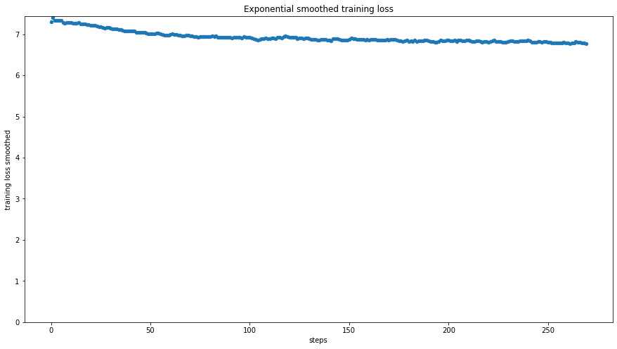


```python
metrics_per_batch.keys()
```


    dict_keys([('train', 'loss'), ('train', 'recon_loss'), ('train', 'KLD'), ('valid', 'loss'), ('valid', 'recon_loss'), ('valid', 'KLD')])


### One epoch


```python
logger.setLevel(logging.DEBUG)
batch_metrics_last_epoch = vaep_model.train(model=model, train_loader=dl_train,
                                            optimizer=optimizer, device=device)
pd.DataFrame.from_dict(batch_metrics_last_epoch, orient='index')
```


<div>

<table border="1" class="dataframe">
  <thead>
    <tr style="text-align: right;">
      <th></th>
      <th>loss</th>
      <th>recon_loss</th>
      <th>KLD</th>
    </tr>
  </thead>
  <tbody>
    <tr>
      <th>0</th>
      <td>6.923</td>
      <td>6.917</td>
      <td>0.006</td>
    </tr>
    <tr>
      <th>1</th>
      <td>7.057</td>
      <td>7.049</td>
      <td>0.009</td>
    </tr>
    <tr>
      <th>2</th>
      <td>6.768</td>
      <td>6.764</td>
      <td>0.005</td>
    </tr>
    <tr>
      <th>3</th>
      <td>6.474</td>
      <td>6.470</td>
      <td>0.004</td>
    </tr>
    <tr>
      <th>4</th>
      <td>6.720</td>
      <td>6.713</td>
      <td>0.007</td>
    </tr>
    <tr>
      <th>5</th>
      <td>6.835</td>
      <td>6.827</td>
      <td>0.009</td>
    </tr>
    <tr>
      <th>6</th>
      <td>6.711</td>
      <td>6.705</td>
      <td>0.007</td>
    </tr>
    <tr>
      <th>7</th>
      <td>6.703</td>
      <td>6.700</td>
      <td>0.003</td>
    </tr>
    <tr>
      <th>8</th>
      <td>6.991</td>
      <td>6.979</td>
      <td>0.013</td>
    </tr>
  </tbody>
</table>
</div>


Currently: No improvements

#### Performance plots


```python
metrics = pd.DataFrame(metrics)
_ = metrics.plot(
    figsize=(18, 6), xlim=(1, args.epochs))
```


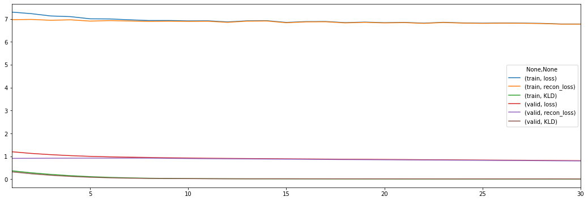


```python
metrics
```


<div>

<table border="1" class="dataframe">
  <thead>
    <tr>
      <th></th>
      <th colspan="3" halign="left">train</th>
      <th colspan="3" halign="left">valid</th>
    </tr>
    <tr>
      <th></th>
      <th>loss</th>
      <th>recon_loss</th>
      <th>KLD</th>
      <th>loss</th>
      <th>recon_loss</th>
      <th>KLD</th>
    </tr>
  </thead>
  <tbody>
    <tr>
      <th>1</th>
      <td>7.298</td>
      <td>6.966</td>
      <td>0.368</td>
      <td>1.199</td>
      <td>0.909</td>
      <td>0.322</td>
    </tr>
    <tr>
      <th>2</th>
      <td>7.229</td>
      <td>6.977</td>
      <td>0.280</td>
      <td>1.127</td>
      <td>0.912</td>
      <td>0.238</td>
    </tr>
    <tr>
      <th>3</th>
      <td>7.128</td>
      <td>6.940</td>
      <td>0.209</td>
      <td>1.072</td>
      <td>0.917</td>
      <td>0.172</td>
    </tr>
    <tr>
      <th>4</th>
      <td>7.099</td>
      <td>6.961</td>
      <td>0.154</td>
      <td>1.029</td>
      <td>0.919</td>
      <td>0.122</td>
    </tr>
    <tr>
      <th>5</th>
      <td>7.004</td>
      <td>6.904</td>
      <td>0.111</td>
      <td>0.998</td>
      <td>0.921</td>
      <td>0.085</td>
    </tr>
    <tr>
      <th>6</th>
      <td>6.999</td>
      <td>6.927</td>
      <td>0.080</td>
      <td>0.977</td>
      <td>0.922</td>
      <td>0.061</td>
    </tr>
    <tr>
      <th>7</th>
      <td>6.961</td>
      <td>6.909</td>
      <td>0.058</td>
      <td>0.962</td>
      <td>0.921</td>
      <td>0.045</td>
    </tr>
    <tr>
      <th>8</th>
      <td>6.929</td>
      <td>6.891</td>
      <td>0.043</td>
      <td>0.949</td>
      <td>0.918</td>
      <td>0.034</td>
    </tr>
    <tr>
      <th>9</th>
      <td>6.930</td>
      <td>6.901</td>
      <td>0.033</td>
      <td>0.936</td>
      <td>0.910</td>
      <td>0.029</td>
    </tr>
    <tr>
      <th>10</th>
      <td>6.915</td>
      <td>6.891</td>
      <td>0.027</td>
      <td>0.925</td>
      <td>0.903</td>
      <td>0.025</td>
    </tr>
    <tr>
      <th>11</th>
      <td>6.918</td>
      <td>6.897</td>
      <td>0.023</td>
      <td>0.915</td>
      <td>0.896</td>
      <td>0.022</td>
    </tr>
    <tr>
      <th>12</th>
      <td>6.869</td>
      <td>6.851</td>
      <td>0.020</td>
      <td>0.908</td>
      <td>0.891</td>
      <td>0.019</td>
    </tr>
    <tr>
      <th>13</th>
      <td>6.918</td>
      <td>6.902</td>
      <td>0.017</td>
      <td>0.901</td>
      <td>0.885</td>
      <td>0.018</td>
    </tr>
    <tr>
      <th>14</th>
      <td>6.923</td>
      <td>6.909</td>
      <td>0.016</td>
      <td>0.896</td>
      <td>0.879</td>
      <td>0.019</td>
    </tr>
    <tr>
      <th>15</th>
      <td>6.847</td>
      <td>6.833</td>
      <td>0.016</td>
      <td>0.890</td>
      <td>0.874</td>
      <td>0.019</td>
    </tr>
    <tr>
      <th>16</th>
      <td>6.884</td>
      <td>6.871</td>
      <td>0.014</td>
      <td>0.885</td>
      <td>0.869</td>
      <td>0.017</td>
    </tr>
    <tr>
      <th>17</th>
      <td>6.887</td>
      <td>6.875</td>
      <td>0.014</td>
      <td>0.878</td>
      <td>0.862</td>
      <td>0.017</td>
    </tr>
    <tr>
      <th>18</th>
      <td>6.838</td>
      <td>6.826</td>
      <td>0.013</td>
      <td>0.872</td>
      <td>0.857</td>
      <td>0.017</td>
    </tr>
    <tr>
      <th>19</th>
      <td>6.862</td>
      <td>6.851</td>
      <td>0.013</td>
      <td>0.868</td>
      <td>0.853</td>
      <td>0.017</td>
    </tr>
    <tr>
      <th>20</th>
      <td>6.836</td>
      <td>6.826</td>
      <td>0.012</td>
      <td>0.863</td>
      <td>0.849</td>
      <td>0.016</td>
    </tr>
    <tr>
      <th>21</th>
      <td>6.849</td>
      <td>6.839</td>
      <td>0.011</td>
      <td>0.858</td>
      <td>0.844</td>
      <td>0.015</td>
    </tr>
    <tr>
      <th>22</th>
      <td>6.815</td>
      <td>6.806</td>
      <td>0.011</td>
      <td>0.851</td>
      <td>0.838</td>
      <td>0.015</td>
    </tr>
    <tr>
      <th>23</th>
      <td>6.851</td>
      <td>6.842</td>
      <td>0.010</td>
      <td>0.847</td>
      <td>0.834</td>
      <td>0.015</td>
    </tr>
    <tr>
      <th>24</th>
      <td>6.826</td>
      <td>6.817</td>
      <td>0.010</td>
      <td>0.842</td>
      <td>0.829</td>
      <td>0.015</td>
    </tr>
    <tr>
      <th>25</th>
      <td>6.814</td>
      <td>6.806</td>
      <td>0.009</td>
      <td>0.837</td>
      <td>0.824</td>
      <td>0.015</td>
    </tr>
    <tr>
      <th>26</th>
      <td>6.824</td>
      <td>6.816</td>
      <td>0.009</td>
      <td>0.831</td>
      <td>0.818</td>
      <td>0.015</td>
    </tr>
    <tr>
      <th>27</th>
      <td>6.816</td>
      <td>6.809</td>
      <td>0.008</td>
      <td>0.828</td>
      <td>0.814</td>
      <td>0.015</td>
    </tr>
    <tr>
      <th>28</th>
      <td>6.806</td>
      <td>6.798</td>
      <td>0.008</td>
      <td>0.822</td>
      <td>0.809</td>
      <td>0.015</td>
    </tr>
    <tr>
      <th>29</th>
      <td>6.779</td>
      <td>6.771</td>
      <td>0.008</td>
      <td>0.815</td>
      <td>0.802</td>
      <td>0.014</td>
    </tr>
    <tr>
      <th>30</th>
      <td>6.779</td>
      <td>6.771</td>
      <td>0.008</td>
      <td>0.810</td>
      <td>0.798</td>
      <td>0.013</td>
    </tr>
  </tbody>
</table>
</div>


```python
selected = [(_split, _metric)
            for _split in ['train', 'valid']
            for _metric in ['loss']
            ]
_ = metrics[selected].plot(
    figsize=(18, 6))
```


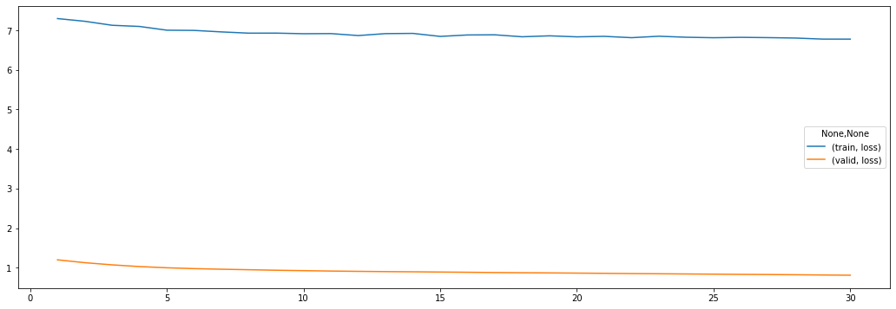


### Predictions validation set


```python
_epoch_metric_valid, pred = vaep_model.evaluate(
    model=model, data_loader=dl_valid, device=device, return_pred=True)
# raw predictions
pd.DataFrame(np.vstack(pred), index=analysis.df_valid.index,
             columns=analysis.df_valid.columns)
```


<div>

<table border="1" class="dataframe">
  <thead>
    <tr style="text-align: right;">
      <th></th>
      <th>ACANPAAGSVILLENLR</th>
      <th>ARFEELCSDLFR</th>
      <th>AVAEQIPLLVQGVR</th>
      <th>EGPYDVVVLPGGNLGAQNLSESAAVK</th>
      <th>HGSLGFLPR</th>
      <th>IDIIPNPQER</th>
      <th>LALVTGGEIASTFDHPELVK</th>
      <th>LLEVEHPAAK</th>
      <th>STESLQANVQR</th>
      <th>VNNSSLIGLGYTQTLKPGIK</th>
    </tr>
    <tr>
      <th>Sample ID</th>
      <th></th>
      <th></th>
      <th></th>
      <th></th>
      <th></th>
      <th></th>
      <th></th>
      <th></th>
      <th></th>
      <th></th>
    </tr>
  </thead>
  <tbody>
    <tr>
      <th>20181029_QE3_nLC3_KBE_QC_MNT_HELA_02</th>
      <td>0.565</td>
      <td>0.528</td>
      <td>0.558</td>
      <td>0.598</td>
      <td>0.669</td>
      <td>0.499</td>
      <td>0.508</td>
      <td>0.628</td>
      <td>0.539</td>
      <td>0.481</td>
    </tr>
    <tr>
      <th>20181102_QE2_NLC10_MR_QC_MNT_HELA_01</th>
      <td>0.565</td>
      <td>0.530</td>
      <td>0.558</td>
      <td>0.595</td>
      <td>0.665</td>
      <td>0.498</td>
      <td>0.509</td>
      <td>0.624</td>
      <td>0.540</td>
      <td>0.480</td>
    </tr>
    <tr>
      <th>20181107_QE6_nLC12_MR_QC_MNT_HELA_New_01</th>
      <td>0.567</td>
      <td>0.530</td>
      <td>0.558</td>
      <td>0.596</td>
      <td>0.665</td>
      <td>0.498</td>
      <td>0.509</td>
      <td>0.624</td>
      <td>0.540</td>
      <td>0.481</td>
    </tr>
    <tr>
      <th>20181110_QE5_nLC5_OOE_QC_MNT_HELA_15cm_250ng_RO-003</th>
      <td>0.564</td>
      <td>0.526</td>
      <td>0.558</td>
      <td>0.600</td>
      <td>0.671</td>
      <td>0.500</td>
      <td>0.506</td>
      <td>0.631</td>
      <td>0.538</td>
      <td>0.481</td>
    </tr>
    <tr>
      <th>20181112_QE7_nLC11_MEM_QC_HeLa_02</th>
      <td>0.565</td>
      <td>0.528</td>
      <td>0.558</td>
      <td>0.598</td>
      <td>0.668</td>
      <td>0.499</td>
      <td>0.507</td>
      <td>0.628</td>
      <td>0.538</td>
      <td>0.480</td>
    </tr>
    <tr>
      <th>20181119_QE1_nLC2_TW_QC_HeLa_1</th>
      <td>0.566</td>
      <td>0.529</td>
      <td>0.559</td>
      <td>0.596</td>
      <td>0.665</td>
      <td>0.498</td>
      <td>0.509</td>
      <td>0.624</td>
      <td>0.540</td>
      <td>0.480</td>
    </tr>
    <tr>
      <th>20181120_QE5_nLC7_AP_HeLa_2</th>
      <td>0.565</td>
      <td>0.529</td>
      <td>0.558</td>
      <td>0.597</td>
      <td>0.667</td>
      <td>0.499</td>
      <td>0.508</td>
      <td>0.626</td>
      <td>0.539</td>
      <td>0.481</td>
    </tr>
    <tr>
      <th>20181126_QE2_NLC10_MN_QC_HELA_02</th>
      <td>0.565</td>
      <td>0.528</td>
      <td>0.558</td>
      <td>0.598</td>
      <td>0.668</td>
      <td>0.499</td>
      <td>0.507</td>
      <td>0.628</td>
      <td>0.539</td>
      <td>0.480</td>
    </tr>
    <tr>
      <th>20181205_QE5_nLC7_RJC_QC_MNT_HeLa_2</th>
      <td>0.565</td>
      <td>0.526</td>
      <td>0.558</td>
      <td>0.600</td>
      <td>0.672</td>
      <td>0.500</td>
      <td>0.506</td>
      <td>0.632</td>
      <td>0.537</td>
      <td>0.481</td>
    </tr>
    <tr>
      <th>20181215_QE2_NLC10_ANHO_QC_MNT_HELA_04</th>
      <td>0.565</td>
      <td>0.528</td>
      <td>0.558</td>
      <td>0.597</td>
      <td>0.668</td>
      <td>0.499</td>
      <td>0.507</td>
      <td>0.628</td>
      <td>0.538</td>
      <td>0.480</td>
    </tr>
    <tr>
      <th>20181219_QE1_nLC2_GP_QC_MNT_HELA_01</th>
      <td>0.565</td>
      <td>0.527</td>
      <td>0.558</td>
      <td>0.598</td>
      <td>0.669</td>
      <td>0.499</td>
      <td>0.507</td>
      <td>0.629</td>
      <td>0.538</td>
      <td>0.481</td>
    </tr>
    <tr>
      <th>20190107_QE5_nLC5_DS_QC_MNT_HeLa_FlashPack_02</th>
      <td>0.561</td>
      <td>0.524</td>
      <td>0.557</td>
      <td>0.597</td>
      <td>0.673</td>
      <td>0.499</td>
      <td>0.501</td>
      <td>0.633</td>
      <td>0.537</td>
      <td>0.476</td>
    </tr>
    <tr>
      <th>20190527_QE4_LC12_AS_QC_MNT_HeLa_01</th>
      <td>0.566</td>
      <td>0.529</td>
      <td>0.558</td>
      <td>0.597</td>
      <td>0.666</td>
      <td>0.498</td>
      <td>0.508</td>
      <td>0.626</td>
      <td>0.539</td>
      <td>0.480</td>
    </tr>
    <tr>
      <th>20190527_QE4_LC12_AS_QC_MNT_HeLa_02</th>
      <td>0.566</td>
      <td>0.529</td>
      <td>0.558</td>
      <td>0.597</td>
      <td>0.666</td>
      <td>0.498</td>
      <td>0.508</td>
      <td>0.626</td>
      <td>0.539</td>
      <td>0.480</td>
    </tr>
    <tr>
      <th>20190701_QE4_LC12_IAH_QC_MNT_HeLa_03</th>
      <td>0.565</td>
      <td>0.528</td>
      <td>0.558</td>
      <td>0.597</td>
      <td>0.668</td>
      <td>0.499</td>
      <td>0.507</td>
      <td>0.628</td>
      <td>0.538</td>
      <td>0.480</td>
    </tr>
    <tr>
      <th>20190708_QE6_nLC4_JE_QC_MNT_HeLa_01</th>
      <td>0.565</td>
      <td>0.528</td>
      <td>0.558</td>
      <td>0.595</td>
      <td>0.666</td>
      <td>0.498</td>
      <td>0.507</td>
      <td>0.625</td>
      <td>0.539</td>
      <td>0.478</td>
    </tr>
    <tr>
      <th>20191128_QE8_nLC9_ASD_QC_HeLa_1</th>
      <td>0.568</td>
      <td>0.530</td>
      <td>0.557</td>
      <td>0.598</td>
      <td>0.666</td>
      <td>0.498</td>
      <td>0.508</td>
      <td>0.627</td>
      <td>0.539</td>
      <td>0.481</td>
    </tr>
    <tr>
      <th>20191128_QE8_nLC9_ASD_QC_HeLa_1_20191128165313</th>
      <td>0.568</td>
      <td>0.529</td>
      <td>0.557</td>
      <td>0.598</td>
      <td>0.666</td>
      <td>0.498</td>
      <td>0.508</td>
      <td>0.627</td>
      <td>0.538</td>
      <td>0.481</td>
    </tr>
  </tbody>
</table>
</div>


```python
# integrate label in dataloader
analysis.pred_vae = vaep_model.build_df_from_pred_batches(
    pred, scaler, index=analysis.df_valid.index, columns=analysis.df_valid.columns)
analysis.pred_vae
```


<div>

<table border="1" class="dataframe">
  <thead>
    <tr style="text-align: right;">
      <th></th>
      <th>ACANPAAGSVILLENLR</th>
      <th>ARFEELCSDLFR</th>
      <th>AVAEQIPLLVQGVR</th>
      <th>EGPYDVVVLPGGNLGAQNLSESAAVK</th>
      <th>HGSLGFLPR</th>
      <th>IDIIPNPQER</th>
      <th>LALVTGGEIASTFDHPELVK</th>
      <th>LLEVEHPAAK</th>
      <th>STESLQANVQR</th>
      <th>VNNSSLIGLGYTQTLKPGIK</th>
    </tr>
    <tr>
      <th>Sample ID</th>
      <th></th>
      <th></th>
      <th></th>
      <th></th>
      <th></th>
      <th></th>
      <th></th>
      <th></th>
      <th></th>
      <th></th>
    </tr>
  </thead>
  <tbody>
    <tr>
      <th>20181029_QE3_nLC3_KBE_QC_MNT_HELA_02</th>
      <td>30.523</td>
      <td>29.354</td>
      <td>26.674</td>
      <td>29.170</td>
      <td>28.604</td>
      <td>30.080</td>
      <td>29.528</td>
      <td>27.862</td>
      <td>29.576</td>
      <td>29.804</td>
    </tr>
    <tr>
      <th>20181102_QE2_NLC10_MR_QC_MNT_HELA_01</th>
      <td>30.525</td>
      <td>29.362</td>
      <td>26.674</td>
      <td>29.160</td>
      <td>28.580</td>
      <td>30.074</td>
      <td>29.532</td>
      <td>27.840</td>
      <td>29.580</td>
      <td>29.801</td>
    </tr>
    <tr>
      <th>20181107_QE6_nLC12_MR_QC_MNT_HELA_New_01</th>
      <td>30.530</td>
      <td>29.363</td>
      <td>26.674</td>
      <td>29.163</td>
      <td>28.581</td>
      <td>30.075</td>
      <td>29.535</td>
      <td>27.841</td>
      <td>29.579</td>
      <td>29.804</td>
    </tr>
    <tr>
      <th>20181110_QE5_nLC5_OOE_QC_MNT_HELA_15cm_250ng_RO-003</th>
      <td>30.519</td>
      <td>29.346</td>
      <td>26.673</td>
      <td>29.175</td>
      <td>28.621</td>
      <td>30.082</td>
      <td>29.520</td>
      <td>27.881</td>
      <td>29.571</td>
      <td>29.803</td>
    </tr>
    <tr>
      <th>20181112_QE7_nLC11_MEM_QC_HeLa_02</th>
      <td>30.525</td>
      <td>29.354</td>
      <td>26.673</td>
      <td>29.168</td>
      <td>28.602</td>
      <td>30.077</td>
      <td>29.524</td>
      <td>27.864</td>
      <td>29.574</td>
      <td>29.801</td>
    </tr>
    <tr>
      <th>20181119_QE1_nLC2_TW_QC_HeLa_1</th>
      <td>30.526</td>
      <td>29.360</td>
      <td>26.676</td>
      <td>29.162</td>
      <td>28.585</td>
      <td>30.075</td>
      <td>29.534</td>
      <td>27.841</td>
      <td>29.580</td>
      <td>29.802</td>
    </tr>
    <tr>
      <th>20181120_QE5_nLC7_AP_HeLa_2</th>
      <td>30.525</td>
      <td>29.358</td>
      <td>26.674</td>
      <td>29.166</td>
      <td>28.593</td>
      <td>30.077</td>
      <td>29.530</td>
      <td>27.852</td>
      <td>29.577</td>
      <td>29.803</td>
    </tr>
    <tr>
      <th>20181126_QE2_NLC10_MN_QC_HELA_02</th>
      <td>30.523</td>
      <td>29.354</td>
      <td>26.673</td>
      <td>29.168</td>
      <td>28.601</td>
      <td>30.078</td>
      <td>29.525</td>
      <td>27.862</td>
      <td>29.575</td>
      <td>29.802</td>
    </tr>
    <tr>
      <th>20181205_QE5_nLC7_RJC_QC_MNT_HeLa_2</th>
      <td>30.522</td>
      <td>29.346</td>
      <td>26.672</td>
      <td>29.178</td>
      <td>28.624</td>
      <td>30.083</td>
      <td>29.520</td>
      <td>27.886</td>
      <td>29.570</td>
      <td>29.805</td>
    </tr>
    <tr>
      <th>20181215_QE2_NLC10_ANHO_QC_MNT_HELA_04</th>
      <td>30.523</td>
      <td>29.353</td>
      <td>26.673</td>
      <td>29.167</td>
      <td>28.602</td>
      <td>30.077</td>
      <td>29.523</td>
      <td>27.864</td>
      <td>29.574</td>
      <td>29.800</td>
    </tr>
    <tr>
      <th>20181219_QE1_nLC2_GP_QC_MNT_HELA_01</th>
      <td>30.523</td>
      <td>29.352</td>
      <td>26.673</td>
      <td>29.171</td>
      <td>28.608</td>
      <td>30.079</td>
      <td>29.524</td>
      <td>27.869</td>
      <td>29.574</td>
      <td>29.803</td>
    </tr>
    <tr>
      <th>20190107_QE5_nLC5_DS_QC_MNT_HeLa_FlashPack_02</th>
      <td>30.508</td>
      <td>29.337</td>
      <td>26.669</td>
      <td>29.167</td>
      <td>28.629</td>
      <td>30.078</td>
      <td>29.498</td>
      <td>27.897</td>
      <td>29.567</td>
      <td>29.788</td>
    </tr>
    <tr>
      <th>20190527_QE4_LC12_AS_QC_MNT_HeLa_01</th>
      <td>30.527</td>
      <td>29.359</td>
      <td>26.673</td>
      <td>29.164</td>
      <td>28.589</td>
      <td>30.075</td>
      <td>29.529</td>
      <td>27.852</td>
      <td>29.577</td>
      <td>29.802</td>
    </tr>
    <tr>
      <th>20190527_QE4_LC12_AS_QC_MNT_HeLa_02</th>
      <td>30.526</td>
      <td>29.359</td>
      <td>26.673</td>
      <td>29.165</td>
      <td>28.590</td>
      <td>30.075</td>
      <td>29.528</td>
      <td>27.852</td>
      <td>29.577</td>
      <td>29.801</td>
    </tr>
    <tr>
      <th>20190701_QE4_LC12_IAH_QC_MNT_HeLa_03</th>
      <td>30.523</td>
      <td>29.354</td>
      <td>26.672</td>
      <td>29.167</td>
      <td>28.600</td>
      <td>30.077</td>
      <td>29.523</td>
      <td>27.863</td>
      <td>29.574</td>
      <td>29.801</td>
    </tr>
    <tr>
      <th>20190708_QE6_nLC4_JE_QC_MNT_HeLa_01</th>
      <td>30.522</td>
      <td>29.356</td>
      <td>26.675</td>
      <td>29.159</td>
      <td>28.590</td>
      <td>30.073</td>
      <td>29.524</td>
      <td>27.849</td>
      <td>29.577</td>
      <td>29.794</td>
    </tr>
    <tr>
      <th>20191128_QE8_nLC9_ASD_QC_HeLa_1</th>
      <td>30.534</td>
      <td>29.362</td>
      <td>26.671</td>
      <td>29.169</td>
      <td>28.588</td>
      <td>30.074</td>
      <td>29.530</td>
      <td>27.856</td>
      <td>29.575</td>
      <td>29.805</td>
    </tr>
    <tr>
      <th>20191128_QE8_nLC9_ASD_QC_HeLa_1_20191128165313</th>
      <td>30.534</td>
      <td>29.361</td>
      <td>26.671</td>
      <td>29.171</td>
      <td>28.591</td>
      <td>30.075</td>
      <td>29.528</td>
      <td>27.860</td>
      <td>29.574</td>
      <td>29.805</td>
    </tr>
  </tbody>
</table>
</div>


```python
analysis.df_valid
```


<div>

<table border="1" class="dataframe">
  <thead>
    <tr style="text-align: right;">
      <th></th>
      <th>ACANPAAGSVILLENLR</th>
      <th>ARFEELCSDLFR</th>
      <th>AVAEQIPLLVQGVR</th>
      <th>EGPYDVVVLPGGNLGAQNLSESAAVK</th>
      <th>HGSLGFLPR</th>
      <th>IDIIPNPQER</th>
      <th>LALVTGGEIASTFDHPELVK</th>
      <th>LLEVEHPAAK</th>
      <th>STESLQANVQR</th>
      <th>VNNSSLIGLGYTQTLKPGIK</th>
    </tr>
    <tr>
      <th>Sample ID</th>
      <th></th>
      <th></th>
      <th></th>
      <th></th>
      <th></th>
      <th></th>
      <th></th>
      <th></th>
      <th></th>
      <th></th>
    </tr>
  </thead>
  <tbody>
    <tr>
      <th>20181029_QE3_nLC3_KBE_QC_MNT_HELA_02</th>
      <td>30.157</td>
      <td>28.672</td>
      <td>26.038</td>
      <td>27.951</td>
      <td>28.610</td>
      <td>29.356</td>
      <td>29.427</td>
      <td>27.964</td>
      <td>28.615</td>
      <td>28.887</td>
    </tr>
    <tr>
      <th>20181102_QE2_NLC10_MR_QC_MNT_HELA_01</th>
      <td>31.999</td>
      <td>29.897</td>
      <td>27.728</td>
      <td>30.001</td>
      <td>29.960</td>
      <td>30.791</td>
      <td>30.565</td>
      <td>29.344</td>
      <td>29.927</td>
      <td>30.867</td>
    </tr>
    <tr>
      <th>20181107_QE6_nLC12_MR_QC_MNT_HELA_New_01</th>
      <td>31.138</td>
      <td>29.906</td>
      <td>27.071</td>
      <td>29.645</td>
      <td>29.738</td>
      <td>30.697</td>
      <td>30.526</td>
      <td>28.877</td>
      <td>29.163</td>
      <td>29.929</td>
    </tr>
    <tr>
      <th>20181110_QE5_nLC5_OOE_QC_MNT_HELA_15cm_250ng_RO-003</th>
      <td>29.478</td>
      <td>28.012</td>
      <td>25.679</td>
      <td>27.570</td>
      <td>28.119</td>
      <td>29.037</td>
      <td>28.656</td>
      <td>28.030</td>
      <td>28.082</td>
      <td>28.665</td>
    </tr>
    <tr>
      <th>20181112_QE7_nLC11_MEM_QC_HeLa_02</th>
      <td>31.430</td>
      <td>29.945</td>
      <td>27.511</td>
      <td>30.046</td>
      <td>27.138</td>
      <td>30.911</td>
      <td>30.181</td>
      <td>29.210</td>
      <td>30.590</td>
      <td>30.611</td>
    </tr>
    <tr>
      <th>20181119_QE1_nLC2_TW_QC_HeLa_1</th>
      <td>31.045</td>
      <td>29.598</td>
      <td>26.508</td>
      <td>29.260</td>
      <td>29.000</td>
      <td>30.341</td>
      <td>30.122</td>
      <td>26.896</td>
      <td>29.197</td>
      <td>29.589</td>
    </tr>
    <tr>
      <th>20181120_QE5_nLC7_AP_HeLa_2</th>
      <td>30.795</td>
      <td>28.816</td>
      <td>27.434</td>
      <td>28.972</td>
      <td>29.693</td>
      <td>30.860</td>
      <td>29.919</td>
      <td>29.017</td>
      <td>29.135</td>
      <td>30.099</td>
    </tr>
    <tr>
      <th>20181126_QE2_NLC10_MN_QC_HELA_02</th>
      <td>30.386</td>
      <td>29.247</td>
      <td>26.281</td>
      <td>28.601</td>
      <td>29.035</td>
      <td>29.999</td>
      <td>29.691</td>
      <td>28.794</td>
      <td>28.833</td>
      <td>29.895</td>
    </tr>
    <tr>
      <th>20181205_QE5_nLC7_RJC_QC_MNT_HeLa_2</th>
      <td>29.432</td>
      <td>27.398</td>
      <td>25.823</td>
      <td>28.078</td>
      <td>28.156</td>
      <td>29.238</td>
      <td>28.275</td>
      <td>28.909</td>
      <td>28.208</td>
      <td>28.280</td>
    </tr>
    <tr>
      <th>20181215_QE2_NLC10_ANHO_QC_MNT_HELA_04</th>
      <td>30.436</td>
      <td>29.476</td>
      <td>26.756</td>
      <td>29.213</td>
      <td>29.198</td>
      <td>30.505</td>
      <td>29.491</td>
      <td>29.422</td>
      <td>29.376</td>
      <td>30.297</td>
    </tr>
    <tr>
      <th>20181219_QE1_nLC2_GP_QC_MNT_HELA_01</th>
      <td>30.062</td>
      <td>28.980</td>
      <td>26.388</td>
      <td>27.932</td>
      <td>28.710</td>
      <td>29.785</td>
      <td>29.053</td>
      <td>29.076</td>
      <td>28.951</td>
      <td>29.246</td>
    </tr>
    <tr>
      <th>20190107_QE5_nLC5_DS_QC_MNT_HeLa_FlashPack_02</th>
      <td>31.315</td>
      <td>30.204</td>
      <td>25.995</td>
      <td>29.477</td>
      <td>28.720</td>
      <td>30.656</td>
      <td>25.263</td>
      <td>29.300</td>
      <td>29.706</td>
      <td>30.483</td>
    </tr>
    <tr>
      <th>20190527_QE4_LC12_AS_QC_MNT_HeLa_01</th>
      <td>32.039</td>
      <td>30.399</td>
      <td>26.777</td>
      <td>30.255</td>
      <td>29.095</td>
      <td>31.079</td>
      <td>30.906</td>
      <td>29.716</td>
      <td>30.757</td>
      <td>30.992</td>
    </tr>
    <tr>
      <th>20190527_QE4_LC12_AS_QC_MNT_HeLa_02</th>
      <td>31.996</td>
      <td>30.487</td>
      <td>27.199</td>
      <td>30.294</td>
      <td>28.742</td>
      <td>31.081</td>
      <td>30.932</td>
      <td>29.744</td>
      <td>30.684</td>
      <td>31.114</td>
    </tr>
    <tr>
      <th>20190701_QE4_LC12_IAH_QC_MNT_HeLa_03</th>
      <td>31.535</td>
      <td>30.134</td>
      <td>26.614</td>
      <td>29.436</td>
      <td>29.075</td>
      <td>30.959</td>
      <td>30.331</td>
      <td>29.946</td>
      <td>30.086</td>
      <td>31.134</td>
    </tr>
    <tr>
      <th>20190708_QE6_nLC4_JE_QC_MNT_HeLa_01</th>
      <td>30.736</td>
      <td>30.801</td>
      <td>26.106</td>
      <td>30.557</td>
      <td>28.890</td>
      <td>31.373</td>
      <td>31.426</td>
      <td>27.000</td>
      <td>30.800</td>
      <td>31.724</td>
    </tr>
    <tr>
      <th>20191128_QE8_nLC9_ASD_QC_HeLa_1</th>
      <td>31.355</td>
      <td>30.902</td>
      <td>26.815</td>
      <td>30.098</td>
      <td>30.423</td>
      <td>32.998</td>
      <td>29.817</td>
      <td>30.494</td>
      <td>30.996</td>
      <td>29.837</td>
    </tr>
    <tr>
      <th>20191128_QE8_nLC9_ASD_QC_HeLa_1_20191128165313</th>
      <td>31.316</td>
      <td>30.793</td>
      <td>26.552</td>
      <td>29.950</td>
      <td>30.457</td>
      <td>33.200</td>
      <td>29.195</td>
      <td>30.507</td>
      <td>31.036</td>
      <td>29.427</td>
    </tr>
  </tbody>
</table>
</div>


Absolute differences between VAE prediction and true values


```python
analysis.results['VAE'] = describe_abs_diff(
    y_true=analysis.df_valid, y_pred=analysis.pred_vae)
pd.DataFrame(analysis.results['VAE'])
```


<div>

<table border="1" class="dataframe">
  <thead>
    <tr style="text-align: right;">
      <th></th>
      <th>ACANPAAGSVILLENLR</th>
      <th>ARFEELCSDLFR</th>
      <th>AVAEQIPLLVQGVR</th>
      <th>EGPYDVVVLPGGNLGAQNLSESAAVK</th>
      <th>HGSLGFLPR</th>
      <th>IDIIPNPQER</th>
      <th>LALVTGGEIASTFDHPELVK</th>
      <th>LLEVEHPAAK</th>
      <th>STESLQANVQR</th>
      <th>VNNSSLIGLGYTQTLKPGIK</th>
    </tr>
  </thead>
  <tbody>
    <tr>
      <th>count</th>
      <td>18.000</td>
      <td>18.000</td>
      <td>18.000</td>
      <td>18.000</td>
      <td>18.000</td>
      <td>18.000</td>
      <td>18.000</td>
      <td>18.000</td>
      <td>18.000</td>
      <td>18.000</td>
    </tr>
    <tr>
      <th>mean</th>
      <td>0.754</td>
      <td>0.847</td>
      <td>0.481</td>
      <td>0.787</td>
      <td>0.714</td>
      <td>0.970</td>
      <td>0.938</td>
      <td>1.352</td>
      <td>0.835</td>
      <td>0.784</td>
    </tr>
    <tr>
      <th>std</th>
      <td>0.458</td>
      <td>0.531</td>
      <td>0.332</td>
      <td>0.472</td>
      <td>0.598</td>
      <td>0.808</td>
      <td>0.969</td>
      <td>0.701</td>
      <td>0.464</td>
      <td>0.552</td>
    </tr>
    <tr>
      <th>min</th>
      <td>0.087</td>
      <td>0.107</td>
      <td>0.059</td>
      <td>0.046</td>
      <td>0.005</td>
      <td>0.079</td>
      <td>0.031</td>
      <td>0.102</td>
      <td>0.139</td>
      <td>0.032</td>
    </tr>
    <tr>
      <th>25%</th>
      <td>0.389</td>
      <td>0.537</td>
      <td>0.149</td>
      <td>0.353</td>
      <td>0.329</td>
      <td>0.589</td>
      <td>0.347</td>
      <td>0.964</td>
      <td>0.423</td>
      <td>0.316</td>
    </tr>
    <tr>
      <th>50%</th>
      <td>0.795</td>
      <td>0.731</td>
      <td>0.461</td>
      <td>0.859</td>
      <td>0.489</td>
      <td>0.808</td>
      <td>0.732</td>
      <td>1.276</td>
      <td>0.851</td>
      <td>0.753</td>
    </tr>
    <tr>
      <th>75%</th>
      <td>1.034</td>
      <td>1.283</td>
      <td>0.739</td>
      <td>1.122</td>
      <td>1.143</td>
      <td>1.005</td>
      <td>1.192</td>
      <td>1.788</td>
      <td>1.212</td>
      <td>1.177</td>
    </tr>
    <tr>
      <th>max</th>
      <td>1.512</td>
      <td>1.948</td>
      <td>1.054</td>
      <td>1.605</td>
      <td>1.865</td>
      <td>3.126</td>
      <td>4.234</td>
      <td>2.647</td>
      <td>1.489</td>
      <td>1.930</td>
    </tr>
  </tbody>
</table>
</div>


Absolute differences in case of mean prediction using **training** data means


```python
(analysis.df_valid - analysis.df_train.mean()).abs().describe()
```


<div>

<table border="1" class="dataframe">
  <thead>
    <tr style="text-align: right;">
      <th></th>
      <th>ACANPAAGSVILLENLR</th>
      <th>ARFEELCSDLFR</th>
      <th>AVAEQIPLLVQGVR</th>
      <th>EGPYDVVVLPGGNLGAQNLSESAAVK</th>
      <th>HGSLGFLPR</th>
      <th>IDIIPNPQER</th>
      <th>LALVTGGEIASTFDHPELVK</th>
      <th>LLEVEHPAAK</th>
      <th>STESLQANVQR</th>
      <th>VNNSSLIGLGYTQTLKPGIK</th>
    </tr>
  </thead>
  <tbody>
    <tr>
      <th>count</th>
      <td>18.000</td>
      <td>18.000</td>
      <td>18.000</td>
      <td>18.000</td>
      <td>18.000</td>
      <td>18.000</td>
      <td>18.000</td>
      <td>18.000</td>
      <td>18.000</td>
      <td>18.000</td>
    </tr>
    <tr>
      <th>mean</th>
      <td>0.726</td>
      <td>0.870</td>
      <td>0.484</td>
      <td>0.810</td>
      <td>0.630</td>
      <td>0.878</td>
      <td>0.931</td>
      <td>1.147</td>
      <td>0.835</td>
      <td>0.760</td>
    </tr>
    <tr>
      <th>std</th>
      <td>0.435</td>
      <td>0.538</td>
      <td>0.333</td>
      <td>0.453</td>
      <td>0.583</td>
      <td>0.773</td>
      <td>0.980</td>
      <td>0.602</td>
      <td>0.473</td>
      <td>0.549</td>
    </tr>
    <tr>
      <th>min</th>
      <td>0.122</td>
      <td>0.047</td>
      <td>0.055</td>
      <td>0.118</td>
      <td>0.015</td>
      <td>0.062</td>
      <td>0.084</td>
      <td>0.152</td>
      <td>0.161</td>
      <td>0.011</td>
    </tr>
    <tr>
      <th>25%</th>
      <td>0.438</td>
      <td>0.509</td>
      <td>0.160</td>
      <td>0.413</td>
      <td>0.171</td>
      <td>0.437</td>
      <td>0.353</td>
      <td>0.753</td>
      <td>0.390</td>
      <td>0.324</td>
    </tr>
    <tr>
      <th>50%</th>
      <td>0.702</td>
      <td>0.746</td>
      <td>0.459</td>
      <td>0.933</td>
      <td>0.391</td>
      <td>0.656</td>
      <td>0.680</td>
      <td>1.139</td>
      <td>0.820</td>
      <td>0.683</td>
    </tr>
    <tr>
      <th>75%</th>
      <td>1.082</td>
      <td>1.260</td>
      <td>0.726</td>
      <td>1.153</td>
      <td>0.970</td>
      <td>1.011</td>
      <td>1.223</td>
      <td>1.472</td>
      <td>1.245</td>
      <td>1.191</td>
    </tr>
    <tr>
      <th>max</th>
      <td>1.426</td>
      <td>1.896</td>
      <td>1.028</td>
      <td>1.520</td>
      <td>1.700</td>
      <td>2.922</td>
      <td>4.312</td>
      <td>2.324</td>
      <td>1.491</td>
      <td>1.840</td>
    </tr>
  </tbody>
</table>
</div>


### Mean and logvar


```python
dl_train, dl_valid = data_loader_creator.get_dls(
    shuffle_train=False)  # to have know the samples

latent_space = defaultdict(list)
model.eval()


def _add_pred_to_d(d, k, pred_fct):
    _recon, _mu, _logvar = pred_fct(x)
    _recon, _mu, _logvar = _recon.detach().numpy(), _mu.detach().numpy(), _logvar.detach().numpy()
    d[(k, "mu")].append(_mu)
    d[(k, "logvar")].append(_logvar)
    d[(k, "recon")].append(_recon)


for x in dl_train:
    key = 'train'
    _add_pred_to_d(d=latent_space, k=key, pred_fct=model)
for x in dl_valid:
    key = 'valid'
    _add_pred_to_d(d=latent_space, k=key, pred_fct=model)

# import importlib; importlib.reload(vaep_model)
for (split, stat), arrays in latent_space.items():
    _index = getattr(analysis.indices, split)
    latent_space[(split, stat)] = vaep_model.build_df_from_pred_batches(
        pred=arrays, index=_index)
```


```python
latent_space.keys()
```


    dict_keys([('train', 'mu'), ('train', 'logvar'), ('train', 'recon'), ('valid', 'mu'), ('valid', 'logvar'), ('valid', 'recon')])


PCA plot of latent means


```python
# analysis.vae.mu
vae_mu = pd.concat([
    latent_space[('train', 'mu')],
    latent_space[('valid', 'mu')]
], keys=['train', 'valid'])
vae_mu

pca = run_pca(vae_mu)
```


```python
split = 'train'
ax = pca.loc[split].plot.scatter(
    x=cols[0], y=cols[1], title='First two PCs of mu', color='blue', label=split)
split = 'valid'
ax = pca.loc[split].plot.scatter(
    x=cols[0], y=cols[1], title='First two PCs of encoding(mu)', color='orange', label=split, ax=ax)
```


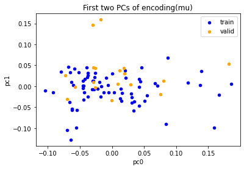


```python
cols = list(pca.columns)

fig, axes = plt.subplots(ncols=2, figsize=(15, 8))

# by split
ax = axes[0]

split = 'train'
ax = pca.loc[split].plot.scatter(
    x=cols[0], y=cols[1], title='First two PCs of mu', color='blue', label=split, ax=ax)
split = 'valid'
ax = pca.loc[split].plot.scatter(
    x=cols[0], y=cols[1], title='First two PCs of encoding(mu)', color='orange', label=split, ax=ax)

# by dates
ax = axes[1]
ax = scatter_plot_w_dates(ax, pca, dates=analysis.df_meta.date)

loc = mdates.AutoDateLocator()
_ = fig.colorbar(ax, ticks=loc,
                 format=mdates.AutoDateFormatter(loc))

figures[('pca', 'vae')] = fig
```


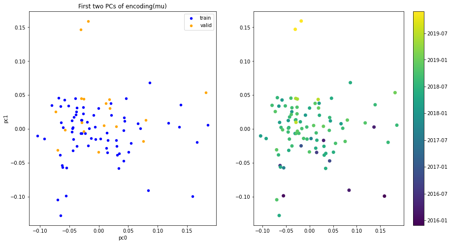


Compare to original PCA


```python
figures[('pca', 'original')] # pca on std-normalized data
```


Distance of samples from mean sample


```python
def euclidian_distance(df, axis=0):
    X = (df - df.mean(axis=axis))**2
    axis = 1-axis
    X = X.sum(axis=axis)
    X = X**0.5
    return X
    

# latent
dist = {}
dist['vae_mu'] =euclidian_distance(vae_mu)

# reconstructed
vae_recon = pd.concat([
    latent_space[('train', 'recon')],
    latent_space[('valid', 'recon')]
], keys=['train', 'valid'])

dist['vae_recon'] =euclidian_distance(vae_recon)

#non-scaled original
dist['original'] = euclidian_distance(analysis.df_by_split)

#scaled original
scaler = StandardScaler().fit(analysis.df_train)
X = scaler.transform(analysis.df_by_split)
dist['original_normalized'] = euclidian_distance(X)

# can different dimensionality be compared directly?
```


```python
import itertools
fig, axes = plt.subplots(nrows=len(dist), figsize=(10,7*len(dist)))
axes = itertools.chain(axes)

for i, (key, _s) in enumerate(dist.items()):
    ax = next(axes)
    _ = _s.sort_values().plot(rot=90, ax=ax, title=key)
_ = fig.tight_layout()
```


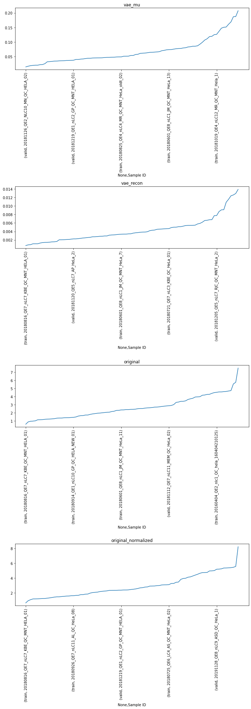


```python
dist = pd.DataFrame(dist)#.sort_values('original')
dist
```


<div>

<table border="1" class="dataframe">
  <thead>
    <tr style="text-align: right;">
      <th></th>
      <th></th>
      <th>vae_mu</th>
      <th>vae_recon</th>
      <th>original</th>
      <th>original_normalized</th>
    </tr>
    <tr>
      <th></th>
      <th>Sample ID</th>
      <th></th>
      <th></th>
      <th></th>
      <th></th>
    </tr>
  </thead>
  <tbody>
    <tr>
      <th rowspan="5" valign="top">train</th>
      <th>20151128_QE7_UPLC11_RJC_DEV_columnsTest_HeLa_01</th>
      <td>0.188</td>
      <td>0.013</td>
      <td>7.495</td>
      <td>8.231</td>
    </tr>
    <tr>
      <th>20160105_QE6_nLC4_MM_QC_MNT_HELA_01_170106201806</th>
      <td>0.120</td>
      <td>0.006</td>
      <td>2.376</td>
      <td>2.379</td>
    </tr>
    <tr>
      <th>20160311_QE6_LC6_SCL_QC_MNT_HeLa_01</th>
      <td>0.125</td>
      <td>0.008</td>
      <td>4.718</td>
      <td>5.015</td>
    </tr>
    <tr>
      <th>20160401_QE6_nLC6_ASD_QC_HELA_03</th>
      <td>0.035</td>
      <td>0.003</td>
      <td>2.275</td>
      <td>2.696</td>
    </tr>
    <tr>
      <th>20160404_QE2_nlc1_QC_hela_160404210125</th>
      <td>0.137</td>
      <td>0.011</td>
      <td>4.510</td>
      <td>5.219</td>
    </tr>
    <tr>
      <th>...</th>
      <th>...</th>
      <td>...</td>
      <td>...</td>
      <td>...</td>
      <td>...</td>
    </tr>
    <tr>
      <th rowspan="5" valign="top">valid</th>
      <th>20190527_QE4_LC12_AS_QC_MNT_HeLa_02</th>
      <td>0.051</td>
      <td>0.003</td>
      <td>3.398</td>
      <td>3.989</td>
    </tr>
    <tr>
      <th>20190701_QE4_LC12_IAH_QC_MNT_HeLa_03</th>
      <td>0.049</td>
      <td>0.001</td>
      <td>2.586</td>
      <td>2.948</td>
    </tr>
    <tr>
      <th>20190708_QE6_nLC4_JE_QC_MNT_HeLa_01</th>
      <td>0.065</td>
      <td>0.004</td>
      <td>3.925</td>
      <td>4.747</td>
    </tr>
    <tr>
      <th>20191128_QE8_nLC9_ASD_QC_HeLa_1</th>
      <td>0.151</td>
      <td>0.005</td>
      <td>4.470</td>
      <td>5.200</td>
    </tr>
    <tr>
      <th>20191128_QE8_nLC9_ASD_QC_HeLa_1_20191128165313</th>
      <td>0.161</td>
      <td>0.004</td>
      <td>4.591</td>
      <td>5.388</td>
    </tr>
  </tbody>
</table>
<p>90 rows × 4 columns</p>
</div>


```python
_ = dist.sort_values(by='original').plot(rot=90)
```


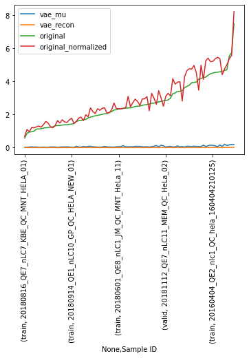


## Tensorboard

- can be run from notebook
- or in a separate process to inspect currently running training loops


```python
if ADD_TENSORBOARD:
    print("Run to see updates: \n\n\ttensorboard "
          f"--logdir {tensorboard_model_namer.folder.absolute()}")
```

## Compare metrics on AE and VAE

- Collaborative Filtering currently not comparable as setup differs


```python
analysis.results.keys()
```


    dict_keys(['RF baseline', 'Simple AE', 'denoising AE', 'VAE'])


```python
print("Choose from list of keys: ",
      ", ".join(
          list(next(iter(next(iter(analysis.results.values())).values())).keys()))
      )
_selected_metric = "50%"  # median
print("Currently selected:", _selected_metric)
```

    Choose from list of keys:  count, mean, std, min, 25%, 50%, 75%, max
    Currently selected: 50%
    


```python
# # Comparison Series
# comparison = {(peptide, model_name): stats[_selected_metric] for model_name, description in analysis.results.items() for peptide, stats in description.items()}
# pd.Series(comparison).sort_index()
```


```python
# # Comparison as DataFrame
comparison = {}
for model_name, description in analysis.results.items():
    comparison[model_name] = {peptide: stats[_selected_metric]
                              for peptide, stats in description.items()}

pd.DataFrame(comparison).style.apply(vaep.pandas.highlight_min, axis=1)
```


<style  type="text/css" >
#T_491a7_row0_col1,#T_491a7_row1_col1,#T_491a7_row2_col1,#T_491a7_row3_col1,#T_491a7_row4_col1,#T_491a7_row5_col1,#T_491a7_row6_col1,#T_491a7_row7_col1,#T_491a7_row8_col0,#T_491a7_row9_col1{
            background-color:  yellow;
        }</style>
<table id="T_491a7_" ><thead>    <tr>        <th class="blank level0" ></th>        <th class="col_heading level0 col0" >RF baseline</th>        <th class="col_heading level0 col1" >Simple AE</th>        <th class="col_heading level0 col2" >denoising AE</th>        <th class="col_heading level0 col3" >VAE</th>    </tr></thead><tbody>
                <tr>
                        <th id="T_491a7_level0_row0" class="row_heading level0 row0" >ACANPAAGSVILLENLR</th>
                        <td id="T_491a7_row0_col0" class="data row0 col0" >0.250387</td>
                        <td id="T_491a7_row0_col1" class="data row0 col1" >0.189053</td>
                        <td id="T_491a7_row0_col2" class="data row0 col2" >0.500509</td>
                        <td id="T_491a7_row0_col3" class="data row0 col3" >0.794539</td>
            </tr>
            <tr>
                        <th id="T_491a7_level0_row1" class="row_heading level0 row1" >ARFEELCSDLFR</th>
                        <td id="T_491a7_row1_col0" class="data row1 col0" >0.382997</td>
                        <td id="T_491a7_row1_col1" class="data row1 col1" >0.236205</td>
                        <td id="T_491a7_row1_col2" class="data row1 col2" >0.656374</td>
                        <td id="T_491a7_row1_col3" class="data row1 col3" >0.730623</td>
            </tr>
            <tr>
                        <th id="T_491a7_level0_row2" class="row_heading level0 row2" >AVAEQIPLLVQGVR</th>
                        <td id="T_491a7_row2_col0" class="data row2 col0" >0.379581</td>
                        <td id="T_491a7_row2_col1" class="data row2 col1" >0.344061</td>
                        <td id="T_491a7_row2_col2" class="data row2 col2" >0.396037</td>
                        <td id="T_491a7_row2_col3" class="data row2 col3" >0.461284</td>
            </tr>
            <tr>
                        <th id="T_491a7_level0_row3" class="row_heading level0 row3" >EGPYDVVVLPGGNLGAQNLSESAAVK</th>
                        <td id="T_491a7_row3_col0" class="data row3 col0" >0.319098</td>
                        <td id="T_491a7_row3_col1" class="data row3 col1" >0.196530</td>
                        <td id="T_491a7_row3_col2" class="data row3 col2" >0.609319</td>
                        <td id="T_491a7_row3_col3" class="data row3 col3" >0.859122</td>
            </tr>
            <tr>
                        <th id="T_491a7_level0_row4" class="row_heading level0 row4" >HGSLGFLPR</th>
                        <td id="T_491a7_row4_col0" class="data row4 col0" >0.696504</td>
                        <td id="T_491a7_row4_col1" class="data row4 col1" >0.192465</td>
                        <td id="T_491a7_row4_col2" class="data row4 col2" >0.552925</td>
                        <td id="T_491a7_row4_col3" class="data row4 col3" >0.488594</td>
            </tr>
            <tr>
                        <th id="T_491a7_level0_row5" class="row_heading level0 row5" >IDIIPNPQER</th>
                        <td id="T_491a7_row5_col0" class="data row5 col0" >0.248464</td>
                        <td id="T_491a7_row5_col1" class="data row5 col1" >0.116373</td>
                        <td id="T_491a7_row5_col2" class="data row5 col2" >0.323013</td>
                        <td id="T_491a7_row5_col3" class="data row5 col3" >0.808358</td>
            </tr>
            <tr>
                        <th id="T_491a7_level0_row6" class="row_heading level0 row6" >LALVTGGEIASTFDHPELVK</th>
                        <td id="T_491a7_row6_col0" class="data row6 col0" >0.305045</td>
                        <td id="T_491a7_row6_col1" class="data row6 col1" >0.264409</td>
                        <td id="T_491a7_row6_col2" class="data row6 col2" >0.390686</td>
                        <td id="T_491a7_row6_col3" class="data row6 col3" >0.732405</td>
            </tr>
            <tr>
                        <th id="T_491a7_level0_row7" class="row_heading level0 row7" >LLEVEHPAAK</th>
                        <td id="T_491a7_row7_col0" class="data row7 col0" >1.000493</td>
                        <td id="T_491a7_row7_col1" class="data row7 col1" >0.572648</td>
                        <td id="T_491a7_row7_col2" class="data row7 col2" >1.226154</td>
                        <td id="T_491a7_row7_col3" class="data row7 col3" >1.276345</td>
            </tr>
            <tr>
                        <th id="T_491a7_level0_row8" class="row_heading level0 row8" >STESLQANVQR</th>
                        <td id="T_491a7_row8_col0" class="data row8 col0" >0.286712</td>
                        <td id="T_491a7_row8_col1" class="data row8 col1" >0.338588</td>
                        <td id="T_491a7_row8_col2" class="data row8 col2" >0.438054</td>
                        <td id="T_491a7_row8_col3" class="data row8 col3" >0.851372</td>
            </tr>
            <tr>
                        <th id="T_491a7_level0_row9" class="row_heading level0 row9" >VNNSSLIGLGYTQTLKPGIK</th>
                        <td id="T_491a7_row9_col0" class="data row9 col0" >0.328124</td>
                        <td id="T_491a7_row9_col1" class="data row9 col1" >0.246687</td>
                        <td id="T_491a7_row9_col2" class="data row9 col2" >0.577805</td>
                        <td id="T_491a7_row9_col3" class="data row9 col3" >0.752543</td>
            </tr>
    </tbody></table>


## Hyperparameter comparison

- [x] order data by date: consecutive samples from training to validation
- [x] check stratification based on machine and column length between splits
    - Do validation and training data have same proportion of machine types? -> generally no, would need to be added
       - not (all) machines are running continously or are continously checked
- [x] complete meta data reading based on filenames
- [x] compare performance regarding data normalization
    - in original intensity space (non-log-transformed) - > 
- [ ] compare performance regarding several hyperparameters of VAE (layers, activation, etc)
    - plot different losses in one plot as validation data set is the same
- [ ] increase number of samples in training set and create result plot
- [ ] increase the number of peptides (features)
- [ ] mask some values in the validation set missing (Quality Assessment)
- [ ] write main function which trains an entire model (including data transformations)
- [ ] add initial PCA plot with samples. Is there any grouping observable? (plotly express)

Debug
- [x] Check reporting of loss again: average sample loss or average peptide loss?
- [x] take a close look at VAE tutorial of PyTorch (data normalization, etc)
- [x] reduce the features size to fewer samples

VAE
- original inputs between 0 and 1 as decoder outputs are transformed originally using the sigmoid fct
- original model use `tanh` activations
- think about the definition of `MSE` in a mini-batch. Should be peptide wise?
    - VAMB does sum over a sample and then takes the mean of the sum (alternative?)
    - multi-output regression?
- learning requires active masking: Mask inputs which should be learned to be recovered. Feed original, 
  not masked image as target to loss.

- [ ] Run MNIST example with MSE loss. Does it still work?
- [x] Normalize inputs to zero and one, use MNIST VAE. Does it work?
  - yes, it learns better then
- [x] Regress M peptide intensities on 1 other peptide intensity. Does it work? (Reference performance)
    - RF baseline model established
- [x] Build a normal AE without probabilistic bottleneck. Does this work?
    - yes

Refactoring

- [x] get epoch out of train, eval etc


Ideas
  - combine 1000 most abundant peptides as guidance for different sets of low abundant peptides
  - show the difference between original and reconstruction using a cm in an Image? batch-wise?

- Current optimum for comparision is zero

> The comparison where relatively low abundant, but not super low-abundant peptides will be masked, could skew the comparison.


```python
# writer # new writer
# dls = get_dls(data_in_memory, scaler)
# model = VAE()
# writer =  # new writer for each setup
# metrics = run_experiment(model, dls, writer)
# overview['experiment_name'] = metrics
```

### Inspect batches of the trained model


```python
index_valid = analysis.df_valid.index
index_train = analysis.df_train.index
columns_ = analysis.df_train.columns

model.eval()
```


    VAE(
      (decoder): Sequential(
        (0): Linear(in_features=4, out_features=6, bias=True)
        (1): Tanh()
        (2): Linear(in_features=6, out_features=10, bias=True)
        (3): Sigmoid()
      )
      (encoder): Sequential(
        (0): Linear(in_features=10, out_features=6, bias=True)
        (1): Tanh()
        (2): Linear(in_features=6, out_features=8, bias=True)
      )
    )


#### Training batch example


```python
model.to('cpu')
iter_dl_train = iter(dl_train)
batch = next(iter_dl_train)
batch_mask = None
try:
    batch, batch_mask = batch
    batch_masked = batch * batch_mask
except ValueError:
    batch = batch
batch_recon, mu, logvar = model(batch)
```


```python
batch_recon
```


    tensor([[0.5611, 0.5230, 0.5580, 0.5997, 0.6752, 0.5011, 0.5036, 0.6337, 0.5369,
             0.4788],
            [0.5634, 0.5284, 0.5590, 0.5939, 0.6653, 0.4979, 0.5080, 0.6235, 0.5399,
             0.4781],
            [0.5621, 0.5247, 0.5585, 0.5978, 0.6722, 0.4999, 0.5049, 0.6305, 0.5378,
             0.4782],
            [0.5640, 0.5268, 0.5581, 0.5973, 0.6691, 0.4990, 0.5064, 0.6283, 0.5383,
             0.4793],
            [0.5629, 0.5242, 0.5575, 0.5999, 0.6738, 0.5003, 0.5039, 0.6333, 0.5368,
             0.4792],
            [0.5645, 0.5270, 0.5583, 0.5980, 0.6694, 0.4994, 0.5072, 0.6282, 0.5384,
             0.4801],
            [0.5653, 0.5287, 0.5589, 0.5962, 0.6663, 0.4985, 0.5089, 0.6246, 0.5395,
             0.4800],
            [0.5637, 0.5261, 0.5584, 0.5981, 0.6707, 0.4996, 0.5062, 0.6293, 0.5381,
             0.4794]], dtype=torch.float64, grad_fn=<SigmoidBackward>)


```python
_batch_metrics = vaep_model.loss_function(batch_recon, batch, mu, logvar)
_batch_metrics
```


    {'loss': tensor(6.4421, dtype=torch.float64, grad_fn=<AddBackward0>),
     'recon_loss': tensor(6.3307, dtype=torch.float64, grad_fn=<MseLossBackward>),
     'KLD': tensor(0.1237, dtype=torch.float64, grad_fn=<MulBackward0>)}


```python
if batch_mask:
    # avg per peptide loss -> should be close to zero (ref: std=1)
    _mse = ((batch * batch_mask) - (batch_recon * batch_mask)).pow(2).sum()
else:
    _mse = (batch - batch_recon).pow(2).sum()
_mse
```


    tensor(6.3307, dtype=torch.float64, grad_fn=<SumBackward0>)


```python
from torch import nn

loss = nn.MSELoss(reduction='sum')
if batch_mask:
    _mse = loss(input=batch_recon*batch_mask, target=batch * batch_mask)
else:
    _mse = loss(input=batch_recon, target=batch)
_mse
```


    tensor(6.3307, dtype=torch.float64, grad_fn=<MseLossBackward>)


```python
from torch.nn import functional as F
if batch_mask:
    batch_sse = F.mse_loss(input=batch_recon*batch_mask,
                           target=batch * batch_mask, reduction='sum')
else:
    batch_sse = F.mse_loss(input=batch_recon,
                           target=batch, reduction='sum')
batch_sse
```


    tensor(6.3307, dtype=torch.float64, grad_fn=<MseLossBackward>)


####  Validation batch example


```python
# validation data loader is not shuffled
N_valid = len(dl_valid.dataset)

model.eval()

iter_dl_valid = iter(dl_valid)

batch = next(iter_dl_valid)
batch_mask = None
try:
    batch, batch_mask = batch
    batch_masked = batch * batch_mask
except ValueError:
    batch = batch

batch_recon, mu, logvar = model(batch)
```


```python
batch_recon
```


    tensor([[0.5649, 0.5276, 0.5582, 0.5981, 0.6686, 0.4994, 0.5080, 0.6275, 0.5387,
             0.4809],
            [0.5653, 0.5296, 0.5581, 0.5954, 0.6645, 0.4979, 0.5088, 0.6240, 0.5396,
             0.4800],
            [0.5665, 0.5300, 0.5582, 0.5963, 0.6647, 0.4980, 0.5094, 0.6241, 0.5395,
             0.4808],
            [0.5639, 0.5259, 0.5577, 0.5995, 0.6715, 0.5001, 0.5061, 0.6308, 0.5377,
             0.4806],
            [0.5653, 0.5277, 0.5579, 0.5977, 0.6683, 0.4987, 0.5070, 0.6280, 0.5383,
             0.4800],
            [0.5656, 0.5293, 0.5587, 0.5959, 0.6654, 0.4982, 0.5092, 0.6241, 0.5396,
             0.4801],
            [0.5653, 0.5286, 0.5581, 0.5970, 0.6667, 0.4986, 0.5083, 0.6260, 0.5391,
             0.4806],
            [0.5649, 0.5277, 0.5579, 0.5975, 0.6681, 0.4989, 0.5073, 0.6275, 0.5385,
             0.4801]], dtype=torch.float64, grad_fn=<SigmoidBackward>)


```python
_batch_metrics = vaep_model.loss_function(batch_recon, batch, mu, logvar)
_batch_metrics
```


    {'loss': tensor(2.9513, dtype=torch.float64, grad_fn=<AddBackward0>),
     'recon_loss': tensor(2.9164, dtype=torch.float64, grad_fn=<MseLossBackward>),
     'KLD': tensor(0.0388, dtype=torch.float64, grad_fn=<MulBackward0>)}


```python
if batch_mask:
    # avg per peptide loss -> should be close to zero (ref: std=1)
    _mse = ((batch * batch_mask) - (batch_recon * batch_mask)).pow(2).sum()
else:
    _mse = (batch - batch_recon).pow(2).sum()
_mse
```


    tensor(2.9164, dtype=torch.float64, grad_fn=<SumBackward0>)


```python
from torch import nn

loss = nn.MSELoss(reduction='sum')
if batch_mask:
    _mse = loss(input=batch_recon*batch_mask, target=batch * batch_mask)
else:
    _mse = loss(input=batch_recon, target=batch)
_mse
```


    tensor(2.9164, dtype=torch.float64, grad_fn=<MseLossBackward>)


```python
from torch.nn import functional as F
if batch_mask:
    batch_sse = F.mse_loss(input=batch_recon*batch_mask,
                           target=batch * batch_mask, reduction='sum')
else:
    batch_sse = F.mse_loss(input=batch_recon,
                           target=batch, reduction='sum')
batch_sse
```


    tensor(2.9164, dtype=torch.float64, grad_fn=<MseLossBackward>)


### Inspect Validation data

- VAMB training epoch normalizes by number of batches, [see](https://github.com/RasmussenLab/vamb/blob/734b741b85296377937de54166b7db274bc7ba9c/vamb/encode.py#L284-L335)


```python
# validation data loader is not shuffled
iter_dl_valid = iter(dl_valid)

batch = next(iter_dl_valid)
batch_mask = None
try:
    batch, batch_mask = batch
    batch_masked = batch * batch_mask
except ValueError:
    batch = batch

M = batch.shape[-1]
batch_recon, _, _ = model(batch)

data = batch.detach().numpy()
if batch_mask:
    mask = batch_mask.detach().numpy()
pred = batch_recon.detach().numpy()

for batch in iter_dl_valid:
    try:
        # ToDo: Test if this works
        if not type(batch) == torch.Tensor:
            batch, batch_mask = batch
            batch_masked = batch * batch_mask
    except ValueError:
        batch = batch
    batch_recon, _, _ = model(batch)
    data = np.append(data, batch.view([-1, M]), axis=0)

    if batch_mask:
        mask = np.append(mask, batch_mask, axis=0)
    pred = np.append(pred, batch_recon.detach().numpy().reshape(-1, M), axis=0)

expected_shape = analysis.df_valid.shape
assert data.shape == expected_shape
assert pred.shape == expected_shape
if batch_mask:
    assert mask.shape == expected_shape

data = pd.DataFrame(data, index=index_valid,
                    columns=columns_).replace(0.0, np.nan)
pred = pd.DataFrame(pred, index=index_valid, columns=columns_)
mask = pd.DataFrame(mask, index=index_valid,
                    columns=columns_) if batch_mask else None
```


```python
pd.DataFrame(
    scaler.inverse_transform(pred),
    index=index_valid,
    columns=columns_
)
```


<div>

<table border="1" class="dataframe">
  <thead>
    <tr style="text-align: right;">
      <th></th>
      <th>ACANPAAGSVILLENLR</th>
      <th>ARFEELCSDLFR</th>
      <th>AVAEQIPLLVQGVR</th>
      <th>EGPYDVVVLPGGNLGAQNLSESAAVK</th>
      <th>HGSLGFLPR</th>
      <th>IDIIPNPQER</th>
      <th>LALVTGGEIASTFDHPELVK</th>
      <th>LLEVEHPAAK</th>
      <th>STESLQANVQR</th>
      <th>VNNSSLIGLGYTQTLKPGIK</th>
    </tr>
    <tr>
      <th>Sample ID</th>
      <th></th>
      <th></th>
      <th></th>
      <th></th>
      <th></th>
      <th></th>
      <th></th>
      <th></th>
      <th></th>
      <th></th>
    </tr>
  </thead>
  <tbody>
    <tr>
      <th>20181029_QE3_nLC3_KBE_QC_MNT_HELA_02</th>
      <td>31.102</td>
      <td>29.702</td>
      <td>27.094</td>
      <td>29.618</td>
      <td>29.631</td>
      <td>30.647</td>
      <td>30.090</td>
      <td>28.916</td>
      <td>29.954</td>
      <td>30.219</td>
    </tr>
    <tr>
      <th>20181102_QE2_NLC10_MR_QC_MNT_HELA_01</th>
      <td>31.103</td>
      <td>29.703</td>
      <td>27.094</td>
      <td>29.615</td>
      <td>29.626</td>
      <td>30.646</td>
      <td>30.091</td>
      <td>28.912</td>
      <td>29.954</td>
      <td>30.219</td>
    </tr>
    <tr>
      <th>20181107_QE6_nLC12_MR_QC_MNT_HELA_New_01</th>
      <td>31.104</td>
      <td>29.703</td>
      <td>27.094</td>
      <td>29.616</td>
      <td>29.626</td>
      <td>30.646</td>
      <td>30.092</td>
      <td>28.912</td>
      <td>29.954</td>
      <td>30.219</td>
    </tr>
    <tr>
      <th>20181110_QE5_nLC5_OOE_QC_MNT_HELA_15cm_250ng_RO-003</th>
      <td>31.101</td>
      <td>29.700</td>
      <td>27.093</td>
      <td>29.619</td>
      <td>29.635</td>
      <td>30.647</td>
      <td>30.088</td>
      <td>28.920</td>
      <td>29.953</td>
      <td>30.219</td>
    </tr>
    <tr>
      <th>20181112_QE7_nLC11_MEM_QC_HeLa_02</th>
      <td>31.102</td>
      <td>29.702</td>
      <td>27.094</td>
      <td>29.618</td>
      <td>29.631</td>
      <td>30.646</td>
      <td>30.089</td>
      <td>28.917</td>
      <td>29.953</td>
      <td>30.219</td>
    </tr>
    <tr>
      <th>20181119_QE1_nLC2_TW_QC_HeLa_1</th>
      <td>31.103</td>
      <td>29.703</td>
      <td>27.094</td>
      <td>29.616</td>
      <td>29.627</td>
      <td>30.646</td>
      <td>30.092</td>
      <td>28.912</td>
      <td>29.954</td>
      <td>30.219</td>
    </tr>
    <tr>
      <th>20181120_QE5_nLC7_AP_HeLa_2</th>
      <td>31.103</td>
      <td>29.702</td>
      <td>27.094</td>
      <td>29.617</td>
      <td>29.629</td>
      <td>30.646</td>
      <td>30.091</td>
      <td>28.915</td>
      <td>29.954</td>
      <td>30.219</td>
    </tr>
    <tr>
      <th>20181126_QE2_NLC10_MN_QC_HELA_02</th>
      <td>31.102</td>
      <td>29.702</td>
      <td>27.094</td>
      <td>29.617</td>
      <td>29.631</td>
      <td>30.646</td>
      <td>30.090</td>
      <td>28.916</td>
      <td>29.953</td>
      <td>30.219</td>
    </tr>
    <tr>
      <th>20181205_QE5_nLC7_RJC_QC_MNT_HeLa_2</th>
      <td>31.102</td>
      <td>29.700</td>
      <td>27.093</td>
      <td>29.620</td>
      <td>29.636</td>
      <td>30.647</td>
      <td>30.088</td>
      <td>28.921</td>
      <td>29.953</td>
      <td>30.219</td>
    </tr>
    <tr>
      <th>20181215_QE2_NLC10_ANHO_QC_MNT_HELA_04</th>
      <td>31.102</td>
      <td>29.702</td>
      <td>27.094</td>
      <td>29.617</td>
      <td>29.631</td>
      <td>30.646</td>
      <td>30.089</td>
      <td>28.917</td>
      <td>29.953</td>
      <td>30.218</td>
    </tr>
    <tr>
      <th>20181219_QE1_nLC2_GP_QC_MNT_HELA_01</th>
      <td>31.102</td>
      <td>29.701</td>
      <td>27.094</td>
      <td>29.618</td>
      <td>29.632</td>
      <td>30.647</td>
      <td>30.089</td>
      <td>28.918</td>
      <td>29.953</td>
      <td>30.219</td>
    </tr>
    <tr>
      <th>20190107_QE5_nLC5_DS_QC_MNT_HeLa_FlashPack_02</th>
      <td>31.099</td>
      <td>29.699</td>
      <td>27.093</td>
      <td>29.617</td>
      <td>29.637</td>
      <td>30.646</td>
      <td>30.084</td>
      <td>28.923</td>
      <td>29.952</td>
      <td>30.216</td>
    </tr>
    <tr>
      <th>20190527_QE4_LC12_AS_QC_MNT_HeLa_01</th>
      <td>31.103</td>
      <td>29.703</td>
      <td>27.094</td>
      <td>29.617</td>
      <td>29.628</td>
      <td>30.646</td>
      <td>30.090</td>
      <td>28.914</td>
      <td>29.954</td>
      <td>30.219</td>
    </tr>
    <tr>
      <th>20190527_QE4_LC12_AS_QC_MNT_HeLa_02</th>
      <td>31.103</td>
      <td>29.703</td>
      <td>27.094</td>
      <td>29.617</td>
      <td>29.628</td>
      <td>30.646</td>
      <td>30.090</td>
      <td>28.915</td>
      <td>29.954</td>
      <td>30.219</td>
    </tr>
    <tr>
      <th>20190701_QE4_LC12_IAH_QC_MNT_HeLa_03</th>
      <td>31.102</td>
      <td>29.702</td>
      <td>27.093</td>
      <td>29.617</td>
      <td>29.630</td>
      <td>30.646</td>
      <td>30.089</td>
      <td>28.917</td>
      <td>29.953</td>
      <td>30.219</td>
    </tr>
    <tr>
      <th>20190708_QE6_nLC4_JE_QC_MNT_HeLa_01</th>
      <td>31.102</td>
      <td>29.702</td>
      <td>27.094</td>
      <td>29.615</td>
      <td>29.628</td>
      <td>30.645</td>
      <td>30.089</td>
      <td>28.914</td>
      <td>29.954</td>
      <td>30.217</td>
    </tr>
    <tr>
      <th>20191128_QE8_nLC9_ASD_QC_HeLa_1</th>
      <td>31.104</td>
      <td>29.703</td>
      <td>27.093</td>
      <td>29.618</td>
      <td>29.628</td>
      <td>30.646</td>
      <td>30.091</td>
      <td>28.915</td>
      <td>29.953</td>
      <td>30.220</td>
    </tr>
    <tr>
      <th>20191128_QE8_nLC9_ASD_QC_HeLa_1_20191128165313</th>
      <td>31.105</td>
      <td>29.703</td>
      <td>27.093</td>
      <td>29.618</td>
      <td>29.628</td>
      <td>30.646</td>
      <td>30.090</td>
      <td>28.916</td>
      <td>29.953</td>
      <td>30.220</td>
    </tr>
  </tbody>
</table>
</div>


```python
metrics.iloc[-1]  # mse loss get's most weight in combined loss
```


    train  loss         6.779
           recon_loss   6.771
           KLD          0.008
    valid  loss         0.810
           recon_loss   0.798
           KLD          0.013
    Name: 30, dtype: float64


```python
metrics.iloc[-1].loc[('valid', 'recon_loss')]
```


    0.7980607149304116


Average prediction error per peptides:

-  std. dev is one, so a prediction


```python
# check that losses reported match loss calculated form predictions
((pred - data)**2).sum().sum() / data.notna().sum().sum()
```


    0.06152830662682402


```python
(pred - data).iloc[:10, :5]
```


<div>

<table border="1" class="dataframe">
  <thead>
    <tr style="text-align: right;">
      <th></th>
      <th>ACANPAAGSVILLENLR</th>
      <th>ARFEELCSDLFR</th>
      <th>AVAEQIPLLVQGVR</th>
      <th>EGPYDVVVLPGGNLGAQNLSESAAVK</th>
      <th>HGSLGFLPR</th>
    </tr>
    <tr>
      <th>Sample ID</th>
      <th></th>
      <th></th>
      <th></th>
      <th></th>
      <th></th>
    </tr>
  </thead>
  <tbody>
    <tr>
      <th>20181029_QE3_nLC3_KBE_QC_MNT_HELA_02</th>
      <td>0.090</td>
      <td>0.164</td>
      <td>0.193</td>
      <td>0.334</td>
      <td>-0.001</td>
    </tr>
    <tr>
      <th>20181102_QE2_NLC10_MR_QC_MNT_HELA_01</th>
      <td>-0.365</td>
      <td>-0.129</td>
      <td>-0.319</td>
      <td>-0.231</td>
      <td>-0.235</td>
    </tr>
    <tr>
      <th>20181107_QE6_nLC12_MR_QC_MNT_HELA_New_01</th>
      <td>-0.150</td>
      <td>-0.131</td>
      <td>-0.120</td>
      <td>-0.132</td>
      <td>-0.197</td>
    </tr>
    <tr>
      <th>20181110_QE5_nLC5_OOE_QC_MNT_HELA_15cm_250ng_RO-003</th>
      <td>0.258</td>
      <td>0.321</td>
      <td>0.301</td>
      <td>0.440</td>
      <td>0.085</td>
    </tr>
    <tr>
      <th>20181112_QE7_nLC11_MEM_QC_HeLa_02</th>
      <td>-0.224</td>
      <td>-0.142</td>
      <td>-0.254</td>
      <td>-0.241</td>
      <td>0.249</td>
    </tr>
    <tr>
      <th>20181119_QE1_nLC2_TW_QC_HeLa_1</th>
      <td>-0.128</td>
      <td>-0.057</td>
      <td>0.051</td>
      <td>-0.027</td>
      <td>-0.071</td>
    </tr>
    <tr>
      <th>20181120_QE5_nLC7_AP_HeLa_2</th>
      <td>-0.067</td>
      <td>0.130</td>
      <td>-0.230</td>
      <td>0.053</td>
      <td>-0.187</td>
    </tr>
    <tr>
      <th>20181126_QE2_NLC10_MN_QC_HELA_02</th>
      <td>0.034</td>
      <td>0.026</td>
      <td>0.119</td>
      <td>0.155</td>
      <td>-0.074</td>
    </tr>
    <tr>
      <th>20181205_QE5_nLC7_RJC_QC_MNT_HeLa_2</th>
      <td>0.270</td>
      <td>0.469</td>
      <td>0.257</td>
      <td>0.302</td>
      <td>0.080</td>
    </tr>
    <tr>
      <th>20181215_QE2_NLC10_ANHO_QC_MNT_HELA_04</th>
      <td>0.021</td>
      <td>-0.030</td>
      <td>-0.025</td>
      <td>-0.013</td>
      <td>-0.101</td>
    </tr>
  </tbody>
</table>
</div>


```python
((pred - data).iloc[:10, :5])**2
```


<div>

<table border="1" class="dataframe">
  <thead>
    <tr style="text-align: right;">
      <th></th>
      <th>ACANPAAGSVILLENLR</th>
      <th>ARFEELCSDLFR</th>
      <th>AVAEQIPLLVQGVR</th>
      <th>EGPYDVVVLPGGNLGAQNLSESAAVK</th>
      <th>HGSLGFLPR</th>
    </tr>
    <tr>
      <th>Sample ID</th>
      <th></th>
      <th></th>
      <th></th>
      <th></th>
      <th></th>
    </tr>
  </thead>
  <tbody>
    <tr>
      <th>20181029_QE3_nLC3_KBE_QC_MNT_HELA_02</th>
      <td>0.008</td>
      <td>0.027</td>
      <td>0.037</td>
      <td>0.112</td>
      <td>0.000</td>
    </tr>
    <tr>
      <th>20181102_QE2_NLC10_MR_QC_MNT_HELA_01</th>
      <td>0.133</td>
      <td>0.017</td>
      <td>0.102</td>
      <td>0.053</td>
      <td>0.055</td>
    </tr>
    <tr>
      <th>20181107_QE6_nLC12_MR_QC_MNT_HELA_New_01</th>
      <td>0.023</td>
      <td>0.017</td>
      <td>0.014</td>
      <td>0.017</td>
      <td>0.039</td>
    </tr>
    <tr>
      <th>20181110_QE5_nLC5_OOE_QC_MNT_HELA_15cm_250ng_RO-003</th>
      <td>0.066</td>
      <td>0.103</td>
      <td>0.091</td>
      <td>0.194</td>
      <td>0.007</td>
    </tr>
    <tr>
      <th>20181112_QE7_nLC11_MEM_QC_HeLa_02</th>
      <td>0.050</td>
      <td>0.020</td>
      <td>0.064</td>
      <td>0.058</td>
      <td>0.062</td>
    </tr>
    <tr>
      <th>20181119_QE1_nLC2_TW_QC_HeLa_1</th>
      <td>0.017</td>
      <td>0.003</td>
      <td>0.003</td>
      <td>0.001</td>
      <td>0.005</td>
    </tr>
    <tr>
      <th>20181120_QE5_nLC7_AP_HeLa_2</th>
      <td>0.004</td>
      <td>0.017</td>
      <td>0.053</td>
      <td>0.003</td>
      <td>0.035</td>
    </tr>
    <tr>
      <th>20181126_QE2_NLC10_MN_QC_HELA_02</th>
      <td>0.001</td>
      <td>0.001</td>
      <td>0.014</td>
      <td>0.024</td>
      <td>0.005</td>
    </tr>
    <tr>
      <th>20181205_QE5_nLC7_RJC_QC_MNT_HeLa_2</th>
      <td>0.073</td>
      <td>0.220</td>
      <td>0.066</td>
      <td>0.091</td>
      <td>0.006</td>
    </tr>
    <tr>
      <th>20181215_QE2_NLC10_ANHO_QC_MNT_HELA_04</th>
      <td>0.000</td>
      <td>0.001</td>
      <td>0.001</td>
      <td>0.000</td>
      <td>0.010</td>
    </tr>
  </tbody>
</table>
</div>


```python
(pred - data).notna().sum().sum()
```


    180


```python
N, M = data.shape
data.isna().sum().sum() / (N*M)  # only few missings
```


    0.0


```python

```
