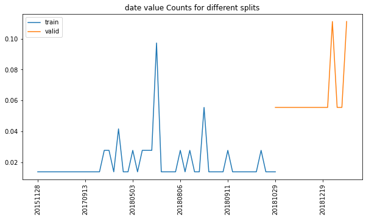
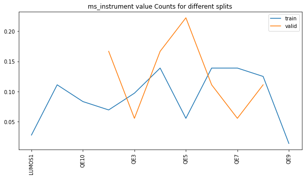
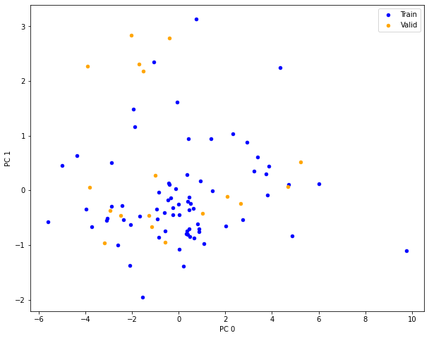
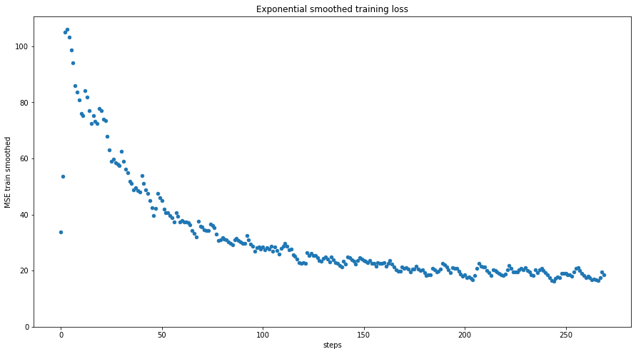
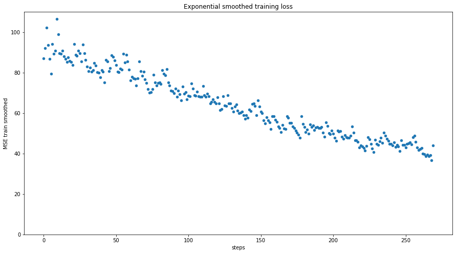
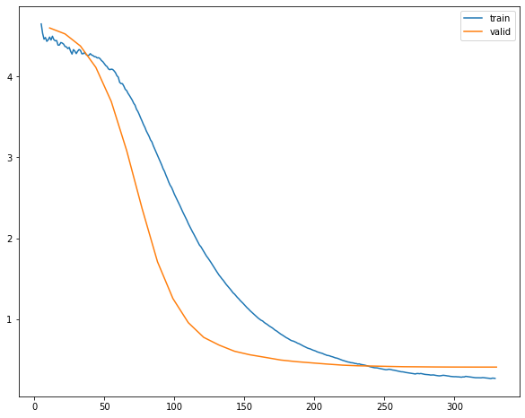
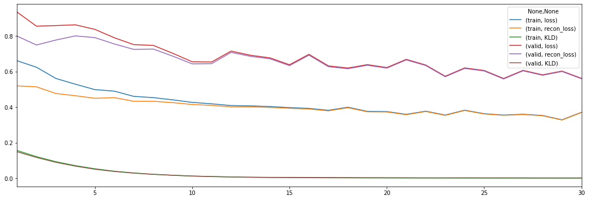
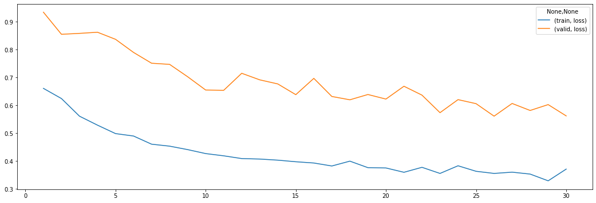

# Experiment 1


```python
ADD_TENSORBOARD = False
```


```python
from types import SimpleNamespace
import numpy as np
import pandas as pd
import torch

from src import config
from src.analyzers import Analysis, AnalyzePeptides
from src import analyzers

import vaep
from vaep.transform import StandardScaler, get_df_fitted_mean_std
```

    FOLDER_MQ_TXT_DATA = data\mq_out
    


```python
import logging
from src.logging import setup_logger

logger = logging.getLogger()  # returns root-logger
logger.setLevel(logging.CRITICAL)  # silence for everything else
logger.handlers = []


logger = setup_logger(logger=logging.getLogger('vaep'))
logger.info("Experiment 01")
```

    vaep - INFO     Experiment 01
    

## Load data

- 1000 features (most abundant peptides)
- later a subset of samples is selected


```python
N_SAMPLES_TO_LOAD = None
FN_PEPTIDE_INTENSITIES = config.FOLDER_DATA / 'df_intensities_N_07813_M01000'
FN_PEPTIDE_INTENSITIES = config.FOLDER_DATA / 'df_intensities_N_00090_M01000'

analysis = AnalyzePeptides(
    fname=FN_PEPTIDE_INTENSITIES, nrows=N_SAMPLES_TO_LOAD)
analysis.df = analysis.df.sort_index()  # sort by date
assert analysis.df.index.is_unique, "Non-unique training samples"
analysis
```


    AnalyzePeptides with attributes: df, stats


### Select consecutives samples for training


```python
from numpy import log2
import random
from vaep.utils import sample_iterable

N_SAMPLES = min(len(analysis.df), 1000)
logger.info(f"Selected {N_SAMPLES}")
analysis.N_SAMPLES = N_SAMPLES

M = 10

columns_selected = sorted(sample_iterable(list(analysis.df.columns), n=M))
analysis.df = analysis.df.loc[:, columns_selected]


def get_consecutive_data_indices(index, n_samples=N_SAMPLES):
    start_sample = len(index) - n_samples
    start_sample = random.randint(0, start_sample)
    return index[start_sample:start_sample+n_samples]


indices_selected = get_consecutive_data_indices(analysis.df.index)
analysis.samples = indices_selected
analysis.df = analysis.df.loc[indices_selected]

LOG_TRANSFORM = log2  # None
if LOG_TRANSFORM:
    analysis.df = LOG_TRANSFORM(analysis.df)

FRACTION = 0.8


class Indices(SimpleNamespace):
    pass


indices = Indices()
indices.train, indices.valid = indices_selected[:int(
    FRACTION*N_SAMPLES)], indices_selected[int(FRACTION*N_SAMPLES):]
analysis.indices = indices

analysis.df_train = analysis.df.loc[indices.train]
analysis.df_valid = analysis.df.loc[indices.valid]

analysis.df.sample(n=10, axis=0).sample(n=5, axis=1)
```

    vaep - INFO     Selected 90
    


<div>

<table border="1" class="dataframe">
  <thead>
    <tr style="text-align: right;">
      <th></th>
      <th>SVVLMSHLGRPDGVPMPDK</th>
      <th>IVVVTAGVR</th>
      <th>GAVDGGLSIPHSTK</th>
      <th>EFHLNESGDPSSK</th>
      <th>FAQPGSFEYEYAMR</th>
    </tr>
    <tr>
      <th>Sample ID</th>
      <th></th>
      <th></th>
      <th></th>
      <th></th>
      <th></th>
    </tr>
  </thead>
  <tbody>
    <tr>
      <th>20180825_QE4_nLC4_MR_QC_MNT_HeLa_04</th>
      <td>31.312</td>
      <td>30.961</td>
      <td>30.070</td>
      <td>30.380</td>
      <td>27.779</td>
    </tr>
    <tr>
      <th>20181029_QE1_nLC1_MB_QC_HELA_04</th>
      <td>29.960</td>
      <td>29.795</td>
      <td>28.986</td>
      <td>29.652</td>
      <td>26.612</td>
    </tr>
    <tr>
      <th>20181112_QE7_nLC11_MEM_QC_HeLa_02</th>
      <td>31.906</td>
      <td>30.871</td>
      <td>30.503</td>
      <td>30.794</td>
      <td>28.991</td>
    </tr>
    <tr>
      <th>20191128_QE8_nLC9_ASD_QC_HeLa_1</th>
      <td>30.989</td>
      <td>31.300</td>
      <td>29.135</td>
      <td>31.653</td>
      <td>28.581</td>
    </tr>
    <tr>
      <th>20180907_QE1_nLC10_GP_QC_HELA_01_20180910204816</th>
      <td>31.713</td>
      <td>31.891</td>
      <td>30.437</td>
      <td>31.356</td>
      <td>28.422</td>
    </tr>
    <tr>
      <th>20180601_QE8_nLC1_JM_QC_MNT_HeLa_13</th>
      <td>31.199</td>
      <td>30.102</td>
      <td>29.411</td>
      <td>30.151</td>
      <td>28.062</td>
    </tr>
    <tr>
      <th>20180820_QE3_nLC3_ChKe_QC_MNT_HeLa_250ng_02</th>
      <td>30.335</td>
      <td>29.510</td>
      <td>28.708</td>
      <td>28.720</td>
      <td>26.387</td>
    </tr>
    <tr>
      <th>20180806_QE2_nlc1_TW_QC_HeLa_2</th>
      <td>30.392</td>
      <td>29.883</td>
      <td>29.274</td>
      <td>29.815</td>
      <td>26.304</td>
    </tr>
    <tr>
      <th>20191128_QE8_nLC9_ASD_QC_HeLa_1_20191128165313</th>
      <td>30.710</td>
      <td>31.450</td>
      <td>31.575</td>
      <td>32.088</td>
      <td>28.494</td>
    </tr>
    <tr>
      <th>20180207_QE8_nLC0_JM_QC_MNT_HeLa_500ng_01</th>
      <td>32.148</td>
      <td>31.819</td>
      <td>30.888</td>
      <td>31.293</td>
      <td>28.583</td>
    </tr>
  </tbody>
</table>
</div>


### Training and Validation datasets


```python
n_samples, n_features = analysis.df.shape
msg = "Total:\nN samples: {:10,d} - N Peptides: {:10,d}\n".format(
    n_samples, n_features)
n_train, n_valid = len(analysis.df_train), len(analysis.df_valid)
msg += "N train set: {:8,d} - N valid set: {:9,d}".format(n_train, n_valid)
print(msg)
```

    Total:
    N samples:         90 - N Peptides:         10
    N train set:       72 - N valid set:        18
    


```python
detection_limit = analysis.df.min().min() if LOG_TRANSFORM else np.log10(
    analysis.df).min().min()  # all zeros become nan.
"Detection limit: {:6.3f}, corresponding to intensity value of {:,d}".format(
    detection_limit,
    int(10 ** detection_limit)
)
```


    'Detection limit: 23.245, corresponding to intensity value of 175,817,110,630,396,327,886,848'


### Create meta data from filename


```python
from src import metadata

data_meta = metadata.get_metadata_from_filenames(indices_selected)
analysis.df_meta = pd.DataFrame.from_dict(
    data_meta, orient='index')
# analysis.df_meta['date'] = pd.to_datetime(analysis.df_meta['date'])
analysis.df_meta
```


<div>

<table border="1" class="dataframe">
  <thead>
    <tr style="text-align: right;">
      <th></th>
      <th>date</th>
      <th>ms_instrument</th>
      <th>researcher</th>
      <th>lc_instrument</th>
      <th>rest</th>
    </tr>
  </thead>
  <tbody>
    <tr>
      <th>20151128_QE7_UPLC11_RJC_DEV_columnsTest_HeLa_01</th>
      <td>20151128</td>
      <td>QE7</td>
      <td>RJC</td>
      <td>LC11</td>
      <td>UPDEV_columnsTest_HeLa_01</td>
    </tr>
    <tr>
      <th>20160105_QE6_nLC4_MM_QC_MNT_HELA_01_170106201806</th>
      <td>20160105</td>
      <td>QE6</td>
      <td>MM</td>
      <td>nLC4</td>
      <td>QC_MNT_HELA_01_170106201806</td>
    </tr>
    <tr>
      <th>20160311_QE6_LC6_SCL_QC_MNT_HeLa_01</th>
      <td>20160311</td>
      <td>QE6</td>
      <td>SCL</td>
      <td>LC6</td>
      <td>QC_MNT_HeLa_01</td>
    </tr>
    <tr>
      <th>20160401_QE6_nLC6_ASD_QC_HELA_03</th>
      <td>20160401</td>
      <td>QE6</td>
      <td>ASD</td>
      <td>nLC6</td>
      <td>QC_HELA_03</td>
    </tr>
    <tr>
      <th>20160404_QE2_nlc1_QC_hela_160404210125</th>
      <td>20160404</td>
      <td>QE2</td>
      <td>QC</td>
      <td>nlc1</td>
      <td>hela_160404210125</td>
    </tr>
    <tr>
      <th>...</th>
      <td>...</td>
      <td>...</td>
      <td>...</td>
      <td>...</td>
      <td>...</td>
    </tr>
    <tr>
      <th>20190527_QE4_LC12_AS_QC_MNT_HeLa_02</th>
      <td>20190527</td>
      <td>QE4</td>
      <td>AS</td>
      <td>LC12</td>
      <td>QC_MNT_HeLa_02</td>
    </tr>
    <tr>
      <th>20190701_QE4_LC12_IAH_QC_MNT_HeLa_03</th>
      <td>20190701</td>
      <td>QE4</td>
      <td>IAH</td>
      <td>LC12</td>
      <td>QC_MNT_HeLa_03</td>
    </tr>
    <tr>
      <th>20190708_QE6_nLC4_JE_QC_MNT_HeLa_01</th>
      <td>20190708</td>
      <td>QE6</td>
      <td>JE</td>
      <td>nLC4</td>
      <td>QC_MNT_HeLa_01</td>
    </tr>
    <tr>
      <th>20191128_QE8_nLC9_ASD_QC_HeLa_1</th>
      <td>20191128</td>
      <td>QE8</td>
      <td>ASD</td>
      <td>nLC9</td>
      <td>QC_HeLa_1</td>
    </tr>
    <tr>
      <th>20191128_QE8_nLC9_ASD_QC_HeLa_1_20191128165313</th>
      <td>20191128</td>
      <td>QE8</td>
      <td>ASD</td>
      <td>nLC9</td>
      <td>QC_HeLa_1_20191128165313</td>
    </tr>
  </tbody>
</table>
<p>90 rows × 5 columns</p>
</div>


- possibility to group data in time along `(machine, lc)` pairs


```python
analysis.df_meta.loc[indices.train].describe(datetime_is_numeric=False)
```


<div>

<table border="1" class="dataframe">
  <thead>
    <tr style="text-align: right;">
      <th></th>
      <th>date</th>
      <th>ms_instrument</th>
      <th>researcher</th>
      <th>lc_instrument</th>
      <th>rest</th>
    </tr>
  </thead>
  <tbody>
    <tr>
      <th>count</th>
      <td>72</td>
      <td>72</td>
      <td>72</td>
      <td>72</td>
      <td>72</td>
    </tr>
    <tr>
      <th>unique</th>
      <td>51</td>
      <td>11</td>
      <td>27</td>
      <td>17</td>
      <td>58</td>
    </tr>
    <tr>
      <th>top</th>
      <td>20180601</td>
      <td>QE6</td>
      <td>MR</td>
      <td>nLC1</td>
      <td>QC_MNT_HeLa_01</td>
    </tr>
    <tr>
      <th>freq</th>
      <td>7</td>
      <td>10</td>
      <td>15</td>
      <td>9</td>
      <td>5</td>
    </tr>
  </tbody>
</table>
</div>


```python
# This becomes part of analysis
def compare_meta_data_for_splits(meta, indices):

    _indices = vars(indices)
    logger.info('Found vars: {}'.format(', '.join(str(x)
                                                  for x in _indices.keys())))

    for key_split, split in _indices.items():
        print(f"{key_split:8} - split description:")
        display(
            meta.loc[split].describe(datetime_is_numeric=True)
        )

    _meta_features = list(meta.columns)

    for _column in _meta_features:
        display(
            _=pd.DataFrame({
                key_split: meta.loc[split, _column].value_counts(normalize=True) for key_split, split in _indices.items()
            }).sort_index().plot(kind='line', rot=90, figsize=(10, 5), title=f"{_column} value Counts for different splits")
        )


compare_meta_data_for_splits(analysis.df_meta.iloc[:, :2], indices)
```

    vaep - INFO     Found vars: train, valid
    train    - split description:
    


<div>

<table border="1" class="dataframe">
  <thead>
    <tr style="text-align: right;">
      <th></th>
      <th>date</th>
      <th>ms_instrument</th>
    </tr>
  </thead>
  <tbody>
    <tr>
      <th>count</th>
      <td>72</td>
      <td>72</td>
    </tr>
    <tr>
      <th>unique</th>
      <td>51</td>
      <td>11</td>
    </tr>
    <tr>
      <th>top</th>
      <td>20180601</td>
      <td>QE6</td>
    </tr>
    <tr>
      <th>freq</th>
      <td>7</td>
      <td>10</td>
    </tr>
  </tbody>
</table>
</div>


    valid    - split description:
    


<div>

<table border="1" class="dataframe">
  <thead>
    <tr style="text-align: right;">
      <th></th>
      <th>date</th>
      <th>ms_instrument</th>
    </tr>
  </thead>
  <tbody>
    <tr>
      <th>count</th>
      <td>18</td>
      <td>18</td>
    </tr>
    <tr>
      <th>unique</th>
      <td>16</td>
      <td>8</td>
    </tr>
    <tr>
      <th>top</th>
      <td>20190527</td>
      <td>QE5</td>
    </tr>
    <tr>
      <th>freq</th>
      <td>2</td>
      <td>4</td>
    </tr>
  </tbody>
</table>
</div>








```python
from sklearn.decomposition import PCA
scaler = StandardScaler().fit(analysis.df)

# analysis.df = 
pca = PCA(n_components=2)
pca = pca.fit_transform(scaler.transform(analysis.df))


def _add_indices(array, original_df, index_only=False):
    index = original_df.index
    columns = None
    if not index_only: columns=original_df.columns
    return pd.DataFrame(array, index=index, columns=columns)

pca = _add_indices(pca, analysis.df, index_only=True)
pca.columns = ['PC 0', 'PC 1']
ax = pca.loc[analysis.df_train.index].plot.scatter(x='PC 0', y='PC 1', color='blue', label='Train', figsize=(10,8))
ax = pca.loc[analysis.df_valid.index].plot.scatter(x='PC 0', y='PC 1', color='orange', label='Valid', ax=ax)
```





### Analysis state so farscaler


```python
analysis
```


    AnalyzePeptides with attributes: N_SAMPLES, df, df_meta, df_train, df_valid, indices, samples, stats


### Correlation


```python
analyzers.corr_lower_triangle(analysis.df)
```


<div>

<table border="1" class="dataframe">
  <thead>
    <tr style="text-align: right;">
      <th></th>
      <th>AIADTGANVVVTGGK</th>
      <th>DWILPSDYDHAEAEAR</th>
      <th>EFHLNESGDPSSK</th>
      <th>FAQPGSFEYEYAMR</th>
      <th>GAVDGGLSIPHSTK</th>
      <th>IVVVTAGVR</th>
      <th>LAAVDATVNQVLASR</th>
      <th>SVVLMSHLGRPDGVPMPDK</th>
      <th>TPAQYDASELK</th>
      <th>VISHAISEHVEDAGVHSGDATLMLPTQTISQGAIEK</th>
    </tr>
  </thead>
  <tbody>
    <tr>
      <th>AIADTGANVVVTGGK</th>
      <td>NaN</td>
      <td>NaN</td>
      <td>NaN</td>
      <td>NaN</td>
      <td>NaN</td>
      <td>NaN</td>
      <td>NaN</td>
      <td>NaN</td>
      <td>NaN</td>
      <td>NaN</td>
    </tr>
    <tr>
      <th>DWILPSDYDHAEAEAR</th>
      <td>0.768</td>
      <td>NaN</td>
      <td>NaN</td>
      <td>NaN</td>
      <td>NaN</td>
      <td>NaN</td>
      <td>NaN</td>
      <td>NaN</td>
      <td>NaN</td>
      <td>NaN</td>
    </tr>
    <tr>
      <th>EFHLNESGDPSSK</th>
      <td>0.825</td>
      <td>0.725</td>
      <td>NaN</td>
      <td>NaN</td>
      <td>NaN</td>
      <td>NaN</td>
      <td>NaN</td>
      <td>NaN</td>
      <td>NaN</td>
      <td>NaN</td>
    </tr>
    <tr>
      <th>FAQPGSFEYEYAMR</th>
      <td>0.519</td>
      <td>0.250</td>
      <td>0.436</td>
      <td>NaN</td>
      <td>NaN</td>
      <td>NaN</td>
      <td>NaN</td>
      <td>NaN</td>
      <td>NaN</td>
      <td>NaN</td>
    </tr>
    <tr>
      <th>GAVDGGLSIPHSTK</th>
      <td>0.733</td>
      <td>0.706</td>
      <td>0.798</td>
      <td>0.346</td>
      <td>NaN</td>
      <td>NaN</td>
      <td>NaN</td>
      <td>NaN</td>
      <td>NaN</td>
      <td>NaN</td>
    </tr>
    <tr>
      <th>IVVVTAGVR</th>
      <td>0.776</td>
      <td>0.647</td>
      <td>0.795</td>
      <td>0.593</td>
      <td>0.694</td>
      <td>NaN</td>
      <td>NaN</td>
      <td>NaN</td>
      <td>NaN</td>
      <td>NaN</td>
    </tr>
    <tr>
      <th>LAAVDATVNQVLASR</th>
      <td>0.740</td>
      <td>0.569</td>
      <td>0.757</td>
      <td>0.389</td>
      <td>0.648</td>
      <td>0.646</td>
      <td>NaN</td>
      <td>NaN</td>
      <td>NaN</td>
      <td>NaN</td>
    </tr>
    <tr>
      <th>SVVLMSHLGRPDGVPMPDK</th>
      <td>0.753</td>
      <td>0.608</td>
      <td>0.714</td>
      <td>0.549</td>
      <td>0.693</td>
      <td>0.732</td>
      <td>0.633</td>
      <td>NaN</td>
      <td>NaN</td>
      <td>NaN</td>
    </tr>
    <tr>
      <th>TPAQYDASELK</th>
      <td>0.802</td>
      <td>0.807</td>
      <td>0.809</td>
      <td>0.339</td>
      <td>0.705</td>
      <td>0.719</td>
      <td>0.617</td>
      <td>0.691</td>
      <td>NaN</td>
      <td>NaN</td>
    </tr>
    <tr>
      <th>VISHAISEHVEDAGVHSGDATLMLPTQTISQGAIEK</th>
      <td>0.652</td>
      <td>0.530</td>
      <td>0.588</td>
      <td>0.567</td>
      <td>0.510</td>
      <td>0.632</td>
      <td>0.633</td>
      <td>0.647</td>
      <td>0.481</td>
      <td>NaN</td>
    </tr>
  </tbody>
</table>
</div>


### Results

Helper function and results dictionary


```python
analysis.results = {}


def describe_abs_diff(y_true: pd.DataFrame, y_pred: pd.DataFrame):
    _abs_diff = y_true - y_pred
    return _abs_diff.abs().describe().to_dict()
```

## Baseline supervised RF models

- M RandomForest baseline models, each predicting one feature based on the M-1 other features
- get an idea of a possible baseline performance
    - could be used together with imputation of inputs
    - with some effort this could be scaled to predict only missing peptides


```python
from sklearn.ensemble import RandomForestRegressor
from sklearn.metrics import mean_squared_error
metrics = {}


peptides = list(analysis.df_train.columns)
metrics = {}
pred_valid = {}

for i in range(M):
    train_columns = list(range(M))
    test_column = i
    train_columns.remove(i)
    train_columns = [peptides[i] for i in train_columns]
    test_column = peptides[test_column]
    logger.debug(
        f"Train columns: {', '.join(train_columns)}\nTest column: {test_column}")
    _df_train, _y_train = analysis.df_train[train_columns], analysis.df_train[test_column]
    _df_valid, _y_valid = analysis.df_valid[train_columns], analysis.df_valid[test_column]
    rf_reg = RandomForestRegressor()
    rf_reg.fit(X=_df_train, y=_y_train)
    # metrics
    _metrics = {}
    _metrics[('MSE', 'train')] = mean_squared_error(
        y_true=_y_train, y_pred=rf_reg.predict(_df_train))
    y_pred_valid = rf_reg.predict(_df_valid)
    _metrics[('MSE', 'valid')] = mean_squared_error(
        y_true=_y_valid, y_pred=y_pred_valid)
    metrics[test_column] = _metrics
    # predictions
    pred_valid[test_column] = y_pred_valid
pd.DataFrame(metrics)
```


<div>

<table border="1" class="dataframe">
  <thead>
    <tr style="text-align: right;">
      <th></th>
      <th></th>
      <th>AIADTGANVVVTGGK</th>
      <th>DWILPSDYDHAEAEAR</th>
      <th>EFHLNESGDPSSK</th>
      <th>FAQPGSFEYEYAMR</th>
      <th>GAVDGGLSIPHSTK</th>
      <th>IVVVTAGVR</th>
      <th>LAAVDATVNQVLASR</th>
      <th>SVVLMSHLGRPDGVPMPDK</th>
      <th>TPAQYDASELK</th>
      <th>VISHAISEHVEDAGVHSGDATLMLPTQTISQGAIEK</th>
    </tr>
  </thead>
  <tbody>
    <tr>
      <th rowspan="2" valign="top">MSE</th>
      <th>train</th>
      <td>0.018</td>
      <td>0.071</td>
      <td>0.020</td>
      <td>0.097</td>
      <td>0.031</td>
      <td>0.018</td>
      <td>0.048</td>
      <td>0.022</td>
      <td>0.027</td>
      <td>0.051</td>
    </tr>
    <tr>
      <th>valid</th>
      <td>0.147</td>
      <td>0.248</td>
      <td>0.348</td>
      <td>0.518</td>
      <td>0.306</td>
      <td>0.408</td>
      <td>0.408</td>
      <td>0.234</td>
      <td>0.145</td>
      <td>0.253</td>
    </tr>
  </tbody>
</table>
</div>


```python
analysis.pred_rf = pd.DataFrame(pred_valid, index=analysis.df_valid.index)
analysis.pred_rf
```


<div>

<table border="1" class="dataframe">
  <thead>
    <tr style="text-align: right;">
      <th></th>
      <th>AIADTGANVVVTGGK</th>
      <th>DWILPSDYDHAEAEAR</th>
      <th>EFHLNESGDPSSK</th>
      <th>FAQPGSFEYEYAMR</th>
      <th>GAVDGGLSIPHSTK</th>
      <th>IVVVTAGVR</th>
      <th>LAAVDATVNQVLASR</th>
      <th>SVVLMSHLGRPDGVPMPDK</th>
      <th>TPAQYDASELK</th>
      <th>VISHAISEHVEDAGVHSGDATLMLPTQTISQGAIEK</th>
    </tr>
    <tr>
      <th>Sample ID</th>
      <th></th>
      <th></th>
      <th></th>
      <th></th>
      <th></th>
      <th></th>
      <th></th>
      <th></th>
      <th></th>
      <th></th>
    </tr>
  </thead>
  <tbody>
    <tr>
      <th>20181029_QE3_nLC3_KBE_QC_MNT_HELA_02</th>
      <td>27.623</td>
      <td>27.462</td>
      <td>29.410</td>
      <td>27.472</td>
      <td>29.418</td>
      <td>30.128</td>
      <td>28.195</td>
      <td>30.506</td>
      <td>31.059</td>
      <td>28.467</td>
    </tr>
    <tr>
      <th>20181102_QE2_NLC10_MR_QC_MNT_HELA_01</th>
      <td>29.218</td>
      <td>28.971</td>
      <td>31.180</td>
      <td>28.417</td>
      <td>30.206</td>
      <td>31.102</td>
      <td>29.054</td>
      <td>31.702</td>
      <td>31.714</td>
      <td>30.363</td>
    </tr>
    <tr>
      <th>20181107_QE6_nLC12_MR_QC_MNT_HELA_New_01</th>
      <td>28.680</td>
      <td>28.433</td>
      <td>30.556</td>
      <td>28.269</td>
      <td>29.985</td>
      <td>30.962</td>
      <td>28.717</td>
      <td>31.303</td>
      <td>31.457</td>
      <td>29.932</td>
    </tr>
    <tr>
      <th>20181110_QE5_nLC5_OOE_QC_MNT_HELA_15cm_250ng_RO-003</th>
      <td>27.060</td>
      <td>26.664</td>
      <td>28.744</td>
      <td>26.426</td>
      <td>28.725</td>
      <td>29.440</td>
      <td>27.563</td>
      <td>30.042</td>
      <td>30.066</td>
      <td>28.219</td>
    </tr>
    <tr>
      <th>20181112_QE7_nLC11_MEM_QC_HeLa_02</th>
      <td>28.854</td>
      <td>29.209</td>
      <td>30.767</td>
      <td>28.187</td>
      <td>30.320</td>
      <td>31.390</td>
      <td>29.090</td>
      <td>31.426</td>
      <td>31.607</td>
      <td>30.223</td>
    </tr>
    <tr>
      <th>20181119_QE1_nLC2_TW_QC_HeLa_1</th>
      <td>28.326</td>
      <td>27.853</td>
      <td>30.548</td>
      <td>28.130</td>
      <td>29.958</td>
      <td>30.586</td>
      <td>28.701</td>
      <td>31.167</td>
      <td>31.286</td>
      <td>29.855</td>
    </tr>
    <tr>
      <th>20181120_QE5_nLC7_AP_HeLa_2</th>
      <td>28.679</td>
      <td>28.848</td>
      <td>30.464</td>
      <td>27.772</td>
      <td>30.284</td>
      <td>30.729</td>
      <td>28.700</td>
      <td>31.201</td>
      <td>31.292</td>
      <td>29.429</td>
    </tr>
    <tr>
      <th>20181126_QE2_NLC10_MN_QC_HELA_02</th>
      <td>27.974</td>
      <td>27.943</td>
      <td>29.952</td>
      <td>27.730</td>
      <td>29.620</td>
      <td>30.420</td>
      <td>28.531</td>
      <td>31.072</td>
      <td>31.044</td>
      <td>29.103</td>
    </tr>
    <tr>
      <th>20181205_QE5_nLC7_RJC_QC_MNT_HeLa_2</th>
      <td>27.341</td>
      <td>25.319</td>
      <td>29.018</td>
      <td>26.556</td>
      <td>28.801</td>
      <td>29.453</td>
      <td>27.640</td>
      <td>30.030</td>
      <td>29.883</td>
      <td>28.127</td>
    </tr>
    <tr>
      <th>20181215_QE2_NLC10_ANHO_QC_MNT_HELA_04</th>
      <td>28.539</td>
      <td>28.339</td>
      <td>30.522</td>
      <td>28.106</td>
      <td>29.899</td>
      <td>30.836</td>
      <td>28.879</td>
      <td>31.311</td>
      <td>31.277</td>
      <td>29.392</td>
    </tr>
    <tr>
      <th>20181219_QE1_nLC2_GP_QC_MNT_HELA_01</th>
      <td>27.707</td>
      <td>28.016</td>
      <td>29.539</td>
      <td>27.550</td>
      <td>29.498</td>
      <td>30.159</td>
      <td>28.222</td>
      <td>30.642</td>
      <td>30.811</td>
      <td>28.756</td>
    </tr>
    <tr>
      <th>20190107_QE5_nLC5_DS_QC_MNT_HeLa_FlashPack_02</th>
      <td>28.624</td>
      <td>28.409</td>
      <td>30.333</td>
      <td>27.079</td>
      <td>29.871</td>
      <td>31.011</td>
      <td>28.769</td>
      <td>31.056</td>
      <td>31.853</td>
      <td>29.194</td>
    </tr>
    <tr>
      <th>20190527_QE4_LC12_AS_QC_MNT_HeLa_01</th>
      <td>28.991</td>
      <td>29.041</td>
      <td>30.575</td>
      <td>27.319</td>
      <td>30.509</td>
      <td>31.489</td>
      <td>29.120</td>
      <td>31.388</td>
      <td>32.195</td>
      <td>29.503</td>
    </tr>
    <tr>
      <th>20190527_QE4_LC12_AS_QC_MNT_HeLa_02</th>
      <td>29.054</td>
      <td>28.942</td>
      <td>30.449</td>
      <td>27.281</td>
      <td>30.434</td>
      <td>31.480</td>
      <td>29.072</td>
      <td>31.349</td>
      <td>32.150</td>
      <td>29.428</td>
    </tr>
    <tr>
      <th>20190701_QE4_LC12_IAH_QC_MNT_HeLa_03</th>
      <td>29.045</td>
      <td>29.349</td>
      <td>30.540</td>
      <td>27.373</td>
      <td>30.477</td>
      <td>31.454</td>
      <td>28.145</td>
      <td>31.548</td>
      <td>32.257</td>
      <td>29.471</td>
    </tr>
    <tr>
      <th>20190708_QE6_nLC4_JE_QC_MNT_HeLa_01</th>
      <td>29.549</td>
      <td>30.015</td>
      <td>30.719</td>
      <td>28.430</td>
      <td>30.783</td>
      <td>31.504</td>
      <td>29.471</td>
      <td>31.589</td>
      <td>32.470</td>
      <td>29.614</td>
    </tr>
    <tr>
      <th>20191128_QE8_nLC9_ASD_QC_HeLa_1</th>
      <td>29.143</td>
      <td>28.445</td>
      <td>30.677</td>
      <td>28.546</td>
      <td>30.409</td>
      <td>31.207</td>
      <td>29.546</td>
      <td>31.718</td>
      <td>32.037</td>
      <td>30.057</td>
    </tr>
    <tr>
      <th>20191128_QE8_nLC9_ASD_QC_HeLa_1_20191128165313</th>
      <td>29.360</td>
      <td>28.864</td>
      <td>31.224</td>
      <td>28.494</td>
      <td>30.299</td>
      <td>31.568</td>
      <td>29.708</td>
      <td>32.158</td>
      <td>31.961</td>
      <td>30.169</td>
    </tr>
  </tbody>
</table>
</div>


Overfits to training data as it should.


```python
analysis.df_valid
```


<div>

<table border="1" class="dataframe">
  <thead>
    <tr style="text-align: right;">
      <th></th>
      <th>AIADTGANVVVTGGK</th>
      <th>DWILPSDYDHAEAEAR</th>
      <th>EFHLNESGDPSSK</th>
      <th>FAQPGSFEYEYAMR</th>
      <th>GAVDGGLSIPHSTK</th>
      <th>IVVVTAGVR</th>
      <th>LAAVDATVNQVLASR</th>
      <th>SVVLMSHLGRPDGVPMPDK</th>
      <th>TPAQYDASELK</th>
      <th>VISHAISEHVEDAGVHSGDATLMLPTQTISQGAIEK</th>
    </tr>
    <tr>
      <th>Sample ID</th>
      <th></th>
      <th></th>
      <th></th>
      <th></th>
      <th></th>
      <th></th>
      <th></th>
      <th></th>
      <th></th>
      <th></th>
    </tr>
  </thead>
  <tbody>
    <tr>
      <th>20181029_QE3_nLC3_KBE_QC_MNT_HELA_02</th>
      <td>27.741</td>
      <td>27.227</td>
      <td>29.456</td>
      <td>27.411</td>
      <td>28.927</td>
      <td>30.218</td>
      <td>28.280</td>
      <td>30.928</td>
      <td>30.378</td>
      <td>27.908</td>
    </tr>
    <tr>
      <th>20181102_QE2_NLC10_MR_QC_MNT_HELA_01</th>
      <td>28.902</td>
      <td>28.658</td>
      <td>30.700</td>
      <td>28.474</td>
      <td>30.852</td>
      <td>31.923</td>
      <td>29.917</td>
      <td>31.830</td>
      <td>31.762</td>
      <td>29.583</td>
    </tr>
    <tr>
      <th>20181107_QE6_nLC12_MR_QC_MNT_HELA_New_01</th>
      <td>28.583</td>
      <td>28.843</td>
      <td>30.458</td>
      <td>28.287</td>
      <td>29.826</td>
      <td>30.946</td>
      <td>29.149</td>
      <td>31.611</td>
      <td>31.487</td>
      <td>29.629</td>
    </tr>
    <tr>
      <th>20181110_QE5_nLC5_OOE_QC_MNT_HELA_15cm_250ng_RO-003</th>
      <td>26.925</td>
      <td>26.985</td>
      <td>29.020</td>
      <td>26.764</td>
      <td>28.570</td>
      <td>29.718</td>
      <td>27.176</td>
      <td>30.086</td>
      <td>30.213</td>
      <td>28.033</td>
    </tr>
    <tr>
      <th>20181112_QE7_nLC11_MEM_QC_HeLa_02</th>
      <td>29.112</td>
      <td>28.457</td>
      <td>30.794</td>
      <td>28.991</td>
      <td>30.503</td>
      <td>30.871</td>
      <td>29.385</td>
      <td>31.906</td>
      <td>32.260</td>
      <td>29.429</td>
    </tr>
    <tr>
      <th>20181119_QE1_nLC2_TW_QC_HeLa_1</th>
      <td>28.279</td>
      <td>27.755</td>
      <td>30.107</td>
      <td>27.875</td>
      <td>29.630</td>
      <td>31.145</td>
      <td>29.181</td>
      <td>31.689</td>
      <td>31.107</td>
      <td>29.841</td>
    </tr>
    <tr>
      <th>20181120_QE5_nLC7_AP_HeLa_2</th>
      <td>28.343</td>
      <td>28.557</td>
      <td>30.361</td>
      <td>27.814</td>
      <td>29.980</td>
      <td>31.067</td>
      <td>28.827</td>
      <td>31.549</td>
      <td>32.070</td>
      <td>29.116</td>
    </tr>
    <tr>
      <th>20181126_QE2_NLC10_MN_QC_HELA_02</th>
      <td>28.028</td>
      <td>27.745</td>
      <td>29.782</td>
      <td>27.490</td>
      <td>29.436</td>
      <td>30.332</td>
      <td>28.547</td>
      <td>31.128</td>
      <td>30.881</td>
      <td>29.384</td>
    </tr>
    <tr>
      <th>20181205_QE5_nLC7_RJC_QC_MNT_HeLa_2</th>
      <td>26.677</td>
      <td>26.182</td>
      <td>29.358</td>
      <td>26.395</td>
      <td>28.281</td>
      <td>29.916</td>
      <td>27.064</td>
      <td>29.559</td>
      <td>30.684</td>
      <td>27.567</td>
    </tr>
    <tr>
      <th>20181215_QE2_NLC10_ANHO_QC_MNT_HELA_04</th>
      <td>28.437</td>
      <td>28.303</td>
      <td>30.328</td>
      <td>27.893</td>
      <td>30.100</td>
      <td>31.102</td>
      <td>28.838</td>
      <td>31.638</td>
      <td>31.320</td>
      <td>30.225</td>
    </tr>
    <tr>
      <th>20181219_QE1_nLC2_GP_QC_MNT_HELA_01</th>
      <td>27.511</td>
      <td>27.446</td>
      <td>29.728</td>
      <td>26.989</td>
      <td>29.065</td>
      <td>30.343</td>
      <td>28.140</td>
      <td>30.884</td>
      <td>30.788</td>
      <td>28.983</td>
    </tr>
    <tr>
      <th>20190107_QE5_nLC5_DS_QC_MNT_HeLa_FlashPack_02</th>
      <td>28.266</td>
      <td>29.256</td>
      <td>31.207</td>
      <td>25.716</td>
      <td>30.576</td>
      <td>30.063</td>
      <td>29.074</td>
      <td>31.158</td>
      <td>31.792</td>
      <td>28.617</td>
    </tr>
    <tr>
      <th>20190527_QE4_LC12_AS_QC_MNT_HeLa_01</th>
      <td>28.425</td>
      <td>29.733</td>
      <td>31.474</td>
      <td>26.289</td>
      <td>30.646</td>
      <td>30.557</td>
      <td>29.616</td>
      <td>31.309</td>
      <td>31.999</td>
      <td>29.178</td>
    </tr>
    <tr>
      <th>20190527_QE4_LC12_AS_QC_MNT_HeLa_02</th>
      <td>28.389</td>
      <td>29.589</td>
      <td>31.434</td>
      <td>26.429</td>
      <td>30.624</td>
      <td>30.228</td>
      <td>29.441</td>
      <td>31.417</td>
      <td>32.089</td>
      <td>29.254</td>
    </tr>
    <tr>
      <th>20190701_QE4_LC12_IAH_QC_MNT_HeLa_03</th>
      <td>28.905</td>
      <td>29.805</td>
      <td>31.376</td>
      <td>26.188</td>
      <td>30.951</td>
      <td>30.089</td>
      <td>29.624</td>
      <td>31.817</td>
      <td>32.376</td>
      <td>28.735</td>
    </tr>
    <tr>
      <th>20190708_QE6_nLC4_JE_QC_MNT_HeLa_01</th>
      <td>30.157</td>
      <td>30.307</td>
      <td>31.480</td>
      <td>26.698</td>
      <td>30.853</td>
      <td>30.917</td>
      <td>30.027</td>
      <td>32.018</td>
      <td>32.663</td>
      <td>29.478</td>
    </tr>
    <tr>
      <th>20191128_QE8_nLC9_ASD_QC_HeLa_1</th>
      <td>29.790</td>
      <td>29.041</td>
      <td>31.653</td>
      <td>28.581</td>
      <td>29.135</td>
      <td>31.300</td>
      <td>31.141</td>
      <td>30.989</td>
      <td>31.565</td>
      <td>30.748</td>
    </tr>
    <tr>
      <th>20191128_QE8_nLC9_ASD_QC_HeLa_1_20191128165313</th>
      <td>29.726</td>
      <td>28.877</td>
      <td>32.088</td>
      <td>28.494</td>
      <td>31.575</td>
      <td>31.450</td>
      <td>29.950</td>
      <td>30.710</td>
      <td>31.689</td>
      <td>30.538</td>
    </tr>
  </tbody>
</table>
</div>


```python
analysis.results['RF baseline'] = describe_abs_diff(
    y_true=analysis.df_valid, y_pred=analysis.pred_rf)
pd.DataFrame(analysis.results['RF baseline'])
```


<div>

<table border="1" class="dataframe">
  <thead>
    <tr style="text-align: right;">
      <th></th>
      <th>AIADTGANVVVTGGK</th>
      <th>DWILPSDYDHAEAEAR</th>
      <th>EFHLNESGDPSSK</th>
      <th>FAQPGSFEYEYAMR</th>
      <th>GAVDGGLSIPHSTK</th>
      <th>IVVVTAGVR</th>
      <th>LAAVDATVNQVLASR</th>
      <th>SVVLMSHLGRPDGVPMPDK</th>
      <th>TPAQYDASELK</th>
      <th>VISHAISEHVEDAGVHSGDATLMLPTQTISQGAIEK</th>
    </tr>
  </thead>
  <tbody>
    <tr>
      <th>count</th>
      <td>18.000</td>
      <td>18.000</td>
      <td>18.000</td>
      <td>18.000</td>
      <td>18.000</td>
      <td>18.000</td>
      <td>18.000</td>
      <td>18.000</td>
      <td>18.000</td>
      <td>18.000</td>
    </tr>
    <tr>
      <th>mean</th>
      <td>0.315</td>
      <td>0.424</td>
      <td>0.475</td>
      <td>0.497</td>
      <td>0.429</td>
      <td>0.495</td>
      <td>0.468</td>
      <td>0.359</td>
      <td>0.273</td>
      <td>0.437</td>
    </tr>
    <tr>
      <th>std</th>
      <td>0.225</td>
      <td>0.268</td>
      <td>0.359</td>
      <td>0.536</td>
      <td>0.359</td>
      <td>0.415</td>
      <td>0.447</td>
      <td>0.333</td>
      <td>0.273</td>
      <td>0.258</td>
    </tr>
    <tr>
      <th>min</th>
      <td>0.047</td>
      <td>0.013</td>
      <td>0.026</td>
      <td>0.000</td>
      <td>0.069</td>
      <td>0.015</td>
      <td>0.015</td>
      <td>0.043</td>
      <td>0.023</td>
      <td>0.014</td>
    </tr>
    <tr>
      <th>25%</th>
      <td>0.122</td>
      <td>0.249</td>
      <td>0.174</td>
      <td>0.058</td>
      <td>0.183</td>
      <td>0.135</td>
      <td>0.156</td>
      <td>0.109</td>
      <td>0.061</td>
      <td>0.241</td>
    </tr>
    <tr>
      <th>50%</th>
      <td>0.287</td>
      <td>0.366</td>
      <td>0.390</td>
      <td>0.248</td>
      <td>0.316</td>
      <td>0.401</td>
      <td>0.378</td>
      <td>0.318</td>
      <td>0.171</td>
      <td>0.347</td>
    </tr>
    <tr>
      <th>75%</th>
      <td>0.516</td>
      <td>0.634</td>
      <td>0.857</td>
      <td>0.840</td>
      <td>0.512</td>
      <td>0.762</td>
      <td>0.542</td>
      <td>0.461</td>
      <td>0.422</td>
      <td>0.663</td>
    </tr>
    <tr>
      <th>max</th>
      <td>0.664</td>
      <td>0.863</td>
      <td>0.985</td>
      <td>1.732</td>
      <td>1.276</td>
      <td>1.365</td>
      <td>1.595</td>
      <td>1.448</td>
      <td>0.800</td>
      <td>0.834</td>
    </tr>
  </tbody>
</table>
</div>


Could a model help in identifying extraordinar differences in samples? Something to focus on?

## DL Setup


```python
import vaep.model as vaep_model
from vaep.cmd import get_args

BATCH_SIZE, EPOCHS = 8, 30
args = get_args(batch_size=BATCH_SIZE, epochs=EPOCHS,
                no_cuda=True)  # data transfer to GPU seems slow
kwargs = {'num_workers': 2, 'pin_memory': True} if args.cuda else {}

# torch.manual_seed(args.seed)
device = torch.device("cuda" if args.cuda else "cpu")
device

print(args, device)
```

    Namespace(batch_size=8, cuda=False, epochs=30, log_interval=10, no_cuda=True, seed=43) cpu
    

## Simple AE
- should also heavily overfit the training data


```python
scaler = StandardScaler().fit(analysis.df_train)
# # five examples from validation dataset
scaler.transform(analysis.df_valid.iloc[:5])
```


<div>

<table border="1" class="dataframe">
  <thead>
    <tr style="text-align: right;">
      <th></th>
      <th>AIADTGANVVVTGGK</th>
      <th>DWILPSDYDHAEAEAR</th>
      <th>EFHLNESGDPSSK</th>
      <th>FAQPGSFEYEYAMR</th>
      <th>GAVDGGLSIPHSTK</th>
      <th>IVVVTAGVR</th>
      <th>LAAVDATVNQVLASR</th>
      <th>SVVLMSHLGRPDGVPMPDK</th>
      <th>TPAQYDASELK</th>
      <th>VISHAISEHVEDAGVHSGDATLMLPTQTISQGAIEK</th>
    </tr>
    <tr>
      <th>Sample ID</th>
      <th></th>
      <th></th>
      <th></th>
      <th></th>
      <th></th>
      <th></th>
      <th></th>
      <th></th>
      <th></th>
      <th></th>
    </tr>
  </thead>
  <tbody>
    <tr>
      <th>20181029_QE3_nLC3_KBE_QC_MNT_HELA_02</th>
      <td>-0.768</td>
      <td>-0.886</td>
      <td>-0.890</td>
      <td>-0.331</td>
      <td>-1.210</td>
      <td>-0.469</td>
      <td>-0.442</td>
      <td>-0.228</td>
      <td>-1.168</td>
      <td>-1.720</td>
    </tr>
    <tr>
      <th>20181102_QE2_NLC10_MR_QC_MNT_HELA_01</th>
      <td>0.819</td>
      <td>0.378</td>
      <td>0.723</td>
      <td>0.793</td>
      <td>1.606</td>
      <td>1.932</td>
      <td>1.639</td>
      <td>1.132</td>
      <td>0.650</td>
      <td>0.279</td>
    </tr>
    <tr>
      <th>20181107_QE6_nLC12_MR_QC_MNT_HELA_New_01</th>
      <td>0.383</td>
      <td>0.542</td>
      <td>0.410</td>
      <td>0.595</td>
      <td>0.105</td>
      <td>0.556</td>
      <td>0.662</td>
      <td>0.800</td>
      <td>0.289</td>
      <td>0.335</td>
    </tr>
    <tr>
      <th>20181110_QE5_nLC5_OOE_QC_MNT_HELA_15cm_250ng_RO-003</th>
      <td>-1.884</td>
      <td>-1.099</td>
      <td>-1.455</td>
      <td>-1.014</td>
      <td>-1.732</td>
      <td>-1.174</td>
      <td>-1.846</td>
      <td>-1.498</td>
      <td>-1.385</td>
      <td>-1.570</td>
    </tr>
    <tr>
      <th>20181112_QE7_nLC11_MEM_QC_HeLa_02</th>
      <td>1.105</td>
      <td>0.201</td>
      <td>0.844</td>
      <td>1.340</td>
      <td>1.096</td>
      <td>0.451</td>
      <td>0.962</td>
      <td>1.246</td>
      <td>1.305</td>
      <td>0.096</td>
    </tr>
  </tbody>
</table>
</div>


```python
from torchvision import transforms
from torch.utils.data import DataLoader
from vaep.io.datasets import PeptideDatasetInMemoryNoMissings

tf_norm = None  # replace with Normalizer

dataset_train = PeptideDatasetInMemoryNoMissings(
    data=scaler.transform(analysis.df_train), transform=tf_norm)
dataset_valid = PeptideDatasetInMemoryNoMissings(
    data=scaler.transform(analysis.df_valid), transform=tf_norm)
dl_train = DataLoader(dataset_train, batch_size=args.batch_size, shuffle=True)
dl_valid = DataLoader(dataset_valid, batch_size=args.batch_size, shuffle=False)
```

### Without Noise


```python
model = vaep_model.Autoencoder(n_features=M, n_neurons=int(
    M/2), last_activation=None, dim_latent=3).double()
criterion = torch.nn.MSELoss(reduction='sum')

learning_rate = 1e-2

optimizer = torch.optim.Adam(
    model.parameters(),
    lr=learning_rate,
)

# Train standard autoencoder (AE)

train_losses, valid_losses = [], []

# do = nn.Dropout()  # for denoising AE
for epoch in range(args.epochs):
    # ===================train==========================
    for data in dl_train:
        model.train()
        data = data.to(device)
        # noise = do(torch.ones(data.shape)).to(device) # for denoising AE
        # data_corrupted = (data * noise).to(device)    # for denoising AE
        # ===================forward=====================
        output = model(data)
        loss = criterion(output, data)
        # ===================backward====================
        optimizer.zero_grad()
        loss.backward()
        optimizer.step()
        train_losses.append(loss.item())
    # ===================validate========================
    for data in dl_valid:
        model.eval()
        data = data.to(device)
        output = model(data)
        loss = criterion(output, data)
        valid_losses.append(loss.item())

    # ===================log=============================
    print(f'epoch [{epoch + 1:03d}/{args.epochs}], '
          f'train-loss: {np.mean(train_losses[-len(dl_train):]):.4f},'
          f'valid-loss: {np.mean(valid_losses[-len(dl_valid):]):.4f}')
```

    epoch [001/30], train-loss: 86.4403,valid-loss: 69.0251
    epoch [002/30], train-loss: 69.7583,valid-loss: 56.9893
    epoch [003/30], train-loss: 56.8949,valid-loss: 49.3672
    epoch [004/30], train-loss: 48.3549,valid-loss: 44.6286
    epoch [005/30], train-loss: 43.0060,valid-loss: 39.9075
    epoch [006/30], train-loss: 38.6767,valid-loss: 36.0982
    epoch [007/30], train-loss: 35.2157,valid-loss: 33.9750
    epoch [008/30], train-loss: 32.1254,valid-loss: 32.1904
    epoch [009/30], train-loss: 30.9329,valid-loss: 31.0493
    epoch [010/30], train-loss: 28.9189,valid-loss: 30.3446
    epoch [011/30], train-loss: 27.6468,valid-loss: 30.2245
    epoch [012/30], train-loss: 26.6575,valid-loss: 28.9964
    epoch [013/30], train-loss: 25.2562,valid-loss: 29.2849
    epoch [014/30], train-loss: 24.6394,valid-loss: 27.6799
    epoch [015/30], train-loss: 23.7815,valid-loss: 26.3379
    epoch [016/30], train-loss: 22.7103,valid-loss: 28.2427
    epoch [017/30], train-loss: 21.8734,valid-loss: 25.6843
    epoch [018/30], train-loss: 21.2404,valid-loss: 24.9360
    epoch [019/30], train-loss: 20.4705,valid-loss: 25.3246
    epoch [020/30], train-loss: 20.0920,valid-loss: 24.8473
    epoch [021/30], train-loss: 19.7974,valid-loss: 24.1518
    epoch [022/30], train-loss: 20.0582,valid-loss: 23.7567
    epoch [023/30], train-loss: 19.3426,valid-loss: 23.8105
    epoch [024/30], train-loss: 19.6657,valid-loss: 22.9294
    epoch [025/30], train-loss: 19.2618,valid-loss: 22.5714
    epoch [026/30], train-loss: 18.8898,valid-loss: 22.0082
    epoch [027/30], train-loss: 18.3198,valid-loss: 22.7251
    epoch [028/30], train-loss: 18.8839,valid-loss: 22.7870
    epoch [029/30], train-loss: 18.2065,valid-loss: 22.5096
    epoch [030/30], train-loss: 18.4252,valid-loss: 22.1208
    


```python
df_train_losses = vaep_model.process_train_loss({'MSE train': train_losses})

# Plotting is boilerplate code:
_ = df_train_losses.plot(kind='scatter', x='steps', y='MSE train smoothed', figsize=(
    15, 8),  title='Exponential smoothed training loss', ylim=(0, None))
df_train_losses.tail()
```


<div>

<table border="1" class="dataframe">
  <thead>
    <tr style="text-align: right;">
      <th></th>
      <th>steps</th>
      <th>MSE train</th>
      <th>MSE train smoothed</th>
    </tr>
  </thead>
  <tbody>
    <tr>
      <th>265</th>
      <td>265</td>
      <td>13.636</td>
      <td>16.621</td>
    </tr>
    <tr>
      <th>266</th>
      <td>266</td>
      <td>15.386</td>
      <td>16.497</td>
    </tr>
    <tr>
      <th>267</th>
      <td>267</td>
      <td>25.907</td>
      <td>17.438</td>
    </tr>
    <tr>
      <th>268</th>
      <td>268</td>
      <td>37.888</td>
      <td>19.483</td>
    </tr>
    <tr>
      <th>269</th>
      <td>269</td>
      <td>8.684</td>
      <td>18.403</td>
    </tr>
  </tbody>
</table>
</div>





```python
def get_pred(model, dataloader):
    pred = []
    model.eval()
    for data in dataloader:
        data = data.to(device)
        output = model(data)
        pred.append(output.detach().numpy())
    return pred


pred = get_pred(model, dl_valid)
analysis.pred_aa_simple = vaep_model.build_df_from_pred_batches(
    pred, scaler, index=analysis.df_valid.index, columns=analysis.df_valid.columns)
analysis.pred_aa_simple
```


<div>

<table border="1" class="dataframe">
  <thead>
    <tr style="text-align: right;">
      <th></th>
      <th>AIADTGANVVVTGGK</th>
      <th>DWILPSDYDHAEAEAR</th>
      <th>EFHLNESGDPSSK</th>
      <th>FAQPGSFEYEYAMR</th>
      <th>GAVDGGLSIPHSTK</th>
      <th>IVVVTAGVR</th>
      <th>LAAVDATVNQVLASR</th>
      <th>SVVLMSHLGRPDGVPMPDK</th>
      <th>TPAQYDASELK</th>
      <th>VISHAISEHVEDAGVHSGDATLMLPTQTISQGAIEK</th>
    </tr>
    <tr>
      <th>Sample ID</th>
      <th></th>
      <th></th>
      <th></th>
      <th></th>
      <th></th>
      <th></th>
      <th></th>
      <th></th>
      <th></th>
      <th></th>
    </tr>
  </thead>
  <tbody>
    <tr>
      <th>20181029_QE3_nLC3_KBE_QC_MNT_HELA_02</th>
      <td>27.476</td>
      <td>26.643</td>
      <td>29.508</td>
      <td>27.156</td>
      <td>29.324</td>
      <td>30.031</td>
      <td>28.068</td>
      <td>30.696</td>
      <td>30.485</td>
      <td>28.481</td>
    </tr>
    <tr>
      <th>20181102_QE2_NLC10_MR_QC_MNT_HELA_01</th>
      <td>28.759</td>
      <td>28.367</td>
      <td>30.871</td>
      <td>28.118</td>
      <td>30.366</td>
      <td>31.246</td>
      <td>29.155</td>
      <td>31.709</td>
      <td>31.680</td>
      <td>29.599</td>
    </tr>
    <tr>
      <th>20181107_QE6_nLC12_MR_QC_MNT_HELA_New_01</th>
      <td>28.649</td>
      <td>28.499</td>
      <td>30.587</td>
      <td>28.385</td>
      <td>30.008</td>
      <td>30.920</td>
      <td>29.089</td>
      <td>31.527</td>
      <td>31.462</td>
      <td>29.936</td>
    </tr>
    <tr>
      <th>20181110_QE5_nLC5_OOE_QC_MNT_HELA_15cm_250ng_RO-003</th>
      <td>27.107</td>
      <td>26.674</td>
      <td>28.871</td>
      <td>26.501</td>
      <td>28.746</td>
      <td>29.416</td>
      <td>27.500</td>
      <td>30.022</td>
      <td>30.136</td>
      <td>28.097</td>
    </tr>
    <tr>
      <th>20181112_QE7_nLC11_MEM_QC_HeLa_02</th>
      <td>29.012</td>
      <td>28.996</td>
      <td>31.003</td>
      <td>28.441</td>
      <td>30.427</td>
      <td>31.325</td>
      <td>29.338</td>
      <td>31.795</td>
      <td>31.925</td>
      <td>30.024</td>
    </tr>
    <tr>
      <th>20181119_QE1_nLC2_TW_QC_HeLa_1</th>
      <td>28.208</td>
      <td>27.537</td>
      <td>30.291</td>
      <td>28.001</td>
      <td>29.780</td>
      <td>30.677</td>
      <td>28.791</td>
      <td>31.341</td>
      <td>31.008</td>
      <td>29.412</td>
    </tr>
    <tr>
      <th>20181120_QE5_nLC7_AP_HeLa_2</th>
      <td>28.696</td>
      <td>28.555</td>
      <td>30.697</td>
      <td>27.871</td>
      <td>30.330</td>
      <td>31.118</td>
      <td>28.977</td>
      <td>31.509</td>
      <td>31.742</td>
      <td>29.405</td>
    </tr>
    <tr>
      <th>20181126_QE2_NLC10_MN_QC_HELA_02</th>
      <td>27.839</td>
      <td>27.337</td>
      <td>29.762</td>
      <td>27.678</td>
      <td>29.408</td>
      <td>30.206</td>
      <td>28.390</td>
      <td>30.904</td>
      <td>30.717</td>
      <td>29.117</td>
    </tr>
    <tr>
      <th>20181205_QE5_nLC7_RJC_QC_MNT_HeLa_2</th>
      <td>27.326</td>
      <td>26.933</td>
      <td>29.171</td>
      <td>26.286</td>
      <td>29.090</td>
      <td>29.725</td>
      <td>27.593</td>
      <td>30.165</td>
      <td>30.494</td>
      <td>27.918</td>
    </tr>
    <tr>
      <th>20181215_QE2_NLC10_ANHO_QC_MNT_HELA_04</th>
      <td>28.562</td>
      <td>28.223</td>
      <td>30.577</td>
      <td>28.222</td>
      <td>30.033</td>
      <td>30.933</td>
      <td>29.027</td>
      <td>31.520</td>
      <td>31.397</td>
      <td>29.722</td>
    </tr>
    <tr>
      <th>20181219_QE1_nLC2_GP_QC_MNT_HELA_01</th>
      <td>27.563</td>
      <td>26.878</td>
      <td>29.534</td>
      <td>27.258</td>
      <td>29.315</td>
      <td>30.040</td>
      <td>28.119</td>
      <td>30.704</td>
      <td>30.542</td>
      <td>28.637</td>
    </tr>
    <tr>
      <th>20190107_QE5_nLC5_DS_QC_MNT_HeLa_FlashPack_02</th>
      <td>28.452</td>
      <td>28.912</td>
      <td>30.201</td>
      <td>26.699</td>
      <td>30.139</td>
      <td>30.726</td>
      <td>28.311</td>
      <td>30.807</td>
      <td>31.839</td>
      <td>28.527</td>
    </tr>
    <tr>
      <th>20190527_QE4_LC12_AS_QC_MNT_HeLa_01</th>
      <td>28.850</td>
      <td>29.407</td>
      <td>30.614</td>
      <td>27.296</td>
      <td>30.450</td>
      <td>31.095</td>
      <td>28.744</td>
      <td>31.206</td>
      <td>32.153</td>
      <td>29.085</td>
    </tr>
    <tr>
      <th>20190527_QE4_LC12_AS_QC_MNT_HeLa_02</th>
      <td>28.855</td>
      <td>29.452</td>
      <td>30.599</td>
      <td>27.340</td>
      <td>30.420</td>
      <td>31.071</td>
      <td>28.751</td>
      <td>31.197</td>
      <td>32.147</td>
      <td>29.142</td>
    </tr>
    <tr>
      <th>20190701_QE4_LC12_IAH_QC_MNT_HeLa_03</th>
      <td>28.777</td>
      <td>29.454</td>
      <td>30.484</td>
      <td>27.050</td>
      <td>30.364</td>
      <td>30.980</td>
      <td>28.590</td>
      <td>31.037</td>
      <td>32.133</td>
      <td>28.912</td>
    </tr>
    <tr>
      <th>20190708_QE6_nLC4_JE_QC_MNT_HeLa_01</th>
      <td>29.298</td>
      <td>30.169</td>
      <td>31.004</td>
      <td>27.728</td>
      <td>30.693</td>
      <td>31.413</td>
      <td>29.110</td>
      <td>31.489</td>
      <td>32.533</td>
      <td>29.630</td>
    </tr>
    <tr>
      <th>20191128_QE8_nLC9_ASD_QC_HeLa_1</th>
      <td>28.676</td>
      <td>28.796</td>
      <td>30.438</td>
      <td>28.894</td>
      <td>29.696</td>
      <td>30.694</td>
      <td>29.181</td>
      <td>31.476</td>
      <td>31.302</td>
      <td>30.532</td>
    </tr>
    <tr>
      <th>20191128_QE8_nLC9_ASD_QC_HeLa_1_20191128165313</th>
      <td>29.376</td>
      <td>29.793</td>
      <td>31.285</td>
      <td>28.448</td>
      <td>30.762</td>
      <td>31.604</td>
      <td>29.498</td>
      <td>31.913</td>
      <td>32.438</td>
      <td>30.147</td>
    </tr>
  </tbody>
</table>
</div>


```python
display(analysis.df_valid)  # true values
```


<div>

<table border="1" class="dataframe">
  <thead>
    <tr style="text-align: right;">
      <th></th>
      <th>AIADTGANVVVTGGK</th>
      <th>DWILPSDYDHAEAEAR</th>
      <th>EFHLNESGDPSSK</th>
      <th>FAQPGSFEYEYAMR</th>
      <th>GAVDGGLSIPHSTK</th>
      <th>IVVVTAGVR</th>
      <th>LAAVDATVNQVLASR</th>
      <th>SVVLMSHLGRPDGVPMPDK</th>
      <th>TPAQYDASELK</th>
      <th>VISHAISEHVEDAGVHSGDATLMLPTQTISQGAIEK</th>
    </tr>
    <tr>
      <th>Sample ID</th>
      <th></th>
      <th></th>
      <th></th>
      <th></th>
      <th></th>
      <th></th>
      <th></th>
      <th></th>
      <th></th>
      <th></th>
    </tr>
  </thead>
  <tbody>
    <tr>
      <th>20181029_QE3_nLC3_KBE_QC_MNT_HELA_02</th>
      <td>27.741</td>
      <td>27.227</td>
      <td>29.456</td>
      <td>27.411</td>
      <td>28.927</td>
      <td>30.218</td>
      <td>28.280</td>
      <td>30.928</td>
      <td>30.378</td>
      <td>27.908</td>
    </tr>
    <tr>
      <th>20181102_QE2_NLC10_MR_QC_MNT_HELA_01</th>
      <td>28.902</td>
      <td>28.658</td>
      <td>30.700</td>
      <td>28.474</td>
      <td>30.852</td>
      <td>31.923</td>
      <td>29.917</td>
      <td>31.830</td>
      <td>31.762</td>
      <td>29.583</td>
    </tr>
    <tr>
      <th>20181107_QE6_nLC12_MR_QC_MNT_HELA_New_01</th>
      <td>28.583</td>
      <td>28.843</td>
      <td>30.458</td>
      <td>28.287</td>
      <td>29.826</td>
      <td>30.946</td>
      <td>29.149</td>
      <td>31.611</td>
      <td>31.487</td>
      <td>29.629</td>
    </tr>
    <tr>
      <th>20181110_QE5_nLC5_OOE_QC_MNT_HELA_15cm_250ng_RO-003</th>
      <td>26.925</td>
      <td>26.985</td>
      <td>29.020</td>
      <td>26.764</td>
      <td>28.570</td>
      <td>29.718</td>
      <td>27.176</td>
      <td>30.086</td>
      <td>30.213</td>
      <td>28.033</td>
    </tr>
    <tr>
      <th>20181112_QE7_nLC11_MEM_QC_HeLa_02</th>
      <td>29.112</td>
      <td>28.457</td>
      <td>30.794</td>
      <td>28.991</td>
      <td>30.503</td>
      <td>30.871</td>
      <td>29.385</td>
      <td>31.906</td>
      <td>32.260</td>
      <td>29.429</td>
    </tr>
    <tr>
      <th>20181119_QE1_nLC2_TW_QC_HeLa_1</th>
      <td>28.279</td>
      <td>27.755</td>
      <td>30.107</td>
      <td>27.875</td>
      <td>29.630</td>
      <td>31.145</td>
      <td>29.181</td>
      <td>31.689</td>
      <td>31.107</td>
      <td>29.841</td>
    </tr>
    <tr>
      <th>20181120_QE5_nLC7_AP_HeLa_2</th>
      <td>28.343</td>
      <td>28.557</td>
      <td>30.361</td>
      <td>27.814</td>
      <td>29.980</td>
      <td>31.067</td>
      <td>28.827</td>
      <td>31.549</td>
      <td>32.070</td>
      <td>29.116</td>
    </tr>
    <tr>
      <th>20181126_QE2_NLC10_MN_QC_HELA_02</th>
      <td>28.028</td>
      <td>27.745</td>
      <td>29.782</td>
      <td>27.490</td>
      <td>29.436</td>
      <td>30.332</td>
      <td>28.547</td>
      <td>31.128</td>
      <td>30.881</td>
      <td>29.384</td>
    </tr>
    <tr>
      <th>20181205_QE5_nLC7_RJC_QC_MNT_HeLa_2</th>
      <td>26.677</td>
      <td>26.182</td>
      <td>29.358</td>
      <td>26.395</td>
      <td>28.281</td>
      <td>29.916</td>
      <td>27.064</td>
      <td>29.559</td>
      <td>30.684</td>
      <td>27.567</td>
    </tr>
    <tr>
      <th>20181215_QE2_NLC10_ANHO_QC_MNT_HELA_04</th>
      <td>28.437</td>
      <td>28.303</td>
      <td>30.328</td>
      <td>27.893</td>
      <td>30.100</td>
      <td>31.102</td>
      <td>28.838</td>
      <td>31.638</td>
      <td>31.320</td>
      <td>30.225</td>
    </tr>
    <tr>
      <th>20181219_QE1_nLC2_GP_QC_MNT_HELA_01</th>
      <td>27.511</td>
      <td>27.446</td>
      <td>29.728</td>
      <td>26.989</td>
      <td>29.065</td>
      <td>30.343</td>
      <td>28.140</td>
      <td>30.884</td>
      <td>30.788</td>
      <td>28.983</td>
    </tr>
    <tr>
      <th>20190107_QE5_nLC5_DS_QC_MNT_HeLa_FlashPack_02</th>
      <td>28.266</td>
      <td>29.256</td>
      <td>31.207</td>
      <td>25.716</td>
      <td>30.576</td>
      <td>30.063</td>
      <td>29.074</td>
      <td>31.158</td>
      <td>31.792</td>
      <td>28.617</td>
    </tr>
    <tr>
      <th>20190527_QE4_LC12_AS_QC_MNT_HeLa_01</th>
      <td>28.425</td>
      <td>29.733</td>
      <td>31.474</td>
      <td>26.289</td>
      <td>30.646</td>
      <td>30.557</td>
      <td>29.616</td>
      <td>31.309</td>
      <td>31.999</td>
      <td>29.178</td>
    </tr>
    <tr>
      <th>20190527_QE4_LC12_AS_QC_MNT_HeLa_02</th>
      <td>28.389</td>
      <td>29.589</td>
      <td>31.434</td>
      <td>26.429</td>
      <td>30.624</td>
      <td>30.228</td>
      <td>29.441</td>
      <td>31.417</td>
      <td>32.089</td>
      <td>29.254</td>
    </tr>
    <tr>
      <th>20190701_QE4_LC12_IAH_QC_MNT_HeLa_03</th>
      <td>28.905</td>
      <td>29.805</td>
      <td>31.376</td>
      <td>26.188</td>
      <td>30.951</td>
      <td>30.089</td>
      <td>29.624</td>
      <td>31.817</td>
      <td>32.376</td>
      <td>28.735</td>
    </tr>
    <tr>
      <th>20190708_QE6_nLC4_JE_QC_MNT_HeLa_01</th>
      <td>30.157</td>
      <td>30.307</td>
      <td>31.480</td>
      <td>26.698</td>
      <td>30.853</td>
      <td>30.917</td>
      <td>30.027</td>
      <td>32.018</td>
      <td>32.663</td>
      <td>29.478</td>
    </tr>
    <tr>
      <th>20191128_QE8_nLC9_ASD_QC_HeLa_1</th>
      <td>29.790</td>
      <td>29.041</td>
      <td>31.653</td>
      <td>28.581</td>
      <td>29.135</td>
      <td>31.300</td>
      <td>31.141</td>
      <td>30.989</td>
      <td>31.565</td>
      <td>30.748</td>
    </tr>
    <tr>
      <th>20191128_QE8_nLC9_ASD_QC_HeLa_1_20191128165313</th>
      <td>29.726</td>
      <td>28.877</td>
      <td>32.088</td>
      <td>28.494</td>
      <td>31.575</td>
      <td>31.450</td>
      <td>29.950</td>
      <td>30.710</td>
      <td>31.689</td>
      <td>30.538</td>
    </tr>
  </tbody>
</table>
</div>


```python
analysis.results['Simple AE'] = describe_abs_diff(
    y_true=analysis.df_valid, y_pred=analysis.pred_aa_simple)
pd.DataFrame(analysis.results['Simple AE'])
```


<div>

<table border="1" class="dataframe">
  <thead>
    <tr style="text-align: right;">
      <th></th>
      <th>AIADTGANVVVTGGK</th>
      <th>DWILPSDYDHAEAEAR</th>
      <th>EFHLNESGDPSSK</th>
      <th>FAQPGSFEYEYAMR</th>
      <th>GAVDGGLSIPHSTK</th>
      <th>IVVVTAGVR</th>
      <th>LAAVDATVNQVLASR</th>
      <th>SVVLMSHLGRPDGVPMPDK</th>
      <th>TPAQYDASELK</th>
      <th>VISHAISEHVEDAGVHSGDATLMLPTQTISQGAIEK</th>
    </tr>
  </thead>
  <tbody>
    <tr>
      <th>count</th>
      <td>18.000</td>
      <td>18.000</td>
      <td>18.000</td>
      <td>18.000</td>
      <td>18.000</td>
      <td>18.000</td>
      <td>18.000</td>
      <td>18.000</td>
      <td>18.000</td>
      <td>18.000</td>
    </tr>
    <tr>
      <th>mean</th>
      <td>0.318</td>
      <td>0.364</td>
      <td>0.443</td>
      <td>0.431</td>
      <td>0.329</td>
      <td>0.397</td>
      <td>0.529</td>
      <td>0.322</td>
      <td>0.187</td>
      <td>0.276</td>
    </tr>
    <tr>
      <th>std</th>
      <td>0.295</td>
      <td>0.235</td>
      <td>0.381</td>
      <td>0.359</td>
      <td>0.242</td>
      <td>0.268</td>
      <td>0.484</td>
      <td>0.303</td>
      <td>0.169</td>
      <td>0.176</td>
    </tr>
    <tr>
      <th>min</th>
      <td>0.052</td>
      <td>0.002</td>
      <td>0.021</td>
      <td>0.046</td>
      <td>0.028</td>
      <td>0.027</td>
      <td>0.021</td>
      <td>0.040</td>
      <td>0.024</td>
      <td>0.016</td>
    </tr>
    <tr>
      <th>25%</th>
      <td>0.126</td>
      <td>0.225</td>
      <td>0.174</td>
      <td>0.142</td>
      <td>0.164</td>
      <td>0.174</td>
      <td>0.165</td>
      <td>0.113</td>
      <td>0.078</td>
      <td>0.122</td>
    </tr>
    <tr>
      <th>50%</th>
      <td>0.187</td>
      <td>0.335</td>
      <td>0.229</td>
      <td>0.291</td>
      <td>0.227</td>
      <td>0.378</td>
      <td>0.421</td>
      <td>0.222</td>
      <td>0.142</td>
      <td>0.279</td>
    </tr>
    <tr>
      <th>75%</th>
      <td>0.406</td>
      <td>0.507</td>
      <td>0.827</td>
      <td>0.784</td>
      <td>0.474</td>
      <td>0.589</td>
      <td>0.762</td>
      <td>0.453</td>
      <td>0.245</td>
      <td>0.382</td>
    </tr>
    <tr>
      <th>max</th>
      <td>1.115</td>
      <td>0.916</td>
      <td>1.215</td>
      <td>1.030</td>
      <td>0.812</td>
      <td>0.890</td>
      <td>1.960</td>
      <td>1.203</td>
      <td>0.750</td>
      <td>0.595</td>
    </tr>
  </tbody>
</table>
</div>


### With noise: Denoising AE

- noise is added during training: some values are set to zero (which is the center for standard normalized intensities)
- noise model could be adapted to reflect the observed noise in the training data - > extrapolation to near future should hold


```python
model = vaep_model.Autoencoder(n_features=M, n_neurons=int(
    M/2), last_activation=None, dim_latent=3).double()
criterion = torch.nn.MSELoss(reduction='sum')

learning_rate = 1e-3

optimizer = torch.optim.Adam(
    model.parameters(),
    lr=learning_rate,
)

# Train denoising autoencoder (AE)

train_losses, valid_losses = [], []

do = torch.nn.Dropout()  # for denoising AE
for epoch in range(args.epochs):
    # ===================train==========================
    for data in dl_train:
        model.train()
        data = data.to(device)
        noise = do(torch.ones(data.shape)).to(device)  # for denoising AE
        data_corrupted = (data * noise).to(device)    # for denoising AE
        # ===================forward=====================
        output = model(data)
        loss = criterion(output, data)
        # ===================backward====================
        optimizer.zero_grad()
        loss.backward()
        optimizer.step()
        train_losses.append(loss.item())
    # ===================validate========================
    for data in dl_valid:
        model.eval()
        data = data.to(device)
        output = model(data)
        loss = criterion(output, data)
        valid_losses.append(loss.item())

    # ===================log=============================
    print(f'epoch [{epoch + 1:03d}/{args.epochs}], '
          f'train-loss: {np.mean(train_losses[-len(dl_train):]):.4f},'
          f'valid-loss: {np.mean(valid_losses[-len(dl_valid):]):.4f}')
```

    epoch [001/30], train-loss: 90.5609,valid-loss: 87.4845
    epoch [002/30], train-loss: 88.2005,valid-loss: 85.2182
    epoch [003/30], train-loss: 86.1078,valid-loss: 82.9843
    epoch [004/30], train-loss: 84.0263,valid-loss: 80.8313
    epoch [005/30], train-loss: 81.9861,valid-loss: 78.6116
    epoch [006/30], train-loss: 79.9562,valid-loss: 76.3953
    epoch [007/30], train-loss: 78.0127,valid-loss: 74.1159
    epoch [008/30], train-loss: 75.9495,valid-loss: 71.8405
    epoch [009/30], train-loss: 73.8058,valid-loss: 69.6739
    epoch [010/30], train-loss: 71.8279,valid-loss: 67.3985
    epoch [011/30], train-loss: 69.7485,valid-loss: 64.9872
    epoch [012/30], train-loss: 67.5696,valid-loss: 62.7552
    epoch [013/30], train-loss: 65.5054,valid-loss: 60.4584
    epoch [014/30], train-loss: 63.3732,valid-loss: 58.2249
    epoch [015/30], train-loss: 61.2313,valid-loss: 56.1809
    epoch [016/30], train-loss: 59.2917,valid-loss: 54.0910
    epoch [017/30], train-loss: 57.4192,valid-loss: 52.1270
    epoch [018/30], train-loss: 55.4968,valid-loss: 50.3127
    epoch [019/30], train-loss: 53.6626,valid-loss: 48.7197
    epoch [020/30], train-loss: 52.1390,valid-loss: 47.1950
    epoch [021/30], train-loss: 50.5644,valid-loss: 45.8839
    epoch [022/30], train-loss: 49.3034,valid-loss: 44.6209
    epoch [023/30], train-loss: 48.0097,valid-loss: 43.5345
    epoch [024/30], train-loss: 46.8949,valid-loss: 42.5138
    epoch [025/30], train-loss: 45.7952,valid-loss: 41.6748
    epoch [026/30], train-loss: 44.8385,valid-loss: 40.9149
    epoch [027/30], train-loss: 43.9797,valid-loss: 40.2086
    epoch [028/30], train-loss: 43.2239,valid-loss: 39.5234
    epoch [029/30], train-loss: 42.4970,valid-loss: 38.8859
    epoch [030/30], train-loss: 41.6896,valid-loss: 38.3598
    


```python
df_train_losses = vaep_model.process_train_loss({'MSE train': train_losses})

# Plotting is boilerplate code:
_ = df_train_losses.plot(kind='scatter', x='steps', y='MSE train smoothed', figsize=(
    15, 8),  title='Exponential smoothed training loss', ylim=(0, None))
df_train_losses.tail()
```


<div>

<table border="1" class="dataframe">
  <thead>
    <tr style="text-align: right;">
      <th></th>
      <th>steps</th>
      <th>MSE train</th>
      <th>MSE train smoothed</th>
    </tr>
  </thead>
  <tbody>
    <tr>
      <th>265</th>
      <td>265</td>
      <td>46.751</td>
      <td>39.405</td>
    </tr>
    <tr>
      <th>266</th>
      <td>266</td>
      <td>33.109</td>
      <td>38.776</td>
    </tr>
    <tr>
      <th>267</th>
      <td>267</td>
      <td>42.448</td>
      <td>39.143</td>
    </tr>
    <tr>
      <th>268</th>
      <td>268</td>
      <td>15.543</td>
      <td>36.783</td>
    </tr>
    <tr>
      <th>269</th>
      <td>269</td>
      <td>109.802</td>
      <td>44.085</td>
    </tr>
  </tbody>
</table>
</div>





```python
pred = get_pred(model, dl_valid)
analysis.pred_aa_denoised = vaep_model.build_df_from_pred_batches(
    pred, scaler, index=analysis.df_valid.index, columns=analysis.df_valid.columns)
analysis.results['denoising AE'] = describe_abs_diff(
    y_true=analysis.df_valid, y_pred=analysis.pred_aa_denoised)
pd.DataFrame(analysis.results['denoising AE'])
```


<div>

<table border="1" class="dataframe">
  <thead>
    <tr style="text-align: right;">
      <th></th>
      <th>AIADTGANVVVTGGK</th>
      <th>DWILPSDYDHAEAEAR</th>
      <th>EFHLNESGDPSSK</th>
      <th>FAQPGSFEYEYAMR</th>
      <th>GAVDGGLSIPHSTK</th>
      <th>IVVVTAGVR</th>
      <th>LAAVDATVNQVLASR</th>
      <th>SVVLMSHLGRPDGVPMPDK</th>
      <th>TPAQYDASELK</th>
      <th>VISHAISEHVEDAGVHSGDATLMLPTQTISQGAIEK</th>
    </tr>
  </thead>
  <tbody>
    <tr>
      <th>count</th>
      <td>18.000</td>
      <td>18.000</td>
      <td>18.000</td>
      <td>18.000</td>
      <td>18.000</td>
      <td>18.000</td>
      <td>18.000</td>
      <td>18.000</td>
      <td>18.000</td>
      <td>18.000</td>
    </tr>
    <tr>
      <th>mean</th>
      <td>0.416</td>
      <td>0.575</td>
      <td>0.482</td>
      <td>0.757</td>
      <td>0.496</td>
      <td>0.385</td>
      <td>0.510</td>
      <td>0.392</td>
      <td>0.335</td>
      <td>0.552</td>
    </tr>
    <tr>
      <th>std</th>
      <td>0.339</td>
      <td>0.507</td>
      <td>0.381</td>
      <td>0.767</td>
      <td>0.351</td>
      <td>0.355</td>
      <td>0.473</td>
      <td>0.342</td>
      <td>0.272</td>
      <td>0.304</td>
    </tr>
    <tr>
      <th>min</th>
      <td>0.007</td>
      <td>0.008</td>
      <td>0.038</td>
      <td>0.007</td>
      <td>0.042</td>
      <td>0.030</td>
      <td>0.005</td>
      <td>0.003</td>
      <td>0.006</td>
      <td>0.068</td>
    </tr>
    <tr>
      <th>25%</th>
      <td>0.188</td>
      <td>0.205</td>
      <td>0.184</td>
      <td>0.208</td>
      <td>0.268</td>
      <td>0.098</td>
      <td>0.222</td>
      <td>0.122</td>
      <td>0.081</td>
      <td>0.300</td>
    </tr>
    <tr>
      <th>50%</th>
      <td>0.354</td>
      <td>0.350</td>
      <td>0.328</td>
      <td>0.336</td>
      <td>0.371</td>
      <td>0.271</td>
      <td>0.308</td>
      <td>0.347</td>
      <td>0.355</td>
      <td>0.528</td>
    </tr>
    <tr>
      <th>75%</th>
      <td>0.572</td>
      <td>0.984</td>
      <td>0.811</td>
      <td>1.407</td>
      <td>0.587</td>
      <td>0.531</td>
      <td>0.764</td>
      <td>0.554</td>
      <td>0.497</td>
      <td>0.803</td>
    </tr>
    <tr>
      <th>max</th>
      <td>1.244</td>
      <td>1.619</td>
      <td>1.358</td>
      <td>2.227</td>
      <td>1.361</td>
      <td>1.199</td>
      <td>1.952</td>
      <td>1.342</td>
      <td>0.956</td>
      <td>1.109</td>
    </tr>
  </tbody>
</table>
</div>


## Collaborative Filtering setup

Components
- each sample has an embedding vector and an intercept
- each peptide has an embedding vector and an intercept
- scalar product of embeddings yields predictions


```python
from fastai.collab import CollabDataLoaders, MSELossFlat, Learner
from types import SimpleNamespace
# data format

analysis.collab = Analysis()
collab = analysis.collab
collab.columns = 'peptide,Sample ID,intensity'.split(',')
```


```python
analysis.collab
```


    Analysis(columns=['peptide', 'Sample ID', 'intensity'])


```python
collab.df = analysis.df.unstack().reset_index(drop=False).rename(
    columns={'level_0': 'peptide', 0: 'intensity'})
collab.df.head()
```


<div>

<table border="1" class="dataframe">
  <thead>
    <tr style="text-align: right;">
      <th></th>
      <th>peptide</th>
      <th>Sample ID</th>
      <th>intensity</th>
    </tr>
  </thead>
  <tbody>
    <tr>
      <th>0</th>
      <td>AIADTGANVVVTGGK</td>
      <td>20151128_QE7_UPLC11_RJC_DEV_columnsTest_HeLa_01</td>
      <td>26.221</td>
    </tr>
    <tr>
      <th>1</th>
      <td>AIADTGANVVVTGGK</td>
      <td>20160105_QE6_nLC4_MM_QC_MNT_HELA_01_170106201806</td>
      <td>28.102</td>
    </tr>
    <tr>
      <th>2</th>
      <td>AIADTGANVVVTGGK</td>
      <td>20160311_QE6_LC6_SCL_QC_MNT_HeLa_01</td>
      <td>26.872</td>
    </tr>
    <tr>
      <th>3</th>
      <td>AIADTGANVVVTGGK</td>
      <td>20160401_QE6_nLC6_ASD_QC_HELA_03</td>
      <td>27.412</td>
    </tr>
    <tr>
      <th>4</th>
      <td>AIADTGANVVVTGGK</td>
      <td>20160404_QE2_nlc1_QC_hela_160404210125</td>
      <td>27.610</td>
    </tr>
  </tbody>
</table>
</div>


```python
dls = CollabDataLoaders.from_df(
    collab.df, user_name='Sample ID', item_name='peptide', rating_name='intensity', bs=64)
dls.show_batch()
```


<table border="1" class="dataframe">
  <thead>
    <tr style="text-align: right;">
      <th></th>
      <th>Sample ID</th>
      <th>peptide</th>
      <th>intensity</th>
    </tr>
  </thead>
  <tbody>
    <tr>
      <th>0</th>
      <td>20180802_QE5_nLC11_AP_QC_MNT_HeLa_2</td>
      <td>SVVLMSHLGRPDGVPMPDK</td>
      <td>31.547</td>
    </tr>
    <tr>
      <th>1</th>
      <td>20180209_QE3_nLC11_ChKe_QC_MNT_HeLa_500ng_01</td>
      <td>EFHLNESGDPSSK</td>
      <td>30.456</td>
    </tr>
    <tr>
      <th>2</th>
      <td>20151128_QE7_UPLC11_RJC_DEV_columnsTest_HeLa_01</td>
      <td>IVVVTAGVR</td>
      <td>27.875</td>
    </tr>
    <tr>
      <th>3</th>
      <td>20180816_QE7_nLC7_KBE_QC_MNT_HELA_01</td>
      <td>AIADTGANVVVTGGK</td>
      <td>27.995</td>
    </tr>
    <tr>
      <th>4</th>
      <td>20180802_QE5_nLC11_AP_QC_MNT_HeLa_2</td>
      <td>VISHAISEHVEDAGVHSGDATLMLPTQTISQGAIEK</td>
      <td>30.241</td>
    </tr>
    <tr>
      <th>5</th>
      <td>20191128_QE8_nLC9_ASD_QC_HeLa_1_20191128165313</td>
      <td>LAAVDATVNQVLASR</td>
      <td>29.950</td>
    </tr>
    <tr>
      <th>6</th>
      <td>20180514_LUMOS1_LC4_SCL-IAH_QC_MNT_HeLa_01</td>
      <td>AIADTGANVVVTGGK</td>
      <td>27.556</td>
    </tr>
    <tr>
      <th>7</th>
      <td>20180806_QE2_nlc1_TW_QC_HeLa_1</td>
      <td>AIADTGANVVVTGGK</td>
      <td>27.087</td>
    </tr>
    <tr>
      <th>8</th>
      <td>20161017_QE7_nLC3_PCP_QC_MNT_HELA_03</td>
      <td>LAAVDATVNQVLASR</td>
      <td>28.003</td>
    </tr>
    <tr>
      <th>9</th>
      <td>20180928_QE1_nLC1_GP_QC_HELA_01</td>
      <td>EFHLNESGDPSSK</td>
      <td>30.242</td>
    </tr>
  </tbody>
</table>


```python
# dls.classes
```


```python
import fastai.torch_core
device = torch.device('cpu')
fastai.torch_core.defaults.device = torch.device('cpu')


collab.model_args = {}
collab.model_args['n_samples'] = len(dls.classes['Sample ID'])
collab.model_args['n_peptides'] = len(dls.classes['peptide'])
collab.model_args['dim_latent_factors'] = 5
collab.model_args['y_range'] = (
    int(collab.df['intensity'].min()), int(collab.df['intensity'].max())+1)

collab.model_args
```


    {'n_samples': 91,
     'n_peptides': 11,
     'dim_latent_factors': 5,
     'y_range': (23, 33)}


```python
model = vaep_model.DotProductBias(**collab.model_args)
learn = Learner(dls, model, loss_func=MSELossFlat())
learn.summary()
```


    DotProductBias (Input shape: 64)
    ============================================================================
    Layer (type)         Output Shape         Param #    Trainable 
    ============================================================================
                         64 x 5              
    Embedding                                 455        True      
    ____________________________________________________________________________
                         64 x 1              
    Embedding                                 91         True      
    ____________________________________________________________________________
                         64 x 5              
    Embedding                                 55         True      
    ____________________________________________________________________________
                         64 x 1              
    Embedding                                 11         True      
    ____________________________________________________________________________
    
    Total params: 612
    Total trainable params: 612
    Total non-trainable params: 0
    
    Optimizer used: <function Adam at 0x000001FD4B91AC10>
    Loss function: FlattenedLoss of MSELoss()
    
    Callbacks:
      - TrainEvalCallback
      - Recorder
      - ProgressCallback


```python
learn.fit_one_cycle(args.epochs, 5e-3)
```


<table border="1" class="dataframe">
  <thead>
    <tr style="text-align: left;">
      <th>epoch</th>
      <th>train_loss</th>
      <th>valid_loss</th>
      <th>time</th>
    </tr>
  </thead>
  <tbody>
    <tr>
      <td>0</td>
      <td>4.452787</td>
      <td>4.599162</td>
      <td>00:00</td>
    </tr>
    <tr>
      <td>1</td>
      <td>4.398855</td>
      <td>4.525437</td>
      <td>00:00</td>
    </tr>
    <tr>
      <td>2</td>
      <td>4.332299</td>
      <td>4.375625</td>
      <td>00:00</td>
    </tr>
    <tr>
      <td>3</td>
      <td>4.244317</td>
      <td>4.111743</td>
      <td>00:00</td>
    </tr>
    <tr>
      <td>4</td>
      <td>4.083337</td>
      <td>3.690783</td>
      <td>00:00</td>
    </tr>
    <tr>
      <td>5</td>
      <td>3.840619</td>
      <td>3.084344</td>
      <td>00:00</td>
    </tr>
    <tr>
      <td>6</td>
      <td>3.486611</td>
      <td>2.369466</td>
      <td>00:00</td>
    </tr>
    <tr>
      <td>7</td>
      <td>3.068290</td>
      <td>1.711469</td>
      <td>00:00</td>
    </tr>
    <tr>
      <td>8</td>
      <td>2.630896</td>
      <td>1.257557</td>
      <td>00:00</td>
    </tr>
    <tr>
      <td>9</td>
      <td>2.223035</td>
      <td>0.958857</td>
      <td>00:00</td>
    </tr>
    <tr>
      <td>10</td>
      <td>1.867457</td>
      <td>0.777400</td>
      <td>00:00</td>
    </tr>
    <tr>
      <td>11</td>
      <td>1.571277</td>
      <td>0.681900</td>
      <td>00:00</td>
    </tr>
    <tr>
      <td>12</td>
      <td>1.326662</td>
      <td>0.605915</td>
      <td>00:00</td>
    </tr>
    <tr>
      <td>13</td>
      <td>1.127222</td>
      <td>0.562227</td>
      <td>00:00</td>
    </tr>
    <tr>
      <td>14</td>
      <td>0.964882</td>
      <td>0.530358</td>
      <td>00:00</td>
    </tr>
    <tr>
      <td>15</td>
      <td>0.831153</td>
      <td>0.497495</td>
      <td>00:00</td>
    </tr>
    <tr>
      <td>16</td>
      <td>0.723702</td>
      <td>0.477628</td>
      <td>00:00</td>
    </tr>
    <tr>
      <td>17</td>
      <td>0.635377</td>
      <td>0.462549</td>
      <td>00:00</td>
    </tr>
    <tr>
      <td>18</td>
      <td>0.562624</td>
      <td>0.447653</td>
      <td>00:00</td>
    </tr>
    <tr>
      <td>19</td>
      <td>0.501479</td>
      <td>0.434557</td>
      <td>00:00</td>
    </tr>
    <tr>
      <td>20</td>
      <td>0.453300</td>
      <td>0.426431</td>
      <td>00:00</td>
    </tr>
    <tr>
      <td>21</td>
      <td>0.410324</td>
      <td>0.422866</td>
      <td>00:00</td>
    </tr>
    <tr>
      <td>22</td>
      <td>0.378561</td>
      <td>0.418918</td>
      <td>00:00</td>
    </tr>
    <tr>
      <td>23</td>
      <td>0.351747</td>
      <td>0.415176</td>
      <td>00:00</td>
    </tr>
    <tr>
      <td>24</td>
      <td>0.331022</td>
      <td>0.413824</td>
      <td>00:00</td>
    </tr>
    <tr>
      <td>25</td>
      <td>0.313658</td>
      <td>0.412028</td>
      <td>00:00</td>
    </tr>
    <tr>
      <td>26</td>
      <td>0.299778</td>
      <td>0.411095</td>
      <td>00:00</td>
    </tr>
    <tr>
      <td>27</td>
      <td>0.288478</td>
      <td>0.410653</td>
      <td>00:00</td>
    </tr>
    <tr>
      <td>28</td>
      <td>0.278442</td>
      <td>0.410438</td>
      <td>00:00</td>
    </tr>
    <tr>
      <td>29</td>
      <td>0.271209</td>
      <td>0.410400</td>
      <td>00:00</td>
    </tr>
  </tbody>
</table>


```python
learn.recorder.plot_loss() # this shows it along the mini-batches, no easy customization
```


```python
#learn.recorder.plot_loss??
from fastcore.foundation import L
def plot_loss(self, skip_start=5, with_valid=True, ax=None):
    if not ax:
        fig, ax = plt.subplots()
    ax.plot(list(range(skip_start, len(self.losses))), self.losses[skip_start:], label='train')
    if with_valid:
        idx = (np.array(self.iters)<skip_start).sum()
        ax.plot(self.iters[idx:], L(self.values[idx:]).itemgot(1), label='valid')
        ax.legend()

import matplotlib.pyplot as plt
fig, ax = plt.subplots(figsize=(10,8))
plot_loss(learn.recorder, ax=ax)
```





```python
# epoch values
for x in learn.recorder.values:
    print(x)
    break
```

    [4.452787399291992, 4.599161624908447]
    


```python
# get_preds is overloaded, but hardly documented https://docs.fast.ai/learner.html#Learner.get_preds
encodings, pred, target = learn.get_preds(
    with_input=True)  # per default validation data
```


The analysis concept changes. Here only the (masked) missing peptides could be assessed - without the having entire samples as validation cohorts. Although there is no need for a complete sample, one needs at least some information of a sample to train the sample embedding, leading to a change in the setup.

 - Collaborative Filtering can be trained on all available data to infer the missing peptides


```python
pred_df = pd.DataFrame([{'Sample ID': dls.classes['Sample ID'][obs[0]], 'peptide': dls.classes['peptide']
                         [obs[1]], 'intensity': pred_intensity.item()} for obs, pred_intensity in zip(encodings, pred)])
pred_df = pred_df.pivot(index='Sample ID', columns='peptide')
pred_df
```


<div>

<table border="1" class="dataframe">
  <thead>
    <tr>
      <th></th>
      <th colspan="10" halign="left">intensity</th>
    </tr>
    <tr>
      <th>peptide</th>
      <th>AIADTGANVVVTGGK</th>
      <th>DWILPSDYDHAEAEAR</th>
      <th>EFHLNESGDPSSK</th>
      <th>FAQPGSFEYEYAMR</th>
      <th>GAVDGGLSIPHSTK</th>
      <th>IVVVTAGVR</th>
      <th>LAAVDATVNQVLASR</th>
      <th>SVVLMSHLGRPDGVPMPDK</th>
      <th>TPAQYDASELK</th>
      <th>VISHAISEHVEDAGVHSGDATLMLPTQTISQGAIEK</th>
    </tr>
    <tr>
      <th>Sample ID</th>
      <th></th>
      <th></th>
      <th></th>
      <th></th>
      <th></th>
      <th></th>
      <th></th>
      <th></th>
      <th></th>
      <th></th>
    </tr>
  </thead>
  <tbody>
    <tr>
      <th>20151128_QE7_UPLC11_RJC_DEV_columnsTest_HeLa_01</th>
      <td>NaN</td>
      <td>27.298</td>
      <td>28.035</td>
      <td>NaN</td>
      <td>NaN</td>
      <td>NaN</td>
      <td>27.226</td>
      <td>NaN</td>
      <td>NaN</td>
      <td>NaN</td>
    </tr>
    <tr>
      <th>20160105_QE6_nLC4_MM_QC_MNT_HELA_01_170106201806</th>
      <td>28.537</td>
      <td>NaN</td>
      <td>30.465</td>
      <td>NaN</td>
      <td>NaN</td>
      <td>NaN</td>
      <td>NaN</td>
      <td>31.228</td>
      <td>31.351</td>
      <td>NaN</td>
    </tr>
    <tr>
      <th>20160311_QE6_LC6_SCL_QC_MNT_HeLa_01</th>
      <td>NaN</td>
      <td>NaN</td>
      <td>29.084</td>
      <td>NaN</td>
      <td>NaN</td>
      <td>NaN</td>
      <td>NaN</td>
      <td>NaN</td>
      <td>29.917</td>
      <td>NaN</td>
    </tr>
    <tr>
      <th>20160401_QE6_nLC6_ASD_QC_HELA_03</th>
      <td>NaN</td>
      <td>NaN</td>
      <td>29.758</td>
      <td>NaN</td>
      <td>29.346</td>
      <td>NaN</td>
      <td>NaN</td>
      <td>NaN</td>
      <td>NaN</td>
      <td>NaN</td>
    </tr>
    <tr>
      <th>20160404_QE2_nlc1_QC_hela_160404210125</th>
      <td>NaN</td>
      <td>27.879</td>
      <td>NaN</td>
      <td>NaN</td>
      <td>28.824</td>
      <td>NaN</td>
      <td>NaN</td>
      <td>29.834</td>
      <td>29.931</td>
      <td>NaN</td>
    </tr>
    <tr>
      <th>...</th>
      <td>...</td>
      <td>...</td>
      <td>...</td>
      <td>...</td>
      <td>...</td>
      <td>...</td>
      <td>...</td>
      <td>...</td>
      <td>...</td>
      <td>...</td>
    </tr>
    <tr>
      <th>20190527_QE4_LC12_AS_QC_MNT_HeLa_02</th>
      <td>28.551</td>
      <td>NaN</td>
      <td>NaN</td>
      <td>NaN</td>
      <td>NaN</td>
      <td>NaN</td>
      <td>NaN</td>
      <td>NaN</td>
      <td>31.670</td>
      <td>NaN</td>
    </tr>
    <tr>
      <th>20190701_QE4_LC12_IAH_QC_MNT_HeLa_03</th>
      <td>28.637</td>
      <td>NaN</td>
      <td>NaN</td>
      <td>NaN</td>
      <td>NaN</td>
      <td>NaN</td>
      <td>NaN</td>
      <td>31.600</td>
      <td>NaN</td>
      <td>NaN</td>
    </tr>
    <tr>
      <th>20190708_QE6_nLC4_JE_QC_MNT_HeLa_01</th>
      <td>28.936</td>
      <td>NaN</td>
      <td>30.980</td>
      <td>28.003</td>
      <td>NaN</td>
      <td>NaN</td>
      <td>NaN</td>
      <td>NaN</td>
      <td>31.831</td>
      <td>NaN</td>
    </tr>
    <tr>
      <th>20191128_QE8_nLC9_ASD_QC_HeLa_1</th>
      <td>NaN</td>
      <td>NaN</td>
      <td>NaN</td>
      <td>NaN</td>
      <td>NaN</td>
      <td>NaN</td>
      <td>29.214</td>
      <td>NaN</td>
      <td>NaN</td>
      <td>NaN</td>
    </tr>
    <tr>
      <th>20191128_QE8_nLC9_ASD_QC_HeLa_1_20191128165313</th>
      <td>NaN</td>
      <td>NaN</td>
      <td>NaN</td>
      <td>NaN</td>
      <td>NaN</td>
      <td>NaN</td>
      <td>NaN</td>
      <td>NaN</td>
      <td>NaN</td>
      <td>29.956</td>
    </tr>
  </tbody>
</table>
<p>82 rows × 10 columns</p>
</div>


PyTorch Model used directly:


```python
valid_dl = learn.dls.valid
model.to(device)
for X, target in valid_dl:
    print(learn.model(X[:1]))
    break
```

    tensor([[27.9623]], grad_fn=<AddBackward0>)
    

Switching from DotProduct to FNN based on embeddings as implemented in fastai


```python
from fastai.collab import collab_learner
from fastai.collab import get_emb_sz
# get_emb_sz??
```


```python
get_emb_sz(dls) # default embedding sizes based on dataloader for NN
```


    [(91, 20), (11, 6)]


```python
collab.model_args # from above
```


    {'n_samples': 91,
     'n_peptides': 11,
     'dim_latent_factors': 5,
     'y_range': (23, 33)}


```python
from fastai.collab import collab_learner

learn = collab_learner(dls, use_nn=True, y_range=collab.model_args['y_range'], layers=[20, 10])
learn.summary()
```


    EmbeddingNN (Input shape: 64)
    ============================================================================
    Layer (type)         Output Shape         Param #    Trainable 
    ============================================================================
                         64 x 20             
    Embedding                                 1820       True      
    ____________________________________________________________________________
                         64 x 6              
    Embedding                                 66         True      
    Dropout                                                        
    BatchNorm1d                               52         True      
    ____________________________________________________________________________
                         64 x 20             
    Linear                                    520        True      
    ReLU                                                           
    BatchNorm1d                               40         True      
    ____________________________________________________________________________
                         64 x 10             
    Linear                                    200        True      
    ReLU                                                           
    ____________________________________________________________________________
                         64 x 1              
    Linear                                    11         True      
    SigmoidRange                                                   
    ____________________________________________________________________________
    
    Total params: 2,709
    Total trainable params: 2,709
    Total non-trainable params: 0
    
    Optimizer used: <function Adam at 0x000001FD4B91AC10>
    Loss function: FlattenedLoss of MSELoss()
    
    Callbacks:
      - TrainEvalCallback
      - Recorder
      - ProgressCallback


```python
learn.fit_one_cycle(30, 5e-3, wd=0.1)
```


<table border="1" class="dataframe">
  <thead>
    <tr style="text-align: left;">
      <th>epoch</th>
      <th>train_loss</th>
      <th>valid_loss</th>
      <th>time</th>
    </tr>
  </thead>
  <tbody>
    <tr>
      <td>0</td>
      <td>5.966211</td>
      <td>4.982330</td>
      <td>00:00</td>
    </tr>
    <tr>
      <td>1</td>
      <td>5.258640</td>
      <td>5.372862</td>
      <td>00:00</td>
    </tr>
    <tr>
      <td>2</td>
      <td>4.636822</td>
      <td>5.069765</td>
      <td>00:00</td>
    </tr>
    <tr>
      <td>3</td>
      <td>4.030856</td>
      <td>4.276577</td>
      <td>00:00</td>
    </tr>
    <tr>
      <td>4</td>
      <td>3.363777</td>
      <td>3.064029</td>
      <td>00:00</td>
    </tr>
    <tr>
      <td>5</td>
      <td>2.720897</td>
      <td>1.571520</td>
      <td>00:00</td>
    </tr>
    <tr>
      <td>6</td>
      <td>2.175199</td>
      <td>0.672740</td>
      <td>00:00</td>
    </tr>
    <tr>
      <td>7</td>
      <td>1.742097</td>
      <td>0.457972</td>
      <td>00:00</td>
    </tr>
    <tr>
      <td>8</td>
      <td>1.414545</td>
      <td>0.397580</td>
      <td>00:00</td>
    </tr>
    <tr>
      <td>9</td>
      <td>1.164902</td>
      <td>0.401480</td>
      <td>00:00</td>
    </tr>
    <tr>
      <td>10</td>
      <td>0.974426</td>
      <td>0.413576</td>
      <td>00:00</td>
    </tr>
    <tr>
      <td>11</td>
      <td>0.825790</td>
      <td>0.418590</td>
      <td>00:00</td>
    </tr>
    <tr>
      <td>12</td>
      <td>0.707805</td>
      <td>0.384446</td>
      <td>00:00</td>
    </tr>
    <tr>
      <td>13</td>
      <td>0.607676</td>
      <td>0.385774</td>
      <td>00:00</td>
    </tr>
    <tr>
      <td>14</td>
      <td>0.527368</td>
      <td>0.367167</td>
      <td>00:00</td>
    </tr>
    <tr>
      <td>15</td>
      <td>0.469495</td>
      <td>0.387371</td>
      <td>00:00</td>
    </tr>
    <tr>
      <td>16</td>
      <td>0.422350</td>
      <td>0.393820</td>
      <td>00:00</td>
    </tr>
    <tr>
      <td>17</td>
      <td>0.381044</td>
      <td>0.393606</td>
      <td>00:00</td>
    </tr>
    <tr>
      <td>18</td>
      <td>0.346686</td>
      <td>0.368613</td>
      <td>00:00</td>
    </tr>
    <tr>
      <td>19</td>
      <td>0.313885</td>
      <td>0.369940</td>
      <td>00:00</td>
    </tr>
    <tr>
      <td>20</td>
      <td>0.286508</td>
      <td>0.374700</td>
      <td>00:00</td>
    </tr>
    <tr>
      <td>21</td>
      <td>0.263049</td>
      <td>0.367855</td>
      <td>00:00</td>
    </tr>
    <tr>
      <td>22</td>
      <td>0.248449</td>
      <td>0.362558</td>
      <td>00:00</td>
    </tr>
    <tr>
      <td>23</td>
      <td>0.236820</td>
      <td>0.365475</td>
      <td>00:00</td>
    </tr>
    <tr>
      <td>24</td>
      <td>0.224228</td>
      <td>0.357141</td>
      <td>00:00</td>
    </tr>
    <tr>
      <td>25</td>
      <td>0.212620</td>
      <td>0.360949</td>
      <td>00:00</td>
    </tr>
    <tr>
      <td>26</td>
      <td>0.203851</td>
      <td>0.358964</td>
      <td>00:00</td>
    </tr>
    <tr>
      <td>27</td>
      <td>0.194163</td>
      <td>0.357325</td>
      <td>00:00</td>
    </tr>
    <tr>
      <td>28</td>
      <td>0.189519</td>
      <td>0.356379</td>
      <td>00:00</td>
    </tr>
    <tr>
      <td>29</td>
      <td>0.185853</td>
      <td>0.355773</td>
      <td>00:00</td>
    </tr>
  </tbody>
</table>


## VAE

### Transform: Non-log transformed data (Single run)

Scale samples according to training data


```python
from sklearn.preprocessing import MinMaxScaler
# select initial data: transformed vs not log transformed
scaler = MinMaxScaler().fit(analysis.df_train)
# five examples from validation dataset
scaler.transform(analysis.df_valid.iloc[:5])
```


    array([[0.39605744, 0.54729847, 0.52245834, 0.62612809, 0.33999777,
            0.54711972, 0.62367655, 0.56080224, 0.45645111, 0.29735364],
           [0.69875956, 0.74396901, 0.81051902, 0.82304832, 0.88400148,
            0.94498972, 0.93293852, 0.81172037, 0.78127345, 0.66638791],
           [0.61566514, 0.76939348, 0.75454218, 0.78838048, 0.59407931,
            0.71702707, 0.78781157, 0.7505523 , 0.71675057, 0.67663159],
           [0.18337604, 0.51405958, 0.4215099 , 0.50632038, 0.2391575 ,
            0.43034981, 0.41504531, 0.32637425, 0.41776919, 0.32488217],
           [0.75337913, 0.71631054, 0.83214507, 0.91890487, 0.78543075,
            0.69954   , 0.83238773, 0.83281371, 0.89824811, 0.63253006]])


### Dataloaders


```python
from vaep.io.datasets import PeptideDatasetInMemoryNoMissings
from vaep.io.dataloaders import get_dataloaders

dl_train, dl_valid = get_dataloaders(
    df_train=analysis.df_train,
    df_valid=analysis.df_valid,
    scaler=scaler,
    DataSetClass=PeptideDatasetInMemoryNoMissings,
    batch_size=args.batch_size)

logger.info(
    "N train: {:5,d} \nN valid: {:5,d}".format(
        len(dl_train.dataset), len(dl_valid.dataset))
)
```

    vaep - INFO     N train:    72 
    N valid:    18
    

### Model


```python
from vaep.model import VAE

n_neurons = 5
logger.info(f'Latent layer neurons: {n_neurons}')

model = vaep_model.VAE(n_features=n_features,
                       n_neurons=n_neurons, dim_vae_latent=2)
model = model.to(device)

logger.info(model)
```

    vaep - INFO     Latent layer neurons: 5
    vaep - INFO     VAE(
      (encoder): Linear(in_features=10, out_features=5, bias=True)
      (mean): Linear(in_features=5, out_features=2, bias=True)
      (std): Linear(in_features=5, out_features=2, bias=True)
      (decoder): Linear(in_features=2, out_features=5, bias=True)
      (out): Linear(in_features=5, out_features=10, bias=True)
    )
    

### Optimizers


```python
from torch import optim
optimizer = optim.Adam(params=model.parameters(),
                       lr=1e-3)
```

### Tensorboard


```python
if ADD_TENSORBOARD:
    tensorboard_model_namer = TensorboardModelNamer(prefix_folder='experiment_01')
    writer = tensorboard_model_namer.get_writer(1, [n_neurons], 'scaler')
    logger.info(f"Logging to: {writer.get_logdir()}")

    # data, mask = next(iter(dl_train))
    # writer.add_image(
    #     f'{len(mask)} mask for this batch of samples', mask, dataformats='HW')

    data = next(iter(dl_train))
    writer.add_image(
        f'{len(data)} batch of sampled data (as heatmap)', data, dataformats='HW')


    # ToDo: compiler warning: error or tracer error?
    writer.add_graph(model, input_to_model=data.to(device))  # try to add after training?
    writer.flush()
```

### Training Loop


```python
from collections import defaultdict
from functools import partial

import torch

def run_experiment(model, dls, writer, args):
    metrics = defaultdict(dict)
    metrics_per_batch = defaultdict(list)
    dl_train, dl_valid = dls
    msg_eval_epoch = "Validation Set - Epoch: {:3d} - loss: {:7.3f} - mse: {:5.3f} - KLD: {:5.3f}"

    def _append_batch_metrics(batch_metrics_epoch, d_metrics=metrics_per_batch, dataset_name='train'):
        """Append single batch metrics to global dictionary."""
        for d in batch_metrics_epoch.values():
            for key, value in d.items():
                d_metrics[(dataset_name, key)].append(d[key])
        return None  # Signal in-place operation

    def _agg_metric_per_epoch(batch_metrics_epoch, epoch, d_metrics=metrics, dataset_name='train'):
        keys = next(iter(batch_metrics_epoch.values())).keys()
        for key in keys:
            d_metrics[(dataset_name, key)][epoch] = np.mean([d[key]
                                                             for d in batch_metrics_epoch.values()])
        return None  # Signal in-place operation

    for epoch in range(1, args.epochs+1):
        _epoch_metrics = vaep_model.train(model=model, train_loader=dl_train,
                                          optimizer=optimizer, device=device)
        n_batches = len(dl_train)

        _append_batch_metrics(_epoch_metrics)

        _agg_metric_per_epoch(_epoch_metrics, epoch)

        _epoch_metrics_valid = vaep_model.evaluate(
            model=model, data_loader=dl_valid, device=device)
        n_batches = len(dl_valid)
        _append_batch_metrics(_epoch_metrics_valid, dataset_name='valid')
        _agg_metric_per_epoch(_epoch_metrics_valid,
                              epoch, dataset_name='valid')

        if writer:
            writer.add_scalar('avg validation loss',
                              _epoch_metric_valid['loss'] / n_batchnes,
                              epoch)

    return dict(metrics), dict(metrics_per_batch)
```


```python
metrics, metrics_per_batch = run_experiment(model=model, dls=(
    dl_train, dl_valid), writer=None, args=args)  # decide about format
```


```python
df_train_losses = vaep_model.process_train_loss(
    {'training loss': metrics_per_batch[('train', 'loss')]})

# Plotting is boilerplate code:
_ = df_train_losses.plot(kind='scatter', x='steps', y='training loss smoothed', figsize=(
    15, 8),  title='Exponential smoothed training loss', ylim=(0, None))
df_train_losses
```


<div>

<table border="1" class="dataframe">
  <thead>
    <tr style="text-align: right;">
      <th></th>
      <th>steps</th>
      <th>training loss</th>
      <th>training loss smoothed</th>
    </tr>
  </thead>
  <tbody>
    <tr>
      <th>0</th>
      <td>0</td>
      <td>0.641</td>
      <td>0.641</td>
    </tr>
    <tr>
      <th>1</th>
      <td>1</td>
      <td>0.414</td>
      <td>0.521</td>
    </tr>
    <tr>
      <th>2</th>
      <td>2</td>
      <td>0.777</td>
      <td>0.616</td>
    </tr>
    <tr>
      <th>3</th>
      <td>3</td>
      <td>0.825</td>
      <td>0.677</td>
    </tr>
    <tr>
      <th>4</th>
      <td>4</td>
      <td>0.620</td>
      <td>0.663</td>
    </tr>
    <tr>
      <th>...</th>
      <td>...</td>
      <td>...</td>
      <td>...</td>
    </tr>
    <tr>
      <th>265</th>
      <td>265</td>
      <td>0.313</td>
      <td>0.328</td>
    </tr>
    <tr>
      <th>266</th>
      <td>266</td>
      <td>0.320</td>
      <td>0.327</td>
    </tr>
    <tr>
      <th>267</th>
      <td>267</td>
      <td>0.343</td>
      <td>0.329</td>
    </tr>
    <tr>
      <th>268</th>
      <td>268</td>
      <td>0.370</td>
      <td>0.333</td>
    </tr>
    <tr>
      <th>269</th>
      <td>269</td>
      <td>0.746</td>
      <td>0.374</td>
    </tr>
  </tbody>
</table>
<p>270 rows × 3 columns</p>
</div>


```python
metrics_per_batch.keys()
```


    dict_keys([('train', 'loss'), ('train', 'recon_loss'), ('train', 'KLD'), ('valid', 'loss'), ('valid', 'recon_loss'), ('valid', 'KLD')])


### One epoch


```python
logger.setLevel(logging.DEBUG)
batch_metrics_last_epoch = vaep_model.train(model=model, train_loader=dl_train,
                                            optimizer=optimizer, device=device)
pd.DataFrame.from_dict(batch_metrics_last_epoch, orient='index')
```


<div>

<table border="1" class="dataframe">
  <thead>
    <tr style="text-align: right;">
      <th></th>
      <th>loss</th>
      <th>recon_loss</th>
      <th>KLD</th>
    </tr>
  </thead>
  <tbody>
    <tr>
      <th>0</th>
      <td>0.438</td>
      <td>0.436</td>
      <td>0.002</td>
    </tr>
    <tr>
      <th>1</th>
      <td>0.372</td>
      <td>0.371</td>
      <td>0.001</td>
    </tr>
    <tr>
      <th>2</th>
      <td>0.255</td>
      <td>0.254</td>
      <td>0.001</td>
    </tr>
    <tr>
      <th>3</th>
      <td>0.203</td>
      <td>0.202</td>
      <td>0.001</td>
    </tr>
    <tr>
      <th>4</th>
      <td>0.480</td>
      <td>0.478</td>
      <td>0.003</td>
    </tr>
    <tr>
      <th>5</th>
      <td>0.307</td>
      <td>0.306</td>
      <td>0.001</td>
    </tr>
    <tr>
      <th>6</th>
      <td>0.305</td>
      <td>0.304</td>
      <td>0.001</td>
    </tr>
    <tr>
      <th>7</th>
      <td>0.353</td>
      <td>0.352</td>
      <td>0.001</td>
    </tr>
    <tr>
      <th>8</th>
      <td>0.499</td>
      <td>0.497</td>
      <td>0.002</td>
    </tr>
  </tbody>
</table>
</div>


Currently: No improvements

#### Performance plots


```python
metrics = pd.DataFrame(metrics)
_ = metrics.plot(
    figsize=(18, 6), xlim=(1, args.epochs))
```





```python
metrics
```


<div>

<table border="1" class="dataframe">
  <thead>
    <tr>
      <th></th>
      <th colspan="3" halign="left">train</th>
      <th colspan="3" halign="left">valid</th>
    </tr>
    <tr>
      <th></th>
      <th>loss</th>
      <th>recon_loss</th>
      <th>KLD</th>
      <th>loss</th>
      <th>recon_loss</th>
      <th>KLD</th>
    </tr>
  </thead>
  <tbody>
    <tr>
      <th>1</th>
      <td>0.661</td>
      <td>0.520</td>
      <td>0.157</td>
      <td>0.935</td>
      <td>0.800</td>
      <td>0.150</td>
    </tr>
    <tr>
      <th>2</th>
      <td>0.625</td>
      <td>0.515</td>
      <td>0.122</td>
      <td>0.855</td>
      <td>0.749</td>
      <td>0.118</td>
    </tr>
    <tr>
      <th>3</th>
      <td>0.561</td>
      <td>0.477</td>
      <td>0.094</td>
      <td>0.859</td>
      <td>0.777</td>
      <td>0.090</td>
    </tr>
    <tr>
      <th>4</th>
      <td>0.529</td>
      <td>0.464</td>
      <td>0.072</td>
      <td>0.863</td>
      <td>0.801</td>
      <td>0.069</td>
    </tr>
    <tr>
      <th>5</th>
      <td>0.499</td>
      <td>0.450</td>
      <td>0.054</td>
      <td>0.837</td>
      <td>0.791</td>
      <td>0.052</td>
    </tr>
    <tr>
      <th>6</th>
      <td>0.490</td>
      <td>0.454</td>
      <td>0.040</td>
      <td>0.790</td>
      <td>0.755</td>
      <td>0.039</td>
    </tr>
    <tr>
      <th>7</th>
      <td>0.461</td>
      <td>0.433</td>
      <td>0.031</td>
      <td>0.752</td>
      <td>0.725</td>
      <td>0.030</td>
    </tr>
    <tr>
      <th>8</th>
      <td>0.454</td>
      <td>0.433</td>
      <td>0.023</td>
      <td>0.747</td>
      <td>0.727</td>
      <td>0.023</td>
    </tr>
    <tr>
      <th>9</th>
      <td>0.441</td>
      <td>0.426</td>
      <td>0.018</td>
      <td>0.703</td>
      <td>0.687</td>
      <td>0.018</td>
    </tr>
    <tr>
      <th>10</th>
      <td>0.427</td>
      <td>0.415</td>
      <td>0.013</td>
      <td>0.655</td>
      <td>0.643</td>
      <td>0.013</td>
    </tr>
    <tr>
      <th>11</th>
      <td>0.419</td>
      <td>0.410</td>
      <td>0.010</td>
      <td>0.654</td>
      <td>0.645</td>
      <td>0.011</td>
    </tr>
    <tr>
      <th>12</th>
      <td>0.409</td>
      <td>0.402</td>
      <td>0.008</td>
      <td>0.715</td>
      <td>0.708</td>
      <td>0.008</td>
    </tr>
    <tr>
      <th>13</th>
      <td>0.408</td>
      <td>0.402</td>
      <td>0.006</td>
      <td>0.692</td>
      <td>0.686</td>
      <td>0.007</td>
    </tr>
    <tr>
      <th>14</th>
      <td>0.404</td>
      <td>0.399</td>
      <td>0.005</td>
      <td>0.677</td>
      <td>0.672</td>
      <td>0.006</td>
    </tr>
    <tr>
      <th>15</th>
      <td>0.398</td>
      <td>0.394</td>
      <td>0.004</td>
      <td>0.639</td>
      <td>0.633</td>
      <td>0.006</td>
    </tr>
    <tr>
      <th>16</th>
      <td>0.393</td>
      <td>0.390</td>
      <td>0.004</td>
      <td>0.697</td>
      <td>0.692</td>
      <td>0.005</td>
    </tr>
    <tr>
      <th>17</th>
      <td>0.383</td>
      <td>0.380</td>
      <td>0.003</td>
      <td>0.632</td>
      <td>0.627</td>
      <td>0.005</td>
    </tr>
    <tr>
      <th>18</th>
      <td>0.400</td>
      <td>0.397</td>
      <td>0.003</td>
      <td>0.620</td>
      <td>0.616</td>
      <td>0.005</td>
    </tr>
    <tr>
      <th>19</th>
      <td>0.377</td>
      <td>0.374</td>
      <td>0.003</td>
      <td>0.639</td>
      <td>0.635</td>
      <td>0.004</td>
    </tr>
    <tr>
      <th>20</th>
      <td>0.376</td>
      <td>0.373</td>
      <td>0.003</td>
      <td>0.623</td>
      <td>0.619</td>
      <td>0.004</td>
    </tr>
    <tr>
      <th>21</th>
      <td>0.360</td>
      <td>0.358</td>
      <td>0.002</td>
      <td>0.669</td>
      <td>0.666</td>
      <td>0.004</td>
    </tr>
    <tr>
      <th>22</th>
      <td>0.378</td>
      <td>0.376</td>
      <td>0.002</td>
      <td>0.637</td>
      <td>0.634</td>
      <td>0.003</td>
    </tr>
    <tr>
      <th>23</th>
      <td>0.356</td>
      <td>0.354</td>
      <td>0.002</td>
      <td>0.574</td>
      <td>0.571</td>
      <td>0.003</td>
    </tr>
    <tr>
      <th>24</th>
      <td>0.383</td>
      <td>0.382</td>
      <td>0.002</td>
      <td>0.621</td>
      <td>0.618</td>
      <td>0.004</td>
    </tr>
    <tr>
      <th>25</th>
      <td>0.364</td>
      <td>0.362</td>
      <td>0.002</td>
      <td>0.606</td>
      <td>0.603</td>
      <td>0.003</td>
    </tr>
    <tr>
      <th>26</th>
      <td>0.356</td>
      <td>0.354</td>
      <td>0.002</td>
      <td>0.561</td>
      <td>0.559</td>
      <td>0.003</td>
    </tr>
    <tr>
      <th>27</th>
      <td>0.360</td>
      <td>0.359</td>
      <td>0.002</td>
      <td>0.607</td>
      <td>0.604</td>
      <td>0.003</td>
    </tr>
    <tr>
      <th>28</th>
      <td>0.354</td>
      <td>0.352</td>
      <td>0.002</td>
      <td>0.582</td>
      <td>0.579</td>
      <td>0.003</td>
    </tr>
    <tr>
      <th>29</th>
      <td>0.329</td>
      <td>0.328</td>
      <td>0.002</td>
      <td>0.603</td>
      <td>0.600</td>
      <td>0.003</td>
    </tr>
    <tr>
      <th>30</th>
      <td>0.371</td>
      <td>0.370</td>
      <td>0.002</td>
      <td>0.562</td>
      <td>0.560</td>
      <td>0.003</td>
    </tr>
  </tbody>
</table>
</div>


```python
selected = [(_split, _metric)
            for _split in ['train', 'valid']
            for _metric in ['loss']
            ]
_ = metrics[selected].plot(
    figsize=(18, 6))
```





### Predictions validation set


```python
_epoch_metric_valid, pred = vaep_model.evaluate(
    model=model, data_loader=dl_valid, device=device, return_pred=True)
# raw predictions
pd.DataFrame(np.vstack(pred), index=analysis.df_valid.index,
             columns=analysis.df_valid.columns)
```


<div>

<table border="1" class="dataframe">
  <thead>
    <tr style="text-align: right;">
      <th></th>
      <th>AIADTGANVVVTGGK</th>
      <th>DWILPSDYDHAEAEAR</th>
      <th>EFHLNESGDPSSK</th>
      <th>FAQPGSFEYEYAMR</th>
      <th>GAVDGGLSIPHSTK</th>
      <th>IVVVTAGVR</th>
      <th>LAAVDATVNQVLASR</th>
      <th>SVVLMSHLGRPDGVPMPDK</th>
      <th>TPAQYDASELK</th>
      <th>VISHAISEHVEDAGVHSGDATLMLPTQTISQGAIEK</th>
    </tr>
    <tr>
      <th>Sample ID</th>
      <th></th>
      <th></th>
      <th></th>
      <th></th>
      <th></th>
      <th></th>
      <th></th>
      <th></th>
      <th></th>
      <th></th>
    </tr>
  </thead>
  <tbody>
    <tr>
      <th>20181029_QE3_nLC3_KBE_QC_MNT_HELA_02</th>
      <td>0.546</td>
      <td>0.683</td>
      <td>0.659</td>
      <td>0.679</td>
      <td>0.601</td>
      <td>0.530</td>
      <td>0.599</td>
      <td>0.577</td>
      <td>0.612</td>
      <td>0.596</td>
    </tr>
    <tr>
      <th>20181102_QE2_NLC10_MR_QC_MNT_HELA_01</th>
      <td>0.549</td>
      <td>0.666</td>
      <td>0.640</td>
      <td>0.661</td>
      <td>0.574</td>
      <td>0.539</td>
      <td>0.598</td>
      <td>0.576</td>
      <td>0.597</td>
      <td>0.604</td>
    </tr>
    <tr>
      <th>20181107_QE6_nLC12_MR_QC_MNT_HELA_New_01</th>
      <td>0.584</td>
      <td>0.582</td>
      <td>0.696</td>
      <td>0.659</td>
      <td>0.577</td>
      <td>0.605</td>
      <td>0.588</td>
      <td>0.619</td>
      <td>0.606</td>
      <td>0.566</td>
    </tr>
    <tr>
      <th>20181110_QE5_nLC5_OOE_QC_MNT_HELA_15cm_250ng_RO-003</th>
      <td>0.564</td>
      <td>0.572</td>
      <td>0.704</td>
      <td>0.666</td>
      <td>0.568</td>
      <td>0.650</td>
      <td>0.634</td>
      <td>0.617</td>
      <td>0.639</td>
      <td>0.605</td>
    </tr>
    <tr>
      <th>20181112_QE7_nLC11_MEM_QC_HeLa_02</th>
      <td>0.554</td>
      <td>0.634</td>
      <td>0.604</td>
      <td>0.628</td>
      <td>0.519</td>
      <td>0.557</td>
      <td>0.599</td>
      <td>0.572</td>
      <td>0.571</td>
      <td>0.621</td>
    </tr>
    <tr>
      <th>20181119_QE1_nLC2_TW_QC_HeLa_1</th>
      <td>0.531</td>
      <td>0.561</td>
      <td>0.655</td>
      <td>0.635</td>
      <td>0.549</td>
      <td>0.599</td>
      <td>0.612</td>
      <td>0.613</td>
      <td>0.585</td>
      <td>0.631</td>
    </tr>
    <tr>
      <th>20181120_QE5_nLC7_AP_HeLa_2</th>
      <td>0.536</td>
      <td>0.699</td>
      <td>0.660</td>
      <td>0.695</td>
      <td>0.608</td>
      <td>0.540</td>
      <td>0.622</td>
      <td>0.573</td>
      <td>0.632</td>
      <td>0.611</td>
    </tr>
    <tr>
      <th>20181126_QE2_NLC10_MN_QC_HELA_02</th>
      <td>0.564</td>
      <td>0.572</td>
      <td>0.663</td>
      <td>0.642</td>
      <td>0.551</td>
      <td>0.601</td>
      <td>0.598</td>
      <td>0.614</td>
      <td>0.588</td>
      <td>0.597</td>
    </tr>
    <tr>
      <th>20181205_QE5_nLC7_RJC_QC_MNT_HeLa_2</th>
      <td>0.563</td>
      <td>0.617</td>
      <td>0.603</td>
      <td>0.612</td>
      <td>0.512</td>
      <td>0.548</td>
      <td>0.577</td>
      <td>0.575</td>
      <td>0.551</td>
      <td>0.607</td>
    </tr>
    <tr>
      <th>20181215_QE2_NLC10_ANHO_QC_MNT_HELA_04</th>
      <td>0.579</td>
      <td>0.644</td>
      <td>0.654</td>
      <td>0.656</td>
      <td>0.588</td>
      <td>0.517</td>
      <td>0.550</td>
      <td>0.597</td>
      <td>0.569</td>
      <td>0.553</td>
    </tr>
    <tr>
      <th>20181219_QE1_nLC2_GP_QC_MNT_HELA_01</th>
      <td>0.567</td>
      <td>0.586</td>
      <td>0.635</td>
      <td>0.627</td>
      <td>0.546</td>
      <td>0.553</td>
      <td>0.565</td>
      <td>0.608</td>
      <td>0.551</td>
      <td>0.584</td>
    </tr>
    <tr>
      <th>20190107_QE5_nLC5_DS_QC_MNT_HeLa_FlashPack_02</th>
      <td>0.543</td>
      <td>0.563</td>
      <td>0.671</td>
      <td>0.649</td>
      <td>0.541</td>
      <td>0.643</td>
      <td>0.641</td>
      <td>0.611</td>
      <td>0.619</td>
      <td>0.635</td>
    </tr>
    <tr>
      <th>20190527_QE4_LC12_AS_QC_MNT_HeLa_01</th>
      <td>0.531</td>
      <td>0.572</td>
      <td>0.646</td>
      <td>0.612</td>
      <td>0.545</td>
      <td>0.559</td>
      <td>0.579</td>
      <td>0.599</td>
      <td>0.558</td>
      <td>0.619</td>
    </tr>
    <tr>
      <th>20190527_QE4_LC12_AS_QC_MNT_HeLa_02</th>
      <td>0.546</td>
      <td>0.649</td>
      <td>0.604</td>
      <td>0.641</td>
      <td>0.525</td>
      <td>0.565</td>
      <td>0.618</td>
      <td>0.568</td>
      <td>0.588</td>
      <td>0.633</td>
    </tr>
    <tr>
      <th>20190701_QE4_LC12_IAH_QC_MNT_HeLa_03</th>
      <td>0.567</td>
      <td>0.621</td>
      <td>0.638</td>
      <td>0.630</td>
      <td>0.557</td>
      <td>0.529</td>
      <td>0.556</td>
      <td>0.590</td>
      <td>0.556</td>
      <td>0.577</td>
    </tr>
    <tr>
      <th>20190708_QE6_nLC4_JE_QC_MNT_HeLa_01</th>
      <td>0.499</td>
      <td>0.764</td>
      <td>0.674</td>
      <td>0.757</td>
      <td>0.650</td>
      <td>0.571</td>
      <td>0.702</td>
      <td>0.559</td>
      <td>0.710</td>
      <td>0.659</td>
    </tr>
    <tr>
      <th>20191128_QE8_nLC9_ASD_QC_HeLa_1</th>
      <td>0.564</td>
      <td>0.623</td>
      <td>0.614</td>
      <td>0.618</td>
      <td>0.528</td>
      <td>0.539</td>
      <td>0.570</td>
      <td>0.578</td>
      <td>0.554</td>
      <td>0.597</td>
    </tr>
    <tr>
      <th>20191128_QE8_nLC9_ASD_QC_HeLa_1_20191128165313</th>
      <td>0.555</td>
      <td>0.669</td>
      <td>0.660</td>
      <td>0.666</td>
      <td>0.598</td>
      <td>0.520</td>
      <td>0.576</td>
      <td>0.581</td>
      <td>0.594</td>
      <td>0.580</td>
    </tr>
  </tbody>
</table>
</div>


```python
# integrate label in dataloader
analysis.pred_vae = vaep_model.build_df_from_pred_batches(
    pred, scaler, index=analysis.df_valid.index, columns=analysis.df_valid.columns)
analysis.pred_vae
```


<div>

<table border="1" class="dataframe">
  <thead>
    <tr style="text-align: right;">
      <th></th>
      <th>AIADTGANVVVTGGK</th>
      <th>DWILPSDYDHAEAEAR</th>
      <th>EFHLNESGDPSSK</th>
      <th>FAQPGSFEYEYAMR</th>
      <th>GAVDGGLSIPHSTK</th>
      <th>IVVVTAGVR</th>
      <th>LAAVDATVNQVLASR</th>
      <th>SVVLMSHLGRPDGVPMPDK</th>
      <th>TPAQYDASELK</th>
      <th>VISHAISEHVEDAGVHSGDATLMLPTQTISQGAIEK</th>
    </tr>
    <tr>
      <th>Sample ID</th>
      <th></th>
      <th></th>
      <th></th>
      <th></th>
      <th></th>
      <th></th>
      <th></th>
      <th></th>
      <th></th>
      <th></th>
    </tr>
  </thead>
  <tbody>
    <tr>
      <th>20181029_QE3_nLC3_KBE_QC_MNT_HELA_02</th>
      <td>28.316</td>
      <td>28.216</td>
      <td>30.044</td>
      <td>27.698</td>
      <td>29.852</td>
      <td>30.147</td>
      <td>28.149</td>
      <td>30.988</td>
      <td>31.042</td>
      <td>29.263</td>
    </tr>
    <tr>
      <th>20181102_QE2_NLC10_MR_QC_MNT_HELA_01</th>
      <td>28.328</td>
      <td>28.092</td>
      <td>29.965</td>
      <td>27.601</td>
      <td>29.754</td>
      <td>30.184</td>
      <td>28.143</td>
      <td>30.981</td>
      <td>30.978</td>
      <td>29.298</td>
    </tr>
    <tr>
      <th>20181107_QE6_nLC12_MR_QC_MNT_HELA_New_01</th>
      <td>28.462</td>
      <td>27.476</td>
      <td>30.204</td>
      <td>27.588</td>
      <td>29.767</td>
      <td>30.466</td>
      <td>28.091</td>
      <td>31.139</td>
      <td>31.016</td>
      <td>29.127</td>
    </tr>
    <tr>
      <th>20181110_QE5_nLC5_OOE_QC_MNT_HELA_15cm_250ng_RO-003</th>
      <td>28.385</td>
      <td>27.409</td>
      <td>30.241</td>
      <td>27.629</td>
      <td>29.734</td>
      <td>30.660</td>
      <td>28.332</td>
      <td>31.129</td>
      <td>31.157</td>
      <td>29.302</td>
    </tr>
    <tr>
      <th>20181112_QE7_nLC11_MEM_QC_HeLa_02</th>
      <td>28.346</td>
      <td>27.859</td>
      <td>29.806</td>
      <td>27.419</td>
      <td>29.561</td>
      <td>30.261</td>
      <td>28.150</td>
      <td>30.967</td>
      <td>30.866</td>
      <td>29.375</td>
    </tr>
    <tr>
      <th>20181119_QE1_nLC2_TW_QC_HeLa_1</th>
      <td>28.257</td>
      <td>27.330</td>
      <td>30.030</td>
      <td>27.461</td>
      <td>29.666</td>
      <td>30.442</td>
      <td>28.221</td>
      <td>31.117</td>
      <td>30.926</td>
      <td>29.421</td>
    </tr>
    <tr>
      <th>20181120_QE5_nLC7_AP_HeLa_2</th>
      <td>28.280</td>
      <td>28.334</td>
      <td>30.049</td>
      <td>27.781</td>
      <td>29.877</td>
      <td>30.188</td>
      <td>28.270</td>
      <td>30.973</td>
      <td>31.127</td>
      <td>29.329</td>
    </tr>
    <tr>
      <th>20181126_QE2_NLC10_MN_QC_HELA_02</th>
      <td>28.385</td>
      <td>27.409</td>
      <td>30.064</td>
      <td>27.498</td>
      <td>29.673</td>
      <td>30.448</td>
      <td>28.143</td>
      <td>31.119</td>
      <td>30.938</td>
      <td>29.270</td>
    </tr>
    <tr>
      <th>20181205_QE5_nLC7_RJC_QC_MNT_HeLa_2</th>
      <td>28.381</td>
      <td>27.736</td>
      <td>29.802</td>
      <td>27.332</td>
      <td>29.537</td>
      <td>30.221</td>
      <td>28.032</td>
      <td>30.981</td>
      <td>30.781</td>
      <td>29.312</td>
    </tr>
    <tr>
      <th>20181215_QE2_NLC10_ANHO_QC_MNT_HELA_04</th>
      <td>28.444</td>
      <td>27.928</td>
      <td>30.026</td>
      <td>27.571</td>
      <td>29.805</td>
      <td>30.088</td>
      <td>27.890</td>
      <td>31.058</td>
      <td>30.857</td>
      <td>29.067</td>
    </tr>
    <tr>
      <th>20181219_QE1_nLC2_GP_QC_MNT_HELA_01</th>
      <td>28.398</td>
      <td>27.506</td>
      <td>29.942</td>
      <td>27.418</td>
      <td>29.655</td>
      <td>30.243</td>
      <td>27.969</td>
      <td>31.097</td>
      <td>30.780</td>
      <td>29.210</td>
    </tr>
    <tr>
      <th>20190107_QE5_nLC5_DS_QC_MNT_HeLa_FlashPack_02</th>
      <td>28.303</td>
      <td>27.340</td>
      <td>30.095</td>
      <td>27.533</td>
      <td>29.640</td>
      <td>30.628</td>
      <td>28.371</td>
      <td>31.110</td>
      <td>31.069</td>
      <td>29.440</td>
    </tr>
    <tr>
      <th>20190527_QE4_LC12_AS_QC_MNT_HeLa_01</th>
      <td>28.258</td>
      <td>27.405</td>
      <td>29.989</td>
      <td>27.336</td>
      <td>29.654</td>
      <td>30.271</td>
      <td>28.043</td>
      <td>31.067</td>
      <td>30.810</td>
      <td>29.369</td>
    </tr>
    <tr>
      <th>20190527_QE4_LC12_AS_QC_MNT_HeLa_02</th>
      <td>28.316</td>
      <td>27.965</td>
      <td>29.810</td>
      <td>27.494</td>
      <td>29.583</td>
      <td>30.296</td>
      <td>28.251</td>
      <td>30.955</td>
      <td>30.939</td>
      <td>29.429</td>
    </tr>
    <tr>
      <th>20190701_QE4_LC12_IAH_QC_MNT_HeLa_03</th>
      <td>28.399</td>
      <td>27.762</td>
      <td>29.955</td>
      <td>27.431</td>
      <td>29.694</td>
      <td>30.140</td>
      <td>27.922</td>
      <td>31.034</td>
      <td>30.803</td>
      <td>29.179</td>
    </tr>
    <tr>
      <th>20190708_QE6_nLC4_JE_QC_MNT_HeLa_01</th>
      <td>28.135</td>
      <td>28.803</td>
      <td>30.111</td>
      <td>28.118</td>
      <td>30.023</td>
      <td>30.322</td>
      <td>28.697</td>
      <td>30.923</td>
      <td>31.458</td>
      <td>29.549</td>
    </tr>
    <tr>
      <th>20191128_QE8_nLC9_ASD_QC_HeLa_1</th>
      <td>28.386</td>
      <td>27.777</td>
      <td>29.853</td>
      <td>27.367</td>
      <td>29.593</td>
      <td>30.184</td>
      <td>27.993</td>
      <td>30.990</td>
      <td>30.792</td>
      <td>29.268</td>
    </tr>
    <tr>
      <th>20191128_QE8_nLC9_ASD_QC_HeLa_1_20191128165313</th>
      <td>28.351</td>
      <td>28.111</td>
      <td>30.049</td>
      <td>27.625</td>
      <td>29.839</td>
      <td>30.101</td>
      <td>28.028</td>
      <td>31.003</td>
      <td>30.963</td>
      <td>29.193</td>
    </tr>
  </tbody>
</table>
</div>


```python
analysis.df_valid
```


<div>

<table border="1" class="dataframe">
  <thead>
    <tr style="text-align: right;">
      <th></th>
      <th>AIADTGANVVVTGGK</th>
      <th>DWILPSDYDHAEAEAR</th>
      <th>EFHLNESGDPSSK</th>
      <th>FAQPGSFEYEYAMR</th>
      <th>GAVDGGLSIPHSTK</th>
      <th>IVVVTAGVR</th>
      <th>LAAVDATVNQVLASR</th>
      <th>SVVLMSHLGRPDGVPMPDK</th>
      <th>TPAQYDASELK</th>
      <th>VISHAISEHVEDAGVHSGDATLMLPTQTISQGAIEK</th>
    </tr>
    <tr>
      <th>Sample ID</th>
      <th></th>
      <th></th>
      <th></th>
      <th></th>
      <th></th>
      <th></th>
      <th></th>
      <th></th>
      <th></th>
      <th></th>
    </tr>
  </thead>
  <tbody>
    <tr>
      <th>20181029_QE3_nLC3_KBE_QC_MNT_HELA_02</th>
      <td>27.741</td>
      <td>27.227</td>
      <td>29.456</td>
      <td>27.411</td>
      <td>28.927</td>
      <td>30.218</td>
      <td>28.280</td>
      <td>30.928</td>
      <td>30.378</td>
      <td>27.908</td>
    </tr>
    <tr>
      <th>20181102_QE2_NLC10_MR_QC_MNT_HELA_01</th>
      <td>28.902</td>
      <td>28.658</td>
      <td>30.700</td>
      <td>28.474</td>
      <td>30.852</td>
      <td>31.923</td>
      <td>29.917</td>
      <td>31.830</td>
      <td>31.762</td>
      <td>29.583</td>
    </tr>
    <tr>
      <th>20181107_QE6_nLC12_MR_QC_MNT_HELA_New_01</th>
      <td>28.583</td>
      <td>28.843</td>
      <td>30.458</td>
      <td>28.287</td>
      <td>29.826</td>
      <td>30.946</td>
      <td>29.149</td>
      <td>31.611</td>
      <td>31.487</td>
      <td>29.629</td>
    </tr>
    <tr>
      <th>20181110_QE5_nLC5_OOE_QC_MNT_HELA_15cm_250ng_RO-003</th>
      <td>26.925</td>
      <td>26.985</td>
      <td>29.020</td>
      <td>26.764</td>
      <td>28.570</td>
      <td>29.718</td>
      <td>27.176</td>
      <td>30.086</td>
      <td>30.213</td>
      <td>28.033</td>
    </tr>
    <tr>
      <th>20181112_QE7_nLC11_MEM_QC_HeLa_02</th>
      <td>29.112</td>
      <td>28.457</td>
      <td>30.794</td>
      <td>28.991</td>
      <td>30.503</td>
      <td>30.871</td>
      <td>29.385</td>
      <td>31.906</td>
      <td>32.260</td>
      <td>29.429</td>
    </tr>
    <tr>
      <th>20181119_QE1_nLC2_TW_QC_HeLa_1</th>
      <td>28.279</td>
      <td>27.755</td>
      <td>30.107</td>
      <td>27.875</td>
      <td>29.630</td>
      <td>31.145</td>
      <td>29.181</td>
      <td>31.689</td>
      <td>31.107</td>
      <td>29.841</td>
    </tr>
    <tr>
      <th>20181120_QE5_nLC7_AP_HeLa_2</th>
      <td>28.343</td>
      <td>28.557</td>
      <td>30.361</td>
      <td>27.814</td>
      <td>29.980</td>
      <td>31.067</td>
      <td>28.827</td>
      <td>31.549</td>
      <td>32.070</td>
      <td>29.116</td>
    </tr>
    <tr>
      <th>20181126_QE2_NLC10_MN_QC_HELA_02</th>
      <td>28.028</td>
      <td>27.745</td>
      <td>29.782</td>
      <td>27.490</td>
      <td>29.436</td>
      <td>30.332</td>
      <td>28.547</td>
      <td>31.128</td>
      <td>30.881</td>
      <td>29.384</td>
    </tr>
    <tr>
      <th>20181205_QE5_nLC7_RJC_QC_MNT_HeLa_2</th>
      <td>26.677</td>
      <td>26.182</td>
      <td>29.358</td>
      <td>26.395</td>
      <td>28.281</td>
      <td>29.916</td>
      <td>27.064</td>
      <td>29.559</td>
      <td>30.684</td>
      <td>27.567</td>
    </tr>
    <tr>
      <th>20181215_QE2_NLC10_ANHO_QC_MNT_HELA_04</th>
      <td>28.437</td>
      <td>28.303</td>
      <td>30.328</td>
      <td>27.893</td>
      <td>30.100</td>
      <td>31.102</td>
      <td>28.838</td>
      <td>31.638</td>
      <td>31.320</td>
      <td>30.225</td>
    </tr>
    <tr>
      <th>20181219_QE1_nLC2_GP_QC_MNT_HELA_01</th>
      <td>27.511</td>
      <td>27.446</td>
      <td>29.728</td>
      <td>26.989</td>
      <td>29.065</td>
      <td>30.343</td>
      <td>28.140</td>
      <td>30.884</td>
      <td>30.788</td>
      <td>28.983</td>
    </tr>
    <tr>
      <th>20190107_QE5_nLC5_DS_QC_MNT_HeLa_FlashPack_02</th>
      <td>28.266</td>
      <td>29.256</td>
      <td>31.207</td>
      <td>25.716</td>
      <td>30.576</td>
      <td>30.063</td>
      <td>29.074</td>
      <td>31.158</td>
      <td>31.792</td>
      <td>28.617</td>
    </tr>
    <tr>
      <th>20190527_QE4_LC12_AS_QC_MNT_HeLa_01</th>
      <td>28.425</td>
      <td>29.733</td>
      <td>31.474</td>
      <td>26.289</td>
      <td>30.646</td>
      <td>30.557</td>
      <td>29.616</td>
      <td>31.309</td>
      <td>31.999</td>
      <td>29.178</td>
    </tr>
    <tr>
      <th>20190527_QE4_LC12_AS_QC_MNT_HeLa_02</th>
      <td>28.389</td>
      <td>29.589</td>
      <td>31.434</td>
      <td>26.429</td>
      <td>30.624</td>
      <td>30.228</td>
      <td>29.441</td>
      <td>31.417</td>
      <td>32.089</td>
      <td>29.254</td>
    </tr>
    <tr>
      <th>20190701_QE4_LC12_IAH_QC_MNT_HeLa_03</th>
      <td>28.905</td>
      <td>29.805</td>
      <td>31.376</td>
      <td>26.188</td>
      <td>30.951</td>
      <td>30.089</td>
      <td>29.624</td>
      <td>31.817</td>
      <td>32.376</td>
      <td>28.735</td>
    </tr>
    <tr>
      <th>20190708_QE6_nLC4_JE_QC_MNT_HeLa_01</th>
      <td>30.157</td>
      <td>30.307</td>
      <td>31.480</td>
      <td>26.698</td>
      <td>30.853</td>
      <td>30.917</td>
      <td>30.027</td>
      <td>32.018</td>
      <td>32.663</td>
      <td>29.478</td>
    </tr>
    <tr>
      <th>20191128_QE8_nLC9_ASD_QC_HeLa_1</th>
      <td>29.790</td>
      <td>29.041</td>
      <td>31.653</td>
      <td>28.581</td>
      <td>29.135</td>
      <td>31.300</td>
      <td>31.141</td>
      <td>30.989</td>
      <td>31.565</td>
      <td>30.748</td>
    </tr>
    <tr>
      <th>20191128_QE8_nLC9_ASD_QC_HeLa_1_20191128165313</th>
      <td>29.726</td>
      <td>28.877</td>
      <td>32.088</td>
      <td>28.494</td>
      <td>31.575</td>
      <td>31.450</td>
      <td>29.950</td>
      <td>30.710</td>
      <td>31.689</td>
      <td>30.538</td>
    </tr>
  </tbody>
</table>
</div>


```python
analysis.results['VAE'] = describe_abs_diff(
    y_true=analysis.df_valid, y_pred=analysis.pred_vae)
pd.DataFrame(analysis.results['VAE'])
```


<div>

<table border="1" class="dataframe">
  <thead>
    <tr style="text-align: right;">
      <th></th>
      <th>AIADTGANVVVTGGK</th>
      <th>DWILPSDYDHAEAEAR</th>
      <th>EFHLNESGDPSSK</th>
      <th>FAQPGSFEYEYAMR</th>
      <th>GAVDGGLSIPHSTK</th>
      <th>IVVVTAGVR</th>
      <th>LAAVDATVNQVLASR</th>
      <th>SVVLMSHLGRPDGVPMPDK</th>
      <th>TPAQYDASELK</th>
      <th>VISHAISEHVEDAGVHSGDATLMLPTQTISQGAIEK</th>
    </tr>
  </thead>
  <tbody>
    <tr>
      <th>count</th>
      <td>18.000</td>
      <td>18.000</td>
      <td>18.000</td>
      <td>18.000</td>
      <td>18.000</td>
      <td>18.000</td>
      <td>18.000</td>
      <td>18.000</td>
      <td>18.000</td>
      <td>18.000</td>
    </tr>
    <tr>
      <th>mean</th>
      <td>0.674</td>
      <td>1.020</td>
      <td>0.904</td>
      <td>0.840</td>
      <td>0.775</td>
      <td>0.611</td>
      <td>1.163</td>
      <td>0.537</td>
      <td>0.741</td>
      <td>0.660</td>
    </tr>
    <tr>
      <th>std</th>
      <td>0.655</td>
      <td>0.695</td>
      <td>0.623</td>
      <td>0.516</td>
      <td>0.485</td>
      <td>0.488</td>
      <td>0.716</td>
      <td>0.418</td>
      <td>0.465</td>
      <td>0.573</td>
    </tr>
    <tr>
      <th>min</th>
      <td>0.008</td>
      <td>0.059</td>
      <td>0.077</td>
      <td>0.009</td>
      <td>0.036</td>
      <td>0.051</td>
      <td>0.131</td>
      <td>0.001</td>
      <td>0.008</td>
      <td>0.054</td>
    </tr>
    <tr>
      <th>25%</th>
      <td>0.086</td>
      <td>0.424</td>
      <td>0.305</td>
      <td>0.417</td>
      <td>0.336</td>
      <td>0.158</td>
      <td>0.764</td>
      <td>0.221</td>
      <td>0.465</td>
      <td>0.196</td>
    </tr>
    <tr>
      <th>50%</th>
      <td>0.540</td>
      <td>0.878</td>
      <td>0.861</td>
      <td>0.871</td>
      <td>0.931</td>
      <td>0.580</td>
      <td>1.107</td>
      <td>0.522</td>
      <td>0.749</td>
      <td>0.432</td>
    </tr>
    <tr>
      <th>75%</th>
      <td>1.253</td>
      <td>1.541</td>
      <td>1.408</td>
      <td>1.176</td>
      <td>1.084</td>
      <td>0.926</td>
      <td>1.512</td>
      <td>0.833</td>
      <td>1.098</td>
      <td>1.241</td>
    </tr>
    <tr>
      <th>max</th>
      <td>2.022</td>
      <td>2.327</td>
      <td>2.039</td>
      <td>1.818</td>
      <td>1.736</td>
      <td>1.739</td>
      <td>3.147</td>
      <td>1.422</td>
      <td>1.573</td>
      <td>1.746</td>
    </tr>
  </tbody>
</table>
</div>


## Tensorboard

- can be run from notebook
- or in a separate process to inspect currently running training loops


```python
if ADD_TENSORBOARD:
    print("Run to see updates: \n\n\ttensorboard "
          f"--logdir {tensorboard_model_namer.folder.absolute()}")
```

## Compare metrics on AE and VAE

- Collaborative Filtering currently not comparable as setup differs


```python
analysis.results.keys()
```


    dict_keys(['RF baseline', 'Simple AE', 'denoising AE', 'VAE'])


```python
print("Choose from list of keys: ",
      ", ".join(
          list(next(iter(next(iter(analysis.results.values())).values())).keys()))
      )
_selected_metric = "50%"  # median
print("Currently selected:", _selected_metric)
```

    Choose from list of keys:  count, mean, std, min, 25%, 50%, 75%, max
    Currently selected: 50%
    


```python
# # Comparison Series
# comparison = {(peptide, model_name): stats[_selected_metric] for model_name, description in analysis.results.items() for peptide, stats in description.items()}
# pd.Series(comparison).sort_index()
```


```python
# # Comparison as DataFrame
comparison = {}
for model_name, description in analysis.results.items():
    comparison[model_name] = {peptide: stats[_selected_metric]
                              for peptide, stats in description.items()}
    
pd.DataFrame(comparison).style.apply(vaep.pandas.highlight_min, axis=1)
```


<style  type="text/css" >
#T_85a59_row0_col1,#T_85a59_row1_col1,#T_85a59_row2_col1,#T_85a59_row3_col0,#T_85a59_row4_col1,#T_85a59_row5_col2,#T_85a59_row6_col2,#T_85a59_row7_col1,#T_85a59_row8_col1,#T_85a59_row9_col1{
            background-color:  yellow;
        }</style><table id="T_85a59_" ><thead>    <tr>        <th class="blank level0" ></th>        <th class="col_heading level0 col0" >RF baseline</th>        <th class="col_heading level0 col1" >Simple AE</th>        <th class="col_heading level0 col2" >denoising AE</th>        <th class="col_heading level0 col3" >VAE</th>    </tr></thead><tbody>
                <tr>
                        <th id="T_85a59_level0_row0" class="row_heading level0 row0" >AIADTGANVVVTGGK</th>
                        <td id="T_85a59_row0_col0" class="data row0 col0" >0.286847</td>
                        <td id="T_85a59_row0_col1" class="data row0 col1" >0.187304</td>
                        <td id="T_85a59_row0_col2" class="data row0 col2" >0.353588</td>
                        <td id="T_85a59_row0_col3" class="data row0 col3" >0.539988</td>
            </tr>
            <tr>
                        <th id="T_85a59_level0_row1" class="row_heading level0 row1" >DWILPSDYDHAEAEAR</th>
                        <td id="T_85a59_row1_col0" class="data row1 col0" >0.365574</td>
                        <td id="T_85a59_row1_col1" class="data row1 col1" >0.334796</td>
                        <td id="T_85a59_row1_col2" class="data row1 col2" >0.349858</td>
                        <td id="T_85a59_row1_col3" class="data row1 col3" >0.877674</td>
            </tr>
            <tr>
                        <th id="T_85a59_level0_row2" class="row_heading level0 row2" >EFHLNESGDPSSK</th>
                        <td id="T_85a59_row2_col0" class="data row2 col0" >0.390486</td>
                        <td id="T_85a59_row2_col1" class="data row2 col1" >0.229300</td>
                        <td id="T_85a59_row2_col2" class="data row2 col2" >0.327774</td>
                        <td id="T_85a59_row2_col3" class="data row2 col3" >0.861355</td>
            </tr>
            <tr>
                        <th id="T_85a59_level0_row3" class="row_heading level0 row3" >FAQPGSFEYEYAMR</th>
                        <td id="T_85a59_row3_col0" class="data row3 col0" >0.247859</td>
                        <td id="T_85a59_row3_col1" class="data row3 col1" >0.291151</td>
                        <td id="T_85a59_row3_col2" class="data row3 col2" >0.335787</td>
                        <td id="T_85a59_row3_col3" class="data row3 col3" >0.870924</td>
            </tr>
            <tr>
                        <th id="T_85a59_level0_row4" class="row_heading level0 row4" >GAVDGGLSIPHSTK</th>
                        <td id="T_85a59_row4_col0" class="data row4 col0" >0.316080</td>
                        <td id="T_85a59_row4_col1" class="data row4 col1" >0.227120</td>
                        <td id="T_85a59_row4_col2" class="data row4 col2" >0.371069</td>
                        <td id="T_85a59_row4_col3" class="data row4 col3" >0.930726</td>
            </tr>
            <tr>
                        <th id="T_85a59_level0_row5" class="row_heading level0 row5" >IVVVTAGVR</th>
                        <td id="T_85a59_row5_col0" class="data row5 col0" >0.400632</td>
                        <td id="T_85a59_row5_col1" class="data row5 col1" >0.378017</td>
                        <td id="T_85a59_row5_col2" class="data row5 col2" >0.271283</td>
                        <td id="T_85a59_row5_col3" class="data row5 col3" >0.580298</td>
            </tr>
            <tr>
                        <th id="T_85a59_level0_row6" class="row_heading level0 row6" >LAAVDATVNQVLASR</th>
                        <td id="T_85a59_row6_col0" class="data row6 col0" >0.378018</td>
                        <td id="T_85a59_row6_col1" class="data row6 col1" >0.420545</td>
                        <td id="T_85a59_row6_col2" class="data row6 col2" >0.308385</td>
                        <td id="T_85a59_row6_col3" class="data row6 col3" >1.106927</td>
            </tr>
            <tr>
                        <th id="T_85a59_level0_row7" class="row_heading level0 row7" >SVVLMSHLGRPDGVPMPDK</th>
                        <td id="T_85a59_row7_col0" class="data row7 col0" >0.317710</td>
                        <td id="T_85a59_row7_col1" class="data row7 col1" >0.222128</td>
                        <td id="T_85a59_row7_col2" class="data row7 col2" >0.346939</td>
                        <td id="T_85a59_row7_col3" class="data row7 col3" >0.521887</td>
            </tr>
            <tr>
                        <th id="T_85a59_level0_row8" class="row_heading level0 row8" >TPAQYDASELK</th>
                        <td id="T_85a59_row8_col0" class="data row8 col0" >0.171398</td>
                        <td id="T_85a59_row8_col1" class="data row8 col1" >0.141797</td>
                        <td id="T_85a59_row8_col2" class="data row8 col2" >0.354622</td>
                        <td id="T_85a59_row8_col3" class="data row8 col3" >0.749147</td>
            </tr>
            <tr>
                        <th id="T_85a59_level0_row9" class="row_heading level0 row9" >VISHAISEHVEDAGVHSGDATLMLPTQTISQGAIEK</th>
                        <td id="T_85a59_row9_col0" class="data row9 col0" >0.347048</td>
                        <td id="T_85a59_row9_col1" class="data row9 col1" >0.278645</td>
                        <td id="T_85a59_row9_col2" class="data row9 col2" >0.527581</td>
                        <td id="T_85a59_row9_col3" class="data row9 col3" >0.431902</td>
            </tr>
    </tbody></table>


## Hyperparameter comparison

- [x] order data by date: consecutive samples from training to validation
- [x] check stratification based on machine and column length between splits
    - Do validation and training data have same proportion of machine types? -> generally no, would need to be added
       - not (all) machines are running continously or are continously checked
- [x] complete meta data reading based on filenames
- [x] compare performance regarding data normalization
    - in original intensity space (non-log-transformed) - > 
- [ ] compare performance regarding several hyperparameters of VAE (layers, activation, etc)
    - plot different losses in one plot as validation data set is the same
- [ ] increase number of samples in training set and create result plot
- [ ] increase the number of peptides (features)
- [ ] mask some values in the validation set missing (Quality Assessment)
- [ ] write main function which trains an entire model (including data transformations)
- [ ] add initial PCA plot with samples. Is there any grouping observable? (plotly express)

Debug
- [x] Check reporting of loss again: average sample loss or average peptide loss?
- [x] take a close look at VAE tutorial of PyTorch (data normalization, etc)
- [x] reduce the features size to fewer samples

VAE
- original inputs between 0 and 1 as decoder outputs are transformed originally using the sigmoid fct
- original model use `tanh` activations
- think about the definition of `MSE` in a mini-batch. Should be peptide wise?
    - VAMB does sum over a sample and then takes the mean of the sum (alternative?)
    - multi-output regression?
- learning requires active masking: Mask inputs which should be learned to be recovered. Feed original, 
  not masked image as target to loss.

- [ ] Run MNIST example with MSE loss. Does it still work?
- [x] Normalize inputs to zero and one, use MNIST VAE. Does it work?
  - yes, it learns better then
- [x] Regress M peptide intensities on 1 other peptide intensity. Does it work? (Reference performance)
    - RF baseline model established
- [x] Build a normal AE without probabilistic bottleneck. Does this work?
    - yes

Refactoring

- [x] get epoch out of train, eval etc


Ideas
  - combine 1000 most abundant peptides as guidance for different sets of low abundant peptides
  - show the difference between original and reconstruction using a cm in an Image? batch-wise?

- Current optimum for comparision is zero

> The comparison where relatively low abundant, but not super low-abundant peptides will be masked, could skew the comparison.


```python
# writer # new writer
# dls = get_dls(data_in_memory, scaler)
# model = VAE()
# writer =  # new writer for each setup
# metrics = run_experiment(model, dls, writer)
# overview['experiment_name'] = metrics
```

### Inspect batches of the trained model


```python
index_valid = analysis.df_valid.index
index_train = analysis.df_train.index
columns_ = analysis.df_train.columns

model.eval()
```


    VAE(
      (encoder): Linear(in_features=10, out_features=5, bias=True)
      (mean): Linear(in_features=5, out_features=2, bias=True)
      (std): Linear(in_features=5, out_features=2, bias=True)
      (decoder): Linear(in_features=2, out_features=5, bias=True)
      (out): Linear(in_features=5, out_features=10, bias=True)
    )


#### Training batch example


```python
model.to('cpu')
iter_dl_train = iter(dl_train)
batch = next(iter_dl_train)
batch_mask = None
try:
    batch, batch_mask = batch
    batch_masked = batch * batch_mask
except ValueError:
    batch = batch
batch_recon, mu, logvar = model(batch)
```


```python
batch_recon
```


    tensor([[0.5321, 0.5607, 0.6745, 0.6485, 0.5502, 0.6354, 0.6387, 0.6131, 0.6167,
             0.6391],
            [0.5621, 0.6099, 0.6060, 0.6082, 0.5136, 0.5468, 0.5723, 0.5782, 0.5474,
             0.6050],
            [0.5554, 0.6312, 0.6034, 0.6249, 0.5181, 0.5555, 0.5952, 0.5722, 0.5676,
             0.6183],
            [0.5895, 0.6137, 0.6621, 0.6576, 0.5839, 0.5414, 0.5531, 0.6148, 0.5688,
             0.5461],
            [0.5310, 0.5578, 0.7233, 0.6810, 0.5583, 0.7183, 0.7017, 0.6136, 0.6928,
             0.6620],
            [0.5056, 0.5623, 0.6691, 0.6267, 0.5688, 0.5737, 0.5995, 0.6087, 0.5790,
             0.6377],
            [0.5434, 0.6922, 0.6659, 0.6885, 0.6133, 0.5284, 0.6027, 0.5774, 0.6210,
             0.5950],
            [0.4715, 0.8024, 0.6806, 0.7947, 0.6732, 0.5961, 0.7552, 0.5483, 0.7586,
             0.6943]], dtype=torch.float64, grad_fn=<SigmoidBackward>)


```python
_batch_metrics = vaep_model.loss_function(batch_recon, batch, mu, logvar)
_batch_metrics
```


    {'loss': tensor(3.8260, dtype=torch.float64, grad_fn=<AddBackward0>),
     'recon_loss': tensor(3.8167, dtype=torch.float64, grad_fn=<MseLossBackward>),
     'KLD': tensor(0.0102, dtype=torch.float64, grad_fn=<MulBackward0>)}


```python
if batch_mask:
    # avg per peptide loss -> should be close to zero (ref: std=1)
    _mse = ((batch * batch_mask) - (batch_recon * batch_mask)).pow(2).sum()
else:
    _mse = (batch - batch_recon).pow(2).sum()
_mse
```


    tensor(3.8167, dtype=torch.float64, grad_fn=<SumBackward0>)


```python
from torch import nn

loss = nn.MSELoss(reduction='sum')
if batch_mask:
    _mse = loss(input=batch_recon*batch_mask, target=batch * batch_mask)
else:
    _mse = loss(input=batch_recon, target=batch)
_mse
```


    tensor(3.8167, dtype=torch.float64, grad_fn=<MseLossBackward>)


```python
from torch.nn import functional as F
if batch_mask:
    batch_sse = F.mse_loss(input=batch_recon*batch_mask,
                           target=batch * batch_mask, reduction='sum')
else:
    batch_sse = F.mse_loss(input=batch_recon,
                           target=batch, reduction='sum')
batch_sse
```


    tensor(3.8167, dtype=torch.float64, grad_fn=<MseLossBackward>)


####  Validation batch example


```python
# validation data loader is not shuffled
N_valid = len(dl_valid.dataset)

model.eval()

iter_dl_valid = iter(dl_valid)

batch = next(iter_dl_valid)
batch_mask = None
try:
    batch, batch_mask = batch
    batch_masked = batch * batch_mask
except ValueError:
    batch = batch

batch_recon, mu, logvar = model(batch)
```


```python
batch_recon
```


    tensor([[0.5286, 0.5573, 0.7236, 0.6805, 0.5602, 0.7158, 0.7005, 0.6140, 0.6915,
             0.6626],
            [0.5579, 0.5694, 0.7510, 0.6959, 0.5852, 0.7169, 0.6863, 0.6192, 0.7047,
             0.6242],
            [0.5553, 0.6409, 0.6179, 0.6354, 0.5384, 0.5465, 0.5905, 0.5746, 0.5743,
             0.6089],
            [0.5127, 0.7131, 0.6204, 0.7040, 0.5672, 0.5909, 0.6893, 0.5562, 0.6621,
             0.6727],
            [0.5430, 0.5628, 0.6729, 0.6505, 0.5415, 0.6473, 0.6441, 0.6113, 0.6227,
             0.6360],
            [0.4913, 0.7779, 0.6814, 0.7712, 0.6638, 0.5744, 0.7158, 0.5572, 0.7261,
             0.6650],
            [0.5868, 0.6295, 0.6539, 0.6599, 0.5866, 0.5267, 0.5509, 0.6090, 0.5660,
             0.5469],
            [0.5740, 0.5769, 0.6863, 0.6545, 0.5668, 0.6110, 0.5989, 0.6171, 0.6056,
             0.5831]], dtype=torch.float64, grad_fn=<SigmoidBackward>)


```python
_batch_metrics = vaep_model.loss_function(batch_recon, batch, mu, logvar)
_batch_metrics
```


    {'loss': tensor(2.2883, dtype=torch.float64, grad_fn=<AddBackward0>),
     'recon_loss': tensor(2.2813, dtype=torch.float64, grad_fn=<MseLossBackward>),
     'KLD': tensor(0.0077, dtype=torch.float64, grad_fn=<MulBackward0>)}


```python
if batch_mask:
    # avg per peptide loss -> should be close to zero (ref: std=1)
    _mse = ((batch * batch_mask) - (batch_recon * batch_mask)).pow(2).sum()
else:
    _mse = (batch - batch_recon).pow(2).sum()
_mse
```


    tensor(2.2813, dtype=torch.float64, grad_fn=<SumBackward0>)


```python
from torch import nn

loss = nn.MSELoss(reduction='sum')
if batch_mask:
    _mse = loss(input=batch_recon*batch_mask, target=batch * batch_mask)
else:
    _mse = loss(input=batch_recon, target=batch)
_mse
```


    tensor(2.2813, dtype=torch.float64, grad_fn=<MseLossBackward>)


```python
from torch.nn import functional as F
if batch_mask:
    batch_sse = F.mse_loss(input=batch_recon*batch_mask,
                           target=batch * batch_mask, reduction='sum')
else:
    batch_sse = F.mse_loss(input=batch_recon,
                           target=batch, reduction='sum')
batch_sse
```


    tensor(2.2813, dtype=torch.float64, grad_fn=<MseLossBackward>)


### Inspect Validation data

- VAMB training epoch normalizes by number of batches, [see](https://github.com/RasmussenLab/vamb/blob/734b741b85296377937de54166b7db274bc7ba9c/vamb/encode.py#L284-L335)


```python
# validation data loader is not shuffled
iter_dl_valid = iter(dl_valid)

batch = next(iter_dl_valid)
batch_mask = None
try:
    batch, batch_mask = batch
    batch_masked = batch * batch_mask
except ValueError:
    batch = batch

M = batch.shape[-1]
batch_recon, _, _ = model(batch)

data = batch.detach().numpy()
if batch_mask:
    mask = batch_mask.detach().numpy()
pred = batch_recon.detach().numpy()

for batch in iter_dl_valid:
    try:
        # ToDo: Test if this works
        if not type(batch) == torch.Tensor:
            batch, batch_mask = batch
            batch_masked = batch * batch_mask
    except ValueError:
        batch = batch
    batch_recon, _, _ = model(batch)
    data = np.append(data, batch.view([-1, M]), axis=0)

    if batch_mask:
        mask = np.append(mask, batch_mask, axis=0)
    pred = np.append(pred, batch_recon.detach().numpy().reshape(-1, M), axis=0)

expected_shape = analysis.df_valid.shape
assert data.shape == expected_shape
assert pred.shape == expected_shape
if batch_mask:
    assert mask.shape == expected_shape

data = pd.DataFrame(data, index=index_valid,
                    columns=columns_).replace(0.0, np.nan)
pred = pd.DataFrame(pred, index=index_valid, columns=columns_)
mask = pd.DataFrame(mask, index=index_valid,
                    columns=columns_) if batch_mask else None
```


```python
pd.DataFrame(
    scaler.inverse_transform(pred),
    index=index_valid,
    columns=columns_
)
```


<div>

<table border="1" class="dataframe">
  <thead>
    <tr style="text-align: right;">
      <th></th>
      <th>AIADTGANVVVTGGK</th>
      <th>DWILPSDYDHAEAEAR</th>
      <th>EFHLNESGDPSSK</th>
      <th>FAQPGSFEYEYAMR</th>
      <th>GAVDGGLSIPHSTK</th>
      <th>IVVVTAGVR</th>
      <th>LAAVDATVNQVLASR</th>
      <th>SVVLMSHLGRPDGVPMPDK</th>
      <th>TPAQYDASELK</th>
      <th>VISHAISEHVEDAGVHSGDATLMLPTQTISQGAIEK</th>
    </tr>
    <tr>
      <th>Sample ID</th>
      <th></th>
      <th></th>
      <th></th>
      <th></th>
      <th></th>
      <th></th>
      <th></th>
      <th></th>
      <th></th>
      <th></th>
    </tr>
  </thead>
  <tbody>
    <tr>
      <th>20181029_QE3_nLC3_KBE_QC_MNT_HELA_02</th>
      <td>28.465</td>
      <td>27.478</td>
      <td>30.663</td>
      <td>27.954</td>
      <td>29.946</td>
      <td>31.056</td>
      <td>28.635</td>
      <td>31.169</td>
      <td>31.613</td>
      <td>29.220</td>
    </tr>
    <tr>
      <th>20181102_QE2_NLC10_MR_QC_MNT_HELA_01</th>
      <td>28.479</td>
      <td>27.559</td>
      <td>30.086</td>
      <td>27.530</td>
      <td>29.756</td>
      <td>30.270</td>
      <td>27.926</td>
      <td>31.131</td>
      <td>30.862</td>
      <td>29.062</td>
    </tr>
    <tr>
      <th>20181107_QE6_nLC12_MR_QC_MNT_HELA_New_01</th>
      <td>28.156</td>
      <td>28.482</td>
      <td>29.830</td>
      <td>27.860</td>
      <td>29.694</td>
      <td>30.474</td>
      <td>28.742</td>
      <td>30.892</td>
      <td>31.304</td>
      <td>29.698</td>
    </tr>
    <tr>
      <th>20181110_QE5_nLC5_OOE_QC_MNT_HELA_15cm_250ng_RO-003</th>
      <td>28.165</td>
      <td>28.596</td>
      <td>29.978</td>
      <td>27.957</td>
      <td>29.856</td>
      <td>30.372</td>
      <td>28.659</td>
      <td>30.916</td>
      <td>31.343</td>
      <td>29.586</td>
    </tr>
    <tr>
      <th>20181112_QE7_nLC11_MEM_QC_HeLa_02</th>
      <td>28.052</td>
      <td>28.858</td>
      <td>29.933</td>
      <td>28.139</td>
      <td>29.865</td>
      <td>30.533</td>
      <td>28.990</td>
      <td>30.863</td>
      <td>31.551</td>
      <td>29.806</td>
    </tr>
    <tr>
      <th>20181119_QE1_nLC2_TW_QC_HeLa_1</th>
      <td>28.374</td>
      <td>28.047</td>
      <td>30.058</td>
      <td>27.581</td>
      <td>29.838</td>
      <td>30.066</td>
      <td>27.943</td>
      <td>31.014</td>
      <td>30.913</td>
      <td>29.140</td>
    </tr>
    <tr>
      <th>20181120_QE5_nLC7_AP_HeLa_2</th>
      <td>28.266</td>
      <td>27.327</td>
      <td>30.103</td>
      <td>27.525</td>
      <td>29.668</td>
      <td>30.584</td>
      <td>28.346</td>
      <td>31.116</td>
      <td>31.048</td>
      <td>29.453</td>
    </tr>
    <tr>
      <th>20181126_QE2_NLC10_MN_QC_HELA_02</th>
      <td>28.510</td>
      <td>27.518</td>
      <td>30.324</td>
      <td>27.670</td>
      <td>29.838</td>
      <td>30.524</td>
      <td>28.099</td>
      <td>31.153</td>
      <td>31.110</td>
      <td>29.043</td>
    </tr>
    <tr>
      <th>20181205_QE5_nLC7_RJC_QC_MNT_HeLa_2</th>
      <td>28.186</td>
      <td>28.388</td>
      <td>29.826</td>
      <td>27.794</td>
      <td>29.673</td>
      <td>30.440</td>
      <td>28.653</td>
      <td>30.904</td>
      <td>31.237</td>
      <td>29.649</td>
    </tr>
    <tr>
      <th>20181215_QE2_NLC10_ANHO_QC_MNT_HELA_04</th>
      <td>28.033</td>
      <td>28.957</td>
      <td>29.995</td>
      <td>28.216</td>
      <td>29.945</td>
      <td>30.516</td>
      <td>29.017</td>
      <td>30.864</td>
      <td>31.608</td>
      <td>29.797</td>
    </tr>
    <tr>
      <th>20181219_QE1_nLC2_GP_QC_MNT_HELA_01</th>
      <td>28.354</td>
      <td>28.097</td>
      <td>30.045</td>
      <td>27.615</td>
      <td>29.833</td>
      <td>30.099</td>
      <td>28.019</td>
      <td>31.003</td>
      <td>30.955</td>
      <td>29.190</td>
    </tr>
    <tr>
      <th>20190107_QE5_nLC5_DS_QC_MNT_HeLa_FlashPack_02</th>
      <td>28.160</td>
      <td>27.336</td>
      <td>30.091</td>
      <td>27.415</td>
      <td>29.738</td>
      <td>30.333</td>
      <td>28.153</td>
      <td>31.101</td>
      <td>30.901</td>
      <td>29.454</td>
    </tr>
    <tr>
      <th>20190527_QE4_LC12_AS_QC_MNT_HeLa_01</th>
      <td>28.114</td>
      <td>28.972</td>
      <td>30.236</td>
      <td>28.251</td>
      <td>30.174</td>
      <td>30.262</td>
      <td>28.708</td>
      <td>30.933</td>
      <td>31.550</td>
      <td>29.495</td>
    </tr>
    <tr>
      <th>20190527_QE4_LC12_AS_QC_MNT_HeLa_02</th>
      <td>28.300</td>
      <td>27.378</td>
      <td>29.945</td>
      <td>27.377</td>
      <td>29.623</td>
      <td>30.326</td>
      <td>28.088</td>
      <td>31.092</td>
      <td>30.814</td>
      <td>29.359</td>
    </tr>
    <tr>
      <th>20190701_QE4_LC12_IAH_QC_MNT_HeLa_03</th>
      <td>28.350</td>
      <td>27.577</td>
      <td>29.899</td>
      <td>27.315</td>
      <td>29.601</td>
      <td>30.205</td>
      <td>27.968</td>
      <td>31.025</td>
      <td>30.763</td>
      <td>29.286</td>
    </tr>
    <tr>
      <th>20190708_QE6_nLC4_JE_QC_MNT_HeLa_01</th>
      <td>28.127</td>
      <td>27.263</td>
      <td>30.263</td>
      <td>27.605</td>
      <td>29.786</td>
      <td>30.659</td>
      <td>28.477</td>
      <td>31.138</td>
      <td>31.182</td>
      <td>29.565</td>
    </tr>
    <tr>
      <th>20191128_QE8_nLC9_ASD_QC_HeLa_1</th>
      <td>28.283</td>
      <td>28.282</td>
      <td>30.009</td>
      <td>27.740</td>
      <td>29.830</td>
      <td>30.210</td>
      <td>28.275</td>
      <td>30.969</td>
      <td>31.101</td>
      <td>29.351</td>
    </tr>
    <tr>
      <th>20191128_QE8_nLC9_ASD_QC_HeLa_1_20191128165313</th>
      <td>28.390</td>
      <td>27.897</td>
      <td>29.972</td>
      <td>27.466</td>
      <td>29.728</td>
      <td>30.103</td>
      <td>27.927</td>
      <td>31.008</td>
      <td>30.836</td>
      <td>29.174</td>
    </tr>
  </tbody>
</table>
</div>


```python
metrics.iloc[-1]  # mse loss get's most weight in combined loss
```


    train  loss         0.371
           recon_loss   0.370
           KLD          0.002
    valid  loss         0.562
           recon_loss   0.560
           KLD          0.003
    Name: 30, dtype: float64


```python
metrics.iloc[-1].loc[('valid', 'recon_loss')]
```


    0.5598089191274638


Average prediction error per peptides:

-  std. dev is one, so a prediction


```python
# check that losses reported match loss calculated form predictions
((pred - data)**2).sum().sum() / data.notna().sum().sum()
```


    0.04708093810649807


```python
(pred - data).iloc[:10, :5]
```


<div>

<table border="1" class="dataframe">
  <thead>
    <tr style="text-align: right;">
      <th></th>
      <th>AIADTGANVVVTGGK</th>
      <th>DWILPSDYDHAEAEAR</th>
      <th>EFHLNESGDPSSK</th>
      <th>FAQPGSFEYEYAMR</th>
      <th>GAVDGGLSIPHSTK</th>
    </tr>
    <tr>
      <th>Sample ID</th>
      <th></th>
      <th></th>
      <th></th>
      <th></th>
      <th></th>
    </tr>
  </thead>
  <tbody>
    <tr>
      <th>20181029_QE3_nLC3_KBE_QC_MNT_HELA_02</th>
      <td>0.189</td>
      <td>0.034</td>
      <td>0.279</td>
      <td>0.101</td>
      <td>0.288</td>
    </tr>
    <tr>
      <th>20181102_QE2_NLC10_MR_QC_MNT_HELA_01</th>
      <td>-0.110</td>
      <td>-0.151</td>
      <td>-0.142</td>
      <td>-0.175</td>
      <td>-0.310</td>
    </tr>
    <tr>
      <th>20181107_QE6_nLC12_MR_QC_MNT_HELA_New_01</th>
      <td>-0.111</td>
      <td>-0.050</td>
      <td>-0.145</td>
      <td>-0.079</td>
      <td>-0.037</td>
    </tr>
    <tr>
      <th>20181110_QE5_nLC5_OOE_QC_MNT_HELA_15cm_250ng_RO-003</th>
      <td>0.323</td>
      <td>0.221</td>
      <td>0.222</td>
      <td>0.221</td>
      <td>0.363</td>
    </tr>
    <tr>
      <th>20181112_QE7_nLC11_MEM_QC_HeLa_02</th>
      <td>-0.276</td>
      <td>0.055</td>
      <td>-0.199</td>
      <td>-0.158</td>
      <td>-0.180</td>
    </tr>
    <tr>
      <th>20181119_QE1_nLC2_TW_QC_HeLa_1</th>
      <td>0.025</td>
      <td>0.040</td>
      <td>-0.011</td>
      <td>-0.054</td>
      <td>0.059</td>
    </tr>
    <tr>
      <th>20181120_QE5_nLC7_AP_HeLa_2</th>
      <td>-0.020</td>
      <td>-0.169</td>
      <td>-0.060</td>
      <td>-0.054</td>
      <td>-0.088</td>
    </tr>
    <tr>
      <th>20181126_QE2_NLC10_MN_QC_HELA_02</th>
      <td>0.126</td>
      <td>-0.031</td>
      <td>0.125</td>
      <td>0.033</td>
      <td>0.113</td>
    </tr>
    <tr>
      <th>20181205_QE5_nLC7_RJC_QC_MNT_HeLa_2</th>
      <td>0.393</td>
      <td>0.303</td>
      <td>0.108</td>
      <td>0.259</td>
      <td>0.393</td>
    </tr>
    <tr>
      <th>20181215_QE2_NLC10_ANHO_QC_MNT_HELA_04</th>
      <td>-0.105</td>
      <td>0.090</td>
      <td>-0.077</td>
      <td>0.060</td>
      <td>-0.044</td>
    </tr>
  </tbody>
</table>
</div>


```python
((pred - data).iloc[:10, :5])**2
```


<div>

<table border="1" class="dataframe">
  <thead>
    <tr style="text-align: right;">
      <th></th>
      <th>AIADTGANVVVTGGK</th>
      <th>DWILPSDYDHAEAEAR</th>
      <th>EFHLNESGDPSSK</th>
      <th>FAQPGSFEYEYAMR</th>
      <th>GAVDGGLSIPHSTK</th>
    </tr>
    <tr>
      <th>Sample ID</th>
      <th></th>
      <th></th>
      <th></th>
      <th></th>
      <th></th>
    </tr>
  </thead>
  <tbody>
    <tr>
      <th>20181029_QE3_nLC3_KBE_QC_MNT_HELA_02</th>
      <td>0.036</td>
      <td>0.001</td>
      <td>0.078</td>
      <td>0.010</td>
      <td>0.083</td>
    </tr>
    <tr>
      <th>20181102_QE2_NLC10_MR_QC_MNT_HELA_01</th>
      <td>0.012</td>
      <td>0.023</td>
      <td>0.020</td>
      <td>0.031</td>
      <td>0.096</td>
    </tr>
    <tr>
      <th>20181107_QE6_nLC12_MR_QC_MNT_HELA_New_01</th>
      <td>0.012</td>
      <td>0.002</td>
      <td>0.021</td>
      <td>0.006</td>
      <td>0.001</td>
    </tr>
    <tr>
      <th>20181110_QE5_nLC5_OOE_QC_MNT_HELA_15cm_250ng_RO-003</th>
      <td>0.105</td>
      <td>0.049</td>
      <td>0.049</td>
      <td>0.049</td>
      <td>0.132</td>
    </tr>
    <tr>
      <th>20181112_QE7_nLC11_MEM_QC_HeLa_02</th>
      <td>0.076</td>
      <td>0.003</td>
      <td>0.040</td>
      <td>0.025</td>
      <td>0.033</td>
    </tr>
    <tr>
      <th>20181119_QE1_nLC2_TW_QC_HeLa_1</th>
      <td>0.001</td>
      <td>0.002</td>
      <td>0.000</td>
      <td>0.003</td>
      <td>0.003</td>
    </tr>
    <tr>
      <th>20181120_QE5_nLC7_AP_HeLa_2</th>
      <td>0.000</td>
      <td>0.029</td>
      <td>0.004</td>
      <td>0.003</td>
      <td>0.008</td>
    </tr>
    <tr>
      <th>20181126_QE2_NLC10_MN_QC_HELA_02</th>
      <td>0.016</td>
      <td>0.001</td>
      <td>0.016</td>
      <td>0.001</td>
      <td>0.013</td>
    </tr>
    <tr>
      <th>20181205_QE5_nLC7_RJC_QC_MNT_HeLa_2</th>
      <td>0.155</td>
      <td>0.092</td>
      <td>0.012</td>
      <td>0.067</td>
      <td>0.155</td>
    </tr>
    <tr>
      <th>20181215_QE2_NLC10_ANHO_QC_MNT_HELA_04</th>
      <td>0.011</td>
      <td>0.008</td>
      <td>0.006</td>
      <td>0.004</td>
      <td>0.002</td>
    </tr>
  </tbody>
</table>
</div>


```python
(pred - data).notna().sum().sum()
```


    180


```python
N, M = data.shape
data.isna().sum().sum() / (N*M)  # only few missings
```


    0.0


```python

```
