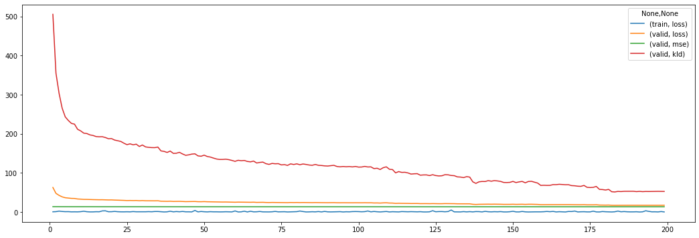
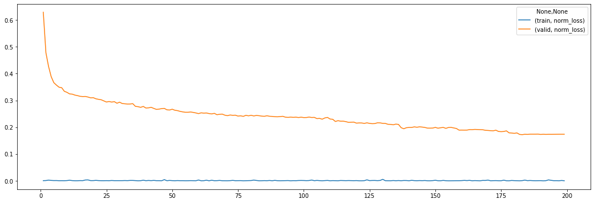
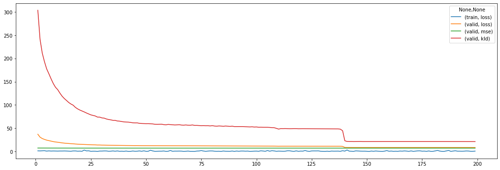
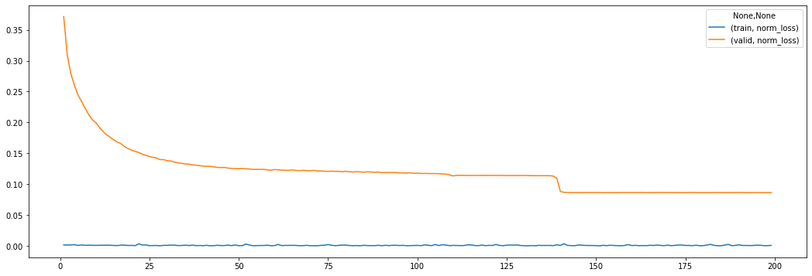

# Experiment 1


```python
from pathlib import Path

from src import config
from src.analyzers import *
from vaep.transform import StandardScaler, get_df_fitted_mean_std
```

    FOLDER_MQ_TXT_DATA = data\mq_out
    


```python
import logging
from src.logging import setup_logger

logger = logging.getLogger()  # returns root-logger
logger.setLevel(logging.CRITICAL)  # silence for everything else
logger.handlers = []


logger = setup_logger(logger=logging.getLogger('vaep'))
logger.info("Experiment 01")
```

    vaep - INFO     Experiment 01
    

## Load data

- 1000 features (most abundant peptides)
- later a subset of samples is selected


```python
N_SAMPLES_TO_LOAD = None
FN_PEPTIDE_INTENSITIES = config.FOLDER_DATA / 'df_intensities_N_07813_M01000'
analysis = AnalyzePeptides(
    fname=FN_PEPTIDE_INTENSITIES, nrows=N_SAMPLES_TO_LOAD)
analysis.df = analysis.df.sort_index()  # sort by date
assert analysis.df.index.is_unique, "Non-unique training samples"
analysis
```


    AnalyzePeptides with attributes: df, stats


### Select consecutives samples for training


```python
import random

N_SAMPLES = 1000
logger.info(f"Selected {N_SAMPLES}")
analysis.N_SAMPLES = N_SAMPLES


def get_consecutive_data_indices(index, n_samples=N_SAMPLES):
    start_sample = len(index) - n_samples
    start_sample = random.randint(0, start_sample)
    return index[start_sample:start_sample+n_samples]


indices_selected = get_consecutive_data_indices(analysis.df.index)
analysis.samples = indices_selected
analysis.df = analysis.df.loc[indices_selected]
analysis.df
```

    vaep - INFO     Selected 1000
    


<div>
<style scoped>
    .dataframe tbody tr th:only-of-type {
        vertical-align: middle;
    }

    .dataframe tbody tr th {
        vertical-align: top;
    }

    .dataframe thead th {
        text-align: right;
    }
</style>
<table border="1" class="dataframe">
  <thead>
    <tr style="text-align: right;">
      <th></th>
      <th>AAAAAAALQAK</th>
      <th>AAFDDAIAELDTLSEESYK</th>
      <th>AAHSEGNTTAGLDMR</th>
      <th>AAVATFLQSVQVPEFTPK</th>
      <th>AAVEEGIVLGGGCALLR</th>
      <th>AAVPSGASTGIYEALELR</th>
      <th>AAVPSGASTGIYEALELRDNDK</th>
      <th>ACANPAAGSVILLENLR</th>
      <th>ACGLVASNLNLKPGECLR</th>
      <th>ADLINNLGTIAK</th>
      <th>...</th>
      <th>VVFVFGPDK</th>
      <th>VVFVFGPDKK</th>
      <th>VYALPEDLVEVKPK</th>
      <th>YADLTEDQLPSCESLK</th>
      <th>YDDMAAAMK</th>
      <th>YDDMAACMK</th>
      <th>YDDMATCMK</th>
      <th>YLAEVACGDDRK</th>
      <th>YLDEDTIYHLQPSGR</th>
      <th>YRVPDVLVADPPIAR</th>
    </tr>
  </thead>
  <tbody>
    <tr>
      <th>20180827_QE5_nLC11_OOE_QC_MNT_Hela_02_RO-004</th>
      <td>1,037,800,000.000</td>
      <td>1,366,800,000.000</td>
      <td>336,780,000.000</td>
      <td>165,270,000.000</td>
      <td>1,416,100,000.000</td>
      <td>1,565,300,000.000</td>
      <td>4,291,100,000.000</td>
      <td>1,234,600,000.000</td>
      <td>803,870,000.000</td>
      <td>2,275,700,000.000</td>
      <td>...</td>
      <td>713,500,000.000</td>
      <td>145,680,000.000</td>
      <td>140,660,000.000</td>
      <td>417,180,000.000</td>
      <td>822,290,000.000</td>
      <td>690,110,000.000</td>
      <td>332,920,000.000</td>
      <td>779,360,000.000</td>
      <td>198,840,000.000</td>
      <td>237,150,000.000</td>
    </tr>
    <tr>
      <th>20180827_QE7_nLC5_AL_QC_HeLa_02_20180828171846</th>
      <td>929,530,000.000</td>
      <td>3,021,800,000.000</td>
      <td>14,485,000.000</td>
      <td>635,690,000.000</td>
      <td>925,200,000.000</td>
      <td>1,422,300,000.000</td>
      <td>1,982,100,000.000</td>
      <td>1,626,200,000.000</td>
      <td>905,170,000.000</td>
      <td>3,399,900,000.000</td>
      <td>...</td>
      <td>704,540,000.000</td>
      <td>206,160,000.000</td>
      <td>187,530,000.000</td>
      <td>312,010,000.000</td>
      <td>411,620,000.000</td>
      <td>389,340,000.000</td>
      <td>201,400,000.000</td>
      <td>501,480,000.000</td>
      <td>135,050,000.000</td>
      <td>311,130,000.000</td>
    </tr>
    <tr>
      <th>20180827_QE7_nLC5_AL_QC_HeLa_03</th>
      <td>861,690,000.000</td>
      <td>3,095,800,000.000</td>
      <td>232,610,000.000</td>
      <td>639,710,000.000</td>
      <td>975,520,000.000</td>
      <td>1,245,300,000.000</td>
      <td>1,917,200,000.000</td>
      <td>1,664,400,000.000</td>
      <td>1,090,500,000.000</td>
      <td>3,328,000,000.000</td>
      <td>...</td>
      <td>596,080,000.000</td>
      <td>216,040,000.000</td>
      <td>163,470,000.000</td>
      <td>384,100,000.000</td>
      <td>500,840,000.000</td>
      <td>446,900,000.000</td>
      <td>273,130,000.000</td>
      <td>580,810,000.000</td>
      <td>197,450,000.000</td>
      <td>283,800,000.000</td>
    </tr>
    <tr>
      <th>20180827_QE7_nLC5_AL_QC_HeLa_04</th>
      <td>946,510,000.000</td>
      <td>2,363,300,000.000</td>
      <td>280,070,000.000</td>
      <td>572,190,000.000</td>
      <td>866,350,000.000</td>
      <td>1,379,200,000.000</td>
      <td>2,766,400,000.000</td>
      <td>1,568,200,000.000</td>
      <td>859,650,000.000</td>
      <td>3,203,700,000.000</td>
      <td>...</td>
      <td>589,500,000.000</td>
      <td>193,800,000.000</td>
      <td>130,980,000.000</td>
      <td>303,590,000.000</td>
      <td>641,310,000.000</td>
      <td>608,350,000.000</td>
      <td>279,800,000.000</td>
      <td>760,530,000.000</td>
      <td>177,240,000.000</td>
      <td>265,180,000.000</td>
    </tr>
    <tr>
      <th>20180828_QE10_nLC14_QC_15CM_ASD_Hela_20180828160521</th>
      <td>1,350,600,000.000</td>
      <td>4,673,700,000.000</td>
      <td>413,300,000.000</td>
      <td>941,920,000.000</td>
      <td>1,941,200,000.000</td>
      <td>1,638,800,000.000</td>
      <td>4,822,100,000.000</td>
      <td>1,351,900,000.000</td>
      <td>1,710,100,000.000</td>
      <td>5,930,900,000.000</td>
      <td>...</td>
      <td>1,448,000,000.000</td>
      <td>627,080,000.000</td>
      <td>280,670,000.000</td>
      <td>1,014,000,000.000</td>
      <td>457,530,000.000</td>
      <td>1,226,800,000.000</td>
      <td>459,460,000.000</td>
      <td>933,590,000.000</td>
      <td>543,970,000.000</td>
      <td>485,230,000.000</td>
    </tr>
    <tr>
      <th>...</th>
      <td>...</td>
      <td>...</td>
      <td>...</td>
      <td>...</td>
      <td>...</td>
      <td>...</td>
      <td>...</td>
      <td>...</td>
      <td>...</td>
      <td>...</td>
      <td>...</td>
      <td>...</td>
      <td>...</td>
      <td>...</td>
      <td>...</td>
      <td>...</td>
      <td>...</td>
      <td>...</td>
      <td>...</td>
      <td>...</td>
      <td>...</td>
    </tr>
    <tr>
      <th>20190219_QE4_nLC12_SIS_QC_MNT_Hela_2</th>
      <td>1,703,600,000.000</td>
      <td>6,215,100,000.000</td>
      <td>481,540,000.000</td>
      <td>976,170,000.000</td>
      <td>2,531,800,000.000</td>
      <td>332,860,000.000</td>
      <td>9,553,300,000.000</td>
      <td>3,352,200,000.000</td>
      <td>3,818,600,000.000</td>
      <td>8,059,200,000.000</td>
      <td>...</td>
      <td>1,010,300,000.000</td>
      <td>794,840,000.000</td>
      <td>610,370,000.000</td>
      <td>1,203,700,000.000</td>
      <td>1,268,600,000.000</td>
      <td>1,140,000,000.000</td>
      <td>479,080,000.000</td>
      <td>2,050,300,000.000</td>
      <td>544,090,000.000</td>
      <td>882,310,000.000</td>
    </tr>
    <tr>
      <th>20190219_QE5_Evo1_UHG_QC_MNT_HELA_01_190219173213</th>
      <td>435,580,000.000</td>
      <td>840,660,000.000</td>
      <td>38,860,000.000</td>
      <td>217,420,000.000</td>
      <td>1,552,800,000.000</td>
      <td>NaN</td>
      <td>378,610,000.000</td>
      <td>1,652,900,000.000</td>
      <td>2,233,800,000.000</td>
      <td>5,322,400,000.000</td>
      <td>...</td>
      <td>701,680,000.000</td>
      <td>489,790,000.000</td>
      <td>415,290,000.000</td>
      <td>1,058,100,000.000</td>
      <td>251,250,000.000</td>
      <td>204,030,000.000</td>
      <td>122,860,000.000</td>
      <td>393,610,000.000</td>
      <td>157,490,000.000</td>
      <td>694,720,000.000</td>
    </tr>
    <tr>
      <th>20190219_QE7_nLC7_OOE_QC_MNT_HeLa_250ng_RO-004</th>
      <td>935,870,000.000</td>
      <td>2,600,700,000.000</td>
      <td>182,910,000.000</td>
      <td>273,040,000.000</td>
      <td>2,378,800,000.000</td>
      <td>NaN</td>
      <td>5,810,300,000.000</td>
      <td>3,140,500,000.000</td>
      <td>3,636,200,000.000</td>
      <td>3,710,600,000.000</td>
      <td>...</td>
      <td>755,890,000.000</td>
      <td>435,170,000.000</td>
      <td>434,030,000.000</td>
      <td>499,540,000.000</td>
      <td>672,990,000.000</td>
      <td>491,730,000.000</td>
      <td>322,500,000.000</td>
      <td>566,470,000.000</td>
      <td>242,250,000.000</td>
      <td>421,580,000.000</td>
    </tr>
    <tr>
      <th>20190219_QE7_nLC7_OOE_QC_MNT_HeLa_250ng_RO-005</th>
      <td>1,290,400,000.000</td>
      <td>4,384,600,000.000</td>
      <td>206,130,000.000</td>
      <td>308,240,000.000</td>
      <td>2,215,300,000.000</td>
      <td>NaN</td>
      <td>4,770,700,000.000</td>
      <td>3,528,100,000.000</td>
      <td>676,870,000.000</td>
      <td>5,256,700,000.000</td>
      <td>...</td>
      <td>886,320,000.000</td>
      <td>1,413,700,000.000</td>
      <td>318,250,000.000</td>
      <td>1,120,000,000.000</td>
      <td>566,690,000.000</td>
      <td>503,510,000.000</td>
      <td>437,170,000.000</td>
      <td>819,640,000.000</td>
      <td>247,260,000.000</td>
      <td>455,170,000.000</td>
    </tr>
    <tr>
      <th>20190220_QE2_NLC1_GP_QC_MNT_HELA_01</th>
      <td>1,616,200,000.000</td>
      <td>5,310,700,000.000</td>
      <td>287,810,000.000</td>
      <td>877,820,000.000</td>
      <td>1,258,000,000.000</td>
      <td>281,080,000.000</td>
      <td>6,463,100,000.000</td>
      <td>2,506,900,000.000</td>
      <td>2,653,600,000.000</td>
      <td>4,628,800,000.000</td>
      <td>...</td>
      <td>703,960,000.000</td>
      <td>660,860,000.000</td>
      <td>317,720,000.000</td>
      <td>713,680,000.000</td>
      <td>613,350,000.000</td>
      <td>603,930,000.000</td>
      <td>221,060,000.000</td>
      <td>899,720,000.000</td>
      <td>247,380,000.000</td>
      <td>604,100,000.000</td>
    </tr>
  </tbody>
</table>
<p>1000 rows × 1000 columns</p>
</div>


### Create meta data from filename


```python
from collections import namedtuple

columns = 'date ms_instrument columntype researcher rest'.split()

RunMetaData = namedtuple('RunMetaData', columns)
data_meta = {}
for filename in indices_selected:
    # ToDo: this approach is too easy for the moment. The first two fields are in order, the rest needs matching.
    _meta_filename = filename.split('_', maxsplit=4)
    data_meta[filename] = _meta_filename
    # print(RunMetaData(*_meta_filename[:6]))

analysis.df_meta = pd.DataFrame.from_dict(
    data_meta, orient='index', columns=columns)
# analysis.df_meta['date'] = pd.to_datetime(analysis.df_meta['date'])
analysis.df_meta
```


<div>
<style scoped>
    .dataframe tbody tr th:only-of-type {
        vertical-align: middle;
    }

    .dataframe tbody tr th {
        vertical-align: top;
    }

    .dataframe thead th {
        text-align: right;
    }
</style>
<table border="1" class="dataframe">
  <thead>
    <tr style="text-align: right;">
      <th></th>
      <th>date</th>
      <th>ms_instrument</th>
      <th>columntype</th>
      <th>researcher</th>
      <th>rest</th>
    </tr>
  </thead>
  <tbody>
    <tr>
      <th>20180827_QE5_nLC11_OOE_QC_MNT_Hela_02_RO-004</th>
      <td>20180827</td>
      <td>QE5</td>
      <td>nLC11</td>
      <td>OOE</td>
      <td>QC_MNT_Hela_02_RO-004</td>
    </tr>
    <tr>
      <th>20180827_QE7_nLC5_AL_QC_HeLa_02_20180828171846</th>
      <td>20180827</td>
      <td>QE7</td>
      <td>nLC5</td>
      <td>AL</td>
      <td>QC_HeLa_02_20180828171846</td>
    </tr>
    <tr>
      <th>20180827_QE7_nLC5_AL_QC_HeLa_03</th>
      <td>20180827</td>
      <td>QE7</td>
      <td>nLC5</td>
      <td>AL</td>
      <td>QC_HeLa_03</td>
    </tr>
    <tr>
      <th>20180827_QE7_nLC5_AL_QC_HeLa_04</th>
      <td>20180827</td>
      <td>QE7</td>
      <td>nLC5</td>
      <td>AL</td>
      <td>QC_HeLa_04</td>
    </tr>
    <tr>
      <th>20180828_QE10_nLC14_QC_15CM_ASD_Hela_20180828160521</th>
      <td>20180828</td>
      <td>QE10</td>
      <td>nLC14</td>
      <td>QC</td>
      <td>15CM_ASD_Hela_20180828160521</td>
    </tr>
    <tr>
      <th>...</th>
      <td>...</td>
      <td>...</td>
      <td>...</td>
      <td>...</td>
      <td>...</td>
    </tr>
    <tr>
      <th>20190219_QE4_nLC12_SIS_QC_MNT_Hela_2</th>
      <td>20190219</td>
      <td>QE4</td>
      <td>nLC12</td>
      <td>SIS</td>
      <td>QC_MNT_Hela_2</td>
    </tr>
    <tr>
      <th>20190219_QE5_Evo1_UHG_QC_MNT_HELA_01_190219173213</th>
      <td>20190219</td>
      <td>QE5</td>
      <td>Evo1</td>
      <td>UHG</td>
      <td>QC_MNT_HELA_01_190219173213</td>
    </tr>
    <tr>
      <th>20190219_QE7_nLC7_OOE_QC_MNT_HeLa_250ng_RO-004</th>
      <td>20190219</td>
      <td>QE7</td>
      <td>nLC7</td>
      <td>OOE</td>
      <td>QC_MNT_HeLa_250ng_RO-004</td>
    </tr>
    <tr>
      <th>20190219_QE7_nLC7_OOE_QC_MNT_HeLa_250ng_RO-005</th>
      <td>20190219</td>
      <td>QE7</td>
      <td>nLC7</td>
      <td>OOE</td>
      <td>QC_MNT_HeLa_250ng_RO-005</td>
    </tr>
    <tr>
      <th>20190220_QE2_NLC1_GP_QC_MNT_HELA_01</th>
      <td>20190220</td>
      <td>QE2</td>
      <td>NLC1</td>
      <td>GP</td>
      <td>QC_MNT_HELA_01</td>
    </tr>
  </tbody>
</table>
<p>1000 rows × 5 columns</p>
</div>


```python
FRACTION = 0.9


class Indices(SimpleNamespace):
    pass


indices = Indices()
indices.train, indices.valid = indices_selected[:int(
    FRACTION*N_SAMPLES)], indices_selected[int(FRACTION*N_SAMPLES):]
analysis.indices = indices

analysis.df_train = analysis.df.loc[indices.train]
analysis.df_valid = analysis.df.loc[indices.valid]

analysis.df_meta.loc[indices.train].describe(datetime_is_numeric=False)
```


<div>
<style scoped>
    .dataframe tbody tr th:only-of-type {
        vertical-align: middle;
    }

    .dataframe tbody tr th {
        vertical-align: top;
    }

    .dataframe thead th {
        text-align: right;
    }
</style>
<table border="1" class="dataframe">
  <thead>
    <tr style="text-align: right;">
      <th></th>
      <th>date</th>
      <th>ms_instrument</th>
      <th>columntype</th>
      <th>researcher</th>
      <th>rest</th>
    </tr>
  </thead>
  <tbody>
    <tr>
      <th>count</th>
      <td>900</td>
      <td>900</td>
      <td>900</td>
      <td>900</td>
      <td>900</td>
    </tr>
    <tr>
      <th>unique</th>
      <td>124</td>
      <td>16</td>
      <td>29</td>
      <td>39</td>
      <td>427</td>
    </tr>
    <tr>
      <th>top</th>
      <td>20181024</td>
      <td>QE8</td>
      <td>nLC0</td>
      <td>GP</td>
      <td>QC_MNT_HELA_01</td>
    </tr>
    <tr>
      <th>freq</th>
      <td>45</td>
      <td>122</td>
      <td>96</td>
      <td>84</td>
      <td>48</td>
    </tr>
  </tbody>
</table>
</div>


```python
# This becomes part of analysis
def compare_meta_data_for_splits(meta, indices):

    _indices = vars(indices)
    logger.info('Found vars: {}'.format(', '.join(str(x)
                                                  for x in _indices.keys())))

    for key_split, split in _indices.items():
        print(f"{key_split:8} - split description:")
        display(
            meta.loc[split].describe(datetime_is_numeric=True)
        )

    _meta_features = list(meta.columns)

    for _column in _meta_features:
        display(
            _=pd.DataFrame({
                key_split: meta.loc[split, _column].value_counts(normalize=True) for key_split, split in _indices.items()
            }).sort_index().plot(kind='line', rot=90, figsize=(10, 5), title=f"{_column} value Counts for different splits")
        )


compare_meta_data_for_splits(analysis.df_meta.iloc[:, :2], indices)
```

    vaep - INFO     Found vars: train, valid
    train    - split description:
    


<div>
<style scoped>
    .dataframe tbody tr th:only-of-type {
        vertical-align: middle;
    }

    .dataframe tbody tr th {
        vertical-align: top;
    }

    .dataframe thead th {
        text-align: right;
    }
</style>
<table border="1" class="dataframe">
  <thead>
    <tr style="text-align: right;">
      <th></th>
      <th>date</th>
      <th>ms_instrument</th>
    </tr>
  </thead>
  <tbody>
    <tr>
      <th>count</th>
      <td>900</td>
      <td>900</td>
    </tr>
    <tr>
      <th>unique</th>
      <td>124</td>
      <td>16</td>
    </tr>
    <tr>
      <th>top</th>
      <td>20181024</td>
      <td>QE8</td>
    </tr>
    <tr>
      <th>freq</th>
      <td>45</td>
      <td>122</td>
    </tr>
  </tbody>
</table>
</div>


    valid    - split description:
    


<div>
<style scoped>
    .dataframe tbody tr th:only-of-type {
        vertical-align: middle;
    }

    .dataframe tbody tr th {
        vertical-align: top;
    }

    .dataframe thead th {
        text-align: right;
    }
</style>
<table border="1" class="dataframe">
  <thead>
    <tr style="text-align: right;">
      <th></th>
      <th>date</th>
      <th>ms_instrument</th>
    </tr>
  </thead>
  <tbody>
    <tr>
      <th>count</th>
      <td>100</td>
      <td>100</td>
    </tr>
    <tr>
      <th>unique</th>
      <td>18</td>
      <td>10</td>
    </tr>
    <tr>
      <th>top</th>
      <td>20190204</td>
      <td>QE9</td>
    </tr>
    <tr>
      <th>freq</th>
      <td>16</td>
      <td>17</td>
    </tr>
  </tbody>
</table>
</div>


## Transforms

### Custom Transforms

- illustrate using adapted scikit-learn [`StandardScaler`](https://scikit-learn.org/stable/modules/preprocessing.html)


```python
N, M = 10, 10  # Samples, Features
analysis.df_train.iloc[:N, :M]
```


<div>
<style scoped>
    .dataframe tbody tr th:only-of-type {
        vertical-align: middle;
    }

    .dataframe tbody tr th {
        vertical-align: top;
    }

    .dataframe thead th {
        text-align: right;
    }
</style>
<table border="1" class="dataframe">
  <thead>
    <tr style="text-align: right;">
      <th></th>
      <th>AAAAAAALQAK</th>
      <th>AAFDDAIAELDTLSEESYK</th>
      <th>AAHSEGNTTAGLDMR</th>
      <th>AAVATFLQSVQVPEFTPK</th>
      <th>AAVEEGIVLGGGCALLR</th>
      <th>AAVPSGASTGIYEALELR</th>
      <th>AAVPSGASTGIYEALELRDNDK</th>
      <th>ACANPAAGSVILLENLR</th>
      <th>ACGLVASNLNLKPGECLR</th>
      <th>ADLINNLGTIAK</th>
    </tr>
  </thead>
  <tbody>
    <tr>
      <th>20180827_QE5_nLC11_OOE_QC_MNT_Hela_02_RO-004</th>
      <td>1,037,800,000.000</td>
      <td>1,366,800,000.000</td>
      <td>336,780,000.000</td>
      <td>165,270,000.000</td>
      <td>1,416,100,000.000</td>
      <td>1,565,300,000.000</td>
      <td>4,291,100,000.000</td>
      <td>1,234,600,000.000</td>
      <td>803,870,000.000</td>
      <td>2,275,700,000.000</td>
    </tr>
    <tr>
      <th>20180827_QE7_nLC5_AL_QC_HeLa_02_20180828171846</th>
      <td>929,530,000.000</td>
      <td>3,021,800,000.000</td>
      <td>14,485,000.000</td>
      <td>635,690,000.000</td>
      <td>925,200,000.000</td>
      <td>1,422,300,000.000</td>
      <td>1,982,100,000.000</td>
      <td>1,626,200,000.000</td>
      <td>905,170,000.000</td>
      <td>3,399,900,000.000</td>
    </tr>
    <tr>
      <th>20180827_QE7_nLC5_AL_QC_HeLa_03</th>
      <td>861,690,000.000</td>
      <td>3,095,800,000.000</td>
      <td>232,610,000.000</td>
      <td>639,710,000.000</td>
      <td>975,520,000.000</td>
      <td>1,245,300,000.000</td>
      <td>1,917,200,000.000</td>
      <td>1,664,400,000.000</td>
      <td>1,090,500,000.000</td>
      <td>3,328,000,000.000</td>
    </tr>
    <tr>
      <th>20180827_QE7_nLC5_AL_QC_HeLa_04</th>
      <td>946,510,000.000</td>
      <td>2,363,300,000.000</td>
      <td>280,070,000.000</td>
      <td>572,190,000.000</td>
      <td>866,350,000.000</td>
      <td>1,379,200,000.000</td>
      <td>2,766,400,000.000</td>
      <td>1,568,200,000.000</td>
      <td>859,650,000.000</td>
      <td>3,203,700,000.000</td>
    </tr>
    <tr>
      <th>20180828_QE10_nLC14_QC_15CM_ASD_Hela_20180828160521</th>
      <td>1,350,600,000.000</td>
      <td>4,673,700,000.000</td>
      <td>413,300,000.000</td>
      <td>941,920,000.000</td>
      <td>1,941,200,000.000</td>
      <td>1,638,800,000.000</td>
      <td>4,822,100,000.000</td>
      <td>1,351,900,000.000</td>
      <td>1,710,100,000.000</td>
      <td>5,930,900,000.000</td>
    </tr>
    <tr>
      <th>20180828_QE3_nLC3_PR_QC_MNT_HELA_01</th>
      <td>342,530,000.000</td>
      <td>1,575,200,000.000</td>
      <td>169,990,000.000</td>
      <td>291,080,000.000</td>
      <td>512,860,000.000</td>
      <td>633,660,000.000</td>
      <td>1,338,600,000.000</td>
      <td>1,049,100,000.000</td>
      <td>456,270,000.000</td>
      <td>1,656,100,000.000</td>
    </tr>
    <tr>
      <th>20180828_QE3_nLC3_PR_QC_MNT_HELA_01_20180830130806</th>
      <td>334,860,000.000</td>
      <td>1,127,100,000.000</td>
      <td>125,750,000.000</td>
      <td>239,610,000.000</td>
      <td>605,820,000.000</td>
      <td>312,310,000.000</td>
      <td>963,360,000.000</td>
      <td>821,320,000.000</td>
      <td>518,320,000.000</td>
      <td>1,392,600,000.000</td>
    </tr>
    <tr>
      <th>20180828_QE3_nLC3_PR_QC_MNT_HELA_02</th>
      <td>445,420,000.000</td>
      <td>1,858,400,000.000</td>
      <td>151,090,000.000</td>
      <td>253,710,000.000</td>
      <td>688,100,000.000</td>
      <td>677,010,000.000</td>
      <td>1,581,500,000.000</td>
      <td>1,106,100,000.000</td>
      <td>519,220,000.000</td>
      <td>2,117,800,000.000</td>
    </tr>
    <tr>
      <th>20180828_QE3_nLC3_PR_QC_MNT_HELA_02_20180830155145</th>
      <td>475,640,000.000</td>
      <td>1,037,000,000.000</td>
      <td>127,130,000.000</td>
      <td>233,350,000.000</td>
      <td>453,230,000.000</td>
      <td>409,060,000.000</td>
      <td>1,256,300,000.000</td>
      <td>708,070,000.000</td>
      <td>432,820,000.000</td>
      <td>1,467,900,000.000</td>
    </tr>
    <tr>
      <th>20180828_QE9_nLC02_NHS_MNT_HeLa_NEW_01_20180828143046</th>
      <td>1,383,500,000.000</td>
      <td>1,378,900,000.000</td>
      <td>265,960,000.000</td>
      <td>588,520,000.000</td>
      <td>1,133,900,000.000</td>
      <td>1,901,600,000.000</td>
      <td>2,290,500,000.000</td>
      <td>1,074,500,000.000</td>
      <td>820,610,000.000</td>
      <td>1,962,100,000.000</td>
    </tr>
  </tbody>
</table>
</div>


```python
analysis.df_train.iloc[:, :M].describe()
```


<div>
<style scoped>
    .dataframe tbody tr th:only-of-type {
        vertical-align: middle;
    }

    .dataframe tbody tr th {
        vertical-align: top;
    }

    .dataframe thead th {
        text-align: right;
    }
</style>
<table border="1" class="dataframe">
  <thead>
    <tr style="text-align: right;">
      <th></th>
      <th>AAAAAAALQAK</th>
      <th>AAFDDAIAELDTLSEESYK</th>
      <th>AAHSEGNTTAGLDMR</th>
      <th>AAVATFLQSVQVPEFTPK</th>
      <th>AAVEEGIVLGGGCALLR</th>
      <th>AAVPSGASTGIYEALELR</th>
      <th>AAVPSGASTGIYEALELRDNDK</th>
      <th>ACANPAAGSVILLENLR</th>
      <th>ACGLVASNLNLKPGECLR</th>
      <th>ADLINNLGTIAK</th>
    </tr>
  </thead>
  <tbody>
    <tr>
      <th>count</th>
      <td>860.000</td>
      <td>881.000</td>
      <td>848.000</td>
      <td>857.000</td>
      <td>882.000</td>
      <td>881.000</td>
      <td>889.000</td>
      <td>888.000</td>
      <td>887.000</td>
      <td>885.000</td>
    </tr>
    <tr>
      <th>mean</th>
      <td>1,355,697,103.605</td>
      <td>2,735,600,062.883</td>
      <td>309,703,281.250</td>
      <td>679,962,213.536</td>
      <td>1,397,218,625.397</td>
      <td>1,485,488,169.580</td>
      <td>3,915,853,903.262</td>
      <td>1,930,120,532.095</td>
      <td>1,308,633,136.302</td>
      <td>3,608,127,707.006</td>
    </tr>
    <tr>
      <th>std</th>
      <td>1,472,629,648.990</td>
      <td>1,926,373,537.430</td>
      <td>267,359,884.856</td>
      <td>480,658,250.412</td>
      <td>854,163,634.984</td>
      <td>1,190,995,140.737</td>
      <td>2,854,152,295.603</td>
      <td>1,402,677,066.380</td>
      <td>1,605,496,334.041</td>
      <td>2,546,628,431.420</td>
    </tr>
    <tr>
      <th>min</th>
      <td>5,240,100.000</td>
      <td>5,228,900.000</td>
      <td>2,539,900.000</td>
      <td>1,422,200.000</td>
      <td>2,048,500.000</td>
      <td>2,371,900.000</td>
      <td>12,913,000.000</td>
      <td>5,878,500.000</td>
      <td>1,508,900.000</td>
      <td>2,279,700.000</td>
    </tr>
    <tr>
      <th>25%</th>
      <td>761,177,500.000</td>
      <td>1,219,600,000.000</td>
      <td>118,217,500.000</td>
      <td>352,660,000.000</td>
      <td>754,252,500.000</td>
      <td>620,680,000.000</td>
      <td>1,875,800,000.000</td>
      <td>994,520,000.000</td>
      <td>518,770,000.000</td>
      <td>2,094,600,000.000</td>
    </tr>
    <tr>
      <th>50%</th>
      <td>1,142,550,000.000</td>
      <td>2,470,500,000.000</td>
      <td>263,470,000.000</td>
      <td>625,230,000.000</td>
      <td>1,251,050,000.000</td>
      <td>1,224,200,000.000</td>
      <td>3,398,700,000.000</td>
      <td>1,742,750,000.000</td>
      <td>964,010,000.000</td>
      <td>3,293,800,000.000</td>
    </tr>
    <tr>
      <th>75%</th>
      <td>1,619,200,000.000</td>
      <td>3,788,800,000.000</td>
      <td>427,722,500.000</td>
      <td>877,790,000.000</td>
      <td>1,910,950,000.000</td>
      <td>1,987,200,000.000</td>
      <td>5,253,500,000.000</td>
      <td>2,568,850,000.000</td>
      <td>1,533,150,000.000</td>
      <td>4,540,600,000.000</td>
    </tr>
    <tr>
      <th>max</th>
      <td>19,537,000,000.000</td>
      <td>17,080,000,000.000</td>
      <td>2,414,100,000.000</td>
      <td>4,028,600,000.000</td>
      <td>5,233,300,000.000</td>
      <td>11,236,000,000.000</td>
      <td>23,228,000,000.000</td>
      <td>16,333,000,000.000</td>
      <td>22,298,000,000.000</td>
      <td>29,026,000,000.000</td>
    </tr>
  </tbody>
</table>
</div>


### StandardScaler on raw data


```python
scaler = StandardScaler().fit(analysis.df_train)
scaler_df = get_df_fitted_mean_std(scaler, index=analysis.df_train.columns)
scaler_df.head(N)
```


<div>
<style scoped>
    .dataframe tbody tr th:only-of-type {
        vertical-align: middle;
    }

    .dataframe tbody tr th {
        vertical-align: top;
    }

    .dataframe thead th {
        text-align: right;
    }
</style>
<table border="1" class="dataframe">
  <thead>
    <tr style="text-align: right;">
      <th></th>
      <th>mean</th>
      <th>stddev</th>
    </tr>
  </thead>
  <tbody>
    <tr>
      <th>AAAAAAALQAK</th>
      <td>1,355,697,103.605</td>
      <td>1,471,773,219.927</td>
    </tr>
    <tr>
      <th>AAFDDAIAELDTLSEESYK</th>
      <td>2,735,600,062.883</td>
      <td>1,925,279,938.967</td>
    </tr>
    <tr>
      <th>AAHSEGNTTAGLDMR</th>
      <td>309,703,281.250</td>
      <td>267,202,196.913</td>
    </tr>
    <tr>
      <th>AAVATFLQSVQVPEFTPK</th>
      <td>679,962,213.536</td>
      <td>480,377,737.840</td>
    </tr>
    <tr>
      <th>AAVEEGIVLGGGCALLR</th>
      <td>1,397,218,625.397</td>
      <td>853,679,277.908</td>
    </tr>
    <tr>
      <th>AAVPSGASTGIYEALELR</th>
      <td>1,485,488,169.580</td>
      <td>1,190,319,015.141</td>
    </tr>
    <tr>
      <th>AAVPSGASTGIYEALELRDNDK</th>
      <td>3,915,853,903.262</td>
      <td>2,852,546,583.917</td>
    </tr>
    <tr>
      <th>ACANPAAGSVILLENLR</th>
      <td>1,930,120,532.095</td>
      <td>1,401,887,048.256</td>
    </tr>
    <tr>
      <th>ACGLVASNLNLKPGECLR</th>
      <td>1,308,633,136.302</td>
      <td>1,604,591,063.976</td>
    </tr>
    <tr>
      <th>ADLINNLGTIAK</th>
      <td>3,608,127,707.006</td>
      <td>2,545,189,251.632</td>
    </tr>
  </tbody>
</table>
</div>


```python
sample = scaler.transform(analysis.df_train.iloc[:N])
sample.iloc[:, :M]
```


<div>
<style scoped>
    .dataframe tbody tr th:only-of-type {
        vertical-align: middle;
    }

    .dataframe tbody tr th {
        vertical-align: top;
    }

    .dataframe thead th {
        text-align: right;
    }
</style>
<table border="1" class="dataframe">
  <thead>
    <tr style="text-align: right;">
      <th></th>
      <th>AAAAAAALQAK</th>
      <th>AAFDDAIAELDTLSEESYK</th>
      <th>AAHSEGNTTAGLDMR</th>
      <th>AAVATFLQSVQVPEFTPK</th>
      <th>AAVEEGIVLGGGCALLR</th>
      <th>AAVPSGASTGIYEALELR</th>
      <th>AAVPSGASTGIYEALELRDNDK</th>
      <th>ACANPAAGSVILLENLR</th>
      <th>ACGLVASNLNLKPGECLR</th>
      <th>ADLINNLGTIAK</th>
    </tr>
  </thead>
  <tbody>
    <tr>
      <th>20180827_QE5_nLC11_OOE_QC_MNT_Hela_02_RO-004</th>
      <td>-0.216</td>
      <td>-0.711</td>
      <td>0.101</td>
      <td>-1.071</td>
      <td>0.022</td>
      <td>0.067</td>
      <td>0.132</td>
      <td>-0.496</td>
      <td>-0.315</td>
      <td>-0.524</td>
    </tr>
    <tr>
      <th>20180827_QE7_nLC5_AL_QC_HeLa_02_20180828171846</th>
      <td>-0.290</td>
      <td>0.149</td>
      <td>-1.105</td>
      <td>-0.092</td>
      <td>-0.553</td>
      <td>-0.053</td>
      <td>-0.678</td>
      <td>-0.217</td>
      <td>-0.251</td>
      <td>-0.082</td>
    </tr>
    <tr>
      <th>20180827_QE7_nLC5_AL_QC_HeLa_03</th>
      <td>-0.336</td>
      <td>0.187</td>
      <td>-0.289</td>
      <td>-0.084</td>
      <td>-0.494</td>
      <td>-0.202</td>
      <td>-0.701</td>
      <td>-0.190</td>
      <td>-0.136</td>
      <td>-0.110</td>
    </tr>
    <tr>
      <th>20180827_QE7_nLC5_AL_QC_HeLa_04</th>
      <td>-0.278</td>
      <td>-0.193</td>
      <td>-0.111</td>
      <td>-0.224</td>
      <td>-0.622</td>
      <td>-0.089</td>
      <td>-0.403</td>
      <td>-0.258</td>
      <td>-0.280</td>
      <td>-0.159</td>
    </tr>
    <tr>
      <th>20180828_QE10_nLC14_QC_15CM_ASD_Hela_20180828160521</th>
      <td>-0.003</td>
      <td>1.007</td>
      <td>0.388</td>
      <td>0.545</td>
      <td>0.637</td>
      <td>0.129</td>
      <td>0.318</td>
      <td>-0.412</td>
      <td>0.250</td>
      <td>0.913</td>
    </tr>
    <tr>
      <th>20180828_QE3_nLC3_PR_QC_MNT_HELA_01</th>
      <td>-0.688</td>
      <td>-0.603</td>
      <td>-0.523</td>
      <td>-0.810</td>
      <td>-1.036</td>
      <td>-0.716</td>
      <td>-0.903</td>
      <td>-0.628</td>
      <td>-0.531</td>
      <td>-0.767</td>
    </tr>
    <tr>
      <th>20180828_QE3_nLC3_PR_QC_MNT_HELA_01_20180830130806</th>
      <td>-0.694</td>
      <td>-0.835</td>
      <td>-0.688</td>
      <td>-0.917</td>
      <td>-0.927</td>
      <td>-0.986</td>
      <td>-1.035</td>
      <td>-0.791</td>
      <td>-0.493</td>
      <td>-0.870</td>
    </tr>
    <tr>
      <th>20180828_QE3_nLC3_PR_QC_MNT_HELA_02</th>
      <td>-0.618</td>
      <td>-0.456</td>
      <td>-0.594</td>
      <td>-0.887</td>
      <td>-0.831</td>
      <td>-0.679</td>
      <td>-0.818</td>
      <td>-0.588</td>
      <td>-0.492</td>
      <td>-0.586</td>
    </tr>
    <tr>
      <th>20180828_QE3_nLC3_PR_QC_MNT_HELA_02_20180830155145</th>
      <td>-0.598</td>
      <td>-0.882</td>
      <td>-0.683</td>
      <td>-0.930</td>
      <td>-1.106</td>
      <td>-0.904</td>
      <td>-0.932</td>
      <td>-0.872</td>
      <td>-0.546</td>
      <td>-0.841</td>
    </tr>
    <tr>
      <th>20180828_QE9_nLC02_NHS_MNT_HeLa_NEW_01_20180828143046</th>
      <td>0.019</td>
      <td>-0.705</td>
      <td>-0.164</td>
      <td>-0.190</td>
      <td>-0.308</td>
      <td>0.350</td>
      <td>-0.570</td>
      <td>-0.610</td>
      <td>-0.304</td>
      <td>-0.647</td>
    </tr>
  </tbody>
</table>
</div>


```python
sample = scaler.inverse_transform(sample)
sample.iloc[:, :M]
```


<div>
<style scoped>
    .dataframe tbody tr th:only-of-type {
        vertical-align: middle;
    }

    .dataframe tbody tr th {
        vertical-align: top;
    }

    .dataframe thead th {
        text-align: right;
    }
</style>
<table border="1" class="dataframe">
  <thead>
    <tr style="text-align: right;">
      <th></th>
      <th>AAAAAAALQAK</th>
      <th>AAFDDAIAELDTLSEESYK</th>
      <th>AAHSEGNTTAGLDMR</th>
      <th>AAVATFLQSVQVPEFTPK</th>
      <th>AAVEEGIVLGGGCALLR</th>
      <th>AAVPSGASTGIYEALELR</th>
      <th>AAVPSGASTGIYEALELRDNDK</th>
      <th>ACANPAAGSVILLENLR</th>
      <th>ACGLVASNLNLKPGECLR</th>
      <th>ADLINNLGTIAK</th>
    </tr>
  </thead>
  <tbody>
    <tr>
      <th>20180827_QE5_nLC11_OOE_QC_MNT_Hela_02_RO-004</th>
      <td>1,037,800,000.000</td>
      <td>1,366,800,000.000</td>
      <td>336,780,000.000</td>
      <td>165,270,000.000</td>
      <td>1,416,100,000.000</td>
      <td>1,565,300,000.000</td>
      <td>4,291,100,000.000</td>
      <td>1,234,600,000.000</td>
      <td>803,870,000.000</td>
      <td>2,275,700,000.000</td>
    </tr>
    <tr>
      <th>20180827_QE7_nLC5_AL_QC_HeLa_02_20180828171846</th>
      <td>929,530,000.000</td>
      <td>3,021,800,000.000</td>
      <td>14,485,000.000</td>
      <td>635,690,000.000</td>
      <td>925,200,000.000</td>
      <td>1,422,300,000.000</td>
      <td>1,982,100,000.000</td>
      <td>1,626,200,000.000</td>
      <td>905,170,000.000</td>
      <td>3,399,900,000.000</td>
    </tr>
    <tr>
      <th>20180827_QE7_nLC5_AL_QC_HeLa_03</th>
      <td>861,690,000.000</td>
      <td>3,095,800,000.000</td>
      <td>232,610,000.000</td>
      <td>639,710,000.000</td>
      <td>975,520,000.000</td>
      <td>1,245,300,000.000</td>
      <td>1,917,200,000.000</td>
      <td>1,664,400,000.000</td>
      <td>1,090,500,000.000</td>
      <td>3,328,000,000.000</td>
    </tr>
    <tr>
      <th>20180827_QE7_nLC5_AL_QC_HeLa_04</th>
      <td>946,510,000.000</td>
      <td>2,363,300,000.000</td>
      <td>280,070,000.000</td>
      <td>572,190,000.000</td>
      <td>866,350,000.000</td>
      <td>1,379,200,000.000</td>
      <td>2,766,400,000.000</td>
      <td>1,568,200,000.000</td>
      <td>859,650,000.000</td>
      <td>3,203,700,000.000</td>
    </tr>
    <tr>
      <th>20180828_QE10_nLC14_QC_15CM_ASD_Hela_20180828160521</th>
      <td>1,350,600,000.000</td>
      <td>4,673,700,000.000</td>
      <td>413,300,000.000</td>
      <td>941,920,000.000</td>
      <td>1,941,200,000.000</td>
      <td>1,638,800,000.000</td>
      <td>4,822,100,000.000</td>
      <td>1,351,900,000.000</td>
      <td>1,710,100,000.000</td>
      <td>5,930,900,000.000</td>
    </tr>
    <tr>
      <th>20180828_QE3_nLC3_PR_QC_MNT_HELA_01</th>
      <td>342,530,000.000</td>
      <td>1,575,200,000.000</td>
      <td>169,990,000.000</td>
      <td>291,080,000.000</td>
      <td>512,860,000.000</td>
      <td>633,660,000.000</td>
      <td>1,338,600,000.000</td>
      <td>1,049,100,000.000</td>
      <td>456,270,000.000</td>
      <td>1,656,100,000.000</td>
    </tr>
    <tr>
      <th>20180828_QE3_nLC3_PR_QC_MNT_HELA_01_20180830130806</th>
      <td>334,860,000.000</td>
      <td>1,127,100,000.000</td>
      <td>125,750,000.000</td>
      <td>239,610,000.000</td>
      <td>605,820,000.000</td>
      <td>312,310,000.000</td>
      <td>963,360,000.000</td>
      <td>821,320,000.000</td>
      <td>518,320,000.000</td>
      <td>1,392,600,000.000</td>
    </tr>
    <tr>
      <th>20180828_QE3_nLC3_PR_QC_MNT_HELA_02</th>
      <td>445,420,000.000</td>
      <td>1,858,400,000.000</td>
      <td>151,090,000.000</td>
      <td>253,710,000.000</td>
      <td>688,100,000.000</td>
      <td>677,010,000.000</td>
      <td>1,581,500,000.000</td>
      <td>1,106,100,000.000</td>
      <td>519,220,000.000</td>
      <td>2,117,800,000.000</td>
    </tr>
    <tr>
      <th>20180828_QE3_nLC3_PR_QC_MNT_HELA_02_20180830155145</th>
      <td>475,640,000.000</td>
      <td>1,037,000,000.000</td>
      <td>127,130,000.000</td>
      <td>233,350,000.000</td>
      <td>453,230,000.000</td>
      <td>409,060,000.000</td>
      <td>1,256,300,000.000</td>
      <td>708,070,000.000</td>
      <td>432,820,000.000</td>
      <td>1,467,900,000.000</td>
    </tr>
    <tr>
      <th>20180828_QE9_nLC02_NHS_MNT_HeLa_NEW_01_20180828143046</th>
      <td>1,383,500,000.000</td>
      <td>1,378,900,000.000</td>
      <td>265,960,000.000</td>
      <td>588,520,000.000</td>
      <td>1,133,900,000.000</td>
      <td>1,901,600,000.000</td>
      <td>2,290,500,000.000</td>
      <td>1,074,500,000.000</td>
      <td>820,610,000.000</td>
      <td>1,962,100,000.000</td>
    </tr>
  </tbody>
</table>
</div>


### StandardScaler on log10 transformed data


```python
X_log10 = np.log10(analysis.df_train)
X_log10.iloc[:N, :M]
```


<div>
<style scoped>
    .dataframe tbody tr th:only-of-type {
        vertical-align: middle;
    }

    .dataframe tbody tr th {
        vertical-align: top;
    }

    .dataframe thead th {
        text-align: right;
    }
</style>
<table border="1" class="dataframe">
  <thead>
    <tr style="text-align: right;">
      <th></th>
      <th>AAAAAAALQAK</th>
      <th>AAFDDAIAELDTLSEESYK</th>
      <th>AAHSEGNTTAGLDMR</th>
      <th>AAVATFLQSVQVPEFTPK</th>
      <th>AAVEEGIVLGGGCALLR</th>
      <th>AAVPSGASTGIYEALELR</th>
      <th>AAVPSGASTGIYEALELRDNDK</th>
      <th>ACANPAAGSVILLENLR</th>
      <th>ACGLVASNLNLKPGECLR</th>
      <th>ADLINNLGTIAK</th>
    </tr>
  </thead>
  <tbody>
    <tr>
      <th>20180827_QE5_nLC11_OOE_QC_MNT_Hela_02_RO-004</th>
      <td>9.016</td>
      <td>9.136</td>
      <td>8.527</td>
      <td>8.218</td>
      <td>9.151</td>
      <td>9.195</td>
      <td>9.633</td>
      <td>9.092</td>
      <td>8.905</td>
      <td>9.357</td>
    </tr>
    <tr>
      <th>20180827_QE7_nLC5_AL_QC_HeLa_02_20180828171846</th>
      <td>8.968</td>
      <td>9.480</td>
      <td>7.161</td>
      <td>8.803</td>
      <td>8.966</td>
      <td>9.153</td>
      <td>9.297</td>
      <td>9.211</td>
      <td>8.957</td>
      <td>9.531</td>
    </tr>
    <tr>
      <th>20180827_QE7_nLC5_AL_QC_HeLa_03</th>
      <td>8.935</td>
      <td>9.491</td>
      <td>8.367</td>
      <td>8.806</td>
      <td>8.989</td>
      <td>9.095</td>
      <td>9.283</td>
      <td>9.221</td>
      <td>9.038</td>
      <td>9.522</td>
    </tr>
    <tr>
      <th>20180827_QE7_nLC5_AL_QC_HeLa_04</th>
      <td>8.976</td>
      <td>9.374</td>
      <td>8.447</td>
      <td>8.758</td>
      <td>8.938</td>
      <td>9.140</td>
      <td>9.442</td>
      <td>9.195</td>
      <td>8.934</td>
      <td>9.506</td>
    </tr>
    <tr>
      <th>20180828_QE10_nLC14_QC_15CM_ASD_Hela_20180828160521</th>
      <td>9.131</td>
      <td>9.670</td>
      <td>8.616</td>
      <td>8.974</td>
      <td>9.288</td>
      <td>9.215</td>
      <td>9.683</td>
      <td>9.131</td>
      <td>9.233</td>
      <td>9.773</td>
    </tr>
    <tr>
      <th>20180828_QE3_nLC3_PR_QC_MNT_HELA_01</th>
      <td>8.535</td>
      <td>9.197</td>
      <td>8.230</td>
      <td>8.464</td>
      <td>8.710</td>
      <td>8.802</td>
      <td>9.127</td>
      <td>9.021</td>
      <td>8.659</td>
      <td>9.219</td>
    </tr>
    <tr>
      <th>20180828_QE3_nLC3_PR_QC_MNT_HELA_01_20180830130806</th>
      <td>8.525</td>
      <td>9.052</td>
      <td>8.100</td>
      <td>8.380</td>
      <td>8.782</td>
      <td>8.495</td>
      <td>8.984</td>
      <td>8.915</td>
      <td>8.715</td>
      <td>9.144</td>
    </tr>
    <tr>
      <th>20180828_QE3_nLC3_PR_QC_MNT_HELA_02</th>
      <td>8.649</td>
      <td>9.269</td>
      <td>8.179</td>
      <td>8.404</td>
      <td>8.838</td>
      <td>8.831</td>
      <td>9.199</td>
      <td>9.044</td>
      <td>8.715</td>
      <td>9.326</td>
    </tr>
    <tr>
      <th>20180828_QE3_nLC3_PR_QC_MNT_HELA_02_20180830155145</th>
      <td>8.677</td>
      <td>9.016</td>
      <td>8.104</td>
      <td>8.368</td>
      <td>8.656</td>
      <td>8.612</td>
      <td>9.099</td>
      <td>8.850</td>
      <td>8.636</td>
      <td>9.167</td>
    </tr>
    <tr>
      <th>20180828_QE9_nLC02_NHS_MNT_HeLa_NEW_01_20180828143046</th>
      <td>9.141</td>
      <td>9.140</td>
      <td>8.425</td>
      <td>8.770</td>
      <td>9.055</td>
      <td>9.279</td>
      <td>9.360</td>
      <td>9.031</td>
      <td>8.914</td>
      <td>9.293</td>
    </tr>
  </tbody>
</table>
</div>


```python
scaler_log = StandardScaler(
).fit(X=X_log10)
scaler_log_df = get_df_fitted_mean_std(scaler_log, index=analysis.df.index)
scaler_log_df.head(N)
```


<div>
<style scoped>
    .dataframe tbody tr th:only-of-type {
        vertical-align: middle;
    }

    .dataframe tbody tr th {
        vertical-align: top;
    }

    .dataframe thead th {
        text-align: right;
    }
</style>
<table border="1" class="dataframe">
  <thead>
    <tr style="text-align: right;">
      <th></th>
      <th>mean</th>
      <th>stddev</th>
    </tr>
  </thead>
  <tbody>
    <tr>
      <th>20180827_QE5_nLC11_OOE_QC_MNT_Hela_02_RO-004</th>
      <td>9.006</td>
      <td>0.357</td>
    </tr>
    <tr>
      <th>20180827_QE7_nLC5_AL_QC_HeLa_02_20180828171846</th>
      <td>9.289</td>
      <td>0.441</td>
    </tr>
    <tr>
      <th>20180827_QE7_nLC5_AL_QC_HeLa_03</th>
      <td>8.309</td>
      <td>0.459</td>
    </tr>
    <tr>
      <th>20180827_QE7_nLC5_AL_QC_HeLa_04</th>
      <td>8.709</td>
      <td>0.382</td>
    </tr>
    <tr>
      <th>20180828_QE10_nLC14_QC_15CM_ASD_Hela_20180828160521</th>
      <td>9.029</td>
      <td>0.405</td>
    </tr>
    <tr>
      <th>20180828_QE3_nLC3_PR_QC_MNT_HELA_01</th>
      <td>9.022</td>
      <td>0.421</td>
    </tr>
    <tr>
      <th>20180828_QE3_nLC3_PR_QC_MNT_HELA_01_20180830130806</th>
      <td>9.439</td>
      <td>0.444</td>
    </tr>
    <tr>
      <th>20180828_QE3_nLC3_PR_QC_MNT_HELA_02</th>
      <td>9.166</td>
      <td>0.378</td>
    </tr>
    <tr>
      <th>20180828_QE3_nLC3_PR_QC_MNT_HELA_02_20180830155145</th>
      <td>8.933</td>
      <td>0.436</td>
    </tr>
    <tr>
      <th>20180828_QE9_nLC02_NHS_MNT_HeLa_NEW_01_20180828143046</th>
      <td>9.437</td>
      <td>0.412</td>
    </tr>
  </tbody>
</table>
</div>


```python
sample_log10 = scaler_log.transform(X_log10.iloc[:N])
sample_log10.iloc[:, :M]
```


<div>
<style scoped>
    .dataframe tbody tr th:only-of-type {
        vertical-align: middle;
    }

    .dataframe tbody tr th {
        vertical-align: top;
    }

    .dataframe thead th {
        text-align: right;
    }
</style>
<table border="1" class="dataframe">
  <thead>
    <tr style="text-align: right;">
      <th></th>
      <th>AAAAAAALQAK</th>
      <th>AAFDDAIAELDTLSEESYK</th>
      <th>AAHSEGNTTAGLDMR</th>
      <th>AAVATFLQSVQVPEFTPK</th>
      <th>AAVEEGIVLGGGCALLR</th>
      <th>AAVPSGASTGIYEALELR</th>
      <th>AAVPSGASTGIYEALELRDNDK</th>
      <th>ACANPAAGSVILLENLR</th>
      <th>ACGLVASNLNLKPGECLR</th>
      <th>ADLINNLGTIAK</th>
    </tr>
  </thead>
  <tbody>
    <tr>
      <th>20180827_QE5_nLC11_OOE_QC_MNT_Hela_02_RO-004</th>
      <td>0.028</td>
      <td>-0.347</td>
      <td>0.476</td>
      <td>-1.283</td>
      <td>0.302</td>
      <td>0.410</td>
      <td>0.437</td>
      <td>-0.197</td>
      <td>-0.063</td>
      <td>-0.193</td>
    </tr>
    <tr>
      <th>20180827_QE7_nLC5_AL_QC_HeLa_02_20180828171846</th>
      <td>-0.106</td>
      <td>0.435</td>
      <td>-2.502</td>
      <td>0.246</td>
      <td>-0.155</td>
      <td>0.312</td>
      <td>-0.319</td>
      <td>0.120</td>
      <td>0.056</td>
      <td>0.230</td>
    </tr>
    <tr>
      <th>20180827_QE7_nLC5_AL_QC_HeLa_03</th>
      <td>-0.198</td>
      <td>0.459</td>
      <td>0.126</td>
      <td>0.253</td>
      <td>-0.098</td>
      <td>0.175</td>
      <td>-0.351</td>
      <td>0.146</td>
      <td>0.241</td>
      <td>0.207</td>
    </tr>
    <tr>
      <th>20180827_QE7_nLC5_AL_QC_HeLa_04</th>
      <td>-0.084</td>
      <td>0.192</td>
      <td>0.301</td>
      <td>0.127</td>
      <td>-0.225</td>
      <td>0.280</td>
      <td>0.008</td>
      <td>0.078</td>
      <td>0.004</td>
      <td>0.167</td>
    </tr>
    <tr>
      <th>20180828_QE10_nLC14_QC_15CM_ASD_Hela_20180828160521</th>
      <td>0.349</td>
      <td>0.864</td>
      <td>0.670</td>
      <td>0.693</td>
      <td>0.640</td>
      <td>0.458</td>
      <td>0.551</td>
      <td>-0.093</td>
      <td>0.690</td>
      <td>0.817</td>
    </tr>
    <tr>
      <th>20180828_QE3_nLC3_PR_QC_MNT_HELA_01</th>
      <td>-1.321</td>
      <td>-0.207</td>
      <td>-0.171</td>
      <td>-0.641</td>
      <td>-0.788</td>
      <td>-0.522</td>
      <td>-0.703</td>
      <td>-0.384</td>
      <td>-0.628</td>
      <td>-0.528</td>
    </tr>
    <tr>
      <th>20180828_QE3_nLC3_PR_QC_MNT_HELA_01_20180830130806</th>
      <td>-1.348</td>
      <td>-0.537</td>
      <td>-0.457</td>
      <td>-0.862</td>
      <td>-0.609</td>
      <td>-1.251</td>
      <td>-1.025</td>
      <td>-0.666</td>
      <td>-0.500</td>
      <td>-0.711</td>
    </tr>
    <tr>
      <th>20180828_QE3_nLC3_PR_QC_MNT_HELA_02</th>
      <td>-1.001</td>
      <td>-0.044</td>
      <td>-0.283</td>
      <td>-0.797</td>
      <td>-0.473</td>
      <td>-0.454</td>
      <td>-0.540</td>
      <td>-0.324</td>
      <td>-0.499</td>
      <td>-0.269</td>
    </tr>
    <tr>
      <th>20180828_QE3_nLC3_PR_QC_MNT_HELA_02_20180830155145</th>
      <td>-0.921</td>
      <td>-0.619</td>
      <td>-0.446</td>
      <td>-0.892</td>
      <td>-0.921</td>
      <td>-0.973</td>
      <td>-0.765</td>
      <td>-0.836</td>
      <td>-0.680</td>
      <td>-0.656</td>
    </tr>
    <tr>
      <th>20180828_QE9_nLC02_NHS_MNT_HeLa_NEW_01_20180828143046</th>
      <td>0.378</td>
      <td>-0.338</td>
      <td>0.252</td>
      <td>0.159</td>
      <td>0.063</td>
      <td>0.611</td>
      <td>-0.177</td>
      <td>-0.357</td>
      <td>-0.042</td>
      <td>-0.350</td>
    </tr>
  </tbody>
</table>
</div>


```python
scaler_log.inverse_transform(sample_log10).iloc[:, :M]
```


<div>
<style scoped>
    .dataframe tbody tr th:only-of-type {
        vertical-align: middle;
    }

    .dataframe tbody tr th {
        vertical-align: top;
    }

    .dataframe thead th {
        text-align: right;
    }
</style>
<table border="1" class="dataframe">
  <thead>
    <tr style="text-align: right;">
      <th></th>
      <th>AAAAAAALQAK</th>
      <th>AAFDDAIAELDTLSEESYK</th>
      <th>AAHSEGNTTAGLDMR</th>
      <th>AAVATFLQSVQVPEFTPK</th>
      <th>AAVEEGIVLGGGCALLR</th>
      <th>AAVPSGASTGIYEALELR</th>
      <th>AAVPSGASTGIYEALELRDNDK</th>
      <th>ACANPAAGSVILLENLR</th>
      <th>ACGLVASNLNLKPGECLR</th>
      <th>ADLINNLGTIAK</th>
    </tr>
  </thead>
  <tbody>
    <tr>
      <th>20180827_QE5_nLC11_OOE_QC_MNT_Hela_02_RO-004</th>
      <td>9.016</td>
      <td>9.136</td>
      <td>8.527</td>
      <td>8.218</td>
      <td>9.151</td>
      <td>9.195</td>
      <td>9.633</td>
      <td>9.092</td>
      <td>8.905</td>
      <td>9.357</td>
    </tr>
    <tr>
      <th>20180827_QE7_nLC5_AL_QC_HeLa_02_20180828171846</th>
      <td>8.968</td>
      <td>9.480</td>
      <td>7.161</td>
      <td>8.803</td>
      <td>8.966</td>
      <td>9.153</td>
      <td>9.297</td>
      <td>9.211</td>
      <td>8.957</td>
      <td>9.531</td>
    </tr>
    <tr>
      <th>20180827_QE7_nLC5_AL_QC_HeLa_03</th>
      <td>8.935</td>
      <td>9.491</td>
      <td>8.367</td>
      <td>8.806</td>
      <td>8.989</td>
      <td>9.095</td>
      <td>9.283</td>
      <td>9.221</td>
      <td>9.038</td>
      <td>9.522</td>
    </tr>
    <tr>
      <th>20180827_QE7_nLC5_AL_QC_HeLa_04</th>
      <td>8.976</td>
      <td>9.374</td>
      <td>8.447</td>
      <td>8.758</td>
      <td>8.938</td>
      <td>9.140</td>
      <td>9.442</td>
      <td>9.195</td>
      <td>8.934</td>
      <td>9.506</td>
    </tr>
    <tr>
      <th>20180828_QE10_nLC14_QC_15CM_ASD_Hela_20180828160521</th>
      <td>9.131</td>
      <td>9.670</td>
      <td>8.616</td>
      <td>8.974</td>
      <td>9.288</td>
      <td>9.215</td>
      <td>9.683</td>
      <td>9.131</td>
      <td>9.233</td>
      <td>9.773</td>
    </tr>
    <tr>
      <th>20180828_QE3_nLC3_PR_QC_MNT_HELA_01</th>
      <td>8.535</td>
      <td>9.197</td>
      <td>8.230</td>
      <td>8.464</td>
      <td>8.710</td>
      <td>8.802</td>
      <td>9.127</td>
      <td>9.021</td>
      <td>8.659</td>
      <td>9.219</td>
    </tr>
    <tr>
      <th>20180828_QE3_nLC3_PR_QC_MNT_HELA_01_20180830130806</th>
      <td>8.525</td>
      <td>9.052</td>
      <td>8.100</td>
      <td>8.380</td>
      <td>8.782</td>
      <td>8.495</td>
      <td>8.984</td>
      <td>8.915</td>
      <td>8.715</td>
      <td>9.144</td>
    </tr>
    <tr>
      <th>20180828_QE3_nLC3_PR_QC_MNT_HELA_02</th>
      <td>8.649</td>
      <td>9.269</td>
      <td>8.179</td>
      <td>8.404</td>
      <td>8.838</td>
      <td>8.831</td>
      <td>9.199</td>
      <td>9.044</td>
      <td>8.715</td>
      <td>9.326</td>
    </tr>
    <tr>
      <th>20180828_QE3_nLC3_PR_QC_MNT_HELA_02_20180830155145</th>
      <td>8.677</td>
      <td>9.016</td>
      <td>8.104</td>
      <td>8.368</td>
      <td>8.656</td>
      <td>8.612</td>
      <td>9.099</td>
      <td>8.850</td>
      <td>8.636</td>
      <td>9.167</td>
    </tr>
    <tr>
      <th>20180828_QE9_nLC02_NHS_MNT_HeLa_NEW_01_20180828143046</th>
      <td>9.141</td>
      <td>9.140</td>
      <td>8.425</td>
      <td>8.770</td>
      <td>9.055</td>
      <td>9.279</td>
      <td>9.360</td>
      <td>9.031</td>
      <td>8.914</td>
      <td>9.293</td>
    </tr>
  </tbody>
</table>
</div>


### Sanity checks

#### Correlation

- Correlation between the computed `means_` should be nearly perfect
- Correlation between peptide intensities should be high
- As taking the logarithm is a monoton, but non-linear transformation, the linear Pearson correlation can change substantially. [[link]](https://stats.stackexchange.com/questions/127121/do-logs-modify-the-correlation-between-two-variables)


```python
print("Correlation between mean values of linear vs. log-transformed values:",
      f"{np.corrcoef(scaler.mean_, scaler_log.mean_)[1,0]:.4f}", sep='\n')
```

    Correlation between mean values of linear vs. log-transformed values:
    0.7846
    


```python
pd.options.display.float_format = '{:,.3f}'.format

analysis.corr_linear_vs_log = scaler.transform(X=analysis.df).corrwith(
    other=scaler_log.transform(X_log10),
    axis=0)
analysis.corr_linear_vs_log.describe()
```


    count   1,000.000
    mean        0.782
    std         0.072
    min         0.458
    25%         0.747
    50%         0.801
    75%         0.834
    max         0.895
    dtype: float64


```python
# own implemention could be slightly faster as data is already demeanded and standardized.
# pd.DataFrame.corrwith?
```

#### Distribution


```python
import seaborn as sns
from vaep.utils import sample_iterable

columns_sampled = sample_iterable(list(analysis.df.columns), n=12)
print(columns_sampled)
```

    ['YYPTEDVPRK', 'VISHAISEHVEDAGVHSGDATLMLPTQTISQGAIEK', 'FAAATGATPIAGR', 'LVIITAGAR', 'ESEPQAAAEPAEAK', 'SSGPTSLFAVTVAPPGAR', 'TLSDYNIQK', 'GAEEMETVIPVDVMR', 'YDDMAAAMK', 'VNNSSLIGLGYTQTLKPGIK', 'EMEAELEDERK', 'DNSTMGYMAAK']
    


```python
def plot_scaled_sample(columns_sampled: list, scaler, df: pd.DataFrame = analysis.df):
    _scaled = scaler.transform(df)
    display(_scaled.describe())
    _min, _max = _scaled.min().min(), _scaled.max().max()
    return _min, _max
    print(list(range(_min, _max, step=0.5)))


_min, _max = plot_scaled_sample(columns_sampled=columns_sampled, scaler=scaler)
```


<div>
<style scoped>
    .dataframe tbody tr th:only-of-type {
        vertical-align: middle;
    }

    .dataframe tbody tr th {
        vertical-align: top;
    }

    .dataframe thead th {
        text-align: right;
    }
</style>
<table border="1" class="dataframe">
  <thead>
    <tr style="text-align: right;">
      <th></th>
      <th>AAAAAAALQAK</th>
      <th>AAFDDAIAELDTLSEESYK</th>
      <th>AAHSEGNTTAGLDMR</th>
      <th>AAVATFLQSVQVPEFTPK</th>
      <th>AAVEEGIVLGGGCALLR</th>
      <th>AAVPSGASTGIYEALELR</th>
      <th>AAVPSGASTGIYEALELRDNDK</th>
      <th>ACANPAAGSVILLENLR</th>
      <th>ACGLVASNLNLKPGECLR</th>
      <th>ADLINNLGTIAK</th>
      <th>...</th>
      <th>VVFVFGPDK</th>
      <th>VVFVFGPDKK</th>
      <th>VYALPEDLVEVKPK</th>
      <th>YADLTEDQLPSCESLK</th>
      <th>YDDMAAAMK</th>
      <th>YDDMAACMK</th>
      <th>YDDMATCMK</th>
      <th>YLAEVACGDDRK</th>
      <th>YLDEDTIYHLQPSGR</th>
      <th>YRVPDVLVADPPIAR</th>
    </tr>
  </thead>
  <tbody>
    <tr>
      <th>count</th>
      <td>958.000</td>
      <td>980.000</td>
      <td>947.000</td>
      <td>951.000</td>
      <td>982.000</td>
      <td>974.000</td>
      <td>989.000</td>
      <td>987.000</td>
      <td>987.000</td>
      <td>985.000</td>
      <td>...</td>
      <td>954.000</td>
      <td>956.000</td>
      <td>965.000</td>
      <td>941.000</td>
      <td>973.000</td>
      <td>984.000</td>
      <td>967.000</td>
      <td>970.000</td>
      <td>959.000</td>
      <td>959.000</td>
    </tr>
    <tr>
      <th>mean</th>
      <td>0.028</td>
      <td>0.095</td>
      <td>-0.019</td>
      <td>0.038</td>
      <td>0.068</td>
      <td>-0.062</td>
      <td>0.134</td>
      <td>0.101</td>
      <td>0.112</td>
      <td>0.078</td>
      <td>...</td>
      <td>0.025</td>
      <td>0.145</td>
      <td>0.163</td>
      <td>0.094</td>
      <td>-0.021</td>
      <td>-0.006</td>
      <td>0.003</td>
      <td>0.039</td>
      <td>0.010</td>
      <td>0.096</td>
    </tr>
    <tr>
      <th>std</th>
      <td>0.972</td>
      <td>1.063</td>
      <td>0.975</td>
      <td>1.010</td>
      <td>1.046</td>
      <td>0.982</td>
      <td>1.103</td>
      <td>1.048</td>
      <td>1.045</td>
      <td>1.014</td>
      <td>...</td>
      <td>0.974</td>
      <td>1.112</td>
      <td>1.130</td>
      <td>1.019</td>
      <td>0.972</td>
      <td>0.960</td>
      <td>0.960</td>
      <td>0.982</td>
      <td>0.967</td>
      <td>1.036</td>
    </tr>
    <tr>
      <th>min</th>
      <td>-0.918</td>
      <td>-1.418</td>
      <td>-1.150</td>
      <td>-1.413</td>
      <td>-1.634</td>
      <td>-1.246</td>
      <td>-1.368</td>
      <td>-1.373</td>
      <td>-0.815</td>
      <td>-1.417</td>
      <td>...</td>
      <td>-1.437</td>
      <td>-1.088</td>
      <td>-1.165</td>
      <td>-1.165</td>
      <td>-1.363</td>
      <td>-1.077</td>
      <td>-1.009</td>
      <td>-0.973</td>
      <td>-1.195</td>
      <td>-1.230</td>
    </tr>
    <tr>
      <th>25%</th>
      <td>-0.389</td>
      <td>-0.745</td>
      <td>-0.718</td>
      <td>-0.677</td>
      <td>-0.693</td>
      <td>-0.772</td>
      <td>-0.661</td>
      <td>-0.613</td>
      <td>-0.454</td>
      <td>-0.551</td>
      <td>...</td>
      <td>-0.566</td>
      <td>-0.533</td>
      <td>-0.598</td>
      <td>-0.564</td>
      <td>-0.706</td>
      <td>-0.527</td>
      <td>-0.517</td>
      <td>-0.480</td>
      <td>-0.581</td>
      <td>-0.544</td>
    </tr>
    <tr>
      <th>50%</th>
      <td>-0.121</td>
      <td>-0.072</td>
      <td>-0.181</td>
      <td>-0.063</td>
      <td>-0.101</td>
      <td>-0.301</td>
      <td>-0.079</td>
      <td>-0.063</td>
      <td>-0.163</td>
      <td>-0.065</td>
      <td>...</td>
      <td>-0.109</td>
      <td>-0.129</td>
      <td>-0.164</td>
      <td>-0.107</td>
      <td>-0.197</td>
      <td>-0.154</td>
      <td>-0.154</td>
      <td>-0.111</td>
      <td>-0.129</td>
      <td>-0.118</td>
    </tr>
    <tr>
      <th>75%</th>
      <td>0.211</td>
      <td>0.727</td>
      <td>0.423</td>
      <td>0.489</td>
      <td>0.656</td>
      <td>0.356</td>
      <td>0.710</td>
      <td>0.623</td>
      <td>0.353</td>
      <td>0.515</td>
      <td>...</td>
      <td>0.360</td>
      <td>0.538</td>
      <td>0.565</td>
      <td>0.568</td>
      <td>0.415</td>
      <td>0.300</td>
      <td>0.259</td>
      <td>0.321</td>
      <td>0.301</td>
      <td>0.472</td>
    </tr>
    <tr>
      <th>max</th>
      <td>12.353</td>
      <td>7.451</td>
      <td>7.876</td>
      <td>6.971</td>
      <td>5.797</td>
      <td>8.192</td>
      <td>6.770</td>
      <td>10.274</td>
      <td>13.081</td>
      <td>9.987</td>
      <td>...</td>
      <td>8.553</td>
      <td>11.962</td>
      <td>10.756</td>
      <td>14.638</td>
      <td>5.474</td>
      <td>20.426</td>
      <td>16.229</td>
      <td>15.458</td>
      <td>12.032</td>
      <td>8.928</td>
    </tr>
  </tbody>
</table>
<p>8 rows × 1000 columns</p>
</div>


```python
# if bins should be equal between plots
# addon
import math
xlim = [-5, 5]
FACTOR = 1
[x/FACTOR for x in range(math.floor(xlim[0])*FACTOR,
                         math.ceil(xlim[1])*FACTOR+1)]
```


    [-5.0, -4.0, -3.0, -2.0, -1.0, 0.0, 1.0, 2.0, 3.0, 4.0, 5.0]


```python
import matplotlib.pyplot as plt

columns_sampled = sample_iterable(list(analysis.df.columns), n=9)
subplot_kw = {'xlim': [-5, 5], 'ylim': [0, 600]}
fig, axes = plt.subplots(nrows=3, ncols=3, figsize=(
    15, 15), sharey=True, sharex=True, subplot_kw=subplot_kw)
_ = scaler_log.transform(X_log10)[columns_sampled].hist(
    figsize=(15, 15), ax=axes)
axes = scaler.transform(analysis.df)[columns_sampled].hist(
    figsize=(15, 15), ax=axes)
_ = fig.legend(('linear', 'log'), loc=5)
```


```python
caption = (f"Frequencies are capped at {subplot_kw['ylim'][1]} and "
           "their standardized intensity values plotted between {} and {}.".format(
               *subplot_kw['xlim'])
           )
print(caption)
```

    Frequencies are capped at 600 and their standardized intensity values plotted between -5 and 5.
    

### Analysis state so far


```python
analysis
```


    AnalyzePeptides with attributes: N_SAMPLES, corr_linear_vs_log, df, df_meta, df_train, df_valid, indices, samples, stats


## Fastai Dataloader

> fastai includes a replacement for Pytorch's DataLoader which is largely API-compatible, and adds a lot of useful functionality and flexibility. Before we look at the class, there are a couple of helpers we'll need to define. [[link](https://docs.fast.ai/data.load.html)]


```python
# import fastai.tabular.all as tab
from fastcore.transform import Transform

from fastai.tabular.data import TabularDataLoaders
```

Create dataloaders using an appropriate factory method from `TabularDataLoaders` class, here [`from_df`](https://docs.fast.ai/tabular.data.html#TabularDataLoaders.from_df)


```python
# DataFrame is shuffled
N_VAL = 100
valid_idx = list(range(N_VAL))
dls = TabularDataLoaders.from_df(df=analysis.df, valid_idx=valid_idx, bs=64)
analysis.dls = dls
```


```python
dls.show_batch()  # loses object index attribute
```


<table border="1" class="dataframe">
  <thead>
    <tr style="text-align: right;">
      <th></th>
      <th>EGLELPEDEEEK</th>
      <th>LQMEAPHIIVGTPGR</th>
      <th>NRPTSISWDGLDSGK</th>
      <th>GHLENNPALEK</th>
      <th>HIYYITGETK</th>
      <th>TLHPDLGTDK</th>
      <th>ILTFDQLALDSPK</th>
      <th>LTLSALLDGK</th>
      <th>EQISDIDDAVR</th>
      <th>VDFPQDQLTALTGR</th>
      <th>EYFSWEGAFQHVGK</th>
      <th>GQYISPFHDIPIYADK</th>
      <th>VNFAMNVGK</th>
      <th>ELAPYDENWFYTR</th>
      <th>LHIIEVGTPPTGNQPFPK</th>
      <th>YNEQHVPGSPFTAR</th>
      <th>IAAAILNTPDLRK</th>
      <th>SLHDAIMIVR</th>
      <th>FITIFGTR</th>
      <th>MLDMGFEPQIR</th>
      <th>NPDDITNEEYGEFYK</th>
      <th>TVAGGAWTYNTTSAVTVK</th>
      <th>FDASFFGVHPK</th>
      <th>STAGDTHLGGEDFDNR</th>
      <th>DDDIAALVVDNGSGMCK</th>
      <th>GLTSVINQK</th>
      <th>FYPEDVSEELIQDITQR</th>
      <th>LLDSSTVTHLFK</th>
      <th>VLALPEPSPAAPTLR</th>
      <th>ALDTMNFDVIK</th>
      <th>ALTVPELTQQMFDAK</th>
      <th>GGMGSGGLATGIAGGLAGMGGIQNEK</th>
      <th>FIIPQIVK</th>
      <th>TVFAEHISDECK</th>
      <th>VYALPEDLVEVKPK</th>
      <th>LTDCVVMRDPASK</th>
      <th>DRPFFAGLVK</th>
      <th>ATESGAQSAPLPMEGVDISPK</th>
      <th>MIPCDFLIPVQTQHPIRK</th>
      <th>YQAVTATLEEK</th>
      <th>LVVPATQCGSLIGK</th>
      <th>IEGDMIVCAAYAHELPK</th>
      <th>ISSDLDGHPVPK</th>
      <th>LAMQEFMILPVGAANFR</th>
      <th>ESTLHLVLR</th>
      <th>AAAAAAALQAK</th>
      <th>ALTGGIAHLFK</th>
      <th>VTAEVVLAHLGGGSTSR</th>
      <th>DNHLLGTFDLTGIPPAPR</th>
      <th>VGGTSDVEVNEK</th>
      <th>MALIGLGVSHPVLK</th>
      <th>MAVTFIGNSTAIQELFK</th>
      <th>IINEPTAAAIAYGLDK</th>
      <th>VNNSSLIGVGYTQTLRPGVK</th>
      <th>STVHEILCK</th>
      <th>MIAGQVLDINLAAEPK</th>
      <th>YTPSGQAGAAASESLFVSNHAY</th>
      <th>DLLLTSSYLSDSGSTGEHTK</th>
      <th>AVAQALEVIPR</th>
      <th>NIPGITLLNVSK</th>
      <th>TLAQLNPESSLFIIASK</th>
      <th>DLSHIGDAVVISCAK</th>
      <th>LLGQFTLIGIPPAPR</th>
      <th>EGNDLYHEMIESGVINLK</th>
      <th>VLDFEHFLPMLQTVAK</th>
      <th>KLEEEQIILEDQNCK</th>
      <th>AGVNTVTTLVENKK</th>
      <th>VSVHVIEGDHR</th>
      <th>MPSLPSYK</th>
      <th>AIVAIENPADVSVISSR</th>
      <th>TIGGGDDSFTTFFCETGAGK</th>
      <th>VSFELFADK</th>
      <th>GHYTEGAELVDSVLDVVRK</th>
      <th>AQTAHIVLEDGTK</th>
      <th>GHYTEGAELVDSVLDVVR</th>
      <th>EHALLAYTLGVK</th>
      <th>EIGNIISDAMK</th>
      <th>HFVALSTNTTK</th>
      <th>ALPAVQQNNLDEDLIRK</th>
      <th>IFAPNHVVAK</th>
      <th>IVEVLLMK</th>
      <th>HVSPAGAAVGIPLSEDEAK</th>
      <th>FYVHNDIFR</th>
      <th>MESYHKPDQQK</th>
      <th>ALLFVPR</th>
      <th>ISMPDFDLHLK</th>
      <th>GQAAVQQLQAEGLSPR</th>
      <th>SGGLGGSHALLLLR</th>
      <th>ILPTLEAVAALGNK</th>
      <th>FQSSHHPTDITSLDQYVER</th>
      <th>LAPITSDPTEATAVGAVEASFK</th>
      <th>LSPEELLLR</th>
      <th>NFATSLYSMIK</th>
      <th>DFTVSAMHGDMDQK</th>
      <th>LQAALDDEEAGGRPAMEPGNGSLDLGGDSAGR</th>
      <th>SLLVNPEGPTLMR</th>
      <th>ALTSEIALLQSR</th>
      <th>VNIIPLIAK</th>
      <th>TVVTGIEMFHK</th>
      <th>HSQFLGYPITLYLEK</th>
      <th>EAATLEVERPLPMEVEK</th>
      <th>VLAQNSGFDLQETLVK</th>
      <th>ITENIGCVMTGMTADSR</th>
      <th>SGAQASSTPLSPTR</th>
      <th>SEMEVQDAELK</th>
      <th>HELQANCYEEVK</th>
      <th>RGFGFVTFDDHDPVDK</th>
      <th>FEELNMDLFR</th>
      <th>IMNTFSVVPSPK</th>
      <th>LYSPSQIGAFVLMK</th>
      <th>SAEFLLHMLK</th>
      <th>VTAQGPGLEPSGNIANK</th>
      <th>SVTEQGAELSNEER</th>
      <th>VSHLLGINVTDFTR</th>
      <th>QEMQEVQSSR</th>
      <th>EQFLDGDGWTSR</th>
      <th>GGAEQFMEETER</th>
      <th>LAHEVGWK</th>
      <th>VLGTSVESIMATEDR</th>
      <th>IGAEVYHNLK</th>
      <th>VLTPELYAELR</th>
      <th>VVSQYSSLLSPMSVNAVMK</th>
      <th>HSGNITFDEIVNIAR</th>
      <th>LNNLVLFDK</th>
      <th>GYSLVSGGTDNHLVLVDLRPK</th>
      <th>ILGADTSVDLEETGR</th>
      <th>NIDNPALADIYTEHAHQVVVAK</th>
      <th>DAGQISGLNVLR</th>
      <th>VDNDENEHQLSLR</th>
      <th>EAAENSLVAYK</th>
      <th>ATAVMPDGQFK</th>
      <th>TVLMNPNIASVQTNEVGLK</th>
      <th>DPVQEAWAEDVDLR</th>
      <th>YALYDATYETK</th>
      <th>MTDQEAIQDLWQWR</th>
      <th>YVEPIEDVPCGNIVGLVGVDQFLVK</th>
      <th>ATCAPQHGAPGPGPADASK</th>
      <th>AYTNFDAERDALNIETAIK</th>
      <th>ANLQIDQINTDLNLER</th>
      <th>EDQTEYLEER</th>
      <th>ISMPDVDLHLK</th>
      <th>LHQLAMQQSHFPMTHGNTGFSGIESSSPEVK</th>
      <th>SQEQLAAELAEYTAK</th>
      <th>KTEAPAAPAAQETK</th>
      <th>SQIFSTASDNQPTVTIK</th>
      <th>FDLMYAK</th>
      <th>TLGILGLGR</th>
      <th>AAHSEGNTTAGLDMR</th>
      <th>TNQELQEINR</th>
      <th>TPELNLDQFHDK</th>
      <th>VFIGNLNTLVVK</th>
      <th>QAQIEVVPSASALIIK</th>
      <th>DFAAEVVHPGDLK</th>
      <th>QGGLGPMNIPLVSDPK</th>
      <th>ALDIAENEMPGLMR</th>
      <th>DLADELALVDVIEDK</th>
      <th>ADRDESSPYAAMLAAQDVAQR</th>
      <th>LYGSAGPPPTGEEDTAEK</th>
      <th>VTVLFAGQHIAK</th>
      <th>ATAGDTHLGGEDFDNR</th>
      <th>NLQEAEEWYK</th>
      <th>HSSVYPTQEELEAVQNMVSHTER</th>
      <th>DAGTIAGLNVLR</th>
      <th>TADGIVSHLK</th>
      <th>SYCAEIAHNVSSK</th>
      <th>AQIHDLVLVGGSTR</th>
      <th>VGINYQPPTVVPGGDLAK</th>
      <th>IIDVVYNASNNELVR</th>
      <th>NMSVHLSPCFR</th>
      <th>SEIEYYAMLAK</th>
      <th>AIIIFVPVPQLK</th>
      <th>STNGDTFLGGEDFDQALLR</th>
      <th>ELGITALHIK</th>
      <th>FGQAATMEGIGAIGGTPPAFNR</th>
      <th>MELQEIQLK</th>
      <th>VIHLSNLPHSGYSDSAVLK</th>
      <th>DQLIYNLLK</th>
      <th>DAGEGLLAVQITDPEGKPK</th>
      <th>RFDDAVVQSDMK</th>
      <th>FVMQEEFSR</th>
      <th>DGQVINETSQHHDDLE</th>
      <th>MEGPLSVFGDR</th>
      <th>LLDFGSLSNLQVTQPTVGMNFK</th>
      <th>HLNEIDLFHCIDPNDSK</th>
      <th>MDDREDLVYQAK</th>
      <th>DYGVYLEDSGHTLR</th>
      <th>DMFQETMEAMR</th>
      <th>TQEQLALEMAELTAR</th>
      <th>EAYPGDVFYLHSR</th>
      <th>VATAQDDITGDGTTSNVLIIGELLK</th>
      <th>IAIPGLAGAGNSVLLVSNLNPER</th>
      <th>LTGMAFR</th>
      <th>SGGMSNELNNIISR</th>
      <th>NIEDVIAQGIGK</th>
      <th>GANDFMCDEMER</th>
      <th>ELISNSSDALDK</th>
      <th>VLTVINQTQK</th>
      <th>DVNAAIATIK</th>
      <th>EIIDLVLDR</th>
      <th>YYVTIIDAPGHR</th>
      <th>YMACCLLYR</th>
      <th>EHDPVGQMVNNPK</th>
      <th>VHLVGIDIFTGK</th>
      <th>VPADTEVVCAPPTAYIDFAR</th>
      <th>FIQENIFGICPHMTEDNK</th>
      <th>IITLTGPTNAIFK</th>
      <th>RISGLIYEETR</th>
      <th>TVPEELVKPEELSK</th>
      <th>IKGEHPGLSIGDVAK</th>
      <th>ETTDTDTADQVIASFK</th>
      <th>LAGTQPLEVLEAVQR</th>
      <th>ESTGAQVQVAGDMLPNSTER</th>
      <th>AVTEQGHELSNEER</th>
      <th>WLHNEDQMAVEK</th>
      <th>AQIFANTVDNAR</th>
      <th>TIGGGDDSFNTFFSETGAGK</th>
      <th>GFGFGLVK</th>
      <th>GIGMGNIGPAGMGMEGIGFGINK</th>
      <th>HALIIYDDLSK</th>
      <th>LNFSHGTHEYHAETIK</th>
      <th>NFSDNQLQEGK</th>
      <th>NILFVITKPDVYK</th>
      <th>GISDLAQHYLMR</th>
      <th>LSFQHDPETSVLVLR</th>
      <th>HLPTLDHPIIPADYVAIK</th>
      <th>LVINGNPITIFQERDPSK</th>
      <th>SFYPEEVSSMVLTK</th>
      <th>ESYSVYVYK</th>
      <th>DSYVGDEAQSK</th>
      <th>LLGASELPIVTPALR</th>
      <th>VWLDPNETNEIANANSR</th>
      <th>VSHVSTGGGASLELLEGK</th>
      <th>YLAEFATGNDRK</th>
      <th>IFTSIGEDYDER</th>
      <th>LMDVGLIAIR</th>
      <th>DIVVQETMEDIDK</th>
      <th>TIAPALVSK</th>
      <th>TVQSLEIDLDSMR</th>
      <th>VNQIGSVTESLQACK</th>
      <th>YLDEDTIYHLQPSGR</th>
      <th>ELEEIVQPIISK</th>
      <th>DNLAEDIMR</th>
      <th>ACGLVASNLNLKPGECLR</th>
      <th>IIPGFMCQGGDFTR</th>
      <th>MTNGFSGADLTEICQR</th>
      <th>MFVLDEADEMLSR</th>
      <th>EIRPALELLEPIEQK</th>
      <th>DAGTIAGLNVMR</th>
      <th>YLAEVACGDDRK</th>
      <th>LTNSMMMHGR</th>
      <th>IYELAAGGTAVGTGLNTR</th>
      <th>GFAFVQYVNER</th>
      <th>GSGNLEAIHIIK</th>
      <th>LPNLTHLNLSGNK</th>
      <th>THIQDNHDGTYTVAYVPDVTGR</th>
      <th>LLTSFLPAQLLR</th>
      <th>LVQDVANNTNEEAGDGTTTATVLAR</th>
      <th>NNQFQALLQYADPVSAQHAK</th>
      <th>IGEEQSPEDAEDGPPELLFIHGGHTAK</th>
      <th>KSDIDEIVLVGGSTR</th>
      <th>GLVLGPIHK</th>
      <th>VNGRPLEMIEPR</th>
      <th>HLQLAIR</th>
      <th>VLNNMEIGTSLFDEEGAK</th>
      <th>LNSVQSSERPLFLVHPIEGSTTVFHSLASR</th>
      <th>NMDPLNDNIATLLHQSSDK</th>
      <th>THEAQIQEMR</th>
      <th>GVVPLAGTNGETTTQGLDGLSER</th>
      <th>VEFMDDTSR</th>
      <th>MGPAMGPALGAGIER</th>
      <th>LVIITAGAR</th>
      <th>TVTAMDVVYALK</th>
      <th>VNTLIRPDGEK</th>
      <th>VFDAIMNFK</th>
      <th>MAPYQGPDAVPGALDYK</th>
      <th>ELASQPDVDGFLVGGASLKPEFVDIINAK</th>
      <th>AAFDDAIAELDTLSEESYK</th>
      <th>SLAGSSGPGASSGTSGDHGELVVR</th>
      <th>GHFGPINSVAFHPDGK</th>
      <th>SYGRPPPDVEGMTSLK</th>
      <th>LGIHEDSTNR</th>
      <th>AAVATFLQSVQVPEFTPK</th>
      <th>AIAELGIYPAVDPLDSTSR</th>
      <th>GVVPLAGTDGETTTQGLDGLSER</th>
      <th>GGEIQPVSVK</th>
      <th>AFYPEEISSMVLTK</th>
      <th>ESSETPDQFMTADETR</th>
      <th>GILGYTEHQVVSSDFNSDTHSSTFDAGAGIALNDHFVK</th>
      <th>PMFIVNTNVPR</th>
      <th>AGAGSATLSMAYAGAR</th>
      <th>LLCGLLAER</th>
      <th>TGVELGKPTHFTVNAK</th>
      <th>VINEPTAAALAYGLDK</th>
      <th>YGFIEGHVVIPR</th>
      <th>HVLVTLGEK</th>
      <th>TFVNITPAEVGVLVGK</th>
      <th>LLEVEHPAAK</th>
      <th>LLLGAGAVAYGVR</th>
      <th>SDVLELTDDNFESR</th>
      <th>ELISNASDALDK</th>
      <th>QEYDESGPSIVHR</th>
      <th>GITINAAHVEYSTAAR</th>
      <th>DETVSDCSPHIANIGR</th>
      <th>DIISDTSGDFRK</th>
      <th>GVNLPGAAVDLPAVSEK</th>
      <th>YNILGTNTIMDK</th>
      <th>FNAHGDANTIVCNSK</th>
      <th>TFAPEEISAMVLTK</th>
      <th>NQVAMNPTNTVFDAK</th>
      <th>YLMEEDEDAYKK</th>
      <th>SNMGHPEPASGLAALAK</th>
      <th>LDGLVETPTGYIESLPR</th>
      <th>NPDDITQEEYGEFYK</th>
      <th>YLAEVAAGDDKK</th>
      <th>ALDVMVSTFHK</th>
      <th>IVVVTAGVR</th>
      <th>FDDAVVQSDMK</th>
      <th>NSVTPDMMEEMYK</th>
      <th>TANDMIHAENMR</th>
      <th>GSYGDLGGPIITTQVTIPK</th>
      <th>ASGPGLNTTGVPASLPVEFTIDAK</th>
      <th>LALVTGGEIASTFDHPELVK</th>
      <th>FLGVAEQLHNEGFK</th>
      <th>VTIAQGGVLPNIQAVLLPK</th>
      <th>LQIVEMPLAHK</th>
      <th>PSQMEHAMETMMFTFHK</th>
      <th>GVDEVTIVNILTNR</th>
      <th>FAQPGSFEYEYAMR</th>
      <th>SVPTSTVFYPSDGVATEK</th>
      <th>GAEEMETVIPVDVMR</th>
      <th>IGLFGGAGVGK</th>
      <th>FIIPNVVK</th>
      <th>NLQYYDISAK</th>
      <th>NQVALNPQNTVFDAK</th>
      <th>LVARPEPATGYTLEFR</th>
      <th>SLHDALCVLAQTVK</th>
      <th>ATQALVLAPTR</th>
      <th>ITLQDVVSHSK</th>
      <th>RGEAHLAVNDFELAR</th>
      <th>LHFFMPGFAPLTSR</th>
      <th>IDIIPNPQER</th>
      <th>LTPEEEEILNK</th>
      <th>IGGIGTVPVGR</th>
      <th>EAPPMEKPEVVK</th>
      <th>IMQSSSEVGYDAMAGDFVNMVEK</th>
      <th>VTEGLTDVILYHQPDDK</th>
      <th>TTPSYVAFTDTER</th>
      <th>AGKPVICATQMLESMIK</th>
      <th>AAVPSGASTGIYEALELRDNDK</th>
      <th>VGLQVVAVK</th>
      <th>VLSAPPHFHFGQTNR</th>
      <th>LIALLEVLSQK</th>
      <th>GLGTDEDSLIEIICSR</th>
      <th>VTLTSEEEAR</th>
      <th>SEHPGLSIGDTAK</th>
      <th>VLATVTKPVGGDK</th>
      <th>YPIEHGIITNWDDMEK</th>
      <th>TATESFASDPILYRPVAVALDTK</th>
      <th>FGAVWTGDNTAEWDHLK</th>
      <th>IHVSDQELQSANASVDDSRLEELK</th>
      <th>VSVADHSLHLSK</th>
      <th>FYEQMNGPVAGASR</th>
      <th>TSIAIDTIINQK</th>
      <th>VVFVFGPDK</th>
      <th>YVASYLLAALGGNSSPSAK</th>
      <th>HRPELIEYDK</th>
      <th>DLYANTVLSGGTTMYPGIADR</th>
      <th>VIQYLAYVASSHK</th>
      <th>VEPGLGADNSVVR</th>
      <th>NIIHGSDSVESAEK</th>
      <th>NAVITVPAYFNDSQR</th>
      <th>SPYQEFTDHLVK</th>
      <th>SPYTVTVGQACNPSACR</th>
      <th>SEIDLFNIRK</th>
      <th>AIDDNMSLDEIEK</th>
      <th>MLVLDEADEMLNK</th>
      <th>VSLDVNHFAPDELTVK</th>
      <th>VAYVSFGPHAGK</th>
      <th>ILLTEPPMNPTK</th>
      <th>AGGAAVVITEPEHTK</th>
      <th>ALTVPELTQQVFDAK</th>
      <th>SKPGAAMVEMADGYAVDR</th>
      <th>SQIHDIVLVGGSTR</th>
      <th>VVHIMDFQR</th>
      <th>GIPHLVTHDAR</th>
      <th>AGFAGDDAPR</th>
      <th>VLLPEYGGTK</th>
      <th>TGVAVNKPAEFTVDAK</th>
      <th>TVLIMELINNVAK</th>
      <th>KYEDICPSTHNMDVPNIK</th>
      <th>GYDVIAQAQSGTGK</th>
      <th>AAVEEGIVLGGGCALLR</th>
      <th>FATEAAITILR</th>
      <th>VEILANDQGNR</th>
      <th>VVDLMAHMASK</th>
      <th>GAGTGGLGLAVEGPSEAK</th>
      <th>ERVEAVNMAEGIIHDTETK</th>
      <th>ISMPDLDLNLK</th>
      <th>LVQAFQYTDEHGEVCPAGWKPGSDTIKPNVDDSK</th>
      <th>VSQEHPVVLTK</th>
      <th>AGLQFPVGR</th>
      <th>VAPEEHPVLLTEAPLNPK</th>
      <th>KQELEEICHDLEAR</th>
      <th>TTHFVEGGDAGNREDQINR</th>
      <th>ALAAAGYDVEK</th>
      <th>AAVPSGASTGIYEALELR</th>
      <th>SCMLTGTPESVQSAK</th>
      <th>RAPFDLFENK</th>
      <th>FVNVVPTFGK</th>
      <th>EEASDYLELDTIK</th>
      <th>ADDGRPFPQVIK</th>
      <th>IAFAITAIK</th>
      <th>LGGLTQAPGNPVLAVQINQDK</th>
      <th>DCGATWVVLGHSER</th>
      <th>HNQLPLVIEFTEQTAPK</th>
      <th>EGFLDTLVVLHR</th>
      <th>TTGFGMIYDSLDYAK</th>
      <th>AIPQLQGYLR</th>
      <th>GLTPSQIGVILR</th>
      <th>AITGASLADIMAK</th>
      <th>TPAQYDASELK</th>
      <th>GLFIIDDK</th>
      <th>EGMNIVEAMER</th>
      <th>ILVATNLFGR</th>
      <th>FMQASEDLLK</th>
      <th>GLDVDSLVIEHIQVNK</th>
      <th>LQFHDVAGDIFHQQCK</th>
      <th>ITLDNAYMEK</th>
      <th>TALIHDGLAR</th>
      <th>AAYLQETGKPLDETLK</th>
      <th>IHFPLATYAPVISAEK</th>
      <th>NTGIICTIGPASR</th>
      <th>HLAGLGLTEAIDK</th>
      <th>RFDEILEASDGIMVAR</th>
      <th>PLRLPLQDVYK</th>
      <th>LSPPYSSPQEFAQDVGR</th>
      <th>VQASLAANTFTITGHAETK</th>
      <th>DIDIHEVR</th>
      <th>EEEIAALVIDNGSGMCK</th>
      <th>GEMMDLQHGSLFLQTPK</th>
      <th>IINEPTAAAIAYGLDR</th>
      <th>IPEISIQDMTAQVTSPSGK</th>
      <th>LLEPVLLLGK</th>
      <th>GPDGLTAFEATDNQAIK</th>
      <th>VIDPATATSVDLR</th>
      <th>DVQIGDIVTVGECRPLSK</th>
      <th>LLQDFFNGK</th>
      <th>DYGNSPLHR</th>
      <th>DNSTMGYMAAK</th>
      <th>LSLEGDHSTPPSAYGSVK</th>
      <th>MGESDDSILR</th>
      <th>LLLIGDSGVGK</th>
      <th>LVEALCAEHQINLIK</th>
      <th>TLFGLHLSQK</th>
      <th>VAHSFNCTPIEGMLSHQLK</th>
      <th>LATLLGLQAPPTR</th>
      <th>ATENDIYNFFSPLNPVR</th>
      <th>TKPYIQVDIGGGQTK</th>
      <th>GLNSESMTEETLK</th>
      <th>SSGPTSLFAVTVAPPGAR</th>
      <th>MFGIDRDAIAQAVR</th>
      <th>DPFAHLPK</th>
      <th>HQEGEIFDTEK</th>
      <th>EIVVIHQDPEALK</th>
      <th>QEYDESGPSIVHRK</th>
      <th>AHQVVEDGYEFFAK</th>
      <th>STTTGHLIYK</th>
      <th>LLIHQSLAGGIIGVK</th>
      <th>TIAMDGTEGLVR</th>
      <th>TVYFAEEVQCEGNSFHK</th>
      <th>VHVIFNYK</th>
      <th>GASQAGMTGYGMPR</th>
      <th>IAVYSCPFDGMITETK</th>
      <th>NQLTSNPENTVFDAK</th>
      <th>TITLEVEPSDTIENVK</th>
      <th>VFQFLNAK</th>
      <th>DSTLIMQLLR</th>
      <th>QVHPDTGISSK</th>
      <th>RLAPEYEAAATR</th>
      <th>SYIEGYVPSQADVAVFEAVSSPPPADLCHALR</th>
      <th>GLFIIDGK</th>
      <th>MVSDINNGWQHLEQAEK</th>
      <th>GILADEDSSRPVWLK</th>
      <th>VGLTNYAAAYCTGLLLAR</th>
      <th>THSDQFLVAFK</th>
      <th>EMDRETLIDVAR</th>
      <th>TLTAVHDAILEDLVFPSEIVGK</th>
      <th>AIADTGANVVVTGGK</th>
      <th>LVYLVENPGGYVAYSK</th>
      <th>VACIGAWHPAR</th>
      <th>FAAATGATPIAGR</th>
      <th>TNHIGHTGYLNTVTVSPDGSLCASGGK</th>
      <th>TAVETAVLLLR</th>
      <th>GDLGIEIPAEK</th>
      <th>TGVHHYSGNNIELGTACGK</th>
      <th>LQLWDTAGQER</th>
      <th>GLVEPVDVVDNADGTQTVNYVPSR</th>
      <th>LIAPVAEEEATVPNNK</th>
      <th>DGLAFNALIHR</th>
      <th>HLEINPDHPIVETLR</th>
      <th>AMGIMNSFVNDIFER</th>
      <th>NSSYFVEWIPNNVK</th>
      <th>TELEDTLDSTAAQQELR</th>
      <th>EGVHGGLINK</th>
      <th>SPFEVQVGPEAGMQK</th>
      <th>IIETLTQQLQAK</th>
      <th>GGPGSAVSPYPTFNPSSDVAALHK</th>
      <th>DHENIVIAK</th>
      <th>TVTNAVVTVPAYFNDSQR</th>
      <th>LVLVGDGGTGK</th>
      <th>NTDEMVELR</th>
      <th>ADLINNLGTIAK</th>
      <th>HLSVNDLPVGR</th>
      <th>VHSFPTLK</th>
      <th>IIALDGDTK</th>
      <th>AILVDLEPGTMDSVR</th>
      <th>APILIATDVASR</th>
      <th>DFLLQQTMLR</th>
      <th>HLEINPDHSIIETLR</th>
      <th>TVDNFVALATGEK</th>
      <th>APAMFNIR</th>
      <th>IAGYVTHLMK</th>
      <th>LDPHLVLDQLR</th>
      <th>YTVQDESHSEWVSCVR</th>
      <th>RAGELTEDEVER</th>
      <th>ALPFWNEEIVPQIK</th>
      <th>VTNGAFTGEISPGMIK</th>
      <th>TLTLVDTGIGMTK</th>
      <th>VVFVFGPDKK</th>
      <th>AFGYYGPLR</th>
      <th>GEMMDLQHGSLFLR</th>
      <th>VLTEDEMGHPEIGDAIAR</th>
      <th>IAILTCPFEPPKPK</th>
      <th>IGNTGGMLDNILASK</th>
      <th>LVAIVDPHIK</th>
      <th>ATIAGGGVIPHIHK</th>
      <th>KYEQGFITDPVVLSPK</th>
      <th>GNPTVEVDLFTSK</th>
      <th>GDGPVQGIINFEQK</th>
      <th>GVVDSEDLPLNISR</th>
      <th>ADLLLSTQPGREEGSPLELER</th>
      <th>GAVDGGLSIPHSTK</th>
      <th>LIEVDDERK</th>
      <th>SAYDSTMETMNYAQIR</th>
      <th>SNEDQSMGNWQIK</th>
      <th>SLHDALCVIR</th>
      <th>VNFTVDQIR</th>
      <th>SLEDQVEMLR</th>
      <th>IMLPWDPTGK</th>
      <th>DDEFTHLYTLIVRPDNTYEVK</th>
      <th>DVFHMVVEVPR</th>
      <th>EQVANSAFVER</th>
      <th>FLSQPFQVAEVFTGHMGK</th>
      <th>LCYVALDFEQEMATAASSSSLEK</th>
      <th>GDAMIMEETGK</th>
      <th>ASIHEAWTDGK</th>
      <th>RFPGYDSESK</th>
      <th>ILYSQCGDVMR</th>
      <th>VALVYGQMNEPPGAR</th>
      <th>MSVQPTVSLGGFEITPPVVLR</th>
      <th>HQPTAIIAK</th>
      <th>TYFSCTSAHTSTGDGTAMITR</th>
      <th>HFSVEGQLEFR</th>
      <th>ILDQGEDFPASEMTR</th>
      <th>EAMEDGEIDGNK</th>
      <th>HSQAVEELAEQLEQTK</th>
      <th>NMAEQIIQEIYSQIQSK</th>
      <th>VAVLGASGGIGQPLSLLLK</th>
      <th>ALIVLAHSER</th>
      <th>FTASAGIQVVGDDLTVTNPK</th>
      <th>HVFGESDELIGQK</th>
      <th>IEWLESHQDADIEDFK</th>
      <th>TDYNASVSVPDSSGPER</th>
      <th>HGESAWNLENR</th>
      <th>ATCIGNNSAAAVSMLK</th>
      <th>FNEEHIPDSPFVVPVASPSGDAR</th>
      <th>IISNASCTTNCLAPLAK</th>
      <th>LAPDYDALDVANK</th>
      <th>DTGIFLDLMHLK</th>
      <th>TIIPLISQCTPK</th>
      <th>IDEPLEGSEDR</th>
      <th>DGNVLLHEMQIQHPTASLIAK</th>
      <th>DLEEDHACIPIK</th>
      <th>HYGGLTGLNK</th>
      <th>ASMGTLAFDEYGRPFLIIK</th>
      <th>RVCEEIAIIPSK</th>
      <th>VVVLMGSTSDLGHCEK</th>
      <th>IVLLDSSLEYK</th>
      <th>GIHPTIISESFQK</th>
      <th>STESLQANVQR</th>
      <th>FLIVAHDDGR</th>
      <th>HVVFIAQR</th>
      <th>LGADAVGMSTVPEVIVAR</th>
      <th>EVDEQMLNVQNK</th>
      <th>DSLLQDGEFSMDLR</th>
      <th>ALVDHENVISCPHLGASTK</th>
      <th>HSGPNSADSANDGFVR</th>
      <th>GFGFVDFNSEEDAK</th>
      <th>VLAVNQENEQLMEDYEK</th>
      <th>TGTAEMSSILEER</th>
      <th>NAGVEGSLIVEK</th>
      <th>EQIVPKPEEEVAQK</th>
      <th>TTGIVMDSGDGVTHTVPIYEGYALPHAILR</th>
      <th>VVIGMDVAASEFFR</th>
      <th>LYSVSYLLK</th>
      <th>NYIQGINLVQAK</th>
      <th>AFGPGLQGGSAGSPAR</th>
      <th>LAAVDATVNQVLASR</th>
      <th>AVLVDLEPGTMDSVR</th>
      <th>IGGVQQDTILAEGLHFR</th>
      <th>EILVGDVGQTVDDPYATFVK</th>
      <th>HSQFIGYPITLFVEK</th>
      <th>VDEAVAVLQAHQAK</th>
      <th>STGEAFVQFASQEIAEK</th>
      <th>YVVVTGITPTPLGEGK</th>
      <th>EALLSSAVDHGSDEVK</th>
      <th>GAEAANVTGPGGVPVQGSK</th>
      <th>KLDEAVAEAHLGK</th>
      <th>LVSNHSLHETSSVFVDSLTK</th>
      <th>ETNLDSLPLVDTHSK</th>
      <th>AVTEQGAELSNEER</th>
      <th>FHQLDIDDLQSIR</th>
      <th>NMSVIAHVDHGK</th>
      <th>NCLTNFHGMDLTR</th>
      <th>AVCMLSNTTAIAEAWAR</th>
      <th>MDSTANEVEAVK</th>
      <th>ISSLLEEQFQQGK</th>
      <th>VLSGTIHAGQPVK</th>
      <th>TIVITSHPGQIVK</th>
      <th>IIAPPERK</th>
      <th>VLAVNQENEHLMEDYEK</th>
      <th>LDIDSPPITAR</th>
      <th>AHSSMVGVNLPQK</th>
      <th>VLITTDLLAR</th>
      <th>HWPFMVVNDAGRPK</th>
      <th>HTNYTMEHIR</th>
      <th>TAFDEAIAELDTLNEDSYK</th>
      <th>HYGPGWVSMANAGK</th>
      <th>IYVDDGLISLQVK</th>
      <th>YYTSASGDEMVSLK</th>
      <th>IRYESLTDPSK</th>
      <th>GISQEQMQEFR</th>
      <th>NSNLVGAAHEELQQSR</th>
      <th>DAVTYTEHAK</th>
      <th>ALIAAQYSGAQVR</th>
      <th>ALANVNIGSLICNVGAGGPAPAAGAAPAGGPAPSTAAAPAEEK</th>
      <th>LITPAVVSER</th>
      <th>ELVYPPDYNPEGK</th>
      <th>VPTANVSVVDLTCR</th>
      <th>LGQSDPAPLQHQMDIYQK</th>
      <th>AYLPVNESFGFTADLR</th>
      <th>VISHAISEHVEDAGVHSGDATLMLPTQTISQGAIEK</th>
      <th>TICSHVQNMIK</th>
      <th>SVVLMSHLGRPDGVPMPDK</th>
      <th>LSGSNPYTTVTPQIINSK</th>
      <th>TINEVENQILTR</th>
      <th>HEQILVLDPPTDLK</th>
      <th>TLQIFNIEMK</th>
      <th>HQGVMVGMGQK</th>
      <th>IGEHTPSALAIMENANVLAR</th>
      <th>VVVQVLAEEPEAVLK</th>
      <th>STELLIR</th>
      <th>HFVGMLPEK</th>
      <th>NLDIERPTYTNLNR</th>
      <th>DNSTMGYMMAK</th>
      <th>LFPLIQAMHPTLAGK</th>
      <th>MIVDPVEPHGEMK</th>
      <th>VFITDDFHDMMPK</th>
      <th>HGVVPLATYMR</th>
      <th>ILDSVGIEADDDRLNK</th>
      <th>DIELVMSQANVSR</th>
      <th>ELSDIAHR</th>
      <th>LATQLTGPVMPVR</th>
      <th>ALMLQGVDLLADAVAVTMGPK</th>
      <th>IEDLSQQAQLAAAEK</th>
      <th>VLAMSGDPNYLHR</th>
      <th>SYELPDGQVITIGNER</th>
      <th>VLQALEGLK</th>
      <th>TLSDYNIQK</th>
      <th>FNADEFEDMVAEK</th>
      <th>RTIAQDYGVLK</th>
      <th>RAPFDLFENR</th>
      <th>AVAEQIPLLVQGVR</th>
      <th>IKDPDASKPEDWDER</th>
      <th>STGGAPTFNVTVTK</th>
      <th>NALESYAFNMK</th>
      <th>FSHEEIAMATVTALRR</th>
      <th>LISWYDNEFGYSNR</th>
      <th>IFVGGLSPDTPEEK</th>
      <th>ILQDGGLQVVEK</th>
      <th>TLQALQIPAAK</th>
      <th>LQVTNVLSQPLTQATVK</th>
      <th>GALQNIIPASTGAAK</th>
      <th>TGAAPIIDVVR</th>
      <th>LVSSPCCIVTSTYGWTANMER</th>
      <th>ALESPERPFLAILGGAK</th>
      <th>DATNVGDEGGFAPNILENK</th>
      <th>IFGVTTLDIVR</th>
      <th>IGIEIIK</th>
      <th>LASVPAGGAVAVSAAPGSAAPAAGSAPAAAEEK</th>
      <th>HRDYETATLSDIK</th>
      <th>LIEEVMIGEDK</th>
      <th>THILLFLPK</th>
      <th>VIHDNFGIVEGLMTTVHAITATQK</th>
      <th>IPSAVGYQPTLATDMGTMQER</th>
      <th>VGDAIPAVEVFEGEPGNK</th>
      <th>EMEENFAVEAANYQDTIGR</th>
      <th>AAQGEPQVQFK</th>
      <th>FGEVVDCTLK</th>
      <th>EDGLAQQQTQLNLR</th>
      <th>HGEVCPAGWKPGSDTIKPDVQK</th>
      <th>REDLVVAPAGITLK</th>
      <th>VVVAENFDEIVNNENK</th>
      <th>EAEAAIYHLQLFEELRR</th>
      <th>FEDENFILK</th>
      <th>FDTGNLCMVTGGANLGR</th>
      <th>QTQTFTTYSDNQPGVLIQVYEGER</th>
      <th>LVQAFQFTDK</th>
      <th>VNPTVFFDIAVDGEPLGR</th>
      <th>NMGGPYGGGNYGPGGSGGSGGYGGR</th>
      <th>SGDAAIVDMVPGKPMCVESFSDYPPLGR</th>
      <th>TTPSVVAFTADGER</th>
      <th>AALQELLSK</th>
      <th>LSDGVAVLK</th>
      <th>VIVVGNPANTNCLTASK</th>
      <th>YSLEPVAVELK</th>
      <th>TAFDEAIAELDTLNEESYK</th>
      <th>RVIISAPSADAPMFVMGVNHEK</th>
      <th>QAFTDVATGSLGQGLGAACGMAYTGK</th>
      <th>VELVPPTPAEIPR</th>
      <th>IVSRPEELREDDVGTGAGLLEIK</th>
      <th>TAFQEALDAAGDK</th>
      <th>TIGTGLVTNTLAMTEEEK</th>
      <th>FVDGLMIHSGDPVNYYVDTAVR</th>
      <th>PGGLLLGDVAPNFEANTTVGR</th>
      <th>LGGSAVISLEGKPL</th>
      <th>TTFDEAMADLHTLSEDSYK</th>
      <th>QLFHPEQLITGK</th>
      <th>GGGHVAQIYAIR</th>
      <th>IHPVSTMVK</th>
      <th>IIGLDQVAGMSETALPGAFK</th>
      <th>IWHHTFYNELR</th>
      <th>LVGQGASAVLLDLPNSGGEAQAK</th>
      <th>EGPYDVVVLPGGNLGAQNLSESAAVK</th>
      <th>HELLQPFNVLYEK</th>
      <th>LLETTDRPDGHQNNLR</th>
      <th>TPLHEIALSIK</th>
      <th>WSGPLSLQEVDEQPQHPLHVTYAGAAVDELGK</th>
      <th>YISPDQLADLYK</th>
      <th>VPPAINQFTQALDR</th>
      <th>EMNDAAMFYTNR</th>
      <th>ILNIFGVIK</th>
      <th>MQQQLDEYQELLDIK</th>
      <th>ELVTQQLPHLLK</th>
      <th>HGSLGFLPR</th>
      <th>VIMVTGDHPITAK</th>
      <th>HEQNIDCGGGYVK</th>
      <th>DLTDYLMK</th>
      <th>HIADLAGNSEVILPVPAFNVINGGSHAGNK</th>
      <th>SPFSVAVSPSLDLSK</th>
      <th>VFSGLVSTGLK</th>
      <th>IIQLLDDYPK</th>
      <th>NMMAACDPR</th>
      <th>IGEEQSAEDAEDGPPELLFIHGGHTAK</th>
      <th>LASTLVHLGEYQAAVDGAR</th>
      <th>DRPFFPGLVK</th>
      <th>MVVESAYEVIK</th>
      <th>SDALETLGFLNHYQMK</th>
      <th>TLNDELEIIEGMK</th>
      <th>AVDIPHMDIEALK</th>
      <th>SDSFENPVLQQHFR</th>
      <th>FGGEHVPNSPFQVTALAGDQPSVQPPLR</th>
      <th>YRPGTVALR</th>
      <th>VETGVLKPGMVVTFAPVNVTTEVK</th>
      <th>EAESCDCLQGFQLTHSLGGGTGSGMGTLLLSK</th>
      <th>LVAIVDVIDQNR</th>
      <th>DHGGALGPEEFK</th>
      <th>VVLAYEPVWAIGTGK</th>
      <th>VMLGETNPADSKPGTIR</th>
      <th>KHPDASVNFSEFSK</th>
      <th>LSVLGAITSVQQR</th>
      <th>LLLPGELAK</th>
      <th>ALLVTASQCQQPAENK</th>
      <th>NIIHGSDSVK</th>
      <th>SLADELALVDVLEDK</th>
      <th>EGIPPDQQR</th>
      <th>VVDLLAPYAK</th>
      <th>AQLLQPTLEINPR</th>
      <th>ELHINLIPNK</th>
      <th>YYPTEDVPRK</th>
      <th>YDDMAACMK</th>
      <th>QSLGELIGTLNAAK</th>
      <th>AYHEQLSVAEITNACFEPANQMVK</th>
      <th>EGALCEENMR</th>
      <th>ILLAELEQLK</th>
      <th>AEEYEFLTPVEEAPK</th>
      <th>ISVYYNEATGGK</th>
      <th>HVVQSISTQQEK</th>
      <th>ESEPQAAAEPAEAK</th>
      <th>AVFVDLEPTVIDEVR</th>
      <th>YHTSQSGDEMTSLSEYVSR</th>
      <th>GVTFNVTTVDTK</th>
      <th>TYDATTHFETTCDDIK</th>
      <th>DLLHPSPEEEK</th>
      <th>INISEGNCPER</th>
      <th>SGPFGQIFRPDNFVFGQSGAGNNWAK</th>
      <th>IGDLQAFQGHGAGNLAGLK</th>
      <th>GNDISSGTVLSDYVGSGPPK</th>
      <th>KIEPELDGSAQVTSHDASTNGLINFIK</th>
      <th>SLYASSPGGVYATR</th>
      <th>SNVSDAVAQSTR</th>
      <th>TFSHELSDFGLESTAGEIPVVAIR</th>
      <th>DALSDLALHFLNK</th>
      <th>AQQEQELAADAFK</th>
      <th>IGHPAPNFK</th>
      <th>GLCAIAQAESLR</th>
      <th>FGYVDFESAEDLEK</th>
      <th>LMIEMDGTENK</th>
      <th>YGDGGSTFQSTTGHCVHMR</th>
      <th>SSILLDVKPWDDETDMAK</th>
      <th>ARFEELCSDLFR</th>
      <th>AIGVLTSGGDAQGMNAAVR</th>
      <th>AHGPGLEGGLVGKPAEFTIDTK</th>
      <th>HIMGQNVADYMR</th>
      <th>GVVEVTHDLQK</th>
      <th>EGHLSPDIVAEQK</th>
      <th>SADTLWGIQK</th>
      <th>AGGEAGVTLGQPHLSR</th>
      <th>VANVSLLALYK</th>
      <th>VSASPLLYTLIEK</th>
      <th>ERESLQQMAEVTR</th>
      <th>SSEHINEGETAMLVCK</th>
      <th>EITALAPSTMK</th>
      <th>HIDSAHLYNNEEQVGLAIR</th>
      <th>DWILPSDYDHAEAEAR</th>
      <th>IALGIPLPEIK</th>
      <th>EALTYDGALLGDR</th>
      <th>GQHVPGSPFQFTVGPLGEGGAHK</th>
      <th>SCNCLLLK</th>
      <th>VITIMQNPR</th>
      <th>SVGGSGGGSFGDNLVTR</th>
      <th>IVSQLLTLMDGLK</th>
      <th>RGFAFVTFDDHDSVDK</th>
      <th>TILSNQTVDIPENVDITLK</th>
      <th>LGDVYVNDAFGTAHR</th>
      <th>VFVGGLSPDTSEEQIK</th>
      <th>KFDQLLAEEK</th>
      <th>DLISHDEMFSDIYK</th>
      <th>VLEQLTGQTPVFSK</th>
      <th>AITIAGVPQSVTECVK</th>
      <th>YTLPPGVDPTQVSSSLSPEGTLTVEAPMPK</th>
      <th>LAQANGWGVMVSHR</th>
      <th>GYISPYFINTSK</th>
      <th>TFCQLILDPIFK</th>
      <th>IAQLEEQLDNETK</th>
      <th>AAEAAAAPAESAAPAAGEEPSK</th>
      <th>MVNHFIAEFK</th>
      <th>DILLRPELEELR</th>
      <th>GADFLVTEVENGGSLGSK</th>
      <th>AGAIAPCEVTVPAQNTGLGPEK</th>
      <th>VNVPVIGGHAGK</th>
      <th>TAVVVGTITDDVR</th>
      <th>FMQTFVLAPEGSVANK</th>
      <th>LMVALAK</th>
      <th>MLISILTER</th>
      <th>VNNSSLIGLGYTQTLKPGIK</th>
      <th>AGTQIENIDEDFRDGLK</th>
      <th>LVRPPVQVYGIEGR</th>
      <th>TFIAIKPDGVQR</th>
      <th>AFDSGIIPMEFVNK</th>
      <th>QITVNDLPVGR</th>
      <th>VIQCFAETGQVQK</th>
      <th>VHIGQVIMSIR</th>
      <th>DGQAMLWDLNEGK</th>
      <th>VFLENVIR</th>
      <th>YADLTEDQLPSCESLK</th>
      <th>AGNLGGGVVTIER</th>
      <th>LLLQVQHASK</th>
      <th>LVNHFVEEFK</th>
      <th>RQQEQQVPILEK</th>
      <th>KVEEAEPEEFVVEK</th>
      <th>IQLINNMLDK</th>
      <th>NIYVLQELDNPGAK</th>
      <th>GPLMMYISK</th>
      <th>GYSFTTTAER</th>
      <th>DRVTDALNATR</th>
      <th>ALELTGLK</th>
      <th>VDFNVPMK</th>
      <th>ANIVHLMLSSPEQIQK</th>
      <th>VGQEIEVRPGIVSK</th>
      <th>GFGFITFTNPEHASVAMR</th>
      <th>AVNTLNEALEFAK</th>
      <th>LFIGGLNTETNEK</th>
      <th>FGDPVVQSDMK</th>
      <th>FVINYDYPNSSEDYIHR</th>
      <th>ASGNYATVISHNPETK</th>
      <th>LATQSNEITIPVTFESR</th>
      <th>TAFDDAIAELDTLNEDSYK</th>
      <th>GCITIIGGGDTATCCAK</th>
      <th>LMELHGEGSSSGK</th>
      <th>LAAVALINAAIQK</th>
      <th>ELAEDGYSGVEVR</th>
      <th>AVFPSIVGRPR</th>
      <th>YDDMAAAMK</th>
      <th>HTGPGILSMANAGPNTNGSQFFICTAK</th>
      <th>ACANPAAGSVILLENLR</th>
      <th>LFDQAFGLPR</th>
      <th>ADEGISFR</th>
      <th>NVIGLQMGTNR</th>
      <th>LNDGHFMPVLGFGTYAPPEVPR</th>
      <th>TEFLSFMNTELAAFTK</th>
      <th>ARFEELNADLFR</th>
      <th>DSIVHQAGMLK</th>
      <th>VICILSHPIK</th>
      <th>FVPAEMGTHTVSVK</th>
      <th>LISQIVSSITASLR</th>
      <th>TCTTVAFTQVNSEDK</th>
      <th>SLGDDISSETSGDFRK</th>
      <th>SQLDIIIHSLK</th>
      <th>LNSNTQVVLLSATMPSDVLEVTK</th>
      <th>SYDVPPPPMEPDHPFYSNISK</th>
      <th>FWEVISDEHGIDPTGTYHGDSDLQLER</th>
      <th>EMEAELEDERK</th>
      <th>ALLFIPR</th>
      <th>IMDPNIVGSEHYDVAR</th>
      <th>ILATPPQEDAPSVDIANIR</th>
      <th>SLESLHSFVAAATK</th>
      <th>DSNNLCLHFNPR</th>
      <th>AQAAAPASVPAQAPK</th>
      <th>IIYGGSVTGATCK</th>
      <th>NSLESYAFNMK</th>
      <th>TGTITTFEHAHNMR</th>
      <th>ALQSGQCAGAALDVFTEEPPRDR</th>
      <th>DYAFVHFEDR</th>
      <th>AMVSEFLK</th>
      <th>ASNGDAWVEAHGK</th>
      <th>AVLSAEQLRDEEVHAGLGELLR</th>
      <th>GYLGPEQLPDCLK</th>
      <th>HLIPAANTGESK</th>
      <th>SDIGEVILVGGMTR</th>
      <th>GILAADESTGSIAK</th>
      <th>LAALNPESNTAGLDIFAK</th>
      <th>LSSLIILMPHHVEPLER</th>
      <th>VSSDNVADLHEK</th>
      <th>YRVPDVLVADPPIAR</th>
      <th>THLPGFVEQAEALK</th>
      <th>KYDAFLASESLIK</th>
      <th>VDATEESDLAQQYGVR</th>
      <th>SNFAEALAAHK</th>
      <th>WGDAGAEYVVESTGVFTTMEK</th>
      <th>ICDQWDALGSLTHSR</th>
      <th>HTGPNSPDTANDGFVR</th>
      <th>MMDYLQGSGETPQTDVR</th>
      <th>TSRPENAIIYNNNEDFQVGQAK</th>
      <th>KQELLEALTK</th>
      <th>EFHLNESGDPSSK</th>
      <th>TISHVIIGLK</th>
      <th>PFFHSLSEK</th>
      <th>EQTADGVAVIPVLQR</th>
      <th>ALEHFTDLYDIK</th>
      <th>GAGTDDHTLIR</th>
      <th>FWEVISDEHGIDPTGTYHGDSDLQLDR</th>
      <th>HGYIGEFEIIDDHR</th>
      <th>LVSIGAEEIVDGNAK</th>
      <th>MGPLGLDHMASSIER</th>
      <th>TATPQQAQEVHEK</th>
      <th>GLAPDLPEDLYHLIK</th>
      <th>SYSPYDMLESIRK</th>
      <th>LLEDGEDFNLGDALDSSNSMQTIQK</th>
      <th>YTPVQQGPVGVNVTYGGDPIPK</th>
      <th>VHVGDEDFVHLR</th>
      <th>YLTVAAVFR</th>
      <th>AVCMLSNTTAVAEAWAR</th>
      <th>RLIDLHSPSEIVK</th>
      <th>LEQQVPVNQVFGQDEMIDVIGVTK</th>
      <th>MDATANDVPSPYEVR</th>
      <th>VLQATVVAVGSGSK</th>
      <th>VMTIAPGLFGTPLLTSLPEK</th>
      <th>LVLEVAQHLGESTVR</th>
      <th>MLDAEDIVNTARPDEK</th>
      <th>TFSYAGFEMQPK</th>
      <th>SHTILLVQPTK</th>
      <th>SLLVIPNTLAVNAAQDSTDLVAK</th>
      <th>AVLFCLSEDK</th>
      <th>SGDSEVYQLGDVSQK</th>
      <th>SLGYAYVNFQQPADAER</th>
      <th>SLTNDWEDHLAVK</th>
      <th>VVVLGLLPR</th>
      <th>ASASGSGAQVGGPISSGSSASSVTVTR</th>
      <th>SAGQGEVLVYVEDPAGHQEEAK</th>
      <th>VYNVTQHAVGIVVNK</th>
      <th>NFGSYVTHETK</th>
      <th>AYFHLLNQIAPK</th>
      <th>YGINTTDIFQTVDLWEGK</th>
      <th>YDDMATCMK</th>
      <th>YAPSEAGLHEMDIR</th>
      <th>TLMNLGGLAVAR</th>
      <th>ATAVVDGAFK</th>
      <th>THAVLVALK</th>
      <th>KVEAQLQELQVK</th>
    </tr>
  </thead>
  <tbody>
    <tr>
      <th>0</th>
      <td>1,699,900,032.000</td>
      <td>121,660,000.000</td>
      <td>762,860,032.000</td>
      <td>201,560,000.000</td>
      <td>1,072,200,000.000</td>
      <td>745,680,000.000</td>
      <td>1,613,100,032.000</td>
      <td>895,520,000.000</td>
      <td>944,160,000.000</td>
      <td>79,977,000.000</td>
      <td>630,710,016.000</td>
      <td>418,670,016.000</td>
      <td>491,649,984.000</td>
      <td>591,710,016.000</td>
      <td>302,889,984.000</td>
      <td>892,819,968.000</td>
      <td>417,920,000.000</td>
      <td>291,780,000.000</td>
      <td>678,110,016.000</td>
      <td>NaN</td>
      <td>78,470,000.000</td>
      <td>113,430,000.000</td>
      <td>NaN</td>
      <td>1,766,300,032.000</td>
      <td>4,687,799,808.000</td>
      <td>2,807,699,968.000</td>
      <td>482,950,016.000</td>
      <td>361,289,984.000</td>
      <td>123,020,000.000</td>
      <td>413,449,984.000</td>
      <td>1,551,100,032.000</td>
      <td>75,611,000.000</td>
      <td>2,526,500,096.000</td>
      <td>1,106,400,000.000</td>
      <td>332,720,000.000</td>
      <td>3,697,200,128.000</td>
      <td>1,316,099,968.000</td>
      <td>289,480,000.000</td>
      <td>962,019,968.000</td>
      <td>529,609,984.000</td>
      <td>524,120,000.000</td>
      <td>778,289,984.000</td>
      <td>2,464,100,096.000</td>
      <td>8,813,500,416.000</td>
      <td>3,617,900,032.000</td>
      <td>1,442,200,064.000</td>
      <td>164,120,000.000</td>
      <td>167,670,000.000</td>
      <td>225,960,000.000</td>
      <td>1,642,899,968.000</td>
      <td>200,390,000.000</td>
      <td>2,333,900,032.000</td>
      <td>3,118,500,096.000</td>
      <td>936,840,000.000</td>
      <td>NaN</td>
      <td>935,920,000.000</td>
      <td>296,969,984.000</td>
      <td>574,470,016.000</td>
      <td>163,130,000.000</td>
      <td>880,670,016.000</td>
      <td>1,866,400,000.000</td>
      <td>14,134,000.000</td>
      <td>120,180,000.000</td>
      <td>258,550,000.000</td>
      <td>2,309,100,032.000</td>
      <td>909,260,032.000</td>
      <td>988,070,016.000</td>
      <td>507,929,984.000</td>
      <td>1,421,299,968.000</td>
      <td>738,990,016.000</td>
      <td>338,249,984.000</td>
      <td>1,029,200,000.000</td>
      <td>8,173,700,096.000</td>
      <td>527,620,000.000</td>
      <td>532,529,984.000</td>
      <td>2,060,700,032.000</td>
      <td>1,323,600,000.000</td>
      <td>1,380,999,936.000</td>
      <td>10,078,000.000</td>
      <td>746,520,000.000</td>
      <td>246,140,000.000</td>
      <td>282,560,000.000</td>
      <td>229,860,000.000</td>
      <td>2,032,099,968.000</td>
      <td>988,449,984.000</td>
      <td>1,224,999,936.000</td>
      <td>76,790,000.000</td>
      <td>160,610,000.000</td>
      <td>441,409,984.000</td>
      <td>685,680,000.000</td>
      <td>2,490,099,968.000</td>
      <td>116,960,000.000</td>
      <td>1,122,499,968.000</td>
      <td>909,190,016.000</td>
      <td>203,440,000.000</td>
      <td>293,009,984.000</td>
      <td>155,790,000.000</td>
      <td>214,580,000.000</td>
      <td>686,190,016.000</td>
      <td>1,540,700,032.000</td>
      <td>592,689,984.000</td>
      <td>260,430,000.000</td>
      <td>122,550,000.000</td>
      <td>155,780,000.000</td>
      <td>377,520,000.000</td>
      <td>1,440,600,064.000</td>
      <td>2,393,100,032.000</td>
      <td>1,077,900,032.000</td>
      <td>922,739,968.000</td>
      <td>708,070,016.000</td>
      <td>1,568,800,000.000</td>
      <td>941,209,984.000</td>
      <td>1,034,099,968.000</td>
      <td>1,414,700,032.000</td>
      <td>776,099,968.000</td>
      <td>978,470,016.000</td>
      <td>160,060,000.000</td>
      <td>768,960,000.000</td>
      <td>148,080,000.000</td>
      <td>6,557,199,872.000</td>
      <td>350,129,984.000</td>
      <td>484,500,000.000</td>
      <td>1,091,000,064.000</td>
      <td>510,710,016.000</td>
      <td>228,140,000.000</td>
      <td>103,140,000.000</td>
      <td>90,788,000.000</td>
      <td>234,200,000.000</td>
      <td>1,401,299,968.000</td>
      <td>1,130,499,968.000</td>
      <td>2,454,599,936.000</td>
      <td>415,150,016.000</td>
      <td>382,790,016.000</td>
      <td>1,544,700,032.000</td>
      <td>91,519,000.000</td>
      <td>1,564,600,064.000</td>
      <td>1,653,699,968.000</td>
      <td>3,909,199,872.000</td>
      <td>529,600,000.000</td>
      <td>2,201,799,936.000</td>
      <td>786,609,984.000</td>
      <td>718,060,032.000</td>
      <td>321,150,016.000</td>
      <td>2,062,700,032.000</td>
      <td>617,379,968.000</td>
      <td>1,102,300,032.000</td>
      <td>295,180,000.000</td>
      <td>238,720,000.000</td>
      <td>695,830,016.000</td>
      <td>874,620,032.000</td>
      <td>1,575,500,032.000</td>
      <td>888,080,000.000</td>
      <td>NaN</td>
      <td>829,710,016.000</td>
      <td>55,208,000.000</td>
      <td>3,668,800,000.000</td>
      <td>795,320,000.000</td>
      <td>86,875,000.000</td>
      <td>1,827,399,936.000</td>
      <td>269,310,016.000</td>
      <td>776,160,000.000</td>
      <td>319,609,984.000</td>
      <td>1,340,899,968.000</td>
      <td>79,769,000.000</td>
      <td>1,738,300,032.000</td>
      <td>284,089,984.000</td>
      <td>2,363,800,064.000</td>
      <td>73,323,000.000</td>
      <td>293,300,000.000</td>
      <td>521,929,984.000</td>
      <td>1,012,000,000.000</td>
      <td>340,660,000.000</td>
      <td>730,540,032.000</td>
      <td>43,716,000.000</td>
      <td>697,769,984.000</td>
      <td>138,680,000.000</td>
      <td>3,505,999,872.000</td>
      <td>679,980,032.000</td>
      <td>1,061,699,968.000</td>
      <td>300,569,984.000</td>
      <td>1,884,199,936.000</td>
      <td>93,186,000.000</td>
      <td>1,595,299,968.000</td>
      <td>745,859,968.000</td>
      <td>1,323,600,000.000</td>
      <td>144,360,000.000</td>
      <td>466,160,000.000</td>
      <td>555,270,016.000</td>
      <td>127,560,000.000</td>
      <td>290,249,984.000</td>
      <td>370,590,016.000</td>
      <td>585,750,016.000</td>
      <td>331,640,000.000</td>
      <td>1,300,400,000.000</td>
      <td>131,280,000.000</td>
      <td>782,689,984.000</td>
      <td>962,969,984.000</td>
      <td>2,915,500,032.000</td>
      <td>37,879,000.000</td>
      <td>595,400,000.000</td>
      <td>792,169,984.000</td>
      <td>192,090,000.000</td>
      <td>3,495,500,032.000</td>
      <td>1,386,300,032.000</td>
      <td>454,769,984.000</td>
      <td>670,560,000.000</td>
      <td>5,064,399,872.000</td>
      <td>183,170,000.000</td>
      <td>498,080,000.000</td>
      <td>81,505,000.000</td>
      <td>337,160,000.000</td>
      <td>108,030,000.000</td>
      <td>1,279,800,064.000</td>
      <td>NaN</td>
      <td>734,590,016.000</td>
      <td>3,616,999,936.000</td>
      <td>265,600,000.000</td>
      <td>426,480,000.000</td>
      <td>539,929,984.000</td>
      <td>4,704,999,936.000</td>
      <td>454,830,016.000</td>
      <td>264,020,000.000</td>
      <td>554,460,032.000</td>
      <td>235,920,000.000</td>
      <td>904,870,016.000</td>
      <td>11,448,000,512.000</td>
      <td>1,959,900,032.000</td>
      <td>4,217,799,936.000</td>
      <td>6,098,100,224.000</td>
      <td>243,310,000.000</td>
      <td>339,190,016.000</td>
      <td>892,480,000.000</td>
      <td>1,579,500,032.000</td>
      <td>242,120,000.000</td>
      <td>554,899,968.000</td>
      <td>320,480,000.000</td>
      <td>3,169,600,000.000</td>
      <td>1,306,200,064.000</td>
      <td>2,749,299,968.000</td>
      <td>165,570,000.000</td>
      <td>875,049,984.000</td>
      <td>259,430,000.000</td>
      <td>3,014,400,000.000</td>
      <td>2,675,800,064.000</td>
      <td>143,570,000.000</td>
      <td>1,378,899,968.000</td>
      <td>420,160,000.000</td>
      <td>659,809,984.000</td>
      <td>699,219,968.000</td>
      <td>868,400,000.000</td>
      <td>57,466,000.000</td>
      <td>1,269,699,968.000</td>
      <td>421,460,000.000</td>
      <td>125,140,000.000</td>
      <td>208,430,000.000</td>
      <td>1,496,600,064.000</td>
      <td>2,221,100,032.000</td>
      <td>926,080,000.000</td>
      <td>362,790,016.000</td>
      <td>128,770,000.000</td>
      <td>250,000,000.000</td>
      <td>792,009,984.000</td>
      <td>2,569,600,000.000</td>
      <td>860,289,984.000</td>
      <td>1,733,400,064.000</td>
      <td>1,249,500,032.000</td>
      <td>719,379,968.000</td>
      <td>155,440,000.000</td>
      <td>170,970,000.000</td>
      <td>360,990,016.000</td>
      <td>2,047,800,064.000</td>
      <td>14,334,000,128.000</td>
      <td>751,379,968.000</td>
      <td>282,070,016.000</td>
      <td>616,419,968.000</td>
      <td>1,152,400,000.000</td>
      <td>2,921,900,032.000</td>
      <td>1,404,499,968.000</td>
      <td>289,870,016.000</td>
      <td>106,720,000.000</td>
      <td>1,429,400,064.000</td>
      <td>121,570,000.000</td>
      <td>849,590,016.000</td>
      <td>1,070,600,000.000</td>
      <td>1,014,099,968.000</td>
      <td>891,489,984.000</td>
      <td>99,137,000.000</td>
      <td>1,880,700,032.000</td>
      <td>2,409,100,032.000</td>
      <td>446,080,000.000</td>
      <td>2,834,400,000.000</td>
      <td>1,497,500,032.000</td>
      <td>604,480,000.000</td>
      <td>616,750,016.000</td>
      <td>947,009,984.000</td>
      <td>5,075,899,904.000</td>
      <td>662,480,000.000</td>
      <td>117,430,000.000</td>
      <td>326,489,984.000</td>
      <td>1,683,100,032.000</td>
      <td>367,830,016.000</td>
      <td>245,900,000.000</td>
      <td>286,089,984.000</td>
      <td>3,027,800,064.000</td>
      <td>1,166,000,000.000</td>
      <td>697,790,016.000</td>
      <td>1,706,899,968.000</td>
      <td>1,382,700,032.000</td>
      <td>1,594,899,968.000</td>
      <td>946,200,000.000</td>
      <td>40,261,000.000</td>
      <td>229,070,000.000</td>
      <td>68,000,000.000</td>
      <td>1,081,799,936.000</td>
      <td>2,440,699,904.000</td>
      <td>873,630,016.000</td>
      <td>631,440,000.000</td>
      <td>339,400,000.000</td>
      <td>630,080,000.000</td>
      <td>263,660,000.000</td>
      <td>738,350,016.000</td>
      <td>842,700,032.000</td>
      <td>779,520,000.000</td>
      <td>15,431,999,488.000</td>
      <td>979,830,016.000</td>
      <td>2,746,099,968.000</td>
      <td>2,540,800,000.000</td>
      <td>49,828,000.000</td>
      <td>1,463,000,064.000</td>
      <td>675,779,968.000</td>
      <td>662,960,000.000</td>
      <td>3,136,600,064.000</td>
      <td>1,256,199,936.000</td>
      <td>688,910,016.000</td>
      <td>293,089,984.000</td>
      <td>676,040,000.000</td>
      <td>227,730,000.000</td>
      <td>109,170,000.000</td>
      <td>182,410,000.000</td>
      <td>7,965,400,064.000</td>
      <td>949,080,000.000</td>
      <td>896,400,000.000</td>
      <td>2,128,000,000.000</td>
      <td>699,350,016.000</td>
      <td>1,344,199,936.000</td>
      <td>497,630,016.000</td>
      <td>428,620,000.000</td>
      <td>3,363,699,968.000</td>
      <td>3,986,700,032.000</td>
      <td>1,968,099,968.000</td>
      <td>39,969,000.000</td>
      <td>910,910,016.000</td>
      <td>3,437,499,904.000</td>
      <td>2,437,900,032.000</td>
      <td>282,800,000.000</td>
      <td>1,344,600,064.000</td>
      <td>11,376,000,000.000</td>
      <td>2,827,200,000.000</td>
      <td>316,550,016.000</td>
      <td>262,440,000.000</td>
      <td>311,580,000.000</td>
      <td>60,547,000.000</td>
      <td>281,110,016.000</td>
      <td>590,080,000.000</td>
      <td>143,130,000.000</td>
      <td>26,409,000.000</td>
      <td>7,504,999,936.000</td>
      <td>464,820,000.000</td>
      <td>587,459,968.000</td>
      <td>1,309,900,032.000</td>
      <td>166,940,000.000</td>
      <td>713,150,016.000</td>
      <td>583,729,984.000</td>
      <td>1,292,800,000.000</td>
      <td>303,580,000.000</td>
      <td>11,989,000.000</td>
      <td>1,574,499,968.000</td>
      <td>1,181,900,032.000</td>
      <td>230,720,000.000</td>
      <td>212,180,000.000</td>
      <td>2,145,799,936.000</td>
      <td>571,200,000.000</td>
      <td>933,459,968.000</td>
      <td>148,870,000.000</td>
      <td>652,040,000.000</td>
      <td>7,168,500,224.000</td>
      <td>1,799,900,032.000</td>
      <td>1,290,200,064.000</td>
      <td>77,562,000.000</td>
      <td>3,038,099,968.000</td>
      <td>788,849,984.000</td>
      <td>1,701,200,000.000</td>
      <td>187,360,000.000</td>
      <td>624,289,984.000</td>
      <td>791,459,968.000</td>
      <td>352,100,000.000</td>
      <td>1,090,800,000.000</td>
      <td>950,440,000.000</td>
      <td>1,365,600,000.000</td>
      <td>405,580,000.000</td>
      <td>6,648,800,256.000</td>
      <td>10,131,999,744.000</td>
      <td>722,329,984.000</td>
      <td>1,015,400,000.000</td>
      <td>3,200,999,936.000</td>
      <td>NaN</td>
      <td>131,860,000.000</td>
      <td>557,800,000.000</td>
      <td>352,280,000.000</td>
      <td>356,060,000.000</td>
      <td>2,196,300,032.000</td>
      <td>704,310,016.000</td>
      <td>347,169,984.000</td>
      <td>1,132,199,936.000</td>
      <td>458,510,016.000</td>
      <td>263,990,000.000</td>
      <td>966,590,016.000</td>
      <td>766,190,016.000</td>
      <td>296,929,984.000</td>
      <td>684,400,000.000</td>
      <td>1,729,100,032.000</td>
      <td>1,964,400,000.000</td>
      <td>3,395,599,872.000</td>
      <td>481,440,000.000</td>
      <td>823,580,032.000</td>
      <td>591,699,968.000</td>
      <td>651,560,000.000</td>
      <td>1,845,500,032.000</td>
      <td>885,880,000.000</td>
      <td>276,380,000.000</td>
      <td>2,478,599,936.000</td>
      <td>2,203,599,872.000</td>
      <td>492,089,984.000</td>
      <td>921,449,984.000</td>
      <td>265,100,000.000</td>
      <td>114,490,000.000</td>
      <td>540,320,000.000</td>
      <td>1,187,500,032.000</td>
      <td>2,412,600,064.000</td>
      <td>745,990,016.000</td>
      <td>949,120,000.000</td>
      <td>851,880,000.000</td>
      <td>1,774,700,032.000</td>
      <td>170,860,000.000</td>
      <td>106,110,000.000</td>
      <td>320,140,000.000</td>
      <td>877,030,016.000</td>
      <td>224,100,000.000</td>
      <td>48,456,000.000</td>
      <td>2,228,199,936.000</td>
      <td>386,960,000.000</td>
      <td>1,065,100,032.000</td>
      <td>1,263,299,968.000</td>
      <td>261,730,000.000</td>
      <td>623,260,032.000</td>
      <td>26,016,000.000</td>
      <td>114,360,000.000</td>
      <td>273,889,984.000</td>
      <td>480,249,984.000</td>
      <td>933,400,000.000</td>
      <td>1,753,600,000.000</td>
      <td>43,170,000.000</td>
      <td>683,580,032.000</td>
      <td>90,147,000.000</td>
      <td>9,461,699,584.000</td>
      <td>202,230,000.000</td>
      <td>4,073,900,032.000</td>
      <td>151,420,000.000</td>
      <td>256,860,000.000</td>
      <td>680,200,000.000</td>
      <td>761,129,984.000</td>
      <td>214,250,000.000</td>
      <td>477,510,016.000</td>
      <td>957,619,968.000</td>
      <td>3,513,499,904.000</td>
      <td>694,720,000.000</td>
      <td>3,138,099,968.000</td>
      <td>9,669,099,520.000</td>
      <td>304,980,000.000</td>
      <td>182,100,000.000</td>
      <td>596,960,000.000</td>
      <td>694,680,000.000</td>
      <td>375,300,000.000</td>
      <td>858,209,984.000</td>
      <td>160,460,000.000</td>
      <td>228,780,000.000</td>
      <td>667,550,016.000</td>
      <td>200,110,000.000</td>
      <td>52,082,000.000</td>
      <td>1,117,299,968.000</td>
      <td>354,129,984.000</td>
      <td>726,899,968.000</td>
      <td>485,280,000.000</td>
      <td>2,461,900,032.000</td>
      <td>1,002,099,968.000</td>
      <td>548,880,000.000</td>
      <td>138,500,000.000</td>
      <td>2,647,000,064.000</td>
      <td>897,350,016.000</td>
      <td>1,271,100,032.000</td>
      <td>16,963,000,320.000</td>
      <td>543,249,984.000</td>
      <td>303,560,000.000</td>
      <td>901,430,016.000</td>
      <td>166,370,000.000</td>
      <td>127,350,000.000</td>
      <td>921,059,968.000</td>
      <td>919,689,984.000</td>
      <td>987,929,984.000</td>
      <td>2,106,400,000.000</td>
      <td>10,530,000.000</td>
      <td>2,672,499,968.000</td>
      <td>395,040,000.000</td>
      <td>389,870,016.000</td>
      <td>1,241,699,968.000</td>
      <td>2,997,100,032.000</td>
      <td>439,500,000.000</td>
      <td>378,720,000.000</td>
      <td>1,006,899,968.000</td>
      <td>743,030,016.000</td>
      <td>567,950,016.000</td>
      <td>1,112,199,936.000</td>
      <td>101,280,000.000</td>
      <td>417,140,000.000</td>
      <td>1,191,100,032.000</td>
      <td>1,063,500,032.000</td>
      <td>1,134,300,032.000</td>
      <td>2,835,599,872.000</td>
      <td>584,120,000.000</td>
      <td>464,360,000.000</td>
      <td>174,690,000.000</td>
      <td>813,369,984.000</td>
      <td>193,780,000.000</td>
      <td>816,280,000.000</td>
      <td>659,800,000.000</td>
      <td>1,392,000,000.000</td>
      <td>262,840,000.000</td>
      <td>772,209,984.000</td>
      <td>400,630,016.000</td>
      <td>1,473,500,032.000</td>
      <td>1,499,699,968.000</td>
      <td>1,076,099,968.000</td>
      <td>1,393,699,968.000</td>
      <td>337,560,000.000</td>
      <td>581,360,000.000</td>
      <td>326,449,984.000</td>
      <td>939,550,016.000</td>
      <td>397,830,016.000</td>
      <td>877,260,032.000</td>
      <td>1,488,899,968.000</td>
      <td>176,270,000.000</td>
      <td>1,615,699,968.000</td>
      <td>1,924,300,032.000</td>
      <td>5,474,699,776.000</td>
      <td>16,891,000.000</td>
      <td>1,476,000,000.000</td>
      <td>314,720,000.000</td>
      <td>868,830,016.000</td>
      <td>128,210,000.000</td>
      <td>1,605,600,000.000</td>
      <td>2,092,499,968.000</td>
      <td>367,289,984.000</td>
      <td>1,008,200,000.000</td>
      <td>72,470,000.000</td>
      <td>685,830,016.000</td>
      <td>732,360,000.000</td>
      <td>5,372,199,936.000</td>
      <td>458,150,016.000</td>
      <td>496,329,984.000</td>
      <td>916,569,984.000</td>
      <td>938,350,016.000</td>
      <td>1,156,899,968.000</td>
      <td>167,740,000.000</td>
      <td>379,009,984.000</td>
      <td>240,850,000.000</td>
      <td>1,007,200,000.000</td>
      <td>5,543,199,744.000</td>
      <td>930,190,016.000</td>
      <td>349,329,984.000</td>
      <td>366,140,000.000</td>
      <td>201,010,000.000</td>
      <td>1,002,400,000.000</td>
      <td>625,270,016.000</td>
      <td>320,110,016.000</td>
      <td>480,270,016.000</td>
      <td>967,100,032.000</td>
      <td>508,940,000.000</td>
      <td>278,310,016.000</td>
      <td>414,670,016.000</td>
      <td>760,840,000.000</td>
      <td>234,490,000.000</td>
      <td>245,020,000.000</td>
      <td>227,700,000.000</td>
      <td>3,139,899,904.000</td>
      <td>224,490,000.000</td>
      <td>978,889,984.000</td>
      <td>292,220,000.000</td>
      <td>398,569,984.000</td>
      <td>221,980,000.000</td>
      <td>528,780,000.000</td>
      <td>594,910,016.000</td>
      <td>562,910,016.000</td>
      <td>18,083,999,744.000</td>
      <td>1,725,500,032.000</td>
      <td>539,840,000.000</td>
      <td>167,400,000.000</td>
      <td>661,809,984.000</td>
      <td>529,009,984.000</td>
      <td>1,471,100,032.000</td>
      <td>185,930,000.000</td>
      <td>5,578,399,744.000</td>
      <td>141,210,000.000</td>
      <td>572,489,984.000</td>
      <td>1,204,499,968.000</td>
      <td>187,620,000.000</td>
      <td>312,600,000.000</td>
      <td>568,969,984.000</td>
      <td>904,670,016.000</td>
      <td>973,990,016.000</td>
      <td>354,980,000.000</td>
      <td>553,550,016.000</td>
      <td>268,929,984.000</td>
      <td>1,180,099,968.000</td>
      <td>892,310,016.000</td>
      <td>2,041,600,000.000</td>
      <td>709,139,968.000</td>
      <td>869,670,016.000</td>
      <td>180,050,000.000</td>
      <td>63,426,000.000</td>
      <td>10,067,000,320.000</td>
      <td>1,740,099,968.000</td>
      <td>690,070,016.000</td>
      <td>100,370,000.000</td>
      <td>917,030,016.000</td>
      <td>1,049,800,000.000</td>
      <td>1,617,600,000.000</td>
      <td>1,189,900,032.000</td>
      <td>104,250,000.000</td>
      <td>130,410,000.000</td>
      <td>283,190,016.000</td>
      <td>2,477,900,032.000</td>
      <td>1,021,299,968.000</td>
      <td>650,659,968.000</td>
      <td>6,526,700,032.000</td>
      <td>1,101,500,032.000</td>
      <td>1,307,299,968.000</td>
      <td>640,710,016.000</td>
      <td>112,290,000.000</td>
      <td>216,930,000.000</td>
      <td>1,571,600,000.000</td>
      <td>448,000,000.000</td>
      <td>241,420,000.000</td>
      <td>986,360,000.000</td>
      <td>1,785,200,000.000</td>
      <td>235,810,000.000</td>
      <td>836,060,032.000</td>
      <td>104,690,000.000</td>
      <td>429,289,984.000</td>
      <td>10,919,000,064.000</td>
      <td>4,145,900,032.000</td>
      <td>635,310,016.000</td>
      <td>6,544,000,000.000</td>
      <td>20,742,000.000</td>
      <td>2,404,600,064.000</td>
      <td>113,940,000.000</td>
      <td>274,680,000.000</td>
      <td>642,240,000.000</td>
      <td>362,100,000.000</td>
      <td>1,027,000,000.000</td>
      <td>2,086,400,000.000</td>
      <td>379,240,000.000</td>
      <td>1,171,299,968.000</td>
      <td>87,791,000.000</td>
      <td>5,203,400,192.000</td>
      <td>401,510,016.000</td>
      <td>267,340,000.000</td>
      <td>8,400,799,744.000</td>
      <td>241,460,000.000</td>
      <td>1,619,900,032.000</td>
      <td>966,700,032.000</td>
      <td>2,607,800,064.000</td>
      <td>64,882,000.000</td>
      <td>86,836,000.000</td>
      <td>1,372,700,032.000</td>
      <td>3,764,300,032.000</td>
      <td>708,270,016.000</td>
      <td>3,174,700,032.000</td>
      <td>2,048,700,032.000</td>
      <td>845,670,016.000</td>
      <td>526,470,016.000</td>
      <td>169,480,000.000</td>
      <td>273,670,016.000</td>
      <td>2,181,900,032.000</td>
      <td>930,140,032.000</td>
      <td>132,620,000.000</td>
      <td>2,269,100,032.000</td>
      <td>4,233,900,032.000</td>
      <td>885,249,984.000</td>
      <td>1,563,399,936.000</td>
      <td>1,741,900,032.000</td>
      <td>1,291,000,064.000</td>
      <td>241,150,000.000</td>
      <td>440,329,984.000</td>
      <td>10,261,999,616.000</td>
      <td>61,769,000.000</td>
      <td>372,910,016.000</td>
      <td>77,107,000.000</td>
      <td>610,040,000.000</td>
      <td>1,692,300,032.000</td>
      <td>249,990,000.000</td>
      <td>6,246,900,224.000</td>
      <td>295,300,000.000</td>
      <td>453,440,000.000</td>
      <td>4,465,600,000.000</td>
      <td>2,775,099,904.000</td>
      <td>620,440,000.000</td>
      <td>770,360,000.000</td>
      <td>2,939,300,096.000</td>
      <td>1,331,399,936.000</td>
      <td>959,129,984.000</td>
      <td>3,577,499,904.000</td>
      <td>345,760,000.000</td>
      <td>724,590,016.000</td>
      <td>1,667,200,000.000</td>
      <td>392,960,000.000</td>
      <td>1,277,100,032.000</td>
      <td>1,120,600,064.000</td>
      <td>5,369,800,192.000</td>
      <td>2,786,599,936.000</td>
      <td>68,349,000.000</td>
      <td>370,009,984.000</td>
      <td>2,552,199,936.000</td>
      <td>391,620,000.000</td>
      <td>1,349,400,064.000</td>
      <td>1,133,100,032.000</td>
      <td>1,257,100,032.000</td>
      <td>358,440,000.000</td>
      <td>365,649,984.000</td>
      <td>599,670,016.000</td>
      <td>1,532,700,032.000</td>
      <td>750,030,016.000</td>
      <td>4,871,399,936.000</td>
      <td>309,640,000.000</td>
      <td>610,990,016.000</td>
      <td>185,540,000.000</td>
      <td>676,310,016.000</td>
      <td>139,480,000.000</td>
      <td>1,302,599,936.000</td>
      <td>3,886,400,000.000</td>
      <td>368,630,016.000</td>
      <td>142,330,000.000</td>
      <td>554,880,000.000</td>
      <td>620,070,016.000</td>
      <td>160,710,000.000</td>
      <td>305,590,016.000</td>
      <td>209,660,000.000</td>
      <td>1,187,500,032.000</td>
      <td>1,494,000,000.000</td>
      <td>3,106,400,000.000</td>
      <td>1,520,499,968.000</td>
      <td>NaN</td>
      <td>695,030,016.000</td>
      <td>2,650,500,096.000</td>
      <td>162,960,000.000</td>
      <td>909,000,000.000</td>
      <td>1,405,200,000.000</td>
      <td>2,358,000,128.000</td>
      <td>844,430,016.000</td>
      <td>2,936,499,968.000</td>
      <td>626,300,032.000</td>
      <td>548,710,016.000</td>
      <td>NaN</td>
      <td>983,609,984.000</td>
      <td>4,602,500,096.000</td>
      <td>5,293,499,904.000</td>
      <td>835,729,984.000</td>
      <td>600,670,016.000</td>
      <td>3,150,400,000.000</td>
      <td>2,074,099,968.000</td>
      <td>985,830,016.000</td>
      <td>169,430,000.000</td>
      <td>9,348,500,480.000</td>
      <td>564,920,000.000</td>
      <td>2,185,400,064.000</td>
      <td>287,560,000.000</td>
      <td>263,420,000.000</td>
      <td>587,150,016.000</td>
      <td>203,980,000.000</td>
      <td>629,430,016.000</td>
      <td>105,110,000.000</td>
      <td>460,480,000.000</td>
      <td>1,609,900,032.000</td>
      <td>3,374,000,128.000</td>
      <td>672,860,032.000</td>
      <td>5,685,600,256.000</td>
      <td>196,190,000.000</td>
      <td>1,316,099,968.000</td>
      <td>262,720,000.000</td>
      <td>747,590,016.000</td>
      <td>5,225,200,128.000</td>
      <td>1,531,000,064.000</td>
      <td>340,830,016.000</td>
      <td>499,020,000.000</td>
      <td>664,659,968.000</td>
      <td>521,600,000.000</td>
      <td>4,355,299,840.000</td>
      <td>897,760,000.000</td>
      <td>245,580,000.000</td>
      <td>1,060,600,000.000</td>
      <td>1,388,099,968.000</td>
      <td>1,745,200,000.000</td>
      <td>1,306,599,936.000</td>
      <td>683,790,016.000</td>
      <td>296,620,000.000</td>
      <td>2,509,299,968.000</td>
      <td>379,350,016.000</td>
      <td>1,173,900,032.000</td>
      <td>4,616,200,192.000</td>
      <td>51,238,000.000</td>
      <td>1,482,800,000.000</td>
      <td>765,289,984.000</td>
      <td>150,250,000.000</td>
      <td>515,209,984.000</td>
      <td>702,819,968.000</td>
      <td>1,000,800,000.000</td>
      <td>829,230,016.000</td>
      <td>2,885,700,096.000</td>
      <td>70,764,000.000</td>
      <td>1,037,800,000.000</td>
      <td>389,910,016.000</td>
      <td>530,100,000.000</td>
      <td>51,198,000.000</td>
      <td>7,925,700,096.000</td>
      <td>316,630,016.000</td>
      <td>520,600,000.000</td>
      <td>489,120,000.000</td>
      <td>227,830,000.000</td>
      <td>559,430,016.000</td>
      <td>3,287,699,968.000</td>
      <td>519,040,000.000</td>
      <td>215,850,000.000</td>
      <td>426,120,000.000</td>
      <td>584,030,016.000</td>
      <td>634,529,984.000</td>
      <td>1,460,199,936.000</td>
      <td>494,800,000.000</td>
      <td>734,179,968.000</td>
      <td>456,849,984.000</td>
      <td>880,899,968.000</td>
      <td>401,430,016.000</td>
      <td>305,649,984.000</td>
      <td>2,788,199,936.000</td>
      <td>463,300,000.000</td>
      <td>1,921,799,936.000</td>
      <td>561,020,032.000</td>
      <td>314,020,000.000</td>
      <td>1,278,800,000.000</td>
      <td>190,010,000.000</td>
      <td>1,030,300,032.000</td>
      <td>861,600,000.000</td>
      <td>81,583,000.000</td>
      <td>307,600,000.000</td>
      <td>NaN</td>
      <td>1,824,000,000.000</td>
      <td>305,009,984.000</td>
      <td>1,148,800,000.000</td>
      <td>1,601,299,968.000</td>
      <td>225,500,000.000</td>
      <td>3,246,500,096.000</td>
      <td>717,640,000.000</td>
      <td>2,381,799,936.000</td>
      <td>580,729,984.000</td>
      <td>863,009,984.000</td>
      <td>374,969,984.000</td>
      <td>6,486,199,808.000</td>
      <td>693,500,032.000</td>
      <td>779,769,984.000</td>
      <td>2,223,399,936.000</td>
      <td>166,910,000.000</td>
      <td>176,770,000.000</td>
      <td>437,209,984.000</td>
      <td>1,226,800,000.000</td>
      <td>468,390,016.000</td>
      <td>949,729,984.000</td>
      <td>2,673,799,936.000</td>
      <td>2,135,100,032.000</td>
      <td>669,289,984.000</td>
      <td>933,900,032.000</td>
      <td>322,020,000.000</td>
      <td>546,030,016.000</td>
      <td>364,560,000.000</td>
      <td>327,889,984.000</td>
      <td>578,750,016.000</td>
      <td>1,400,700,032.000</td>
      <td>313,969,984.000</td>
      <td>687,040,000.000</td>
      <td>2,916,699,904.000</td>
      <td>895,920,000.000</td>
      <td>532,540,000.000</td>
      <td>757,649,984.000</td>
      <td>35,369,000.000</td>
      <td>363,630,016.000</td>
      <td>8,191,699,968.000</td>
      <td>609,190,016.000</td>
      <td>8,272,600,064.000</td>
      <td>1,465,799,936.000</td>
      <td>942,540,032.000</td>
      <td>1,891,399,936.000</td>
      <td>320,969,984.000</td>
      <td>618,140,032.000</td>
      <td>2,003,100,032.000</td>
      <td>319,240,000.000</td>
      <td>298,660,000.000</td>
      <td>277,380,000.000</td>
      <td>1,493,100,032.000</td>
      <td>1,282,700,032.000</td>
      <td>442,300,000.000</td>
      <td>421,580,000.000</td>
      <td>544,910,016.000</td>
      <td>510,660,000.000</td>
      <td>367,830,016.000</td>
      <td>3,136,199,936.000</td>
      <td>622,129,984.000</td>
      <td>1,587,699,968.000</td>
      <td>1,238,400,000.000</td>
      <td>2,331,000,064.000</td>
      <td>304,600,000.000</td>
      <td>1,936,300,032.000</td>
      <td>812,230,016.000</td>
      <td>1,745,500,032.000</td>
      <td>972,000,000.000</td>
      <td>2,301,299,968.000</td>
      <td>89,171,000.000</td>
      <td>140,280,000.000</td>
      <td>623,150,016.000</td>
      <td>424,070,016.000</td>
      <td>1,931,100,032.000</td>
      <td>255,860,000.000</td>
      <td>1,377,600,000.000</td>
      <td>284,500,000.000</td>
      <td>1,865,699,968.000</td>
      <td>587,190,016.000</td>
      <td>790,529,984.000</td>
      <td>200,410,000.000</td>
      <td>399,529,984.000</td>
      <td>423,540,000.000</td>
      <td>540,649,984.000</td>
      <td>256,780,000.000</td>
      <td>1,091,299,968.000</td>
      <td>1,078,700,032.000</td>
      <td>638,070,016.000</td>
      <td>964,979,968.000</td>
      <td>225,920,000.000</td>
      <td>2,057,299,968.000</td>
      <td>446,470,016.000</td>
      <td>1,413,500,032.000</td>
      <td>280,129,984.000</td>
      <td>1,369,400,064.000</td>
      <td>127,850,000.000</td>
      <td>699,900,032.000</td>
      <td>1,042,000,000.000</td>
      <td>3,913,400,064.000</td>
      <td>NaN</td>
      <td>360,480,000.000</td>
      <td>508,720,000.000</td>
      <td>2,754,400,000.000</td>
      <td>1,861,699,968.000</td>
      <td>3,343,500,032.000</td>
      <td>1,113,200,000.000</td>
      <td>852,310,016.000</td>
      <td>11,798,000.000</td>
      <td>716,019,968.000</td>
      <td>185,290,000.000</td>
      <td>1,028,099,968.000</td>
      <td>94,887,000.000</td>
      <td>245,320,000.000</td>
      <td>1,408,199,936.000</td>
      <td>510,820,000.000</td>
      <td>752,060,032.000</td>
      <td>1,185,200,000.000</td>
      <td>195,320,000.000</td>
      <td>230,940,000.000</td>
      <td>739,390,016.000</td>
      <td>881,619,968.000</td>
      <td>143,800,000.000</td>
      <td>290,710,016.000</td>
      <td>3,519,699,968.000</td>
      <td>75,506,000.000</td>
      <td>269,740,000.000</td>
      <td>685,000,000.000</td>
      <td>736,819,968.000</td>
      <td>616,019,968.000</td>
      <td>285,310,016.000</td>
      <td>1,283,600,000.000</td>
      <td>277,800,000.000</td>
      <td>635,049,984.000</td>
      <td>791,409,984.000</td>
      <td>759,489,984.000</td>
      <td>174,860,000.000</td>
      <td>99,980,000.000</td>
    </tr>
    <tr>
      <th>1</th>
      <td>1,463,100,032.000</td>
      <td>456,449,984.000</td>
      <td>219,110,000.000</td>
      <td>467,920,000.000</td>
      <td>678,380,032.000</td>
      <td>2,351,399,936.000</td>
      <td>902,040,000.000</td>
      <td>515,249,984.000</td>
      <td>530,550,016.000</td>
      <td>70,916,000.000</td>
      <td>355,320,000.000</td>
      <td>150,280,000.000</td>
      <td>1,626,300,032.000</td>
      <td>179,380,000.000</td>
      <td>222,320,000.000</td>
      <td>645,929,984.000</td>
      <td>260,090,000.000</td>
      <td>113,930,000.000</td>
      <td>445,100,000.000</td>
      <td>75,448,000.000</td>
      <td>149,440,000.000</td>
      <td>92,303,000.000</td>
      <td>342,200,000.000</td>
      <td>1,540,499,968.000</td>
      <td>2,132,899,968.000</td>
      <td>1,310,700,032.000</td>
      <td>NaN</td>
      <td>300,110,016.000</td>
      <td>134,590,000.000</td>
      <td>377,289,984.000</td>
      <td>834,700,032.000</td>
      <td>247,510,000.000</td>
      <td>1,059,299,968.000</td>
      <td>307,920,000.000</td>
      <td>88,933,000.000</td>
      <td>1,482,899,968.000</td>
      <td>967,059,968.000</td>
      <td>125,660,000.000</td>
      <td>311,070,016.000</td>
      <td>490,030,016.000</td>
      <td>253,760,000.000</td>
      <td>519,540,000.000</td>
      <td>2,510,700,032.000</td>
      <td>352,630,016.000</td>
      <td>3,549,199,872.000</td>
      <td>552,750,016.000</td>
      <td>117,120,000.000</td>
      <td>159,690,000.000</td>
      <td>143,260,000.000</td>
      <td>1,950,000,000.000</td>
      <td>198,470,000.000</td>
      <td>NaN</td>
      <td>1,487,000,064.000</td>
      <td>379,200,000.000</td>
      <td>80,320,000.000</td>
      <td>559,929,984.000</td>
      <td>177,530,000.000</td>
      <td>614,289,984.000</td>
      <td>265,680,000.000</td>
      <td>490,630,016.000</td>
      <td>NaN</td>
      <td>213,100,000.000</td>
      <td>NaN</td>
      <td>205,860,000.000</td>
      <td>NaN</td>
      <td>323,540,000.000</td>
      <td>244,670,000.000</td>
      <td>505,220,000.000</td>
      <td>820,300,032.000</td>
      <td>547,800,000.000</td>
      <td>189,800,000.000</td>
      <td>2,939,300,096.000</td>
      <td>8,676,400,128.000</td>
      <td>541,720,000.000</td>
      <td>NaN</td>
      <td>2,523,699,968.000</td>
      <td>2,167,099,904.000</td>
      <td>617,420,032.000</td>
      <td>249,710,000.000</td>
      <td>618,680,000.000</td>
      <td>216,820,000.000</td>
      <td>223,270,000.000</td>
      <td>228,050,000.000</td>
      <td>131,740,000.000</td>
      <td>645,720,000.000</td>
      <td>248,980,000.000</td>
      <td>69,032,000.000</td>
      <td>145,910,000.000</td>
      <td>279,529,984.000</td>
      <td>540,649,984.000</td>
      <td>2,115,900,032.000</td>
      <td>88,555,000.000</td>
      <td>175,840,000.000</td>
      <td>603,150,016.000</td>
      <td>191,500,000.000</td>
      <td>279,780,000.000</td>
      <td>189,850,000.000</td>
      <td>107,340,000.000</td>
      <td>135,780,000.000</td>
      <td>1,274,899,968.000</td>
      <td>278,609,984.000</td>
      <td>180,760,000.000</td>
      <td>59,207,000.000</td>
      <td>321,940,000.000</td>
      <td>301,870,016.000</td>
      <td>1,170,200,064.000</td>
      <td>1,647,000,064.000</td>
      <td>748,110,016.000</td>
      <td>1,520,199,936.000</td>
      <td>119,130,000.000</td>
      <td>622,460,032.000</td>
      <td>503,089,984.000</td>
      <td>685,939,968.000</td>
      <td>344,310,016.000</td>
      <td>343,169,984.000</td>
      <td>410,049,984.000</td>
      <td>217,300,000.000</td>
      <td>102,580,000.000</td>
      <td>342,790,016.000</td>
      <td>3,852,900,096.000</td>
      <td>323,860,000.000</td>
      <td>137,000,000.000</td>
      <td>452,460,000.000</td>
      <td>407,920,000.000</td>
      <td>239,790,000.000</td>
      <td>214,250,000.000</td>
      <td>352,129,984.000</td>
      <td>522,260,000.000</td>
      <td>2,890,800,128.000</td>
      <td>677,139,968.000</td>
      <td>1,592,700,032.000</td>
      <td>361,030,016.000</td>
      <td>438,569,984.000</td>
      <td>1,637,299,968.000</td>
      <td>NaN</td>
      <td>NaN</td>
      <td>545,660,032.000</td>
      <td>862,640,000.000</td>
      <td>190,390,000.000</td>
      <td>1,392,999,936.000</td>
      <td>465,560,000.000</td>
      <td>194,130,000.000</td>
      <td>159,600,000.000</td>
      <td>928,390,016.000</td>
      <td>451,769,984.000</td>
      <td>1,090,700,032.000</td>
      <td>309,529,984.000</td>
      <td>89,272,000.000</td>
      <td>1,001,299,968.000</td>
      <td>618,739,968.000</td>
      <td>1,241,600,000.000</td>
      <td>175,030,000.000</td>
      <td>63,141,000.000</td>
      <td>134,680,000.000</td>
      <td>160,890,000.000</td>
      <td>NaN</td>
      <td>459,809,984.000</td>
      <td>194,610,000.000</td>
      <td>771,280,000.000</td>
      <td>502,990,016.000</td>
      <td>309,120,000.000</td>
      <td>144,930,000.000</td>
      <td>1,163,800,064.000</td>
      <td>661,030,016.000</td>
      <td>583,720,000.000</td>
      <td>785,649,984.000</td>
      <td>1,350,300,032.000</td>
      <td>138,220,000.000</td>
      <td>392,620,000.000</td>
      <td>388,950,016.000</td>
      <td>NaN</td>
      <td>287,060,000.000</td>
      <td>658,220,032.000</td>
      <td>132,580,000.000</td>
      <td>240,630,000.000</td>
      <td>357,510,016.000</td>
      <td>1,672,000,000.000</td>
      <td>296,769,984.000</td>
      <td>760,400,000.000</td>
      <td>275,220,000.000</td>
      <td>205,510,000.000</td>
      <td>19,726,000.000</td>
      <td>NaN</td>
      <td>343,800,000.000</td>
      <td>1,102,700,032.000</td>
      <td>186,450,000.000</td>
      <td>134,100,000.000</td>
      <td>426,929,984.000</td>
      <td>345,809,984.000</td>
      <td>NaN</td>
      <td>NaN</td>
      <td>1,445,100,032.000</td>
      <td>196,000,000.000</td>
      <td>1,085,200,000.000</td>
      <td>108,080,000.000</td>
      <td>778,049,984.000</td>
      <td>633,550,016.000</td>
      <td>2,116,999,936.000</td>
      <td>2,005,500,032.000</td>
      <td>1,294,200,064.000</td>
      <td>382,030,016.000</td>
      <td>76,311,000.000</td>
      <td>1,810,000,000.000</td>
      <td>697,289,984.000</td>
      <td>302,140,000.000</td>
      <td>315,249,984.000</td>
      <td>5,989,499,904.000</td>
      <td>118,730,000.000</td>
      <td>1,120,700,032.000</td>
      <td>317,590,016.000</td>
      <td>416,940,000.000</td>
      <td>122,340,000.000</td>
      <td>726,979,968.000</td>
      <td>134,070,000.000</td>
      <td>1,196,999,936.000</td>
      <td>1,370,099,968.000</td>
      <td>198,720,000.000</td>
      <td>75,051,000.000</td>
      <td>498,220,000.000</td>
      <td>5,596,700,160.000</td>
      <td>499,480,000.000</td>
      <td>430,300,000.000</td>
      <td>321,409,984.000</td>
      <td>262,650,000.000</td>
      <td>415,409,984.000</td>
      <td>5,218,599,936.000</td>
      <td>847,180,032.000</td>
      <td>NaN</td>
      <td>4,417,900,032.000</td>
      <td>156,060,000.000</td>
      <td>147,270,000.000</td>
      <td>666,689,984.000</td>
      <td>973,369,984.000</td>
      <td>174,600,000.000</td>
      <td>281,249,984.000</td>
      <td>220,280,000.000</td>
      <td>2,693,799,936.000</td>
      <td>689,769,984.000</td>
      <td>1,399,699,968.000</td>
      <td>127,190,000.000</td>
      <td>750,150,016.000</td>
      <td>459,660,000.000</td>
      <td>504,369,984.000</td>
      <td>2,783,500,032.000</td>
      <td>66,101,000.000</td>
      <td>282,950,016.000</td>
      <td>325,140,000.000</td>
      <td>504,000,000.000</td>
      <td>553,760,000.000</td>
      <td>292,440,000.000</td>
      <td>71,593,000.000</td>
      <td>787,809,984.000</td>
      <td>307,760,000.000</td>
      <td>94,838,000.000</td>
      <td>380,390,016.000</td>
      <td>NaN</td>
      <td>1,275,299,968.000</td>
      <td>39,024,000.000</td>
      <td>199,710,000.000</td>
      <td>159,550,000.000</td>
      <td>502,329,984.000</td>
      <td>198,010,000.000</td>
      <td>3,887,200,000.000</td>
      <td>738,140,032.000</td>
      <td>1,502,599,936.000</td>
      <td>416,169,984.000</td>
      <td>353,560,000.000</td>
      <td>408,729,984.000</td>
      <td>445,920,000.000</td>
      <td>231,940,000.000</td>
      <td>1,222,899,968.000</td>
      <td>15,073,000,448.000</td>
      <td>595,910,016.000</td>
      <td>625,160,000.000</td>
      <td>247,990,000.000</td>
      <td>NaN</td>
      <td>NaN</td>
      <td>533,940,000.000</td>
      <td>181,630,000.000</td>
      <td>60,312,000.000</td>
      <td>631,500,032.000</td>
      <td>NaN</td>
      <td>607,950,016.000</td>
      <td>337,190,016.000</td>
      <td>1,531,399,936.000</td>
      <td>388,160,000.000</td>
      <td>88,315,000.000</td>
      <td>4,013,799,936.000</td>
      <td>1,535,200,000.000</td>
      <td>364,649,984.000</td>
      <td>1,454,499,968.000</td>
      <td>1,432,899,968.000</td>
      <td>462,689,984.000</td>
      <td>343,860,000.000</td>
      <td>434,230,016.000</td>
      <td>NaN</td>
      <td>142,620,000.000</td>
      <td>142,860,000.000</td>
      <td>324,900,000.000</td>
      <td>1,854,099,968.000</td>
      <td>288,340,000.000</td>
      <td>299,889,984.000</td>
      <td>138,090,000.000</td>
      <td>2,341,400,064.000</td>
      <td>1,198,200,064.000</td>
      <td>526,400,000.000</td>
      <td>108,750,000.000</td>
      <td>1,069,400,000.000</td>
      <td>946,419,968.000</td>
      <td>69,657,000.000</td>
      <td>259,010,000.000</td>
      <td>308,689,984.000</td>
      <td>277,070,016.000</td>
      <td>553,369,984.000</td>
      <td>1,315,399,936.000</td>
      <td>1,041,900,032.000</td>
      <td>299,329,984.000</td>
      <td>304,340,000.000</td>
      <td>325,390,016.000</td>
      <td>441,480,000.000</td>
      <td>340,790,016.000</td>
      <td>842,700,032.000</td>
      <td>511,540,000.000</td>
      <td>NaN</td>
      <td>196,720,000.000</td>
      <td>425,300,000.000</td>
      <td>9,953,600.000</td>
      <td>142,070,000.000</td>
      <td>924,019,968.000</td>
      <td>521,870,016.000</td>
      <td>415,710,016.000</td>
      <td>1,770,499,968.000</td>
      <td>875,180,032.000</td>
      <td>324,700,000.000</td>
      <td>375,540,000.000</td>
      <td>354,380,000.000</td>
      <td>476,689,984.000</td>
      <td>132,670,000.000</td>
      <td>444,030,016.000</td>
      <td>1,086,899,968.000</td>
      <td>498,180,000.000</td>
      <td>571,180,032.000</td>
      <td>85,372,000.000</td>
      <td>337,000,000.000</td>
      <td>135,900,000.000</td>
      <td>225,480,000.000</td>
      <td>1,131,000,064.000</td>
      <td>429,409,984.000</td>
      <td>2,119,800,064.000</td>
      <td>1,291,600,000.000</td>
      <td>159,470,000.000</td>
      <td>NaN</td>
      <td>NaN</td>
      <td>1,958,800,000.000</td>
      <td>433,369,984.000</td>
      <td>192,460,000.000</td>
      <td>6,265,600,000.000</td>
      <td>4,054,799,872.000</td>
      <td>256,300,000.000</td>
      <td>119,450,000.000</td>
      <td>426,700,000.000</td>
      <td>99,996,000.000</td>
      <td>446,150,016.000</td>
      <td>404,910,016.000</td>
      <td>NaN</td>
      <td>809,560,000.000</td>
      <td>3,763,300,096.000</td>
      <td>517,960,000.000</td>
      <td>406,630,016.000</td>
      <td>886,870,016.000</td>
      <td>167,740,000.000</td>
      <td>378,390,016.000</td>
      <td>207,090,000.000</td>
      <td>424,900,000.000</td>
      <td>328,769,984.000</td>
      <td>54,568,000.000</td>
      <td>1,129,200,000.000</td>
      <td>763,609,984.000</td>
      <td>99,919,000.000</td>
      <td>76,524,000.000</td>
      <td>1,406,400,000.000</td>
      <td>236,750,000.000</td>
      <td>1,348,600,064.000</td>
      <td>134,820,000.000</td>
      <td>423,009,984.000</td>
      <td>6,697,200,128.000</td>
      <td>932,489,984.000</td>
      <td>628,510,016.000</td>
      <td>NaN</td>
      <td>1,427,100,032.000</td>
      <td>651,230,016.000</td>
      <td>787,449,984.000</td>
      <td>164,150,000.000</td>
      <td>947,030,016.000</td>
      <td>3,906,700,032.000</td>
      <td>298,030,016.000</td>
      <td>830,499,968.000</td>
      <td>417,660,000.000</td>
      <td>318,700,000.000</td>
      <td>NaN</td>
      <td>6,405,700,096.000</td>
      <td>6,881,600,000.000</td>
      <td>432,020,000.000</td>
      <td>1,062,700,032.000</td>
      <td>3,441,600,000.000</td>
      <td>1,294,200,064.000</td>
      <td>76,297,000.000</td>
      <td>472,849,984.000</td>
      <td>449,720,000.000</td>
      <td>306,360,000.000</td>
      <td>365,390,016.000</td>
      <td>410,520,000.000</td>
      <td>65,470,000.000</td>
      <td>120,360,000.000</td>
      <td>383,600,000.000</td>
      <td>244,710,000.000</td>
      <td>635,609,984.000</td>
      <td>393,900,000.000</td>
      <td>468,920,000.000</td>
      <td>521,820,000.000</td>
      <td>1,410,000,000.000</td>
      <td>2,182,000,128.000</td>
      <td>3,914,800,128.000</td>
      <td>300,640,000.000</td>
      <td>735,049,984.000</td>
      <td>713,609,984.000</td>
      <td>480,129,984.000</td>
      <td>1,968,999,936.000</td>
      <td>643,110,016.000</td>
      <td>254,710,000.000</td>
      <td>1,460,800,000.000</td>
      <td>1,775,299,968.000</td>
      <td>259,380,000.000</td>
      <td>1,225,500,032.000</td>
      <td>3,238,899,968.000</td>
      <td>37,343,000.000</td>
      <td>262,290,000.000</td>
      <td>1,129,600,000.000</td>
      <td>NaN</td>
      <td>843,699,968.000</td>
      <td>531,860,000.000</td>
      <td>340,609,984.000</td>
      <td>1,071,200,000.000</td>
      <td>150,960,000.000</td>
      <td>114,180,000.000</td>
      <td>395,240,000.000</td>
      <td>557,299,968.000</td>
      <td>232,980,000.000</td>
      <td>124,360,000.000</td>
      <td>1,095,800,064.000</td>
      <td>261,000,000.000</td>
      <td>175,070,000.000</td>
      <td>610,649,984.000</td>
      <td>168,920,000.000</td>
      <td>80,979,000.000</td>
      <td>16,929,000.000</td>
      <td>NaN</td>
      <td>383,640,000.000</td>
      <td>113,200,000.000</td>
      <td>408,940,000.000</td>
      <td>1,632,000,000.000</td>
      <td>413,180,000.000</td>
      <td>531,390,016.000</td>
      <td>116,480,000.000</td>
      <td>2,484,699,904.000</td>
      <td>68,470,000.000</td>
      <td>3,031,399,936.000</td>
      <td>97,115,000.000</td>
      <td>422,460,000.000</td>
      <td>177,990,000.000</td>
      <td>756,819,968.000</td>
      <td>412,150,016.000</td>
      <td>5,556,500.000</td>
      <td>663,939,968.000</td>
      <td>3,609,400,064.000</td>
      <td>423,340,000.000</td>
      <td>827,020,032.000</td>
      <td>3,914,200,064.000</td>
      <td>668,689,984.000</td>
      <td>NaN</td>
      <td>399,929,984.000</td>
      <td>118,750,000.000</td>
      <td>353,529,984.000</td>
      <td>540,070,016.000</td>
      <td>71,031,000.000</td>
      <td>297,420,000.000</td>
      <td>NaN</td>
      <td>184,630,000.000</td>
      <td>52,395,000.000</td>
      <td>495,150,016.000</td>
      <td>604,489,984.000</td>
      <td>394,540,000.000</td>
      <td>253,220,000.000</td>
      <td>1,347,800,064.000</td>
      <td>752,729,984.000</td>
      <td>201,160,000.000</td>
      <td>122,230,000.000</td>
      <td>1,145,400,064.000</td>
      <td>544,750,016.000</td>
      <td>2,091,600,000.000</td>
      <td>1,143,800,064.000</td>
      <td>2,083,200,000.000</td>
      <td>176,950,000.000</td>
      <td>1,803,900,032.000</td>
      <td>62,197,000.000</td>
      <td>87,812,000.000</td>
      <td>485,900,000.000</td>
      <td>633,059,968.000</td>
      <td>558,920,000.000</td>
      <td>1,315,800,064.000</td>
      <td>634,990,016.000</td>
      <td>2,433,900,032.000</td>
      <td>369,080,000.000</td>
      <td>239,300,000.000</td>
      <td>1,337,200,000.000</td>
      <td>1,555,399,936.000</td>
      <td>298,990,016.000</td>
      <td>160,180,000.000</td>
      <td>1,411,600,000.000</td>
      <td>869,020,032.000</td>
      <td>460,340,000.000</td>
      <td>335,190,016.000</td>
      <td>310,990,016.000</td>
      <td>20,176,000.000</td>
      <td>702,880,000.000</td>
      <td>NaN</td>
      <td>566,310,016.000</td>
      <td>1,713,400,064.000</td>
      <td>139,800,000.000</td>
      <td>268,280,000.000</td>
      <td>1,555,900,032.000</td>
      <td>14,993,000.000</td>
      <td>146,080,000.000</td>
      <td>328,660,000.000</td>
      <td>347,060,000.000</td>
      <td>1,108,499,968.000</td>
      <td>154,730,000.000</td>
      <td>1,988,499,968.000</td>
      <td>300,470,016.000</td>
      <td>2,043,399,936.000</td>
      <td>459,089,984.000</td>
      <td>167,330,000.000</td>
      <td>676,320,000.000</td>
      <td>168,850,000.000</td>
      <td>146,110,000.000</td>
      <td>233,400,000.000</td>
      <td>580,769,984.000</td>
      <td>50,222,000.000</td>
      <td>214,260,000.000</td>
      <td>NaN</td>
      <td>199,670,000.000</td>
      <td>1,472,899,968.000</td>
      <td>410,430,016.000</td>
      <td>458,920,000.000</td>
      <td>297,430,016.000</td>
      <td>43,709,000.000</td>
      <td>179,600,000.000</td>
      <td>368,990,016.000</td>
      <td>124,820,000.000</td>
      <td>NaN</td>
      <td>2,195,099,904.000</td>
      <td>140,360,000.000</td>
      <td>568,920,000.000</td>
      <td>41,933,000.000</td>
      <td>486,180,000.000</td>
      <td>395,329,984.000</td>
      <td>NaN</td>
      <td>NaN</td>
      <td>368,409,984.000</td>
      <td>646,880,000.000</td>
      <td>864,400,000.000</td>
      <td>530,500,000.000</td>
      <td>284,600,000.000</td>
      <td>198,240,000.000</td>
      <td>136,560,000.000</td>
      <td>323,809,984.000</td>
      <td>2,806,899,968.000</td>
      <td>5,857,500.000</td>
      <td>76,689,000.000</td>
      <td>244,060,000.000</td>
      <td>349,889,984.000</td>
      <td>241,980,000.000</td>
      <td>307,440,000.000</td>
      <td>594,760,000.000</td>
      <td>NaN</td>
      <td>478,310,016.000</td>
      <td>246,560,000.000</td>
      <td>214,340,000.000</td>
      <td>342,700,000.000</td>
      <td>428,300,000.000</td>
      <td>291,190,016.000</td>
      <td>332,729,984.000</td>
      <td>95,419,000.000</td>
      <td>2,566,500,096.000</td>
      <td>523,460,000.000</td>
      <td>829,280,000.000</td>
      <td>215,020,000.000</td>
      <td>370,160,000.000</td>
      <td>55,158,000.000</td>
      <td>529,360,000.000</td>
      <td>729,180,032.000</td>
      <td>518,740,000.000</td>
      <td>14,222,000,128.000</td>
      <td>464,200,000.000</td>
      <td>348,929,984.000</td>
      <td>99,079,000.000</td>
      <td>560,659,968.000</td>
      <td>251,250,000.000</td>
      <td>835,560,000.000</td>
      <td>363,640,000.000</td>
      <td>1,717,500,032.000</td>
      <td>NaN</td>
      <td>408,390,016.000</td>
      <td>612,569,984.000</td>
      <td>NaN</td>
      <td>342,440,000.000</td>
      <td>242,830,000.000</td>
      <td>511,969,984.000</td>
      <td>471,760,000.000</td>
      <td>629,009,984.000</td>
      <td>351,960,000.000</td>
      <td>182,950,000.000</td>
      <td>943,929,984.000</td>
      <td>550,049,984.000</td>
      <td>1,056,099,968.000</td>
      <td>412,920,000.000</td>
      <td>357,680,000.000</td>
      <td>16,593,000.000</td>
      <td>246,030,000.000</td>
      <td>3,807,099,904.000</td>
      <td>491,280,000.000</td>
      <td>1,135,699,968.000</td>
      <td>971,820,032.000</td>
      <td>NaN</td>
      <td>474,489,984.000</td>
      <td>571,800,000.000</td>
      <td>NaN</td>
      <td>520,230,016.000</td>
      <td>1,242,800,000.000</td>
      <td>183,740,000.000</td>
      <td>1,499,800,064.000</td>
      <td>NaN</td>
      <td>376,740,000.000</td>
      <td>9,747,900,416.000</td>
      <td>595,379,968.000</td>
      <td>363,190,016.000</td>
      <td>481,880,000.000</td>
      <td>66,778,000.000</td>
      <td>2,523,000,064.000</td>
      <td>995,310,016.000</td>
      <td>589,150,016.000</td>
      <td>263,230,000.000</td>
      <td>748,969,984.000</td>
      <td>923,040,000.000</td>
      <td>126,800,000.000</td>
      <td>433,440,000.000</td>
      <td>56,397,000.000</td>
      <td>196,510,000.000</td>
      <td>6,805,600,256.000</td>
      <td>2,375,300,096.000</td>
      <td>331,030,016.000</td>
      <td>4,351,900,160.000</td>
      <td>314,700,000.000</td>
      <td>1,733,500,032.000</td>
      <td>344,860,000.000</td>
      <td>143,600,000.000</td>
      <td>86,133,000.000</td>
      <td>89,104,000.000</td>
      <td>338,820,000.000</td>
      <td>1,089,500,032.000</td>
      <td>205,770,000.000</td>
      <td>1,218,400,000.000</td>
      <td>323,950,016.000</td>
      <td>NaN</td>
      <td>314,590,016.000</td>
      <td>174,710,000.000</td>
      <td>4,487,099,904.000</td>
      <td>187,290,000.000</td>
      <td>2,601,999,872.000</td>
      <td>314,110,016.000</td>
      <td>1,693,299,968.000</td>
      <td>NaN</td>
      <td>54,914,000.000</td>
      <td>603,009,984.000</td>
      <td>2,193,799,936.000</td>
      <td>422,590,016.000</td>
      <td>1,661,299,968.000</td>
      <td>1,433,500,032.000</td>
      <td>401,920,000.000</td>
      <td>NaN</td>
      <td>91,955,000.000</td>
      <td>21,884,000.000</td>
      <td>2,290,700,032.000</td>
      <td>546,320,000.000</td>
      <td>295,020,000.000</td>
      <td>2,035,200,000.000</td>
      <td>2,424,800,000.000</td>
      <td>614,040,000.000</td>
      <td>1,198,099,968.000</td>
      <td>711,769,984.000</td>
      <td>714,680,000.000</td>
      <td>158,970,000.000</td>
      <td>569,280,000.000</td>
      <td>78,075,000.000</td>
      <td>152,470,000.000</td>
      <td>181,550,000.000</td>
      <td>302,809,984.000</td>
      <td>244,920,000.000</td>
      <td>950,220,032.000</td>
      <td>157,380,000.000</td>
      <td>3,150,700,032.000</td>
      <td>255,540,000.000</td>
      <td>326,260,000.000</td>
      <td>3,632,600,064.000</td>
      <td>3,003,800,064.000</td>
      <td>121,220,000.000</td>
      <td>87,755,000.000</td>
      <td>1,599,800,064.000</td>
      <td>NaN</td>
      <td>423,289,984.000</td>
      <td>1,718,700,032.000</td>
      <td>335,960,000.000</td>
      <td>471,510,016.000</td>
      <td>1,530,499,968.000</td>
      <td>159,220,000.000</td>
      <td>1,057,800,000.000</td>
      <td>NaN</td>
      <td>7,456,200,192.000</td>
      <td>312,750,016.000</td>
      <td>66,913,000.000</td>
      <td>98,145,000.000</td>
      <td>1,416,199,936.000</td>
      <td>271,430,016.000</td>
      <td>881,889,984.000</td>
      <td>720,129,984.000</td>
      <td>370,840,000.000</td>
      <td>257,920,000.000</td>
      <td>553,520,000.000</td>
      <td>571,240,000.000</td>
      <td>316,249,984.000</td>
      <td>114,380,000.000</td>
      <td>4,743,000,064.000</td>
      <td>123,460,000.000</td>
      <td>320,040,000.000</td>
      <td>288,580,000.000</td>
      <td>270,630,016.000</td>
      <td>194,230,000.000</td>
      <td>495,270,016.000</td>
      <td>2,860,699,904.000</td>
      <td>216,270,000.000</td>
      <td>126,690,000.000</td>
      <td>NaN</td>
      <td>390,780,000.000</td>
      <td>122,260,000.000</td>
      <td>372,329,984.000</td>
      <td>146,130,000.000</td>
      <td>689,480,000.000</td>
      <td>2,562,500,096.000</td>
      <td>NaN</td>
      <td>396,780,000.000</td>
      <td>716,320,000.000</td>
      <td>470,569,984.000</td>
      <td>1,633,299,968.000</td>
      <td>213,900,000.000</td>
      <td>389,809,984.000</td>
      <td>902,630,016.000</td>
      <td>1,205,900,032.000</td>
      <td>457,300,000.000</td>
      <td>3,019,500,032.000</td>
      <td>615,880,000.000</td>
      <td>352,649,984.000</td>
      <td>354,670,016.000</td>
      <td>3,155,699,968.000</td>
      <td>7,935,399,936.000</td>
      <td>1,770,899,968.000</td>
      <td>413,120,000.000</td>
      <td>335,160,000.000</td>
      <td>1,614,099,968.000</td>
      <td>1,393,500,032.000</td>
      <td>790,540,032.000</td>
      <td>90,196,000.000</td>
      <td>6,514,100,224.000</td>
      <td>137,920,000.000</td>
      <td>515,140,000.000</td>
      <td>NaN</td>
      <td>193,060,000.000</td>
      <td>577,100,032.000</td>
      <td>148,140,000.000</td>
      <td>647,180,032.000</td>
      <td>109,130,000.000</td>
      <td>217,650,000.000</td>
      <td>328,860,000.000</td>
      <td>740,300,032.000</td>
      <td>681,129,984.000</td>
      <td>4,501,700,096.000</td>
      <td>284,990,016.000</td>
      <td>1,595,399,936.000</td>
      <td>140,740,000.000</td>
      <td>365,080,000.000</td>
      <td>5,048,099,840.000</td>
      <td>888,800,000.000</td>
      <td>218,220,000.000</td>
      <td>198,520,000.000</td>
      <td>218,520,000.000</td>
      <td>406,510,016.000</td>
      <td>NaN</td>
      <td>749,689,984.000</td>
      <td>219,000,000.000</td>
      <td>357,280,000.000</td>
      <td>772,889,984.000</td>
      <td>NaN</td>
      <td>NaN</td>
      <td>NaN</td>
      <td>315,609,984.000</td>
      <td>2,011,000,064.000</td>
      <td>391,529,984.000</td>
      <td>353,390,016.000</td>
      <td>2,741,900,032.000</td>
      <td>423,040,000.000</td>
      <td>234,790,000.000</td>
      <td>423,150,016.000</td>
      <td>85,757,000.000</td>
      <td>170,080,000.000</td>
      <td>492,000,000.000</td>
      <td>424,849,984.000</td>
      <td>488,969,984.000</td>
      <td>1,063,100,032.000</td>
      <td>146,830,000.000</td>
      <td>509,089,984.000</td>
      <td>NaN</td>
      <td>329,760,000.000</td>
      <td>218,580,000.000</td>
      <td>6,307,800,064.000</td>
      <td>204,420,000.000</td>
      <td>213,050,000.000</td>
      <td>201,360,000.000</td>
      <td>184,830,000.000</td>
      <td>732,060,032.000</td>
      <td>2,222,599,936.000</td>
      <td>632,179,968.000</td>
      <td>183,500,000.000</td>
      <td>45,786,000.000</td>
      <td>1,325,799,936.000</td>
      <td>419,449,984.000</td>
      <td>1,331,800,064.000</td>
      <td>216,330,000.000</td>
      <td>446,449,984.000</td>
      <td>375,830,016.000</td>
      <td>433,560,000.000</td>
      <td>NaN</td>
      <td>77,387,000.000</td>
      <td>1,355,900,032.000</td>
      <td>987,369,984.000</td>
      <td>NaN</td>
      <td>285,300,000.000</td>
      <td>1,097,900,032.000</td>
      <td>1,174,499,968.000</td>
      <td>237,160,000.000</td>
      <td>612,009,984.000</td>
      <td>269,320,000.000</td>
      <td>194,570,000.000</td>
      <td>492,609,984.000</td>
      <td>133,380,000.000</td>
      <td>1,074,700,032.000</td>
      <td>106,580,000.000</td>
      <td>493,260,000.000</td>
      <td>670,400,000.000</td>
      <td>118,660,000.000</td>
      <td>1,909,799,936.000</td>
      <td>542,780,032.000</td>
      <td>655,129,984.000</td>
      <td>148,120,000.000</td>
      <td>468,089,984.000</td>
      <td>179,610,000.000</td>
      <td>7,633,200,128.000</td>
      <td>290,920,000.000</td>
      <td>569,600,000.000</td>
      <td>1,530,000,000.000</td>
      <td>377,220,000.000</td>
      <td>88,829,000.000</td>
      <td>336,460,000.000</td>
      <td>988,830,016.000</td>
      <td>226,640,000.000</td>
      <td>510,929,984.000</td>
      <td>4,076,900,096.000</td>
      <td>1,904,999,936.000</td>
      <td>488,510,016.000</td>
      <td>740,049,984.000</td>
      <td>120,120,000.000</td>
      <td>257,620,000.000</td>
      <td>19,800,000.000</td>
      <td>603,910,016.000</td>
      <td>223,020,000.000</td>
      <td>432,270,016.000</td>
      <td>113,440,000.000</td>
      <td>594,560,000.000</td>
      <td>787,200,000.000</td>
      <td>NaN</td>
      <td>388,230,016.000</td>
      <td>121,770,000.000</td>
      <td>99,897,000.000</td>
      <td>319,430,016.000</td>
      <td>5,768,200,192.000</td>
      <td>505,500,000.000</td>
      <td>3,151,899,904.000</td>
      <td>1,265,200,000.000</td>
      <td>921,449,984.000</td>
      <td>1,628,800,000.000</td>
      <td>624,710,016.000</td>
      <td>172,500,000.000</td>
      <td>NaN</td>
      <td>1,255,500,032.000</td>
      <td>114,240,000.000</td>
      <td>133,090,000.000</td>
      <td>463,630,016.000</td>
      <td>NaN</td>
      <td>428,240,000.000</td>
      <td>25,522,000.000</td>
      <td>497,230,016.000</td>
      <td>36,716,000.000</td>
      <td>183,060,000.000</td>
      <td>732,670,016.000</td>
      <td>71,312,000.000</td>
      <td>1,006,400,000.000</td>
      <td>595,169,984.000</td>
      <td>1,259,800,064.000</td>
      <td>239,570,000.000</td>
      <td>1,075,900,032.000</td>
      <td>349,040,000.000</td>
      <td>1,051,200,000.000</td>
      <td>432,969,984.000</td>
      <td>1,356,000,000.000</td>
      <td>52,132,000.000</td>
      <td>132,310,000.000</td>
      <td>45,055,000.000</td>
      <td>279,740,000.000</td>
      <td>893,510,016.000</td>
      <td>185,350,000.000</td>
      <td>860,320,000.000</td>
      <td>292,600,000.000</td>
      <td>1,325,500,032.000</td>
      <td>437,760,000.000</td>
      <td>443,440,000.000</td>
      <td>238,310,000.000</td>
      <td>236,850,000.000</td>
      <td>324,470,016.000</td>
      <td>621,190,016.000</td>
      <td>251,880,000.000</td>
      <td>267,950,000.000</td>
      <td>307,750,016.000</td>
      <td>17,012,000.000</td>
      <td>676,649,984.000</td>
      <td>113,820,000.000</td>
      <td>930,689,984.000</td>
      <td>NaN</td>
      <td>730,510,016.000</td>
      <td>156,800,000.000</td>
      <td>2,125,699,968.000</td>
      <td>61,593,000.000</td>
      <td>265,110,000.000</td>
      <td>671,459,968.000</td>
      <td>1,131,900,032.000</td>
      <td>672,449,984.000</td>
      <td>139,560,000.000</td>
      <td>266,010,000.000</td>
      <td>1,123,200,000.000</td>
      <td>NaN</td>
      <td>1,222,899,968.000</td>
      <td>185,850,000.000</td>
      <td>221,510,000.000</td>
      <td>461,320,000.000</td>
      <td>1,758,200,064.000</td>
      <td>186,520,000.000</td>
      <td>668,880,000.000</td>
      <td>35,830,000.000</td>
      <td>196,620,000.000</td>
      <td>818,510,016.000</td>
      <td>NaN</td>
      <td>806,889,984.000</td>
      <td>534,140,000.000</td>
      <td>225,020,000.000</td>
      <td>311,900,000.000</td>
      <td>NaN</td>
      <td>910,659,968.000</td>
      <td>96,289,000.000</td>
      <td>111,190,000.000</td>
      <td>1,243,500,032.000</td>
      <td>37,438,000.000</td>
      <td>116,350,000.000</td>
      <td>227,290,000.000</td>
      <td>716,150,016.000</td>
      <td>386,489,984.000</td>
      <td>184,800,000.000</td>
      <td>NaN</td>
      <td>274,889,984.000</td>
      <td>655,379,968.000</td>
      <td>1,017,100,032.000</td>
      <td>666,689,984.000</td>
      <td>143,510,000.000</td>
      <td>214,220,000.000</td>
    </tr>
    <tr>
      <th>2</th>
      <td>3,588,900,096.000</td>
      <td>1,860,899,968.000</td>
      <td>400,310,016.000</td>
      <td>1,466,800,000.000</td>
      <td>1,716,099,968.000</td>
      <td>7,000,600,064.000</td>
      <td>1,456,400,000.000</td>
      <td>809,129,984.000</td>
      <td>1,194,200,064.000</td>
      <td>266,490,000.000</td>
      <td>660,280,000.000</td>
      <td>260,750,000.000</td>
      <td>NaN</td>
      <td>266,900,000.000</td>
      <td>577,449,984.000</td>
      <td>1,324,800,000.000</td>
      <td>791,699,968.000</td>
      <td>373,990,016.000</td>
      <td>751,299,968.000</td>
      <td>239,530,000.000</td>
      <td>246,230,000.000</td>
      <td>153,760,000.000</td>
      <td>946,830,016.000</td>
      <td>NaN</td>
      <td>3,098,599,936.000</td>
      <td>2,980,600,064.000</td>
      <td>539,699,968.000</td>
      <td>470,860,000.000</td>
      <td>304,220,000.000</td>
      <td>666,609,984.000</td>
      <td>1,334,200,064.000</td>
      <td>604,860,032.000</td>
      <td>1,998,800,000.000</td>
      <td>1,964,300,032.000</td>
      <td>NaN</td>
      <td>3,842,599,936.000</td>
      <td>1,665,299,968.000</td>
      <td>229,900,000.000</td>
      <td>532,790,016.000</td>
      <td>1,085,500,032.000</td>
      <td>824,940,032.000</td>
      <td>1,076,300,032.000</td>
      <td>6,197,799,936.000</td>
      <td>7,322,399,744.000</td>
      <td>7,231,300,096.000</td>
      <td>2,443,800,064.000</td>
      <td>293,680,000.000</td>
      <td>61,306,000.000</td>
      <td>196,110,000.000</td>
      <td>5,415,699,968.000</td>
      <td>288,489,984.000</td>
      <td>1,488,099,968.000</td>
      <td>3,668,800,000.000</td>
      <td>934,510,016.000</td>
      <td>4,173,600,000.000</td>
      <td>776,830,016.000</td>
      <td>366,289,984.000</td>
      <td>830,350,016.000</td>
      <td>528,600,000.000</td>
      <td>857,500,032.000</td>
      <td>999,569,984.000</td>
      <td>533,710,016.000</td>
      <td>173,730,000.000</td>
      <td>222,950,000.000</td>
      <td>952,140,032.000</td>
      <td>574,099,968.000</td>
      <td>562,009,984.000</td>
      <td>1,644,400,000.000</td>
      <td>2,239,300,096.000</td>
      <td>1,084,999,936.000</td>
      <td>207,570,000.000</td>
      <td>4,012,900,096.000</td>
      <td>9,521,600,512.000</td>
      <td>1,508,899,968.000</td>
      <td>765,699,968.000</td>
      <td>4,617,699,840.000</td>
      <td>3,482,500,096.000</td>
      <td>245,890,000.000</td>
      <td>788,819,968.000</td>
      <td>1,265,699,968.000</td>
      <td>502,100,000.000</td>
      <td>603,289,984.000</td>
      <td>492,780,000.000</td>
      <td>2,788,300,032.000</td>
      <td>1,396,700,032.000</td>
      <td>448,870,016.000</td>
      <td>181,610,000.000</td>
      <td>254,720,000.000</td>
      <td>256,690,000.000</td>
      <td>389,590,016.000</td>
      <td>2,087,299,968.000</td>
      <td>194,820,000.000</td>
      <td>588,209,984.000</td>
      <td>865,600,000.000</td>
      <td>252,800,000.000</td>
      <td>616,750,016.000</td>
      <td>307,500,000.000</td>
      <td>351,729,984.000</td>
      <td>992,659,968.000</td>
      <td>1,036,400,000.000</td>
      <td>705,710,016.000</td>
      <td>323,400,000.000</td>
      <td>78,358,000.000</td>
      <td>725,379,968.000</td>
      <td>668,350,016.000</td>
      <td>4,080,399,872.000</td>
      <td>4,199,699,968.000</td>
      <td>655,180,032.000</td>
      <td>3,843,300,096.000</td>
      <td>582,560,000.000</td>
      <td>1,527,299,968.000</td>
      <td>1,123,500,032.000</td>
      <td>1,735,200,000.000</td>
      <td>667,080,000.000</td>
      <td>665,779,968.000</td>
      <td>570,240,000.000</td>
      <td>322,830,016.000</td>
      <td>681,299,968.000</td>
      <td>647,689,984.000</td>
      <td>11,489,000,448.000</td>
      <td>740,569,984.000</td>
      <td>140,370,000.000</td>
      <td>572,270,016.000</td>
      <td>867,420,032.000</td>
      <td>425,540,000.000</td>
      <td>514,980,000.000</td>
      <td>817,529,984.000</td>
      <td>860,350,016.000</td>
      <td>5,956,199,936.000</td>
      <td>1,599,800,064.000</td>
      <td>4,854,499,840.000</td>
      <td>776,860,032.000</td>
      <td>759,640,000.000</td>
      <td>3,276,800,000.000</td>
      <td>210,060,000.000</td>
      <td>1,171,200,000.000</td>
      <td>1,484,099,968.000</td>
      <td>1,228,099,968.000</td>
      <td>226,370,000.000</td>
      <td>3,097,799,936.000</td>
      <td>1,315,200,000.000</td>
      <td>777,120,000.000</td>
      <td>240,890,000.000</td>
      <td>2,788,300,032.000</td>
      <td>1,151,000,064.000</td>
      <td>2,619,099,904.000</td>
      <td>652,670,016.000</td>
      <td>535,790,016.000</td>
      <td>2,908,900,096.000</td>
      <td>1,567,399,936.000</td>
      <td>1,866,899,968.000</td>
      <td>188,490,000.000</td>
      <td>306,240,000.000</td>
      <td>155,170,000.000</td>
      <td>258,760,000.000</td>
      <td>2,713,900,032.000</td>
      <td>813,120,000.000</td>
      <td>310,720,000.000</td>
      <td>1,593,600,000.000</td>
      <td>716,529,984.000</td>
      <td>702,940,032.000</td>
      <td>206,190,000.000</td>
      <td>2,039,600,000.000</td>
      <td>621,580,032.000</td>
      <td>1,632,999,936.000</td>
      <td>804,609,984.000</td>
      <td>2,718,899,968.000</td>
      <td>275,960,000.000</td>
      <td>434,620,000.000</td>
      <td>238,950,000.000</td>
      <td>533,020,000.000</td>
      <td>263,460,000.000</td>
      <td>884,220,032.000</td>
      <td>368,529,984.000</td>
      <td>683,369,984.000</td>
      <td>1,107,699,968.000</td>
      <td>1,850,300,032.000</td>
      <td>623,340,032.000</td>
      <td>2,028,899,968.000</td>
      <td>936,889,984.000</td>
      <td>2,027,800,064.000</td>
      <td>127,230,000.000</td>
      <td>809,040,000.000</td>
      <td>629,219,968.000</td>
      <td>1,547,200,000.000</td>
      <td>503,540,000.000</td>
      <td>268,100,000.000</td>
      <td>397,289,984.000</td>
      <td>651,249,984.000</td>
      <td>287,680,000.000</td>
      <td>523,680,000.000</td>
      <td>3,027,099,904.000</td>
      <td>455,580,000.000</td>
      <td>1,834,300,032.000</td>
      <td>263,670,000.000</td>
      <td>1,784,099,968.000</td>
      <td>1,750,099,968.000</td>
      <td>4,736,999,936.000</td>
      <td>2,632,600,064.000</td>
      <td>3,154,800,128.000</td>
      <td>746,849,984.000</td>
      <td>212,980,000.000</td>
      <td>1,202,599,936.000</td>
      <td>1,192,700,032.000</td>
      <td>396,640,000.000</td>
      <td>692,240,000.000</td>
      <td>15,068,999,680.000</td>
      <td>244,520,000.000</td>
      <td>2,125,200,000.000</td>
      <td>92,259,000.000</td>
      <td>524,070,016.000</td>
      <td>307,649,984.000</td>
      <td>NaN</td>
      <td>431,480,000.000</td>
      <td>2,804,400,128.000</td>
      <td>3,195,899,904.000</td>
      <td>373,070,016.000</td>
      <td>185,450,000.000</td>
      <td>1,196,300,032.000</td>
      <td>11,683,999,744.000</td>
      <td>1,592,300,032.000</td>
      <td>684,870,016.000</td>
      <td>401,049,984.000</td>
      <td>474,830,016.000</td>
      <td>1,071,500,032.000</td>
      <td>6,435,700,224.000</td>
      <td>1,278,499,968.000</td>
      <td>9,018,200,064.000</td>
      <td>9,804,000,256.000</td>
      <td>244,230,000.000</td>
      <td>241,270,000.000</td>
      <td>2,015,500,032.000</td>
      <td>2,941,499,904.000</td>
      <td>320,340,000.000</td>
      <td>380,289,984.000</td>
      <td>437,060,000.000</td>
      <td>8,077,100,032.000</td>
      <td>1,037,100,032.000</td>
      <td>4,705,699,840.000</td>
      <td>24,415,000.000</td>
      <td>1,214,300,032.000</td>
      <td>1,097,600,000.000</td>
      <td>1,125,200,000.000</td>
      <td>3,292,100,096.000</td>
      <td>21,540,000.000</td>
      <td>901,870,016.000</td>
      <td>412,430,016.000</td>
      <td>1,395,299,968.000</td>
      <td>956,960,000.000</td>
      <td>504,110,016.000</td>
      <td>98,782,000.000</td>
      <td>1,194,300,032.000</td>
      <td>797,729,984.000</td>
      <td>377,849,984.000</td>
      <td>228,370,000.000</td>
      <td>755,710,016.000</td>
      <td>3,296,600,064.000</td>
      <td>408,489,984.000</td>
      <td>399,950,016.000</td>
      <td>441,910,016.000</td>
      <td>1,028,200,000.000</td>
      <td>381,129,984.000</td>
      <td>9,768,899,584.000</td>
      <td>1,199,399,936.000</td>
      <td>1,302,000,000.000</td>
      <td>260,400,000.000</td>
      <td>769,529,984.000</td>
      <td>1,334,599,936.000</td>
      <td>986,440,000.000</td>
      <td>585,809,984.000</td>
      <td>3,818,099,968.000</td>
      <td>22,525,999,104.000</td>
      <td>2,098,200,064.000</td>
      <td>1,314,899,968.000</td>
      <td>399,150,016.000</td>
      <td>1,635,299,968.000</td>
      <td>1,800,700,032.000</td>
      <td>1,214,899,968.000</td>
      <td>426,620,000.000</td>
      <td>174,490,000.000</td>
      <td>4,643,500,032.000</td>
      <td>414,230,016.000</td>
      <td>696,560,000.000</td>
      <td>1,211,800,064.000</td>
      <td>3,825,700,096.000</td>
      <td>609,280,000.000</td>
      <td>134,440,000.000</td>
      <td>2,194,400,000.000</td>
      <td>3,569,100,032.000</td>
      <td>815,360,000.000</td>
      <td>2,947,000,064.000</td>
      <td>3,153,999,872.000</td>
      <td>936,540,032.000</td>
      <td>380,249,984.000</td>
      <td>2,082,099,968.000</td>
      <td>2,818,599,936.000</td>
      <td>933,200,000.000</td>
      <td>363,430,016.000</td>
      <td>631,859,968.000</td>
      <td>4,762,100,224.000</td>
      <td>64,529,000.000</td>
      <td>593,459,968.000</td>
      <td>471,750,016.000</td>
      <td>4,768,999,936.000</td>
      <td>2,562,599,936.000</td>
      <td>1,261,299,968.000</td>
      <td>2,103,600,000.000</td>
      <td>1,051,900,032.000</td>
      <td>1,874,400,000.000</td>
      <td>429,300,000.000</td>
      <td>793,640,000.000</td>
      <td>308,540,000.000</td>
      <td>524,000,000.000</td>
      <td>1,045,800,000.000</td>
      <td>4,791,900,160.000</td>
      <td>3,083,099,904.000</td>
      <td>730,470,016.000</td>
      <td>399,089,984.000</td>
      <td>1,349,400,064.000</td>
      <td>643,049,984.000</td>
      <td>557,390,016.000</td>
      <td>630,579,968.000</td>
      <td>1,085,100,032.000</td>
      <td>14,791,000,064.000</td>
      <td>209,450,000.000</td>
      <td>559,000,000.000</td>
      <td>2,382,799,872.000</td>
      <td>259,980,000.000</td>
      <td>2,338,500,096.000</td>
      <td>845,539,968.000</td>
      <td>1,097,699,968.000</td>
      <td>4,280,999,936.000</td>
      <td>1,492,199,936.000</td>
      <td>759,409,984.000</td>
      <td>1,025,000,000.000</td>
      <td>275,940,000.000</td>
      <td>1,487,200,000.000</td>
      <td>321,230,016.000</td>
      <td>859,689,984.000</td>
      <td>4,522,200,064.000</td>
      <td>1,780,099,968.000</td>
      <td>1,575,399,936.000</td>
      <td>8,157,100,032.000</td>
      <td>332,060,000.000</td>
      <td>973,449,984.000</td>
      <td>431,009,984.000</td>
      <td>2,626,400,000.000</td>
      <td>2,659,399,936.000</td>
      <td>4,124,400,128.000</td>
      <td>2,944,399,872.000</td>
      <td>499,310,016.000</td>
      <td>554,440,000.000</td>
      <td>1,782,700,032.000</td>
      <td>6,617,699,840.000</td>
      <td>1,058,200,000.000</td>
      <td>1,928,899,968.000</td>
      <td>13,559,000,064.000</td>
      <td>3,804,699,904.000</td>
      <td>272,320,000.000</td>
      <td>390,880,000.000</td>
      <td>1,145,299,968.000</td>
      <td>175,810,000.000</td>
      <td>696,009,984.000</td>
      <td>NaN</td>
      <td>516,380,000.000</td>
      <td>1,291,500,032.000</td>
      <td>7,949,700,096.000</td>
      <td>614,099,968.000</td>
      <td>1,123,900,032.000</td>
      <td>3,426,700,032.000</td>
      <td>407,140,000.000</td>
      <td>1,140,400,000.000</td>
      <td>473,520,000.000</td>
      <td>891,990,016.000</td>
      <td>766,040,000.000</td>
      <td>259,380,000.000</td>
      <td>2,097,100,032.000</td>
      <td>1,577,900,032.000</td>
      <td>220,830,000.000</td>
      <td>658,870,016.000</td>
      <td>2,027,299,968.000</td>
      <td>390,040,000.000</td>
      <td>2,571,800,064.000</td>
      <td>493,630,016.000</td>
      <td>1,484,000,000.000</td>
      <td>15,868,999,680.000</td>
      <td>2,874,599,936.000</td>
      <td>1,297,200,000.000</td>
      <td>919,830,016.000</td>
      <td>4,191,300,096.000</td>
      <td>1,014,899,968.000</td>
      <td>1,483,699,968.000</td>
      <td>255,540,000.000</td>
      <td>3,792,999,936.000</td>
      <td>16,410,999,808.000</td>
      <td>753,929,984.000</td>
      <td>1,676,300,032.000</td>
      <td>535,700,000.000</td>
      <td>1,265,799,936.000</td>
      <td>1,752,800,000.000</td>
      <td>12,570,000,384.000</td>
      <td>17,923,000,320.000</td>
      <td>951,260,032.000</td>
      <td>2,213,799,936.000</td>
      <td>9,316,500,480.000</td>
      <td>1,677,100,032.000</td>
      <td>101,730,000.000</td>
      <td>1,165,400,064.000</td>
      <td>695,350,016.000</td>
      <td>535,320,000.000</td>
      <td>3,205,900,032.000</td>
      <td>783,020,032.000</td>
      <td>163,150,000.000</td>
      <td>909,000,000.000</td>
      <td>483,049,984.000</td>
      <td>133,730,000.000</td>
      <td>712,009,984.000</td>
      <td>721,440,000.000</td>
      <td>901,769,984.000</td>
      <td>880,350,016.000</td>
      <td>3,103,099,904.000</td>
      <td>2,796,999,936.000</td>
      <td>7,698,500,096.000</td>
      <td>706,030,016.000</td>
      <td>1,872,099,968.000</td>
      <td>500,190,016.000</td>
      <td>613,910,016.000</td>
      <td>4,049,900,032.000</td>
      <td>2,116,800,000.000</td>
      <td>795,449,984.000</td>
      <td>2,113,699,968.000</td>
      <td>3,726,599,936.000</td>
      <td>687,769,984.000</td>
      <td>1,728,899,968.000</td>
      <td>5,896,500,224.000</td>
      <td>62,853,000.000</td>
      <td>831,310,016.000</td>
      <td>1,194,300,032.000</td>
      <td>1,830,599,936.000</td>
      <td>2,306,599,936.000</td>
      <td>1,190,200,064.000</td>
      <td>607,299,968.000</td>
      <td>1,473,600,000.000</td>
      <td>334,640,000.000</td>
      <td>386,300,000.000</td>
      <td>740,630,016.000</td>
      <td>1,112,199,936.000</td>
      <td>540,489,984.000</td>
      <td>226,270,000.000</td>
      <td>2,442,099,968.000</td>
      <td>97,728,000.000</td>
      <td>637,900,032.000</td>
      <td>1,233,100,032.000</td>
      <td>432,680,000.000</td>
      <td>721,980,032.000</td>
      <td>43,642,000.000</td>
      <td>587,020,032.000</td>
      <td>750,460,032.000</td>
      <td>707,000,000.000</td>
      <td>995,190,016.000</td>
      <td>3,184,399,872.000</td>
      <td>1,173,299,968.000</td>
      <td>1,031,000,000.000</td>
      <td>45,999,000.000</td>
      <td>4,438,700,032.000</td>
      <td>314,800,000.000</td>
      <td>12,403,999,744.000</td>
      <td>294,840,000.000</td>
      <td>1,129,500,032.000</td>
      <td>514,220,000.000</td>
      <td>1,496,800,000.000</td>
      <td>781,059,968.000</td>
      <td>235,430,000.000</td>
      <td>1,247,800,064.000</td>
      <td>4,471,499,776.000</td>
      <td>849,729,984.000</td>
      <td>3,618,599,936.000</td>
      <td>13,200,000,000.000</td>
      <td>1,621,699,968.000</td>
      <td>163,620,000.000</td>
      <td>792,140,032.000</td>
      <td>388,820,000.000</td>
      <td>59,325,000.000</td>
      <td>490,440,000.000</td>
      <td>326,049,984.000</td>
      <td>652,179,968.000</td>
      <td>920,720,000.000</td>
      <td>492,980,000.000</td>
      <td>120,810,000.000</td>
      <td>969,800,000.000</td>
      <td>1,574,499,968.000</td>
      <td>795,510,016.000</td>
      <td>417,929,984.000</td>
      <td>3,636,000,000.000</td>
      <td>1,258,099,968.000</td>
      <td>364,030,016.000</td>
      <td>387,180,000.000</td>
      <td>4,300,100,096.000</td>
      <td>755,969,984.000</td>
      <td>6,183,900,160.000</td>
      <td>17,400,000,512.000</td>
      <td>1,710,300,032.000</td>
      <td>456,480,000.000</td>
      <td>3,188,600,064.000</td>
      <td>176,050,000.000</td>
      <td>179,990,000.000</td>
      <td>994,499,968.000</td>
      <td>1,386,499,968.000</td>
      <td>1,329,100,032.000</td>
      <td>2,652,000,000.000</td>
      <td>NaN</td>
      <td>3,382,400,000.000</td>
      <td>774,350,016.000</td>
      <td>1,026,000,000.000</td>
      <td>3,828,900,096.000</td>
      <td>3,243,899,904.000</td>
      <td>936,840,000.000</td>
      <td>178,630,000.000</td>
      <td>2,584,100,096.000</td>
      <td>1,689,600,000.000</td>
      <td>932,329,984.000</td>
      <td>793,550,016.000</td>
      <td>821,270,016.000</td>
      <td>292,380,000.000</td>
      <td>2,048,199,936.000</td>
      <td>375,820,000.000</td>
      <td>1,404,199,936.000</td>
      <td>2,742,599,936.000</td>
      <td>393,929,984.000</td>
      <td>502,720,000.000</td>
      <td>3,209,200,128.000</td>
      <td>774,350,016.000</td>
      <td>270,750,016.000</td>
      <td>787,260,032.000</td>
      <td>618,609,984.000</td>
      <td>2,962,500,096.000</td>
      <td>215,150,000.000</td>
      <td>2,192,199,936.000</td>
      <td>623,880,000.000</td>
      <td>4,484,100,096.000</td>
      <td>1,040,000,000.000</td>
      <td>479,870,016.000</td>
      <td>2,067,399,936.000</td>
      <td>239,330,000.000</td>
      <td>249,270,000.000</td>
      <td>490,430,016.000</td>
      <td>1,444,700,032.000</td>
      <td>586,310,016.000</td>
      <td>387,030,016.000</td>
      <td>2,266,500,096.000</td>
      <td>321,760,000.000</td>
      <td>3,366,200,064.000</td>
      <td>1,463,600,000.000</td>
      <td>3,509,100,032.000</td>
      <td>600,620,032.000</td>
      <td>740,739,968.000</td>
      <td>448,169,984.000</td>
      <td>986,220,032.000</td>
      <td>283,190,016.000</td>
      <td>2,618,500,096.000</td>
      <td>6,700,599,808.000</td>
      <td>288,390,016.000</td>
      <td>926,550,016.000</td>
      <td>112,380,000.000</td>
      <td>1,083,500,032.000</td>
      <td>493,800,000.000</td>
      <td>1,300,899,968.000</td>
      <td>537,910,016.000</td>
      <td>902,339,968.000</td>
      <td>833,539,968.000</td>
      <td>1,456,400,000.000</td>
      <td>878,809,984.000</td>
      <td>400,660,000.000</td>
      <td>268,100,000.000</td>
      <td>241,670,000.000</td>
      <td>747,169,984.000</td>
      <td>8,610,700,288.000</td>
      <td>NaN</td>
      <td>376,860,000.000</td>
      <td>512,529,984.000</td>
      <td>841,910,016.000</td>
      <td>720,160,000.000</td>
      <td>1,575,500,032.000</td>
      <td>1,290,099,968.000</td>
      <td>191,480,000.000</td>
      <td>1,130,099,968.000</td>
      <td>1,103,200,000.000</td>
      <td>386,790,016.000</td>
      <td>773,800,000.000</td>
      <td>1,259,399,936.000</td>
      <td>965,100,032.000</td>
      <td>1,251,600,000.000</td>
      <td>199,730,000.000</td>
      <td>4,166,400,000.000</td>
      <td>618,329,984.000</td>
      <td>1,899,299,968.000</td>
      <td>413,500,000.000</td>
      <td>779,299,968.000</td>
      <td>54,454,000.000</td>
      <td>1,440,899,968.000</td>
      <td>1,815,699,968.000</td>
      <td>1,080,300,032.000</td>
      <td>6,404,599,808.000</td>
      <td>1,662,599,936.000</td>
      <td>442,689,984.000</td>
      <td>292,209,984.000</td>
      <td>1,447,800,064.000</td>
      <td>558,380,032.000</td>
      <td>2,135,699,968.000</td>
      <td>472,060,000.000</td>
      <td>2,589,799,936.000</td>
      <td>836,560,000.000</td>
      <td>956,809,984.000</td>
      <td>789,750,016.000</td>
      <td>315,840,000.000</td>
      <td>833,329,984.000</td>
      <td>624,840,000.000</td>
      <td>1,420,000,000.000</td>
      <td>1,063,299,968.000</td>
      <td>1,622,000,000.000</td>
      <td>872,739,968.000</td>
      <td>241,420,000.000</td>
      <td>3,155,200,000.000</td>
      <td>1,322,300,032.000</td>
      <td>971,110,016.000</td>
      <td>1,178,899,968.000</td>
      <td>933,080,000.000</td>
      <td>402,489,984.000</td>
      <td>604,630,016.000</td>
      <td>18,055,999,488.000</td>
      <td>1,388,199,936.000</td>
      <td>2,954,800,128.000</td>
      <td>3,113,700,096.000</td>
      <td>1,224,899,968.000</td>
      <td>1,190,700,032.000</td>
      <td>2,424,399,872.000</td>
      <td>498,470,016.000</td>
      <td>817,030,016.000</td>
      <td>949,790,016.000</td>
      <td>377,889,984.000</td>
      <td>4,754,599,936.000</td>
      <td>968,540,032.000</td>
      <td>1,154,499,968.000</td>
      <td>21,102,000,128.000</td>
      <td>1,468,899,968.000</td>
      <td>704,169,984.000</td>
      <td>1,353,699,968.000</td>
      <td>152,820,000.000</td>
      <td>4,192,600,064.000</td>
      <td>2,411,800,064.000</td>
      <td>381,910,016.000</td>
      <td>1,022,600,000.000</td>
      <td>480,569,984.000</td>
      <td>3,223,800,064.000</td>
      <td>461,460,000.000</td>
      <td>852,300,032.000</td>
      <td>101,050,000.000</td>
      <td>278,369,984.000</td>
      <td>18,262,999,040.000</td>
      <td>2,621,199,872.000</td>
      <td>490,840,000.000</td>
      <td>9,962,399,744.000</td>
      <td>968,320,000.000</td>
      <td>4,911,300,096.000</td>
      <td>344,870,016.000</td>
      <td>362,190,016.000</td>
      <td>562,849,984.000</td>
      <td>439,070,016.000</td>
      <td>627,049,984.000</td>
      <td>3,047,699,968.000</td>
      <td>459,400,000.000</td>
      <td>3,056,800,000.000</td>
      <td>757,969,984.000</td>
      <td>2,567,600,128.000</td>
      <td>526,209,984.000</td>
      <td>347,329,984.000</td>
      <td>8,798,900,224.000</td>
      <td>275,649,984.000</td>
      <td>6,053,300,224.000</td>
      <td>626,499,968.000</td>
      <td>4,910,000,128.000</td>
      <td>118,690,000.000</td>
      <td>150,300,000.000</td>
      <td>683,470,016.000</td>
      <td>5,892,400,128.000</td>
      <td>877,480,000.000</td>
      <td>6,061,000,192.000</td>
      <td>3,637,799,936.000</td>
      <td>1,192,600,064.000</td>
      <td>881,480,000.000</td>
      <td>228,780,000.000</td>
      <td>176,150,000.000</td>
      <td>6,652,299,776.000</td>
      <td>1,233,299,968.000</td>
      <td>735,920,000.000</td>
      <td>2,189,900,032.000</td>
      <td>5,532,100,096.000</td>
      <td>717,760,000.000</td>
      <td>2,968,900,096.000</td>
      <td>1,701,500,032.000</td>
      <td>215,270,000.000</td>
      <td>426,169,984.000</td>
      <td>840,849,984.000</td>
      <td>8,014,000,128.000</td>
      <td>421,070,016.000</td>
      <td>530,540,000.000</td>
      <td>600,060,032.000</td>
      <td>746,120,000.000</td>
      <td>2,596,600,064.000</td>
      <td>385,620,000.000</td>
      <td>6,664,999,936.000</td>
      <td>496,300,000.000</td>
      <td>754,689,984.000</td>
      <td>2,783,099,904.000</td>
      <td>7,614,799,872.000</td>
      <td>722,320,000.000</td>
      <td>103,650,000.000</td>
      <td>5,304,099,840.000</td>
      <td>846,270,016.000</td>
      <td>604,099,968.000</td>
      <td>2,210,899,968.000</td>
      <td>1,056,899,968.000</td>
      <td>968,760,000.000</td>
      <td>3,629,199,872.000</td>
      <td>481,480,000.000</td>
      <td>2,141,600,000.000</td>
      <td>644,489,984.000</td>
      <td>12,312,999,936.000</td>
      <td>470,990,016.000</td>
      <td>183,030,000.000</td>
      <td>878,720,000.000</td>
      <td>3,177,299,968.000</td>
      <td>515,110,016.000</td>
      <td>633,489,984.000</td>
      <td>856,409,984.000</td>
      <td>850,800,000.000</td>
      <td>315,060,000.000</td>
      <td>2,003,900,032.000</td>
      <td>1,754,800,000.000</td>
      <td>3,318,899,968.000</td>
      <td>621,049,984.000</td>
      <td>9,929,100,288.000</td>
      <td>360,929,984.000</td>
      <td>430,190,016.000</td>
      <td>404,230,016.000</td>
      <td>861,120,000.000</td>
      <td>388,830,016.000</td>
      <td>394,540,000.000</td>
      <td>4,888,099,840.000</td>
      <td>486,000,000.000</td>
      <td>183,040,000.000</td>
      <td>145,610,000.000</td>
      <td>367,720,000.000</td>
      <td>196,940,000.000</td>
      <td>939,680,000.000</td>
      <td>429,560,000.000</td>
      <td>2,034,899,968.000</td>
      <td>3,361,700,096.000</td>
      <td>3,996,400,128.000</td>
      <td>848,350,016.000</td>
      <td>2,081,100,032.000</td>
      <td>735,880,000.000</td>
      <td>2,633,200,128.000</td>
      <td>459,620,000.000</td>
      <td>680,680,000.000</td>
      <td>2,654,200,064.000</td>
      <td>3,441,700,096.000</td>
      <td>278,280,000.000</td>
      <td>2,909,100,032.000</td>
      <td>1,338,099,968.000</td>
      <td>903,939,968.000</td>
      <td>433,620,000.000</td>
      <td>15,605,999,616.000</td>
      <td>5,348,700,160.000</td>
      <td>1,623,699,968.000</td>
      <td>644,849,984.000</td>
      <td>860,440,000.000</td>
      <td>1,231,500,032.000</td>
      <td>5,124,299,776.000</td>
      <td>1,606,099,968.000</td>
      <td>218,190,000.000</td>
      <td>14,190,000,128.000</td>
      <td>192,000,000.000</td>
      <td>2,996,800,000.000</td>
      <td>2,061,299,968.000</td>
      <td>770,809,984.000</td>
      <td>1,145,299,968.000</td>
      <td>303,430,016.000</td>
      <td>1,665,600,000.000</td>
      <td>1,575,100,032.000</td>
      <td>885,960,000.000</td>
      <td>325,129,984.000</td>
      <td>1,214,700,032.000</td>
      <td>1,371,900,032.000</td>
      <td>2,554,099,968.000</td>
      <td>402,750,016.000</td>
      <td>2,787,399,936.000</td>
      <td>651,729,984.000</td>
      <td>1,151,500,032.000</td>
      <td>3,430,700,032.000</td>
      <td>1,531,800,064.000</td>
      <td>657,440,000.000</td>
      <td>441,209,984.000</td>
      <td>438,350,016.000</td>
      <td>1,174,300,032.000</td>
      <td>1,621,100,032.000</td>
      <td>1,296,800,000.000</td>
      <td>301,280,000.000</td>
      <td>562,169,984.000</td>
      <td>1,846,499,968.000</td>
      <td>2,627,800,064.000</td>
      <td>795,139,968.000</td>
      <td>579,230,016.000</td>
      <td>510,560,000.000</td>
      <td>8,167,699,968.000</td>
      <td>1,107,200,000.000</td>
      <td>760,249,984.000</td>
      <td>6,971,400,192.000</td>
      <td>720,620,032.000</td>
      <td>402,940,000.000</td>
      <td>569,009,984.000</td>
      <td>145,280,000.000</td>
      <td>350,569,984.000</td>
      <td>802,590,016.000</td>
      <td>1,207,600,000.000</td>
      <td>942,750,016.000</td>
      <td>997,369,984.000</td>
      <td>306,900,000.000</td>
      <td>755,580,032.000</td>
      <td>200,100,000.000</td>
      <td>172,070,000.000</td>
      <td>686,870,016.000</td>
      <td>17,521,999,872.000</td>
      <td>510,510,016.000</td>
      <td>212,820,000.000</td>
      <td>621,020,032.000</td>
      <td>241,700,000.000</td>
      <td>1,467,100,032.000</td>
      <td>5,231,099,904.000</td>
      <td>1,519,699,968.000</td>
      <td>NaN</td>
      <td>205,300,000.000</td>
      <td>2,853,199,872.000</td>
      <td>320,089,984.000</td>
      <td>3,104,100,096.000</td>
      <td>629,489,984.000</td>
      <td>706,329,984.000</td>
      <td>462,209,984.000</td>
      <td>998,540,032.000</td>
      <td>508,740,000.000</td>
      <td>218,290,000.000</td>
      <td>3,058,800,128.000</td>
      <td>1,420,999,936.000</td>
      <td>928,809,984.000</td>
      <td>561,219,968.000</td>
      <td>2,636,499,968.000</td>
      <td>2,824,300,032.000</td>
      <td>338,889,984.000</td>
      <td>1,580,700,032.000</td>
      <td>1,071,200,000.000</td>
      <td>570,409,984.000</td>
      <td>1,131,399,936.000</td>
      <td>225,710,000.000</td>
      <td>3,040,399,872.000</td>
      <td>159,120,000.000</td>
      <td>1,361,500,032.000</td>
      <td>776,009,984.000</td>
      <td>393,540,000.000</td>
      <td>4,970,699,776.000</td>
      <td>241,300,000.000</td>
      <td>1,677,600,000.000</td>
      <td>210,170,000.000</td>
      <td>1,023,000,000.000</td>
      <td>282,580,000.000</td>
      <td>14,663,000,064.000</td>
      <td>642,950,016.000</td>
      <td>1,499,500,032.000</td>
      <td>3,639,899,904.000</td>
      <td>775,449,984.000</td>
      <td>298,340,000.000</td>
      <td>866,350,016.000</td>
      <td>2,214,700,032.000</td>
      <td>NaN</td>
      <td>1,179,299,968.000</td>
      <td>10,657,999,872.000</td>
      <td>5,796,899,840.000</td>
      <td>1,257,799,936.000</td>
      <td>1,318,899,968.000</td>
      <td>311,150,016.000</td>
      <td>704,249,984.000</td>
      <td>215,830,000.000</td>
      <td>1,100,499,968.000</td>
      <td>786,620,032.000</td>
      <td>1,147,200,000.000</td>
      <td>247,930,000.000</td>
      <td>1,376,400,000.000</td>
      <td>1,356,999,936.000</td>
      <td>360,270,016.000</td>
      <td>744,280,000.000</td>
      <td>2,937,900,032.000</td>
      <td>79,473,000.000</td>
      <td>617,640,000.000</td>
      <td>14,456,999,936.000</td>
      <td>936,910,016.000</td>
      <td>4,021,400,064.000</td>
      <td>1,377,600,000.000</td>
      <td>1,821,799,936.000</td>
      <td>3,703,500,032.000</td>
      <td>442,720,000.000</td>
      <td>262,330,000.000</td>
      <td>437,620,000.000</td>
      <td>1,927,600,000.000</td>
      <td>248,150,000.000</td>
      <td>600,040,000.000</td>
      <td>2,231,000,064.000</td>
      <td>815,270,016.000</td>
      <td>873,049,984.000</td>
      <td>379,060,000.000</td>
      <td>827,009,984.000</td>
      <td>403,640,000.000</td>
      <td>391,289,984.000</td>
      <td>1,414,200,064.000</td>
      <td>999,249,984.000</td>
      <td>2,091,399,936.000</td>
      <td>1,822,800,000.000</td>
      <td>2,950,299,904.000</td>
      <td>275,420,000.000</td>
      <td>2,066,400,000.000</td>
      <td>1,324,400,000.000</td>
      <td>1,831,299,968.000</td>
      <td>398,900,000.000</td>
      <td>2,827,000,064.000</td>
      <td>108,850,000.000</td>
      <td>265,900,000.000</td>
      <td>200,880,000.000</td>
      <td>388,630,016.000</td>
      <td>760,710,016.000</td>
      <td>408,540,000.000</td>
      <td>2,919,200,000.000</td>
      <td>427,870,016.000</td>
      <td>3,259,000,064.000</td>
      <td>521,900,000.000</td>
      <td>990,809,984.000</td>
      <td>656,080,000.000</td>
      <td>466,969,984.000</td>
      <td>772,809,984.000</td>
      <td>392,510,016.000</td>
      <td>506,480,000.000</td>
      <td>1,364,400,000.000</td>
      <td>1,496,000,000.000</td>
      <td>314,060,000.000</td>
      <td>1,332,899,968.000</td>
      <td>148,530,000.000</td>
      <td>1,895,500,032.000</td>
      <td>832,030,016.000</td>
      <td>1,949,799,936.000</td>
      <td>385,870,016.000</td>
      <td>4,631,199,744.000</td>
      <td>160,290,000.000</td>
      <td>578,929,984.000</td>
      <td>1,413,400,064.000</td>
      <td>1,768,499,968.000</td>
      <td>1,491,500,032.000</td>
      <td>438,590,016.000</td>
      <td>301,480,000.000</td>
      <td>2,727,500,032.000</td>
      <td>1,105,500,032.000</td>
      <td>1,998,700,032.000</td>
      <td>424,480,000.000</td>
      <td>502,430,016.000</td>
      <td>1,021,600,000.000</td>
      <td>2,147,399,936.000</td>
      <td>178,500,000.000</td>
      <td>1,970,000,000.000</td>
      <td>396,660,000.000</td>
      <td>400,480,000.000</td>
      <td>2,842,599,936.000</td>
      <td>415,800,000.000</td>
      <td>1,256,000,000.000</td>
      <td>948,780,032.000</td>
      <td>349,830,016.000</td>
      <td>796,440,000.000</td>
      <td>333,660,000.000</td>
      <td>3,445,799,936.000</td>
      <td>162,960,000.000</td>
      <td>185,610,000.000</td>
      <td>3,621,700,096.000</td>
      <td>102,860,000.000</td>
      <td>310,190,016.000</td>
      <td>571,750,016.000</td>
      <td>2,139,800,064.000</td>
      <td>699,590,016.000</td>
      <td>436,609,984.000</td>
      <td>431,830,016.000</td>
      <td>385,780,000.000</td>
      <td>2,072,099,968.000</td>
      <td>1,937,200,000.000</td>
      <td>1,538,300,032.000</td>
      <td>481,280,000.000</td>
      <td>467,230,016.000</td>
    </tr>
    <tr>
      <th>3</th>
      <td>1,817,299,968.000</td>
      <td>615,689,984.000</td>
      <td>237,990,000.000</td>
      <td>554,240,000.000</td>
      <td>702,099,968.000</td>
      <td>2,812,199,936.000</td>
      <td>966,809,984.000</td>
      <td>692,950,016.000</td>
      <td>714,360,000.000</td>
      <td>133,840,000.000</td>
      <td>372,540,000.000</td>
      <td>334,990,016.000</td>
      <td>2,963,500,032.000</td>
      <td>272,460,000.000</td>
      <td>409,840,000.000</td>
      <td>642,400,000.000</td>
      <td>468,270,016.000</td>
      <td>122,830,000.000</td>
      <td>589,409,984.000</td>
      <td>55,715,000.000</td>
      <td>207,840,000.000</td>
      <td>134,210,000.000</td>
      <td>400,390,016.000</td>
      <td>1,762,599,936.000</td>
      <td>2,743,800,064.000</td>
      <td>1,817,500,032.000</td>
      <td>372,160,000.000</td>
      <td>64,201,000.000</td>
      <td>222,310,000.000</td>
      <td>442,680,000.000</td>
      <td>940,009,984.000</td>
      <td>256,380,000.000</td>
      <td>1,466,099,968.000</td>
      <td>858,830,016.000</td>
      <td>149,350,000.000</td>
      <td>173,050,000.000</td>
      <td>1,206,099,968.000</td>
      <td>114,870,000.000</td>
      <td>401,840,000.000</td>
      <td>604,480,000.000</td>
      <td>630,700,032.000</td>
      <td>627,209,984.000</td>
      <td>2,744,399,872.000</td>
      <td>7,776,399,872.000</td>
      <td>4,774,400,000.000</td>
      <td>1,144,300,032.000</td>
      <td>157,580,000.000</td>
      <td>265,590,000.000</td>
      <td>210,680,000.000</td>
      <td>2,489,299,968.000</td>
      <td>195,680,000.000</td>
      <td>1,518,899,968.000</td>
      <td>2,932,100,096.000</td>
      <td>568,280,000.000</td>
      <td>2,571,899,904.000</td>
      <td>678,190,016.000</td>
      <td>261,840,000.000</td>
      <td>575,089,984.000</td>
      <td>335,960,000.000</td>
      <td>664,140,032.000</td>
      <td>1,252,499,968.000</td>
      <td>326,880,000.000</td>
      <td>173,770,000.000</td>
      <td>230,470,000.000</td>
      <td>1,110,000,000.000</td>
      <td>369,169,984.000</td>
      <td>429,009,984.000</td>
      <td>477,320,000.000</td>
      <td>1,573,400,064.000</td>
      <td>619,129,984.000</td>
      <td>179,430,000.000</td>
      <td>4,110,200,064.000</td>
      <td>4,828,000,256.000</td>
      <td>124,290,000.000</td>
      <td>744,609,984.000</td>
      <td>2,070,700,032.000</td>
      <td>2,473,499,904.000</td>
      <td>924,499,968.000</td>
      <td>465,940,000.000</td>
      <td>762,190,016.000</td>
      <td>274,729,984.000</td>
      <td>316,769,984.000</td>
      <td>178,520,000.000</td>
      <td>238,400,000.000</td>
      <td>894,339,968.000</td>
      <td>292,750,016.000</td>
      <td>51,883,000.000</td>
      <td>151,940,000.000</td>
      <td>286,300,000.000</td>
      <td>687,590,016.000</td>
      <td>2,209,999,872.000</td>
      <td>143,620,000.000</td>
      <td>955,000,000.000</td>
      <td>548,000,000.000</td>
      <td>259,550,000.000</td>
      <td>463,780,000.000</td>
      <td>197,630,000.000</td>
      <td>248,260,000.000</td>
      <td>457,160,000.000</td>
      <td>1,226,800,000.000</td>
      <td>357,420,000.000</td>
      <td>205,770,000.000</td>
      <td>46,064,000.000</td>
      <td>359,809,984.000</td>
      <td>71,206,000.000</td>
      <td>1,600,999,936.000</td>
      <td>2,159,500,032.000</td>
      <td>726,729,984.000</td>
      <td>2,503,800,064.000</td>
      <td>841,680,000.000</td>
      <td>933,180,032.000</td>
      <td>628,470,016.000</td>
      <td>819,800,000.000</td>
      <td>539,560,000.000</td>
      <td>405,840,000.000</td>
      <td>460,120,000.000</td>
      <td>288,430,016.000</td>
      <td>188,570,000.000</td>
      <td>508,510,016.000</td>
      <td>5,667,999,744.000</td>
      <td>512,100,000.000</td>
      <td>174,840,000.000</td>
      <td>315,560,000.000</td>
      <td>564,040,000.000</td>
      <td>295,249,984.000</td>
      <td>471,369,984.000</td>
      <td>439,150,016.000</td>
      <td>418,910,016.000</td>
      <td>2,785,700,096.000</td>
      <td>1,081,799,936.000</td>
      <td>2,599,600,128.000</td>
      <td>513,089,984.000</td>
      <td>735,550,016.000</td>
      <td>2,086,300,032.000</td>
      <td>400,700,000.000</td>
      <td>233,870,000.000</td>
      <td>587,769,984.000</td>
      <td>896,529,984.000</td>
      <td>241,040,000.000</td>
      <td>2,125,200,000.000</td>
      <td>474,750,016.000</td>
      <td>91,314,000.000</td>
      <td>172,000,000.000</td>
      <td>1,398,400,000.000</td>
      <td>758,680,000.000</td>
      <td>2,456,999,936.000</td>
      <td>454,420,000.000</td>
      <td>181,280,000.000</td>
      <td>1,272,700,032.000</td>
      <td>865,969,984.000</td>
      <td>1,131,200,000.000</td>
      <td>106,190,000.000</td>
      <td>195,450,000.000</td>
      <td>222,150,000.000</td>
      <td>232,190,000.000</td>
      <td>1,468,899,968.000</td>
      <td>679,809,984.000</td>
      <td>179,310,000.000</td>
      <td>1,275,399,936.000</td>
      <td>31,270,000.000</td>
      <td>576,230,016.000</td>
      <td>97,845,000.000</td>
      <td>1,324,199,936.000</td>
      <td>845,190,016.000</td>
      <td>788,620,032.000</td>
      <td>477,510,016.000</td>
      <td>1,528,899,968.000</td>
      <td>103,850,000.000</td>
      <td>461,060,000.000</td>
      <td>522,400,000.000</td>
      <td>991,129,984.000</td>
      <td>103,750,000.000</td>
      <td>781,070,016.000</td>
      <td>228,040,000.000</td>
      <td>335,910,016.000</td>
      <td>607,689,984.000</td>
      <td>1,786,400,000.000</td>
      <td>406,460,000.000</td>
      <td>781,590,016.000</td>
      <td>600,040,000.000</td>
      <td>1,425,299,968.000</td>
      <td>119,160,000.000</td>
      <td>484,960,000.000</td>
      <td>367,649,984.000</td>
      <td>1,027,000,000.000</td>
      <td>219,090,000.000</td>
      <td>206,190,000.000</td>
      <td>287,000,000.000</td>
      <td>488,940,000.000</td>
      <td>185,460,000.000</td>
      <td>498,380,000.000</td>
      <td>2,256,199,936.000</td>
      <td>270,529,984.000</td>
      <td>1,679,900,032.000</td>
      <td>137,940,000.000</td>
      <td>1,099,399,936.000</td>
      <td>903,760,000.000</td>
      <td>2,886,400,000.000</td>
      <td>3,056,800,000.000</td>
      <td>207,780,000.000</td>
      <td>876,510,016.000</td>
      <td>78,890,000.000</td>
      <td>1,656,400,000.000</td>
      <td>1,002,400,000.000</td>
      <td>526,540,000.000</td>
      <td>612,910,016.000</td>
      <td>6,720,699,904.000</td>
      <td>137,920,000.000</td>
      <td>759,100,032.000</td>
      <td>440,640,000.000</td>
      <td>319,480,000.000</td>
      <td>150,190,000.000</td>
      <td>718,569,984.000</td>
      <td>126,300,000.000</td>
      <td>1,336,300,032.000</td>
      <td>1,988,700,032.000</td>
      <td>252,820,000.000</td>
      <td>133,940,000.000</td>
      <td>600,849,984.000</td>
      <td>4,964,299,776.000</td>
      <td>925,950,016.000</td>
      <td>641,219,968.000</td>
      <td>253,240,000.000</td>
      <td>318,460,000.000</td>
      <td>584,280,000.000</td>
      <td>4,883,999,744.000</td>
      <td>804,649,984.000</td>
      <td>5,452,599,808.000</td>
      <td>8,031,900,160.000</td>
      <td>251,750,000.000</td>
      <td>226,660,000.000</td>
      <td>780,889,984.000</td>
      <td>920,380,032.000</td>
      <td>229,080,000.000</td>
      <td>310,009,984.000</td>
      <td>289,220,000.000</td>
      <td>3,763,200,000.000</td>
      <td>669,889,984.000</td>
      <td>2,679,000,064.000</td>
      <td>181,860,000.000</td>
      <td>885,769,984.000</td>
      <td>253,170,000.000</td>
      <td>119,530,000.000</td>
      <td>5,312,500,224.000</td>
      <td>71,879,000.000</td>
      <td>1,391,299,968.000</td>
      <td>295,009,984.000</td>
      <td>812,129,984.000</td>
      <td>480,900,000.000</td>
      <td>355,120,000.000</td>
      <td>69,612,000.000</td>
      <td>972,769,984.000</td>
      <td>86,863,000.000</td>
      <td>170,670,000.000</td>
      <td>445,920,000.000</td>
      <td>1,104,800,000.000</td>
      <td>2,392,999,936.000</td>
      <td>433,550,016.000</td>
      <td>241,620,000.000</td>
      <td>228,580,000.000</td>
      <td>699,160,000.000</td>
      <td>352,769,984.000</td>
      <td>5,528,300,032.000</td>
      <td>671,180,032.000</td>
      <td>732,019,968.000</td>
      <td>483,649,984.000</td>
      <td>323,280,000.000</td>
      <td>848,849,984.000</td>
      <td>501,120,000.000</td>
      <td>402,540,000.000</td>
      <td>2,474,400,000.000</td>
      <td>22,663,999,488.000</td>
      <td>958,720,000.000</td>
      <td>810,880,000.000</td>
      <td>332,569,984.000</td>
      <td>148,440,000.000</td>
      <td>1,998,899,968.000</td>
      <td>809,849,984.000</td>
      <td>199,600,000.000</td>
      <td>75,813,000.000</td>
      <td>1,072,300,032.000</td>
      <td>557,680,000.000</td>
      <td>788,499,968.000</td>
      <td>899,409,984.000</td>
      <td>2,055,100,032.000</td>
      <td>685,529,984.000</td>
      <td>70,355,000.000</td>
      <td>362,760,000.000</td>
      <td>2,521,799,936.000</td>
      <td>435,689,984.000</td>
      <td>2,469,700,096.000</td>
      <td>1,003,400,000.000</td>
      <td>707,430,016.000</td>
      <td>354,020,000.000</td>
      <td>901,550,016.000</td>
      <td>4,264,499,968.000</td>
      <td>274,900,000.000</td>
      <td>262,240,000.000</td>
      <td>445,960,000.000</td>
      <td>2,972,100,096.000</td>
      <td>242,630,000.000</td>
      <td>311,990,016.000</td>
      <td>242,480,000.000</td>
      <td>3,234,599,936.000</td>
      <td>1,871,699,968.000</td>
      <td>723,790,016.000</td>
      <td>1,206,599,936.000</td>
      <td>1,167,600,000.000</td>
      <td>1,212,300,032.000</td>
      <td>184,690,000.000</td>
      <td>385,940,000.000</td>
      <td>357,710,016.000</td>
      <td>430,440,000.000</td>
      <td>387,209,984.000</td>
      <td>1,384,499,968.000</td>
      <td>2,030,599,936.000</td>
      <td>423,360,000.000</td>
      <td>430,929,984.000</td>
      <td>490,060,000.000</td>
      <td>298,329,984.000</td>
      <td>583,409,984.000</td>
      <td>505,270,016.000</td>
      <td>762,870,016.000</td>
      <td>19,164,999,680.000</td>
      <td>344,369,984.000</td>
      <td>289,440,000.000</td>
      <td>3,582,200,064.000</td>
      <td>165,120,000.000</td>
      <td>1,521,799,936.000</td>
      <td>463,630,016.000</td>
      <td>681,689,984.000</td>
      <td>3,551,699,968.000</td>
      <td>1,132,300,032.000</td>
      <td>404,920,000.000</td>
      <td>674,369,984.000</td>
      <td>255,730,000.000</td>
      <td>582,419,968.000</td>
      <td>129,200,000.000</td>
      <td>NaN</td>
      <td>5,888,900,096.000</td>
      <td>1,075,500,032.000</td>
      <td>968,640,000.000</td>
      <td>4,899,299,840.000</td>
      <td>380,760,000.000</td>
      <td>844,760,000.000</td>
      <td>373,680,000.000</td>
      <td>1,663,600,000.000</td>
      <td>3,264,900,096.000</td>
      <td>2,432,600,064.000</td>
      <td>2,507,500,032.000</td>
      <td>114,180,000.000</td>
      <td>1,156,300,032.000</td>
      <td>2,170,099,968.000</td>
      <td>3,039,099,904.000</td>
      <td>403,710,016.000</td>
      <td>664,940,032.000</td>
      <td>8,121,900,032.000</td>
      <td>6,615,099,904.000</td>
      <td>272,760,000.000</td>
      <td>159,870,000.000</td>
      <td>442,830,016.000</td>
      <td>111,700,000.000</td>
      <td>464,049,984.000</td>
      <td>678,110,016.000</td>
      <td>593,249,984.000</td>
      <td>648,040,000.000</td>
      <td>6,640,000,000.000</td>
      <td>531,990,016.000</td>
      <td>600,489,984.000</td>
      <td>1,176,000,000.000</td>
      <td>207,080,000.000</td>
      <td>640,729,984.000</td>
      <td>256,040,000.000</td>
      <td>624,950,016.000</td>
      <td>414,080,000.000</td>
      <td>228,250,000.000</td>
      <td>1,410,300,032.000</td>
      <td>931,740,032.000</td>
      <td>181,630,000.000</td>
      <td>169,120,000.000</td>
      <td>1,971,200,000.000</td>
      <td>629,950,016.000</td>
      <td>1,409,900,032.000</td>
      <td>163,590,000.000</td>
      <td>520,049,984.000</td>
      <td>9,999,899,648.000</td>
      <td>2,256,900,096.000</td>
      <td>681,430,016.000</td>
      <td>1,404,199,936.000</td>
      <td>2,372,999,936.000</td>
      <td>641,550,016.000</td>
      <td>914,830,016.000</td>
      <td>194,130,000.000</td>
      <td>2,070,099,968.000</td>
      <td>6,517,300,224.000</td>
      <td>462,009,984.000</td>
      <td>895,230,016.000</td>
      <td>292,680,000.000</td>
      <td>345,740,000.000</td>
      <td>650,080,000.000</td>
      <td>10,321,000,448.000</td>
      <td>14,371,999,744.000</td>
      <td>508,600,000.000</td>
      <td>1,124,099,968.000</td>
      <td>4,507,700,224.000</td>
      <td>1,102,700,032.000</td>
      <td>71,829,000.000</td>
      <td>706,590,016.000</td>
      <td>492,950,016.000</td>
      <td>424,449,984.000</td>
      <td>1,646,200,064.000</td>
      <td>917,369,984.000</td>
      <td>107,060,000.000</td>
      <td>795,209,984.000</td>
      <td>240,050,000.000</td>
      <td>143,720,000.000</td>
      <td>699,329,984.000</td>
      <td>NaN</td>
      <td>718,840,000.000</td>
      <td>680,310,016.000</td>
      <td>1,840,899,968.000</td>
      <td>2,891,000,064.000</td>
      <td>5,139,800,064.000</td>
      <td>580,249,984.000</td>
      <td>1,170,700,032.000</td>
      <td>350,230,016.000</td>
      <td>385,670,016.000</td>
      <td>2,578,200,064.000</td>
      <td>640,129,984.000</td>
      <td>429,409,984.000</td>
      <td>1,236,499,968.000</td>
      <td>2,539,899,904.000</td>
      <td>297,560,000.000</td>
      <td>866,689,984.000</td>
      <td>4,639,399,936.000</td>
      <td>46,882,000.000</td>
      <td>425,060,000.000</td>
      <td>300,440,000.000</td>
      <td>1,957,799,936.000</td>
      <td>1,234,599,936.000</td>
      <td>814,220,032.000</td>
      <td>304,220,000.000</td>
      <td>1,564,899,968.000</td>
      <td>205,310,000.000</td>
      <td>337,880,000.000</td>
      <td>500,449,984.000</td>
      <td>668,560,000.000</td>
      <td>266,430,000.000</td>
      <td>223,180,000.000</td>
      <td>2,034,599,936.000</td>
      <td>286,360,000.000</td>
      <td>627,529,984.000</td>
      <td>836,929,984.000</td>
      <td>278,040,000.000</td>
      <td>208,350,000.000</td>
      <td>24,851,000.000</td>
      <td>751,369,984.000</td>
      <td>408,089,984.000</td>
      <td>505,260,000.000</td>
      <td>501,470,016.000</td>
      <td>1,619,100,032.000</td>
      <td>366,320,000.000</td>
      <td>337,400,000.000</td>
      <td>120,320,000.000</td>
      <td>2,190,000,128.000</td>
      <td>198,370,000.000</td>
      <td>3,048,800,000.000</td>
      <td>981,030,016.000</td>
      <td>630,760,000.000</td>
      <td>303,350,016.000</td>
      <td>1,608,199,936.000</td>
      <td>173,840,000.000</td>
      <td>200,970,000.000</td>
      <td>674,780,032.000</td>
      <td>4,735,900,160.000</td>
      <td>552,400,000.000</td>
      <td>883,779,968.000</td>
      <td>7,697,800,192.000</td>
      <td>690,230,016.000</td>
      <td>120,350,000.000</td>
      <td>747,360,000.000</td>
      <td>295,900,000.000</td>
      <td>333,680,000.000</td>
      <td>680,440,000.000</td>
      <td>207,380,000.000</td>
      <td>332,260,000.000</td>
      <td>674,579,968.000</td>
      <td>292,000,000.000</td>
      <td>86,629,000.000</td>
      <td>413,049,984.000</td>
      <td>1,040,600,000.000</td>
      <td>465,070,016.000</td>
      <td>335,990,016.000</td>
      <td>3,092,100,096.000</td>
      <td>586,760,000.000</td>
      <td>294,969,984.000</td>
      <td>278,380,000.000</td>
      <td>2,251,399,936.000</td>
      <td>496,289,984.000</td>
      <td>2,969,400,064.000</td>
      <td>19,293,999,104.000</td>
      <td>1,643,200,000.000</td>
      <td>283,190,016.000</td>
      <td>888,760,000.000</td>
      <td>88,705,000.000</td>
      <td>126,330,000.000</td>
      <td>898,609,984.000</td>
      <td>684,790,016.000</td>
      <td>815,670,016.000</td>
      <td>2,287,399,936.000</td>
      <td>761,180,032.000</td>
      <td>2,880,800,000.000</td>
      <td>302,900,000.000</td>
      <td>316,910,016.000</td>
      <td>2,170,200,064.000</td>
      <td>2,260,999,936.000</td>
      <td>755,260,032.000</td>
      <td>203,240,000.000</td>
      <td>1,420,999,936.000</td>
      <td>1,156,499,968.000</td>
      <td>649,360,000.000</td>
      <td>773,059,968.000</td>
      <td>466,640,000.000</td>
      <td>285,710,016.000</td>
      <td>742,169,984.000</td>
      <td>880,920,000.000</td>
      <td>685,280,000.000</td>
      <td>2,401,200,128.000</td>
      <td>313,720,000.000</td>
      <td>430,760,000.000</td>
      <td>2,063,900,032.000</td>
      <td>558,929,984.000</td>
      <td>168,280,000.000</td>
      <td>416,740,000.000</td>
      <td>480,289,984.000</td>
      <td>1,292,199,936.000</td>
      <td>156,370,000.000</td>
      <td>2,558,200,064.000</td>
      <td>403,100,000.000</td>
      <td>3,484,100,096.000</td>
      <td>980,220,032.000</td>
      <td>647,699,968.000</td>
      <td>611,680,000.000</td>
      <td>197,150,000.000</td>
      <td>193,240,000.000</td>
      <td>185,620,000.000</td>
      <td>918,089,984.000</td>
      <td>423,510,016.000</td>
      <td>414,480,000.000</td>
      <td>2,151,300,096.000</td>
      <td>223,200,000.000</td>
      <td>1,604,600,064.000</td>
      <td>1,954,300,032.000</td>
      <td>1,919,100,032.000</td>
      <td>147,640,000.000</td>
      <td>121,440,000.000</td>
      <td>192,990,000.000</td>
      <td>554,030,016.000</td>
      <td>149,260,000.000</td>
      <td>1,839,500,032.000</td>
      <td>1,828,899,968.000</td>
      <td>179,560,000.000</td>
      <td>429,089,984.000</td>
      <td>65,908,000.000</td>
      <td>574,409,984.000</td>
      <td>330,660,000.000</td>
      <td>626,969,984.000</td>
      <td>515,500,000.000</td>
      <td>113,120,000.000</td>
      <td>857,520,000.000</td>
      <td>669,900,032.000</td>
      <td>495,100,000.000</td>
      <td>275,740,000.000</td>
      <td>282,350,016.000</td>
      <td>173,700,000.000</td>
      <td>509,550,016.000</td>
      <td>5,114,500,096.000</td>
      <td>959,630,016.000</td>
      <td>409,110,016.000</td>
      <td>401,910,016.000</td>
      <td>543,160,000.000</td>
      <td>371,110,016.000</td>
      <td>845,310,016.000</td>
      <td>427,660,000.000</td>
      <td>76,026,000.000</td>
      <td>571,790,016.000</td>
      <td>580,590,016.000</td>
      <td>296,440,000.000</td>
      <td>351,280,000.000</td>
      <td>645,409,984.000</td>
      <td>446,369,984.000</td>
      <td>301,849,984.000</td>
      <td>140,530,000.000</td>
      <td>2,794,899,968.000</td>
      <td>507,769,984.000</td>
      <td>786,019,968.000</td>
      <td>24,813,000.000</td>
      <td>600,760,000.000</td>
      <td>75,551,000.000</td>
      <td>888,819,968.000</td>
      <td>1,127,200,000.000</td>
      <td>669,880,000.000</td>
      <td>13,598,000,128.000</td>
      <td>920,070,016.000</td>
      <td>434,260,000.000</td>
      <td>173,280,000.000</td>
      <td>685,760,000.000</td>
      <td>422,110,016.000</td>
      <td>1,402,599,936.000</td>
      <td>275,009,984.000</td>
      <td>1,623,200,000.000</td>
      <td>678,000,000.000</td>
      <td>541,480,000.000</td>
      <td>441,940,000.000</td>
      <td>211,480,000.000</td>
      <td>506,849,984.000</td>
      <td>242,250,000.000</td>
      <td>533,260,000.000</td>
      <td>415,800,000.000</td>
      <td>745,360,000.000</td>
      <td>426,260,000.000</td>
      <td>119,900,000.000</td>
      <td>846,499,968.000</td>
      <td>546,310,016.000</td>
      <td>1,477,299,968.000</td>
      <td>770,910,016.000</td>
      <td>601,619,968.000</td>
      <td>22,756,000.000</td>
      <td>271,830,016.000</td>
      <td>8,945,000,448.000</td>
      <td>888,499,968.000</td>
      <td>1,786,800,000.000</td>
      <td>1,308,700,032.000</td>
      <td>957,699,968.000</td>
      <td>559,960,000.000</td>
      <td>551,840,000.000</td>
      <td>218,140,000.000</td>
      <td>362,180,000.000</td>
      <td>904,489,984.000</td>
      <td>275,830,016.000</td>
      <td>1,980,000,000.000</td>
      <td>470,460,000.000</td>
      <td>734,950,016.000</td>
      <td>10,819,000,320.000</td>
      <td>745,680,000.000</td>
      <td>1,077,400,064.000</td>
      <td>842,910,016.000</td>
      <td>130,560,000.000</td>
      <td>3,178,200,064.000</td>
      <td>2,114,099,968.000</td>
      <td>473,430,016.000</td>
      <td>262,130,000.000</td>
      <td>354,049,984.000</td>
      <td>1,777,299,968.000</td>
      <td>313,430,016.000</td>
      <td>807,740,032.000</td>
      <td>70,451,000.000</td>
      <td>167,840,000.000</td>
      <td>6,848,099,840.000</td>
      <td>2,233,799,936.000</td>
      <td>450,480,000.000</td>
      <td>7,101,499,904.000</td>
      <td>432,950,016.000</td>
      <td>3,467,399,936.000</td>
      <td>381,120,000.000</td>
      <td>145,540,000.000</td>
      <td>256,260,000.000</td>
      <td>199,170,000.000</td>
      <td>389,060,000.000</td>
      <td>1,780,199,936.000</td>
      <td>298,300,000.000</td>
      <td>801,820,032.000</td>
      <td>591,510,016.000</td>
      <td>825,230,016.000</td>
      <td>388,950,016.000</td>
      <td>241,420,000.000</td>
      <td>6,323,299,840.000</td>
      <td>306,270,016.000</td>
      <td>4,095,300,096.000</td>
      <td>452,560,000.000</td>
      <td>3,336,800,000.000</td>
      <td>78,441,000.000</td>
      <td>99,023,000.000</td>
      <td>597,580,032.000</td>
      <td>3,580,800,000.000</td>
      <td>620,390,016.000</td>
      <td>2,583,399,936.000</td>
      <td>2,749,700,096.000</td>
      <td>805,809,984.000</td>
      <td>435,550,016.000</td>
      <td>144,820,000.000</td>
      <td>102,190,000.000</td>
      <td>4,230,400,000.000</td>
      <td>1,047,400,000.000</td>
      <td>752,689,984.000</td>
      <td>2,260,100,096.000</td>
      <td>3,824,199,936.000</td>
      <td>712,849,984.000</td>
      <td>2,136,000,000.000</td>
      <td>1,251,200,000.000</td>
      <td>745,840,000.000</td>
      <td>283,990,016.000</td>
      <td>496,940,000.000</td>
      <td>10,133,999,616.000</td>
      <td>366,340,000.000</td>
      <td>251,290,000.000</td>
      <td>394,190,016.000</td>
      <td>434,540,000.000</td>
      <td>1,530,599,936.000</td>
      <td>146,630,000.000</td>
      <td>3,464,100,096.000</td>
      <td>309,030,016.000</td>
      <td>541,900,032.000</td>
      <td>1,585,600,000.000</td>
      <td>5,408,600,064.000</td>
      <td>135,960,000.000</td>
      <td>87,870,000.000</td>
      <td>3,440,900,096.000</td>
      <td>670,270,016.000</td>
      <td>530,110,016.000</td>
      <td>2,992,000,000.000</td>
      <td>826,089,984.000</td>
      <td>721,289,984.000</td>
      <td>2,212,100,096.000</td>
      <td>255,710,000.000</td>
      <td>1,541,200,000.000</td>
      <td>1,216,700,032.000</td>
      <td>8,441,999,872.000</td>
      <td>342,700,000.000</td>
      <td>124,530,000.000</td>
      <td>390,750,016.000</td>
      <td>3,385,400,064.000</td>
      <td>268,449,984.000</td>
      <td>625,660,032.000</td>
      <td>852,470,016.000</td>
      <td>618,579,968.000</td>
      <td>388,649,984.000</td>
      <td>862,969,984.000</td>
      <td>726,070,016.000</td>
      <td>NaN</td>
      <td>876,780,032.000</td>
      <td>6,024,800,256.000</td>
      <td>265,000,000.000</td>
      <td>508,089,984.000</td>
      <td>310,430,016.000</td>
      <td>347,510,016.000</td>
      <td>214,740,000.000</td>
      <td>326,609,984.000</td>
      <td>5,099,299,840.000</td>
      <td>378,249,984.000</td>
      <td>101,840,000.000</td>
      <td>214,350,000.000</td>
      <td>316,769,984.000</td>
      <td>169,420,000.000</td>
      <td>434,200,000.000</td>
      <td>141,010,000.000</td>
      <td>764,140,032.000</td>
      <td>3,666,700,032.000</td>
      <td>2,949,700,096.000</td>
      <td>720,560,000.000</td>
      <td>1,276,300,032.000</td>
      <td>879,329,984.000</td>
      <td>1,660,099,968.000</td>
      <td>184,020,000.000</td>
      <td>550,400,000.000</td>
      <td>1,052,899,968.000</td>
      <td>2,347,300,096.000</td>
      <td>303,260,000.000</td>
      <td>3,156,100,096.000</td>
      <td>484,809,984.000</td>
      <td>528,350,016.000</td>
      <td>262,750,000.000</td>
      <td>4,440,200,192.000</td>
      <td>7,965,700,096.000</td>
      <td>1,505,400,064.000</td>
      <td>598,140,032.000</td>
      <td>294,420,000.000</td>
      <td>2,080,300,032.000</td>
      <td>2,598,700,032.000</td>
      <td>928,200,000.000</td>
      <td>153,030,000.000</td>
      <td>14,855,999,488.000</td>
      <td>223,110,000.000</td>
      <td>1,258,400,000.000</td>
      <td>2,509,199,872.000</td>
      <td>201,940,000.000</td>
      <td>928,350,016.000</td>
      <td>191,320,000.000</td>
      <td>789,849,984.000</td>
      <td>744,240,000.000</td>
      <td>568,870,016.000</td>
      <td>350,689,984.000</td>
      <td>908,110,016.000</td>
      <td>632,049,984.000</td>
      <td>2,308,100,096.000</td>
      <td>280,729,984.000</td>
      <td>2,127,600,000.000</td>
      <td>205,870,000.000</td>
      <td>545,569,984.000</td>
      <td>5,900,800,000.000</td>
      <td>1,404,800,000.000</td>
      <td>342,390,016.000</td>
      <td>246,420,000.000</td>
      <td>615,299,968.000</td>
      <td>663,800,000.000</td>
      <td>2,390,700,032.000</td>
      <td>992,460,032.000</td>
      <td>199,540,000.000</td>
      <td>307,929,984.000</td>
      <td>1,355,600,000.000</td>
      <td>1,392,400,000.000</td>
      <td>1,428,400,000.000</td>
      <td>841,569,984.000</td>
      <td>305,529,984.000</td>
      <td>2,562,099,968.000</td>
      <td>722,460,032.000</td>
      <td>566,470,016.000</td>
      <td>3,545,100,032.000</td>
      <td>421,620,000.000</td>
      <td>306,860,000.000</td>
      <td>429,230,016.000</td>
      <td>124,480,000.000</td>
      <td>139,910,000.000</td>
      <td>279,190,016.000</td>
      <td>539,640,000.000</td>
      <td>432,310,016.000</td>
      <td>1,175,299,968.000</td>
      <td>133,810,000.000</td>
      <td>905,449,984.000</td>
      <td>279,009,984.000</td>
      <td>333,900,000.000</td>
      <td>420,400,000.000</td>
      <td>13,191,999,488.000</td>
      <td>228,270,000.000</td>
      <td>251,150,000.000</td>
      <td>759,200,000.000</td>
      <td>207,800,000.000</td>
      <td>725,779,968.000</td>
      <td>2,700,199,936.000</td>
      <td>879,059,968.000</td>
      <td>186,170,000.000</td>
      <td>345,660,000.000</td>
      <td>630,899,968.000</td>
      <td>470,500,000.000</td>
      <td>2,389,799,936.000</td>
      <td>328,920,000.000</td>
      <td>384,480,000.000</td>
      <td>429,470,016.000</td>
      <td>739,379,968.000</td>
      <td>275,840,000.000</td>
      <td>219,300,000.000</td>
      <td>1,842,099,968.000</td>
      <td>1,476,600,064.000</td>
      <td>1,897,500,032.000</td>
      <td>409,689,984.000</td>
      <td>1,420,700,032.000</td>
      <td>1,497,200,000.000</td>
      <td>258,420,000.000</td>
      <td>1,234,499,968.000</td>
      <td>610,750,016.000</td>
      <td>286,329,984.000</td>
      <td>867,769,984.000</td>
      <td>133,500,000.000</td>
      <td>1,810,400,000.000</td>
      <td>129,120,000.000</td>
      <td>657,619,968.000</td>
      <td>686,920,000.000</td>
      <td>206,510,000.000</td>
      <td>2,542,799,872.000</td>
      <td>642,360,000.000</td>
      <td>1,112,000,000.000</td>
      <td>108,490,000.000</td>
      <td>629,000,000.000</td>
      <td>256,680,000.000</td>
      <td>12,442,000,384.000</td>
      <td>401,729,984.000</td>
      <td>968,899,968.000</td>
      <td>1,754,000,000.000</td>
      <td>604,950,016.000</td>
      <td>189,990,000.000</td>
      <td>410,990,016.000</td>
      <td>1,729,799,936.000</td>
      <td>327,580,000.000</td>
      <td>958,800,000.000</td>
      <td>7,173,499,904.000</td>
      <td>2,689,600,000.000</td>
      <td>732,849,984.000</td>
      <td>1,335,200,000.000</td>
      <td>190,140,000.000</td>
      <td>329,129,984.000</td>
      <td>32,999,000.000</td>
      <td>512,729,984.000</td>
      <td>418,310,016.000</td>
      <td>594,289,984.000</td>
      <td>151,590,000.000</td>
      <td>843,590,016.000</td>
      <td>828,329,984.000</td>
      <td>691,049,984.000</td>
      <td>422,470,016.000</td>
      <td>275,569,984.000</td>
      <td>51,789,000.000</td>
      <td>637,070,016.000</td>
      <td>9,084,699,648.000</td>
      <td>650,720,000.000</td>
      <td>3,557,100,032.000</td>
      <td>1,354,800,000.000</td>
      <td>1,189,400,064.000</td>
      <td>2,293,299,968.000</td>
      <td>803,489,984.000</td>
      <td>407,380,000.000</td>
      <td>228,030,000.000</td>
      <td>856,120,000.000</td>
      <td>123,210,000.000</td>
      <td>204,600,000.000</td>
      <td>800,600,000.000</td>
      <td>2,429,799,936.000</td>
      <td>418,350,016.000</td>
      <td>204,630,000.000</td>
      <td>596,240,000.000</td>
      <td>478,449,984.000</td>
      <td>422,409,984.000</td>
      <td>732,769,984.000</td>
      <td>357,849,984.000</td>
      <td>1,605,500,032.000</td>
      <td>926,060,032.000</td>
      <td>774,910,016.000</td>
      <td>191,570,000.000</td>
      <td>1,079,100,032.000</td>
      <td>536,049,984.000</td>
      <td>1,412,400,000.000</td>
      <td>1,245,100,032.000</td>
      <td>1,233,299,968.000</td>
      <td>83,848,000.000</td>
      <td>138,680,000.000</td>
      <td>45,152,000.000</td>
      <td>263,360,000.000</td>
      <td>504,060,000.000</td>
      <td>274,030,016.000</td>
      <td>941,009,984.000</td>
      <td>355,150,016.000</td>
      <td>2,206,899,968.000</td>
      <td>366,740,000.000</td>
      <td>425,460,000.000</td>
      <td>231,870,000.000</td>
      <td>261,590,000.000</td>
      <td>394,760,000.000</td>
      <td>601,900,032.000</td>
      <td>312,329,984.000</td>
      <td>614,560,000.000</td>
      <td>1,240,099,968.000</td>
      <td>245,370,000.000</td>
      <td>637,489,984.000</td>
      <td>98,564,000.000</td>
      <td>1,651,000,064.000</td>
      <td>352,620,000.000</td>
      <td>1,015,400,000.000</td>
      <td>203,240,000.000</td>
      <td>2,094,400,000.000</td>
      <td>86,914,000.000</td>
      <td>311,520,000.000</td>
      <td>171,860,000.000</td>
      <td>1,230,000,000.000</td>
      <td>516,670,016.000</td>
      <td>300,940,000.000</td>
      <td>323,329,984.000</td>
      <td>1,566,599,936.000</td>
      <td>1,500,400,000.000</td>
      <td>1,658,400,000.000</td>
      <td>303,080,000.000</td>
      <td>350,409,984.000</td>
      <td>423,630,016.000</td>
      <td>1,507,500,032.000</td>
      <td>189,050,000.000</td>
      <td>814,809,984.000</td>
      <td>436,870,016.000</td>
      <td>293,670,016.000</td>
      <td>1,978,700,032.000</td>
      <td>371,550,016.000</td>
      <td>924,950,016.000</td>
      <td>817,849,984.000</td>
      <td>255,950,000.000</td>
      <td>565,340,032.000</td>
      <td>55,086,000.000</td>
      <td>2,047,600,000.000</td>
      <td>114,480,000.000</td>
      <td>145,750,000.000</td>
      <td>2,081,900,032.000</td>
      <td>66,217,000.000</td>
      <td>203,680,000.000</td>
      <td>422,800,000.000</td>
      <td>1,166,700,032.000</td>
      <td>NaN</td>
      <td>165,630,000.000</td>
      <td>340,390,016.000</td>
      <td>262,320,000.000</td>
      <td>633,459,968.000</td>
      <td>1,365,299,968.000</td>
      <td>915,929,984.000</td>
      <td>224,150,000.000</td>
      <td>264,840,000.000</td>
    </tr>
    <tr>
      <th>4</th>
      <td>249,870,000.000</td>
      <td>585,350,016.000</td>
      <td>NaN</td>
      <td>618,590,016.000</td>
      <td>NaN</td>
      <td>225,030,000.000</td>
      <td>144,010,000.000</td>
      <td>145,170,000.000</td>
      <td>NaN</td>
      <td>80,831,000.000</td>
      <td>NaN</td>
      <td>NaN</td>
      <td>94,957,000.000</td>
      <td>6,236,700,160.000</td>
      <td>42,000,000.000</td>
      <td>314,710,016.000</td>
      <td>47,174,000.000</td>
      <td>999,920,000.000</td>
      <td>297,150,016.000</td>
      <td>2,770,599,936.000</td>
      <td>42,419,000.000</td>
      <td>NaN</td>
      <td>223,540,000.000</td>
      <td>2,341,100,032.000</td>
      <td>783,420,032.000</td>
      <td>128,610,000.000</td>
      <td>1,077,400,064.000</td>
      <td>6,810,599,936.000</td>
      <td>1,228,400,000.000</td>
      <td>3,668,600,064.000</td>
      <td>73,543,000.000</td>
      <td>780,520,000.000</td>
      <td>161,910,000.000</td>
      <td>195,590,000.000</td>
      <td>NaN</td>
      <td>2,555,699,968.000</td>
      <td>154,050,000.000</td>
      <td>NaN</td>
      <td>NaN</td>
      <td>NaN</td>
      <td>2,480,900,096.000</td>
      <td>1,156,999,936.000</td>
      <td>925,240,000.000</td>
      <td>714,089,984.000</td>
      <td>3,173,400,064.000</td>
      <td>108,540,000.000</td>
      <td>54,811,000.000</td>
      <td>NaN</td>
      <td>NaN</td>
      <td>226,400,000.000</td>
      <td>NaN</td>
      <td>1,120,700,032.000</td>
      <td>2,479,399,936.000</td>
      <td>149,510,000.000</td>
      <td>3,895,099,904.000</td>
      <td>154,990,000.000</td>
      <td>258,220,000.000</td>
      <td>324,329,984.000</td>
      <td>31,399,000.000</td>
      <td>NaN</td>
      <td>270,209,984.000</td>
      <td>NaN</td>
      <td>NaN</td>
      <td>NaN</td>
      <td>3,110,000,128.000</td>
      <td>921,049,984.000</td>
      <td>220,620,000.000</td>
      <td>NaN</td>
      <td>NaN</td>
      <td>354,200,000.000</td>
      <td>65,415,000.000</td>
      <td>62,673,000.000</td>
      <td>2,120,099,968.000</td>
      <td>126,300,000.000</td>
      <td>255,520,000.000</td>
      <td>5,752,500,224.000</td>
      <td>193,960,000.000</td>
      <td>162,780,000.000</td>
      <td>NaN</td>
      <td>94,621,000.000</td>
      <td>791,740,032.000</td>
      <td>NaN</td>
      <td>5,465,699,840.000</td>
      <td>697,200,000.000</td>
      <td>85,548,000.000</td>
      <td>264,370,000.000</td>
      <td>NaN</td>
      <td>330,300,000.000</td>
      <td>829,480,000.000</td>
      <td>448,840,000.000</td>
      <td>NaN</td>
      <td>NaN</td>
      <td>418,660,000.000</td>
      <td>788,430,016.000</td>
      <td>1,924,999,936.000</td>
      <td>100,230,000.000</td>
      <td>78,842,000.000</td>
      <td>653,689,984.000</td>
      <td>193,710,000.000</td>
      <td>39,237,000.000</td>
      <td>121,430,000.000</td>
      <td>1,684,000,000.000</td>
      <td>2,227,800,064.000</td>
      <td>NaN</td>
      <td>2,564,600,064.000</td>
      <td>NaN</td>
      <td>2,417,200,128.000</td>
      <td>291,760,000.000</td>
      <td>565,030,016.000</td>
      <td>169,350,000.000</td>
      <td>1,925,600,000.000</td>
      <td>774,460,032.000</td>
      <td>96,037,000.000</td>
      <td>250,630,000.000</td>
      <td>1,298,800,000.000</td>
      <td>585,379,968.000</td>
      <td>788,040,000.000</td>
      <td>NaN</td>
      <td>92,062,000.000</td>
      <td>568,480,000.000</td>
      <td>43,067,000.000</td>
      <td>821,049,984.000</td>
      <td>72,319,000.000</td>
      <td>8,273,800,192.000</td>
      <td>NaN</td>
      <td>NaN</td>
      <td>76,305,000.000</td>
      <td>129,460,000.000</td>
      <td>520,969,984.000</td>
      <td>91,419,000.000</td>
      <td>2,084,899,968.000</td>
      <td>199,040,000.000</td>
      <td>NaN</td>
      <td>614,569,984.000</td>
      <td>76,213,000.000</td>
      <td>559,729,984.000</td>
      <td>624,780,032.000</td>
      <td>299,790,016.000</td>
      <td>430,790,016.000</td>
      <td>NaN</td>
      <td>353,769,984.000</td>
      <td>3,127,899,904.000</td>
      <td>1,763,100,032.000</td>
      <td>3,935,899,904.000</td>
      <td>315,230,016.000</td>
      <td>241,320,000.000</td>
      <td>87,085,000.000</td>
      <td>679,910,016.000</td>
      <td>1,183,800,064.000</td>
      <td>147,680,000.000</td>
      <td>305,030,016.000</td>
      <td>56,277,000.000</td>
      <td>NaN</td>
      <td>NaN</td>
      <td>38,839,000.000</td>
      <td>116,450,000.000</td>
      <td>532,150,016.000</td>
      <td>NaN</td>
      <td>800,390,016.000</td>
      <td>460,870,016.000</td>
      <td>NaN</td>
      <td>1,076,300,032.000</td>
      <td>NaN</td>
      <td>NaN</td>
      <td>1,124,099,968.000</td>
      <td>278,110,016.000</td>
      <td>1,210,899,968.000</td>
      <td>4,431,399,936.000</td>
      <td>5,504,799,744.000</td>
      <td>168,620,000.000</td>
      <td>5,088,600,064.000</td>
      <td>69,351,000.000</td>
      <td>11,274,999,808.000</td>
      <td>554,659,968.000</td>
      <td>NaN</td>
      <td>1,067,299,968.000</td>
      <td>676,830,016.000</td>
      <td>427,769,984.000</td>
      <td>1,400,000,000.000</td>
      <td>NaN</td>
      <td>10,088,999,936.000</td>
      <td>423,000,000.000</td>
      <td>8,835,800,064.000</td>
      <td>34,246,000.000</td>
      <td>199,500,000.000</td>
      <td>118,740,000.000</td>
      <td>NaN</td>
      <td>682,950,016.000</td>
      <td>NaN</td>
      <td>977,320,000.000</td>
      <td>1,019,299,968.000</td>
      <td>1,272,199,936.000</td>
      <td>770,280,000.000</td>
      <td>2,449,100,032.000</td>
      <td>466,649,984.000</td>
      <td>129,440,000.000</td>
      <td>4,300,899,840.000</td>
      <td>1,089,400,064.000</td>
      <td>791,200,000.000</td>
      <td>4,069,199,872.000</td>
      <td>362,769,984.000</td>
      <td>NaN</td>
      <td>4,346,299,904.000</td>
      <td>NaN</td>
      <td>125,600,000.000</td>
      <td>3,292,000,000.000</td>
      <td>981,059,968.000</td>
      <td>701,630,016.000</td>
      <td>4,200,100,096.000</td>
      <td>98,137,000.000</td>
      <td>NaN</td>
      <td>620,129,984.000</td>
      <td>72,832,000.000</td>
      <td>NaN</td>
      <td>3,313,700,096.000</td>
      <td>534,820,000.000</td>
      <td>130,950,000.000</td>
      <td>340,689,984.000</td>
      <td>NaN</td>
      <td>305,740,000.000</td>
      <td>NaN</td>
      <td>747,640,000.000</td>
      <td>1,664,700,032.000</td>
      <td>227,470,000.000</td>
      <td>NaN</td>
      <td>5,790,300,160.000</td>
      <td>764,110,016.000</td>
      <td>1,360,700,032.000</td>
      <td>NaN</td>
      <td>143,480,000.000</td>
      <td>284,569,984.000</td>
      <td>60,702,000.000</td>
      <td>175,560,000.000</td>
      <td>NaN</td>
      <td>NaN</td>
      <td>116,800,000.000</td>
      <td>NaN</td>
      <td>2,153,700,096.000</td>
      <td>335,520,000.000</td>
      <td>NaN</td>
      <td>576,110,016.000</td>
      <td>4,012,699,904.000</td>
      <td>146,690,000.000</td>
      <td>768,240,000.000</td>
      <td>129,880,000.000</td>
      <td>1,151,500,032.000</td>
      <td>18,923,000.000</td>
      <td>447,150,016.000</td>
      <td>NaN</td>
      <td>9,365,199,872.000</td>
      <td>NaN</td>
      <td>608,620,032.000</td>
      <td>344,900,000.000</td>
      <td>NaN</td>
      <td>70,593,000.000</td>
      <td>1,309,100,032.000</td>
      <td>60,479,000.000</td>
      <td>1,079,200,000.000</td>
      <td>213,150,000.000</td>
      <td>60,802,000.000</td>
      <td>NaN</td>
      <td>7,628,000,256.000</td>
      <td>2,081,400,064.000</td>
      <td>74,799,000.000</td>
      <td>145,620,000.000</td>
      <td>1,070,400,000.000</td>
      <td>865,289,984.000</td>
      <td>442,350,016.000</td>
      <td>7,296,200,192.000</td>
      <td>293,710,016.000</td>
      <td>NaN</td>
      <td>131,720,000.000</td>
      <td>4,995,599,872.000</td>
      <td>197,480,000.000</td>
      <td>110,770,000.000</td>
      <td>45,046,000.000</td>
      <td>255,930,000.000</td>
      <td>2,216,100,096.000</td>
      <td>1,058,099,968.000</td>
      <td>114,780,000.000</td>
      <td>19,424,000.000</td>
      <td>NaN</td>
      <td>NaN</td>
      <td>937,760,000.000</td>
      <td>NaN</td>
      <td>409,510,016.000</td>
      <td>333,049,984.000</td>
      <td>480,950,016.000</td>
      <td>84,453,000.000</td>
      <td>NaN</td>
      <td>NaN</td>
      <td>179,610,000.000</td>
      <td>158,030,000.000</td>
      <td>783,859,968.000</td>
      <td>3,030,700,032.000</td>
      <td>NaN</td>
      <td>2,556,300,032.000</td>
      <td>NaN</td>
      <td>204,030,000.000</td>
      <td>595,459,968.000</td>
      <td>147,820,000.000</td>
      <td>NaN</td>
      <td>353,049,984.000</td>
      <td>2,839,000,064.000</td>
      <td>101,220,000.000</td>
      <td>5,355,200,000.000</td>
      <td>88,313,000.000</td>
      <td>96,030,000.000</td>
      <td>1,691,800,064.000</td>
      <td>1,684,499,968.000</td>
      <td>NaN</td>
      <td>NaN</td>
      <td>NaN</td>
      <td>115,860,000.000</td>
      <td>240,460,000.000</td>
      <td>107,850,000.000</td>
      <td>422,110,016.000</td>
      <td>792,240,000.000</td>
      <td>2,592,000,000.000</td>
      <td>2,569,999,872.000</td>
      <td>413,049,984.000</td>
      <td>1,060,499,968.000</td>
      <td>NaN</td>
      <td>2,178,200,064.000</td>
      <td>155,870,000.000</td>
      <td>2,104,199,936.000</td>
      <td>388,520,000.000</td>
      <td>715,350,016.000</td>
      <td>348,720,000.000</td>
      <td>NaN</td>
      <td>NaN</td>
      <td>1,555,800,064.000</td>
      <td>NaN</td>
      <td>492,240,000.000</td>
      <td>NaN</td>
      <td>567,779,968.000</td>
      <td>543,910,016.000</td>
      <td>245,510,000.000</td>
      <td>NaN</td>
      <td>1,339,100,032.000</td>
      <td>NaN</td>
      <td>9,713,200,128.000</td>
      <td>9,015,100,416.000</td>
      <td>11,466,999,808.000</td>
      <td>109,710,000.000</td>
      <td>2,805,900,032.000</td>
      <td>1,208,499,968.000</td>
      <td>153,350,000.000</td>
      <td>364,249,984.000</td>
      <td>387,980,000.000</td>
      <td>515,790,016.000</td>
      <td>270,460,000.000</td>
      <td>2,691,500,032.000</td>
      <td>1,304,899,968.000</td>
      <td>509,920,000.000</td>
      <td>231,960,000.000</td>
      <td>2,295,200,000.000</td>
      <td>NaN</td>
      <td>167,560,000.000</td>
      <td>NaN</td>
      <td>112,460,000.000</td>
      <td>552,320,000.000</td>
      <td>33,385,000.000</td>
      <td>NaN</td>
      <td>960,600,000.000</td>
      <td>296,820,000.000</td>
      <td>752,680,000.000</td>
      <td>647,769,984.000</td>
      <td>156,470,000.000</td>
      <td>NaN</td>
      <td>79,434,000.000</td>
      <td>9,287,799,808.000</td>
      <td>221,530,000.000</td>
      <td>218,860,000.000</td>
      <td>159,610,000.000</td>
      <td>1,087,600,000.000</td>
      <td>NaN</td>
      <td>NaN</td>
      <td>1,075,500,032.000</td>
      <td>140,250,000.000</td>
      <td>403,120,000.000</td>
      <td>250,630,000.000</td>
      <td>797,249,984.000</td>
      <td>229,870,000.000</td>
      <td>8,282,899,968.000</td>
      <td>1,789,299,968.000</td>
      <td>403,190,016.000</td>
      <td>1,127,600,000.000</td>
      <td>NaN</td>
      <td>3,993,400,064.000</td>
      <td>872,640,000.000</td>
      <td>35,008,000.000</td>
      <td>719,809,984.000</td>
      <td>1,129,299,968.000</td>
      <td>506,089,984.000</td>
      <td>305,769,984.000</td>
      <td>109,860,000.000</td>
      <td>269,720,000.000</td>
      <td>414,740,000.000</td>
      <td>NaN</td>
      <td>2,407,600,128.000</td>
      <td>3,171,099,904.000</td>
      <td>479,160,000.000</td>
      <td>NaN</td>
      <td>1,520,800,000.000</td>
      <td>51,290,000.000</td>
      <td>474,040,000.000</td>
      <td>NaN</td>
      <td>2,706,299,904.000</td>
      <td>211,250,000.000</td>
      <td>1,342,400,000.000</td>
      <td>10,101,000,192.000</td>
      <td>349,870,016.000</td>
      <td>NaN</td>
      <td>162,910,000.000</td>
      <td>NaN</td>
      <td>11,678,000,128.000</td>
      <td>75,399,000.000</td>
      <td>24,560,000.000</td>
      <td>NaN</td>
      <td>2,134,800,000.000</td>
      <td>1,361,100,032.000</td>
      <td>575,059,968.000</td>
      <td>310,649,984.000</td>
      <td>NaN</td>
      <td>428,120,000.000</td>
      <td>54,792,000.000</td>
      <td>226,820,000.000</td>
      <td>9,337,100,288.000</td>
      <td>63,385,000.000</td>
      <td>217,500,000.000</td>
      <td>NaN</td>
      <td>321,830,016.000</td>
      <td>53,630,000.000</td>
      <td>300,409,984.000</td>
      <td>119,870,000.000</td>
      <td>917,360,000.000</td>
      <td>1,872,700,032.000</td>
      <td>799,539,968.000</td>
      <td>NaN</td>
      <td>580,409,984.000</td>
      <td>144,440,000.000</td>
      <td>15,530,999,808.000</td>
      <td>NaN</td>
      <td>695,190,016.000</td>
      <td>NaN</td>
      <td>1,134,700,032.000</td>
      <td>1,079,299,968.000</td>
      <td>NaN</td>
      <td>373,830,016.000</td>
      <td>190,680,000.000</td>
      <td>803,480,000.000</td>
      <td>12,291,999,744.000</td>
      <td>NaN</td>
      <td>5,376,699,904.000</td>
      <td>124,540,000.000</td>
      <td>1,335,200,000.000</td>
      <td>160,150,000.000</td>
      <td>NaN</td>
      <td>3,961,499,904.000</td>
      <td>1,136,700,032.000</td>
      <td>148,090,000.000</td>
      <td>NaN</td>
      <td>1,755,600,000.000</td>
      <td>1,426,499,968.000</td>
      <td>608,110,016.000</td>
      <td>9,896,599,552.000</td>
      <td>2,813,600,000.000</td>
      <td>NaN</td>
      <td>332,120,000.000</td>
      <td>NaN</td>
      <td>17,922,000.000</td>
      <td>1,392,600,064.000</td>
      <td>597,790,016.000</td>
      <td>5,991,399,936.000</td>
      <td>1,283,900,032.000</td>
      <td>153,420,000.000</td>
      <td>86,700,000.000</td>
      <td>215,860,000.000</td>
      <td>539,369,984.000</td>
      <td>NaN</td>
      <td>144,160,000.000</td>
      <td>177,150,000.000</td>
      <td>1,130,200,064.000</td>
      <td>24,342,000.000</td>
      <td>1,125,799,936.000</td>
      <td>3,752,399,872.000</td>
      <td>986,320,000.000</td>
      <td>180,720,000.000</td>
      <td>NaN</td>
      <td>771,760,000.000</td>
      <td>3,680,199,936.000</td>
      <td>1,535,200,000.000</td>
      <td>NaN</td>
      <td>268,929,984.000</td>
      <td>484,350,016.000</td>
      <td>135,970,000.000</td>
      <td>174,130,000.000</td>
      <td>240,940,000.000</td>
      <td>263,490,000.000</td>
      <td>2,891,699,968.000</td>
      <td>924,899,968.000</td>
      <td>265,320,000.000</td>
      <td>NaN</td>
      <td>NaN</td>
      <td>40,861,000.000</td>
      <td>227,540,000.000</td>
      <td>166,470,000.000</td>
      <td>602,860,032.000</td>
      <td>1,048,600,000.000</td>
      <td>1,901,299,968.000</td>
      <td>622,249,984.000</td>
      <td>NaN</td>
      <td>NaN</td>
      <td>NaN</td>
      <td>660,910,016.000</td>
      <td>3,840,199,936.000</td>
      <td>NaN</td>
      <td>188,080,000.000</td>
      <td>855,040,000.000</td>
      <td>12,496,000,000.000</td>
      <td>6,412,199,936.000</td>
      <td>242,760,000.000</td>
      <td>1,531,299,968.000</td>
      <td>12,446,999,552.000</td>
      <td>NaN</td>
      <td>NaN</td>
      <td>497,160,000.000</td>
      <td>NaN</td>
      <td>4,056,600,064.000</td>
      <td>NaN</td>
      <td>NaN</td>
      <td>823,820,032.000</td>
      <td>1,744,099,968.000</td>
      <td>258,100,000.000</td>
      <td>247,690,000.000</td>
      <td>580,840,000.000</td>
      <td>209,830,000.000</td>
      <td>NaN</td>
      <td>375,849,984.000</td>
      <td>808,209,984.000</td>
      <td>2,127,100,032.000</td>
      <td>7,619,599,872.000</td>
      <td>289,600,000.000</td>
      <td>14,353,000.000</td>
      <td>1,247,699,968.000</td>
      <td>1,027,500,032.000</td>
      <td>201,620,000.000</td>
      <td>6,276,800,000.000</td>
      <td>393,609,984.000</td>
      <td>NaN</td>
      <td>212,880,000.000</td>
      <td>270,849,984.000</td>
      <td>128,390,000.000</td>
      <td>2,163,200,000.000</td>
      <td>222,130,000.000</td>
      <td>494,580,000.000</td>
      <td>1,842,599,936.000</td>
      <td>NaN</td>
      <td>461,200,000.000</td>
      <td>233,650,000.000</td>
      <td>NaN</td>
      <td>NaN</td>
      <td>NaN</td>
      <td>91,057,000.000</td>
      <td>1,383,900,032.000</td>
      <td>161,310,000.000</td>
      <td>267,550,000.000</td>
      <td>NaN</td>
      <td>NaN</td>
      <td>NaN</td>
      <td>604,860,032.000</td>
      <td>727,950,016.000</td>
      <td>NaN</td>
      <td>3,227,200,000.000</td>
      <td>222,700,000.000</td>
      <td>7,447,099,904.000</td>
      <td>4,736,500,224.000</td>
      <td>1,735,000,064.000</td>
      <td>199,930,000.000</td>
      <td>1,099,299,968.000</td>
      <td>1,604,300,032.000</td>
      <td>288,990,016.000</td>
      <td>NaN</td>
      <td>2,053,799,936.000</td>
      <td>6,633,200,128.000</td>
      <td>596,089,984.000</td>
      <td>1,322,400,000.000</td>
      <td>2,736,900,096.000</td>
      <td>281,609,984.000</td>
      <td>27,649,000.000</td>
      <td>4,757,899,776.000</td>
      <td>NaN</td>
      <td>974,329,984.000</td>
      <td>NaN</td>
      <td>59,183,000.000</td>
      <td>1,155,100,032.000</td>
      <td>4,204,499,968.000</td>
      <td>NaN</td>
      <td>119,920,000.000</td>
      <td>NaN</td>
      <td>582,000,000.000</td>
      <td>433,120,000.000</td>
      <td>NaN</td>
      <td>539,790,016.000</td>
      <td>381,780,000.000</td>
      <td>398,310,016.000</td>
      <td>102,700,000.000</td>
      <td>251,610,000.000</td>
      <td>NaN</td>
      <td>592,339,968.000</td>
      <td>NaN</td>
      <td>4,024,399,872.000</td>
      <td>2,937,100,032.000</td>
      <td>373,520,000.000</td>
      <td>2,488,100,096.000</td>
      <td>2,959,099,904.000</td>
      <td>103,740,000.000</td>
      <td>303,430,016.000</td>
      <td>4,974,499,840.000</td>
      <td>NaN</td>
      <td>NaN</td>
      <td>865,299,968.000</td>
      <td>12,965,000,192.000</td>
      <td>288,040,000.000</td>
      <td>NaN</td>
      <td>8,552,699,904.000</td>
      <td>475,350,016.000</td>
      <td>1,196,099,968.000</td>
      <td>117,610,000.000</td>
      <td>393,369,984.000</td>
      <td>NaN</td>
      <td>NaN</td>
      <td>887,980,032.000</td>
      <td>804,329,984.000</td>
      <td>148,250,000.000</td>
      <td>NaN</td>
      <td>711,800,000.000</td>
      <td>183,770,000.000</td>
      <td>NaN</td>
      <td>88,558,000.000</td>
      <td>142,380,000.000</td>
      <td>28,524,000.000</td>
      <td>620,120,000.000</td>
      <td>NaN</td>
      <td>1,788,800,000.000</td>
      <td>7,056,300,032.000</td>
      <td>516,369,984.000</td>
      <td>1,376,300,032.000</td>
      <td>84,047,000.000</td>
      <td>259,190,000.000</td>
      <td>152,040,000.000</td>
      <td>1,003,000,000.000</td>
      <td>133,870,000.000</td>
      <td>91,618,000.000</td>
      <td>NaN</td>
      <td>69,134,000.000</td>
      <td>63,726,000.000</td>
      <td>2,340,499,968.000</td>
      <td>1,974,599,936.000</td>
      <td>182,690,000.000</td>
      <td>1,039,299,968.000</td>
      <td>109,120,000.000</td>
      <td>453,969,984.000</td>
      <td>57,866,000.000</td>
      <td>1,458,300,032.000</td>
      <td>592,860,032.000</td>
      <td>97,367,000.000</td>
      <td>NaN</td>
      <td>3,610,700,032.000</td>
      <td>479,180,000.000</td>
      <td>500,329,984.000</td>
      <td>NaN</td>
      <td>NaN</td>
      <td>598,030,016.000</td>
      <td>52,611,000.000</td>
      <td>1,389,400,064.000</td>
      <td>3,106,400,000.000</td>
      <td>NaN</td>
      <td>756,150,016.000</td>
      <td>2,545,200,128.000</td>
      <td>NaN</td>
      <td>146,380,000.000</td>
      <td>314,270,016.000</td>
      <td>NaN</td>
      <td>690,000,000.000</td>
      <td>1,762,800,000.000</td>
      <td>2,452,800,000.000</td>
      <td>5,206,700,032.000</td>
      <td>111,420,000.000</td>
      <td>506,340,000.000</td>
      <td>NaN</td>
      <td>3,117,199,872.000</td>
      <td>306,100,000.000</td>
      <td>NaN</td>
      <td>98,420,000.000</td>
      <td>449,689,984.000</td>
      <td>206,910,000.000</td>
      <td>399,270,016.000</td>
      <td>1,666,200,064.000</td>
      <td>346,300,000.000</td>
      <td>623,980,032.000</td>
      <td>420,529,984.000</td>
      <td>10,577,000,448.000</td>
      <td>NaN</td>
      <td>NaN</td>
      <td>1,818,200,064.000</td>
      <td>NaN</td>
      <td>2,158,799,872.000</td>
      <td>41,784,000.000</td>
      <td>3,979,599,872.000</td>
      <td>963,680,000.000</td>
      <td>203,740,000.000</td>
      <td>135,050,000.000</td>
      <td>975,680,000.000</td>
      <td>1,914,300,032.000</td>
      <td>101,520,000.000</td>
      <td>1,660,999,936.000</td>
      <td>103,970,000.000</td>
      <td>689,200,000.000</td>
      <td>1,179,600,000.000</td>
      <td>NaN</td>
      <td>7,594,500,096.000</td>
      <td>478,480,000.000</td>
      <td>NaN</td>
      <td>91,307,000.000</td>
      <td>78,162,000.000</td>
      <td>8,609,000,448.000</td>
      <td>565,000,000.000</td>
      <td>NaN</td>
      <td>1,648,000,000.000</td>
      <td>345,200,000.000</td>
      <td>119,290,000.000</td>
      <td>5,027,899,904.000</td>
      <td>NaN</td>
      <td>186,720,000.000</td>
      <td>NaN</td>
      <td>233,910,000.000</td>
      <td>9,369,199,616.000</td>
      <td>NaN</td>
      <td>1,678,400,000.000</td>
      <td>1,413,900,032.000</td>
      <td>NaN</td>
      <td>NaN</td>
      <td>3,561,700,096.000</td>
      <td>NaN</td>
      <td>598,380,032.000</td>
      <td>NaN</td>
      <td>381,940,000.000</td>
      <td>65,192,000.000</td>
      <td>NaN</td>
      <td>294,609,984.000</td>
      <td>NaN</td>
      <td>NaN</td>
      <td>NaN</td>
      <td>765,609,984.000</td>
      <td>239,190,000.000</td>
      <td>302,640,000.000</td>
      <td>259,200,000.000</td>
      <td>593,500,032.000</td>
      <td>829,070,016.000</td>
      <td>1,270,099,968.000</td>
      <td>456,649,984.000</td>
      <td>NaN</td>
      <td>93,537,000.000</td>
      <td>140,630,000.000</td>
      <td>NaN</td>
      <td>463,230,016.000</td>
      <td>NaN</td>
      <td>110,860,000.000</td>
      <td>2,320,800,000.000</td>
      <td>76,329,000.000</td>
      <td>NaN</td>
      <td>1,717,600,000.000</td>
      <td>821,470,016.000</td>
      <td>90,144,000.000</td>
      <td>59,111,000.000</td>
      <td>130,290,000.000</td>
      <td>474,560,000.000</td>
      <td>268,820,000.000</td>
      <td>783,969,984.000</td>
      <td>2,945,999,872.000</td>
      <td>NaN</td>
      <td>NaN</td>
      <td>331,630,016.000</td>
      <td>227,210,000.000</td>
      <td>275,340,000.000</td>
      <td>23,744,000.000</td>
      <td>NaN</td>
      <td>NaN</td>
      <td>62,250,000.000</td>
      <td>42,812,000.000</td>
      <td>310,340,000.000</td>
      <td>NaN</td>
      <td>12,792,999,936.000</td>
      <td>25,617,000.000</td>
      <td>NaN</td>
      <td>NaN</td>
      <td>1,213,500,032.000</td>
      <td>1,968,999,936.000</td>
      <td>NaN</td>
      <td>41,211,000.000</td>
      <td>NaN</td>
      <td>2,163,899,904.000</td>
      <td>2,852,800,000.000</td>
      <td>335,670,016.000</td>
      <td>961,230,016.000</td>
      <td>NaN</td>
      <td>NaN</td>
      <td>150,210,000.000</td>
      <td>93,921,000.000</td>
      <td>336,800,000.000</td>
      <td>2,665,900,032.000</td>
      <td>200,730,000.000</td>
      <td>565,790,016.000</td>
      <td>605,950,016.000</td>
      <td>3,850,800,128.000</td>
      <td>253,580,000.000</td>
      <td>3,946,800,128.000</td>
      <td>870,030,016.000</td>
      <td>231,060,000.000</td>
      <td>NaN</td>
      <td>NaN</td>
      <td>900,929,984.000</td>
      <td>NaN</td>
      <td>NaN</td>
      <td>781,500,032.000</td>
      <td>1,589,600,000.000</td>
      <td>7,567,799,808.000</td>
      <td>329,350,016.000</td>
      <td>100,860,000.000</td>
      <td>870,620,032.000</td>
      <td>186,750,000.000</td>
      <td>NaN</td>
      <td>264,010,000.000</td>
      <td>122,100,000.000</td>
      <td>1,714,000,000.000</td>
      <td>NaN</td>
      <td>NaN</td>
      <td>8,922,600,448.000</td>
      <td>NaN</td>
      <td>307,560,000.000</td>
      <td>1,800,700,032.000</td>
      <td>406,660,000.000</td>
      <td>210,140,000.000</td>
      <td>2,272,300,032.000</td>
      <td>1,582,899,968.000</td>
      <td>36,243,000.000</td>
      <td>4,784,500,224.000</td>
      <td>2,353,999,872.000</td>
      <td>NaN</td>
      <td>186,840,000.000</td>
      <td>281,080,000.000</td>
      <td>1,379,100,032.000</td>
      <td>1,049,600,000.000</td>
      <td>246,450,000.000</td>
      <td>2,443,000,064.000</td>
      <td>147,870,000.000</td>
      <td>90,854,000.000</td>
      <td>900,769,984.000</td>
      <td>63,623,000.000</td>
      <td>108,800,000.000</td>
      <td>3,316,600,064.000</td>
      <td>2,180,800,000.000</td>
      <td>123,140,000.000</td>
      <td>48,690,000.000</td>
      <td>NaN</td>
      <td>46,671,000.000</td>
      <td>452,180,000.000</td>
      <td>1,463,500,032.000</td>
      <td>1,727,299,968.000</td>
      <td>55,950,000.000</td>
      <td>NaN</td>
      <td>3,593,600,000.000</td>
      <td>1,888,199,936.000</td>
      <td>NaN</td>
      <td>5,215,099,904.000</td>
      <td>171,080,000.000</td>
      <td>382,800,000.000</td>
      <td>NaN</td>
      <td>78,702,000.000</td>
      <td>118,870,000.000</td>
      <td>2,645,299,968.000</td>
      <td>652,280,000.000</td>
      <td>NaN</td>
      <td>246,510,000.000</td>
      <td>3,073,100,032.000</td>
      <td>NaN</td>
      <td>NaN</td>
      <td>3,612,499,968.000</td>
      <td>4,139,000,064.000</td>
      <td>202,060,000.000</td>
      <td>955,910,016.000</td>
      <td>NaN</td>
      <td>1,778,800,000.000</td>
      <td>62,528,000.000</td>
      <td>175,480,000.000</td>
      <td>119,090,000.000</td>
      <td>51,516,000.000</td>
      <td>16,048,000,000.000</td>
      <td>387,849,984.000</td>
      <td>2,471,200,000.000</td>
      <td>2,928,100,096.000</td>
      <td>NaN</td>
      <td>669,539,968.000</td>
      <td>132,760,000.000</td>
      <td>NaN</td>
      <td>1,520,899,968.000</td>
      <td>NaN</td>
      <td>NaN</td>
      <td>226,460,000.000</td>
      <td>980,579,968.000</td>
      <td>1,452,199,936.000</td>
      <td>NaN</td>
      <td>1,018,600,000.000</td>
      <td>584,390,016.000</td>
      <td>97,890,000.000</td>
      <td>99,842,000.000</td>
      <td>2,280,399,872.000</td>
      <td>264,260,000.000</td>
      <td>NaN</td>
      <td>226,320,000.000</td>
      <td>1,424,999,936.000</td>
      <td>152,720,000.000</td>
      <td>229,630,000.000</td>
      <td>1,352,700,032.000</td>
      <td>1,366,800,000.000</td>
      <td>142,960,000.000</td>
      <td>895,430,016.000</td>
      <td>90,771,000.000</td>
      <td>1,342,499,968.000</td>
      <td>1,129,500,032.000</td>
      <td>NaN</td>
      <td>238,910,000.000</td>
      <td>158,880,000.000</td>
      <td>NaN</td>
      <td>121,190,000.000</td>
      <td>140,170,000.000</td>
      <td>115,590,000.000</td>
      <td>59,424,000.000</td>
      <td>NaN</td>
      <td>NaN</td>
      <td>247,860,000.000</td>
      <td>3,435,000,064.000</td>
      <td>197,060,000.000</td>
      <td>NaN</td>
      <td>92,226,000.000</td>
      <td>166,910,000.000</td>
      <td>355,820,000.000</td>
      <td>395,529,984.000</td>
      <td>206,300,000.000</td>
      <td>3,768,300,032.000</td>
      <td>51,043,000.000</td>
      <td>536,420,000.000</td>
      <td>3,707,399,936.000</td>
      <td>NaN</td>
      <td>164,190,000.000</td>
      <td>NaN</td>
      <td>NaN</td>
      <td>56,952,000.000</td>
      <td>204,080,000.000</td>
      <td>543,929,984.000</td>
      <td>3,971,200,000.000</td>
      <td>NaN</td>
      <td>500,030,016.000</td>
      <td>NaN</td>
      <td>17,125,999,616.000</td>
      <td>1,163,200,000.000</td>
      <td>1,277,900,032.000</td>
      <td>251,850,000.000</td>
      <td>NaN</td>
      <td>565,180,032.000</td>
      <td>37,141,000.000</td>
      <td>10,220,999,680.000</td>
      <td>NaN</td>
      <td>80,956,000.000</td>
      <td>498,880,000.000</td>
      <td>NaN</td>
      <td>75,428,000.000</td>
      <td>290,600,000.000</td>
      <td>1,132,800,000.000</td>
      <td>701,449,984.000</td>
      <td>1,824,899,968.000</td>
      <td>119,650,000.000</td>
      <td>93,094,000.000</td>
      <td>1,443,000,064.000</td>
      <td>369,940,000.000</td>
      <td>NaN</td>
      <td>NaN</td>
      <td>242,560,000.000</td>
      <td>224,900,000.000</td>
      <td>409,990,016.000</td>
      <td>35,795,000.000</td>
      <td>60,614,000.000</td>
      <td>NaN</td>
      <td>500,260,000.000</td>
      <td>NaN</td>
      <td>433,100,000.000</td>
      <td>1,396,600,064.000</td>
      <td>1,011,100,032.000</td>
    </tr>
    <tr>
      <th>5</th>
      <td>4,566,700,032.000</td>
      <td>2,212,600,064.000</td>
      <td>859,539,968.000</td>
      <td>851,870,016.000</td>
      <td>1,257,600,000.000</td>
      <td>4,773,100,032.000</td>
      <td>1,474,700,032.000</td>
      <td>611,009,984.000</td>
      <td>2,940,300,032.000</td>
      <td>1,292,499,968.000</td>
      <td>4,621,899,776.000</td>
      <td>156,940,000.000</td>
      <td>2,266,700,032.000</td>
      <td>631,520,000.000</td>
      <td>1,059,600,000.000</td>
      <td>683,200,000.000</td>
      <td>1,730,499,968.000</td>
      <td>781,009,984.000</td>
      <td>1,984,700,032.000</td>
      <td>383,849,984.000</td>
      <td>353,089,984.000</td>
      <td>94,712,000.000</td>
      <td>1,142,800,000.000</td>
      <td>1,994,599,936.000</td>
      <td>6,286,700,032.000</td>
      <td>4,775,799,808.000</td>
      <td>93,816,000.000</td>
      <td>172,120,000.000</td>
      <td>338,350,016.000</td>
      <td>1,485,600,000.000</td>
      <td>2,951,500,032.000</td>
      <td>616,739,968.000</td>
      <td>5,602,899,968.000</td>
      <td>1,026,600,000.000</td>
      <td>638,840,000.000</td>
      <td>2,325,100,032.000</td>
      <td>2,893,100,032.000</td>
      <td>424,700,000.000</td>
      <td>2,211,200,000.000</td>
      <td>1,322,000,000.000</td>
      <td>NaN</td>
      <td>633,830,016.000</td>
      <td>4,190,000,128.000</td>
      <td>13,134,000,128.000</td>
      <td>25,913,999,360.000</td>
      <td>1,315,000,064.000</td>
      <td>398,209,984.000</td>
      <td>825,580,032.000</td>
      <td>2,047,299,968.000</td>
      <td>5,084,800,000.000</td>
      <td>276,329,984.000</td>
      <td>378,670,016.000</td>
      <td>15,656,999,936.000</td>
      <td>2,046,499,968.000</td>
      <td>10,704,000,000.000</td>
      <td>1,752,499,968.000</td>
      <td>1,330,499,968.000</td>
      <td>2,560,800,000.000</td>
      <td>1,421,600,000.000</td>
      <td>590,520,000.000</td>
      <td>2,901,799,936.000</td>
      <td>1,548,199,936.000</td>
      <td>1,377,100,032.000</td>
      <td>212,400,000.000</td>
      <td>144,570,000.000</td>
      <td>1,607,000,064.000</td>
      <td>125,520,000.000</td>
      <td>948,860,032.000</td>
      <td>3,574,700,032.000</td>
      <td>1,135,000,064.000</td>
      <td>910,840,000.000</td>
      <td>8,607,399,936.000</td>
      <td>24,746,000,384.000</td>
      <td>1,382,599,936.000</td>
      <td>5,523,299,840.000</td>
      <td>12,197,999,616.000</td>
      <td>7,207,399,936.000</td>
      <td>1,505,100,032.000</td>
      <td>263,540,000.000</td>
      <td>745,139,968.000</td>
      <td>820,640,000.000</td>
      <td>818,790,016.000</td>
      <td>202,730,000.000</td>
      <td>1,746,300,032.000</td>
      <td>1,521,299,968.000</td>
      <td>272,960,000.000</td>
      <td>461,260,000.000</td>
      <td>22,124,000.000</td>
      <td>606,710,016.000</td>
      <td>769,830,016.000</td>
      <td>6,622,000,128.000</td>
      <td>386,089,984.000</td>
      <td>3,720,499,968.000</td>
      <td>1,102,700,032.000</td>
      <td>1,108,600,064.000</td>
      <td>1,551,900,032.000</td>
      <td>783,459,968.000</td>
      <td>398,489,984.000</td>
      <td>2,317,700,096.000</td>
      <td>2,092,700,032.000</td>
      <td>1,257,900,032.000</td>
      <td>518,320,000.000</td>
      <td>118,550,000.000</td>
      <td>434,680,000.000</td>
      <td>579,379,968.000</td>
      <td>2,898,599,936.000</td>
      <td>6,225,999,872.000</td>
      <td>2,971,000,064.000</td>
      <td>8,504,999,936.000</td>
      <td>2,250,200,064.000</td>
      <td>1,573,299,968.000</td>
      <td>630,129,984.000</td>
      <td>1,154,300,032.000</td>
      <td>2,164,100,096.000</td>
      <td>390,320,000.000</td>
      <td>1,189,299,968.000</td>
      <td>266,230,000.000</td>
      <td>781,110,016.000</td>
      <td>2,090,800,000.000</td>
      <td>10,392,000,512.000</td>
      <td>411,660,000.000</td>
      <td>94,001,000.000</td>
      <td>1,359,699,968.000</td>
      <td>1,781,200,000.000</td>
      <td>445,360,000.000</td>
      <td>602,000,000.000</td>
      <td>1,411,900,032.000</td>
      <td>2,500,699,904.000</td>
      <td>4,350,700,032.000</td>
      <td>994,920,000.000</td>
      <td>2,975,099,904.000</td>
      <td>751,880,000.000</td>
      <td>2,510,000,128.000</td>
      <td>2,483,300,096.000</td>
      <td>138,530,000.000</td>
      <td>77,782,000.000</td>
      <td>939,470,016.000</td>
      <td>3,397,299,968.000</td>
      <td>297,950,016.000</td>
      <td>1,870,800,000.000</td>
      <td>357,929,984.000</td>
      <td>1,137,299,968.000</td>
      <td>873,660,032.000</td>
      <td>1,089,900,032.000</td>
      <td>1,921,900,032.000</td>
      <td>6,158,900,224.000</td>
      <td>1,418,800,000.000</td>
      <td>500,430,016.000</td>
      <td>2,252,800,000.000</td>
      <td>3,089,799,936.000</td>
      <td>3,359,300,096.000</td>
      <td>83,904,000.000</td>
      <td>405,780,000.000</td>
      <td>953,929,984.000</td>
      <td>958,510,016.000</td>
      <td>356,390,016.000</td>
      <td>2,906,899,968.000</td>
      <td>223,030,000.000</td>
      <td>4,421,100,032.000</td>
      <td>794,670,016.000</td>
      <td>795,180,032.000</td>
      <td>532,380,000.000</td>
      <td>4,792,900,096.000</td>
      <td>1,780,999,936.000</td>
      <td>1,183,399,936.000</td>
      <td>499,580,000.000</td>
      <td>6,690,400,256.000</td>
      <td>540,830,016.000</td>
      <td>1,383,900,032.000</td>
      <td>352,990,016.000</td>
      <td>2,686,599,936.000</td>
      <td>1,015,200,000.000</td>
      <td>1,823,600,000.000</td>
      <td>479,920,000.000</td>
      <td>1,500,000,000.000</td>
      <td>1,434,800,000.000</td>
      <td>4,461,300,224.000</td>
      <td>1,182,499,968.000</td>
      <td>1,377,799,936.000</td>
      <td>1,113,200,000.000</td>
      <td>1,748,899,968.000</td>
      <td>184,090,000.000</td>
      <td>320,920,000.000</td>
      <td>2,209,100,032.000</td>
      <td>3,214,899,968.000</td>
      <td>967,139,968.000</td>
      <td>405,750,016.000</td>
      <td>1,152,600,064.000</td>
      <td>874,880,000.000</td>
      <td>71,756,000.000</td>
      <td>15,753,000.000</td>
      <td>2,044,300,032.000</td>
      <td>234,130,000.000</td>
      <td>4,232,499,968.000</td>
      <td>212,360,000.000</td>
      <td>2,712,399,872.000</td>
      <td>1,843,399,936.000</td>
      <td>13,607,000,064.000</td>
      <td>8,665,499,648.000</td>
      <td>5,579,700,224.000</td>
      <td>1,396,899,968.000</td>
      <td>11,679,000.000</td>
      <td>1,611,100,032.000</td>
      <td>2,933,199,872.000</td>
      <td>1,571,299,968.000</td>
      <td>3,092,600,064.000</td>
      <td>46,194,999,296.000</td>
      <td>637,969,984.000</td>
      <td>3,974,400,000.000</td>
      <td>2,348,900,096.000</td>
      <td>799,489,984.000</td>
      <td>199,130,000.000</td>
      <td>701,529,984.000</td>
      <td>179,440,000.000</td>
      <td>2,549,900,032.000</td>
      <td>11,185,000,448.000</td>
      <td>888,369,984.000</td>
      <td>82,044,000.000</td>
      <td>3,260,000,000.000</td>
      <td>4,569,699,840.000</td>
      <td>829,809,984.000</td>
      <td>2,799,399,936.000</td>
      <td>711,020,032.000</td>
      <td>761,190,016.000</td>
      <td>2,652,800,000.000</td>
      <td>16,974,000,128.000</td>
      <td>2,350,299,904.000</td>
      <td>6,526,099,968.000</td>
      <td>10,640,000,000.000</td>
      <td>676,670,016.000</td>
      <td>513,129,984.000</td>
      <td>4,902,400,000.000</td>
      <td>2,023,500,032.000</td>
      <td>518,340,000.000</td>
      <td>1,099,399,936.000</td>
      <td>609,550,016.000</td>
      <td>7,526,900,224.000</td>
      <td>1,991,800,064.000</td>
      <td>12,993,000,448.000</td>
      <td>527,340,000.000</td>
      <td>2,820,000,000.000</td>
      <td>1,530,200,064.000</td>
      <td>895,209,984.000</td>
      <td>19,266,000,896.000</td>
      <td>232,510,000.000</td>
      <td>4,655,900,160.000</td>
      <td>727,900,032.000</td>
      <td>3,705,499,904.000</td>
      <td>696,689,984.000</td>
      <td>677,040,000.000</td>
      <td>214,980,000.000</td>
      <td>3,883,899,904.000</td>
      <td>951,910,016.000</td>
      <td>1,493,200,000.000</td>
      <td>1,084,300,032.000</td>
      <td>3,996,199,936.000</td>
      <td>7,364,299,776.000</td>
      <td>1,543,000,064.000</td>
      <td>741,760,000.000</td>
      <td>750,720,000.000</td>
      <td>1,140,499,968.000</td>
      <td>844,880,000.000</td>
      <td>17,867,999,232.000</td>
      <td>1,136,700,032.000</td>
      <td>3,153,400,064.000</td>
      <td>1,251,000,064.000</td>
      <td>452,600,000.000</td>
      <td>472,790,016.000</td>
      <td>332,020,000.000</td>
      <td>272,750,016.000</td>
      <td>5,078,000,128.000</td>
      <td>89,964,003,328.000</td>
      <td>825,769,984.000</td>
      <td>2,779,300,096.000</td>
      <td>1,252,099,968.000</td>
      <td>480,190,016.000</td>
      <td>NaN</td>
      <td>1,819,100,032.000</td>
      <td>696,920,000.000</td>
      <td>355,160,000.000</td>
      <td>2,152,000,000.000</td>
      <td>598,169,984.000</td>
      <td>1,111,200,000.000</td>
      <td>2,255,699,968.000</td>
      <td>2,350,299,904.000</td>
      <td>1,558,700,032.000</td>
      <td>90,696,000.000</td>
      <td>2,475,300,096.000</td>
      <td>5,463,000,064.000</td>
      <td>927,870,016.000</td>
      <td>8,485,600,256.000</td>
      <td>3,857,499,904.000</td>
      <td>2,567,399,936.000</td>
      <td>2,626,299,904.000</td>
      <td>1,235,699,968.000</td>
      <td>7,923,299,840.000</td>
      <td>461,580,000.000</td>
      <td>871,190,016.000</td>
      <td>1,816,300,032.000</td>
      <td>13,543,000,064.000</td>
      <td>280,030,016.000</td>
      <td>1,505,500,032.000</td>
      <td>1,013,000,000.000</td>
      <td>10,289,000,448.000</td>
      <td>4,602,399,744.000</td>
      <td>2,720,900,096.000</td>
      <td>217,930,000.000</td>
      <td>1,872,000,000.000</td>
      <td>3,282,299,904.000</td>
      <td>399,529,984.000</td>
      <td>867,420,032.000</td>
      <td>824,950,016.000</td>
      <td>1,344,600,064.000</td>
      <td>682,030,016.000</td>
      <td>6,764,599,808.000</td>
      <td>4,109,299,968.000</td>
      <td>442,369,984.000</td>
      <td>463,889,984.000</td>
      <td>492,940,000.000</td>
      <td>275,849,984.000</td>
      <td>382,840,000.000</td>
      <td>NaN</td>
      <td>296,240,000.000</td>
      <td>6,324,499,968.000</td>
      <td>1,165,600,000.000</td>
      <td>1,519,699,968.000</td>
      <td>8,728,699,904.000</td>
      <td>306,489,984.000</td>
      <td>3,133,299,968.000</td>
      <td>697,049,984.000</td>
      <td>2,535,300,096.000</td>
      <td>6,884,400,128.000</td>
      <td>2,092,800,000.000</td>
      <td>948,350,016.000</td>
      <td>NaN</td>
      <td>255,600,000.000</td>
      <td>1,286,400,000.000</td>
      <td>628,070,016.000</td>
      <td>1,063,299,968.000</td>
      <td>27,729,999,872.000</td>
      <td>4,130,599,936.000</td>
      <td>3,704,800,000.000</td>
      <td>12,650,000,384.000</td>
      <td>268,710,016.000</td>
      <td>879,449,984.000</td>
      <td>2,040,000,000.000</td>
      <td>3,192,699,904.000</td>
      <td>3,633,999,872.000</td>
      <td>11,415,000,064.000</td>
      <td>13,281,000,448.000</td>
      <td>909,350,016.000</td>
      <td>NaN</td>
      <td>165,020,000.000</td>
      <td>3,090,400,000.000</td>
      <td>999,900,032.000</td>
      <td>1,202,000,000.000</td>
      <td>28,366,999,552.000</td>
      <td>228,720,000.000</td>
      <td>1,016,600,000.000</td>
      <td>531,740,000.000</td>
      <td>1,641,799,936.000</td>
      <td>125,900,000.000</td>
      <td>551,720,000.000</td>
      <td>1,500,600,064.000</td>
      <td>2,239,300,096.000</td>
      <td>907,720,000.000</td>
      <td>9,117,100,032.000</td>
      <td>2,874,299,904.000</td>
      <td>1,000,899,968.000</td>
      <td>2,023,100,032.000</td>
      <td>786,200,000.000</td>
      <td>1,853,500,032.000</td>
      <td>231,130,000.000</td>
      <td>2,142,099,968.000</td>
      <td>1,628,199,936.000</td>
      <td>599,830,016.000</td>
      <td>4,160,399,872.000</td>
      <td>948,790,016.000</td>
      <td>676,870,016.000</td>
      <td>38,583,000.000</td>
      <td>6,040,200,192.000</td>
      <td>816,809,984.000</td>
      <td>2,916,999,936.000</td>
      <td>1,055,699,968.000</td>
      <td>1,043,699,968.000</td>
      <td>11,317,000,192.000</td>
      <td>6,180,400,128.000</td>
      <td>1,210,800,000.000</td>
      <td>NaN</td>
      <td>8,373,600,256.000</td>
      <td>1,620,099,968.000</td>
      <td>2,092,000,000.000</td>
      <td>406,520,000.000</td>
      <td>2,691,599,872.000</td>
      <td>20,377,999,360.000</td>
      <td>1,360,099,968.000</td>
      <td>2,397,400,064.000</td>
      <td>1,083,699,968.000</td>
      <td>1,780,899,968.000</td>
      <td>797,939,968.000</td>
      <td>67,674,001,408.000</td>
      <td>19,200,999,424.000</td>
      <td>3,432,000,000.000</td>
      <td>1,446,899,968.000</td>
      <td>10,428,999,680.000</td>
      <td>3,182,099,968.000</td>
      <td>159,440,000.000</td>
      <td>2,860,499,968.000</td>
      <td>1,733,299,968.000</td>
      <td>1,143,299,968.000</td>
      <td>2,064,899,968.000</td>
      <td>NaN</td>
      <td>61,769,000.000</td>
      <td>2,600,999,936.000</td>
      <td>1,340,099,968.000</td>
      <td>NaN</td>
      <td>3,060,300,032.000</td>
      <td>1,540,700,032.000</td>
      <td>1,465,299,968.000</td>
      <td>1,935,100,032.000</td>
      <td>2,669,100,032.000</td>
      <td>5,901,199,872.000</td>
      <td>13,692,000,256.000</td>
      <td>870,750,016.000</td>
      <td>2,094,300,032.000</td>
      <td>1,080,999,936.000</td>
      <td>909,660,032.000</td>
      <td>10,092,000,256.000</td>
      <td>1,700,800,000.000</td>
      <td>909,080,000.000</td>
      <td>19,548,000,256.000</td>
      <td>10,259,000,320.000</td>
      <td>1,243,600,000.000</td>
      <td>3,305,999,872.000</td>
      <td>21,198,000,128.000</td>
      <td>194,800,000.000</td>
      <td>207,800,000.000</td>
      <td>2,894,899,968.000</td>
      <td>7,262,099,968.000</td>
      <td>3,092,699,904.000</td>
      <td>5,052,499,968.000</td>
      <td>673,209,984.000</td>
      <td>24,107,000.000</td>
      <td>1,018,499,968.000</td>
      <td>853,710,016.000</td>
      <td>751,200,000.000</td>
      <td>2,195,200,000.000</td>
      <td>277,240,000.000</td>
      <td>266,260,000.000</td>
      <td>7,505,999,872.000</td>
      <td>358,870,016.000</td>
      <td>1,310,099,968.000</td>
      <td>1,719,200,000.000</td>
      <td>1,278,000,000.000</td>
      <td>41,105,000.000</td>
      <td>153,890,000.000</td>
      <td>225,160,000.000</td>
      <td>1,936,899,968.000</td>
      <td>1,752,099,968.000</td>
      <td>3,250,500,096.000</td>
      <td>12,232,999,936.000</td>
      <td>1,486,599,936.000</td>
      <td>499,129,984.000</td>
      <td>441,380,000.000</td>
      <td>2,961,700,096.000</td>
      <td>271,020,000.000</td>
      <td>5,360,500,224.000</td>
      <td>3,057,299,968.000</td>
      <td>2,746,500,096.000</td>
      <td>1,123,399,936.000</td>
      <td>3,347,399,936.000</td>
      <td>523,590,016.000</td>
      <td>572,259,968.000</td>
      <td>4,483,500,032.000</td>
      <td>4,247,500,032.000</td>
      <td>1,462,400,000.000</td>
      <td>17,109,999,616.000</td>
      <td>7,046,000,128.000</td>
      <td>919,480,000.000</td>
      <td>24,770,000.000</td>
      <td>2,434,899,968.000</td>
      <td>1,114,899,968.000</td>
      <td>1,401,600,000.000</td>
      <td>590,819,968.000</td>
      <td>834,259,968.000</td>
      <td>875,219,968.000</td>
      <td>799,150,016.000</td>
      <td>822,990,016.000</td>
      <td>287,900,000.000</td>
      <td>788,860,032.000</td>
      <td>1,314,300,032.000</td>
      <td>517,649,984.000</td>
      <td>925,600,000.000</td>
      <td>8,028,899,840.000</td>
      <td>1,231,200,000.000</td>
      <td>111,770,000.000</td>
      <td>302,260,000.000</td>
      <td>8,903,900,160.000</td>
      <td>1,719,900,032.000</td>
      <td>9,381,000,192.000</td>
      <td>14,782,000,128.000</td>
      <td>4,063,399,936.000</td>
      <td>1,529,500,032.000</td>
      <td>2,799,099,904.000</td>
      <td>307,040,000.000</td>
      <td>467,100,000.000</td>
      <td>1,542,499,968.000</td>
      <td>719,340,032.000</td>
      <td>1,739,800,064.000</td>
      <td>6,893,799,936.000</td>
      <td>1,129,200,000.000</td>
      <td>12,456,999,936.000</td>
      <td>1,153,400,064.000</td>
      <td>527,609,984.000</td>
      <td>5,398,900,224.000</td>
      <td>4,864,699,904.000</td>
      <td>1,367,500,032.000</td>
      <td>202,190,000.000</td>
      <td>3,821,799,936.000</td>
      <td>2,928,499,968.000</td>
      <td>1,429,299,968.000</td>
      <td>3,207,300,096.000</td>
      <td>1,428,300,032.000</td>
      <td>582,809,984.000</td>
      <td>859,729,984.000</td>
      <td>122,740,000.000</td>
      <td>2,396,800,000.000</td>
      <td>9,074,299,904.000</td>
      <td>481,080,000.000</td>
      <td>1,184,199,936.000</td>
      <td>8,849,399,808.000</td>
      <td>1,215,800,064.000</td>
      <td>796,440,000.000</td>
      <td>753,030,016.000</td>
      <td>2,172,999,936.000</td>
      <td>5,014,099,968.000</td>
      <td>155,700,000.000</td>
      <td>4,118,099,968.000</td>
      <td>498,009,984.000</td>
      <td>12,579,000,320.000</td>
      <td>2,848,100,096.000</td>
      <td>1,334,499,968.000</td>
      <td>1,285,299,968.000</td>
      <td>550,110,016.000</td>
      <td>343,740,000.000</td>
      <td>1,479,200,000.000</td>
      <td>3,689,100,032.000</td>
      <td>1,031,400,000.000</td>
      <td>990,080,000.000</td>
      <td>948,230,016.000</td>
      <td>175,030,000.000</td>
      <td>2,586,400,000.000</td>
      <td>1,675,100,032.000</td>
      <td>14,999,000,064.000</td>
      <td>418,670,016.000</td>
      <td>511,740,000.000</td>
      <td>224,880,000.000</td>
      <td>752,360,000.000</td>
      <td>758,449,984.000</td>
      <td>451,620,000.000</td>
      <td>3,447,399,936.000</td>
      <td>329,590,016.000</td>
      <td>2,891,000,064.000</td>
      <td>133,520,000.000</td>
      <td>704,760,000.000</td>
      <td>369,409,984.000</td>
      <td>762,659,968.000</td>
      <td>241,790.000</td>
      <td>1,349,799,936.000</td>
      <td>984,070,016.000</td>
      <td>2,361,799,936.000</td>
      <td>282,070,016.000</td>
      <td>369,489,984.000</td>
      <td>425,889,984.000</td>
      <td>565,980,032.000</td>
      <td>1,534,899,968.000</td>
      <td>27,952,001,024.000</td>
      <td>3,045,799,936.000</td>
      <td>102,520,000.000</td>
      <td>283,169,984.000</td>
      <td>402,940,000.000</td>
      <td>1,359,100,032.000</td>
      <td>2,884,199,936.000</td>
      <td>1,031,000,000.000</td>
      <td>203,240,000.000</td>
      <td>3,212,999,936.000</td>
      <td>448,280,000.000</td>
      <td>316,020,000.000</td>
      <td>1,034,000,000.000</td>
      <td>480,940,000.000</td>
      <td>813,910,016.000</td>
      <td>692,430,016.000</td>
      <td>197,400,000.000</td>
      <td>7,641,699,840.000</td>
      <td>1,610,099,968.000</td>
      <td>553,990,016.000</td>
      <td>364,300,000.000</td>
      <td>3,143,600,128.000</td>
      <td>168,420,000.000</td>
      <td>3,021,499,904.000</td>
      <td>3,810,700,032.000</td>
      <td>584,529,984.000</td>
      <td>6,811,800,064.000</td>
      <td>5,913,200,128.000</td>
      <td>1,485,500,032.000</td>
      <td>733,539,968.000</td>
      <td>728,870,016.000</td>
      <td>2,174,799,872.000</td>
      <td>4,052,800,000.000</td>
      <td>1,071,500,032.000</td>
      <td>5,239,399,936.000</td>
      <td>2,225,499,904.000</td>
      <td>1,970,599,936.000</td>
      <td>2,305,299,968.000</td>
      <td>728,480,000.000</td>
      <td>852,240,000.000</td>
      <td>333,340,000.000</td>
      <td>961,660,032.000</td>
      <td>791,440,000.000</td>
      <td>1,908,499,968.000</td>
      <td>688,830,016.000</td>
      <td>170,130,000.000</td>
      <td>2,399,899,904.000</td>
      <td>2,612,000,000.000</td>
      <td>4,321,699,840.000</td>
      <td>1,100,700,032.000</td>
      <td>1,734,300,032.000</td>
      <td>300,769,984.000</td>
      <td>39,647,000.000</td>
      <td>18,904,999,936.000</td>
      <td>4,067,000,064.000</td>
      <td>10,625,000,448.000</td>
      <td>3,721,400,064.000</td>
      <td>49,087,000.000</td>
      <td>3,419,200,000.000</td>
      <td>1,104,700,032.000</td>
      <td>1,908,499,968.000</td>
      <td>601,580,032.000</td>
      <td>2,199,899,904.000</td>
      <td>1,334,099,968.000</td>
      <td>4,154,599,936.000</td>
      <td>727,640,000.000</td>
      <td>2,598,500,096.000</td>
      <td>19,810,000,896.000</td>
      <td>1,878,300,032.000</td>
      <td>2,391,500,032.000</td>
      <td>1,747,200,000.000</td>
      <td>385,390,016.000</td>
      <td>11,240,999,936.000</td>
      <td>4,334,900,224.000</td>
      <td>299,020,000.000</td>
      <td>1,384,899,968.000</td>
      <td>2,229,400,064.000</td>
      <td>6,348,299,776.000</td>
      <td>662,640,000.000</td>
      <td>2,558,299,904.000</td>
      <td>270,289,984.000</td>
      <td>231,920,000.000</td>
      <td>11,966,000,128.000</td>
      <td>3,701,299,968.000</td>
      <td>85,282,000.000</td>
      <td>22,755,999,744.000</td>
      <td>431,600,000.000</td>
      <td>9,598,400,512.000</td>
      <td>519,350,016.000</td>
      <td>638,499,968.000</td>
      <td>398,009,984.000</td>
      <td>308,150,016.000</td>
      <td>1,952,000,000.000</td>
      <td>4,419,200,000.000</td>
      <td>578,200,000.000</td>
      <td>3,020,100,096.000</td>
      <td>997,539,968.000</td>
      <td>1,186,899,968.000</td>
      <td>1,417,900,032.000</td>
      <td>386,289,984.000</td>
      <td>43,088,998,400.000</td>
      <td>582,190,016.000</td>
      <td>3,261,799,936.000</td>
      <td>2,465,999,872.000</td>
      <td>6,773,000,192.000</td>
      <td>136,810,000.000</td>
      <td>209,320,000.000</td>
      <td>1,037,000,000.000</td>
      <td>9,930,900,480.000</td>
      <td>1,783,100,032.000</td>
      <td>11,646,999,552.000</td>
      <td>12,488,999,936.000</td>
      <td>2,592,100,096.000</td>
      <td>1,633,699,968.000</td>
      <td>688,579,968.000</td>
      <td>476,040,000.000</td>
      <td>13,127,000,064.000</td>
      <td>2,644,699,904.000</td>
      <td>770,800,000.000</td>
      <td>6,637,799,936.000</td>
      <td>12,360,999,936.000</td>
      <td>158,930,000.000</td>
      <td>6,091,400,192.000</td>
      <td>7,235,100,160.000</td>
      <td>2,038,099,968.000</td>
      <td>485,300,000.000</td>
      <td>1,191,699,968.000</td>
      <td>20,572,999,680.000</td>
      <td>622,009,984.000</td>
      <td>622,529,984.000</td>
      <td>910,649,984.000</td>
      <td>444,120,000.000</td>
      <td>4,277,100,032.000</td>
      <td>1,076,199,936.000</td>
      <td>4,391,300,096.000</td>
      <td>739,859,968.000</td>
      <td>2,115,399,936.000</td>
      <td>8,388,800,000.000</td>
      <td>14,583,000,064.000</td>
      <td>289,180,000.000</td>
      <td>136,940,000.000</td>
      <td>7,669,700,096.000</td>
      <td>299,020,000.000</td>
      <td>473,430,016.000</td>
      <td>6,073,500,160.000</td>
      <td>3,056,999,936.000</td>
      <td>1,754,599,936.000</td>
      <td>13,297,999,872.000</td>
      <td>308,160,000.000</td>
      <td>8,290,299,904.000</td>
      <td>305,240,000.000</td>
      <td>12,549,000,192.000</td>
      <td>1,702,400,000.000</td>
      <td>211,750,000.000</td>
      <td>2,195,399,936.000</td>
      <td>5,750,400,000.000</td>
      <td>590,689,984.000</td>
      <td>942,739,968.000</td>
      <td>623,529,984.000</td>
      <td>401,729,984.000</td>
      <td>261,370,000.000</td>
      <td>4,474,800,128.000</td>
      <td>3,484,999,936.000</td>
      <td>825,649,984.000</td>
      <td>2,787,300,096.000</td>
      <td>16,211,999,744.000</td>
      <td>790,849,984.000</td>
      <td>388,160,000.000</td>
      <td>1,018,700,032.000</td>
      <td>143,730,000.000</td>
      <td>105,030,000.000</td>
      <td>574,630,016.000</td>
      <td>16,407,000,064.000</td>
      <td>1,890,000,000.000</td>
      <td>140,910,000.000</td>
      <td>512,670,016.000</td>
      <td>482,249,984.000</td>
      <td>149,940,000.000</td>
      <td>1,100,099,968.000</td>
      <td>466,880,000.000</td>
      <td>1,205,400,064.000</td>
      <td>11,706,999,808.000</td>
      <td>NaN</td>
      <td>78,667,000.000</td>
      <td>3,451,200,000.000</td>
      <td>2,188,900,096.000</td>
      <td>1,517,600,000.000</td>
      <td>724,419,968.000</td>
      <td>1,424,999,936.000</td>
      <td>4,743,399,936.000</td>
      <td>7,069,499,904.000</td>
      <td>1,260,600,064.000</td>
      <td>2,023,600,000.000</td>
      <td>2,820,300,032.000</td>
      <td>3,308,800,000.000</td>
      <td>1,059,500,032.000</td>
      <td>8,297,500,160.000</td>
      <td>3,343,600,128.000</td>
      <td>6,820,299,776.000</td>
      <td>868,969,984.000</td>
      <td>369,710,016.000</td>
      <td>104,130,000.000</td>
      <td>4,108,000,000.000</td>
      <td>1,464,899,968.000</td>
      <td>109,860,000.000</td>
      <td>73,933,996,032.000</td>
      <td>342,350,016.000</td>
      <td>1,681,699,968.000</td>
      <td>13,178,999,808.000</td>
      <td>451,660,000.000</td>
      <td>2,713,900,032.000</td>
      <td>879,800,000.000</td>
      <td>3,570,200,064.000</td>
      <td>909,420,032.000</td>
      <td>769,520,000.000</td>
      <td>172,270,000.000</td>
      <td>2,947,099,904.000</td>
      <td>1,050,600,000.000</td>
      <td>6,431,499,776.000</td>
      <td>1,191,500,032.000</td>
      <td>3,332,900,096.000</td>
      <td>258,290,000.000</td>
      <td>409,600,000.000</td>
      <td>7,456,699,904.000</td>
      <td>3,855,899,904.000</td>
      <td>542,230,016.000</td>
      <td>540,550,016.000</td>
      <td>703,190,016.000</td>
      <td>665,070,016.000</td>
      <td>2,702,000,128.000</td>
      <td>2,099,600,000.000</td>
      <td>899,609,984.000</td>
      <td>NaN</td>
      <td>1,311,900,032.000</td>
      <td>2,708,100,096.000</td>
      <td>1,595,000,064.000</td>
      <td>3,391,200,000.000</td>
      <td>53,543,000.000</td>
      <td>3,231,000,064.000</td>
      <td>3,452,000,000.000</td>
      <td>127,740,000.000</td>
      <td>8,196,800,000.000</td>
      <td>927,920,000.000</td>
      <td>709,689,984.000</td>
      <td>2,575,899,904.000</td>
      <td>116,820,000.000</td>
      <td>856,540,032.000</td>
      <td>1,080,800,000.000</td>
      <td>2,062,400,000.000</td>
      <td>534,550,016.000</td>
      <td>2,664,399,872.000</td>
      <td>604,990,016.000</td>
      <td>3,154,599,936.000</td>
      <td>728,179,968.000</td>
      <td>1,272,700,032.000</td>
      <td>1,426,599,936.000</td>
      <td>19,921,000,448.000</td>
      <td>331,020,000.000</td>
      <td>841,529,984.000</td>
      <td>644,630,016.000</td>
      <td>NaN</td>
      <td>3,076,100,096.000</td>
      <td>7,472,399,872.000</td>
      <td>1,030,700,032.000</td>
      <td>540,979,968.000</td>
      <td>NaN</td>
      <td>7,323,599,872.000</td>
      <td>354,129,984.000</td>
      <td>37,303,000.000</td>
      <td>1,358,000,000.000</td>
      <td>912,160,000.000</td>
      <td>1,759,399,936.000</td>
      <td>2,631,200,000.000</td>
      <td>742,380,032.000</td>
      <td>491,470,016.000</td>
      <td>3,970,700,032.000</td>
      <td>4,120,800,000.000</td>
      <td>NaN</td>
      <td>NaN</td>
      <td>1,577,100,032.000</td>
      <td>4,527,600,128.000</td>
      <td>424,969,984.000</td>
      <td>4,750,000,128.000</td>
      <td>1,687,200,000.000</td>
      <td>1,837,500,032.000</td>
      <td>1,886,700,032.000</td>
      <td>370,750,016.000</td>
      <td>9,690,000,384.000</td>
      <td>103,230,000.000</td>
      <td>2,763,099,904.000</td>
      <td>4,312,800,256.000</td>
      <td>698,920,000.000</td>
      <td>8,595,200,000.000</td>
      <td>1,533,500,032.000</td>
      <td>3,666,599,936.000</td>
      <td>182,540,000.000</td>
      <td>562,160,000.000</td>
      <td>392,790,016.000</td>
      <td>29,014,999,040.000</td>
      <td>1,213,200,000.000</td>
      <td>3,331,300,096.000</td>
      <td>6,829,700,096.000</td>
      <td>2,286,799,872.000</td>
      <td>232,070,000.000</td>
      <td>580,689,984.000</td>
      <td>4,116,999,936.000</td>
      <td>1,538,800,000.000</td>
      <td>1,877,100,032.000</td>
      <td>8,292,599,808.000</td>
      <td>16,067,000,320.000</td>
      <td>1,475,500,032.000</td>
      <td>4,069,900,032.000</td>
      <td>256,840,000.000</td>
      <td>1,055,800,000.000</td>
      <td>225,240,000.000</td>
      <td>2,862,400,000.000</td>
      <td>1,054,400,000.000</td>
      <td>805,699,968.000</td>
      <td>649,160,000.000</td>
      <td>759,270,016.000</td>
      <td>990,560,000.000</td>
      <td>2,645,199,872.000</td>
      <td>2,321,299,968.000</td>
      <td>314,980,000.000</td>
      <td>16,491,000.000</td>
      <td>869,129,984.000</td>
      <td>46,042,001,408.000</td>
      <td>443,680,000.000</td>
      <td>8,481,600,000.000</td>
      <td>42,052,000.000</td>
      <td>5,712,200,192.000</td>
      <td>2,498,099,968.000</td>
      <td>1,380,499,968.000</td>
      <td>969,590,016.000</td>
      <td>329,150,016.000</td>
      <td>3,401,200,128.000</td>
      <td>462,420,000.000</td>
      <td>808,630,016.000</td>
      <td>1,685,699,968.000</td>
      <td>701,219,968.000</td>
      <td>1,223,500,032.000</td>
      <td>353,630,016.000</td>
      <td>2,024,700,032.000</td>
      <td>292,750,016.000</td>
      <td>1,247,200,000.000</td>
      <td>2,335,600,128.000</td>
      <td>547,180,032.000</td>
      <td>5,163,599,872.000</td>
      <td>4,673,999,872.000</td>
      <td>1,180,499,968.000</td>
      <td>271,990,016.000</td>
      <td>3,361,400,064.000</td>
      <td>466,240,000.000</td>
      <td>2,281,999,872.000</td>
      <td>2,228,400,128.000</td>
      <td>2,584,100,096.000</td>
      <td>898,390,016.000</td>
      <td>375,289,984.000</td>
      <td>121,680,000.000</td>
      <td>312,910,016.000</td>
      <td>1,700,899,968.000</td>
      <td>1,186,099,968.000</td>
      <td>1,171,200,000.000</td>
      <td>1,244,999,936.000</td>
      <td>8,510,300,160.000</td>
      <td>905,230,016.000</td>
      <td>1,784,600,064.000</td>
      <td>273,880,000.000</td>
      <td>1,137,100,032.000</td>
      <td>2,217,900,032.000</td>
      <td>1,924,999,936.000</td>
      <td>1,073,699,968.000</td>
      <td>2,269,799,936.000</td>
      <td>10,067,000,320.000</td>
      <td>632,880,000.000</td>
      <td>881,409,984.000</td>
      <td>387,000,000.000</td>
      <td>6,091,700,224.000</td>
      <td>1,968,000,000.000</td>
      <td>1,062,400,000.000</td>
      <td>1,027,600,000.000</td>
      <td>2,837,199,872.000</td>
      <td>245,600,000.000</td>
      <td>1,402,200,064.000</td>
      <td>1,032,700,032.000</td>
      <td>5,061,000,192.000</td>
      <td>2,023,100,032.000</td>
      <td>812,870,016.000</td>
      <td>1,145,699,968.000</td>
      <td>1,654,899,968.000</td>
      <td>4,162,299,904.000</td>
      <td>7,348,400,128.000</td>
      <td>23,927,000.000</td>
      <td>648,000,000.000</td>
      <td>420,990,016.000</td>
      <td>4,810,800,128.000</td>
      <td>347,560,000.000</td>
      <td>6,513,800,192.000</td>
      <td>1,373,699,968.000</td>
      <td>348,529,984.000</td>
      <td>5,169,999,872.000</td>
      <td>541,720,000.000</td>
      <td>808,769,984.000</td>
      <td>2,552,399,872.000</td>
      <td>503,620,000.000</td>
      <td>1,145,400,064.000</td>
      <td>27,483,000.000</td>
      <td>3,208,999,936.000</td>
      <td>261,820,000.000</td>
      <td>459,510,016.000</td>
      <td>8,053,100,032.000</td>
      <td>149,430,000.000</td>
      <td>450,609,984.000</td>
      <td>932,899,968.000</td>
      <td>4,108,699,904.000</td>
      <td>436,369,984.000</td>
      <td>658,960,000.000</td>
      <td>328,880,000.000</td>
      <td>374,249,984.000</td>
      <td>521,630,016.000</td>
      <td>5,001,099,776.000</td>
      <td>1,257,600,000.000</td>
      <td>1,006,099,968.000</td>
      <td>626,979,968.000</td>
    </tr>
    <tr>
      <th>6</th>
      <td>65,231,000.000</td>
      <td>102,280,000.000</td>
      <td>35,724,000.000</td>
      <td>8,132,000.000</td>
      <td>111,190,000.000</td>
      <td>306,270,016.000</td>
      <td>355,630,016.000</td>
      <td>200,640,000.000</td>
      <td>2,301,400.000</td>
      <td>106,330,000.000</td>
      <td>139,900,000.000</td>
      <td>85,815,000.000</td>
      <td>242,680,000.000</td>
      <td>99,136,000.000</td>
      <td>87,627,000.000</td>
      <td>126,480,000.000</td>
      <td>79,612,000.000</td>
      <td>16,143,000.000</td>
      <td>135,220,000.000</td>
      <td>24,160,000.000</td>
      <td>22,604,000.000</td>
      <td>28,238,000.000</td>
      <td>94,839,000.000</td>
      <td>105,920,000.000</td>
      <td>239,010,000.000</td>
      <td>227,600,000.000</td>
      <td>139,420,000.000</td>
      <td>119,740,000.000</td>
      <td>94,002,000.000</td>
      <td>28,119,000.000</td>
      <td>396,780,000.000</td>
      <td>59,977,000.000</td>
      <td>583,760,000.000</td>
      <td>103,610,000.000</td>
      <td>68,399,000.000</td>
      <td>144,640,000.000</td>
      <td>13,991,000.000</td>
      <td>18,575,000.000</td>
      <td>158,260,000.000</td>
      <td>NaN</td>
      <td>119,990,000.000</td>
      <td>90,740,000.000</td>
      <td>62,898,000.000</td>
      <td>1,292,499,968.000</td>
      <td>527,160,000.000</td>
      <td>128,040,000.000</td>
      <td>16,115,000.000</td>
      <td>62,690,000.000</td>
      <td>101,290,000.000</td>
      <td>384,560,000.000</td>
      <td>42,653,000.000</td>
      <td>542,769,984.000</td>
      <td>1,019,500,032.000</td>
      <td>5,829,100.000</td>
      <td>487,089,984.000</td>
      <td>295,600,000.000</td>
      <td>31,345,000.000</td>
      <td>160,430,000.000</td>
      <td>80,196,000.000</td>
      <td>428,820,000.000</td>
      <td>286,920,000.000</td>
      <td>44,554,000.000</td>
      <td>128,260,000.000</td>
      <td>13,360,000.000</td>
      <td>268,660,000.000</td>
      <td>48,712,000.000</td>
      <td>38,042,000.000</td>
      <td>33,318,000.000</td>
      <td>46,407,000.000</td>
      <td>413,120,000.000</td>
      <td>48,755,000.000</td>
      <td>1,087,000,064.000</td>
      <td>112,300,000.000</td>
      <td>106,730,000.000</td>
      <td>NaN</td>
      <td>456,849,984.000</td>
      <td>289,830,016.000</td>
      <td>59,866,000.000</td>
      <td>93,330,000.000</td>
      <td>76,685,000.000</td>
      <td>32,519,000.000</td>
      <td>38,101,000.000</td>
      <td>29,541,000.000</td>
      <td>NaN</td>
      <td>187,120,000.000</td>
      <td>57,426,000.000</td>
      <td>27,667,000.000</td>
      <td>41,703,000.000</td>
      <td>91,362,000.000</td>
      <td>71,069,000.000</td>
      <td>656,320,000.000</td>
      <td>39,276,000.000</td>
      <td>196,800,000.000</td>
      <td>13,303,000.000</td>
      <td>11,907,000.000</td>
      <td>90,456,000.000</td>
      <td>NaN</td>
      <td>64,381,000.000</td>
      <td>35,403,000.000</td>
      <td>415,249,984.000</td>
      <td>36,223,000.000</td>
      <td>88,300,000.000</td>
      <td>6,811,000.000</td>
      <td>70,108,000.000</td>
      <td>49,396,000.000</td>
      <td>209,530,000.000</td>
      <td>69,201,000.000</td>
      <td>142,440,000.000</td>
      <td>427,830,016.000</td>
      <td>157,180,000.000</td>
      <td>121,540,000.000</td>
      <td>NaN</td>
      <td>215,820,000.000</td>
      <td>149,380,000.000</td>
      <td>50,231,000.000</td>
      <td>39,103,000.000</td>
      <td>20,809,000.000</td>
      <td>22,875,000.000</td>
      <td>89,201,000.000</td>
      <td>654,449,984.000</td>
      <td>162,870,000.000</td>
      <td>39,968,000.000</td>
      <td>3,254,200.000</td>
      <td>177,410,000.000</td>
      <td>124,130,000.000</td>
      <td>83,156,000.000</td>
      <td>134,840,000.000</td>
      <td>125,690,000.000</td>
      <td>112,660,000.000</td>
      <td>175,030,000.000</td>
      <td>379,769,984.000</td>
      <td>94,718,000.000</td>
      <td>90,714,000.000</td>
      <td>381,020,000.000</td>
      <td>76,348,000.000</td>
      <td>501,830,016.000</td>
      <td>149,910,000.000</td>
      <td>320,980,000.000</td>
      <td>87,399,000.000</td>
      <td>251,720,000.000</td>
      <td>55,260,000.000</td>
      <td>6,678,700.000</td>
      <td>60,562,000.000</td>
      <td>240,210,000.000</td>
      <td>148,770,000.000</td>
      <td>297,510,016.000</td>
      <td>76,547,000.000</td>
      <td>18,828,000.000</td>
      <td>190,280,000.000</td>
      <td>114,350,000.000</td>
      <td>434,470,016.000</td>
      <td>76,213,000.000</td>
      <td>18,817,000.000</td>
      <td>56,321,000.000</td>
      <td>29,403,000.000</td>
      <td>164,560,000.000</td>
      <td>55,699,000.000</td>
      <td>NaN</td>
      <td>116,260,000.000</td>
      <td>NaN</td>
      <td>69,061,000.000</td>
      <td>19,441,000.000</td>
      <td>346,510,016.000</td>
      <td>85,822,000.000</td>
      <td>NaN</td>
      <td>100,690,000.000</td>
      <td>1,228,800,000.000</td>
      <td>57,251,000.000</td>
      <td>29,238,000.000</td>
      <td>113,970,000.000</td>
      <td>442,190,016.000</td>
      <td>NaN</td>
      <td>113,800,000.000</td>
      <td>90,699,000.000</td>
      <td>58,491,000.000</td>
      <td>66,948,000.000</td>
      <td>622,960,000.000</td>
      <td>111,930,000.000</td>
      <td>62,725,000.000</td>
      <td>58,762,000.000</td>
      <td>68,204,000.000</td>
      <td>21,589,000.000</td>
      <td>102,850,000.000</td>
      <td>15,705,000.000</td>
      <td>174,800,000.000</td>
      <td>8,490,100.000</td>
      <td>11,846,000.000</td>
      <td>131,730,000.000</td>
      <td>88,921,000.000</td>
      <td>57,379,000.000</td>
      <td>112,750,000.000</td>
      <td>163,710,000.000</td>
      <td>51,256,000.000</td>
      <td>428,720,000.000</td>
      <td>13,599,000.000</td>
      <td>166,910,000.000</td>
      <td>111,160,000.000</td>
      <td>503,020,000.000</td>
      <td>701,929,984.000</td>
      <td>48,201,000.000</td>
      <td>68,305,000.000</td>
      <td>10,269,000.000</td>
      <td>304,000,000.000</td>
      <td>492,980,000.000</td>
      <td>87,955,000.000</td>
      <td>186,770,000.000</td>
      <td>1,525,299,968.000</td>
      <td>28,179,000.000</td>
      <td>64,538,000.000</td>
      <td>77,939,000.000</td>
      <td>153,640,000.000</td>
      <td>17,710,000.000</td>
      <td>130,220,000.000</td>
      <td>NaN</td>
      <td>282,480,000.000</td>
      <td>530,500,000.000</td>
      <td>43,507,000.000</td>
      <td>12,214,000.000</td>
      <td>60,117,000.000</td>
      <td>245,320,000.000</td>
      <td>127,910,000.000</td>
      <td>186,700,000.000</td>
      <td>53,632,000.000</td>
      <td>104,160,000.000</td>
      <td>159,930,000.000</td>
      <td>73,037,000.000</td>
      <td>423,800,000.000</td>
      <td>971,230,016.000</td>
      <td>1,417,600,000.000</td>
      <td>55,871,000.000</td>
      <td>39,064,000.000</td>
      <td>5,910,200.000</td>
      <td>137,190,000.000</td>
      <td>19,688,000.000</td>
      <td>74,199,000.000</td>
      <td>32,387,000.000</td>
      <td>432,900,000.000</td>
      <td>153,890,000.000</td>
      <td>17,209,000.000</td>
      <td>26,871,000.000</td>
      <td>329,209,984.000</td>
      <td>75,423,000.000</td>
      <td>398,040,000.000</td>
      <td>1,024,499,968.000</td>
      <td>18,047,000.000</td>
      <td>58,242,000.000</td>
      <td>25,830,000.000</td>
      <td>117,190,000.000</td>
      <td>35,885,000.000</td>
      <td>9,573,000.000</td>
      <td>23,414,000.000</td>
      <td>298,280,000.000</td>
      <td>20,357,000.000</td>
      <td>3,979,200.000</td>
      <td>44,479,000.000</td>
      <td>361,420,000.000</td>
      <td>93,838,000.000</td>
      <td>158,030,000.000</td>
      <td>12,594,000.000</td>
      <td>NaN</td>
      <td>62,831,000.000</td>
      <td>34,248,000.000</td>
      <td>903,529,984.000</td>
      <td>75,109,000.000</td>
      <td>147,490,000.000</td>
      <td>58,098,000.000</td>
      <td>23,643,000.000</td>
      <td>198,520,000.000</td>
      <td>42,412,000.000</td>
      <td>32,358,000.000</td>
      <td>275,110,016.000</td>
      <td>4,469,700,096.000</td>
      <td>89,382,000.000</td>
      <td>149,710,000.000</td>
      <td>46,777,000.000</td>
      <td>170,640,000.000</td>
      <td>188,190,000.000</td>
      <td>157,550,000.000</td>
      <td>20,565,000.000</td>
      <td>38,633,000.000</td>
      <td>159,340,000.000</td>
      <td>163,490,000.000</td>
      <td>268,580,000.000</td>
      <td>184,750,000.000</td>
      <td>336,800,000.000</td>
      <td>191,790,000.000</td>
      <td>9,537,100.000</td>
      <td>246,300,000.000</td>
      <td>379,680,000.000</td>
      <td>92,908,000.000</td>
      <td>456,860,000.000</td>
      <td>150,090,000.000</td>
      <td>312,860,000.000</td>
      <td>72,217,000.000</td>
      <td>77,684,000.000</td>
      <td>52,592,000.000</td>
      <td>51,998,000.000</td>
      <td>107,380,000.000</td>
      <td>45,589,000.000</td>
      <td>608,809,984.000</td>
      <td>32,185,000.000</td>
      <td>66,207,000.000</td>
      <td>32,873,000.000</td>
      <td>419,550,016.000</td>
      <td>741,260,032.000</td>
      <td>92,995,000.000</td>
      <td>163,350,000.000</td>
      <td>240,020,000.000</td>
      <td>200,730,000.000</td>
      <td>7,124,000.000</td>
      <td>22,459,000.000</td>
      <td>114,090,000.000</td>
      <td>57,913,000.000</td>
      <td>35,301,000.000</td>
      <td>151,560,000.000</td>
      <td>224,700,000.000</td>
      <td>27,295,000.000</td>
      <td>29,100,000.000</td>
      <td>12,853,000.000</td>
      <td>300,169,984.000</td>
      <td>133,270,000.000</td>
      <td>141,560,000.000</td>
      <td>86,803,000.000</td>
      <td>11,835,000.000</td>
      <td>32,651,000.000</td>
      <td>29,842,000.000</td>
      <td>796,369,984.000</td>
      <td>38,311,000.000</td>
      <td>314,870,016.000</td>
      <td>71,475,000.000</td>
      <td>128,090,000.000</td>
      <td>738,160,000.000</td>
      <td>195,840,000.000</td>
      <td>109,110,000.000</td>
      <td>99,493,000.000</td>
      <td>83,551,000.000</td>
      <td>122,870,000.000</td>
      <td>22,717,000.000</td>
      <td>6,482,500.000</td>
      <td>720,590,016.000</td>
      <td>268,300,000.000</td>
      <td>157,140,000.000</td>
      <td>696,659,968.000</td>
      <td>84,432,000.000</td>
      <td>215,360,000.000</td>
      <td>NaN</td>
      <td>355,809,984.000</td>
      <td>482,320,000.000</td>
      <td>15,259,000.000</td>
      <td>293,560,000.000</td>
      <td>37,911,000.000</td>
      <td>173,950,000.000</td>
      <td>124,570,000.000</td>
      <td>539,630,016.000</td>
      <td>59,026,000.000</td>
      <td>107,320,000.000</td>
      <td>1,412,999,936.000</td>
      <td>1,284,499,968.000</td>
      <td>82,636,000.000</td>
      <td>15,322,000.000</td>
      <td>48,190,000.000</td>
      <td>29,110,000.000</td>
      <td>115,790,000.000</td>
      <td>153,930,000.000</td>
      <td>220,760,000.000</td>
      <td>13,783,000.000</td>
      <td>1,088,700,032.000</td>
      <td>74,360,000.000</td>
      <td>142,010,000.000</td>
      <td>149,340,000.000</td>
      <td>NaN</td>
      <td>114,360,000.000</td>
      <td>79,024,000.000</td>
      <td>86,974,000.000</td>
      <td>43,365,000.000</td>
      <td>23,932,000.000</td>
      <td>529,390,016.000</td>
      <td>157,700,000.000</td>
      <td>16,264,000.000</td>
      <td>47,718,000.000</td>
      <td>934,520,000.000</td>
      <td>27,765,000.000</td>
      <td>239,660,000.000</td>
      <td>23,985,000.000</td>
      <td>51,946,000.000</td>
      <td>1,286,300,032.000</td>
      <td>363,340,000.000</td>
      <td>102,720,000.000</td>
      <td>198,180,000.000</td>
      <td>92,659,000.000</td>
      <td>NaN</td>
      <td>521,550,016.000</td>
      <td>68,419,000.000</td>
      <td>315,310,016.000</td>
      <td>507,910,016.000</td>
      <td>126,760,000.000</td>
      <td>98,937,000.000</td>
      <td>88,893,000.000</td>
      <td>40,040,000.000</td>
      <td>99,337,000.000</td>
      <td>1,291,399,936.000</td>
      <td>2,526,099,968.000</td>
      <td>24,310,000.000</td>
      <td>12,786,000.000</td>
      <td>835,169,984.000</td>
      <td>509,200,000.000</td>
      <td>10,243,000.000</td>
      <td>134,600,000.000</td>
      <td>154,940,000.000</td>
      <td>38,126,000.000</td>
      <td>220,290,000.000</td>
      <td>149,910,000.000</td>
      <td>19,522,000.000</td>
      <td>83,342,000.000</td>
      <td>288,529,984.000</td>
      <td>25,720,000.000</td>
      <td>182,500,000.000</td>
      <td>239,310,000.000</td>
      <td>257,210,000.000</td>
      <td>157,590,000.000</td>
      <td>396,769,984.000</td>
      <td>276,940,000.000</td>
      <td>383,300,000.000</td>
      <td>143,630,000.000</td>
      <td>65,677,000.000</td>
      <td>115,690,000.000</td>
      <td>87,614,000.000</td>
      <td>308,620,000.000</td>
      <td>134,910,000.000</td>
      <td>88,519,000.000</td>
      <td>730,280,000.000</td>
      <td>469,560,000.000</td>
      <td>27,274,000.000</td>
      <td>48,480,000.000</td>
      <td>1,037,000,000.000</td>
      <td>23,076,000.000</td>
      <td>93,810,000.000</td>
      <td>67,606,000.000</td>
      <td>666,339,968.000</td>
      <td>248,910,000.000</td>
      <td>381,160,000.000</td>
      <td>140,210,000.000</td>
      <td>273,960,000.000</td>
      <td>57,916,000.000</td>
      <td>46,444,000.000</td>
      <td>175,090,000.000</td>
      <td>179,720,000.000</td>
      <td>45,651,000.000</td>
      <td>14,898,000.000</td>
      <td>522,680,000.000</td>
      <td>32,054,000.000</td>
      <td>60,543,000.000</td>
      <td>176,060,000.000</td>
      <td>25,818,000.000</td>
      <td>103,210,000.000</td>
      <td>23,903,000.000</td>
      <td>260,600,000.000</td>
      <td>69,752,000.000</td>
      <td>62,174,000.000</td>
      <td>323,440,000.000</td>
      <td>200,990,000.000</td>
      <td>77,801,000.000</td>
      <td>19,363,000.000</td>
      <td>18,578,000.000</td>
      <td>166,070,000.000</td>
      <td>24,935,000.000</td>
      <td>767,600,000.000</td>
      <td>148,330,000.000</td>
      <td>62,856,000.000</td>
      <td>33,618,000.000</td>
      <td>78,251,000.000</td>
      <td>46,101,000.000</td>
      <td>48,152,000.000</td>
      <td>112,800,000.000</td>
      <td>1,132,000,000.000</td>
      <td>105,970,000.000</td>
      <td>958,910,016.000</td>
      <td>875,929,984.000</td>
      <td>96,126,000.000</td>
      <td>131,030,000.000</td>
      <td>89,857,000.000</td>
      <td>NaN</td>
      <td>66,976,000.000</td>
      <td>207,600,000.000</td>
      <td>42,734,000.000</td>
      <td>10,467,000.000</td>
      <td>98,993,000.000</td>
      <td>66,782,000.000</td>
      <td>62,332,000.000</td>
      <td>70,793,000.000</td>
      <td>138,450,000.000</td>
      <td>95,912,000.000</td>
      <td>104,790,000.000</td>
      <td>379,640,000.000</td>
      <td>87,788,000.000</td>
      <td>55,731,000.000</td>
      <td>145,310,000.000</td>
      <td>519,969,984.000</td>
      <td>127,350,000.000</td>
      <td>16,109,000.000</td>
      <td>2,963,500,032.000</td>
      <td>859,040,000.000</td>
      <td>68,394,000.000</td>
      <td>170,950,000.000</td>
      <td>20,895,000.000</td>
      <td>22,813,000.000</td>
      <td>301,409,984.000</td>
      <td>80,639,000.000</td>
      <td>435,960,000.000</td>
      <td>321,820,000.000</td>
      <td>82,474,000.000</td>
      <td>614,529,984.000</td>
      <td>44,717,000.000</td>
      <td>47,369,000.000</td>
      <td>287,289,984.000</td>
      <td>699,980,032.000</td>
      <td>103,110,000.000</td>
      <td>43,664,000.000</td>
      <td>122,200,000.000</td>
      <td>241,640,000.000</td>
      <td>58,409,000.000</td>
      <td>54,944,000.000</td>
      <td>133,350,000.000</td>
      <td>61,645,000.000</td>
      <td>30,174,000.000</td>
      <td>305,969,984.000</td>
      <td>135,220,000.000</td>
      <td>302,500,000.000</td>
      <td>21,037,000.000</td>
      <td>83,106,000.000</td>
      <td>228,760,000.000</td>
      <td>22,882,000.000</td>
      <td>102,170,000.000</td>
      <td>94,261,000.000</td>
      <td>72,326,000.000</td>
      <td>157,050,000.000</td>
      <td>57,228,000.000</td>
      <td>629,139,968.000</td>
      <td>91,694,000.000</td>
      <td>934,550,016.000</td>
      <td>231,360,000.000</td>
      <td>154,720,000.000</td>
      <td>56,332,000.000</td>
      <td>24,938,000.000</td>
      <td>16,763,000.000</td>
      <td>27,377,000.000</td>
      <td>160,980,000.000</td>
      <td>51,883,000.000</td>
      <td>76,276,000.000</td>
      <td>53,512,000.000</td>
      <td>32,581,000.000</td>
      <td>405,120,000.000</td>
      <td>330,649,984.000</td>
      <td>685,779,968.000</td>
      <td>22,880,000.000</td>
      <td>52,780,000.000</td>
      <td>72,424,000.000</td>
      <td>100,400,000.000</td>
      <td>54,363,000.000</td>
      <td>1,387,000,064.000</td>
      <td>426,169,984.000</td>
      <td>35,888,000.000</td>
      <td>62,201,000.000</td>
      <td>11,637,000.000</td>
      <td>7,636,900.000</td>
      <td>19,994,000.000</td>
      <td>372,440,000.000</td>
      <td>342,700,000.000</td>
      <td>78,960,000.000</td>
      <td>363,070,016.000</td>
      <td>33,920,000.000</td>
      <td>6,487,300.000</td>
      <td>71,235,000.000</td>
      <td>18,936,000.000</td>
      <td>23,129,000.000</td>
      <td>176,310,000.000</td>
      <td>1,180,499,968.000</td>
      <td>232,420,000.000</td>
      <td>64,457,000.000</td>
      <td>106,050,000.000</td>
      <td>40,726,000.000</td>
      <td>73,606,000.000</td>
      <td>112,580,000.000</td>
      <td>58,624,000.000</td>
      <td>129,210,000.000</td>
      <td>110,060,000.000</td>
      <td>61,303,000.000</td>
      <td>101,230,000.000</td>
      <td>47,492,000.000</td>
      <td>127,940,000.000</td>
      <td>38,507,000.000</td>
      <td>35,470,000.000</td>
      <td>55,868,000.000</td>
      <td>468,729,984.000</td>
      <td>84,519,000.000</td>
      <td>170,880,000.000</td>
      <td>24,951,000.000</td>
      <td>118,870,000.000</td>
      <td>7,334,300.000</td>
      <td>142,730,000.000</td>
      <td>239,740,000.000</td>
      <td>111,360,000.000</td>
      <td>2,599,500,032.000</td>
      <td>462,100,000.000</td>
      <td>121,770,000.000</td>
      <td>36,549,000.000</td>
      <td>150,560,000.000</td>
      <td>111,880,000.000</td>
      <td>340,280,000.000</td>
      <td>85,937,000.000</td>
      <td>747,350,016.000</td>
      <td>318,260,000.000</td>
      <td>61,396,000.000</td>
      <td>231,340,000.000</td>
      <td>119,380,000.000</td>
      <td>69,987,000.000</td>
      <td>86,511,000.000</td>
      <td>28,374,000.000</td>
      <td>129,410,000.000</td>
      <td>153,790,000.000</td>
      <td>101,830,000.000</td>
      <td>NaN</td>
      <td>32,328,000.000</td>
      <td>52,521,000.000</td>
      <td>369,630,016.000</td>
      <td>84,277,000.000</td>
      <td>154,970,000.000</td>
      <td>23,757,000.000</td>
      <td>23,422,000.000</td>
      <td>182,390,000.000</td>
      <td>132,310,000.000</td>
      <td>299,830,016.000</td>
      <td>130,390,000.000</td>
      <td>252,760,000.000</td>
      <td>57,725,000.000</td>
      <td>55,752,000.000</td>
      <td>58,307,000.000</td>
      <td>15,229,000.000</td>
      <td>244,730,000.000</td>
      <td>44,855,000.000</td>
      <td>315,440,000.000</td>
      <td>67,272,000.000</td>
      <td>171,790,000.000</td>
      <td>1,961,900,032.000</td>
      <td>164,000,000.000</td>
      <td>435,540,000.000</td>
      <td>151,550,000.000</td>
      <td>46,217,000.000</td>
      <td>719,760,000.000</td>
      <td>245,360,000.000</td>
      <td>121,340,000.000</td>
      <td>25,735,000.000</td>
      <td>82,714,000.000</td>
      <td>117,520,000.000</td>
      <td>88,767,000.000</td>
      <td>81,843,000.000</td>
      <td>18,474,000.000</td>
      <td>35,822,000.000</td>
      <td>637,420,032.000</td>
      <td>454,030,016.000</td>
      <td>185,390,000.000</td>
      <td>967,660,032.000</td>
      <td>10,838,000.000</td>
      <td>345,620,000.000</td>
      <td>7,250,000.000</td>
      <td>66,935,000.000</td>
      <td>NaN</td>
      <td>17,394,000.000</td>
      <td>34,209,000.000</td>
      <td>55,124,000.000</td>
      <td>60,163,000.000</td>
      <td>167,350,000.000</td>
      <td>NaN</td>
      <td>442,950,016.000</td>
      <td>82,625,000.000</td>
      <td>14,063,000.000</td>
      <td>3,050,599,936.000</td>
      <td>51,205,000.000</td>
      <td>540,579,968.000</td>
      <td>32,513,000.000</td>
      <td>397,900,000.000</td>
      <td>3,144,200.000</td>
      <td>56,537,000.000</td>
      <td>NaN</td>
      <td>675,609,984.000</td>
      <td>88,231,000.000</td>
      <td>413,310,016.000</td>
      <td>1,367,000,064.000</td>
      <td>128,140,000.000</td>
      <td>NaN</td>
      <td>16,940,000.000</td>
      <td>50,429,000.000</td>
      <td>1,159,200,000.000</td>
      <td>168,260,000.000</td>
      <td>186,040,000.000</td>
      <td>444,070,016.000</td>
      <td>784,640,000.000</td>
      <td>178,570,000.000</td>
      <td>293,160,000.000</td>
      <td>384,449,984.000</td>
      <td>10,927,000.000</td>
      <td>14,552,000.000</td>
      <td>80,982,000.000</td>
      <td>665,160,000.000</td>
      <td>12,954,000.000</td>
      <td>10,744,000.000</td>
      <td>45,990,000.000</td>
      <td>125,460,000.000</td>
      <td>105,120,000.000</td>
      <td>1,417,000.000</td>
      <td>164,890,000.000</td>
      <td>13,765,000.000</td>
      <td>29,468,000.000</td>
      <td>223,100,000.000</td>
      <td>2,936,200.000</td>
      <td>31,604,000.000</td>
      <td>44,090,000.000</td>
      <td>485,049,984.000</td>
      <td>365,969,984.000</td>
      <td>82,011,000.000</td>
      <td>1,058,600,000.000</td>
      <td>115,890,000.000</td>
      <td>129,960,000.000</td>
      <td>240,940,000.000</td>
      <td>74,274,000.000</td>
      <td>359,750,016.000</td>
      <td>134,680,000.000</td>
      <td>1,546,400,000.000</td>
      <td>10,458,000.000</td>
      <td>79,231,000.000</td>
      <td>NaN</td>
      <td>442,840,000.000</td>
      <td>78,379,000.000</td>
      <td>223,680,000.000</td>
      <td>301,340,000.000</td>
      <td>262,830,000.000</td>
      <td>56,182,000.000</td>
      <td>252,760,000.000</td>
      <td>96,519,000.000</td>
      <td>92,269,000.000</td>
      <td>84,707,000.000</td>
      <td>362,449,984.000</td>
      <td>79,030,000.000</td>
      <td>239,830,000.000</td>
      <td>41,689,000.000</td>
      <td>33,429,000.000</td>
      <td>35,211,000.000</td>
      <td>83,137,000.000</td>
      <td>1,603,399,936.000</td>
      <td>231,890,000.000</td>
      <td>10,722,000.000</td>
      <td>46,382,000.000</td>
      <td>38,867,000.000</td>
      <td>74,653,000.000</td>
      <td>65,202,000.000</td>
      <td>4,444,400.000</td>
      <td>NaN</td>
      <td>467,830,016.000</td>
      <td>NaN</td>
      <td>243,980,000.000</td>
      <td>193,390,000.000</td>
      <td>137,050,000.000</td>
      <td>108,760,000.000</td>
      <td>14,161,000.000</td>
      <td>146,370,000.000</td>
      <td>80,830,000.000</td>
      <td>284,220,000.000</td>
      <td>87,606,000.000</td>
      <td>364,620,000.000</td>
      <td>127,300,000.000</td>
      <td>90,494,000.000</td>
      <td>246,840,000.000</td>
      <td>530,889,984.000</td>
      <td>2,235,399,936.000</td>
      <td>36,114,000.000</td>
      <td>211,630,000.000</td>
      <td>49,455,000.000</td>
      <td>659,489,984.000</td>
      <td>349,060,000.000</td>
      <td>98,724,000.000</td>
      <td>56,510,000.000</td>
      <td>2,262,400,000.000</td>
      <td>33,165,000.000</td>
      <td>137,340,000.000</td>
      <td>321,030,016.000</td>
      <td>91,394,000.000</td>
      <td>136,710,000.000</td>
      <td>73,698,000.000</td>
      <td>139,400,000.000</td>
      <td>121,980,000.000</td>
      <td>40,154,000.000</td>
      <td>70,316,000.000</td>
      <td>357,049,984.000</td>
      <td>74,401,000.000</td>
      <td>496,320,000.000</td>
      <td>101,910,000.000</td>
      <td>413,630,016.000</td>
      <td>27,827,000.000</td>
      <td>159,820,000.000</td>
      <td>1,201,200,000.000</td>
      <td>42,728,000.000</td>
      <td>62,114,000.000</td>
      <td>31,585,000.000</td>
      <td>64,166,000.000</td>
      <td>128,440,000.000</td>
      <td>668,009,984.000</td>
      <td>158,150,000.000</td>
      <td>55,742,000.000</td>
      <td>80,051,000.000</td>
      <td>298,900,000.000</td>
      <td>230,780,000.000</td>
      <td>134,790,000.000</td>
      <td>61,974,000.000</td>
      <td>57,053,000.000</td>
      <td>250,640,000.000</td>
      <td>NaN</td>
      <td>121,550,000.000</td>
      <td>362,569,984.000</td>
      <td>40,555,000.000</td>
      <td>30,348,000.000</td>
      <td>138,310,000.000</td>
      <td>24,139,000.000</td>
      <td>21,809,000.000</td>
      <td>21,719,000.000</td>
      <td>83,410,000.000</td>
      <td>68,209,000.000</td>
      <td>155,270,000.000</td>
      <td>6,724,300.000</td>
      <td>251,530,000.000</td>
      <td>77,219,000.000</td>
      <td>29,135,000.000</td>
      <td>39,466,000.000</td>
      <td>1,349,100,032.000</td>
      <td>24,475,000.000</td>
      <td>7,995,800.000</td>
      <td>202,510,000.000</td>
      <td>49,385,000.000</td>
      <td>333,400,000.000</td>
      <td>432,480,000.000</td>
      <td>98,472,000.000</td>
      <td>52,963,000.000</td>
      <td>85,730,000.000</td>
      <td>58,994,000.000</td>
      <td>120,530,000.000</td>
      <td>368,760,000.000</td>
      <td>121,460,000.000</td>
      <td>7,771,400.000</td>
      <td>NaN</td>
      <td>159,040,000.000</td>
      <td>113,410,000.000</td>
      <td>65,106,000.000</td>
      <td>239,700,000.000</td>
      <td>400,300,000.000</td>
      <td>448,510,016.000</td>
      <td>60,544,000.000</td>
      <td>401,420,000.000</td>
      <td>78,496,000.000</td>
      <td>38,437,000.000</td>
      <td>653,020,032.000</td>
      <td>151,650,000.000</td>
      <td>55,855,000.000</td>
      <td>122,320,000.000</td>
      <td>44,343,000.000</td>
      <td>123,440,000.000</td>
      <td>19,109,000.000</td>
      <td>408,620,000.000</td>
      <td>54,010,000.000</td>
      <td>72,363,000.000</td>
      <td>222,610,000.000</td>
      <td>62,105,000.000</td>
      <td>19,678,000.000</td>
      <td>32,352,000.000</td>
      <td>78,147,000.000</td>
      <td>NaN</td>
      <td>2,171,500,032.000</td>
      <td>91,317,000.000</td>
      <td>160,860,000.000</td>
      <td>NaN</td>
      <td>76,188,000.000</td>
      <td>28,011,000.000</td>
      <td>20,846,000.000</td>
      <td>257,020,000.000</td>
      <td>107,820,000.000</td>
      <td>23,518,000.000</td>
      <td>1,047,200,000.000</td>
      <td>391,660,000.000</td>
      <td>87,866,000.000</td>
      <td>150,040,000.000</td>
      <td>NaN</td>
      <td>47,818,000.000</td>
      <td>63,432,000.000</td>
      <td>192,600,000.000</td>
      <td>114,490,000.000</td>
      <td>37,942,000.000</td>
      <td>53,498,000.000</td>
      <td>149,690,000.000</td>
      <td>348,240,000.000</td>
      <td>55,835,000.000</td>
      <td>1,855,300.000</td>
      <td>60,038,000.000</td>
      <td>26,170,000.000</td>
      <td>87,225,000.000</td>
      <td>934,550,016.000</td>
      <td>65,758,000.000</td>
      <td>699,369,984.000</td>
      <td>568,480,000.000</td>
      <td>319,089,984.000</td>
      <td>289,729,984.000</td>
      <td>91,889,000.000</td>
      <td>61,611,000.000</td>
      <td>173,080,000.000</td>
      <td>223,610,000.000</td>
      <td>12,081,000.000</td>
      <td>13,547,000.000</td>
      <td>108,380,000.000</td>
      <td>370,180,000.000</td>
      <td>107,440,000.000</td>
      <td>26,214,000.000</td>
      <td>147,540,000.000</td>
      <td>96,318,000.000</td>
      <td>126,380,000.000</td>
      <td>31,274,000.000</td>
      <td>13,550,000.000</td>
      <td>288,920,000.000</td>
      <td>76,202,000.000</td>
      <td>986,920,000.000</td>
      <td>11,406,000.000</td>
      <td>156,040,000.000</td>
      <td>151,500,000.000</td>
      <td>262,450,000.000</td>
      <td>176,240,000.000</td>
      <td>118,790,000.000</td>
      <td>42,057,000.000</td>
      <td>23,572,000.000</td>
      <td>36,269,000.000</td>
      <td>25,564,000.000</td>
      <td>NaN</td>
      <td>104,330,000.000</td>
      <td>116,800,000.000</td>
      <td>96,895,000.000</td>
      <td>336,000,000.000</td>
      <td>157,940,000.000</td>
      <td>82,835,000.000</td>
      <td>27,617,000.000</td>
      <td>94,998,000.000</td>
      <td>104,800,000.000</td>
      <td>131,910,000.000</td>
      <td>82,670,000.000</td>
      <td>116,470,000.000</td>
      <td>262,660,000.000</td>
      <td>48,609,000.000</td>
      <td>136,190,000.000</td>
      <td>13,475,000.000</td>
      <td>409,049,984.000</td>
      <td>87,982,000.000</td>
      <td>87,297,000.000</td>
      <td>10,374,000.000</td>
      <td>196,880,000.000</td>
      <td>50,101,000.000</td>
      <td>12,566,000.000</td>
      <td>82,060,000.000</td>
      <td>6,705,600.000</td>
      <td>27,872,000.000</td>
      <td>46,046,000.000</td>
      <td>NaN</td>
      <td>285,900,000.000</td>
      <td>162,670,000.000</td>
      <td>469,409,984.000</td>
      <td>64,989,000.000</td>
      <td>118,470,000.000</td>
      <td>15,507,000.000</td>
      <td>562,659,968.000</td>
      <td>66,343,000.000</td>
      <td>77,480,000.000</td>
      <td>92,742,000.000</td>
      <td>64,164,000.000</td>
      <td>1,374,300.000</td>
      <td>167,240,000.000</td>
      <td>119,600,000.000</td>
      <td>35,930,000.000</td>
      <td>20,581,000.000</td>
      <td>89,087,000.000</td>
      <td>124,510,000.000</td>
      <td>310,249,984.000</td>
      <td>24,125,000.000</td>
      <td>29,410,000.000</td>
      <td>273,769,984.000</td>
      <td>22,677,000.000</td>
      <td>55,648,000.000</td>
      <td>90,150,000.000</td>
      <td>158,540,000.000</td>
      <td>21,318,000.000</td>
      <td>41,158,000.000</td>
      <td>174,590,000.000</td>
      <td>18,034,000.000</td>
      <td>91,338,000.000</td>
      <td>266,000,000.000</td>
      <td>152,440,000.000</td>
      <td>29,602,000.000</td>
      <td>28,775,000.000</td>
    </tr>
    <tr>
      <th>7</th>
      <td>1,464,499,968.000</td>
      <td>514,800,000.000</td>
      <td>289,180,000.000</td>
      <td>594,940,032.000</td>
      <td>864,979,968.000</td>
      <td>2,869,799,936.000</td>
      <td>2,670,599,936.000</td>
      <td>825,560,000.000</td>
      <td>688,849,984.000</td>
      <td>148,580,000.000</td>
      <td>638,259,968.000</td>
      <td>297,129,984.000</td>
      <td>1,257,900,032.000</td>
      <td>404,040,000.000</td>
      <td>378,920,000.000</td>
      <td>675,350,016.000</td>
      <td>532,990,016.000</td>
      <td>112,200,000.000</td>
      <td>585,609,984.000</td>
      <td>224,020,000.000</td>
      <td>270,040,000.000</td>
      <td>74,419,000.000</td>
      <td>562,700,032.000</td>
      <td>1,491,399,936.000</td>
      <td>4,631,499,776.000</td>
      <td>914,440,000.000</td>
      <td>811,240,000.000</td>
      <td>479,270,016.000</td>
      <td>227,690,000.000</td>
      <td>414,169,984.000</td>
      <td>1,204,300,032.000</td>
      <td>624,540,032.000</td>
      <td>1,802,700,032.000</td>
      <td>892,220,032.000</td>
      <td>163,930,000.000</td>
      <td>603,980,032.000</td>
      <td>1,344,000,000.000</td>
      <td>130,330,000.000</td>
      <td>385,660,000.000</td>
      <td>606,380,032.000</td>
      <td>485,440,000.000</td>
      <td>780,320,000.000</td>
      <td>2,808,800,000.000</td>
      <td>16,478,000,128.000</td>
      <td>4,735,399,936.000</td>
      <td>728,200,000.000</td>
      <td>255,750,000.000</td>
      <td>296,830,016.000</td>
      <td>398,769,984.000</td>
      <td>1,802,899,968.000</td>
      <td>289,129,984.000</td>
      <td>4,953,699,840.000</td>
      <td>3,656,499,968.000</td>
      <td>702,390,016.000</td>
      <td>1,833,200,000.000</td>
      <td>1,038,000,000.000</td>
      <td>283,230,016.000</td>
      <td>679,160,000.000</td>
      <td>292,590,016.000</td>
      <td>790,899,968.000</td>
      <td>2,292,199,936.000</td>
      <td>399,070,016.000</td>
      <td>195,250,000.000</td>
      <td>373,020,000.000</td>
      <td>1,984,700,032.000</td>
      <td>402,009,984.000</td>
      <td>297,160,000.000</td>
      <td>917,849,984.000</td>
      <td>1,033,100,032.000</td>
      <td>729,590,016.000</td>
      <td>322,169,984.000</td>
      <td>3,572,100,096.000</td>
      <td>12,702,000,128.000</td>
      <td>512,569,984.000</td>
      <td>2,888,699,904.000</td>
      <td>4,215,699,968.000</td>
      <td>2,262,799,872.000</td>
      <td>659,070,016.000</td>
      <td>492,129,984.000</td>
      <td>936,060,032.000</td>
      <td>372,470,016.000</td>
      <td>336,820,000.000</td>
      <td>449,929,984.000</td>
      <td>1,451,500,032.000</td>
      <td>1,156,899,968.000</td>
      <td>391,449,984.000</td>
      <td>49,122,000.000</td>
      <td>226,100,000.000</td>
      <td>478,240,000.000</td>
      <td>1,112,999,936.000</td>
      <td>3,438,700,032.000</td>
      <td>132,620,000.000</td>
      <td>1,255,800,064.000</td>
      <td>534,540,000.000</td>
      <td>300,220,000.000</td>
      <td>394,640,000.000</td>
      <td>199,030,000.000</td>
      <td>256,170,000.000</td>
      <td>619,020,032.000</td>
      <td>1,964,300,032.000</td>
      <td>478,030,016.000</td>
      <td>249,100,000.000</td>
      <td>79,643,000.000</td>
      <td>270,569,984.000</td>
      <td>272,840,000.000</td>
      <td>1,595,100,032.000</td>
      <td>3,140,199,936.000</td>
      <td>1,258,200,064.000</td>
      <td>2,370,099,968.000</td>
      <td>1,016,000,000.000</td>
      <td>1,171,699,968.000</td>
      <td>528,880,000.000</td>
      <td>803,030,016.000</td>
      <td>975,150,016.000</td>
      <td>332,889,984.000</td>
      <td>593,710,016.000</td>
      <td>166,130,000.000</td>
      <td>538,329,984.000</td>
      <td>506,289,984.000</td>
      <td>6,784,600,064.000</td>
      <td>684,419,968.000</td>
      <td>361,849,984.000</td>
      <td>416,030,016.000</td>
      <td>603,640,000.000</td>
      <td>489,700,000.000</td>
      <td>324,129,984.000</td>
      <td>695,409,984.000</td>
      <td>523,980,000.000</td>
      <td>3,453,199,872.000</td>
      <td>701,059,968.000</td>
      <td>1,827,299,968.000</td>
      <td>666,480,000.000</td>
      <td>819,510,016.000</td>
      <td>2,405,400,064.000</td>
      <td>712,560,000.000</td>
      <td>2,473,700,096.000</td>
      <td>597,830,016.000</td>
      <td>1,178,800,000.000</td>
      <td>279,700,000.000</td>
      <td>1,603,500,032.000</td>
      <td>625,409,984.000</td>
      <td>457,420,000.000</td>
      <td>206,710,000.000</td>
      <td>916,649,984.000</td>
      <td>741,649,984.000</td>
      <td>2,764,199,936.000</td>
      <td>368,800,000.000</td>
      <td>188,160,000.000</td>
      <td>916,230,016.000</td>
      <td>1,008,200,000.000</td>
      <td>1,686,400,000.000</td>
      <td>231,920,000.000</td>
      <td>216,970,000.000</td>
      <td>376,580,000.000</td>
      <td>228,220,000.000</td>
      <td>6,046,700,032.000</td>
      <td>706,240,000.000</td>
      <td>144,690,000.000</td>
      <td>1,071,500,032.000</td>
      <td>533,680,000.000</td>
      <td>461,910,016.000</td>
      <td>100,890,000.000</td>
      <td>1,389,500,032.000</td>
      <td>637,720,000.000</td>
      <td>752,240,000.000</td>
      <td>560,750,016.000</td>
      <td>2,057,200,000.000</td>
      <td>240,780,000.000</td>
      <td>553,100,032.000</td>
      <td>566,630,016.000</td>
      <td>1,682,300,032.000</td>
      <td>486,489,984.000</td>
      <td>1,034,700,032.000</td>
      <td>91,372,000.000</td>
      <td>437,560,000.000</td>
      <td>767,809,984.000</td>
      <td>2,916,600,064.000</td>
      <td>493,380,000.000</td>
      <td>986,680,000.000</td>
      <td>481,449,984.000</td>
      <td>988,600,000.000</td>
      <td>141,700,000.000</td>
      <td>1,674,499,968.000</td>
      <td>548,360,000.000</td>
      <td>995,260,032.000</td>
      <td>306,030,016.000</td>
      <td>206,530,000.000</td>
      <td>709,510,016.000</td>
      <td>512,750,016.000</td>
      <td>553,190,016.000</td>
      <td>892,470,016.000</td>
      <td>1,580,499,968.000</td>
      <td>236,340,000.000</td>
      <td>10,253,000.000</td>
      <td>133,790,000.000</td>
      <td>792,329,984.000</td>
      <td>595,470,016.000</td>
      <td>3,063,399,936.000</td>
      <td>4,655,099,904.000</td>
      <td>220,360,000.000</td>
      <td>611,150,016.000</td>
      <td>67,880,000.000</td>
      <td>2,967,300,096.000</td>
      <td>1,739,900,032.000</td>
      <td>677,660,032.000</td>
      <td>474,800,000.000</td>
      <td>7,590,700,032.000</td>
      <td>161,950,000.000</td>
      <td>689,390,016.000</td>
      <td>542,249,984.000</td>
      <td>NaN</td>
      <td>224,880,000.000</td>
      <td>678,209,984.000</td>
      <td>229,730,000.000</td>
      <td>1,244,499,968.000</td>
      <td>2,781,199,872.000</td>
      <td>254,180,000.000</td>
      <td>312,870,016.000</td>
      <td>677,120,000.000</td>
      <td>5,586,100,224.000</td>
      <td>645,600,000.000</td>
      <td>918,579,968.000</td>
      <td>385,470,016.000</td>
      <td>571,000,000.000</td>
      <td>717,750,016.000</td>
      <td>5,943,399,936.000</td>
      <td>1,183,299,968.000</td>
      <td>4,999,000,064.000</td>
      <td>5,867,200,000.000</td>
      <td>251,090,000.000</td>
      <td>268,480,000.000</td>
      <td>889,790,016.000</td>
      <td>1,396,099,968.000</td>
      <td>241,220,000.000</td>
      <td>424,320,000.000</td>
      <td>296,270,016.000</td>
      <td>3,193,499,904.000</td>
      <td>787,009,984.000</td>
      <td>2,626,500,096.000</td>
      <td>253,300,000.000</td>
      <td>936,969,984.000</td>
      <td>570,659,968.000</td>
      <td>1,143,399,936.000</td>
      <td>5,604,100,096.000</td>
      <td>88,358,000.000</td>
      <td>1,966,099,968.000</td>
      <td>395,180,000.000</td>
      <td>789,009,984.000</td>
      <td>483,830,016.000</td>
      <td>505,440,000.000</td>
      <td>132,580,000.000</td>
      <td>1,304,499,968.000</td>
      <td>454,840,000.000</td>
      <td>171,840,000.000</td>
      <td>732,840,000.000</td>
      <td>1,943,699,968.000</td>
      <td>2,504,199,936.000</td>
      <td>683,969,984.000</td>
      <td>283,120,000.000</td>
      <td>287,420,000.000</td>
      <td>619,840,000.000</td>
      <td>341,460,000.000</td>
      <td>5,408,200,192.000</td>
      <td>1,253,400,064.000</td>
      <td>2,474,400,000.000</td>
      <td>684,840,000.000</td>
      <td>479,680,000.000</td>
      <td>852,520,000.000</td>
      <td>373,200,000.000</td>
      <td>302,860,000.000</td>
      <td>2,200,100,096.000</td>
      <td>24,362,999,808.000</td>
      <td>1,160,400,000.000</td>
      <td>769,249,984.000</td>
      <td>342,960,000.000</td>
      <td>2,879,899,904.000</td>
      <td>3,357,199,872.000</td>
      <td>531,150,016.000</td>
      <td>223,720,000.000</td>
      <td>69,233,000.000</td>
      <td>2,496,800,000.000</td>
      <td>717,180,032.000</td>
      <td>1,323,800,064.000</td>
      <td>930,769,984.000</td>
      <td>1,828,999,936.000</td>
      <td>775,230,016.000</td>
      <td>78,001,000.000</td>
      <td>6,061,700,096.000</td>
      <td>2,396,900,096.000</td>
      <td>350,660,000.000</td>
      <td>2,531,500,032.000</td>
      <td>1,373,299,968.000</td>
      <td>642,960,000.000</td>
      <td>558,320,000.000</td>
      <td>730,449,984.000</td>
      <td>6,563,899,904.000</td>
      <td>375,680,000.000</td>
      <td>310,720,000.000</td>
      <td>497,670,016.000</td>
      <td>2,061,900,032.000</td>
      <td>216,100,000.000</td>
      <td>359,440,000.000</td>
      <td>225,010,000.000</td>
      <td>3,042,599,936.000</td>
      <td>1,740,999,936.000</td>
      <td>783,750,016.000</td>
      <td>890,380,032.000</td>
      <td>629,580,032.000</td>
      <td>1,046,300,032.000</td>
      <td>320,080,000.000</td>
      <td>368,840,000.000</td>
      <td>546,259,968.000</td>
      <td>433,600,000.000</td>
      <td>399,049,984.000</td>
      <td>3,638,099,968.000</td>
      <td>1,517,699,968.000</td>
      <td>275,910,016.000</td>
      <td>407,300,000.000</td>
      <td>412,009,984.000</td>
      <td>610,230,016.000</td>
      <td>950,720,000.000</td>
      <td>1,362,800,000.000</td>
      <td>861,580,032.000</td>
      <td>25,476,999,168.000</td>
      <td>439,209,984.000</td>
      <td>843,560,000.000</td>
      <td>5,560,300,032.000</td>
      <td>188,220,000.000</td>
      <td>1,475,100,032.000</td>
      <td>797,209,984.000</td>
      <td>851,180,032.000</td>
      <td>2,861,900,032.000</td>
      <td>1,078,599,936.000</td>
      <td>421,209,984.000</td>
      <td>861,129,984.000</td>
      <td>531,289,984.000</td>
      <td>543,760,000.000</td>
      <td>263,640,000.000</td>
      <td>549,859,968.000</td>
      <td>10,298,000,384.000</td>
      <td>981,880,000.000</td>
      <td>612,350,016.000</td>
      <td>5,801,600,000.000</td>
      <td>473,620,000.000</td>
      <td>2,098,099,968.000</td>
      <td>382,729,984.000</td>
      <td>2,105,900,032.000</td>
      <td>3,564,600,064.000</td>
      <td>3,153,999,872.000</td>
      <td>2,064,700,032.000</td>
      <td>217,660,000.000</td>
      <td>2,460,699,904.000</td>
      <td>4,044,400,128.000</td>
      <td>1,653,600,000.000</td>
      <td>531,500,000.000</td>
      <td>1,264,600,064.000</td>
      <td>13,624,000,512.000</td>
      <td>7,699,899,904.000</td>
      <td>347,100,000.000</td>
      <td>215,690,000.000</td>
      <td>24,888,000.000</td>
      <td>82,007,000.000</td>
      <td>439,129,984.000</td>
      <td>666,009,984.000</td>
      <td>1,063,600,000.000</td>
      <td>834,929,984.000</td>
      <td>9,810,599,936.000</td>
      <td>699,950,016.000</td>
      <td>372,550,016.000</td>
      <td>1,330,499,968.000</td>
      <td>240,310,000.000</td>
      <td>596,849,984.000</td>
      <td>264,580,000.000</td>
      <td>677,990,016.000</td>
      <td>439,329,984.000</td>
      <td>354,700,000.000</td>
      <td>1,925,799,936.000</td>
      <td>737,980,032.000</td>
      <td>155,530,000.000</td>
      <td>315,120,000.000</td>
      <td>2,305,900,032.000</td>
      <td>424,729,984.000</td>
      <td>1,493,500,032.000</td>
      <td>284,900,000.000</td>
      <td>1,501,100,032.000</td>
      <td>8,287,499,776.000</td>
      <td>1,733,900,032.000</td>
      <td>763,129,984.000</td>
      <td>2,590,700,032.000</td>
      <td>2,406,599,936.000</td>
      <td>422,550,016.000</td>
      <td>1,132,700,032.000</td>
      <td>223,800,000.000</td>
      <td>1,530,599,936.000</td>
      <td>9,078,500,352.000</td>
      <td>440,720,000.000</td>
      <td>1,124,800,000.000</td>
      <td>529,980,000.000</td>
      <td>1,550,400,000.000</td>
      <td>772,080,000.000</td>
      <td>9,021,500,416.000</td>
      <td>13,153,999,872.000</td>
      <td>592,840,000.000</td>
      <td>1,053,100,032.000</td>
      <td>4,730,399,744.000</td>
      <td>1,911,000,064.000</td>
      <td>NaN</td>
      <td>635,950,016.000</td>
      <td>491,409,984.000</td>
      <td>392,600,000.000</td>
      <td>1,851,399,936.000</td>
      <td>606,710,016.000</td>
      <td>196,560,000.000</td>
      <td>916,840,000.000</td>
      <td>479,889,984.000</td>
      <td>352,870,016.000</td>
      <td>1,266,499,968.000</td>
      <td>493,900,000.000</td>
      <td>611,420,032.000</td>
      <td>697,750,016.000</td>
      <td>1,464,600,064.000</td>
      <td>2,354,400,000.000</td>
      <td>5,163,899,904.000</td>
      <td>535,360,000.000</td>
      <td>1,000,800,000.000</td>
      <td>902,720,000.000</td>
      <td>581,169,984.000</td>
      <td>2,448,999,936.000</td>
      <td>952,360,000.000</td>
      <td>536,620,000.000</td>
      <td>2,015,600,000.000</td>
      <td>1,847,500,032.000</td>
      <td>426,080,000.000</td>
      <td>1,604,700,032.000</td>
      <td>4,055,500,032.000</td>
      <td>45,270,000.000</td>
      <td>402,809,984.000</td>
      <td>988,169,984.000</td>
      <td>4,020,300,032.000</td>
      <td>1,405,900,032.000</td>
      <td>1,160,899,968.000</td>
      <td>349,609,984.000</td>
      <td>1,782,000,000.000</td>
      <td>245,550,000.000</td>
      <td>221,040,000.000</td>
      <td>791,580,032.000</td>
      <td>756,449,984.000</td>
      <td>317,950,016.000</td>
      <td>215,320,000.000</td>
      <td>1,476,300,032.000</td>
      <td>203,710,000.000</td>
      <td>388,990,016.000</td>
      <td>870,950,016.000</td>
      <td>324,070,016.000</td>
      <td>576,449,984.000</td>
      <td>19,952,000.000</td>
      <td>1,080,400,000.000</td>
      <td>482,230,016.000</td>
      <td>426,940,000.000</td>
      <td>689,900,032.000</td>
      <td>2,444,100,096.000</td>
      <td>479,009,984.000</td>
      <td>492,169,984.000</td>
      <td>169,360,000.000</td>
      <td>3,088,699,904.000</td>
      <td>260,370,000.000</td>
      <td>2,747,099,904.000</td>
      <td>1,403,100,032.000</td>
      <td>612,990,016.000</td>
      <td>338,540,000.000</td>
      <td>1,354,000,000.000</td>
      <td>420,960,000.000</td>
      <td>231,100,000.000</td>
      <td>688,760,000.000</td>
      <td>6,242,200,064.000</td>
      <td>596,329,984.000</td>
      <td>6,910,700,032.000</td>
      <td>7,672,399,872.000</td>
      <td>711,059,968.000</td>
      <td>312,260,000.000</td>
      <td>842,750,016.000</td>
      <td>299,929,984.000</td>
      <td>368,280,000.000</td>
      <td>1,109,299,968.000</td>
      <td>304,840,000.000</td>
      <td>364,120,000.000</td>
      <td>1,770,800,000.000</td>
      <td>182,030,000.000</td>
      <td>93,556,000.000</td>
      <td>419,689,984.000</td>
      <td>706,680,000.000</td>
      <td>687,840,000.000</td>
      <td>400,990,016.000</td>
      <td>2,424,300,032.000</td>
      <td>629,840,000.000</td>
      <td>404,470,016.000</td>
      <td>363,900,000.000</td>
      <td>2,560,399,872.000</td>
      <td>660,070,016.000</td>
      <td>4,137,799,936.000</td>
      <td>28,629,000,192.000</td>
      <td>3,559,000,064.000</td>
      <td>347,169,984.000</td>
      <td>2,346,800,128.000</td>
      <td>106,640,000.000</td>
      <td>129,190,000.000</td>
      <td>704,649,984.000</td>
      <td>580,800,000.000</td>
      <td>935,470,016.000</td>
      <td>1,370,000,000.000</td>
      <td>648,630,016.000</td>
      <td>2,776,699,904.000</td>
      <td>637,489,984.000</td>
      <td>447,849,984.000</td>
      <td>2,277,100,032.000</td>
      <td>2,556,900,096.000</td>
      <td>571,590,016.000</td>
      <td>281,769,984.000</td>
      <td>2,084,999,936.000</td>
      <td>1,029,200,000.000</td>
      <td>497,380,000.000</td>
      <td>851,360,000.000</td>
      <td>511,270,016.000</td>
      <td>280,120,000.000</td>
      <td>824,489,984.000</td>
      <td>1,228,400,000.000</td>
      <td>673,299,968.000</td>
      <td>2,296,800,000.000</td>
      <td>191,220,000.000</td>
      <td>491,510,016.000</td>
      <td>2,921,299,968.000</td>
      <td>557,990,016.000</td>
      <td>167,620,000.000</td>
      <td>535,489,984.000</td>
      <td>581,729,984.000</td>
      <td>1,580,400,000.000</td>
      <td>208,470,000.000</td>
      <td>3,444,499,968.000</td>
      <td>331,500,000.000</td>
      <td>3,325,600,000.000</td>
      <td>769,969,984.000</td>
      <td>737,049,984.000</td>
      <td>2,223,200,000.000</td>
      <td>223,060,000.000</td>
      <td>149,980,000.000</td>
      <td>292,230,016.000</td>
      <td>837,520,000.000</td>
      <td>209,210,000.000</td>
      <td>444,729,984.000</td>
      <td>5,225,900,032.000</td>
      <td>282,440,000.000</td>
      <td>1,393,699,968.000</td>
      <td>3,101,299,968.000</td>
      <td>7,225,200,128.000</td>
      <td>240,460,000.000</td>
      <td>655,030,016.000</td>
      <td>195,680,000.000</td>
      <td>431,820,000.000</td>
      <td>89,203,000.000</td>
      <td>4,416,399,872.000</td>
      <td>2,861,400,064.000</td>
      <td>219,390,000.000</td>
      <td>543,969,984.000</td>
      <td>63,329,000.000</td>
      <td>456,000,000.000</td>
      <td>497,820,000.000</td>
      <td>2,417,999,872.000</td>
      <td>1,218,700,032.000</td>
      <td>390,340,000.000</td>
      <td>894,270,016.000</td>
      <td>748,419,968.000</td>
      <td>1,031,200,000.000</td>
      <td>269,520,000.000</td>
      <td>301,510,016.000</td>
      <td>141,990,000.000</td>
      <td>536,070,016.000</td>
      <td>5,577,299,968.000</td>
      <td>785,680,000.000</td>
      <td>658,300,032.000</td>
      <td>313,820,000.000</td>
      <td>345,769,984.000</td>
      <td>792,870,016.000</td>
      <td>972,590,016.000</td>
      <td>576,000,000.000</td>
      <td>838,940,032.000</td>
      <td>581,169,984.000</td>
      <td>586,729,984.000</td>
      <td>370,369,984.000</td>
      <td>462,910,016.000</td>
      <td>411,040,000.000</td>
      <td>498,129,984.000</td>
      <td>289,969,984.000</td>
      <td>126,490,000.000</td>
      <td>2,445,900,032.000</td>
      <td>737,920,000.000</td>
      <td>867,080,000.000</td>
      <td>208,260,000.000</td>
      <td>495,449,984.000</td>
      <td>80,975,000.000</td>
      <td>775,529,984.000</td>
      <td>930,529,984.000</td>
      <td>467,660,000.000</td>
      <td>23,466,999,808.000</td>
      <td>2,148,499,968.000</td>
      <td>421,110,016.000</td>
      <td>172,830,000.000</td>
      <td>496,560,000.000</td>
      <td>424,960,000.000</td>
      <td>1,358,499,968.000</td>
      <td>406,700,000.000</td>
      <td>3,105,600,000.000</td>
      <td>1,028,300,032.000</td>
      <td>591,849,984.000</td>
      <td>1,096,899,968.000</td>
      <td>230,390,000.000</td>
      <td>473,960,000.000</td>
      <td>238,150,000.000</td>
      <td>603,699,968.000</td>
      <td>272,990,016.000</td>
      <td>908,880,000.000</td>
      <td>49,401,000.000</td>
      <td>324,950,016.000</td>
      <td>1,466,499,968.000</td>
      <td>915,169,984.000</td>
      <td>2,381,900,032.000</td>
      <td>506,150,016.000</td>
      <td>604,169,984.000</td>
      <td>135,820,000.000</td>
      <td>231,820,000.000</td>
      <td>11,185,000,448.000</td>
      <td>1,041,500,032.000</td>
      <td>1,690,200,064.000</td>
      <td>1,329,500,032.000</td>
      <td>1,626,700,032.000</td>
      <td>772,790,016.000</td>
      <td>790,670,016.000</td>
      <td>1,464,000,000.000</td>
      <td>550,560,000.000</td>
      <td>2,147,200,000.000</td>
      <td>170,980,000.000</td>
      <td>2,204,100,096.000</td>
      <td>355,500,000.000</td>
      <td>412,020,000.000</td>
      <td>11,308,999,680.000</td>
      <td>680,460,032.000</td>
      <td>1,875,900,032.000</td>
      <td>634,350,016.000</td>
      <td>79,679,000.000</td>
      <td>3,134,799,872.000</td>
      <td>1,821,500,032.000</td>
      <td>960,419,968.000</td>
      <td>780,790,016.000</td>
      <td>498,849,984.000</td>
      <td>2,651,200,000.000</td>
      <td>299,249,984.000</td>
      <td>604,729,984.000</td>
      <td>87,302,000.000</td>
      <td>343,849,984.000</td>
      <td>9,708,000,256.000</td>
      <td>3,880,699,904.000</td>
      <td>656,449,984.000</td>
      <td>5,451,100,160.000</td>
      <td>291,280,000.000</td>
      <td>3,274,899,968.000</td>
      <td>372,769,984.000</td>
      <td>331,670,016.000</td>
      <td>81,746,000.000</td>
      <td>279,620,000.000</td>
      <td>345,230,016.000</td>
      <td>1,952,300,032.000</td>
      <td>316,260,000.000</td>
      <td>2,366,799,872.000</td>
      <td>487,750,016.000</td>
      <td>4,757,600,256.000</td>
      <td>352,740,000.000</td>
      <td>144,190,000.000</td>
      <td>7,494,499,840.000</td>
      <td>208,250,000.000</td>
      <td>3,481,100,032.000</td>
      <td>615,990,016.000</td>
      <td>2,539,200,000.000</td>
      <td>50,348,000.000</td>
      <td>84,038,000.000</td>
      <td>895,660,032.000</td>
      <td>3,404,900,096.000</td>
      <td>576,099,968.000</td>
      <td>3,656,199,936.000</td>
      <td>3,179,699,968.000</td>
      <td>626,419,968.000</td>
      <td>378,140,000.000</td>
      <td>113,160,000.000</td>
      <td>143,650,000.000</td>
      <td>3,619,200,000.000</td>
      <td>852,840,000.000</td>
      <td>855,809,984.000</td>
      <td>3,208,999,936.000</td>
      <td>4,150,099,968.000</td>
      <td>1,252,999,936.000</td>
      <td>1,722,300,032.000</td>
      <td>1,819,399,936.000</td>
      <td>672,110,016.000</td>
      <td>231,150,000.000</td>
      <td>641,350,016.000</td>
      <td>34,033,999,872.000</td>
      <td>350,300,000.000</td>
      <td>315,480,000.000</td>
      <td>553,400,000.000</td>
      <td>348,260,000.000</td>
      <td>1,113,799,936.000</td>
      <td>160,780,000.000</td>
      <td>4,245,799,936.000</td>
      <td>335,280,000.000</td>
      <td>553,480,000.000</td>
      <td>5,759,499,776.000</td>
      <td>4,144,000,000.000</td>
      <td>228,180,000.000</td>
      <td>165,370,000.000</td>
      <td>2,704,800,000.000</td>
      <td>2,821,799,936.000</td>
      <td>439,460,000.000</td>
      <td>3,250,500,096.000</td>
      <td>644,830,016.000</td>
      <td>645,729,984.000</td>
      <td>1,952,300,032.000</td>
      <td>280,129,984.000</td>
      <td>1,214,599,936.000</td>
      <td>1,566,400,000.000</td>
      <td>12,903,000,064.000</td>
      <td>688,860,032.000</td>
      <td>95,639,000.000</td>
      <td>728,120,000.000</td>
      <td>2,265,499,904.000</td>
      <td>415,540,000.000</td>
      <td>1,495,100,032.000</td>
      <td>2,018,200,064.000</td>
      <td>515,870,016.000</td>
      <td>522,729,984.000</td>
      <td>1,156,300,032.000</td>
      <td>782,849,984.000</td>
      <td>1,970,300,032.000</td>
      <td>1,537,699,968.000</td>
      <td>8,447,600,128.000</td>
      <td>234,840,000.000</td>
      <td>671,670,016.000</td>
      <td>693,110,016.000</td>
      <td>357,230,016.000</td>
      <td>287,360,000.000</td>
      <td>1,227,900,032.000</td>
      <td>4,297,200,128.000</td>
      <td>340,670,016.000</td>
      <td>129,100,000.000</td>
      <td>331,460,000.000</td>
      <td>760,179,968.000</td>
      <td>148,720,000.000</td>
      <td>404,489,984.000</td>
      <td>223,370,000.000</td>
      <td>946,419,968.000</td>
      <td>3,466,599,936.000</td>
      <td>7,618,800,128.000</td>
      <td>644,700,032.000</td>
      <td>1,228,400,000.000</td>
      <td>662,019,968.000</td>
      <td>1,397,299,968.000</td>
      <td>327,950,016.000</td>
      <td>594,099,968.000</td>
      <td>1,712,800,000.000</td>
      <td>2,690,800,128.000</td>
      <td>714,019,968.000</td>
      <td>844,419,968.000</td>
      <td>951,100,032.000</td>
      <td>602,720,000.000</td>
      <td>679,020,032.000</td>
      <td>10,078,000,128.000</td>
      <td>14,348,000,256.000</td>
      <td>3,981,499,904.000</td>
      <td>726,670,016.000</td>
      <td>457,520,000.000</td>
      <td>3,185,600,000.000</td>
      <td>2,092,899,968.000</td>
      <td>962,630,016.000</td>
      <td>177,090,000.000</td>
      <td>12,540,999,680.000</td>
      <td>171,960,000.000</td>
      <td>1,984,800,000.000</td>
      <td>6,337,699,840.000</td>
      <td>545,390,016.000</td>
      <td>761,539,968.000</td>
      <td>216,450,000.000</td>
      <td>999,280,000.000</td>
      <td>857,369,984.000</td>
      <td>480,520,000.000</td>
      <td>551,760,000.000</td>
      <td>976,860,032.000</td>
      <td>564,849,984.000</td>
      <td>3,716,699,904.000</td>
      <td>366,390,016.000</td>
      <td>1,843,299,968.000</td>
      <td>340,560,000.000</td>
      <td>338,940,000.000</td>
      <td>9,536,799,744.000</td>
      <td>976,600,000.000</td>
      <td>383,480,000.000</td>
      <td>263,660,000.000</td>
      <td>439,740,000.000</td>
      <td>488,000,000.000</td>
      <td>2,711,200,000.000</td>
      <td>862,320,000.000</td>
      <td>289,060,000.000</td>
      <td>531,529,984.000</td>
      <td>959,560,000.000</td>
      <td>1,103,500,032.000</td>
      <td>2,110,599,936.000</td>
      <td>1,883,600,000.000</td>
      <td>244,060,000.000</td>
      <td>3,712,000,000.000</td>
      <td>660,590,016.000</td>
      <td>609,729,984.000</td>
      <td>2,902,599,936.000</td>
      <td>592,169,984.000</td>
      <td>466,160,000.000</td>
      <td>523,360,000.000</td>
      <td>73,942,000.000</td>
      <td>286,360,000.000</td>
      <td>326,990,016.000</td>
      <td>595,360,000.000</td>
      <td>242,460,000.000</td>
      <td>990,220,032.000</td>
      <td>154,640,000.000</td>
      <td>844,720,000.000</td>
      <td>358,360,000.000</td>
      <td>386,870,016.000</td>
      <td>345,920,000.000</td>
      <td>8,539,299,840.000</td>
      <td>540,280,000.000</td>
      <td>315,449,984.000</td>
      <td>834,510,016.000</td>
      <td>206,460,000.000</td>
      <td>1,197,500,032.000</td>
      <td>2,364,499,968.000</td>
      <td>502,080,000.000</td>
      <td>174,930,000.000</td>
      <td>878,220,032.000</td>
      <td>2,495,699,968.000</td>
      <td>1,017,200,000.000</td>
      <td>1,924,199,936.000</td>
      <td>361,660,000.000</td>
      <td>441,950,016.000</td>
      <td>637,379,968.000</td>
      <td>707,379,968.000</td>
      <td>283,760,000.000</td>
      <td>227,040,000.000</td>
      <td>2,343,800,064.000</td>
      <td>1,286,499,968.000</td>
      <td>2,471,300,096.000</td>
      <td>287,830,016.000</td>
      <td>1,216,499,968.000</td>
      <td>1,633,500,032.000</td>
      <td>280,990,016.000</td>
      <td>1,087,500,032.000</td>
      <td>671,910,016.000</td>
      <td>236,140,000.000</td>
      <td>603,190,016.000</td>
      <td>185,160,000.000</td>
      <td>1,469,699,968.000</td>
      <td>153,360,000.000</td>
      <td>916,609,984.000</td>
      <td>871,160,000.000</td>
      <td>236,510,000.000</td>
      <td>2,732,400,128.000</td>
      <td>932,220,032.000</td>
      <td>1,233,699,968.000</td>
      <td>110,080,000.000</td>
      <td>439,769,984.000</td>
      <td>277,830,016.000</td>
      <td>11,546,000,384.000</td>
      <td>456,270,016.000</td>
      <td>694,969,984.000</td>
      <td>1,246,700,032.000</td>
      <td>729,289,984.000</td>
      <td>91,755,000.000</td>
      <td>371,129,984.000</td>
      <td>1,371,800,064.000</td>
      <td>393,380,000.000</td>
      <td>790,000,000.000</td>
      <td>3,627,200,000.000</td>
      <td>2,275,800,064.000</td>
      <td>697,740,032.000</td>
      <td>1,055,699,968.000</td>
      <td>240,120,000.000</td>
      <td>332,000,000.000</td>
      <td>335,060,000.000</td>
      <td>721,020,032.000</td>
      <td>421,300,000.000</td>
      <td>513,350,016.000</td>
      <td>197,160,000.000</td>
      <td>722,940,032.000</td>
      <td>1,242,200,064.000</td>
      <td>1,090,000,000.000</td>
      <td>401,230,016.000</td>
      <td>459,209,984.000</td>
      <td>126,080,000.000</td>
      <td>319,310,016.000</td>
      <td>9,247,099,904.000</td>
      <td>435,369,984.000</td>
      <td>5,145,299,968.000</td>
      <td>2,428,400,128.000</td>
      <td>1,266,200,064.000</td>
      <td>1,565,200,000.000</td>
      <td>747,470,016.000</td>
      <td>524,760,000.000</td>
      <td>1,068,700,032.000</td>
      <td>1,605,200,000.000</td>
      <td>153,150,000.000</td>
      <td>33,761,000.000</td>
      <td>1,025,000,000.000</td>
      <td>8,387,599,872.000</td>
      <td>419,950,016.000</td>
      <td>250,790,000.000</td>
      <td>558,800,000.000</td>
      <td>856,249,984.000</td>
      <td>343,880,000.000</td>
      <td>1,564,600,064.000</td>
      <td>410,900,000.000</td>
      <td>1,543,800,064.000</td>
      <td>1,517,100,032.000</td>
      <td>3,007,699,968.000</td>
      <td>227,770,000.000</td>
      <td>1,227,900,032.000</td>
      <td>323,289,984.000</td>
      <td>962,579,968.000</td>
      <td>992,510,016.000</td>
      <td>1,974,599,936.000</td>
      <td>78,913,000.000</td>
      <td>307,020,000.000</td>
      <td>470,310,016.000</td>
      <td>259,400,000.000</td>
      <td>1,396,899,968.000</td>
      <td>307,089,984.000</td>
      <td>544,670,016.000</td>
      <td>359,620,000.000</td>
      <td>1,811,699,968.000</td>
      <td>715,120,000.000</td>
      <td>838,380,032.000</td>
      <td>252,920,000.000</td>
      <td>343,400,000.000</td>
      <td>464,440,000.000</td>
      <td>867,760,000.000</td>
      <td>331,430,016.000</td>
      <td>704,620,032.000</td>
      <td>3,626,599,936.000</td>
      <td>396,809,984.000</td>
      <td>721,230,016.000</td>
      <td>127,050,000.000</td>
      <td>1,563,399,936.000</td>
      <td>418,190,016.000</td>
      <td>1,000,200,000.000</td>
      <td>171,870,000.000</td>
      <td>2,317,499,904.000</td>
      <td>84,780,000.000</td>
      <td>327,289,984.000</td>
      <td>705,830,016.000</td>
      <td>3,004,999,936.000</td>
      <td>991,459,968.000</td>
      <td>226,120,000.000</td>
      <td>490,080,000.000</td>
      <td>1,191,000,064.000</td>
      <td>2,514,099,968.000</td>
      <td>2,244,600,064.000</td>
      <td>852,339,968.000</td>
      <td>108,650,000.000</td>
      <td>663,280,000.000</td>
      <td>1,830,400,000.000</td>
      <td>255,540,000.000</td>
      <td>1,152,700,032.000</td>
      <td>579,630,016.000</td>
      <td>231,730,000.000</td>
      <td>1,232,099,968.000</td>
      <td>848,569,984.000</td>
      <td>1,240,199,936.000</td>
      <td>938,019,968.000</td>
      <td>228,560,000.000</td>
      <td>407,560,000.000</td>
      <td>896,540,032.000</td>
      <td>2,131,200,000.000</td>
      <td>102,010,000.000</td>
      <td>218,450,000.000</td>
      <td>2,979,099,904.000</td>
      <td>71,887,000.000</td>
      <td>195,140,000.000</td>
      <td>395,800,000.000</td>
      <td>1,229,699,968.000</td>
      <td>322,129,984.000</td>
      <td>245,200,000.000</td>
      <td>1,219,800,064.000</td>
      <td>145,260,000.000</td>
      <td>1,030,700,032.000</td>
      <td>1,557,699,968.000</td>
      <td>809,640,000.000</td>
      <td>178,180,000.000</td>
      <td>197,180,000.000</td>
    </tr>
    <tr>
      <th>8</th>
      <td>462,609,984.000</td>
      <td>78,217,000.000</td>
      <td>22,026,000.000</td>
      <td>165,910,000.000</td>
      <td>223,110,000.000</td>
      <td>321,680,000.000</td>
      <td>189,420,000.000</td>
      <td>45,546,000.000</td>
      <td>87,928,000.000</td>
      <td>52,878,000.000</td>
      <td>11,073,000.000</td>
      <td>29,727,000.000</td>
      <td>237,540,000.000</td>
      <td>54,202,000.000</td>
      <td>2,772,500.000</td>
      <td>154,220,000.000</td>
      <td>38,164,000.000</td>
      <td>9,649,800.000</td>
      <td>42,783,000.000</td>
      <td>20,670,000.000</td>
      <td>NaN</td>
      <td>NaN</td>
      <td>44,520,000.000</td>
      <td>328,710,016.000</td>
      <td>827,110,016.000</td>
      <td>221,820,000.000</td>
      <td>57,252,000.000</td>
      <td>16,369,000.000</td>
      <td>42,551,000.000</td>
      <td>42,532,000.000</td>
      <td>383,660,000.000</td>
      <td>NaN</td>
      <td>NaN</td>
      <td>121,680,000.000</td>
      <td>17,714,000.000</td>
      <td>205,050,000.000</td>
      <td>204,970,000.000</td>
      <td>27,147,000.000</td>
      <td>56,492,000.000</td>
      <td>161,920,000.000</td>
      <td>NaN</td>
      <td>32,713,000.000</td>
      <td>320,400,000.000</td>
      <td>1,157,600,000.000</td>
      <td>489,180,000.000</td>
      <td>102,280,000.000</td>
      <td>6,074,500.000</td>
      <td>29,715,000.000</td>
      <td>51,079,000.000</td>
      <td>850,800,000.000</td>
      <td>23,658,000.000</td>
      <td>155,170,000.000</td>
      <td>914,070,016.000</td>
      <td>128,620,000.000</td>
      <td>401,660,000.000</td>
      <td>103,080,000.000</td>
      <td>60,911,000.000</td>
      <td>115,640,000.000</td>
      <td>50,098,000.000</td>
      <td>160,730,000.000</td>
      <td>317,420,000.000</td>
      <td>42,193,000.000</td>
      <td>47,510,000.000</td>
      <td>40,697,000.000</td>
      <td>34,101,000.000</td>
      <td>85,652,000.000</td>
      <td>31,878,000.000</td>
      <td>31,946,000.000</td>
      <td>NaN</td>
      <td>184,620,000.000</td>
      <td>65,607,000.000</td>
      <td>342,200,000.000</td>
      <td>699,830,016.000</td>
      <td>62,313,000.000</td>
      <td>113,590,000.000</td>
      <td>435,449,984.000</td>
      <td>278,760,000.000</td>
      <td>209,170,000.000</td>
      <td>70,609,000.000</td>
      <td>42,270,000.000</td>
      <td>11,180,000.000</td>
      <td>46,834,000.000</td>
      <td>12,457,000.000</td>
      <td>56,767,000.000</td>
      <td>NaN</td>
      <td>15,182,000.000</td>
      <td>21,445,000.000</td>
      <td>8,144,400.000</td>
      <td>43,444,000.000</td>
      <td>125,800,000.000</td>
      <td>882,270,016.000</td>
      <td>NaN</td>
      <td>100,220,000.000</td>
      <td>18,510,000.000</td>
      <td>NaN</td>
      <td>46,518,000.000</td>
      <td>NaN</td>
      <td>7,833,600.000</td>
      <td>36,484,000.000</td>
      <td>201,280,000.000</td>
      <td>63,568,000.000</td>
      <td>45,084,000.000</td>
      <td>NaN</td>
      <td>114,600,000.000</td>
      <td>NaN</td>
      <td>571,920,000.000</td>
      <td>277,270,016.000</td>
      <td>100,040,000.000</td>
      <td>487,950,016.000</td>
      <td>159,150,000.000</td>
      <td>73,868,000.000</td>
      <td>NaN</td>
      <td>400,689,984.000</td>
      <td>50,655,000.000</td>
      <td>2,774,100.000</td>
      <td>59,797,000.000</td>
      <td>64,559,000.000</td>
      <td>18,477,000.000</td>
      <td>23,563,000.000</td>
      <td>892,620,032.000</td>
      <td>NaN</td>
      <td>37,245,000.000</td>
      <td>45,104,000.000</td>
      <td>73,498,000.000</td>
      <td>15,861,000.000</td>
      <td>103,930,000.000</td>
      <td>50,852,000.000</td>
      <td>85,429,000.000</td>
      <td>548,540,032.000</td>
      <td>NaN</td>
      <td>333,480,000.000</td>
      <td>17,362,000.000</td>
      <td>106,250,000.000</td>
      <td>739,480,000.000</td>
      <td>51,494,000.000</td>
      <td>173,670,000.000</td>
      <td>211,120,000.000</td>
      <td>NaN</td>
      <td>NaN</td>
      <td>446,180,000.000</td>
      <td>15,135,000.000</td>
      <td>NaN</td>
      <td>7,321,100.000</td>
      <td>449,750,016.000</td>
      <td>NaN</td>
      <td>58,546,000.000</td>
      <td>22,952,000.000</td>
      <td>NaN</td>
      <td>298,870,016.000</td>
      <td>NaN</td>
      <td>NaN</td>
      <td>34,028,000.000</td>
      <td>27,531,000.000</td>
      <td>63,901,000.000</td>
      <td>NaN</td>
      <td>378,129,984.000</td>
      <td>94,699,000.000</td>
      <td>118,720,000.000</td>
      <td>89,528,000.000</td>
      <td>11,422,000.000</td>
      <td>NaN</td>
      <td>18,264,000.000</td>
      <td>206,750,000.000</td>
      <td>89,449,000.000</td>
      <td>NaN</td>
      <td>224,190,000.000</td>
      <td>878,080,000.000</td>
      <td>34,357,000.000</td>
      <td>26,442,000.000</td>
      <td>83,516,000.000</td>
      <td>60,699,000.000</td>
      <td>104,290,000.000</td>
      <td>80,221,000.000</td>
      <td>15,574,000.000</td>
      <td>38,432,000.000</td>
      <td>25,365,000.000</td>
      <td>182,630,000.000</td>
      <td>8,875,700.000</td>
      <td>141,810,000.000</td>
      <td>107,480,000.000</td>
      <td>190,690,000.000</td>
      <td>22,548,000.000</td>
      <td>73,056,000.000</td>
      <td>69,180,000.000</td>
      <td>204,940,000.000</td>
      <td>26,223,000.000</td>
      <td>NaN</td>
      <td>50,512,000.000</td>
      <td>73,703,000.000</td>
      <td>30,483,000.000</td>
      <td>93,729,000.000</td>
      <td>248,430,000.000</td>
      <td>74,067,000.000</td>
      <td>244,940,000.000</td>
      <td>28,920,000.000</td>
      <td>NaN</td>
      <td>154,150,000.000</td>
      <td>341,740,000.000</td>
      <td>189,030,000.000</td>
      <td>215,730,000.000</td>
      <td>22,958,000.000</td>
      <td>NaN</td>
      <td>114,900,000.000</td>
      <td>366,100,000.000</td>
      <td>72,769,000.000</td>
      <td>114,470,000.000</td>
      <td>1,502,599,936.000</td>
      <td>19,207,000.000</td>
      <td>91,877,000.000</td>
      <td>NaN</td>
      <td>72,056,000.000</td>
      <td>NaN</td>
      <td>165,110,000.000</td>
      <td>13,851,000.000</td>
      <td>NaN</td>
      <td>554,899,968.000</td>
      <td>21,760,000.000</td>
      <td>40,108,000.000</td>
      <td>135,010,000.000</td>
      <td>422,409,984.000</td>
      <td>210,130,000.000</td>
      <td>70,064,000.000</td>
      <td>10,687,000.000</td>
      <td>NaN</td>
      <td>108,330,000.000</td>
      <td>617,129,984.000</td>
      <td>230,540,000.000</td>
      <td>4,187,500.000</td>
      <td>2,715,399,936.000</td>
      <td>70,471,000.000</td>
      <td>48,633,000.000</td>
      <td>152,390,000.000</td>
      <td>128,320,000.000</td>
      <td>52,965,000.000</td>
      <td>29,084,000.000</td>
      <td>NaN</td>
      <td>464,520,000.000</td>
      <td>69,054,000.000</td>
      <td>895,400,000.000</td>
      <td>37,984,000.000</td>
      <td>137,790,000.000</td>
      <td>90,222,000.000</td>
      <td>NaN</td>
      <td>646,630,016.000</td>
      <td>NaN</td>
      <td>177,460,000.000</td>
      <td>NaN</td>
      <td>129,700,000.000</td>
      <td>59,577,000.000</td>
      <td>25,099,000.000</td>
      <td>NaN</td>
      <td>168,860,000.000</td>
      <td>23,767,000.000</td>
      <td>32,532,000.000</td>
      <td>94,574,000.000</td>
      <td>125,770,000.000</td>
      <td>605,489,984.000</td>
      <td>67,491,000.000</td>
      <td>NaN</td>
      <td>19,774,000.000</td>
      <td>64,263,000.000</td>
      <td>23,460,000.000</td>
      <td>513,889,984.000</td>
      <td>NaN</td>
      <td>49,955,000.000</td>
      <td>31,766,000.000</td>
      <td>34,934,000.000</td>
      <td>82,624,000.000</td>
      <td>78,849,000.000</td>
      <td>22,761,000.000</td>
      <td>226,500,000.000</td>
      <td>3,606,400,000.000</td>
      <td>52,841,000.000</td>
      <td>68,248,000.000</td>
      <td>87,057,000.000</td>
      <td>468,240,000.000</td>
      <td>308,660,000.000</td>
      <td>NaN</td>
      <td>30,030,000.000</td>
      <td>32,562,000.000</td>
      <td>194,440,000.000</td>
      <td>139,400,000.000</td>
      <td>NaN</td>
      <td>79,535,000.000</td>
      <td>304,740,000.000</td>
      <td>209,770,000.000</td>
      <td>NaN</td>
      <td>185,200,000.000</td>
      <td>391,940,000.000</td>
      <td>92,518,000.000</td>
      <td>210,880,000.000</td>
      <td>118,050,000.000</td>
      <td>166,180,000.000</td>
      <td>34,595,000.000</td>
      <td>96,071,000.000</td>
      <td>1,170,700,032.000</td>
      <td>37,042,000.000</td>
      <td>31,961,000.000</td>
      <td>111,930,000.000</td>
      <td>515,220,000.000</td>
      <td>29,669,000.000</td>
      <td>45,741,000.000</td>
      <td>56,062,000.000</td>
      <td>354,670,016.000</td>
      <td>556,940,032.000</td>
      <td>115,970,000.000</td>
      <td>180,780,000.000</td>
      <td>255,280,000.000</td>
      <td>NaN</td>
      <td>NaN</td>
      <td>NaN</td>
      <td>90,158,000.000</td>
      <td>NaN</td>
      <td>76,797,000.000</td>
      <td>119,170,000.000</td>
      <td>160,480,000.000</td>
      <td>42,840,000.000</td>
      <td>NaN</td>
      <td>NaN</td>
      <td>NaN</td>
      <td>137,680,000.000</td>
      <td>76,336,000.000</td>
      <td>34,177,000.000</td>
      <td>4,200,800,000.000</td>
      <td>30,148,000.000</td>
      <td>10,302,000.000</td>
      <td>683,299,968.000</td>
      <td>47,393,000.000</td>
      <td>462,270,016.000</td>
      <td>115,490,000.000</td>
      <td>79,170,000.000</td>
      <td>243,040,000.000</td>
      <td>208,670,000.000</td>
      <td>146,730,000.000</td>
      <td>75,187,000.000</td>
      <td>9,677,000.000</td>
      <td>81,315,000.000</td>
      <td>18,554,000.000</td>
      <td>33,831,000.000</td>
      <td>607,729,984.000</td>
      <td>217,100,000.000</td>
      <td>240,900,000.000</td>
      <td>774,830,016.000</td>
      <td>54,842,000.000</td>
      <td>143,460,000.000</td>
      <td>40,379,000.000</td>
      <td>439,649,984.000</td>
      <td>266,620,000.000</td>
      <td>690,179,968.000</td>
      <td>242,610,000.000</td>
      <td>16,727,000.000</td>
      <td>48,241,000.000</td>
      <td>351,400,000.000</td>
      <td>589,689,984.000</td>
      <td>67,430,000.000</td>
      <td>50,606,000.000</td>
      <td>2,279,300,096.000</td>
      <td>1,475,699,968.000</td>
      <td>NaN</td>
      <td>22,716,000.000</td>
      <td>33,706,000.000</td>
      <td>NaN</td>
      <td>61,801,000.000</td>
      <td>48,341,000.000</td>
      <td>184,660,000.000</td>
      <td>36,003,000.000</td>
      <td>1,918,200,064.000</td>
      <td>40,946,000.000</td>
      <td>168,190,000.000</td>
      <td>248,500,000.000</td>
      <td>82,103,000.000</td>
      <td>39,610,000.000</td>
      <td>75,864,000.000</td>
      <td>44,589,000.000</td>
      <td>19,995,000.000</td>
      <td>19,563,000.000</td>
      <td>177,720,000.000</td>
      <td>94,936,000.000</td>
      <td>NaN</td>
      <td>10,023,000.000</td>
      <td>783,880,000.000</td>
      <td>51,077,000.000</td>
      <td>238,060,000.000</td>
      <td>10,350,000.000</td>
      <td>46,187,000.000</td>
      <td>2,202,099,968.000</td>
      <td>213,000,000.000</td>
      <td>89,423,000.000</td>
      <td>20,969,000.000</td>
      <td>546,540,032.000</td>
      <td>159,650,000.000</td>
      <td>228,180,000.000</td>
      <td>19,611,000.000</td>
      <td>407,040,000.000</td>
      <td>655,449,984.000</td>
      <td>143,020,000.000</td>
      <td>74,624,000.000</td>
      <td>35,843,000.000</td>
      <td>NaN</td>
      <td>51,654,000.000</td>
      <td>1,406,700,032.000</td>
      <td>2,828,900,096.000</td>
      <td>74,414,000.000</td>
      <td>91,253,000.000</td>
      <td>955,489,984.000</td>
      <td>227,160,000.000</td>
      <td>17,224,000.000</td>
      <td>204,510,000.000</td>
      <td>68,851,000.000</td>
      <td>87,835,000.000</td>
      <td>43,941,000.000</td>
      <td>49,683,000.000</td>
      <td>NaN</td>
      <td>84,747,000.000</td>
      <td>75,326,000.000</td>
      <td>14,983,000.000</td>
      <td>129,350,000.000</td>
      <td>69,720,000.000</td>
      <td>65,265,000.000</td>
      <td>113,860,000.000</td>
      <td>467,590,016.000</td>
      <td>176,490,000.000</td>
      <td>640,520,000.000</td>
      <td>37,098,000.000</td>
      <td>140,250,000.000</td>
      <td>44,266,000.000</td>
      <td>24,649,000.000</td>
      <td>542,760,000.000</td>
      <td>71,247,000.000</td>
      <td>NaN</td>
      <td>372,300,000.000</td>
      <td>512,110,016.000</td>
      <td>40,177,000.000</td>
      <td>133,420,000.000</td>
      <td>440,249,984.000</td>
      <td>NaN</td>
      <td>NaN</td>
      <td>21,014,000.000</td>
      <td>412,390,016.000</td>
      <td>98,901,000.000</td>
      <td>205,890,000.000</td>
      <td>77,692,000.000</td>
      <td>136,400,000.000</td>
      <td>83,813,000.000</td>
      <td>NaN</td>
      <td>76,621,000.000</td>
      <td>64,376,000.000</td>
      <td>48,730,000.000</td>
      <td>39,128,000.000</td>
      <td>390,700,000.000</td>
      <td>32,566,000.000</td>
      <td>37,554,000.000</td>
      <td>NaN</td>
      <td>24,211,000.000</td>
      <td>NaN</td>
      <td>6,773,800.000</td>
      <td>174,080,000.000</td>
      <td>53,522,000.000</td>
      <td>20,917,000.000</td>
      <td>140,480,000.000</td>
      <td>109,190,000.000</td>
      <td>65,182,000.000</td>
      <td>80,671,000.000</td>
      <td>14,337,000.000</td>
      <td>395,080,000.000</td>
      <td>44,951,000.000</td>
      <td>1,327,299,968.000</td>
      <td>76,442,000.000</td>
      <td>134,270,000.000</td>
      <td>70,096,000.000</td>
      <td>119,480,000.000</td>
      <td>156,210,000.000</td>
      <td>NaN</td>
      <td>128,830,000.000</td>
      <td>711,209,984.000</td>
      <td>55,287,000.000</td>
      <td>450,710,016.000</td>
      <td>612,940,032.000</td>
      <td>59,639,000.000</td>
      <td>177,210,000.000</td>
      <td>46,933,000.000</td>
      <td>24,919,000.000</td>
      <td>NaN</td>
      <td>192,750,000.000</td>
      <td>36,286,000.000</td>
      <td>15,495,000.000</td>
      <td>127,080,000.000</td>
      <td>82,612,000.000</td>
      <td>30,707,000.000</td>
      <td>30,765,000.000</td>
      <td>152,500,000.000</td>
      <td>131,770,000.000</td>
      <td>35,991,000.000</td>
      <td>355,689,984.000</td>
      <td>NaN</td>
      <td>38,972,000.000</td>
      <td>64,720,000.000</td>
      <td>440,020,000.000</td>
      <td>44,682,000.000</td>
      <td>364,030,016.000</td>
      <td>5,008,300,032.000</td>
      <td>NaN</td>
      <td>59,617,000.000</td>
      <td>NaN</td>
      <td>24,561,000.000</td>
      <td>NaN</td>
      <td>NaN</td>
      <td>102,730,000.000</td>
      <td>193,570,000.000</td>
      <td>215,740,000.000</td>
      <td>107,430,000.000</td>
      <td>507,940,000.000</td>
      <td>48,956,000.000</td>
      <td>10,290,000.000</td>
      <td>290,449,984.000</td>
      <td>277,809,984.000</td>
      <td>66,383,000.000</td>
      <td>27,666,000.000</td>
      <td>189,200,000.000</td>
      <td>213,950,000.000</td>
      <td>54,481,000.000</td>
      <td>55,234,000.000</td>
      <td>16,395,000.000</td>
      <td>75,190,000.000</td>
      <td>89,744,000.000</td>
      <td>140,200,000.000</td>
      <td>38,426,000.000</td>
      <td>348,020,000.000</td>
      <td>7,002,100.000</td>
      <td>56,149,000.000</td>
      <td>217,210,000.000</td>
      <td>48,847,000.000</td>
      <td>23,131,000.000</td>
      <td>NaN</td>
      <td>31,697,000.000</td>
      <td>209,760,000.000</td>
      <td>29,764,000.000</td>
      <td>192,810,000.000</td>
      <td>NaN</td>
      <td>571,500,032.000</td>
      <td>236,160,000.000</td>
      <td>127,800,000.000</td>
      <td>48,984,000.000</td>
      <td>NaN</td>
      <td>NaN</td>
      <td>13,705,000.000</td>
      <td>112,160,000.000</td>
      <td>52,870,000.000</td>
      <td>NaN</td>
      <td>447,070,016.000</td>
      <td>6,125,300.000</td>
      <td>394,529,984.000</td>
      <td>235,360,000.000</td>
      <td>826,190,016.000</td>
      <td>41,042,000.000</td>
      <td>107,770,000.000</td>
      <td>110,110,000.000</td>
      <td>70,479,000.000</td>
      <td>70,981,000.000</td>
      <td>537,670,016.000</td>
      <td>458,270,016.000</td>
      <td>NaN</td>
      <td>80,934,000.000</td>
      <td>31,504,000.000</td>
      <td>130,460,000.000</td>
      <td>45,658,000.000</td>
      <td>56,045,000.000</td>
      <td>164,680,000.000</td>
      <td>49,943,000.000</td>
      <td>127,550,000.000</td>
      <td>44,512,000.000</td>
      <td>54,386,000.000</td>
      <td>NaN</td>
      <td>26,096,000.000</td>
      <td>NaN</td>
      <td>155,640,000.000</td>
      <td>1,494,200,064.000</td>
      <td>164,140,000.000</td>
      <td>38,625,000.000</td>
      <td>64,590,000.000</td>
      <td>109,520,000.000</td>
      <td>NaN</td>
      <td>150,540,000.000</td>
      <td>95,207,000.000</td>
      <td>38,326,000.000</td>
      <td>99,994,000.000</td>
      <td>6,779,900.000</td>
      <td>31,141,000.000</td>
      <td>28,993,000.000</td>
      <td>116,550,000.000</td>
      <td>35,393,000.000</td>
      <td>66,297,000.000</td>
      <td>26,673,000.000</td>
      <td>106,260,000.000</td>
      <td>113,780,000.000</td>
      <td>46,518,000.000</td>
      <td>36,891,000.000</td>
      <td>131,000,000.000</td>
      <td>15,385,000.000</td>
      <td>186,510,000.000</td>
      <td>285,580,000.000</td>
      <td>87,107,000.000</td>
      <td>2,341,600,000.000</td>
      <td>356,800,000.000</td>
      <td>58,852,000.000</td>
      <td>36,456,000.000</td>
      <td>158,890,000.000</td>
      <td>68,153,000.000</td>
      <td>97,348,000.000</td>
      <td>42,330,000.000</td>
      <td>836,750,016.000</td>
      <td>170,910,000.000</td>
      <td>47,259,000.000</td>
      <td>NaN</td>
      <td>53,647,000.000</td>
      <td>72,698,000.000</td>
      <td>NaN</td>
      <td>57,060,000.000</td>
      <td>90,135,000.000</td>
      <td>146,440,000.000</td>
      <td>115,970,000.000</td>
      <td>9,237,000.000</td>
      <td>NaN</td>
      <td>55,943,000.000</td>
      <td>173,070,000.000</td>
      <td>103,770,000.000</td>
      <td>NaN</td>
      <td>11,910,000.000</td>
      <td>28,512,000.000</td>
      <td>1,016,800,000.000</td>
      <td>95,225,000.000</td>
      <td>370,840,000.000</td>
      <td>110,010,000.000</td>
      <td>97,668,000.000</td>
      <td>90,465,000.000</td>
      <td>86,380,000.000</td>
      <td>167,190,000.000</td>
      <td>13,961,000.000</td>
      <td>83,600,000.000</td>
      <td>68,011,000.000</td>
      <td>155,350,000.000</td>
      <td>82,052,000.000</td>
      <td>NaN</td>
      <td>3,747,599,872.000</td>
      <td>231,650,000.000</td>
      <td>189,490,000.000</td>
      <td>104,350,000.000</td>
      <td>50,945,000.000</td>
      <td>672,760,000.000</td>
      <td>262,500,000.000</td>
      <td>176,140,000.000</td>
      <td>76,426,000.000</td>
      <td>41,792,000.000</td>
      <td>188,550,000.000</td>
      <td>NaN</td>
      <td>93,572,000.000</td>
      <td>NaN</td>
      <td>20,475,000.000</td>
      <td>1,657,100,032.000</td>
      <td>341,680,000.000</td>
      <td>44,500,000.000</td>
      <td>691,910,016.000</td>
      <td>NaN</td>
      <td>536,209,984.000</td>
      <td>46,080,000.000</td>
      <td>18,096,000.000</td>
      <td>26,237,000.000</td>
      <td>10,055,000.000</td>
      <td>66,286,000.000</td>
      <td>193,120,000.000</td>
      <td>42,089,000.000</td>
      <td>50,875,000.000</td>
      <td>53,939,000.000</td>
      <td>155,650,000.000</td>
      <td>124,510,000.000</td>
      <td>14,029,000.000</td>
      <td>2,295,099,904.000</td>
      <td>26,101,000.000</td>
      <td>717,260,032.000</td>
      <td>72,746,000.000</td>
      <td>642,150,016.000</td>
      <td>13,467,000.000</td>
      <td>2,227,400.000</td>
      <td>18,131,000.000</td>
      <td>946,680,000.000</td>
      <td>NaN</td>
      <td>316,889,984.000</td>
      <td>577,580,032.000</td>
      <td>191,950,000.000</td>
      <td>3,738,800.000</td>
      <td>NaN</td>
      <td>5,135,300.000</td>
      <td>1,161,400,064.000</td>
      <td>123,220,000.000</td>
      <td>91,982,000.000</td>
      <td>270,009,984.000</td>
      <td>993,230,016.000</td>
      <td>91,211,000.000</td>
      <td>NaN</td>
      <td>11,986,000.000</td>
      <td>62,702,000.000</td>
      <td>34,215,000.000</td>
      <td>44,251,000.000</td>
      <td>1,562,400,000.000</td>
      <td>NaN</td>
      <td>99,004,000.000</td>
      <td>68,291,000.000</td>
      <td>114,100,000.000</td>
      <td>236,880,000.000</td>
      <td>44,824,000.000</td>
      <td>318,560,000.000</td>
      <td>22,495,000.000</td>
      <td>132,410,000.000</td>
      <td>294,809,984.000</td>
      <td>859,670,016.000</td>
      <td>92,146,000.000</td>
      <td>39,469,000.000</td>
      <td>479,640,000.000</td>
      <td>132,940,000.000</td>
      <td>169,210,000.000</td>
      <td>1,414,800,000.000</td>
      <td>120,950,000.000</td>
      <td>54,862,000.000</td>
      <td>176,660,000.000</td>
      <td>NaN</td>
      <td>223,200,000.000</td>
      <td>126,850,000.000</td>
      <td>1,249,100,032.000</td>
      <td>32,358,000.000</td>
      <td>34,003,000.000</td>
      <td>52,300,000.000</td>
      <td>474,620,000.000</td>
      <td>NaN</td>
      <td>145,590,000.000</td>
      <td>203,390,000.000</td>
      <td>79,204,000.000</td>
      <td>NaN</td>
      <td>112,230,000.000</td>
      <td>74,541,000.000</td>
      <td>181,510,000.000</td>
      <td>212,380,000.000</td>
      <td>370,390,016.000</td>
      <td>NaN</td>
      <td>232,310,000.000</td>
      <td>17,698,000.000</td>
      <td>62,963,000.000</td>
      <td>5,934,100.000</td>
      <td>NaN</td>
      <td>1,059,400,000.000</td>
      <td>60,100,000.000</td>
      <td>16,614,000.000</td>
      <td>18,453,000.000</td>
      <td>57,603,000.000</td>
      <td>23,344,000.000</td>
      <td>63,929,000.000</td>
      <td>11,980,000.000</td>
      <td>99,873,000.000</td>
      <td>322,790,016.000</td>
      <td>674,030,016.000</td>
      <td>112,210,000.000</td>
      <td>144,320,000.000</td>
      <td>105,500,000.000</td>
      <td>334,180,000.000</td>
      <td>NaN</td>
      <td>66,135,000.000</td>
      <td>124,980,000.000</td>
      <td>292,430,016.000</td>
      <td>36,131,000.000</td>
      <td>363,600,000.000</td>
      <td>51,493,000.000</td>
      <td>100,070,000.000</td>
      <td>140,120,000.000</td>
      <td>1,419,399,936.000</td>
      <td>1,731,000,064.000</td>
      <td>NaN</td>
      <td>50,554,000.000</td>
      <td>56,367,000.000</td>
      <td>343,220,000.000</td>
      <td>306,200,000.000</td>
      <td>136,220,000.000</td>
      <td>1,185,000.000</td>
      <td>1,796,800,000.000</td>
      <td>40,308,000.000</td>
      <td>70,071,000.000</td>
      <td>302,230,016.000</td>
      <td>194,690,000.000</td>
      <td>86,868,000.000</td>
      <td>NaN</td>
      <td>44,506,000.000</td>
      <td>112,360,000.000</td>
      <td>76,816,000.000</td>
      <td>29,828,000.000</td>
      <td>188,380,000.000</td>
      <td>160,040,000.000</td>
      <td>187,220,000.000</td>
      <td>89,753,000.000</td>
      <td>601,840,000.000</td>
      <td>16,721,000.000</td>
      <td>NaN</td>
      <td>1,356,499,968.000</td>
      <td>303,360,000.000</td>
      <td>NaN</td>
      <td>54,226,000.000</td>
      <td>NaN</td>
      <td>149,810,000.000</td>
      <td>902,470,016.000</td>
      <td>NaN</td>
      <td>NaN</td>
      <td>43,453,000.000</td>
      <td>327,340,000.000</td>
      <td>325,860,000.000</td>
      <td>289,190,016.000</td>
      <td>89,003,000.000</td>
      <td>NaN</td>
      <td>306,700,000.000</td>
      <td>144,620,000.000</td>
      <td>127,500,000.000</td>
      <td>719,240,000.000</td>
      <td>73,139,000.000</td>
      <td>NaN</td>
      <td>89,991,000.000</td>
      <td>19,665,000.000</td>
      <td>11,846,000.000</td>
      <td>68,184,000.000</td>
      <td>87,041,000.000</td>
      <td>50,273,000.000</td>
      <td>125,860,000.000</td>
      <td>29,631,000.000</td>
      <td>83,888,000.000</td>
      <td>62,425,000.000</td>
      <td>29,600,000.000</td>
      <td>NaN</td>
      <td>2,286,700,032.000</td>
      <td>15,257,000.000</td>
      <td>20,459,000.000</td>
      <td>89,215,000.000</td>
      <td>45,313,000.000</td>
      <td>79,638,000.000</td>
      <td>340,140,000.000</td>
      <td>38,992,000.000</td>
      <td>NaN</td>
      <td>16,520,000.000</td>
      <td>152,090,000.000</td>
      <td>42,811,000.000</td>
      <td>222,540,000.000</td>
      <td>103,670,000.000</td>
      <td>5,984,300.000</td>
      <td>32,420,000.000</td>
      <td>168,230,000.000</td>
      <td>NaN</td>
      <td>62,049,000.000</td>
      <td>146,410,000.000</td>
      <td>307,449,984.000</td>
      <td>279,750,016.000</td>
      <td>100,850,000.000</td>
      <td>409,670,016.000</td>
      <td>59,815,000.000</td>
      <td>NaN</td>
      <td>242,260,000.000</td>
      <td>81,581,000.000</td>
      <td>35,467,000.000</td>
      <td>149,090,000.000</td>
      <td>NaN</td>
      <td>NaN</td>
      <td>9,378,700.000</td>
      <td>152,610,000.000</td>
      <td>150,400,000.000</td>
      <td>24,873,000.000</td>
      <td>308,390,016.000</td>
      <td>138,300,000.000</td>
      <td>137,030,000.000</td>
      <td>42,972,000.000</td>
      <td>13,128,000.000</td>
      <td>6,272,500.000</td>
      <td>1,362,000,000.000</td>
      <td>NaN</td>
      <td>164,770,000.000</td>
      <td>146,080,000.000</td>
      <td>59,444,000.000</td>
      <td>20,299,000.000</td>
      <td>36,194,000.000</td>
      <td>105,480,000.000</td>
      <td>90,639,000.000</td>
      <td>78,376,000.000</td>
      <td>1,633,799,936.000</td>
      <td>373,940,000.000</td>
      <td>84,821,000.000</td>
      <td>57,580,000.000</td>
      <td>13,132,000.000</td>
      <td>28,442,000.000</td>
      <td>15,339,000.000</td>
      <td>NaN</td>
      <td>68,771,000.000</td>
      <td>NaN</td>
      <td>60,236,000.000</td>
      <td>268,940,000.000</td>
      <td>190,220,000.000</td>
      <td>177,680,000.000</td>
      <td>NaN</td>
      <td>122,890,000.000</td>
      <td>7,146,900.000</td>
      <td>176,760,000.000</td>
      <td>1,057,500,032.000</td>
      <td>60,976,000.000</td>
      <td>939,859,968.000</td>
      <td>281,790,016.000</td>
      <td>170,410,000.000</td>
      <td>271,060,000.000</td>
      <td>122,410,000.000</td>
      <td>71,527,000.000</td>
      <td>148,990,000.000</td>
      <td>90,713,000.000</td>
      <td>10,288,000.000</td>
      <td>57,274,000.000</td>
      <td>61,146,000.000</td>
      <td>47,347,000.000</td>
      <td>NaN</td>
      <td>NaN</td>
      <td>33,086,000.000</td>
      <td>51,289,000.000</td>
      <td>102,060,000.000</td>
      <td>90,720,000.000</td>
      <td>51,094,000.000</td>
      <td>73,327,000.000</td>
      <td>140,300,000.000</td>
      <td>468,440,000.000</td>
      <td>24,186,000.000</td>
      <td>91,290,000.000</td>
      <td>220,230,000.000</td>
      <td>411,670,016.000</td>
      <td>239,330,000.000</td>
      <td>177,430,000.000</td>
      <td>45,946,000.000</td>
      <td>11,882,000.000</td>
      <td>7,043,600.000</td>
      <td>NaN</td>
      <td>NaN</td>
      <td>NaN</td>
      <td>173,580,000.000</td>
      <td>55,378,000.000</td>
      <td>453,140,000.000</td>
      <td>104,180,000.000</td>
      <td>30,594,000.000</td>
      <td>NaN</td>
      <td>33,632,000.000</td>
      <td>52,483,000.000</td>
      <td>71,776,000.000</td>
      <td>126,130,000.000</td>
      <td>23,695,000.000</td>
      <td>284,420,000.000</td>
      <td>NaN</td>
      <td>172,450,000.000</td>
      <td>21,989,000.000</td>
      <td>548,529,984.000</td>
      <td>7,220,000.000</td>
      <td>99,423,000.000</td>
      <td>5,568,500.000</td>
      <td>195,600,000.000</td>
      <td>18,030,000.000</td>
      <td>22,937,000.000</td>
      <td>23,133,000.000</td>
      <td>185,370,000.000</td>
      <td>59,317,000.000</td>
      <td>74,746,000.000</td>
      <td>4,094,700.000</td>
      <td>635,280,000.000</td>
      <td>244,280,000.000</td>
      <td>147,410,000.000</td>
      <td>89,658,000.000</td>
      <td>86,913,000.000</td>
      <td>31,243,000.000</td>
      <td>124,440,000.000</td>
      <td>5,585,300.000</td>
      <td>NaN</td>
      <td>93,697,000.000</td>
      <td>89,526,000.000</td>
      <td>396,880,000.000</td>
      <td>51,246,000.000</td>
      <td>93,287,000.000</td>
      <td>139,200,000.000</td>
      <td>NaN</td>
      <td>77,966,000.000</td>
      <td>72,972,000.000</td>
      <td>224,760,000.000</td>
      <td>NaN</td>
      <td>44,986,000.000</td>
      <td>157,740,000.000</td>
      <td>4,807,500.000</td>
      <td>14,650,000.000</td>
      <td>103,840,000.000</td>
      <td>132,890,000.000</td>
      <td>NaN</td>
      <td>NaN</td>
      <td>129,080,000.000</td>
      <td>36,590,000.000</td>
      <td>105,260,000.000</td>
      <td>199,330,000.000</td>
      <td>102,870,000.000</td>
      <td>17,782,000.000</td>
      <td>18,812,000.000</td>
    </tr>
    <tr>
      <th>9</th>
      <td>2,209,700,096.000</td>
      <td>895,740,032.000</td>
      <td>313,680,000.000</td>
      <td>562,929,984.000</td>
      <td>1,240,600,064.000</td>
      <td>2,779,200,000.000</td>
      <td>847,280,000.000</td>
      <td>487,720,000.000</td>
      <td>866,440,000.000</td>
      <td>188,450,000.000</td>
      <td>664,990,016.000</td>
      <td>234,510,000.000</td>
      <td>1,508,099,968.000</td>
      <td>330,180,000.000</td>
      <td>447,380,000.000</td>
      <td>832,499,968.000</td>
      <td>456,320,000.000</td>
      <td>211,010,000.000</td>
      <td>563,760,000.000</td>
      <td>240,000,000.000</td>
      <td>249,530,000.000</td>
      <td>105,990,000.000</td>
      <td>476,720,000.000</td>
      <td>1,622,400,000.000</td>
      <td>3,790,799,872.000</td>
      <td>1,383,500,032.000</td>
      <td>763,440,000.000</td>
      <td>360,950,016.000</td>
      <td>268,020,000.000</td>
      <td>428,870,016.000</td>
      <td>1,605,400,064.000</td>
      <td>386,840,000.000</td>
      <td>1,630,599,936.000</td>
      <td>1,052,099,968.000</td>
      <td>183,080,000.000</td>
      <td>2,602,099,968.000</td>
      <td>1,845,500,032.000</td>
      <td>187,630,000.000</td>
      <td>676,560,000.000</td>
      <td>878,190,016.000</td>
      <td>509,800,000.000</td>
      <td>618,489,984.000</td>
      <td>3,425,499,904.000</td>
      <td>10,798,999,552.000</td>
      <td>5,587,999,744.000</td>
      <td>871,089,984.000</td>
      <td>142,070,000.000</td>
      <td>243,270,000.000</td>
      <td>331,940,000.000</td>
      <td>2,661,600,000.000</td>
      <td>273,009,984.000</td>
      <td>1,999,900,032.000</td>
      <td>2,904,000,000.000</td>
      <td>745,169,984.000</td>
      <td>2,499,599,872.000</td>
      <td>609,950,016.000</td>
      <td>369,280,000.000</td>
      <td>694,870,016.000</td>
      <td>363,790,016.000</td>
      <td>622,400,000.000</td>
      <td>1,516,600,064.000</td>
      <td>367,080,000.000</td>
      <td>292,760,000.000</td>
      <td>298,030,016.000</td>
      <td>2,079,699,968.000</td>
      <td>432,640,000.000</td>
      <td>375,320,000.000</td>
      <td>198,210,000.000</td>
      <td>1,572,600,064.000</td>
      <td>666,040,000.000</td>
      <td>208,810,000.000</td>
      <td>3,327,800,064.000</td>
      <td>9,105,399,808.000</td>
      <td>583,689,984.000</td>
      <td>1,969,600,000.000</td>
      <td>3,228,400,128.000</td>
      <td>2,303,099,904.000</td>
      <td>861,040,000.000</td>
      <td>560,569,984.000</td>
      <td>723,960,000.000</td>
      <td>264,510,000.000</td>
      <td>363,049,984.000</td>
      <td>403,420,000.000</td>
      <td>1,681,900,032.000</td>
      <td>746,609,984.000</td>
      <td>397,760,000.000</td>
      <td>71,070,000.000</td>
      <td>167,820,000.000</td>
      <td>270,310,016.000</td>
      <td>845,390,016.000</td>
      <td>3,970,299,904.000</td>
      <td>139,190,000.000</td>
      <td>194,440,000.000</td>
      <td>875,990,016.000</td>
      <td>327,950,016.000</td>
      <td>287,489,984.000</td>
      <td>186,130,000.000</td>
      <td>224,020,000.000</td>
      <td>551,539,968.000</td>
      <td>1,565,699,968.000</td>
      <td>568,510,016.000</td>
      <td>188,360,000.000</td>
      <td>69,272,000.000</td>
      <td>445,300,000.000</td>
      <td>402,160,000.000</td>
      <td>1,346,300,032.000</td>
      <td>3,562,400,000.000</td>
      <td>634,230,016.000</td>
      <td>2,870,700,032.000</td>
      <td>1,061,100,032.000</td>
      <td>852,249,984.000</td>
      <td>682,270,016.000</td>
      <td>1,111,000,064.000</td>
      <td>593,750,016.000</td>
      <td>331,960,000.000</td>
      <td>692,259,968.000</td>
      <td>74,865,000.000</td>
      <td>337,009,984.000</td>
      <td>583,150,016.000</td>
      <td>5,876,299,776.000</td>
      <td>552,449,984.000</td>
      <td>131,420,000.000</td>
      <td>380,070,016.000</td>
      <td>480,900,000.000</td>
      <td>378,369,984.000</td>
      <td>511,390,016.000</td>
      <td>476,710,016.000</td>
      <td>525,230,016.000</td>
      <td>3,343,300,096.000</td>
      <td>1,010,800,000.000</td>
      <td>2,575,600,128.000</td>
      <td>495,520,000.000</td>
      <td>1,047,900,032.000</td>
      <td>2,915,000,064.000</td>
      <td>233,080,000.000</td>
      <td>1,026,200,000.000</td>
      <td>672,889,984.000</td>
      <td>883,720,000.000</td>
      <td>122,790,000.000</td>
      <td>2,393,400,064.000</td>
      <td>571,000,000.000</td>
      <td>266,690,000.000</td>
      <td>100,330,000.000</td>
      <td>1,159,200,000.000</td>
      <td>875,640,000.000</td>
      <td>2,199,300,096.000</td>
      <td>342,129,984.000</td>
      <td>235,260,000.000</td>
      <td>1,315,500,032.000</td>
      <td>951,329,984.000</td>
      <td>1,449,900,032.000</td>
      <td>127,280,000.000</td>
      <td>210,990,000.000</td>
      <td>311,769,984.000</td>
      <td>276,200,000.000</td>
      <td>3,900,400,128.000</td>
      <td>826,300,032.000</td>
      <td>346,800,000.000</td>
      <td>1,158,000,000.000</td>
      <td>696,350,016.000</td>
      <td>692,489,984.000</td>
      <td>145,520,000.000</td>
      <td>1,340,700,032.000</td>
      <td>675,249,984.000</td>
      <td>633,289,984.000</td>
      <td>741,619,968.000</td>
      <td>2,996,400,128.000</td>
      <td>210,760,000.000</td>
      <td>597,070,016.000</td>
      <td>559,840,000.000</td>
      <td>1,217,799,936.000</td>
      <td>413,040,000.000</td>
      <td>892,620,032.000</td>
      <td>290,369,984.000</td>
      <td>303,769,984.000</td>
      <td>755,710,016.000</td>
      <td>1,740,600,064.000</td>
      <td>453,720,000.000</td>
      <td>969,710,016.000</td>
      <td>702,289,984.000</td>
      <td>1,750,300,032.000</td>
      <td>202,120,000.000</td>
      <td>909,740,032.000</td>
      <td>500,670,016.000</td>
      <td>1,317,400,064.000</td>
      <td>340,929,984.000</td>
      <td>212,980,000.000</td>
      <td>289,180,000.000</td>
      <td>615,800,000.000</td>
      <td>213,220,000.000</td>
      <td>634,510,016.000</td>
      <td>2,260,100,096.000</td>
      <td>448,340,000.000</td>
      <td>1,112,600,064.000</td>
      <td>194,220,000.000</td>
      <td>1,183,500,032.000</td>
      <td>1,043,600,000.000</td>
      <td>2,848,399,872.000</td>
      <td>2,219,099,904.000</td>
      <td>2,089,200,000.000</td>
      <td>653,329,984.000</td>
      <td>126,390,000.000</td>
      <td>2,377,200,128.000</td>
      <td>1,559,600,000.000</td>
      <td>494,840,000.000</td>
      <td>501,360,000.000</td>
      <td>9,312,799,744.000</td>
      <td>195,790,000.000</td>
      <td>1,089,600,000.000</td>
      <td>448,889,984.000</td>
      <td>432,030,016.000</td>
      <td>119,820,000.000</td>
      <td>954,080,000.000</td>
      <td>231,610,000.000</td>
      <td>1,619,900,032.000</td>
      <td>2,144,300,032.000</td>
      <td>344,129,984.000</td>
      <td>330,520,000.000</td>
      <td>889,040,000.000</td>
      <td>5,313,600,000.000</td>
      <td>846,889,984.000</td>
      <td>686,179,968.000</td>
      <td>448,000,000.000</td>
      <td>294,960,000.000</td>
      <td>941,310,016.000</td>
      <td>5,471,600,128.000</td>
      <td>972,620,032.000</td>
      <td>7,824,600,064.000</td>
      <td>7,811,500,032.000</td>
      <td>334,830,016.000</td>
      <td>290,969,984.000</td>
      <td>1,290,599,936.000</td>
      <td>1,942,300,032.000</td>
      <td>292,649,984.000</td>
      <td>293,200,000.000</td>
      <td>291,889,984.000</td>
      <td>4,479,200,256.000</td>
      <td>643,760,000.000</td>
      <td>3,970,899,968.000</td>
      <td>251,900,000.000</td>
      <td>968,070,016.000</td>
      <td>770,560,000.000</td>
      <td>812,960,000.000</td>
      <td>6,239,900,160.000</td>
      <td>94,731,000.000</td>
      <td>1,605,200,000.000</td>
      <td>333,780,000.000</td>
      <td>832,780,032.000</td>
      <td>515,689,984.000</td>
      <td>473,220,000.000</td>
      <td>87,543,000.000</td>
      <td>946,940,032.000</td>
      <td>448,480,000.000</td>
      <td>246,790,000.000</td>
      <td>706,350,016.000</td>
      <td>1,523,200,000.000</td>
      <td>2,570,500,096.000</td>
      <td>504,160,000.000</td>
      <td>326,929,984.000</td>
      <td>313,240,000.000</td>
      <td>624,000,000.000</td>
      <td>412,440,000.000</td>
      <td>5,525,499,904.000</td>
      <td>792,609,984.000</td>
      <td>804,520,000.000</td>
      <td>427,880,000.000</td>
      <td>309,510,016.000</td>
      <td>856,700,032.000</td>
      <td>553,100,032.000</td>
      <td>443,120,000.000</td>
      <td>2,503,899,904.000</td>
      <td>15,091,999,744.000</td>
      <td>1,270,899,968.000</td>
      <td>1,021,900,032.000</td>
      <td>385,240,000.000</td>
      <td>298,440,000.000</td>
      <td>3,274,599,936.000</td>
      <td>1,128,600,064.000</td>
      <td>288,390,016.000</td>
      <td>129,030,000.000</td>
      <td>1,768,800,000.000</td>
      <td>712,000,000.000</td>
      <td>882,350,016.000</td>
      <td>671,340,032.000</td>
      <td>1,850,300,032.000</td>
      <td>969,289,984.000</td>
      <td>112,430,000.000</td>
      <td>1,945,500,032.000</td>
      <td>2,513,200,128.000</td>
      <td>445,769,984.000</td>
      <td>2,099,399,936.000</td>
      <td>1,352,099,968.000</td>
      <td>608,099,968.000</td>
      <td>241,040,000.000</td>
      <td>789,059,968.000</td>
      <td>6,394,699,776.000</td>
      <td>119,190,000.000</td>
      <td>222,330,000.000</td>
      <td>503,980,000.000</td>
      <td>3,344,199,936.000</td>
      <td>403,140,000.000</td>
      <td>390,640,000.000</td>
      <td>299,960,000.000</td>
      <td>3,282,899,968.000</td>
      <td>2,219,300,096.000</td>
      <td>813,710,016.000</td>
      <td>167,750,000.000</td>
      <td>1,457,500,032.000</td>
      <td>1,449,299,968.000</td>
      <td>257,890,000.000</td>
      <td>612,830,016.000</td>
      <td>402,220,000.000</td>
      <td>493,040,000.000</td>
      <td>483,760,000.000</td>
      <td>3,247,500,032.000</td>
      <td>1,746,499,968.000</td>
      <td>418,680,000.000</td>
      <td>451,640,000.000</td>
      <td>540,160,000.000</td>
      <td>483,470,016.000</td>
      <td>873,139,968.000</td>
      <td>767,670,016.000</td>
      <td>761,430,016.000</td>
      <td>25,570,000,896.000</td>
      <td>363,900,000.000</td>
      <td>506,190,016.000</td>
      <td>3,663,399,936.000</td>
      <td>230,000,000.000</td>
      <td>1,756,600,064.000</td>
      <td>599,209,984.000</td>
      <td>1,007,800,000.000</td>
      <td>2,593,700,096.000</td>
      <td>1,539,900,032.000</td>
      <td>573,180,032.000</td>
      <td>726,960,000.000</td>
      <td>286,529,984.000</td>
      <td>791,240,000.000</td>
      <td>298,660,000.000</td>
      <td>443,620,000.000</td>
      <td>8,671,299,584.000</td>
      <td>1,278,899,968.000</td>
      <td>1,064,400,000.000</td>
      <td>5,736,099,840.000</td>
      <td>532,649,984.000</td>
      <td>1,368,600,064.000</td>
      <td>355,000,000.000</td>
      <td>2,035,200,000.000</td>
      <td>3,152,600,064.000</td>
      <td>3,862,500,096.000</td>
      <td>2,339,399,936.000</td>
      <td>360,729,984.000</td>
      <td>793,760,000.000</td>
      <td>3,197,900,032.000</td>
      <td>4,448,699,904.000</td>
      <td>459,769,984.000</td>
      <td>632,209,984.000</td>
      <td>14,110,000,128.000</td>
      <td>304,209,984.000</td>
      <td>334,030,016.000</td>
      <td>266,120,000.000</td>
      <td>360,840,000.000</td>
      <td>153,630,000.000</td>
      <td>410,200,000.000</td>
      <td>698,920,000.000</td>
      <td>704,369,984.000</td>
      <td>967,129,984.000</td>
      <td>9,365,000,192.000</td>
      <td>565,379,968.000</td>
      <td>823,710,016.000</td>
      <td>1,648,300,032.000</td>
      <td>339,110,016.000</td>
      <td>819,600,000.000</td>
      <td>301,780,000.000</td>
      <td>688,950,016.000</td>
      <td>555,449,984.000</td>
      <td>248,530,000.000</td>
      <td>1,513,699,968.000</td>
      <td>988,579,968.000</td>
      <td>204,010,000.000</td>
      <td>37,622,000.000</td>
      <td>2,823,000,064.000</td>
      <td>599,529,984.000</td>
      <td>1,783,800,064.000</td>
      <td>226,250,000.000</td>
      <td>657,270,016.000</td>
      <td>10,065,000,448.000</td>
      <td>2,128,999,936.000</td>
      <td>999,350,016.000</td>
      <td>1,278,499,968.000</td>
      <td>3,168,699,904.000</td>
      <td>655,129,984.000</td>
      <td>863,680,000.000</td>
      <td>173,690,000.000</td>
      <td>2,127,800,064.000</td>
      <td>7,634,500,096.000</td>
      <td>721,420,032.000</td>
      <td>1,163,299,968.000</td>
      <td>278,830,016.000</td>
      <td>1,380,999,936.000</td>
      <td>724,950,016.000</td>
      <td>11,230,999,552.000</td>
      <td>14,666,000,384.000</td>
      <td>640,830,016.000</td>
      <td>1,440,499,968.000</td>
      <td>6,125,700,096.000</td>
      <td>1,089,299,968.000</td>
      <td>103,410,000.000</td>
      <td>878,769,984.000</td>
      <td>520,769,984.000</td>
      <td>456,340,000.000</td>
      <td>2,641,600,000.000</td>
      <td>459,940,000.000</td>
      <td>117,030,000.000</td>
      <td>931,180,032.000</td>
      <td>455,380,000.000</td>
      <td>176,940,000.000</td>
      <td>1,008,000,000.000</td>
      <td>489,340,000.000</td>
      <td>589,809,984.000</td>
      <td>712,480,000.000</td>
      <td>2,289,400,064.000</td>
      <td>2,171,599,872.000</td>
      <td>5,198,600,192.000</td>
      <td>403,129,984.000</td>
      <td>1,126,599,936.000</td>
      <td>394,630,016.000</td>
      <td>559,630,016.000</td>
      <td>2,593,200,128.000</td>
      <td>222,420,000.000</td>
      <td>519,800,000.000</td>
      <td>1,888,800,000.000</td>
      <td>2,253,900,032.000</td>
      <td>441,180,000.000</td>
      <td>1,468,800,000.000</td>
      <td>4,830,499,840.000</td>
      <td>69,271,000.000</td>
      <td>500,280,000.000</td>
      <td>999,340,032.000</td>
      <td>3,482,800,128.000</td>
      <td>1,319,600,000.000</td>
      <td>902,600,000.000</td>
      <td>461,560,000.000</td>
      <td>1,518,099,968.000</td>
      <td>288,830,016.000</td>
      <td>284,260,000.000</td>
      <td>528,649,984.000</td>
      <td>710,350,016.000</td>
      <td>170,740,000.000</td>
      <td>261,390,000.000</td>
      <td>2,663,600,128.000</td>
      <td>319,680,000.000</td>
      <td>355,360,000.000</td>
      <td>781,779,968.000</td>
      <td>156,500,000.000</td>
      <td>409,140,000.000</td>
      <td>40,190,000.000</td>
      <td>1,089,699,968.000</td>
      <td>689,960,000.000</td>
      <td>552,169,984.000</td>
      <td>653,560,000.000</td>
      <td>2,594,599,936.000</td>
      <td>672,689,984.000</td>
      <td>439,529,984.000</td>
      <td>151,180,000.000</td>
      <td>2,897,999,872.000</td>
      <td>264,240,000.000</td>
      <td>4,033,200,128.000</td>
      <td>868,099,968.000</td>
      <td>893,289,984.000</td>
      <td>493,900,000.000</td>
      <td>1,806,599,936.000</td>
      <td>642,419,968.000</td>
      <td>195,490,000.000</td>
      <td>837,689,984.000</td>
      <td>4,505,200,128.000</td>
      <td>595,649,984.000</td>
      <td>5,536,900,096.000</td>
      <td>7,350,600,192.000</td>
      <td>619,699,968.000</td>
      <td>320,830,016.000</td>
      <td>652,630,016.000</td>
      <td>308,830,016.000</td>
      <td>430,590,016.000</td>
      <td>962,830,016.000</td>
      <td>318,300,000.000</td>
      <td>349,520,000.000</td>
      <td>1,233,400,064.000</td>
      <td>391,649,984.000</td>
      <td>104,640,000.000</td>
      <td>812,529,984.000</td>
      <td>1,372,099,968.000</td>
      <td>942,710,016.000</td>
      <td>296,600,000.000</td>
      <td>2,528,100,096.000</td>
      <td>900,329,984.000</td>
      <td>534,260,000.000</td>
      <td>362,230,016.000</td>
      <td>2,716,400,128.000</td>
      <td>525,360,000.000</td>
      <td>3,963,099,904.000</td>
      <td>28,201,000,960.000</td>
      <td>2,530,299,904.000</td>
      <td>366,289,984.000</td>
      <td>1,693,500,032.000</td>
      <td>166,280,000.000</td>
      <td>128,040,000.000</td>
      <td>901,020,032.000</td>
      <td>661,619,968.000</td>
      <td>980,240,000.000</td>
      <td>1,802,200,064.000</td>
      <td>925,699,968.000</td>
      <td>2,962,800,128.000</td>
      <td>507,390,016.000</td>
      <td>348,729,984.000</td>
      <td>2,404,400,128.000</td>
      <td>2,352,999,936.000</td>
      <td>579,950,016.000</td>
      <td>240,570,000.000</td>
      <td>1,963,800,064.000</td>
      <td>1,137,699,968.000</td>
      <td>768,310,016.000</td>
      <td>904,470,016.000</td>
      <td>465,310,016.000</td>
      <td>438,120,000.000</td>
      <td>1,060,000,000.000</td>
      <td>1,329,799,936.000</td>
      <td>816,480,000.000</td>
      <td>2,188,100,096.000</td>
      <td>194,580,000.000</td>
      <td>485,870,016.000</td>
      <td>2,753,799,936.000</td>
      <td>635,369,984.000</td>
      <td>228,830,000.000</td>
      <td>417,840,000.000</td>
      <td>335,420,000.000</td>
      <td>2,011,399,936.000</td>
      <td>243,500,000.000</td>
      <td>2,310,400,000.000</td>
      <td>548,649,984.000</td>
      <td>3,369,400,064.000</td>
      <td>866,190,016.000</td>
      <td>940,120,000.000</td>
      <td>720,830,016.000</td>
      <td>244,690,000.000</td>
      <td>241,120,000.000</td>
      <td>220,510,000.000</td>
      <td>982,860,032.000</td>
      <td>382,609,984.000</td>
      <td>81,361,000.000</td>
      <td>4,320,000,000.000</td>
      <td>239,910,000.000</td>
      <td>2,144,099,968.000</td>
      <td>2,750,599,936.000</td>
      <td>5,619,800,064.000</td>
      <td>145,560,000.000</td>
      <td>128,650,000.000</td>
      <td>390,240,000.000</td>
      <td>835,200,000.000</td>
      <td>236,950,000.000</td>
      <td>3,102,299,904.000</td>
      <td>2,968,100,096.000</td>
      <td>343,190,016.000</td>
      <td>831,820,032.000</td>
      <td>112,270,000.000</td>
      <td>536,230,016.000</td>
      <td>337,990,016.000</td>
      <td>596,600,000.000</td>
      <td>681,449,984.000</td>
      <td>452,800,000.000</td>
      <td>452,969,984.000</td>
      <td>830,409,984.000</td>
      <td>958,830,016.000</td>
      <td>370,830,016.000</td>
      <td>347,860,000.000</td>
      <td>170,330,000.000</td>
      <td>701,080,000.000</td>
      <td>7,029,100,032.000</td>
      <td>907,030,016.000</td>
      <td>570,310,016.000</td>
      <td>514,380,000.000</td>
      <td>642,190,016.000</td>
      <td>478,320,000.000</td>
      <td>1,109,100,032.000</td>
      <td>642,270,016.000</td>
      <td>303,200,000.000</td>
      <td>797,110,016.000</td>
      <td>703,870,016.000</td>
      <td>270,320,000.000</td>
      <td>334,990,016.000</td>
      <td>618,540,032.000</td>
      <td>528,590,016.000</td>
      <td>477,470,016.000</td>
      <td>139,600,000.000</td>
      <td>3,416,300,032.000</td>
      <td>858,680,000.000</td>
      <td>270,020,000.000</td>
      <td>252,050,000.000</td>
      <td>693,569,984.000</td>
      <td>52,350,000.000</td>
      <td>991,510,016.000</td>
      <td>1,723,100,032.000</td>
      <td>814,969,984.000</td>
      <td>20,354,000,896.000</td>
      <td>1,944,300,032.000</td>
      <td>389,110,016.000</td>
      <td>172,520,000.000</td>
      <td>889,880,000.000</td>
      <td>386,649,984.000</td>
      <td>1,545,299,968.000</td>
      <td>310,630,016.000</td>
      <td>4,385,900,032.000</td>
      <td>1,180,499,968.000</td>
      <td>438,080,000.000</td>
      <td>606,579,968.000</td>
      <td>236,580,000.000</td>
      <td>77,255,000.000</td>
      <td>411,400,000.000</td>
      <td>NaN</td>
      <td>786,720,000.000</td>
      <td>983,080,000.000</td>
      <td>496,140,000.000</td>
      <td>188,840,000.000</td>
      <td>885,020,032.000</td>
      <td>937,209,984.000</td>
      <td>1,923,399,936.000</td>
      <td>643,360,000.000</td>
      <td>774,550,016.000</td>
      <td>108,070,000.000</td>
      <td>317,489,984.000</td>
      <td>7,828,299,776.000</td>
      <td>1,022,600,000.000</td>
      <td>2,323,099,904.000</td>
      <td>1,656,199,936.000</td>
      <td>739,240,000.000</td>
      <td>1,205,799,936.000</td>
      <td>887,539,968.000</td>
      <td>1,233,100,032.000</td>
      <td>684,550,016.000</td>
      <td>487,329,984.000</td>
      <td>370,440,000.000</td>
      <td>2,846,200,064.000</td>
      <td>136,240,000.000</td>
      <td>836,220,032.000</td>
      <td>15,658,999,808.000</td>
      <td>913,390,016.000</td>
      <td>1,293,699,968.000</td>
      <td>795,900,032.000</td>
      <td>206,090,000.000</td>
      <td>3,181,900,032.000</td>
      <td>2,277,799,936.000</td>
      <td>522,840,000.000</td>
      <td>938,680,000.000</td>
      <td>858,849,984.000</td>
      <td>2,791,300,096.000</td>
      <td>264,400,000.000</td>
      <td>708,489,984.000</td>
      <td>95,947,000.000</td>
      <td>176,370,000.000</td>
      <td>9,471,399,936.000</td>
      <td>2,668,900,096.000</td>
      <td>320,660,000.000</td>
      <td>7,417,500,160.000</td>
      <td>554,780,032.000</td>
      <td>3,930,700,032.000</td>
      <td>503,700,000.000</td>
      <td>244,730,000.000</td>
      <td>222,130,000.000</td>
      <td>318,009,984.000</td>
      <td>647,209,984.000</td>
      <td>2,139,000,064.000</td>
      <td>259,340,000.000</td>
      <td>1,567,100,032.000</td>
      <td>572,809,984.000</td>
      <td>2,236,100,096.000</td>
      <td>430,230,016.000</td>
      <td>171,330,000.000</td>
      <td>8,113,399,808.000</td>
      <td>213,300,000.000</td>
      <td>4,131,000,064.000</td>
      <td>687,880,000.000</td>
      <td>3,248,999,936.000</td>
      <td>70,553,000.000</td>
      <td>98,230,000.000</td>
      <td>1,288,000,000.000</td>
      <td>3,640,199,936.000</td>
      <td>708,880,000.000</td>
      <td>3,549,400,064.000</td>
      <td>2,951,500,032.000</td>
      <td>827,660,032.000</td>
      <td>539,619,968.000</td>
      <td>159,950,000.000</td>
      <td>99,329,000.000</td>
      <td>5,699,100,160.000</td>
      <td>918,129,984.000</td>
      <td>915,020,032.000</td>
      <td>2,673,999,872.000</td>
      <td>4,292,499,968.000</td>
      <td>686,940,032.000</td>
      <td>1,810,899,968.000</td>
      <td>1,614,800,000.000</td>
      <td>954,019,968.000</td>
      <td>273,230,016.000</td>
      <td>601,480,000.000</td>
      <td>9,324,699,648.000</td>
      <td>343,030,016.000</td>
      <td>428,729,984.000</td>
      <td>507,510,016.000</td>
      <td>601,299,968.000</td>
      <td>1,401,799,936.000</td>
      <td>185,230,000.000</td>
      <td>5,542,600,192.000</td>
      <td>351,600,000.000</td>
      <td>569,660,032.000</td>
      <td>2,287,399,936.000</td>
      <td>4,918,900,224.000</td>
      <td>553,169,984.000</td>
      <td>133,680,000.000</td>
      <td>3,406,799,872.000</td>
      <td>305,780,000.000</td>
      <td>847,310,016.000</td>
      <td>4,839,900,160.000</td>
      <td>733,779,968.000</td>
      <td>675,299,968.000</td>
      <td>2,660,699,904.000</td>
      <td>300,540,000.000</td>
      <td>1,324,000,000.000</td>
      <td>1,160,199,936.000</td>
      <td>11,260,000,256.000</td>
      <td>309,700,000.000</td>
      <td>174,020,000.000</td>
      <td>685,009,984.000</td>
      <td>2,831,600,128.000</td>
      <td>323,350,016.000</td>
      <td>163,520,000.000</td>
      <td>1,102,800,000.000</td>
      <td>621,939,968.000</td>
      <td>362,289,984.000</td>
      <td>1,368,600,064.000</td>
      <td>1,064,300,032.000</td>
      <td>NaN</td>
      <td>1,188,400,000.000</td>
      <td>10,851,000,320.000</td>
      <td>232,640,000.000</td>
      <td>870,550,016.000</td>
      <td>449,110,016.000</td>
      <td>421,030,016.000</td>
      <td>200,690,000.000</td>
      <td>824,480,000.000</td>
      <td>5,085,799,936.000</td>
      <td>445,990,016.000</td>
      <td>129,170,000.000</td>
      <td>191,580,000.000</td>
      <td>481,550,016.000</td>
      <td>182,490,000.000</td>
      <td>641,880,000.000</td>
      <td>165,330,000.000</td>
      <td>1,058,200,000.000</td>
      <td>3,294,099,968.000</td>
      <td>4,316,899,840.000</td>
      <td>628,060,032.000</td>
      <td>1,068,300,032.000</td>
      <td>604,499,968.000</td>
      <td>2,052,400,000.000</td>
      <td>368,780,000.000</td>
      <td>399,689,984.000</td>
      <td>1,160,800,000.000</td>
      <td>2,666,099,968.000</td>
      <td>439,129,984.000</td>
      <td>3,250,800,128.000</td>
      <td>873,059,968.000</td>
      <td>777,670,016.000</td>
      <td>745,340,032.000</td>
      <td>6,885,300,224.000</td>
      <td>12,247,000,064.000</td>
      <td>2,639,500,032.000</td>
      <td>441,649,984.000</td>
      <td>518,360,000.000</td>
      <td>2,749,199,872.000</td>
      <td>3,155,899,904.000</td>
      <td>1,512,700,032.000</td>
      <td>153,250,000.000</td>
      <td>14,108,000,256.000</td>
      <td>277,540,000.000</td>
      <td>538,409,984.000</td>
      <td>244,690,000.000</td>
      <td>337,920,000.000</td>
      <td>691,680,000.000</td>
      <td>204,970,000.000</td>
      <td>897,190,016.000</td>
      <td>647,580,032.000</td>
      <td>489,880,000.000</td>
      <td>278,489,984.000</td>
      <td>1,381,900,032.000</td>
      <td>687,569,984.000</td>
      <td>2,517,299,968.000</td>
      <td>362,430,016.000</td>
      <td>2,577,499,904.000</td>
      <td>319,369,984.000</td>
      <td>792,300,032.000</td>
      <td>5,512,500,224.000</td>
      <td>1,738,800,000.000</td>
      <td>376,920,000.000</td>
      <td>472,040,000.000</td>
      <td>218,600,000.000</td>
      <td>700,200,000.000</td>
      <td>4,156,900,096.000</td>
      <td>966,270,016.000</td>
      <td>230,900,000.000</td>
      <td>438,920,000.000</td>
      <td>1,626,200,064.000</td>
      <td>1,372,700,032.000</td>
      <td>2,133,100,032.000</td>
      <td>1,270,300,032.000</td>
      <td>375,969,984.000</td>
      <td>2,966,299,904.000</td>
      <td>818,579,968.000</td>
      <td>703,660,032.000</td>
      <td>4,565,799,936.000</td>
      <td>586,710,016.000</td>
      <td>321,569,984.000</td>
      <td>594,649,984.000</td>
      <td>120,600,000.000</td>
      <td>179,730,000.000</td>
      <td>561,030,016.000</td>
      <td>364,500,000.000</td>
      <td>586,659,968.000</td>
      <td>1,096,199,936.000</td>
      <td>143,980,000.000</td>
      <td>533,040,000.000</td>
      <td>294,220,000.000</td>
      <td>61,038,000.000</td>
      <td>169,680,000.000</td>
      <td>11,854,000,128.000</td>
      <td>415,560,000.000</td>
      <td>282,120,000.000</td>
      <td>1,025,500,032.000</td>
      <td>255,910,000.000</td>
      <td>1,194,499,968.000</td>
      <td>2,983,399,936.000</td>
      <td>997,459,968.000</td>
      <td>276,310,016.000</td>
      <td>343,380,000.000</td>
      <td>2,614,899,968.000</td>
      <td>218,100,000.000</td>
      <td>2,412,499,968.000</td>
      <td>477,670,016.000</td>
      <td>413,470,016.000</td>
      <td>614,320,000.000</td>
      <td>900,179,968.000</td>
      <td>272,350,016.000</td>
      <td>345,849,984.000</td>
      <td>3,575,399,936.000</td>
      <td>1,474,200,064.000</td>
      <td>2,155,200,000.000</td>
      <td>384,380,000.000</td>
      <td>1,640,499,968.000</td>
      <td>2,134,700,032.000</td>
      <td>246,640,000.000</td>
      <td>1,356,499,968.000</td>
      <td>647,800,000.000</td>
      <td>353,729,984.000</td>
      <td>961,830,016.000</td>
      <td>223,610,000.000</td>
      <td>1,890,200,064.000</td>
      <td>94,542,000.000</td>
      <td>914,160,000.000</td>
      <td>718,209,984.000</td>
      <td>373,340,000.000</td>
      <td>3,030,899,968.000</td>
      <td>879,569,984.000</td>
      <td>1,185,100,032.000</td>
      <td>164,010,000.000</td>
      <td>601,920,000.000</td>
      <td>280,870,016.000</td>
      <td>11,491,999,744.000</td>
      <td>448,680,000.000</td>
      <td>1,042,200,000.000</td>
      <td>1,704,600,064.000</td>
      <td>586,460,032.000</td>
      <td>170,470,000.000</td>
      <td>477,390,016.000</td>
      <td>1,596,899,968.000</td>
      <td>361,630,016.000</td>
      <td>845,440,000.000</td>
      <td>7,166,499,840.000</td>
      <td>2,780,300,032.000</td>
      <td>777,040,000.000</td>
      <td>1,243,699,968.000</td>
      <td>170,520,000.000</td>
      <td>411,670,016.000</td>
      <td>213,340,000.000</td>
      <td>661,459,968.000</td>
      <td>563,750,016.000</td>
      <td>683,980,032.000</td>
      <td>224,580,000.000</td>
      <td>1,040,200,000.000</td>
      <td>937,289,984.000</td>
      <td>891,209,984.000</td>
      <td>476,310,016.000</td>
      <td>774,540,032.000</td>
      <td>67,772,000.000</td>
      <td>711,660,032.000</td>
      <td>10,449,999,872.000</td>
      <td>487,830,016.000</td>
      <td>3,872,999,936.000</td>
      <td>1,770,200,064.000</td>
      <td>1,242,200,064.000</td>
      <td>2,091,000,064.000</td>
      <td>1,094,800,000.000</td>
      <td>636,270,016.000</td>
      <td>772,169,984.000</td>
      <td>1,128,600,064.000</td>
      <td>129,870,000.000</td>
      <td>246,560,000.000</td>
      <td>406,660,000.000</td>
      <td>1,668,199,936.000</td>
      <td>411,260,000.000</td>
      <td>287,560,000.000</td>
      <td>552,960,000.000</td>
      <td>423,769,984.000</td>
      <td>501,310,016.000</td>
      <td>1,335,299,968.000</td>
      <td>557,080,000.000</td>
      <td>1,348,400,000.000</td>
      <td>1,666,400,000.000</td>
      <td>2,485,299,968.000</td>
      <td>249,810,000.000</td>
      <td>1,392,099,968.000</td>
      <td>608,630,016.000</td>
      <td>2,067,699,968.000</td>
      <td>1,218,099,968.000</td>
      <td>1,127,299,968.000</td>
      <td>133,470,000.000</td>
      <td>256,460,000.000</td>
      <td>360,470,016.000</td>
      <td>298,969,984.000</td>
      <td>708,990,016.000</td>
      <td>335,500,000.000</td>
      <td>1,156,300,032.000</td>
      <td>398,200,000.000</td>
      <td>2,576,999,936.000</td>
      <td>677,830,016.000</td>
      <td>670,880,000.000</td>
      <td>251,070,000.000</td>
      <td>359,900,000.000</td>
      <td>603,630,016.000</td>
      <td>717,689,984.000</td>
      <td>283,420,000.000</td>
      <td>840,489,984.000</td>
      <td>4,132,499,968.000</td>
      <td>320,080,000.000</td>
      <td>974,320,000.000</td>
      <td>166,970,000.000</td>
      <td>2,061,500,032.000</td>
      <td>386,689,984.000</td>
      <td>958,540,032.000</td>
      <td>288,790,016.000</td>
      <td>2,459,800,064.000</td>
      <td>113,500,000.000</td>
      <td>393,800,000.000</td>
      <td>618,870,016.000</td>
      <td>2,372,800,000.000</td>
      <td>1,257,400,064.000</td>
      <td>330,880,000.000</td>
      <td>460,049,984.000</td>
      <td>2,051,699,968.000</td>
      <td>NaN</td>
      <td>2,243,800,064.000</td>
      <td>660,729,984.000</td>
      <td>423,860,000.000</td>
      <td>656,790,016.000</td>
      <td>1,334,700,032.000</td>
      <td>248,280,000.000</td>
      <td>1,276,800,000.000</td>
      <td>692,329,984.000</td>
      <td>439,950,016.000</td>
      <td>3,077,400,064.000</td>
      <td>216,940,000.000</td>
      <td>855,969,984.000</td>
      <td>778,899,968.000</td>
      <td>277,940,000.000</td>
      <td>587,809,984.000</td>
      <td>644,440,000.000</td>
      <td>1,813,500,032.000</td>
      <td>120,190,000.000</td>
      <td>141,880,000.000</td>
      <td>2,309,400,064.000</td>
      <td>63,292,000.000</td>
      <td>334,569,984.000</td>
      <td>531,969,984.000</td>
      <td>1,292,099,968.000</td>
      <td>410,060,000.000</td>
      <td>42,872,000.000</td>
      <td>779,520,000.000</td>
      <td>237,780,000.000</td>
      <td>1,106,099,968.000</td>
      <td>1,321,100,032.000</td>
      <td>992,630,016.000</td>
      <td>225,070,000.000</td>
      <td>301,009,984.000</td>
    </tr>
  </tbody>
</table>


```python
dls.valid.show_batch()
```


<table border="1" class="dataframe">
  <thead>
    <tr style="text-align: right;">
      <th></th>
      <th>EGLELPEDEEEK</th>
      <th>LQMEAPHIIVGTPGR</th>
      <th>NRPTSISWDGLDSGK</th>
      <th>GHLENNPALEK</th>
      <th>HIYYITGETK</th>
      <th>TLHPDLGTDK</th>
      <th>ILTFDQLALDSPK</th>
      <th>LTLSALLDGK</th>
      <th>EQISDIDDAVR</th>
      <th>VDFPQDQLTALTGR</th>
      <th>EYFSWEGAFQHVGK</th>
      <th>GQYISPFHDIPIYADK</th>
      <th>VNFAMNVGK</th>
      <th>ELAPYDENWFYTR</th>
      <th>LHIIEVGTPPTGNQPFPK</th>
      <th>YNEQHVPGSPFTAR</th>
      <th>IAAAILNTPDLRK</th>
      <th>SLHDAIMIVR</th>
      <th>FITIFGTR</th>
      <th>MLDMGFEPQIR</th>
      <th>NPDDITNEEYGEFYK</th>
      <th>TVAGGAWTYNTTSAVTVK</th>
      <th>FDASFFGVHPK</th>
      <th>STAGDTHLGGEDFDNR</th>
      <th>DDDIAALVVDNGSGMCK</th>
      <th>GLTSVINQK</th>
      <th>FYPEDVSEELIQDITQR</th>
      <th>LLDSSTVTHLFK</th>
      <th>VLALPEPSPAAPTLR</th>
      <th>ALDTMNFDVIK</th>
      <th>ALTVPELTQQMFDAK</th>
      <th>GGMGSGGLATGIAGGLAGMGGIQNEK</th>
      <th>FIIPQIVK</th>
      <th>TVFAEHISDECK</th>
      <th>VYALPEDLVEVKPK</th>
      <th>LTDCVVMRDPASK</th>
      <th>DRPFFAGLVK</th>
      <th>ATESGAQSAPLPMEGVDISPK</th>
      <th>MIPCDFLIPVQTQHPIRK</th>
      <th>YQAVTATLEEK</th>
      <th>LVVPATQCGSLIGK</th>
      <th>IEGDMIVCAAYAHELPK</th>
      <th>ISSDLDGHPVPK</th>
      <th>LAMQEFMILPVGAANFR</th>
      <th>ESTLHLVLR</th>
      <th>AAAAAAALQAK</th>
      <th>ALTGGIAHLFK</th>
      <th>VTAEVVLAHLGGGSTSR</th>
      <th>DNHLLGTFDLTGIPPAPR</th>
      <th>VGGTSDVEVNEK</th>
      <th>MALIGLGVSHPVLK</th>
      <th>MAVTFIGNSTAIQELFK</th>
      <th>IINEPTAAAIAYGLDK</th>
      <th>VNNSSLIGVGYTQTLRPGVK</th>
      <th>STVHEILCK</th>
      <th>MIAGQVLDINLAAEPK</th>
      <th>YTPSGQAGAAASESLFVSNHAY</th>
      <th>DLLLTSSYLSDSGSTGEHTK</th>
      <th>AVAQALEVIPR</th>
      <th>NIPGITLLNVSK</th>
      <th>TLAQLNPESSLFIIASK</th>
      <th>DLSHIGDAVVISCAK</th>
      <th>LLGQFTLIGIPPAPR</th>
      <th>EGNDLYHEMIESGVINLK</th>
      <th>VLDFEHFLPMLQTVAK</th>
      <th>KLEEEQIILEDQNCK</th>
      <th>AGVNTVTTLVENKK</th>
      <th>VSVHVIEGDHR</th>
      <th>MPSLPSYK</th>
      <th>AIVAIENPADVSVISSR</th>
      <th>TIGGGDDSFTTFFCETGAGK</th>
      <th>VSFELFADK</th>
      <th>GHYTEGAELVDSVLDVVRK</th>
      <th>AQTAHIVLEDGTK</th>
      <th>GHYTEGAELVDSVLDVVR</th>
      <th>EHALLAYTLGVK</th>
      <th>EIGNIISDAMK</th>
      <th>HFVALSTNTTK</th>
      <th>ALPAVQQNNLDEDLIRK</th>
      <th>IFAPNHVVAK</th>
      <th>IVEVLLMK</th>
      <th>HVSPAGAAVGIPLSEDEAK</th>
      <th>FYVHNDIFR</th>
      <th>MESYHKPDQQK</th>
      <th>ALLFVPR</th>
      <th>ISMPDFDLHLK</th>
      <th>GQAAVQQLQAEGLSPR</th>
      <th>SGGLGGSHALLLLR</th>
      <th>ILPTLEAVAALGNK</th>
      <th>FQSSHHPTDITSLDQYVER</th>
      <th>LAPITSDPTEATAVGAVEASFK</th>
      <th>LSPEELLLR</th>
      <th>NFATSLYSMIK</th>
      <th>DFTVSAMHGDMDQK</th>
      <th>LQAALDDEEAGGRPAMEPGNGSLDLGGDSAGR</th>
      <th>SLLVNPEGPTLMR</th>
      <th>ALTSEIALLQSR</th>
      <th>VNIIPLIAK</th>
      <th>TVVTGIEMFHK</th>
      <th>HSQFLGYPITLYLEK</th>
      <th>EAATLEVERPLPMEVEK</th>
      <th>VLAQNSGFDLQETLVK</th>
      <th>ITENIGCVMTGMTADSR</th>
      <th>SGAQASSTPLSPTR</th>
      <th>SEMEVQDAELK</th>
      <th>HELQANCYEEVK</th>
      <th>RGFGFVTFDDHDPVDK</th>
      <th>FEELNMDLFR</th>
      <th>IMNTFSVVPSPK</th>
      <th>LYSPSQIGAFVLMK</th>
      <th>SAEFLLHMLK</th>
      <th>VTAQGPGLEPSGNIANK</th>
      <th>SVTEQGAELSNEER</th>
      <th>VSHLLGINVTDFTR</th>
      <th>QEMQEVQSSR</th>
      <th>EQFLDGDGWTSR</th>
      <th>GGAEQFMEETER</th>
      <th>LAHEVGWK</th>
      <th>VLGTSVESIMATEDR</th>
      <th>IGAEVYHNLK</th>
      <th>VLTPELYAELR</th>
      <th>VVSQYSSLLSPMSVNAVMK</th>
      <th>HSGNITFDEIVNIAR</th>
      <th>LNNLVLFDK</th>
      <th>GYSLVSGGTDNHLVLVDLRPK</th>
      <th>ILGADTSVDLEETGR</th>
      <th>NIDNPALADIYTEHAHQVVVAK</th>
      <th>DAGQISGLNVLR</th>
      <th>VDNDENEHQLSLR</th>
      <th>EAAENSLVAYK</th>
      <th>ATAVMPDGQFK</th>
      <th>TVLMNPNIASVQTNEVGLK</th>
      <th>DPVQEAWAEDVDLR</th>
      <th>YALYDATYETK</th>
      <th>MTDQEAIQDLWQWR</th>
      <th>YVEPIEDVPCGNIVGLVGVDQFLVK</th>
      <th>ATCAPQHGAPGPGPADASK</th>
      <th>AYTNFDAERDALNIETAIK</th>
      <th>ANLQIDQINTDLNLER</th>
      <th>EDQTEYLEER</th>
      <th>ISMPDVDLHLK</th>
      <th>LHQLAMQQSHFPMTHGNTGFSGIESSSPEVK</th>
      <th>SQEQLAAELAEYTAK</th>
      <th>KTEAPAAPAAQETK</th>
      <th>SQIFSTASDNQPTVTIK</th>
      <th>FDLMYAK</th>
      <th>TLGILGLGR</th>
      <th>AAHSEGNTTAGLDMR</th>
      <th>TNQELQEINR</th>
      <th>TPELNLDQFHDK</th>
      <th>VFIGNLNTLVVK</th>
      <th>QAQIEVVPSASALIIK</th>
      <th>DFAAEVVHPGDLK</th>
      <th>QGGLGPMNIPLVSDPK</th>
      <th>ALDIAENEMPGLMR</th>
      <th>DLADELALVDVIEDK</th>
      <th>ADRDESSPYAAMLAAQDVAQR</th>
      <th>LYGSAGPPPTGEEDTAEK</th>
      <th>VTVLFAGQHIAK</th>
      <th>ATAGDTHLGGEDFDNR</th>
      <th>NLQEAEEWYK</th>
      <th>HSSVYPTQEELEAVQNMVSHTER</th>
      <th>DAGTIAGLNVLR</th>
      <th>TADGIVSHLK</th>
      <th>SYCAEIAHNVSSK</th>
      <th>AQIHDLVLVGGSTR</th>
      <th>VGINYQPPTVVPGGDLAK</th>
      <th>IIDVVYNASNNELVR</th>
      <th>NMSVHLSPCFR</th>
      <th>SEIEYYAMLAK</th>
      <th>AIIIFVPVPQLK</th>
      <th>STNGDTFLGGEDFDQALLR</th>
      <th>ELGITALHIK</th>
      <th>FGQAATMEGIGAIGGTPPAFNR</th>
      <th>MELQEIQLK</th>
      <th>VIHLSNLPHSGYSDSAVLK</th>
      <th>DQLIYNLLK</th>
      <th>DAGEGLLAVQITDPEGKPK</th>
      <th>RFDDAVVQSDMK</th>
      <th>FVMQEEFSR</th>
      <th>DGQVINETSQHHDDLE</th>
      <th>MEGPLSVFGDR</th>
      <th>LLDFGSLSNLQVTQPTVGMNFK</th>
      <th>HLNEIDLFHCIDPNDSK</th>
      <th>MDDREDLVYQAK</th>
      <th>DYGVYLEDSGHTLR</th>
      <th>DMFQETMEAMR</th>
      <th>TQEQLALEMAELTAR</th>
      <th>EAYPGDVFYLHSR</th>
      <th>VATAQDDITGDGTTSNVLIIGELLK</th>
      <th>IAIPGLAGAGNSVLLVSNLNPER</th>
      <th>LTGMAFR</th>
      <th>SGGMSNELNNIISR</th>
      <th>NIEDVIAQGIGK</th>
      <th>GANDFMCDEMER</th>
      <th>ELISNSSDALDK</th>
      <th>VLTVINQTQK</th>
      <th>DVNAAIATIK</th>
      <th>EIIDLVLDR</th>
      <th>YYVTIIDAPGHR</th>
      <th>YMACCLLYR</th>
      <th>EHDPVGQMVNNPK</th>
      <th>VHLVGIDIFTGK</th>
      <th>VPADTEVVCAPPTAYIDFAR</th>
      <th>FIQENIFGICPHMTEDNK</th>
      <th>IITLTGPTNAIFK</th>
      <th>RISGLIYEETR</th>
      <th>TVPEELVKPEELSK</th>
      <th>IKGEHPGLSIGDVAK</th>
      <th>ETTDTDTADQVIASFK</th>
      <th>LAGTQPLEVLEAVQR</th>
      <th>ESTGAQVQVAGDMLPNSTER</th>
      <th>AVTEQGHELSNEER</th>
      <th>WLHNEDQMAVEK</th>
      <th>AQIFANTVDNAR</th>
      <th>TIGGGDDSFNTFFSETGAGK</th>
      <th>GFGFGLVK</th>
      <th>GIGMGNIGPAGMGMEGIGFGINK</th>
      <th>HALIIYDDLSK</th>
      <th>LNFSHGTHEYHAETIK</th>
      <th>NFSDNQLQEGK</th>
      <th>NILFVITKPDVYK</th>
      <th>GISDLAQHYLMR</th>
      <th>LSFQHDPETSVLVLR</th>
      <th>HLPTLDHPIIPADYVAIK</th>
      <th>LVINGNPITIFQERDPSK</th>
      <th>SFYPEEVSSMVLTK</th>
      <th>ESYSVYVYK</th>
      <th>DSYVGDEAQSK</th>
      <th>LLGASELPIVTPALR</th>
      <th>VWLDPNETNEIANANSR</th>
      <th>VSHVSTGGGASLELLEGK</th>
      <th>YLAEFATGNDRK</th>
      <th>IFTSIGEDYDER</th>
      <th>LMDVGLIAIR</th>
      <th>DIVVQETMEDIDK</th>
      <th>TIAPALVSK</th>
      <th>TVQSLEIDLDSMR</th>
      <th>VNQIGSVTESLQACK</th>
      <th>YLDEDTIYHLQPSGR</th>
      <th>ELEEIVQPIISK</th>
      <th>DNLAEDIMR</th>
      <th>ACGLVASNLNLKPGECLR</th>
      <th>IIPGFMCQGGDFTR</th>
      <th>MTNGFSGADLTEICQR</th>
      <th>MFVLDEADEMLSR</th>
      <th>EIRPALELLEPIEQK</th>
      <th>DAGTIAGLNVMR</th>
      <th>YLAEVACGDDRK</th>
      <th>LTNSMMMHGR</th>
      <th>IYELAAGGTAVGTGLNTR</th>
      <th>GFAFVQYVNER</th>
      <th>GSGNLEAIHIIK</th>
      <th>LPNLTHLNLSGNK</th>
      <th>THIQDNHDGTYTVAYVPDVTGR</th>
      <th>LLTSFLPAQLLR</th>
      <th>LVQDVANNTNEEAGDGTTTATVLAR</th>
      <th>NNQFQALLQYADPVSAQHAK</th>
      <th>IGEEQSPEDAEDGPPELLFIHGGHTAK</th>
      <th>KSDIDEIVLVGGSTR</th>
      <th>GLVLGPIHK</th>
      <th>VNGRPLEMIEPR</th>
      <th>HLQLAIR</th>
      <th>VLNNMEIGTSLFDEEGAK</th>
      <th>LNSVQSSERPLFLVHPIEGSTTVFHSLASR</th>
      <th>NMDPLNDNIATLLHQSSDK</th>
      <th>THEAQIQEMR</th>
      <th>GVVPLAGTNGETTTQGLDGLSER</th>
      <th>VEFMDDTSR</th>
      <th>MGPAMGPALGAGIER</th>
      <th>LVIITAGAR</th>
      <th>TVTAMDVVYALK</th>
      <th>VNTLIRPDGEK</th>
      <th>VFDAIMNFK</th>
      <th>MAPYQGPDAVPGALDYK</th>
      <th>ELASQPDVDGFLVGGASLKPEFVDIINAK</th>
      <th>AAFDDAIAELDTLSEESYK</th>
      <th>SLAGSSGPGASSGTSGDHGELVVR</th>
      <th>GHFGPINSVAFHPDGK</th>
      <th>SYGRPPPDVEGMTSLK</th>
      <th>LGIHEDSTNR</th>
      <th>AAVATFLQSVQVPEFTPK</th>
      <th>AIAELGIYPAVDPLDSTSR</th>
      <th>GVVPLAGTDGETTTQGLDGLSER</th>
      <th>GGEIQPVSVK</th>
      <th>AFYPEEISSMVLTK</th>
      <th>ESSETPDQFMTADETR</th>
      <th>GILGYTEHQVVSSDFNSDTHSSTFDAGAGIALNDHFVK</th>
      <th>PMFIVNTNVPR</th>
      <th>AGAGSATLSMAYAGAR</th>
      <th>LLCGLLAER</th>
      <th>TGVELGKPTHFTVNAK</th>
      <th>VINEPTAAALAYGLDK</th>
      <th>YGFIEGHVVIPR</th>
      <th>HVLVTLGEK</th>
      <th>TFVNITPAEVGVLVGK</th>
      <th>LLEVEHPAAK</th>
      <th>LLLGAGAVAYGVR</th>
      <th>SDVLELTDDNFESR</th>
      <th>ELISNASDALDK</th>
      <th>QEYDESGPSIVHR</th>
      <th>GITINAAHVEYSTAAR</th>
      <th>DETVSDCSPHIANIGR</th>
      <th>DIISDTSGDFRK</th>
      <th>GVNLPGAAVDLPAVSEK</th>
      <th>YNILGTNTIMDK</th>
      <th>FNAHGDANTIVCNSK</th>
      <th>TFAPEEISAMVLTK</th>
      <th>NQVAMNPTNTVFDAK</th>
      <th>YLMEEDEDAYKK</th>
      <th>SNMGHPEPASGLAALAK</th>
      <th>LDGLVETPTGYIESLPR</th>
      <th>NPDDITQEEYGEFYK</th>
      <th>YLAEVAAGDDKK</th>
      <th>ALDVMVSTFHK</th>
      <th>IVVVTAGVR</th>
      <th>FDDAVVQSDMK</th>
      <th>NSVTPDMMEEMYK</th>
      <th>TANDMIHAENMR</th>
      <th>GSYGDLGGPIITTQVTIPK</th>
      <th>ASGPGLNTTGVPASLPVEFTIDAK</th>
      <th>LALVTGGEIASTFDHPELVK</th>
      <th>FLGVAEQLHNEGFK</th>
      <th>VTIAQGGVLPNIQAVLLPK</th>
      <th>LQIVEMPLAHK</th>
      <th>PSQMEHAMETMMFTFHK</th>
      <th>GVDEVTIVNILTNR</th>
      <th>FAQPGSFEYEYAMR</th>
      <th>SVPTSTVFYPSDGVATEK</th>
      <th>GAEEMETVIPVDVMR</th>
      <th>IGLFGGAGVGK</th>
      <th>FIIPNVVK</th>
      <th>NLQYYDISAK</th>
      <th>NQVALNPQNTVFDAK</th>
      <th>LVARPEPATGYTLEFR</th>
      <th>SLHDALCVLAQTVK</th>
      <th>ATQALVLAPTR</th>
      <th>ITLQDVVSHSK</th>
      <th>RGEAHLAVNDFELAR</th>
      <th>LHFFMPGFAPLTSR</th>
      <th>IDIIPNPQER</th>
      <th>LTPEEEEILNK</th>
      <th>IGGIGTVPVGR</th>
      <th>EAPPMEKPEVVK</th>
      <th>IMQSSSEVGYDAMAGDFVNMVEK</th>
      <th>VTEGLTDVILYHQPDDK</th>
      <th>TTPSYVAFTDTER</th>
      <th>AGKPVICATQMLESMIK</th>
      <th>AAVPSGASTGIYEALELRDNDK</th>
      <th>VGLQVVAVK</th>
      <th>VLSAPPHFHFGQTNR</th>
      <th>LIALLEVLSQK</th>
      <th>GLGTDEDSLIEIICSR</th>
      <th>VTLTSEEEAR</th>
      <th>SEHPGLSIGDTAK</th>
      <th>VLATVTKPVGGDK</th>
      <th>YPIEHGIITNWDDMEK</th>
      <th>TATESFASDPILYRPVAVALDTK</th>
      <th>FGAVWTGDNTAEWDHLK</th>
      <th>IHVSDQELQSANASVDDSRLEELK</th>
      <th>VSVADHSLHLSK</th>
      <th>FYEQMNGPVAGASR</th>
      <th>TSIAIDTIINQK</th>
      <th>VVFVFGPDK</th>
      <th>YVASYLLAALGGNSSPSAK</th>
      <th>HRPELIEYDK</th>
      <th>DLYANTVLSGGTTMYPGIADR</th>
      <th>VIQYLAYVASSHK</th>
      <th>VEPGLGADNSVVR</th>
      <th>NIIHGSDSVESAEK</th>
      <th>NAVITVPAYFNDSQR</th>
      <th>SPYQEFTDHLVK</th>
      <th>SPYTVTVGQACNPSACR</th>
      <th>SEIDLFNIRK</th>
      <th>AIDDNMSLDEIEK</th>
      <th>MLVLDEADEMLNK</th>
      <th>VSLDVNHFAPDELTVK</th>
      <th>VAYVSFGPHAGK</th>
      <th>ILLTEPPMNPTK</th>
      <th>AGGAAVVITEPEHTK</th>
      <th>ALTVPELTQQVFDAK</th>
      <th>SKPGAAMVEMADGYAVDR</th>
      <th>SQIHDIVLVGGSTR</th>
      <th>VVHIMDFQR</th>
      <th>GIPHLVTHDAR</th>
      <th>AGFAGDDAPR</th>
      <th>VLLPEYGGTK</th>
      <th>TGVAVNKPAEFTVDAK</th>
      <th>TVLIMELINNVAK</th>
      <th>KYEDICPSTHNMDVPNIK</th>
      <th>GYDVIAQAQSGTGK</th>
      <th>AAVEEGIVLGGGCALLR</th>
      <th>FATEAAITILR</th>
      <th>VEILANDQGNR</th>
      <th>VVDLMAHMASK</th>
      <th>GAGTGGLGLAVEGPSEAK</th>
      <th>ERVEAVNMAEGIIHDTETK</th>
      <th>ISMPDLDLNLK</th>
      <th>LVQAFQYTDEHGEVCPAGWKPGSDTIKPNVDDSK</th>
      <th>VSQEHPVVLTK</th>
      <th>AGLQFPVGR</th>
      <th>VAPEEHPVLLTEAPLNPK</th>
      <th>KQELEEICHDLEAR</th>
      <th>TTHFVEGGDAGNREDQINR</th>
      <th>ALAAAGYDVEK</th>
      <th>AAVPSGASTGIYEALELR</th>
      <th>SCMLTGTPESVQSAK</th>
      <th>RAPFDLFENK</th>
      <th>FVNVVPTFGK</th>
      <th>EEASDYLELDTIK</th>
      <th>ADDGRPFPQVIK</th>
      <th>IAFAITAIK</th>
      <th>LGGLTQAPGNPVLAVQINQDK</th>
      <th>DCGATWVVLGHSER</th>
      <th>HNQLPLVIEFTEQTAPK</th>
      <th>EGFLDTLVVLHR</th>
      <th>TTGFGMIYDSLDYAK</th>
      <th>AIPQLQGYLR</th>
      <th>GLTPSQIGVILR</th>
      <th>AITGASLADIMAK</th>
      <th>TPAQYDASELK</th>
      <th>GLFIIDDK</th>
      <th>EGMNIVEAMER</th>
      <th>ILVATNLFGR</th>
      <th>FMQASEDLLK</th>
      <th>GLDVDSLVIEHIQVNK</th>
      <th>LQFHDVAGDIFHQQCK</th>
      <th>ITLDNAYMEK</th>
      <th>TALIHDGLAR</th>
      <th>AAYLQETGKPLDETLK</th>
      <th>IHFPLATYAPVISAEK</th>
      <th>NTGIICTIGPASR</th>
      <th>HLAGLGLTEAIDK</th>
      <th>RFDEILEASDGIMVAR</th>
      <th>PLRLPLQDVYK</th>
      <th>LSPPYSSPQEFAQDVGR</th>
      <th>VQASLAANTFTITGHAETK</th>
      <th>DIDIHEVR</th>
      <th>EEEIAALVIDNGSGMCK</th>
      <th>GEMMDLQHGSLFLQTPK</th>
      <th>IINEPTAAAIAYGLDR</th>
      <th>IPEISIQDMTAQVTSPSGK</th>
      <th>LLEPVLLLGK</th>
      <th>GPDGLTAFEATDNQAIK</th>
      <th>VIDPATATSVDLR</th>
      <th>DVQIGDIVTVGECRPLSK</th>
      <th>LLQDFFNGK</th>
      <th>DYGNSPLHR</th>
      <th>DNSTMGYMAAK</th>
      <th>LSLEGDHSTPPSAYGSVK</th>
      <th>MGESDDSILR</th>
      <th>LLLIGDSGVGK</th>
      <th>LVEALCAEHQINLIK</th>
      <th>TLFGLHLSQK</th>
      <th>VAHSFNCTPIEGMLSHQLK</th>
      <th>LATLLGLQAPPTR</th>
      <th>ATENDIYNFFSPLNPVR</th>
      <th>TKPYIQVDIGGGQTK</th>
      <th>GLNSESMTEETLK</th>
      <th>SSGPTSLFAVTVAPPGAR</th>
      <th>MFGIDRDAIAQAVR</th>
      <th>DPFAHLPK</th>
      <th>HQEGEIFDTEK</th>
      <th>EIVVIHQDPEALK</th>
      <th>QEYDESGPSIVHRK</th>
      <th>AHQVVEDGYEFFAK</th>
      <th>STTTGHLIYK</th>
      <th>LLIHQSLAGGIIGVK</th>
      <th>TIAMDGTEGLVR</th>
      <th>TVYFAEEVQCEGNSFHK</th>
      <th>VHVIFNYK</th>
      <th>GASQAGMTGYGMPR</th>
      <th>IAVYSCPFDGMITETK</th>
      <th>NQLTSNPENTVFDAK</th>
      <th>TITLEVEPSDTIENVK</th>
      <th>VFQFLNAK</th>
      <th>DSTLIMQLLR</th>
      <th>QVHPDTGISSK</th>
      <th>RLAPEYEAAATR</th>
      <th>SYIEGYVPSQADVAVFEAVSSPPPADLCHALR</th>
      <th>GLFIIDGK</th>
      <th>MVSDINNGWQHLEQAEK</th>
      <th>GILADEDSSRPVWLK</th>
      <th>VGLTNYAAAYCTGLLLAR</th>
      <th>THSDQFLVAFK</th>
      <th>EMDRETLIDVAR</th>
      <th>TLTAVHDAILEDLVFPSEIVGK</th>
      <th>AIADTGANVVVTGGK</th>
      <th>LVYLVENPGGYVAYSK</th>
      <th>VACIGAWHPAR</th>
      <th>FAAATGATPIAGR</th>
      <th>TNHIGHTGYLNTVTVSPDGSLCASGGK</th>
      <th>TAVETAVLLLR</th>
      <th>GDLGIEIPAEK</th>
      <th>TGVHHYSGNNIELGTACGK</th>
      <th>LQLWDTAGQER</th>
      <th>GLVEPVDVVDNADGTQTVNYVPSR</th>
      <th>LIAPVAEEEATVPNNK</th>
      <th>DGLAFNALIHR</th>
      <th>HLEINPDHPIVETLR</th>
      <th>AMGIMNSFVNDIFER</th>
      <th>NSSYFVEWIPNNVK</th>
      <th>TELEDTLDSTAAQQELR</th>
      <th>EGVHGGLINK</th>
      <th>SPFEVQVGPEAGMQK</th>
      <th>IIETLTQQLQAK</th>
      <th>GGPGSAVSPYPTFNPSSDVAALHK</th>
      <th>DHENIVIAK</th>
      <th>TVTNAVVTVPAYFNDSQR</th>
      <th>LVLVGDGGTGK</th>
      <th>NTDEMVELR</th>
      <th>ADLINNLGTIAK</th>
      <th>HLSVNDLPVGR</th>
      <th>VHSFPTLK</th>
      <th>IIALDGDTK</th>
      <th>AILVDLEPGTMDSVR</th>
      <th>APILIATDVASR</th>
      <th>DFLLQQTMLR</th>
      <th>HLEINPDHSIIETLR</th>
      <th>TVDNFVALATGEK</th>
      <th>APAMFNIR</th>
      <th>IAGYVTHLMK</th>
      <th>LDPHLVLDQLR</th>
      <th>YTVQDESHSEWVSCVR</th>
      <th>RAGELTEDEVER</th>
      <th>ALPFWNEEIVPQIK</th>
      <th>VTNGAFTGEISPGMIK</th>
      <th>TLTLVDTGIGMTK</th>
      <th>VVFVFGPDKK</th>
      <th>AFGYYGPLR</th>
      <th>GEMMDLQHGSLFLR</th>
      <th>VLTEDEMGHPEIGDAIAR</th>
      <th>IAILTCPFEPPKPK</th>
      <th>IGNTGGMLDNILASK</th>
      <th>LVAIVDPHIK</th>
      <th>ATIAGGGVIPHIHK</th>
      <th>KYEQGFITDPVVLSPK</th>
      <th>GNPTVEVDLFTSK</th>
      <th>GDGPVQGIINFEQK</th>
      <th>GVVDSEDLPLNISR</th>
      <th>ADLLLSTQPGREEGSPLELER</th>
      <th>GAVDGGLSIPHSTK</th>
      <th>LIEVDDERK</th>
      <th>SAYDSTMETMNYAQIR</th>
      <th>SNEDQSMGNWQIK</th>
      <th>SLHDALCVIR</th>
      <th>VNFTVDQIR</th>
      <th>SLEDQVEMLR</th>
      <th>IMLPWDPTGK</th>
      <th>DDEFTHLYTLIVRPDNTYEVK</th>
      <th>DVFHMVVEVPR</th>
      <th>EQVANSAFVER</th>
      <th>FLSQPFQVAEVFTGHMGK</th>
      <th>LCYVALDFEQEMATAASSSSLEK</th>
      <th>GDAMIMEETGK</th>
      <th>ASIHEAWTDGK</th>
      <th>RFPGYDSESK</th>
      <th>ILYSQCGDVMR</th>
      <th>VALVYGQMNEPPGAR</th>
      <th>MSVQPTVSLGGFEITPPVVLR</th>
      <th>HQPTAIIAK</th>
      <th>TYFSCTSAHTSTGDGTAMITR</th>
      <th>HFSVEGQLEFR</th>
      <th>ILDQGEDFPASEMTR</th>
      <th>EAMEDGEIDGNK</th>
      <th>HSQAVEELAEQLEQTK</th>
      <th>NMAEQIIQEIYSQIQSK</th>
      <th>VAVLGASGGIGQPLSLLLK</th>
      <th>ALIVLAHSER</th>
      <th>FTASAGIQVVGDDLTVTNPK</th>
      <th>HVFGESDELIGQK</th>
      <th>IEWLESHQDADIEDFK</th>
      <th>TDYNASVSVPDSSGPER</th>
      <th>HGESAWNLENR</th>
      <th>ATCIGNNSAAAVSMLK</th>
      <th>FNEEHIPDSPFVVPVASPSGDAR</th>
      <th>IISNASCTTNCLAPLAK</th>
      <th>LAPDYDALDVANK</th>
      <th>DTGIFLDLMHLK</th>
      <th>TIIPLISQCTPK</th>
      <th>IDEPLEGSEDR</th>
      <th>DGNVLLHEMQIQHPTASLIAK</th>
      <th>DLEEDHACIPIK</th>
      <th>HYGGLTGLNK</th>
      <th>ASMGTLAFDEYGRPFLIIK</th>
      <th>RVCEEIAIIPSK</th>
      <th>VVVLMGSTSDLGHCEK</th>
      <th>IVLLDSSLEYK</th>
      <th>GIHPTIISESFQK</th>
      <th>STESLQANVQR</th>
      <th>FLIVAHDDGR</th>
      <th>HVVFIAQR</th>
      <th>LGADAVGMSTVPEVIVAR</th>
      <th>EVDEQMLNVQNK</th>
      <th>DSLLQDGEFSMDLR</th>
      <th>ALVDHENVISCPHLGASTK</th>
      <th>HSGPNSADSANDGFVR</th>
      <th>GFGFVDFNSEEDAK</th>
      <th>VLAVNQENEQLMEDYEK</th>
      <th>TGTAEMSSILEER</th>
      <th>NAGVEGSLIVEK</th>
      <th>EQIVPKPEEEVAQK</th>
      <th>TTGIVMDSGDGVTHTVPIYEGYALPHAILR</th>
      <th>VVIGMDVAASEFFR</th>
      <th>LYSVSYLLK</th>
      <th>NYIQGINLVQAK</th>
      <th>AFGPGLQGGSAGSPAR</th>
      <th>LAAVDATVNQVLASR</th>
      <th>AVLVDLEPGTMDSVR</th>
      <th>IGGVQQDTILAEGLHFR</th>
      <th>EILVGDVGQTVDDPYATFVK</th>
      <th>HSQFIGYPITLFVEK</th>
      <th>VDEAVAVLQAHQAK</th>
      <th>STGEAFVQFASQEIAEK</th>
      <th>YVVVTGITPTPLGEGK</th>
      <th>EALLSSAVDHGSDEVK</th>
      <th>GAEAANVTGPGGVPVQGSK</th>
      <th>KLDEAVAEAHLGK</th>
      <th>LVSNHSLHETSSVFVDSLTK</th>
      <th>ETNLDSLPLVDTHSK</th>
      <th>AVTEQGAELSNEER</th>
      <th>FHQLDIDDLQSIR</th>
      <th>NMSVIAHVDHGK</th>
      <th>NCLTNFHGMDLTR</th>
      <th>AVCMLSNTTAIAEAWAR</th>
      <th>MDSTANEVEAVK</th>
      <th>ISSLLEEQFQQGK</th>
      <th>VLSGTIHAGQPVK</th>
      <th>TIVITSHPGQIVK</th>
      <th>IIAPPERK</th>
      <th>VLAVNQENEHLMEDYEK</th>
      <th>LDIDSPPITAR</th>
      <th>AHSSMVGVNLPQK</th>
      <th>VLITTDLLAR</th>
      <th>HWPFMVVNDAGRPK</th>
      <th>HTNYTMEHIR</th>
      <th>TAFDEAIAELDTLNEDSYK</th>
      <th>HYGPGWVSMANAGK</th>
      <th>IYVDDGLISLQVK</th>
      <th>YYTSASGDEMVSLK</th>
      <th>IRYESLTDPSK</th>
      <th>GISQEQMQEFR</th>
      <th>NSNLVGAAHEELQQSR</th>
      <th>DAVTYTEHAK</th>
      <th>ALIAAQYSGAQVR</th>
      <th>ALANVNIGSLICNVGAGGPAPAAGAAPAGGPAPSTAAAPAEEK</th>
      <th>LITPAVVSER</th>
      <th>ELVYPPDYNPEGK</th>
      <th>VPTANVSVVDLTCR</th>
      <th>LGQSDPAPLQHQMDIYQK</th>
      <th>AYLPVNESFGFTADLR</th>
      <th>VISHAISEHVEDAGVHSGDATLMLPTQTISQGAIEK</th>
      <th>TICSHVQNMIK</th>
      <th>SVVLMSHLGRPDGVPMPDK</th>
      <th>LSGSNPYTTVTPQIINSK</th>
      <th>TINEVENQILTR</th>
      <th>HEQILVLDPPTDLK</th>
      <th>TLQIFNIEMK</th>
      <th>HQGVMVGMGQK</th>
      <th>IGEHTPSALAIMENANVLAR</th>
      <th>VVVQVLAEEPEAVLK</th>
      <th>STELLIR</th>
      <th>HFVGMLPEK</th>
      <th>NLDIERPTYTNLNR</th>
      <th>DNSTMGYMMAK</th>
      <th>LFPLIQAMHPTLAGK</th>
      <th>MIVDPVEPHGEMK</th>
      <th>VFITDDFHDMMPK</th>
      <th>HGVVPLATYMR</th>
      <th>ILDSVGIEADDDRLNK</th>
      <th>DIELVMSQANVSR</th>
      <th>ELSDIAHR</th>
      <th>LATQLTGPVMPVR</th>
      <th>ALMLQGVDLLADAVAVTMGPK</th>
      <th>IEDLSQQAQLAAAEK</th>
      <th>VLAMSGDPNYLHR</th>
      <th>SYELPDGQVITIGNER</th>
      <th>VLQALEGLK</th>
      <th>TLSDYNIQK</th>
      <th>FNADEFEDMVAEK</th>
      <th>RTIAQDYGVLK</th>
      <th>RAPFDLFENR</th>
      <th>AVAEQIPLLVQGVR</th>
      <th>IKDPDASKPEDWDER</th>
      <th>STGGAPTFNVTVTK</th>
      <th>NALESYAFNMK</th>
      <th>FSHEEIAMATVTALRR</th>
      <th>LISWYDNEFGYSNR</th>
      <th>IFVGGLSPDTPEEK</th>
      <th>ILQDGGLQVVEK</th>
      <th>TLQALQIPAAK</th>
      <th>LQVTNVLSQPLTQATVK</th>
      <th>GALQNIIPASTGAAK</th>
      <th>TGAAPIIDVVR</th>
      <th>LVSSPCCIVTSTYGWTANMER</th>
      <th>ALESPERPFLAILGGAK</th>
      <th>DATNVGDEGGFAPNILENK</th>
      <th>IFGVTTLDIVR</th>
      <th>IGIEIIK</th>
      <th>LASVPAGGAVAVSAAPGSAAPAAGSAPAAAEEK</th>
      <th>HRDYETATLSDIK</th>
      <th>LIEEVMIGEDK</th>
      <th>THILLFLPK</th>
      <th>VIHDNFGIVEGLMTTVHAITATQK</th>
      <th>IPSAVGYQPTLATDMGTMQER</th>
      <th>VGDAIPAVEVFEGEPGNK</th>
      <th>EMEENFAVEAANYQDTIGR</th>
      <th>AAQGEPQVQFK</th>
      <th>FGEVVDCTLK</th>
      <th>EDGLAQQQTQLNLR</th>
      <th>HGEVCPAGWKPGSDTIKPDVQK</th>
      <th>REDLVVAPAGITLK</th>
      <th>VVVAENFDEIVNNENK</th>
      <th>EAEAAIYHLQLFEELRR</th>
      <th>FEDENFILK</th>
      <th>FDTGNLCMVTGGANLGR</th>
      <th>QTQTFTTYSDNQPGVLIQVYEGER</th>
      <th>LVQAFQFTDK</th>
      <th>VNPTVFFDIAVDGEPLGR</th>
      <th>NMGGPYGGGNYGPGGSGGSGGYGGR</th>
      <th>SGDAAIVDMVPGKPMCVESFSDYPPLGR</th>
      <th>TTPSVVAFTADGER</th>
      <th>AALQELLSK</th>
      <th>LSDGVAVLK</th>
      <th>VIVVGNPANTNCLTASK</th>
      <th>YSLEPVAVELK</th>
      <th>TAFDEAIAELDTLNEESYK</th>
      <th>RVIISAPSADAPMFVMGVNHEK</th>
      <th>QAFTDVATGSLGQGLGAACGMAYTGK</th>
      <th>VELVPPTPAEIPR</th>
      <th>IVSRPEELREDDVGTGAGLLEIK</th>
      <th>TAFQEALDAAGDK</th>
      <th>TIGTGLVTNTLAMTEEEK</th>
      <th>FVDGLMIHSGDPVNYYVDTAVR</th>
      <th>PGGLLLGDVAPNFEANTTVGR</th>
      <th>LGGSAVISLEGKPL</th>
      <th>TTFDEAMADLHTLSEDSYK</th>
      <th>QLFHPEQLITGK</th>
      <th>GGGHVAQIYAIR</th>
      <th>IHPVSTMVK</th>
      <th>IIGLDQVAGMSETALPGAFK</th>
      <th>IWHHTFYNELR</th>
      <th>LVGQGASAVLLDLPNSGGEAQAK</th>
      <th>EGPYDVVVLPGGNLGAQNLSESAAVK</th>
      <th>HELLQPFNVLYEK</th>
      <th>LLETTDRPDGHQNNLR</th>
      <th>TPLHEIALSIK</th>
      <th>WSGPLSLQEVDEQPQHPLHVTYAGAAVDELGK</th>
      <th>YISPDQLADLYK</th>
      <th>VPPAINQFTQALDR</th>
      <th>EMNDAAMFYTNR</th>
      <th>ILNIFGVIK</th>
      <th>MQQQLDEYQELLDIK</th>
      <th>ELVTQQLPHLLK</th>
      <th>HGSLGFLPR</th>
      <th>VIMVTGDHPITAK</th>
      <th>HEQNIDCGGGYVK</th>
      <th>DLTDYLMK</th>
      <th>HIADLAGNSEVILPVPAFNVINGGSHAGNK</th>
      <th>SPFSVAVSPSLDLSK</th>
      <th>VFSGLVSTGLK</th>
      <th>IIQLLDDYPK</th>
      <th>NMMAACDPR</th>
      <th>IGEEQSAEDAEDGPPELLFIHGGHTAK</th>
      <th>LASTLVHLGEYQAAVDGAR</th>
      <th>DRPFFPGLVK</th>
      <th>MVVESAYEVIK</th>
      <th>SDALETLGFLNHYQMK</th>
      <th>TLNDELEIIEGMK</th>
      <th>AVDIPHMDIEALK</th>
      <th>SDSFENPVLQQHFR</th>
      <th>FGGEHVPNSPFQVTALAGDQPSVQPPLR</th>
      <th>YRPGTVALR</th>
      <th>VETGVLKPGMVVTFAPVNVTTEVK</th>
      <th>EAESCDCLQGFQLTHSLGGGTGSGMGTLLLSK</th>
      <th>LVAIVDVIDQNR</th>
      <th>DHGGALGPEEFK</th>
      <th>VVLAYEPVWAIGTGK</th>
      <th>VMLGETNPADSKPGTIR</th>
      <th>KHPDASVNFSEFSK</th>
      <th>LSVLGAITSVQQR</th>
      <th>LLLPGELAK</th>
      <th>ALLVTASQCQQPAENK</th>
      <th>NIIHGSDSVK</th>
      <th>SLADELALVDVLEDK</th>
      <th>EGIPPDQQR</th>
      <th>VVDLLAPYAK</th>
      <th>AQLLQPTLEINPR</th>
      <th>ELHINLIPNK</th>
      <th>YYPTEDVPRK</th>
      <th>YDDMAACMK</th>
      <th>QSLGELIGTLNAAK</th>
      <th>AYHEQLSVAEITNACFEPANQMVK</th>
      <th>EGALCEENMR</th>
      <th>ILLAELEQLK</th>
      <th>AEEYEFLTPVEEAPK</th>
      <th>ISVYYNEATGGK</th>
      <th>HVVQSISTQQEK</th>
      <th>ESEPQAAAEPAEAK</th>
      <th>AVFVDLEPTVIDEVR</th>
      <th>YHTSQSGDEMTSLSEYVSR</th>
      <th>GVTFNVTTVDTK</th>
      <th>TYDATTHFETTCDDIK</th>
      <th>DLLHPSPEEEK</th>
      <th>INISEGNCPER</th>
      <th>SGPFGQIFRPDNFVFGQSGAGNNWAK</th>
      <th>IGDLQAFQGHGAGNLAGLK</th>
      <th>GNDISSGTVLSDYVGSGPPK</th>
      <th>KIEPELDGSAQVTSHDASTNGLINFIK</th>
      <th>SLYASSPGGVYATR</th>
      <th>SNVSDAVAQSTR</th>
      <th>TFSHELSDFGLESTAGEIPVVAIR</th>
      <th>DALSDLALHFLNK</th>
      <th>AQQEQELAADAFK</th>
      <th>IGHPAPNFK</th>
      <th>GLCAIAQAESLR</th>
      <th>FGYVDFESAEDLEK</th>
      <th>LMIEMDGTENK</th>
      <th>YGDGGSTFQSTTGHCVHMR</th>
      <th>SSILLDVKPWDDETDMAK</th>
      <th>ARFEELCSDLFR</th>
      <th>AIGVLTSGGDAQGMNAAVR</th>
      <th>AHGPGLEGGLVGKPAEFTIDTK</th>
      <th>HIMGQNVADYMR</th>
      <th>GVVEVTHDLQK</th>
      <th>EGHLSPDIVAEQK</th>
      <th>SADTLWGIQK</th>
      <th>AGGEAGVTLGQPHLSR</th>
      <th>VANVSLLALYK</th>
      <th>VSASPLLYTLIEK</th>
      <th>ERESLQQMAEVTR</th>
      <th>SSEHINEGETAMLVCK</th>
      <th>EITALAPSTMK</th>
      <th>HIDSAHLYNNEEQVGLAIR</th>
      <th>DWILPSDYDHAEAEAR</th>
      <th>IALGIPLPEIK</th>
      <th>EALTYDGALLGDR</th>
      <th>GQHVPGSPFQFTVGPLGEGGAHK</th>
      <th>SCNCLLLK</th>
      <th>VITIMQNPR</th>
      <th>SVGGSGGGSFGDNLVTR</th>
      <th>IVSQLLTLMDGLK</th>
      <th>RGFAFVTFDDHDSVDK</th>
      <th>TILSNQTVDIPENVDITLK</th>
      <th>LGDVYVNDAFGTAHR</th>
      <th>VFVGGLSPDTSEEQIK</th>
      <th>KFDQLLAEEK</th>
      <th>DLISHDEMFSDIYK</th>
      <th>VLEQLTGQTPVFSK</th>
      <th>AITIAGVPQSVTECVK</th>
      <th>YTLPPGVDPTQVSSSLSPEGTLTVEAPMPK</th>
      <th>LAQANGWGVMVSHR</th>
      <th>GYISPYFINTSK</th>
      <th>TFCQLILDPIFK</th>
      <th>IAQLEEQLDNETK</th>
      <th>AAEAAAAPAESAAPAAGEEPSK</th>
      <th>MVNHFIAEFK</th>
      <th>DILLRPELEELR</th>
      <th>GADFLVTEVENGGSLGSK</th>
      <th>AGAIAPCEVTVPAQNTGLGPEK</th>
      <th>VNVPVIGGHAGK</th>
      <th>TAVVVGTITDDVR</th>
      <th>FMQTFVLAPEGSVANK</th>
      <th>LMVALAK</th>
      <th>MLISILTER</th>
      <th>VNNSSLIGLGYTQTLKPGIK</th>
      <th>AGTQIENIDEDFRDGLK</th>
      <th>LVRPPVQVYGIEGR</th>
      <th>TFIAIKPDGVQR</th>
      <th>AFDSGIIPMEFVNK</th>
      <th>QITVNDLPVGR</th>
      <th>VIQCFAETGQVQK</th>
      <th>VHIGQVIMSIR</th>
      <th>DGQAMLWDLNEGK</th>
      <th>VFLENVIR</th>
      <th>YADLTEDQLPSCESLK</th>
      <th>AGNLGGGVVTIER</th>
      <th>LLLQVQHASK</th>
      <th>LVNHFVEEFK</th>
      <th>RQQEQQVPILEK</th>
      <th>KVEEAEPEEFVVEK</th>
      <th>IQLINNMLDK</th>
      <th>NIYVLQELDNPGAK</th>
      <th>GPLMMYISK</th>
      <th>GYSFTTTAER</th>
      <th>DRVTDALNATR</th>
      <th>ALELTGLK</th>
      <th>VDFNVPMK</th>
      <th>ANIVHLMLSSPEQIQK</th>
      <th>VGQEIEVRPGIVSK</th>
      <th>GFGFITFTNPEHASVAMR</th>
      <th>AVNTLNEALEFAK</th>
      <th>LFIGGLNTETNEK</th>
      <th>FGDPVVQSDMK</th>
      <th>FVINYDYPNSSEDYIHR</th>
      <th>ASGNYATVISHNPETK</th>
      <th>LATQSNEITIPVTFESR</th>
      <th>TAFDDAIAELDTLNEDSYK</th>
      <th>GCITIIGGGDTATCCAK</th>
      <th>LMELHGEGSSSGK</th>
      <th>LAAVALINAAIQK</th>
      <th>ELAEDGYSGVEVR</th>
      <th>AVFPSIVGRPR</th>
      <th>YDDMAAAMK</th>
      <th>HTGPGILSMANAGPNTNGSQFFICTAK</th>
      <th>ACANPAAGSVILLENLR</th>
      <th>LFDQAFGLPR</th>
      <th>ADEGISFR</th>
      <th>NVIGLQMGTNR</th>
      <th>LNDGHFMPVLGFGTYAPPEVPR</th>
      <th>TEFLSFMNTELAAFTK</th>
      <th>ARFEELNADLFR</th>
      <th>DSIVHQAGMLK</th>
      <th>VICILSHPIK</th>
      <th>FVPAEMGTHTVSVK</th>
      <th>LISQIVSSITASLR</th>
      <th>TCTTVAFTQVNSEDK</th>
      <th>SLGDDISSETSGDFRK</th>
      <th>SQLDIIIHSLK</th>
      <th>LNSNTQVVLLSATMPSDVLEVTK</th>
      <th>SYDVPPPPMEPDHPFYSNISK</th>
      <th>FWEVISDEHGIDPTGTYHGDSDLQLER</th>
      <th>EMEAELEDERK</th>
      <th>ALLFIPR</th>
      <th>IMDPNIVGSEHYDVAR</th>
      <th>ILATPPQEDAPSVDIANIR</th>
      <th>SLESLHSFVAAATK</th>
      <th>DSNNLCLHFNPR</th>
      <th>AQAAAPASVPAQAPK</th>
      <th>IIYGGSVTGATCK</th>
      <th>NSLESYAFNMK</th>
      <th>TGTITTFEHAHNMR</th>
      <th>ALQSGQCAGAALDVFTEEPPRDR</th>
      <th>DYAFVHFEDR</th>
      <th>AMVSEFLK</th>
      <th>ASNGDAWVEAHGK</th>
      <th>AVLSAEQLRDEEVHAGLGELLR</th>
      <th>GYLGPEQLPDCLK</th>
      <th>HLIPAANTGESK</th>
      <th>SDIGEVILVGGMTR</th>
      <th>GILAADESTGSIAK</th>
      <th>LAALNPESNTAGLDIFAK</th>
      <th>LSSLIILMPHHVEPLER</th>
      <th>VSSDNVADLHEK</th>
      <th>YRVPDVLVADPPIAR</th>
      <th>THLPGFVEQAEALK</th>
      <th>KYDAFLASESLIK</th>
      <th>VDATEESDLAQQYGVR</th>
      <th>SNFAEALAAHK</th>
      <th>WGDAGAEYVVESTGVFTTMEK</th>
      <th>ICDQWDALGSLTHSR</th>
      <th>HTGPNSPDTANDGFVR</th>
      <th>MMDYLQGSGETPQTDVR</th>
      <th>TSRPENAIIYNNNEDFQVGQAK</th>
      <th>KQELLEALTK</th>
      <th>EFHLNESGDPSSK</th>
      <th>TISHVIIGLK</th>
      <th>PFFHSLSEK</th>
      <th>EQTADGVAVIPVLQR</th>
      <th>ALEHFTDLYDIK</th>
      <th>GAGTDDHTLIR</th>
      <th>FWEVISDEHGIDPTGTYHGDSDLQLDR</th>
      <th>HGYIGEFEIIDDHR</th>
      <th>LVSIGAEEIVDGNAK</th>
      <th>MGPLGLDHMASSIER</th>
      <th>TATPQQAQEVHEK</th>
      <th>GLAPDLPEDLYHLIK</th>
      <th>SYSPYDMLESIRK</th>
      <th>LLEDGEDFNLGDALDSSNSMQTIQK</th>
      <th>YTPVQQGPVGVNVTYGGDPIPK</th>
      <th>VHVGDEDFVHLR</th>
      <th>YLTVAAVFR</th>
      <th>AVCMLSNTTAVAEAWAR</th>
      <th>RLIDLHSPSEIVK</th>
      <th>LEQQVPVNQVFGQDEMIDVIGVTK</th>
      <th>MDATANDVPSPYEVR</th>
      <th>VLQATVVAVGSGSK</th>
      <th>VMTIAPGLFGTPLLTSLPEK</th>
      <th>LVLEVAQHLGESTVR</th>
      <th>MLDAEDIVNTARPDEK</th>
      <th>TFSYAGFEMQPK</th>
      <th>SHTILLVQPTK</th>
      <th>SLLVIPNTLAVNAAQDSTDLVAK</th>
      <th>AVLFCLSEDK</th>
      <th>SGDSEVYQLGDVSQK</th>
      <th>SLGYAYVNFQQPADAER</th>
      <th>SLTNDWEDHLAVK</th>
      <th>VVVLGLLPR</th>
      <th>ASASGSGAQVGGPISSGSSASSVTVTR</th>
      <th>SAGQGEVLVYVEDPAGHQEEAK</th>
      <th>VYNVTQHAVGIVVNK</th>
      <th>NFGSYVTHETK</th>
      <th>AYFHLLNQIAPK</th>
      <th>YGINTTDIFQTVDLWEGK</th>
      <th>YDDMATCMK</th>
      <th>YAPSEAGLHEMDIR</th>
      <th>TLMNLGGLAVAR</th>
      <th>ATAVVDGAFK</th>
      <th>THAVLVALK</th>
      <th>KVEAQLQELQVK</th>
    </tr>
  </thead>
  <tbody>
    <tr>
      <th>0</th>
      <td>2,156,800,000.000</td>
      <td>695,390,016.000</td>
      <td>392,360,000.000</td>
      <td>885,270,016.000</td>
      <td>1,189,400,064.000</td>
      <td>4,393,399,808.000</td>
      <td>991,569,984.000</td>
      <td>554,739,968.000</td>
      <td>772,190,016.000</td>
      <td>133,090,000.000</td>
      <td>606,990,016.000</td>
      <td>243,350,000.000</td>
      <td>2,277,600,000.000</td>
      <td>245,700,000.000</td>
      <td>367,089,984.000</td>
      <td>93,385,000.000</td>
      <td>48,553,000.000</td>
      <td>245,780,000.000</td>
      <td>483,990,016.000</td>
      <td>16,541,000.000</td>
      <td>290,950,016.000</td>
      <td>259,110,000.000</td>
      <td>510,240,000.000</td>
      <td>2,150,299,904.000</td>
      <td>2,038,700,032.000</td>
      <td>1,689,200,000.000</td>
      <td>508,000,000.000</td>
      <td>342,200,000.000</td>
      <td>196,860,000.000</td>
      <td>254,780,000.000</td>
      <td>1,034,499,968.000</td>
      <td>345,780,000.000</td>
      <td>1,298,000,000.000</td>
      <td>1,181,100,032.000</td>
      <td>140,660,000.000</td>
      <td>2,665,700,096.000</td>
      <td>1,224,099,968.000</td>
      <td>175,220,000.000</td>
      <td>533,300,000.000</td>
      <td>700,540,032.000</td>
      <td>444,400,000.000</td>
      <td>912,040,000.000</td>
      <td>3,936,900,096.000</td>
      <td>4,337,699,840.000</td>
      <td>5,289,500,160.000</td>
      <td>1,037,800,000.000</td>
      <td>133,590,000.000</td>
      <td>222,330,000.000</td>
      <td>194,200,000.000</td>
      <td>3,359,500,032.000</td>
      <td>196,120,000.000</td>
      <td>2,095,000,064.000</td>
      <td>2,040,600,064.000</td>
      <td>528,750,016.000</td>
      <td>2,941,499,904.000</td>
      <td>995,870,016.000</td>
      <td>602,979,968.000</td>
      <td>596,960,000.000</td>
      <td>304,340,000.000</td>
      <td>560,569,984.000</td>
      <td>985,809,984.000</td>
      <td>263,560,000.000</td>
      <td>150,890,000.000</td>
      <td>206,990,000.000</td>
      <td>959,409,984.000</td>
      <td>446,750,016.000</td>
      <td>335,780,000.000</td>
      <td>737,139,968.000</td>
      <td>1,554,899,968.000</td>
      <td>634,830,016.000</td>
      <td>193,100,000.000</td>
      <td>3,457,200,128.000</td>
      <td>6,446,300,160.000</td>
      <td>817,750,016.000</td>
      <td>1,083,900,032.000</td>
      <td>3,608,999,936.000</td>
      <td>2,732,600,064.000</td>
      <td>951,390,016.000</td>
      <td>392,129,984.000</td>
      <td>898,979,968.000</td>
      <td>211,730,000.000</td>
      <td>358,040,000.000</td>
      <td>234,160,000.000</td>
      <td>3,318,000,128.000</td>
      <td>784,460,032.000</td>
      <td>297,230,016.000</td>
      <td>70,428,000.000</td>
      <td>114,470,000.000</td>
      <td>267,070,000.000</td>
      <td>933,190,016.000</td>
      <td>2,144,099,968.000</td>
      <td>115,580,000.000</td>
      <td>539,329,984.000</td>
      <td>815,430,016.000</td>
      <td>272,350,016.000</td>
      <td>377,640,000.000</td>
      <td>159,350,000.000</td>
      <td>184,750,000.000</td>
      <td>512,920,000.000</td>
      <td>1,314,899,968.000</td>
      <td>102,280,000.000</td>
      <td>265,880,000.000</td>
      <td>102,160,000.000</td>
      <td>599,569,984.000</td>
      <td>376,329,984.000</td>
      <td>2,699,000,064.000</td>
      <td>2,893,900,032.000</td>
      <td>911,100,032.000</td>
      <td>2,478,200,064.000</td>
      <td>220,910,000.000</td>
      <td>786,529,984.000</td>
      <td>513,630,016.000</td>
      <td>1,172,700,032.000</td>
      <td>375,920,000.000</td>
      <td>687,260,032.000</td>
      <td>752,200,000.000</td>
      <td>309,830,016.000</td>
      <td>541,100,032.000</td>
      <td>540,089,984.000</td>
      <td>7,648,200,192.000</td>
      <td>437,540,000.000</td>
      <td>144,380,000.000</td>
      <td>572,809,984.000</td>
      <td>482,180,000.000</td>
      <td>312,280,000.000</td>
      <td>645,580,032.000</td>
      <td>498,329,984.000</td>
      <td>504,129,984.000</td>
      <td>3,843,099,904.000</td>
      <td>1,158,099,968.000</td>
      <td>3,098,400,000.000</td>
      <td>387,900,000.000</td>
      <td>894,169,984.000</td>
      <td>2,353,299,968.000</td>
      <td>337,920,000.000</td>
      <td>622,550,016.000</td>
      <td>1,070,800,000.000</td>
      <td>1,059,200,000.000</td>
      <td>199,860,000.000</td>
      <td>2,073,200,000.000</td>
      <td>817,609,984.000</td>
      <td>427,489,984.000</td>
      <td>170,450,000.000</td>
      <td>2,388,600,064.000</td>
      <td>738,230,016.000</td>
      <td>2,803,099,904.000</td>
      <td>321,780,000.000</td>
      <td>336,780,000.000</td>
      <td>1,972,800,000.000</td>
      <td>809,009,984.000</td>
      <td>1,348,600,064.000</td>
      <td>158,460,000.000</td>
      <td>189,480,000.000</td>
      <td>126,360,000.000</td>
      <td>187,970,000.000</td>
      <td>2,043,100,032.000</td>
      <td>803,649,984.000</td>
      <td>286,769,984.000</td>
      <td>891,420,032.000</td>
      <td>707,520,000.000</td>
      <td>861,640,000.000</td>
      <td>135,830,000.000</td>
      <td>1,121,299,968.000</td>
      <td>904,729,984.000</td>
      <td>946,800,000.000</td>
      <td>919,990,016.000</td>
      <td>2,554,200,064.000</td>
      <td>187,900,000.000</td>
      <td>512,289,984.000</td>
      <td>446,350,016.000</td>
      <td>802,569,984.000</td>
      <td>206,430,000.000</td>
      <td>477,540,000.000</td>
      <td>183,230,000.000</td>
      <td>380,990,016.000</td>
      <td>604,540,032.000</td>
      <td>1,739,100,032.000</td>
      <td>398,840,000.000</td>
      <td>1,077,500,032.000</td>
      <td>546,009,984.000</td>
      <td>1,633,699,968.000</td>
      <td>87,149,000.000</td>
      <td>480,950,016.000</td>
      <td>389,030,016.000</td>
      <td>1,310,099,968.000</td>
      <td>321,420,000.000</td>
      <td>199,720,000.000</td>
      <td>423,289,984.000</td>
      <td>525,809,984.000</td>
      <td>193,690,000.000</td>
      <td>384,350,016.000</td>
      <td>1,682,300,032.000</td>
      <td>268,529,984.000</td>
      <td>1,065,800,000.000</td>
      <td>176,100,000.000</td>
      <td>1,145,299,968.000</td>
      <td>997,110,016.000</td>
      <td>3,069,299,968.000</td>
      <td>2,693,100,032.000</td>
      <td>2,207,000,064.000</td>
      <td>665,510,016.000</td>
      <td>142,530,000.000</td>
      <td>1,794,099,968.000</td>
      <td>1,042,300,032.000</td>
      <td>386,140,000.000</td>
      <td>440,180,000.000</td>
      <td>12,268,000,256.000</td>
      <td>180,490,000.000</td>
      <td>1,044,400,000.000</td>
      <td>398,110,016.000</td>
      <td>391,790,016.000</td>
      <td>199,550,000.000</td>
      <td>1,183,000,064.000</td>
      <td>350,489,984.000</td>
      <td>2,147,299,968.000</td>
      <td>1,694,200,064.000</td>
      <td>274,720,000.000</td>
      <td>162,190,000.000</td>
      <td>1,087,900,032.000</td>
      <td>6,496,399,872.000</td>
      <td>917,489,984.000</td>
      <td>478,609,984.000</td>
      <td>301,270,016.000</td>
      <td>278,049,984.000</td>
      <td>582,640,000.000</td>
      <td>4,701,599,744.000</td>
      <td>913,760,000.000</td>
      <td>8,659,600,384.000</td>
      <td>12,220,999,680.000</td>
      <td>170,090,000.000</td>
      <td>274,500,000.000</td>
      <td>1,789,200,000.000</td>
      <td>1,342,200,064.000</td>
      <td>228,420,000.000</td>
      <td>288,520,000.000</td>
      <td>335,860,000.000</td>
      <td>5,393,999,872.000</td>
      <td>740,369,984.000</td>
      <td>3,479,800,064.000</td>
      <td>198,840,000.000</td>
      <td>800,110,016.000</td>
      <td>618,150,016.000</td>
      <td>803,870,016.000</td>
      <td>4,825,999,872.000</td>
      <td>113,500,000.000</td>
      <td>984,449,984.000</td>
      <td>222,320,000.000</td>
      <td>874,960,000.000</td>
      <td>779,360,000.000</td>
      <td>685,569,984.000</td>
      <td>108,800,000.000</td>
      <td>825,990,016.000</td>
      <td>353,809,984.000</td>
      <td>239,360,000.000</td>
      <td>612,160,000.000</td>
      <td>853,680,000.000</td>
      <td>2,002,700,032.000</td>
      <td>338,000,000.000</td>
      <td>284,470,016.000</td>
      <td>262,710,000.000</td>
      <td>723,820,032.000</td>
      <td>242,660,000.000</td>
      <td>5,493,899,776.000</td>
      <td>916,240,000.000</td>
      <td>816,620,032.000</td>
      <td>423,689,984.000</td>
      <td>699,009,984.000</td>
      <td>612,560,000.000</td>
      <td>498,500,000.000</td>
      <td>390,440,000.000</td>
      <td>2,706,400,000.000</td>
      <td>16,090,000,384.000</td>
      <td>898,000,000.000</td>
      <td>758,230,016.000</td>
      <td>362,600,000.000</td>
      <td>238,670,000.000</td>
      <td>1,366,800,000.000</td>
      <td>884,120,000.000</td>
      <td>224,470,000.000</td>
      <td>155,150,000.000</td>
      <td>1,993,400,064.000</td>
      <td>165,270,000.000</td>
      <td>543,880,000.000</td>
      <td>542,569,984.000</td>
      <td>2,504,699,904.000</td>
      <td>541,840,000.000</td>
      <td>98,355,000.000</td>
      <td>5,434,399,744.000</td>
      <td>2,440,800,000.000</td>
      <td>596,830,016.000</td>
      <td>2,458,200,064.000</td>
      <td>1,394,800,000.000</td>
      <td>464,209,984.000</td>
      <td>286,980,000.000</td>
      <td>787,820,032.000</td>
      <td>3,728,499,968.000</td>
      <td>535,020,000.000</td>
      <td>257,480,000.000</td>
      <td>506,649,984.000</td>
      <td>2,305,600,000.000</td>
      <td>404,009,984.000</td>
      <td>353,160,000.000</td>
      <td>336,710,016.000</td>
      <td>3,180,600,064.000</td>
      <td>1,790,099,968.000</td>
      <td>622,280,000.000</td>
      <td>1,522,400,000.000</td>
      <td>799,590,016.000</td>
      <td>1,292,700,032.000</td>
      <td>286,200,000.000</td>
      <td>328,500,000.000</td>
      <td>241,800,000.000</td>
      <td>427,430,016.000</td>
      <td>757,360,000.000</td>
      <td>2,700,499,968.000</td>
      <td>2,447,000,064.000</td>
      <td>537,560,000.000</td>
      <td>437,940,000.000</td>
      <td>751,209,984.000</td>
      <td>488,700,000.000</td>
      <td>473,020,000.000</td>
      <td>668,790,016.000</td>
      <td>736,680,000.000</td>
      <td>15,632,000,000.000</td>
      <td>359,040,000.000</td>
      <td>627,920,000.000</td>
      <td>1,957,799,936.000</td>
      <td>228,030,000.000</td>
      <td>1,338,200,064.000</td>
      <td>591,470,016.000</td>
      <td>941,710,016.000</td>
      <td>2,609,499,904.000</td>
      <td>1,319,399,936.000</td>
      <td>473,560,000.000</td>
      <td>533,740,000.000</td>
      <td>225,390,000.000</td>
      <td>561,200,000.000</td>
      <td>212,240,000.000</td>
      <td>359,600,000.000</td>
      <td>5,140,299,776.000</td>
      <td>1,237,100,032.000</td>
      <td>655,920,000.000</td>
      <td>5,665,200,128.000</td>
      <td>839,500,032.000</td>
      <td>1,187,000,064.000</td>
      <td>333,360,000.000</td>
      <td>2,412,699,904.000</td>
      <td>2,633,100,032.000</td>
      <td>4,291,099,904.000</td>
      <td>2,353,299,968.000</td>
      <td>235,080,000.000</td>
      <td>876,929,984.000</td>
      <td>1,899,800,064.000</td>
      <td>NaN</td>
      <td>690,449,984.000</td>
      <td>926,489,984.000</td>
      <td>14,634,999,808.000</td>
      <td>4,234,700,032.000</td>
      <td>279,289,984.000</td>
      <td>459,780,000.000</td>
      <td>225,650,000.000</td>
      <td>144,370,000.000</td>
      <td>536,609,984.000</td>
      <td>713,500,032.000</td>
      <td>454,929,984.000</td>
      <td>NaN</td>
      <td>6,758,799,872.000</td>
      <td>503,950,016.000</td>
      <td>822,590,016.000</td>
      <td>2,041,600,000.000</td>
      <td>294,230,016.000</td>
      <td>737,120,000.000</td>
      <td>351,640,000.000</td>
      <td>783,120,000.000</td>
      <td>489,569,984.000</td>
      <td>159,020,000.000</td>
      <td>1,413,299,968.000</td>
      <td>973,340,032.000</td>
      <td>120,050,000.000</td>
      <td>53,630,000.000</td>
      <td>1,907,600,000.000</td>
      <td>549,500,032.000</td>
      <td>1,830,300,032.000</td>
      <td>331,430,016.000</td>
      <td>914,179,968.000</td>
      <td>15,121,999,872.000</td>
      <td>2,368,699,904.000</td>
      <td>792,220,032.000</td>
      <td>639,249,984.000</td>
      <td>2,937,100,032.000</td>
      <td>857,859,968.000</td>
      <td>1,416,099,968.000</td>
      <td>229,350,000.000</td>
      <td>2,432,100,096.000</td>
      <td>13,388,000,256.000</td>
      <td>609,680,000.000</td>
      <td>1,349,299,968.000</td>
      <td>474,380,000.000</td>
      <td>1,376,000,000.000</td>
      <td>891,470,016.000</td>
      <td>11,274,000,384.000</td>
      <td>12,789,999,616.000</td>
      <td>632,920,000.000</td>
      <td>1,674,800,000.000</td>
      <td>5,342,900,224.000</td>
      <td>1,565,299,968.000</td>
      <td>102,770,000.000</td>
      <td>796,720,000.000</td>
      <td>568,899,968.000</td>
      <td>460,870,016.000</td>
      <td>2,195,000,064.000</td>
      <td>558,110,016.000</td>
      <td>88,438,000.000</td>
      <td>904,680,000.000</td>
      <td>434,220,000.000</td>
      <td>131,340,000.000</td>
      <td>437,609,984.000</td>
      <td>511,740,000.000</td>
      <td>568,600,000.000</td>
      <td>595,680,000.000</td>
      <td>2,696,399,872.000</td>
      <td>2,150,299,904.000</td>
      <td>5,321,099,776.000</td>
      <td>344,329,984.000</td>
      <td>977,470,016.000</td>
      <td>848,409,984.000</td>
      <td>477,400,000.000</td>
      <td>3,003,300,096.000</td>
      <td>892,270,016.000</td>
      <td>468,489,984.000</td>
      <td>1,841,600,000.000</td>
      <td>2,622,899,968.000</td>
      <td>285,000,000.000</td>
      <td>1,760,199,936.000</td>
      <td>5,491,299,840.000</td>
      <td>61,704,000.000</td>
      <td>745,489,984.000</td>
      <td>810,950,016.000</td>
      <td>1,730,000,000.000</td>
      <td>1,558,200,064.000</td>
      <td>627,340,032.000</td>
      <td>426,400,000.000</td>
      <td>1,056,700,032.000</td>
      <td>244,050,000.000</td>
      <td>230,410,000.000</td>
      <td>623,500,032.000</td>
      <td>816,449,984.000</td>
      <td>611,240,000.000</td>
      <td>247,040,000.000</td>
      <td>2,338,400,000.000</td>
      <td>252,330,000.000</td>
      <td>329,620,000.000</td>
      <td>1,191,000,064.000</td>
      <td>265,150,000.000</td>
      <td>435,249,984.000</td>
      <td>34,633,000.000</td>
      <td>433,969,984.000</td>
      <td>641,980,032.000</td>
      <td>484,990,016.000</td>
      <td>616,169,984.000</td>
      <td>2,312,199,936.000</td>
      <td>685,580,032.000</td>
      <td>551,859,968.000</td>
      <td>145,590,000.000</td>
      <td>4,848,600,064.000</td>
      <td>268,370,000.000</td>
      <td>10,645,999,616.000</td>
      <td>1,107,299,968.000</td>
      <td>771,590,016.000</td>
      <td>492,670,016.000</td>
      <td>1,629,500,032.000</td>
      <td>808,609,984.000</td>
      <td>76,899,000.000</td>
      <td>936,369,984.000</td>
      <td>4,577,600,000.000</td>
      <td>544,700,032.000</td>
      <td>3,152,399,872.000</td>
      <td>11,756,999,680.000</td>
      <td>924,979,968.000</td>
      <td>385,980,000.000</td>
      <td>660,870,016.000</td>
      <td>308,750,016.000</td>
      <td>302,750,016.000</td>
      <td>591,340,032.000</td>
      <td>159,330,000.000</td>
      <td>312,750,016.000</td>
      <td>868,449,984.000</td>
      <td>423,740,000.000</td>
      <td>80,875,000.000</td>
      <td>648,360,000.000</td>
      <td>1,094,400,000.000</td>
      <td>800,129,984.000</td>
      <td>298,889,984.000</td>
      <td>2,434,099,968.000</td>
      <td>766,009,984.000</td>
      <td>320,249,984.000</td>
      <td>271,729,984.000</td>
      <td>2,126,800,000.000</td>
      <td>487,020,000.000</td>
      <td>4,251,300,096.000</td>
      <td>16,529,000,448.000</td>
      <td>2,267,300,096.000</td>
      <td>288,680,000.000</td>
      <td>3,533,299,968.000</td>
      <td>120,990,000.000</td>
      <td>142,200,000.000</td>
      <td>703,379,968.000</td>
      <td>985,950,016.000</td>
      <td>1,107,299,968.000</td>
      <td>1,869,400,064.000</td>
      <td>998,830,016.000</td>
      <td>2,275,699,968.000</td>
      <td>356,769,984.000</td>
      <td>522,910,016.000</td>
      <td>2,523,000,064.000</td>
      <td>1,988,700,032.000</td>
      <td>484,409,984.000</td>
      <td>198,600,000.000</td>
      <td>1,476,899,968.000</td>
      <td>945,459,968.000</td>
      <td>527,800,000.000</td>
      <td>1,099,500,032.000</td>
      <td>272,080,000.000</td>
      <td>659,100,032.000</td>
      <td>1,237,500,032.000</td>
      <td>661,020,032.000</td>
      <td>740,310,016.000</td>
      <td>2,399,200,000.000</td>
      <td>145,680,000.000</td>
      <td>383,940,000.000</td>
      <td>2,197,499,904.000</td>
      <td>465,750,016.000</td>
      <td>160,040,000.000</td>
      <td>397,729,984.000</td>
      <td>412,830,016.000</td>
      <td>2,284,800,000.000</td>
      <td>134,680,000.000</td>
      <td>2,637,700,096.000</td>
      <td>442,220,000.000</td>
      <td>3,473,499,904.000</td>
      <td>732,280,000.000</td>
      <td>1,085,600,000.000</td>
      <td>1,489,699,968.000</td>
      <td>241,110,000.000</td>
      <td>227,160,000.000</td>
      <td>289,350,016.000</td>
      <td>1,200,899,968.000</td>
      <td>272,569,984.000</td>
      <td>423,220,000.000</td>
      <td>2,126,300,032.000</td>
      <td>193,610,000.000</td>
      <td>1,811,800,064.000</td>
      <td>356,670,016.000</td>
      <td>5,678,400,000.000</td>
      <td>397,440,000.000</td>
      <td>752,579,968.000</td>
      <td>514,550,016.000</td>
      <td>657,950,016.000</td>
      <td>208,310,000.000</td>
      <td>1,931,500,032.000</td>
      <td>3,372,600,064.000</td>
      <td>269,240,000.000</td>
      <td>1,508,800,000.000</td>
      <td>114,020,000.000</td>
      <td>1,034,899,968.000</td>
      <td>293,920,000.000</td>
      <td>2,085,699,968.000</td>
      <td>524,070,016.000</td>
      <td>373,760,000.000</td>
      <td>1,950,899,968.000</td>
      <td>837,440,000.000</td>
      <td>828,499,968.000</td>
      <td>340,880,000.000</td>
      <td>367,009,984.000</td>
      <td>166,290,000.000</td>
      <td>604,760,000.000</td>
      <td>4,757,499,904.000</td>
      <td>824,009,984.000</td>
      <td>363,849,984.000</td>
      <td>369,980,000.000</td>
      <td>621,280,000.000</td>
      <td>442,080,000.000</td>
      <td>1,284,899,968.000</td>
      <td>738,200,000.000</td>
      <td>271,390,016.000</td>
      <td>718,480,000.000</td>
      <td>730,760,000.000</td>
      <td>237,160,000.000</td>
      <td>330,270,016.000</td>
      <td>880,070,016.000</td>
      <td>433,790,016.000</td>
      <td>473,809,984.000</td>
      <td>112,330,000.000</td>
      <td>3,307,399,936.000</td>
      <td>921,539,968.000</td>
      <td>865,160,000.000</td>
      <td>98,567,000.000</td>
      <td>744,849,984.000</td>
      <td>53,258,000.000</td>
      <td>1,009,000,000.000</td>
      <td>2,269,700,096.000</td>
      <td>106,410,000.000</td>
      <td>1,976,199,936.000</td>
      <td>3,887,399,936.000</td>
      <td>355,990,016.000</td>
      <td>155,250,000.000</td>
      <td>751,480,000.000</td>
      <td>386,190,016.000</td>
      <td>1,313,299,968.000</td>
      <td>361,510,016.000</td>
      <td>2,099,699,968.000</td>
      <td>776,140,032.000</td>
      <td>490,449,984.000</td>
      <td>771,680,000.000</td>
      <td>202,090,000.000</td>
      <td>539,609,984.000</td>
      <td>363,280,000.000</td>
      <td>672,880,000.000</td>
      <td>1,248,800,000.000</td>
      <td>971,260,032.000</td>
      <td>715,120,000.000</td>
      <td>125,390,000.000</td>
      <td>2,365,299,968.000</td>
      <td>1,203,699,968.000</td>
      <td>1,604,800,000.000</td>
      <td>782,659,968.000</td>
      <td>507,329,984.000</td>
      <td>155,430,000.000</td>
      <td>267,330,000.000</td>
      <td>19,556,999,168.000</td>
      <td>1,092,600,064.000</td>
      <td>2,121,600,000.000</td>
      <td>1,723,699,968.000</td>
      <td>846,659,968.000</td>
      <td>1,082,800,000.000</td>
      <td>1,944,999,936.000</td>
      <td>495,620,000.000</td>
      <td>682,849,984.000</td>
      <td>1,528,899,968.000</td>
      <td>631,459,968.000</td>
      <td>2,823,800,064.000</td>
      <td>698,209,984.000</td>
      <td>984,270,016.000</td>
      <td>16,112,000,000.000</td>
      <td>820,780,032.000</td>
      <td>572,369,984.000</td>
      <td>865,240,000.000</td>
      <td>151,750,000.000</td>
      <td>3,056,300,032.000</td>
      <td>1,995,399,936.000</td>
      <td>702,760,000.000</td>
      <td>513,440,000.000</td>
      <td>846,929,984.000</td>
      <td>2,337,400,064.000</td>
      <td>262,060,000.000</td>
      <td>810,040,000.000</td>
      <td>80,223,000.000</td>
      <td>181,570,000.000</td>
      <td>15,576,999,936.000</td>
      <td>2,858,500,096.000</td>
      <td>408,240,000.000</td>
      <td>8,735,299,584.000</td>
      <td>491,849,984.000</td>
      <td>4,059,399,936.000</td>
      <td>504,860,000.000</td>
      <td>254,460,000.000</td>
      <td>328,960,000.000</td>
      <td>198,680,000.000</td>
      <td>448,960,000.000</td>
      <td>2,553,299,968.000</td>
      <td>369,550,016.000</td>
      <td>2,736,800,000.000</td>
      <td>552,249,984.000</td>
      <td>2,336,199,936.000</td>
      <td>422,520,000.000</td>
      <td>169,120,000.000</td>
      <td>7,756,299,776.000</td>
      <td>231,300,000.000</td>
      <td>5,452,000,256.000</td>
      <td>542,689,984.000</td>
      <td>3,646,899,968.000</td>
      <td>65,292,000.000</td>
      <td>86,319,000.000</td>
      <td>1,937,100,032.000</td>
      <td>3,692,499,968.000</td>
      <td>565,950,016.000</td>
      <td>3,339,800,064.000</td>
      <td>3,036,000,000.000</td>
      <td>661,459,968.000</td>
      <td>498,150,016.000</td>
      <td>132,520,000.000</td>
      <td>106,120,000.000</td>
      <td>5,026,599,936.000</td>
      <td>768,030,016.000</td>
      <td>528,880,000.000</td>
      <td>2,214,000,128.000</td>
      <td>3,024,100,096.000</td>
      <td>623,680,000.000</td>
      <td>1,720,899,968.000</td>
      <td>1,116,899,968.000</td>
      <td>1,116,700,032.000</td>
      <td>279,950,016.000</td>
      <td>538,649,984.000</td>
      <td>14,967,000,064.000</td>
      <td>128,480,000.000</td>
      <td>366,020,000.000</td>
      <td>591,120,000.000</td>
      <td>535,630,016.000</td>
      <td>1,620,800,000.000</td>
      <td>237,600,000.000</td>
      <td>5,876,599,808.000</td>
      <td>300,640,000.000</td>
      <td>632,030,016.000</td>
      <td>3,702,799,872.000</td>
      <td>4,410,999,808.000</td>
      <td>186,200,000.000</td>
      <td>151,290,000.000</td>
      <td>3,877,199,872.000</td>
      <td>1,209,799,936.000</td>
      <td>627,470,016.000</td>
      <td>2,910,299,904.000</td>
      <td>591,600,000.000</td>
      <td>725,409,984.000</td>
      <td>2,207,899,904.000</td>
      <td>273,110,016.000</td>
      <td>1,425,799,936.000</td>
      <td>582,590,016.000</td>
      <td>8,952,500,224.000</td>
      <td>51,844,000.000</td>
      <td>140,800,000.000</td>
      <td>624,499,968.000</td>
      <td>3,519,300,096.000</td>
      <td>305,449,984.000</td>
      <td>879,720,000.000</td>
      <td>743,310,016.000</td>
      <td>890,659,968.000</td>
      <td>227,580,000.000</td>
      <td>997,870,016.000</td>
      <td>995,699,968.000</td>
      <td>1,520,000,000.000</td>
      <td>533,529,984.000</td>
      <td>9,736,899,584.000</td>
      <td>169,140,000.000</td>
      <td>396,390,016.000</td>
      <td>303,990,016.000</td>
      <td>564,840,000.000</td>
      <td>169,900,000.000</td>
      <td>760,579,968.000</td>
      <td>3,451,800,064.000</td>
      <td>347,380,000.000</td>
      <td>177,950,000.000</td>
      <td>184,560,000.000</td>
      <td>357,660,000.000</td>
      <td>143,490,000.000</td>
      <td>583,040,000.000</td>
      <td>51,560,000.000</td>
      <td>1,591,100,032.000</td>
      <td>3,292,100,096.000</td>
      <td>2,907,399,936.000</td>
      <td>503,870,016.000</td>
      <td>1,642,499,968.000</td>
      <td>512,740,000.000</td>
      <td>2,723,899,904.000</td>
      <td>259,440,000.000</td>
      <td>527,980,000.000</td>
      <td>771,580,032.000</td>
      <td>2,042,899,968.000</td>
      <td>322,929,984.000</td>
      <td>2,255,600,128.000</td>
      <td>603,480,000.000</td>
      <td>599,049,984.000</td>
      <td>534,960,000.000</td>
      <td>13,804,999,680.000</td>
      <td>8,272,699,904.000</td>
      <td>2,095,000,064.000</td>
      <td>624,550,016.000</td>
      <td>537,630,016.000</td>
      <td>1,484,899,968.000</td>
      <td>3,036,699,904.000</td>
      <td>1,500,600,064.000</td>
      <td>138,730,000.000</td>
      <td>11,598,999,552.000</td>
      <td>179,680,000.000</td>
      <td>2,138,400,000.000</td>
      <td>1,894,800,000.000</td>
      <td>552,840,000.000</td>
      <td>745,689,984.000</td>
      <td>164,880,000.000</td>
      <td>863,820,032.000</td>
      <td>1,219,100,032.000</td>
      <td>690,110,016.000</td>
      <td>228,160,000.000</td>
      <td>2,025,200,000.000</td>
      <td>1,064,200,000.000</td>
      <td>1,253,100,032.000</td>
      <td>377,209,984.000</td>
      <td>3,083,500,032.000</td>
      <td>445,270,016.000</td>
      <td>992,300,032.000</td>
      <td>4,478,600,192.000</td>
      <td>2,083,200,000.000</td>
      <td>339,820,000.000</td>
      <td>383,640,000.000</td>
      <td>629,459,968.000</td>
      <td>899,000,000.000</td>
      <td>2,475,599,872.000</td>
      <td>789,569,984.000</td>
      <td>200,790,000.000</td>
      <td>428,249,984.000</td>
      <td>1,345,299,968.000</td>
      <td>1,683,000,064.000</td>
      <td>1,117,600,000.000</td>
      <td>502,700,000.000</td>
      <td>460,049,984.000</td>
      <td>4,403,700,224.000</td>
      <td>611,280,000.000</td>
      <td>597,529,984.000</td>
      <td>5,539,500,032.000</td>
      <td>914,700,032.000</td>
      <td>345,460,000.000</td>
      <td>162,810,000.000</td>
      <td>90,625,000.000</td>
      <td>169,650,000.000</td>
      <td>601,110,016.000</td>
      <td>645,400,000.000</td>
      <td>614,080,000.000</td>
      <td>1,433,299,968.000</td>
      <td>198,010,000.000</td>
      <td>514,729,984.000</td>
      <td>190,170,000.000</td>
      <td>428,380,000.000</td>
      <td>440,100,000.000</td>
      <td>13,228,000,256.000</td>
      <td>381,460,000.000</td>
      <td>224,490,000.000</td>
      <td>531,710,016.000</td>
      <td>294,720,000.000</td>
      <td>733,790,016.000</td>
      <td>3,442,500,096.000</td>
      <td>596,800,000.000</td>
      <td>320,310,016.000</td>
      <td>248,920,000.000</td>
      <td>2,339,200,000.000</td>
      <td>439,470,016.000</td>
      <td>1,973,100,032.000</td>
      <td>343,300,000.000</td>
      <td>527,689,984.000</td>
      <td>384,369,984.000</td>
      <td>760,400,000.000</td>
      <td>350,480,000.000</td>
      <td>161,360,000.000</td>
      <td>2,412,800,000.000</td>
      <td>1,415,299,968.000</td>
      <td>1,268,300,032.000</td>
      <td>374,889,984.000</td>
      <td>1,586,300,032.000</td>
      <td>1,573,299,968.000</td>
      <td>100,620,000.000</td>
      <td>1,423,600,000.000</td>
      <td>549,190,016.000</td>
      <td>441,600,000.000</td>
      <td>748,380,032.000</td>
      <td>176,020,000.000</td>
      <td>1,732,499,968.000</td>
      <td>106,230,000.000</td>
      <td>1,026,300,032.000</td>
      <td>788,249,984.000</td>
      <td>186,790,000.000</td>
      <td>3,170,400,000.000</td>
      <td>472,500,000.000</td>
      <td>1,130,400,000.000</td>
      <td>208,430,000.000</td>
      <td>631,449,984.000</td>
      <td>289,220,000.000</td>
      <td>12,949,999,616.000</td>
      <td>417,180,000.000</td>
      <td>1,046,200,000.000</td>
      <td>2,356,999,936.000</td>
      <td>500,360,000.000</td>
      <td>198,480,000.000</td>
      <td>497,790,016.000</td>
      <td>1,542,700,032.000</td>
      <td>316,350,016.000</td>
      <td>723,510,016.000</td>
      <td>9,048,800,256.000</td>
      <td>3,032,199,936.000</td>
      <td>555,520,000.000</td>
      <td>1,035,200,000.000</td>
      <td>162,360,000.000</td>
      <td>339,350,016.000</td>
      <td>222,180,000.000</td>
      <td>478,990,016.000</td>
      <td>397,910,016.000</td>
      <td>668,600,000.000</td>
      <td>191,940,000.000</td>
      <td>935,070,016.000</td>
      <td>944,179,968.000</td>
      <td>362,080,000.000</td>
      <td>643,630,016.000</td>
      <td>1,503,200,000.000</td>
      <td>103,020,000.000</td>
      <td>694,529,984.000</td>
      <td>11,212,000,256.000</td>
      <td>822,289,984.000</td>
      <td>3,542,500,096.000</td>
      <td>1,234,599,936.000</td>
      <td>1,159,699,968.000</td>
      <td>3,409,700,096.000</td>
      <td>1,072,200,000.000</td>
      <td>291,729,984.000</td>
      <td>595,449,984.000</td>
      <td>849,640,000.000</td>
      <td>115,060,000.000</td>
      <td>224,740,000.000</td>
      <td>1,283,800,064.000</td>
      <td>2,509,100,032.000</td>
      <td>589,830,016.000</td>
      <td>312,350,016.000</td>
      <td>493,480,000.000</td>
      <td>425,060,000.000</td>
      <td>473,470,016.000</td>
      <td>1,300,899,968.000</td>
      <td>891,550,016.000</td>
      <td>1,440,300,032.000</td>
      <td>1,725,299,968.000</td>
      <td>1,749,400,064.000</td>
      <td>271,420,000.000</td>
      <td>1,235,000,064.000</td>
      <td>760,680,000.000</td>
      <td>1,794,300,032.000</td>
      <td>980,190,016.000</td>
      <td>1,022,499,968.000</td>
      <td>251,920,000.000</td>
      <td>79,928,000.000</td>
      <td>266,670,000.000</td>
      <td>475,129,984.000</td>
      <td>507,729,984.000</td>
      <td>401,110,016.000</td>
      <td>1,374,700,032.000</td>
      <td>129,630,000.000</td>
      <td>2,272,000,000.000</td>
      <td>353,910,016.000</td>
      <td>377,720,000.000</td>
      <td>411,590,016.000</td>
      <td>237,150,000.000</td>
      <td>325,510,016.000</td>
      <td>609,120,000.000</td>
      <td>407,609,984.000</td>
      <td>1,038,400,000.000</td>
      <td>2,983,300,096.000</td>
      <td>322,660,000.000</td>
      <td>996,339,968.000</td>
      <td>147,260,000.000</td>
      <td>2,413,400,064.000</td>
      <td>617,720,000.000</td>
      <td>1,145,900,032.000</td>
      <td>187,290,000.000</td>
      <td>2,847,500,032.000</td>
      <td>92,195,000.000</td>
      <td>296,750,016.000</td>
      <td>354,200,000.000</td>
      <td>1,756,499,968.000</td>
      <td>28,216,000.000</td>
      <td>508,480,000.000</td>
      <td>471,430,016.000</td>
      <td>3,229,100,032.000</td>
      <td>1,107,000,064.000</td>
      <td>1,814,899,968.000</td>
      <td>363,440,000.000</td>
      <td>358,449,984.000</td>
      <td>563,489,984.000</td>
      <td>1,784,199,936.000</td>
      <td>247,240,000.000</td>
      <td>1,039,900,032.000</td>
      <td>429,190,016.000</td>
      <td>475,980,000.000</td>
      <td>2,569,700,096.000</td>
      <td>191,510,000.000</td>
      <td>1,124,600,064.000</td>
      <td>1,176,800,000.000</td>
      <td>247,850,000.000</td>
      <td>426,480,000.000</td>
      <td>311,760,000.000</td>
      <td>2,037,500,032.000</td>
      <td>175,030,000.000</td>
      <td>154,980,000.000</td>
      <td>2,379,899,904.000</td>
      <td>47,644,000.000</td>
      <td>219,600,000.000</td>
      <td>462,840,000.000</td>
      <td>1,503,900,032.000</td>
      <td>397,150,016.000</td>
      <td>196,210,000.000</td>
      <td>604,150,016.000</td>
      <td>332,920,000.000</td>
      <td>121,690,000.000</td>
      <td>1,111,699,968.000</td>
      <td>1,274,700,032.000</td>
      <td>241,770,000.000</td>
      <td>290,470,016.000</td>
    </tr>
    <tr>
      <th>1</th>
      <td>1,531,399,936.000</td>
      <td>969,969,984.000</td>
      <td>153,400,000.000</td>
      <td>813,180,032.000</td>
      <td>613,960,000.000</td>
      <td>2,305,700,096.000</td>
      <td>1,259,200,000.000</td>
      <td>715,630,016.000</td>
      <td>508,249,984.000</td>
      <td>95,859,000.000</td>
      <td>289,129,984.000</td>
      <td>107,040,000.000</td>
      <td>1,696,499,968.000</td>
      <td>138,200,000.000</td>
      <td>311,129,984.000</td>
      <td>514,990,016.000</td>
      <td>412,110,016.000</td>
      <td>82,525,000.000</td>
      <td>475,000,000.000</td>
      <td>169,860,000.000</td>
      <td>135,510,000.000</td>
      <td>52,016,000.000</td>
      <td>112,100,000.000</td>
      <td>1,589,600,000.000</td>
      <td>2,973,700,096.000</td>
      <td>939,630,016.000</td>
      <td>779,280,000.000</td>
      <td>405,630,016.000</td>
      <td>182,390,000.000</td>
      <td>452,640,000.000</td>
      <td>962,360,000.000</td>
      <td>350,089,984.000</td>
      <td>1,251,900,032.000</td>
      <td>615,729,984.000</td>
      <td>187,530,000.000</td>
      <td>1,104,899,968.000</td>
      <td>1,032,300,032.000</td>
      <td>196,490,000.000</td>
      <td>576,289,984.000</td>
      <td>522,560,000.000</td>
      <td>295,840,000.000</td>
      <td>716,369,984.000</td>
      <td>2,951,300,096.000</td>
      <td>13,150,000,128.000</td>
      <td>3,479,200,000.000</td>
      <td>929,529,984.000</td>
      <td>178,120,000.000</td>
      <td>256,660,000.000</td>
      <td>279,880,000.000</td>
      <td>1,895,100,032.000</td>
      <td>302,950,016.000</td>
      <td>4,662,799,872.000</td>
      <td>3,002,800,128.000</td>
      <td>655,920,000.000</td>
      <td>1,262,000,000.000</td>
      <td>778,220,032.000</td>
      <td>247,390,000.000</td>
      <td>441,820,000.000</td>
      <td>236,810,000.000</td>
      <td>565,689,984.000</td>
      <td>1,455,800,064.000</td>
      <td>364,969,984.000</td>
      <td>178,030,000.000</td>
      <td>250,380,000.000</td>
      <td>1,656,999,936.000</td>
      <td>336,700,000.000</td>
      <td>213,180,000.000</td>
      <td>406,280,000.000</td>
      <td>675,510,016.000</td>
      <td>559,160,000.000</td>
      <td>221,540,000.000</td>
      <td>3,096,399,872.000</td>
      <td>8,574,799,872.000</td>
      <td>389,940,000.000</td>
      <td>1,815,100,032.000</td>
      <td>2,321,299,968.000</td>
      <td>2,341,199,872.000</td>
      <td>622,979,968.000</td>
      <td>465,800,000.000</td>
      <td>968,569,984.000</td>
      <td>192,750,000.000</td>
      <td>301,249,984.000</td>
      <td>249,960,000.000</td>
      <td>1,134,000,000.000</td>
      <td>995,580,032.000</td>
      <td>453,990,016.000</td>
      <td>91,668,000.000</td>
      <td>196,700,000.000</td>
      <td>363,609,984.000</td>
      <td>576,150,016.000</td>
      <td>2,750,000,128.000</td>
      <td>147,440,000.000</td>
      <td>1,138,200,064.000</td>
      <td>668,520,000.000</td>
      <td>223,350,000.000</td>
      <td>311,230,016.000</td>
      <td>201,920,000.000</td>
      <td>199,330,000.000</td>
      <td>423,140,000.000</td>
      <td>1,539,800,064.000</td>
      <td>381,800,000.000</td>
      <td>226,390,000.000</td>
      <td>65,244,000.000</td>
      <td>388,240,000.000</td>
      <td>295,340,000.000</td>
      <td>1,155,399,936.000</td>
      <td>2,849,400,064.000</td>
      <td>901,120,000.000</td>
      <td>1,934,800,000.000</td>
      <td>728,520,000.000</td>
      <td>741,070,016.000</td>
      <td>442,209,984.000</td>
      <td>945,960,000.000</td>
      <td>839,830,016.000</td>
      <td>375,120,000.000</td>
      <td>331,270,016.000</td>
      <td>202,730,000.000</td>
      <td>87,002,000.000</td>
      <td>562,860,032.000</td>
      <td>4,984,600,064.000</td>
      <td>523,280,000.000</td>
      <td>226,440,000.000</td>
      <td>578,569,984.000</td>
      <td>451,580,000.000</td>
      <td>328,910,016.000</td>
      <td>344,960,000.000</td>
      <td>549,880,000.000</td>
      <td>511,470,016.000</td>
      <td>2,491,300,096.000</td>
      <td>758,689,984.000</td>
      <td>1,747,299,968.000</td>
      <td>493,350,016.000</td>
      <td>415,870,016.000</td>
      <td>1,196,499,968.000</td>
      <td>259,820,000.000</td>
      <td>1,018,400,000.000</td>
      <td>528,420,000.000</td>
      <td>825,289,984.000</td>
      <td>192,560,000.000</td>
      <td>1,422,400,000.000</td>
      <td>569,329,984.000</td>
      <td>337,649,984.000</td>
      <td>145,760,000.000</td>
      <td>819,150,016.000</td>
      <td>733,790,016.000</td>
      <td>1,296,700,032.000</td>
      <td>482,070,016.000</td>
      <td>14,485,000.000</td>
      <td>1,269,500,032.000</td>
      <td>1,010,899,968.000</td>
      <td>1,268,199,936.000</td>
      <td>248,230,000.000</td>
      <td>149,290,000.000</td>
      <td>312,560,000.000</td>
      <td>194,700,000.000</td>
      <td>3,745,999,872.000</td>
      <td>374,070,016.000</td>
      <td>122,220,000.000</td>
      <td>840,179,968.000</td>
      <td>528,440,000.000</td>
      <td>357,089,984.000</td>
      <td>187,660,000.000</td>
      <td>1,368,199,936.000</td>
      <td>502,849,984.000</td>
      <td>454,380,000.000</td>
      <td>404,750,016.000</td>
      <td>1,566,499,968.000</td>
      <td>181,220,000.000</td>
      <td>293,110,016.000</td>
      <td>413,240,000.000</td>
      <td>1,485,299,968.000</td>
      <td>287,100,000.000</td>
      <td>728,929,984.000</td>
      <td>238,360,000.000</td>
      <td>390,550,016.000</td>
      <td>571,400,000.000</td>
      <td>2,001,799,936.000</td>
      <td>558,670,016.000</td>
      <td>827,880,000.000</td>
      <td>413,990,016.000</td>
      <td>1,158,099,968.000</td>
      <td>107,990,000.000</td>
      <td>1,058,400,000.000</td>
      <td>468,750,016.000</td>
      <td>762,760,000.000</td>
      <td>231,930,000.000</td>
      <td>167,650,000.000</td>
      <td>634,430,016.000</td>
      <td>408,190,016.000</td>
      <td>452,609,984.000</td>
      <td>672,630,016.000</td>
      <td>1,002,000,000.000</td>
      <td>260,060,000.000</td>
      <td>1,172,999,936.000</td>
      <td>98,701,000.000</td>
      <td>1,016,400,000.000</td>
      <td>737,779,968.000</td>
      <td>2,381,799,936.000</td>
      <td>3,089,999,872.000</td>
      <td>1,171,800,064.000</td>
      <td>441,600,000.000</td>
      <td>84,926,000.000</td>
      <td>1,880,000,000.000</td>
      <td>1,101,500,032.000</td>
      <td>374,809,984.000</td>
      <td>553,420,032.000</td>
      <td>6,301,899,776.000</td>
      <td>144,970,000.000</td>
      <td>644,179,968.000</td>
      <td>247,780,000.000</td>
      <td>527,880,000.000</td>
      <td>144,240,000.000</td>
      <td>992,630,016.000</td>
      <td>136,670,000.000</td>
      <td>1,251,600,000.000</td>
      <td>1,751,200,000.000</td>
      <td>200,640,000.000</td>
      <td>193,850,000.000</td>
      <td>561,859,968.000</td>
      <td>4,379,800,064.000</td>
      <td>625,920,000.000</td>
      <td>540,960,000.000</td>
      <td>281,649,984.000</td>
      <td>240,710,000.000</td>
      <td>844,430,016.000</td>
      <td>6,722,800,128.000</td>
      <td>979,790,016.000</td>
      <td>3,963,699,968.000</td>
      <td>4,858,299,904.000</td>
      <td>223,980,000.000</td>
      <td>165,430,000.000</td>
      <td>834,329,984.000</td>
      <td>701,750,016.000</td>
      <td>NaN</td>
      <td>349,880,000.000</td>
      <td>268,240,000.000</td>
      <td>1,990,400,000.000</td>
      <td>894,049,984.000</td>
      <td>2,211,800,064.000</td>
      <td>135,050,000.000</td>
      <td>824,809,984.000</td>
      <td>524,489,984.000</td>
      <td>905,169,984.000</td>
      <td>4,981,100,032.000</td>
      <td>84,075,000.000</td>
      <td>1,155,000,064.000</td>
      <td>507,489,984.000</td>
      <td>756,350,016.000</td>
      <td>501,480,000.000</td>
      <td>229,650,000.000</td>
      <td>118,600,000.000</td>
      <td>851,859,968.000</td>
      <td>472,500,000.000</td>
      <td>194,970,000.000</td>
      <td>431,820,000.000</td>
      <td>1,661,500,032.000</td>
      <td>2,331,000,064.000</td>
      <td>458,900,000.000</td>
      <td>224,590,000.000</td>
      <td>253,620,000.000</td>
      <td>688,350,016.000</td>
      <td>306,470,016.000</td>
      <td>4,060,199,936.000</td>
      <td>1,118,400,000.000</td>
      <td>1,351,600,000.000</td>
      <td>457,100,000.000</td>
      <td>238,140,000.000</td>
      <td>696,249,984.000</td>
      <td>306,280,000.000</td>
      <td>301,820,000.000</td>
      <td>1,812,899,968.000</td>
      <td>16,988,999,680.000</td>
      <td>20,327,000.000</td>
      <td>946,720,000.000</td>
      <td>293,990,016.000</td>
      <td>1,720,899,968.000</td>
      <td>3,021,799,936.000</td>
      <td>607,260,032.000</td>
      <td>203,760,000.000</td>
      <td>57,849,000.000</td>
      <td>2,190,899,968.000</td>
      <td>635,689,984.000</td>
      <td>618,339,968.000</td>
      <td>641,120,000.000</td>
      <td>1,627,699,968.000</td>
      <td>495,480,000.000</td>
      <td>68,884,000.000</td>
      <td>4,011,899,904.000</td>
      <td>2,442,500,096.000</td>
      <td>245,880,000.000</td>
      <td>2,203,699,968.000</td>
      <td>1,311,399,936.000</td>
      <td>650,200,000.000</td>
      <td>542,040,000.000</td>
      <td>645,660,032.000</td>
      <td>4,690,500,096.000</td>
      <td>46,814,000.000</td>
      <td>212,450,000.000</td>
      <td>373,340,000.000</td>
      <td>1,503,900,032.000</td>
      <td>200,150,000.000</td>
      <td>277,449,984.000</td>
      <td>266,810,000.000</td>
      <td>1,922,200,064.000</td>
      <td>1,477,799,936.000</td>
      <td>526,689,984.000</td>
      <td>1,016,400,000.000</td>
      <td>1,296,999,936.000</td>
      <td>899,769,984.000</td>
      <td>163,160,000.000</td>
      <td>387,220,000.000</td>
      <td>297,030,016.000</td>
      <td>228,290,000.000</td>
      <td>476,400,000.000</td>
      <td>2,201,900,032.000</td>
      <td>990,609,984.000</td>
      <td>318,350,016.000</td>
      <td>259,060,000.000</td>
      <td>467,180,000.000</td>
      <td>474,150,016.000</td>
      <td>718,030,016.000</td>
      <td>850,140,032.000</td>
      <td>833,000,000.000</td>
      <td>18,276,999,168.000</td>
      <td>371,030,016.000</td>
      <td>520,180,000.000</td>
      <td>3,967,800,064.000</td>
      <td>202,690,000.000</td>
      <td>1,004,800,000.000</td>
      <td>541,680,000.000</td>
      <td>630,240,000.000</td>
      <td>2,700,900,096.000</td>
      <td>652,070,016.000</td>
      <td>404,990,016.000</td>
      <td>477,200,000.000</td>
      <td>316,380,000.000</td>
      <td>420,670,016.000</td>
      <td>233,380,000.000</td>
      <td>795,689,984.000</td>
      <td>6,936,099,840.000</td>
      <td>1,032,400,000.000</td>
      <td>447,800,000.000</td>
      <td>2,879,899,904.000</td>
      <td>667,980,032.000</td>
      <td>1,292,000,000.000</td>
      <td>365,630,016.000</td>
      <td>1,432,199,936.000</td>
      <td>3,208,999,936.000</td>
      <td>1,982,099,968.000</td>
      <td>1,961,799,936.000</td>
      <td>183,240,000.000</td>
      <td>1,642,899,968.000</td>
      <td>3,004,400,128.000</td>
      <td>2,218,800,128.000</td>
      <td>513,620,000.000</td>
      <td>777,390,016.000</td>
      <td>7,050,299,904.000</td>
      <td>220,150,000.000</td>
      <td>115,650,000.000</td>
      <td>177,820,000.000</td>
      <td>452,720,000.000</td>
      <td>62,195,000.000</td>
      <td>393,680,000.000</td>
      <td>704,540,032.000</td>
      <td>612,790,016.000</td>
      <td>648,609,984.000</td>
      <td>5,089,999,872.000</td>
      <td>723,809,984.000</td>
      <td>439,460,000.000</td>
      <td>1,159,299,968.000</td>
      <td>191,830,000.000</td>
      <td>594,419,968.000</td>
      <td>202,460,000.000</td>
      <td>714,099,968.000</td>
      <td>394,180,000.000</td>
      <td>270,249,984.000</td>
      <td>1,728,700,032.000</td>
      <td>348,449,984.000</td>
      <td>128,890,000.000</td>
      <td>280,540,000.000</td>
      <td>2,211,699,968.000</td>
      <td>306,420,000.000</td>
      <td>968,209,984.000</td>
      <td>343,900,000.000</td>
      <td>457,760,000.000</td>
      <td>7,019,299,840.000</td>
      <td>1,600,000,000.000</td>
      <td>676,440,000.000</td>
      <td>2,266,899,968.000</td>
      <td>2,008,400,000.000</td>
      <td>442,460,000.000</td>
      <td>925,200,000.000</td>
      <td>188,710,000.000</td>
      <td>1,348,499,968.000</td>
      <td>8,879,399,936.000</td>
      <td>398,550,016.000</td>
      <td>1,388,800,000.000</td>
      <td>394,900,000.000</td>
      <td>701,520,000.000</td>
      <td>567,139,968.000</td>
      <td>6,616,200,192.000</td>
      <td>11,438,999,552.000</td>
      <td>502,260,000.000</td>
      <td>885,960,000.000</td>
      <td>2,887,500,032.000</td>
      <td>1,422,300,032.000</td>
      <td>60,295,000.000</td>
      <td>592,990,016.000</td>
      <td>370,350,016.000</td>
      <td>515,390,016.000</td>
      <td>1,849,600,000.000</td>
      <td>566,899,968.000</td>
      <td>154,060,000.000</td>
      <td>574,620,032.000</td>
      <td>584,179,968.000</td>
      <td>231,020,000.000</td>
      <td>684,700,032.000</td>
      <td>406,870,016.000</td>
      <td>620,990,016.000</td>
      <td>528,740,000.000</td>
      <td>1,327,000,064.000</td>
      <td>2,551,099,904.000</td>
      <td>4,650,500,096.000</td>
      <td>438,550,016.000</td>
      <td>1,043,200,000.000</td>
      <td>750,419,968.000</td>
      <td>598,440,000.000</td>
      <td>2,478,299,904.000</td>
      <td>831,880,000.000</td>
      <td>322,660,000.000</td>
      <td>1,861,299,968.000</td>
      <td>2,075,800,064.000</td>
      <td>340,950,016.000</td>
      <td>1,134,599,936.000</td>
      <td>3,392,199,936.000</td>
      <td>57,673,000.000</td>
      <td>331,310,016.000</td>
      <td>1,322,000,000.000</td>
      <td>1,178,200,064.000</td>
      <td>1,600,999,936.000</td>
      <td>660,940,032.000</td>
      <td>551,190,016.000</td>
      <td>1,434,800,000.000</td>
      <td>316,390,016.000</td>
      <td>188,450,000.000</td>
      <td>959,400,000.000</td>
      <td>724,550,016.000</td>
      <td>229,750,000.000</td>
      <td>187,590,000.000</td>
      <td>1,273,400,064.000</td>
      <td>268,590,016.000</td>
      <td>445,040,000.000</td>
      <td>818,489,984.000</td>
      <td>147,260,000.000</td>
      <td>130,670,000.000</td>
      <td>28,462,000.000</td>
      <td>853,880,000.000</td>
      <td>340,630,016.000</td>
      <td>454,110,016.000</td>
      <td>547,670,016.000</td>
      <td>2,046,300,032.000</td>
      <td>327,630,016.000</td>
      <td>426,630,016.000</td>
      <td>87,588,000.000</td>
      <td>1,809,200,000.000</td>
      <td>184,670,000.000</td>
      <td>3,031,300,096.000</td>
      <td>861,500,032.000</td>
      <td>460,100,000.000</td>
      <td>307,790,016.000</td>
      <td>802,270,016.000</td>
      <td>302,430,016.000</td>
      <td>117,480,000.000</td>
      <td>666,710,016.000</td>
      <td>4,142,700,032.000</td>
      <td>425,580,000.000</td>
      <td>5,134,199,808.000</td>
      <td>6,774,199,808.000</td>
      <td>482,630,016.000</td>
      <td>117,700,000.000</td>
      <td>473,760,000.000</td>
      <td>181,610,000.000</td>
      <td>284,940,000.000</td>
      <td>587,249,984.000</td>
      <td>263,120,000.000</td>
      <td>301,350,016.000</td>
      <td>1,617,799,936.000</td>
      <td>189,040,000.000</td>
      <td>44,055,000.000</td>
      <td>248,090,000.000</td>
      <td>647,270,016.000</td>
      <td>628,430,016.000</td>
      <td>355,200,000.000</td>
      <td>2,007,200,000.000</td>
      <td>566,640,000.000</td>
      <td>195,700,000.000</td>
      <td>227,360,000.000</td>
      <td>1,182,599,936.000</td>
      <td>652,270,016.000</td>
      <td>2,819,099,904.000</td>
      <td>23,997,999,104.000</td>
      <td>1,867,699,968.000</td>
      <td>371,870,016.000</td>
      <td>1,472,499,968.000</td>
      <td>77,015,000.000</td>
      <td>98,499,000.000</td>
      <td>589,859,968.000</td>
      <td>957,009,984.000</td>
      <td>768,860,032.000</td>
      <td>1,566,599,936.000</td>
      <td>754,060,032.000</td>
      <td>3,399,899,904.000</td>
      <td>307,880,000.000</td>
      <td>277,929,984.000</td>
      <td>1,666,899,968.000</td>
      <td>2,179,300,096.000</td>
      <td>909,670,016.000</td>
      <td>NaN</td>
      <td>1,505,699,968.000</td>
      <td>1,245,200,000.000</td>
      <td>531,120,000.000</td>
      <td>341,409,984.000</td>
      <td>522,750,016.000</td>
      <td>195,060,000.000</td>
      <td>839,040,000.000</td>
      <td>711,400,000.000</td>
      <td>717,550,016.000</td>
      <td>1,936,700,032.000</td>
      <td>206,160,000.000</td>
      <td>301,089,984.000</td>
      <td>2,302,599,936.000</td>
      <td>487,320,000.000</td>
      <td>180,110,000.000</td>
      <td>456,369,984.000</td>
      <td>465,160,000.000</td>
      <td>1,074,899,968.000</td>
      <td>160,340,000.000</td>
      <td>2,082,499,968.000</td>
      <td>324,340,000.000</td>
      <td>2,594,400,000.000</td>
      <td>576,729,984.000</td>
      <td>797,849,984.000</td>
      <td>725,939,968.000</td>
      <td>144,430,000.000</td>
      <td>93,159,000.000</td>
      <td>204,580,000.000</td>
      <td>806,270,016.000</td>
      <td>394,920,000.000</td>
      <td>253,610,000.000</td>
      <td>2,787,599,872.000</td>
      <td>261,270,000.000</td>
      <td>1,314,000,000.000</td>
      <td>2,801,499,904.000</td>
      <td>6,334,300,160.000</td>
      <td>98,074,000.000</td>
      <td>507,369,984.000</td>
      <td>201,540,000.000</td>
      <td>392,110,016.000</td>
      <td>108,780,000.000</td>
      <td>4,591,900,160.000</td>
      <td>1,531,500,032.000</td>
      <td>139,890,000.000</td>
      <td>393,720,000.000</td>
      <td>57,731,000.000</td>
      <td>683,320,000.000</td>
      <td>447,760,000.000</td>
      <td>1,115,200,000.000</td>
      <td>1,077,200,000.000</td>
      <td>NaN</td>
      <td>929,880,000.000</td>
      <td>459,649,984.000</td>
      <td>505,870,016.000</td>
      <td>207,380,000.000</td>
      <td>164,660,000.000</td>
      <td>134,040,000.000</td>
      <td>399,670,016.000</td>
      <td>3,400,000,000.000</td>
      <td>622,659,968.000</td>
      <td>846,339,968.000</td>
      <td>358,369,984.000</td>
      <td>478,160,000.000</td>
      <td>902,969,984.000</td>
      <td>893,689,984.000</td>
      <td>352,420,000.000</td>
      <td>621,350,016.000</td>
      <td>311,729,984.000</td>
      <td>524,969,984.000</td>
      <td>232,690,000.000</td>
      <td>323,600,000.000</td>
      <td>564,769,984.000</td>
      <td>425,660,000.000</td>
      <td>455,609,984.000</td>
      <td>131,910,000.000</td>
      <td>2,821,100,032.000</td>
      <td>576,579,968.000</td>
      <td>746,499,968.000</td>
      <td>40,410,000.000</td>
      <td>573,640,000.000</td>
      <td>60,715,000.000</td>
      <td>656,510,016.000</td>
      <td>1,005,900,032.000</td>
      <td>753,480,000.000</td>
      <td>17,631,000,576.000</td>
      <td>2,370,099,968.000</td>
      <td>350,320,000.000</td>
      <td>121,320,000.000</td>
      <td>520,649,984.000</td>
      <td>499,750,016.000</td>
      <td>1,505,699,968.000</td>
      <td>367,240,000.000</td>
      <td>2,975,500,032.000</td>
      <td>791,350,016.000</td>
      <td>624,019,968.000</td>
      <td>771,990,016.000</td>
      <td>176,220,000.000</td>
      <td>410,160,000.000</td>
      <td>214,160,000.000</td>
      <td>526,500,000.000</td>
      <td>915,539,968.000</td>
      <td>953,769,984.000</td>
      <td>556,849,984.000</td>
      <td>192,140,000.000</td>
      <td>647,489,984.000</td>
      <td>698,280,000.000</td>
      <td>876,609,984.000</td>
      <td>498,900,000.000</td>
      <td>562,350,016.000</td>
      <td>95,479,000.000</td>
      <td>291,780,000.000</td>
      <td>5,334,799,872.000</td>
      <td>852,070,016.000</td>
      <td>1,394,700,032.000</td>
      <td>1,095,200,000.000</td>
      <td>753,139,968.000</td>
      <td>344,569,984.000</td>
      <td>478,040,000.000</td>
      <td>1,096,000,000.000</td>
      <td>246,240,000.000</td>
      <td>2,026,499,968.000</td>
      <td>170,500,000.000</td>
      <td>1,960,499,968.000</td>
      <td>534,340,000.000</td>
      <td>689,200,000.000</td>
      <td>10,144,000,000.000</td>
      <td>600,489,984.000</td>
      <td>1,003,299,968.000</td>
      <td>645,289,984.000</td>
      <td>82,290,000.000</td>
      <td>1,681,100,032.000</td>
      <td>1,207,900,032.000</td>
      <td>645,480,000.000</td>
      <td>795,980,032.000</td>
      <td>625,289,984.000</td>
      <td>2,339,200,000.000</td>
      <td>194,470,000.000</td>
      <td>544,569,984.000</td>
      <td>96,027,000.000</td>
      <td>370,169,984.000</td>
      <td>8,546,699,776.000</td>
      <td>2,487,600,128.000</td>
      <td>636,300,032.000</td>
      <td>3,792,600,064.000</td>
      <td>336,060,000.000</td>
      <td>1,447,500,032.000</td>
      <td>228,140,000.000</td>
      <td>318,129,984.000</td>
      <td>192,070,000.000</td>
      <td>266,400,000.000</td>
      <td>427,809,984.000</td>
      <td>1,720,499,968.000</td>
      <td>259,410,000.000</td>
      <td>1,310,099,968.000</td>
      <td>541,110,016.000</td>
      <td>5,751,099,904.000</td>
      <td>283,529,984.000</td>
      <td>154,580,000.000</td>
      <td>5,755,800,064.000</td>
      <td>230,550,000.000</td>
      <td>2,384,600,064.000</td>
      <td>611,480,000.000</td>
      <td>2,125,400,064.000</td>
      <td>58,505,000.000</td>
      <td>100,120,000.000</td>
      <td>1,070,000,000.000</td>
      <td>2,381,199,872.000</td>
      <td>463,640,000.000</td>
      <td>3,171,500,032.000</td>
      <td>2,001,200,000.000</td>
      <td>584,440,000.000</td>
      <td>342,940,000.000</td>
      <td>93,610,000.000</td>
      <td>104,200,000.000</td>
      <td>3,737,799,936.000</td>
      <td>805,800,000.000</td>
      <td>192,730,000.000</td>
      <td>2,883,300,096.000</td>
      <td>3,798,000,128.000</td>
      <td>868,040,000.000</td>
      <td>1,648,499,968.000</td>
      <td>1,114,599,936.000</td>
      <td>561,550,016.000</td>
      <td>167,150,000.000</td>
      <td>499,150,016.000</td>
      <td>13,159,000,064.000</td>
      <td>320,340,000.000</td>
      <td>237,550,000.000</td>
      <td>486,120,000.000</td>
      <td>337,020,000.000</td>
      <td>1,055,500,032.000</td>
      <td>141,220,000.000</td>
      <td>2,464,100,096.000</td>
      <td>338,409,984.000</td>
      <td>447,120,000.000</td>
      <td>4,307,200,000.000</td>
      <td>5,054,400,000.000</td>
      <td>538,630,016.000</td>
      <td>92,029,000.000</td>
      <td>3,106,200,064.000</td>
      <td>961,030,016.000</td>
      <td>327,329,984.000</td>
      <td>1,701,400,064.000</td>
      <td>504,040,000.000</td>
      <td>574,579,968.000</td>
      <td>1,417,100,032.000</td>
      <td>213,870,000.000</td>
      <td>1,160,499,968.000</td>
      <td>829,720,000.000</td>
      <td>8,821,300,224.000</td>
      <td>531,500,000.000</td>
      <td>94,807,000.000</td>
      <td>615,939,968.000</td>
      <td>32,180,000.000</td>
      <td>383,910,016.000</td>
      <td>779,729,984.000</td>
      <td>1,199,299,968.000</td>
      <td>554,049,984.000</td>
      <td>254,730,000.000</td>
      <td>1,438,599,936.000</td>
      <td>677,470,016.000</td>
      <td>1,132,600,064.000</td>
      <td>866,990,016.000</td>
      <td>2,237,900,032.000</td>
      <td>245,770,000.000</td>
      <td>426,880,000.000</td>
      <td>283,769,984.000</td>
      <td>366,230,016.000</td>
      <td>244,800,000.000</td>
      <td>403,440,000.000</td>
      <td>3,184,399,872.000</td>
      <td>394,000,000.000</td>
      <td>81,792,000.000</td>
      <td>294,860,000.000</td>
      <td>369,860,000.000</td>
      <td>165,320,000.000</td>
      <td>371,529,984.000</td>
      <td>247,240,000.000</td>
      <td>624,670,016.000</td>
      <td>2,630,299,904.000</td>
      <td>4,242,899,968.000</td>
      <td>643,960,000.000</td>
      <td>785,569,984.000</td>
      <td>526,580,000.000</td>
      <td>1,551,000,064.000</td>
      <td>211,590,000.000</td>
      <td>385,430,016.000</td>
      <td>1,114,800,000.000</td>
      <td>2,198,099,968.000</td>
      <td>469,569,984.000</td>
      <td>3,743,399,936.000</td>
      <td>856,620,032.000</td>
      <td>479,630,016.000</td>
      <td>340,960,000.000</td>
      <td>5,428,499,968.000</td>
      <td>8,422,600,192.000</td>
      <td>1,362,300,032.000</td>
      <td>851,750,016.000</td>
      <td>260,610,000.000</td>
      <td>1,479,900,032.000</td>
      <td>1,772,700,032.000</td>
      <td>931,939,968.000</td>
      <td>119,910,000.000</td>
      <td>9,862,899,712.000</td>
      <td>167,030,000.000</td>
      <td>2,062,599,936.000</td>
      <td>394,920,000.000</td>
      <td>681,699,968.000</td>
      <td>713,449,984.000</td>
      <td>188,660,000.000</td>
      <td>748,400,000.000</td>
      <td>635,779,968.000</td>
      <td>389,340,000.000</td>
      <td>444,160,000.000</td>
      <td>811,790,016.000</td>
      <td>451,489,984.000</td>
      <td>3,271,399,936.000</td>
      <td>302,060,000.000</td>
      <td>1,644,000,000.000</td>
      <td>334,009,984.000</td>
      <td>606,009,984.000</td>
      <td>6,515,100,160.000</td>
      <td>761,139,968.000</td>
      <td>348,380,000.000</td>
      <td>247,930,000.000</td>
      <td>704,120,000.000</td>
      <td>368,569,984.000</td>
      <td>751,310,016.000</td>
      <td>814,750,016.000</td>
      <td>219,210,000.000</td>
      <td>571,950,016.000</td>
      <td>783,920,000.000</td>
      <td>1,300,899,968.000</td>
      <td>1,268,800,000.000</td>
      <td>1,305,699,968.000</td>
      <td>191,690,000.000</td>
      <td>2,017,299,968.000</td>
      <td>516,929,984.000</td>
      <td>455,649,984.000</td>
      <td>3,123,699,968.000</td>
      <td>419,310,016.000</td>
      <td>372,000,000.000</td>
      <td>674,339,968.000</td>
      <td>91,067,000.000</td>
      <td>162,500,000.000</td>
      <td>251,280,000.000</td>
      <td>439,880,000.000</td>
      <td>410,920,000.000</td>
      <td>1,333,100,032.000</td>
      <td>115,730,000.000</td>
      <td>603,459,968.000</td>
      <td>259,600,000.000</td>
      <td>322,700,000.000</td>
      <td>401,460,000.000</td>
      <td>6,853,600,256.000</td>
      <td>305,940,000.000</td>
      <td>151,270,000.000</td>
      <td>892,449,984.000</td>
      <td>232,780,000.000</td>
      <td>844,600,000.000</td>
      <td>1,486,200,064.000</td>
      <td>927,489,984.000</td>
      <td>185,090,000.000</td>
      <td>727,299,968.000</td>
      <td>2,594,599,936.000</td>
      <td>615,830,016.000</td>
      <td>1,609,600,000.000</td>
      <td>302,660,000.000</td>
      <td>259,200,000.000</td>
      <td>191,670,000.000</td>
      <td>665,329,984.000</td>
      <td>328,009,984.000</td>
      <td>150,520,000.000</td>
      <td>1,623,800,064.000</td>
      <td>782,969,984.000</td>
      <td>2,510,500,096.000</td>
      <td>296,540,000.000</td>
      <td>1,307,600,000.000</td>
      <td>1,175,699,968.000</td>
      <td>226,880,000.000</td>
      <td>828,620,032.000</td>
      <td>506,940,000.000</td>
      <td>177,160,000.000</td>
      <td>755,209,984.000</td>
      <td>228,330,000.000</td>
      <td>1,745,400,064.000</td>
      <td>103,530,000.000</td>
      <td>600,480,000.000</td>
      <td>634,270,016.000</td>
      <td>178,250,000.000</td>
      <td>2,537,900,032.000</td>
      <td>613,609,984.000</td>
      <td>734,889,984.000</td>
      <td>92,498,000.000</td>
      <td>607,670,016.000</td>
      <td>154,640,000.000</td>
      <td>9,561,900,032.000</td>
      <td>312,009,984.000</td>
      <td>745,580,032.000</td>
      <td>1,445,799,936.000</td>
      <td>276,969,984.000</td>
      <td>75,342,000.000</td>
      <td>536,929,984.000</td>
      <td>1,212,800,000.000</td>
      <td>244,600,000.000</td>
      <td>444,680,000.000</td>
      <td>4,784,000,000.000</td>
      <td>2,088,899,968.000</td>
      <td>491,100,000.000</td>
      <td>705,960,000.000</td>
      <td>173,250,000.000</td>
      <td>384,350,016.000</td>
      <td>200,930,000.000</td>
      <td>584,579,968.000</td>
      <td>399,849,984.000</td>
      <td>508,480,000.000</td>
      <td>130,340,000.000</td>
      <td>574,390,016.000</td>
      <td>580,460,032.000</td>
      <td>688,360,000.000</td>
      <td>434,969,984.000</td>
      <td>1,985,500,032.000</td>
      <td>104,560,000.000</td>
      <td>410,620,000.000</td>
      <td>6,348,899,840.000</td>
      <td>411,620,000.000</td>
      <td>3,337,999,872.000</td>
      <td>1,626,200,064.000</td>
      <td>1,059,900,032.000</td>
      <td>1,736,300,032.000</td>
      <td>701,630,016.000</td>
      <td>291,400,000.000</td>
      <td>2,087,299,968.000</td>
      <td>1,226,599,936.000</td>
      <td>94,263,000.000</td>
      <td>314,640,000.000</td>
      <td>977,609,984.000</td>
      <td>7,721,800,192.000</td>
      <td>477,320,000.000</td>
      <td>226,630,000.000</td>
      <td>399,689,984.000</td>
      <td>537,699,968.000</td>
      <td>241,000,000.000</td>
      <td>812,289,984.000</td>
      <td>361,510,016.000</td>
      <td>1,476,400,000.000</td>
      <td>1,051,600,000.000</td>
      <td>2,157,600,000.000</td>
      <td>227,580,000.000</td>
      <td>899,470,016.000</td>
      <td>499,080,000.000</td>
      <td>588,489,984.000</td>
      <td>227,110,000.000</td>
      <td>1,498,000,000.000</td>
      <td>64,023,000.000</td>
      <td>185,480,000.000</td>
      <td>484,720,000.000</td>
      <td>165,440,000.000</td>
      <td>1,287,699,968.000</td>
      <td>239,560,000.000</td>
      <td>801,529,984.000</td>
      <td>332,320,000.000</td>
      <td>1,449,600,000.000</td>
      <td>425,800,000.000</td>
      <td>761,219,968.000</td>
      <td>224,350,000.000</td>
      <td>311,129,984.000</td>
      <td>589,299,968.000</td>
      <td>615,750,016.000</td>
      <td>364,649,984.000</td>
      <td>786,880,000.000</td>
      <td>1,522,099,968.000</td>
      <td>NaN</td>
      <td>965,680,000.000</td>
      <td>44,917,000.000</td>
      <td>1,120,000,000.000</td>
      <td>253,890,000.000</td>
      <td>924,649,984.000</td>
      <td>99,209,000.000</td>
      <td>2,050,400,000.000</td>
      <td>87,914,000.000</td>
      <td>301,860,000.000</td>
      <td>222,980,000.000</td>
      <td>1,216,499,968.000</td>
      <td>810,320,000.000</td>
      <td>194,530,000.000</td>
      <td>456,609,984.000</td>
      <td>1,560,899,968.000</td>
      <td>2,097,699,968.000</td>
      <td>1,769,600,000.000</td>
      <td>477,830,016.000</td>
      <td>338,120,000.000</td>
      <td>448,769,984.000</td>
      <td>1,613,200,000.000</td>
      <td>90,094,000.000</td>
      <td>1,056,700,032.000</td>
      <td>478,329,984.000</td>
      <td>160,730,000.000</td>
      <td>1,805,500,032.000</td>
      <td>691,200,000.000</td>
      <td>795,320,000.000</td>
      <td>1,078,300,032.000</td>
      <td>212,190,000.000</td>
      <td>417,089,984.000</td>
      <td>556,769,984.000</td>
      <td>2,022,499,968.000</td>
      <td>66,087,000.000</td>
      <td>99,055,000.000</td>
      <td>2,121,900,032.000</td>
      <td>55,669,000.000</td>
      <td>184,300,000.000</td>
      <td>307,600,000.000</td>
      <td>972,220,032.000</td>
      <td>276,449,984.000</td>
      <td>225,320,000.000</td>
      <td>476,460,000.000</td>
      <td>201,400,000.000</td>
      <td>643,139,968.000</td>
      <td>1,499,699,968.000</td>
      <td>854,819,968.000</td>
      <td>59,236,000.000</td>
      <td>252,910,000.000</td>
    </tr>
    <tr>
      <th>2</th>
      <td>1,671,000,064.000</td>
      <td>1,049,400,000.000</td>
      <td>166,880,000.000</td>
      <td>579,539,968.000</td>
      <td>739,980,032.000</td>
      <td>2,125,900,032.000</td>
      <td>1,543,299,968.000</td>
      <td>764,609,984.000</td>
      <td>709,200,000.000</td>
      <td>134,310,000.000</td>
      <td>276,680,000.000</td>
      <td>157,050,000.000</td>
      <td>1,436,300,032.000</td>
      <td>166,020,000.000</td>
      <td>344,830,016.000</td>
      <td>555,529,984.000</td>
      <td>368,049,984.000</td>
      <td>89,431,000.000</td>
      <td>512,860,000.000</td>
      <td>202,170,000.000</td>
      <td>159,360,000.000</td>
      <td>85,392,000.000</td>
      <td>593,710,016.000</td>
      <td>1,508,600,064.000</td>
      <td>3,063,600,128.000</td>
      <td>922,369,984.000</td>
      <td>598,280,000.000</td>
      <td>314,529,984.000</td>
      <td>193,100,000.000</td>
      <td>455,660,000.000</td>
      <td>1,057,299,968.000</td>
      <td>414,950,016.000</td>
      <td>1,693,699,968.000</td>
      <td>656,710,016.000</td>
      <td>163,470,000.000</td>
      <td>1,401,400,064.000</td>
      <td>1,156,499,968.000</td>
      <td>141,000,000.000</td>
      <td>314,569,984.000</td>
      <td>542,670,016.000</td>
      <td>314,940,000.000</td>
      <td>683,110,016.000</td>
      <td>3,390,700,032.000</td>
      <td>12,590,999,552.000</td>
      <td>3,632,000,000.000</td>
      <td>861,689,984.000</td>
      <td>141,280,000.000</td>
      <td>271,270,016.000</td>
      <td>289,740,000.000</td>
      <td>2,826,800,128.000</td>
      <td>236,280,000.000</td>
      <td>3,839,099,904.000</td>
      <td>2,472,499,968.000</td>
      <td>697,190,016.000</td>
      <td>1,606,300,032.000</td>
      <td>671,160,000.000</td>
      <td>222,560,000.000</td>
      <td>505,640,000.000</td>
      <td>230,150,000.000</td>
      <td>741,790,016.000</td>
      <td>1,607,500,032.000</td>
      <td>428,270,016.000</td>
      <td>214,740,000.000</td>
      <td>333,060,000.000</td>
      <td>1,963,000,064.000</td>
      <td>388,750,016.000</td>
      <td>288,180,000.000</td>
      <td>480,830,016.000</td>
      <td>746,380,032.000</td>
      <td>608,960,000.000</td>
      <td>221,160,000.000</td>
      <td>2,696,900,096.000</td>
      <td>7,251,400,192.000</td>
      <td>401,889,984.000</td>
      <td>1,624,899,968.000</td>
      <td>2,196,000,000.000</td>
      <td>2,331,399,936.000</td>
      <td>520,800,000.000</td>
      <td>444,580,000.000</td>
      <td>1,021,600,000.000</td>
      <td>206,890,000.000</td>
      <td>267,600,000.000</td>
      <td>266,940,000.000</td>
      <td>374,900,000.000</td>
      <td>971,449,984.000</td>
      <td>362,880,000.000</td>
      <td>92,216,000.000</td>
      <td>180,370,000.000</td>
      <td>419,649,984.000</td>
      <td>712,339,968.000</td>
      <td>2,606,599,936.000</td>
      <td>163,450,000.000</td>
      <td>993,960,000.000</td>
      <td>779,129,984.000</td>
      <td>224,770,000.000</td>
      <td>328,940,000.000</td>
      <td>177,760,000.000</td>
      <td>133,670,000.000</td>
      <td>469,700,000.000</td>
      <td>1,630,099,968.000</td>
      <td>323,489,984.000</td>
      <td>162,580,000.000</td>
      <td>55,959,000.000</td>
      <td>300,740,000.000</td>
      <td>302,940,000.000</td>
      <td>1,656,400,000.000</td>
      <td>3,055,699,968.000</td>
      <td>867,200,000.000</td>
      <td>2,060,300,032.000</td>
      <td>808,339,968.000</td>
      <td>982,720,000.000</td>
      <td>509,460,000.000</td>
      <td>951,849,984.000</td>
      <td>660,230,016.000</td>
      <td>331,830,016.000</td>
      <td>350,030,016.000</td>
      <td>213,160,000.000</td>
      <td>466,809,984.000</td>
      <td>570,560,000.000</td>
      <td>4,470,499,840.000</td>
      <td>592,230,016.000</td>
      <td>235,380,000.000</td>
      <td>605,150,016.000</td>
      <td>468,329,984.000</td>
      <td>320,169,984.000</td>
      <td>290,710,016.000</td>
      <td>556,710,016.000</td>
      <td>486,350,016.000</td>
      <td>2,850,500,096.000</td>
      <td>772,300,032.000</td>
      <td>1,958,200,064.000</td>
      <td>404,280,000.000</td>
      <td>462,369,984.000</td>
      <td>1,324,000,000.000</td>
      <td>285,180,000.000</td>
      <td>1,599,200,000.000</td>
      <td>487,289,984.000</td>
      <td>1,130,400,000.000</td>
      <td>287,110,016.000</td>
      <td>1,808,499,968.000</td>
      <td>657,500,032.000</td>
      <td>384,329,984.000</td>
      <td>162,210,000.000</td>
      <td>1,464,600,064.000</td>
      <td>666,680,000.000</td>
      <td>1,371,500,032.000</td>
      <td>564,499,968.000</td>
      <td>232,610,000.000</td>
      <td>1,359,500,032.000</td>
      <td>997,870,016.000</td>
      <td>1,361,100,032.000</td>
      <td>254,080,000.000</td>
      <td>162,190,000.000</td>
      <td>314,289,984.000</td>
      <td>181,900,000.000</td>
      <td>4,080,999,936.000</td>
      <td>402,089,984.000</td>
      <td>117,880,000.000</td>
      <td>917,609,984.000</td>
      <td>684,369,984.000</td>
      <td>361,100,000.000</td>
      <td>232,570,000.000</td>
      <td>1,450,300,032.000</td>
      <td>488,129,984.000</td>
      <td>730,830,016.000</td>
      <td>346,420,000.000</td>
      <td>1,443,900,032.000</td>
      <td>208,190,000.000</td>
      <td>291,889,984.000</td>
      <td>431,180,000.000</td>
      <td>1,399,800,064.000</td>
      <td>284,830,016.000</td>
      <td>497,609,984.000</td>
      <td>227,880,000.000</td>
      <td>464,160,000.000</td>
      <td>598,609,984.000</td>
      <td>1,948,800,000.000</td>
      <td>533,129,984.000</td>
      <td>853,529,984.000</td>
      <td>496,020,000.000</td>
      <td>1,227,500,032.000</td>
      <td>94,867,000.000</td>
      <td>855,320,000.000</td>
      <td>430,680,000.000</td>
      <td>829,169,984.000</td>
      <td>307,510,016.000</td>
      <td>223,620,000.000</td>
      <td>96,984,000.000</td>
      <td>460,169,984.000</td>
      <td>370,380,000.000</td>
      <td>859,379,968.000</td>
      <td>1,647,600,000.000</td>
      <td>153,270,000.000</td>
      <td>1,587,100,032.000</td>
      <td>128,610,000.000</td>
      <td>1,039,500,032.000</td>
      <td>819,350,016.000</td>
      <td>2,585,900,032.000</td>
      <td>2,885,900,032.000</td>
      <td>1,375,699,968.000</td>
      <td>538,000,000.000</td>
      <td>101,340,000.000</td>
      <td>1,911,000,064.000</td>
      <td>1,182,700,032.000</td>
      <td>247,350,000.000</td>
      <td>538,769,984.000</td>
      <td>6,037,899,776.000</td>
      <td>158,310,000.000</td>
      <td>698,729,984.000</td>
      <td>297,280,000.000</td>
      <td>540,160,000.000</td>
      <td>183,190,000.000</td>
      <td>706,390,016.000</td>
      <td>156,600,000.000</td>
      <td>1,424,999,936.000</td>
      <td>1,845,400,064.000</td>
      <td>195,970,000.000</td>
      <td>135,490,000.000</td>
      <td>656,929,984.000</td>
      <td>5,147,400,192.000</td>
      <td>628,790,016.000</td>
      <td>681,160,000.000</td>
      <td>337,820,000.000</td>
      <td>289,640,000.000</td>
      <td>582,520,000.000</td>
      <td>6,447,000,064.000</td>
      <td>847,880,000.000</td>
      <td>4,264,399,872.000</td>
      <td>4,560,300,032.000</td>
      <td>210,200,000.000</td>
      <td>175,360,000.000</td>
      <td>931,089,984.000</td>
      <td>669,070,016.000</td>
      <td>204,750,000.000</td>
      <td>357,440,000.000</td>
      <td>272,080,000.000</td>
      <td>2,278,799,872.000</td>
      <td>886,860,032.000</td>
      <td>2,464,499,968.000</td>
      <td>197,450,000.000</td>
      <td>903,489,984.000</td>
      <td>567,350,016.000</td>
      <td>1,090,499,968.000</td>
      <td>4,323,299,840.000</td>
      <td>69,105,000.000</td>
      <td>432,460,000.000</td>
      <td>497,449,984.000</td>
      <td>785,139,968.000</td>
      <td>580,809,984.000</td>
      <td>293,270,016.000</td>
      <td>122,840,000.000</td>
      <td>720,540,032.000</td>
      <td>489,449,984.000</td>
      <td>209,280,000.000</td>
      <td>379,980,000.000</td>
      <td>1,607,000,064.000</td>
      <td>2,512,900,096.000</td>
      <td>423,489,984.000</td>
      <td>287,360,000.000</td>
      <td>274,860,000.000</td>
      <td>168,990,000.000</td>
      <td>350,230,016.000</td>
      <td>4,745,099,776.000</td>
      <td>1,062,800,000.000</td>
      <td>1,577,600,000.000</td>
      <td>490,300,000.000</td>
      <td>373,049,984.000</td>
      <td>781,880,000.000</td>
      <td>457,720,000.000</td>
      <td>324,649,984.000</td>
      <td>1,841,200,000.000</td>
      <td>17,878,999,040.000</td>
      <td>146,060,000.000</td>
      <td>993,180,032.000</td>
      <td>252,390,000.000</td>
      <td>1,724,000,000.000</td>
      <td>3,095,800,064.000</td>
      <td>711,740,032.000</td>
      <td>169,770,000.000</td>
      <td>54,260,000.000</td>
      <td>2,445,400,064.000</td>
      <td>639,710,016.000</td>
      <td>721,910,016.000</td>
      <td>698,950,016.000</td>
      <td>2,010,400,000.000</td>
      <td>505,590,016.000</td>
      <td>90,348,000.000</td>
      <td>4,047,000,064.000</td>
      <td>2,188,400,128.000</td>
      <td>288,400,000.000</td>
      <td>2,487,000,064.000</td>
      <td>1,516,999,936.000</td>
      <td>505,940,000.000</td>
      <td>466,940,000.000</td>
      <td>672,889,984.000</td>
      <td>5,053,100,032.000</td>
      <td>55,768,000.000</td>
      <td>184,090,000.000</td>
      <td>396,120,000.000</td>
      <td>1,969,799,936.000</td>
      <td>247,110,000.000</td>
      <td>291,180,000.000</td>
      <td>255,490,000.000</td>
      <td>2,050,599,936.000</td>
      <td>1,532,099,968.000</td>
      <td>489,329,984.000</td>
      <td>1,132,400,000.000</td>
      <td>1,332,600,064.000</td>
      <td>1,000,400,000.000</td>
      <td>273,510,016.000</td>
      <td>430,880,000.000</td>
      <td>288,640,000.000</td>
      <td>278,449,984.000</td>
      <td>375,689,984.000</td>
      <td>2,237,900,032.000</td>
      <td>1,129,500,032.000</td>
      <td>87,276,000.000</td>
      <td>251,820,000.000</td>
      <td>604,300,032.000</td>
      <td>494,540,000.000</td>
      <td>729,600,000.000</td>
      <td>767,800,000.000</td>
      <td>770,320,000.000</td>
      <td>20,821,000,192.000</td>
      <td>317,590,016.000</td>
      <td>693,609,984.000</td>
      <td>4,327,600,128.000</td>
      <td>232,720,000.000</td>
      <td>996,409,984.000</td>
      <td>521,249,984.000</td>
      <td>630,849,984.000</td>
      <td>2,826,200,064.000</td>
      <td>800,860,032.000</td>
      <td>398,329,984.000</td>
      <td>532,460,000.000</td>
      <td>450,030,016.000</td>
      <td>463,209,984.000</td>
      <td>216,750,000.000</td>
      <td>650,230,016.000</td>
      <td>6,795,800,064.000</td>
      <td>1,063,800,000.000</td>
      <td>532,569,984.000</td>
      <td>3,256,100,096.000</td>
      <td>493,040,000.000</td>
      <td>1,546,599,936.000</td>
      <td>10,342,000.000</td>
      <td>1,585,200,000.000</td>
      <td>3,253,700,096.000</td>
      <td>1,917,200,000.000</td>
      <td>1,881,500,032.000</td>
      <td>146,860,000.000</td>
      <td>1,873,799,936.000</td>
      <td>3,206,700,032.000</td>
      <td>2,064,899,968.000</td>
      <td>590,700,032.000</td>
      <td>842,060,032.000</td>
      <td>8,878,999,552.000</td>
      <td>242,980,000.000</td>
      <td>130,070,000.000</td>
      <td>190,450,000.000</td>
      <td>476,209,984.000</td>
      <td>73,881,000.000</td>
      <td>398,740,000.000</td>
      <td>596,080,000.000</td>
      <td>692,729,984.000</td>
      <td>49,224,000.000</td>
      <td>6,169,699,840.000</td>
      <td>731,699,968.000</td>
      <td>459,369,984.000</td>
      <td>1,463,900,032.000</td>
      <td>197,720,000.000</td>
      <td>617,760,000.000</td>
      <td>201,280,000.000</td>
      <td>652,449,984.000</td>
      <td>430,820,000.000</td>
      <td>82,907,000.000</td>
      <td>1,533,299,968.000</td>
      <td>453,760,000.000</td>
      <td>118,110,000.000</td>
      <td>32,726,000.000</td>
      <td>2,195,200,000.000</td>
      <td>316,310,016.000</td>
      <td>1,051,100,032.000</td>
      <td>250,980,000.000</td>
      <td>646,440,000.000</td>
      <td>5,082,599,936.000</td>
      <td>1,989,299,968.000</td>
      <td>843,180,032.000</td>
      <td>2,176,100,096.000</td>
      <td>2,120,199,936.000</td>
      <td>566,609,984.000</td>
      <td>975,520,000.000</td>
      <td>188,870,000.000</td>
      <td>1,783,399,936.000</td>
      <td>9,698,400,256.000</td>
      <td>432,540,000.000</td>
      <td>1,298,599,936.000</td>
      <td>NaN</td>
      <td>867,320,000.000</td>
      <td>779,190,016.000</td>
      <td>6,188,499,968.000</td>
      <td>9,664,199,680.000</td>
      <td>635,670,016.000</td>
      <td>825,520,000.000</td>
      <td>3,083,300,096.000</td>
      <td>1,245,299,968.000</td>
      <td>12,600,000.000</td>
      <td>604,689,984.000</td>
      <td>385,220,000.000</td>
      <td>543,800,000.000</td>
      <td>1,897,299,968.000</td>
      <td>518,700,000.000</td>
      <td>131,990,000.000</td>
      <td>715,969,984.000</td>
      <td>427,310,016.000</td>
      <td>242,480,000.000</td>
      <td>761,219,968.000</td>
      <td>448,620,000.000</td>
      <td>643,080,000.000</td>
      <td>531,049,984.000</td>
      <td>1,534,499,968.000</td>
      <td>2,511,200,000.000</td>
      <td>4,395,500,032.000</td>
      <td>407,350,016.000</td>
      <td>1,115,699,968.000</td>
      <td>835,289,984.000</td>
      <td>490,400,000.000</td>
      <td>2,910,400,000.000</td>
      <td>943,440,000.000</td>
      <td>334,329,984.000</td>
      <td>1,816,899,968.000</td>
      <td>2,351,200,000.000</td>
      <td>394,300,000.000</td>
      <td>1,237,799,936.000</td>
      <td>3,724,400,128.000</td>
      <td>49,492,000.000</td>
      <td>356,569,984.000</td>
      <td>1,187,200,000.000</td>
      <td>1,032,099,968.000</td>
      <td>1,061,800,000.000</td>
      <td>528,870,016.000</td>
      <td>440,870,016.000</td>
      <td>1,376,899,968.000</td>
      <td>289,369,984.000</td>
      <td>178,040,000.000</td>
      <td>803,160,000.000</td>
      <td>708,830,016.000</td>
      <td>252,770,000.000</td>
      <td>193,800,000.000</td>
      <td>1,411,900,032.000</td>
      <td>264,230,000.000</td>
      <td>387,089,984.000</td>
      <td>937,870,016.000</td>
      <td>188,540,000.000</td>
      <td>187,920,000.000</td>
      <td>26,325,000.000</td>
      <td>787,580,032.000</td>
      <td>367,880,000.000</td>
      <td>415,940,000.000</td>
      <td>506,070,016.000</td>
      <td>2,090,400,000.000</td>
      <td>396,489,984.000</td>
      <td>669,710,016.000</td>
      <td>109,910,000.000</td>
      <td>1,775,000,064.000</td>
      <td>213,110,000.000</td>
      <td>2,497,900,032.000</td>
      <td>1,021,299,968.000</td>
      <td>512,300,000.000</td>
      <td>354,870,016.000</td>
      <td>921,790,016.000</td>
      <td>361,809,984.000</td>
      <td>137,740,000.000</td>
      <td>728,440,000.000</td>
      <td>4,604,700,160.000</td>
      <td>475,800,000.000</td>
      <td>5,607,399,936.000</td>
      <td>7,543,499,776.000</td>
      <td>476,420,000.000</td>
      <td>143,030,000.000</td>
      <td>513,169,984.000</td>
      <td>235,120,000.000</td>
      <td>312,400,000.000</td>
      <td>736,460,032.000</td>
      <td>253,570,000.000</td>
      <td>316,700,000.000</td>
      <td>1,566,099,968.000</td>
      <td>202,880,000.000</td>
      <td>49,732,000.000</td>
      <td>293,830,016.000</td>
      <td>712,280,000.000</td>
      <td>630,019,968.000</td>
      <td>360,900,000.000</td>
      <td>1,795,600,000.000</td>
      <td>694,369,984.000</td>
      <td>207,710,000.000</td>
      <td>226,640,000.000</td>
      <td>1,272,999,936.000</td>
      <td>558,460,032.000</td>
      <td>2,889,499,904.000</td>
      <td>21,890,000,896.000</td>
      <td>2,024,800,000.000</td>
      <td>370,760,000.000</td>
      <td>1,256,199,936.000</td>
      <td>85,799,000.000</td>
      <td>98,546,000.000</td>
      <td>509,480,000.000</td>
      <td>163,120,000.000</td>
      <td>710,489,984.000</td>
      <td>1,567,600,000.000</td>
      <td>221,520,000.000</td>
      <td>3,328,000,000.000</td>
      <td>313,750,016.000</td>
      <td>366,670,016.000</td>
      <td>1,692,099,968.000</td>
      <td>1,970,599,936.000</td>
      <td>894,840,000.000</td>
      <td>186,550,000.000</td>
      <td>1,683,100,032.000</td>
      <td>1,359,000,064.000</td>
      <td>560,150,016.000</td>
      <td>529,870,016.000</td>
      <td>374,360,000.000</td>
      <td>258,950,000.000</td>
      <td>914,179,968.000</td>
      <td>776,160,000.000</td>
      <td>858,819,968.000</td>
      <td>2,048,099,968.000</td>
      <td>216,040,000.000</td>
      <td>316,360,000.000</td>
      <td>2,545,200,128.000</td>
      <td>425,470,016.000</td>
      <td>163,490,000.000</td>
      <td>481,270,016.000</td>
      <td>451,489,984.000</td>
      <td>1,132,300,032.000</td>
      <td>206,900,000.000</td>
      <td>2,158,799,872.000</td>
      <td>371,140,000.000</td>
      <td>2,714,700,032.000</td>
      <td>666,510,016.000</td>
      <td>803,740,032.000</td>
      <td>1,015,900,032.000</td>
      <td>198,860,000.000</td>
      <td>40,432,000.000</td>
      <td>230,300,000.000</td>
      <td>768,240,000.000</td>
      <td>329,380,000.000</td>
      <td>289,310,016.000</td>
      <td>2,640,600,064.000</td>
      <td>222,600,000.000</td>
      <td>1,484,000,000.000</td>
      <td>2,844,699,904.000</td>
      <td>5,717,600,256.000</td>
      <td>128,850,000.000</td>
      <td>535,160,000.000</td>
      <td>214,210,000.000</td>
      <td>423,110,016.000</td>
      <td>129,700,000.000</td>
      <td>4,055,000,064.000</td>
      <td>1,489,600,000.000</td>
      <td>152,070,000.000</td>
      <td>285,800,000.000</td>
      <td>68,265,000.000</td>
      <td>603,139,968.000</td>
      <td>510,830,016.000</td>
      <td>1,905,299,968.000</td>
      <td>1,149,299,968.000</td>
      <td>131,840,000.000</td>
      <td>965,990,016.000</td>
      <td>598,920,000.000</td>
      <td>520,300,000.000</td>
      <td>268,160,000.000</td>
      <td>175,250,000.000</td>
      <td>151,720,000.000</td>
      <td>505,550,016.000</td>
      <td>3,639,000,064.000</td>
      <td>679,760,000.000</td>
      <td>778,910,016.000</td>
      <td>308,940,000.000</td>
      <td>393,830,016.000</td>
      <td>630,910,016.000</td>
      <td>932,030,016.000</td>
      <td>420,660,000.000</td>
      <td>657,059,968.000</td>
      <td>398,720,000.000</td>
      <td>486,929,984.000</td>
      <td>239,180,000.000</td>
      <td>441,900,000.000</td>
      <td>550,969,984.000</td>
      <td>394,960,000.000</td>
      <td>431,729,984.000</td>
      <td>154,780,000.000</td>
      <td>2,864,199,936.000</td>
      <td>587,990,016.000</td>
      <td>822,489,984.000</td>
      <td>52,322,000.000</td>
      <td>523,710,016.000</td>
      <td>51,156,000.000</td>
      <td>852,640,000.000</td>
      <td>1,010,000,000.000</td>
      <td>703,150,016.000</td>
      <td>17,557,999,616.000</td>
      <td>2,000,700,032.000</td>
      <td>346,649,984.000</td>
      <td>136,120,000.000</td>
      <td>560,339,968.000</td>
      <td>416,760,000.000</td>
      <td>1,416,300,032.000</td>
      <td>420,910,016.000</td>
      <td>1,366,099,968.000</td>
      <td>890,550,016.000</td>
      <td>587,710,016.000</td>
      <td>979,400,000.000</td>
      <td>177,530,000.000</td>
      <td>555,790,016.000</td>
      <td>269,100,000.000</td>
      <td>809,870,016.000</td>
      <td>1,150,800,000.000</td>
      <td>1,022,400,000.000</td>
      <td>517,800,000.000</td>
      <td>193,980,000.000</td>
      <td>1,024,400,000.000</td>
      <td>656,929,984.000</td>
      <td>1,045,900,032.000</td>
      <td>545,190,016.000</td>
      <td>546,889,984.000</td>
      <td>107,240,000.000</td>
      <td>208,930,000.000</td>
      <td>7,815,799,808.000</td>
      <td>960,620,032.000</td>
      <td>1,479,399,936.000</td>
      <td>1,102,000,000.000</td>
      <td>807,630,016.000</td>
      <td>446,600,000.000</td>
      <td>921,660,032.000</td>
      <td>1,264,400,000.000</td>
      <td>241,550,000.000</td>
      <td>2,030,099,968.000</td>
      <td>209,120,000.000</td>
      <td>2,522,400,000.000</td>
      <td>514,950,016.000</td>
      <td>642,910,016.000</td>
      <td>7,333,000,192.000</td>
      <td>551,360,000.000</td>
      <td>1,241,500,032.000</td>
      <td>711,779,968.000</td>
      <td>83,026,000.000</td>
      <td>1,937,799,936.000</td>
      <td>1,226,899,968.000</td>
      <td>502,640,000.000</td>
      <td>616,220,032.000</td>
      <td>730,729,984.000</td>
      <td>1,991,699,968.000</td>
      <td>230,870,000.000</td>
      <td>661,910,016.000</td>
      <td>101,160,000.000</td>
      <td>327,680,000.000</td>
      <td>8,932,599,808.000</td>
      <td>2,693,900,032.000</td>
      <td>587,689,984.000</td>
      <td>4,124,699,904.000</td>
      <td>397,060,000.000</td>
      <td>1,856,300,032.000</td>
      <td>294,790,016.000</td>
      <td>364,990,016.000</td>
      <td>153,930,000.000</td>
      <td>243,180,000.000</td>
      <td>479,200,000.000</td>
      <td>147,020,000.000</td>
      <td>251,130,000.000</td>
      <td>1,591,000,064.000</td>
      <td>536,969,984.000</td>
      <td>3,311,600,128.000</td>
      <td>337,060,000.000</td>
      <td>135,550,000.000</td>
      <td>5,512,000,000.000</td>
      <td>236,110,000.000</td>
      <td>2,213,100,032.000</td>
      <td>536,940,032.000</td>
      <td>2,421,400,064.000</td>
      <td>28,622,000.000</td>
      <td>101,670,000.000</td>
      <td>1,065,800,000.000</td>
      <td>2,629,799,936.000</td>
      <td>530,860,000.000</td>
      <td>3,039,300,096.000</td>
      <td>2,260,600,064.000</td>
      <td>693,459,968.000</td>
      <td>298,289,984.000</td>
      <td>109,520,000.000</td>
      <td>124,150,000.000</td>
      <td>4,133,900,032.000</td>
      <td>757,400,000.000</td>
      <td>172,430,000.000</td>
      <td>227,520,000.000</td>
      <td>4,338,999,808.000</td>
      <td>1,072,600,000.000</td>
      <td>1,426,200,064.000</td>
      <td>1,143,900,032.000</td>
      <td>663,870,016.000</td>
      <td>165,950,000.000</td>
      <td>561,409,984.000</td>
      <td>11,175,000,064.000</td>
      <td>277,769,984.000</td>
      <td>243,550,000.000</td>
      <td>580,289,984.000</td>
      <td>357,220,000.000</td>
      <td>1,079,600,000.000</td>
      <td>137,340,000.000</td>
      <td>2,534,200,064.000</td>
      <td>345,560,000.000</td>
      <td>530,550,016.000</td>
      <td>3,876,300,032.000</td>
      <td>5,411,200,000.000</td>
      <td>469,289,984.000</td>
      <td>77,268,000.000</td>
      <td>3,182,799,872.000</td>
      <td>2,196,699,904.000</td>
      <td>325,380,000.000</td>
      <td>1,827,399,936.000</td>
      <td>525,500,000.000</td>
      <td>614,929,984.000</td>
      <td>1,639,299,968.000</td>
      <td>238,800,000.000</td>
      <td>1,077,500,032.000</td>
      <td>870,209,984.000</td>
      <td>9,367,900,160.000</td>
      <td>473,150,016.000</td>
      <td>100,490,000.000</td>
      <td>598,270,016.000</td>
      <td>2,412,600,064.000</td>
      <td>389,289,984.000</td>
      <td>260,580,000.000</td>
      <td>1,125,699,968.000</td>
      <td>606,070,016.000</td>
      <td>372,830,016.000</td>
      <td>1,801,799,936.000</td>
      <td>729,569,984.000</td>
      <td>1,249,400,064.000</td>
      <td>964,019,968.000</td>
      <td>2,360,600,064.000</td>
      <td>266,310,000.000</td>
      <td>442,360,000.000</td>
      <td>295,550,016.000</td>
      <td>453,280,000.000</td>
      <td>233,470,000.000</td>
      <td>435,809,984.000</td>
      <td>3,643,899,904.000</td>
      <td>382,860,000.000</td>
      <td>88,664,000.000</td>
      <td>306,600,000.000</td>
      <td>395,449,984.000</td>
      <td>172,800,000.000</td>
      <td>370,990,016.000</td>
      <td>211,430,000.000</td>
      <td>776,499,968.000</td>
      <td>2,500,400,128.000</td>
      <td>4,163,399,936.000</td>
      <td>611,129,984.000</td>
      <td>896,110,016.000</td>
      <td>557,040,000.000</td>
      <td>1,619,399,936.000</td>
      <td>192,010,000.000</td>
      <td>425,710,016.000</td>
      <td>1,171,000,064.000</td>
      <td>2,354,899,968.000</td>
      <td>124,500,000.000</td>
      <td>3,946,299,904.000</td>
      <td>851,760,000.000</td>
      <td>559,750,016.000</td>
      <td>339,860,000.000</td>
      <td>5,958,400,000.000</td>
      <td>8,512,200,192.000</td>
      <td>1,464,199,936.000</td>
      <td>821,729,984.000</td>
      <td>246,040,000.000</td>
      <td>1,838,800,000.000</td>
      <td>2,168,900,096.000</td>
      <td>1,025,200,000.000</td>
      <td>196,470,000.000</td>
      <td>9,545,499,648.000</td>
      <td>178,200,000.000</td>
      <td>1,489,600,000.000</td>
      <td>4,502,300,160.000</td>
      <td>478,760,000.000</td>
      <td>921,190,016.000</td>
      <td>163,310,000.000</td>
      <td>795,760,000.000</td>
      <td>590,729,984.000</td>
      <td>446,900,000.000</td>
      <td>355,209,984.000</td>
      <td>800,950,016.000</td>
      <td>574,209,984.000</td>
      <td>3,005,400,064.000</td>
      <td>244,220,000.000</td>
      <td>1,537,200,000.000</td>
      <td>412,150,016.000</td>
      <td>592,700,032.000</td>
      <td>6,936,099,840.000</td>
      <td>706,579,968.000</td>
      <td>361,190,016.000</td>
      <td>230,430,000.000</td>
      <td>714,950,016.000</td>
      <td>427,990,016.000</td>
      <td>910,769,984.000</td>
      <td>776,670,016.000</td>
      <td>265,810,000.000</td>
      <td>575,449,984.000</td>
      <td>1,126,099,968.000</td>
      <td>1,316,499,968.000</td>
      <td>1,295,299,968.000</td>
      <td>419,129,984.000</td>
      <td>222,740,000.000</td>
      <td>2,683,800,064.000</td>
      <td>521,790,016.000</td>
      <td>629,569,984.000</td>
      <td>3,288,600,064.000</td>
      <td>501,720,000.000</td>
      <td>383,310,016.000</td>
      <td>632,179,968.000</td>
      <td>64,488,000.000</td>
      <td>188,610,000.000</td>
      <td>247,860,000.000</td>
      <td>383,209,984.000</td>
      <td>466,369,984.000</td>
      <td>1,439,600,000.000</td>
      <td>131,080,000.000</td>
      <td>561,480,000.000</td>
      <td>261,680,000.000</td>
      <td>357,110,016.000</td>
      <td>345,390,016.000</td>
      <td>6,993,800,192.000</td>
      <td>342,760,000.000</td>
      <td>193,460,000.000</td>
      <td>785,120,000.000</td>
      <td>248,880,000.000</td>
      <td>901,049,984.000</td>
      <td>1,524,000,000.000</td>
      <td>177,200,000.000</td>
      <td>176,120,000.000</td>
      <td>612,190,016.000</td>
      <td>2,661,100,032.000</td>
      <td>672,019,968.000</td>
      <td>1,708,800,000.000</td>
      <td>272,009,984.000</td>
      <td>310,550,016.000</td>
      <td>518,560,000.000</td>
      <td>670,739,968.000</td>
      <td>286,000,000.000</td>
      <td>163,150,000.000</td>
      <td>2,056,899,968.000</td>
      <td>834,030,016.000</td>
      <td>2,824,499,968.000</td>
      <td>317,840,000.000</td>
      <td>1,482,300,032.000</td>
      <td>1,400,899,968.000</td>
      <td>284,809,984.000</td>
      <td>1,104,300,032.000</td>
      <td>506,040,000.000</td>
      <td>195,990,000.000</td>
      <td>835,939,968.000</td>
      <td>194,160,000.000</td>
      <td>30,155,000.000</td>
      <td>139,090,000.000</td>
      <td>765,270,016.000</td>
      <td>673,299,968.000</td>
      <td>196,540,000.000</td>
      <td>2,365,499,904.000</td>
      <td>654,339,968.000</td>
      <td>786,009,984.000</td>
      <td>98,483,000.000</td>
      <td>626,889,984.000</td>
      <td>167,540,000.000</td>
      <td>8,181,300,224.000</td>
      <td>384,100,000.000</td>
      <td>780,969,984.000</td>
      <td>1,504,899,968.000</td>
      <td>253,410,000.000</td>
      <td>90,716,000.000</td>
      <td>458,430,016.000</td>
      <td>1,209,900,032.000</td>
      <td>291,070,016.000</td>
      <td>536,689,984.000</td>
      <td>4,605,100,032.000</td>
      <td>2,403,399,936.000</td>
      <td>487,969,984.000</td>
      <td>787,089,984.000</td>
      <td>149,240,000.000</td>
      <td>373,489,984.000</td>
      <td>198,870,000.000</td>
      <td>643,470,016.000</td>
      <td>393,310,016.000</td>
      <td>584,880,000.000</td>
      <td>163,470,000.000</td>
      <td>602,710,016.000</td>
      <td>993,080,000.000</td>
      <td>953,369,984.000</td>
      <td>531,980,000.000</td>
      <td>1,676,199,936.000</td>
      <td>111,870,000.000</td>
      <td>334,500,000.000</td>
      <td>7,416,600,064.000</td>
      <td>500,840,000.000</td>
      <td>3,087,099,904.000</td>
      <td>1,664,400,000.000</td>
      <td>1,215,299,968.000</td>
      <td>1,547,900,032.000</td>
      <td>798,360,000.000</td>
      <td>278,390,016.000</td>
      <td>1,441,100,032.000</td>
      <td>1,393,200,000.000</td>
      <td>109,240,000.000</td>
      <td>311,380,000.000</td>
      <td>944,430,016.000</td>
      <td>6,061,599,744.000</td>
      <td>440,609,984.000</td>
      <td>266,230,000.000</td>
      <td>627,520,000.000</td>
      <td>656,620,032.000</td>
      <td>256,630,000.000</td>
      <td>995,729,984.000</td>
      <td>500,129,984.000</td>
      <td>1,555,500,032.000</td>
      <td>1,355,699,968.000</td>
      <td>2,348,400,128.000</td>
      <td>232,440,000.000</td>
      <td>901,280,000.000</td>
      <td>640,489,984.000</td>
      <td>771,740,032.000</td>
      <td>274,980,000.000</td>
      <td>1,649,100,032.000</td>
      <td>66,784,000.000</td>
      <td>184,300,000.000</td>
      <td>452,440,000.000</td>
      <td>267,070,000.000</td>
      <td>1,179,900,032.000</td>
      <td>249,900,000.000</td>
      <td>986,969,984.000</td>
      <td>337,369,984.000</td>
      <td>1,648,800,000.000</td>
      <td>520,920,000.000</td>
      <td>719,209,984.000</td>
      <td>175,640,000.000</td>
      <td>283,800,000.000</td>
      <td>601,150,016.000</td>
      <td>821,030,016.000</td>
      <td>315,260,000.000</td>
      <td>837,580,032.000</td>
      <td>1,626,599,936.000</td>
      <td>234,460,000.000</td>
      <td>1,015,100,032.000</td>
      <td>48,617,000.000</td>
      <td>993,969,984.000</td>
      <td>273,880,000.000</td>
      <td>1,233,100,032.000</td>
      <td>121,170,000.000</td>
      <td>2,070,400,000.000</td>
      <td>95,255,000.000</td>
      <td>284,049,984.000</td>
      <td>213,870,000.000</td>
      <td>1,544,499,968.000</td>
      <td>768,470,016.000</td>
      <td>210,800,000.000</td>
      <td>332,790,016.000</td>
      <td>2,167,699,968.000</td>
      <td>2,132,099,968.000</td>
      <td>1,755,600,000.000</td>
      <td>531,110,016.000</td>
      <td>374,940,000.000</td>
      <td>637,449,984.000</td>
      <td>1,446,200,064.000</td>
      <td>167,100,000.000</td>
      <td>1,040,800,000.000</td>
      <td>454,929,984.000</td>
      <td>194,140,000.000</td>
      <td>2,008,000,000.000</td>
      <td>720,480,000.000</td>
      <td>769,600,000.000</td>
      <td>1,093,299,968.000</td>
      <td>202,300,000.000</td>
      <td>400,980,000.000</td>
      <td>746,179,968.000</td>
      <td>1,996,600,064.000</td>
      <td>69,287,000.000</td>
      <td>104,870,000.000</td>
      <td>1,761,600,000.000</td>
      <td>55,447,000.000</td>
      <td>180,330,000.000</td>
      <td>339,489,984.000</td>
      <td>1,121,200,000.000</td>
      <td>339,000,000.000</td>
      <td>247,460,000.000</td>
      <td>536,590,016.000</td>
      <td>273,129,984.000</td>
      <td>597,550,016.000</td>
      <td>1,346,800,000.000</td>
      <td>839,849,984.000</td>
      <td>43,305,000.000</td>
      <td>216,290,000.000</td>
    </tr>
    <tr>
      <th>3</th>
      <td>1,756,999,936.000</td>
      <td>1,281,699,968.000</td>
      <td>147,840,000.000</td>
      <td>999,020,032.000</td>
      <td>895,219,968.000</td>
      <td>3,754,899,968.000</td>
      <td>1,226,400,000.000</td>
      <td>721,089,984.000</td>
      <td>817,760,000.000</td>
      <td>122,530,000.000</td>
      <td>559,360,000.000</td>
      <td>259,190,000.000</td>
      <td>2,174,200,064.000</td>
      <td>170,000,000.000</td>
      <td>347,350,016.000</td>
      <td>591,800,000.000</td>
      <td>399,340,000.000</td>
      <td>95,712,000.000</td>
      <td>524,020,000.000</td>
      <td>143,580,000.000</td>
      <td>199,130,000.000</td>
      <td>60,514,000.000</td>
      <td>634,899,968.000</td>
      <td>1,556,600,064.000</td>
      <td>2,822,000,128.000</td>
      <td>1,242,099,968.000</td>
      <td>770,390,016.000</td>
      <td>269,520,000.000</td>
      <td>194,040,000.000</td>
      <td>378,300,000.000</td>
      <td>910,350,016.000</td>
      <td>365,529,984.000</td>
      <td>1,754,300,032.000</td>
      <td>792,440,000.000</td>
      <td>130,980,000.000</td>
      <td>1,997,600,000.000</td>
      <td>1,186,800,000.000</td>
      <td>144,820,000.000</td>
      <td>517,609,984.000</td>
      <td>563,310,016.000</td>
      <td>365,460,000.000</td>
      <td>679,150,016.000</td>
      <td>3,212,999,936.000</td>
      <td>13,351,999,488.000</td>
      <td>4,308,199,936.000</td>
      <td>946,510,016.000</td>
      <td>127,630,000.000</td>
      <td>227,110,000.000</td>
      <td>280,009,984.000</td>
      <td>3,054,000,128.000</td>
      <td>304,380,000.000</td>
      <td>3,299,500,032.000</td>
      <td>2,254,799,872.000</td>
      <td>772,550,016.000</td>
      <td>2,038,899,968.000</td>
      <td>702,670,016.000</td>
      <td>180,820,000.000</td>
      <td>584,990,016.000</td>
      <td>249,620,000.000</td>
      <td>620,920,000.000</td>
      <td>1,350,300,032.000</td>
      <td>440,390,016.000</td>
      <td>174,210,000.000</td>
      <td>288,750,016.000</td>
      <td>2,044,600,064.000</td>
      <td>354,060,000.000</td>
      <td>242,210,000.000</td>
      <td>672,300,032.000</td>
      <td>804,040,000.000</td>
      <td>615,280,000.000</td>
      <td>178,470,000.000</td>
      <td>3,050,400,000.000</td>
      <td>9,480,800,256.000</td>
      <td>740,339,968.000</td>
      <td>1,614,000,000.000</td>
      <td>2,324,100,096.000</td>
      <td>2,690,800,128.000</td>
      <td>1,026,899,968.000</td>
      <td>480,470,016.000</td>
      <td>777,609,984.000</td>
      <td>245,200,000.000</td>
      <td>296,720,000.000</td>
      <td>262,160,000.000</td>
      <td>1,415,600,000.000</td>
      <td>1,056,099,968.000</td>
      <td>366,910,016.000</td>
      <td>108,470,000.000</td>
      <td>176,730,000.000</td>
      <td>276,960,000.000</td>
      <td>860,150,016.000</td>
      <td>2,066,800,000.000</td>
      <td>167,260,000.000</td>
      <td>840,480,000.000</td>
      <td>802,209,984.000</td>
      <td>222,230,000.000</td>
      <td>304,449,984.000</td>
      <td>155,410,000.000</td>
      <td>120,730,000.000</td>
      <td>611,640,000.000</td>
      <td>1,330,899,968.000</td>
      <td>334,670,016.000</td>
      <td>179,530,000.000</td>
      <td>36,120,000.000</td>
      <td>394,849,984.000</td>
      <td>361,190,016.000</td>
      <td>1,750,400,000.000</td>
      <td>2,889,999,872.000</td>
      <td>878,369,984.000</td>
      <td>2,170,800,128.000</td>
      <td>706,360,000.000</td>
      <td>1,042,400,000.000</td>
      <td>635,190,016.000</td>
      <td>1,059,500,032.000</td>
      <td>437,710,016.000</td>
      <td>533,820,000.000</td>
      <td>414,740,000.000</td>
      <td>253,460,000.000</td>
      <td>415,870,016.000</td>
      <td>458,420,000.000</td>
      <td>5,516,400,128.000</td>
      <td>603,680,000.000</td>
      <td>199,370,000.000</td>
      <td>669,920,000.000</td>
      <td>449,460,000.000</td>
      <td>403,260,000.000</td>
      <td>267,420,000.000</td>
      <td>647,409,984.000</td>
      <td>461,489,984.000</td>
      <td>3,077,900,032.000</td>
      <td>832,840,000.000</td>
      <td>2,325,799,936.000</td>
      <td>405,660,000.000</td>
      <td>551,369,984.000</td>
      <td>1,331,800,064.000</td>
      <td>283,649,984.000</td>
      <td>1,459,000,064.000</td>
      <td>801,510,016.000</td>
      <td>1,005,200,000.000</td>
      <td>286,329,984.000</td>
      <td>1,560,099,968.000</td>
      <td>663,240,000.000</td>
      <td>433,929,984.000</td>
      <td>188,000,000.000</td>
      <td>1,200,499,968.000</td>
      <td>699,110,016.000</td>
      <td>1,396,199,936.000</td>
      <td>658,449,984.000</td>
      <td>280,070,016.000</td>
      <td>1,252,000,000.000</td>
      <td>1,088,899,968.000</td>
      <td>1,299,600,000.000</td>
      <td>203,940,000.000</td>
      <td>186,610,000.000</td>
      <td>239,210,000.000</td>
      <td>191,790,000.000</td>
      <td>5,333,000,192.000</td>
      <td>521,180,000.000</td>
      <td>201,280,000.000</td>
      <td>1,243,500,032.000</td>
      <td>647,750,016.000</td>
      <td>346,240,000.000</td>
      <td>220,570,000.000</td>
      <td>1,286,800,000.000</td>
      <td>249,860,000.000</td>
      <td>948,209,984.000</td>
      <td>394,089,984.000</td>
      <td>1,538,800,000.000</td>
      <td>200,740,000.000</td>
      <td>386,840,000.000</td>
      <td>350,070,016.000</td>
      <td>1,484,099,968.000</td>
      <td>295,889,984.000</td>
      <td>791,689,984.000</td>
      <td>224,430,000.000</td>
      <td>505,540,000.000</td>
      <td>518,100,000.000</td>
      <td>1,699,699,968.000</td>
      <td>514,220,000.000</td>
      <td>1,029,400,000.000</td>
      <td>510,990,016.000</td>
      <td>1,346,899,968.000</td>
      <td>107,350,000.000</td>
      <td>792,320,000.000</td>
      <td>527,240,000.000</td>
      <td>955,040,000.000</td>
      <td>262,460,000.000</td>
      <td>201,060,000.000</td>
      <td>397,860,000.000</td>
      <td>538,120,000.000</td>
      <td>333,030,016.000</td>
      <td>718,659,968.000</td>
      <td>1,482,200,064.000</td>
      <td>238,860,000.000</td>
      <td>1,177,400,064.000</td>
      <td>126,300,000.000</td>
      <td>934,590,016.000</td>
      <td>742,560,000.000</td>
      <td>2,303,899,904.000</td>
      <td>3,463,600,128.000</td>
      <td>1,595,500,032.000</td>
      <td>429,660,000.000</td>
      <td>12,265,000.000</td>
      <td>2,074,000,000.000</td>
      <td>979,400,000.000</td>
      <td>369,689,984.000</td>
      <td>489,070,016.000</td>
      <td>7,443,599,872.000</td>
      <td>211,640,000.000</td>
      <td>611,190,016.000</td>
      <td>339,380,000.000</td>
      <td>529,489,984.000</td>
      <td>206,720,000.000</td>
      <td>1,489,900,032.000</td>
      <td>161,790,000.000</td>
      <td>1,540,300,032.000</td>
      <td>1,823,000,064.000</td>
      <td>211,180,000.000</td>
      <td>174,810,000.000</td>
      <td>633,630,016.000</td>
      <td>4,180,000,000.000</td>
      <td>NaN</td>
      <td>594,889,984.000</td>
      <td>244,190,000.000</td>
      <td>277,680,000.000</td>
      <td>745,969,984.000</td>
      <td>5,383,600,128.000</td>
      <td>929,030,016.000</td>
      <td>4,475,599,872.000</td>
      <td>6,867,700,224.000</td>
      <td>224,270,000.000</td>
      <td>156,850,000.000</td>
      <td>1,304,499,968.000</td>
      <td>912,940,032.000</td>
      <td>215,960,000.000</td>
      <td>320,249,984.000</td>
      <td>262,980,000.000</td>
      <td>3,668,499,968.000</td>
      <td>834,729,984.000</td>
      <td>2,636,999,936.000</td>
      <td>177,240,000.000</td>
      <td>746,510,016.000</td>
      <td>530,180,000.000</td>
      <td>859,649,984.000</td>
      <td>4,055,000,064.000</td>
      <td>117,880,000.000</td>
      <td>1,291,399,936.000</td>
      <td>445,680,000.000</td>
      <td>695,550,016.000</td>
      <td>760,529,984.000</td>
      <td>553,910,016.000</td>
      <td>131,700,000.000</td>
      <td>784,339,968.000</td>
      <td>503,140,000.000</td>
      <td>218,730,000.000</td>
      <td>365,500,000.000</td>
      <td>1,448,400,000.000</td>
      <td>2,378,299,904.000</td>
      <td>443,150,016.000</td>
      <td>224,570,000.000</td>
      <td>224,750,000.000</td>
      <td>724,889,984.000</td>
      <td>261,870,000.000</td>
      <td>5,491,700,224.000</td>
      <td>962,400,000.000</td>
      <td>1,476,300,032.000</td>
      <td>558,080,000.000</td>
      <td>459,910,016.000</td>
      <td>865,960,000.000</td>
      <td>385,129,984.000</td>
      <td>317,520,000.000</td>
      <td>1,725,799,936.000</td>
      <td>17,346,000,896.000</td>
      <td>1,444,300,032.000</td>
      <td>993,680,000.000</td>
      <td>214,300,000.000</td>
      <td>1,625,699,968.000</td>
      <td>2,363,300,096.000</td>
      <td>702,449,984.000</td>
      <td>191,480,000.000</td>
      <td>57,346,000.000</td>
      <td>2,631,800,064.000</td>
      <td>572,190,016.000</td>
      <td>681,809,984.000</td>
      <td>696,969,984.000</td>
      <td>2,330,299,904.000</td>
      <td>430,920,000.000</td>
      <td>96,544,000.000</td>
      <td>3,853,900,032.000</td>
      <td>2,675,800,064.000</td>
      <td>349,830,016.000</td>
      <td>2,476,800,000.000</td>
      <td>1,452,099,968.000</td>
      <td>512,969,984.000</td>
      <td>591,500,032.000</td>
      <td>887,929,984.000</td>
      <td>4,722,299,904.000</td>
      <td>75,376,000.000</td>
      <td>174,320,000.000</td>
      <td>415,249,984.000</td>
      <td>2,059,900,032.000</td>
      <td>317,649,984.000</td>
      <td>322,449,984.000</td>
      <td>269,520,000.000</td>
      <td>2,732,100,096.000</td>
      <td>1,483,600,000.000</td>
      <td>628,739,968.000</td>
      <td>1,307,200,000.000</td>
      <td>1,115,399,936.000</td>
      <td>1,042,099,968.000</td>
      <td>283,870,016.000</td>
      <td>223,190,000.000</td>
      <td>311,390,016.000</td>
      <td>297,280,000.000</td>
      <td>575,960,000.000</td>
      <td>2,576,499,968.000</td>
      <td>1,430,400,000.000</td>
      <td>95,052,000.000</td>
      <td>288,060,000.000</td>
      <td>453,529,984.000</td>
      <td>510,150,016.000</td>
      <td>611,390,016.000</td>
      <td>845,590,016.000</td>
      <td>747,400,000.000</td>
      <td>11,793,999,872.000</td>
      <td>272,220,000.000</td>
      <td>749,489,984.000</td>
      <td>3,709,700,096.000</td>
      <td>158,120,000.000</td>
      <td>974,140,032.000</td>
      <td>517,089,984.000</td>
      <td>605,539,968.000</td>
      <td>2,655,699,968.000</td>
      <td>624,320,000.000</td>
      <td>351,280,000.000</td>
      <td>584,969,984.000</td>
      <td>304,689,984.000</td>
      <td>484,060,000.000</td>
      <td>262,660,000.000</td>
      <td>409,000,000.000</td>
      <td>6,500,299,776.000</td>
      <td>1,043,100,032.000</td>
      <td>664,419,968.000</td>
      <td>3,300,900,096.000</td>
      <td>355,900,000.000</td>
      <td>1,209,100,032.000</td>
      <td>321,910,016.000</td>
      <td>1,783,699,968.000</td>
      <td>2,701,400,064.000</td>
      <td>2,766,400,000.000</td>
      <td>2,148,999,936.000</td>
      <td>163,580,000.000</td>
      <td>1,524,300,032.000</td>
      <td>3,080,900,096.000</td>
      <td>3,019,899,904.000</td>
      <td>492,969,984.000</td>
      <td>833,740,032.000</td>
      <td>8,246,600,192.000</td>
      <td>267,230,000.000</td>
      <td>236,510,000.000</td>
      <td>226,520,000.000</td>
      <td>466,860,000.000</td>
      <td>75,877,000.000</td>
      <td>374,550,016.000</td>
      <td>589,500,032.000</td>
      <td>594,329,984.000</td>
      <td>734,220,032.000</td>
      <td>5,209,900,032.000</td>
      <td>920,140,032.000</td>
      <td>419,649,984.000</td>
      <td>1,203,800,064.000</td>
      <td>228,300,000.000</td>
      <td>589,489,984.000</td>
      <td>213,580,000.000</td>
      <td>842,489,984.000</td>
      <td>361,960,000.000</td>
      <td>81,529,000.000</td>
      <td>1,635,500,032.000</td>
      <td>604,840,000.000</td>
      <td>130,160,000.000</td>
      <td>275,900,000.000</td>
      <td>1,819,900,032.000</td>
      <td>286,209,984.000</td>
      <td>1,181,600,000.000</td>
      <td>201,170,000.000</td>
      <td>763,150,016.000</td>
      <td>9,495,300,096.000</td>
      <td>1,953,500,032.000</td>
      <td>827,350,016.000</td>
      <td>2,553,999,872.000</td>
      <td>2,040,700,032.000</td>
      <td>508,620,000.000</td>
      <td>866,350,016.000</td>
      <td>205,870,000.000</td>
      <td>2,202,899,968.000</td>
      <td>10,049,000,448.000</td>
      <td>463,190,016.000</td>
      <td>1,458,300,032.000</td>
      <td>NaN</td>
      <td>893,420,032.000</td>
      <td>745,160,000.000</td>
      <td>7,657,999,872.000</td>
      <td>9,101,500,416.000</td>
      <td>632,440,000.000</td>
      <td>1,916,300,032.000</td>
      <td>3,202,400,000.000</td>
      <td>1,379,200,000.000</td>
      <td>72,400,000.000</td>
      <td>695,660,032.000</td>
      <td>NaN</td>
      <td>366,200,000.000</td>
      <td>1,996,499,968.000</td>
      <td>608,270,016.000</td>
      <td>130,110,000.000</td>
      <td>661,230,016.000</td>
      <td>414,049,984.000</td>
      <td>192,660,000.000</td>
      <td>540,590,016.000</td>
      <td>436,460,000.000</td>
      <td>689,649,984.000</td>
      <td>653,809,984.000</td>
      <td>1,600,400,000.000</td>
      <td>2,528,100,096.000</td>
      <td>5,004,199,936.000</td>
      <td>488,360,000.000</td>
      <td>1,159,699,968.000</td>
      <td>576,099,968.000</td>
      <td>585,209,984.000</td>
      <td>2,911,200,000.000</td>
      <td>1,236,999,936.000</td>
      <td>376,120,000.000</td>
      <td>1,657,699,968.000</td>
      <td>2,256,199,936.000</td>
      <td>443,870,016.000</td>
      <td>1,185,699,968.000</td>
      <td>3,838,000,128.000</td>
      <td>34,608,000.000</td>
      <td>328,720,000.000</td>
      <td>1,294,700,032.000</td>
      <td>3,517,299,968.000</td>
      <td>1,414,800,000.000</td>
      <td>598,870,016.000</td>
      <td>498,550,016.000</td>
      <td>1,456,600,064.000</td>
      <td>298,249,984.000</td>
      <td>203,910,000.000</td>
      <td>817,500,032.000</td>
      <td>723,500,032.000</td>
      <td>378,150,016.000</td>
      <td>231,720,000.000</td>
      <td>1,453,600,000.000</td>
      <td>292,150,016.000</td>
      <td>429,470,016.000</td>
      <td>768,540,032.000</td>
      <td>295,190,016.000</td>
      <td>192,450,000.000</td>
      <td>28,944,000.000</td>
      <td>722,969,984.000</td>
      <td>373,180,000.000</td>
      <td>455,270,016.000</td>
      <td>495,550,016.000</td>
      <td>2,272,999,936.000</td>
      <td>479,460,000.000</td>
      <td>729,900,032.000</td>
      <td>107,130,000.000</td>
      <td>2,895,699,968.000</td>
      <td>179,050,000.000</td>
      <td>4,471,099,904.000</td>
      <td>1,723,200,000.000</td>
      <td>573,569,984.000</td>
      <td>378,580,000.000</td>
      <td>1,307,800,064.000</td>
      <td>481,280,000.000</td>
      <td>144,600,000.000</td>
      <td>732,600,000.000</td>
      <td>5,095,199,744.000</td>
      <td>514,190,016.000</td>
      <td>5,113,800,192.000</td>
      <td>7,189,300,224.000</td>
      <td>461,400,000.000</td>
      <td>147,470,000.000</td>
      <td>506,720,000.000</td>
      <td>232,080,000.000</td>
      <td>259,210,000.000</td>
      <td>631,440,000.000</td>
      <td>253,970,000.000</td>
      <td>345,270,016.000</td>
      <td>1,533,500,032.000</td>
      <td>270,140,000.000</td>
      <td>48,654,000.000</td>
      <td>410,769,984.000</td>
      <td>816,369,984.000</td>
      <td>527,590,016.000</td>
      <td>365,680,000.000</td>
      <td>1,923,200,000.000</td>
      <td>494,200,000.000</td>
      <td>219,480,000.000</td>
      <td>192,930,000.000</td>
      <td>1,786,099,968.000</td>
      <td>622,800,000.000</td>
      <td>3,285,100,032.000</td>
      <td>23,139,999,744.000</td>
      <td>1,684,899,968.000</td>
      <td>443,820,000.000</td>
      <td>2,156,499,968.000</td>
      <td>94,545,000.000</td>
      <td>103,620,000.000</td>
      <td>528,430,016.000</td>
      <td>853,699,968.000</td>
      <td>702,700,032.000</td>
      <td>1,493,699,968.000</td>
      <td>898,520,000.000</td>
      <td>3,203,699,968.000</td>
      <td>346,569,984.000</td>
      <td>432,360,000.000</td>
      <td>2,024,099,968.000</td>
      <td>1,918,000,000.000</td>
      <td>747,240,000.000</td>
      <td>187,140,000.000</td>
      <td>1,777,299,968.000</td>
      <td>1,061,000,000.000</td>
      <td>648,870,016.000</td>
      <td>308,190,016.000</td>
      <td>482,409,984.000</td>
      <td>249,300,000.000</td>
      <td>1,297,400,064.000</td>
      <td>602,150,016.000</td>
      <td>634,630,016.000</td>
      <td>1,943,399,936.000</td>
      <td>193,800,000.000</td>
      <td>346,580,000.000</td>
      <td>2,408,499,968.000</td>
      <td>470,100,000.000</td>
      <td>161,780,000.000</td>
      <td>488,089,984.000</td>
      <td>543,539,968.000</td>
      <td>1,302,400,000.000</td>
      <td>140,550,000.000</td>
      <td>2,292,999,936.000</td>
      <td>301,680,000.000</td>
      <td>3,259,000,064.000</td>
      <td>722,540,032.000</td>
      <td>833,699,968.000</td>
      <td>917,470,016.000</td>
      <td>156,870,000.000</td>
      <td>110,560,000.000</td>
      <td>247,850,000.000</td>
      <td>739,240,000.000</td>
      <td>339,969,984.000</td>
      <td>271,820,000.000</td>
      <td>2,833,100,032.000</td>
      <td>216,980,000.000</td>
      <td>1,731,900,032.000</td>
      <td>2,873,799,936.000</td>
      <td>4,791,399,936.000</td>
      <td>155,640,000.000</td>
      <td>545,329,984.000</td>
      <td>291,220,000.000</td>
      <td>590,680,000.000</td>
      <td>122,100,000.000</td>
      <td>3,842,800,128.000</td>
      <td>2,517,799,936.000</td>
      <td>179,850,000.000</td>
      <td>614,739,968.000</td>
      <td>63,864,000.000</td>
      <td>742,240,000.000</td>
      <td>505,310,016.000</td>
      <td>6,070,799,872.000</td>
      <td>1,086,599,936.000</td>
      <td>115,520,000.000</td>
      <td>851,950,016.000</td>
      <td>614,760,000.000</td>
      <td>566,510,016.000</td>
      <td>211,680,000.000</td>
      <td>163,720,000.000</td>
      <td>129,700,000.000</td>
      <td>475,209,984.000</td>
      <td>3,568,100,096.000</td>
      <td>636,249,984.000</td>
      <td>495,190,016.000</td>
      <td>342,940,000.000</td>
      <td>536,409,984.000</td>
      <td>628,009,984.000</td>
      <td>961,539,968.000</td>
      <td>345,809,984.000</td>
      <td>611,699,968.000</td>
      <td>530,220,000.000</td>
      <td>484,270,016.000</td>
      <td>243,120,000.000</td>
      <td>403,430,016.000</td>
      <td>607,379,968.000</td>
      <td>563,500,032.000</td>
      <td>682,240,000.000</td>
      <td>134,230,000.000</td>
      <td>3,044,100,096.000</td>
      <td>558,240,000.000</td>
      <td>891,480,000.000</td>
      <td>46,637,000.000</td>
      <td>474,510,016.000</td>
      <td>51,165,000.000</td>
      <td>786,819,968.000</td>
      <td>1,181,100,032.000</td>
      <td>714,920,000.000</td>
      <td>6,112,699,904.000</td>
      <td>1,746,800,000.000</td>
      <td>411,380,000.000</td>
      <td>154,170,000.000</td>
      <td>479,489,984.000</td>
      <td>487,630,016.000</td>
      <td>1,370,800,000.000</td>
      <td>331,340,000.000</td>
      <td>2,894,000,128.000</td>
      <td>730,120,000.000</td>
      <td>688,409,984.000</td>
      <td>648,339,968.000</td>
      <td>151,420,000.000</td>
      <td>548,990,016.000</td>
      <td>301,369,984.000</td>
      <td>716,120,000.000</td>
      <td>802,689,984.000</td>
      <td>980,840,000.000</td>
      <td>602,720,000.000</td>
      <td>214,140,000.000</td>
      <td>913,340,032.000</td>
      <td>739,260,032.000</td>
      <td>920,849,984.000</td>
      <td>551,379,968.000</td>
      <td>603,169,984.000</td>
      <td>16,777,000.000</td>
      <td>264,950,000.000</td>
      <td>8,026,100,224.000</td>
      <td>809,209,984.000</td>
      <td>1,572,600,064.000</td>
      <td>1,248,199,936.000</td>
      <td>909,089,984.000</td>
      <td>680,120,000.000</td>
      <td>968,780,032.000</td>
      <td>1,066,400,000.000</td>
      <td>403,120,000.000</td>
      <td>1,835,100,032.000</td>
      <td>215,850,000.000</td>
      <td>1,954,099,968.000</td>
      <td>490,360,000.000</td>
      <td>513,270,016.000</td>
      <td>10,913,999,872.000</td>
      <td>572,470,016.000</td>
      <td>1,275,600,000.000</td>
      <td>713,280,000.000</td>
      <td>96,750,000.000</td>
      <td>2,252,000,000.000</td>
      <td>1,598,499,968.000</td>
      <td>485,969,984.000</td>
      <td>876,910,016.000</td>
      <td>1,067,200,000.000</td>
      <td>2,060,700,032.000</td>
      <td>138,800,000.000</td>
      <td>715,969,984.000</td>
      <td>89,648,000.000</td>
      <td>393,510,016.000</td>
      <td>11,244,000,256.000</td>
      <td>2,776,900,096.000</td>
      <td>505,489,984.000</td>
      <td>5,019,500,032.000</td>
      <td>636,300,032.000</td>
      <td>2,269,600,000.000</td>
      <td>300,020,000.000</td>
      <td>178,290,000.000</td>
      <td>226,290,000.000</td>
      <td>256,830,000.000</td>
      <td>451,070,016.000</td>
      <td>1,670,800,000.000</td>
      <td>334,000,000.000</td>
      <td>1,487,600,000.000</td>
      <td>622,489,984.000</td>
      <td>6,775,499,776.000</td>
      <td>381,380,000.000</td>
      <td>155,300,000.000</td>
      <td>5,006,900,224.000</td>
      <td>239,050,000.000</td>
      <td>2,507,200,000.000</td>
      <td>714,460,032.000</td>
      <td>2,016,999,936.000</td>
      <td>82,705,000.000</td>
      <td>77,447,000.000</td>
      <td>1,150,400,000.000</td>
      <td>2,862,899,968.000</td>
      <td>547,680,000.000</td>
      <td>3,064,499,968.000</td>
      <td>1,565,799,936.000</td>
      <td>665,260,032.000</td>
      <td>295,940,000.000</td>
      <td>149,160,000.000</td>
      <td>96,462,000.000</td>
      <td>3,826,099,968.000</td>
      <td>772,670,016.000</td>
      <td>509,150,016.000</td>
      <td>2,593,299,968.000</td>
      <td>3,014,200,064.000</td>
      <td>1,006,499,968.000</td>
      <td>1,716,700,032.000</td>
      <td>1,095,500,032.000</td>
      <td>924,049,984.000</td>
      <td>171,970,000.000</td>
      <td>623,260,032.000</td>
      <td>10,417,999,872.000</td>
      <td>265,660,000.000</td>
      <td>267,470,000.000</td>
      <td>514,540,000.000</td>
      <td>463,280,000.000</td>
      <td>1,221,400,064.000</td>
      <td>121,700,000.000</td>
      <td>4,083,599,872.000</td>
      <td>330,420,000.000</td>
      <td>467,089,984.000</td>
      <td>4,435,599,872.000</td>
      <td>5,558,499,840.000</td>
      <td>546,940,032.000</td>
      <td>67,615,000.000</td>
      <td>3,302,000,128.000</td>
      <td>2,279,300,096.000</td>
      <td>356,809,984.000</td>
      <td>1,754,700,032.000</td>
      <td>561,939,968.000</td>
      <td>661,240,000.000</td>
      <td>1,893,600,000.000</td>
      <td>242,930,000.000</td>
      <td>1,209,400,064.000</td>
      <td>1,023,900,032.000</td>
      <td>5,679,699,968.000</td>
      <td>499,640,000.000</td>
      <td>106,480,000.000</td>
      <td>650,880,000.000</td>
      <td>2,519,099,904.000</td>
      <td>338,529,984.000</td>
      <td>752,889,984.000</td>
      <td>1,045,800,000.000</td>
      <td>619,630,016.000</td>
      <td>285,510,016.000</td>
      <td>1,727,500,032.000</td>
      <td>744,320,000.000</td>
      <td>2,079,100,032.000</td>
      <td>1,018,600,000.000</td>
      <td>3,843,800,064.000</td>
      <td>220,270,000.000</td>
      <td>369,600,000.000</td>
      <td>250,610,000.000</td>
      <td>585,889,984.000</td>
      <td>252,720,000.000</td>
      <td>472,500,000.000</td>
      <td>3,641,400,064.000</td>
      <td>334,649,984.000</td>
      <td>106,290,000.000</td>
      <td>224,320,000.000</td>
      <td>402,960,000.000</td>
      <td>164,050,000.000</td>
      <td>519,390,016.000</td>
      <td>260,950,000.000</td>
      <td>916,880,000.000</td>
      <td>2,990,799,872.000</td>
      <td>4,114,200,064.000</td>
      <td>592,339,968.000</td>
      <td>1,086,000,000.000</td>
      <td>572,940,032.000</td>
      <td>2,133,699,968.000</td>
      <td>282,510,016.000</td>
      <td>239,120,000.000</td>
      <td>963,569,984.000</td>
      <td>1,990,700,032.000</td>
      <td>525,820,000.000</td>
      <td>882,460,032.000</td>
      <td>809,769,984.000</td>
      <td>597,209,984.000</td>
      <td>341,200,000.000</td>
      <td>6,167,799,808.000</td>
      <td>7,743,099,904.000</td>
      <td>1,720,999,936.000</td>
      <td>681,009,984.000</td>
      <td>290,760,000.000</td>
      <td>1,532,199,936.000</td>
      <td>2,347,200,000.000</td>
      <td>1,148,099,968.000</td>
      <td>163,340,000.000</td>
      <td>9,245,400,064.000</td>
      <td>178,110,000.000</td>
      <td>2,392,900,096.000</td>
      <td>4,057,700,096.000</td>
      <td>580,979,968.000</td>
      <td>830,819,968.000</td>
      <td>137,170,000.000</td>
      <td>1,003,299,968.000</td>
      <td>160,350,000.000</td>
      <td>608,350,016.000</td>
      <td>363,580,000.000</td>
      <td>690,680,000.000</td>
      <td>531,520,000.000</td>
      <td>2,203,300,096.000</td>
      <td>271,529,984.000</td>
      <td>1,779,900,032.000</td>
      <td>316,470,016.000</td>
      <td>476,920,000.000</td>
      <td>6,266,599,936.000</td>
      <td>817,630,016.000</td>
      <td>398,400,000.000</td>
      <td>258,510,000.000</td>
      <td>919,619,968.000</td>
      <td>540,179,968.000</td>
      <td>1,068,000,000.000</td>
      <td>834,040,000.000</td>
      <td>283,740,000.000</td>
      <td>454,529,984.000</td>
      <td>1,538,099,968.000</td>
      <td>18,430,000.000</td>
      <td>80,114,000.000</td>
      <td>1,388,400,000.000</td>
      <td>242,940,000.000</td>
      <td>3,335,899,904.000</td>
      <td>552,819,968.000</td>
      <td>614,140,032.000</td>
      <td>3,396,600,064.000</td>
      <td>496,409,984.000</td>
      <td>322,860,000.000</td>
      <td>902,230,016.000</td>
      <td>48,902,000.000</td>
      <td>265,790,000.000</td>
      <td>447,620,000.000</td>
      <td>622,080,000.000</td>
      <td>544,339,968.000</td>
      <td>1,241,400,064.000</td>
      <td>156,680,000.000</td>
      <td>518,000,000.000</td>
      <td>217,340,000.000</td>
      <td>302,880,000.000</td>
      <td>453,860,000.000</td>
      <td>8,222,499,840.000</td>
      <td>357,470,016.000</td>
      <td>180,050,000.000</td>
      <td>813,489,984.000</td>
      <td>237,760,000.000</td>
      <td>996,339,968.000</td>
      <td>2,274,299,904.000</td>
      <td>295,870,016.000</td>
      <td>174,170,000.000</td>
      <td>602,790,016.000</td>
      <td>2,654,099,968.000</td>
      <td>811,699,968.000</td>
      <td>1,660,999,936.000</td>
      <td>261,130,000.000</td>
      <td>366,320,000.000</td>
      <td>532,840,000.000</td>
      <td>706,940,032.000</td>
      <td>283,400,000.000</td>
      <td>130,290,000.000</td>
      <td>1,969,900,032.000</td>
      <td>747,720,000.000</td>
      <td>3,002,899,968.000</td>
      <td>296,160,000.000</td>
      <td>1,443,000,064.000</td>
      <td>1,348,300,032.000</td>
      <td>242,880,000.000</td>
      <td>1,253,400,064.000</td>
      <td>540,849,984.000</td>
      <td>288,580,000.000</td>
      <td>625,580,032.000</td>
      <td>171,090,000.000</td>
      <td>2,102,899,968.000</td>
      <td>128,490,000.000</td>
      <td>646,099,968.000</td>
      <td>801,779,968.000</td>
      <td>237,640,000.000</td>
      <td>2,552,399,872.000</td>
      <td>567,260,032.000</td>
      <td>935,240,000.000</td>
      <td>146,580,000.000</td>
      <td>554,089,984.000</td>
      <td>155,280,000.000</td>
      <td>8,878,799,872.000</td>
      <td>303,590,016.000</td>
      <td>786,849,984.000</td>
      <td>1,800,199,936.000</td>
      <td>447,990,016.000</td>
      <td>106,650,000.000</td>
      <td>484,729,984.000</td>
      <td>1,366,400,000.000</td>
      <td>330,369,984.000</td>
      <td>603,740,032.000</td>
      <td>4,721,699,840.000</td>
      <td>2,599,000,064.000</td>
      <td>558,870,016.000</td>
      <td>933,640,000.000</td>
      <td>192,370,000.000</td>
      <td>370,150,016.000</td>
      <td>163,350,000.000</td>
      <td>619,289,984.000</td>
      <td>375,009,984.000</td>
      <td>642,979,968.000</td>
      <td>183,930,000.000</td>
      <td>818,259,968.000</td>
      <td>867,030,016.000</td>
      <td>639,670,016.000</td>
      <td>521,310,016.000</td>
      <td>2,196,400,128.000</td>
      <td>113,060,000.000</td>
      <td>334,520,000.000</td>
      <td>7,615,300,096.000</td>
      <td>641,310,016.000</td>
      <td>3,426,700,032.000</td>
      <td>1,568,199,936.000</td>
      <td>995,030,016.000</td>
      <td>1,657,799,936.000</td>
      <td>849,260,032.000</td>
      <td>186,740,000.000</td>
      <td>1,148,099,968.000</td>
      <td>1,280,000,000.000</td>
      <td>123,450,000.000</td>
      <td>38,910,000.000</td>
      <td>1,008,000,000.000</td>
      <td>6,352,099,840.000</td>
      <td>445,900,000.000</td>
      <td>13,257,000.000</td>
      <td>868,689,984.000</td>
      <td>503,080,000.000</td>
      <td>226,370,000.000</td>
      <td>1,383,900,032.000</td>
      <td>164,680,000.000</td>
      <td>1,410,200,064.000</td>
      <td>1,503,399,936.000</td>
      <td>2,575,099,904.000</td>
      <td>167,420,000.000</td>
      <td>919,790,016.000</td>
      <td>519,350,016.000</td>
      <td>1,085,799,936.000</td>
      <td>255,510,000.000</td>
      <td>2,050,200,064.000</td>
      <td>70,341,000.000</td>
      <td>197,260,000.000</td>
      <td>333,460,000.000</td>
      <td>312,000,000.000</td>
      <td>1,398,300,032.000</td>
      <td>259,560,000.000</td>
      <td>1,032,099,968.000</td>
      <td>328,990,016.000</td>
      <td>1,867,600,000.000</td>
      <td>510,110,016.000</td>
      <td>653,689,984.000</td>
      <td>323,030,016.000</td>
      <td>265,180,000.000</td>
      <td>380,609,984.000</td>
      <td>575,080,000.000</td>
      <td>311,350,016.000</td>
      <td>741,310,016.000</td>
      <td>1,400,099,968.000</td>
      <td>224,440,000.000</td>
      <td>857,240,000.000</td>
      <td>69,569,000.000</td>
      <td>1,083,800,064.000</td>
      <td>320,550,016.000</td>
      <td>1,245,100,032.000</td>
      <td>146,740,000.000</td>
      <td>2,489,100,032.000</td>
      <td>71,800,000.000</td>
      <td>332,980,000.000</td>
      <td>983,449,984.000</td>
      <td>1,653,699,968.000</td>
      <td>944,710,016.000</td>
      <td>239,130,000.000</td>
      <td>319,220,000.000</td>
      <td>2,491,599,872.000</td>
      <td>1,970,000,000.000</td>
      <td>1,776,999,936.000</td>
      <td>352,969,984.000</td>
      <td>319,849,984.000</td>
      <td>570,329,984.000</td>
      <td>1,779,399,936.000</td>
      <td>141,480,000.000</td>
      <td>1,054,099,968.000</td>
      <td>429,520,000.000</td>
      <td>238,470,000.000</td>
      <td>2,042,899,968.000</td>
      <td>709,670,016.000</td>
      <td>868,089,984.000</td>
      <td>682,169,984.000</td>
      <td>158,590,000.000</td>
      <td>390,980,000.000</td>
      <td>557,950,016.000</td>
      <td>2,064,099,968.000</td>
      <td>85,244,000.000</td>
      <td>100,840,000.000</td>
      <td>2,097,400,064.000</td>
      <td>53,860,000.000</td>
      <td>186,350,000.000</td>
      <td>367,860,000.000</td>
      <td>1,021,699,968.000</td>
      <td>605,820,032.000</td>
      <td>244,190,000.000</td>
      <td>548,560,000.000</td>
      <td>279,800,000.000</td>
      <td>795,980,032.000</td>
      <td>1,399,800,064.000</td>
      <td>972,630,016.000</td>
      <td>203,100,000.000</td>
      <td>267,250,000.000</td>
    </tr>
    <tr>
      <th>4</th>
      <td>4,799,900,160.000</td>
      <td>869,529,984.000</td>
      <td>439,380,000.000</td>
      <td>1,004,899,968.000</td>
      <td>3,076,999,936.000</td>
      <td>3,824,900,096.000</td>
      <td>834,780,032.000</td>
      <td>1,165,500,032.000</td>
      <td>1,452,700,032.000</td>
      <td>204,670,000.000</td>
      <td>798,200,000.000</td>
      <td>434,129,984.000</td>
      <td>3,809,700,096.000</td>
      <td>674,870,016.000</td>
      <td>728,150,016.000</td>
      <td>2,242,400,000.000</td>
      <td>1,239,699,968.000</td>
      <td>467,209,984.000</td>
      <td>1,035,400,000.000</td>
      <td>384,209,984.000</td>
      <td>632,750,016.000</td>
      <td>251,510,000.000</td>
      <td>355,220,000.000</td>
      <td>4,320,399,872.000</td>
      <td>3,831,099,904.000</td>
      <td>4,078,200,064.000</td>
      <td>839,200,000.000</td>
      <td>735,560,000.000</td>
      <td>394,329,984.000</td>
      <td>823,990,016.000</td>
      <td>1,540,499,968.000</td>
      <td>319,720,000.000</td>
      <td>2,659,099,904.000</td>
      <td>2,516,499,968.000</td>
      <td>280,670,016.000</td>
      <td>5,451,899,904.000</td>
      <td>2,156,699,904.000</td>
      <td>345,720,000.000</td>
      <td>745,000,000.000</td>
      <td>2,588,199,936.000</td>
      <td>987,539,968.000</td>
      <td>1,508,899,968.000</td>
      <td>5,930,299,904.000</td>
      <td>15,882,999,808.000</td>
      <td>13,301,999,616.000</td>
      <td>1,350,599,936.000</td>
      <td>500,580,000.000</td>
      <td>481,800,000.000</td>
      <td>218,450,000.000</td>
      <td>3,863,500,032.000</td>
      <td>462,529,984.000</td>
      <td>4,182,099,968.000</td>
      <td>5,671,799,808.000</td>
      <td>1,154,099,968.000</td>
      <td>6,154,200,064.000</td>
      <td>514,860,000.000</td>
      <td>468,720,000.000</td>
      <td>983,889,984.000</td>
      <td>773,619,968.000</td>
      <td>1,031,100,032.000</td>
      <td>2,603,599,872.000</td>
      <td>498,609,984.000</td>
      <td>274,369,984.000</td>
      <td>358,209,984.000</td>
      <td>2,160,399,872.000</td>
      <td>1,369,699,968.000</td>
      <td>147,510,000.000</td>
      <td>979,569,984.000</td>
      <td>3,680,800,000.000</td>
      <td>1,016,800,000.000</td>
      <td>226,480,000.000</td>
      <td>8,816,199,680.000</td>
      <td>10,535,999,488.000</td>
      <td>1,072,099,968.000</td>
      <td>2,754,800,128.000</td>
      <td>9,522,799,616.000</td>
      <td>4,106,200,064.000</td>
      <td>1,723,699,968.000</td>
      <td>1,052,800,000.000</td>
      <td>1,661,200,000.000</td>
      <td>700,200,000.000</td>
      <td>140,220,000.000</td>
      <td>841,910,016.000</td>
      <td>2,518,000,128.000</td>
      <td>1,712,499,968.000</td>
      <td>512,160,000.000</td>
      <td>262,720,000.000</td>
      <td>251,860,000.000</td>
      <td>284,169,984.000</td>
      <td>1,967,900,032.000</td>
      <td>3,427,200,000.000</td>
      <td>241,730,000.000</td>
      <td>244,690,000.000</td>
      <td>614,809,984.000</td>
      <td>616,620,032.000</td>
      <td>814,409,984.000</td>
      <td>368,400,000.000</td>
      <td>410,150,016.000</td>
      <td>1,429,600,000.000</td>
      <td>1,671,800,064.000</td>
      <td>980,809,984.000</td>
      <td>410,340,000.000</td>
      <td>114,080,000.000</td>
      <td>648,099,968.000</td>
      <td>883,880,000.000</td>
      <td>3,993,299,968.000</td>
      <td>5,895,799,808.000</td>
      <td>872,190,016.000</td>
      <td>4,556,299,776.000</td>
      <td>1,205,299,968.000</td>
      <td>1,986,700,032.000</td>
      <td>1,629,799,936.000</td>
      <td>2,412,000,000.000</td>
      <td>1,117,900,032.000</td>
      <td>396,030,016.000</td>
      <td>1,513,699,968.000</td>
      <td>1,047,000,000.000</td>
      <td>628,640,000.000</td>
      <td>963,680,000.000</td>
      <td>13,331,999,744.000</td>
      <td>984,790,016.000</td>
      <td>292,350,016.000</td>
      <td>709,939,968.000</td>
      <td>1,335,000,064.000</td>
      <td>643,840,000.000</td>
      <td>974,819,968.000</td>
      <td>1,007,699,968.000</td>
      <td>1,127,299,968.000</td>
      <td>6,366,799,872.000</td>
      <td>3,137,700,096.000</td>
      <td>6,480,999,936.000</td>
      <td>848,790,016.000</td>
      <td>1,228,700,032.000</td>
      <td>7,642,299,904.000</td>
      <td>759,649,984.000</td>
      <td>1,687,699,968.000</td>
      <td>891,680,000.000</td>
      <td>1,445,200,000.000</td>
      <td>402,980,000.000</td>
      <td>4,644,800,000.000</td>
      <td>1,510,700,032.000</td>
      <td>1,016,300,032.000</td>
      <td>377,560,000.000</td>
      <td>1,976,700,032.000</td>
      <td>1,609,900,032.000</td>
      <td>NaN</td>
      <td>552,049,984.000</td>
      <td>413,300,000.000</td>
      <td>2,437,799,936.000</td>
      <td>2,666,500,096.000</td>
      <td>1,880,400,000.000</td>
      <td>250,240,000.000</td>
      <td>433,740,000.000</td>
      <td>629,289,984.000</td>
      <td>437,070,016.000</td>
      <td>3,847,300,096.000</td>
      <td>1,583,699,968.000</td>
      <td>671,249,984.000</td>
      <td>2,014,300,032.000</td>
      <td>1,413,100,032.000</td>
      <td>1,879,200,000.000</td>
      <td>229,820,000.000</td>
      <td>2,945,299,968.000</td>
      <td>1,065,299,968.000</td>
      <td>1,032,099,968.000</td>
      <td>878,649,984.000</td>
      <td>3,852,600,064.000</td>
      <td>248,930,000.000</td>
      <td>1,452,099,968.000</td>
      <td>1,279,699,968.000</td>
      <td>1,797,600,000.000</td>
      <td>332,910,016.000</td>
      <td>2,155,300,096.000</td>
      <td>116,640,000.000</td>
      <td>1,198,200,064.000</td>
      <td>1,401,100,032.000</td>
      <td>2,912,699,904.000</td>
      <td>173,590,000.000</td>
      <td>3,051,800,064.000</td>
      <td>1,534,000,000.000</td>
      <td>3,350,000,128.000</td>
      <td>222,210,000.000</td>
      <td>896,019,968.000</td>
      <td>1,106,899,968.000</td>
      <td>3,748,900,096.000</td>
      <td>785,100,032.000</td>
      <td>327,960,000.000</td>
      <td>395,809,984.000</td>
      <td>1,400,700,032.000</td>
      <td>399,700,000.000</td>
      <td>1,126,700,032.000</td>
      <td>4,450,500,096.000</td>
      <td>642,889,984.000</td>
      <td>2,362,800,128.000</td>
      <td>518,280,000.000</td>
      <td>2,838,400,000.000</td>
      <td>2,123,100,032.000</td>
      <td>7,910,300,160.000</td>
      <td>3,944,199,936.000</td>
      <td>5,576,999,936.000</td>
      <td>1,849,400,064.000</td>
      <td>182,460,000.000</td>
      <td>2,626,299,904.000</td>
      <td>1,185,699,968.000</td>
      <td>983,980,032.000</td>
      <td>713,649,984.000</td>
      <td>26,243,000,320.000</td>
      <td>407,340,000.000</td>
      <td>2,185,299,968.000</td>
      <td>988,280,000.000</td>
      <td>505,769,984.000</td>
      <td>690,300,032.000</td>
      <td>1,471,500,032.000</td>
      <td>542,040,000.000</td>
      <td>5,446,499,840.000</td>
      <td>3,531,599,872.000</td>
      <td>497,889,984.000</td>
      <td>335,940,000.000</td>
      <td>1,782,599,936.000</td>
      <td>11,943,000,064.000</td>
      <td>1,907,900,032.000</td>
      <td>1,471,100,032.000</td>
      <td>545,139,968.000</td>
      <td>1,017,800,000.000</td>
      <td>1,202,899,968.000</td>
      <td>7,835,800,064.000</td>
      <td>1,706,400,000.000</td>
      <td>21,209,999,360.000</td>
      <td>10,858,999,808.000</td>
      <td>308,550,016.000</td>
      <td>513,000,000.000</td>
      <td>2,543,899,904.000</td>
      <td>7,055,000,064.000</td>
      <td>567,920,000.000</td>
      <td>526,900,000.000</td>
      <td>482,800,000.000</td>
      <td>9,722,699,776.000</td>
      <td>1,029,600,000.000</td>
      <td>7,337,600,000.000</td>
      <td>543,969,984.000</td>
      <td>1,605,500,032.000</td>
      <td>2,834,400,000.000</td>
      <td>1,710,099,968.000</td>
      <td>9,412,299,776.000</td>
      <td>268,630,016.000</td>
      <td>1,643,800,064.000</td>
      <td>502,009,984.000</td>
      <td>912,750,016.000</td>
      <td>933,590,016.000</td>
      <td>734,169,984.000</td>
      <td>282,809,984.000</td>
      <td>2,064,899,968.000</td>
      <td>931,030,016.000</td>
      <td>368,569,984.000</td>
      <td>1,183,100,032.000</td>
      <td>2,150,099,968.000</td>
      <td>5,490,699,776.000</td>
      <td>550,140,032.000</td>
      <td>416,340,000.000</td>
      <td>547,400,000.000</td>
      <td>1,573,900,032.000</td>
      <td>763,880,000.000</td>
      <td>11,153,000,448.000</td>
      <td>1,572,899,968.000</td>
      <td>1,040,499,968.000</td>
      <td>525,129,984.000</td>
      <td>595,849,984.000</td>
      <td>528,780,000.000</td>
      <td>840,129,984.000</td>
      <td>722,590,016.000</td>
      <td>8,518,799,872.000</td>
      <td>28,148,000,768.000</td>
      <td>1,988,400,000.000</td>
      <td>1,941,400,064.000</td>
      <td>828,960,000.000</td>
      <td>4,993,399,808.000</td>
      <td>4,673,699,840.000</td>
      <td>2,553,400,064.000</td>
      <td>728,880,000.000</td>
      <td>238,820,000.000</td>
      <td>2,191,399,936.000</td>
      <td>941,920,000.000</td>
      <td>1,285,799,936.000</td>
      <td>1,315,399,936.000</td>
      <td>3,673,100,032.000</td>
      <td>790,339,968.000</td>
      <td>304,169,984.000</td>
      <td>2,062,800,000.000</td>
      <td>5,766,300,160.000</td>
      <td>1,018,499,968.000</td>
      <td>5,146,699,776.000</td>
      <td>4,596,100,096.000</td>
      <td>1,148,000,000.000</td>
      <td>1,264,999,936.000</td>
      <td>2,378,200,064.000</td>
      <td>7,350,700,032.000</td>
      <td>176,830,000.000</td>
      <td>490,280,000.000</td>
      <td>903,529,984.000</td>
      <td>6,905,800,192.000</td>
      <td>614,060,032.000</td>
      <td>1,002,800,000.000</td>
      <td>871,539,968.000</td>
      <td>9,439,899,648.000</td>
      <td>3,333,700,096.000</td>
      <td>1,655,800,064.000</td>
      <td>2,867,599,872.000</td>
      <td>1,394,499,968.000</td>
      <td>3,777,600,000.000</td>
      <td>237,000,000.000</td>
      <td>1,161,400,064.000</td>
      <td>341,289,984.000</td>
      <td>961,649,984.000</td>
      <td>910,449,984.000</td>
      <td>7,439,600,128.000</td>
      <td>4,861,300,224.000</td>
      <td>966,200,000.000</td>
      <td>1,225,500,032.000</td>
      <td>1,050,499,968.000</td>
      <td>877,059,968.000</td>
      <td>1,384,400,000.000</td>
      <td>522,700,000.000</td>
      <td>1,920,999,936.000</td>
      <td>35,422,998,528.000</td>
      <td>982,870,016.000</td>
      <td>473,470,016.000</td>
      <td>5,352,900,096.000</td>
      <td>477,390,016.000</td>
      <td>3,509,700,096.000</td>
      <td>910,289,984.000</td>
      <td>2,188,800,000.000</td>
      <td>4,974,799,872.000</td>
      <td>NaN</td>
      <td>1,148,099,968.000</td>
      <td>1,392,199,936.000</td>
      <td>390,380,000.000</td>
      <td>2,065,699,968.000</td>
      <td>461,700,000.000</td>
      <td>1,403,900,032.000</td>
      <td>8,766,000,128.000</td>
      <td>2,057,699,968.000</td>
      <td>2,525,100,032.000</td>
      <td>12,924,000,256.000</td>
      <td>713,660,032.000</td>
      <td>1,812,300,032.000</td>
      <td>961,320,000.000</td>
      <td>159,610,000.000</td>
      <td>4,292,199,936.000</td>
      <td>4,822,099,968.000</td>
      <td>6,480,399,872.000</td>
      <td>539,900,032.000</td>
      <td>1,777,400,064.000</td>
      <td>4,237,100,032.000</td>
      <td>5,248,799,744.000</td>
      <td>392,920,000.000</td>
      <td>1,006,000,000.000</td>
      <td>14,117,000,192.000</td>
      <td>7,562,800,128.000</td>
      <td>562,369,984.000</td>
      <td>393,449,984.000</td>
      <td>1,033,600,000.000</td>
      <td>454,280,000.000</td>
      <td>832,000,000.000</td>
      <td>1,448,000,000.000</td>
      <td>1,129,400,064.000</td>
      <td>1,831,200,000.000</td>
      <td>11,152,000,000.000</td>
      <td>1,097,799,936.000</td>
      <td>1,638,700,032.000</td>
      <td>3,064,900,096.000</td>
      <td>646,830,016.000</td>
      <td>1,987,800,064.000</td>
      <td>1,144,199,936.000</td>
      <td>1,306,099,968.000</td>
      <td>389,209,984.000</td>
      <td>252,070,000.000</td>
      <td>2,711,800,064.000</td>
      <td>3,229,600,000.000</td>
      <td>391,060,000.000</td>
      <td>538,979,968.000</td>
      <td>1,884,199,936.000</td>
      <td>1,195,200,000.000</td>
      <td>4,203,500,032.000</td>
      <td>1,013,000,000.000</td>
      <td>1,062,899,968.000</td>
      <td>14,510,999,552.000</td>
      <td>4,854,000,128.000</td>
      <td>2,218,599,936.000</td>
      <td>2,388,900,096.000</td>
      <td>6,820,700,160.000</td>
      <td>2,259,699,968.000</td>
      <td>1,941,200,000.000</td>
      <td>391,580,000.000</td>
      <td>3,877,100,032.000</td>
      <td>22,576,001,024.000</td>
      <td>1,640,999,936.000</td>
      <td>2,197,600,000.000</td>
      <td>499,880,000.000</td>
      <td>2,108,199,936.000</td>
      <td>1,020,700,032.000</td>
      <td>22,584,999,936.000</td>
      <td>28,344,000,512.000</td>
      <td>1,639,200,000.000</td>
      <td>2,444,300,032.000</td>
      <td>12,348,999,680.000</td>
      <td>1,638,800,000.000</td>
      <td>28,923,000.000</td>
      <td>1,575,900,032.000</td>
      <td>1,117,200,000.000</td>
      <td>901,420,032.000</td>
      <td>4,653,700,096.000</td>
      <td>1,544,199,936.000</td>
      <td>220,890,000.000</td>
      <td>2,069,900,032.000</td>
      <td>449,900,000.000</td>
      <td>120,090,000.000</td>
      <td>783,699,968.000</td>
      <td>884,769,984.000</td>
      <td>942,310,016.000</td>
      <td>1,261,400,064.000</td>
      <td>5,119,499,776.000</td>
      <td>4,389,499,904.000</td>
      <td>14,087,000,064.000</td>
      <td>803,190,016.000</td>
      <td>3,261,199,872.000</td>
      <td>602,470,016.000</td>
      <td>908,430,016.000</td>
      <td>5,278,300,160.000</td>
      <td>1,913,900,032.000</td>
      <td>1,261,299,968.000</td>
      <td>2,417,200,128.000</td>
      <td>6,457,399,808.000</td>
      <td>546,209,984.000</td>
      <td>1,751,000,064.000</td>
      <td>10,963,000,320.000</td>
      <td>96,728,000.000</td>
      <td>1,066,800,000.000</td>
      <td>1,773,799,936.000</td>
      <td>5,103,600,128.000</td>
      <td>2,700,600,064.000</td>
      <td>1,148,199,936.000</td>
      <td>617,500,032.000</td>
      <td>1,109,699,968.000</td>
      <td>597,619,968.000</td>
      <td>508,960,000.000</td>
      <td>888,720,000.000</td>
      <td>1,408,000,000.000</td>
      <td>564,969,984.000</td>
      <td>426,520,000.000</td>
      <td>5,084,000,256.000</td>
      <td>824,190,016.000</td>
      <td>535,960,000.000</td>
      <td>1,532,199,936.000</td>
      <td>254,600,000.000</td>
      <td>900,860,032.000</td>
      <td>37,034,000.000</td>
      <td>1,944,800,000.000</td>
      <td>280,660,000.000</td>
      <td>1,665,299,968.000</td>
      <td>1,116,600,064.000</td>
      <td>3,671,300,096.000</td>
      <td>1,776,700,032.000</td>
      <td>972,320,000.000</td>
      <td>71,746,000.000</td>
      <td>3,967,899,904.000</td>
      <td>653,830,016.000</td>
      <td>6,462,099,968.000</td>
      <td>1,963,699,968.000</td>
      <td>1,923,900,032.000</td>
      <td>862,489,984.000</td>
      <td>4,408,500,224.000</td>
      <td>1,696,300,032.000</td>
      <td>398,350,016.000</td>
      <td>1,911,100,032.000</td>
      <td>10,186,000,384.000</td>
      <td>1,208,000,000.000</td>
      <td>7,504,000,000.000</td>
      <td>7,098,200,064.000</td>
      <td>757,480,000.000</td>
      <td>576,950,016.000</td>
      <td>1,355,800,064.000</td>
      <td>714,480,000.000</td>
      <td>486,600,000.000</td>
      <td>1,535,000,064.000</td>
      <td>656,550,016.000</td>
      <td>924,280,000.000</td>
      <td>1,650,899,968.000</td>
      <td>1,002,800,000.000</td>
      <td>190,260,000.000</td>
      <td>2,145,500,032.000</td>
      <td>2,896,600,064.000</td>
      <td>1,682,400,000.000</td>
      <td>496,860,000.000</td>
      <td>6,248,000,000.000</td>
      <td>1,927,500,032.000</td>
      <td>902,329,984.000</td>
      <td>481,630,016.000</td>
      <td>5,251,299,840.000</td>
      <td>1,125,100,032.000</td>
      <td>7,311,000,064.000</td>
      <td>33,670,000,640.000</td>
      <td>2,885,100,032.000</td>
      <td>584,600,000.000</td>
      <td>2,770,599,936.000</td>
      <td>264,170,000.000</td>
      <td>250,330,000.000</td>
      <td>1,432,999,936.000</td>
      <td>1,088,800,000.000</td>
      <td>1,490,899,968.000</td>
      <td>3,776,000,000.000</td>
      <td>1,985,600,000.000</td>
      <td>5,930,899,968.000</td>
      <td>897,870,016.000</td>
      <td>902,540,032.000</td>
      <td>4,939,299,840.000</td>
      <td>3,991,099,904.000</td>
      <td>1,677,600,000.000</td>
      <td>366,249,984.000</td>
      <td>3,908,699,904.000</td>
      <td>2,006,200,064.000</td>
      <td>1,494,099,968.000</td>
      <td>3,028,300,032.000</td>
      <td>897,550,016.000</td>
      <td>979,670,016.000</td>
      <td>1,470,700,032.000</td>
      <td>1,965,600,000.000</td>
      <td>1,483,299,968.000</td>
      <td>3,835,399,936.000</td>
      <td>627,080,000.000</td>
      <td>1,354,300,032.000</td>
      <td>4,817,699,840.000</td>
      <td>739,619,968.000</td>
      <td>358,500,000.000</td>
      <td>946,369,984.000</td>
      <td>1,227,299,968.000</td>
      <td>1,803,699,968.000</td>
      <td>344,270,016.000</td>
      <td>5,982,199,808.000</td>
      <td>765,859,968.000</td>
      <td>6,548,899,840.000</td>
      <td>1,600,999,936.000</td>
      <td>2,573,199,872.000</td>
      <td>793,849,984.000</td>
      <td>533,420,000.000</td>
      <td>727,809,984.000</td>
      <td>265,270,000.000</td>
      <td>2,131,200,000.000</td>
      <td>564,729,984.000</td>
      <td>743,849,984.000</td>
      <td>7,094,099,968.000</td>
      <td>389,670,016.000</td>
      <td>4,668,400,128.000</td>
      <td>3,654,899,968.000</td>
      <td>8,996,700,160.000</td>
      <td>701,520,000.000</td>
      <td>1,277,900,032.000</td>
      <td>458,449,984.000</td>
      <td>2,121,799,936.000</td>
      <td>373,209,984.000</td>
      <td>3,682,599,936.000</td>
      <td>7,043,200,000.000</td>
      <td>877,089,984.000</td>
      <td>1,196,400,000.000</td>
      <td>162,860,000.000</td>
      <td>684,300,032.000</td>
      <td>724,230,016.000</td>
      <td>2,687,800,064.000</td>
      <td>1,329,200,000.000</td>
      <td>1,235,100,032.000</td>
      <td>1,188,300,032.000</td>
      <td>2,436,100,096.000</td>
      <td>1,311,200,000.000</td>
      <td>1,018,499,968.000</td>
      <td>923,280,000.000</td>
      <td>93,981,000.000</td>
      <td>991,939,968.000</td>
      <td>12,531,999,744.000</td>
      <td>2,065,600,000.000</td>
      <td>453,030,016.000</td>
      <td>765,699,968.000</td>
      <td>793,110,016.000</td>
      <td>797,230,016.000</td>
      <td>2,840,199,936.000</td>
      <td>883,030,016.000</td>
      <td>736,030,016.000</td>
      <td>1,806,700,032.000</td>
      <td>1,216,999,936.000</td>
      <td>451,420,000.000</td>
      <td>1,030,700,032.000</td>
      <td>NaN</td>
      <td>1,249,299,968.000</td>
      <td>1,110,099,968.000</td>
      <td>260,340,000.000</td>
      <td>7,728,000,000.000</td>
      <td>897,680,000.000</td>
      <td>2,786,800,128.000</td>
      <td>393,660,000.000</td>
      <td>1,202,899,968.000</td>
      <td>114,850,000.000</td>
      <td>2,160,699,904.000</td>
      <td>2,967,600,128.000</td>
      <td>1,746,200,064.000</td>
      <td>20,829,999,104.000</td>
      <td>2,387,200,000.000</td>
      <td>772,750,016.000</td>
      <td>295,860,000.000</td>
      <td>2,306,599,936.000</td>
      <td>514,390,016.000</td>
      <td>2,762,500,096.000</td>
      <td>678,670,016.000</td>
      <td>3,537,400,064.000</td>
      <td>1,696,000,000.000</td>
      <td>1,838,000,000.000</td>
      <td>671,049,984.000</td>
      <td>512,120,000.000</td>
      <td>1,671,000,064.000</td>
      <td>891,329,984.000</td>
      <td>1,347,100,032.000</td>
      <td>1,585,299,968.000</td>
      <td>1,892,199,936.000</td>
      <td>1,311,900,032.000</td>
      <td>274,860,000.000</td>
      <td>1,642,300,032.000</td>
      <td>1,007,400,000.000</td>
      <td>1,900,899,968.000</td>
      <td>1,220,999,936.000</td>
      <td>1,470,700,032.000</td>
      <td>171,940,000.000</td>
      <td>223,400,000.000</td>
      <td>14,151,999,488.000</td>
      <td>1,935,200,000.000</td>
      <td>4,017,600,000.000</td>
      <td>2,459,399,936.000</td>
      <td>1,320,600,064.000</td>
      <td>2,182,000,128.000</td>
      <td>1,674,499,968.000</td>
      <td>1,757,200,000.000</td>
      <td>1,974,700,032.000</td>
      <td>1,027,600,000.000</td>
      <td>663,889,984.000</td>
      <td>4,112,999,936.000</td>
      <td>241,320,000.000</td>
      <td>576,950,016.000</td>
      <td>16,839,000,064.000</td>
      <td>2,701,900,032.000</td>
      <td>1,377,799,936.000</td>
      <td>1,808,700,032.000</td>
      <td>232,580,000.000</td>
      <td>6,347,100,160.000</td>
      <td>5,233,600,000.000</td>
      <td>686,230,016.000</td>
      <td>1,119,000,064.000</td>
      <td>1,971,900,032.000</td>
      <td>4,777,699,840.000</td>
      <td>589,190,016.000</td>
      <td>102,140,000.000</td>
      <td>161,310,000.000</td>
      <td>289,580,000.000</td>
      <td>8,253,400,064.000</td>
      <td>3,171,099,904.000</td>
      <td>609,390,016.000</td>
      <td>15,676,000,256.000</td>
      <td>472,000,000.000</td>
      <td>9,775,899,648.000</td>
      <td>1,115,399,936.000</td>
      <td>272,400,000.000</td>
      <td>486,520,000.000</td>
      <td>344,340,000.000</td>
      <td>2,445,600,000.000</td>
      <td>4,370,500,096.000</td>
      <td>770,790,016.000</td>
      <td>2,695,000,064.000</td>
      <td>1,079,500,032.000</td>
      <td>5,248,300,032.000</td>
      <td>1,086,200,064.000</td>
      <td>387,320,000.000</td>
      <td>13,694,000,128.000</td>
      <td>772,470,016.000</td>
      <td>8,592,000,000.000</td>
      <td>774,110,016.000</td>
      <td>9,178,300,416.000</td>
      <td>143,690,000.000</td>
      <td>146,280,000.000</td>
      <td>2,916,900,096.000</td>
      <td>10,023,999,488.000</td>
      <td>986,200,000.000</td>
      <td>8,531,899,904.000</td>
      <td>6,320,999,936.000</td>
      <td>1,700,899,968.000</td>
      <td>870,889,984.000</td>
      <td>295,369,984.000</td>
      <td>103,760,000.000</td>
      <td>10,515,000,320.000</td>
      <td>2,667,800,064.000</td>
      <td>639,289,984.000</td>
      <td>2,504,399,872.000</td>
      <td>7,987,899,904.000</td>
      <td>815,089,984.000</td>
      <td>5,304,099,840.000</td>
      <td>2,351,500,032.000</td>
      <td>3,135,399,936.000</td>
      <td>587,619,968.000</td>
      <td>1,305,299,968.000</td>
      <td>22,343,999,488.000</td>
      <td>506,009,984.000</td>
      <td>492,089,984.000</td>
      <td>756,040,000.000</td>
      <td>985,200,000.000</td>
      <td>3,801,200,128.000</td>
      <td>520,129,984.000</td>
      <td>13,249,000,448.000</td>
      <td>625,489,984.000</td>
      <td>818,099,968.000</td>
      <td>3,807,099,904.000</td>
      <td>10,471,000,064.000</td>
      <td>493,000,000.000</td>
      <td>209,930,000.000</td>
      <td>6,214,400,000.000</td>
      <td>1,552,899,968.000</td>
      <td>2,255,099,904.000</td>
      <td>5,673,200,128.000</td>
      <td>1,468,400,000.000</td>
      <td>1,736,800,000.000</td>
      <td>5,718,700,032.000</td>
      <td>566,009,984.000</td>
      <td>2,775,300,096.000</td>
      <td>971,260,032.000</td>
      <td>15,640,999,936.000</td>
      <td>722,870,016.000</td>
      <td>218,860,000.000</td>
      <td>1,073,299,968.000</td>
      <td>6,200,600,064.000</td>
      <td>603,369,984.000</td>
      <td>1,063,600,000.000</td>
      <td>1,026,600,000.000</td>
      <td>1,135,800,064.000</td>
      <td>503,169,984.000</td>
      <td>454,800,000.000</td>
      <td>2,226,299,904.000</td>
      <td>1,263,500,032.000</td>
      <td>1,303,000,064.000</td>
      <td>23,470,000,128.000</td>
      <td>446,190,016.000</td>
      <td>558,790,016.000</td>
      <td>638,249,984.000</td>
      <td>753,550,016.000</td>
      <td>560,310,016.000</td>
      <td>798,110,016.000</td>
      <td>7,010,400,256.000</td>
      <td>565,740,032.000</td>
      <td>247,890,000.000</td>
      <td>273,430,016.000</td>
      <td>402,220,000.000</td>
      <td>367,880,000.000</td>
      <td>1,667,200,000.000</td>
      <td>647,219,968.000</td>
      <td>531,910,016.000</td>
      <td>4,547,999,744.000</td>
      <td>7,464,900,096.000</td>
      <td>1,293,900,032.000</td>
      <td>2,778,099,968.000</td>
      <td>1,145,299,968.000</td>
      <td>1,270,099,968.000</td>
      <td>89,317,000.000</td>
      <td>1,071,200,000.000</td>
      <td>2,197,199,872.000</td>
      <td>5,786,299,904.000</td>
      <td>393,500,000.000</td>
      <td>3,085,700,096.000</td>
      <td>1,089,200,000.000</td>
      <td>1,818,000,000.000</td>
      <td>547,939,968.000</td>
      <td>12,552,999,936.000</td>
      <td>3,626,200,064.000</td>
      <td>4,428,199,936.000</td>
      <td>959,129,984.000</td>
      <td>1,097,799,936.000</td>
      <td>1,827,000,064.000</td>
      <td>7,635,700,224.000</td>
      <td>3,939,200,000.000</td>
      <td>208,040,000.000</td>
      <td>24,267,999,232.000</td>
      <td>514,510,016.000</td>
      <td>1,325,299,968.000</td>
      <td>4,726,000,128.000</td>
      <td>363,140,000.000</td>
      <td>1,644,099,968.000</td>
      <td>327,060,000.000</td>
      <td>2,183,300,096.000</td>
      <td>2,360,499,968.000</td>
      <td>1,226,800,000.000</td>
      <td>384,660,000.000</td>
      <td>2,209,100,032.000</td>
      <td>1,976,099,968.000</td>
      <td>3,404,900,096.000</td>
      <td>696,969,984.000</td>
      <td>7,268,800,000.000</td>
      <td>269,790,016.000</td>
      <td>979,390,016.000</td>
      <td>9,410,700,288.000</td>
      <td>3,287,600,128.000</td>
      <td>985,560,000.000</td>
      <td>942,179,968.000</td>
      <td>562,430,016.000</td>
      <td>1,045,299,968.000</td>
      <td>6,727,199,744.000</td>
      <td>2,108,700,032.000</td>
      <td>655,219,968.000</td>
      <td>704,049,984.000</td>
      <td>5,071,499,776.000</td>
      <td>2,260,000,000.000</td>
      <td>3,646,099,968.000</td>
      <td>1,973,500,032.000</td>
      <td>774,120,000.000</td>
      <td>5,849,399,808.000</td>
      <td>1,713,900,032.000</td>
      <td>1,052,300,032.000</td>
      <td>10,314,000,384.000</td>
      <td>1,760,999,936.000</td>
      <td>834,310,016.000</td>
      <td>867,960,000.000</td>
      <td>284,870,016.000</td>
      <td>386,520,000.000</td>
      <td>1,453,600,000.000</td>
      <td>1,724,400,000.000</td>
      <td>1,416,800,000.000</td>
      <td>1,192,600,064.000</td>
      <td>516,780,000.000</td>
      <td>1,266,800,000.000</td>
      <td>306,960,000.000</td>
      <td>1,100,499,968.000</td>
      <td>1,070,300,032.000</td>
      <td>32,675,000,320.000</td>
      <td>903,020,032.000</td>
      <td>815,580,032.000</td>
      <td>1,048,800,000.000</td>
      <td>470,030,016.000</td>
      <td>1,803,500,032.000</td>
      <td>8,697,100,288.000</td>
      <td>2,092,300,032.000</td>
      <td>766,070,016.000</td>
      <td>57,415,000.000</td>
      <td>3,925,299,968.000</td>
      <td>366,140,000.000</td>
      <td>5,786,399,744.000</td>
      <td>722,489,984.000</td>
      <td>1,507,900,032.000</td>
      <td>954,640,000.000</td>
      <td>1,309,299,968.000</td>
      <td>493,910,016.000</td>
      <td>440,880,000.000</td>
      <td>8,458,599,936.000</td>
      <td>2,733,499,904.000</td>
      <td>3,487,600,128.000</td>
      <td>NaN</td>
      <td>3,022,500,096.000</td>
      <td>4,780,899,840.000</td>
      <td>440,780,000.000</td>
      <td>1,868,700,032.000</td>
      <td>1,219,900,032.000</td>
      <td>825,280,000.000</td>
      <td>1,788,999,936.000</td>
      <td>219,710,000.000</td>
      <td>1,561,100,032.000</td>
      <td>253,710,000.000</td>
      <td>1,806,200,064.000</td>
      <td>1,756,300,032.000</td>
      <td>522,120,000.000</td>
      <td>7,090,200,064.000</td>
      <td>850,750,016.000</td>
      <td>2,535,800,064.000</td>
      <td>496,300,000.000</td>
      <td>428,120,000.000</td>
      <td>606,390,016.000</td>
      <td>22,623,000,576.000</td>
      <td>1,014,000,000.000</td>
      <td>3,168,499,968.000</td>
      <td>4,441,800,192.000</td>
      <td>1,614,499,968.000</td>
      <td>312,380,000.000</td>
      <td>1,087,500,032.000</td>
      <td>3,182,299,904.000</td>
      <td>886,670,016.000</td>
      <td>1,530,400,000.000</td>
      <td>15,066,999,808.000</td>
      <td>8,206,499,840.000</td>
      <td>2,042,099,968.000</td>
      <td>2,440,199,936.000</td>
      <td>392,150,016.000</td>
      <td>1,128,999,936.000</td>
      <td>269,889,984.000</td>
      <td>1,024,000,000.000</td>
      <td>913,510,016.000</td>
      <td>1,708,899,968.000</td>
      <td>414,880,000.000</td>
      <td>2,201,400,064.000</td>
      <td>1,817,299,968.000</td>
      <td>1,371,900,032.000</td>
      <td>1,599,200,000.000</td>
      <td>522,440,000.000</td>
      <td>91,255,000.000</td>
      <td>1,381,100,032.000</td>
      <td>24,084,000,768.000</td>
      <td>457,529,984.000</td>
      <td>7,780,899,840.000</td>
      <td>1,351,900,032.000</td>
      <td>2,255,000,064.000</td>
      <td>6,197,000,192.000</td>
      <td>2,156,199,936.000</td>
      <td>703,510,016.000</td>
      <td>1,536,700,032.000</td>
      <td>2,760,600,064.000</td>
      <td>399,209,984.000</td>
      <td>579,200,000.000</td>
      <td>2,774,099,968.000</td>
      <td>3,188,800,000.000</td>
      <td>1,770,200,064.000</td>
      <td>134,010,000.000</td>
      <td>937,240,000.000</td>
      <td>601,630,016.000</td>
      <td>923,870,016.000</td>
      <td>1,793,200,000.000</td>
      <td>612,280,000.000</td>
      <td>2,760,000,000.000</td>
      <td>3,871,200,000.000</td>
      <td>4,102,000,128.000</td>
      <td>401,920,000.000</td>
      <td>3,387,300,096.000</td>
      <td>1,062,600,000.000</td>
      <td>4,610,699,776.000</td>
      <td>2,383,800,064.000</td>
      <td>2,224,600,064.000</td>
      <td>232,030,000.000</td>
      <td>746,800,000.000</td>
      <td>495,649,984.000</td>
      <td>112,570,000.000</td>
      <td>858,300,032.000</td>
      <td>601,150,016.000</td>
      <td>1,516,499,968.000</td>
      <td>538,529,984.000</td>
      <td>NaN</td>
      <td>523,240,000.000</td>
      <td>1,038,400,000.000</td>
      <td>507,400,000.000</td>
      <td>485,230,016.000</td>
      <td>816,680,000.000</td>
      <td>1,674,800,000.000</td>
      <td>752,780,032.000</td>
      <td>2,419,099,904.000</td>
      <td>3,477,499,904.000</td>
      <td>692,620,032.000</td>
      <td>1,706,099,968.000</td>
      <td>295,350,016.000</td>
      <td>4,527,900,160.000</td>
      <td>1,487,699,968.000</td>
      <td>2,321,499,904.000</td>
      <td>797,249,984.000</td>
      <td>6,196,499,968.000</td>
      <td>224,930,000.000</td>
      <td>819,560,000.000</td>
      <td>360,240,000.000</td>
      <td>2,568,199,936.000</td>
      <td>2,588,600,064.000</td>
      <td>361,820,000.000</td>
      <td>690,819,968.000</td>
      <td>2,250,400,000.000</td>
      <td>3,590,000,128.000</td>
      <td>4,767,600,128.000</td>
      <td>557,500,032.000</td>
      <td>741,379,968.000</td>
      <td>1,336,899,968.000</td>
      <td>3,110,200,064.000</td>
      <td>310,529,984.000</td>
      <td>2,726,299,904.000</td>
      <td>1,036,700,032.000</td>
      <td>803,120,000.000</td>
      <td>6,777,500,160.000</td>
      <td>960,950,016.000</td>
      <td>1,969,600,000.000</td>
      <td>2,020,700,032.000</td>
      <td>578,049,984.000</td>
      <td>1,132,700,032.000</td>
      <td>448,380,000.000</td>
      <td>4,133,400,064.000</td>
      <td>398,390,016.000</td>
      <td>446,590,016.000</td>
      <td>6,378,699,776.000</td>
      <td>110,160,000.000</td>
      <td>509,540,000.000</td>
      <td>1,204,000,000.000</td>
      <td>2,880,699,904.000</td>
      <td>852,049,984.000</td>
      <td>377,790,016.000</td>
      <td>1,277,900,032.000</td>
      <td>459,460,000.000</td>
      <td>509,969,984.000</td>
      <td>2,796,300,032.000</td>
      <td>2,359,000,064.000</td>
      <td>909,080,000.000</td>
      <td>623,969,984.000</td>
    </tr>
    <tr>
      <th>5</th>
      <td>1,090,000,000.000</td>
      <td>422,569,984.000</td>
      <td>175,990,000.000</td>
      <td>383,950,016.000</td>
      <td>479,569,984.000</td>
      <td>914,920,000.000</td>
      <td>407,470,016.000</td>
      <td>378,080,000.000</td>
      <td>588,499,968.000</td>
      <td>57,036,000.000</td>
      <td>462,240,000.000</td>
      <td>159,810,000.000</td>
      <td>1,124,800,000.000</td>
      <td>105,710,000.000</td>
      <td>184,400,000.000</td>
      <td>561,080,000.000</td>
      <td>275,489,984.000</td>
      <td>169,260,000.000</td>
      <td>385,169,984.000</td>
      <td>106,520,000.000</td>
      <td>160,730,000.000</td>
      <td>32,829,000.000</td>
      <td>135,230,000.000</td>
      <td>1,241,100,032.000</td>
      <td>1,679,699,968.000</td>
      <td>NaN</td>
      <td>398,620,000.000</td>
      <td>382,080,000.000</td>
      <td>NaN</td>
      <td>265,790,000.000</td>
      <td>544,240,000.000</td>
      <td>183,560,000.000</td>
      <td>945,560,000.000</td>
      <td>742,689,984.000</td>
      <td>83,226,000.000</td>
      <td>1,444,099,968.000</td>
      <td>1,067,000,000.000</td>
      <td>97,544,000.000</td>
      <td>305,320,000.000</td>
      <td>524,440,000.000</td>
      <td>312,969,984.000</td>
      <td>401,700,000.000</td>
      <td>1,693,799,936.000</td>
      <td>8,652,699,648.000</td>
      <td>3,316,499,968.000</td>
      <td>342,529,984.000</td>
      <td>121,010,000.000</td>
      <td>96,407,000.000</td>
      <td>250,650,000.000</td>
      <td>52,666,000.000</td>
      <td>32,107,000.000</td>
      <td>1,707,900,032.000</td>
      <td>1,272,999,936.000</td>
      <td>312,969,984.000</td>
      <td>2,153,700,096.000</td>
      <td>293,700,000.000</td>
      <td>130,760,000.000</td>
      <td>330,150,016.000</td>
      <td>178,790,000.000</td>
      <td>341,430,016.000</td>
      <td>1,046,899,968.000</td>
      <td>221,080,000.000</td>
      <td>91,123,000.000</td>
      <td>222,880,000.000</td>
      <td>1,066,899,968.000</td>
      <td>345,929,984.000</td>
      <td>346,670,016.000</td>
      <td>397,200,000.000</td>
      <td>662,369,984.000</td>
      <td>254,090,000.000</td>
      <td>155,010,000.000</td>
      <td>2,044,499,968.000</td>
      <td>7,790,799,872.000</td>
      <td>363,400,000.000</td>
      <td>1,674,300,032.000</td>
      <td>2,103,699,968.000</td>
      <td>1,976,899,968.000</td>
      <td>462,380,000.000</td>
      <td>270,280,000.000</td>
      <td>559,820,032.000</td>
      <td>167,330,000.000</td>
      <td>213,640,000.000</td>
      <td>319,230,016.000</td>
      <td>889,270,016.000</td>
      <td>882,689,984.000</td>
      <td>401,840,000.000</td>
      <td>69,043,000.000</td>
      <td>89,485,000.000</td>
      <td>204,560,000.000</td>
      <td>464,740,000.000</td>
      <td>1,926,599,936.000</td>
      <td>81,044,000.000</td>
      <td>668,360,000.000</td>
      <td>359,620,000.000</td>
      <td>172,070,000.000</td>
      <td>188,040,000.000</td>
      <td>143,270,000.000</td>
      <td>161,250,000.000</td>
      <td>423,800,000.000</td>
      <td>1,069,400,000.000</td>
      <td>230,990,000.000</td>
      <td>98,066,000.000</td>
      <td>46,254,000.000</td>
      <td>178,760,000.000</td>
      <td>224,030,000.000</td>
      <td>1,035,500,032.000</td>
      <td>1,712,499,968.000</td>
      <td>743,510,016.000</td>
      <td>1,263,800,064.000</td>
      <td>494,889,984.000</td>
      <td>772,060,032.000</td>
      <td>335,270,016.000</td>
      <td>543,030,016.000</td>
      <td>451,920,000.000</td>
      <td>318,260,000.000</td>
      <td>306,209,984.000</td>
      <td>185,380,000.000</td>
      <td>52,775,000.000</td>
      <td>285,510,016.000</td>
      <td>3,127,000,064.000</td>
      <td>290,830,016.000</td>
      <td>183,810,000.000</td>
      <td>308,889,984.000</td>
      <td>333,889,984.000</td>
      <td>230,830,000.000</td>
      <td>189,490,000.000</td>
      <td>390,769,984.000</td>
      <td>239,860,000.000</td>
      <td>1,847,000,064.000</td>
      <td>746,070,016.000</td>
      <td>1,472,700,032.000</td>
      <td>270,289,984.000</td>
      <td>419,380,000.000</td>
      <td>1,410,599,936.000</td>
      <td>308,360,000.000</td>
      <td>723,529,984.000</td>
      <td>248,450,000.000</td>
      <td>643,950,016.000</td>
      <td>141,910,000.000</td>
      <td>1,111,200,000.000</td>
      <td>350,700,000.000</td>
      <td>322,180,000.000</td>
      <td>92,004,000.000</td>
      <td>596,120,000.000</td>
      <td>344,849,984.000</td>
      <td>1,880,999,936.000</td>
      <td>216,880,000.000</td>
      <td>169,990,000.000</td>
      <td>536,560,000.000</td>
      <td>678,590,016.000</td>
      <td>707,120,000.000</td>
      <td>63,851,000.000</td>
      <td>125,090,000.000</td>
      <td>179,460,000.000</td>
      <td>147,280,000.000</td>
      <td>1,366,300,032.000</td>
      <td>355,280,000.000</td>
      <td>100,090,000.000</td>
      <td>1,025,400,000.000</td>
      <td>367,969,984.000</td>
      <td>375,960,000.000</td>
      <td>72,018,000.000</td>
      <td>752,259,968.000</td>
      <td>412,600,000.000</td>
      <td>321,150,016.000</td>
      <td>484,329,984.000</td>
      <td>780,089,984.000</td>
      <td>90,174,000.000</td>
      <td>411,560,000.000</td>
      <td>410,720,000.000</td>
      <td>655,129,984.000</td>
      <td>275,510,016.000</td>
      <td>710,620,032.000</td>
      <td>73,666,000.000</td>
      <td>267,440,000.000</td>
      <td>339,030,016.000</td>
      <td>1,076,999,936.000</td>
      <td>290,849,984.000</td>
      <td>587,080,000.000</td>
      <td>347,689,984.000</td>
      <td>932,030,016.000</td>
      <td>83,422,000.000</td>
      <td>530,960,000.000</td>
      <td>259,320,000.000</td>
      <td>831,800,000.000</td>
      <td>230,240,000.000</td>
      <td>129,460,000.000</td>
      <td>315,689,984.000</td>
      <td>348,940,000.000</td>
      <td>154,880,000.000</td>
      <td>350,270,016.000</td>
      <td>1,302,300,032.000</td>
      <td>158,500,000.000</td>
      <td>732,819,968.000</td>
      <td>84,630,000.000</td>
      <td>789,699,968.000</td>
      <td>410,889,984.000</td>
      <td>1,879,500,032.000</td>
      <td>1,585,699,968.000</td>
      <td>1,325,799,936.000</td>
      <td>422,030,016.000</td>
      <td>43,360,000.000</td>
      <td>1,015,100,032.000</td>
      <td>606,440,000.000</td>
      <td>12,099,000.000</td>
      <td>235,620,000.000</td>
      <td>3,812,900,096.000</td>
      <td>110,930,000.000</td>
      <td>132,520,000.000</td>
      <td>336,780,000.000</td>
      <td>75,628,000.000</td>
      <td>102,960,000.000</td>
      <td>619,670,016.000</td>
      <td>155,030,000.000</td>
      <td>663,710,016.000</td>
      <td>1,055,800,000.000</td>
      <td>163,820,000.000</td>
      <td>153,890,000.000</td>
      <td>276,940,000.000</td>
      <td>4,681,200,128.000</td>
      <td>NaN</td>
      <td>383,160,000.000</td>
      <td>326,820,000.000</td>
      <td>329,120,000.000</td>
      <td>296,630,016.000</td>
      <td>2,738,500,096.000</td>
      <td>452,350,016.000</td>
      <td>3,519,699,968.000</td>
      <td>5,147,400,192.000</td>
      <td>159,000,000.000</td>
      <td>120,300,000.000</td>
      <td>569,800,000.000</td>
      <td>279,160,000.000</td>
      <td>125,190,000.000</td>
      <td>265,300,000.000</td>
      <td>188,310,000.000</td>
      <td>2,010,300,032.000</td>
      <td>362,440,000.000</td>
      <td>1,347,100,032.000</td>
      <td>117,350,000.000</td>
      <td>565,920,000.000</td>
      <td>415,000,000.000</td>
      <td>456,270,016.000</td>
      <td>2,703,800,064.000</td>
      <td>64,079,000.000</td>
      <td>1,036,200,000.000</td>
      <td>205,300,000.000</td>
      <td>582,129,984.000</td>
      <td>252,820,000.000</td>
      <td>272,190,016.000</td>
      <td>58,548,000.000</td>
      <td>512,630,016.000</td>
      <td>416,020,000.000</td>
      <td>92,782,000.000</td>
      <td>327,040,000.000</td>
      <td>1,095,900,032.000</td>
      <td>1,192,000,000.000</td>
      <td>305,150,016.000</td>
      <td>130,210,000.000</td>
      <td>181,150,000.000</td>
      <td>415,420,000.000</td>
      <td>NaN</td>
      <td>3,547,300,096.000</td>
      <td>435,350,016.000</td>
      <td>713,129,984.000</td>
      <td>362,929,984.000</td>
      <td>265,790,000.000</td>
      <td>385,009,984.000</td>
      <td>242,360,000.000</td>
      <td>233,530,000.000</td>
      <td>1,615,900,032.000</td>
      <td>10,220,000,256.000</td>
      <td>289,400,000.000</td>
      <td>661,260,032.000</td>
      <td>199,380,000.000</td>
      <td>1,300,300,032.000</td>
      <td>1,575,200,000.000</td>
      <td>550,089,984.000</td>
      <td>248,610,000.000</td>
      <td>44,833,000.000</td>
      <td>1,625,900,032.000</td>
      <td>291,080,000.000</td>
      <td>633,849,984.000</td>
      <td>364,540,000.000</td>
      <td>1,445,100,032.000</td>
      <td>451,409,984.000</td>
      <td>78,210,000.000</td>
      <td>1,534,000,000.000</td>
      <td>1,494,300,032.000</td>
      <td>306,910,016.000</td>
      <td>1,289,900,032.000</td>
      <td>1,249,500,032.000</td>
      <td>344,920,000.000</td>
      <td>433,929,984.000</td>
      <td>430,489,984.000</td>
      <td>2,717,700,096.000</td>
      <td>157,020,000.000</td>
      <td>139,750,000.000</td>
      <td>246,780,000.000</td>
      <td>1,596,800,000.000</td>
      <td>233,110,000.000</td>
      <td>191,420,000.000</td>
      <td>134,820,000.000</td>
      <td>2,255,000,064.000</td>
      <td>795,510,016.000</td>
      <td>461,329,984.000</td>
      <td>631,270,016.000</td>
      <td>874,620,032.000</td>
      <td>781,390,016.000</td>
      <td>193,680,000.000</td>
      <td>265,640,000.000</td>
      <td>240,710,000.000</td>
      <td>291,980,000.000</td>
      <td>242,810,000.000</td>
      <td>2,121,100,032.000</td>
      <td>1,113,500,032.000</td>
      <td>236,160,000.000</td>
      <td>254,250,000.000</td>
      <td>280,100,000.000</td>
      <td>205,660,000.000</td>
      <td>318,200,000.000</td>
      <td>439,700,000.000</td>
      <td>540,310,016.000</td>
      <td>11,315,000,320.000</td>
      <td>236,750,000.000</td>
      <td>388,670,016.000</td>
      <td>3,157,299,968.000</td>
      <td>103,740,000.000</td>
      <td>769,750,016.000</td>
      <td>343,350,016.000</td>
      <td>468,009,984.000</td>
      <td>1,622,899,968.000</td>
      <td>790,620,032.000</td>
      <td>268,790,016.000</td>
      <td>437,689,984.000</td>
      <td>249,170,000.000</td>
      <td>440,380,000.000</td>
      <td>178,480,000.000</td>
      <td>306,750,016.000</td>
      <td>1,289,799,936.000</td>
      <td>686,769,984.000</td>
      <td>511,280,000.000</td>
      <td>3,331,899,904.000</td>
      <td>269,320,000.000</td>
      <td>827,270,016.000</td>
      <td>242,340,000.000</td>
      <td>865,649,984.000</td>
      <td>1,886,099,968.000</td>
      <td>1,338,599,936.000</td>
      <td>1,388,099,968.000</td>
      <td>131,370,000.000</td>
      <td>1,048,000,000.000</td>
      <td>2,156,900,096.000</td>
      <td>1,236,600,064.000</td>
      <td>243,840,000.000</td>
      <td>356,460,000.000</td>
      <td>9,030,200,320.000</td>
      <td>3,784,399,872.000</td>
      <td>151,600,000.000</td>
      <td>148,360,000.000</td>
      <td>177,380,000.000</td>
      <td>75,060,000.000</td>
      <td>216,680,000.000</td>
      <td>423,889,984.000</td>
      <td>426,830,016.000</td>
      <td>330,460,000.000</td>
      <td>4,007,200,000.000</td>
      <td>490,220,000.000</td>
      <td>355,540,000.000</td>
      <td>1,074,499,968.000</td>
      <td>135,200,000.000</td>
      <td>462,969,984.000</td>
      <td>172,750,000.000</td>
      <td>689,740,032.000</td>
      <td>304,400,000.000</td>
      <td>147,560,000.000</td>
      <td>776,700,032.000</td>
      <td>564,569,984.000</td>
      <td>95,711,000.000</td>
      <td>133,500,000.000</td>
      <td>1,200,499,968.000</td>
      <td>292,249,984.000</td>
      <td>842,369,984.000</td>
      <td>312,689,984.000</td>
      <td>1,472,499,968.000</td>
      <td>5,271,600,128.000</td>
      <td>1,312,600,064.000</td>
      <td>503,689,984.000</td>
      <td>1,324,499,968.000</td>
      <td>1,763,200,000.000</td>
      <td>454,100,000.000</td>
      <td>512,860,000.000</td>
      <td>124,580,000.000</td>
      <td>980,129,984.000</td>
      <td>6,301,599,744.000</td>
      <td>464,520,000.000</td>
      <td>606,880,000.000</td>
      <td>213,230,000.000</td>
      <td>770,680,000.000</td>
      <td>418,960,000.000</td>
      <td>5,750,000,128.000</td>
      <td>8,573,499,904.000</td>
      <td>462,150,016.000</td>
      <td>182,140,000.000</td>
      <td>2,236,400,128.000</td>
      <td>633,660,032.000</td>
      <td>64,628,000.000</td>
      <td>327,510,016.000</td>
      <td>356,129,984.000</td>
      <td>295,830,016.000</td>
      <td>1,390,099,968.000</td>
      <td>415,510,016.000</td>
      <td>20,096,000.000</td>
      <td>747,950,016.000</td>
      <td>147,580,000.000</td>
      <td>251,320,000.000</td>
      <td>518,089,984.000</td>
      <td>353,289,984.000</td>
      <td>377,209,984.000</td>
      <td>450,289,984.000</td>
      <td>1,196,499,968.000</td>
      <td>1,774,000,000.000</td>
      <td>3,398,700,032.000</td>
      <td>275,460,000.000</td>
      <td>807,000,000.000</td>
      <td>275,849,984.000</td>
      <td>316,070,016.000</td>
      <td>1,754,300,032.000</td>
      <td>599,270,016.000</td>
      <td>354,920,000.000</td>
      <td>929,329,984.000</td>
      <td>2,151,000,064.000</td>
      <td>199,180,000.000</td>
      <td>567,929,984.000</td>
      <td>2,400,199,936.000</td>
      <td>28,466,000.000</td>
      <td>262,180,000.000</td>
      <td>851,049,984.000</td>
      <td>2,110,000,000.000</td>
      <td>715,180,032.000</td>
      <td>420,260,000.000</td>
      <td>315,390,016.000</td>
      <td>1,453,100,032.000</td>
      <td>160,500,000.000</td>
      <td>133,010,000.000</td>
      <td>440,720,000.000</td>
      <td>449,070,016.000</td>
      <td>208,760,000.000</td>
      <td>132,100,000.000</td>
      <td>1,198,700,032.000</td>
      <td>214,870,000.000</td>
      <td>219,390,000.000</td>
      <td>500,920,000.000</td>
      <td>151,300,000.000</td>
      <td>321,350,016.000</td>
      <td>12,109,000.000</td>
      <td>534,260,000.000</td>
      <td>38,282,000.000</td>
      <td>299,590,016.000</td>
      <td>288,969,984.000</td>
      <td>1,864,600,064.000</td>
      <td>539,160,000.000</td>
      <td>326,449,984.000</td>
      <td>85,106,000.000</td>
      <td>1,224,099,968.000</td>
      <td>116,540,000.000</td>
      <td>1,979,299,968.000</td>
      <td>698,640,000.000</td>
      <td>494,449,984.000</td>
      <td>223,230,000.000</td>
      <td>1,049,000,000.000</td>
      <td>309,560,000.000</td>
      <td>128,130,000.000</td>
      <td>552,179,968.000</td>
      <td>2,785,299,968.000</td>
      <td>423,700,000.000</td>
      <td>4,730,500,096.000</td>
      <td>5,662,199,808.000</td>
      <td>417,729,984.000</td>
      <td>117,090,000.000</td>
      <td>544,790,016.000</td>
      <td>141,530,000.000</td>
      <td>247,010,000.000</td>
      <td>472,640,000.000</td>
      <td>195,460,000.000</td>
      <td>319,830,016.000</td>
      <td>708,840,000.000</td>
      <td>226,090,000.000</td>
      <td>46,272,000.000</td>
      <td>437,340,000.000</td>
      <td>569,849,984.000</td>
      <td>277,910,016.000</td>
      <td>187,560,000.000</td>
      <td>1,405,600,000.000</td>
      <td>391,840,000.000</td>
      <td>229,940,000.000</td>
      <td>109,430,000.000</td>
      <td>1,589,799,936.000</td>
      <td>423,849,984.000</td>
      <td>2,139,200,000.000</td>
      <td>18,090,000,384.000</td>
      <td>1,225,299,968.000</td>
      <td>173,580,000.000</td>
      <td>2,166,700,032.000</td>
      <td>70,655,000.000</td>
      <td>67,447,000.000</td>
      <td>392,310,016.000</td>
      <td>362,369,984.000</td>
      <td>384,009,984.000</td>
      <td>922,470,016.000</td>
      <td>335,340,000.000</td>
      <td>1,656,099,968.000</td>
      <td>117,860,000.000</td>
      <td>348,220,000.000</td>
      <td>1,763,100,032.000</td>
      <td>1,218,200,064.000</td>
      <td>396,640,000.000</td>
      <td>139,250,000.000</td>
      <td>1,079,600,000.000</td>
      <td>581,670,016.000</td>
      <td>409,720,000.000</td>
      <td>571,609,984.000</td>
      <td>338,929,984.000</td>
      <td>232,700,000.000</td>
      <td>679,710,016.000</td>
      <td>505,369,984.000</td>
      <td>350,049,984.000</td>
      <td>1,412,800,000.000</td>
      <td>150,640,000.000</td>
      <td>235,130,000.000</td>
      <td>1,454,000,000.000</td>
      <td>266,480,000.000</td>
      <td>98,761,000.000</td>
      <td>234,460,000.000</td>
      <td>390,470,016.000</td>
      <td>1,469,799,936.000</td>
      <td>109,580,000.000</td>
      <td>1,339,200,000.000</td>
      <td>196,850,000.000</td>
      <td>1,943,399,936.000</td>
      <td>511,920,000.000</td>
      <td>480,889,984.000</td>
      <td>1,155,600,000.000</td>
      <td>158,000,000.000</td>
      <td>136,180,000.000</td>
      <td>263,450,000.000</td>
      <td>489,360,000.000</td>
      <td>217,160,000.000</td>
      <td>248,090,000.000</td>
      <td>2,314,400,000.000</td>
      <td>192,750,000.000</td>
      <td>1,091,699,968.000</td>
      <td>416,240,000.000</td>
      <td>2,302,799,872.000</td>
      <td>152,730,000.000</td>
      <td>320,750,016.000</td>
      <td>123,880,000.000</td>
      <td>330,649,984.000</td>
      <td>55,711,000.000</td>
      <td>1,499,100,032.000</td>
      <td>1,433,500,032.000</td>
      <td>217,890,000.000</td>
      <td>230,540,000.000</td>
      <td>39,330,000.000</td>
      <td>356,489,984.000</td>
      <td>216,930,000.000</td>
      <td>81,037,000.000</td>
      <td>480,740,000.000</td>
      <td>144,520,000.000</td>
      <td>282,670,016.000</td>
      <td>503,660,000.000</td>
      <td>509,030,016.000</td>
      <td>145,310,000.000</td>
      <td>238,160,000.000</td>
      <td>90,794,000.000</td>
      <td>284,580,000.000</td>
      <td>3,639,000,064.000</td>
      <td>399,670,016.000</td>
      <td>667,939,968.000</td>
      <td>198,400,000.000</td>
      <td>256,800,000.000</td>
      <td>282,969,984.000</td>
      <td>804,720,000.000</td>
      <td>612,280,000.000</td>
      <td>384,030,016.000</td>
      <td>181,830,000.000</td>
      <td>340,820,000.000</td>
      <td>181,090,000.000</td>
      <td>326,840,000.000</td>
      <td>275,040,000.000</td>
      <td>87,487,000.000</td>
      <td>234,010,000.000</td>
      <td>77,962,000.000</td>
      <td>2,281,400,064.000</td>
      <td>379,840,000.000</td>
      <td>600,169,984.000</td>
      <td>167,770,000.000</td>
      <td>296,900,000.000</td>
      <td>39,956,000.000</td>
      <td>464,740,000.000</td>
      <td>484,800,000.000</td>
      <td>342,860,000.000</td>
      <td>11,516,999,680.000</td>
      <td>952,329,984.000</td>
      <td>263,490,000.000</td>
      <td>96,970,000.000</td>
      <td>496,009,984.000</td>
      <td>285,100,000.000</td>
      <td>671,120,000.000</td>
      <td>217,400,000.000</td>
      <td>2,674,800,128.000</td>
      <td>594,950,016.000</td>
      <td>398,680,000.000</td>
      <td>395,600,000.000</td>
      <td>161,430,000.000</td>
      <td>312,680,000.000</td>
      <td>242,100,000.000</td>
      <td>321,049,984.000</td>
      <td>538,560,000.000</td>
      <td>612,769,984.000</td>
      <td>289,060,000.000</td>
      <td>100,660,000.000</td>
      <td>580,310,016.000</td>
      <td>771,670,016.000</td>
      <td>943,939,968.000</td>
      <td>315,280,000.000</td>
      <td>306,830,016.000</td>
      <td>79,659,000.000</td>
      <td>221,040,000.000</td>
      <td>5,424,500,224.000</td>
      <td>853,070,016.000</td>
      <td>1,021,000,000.000</td>
      <td>801,440,000.000</td>
      <td>430,600,000.000</td>
      <td>484,680,000.000</td>
      <td>462,489,984.000</td>
      <td>644,680,000.000</td>
      <td>367,969,984.000</td>
      <td>494,310,016.000</td>
      <td>152,060,000.000</td>
      <td>1,355,200,000.000</td>
      <td>47,177,000.000</td>
      <td>327,550,016.000</td>
      <td>8,011,299,840.000</td>
      <td>432,440,000.000</td>
      <td>543,139,968.000</td>
      <td>410,369,984.000</td>
      <td>51,745,000.000</td>
      <td>2,085,699,968.000</td>
      <td>973,040,000.000</td>
      <td>363,310,016.000</td>
      <td>313,920,000.000</td>
      <td>507,240,000.000</td>
      <td>1,318,800,000.000</td>
      <td>162,140,000.000</td>
      <td>364,240,000.000</td>
      <td>61,486,000.000</td>
      <td>148,930,000.000</td>
      <td>5,415,499,776.000</td>
      <td>1,371,699,968.000</td>
      <td>169,210,000.000</td>
      <td>3,964,800,000.000</td>
      <td>246,890,000.000</td>
      <td>1,921,400,064.000</td>
      <td>212,530,000.000</td>
      <td>144,070,000.000</td>
      <td>135,470,000.000</td>
      <td>131,530,000.000</td>
      <td>79,776,000.000</td>
      <td>886,350,016.000</td>
      <td>218,740,000.000</td>
      <td>1,237,299,968.000</td>
      <td>291,120,000.000</td>
      <td>1,489,600,000.000</td>
      <td>238,580,000.000</td>
      <td>103,740,000.000</td>
      <td>3,485,199,872.000</td>
      <td>137,590,000.000</td>
      <td>2,041,799,936.000</td>
      <td>225,100,000.000</td>
      <td>1,822,400,000.000</td>
      <td>24,505,000.000</td>
      <td>49,037,000.000</td>
      <td>790,190,016.000</td>
      <td>1,803,200,000.000</td>
      <td>305,369,984.000</td>
      <td>1,928,800,000.000</td>
      <td>1,407,900,032.000</td>
      <td>358,329,984.000</td>
      <td>265,050,000.000</td>
      <td>62,401,000.000</td>
      <td>64,667,000.000</td>
      <td>2,283,099,904.000</td>
      <td>491,449,984.000</td>
      <td>295,390,016.000</td>
      <td>2,200,800,000.000</td>
      <td>2,507,300,096.000</td>
      <td>550,960,000.000</td>
      <td>1,257,299,968.000</td>
      <td>944,609,984.000</td>
      <td>601,379,968.000</td>
      <td>142,430,000.000</td>
      <td>599,049,984.000</td>
      <td>13,406,000,128.000</td>
      <td>161,450,000.000</td>
      <td>134,200,000.000</td>
      <td>260,530,000.000</td>
      <td>200,650,000.000</td>
      <td>1,029,699,968.000</td>
      <td>100,130,000.000</td>
      <td>3,219,300,096.000</td>
      <td>295,220,000.000</td>
      <td>245,660,000.000</td>
      <td>1,691,299,968.000</td>
      <td>3,707,699,968.000</td>
      <td>470,529,984.000</td>
      <td>57,169,000.000</td>
      <td>2,334,400,000.000</td>
      <td>912,529,984.000</td>
      <td>304,380,000.000</td>
      <td>1,448,300,032.000</td>
      <td>397,089,984.000</td>
      <td>441,120,000.000</td>
      <td>1,306,000,000.000</td>
      <td>150,740,000.000</td>
      <td>760,880,000.000</td>
      <td>715,459,968.000</td>
      <td>6,422,799,872.000</td>
      <td>305,060,000.000</td>
      <td>45,054,000.000</td>
      <td>460,150,016.000</td>
      <td>1,639,900,032.000</td>
      <td>199,090,000.000</td>
      <td>695,619,968.000</td>
      <td>525,150,016.000</td>
      <td>239,930,000.000</td>
      <td>302,449,984.000</td>
      <td>703,030,016.000</td>
      <td>422,769,984.000</td>
      <td>891,390,016.000</td>
      <td>586,590,016.000</td>
      <td>6,645,100,032.000</td>
      <td>104,470,000.000</td>
      <td>308,129,984.000</td>
      <td>216,250,000.000</td>
      <td>159,990,000.000</td>
      <td>85,211,000.000</td>
      <td>550,860,032.000</td>
      <td>1,843,000,064.000</td>
      <td>178,100,000.000</td>
      <td>101,950,000.000</td>
      <td>229,090,000.000</td>
      <td>337,280,000.000</td>
      <td>91,044,000.000</td>
      <td>586,369,984.000</td>
      <td>146,390,000.000</td>
      <td>493,529,984.000</td>
      <td>2,879,300,096.000</td>
      <td>2,668,800,000.000</td>
      <td>352,870,016.000</td>
      <td>675,289,984.000</td>
      <td>305,980,000.000</td>
      <td>816,600,000.000</td>
      <td>165,970,000.000</td>
      <td>407,310,016.000</td>
      <td>1,158,499,968.000</td>
      <td>1,606,700,032.000</td>
      <td>358,200,000.000</td>
      <td>3,201,799,936.000</td>
      <td>448,720,000.000</td>
      <td>502,590,016.000</td>
      <td>216,960,000.000</td>
      <td>5,097,200,128.000</td>
      <td>5,809,500,160.000</td>
      <td>2,162,700,032.000</td>
      <td>320,220,000.000</td>
      <td>318,580,000.000</td>
      <td>248,410,000.000</td>
      <td>1,490,899,968.000</td>
      <td>979,760,000.000</td>
      <td>78,649,000.000</td>
      <td>7,554,299,904.000</td>
      <td>154,040,000.000</td>
      <td>1,339,900,032.000</td>
      <td>2,114,499,968.000</td>
      <td>282,320,000.000</td>
      <td>409,140,000.000</td>
      <td>82,635,000.000</td>
      <td>801,929,984.000</td>
      <td>744,240,000.000</td>
      <td>346,609,984.000</td>
      <td>260,050,000.000</td>
      <td>639,950,016.000</td>
      <td>413,540,000.000</td>
      <td>1,471,200,000.000</td>
      <td>156,470,000.000</td>
      <td>1,200,400,000.000</td>
      <td>224,930,000.000</td>
      <td>310,209,984.000</td>
      <td>4,355,100,160.000</td>
      <td>731,750,016.000</td>
      <td>148,290,000.000</td>
      <td>238,350,000.000</td>
      <td>211,870,000.000</td>
      <td>262,820,000.000</td>
      <td>1,345,100,032.000</td>
      <td>19,416,000.000</td>
      <td>139,250,000.000</td>
      <td>248,250,000.000</td>
      <td>892,830,016.000</td>
      <td>873,089,984.000</td>
      <td>1,039,299,968.000</td>
      <td>1,344,600,064.000</td>
      <td>226,730,000.000</td>
      <td>1,843,000,064.000</td>
      <td>500,560,000.000</td>
      <td>310,340,000.000</td>
      <td>2,088,800,000.000</td>
      <td>385,520,000.000</td>
      <td>274,000,000.000</td>
      <td>478,049,984.000</td>
      <td>72,034,000.000</td>
      <td>146,870,000.000</td>
      <td>390,150,016.000</td>
      <td>87,591,000.000</td>
      <td>201,590,000.000</td>
      <td>551,870,016.000</td>
      <td>147,290,000.000</td>
      <td>370,640,000.000</td>
      <td>187,290,000.000</td>
      <td>241,170,000.000</td>
      <td>306,680,000.000</td>
      <td>5,287,499,776.000</td>
      <td>199,540,000.000</td>
      <td>195,320,000.000</td>
      <td>446,670,016.000</td>
      <td>155,640,000.000</td>
      <td>632,760,000.000</td>
      <td>1,492,499,968.000</td>
      <td>421,769,984.000</td>
      <td>129,700,000.000</td>
      <td>342,740,000.000</td>
      <td>884,780,032.000</td>
      <td>319,220,000.000</td>
      <td>1,139,399,936.000</td>
      <td>261,650,000.000</td>
      <td>410,350,016.000</td>
      <td>333,860,000.000</td>
      <td>281,200,000.000</td>
      <td>157,850,000.000</td>
      <td>92,578,000.000</td>
      <td>1,482,899,968.000</td>
      <td>595,640,000.000</td>
      <td>NaN</td>
      <td>274,329,984.000</td>
      <td>767,590,016.000</td>
      <td>1,291,200,000.000</td>
      <td>176,640,000.000</td>
      <td>730,460,032.000</td>
      <td>354,200,000.000</td>
      <td>187,670,000.000</td>
      <td>451,249,984.000</td>
      <td>108,140,000.000</td>
      <td>1,090,599,936.000</td>
      <td>61,537,000.000</td>
      <td>563,139,968.000</td>
      <td>594,489,984.000</td>
      <td>84,204,000.000</td>
      <td>2,076,999,936.000</td>
      <td>480,140,000.000</td>
      <td>720,920,000.000</td>
      <td>93,059,000.000</td>
      <td>868,910,016.000</td>
      <td>137,960,000.000</td>
      <td>7,550,900,224.000</td>
      <td>224,250,000.000</td>
      <td>378,110,016.000</td>
      <td>1,158,599,936.000</td>
      <td>428,200,000.000</td>
      <td>80,619,000.000</td>
      <td>308,140,000.000</td>
      <td>602,019,968.000</td>
      <td>209,010,000.000</td>
      <td>585,470,016.000</td>
      <td>3,408,499,968.000</td>
      <td>1,221,900,032.000</td>
      <td>7,346,300.000</td>
      <td>289,800,000.000</td>
      <td>109,330,000.000</td>
      <td>354,140,000.000</td>
      <td>103,270,000.000</td>
      <td>397,860,000.000</td>
      <td>222,080,000.000</td>
      <td>465,310,016.000</td>
      <td>82,011,000.000</td>
      <td>585,169,984.000</td>
      <td>378,569,984.000</td>
      <td>514,990,016.000</td>
      <td>191,860,000.000</td>
      <td>240,900,000.000</td>
      <td>63,503,000.000</td>
      <td>298,569,984.000</td>
      <td>8,645,000,192.000</td>
      <td>380,620,000.000</td>
      <td>2,287,899,904.000</td>
      <td>1,049,100,032.000</td>
      <td>826,720,000.000</td>
      <td>1,232,600,064.000</td>
      <td>544,240,000.000</td>
      <td>187,420,000.000</td>
      <td>468,769,984.000</td>
      <td>1,250,700,032.000</td>
      <td>94,609,000.000</td>
      <td>157,850,000.000</td>
      <td>689,230,016.000</td>
      <td>2,682,400,000.000</td>
      <td>385,550,016.000</td>
      <td>134,570,000.000</td>
      <td>493,200,000.000</td>
      <td>392,360,000.000</td>
      <td>231,240,000.000</td>
      <td>720,019,968.000</td>
      <td>294,740,000.000</td>
      <td>918,800,000.000</td>
      <td>707,369,984.000</td>
      <td>1,399,299,968.000</td>
      <td>146,490,000.000</td>
      <td>811,510,016.000</td>
      <td>323,740,000.000</td>
      <td>536,369,984.000</td>
      <td>752,160,000.000</td>
      <td>812,870,016.000</td>
      <td>56,576,000.000</td>
      <td>166,190,000.000</td>
      <td>178,210,000.000</td>
      <td>45,330,000.000</td>
      <td>470,060,000.000</td>
      <td>149,880,000.000</td>
      <td>412,590,016.000</td>
      <td>203,500,000.000</td>
      <td>1,206,200,064.000</td>
      <td>321,540,000.000</td>
      <td>259,180,000.000</td>
      <td>148,740,000.000</td>
      <td>181,290,000.000</td>
      <td>267,190,000.000</td>
      <td>610,910,016.000</td>
      <td>157,830,000.000</td>
      <td>496,550,016.000</td>
      <td>1,163,100,032.000</td>
      <td>253,860,000.000</td>
      <td>401,720,000.000</td>
      <td>77,380,000.000</td>
      <td>1,023,900,032.000</td>
      <td>233,860,000.000</td>
      <td>540,089,984.000</td>
      <td>288,790,016.000</td>
      <td>1,638,499,968.000</td>
      <td>56,786,000.000</td>
      <td>220,310,000.000</td>
      <td>627,379,968.000</td>
      <td>1,063,000,000.000</td>
      <td>641,289,984.000</td>
      <td>113,520,000.000</td>
      <td>316,409,984.000</td>
      <td>1,920,600,064.000</td>
      <td>1,898,200,064.000</td>
      <td>1,652,700,032.000</td>
      <td>353,900,000.000</td>
      <td>159,270,000.000</td>
      <td>683,820,032.000</td>
      <td>1,938,300,032.000</td>
      <td>100,820,000.000</td>
      <td>770,710,016.000</td>
      <td>279,630,016.000</td>
      <td>183,790,000.000</td>
      <td>958,700,032.000</td>
      <td>404,409,984.000</td>
      <td>677,249,984.000</td>
      <td>501,289,984.000</td>
      <td>125,930,000.000</td>
      <td>254,490,000.000</td>
      <td>337,940,000.000</td>
      <td>1,085,799,936.000</td>
      <td>95,102,000.000</td>
      <td>80,806,000.000</td>
      <td>1,394,099,968.000</td>
      <td>47,142,000.000</td>
      <td>117,530,000.000</td>
      <td>289,689,984.000</td>
      <td>811,619,968.000</td>
      <td>326,320,000.000</td>
      <td>178,150,000.000</td>
      <td>492,929,984.000</td>
      <td>119,480,000.000</td>
      <td>681,529,984.000</td>
      <td>806,280,000.000</td>
      <td>772,120,000.000</td>
      <td>130,670,000.000</td>
      <td>165,080,000.000</td>
    </tr>
    <tr>
      <th>6</th>
      <td>961,059,968.000</td>
      <td>277,560,000.000</td>
      <td>150,340,000.000</td>
      <td>370,800,000.000</td>
      <td>412,360,000.000</td>
      <td>1,563,800,064.000</td>
      <td>715,360,000.000</td>
      <td>391,140,000.000</td>
      <td>309,280,000.000</td>
      <td>59,714,000.000</td>
      <td>317,929,984.000</td>
      <td>120,540,000.000</td>
      <td>891,800,000.000</td>
      <td>88,242,000.000</td>
      <td>253,210,000.000</td>
      <td>614,200,000.000</td>
      <td>305,300,000.000</td>
      <td>98,259,000.000</td>
      <td>281,920,000.000</td>
      <td>24,647,000.000</td>
      <td>78,189,000.000</td>
      <td>25,744,000.000</td>
      <td>353,380,000.000</td>
      <td>1,320,899,968.000</td>
      <td>1,102,599,936.000</td>
      <td>680,129,984.000</td>
      <td>271,680,000.000</td>
      <td>210,680,000.000</td>
      <td>102,610,000.000</td>
      <td>212,150,000.000</td>
      <td>420,270,016.000</td>
      <td>141,250,000.000</td>
      <td>1,123,699,968.000</td>
      <td>539,289,984.000</td>
      <td>66,246,000.000</td>
      <td>1,201,100,032.000</td>
      <td>710,470,016.000</td>
      <td>76,664,000.000</td>
      <td>269,529,984.000</td>
      <td>222,170,000.000</td>
      <td>273,449,984.000</td>
      <td>255,030,000.000</td>
      <td>2,076,400,000.000</td>
      <td>6,394,100,224.000</td>
      <td>2,007,699,968.000</td>
      <td>334,860,000.000</td>
      <td>134,510,000.000</td>
      <td>157,910,000.000</td>
      <td>218,650,000.000</td>
      <td>1,732,999,936.000</td>
      <td>123,240,000.000</td>
      <td>1,894,000,000.000</td>
      <td>1,069,600,000.000</td>
      <td>304,230,016.000</td>
      <td>1,583,200,000.000</td>
      <td>215,610,000.000</td>
      <td>83,448,000.000</td>
      <td>323,689,984.000</td>
      <td>140,850,000.000</td>
      <td>382,040,000.000</td>
      <td>1,010,499,968.000</td>
      <td>200,040,000.000</td>
      <td>111,130,000.000</td>
      <td>157,350,000.000</td>
      <td>960,710,016.000</td>
      <td>171,200,000.000</td>
      <td>225,620,000.000</td>
      <td>285,329,984.000</td>
      <td>475,780,000.000</td>
      <td>350,180,000.000</td>
      <td>73,649,000.000</td>
      <td>2,012,899,968.000</td>
      <td>4,052,699,904.000</td>
      <td>278,540,000.000</td>
      <td>720,579,968.000</td>
      <td>1,734,700,032.000</td>
      <td>389,990,016.000</td>
      <td>253,030,000.000</td>
      <td>175,170,000.000</td>
      <td>504,769,984.000</td>
      <td>160,540,000.000</td>
      <td>200,440,000.000</td>
      <td>219,030,000.000</td>
      <td>445,870,016.000</td>
      <td>557,480,000.000</td>
      <td>232,940,000.000</td>
      <td>59,245,000.000</td>
      <td>114,550,000.000</td>
      <td>142,200,000.000</td>
      <td>437,240,000.000</td>
      <td>1,340,199,936.000</td>
      <td>57,588,000.000</td>
      <td>570,140,032.000</td>
      <td>408,940,000.000</td>
      <td>169,300,000.000</td>
      <td>189,850,000.000</td>
      <td>101,420,000.000</td>
      <td>132,210,000.000</td>
      <td>422,280,000.000</td>
      <td>533,569,984.000</td>
      <td>261,110,000.000</td>
      <td>90,147,000.000</td>
      <td>44,272,000.000</td>
      <td>181,240,000.000</td>
      <td>128,370,000.000</td>
      <td>1,054,600,000.000</td>
      <td>1,726,400,000.000</td>
      <td>261,150,000.000</td>
      <td>1,107,299,968.000</td>
      <td>469,169,984.000</td>
      <td>687,480,000.000</td>
      <td>238,180,000.000</td>
      <td>616,769,984.000</td>
      <td>311,480,000.000</td>
      <td>227,520,000.000</td>
      <td>169,440,000.000</td>
      <td>121,930,000.000</td>
      <td>192,980,000.000</td>
      <td>208,520,000.000</td>
      <td>2,321,799,936.000</td>
      <td>192,230,000.000</td>
      <td>80,287,000.000</td>
      <td>171,120,000.000</td>
      <td>336,320,000.000</td>
      <td>188,580,000.000</td>
      <td>123,290,000.000</td>
      <td>304,630,016.000</td>
      <td>291,040,000.000</td>
      <td>1,258,800,000.000</td>
      <td>496,670,016.000</td>
      <td>1,288,700,032.000</td>
      <td>259,350,000.000</td>
      <td>207,490,000.000</td>
      <td>886,080,000.000</td>
      <td>125,690,000.000</td>
      <td>807,640,000.000</td>
      <td>450,640,000.000</td>
      <td>428,340,000.000</td>
      <td>82,384,000.000</td>
      <td>1,007,100,032.000</td>
      <td>403,940,000.000</td>
      <td>213,490,000.000</td>
      <td>69,448,000.000</td>
      <td>1,331,299,968.000</td>
      <td>486,769,984.000</td>
      <td>1,147,900,032.000</td>
      <td>207,030,000.000</td>
      <td>125,750,000.000</td>
      <td>444,529,984.000</td>
      <td>721,790,016.000</td>
      <td>665,500,032.000</td>
      <td>91,027,000.000</td>
      <td>121,270,000.000</td>
      <td>141,960,000.000</td>
      <td>114,530,000.000</td>
      <td>1,506,099,968.000</td>
      <td>255,010,000.000</td>
      <td>127,420,000.000</td>
      <td>569,070,016.000</td>
      <td>491,320,000.000</td>
      <td>223,400,000.000</td>
      <td>69,744,000.000</td>
      <td>694,019,968.000</td>
      <td>447,529,984.000</td>
      <td>382,360,000.000</td>
      <td>196,980,000.000</td>
      <td>924,700,032.000</td>
      <td>64,781,000.000</td>
      <td>246,130,000.000</td>
      <td>148,570,000.000</td>
      <td>507,310,016.000</td>
      <td>198,430,000.000</td>
      <td>563,169,984.000</td>
      <td>113,360,000.000</td>
      <td>275,000,000.000</td>
      <td>311,350,016.000</td>
      <td>812,460,032.000</td>
      <td>235,290,000.000</td>
      <td>513,340,000.000</td>
      <td>290,100,000.000</td>
      <td>917,880,000.000</td>
      <td>45,395,000.000</td>
      <td>579,089,984.000</td>
      <td>210,890,000.000</td>
      <td>633,180,032.000</td>
      <td>159,360,000.000</td>
      <td>96,628,000.000</td>
      <td>163,000,000.000</td>
      <td>305,920,000.000</td>
      <td>138,470,000.000</td>
      <td>291,060,000.000</td>
      <td>1,360,099,968.000</td>
      <td>180,770,000.000</td>
      <td>801,329,984.000</td>
      <td>69,287,000.000</td>
      <td>496,440,000.000</td>
      <td>292,790,016.000</td>
      <td>1,312,999,936.000</td>
      <td>1,710,000,000.000</td>
      <td>1,127,100,032.000</td>
      <td>254,930,000.000</td>
      <td>79,752,000.000</td>
      <td>1,225,100,032.000</td>
      <td>433,670,016.000</td>
      <td>183,490,000.000</td>
      <td>237,330,000.000</td>
      <td>5,526,400,000.000</td>
      <td>96,529,000.000</td>
      <td>609,870,016.000</td>
      <td>140,650,000.000</td>
      <td>140,310,000.000</td>
      <td>104,640,000.000</td>
      <td>320,960,000.000</td>
      <td>102,740,000.000</td>
      <td>954,080,000.000</td>
      <td>1,098,499,968.000</td>
      <td>197,530,000.000</td>
      <td>169,230,000.000</td>
      <td>287,670,016.000</td>
      <td>3,051,399,936.000</td>
      <td>400,940,000.000</td>
      <td>318,020,000.000</td>
      <td>238,780,000.000</td>
      <td>209,710,000.000</td>
      <td>301,360,000.000</td>
      <td>3,479,399,936.000</td>
      <td>604,019,968.000</td>
      <td>2,973,600,000.000</td>
      <td>3,439,300,096.000</td>
      <td>115,410,000.000</td>
      <td>109,520,000.000</td>
      <td>260,650,000.000</td>
      <td>916,540,032.000</td>
      <td>101,660,000.000</td>
      <td>159,510,000.000</td>
      <td>114,300,000.000</td>
      <td>2,509,199,872.000</td>
      <td>277,960,000.000</td>
      <td>1,611,100,032.000</td>
      <td>128,280,000.000</td>
      <td>391,840,000.000</td>
      <td>263,150,000.000</td>
      <td>518,320,000.000</td>
      <td>2,693,199,872.000</td>
      <td>41,859,000.000</td>
      <td>570,550,016.000</td>
      <td>145,290,000.000</td>
      <td>407,520,000.000</td>
      <td>223,230,000.000</td>
      <td>124,790,000.000</td>
      <td>47,349,000.000</td>
      <td>429,680,000.000</td>
      <td>260,350,000.000</td>
      <td>100,430,000.000</td>
      <td>235,510,000.000</td>
      <td>726,249,984.000</td>
      <td>1,178,899,968.000</td>
      <td>NaN</td>
      <td>107,670,000.000</td>
      <td>124,430,000.000</td>
      <td>457,430,016.000</td>
      <td>128,730,000.000</td>
      <td>3,068,000,000.000</td>
      <td>429,889,984.000</td>
      <td>454,289,984.000</td>
      <td>175,840,000.000</td>
      <td>94,616,000.000</td>
      <td>392,260,000.000</td>
      <td>241,270,000.000</td>
      <td>206,790,000.000</td>
      <td>1,271,299,968.000</td>
      <td>8,401,900,032.000</td>
      <td>33,524,000.000</td>
      <td>518,220,000.000</td>
      <td>145,980,000.000</td>
      <td>1,163,600,000.000</td>
      <td>1,127,100,032.000</td>
      <td>434,950,016.000</td>
      <td>117,140,000.000</td>
      <td>50,625,000.000</td>
      <td>1,085,600,000.000</td>
      <td>239,610,000.000</td>
      <td>446,840,000.000</td>
      <td>359,569,984.000</td>
      <td>859,630,016.000</td>
      <td>283,380,000.000</td>
      <td>72,283,000.000</td>
      <td>988,680,000.000</td>
      <td>1,447,100,032.000</td>
      <td>165,570,000.000</td>
      <td>1,208,999,936.000</td>
      <td>834,670,016.000</td>
      <td>219,080,000.000</td>
      <td>272,940,000.000</td>
      <td>NaN</td>
      <td>2,595,500,032.000</td>
      <td>127,130,000.000</td>
      <td>124,460,000.000</td>
      <td>201,050,000.000</td>
      <td>1,200,899,968.000</td>
      <td>188,330,000.000</td>
      <td>158,060,000.000</td>
      <td>129,200,000.000</td>
      <td>1,758,599,936.000</td>
      <td>1,197,699,968.000</td>
      <td>301,960,000.000</td>
      <td>595,420,032.000</td>
      <td>743,400,000.000</td>
      <td>690,049,984.000</td>
      <td>114,870,000.000</td>
      <td>213,480,000.000</td>
      <td>142,470,000.000</td>
      <td>202,350,000.000</td>
      <td>158,190,000.000</td>
      <td>2,164,199,936.000</td>
      <td>618,099,968.000</td>
      <td>34,606,000.000</td>
      <td>213,870,000.000</td>
      <td>190,400,000.000</td>
      <td>223,950,000.000</td>
      <td>388,049,984.000</td>
      <td>263,790,000.000</td>
      <td>459,289,984.000</td>
      <td>11,450,000,384.000</td>
      <td>241,160,000.000</td>
      <td>362,300,000.000</td>
      <td>2,286,000,128.000</td>
      <td>91,348,000.000</td>
      <td>807,560,000.000</td>
      <td>195,720,000.000</td>
      <td>293,080,000.000</td>
      <td>1,365,900,032.000</td>
      <td>NaN</td>
      <td>314,209,984.000</td>
      <td>246,390,000.000</td>
      <td>145,190,000.000</td>
      <td>292,420,000.000</td>
      <td>172,780,000.000</td>
      <td>357,470,016.000</td>
      <td>4,915,700,224.000</td>
      <td>701,270,016.000</td>
      <td>445,220,000.000</td>
      <td>2,973,499,904.000</td>
      <td>231,550,000.000</td>
      <td>384,470,016.000</td>
      <td>171,440,000.000</td>
      <td>1,053,100,032.000</td>
      <td>1,940,700,032.000</td>
      <td>963,360,000.000</td>
      <td>1,435,699,968.000</td>
      <td>137,570,000.000</td>
      <td>1,136,800,000.000</td>
      <td>1,385,100,032.000</td>
      <td>1,647,200,000.000</td>
      <td>176,640,000.000</td>
      <td>177,270,000.000</td>
      <td>5,724,199,936.000</td>
      <td>2,787,000,064.000</td>
      <td>88,287,000.000</td>
      <td>117,580,000.000</td>
      <td>171,100,000.000</td>
      <td>56,273,000.000</td>
      <td>210,750,000.000</td>
      <td>413,350,016.000</td>
      <td>300,640,000.000</td>
      <td>246,590,000.000</td>
      <td>2,064,899,968.000</td>
      <td>417,960,000.000</td>
      <td>262,930,000.000</td>
      <td>603,400,000.000</td>
      <td>98,523,000.000</td>
      <td>463,620,000.000</td>
      <td>138,800,000.000</td>
      <td>550,889,984.000</td>
      <td>241,110,000.000</td>
      <td>76,068,000.000</td>
      <td>768,790,016.000</td>
      <td>523,900,000.000</td>
      <td>83,265,000.000</td>
      <td>90,165,000.000</td>
      <td>1,045,200,000.000</td>
      <td>161,330,000.000</td>
      <td>634,040,000.000</td>
      <td>149,750,000.000</td>
      <td>245,010,000.000</td>
      <td>6,084,599,808.000</td>
      <td>748,400,000.000</td>
      <td>454,350,016.000</td>
      <td>1,056,800,000.000</td>
      <td>1,197,500,032.000</td>
      <td>253,270,000.000</td>
      <td>605,820,032.000</td>
      <td>86,010,000.000</td>
      <td>1,416,300,032.000</td>
      <td>3,190,700,032.000</td>
      <td>341,100,000.000</td>
      <td>548,739,968.000</td>
      <td>112,880,000.000</td>
      <td>587,350,016.000</td>
      <td>408,400,000.000</td>
      <td>5,767,699,968.000</td>
      <td>7,234,400,256.000</td>
      <td>270,260,000.000</td>
      <td>635,740,032.000</td>
      <td>1,506,300,032.000</td>
      <td>312,310,016.000</td>
      <td>12,702,000.000</td>
      <td>354,270,016.000</td>
      <td>NaN</td>
      <td>122,670,000.000</td>
      <td>924,329,984.000</td>
      <td>413,390,016.000</td>
      <td>46,793,000.000</td>
      <td>393,920,000.000</td>
      <td>157,590,000.000</td>
      <td>107,720,000.000</td>
      <td>275,440,000.000</td>
      <td>224,830,000.000</td>
      <td>284,310,016.000</td>
      <td>296,630,016.000</td>
      <td>1,144,400,000.000</td>
      <td>1,129,699,968.000</td>
      <td>2,637,700,096.000</td>
      <td>293,289,984.000</td>
      <td>485,100,000.000</td>
      <td>181,980,000.000</td>
      <td>274,350,016.000</td>
      <td>1,107,500,032.000</td>
      <td>438,310,016.000</td>
      <td>261,000,000.000</td>
      <td>888,190,016.000</td>
      <td>1,288,000,000.000</td>
      <td>187,090,000.000</td>
      <td>653,260,032.000</td>
      <td>2,418,200,064.000</td>
      <td>26,697,000.000</td>
      <td>161,260,000.000</td>
      <td>652,080,000.000</td>
      <td>1,581,500,032.000</td>
      <td>599,049,984.000</td>
      <td>348,360,000.000</td>
      <td>220,220,000.000</td>
      <td>475,780,000.000</td>
      <td>115,810,000.000</td>
      <td>117,020,000.000</td>
      <td>397,400,000.000</td>
      <td>375,430,016.000</td>
      <td>149,480,000.000</td>
      <td>139,550,000.000</td>
      <td>1,128,800,000.000</td>
      <td>113,000,000.000</td>
      <td>229,450,000.000</td>
      <td>521,860,000.000</td>
      <td>100,990,000.000</td>
      <td>307,720,000.000</td>
      <td>11,608,000.000</td>
      <td>427,820,000.000</td>
      <td>189,160,000.000</td>
      <td>247,660,000.000</td>
      <td>284,260,000.000</td>
      <td>1,335,000,064.000</td>
      <td>433,640,000.000</td>
      <td>267,170,000.000</td>
      <td>61,010,000.000</td>
      <td>1,004,499,968.000</td>
      <td>99,285,000.000</td>
      <td>1,944,700,032.000</td>
      <td>623,990,016.000</td>
      <td>474,900,000.000</td>
      <td>141,560,000.000</td>
      <td>704,569,984.000</td>
      <td>283,520,000.000</td>
      <td>104,450,000.000</td>
      <td>352,870,016.000</td>
      <td>2,258,599,936.000</td>
      <td>349,300,000.000</td>
      <td>3,533,100,032.000</td>
      <td>5,004,700,160.000</td>
      <td>255,940,000.000</td>
      <td>142,590,000.000</td>
      <td>405,630,016.000</td>
      <td>124,260,000.000</td>
      <td>165,080,000.000</td>
      <td>290,409,984.000</td>
      <td>88,324,000.000</td>
      <td>150,440,000.000</td>
      <td>735,849,984.000</td>
      <td>132,190,000.000</td>
      <td>38,768,000.000</td>
      <td>272,240,000.000</td>
      <td>409,220,000.000</td>
      <td>329,720,000.000</td>
      <td>208,850,000.000</td>
      <td>1,632,499,968.000</td>
      <td>329,380,000.000</td>
      <td>159,320,000.000</td>
      <td>117,040,000.000</td>
      <td>1,180,800,000.000</td>
      <td>502,460,000.000</td>
      <td>2,098,099,968.000</td>
      <td>12,963,000,320.000</td>
      <td>673,230,016.000</td>
      <td>165,070,000.000</td>
      <td>1,214,099,968.000</td>
      <td>58,783,000.000</td>
      <td>52,940,000.000</td>
      <td>361,320,000.000</td>
      <td>222,280,000.000</td>
      <td>348,920,000.000</td>
      <td>521,400,000.000</td>
      <td>359,380,000.000</td>
      <td>1,392,600,064.000</td>
      <td>150,380,000.000</td>
      <td>136,100,000.000</td>
      <td>1,068,700,032.000</td>
      <td>1,010,400,000.000</td>
      <td>306,030,016.000</td>
      <td>100,310,000.000</td>
      <td>863,180,032.000</td>
      <td>539,809,984.000</td>
      <td>192,650,000.000</td>
      <td>369,950,016.000</td>
      <td>266,270,000.000</td>
      <td>76,506,000.000</td>
      <td>440,409,984.000</td>
      <td>17,777,000.000</td>
      <td>326,960,000.000</td>
      <td>1,145,699,968.000</td>
      <td>135,990,000.000</td>
      <td>234,210,000.000</td>
      <td>1,155,900,032.000</td>
      <td>300,030,016.000</td>
      <td>99,538,000.000</td>
      <td>218,020,000.000</td>
      <td>296,180,000.000</td>
      <td>856,579,968.000</td>
      <td>100,670,000.000</td>
      <td>1,499,900,032.000</td>
      <td>128,650,000.000</td>
      <td>1,407,600,000.000</td>
      <td>338,500,000.000</td>
      <td>298,640,000.000</td>
      <td>505,270,016.000</td>
      <td>107,710,000.000</td>
      <td>83,240,000.000</td>
      <td>154,190,000.000</td>
      <td>445,670,016.000</td>
      <td>155,450,000.000</td>
      <td>205,150,000.000</td>
      <td>1,884,499,968.000</td>
      <td>154,570,000.000</td>
      <td>859,440,000.000</td>
      <td>1,684,400,000.000</td>
      <td>2,217,499,904.000</td>
      <td>115,540,000.000</td>
      <td>365,120,000.000</td>
      <td>116,550,000.000</td>
      <td>154,880,000.000</td>
      <td>68,779,000.000</td>
      <td>2,081,900,032.000</td>
      <td>1,509,799,936.000</td>
      <td>126,410,000.000</td>
      <td>199,500,000.000</td>
      <td>38,615,000.000</td>
      <td>280,889,984.000</td>
      <td>158,170,000.000</td>
      <td>298,480,000.000</td>
      <td>416,929,984.000</td>
      <td>163,060,000.000</td>
      <td>310,000,000.000</td>
      <td>332,960,000.000</td>
      <td>196,250,000.000</td>
      <td>152,900,000.000</td>
      <td>135,310,000.000</td>
      <td>83,160,000.000</td>
      <td>271,990,016.000</td>
      <td>3,173,700,096.000</td>
      <td>291,140,000.000</td>
      <td>342,540,000.000</td>
      <td>188,440,000.000</td>
      <td>223,490,000.000</td>
      <td>223,570,000.000</td>
      <td>693,830,016.000</td>
      <td>326,360,000.000</td>
      <td>305,400,000.000</td>
      <td>389,569,984.000</td>
      <td>224,800,000.000</td>
      <td>95,074,000.000</td>
      <td>203,020,000.000</td>
      <td>320,969,984.000</td>
      <td>304,809,984.000</td>
      <td>275,060,000.000</td>
      <td>59,897,000.000</td>
      <td>1,743,200,000.000</td>
      <td>157,590,000.000</td>
      <td>707,779,968.000</td>
      <td>196,760,000.000</td>
      <td>222,490,000.000</td>
      <td>29,624,000.000</td>
      <td>381,740,000.000</td>
      <td>333,980,000.000</td>
      <td>246,720,000.000</td>
      <td>10,823,000,064.000</td>
      <td>562,640,000.000</td>
      <td>210,340,000.000</td>
      <td>71,256,000.000</td>
      <td>369,820,000.000</td>
      <td>200,750,000.000</td>
      <td>721,110,016.000</td>
      <td>159,130,000.000</td>
      <td>1,348,800,000.000</td>
      <td>449,569,984.000</td>
      <td>40,603,000.000</td>
      <td>292,310,016.000</td>
      <td>86,018,000.000</td>
      <td>244,730,000.000</td>
      <td>157,290,000.000</td>
      <td>11,216,000.000</td>
      <td>325,830,016.000</td>
      <td>423,609,984.000</td>
      <td>352,449,984.000</td>
      <td>66,888,000.000</td>
      <td>453,489,984.000</td>
      <td>393,049,984.000</td>
      <td>562,209,984.000</td>
      <td>321,920,000.000</td>
      <td>317,240,000.000</td>
      <td>103,420,000.000</td>
      <td>117,880,000.000</td>
      <td>9,652,700,160.000</td>
      <td>436,300,000.000</td>
      <td>906,030,016.000</td>
      <td>707,249,984.000</td>
      <td>397,880,000.000</td>
      <td>412,649,984.000</td>
      <td>394,230,016.000</td>
      <td>525,320,000.000</td>
      <td>283,360,000.000</td>
      <td>303,000,000.000</td>
      <td>64,010,000.000</td>
      <td>1,318,700,032.000</td>
      <td>247,570,000.000</td>
      <td>350,220,000.000</td>
      <td>8,439,399,936.000</td>
      <td>289,420,000.000</td>
      <td>935,600,000.000</td>
      <td>364,300,000.000</td>
      <td>45,659,000.000</td>
      <td>1,430,099,968.000</td>
      <td>1,075,900,032.000</td>
      <td>144,100,000.000</td>
      <td>374,280,000.000</td>
      <td>338,660,000.000</td>
      <td>1,128,199,936.000</td>
      <td>130,340,000.000</td>
      <td>257,790,000.000</td>
      <td>41,088,000.000</td>
      <td>74,364,000.000</td>
      <td>4,260,400,128.000</td>
      <td>948,430,016.000</td>
      <td>256,240,000.000</td>
      <td>3,409,299,968.000</td>
      <td>119,120,000.000</td>
      <td>2,291,800,064.000</td>
      <td>174,960,000.000</td>
      <td>70,976,000.000</td>
      <td>75,195,000.000</td>
      <td>97,488,000.000</td>
      <td>220,050,000.000</td>
      <td>693,070,016.000</td>
      <td>179,210,000.000</td>
      <td>1,193,500,032.000</td>
      <td>284,720,000.000</td>
      <td>2,517,400,064.000</td>
      <td>148,300,000.000</td>
      <td>102,250,000.000</td>
      <td>3,026,099,968.000</td>
      <td>157,020,000.000</td>
      <td>2,006,200,064.000</td>
      <td>162,120,000.000</td>
      <td>1,387,800,064.000</td>
      <td>34,483,000.000</td>
      <td>37,589,000.000</td>
      <td>28,411,000.000</td>
      <td>1,666,899,968.000</td>
      <td>330,369,984.000</td>
      <td>1,926,899,968.000</td>
      <td>917,310,016.000</td>
      <td>349,200,000.000</td>
      <td>163,930,000.000</td>
      <td>66,262,000.000</td>
      <td>61,592,000.000</td>
      <td>2,296,600,064.000</td>
      <td>440,049,984.000</td>
      <td>229,130,000.000</td>
      <td>902,550,016.000</td>
      <td>1,989,200,000.000</td>
      <td>248,060,000.000</td>
      <td>1,175,699,968.000</td>
      <td>1,084,400,000.000</td>
      <td>450,350,016.000</td>
      <td>82,511,000.000</td>
      <td>384,700,000.000</td>
      <td>7,135,399,936.000</td>
      <td>134,540,000.000</td>
      <td>126,520,000.000</td>
      <td>192,830,000.000</td>
      <td>276,600,000.000</td>
      <td>624,419,968.000</td>
      <td>80,947,000.000</td>
      <td>2,013,400,064.000</td>
      <td>177,930,000.000</td>
      <td>197,150,000.000</td>
      <td>1,150,800,000.000</td>
      <td>3,026,700,032.000</td>
      <td>248,480,000.000</td>
      <td>54,724,000.000</td>
      <td>1,552,499,968.000</td>
      <td>1,003,200,000.000</td>
      <td>387,630,016.000</td>
      <td>510,729,984.000</td>
      <td>359,529,984.000</td>
      <td>370,670,016.000</td>
      <td>980,760,000.000</td>
      <td>176,400,000.000</td>
      <td>804,460,032.000</td>
      <td>491,000,000.000</td>
      <td>5,438,400,000.000</td>
      <td>165,980,000.000</td>
      <td>67,949,000.000</td>
      <td>286,700,000.000</td>
      <td>1,209,799,936.000</td>
      <td>211,540,000.000</td>
      <td>335,150,016.000</td>
      <td>783,059,968.000</td>
      <td>169,880,000.000</td>
      <td>191,680,000.000</td>
      <td>879,190,016.000</td>
      <td>376,220,000.000</td>
      <td>312,280,000.000</td>
      <td>583,710,016.000</td>
      <td>3,950,599,936.000</td>
      <td>123,640,000.000</td>
      <td>252,110,000.000</td>
      <td>178,920,000.000</td>
      <td>162,490,000.000</td>
      <td>157,090,000.000</td>
      <td>149,670,000.000</td>
      <td>1,516,700,032.000</td>
      <td>168,000,000.000</td>
      <td>58,110,000.000</td>
      <td>116,340,000.000</td>
      <td>178,950,000.000</td>
      <td>104,050,000.000</td>
      <td>184,690,000.000</td>
      <td>133,540,000.000</td>
      <td>430,190,016.000</td>
      <td>1,639,000,064.000</td>
      <td>2,293,199,872.000</td>
      <td>363,620,000.000</td>
      <td>564,969,984.000</td>
      <td>216,990,000.000</td>
      <td>661,420,032.000</td>
      <td>165,490,000.000</td>
      <td>194,800,000.000</td>
      <td>959,870,016.000</td>
      <td>1,111,299,968.000</td>
      <td>198,470,000.000</td>
      <td>1,696,999,936.000</td>
      <td>448,940,000.000</td>
      <td>435,830,016.000</td>
      <td>188,780,000.000</td>
      <td>5,184,699,904.000</td>
      <td>4,125,400,064.000</td>
      <td>1,756,000,000.000</td>
      <td>295,670,016.000</td>
      <td>333,990,016.000</td>
      <td>724,540,032.000</td>
      <td>1,027,400,000.000</td>
      <td>585,030,016.000</td>
      <td>62,059,000.000</td>
      <td>8,314,800,128.000</td>
      <td>108,460,000.000</td>
      <td>748,030,016.000</td>
      <td>1,443,600,000.000</td>
      <td>336,590,016.000</td>
      <td>506,070,016.000</td>
      <td>87,657,000.000</td>
      <td>698,060,032.000</td>
      <td>722,289,984.000</td>
      <td>238,950,000.000</td>
      <td>147,250,000.000</td>
      <td>506,369,984.000</td>
      <td>271,820,000.000</td>
      <td>1,064,499,968.000</td>
      <td>131,510,000.000</td>
      <td>641,340,032.000</td>
      <td>149,440,000.000</td>
      <td>310,420,000.000</td>
      <td>3,763,000,064.000</td>
      <td>485,540,000.000</td>
      <td>156,770,000.000</td>
      <td>104,780,000.000</td>
      <td>320,830,016.000</td>
      <td>293,830,016.000</td>
      <td>1,260,600,064.000</td>
      <td>431,800,000.000</td>
      <td>121,770,000.000</td>
      <td>183,130,000.000</td>
      <td>628,649,984.000</td>
      <td>771,609,984.000</td>
      <td>61,466,000.000</td>
      <td>1,010,200,000.000</td>
      <td>170,100,000.000</td>
      <td>1,618,300,032.000</td>
      <td>343,400,000.000</td>
      <td>155,720,000.000</td>
      <td>1,569,400,064.000</td>
      <td>261,050,000.000</td>
      <td>203,280,000.000</td>
      <td>409,590,016.000</td>
      <td>42,479,000.000</td>
      <td>132,350,000.000</td>
      <td>362,580,000.000</td>
      <td>318,280,000.000</td>
      <td>256,240,000.000</td>
      <td>330,510,016.000</td>
      <td>60,700,000.000</td>
      <td>369,609,984.000</td>
      <td>138,180,000.000</td>
      <td>94,004,000.000</td>
      <td>155,720,000.000</td>
      <td>6,684,299,776.000</td>
      <td>176,020,000.000</td>
      <td>114,850,000.000</td>
      <td>326,129,984.000</td>
      <td>80,156,000.000</td>
      <td>557,939,968.000</td>
      <td>1,465,600,000.000</td>
      <td>444,129,984.000</td>
      <td>114,040,000.000</td>
      <td>312,080,000.000</td>
      <td>1,416,600,064.000</td>
      <td>309,910,016.000</td>
      <td>1,408,700,032.000</td>
      <td>214,240,000.000</td>
      <td>262,350,000.000</td>
      <td>158,890,000.000</td>
      <td>335,889,984.000</td>
      <td>123,750,000.000</td>
      <td>132,480,000.000</td>
      <td>561,769,984.000</td>
      <td>516,070,016.000</td>
      <td>1,154,800,000.000</td>
      <td>190,630,000.000</td>
      <td>1,093,400,064.000</td>
      <td>944,670,016.000</td>
      <td>142,930,000.000</td>
      <td>687,660,032.000</td>
      <td>304,060,000.000</td>
      <td>140,770,000.000</td>
      <td>312,889,984.000</td>
      <td>89,418,000.000</td>
      <td>918,320,000.000</td>
      <td>49,792,000.000</td>
      <td>427,950,016.000</td>
      <td>447,990,016.000</td>
      <td>111,750,000.000</td>
      <td>1,290,300,032.000</td>
      <td>393,320,000.000</td>
      <td>668,600,000.000</td>
      <td>72,736,000.000</td>
      <td>541,699,968.000</td>
      <td>102,470,000.000</td>
      <td>6,446,000,128.000</td>
      <td>214,690,000.000</td>
      <td>382,980,000.000</td>
      <td>565,790,016.000</td>
      <td>326,740,000.000</td>
      <td>72,843,000.000</td>
      <td>285,160,000.000</td>
      <td>761,040,000.000</td>
      <td>174,520,000.000</td>
      <td>372,840,000.000</td>
      <td>2,999,800,064.000</td>
      <td>1,144,099,968.000</td>
      <td>337,820,000.000</td>
      <td>736,489,984.000</td>
      <td>79,592,000.000</td>
      <td>197,760,000.000</td>
      <td>63,778,000.000</td>
      <td>198,930,000.000</td>
      <td>271,649,984.000</td>
      <td>269,080,000.000</td>
      <td>74,270,000.000</td>
      <td>514,270,016.000</td>
      <td>470,969,984.000</td>
      <td>321,900,000.000</td>
      <td>220,180,000.000</td>
      <td>192,690,000.000</td>
      <td>24,526,000.000</td>
      <td>223,580,000.000</td>
      <td>6,860,000,256.000</td>
      <td>128,620,000.000</td>
      <td>1,922,800,000.000</td>
      <td>821,320,000.000</td>
      <td>720,169,984.000</td>
      <td>846,460,032.000</td>
      <td>340,920,000.000</td>
      <td>165,000,000.000</td>
      <td>527,920,000.000</td>
      <td>765,710,016.000</td>
      <td>50,726,000.000</td>
      <td>127,750,000.000</td>
      <td>529,140,000.000</td>
      <td>2,796,400,128.000</td>
      <td>234,440,000.000</td>
      <td>112,150,000.000</td>
      <td>406,830,016.000</td>
      <td>319,409,984.000</td>
      <td>181,080,000.000</td>
      <td>418,769,984.000</td>
      <td>237,040,000.000</td>
      <td>907,809,984.000</td>
      <td>633,020,032.000</td>
      <td>1,308,700,032.000</td>
      <td>142,420,000.000</td>
      <td>486,360,000.000</td>
      <td>311,230,016.000</td>
      <td>608,769,984.000</td>
      <td>568,390,016.000</td>
      <td>935,859,968.000</td>
      <td>41,145,000.000</td>
      <td>110,880,000.000</td>
      <td>106,760,000.000</td>
      <td>25,171,000.000</td>
      <td>385,440,000.000</td>
      <td>135,520,000.000</td>
      <td>464,129,984.000</td>
      <td>172,820,000.000</td>
      <td>785,150,016.000</td>
      <td>154,160,000.000</td>
      <td>286,900,000.000</td>
      <td>30,010,000.000</td>
      <td>133,260,000.000</td>
      <td>205,570,000.000</td>
      <td>368,409,984.000</td>
      <td>163,410,000.000</td>
      <td>402,729,984.000</td>
      <td>568,929,984.000</td>
      <td>156,660,000.000</td>
      <td>448,310,016.000</td>
      <td>70,795,000.000</td>
      <td>714,739,968.000</td>
      <td>76,155,000.000</td>
      <td>538,659,968.000</td>
      <td>78,421,000.000</td>
      <td>1,431,800,064.000</td>
      <td>40,050,000.000</td>
      <td>164,420,000.000</td>
      <td>381,329,984.000</td>
      <td>741,859,968.000</td>
      <td>427,209,984.000</td>
      <td>50,993,000.000</td>
      <td>207,250,000.000</td>
      <td>1,469,600,000.000</td>
      <td>1,053,600,000.000</td>
      <td>786,590,016.000</td>
      <td>231,410,000.000</td>
      <td>173,140,000.000</td>
      <td>320,630,016.000</td>
      <td>1,328,600,064.000</td>
      <td>55,535,000.000</td>
      <td>860,419,968.000</td>
      <td>263,250,000.000</td>
      <td>139,150,000.000</td>
      <td>821,360,000.000</td>
      <td>241,060,000.000</td>
      <td>369,969,984.000</td>
      <td>414,390,016.000</td>
      <td>149,640,000.000</td>
      <td>217,990,000.000</td>
      <td>278,510,016.000</td>
      <td>974,160,000.000</td>
      <td>57,225,000.000</td>
      <td>77,120,000.000</td>
      <td>1,325,500,032.000</td>
      <td>39,842,000.000</td>
      <td>115,910,000.000</td>
      <td>169,660,000.000</td>
      <td>649,049,984.000</td>
      <td>257,640,000.000</td>
      <td>112,650,000.000</td>
      <td>420,100,000.000</td>
      <td>74,159,000.000</td>
      <td>439,009,984.000</td>
      <td>737,390,016.000</td>
      <td>417,120,000.000</td>
      <td>65,217,000.000</td>
      <td>169,640,000.000</td>
    </tr>
    <tr>
      <th>7</th>
      <td>1,216,600,064.000</td>
      <td>444,649,984.000</td>
      <td>238,770,000.000</td>
      <td>715,569,984.000</td>
      <td>606,550,016.000</td>
      <td>866,880,000.000</td>
      <td>431,420,000.000</td>
      <td>425,280,000.000</td>
      <td>805,710,016.000</td>
      <td>53,071,000.000</td>
      <td>438,830,016.000</td>
      <td>12,662,000.000</td>
      <td>1,509,799,936.000</td>
      <td>160,060,000.000</td>
      <td>220,570,000.000</td>
      <td>758,630,016.000</td>
      <td>441,960,000.000</td>
      <td>285,940,000.000</td>
      <td>424,190,016.000</td>
      <td>102,100,000.000</td>
      <td>156,720,000.000</td>
      <td>55,865,000.000</td>
      <td>137,650,000.000</td>
      <td>1,796,199,936.000</td>
      <td>1,891,800,064.000</td>
      <td>938,099,968.000</td>
      <td>331,920,000.000</td>
      <td>342,830,016.000</td>
      <td>126,130,000.000</td>
      <td>224,790,000.000</td>
      <td>720,070,016.000</td>
      <td>190,940,000.000</td>
      <td>1,080,600,064.000</td>
      <td>516,940,000.000</td>
      <td>113,280,000.000</td>
      <td>1,205,400,064.000</td>
      <td>944,019,968.000</td>
      <td>132,890,000.000</td>
      <td>328,440,000.000</td>
      <td>547,420,032.000</td>
      <td>266,760,000.000</td>
      <td>436,310,016.000</td>
      <td>2,496,499,968.000</td>
      <td>8,610,899,968.000</td>
      <td>3,697,499,904.000</td>
      <td>445,420,000.000</td>
      <td>210,520,000.000</td>
      <td>174,970,000.000</td>
      <td>216,690,000.000</td>
      <td>48,234,000.000</td>
      <td>170,180,000.000</td>
      <td>1,964,499,968.000</td>
      <td>1,884,800,000.000</td>
      <td>475,529,984.000</td>
      <td>1,762,700,032.000</td>
      <td>337,150,016.000</td>
      <td>189,780,000.000</td>
      <td>439,350,016.000</td>
      <td>209,560,000.000</td>
      <td>380,489,984.000</td>
      <td>931,209,984.000</td>
      <td>277,489,984.000</td>
      <td>84,721,000.000</td>
      <td>267,780,000.000</td>
      <td>1,013,400,000.000</td>
      <td>326,300,000.000</td>
      <td>349,660,000.000</td>
      <td>470,720,000.000</td>
      <td>825,609,984.000</td>
      <td>338,689,984.000</td>
      <td>178,760,000.000</td>
      <td>1,927,500,032.000</td>
      <td>8,292,800,000.000</td>
      <td>509,700,000.000</td>
      <td>1,788,199,936.000</td>
      <td>2,201,100,032.000</td>
      <td>1,580,099,968.000</td>
      <td>629,560,000.000</td>
      <td>398,369,984.000</td>
      <td>559,990,016.000</td>
      <td>189,400,000.000</td>
      <td>277,390,016.000</td>
      <td>324,860,000.000</td>
      <td>878,160,000.000</td>
      <td>875,020,032.000</td>
      <td>312,020,000.000</td>
      <td>111,110,000.000</td>
      <td>118,240,000.000</td>
      <td>217,980,000.000</td>
      <td>633,980,032.000</td>
      <td>1,871,000,064.000</td>
      <td>73,785,000.000</td>
      <td>117,200,000.000</td>
      <td>163,570,000.000</td>
      <td>211,370,000.000</td>
      <td>122,480,000.000</td>
      <td>170,160,000.000</td>
      <td>83,717,000.000</td>
      <td>385,209,984.000</td>
      <td>1,130,000,000.000</td>
      <td>307,529,984.000</td>
      <td>108,360,000.000</td>
      <td>62,726,000.000</td>
      <td>193,590,000.000</td>
      <td>223,720,000.000</td>
      <td>1,251,600,000.000</td>
      <td>2,352,999,936.000</td>
      <td>796,860,032.000</td>
      <td>1,340,800,000.000</td>
      <td>460,480,000.000</td>
      <td>819,350,016.000</td>
      <td>378,750,016.000</td>
      <td>866,470,016.000</td>
      <td>482,710,016.000</td>
      <td>358,310,016.000</td>
      <td>408,520,000.000</td>
      <td>189,480,000.000</td>
      <td>199,280,000.000</td>
      <td>331,790,016.000</td>
      <td>3,653,199,872.000</td>
      <td>358,560,000.000</td>
      <td>151,360,000.000</td>
      <td>242,160,000.000</td>
      <td>326,500,000.000</td>
      <td>201,720,000.000</td>
      <td>256,490,000.000</td>
      <td>403,150,016.000</td>
      <td>321,680,000.000</td>
      <td>1,927,000,064.000</td>
      <td>548,590,016.000</td>
      <td>1,698,599,936.000</td>
      <td>275,160,000.000</td>
      <td>421,769,984.000</td>
      <td>1,710,400,000.000</td>
      <td>225,230,000.000</td>
      <td>879,369,984.000</td>
      <td>283,809,984.000</td>
      <td>602,380,032.000</td>
      <td>171,150,000.000</td>
      <td>1,515,900,032.000</td>
      <td>425,120,000.000</td>
      <td>375,750,016.000</td>
      <td>96,242,000.000</td>
      <td>709,200,000.000</td>
      <td>419,390,016.000</td>
      <td>1,935,000,064.000</td>
      <td>279,569,984.000</td>
      <td>151,090,000.000</td>
      <td>734,339,968.000</td>
      <td>698,230,016.000</td>
      <td>769,699,968.000</td>
      <td>76,687,000.000</td>
      <td>165,810,000.000</td>
      <td>180,270,000.000</td>
      <td>70,098,000.000</td>
      <td>2,403,399,936.000</td>
      <td>362,260,000.000</td>
      <td>103,610,000.000</td>
      <td>1,003,400,000.000</td>
      <td>413,600,000.000</td>
      <td>358,230,016.000</td>
      <td>68,128,000.000</td>
      <td>863,590,016.000</td>
      <td>460,880,000.000</td>
      <td>405,889,984.000</td>
      <td>493,209,984.000</td>
      <td>1,065,600,000.000</td>
      <td>130,160,000.000</td>
      <td>319,569,984.000</td>
      <td>313,380,000.000</td>
      <td>881,350,016.000</td>
      <td>243,890,000.000</td>
      <td>942,400,000.000</td>
      <td>124,840,000.000</td>
      <td>290,929,984.000</td>
      <td>450,110,016.000</td>
      <td>1,148,199,936.000</td>
      <td>306,870,016.000</td>
      <td>983,059,968.000</td>
      <td>413,140,000.000</td>
      <td>193,890,000.000</td>
      <td>78,276,000.000</td>
      <td>589,939,968.000</td>
      <td>250,090,000.000</td>
      <td>1,057,699,968.000</td>
      <td>198,220,000.000</td>
      <td>156,300,000.000</td>
      <td>269,440,000.000</td>
      <td>453,910,016.000</td>
      <td>164,490,000.000</td>
      <td>381,340,000.000</td>
      <td>1,784,400,000.000</td>
      <td>201,870,000.000</td>
      <td>844,089,984.000</td>
      <td>119,790,000.000</td>
      <td>638,600,000.000</td>
      <td>433,080,000.000</td>
      <td>1,899,699,968.000</td>
      <td>2,057,400,064.000</td>
      <td>1,347,900,032.000</td>
      <td>511,910,016.000</td>
      <td>64,952,000.000</td>
      <td>1,349,400,064.000</td>
      <td>380,800,000.000</td>
      <td>315,660,000.000</td>
      <td>301,900,000.000</td>
      <td>4,674,200,064.000</td>
      <td>99,035,000.000</td>
      <td>193,690,000.000</td>
      <td>272,590,016.000</td>
      <td>94,245,000.000</td>
      <td>134,760,000.000</td>
      <td>925,790,016.000</td>
      <td>173,670,000.000</td>
      <td>757,820,032.000</td>
      <td>1,264,600,064.000</td>
      <td>168,550,000.000</td>
      <td>128,950,000.000</td>
      <td>326,329,984.000</td>
      <td>5,517,400,064.000</td>
      <td>410,640,000.000</td>
      <td>472,200,000.000</td>
      <td>319,289,984.000</td>
      <td>295,660,000.000</td>
      <td>379,580,000.000</td>
      <td>2,227,399,936.000</td>
      <td>541,580,032.000</td>
      <td>3,145,700,096.000</td>
      <td>5,642,399,744.000</td>
      <td>137,410,000.000</td>
      <td>161,440,000.000</td>
      <td>753,160,000.000</td>
      <td>1,240,800,000.000</td>
      <td>129,400,000.000</td>
      <td>237,870,000.000</td>
      <td>217,840,000.000</td>
      <td>2,169,299,968.000</td>
      <td>436,089,984.000</td>
      <td>1,617,400,064.000</td>
      <td>156,790,000.000</td>
      <td>507,200,000.000</td>
      <td>522,740,000.000</td>
      <td>519,220,000.000</td>
      <td>3,179,399,936.000</td>
      <td>78,961,000.000</td>
      <td>1,131,299,968.000</td>
      <td>191,470,000.000</td>
      <td>627,000,000.000</td>
      <td>330,800,000.000</td>
      <td>333,089,984.000</td>
      <td>96,685,000.000</td>
      <td>656,320,000.000</td>
      <td>316,280,000.000</td>
      <td>142,460,000.000</td>
      <td>281,680,000.000</td>
      <td>1,068,400,000.000</td>
      <td>1,417,500,032.000</td>
      <td>393,489,984.000</td>
      <td>167,020,000.000</td>
      <td>172,910,000.000</td>
      <td>363,000,000.000</td>
      <td>223,350,000.000</td>
      <td>3,173,799,936.000</td>
      <td>401,230,016.000</td>
      <td>642,920,000.000</td>
      <td>299,060,000.000</td>
      <td>364,390,016.000</td>
      <td>372,230,016.000</td>
      <td>332,990,016.000</td>
      <td>254,050,000.000</td>
      <td>1,967,200,000.000</td>
      <td>9,575,000,064.000</td>
      <td>394,710,016.000</td>
      <td>688,569,984.000</td>
      <td>201,200,000.000</td>
      <td>1,436,300,032.000</td>
      <td>1,858,400,000.000</td>
      <td>648,860,032.000</td>
      <td>226,870,000.000</td>
      <td>54,645,000.000</td>
      <td>2,016,199,936.000</td>
      <td>253,710,000.000</td>
      <td>576,609,984.000</td>
      <td>382,600,000.000</td>
      <td>1,707,399,936.000</td>
      <td>436,060,000.000</td>
      <td>91,373,000.000</td>
      <td>1,723,399,936.000</td>
      <td>1,964,600,064.000</td>
      <td>261,360,000.000</td>
      <td>1,843,800,064.000</td>
      <td>1,148,400,000.000</td>
      <td>505,980,000.000</td>
      <td>458,080,000.000</td>
      <td>480,649,984.000</td>
      <td>3,129,100,032.000</td>
      <td>227,660,000.000</td>
      <td>126,140,000.000</td>
      <td>287,520,000.000</td>
      <td>1,799,000,064.000</td>
      <td>322,710,016.000</td>
      <td>229,650,000.000</td>
      <td>124,520,000.000</td>
      <td>2,172,999,936.000</td>
      <td>864,620,032.000</td>
      <td>528,849,984.000</td>
      <td>1,050,400,000.000</td>
      <td>920,110,016.000</td>
      <td>894,070,016.000</td>
      <td>298,160,000.000</td>
      <td>204,450,000.000</td>
      <td>210,980,000.000</td>
      <td>317,120,000.000</td>
      <td>308,710,016.000</td>
      <td>2,053,200,000.000</td>
      <td>1,057,299,968.000</td>
      <td>55,013,000.000</td>
      <td>244,670,000.000</td>
      <td>295,870,016.000</td>
      <td>261,370,000.000</td>
      <td>411,550,016.000</td>
      <td>722,990,016.000</td>
      <td>726,409,984.000</td>
      <td>12,364,999,680.000</td>
      <td>36,962,000.000</td>
      <td>599,720,000.000</td>
      <td>3,007,600,128.000</td>
      <td>151,030,000.000</td>
      <td>1,026,899,968.000</td>
      <td>348,369,984.000</td>
      <td>454,340,000.000</td>
      <td>1,813,799,936.000</td>
      <td>602,940,032.000</td>
      <td>321,180,000.000</td>
      <td>710,320,000.000</td>
      <td>275,369,984.000</td>
      <td>508,950,016.000</td>
      <td>208,060,000.000</td>
      <td>430,820,000.000</td>
      <td>1,481,299,968.000</td>
      <td>591,489,984.000</td>
      <td>749,640,000.000</td>
      <td>3,339,699,968.000</td>
      <td>218,370,000.000</td>
      <td>763,350,016.000</td>
      <td>211,470,000.000</td>
      <td>1,264,000,000.000</td>
      <td>2,368,300,032.000</td>
      <td>1,581,500,032.000</td>
      <td>NaN</td>
      <td>150,810,000.000</td>
      <td>1,340,899,968.000</td>
      <td>2,082,899,968.000</td>
      <td>1,252,099,968.000</td>
      <td>306,150,016.000</td>
      <td>263,140,000.000</td>
      <td>7,108,599,808.000</td>
      <td>3,608,999,936.000</td>
      <td>173,790,000.000</td>
      <td>213,010,000.000</td>
      <td>355,500,000.000</td>
      <td>76,997,000.000</td>
      <td>293,560,000.000</td>
      <td>458,350,016.000</td>
      <td>503,990,016.000</td>
      <td>357,000,000.000</td>
      <td>4,494,300,160.000</td>
      <td>568,339,968.000</td>
      <td>456,440,000.000</td>
      <td>1,221,900,032.000</td>
      <td>148,480,000.000</td>
      <td>521,260,000.000</td>
      <td>161,510,000.000</td>
      <td>816,329,984.000</td>
      <td>106,750,000.000</td>
      <td>172,260,000.000</td>
      <td>936,689,984.000</td>
      <td>586,659,968.000</td>
      <td>83,663,000.000</td>
      <td>177,770,000.000</td>
      <td>1,186,700,032.000</td>
      <td>336,350,016.000</td>
      <td>1,205,799,936.000</td>
      <td>219,930,000.000</td>
      <td>621,360,000.000</td>
      <td>7,198,000,128.000</td>
      <td>1,199,699,968.000</td>
      <td>610,259,968.000</td>
      <td>1,593,600,000.000</td>
      <td>1,813,600,000.000</td>
      <td>335,960,000.000</td>
      <td>688,099,968.000</td>
      <td>138,790,000.000</td>
      <td>1,111,000,064.000</td>
      <td>6,127,600,128.000</td>
      <td>444,230,016.000</td>
      <td>658,009,984.000</td>
      <td>248,780,000.000</td>
      <td>965,240,000.000</td>
      <td>424,840,000.000</td>
      <td>6,240,000,000.000</td>
      <td>7,325,899,776.000</td>
      <td>430,670,016.000</td>
      <td>744,819,968.000</td>
      <td>2,792,000,000.000</td>
      <td>677,009,984.000</td>
      <td>50,795,000.000</td>
      <td>519,910,016.000</td>
      <td>282,609,984.000</td>
      <td>252,760,000.000</td>
      <td>1,455,699,968.000</td>
      <td>437,249,984.000</td>
      <td>29,139,000.000</td>
      <td>856,640,000.000</td>
      <td>182,840,000.000</td>
      <td>213,980,000.000</td>
      <td>521,520,000.000</td>
      <td>386,689,984.000</td>
      <td>372,560,000.000</td>
      <td>374,830,016.000</td>
      <td>1,424,499,968.000</td>
      <td>1,734,800,000.000</td>
      <td>3,785,799,936.000</td>
      <td>248,320,000.000</td>
      <td>773,420,032.000</td>
      <td>337,809,984.000</td>
      <td>391,590,016.000</td>
      <td>1,673,500,032.000</td>
      <td>805,320,000.000</td>
      <td>369,120,000.000</td>
      <td>667,539,968.000</td>
      <td>1,978,300,032.000</td>
      <td>275,809,984.000</td>
      <td>832,460,032.000</td>
      <td>3,173,700,096.000</td>
      <td>24,614,000.000</td>
      <td>357,670,016.000</td>
      <td>915,000,000.000</td>
      <td>1,739,500,032.000</td>
      <td>425,480,000.000</td>
      <td>470,950,016.000</td>
      <td>308,480,000.000</td>
      <td>1,341,799,936.000</td>
      <td>142,290,000.000</td>
      <td>146,560,000.000</td>
      <td>426,900,000.000</td>
      <td>487,960,000.000</td>
      <td>230,740,000.000</td>
      <td>150,600,000.000</td>
      <td>1,430,499,968.000</td>
      <td>191,330,000.000</td>
      <td>245,930,000.000</td>
      <td>500,100,000.000</td>
      <td>213,390,000.000</td>
      <td>385,020,000.000</td>
      <td>9,286,800.000</td>
      <td>228,600,000.000</td>
      <td>306,420,000.000</td>
      <td>240,940,000.000</td>
      <td>305,809,984.000</td>
      <td>1,542,300,032.000</td>
      <td>358,880,000.000</td>
      <td>338,800,000.000</td>
      <td>87,266,000.000</td>
      <td>1,486,700,032.000</td>
      <td>129,870,000.000</td>
      <td>2,526,899,968.000</td>
      <td>766,800,000.000</td>
      <td>454,889,984.000</td>
      <td>300,449,984.000</td>
      <td>884,969,984.000</td>
      <td>290,689,984.000</td>
      <td>109,120,000.000</td>
      <td>444,689,984.000</td>
      <td>2,757,400,064.000</td>
      <td>536,609,984.000</td>
      <td>4,731,899,904.000</td>
      <td>4,990,499,840.000</td>
      <td>366,670,016.000</td>
      <td>147,420,000.000</td>
      <td>698,550,016.000</td>
      <td>186,300,000.000</td>
      <td>231,300,000.000</td>
      <td>490,910,016.000</td>
      <td>232,950,000.000</td>
      <td>379,809,984.000</td>
      <td>777,849,984.000</td>
      <td>173,040,000.000</td>
      <td>45,301,000.000</td>
      <td>426,740,000.000</td>
      <td>673,040,000.000</td>
      <td>459,049,984.000</td>
      <td>150,670,000.000</td>
      <td>1,307,200,000.000</td>
      <td>475,769,984.000</td>
      <td>29,932,000.000</td>
      <td>160,280,000.000</td>
      <td>1,449,400,064.000</td>
      <td>507,620,000.000</td>
      <td>2,764,400,128.000</td>
      <td>16,312,000,512.000</td>
      <td>1,849,100,032.000</td>
      <td>224,530,000.000</td>
      <td>2,541,700,096.000</td>
      <td>88,914,000.000</td>
      <td>63,109,000.000</td>
      <td>415,440,000.000</td>
      <td>59,359,000.000</td>
      <td>443,670,016.000</td>
      <td>1,025,400,000.000</td>
      <td>518,080,000.000</td>
      <td>2,117,799,936.000</td>
      <td>574,760,000.000</td>
      <td>417,230,016.000</td>
      <td>2,018,200,064.000</td>
      <td>1,329,500,032.000</td>
      <td>514,280,000.000</td>
      <td>146,410,000.000</td>
      <td>1,507,500,032.000</td>
      <td>687,710,016.000</td>
      <td>441,680,000.000</td>
      <td>611,649,984.000</td>
      <td>386,040,000.000</td>
      <td>305,380,000.000</td>
      <td>654,649,984.000</td>
      <td>476,580,000.000</td>
      <td>NaN</td>
      <td>1,323,399,936.000</td>
      <td>159,560,000.000</td>
      <td>324,529,984.000</td>
      <td>1,935,500,032.000</td>
      <td>377,230,016.000</td>
      <td>99,920,000.000</td>
      <td>248,850,000.000</td>
      <td>403,070,016.000</td>
      <td>1,365,600,000.000</td>
      <td>138,070,000.000</td>
      <td>1,479,600,000.000</td>
      <td>218,250,000.000</td>
      <td>1,721,799,936.000</td>
      <td>479,260,000.000</td>
      <td>572,169,984.000</td>
      <td>1,316,600,064.000</td>
      <td>192,150,000.000</td>
      <td>129,270,000.000</td>
      <td>246,670,000.000</td>
      <td>732,329,984.000</td>
      <td>212,850,000.000</td>
      <td>223,400,000.000</td>
      <td>2,253,499,904.000</td>
      <td>252,700,000.000</td>
      <td>1,355,900,032.000</td>
      <td>1,859,699,968.000</td>
      <td>2,972,199,936.000</td>
      <td>95,329,000.000</td>
      <td>303,080,000.000</td>
      <td>141,150,000.000</td>
      <td>413,000,000.000</td>
      <td>71,522,000.000</td>
      <td>1,676,999,936.000</td>
      <td>1,389,799,936.000</td>
      <td>199,800,000.000</td>
      <td>484,569,984.000</td>
      <td>40,535,000.000</td>
      <td>420,950,016.000</td>
      <td>312,480,000.000</td>
      <td>2,644,699,904.000</td>
      <td>519,409,984.000</td>
      <td>229,830,000.000</td>
      <td>472,320,000.000</td>
      <td>776,000,000.000</td>
      <td>346,270,016.000</td>
      <td>222,970,000.000</td>
      <td>275,489,984.000</td>
      <td>116,980,000.000</td>
      <td>290,409,984.000</td>
      <td>3,259,899,904.000</td>
      <td>NaN</td>
      <td>739,059,968.000</td>
      <td>194,630,000.000</td>
      <td>297,470,016.000</td>
      <td>347,129,984.000</td>
      <td>897,080,000.000</td>
      <td>611,329,984.000</td>
      <td>382,670,016.000</td>
      <td>367,300,000.000</td>
      <td>403,000,000.000</td>
      <td>171,830,000.000</td>
      <td>372,980,000.000</td>
      <td>336,120,000.000</td>
      <td>350,369,984.000</td>
      <td>213,380,000.000</td>
      <td>89,995,000.000</td>
      <td>2,561,499,904.000</td>
      <td>402,060,000.000</td>
      <td>867,030,016.000</td>
      <td>203,890,000.000</td>
      <td>249,360,000.000</td>
      <td>54,778,000.000</td>
      <td>519,190,016.000</td>
      <td>530,249,984.000</td>
      <td>314,320,000.000</td>
      <td>10,016,000,000.000</td>
      <td>1,190,400,000.000</td>
      <td>243,900,000.000</td>
      <td>101,660,000.000</td>
      <td>454,600,000.000</td>
      <td>279,200,000.000</td>
      <td>803,720,000.000</td>
      <td>338,750,016.000</td>
      <td>17,801,000.000</td>
      <td>685,740,032.000</td>
      <td>482,030,016.000</td>
      <td>433,150,016.000</td>
      <td>119,120,000.000</td>
      <td>330,470,016.000</td>
      <td>195,470,000.000</td>
      <td>347,870,016.000</td>
      <td>575,059,968.000</td>
      <td>534,670,016.000</td>
      <td>259,990,000.000</td>
      <td>178,970,000.000</td>
      <td>776,969,984.000</td>
      <td>705,760,000.000</td>
      <td>980,300,032.000</td>
      <td>375,480,000.000</td>
      <td>454,560,000.000</td>
      <td>87,358,000.000</td>
      <td>229,700,000.000</td>
      <td>6,292,100,096.000</td>
      <td>725,049,984.000</td>
      <td>912,860,032.000</td>
      <td>694,819,968.000</td>
      <td>391,489,984.000</td>
      <td>512,929,984.000</td>
      <td>582,259,968.000</td>
      <td>685,870,016.000</td>
      <td>197,070,000.000</td>
      <td>863,089,984.000</td>
      <td>229,130,000.000</td>
      <td>1,341,799,936.000</td>
      <td>277,920,000.000</td>
      <td>425,900,000.000</td>
      <td>9,602,400,256.000</td>
      <td>603,340,032.000</td>
      <td>651,379,968.000</td>
      <td>427,100,000.000</td>
      <td>42,930,000.000</td>
      <td>1,712,800,000.000</td>
      <td>1,262,099,968.000</td>
      <td>570,000,000.000</td>
      <td>406,200,000.000</td>
      <td>474,620,000.000</td>
      <td>1,192,899,968.000</td>
      <td>155,000,000.000</td>
      <td>421,670,016.000</td>
      <td>47,340,000.000</td>
      <td>131,460,000.000</td>
      <td>6,484,100,096.000</td>
      <td>1,618,300,032.000</td>
      <td>224,670,000.000</td>
      <td>3,583,500,032.000</td>
      <td>219,010,000.000</td>
      <td>2,168,199,936.000</td>
      <td>239,020,000.000</td>
      <td>105,590,000.000</td>
      <td>167,080,000.000</td>
      <td>127,160,000.000</td>
      <td>108,390,000.000</td>
      <td>1,524,199,936.000</td>
      <td>233,590,000.000</td>
      <td>1,608,600,064.000</td>
      <td>388,700,000.000</td>
      <td>5,037,300,224.000</td>
      <td>222,980,000.000</td>
      <td>137,560,000.000</td>
      <td>3,655,000,064.000</td>
      <td>176,330,000.000</td>
      <td>1,754,099,968.000</td>
      <td>275,320,000.000</td>
      <td>1,247,500,032.000</td>
      <td>30,199,000.000</td>
      <td>53,658,000.000</td>
      <td>1,140,099,968.000</td>
      <td>1,799,399,936.000</td>
      <td>344,689,984.000</td>
      <td>2,937,999,872.000</td>
      <td>1,031,699,968.000</td>
      <td>449,540,000.000</td>
      <td>281,300,000.000</td>
      <td>79,677,000.000</td>
      <td>74,997,000.000</td>
      <td>2,582,099,968.000</td>
      <td>738,969,984.000</td>
      <td>234,410,000.000</td>
      <td>2,409,499,904.000</td>
      <td>2,238,299,904.000</td>
      <td>765,489,984.000</td>
      <td>1,759,200,000.000</td>
      <td>811,710,016.000</td>
      <td>693,510,016.000</td>
      <td>142,690,000.000</td>
      <td>365,950,016.000</td>
      <td>16,126,999,552.000</td>
      <td>170,590,000.000</td>
      <td>138,570,000.000</td>
      <td>284,609,984.000</td>
      <td>290,920,000.000</td>
      <td>1,147,699,968.000</td>
      <td>116,400,000.000</td>
      <td>2,447,800,064.000</td>
      <td>242,180,000.000</td>
      <td>329,710,016.000</td>
      <td>1,789,400,064.000</td>
      <td>3,100,100,096.000</td>
      <td>330,750,016.000</td>
      <td>56,524,000.000</td>
      <td>1,937,400,064.000</td>
      <td>1,067,200,000.000</td>
      <td>463,080,000.000</td>
      <td>1,716,700,032.000</td>
      <td>427,440,000.000</td>
      <td>641,129,984.000</td>
      <td>1,351,399,936.000</td>
      <td>169,630,000.000</td>
      <td>839,030,016.000</td>
      <td>984,060,032.000</td>
      <td>6,881,099,776.000</td>
      <td>290,780,000.000</td>
      <td>50,373,000.000</td>
      <td>520,680,000.000</td>
      <td>1,888,000,000.000</td>
      <td>211,550,000.000</td>
      <td>145,380,000.000</td>
      <td>877,110,016.000</td>
      <td>308,049,984.000</td>
      <td>345,270,016.000</td>
      <td>968,899,968.000</td>
      <td>753,539,968.000</td>
      <td>1,038,800,000.000</td>
      <td>598,630,016.000</td>
      <td>5,608,600,064.000</td>
      <td>117,030,000.000</td>
      <td>315,520,000.000</td>
      <td>254,670,000.000</td>
      <td>273,609,984.000</td>
      <td>192,860,000.000</td>
      <td>454,769,984.000</td>
      <td>2,044,199,936.000</td>
      <td>217,030,000.000</td>
      <td>114,620,000.000</td>
      <td>286,910,016.000</td>
      <td>329,889,984.000</td>
      <td>126,450,000.000</td>
      <td>420,280,000.000</td>
      <td>137,530,000.000</td>
      <td>524,089,984.000</td>
      <td>3,060,199,936.000</td>
      <td>2,354,899,968.000</td>
      <td>324,800,000.000</td>
      <td>844,300,032.000</td>
      <td>388,649,984.000</td>
      <td>1,128,999,936.000</td>
      <td>179,720,000.000</td>
      <td>343,380,000.000</td>
      <td>1,208,000,000.000</td>
      <td>1,470,599,936.000</td>
      <td>488,340,000.000</td>
      <td>2,404,000,000.000</td>
      <td>520,769,984.000</td>
      <td>511,120,000.000</td>
      <td>271,700,000.000</td>
      <td>3,670,899,968.000</td>
      <td>6,372,800,000.000</td>
      <td>2,196,699,904.000</td>
      <td>309,000,000.000</td>
      <td>363,080,000.000</td>
      <td>1,720,199,936.000</td>
      <td>1,437,699,968.000</td>
      <td>1,274,800,000.000</td>
      <td>71,189,000.000</td>
      <td>7,682,500,096.000</td>
      <td>133,670,000.000</td>
      <td>1,662,200,064.000</td>
      <td>2,346,700,032.000</td>
      <td>379,340,000.000</td>
      <td>459,449,984.000</td>
      <td>100,160,000.000</td>
      <td>746,339,968.000</td>
      <td>806,110,016.000</td>
      <td>411,729,984.000</td>
      <td>257,800,000.000</td>
      <td>609,840,000.000</td>
      <td>477,160,000.000</td>
      <td>1,207,900,032.000</td>
      <td>187,620,000.000</td>
      <td>1,287,299,968.000</td>
      <td>269,740,000.000</td>
      <td>372,929,984.000</td>
      <td>4,817,500,160.000</td>
      <td>894,259,968.000</td>
      <td>211,450,000.000</td>
      <td>175,460,000.000</td>
      <td>258,580,000.000</td>
      <td>274,460,000.000</td>
      <td>1,348,899,968.000</td>
      <td>640,209,984.000</td>
      <td>146,450,000.000</td>
      <td>222,920,000.000</td>
      <td>1,061,699,968.000</td>
      <td>1,018,000,000.000</td>
      <td>1,218,499,968.000</td>
      <td>1,500,899,968.000</td>
      <td>NaN</td>
      <td>2,018,099,968.000</td>
      <td>428,150,016.000</td>
      <td>300,390,016.000</td>
      <td>2,205,700,096.000</td>
      <td>309,080,000.000</td>
      <td>340,209,984.000</td>
      <td>506,270,016.000</td>
      <td>78,058,000.000</td>
      <td>153,600,000.000</td>
      <td>407,310,016.000</td>
      <td>439,350,016.000</td>
      <td>280,129,984.000</td>
      <td>631,040,000.000</td>
      <td>133,140,000.000</td>
      <td>415,529,984.000</td>
      <td>221,210,000.000</td>
      <td>273,409,984.000</td>
      <td>258,460,000.000</td>
      <td>6,495,399,936.000</td>
      <td>225,790,000.000</td>
      <td>168,310,000.000</td>
      <td>553,520,000.000</td>
      <td>120,890,000.000</td>
      <td>638,259,968.000</td>
      <td>1,544,499,968.000</td>
      <td>464,030,016.000</td>
      <td>114,640,000.000</td>
      <td>448,289,984.000</td>
      <td>1,440,600,064.000</td>
      <td>385,329,984.000</td>
      <td>1,394,300,032.000</td>
      <td>335,240,000.000</td>
      <td>374,220,000.000</td>
      <td>275,289,984.000</td>
      <td>415,400,000.000</td>
      <td>171,810,000.000</td>
      <td>115,280,000.000</td>
      <td>1,095,000,064.000</td>
      <td>702,800,000.000</td>
      <td>1,774,700,032.000</td>
      <td>274,270,016.000</td>
      <td>1,062,700,032.000</td>
      <td>1,724,800,000.000</td>
      <td>150,490,000.000</td>
      <td>764,200,000.000</td>
      <td>306,960,000.000</td>
      <td>185,560,000.000</td>
      <td>426,470,016.000</td>
      <td>116,510,000.000</td>
      <td>427,249,984.000</td>
      <td>98,304,000.000</td>
      <td>441,390,016.000</td>
      <td>524,500,000.000</td>
      <td>124,880,000.000</td>
      <td>2,337,499,904.000</td>
      <td>503,740,000.000</td>
      <td>829,120,000.000</td>
      <td>133,180,000.000</td>
      <td>764,700,032.000</td>
      <td>165,240,000.000</td>
      <td>8,538,599,936.000</td>
      <td>319,720,000.000</td>
      <td>521,430,016.000</td>
      <td>1,462,200,064.000</td>
      <td>576,910,016.000</td>
      <td>70,687,000.000</td>
      <td>328,049,984.000</td>
      <td>778,840,000.000</td>
      <td>221,140,000.000</td>
      <td>666,969,984.000</td>
      <td>3,910,200,064.000</td>
      <td>1,432,400,000.000</td>
      <td>726,760,000.000</td>
      <td>741,470,016.000</td>
      <td>95,796,000.000</td>
      <td>372,700,000.000</td>
      <td>96,207,000.000</td>
      <td>315,369,984.000</td>
      <td>237,800,000.000</td>
      <td>369,470,016.000</td>
      <td>106,820,000.000</td>
      <td>656,969,984.000</td>
      <td>468,049,984.000</td>
      <td>520,060,000.000</td>
      <td>270,060,000.000</td>
      <td>731,560,000.000</td>
      <td>64,807,000.000</td>
      <td>319,670,016.000</td>
      <td>6,514,299,904.000</td>
      <td>516,100,000.000</td>
      <td>2,554,400,000.000</td>
      <td>1,106,099,968.000</td>
      <td>797,139,968.000</td>
      <td>1,332,000,000.000</td>
      <td>717,980,032.000</td>
      <td>242,070,000.000</td>
      <td>613,889,984.000</td>
      <td>1,191,800,064.000</td>
      <td>48,824,000.000</td>
      <td>170,750,000.000</td>
      <td>643,510,016.000</td>
      <td>2,995,699,968.000</td>
      <td>266,240,000.000</td>
      <td>213,470,000.000</td>
      <td>671,230,016.000</td>
      <td>331,360,000.000</td>
      <td>188,080,000.000</td>
      <td>672,800,000.000</td>
      <td>376,520,000.000</td>
      <td>1,027,100,032.000</td>
      <td>802,540,032.000</td>
      <td>1,208,800,000.000</td>
      <td>164,560,000.000</td>
      <td>1,125,799,936.000</td>
      <td>401,380,000.000</td>
      <td>783,190,016.000</td>
      <td>753,449,984.000</td>
      <td>916,739,968.000</td>
      <td>43,747,000.000</td>
      <td>191,130,000.000</td>
      <td>161,390,000.000</td>
      <td>46,426,000.000</td>
      <td>424,460,000.000</td>
      <td>164,440,000.000</td>
      <td>322,390,016.000</td>
      <td>226,320,000.000</td>
      <td>1,329,299,968.000</td>
      <td>398,729,984.000</td>
      <td>482,240,000.000</td>
      <td>170,620,000.000</td>
      <td>211,370,000.000</td>
      <td>350,350,016.000</td>
      <td>629,619,968.000</td>
      <td>143,470,000.000</td>
      <td>930,110,016.000</td>
      <td>1,145,100,032.000</td>
      <td>222,090,000.000</td>
      <td>477,860,000.000</td>
      <td>82,530,000.000</td>
      <td>1,311,600,000.000</td>
      <td>283,060,000.000</td>
      <td>790,649,984.000</td>
      <td>372,760,000.000</td>
      <td>2,368,999,936.000</td>
      <td>53,228,000.000</td>
      <td>259,130,000.000</td>
      <td>678,470,016.000</td>
      <td>1,002,000,000.000</td>
      <td>880,019,968.000</td>
      <td>150,470,000.000</td>
      <td>259,220,000.000</td>
      <td>1,903,900,032.000</td>
      <td>1,700,499,968.000</td>
      <td>1,740,099,968.000</td>
      <td>298,769,984.000</td>
      <td>173,480,000.000</td>
      <td>660,520,000.000</td>
      <td>1,549,100,032.000</td>
      <td>89,310,000.000</td>
      <td>887,340,032.000</td>
      <td>330,680,000.000</td>
      <td>141,190,000.000</td>
      <td>1,021,299,968.000</td>
      <td>352,400,000.000</td>
      <td>542,950,016.000</td>
      <td>705,379,968.000</td>
      <td>130,400,000.000</td>
      <td>380,590,016.000</td>
      <td>341,860,000.000</td>
      <td>1,354,099,968.000</td>
      <td>82,611,000.000</td>
      <td>79,420,000.000</td>
      <td>1,635,200,000.000</td>
      <td>51,110,000.000</td>
      <td>106,690,000.000</td>
      <td>266,900,000.000</td>
      <td>922,110,016.000</td>
      <td>278,920,000.000</td>
      <td>164,890,000.000</td>
      <td>442,110,016.000</td>
      <td>137,410,000.000</td>
      <td>915,180,032.000</td>
      <td>980,070,016.000</td>
      <td>791,310,016.000</td>
      <td>167,960,000.000</td>
      <td>150,840,000.000</td>
    </tr>
    <tr>
      <th>8</th>
      <td>1,272,499,968.000</td>
      <td>436,369,984.000</td>
      <td>195,180,000.000</td>
      <td>349,940,000.000</td>
      <td>706,369,984.000</td>
      <td>462,209,984.000</td>
      <td>718,819,968.000</td>
      <td>403,729,984.000</td>
      <td>NaN</td>
      <td>63,358,000.000</td>
      <td>294,220,000.000</td>
      <td>121,360,000.000</td>
      <td>1,112,700,032.000</td>
      <td>94,585,000.000</td>
      <td>236,810,000.000</td>
      <td>589,969,984.000</td>
      <td>259,630,000.000</td>
      <td>164,700,000.000</td>
      <td>373,590,016.000</td>
      <td>37,990,000.000</td>
      <td>165,020,000.000</td>
      <td>26,603,000.000</td>
      <td>386,950,016.000</td>
      <td>1,041,500,032.000</td>
      <td>1,191,000,064.000</td>
      <td>1,018,300,032.000</td>
      <td>249,870,000.000</td>
      <td>252,750,000.000</td>
      <td>107,160,000.000</td>
      <td>226,340,000.000</td>
      <td>450,720,000.000</td>
      <td>125,730,000.000</td>
      <td>930,550,016.000</td>
      <td>531,200,000.000</td>
      <td>89,492,000.000</td>
      <td>1,119,900,032.000</td>
      <td>937,190,016.000</td>
      <td>101,940,000.000</td>
      <td>267,600,000.000</td>
      <td>274,820,000.000</td>
      <td>264,270,000.000</td>
      <td>384,089,984.000</td>
      <td>1,309,699,968.000</td>
      <td>6,998,799,872.000</td>
      <td>3,722,400,000.000</td>
      <td>475,640,000.000</td>
      <td>92,310,000.000</td>
      <td>196,790,000.000</td>
      <td>196,300,000.000</td>
      <td>1,110,200,064.000</td>
      <td>184,110,000.000</td>
      <td>1,681,900,032.000</td>
      <td>1,197,299,968.000</td>
      <td>402,929,984.000</td>
      <td>2,189,299,968.000</td>
      <td>274,110,016.000</td>
      <td>105,220,000.000</td>
      <td>321,449,984.000</td>
      <td>201,350,000.000</td>
      <td>397,630,016.000</td>
      <td>897,459,968.000</td>
      <td>187,080,000.000</td>
      <td>102,600,000.000</td>
      <td>150,650,000.000</td>
      <td>933,689,984.000</td>
      <td>260,970,000.000</td>
      <td>233,070,000.000</td>
      <td>155,210,000.000</td>
      <td>844,969,984.000</td>
      <td>314,960,000.000</td>
      <td>59,786,000.000</td>
      <td>2,163,200,000.000</td>
      <td>5,038,600,192.000</td>
      <td>309,900,000.000</td>
      <td>780,620,032.000</td>
      <td>1,876,300,032.000</td>
      <td>500,449,984.000</td>
      <td>480,540,000.000</td>
      <td>257,700,000.000</td>
      <td>524,140,000.000</td>
      <td>170,750,000.000</td>
      <td>161,040,000.000</td>
      <td>219,250,000.000</td>
      <td>281,350,016.000</td>
      <td>615,920,000.000</td>
      <td>248,480,000.000</td>
      <td>63,796,000.000</td>
      <td>139,030,000.000</td>
      <td>152,740,000.000</td>
      <td>465,270,016.000</td>
      <td>1,482,599,936.000</td>
      <td>62,624,000.000</td>
      <td>517,880,000.000</td>
      <td>460,840,000.000</td>
      <td>212,760,000.000</td>
      <td>209,140,000.000</td>
      <td>114,410,000.000</td>
      <td>146,040,000.000</td>
      <td>458,510,016.000</td>
      <td>621,800,000.000</td>
      <td>282,020,000.000</td>
      <td>87,887,000.000</td>
      <td>53,905,000.000</td>
      <td>266,580,000.000</td>
      <td>252,330,000.000</td>
      <td>664,129,984.000</td>
      <td>1,966,899,968.000</td>
      <td>256,900,000.000</td>
      <td>1,329,100,032.000</td>
      <td>410,929,984.000</td>
      <td>617,190,016.000</td>
      <td>474,600,000.000</td>
      <td>453,780,000.000</td>
      <td>328,470,016.000</td>
      <td>321,529,984.000</td>
      <td>177,410,000.000</td>
      <td>157,970,000.000</td>
      <td>150,680,000.000</td>
      <td>290,600,000.000</td>
      <td>4,357,400,064.000</td>
      <td>257,240,000.000</td>
      <td>73,997,000.000</td>
      <td>227,360,000.000</td>
      <td>352,950,016.000</td>
      <td>166,100,000.000</td>
      <td>121,550,000.000</td>
      <td>258,940,000.000</td>
      <td>324,420,000.000</td>
      <td>2,226,299,904.000</td>
      <td>533,870,016.000</td>
      <td>1,624,000,000.000</td>
      <td>285,360,000.000</td>
      <td>201,080,000.000</td>
      <td>1,254,499,968.000</td>
      <td>154,850,000.000</td>
      <td>728,819,968.000</td>
      <td>263,690,000.000</td>
      <td>572,179,968.000</td>
      <td>127,180,000.000</td>
      <td>856,040,000.000</td>
      <td>409,030,016.000</td>
      <td>254,780,000.000</td>
      <td>77,083,000.000</td>
      <td>785,420,032.000</td>
      <td>444,369,984.000</td>
      <td>1,432,099,968.000</td>
      <td>270,940,000.000</td>
      <td>127,130,000.000</td>
      <td>699,550,016.000</td>
      <td>739,590,016.000</td>
      <td>701,320,000.000</td>
      <td>73,522,000.000</td>
      <td>118,790,000.000</td>
      <td>154,820,000.000</td>
      <td>122,200,000.000</td>
      <td>1,754,700,032.000</td>
      <td>305,240,000.000</td>
      <td>237,930,000.000</td>
      <td>877,400,000.000</td>
      <td>296,510,016.000</td>
      <td>274,780,000.000</td>
      <td>79,865,000.000</td>
      <td>758,249,984.000</td>
      <td>246,170,000.000</td>
      <td>321,200,000.000</td>
      <td>289,060,000.000</td>
      <td>893,889,984.000</td>
      <td>78,319,000.000</td>
      <td>329,840,000.000</td>
      <td>162,590,000.000</td>
      <td>525,700,000.000</td>
      <td>165,360,000.000</td>
      <td>673,260,032.000</td>
      <td>91,472,000.000</td>
      <td>261,590,000.000</td>
      <td>368,990,016.000</td>
      <td>751,190,016.000</td>
      <td>232,890,000.000</td>
      <td>826,409,984.000</td>
      <td>318,460,000.000</td>
      <td>766,430,016.000</td>
      <td>40,870,000.000</td>
      <td>599,080,000.000</td>
      <td>256,690,000.000</td>
      <td>719,900,032.000</td>
      <td>161,310,000.000</td>
      <td>102,920,000.000</td>
      <td>145,190,000.000</td>
      <td>334,940,000.000</td>
      <td>161,780,000.000</td>
      <td>266,860,000.000</td>
      <td>1,320,899,968.000</td>
      <td>189,770,000.000</td>
      <td>607,030,016.000</td>
      <td>89,846,000.000</td>
      <td>783,249,984.000</td>
      <td>450,240,000.000</td>
      <td>1,962,200,064.000</td>
      <td>1,362,800,000.000</td>
      <td>1,425,200,000.000</td>
      <td>296,670,016.000</td>
      <td>9,751,600.000</td>
      <td>1,304,099,968.000</td>
      <td>468,580,000.000</td>
      <td>245,280,000.000</td>
      <td>203,810,000.000</td>
      <td>6,889,600,000.000</td>
      <td>97,817,000.000</td>
      <td>633,750,016.000</td>
      <td>195,900,000.000</td>
      <td>159,010,000.000</td>
      <td>89,162,000.000</td>
      <td>751,849,984.000</td>
      <td>155,530,000.000</td>
      <td>1,369,699,968.000</td>
      <td>900,329,984.000</td>
      <td>214,100,000.000</td>
      <td>129,040,000.000</td>
      <td>330,470,016.000</td>
      <td>3,201,200,128.000</td>
      <td>554,940,032.000</td>
      <td>374,780,000.000</td>
      <td>168,960,000.000</td>
      <td>18,550,000.000</td>
      <td>344,960,000.000</td>
      <td>2,590,400,000.000</td>
      <td>519,360,000.000</td>
      <td>3,557,100,032.000</td>
      <td>5,231,300,096.000</td>
      <td>99,533,000.000</td>
      <td>142,210,000.000</td>
      <td>324,520,000.000</td>
      <td>1,336,400,000.000</td>
      <td>104,000,000.000</td>
      <td>196,170,000.000</td>
      <td>116,350,000.000</td>
      <td>3,582,599,936.000</td>
      <td>271,760,000.000</td>
      <td>1,414,599,936.000</td>
      <td>125,680,000.000</td>
      <td>447,329,984.000</td>
      <td>387,790,016.000</td>
      <td>432,820,000.000</td>
      <td>2,814,099,968.000</td>
      <td>60,463,000.000</td>
      <td>633,180,032.000</td>
      <td>140,080,000.000</td>
      <td>387,100,000.000</td>
      <td>222,570,000.000</td>
      <td>184,600,000.000</td>
      <td>52,518,000.000</td>
      <td>480,910,016.000</td>
      <td>369,329,984.000</td>
      <td>98,503,000.000</td>
      <td>358,830,016.000</td>
      <td>811,160,000.000</td>
      <td>1,324,000,000.000</td>
      <td>NaN</td>
      <td>157,540,000.000</td>
      <td>21,412,000.000</td>
      <td>559,779,968.000</td>
      <td>169,400,000.000</td>
      <td>3,051,500,032.000</td>
      <td>353,060,000.000</td>
      <td>495,300,000.000</td>
      <td>133,370,000.000</td>
      <td>162,720,000.000</td>
      <td>366,600,000.000</td>
      <td>349,790,016.000</td>
      <td>205,990,000.000</td>
      <td>1,684,999,936.000</td>
      <td>7,594,599,936.000</td>
      <td>31,330,000.000</td>
      <td>592,659,968.000</td>
      <td>168,680,000.000</td>
      <td>1,281,299,968.000</td>
      <td>1,037,000,000.000</td>
      <td>548,889,984.000</td>
      <td>188,830,000.000</td>
      <td>59,051,000.000</td>
      <td>1,720,899,968.000</td>
      <td>233,350,000.000</td>
      <td>376,420,000.000</td>
      <td>331,600,000.000</td>
      <td>1,418,400,000.000</td>
      <td>269,620,000.000</td>
      <td>64,802,000.000</td>
      <td>1,205,500,032.000</td>
      <td>1,476,600,064.000</td>
      <td>209,350,000.000</td>
      <td>1,462,000,000.000</td>
      <td>864,620,032.000</td>
      <td>262,780,000.000</td>
      <td>304,840,000.000</td>
      <td>NaN</td>
      <td>2,547,300,096.000</td>
      <td>94,419,000.000</td>
      <td>134,560,000.000</td>
      <td>183,330,000.000</td>
      <td>1,864,099,968.000</td>
      <td>151,060,000.000</td>
      <td>203,550,000.000</td>
      <td>163,830,000.000</td>
      <td>2,377,200,128.000</td>
      <td>1,051,900,032.000</td>
      <td>406,940,000.000</td>
      <td>458,360,000.000</td>
      <td>683,950,016.000</td>
      <td>743,040,000.000</td>
      <td>210,150,000.000</td>
      <td>296,720,000.000</td>
      <td>151,970,000.000</td>
      <td>188,130,000.000</td>
      <td>287,950,016.000</td>
      <td>2,250,500,096.000</td>
      <td>1,108,999,936.000</td>
      <td>260,070,000.000</td>
      <td>208,550,000.000</td>
      <td>204,880,000.000</td>
      <td>228,720,000.000</td>
      <td>453,969,984.000</td>
      <td>335,809,984.000</td>
      <td>534,520,000.000</td>
      <td>12,252,999,680.000</td>
      <td>241,430,000.000</td>
      <td>384,880,000.000</td>
      <td>2,114,499,968.000</td>
      <td>118,930,000.000</td>
      <td>730,830,016.000</td>
      <td>242,600,000.000</td>
      <td>351,280,000.000</td>
      <td>1,552,700,032.000</td>
      <td>674,620,032.000</td>
      <td>278,200,000.000</td>
      <td>362,470,016.000</td>
      <td>158,540,000.000</td>
      <td>393,630,016.000</td>
      <td>166,280,000.000</td>
      <td>338,180,000.000</td>
      <td>5,618,800,128.000</td>
      <td>659,129,984.000</td>
      <td>461,580,000.000</td>
      <td>3,689,400,064.000</td>
      <td>217,840,000.000</td>
      <td>373,420,000.000</td>
      <td>190,140,000.000</td>
      <td>1,209,100,032.000</td>
      <td>2,064,999,936.000</td>
      <td>1,256,300,032.000</td>
      <td>2,232,499,968.000</td>
      <td>216,190,000.000</td>
      <td>1,153,500,032.000</td>
      <td>1,380,899,968.000</td>
      <td>1,329,500,032.000</td>
      <td>325,540,000.000</td>
      <td>329,000,000.000</td>
      <td>6,707,999,744.000</td>
      <td>2,596,600,064.000</td>
      <td>105,990,000.000</td>
      <td>104,760,000.000</td>
      <td>442,150,016.000</td>
      <td>82,406,000.000</td>
      <td>246,600,000.000</td>
      <td>492,300,000.000</td>
      <td>326,660,000.000</td>
      <td>284,760,000.000</td>
      <td>2,372,900,096.000</td>
      <td>632,150,016.000</td>
      <td>432,720,000.000</td>
      <td>949,459,968.000</td>
      <td>122,140,000.000</td>
      <td>406,540,000.000</td>
      <td>233,650,000.000</td>
      <td>627,110,016.000</td>
      <td>252,300,000.000</td>
      <td>90,128,000.000</td>
      <td>728,339,968.000</td>
      <td>626,300,032.000</td>
      <td>94,663,000.000</td>
      <td>147,570,000.000</td>
      <td>948,880,000.000</td>
      <td>182,800,000.000</td>
      <td>798,489,984.000</td>
      <td>246,550,000.000</td>
      <td>232,330,000.000</td>
      <td>7,289,200,128.000</td>
      <td>1,197,699,968.000</td>
      <td>570,849,984.000</td>
      <td>921,360,000.000</td>
      <td>2,351,800,064.000</td>
      <td>392,760,000.000</td>
      <td>453,230,016.000</td>
      <td>87,008,000.000</td>
      <td>821,129,984.000</td>
      <td>4,224,100,096.000</td>
      <td>338,310,016.000</td>
      <td>705,280,000.000</td>
      <td>149,760,000.000</td>
      <td>630,680,000.000</td>
      <td>244,360,000.000</td>
      <td>5,866,800,128.000</td>
      <td>10,801,999,872.000</td>
      <td>491,040,000.000</td>
      <td>1,091,200,000.000</td>
      <td>2,254,599,936.000</td>
      <td>409,060,000.000</td>
      <td>8,397,400.000</td>
      <td>455,969,984.000</td>
      <td>328,740,000.000</td>
      <td>187,220,000.000</td>
      <td>1,384,000,000.000</td>
      <td>394,329,984.000</td>
      <td>48,562,000.000</td>
      <td>430,769,984.000</td>
      <td>155,420,000.000</td>
      <td>129,150,000.000</td>
      <td>266,610,000.000</td>
      <td>301,009,984.000</td>
      <td>294,390,016.000</td>
      <td>361,350,016.000</td>
      <td>786,720,000.000</td>
      <td>1,359,800,064.000</td>
      <td>3,601,400,064.000</td>
      <td>287,860,000.000</td>
      <td>607,990,016.000</td>
      <td>186,660,000.000</td>
      <td>446,060,000.000</td>
      <td>1,689,600,000.000</td>
      <td>583,880,000.000</td>
      <td>264,060,000.000</td>
      <td>768,929,984.000</td>
      <td>1,342,300,032.000</td>
      <td>229,880,000.000</td>
      <td>605,619,968.000</td>
      <td>3,120,100,096.000</td>
      <td>25,534,000.000</td>
      <td>16,331,000.000</td>
      <td>566,800,000.000</td>
      <td>1,700,199,936.000</td>
      <td>771,889,984.000</td>
      <td>348,310,016.000</td>
      <td>220,110,000.000</td>
      <td>537,260,032.000</td>
      <td>183,520,000.000</td>
      <td>117,150,000.000</td>
      <td>370,060,000.000</td>
      <td>412,729,984.000</td>
      <td>303,129,984.000</td>
      <td>111,670,000.000</td>
      <td>1,533,500,032.000</td>
      <td>130,240,000.000</td>
      <td>201,640,000.000</td>
      <td>458,289,984.000</td>
      <td>156,560,000.000</td>
      <td>427,340,000.000</td>
      <td>15,104,000.000</td>
      <td>451,960,000.000</td>
      <td>232,770,000.000</td>
      <td>323,049,984.000</td>
      <td>285,420,000.000</td>
      <td>1,390,499,968.000</td>
      <td>401,600,000.000</td>
      <td>261,280,000.000</td>
      <td>81,230,000.000</td>
      <td>2,144,000,000.000</td>
      <td>103,260,000.000</td>
      <td>2,122,099,968.000</td>
      <td>679,129,984.000</td>
      <td>467,489,984.000</td>
      <td>213,120,000.000</td>
      <td>680,280,000.000</td>
      <td>364,790,016.000</td>
      <td>125,470,000.000</td>
      <td>387,220,000.000</td>
      <td>2,712,900,096.000</td>
      <td>364,840,000.000</td>
      <td>3,240,600,064.000</td>
      <td>2,957,100,032.000</td>
      <td>358,700,000.000</td>
      <td>117,370,000.000</td>
      <td>458,740,000.000</td>
      <td>113,380,000.000</td>
      <td>189,100,000.000</td>
      <td>335,160,000.000</td>
      <td>173,020,000.000</td>
      <td>138,310,000.000</td>
      <td>612,419,968.000</td>
      <td>139,950,000.000</td>
      <td>45,990,000.000</td>
      <td>532,800,000.000</td>
      <td>681,480,000.000</td>
      <td>343,809,984.000</td>
      <td>202,060,000.000</td>
      <td>1,755,500,032.000</td>
      <td>419,289,984.000</td>
      <td>182,570,000.000</td>
      <td>135,060,000.000</td>
      <td>1,435,000,064.000</td>
      <td>497,360,000.000</td>
      <td>2,011,000,064.000</td>
      <td>13,914,999,808.000</td>
      <td>659,120,000.000</td>
      <td>187,860,000.000</td>
      <td>1,207,900,032.000</td>
      <td>52,061,000.000</td>
      <td>62,726,000.000</td>
      <td>352,740,000.000</td>
      <td>387,190,016.000</td>
      <td>379,960,000.000</td>
      <td>821,640,000.000</td>
      <td>555,910,016.000</td>
      <td>1,467,900,032.000</td>
      <td>260,060,000.000</td>
      <td>261,840,000.000</td>
      <td>963,580,032.000</td>
      <td>1,231,299,968.000</td>
      <td>384,310,016.000</td>
      <td>129,730,000.000</td>
      <td>1,001,699,968.000</td>
      <td>579,809,984.000</td>
      <td>388,289,984.000</td>
      <td>547,430,016.000</td>
      <td>271,520,000.000</td>
      <td>125,850,000.000</td>
      <td>516,329,984.000</td>
      <td>336,660,000.000</td>
      <td>351,820,000.000</td>
      <td>1,228,400,000.000</td>
      <td>127,600,000.000</td>
      <td>244,070,000.000</td>
      <td>1,400,600,064.000</td>
      <td>293,329,984.000</td>
      <td>119,550,000.000</td>
      <td>230,290,000.000</td>
      <td>393,790,016.000</td>
      <td>1,646,099,968.000</td>
      <td>106,030,000.000</td>
      <td>1,646,499,968.000</td>
      <td>182,780,000.000</td>
      <td>1,636,300,032.000</td>
      <td>329,460,000.000</td>
      <td>532,460,000.000</td>
      <td>932,640,000.000</td>
      <td>143,070,000.000</td>
      <td>146,190,000.000</td>
      <td>239,470,000.000</td>
      <td>472,790,016.000</td>
      <td>162,760,000.000</td>
      <td>150,870,000.000</td>
      <td>1,912,800,000.000</td>
      <td>169,290,000.000</td>
      <td>1,116,199,936.000</td>
      <td>1,604,199,936.000</td>
      <td>1,995,200,000.000</td>
      <td>73,143,000.000</td>
      <td>233,100,000.000</td>
      <td>111,270,000.000</td>
      <td>341,129,984.000</td>
      <td>79,169,000.000</td>
      <td>1,756,400,000.000</td>
      <td>1,228,899,968.000</td>
      <td>132,640,000.000</td>
      <td>190,510,000.000</td>
      <td>70,628,000.000</td>
      <td>390,369,984.000</td>
      <td>198,920,000.000</td>
      <td>303,100,000.000</td>
      <td>451,440,000.000</td>
      <td>381,110,016.000</td>
      <td>310,880,000.000</td>
      <td>495,849,984.000</td>
      <td>229,100,000.000</td>
      <td>201,570,000.000</td>
      <td>199,900,000.000</td>
      <td>92,159,000.000</td>
      <td>282,940,000.000</td>
      <td>3,185,200,128.000</td>
      <td>362,440,000.000</td>
      <td>330,369,984.000</td>
      <td>182,160,000.000</td>
      <td>297,790,016.000</td>
      <td>268,500,000.000</td>
      <td>706,969,984.000</td>
      <td>244,520,000.000</td>
      <td>324,160,000.000</td>
      <td>437,340,000.000</td>
      <td>198,430,000.000</td>
      <td>87,247,000.000</td>
      <td>311,760,000.000</td>
      <td>340,400,000.000</td>
      <td>313,150,016.000</td>
      <td>213,210,000.000</td>
      <td>75,342,000.000</td>
      <td>1,855,699,968.000</td>
      <td>176,320,000.000</td>
      <td>713,920,000.000</td>
      <td>91,398,000.000</td>
      <td>228,470,000.000</td>
      <td>28,747,000.000</td>
      <td>403,340,000.000</td>
      <td>369,060,000.000</td>
      <td>444,740,000.000</td>
      <td>7,857,600,000.000</td>
      <td>589,990,016.000</td>
      <td>216,680,000.000</td>
      <td>89,947,000.000</td>
      <td>460,470,016.000</td>
      <td>198,190,000.000</td>
      <td>734,889,984.000</td>
      <td>187,220,000.000</td>
      <td>1,771,500,032.000</td>
      <td>484,020,000.000</td>
      <td>407,380,000.000</td>
      <td>225,790,000.000</td>
      <td>114,250,000.000</td>
      <td>334,449,984.000</td>
      <td>228,120,000.000</td>
      <td>20,869,000.000</td>
      <td>403,100,000.000</td>
      <td>552,140,032.000</td>
      <td>248,990,000.000</td>
      <td>67,944,000.000</td>
      <td>531,400,000.000</td>
      <td>584,030,016.000</td>
      <td>547,440,000.000</td>
      <td>303,750,016.000</td>
      <td>274,380,000.000</td>
      <td>50,965,000.000</td>
      <td>208,380,000.000</td>
      <td>4,717,400,064.000</td>
      <td>577,240,000.000</td>
      <td>1,041,699,968.000</td>
      <td>656,620,032.000</td>
      <td>435,900,000.000</td>
      <td>468,689,984.000</td>
      <td>557,430,016.000</td>
      <td>495,310,016.000</td>
      <td>102,570,000.000</td>
      <td>419,000,000.000</td>
      <td>88,053,000.000</td>
      <td>1,545,100,032.000</td>
      <td>402,780,000.000</td>
      <td>517,640,000.000</td>
      <td>10,858,999,808.000</td>
      <td>467,190,016.000</td>
      <td>629,320,000.000</td>
      <td>378,420,000.000</td>
      <td>56,924,000.000</td>
      <td>1,870,499,968.000</td>
      <td>1,024,000,000.000</td>
      <td>196,590,000.000</td>
      <td>405,190,016.000</td>
      <td>466,040,000.000</td>
      <td>1,284,499,968.000</td>
      <td>159,460,000.000</td>
      <td>313,230,016.000</td>
      <td>49,921,000.000</td>
      <td>84,158,000.000</td>
      <td>4,837,300,224.000</td>
      <td>1,015,100,032.000</td>
      <td>209,000,000.000</td>
      <td>4,662,000,128.000</td>
      <td>232,700,000.000</td>
      <td>1,916,600,064.000</td>
      <td>237,480,000.000</td>
      <td>105,250,000.000</td>
      <td>176,580,000.000</td>
      <td>157,590,000.000</td>
      <td>319,270,016.000</td>
      <td>1,055,000,000.000</td>
      <td>212,720,000.000</td>
      <td>861,969,984.000</td>
      <td>348,820,000.000</td>
      <td>2,708,800,000.000</td>
      <td>201,480,000.000</td>
      <td>120,710,000.000</td>
      <td>3,494,700,032.000</td>
      <td>177,550,000.000</td>
      <td>1,582,800,000.000</td>
      <td>182,130,000.000</td>
      <td>2,128,099,968.000</td>
      <td>35,621,000.000</td>
      <td>41,443,000.000</td>
      <td>455,689,984.000</td>
      <td>2,232,300,032.000</td>
      <td>334,400,000.000</td>
      <td>2,535,600,128.000</td>
      <td>1,086,800,000.000</td>
      <td>387,129,984.000</td>
      <td>176,920,000.000</td>
      <td>71,411,000.000</td>
      <td>65,122,000.000</td>
      <td>2,281,900,032.000</td>
      <td>474,289,984.000</td>
      <td>187,300,000.000</td>
      <td>881,790,016.000</td>
      <td>1,909,200,000.000</td>
      <td>259,680,000.000</td>
      <td>1,378,400,000.000</td>
      <td>963,790,016.000</td>
      <td>749,430,016.000</td>
      <td>82,128,000.000</td>
      <td>560,120,000.000</td>
      <td>16,455,999,488.000</td>
      <td>161,350,000.000</td>
      <td>152,830,000.000</td>
      <td>194,060,000.000</td>
      <td>331,940,000.000</td>
      <td>848,419,968.000</td>
      <td>116,760,000.000</td>
      <td>3,960,100,096.000</td>
      <td>235,870,000.000</td>
      <td>243,770,000.000</td>
      <td>1,577,200,000.000</td>
      <td>3,697,200,128.000</td>
      <td>236,370,000.000</td>
      <td>47,074,000.000</td>
      <td>1,633,400,064.000</td>
      <td>902,209,984.000</td>
      <td>418,070,016.000</td>
      <td>1,422,099,968.000</td>
      <td>360,649,984.000</td>
      <td>467,790,016.000</td>
      <td>1,195,399,936.000</td>
      <td>167,230,000.000</td>
      <td>703,500,032.000</td>
      <td>290,240,000.000</td>
      <td>6,744,999,936.000</td>
      <td>148,400,000.000</td>
      <td>68,914,000.000</td>
      <td>359,900,000.000</td>
      <td>1,702,700,032.000</td>
      <td>185,370,000.000</td>
      <td>340,320,000.000</td>
      <td>614,289,984.000</td>
      <td>177,110,000.000</td>
      <td>229,250,000.000</td>
      <td>867,459,968.000</td>
      <td>603,609,984.000</td>
      <td>509,020,000.000</td>
      <td>497,540,000.000</td>
      <td>4,651,400,192.000</td>
      <td>125,360,000.000</td>
      <td>254,540,000.000</td>
      <td>177,660,000.000</td>
      <td>308,689,984.000</td>
      <td>145,950,000.000</td>
      <td>216,830,000.000</td>
      <td>1,933,600,000.000</td>
      <td>188,350,000.000</td>
      <td>57,162,000.000</td>
      <td>137,710,000.000</td>
      <td>191,260,000.000</td>
      <td>116,200,000.000</td>
      <td>358,289,984.000</td>
      <td>149,340,000.000</td>
      <td>797,640,000.000</td>
      <td>1,709,100,032.000</td>
      <td>2,497,600,000.000</td>
      <td>346,120,000.000</td>
      <td>612,310,016.000</td>
      <td>275,460,000.000</td>
      <td>470,300,000.000</td>
      <td>139,020,000.000</td>
      <td>197,740,000.000</td>
      <td>961,379,968.000</td>
      <td>1,088,899,968.000</td>
      <td>195,840,000.000</td>
      <td>1,469,900,032.000</td>
      <td>397,710,016.000</td>
      <td>462,020,000.000</td>
      <td>164,000,000.000</td>
      <td>3,842,500,096.000</td>
      <td>4,259,300,096.000</td>
      <td>1,764,199,936.000</td>
      <td>308,630,016.000</td>
      <td>227,570,000.000</td>
      <td>803,849,984.000</td>
      <td>2,039,600,000.000</td>
      <td>874,710,016.000</td>
      <td>70,391,000.000</td>
      <td>8,862,600,192.000</td>
      <td>137,940,000.000</td>
      <td>590,649,984.000</td>
      <td>1,649,100,032.000</td>
      <td>177,550,000.000</td>
      <td>535,520,000.000</td>
      <td>85,102,000.000</td>
      <td>700,329,984.000</td>
      <td>389,289,984.000</td>
      <td>260,220,000.000</td>
      <td>141,120,000.000</td>
      <td>475,430,016.000</td>
      <td>327,040,000.000</td>
      <td>1,078,499,968.000</td>
      <td>123,040,000.000</td>
      <td>1,143,900,032.000</td>
      <td>259,120,000.000</td>
      <td>350,060,000.000</td>
      <td>4,425,900,032.000</td>
      <td>630,300,032.000</td>
      <td>159,350,000.000</td>
      <td>196,020,000.000</td>
      <td>366,480,000.000</td>
      <td>443,220,000.000</td>
      <td>1,259,100,032.000</td>
      <td>528,480,000.000</td>
      <td>148,580,000.000</td>
      <td>219,540,000.000</td>
      <td>974,809,984.000</td>
      <td>706,030,016.000</td>
      <td>66,366,000.000</td>
      <td>947,590,016.000</td>
      <td>223,230,000.000</td>
      <td>2,738,299,904.000</td>
      <td>419,160,000.000</td>
      <td>210,070,000.000</td>
      <td>1,858,599,936.000</td>
      <td>643,089,984.000</td>
      <td>187,680,000.000</td>
      <td>476,590,016.000</td>
      <td>61,598,000.000</td>
      <td>137,930,000.000</td>
      <td>378,100,000.000</td>
      <td>337,240,000.000</td>
      <td>405,280,000.000</td>
      <td>379,880,000.000</td>
      <td>72,785,000.000</td>
      <td>315,849,984.000</td>
      <td>126,870,000.000</td>
      <td>305,630,016.000</td>
      <td>224,580,000.000</td>
      <td>8,444,700,160.000</td>
      <td>77,090,000.000</td>
      <td>129,360,000.000</td>
      <td>321,369,984.000</td>
      <td>108,250,000.000</td>
      <td>736,230,016.000</td>
      <td>1,726,800,000.000</td>
      <td>652,990,016.000</td>
      <td>144,820,000.000</td>
      <td>324,790,016.000</td>
      <td>1,419,000,064.000</td>
      <td>384,870,016.000</td>
      <td>1,448,700,032.000</td>
      <td>233,450,000.000</td>
      <td>385,529,984.000</td>
      <td>208,880,000.000</td>
      <td>368,620,000.000</td>
      <td>166,660,000.000</td>
      <td>110,590,000.000</td>
      <td>1,138,000,000.000</td>
      <td>596,560,000.000</td>
      <td>1,036,200,000.000</td>
      <td>209,390,000.000</td>
      <td>678,470,016.000</td>
      <td>1,070,200,000.000</td>
      <td>128,460,000.000</td>
      <td>656,950,016.000</td>
      <td>393,950,016.000</td>
      <td>243,940,000.000</td>
      <td>295,049,984.000</td>
      <td>85,144,000.000</td>
      <td>1,301,400,064.000</td>
      <td>71,673,000.000</td>
      <td>404,140,000.000</td>
      <td>498,300,000.000</td>
      <td>133,400,000.000</td>
      <td>1,953,799,936.000</td>
      <td>380,620,000.000</td>
      <td>725,249,984.000</td>
      <td>85,397,000.000</td>
      <td>664,659,968.000</td>
      <td>126,930,000.000</td>
      <td>7,796,700,160.000</td>
      <td>361,129,984.000</td>
      <td>505,820,000.000</td>
      <td>1,021,800,000.000</td>
      <td>353,870,016.000</td>
      <td>53,692,000.000</td>
      <td>302,260,000.000</td>
      <td>591,990,016.000</td>
      <td>155,970,000.000</td>
      <td>404,920,000.000</td>
      <td>4,079,200,000.000</td>
      <td>2,110,400,000.000</td>
      <td>641,939,968.000</td>
      <td>725,790,016.000</td>
      <td>88,820,000.000</td>
      <td>222,450,000.000</td>
      <td>63,257,000.000</td>
      <td>251,450,000.000</td>
      <td>278,049,984.000</td>
      <td>370,160,000.000</td>
      <td>98,531,000.000</td>
      <td>474,209,984.000</td>
      <td>470,240,000.000</td>
      <td>351,760,000.000</td>
      <td>272,649,984.000</td>
      <td>127,300,000.000</td>
      <td>26,076,000.000</td>
      <td>179,950,000.000</td>
      <td>7,576,300,032.000</td>
      <td>333,040,000.000</td>
      <td>1,886,300,032.000</td>
      <td>708,070,016.000</td>
      <td>670,529,984.000</td>
      <td>1,177,100,032.000</td>
      <td>652,230,016.000</td>
      <td>208,330,000.000</td>
      <td>482,910,016.000</td>
      <td>988,990,016.000</td>
      <td>57,369,000.000</td>
      <td>156,480,000.000</td>
      <td>1,010,499,968.000</td>
      <td>2,657,900,032.000</td>
      <td>332,070,016.000</td>
      <td>158,900,000.000</td>
      <td>397,960,000.000</td>
      <td>325,489,984.000</td>
      <td>189,070,000.000</td>
      <td>419,750,016.000</td>
      <td>375,150,016.000</td>
      <td>901,500,032.000</td>
      <td>495,950,016.000</td>
      <td>1,268,999,936.000</td>
      <td>144,020,000.000</td>
      <td>742,990,016.000</td>
      <td>239,850,000.000</td>
      <td>601,500,032.000</td>
      <td>623,699,968.000</td>
      <td>710,729,984.000</td>
      <td>45,974,000.000</td>
      <td>111,090,000.000</td>
      <td>110,680,000.000</td>
      <td>117,590,000.000</td>
      <td>412,940,000.000</td>
      <td>178,920,000.000</td>
      <td>436,950,016.000</td>
      <td>193,640,000.000</td>
      <td>1,160,499,968.000</td>
      <td>179,770,000.000</td>
      <td>337,329,984.000</td>
      <td>196,300,000.000</td>
      <td>168,340,000.000</td>
      <td>235,450,000.000</td>
      <td>185,560,000.000</td>
      <td>288,190,016.000</td>
      <td>666,200,000.000</td>
      <td>684,030,016.000</td>
      <td>202,510,000.000</td>
      <td>520,100,000.000</td>
      <td>79,939,000.000</td>
      <td>1,020,200,000.000</td>
      <td>292,569,984.000</td>
      <td>442,689,984.000</td>
      <td>125,520,000.000</td>
      <td>1,914,300,032.000</td>
      <td>45,667,000.000</td>
      <td>230,970,000.000</td>
      <td>298,360,000.000</td>
      <td>587,710,016.000</td>
      <td>411,569,984.000</td>
      <td>57,749,000.000</td>
      <td>235,800,000.000</td>
      <td>755,769,984.000</td>
      <td>1,307,500,032.000</td>
      <td>906,390,016.000</td>
      <td>216,060,000.000</td>
      <td>166,130,000.000</td>
      <td>538,560,000.000</td>
      <td>1,222,499,968.000</td>
      <td>59,469,000.000</td>
      <td>593,729,984.000</td>
      <td>269,529,984.000</td>
      <td>147,910,000.000</td>
      <td>1,075,800,064.000</td>
      <td>216,680,000.000</td>
      <td>432,209,984.000</td>
      <td>495,380,000.000</td>
      <td>105,450,000.000</td>
      <td>262,760,000.000</td>
      <td>270,760,000.000</td>
      <td>1,229,100,032.000</td>
      <td>83,951,000.000</td>
      <td>86,318,000.000</td>
      <td>1,494,599,936.000</td>
      <td>40,758,000.000</td>
      <td>108,240,000.000</td>
      <td>182,140,000.000</td>
      <td>696,700,032.000</td>
      <td>180,040,000.000</td>
      <td>134,890,000.000</td>
      <td>334,590,016.000</td>
      <td>132,210,000.000</td>
      <td>636,700,032.000</td>
      <td>754,380,032.000</td>
      <td>369,289,984.000</td>
      <td>53,599,000.000</td>
      <td>209,070,000.000</td>
    </tr>
    <tr>
      <th>9</th>
      <td>342,070,016.000</td>
      <td>1,295,399,936.000</td>
      <td>317,000,000.000</td>
      <td>665,809,984.000</td>
      <td>938,430,016.000</td>
      <td>2,489,700,096.000</td>
      <td>770,070,016.000</td>
      <td>640,040,000.000</td>
      <td>79,556,000.000</td>
      <td>150,090,000.000</td>
      <td>884,830,016.000</td>
      <td>277,580,000.000</td>
      <td>1,366,800,000.000</td>
      <td>169,620,000.000</td>
      <td>371,820,000.000</td>
      <td>1,064,600,000.000</td>
      <td>409,860,000.000</td>
      <td>265,360,000.000</td>
      <td>675,689,984.000</td>
      <td>182,270,000.000</td>
      <td>85,159,000.000</td>
      <td>40,998,000.000</td>
      <td>635,080,000.000</td>
      <td>864,009,984.000</td>
      <td>1,216,400,000.000</td>
      <td>1,716,999,936.000</td>
      <td>394,860,000.000</td>
      <td>398,880,000.000</td>
      <td>223,350,000.000</td>
      <td>409,040,000.000</td>
      <td>1,341,500,032.000</td>
      <td>200,580,000.000</td>
      <td>1,765,400,064.000</td>
      <td>1,036,099,968.000</td>
      <td>218,250,000.000</td>
      <td>2,102,800,000.000</td>
      <td>1,560,000,000.000</td>
      <td>72,481,000.000</td>
      <td>803,880,000.000</td>
      <td>621,390,016.000</td>
      <td>623,310,016.000</td>
      <td>600,280,000.000</td>
      <td>3,100,900,096.000</td>
      <td>8,417,500,160.000</td>
      <td>5,129,699,840.000</td>
      <td>1,383,500,032.000</td>
      <td>348,980,000.000</td>
      <td>337,160,000.000</td>
      <td>451,350,016.000</td>
      <td>1,748,600,064.000</td>
      <td>310,400,000.000</td>
      <td>1,895,000,064.000</td>
      <td>1,867,900,032.000</td>
      <td>870,480,000.000</td>
      <td>1,911,500,032.000</td>
      <td>651,160,000.000</td>
      <td>175,940,000.000</td>
      <td>727,150,016.000</td>
      <td>462,769,984.000</td>
      <td>768,640,000.000</td>
      <td>1,582,400,000.000</td>
      <td>352,460,000.000</td>
      <td>303,260,000.000</td>
      <td>279,350,016.000</td>
      <td>1,634,700,032.000</td>
      <td>361,460,000.000</td>
      <td>37,727,000.000</td>
      <td>247,160,000.000</td>
      <td>2,275,000,064.000</td>
      <td>539,320,000.000</td>
      <td>134,090,000.000</td>
      <td>3,620,800,000.000</td>
      <td>6,098,400,256.000</td>
      <td>659,230,016.000</td>
      <td>842,750,016.000</td>
      <td>4,547,100,160.000</td>
      <td>1,952,999,936.000</td>
      <td>1,130,000,000.000</td>
      <td>585,049,984.000</td>
      <td>841,950,016.000</td>
      <td>289,409,984.000</td>
      <td>360,000,000.000</td>
      <td>387,409,984.000</td>
      <td>764,940,032.000</td>
      <td>1,968,700,032.000</td>
      <td>395,160,000.000</td>
      <td>86,412,000.000</td>
      <td>181,130,000.000</td>
      <td>507,500,000.000</td>
      <td>1,097,500,032.000</td>
      <td>2,070,800,000.000</td>
      <td>171,930,000.000</td>
      <td>1,155,000,064.000</td>
      <td>389,980,000.000</td>
      <td>103,950,000.000</td>
      <td>315,580,000.000</td>
      <td>198,950,000.000</td>
      <td>298,809,984.000</td>
      <td>656,790,016.000</td>
      <td>3,124,499,968.000</td>
      <td>582,529,984.000</td>
      <td>135,870,000.000</td>
      <td>25,085,000.000</td>
      <td>492,640,000.000</td>
      <td>251,560,000.000</td>
      <td>1,371,600,000.000</td>
      <td>1,438,400,000.000</td>
      <td>1,140,600,064.000</td>
      <td>2,292,800,000.000</td>
      <td>882,929,984.000</td>
      <td>884,670,016.000</td>
      <td>467,700,000.000</td>
      <td>710,979,968.000</td>
      <td>659,449,984.000</td>
      <td>242,140,000.000</td>
      <td>313,310,016.000</td>
      <td>206,270,000.000</td>
      <td>689,790,016.000</td>
      <td>387,809,984.000</td>
      <td>4,842,899,968.000</td>
      <td>485,200,000.000</td>
      <td>79,535,000.000</td>
      <td>405,969,984.000</td>
      <td>1,476,000,000.000</td>
      <td>527,160,000.000</td>
      <td>187,060,000.000</td>
      <td>824,240,000.000</td>
      <td>603,430,016.000</td>
      <td>1,000,700,032.000</td>
      <td>1,038,099,968.000</td>
      <td>2,708,400,128.000</td>
      <td>309,849,984.000</td>
      <td>281,070,016.000</td>
      <td>2,551,600,128.000</td>
      <td>239,510,000.000</td>
      <td>680,769,984.000</td>
      <td>948,140,032.000</td>
      <td>1,270,800,000.000</td>
      <td>132,300,000.000</td>
      <td>1,023,200,000.000</td>
      <td>653,929,984.000</td>
      <td>232,930,000.000</td>
      <td>164,610,000.000</td>
      <td>1,411,500,032.000</td>
      <td>488,760,000.000</td>
      <td>1,067,800,000.000</td>
      <td>469,849,984.000</td>
      <td>265,960,000.000</td>
      <td>1,136,499,968.000</td>
      <td>988,360,000.000</td>
      <td>1,741,200,000.000</td>
      <td>186,450,000.000</td>
      <td>236,960,000.000</td>
      <td>274,070,016.000</td>
      <td>152,870,000.000</td>
      <td>1,085,500,032.000</td>
      <td>473,260,000.000</td>
      <td>272,300,000.000</td>
      <td>1,275,800,064.000</td>
      <td>519,540,000.000</td>
      <td>602,819,968.000</td>
      <td>53,337,000.000</td>
      <td>1,652,000,000.000</td>
      <td>1,234,000,000.000</td>
      <td>775,059,968.000</td>
      <td>979,769,984.000</td>
      <td>1,999,000,064.000</td>
      <td>155,690,000.000</td>
      <td>797,539,968.000</td>
      <td>563,779,968.000</td>
      <td>1,522,099,968.000</td>
      <td>166,690,000.000</td>
      <td>489,390,016.000</td>
      <td>192,430,000.000</td>
      <td>467,800,000.000</td>
      <td>544,440,000.000</td>
      <td>2,154,299,904.000</td>
      <td>406,249,984.000</td>
      <td>627,320,000.000</td>
      <td>60,182,000.000</td>
      <td>644,569,984.000</td>
      <td>108,440,000.000</td>
      <td>591,320,000.000</td>
      <td>382,280,000.000</td>
      <td>1,277,500,032.000</td>
      <td>477,340,000.000</td>
      <td>139,880,000.000</td>
      <td>400,609,984.000</td>
      <td>969,800,000.000</td>
      <td>150,200,000.000</td>
      <td>159,390,000.000</td>
      <td>2,475,200,000.000</td>
      <td>258,790,000.000</td>
      <td>2,328,999,936.000</td>
      <td>92,552,000.000</td>
      <td>901,800,000.000</td>
      <td>871,470,016.000</td>
      <td>2,685,499,904.000</td>
      <td>2,561,600,000.000</td>
      <td>2,331,899,904.000</td>
      <td>205,270,000.000</td>
      <td>77,824,000.000</td>
      <td>1,542,000,000.000</td>
      <td>1,269,500,032.000</td>
      <td>320,960,000.000</td>
      <td>691,110,016.000</td>
      <td>5,484,700,160.000</td>
      <td>280,390,016.000</td>
      <td>1,131,699,968.000</td>
      <td>218,110,000.000</td>
      <td>628,129,984.000</td>
      <td>126,030,000.000</td>
      <td>1,042,899,968.000</td>
      <td>205,190,000.000</td>
      <td>1,314,499,968.000</td>
      <td>862,889,984.000</td>
      <td>493,449,984.000</td>
      <td>116,870,000.000</td>
      <td>543,459,968.000</td>
      <td>1,826,800,000.000</td>
      <td>779,040,000.000</td>
      <td>816,780,032.000</td>
      <td>278,190,016.000</td>
      <td>451,380,000.000</td>
      <td>1,932,400,000.000</td>
      <td>6,116,100,096.000</td>
      <td>882,739,968.000</td>
      <td>5,593,699,840.000</td>
      <td>4,442,800,128.000</td>
      <td>299,780,000.000</td>
      <td>156,670,000.000</td>
      <td>967,760,000.000</td>
      <td>1,475,900,032.000</td>
      <td>122,970,000.000</td>
      <td>359,750,016.000</td>
      <td>136,750,000.000</td>
      <td>4,120,699,904.000</td>
      <td>418,080,000.000</td>
      <td>2,178,800,128.000</td>
      <td>246,670,000.000</td>
      <td>863,030,016.000</td>
      <td>522,360,000.000</td>
      <td>820,609,984.000</td>
      <td>4,857,200,128.000</td>
      <td>48,738,000.000</td>
      <td>865,390,016.000</td>
      <td>362,260,000.000</td>
      <td>721,240,000.000</td>
      <td>560,230,016.000</td>
      <td>54,410,000.000</td>
      <td>59,604,000.000</td>
      <td>841,500,032.000</td>
      <td>494,809,984.000</td>
      <td>492,780,000.000</td>
      <td>612,630,016.000</td>
      <td>1,579,100,032.000</td>
      <td>1,065,299,968.000</td>
      <td>526,529,984.000</td>
      <td>152,910,000.000</td>
      <td>271,329,984.000</td>
      <td>885,990,016.000</td>
      <td>399,160,000.000</td>
      <td>4,488,399,872.000</td>
      <td>534,340,000.000</td>
      <td>1,804,999,936.000</td>
      <td>426,340,000.000</td>
      <td>363,500,000.000</td>
      <td>388,289,984.000</td>
      <td>473,510,016.000</td>
      <td>308,430,016.000</td>
      <td>2,464,600,064.000</td>
      <td>16,775,000,064.000</td>
      <td>757,430,016.000</td>
      <td>1,157,500,032.000</td>
      <td>272,630,016.000</td>
      <td>1,296,099,968.000</td>
      <td>1,378,899,968.000</td>
      <td>746,120,000.000</td>
      <td>346,550,016.000</td>
      <td>135,060,000.000</td>
      <td>2,067,200,000.000</td>
      <td>588,520,000.000</td>
      <td>552,470,016.000</td>
      <td>313,689,984.000</td>
      <td>2,023,900,032.000</td>
      <td>298,260,000.000</td>
      <td>47,515,000.000</td>
      <td>2,808,300,032.000</td>
      <td>2,401,600,000.000</td>
      <td>358,049,984.000</td>
      <td>2,191,000,064.000</td>
      <td>2,128,099,968.000</td>
      <td>596,200,000.000</td>
      <td>804,400,000.000</td>
      <td>687,990,016.000</td>
      <td>4,305,999,872.000</td>
      <td>118,860,000.000</td>
      <td>221,170,000.000</td>
      <td>141,870,000.000</td>
      <td>2,452,800,000.000</td>
      <td>296,350,016.000</td>
      <td>479,580,000.000</td>
      <td>286,580,000.000</td>
      <td>2,618,500,096.000</td>
      <td>1,612,999,936.000</td>
      <td>549,420,032.000</td>
      <td>935,169,984.000</td>
      <td>1,373,200,000.000</td>
      <td>1,389,600,000.000</td>
      <td>177,850,000.000</td>
      <td>469,560,000.000</td>
      <td>357,129,984.000</td>
      <td>157,070,000.000</td>
      <td>173,200,000.000</td>
      <td>3,469,199,872.000</td>
      <td>1,461,200,000.000</td>
      <td>362,000,000.000</td>
      <td>407,270,016.000</td>
      <td>553,459,968.000</td>
      <td>533,940,000.000</td>
      <td>514,240,000.000</td>
      <td>876,430,016.000</td>
      <td>2,023,699,968.000</td>
      <td>12,179,999,744.000</td>
      <td>600,030,016.000</td>
      <td>479,449,984.000</td>
      <td>4,824,300,032.000</td>
      <td>35,257,000.000</td>
      <td>967,619,968.000</td>
      <td>269,140,000.000</td>
      <td>882,750,016.000</td>
      <td>2,550,799,872.000</td>
      <td>1,274,700,032.000</td>
      <td>525,260,000.000</td>
      <td>866,129,984.000</td>
      <td>426,870,016.000</td>
      <td>611,820,032.000</td>
      <td>325,480,000.000</td>
      <td>472,060,000.000</td>
      <td>8,295,199,744.000</td>
      <td>1,302,400,000.000</td>
      <td>836,840,000.000</td>
      <td>4,318,300,160.000</td>
      <td>591,180,032.000</td>
      <td>660,409,984.000</td>
      <td>298,400,000.000</td>
      <td>1,708,700,032.000</td>
      <td>3,432,600,064.000</td>
      <td>2,290,500,096.000</td>
      <td>2,500,499,968.000</td>
      <td>462,150,016.000</td>
      <td>1,320,700,032.000</td>
      <td>1,464,099,968.000</td>
      <td>2,866,500,096.000</td>
      <td>788,929,984.000</td>
      <td>594,979,968.000</td>
      <td>8,409,299,968.000</td>
      <td>327,120,000.000</td>
      <td>263,110,000.000</td>
      <td>259,160,000.000</td>
      <td>956,200,000.000</td>
      <td>112,890,000.000</td>
      <td>502,520,000.000</td>
      <td>920,280,000.000</td>
      <td>666,659,968.000</td>
      <td>393,670,016.000</td>
      <td>4,027,899,904.000</td>
      <td>667,539,968.000</td>
      <td>696,179,968.000</td>
      <td>1,181,200,000.000</td>
      <td>177,200,000.000</td>
      <td>1,299,900,032.000</td>
      <td>203,780,000.000</td>
      <td>939,560,000.000</td>
      <td>273,550,016.000</td>
      <td>136,660,000.000</td>
      <td>1,714,099,968.000</td>
      <td>1,350,800,000.000</td>
      <td>111,270,000.000</td>
      <td>274,769,984.000</td>
      <td>2,758,000,128.000</td>
      <td>239,940,000.000</td>
      <td>1,863,100,032.000</td>
      <td>291,049,984.000</td>
      <td>644,560,000.000</td>
      <td>9,965,299,712.000</td>
      <td>1,713,699,968.000</td>
      <td>1,336,199,936.000</td>
      <td>863,379,968.000</td>
      <td>2,480,199,936.000</td>
      <td>693,329,984.000</td>
      <td>1,133,900,032.000</td>
      <td>224,730,000.000</td>
      <td>1,513,900,032.000</td>
      <td>5,238,400,000.000</td>
      <td>519,760,000.000</td>
      <td>1,202,300,032.000</td>
      <td>296,510,016.000</td>
      <td>916,060,032.000</td>
      <td>241,660,000.000</td>
      <td>9,698,499,584.000</td>
      <td>10,133,000,192.000</td>
      <td>540,560,000.000</td>
      <td>997,030,016.000</td>
      <td>4,908,499,968.000</td>
      <td>1,901,600,000.000</td>
      <td>62,348,000.000</td>
      <td>985,049,984.000</td>
      <td>593,089,984.000</td>
      <td>302,870,016.000</td>
      <td>340,460,000.000</td>
      <td>476,860,000.000</td>
      <td>68,760,000.000</td>
      <td>1,327,800,064.000</td>
      <td>791,939,968.000</td>
      <td>225,830,000.000</td>
      <td>656,040,000.000</td>
      <td>492,009,984.000</td>
      <td>737,350,016.000</td>
      <td>923,089,984.000</td>
      <td>1,752,199,936.000</td>
      <td>2,940,699,904.000</td>
      <td>4,613,899,776.000</td>
      <td>459,340,000.000</td>
      <td>1,202,800,000.000</td>
      <td>684,670,016.000</td>
      <td>366,080,000.000</td>
      <td>2,546,899,968.000</td>
      <td>971,779,968.000</td>
      <td>593,440,000.000</td>
      <td>4,597,799,936.000</td>
      <td>2,392,999,936.000</td>
      <td>272,030,016.000</td>
      <td>799,529,984.000</td>
      <td>6,818,999,808.000</td>
      <td>49,219,000.000</td>
      <td>384,340,000.000</td>
      <td>583,950,016.000</td>
      <td>1,699,000,064.000</td>
      <td>1,470,599,936.000</td>
      <td>602,249,984.000</td>
      <td>441,040,000.000</td>
      <td>2,201,499,904.000</td>
      <td>153,110,000.000</td>
      <td>251,710,000.000</td>
      <td>922,409,984.000</td>
      <td>875,459,968.000</td>
      <td>513,420,000.000</td>
      <td>250,080,000.000</td>
      <td>1,642,800,000.000</td>
      <td>214,420,000.000</td>
      <td>437,460,000.000</td>
      <td>758,289,984.000</td>
      <td>NaN</td>
      <td>445,630,016.000</td>
      <td>48,540,000.000</td>
      <td>398,320,000.000</td>
      <td>312,600,000.000</td>
      <td>412,070,016.000</td>
      <td>730,419,968.000</td>
      <td>2,544,300,032.000</td>
      <td>852,640,000.000</td>
      <td>301,180,000.000</td>
      <td>175,760,000.000</td>
      <td>2,228,000,000.000</td>
      <td>191,570,000.000</td>
      <td>4,560,200,192.000</td>
      <td>1,095,900,032.000</td>
      <td>953,129,984.000</td>
      <td>443,470,016.000</td>
      <td>625,740,032.000</td>
      <td>635,790,016.000</td>
      <td>164,390,000.000</td>
      <td>557,889,984.000</td>
      <td>2,750,599,936.000</td>
      <td>843,209,984.000</td>
      <td>5,123,400,192.000</td>
      <td>5,530,800,128.000</td>
      <td>879,040,000.000</td>
      <td>259,350,000.000</td>
      <td>534,950,016.000</td>
      <td>289,880,000.000</td>
      <td>449,240,000.000</td>
      <td>836,689,984.000</td>
      <td>224,310,000.000</td>
      <td>247,470,000.000</td>
      <td>1,153,299,968.000</td>
      <td>300,620,000.000</td>
      <td>65,489,000.000</td>
      <td>1,276,800,000.000</td>
      <td>1,199,900,032.000</td>
      <td>513,369,984.000</td>
      <td>485,200,000.000</td>
      <td>2,354,299,904.000</td>
      <td>792,360,000.000</td>
      <td>472,320,000.000</td>
      <td>166,370,000.000</td>
      <td>1,553,400,064.000</td>
      <td>679,969,984.000</td>
      <td>2,274,500,096.000</td>
      <td>17,436,999,680.000</td>
      <td>2,133,600,000.000</td>
      <td>153,300,000.000</td>
      <td>1,987,399,936.000</td>
      <td>105,390,000.000</td>
      <td>112,800,000.000</td>
      <td>823,249,984.000</td>
      <td>378,760,000.000</td>
      <td>773,000,000.000</td>
      <td>1,486,300,032.000</td>
      <td>642,400,000.000</td>
      <td>1,962,099,968.000</td>
      <td>486,780,000.000</td>
      <td>402,020,000.000</td>
      <td>1,870,300,032.000</td>
      <td>1,589,100,032.000</td>
      <td>804,830,016.000</td>
      <td>208,170,000.000</td>
      <td>1,853,200,000.000</td>
      <td>1,467,500,032.000</td>
      <td>862,000,000.000</td>
      <td>298,329,984.000</td>
      <td>781,260,032.000</td>
      <td>181,640,000.000</td>
      <td>366,489,984.000</td>
      <td>1,041,800,000.000</td>
      <td>581,459,968.000</td>
      <td>2,126,700,032.000</td>
      <td>254,240,000.000</td>
      <td>647,880,000.000</td>
      <td>3,064,999,936.000</td>
      <td>403,260,000.000</td>
      <td>267,380,000.000</td>
      <td>523,600,000.000</td>
      <td>565,520,000.000</td>
      <td>1,245,799,936.000</td>
      <td>169,500,000.000</td>
      <td>2,298,899,968.000</td>
      <td>339,950,016.000</td>
      <td>2,635,800,064.000</td>
      <td>678,950,016.000</td>
      <td>1,094,499,968.000</td>
      <td>1,459,500,032.000</td>
      <td>169,500,000.000</td>
      <td>179,520,000.000</td>
      <td>315,080,000.000</td>
      <td>NaN</td>
      <td>363,990,016.000</td>
      <td>451,000,000.000</td>
      <td>4,641,800,192.000</td>
      <td>183,730,000.000</td>
      <td>2,002,400,000.000</td>
      <td>3,491,699,968.000</td>
      <td>2,469,299,968.000</td>
      <td>287,020,000.000</td>
      <td>162,340,000.000</td>
      <td>422,990,016.000</td>
      <td>518,260,000.000</td>
      <td>231,480,000.000</td>
      <td>3,537,400,064.000</td>
      <td>2,046,899,968.000</td>
      <td>217,070,000.000</td>
      <td>489,670,016.000</td>
      <td>55,805,000.000</td>
      <td>58,021,000.000</td>
      <td>286,320,000.000</td>
      <td>1,829,400,064.000</td>
      <td>1,159,100,032.000</td>
      <td>591,489,984.000</td>
      <td>428,180,000.000</td>
      <td>542,440,000.000</td>
      <td>123,120,000.000</td>
      <td>190,970,000.000</td>
      <td>387,440,000.000</td>
      <td>149,970,000.000</td>
      <td>411,840,000.000</td>
      <td>2,724,400,128.000</td>
      <td>750,590,016.000</td>
      <td>759,120,000.000</td>
      <td>461,289,984.000</td>
      <td>132,560,000.000</td>
      <td>458,150,016.000</td>
      <td>1,084,899,968.000</td>
      <td>619,160,000.000</td>
      <td>445,400,000.000</td>
      <td>865,219,968.000</td>
      <td>907,230,016.000</td>
      <td>316,540,000.000</td>
      <td>427,070,016.000</td>
      <td>422,769,984.000</td>
      <td>475,680,000.000</td>
      <td>523,769,984.000</td>
      <td>150,420,000.000</td>
      <td>2,270,799,872.000</td>
      <td>262,320,000.000</td>
      <td>1,363,500,032.000</td>
      <td>350,160,000.000</td>
      <td>443,780,000.000</td>
      <td>27,004,000.000</td>
      <td>801,219,968.000</td>
      <td>1,394,300,032.000</td>
      <td>750,800,000.000</td>
      <td>8,607,500,288.000</td>
      <td>1,151,699,968.000</td>
      <td>610,940,032.000</td>
      <td>210,230,000.000</td>
      <td>556,929,984.000</td>
      <td>273,630,016.000</td>
      <td>1,374,700,032.000</td>
      <td>400,020,000.000</td>
      <td>2,194,400,000.000</td>
      <td>2,051,600,000.000</td>
      <td>592,470,016.000</td>
      <td>512,649,984.000</td>
      <td>178,940,000.000</td>
      <td>509,230,016.000</td>
      <td>265,620,000.000</td>
      <td>659,289,984.000</td>
      <td>792,230,016.000</td>
      <td>1,319,200,000.000</td>
      <td>346,710,016.000</td>
      <td>65,909,000.000</td>
      <td>1,137,600,000.000</td>
      <td>647,990,016.000</td>
      <td>1,109,900,032.000</td>
      <td>601,180,032.000</td>
      <td>449,020,000.000</td>
      <td>210,780,000.000</td>
      <td>494,220,000.000</td>
      <td>9,117,599,744.000</td>
      <td>987,880,000.000</td>
      <td>2,552,999,936.000</td>
      <td>1,175,699,968.000</td>
      <td>906,449,984.000</td>
      <td>1,341,500,032.000</td>
      <td>721,480,000.000</td>
      <td>773,059,968.000</td>
      <td>598,150,016.000</td>
      <td>1,013,000,000.000</td>
      <td>160,420,000.000</td>
      <td>1,886,200,064.000</td>
      <td>526,340,000.000</td>
      <td>787,200,000.000</td>
      <td>12,739,999,744.000</td>
      <td>1,076,300,032.000</td>
      <td>425,340,000.000</td>
      <td>1,009,100,032.000</td>
      <td>158,880,000.000</td>
      <td>2,979,699,968.000</td>
      <td>1,620,499,968.000</td>
      <td>637,590,016.000</td>
      <td>516,390,016.000</td>
      <td>185,170,000.000</td>
      <td>977,769,984.000</td>
      <td>213,950,000.000</td>
      <td>511,300,000.000</td>
      <td>84,615,000.000</td>
      <td>275,160,000.000</td>
      <td>8,536,099,840.000</td>
      <td>3,429,700,096.000</td>
      <td>751,779,968.000</td>
      <td>6,063,699,968.000</td>
      <td>146,470,000.000</td>
      <td>3,801,499,904.000</td>
      <td>392,409,984.000</td>
      <td>594,419,968.000</td>
      <td>26,333,000.000</td>
      <td>214,100,000.000</td>
      <td>745,710,016.000</td>
      <td>857,580,032.000</td>
      <td>236,240,000.000</td>
      <td>2,140,400,000.000</td>
      <td>521,470,016.000</td>
      <td>2,205,700,096.000</td>
      <td>315,740,000.000</td>
      <td>198,170,000.000</td>
      <td>5,117,700,096.000</td>
      <td>421,070,016.000</td>
      <td>3,206,799,872.000</td>
      <td>195,050,000.000</td>
      <td>3,607,000,064.000</td>
      <td>121,260,000.000</td>
      <td>145,710,000.000</td>
      <td>286,110,016.000</td>
      <td>3,200,699,904.000</td>
      <td>541,150,016.000</td>
      <td>3,632,100,096.000</td>
      <td>2,835,899,904.000</td>
      <td>623,080,000.000</td>
      <td>549,640,000.000</td>
      <td>218,040,000.000</td>
      <td>84,715,000.000</td>
      <td>4,800,500,224.000</td>
      <td>984,630,016.000</td>
      <td>261,580,000.000</td>
      <td>390,950,016.000</td>
      <td>1,867,299,968.000</td>
      <td>1,059,400,000.000</td>
      <td>2,132,700,032.000</td>
      <td>659,020,032.000</td>
      <td>597,660,032.000</td>
      <td>192,270,000.000</td>
      <td>516,089,984.000</td>
      <td>14,940,999,680.000</td>
      <td>260,590,000.000</td>
      <td>163,440,000.000</td>
      <td>255,270,000.000</td>
      <td>388,640,000.000</td>
      <td>1,594,599,936.000</td>
      <td>107,440,000.000</td>
      <td>2,864,900,096.000</td>
      <td>290,940,000.000</td>
      <td>271,510,016.000</td>
      <td>5,456,699,904.000</td>
      <td>3,304,900,096.000</td>
      <td>389,630,016.000</td>
      <td>65,792,000.000</td>
      <td>NaN</td>
      <td>1,310,000,000.000</td>
      <td>341,030,016.000</td>
      <td>2,916,000,000.000</td>
      <td>526,860,000.000</td>
      <td>NaN</td>
      <td>2,116,300,032.000</td>
      <td>239,230,000.000</td>
      <td>1,738,899,968.000</td>
      <td>621,820,032.000</td>
      <td>8,815,099,904.000</td>
      <td>273,240,000.000</td>
      <td>149,650,000.000</td>
      <td>552,889,984.000</td>
      <td>1,700,400,000.000</td>
      <td>167,740,000.000</td>
      <td>989,240,000.000</td>
      <td>1,042,899,968.000</td>
      <td>707,859,968.000</td>
      <td>269,630,016.000</td>
      <td>1,333,400,064.000</td>
      <td>1,017,000,000.000</td>
      <td>1,577,400,064.000</td>
      <td>836,579,968.000</td>
      <td>5,665,299,968.000</td>
      <td>180,560,000.000</td>
      <td>503,960,000.000</td>
      <td>306,440,000.000</td>
      <td>446,809,984.000</td>
      <td>241,660,000.000</td>
      <td>663,510,016.000</td>
      <td>5,446,000,128.000</td>
      <td>352,009,984.000</td>
      <td>138,700,000.000</td>
      <td>393,640,000.000</td>
      <td>237,220,000.000</td>
      <td>286,249,984.000</td>
      <td>570,150,016.000</td>
      <td>179,810,000.000</td>
      <td>960,240,000.000</td>
      <td>3,224,699,904.000</td>
      <td>4,372,899,840.000</td>
      <td>397,550,016.000</td>
      <td>1,317,299,968.000</td>
      <td>542,670,016.000</td>
      <td>1,480,600,064.000</td>
      <td>139,670,000.000</td>
      <td>389,110,016.000</td>
      <td>1,648,700,032.000</td>
      <td>2,206,000,128.000</td>
      <td>638,640,000.000</td>
      <td>2,366,299,904.000</td>
      <td>955,049,984.000</td>
      <td>712,400,000.000</td>
      <td>481,240,000.000</td>
      <td>7,603,999,744.000</td>
      <td>8,476,400,128.000</td>
      <td>1,225,299,968.000</td>
      <td>457,260,000.000</td>
      <td>459,209,984.000</td>
      <td>2,556,800,000.000</td>
      <td>2,515,399,936.000</td>
      <td>1,130,000,000.000</td>
      <td>171,570,000.000</td>
      <td>11,377,999,872.000</td>
      <td>172,120,000.000</td>
      <td>1,135,699,968.000</td>
      <td>1,916,199,936.000</td>
      <td>NaN</td>
      <td>449,600,000.000</td>
      <td>189,210,000.000</td>
      <td>1,179,200,000.000</td>
      <td>1,462,899,968.000</td>
      <td>592,920,000.000</td>
      <td>355,680,000.000</td>
      <td>760,830,016.000</td>
      <td>503,580,000.000</td>
      <td>2,669,400,064.000</td>
      <td>247,240,000.000</td>
      <td>1,901,500,032.000</td>
      <td>322,289,984.000</td>
      <td>479,420,000.000</td>
      <td>5,960,200,192.000</td>
      <td>973,059,968.000</td>
      <td>439,040,000.000</td>
      <td>287,440,000.000</td>
      <td>481,740,000.000</td>
      <td>568,390,016.000</td>
      <td>2,447,699,968.000</td>
      <td>897,489,984.000</td>
      <td>152,810,000.000</td>
      <td>424,560,000.000</td>
      <td>1,209,799,936.000</td>
      <td>1,392,000,000.000</td>
      <td>1,367,800,064.000</td>
      <td>804,729,984.000</td>
      <td>336,440,000.000</td>
      <td>3,012,900,096.000</td>
      <td>583,939,968.000</td>
      <td>342,310,016.000</td>
      <td>2,630,299,904.000</td>
      <td>1,234,000,000.000</td>
      <td>263,090,000.000</td>
      <td>472,470,016.000</td>
      <td>58,748,000.000</td>
      <td>202,560,000.000</td>
      <td>1,055,800,000.000</td>
      <td>839,980,032.000</td>
      <td>835,990,016.000</td>
      <td>939,939,968.000</td>
      <td>257,430,000.000</td>
      <td>669,710,016.000</td>
      <td>404,910,016.000</td>
      <td>270,500,000.000</td>
      <td>332,630,016.000</td>
      <td>11,089,000,448.000</td>
      <td>120,390,000.000</td>
      <td>195,780,000.000</td>
      <td>1,400,099,968.000</td>
      <td>189,590,000.000</td>
      <td>1,276,499,968.000</td>
      <td>3,329,499,904.000</td>
      <td>970,979,968.000</td>
      <td>199,880,000.000</td>
      <td>802,579,968.000</td>
      <td>1,312,099,968.000</td>
      <td>432,760,000.000</td>
      <td>3,325,600,000.000</td>
      <td>400,310,016.000</td>
      <td>493,140,000.000</td>
      <td>476,350,016.000</td>
      <td>601,320,000.000</td>
      <td>215,050,000.000</td>
      <td>163,270,000.000</td>
      <td>2,371,500,032.000</td>
      <td>1,144,300,032.000</td>
      <td>2,063,500,032.000</td>
      <td>194,820,000.000</td>
      <td>621,289,984.000</td>
      <td>1,870,599,936.000</td>
      <td>238,240,000.000</td>
      <td>773,400,000.000</td>
      <td>308,560,000.000</td>
      <td>532,180,000.000</td>
      <td>583,200,000.000</td>
      <td>161,060,000.000</td>
      <td>1,592,400,000.000</td>
      <td>147,010,000.000</td>
      <td>847,379,968.000</td>
      <td>605,289,984.000</td>
      <td>600,099,968.000</td>
      <td>3,615,200,000.000</td>
      <td>657,360,000.000</td>
      <td>1,073,400,000.000</td>
      <td>164,790,000.000</td>
      <td>802,950,016.000</td>
      <td>197,570,000.000</td>
      <td>9,847,000,064.000</td>
      <td>336,889,984.000</td>
      <td>916,289,984.000</td>
      <td>2,108,300,032.000</td>
      <td>487,920,000.000</td>
      <td>160,030,000.000</td>
      <td>499,529,984.000</td>
      <td>2,275,699,968.000</td>
      <td>304,710,016.000</td>
      <td>927,230,016.000</td>
      <td>6,086,499,840.000</td>
      <td>2,388,000,000.000</td>
      <td>1,247,299,968.000</td>
      <td>1,306,800,000.000</td>
      <td>284,440,000.000</td>
      <td>407,920,000.000</td>
      <td>244,110,000.000</td>
      <td>518,580,000.000</td>
      <td>416,380,000.000</td>
      <td>725,729,984.000</td>
      <td>211,890,000.000</td>
      <td>746,849,984.000</td>
      <td>673,000,000.000</td>
      <td>371,689,984.000</td>
      <td>358,710,016.000</td>
      <td>160,100,000.000</td>
      <td>138,940,000.000</td>
      <td>313,080,000.000</td>
      <td>9,039,200,256.000</td>
      <td>704,440,000.000</td>
      <td>3,869,600,000.000</td>
      <td>1,074,499,968.000</td>
      <td>1,106,800,000.000</td>
      <td>1,679,600,000.000</td>
      <td>772,430,016.000</td>
      <td>509,300,000.000</td>
      <td>389,910,016.000</td>
      <td>1,108,000,000.000</td>
      <td>147,900,000.000</td>
      <td>305,409,984.000</td>
      <td>1,564,600,064.000</td>
      <td>1,840,800,000.000</td>
      <td>531,289,984.000</td>
      <td>222,010,000.000</td>
      <td>1,295,500,032.000</td>
      <td>386,860,000.000</td>
      <td>510,569,984.000</td>
      <td>404,889,984.000</td>
      <td>291,510,016.000</td>
      <td>1,433,900,032.000</td>
      <td>1,373,900,032.000</td>
      <td>1,354,700,032.000</td>
      <td>320,780,000.000</td>
      <td>1,862,599,936.000</td>
      <td>633,870,016.000</td>
      <td>1,488,400,000.000</td>
      <td>1,368,400,000.000</td>
      <td>1,093,799,936.000</td>
      <td>99,089,000.000</td>
      <td>233,330,000.000</td>
      <td>161,170,000.000</td>
      <td>335,360,000.000</td>
      <td>321,820,000.000</td>
      <td>421,230,016.000</td>
      <td>1,123,200,000.000</td>
      <td>299,980,000.000</td>
      <td>2,060,400,000.000</td>
      <td>528,750,016.000</td>
      <td>1,153,299,968.000</td>
      <td>365,100,000.000</td>
      <td>406,000,000.000</td>
      <td>794,150,016.000</td>
      <td>752,640,000.000</td>
      <td>205,790,000.000</td>
      <td>1,061,299,968.000</td>
      <td>1,144,600,064.000</td>
      <td>497,110,016.000</td>
      <td>711,320,000.000</td>
      <td>63,840,000.000</td>
      <td>866,009,984.000</td>
      <td>113,100,000.000</td>
      <td>1,222,200,064.000</td>
      <td>241,070,000.000</td>
      <td>3,126,000,128.000</td>
      <td>92,411,000.000</td>
      <td>482,849,984.000</td>
      <td>1,197,500,032.000</td>
      <td>602,009,984.000</td>
      <td>456,480,000.000</td>
      <td>142,460,000.000</td>
      <td>445,969,984.000</td>
      <td>1,791,100,032.000</td>
      <td>2,249,499,904.000</td>
      <td>2,072,700,032.000</td>
      <td>159,210,000.000</td>
      <td>225,900,000.000</td>
      <td>312,849,984.000</td>
      <td>2,030,599,936.000</td>
      <td>147,420,000.000</td>
      <td>929,420,032.000</td>
      <td>286,169,984.000</td>
      <td>253,520,000.000</td>
      <td>1,426,499,968.000</td>
      <td>239,070,000.000</td>
      <td>798,910,016.000</td>
      <td>866,200,000.000</td>
      <td>180,640,000.000</td>
      <td>743,929,984.000</td>
      <td>489,249,984.000</td>
      <td>2,067,600,000.000</td>
      <td>86,385,000.000</td>
      <td>86,812,000.000</td>
      <td>2,811,699,968.000</td>
      <td>78,646,000.000</td>
      <td>107,340,000.000</td>
      <td>315,520,000.000</td>
      <td>1,261,299,968.000</td>
      <td>690,700,032.000</td>
      <td>325,510,016.000</td>
      <td>604,070,016.000</td>
      <td>233,900,000.000</td>
      <td>905,809,984.000</td>
      <td>1,447,299,968.000</td>
      <td>1,087,000,064.000</td>
      <td>270,630,016.000</td>
      <td>207,480,000.000</td>
    </tr>
  </tbody>
</table>


```python
for batch in dls.train:
    print(batch)
    break
```

    (tensor([], size=(64, 0), dtype=torch.int64), tensor([[6.5116e+09, 5.6068e+08, 1.3686e+09,  ..., 2.0565e+09, 5.5879e+08,
             1.0383e+09],
            [4.7842e+09, 1.4111e+09, 5.5101e+08,  ..., 2.5146e+09, 3.9315e+08,
             2.9811e+08],
            [1.4996e+09, 9.3126e+08, 2.9772e+08,  ..., 1.0056e+09, 2.8482e+08,
             2.6506e+08],
            ...,
            [4.6901e+08, 5.7562e+08, 1.5819e+08,  ..., 7.0992e+08, 1.1626e+08,
             8.4129e+07],
            [2.7531e+09, 8.9796e+08, 3.4707e+08,  ..., 1.2262e+09, 2.9340e+08,
             3.3611e+08],
            [3.9140e+09, 1.7855e+09, 5.9774e+08,  ..., 4.8670e+07, 5.4775e+08,
             5.9750e+08]]), tensor([], size=(64, 0)))
    


```python
class Normalize(Transform):
    def setup(self, array):
        self.mean = array.mean()  # this assumes tensor, numpy arrays and alike
        # should be applied along axis 0 (over the samples)
        self.std = array.std()  # ddof=0 in scikit-learn

    def encodes(self, x):
        x_enc = (x - self.mean) / self.std
        return x_enc

    def decodes(self, x_enc):
        x = (self.std * x_enc) + self.mean
        return x


tf_norm = Normalize()
tf_norm.setup(analysis.df_train)
```

Compare results to scikit learn implementation of [StandardScaler](https://scikit-learn.org/stable/modules/generated/sklearn.preprocessing.StandardScaler.html).

Differences seem to arrive due to iterative computation of mean and standard-deviation in scikit-learn, see [`_incremental_mean_and_var`](https://github.com/scikit-learn/scikit-learn/blob/15a949460dbf19e5e196b8ef48f9712b72a3b3c3/sklearn/utils/extmath.py#L792)


```python
M = 5

pd.DataFrame(
    {
        ('Transform', 'mean'): tf_norm.mean[:M],
        ('Transform', 'std'): tf_norm.std[:M],
        ('StandardScaler', 'mean'): scaler.mean_[:M],
        ('StandardScaler', 'std'): scaler.scale_[:M]
    }
)
```


<div>
<style scoped>
    .dataframe tbody tr th:only-of-type {
        vertical-align: middle;
    }

    .dataframe tbody tr th {
        vertical-align: top;
    }

    .dataframe thead tr th {
        text-align: left;
    }
</style>
<table border="1" class="dataframe">
  <thead>
    <tr>
      <th></th>
      <th colspan="2" halign="left">Transform</th>
      <th colspan="2" halign="left">StandardScaler</th>
    </tr>
    <tr>
      <th></th>
      <th>mean</th>
      <th>std</th>
      <th>mean</th>
      <th>std</th>
    </tr>
  </thead>
  <tbody>
    <tr>
      <th>AAAAAAALQAK</th>
      <td>1,355,697,103.605</td>
      <td>1,472,629,648.990</td>
      <td>1,355,697,103.605</td>
      <td>1,471,773,219.927</td>
    </tr>
    <tr>
      <th>AAFDDAIAELDTLSEESYK</th>
      <td>2,735,600,062.883</td>
      <td>1,926,373,537.430</td>
      <td>2,735,600,062.883</td>
      <td>1,925,279,938.967</td>
    </tr>
    <tr>
      <th>AAHSEGNTTAGLDMR</th>
      <td>309,703,281.250</td>
      <td>267,359,884.856</td>
      <td>309,703,281.250</td>
      <td>267,202,196.913</td>
    </tr>
    <tr>
      <th>AAVATFLQSVQVPEFTPK</th>
      <td>679,962,213.536</td>
      <td>480,658,250.412</td>
      <td>679,962,213.536</td>
      <td>480,377,737.840</td>
    </tr>
    <tr>
      <th>AAVEEGIVLGGGCALLR</th>
      <td>1,397,218,625.397</td>
      <td>854,163,634.984</td>
      <td>1,397,218,625.397</td>
      <td>853,679,277.908</td>
    </tr>
  </tbody>
</table>
</div>


```python
N = 10
tf_norm(analysis.df_train.iloc[:N]).iloc[:, :M]
```


<div>
<style scoped>
    .dataframe tbody tr th:only-of-type {
        vertical-align: middle;
    }

    .dataframe tbody tr th {
        vertical-align: top;
    }

    .dataframe thead th {
        text-align: right;
    }
</style>
<table border="1" class="dataframe">
  <thead>
    <tr style="text-align: right;">
      <th></th>
      <th>AAAAAAALQAK</th>
      <th>AAFDDAIAELDTLSEESYK</th>
      <th>AAHSEGNTTAGLDMR</th>
      <th>AAVATFLQSVQVPEFTPK</th>
      <th>AAVEEGIVLGGGCALLR</th>
    </tr>
  </thead>
  <tbody>
    <tr>
      <th>20180827_QE5_nLC11_OOE_QC_MNT_Hela_02_RO-004</th>
      <td>-0.216</td>
      <td>-0.711</td>
      <td>0.101</td>
      <td>-1.071</td>
      <td>0.022</td>
    </tr>
    <tr>
      <th>20180827_QE7_nLC5_AL_QC_HeLa_02_20180828171846</th>
      <td>-0.289</td>
      <td>0.149</td>
      <td>-1.104</td>
      <td>-0.092</td>
      <td>-0.553</td>
    </tr>
    <tr>
      <th>20180827_QE7_nLC5_AL_QC_HeLa_03</th>
      <td>-0.335</td>
      <td>0.187</td>
      <td>-0.288</td>
      <td>-0.084</td>
      <td>-0.494</td>
    </tr>
    <tr>
      <th>20180827_QE7_nLC5_AL_QC_HeLa_04</th>
      <td>-0.278</td>
      <td>-0.193</td>
      <td>-0.111</td>
      <td>-0.224</td>
      <td>-0.622</td>
    </tr>
    <tr>
      <th>20180828_QE10_nLC14_QC_15CM_ASD_Hela_20180828160521</th>
      <td>-0.003</td>
      <td>1.006</td>
      <td>0.387</td>
      <td>0.545</td>
      <td>0.637</td>
    </tr>
    <tr>
      <th>20180828_QE3_nLC3_PR_QC_MNT_HELA_01</th>
      <td>-0.688</td>
      <td>-0.602</td>
      <td>-0.523</td>
      <td>-0.809</td>
      <td>-1.035</td>
    </tr>
    <tr>
      <th>20180828_QE3_nLC3_PR_QC_MNT_HELA_01_20180830130806</th>
      <td>-0.693</td>
      <td>-0.835</td>
      <td>-0.688</td>
      <td>-0.916</td>
      <td>-0.927</td>
    </tr>
    <tr>
      <th>20180828_QE3_nLC3_PR_QC_MNT_HELA_02</th>
      <td>-0.618</td>
      <td>-0.455</td>
      <td>-0.593</td>
      <td>-0.887</td>
      <td>-0.830</td>
    </tr>
    <tr>
      <th>20180828_QE3_nLC3_PR_QC_MNT_HELA_02_20180830155145</th>
      <td>-0.598</td>
      <td>-0.882</td>
      <td>-0.683</td>
      <td>-0.929</td>
      <td>-1.105</td>
    </tr>
    <tr>
      <th>20180828_QE9_nLC02_NHS_MNT_HeLa_NEW_01_20180828143046</th>
      <td>0.019</td>
      <td>-0.704</td>
      <td>-0.164</td>
      <td>-0.190</td>
      <td>-0.308</td>
    </tr>
  </tbody>
</table>
</div>


```python
scaler.transform(analysis.df_train.iloc[:N]).iloc[:, :M]
```


<div>
<style scoped>
    .dataframe tbody tr th:only-of-type {
        vertical-align: middle;
    }

    .dataframe tbody tr th {
        vertical-align: top;
    }

    .dataframe thead th {
        text-align: right;
    }
</style>
<table border="1" class="dataframe">
  <thead>
    <tr style="text-align: right;">
      <th></th>
      <th>AAAAAAALQAK</th>
      <th>AAFDDAIAELDTLSEESYK</th>
      <th>AAHSEGNTTAGLDMR</th>
      <th>AAVATFLQSVQVPEFTPK</th>
      <th>AAVEEGIVLGGGCALLR</th>
    </tr>
  </thead>
  <tbody>
    <tr>
      <th>20180827_QE5_nLC11_OOE_QC_MNT_Hela_02_RO-004</th>
      <td>-0.216</td>
      <td>-0.711</td>
      <td>0.101</td>
      <td>-1.071</td>
      <td>0.022</td>
    </tr>
    <tr>
      <th>20180827_QE7_nLC5_AL_QC_HeLa_02_20180828171846</th>
      <td>-0.290</td>
      <td>0.149</td>
      <td>-1.105</td>
      <td>-0.092</td>
      <td>-0.553</td>
    </tr>
    <tr>
      <th>20180827_QE7_nLC5_AL_QC_HeLa_03</th>
      <td>-0.336</td>
      <td>0.187</td>
      <td>-0.289</td>
      <td>-0.084</td>
      <td>-0.494</td>
    </tr>
    <tr>
      <th>20180827_QE7_nLC5_AL_QC_HeLa_04</th>
      <td>-0.278</td>
      <td>-0.193</td>
      <td>-0.111</td>
      <td>-0.224</td>
      <td>-0.622</td>
    </tr>
    <tr>
      <th>20180828_QE10_nLC14_QC_15CM_ASD_Hela_20180828160521</th>
      <td>-0.003</td>
      <td>1.007</td>
      <td>0.388</td>
      <td>0.545</td>
      <td>0.637</td>
    </tr>
    <tr>
      <th>20180828_QE3_nLC3_PR_QC_MNT_HELA_01</th>
      <td>-0.688</td>
      <td>-0.603</td>
      <td>-0.523</td>
      <td>-0.810</td>
      <td>-1.036</td>
    </tr>
    <tr>
      <th>20180828_QE3_nLC3_PR_QC_MNT_HELA_01_20180830130806</th>
      <td>-0.694</td>
      <td>-0.835</td>
      <td>-0.688</td>
      <td>-0.917</td>
      <td>-0.927</td>
    </tr>
    <tr>
      <th>20180828_QE3_nLC3_PR_QC_MNT_HELA_02</th>
      <td>-0.618</td>
      <td>-0.456</td>
      <td>-0.594</td>
      <td>-0.887</td>
      <td>-0.831</td>
    </tr>
    <tr>
      <th>20180828_QE3_nLC3_PR_QC_MNT_HELA_02_20180830155145</th>
      <td>-0.598</td>
      <td>-0.882</td>
      <td>-0.683</td>
      <td>-0.930</td>
      <td>-1.106</td>
    </tr>
    <tr>
      <th>20180828_QE9_nLC02_NHS_MNT_HeLa_NEW_01_20180828143046</th>
      <td>0.019</td>
      <td>-0.705</td>
      <td>-0.164</td>
      <td>-0.190</td>
      <td>-0.308</td>
    </tr>
  </tbody>
</table>
</div>


### DataLoader


```python

```

### loss function

So now the `loss_func` signature and the `NN_Module` forward path have to be adapted. Unsure how to do this in plain PyTorch yet. So we only use the dataloader for now.

- Callback needed to set `xb` to `yb`, see [callback-attributes](https://docs.fast.ai/callback.core.html#Attributes-available-to-callbacks) and [example](https://github.com/dhuynh95/fastai_autoencoder/blob/bc357927f26273d676dca9a41018411408b97430/fastai_autoencoder/callback.py#L16)


```python
# loss_function(recon_x=recon_batch, x=batch, mask=mask, mu=mu, logvar=logvar)
# learn = Learner(dls, NN_Module, opt_func=SGD, loss_func=mnist_loss, metrics=batch_accuracy)
```

## PyTorch

### Setup


```python
from datetime import datetime

import torch
from torch import optim
from torch.utils.tensorboard import SummaryWriter

# import importlib; importlib.reload(vaep.model)
from vaep.model import train
from vaep.model import VAE
from vaep.model import loss_function
from vaep.cmd import get_args

from vaep.io.datasets import PeptideDatasetInMemory
```


```python
args = get_args(no_cuda=True)
kwargs = {'num_workers': 2, 'pin_memory': True} if args.cuda else {}

torch.manual_seed(args.seed)
device = torch.device("cuda" if args.cuda else "cpu")
device
```


    device(type='cpu')


```python
from collections import namedtuple

# EpochAverages = namedtuple("EpochAverages", 'loss mse kld')


def eval(epoch, model, data_loader, device, writer=None):
    model.eval()
    metrics = {'loss': 0, 'mse': 0,  'kld': 0}

    for batch, mask in data_loader:
        recon_batch, mu, logvar = model(batch)
        loss, mse, kld = loss_function(
            recon_x=recon_batch, x=batch, mask=mask, mu=mu, logvar=logvar)
        metrics['loss'] += loss.item()
        metrics['mse'] += mse.item()
        metrics['kld'] += kld.item()
    if writer is not None:
        n_samples = len(data_loader.dataset)
        writer.add_scalar('avg validation loss',
                          metrics['loss'] / n_samples,
                          epoch)
    return metrics
```


```python
detection_limit = np.log10(analysis.df).min().min()  # all zeros become nan.
"Detection limit: {:6.3f}, corresponding to intensity value of {:,d}".format(
    detection_limit,
    int(10 ** detection_limit)
)
```


    'Detection limit:  5.185, corresponding to intensity value of 153,009'


### Training and Validation datasets


```python
n_samples, n_features = analysis.df.shape
"N samples: {:10,d} - N Peptides: {:10,d}".format(n_samples, n_features)
```


    'N samples:      1,000 - N Peptides:      1,000'


```python
# random sample is drawn
PROPORTION_TRAIN = 0.9

# could be a method on analysis
analysis.indices_train = analysis.df.sample(
    int(n_samples*PROPORTION_TRAIN)
).index
analysis.indices_val = analysis.df.index.difference(analysis.indices_train)

analysis.df_train = analysis.df.loc[analysis.indices_train]
analysis.df_valid = analysis.df.loc[analysis.indices_val]

len(analysis.indices_val), analysis.indices_val[:5]
```


    (100,
     Index(['20180828_QE3_nLC3_PR_QC_MNT_HELA_01',
            '20180829_QE9_nLC02_FaCo_QC_Hela_50cm',
            '20180831_QE10_nLC0_JM_QC_HeLa_05',
            '20180904_QE1_nLC10_GP_QC_HELA_OLD_D12',
            '20180904_QE5_nLC11_KBE_QC_MNT_HELA_02'],
           dtype='object'))


### Non-log transformed data (Single run)

Scale samples according to training data


```python
# select initial data: transformed vs not log transformed
scaler = scaler.fit(analysis.df_train)
# five examples from validation dataset
scaler.transform(analysis.df_valid.iloc[:5])
```


<div>
<style scoped>
    .dataframe tbody tr th:only-of-type {
        vertical-align: middle;
    }

    .dataframe tbody tr th {
        vertical-align: top;
    }

    .dataframe thead th {
        text-align: right;
    }
</style>
<table border="1" class="dataframe">
  <thead>
    <tr style="text-align: right;">
      <th></th>
      <th>AAAAAAALQAK</th>
      <th>AAFDDAIAELDTLSEESYK</th>
      <th>AAHSEGNTTAGLDMR</th>
      <th>AAVATFLQSVQVPEFTPK</th>
      <th>AAVEEGIVLGGGCALLR</th>
      <th>AAVPSGASTGIYEALELR</th>
      <th>AAVPSGASTGIYEALELRDNDK</th>
      <th>ACANPAAGSVILLENLR</th>
      <th>ACGLVASNLNLKPGECLR</th>
      <th>ADLINNLGTIAK</th>
      <th>...</th>
      <th>VVFVFGPDK</th>
      <th>VVFVFGPDKK</th>
      <th>VYALPEDLVEVKPK</th>
      <th>YADLTEDQLPSCESLK</th>
      <th>YDDMAAAMK</th>
      <th>YDDMAACMK</th>
      <th>YDDMATCMK</th>
      <th>YLAEVACGDDRK</th>
      <th>YLDEDTIYHLQPSGR</th>
      <th>YRVPDVLVADPPIAR</th>
    </tr>
  </thead>
  <tbody>
    <tr>
      <th>20180828_QE3_nLC3_PR_QC_MNT_HELA_01</th>
      <td>-0.743</td>
      <td>-0.676</td>
      <td>-0.529</td>
      <td>-0.859</td>
      <td>-1.057</td>
      <td>-0.674</td>
      <td>-0.956</td>
      <td>-0.712</td>
      <td>-0.660</td>
      <td>-0.892</td>
      <td>...</td>
      <td>-0.738</td>
      <td>-0.705</td>
      <td>-0.851</td>
      <td>-0.916</td>
      <td>-0.603</td>
      <td>-0.726</td>
      <td>-0.698</td>
      <td>-0.745</td>
      <td>-0.751</td>
      <td>-0.796</td>
    </tr>
    <tr>
      <th>20180829_QE9_nLC02_FaCo_QC_Hela_50cm</th>
      <td>-0.150</td>
      <td>-1.039</td>
      <td>0.005</td>
      <td>-0.188</td>
      <td>0.284</td>
      <td>0.340</td>
      <td>-0.535</td>
      <td>0.092</td>
      <td>-0.500</td>
      <td>-0.315</td>
      <td>...</td>
      <td>-0.231</td>
      <td>-0.573</td>
      <td>-0.257</td>
      <td>-0.584</td>
      <td>-0.382</td>
      <td>0.112</td>
      <td>-0.043</td>
      <td>-0.106</td>
      <td>-0.150</td>
      <td>-0.198</td>
    </tr>
    <tr>
      <th>20180831_QE10_nLC0_JM_QC_HeLa_05</th>
      <td>0.317</td>
      <td>-0.301</td>
      <td>1.796</td>
      <td>1.238</td>
      <td>0.388</td>
      <td>0.010</td>
      <td>0.417</td>
      <td>0.848</td>
      <td>0.009</td>
      <td>0.853</td>
      <td>...</td>
      <td>0.414</td>
      <td>0.280</td>
      <td>0.401</td>
      <td>1.000</td>
      <td>2.360</td>
      <td>1.782</td>
      <td>2.075</td>
      <td>0.737</td>
      <td>0.846</td>
      <td>0.692</td>
    </tr>
    <tr>
      <th>20180904_QE1_nLC10_GP_QC_HELA_OLD_D12</th>
      <td>-0.894</td>
      <td>-1.237</td>
      <td>-1.002</td>
      <td>-1.382</td>
      <td>-1.489</td>
      <td>-1.025</td>
      <td>-1.252</td>
      <td>-1.277</td>
      <td>-0.909</td>
      <td>-1.453</td>
      <td>...</td>
      <td>-1.444</td>
      <td>-1.158</td>
      <td>NaN</td>
      <td>-1.310</td>
      <td>-1.137</td>
      <td>-1.265</td>
      <td>-0.944</td>
      <td>-0.947</td>
      <td>-1.266</td>
      <td>NaN</td>
    </tr>
    <tr>
      <th>20180904_QE5_nLC11_KBE_QC_MNT_HELA_02</th>
      <td>-0.704</td>
      <td>-1.191</td>
      <td>-0.667</td>
      <td>-1.296</td>
      <td>-1.366</td>
      <td>-1.046</td>
      <td>-1.173</td>
      <td>-1.288</td>
      <td>-0.841</td>
      <td>-1.266</td>
      <td>...</td>
      <td>-1.257</td>
      <td>-1.126</td>
      <td>-1.084</td>
      <td>-1.104</td>
      <td>-0.801</td>
      <td>-0.859</td>
      <td>-0.638</td>
      <td>-0.872</td>
      <td>-1.135</td>
      <td>-1.192</td>
    </tr>
  </tbody>
</table>
<p>5 rows × 1000 columns</p>
</div>


#### Dataloaders


```python
def get_dataloaders(df_train, df_valid, scaler):
    data_train = PeptideDatasetInMemory(
        data=scaler.transform(df_train))
    data_valid = PeptideDatasetInMemory(data=scaler.transform(df_valid))

    dl_train = torch.utils.data.DataLoader(
        dataset=data_train,
        batch_size=args.batch_size, shuffle=True, **kwargs)

    dl_valid = torch.utils.data.DataLoader(
        dataset=data_valid,
        batch_size=args.batch_size, shuffle=False, **kwargs)

    return dl_train, dl_valid
```


```python
class TensorboardModelNamer():
    def __init__(self, prefix_folder, root_dir=Path('runs')):
        self.prefix_folder = prefix_folder
        self.root_logdir = Path(root_dir)
        self.folder = (self.root_logdir /
                       f'{self.prefix_folder}_{format(datetime.now(), "%y%m%d_%H%M")}')

    def get_model_name(self, hidden_layers: int,
                       neurons: list,
                       scaler: str,
                       ):
        name = 'model_'
        name += f'hl{hidden_layers:02d}'

        if type(neurons) == str:
            neurons = neurons.split()
        elif not type(neurons) in [list, tuple]:
            raise TypeError(
                "Provide expected format for neurons: [12, 13, 14], '12 13 14' or '12_13_14'")

        for x in neurons:
            name += f'_{x}'

        if type(scaler) == str:
            name += f'_{scaler}'
        else:
            name += f'_{scaler!r}'
        return name

    def get_writer(self, hidden_layers: int,
                   neurons: list,
                   scaler: str,
                   ):
        model_name = self.get_model_name(hidden_layers=hidden_layers,
                                         neurons=neurons,
                                         scaler=scaler)
        return SummaryWriter(log_dir=self.folder / model_name)


expected = 'model_hl01_12_13_14_scaler'

tensorboard_model_namer = TensorboardModelNamer(prefix_folder='experiment_01')

assert tensorboard_model_namer.get_model_name(
    hidden_layers=1, neurons=[12, 13, 14], scaler='scaler') == expected
assert tensorboard_model_namer.get_model_name(
    hidden_layers=1, neurons='12 13 14', scaler='scaler') == expected
assert tensorboard_model_namer.get_model_name(
    hidden_layers=1, neurons='12_13_14', scaler='scaler') == expected
assert tensorboard_model_namer.get_model_name(
    hidden_layers=1, neurons='12_13_14', scaler=scaler) == 'model_hl01_12_13_14_StandardScaler()'
# assert get_writer(hidden_layers=1, neurons=1, scaler=scaler) == TypeError
```


```python
n_neurons = max(30, int(n_features/6))
logger.info(f'Latent layer neurons: {n_neurons}')

writer = tensorboard_model_namer.get_writer(1, [n_neurons], 'scaler')
logger.info(f"Logging to: {writer.get_logdir()}")


dl_train, dl_valid = get_dataloaders(
    df_train=analysis.df_train,
    df_valid=analysis.df_valid,
    scaler=scaler)

logger.info(
    "N train: {:5,d} \nN valid: {:5,d}".format(
        len(dl_train.dataset), len(dl_valid.dataset))
)

data, mask = next(iter(dl_train))

writer.add_image(
    f'{len(data)} batch of sampled data (as heatmap)', data, dataformats='HW')
writer.add_image(
    f'{len(mask)} mask for this batch of samples', mask, dataformats='HW')


model = VAE(n_features=n_features, n_neurons=n_neurons)

logger.info(model)
# model = model.to(device, non_blocking=True)

# ToDo: compiler warning: error or tracer error?
writer.add_graph(model, input_to_model=data)  # try to add after training?
writer.flush()

optimizer = optim.Adam(model.parameters(), lr=1e-4)
```

    vaep - INFO     Latent layer neurons: 166
    vaep - INFO     Logging to: runs\experiment_01_210517_0934\model_hl01_166_scaler
    vaep - INFO     N train:   900 
    N valid:   100
    vaep - INFO     VAE(
      (encoder): Linear(in_features=1000, out_features=166, bias=True)
      (mean): Linear(in_features=166, out_features=250, bias=True)
      (std): Linear(in_features=166, out_features=250, bias=True)
      (decoder): Linear(in_features=250, out_features=166, bias=True)
      (out): Linear(in_features=166, out_features=1000, bias=True)
    )
    

    C:\Users\kzl465\Anaconda3\envs\vaep\lib\site-packages\torch\jit\_trace.py:958: TracerWarning: Trace had nondeterministic nodes. Did you forget call .eval() on your model? Nodes:
    	%eps : Double(16:250, 250:1, requires_grad=0, device=cpu) = aten::randn_like(%std, %43, %44, %45, %46, %47) # c:\users\kzl465\documents\repos\vaep\vaep\model.py:57:0
    This may cause errors in trace checking. To disable trace checking, pass check_trace=False to torch.jit.trace()
      _check_trace(
    C:\Users\kzl465\Anaconda3\envs\vaep\lib\site-packages\torch\jit\_trace.py:958: TracerWarning: Output nr 1. of the traced function does not match the corresponding output of the Python function. Detailed error:
    With rtol=1e-05 and atol=1e-08, found 16000 element(s) (out of 16000) whose difference(s) exceeded the margin of error (including 0 nan comparisons). The greatest difference was 1.1719230493428259 (-0.797993040641328 vs. 0.3739300087014979), which occurred at index (13, 117).
      _check_trace(
    

#### Training Loop


```python
from collections import defaultdict


def run_experiment(model, dls, writer, args):
    metrics = defaultdict(dict)
    dl_train, dl_valid = dls
    msg_eval_epoch = "Validation Set - Epoch: {:3d} - loss: {:7.3f} - mse: {:5.3f} - KLD: {:5.3f}"

    for epoch in range(1, args.epochs):
        metrics[('train', 'loss')][epoch] = float(train(epoch, model=model, train_loader=dl_train,
                                                        optimizer=optimizer, device=device, writer=writer))
        # ToDo: Pull out writer from eval function
        _epoch_metric_valid = eval(
            epoch, model=model, data_loader=dl_valid, device=device, writer=writer)
        metrics[('valid', 'loss')][epoch] = _epoch_metric_valid['loss']
        metrics[('valid', 'mse')][epoch] = _epoch_metric_valid['mse']
        metrics[('valid', 'kld')][epoch] = _epoch_metric_valid['kld']
        if not epoch % 10:
            logger.info(msg_eval_epoch.format(
                epoch, *_epoch_metric_valid.values()))
    writer.flush()
    writer.close()  # closes all internal writers of SummaryWriter
    return metrics


args.epochs = 200
metrics = run_experiment(model=model, dls=(
    dl_train, dl_valid), writer=writer, args=args)  # decide about format
```

    vaep - INFO     Validation Set - Epoch:  10 - loss:  32.997 - mse: 13.619 - KLD: 207.406
    vaep - INFO     Validation Set - Epoch:  20 - loss:  31.001 - mse: 13.587 - KLD: 187.725
    vaep.model - INFO     ====> Epoch:  25 Average loss:     0.0747
    vaep - INFO     Validation Set - Epoch:  30 - loss:  29.331 - mse: 13.547 - KLD: 171.391
    vaep - INFO     Validation Set - Epoch:  40 - loss:  27.148 - mse: 13.502 - KLD: 149.965
    vaep.model - INFO     ====> Epoch:  50 Average loss:     0.0623
    vaep - INFO     Validation Set - Epoch:  50 - loss:  26.708 - mse: 13.511 - KLD: 145.476
    vaep - INFO     Validation Set - Epoch:  60 - loss:  25.071 - mse: 13.460 - KLD: 129.564
    vaep - INFO     Validation Set - Epoch:  70 - loss:  24.482 - mse: 13.463 - KLD: 123.650
    vaep.model - INFO     ====> Epoch:  75 Average loss:     0.0590
    vaep - INFO     Validation Set - Epoch:  80 - loss:  24.438 - mse: 13.464 - KLD: 123.204
    vaep - INFO     Validation Set - Epoch:  90 - loss:  23.883 - mse: 13.471 - KLD: 117.590
    vaep.model - INFO     ====> Epoch: 100 Average loss:     0.0583
    vaep - INFO     Validation Set - Epoch: 100 - loss:  23.592 - mse: 13.450 - KLD: 114.874
    vaep - INFO     Validation Set - Epoch: 110 - loss:  23.039 - mse: 13.456 - KLD: 109.291
    vaep - INFO     Validation Set - Epoch: 120 - loss:  21.516 - mse: 13.438 - KLD: 94.209
    vaep.model - INFO     ====> Epoch: 125 Average loss:     0.0574
    vaep - INFO     Validation Set - Epoch: 130 - loss:  21.431 - mse: 13.426 - KLD: 93.478
    vaep - INFO     Validation Set - Epoch: 140 - loss:  19.905 - mse: 13.431 - KLD: 78.164
    vaep.model - INFO     ====> Epoch: 150 Average loss:     0.0583
    vaep - INFO     Validation Set - Epoch: 150 - loss:  19.928 - mse: 13.438 - KLD: 78.338
    vaep - INFO     Validation Set - Epoch: 160 - loss:  18.930 - mse: 13.426 - KLD: 68.470
    vaep - INFO     Validation Set - Epoch: 170 - loss:  18.791 - mse: 13.417 - KLD: 67.154
    vaep.model - INFO     ====> Epoch: 175 Average loss:     0.0570
    vaep - INFO     Validation Set - Epoch: 180 - loss:  17.710 - mse: 13.422 - KLD: 56.305
    vaep - INFO     Validation Set - Epoch: 190 - loss:  17.299 - mse: 13.422 - KLD: 52.196
    

#### Performance plots


```python
metrics = pd.DataFrame(metrics)
_ = metrics.plot(
    figsize=(18, 6))
```


    <AxesSubplot:>





```python
metrics[('valid', 'norm_loss')] = metrics[(
    'valid', 'loss')] / len(dl_valid.dataset)
metrics[('train', 'norm_loss')] = metrics[(
    'train', 'loss')] / len(dl_train.dataset)

selected = [(_split, _metric)
            for _split in ['train', 'valid']
            for _metric in ['norm_loss']
            ]
_ = metrics[selected].plot(
    figsize=(18, 6))
```





### Log transformed data (Single run)


```python
analysis.df_train_log10 = np.log10(analysis.df_train)
analysis.df_valid_log10 = np.log10(analysis.df_valid)
scaler_log = StandardScaler().fit(X=analysis.df_train_log10)
# five examples from validation dataset
scaler_log.transform(analysis.df_valid_log10.iloc[:5])
```


<div>
<style scoped>
    .dataframe tbody tr th:only-of-type {
        vertical-align: middle;
    }

    .dataframe tbody tr th {
        vertical-align: top;
    }

    .dataframe thead th {
        text-align: right;
    }
</style>
<table border="1" class="dataframe">
  <thead>
    <tr style="text-align: right;">
      <th></th>
      <th>AAAAAAALQAK</th>
      <th>AAFDDAIAELDTLSEESYK</th>
      <th>AAHSEGNTTAGLDMR</th>
      <th>AAVATFLQSVQVPEFTPK</th>
      <th>AAVEEGIVLGGGCALLR</th>
      <th>AAVPSGASTGIYEALELR</th>
      <th>AAVPSGASTGIYEALELRDNDK</th>
      <th>ACANPAAGSVILLENLR</th>
      <th>ACGLVASNLNLKPGECLR</th>
      <th>ADLINNLGTIAK</th>
      <th>...</th>
      <th>VVFVFGPDK</th>
      <th>VVFVFGPDKK</th>
      <th>VYALPEDLVEVKPK</th>
      <th>YADLTEDQLPSCESLK</th>
      <th>YDDMAAAMK</th>
      <th>YDDMAACMK</th>
      <th>YDDMATCMK</th>
      <th>YLAEVACGDDRK</th>
      <th>YLDEDTIYHLQPSGR</th>
      <th>YRVPDVLVADPPIAR</th>
    </tr>
  </thead>
  <tbody>
    <tr>
      <th>20180828_QE3_nLC3_PR_QC_MNT_HELA_01</th>
      <td>-1.381</td>
      <td>-0.286</td>
      <td>-0.139</td>
      <td>-0.669</td>
      <td>-0.845</td>
      <td>-0.452</td>
      <td>-0.776</td>
      <td>-0.478</td>
      <td>-0.722</td>
      <td>-0.628</td>
      <td>...</td>
      <td>-0.600</td>
      <td>-0.608</td>
      <td>-0.962</td>
      <td>-0.994</td>
      <td>-0.312</td>
      <td>-0.479</td>
      <td>-0.847</td>
      <td>-0.892</td>
      <td>-0.583</td>
      <td>-0.692</td>
    </tr>
    <tr>
      <th>20180829_QE9_nLC02_FaCo_QC_Hela_50cm</th>
      <td>0.141</td>
      <td>-0.895</td>
      <td>0.397</td>
      <td>0.162</td>
      <td>0.457</td>
      <td>0.614</td>
      <td>-0.122</td>
      <td>0.383</td>
      <td>-0.307</td>
      <td>0.037</td>
      <td>...</td>
      <td>0.066</td>
      <td>-0.342</td>
      <td>0.105</td>
      <td>-0.344</td>
      <td>-0.029</td>
      <td>0.403</td>
      <td>0.288</td>
      <td>0.235</td>
      <td>0.191</td>
      <td>0.151</td>
    </tr>
    <tr>
      <th>20180831_QE10_nLC0_JM_QC_HeLa_05</th>
      <td>0.685</td>
      <td>0.101</td>
      <td>1.241</td>
      <td>1.009</td>
      <td>0.515</td>
      <td>0.370</td>
      <td>0.601</td>
      <td>0.850</td>
      <td>0.420</td>
      <td>0.751</td>
      <td>...</td>
      <td>0.616</td>
      <td>0.607</td>
      <td>0.695</td>
      <td>1.009</td>
      <td>1.468</td>
      <td>1.263</td>
      <td>1.615</td>
      <td>0.918</td>
      <td>0.888</td>
      <td>0.820</td>
    </tr>
    <tr>
      <th>20180904_QE1_nLC10_GP_QC_HELA_OLD_D12</th>
      <td>-2.598</td>
      <td>-1.508</td>
      <td>-1.218</td>
      <td>-2.745</td>
      <td>-2.363</td>
      <td>-1.453</td>
      <td>-1.878</td>
      <td>-2.166</td>
      <td>-2.456</td>
      <td>-2.476</td>
      <td>...</td>
      <td>-3.327</td>
      <td>-4.072</td>
      <td>NaN</td>
      <td>-2.987</td>
      <td>-1.600</td>
      <td>-1.883</td>
      <td>-1.890</td>
      <td>-1.775</td>
      <td>-2.380</td>
      <td>NaN</td>
    </tr>
    <tr>
      <th>20180904_QE5_nLC11_KBE_QC_MNT_HELA_02</th>
      <td>-1.198</td>
      <td>-1.329</td>
      <td>-0.348</td>
      <td>-2.040</td>
      <td>-1.681</td>
      <td>-1.556</td>
      <td>-1.444</td>
      <td>-2.241</td>
      <td>-1.628</td>
      <td>-1.484</td>
      <td>...</td>
      <td>-1.989</td>
      <td>-3.016</td>
      <td>-2.010</td>
      <td>-1.595</td>
      <td>-0.642</td>
      <td>-0.703</td>
      <td>-0.687</td>
      <td>-1.363</td>
      <td>-1.619</td>
      <td>-2.065</td>
    </tr>
  </tbody>
</table>
<p>5 rows × 1000 columns</p>
</div>


#### Dataloaders


```python
# n_neurons = max(30, int(n_features/6))
logger.info(f'Latent layer neurons: {n_neurons}')

writer = tensorboard_model_namer.get_writer(1, [n_neurons], 'scaler_log')
logger.info(f"Logging to: {writer.get_logdir()}")


dl_train, dl_valid = get_dataloaders(df_train=analysis.df_train_log10, df_valid=analysis.df_valid_log10, scaler=scaler_log)

logger.info(
    "N train: {:5,d} \nN valid: {:5,d}".format(
        len(dl_train.dataset), len(dl_valid.dataset))
)

data, mask = next(iter(dl_train))

writer.add_image(
    f'{len(data)} batch of sampled data (as heatmap)', data, dataformats='HW')
writer.add_image(
    f'{len(mask)} mask for this batch of samples', mask, dataformats='HW')


model = VAE(n_features=n_features, n_neurons=n_neurons)

logger.info(model)
# model = model.to(device, non_blocking=True)

# ToDo: compiler warning: error or tracer error?
writer.add_graph(model, input_to_model=data)  # try to add after training?
writer.flush()

optimizer = optim.Adam(model.parameters(), lr=1e-4)
```

    vaep - INFO     Latent layer neurons: 166
    vaep - INFO     Logging to: runs\experiment_01_210517_0934\model_hl01_166_scaler_log
    vaep - INFO     N train:   900 
    N valid:   100
    vaep - INFO     VAE(
      (encoder): Linear(in_features=1000, out_features=166, bias=True)
      (mean): Linear(in_features=166, out_features=250, bias=True)
      (std): Linear(in_features=166, out_features=250, bias=True)
      (decoder): Linear(in_features=250, out_features=166, bias=True)
      (out): Linear(in_features=166, out_features=1000, bias=True)
    )
    

    C:\Users\kzl465\Anaconda3\envs\vaep\lib\site-packages\torch\jit\_trace.py:958: TracerWarning: Trace had nondeterministic nodes. Did you forget call .eval() on your model? Nodes:
    	%eps : Double(16:250, 250:1, requires_grad=0, device=cpu) = aten::randn_like(%std, %43, %44, %45, %46, %47) # c:\users\kzl465\documents\repos\vaep\vaep\model.py:57:0
    This may cause errors in trace checking. To disable trace checking, pass check_trace=False to torch.jit.trace()
      _check_trace(
    C:\Users\kzl465\Anaconda3\envs\vaep\lib\site-packages\torch\jit\_trace.py:958: TracerWarning: Output nr 1. of the traced function does not match the corresponding output of the Python function. Detailed error:
    With rtol=1e-05 and atol=1e-08, found 16000 element(s) (out of 16000) whose difference(s) exceeded the margin of error (including 0 nan comparisons). The greatest difference was 1.072023739337982 (0.22594825421294687 vs. -0.8460754851250349), which occurred at index (11, 609).
      _check_trace(
    

#### Training Loop


```python
args.epochs = 200
metrics_log = run_experiment(model=model, dls=(
    dl_train, dl_valid), writer=writer, args=args)  # decide about format
```

    vaep - INFO     Validation Set - Epoch:  10 - loss:  19.961 - mse: 7.403 - KLD: 132.989
    vaep - INFO     Validation Set - Epoch:  20 - loss:  15.522 - mse: 7.338 - KLD: 89.172
    vaep.model - INFO     ====> Epoch:  25 Average loss:     0.0735
    vaep - INFO     Validation Set - Epoch:  30 - loss:  13.799 - mse: 7.303 - KLD: 72.266
    vaep - INFO     Validation Set - Epoch:  40 - loss:  12.926 - mse: 7.287 - KLD: 63.676
    vaep.model - INFO     ====> Epoch:  50 Average loss:     0.0600
    vaep - INFO     Validation Set - Epoch:  50 - loss:  12.523 - mse: 7.263 - KLD: 59.861
    vaep - INFO     Validation Set - Epoch:  60 - loss:  12.375 - mse: 7.279 - KLD: 58.237
    vaep - INFO     Validation Set - Epoch:  70 - loss:  12.184 - mse: 7.260 - KLD: 56.497
    vaep.model - INFO     ====> Epoch:  75 Average loss:     0.0589
    vaep - INFO     Validation Set - Epoch:  80 - loss:  12.088 - mse: 7.258 - KLD: 55.556
    vaep - INFO     Validation Set - Epoch:  90 - loss:  11.872 - mse: 7.234 - KLD: 53.610
    vaep.model - INFO     ====> Epoch: 100 Average loss:     0.0573
    vaep - INFO     Validation Set - Epoch: 100 - loss:  11.798 - mse: 7.240 - KLD: 52.818
    vaep - INFO     Validation Set - Epoch: 110 - loss:  11.344 - mse: 7.250 - KLD: 48.187
    vaep - INFO     Validation Set - Epoch: 120 - loss:  11.424 - mse: 7.249 - KLD: 49.003
    vaep.model - INFO     ====> Epoch: 125 Average loss:     0.0577
    vaep - INFO     Validation Set - Epoch: 130 - loss:  11.415 - mse: 7.255 - KLD: 48.859
    vaep - INFO     Validation Set - Epoch: 140 - loss:   8.824 - mse: 7.237 - KLD: 23.110
    vaep.model - INFO     ====> Epoch: 150 Average loss:     0.0569
    vaep - INFO     Validation Set - Epoch: 150 - loss:   8.652 - mse: 7.237 - KLD: 21.382
    vaep - INFO     Validation Set - Epoch: 160 - loss:   8.650 - mse: 7.235 - KLD: 21.391
    vaep - INFO     Validation Set - Epoch: 170 - loss:   8.647 - mse: 7.232 - KLD: 21.382
    vaep.model - INFO     ====> Epoch: 175 Average loss:     0.0569
    vaep - INFO     Validation Set - Epoch: 180 - loss:   8.649 - mse: 7.234 - KLD: 21.386
    vaep - INFO     Validation Set - Epoch: 190 - loss:   8.671 - mse: 7.254 - KLD: 21.422
    

#### Perfromance plots


```python
metrics = pd.DataFrame(metrics_log)
metrics.plot(
    figsize=(18, 6))
```


    <AxesSubplot:>





```python
metrics[('valid', 'norm_loss')] = metrics[(
    'valid', 'loss')] / len(dl_valid.dataset)
metrics[('train', 'norm_loss')] = metrics[(
    'train', 'loss')] / len(dl_train.dataset)

selected = [(_split, _metric)
            for _split in ['train', 'valid']
            for _metric in ['norm_loss']
            ]
_ = metrics[selected].plot(
    figsize=(18, 6))
```





### Tensorboard

- can be run from notebook
- or in a separate process to inspect currently running training loops


```python
# Load the TensorBoard notebook extension
# %load_ext tensorboard
```


```python
# # first time, it timesout, second time it starts, see https://github.com/tensorflow/tensorboard/issues/2481#issuecomment-516819768
# %tensorboard --logdir {tensorboard_model_namer.folder} --host localhost
```


```python
print(
    f"Run to see updates: \n\n\ttensorboard --logdir {tensorboard_model_namer.folder.absolute()}")
```

## Hyperparameter comparison

- [x] order data by date: consecutive samples from training to validation
- [ ] check stratification based on machine and column length between splits
- [ ] complete meta data reading based on filenames
- [ ] compare performance regarding data normalization
    - in original intensity space (non-log-transformed)
- [ ] compare performance regarding several hyperparameters of VAE (layers, activation, etc)
    - plot different losses in one plot as validation data set is the same
- [ ] increase number of samples in training set and create result plot


- Current optimum for comparision is zero

> The comparison where relatively low abundant, but not super low-abundant peptides will be masked, could skew the comparison.


```python
# writer # new writer
# dls = get_dls(data_in_memory, scaler)
# model = VAE()
# writer =  # new writer for each setup
# metrics = run_experiment(model, dls, writer)
# overview['experiment_name'] = metrics
```
