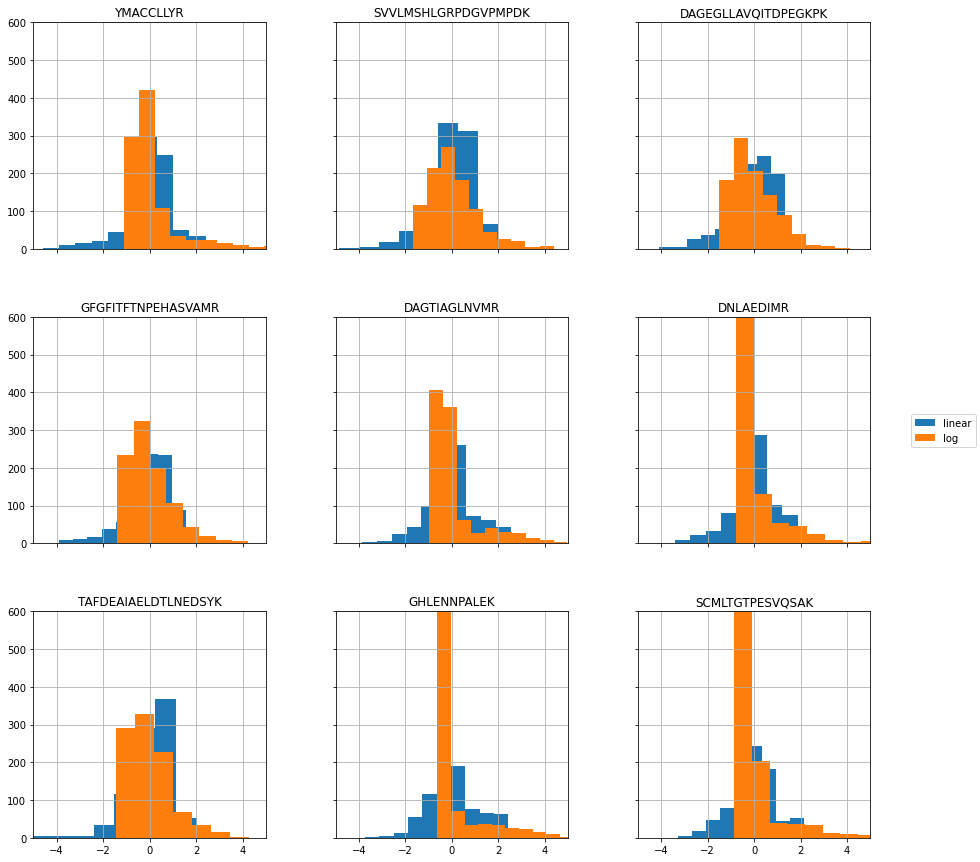

# Linear vs Log Transformed data


```python
from pathlib import Path

from src import config
from vaep.analyzers.analyzers import *
from vaep.transform import StandardScaler, get_df_fitted_mean_std
```

    FOLDER_MQ_TXT_DATA = data\mq_out
    


```python
import logging
from vaep.logging import setup_logger

logger = logging.getLogger()  # returns root-logger
logger.setLevel(logging.CRITICAL)  # silence for everything else
logger.handlers = []


logger = setup_logger(logger=logging.getLogger('vaep'))
logger.info("Experiment 01")
```

    vaep - INFO     Experiment 01
    

## Load data

- 1000 features (most abundant peptides)
- later a subset of samples is selected


```python
N_SAMPLES_TO_LOAD = None
FN_PEPTIDE_INTENSITIES = config.FOLDER_DATA / 'df_intensities_N07813_M01000'
analysis = AnalyzePeptides.from_csv(
    fname=FN_PEPTIDE_INTENSITIES, nrows=N_SAMPLES_TO_LOAD)
analysis.df = analysis.df.sort_index()  # sort by date
assert analysis.df.index.is_unique, "Non-unique training samples"
analysis
```


    AnalyzePeptides with attributes: df, stats


### Select consecutives samples for training


```python
import random

N_SAMPLES = 1000
logger.info(f"Selected {N_SAMPLES}")
analysis.N_SAMPLES = N_SAMPLES


def get_consecutive_data_indices(index, n_samples=N_SAMPLES):
    start_sample = len(index) - n_samples
    start_sample = random.randint(0, start_sample)
    return index[start_sample:start_sample+n_samples]


indices_selected = get_consecutive_data_indices(analysis.df.index)
analysis.samples = indices_selected
analysis.df = analysis.df.loc[indices_selected]

FRACTION = 0.9

class Indices(SimpleNamespace):
    pass

indices = Indices()
indices.train, indices.valid = indices_selected[:int(
    FRACTION*N_SAMPLES)], indices_selected[int(FRACTION*N_SAMPLES):]
analysis.indices = indices

analysis.df_train = analysis.df.loc[indices.train]
analysis.df_valid = analysis.df.loc[indices.valid]

analysis.df
```

    vaep - INFO     Selected 1000
    


<div>
<style scoped>
    .dataframe tbody tr th:only-of-type {
        vertical-align: middle;
    }

    .dataframe tbody tr th {
        vertical-align: top;
    }

    .dataframe thead th {
        text-align: right;
    }
</style>
<table border="1" class="dataframe">
  <thead>
    <tr style="text-align: right;">
      <th></th>
      <th>AAAAAAALQAK</th>
      <th>AAFDDAIAELDTLSEESYK</th>
      <th>AAHSEGNTTAGLDMR</th>
      <th>AAVATFLQSVQVPEFTPK</th>
      <th>AAVEEGIVLGGGCALLR</th>
      <th>AAVPSGASTGIYEALELR</th>
      <th>AAVPSGASTGIYEALELRDNDK</th>
      <th>ACANPAAGSVILLENLR</th>
      <th>ACGLVASNLNLKPGECLR</th>
      <th>ADLINNLGTIAK</th>
      <th>...</th>
      <th>VVFVFGPDK</th>
      <th>VVFVFGPDKK</th>
      <th>VYALPEDLVEVKPK</th>
      <th>YADLTEDQLPSCESLK</th>
      <th>YDDMAAAMK</th>
      <th>YDDMAACMK</th>
      <th>YDDMATCMK</th>
      <th>YLAEVACGDDRK</th>
      <th>YLDEDTIYHLQPSGR</th>
      <th>YRVPDVLVADPPIAR</th>
    </tr>
  </thead>
  <tbody>
    <tr>
      <th>20181102_QE2_NLC10_MR_QC_MNT_NEWHELA_02</th>
      <td>1,528,300,000.000</td>
      <td>1,537,100,000.000</td>
      <td>122,850,000.000</td>
      <td>603,890,000.000</td>
      <td>381,760,000.000</td>
      <td>1,553,000,000.000</td>
      <td>2,381,800,000.000</td>
      <td>2,786,300,000.000</td>
      <td>722,020,000.000</td>
      <td>3,724,600,000.000</td>
      <td>...</td>
      <td>898,310,000.000</td>
      <td>226,610,000.000</td>
      <td>227,440,000.000</td>
      <td>610,110,000.000</td>
      <td>1,386,400,000.000</td>
      <td>1,241,500,000.000</td>
      <td>513,480,000.000</td>
      <td>1,025,700,000.000</td>
      <td>400,570,000.000</td>
      <td>420,340,000.000</td>
    </tr>
    <tr>
      <th>20181102_QE5_nLC5_OOE_QC_HELA_15cm_250ng_RO-045</th>
      <td>980,120,000.000</td>
      <td>3,848,700,000.000</td>
      <td>326,120,000.000</td>
      <td>683,470,000.000</td>
      <td>1,779,500,000.000</td>
      <td>2,177,200,000.000</td>
      <td>3,997,400,000.000</td>
      <td>2,208,400,000.000</td>
      <td>1,154,200,000.000</td>
      <td>3,612,300,000.000</td>
      <td>...</td>
      <td>827,350,000.000</td>
      <td>279,940,000.000</td>
      <td>183,970,000.000</td>
      <td>641,010,000.000</td>
      <td>799,580,000.000</td>
      <td>949,360,000.000</td>
      <td>390,970,000.000</td>
      <td>554,550,000.000</td>
      <td>284,930,000.000</td>
      <td>361,490,000.000</td>
    </tr>
    <tr>
      <th>20181102_QE5_nLC5_OOE_QC_MNT_HELA_15cm_250ng_RO-003</th>
      <td>1,278,200,000.000</td>
      <td>3,071,800,000.000</td>
      <td>272,870,000.000</td>
      <td>521,070,000.000</td>
      <td>1,812,800,000.000</td>
      <td>1,926,900,000.000</td>
      <td>4,697,300,000.000</td>
      <td>1,801,500,000.000</td>
      <td>979,210,000.000</td>
      <td>3,014,500,000.000</td>
      <td>...</td>
      <td>739,910,000.000</td>
      <td>239,420,000.000</td>
      <td>149,320,000.000</td>
      <td>533,610,000.000</td>
      <td>453,970,000.000</td>
      <td>881,350,000.000</td>
      <td>367,130,000.000</td>
      <td>797,950,000.000</td>
      <td>302,060,000.000</td>
      <td>280,900,000.000</td>
    </tr>
    <tr>
      <th>20181102_QE5_nLC5_OOE_QC_MNT_HELA_15cm_250ng_RO-004</th>
      <td>1,005,200,000.000</td>
      <td>2,817,700,000.000</td>
      <td>276,740,000.000</td>
      <td>532,060,000.000</td>
      <td>1,751,300,000.000</td>
      <td>2,001,000,000.000</td>
      <td>4,227,100,000.000</td>
      <td>1,631,200,000.000</td>
      <td>931,620,000.000</td>
      <td>2,854,800,000.000</td>
      <td>...</td>
      <td>764,310,000.000</td>
      <td>224,430,000.000</td>
      <td>156,400,000.000</td>
      <td>519,150,000.000</td>
      <td>353,830,000.000</td>
      <td>729,580,000.000</td>
      <td>411,470,000.000</td>
      <td>692,640,000.000</td>
      <td>234,980,000.000</td>
      <td>275,490,000.000</td>
    </tr>
    <tr>
      <th>20181102_QE9_nLC2_AnMu_QC_Hela_01</th>
      <td>2,850,100,000.000</td>
      <td>5,735,800,000.000</td>
      <td>946,660,000.000</td>
      <td>1,110,400,000.000</td>
      <td>2,128,000,000.000</td>
      <td>3,407,000,000.000</td>
      <td>7,362,800,000.000</td>
      <td>3,465,400,000.000</td>
      <td>2,166,300,000.000</td>
      <td>6,118,300,000.000</td>
      <td>...</td>
      <td>1,569,800,000.000</td>
      <td>607,620,000.000</td>
      <td>474,790,000.000</td>
      <td>722,820,000.000</td>
      <td>2,056,700,000.000</td>
      <td>1,290,800,000.000</td>
      <td>768,210,000.000</td>
      <td>1,815,000,000.000</td>
      <td>649,070,000.000</td>
      <td>789,800,000.000</td>
    </tr>
    <tr>
      <th>...</th>
      <td>...</td>
      <td>...</td>
      <td>...</td>
      <td>...</td>
      <td>...</td>
      <td>...</td>
      <td>...</td>
      <td>...</td>
      <td>...</td>
      <td>...</td>
      <td>...</td>
      <td>...</td>
      <td>...</td>
      <td>...</td>
      <td>...</td>
      <td>...</td>
      <td>...</td>
      <td>...</td>
      <td>...</td>
      <td>...</td>
      <td>...</td>
    </tr>
    <tr>
      <th>20190618_QX4_JiYu_MA_HeLa_500ng_centroid</th>
      <td>956,600,000.000</td>
      <td>NaN</td>
      <td>287,710,000.000</td>
      <td>229,730,000.000</td>
      <td>1,690,400,000.000</td>
      <td>2,652,800,000.000</td>
      <td>203,080,000.000</td>
      <td>512,680,000.000</td>
      <td>7,133,200.000</td>
      <td>4,499,600,000.000</td>
      <td>...</td>
      <td>532,990,000.000</td>
      <td>74,872,000.000</td>
      <td>196,530,000.000</td>
      <td>12,611,000.000</td>
      <td>269,370,000.000</td>
      <td>138,830,000.000</td>
      <td>10,082,000.000</td>
      <td>203,200,000.000</td>
      <td>159,500,000.000</td>
      <td>232,050,000.000</td>
    </tr>
    <tr>
      <th>20190619_QE1_nLC2_GP_QC_MNT_HELA_01</th>
      <td>1,970,700,000.000</td>
      <td>3,392,600,000.000</td>
      <td>340,020,000.000</td>
      <td>207,610,000.000</td>
      <td>1,599,100,000.000</td>
      <td>353,510,000.000</td>
      <td>5,461,600,000.000</td>
      <td>2,345,700,000.000</td>
      <td>1,749,400,000.000</td>
      <td>5,416,900,000.000</td>
      <td>...</td>
      <td>870,560,000.000</td>
      <td>618,200,000.000</td>
      <td>244,310,000.000</td>
      <td>651,290,000.000</td>
      <td>833,600,000.000</td>
      <td>631,290,000.000</td>
      <td>359,960,000.000</td>
      <td>875,410,000.000</td>
      <td>124,410,000.000</td>
      <td>519,200,000.000</td>
    </tr>
    <tr>
      <th>20190619_QE2_NLC1_GP_QC_MNT_HELA_01</th>
      <td>2,828,000,000.000</td>
      <td>6,333,800,000.000</td>
      <td>272,190,000.000</td>
      <td>825,240,000.000</td>
      <td>1,974,700,000.000</td>
      <td>356,200,000.000</td>
      <td>6,333,800,000.000</td>
      <td>4,008,700,000.000</td>
      <td>3,528,400,000.000</td>
      <td>5,925,800,000.000</td>
      <td>...</td>
      <td>998,360,000.000</td>
      <td>1,032,500,000.000</td>
      <td>557,840,000.000</td>
      <td>847,160,000.000</td>
      <td>604,330,000.000</td>
      <td>779,800,000.000</td>
      <td>235,340,000.000</td>
      <td>864,550,000.000</td>
      <td>232,780,000.000</td>
      <td>768,690,000.000</td>
    </tr>
    <tr>
      <th>20190619_QE7_nLC7_AP_QC_MNT_HeLa_01</th>
      <td>1,943,900,000.000</td>
      <td>7,343,300,000.000</td>
      <td>254,950,000.000</td>
      <td>844,140,000.000</td>
      <td>2,698,700,000.000</td>
      <td>880,060,000.000</td>
      <td>5,494,000,000.000</td>
      <td>3,961,500,000.000</td>
      <td>2,728,400,000.000</td>
      <td>4,173,000,000.000</td>
      <td>...</td>
      <td>776,440,000.000</td>
      <td>671,950,000.000</td>
      <td>367,100,000.000</td>
      <td>726,440,000.000</td>
      <td>414,300,000.000</td>
      <td>594,570,000.000</td>
      <td>247,920,000.000</td>
      <td>734,510,000.000</td>
      <td>190,580,000.000</td>
      <td>428,270,000.000</td>
    </tr>
    <tr>
      <th>20190619_QE7_nLC7_AP_QC_MNT_HeLa_02</th>
      <td>1,533,400,000.000</td>
      <td>8,054,600,000.000</td>
      <td>213,290,000.000</td>
      <td>1,022,400,000.000</td>
      <td>2,404,600,000.000</td>
      <td>997,420,000.000</td>
      <td>7,297,600,000.000</td>
      <td>4,953,700,000.000</td>
      <td>3,101,800,000.000</td>
      <td>4,862,300,000.000</td>
      <td>...</td>
      <td>738,070,000.000</td>
      <td>647,420,000.000</td>
      <td>468,860,000.000</td>
      <td>1,107,700,000.000</td>
      <td>468,980,000.000</td>
      <td>626,090,000.000</td>
      <td>247,360,000.000</td>
      <td>875,230,000.000</td>
      <td>218,610,000.000</td>
      <td>625,780,000.000</td>
    </tr>
  </tbody>
</table>
<p>1000 rows × 1000 columns</p>
</div>


## Transforms

### Custom Transforms

- illustrate using adapted scikit-learn [`StandardScaler`](https://scikit-learn.org/stable/modules/preprocessing.html)


```python
N, M = 10, 10  # Samples, Features
analysis.df_train.iloc[:N, :M]
```


<div>
<style scoped>
    .dataframe tbody tr th:only-of-type {
        vertical-align: middle;
    }

    .dataframe tbody tr th {
        vertical-align: top;
    }

    .dataframe thead th {
        text-align: right;
    }
</style>
<table border="1" class="dataframe">
  <thead>
    <tr style="text-align: right;">
      <th></th>
      <th>AAAAAAALQAK</th>
      <th>AAFDDAIAELDTLSEESYK</th>
      <th>AAHSEGNTTAGLDMR</th>
      <th>AAVATFLQSVQVPEFTPK</th>
      <th>AAVEEGIVLGGGCALLR</th>
      <th>AAVPSGASTGIYEALELR</th>
      <th>AAVPSGASTGIYEALELRDNDK</th>
      <th>ACANPAAGSVILLENLR</th>
      <th>ACGLVASNLNLKPGECLR</th>
      <th>ADLINNLGTIAK</th>
    </tr>
  </thead>
  <tbody>
    <tr>
      <th>20181102_QE2_NLC10_MR_QC_MNT_NEWHELA_02</th>
      <td>1,528,300,000.000</td>
      <td>1,537,100,000.000</td>
      <td>122,850,000.000</td>
      <td>603,890,000.000</td>
      <td>381,760,000.000</td>
      <td>1,553,000,000.000</td>
      <td>2,381,800,000.000</td>
      <td>2,786,300,000.000</td>
      <td>722,020,000.000</td>
      <td>3,724,600,000.000</td>
    </tr>
    <tr>
      <th>20181102_QE5_nLC5_OOE_QC_HELA_15cm_250ng_RO-045</th>
      <td>980,120,000.000</td>
      <td>3,848,700,000.000</td>
      <td>326,120,000.000</td>
      <td>683,470,000.000</td>
      <td>1,779,500,000.000</td>
      <td>2,177,200,000.000</td>
      <td>3,997,400,000.000</td>
      <td>2,208,400,000.000</td>
      <td>1,154,200,000.000</td>
      <td>3,612,300,000.000</td>
    </tr>
    <tr>
      <th>20181102_QE5_nLC5_OOE_QC_MNT_HELA_15cm_250ng_RO-003</th>
      <td>1,278,200,000.000</td>
      <td>3,071,800,000.000</td>
      <td>272,870,000.000</td>
      <td>521,070,000.000</td>
      <td>1,812,800,000.000</td>
      <td>1,926,900,000.000</td>
      <td>4,697,300,000.000</td>
      <td>1,801,500,000.000</td>
      <td>979,210,000.000</td>
      <td>3,014,500,000.000</td>
    </tr>
    <tr>
      <th>20181102_QE5_nLC5_OOE_QC_MNT_HELA_15cm_250ng_RO-004</th>
      <td>1,005,200,000.000</td>
      <td>2,817,700,000.000</td>
      <td>276,740,000.000</td>
      <td>532,060,000.000</td>
      <td>1,751,300,000.000</td>
      <td>2,001,000,000.000</td>
      <td>4,227,100,000.000</td>
      <td>1,631,200,000.000</td>
      <td>931,620,000.000</td>
      <td>2,854,800,000.000</td>
    </tr>
    <tr>
      <th>20181102_QE9_nLC2_AnMu_QC_Hela_01</th>
      <td>2,850,100,000.000</td>
      <td>5,735,800,000.000</td>
      <td>946,660,000.000</td>
      <td>1,110,400,000.000</td>
      <td>2,128,000,000.000</td>
      <td>3,407,000,000.000</td>
      <td>7,362,800,000.000</td>
      <td>3,465,400,000.000</td>
      <td>2,166,300,000.000</td>
      <td>6,118,300,000.000</td>
    </tr>
    <tr>
      <th>20181103_QE1_nLC1_RG_QC_HeLa_1</th>
      <td>582,300,000.000</td>
      <td>449,810,000.000</td>
      <td>100,500,000.000</td>
      <td>153,260,000.000</td>
      <td>272,230,000.000</td>
      <td>215,700,000.000</td>
      <td>932,700,000.000</td>
      <td>379,450,000.000</td>
      <td>195,630,000.000</td>
      <td>1,327,900,000.000</td>
    </tr>
    <tr>
      <th>20181104_QE1_nLC1_RG_QC_HeLa_1</th>
      <td>691,850,000.000</td>
      <td>435,430,000.000</td>
      <td>19,396,000.000</td>
      <td>145,320,000.000</td>
      <td>234,910,000.000</td>
      <td>299,550,000.000</td>
      <td>898,520,000.000</td>
      <td>299,230,000.000</td>
      <td>187,800,000.000</td>
      <td>1,191,600,000.000</td>
    </tr>
    <tr>
      <th>20181105_QE2_NLC10_MR_QC_MNT_HELA_01</th>
      <td>309,600,000.000</td>
      <td>2,037,100,000.000</td>
      <td>20,302,000.000</td>
      <td>653,140,000.000</td>
      <td>1,551,800,000.000</td>
      <td>1,696,800,000.000</td>
      <td>3,094,600,000.000</td>
      <td>2,332,800,000.000</td>
      <td>338,130,000.000</td>
      <td>2,568,900,000.000</td>
    </tr>
    <tr>
      <th>20181105_QE2_NLC10_MR_QC_MNT_HELA_02</th>
      <td>354,740,000.000</td>
      <td>2,463,200,000.000</td>
      <td>183,360,000.000</td>
      <td>705,770,000.000</td>
      <td>1,752,900,000.000</td>
      <td>2,004,400,000.000</td>
      <td>3,882,200,000.000</td>
      <td>2,380,900,000.000</td>
      <td>289,680,000.000</td>
      <td>2,777,800,000.000</td>
    </tr>
    <tr>
      <th>20181105_QE8_nLC0_BDA_QC_MNT_HeLa_15cm_01</th>
      <td>1,515,800,000.000</td>
      <td>1,547,100,000.000</td>
      <td>233,270,000.000</td>
      <td>NaN</td>
      <td>665,520,000.000</td>
      <td>766,110,000.000</td>
      <td>2,587,400,000.000</td>
      <td>NaN</td>
      <td>194,130,000.000</td>
      <td>6,050,700,000.000</td>
    </tr>
  </tbody>
</table>
</div>


```python
analysis.df_train.iloc[:, :M].describe()
```


<div>
<style scoped>
    .dataframe tbody tr th:only-of-type {
        vertical-align: middle;
    }

    .dataframe tbody tr th {
        vertical-align: top;
    }

    .dataframe thead th {
        text-align: right;
    }
</style>
<table border="1" class="dataframe">
  <thead>
    <tr style="text-align: right;">
      <th></th>
      <th>AAAAAAALQAK</th>
      <th>AAFDDAIAELDTLSEESYK</th>
      <th>AAHSEGNTTAGLDMR</th>
      <th>AAVATFLQSVQVPEFTPK</th>
      <th>AAVEEGIVLGGGCALLR</th>
      <th>AAVPSGASTGIYEALELR</th>
      <th>AAVPSGASTGIYEALELRDNDK</th>
      <th>ACANPAAGSVILLENLR</th>
      <th>ACGLVASNLNLKPGECLR</th>
      <th>ADLINNLGTIAK</th>
    </tr>
  </thead>
  <tbody>
    <tr>
      <th>count</th>
      <td>874.000</td>
      <td>874.000</td>
      <td>856.000</td>
      <td>844.000</td>
      <td>891.000</td>
      <td>863.000</td>
      <td>846.000</td>
      <td>877.000</td>
      <td>837.000</td>
      <td>893.000</td>
    </tr>
    <tr>
      <th>mean</th>
      <td>1,788,079,930.549</td>
      <td>3,494,782,792.792</td>
      <td>577,080,270.561</td>
      <td>925,996,773.460</td>
      <td>2,324,476,663.300</td>
      <td>2,674,107,859.096</td>
      <td>5,592,034,007.092</td>
      <td>2,444,357,716.648</td>
      <td>1,845,598,966.906</td>
      <td>6,298,977,910.078</td>
    </tr>
    <tr>
      <th>std</th>
      <td>1,314,314,893.791</td>
      <td>2,271,403,889.022</td>
      <td>892,849,786.124</td>
      <td>932,199,047.879</td>
      <td>2,560,968,866.979</td>
      <td>4,908,542,456.696</td>
      <td>3,348,733,211.676</td>
      <td>1,396,902,640.032</td>
      <td>1,420,774,527.055</td>
      <td>5,868,156,202.236</td>
    </tr>
    <tr>
      <th>min</th>
      <td>8,448,300.000</td>
      <td>5,228,900.000</td>
      <td>4,166,600.000</td>
      <td>1,422,200.000</td>
      <td>2,048,500.000</td>
      <td>2,371,900.000</td>
      <td>12,913,000.000</td>
      <td>5,878,500.000</td>
      <td>1,508,900.000</td>
      <td>2,279,700.000</td>
    </tr>
    <tr>
      <th>25%</th>
      <td>930,870,000.000</td>
      <td>1,706,175,000.000</td>
      <td>127,477,500.000</td>
      <td>379,340,000.000</td>
      <td>1,003,250,000.000</td>
      <td>415,790,000.000</td>
      <td>3,199,700,000.000</td>
      <td>1,374,000,000.000</td>
      <td>643,510,000.000</td>
      <td>3,047,600,000.000</td>
    </tr>
    <tr>
      <th>50%</th>
      <td>1,417,650,000.000</td>
      <td>3,092,050,000.000</td>
      <td>272,860,000.000</td>
      <td>676,615,000.000</td>
      <td>1,537,500,000.000</td>
      <td>699,500,000.000</td>
      <td>5,240,950,000.000</td>
      <td>2,284,300,000.000</td>
      <td>1,560,700,000.000</td>
      <td>4,668,500,000.000</td>
    </tr>
    <tr>
      <th>75%</th>
      <td>2,227,025,000.000</td>
      <td>4,924,625,000.000</td>
      <td>458,265,000.000</td>
      <td>1,101,625,000.000</td>
      <td>2,357,750,000.000</td>
      <td>1,739,100,000.000</td>
      <td>7,781,775,000.000</td>
      <td>3,285,000,000.000</td>
      <td>2,856,200,000.000</td>
      <td>6,727,900,000.000</td>
    </tr>
    <tr>
      <th>max</th>
      <td>7,678,700,000.000</td>
      <td>12,728,000,000.000</td>
      <td>5,324,200,000.000</td>
      <td>8,230,500,000.000</td>
      <td>16,674,000,000.000</td>
      <td>28,870,000,000.000</td>
      <td>21,767,000,000.000</td>
      <td>9,429,100,000.000</td>
      <td>8,520,800,000.000</td>
      <td>55,554,000,000.000</td>
    </tr>
  </tbody>
</table>
</div>


### StandardScaler on raw data


```python
scaler = StandardScaler().fit(analysis.df_train)
scaler_df = get_df_fitted_mean_std(scaler, index=analysis.df_train.columns)
scaler_df.head(N)
```


<div>
<style scoped>
    .dataframe tbody tr th:only-of-type {
        vertical-align: middle;
    }

    .dataframe tbody tr th {
        vertical-align: top;
    }

    .dataframe thead th {
        text-align: right;
    }
</style>
<table border="1" class="dataframe">
  <thead>
    <tr style="text-align: right;">
      <th></th>
      <th>mean</th>
      <th>stddev</th>
    </tr>
  </thead>
  <tbody>
    <tr>
      <th>AAAAAAALQAK</th>
      <td>1,788,079,930.549</td>
      <td>1,313,562,782.202</td>
    </tr>
    <tr>
      <th>AAFDDAIAELDTLSEESYK</th>
      <td>3,494,782,792.792</td>
      <td>2,270,104,086.976</td>
    </tr>
    <tr>
      <th>AAHSEGNTTAGLDMR</th>
      <td>577,080,270.561</td>
      <td>892,328,109.313</td>
    </tr>
    <tr>
      <th>AAVATFLQSVQVPEFTPK</th>
      <td>925,996,773.460</td>
      <td>931,646,633.580</td>
    </tr>
    <tr>
      <th>AAVEEGIVLGGGCALLR</th>
      <td>2,324,476,663.300</td>
      <td>2,559,531,331.717</td>
    </tr>
    <tr>
      <th>AAVPSGASTGIYEALELR</th>
      <td>2,674,107,859.096</td>
      <td>4,905,697,749.151</td>
    </tr>
    <tr>
      <th>AAVPSGASTGIYEALELRDNDK</th>
      <td>5,592,034,007.092</td>
      <td>3,346,753,469.728</td>
    </tr>
    <tr>
      <th>ACANPAAGSVILLENLR</th>
      <td>2,444,357,716.648</td>
      <td>1,396,106,003.161</td>
    </tr>
    <tr>
      <th>ACGLVASNLNLKPGECLR</th>
      <td>1,845,598,966.906</td>
      <td>1,419,925,543.097</td>
    </tr>
    <tr>
      <th>ADLINNLGTIAK</th>
      <td>6,298,977,910.078</td>
      <td>5,864,869,640.117</td>
    </tr>
  </tbody>
</table>
</div>


```python
sample = scaler.transform(analysis.df_train.iloc[:N])
sample.iloc[:, :M]
```


<div>
<style scoped>
    .dataframe tbody tr th:only-of-type {
        vertical-align: middle;
    }

    .dataframe tbody tr th {
        vertical-align: top;
    }

    .dataframe thead th {
        text-align: right;
    }
</style>
<table border="1" class="dataframe">
  <thead>
    <tr style="text-align: right;">
      <th></th>
      <th>AAAAAAALQAK</th>
      <th>AAFDDAIAELDTLSEESYK</th>
      <th>AAHSEGNTTAGLDMR</th>
      <th>AAVATFLQSVQVPEFTPK</th>
      <th>AAVEEGIVLGGGCALLR</th>
      <th>AAVPSGASTGIYEALELR</th>
      <th>AAVPSGASTGIYEALELRDNDK</th>
      <th>ACANPAAGSVILLENLR</th>
      <th>ACGLVASNLNLKPGECLR</th>
      <th>ADLINNLGTIAK</th>
    </tr>
  </thead>
  <tbody>
    <tr>
      <th>20181102_QE2_NLC10_MR_QC_MNT_NEWHELA_02</th>
      <td>-0.198</td>
      <td>-0.862</td>
      <td>-0.509</td>
      <td>-0.346</td>
      <td>-0.759</td>
      <td>-0.229</td>
      <td>-0.959</td>
      <td>0.245</td>
      <td>-0.791</td>
      <td>-0.439</td>
    </tr>
    <tr>
      <th>20181102_QE5_nLC5_OOE_QC_HELA_15cm_250ng_RO-045</th>
      <td>-0.615</td>
      <td>0.156</td>
      <td>-0.281</td>
      <td>-0.260</td>
      <td>-0.213</td>
      <td>-0.101</td>
      <td>-0.476</td>
      <td>-0.169</td>
      <td>-0.487</td>
      <td>-0.458</td>
    </tr>
    <tr>
      <th>20181102_QE5_nLC5_OOE_QC_MNT_HELA_15cm_250ng_RO-003</th>
      <td>-0.388</td>
      <td>-0.186</td>
      <td>-0.341</td>
      <td>-0.435</td>
      <td>-0.200</td>
      <td>-0.152</td>
      <td>-0.267</td>
      <td>-0.460</td>
      <td>-0.610</td>
      <td>-0.560</td>
    </tr>
    <tr>
      <th>20181102_QE5_nLC5_OOE_QC_MNT_HELA_15cm_250ng_RO-004</th>
      <td>-0.596</td>
      <td>-0.298</td>
      <td>-0.337</td>
      <td>-0.423</td>
      <td>-0.224</td>
      <td>-0.137</td>
      <td>-0.408</td>
      <td>-0.582</td>
      <td>-0.644</td>
      <td>-0.587</td>
    </tr>
    <tr>
      <th>20181102_QE9_nLC2_AnMu_QC_Hela_01</th>
      <td>0.809</td>
      <td>0.987</td>
      <td>0.414</td>
      <td>0.198</td>
      <td>-0.077</td>
      <td>0.149</td>
      <td>0.529</td>
      <td>0.731</td>
      <td>0.226</td>
      <td>-0.031</td>
    </tr>
    <tr>
      <th>20181103_QE1_nLC1_RG_QC_HeLa_1</th>
      <td>-0.918</td>
      <td>-1.341</td>
      <td>-0.534</td>
      <td>-0.829</td>
      <td>-0.802</td>
      <td>-0.501</td>
      <td>-1.392</td>
      <td>-1.479</td>
      <td>-1.162</td>
      <td>-0.848</td>
    </tr>
    <tr>
      <th>20181104_QE1_nLC1_RG_QC_HeLa_1</th>
      <td>-0.835</td>
      <td>-1.348</td>
      <td>-0.625</td>
      <td>-0.838</td>
      <td>-0.816</td>
      <td>-0.484</td>
      <td>-1.402</td>
      <td>-1.537</td>
      <td>-1.168</td>
      <td>-0.871</td>
    </tr>
    <tr>
      <th>20181105_QE2_NLC10_MR_QC_MNT_HELA_01</th>
      <td>-1.126</td>
      <td>-0.642</td>
      <td>-0.624</td>
      <td>-0.293</td>
      <td>-0.302</td>
      <td>-0.199</td>
      <td>-0.746</td>
      <td>-0.080</td>
      <td>-1.062</td>
      <td>-0.636</td>
    </tr>
    <tr>
      <th>20181105_QE2_NLC10_MR_QC_MNT_HELA_02</th>
      <td>-1.091</td>
      <td>-0.454</td>
      <td>-0.441</td>
      <td>-0.236</td>
      <td>-0.223</td>
      <td>-0.137</td>
      <td>-0.511</td>
      <td>-0.045</td>
      <td>-1.096</td>
      <td>-0.600</td>
    </tr>
    <tr>
      <th>20181105_QE8_nLC0_BDA_QC_MNT_HeLa_15cm_01</th>
      <td>-0.207</td>
      <td>-0.858</td>
      <td>-0.385</td>
      <td>NaN</td>
      <td>-0.648</td>
      <td>-0.389</td>
      <td>-0.898</td>
      <td>NaN</td>
      <td>-1.163</td>
      <td>-0.042</td>
    </tr>
  </tbody>
</table>
</div>


```python
sample = scaler.inverse_transform(sample)
sample.iloc[:, :M]
```


<div>
<style scoped>
    .dataframe tbody tr th:only-of-type {
        vertical-align: middle;
    }

    .dataframe tbody tr th {
        vertical-align: top;
    }

    .dataframe thead th {
        text-align: right;
    }
</style>
<table border="1" class="dataframe">
  <thead>
    <tr style="text-align: right;">
      <th></th>
      <th>AAAAAAALQAK</th>
      <th>AAFDDAIAELDTLSEESYK</th>
      <th>AAHSEGNTTAGLDMR</th>
      <th>AAVATFLQSVQVPEFTPK</th>
      <th>AAVEEGIVLGGGCALLR</th>
      <th>AAVPSGASTGIYEALELR</th>
      <th>AAVPSGASTGIYEALELRDNDK</th>
      <th>ACANPAAGSVILLENLR</th>
      <th>ACGLVASNLNLKPGECLR</th>
      <th>ADLINNLGTIAK</th>
    </tr>
  </thead>
  <tbody>
    <tr>
      <th>20181102_QE2_NLC10_MR_QC_MNT_NEWHELA_02</th>
      <td>1,528,300,000.000</td>
      <td>1,537,100,000.000</td>
      <td>122,850,000.000</td>
      <td>603,890,000.000</td>
      <td>381,760,000.000</td>
      <td>1,553,000,000.000</td>
      <td>2,381,800,000.000</td>
      <td>2,786,300,000.000</td>
      <td>722,020,000.000</td>
      <td>3,724,600,000.000</td>
    </tr>
    <tr>
      <th>20181102_QE5_nLC5_OOE_QC_HELA_15cm_250ng_RO-045</th>
      <td>980,120,000.000</td>
      <td>3,848,700,000.000</td>
      <td>326,120,000.000</td>
      <td>683,470,000.000</td>
      <td>1,779,500,000.000</td>
      <td>2,177,200,000.000</td>
      <td>3,997,400,000.000</td>
      <td>2,208,400,000.000</td>
      <td>1,154,200,000.000</td>
      <td>3,612,300,000.000</td>
    </tr>
    <tr>
      <th>20181102_QE5_nLC5_OOE_QC_MNT_HELA_15cm_250ng_RO-003</th>
      <td>1,278,200,000.000</td>
      <td>3,071,800,000.000</td>
      <td>272,870,000.000</td>
      <td>521,070,000.000</td>
      <td>1,812,800,000.000</td>
      <td>1,926,900,000.000</td>
      <td>4,697,300,000.000</td>
      <td>1,801,500,000.000</td>
      <td>979,210,000.000</td>
      <td>3,014,500,000.000</td>
    </tr>
    <tr>
      <th>20181102_QE5_nLC5_OOE_QC_MNT_HELA_15cm_250ng_RO-004</th>
      <td>1,005,200,000.000</td>
      <td>2,817,700,000.000</td>
      <td>276,740,000.000</td>
      <td>532,060,000.000</td>
      <td>1,751,300,000.000</td>
      <td>2,001,000,000.000</td>
      <td>4,227,100,000.000</td>
      <td>1,631,200,000.000</td>
      <td>931,620,000.000</td>
      <td>2,854,800,000.000</td>
    </tr>
    <tr>
      <th>20181102_QE9_nLC2_AnMu_QC_Hela_01</th>
      <td>2,850,100,000.000</td>
      <td>5,735,800,000.000</td>
      <td>946,660,000.000</td>
      <td>1,110,400,000.000</td>
      <td>2,128,000,000.000</td>
      <td>3,407,000,000.000</td>
      <td>7,362,800,000.000</td>
      <td>3,465,400,000.000</td>
      <td>2,166,300,000.000</td>
      <td>6,118,300,000.000</td>
    </tr>
    <tr>
      <th>20181103_QE1_nLC1_RG_QC_HeLa_1</th>
      <td>582,300,000.000</td>
      <td>449,810,000.000</td>
      <td>100,500,000.000</td>
      <td>153,260,000.000</td>
      <td>272,230,000.000</td>
      <td>215,700,000.000</td>
      <td>932,700,000.000</td>
      <td>379,450,000.000</td>
      <td>195,630,000.000</td>
      <td>1,327,900,000.000</td>
    </tr>
    <tr>
      <th>20181104_QE1_nLC1_RG_QC_HeLa_1</th>
      <td>691,850,000.000</td>
      <td>435,430,000.000</td>
      <td>19,396,000.000</td>
      <td>145,320,000.000</td>
      <td>234,910,000.000</td>
      <td>299,550,000.000</td>
      <td>898,520,000.000</td>
      <td>299,230,000.000</td>
      <td>187,800,000.000</td>
      <td>1,191,600,000.000</td>
    </tr>
    <tr>
      <th>20181105_QE2_NLC10_MR_QC_MNT_HELA_01</th>
      <td>309,600,000.000</td>
      <td>2,037,100,000.000</td>
      <td>20,302,000.000</td>
      <td>653,140,000.000</td>
      <td>1,551,800,000.000</td>
      <td>1,696,800,000.000</td>
      <td>3,094,600,000.000</td>
      <td>2,332,800,000.000</td>
      <td>338,130,000.000</td>
      <td>2,568,900,000.000</td>
    </tr>
    <tr>
      <th>20181105_QE2_NLC10_MR_QC_MNT_HELA_02</th>
      <td>354,740,000.000</td>
      <td>2,463,200,000.000</td>
      <td>183,360,000.000</td>
      <td>705,770,000.000</td>
      <td>1,752,900,000.000</td>
      <td>2,004,400,000.000</td>
      <td>3,882,200,000.000</td>
      <td>2,380,900,000.000</td>
      <td>289,680,000.000</td>
      <td>2,777,800,000.000</td>
    </tr>
    <tr>
      <th>20181105_QE8_nLC0_BDA_QC_MNT_HeLa_15cm_01</th>
      <td>1,515,800,000.000</td>
      <td>1,547,100,000.000</td>
      <td>233,270,000.000</td>
      <td>NaN</td>
      <td>665,520,000.000</td>
      <td>766,110,000.000</td>
      <td>2,587,400,000.000</td>
      <td>NaN</td>
      <td>194,130,000.000</td>
      <td>6,050,700,000.000</td>
    </tr>
  </tbody>
</table>
</div>


### StandardScaler on log10 transformed data


```python
X_log10 = np.log10(analysis.df_train)
X_log10.iloc[:N, :M]
```


<div>
<style scoped>
    .dataframe tbody tr th:only-of-type {
        vertical-align: middle;
    }

    .dataframe tbody tr th {
        vertical-align: top;
    }

    .dataframe thead th {
        text-align: right;
    }
</style>
<table border="1" class="dataframe">
  <thead>
    <tr style="text-align: right;">
      <th></th>
      <th>AAAAAAALQAK</th>
      <th>AAFDDAIAELDTLSEESYK</th>
      <th>AAHSEGNTTAGLDMR</th>
      <th>AAVATFLQSVQVPEFTPK</th>
      <th>AAVEEGIVLGGGCALLR</th>
      <th>AAVPSGASTGIYEALELR</th>
      <th>AAVPSGASTGIYEALELRDNDK</th>
      <th>ACANPAAGSVILLENLR</th>
      <th>ACGLVASNLNLKPGECLR</th>
      <th>ADLINNLGTIAK</th>
    </tr>
  </thead>
  <tbody>
    <tr>
      <th>20181102_QE2_NLC10_MR_QC_MNT_NEWHELA_02</th>
      <td>9.184</td>
      <td>9.187</td>
      <td>8.089</td>
      <td>8.781</td>
      <td>8.582</td>
      <td>9.191</td>
      <td>9.377</td>
      <td>9.445</td>
      <td>8.859</td>
      <td>9.571</td>
    </tr>
    <tr>
      <th>20181102_QE5_nLC5_OOE_QC_HELA_15cm_250ng_RO-045</th>
      <td>8.991</td>
      <td>9.585</td>
      <td>8.513</td>
      <td>8.835</td>
      <td>9.250</td>
      <td>9.338</td>
      <td>9.602</td>
      <td>9.344</td>
      <td>9.062</td>
      <td>9.558</td>
    </tr>
    <tr>
      <th>20181102_QE5_nLC5_OOE_QC_MNT_HELA_15cm_250ng_RO-003</th>
      <td>9.107</td>
      <td>9.487</td>
      <td>8.436</td>
      <td>8.717</td>
      <td>9.258</td>
      <td>9.285</td>
      <td>9.672</td>
      <td>9.256</td>
      <td>8.991</td>
      <td>9.479</td>
    </tr>
    <tr>
      <th>20181102_QE5_nLC5_OOE_QC_MNT_HELA_15cm_250ng_RO-004</th>
      <td>9.002</td>
      <td>9.450</td>
      <td>8.442</td>
      <td>8.726</td>
      <td>9.243</td>
      <td>9.301</td>
      <td>9.626</td>
      <td>9.213</td>
      <td>8.969</td>
      <td>9.456</td>
    </tr>
    <tr>
      <th>20181102_QE9_nLC2_AnMu_QC_Hela_01</th>
      <td>9.455</td>
      <td>9.759</td>
      <td>8.976</td>
      <td>9.045</td>
      <td>9.328</td>
      <td>9.532</td>
      <td>9.867</td>
      <td>9.540</td>
      <td>9.336</td>
      <td>9.787</td>
    </tr>
    <tr>
      <th>20181103_QE1_nLC1_RG_QC_HeLa_1</th>
      <td>8.765</td>
      <td>8.653</td>
      <td>8.002</td>
      <td>8.185</td>
      <td>8.435</td>
      <td>8.334</td>
      <td>8.970</td>
      <td>8.579</td>
      <td>8.291</td>
      <td>9.123</td>
    </tr>
    <tr>
      <th>20181104_QE1_nLC1_RG_QC_HeLa_1</th>
      <td>8.840</td>
      <td>8.639</td>
      <td>7.288</td>
      <td>8.162</td>
      <td>8.371</td>
      <td>8.476</td>
      <td>8.954</td>
      <td>8.476</td>
      <td>8.274</td>
      <td>9.076</td>
    </tr>
    <tr>
      <th>20181105_QE2_NLC10_MR_QC_MNT_HELA_01</th>
      <td>8.491</td>
      <td>9.309</td>
      <td>7.308</td>
      <td>8.815</td>
      <td>9.191</td>
      <td>9.230</td>
      <td>9.491</td>
      <td>9.368</td>
      <td>8.529</td>
      <td>9.410</td>
    </tr>
    <tr>
      <th>20181105_QE2_NLC10_MR_QC_MNT_HELA_02</th>
      <td>8.550</td>
      <td>9.391</td>
      <td>8.263</td>
      <td>8.849</td>
      <td>9.244</td>
      <td>9.302</td>
      <td>9.589</td>
      <td>9.377</td>
      <td>8.462</td>
      <td>9.444</td>
    </tr>
    <tr>
      <th>20181105_QE8_nLC0_BDA_QC_MNT_HeLa_15cm_01</th>
      <td>9.181</td>
      <td>9.190</td>
      <td>8.368</td>
      <td>NaN</td>
      <td>8.823</td>
      <td>8.884</td>
      <td>9.413</td>
      <td>NaN</td>
      <td>8.288</td>
      <td>9.782</td>
    </tr>
  </tbody>
</table>
</div>


```python
scaler_log = StandardScaler(
).fit(X=X_log10)
scaler_log_df = get_df_fitted_mean_std(scaler_log, index=analysis.df.index)
scaler_log_df.head(N)
```


<div>
<style scoped>
    .dataframe tbody tr th:only-of-type {
        vertical-align: middle;
    }

    .dataframe tbody tr th {
        vertical-align: top;
    }

    .dataframe thead th {
        text-align: right;
    }
</style>
<table border="1" class="dataframe">
  <thead>
    <tr style="text-align: right;">
      <th></th>
      <th>mean</th>
      <th>stddev</th>
    </tr>
  </thead>
  <tbody>
    <tr>
      <th>20181102_QE2_NLC10_MR_QC_MNT_NEWHELA_02</th>
      <td>9.117</td>
      <td>0.407</td>
    </tr>
    <tr>
      <th>20181102_QE5_nLC5_OOE_QC_HELA_15cm_250ng_RO-045</th>
      <td>9.413</td>
      <td>0.413</td>
    </tr>
    <tr>
      <th>20181102_QE5_nLC5_OOE_QC_MNT_HELA_15cm_250ng_RO-003</th>
      <td>8.401</td>
      <td>0.574</td>
    </tr>
    <tr>
      <th>20181102_QE5_nLC5_OOE_QC_MNT_HELA_15cm_250ng_RO-004</th>
      <td>8.791</td>
      <td>0.424</td>
    </tr>
    <tr>
      <th>20181102_QE9_nLC2_AnMu_QC_Hela_01</th>
      <td>9.184</td>
      <td>0.434</td>
    </tr>
    <tr>
      <th>20181103_QE1_nLC1_RG_QC_HeLa_1</th>
      <td>8.981</td>
      <td>0.584</td>
    </tr>
    <tr>
      <th>20181104_QE1_nLC1_RG_QC_HeLa_1</th>
      <td>9.629</td>
      <td>0.399</td>
    </tr>
    <tr>
      <th>20181105_QE2_NLC10_MR_QC_MNT_HELA_01</th>
      <td>9.294</td>
      <td>0.339</td>
    </tr>
    <tr>
      <th>20181105_QE2_NLC10_MR_QC_MNT_HELA_02</th>
      <td>9.068</td>
      <td>0.511</td>
    </tr>
    <tr>
      <th>20181105_QE8_nLC0_BDA_QC_MNT_HeLa_15cm_01</th>
      <td>9.636</td>
      <td>0.457</td>
    </tr>
  </tbody>
</table>
</div>


```python
sample_log10 = scaler_log.transform(X_log10.iloc[:N])
sample_log10.iloc[:, :M]
```


<div>
<style scoped>
    .dataframe tbody tr th:only-of-type {
        vertical-align: middle;
    }

    .dataframe tbody tr th {
        vertical-align: top;
    }

    .dataframe thead th {
        text-align: right;
    }
</style>
<table border="1" class="dataframe">
  <thead>
    <tr style="text-align: right;">
      <th></th>
      <th>AAAAAAALQAK</th>
      <th>AAFDDAIAELDTLSEESYK</th>
      <th>AAHSEGNTTAGLDMR</th>
      <th>AAVATFLQSVQVPEFTPK</th>
      <th>AAVEEGIVLGGGCALLR</th>
      <th>AAVPSGASTGIYEALELR</th>
      <th>AAVPSGASTGIYEALELRDNDK</th>
      <th>ACANPAAGSVILLENLR</th>
      <th>ACGLVASNLNLKPGECLR</th>
      <th>ADLINNLGTIAK</th>
    </tr>
  </thead>
  <tbody>
    <tr>
      <th>20181102_QE2_NLC10_MR_QC_MNT_NEWHELA_02</th>
      <td>0.165</td>
      <td>-0.548</td>
      <td>-0.543</td>
      <td>-0.024</td>
      <td>-1.390</td>
      <td>0.360</td>
      <td>-0.633</td>
      <td>0.446</td>
      <td>-0.409</td>
      <td>-0.141</td>
    </tr>
    <tr>
      <th>20181102_QE5_nLC5_OOE_QC_HELA_15cm_250ng_RO-045</th>
      <td>-0.309</td>
      <td>0.417</td>
      <td>0.196</td>
      <td>0.102</td>
      <td>0.152</td>
      <td>0.611</td>
      <td>-0.069</td>
      <td>0.148</td>
      <td>-0.011</td>
      <td>-0.170</td>
    </tr>
    <tr>
      <th>20181102_QE5_nLC5_OOE_QC_MNT_HELA_15cm_250ng_RO-003</th>
      <td>-0.026</td>
      <td>0.180</td>
      <td>0.061</td>
      <td>-0.175</td>
      <td>0.171</td>
      <td>0.520</td>
      <td>0.106</td>
      <td>-0.113</td>
      <td>-0.150</td>
      <td>-0.342</td>
    </tr>
    <tr>
      <th>20181102_QE5_nLC5_OOE_QC_MNT_HELA_15cm_250ng_RO-004</th>
      <td>-0.282</td>
      <td>0.090</td>
      <td>0.072</td>
      <td>-0.154</td>
      <td>0.136</td>
      <td>0.548</td>
      <td>-0.008</td>
      <td>-0.240</td>
      <td>-0.192</td>
      <td>-0.394</td>
    </tr>
    <tr>
      <th>20181102_QE9_nLC2_AnMu_QC_Hela_01</th>
      <td>0.830</td>
      <td>0.837</td>
      <td>1.002</td>
      <td>0.599</td>
      <td>0.331</td>
      <td>0.944</td>
      <td>0.596</td>
      <td>0.726</td>
      <td>0.524</td>
      <td>0.330</td>
    </tr>
    <tr>
      <th>20181103_QE1_nLC1_RG_QC_HeLa_1</th>
      <td>-0.865</td>
      <td>-1.840</td>
      <td>-0.694</td>
      <td>-1.427</td>
      <td>-1.728</td>
      <td>-1.108</td>
      <td>-1.655</td>
      <td>-2.110</td>
      <td>-1.518</td>
      <td>-1.121</td>
    </tr>
    <tr>
      <th>20181104_QE1_nLC1_RG_QC_HeLa_1</th>
      <td>-0.681</td>
      <td>-1.874</td>
      <td>-1.939</td>
      <td>-1.482</td>
      <td>-1.876</td>
      <td>-0.864</td>
      <td>-1.695</td>
      <td>-2.415</td>
      <td>-1.552</td>
      <td>-1.223</td>
    </tr>
    <tr>
      <th>20181105_QE2_NLC10_MR_QC_MNT_HELA_01</th>
      <td>-1.539</td>
      <td>-0.252</td>
      <td>-1.904</td>
      <td>0.056</td>
      <td>0.015</td>
      <td>0.426</td>
      <td>-0.348</td>
      <td>0.219</td>
      <td>-1.053</td>
      <td>-0.494</td>
    </tr>
    <tr>
      <th>20181105_QE2_NLC10_MR_QC_MNT_HELA_02</th>
      <td>-1.394</td>
      <td>-0.052</td>
      <td>-0.240</td>
      <td>0.135</td>
      <td>0.137</td>
      <td>0.550</td>
      <td>-0.101</td>
      <td>0.245</td>
      <td>-1.184</td>
      <td>-0.420</td>
    </tr>
    <tr>
      <th>20181105_QE8_nLC0_BDA_QC_MNT_HeLa_15cm_01</th>
      <td>0.156</td>
      <td>-0.541</td>
      <td>-0.058</td>
      <td>NaN</td>
      <td>-0.833</td>
      <td>-0.166</td>
      <td>-0.543</td>
      <td>NaN</td>
      <td>-1.524</td>
      <td>0.319</td>
    </tr>
  </tbody>
</table>
</div>


```python
scaler_log.inverse_transform(sample_log10).iloc[:, :M]
```


<div>
<style scoped>
    .dataframe tbody tr th:only-of-type {
        vertical-align: middle;
    }

    .dataframe tbody tr th {
        vertical-align: top;
    }

    .dataframe thead th {
        text-align: right;
    }
</style>
<table border="1" class="dataframe">
  <thead>
    <tr style="text-align: right;">
      <th></th>
      <th>AAAAAAALQAK</th>
      <th>AAFDDAIAELDTLSEESYK</th>
      <th>AAHSEGNTTAGLDMR</th>
      <th>AAVATFLQSVQVPEFTPK</th>
      <th>AAVEEGIVLGGGCALLR</th>
      <th>AAVPSGASTGIYEALELR</th>
      <th>AAVPSGASTGIYEALELRDNDK</th>
      <th>ACANPAAGSVILLENLR</th>
      <th>ACGLVASNLNLKPGECLR</th>
      <th>ADLINNLGTIAK</th>
    </tr>
  </thead>
  <tbody>
    <tr>
      <th>20181102_QE2_NLC10_MR_QC_MNT_NEWHELA_02</th>
      <td>9.184</td>
      <td>9.187</td>
      <td>8.089</td>
      <td>8.781</td>
      <td>8.582</td>
      <td>9.191</td>
      <td>9.377</td>
      <td>9.445</td>
      <td>8.859</td>
      <td>9.571</td>
    </tr>
    <tr>
      <th>20181102_QE5_nLC5_OOE_QC_HELA_15cm_250ng_RO-045</th>
      <td>8.991</td>
      <td>9.585</td>
      <td>8.513</td>
      <td>8.835</td>
      <td>9.250</td>
      <td>9.338</td>
      <td>9.602</td>
      <td>9.344</td>
      <td>9.062</td>
      <td>9.558</td>
    </tr>
    <tr>
      <th>20181102_QE5_nLC5_OOE_QC_MNT_HELA_15cm_250ng_RO-003</th>
      <td>9.107</td>
      <td>9.487</td>
      <td>8.436</td>
      <td>8.717</td>
      <td>9.258</td>
      <td>9.285</td>
      <td>9.672</td>
      <td>9.256</td>
      <td>8.991</td>
      <td>9.479</td>
    </tr>
    <tr>
      <th>20181102_QE5_nLC5_OOE_QC_MNT_HELA_15cm_250ng_RO-004</th>
      <td>9.002</td>
      <td>9.450</td>
      <td>8.442</td>
      <td>8.726</td>
      <td>9.243</td>
      <td>9.301</td>
      <td>9.626</td>
      <td>9.213</td>
      <td>8.969</td>
      <td>9.456</td>
    </tr>
    <tr>
      <th>20181102_QE9_nLC2_AnMu_QC_Hela_01</th>
      <td>9.455</td>
      <td>9.759</td>
      <td>8.976</td>
      <td>9.045</td>
      <td>9.328</td>
      <td>9.532</td>
      <td>9.867</td>
      <td>9.540</td>
      <td>9.336</td>
      <td>9.787</td>
    </tr>
    <tr>
      <th>20181103_QE1_nLC1_RG_QC_HeLa_1</th>
      <td>8.765</td>
      <td>8.653</td>
      <td>8.002</td>
      <td>8.185</td>
      <td>8.435</td>
      <td>8.334</td>
      <td>8.970</td>
      <td>8.579</td>
      <td>8.291</td>
      <td>9.123</td>
    </tr>
    <tr>
      <th>20181104_QE1_nLC1_RG_QC_HeLa_1</th>
      <td>8.840</td>
      <td>8.639</td>
      <td>7.288</td>
      <td>8.162</td>
      <td>8.371</td>
      <td>8.476</td>
      <td>8.954</td>
      <td>8.476</td>
      <td>8.274</td>
      <td>9.076</td>
    </tr>
    <tr>
      <th>20181105_QE2_NLC10_MR_QC_MNT_HELA_01</th>
      <td>8.491</td>
      <td>9.309</td>
      <td>7.308</td>
      <td>8.815</td>
      <td>9.191</td>
      <td>9.230</td>
      <td>9.491</td>
      <td>9.368</td>
      <td>8.529</td>
      <td>9.410</td>
    </tr>
    <tr>
      <th>20181105_QE2_NLC10_MR_QC_MNT_HELA_02</th>
      <td>8.550</td>
      <td>9.391</td>
      <td>8.263</td>
      <td>8.849</td>
      <td>9.244</td>
      <td>9.302</td>
      <td>9.589</td>
      <td>9.377</td>
      <td>8.462</td>
      <td>9.444</td>
    </tr>
    <tr>
      <th>20181105_QE8_nLC0_BDA_QC_MNT_HeLa_15cm_01</th>
      <td>9.181</td>
      <td>9.190</td>
      <td>8.368</td>
      <td>NaN</td>
      <td>8.823</td>
      <td>8.884</td>
      <td>9.413</td>
      <td>NaN</td>
      <td>8.288</td>
      <td>9.782</td>
    </tr>
  </tbody>
</table>
</div>


### Sanity checks

#### Correlation

- Correlation between the computed `means_` should be nearly perfect
- Correlation between peptide intensities should be high
- As taking the logarithm is a monoton, but non-linear transformation, the linear Pearson correlation can change substantially. [[link]](https://stats.stackexchange.com/questions/127121/do-logs-modify-the-correlation-between-two-variables)


```python
print("Correlation between mean values of linear vs. log-transformed values:",
      f"{np.corrcoef(scaler.mean_, scaler_log.mean_)[1,0]:.4f}", sep='\n')
```

    Correlation between mean values of linear vs. log-transformed values:
    0.7971
    


```python
pd.options.display.float_format = '{:,.3f}'.format

analysis.corr_linear_vs_log = scaler.transform(X=analysis.df).corrwith(
    other=scaler_log.transform(X_log10),
    axis=0)
analysis.corr_linear_vs_log.describe()
```


    count   1,000.000
    mean        0.825
    std         0.036
    min         0.653
    25%         0.803
    50%         0.829
    75%         0.849
    max         0.914
    dtype: float64


```python
# own implemention could be slightly faster as data is already demeanded and standardized.
# pd.DataFrame.corrwith?
```

#### Distribution


```python
import seaborn as sns
from vaep.utils import sample_iterable

columns_sampled = sample_iterable(list(analysis.df.columns), n=12)
print(columns_sampled)
```

    ['TIAMDGTEGLVR', 'TAFDDAIAELDTLNEDSYK', 'MEGPLSVFGDR', 'ILQDGGLQVVEK', 'FYEQMNGPVAGASR', 'ILLTEPPMNPTK', 'GLCAIAQAESLR', 'LLLQVQHASK', 'SGGLGGSHALLLLR', 'AVTEQGAELSNEER', 'FVNVVPTFGK', 'VACIGAWHPAR']
    


```python
def plot_scaled_sample(columns_sampled: list, scaler, df: pd.DataFrame = analysis.df):
    _scaled = scaler.transform(df)
    display(_scaled.describe())
    _min, _max = _scaled.min().min(), _scaled.max().max()
    return _min, _max
    print(list(range(_min, _max, step=0.5)))


_min, _max = plot_scaled_sample(columns_sampled=columns_sampled, scaler=scaler)
```


<div>
<style scoped>
    .dataframe tbody tr th:only-of-type {
        vertical-align: middle;
    }

    .dataframe tbody tr th {
        vertical-align: top;
    }

    .dataframe thead th {
        text-align: right;
    }
</style>
<table border="1" class="dataframe">
  <thead>
    <tr style="text-align: right;">
      <th></th>
      <th>AAAAAAALQAK</th>
      <th>AAFDDAIAELDTLSEESYK</th>
      <th>AAHSEGNTTAGLDMR</th>
      <th>AAVATFLQSVQVPEFTPK</th>
      <th>AAVEEGIVLGGGCALLR</th>
      <th>AAVPSGASTGIYEALELR</th>
      <th>AAVPSGASTGIYEALELRDNDK</th>
      <th>ACANPAAGSVILLENLR</th>
      <th>ACGLVASNLNLKPGECLR</th>
      <th>ADLINNLGTIAK</th>
      <th>...</th>
      <th>VVFVFGPDK</th>
      <th>VVFVFGPDKK</th>
      <th>VYALPEDLVEVKPK</th>
      <th>YADLTEDQLPSCESLK</th>
      <th>YDDMAAAMK</th>
      <th>YDDMAACMK</th>
      <th>YDDMATCMK</th>
      <th>YLAEVACGDDRK</th>
      <th>YLDEDTIYHLQPSGR</th>
      <th>YRVPDVLVADPPIAR</th>
    </tr>
  </thead>
  <tbody>
    <tr>
      <th>count</th>
      <td>965.000</td>
      <td>964.000</td>
      <td>954.000</td>
      <td>935.000</td>
      <td>990.000</td>
      <td>958.000</td>
      <td>946.000</td>
      <td>966.000</td>
      <td>930.000</td>
      <td>993.000</td>
      <td>...</td>
      <td>969.000</td>
      <td>971.000</td>
      <td>984.000</td>
      <td>990.000</td>
      <td>981.000</td>
      <td>987.000</td>
      <td>973.000</td>
      <td>992.000</td>
      <td>981.000</td>
      <td>955.000</td>
    </tr>
    <tr>
      <th>mean</th>
      <td>0.056</td>
      <td>0.051</td>
      <td>0.094</td>
      <td>0.108</td>
      <td>0.114</td>
      <td>0.093</td>
      <td>-0.006</td>
      <td>0.005</td>
      <td>-0.044</td>
      <td>0.097</td>
      <td>...</td>
      <td>0.072</td>
      <td>0.020</td>
      <td>0.096</td>
      <td>0.066</td>
      <td>0.113</td>
      <td>0.093</td>
      <td>0.093</td>
      <td>0.092</td>
      <td>0.093</td>
      <td>0.071</td>
    </tr>
    <tr>
      <th>std</th>
      <td>1.036</td>
      <td>1.054</td>
      <td>1.106</td>
      <td>1.163</td>
      <td>1.143</td>
      <td>1.094</td>
      <td>0.993</td>
      <td>1.010</td>
      <td>1.001</td>
      <td>1.209</td>
      <td>...</td>
      <td>1.049</td>
      <td>0.977</td>
      <td>1.118</td>
      <td>1.053</td>
      <td>1.145</td>
      <td>1.106</td>
      <td>1.129</td>
      <td>1.097</td>
      <td>1.109</td>
      <td>1.065</td>
    </tr>
    <tr>
      <th>min</th>
      <td>-1.355</td>
      <td>-1.537</td>
      <td>-0.642</td>
      <td>-0.992</td>
      <td>-0.907</td>
      <td>-0.545</td>
      <td>-1.667</td>
      <td>-1.747</td>
      <td>-1.299</td>
      <td>-1.074</td>
      <td>...</td>
      <td>-0.851</td>
      <td>-1.433</td>
      <td>-1.116</td>
      <td>-0.858</td>
      <td>-0.857</td>
      <td>-1.199</td>
      <td>-0.910</td>
      <td>-1.012</td>
      <td>-0.702</td>
      <td>-1.420</td>
    </tr>
    <tr>
      <th>25%</th>
      <td>-0.643</td>
      <td>-0.768</td>
      <td>-0.496</td>
      <td>-0.585</td>
      <td>-0.507</td>
      <td>-0.460</td>
      <td>-0.724</td>
      <td>-0.766</td>
      <td>-0.919</td>
      <td>-0.541</td>
      <td>...</td>
      <td>-0.492</td>
      <td>-0.793</td>
      <td>-0.662</td>
      <td>-0.537</td>
      <td>-0.499</td>
      <td>-0.607</td>
      <td>-0.536</td>
      <td>-0.559</td>
      <td>-0.455</td>
      <td>-0.661</td>
    </tr>
    <tr>
      <th>50%</th>
      <td>-0.242</td>
      <td>-0.142</td>
      <td>-0.330</td>
      <td>-0.250</td>
      <td>-0.284</td>
      <td>-0.392</td>
      <td>-0.095</td>
      <td>-0.118</td>
      <td>-0.267</td>
      <td>-0.249</td>
      <td>...</td>
      <td>-0.338</td>
      <td>-0.055</td>
      <td>-0.235</td>
      <td>-0.300</td>
      <td>-0.236</td>
      <td>-0.171</td>
      <td>-0.261</td>
      <td>-0.282</td>
      <td>-0.317</td>
      <td>-0.146</td>
    </tr>
    <tr>
      <th>75%</th>
      <td>0.458</td>
      <td>0.654</td>
      <td>-0.083</td>
      <td>0.265</td>
      <td>0.091</td>
      <td>-0.090</td>
      <td>0.619</td>
      <td>0.608</td>
      <td>0.643</td>
      <td>0.133</td>
      <td>...</td>
      <td>-0.021</td>
      <td>0.587</td>
      <td>0.408</td>
      <td>0.065</td>
      <td>0.111</td>
      <td>0.328</td>
      <td>0.113</td>
      <td>0.239</td>
      <td>-0.089</td>
      <td>0.573</td>
    </tr>
    <tr>
      <th>max</th>
      <td>4.484</td>
      <td>4.915</td>
      <td>5.320</td>
      <td>7.840</td>
      <td>7.585</td>
      <td>6.021</td>
      <td>4.833</td>
      <td>5.003</td>
      <td>4.701</td>
      <td>18.435</td>
      <td>...</td>
      <td>5.448</td>
      <td>4.150</td>
      <td>7.149</td>
      <td>5.623</td>
      <td>7.002</td>
      <td>6.724</td>
      <td>6.271</td>
      <td>6.263</td>
      <td>5.793</td>
      <td>5.356</td>
    </tr>
  </tbody>
</table>
<p>8 rows × 1000 columns</p>
</div>


```python
# if bins should be equal between plots
# addon
import math
xlim = [-5, 5]
FACTOR = 1
[x/FACTOR for x in range(math.floor(xlim[0])*FACTOR,
                         math.ceil(xlim[1])*FACTOR+1)]
```


    [-5.0, -4.0, -3.0, -2.0, -1.0, 0.0, 1.0, 2.0, 3.0, 4.0, 5.0]


```python
import matplotlib.pyplot as plt

columns_sampled = sample_iterable(list(analysis.df.columns), n=9)
subplot_kw = {'xlim': [-5, 5], 'ylim': [0, 600]}
fig, axes = plt.subplots(nrows=3, ncols=3, figsize=(
    15, 15), sharey=True, sharex=True, subplot_kw=subplot_kw)
_ = scaler_log.transform(X_log10)[columns_sampled].hist(
    figsize=(15, 15), ax=axes)
axes = scaler.transform(analysis.df)[columns_sampled].hist(
    figsize=(15, 15), ax=axes)
_ = fig.legend(('linear', 'log'), loc=5)
```





```python
caption = (f"Frequencies are capped at {subplot_kw['ylim'][1]} and "
           "their standardized intensity values plotted between {} and {}.".format(
               *subplot_kw['xlim'])
           )
print(caption)
```

    Frequencies are capped at 600 and their standardized intensity values plotted between -5 and 5.
    

### Analysis state so far


```python
analysis
```


    AnalyzePeptides with attributes: N_SAMPLES, corr_linear_vs_log, df, df_train, df_valid, indices, samples, stats


