# Experiment 02


The current approach for creating train, validation and test data sets is to split 
the data in long-format, i.e. one observation is an intensity value from one sample representing one peptide, into the desired splits. In this process missing values are not regarded.

- [x] mask entries in larger dataset in long-format
- [x] mask peptides based on their frequency in samples (probability of being observed)
- [x] create *long-format* training data set without masked values for each model
    - FNN based on embeddings of peptides and samples (long-format **without** missing values)
    - Denoising AE (wide-format **with** missing values)
    - VAE (wide-format **with** missing values)
- [ ] restrict to only a training data split of consective data: Increase number of samples.
    - focus on best reconstruction performance
    - mean comparison

### Collaborative Filtering model

- Cannot accomodate iid assumption of statistical test in current setup for embedding vectors.
  - if pretrained model should be applied to an new batch of replicates (with a certain condition) one would need to find a way to initialize the sample embeddings without fine-tuning the model


```python
import logging
from pprint import pprint
import seaborn
import numpy.testing as npt  # fastcore.test functionality

from pathlib import Path


import vaep.io_images
from vaep.pandas import interpolate
from vaep.model import build_df_from_pred_batches

from src.nb_imports import *
from src import metadata
from src.logging import setup_logger

logger = setup_logger(logger=logging.getLogger('vaep'))
logger.info("Experiment 02")

figures = {}  # collection of ax or figures
```

    FOLDER_MQ_TXT_DATA = data\mq_out
    vaep - INFO     Experiment 02
    


```python
# None takes all
N_SAMPLES: int = 1000
n_features: int = 50
ADD_TENSORBOARD: bool = False
FN_PEPTIDE_INTENSITIES: Path = (
    config.FOLDER_DATA / 'df_intensities_N07285_M01000')  # 90%
epochs_max = 10
batch_size = 32
latent_dim = 2
most_common: bool = False
most_uncommon: bool = False
out_folder: str = 'poster'
# write to read only config ? namedtuple?
```


```python
# Parameters
n_feat = 75
n_epochs = 30
out_folder = "runs/2D"

```


```python
BATCH_SIZE, EPOCHS = batch_size, epochs_max
folder = Path(out_folder) / f'feat_{n_features:04d}_epochs_{epochs_max:03d}'
print(f"{folder = }")

if most_common and most_uncommon:
    raise ValueError(f"Cannot be both True: {most_common = } and {most_uncommon = }")
```

    folder = Path('runs/2D/feat_0050_epochs_010')
    

## Raw data


```python
FN_PEPTIDE_INTENSITIES = Path(FN_PEPTIDE_INTENSITIES)
```


```python
analysis = AnalyzePeptides(fname=FN_PEPTIDE_INTENSITIES, nrows=None)
analysis.df.columns.name = 'peptide'
analysis.log_transform(np.log2)
analysis
```


    AnalyzePeptides with attributes: M, N, df, index_col, is_log_transformed, is_wide_format, log_fct, stats


```python
# some date are not possible in the indices
rename_indices_w_wrong_dates = {'20161131_LUMOS1_nLC13_AH_MNT_HeLa_long_03': '20161130_LUMOS1_nLC13_AH_MNT_HeLa_long_03',
                                '20180230_QE10_nLC0_MR_QC_MNT_Hela_12': '20180330_QE10_nLC0_MR_QC_MNT_Hela_12',
                                '20161131_LUMOS1_nLC13_AH_MNT_HeLa_long_01': '20161130_LUMOS1_nLC13_AH_MNT_HeLa_long_01',
                                '20180230_QE10_nLC0_MR_QC_MNT_Hela_11': '20180330_QE10_nLC0_MR_QC_MNT_Hela_11',
                                '20161131_LUMOS1_nLC13_AH_MNT_HeLa_long_02': '20161130_LUMOS1_nLC13_AH_MNT_HeLa_long_02'}
analysis.df.rename(index=rename_indices_w_wrong_dates, inplace=True)
```

### Select N consecutive samples


```python
analysis.get_consecutive_dates(n_samples=N_SAMPLES)
```

    Get 1000 samples.
    Training data referenced unter: df_1000
    Updated attribute: df
    


<div>

<table border="1" class="dataframe">
  <thead>
    <tr style="text-align: right;">
      <th>peptide</th>
      <th>AAAAAAALQAK</th>
      <th>AAFDDAIAELDTLSEESYK</th>
      <th>AAHSEGNTTAGLDMR</th>
      <th>AAVATFLQSVQVPEFTPK</th>
      <th>AAVEEGIVLGGGCALLR</th>
      <th>AAVPSGASTGIYEALELR</th>
      <th>AAVPSGASTGIYEALELRDNDK</th>
      <th>ACANPAAGSVILLENLR</th>
      <th>ACGLVASNLNLKPGECLR</th>
      <th>ADLINNLGTIAK</th>
      <th>...</th>
      <th>VVFVFGPDK</th>
      <th>VVFVFGPDKK</th>
      <th>VYALPEDLVEVKPK</th>
      <th>YADLTEDQLPSCESLK</th>
      <th>YDDMAAAMK</th>
      <th>YDDMAACMK</th>
      <th>YDDMATCMK</th>
      <th>YLAEVACGDDRK</th>
      <th>YLDEDTIYHLQPSGR</th>
      <th>YRVPDVLVADPPIAR</th>
    </tr>
    <tr>
      <th>Sample ID</th>
      <th></th>
      <th></th>
      <th></th>
      <th></th>
      <th></th>
      <th></th>
      <th></th>
      <th></th>
      <th></th>
      <th></th>
      <th></th>
      <th></th>
      <th></th>
      <th></th>
      <th></th>
      <th></th>
      <th></th>
      <th></th>
      <th></th>
      <th></th>
      <th></th>
    </tr>
  </thead>
  <tbody>
    <tr>
      <th>20181219_QE3_nLC3_DS_QC_MNT_HeLa_02</th>
      <td>29.591</td>
      <td>31.264</td>
      <td>28.098</td>
      <td>28.694</td>
      <td>30.208</td>
      <td>30.134</td>
      <td>31.358</td>
      <td>30.430</td>
      <td>29.440</td>
      <td>31.035</td>
      <td>...</td>
      <td>29.047</td>
      <td>27.827</td>
      <td>27.149</td>
      <td>28.446</td>
      <td>29.136</td>
      <td>28.936</td>
      <td>27.337</td>
      <td>28.873</td>
      <td>27.724</td>
      <td>28.059</td>
    </tr>
    <tr>
      <th>20181219_QE3_nLC3_TSB_QC_MNT_HeLa_01</th>
      <td>29.817</td>
      <td>31.354</td>
      <td>28.132</td>
      <td>28.508</td>
      <td>30.171</td>
      <td>30.189</td>
      <td>31.311</td>
      <td>30.412</td>
      <td>29.410</td>
      <td>31.034</td>
      <td>...</td>
      <td>28.830</td>
      <td>27.624</td>
      <td>27.150</td>
      <td>28.537</td>
      <td>28.643</td>
      <td>29.347</td>
      <td>27.980</td>
      <td>29.179</td>
      <td>27.444</td>
      <td>28.035</td>
    </tr>
    <tr>
      <th>20181221_QE8_nLC0_NHS_MNT_HeLa_01</th>
      <td>29.982</td>
      <td>31.211</td>
      <td>24.357</td>
      <td>28.795</td>
      <td>29.833</td>
      <td>28.291</td>
      <td>32.533</td>
      <td>31.257</td>
      <td>30.998</td>
      <td>32.087</td>
      <td>...</td>
      <td>29.325</td>
      <td>29.346</td>
      <td>28.907</td>
      <td>29.588</td>
      <td>28.434</td>
      <td>28.369</td>
      <td>27.397</td>
      <td>29.143</td>
      <td>27.233</td>
      <td>29.432</td>
    </tr>
    <tr>
      <th>20181222_QE9_nLC9_QC_50CM_HeLa1</th>
      <td>29.974</td>
      <td>30.238</td>
      <td>28.022</td>
      <td>28.917</td>
      <td>30.113</td>
      <td>30.597</td>
      <td>31.781</td>
      <td>30.620</td>
      <td>27.377</td>
      <td>31.457</td>
      <td>...</td>
      <td>29.409</td>
      <td>27.696</td>
      <td>27.622</td>
      <td>29.104</td>
      <td>28.151</td>
      <td>29.017</td>
      <td>27.815</td>
      <td>29.317</td>
      <td>28.027</td>
      <td>28.516</td>
    </tr>
    <tr>
      <th>20181223_QE7_nLC7_RJC_MEM_MNT_HeLa_01</th>
      <td>29.552</td>
      <td>31.966</td>
      <td>28.165</td>
      <td>29.985</td>
      <td>31.660</td>
      <td>31.787</td>
      <td>31.915</td>
      <td>31.792</td>
      <td>30.077</td>
      <td>31.479</td>
      <td>...</td>
      <td>29.341</td>
      <td>NaN</td>
      <td>27.327</td>
      <td>29.091</td>
      <td>29.422</td>
      <td>29.057</td>
      <td>26.068</td>
      <td>29.129</td>
      <td>27.474</td>
      <td>28.216</td>
    </tr>
    <tr>
      <th>...</th>
      <td>...</td>
      <td>...</td>
      <td>...</td>
      <td>...</td>
      <td>...</td>
      <td>...</td>
      <td>...</td>
      <td>...</td>
      <td>...</td>
      <td>...</td>
      <td>...</td>
      <td>...</td>
      <td>...</td>
      <td>...</td>
      <td>...</td>
      <td>...</td>
      <td>...</td>
      <td>...</td>
      <td>...</td>
      <td>...</td>
      <td>...</td>
    </tr>
    <tr>
      <th>20190805_QE10_nLC0_LiNi_MNT_45cm_HeLa_MUC_02</th>
      <td>31.517</td>
      <td>32.278</td>
      <td>30.832</td>
      <td>31.541</td>
      <td>32.803</td>
      <td>33.676</td>
      <td>31.927</td>
      <td>31.906</td>
      <td>27.631</td>
      <td>33.747</td>
      <td>...</td>
      <td>31.452</td>
      <td>28.512</td>
      <td>29.634</td>
      <td>31.134</td>
      <td>30.690</td>
      <td>30.142</td>
      <td>29.881</td>
      <td>31.508</td>
      <td>29.884</td>
      <td>29.468</td>
    </tr>
    <tr>
      <th>20190805_QE1_nLC2_AB_MNT_HELA_01</th>
      <td>31.104</td>
      <td>31.747</td>
      <td>28.999</td>
      <td>28.458</td>
      <td>30.588</td>
      <td>28.800</td>
      <td>32.415</td>
      <td>31.270</td>
      <td>30.077</td>
      <td>32.357</td>
      <td>...</td>
      <td>29.504</td>
      <td>29.435</td>
      <td>28.424</td>
      <td>29.489</td>
      <td>29.702</td>
      <td>29.877</td>
      <td>28.777</td>
      <td>30.471</td>
      <td>27.793</td>
      <td>29.185</td>
    </tr>
    <tr>
      <th>20190805_QE1_nLC2_AB_MNT_HELA_02</th>
      <td>31.248</td>
      <td>31.923</td>
      <td>28.643</td>
      <td>28.257</td>
      <td>31.068</td>
      <td>28.864</td>
      <td>32.340</td>
      <td>31.672</td>
      <td>31.636</td>
      <td>32.466</td>
      <td>...</td>
      <td>29.728</td>
      <td>29.741</td>
      <td>28.667</td>
      <td>29.647</td>
      <td>29.555</td>
      <td>29.709</td>
      <td>28.592</td>
      <td>30.776</td>
      <td>27.955</td>
      <td>29.272</td>
    </tr>
    <tr>
      <th>20190805_QE1_nLC2_AB_MNT_HELA_03</th>
      <td>31.122</td>
      <td>31.802</td>
      <td>28.260</td>
      <td>28.620</td>
      <td>30.936</td>
      <td>NaN</td>
      <td>32.558</td>
      <td>29.854</td>
      <td>31.661</td>
      <td>32.413</td>
      <td>...</td>
      <td>29.755</td>
      <td>29.772</td>
      <td>28.764</td>
      <td>29.507</td>
      <td>29.443</td>
      <td>29.544</td>
      <td>28.643</td>
      <td>30.481</td>
      <td>27.837</td>
      <td>29.167</td>
    </tr>
    <tr>
      <th>20190805_QE1_nLC2_AB_MNT_HELA_04</th>
      <td>30.814</td>
      <td>31.892</td>
      <td>28.546</td>
      <td>28.408</td>
      <td>30.727</td>
      <td>28.683</td>
      <td>32.734</td>
      <td>31.699</td>
      <td>31.578</td>
      <td>32.284</td>
      <td>...</td>
      <td>29.747</td>
      <td>29.809</td>
      <td>29.158</td>
      <td>29.274</td>
      <td>29.575</td>
      <td>29.545</td>
      <td>28.487</td>
      <td>30.467</td>
      <td>27.935</td>
      <td>29.139</td>
    </tr>
  </tbody>
</table>
<p>1000 rows × 1000 columns</p>
</div>


```python
assert not analysis.df._is_view
```

## Long format

- Data in long format: (peptide, sample_id, intensity)
- no missing values kept
- 


```python
analysis.df_long.head()
```


<div>

<table border="1" class="dataframe">
  <thead>
    <tr style="text-align: right;">
      <th></th>
      <th></th>
      <th>intensity</th>
    </tr>
    <tr>
      <th>Sample ID</th>
      <th>peptide</th>
      <th></th>
    </tr>
  </thead>
  <tbody>
    <tr>
      <th rowspan="5" valign="top">20181219_QE3_nLC3_DS_QC_MNT_HeLa_02</th>
      <th>AAAAAAALQAK</th>
      <td>29.591</td>
    </tr>
    <tr>
      <th>AAFDDAIAELDTLSEESYK</th>
      <td>31.264</td>
    </tr>
    <tr>
      <th>AAHSEGNTTAGLDMR</th>
      <td>28.098</td>
    </tr>
    <tr>
      <th>AAVATFLQSVQVPEFTPK</th>
      <td>28.694</td>
    </tr>
    <tr>
      <th>AAVEEGIVLGGGCALLR</th>
      <td>30.208</td>
    </tr>
  </tbody>
</table>
</div>


```python
assert analysis.df_long.isna().sum().sum(
) == 0, "There are still missing values in the long format."
```


```python
analysis.df_wide.head()
```


<div>

<table border="1" class="dataframe">
  <thead>
    <tr style="text-align: right;">
      <th>peptide</th>
      <th>AAAAAAALQAK</th>
      <th>AAFDDAIAELDTLSEESYK</th>
      <th>AAHSEGNTTAGLDMR</th>
      <th>AAVATFLQSVQVPEFTPK</th>
      <th>AAVEEGIVLGGGCALLR</th>
      <th>AAVPSGASTGIYEALELR</th>
      <th>AAVPSGASTGIYEALELRDNDK</th>
      <th>ACANPAAGSVILLENLR</th>
      <th>ACGLVASNLNLKPGECLR</th>
      <th>ADLINNLGTIAK</th>
      <th>...</th>
      <th>VVFVFGPDK</th>
      <th>VVFVFGPDKK</th>
      <th>VYALPEDLVEVKPK</th>
      <th>YADLTEDQLPSCESLK</th>
      <th>YDDMAAAMK</th>
      <th>YDDMAACMK</th>
      <th>YDDMATCMK</th>
      <th>YLAEVACGDDRK</th>
      <th>YLDEDTIYHLQPSGR</th>
      <th>YRVPDVLVADPPIAR</th>
    </tr>
    <tr>
      <th>Sample ID</th>
      <th></th>
      <th></th>
      <th></th>
      <th></th>
      <th></th>
      <th></th>
      <th></th>
      <th></th>
      <th></th>
      <th></th>
      <th></th>
      <th></th>
      <th></th>
      <th></th>
      <th></th>
      <th></th>
      <th></th>
      <th></th>
      <th></th>
      <th></th>
      <th></th>
    </tr>
  </thead>
  <tbody>
    <tr>
      <th>20181219_QE3_nLC3_DS_QC_MNT_HeLa_02</th>
      <td>29.591</td>
      <td>31.264</td>
      <td>28.098</td>
      <td>28.694</td>
      <td>30.208</td>
      <td>30.134</td>
      <td>31.358</td>
      <td>30.430</td>
      <td>29.440</td>
      <td>31.035</td>
      <td>...</td>
      <td>29.047</td>
      <td>27.827</td>
      <td>27.149</td>
      <td>28.446</td>
      <td>29.136</td>
      <td>28.936</td>
      <td>27.337</td>
      <td>28.873</td>
      <td>27.724</td>
      <td>28.059</td>
    </tr>
    <tr>
      <th>20181219_QE3_nLC3_TSB_QC_MNT_HeLa_01</th>
      <td>29.817</td>
      <td>31.354</td>
      <td>28.132</td>
      <td>28.508</td>
      <td>30.171</td>
      <td>30.189</td>
      <td>31.311</td>
      <td>30.412</td>
      <td>29.410</td>
      <td>31.034</td>
      <td>...</td>
      <td>28.830</td>
      <td>27.624</td>
      <td>27.150</td>
      <td>28.537</td>
      <td>28.643</td>
      <td>29.347</td>
      <td>27.980</td>
      <td>29.179</td>
      <td>27.444</td>
      <td>28.035</td>
    </tr>
    <tr>
      <th>20181221_QE8_nLC0_NHS_MNT_HeLa_01</th>
      <td>29.982</td>
      <td>31.211</td>
      <td>24.357</td>
      <td>28.795</td>
      <td>29.833</td>
      <td>28.291</td>
      <td>32.533</td>
      <td>31.257</td>
      <td>30.998</td>
      <td>32.087</td>
      <td>...</td>
      <td>29.325</td>
      <td>29.346</td>
      <td>28.907</td>
      <td>29.588</td>
      <td>28.434</td>
      <td>28.369</td>
      <td>27.397</td>
      <td>29.143</td>
      <td>27.233</td>
      <td>29.432</td>
    </tr>
    <tr>
      <th>20181222_QE9_nLC9_QC_50CM_HeLa1</th>
      <td>29.974</td>
      <td>30.238</td>
      <td>28.022</td>
      <td>28.917</td>
      <td>30.113</td>
      <td>30.597</td>
      <td>31.781</td>
      <td>30.620</td>
      <td>27.377</td>
      <td>31.457</td>
      <td>...</td>
      <td>29.409</td>
      <td>27.696</td>
      <td>27.622</td>
      <td>29.104</td>
      <td>28.151</td>
      <td>29.017</td>
      <td>27.815</td>
      <td>29.317</td>
      <td>28.027</td>
      <td>28.516</td>
    </tr>
    <tr>
      <th>20181223_QE7_nLC7_RJC_MEM_MNT_HeLa_01</th>
      <td>29.552</td>
      <td>31.966</td>
      <td>28.165</td>
      <td>29.985</td>
      <td>31.660</td>
      <td>31.787</td>
      <td>31.915</td>
      <td>31.792</td>
      <td>30.077</td>
      <td>31.479</td>
      <td>...</td>
      <td>29.341</td>
      <td>NaN</td>
      <td>27.327</td>
      <td>29.091</td>
      <td>29.422</td>
      <td>29.057</td>
      <td>26.068</td>
      <td>29.129</td>
      <td>27.474</td>
      <td>28.216</td>
    </tr>
  </tbody>
</table>
<p>5 rows × 1000 columns</p>
</div>


```python
assert analysis.df_wide.isna().sum().sum(
) > 0, "There are no missing values left in the wide format"
```

### Sampling peptides by their frequency (important for later)

- higher count, higher probability to be sampled into training data
- missing peptides are sampled both into training as well as into validation dataset
- everything not in training data is validation data


```python
# freq_per_peptide = analysis.df.unstack().to_frame('intensity').reset_index(1, drop=True)
freq_per_peptide = analysis.df_long['intensity']
freq_per_peptide = freq_per_peptide.notna().groupby(level=1).sum()
print(f"{n_features = }")

```

    n_features = 50
    

### Selecting N
 - most common
 - most uncommon


```python
freq_per_pepitde = freq_per_peptide.sort_values(ascending=False)

if most_common:
    freq_per_pepitde = freq_per_pepitde.iloc[:n_features]
elif most_uncommon:
    freq_per_pepitde = freq_per_pepitde.iloc[-n_features:]
else:
    freq_per_pepitde = freq_per_pepitde.sample(n_features)
    
assert len(freq_per_pepitde.index) == n_features

freq_per_pepitde
```


    peptide
    GLVLGPIHK                  986
    TEFLSFMNTELAAFTK           994
    YRVPDVLVADPPIAR            970
    TSIAIDTIINQK               993
    IALGIPLPEIK                995
    YALYDATYETK                996
    DHENIVIAK                  986
    AGGAAVVITEPEHTK            989
    GLDVDSLVIEHIQVNK           992
    SYSPYDMLESIRK              954
    DNHLLGTFDLTGIPPAPR         974
    HGESAWNLENR                986
    HLAGLGLTEAIDK              998
    LASTLVHLGEYQAAVDGAR        995
    AIVAIENPADVSVISSR          995
    VFSGLVSTGLK                990
    AFGYYGPLR                  954
    ELVTQQLPHLLK               994
    LPNLTHLNLSGNK              995
    LAAVDATVNQVLASR            996
    VNIIPLIAK                  993
    ISMPDFDLHLK                999
    AAEAAAAPAESAAPAAGEEPSK     993
    ALDTMNFDVIK                979
    GISDLAQHYLMR               999
    GYLGPEQLPDCLK              980
    IAVYSCPFDGMITETK           997
    TIGGGDDSFNTFFSETGAGK     1,000
    SQIFSTASDNQPTVTIK          994
    VSHVSTGGGASLELLEGK         999
    VVHIMDFQR                  984
    NFSDNQLQEGK                986
    NSSYFVEWIPNNVK             984
    SGGMSNELNNIISR             981
    FNAHGDANTIVCNSK            986
    AGKPVICATQMLESMIK          997
    MAPYQGPDAVPGALDYK        1,000
    HLSVNDLPVGR                993
    MTNGFSGADLTEICQR           993
    DAGEGLLAVQITDPEGKPK        989
    VVFVFGPDK                  987
    NPDDITQEEYGEFYK            980
    AAHSEGNTTAGLDMR            967
    VMTIAPGLFGTPLLTSLPEK       993
    TIAPALVSK                  997
    AGVNTVTTLVENKK             966
    EMEENFAVEAANYQDTIGR        979
    LIEEVMIGEDK                985
    GILADEDSSRPVWLK            996
    LATQSNEITIPVTFESR        1,000
    Name: intensity, dtype: int64


```python
analysis.df = analysis.df[freq_per_pepitde.index]
# ToDo: clean-up other attributes needs to be integrated
del analysis._df_long  # , analysis._df_wide
analysis.df_long
```


<div>

<table border="1" class="dataframe">
  <thead>
    <tr style="text-align: right;">
      <th></th>
      <th></th>
      <th>intensity</th>
    </tr>
    <tr>
      <th>Sample ID</th>
      <th>peptide</th>
      <th></th>
    </tr>
  </thead>
  <tbody>
    <tr>
      <th rowspan="5" valign="top">20181219_QE3_nLC3_DS_QC_MNT_HeLa_02</th>
      <th>GLVLGPIHK</th>
      <td>29.275</td>
    </tr>
    <tr>
      <th>TEFLSFMNTELAAFTK</th>
      <td>29.808</td>
    </tr>
    <tr>
      <th>YRVPDVLVADPPIAR</th>
      <td>28.059</td>
    </tr>
    <tr>
      <th>TSIAIDTIINQK</th>
      <td>28.425</td>
    </tr>
    <tr>
      <th>IALGIPLPEIK</th>
      <td>29.253</td>
    </tr>
    <tr>
      <th>...</th>
      <th>...</th>
      <td>...</td>
    </tr>
    <tr>
      <th rowspan="5" valign="top">20190805_QE1_nLC2_AB_MNT_HELA_04</th>
      <th>AGVNTVTTLVENKK</th>
      <td>30.173</td>
    </tr>
    <tr>
      <th>EMEENFAVEAANYQDTIGR</th>
      <td>25.611</td>
    </tr>
    <tr>
      <th>LIEEVMIGEDK</th>
      <td>29.115</td>
    </tr>
    <tr>
      <th>GILADEDSSRPVWLK</th>
      <td>28.379</td>
    </tr>
    <tr>
      <th>LATQSNEITIPVTFESR</th>
      <td>31.105</td>
    </tr>
  </tbody>
</table>
<p>49408 rows × 1 columns</p>
</div>


- biological stock differences in PCA plot. Show differences in models. Only see biological variance

## PCA plot of raw data


```python
fig = analysis.plot_pca()
```

    vaep - ERROR    Could not find LC instrument in 20190418_QX8_JuSc_MA_HeLa_500ng_1
    vaep - ERROR    Could not find LC instrument in 20190422_QX8_JuSc_MA_HeLa_500ng_1
    vaep - ERROR    Could not find LC instrument in 20190425_QX8_JuSc_MA_HeLa_500ng_1
    vaep - ERROR    Could not find LC instrument in 20190501_QX8_MiWi_MA_HeLa_500ng_new
    vaep - ERROR    Could not find LC instrument in 20190502_QX7_ChDe_MA_HeLa_500ng
    vaep - ERROR    Could not find LC instrument in 20190502_QX8_MiWi_MA_HeLa_500ng_new
    vaep - ERROR    Could not find LC instrument in 20190502_QX8_MiWi_MA_HeLa_500ng_old
    vaep - ERROR    Could not find LC instrument in 20190506_QX7_ChDe_MA_HeLa_500ng
    vaep - ERROR    Could not find LC instrument in 20190506_QX8_MiWi_MA_HeLa_500ng_new
    vaep - ERROR    Could not find LC instrument in 20190506_QX8_MiWi_MA_HeLa_500ng_old
    vaep - ERROR    Could not find LC instrument in 20190514_QX4_JiYu_MA_HeLa_500ng
    vaep - ERROR    Could not find LC instrument in 20190520_QX4_JoSw_MA_HeLa_500ng
    vaep - ERROR    Could not find LC instrument in 20190521_QX4_JoSw_MA_HeLa_500ng
    vaep - ERROR    Could not find LC instrument in 20190524_QX4_JoSw_MA_HeLa_500ng
    vaep - ERROR    Could not find LC instrument in 20190526_QX4_LiSc_MA_HeLa_500ng
    vaep - ERROR    Could not find LC instrument in 20190527_QX4_IgPa_MA_HeLa_500ng
    vaep - ERROR    Could not find LC instrument in 20190530_QX4_IgPa_MA_HeLa_500ng
    vaep - ERROR    Could not find LC instrument in 20190603_QX4_JiYu_MA_HeLa_500ng
    vaep - ERROR    Could not find LC instrument in 20190606_QX4_JiYu_MA_HeLa_500ng
    vaep - ERROR    Could not find LC instrument in 20190607_QX4_JiYu_MA_HeLa_500ng
    vaep - ERROR    Could not find LC instrument in 20190611_QX4_JiYu_MA_HeLa_500ng
    vaep - ERROR    Could not find LC instrument in 20190615_QX4_JiYu_MA_HeLa_500ng
    vaep - ERROR    Could not find LC instrument in 20190617_QX4_JiYu_MA_HeLa_500ng
    vaep - ERROR    Could not find LC instrument in 20190617_QX8_IgPa_MA_HeLa_500ng
    vaep - ERROR    Could not find LC instrument in 20190618_QX4_JiYu_MA_HeLa_500ng
    vaep - ERROR    Could not find LC instrument in 20190618_QX4_JiYu_MA_HeLa_500ng_190618125902
    vaep - ERROR    Could not find LC instrument in 20190618_QX4_JiYu_MA_HeLa_500ng_190619010035
    vaep - ERROR    Could not find LC instrument in 20190618_QX4_JiYu_MA_HeLa_500ng_centroid
    vaep - ERROR    Could not find LC instrument in 20190621_QX4_JoMu_MA_HeLa_500ng
    vaep - ERROR    Could not find LC instrument in 20190621_QX4_JoMu_MA_HeLa_500ng_190621161214
    vaep - ERROR    Could not find LC instrument in 20190624_QX4_JiYu_MA_HeLa_500ng
    vaep - ERROR    Could not find LC instrument in 20190629_QX4_JiYu_MA_HeLa_500ng_MAX_ALLOWED
    vaep - ERROR    Could not find LC instrument in 20190701_QX4_MePh_MA_HeLa_500ng_MAX_ALLOWED
    vaep - ERROR    Could not find LC instrument in 20190703_QX4_MaTa_MA_HeLa_500ng_MAX_ALLOWED
    vaep - ERROR    Could not find LC instrument in 20190706_QX4_MiWi_MA_HeLa_500ng
    vaep - ERROR    Could not find LC instrument in 20190706_QX4_MiWi_MA_HeLa_500ng_190707003046
    vaep - ERROR    Could not find LC instrument in 20190717_QX8_ChSc_MA_HeLa_500ng
    vaep - ERROR    Could not find LC instrument in 20190718_QX8_ChSc_MA_HeLa_500ng
    vaep - ERROR    Could not find LC instrument in 20190719_QX8_ChSc_MA_HeLa_500ng
    vaep - ERROR    Could not find LC instrument in 20190722_QX4_StEb_MA_HeLa_500ng
    vaep - ERROR    Could not find LC instrument in 20190722_QX8_ChSc_MA_HeLa_500ng_190722174431
    vaep - ERROR    Could not find LC instrument in 20190725_QX2_MePh_MA_HeLa_500ng
    vaep - ERROR    Could not find LC instrument in 20190726_QX8_ChSc_MA_HeLa_500ng
    vaep - ERROR    Could not find LC instrument in 20190731_QX8_ChSc_MA_HeLa_500ng
    Created metadata DataFrame attribute `df_meta`.
    Added proportion of not NA values based on `df` intensities.
    


    
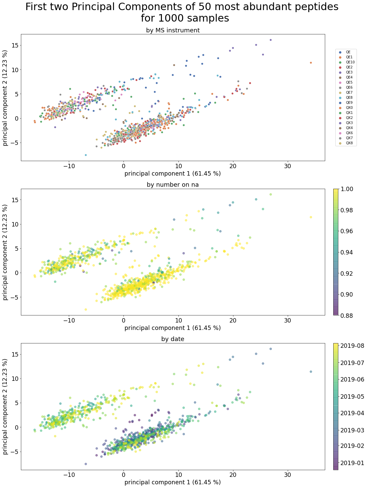
    


```python
# ToDo add df_meta property
analysis.df_meta.describe()
```


<div>

<table border="1" class="dataframe">
  <thead>
    <tr style="text-align: right;">
      <th></th>
      <th>prop_not_na</th>
    </tr>
  </thead>
  <tbody>
    <tr>
      <th>count</th>
      <td>1,000.000</td>
    </tr>
    <tr>
      <th>mean</th>
      <td>0.988</td>
    </tr>
    <tr>
      <th>std</th>
      <td>0.019</td>
    </tr>
    <tr>
      <th>min</th>
      <td>0.880</td>
    </tr>
    <tr>
      <th>25%</th>
      <td>0.980</td>
    </tr>
    <tr>
      <th>50%</th>
      <td>1.000</td>
    </tr>
    <tr>
      <th>75%</th>
      <td>1.000</td>
    </tr>
    <tr>
      <th>max</th>
      <td>1.000</td>
    </tr>
  </tbody>
</table>
</div>


```python
vaep.io_images._savefig(fig, folder /
                        f'pca_plot_raw_data_{analysis.fname_stub}')
```

    vaep.io_images - INFO     Saved Figures to runs\2D\feat_0050_epochs_010\pca_plot_raw_data_N01000_M00050
    

## Train and Validation data

- use mulitindex for obtaining validation split


```python
# analysis._df_long = analysis.df_long.reset_index(
# ).set_index(['Sample ID', 'peptide'])
analysis.df_long
```


<div>

<table border="1" class="dataframe">
  <thead>
    <tr style="text-align: right;">
      <th></th>
      <th></th>
      <th>intensity</th>
    </tr>
    <tr>
      <th>Sample ID</th>
      <th>peptide</th>
      <th></th>
    </tr>
  </thead>
  <tbody>
    <tr>
      <th rowspan="5" valign="top">20181219_QE3_nLC3_DS_QC_MNT_HeLa_02</th>
      <th>GLVLGPIHK</th>
      <td>29.275</td>
    </tr>
    <tr>
      <th>TEFLSFMNTELAAFTK</th>
      <td>29.808</td>
    </tr>
    <tr>
      <th>YRVPDVLVADPPIAR</th>
      <td>28.059</td>
    </tr>
    <tr>
      <th>TSIAIDTIINQK</th>
      <td>28.425</td>
    </tr>
    <tr>
      <th>IALGIPLPEIK</th>
      <td>29.253</td>
    </tr>
    <tr>
      <th>...</th>
      <th>...</th>
      <td>...</td>
    </tr>
    <tr>
      <th rowspan="5" valign="top">20190805_QE1_nLC2_AB_MNT_HELA_04</th>
      <th>AGVNTVTTLVENKK</th>
      <td>30.173</td>
    </tr>
    <tr>
      <th>EMEENFAVEAANYQDTIGR</th>
      <td>25.611</td>
    </tr>
    <tr>
      <th>LIEEVMIGEDK</th>
      <td>29.115</td>
    </tr>
    <tr>
      <th>GILADEDSSRPVWLK</th>
      <td>28.379</td>
    </tr>
    <tr>
      <th>LATQSNEITIPVTFESR</th>
      <td>31.105</td>
    </tr>
  </tbody>
</table>
<p>49408 rows × 1 columns</p>
</div>


```python
# df_long = analysis.df.unstack().to_frame('intensity').reset_index(1)
analysis.df_train = analysis.df_long.reset_index(0).groupby(
    by='Sample ID',
    level=0
).sample(frac=0.90,
         weights=freq_per_peptide,
         random_state=42)
analysis.df_train = analysis.df_train.reset_index().set_index([
    'Sample ID', 'peptide'])
analysis.df_train
```


<div>

<table border="1" class="dataframe">
  <thead>
    <tr style="text-align: right;">
      <th></th>
      <th></th>
      <th>intensity</th>
    </tr>
    <tr>
      <th>Sample ID</th>
      <th>peptide</th>
      <th></th>
    </tr>
  </thead>
  <tbody>
    <tr>
      <th>20190411_QE3_nLC5_DS_QC_MNT_HeLa_01</th>
      <th>AAEAAAAPAESAAPAAGEEPSK</th>
      <td>28.643</td>
    </tr>
    <tr>
      <th>20190730_QE6_nLC4_MPL_QC_MNT_HeLa_01</th>
      <th>AAEAAAAPAESAAPAAGEEPSK</th>
      <td>28.777</td>
    </tr>
    <tr>
      <th>20190624_QE4_nLC12_MM_QC_MNT_HELA_01_20190625144904</th>
      <th>AAEAAAAPAESAAPAAGEEPSK</th>
      <td>28.355</td>
    </tr>
    <tr>
      <th>20190527_QX4_IgPa_MA_HeLa_500ng</th>
      <th>AAEAAAAPAESAAPAAGEEPSK</th>
      <td>29.058</td>
    </tr>
    <tr>
      <th>20190208_QE2_NLC1_AB_QC_MNT_HELA_2</th>
      <th>AAEAAAAPAESAAPAAGEEPSK</th>
      <td>29.053</td>
    </tr>
    <tr>
      <th>...</th>
      <th>...</th>
      <td>...</td>
    </tr>
    <tr>
      <th>20190628_QE1_nLC13_ANHO_QC_MNT_HELA_01</th>
      <th>YRVPDVLVADPPIAR</th>
      <td>28.437</td>
    </tr>
    <tr>
      <th>20190115_QE5_nLC5_RJC_MNT_HeLa_02</th>
      <th>YRVPDVLVADPPIAR</th>
      <td>29.303</td>
    </tr>
    <tr>
      <th>20190523_QX3_LiSc_MA_Hela_500ng_LC15</th>
      <th>YRVPDVLVADPPIAR</th>
      <td>29.107</td>
    </tr>
    <tr>
      <th>20190718_QX6_MaTa_MA_HeLa_500ng_LC09</th>
      <th>YRVPDVLVADPPIAR</th>
      <td>30.302</td>
    </tr>
    <tr>
      <th>20190131_QE10_nLC0_NHS_MNT_HELA_50cm_01</th>
      <th>YRVPDVLVADPPIAR</th>
      <td>28.916</td>
    </tr>
  </tbody>
</table>
<p>44468 rows × 1 columns</p>
</div>


```python
analysis.indices_valid = analysis.df_long.index.difference(
    analysis.df_train.index)
analysis.df_valid = analysis.df_long.loc[analysis.indices_valid]
```


```python
assert len(analysis.df_long) == len(analysis.df_train) + len(analysis.df_valid)
```

Check that all samples are also in the validation data


```python
assert analysis.df_train.index.levshape == (N_SAMPLES, n_features)

try:
    assert analysis.df_valid.index.levshape == (N_SAMPLES, n_features)
except AssertionError:
    print(f'Expected shape in validation: {(N_SAMPLES, n_features)}')
    print(f'Shape in validation: {analysis.df_valid.index.levshape}')

analysis.df_train = analysis.df_train.loc[analysis.df_valid.index.levels[0]]
analysis.df_train = analysis.df_train.reset_index().set_index(
    ['Sample ID', 'peptide'])  # update index categories (there is probably a better way)
N_SAMPLES = analysis.df_valid.index.levshape[0]
analysis.df_train.index.levshape, analysis.df_valid.index.levshape
```

    Expected shape in validation: (1000, 50)
    Shape in validation: (997, 50)
    


    ((997, 50), (997, 50))


## Setup DL

- [ ] move all above to separate data notebook


```python
import vaep.models as models
from vaep.models.cmd import get_args
from vaep.models import ae

args = get_args(batch_size=BATCH_SIZE, epochs=EPOCHS,
                no_cuda=False)  # data transfer to GPU seems slow
kwargs = {'num_workers': 2, 'pin_memory': True} if args.cuda else {}

# torch.manual_seed(args.seed)
device = torch.device("cuda" if args.cuda else "cpu")
device

print(f"{args = }", f"{device = }", sep='\n')
```

    args = Namespace(batch_size=32, cuda=True, epochs=10, log_interval=10, no_cuda=False, seed=43)
    device = device(type='cuda')
    

Fastai default device for computation


```python
import fastai.torch_core
print(f"{torch.cuda.is_available() = }")  # self-documenting python 3.8
fastai.torch_core.defaults
```

    torch.cuda.is_available() = True
    


    namespace(cpus=12,
              use_cuda=None,
              activation=torch.nn.modules.activation.ReLU,
              callbacks=[fastai.callback.core.TrainEvalCallback,
                         fastai.learner.Recorder,
                         fastai.callback.progress.ProgressCallback],
              lr=0.001)


### Comparison data

- first impute first and last row (using n=3 replicate)
- use pandas interpolate


```python
analysis.median_train = analysis.df_train['intensity'].unstack().median()
analysis.median_train.name = 'train_median'
analysis.averag_train = analysis.df_train['intensity'].unstack().mean()
analysis.averag_train.name = 'train_average'

df_pred = analysis.df_valid.copy()

df_pred = df_pred.join(analysis.median_train, on='peptide')
df_pred = df_pred.join(analysis.averag_train, on='peptide')


_ = interpolate(wide_df=analysis.df_train['intensity'].unstack())
df_pred = df_pred.join(_)

df_pred
```


<div>

<table border="1" class="dataframe">
  <thead>
    <tr style="text-align: right;">
      <th></th>
      <th></th>
      <th>intensity</th>
      <th>train_median</th>
      <th>train_average</th>
      <th>replicates</th>
    </tr>
    <tr>
      <th>Sample ID</th>
      <th>peptide</th>
      <th></th>
      <th></th>
      <th></th>
      <th></th>
    </tr>
  </thead>
  <tbody>
    <tr>
      <th rowspan="2" valign="top">20181219_QE3_nLC3_DS_QC_MNT_HeLa_02</th>
      <th>AAEAAAAPAESAAPAAGEEPSK</th>
      <td>30.289</td>
      <td>28.540</td>
      <td>28.400</td>
      <td>29.274</td>
    </tr>
    <tr>
      <th>AGKPVICATQMLESMIK</th>
      <td>31.078</td>
      <td>32.096</td>
      <td>31.657</td>
      <td>31.351</td>
    </tr>
    <tr>
      <th rowspan="3" valign="top">20181219_QE3_nLC3_TSB_QC_MNT_HeLa_01</th>
      <th>AAHSEGNTTAGLDMR</th>
      <td>28.132</td>
      <td>28.425</td>
      <td>28.617</td>
      <td>26.228</td>
    </tr>
    <tr>
      <th>AIVAIENPADVSVISSR</th>
      <td>29.228</td>
      <td>30.157</td>
      <td>30.189</td>
      <td>29.740</td>
    </tr>
    <tr>
      <th>GISDLAQHYLMR</th>
      <td>28.584</td>
      <td>29.492</td>
      <td>29.429</td>
      <td>28.219</td>
    </tr>
    <tr>
      <th>...</th>
      <th>...</th>
      <td>...</td>
      <td>...</td>
      <td>...</td>
      <td>...</td>
    </tr>
    <tr>
      <th rowspan="5" valign="top">20190805_QE1_nLC2_AB_MNT_HELA_04</th>
      <th>AIVAIENPADVSVISSR</th>
      <td>29.348</td>
      <td>30.157</td>
      <td>30.189</td>
      <td>29.081</td>
    </tr>
    <tr>
      <th>GLVLGPIHK</th>
      <td>30.325</td>
      <td>29.962</td>
      <td>29.875</td>
      <td>30.316</td>
    </tr>
    <tr>
      <th>GYLGPEQLPDCLK</th>
      <td>28.443</td>
      <td>29.384</td>
      <td>29.535</td>
      <td>28.884</td>
    </tr>
    <tr>
      <th>LATQSNEITIPVTFESR</th>
      <td>31.105</td>
      <td>31.342</td>
      <td>31.373</td>
      <td>31.352</td>
    </tr>
    <tr>
      <th>SYSPYDMLESIRK</th>
      <td>32.088</td>
      <td>31.373</td>
      <td>30.940</td>
      <td>32.325</td>
    </tr>
  </tbody>
</table>
<p>4940 rows × 4 columns</p>
</div>


```python
if any(df_pred.isna()):
    print("Consecutive NaNs are not imputed using replicates.")
    display(df_pred.loc[df_pred.isna().any(axis=1)])
```

    Consecutive NaNs are not imputed using replicates.
    


<div>

<table border="1" class="dataframe">
  <thead>
    <tr style="text-align: right;">
      <th></th>
      <th></th>
      <th>intensity</th>
      <th>train_median</th>
      <th>train_average</th>
      <th>replicates</th>
    </tr>
    <tr>
      <th>Sample ID</th>
      <th>peptide</th>
      <th></th>
      <th></th>
      <th></th>
      <th></th>
    </tr>
  </thead>
  <tbody>
    <tr>
      <th>20181223_QE7_nLC7_RJC_MEM_MNT_HeLa_01</th>
      <th>AGKPVICATQMLESMIK</th>
      <td>32.277</td>
      <td>32.096</td>
      <td>31.657</td>
      <td>NaN</td>
    </tr>
    <tr>
      <th>20181228_QE5_nLC5_OOE_QC_MNT_HELA_15cm_250ng_RO-007</th>
      <th>EMEENFAVEAANYQDTIGR</th>
      <td>26.319</td>
      <td>26.966</td>
      <td>27.809</td>
      <td>NaN</td>
    </tr>
    <tr>
      <th>20181230_QE6_nLC6_CSC_QC_HeLa_03</th>
      <th>HLAGLGLTEAIDK</th>
      <td>29.771</td>
      <td>29.561</td>
      <td>29.364</td>
      <td>NaN</td>
    </tr>
    <tr>
      <th>20190118_QE9_nLC9_NHS_MNT_HELA_50cm_04</th>
      <th>SQIFSTASDNQPTVTIK</th>
      <td>29.390</td>
      <td>30.079</td>
      <td>30.319</td>
      <td>NaN</td>
    </tr>
    <tr>
      <th>20190128_QE3_nLC3_MJ_MNT_HeLa_01</th>
      <th>TIAPALVSK</th>
      <td>32.592</td>
      <td>32.732</td>
      <td>32.646</td>
      <td>NaN</td>
    </tr>
    <tr>
      <th>20190219_QE3_Evo2_UHG_QC_MNT_HELA_01_190219173213</th>
      <th>EMEENFAVEAANYQDTIGR</th>
      <td>26.305</td>
      <td>26.966</td>
      <td>27.809</td>
      <td>NaN</td>
    </tr>
    <tr>
      <th>20190220_QE3_nLC7_TSB_QC_MNT_HELA_02</th>
      <th>GILADEDSSRPVWLK</th>
      <td>26.372</td>
      <td>29.305</td>
      <td>29.179</td>
      <td>NaN</td>
    </tr>
    <tr>
      <th>20190221_QE1_nLC2_ANHO_QC_MNT_HELA_02</th>
      <th>ISMPDFDLHLK</th>
      <td>30.238</td>
      <td>29.869</td>
      <td>29.702</td>
      <td>NaN</td>
    </tr>
    <tr>
      <th>20190225_QE9_nLC0_RS_MNT_Hela_01</th>
      <th>ELVTQQLPHLLK</th>
      <td>27.430</td>
      <td>28.106</td>
      <td>28.065</td>
      <td>NaN</td>
    </tr>
    <tr>
      <th>20190226_QE10_PhGe_Evosep_176min-30cmCol-HeLa_3</th>
      <th>VVFVFGPDK</th>
      <td>29.435</td>
      <td>29.957</td>
      <td>30.221</td>
      <td>NaN</td>
    </tr>
    <tr>
      <th>20190226_QE10_PhGe_Evosep_88min-30cmCol-HeLa_14_25</th>
      <th>EMEENFAVEAANYQDTIGR</th>
      <td>24.662</td>
      <td>26.966</td>
      <td>27.809</td>
      <td>NaN</td>
    </tr>
    <tr>
      <th>20190226_QE10_PhGe_Evosep_88min-30cmCol-HeLa_14_27</th>
      <th>VVFVFGPDK</th>
      <td>30.340</td>
      <td>29.957</td>
      <td>30.221</td>
      <td>NaN</td>
    </tr>
    <tr>
      <th>20190226_QE10_PhGe_Evosep_88min-30cmCol-HeLa_15_24</th>
      <th>IALGIPLPEIK</th>
      <td>29.294</td>
      <td>30.028</td>
      <td>30.234</td>
      <td>NaN</td>
    </tr>
    <tr>
      <th>20190226_QE1_nLC2_AB_QC_MNT_HELA_05</th>
      <th>VVHIMDFQR</th>
      <td>28.991</td>
      <td>28.045</td>
      <td>28.153</td>
      <td>NaN</td>
    </tr>
    <tr>
      <th>20190301_QE7_nLC7_DS_QC_MNT_HeLa_01</th>
      <th>LPNLTHLNLSGNK</th>
      <td>28.532</td>
      <td>28.383</td>
      <td>28.756</td>
      <td>NaN</td>
    </tr>
    <tr>
      <th>20190305_QE4_LC12_JE-IAH_QC_MNT_HeLa_02</th>
      <th>GLDVDSLVIEHIQVNK</th>
      <td>29.228</td>
      <td>29.654</td>
      <td>29.816</td>
      <td>NaN</td>
    </tr>
    <tr>
      <th>20190308_QE3_nLC5_MR_QC_MNT_HeLa_Easyctcdon_02</th>
      <th>ELVTQQLPHLLK</th>
      <td>25.045</td>
      <td>28.106</td>
      <td>28.065</td>
      <td>NaN</td>
    </tr>
    <tr>
      <th>20190327_QE6_LC6_SCL_QC_MNT_Hela_02</th>
      <th>AGKPVICATQMLESMIK</th>
      <td>32.649</td>
      <td>32.096</td>
      <td>31.657</td>
      <td>NaN</td>
    </tr>
    <tr>
      <th>20190417_QE1_nLC2_GP_MNT_HELA_01</th>
      <th>SYSPYDMLESIRK</th>
      <td>31.816</td>
      <td>31.373</td>
      <td>30.940</td>
      <td>NaN</td>
    </tr>
    <tr>
      <th>20190423_QX7_JuSc_MA_HeLa_500ng_LC01</th>
      <th>SGGMSNELNNIISR</th>
      <td>29.880</td>
      <td>29.030</td>
      <td>28.702</td>
      <td>NaN</td>
    </tr>
    <tr>
      <th>20190425_QX4_JoSw_MA_HeLa_500ng_BR13_standard_190425181909</th>
      <th>AGVNTVTTLVENKK</th>
      <td>25.815</td>
      <td>29.968</td>
      <td>29.593</td>
      <td>NaN</td>
    </tr>
    <tr>
      <th>20190425_QX8_JuSc_MA_HeLa_500ng_1</th>
      <th>LAAVDATVNQVLASR</th>
      <td>30.437</td>
      <td>29.486</td>
      <td>29.559</td>
      <td>NaN</td>
    </tr>
    <tr>
      <th>20190426_QE10_nLC9_LiNi_QC_MNT_15cm_HeLa_01</th>
      <th>GLDVDSLVIEHIQVNK</th>
      <td>29.817</td>
      <td>29.654</td>
      <td>29.816</td>
      <td>NaN</td>
    </tr>
    <tr>
      <th>20190429_QX6_ChDe_MA_HeLa_Br14_500ng_LC09</th>
      <th>AGVNTVTTLVENKK</th>
      <td>25.766</td>
      <td>29.968</td>
      <td>29.593</td>
      <td>NaN</td>
    </tr>
    <tr>
      <th>20190430_QX6_ChDe_MA_HeLa_Br14_500ng_LC09</th>
      <th>GLDVDSLVIEHIQVNK</th>
      <td>31.423</td>
      <td>29.654</td>
      <td>29.816</td>
      <td>NaN</td>
    </tr>
    <tr>
      <th>20190506_QE3_nLC3_DBJ_QC_MNT_HeLa_01</th>
      <th>GILADEDSSRPVWLK</th>
      <td>27.690</td>
      <td>29.305</td>
      <td>29.179</td>
      <td>NaN</td>
    </tr>
    <tr>
      <th>20190506_QX7_ChDe_MA_HeLaBr14_500ng</th>
      <th>AGVNTVTTLVENKK</th>
      <td>30.036</td>
      <td>29.968</td>
      <td>29.593</td>
      <td>NaN</td>
    </tr>
    <tr>
      <th>20190506_QX8_MiWi_MA_HeLa_500ng_old</th>
      <th>AIVAIENPADVSVISSR</th>
      <td>31.269</td>
      <td>30.157</td>
      <td>30.189</td>
      <td>NaN</td>
    </tr>
    <tr>
      <th>20190510_QE1_nLC2_ANHO_QC_MNT_HELA_02</th>
      <th>VMTIAPGLFGTPLLTSLPEK</th>
      <td>27.948</td>
      <td>29.795</td>
      <td>29.696</td>
      <td>NaN</td>
    </tr>
    <tr>
      <th>20190510_QE2_NLC1_GP_MNT_HELA_02</th>
      <th>HLAGLGLTEAIDK</th>
      <td>29.653</td>
      <td>29.561</td>
      <td>29.364</td>
      <td>NaN</td>
    </tr>
    <tr>
      <th>20190515_QE4_LC12_AS_QC_MNT_HeLa_01_20190515230141</th>
      <th>GILADEDSSRPVWLK</th>
      <td>29.842</td>
      <td>29.305</td>
      <td>29.179</td>
      <td>NaN</td>
    </tr>
    <tr>
      <th>20190515_QX4_JiYu_MA_HeLa_500ng_BR14</th>
      <th>GYLGPEQLPDCLK</th>
      <td>31.472</td>
      <td>29.384</td>
      <td>29.535</td>
      <td>NaN</td>
    </tr>
    <tr>
      <th>20190522_QE10_nLC13_LiNi_QC_MNT_15cm_HeLa_01</th>
      <th>VMTIAPGLFGTPLLTSLPEK</th>
      <td>28.848</td>
      <td>29.795</td>
      <td>29.696</td>
      <td>NaN</td>
    </tr>
    <tr>
      <th>20190527_QE3_nLC3_DS_QC_MNT_HeLa_02</th>
      <th>SGGMSNELNNIISR</th>
      <td>24.505</td>
      <td>29.030</td>
      <td>28.702</td>
      <td>NaN</td>
    </tr>
    <tr>
      <th>20190606_QE4_LC12_JE_QC_MNT_HeLa_03</th>
      <th>DHENIVIAK</th>
      <td>28.936</td>
      <td>29.975</td>
      <td>30.015</td>
      <td>NaN</td>
    </tr>
    <tr>
      <th>20190611_QX0_MaTa_MA_HeLa_500ng_LC07_1</th>
      <th>NPDDITQEEYGEFYK</th>
      <td>33.894</td>
      <td>27.505</td>
      <td>28.744</td>
      <td>NaN</td>
    </tr>
    <tr>
      <th>20190617_QE1_nLC2_GP_QC_MNT_HELA_01_20190617213340</th>
      <th>AAHSEGNTTAGLDMR</th>
      <td>27.389</td>
      <td>28.425</td>
      <td>28.617</td>
      <td>NaN</td>
    </tr>
    <tr>
      <th>20190624_QX3_MaMu_MA_Hela_500ng_LC15</th>
      <th>TIAPALVSK</th>
      <td>33.183</td>
      <td>32.732</td>
      <td>32.646</td>
      <td>NaN</td>
    </tr>
    <tr>
      <th>20190628_QX6_AnPi_MA_HeLa_500ng_LC09</th>
      <th>AGVNTVTTLVENKK</th>
      <td>30.488</td>
      <td>29.968</td>
      <td>29.593</td>
      <td>NaN</td>
    </tr>
    <tr>
      <th>20190629_QX4_JiYu_MA_HeLa_500ng_MAX_ALLOWED</th>
      <th>SGGMSNELNNIISR</th>
      <td>29.984</td>
      <td>29.030</td>
      <td>28.702</td>
      <td>NaN</td>
    </tr>
    <tr>
      <th>20190708_QX7_MaMu_MA_HeLa_Br14_500ng</th>
      <th>TIGGGDDSFNTFFSETGAGK</th>
      <td>33.943</td>
      <td>32.110</td>
      <td>32.070</td>
      <td>NaN</td>
    </tr>
    <tr>
      <th>20190708_QX8_AnPi_MA_HeLa_BR14_500ng</th>
      <th>TIGGGDDSFNTFFSETGAGK</th>
      <td>32.241</td>
      <td>32.110</td>
      <td>32.070</td>
      <td>NaN</td>
    </tr>
    <tr>
      <th>20190709_QE1_nLC13_ANHO_QC_MNT_HELA_02</th>
      <th>AAHSEGNTTAGLDMR</th>
      <td>23.559</td>
      <td>28.425</td>
      <td>28.617</td>
      <td>NaN</td>
    </tr>
    <tr>
      <th>20190710_QE10_nLC0_LiNi_QC_45cm_HeLa_MUC_01</th>
      <th>AGVNTVTTLVENKK</th>
      <td>29.865</td>
      <td>29.968</td>
      <td>29.593</td>
      <td>NaN</td>
    </tr>
    <tr>
      <th>20190724_QX0_MePh_MA_HeLa_500ng_LC07_01</th>
      <th>DNHLLGTFDLTGIPPAPR</th>
      <td>31.785</td>
      <td>28.875</td>
      <td>29.108</td>
      <td>NaN</td>
    </tr>
    <tr>
      <th>20190724_QX3_MiWi_MA_Hela_500ng_LC15</th>
      <th>DNHLLGTFDLTGIPPAPR</th>
      <td>31.561</td>
      <td>28.875</td>
      <td>29.108</td>
      <td>NaN</td>
    </tr>
    <tr>
      <th>20190729_QX0_AsJa_MA_HeLa_500ng_LC07_01</th>
      <th>VNIIPLIAK</th>
      <td>29.110</td>
      <td>28.761</td>
      <td>28.579</td>
      <td>NaN</td>
    </tr>
    <tr>
      <th>20190731_QX1_LiSc_MA_HeLa_500ng_LC10</th>
      <th>YRVPDVLVADPPIAR</th>
      <td>30.191</td>
      <td>29.262</td>
      <td>29.130</td>
      <td>NaN</td>
    </tr>
    <tr>
      <th>20190731_QX8_ChSc_MA_HeLa_500ng</th>
      <th>ELVTQQLPHLLK</th>
      <td>30.068</td>
      <td>28.106</td>
      <td>28.065</td>
      <td>NaN</td>
    </tr>
  </tbody>
</table>
</div>


## Collaboritive filtering model


```python
from fastai.collab import CollabDataLoaders, MSELossFlat, Learner
from fastai.collab import EmbeddingDotBias

analysis.collab = Analysis()
collab = analysis.collab
collab.columns = 'peptide,Sample ID,intensity'.split(',')
```

Create data view for collaborative filtering

- currently a bit hacky as the splitter does not support predefinded indices (create custum subclass providing splits to internal methods?)

- Use the [`CollabDataLoaders`](https://docs.fast.ai/collab.html#CollabDataLoaders)  similar to the [`TabularDataLoaders`](https://docs.fast.ai/tabular.data.html#TabularDataLoaders).
- Use the [`IndexSplitter`](https://docs.fast.ai/data.transforms.html#IndexSplitter) and provide splits to whatever is used in `CollabDataLoaders`


```python
collab.df_train = analysis.df_train.reset_index()
collab.df_valid = analysis.df_valid.reset_index()
collab.df_train.head()
```


<div>

<table border="1" class="dataframe">
  <thead>
    <tr style="text-align: right;">
      <th></th>
      <th>Sample ID</th>
      <th>peptide</th>
      <th>intensity</th>
    </tr>
  </thead>
  <tbody>
    <tr>
      <th>0</th>
      <td>20181219_QE3_nLC3_DS_QC_MNT_HeLa_02</td>
      <td>AAHSEGNTTAGLDMR</td>
      <td>28.098</td>
    </tr>
    <tr>
      <th>1</th>
      <td>20181219_QE3_nLC3_DS_QC_MNT_HeLa_02</td>
      <td>AFGYYGPLR</td>
      <td>28.703</td>
    </tr>
    <tr>
      <th>2</th>
      <td>20181219_QE3_nLC3_DS_QC_MNT_HeLa_02</td>
      <td>AGGAAVVITEPEHTK</td>
      <td>27.754</td>
    </tr>
    <tr>
      <th>3</th>
      <td>20181219_QE3_nLC3_DS_QC_MNT_HeLa_02</td>
      <td>AGVNTVTTLVENKK</td>
      <td>28.355</td>
    </tr>
    <tr>
      <th>4</th>
      <td>20181219_QE3_nLC3_DS_QC_MNT_HeLa_02</td>
      <td>AIVAIENPADVSVISSR</td>
      <td>29.292</td>
    </tr>
  </tbody>
</table>
</div>


```python
collab.df_valid.head()
```


<div>

<table border="1" class="dataframe">
  <thead>
    <tr style="text-align: right;">
      <th></th>
      <th>Sample ID</th>
      <th>peptide</th>
      <th>intensity</th>
    </tr>
  </thead>
  <tbody>
    <tr>
      <th>0</th>
      <td>20181219_QE3_nLC3_DS_QC_MNT_HeLa_02</td>
      <td>AAEAAAAPAESAAPAAGEEPSK</td>
      <td>30.289</td>
    </tr>
    <tr>
      <th>1</th>
      <td>20181219_QE3_nLC3_DS_QC_MNT_HeLa_02</td>
      <td>AGKPVICATQMLESMIK</td>
      <td>31.078</td>
    </tr>
    <tr>
      <th>2</th>
      <td>20181219_QE3_nLC3_TSB_QC_MNT_HeLa_01</td>
      <td>AAHSEGNTTAGLDMR</td>
      <td>28.132</td>
    </tr>
    <tr>
      <th>3</th>
      <td>20181219_QE3_nLC3_TSB_QC_MNT_HeLa_01</td>
      <td>AIVAIENPADVSVISSR</td>
      <td>29.228</td>
    </tr>
    <tr>
      <th>4</th>
      <td>20181219_QE3_nLC3_TSB_QC_MNT_HeLa_01</td>
      <td>GISDLAQHYLMR</td>
      <td>28.584</td>
    </tr>
  </tbody>
</table>
</div>


```python
assert (collab.df_train.intensity.isna().sum(),
        collab.df_valid.intensity.isna().sum()) == (0, 0), "Remove missing values."
```

Hacky part uses training data `Datasets` from dataloaders to recreate a custom `DataLoaders` instance


```python
collab.dl_train = CollabDataLoaders.from_df(
    collab.df_train, valid_pct=0.0, user_name='Sample ID', item_name='peptide', rating_name='intensity', bs=args.batch_size, device=device)
collab.dl_valid = CollabDataLoaders.from_df(
    collab.df_valid, valid_pct=0.0, user_name='Sample ID', item_name='peptide', rating_name='intensity', bs=args.batch_size,
    shuffle=False, device=device)
collab.dl_train.show_batch()
```


<table border="1" class="dataframe">
  <thead>
    <tr style="text-align: right;">
      <th></th>
      <th>Sample ID</th>
      <th>peptide</th>
      <th>intensity</th>
    </tr>
  </thead>
  <tbody>
    <tr>
      <th>0</th>
      <td>20190527_QE2_NLC1_ANHO_MNT_HELA_01</td>
      <td>DAGEGLLAVQITDPEGKPK</td>
      <td>28.231</td>
    </tr>
    <tr>
      <th>1</th>
      <td>20190411_QE1_nLC2_ANHO_MNT_QC_hela_01</td>
      <td>TSIAIDTIINQK</td>
      <td>29.126</td>
    </tr>
    <tr>
      <th>2</th>
      <td>20190423_QE3_nLC5_DS_QC_MNT_HeLa_01</td>
      <td>AGGAAVVITEPEHTK</td>
      <td>27.697</td>
    </tr>
    <tr>
      <th>3</th>
      <td>20190708_QE6_nLC4_JE_QC_MNT_HeLa_02</td>
      <td>LASTLVHLGEYQAAVDGAR</td>
      <td>30.767</td>
    </tr>
    <tr>
      <th>4</th>
      <td>20190626_QE7_nLC7_DS_QC_MNT_HeLa_02</td>
      <td>LPNLTHLNLSGNK</td>
      <td>27.814</td>
    </tr>
    <tr>
      <th>5</th>
      <td>20190521_QX6_AsJa_MA_HeLa_Br14_500ng_LC09_20190522134621</td>
      <td>MTNGFSGADLTEICQR</td>
      <td>29.152</td>
    </tr>
    <tr>
      <th>6</th>
      <td>20190301_QE1_nLC2_ANHO_QC_MNT_HELA_01_20190303025443</td>
      <td>ELVTQQLPHLLK</td>
      <td>28.962</td>
    </tr>
    <tr>
      <th>7</th>
      <td>20190609_QX8_MiWi_MA_HeLa_BR14_500ng</td>
      <td>DAGEGLLAVQITDPEGKPK</td>
      <td>29.402</td>
    </tr>
    <tr>
      <th>8</th>
      <td>20190218_QE6_LC6_SCL_MVM_QC_MNT_Hela_04</td>
      <td>TEFLSFMNTELAAFTK</td>
      <td>30.257</td>
    </tr>
    <tr>
      <th>9</th>
      <td>20190426_QX1_JoMu_MA_HeLa_500ng_LC11</td>
      <td>MAPYQGPDAVPGALDYK</td>
      <td>28.635</td>
    </tr>
  </tbody>
</table>


```python
from fastai.data.core import DataLoaders
collab.dls = DataLoaders(collab.dl_train.train, collab.dl_valid.train)
if args.cuda:
    collab.dls.cuda()
```


```python
collab.dl_valid.show_batch()
```


<table border="1" class="dataframe">
  <thead>
    <tr style="text-align: right;">
      <th></th>
      <th>Sample ID</th>
      <th>peptide</th>
      <th>intensity</th>
    </tr>
  </thead>
  <tbody>
    <tr>
      <th>0</th>
      <td>20190412_QE6_LC6_AS_QC_MNT_HeLa_03</td>
      <td>AGVNTVTTLVENKK</td>
      <td>30.608</td>
    </tr>
    <tr>
      <th>1</th>
      <td>20190613_QE1_nLC2_GP_QC_MNT_HELA_01</td>
      <td>AFGYYGPLR</td>
      <td>29.384</td>
    </tr>
    <tr>
      <th>2</th>
      <td>20190104_QE10_nLC0_LiNi_QC_MNT_HeLa_500_15cm_01_20190104155135</td>
      <td>ELVTQQLPHLLK</td>
      <td>28.244</td>
    </tr>
    <tr>
      <th>3</th>
      <td>20190328_QE7_nLC3_RJC_MEM_QC_MNT_HeLa_01</td>
      <td>DHENIVIAK</td>
      <td>30.000</td>
    </tr>
    <tr>
      <th>4</th>
      <td>20190404_QE7_nLC3_AL_QC_MNT_HeLa_02</td>
      <td>IALGIPLPEIK</td>
      <td>28.777</td>
    </tr>
    <tr>
      <th>5</th>
      <td>20190611_QX0_MePh_MA_HeLa_500ng_LC07_3</td>
      <td>LAAVDATVNQVLASR</td>
      <td>31.447</td>
    </tr>
    <tr>
      <th>6</th>
      <td>20190323_QE8_nLC14_RS_QC_MNT_Hela_50cm</td>
      <td>GLVLGPIHK</td>
      <td>29.622</td>
    </tr>
    <tr>
      <th>7</th>
      <td>20190306_QE1_nLC2_ANHO_QC_MNT_HELA_01</td>
      <td>DHENIVIAK</td>
      <td>29.683</td>
    </tr>
    <tr>
      <th>8</th>
      <td>20190408_QE8_nLC14_AGF_QC_MNT_HeLa_50cm_01</td>
      <td>YRVPDVLVADPPIAR</td>
      <td>29.801</td>
    </tr>
    <tr>
      <th>9</th>
      <td>20190313_QE8_nLC14_LiNi_QC_MNT_50cm_HELA_03</td>
      <td>AGGAAVVITEPEHTK</td>
      <td>29.826</td>
    </tr>
  </tbody>
</table>


```python
len(collab.dls.classes['Sample ID']), len(collab.dls.classes['peptide'])
```


    (998, 51)


```python
len(collab.dls.train), len(collab.dls.valid)  # mini-batches
```


    (1385, 155)


Alternatively to the hacky version, one could use a factory method, but there the sampling/Splitting methods would need to be implemented (not using [`RandomSplitter`](https://docs.fast.ai/data.transforms.html#RandomSplitter) somehow)

 - [`TabDataLoader`](https://docs.fast.ai/tabular.core.html#TabDataLoader)
 - uses [`TabularPandas`](https://docs.fast.ai/tabular.core.html#TabularPandas)
 
 > Current problem: No custom splitter can be provided

### Model


```python
collab.model_args = {}
collab.model_args['n_samples'] = len(collab.dls.classes['Sample ID'])
collab.model_args['n_peptides'] = len(collab.dls.classes['peptide'])
collab.model_args['dim_latent_factors'] = latent_dim
collab.model_args['y_range'] = (
    int(analysis.df_train['intensity'].min()), int(analysis.df_train['intensity'].max())+1)

print("Args:")
pprint(collab.model_args)


# from vaep.models.collab import DotProductBias
# model = DotProductBias(**collab.model_args)
model = EmbeddingDotBias.from_classes(
    n_factors=collab.model_args['dim_latent_factors'], classes=collab.dls.classes, y_range=collab.model_args['y_range'])
learn = Learner(dls=collab.dls, model=model, loss_func=MSELossFlat())
if args.cuda:
    learn.cuda()
learn.summary()
```

    Args:
    {'dim_latent_factors': 2,
     'n_peptides': 51,
     'n_samples': 998,
     'y_range': (20, 35)}
    


    EmbeddingDotBias (Input shape: 32 x 2)
    ============================================================================
    Layer (type)         Output Shape         Param #    Trainable 
    ============================================================================
                         32 x 2              
    Embedding                                 1996       True      
    Embedding                                 102        True      
    ____________________________________________________________________________
                         32 x 1              
    Embedding                                 998        True      
    Embedding                                 51         True      
    ____________________________________________________________________________
    
    Total params: 3,147
    Total trainable params: 3,147
    Total non-trainable params: 0
    
    Optimizer used: <function Adam at 0x000001C5FB3F6040>
    Loss function: FlattenedLoss of MSELoss()
    
    Callbacks:
      - TrainEvalCallback
      - Recorder
      - ProgressCallback


### Training


```python
learn.fit_one_cycle(epochs_max, 5e-3)
```


<table border="1" class="dataframe">
  <thead>
    <tr style="text-align: left;">
      <th>epoch</th>
      <th>train_loss</th>
      <th>valid_loss</th>
      <th>time</th>
    </tr>
  </thead>
  <tbody>
    <tr>
      <td>0</td>
      <td>2.029855</td>
      <td>1.909574</td>
      <td>00:09</td>
    </tr>
    <tr>
      <td>1</td>
      <td>0.842597</td>
      <td>0.834803</td>
      <td>00:12</td>
    </tr>
    <tr>
      <td>2</td>
      <td>0.651586</td>
      <td>0.636348</td>
      <td>00:09</td>
    </tr>
    <tr>
      <td>3</td>
      <td>0.530630</td>
      <td>0.599810</td>
      <td>00:09</td>
    </tr>
    <tr>
      <td>4</td>
      <td>0.625646</td>
      <td>0.579045</td>
      <td>00:09</td>
    </tr>
    <tr>
      <td>5</td>
      <td>0.499199</td>
      <td>0.568514</td>
      <td>00:08</td>
    </tr>
    <tr>
      <td>6</td>
      <td>0.540988</td>
      <td>0.550777</td>
      <td>00:08</td>
    </tr>
    <tr>
      <td>7</td>
      <td>0.503871</td>
      <td>0.546028</td>
      <td>00:08</td>
    </tr>
    <tr>
      <td>8</td>
      <td>0.455631</td>
      <td>0.543652</td>
      <td>00:08</td>
    </tr>
    <tr>
      <td>9</td>
      <td>0.464005</td>
      <td>0.543202</td>
      <td>00:08</td>
    </tr>
  </tbody>
</table>


```python
from vaep.models import plot_loss
from fastai import learner
learner.Recorder.plot_loss = plot_loss

fig, ax = plt.subplots(figsize=(15, 8))
ax.set_title('Collab loss: Reconstruction loss.')
learn.recorder.plot_loss(skip_start=5, ax=ax)
vaep.io_images._savefig(fig, name='collab_training',
                        folder=folder)
```

    vaep.io_images - INFO     Saved Figures to runs\2D\feat_0050_epochs_010\collab_training
    


    
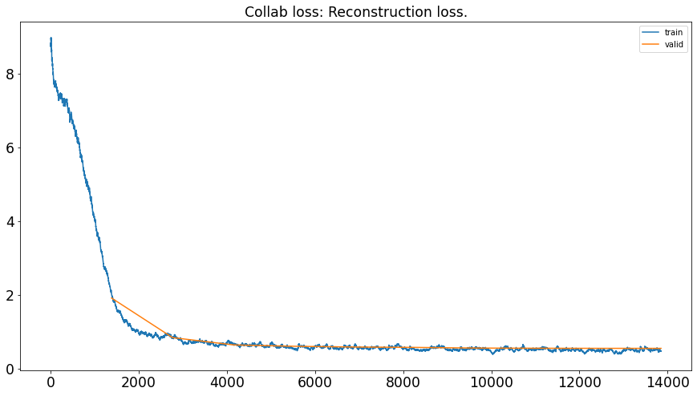
    


### Evaluation


```python
collab.dls.valid_ds.items
```


<div>

<table border="1" class="dataframe">
  <thead>
    <tr style="text-align: right;">
      <th></th>
      <th>Sample ID</th>
      <th>peptide</th>
      <th>intensity</th>
    </tr>
  </thead>
  <tbody>
    <tr>
      <th>1,877</th>
      <td>380</td>
      <td>6</td>
      <td>30.608</td>
    </tr>
    <tr>
      <th>3,301</th>
      <td>671</td>
      <td>3</td>
      <td>29.384</td>
    </tr>
    <tr>
      <th>109</th>
      <td>20</td>
      <td>12</td>
      <td>28.244</td>
    </tr>
    <tr>
      <th>1,617</th>
      <td>327</td>
      <td>10</td>
      <td>30.000</td>
    </tr>
    <tr>
      <th>1,725</th>
      <td>348</td>
      <td>23</td>
      <td>28.777</td>
    </tr>
    <tr>
      <th>...</th>
      <td>...</td>
      <td>...</td>
      <td>...</td>
    </tr>
    <tr>
      <th>733</th>
      <td>147</td>
      <td>21</td>
      <td>29.046</td>
    </tr>
    <tr>
      <th>2,978</th>
      <td>597</td>
      <td>30</td>
      <td>31.593</td>
    </tr>
    <tr>
      <th>3,968</th>
      <td>804</td>
      <td>5</td>
      <td>32.331</td>
    </tr>
    <tr>
      <th>2,394</th>
      <td>482</td>
      <td>7</td>
      <td>30.388</td>
    </tr>
    <tr>
      <th>2,892</th>
      <td>580</td>
      <td>44</td>
      <td>27.303</td>
    </tr>
  </tbody>
</table>
<p>4940 rows × 3 columns</p>
</div>


```python
df_pred = df_pred.reset_index()
pred, target = learn.get_preds()
df_pred['intensity_pred_collab'] = pd.Series(
    pred.flatten().numpy(), index=collab.dls.valid.items.index)

npt.assert_almost_equal(
    actual=collab.dls.valid.items.intensity.to_numpy(),
    desired=target.numpy().flatten()
)


df_pred = analyzers.cast_object_to_category(df_pred)
df_pred.set_index(['Sample ID', 'peptide'], inplace=True)
df_pred
```


<div>

<table border="1" class="dataframe">
  <thead>
    <tr style="text-align: right;">
      <th></th>
      <th></th>
      <th>intensity</th>
      <th>train_median</th>
      <th>train_average</th>
      <th>replicates</th>
      <th>intensity_pred_collab</th>
    </tr>
    <tr>
      <th>Sample ID</th>
      <th>peptide</th>
      <th></th>
      <th></th>
      <th></th>
      <th></th>
      <th></th>
    </tr>
  </thead>
  <tbody>
    <tr>
      <th rowspan="2" valign="top">20181219_QE3_nLC3_DS_QC_MNT_HeLa_02</th>
      <th>AAEAAAAPAESAAPAAGEEPSK</th>
      <td>30.289</td>
      <td>28.540</td>
      <td>28.400</td>
      <td>29.274</td>
      <td>27.335</td>
    </tr>
    <tr>
      <th>AGKPVICATQMLESMIK</th>
      <td>31.078</td>
      <td>32.096</td>
      <td>31.657</td>
      <td>31.351</td>
      <td>30.919</td>
    </tr>
    <tr>
      <th rowspan="3" valign="top">20181219_QE3_nLC3_TSB_QC_MNT_HeLa_01</th>
      <th>AAHSEGNTTAGLDMR</th>
      <td>28.132</td>
      <td>28.425</td>
      <td>28.617</td>
      <td>26.228</td>
      <td>27.440</td>
    </tr>
    <tr>
      <th>AIVAIENPADVSVISSR</th>
      <td>29.228</td>
      <td>30.157</td>
      <td>30.189</td>
      <td>29.740</td>
      <td>29.312</td>
    </tr>
    <tr>
      <th>GISDLAQHYLMR</th>
      <td>28.584</td>
      <td>29.492</td>
      <td>29.429</td>
      <td>28.219</td>
      <td>28.493</td>
    </tr>
    <tr>
      <th>...</th>
      <th>...</th>
      <td>...</td>
      <td>...</td>
      <td>...</td>
      <td>...</td>
      <td>...</td>
    </tr>
    <tr>
      <th rowspan="5" valign="top">20190805_QE1_nLC2_AB_MNT_HELA_04</th>
      <th>AIVAIENPADVSVISSR</th>
      <td>29.348</td>
      <td>30.157</td>
      <td>30.189</td>
      <td>29.081</td>
      <td>30.009</td>
    </tr>
    <tr>
      <th>GLVLGPIHK</th>
      <td>30.325</td>
      <td>29.962</td>
      <td>29.875</td>
      <td>30.316</td>
      <td>29.936</td>
    </tr>
    <tr>
      <th>GYLGPEQLPDCLK</th>
      <td>28.443</td>
      <td>29.384</td>
      <td>29.535</td>
      <td>28.884</td>
      <td>29.236</td>
    </tr>
    <tr>
      <th>LATQSNEITIPVTFESR</th>
      <td>31.105</td>
      <td>31.342</td>
      <td>31.373</td>
      <td>31.352</td>
      <td>31.180</td>
    </tr>
    <tr>
      <th>SYSPYDMLESIRK</th>
      <td>32.088</td>
      <td>31.373</td>
      <td>30.940</td>
      <td>32.325</td>
      <td>31.945</td>
    </tr>
  </tbody>
</table>
<p>4940 rows × 5 columns</p>
</div>


```python
assert (abs(target.reshape(-1) - pred.reshape(-1))).sum() / len(target) - \
    (df_pred.intensity - df_pred.intensity_pred_collab).abs().sum() / \
    len(df_pred) < 0.00001
```

### Plot biases and embedding weigths

- visualize relative order of samples and peptides


```python
from collections import namedtuple
def get_bias(learner, indices, is_item=True) -> pd.Series:
    ret = learner.model.bias(indices.values, is_item=is_item) # user=sample
    return pd.Series(ret, index=indices)

# def get_weigths

CollabIDs = namedtuple("CollabIDs", "sample peptide")

collab.biases = CollabIDs(
    sample=get_bias(learn, indices=analysis.df_train.index.levels[0], is_item=False), # item=peptide
    peptide=get_bias(learn, indices=analysis.df_train.index.levels[1] )
)
collab.biases.sample.head()
```


    Sample ID
    20181219_QE3_nLC3_DS_QC_MNT_HeLa_02     0.081
    20181219_QE3_nLC3_TSB_QC_MNT_HeLa_01    0.111
    20181221_QE8_nLC0_NHS_MNT_HeLa_01       0.281
    20181222_QE9_nLC9_QC_50CM_HeLa1         0.121
    20181223_QE7_nLC7_RJC_MEM_MNT_HeLa_01   0.152
    dtype: float32


```python
fig, ax = plt.subplots(figsize=(15, 15))
ax = collab.biases.sample.sort_values().plot(kind='line', rot=90, title='Sample biases', ax=ax)
vaep.io_images._savefig(fig, name='collab_bias_samples',
                        folder=folder)
```

    vaep.io_images - INFO     Saved Figures to runs\2D\feat_0050_epochs_010\collab_bias_samples
    


    

    


```python
fig, ax = plt.subplots(figsize=(15, 15))
_ = collab.biases.peptide.sort_values().plot(kind='line', rot=90, title='Sample biases', ax=ax)
vaep.io_images._savefig(fig, name='collab_bias_peptides',
                        folder=folder)
```

    vaep.io_images - INFO     Saved Figures to runs\2D\feat_0050_epochs_010\collab_bias_peptides
    


    
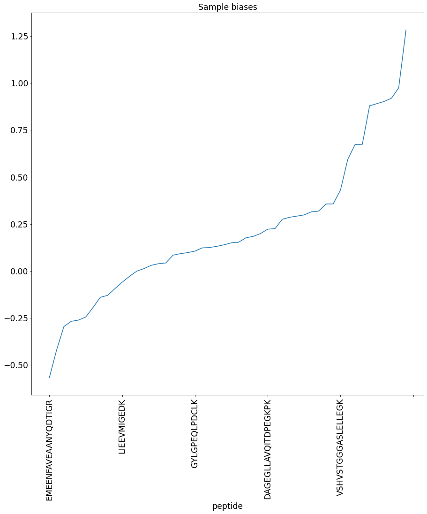
    


```python
def get_weight(learner, indices, is_item=True) -> pd.Series:
    ret = learner.model.weight(indices.values, is_item=is_item) # user=sample
    return pd.DataFrame(ret, index=indices, columns=[f'latent dimension {i+1}' for i in range(ret.shape[-1])])

collab.embeddings = CollabIDs(
    sample=get_weight(learn, indices=analysis.df_train.index.levels[0], is_item=False), # item=peptide
    peptide=get_weight(learn, indices=analysis.df_train.index.levels[1] )
)
collab.embeddings.sample.head()
```


<div>

<table border="1" class="dataframe">
  <thead>
    <tr style="text-align: right;">
      <th></th>
      <th>latent dimension 1</th>
      <th>latent dimension 2</th>
    </tr>
    <tr>
      <th>Sample ID</th>
      <th></th>
      <th></th>
    </tr>
  </thead>
  <tbody>
    <tr>
      <th>20181219_QE3_nLC3_DS_QC_MNT_HeLa_02</th>
      <td>-0.146</td>
      <td>0.118</td>
    </tr>
    <tr>
      <th>20181219_QE3_nLC3_TSB_QC_MNT_HeLa_01</th>
      <td>-0.064</td>
      <td>0.127</td>
    </tr>
    <tr>
      <th>20181221_QE8_nLC0_NHS_MNT_HeLa_01</th>
      <td>0.030</td>
      <td>-0.106</td>
    </tr>
    <tr>
      <th>20181222_QE9_nLC9_QC_50CM_HeLa1</th>
      <td>-0.092</td>
      <td>0.110</td>
    </tr>
    <tr>
      <th>20181223_QE7_nLC7_RJC_MEM_MNT_HeLa_01</th>
      <td>-0.042</td>
      <td>0.294</td>
    </tr>
  </tbody>
</table>
</div>


```python
fig, ax = plt.subplots(figsize=(15, 15))
analyzers.plot_date_map(df=collab.embeddings.sample, fig=fig, ax=ax,
                        dates=analysis.df_meta.date.loc[collab.embeddings.sample.index])
vaep.io_images._savefig(fig, name='collab_latent_by_date',
                        folder=folder)
```

    vaep.io_images - INFO     Saved Figures to runs\2D\feat_0050_epochs_010\collab_latent_by_date
    


    
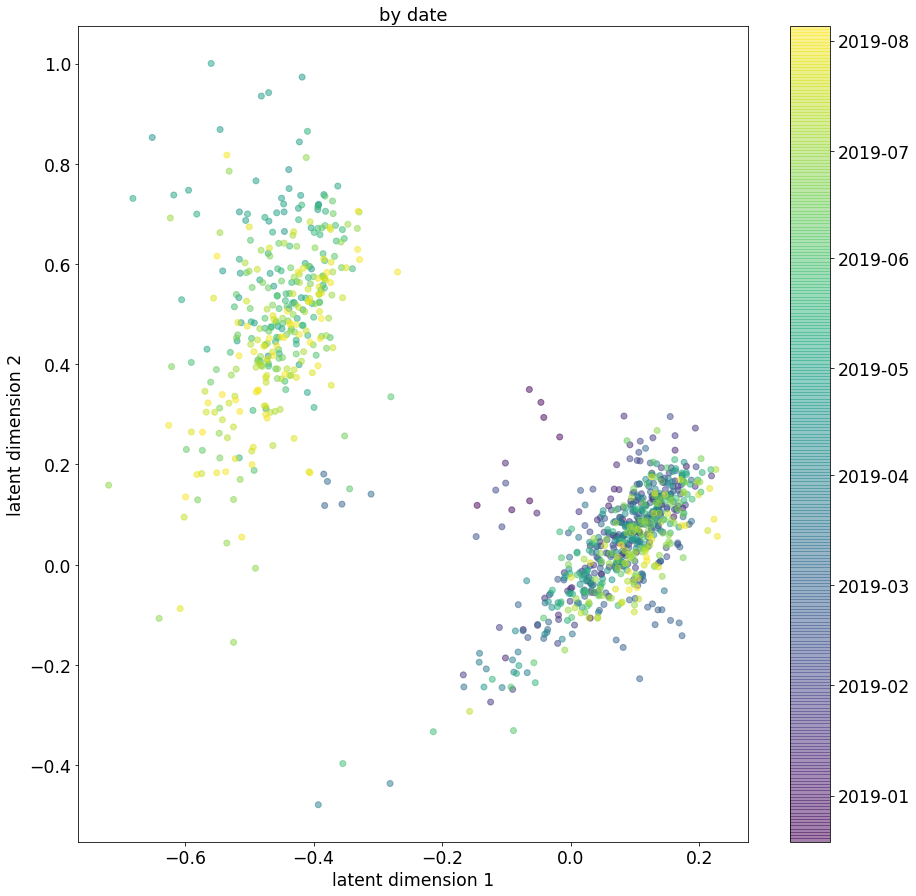
    


```python
fig, ax = plt.subplots(figsize=(15, 15))
meta_col = 'ms_instrument'

df_ = collab.embeddings.sample
analyzers.seaborn_scatter(df=df_,
                          fig=fig,
                          ax=ax,
                          meta=analysis.df_meta[meta_col].loc[df_.index],
                          title='2D sample embedding weights by MS instrument')

vaep.io_images._savefig(fig, name='collab_latent_by_ms_instrument',
                        folder=folder)
```

    vaep.io_images - INFO     Saved Figures to runs\2D\feat_0050_epochs_010\collab_latent_by_ms_instrument
    


    

    


## Denoising Autoencoder (DAE)

### Custom Transforms

- [x] Shift standard normalized data around
    - Error metrics won't be directly comparable afterwards


```python
from fastai.tabular.all import *
from vaep.models import ae

from fastai.tabular.core import TabularPandas

# from fastai.callback.core import Callback

from fastai.data.core import DataLoaders

from fastai.learner import Learner
from fastai.losses import MSELossFlat


# https://docs.fast.ai/tabular.core.html#FillStrategy
# from fastai.tabular.core import FillMissing
# from fastai.tabular.core import TabularPandas
```

### DataLoaders


```python
# revert format
# undo using `stack`
analysis.df_train = analysis.df_train['intensity'].unstack()
analysis.df_valid = analysis.df_valid['intensity'].unstack()
analysis.df_valid.head()
```


<div>

<table border="1" class="dataframe">
  <thead>
    <tr style="text-align: right;">
      <th>peptide</th>
      <th>AAEAAAAPAESAAPAAGEEPSK</th>
      <th>AAHSEGNTTAGLDMR</th>
      <th>AFGYYGPLR</th>
      <th>AGGAAVVITEPEHTK</th>
      <th>AGKPVICATQMLESMIK</th>
      <th>AGVNTVTTLVENKK</th>
      <th>AIVAIENPADVSVISSR</th>
      <th>ALDTMNFDVIK</th>
      <th>DAGEGLLAVQITDPEGKPK</th>
      <th>DHENIVIAK</th>
      <th>...</th>
      <th>TIGGGDDSFNTFFSETGAGK</th>
      <th>TSIAIDTIINQK</th>
      <th>VFSGLVSTGLK</th>
      <th>VMTIAPGLFGTPLLTSLPEK</th>
      <th>VNIIPLIAK</th>
      <th>VSHVSTGGGASLELLEGK</th>
      <th>VVFVFGPDK</th>
      <th>VVHIMDFQR</th>
      <th>YALYDATYETK</th>
      <th>YRVPDVLVADPPIAR</th>
    </tr>
    <tr>
      <th>Sample ID</th>
      <th></th>
      <th></th>
      <th></th>
      <th></th>
      <th></th>
      <th></th>
      <th></th>
      <th></th>
      <th></th>
      <th></th>
      <th></th>
      <th></th>
      <th></th>
      <th></th>
      <th></th>
      <th></th>
      <th></th>
      <th></th>
      <th></th>
      <th></th>
      <th></th>
    </tr>
  </thead>
  <tbody>
    <tr>
      <th>20181219_QE3_nLC3_DS_QC_MNT_HeLa_02</th>
      <td>30.289</td>
      <td>NaN</td>
      <td>NaN</td>
      <td>NaN</td>
      <td>31.078</td>
      <td>NaN</td>
      <td>NaN</td>
      <td>NaN</td>
      <td>NaN</td>
      <td>NaN</td>
      <td>...</td>
      <td>NaN</td>
      <td>NaN</td>
      <td>NaN</td>
      <td>NaN</td>
      <td>NaN</td>
      <td>NaN</td>
      <td>NaN</td>
      <td>NaN</td>
      <td>NaN</td>
      <td>NaN</td>
    </tr>
    <tr>
      <th>20181219_QE3_nLC3_TSB_QC_MNT_HeLa_01</th>
      <td>NaN</td>
      <td>28.132</td>
      <td>NaN</td>
      <td>NaN</td>
      <td>NaN</td>
      <td>NaN</td>
      <td>29.228</td>
      <td>NaN</td>
      <td>NaN</td>
      <td>NaN</td>
      <td>...</td>
      <td>NaN</td>
      <td>NaN</td>
      <td>NaN</td>
      <td>NaN</td>
      <td>NaN</td>
      <td>NaN</td>
      <td>NaN</td>
      <td>NaN</td>
      <td>NaN</td>
      <td>NaN</td>
    </tr>
    <tr>
      <th>20181221_QE8_nLC0_NHS_MNT_HeLa_01</th>
      <td>NaN</td>
      <td>NaN</td>
      <td>NaN</td>
      <td>NaN</td>
      <td>NaN</td>
      <td>NaN</td>
      <td>NaN</td>
      <td>NaN</td>
      <td>NaN</td>
      <td>NaN</td>
      <td>...</td>
      <td>NaN</td>
      <td>NaN</td>
      <td>NaN</td>
      <td>NaN</td>
      <td>NaN</td>
      <td>NaN</td>
      <td>NaN</td>
      <td>27.427</td>
      <td>NaN</td>
      <td>NaN</td>
    </tr>
    <tr>
      <th>20181222_QE9_nLC9_QC_50CM_HeLa1</th>
      <td>NaN</td>
      <td>NaN</td>
      <td>NaN</td>
      <td>28.353</td>
      <td>31.092</td>
      <td>NaN</td>
      <td>NaN</td>
      <td>NaN</td>
      <td>NaN</td>
      <td>NaN</td>
      <td>...</td>
      <td>NaN</td>
      <td>NaN</td>
      <td>NaN</td>
      <td>NaN</td>
      <td>NaN</td>
      <td>NaN</td>
      <td>NaN</td>
      <td>NaN</td>
      <td>NaN</td>
      <td>28.516</td>
    </tr>
    <tr>
      <th>20181223_QE7_nLC7_RJC_MEM_MNT_HeLa_01</th>
      <td>NaN</td>
      <td>NaN</td>
      <td>NaN</td>
      <td>NaN</td>
      <td>32.277</td>
      <td>28.370</td>
      <td>NaN</td>
      <td>NaN</td>
      <td>28.765</td>
      <td>NaN</td>
      <td>...</td>
      <td>NaN</td>
      <td>NaN</td>
      <td>NaN</td>
      <td>NaN</td>
      <td>NaN</td>
      <td>NaN</td>
      <td>NaN</td>
      <td>NaN</td>
      <td>NaN</td>
      <td>NaN</td>
    </tr>
  </tbody>
</table>
<p>5 rows × 50 columns</p>
</div>


Mean and std. dev. from training data


```python
# norm = Normalize.from_stats(analysis.df_train.mean(), analysis.df_valid.std()) # copy interface?
NORMALIZER = Normalize  # dae.NormalizeShiftedMean
```

#### Training data

procs passed to TabluarPandas are handled internally 
  1. not necessarily in order
  2. with setup call (using current training data)


```python
procs = [NORMALIZER, FillMissing(add_col=True)]
cont_names = list(analysis.df_train.columns)

to = TabularPandas(analysis.df_train, procs=procs, cont_names=cont_names)
print("Tabular object:", type(to))

to.items  # items reveals data in DataFrame
```

    Tabular object: <class 'fastai.tabular.core.TabularPandas'>
    


<div>

<table border="1" class="dataframe">
  <thead>
    <tr style="text-align: right;">
      <th>peptide</th>
      <th>AAEAAAAPAESAAPAAGEEPSK</th>
      <th>AAHSEGNTTAGLDMR</th>
      <th>AFGYYGPLR</th>
      <th>AGGAAVVITEPEHTK</th>
      <th>AGKPVICATQMLESMIK</th>
      <th>AGVNTVTTLVENKK</th>
      <th>AIVAIENPADVSVISSR</th>
      <th>ALDTMNFDVIK</th>
      <th>DAGEGLLAVQITDPEGKPK</th>
      <th>DHENIVIAK</th>
      <th>...</th>
      <th>TIGGGDDSFNTFFSETGAGK_na</th>
      <th>TSIAIDTIINQK_na</th>
      <th>VFSGLVSTGLK_na</th>
      <th>VMTIAPGLFGTPLLTSLPEK_na</th>
      <th>VNIIPLIAK_na</th>
      <th>VSHVSTGGGASLELLEGK_na</th>
      <th>VVFVFGPDK_na</th>
      <th>VVHIMDFQR_na</th>
      <th>YALYDATYETK_na</th>
      <th>YRVPDVLVADPPIAR_na</th>
    </tr>
    <tr>
      <th>Sample ID</th>
      <th></th>
      <th></th>
      <th></th>
      <th></th>
      <th></th>
      <th></th>
      <th></th>
      <th></th>
      <th></th>
      <th></th>
      <th></th>
      <th></th>
      <th></th>
      <th></th>
      <th></th>
      <th></th>
      <th></th>
      <th></th>
      <th></th>
      <th></th>
      <th></th>
    </tr>
  </thead>
  <tbody>
    <tr>
      <th>20181219_QE3_nLC3_DS_QC_MNT_HeLa_02</th>
      <td>0.106</td>
      <td>-0.252</td>
      <td>-0.904</td>
      <td>-0.875</td>
      <td>0.286</td>
      <td>-1.039</td>
      <td>-0.804</td>
      <td>-0.840</td>
      <td>-0.163</td>
      <td>-0.478</td>
      <td>...</td>
      <td>False</td>
      <td>False</td>
      <td>False</td>
      <td>False</td>
      <td>False</td>
      <td>False</td>
      <td>False</td>
      <td>False</td>
      <td>False</td>
      <td>False</td>
    </tr>
    <tr>
      <th>20181219_QE3_nLC3_TSB_QC_MNT_HeLa_01</th>
      <td>1.744</td>
      <td>-0.085</td>
      <td>-0.902</td>
      <td>-0.458</td>
      <td>-0.599</td>
      <td>-1.133</td>
      <td>-0.026</td>
      <td>-0.805</td>
      <td>-0.308</td>
      <td>-0.285</td>
      <td>...</td>
      <td>False</td>
      <td>False</td>
      <td>False</td>
      <td>False</td>
      <td>False</td>
      <td>False</td>
      <td>False</td>
      <td>False</td>
      <td>False</td>
      <td>False</td>
    </tr>
    <tr>
      <th>20181221_QE8_nLC0_NHS_MNT_HeLa_01</th>
      <td>-0.293</td>
      <td>-2.162</td>
      <td>-0.536</td>
      <td>0.069</td>
      <td>0.088</td>
      <td>0.166</td>
      <td>0.002</td>
      <td>-0.817</td>
      <td>0.285</td>
      <td>-0.859</td>
      <td>...</td>
      <td>False</td>
      <td>False</td>
      <td>False</td>
      <td>False</td>
      <td>False</td>
      <td>False</td>
      <td>False</td>
      <td>True</td>
      <td>False</td>
      <td>False</td>
    </tr>
    <tr>
      <th>20181222_QE9_nLC9_QC_50CM_HeLa1</th>
      <td>2.244</td>
      <td>-0.291</td>
      <td>-0.749</td>
      <td>0.147</td>
      <td>0.286</td>
      <td>-1.027</td>
      <td>-0.321</td>
      <td>-0.668</td>
      <td>-0.417</td>
      <td>-2.249</td>
      <td>...</td>
      <td>False</td>
      <td>False</td>
      <td>False</td>
      <td>False</td>
      <td>False</td>
      <td>False</td>
      <td>False</td>
      <td>False</td>
      <td>False</td>
      <td>True</td>
    </tr>
    <tr>
      <th>20181223_QE7_nLC7_RJC_MEM_MNT_HeLa_01</th>
      <td>2.008</td>
      <td>-0.218</td>
      <td>-1.086</td>
      <td>-1.243</td>
      <td>0.286</td>
      <td>0.262</td>
      <td>-0.516</td>
      <td>-0.380</td>
      <td>0.221</td>
      <td>-0.541</td>
      <td>...</td>
      <td>False</td>
      <td>False</td>
      <td>False</td>
      <td>False</td>
      <td>False</td>
      <td>False</td>
      <td>False</td>
      <td>False</td>
      <td>False</td>
      <td>False</td>
    </tr>
    <tr>
      <th>...</th>
      <td>...</td>
      <td>...</td>
      <td>...</td>
      <td>...</td>
      <td>...</td>
      <td>...</td>
      <td>...</td>
      <td>...</td>
      <td>...</td>
      <td>...</td>
      <td>...</td>
      <td>...</td>
      <td>...</td>
      <td>...</td>
      <td>...</td>
      <td>...</td>
      <td>...</td>
      <td>...</td>
      <td>...</td>
      <td>...</td>
      <td>...</td>
    </tr>
    <tr>
      <th>20190805_QE10_nLC0_LiNi_MNT_45cm_HeLa_MUC_02</th>
      <td>-0.409</td>
      <td>1.144</td>
      <td>0.489</td>
      <td>0.307</td>
      <td>0.514</td>
      <td>-3.160</td>
      <td>0.949</td>
      <td>0.631</td>
      <td>0.221</td>
      <td>0.549</td>
      <td>...</td>
      <td>False</td>
      <td>False</td>
      <td>False</td>
      <td>False</td>
      <td>False</td>
      <td>False</td>
      <td>False</td>
      <td>True</td>
      <td>False</td>
      <td>True</td>
    </tr>
    <tr>
      <th>20190805_QE1_nLC2_AB_MNT_HELA_01</th>
      <td>0.861</td>
      <td>0.208</td>
      <td>0.008</td>
      <td>0.158</td>
      <td>0.115</td>
      <td>0.297</td>
      <td>-1.431</td>
      <td>-0.430</td>
      <td>0.979</td>
      <td>-0.029</td>
      <td>...</td>
      <td>False</td>
      <td>True</td>
      <td>False</td>
      <td>False</td>
      <td>False</td>
      <td>False</td>
      <td>False</td>
      <td>False</td>
      <td>False</td>
      <td>False</td>
    </tr>
    <tr>
      <th>20190805_QE1_nLC2_AB_MNT_HELA_02</th>
      <td>1.041</td>
      <td>0.026</td>
      <td>-0.392</td>
      <td>0.314</td>
      <td>0.572</td>
      <td>-0.099</td>
      <td>-0.935</td>
      <td>-0.327</td>
      <td>1.057</td>
      <td>0.348</td>
      <td>...</td>
      <td>False</td>
      <td>False</td>
      <td>False</td>
      <td>True</td>
      <td>False</td>
      <td>False</td>
      <td>False</td>
      <td>False</td>
      <td>False</td>
      <td>False</td>
    </tr>
    <tr>
      <th>20190805_QE1_nLC2_AB_MNT_HELA_03</th>
      <td>0.895</td>
      <td>-0.170</td>
      <td>-0.376</td>
      <td>0.547</td>
      <td>0.566</td>
      <td>0.705</td>
      <td>-1.052</td>
      <td>0.067</td>
      <td>0.876</td>
      <td>0.637</td>
      <td>...</td>
      <td>False</td>
      <td>True</td>
      <td>False</td>
      <td>False</td>
      <td>False</td>
      <td>False</td>
      <td>False</td>
      <td>False</td>
      <td>False</td>
      <td>False</td>
    </tr>
    <tr>
      <th>20190805_QE1_nLC2_AB_MNT_HELA_04</th>
      <td>0.745</td>
      <td>-0.023</td>
      <td>-0.260</td>
      <td>0.147</td>
      <td>-0.634</td>
      <td>0.428</td>
      <td>-0.026</td>
      <td>0.101</td>
      <td>0.809</td>
      <td>0.704</td>
      <td>...</td>
      <td>False</td>
      <td>False</td>
      <td>False</td>
      <td>False</td>
      <td>False</td>
      <td>False</td>
      <td>False</td>
      <td>False</td>
      <td>False</td>
      <td>False</td>
    </tr>
  </tbody>
</table>
<p>997 rows × 100 columns</p>
</div>


Better manuelly apply `Transforms` on `Tabluar` type


```python
cont_names = list(analysis.df_train.columns)
to = TabularPandas(analysis.df_train, cont_names=cont_names, do_setup=False)

tf_norm = NORMALIZER()
_ = tf_norm.setups(to)  # returns to
tf_fillna = FillMissing(add_col=True)
_ = tf_fillna.setup(to)

print("Tabular object:", type(to))
# _ = (procs[0]).encodes(to)
to.items  # items reveals data in DataFrame
```

    Tabular object: <class 'fastai.tabular.core.TabularPandas'>
    


<div>

<table border="1" class="dataframe">
  <thead>
    <tr style="text-align: right;">
      <th>peptide</th>
      <th>AAEAAAAPAESAAPAAGEEPSK</th>
      <th>AAHSEGNTTAGLDMR</th>
      <th>AFGYYGPLR</th>
      <th>AGGAAVVITEPEHTK</th>
      <th>AGKPVICATQMLESMIK</th>
      <th>AGVNTVTTLVENKK</th>
      <th>AIVAIENPADVSVISSR</th>
      <th>ALDTMNFDVIK</th>
      <th>DAGEGLLAVQITDPEGKPK</th>
      <th>DHENIVIAK</th>
      <th>...</th>
      <th>TIGGGDDSFNTFFSETGAGK_na</th>
      <th>TSIAIDTIINQK_na</th>
      <th>VFSGLVSTGLK_na</th>
      <th>VMTIAPGLFGTPLLTSLPEK_na</th>
      <th>VNIIPLIAK_na</th>
      <th>VSHVSTGGGASLELLEGK_na</th>
      <th>VVFVFGPDK_na</th>
      <th>VVHIMDFQR_na</th>
      <th>YALYDATYETK_na</th>
      <th>YRVPDVLVADPPIAR_na</th>
    </tr>
    <tr>
      <th>Sample ID</th>
      <th></th>
      <th></th>
      <th></th>
      <th></th>
      <th></th>
      <th></th>
      <th></th>
      <th></th>
      <th></th>
      <th></th>
      <th></th>
      <th></th>
      <th></th>
      <th></th>
      <th></th>
      <th></th>
      <th></th>
      <th></th>
      <th></th>
      <th></th>
      <th></th>
    </tr>
  </thead>
  <tbody>
    <tr>
      <th>20181219_QE3_nLC3_DS_QC_MNT_HeLa_02</th>
      <td>0.112</td>
      <td>-0.247</td>
      <td>-0.846</td>
      <td>-0.809</td>
      <td>0.303</td>
      <td>-0.936</td>
      <td>-0.764</td>
      <td>-0.787</td>
      <td>-0.129</td>
      <td>-0.454</td>
      <td>...</td>
      <td>False</td>
      <td>False</td>
      <td>False</td>
      <td>False</td>
      <td>False</td>
      <td>False</td>
      <td>False</td>
      <td>False</td>
      <td>False</td>
      <td>False</td>
    </tr>
    <tr>
      <th>20181219_QE3_nLC3_TSB_QC_MNT_HeLa_01</th>
      <td>1.662</td>
      <td>-0.092</td>
      <td>-0.844</td>
      <td>-0.415</td>
      <td>-0.539</td>
      <td>-1.025</td>
      <td>-0.028</td>
      <td>-0.755</td>
      <td>-0.265</td>
      <td>-0.272</td>
      <td>...</td>
      <td>False</td>
      <td>False</td>
      <td>False</td>
      <td>False</td>
      <td>False</td>
      <td>False</td>
      <td>False</td>
      <td>False</td>
      <td>False</td>
      <td>False</td>
    </tr>
    <tr>
      <th>20181221_QE8_nLC0_NHS_MNT_HeLa_01</th>
      <td>-0.265</td>
      <td>-2.030</td>
      <td>-0.504</td>
      <td>0.083</td>
      <td>0.115</td>
      <td>0.193</td>
      <td>-0.001</td>
      <td>-0.766</td>
      <td>0.296</td>
      <td>-0.813</td>
      <td>...</td>
      <td>False</td>
      <td>False</td>
      <td>False</td>
      <td>False</td>
      <td>False</td>
      <td>False</td>
      <td>False</td>
      <td>True</td>
      <td>False</td>
      <td>False</td>
    </tr>
    <tr>
      <th>20181222_QE9_nLC9_QC_50CM_HeLa1</th>
      <td>2.135</td>
      <td>-0.284</td>
      <td>-0.703</td>
      <td>0.156</td>
      <td>0.303</td>
      <td>-0.925</td>
      <td>-0.307</td>
      <td>-0.626</td>
      <td>-0.369</td>
      <td>-2.122</td>
      <td>...</td>
      <td>False</td>
      <td>False</td>
      <td>False</td>
      <td>False</td>
      <td>False</td>
      <td>False</td>
      <td>False</td>
      <td>False</td>
      <td>False</td>
      <td>True</td>
    </tr>
    <tr>
      <th>20181223_QE7_nLC7_RJC_MEM_MNT_HeLa_01</th>
      <td>1.911</td>
      <td>-0.215</td>
      <td>-1.015</td>
      <td>-1.156</td>
      <td>0.303</td>
      <td>0.283</td>
      <td>-0.491</td>
      <td>-0.356</td>
      <td>0.235</td>
      <td>-0.513</td>
      <td>...</td>
      <td>False</td>
      <td>False</td>
      <td>False</td>
      <td>False</td>
      <td>False</td>
      <td>False</td>
      <td>False</td>
      <td>False</td>
      <td>False</td>
      <td>False</td>
    </tr>
    <tr>
      <th>...</th>
      <td>...</td>
      <td>...</td>
      <td>...</td>
      <td>...</td>
      <td>...</td>
      <td>...</td>
      <td>...</td>
      <td>...</td>
      <td>...</td>
      <td>...</td>
      <td>...</td>
      <td>...</td>
      <td>...</td>
      <td>...</td>
      <td>...</td>
      <td>...</td>
      <td>...</td>
      <td>...</td>
      <td>...</td>
      <td>...</td>
      <td>...</td>
    </tr>
    <tr>
      <th>20190805_QE10_nLC0_LiNi_MNT_45cm_HeLa_MUC_02</th>
      <td>-0.375</td>
      <td>1.055</td>
      <td>0.445</td>
      <td>0.308</td>
      <td>0.520</td>
      <td>-2.923</td>
      <td>0.895</td>
      <td>0.594</td>
      <td>0.235</td>
      <td>0.514</td>
      <td>...</td>
      <td>False</td>
      <td>False</td>
      <td>False</td>
      <td>False</td>
      <td>False</td>
      <td>False</td>
      <td>False</td>
      <td>True</td>
      <td>False</td>
      <td>True</td>
    </tr>
    <tr>
      <th>20190805_QE1_nLC2_AB_MNT_HELA_01</th>
      <td>0.827</td>
      <td>0.182</td>
      <td>-0.001</td>
      <td>0.166</td>
      <td>0.140</td>
      <td>0.316</td>
      <td>-1.357</td>
      <td>-0.403</td>
      <td>0.952</td>
      <td>-0.031</td>
      <td>...</td>
      <td>False</td>
      <td>True</td>
      <td>False</td>
      <td>False</td>
      <td>False</td>
      <td>False</td>
      <td>False</td>
      <td>False</td>
      <td>False</td>
      <td>False</td>
    </tr>
    <tr>
      <th>20190805_QE1_nLC2_AB_MNT_HELA_02</th>
      <td>0.997</td>
      <td>0.012</td>
      <td>-0.372</td>
      <td>0.314</td>
      <td>0.576</td>
      <td>-0.056</td>
      <td>-0.888</td>
      <td>-0.306</td>
      <td>1.026</td>
      <td>0.325</td>
      <td>...</td>
      <td>False</td>
      <td>False</td>
      <td>False</td>
      <td>True</td>
      <td>False</td>
      <td>False</td>
      <td>False</td>
      <td>False</td>
      <td>False</td>
      <td>False</td>
    </tr>
    <tr>
      <th>20190805_QE1_nLC2_AB_MNT_HELA_03</th>
      <td>0.859</td>
      <td>-0.170</td>
      <td>-0.357</td>
      <td>0.534</td>
      <td>0.570</td>
      <td>0.698</td>
      <td>-0.999</td>
      <td>0.064</td>
      <td>0.854</td>
      <td>0.597</td>
      <td>...</td>
      <td>False</td>
      <td>True</td>
      <td>False</td>
      <td>False</td>
      <td>False</td>
      <td>False</td>
      <td>False</td>
      <td>False</td>
      <td>False</td>
      <td>False</td>
    </tr>
    <tr>
      <th>20190805_QE1_nLC2_AB_MNT_HELA_04</th>
      <td>0.717</td>
      <td>-0.034</td>
      <td>-0.249</td>
      <td>0.156</td>
      <td>-0.572</td>
      <td>0.438</td>
      <td>-0.028</td>
      <td>0.096</td>
      <td>0.792</td>
      <td>0.660</td>
      <td>...</td>
      <td>False</td>
      <td>False</td>
      <td>False</td>
      <td>False</td>
      <td>False</td>
      <td>False</td>
      <td>False</td>
      <td>False</td>
      <td>False</td>
      <td>False</td>
    </tr>
  </tbody>
</table>
<p>997 rows × 100 columns</p>
</div>


Check mean and standard deviation after normalization


```python
to.items.iloc[:, :10].describe()  # not perferct anymore as expected
```


<div>

<table border="1" class="dataframe">
  <thead>
    <tr style="text-align: right;">
      <th>peptide</th>
      <th>AAEAAAAPAESAAPAAGEEPSK</th>
      <th>AAHSEGNTTAGLDMR</th>
      <th>AFGYYGPLR</th>
      <th>AGGAAVVITEPEHTK</th>
      <th>AGKPVICATQMLESMIK</th>
      <th>AGVNTVTTLVENKK</th>
      <th>AIVAIENPADVSVISSR</th>
      <th>ALDTMNFDVIK</th>
      <th>DAGEGLLAVQITDPEGKPK</th>
      <th>DHENIVIAK</th>
    </tr>
  </thead>
  <tbody>
    <tr>
      <th>count</th>
      <td>997.000</td>
      <td>997.000</td>
      <td>997.000</td>
      <td>997.000</td>
      <td>997.000</td>
      <td>997.000</td>
      <td>997.000</td>
      <td>997.000</td>
      <td>997.000</td>
      <td>997.000</td>
    </tr>
    <tr>
      <th>mean</th>
      <td>0.012</td>
      <td>-0.012</td>
      <td>-0.008</td>
      <td>0.017</td>
      <td>0.031</td>
      <td>0.037</td>
      <td>-0.003</td>
      <td>0.001</td>
      <td>0.026</td>
      <td>-0.003</td>
    </tr>
    <tr>
      <th>std</th>
      <td>0.946</td>
      <td>0.934</td>
      <td>0.928</td>
      <td>0.945</td>
      <td>0.952</td>
      <td>0.937</td>
      <td>0.947</td>
      <td>0.939</td>
      <td>0.947</td>
      <td>0.943</td>
    </tr>
    <tr>
      <th>min</th>
      <td>-4.955</td>
      <td>-3.157</td>
      <td>-5.113</td>
      <td>-3.704</td>
      <td>-4.887</td>
      <td>-5.067</td>
      <td>-4.386</td>
      <td>-4.598</td>
      <td>-5.263</td>
      <td>-4.550</td>
    </tr>
    <tr>
      <th>25%</th>
      <td>-0.359</td>
      <td>-0.413</td>
      <td>-0.470</td>
      <td>-0.322</td>
      <td>-0.215</td>
      <td>-0.099</td>
      <td>-0.478</td>
      <td>-0.448</td>
      <td>-0.316</td>
      <td>-0.415</td>
    </tr>
    <tr>
      <th>50%</th>
      <td>0.112</td>
      <td>-0.092</td>
      <td>-0.056</td>
      <td>0.156</td>
      <td>0.303</td>
      <td>0.283</td>
      <td>-0.028</td>
      <td>0.012</td>
      <td>0.235</td>
      <td>-0.030</td>
    </tr>
    <tr>
      <th>75%</th>
      <td>0.410</td>
      <td>0.779</td>
      <td>0.448</td>
      <td>0.559</td>
      <td>0.595</td>
      <td>0.564</td>
      <td>0.529</td>
      <td>0.437</td>
      <td>0.668</td>
      <td>0.547</td>
    </tr>
    <tr>
      <th>max</th>
      <td>3.466</td>
      <td>1.814</td>
      <td>2.366</td>
      <td>1.891</td>
      <td>2.179</td>
      <td>1.642</td>
      <td>2.308</td>
      <td>1.951</td>
      <td>1.698</td>
      <td>2.118</td>
    </tr>
  </tbody>
</table>
</div>


Mask is added as type bool


```python
to.items.dtypes.value_counts()
```


    bool      50
    float64   50
    dtype: int64


with the suffix `_na` where `True` is indicating a missing value replaced by the `FillMissing` transformation


```python
to.cont_names, to.cat_names
```


    ((#50) ['AAEAAAAPAESAAPAAGEEPSK','AAHSEGNTTAGLDMR','AFGYYGPLR','AGGAAVVITEPEHTK','AGKPVICATQMLESMIK','AGVNTVTTLVENKK','AIVAIENPADVSVISSR','ALDTMNFDVIK','DAGEGLLAVQITDPEGKPK','DHENIVIAK'...],
     (#50) ['AAEAAAAPAESAAPAAGEEPSK_na','AAHSEGNTTAGLDMR_na','AFGYYGPLR_na','AGGAAVVITEPEHTK_na','AGKPVICATQMLESMIK_na','AGVNTVTTLVENKK_na','AIVAIENPADVSVISSR_na','ALDTMNFDVIK_na','DAGEGLLAVQITDPEGKPK_na','DHENIVIAK_na'...])


```python
assert len(to.valid) == 0
```

#### Validation data

- reuse training data with different mask for evaluation
- target data is the validation data
    - switch between training and evaluation mode for setting comparison


```python
_df_valid = TabularPandas(
    analysis.df_valid, cont_names=analysis.df_valid.columns.tolist())
# assert analysis.df_valid.isna().equals(y_valid.items.isna())
_df_valid = tf_norm.encodes(_df_valid)
```


```python
_df_valid.items.iloc[:, :10].describe()
```


<div>

<table border="1" class="dataframe">
  <thead>
    <tr style="text-align: right;">
      <th>peptide</th>
      <th>AAEAAAAPAESAAPAAGEEPSK</th>
      <th>AAHSEGNTTAGLDMR</th>
      <th>AFGYYGPLR</th>
      <th>AGGAAVVITEPEHTK</th>
      <th>AGKPVICATQMLESMIK</th>
      <th>AGVNTVTTLVENKK</th>
      <th>AIVAIENPADVSVISSR</th>
      <th>ALDTMNFDVIK</th>
      <th>DAGEGLLAVQITDPEGKPK</th>
      <th>DHENIVIAK</th>
    </tr>
  </thead>
  <tbody>
    <tr>
      <th>count</th>
      <td>99.000</td>
      <td>97.000</td>
      <td>95.000</td>
      <td>99.000</td>
      <td>100.000</td>
      <td>97.000</td>
      <td>99.000</td>
      <td>98.000</td>
      <td>99.000</td>
      <td>99.000</td>
    </tr>
    <tr>
      <th>mean</th>
      <td>0.085</td>
      <td>-0.285</td>
      <td>0.041</td>
      <td>-0.100</td>
      <td>0.016</td>
      <td>-0.217</td>
      <td>-0.160</td>
      <td>0.143</td>
      <td>-0.009</td>
      <td>0.083</td>
    </tr>
    <tr>
      <th>std</th>
      <td>0.849</td>
      <td>1.049</td>
      <td>0.864</td>
      <td>1.187</td>
      <td>0.871</td>
      <td>1.124</td>
      <td>0.986</td>
      <td>0.923</td>
      <td>0.928</td>
      <td>1.071</td>
    </tr>
    <tr>
      <th>min</th>
      <td>-2.066</td>
      <td>-2.479</td>
      <td>-2.672</td>
      <td>-4.335</td>
      <td>-2.450</td>
      <td>-3.723</td>
      <td>-3.112</td>
      <td>-2.562</td>
      <td>-2.837</td>
      <td>-3.770</td>
    </tr>
    <tr>
      <th>25%</th>
      <td>-0.399</td>
      <td>-0.883</td>
      <td>-0.494</td>
      <td>-0.684</td>
      <td>-0.392</td>
      <td>-0.585</td>
      <td>-0.729</td>
      <td>-0.394</td>
      <td>-0.453</td>
      <td>-0.421</td>
    </tr>
    <tr>
      <th>50%</th>
      <td>0.129</td>
      <td>-0.231</td>
      <td>-0.009</td>
      <td>0.128</td>
      <td>0.277</td>
      <td>0.123</td>
      <td>-0.118</td>
      <td>0.144</td>
      <td>0.084</td>
      <td>0.013</td>
    </tr>
    <tr>
      <th>75%</th>
      <td>0.434</td>
      <td>0.346</td>
      <td>0.552</td>
      <td>0.766</td>
      <td>0.641</td>
      <td>0.565</td>
      <td>0.442</td>
      <td>0.735</td>
      <td>0.606</td>
      <td>0.864</td>
    </tr>
    <tr>
      <th>max</th>
      <td>3.248</td>
      <td>1.727</td>
      <td>1.932</td>
      <td>1.663</td>
      <td>1.128</td>
      <td>1.251</td>
      <td>1.884</td>
      <td>1.958</td>
      <td>1.775</td>
      <td>2.453</td>
    </tr>
  </tbody>
</table>
</div>


```python
# Validation dataset
# build validation DataFrame with mask according to validation data
# FillNA values in data as before, but do not add categorical columns (as this is done manuelly)
_valid_df = to.conts  # same data for predictions
_valid_df = _valid_df.join(analysis.df_valid.isna(), rsuffix='_na')  # mask
_valid_df = _valid_df.join(_df_valid.items, rsuffix='_val')  # target
_valid_df
```


<div>

<table border="1" class="dataframe">
  <thead>
    <tr style="text-align: right;">
      <th>peptide</th>
      <th>AAEAAAAPAESAAPAAGEEPSK</th>
      <th>AAHSEGNTTAGLDMR</th>
      <th>AFGYYGPLR</th>
      <th>AGGAAVVITEPEHTK</th>
      <th>AGKPVICATQMLESMIK</th>
      <th>AGVNTVTTLVENKK</th>
      <th>AIVAIENPADVSVISSR</th>
      <th>ALDTMNFDVIK</th>
      <th>DAGEGLLAVQITDPEGKPK</th>
      <th>DHENIVIAK</th>
      <th>...</th>
      <th>TIGGGDDSFNTFFSETGAGK_val</th>
      <th>TSIAIDTIINQK_val</th>
      <th>VFSGLVSTGLK_val</th>
      <th>VMTIAPGLFGTPLLTSLPEK_val</th>
      <th>VNIIPLIAK_val</th>
      <th>VSHVSTGGGASLELLEGK_val</th>
      <th>VVFVFGPDK_val</th>
      <th>VVHIMDFQR_val</th>
      <th>YALYDATYETK_val</th>
      <th>YRVPDVLVADPPIAR_val</th>
    </tr>
    <tr>
      <th>Sample ID</th>
      <th></th>
      <th></th>
      <th></th>
      <th></th>
      <th></th>
      <th></th>
      <th></th>
      <th></th>
      <th></th>
      <th></th>
      <th></th>
      <th></th>
      <th></th>
      <th></th>
      <th></th>
      <th></th>
      <th></th>
      <th></th>
      <th></th>
      <th></th>
      <th></th>
    </tr>
  </thead>
  <tbody>
    <tr>
      <th>20181219_QE3_nLC3_DS_QC_MNT_HeLa_02</th>
      <td>0.112</td>
      <td>-0.247</td>
      <td>-0.846</td>
      <td>-0.809</td>
      <td>0.303</td>
      <td>-0.936</td>
      <td>-0.764</td>
      <td>-0.787</td>
      <td>-0.129</td>
      <td>-0.454</td>
      <td>...</td>
      <td>NaN</td>
      <td>NaN</td>
      <td>NaN</td>
      <td>NaN</td>
      <td>NaN</td>
      <td>NaN</td>
      <td>NaN</td>
      <td>NaN</td>
      <td>NaN</td>
      <td>NaN</td>
    </tr>
    <tr>
      <th>20181219_QE3_nLC3_TSB_QC_MNT_HeLa_01</th>
      <td>1.662</td>
      <td>-0.092</td>
      <td>-0.844</td>
      <td>-0.415</td>
      <td>-0.539</td>
      <td>-1.025</td>
      <td>-0.028</td>
      <td>-0.755</td>
      <td>-0.265</td>
      <td>-0.272</td>
      <td>...</td>
      <td>NaN</td>
      <td>NaN</td>
      <td>NaN</td>
      <td>NaN</td>
      <td>NaN</td>
      <td>NaN</td>
      <td>NaN</td>
      <td>NaN</td>
      <td>NaN</td>
      <td>NaN</td>
    </tr>
    <tr>
      <th>20181221_QE8_nLC0_NHS_MNT_HeLa_01</th>
      <td>-0.265</td>
      <td>-2.030</td>
      <td>-0.504</td>
      <td>0.083</td>
      <td>0.115</td>
      <td>0.193</td>
      <td>-0.001</td>
      <td>-0.766</td>
      <td>0.296</td>
      <td>-0.813</td>
      <td>...</td>
      <td>NaN</td>
      <td>NaN</td>
      <td>NaN</td>
      <td>NaN</td>
      <td>NaN</td>
      <td>NaN</td>
      <td>NaN</td>
      <td>-0.531</td>
      <td>NaN</td>
      <td>NaN</td>
    </tr>
    <tr>
      <th>20181222_QE9_nLC9_QC_50CM_HeLa1</th>
      <td>2.135</td>
      <td>-0.284</td>
      <td>-0.703</td>
      <td>0.156</td>
      <td>0.303</td>
      <td>-0.925</td>
      <td>-0.307</td>
      <td>-0.626</td>
      <td>-0.369</td>
      <td>-2.122</td>
      <td>...</td>
      <td>NaN</td>
      <td>NaN</td>
      <td>NaN</td>
      <td>NaN</td>
      <td>NaN</td>
      <td>NaN</td>
      <td>NaN</td>
      <td>NaN</td>
      <td>NaN</td>
      <td>-0.560</td>
    </tr>
    <tr>
      <th>20181223_QE7_nLC7_RJC_MEM_MNT_HeLa_01</th>
      <td>1.911</td>
      <td>-0.215</td>
      <td>-1.015</td>
      <td>-1.156</td>
      <td>0.303</td>
      <td>0.283</td>
      <td>-0.491</td>
      <td>-0.356</td>
      <td>0.235</td>
      <td>-0.513</td>
      <td>...</td>
      <td>NaN</td>
      <td>NaN</td>
      <td>NaN</td>
      <td>NaN</td>
      <td>NaN</td>
      <td>NaN</td>
      <td>NaN</td>
      <td>NaN</td>
      <td>NaN</td>
      <td>NaN</td>
    </tr>
    <tr>
      <th>...</th>
      <td>...</td>
      <td>...</td>
      <td>...</td>
      <td>...</td>
      <td>...</td>
      <td>...</td>
      <td>...</td>
      <td>...</td>
      <td>...</td>
      <td>...</td>
      <td>...</td>
      <td>...</td>
      <td>...</td>
      <td>...</td>
      <td>...</td>
      <td>...</td>
      <td>...</td>
      <td>...</td>
      <td>...</td>
      <td>...</td>
      <td>...</td>
    </tr>
    <tr>
      <th>20190805_QE10_nLC0_LiNi_MNT_45cm_HeLa_MUC_02</th>
      <td>-0.375</td>
      <td>1.055</td>
      <td>0.445</td>
      <td>0.308</td>
      <td>0.520</td>
      <td>-2.923</td>
      <td>0.895</td>
      <td>0.594</td>
      <td>0.235</td>
      <td>0.514</td>
      <td>...</td>
      <td>NaN</td>
      <td>NaN</td>
      <td>NaN</td>
      <td>NaN</td>
      <td>NaN</td>
      <td>NaN</td>
      <td>NaN</td>
      <td>0.788</td>
      <td>NaN</td>
      <td>0.308</td>
    </tr>
    <tr>
      <th>20190805_QE1_nLC2_AB_MNT_HELA_01</th>
      <td>0.827</td>
      <td>0.182</td>
      <td>-0.001</td>
      <td>0.166</td>
      <td>0.140</td>
      <td>0.316</td>
      <td>-1.357</td>
      <td>-0.403</td>
      <td>0.952</td>
      <td>-0.031</td>
      <td>...</td>
      <td>NaN</td>
      <td>-0.071</td>
      <td>NaN</td>
      <td>NaN</td>
      <td>NaN</td>
      <td>NaN</td>
      <td>NaN</td>
      <td>NaN</td>
      <td>NaN</td>
      <td>NaN</td>
    </tr>
    <tr>
      <th>20190805_QE1_nLC2_AB_MNT_HELA_02</th>
      <td>0.997</td>
      <td>0.012</td>
      <td>-0.372</td>
      <td>0.314</td>
      <td>0.576</td>
      <td>-0.056</td>
      <td>-0.888</td>
      <td>-0.306</td>
      <td>1.026</td>
      <td>0.325</td>
      <td>...</td>
      <td>NaN</td>
      <td>NaN</td>
      <td>NaN</td>
      <td>0.307</td>
      <td>NaN</td>
      <td>NaN</td>
      <td>NaN</td>
      <td>NaN</td>
      <td>NaN</td>
      <td>NaN</td>
    </tr>
    <tr>
      <th>20190805_QE1_nLC2_AB_MNT_HELA_03</th>
      <td>0.859</td>
      <td>-0.170</td>
      <td>-0.357</td>
      <td>0.534</td>
      <td>0.570</td>
      <td>0.698</td>
      <td>-0.999</td>
      <td>0.064</td>
      <td>0.854</td>
      <td>0.597</td>
      <td>...</td>
      <td>NaN</td>
      <td>0.003</td>
      <td>NaN</td>
      <td>NaN</td>
      <td>NaN</td>
      <td>NaN</td>
      <td>NaN</td>
      <td>NaN</td>
      <td>NaN</td>
      <td>NaN</td>
    </tr>
    <tr>
      <th>20190805_QE1_nLC2_AB_MNT_HELA_04</th>
      <td>0.717</td>
      <td>-0.034</td>
      <td>-0.249</td>
      <td>0.156</td>
      <td>-0.572</td>
      <td>0.438</td>
      <td>-0.028</td>
      <td>0.096</td>
      <td>0.792</td>
      <td>0.660</td>
      <td>...</td>
      <td>NaN</td>
      <td>NaN</td>
      <td>NaN</td>
      <td>NaN</td>
      <td>NaN</td>
      <td>NaN</td>
      <td>NaN</td>
      <td>NaN</td>
      <td>NaN</td>
      <td>NaN</td>
    </tr>
  </tbody>
</table>
<p>997 rows × 150 columns</p>
</div>


```python
# [norm, FillMissing(add_col=False)]  # mask is provided explicitly
procs = None

cont_names = list(analysis.df_train.columns)
cat_names = [f'{s}_na' for s in cont_names]
y_names = [f'{s}_val' for s in cont_names]

splits = None
y_block = None
to_valid = TabularPandas(_valid_df, procs=procs, cat_names=cat_names, cont_names=cont_names,
                         y_names=y_names, splits=splits, y_block=y_block, do_setup=True)
to_valid.items
```


<div>

<table border="1" class="dataframe">
  <thead>
    <tr style="text-align: right;">
      <th>peptide</th>
      <th>AAEAAAAPAESAAPAAGEEPSK</th>
      <th>AAHSEGNTTAGLDMR</th>
      <th>AFGYYGPLR</th>
      <th>AGGAAVVITEPEHTK</th>
      <th>AGKPVICATQMLESMIK</th>
      <th>AGVNTVTTLVENKK</th>
      <th>AIVAIENPADVSVISSR</th>
      <th>ALDTMNFDVIK</th>
      <th>DAGEGLLAVQITDPEGKPK</th>
      <th>DHENIVIAK</th>
      <th>...</th>
      <th>TIGGGDDSFNTFFSETGAGK_val</th>
      <th>TSIAIDTIINQK_val</th>
      <th>VFSGLVSTGLK_val</th>
      <th>VMTIAPGLFGTPLLTSLPEK_val</th>
      <th>VNIIPLIAK_val</th>
      <th>VSHVSTGGGASLELLEGK_val</th>
      <th>VVFVFGPDK_val</th>
      <th>VVHIMDFQR_val</th>
      <th>YALYDATYETK_val</th>
      <th>YRVPDVLVADPPIAR_val</th>
    </tr>
    <tr>
      <th>Sample ID</th>
      <th></th>
      <th></th>
      <th></th>
      <th></th>
      <th></th>
      <th></th>
      <th></th>
      <th></th>
      <th></th>
      <th></th>
      <th></th>
      <th></th>
      <th></th>
      <th></th>
      <th></th>
      <th></th>
      <th></th>
      <th></th>
      <th></th>
      <th></th>
      <th></th>
    </tr>
  </thead>
  <tbody>
    <tr>
      <th>20181219_QE3_nLC3_DS_QC_MNT_HeLa_02</th>
      <td>0.112</td>
      <td>-0.247</td>
      <td>-0.846</td>
      <td>-0.809</td>
      <td>0.303</td>
      <td>-0.936</td>
      <td>-0.764</td>
      <td>-0.787</td>
      <td>-0.129</td>
      <td>-0.454</td>
      <td>...</td>
      <td>NaN</td>
      <td>NaN</td>
      <td>NaN</td>
      <td>NaN</td>
      <td>NaN</td>
      <td>NaN</td>
      <td>NaN</td>
      <td>NaN</td>
      <td>NaN</td>
      <td>NaN</td>
    </tr>
    <tr>
      <th>20181219_QE3_nLC3_TSB_QC_MNT_HeLa_01</th>
      <td>1.662</td>
      <td>-0.092</td>
      <td>-0.844</td>
      <td>-0.415</td>
      <td>-0.539</td>
      <td>-1.025</td>
      <td>-0.028</td>
      <td>-0.755</td>
      <td>-0.265</td>
      <td>-0.272</td>
      <td>...</td>
      <td>NaN</td>
      <td>NaN</td>
      <td>NaN</td>
      <td>NaN</td>
      <td>NaN</td>
      <td>NaN</td>
      <td>NaN</td>
      <td>NaN</td>
      <td>NaN</td>
      <td>NaN</td>
    </tr>
    <tr>
      <th>20181221_QE8_nLC0_NHS_MNT_HeLa_01</th>
      <td>-0.265</td>
      <td>-2.030</td>
      <td>-0.504</td>
      <td>0.083</td>
      <td>0.115</td>
      <td>0.193</td>
      <td>-0.001</td>
      <td>-0.766</td>
      <td>0.296</td>
      <td>-0.813</td>
      <td>...</td>
      <td>NaN</td>
      <td>NaN</td>
      <td>NaN</td>
      <td>NaN</td>
      <td>NaN</td>
      <td>NaN</td>
      <td>NaN</td>
      <td>-0.531</td>
      <td>NaN</td>
      <td>NaN</td>
    </tr>
    <tr>
      <th>20181222_QE9_nLC9_QC_50CM_HeLa1</th>
      <td>2.135</td>
      <td>-0.284</td>
      <td>-0.703</td>
      <td>0.156</td>
      <td>0.303</td>
      <td>-0.925</td>
      <td>-0.307</td>
      <td>-0.626</td>
      <td>-0.369</td>
      <td>-2.122</td>
      <td>...</td>
      <td>NaN</td>
      <td>NaN</td>
      <td>NaN</td>
      <td>NaN</td>
      <td>NaN</td>
      <td>NaN</td>
      <td>NaN</td>
      <td>NaN</td>
      <td>NaN</td>
      <td>-0.560</td>
    </tr>
    <tr>
      <th>20181223_QE7_nLC7_RJC_MEM_MNT_HeLa_01</th>
      <td>1.911</td>
      <td>-0.215</td>
      <td>-1.015</td>
      <td>-1.156</td>
      <td>0.303</td>
      <td>0.283</td>
      <td>-0.491</td>
      <td>-0.356</td>
      <td>0.235</td>
      <td>-0.513</td>
      <td>...</td>
      <td>NaN</td>
      <td>NaN</td>
      <td>NaN</td>
      <td>NaN</td>
      <td>NaN</td>
      <td>NaN</td>
      <td>NaN</td>
      <td>NaN</td>
      <td>NaN</td>
      <td>NaN</td>
    </tr>
    <tr>
      <th>...</th>
      <td>...</td>
      <td>...</td>
      <td>...</td>
      <td>...</td>
      <td>...</td>
      <td>...</td>
      <td>...</td>
      <td>...</td>
      <td>...</td>
      <td>...</td>
      <td>...</td>
      <td>...</td>
      <td>...</td>
      <td>...</td>
      <td>...</td>
      <td>...</td>
      <td>...</td>
      <td>...</td>
      <td>...</td>
      <td>...</td>
      <td>...</td>
    </tr>
    <tr>
      <th>20190805_QE10_nLC0_LiNi_MNT_45cm_HeLa_MUC_02</th>
      <td>-0.375</td>
      <td>1.055</td>
      <td>0.445</td>
      <td>0.308</td>
      <td>0.520</td>
      <td>-2.923</td>
      <td>0.895</td>
      <td>0.594</td>
      <td>0.235</td>
      <td>0.514</td>
      <td>...</td>
      <td>NaN</td>
      <td>NaN</td>
      <td>NaN</td>
      <td>NaN</td>
      <td>NaN</td>
      <td>NaN</td>
      <td>NaN</td>
      <td>0.788</td>
      <td>NaN</td>
      <td>0.308</td>
    </tr>
    <tr>
      <th>20190805_QE1_nLC2_AB_MNT_HELA_01</th>
      <td>0.827</td>
      <td>0.182</td>
      <td>-0.001</td>
      <td>0.166</td>
      <td>0.140</td>
      <td>0.316</td>
      <td>-1.357</td>
      <td>-0.403</td>
      <td>0.952</td>
      <td>-0.031</td>
      <td>...</td>
      <td>NaN</td>
      <td>-0.071</td>
      <td>NaN</td>
      <td>NaN</td>
      <td>NaN</td>
      <td>NaN</td>
      <td>NaN</td>
      <td>NaN</td>
      <td>NaN</td>
      <td>NaN</td>
    </tr>
    <tr>
      <th>20190805_QE1_nLC2_AB_MNT_HELA_02</th>
      <td>0.997</td>
      <td>0.012</td>
      <td>-0.372</td>
      <td>0.314</td>
      <td>0.576</td>
      <td>-0.056</td>
      <td>-0.888</td>
      <td>-0.306</td>
      <td>1.026</td>
      <td>0.325</td>
      <td>...</td>
      <td>NaN</td>
      <td>NaN</td>
      <td>NaN</td>
      <td>0.307</td>
      <td>NaN</td>
      <td>NaN</td>
      <td>NaN</td>
      <td>NaN</td>
      <td>NaN</td>
      <td>NaN</td>
    </tr>
    <tr>
      <th>20190805_QE1_nLC2_AB_MNT_HELA_03</th>
      <td>0.859</td>
      <td>-0.170</td>
      <td>-0.357</td>
      <td>0.534</td>
      <td>0.570</td>
      <td>0.698</td>
      <td>-0.999</td>
      <td>0.064</td>
      <td>0.854</td>
      <td>0.597</td>
      <td>...</td>
      <td>NaN</td>
      <td>0.003</td>
      <td>NaN</td>
      <td>NaN</td>
      <td>NaN</td>
      <td>NaN</td>
      <td>NaN</td>
      <td>NaN</td>
      <td>NaN</td>
      <td>NaN</td>
    </tr>
    <tr>
      <th>20190805_QE1_nLC2_AB_MNT_HELA_04</th>
      <td>0.717</td>
      <td>-0.034</td>
      <td>-0.249</td>
      <td>0.156</td>
      <td>-0.572</td>
      <td>0.438</td>
      <td>-0.028</td>
      <td>0.096</td>
      <td>0.792</td>
      <td>0.660</td>
      <td>...</td>
      <td>NaN</td>
      <td>NaN</td>
      <td>NaN</td>
      <td>NaN</td>
      <td>NaN</td>
      <td>NaN</td>
      <td>NaN</td>
      <td>NaN</td>
      <td>NaN</td>
      <td>NaN</td>
    </tr>
  </tbody>
</table>
<p>997 rows × 150 columns</p>
</div>


```python
stats_valid = to_valid.targ.iloc[:, :100].describe()
stats_valid
```


<div>

<table border="1" class="dataframe">
  <thead>
    <tr style="text-align: right;">
      <th>peptide</th>
      <th>AAEAAAAPAESAAPAAGEEPSK_val</th>
      <th>AAHSEGNTTAGLDMR_val</th>
      <th>AFGYYGPLR_val</th>
      <th>AGGAAVVITEPEHTK_val</th>
      <th>AGKPVICATQMLESMIK_val</th>
      <th>AGVNTVTTLVENKK_val</th>
      <th>AIVAIENPADVSVISSR_val</th>
      <th>ALDTMNFDVIK_val</th>
      <th>DAGEGLLAVQITDPEGKPK_val</th>
      <th>DHENIVIAK_val</th>
      <th>...</th>
      <th>TIGGGDDSFNTFFSETGAGK_val</th>
      <th>TSIAIDTIINQK_val</th>
      <th>VFSGLVSTGLK_val</th>
      <th>VMTIAPGLFGTPLLTSLPEK_val</th>
      <th>VNIIPLIAK_val</th>
      <th>VSHVSTGGGASLELLEGK_val</th>
      <th>VVFVFGPDK_val</th>
      <th>VVHIMDFQR_val</th>
      <th>YALYDATYETK_val</th>
      <th>YRVPDVLVADPPIAR_val</th>
    </tr>
  </thead>
  <tbody>
    <tr>
      <th>count</th>
      <td>99.000</td>
      <td>97.000</td>
      <td>95.000</td>
      <td>99.000</td>
      <td>100.000</td>
      <td>97.000</td>
      <td>99.000</td>
      <td>98.000</td>
      <td>99.000</td>
      <td>99.000</td>
      <td>...</td>
      <td>100.000</td>
      <td>99.000</td>
      <td>99.000</td>
      <td>99.000</td>
      <td>99.000</td>
      <td>100.000</td>
      <td>99.000</td>
      <td>98.000</td>
      <td>100.000</td>
      <td>97.000</td>
    </tr>
    <tr>
      <th>mean</th>
      <td>0.085</td>
      <td>-0.285</td>
      <td>0.041</td>
      <td>-0.100</td>
      <td>0.016</td>
      <td>-0.217</td>
      <td>-0.160</td>
      <td>0.143</td>
      <td>-0.009</td>
      <td>0.083</td>
      <td>...</td>
      <td>-0.045</td>
      <td>0.103</td>
      <td>0.102</td>
      <td>-0.084</td>
      <td>-0.069</td>
      <td>0.106</td>
      <td>-0.054</td>
      <td>-0.051</td>
      <td>-0.024</td>
      <td>0.139</td>
    </tr>
    <tr>
      <th>std</th>
      <td>0.849</td>
      <td>1.049</td>
      <td>0.864</td>
      <td>1.187</td>
      <td>0.871</td>
      <td>1.124</td>
      <td>0.986</td>
      <td>0.923</td>
      <td>0.928</td>
      <td>1.071</td>
      <td>...</td>
      <td>0.877</td>
      <td>0.991</td>
      <td>0.908</td>
      <td>0.852</td>
      <td>1.006</td>
      <td>1.006</td>
      <td>0.851</td>
      <td>0.934</td>
      <td>0.925</td>
      <td>1.021</td>
    </tr>
    <tr>
      <th>min</th>
      <td>-2.066</td>
      <td>-2.479</td>
      <td>-2.672</td>
      <td>-4.335</td>
      <td>-2.450</td>
      <td>-3.723</td>
      <td>-3.112</td>
      <td>-2.562</td>
      <td>-2.837</td>
      <td>-3.770</td>
      <td>...</td>
      <td>-3.003</td>
      <td>-3.280</td>
      <td>-3.092</td>
      <td>-2.327</td>
      <td>-5.088</td>
      <td>-4.218</td>
      <td>-2.933</td>
      <td>-2.770</td>
      <td>-2.928</td>
      <td>-3.967</td>
    </tr>
    <tr>
      <th>25%</th>
      <td>-0.399</td>
      <td>-0.883</td>
      <td>-0.494</td>
      <td>-0.684</td>
      <td>-0.392</td>
      <td>-0.585</td>
      <td>-0.729</td>
      <td>-0.394</td>
      <td>-0.453</td>
      <td>-0.421</td>
      <td>...</td>
      <td>-0.517</td>
      <td>-0.316</td>
      <td>-0.372</td>
      <td>-0.557</td>
      <td>-0.321</td>
      <td>-0.285</td>
      <td>-0.524</td>
      <td>-0.532</td>
      <td>-0.487</td>
      <td>-0.384</td>
    </tr>
    <tr>
      <th>50%</th>
      <td>0.129</td>
      <td>-0.231</td>
      <td>-0.009</td>
      <td>0.128</td>
      <td>0.277</td>
      <td>0.123</td>
      <td>-0.118</td>
      <td>0.144</td>
      <td>0.084</td>
      <td>0.013</td>
      <td>...</td>
      <td>-0.150</td>
      <td>0.106</td>
      <td>-0.082</td>
      <td>-0.006</td>
      <td>0.137</td>
      <td>0.158</td>
      <td>-0.160</td>
      <td>-0.127</td>
      <td>0.233</td>
      <td>0.304</td>
    </tr>
    <tr>
      <th>75%</th>
      <td>0.434</td>
      <td>0.346</td>
      <td>0.552</td>
      <td>0.766</td>
      <td>0.641</td>
      <td>0.565</td>
      <td>0.442</td>
      <td>0.735</td>
      <td>0.606</td>
      <td>0.864</td>
      <td>...</td>
      <td>0.521</td>
      <td>0.604</td>
      <td>0.875</td>
      <td>0.409</td>
      <td>0.540</td>
      <td>0.784</td>
      <td>0.431</td>
      <td>0.522</td>
      <td>0.603</td>
      <td>0.783</td>
    </tr>
    <tr>
      <th>max</th>
      <td>3.248</td>
      <td>1.727</td>
      <td>1.932</td>
      <td>1.663</td>
      <td>1.128</td>
      <td>1.251</td>
      <td>1.884</td>
      <td>1.958</td>
      <td>1.775</td>
      <td>2.453</td>
      <td>...</td>
      <td>1.940</td>
      <td>1.778</td>
      <td>1.760</td>
      <td>1.460</td>
      <td>1.214</td>
      <td>1.877</td>
      <td>2.187</td>
      <td>1.818</td>
      <td>1.707</td>
      <td>2.443</td>
    </tr>
  </tbody>
</table>
<p>8 rows × 50 columns</p>
</div>


```python
# True = training data ("fill_na" transform sets mask to true in training data where values are replaced)
to_valid.cats
```


<div>

<table border="1" class="dataframe">
  <thead>
    <tr style="text-align: right;">
      <th>peptide</th>
      <th>AAEAAAAPAESAAPAAGEEPSK_na</th>
      <th>AAHSEGNTTAGLDMR_na</th>
      <th>AFGYYGPLR_na</th>
      <th>AGGAAVVITEPEHTK_na</th>
      <th>AGKPVICATQMLESMIK_na</th>
      <th>AGVNTVTTLVENKK_na</th>
      <th>AIVAIENPADVSVISSR_na</th>
      <th>ALDTMNFDVIK_na</th>
      <th>DAGEGLLAVQITDPEGKPK_na</th>
      <th>DHENIVIAK_na</th>
      <th>...</th>
      <th>TIGGGDDSFNTFFSETGAGK_na</th>
      <th>TSIAIDTIINQK_na</th>
      <th>VFSGLVSTGLK_na</th>
      <th>VMTIAPGLFGTPLLTSLPEK_na</th>
      <th>VNIIPLIAK_na</th>
      <th>VSHVSTGGGASLELLEGK_na</th>
      <th>VVFVFGPDK_na</th>
      <th>VVHIMDFQR_na</th>
      <th>YALYDATYETK_na</th>
      <th>YRVPDVLVADPPIAR_na</th>
    </tr>
    <tr>
      <th>Sample ID</th>
      <th></th>
      <th></th>
      <th></th>
      <th></th>
      <th></th>
      <th></th>
      <th></th>
      <th></th>
      <th></th>
      <th></th>
      <th></th>
      <th></th>
      <th></th>
      <th></th>
      <th></th>
      <th></th>
      <th></th>
      <th></th>
      <th></th>
      <th></th>
      <th></th>
    </tr>
  </thead>
  <tbody>
    <tr>
      <th>20181219_QE3_nLC3_DS_QC_MNT_HeLa_02</th>
      <td>False</td>
      <td>True</td>
      <td>True</td>
      <td>True</td>
      <td>False</td>
      <td>True</td>
      <td>True</td>
      <td>True</td>
      <td>True</td>
      <td>True</td>
      <td>...</td>
      <td>True</td>
      <td>True</td>
      <td>True</td>
      <td>True</td>
      <td>True</td>
      <td>True</td>
      <td>True</td>
      <td>True</td>
      <td>True</td>
      <td>True</td>
    </tr>
    <tr>
      <th>20181219_QE3_nLC3_TSB_QC_MNT_HeLa_01</th>
      <td>True</td>
      <td>False</td>
      <td>True</td>
      <td>True</td>
      <td>True</td>
      <td>True</td>
      <td>False</td>
      <td>True</td>
      <td>True</td>
      <td>True</td>
      <td>...</td>
      <td>True</td>
      <td>True</td>
      <td>True</td>
      <td>True</td>
      <td>True</td>
      <td>True</td>
      <td>True</td>
      <td>True</td>
      <td>True</td>
      <td>True</td>
    </tr>
    <tr>
      <th>20181221_QE8_nLC0_NHS_MNT_HeLa_01</th>
      <td>True</td>
      <td>True</td>
      <td>True</td>
      <td>True</td>
      <td>True</td>
      <td>True</td>
      <td>True</td>
      <td>True</td>
      <td>True</td>
      <td>True</td>
      <td>...</td>
      <td>True</td>
      <td>True</td>
      <td>True</td>
      <td>True</td>
      <td>True</td>
      <td>True</td>
      <td>True</td>
      <td>False</td>
      <td>True</td>
      <td>True</td>
    </tr>
    <tr>
      <th>20181222_QE9_nLC9_QC_50CM_HeLa1</th>
      <td>True</td>
      <td>True</td>
      <td>True</td>
      <td>False</td>
      <td>False</td>
      <td>True</td>
      <td>True</td>
      <td>True</td>
      <td>True</td>
      <td>True</td>
      <td>...</td>
      <td>True</td>
      <td>True</td>
      <td>True</td>
      <td>True</td>
      <td>True</td>
      <td>True</td>
      <td>True</td>
      <td>True</td>
      <td>True</td>
      <td>False</td>
    </tr>
    <tr>
      <th>20181223_QE7_nLC7_RJC_MEM_MNT_HeLa_01</th>
      <td>True</td>
      <td>True</td>
      <td>True</td>
      <td>True</td>
      <td>False</td>
      <td>False</td>
      <td>True</td>
      <td>True</td>
      <td>False</td>
      <td>True</td>
      <td>...</td>
      <td>True</td>
      <td>True</td>
      <td>True</td>
      <td>True</td>
      <td>True</td>
      <td>True</td>
      <td>True</td>
      <td>True</td>
      <td>True</td>
      <td>True</td>
    </tr>
    <tr>
      <th>...</th>
      <td>...</td>
      <td>...</td>
      <td>...</td>
      <td>...</td>
      <td>...</td>
      <td>...</td>
      <td>...</td>
      <td>...</td>
      <td>...</td>
      <td>...</td>
      <td>...</td>
      <td>...</td>
      <td>...</td>
      <td>...</td>
      <td>...</td>
      <td>...</td>
      <td>...</td>
      <td>...</td>
      <td>...</td>
      <td>...</td>
      <td>...</td>
    </tr>
    <tr>
      <th>20190805_QE10_nLC0_LiNi_MNT_45cm_HeLa_MUC_02</th>
      <td>True</td>
      <td>True</td>
      <td>True</td>
      <td>True</td>
      <td>True</td>
      <td>True</td>
      <td>True</td>
      <td>True</td>
      <td>False</td>
      <td>True</td>
      <td>...</td>
      <td>True</td>
      <td>True</td>
      <td>True</td>
      <td>True</td>
      <td>True</td>
      <td>True</td>
      <td>True</td>
      <td>False</td>
      <td>True</td>
      <td>False</td>
    </tr>
    <tr>
      <th>20190805_QE1_nLC2_AB_MNT_HELA_01</th>
      <td>True</td>
      <td>True</td>
      <td>True</td>
      <td>True</td>
      <td>True</td>
      <td>True</td>
      <td>True</td>
      <td>True</td>
      <td>True</td>
      <td>True</td>
      <td>...</td>
      <td>True</td>
      <td>False</td>
      <td>True</td>
      <td>True</td>
      <td>True</td>
      <td>True</td>
      <td>True</td>
      <td>True</td>
      <td>True</td>
      <td>True</td>
    </tr>
    <tr>
      <th>20190805_QE1_nLC2_AB_MNT_HELA_02</th>
      <td>True</td>
      <td>True</td>
      <td>True</td>
      <td>True</td>
      <td>True</td>
      <td>True</td>
      <td>True</td>
      <td>True</td>
      <td>True</td>
      <td>True</td>
      <td>...</td>
      <td>True</td>
      <td>True</td>
      <td>True</td>
      <td>False</td>
      <td>True</td>
      <td>True</td>
      <td>True</td>
      <td>True</td>
      <td>True</td>
      <td>True</td>
    </tr>
    <tr>
      <th>20190805_QE1_nLC2_AB_MNT_HELA_03</th>
      <td>True</td>
      <td>True</td>
      <td>True</td>
      <td>True</td>
      <td>True</td>
      <td>True</td>
      <td>True</td>
      <td>True</td>
      <td>True</td>
      <td>True</td>
      <td>...</td>
      <td>True</td>
      <td>False</td>
      <td>True</td>
      <td>True</td>
      <td>True</td>
      <td>True</td>
      <td>True</td>
      <td>True</td>
      <td>True</td>
      <td>True</td>
    </tr>
    <tr>
      <th>20190805_QE1_nLC2_AB_MNT_HELA_04</th>
      <td>True</td>
      <td>True</td>
      <td>True</td>
      <td>False</td>
      <td>True</td>
      <td>True</td>
      <td>False</td>
      <td>True</td>
      <td>True</td>
      <td>True</td>
      <td>...</td>
      <td>True</td>
      <td>True</td>
      <td>True</td>
      <td>True</td>
      <td>True</td>
      <td>True</td>
      <td>True</td>
      <td>True</td>
      <td>True</td>
      <td>True</td>
    </tr>
  </tbody>
</table>
<p>997 rows × 50 columns</p>
</div>


```python
assert list(to_valid.cat_names) == list(
    _valid_df.select_dtypes(include='bool').columns)  # 'object'
assert to_valid.cats.equals(analysis.df_valid.isna().add_suffix('_na'))
```

### Mix and match dataloaders

- train dataloader in both TabularPandas objects used
- train dataloader in dataloaders used in both case


```python
args.batch_size
dl_train = to.dataloaders(shuffle_train=True, shuffle=False,
                          bs=args.batch_size).train  # , after_batch=after_batch)
dl_valid = to_valid.dataloaders(
    shuffle_train=False, shuffle=False, bs=args.batch_size).train
```


```python
dls = DataLoaders(dl_train, dl_valid)
b = dls.train.one_batch()
[x.shape for x in b]  # cat, cont, target
```


    [torch.Size([32, 50]), torch.Size([32, 50]), torch.Size([32, 0])]


```python
dls = DataLoaders(dl_train, dl_valid)
b = dls.valid.one_batch()
[x.shape for x in b]  # cat, cont, target
```


    [torch.Size([32, 50]), torch.Size([32, 50]), torch.Size([32, 50])]


### Model

- standard PyTorch Model from before


```python
M = analysis.df_train.shape[-1]
model = ae.Autoencoder(n_features=M, n_neurons=int(
    M/2), last_decoder_activation=None, dim_latent=latent_dim)
```

### Callbacks

- controll training loop
    - set what is data
    - what should be used for evaluation (differs for training and evaluation mode)


```python
ae.ModelAdapter
```


    vaep.models.ae.ModelAdapter


### Learner: Fastai Training Loop


```python
learn = Learner(dls=dls, model=model,
                loss_func=MSELossFlat(), cbs=ae.ModelAdapter())
```


```python
learn.show_training_loop()
```

    Start Fit
       - before_fit     : [TrainEvalCallback, Recorder, ProgressCallback]
      Start Epoch Loop
         - before_epoch   : [Recorder, ProgressCallback]
        Start Train
           - before_train   : [TrainEvalCallback, Recorder, ProgressCallback]
          Start Batch Loop
             - before_batch   : [ModelAdapter]
             - after_pred     : [ModelAdapter]
             - after_loss     : []
             - before_backward: []
             - before_step    : []
             - after_step     : []
             - after_cancel_batch: []
             - after_batch    : [TrainEvalCallback, Recorder, ProgressCallback]
          End Batch Loop
        End Train
         - after_cancel_train: [Recorder]
         - after_train    : [Recorder, ProgressCallback]
        Start Valid
           - before_validate: [TrainEvalCallback, ModelAdapter, Recorder, ProgressCallback]
          Start Batch Loop
             - **CBs same as train batch**: []
          End Batch Loop
        End Valid
         - after_cancel_validate: [Recorder]
         - after_validate : [Recorder, ProgressCallback]
      End Epoch Loop
       - after_cancel_epoch: []
       - after_epoch    : [Recorder]
    End Fit
     - after_cancel_fit: []
     - after_fit      : [ProgressCallback]
    


```python
learn.summary()
```


    Autoencoder (Input shape: 32 x 50)
    ============================================================================
    Layer (type)         Output Shape         Param #    Trainable 
    ============================================================================
                         32 x 25             
    Linear                                    1275       True      
    Tanh                                                           
    ____________________________________________________________________________
                         32 x 2              
    Linear                                    52         True      
    Tanh                                                           
    ____________________________________________________________________________
                         32 x 25             
    Linear                                    75         True      
    Tanh                                                           
    ____________________________________________________________________________
                         32 x 50             
    Linear                                    1300       True      
    ____________________________________________________________________________
    
    Total params: 2,702
    Total trainable params: 2,702
    Total non-trainable params: 0
    
    Optimizer used: <function Adam at 0x000001C5FB3F6040>
    Loss function: FlattenedLoss of MSELoss()
    
    Callbacks:
      - TrainEvalCallback
      - ModelAdapter
      - Recorder
      - ProgressCallback


```python
suggested_lr = learn.lr_find()
suggested_lr
```


    SuggestedLRs(valley=0.009120108559727669)


    
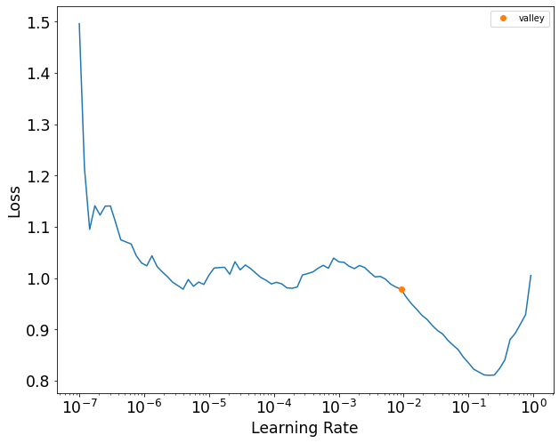
    


### Training


```python
learn.fit_one_cycle(epochs_max, lr_max=suggested_lr.valley)
```


<table border="1" class="dataframe">
  <thead>
    <tr style="text-align: left;">
      <th>epoch</th>
      <th>train_loss</th>
      <th>valid_loss</th>
      <th>time</th>
    </tr>
  </thead>
  <tbody>
    <tr>
      <td>0</td>
      <td>0.911028</td>
      <td>0.704362</td>
      <td>00:00</td>
    </tr>
    <tr>
      <td>1</td>
      <td>0.634621</td>
      <td>0.366147</td>
      <td>00:00</td>
    </tr>
    <tr>
      <td>2</td>
      <td>0.470580</td>
      <td>0.326207</td>
      <td>00:00</td>
    </tr>
    <tr>
      <td>3</td>
      <td>0.393362</td>
      <td>0.313587</td>
      <td>00:00</td>
    </tr>
    <tr>
      <td>4</td>
      <td>0.350433</td>
      <td>0.310503</td>
      <td>00:00</td>
    </tr>
    <tr>
      <td>5</td>
      <td>0.328476</td>
      <td>0.304156</td>
      <td>00:00</td>
    </tr>
    <tr>
      <td>6</td>
      <td>0.312541</td>
      <td>0.301301</td>
      <td>00:00</td>
    </tr>
    <tr>
      <td>7</td>
      <td>0.301063</td>
      <td>0.295687</td>
      <td>00:00</td>
    </tr>
    <tr>
      <td>8</td>
      <td>0.293505</td>
      <td>0.299071</td>
      <td>00:00</td>
    </tr>
    <tr>
      <td>9</td>
      <td>0.289672</td>
      <td>0.295375</td>
      <td>00:00</td>
    </tr>
  </tbody>
</table>


```python
# learn.val_preds, learn.val_targets #
```


```python
fig, ax = plt.subplots(figsize=(15, 8))
ax.set_title('DAE loss: Reconstruction loss')
learn.recorder.plot_loss(skip_start=5, ax=ax)
vaep.io_images._savefig(fig, name='dae_training',
                        folder=folder)
```

    vaep.io_images - INFO     Saved Figures to runs\2D\feat_0050_epochs_010\dae_training
    


    
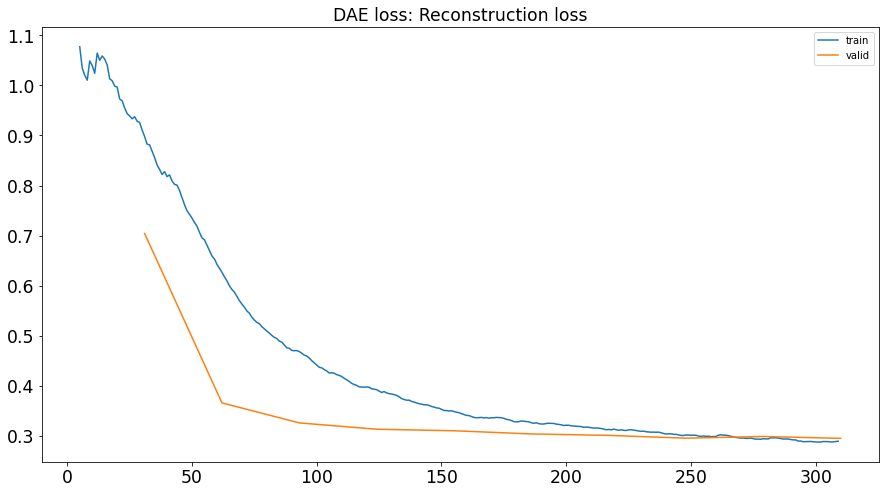
    


```python
# L(zip(learn.recorder.iters, learn.recorder.values))
```


### Evaluation


```python
# reorder True: Only 500 predictions returned
pred, target = learn.get_preds(act=noop, concat_dim=0, reorder=False)
len(pred), len(target)
```


    (4940, 4940)


MSE on transformed data is not too interesting for comparision between models if these use different standardizations


```python
learn.loss_func(pred, target)  # MSE in transformed space not too interesting
```


    TensorBase(0.2970)


```python
# check target is in expected order
Y = dls.valid.targ

npt.assert_almost_equal(
    actual=target.numpy(),
    desired=Y.stack().to_numpy()
)
```


```python
# import torch
# from fastai.tabular.core import TabularPandas

df_pred['intensity_pred_dae'] = ae.transform_preds(
    pred=pred, index=analysis.df_valid.stack().index, normalizer=tf_norm)
df_pred
```


<div>

<table border="1" class="dataframe">
  <thead>
    <tr style="text-align: right;">
      <th></th>
      <th></th>
      <th>intensity</th>
      <th>train_median</th>
      <th>train_average</th>
      <th>replicates</th>
      <th>intensity_pred_collab</th>
      <th>intensity_pred_dae</th>
    </tr>
    <tr>
      <th>Sample ID</th>
      <th>peptide</th>
      <th></th>
      <th></th>
      <th></th>
      <th></th>
      <th></th>
      <th></th>
    </tr>
  </thead>
  <tbody>
    <tr>
      <th rowspan="2" valign="top">20181219_QE3_nLC3_DS_QC_MNT_HeLa_02</th>
      <th>AAEAAAAPAESAAPAAGEEPSK</th>
      <td>30.289</td>
      <td>28.540</td>
      <td>28.400</td>
      <td>29.274</td>
      <td>27.335</td>
      <td>27.395</td>
    </tr>
    <tr>
      <th>AGKPVICATQMLESMIK</th>
      <td>31.078</td>
      <td>32.096</td>
      <td>31.657</td>
      <td>31.351</td>
      <td>30.919</td>
      <td>30.632</td>
    </tr>
    <tr>
      <th rowspan="3" valign="top">20181219_QE3_nLC3_TSB_QC_MNT_HeLa_01</th>
      <th>AAHSEGNTTAGLDMR</th>
      <td>28.132</td>
      <td>28.425</td>
      <td>28.617</td>
      <td>26.228</td>
      <td>27.440</td>
      <td>27.151</td>
    </tr>
    <tr>
      <th>AIVAIENPADVSVISSR</th>
      <td>29.228</td>
      <td>30.157</td>
      <td>30.189</td>
      <td>29.740</td>
      <td>29.312</td>
      <td>29.291</td>
    </tr>
    <tr>
      <th>GISDLAQHYLMR</th>
      <td>28.584</td>
      <td>29.492</td>
      <td>29.429</td>
      <td>28.219</td>
      <td>28.493</td>
      <td>28.538</td>
    </tr>
    <tr>
      <th>...</th>
      <th>...</th>
      <td>...</td>
      <td>...</td>
      <td>...</td>
      <td>...</td>
      <td>...</td>
      <td>...</td>
    </tr>
    <tr>
      <th rowspan="5" valign="top">20190805_QE1_nLC2_AB_MNT_HELA_04</th>
      <th>AIVAIENPADVSVISSR</th>
      <td>29.348</td>
      <td>30.157</td>
      <td>30.189</td>
      <td>29.081</td>
      <td>30.009</td>
      <td>29.926</td>
    </tr>
    <tr>
      <th>GLVLGPIHK</th>
      <td>30.325</td>
      <td>29.962</td>
      <td>29.875</td>
      <td>30.316</td>
      <td>29.936</td>
      <td>29.855</td>
    </tr>
    <tr>
      <th>GYLGPEQLPDCLK</th>
      <td>28.443</td>
      <td>29.384</td>
      <td>29.535</td>
      <td>28.884</td>
      <td>29.236</td>
      <td>29.134</td>
    </tr>
    <tr>
      <th>LATQSNEITIPVTFESR</th>
      <td>31.105</td>
      <td>31.342</td>
      <td>31.373</td>
      <td>31.352</td>
      <td>31.180</td>
      <td>31.147</td>
    </tr>
    <tr>
      <th>SYSPYDMLESIRK</th>
      <td>32.088</td>
      <td>31.373</td>
      <td>30.940</td>
      <td>32.325</td>
      <td>31.945</td>
      <td>32.025</td>
    </tr>
  </tbody>
</table>
<p>4940 rows × 6 columns</p>
</div>


### 2D plot of latent space

- 2 dimensional latent space: just plot
- more than 2 dimensional: PCA, etc


```python
latent_space = []
for b in dls.valid:
    model_input = b[1]
    latent_space.append(model.encoder(model_input).detach().numpy())

df_dae_latent = build_df_from_pred_batches(latent_space,
                                           index=_df_valid.items.index,
                                           columns=[f'latent dimension {i+1}' for i in range(latent_dim)])
df_dae_latent.head()
```


<div>

<table border="1" class="dataframe">
  <thead>
    <tr style="text-align: right;">
      <th></th>
      <th>latent dimension 1</th>
      <th>latent dimension 2</th>
    </tr>
    <tr>
      <th>Sample ID</th>
      <th></th>
      <th></th>
    </tr>
  </thead>
  <tbody>
    <tr>
      <th>20181219_QE3_nLC3_DS_QC_MNT_HeLa_02</th>
      <td>-0.253</td>
      <td>-0.643</td>
    </tr>
    <tr>
      <th>20181219_QE3_nLC3_TSB_QC_MNT_HeLa_01</th>
      <td>-0.471</td>
      <td>-0.745</td>
    </tr>
    <tr>
      <th>20181221_QE8_nLC0_NHS_MNT_HeLa_01</th>
      <td>-0.649</td>
      <td>-0.806</td>
    </tr>
    <tr>
      <th>20181222_QE9_nLC9_QC_50CM_HeLa1</th>
      <td>-0.403</td>
      <td>-0.786</td>
    </tr>
    <tr>
      <th>20181223_QE7_nLC7_RJC_MEM_MNT_HeLa_01</th>
      <td>-0.541</td>
      <td>-0.724</td>
    </tr>
  </tbody>
</table>
</div>


```python
fig, ax = plt.subplots(figsize=(15, 15))
analyzers.plot_date_map(df=df_dae_latent, fig=fig, ax=ax,
                        dates=analysis.df_meta.date.loc[df_dae_latent.index])
vaep.io_images._savefig(fig, name='dae_latent_by_date',
                        folder=folder)
```

    vaep.io_images - INFO     Saved Figures to runs\2D\feat_0050_epochs_010\dae_latent_by_date
    


    
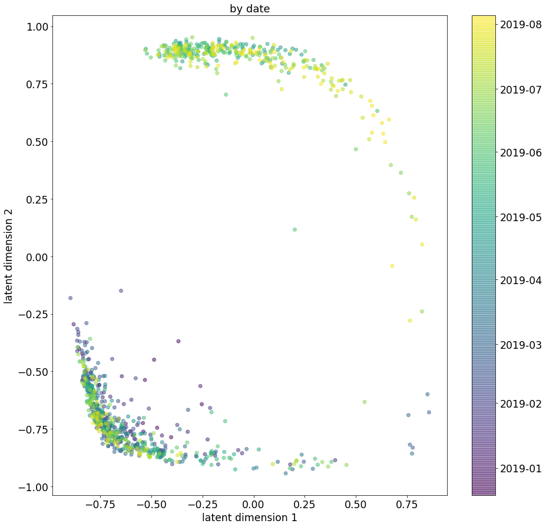
    


```python
fig, ax = plt.subplots(figsize=(15, 15))

meta_col = 'ms_instrument'

analyzers.seaborn_scatter(df=df_dae_latent,
                          fig=fig,
                          ax=ax,
                          meta=analysis.df_meta[meta_col].loc[df_dae_latent.index],
                          title='by MS instrument')

vaep.io_images._savefig(
    fig, name=f'dae_latent_by_{meta_col}', folder=folder)
```

    vaep.io_images - INFO     Saved Figures to runs\2D\feat_0050_epochs_010\dae_latent_by_ms_instrument
    


    
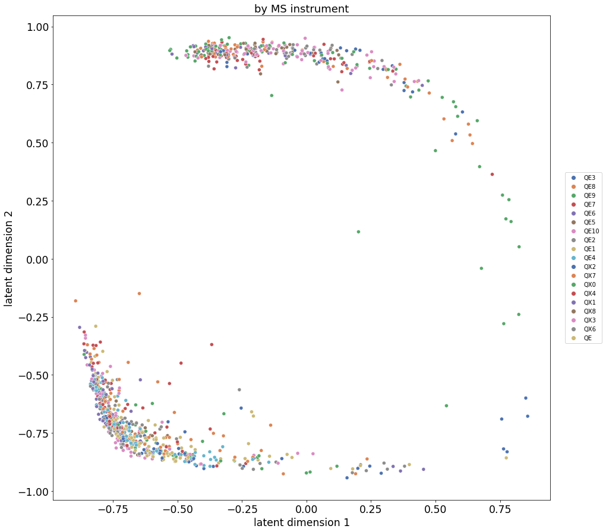
    


## Variational Autoencoder (VAE)

### Scikit Learn MinMaxScaler

- [docs](https://scikit-learn.org/stable/modules/generated/sklearn.preprocessing.MinMaxScaler.html)


```python
from vaep.transform import MinMaxScaler

args_vae = {}
args_vae['SCALER'] = MinMaxScaler
# select initial data: transformed vs not log transformed
scaler = args_vae['SCALER']().fit(analysis.df_train)
scaler.transform(analysis.df_valid.iloc[:5])
```


<div>

<table border="1" class="dataframe">
  <thead>
    <tr style="text-align: right;">
      <th>peptide</th>
      <th>AAEAAAAPAESAAPAAGEEPSK</th>
      <th>AAHSEGNTTAGLDMR</th>
      <th>AFGYYGPLR</th>
      <th>AGGAAVVITEPEHTK</th>
      <th>AGKPVICATQMLESMIK</th>
      <th>AGVNTVTTLVENKK</th>
      <th>AIVAIENPADVSVISSR</th>
      <th>ALDTMNFDVIK</th>
      <th>DAGEGLLAVQITDPEGKPK</th>
      <th>DHENIVIAK</th>
      <th>...</th>
      <th>TIGGGDDSFNTFFSETGAGK</th>
      <th>TSIAIDTIINQK</th>
      <th>VFSGLVSTGLK</th>
      <th>VMTIAPGLFGTPLLTSLPEK</th>
      <th>VNIIPLIAK</th>
      <th>VSHVSTGGGASLELLEGK</th>
      <th>VVFVFGPDK</th>
      <th>VVHIMDFQR</th>
      <th>YALYDATYETK</th>
      <th>YRVPDVLVADPPIAR</th>
    </tr>
    <tr>
      <th>Sample ID</th>
      <th></th>
      <th></th>
      <th></th>
      <th></th>
      <th></th>
      <th></th>
      <th></th>
      <th></th>
      <th></th>
      <th></th>
      <th></th>
      <th></th>
      <th></th>
      <th></th>
      <th></th>
      <th></th>
      <th></th>
      <th></th>
      <th></th>
      <th></th>
      <th></th>
    </tr>
  </thead>
  <tbody>
    <tr>
      <th>20181219_QE3_nLC3_DS_QC_MNT_HeLa_02</th>
      <td>0.768</td>
      <td>NaN</td>
      <td>NaN</td>
      <td>NaN</td>
      <td>0.635</td>
      <td>NaN</td>
      <td>NaN</td>
      <td>NaN</td>
      <td>NaN</td>
      <td>NaN</td>
      <td>...</td>
      <td>NaN</td>
      <td>NaN</td>
      <td>NaN</td>
      <td>NaN</td>
      <td>NaN</td>
      <td>NaN</td>
      <td>NaN</td>
      <td>NaN</td>
      <td>NaN</td>
      <td>NaN</td>
    </tr>
    <tr>
      <th>20181219_QE3_nLC3_TSB_QC_MNT_HeLa_01</th>
      <td>NaN</td>
      <td>0.589</td>
      <td>NaN</td>
      <td>NaN</td>
      <td>NaN</td>
      <td>NaN</td>
      <td>0.533</td>
      <td>NaN</td>
      <td>NaN</td>
      <td>NaN</td>
      <td>...</td>
      <td>NaN</td>
      <td>NaN</td>
      <td>NaN</td>
      <td>NaN</td>
      <td>NaN</td>
      <td>NaN</td>
      <td>NaN</td>
      <td>NaN</td>
      <td>NaN</td>
      <td>NaN</td>
    </tr>
    <tr>
      <th>20181221_QE8_nLC0_NHS_MNT_HeLa_01</th>
      <td>NaN</td>
      <td>NaN</td>
      <td>NaN</td>
      <td>NaN</td>
      <td>NaN</td>
      <td>NaN</td>
      <td>NaN</td>
      <td>NaN</td>
      <td>NaN</td>
      <td>NaN</td>
      <td>...</td>
      <td>NaN</td>
      <td>NaN</td>
      <td>NaN</td>
      <td>NaN</td>
      <td>NaN</td>
      <td>NaN</td>
      <td>NaN</td>
      <td>0.527</td>
      <td>NaN</td>
      <td>NaN</td>
    </tr>
    <tr>
      <th>20181222_QE9_nLC9_QC_50CM_HeLa1</th>
      <td>NaN</td>
      <td>NaN</td>
      <td>NaN</td>
      <td>0.598</td>
      <td>0.636</td>
      <td>NaN</td>
      <td>NaN</td>
      <td>NaN</td>
      <td>NaN</td>
      <td>NaN</td>
      <td>...</td>
      <td>NaN</td>
      <td>NaN</td>
      <td>NaN</td>
      <td>NaN</td>
      <td>NaN</td>
      <td>NaN</td>
      <td>NaN</td>
      <td>NaN</td>
      <td>NaN</td>
      <td>0.629</td>
    </tr>
    <tr>
      <th>20181223_QE7_nLC7_RJC_MEM_MNT_HeLa_01</th>
      <td>NaN</td>
      <td>NaN</td>
      <td>NaN</td>
      <td>NaN</td>
      <td>0.752</td>
      <td>0.617</td>
      <td>NaN</td>
      <td>NaN</td>
      <td>0.741</td>
      <td>NaN</td>
      <td>...</td>
      <td>NaN</td>
      <td>NaN</td>
      <td>NaN</td>
      <td>NaN</td>
      <td>NaN</td>
      <td>NaN</td>
      <td>NaN</td>
      <td>NaN</td>
      <td>NaN</td>
      <td>NaN</td>
    </tr>
  </tbody>
</table>
<p>5 rows × 50 columns</p>
</div>


### DataLoaders

- follow instructions for using plain PyTorch Datasets, see [tutorial](https://docs.fast.ai/tutorial.siamese.html#Preparing-the-data)


```python
assert all(analysis.df_train.columns == analysis.df_valid.columns)
if not all(analysis.df.columns == analysis.df_train.columns):
    print("analysis.df columns are not the same as analysis.df_train")
    # ToDo: DataLoading has to be cleaned up
    # analysis.df = analysis.df_train.fillna(analysis.df_valid)
```

    analysis.df columns are not the same as analysis.df_train
    


```python
from vaep.io.datasets import PeptideDatasetInMemory

FILL_NA = 0.0

train_ds = PeptideDatasetInMemory(data=scaler.transform(
    analysis.df_train).to_numpy(dtype=None), fill_na=FILL_NA)
valid_ds = PeptideDatasetInMemory(data=scaler.transform(analysis.df_train.fillna(analysis.df_valid)).to_numpy(dtype=None),
                                  mask=analysis.df_valid.notna().to_numpy(), fill_na=FILL_NA)

assert (train_ds.peptides == valid_ds.peptides).all()
```


```python
dls = DataLoaders.from_dsets(train_ds, valid_ds, n_inp=2)
```

    Due to IPython and Windows limitation, python multiprocessing isn't available now.
    So `number_workers` is changed to 0 to avoid getting stuck
    Due to IPython and Windows limitation, python multiprocessing isn't available now.
    So `number_workers` is changed to 0 to avoid getting stuck
    

### Model


```python
from torch.nn import Sigmoid

M = analysis.df_train.shape[-1]
model = ae.VAE(n_features=M, n_neurons=int(
    M/2), last_encoder_activation=None, last_decoder_activation=Sigmoid, dim_latent=latent_dim)
```

### Learner


```python
learn = Learner(dls=dls,
                model=model,
                loss_func=ae.loss_fct_vae,
                cbs=ae.ModelAdapterVAE())

learn.show_training_loop()
learn.summary()
```

    Start Fit
       - before_fit     : [TrainEvalCallback, Recorder, ProgressCallback]
      Start Epoch Loop
         - before_epoch   : [Recorder, ProgressCallback]
        Start Train
           - before_train   : [TrainEvalCallback, Recorder, ProgressCallback]
          Start Batch Loop
             - before_batch   : [ModelAdapterVAE]
             - after_pred     : [ModelAdapterVAE]
             - after_loss     : []
             - before_backward: []
             - before_step    : []
             - after_step     : []
             - after_cancel_batch: []
             - after_batch    : [TrainEvalCallback, Recorder, ProgressCallback]
          End Batch Loop
        End Train
         - after_cancel_train: [Recorder]
         - after_train    : [Recorder, ProgressCallback]
        Start Valid
           - before_validate: [TrainEvalCallback, Recorder, ProgressCallback]
          Start Batch Loop
             - **CBs same as train batch**: []
          End Batch Loop
        End Valid
         - after_cancel_validate: [Recorder]
         - after_validate : [Recorder, ProgressCallback]
      End Epoch Loop
       - after_cancel_epoch: []
       - after_epoch    : [Recorder]
    End Fit
     - after_cancel_fit: []
     - after_fit      : [ProgressCallback]
    


    VAE (Input shape: 64 x 50)
    ============================================================================
    Layer (type)         Output Shape         Param #    Trainable 
    ============================================================================
                         64 x 25             
    Linear                                    75         True      
    Tanh                                                           
    ____________________________________________________________________________
                         64 x 50             
    Linear                                    1300       True      
    Sigmoid                                                        
    ____________________________________________________________________________
                         64 x 25             
    Linear                                    1275       True      
    Tanh                                                           
    ____________________________________________________________________________
                         64 x 4              
    Linear                                    104        True      
    ____________________________________________________________________________
    
    Total params: 2,754
    Total trainable params: 2,754
    Total non-trainable params: 0
    
    Optimizer used: <function Adam at 0x000001C5FB3F6040>
    Loss function: <function loss_fct_vae at 0x000001C5FB41D940>
    
    Callbacks:
      - TrainEvalCallback
      - ModelAdapterVAE
      - Recorder
      - ProgressCallback


### Training


```python
suggested_lr = learn.lr_find()
suggested_lr
```


    SuggestedLRs(valley=0.00363078061491251)


    
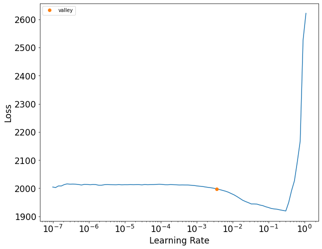
    


```python
learn.fit_one_cycle(epochs_max, lr_max=suggested_lr.valley)
```


<table border="1" class="dataframe">
  <thead>
    <tr style="text-align: left;">
      <th>epoch</th>
      <th>train_loss</th>
      <th>valid_loss</th>
      <th>time</th>
    </tr>
  </thead>
  <tbody>
    <tr>
      <td>0</td>
      <td>1998.843506</td>
      <td>215.697845</td>
      <td>00:00</td>
    </tr>
    <tr>
      <td>1</td>
      <td>1952.286743</td>
      <td>210.012115</td>
      <td>00:00</td>
    </tr>
    <tr>
      <td>2</td>
      <td>1886.429810</td>
      <td>202.741455</td>
      <td>00:00</td>
    </tr>
    <tr>
      <td>3</td>
      <td>1838.991699</td>
      <td>194.510727</td>
      <td>00:00</td>
    </tr>
    <tr>
      <td>4</td>
      <td>1806.042480</td>
      <td>194.245667</td>
      <td>00:00</td>
    </tr>
    <tr>
      <td>5</td>
      <td>1785.405518</td>
      <td>195.073608</td>
      <td>00:00</td>
    </tr>
    <tr>
      <td>6</td>
      <td>1770.476685</td>
      <td>195.526398</td>
      <td>00:00</td>
    </tr>
    <tr>
      <td>7</td>
      <td>1760.991211</td>
      <td>196.397232</td>
      <td>00:00</td>
    </tr>
    <tr>
      <td>8</td>
      <td>1753.441895</td>
      <td>196.331100</td>
      <td>00:00</td>
    </tr>
    <tr>
      <td>9</td>
      <td>1747.641113</td>
      <td>196.356400</td>
      <td>00:00</td>
    </tr>
  </tbody>
</table>


```python
fig, ax = plt.subplots(figsize=(15, 8))
ax.set_title('VAE loss: Reconstruction loss and Kullback-Leiber-Divergence for latent space')
learn.recorder.plot_loss(skip_start=5, ax=ax)
vaep.io_images._savefig(fig, name='vae_training',
                        folder=folder)
```

    vaep.io_images - INFO     Saved Figures to runs\2D\feat_0050_epochs_010\vae_training
    


    
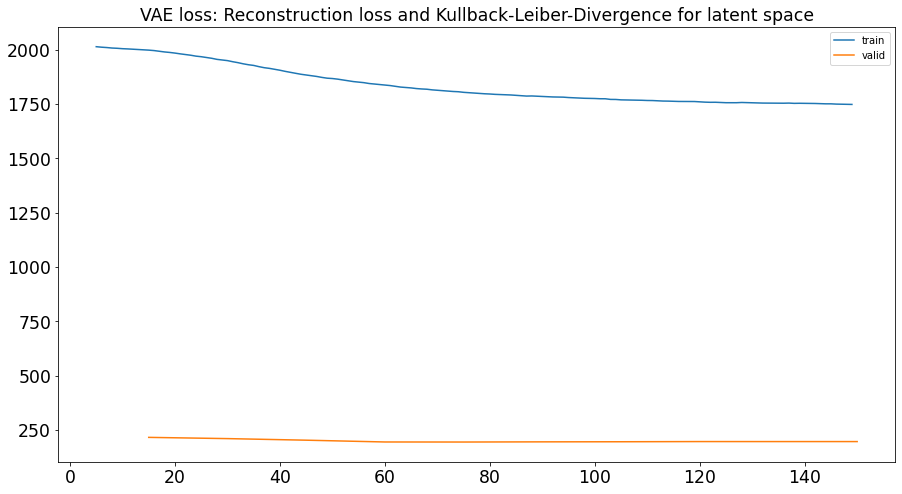
    


### Evaluation


```python
# reorder True: Only 500 predictions returned
pred, target = learn.get_preds(act=noop, concat_dim=0, reorder=False)
len(pred), len(target)
```


    (3, 4940)


```python
len(pred[0])
```


    4940


```python
learn.loss_func(pred, target)
```


    tensor(3107.1572)


```python
_pred = pd.Series(pred[0], index=analysis.df_valid.stack().index).unstack()
_pred = scaler.inverse_transform(_pred).stack()

df_pred['intensity_pred_vae'] = _pred
df_pred
```


<div>

<table border="1" class="dataframe">
  <thead>
    <tr style="text-align: right;">
      <th></th>
      <th></th>
      <th>intensity</th>
      <th>train_median</th>
      <th>train_average</th>
      <th>replicates</th>
      <th>intensity_pred_collab</th>
      <th>intensity_pred_dae</th>
      <th>intensity_pred_vae</th>
    </tr>
    <tr>
      <th>Sample ID</th>
      <th>peptide</th>
      <th></th>
      <th></th>
      <th></th>
      <th></th>
      <th></th>
      <th></th>
      <th></th>
    </tr>
  </thead>
  <tbody>
    <tr>
      <th rowspan="2" valign="top">20181219_QE3_nLC3_DS_QC_MNT_HeLa_02</th>
      <th>AAEAAAAPAESAAPAAGEEPSK</th>
      <td>30.289</td>
      <td>28.540</td>
      <td>28.400</td>
      <td>29.274</td>
      <td>27.335</td>
      <td>27.395</td>
      <td>28.424</td>
    </tr>
    <tr>
      <th>AGKPVICATQMLESMIK</th>
      <td>31.078</td>
      <td>32.096</td>
      <td>31.657</td>
      <td>31.351</td>
      <td>30.919</td>
      <td>30.632</td>
      <td>31.769</td>
    </tr>
    <tr>
      <th rowspan="3" valign="top">20181219_QE3_nLC3_TSB_QC_MNT_HeLa_01</th>
      <th>AAHSEGNTTAGLDMR</th>
      <td>28.132</td>
      <td>28.425</td>
      <td>28.617</td>
      <td>26.228</td>
      <td>27.440</td>
      <td>27.151</td>
      <td>28.465</td>
    </tr>
    <tr>
      <th>AIVAIENPADVSVISSR</th>
      <td>29.228</td>
      <td>30.157</td>
      <td>30.189</td>
      <td>29.740</td>
      <td>29.312</td>
      <td>29.291</td>
      <td>30.083</td>
    </tr>
    <tr>
      <th>GISDLAQHYLMR</th>
      <td>28.584</td>
      <td>29.492</td>
      <td>29.429</td>
      <td>28.219</td>
      <td>28.493</td>
      <td>28.538</td>
      <td>29.364</td>
    </tr>
    <tr>
      <th>...</th>
      <th>...</th>
      <td>...</td>
      <td>...</td>
      <td>...</td>
      <td>...</td>
      <td>...</td>
      <td>...</td>
      <td>...</td>
    </tr>
    <tr>
      <th rowspan="5" valign="top">20190805_QE1_nLC2_AB_MNT_HELA_04</th>
      <th>AIVAIENPADVSVISSR</th>
      <td>29.348</td>
      <td>30.157</td>
      <td>30.189</td>
      <td>29.081</td>
      <td>30.009</td>
      <td>29.926</td>
      <td>30.262</td>
    </tr>
    <tr>
      <th>GLVLGPIHK</th>
      <td>30.325</td>
      <td>29.962</td>
      <td>29.875</td>
      <td>30.316</td>
      <td>29.936</td>
      <td>29.855</td>
      <td>29.976</td>
    </tr>
    <tr>
      <th>GYLGPEQLPDCLK</th>
      <td>28.443</td>
      <td>29.384</td>
      <td>29.535</td>
      <td>28.884</td>
      <td>29.236</td>
      <td>29.134</td>
      <td>29.595</td>
    </tr>
    <tr>
      <th>LATQSNEITIPVTFESR</th>
      <td>31.105</td>
      <td>31.342</td>
      <td>31.373</td>
      <td>31.352</td>
      <td>31.180</td>
      <td>31.147</td>
      <td>31.467</td>
    </tr>
    <tr>
      <th>SYSPYDMLESIRK</th>
      <td>32.088</td>
      <td>31.373</td>
      <td>30.940</td>
      <td>32.325</td>
      <td>31.945</td>
      <td>32.025</td>
      <td>31.064</td>
    </tr>
  </tbody>
</table>
<p>4940 rows × 7 columns</p>
</div>


### Add plot of latent space

- 2 dimensional latent space: just plot
- more than 2 dimensional: PCA, etc


```python
latent_space = []
for b in dls.valid:
    model_input = b[0]
    b_mu, b_std = model.get_mu_and_logvar(model_input, detach=True)
    latent_space.append(b_mu)


df_vae_latent = build_df_from_pred_batches(latent_space,
                                           index=_df_valid.items.index,
                                           columns=[f'latent dimension {i+1}' for i in range(latent_dim)])
df_vae_latent.head()
```


<div>

<table border="1" class="dataframe">
  <thead>
    <tr style="text-align: right;">
      <th></th>
      <th>latent dimension 1</th>
      <th>latent dimension 2</th>
    </tr>
    <tr>
      <th>Sample ID</th>
      <th></th>
      <th></th>
    </tr>
  </thead>
  <tbody>
    <tr>
      <th>20181219_QE3_nLC3_DS_QC_MNT_HeLa_02</th>
      <td>-0.026</td>
      <td>-0.024</td>
    </tr>
    <tr>
      <th>20181219_QE3_nLC3_TSB_QC_MNT_HeLa_01</th>
      <td>0.366</td>
      <td>0.302</td>
    </tr>
    <tr>
      <th>20181221_QE8_nLC0_NHS_MNT_HeLa_01</th>
      <td>0.142</td>
      <td>0.138</td>
    </tr>
    <tr>
      <th>20181222_QE9_nLC9_QC_50CM_HeLa1</th>
      <td>0.014</td>
      <td>-0.001</td>
    </tr>
    <tr>
      <th>20181223_QE7_nLC7_RJC_MEM_MNT_HeLa_01</th>
      <td>-0.309</td>
      <td>-0.274</td>
    </tr>
  </tbody>
</table>
</div>


```python
fig, ax = plt.subplots(figsize=(15, 15))
analyzers.plot_date_map(df=df_vae_latent, fig=fig, ax=ax,
                        dates=analysis.df_meta.date.loc[df_vae_latent.index])
vaep.io_images._savefig(fig, name='vae_latent_by_date',
                        folder=folder)
```

    vaep.io_images - INFO     Saved Figures to runs\2D\feat_0050_epochs_010\vae_latent_by_date
    


    
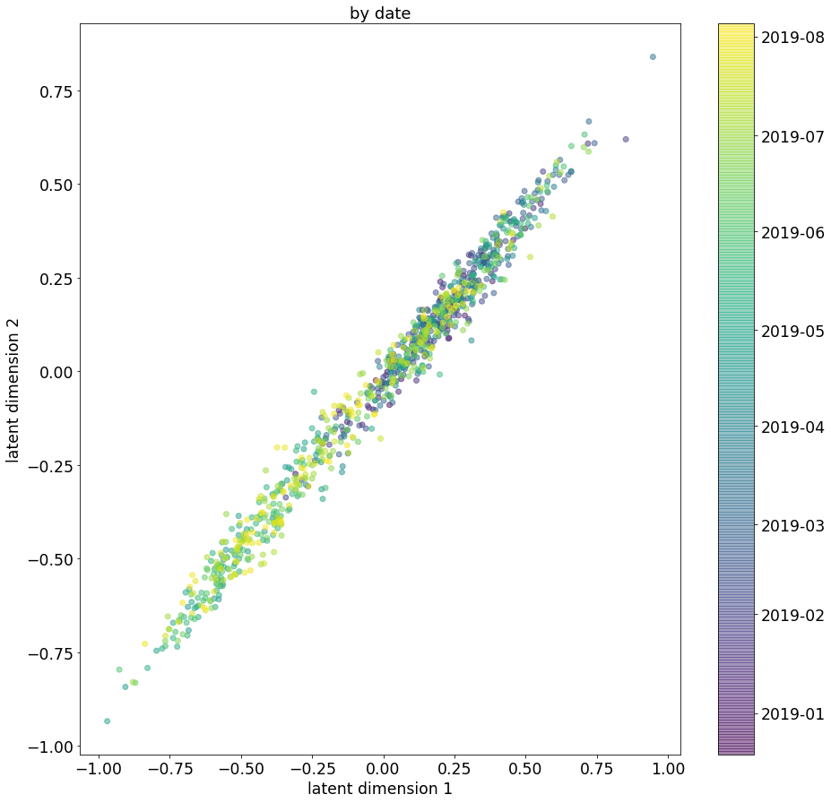
    


```python
fig, ax = plt.subplots(figsize=(15, 15))

meta_col = 'ms_instrument'

analyzers.seaborn_scatter(df=df_vae_latent,
                          fig=fig,
                          ax=ax,
                          meta=analysis.df_meta[meta_col].loc[df_vae_latent.index],
                          title='by MS instrument')

vaep.io_images._savefig(
    fig, name=f'vae_latent_by_{meta_col}', folder=folder)
```

    vaep.io_images - INFO     Saved Figures to runs\2D\feat_0050_epochs_010\vae_latent_by_ms_instrument
    


    
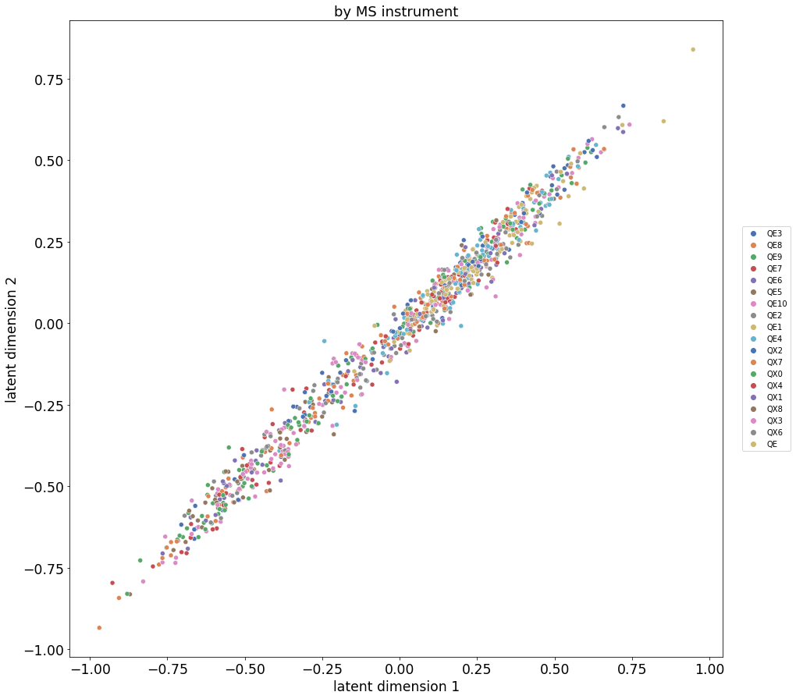
    


## Compare the 3 models

- replicates: replace NAs with neighbouring ("close") values
- train average, median: Replace NA with average or median from training data


```python
import sklearn.metrics as sklm
pred_columns = df_pred.columns[1:]
scoring = [('MSE', sklm.mean_squared_error),
           ('MAE', sklm.mean_absolute_error)]

y_true = df_pred['intensity']

metrics = {}
for col in pred_columns:
    _y_pred = df_pred[col].dropna()
    if len(df_pred[col]) > len(_y_pred):
        logger.info(
            f"Drop indices for {col}: {[(idx[0], idx[1]) for idx in df_pred[col].index.difference(_y_pred.index)]}")

    metrics[col] = dict(
        [(k, f(y_true=y_true.loc[_y_pred.index], y_pred=_y_pred))
         for k, f in scoring]
    )

metrics = pd.DataFrame(metrics)
metrics.to_csv(folder / f'exp_02_metrics.csv',
               float_format='{:.3f}'.format)
metrics.sort_values(by=[k for k, f in scoring], axis=1)
```

    vaep - INFO     Drop indices for replicates: [('20181223_QE7_nLC7_RJC_MEM_MNT_HeLa_01', 'AGKPVICATQMLESMIK'), ('20181228_QE5_nLC5_OOE_QC_MNT_HELA_15cm_250ng_RO-007', 'EMEENFAVEAANYQDTIGR'), ('20181230_QE6_nLC6_CSC_QC_HeLa_03', 'HLAGLGLTEAIDK'), ('20190118_QE9_nLC9_NHS_MNT_HELA_50cm_04', 'SQIFSTASDNQPTVTIK'), ('20190128_QE3_nLC3_MJ_MNT_HeLa_01', 'TIAPALVSK'), ('20190219_QE3_Evo2_UHG_QC_MNT_HELA_01_190219173213', 'EMEENFAVEAANYQDTIGR'), ('20190220_QE3_nLC7_TSB_QC_MNT_HELA_02', 'GILADEDSSRPVWLK'), ('20190221_QE1_nLC2_ANHO_QC_MNT_HELA_02', 'ISMPDFDLHLK'), ('20190225_QE9_nLC0_RS_MNT_Hela_01', 'ELVTQQLPHLLK'), ('20190226_QE10_PhGe_Evosep_176min-30cmCol-HeLa_3', 'VVFVFGPDK'), ('20190226_QE10_PhGe_Evosep_88min-30cmCol-HeLa_14_25', 'EMEENFAVEAANYQDTIGR'), ('20190226_QE10_PhGe_Evosep_88min-30cmCol-HeLa_14_27', 'VVFVFGPDK'), ('20190226_QE10_PhGe_Evosep_88min-30cmCol-HeLa_15_24', 'IALGIPLPEIK'), ('20190226_QE1_nLC2_AB_QC_MNT_HELA_05', 'VVHIMDFQR'), ('20190301_QE7_nLC7_DS_QC_MNT_HeLa_01', 'LPNLTHLNLSGNK'), ('20190305_QE4_LC12_JE-IAH_QC_MNT_HeLa_02', 'GLDVDSLVIEHIQVNK'), ('20190308_QE3_nLC5_MR_QC_MNT_HeLa_Easyctcdon_02', 'ELVTQQLPHLLK'), ('20190327_QE6_LC6_SCL_QC_MNT_Hela_02', 'AGKPVICATQMLESMIK'), ('20190417_QE1_nLC2_GP_MNT_HELA_01', 'SYSPYDMLESIRK'), ('20190423_QX7_JuSc_MA_HeLa_500ng_LC01', 'SGGMSNELNNIISR'), ('20190425_QX4_JoSw_MA_HeLa_500ng_BR13_standard_190425181909', 'AGVNTVTTLVENKK'), ('20190425_QX8_JuSc_MA_HeLa_500ng_1', 'LAAVDATVNQVLASR'), ('20190426_QE10_nLC9_LiNi_QC_MNT_15cm_HeLa_01', 'GLDVDSLVIEHIQVNK'), ('20190429_QX6_ChDe_MA_HeLa_Br14_500ng_LC09', 'AGVNTVTTLVENKK'), ('20190430_QX6_ChDe_MA_HeLa_Br14_500ng_LC09', 'GLDVDSLVIEHIQVNK'), ('20190506_QE3_nLC3_DBJ_QC_MNT_HeLa_01', 'GILADEDSSRPVWLK'), ('20190506_QX7_ChDe_MA_HeLaBr14_500ng', 'AGVNTVTTLVENKK'), ('20190506_QX8_MiWi_MA_HeLa_500ng_old', 'AIVAIENPADVSVISSR'), ('20190510_QE1_nLC2_ANHO_QC_MNT_HELA_02', 'VMTIAPGLFGTPLLTSLPEK'), ('20190510_QE2_NLC1_GP_MNT_HELA_02', 'HLAGLGLTEAIDK'), ('20190515_QE4_LC12_AS_QC_MNT_HeLa_01_20190515230141', 'GILADEDSSRPVWLK'), ('20190515_QX4_JiYu_MA_HeLa_500ng_BR14', 'GYLGPEQLPDCLK'), ('20190522_QE10_nLC13_LiNi_QC_MNT_15cm_HeLa_01', 'VMTIAPGLFGTPLLTSLPEK'), ('20190527_QE3_nLC3_DS_QC_MNT_HeLa_02', 'SGGMSNELNNIISR'), ('20190606_QE4_LC12_JE_QC_MNT_HeLa_03', 'DHENIVIAK'), ('20190611_QX0_MaTa_MA_HeLa_500ng_LC07_1', 'NPDDITQEEYGEFYK'), ('20190617_QE1_nLC2_GP_QC_MNT_HELA_01_20190617213340', 'AAHSEGNTTAGLDMR'), ('20190624_QX3_MaMu_MA_Hela_500ng_LC15', 'TIAPALVSK'), ('20190628_QX6_AnPi_MA_HeLa_500ng_LC09', 'AGVNTVTTLVENKK'), ('20190629_QX4_JiYu_MA_HeLa_500ng_MAX_ALLOWED', 'SGGMSNELNNIISR'), ('20190708_QX7_MaMu_MA_HeLa_Br14_500ng', 'TIGGGDDSFNTFFSETGAGK'), ('20190708_QX8_AnPi_MA_HeLa_BR14_500ng', 'TIGGGDDSFNTFFSETGAGK'), ('20190709_QE1_nLC13_ANHO_QC_MNT_HELA_02', 'AAHSEGNTTAGLDMR'), ('20190710_QE10_nLC0_LiNi_QC_45cm_HeLa_MUC_01', 'AGVNTVTTLVENKK'), ('20190724_QX0_MePh_MA_HeLa_500ng_LC07_01', 'DNHLLGTFDLTGIPPAPR'), ('20190724_QX3_MiWi_MA_Hela_500ng_LC15', 'DNHLLGTFDLTGIPPAPR'), ('20190729_QX0_AsJa_MA_HeLa_500ng_LC07_01', 'VNIIPLIAK'), ('20190731_QX1_LiSc_MA_HeLa_500ng_LC10', 'YRVPDVLVADPPIAR'), ('20190731_QX8_ChSc_MA_HeLa_500ng', 'ELVTQQLPHLLK')]
    


<div>

<table border="1" class="dataframe">
  <thead>
    <tr style="text-align: right;">
      <th></th>
      <th>intensity_pred_collab</th>
      <th>intensity_pred_dae</th>
      <th>replicates</th>
      <th>intensity_pred_vae</th>
      <th>train_average</th>
      <th>train_median</th>
    </tr>
  </thead>
  <tbody>
    <tr>
      <th>MSE</th>
      <td>0.543</td>
      <td>0.570</td>
      <td>1.517</td>
      <td>1.688</td>
      <td>2.001</td>
      <td>2.093</td>
    </tr>
    <tr>
      <th>MAE</th>
      <td>0.453</td>
      <td>0.470</td>
      <td>0.855</td>
      <td>0.958</td>
      <td>1.052</td>
      <td>1.035</td>
    </tr>
  </tbody>
</table>
</div>


Save final prediction values of validation data for later comparison.


```python
df_pred.to_csv(folder /
               f"{config.FOLDER_DATA}_valid_pred.csv")
```

## PCA plot for imputed and denoised data

two setups:
 - impute missing values
 - additinally change observed values


```python

```
