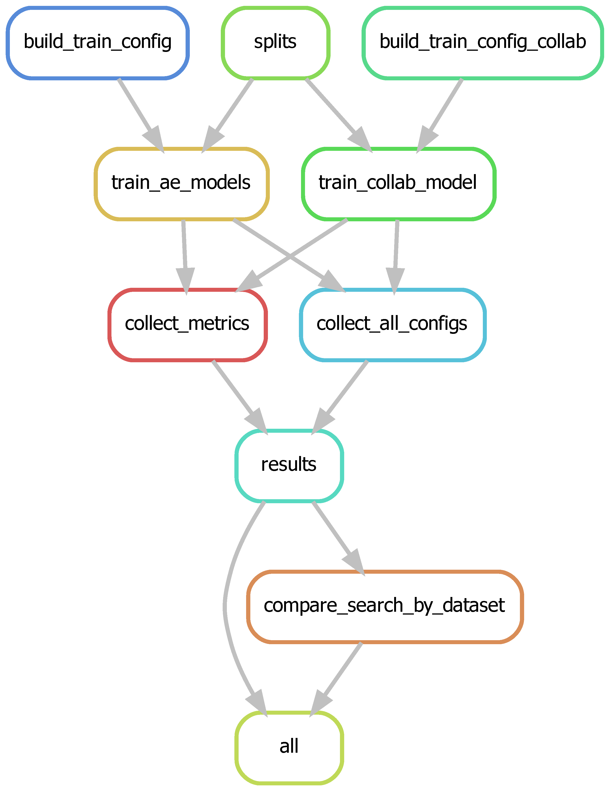

# Snakemake workflows

> needs to be exectued from `project` directory (as root directory)

# Single experiment

Run a single comparison

```
snakemake -n # uses workflow/Snakefile
```

which executes the following rules


## Grid Search for Hyperparameters

```bash
# pwd: path/to/project
snakemake --snakefile workflow/Snakefile_grid.smk -n -p
# parallel execution on the same machine (shared GPU, CPU) does not work
snakemake --snakefile workflow/Snakefile_grid.smk --jobs 1
```

Configuration files are stored in `project/config` directory

provide one or more config files explicitly to overwrite defaults

```
snakemake --snakefile workflow/Snakefile_grid.smk --configfile config/other.yaml -n -p
```

e.g. for small N grid search:

```
snakemake --snakefile workflow/Snakefile_grid.smk --configfile config/grid_search_small_data/config_grid.yaml -p -c1 -n
```

rule graph is



Command: `snakemake --snakefile workflow/Snakefile_grid.smk --rulegraph | dot -Tpng > rulegraph_gridsearch.png`

## Repeated training

### Repeated training of same models on same dataset
- see if model trains stable on one dataset

```bash
snakemake --snakefile workflow/Snakefile_best_repeated_train.smk -n -p
```

### Repeated training of models across machine datasets
- see how model perform across similar datasets

```
snakemake --snakefile workflow\Snakefile_best_across_datasets.smk -p -c1 -n
```

## ALD data

This will need a two step procedure as a single experiment for the semi-supervised
models needs to be run. 
Then the comparsion with the shifted normal distribution and the ald setup is done.

```bash
# fit models
snakemake --configfile config\appl_ald_data\plasma\proteinGroups\config.yaml -p -c1 -n
# compare downstream performance
snakemake --snakefile workflow\Snakefile_ald_comparison.smk --configfile config/appl_ald_data/plasma/proteinGroups/comparison.yaml -p -c1 -n
```

For the reduced dataset (80% of the original dataset), which was 
generated using `00_8_add_random_missing_values.py`:
```bash
# fit models
snakemake --configfile config/appl_ald_data/plasma/proteinGroups_80%_dataset/config.yaml -p -c1
# compare downstream performance
snakemake --snakefile workflow\Snakefile_ald_comparison.smk --configfile config/appl_ald_data/plasma/proteinGroups_80%_dataset/comparison.yaml -p -c1 -n
```

Rule graph for ALD comparison (after using single experiment)


## Repeated execution
Executes both workflows for model training and comparison ten times:

- `F` to force execution of all workflows
   (each workflow then checks what it needs to execute)
- `nolock` : ensure that parent workflow does not block child workflow
```bash
snakemake -s workflow\Snakefile_ald_comparison_repeated.smk -p -c1 --nolock --drop-metadata -F -n
```

## Test `misc_` notebook

`TestNotebooks.smk` test the `misc_*` notebooks in the project folder.